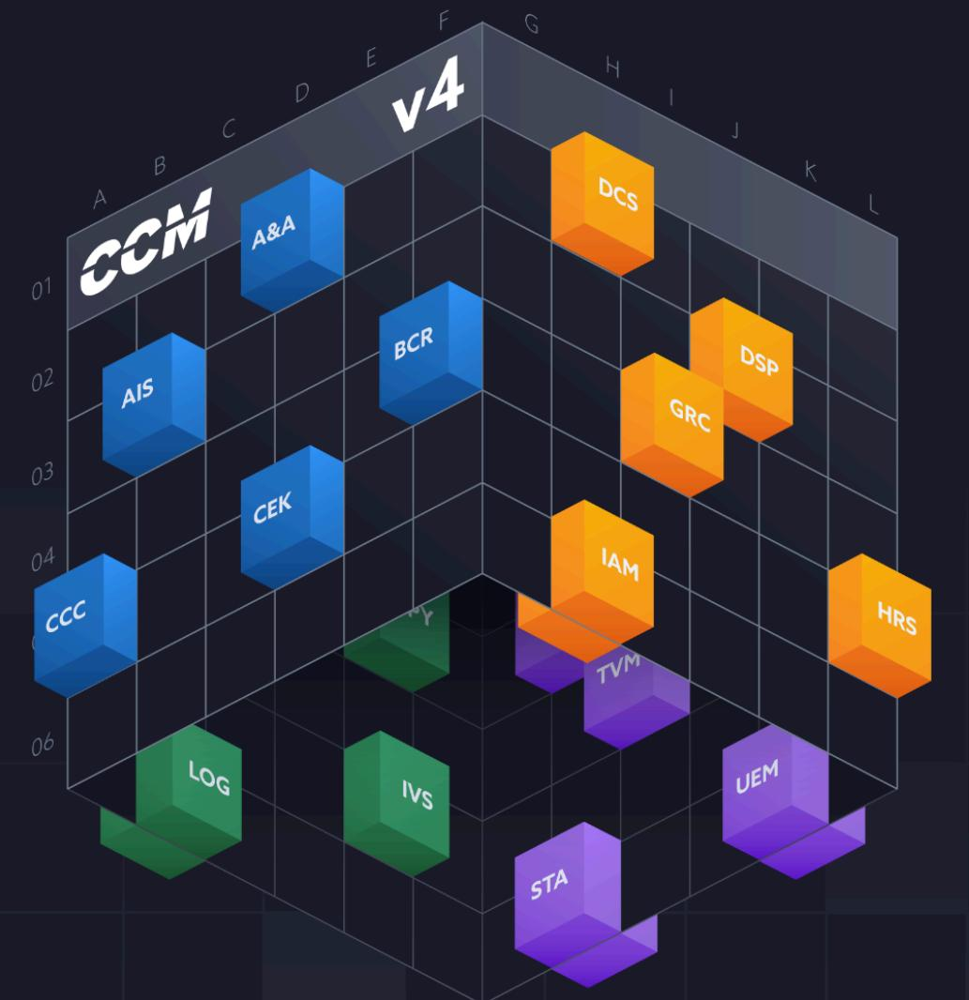

# **CCM v4.0 Implementation Guidelines**

Securing the Cloud with the Shared Security Responsibility Model




# <span id="page-1-0"></span>About the CCM WG

The Cloud Control Matrix (CCM) Working Group (WG) comprises cloud industry professionals, such as cloud security professionals, auditors, operators and a great number of organizations, representing both providers and consumers of the cloud, as well as consulting/auditing firms.


The CCM v4.0 and its implementation guidelines stem from collective work built on group experience and feedback. As a result, it provides the community with one of its best vendor-neutral cloud security and privacy control frameworks.

Co-chairs supervise the WG activities. These individuals are highly experienced professionals representing three roles in the cloud industry: cloud service providers (CSPs), cloud service consumers (CSCs), and cloud auditors.

All contributions are personal and shall not constitute a commitment or opinion by the contributor or the contributor's organization.

© Copyright 2024-2025 Cloud Security Alliance - All rights reserved. You may download, store, display on your computer, view, print, and link to the Cloud Security Alliance "Cloud Controls Matrix (CCM) Version 4.0" at http://www.cloudsecurityalliance.org subject to the following: (a) the Cloud Controls Matrix v4.0 may be used solely for your personal, informational, non-commercial use; (b) the Cloud Controls Matrix v4.0 may not be modified or altered in any way; (c) the Cloud Controls Matrix v4.0 may not be redistributed; and (d) the trademark, copyright or other notices may not be removed. You may quote portions of the Cloud Controls Matrix v4.0 as permitted by the Fair Use provisions of the United States Copyright Act, provided that you attribute the portions to the Cloud Security Alliance Cloud Controls Matrix Version 4.0. If you are interested in obtaining a license to this material for other usages not addressed in the copyright notice, please contact info@cloudsecurityalliance.org.

# <span id="page-2-0"></span>Acknowledgments

# **Lead Authors**

Lefteris Skoutaris (Team Lead) Michael Bayere Akshay Bhardwaj Geoff Bird Daniele Catteddu John Goodman Ryan Green Gaurav Gupta Alana James-Aikins Arpitha Kaushik Yazad Khandhadia Simon Leech Debjyoti Mukherjee Johan Olivier John B. Oseh Duronke Owoleso Michael Ratemo Ankit Sharma David Skrdla David Souto Rial Gjoko Stamenkov Kerry Steele Rachelle Summers Akash Verma

# **Contributors**

- Rinaldo Angelicola Jon-Michael Brook Daniele Catteddu Troin Devon Artis Jeremy Dannenmuller Lanre Fagbayi Alec Fernandez Ed Fuller Sarita Garg David Gentry Victoria Geronimo
Polly Gitau Trevor Green Sanjeev Gupta Brian Hames Hongtao Hao Shamik Kacker Jari Kiero Hadir Labib Chamber Lain Law Jeff Levine Fotis Loukos Claus Matzke Ahmed Mohammed Mark Novak Ashwani Parashar Julien Perini Alexander Rebo Carlos Rombaldo Jr. Gaurav Singh Mark Sontz Soo Stahl Elizabeth Stremlau Rachelle Summers Katalin Szenes Jonathan Villa

# **CCM Leadership**

- Jon-Michael Brook Daniele Catteddu Sean Cordero David Nickles Lefteris Skoutaris
# **CSA Global Staff:**

Claire Lehnert Stephen Lumpe

<span id="page-3-0"></span>

| About the CCM WG 2                                                |  |
|-------------------------------------------------------------------|--|
| Acknowledgments 3                                                 |  |
| Table of Contents4                                                |  |
| Executive Summary 6                                               |  |
| 1. Introduction7                                                  |  |
| 1.1 What is the Cloud Control Matrix7                             |  |
| 1.1.1 CCM Purpose and Scope 7                                     |  |
| 1.1.2 CCM Structure8                                              |  |
| 1.1.3 CCM Domains Description8                                    |  |
| Audit and Assurance8                                              |  |
| Application and Interface Security9                               |  |
| Business Continuity Management and Operational Resilience9        |  |
| Change Control and Configuration Management 9                     |  |
| Cryptography, Encryption and Key Management10                     |  |
| Datacenter Security10                                             |  |
| Data Security and Privacy Lifecycle Management11                  |  |
| Governance, Risk Management and Compliance11                      |  |
| Human Resources11                                                 |  |
| Identity and Access Management12                                  |  |
| Interoperability and Portability 12                               |  |
| Infrastructure and Virtualization Security 13                     |  |
| Logging and Monitoring 13                                         |  |
| Security Incident Management, E-Discovery, and Cloud Forensics 13 |  |
| Supply Chain Management Transparency and Accountability14         |  |
| Threat and Vulnerability Management14                             |  |
| Universal Endpoint Management14                                   |  |
| 1.1.4 Components15                                                |  |
| CCM Control Specifications and Applicability Matrices15           |  |
| Scope Applicability (Mappings) 16                                 |  |
| The Consensus Assessment Initiative Questionnaire (CAIQ) 16       |  |
| Implementation Guidelines16                                       |  |
| Auditing Guidelines 17                                            |  |
| The Continuous Audit Metrics Catalog 17                           |  |
| 1.1.5 CCM Columns18                                               |  |
| a. CCM Controls18                                                 |  |
| b. Implementation Guidelines20                                    |  |
| c. CCM Scope Applicability (Mappings) 20                          |  |
| d. Consensus Assessments Initiative Questionnaire (CAIQ) 21       |  |
| e. Acknowledgments 21                                             |  |
| 1.1.6 CCM Target audience 21                                      |  |
| 1.1.7 CCM Compliance Documentation23                              |  |
| 1.2 CCM SSRM Implementation Guidelines24                          |  |

| 1.2.1 Purpose and Scope24                                                     |  |
|-------------------------------------------------------------------------------|--|
| 1.2.2 SSRM Structure and Definitions24                                        |  |
| CSP-Owned 24                                                                  |  |
| CSC-Owned24                                                                   |  |
| Shared (Independent) 24                                                       |  |
| Shared (Dependent) 25                                                         |  |
| 1.2.3 Target Audience 26                                                      |  |
| 1.3 Versioning 26                                                             |  |
| 2. Implementation Guidelines27                                                |  |
| 2.1 Audit and Assurance (A&A)27                                               |  |
| 2.2 Application and Interface Security (AIS) 34                               |  |
| 2.3 Business Continuity Management and Operational Resilience (BCR) 49        |  |
| 2.4 Change Control and Configuration Management (CCC) 73                      |  |
| 2.5 Cryptography, Encryption and Key Management (CEK)88                       |  |
| 2.6 Datacenter Security (DCS)111                                              |  |
| 2.7 Data Security and Privacy Lifecycle Management (DSP) 139                  |  |
| 2.8 Governance, Risk Management and Compliance (GRC)173                       |  |
| 2.9 Human Resources (HRS)184                                                  |  |
| 2.10 Identity and Access Management (IAM) 200                                 |  |
| 2.11 Interoperability and Portability (IPY) 230                               |  |
| 2.12 Infrastructure and Virtualization Security (IVS)237                      |  |
| 2.13 Logging and Monitoring (LOG) 259                                         |  |
| 2.14 Security Incident Management, E-Discovery, and Cloud Forensics (SEF) 282 |  |
| 2.15 Supply Chain Management, Transparency, and Accountability (STA)298       |  |
| 2.16 Threat and Vulnerability Management (TVM)317                             |  |
| 2.17 Universal Endpoint Management (UEM) 340                                  |  |
| Acronyms355                                                                   |  |
| Glossary359                                                                   |  |

# <span id="page-5-0"></span>Executive Summary

The Cloud Security Alliance (CSA) Cloud Controls Matrix (CCM) provides fundamental security principles, controls, and controls' criteria to guide cloud service providers (CSPs) and cloud service customers (CSCs) seeking secure implementation, assessment, and management of cloud services security risks. The CSA CCM provides a detailed controls framework aligned with CSA's Security Guidance , which states that "the most 1 important security consideration is knowing exactly who is responsible for what in any given cloud project". The CCM now includes a comprehensive structure for delineation and proactive management of the cloud shared security responsibility model (SSRM), with transparency and accountability across the cloud ecosystem.

The Cloud Security Alliance's Cloud Controls Matrix Version 4 (CCM v4.0), published in 2021, includes core security and privacy controls and additional components. These include the CCM Implementation Guidelines (included in this document), the Consensus Assessment Initiative Questionnaire (CAIQ), and the CCM Controls Auditing Guidelines . The CCM v4.0 also includes useful supporting information for CCM controls. This 2 information includes typical SSRM control ownership assignments and control scope and applicability information, such as: architectural relevance, and mappings to other industry-accepted security frameworks (e.g., ISO/IEC, AICPA, NIST, FedRAMP). These works are regularly reviewed and enhanced by the CSA team.

This document, the CCM implementation guidelines, aims to support the application of CCM controls and provide further guidance and recommendations related to CCM control specifications' implementation. It addresses the critical need to establish clear demarcation lines of security responsibility between the CSP and CSCs, bringing greater clarity and accountability to the implementation process. By assigning security implementation responsibilities within each security control, cloud organizations are enabled to navigate the complexity of shared security effectively. This approach ensures that both CSPs and CSCs understand their roles in implementing controls and fostering a collaborative environment that enhances the overall security posture of the cloud ecosystem.

However, this document is not meant to be a "how-to" manual for the CCM controls implementation. Given the nature of CCM controls, their operationalization will largely depend on the IT/service architecture, the type of technology used, risks faced, applicable regulations, organizational policies, and other significant factors. Therefore, the CSA cannot provide detailed, prescriptive guidance pertinent to every organization and cloud service implementation.

The CCM implementation guidelines are a collaborative product of the volunteer CCM Working Group based on shared CSP and CSC experiences in implementing and securing cloud services and using CCM controls. Workgroup insight covers myriad topics and queries, including how can organizations:

- *●* Implement controls for the first time or improve an existing implementation?
- *●* Guide the implementation of controls across multiple frameworks via CCM mappings?
- *●* Delineate and understand what CSPs and CSCs security responsibilities are in cloud implementations?
- *●* Conduct implementation assessments of their CSPs in conjunction with the CAIQ?
- *●* Identify the most effective best practices to include as provisions within their organizational security policy?
- *●* Translate cloud security best practices into contractual provisions with their CSPs?
- *●* Leverage and implement CCM controls within a specific cloud platform or architecture?

<sup>1</sup> <https://cloudsecurityalliance.org/research/guidance/>, accessed on 5 March 2024.

<sup>2</sup> Released in December 2021.

# <span id="page-6-0"></span>1. Introduction

# <span id="page-6-1"></span>**1.1 What is the Cloud Control Matrix**

The CCM is a comprehensive cybersecurity control framework developed to provide a set of structured and standardized controls that address security and privacy concerns associated with cloud computing, helping organizations to assess and manage risks related to the adoption of cloud services. At the time of its initial creation in 2010, computing risk management was solely focused on addressing traditional computing infrastructure. The CCM was created to facilitate security and privacy risk management in cloud computing.

The framework is closely aligned with the CSA Security Guidance v4. While the Security Guidance v4 provides high-level cloud security principles, the CCM translates those principles into specific, actionable controls to achieve and maintain security. The CSA encourages organizations to use the CCM as a companion to the CSA Security Guidance to optimize the complementary values of both.

Further, the CCM implementation guidelines (this document) complement the CCM framework by providing SSRM guidelines that help CSPs and CSC delineate their security responsibilities when implementing, managing, and maintaining each of the CCM controls.

The CCM has evolved over time to accommodate changes in technology and security landscapes, making the framework to remain relevant and effective in addressing the dynamic nature of cloud security challenges. The CCM Version 4 is the the latest iteration of the framework, featuring 197 control objectives across 17 domains covering all key aspects of cloud technology, and mapped to multiple industry and best practice security standards, regulations, and frameworks.

## <span id="page-6-2"></span>**1.1.1 CCM Purpose and Scope**

The primary purpose of the CCM is to drive and facilitate effective and comprehensive security and privacy risks management in the cloud computing ecosystem. Regardless of the type (CSP or CSC) and size of organization (i.e., large corporation vs. small company), or the models of cloud delivery or deployment (IaaS, PaaS, or SaaS), the CCM can be used to define, implement and enforce security requirements and monitor their implementation. The CCM assists companies in translating their internal organizational, operational, and legal stipulations into a standardized set of cloud-relevant policies, procedures, and technical control objectives.

The CCM is also a tool for internal and external assessments or audits. It is designed to be used in alignment with the CAIQ, which provides a set of "yes" or "no" questions that can be answered to determine if the CCM controls are being met. Both documents help auditors understand if an

organization follows its internal governance policies and fulfills its legal and regulatory obligations.

For example, based on an internal risk assessment, an organization might identify the need to protect the confidentiality, integrity, and availability of information related to a manufacturing process. The datasets have varying levels of sensitivity and criticality, as they are stored in a cloud database and processed by several cloud-based applications. The organization can use the CCM to identify specific policy, procedural and technical requirements and define control objectives that will be included in the organizational security program. It uses those control objectives to enforce mandates related to internal users, business partners, and CSPs and monitor adherence to internal policies and external compliance requirements.

Therefore, organizations should implement controls to meet the needs and manage the risks inherent in their unique environment while leveraging the recommendations and guidelines in this document.

## <span id="page-7-0"></span>**1.1.2 CCM Structure**

The CCM v4.0 is structured into 17 security domains and 197 controls. The 17 domains were based on CSA's security guidance document and inspired by major frameworks, such as ISO 27001:2022. Each CCM domain defines what category a control falls under. CCM was deliberately designed like existing non-cloud leading information security frameworks to leverage familiarity with those existing frameworks.

- 
- 
- 
- 
- 
- 
- 
- 
- 
- 
- 
- 
- 
- 
- 
- 
- 

*Figure 1: List of CCM v4 cloud security domains and their acronyms*

## <span id="page-7-1"></span>**1.1.3 CCM Domains Description**

The *CCM v4.0* includes 17 cloud security domains. These domains are listed below, along with a description of each one's unique purpose and use.

### <span id="page-7-2"></span>**Audit and Assurance**

The Audit and Assurance (A&A) domain consists of six (6) control specifications and enables CSPs and CSCs to inform and establish necessary confidence for critical decision-making, communication, and reporting about key processes—including those control processes encompassed within the CCM—through assessment, verification, and validation activities. This domain is designed to support the CSP and CSC in defining and implementing their respective audit management processes to support audit planning, risk analysis, security control assessment, conclusion, remediation, and reporting as well as their review of and reliance on attestations and supporting evidence.

The SSRM delineates the responsibilities of CSPs and CSCs in implementing A&A controls in a cloud environment. Both CSPs and CSCs are independently responsible for establishing robust audit and assurance policies, conducting regular security assessments, and complying with relevant standards and regulations requirements.

CSPs and CSCs, each implement A&A controls aligned with the SSRM to ensure that both parties independently meet their specific assurance needs over the control processes covered by the CCM.

### <span id="page-8-0"></span>**Application and Interface Security**

The Application and Interface Security (AIS) domain consists of seven (7) control specifications and focuses on securing software and interfaces used in the cloud, assisting organizations in identifying and mitigating risks to cloud landscapes in the application's design and development phase. Implementing cloud security controls in this domain is crucial for a CSP to ensure the integrity, confidentiality, and availability of the applications and interfaces within their cloud environment.

In the SSRM, CSPs are responsible for securing the underlying infrastructure offering secure applications and APIs following secure coding practices, establishing application security baselines, conducting automated application security testing and ensuring the availability and maintenance of secure runtime environments. The CSCs are responsible for securing their applications and interfaces, establishing an application security baseline, and ensuring the proper configuration of security settings, upgrades, and secure integration of new systems and new versions of systems and applications, following best practices depending on the cloud deployment model.

Each party benefits from a secure cloud environment, reducing the risk of application vulnerabilities and ensuring the confidentiality and integrity of their data. Collaboration fosters communication, enabling proactive threat response and faster incident resolution.

### <span id="page-8-1"></span>**Business Continuity Management and Operational Resilience**

The Business Continuity Management and Operational Resilience domain consists of eleven (11) control specifications and focuses on safeguarding critical business processes, infrastructure, and services, minimizing the impact of disruptions, and ensuring business continuity in the face of potentially disruptive events. Implementation of cloud security controls in this domain is paramount for both CSPs and CSCs to ensure uninterrupted service delivery and maintain operational resilience.

CSPs and CSCs play distinct but interconnected roles in ensuring infrastructure resilience and business continuity in the cloud environment. CSPs are responsible for planning, developing, and implementing robust technologies, services, policies, procedures, and processes controlling continuity and operational resilience of the cloud and cloud services and for transparently communicating the resilience and recovery capabilities of their services to CSCs. CSCs are responsible for assessing and managing potential business disruption risks associated with their data and other resources and assets hosted in the cloud. Based on risk analyses, CSCs should formulate and implement robust business continuity strategies tailored to their specific requirements and priorities, including developing and maintaining their own comprehensive business continuity plans and procedures to be followed in the event of a disruption.

Through fulfilling their respective responsibilities and collaboration, both CSPs and CSCs contribute to maintaining resilient and reliable cloud operations that enable organizations to continue business operations even in the face of disruptions.

### <span id="page-8-2"></span>**Change Control and Configuration Management**

The Change Control and Configuration Management domain incorporates nine (9) controls and focuses on managing and securing changes to the cloud environment, ensuring that modifications do not introduce vulnerabilities or compromise the security of systems in the cloud environment. Effectively managing changes is vitally important to ensure a stable and secure cloud service is maintained, both for the CSPs and the CSCs.

Where the service is offered as Software as a Service (SaaS) the CSP will typically have assumed responsibility for establishing and maintaining a secure change management process, ensuring configuration baselines are established, change risk assessments are conducted and ensuring all changes are subject to appropriate authorization, prior to change implementation within the cloud infrastructure. For Infrastructure as a Service (IaaS), the CSP will typically provide only underlying networking and infrastructure to base operating system level at maximum, so change management for all operating system level and application level configuration needs to be designed, implemented, validated and managed by the CSC. For Platform as a Service (PaaS), the CSP provides underlying infrastructure and operating system configuration to the application layer, so the CSC is required to design the application configuration and implementation, so a suitable change management process must be established by the CSC to ensure the required application is securely configured to obtain the desired outcome without introducing vulnerabilities and monitor for any deviations from established configuration baselines.

Both CSPs and CSCs leverage the CCCM controls to ensure a secure cloud environment is configured and maintained to established baselines to support agreed service requirements. This domain ensures IT asset configurations are only modified to an approved baseline after the relevant CSP or CSC change management authority has approved the configuration change.

## <span id="page-9-0"></span>**Cryptography, Encryption and Key Management**

The Cryptography, Encryption and Key Management (CEK) domain consists of twenty-one (21) control specifications that aim to protect CSCs' data by employing cryptographic techniques, encryption, and key management practices. The CEK domain plays a crucial role in ensuring compliance with encryption and key management requirements of various regulatory standards, facilitating the confidentiality and integrity of sensitive information in the cloud environment.

In the SSRM, the CSPs typically oversee the governance of cryptography, encryption, and key management, while ensuring that the scope definition aligns with industry best practices and regulatory requirements. The CSPs are responsible for managing the underlying infrastructure and cryptographic services, providing secure key storage and encryption capabilities. The CSCs are accountable for defining and assigning roles and responsibilities within their specific applications and data, encrypting sensitive data prior to upload, managing their own encryption keys, as well as implementing cryptographic risk and change management processes in their specific environment.

Collaboration between the CSPs and CSCs for the implementation of CEK security controls provides mutual benefits for both parties. For the CSPs, it facilitates the confidentiality and integrity of CSCs data, enhancing the overall security and compliance of their cloud services. For the CSCs, collaboration ensures that their specific cryptographic requirements are met.

### <span id="page-9-1"></span>**Datacenter Security**

This domain consists of fifteen (15) control specifications that are essential for CSPs to secure the physical infrastructure and environment of the CSP that hosts the data and applications of the CSCs. This includes safeguarding physical assets, such as physical infrastructure and equipment against security threats such as unauthorized access and environmental hazards.

In the SSRM, CSPs are exclusively responsible for securing the datacenter's physical infrastructure, environmental controls, and overall facility security. The CSCs are not responsible for datacenter security, nevertheless, in the context of A&A domain should verify the CSPs' compliance with DCS controls.

### <span id="page-10-0"></span>**Data Security and Privacy Lifecycle Management**

The Data Security and Privacy Lifecycle Management (DSP) domain features nineteen (19) controls on privacy and data security. These controls are not industry or sector-specific and are not focused on a particular country or regulation. However, these controls have been developed by considering the common elements and requirements of major privacy regulations. They are generally applicable to organizations worldwide and are expected to serve as a valuable baseline—with the caveat that some organizations operating in some locations or sectors may have to implement supplemental data protection controls.

DSP controls cover the complete data lifecycle, from creation to disposal , including data privacy, data classification, inventorying, retention and disposal procedures according to all applicable laws and regulations, standards, and risk level. Controls in the DSP help both CSPs and CSCs in protecting relevant data & complying with data protection laws and regulations.

Under the SSRM, the CSP is responsible for the security "Of" the cloud and provides to the CSC capabilities for secure data storage, access and disposal practices. The CSC, on the other hand, is responsible for securing the data they store or process "In" the cloud, including the classification of data, and leveraging the CSP's provided capabilities for data protection such as encryption, and specifying levels of data access, while ensuring compliance with data privacy regulations.

DSP controls' implementation offers substantial benefits, as it enhances the overall security and privacy of the data in the cloud. The shared responsibility fosters a robust and compliant cloud environment, beneficial for both parties.

### <span id="page-10-1"></span>**Governance, Risk Management and Compliance**

The Governance, Risk Management, and Compliance (GRC) domain comprises eight (8) control specifications that help CSPs and CSCs ensure their information governance and associated enterprise risk management (ERM), information security management, and compliance management programs adequately address cloud offerings and concerns.

Typically, CSPs and CSCs are independently responsible for implementing their respective governance, risk, and compliance controls to cover their management and operations, including those for their cloud-based products, services, assets, processes, and providers. The establishment of a GRC program is fully internal and unique to each organization.

Implementing GRC security controls helps cloud organizations effectively direct and control their resources and capabilities by providing a structured governance framework for managing risks, ensuring compliance with regulations, and aligning security practices with their business objectives.

### <span id="page-10-2"></span>**Human Resources**

The Human Resources (HRS) security domain utilizes thirteen (13) controls that aid cloud organizations in managing the risk associated with insider threats and ensures that personnel handling sensitive data are trustworthy and properly trained. Effective HRS measures safeguard against unauthorized access and data breaches caused by human factors, thus maintaining the overall security posture.

In SSRM, both CSPs and CSCs have roles and responsibilities in independently implementing HRS security controls. Both are typically responsible, however independently, for conducting background checks, providing ongoing security training to their employees, and ensuring that their staff are aware of the cloud security risks and security best practices.

Implementing HRS controls allows cloud organizations to secure their services by employing well-trained and vetted personnel. This mitigates the risk of security incidents stemming from human error or malicious intent.

### <span id="page-11-0"></span>**Identity and Access Management**

The Identity and Access Management (IAM) domain features sixteen (16) control specifications for helping both CSPs and CSCs adhering to security best practices in managing identities and access to security functions and data in the cloud environment. Best practices such as the principle of least privilege, segregation of duties, multi-factor authentication, role based and attribute based access control are central to managing access to cloud resources.

Both the CSPs and CSCs share responsibilities to establish secure access to the cloud environment. The CSPs are typically responsible for providing strong identity and access capabilities, functions, controls, and related mechanisms to the CSCs. The CSCs are typically responsible for defining user roles and access permissions based on the principle of least privilege, appropriately enforcing strong authentication mechanisms, managing the full lifecycle of identities and their levels of access—including user access provisioning, modification, and revocation for the cloud services—and monitoring user activity to identify and respond to any suspicious behavior.

Collaboration between CSPs and CSCs to implement effective IAM capabilities assures that necessary controls are implemented to protect CSCs data from unauthorized access.

### <span id="page-11-1"></span>**Interoperability and Portability**

The CCM's Interoperability and Portability (IPY) domain has four (4) control specifications to address interoperability and portability in the cloud environment. Implementing robust interoperability and portability controls facilitates the safe and secure exchange of data across multiple platforms and CSPs, enabling CSCs to avoid vendor lock-in and fostering an environment where interoperability and portability are not hindered by security concerns.

Both CSPs and CSCs, independently share responsibilities in ensuring interoperability and portability within the cloud ecosystem. The CSPs are typically responsible for implementing standardized communication protocols, ensuring secure communication channels, maintaining cross-platform compatibility, standardized data formats, and common data-processing and data exchange protocols. The CSCs are responsible for understanding and using tools provided by the CSPs for secure data backup, transfer, and restore, including using interoperable data encryption. The CSCs should also understand management, monitoring and reporting interfaces provided by the CSPs and the integration of those interfaces among multiple environments. Both the CSPs and CSCs are jointly responsible for documenting data portability contractual obligations, such as defining data ownership and migration procedures.

Shared commitment to interoperability and portability from both CSPs and CSCs is important for building a safe, secure and flexible cloud ecosystem.

### <span id="page-12-0"></span>**Infrastructure and Virtualization Security**

The Infrastructure and Virtualization Security (IVS) domain consists of nine (9) controls that guide CSPs and CSCs in implementing controls to secure infrastructure and virtualization technologies. Infrastructure encompasses all hardware, software, networks, facilities, etc., required to deliver IT services. Virtualization technologies use software to create an abstraction layer over computer hardware that allows the hardware elements (such as processors, memory, storage, etc.) to be divided into virtual computers.

Both CSPs and CSCs are typically responsible for implementing the IVS controls. CSPs are typically responsible for securing the underlying infrastructure, including the platform (hypervisor, VMs and Host OS) and network virtualization technologies, implementing network segmentation and segregation and providing capabilities to the CSC for capacity and resource planning. The CSCs are typically responsible for securing their allocated resources within the virtualized environment such as hardening the guest operating systems, applying security patches, disabling unnecessary services, and managing access to the platforms and control plane user interfaces.

Infrastructure and virtualization technologies are fundamental building blocks of cloud computing, collaboration between the CSPs and the CSCs in the implementation of infrastructure and virtualization security controls helps ensure the security of workloads running in the cloud.

## <span id="page-12-1"></span>**Logging and Monitoring**

Logging and monitoring domain uses thirteen (13) controls that enable CSPs and CSCs to collect, store, analyze and report on the activities and events that occur in their cloud environment. This in turn helps to detect and respond to security incidents, operational issues and system anomalies, comply with regulatory requirements, audit and verify the effectiveness of their security controls, and improve their security posture and performance.

Both the CSPs and CSCs are typically responsible for implementing logging and monitoring controls. The CSPs are typically responsible for logging and monitoring of the cloud infrastructure, including network and system-level operations. Meanwhile, CSCs are typically responsible for monitoring and logging within their deployed applications and services, ensuring that their specific security requirements are met.

Collaboration between the CSPs and the CSCs in the implementation of logging and monitoring controls ensures enhanced visibility, accountability and transparency of cloud operations. Logging and monitoring can help them to identify and mitigate security risks, optimize their cloud usage and performance, and demonstrate compliance with relevant standards and regulations.

### <span id="page-12-2"></span>**Security Incident Management, E-Discovery, and Cloud Forensics**

The Security Incident Management, E-Discovery, and Cloud Forensics (SEF) domain has eight (8) control specifications that are essential for effectively managing and responding to security incidents, conducting e-discovery, and performing forensics in the cloud. The controls help CSPs and CSCs for timely detection, analysis, and response to security incidents, minimizing the impact on business operations.

In the SSRM, CSPs and CSCs are typically responsible to develop well-defined incident response plans, establish clear roles and responsibilities, implement metrics, report incidents to relevant stakeholders, and escalate procedures for addressing security incidents efficiently. A critical aspect of CSP and CSC collaboration is triaging potential security incidents that often requires a joint effort where the CSP can provide valuable insights into potential sources or root causes of the security event, while the CSC can contribute information specific to their data, configuration, applications, and user activity.

Collaboration between CSPs and CSCs in implementing SEF controls leads to a mutually effective incident management and forensics capability, which ensures quicker recovery from incidents and facilitates compliance with legal and regulatory requirements.

### <span id="page-13-0"></span>**Supply Chain Management Transparency and Accountability**

The Supply Chain Management, Transparency, and Accountability (STA) domain features fourteen (14) control specifications to aid cloud parties in delineating a broad set of supply chain risk management controls, such as managing the SSRM between the CSPs and the CSCs. These controls enable third-party providers to employ appropriate security measures to protect the confidentiality, integrity, and availability of information, applications, and services across the full technology stack. These controls also help manage security and regulatory compliance across the supply chain.

In the SSRM, the CSPs are responsible for securing and managing their supply chain and for ensuring transparency in their operations. CSCs must assess and understand the risks associated with their selected CSPs and their supply chain vendors and ensure their requirements are met.

Collaboration between CSPs and CSCs in implementing STA controls leads to transparency and accountability between the parties and a more robust and secure supply chain. For CSCs, collaboration ensures that their specific requirements and concerns regarding supply chain security are addressed.

### <span id="page-13-1"></span>**Threat and Vulnerability Management**

The Threat and Vulnerability Management (TVM) domain consists of ten (10) control specifications to help both CSPs and CSCs to proactively identify and mitigate security threats and vulnerabilities in the cloud environment that may evolve and impact assets, security architectures, designs, and solution components.

In the SSRM, both CSPs and CSCs are typically responsible for implementing TVM security controls. The CSPs are typically responsible for the identification, assessment, reporting, and prioritization remediation of vulnerabilities on the host infrastructure, network devices, virtualization technologies, operating systems, platform applications such as databases and web applications. On the other hand, the CSCs are responsible for the identification, assessment, reporting, and prioritization remediation of vulnerabilities relating to applications/APIs security settings and access misconfigurations.

Collaboration between the CSPs and the CSCs in the implementation of TVM controls strengthens the overall cloud security posture by addressing vulnerabilities across the entire cloud infrastructure, from the underlying platforms to the deployed applications.

### <span id="page-13-2"></span>**Universal Endpoint Management**

The Universal Endpoint Management (UEM) domain consists of fourteen (14) control specifications and focuses on implementing controls to mitigate the risks associated with endpoints, including mobile devices. The risk with mobile computing and endpoint security mainly relates to user behavior and the awareness (or lack of awareness) of a company's approach to acceptable use of devices and technologies (e.g., managed vs. unmanaged, enterprise-owned vs. personal).

Both CSPs and CSC are typically and independently responsible for implementing UEM security controls. The CSPs are primarily responsible for endpoint management capabilities such as maintaining an inventory of all endpoints, approving services and applications acceptable for use by endpoints, implementing security measures like automatic lock screens, firewalls, and anti-malware detection, and utilizing prevention technologies, storage encryption, and data loss prevention technologies. Meanwhile, CSCs are responsible for securely managing their devices, ensuring they comply with the security policies set by the CSPs, for protecting their data.

Collaboration between the CSPs and the CSCs in the implementation of UEM controls strengthens the overall cloud security posture of endpoints used to access cloud resources.

## <span id="page-14-0"></span>**1.1.4 Components**

Along with the core 197 security and privacy controls, the CCM v4.0 includes additional tools, such as:

- CCM Control Specifications and Applicability Matrices
- Scope Applicability (Mappings)
- Consensus Assessment Initiative Questionnaire (CAIQ)
- Implementation Guidelines (included in this document)
- Auditing Guidelines
- The Continuous Audit Metrics Catalog

### <span id="page-14-1"></span>**CCM Control Specifications and Applicability Matrices**

The CCM control specifications are mapped to the controls applicability matrix, which is comprised of three main groups:

- Typical Control Applicability and Ownership
- The architectural relevance cloud stack components
- The organizational relevance

The typical control applicability and ownership matrix describes standard SSRM control ownership and applicability for all controls for the three main cloud service models: IaaS, PaaS, and SaaS. Common SSRM ownership designations allocate responsibilities typical for implementing a given CCM control between a CSP and a CSC, as required by control STA-04. Some controls are clearly the province of IaaS providers (e.g., data center security controls), whereas other controls are applicable across all service models (e.g., identity and access management). This CCM matrix describes the applicability of each control to the three cloud service models, helping users understand what is relevant in specific cases.

The architectural relevance group indicates the architectural relevance of each CCM control per cloud stack component from the perspective of the *CSA Cloud Reference Model*. The section focuses on numerous elements, including physical, network, compute, storage, application, and data. In addition, because the CCM is mapped to existing security controls specifications from various legal and regulatory frameworks—and that same matrix is mapped to the security capabilities of the architecture—enterprises can easily assess which capabilities comply with applicable regulations and best-practice frameworks.

The organizational relevance group indicates the connection between each CCM control and its implementation by the respective cloud relevant functions within an organization. The functions included are: "Cybersecurity", "Internal Audit", "Architecture Team", "Software Development Team", "Operations", "Legal/Privacy", "Governance/Risk/Control", "Supply Chain Management", and "Human Resources".

## <span id="page-15-0"></span>**Scope Applicability (Mappings)**

An important CCM aspect is that it maps to other security standards, regulations, and frameworks. When the CCM was created, there were already many different information security standards, best practices, and regulations in existence (e.g., ISO 27001: 2022, PCI DSS, NERC CIP, BITS , BSI). Many companies already had their internal structures and frameworks set up and aligned with those standards.

The CSA wanted to provide cloud sector-specific controls while ensuring that organizations had clear paths to connect their existing control frameworks and programs with the cloud-relevant controls included in the CCM. Therefore, the CSA built all the controls created in the CCM as an extension of existing framework controls. The CSA constructed a mapping, or a linkage, between a framework control (e.g., ISO 2700: 2022) and the CCM to realize this ambition. The CCM then builds on the framework to provide a control specific to the cloud sector—and then takes it one step further by ensuring controls link to a particular area within a cloud architecture. Then, the CCM helps identify if a specific control is relevant for IaaS, PaaS, or SaaS. Because the CCM makes links through mapping, it provides an initial internal controls system that identifies which controls organizations should enact to further a cloud journey and implementation processes.

### <span id="page-15-1"></span>**The Consensus Assessment Initiative Questionnaire (CAIQ)**

The CAIQ provides cloud customers and auditors with questions for CSPs about security posture, adherence to CSA best practices (CCM and the CSA Security Guidance) and customer SSRM responsibilities. The CAIQ is a companion document designed to support better adoption of the CCM. While the CCM defines the control specification and implementation guidelines, the CAIQ defines questions to evaluate and inform implementation. In addition, the CAIQ (and the *CSA STAR Registry*) should be used by CSPs to provide SSRM ownership and customer security responsibility guidance to current and prospective CSCs per CCM controls STA-01 through STA-06.

The relationship between a CCM control and CAIQ questions is often one to many. This is by design because the CCM is based on 197 controls, whereas the latest version of the CAIQ (version 4) has 261 questions. Depending on the nature and the complexity of the CCM control, there may be one or several questions posed to verify the implementation of a certain control.

The CAIQ, similar to the CCM, comes in a spreadsheet format with a structure similar to the CCM. The CAIQ includes columns for CSPs to respond to CAIQ questions ("Yes," "No," or "NA") while specifying SSRM ownership of CCM controls the CAIQ question pertains to. The CAIQ also includes columns for CSPs to describe how they meet their portions of the controls and any associated customer security responsibilities. Cloud service providers should delineate SSRM ownership, explain how they meet control requirements, and clarify customer security responsibilities at the question level.

The CAIQ and the *CSA STAR Registry* provide a framework and forum for CSPs to provide useful information that current and prospective customers can use to evaluate how controls have been implemented. Furthermore, these tools enable providers to delineate their implementation of the SSRM for customer benefit.

### <span id="page-15-2"></span>**Implementation Guidelines**

The main goal of CCM Implementation Guidelines is to provide further guidance and recommendations on CCM controls' implementation. This document is a collaborative product based on CSP and CSC experiences implementing and securing cloud services while using CCM controls under the Shared Security Responsibility Model.

Under the SSRM, CSPs and CSCs are tasked with specific shared security responsibilities with respect to "Who" is responsible for doing "What" in the shared cloud infrastructure. This document provides SSRM specific guidance for both CSPs and CSCs delineating such responsibilities at the control specification level.

However, the guidelines are not meant to be a "how-to" manual for CCM control implementation. Given the comprehensive nature of the CCM controls, their operationalization largely depends on the nature of the cloud service and its architecture, the types of technology used, applicable risks and regulations, organizational policies, the threat environment, and other significant factors. Therefore, CSA cannot provide detailed, prescriptive guidance applicable to every organization and cloud service controls' implementation.

### <span id="page-16-0"></span>**Auditing Guidelines**

The *CCM v4.0 Auditing Guidelines (AGs)* are tailored to the control specifications of each of the 17 cloud security domains of the *Cloud Control Matrix version 4 (CCM v4.0)*. The guidelines represent a new component of CCM v4.0 that did not exist previously in CCM v3.0.1.

The AGs aim to facilitate and guide a CCM audit. Auditors are provided with a set of assessment guidelines per *CCM v4.0* control specifications. These guidelines seek to improve the controls' auditability and help organizations more efficiently achieve compliance (with either internal or external third-party cloud security audits).

The auditing guidelines are not exhaustive or prescriptive by nature. Rather, they represent a generic guide through recommendations for assessment. Auditors must customize the descriptions, procedures, risks, controls, and documentation. These elements must conform to organizational- specific audit work programs and service(s) in the scope of the assessment to address the specific audit objectives.

The CSA auditing guidelines were released in December 2021.

## <span id="page-16-1"></span>**The Continuous Audit Metrics Catalog**

A metric is a standard for measurement that defines the rules for performing the measurement and understanding the results of a measurement (ISO/IEC 19086-1). In the context of cloud computing, there is a growing interest in defining metrics that can be used to evaluate the security of an information system, potentially in real-time.

Security metrics can be used for several purposes:

- *Measuring the effectiveness of an information system*. Using metrics allows organizations to assign qualitative or quantitative values to various attributes of an information system. By carefully selecting attributes that reflect the implementation of security control, metrics can be used to measure the effectiveness of these controls.
- *Increasing the maturity of an organization governance and risk management approach*. Organizations that select and implement security metrics are required to adopt the necessary tools to notably categorize their assets and measure associated security attributes. This work is not trivial, so the ability to conduct it illustrates that the organization has reached a certain level of maturity in information security management.
- *Increasing transparency and accountability, enabling continuous compliance*. Organizations that adopt metrics can provide visibility to the relevant stakeholders into their security and privacy practices and better explain and justify their Service Level Agreement. Metrics could even be used as a foundation for a

continuous certification scheme that goes beyond what traditional point-in-time certifications offer today.

The Continuous Audit Metrics Catalog is the product of the work conducted by industry experts in the CSA Continuous Audit Metrics Working Group. The catalog does not aim to be exhaustive or complete; and the initial release aims to offer support for those organizations seeking for a more systematic evaluation of the efficiency and effectiveness of the CCM controls implementation.

The proposed metrics aim to support internal CSP governance, risk, and compliance (GRC) activities and provide a helpful baseline for service-level agreement transparency. Additionally, these metrics might be integrated within the STAR Program in the future, providing a foundation for continuous certification.

The *CCM Implementation Guidelines* presented in this document suggest the use of metrics to ascertain the correct implementation of several controls. Moreover, CSA defined the catalog of cloud security metrics that are 3 mapped to the *Cloud Control Matrix version 4 (CCM v4.0)*.

## <span id="page-17-0"></span>**1.1.5 CCM Columns**

The CCM V4 spreadsheet, as of the date of publication of this document, includes six tabs:

- Introduction.
- CCM Controls.
- Implementation Guidelines.
- CCM Scope Applicability (Mappings).
- Consensus Assessments Initiative Questionnaire (CAIQ).
- Acknowledgments.

### <span id="page-17-1"></span>**a. CCM Controls**

This is the core of the CCM V4. It includes 197 controls structured in 17 domains. Each control is described by a:

- Control Domain: the name of the domain each control pertains to.
- Control Title: The control's title.
- Control ID: The control's identifier.
- Control Specification: The control's requirement(s) description.

<sup>3</sup> <https://cloudsecurityalliance.org/artifacts/the-continuous-audit-metrics-catalog>, accessed on 5 March 2024.

| CLOUD CONTROLS MATRIX v4.0.10 |                                              |            |                                                                                                                                                                                                           |  |  |  |  |  |  |
|-------------------------------|----------------------------------------------|------------|-----------------------------------------------------------------------------------------------------------------------------------------------------------------------------------------------------------|--|--|--|--|--|--|
|                               |                                              |            |                                                                                                                                                                                                           |  |  |  |  |  |  |
| Control Domain                | Control Title                                | Control ID | Control Specification                                                                                                                                                                                     |  |  |  |  |  |  |
|                               | Audit & Assurance - A&A                      |            |                                                                                                                                                                                                           |  |  |  |  |  |  |
| Audit & Assurance             | Audit and Assurance Policy and<br>Procedures | A&A-01     | Establish, document, approve, communicate, apply, evaluate and maintain<br>audit and assurance policies and procedures and standards. Review and update<br>the policies and procedures at least annually. |  |  |  |  |  |  |

*Figure 2: Snapshot of CCMv4 'Audit & Assurance' domain's control specification.*

In addition, this tab includes the following sections (groups of columns):

- **The Typical Control Applicability and Ownership matrix.** These columns describe the standard SSRM control ownership and applicability for all controls for the three main cloud delivery models: IaaS, PaaS, and SaaS. Common SSRM ownership designations allocate responsibilities typical for implementing a given CCM control between a CSP and a CSC. The matrix indicates whether a control's responsibility is usually "CSP-Owned", "CSC-Owned", or "Shared" between the CSP and CSC (as required by control STA-04). The SSRM control ownership varies from service to service, depending on the cloud service model and the implementation of each specific cloud service. Accordingly, CSPs should provide detailed, service-specific SSRM guidance to facilitate secure customer service implementations. Version No. 4 of the CAIQ has been enhanced to provide a framework and forum for CSPs to document and share this crucial information with current and prospective customers (per CCM controls STA-01 - STA-06).

| 11                | CLOUD CONTROLS MATRIX v4.0.10                |            |                                                                                                                                                                                                           |             |        |        |        |
|-------------------|----------------------------------------------|------------|-----------------------------------------------------------------------------------------------------------------------------------------------------------------------------------------------------------|-------------|--------|--------|--------|
|                   |                                              |            | Typical Control Applicability and Ownership                                                                                                                                                               |             |        |        |        |
| Control Domain    | Control Title                                | Control ID | Control Specification                                                                                                                                                                                     | CCM<br>Lite | laaS   | PaaS   | SaaS   |
|                   |                                              |            |                                                                                                                                                                                                           |             |        |        |        |
| Audit & Assurance | Audit and Assurance Policy and<br>Procedures | A&A-01     | Establish, document, approve, communicate, apply, evaluate and maintain<br>audit and assurance policies and procedures and standards. Review and update<br>the policies and procedures at least annually. | No          | Shared | Shared | Shared |

*Figure 3: Snapshot of CCMv4 'Audit & Assurance' domain and control applicability per IaaS-PaaS-SaaS.*

- **The Architectural Relevance and Cloud Stack Components matrix.** These columns indicate the architectural relevance of each CCM control—per cloud stack component—from the perspective of the *CSA Cloud Reference Model*. The section focuses on the following components: "Physical", "Network", "Compute", "Storage", "App (Application)", and "Data."
The relevance box associated with each component is marked as "TRUE" if the control is relevant to a component and "FALSE" if not.

The architectural relevance represents a high-level simplification, and CCM users should revise those attributions depending on their specific cloud environments and technologies used.

| AALI<br>CLOUD CONTROLS MATRIX v4.0.10<br>6617 |                                                                                                                                                                                                                                                                     |                         |                       |             |                                       |       |                                                  |      |      |      |
|-----------------------------------------------|---------------------------------------------------------------------------------------------------------------------------------------------------------------------------------------------------------------------------------------------------------------------|-------------------------|-----------------------|-------------|---------------------------------------|-------|--------------------------------------------------|------|------|------|
|                                               |                                                                                                                                                                                                                                                                     |                         |                       |             |                                       |       | Architectural Relevance - Cloud Stack Components |      |      |      |
| Control Domain                                | Control Title                                                                                                                                                                                                                                                       | Control ID              | Control Specification | CCM<br>Lite | Phys<br>Network<br>Compute<br>Storage |       |                                                  |      | App  | Data |
|                                               |                                                                                                                                                                                                                                                                     | Audit & Assurance - A&A |                       |             |                                       |       |                                                  |      |      |      |
| Audit & Assurance                             | Establish, document, approve, communicate, apply, evaluate and maintain<br>audit and assurance policies and procedures and standards. Review and update<br>Audit and Assurance Policy and<br>the policies and procedures at least annually.<br>A&A-01<br>Procedures |                         | No                    | TRUE        | FALSE                                 | FALSE | FALSE                                            | TRUE | TRUE |      |

*Figure 4: Snapshot of CCMv4 'Audit & Assurance' domain and control architectural relevance*

- **The Organizational Relevance matrix.** This group of columns indicates the relevance between each CCM control and its implementation by the respective cloud relevant functions within an organization. The functions included are: "Cybersecurity", "Internal Audit", "Architecture Team", "SW (Software) Development Team", "Operations", "Legal/ Privacy", "GRC (Governance/Risk/Control) Team", "Supply Chain Management", and "HR (Human Resources)."
The "relevance box" associated with each component is marked as "TRUE" if the control is relevant to a component and "FALSE" if not.

| AAL<br>66M              | CLOUD CONTROLS MATRIX v4.0.10                |            |                                                                                                                                                                                                           |             |                          |                |                      |                |            |               |          |                            |       |
|-------------------------|----------------------------------------------|------------|-----------------------------------------------------------------------------------------------------------------------------------------------------------------------------------------------------------|-------------|--------------------------|----------------|----------------------|----------------|------------|---------------|----------|----------------------------|-------|
|                         |                                              |            |                                                                                                                                                                                                           |             | Organizational Relevance |                |                      |                |            |               |          |                            |       |
| Control Domain          | Control Title                                | Control ID | Control Specification                                                                                                                                                                                     | CCM<br>Lite | Cybersecurity            | Internal Audit | Architecture<br>Team | SW Development | Operations | Legal/Privacy | GRC Team | Supply Chain<br>Management | HR    |
| Audit & Assurance - A&A |                                              |            |                                                                                                                                                                                                           |             |                          |                |                      |                |            |               |          |                            |       |
| Audit & Assurance       | Audit and Assurance Policy and<br>Procedures | A&A-01     | Establish, document, approve, communicate, apply, evaluate and maintain<br>audit and assurance policies and procedures and standards. Review and update<br>the policies and procedures at least annually. | No          | FALSE                    | FALSE          | FALSE                | TRUE           | TRUE       | TRUE          | TRUE     | TRUE                       | FALSE |

*Figure 5: Snapshot of CCMv4 controls organizational relevance columns.*

### <span id="page-19-0"></span>**b. Implementation Guidelines**

This tab includes the implementation guidelines which provide suggestions, recommendations and examples of how to implement the CCM controls in alignment with the Shared Security Responsibility Model.

### <span id="page-19-1"></span>**c. CCM Scope Applicability (Mappings)**

This tab includes the mappings between CCM V4 and numerous standards (ISO 27001/2/17/18) and best practices (CIS v8.0) control sets relevant to cloud computing.

For each standard, CCM V4 is mapped to include the following three columns:

- Control Mapping. The indication of which control(s) in the target standard (e.g., ISO27001: 2022) corresponds to the CCM control.
- Gap Level. The gap level a control (or controls) in the target standard has when compared with the CCM control. The gap levels used are:
	- No Gap: In case of full correspondence.
	- Partial Gap: If the control(s) in the target standard does not fully satisfy the corresponding CCM control's requirements.
	- Full Gap: If there is no control in the target standard to fulfill the corresponding CCM control's requirements.
- Addendum. The suggested compensating control organizations could implement to cover the gap between the control in the target standard and the corresponding CCM control.

|                   | CLOUD CONTROLS MATRIX v4.0.10                |            |                                                                                                                                                                                                           |                                                                                                                                                               |             |                                                                    |
|-------------------|----------------------------------------------|------------|-----------------------------------------------------------------------------------------------------------------------------------------------------------------------------------------------------------|---------------------------------------------------------------------------------------------------------------------------------------------------------------|-------------|--------------------------------------------------------------------|
|                   |                                              |            |                                                                                                                                                                                                           |                                                                                                                                                               |             | ISO/IEC 27001:2022, 27002:2022                                     |
| Control Domain    | Control Title                                | Control ID | Control Specification                                                                                                                                                                                     | Control Mapping                                                                                                                                               | Gap Level   | Addendum                                                           |
|                   |                                              |            | Audit & Assurance - A&A                                                                                                                                                                                   |                                                                                                                                                               |             |                                                                    |
| Audit & Assurance | Audit and Assurance Policy and<br>Procedures | A&A-01     | Establish, document, approve, communicate, apply, evaluate and maintain<br>audit and assurance policies and procedures and standards. Review and update<br>the policies and procedures at least annually. | 27001: 5.1<br>27001: 5.2<br>27001: 7.3<br>27001: 7.4<br>27001: 7.5<br>27001: 9.1<br>27001: 9.2<br>27001: 9.3<br>27001: A.5.I<br>27001: A.5.4<br>27001: A.5.37 | Partial Gap | Missing specification(s) in ISOs:<br>'at least annually (Review)'. |

*Figure 6: Snapshot of a CCMv4 control mapping to ISO standards illustrating the relevant columns.*

### <span id="page-20-0"></span>**d. Consensus Assessments Initiative Questionnaire (CAIQ)**

This tab includes the questionnaire associated with CCM controls, commonly known as CAIQ. The CAIQ consists of 261 questions structured in the 17 domains of the CCM. Each question is described in the following manner:

- Question ID: the question's identifier.
- Question: the description of the question.

|                   | CONSENSUS ASSESSMENTS INITIATIVE QUESTIONNAIRE |            |                                                                                                                                                                                                           |             |                                                                                                                                                     |              |
|-------------------|------------------------------------------------|------------|-----------------------------------------------------------------------------------------------------------------------------------------------------------------------------------------------------------|-------------|-----------------------------------------------------------------------------------------------------------------------------------------------------|--------------|
| Control Domain    | Control Title                                  | Control ID | Control Specification                                                                                                                                                                                     | Question ID | Consensus Assessments Question                                                                                                                      | CAIO<br>Lite |
|                   |                                                |            | Audit & Assurance - A&A                                                                                                                                                                                   |             |                                                                                                                                                     |              |
|                   | Audit and Assurance Policy and                 |            | Establish, document, approve, communicate, apply, evaluate and maintain<br>audit and assurance policies and procedures and standards. Review and update<br>the policies and procedures at least annually. | A&A-01.1    | Are audit and assurance policies, procedures, and standards established, documented.<br>approved, communicated, applied, evaluated, and maintained? | No           |
|                   | Procedures                                     | A&A-01     |                                                                                                                                                                                                           | A&A-01.2    | Are audit and assurance policies, procedures, and standards reviewed and updated<br>at least annually?                                              | No           |
|                   | Independent Assessments                        | A&A-02     | Conduct independent audit and assurance assessments according to<br>relevant standards at least annually.                                                                                                 | A&A-02. I   | Are independent audit and assurance assessments conducted according to relevant<br>standards at least annually?                                     | Yes          |
|                   | Risk Based Planning Assessment                 | A&A-03     | Perform independent audit and assurance assessments according to<br>risk-based plans and policies.                                                                                                        | A&A-03. I   | Are independent audit and assurance assessments performed according to risk-based<br>plans and policies?                                            | Yes          |
| Audit & Assurance | Requirements Compliance                        | A&A-04     | Verify compliance with all relevant standards, regulations, legal/contractual,<br>and statutory requirements applicable to the audit.                                                                     | A&A-04. I   | Is compliance verified regarding all relevant standards, regulations, legal/contractual,<br>and statutory requirements applicable to the audit?     | Yes          |

*Figure 7: Snapshot of a CCMv4 control and corresponding CAIQv4 assessment questions.*

### <span id="page-20-1"></span>**e. Acknowledgments**

This tab acknowledges the experts who contributed to *CCM v4.0*'s development.

## <span id="page-20-2"></span>**1.1.6 CCM Target audience**

The CCM was created to help cloud customers, cloud service providers, auditors and consultants.

Cloud Service Customers (CSC): The CCM allows cloud customers to build a detailed list of requirements and controls they want their CSP to implement as part of their overall third-party risk management and procurement program. It also helps normalize security expectations, provides a cloud taxonomy, and improves understanding of the security measures implemented in the cloud supply chain. Because the actors within a cloud supply chain are independent organizations, each has its own way of expressing and representing its security requirements. Each actor might use a different vocabulary or apply policies that differ from others. It is vital to define a taxonomy—or a set of agreed-upon terms— to standardize the various languages in such a context. That is why CCM plays a critical role and why more overarching frameworks are necessary to simplify interoperability.

Cloud customers can use the CCM controls to do the following:

- Map organizational, operational and legal requirements to control objectives.
- Build an operational cloud risk management program.
- Build a third-party risk management program.
- Build an internal and external cloud audit plan.

When organizations build cloud risk management programs, the CCM can help measure, assess, and monitor risks associated with CSPs or particular services. The CCM allows customers to understand the gaps between their own security needs and CSP security capabilities. Customers can then

use the CCM to identify compensating controls to close gaps between organizational needs and provider offerings.

When building a third-party risk management program, the CCM allows customers to assess a cloud service during the overall service lifecycle. For example, it can be used to evaluate the service before its acquisition, compare offerings from different CSPs, and monitor alignment with internal requirements during the service execution.

When organizations build cloud risk management programs, the CCM can help measure, assess, and monitor risks associated with CSPs or particular services. The CCM allows customers to understand the gaps between their own security needs and CSP security capabilities. Customers can then

use the CCM to identify compensating controls to close gaps between organizational needs and provider offerings.

When building a third-party risk management program, the CCM allows customers to assess a cloud service during the overall service lifecycle. For example, it can be used to evaluate the service before its acquisition, compare offerings from different CSPs, and monitor alignment with internal requirements during the service execution.

**Cloud service providers (CSPs):** The CCM serves multiple purposes for CSPs. First and foremost, it offers cloud-specific, industry-validated best practices CSPs can follow to guide internal security programs. In addition, it provides standardized language CSPs can use to communicate with customers and business partners.

The CCM mapping feature allows CSPs to demonstrate alignment with other recognized international, national, and industry frameworks and compliance with the *CSA STAR* program—which relies on the CCM as one of its foundational frameworks (see Chapter 9 for more details). In addition, the *CSA STAR* program enables organizational transparency and reduces the number of security questionnaires they must provide for customers. These benefits can be realized when organizations complete the CCM extended question self-assessment (the CAIQ) and submit it to the *CSA STAR Registry*—a free, publicly accessible registry documenting CSP-provided security controls.

CSPs can use CCM controls to:

- Build an internal security program based on mature and industry-recognized best practices.
- Facilitate communication and interoperability with business partners and customers.
- Demonstrate commitment to security and transparency about security postures.
- Streamline compliance by leveraging mapping between CCM controls and the controls in other international, national, and industry frameworks.
- Reduce time and effort spent addressing customer questionnaires.
- Demonstrate commitment to security to regulators by adhering to the CSA STAR program (see Chapter 9).
- Build a cloud internal and external audit plan.

**Auditors and Consultants:** Auditors and consultants can use the CCM to guide clients in designing, planning, and executing activities dedicated to cloud customers and CSPs.

Consultants and auditors can leverage CSA resources to:

- Help organizations assess their cloud maturity.
- Establish controls aligned with the CCM.
- Compare organizations with market peers through benchmarking.

## <span id="page-22-0"></span>**1.1.7 CCM Compliance Documentation**

To provide an organizational record and prepare for compliance audits, CCM users should focus on documenting compliance with the CCM V4 controls that they are responsible for in whole or in part under the Shared Security Responsibility Model (SSRM) that always exists between the Cloud Service Provider (CSP) and their Cloud Service Customers (CSC).

CCM users should start by developing or assembling high level CCM compliance and SSRM control applicability and implementation summary documentation as appropriate for their cloud role, e.g. as a Cloud Service Provider (CSP) or Cloud Service Customer (CSC).

- For CSPs a fully completed Consensus Assessment Initiative Questionnaire v4 (CAIQ v4) will generally be a good starting point. Completed CAIQ questionnaires can be 4 published in the CSA's Security, Trust, Assurance, and Risk (STAR) Registry and/or maintained 5 internally by the CSP using the Excel questionnaire template. Fully completed questionnaires will include the optional CSP Implementation Description and CSC Responsibilities (Optional/ Recommended) columns.
- For CSCs, the CSA does not have a specific questionnaire or compliance documentation template. However, organizations should have (or develop) some form of CCM compliance documentation to incorporate SSRM customer security responsibilities (as delineated by the CSP per CCM STA control requirements). For example, some CSCs will tailor a version of the CCM controls spreadsheet and/or a copy of their CSP's CAIQ questionnaire to incorporate customer security control response information (e.g., adding additional columns to standard artifacts). Alternatively, CSCs may utilize an internal GRC application to assemble similar details. This compiled data can generate appropriate reports for compliance review and audit purposes.

In addition to high-level SSRM control implementation summary information, more detailed supporting documentation (e.g., technical designs, process and procedure documentation, and evidence of compliance) should be developed for specific control domains and individual controls (as appropriate). This documentation should be based on the detailed guidelines underscored in this document and an organization's security auditor or assessor requirements.

<sup>4</sup> https://cloudsecurityalliance.org/artifacts/cloud-controls-matrix-v4, accessed on 5 March 2024.

<sup>5</sup> https://cloudsecurityalliance.org/star/registry, accessed on 5 March 2024.

# <span id="page-23-0"></span>**1.2 CCM SSRM Implementation Guidelines**

This section introduces the purpose and scope of the implementation guidelines.

## <span id="page-23-1"></span>**1.2.1 Purpose and Scope**

The document contains implementation guidelines tailored to the control specifications for each of *CCM*'s 17 cloud security domains. The implementation guidelines aim to support organizations and provide guidance for implementing every *CCM* security and privacy control specification.

The implementation guidelines provide clarity and transparency between CSPs and CSCs with respect to the responsibilities for implementing and managing security for their cloud infrastructure and services. This is important for establishing trust and accountability to meet contractual obligations. The SSRM Implementation Guidelines mitigate the risks associated with misunderstandings or blind presumptions about cloud security responsibilities between the CSPs and CSCs.

The guidelines are technology/ vendor agnostic, meaning they are not tailored to a specific technology but defined at the same high level as each CCM control specification. However, they include more details regarding best practices for implementing such controls, as recommended by cloud organizations.

The implementation guidelines are not exhaustive nor prescriptive. Instead, they represent a generic guide highlighting recommendations. Therefore, security practitioners must customize the descriptions, procedures, risks, controls, and documentation and tailor these to their risk management programs and cloud service(s) (in the scope of the risk assessment) to address specific security objectives and implementations.

## <span id="page-23-2"></span>**1.2.2 SSRM Structure and Definitions**

The SSRM expressions "CSP-Owned", "CSC-Owned" and "Shared Independent/Dependent" are introduced within the implementation guidelines and within each CCM control specification in aid to both CSPs and CSCs comprehend what is the "typical" control ownership and implementation responsibility per each party.

The meaning of these SSRM expressions is better explained here below:

<span id="page-23-5"></span><span id="page-23-4"></span><span id="page-23-3"></span>

| Control Ownership<br>CSP-Owned               | Control ownership and implementation responsibility is owned by the CSP. The CSP is entirely responsible<br>and accountable for the CCM control implementation. The CSC has no responsibility for implementing the<br>control.                                                                                                                                                                                                                                                     |
|----------------------------------------------|------------------------------------------------------------------------------------------------------------------------------------------------------------------------------------------------------------------------------------------------------------------------------------------------------------------------------------------------------------------------------------------------------------------------------------------------------------------------------------|
| Control Ownership<br>CSC-Owned               | Control ownership and implementation responsibility is owned by the CSC. The CSC is entirely responsible<br>and accountable for the CCM control implementation. The CSP has no responsibility for implementing the<br>control.                                                                                                                                                                                                                                                     |
| Control Ownership<br>Shared<br>(Independent) | Control ownership and implementation responsibility is shared between the CSP and CSC (both parties<br>should implement it) but there is no implementation dependency between the two. Both the CSP and CSC<br>share CCM control implementation responsibility and accountability.<br>Example:<br>● An independent audit conducted by the CSC would not impact the CSP and vice versa<br>● Both CSP and CSC must conduct training exercises but do so independently of one another |

| Control Ownership     | Control ownership and implementation responsibility is shared between CSP and CSC and there is an<br>implementation dependency between the two (one party has to provide support to the other party for the<br>control to be implemented). Both the CSP and CSC share CCM control implementation responsibility and<br>accountability.                                                                        |  |  |
|-----------------------|---------------------------------------------------------------------------------------------------------------------------------------------------------------------------------------------------------------------------------------------------------------------------------------------------------------------------------------------------------------------------------------------------------------|--|--|
| Shared<br>(Dependent) | Example:<br>● The CSP should allow changes in its Geographic Location for at rest storage for a CSC to move its data to<br>its required Geolocation. The CSC should also select its desired location in order for the CSP to facilitate<br>the move<br>● The CSP provides Identity and access management tools and capabilities to the CSC, however the CSC<br>needs to properly configure access permissions |  |  |

<span id="page-24-0"></span>The above SSRM expression types are partially aligned with the Consensus Assessment Initiative Questionnaire (CAIQ) relevant column "SSRM Control Ownership". In addition to that, here, the new terms "Independent" and "Dependent" are introduced.

The implementation guidelines structure, as appears per each CCM control, is presented hereby:

The first table introduces each CCM control specification, with a reference to its title, id and specification text, and sets the scope of SSRM expression and implementation guidelines determination.

### **Table 1: CCM control Title, ID and Specification**

| Control<br>Title                                | Contr<br>ol<br>ID | Control<br>Specification                                                                                                                                                                                  |
|-------------------------------------------------|-------------------|-----------------------------------------------------------------------------------------------------------------------------------------------------------------------------------------------------------|
| Audit and<br>Assurance Policy<br>and Procedures | A&A-01            | Establish, document, approve, communicate, apply, evaluate and maintain audit and assurance<br>policies and procedures and standards. Review and update the policies and procedures at least<br>annually. |

The second table introduces the SSRM expression and how it stands across the three cloud service models.

### **Table 2: SSRM Control Ownership by Service Model**

| Control<br>Ownership<br>by<br>Service<br>Model |                         |                         |  |  |  |
|------------------------------------------------|-------------------------|-------------------------|--|--|--|
| IaaS                                           | PaaS                    | SaaS                    |  |  |  |
| Shared<br>(Independent)                        | Shared<br>(Independent) | Shared<br>(Independent) |  |  |  |

The third table, and in alignment to the SSRM, provides a justification rationale for the SSRM expression selection as well as the corresponding implementation guidelines that apply for each of the two cloud parties, CSP and CSC.

| SSRM<br>Guidelines                                                                        |                                                                                           |  |  |
|-------------------------------------------------------------------------------------------|-------------------------------------------------------------------------------------------|--|--|
| CSP                                                                                       | CSC                                                                                       |  |  |
| Control Ownership Rationale.<br>(text appears here)                                       | Control<br>Ownership<br>Rationale.<br>(text appears here)                                 |  |  |
| Implementation<br>Guidelines.<br>Applicable to all service models:<br>(text appears here) | Implementation<br>Guidelines.<br>Applicable to all service models:<br>(text appears here) |  |  |

## **Table 3: SSRM control ownership rationale and Implementation Guidelines**

## <span id="page-25-0"></span>**1.2.3 Target Audience**

The intended audiences of this document include cloud consumers, cloud providers, cloud auditors, expert users willing to assist new CCM adopters, and neophytes willing to learn the best approaches to CCM control implementation.

The document assumes that readers have familiarity and knowledge of *CCM 4.0*, CAIQ, and *CSA Security Guidance for Critical Areas of Focus in Cloud Computing*.

Audience members are encouraged to follow industry-standard practices and innovate on their implementation journeys using this guidance.

# <span id="page-25-1"></span>**1.3 Versioning**

The CCM Implementation guidelines has undergone a significant revision, transitioning from Version 1.0 to the current Version 2.0 (May 8th, 2024). The update incorporates the following enhancements:

- Cloud Control Matrix (CCM) control specifications now feature an attached Shared Security Responsibility Model (SSRM) expression. These expressions ("CSP-owned," "CSC-owned," or "Shared Independent/Dependent") assist cloud organizations in clearly delineating their security implementation responsibilities when deploying CCM controls.
- To further support and substantiate the assigned SSRM expressions, control ownership rationale descriptions have been added for each CCM control specification.
- Aligned with the Shared Security Responsibility Model, CCM control specifications now include extended, comprehensive and dedicated implementation guidelines tailored for both Cloud Service Providers (CSPs) and Cloud Service Customers (CSCs)

# <span id="page-26-0"></span>2. Implementation Guidelines

# <span id="page-26-1"></span>**2.1 Audit and Assurance (A&A)**

| Control Title                                                                                                                                                                                                                                                                                                                                                                                                                                                                                                                                                                                                                                                                                                                                                                                                                                                                                                                                                                                                                                                                                                                                                                                                                                                                  |        | Control ID |  |                                                                                                                                                                                                           | Control Specification                                                                                                                                                                                                                                                                                                                                                                                                                                                                                                                                            |  |
|--------------------------------------------------------------------------------------------------------------------------------------------------------------------------------------------------------------------------------------------------------------------------------------------------------------------------------------------------------------------------------------------------------------------------------------------------------------------------------------------------------------------------------------------------------------------------------------------------------------------------------------------------------------------------------------------------------------------------------------------------------------------------------------------------------------------------------------------------------------------------------------------------------------------------------------------------------------------------------------------------------------------------------------------------------------------------------------------------------------------------------------------------------------------------------------------------------------------------------------------------------------------------------|--------|------------|--|-----------------------------------------------------------------------------------------------------------------------------------------------------------------------------------------------------------|------------------------------------------------------------------------------------------------------------------------------------------------------------------------------------------------------------------------------------------------------------------------------------------------------------------------------------------------------------------------------------------------------------------------------------------------------------------------------------------------------------------------------------------------------------------|--|
| Audit and Assurance Policy<br>and Procedures                                                                                                                                                                                                                                                                                                                                                                                                                                                                                                                                                                                                                                                                                                                                                                                                                                                                                                                                                                                                                                                                                                                                                                                                                                   | A&A-01 |            |  | Establish, document, approve, communicate, apply, evaluate and<br>maintain audit and assurance policies and procedures and standards.<br>Review and update the policies and procedures at least annually. |                                                                                                                                                                                                                                                                                                                                                                                                                                                                                                                                                                  |  |
| Control Ownership by Service Model                                                                                                                                                                                                                                                                                                                                                                                                                                                                                                                                                                                                                                                                                                                                                                                                                                                                                                                                                                                                                                                                                                                                                                                                                                             |        |            |  |                                                                                                                                                                                                           |                                                                                                                                                                                                                                                                                                                                                                                                                                                                                                                                                                  |  |
| IaaS                                                                                                                                                                                                                                                                                                                                                                                                                                                                                                                                                                                                                                                                                                                                                                                                                                                                                                                                                                                                                                                                                                                                                                                                                                                                           |        |            |  | PaaS                                                                                                                                                                                                      | SaaS                                                                                                                                                                                                                                                                                                                                                                                                                                                                                                                                                             |  |
| Shared<br>(Independent)                                                                                                                                                                                                                                                                                                                                                                                                                                                                                                                                                                                                                                                                                                                                                                                                                                                                                                                                                                                                                                                                                                                                                                                                                                                        |        |            |  | Shared<br>(Independent)                                                                                                                                                                                   | Shared<br>(Independent)                                                                                                                                                                                                                                                                                                                                                                                                                                                                                                                                          |  |
| SSRM Guidelines                                                                                                                                                                                                                                                                                                                                                                                                                                                                                                                                                                                                                                                                                                                                                                                                                                                                                                                                                                                                                                                                                                                                                                                                                                                                |        |            |  |                                                                                                                                                                                                           |                                                                                                                                                                                                                                                                                                                                                                                                                                                                                                                                                                  |  |
| CSP                                                                                                                                                                                                                                                                                                                                                                                                                                                                                                                                                                                                                                                                                                                                                                                                                                                                                                                                                                                                                                                                                                                                                                                                                                                                            |        |            |  | CSC                                                                                                                                                                                                       |                                                                                                                                                                                                                                                                                                                                                                                                                                                                                                                                                                  |  |
| Control Ownership Rationale.<br>The Cloud Service Provider (CSP) and Cloud Service Customer (CSC)<br>are both responsible for the implementation of this control, however<br>each party needs to independently develop policies and procedures in<br>order to meet their own business needs, audit, assurance, and<br>compliance requirements.<br>The CSP's assertion for conducting an audit of its cloud stack does not<br>extend to the CSC's use of the cloud and its compliance requirements<br>to standards and regulatory scope. The CSP's attestation should also<br>consider subservice organizations that it relies upon to provide key<br>services, e.g., infrastructure hosting.<br>Implementation Guidelines.<br>Applicable to all service models:<br>The CSP should establish formal policies and procedures based on<br>industry best practices and relevant standards to educate its personnel<br>of the required baseline for information security standards and<br>guidelines. It should establish and document an approved and organized<br>approach to its regulatory and contractual requirements, or security<br>requirements in standards such as ISO/IEC 27001, AICPA TSC (SOC 2),<br>and CSA CCM in order to prepare and plan its audit and assurance |        |            |  | Control Ownership Rationale.<br>Implementation Guidelines.<br>Applicable to all service models:<br>compliance scope.<br>The policy provisions for the CSP apply.                                          | The control ownership rationale provided for the CSP applies.<br>The CSC should state within its policies and procedures that the use of<br>CSP services should provide appropriate audit evidence and<br>contractual attestations that the control objectives the CSC requires<br>are adequately met. The attestation review should also consider<br>subservice organizations that the CSP relies upon to provide key<br>services, e.g., infrastructure hosting. The CSC should understand<br>whether use of the CSP is compliant with the CSC's regulatory and |  |

### **Policies should include (but not limited to) provisions on the following:**

- a. *Scope and Objectives*:
activities.

- i. The scope of audit and assurance activities should be defined, including the cloud services, environments, and data to be audited
- ii. A risk-based audit plan should be developed that prioritizes areas of highest risk and aligns with the defined business objectives
- iii. Authority and accountability for audit completion should be defined, and requirements to comply and/or assist with audits
- b. *Independent Assessments*: Requirements to conduct independent assessments by qualified and independent third-party auditors to evaluate compliance with relevant standards, security policies, legal and contractual requirements
	- i. auditors should have least privilege access to only relevant and necessary information and resources allowing to conduct the audit
	- ii. a conflict of interest policy should be in place to maintain auditors objectivity and independence
- c. *Risk-Based Planning Assessment*: Requirements on evaluating the effectiveness of the CSP's risk-based plans and internal policies in identifying, assessing, and mitigating security risks and potential security vulnerabilities within the cloud environment
- d. *Requirements Compliance*: Requirements for the CSP to verify compliance for its cloud security practices with all applicable standards, regulations, legal/contractual, and statutory requirements, including data privacy laws, industry-specific regulations, and customer contractual obligations that are applicable to the audit
- e. *Audit Management Process*: An audit management process to govern audit planning, execution, and reporting on cloud security audits. This includes defining the scope, frequency, and methodologies for audits, as well as the roles and responsibilities of audit personnel
- f. *Remediation*: A risk-based corrective action plan to address audit findings in a timely and effective manner. The plan should:
	- i. Structure audit finding reviews, and track any findings
	- ii. Prioritize findings based on their potential impact and likelihood of occurring,
	- iii. Assign clear ownership and timelines for remediation and track progress towards resolving identified issues
	- Additionally, the CSP should regularly review and report remediation status to relevant stakeholders
- g. *Approval*: Approval requirements and senior management involvement to ensure alignment with the organization's strategic goals and risk appetite
	- i. An approval process should be established for any changes or modifications to the policy and procedures
	- ii. A documented record of approvals (including dates, names of approvers, and any relevant comments or discussions should be maintained
- h. *Communication*: Effective communication of the policy and procedures should be facilitated to all relevant cloud stakeholders. Communication channels should be established with relevant stakeholders that require record of activities and

provide them with reports of audit findings, audit-related issues and remediation strategies

- i. *Maintenance and Reviews*: Audit and assurance policies and procedures should be documented, reviewed and updated at least annually to ensure alignment with evolving cloud security landscape and to reflect changes in cloud technology, regulations, and risks

| Control Title                      | Control ID |      |                                       | Control Specification                                            |
|------------------------------------|------------|------|---------------------------------------|------------------------------------------------------------------|
| Independent Assessments            | A&A-02     |      | relevant standards at least annually. | Conduct independent audit and assurance assessments according to |
| Control Ownership by Service Model |            |      |                                       |                                                                  |
| IaaS                               |            | PaaS |                                       | SaaS                                                             |
| Shared<br>(Independent)            |            |      | Shared<br>(Independent)               | Shared<br>(Independent)                                          |
| SSRM Guidelines                    |            |      |                                       |                                                                  |
| CSP                                |            | CSC  |                                       |                                                                  |

### **Control Ownership Rationale.**

The CSP and the CSC are both responsible for the implementation of this control, however each party needs to implement it independently in accordance with their own regulatory and contractual obligations. The CSP's independent audit and assurance assessments may be utilized to gauge the security posture of its own cloud services' infrastructure.

### **Implementation Guidelines.**

### *Applicable to all service models:*

The CSP should regularly conduct independent assurance and audit activities as established by A&A-01. The CSP should also conform and provide a platform to prove that compliance controls are applied and in accordance with relevant standards.

The audit activities may vary in scope to cover more or less specific areas in a rotational time frame to make sure the whole of the organization and its service provisions include at least some audit activities throughout the year.

Audits and assurance in terms of this control could mean:

- a. Independent verification of self-assessments
- b. Physical control reviews and evidence-based claim assessments
- c. Performance or testing control effectiveness such as penetration testing, vulnerability scanning, and red team exercises

Audit activities should be conducted by a competent independent internal or external party.

### **Control Ownership Rationale.**

The control ownership rationale provided for the CSP applies.

The CSC should also perform independent assessments of the CSP to demonstrate compliance with the CSC's requirements, consistent with the contractual agreement.

### **Implementation Guidelines.** *Applicable to all service models:*

The implementation guidelines provided for the CSP apply.

The CSC's choice of the cloud service model (e.g., IaaS) and contractual agreement with the CSP determines how much responsibility is required and what is required within its independent audit and assurance activities.

The CSP may choose to implement a Governance, Risk and Compliance (GRC) tool, either its own or a third-party solution, to enhance audit and assurance activities.

The CSP should not rely only on self assessments, internal gap analysis, or any other metrics that are produced by internal auditing, internal scans, etc., since internal self-alerting biases may exist.

| Control Title                      | Control ID | Control Specification                                                                              |                         |  |  |
|------------------------------------|------------|----------------------------------------------------------------------------------------------------|-------------------------|--|--|
| Risk Based Planning<br>Assessment  | A&A-03     | Perform independent audit and assurance assessments according to<br>risk-based plans and policies. |                         |  |  |
| Control Ownership by Service Model |            |                                                                                                    |                         |  |  |
| IaaS                               |            | PaaS                                                                                               | SaaS                    |  |  |
| Shared<br>(Independent)            |            | Shared<br>(Independent)                                                                            | Shared<br>(Independent) |  |  |
| SSRM Guidelines                    |            |                                                                                                    |                         |  |  |
| CSP                                |            |                                                                                                    | CSC                     |  |  |

### **Control Ownership Rationale.**

The CSP and the CSC are both responsible for the implementation of this control, however each party needs to implement it independently in accordance with their own risk-based plans and policies, regulatory and contractual obligations. The CSP's independent audit and assurance assessments may be utilized to gauge the security posture of its own cloud services' infrastructure. However, the CSC should also perform independent assessments of the CSP to demonstrate compliance with its own (CSC's) requirements. Both CSP and CSC are responsible for reviewing the impact of changing risks on audit and assurance assessments.

### **Implementation Guidelines.** *Applicable to all service models:*

The CSP should implement a regime of independent assurance and audit activities using a risk-based approach. The CSP is recommended to adhere to operational activities and procedures in auditing and risk management standards.

Because the CSC will generally need to rely on the independent audits, assessments, and attestations engaged by and for the CSP, the CSP should ensure that the objectives and scopes of the independent assurance activities are clearly defined and that the objectives and scopes are documented and communicated with adequate clarity and specificity to the CSC.

In particular, the CSP's documentation of objectives and scope should be clear, unambiguous, and have specific delineation as to which cloud

### **Control Ownership Rationale.**

The control ownership rationale provided for the CSP applies. The CSC, if relying on the CSP's controls and assessments, should review their suitability based on its own risks.

### **Implementation Guidelines.** *Applicable to all service models:*

The CSC should implement an effective risk-based internal and external audit scheme. Internal audit risk assessments should be performed by a team internal to the CSC. It should determine priority, details to be considered, frequency of audit, and general risks to which the CSC is exposed. External assessments should be performed by an independent organization.

The CSC's Audit Manager should prepare reports showing the audit scope and cycle. It should work with auditors to evaluate the risks posed to various departments and functions.

Audits may leverage System and Organization Controls (SOC) reports and others from independent third parties.

The CSC's deployment model choice is informed by the business needs and the responsibilities it is willing to assume.

When relying on independent audits, assessments, attestations, and other third-party assurances provided by the CSP, the CSC should pay careful attention to the documented objectives and scope to ensure they adequately cover the services consumed by the CSC.

services, which resources (including data), and which service features and options were assessed. This permits the CSC to adequately and appropriately rely on the assurance activities and reports provided by the CSP.

The CSC should perform the following to achieve its obligations within the SSRM:

- a. Conduct independent third-party compliance audit and assurance activities in line with regulations and standards
- b. Regularly update and reassess audit and assurance activities within scope and criteria

| Control Title                                                                                      | Control ID | Control Specification                                                                                  |                                                                                                                                       |                         |
|----------------------------------------------------------------------------------------------------|------------|--------------------------------------------------------------------------------------------------------|---------------------------------------------------------------------------------------------------------------------------------------|-------------------------|
| Requirements Compliance                                                                            | A&A-04     |                                                                                                        | Verify compliance with all relevant standards, regulations,<br>legal/contractual, and statutory requirements applicable to the audit. |                         |
| Control Ownership by Service Model                                                                 |            |                                                                                                        |                                                                                                                                       |                         |
| IaaS                                                                                               |            | PaaS                                                                                                   |                                                                                                                                       | SaaS                    |
| Shared<br>(Independent)                                                                            |            | Shared<br>(Independent)                                                                                |                                                                                                                                       | Shared<br>(Independent) |
| SSRM Guidelines                                                                                    |            |                                                                                                        |                                                                                                                                       |                         |
| CSP                                                                                                |            | CSC                                                                                                    |                                                                                                                                       |                         |
| Control Ownership Rationale.<br>The CSP and the CSC are both responsible for the implementation of |            | Control Ownership Rationale.<br>This control's implementation responsibility is shared between the CSP |                                                                                                                                       |                         |

this control, however each party needs to implement it independently in accordance with their own cloud security, regulatory and contractual requirements.

### **Implementation Guidelines.**

### *Applicable to all service models:*

The CSP should conduct audits and assessments against industry standards, regulations and statutory requirements depending on the services and the jurisdictions in which they operate.

The CSP should implement a process to identify and document legal and regulatory requirements that impact its cloud service offering, both within itself and with third-party suppliers that operate on its behalf.

The process should:

- a. Cover the jurisdictions, i.e., regions, countries, states, where the organization conducts business
- b. Incorporate the following:
	- i. Security-specific legislations or regulations
	- ii. Legislations or regulations which has security control implications
- c. Identify the regulatory, statutory, contractual, or other compliance requirements to which the cloud service, its associated systems, and its data are subject
- d. Identify the respective specific technical and administrative compliance requirements that are required for the data,

and CSC and each party should independently implement it.

More specifically, the audit of a CSP might cover only a portion of the technology stack used by a CSC. This audit excludes how CSCs utilize the stack, configure services, manage access, monitor service usage, and choose what data to place in the cloud. Consequently, even if the CSP complies with relevant standards, regulations, legal/contractual, and statutory requirements, CSCs still need to assess their own cloud activities for compliance.

To this end, CSCs should implement suitable controls and processes regardless of whether the CSP demonstrates adherence to the same standards, regulations, legal/contractual, and statutory requirements. Therefore, the CSC should be aware that it should not rely solely on the CSP's independent audits and need to conduct its own audit activities.

### **Implementation Guidelines.**

The implementation guidelines provided for the CSP apply.

technology, and processes comprising and supporting the cloud service. In general, this should include:

- i. objects and data elements, system settings and capabilities, metadata, events, activities, and processes subject to any special regulatory requirements
- ii. what specific requirements apply to objects, system settings, metadata, activity, and processes

to overcome deficiencies in implementation

| Control Title                                                                                                                                                                                                                                                                                                                                                                                                                                                                                                            | Control ID |        |      |                                                                                                                                                                                                                                                                                                                                                                                                      | Control Specification   |  |
|--------------------------------------------------------------------------------------------------------------------------------------------------------------------------------------------------------------------------------------------------------------------------------------------------------------------------------------------------------------------------------------------------------------------------------------------------------------------------------------------------------------------------|------------|--------|------|------------------------------------------------------------------------------------------------------------------------------------------------------------------------------------------------------------------------------------------------------------------------------------------------------------------------------------------------------------------------------------------------------|-------------------------|--|
| Audit Management Process                                                                                                                                                                                                                                                                                                                                                                                                                                                                                                 |            | A&A-05 |      | Define and implement an Audit Management process to support<br>audit planning, risk analysis, security control assessment, conclusion,<br>remediation schedules, report generation, and review of past reports<br>and supporting evidence.                                                                                                                                                           |                         |  |
| Control Ownership by Service Model                                                                                                                                                                                                                                                                                                                                                                                                                                                                                       |            |        |      |                                                                                                                                                                                                                                                                                                                                                                                                      |                         |  |
| IaaS                                                                                                                                                                                                                                                                                                                                                                                                                                                                                                                     |            | PaaS   | SaaS |                                                                                                                                                                                                                                                                                                                                                                                                      |                         |  |
| Shared<br>(Independent)                                                                                                                                                                                                                                                                                                                                                                                                                                                                                                  |            |        |      | Shared<br>(Independent)                                                                                                                                                                                                                                                                                                                                                                              | Shared<br>(Independent) |  |
| SSRM Guidelines                                                                                                                                                                                                                                                                                                                                                                                                                                                                                                          |            |        |      |                                                                                                                                                                                                                                                                                                                                                                                                      |                         |  |
| CSP                                                                                                                                                                                                                                                                                                                                                                                                                                                                                                                      |            |        |      | CSC                                                                                                                                                                                                                                                                                                                                                                                                  |                         |  |
| Control Ownership Rationale.<br>The CSP and the CSC are both responsible for the implementation of<br>an audit management process, however each party needs to implement<br>it independently in accordance with their own unique legislative,<br>regulatory and contractual obligations.<br>Implementation Guidelines.<br>Applicable to all service models:<br>The CSP should implement an audit plan which covers the frequency<br>and schedule of the audit. It should have both internal and external<br>audit plans. |            |        |      | Control Ownership Rationale.<br>This control is shared, meaning that the CSP and CSC should<br>independently implement the control requirements. Nevertheless, the<br>CSC should be aware that it should not rely solely on the CSP's<br>independent audits and need to conduct its own audit activities.<br>Implementation Guidelines.<br>The implementation guidelines provided for the CSP apply. |                         |  |
| A security control assessment plan should be part of internal auditing<br>activities to determine the extent to which the controls are<br>implemented correctly, operating as intended (are effective), and<br>producing the desired outcome.                                                                                                                                                                                                                                                                            |            |        |      |                                                                                                                                                                                                                                                                                                                                                                                                      |                         |  |
| The purposes of an audit are:<br>a.<br>Ensure that the policies, standards and procedures relevant to<br>the area are effectively implemented<br>b.<br>Ensure the effectiveness of risk management implementation<br>c.<br>Ensure the effectiveness of the controls included in the<br>organizational security program / Information security<br>management system<br>d.<br>Where appropriate, provide improvement recommendations                                                                                       |            |        |      |                                                                                                                                                                                                                                                                                                                                                                                                      |                         |  |

- e. Ensure compliance of control implementation with laws and regulations
The CSP should adhere to the following best practices:

- f. Ensure the availability of adequate competent personnel
- g. Emphasize the importance and benefits of audits
- h. Design and implement workflows and timelines
- i. Stress the importance of adequate review of audit and other artifacts
- j. Utilize the outputs of the review process to assess the effectiveness of the Audit Management process

| Control Title                                                                                                                                                                                                                                                                                                                                                                                                                                                                                                                                                                                                                                                                                                                                                                                                                                                                                                                                                        |        | Control ID |                                                                                                                                                                                                                  |                                                                           | Control Specification                                                                                                                                                                                                                                                                                                                                                                                                                                                                                                                                        |  |
|----------------------------------------------------------------------------------------------------------------------------------------------------------------------------------------------------------------------------------------------------------------------------------------------------------------------------------------------------------------------------------------------------------------------------------------------------------------------------------------------------------------------------------------------------------------------------------------------------------------------------------------------------------------------------------------------------------------------------------------------------------------------------------------------------------------------------------------------------------------------------------------------------------------------------------------------------------------------|--------|------------|------------------------------------------------------------------------------------------------------------------------------------------------------------------------------------------------------------------|---------------------------------------------------------------------------|--------------------------------------------------------------------------------------------------------------------------------------------------------------------------------------------------------------------------------------------------------------------------------------------------------------------------------------------------------------------------------------------------------------------------------------------------------------------------------------------------------------------------------------------------------------|--|
| Remediation                                                                                                                                                                                                                                                                                                                                                                                                                                                                                                                                                                                                                                                                                                                                                                                                                                                                                                                                                          | A&A-06 |            | Establish, document, approve, communicate, apply, evaluate and<br>maintain a risk-based corrective action plan to remediate audit<br>findings, review and report remediation status to relevant<br>stakeholders. |                                                                           |                                                                                                                                                                                                                                                                                                                                                                                                                                                                                                                                                              |  |
|                                                                                                                                                                                                                                                                                                                                                                                                                                                                                                                                                                                                                                                                                                                                                                                                                                                                                                                                                                      |        |            |                                                                                                                                                                                                                  | Control Ownership by Service Model                                        |                                                                                                                                                                                                                                                                                                                                                                                                                                                                                                                                                              |  |
| IaaS                                                                                                                                                                                                                                                                                                                                                                                                                                                                                                                                                                                                                                                                                                                                                                                                                                                                                                                                                                 |        |            |                                                                                                                                                                                                                  | PaaS<br>SaaS                                                              |                                                                                                                                                                                                                                                                                                                                                                                                                                                                                                                                                              |  |
| Shared<br>(Independent)                                                                                                                                                                                                                                                                                                                                                                                                                                                                                                                                                                                                                                                                                                                                                                                                                                                                                                                                              |        |            | Shared<br>Shared<br>(Independent)<br>(Independent)                                                                                                                                                               |                                                                           |                                                                                                                                                                                                                                                                                                                                                                                                                                                                                                                                                              |  |
|                                                                                                                                                                                                                                                                                                                                                                                                                                                                                                                                                                                                                                                                                                                                                                                                                                                                                                                                                                      |        |            |                                                                                                                                                                                                                  | SSRM Guidelines                                                           |                                                                                                                                                                                                                                                                                                                                                                                                                                                                                                                                                              |  |
| CSP                                                                                                                                                                                                                                                                                                                                                                                                                                                                                                                                                                                                                                                                                                                                                                                                                                                                                                                                                                  |        |            |                                                                                                                                                                                                                  |                                                                           | CSC                                                                                                                                                                                                                                                                                                                                                                                                                                                                                                                                                          |  |
| Control Ownership Rationale.<br>The CSP and the CSC are both responsible for the implementation of a<br>risk-based corrective action plan to remediate audit findings, however<br>each party needs to implement it independently in accordance with<br>their own unique legislative, regulatory and contractual obligations.<br>Implementation Guidelines.<br>Applicable to all service models:<br>The CSP should maintain a Risk Management program to mitigate and<br>manage risk. Management should have a process that requires it to<br>identify risks within its area of responsibility and to implement<br>appropriate measures to address those risks.<br>Findings of audit and assurance activities should be given due care and<br>attention at the appropriate levels. If a control deficiency (finding) is<br>identified, the deficiency should be evaluated for prioritization. Once<br>prioritized, the appropriate risk treatment should be selected. |        |            |                                                                                                                                                                                                                  | Control Ownership Rationale.<br>agreements.<br>Implementation Guidelines. | This control is shared, meaning that the CSP and CSC should<br>independently implement the control requirements. However, it is<br>imperative for the CSC to recognize that it may not exclusively depend<br>on the independent audits conducted by the CSP. The CSC should<br>engage in its own remediation activities for audit findings.<br>While the CSC may not directly audit CSPs, it retains the authority to<br>exercise the right to audit to the extent stipulated in their contract<br>The implementation guidelines provided for the CSP apply. |  |

Options to treat risks should be clearly defined and evaluated, which could include:

- a. mitigating risk by increasing the effectiveness of controls
- b. mitigating the risk by implementing compensating controls

- c. avoiding all or part of the risk (i.e., deciding not to pursue a particular business initiative) d. accepting all or part of the risk
Risk treatment actions should be:

- e. documented in an approved risk treatment plan
- f. assigned to ensure accountability
- g. monitored against agreed upon target dates
- h. reported as required by the Organization's Policy

It is important to establish a set of success metrics and routinely monitor for closure.

# <span id="page-33-0"></span>**2.2 Application and Interface Security (AIS)**

| Control Title                                                                                                                                                                                                                                                                                                                                                                                                                                                                                                                                                                                                                                                                                                                                                                              |        | Control ID |                                                                                                                                                                                                                                                                                                                         | Control Specification                                      |                                                                                                                            |  |
|--------------------------------------------------------------------------------------------------------------------------------------------------------------------------------------------------------------------------------------------------------------------------------------------------------------------------------------------------------------------------------------------------------------------------------------------------------------------------------------------------------------------------------------------------------------------------------------------------------------------------------------------------------------------------------------------------------------------------------------------------------------------------------------------|--------|------------|-------------------------------------------------------------------------------------------------------------------------------------------------------------------------------------------------------------------------------------------------------------------------------------------------------------------------|------------------------------------------------------------|----------------------------------------------------------------------------------------------------------------------------|--|
| Application and Interface<br>Security Policy and<br>Procedures                                                                                                                                                                                                                                                                                                                                                                                                                                                                                                                                                                                                                                                                                                                             | AIS-01 |            | Create, approve, communicate, apply, evaluate and maintain policies<br>and procedures for application security to provide guidance to the<br>appropriate planning, delivery and support of the organization's<br>application security capabilities. Review and update the policies and<br>procedures at least annually. |                                                            |                                                                                                                            |  |
|                                                                                                                                                                                                                                                                                                                                                                                                                                                                                                                                                                                                                                                                                                                                                                                            |        |            |                                                                                                                                                                                                                                                                                                                         | Control Ownership by Service Model                         |                                                                                                                            |  |
| IaaS                                                                                                                                                                                                                                                                                                                                                                                                                                                                                                                                                                                                                                                                                                                                                                                       |        |            |                                                                                                                                                                                                                                                                                                                         | PaaS                                                       | SaaS                                                                                                                       |  |
| Shared<br>(Independent)                                                                                                                                                                                                                                                                                                                                                                                                                                                                                                                                                                                                                                                                                                                                                                    |        |            | Shared<br>Shared<br>(Independent)<br>(Independent)                                                                                                                                                                                                                                                                      |                                                            |                                                                                                                            |  |
|                                                                                                                                                                                                                                                                                                                                                                                                                                                                                                                                                                                                                                                                                                                                                                                            |        |            |                                                                                                                                                                                                                                                                                                                         | SSRM Guidelines                                            |                                                                                                                            |  |
| CSP                                                                                                                                                                                                                                                                                                                                                                                                                                                                                                                                                                                                                                                                                                                                                                                        |        |            |                                                                                                                                                                                                                                                                                                                         | CSC                                                        |                                                                                                                            |  |
| Control Ownership Rationale.<br>This control's implementation responsibility is not impacted by the type<br>of cloud service offerings (IaaS, PaaS, SaaS). Both the CSP and CSC<br>should independently establish their own policies and procedures for<br>guiding the development and implementation of application security<br>capabilities based on the cloud service model in effect within the<br>organizations.<br>Implementation Guidelines.<br>Applicable to all service models:<br>The CSP should establish policies and procedures for guiding the<br>secure development and implementation of cloud applications and<br>application interfaces. The policies should align with the CSP's purpose<br>and strategy with top management's commitment to continuous<br>improvement. |        |            |                                                                                                                                                                                                                                                                                                                         | Control Ownership Rationale.<br>Implementation Guidelines: | The control ownership rationale provided for the CSP applies.<br>The implementation guidelines provided for the CSP apply. |  |

- a. *S c o p e a n d O bj e c ti v e s*: T h e clo u d o r g a niz a tio n s h o uld d e fin e t h e s c o p e a n d o b j e c tiv e s o f t h e AIS p olicie s a n d p r o c e d u r e s
	- i. The scope of the policy and procedures, including::
		- The cloud environments and within those the applications and Interfaces (APIs) that should be covered
		- The applicability of the policies and procedures to third-party vendors involved in the development and deployment of cloud-based applications
		- Address cross-functional aspects, incorporating requirements from various teams, such as development, security, operations, and legal
	- ii. The objectives of the policy and procedures, including:
		- The protection of sensitive and personal data, preventing unauthorized access, and maintaining applications' availability
		- The alignment of the policies and procedures with the organization's overall security strategy and compliance requirements
		- The expected outcomes of implementing and adhering to the policies and procedures (e.g., reduced vulnerability risk, improved security posture)
- b. *A p p li c a ti o n S e c u ri ty B a s e lin e R e q u ir e m e n ts*: R e q uir e m e n t s f o r e s t a blis hin g , d o c u m e n tin g , im ple m e n tin g a n d a s s e s sin g a c e n t r aliz e d s e c u rit y b a s elin e t h a t o u tlin e s t h e minim u m s e c u rit y r e q uir e m e n t s f o r all clo u d b a s e d a p plic a tio n s a n d A PIs. T his b a s elin e s h o uld b e b a s e d o n in d u s t r y s t a n d a r d s ( e.g., O W A S P ) , b e s t p r a c tic e s , a n d t h e o r g a niz a tio n's s p e cific ris k t ole r a n c e
- c. *A p p li c a ti o n S e c u ri ty M e tri c s*: M e t ric s t o t r a c k t h e e f f e c tiv e n e s s o f a p plic a tio n s e c u rit y c o n t r ols a n d p r o c e s s e s t h a t s h o uld b e r e g ula rly r e vie w e d a n d r e p o r t e d o n t o t o identify trends and areas for improvement
- d. *S e c u r e A p p li c a ti o n D e v e l o p m e n t*: R e q uir e m e n t s t o d e fin e a n d e s t a blis h a S S D L C g o v e r n a n c e f r a m e w o r k t h a t in c o r p o r a t e s s e c u rit y p r a c tic e s t h r o u g h o u t t h e e n tir e d e v elo p m e n t p r o c e s s (i.e., t h r e a t m o d elin g , s e c u r e d e sig n a n d c o din g g uid elin e s , s e c u rit y t e s tin g a n d c o d e r e vie w s , r e m e dia tio n , a n d s e c u r e c o din g t r ainin g )
- e. *A u t o m a t e d A p p li c a ti o n S e c u ri ty Te s tin g*: R e q uir e m e n t s f o r t h e a p plic a tio n s e c u rit y t e s tin g t o ols ( a u t o m a t e d if p o s sible ) integration into the SSDLC to identify vulnerabilities early in the development process
- f. *A u t o m a t e d S e c u r e A p p li c a ti o n D e p l oym e n t*: R e q uir e m e n t s f o r d e plo y m e n t pip elin e s ( a u t o m a t e d if p o s sible ) t o e n s u r e t h a t a p plic a tio n s a r e d e plo y e d s e c u r ely a n d c o n sis t e n tly ( e.g., c o d e r e vie w , v uln e r a bilit y s c a n nin g , a n d s e c u rit y c o n fig u r a tio n m a n a g e m e n t )
- g. *I n h o u s e o r 3 r d P a r ty S u p p li e r A p p li c a ti o n D e v e l o p m e n t*: Security requirements for third-party vendors that develo p o r d e plo y clo u d b a s e d a p plic a tio n s f o r t h e o r g a niz a tio n t h a t s h o uld b e alig n e d wit h t h e o r g a niz a tio n's s e c u rit y b a s elin e a n d s h o uld c o v e r all p h a s e s o f t h e S S D L C
	- i. A risk assessment of each thirdp a r t y v e n d o r b e f o r e e n g a gin g t h e m t o e v alu a t e t h e v e n d o r's s e c u rit y p r a c tic e s , e x p e rie n c e , a n d r e p u t a tio n
	- ii. A contractual obligation for the third-party ve n d o r s h o uld b e e s t a blis h e d t o c o m ply wit h t h e o r g a niz a tio n's s e c u rit y r e q uir e m e n t s
- h. *A p p li c a ti o n Vu ln e ra b ili ty R e m e di a ti o n*: V uln e r a bilit y m a n a g e m e n t r e q uir e m e n t s t o id e n tif y , p rio ritiz e , a n d r e m e dia t e v uln e r a bilitie s in clo u d b a s e d a p plic a tio n s ( wit h a u t o m a t e d t o ols if p o s sible ). R e q uir e m e n t s s h o uld in clu d e

clear timelines for remediation and escalation procedures for high-risk vulnerabilities

- i. *Approval*: Approval requirements and senior management involvement to ensure alignment with the organization's strategic goals and risk appetite
	- i. An approval process should be established for any changes or modifications to the AIS policy and procedures
	- ii. A documented record of approvals (including dates, names of approvers, and any relevant comments or discussions) should be maintained
- j. *Communication*: Effective communication of the policy and procedures should be facilitated to all relevant cloud stakeholders, including developers, operations teams, and CSCs
- k. *Maintenance and Reviews***:** Application security policies and procedures should be documented, reviewed and updated at least annually to ensure alignment with evolving cloud security landscape and to reflect changes in cloud technology, regulations, and risks

ii. Specific security requirements should be established for each application type (e.g.,

| Control Title                                                                                                                                                                                                                                                                                                                                                                                                                                                                                                                                                                                                                                                                                                                                                                                        |        | Control ID |                 |                                                                                                | Control Specification                                                                                                                                                                                                                                                                                                                                                                                                                                                                                                                                                   |  |
|------------------------------------------------------------------------------------------------------------------------------------------------------------------------------------------------------------------------------------------------------------------------------------------------------------------------------------------------------------------------------------------------------------------------------------------------------------------------------------------------------------------------------------------------------------------------------------------------------------------------------------------------------------------------------------------------------------------------------------------------------------------------------------------------------|--------|------------|-----------------|------------------------------------------------------------------------------------------------|-------------------------------------------------------------------------------------------------------------------------------------------------------------------------------------------------------------------------------------------------------------------------------------------------------------------------------------------------------------------------------------------------------------------------------------------------------------------------------------------------------------------------------------------------------------------------|--|
| Application and Interface<br>Security Policy and<br>Procedures                                                                                                                                                                                                                                                                                                                                                                                                                                                                                                                                                                                                                                                                                                                                       | AIS-02 |            |                 | Establish, document and maintain baseline requirements for securing<br>different applications. |                                                                                                                                                                                                                                                                                                                                                                                                                                                                                                                                                                         |  |
|                                                                                                                                                                                                                                                                                                                                                                                                                                                                                                                                                                                                                                                                                                                                                                                                      |        |            |                 | Control Ownership by Service Model                                                             |                                                                                                                                                                                                                                                                                                                                                                                                                                                                                                                                                                         |  |
| IaaS                                                                                                                                                                                                                                                                                                                                                                                                                                                                                                                                                                                                                                                                                                                                                                                                 |        |            |                 | PaaS                                                                                           | SaaS                                                                                                                                                                                                                                                                                                                                                                                                                                                                                                                                                                    |  |
| Shared<br>(Independent)                                                                                                                                                                                                                                                                                                                                                                                                                                                                                                                                                                                                                                                                                                                                                                              |        |            | (Independent)   | Shared                                                                                         | Shared<br>(Independent)                                                                                                                                                                                                                                                                                                                                                                                                                                                                                                                                                 |  |
|                                                                                                                                                                                                                                                                                                                                                                                                                                                                                                                                                                                                                                                                                                                                                                                                      |        |            | SSRM Guidelines |                                                                                                |                                                                                                                                                                                                                                                                                                                                                                                                                                                                                                                                                                         |  |
| CSP                                                                                                                                                                                                                                                                                                                                                                                                                                                                                                                                                                                                                                                                                                                                                                                                  |        |            |                 |                                                                                                | CSC                                                                                                                                                                                                                                                                                                                                                                                                                                                                                                                                                                     |  |
| Control Ownership Rationale.<br>This control's implementation responsibility is not impacted by the type<br>of cloud service offerings (IaaS, PaaS, SaaS). Both the CSP and CSC<br>are independently responsible for establishing, documenting, and<br>maintaining baseline requirements to secure the various cloud<br>applications that are either produced or consumed.<br>Implementation Guidelines.<br>Applicable to all service models:<br>The baseline requirements should include, but not be limited to:<br>a.<br>Applications Categorization:<br>i.<br>A risk-based approach should be used to identify,<br>classify and categorize all relevant cloud<br>applications and APIs based on the sensitivity,<br>criticality, and the type of data they handle, and<br>regulatory requirements |        |            |                 | Control Ownership Rationale.<br>Implementation Guidelines.                                     | The control ownership rationale provided for the CSP applies.<br>The implementation guidelines provided for the CSP apply.<br>Additionally, the IaaS and PaaS CSC should create the baseline<br>requirements for securing the provided cloud services and applications.<br>However, the SaaS CSC should consider adopting the security baseline<br>requirements provided by the CSP and third parties that are managing<br>the underlying infrastructure and platforms. The CSC should ensure<br>that approved configurations are in place for their application stack. |  |

configuration, access control, encryption, vulnerability management, and incident response)

- b. *Baseline Requirements Documentation*:
	- i. A security baseline document should be created for each application type in a security requirements specification (SRS)
	- ii. Include details on each security requirement with respect to specific security controls, configurations, and procedures that should be implemented
- c. *Baseline Requirements Implementation*:
	- i. Cloud infrastructure features and third-party security tools should be used to implement the documented security requirements by their corresponding security controls
	- ii. Security control implementations and configuration should be implemented using infrastructure as code (IaC) tools
	- iii. Security controls should be integrated into the SSDLC to ensure security is embedded across all lifecycle phases in adherence to the established baseline requirements
- d. *Baseline Review and Updates*:
	- i. The security baseline requirements should be regularly reviewed and updated to reflect changes in applications technology, evolving threats, industry standards, possible findings from the continuous monitoring and assessment process, and the organization's risk profile
	- ii. Lessons learned from security incidents and audits should be incorporated into the security baseline
	- iii. Baseline requirements should be reviewed and approved by management on a periodic basis and/or upon significant changes
- e. *Compliance to Baseline Requirements*:
	- i. Risk assessments should be conducted to evaluate cloud applications security and configurations alignment with the baseline
	- ii. Baseline requirements should be extended to third-party applications via thorough security assessments ensuring they meet the established baseline requirements before integration into the cloud environment
	- iii. Automated tools should be used to detect and remediate security violations
- f. *Continuous Monitoring and Evaluation*: Automated tools, manual reviews, and regular penetration testing for continuous security monitoring, vulnerability assessments, and compliance checks should be employed to ensure ongoing adherence to baseline requirements

| Control Title                | Control ID |                                    | Control Specification                                                                                                                  |
|------------------------------|------------|------------------------------------|----------------------------------------------------------------------------------------------------------------------------------------|
| Application Security Metrics | AIS-03     | obligations.                       | Define and implement technical and operational metrics in alignment<br>with business objectives, security requirements, and compliance |
|                              |            | Control Ownership by Service Model |                                                                                                                                        |
| IaaS                         |            | PaaS                               | SaaS                                                                                                                                   |

| Shared<br>(Independent)                                                                                                                                                                                                                                                                                                                                                                                                                                                                                                                                                                                                                                                                                       |  | Shared<br>(Independent)                                    | Shared<br>(Independent)                                                                                                    |
|---------------------------------------------------------------------------------------------------------------------------------------------------------------------------------------------------------------------------------------------------------------------------------------------------------------------------------------------------------------------------------------------------------------------------------------------------------------------------------------------------------------------------------------------------------------------------------------------------------------------------------------------------------------------------------------------------------------|--|------------------------------------------------------------|----------------------------------------------------------------------------------------------------------------------------|
|                                                                                                                                                                                                                                                                                                                                                                                                                                                                                                                                                                                                                                                                                                               |  | SSRM Guidelines                                            |                                                                                                                            |
| CSP                                                                                                                                                                                                                                                                                                                                                                                                                                                                                                                                                                                                                                                                                                           |  |                                                            | CSC                                                                                                                        |
| Control Ownership Rationale.<br>This control's implementation is a shared and independent responsibility<br>for the CSP and the CSC since both need to define and implement<br>metrics for the cloud applications they manage and according to their<br>own unique business objectives, security requirements, and compliance<br>obligations.                                                                                                                                                                                                                                                                                                                                                                 |  | Control Ownership Rationale.<br>Implementation Guidelines. | The control ownership rationale provided for the CSP applies.<br>The implementation guidelines provided for the CSP apply. |
| Implementation Guidelines.<br>Applicable to all service models:<br>By implementing technical and operational metrics for cloud<br>applications, CSPs can optimize performance, enhance cost efficiency,<br>maintain security, and elevate customer trust.<br>To effectively define and develop cloud application security metrics, the<br>CSP should follow a structured approach that aligns with business<br>objectives, security requirements, and compliance obligations.<br>The metrics should be documented to include descriptions and efficient                                                                                                                                                       |  |                                                            |                                                                                                                            |
| and effective ways of gathering underlying data.<br>a.<br>Purpose and Scope Determination:<br>i.<br>The purpose of the metrics should be determined<br>(e.g., to measure security posture, compliance<br>adherence, or risk mitigation effectiveness)<br>ii.<br>The specific cloud applications or environments to<br>be covered by the metrics should be identified<br>b.<br>Key Security Domains:<br>i.<br>Security metrics should be categorized into<br>relevant domains (e.g., vulnerability management,<br>access control, data protection, and incident<br>response)<br>ii.<br>Metrics should be prioritized based on their<br>importance to the organization's security posture<br>and business goals |  |                                                            |                                                                                                                            |
| c.<br>Measurable Parameters:<br>i.<br>For each security domain, specific measurable<br>parameters should be identified that accurately<br>reflect the security posture<br>ii.<br>Should ensure the selected parameters are<br>quantifiable, consistent, and aligned with industry<br>standards<br>d.<br>Thresholds and Benchmarks:                                                                                                                                                                                                                                                                                                                                                                            |  |                                                            |                                                                                                                            |
| i.<br>Acceptable thresholds for each metric should be<br>defined, representing acceptable levels of security<br>performance<br>ii.<br>Metric performance should be compared against<br>industry benchmarks or internal targets to assess<br>security posture                                                                                                                                                                                                                                                                                                                                                                                                                                                  |  |                                                            |                                                                                                                            |
| e.<br>Data Collection and Aggregation:<br>i.<br>A mechanism for collecting raw data from relevant<br>sources should be established, such as security<br>tools, logs, and cloud provider APIs<br>ii.<br>Collected data should be aggregated into<br>meaningful metrics for analysis and reporting                                                                                                                                                                                                                                                                                                                                                                                                              |  |                                                            |                                                                                                                            |

- f. *Data Analysis and Visualization*:
	- i. Data visualization tools should be utilized to present metrics in clear and understandable dashboards and reports
- ii. Trends and patterns in metric data should be analyzed to identify potential security issues or areas for improvement
- g. *Integration with Existing Processes*:
	- i. Consider integrating security metrics into existing
	- security reporting and risk management processes ii. Metrics should be used to inform decision-making
- and prioritize security investments h. *Continuous Monitoring and Evaluation*:
	- i. Metrics performance should be regularly monitored and their effectiveness evaluated in measuring the cloud applications security posture
	- ii. Metrics should be refined and adapted as security requirements and business objectives evolve
	- iii. Various reports targeted toward different audiences should be generated from the metrics (e.g., KPIs, and KRIs) to track, quantify, and provide visibility into the effectiveness of the application security posture.
- i. *SMART framework for metrics*: A SMART framework can be adopted. SMART stands for Specific, Measurable, Achievable, Relevant, and Time-bound.
	- i. *Specific*: The metric should have a clear and well-defined definition that leaves no room for ambiguity. It should be specific enough to focus on a particular aspect of performance or effectiveness
	- ii. *Measurable*: The metric should be quantifiable and expressed in a unit of measurement that allows for tracking and comparison. It should be possible to collect and analyze data to assess the metric's value
	- iii. *Achievable*: The metric should be realistic and attainable within the organization's capabilities and resources. Setting overly ambitious targets can lead to discouragement and frustration
	- iv. *Relevant*: The metric should align with the organization's goals and objectives. It should provide meaningful information that directly contributes to achieving strategic goals
	- v. *Time-bound*: The metric should have a defined timeframe for measurement and evaluation. This allows for tracking progress and identifying trends over time

Tools and toolchains should be employed for automating the measurements collection, generating the reports, and decision-making processes for error reduction and efficiency.

Trends and comparison analysis should be incorporated for continuous improvement and service maturity. The CSP should use the measurement results to improve its SSDLC processes. The entire process should be reviewed on a predetermined schedule or as required by the organization.

### *Use Case Example*:

The metric of "Percentage of vulnerabilities remediated within a specified timeframe" is taken as an example to see how it applies to the technical measures provided in this control. This metric falls under the Vulnerability Management domain and measures the effectiveness of vulnerability remediation efforts.

- a. *Purpose and Scope Determination*:
	- i. Objective: To measure the organization's ability to timely remediate vulnerabilities and reduce the window of exposure to potential attacks
- ii. Scope: All cloud applications and infrastructure components
- b. *Key Security Domains*:
	- i. Unpatched vulnerabilities can be exploited by attackers to gain unauthorized access or compromise systems
- c. *Measurable Parameters*:
	- i. The metric "Percentage of vulnerabilities remediated within a specified timeframe" directly quantifies the organization's vulnerability remediation performance
- d. *Thresholds and Benchmarks*:
	- i. Set a target threshold for vulnerability remediation, such as remediating 90% of critical vulnerabilities within 7 days and 70% of high-severity vulnerabilities within 14 days
	- ii. Compare metric performance against industry benchmarks or internal targets to assess vulnerability remediation effectiveness
- e. *Data Collection and Aggregation*:
	- i. Utilize vulnerability scanning tools to identify vulnerabilities across cloud applications and infrastructure components
	- ii. Integrate vulnerability scan results with a central vulnerability management platform to track remediation progress
- f. *Data Analysis and Visualization*:
	- i. Generate reports and dashboards that track the percentage of vulnerabilities remediated within the specified timeframe
	- ii. Visualize trends in vulnerability remediation performance over time to identify areas for improvement
- g. *Integration with Existing Processes*:
	- i. Incorporate vulnerability remediation metric into the organization's security risk management framework
	- ii. Use metric data to inform resource allocation and prioritization for vulnerability remediation efforts
- h. *Continuous Monitoring and Improvement*:
	- i. Regularly monitor vulnerability remediation performance against established thresholds and benchmarks
	- ii. Evaluate the effectiveness of vulnerability management processes and make adjustments as needed

### *Example Summary*:

A CSP has set a target of remediating 95% of critical vulnerabilities within 7 days. Over the past month, the average percentage of critical vulnerabilities remediated within 7 days has been 88%. This indicates that the organization is not meeting its target and may need to improve its vulnerability remediation processes.

Other examples of technical metrics include:

- a. *Vulnerability Management*:
	- i. count or percentage of vulnerabilities by weakness
	- ii. count of critical and high-severity vulnerabilities
	- iii. count or percentage of vulnerabilities by detection source (e.g., design review, code review, SAST, DAST, penetration test, VDP, bug bounty)
	- iv. Percentage of vulnerabilities remediated within a specified timeframe
	- v. count or percentage of vulnerabilities by environment detected (pre-production vs. production)
	- vi. count exceeding remediation service level objectives (SLOs)

|    | vii.            | count or percentage of applications using<br>automated security testing by test type (SAST,      |
|----|-----------------|--------------------------------------------------------------------------------------------------|
|    |                 | DAST, SCA)                                                                                       |
|    | viii.           | count or percentage of applications with completed<br>penetration testing in the last "n" months |
|    | ix.             | count or percentage of development teams or                                                      |
|    |                 | individuals who have completed application                                                       |
|    |                 | security training in the last "n" months                                                         |
| b. | Access Control: |                                                                                                  |
|    | i.              | Percentage of users with least privilege access                                                  |
|    | ii.             | Number of unauthorized access attempts                                                           |
| c. |                 | Data Protection:                                                                                 |
|    | i.              | Percentage of data encrypted at rest and in transit                                              |
|    | ii.             | Number of data loss incidents                                                                    |
| d. |                 | Incident Response:                                                                               |
|    | i.              | Mean time to detect (MTTD) and mean time to                                                      |
|    |                 | respond (MTTR) to security incidents                                                             |
|    | ii.             | Number of incidents successfully contained and                                                   |
|    |                 | remediated                                                                                       |
|    |                 |                                                                                                  |

| Control Title                                                                                                                                                                                                                                                                                                                                                                                                                                                                                                                                                                                                                                                                                                                                                                                                               |        | Control ID |                                                                                                                                                                                | Control Specification                                      |                                                                                                                          |  |
|-----------------------------------------------------------------------------------------------------------------------------------------------------------------------------------------------------------------------------------------------------------------------------------------------------------------------------------------------------------------------------------------------------------------------------------------------------------------------------------------------------------------------------------------------------------------------------------------------------------------------------------------------------------------------------------------------------------------------------------------------------------------------------------------------------------------------------|--------|------------|--------------------------------------------------------------------------------------------------------------------------------------------------------------------------------|------------------------------------------------------------|--------------------------------------------------------------------------------------------------------------------------|--|
| Secure Application Design<br>and Development                                                                                                                                                                                                                                                                                                                                                                                                                                                                                                                                                                                                                                                                                                                                                                                | AIS-04 |            | Define and implement a SDLC process for application design,<br>development, deployment, and operation in accordance with security<br>requirements defined by the organization. |                                                            |                                                                                                                          |  |
|                                                                                                                                                                                                                                                                                                                                                                                                                                                                                                                                                                                                                                                                                                                                                                                                                             |        |            |                                                                                                                                                                                | Control Ownership by Service Model                         |                                                                                                                          |  |
| IaaS                                                                                                                                                                                                                                                                                                                                                                                                                                                                                                                                                                                                                                                                                                                                                                                                                        |        |            |                                                                                                                                                                                | PaaS<br>SaaS                                               |                                                                                                                          |  |
| Shared<br>(Independent)                                                                                                                                                                                                                                                                                                                                                                                                                                                                                                                                                                                                                                                                                                                                                                                                     |        |            | Shared<br>(Independent)                                                                                                                                                        |                                                            | CSP-Owned                                                                                                                |  |
|                                                                                                                                                                                                                                                                                                                                                                                                                                                                                                                                                                                                                                                                                                                                                                                                                             |        |            | SSRM Guidelines                                                                                                                                                                |                                                            |                                                                                                                          |  |
| CSP                                                                                                                                                                                                                                                                                                                                                                                                                                                                                                                                                                                                                                                                                                                                                                                                                         |        |            |                                                                                                                                                                                | CSC                                                        |                                                                                                                          |  |
| Control Ownership Rationale.<br>This control's implementation responsibility is not impacted by the type<br>of cloud service offerings (IaaS, PaaS, SaaS). Both the CSP and CSC<br>are responsible for independently defining and implementing a Secure<br>Software Development Lifecycle (SSDLC) process for secure<br>application design, development, deployment, and operation in<br>accordance with system security requirements defined by each cloud<br>party.<br>For deployments within the SaaS model, this control resides with the<br>CSP, since SaaS CSPs typically offer ready-to-use applications and<br>services, while the SaaS CSC consumes the service and is not<br>responsible for implementing a SSDLC for application development.<br>Implementation Guidelines.<br>Applicable to all service models: |        |            |                                                                                                                                                                                | Control Ownership Rationale.<br>Implementation Guidelines. | The control ownership rationale provided for the CSP apply.<br>The implementation guidelines provided for the CSP apply. |  |

CSPs should leverage an SSDLC process to ensure that applications and APIs are securely designed, developed, deployed, and operated in their cloud environments. Integration of security best practices throughout the entire development lifecycle, can help CSPs to effectively protect their applications from vulnerabilities and cyberattacks.

Defining security requirements should be the first step in the SSDLC process to ensure that security is integrated throughout all phases of development. Security requirements should derive from security objectives and/or organizational goals and regulatory requirements. Industry standards should be applied at project inception and every stage of the SSDLC process. To successfully promote SSDLC security, roles and expectations should be clearly defined, published and communicated to relevant stakeholders.

The following best practices should be followed when implementing an SSDLC:

- a. *SSDLC Governance*: A security governance framework should be implemented that is tailored to the SSDLC and that defines roles, responsibilities, and accountability for security throughout the SSDLC
	- i. The CSP's SSDLC processes, at a minimum, should meet the regulatory and CSC's business requirements
	- ii. The CSP should provide information to CSCs about the SSDLC to the extent compatible with their disclosure policies
- b. *DevSecOps*: A DevSecOps approach should be defined and implemented that integrates security practices into all stages of the SSDLC, from planning and design to development, testing, deployment, and operation, rather than being an afterthought
- c. *Threat Modeling*: Threat modeling should be incorporated into the early stages of the SSDLC to identify potential security risks and design mitigation strategies to help developers anticipate and proactively address security issues, reducing the likelihood of vulnerabilities being introduced later in the development cycle
- d. *Secure Coding Practices*:
	- i. Comprehensive security design requirements should be defined that specify the security measures and controls to be implemented throughout the application's architecture
	- ii. Industry standard (OWASP, etc) secure coding guidelines should be incorporated in the SSDLC
	- iii. Secure coding guidelines should be followed and implemented respectively (e.g., proper implementation and configuration of security headers, input validation, information output handling, error handling, and proper use of cryptographic libraries)
- e. *Open Source Components Secure Use*: Secure practices for managing open-source components should be employed, including thorough vulnerability scanning, dependency management, and continuous monitoring for known vulnerabilities. Use trusted open-source repositories and ensure proper attribution and licensing compliance
- f. *Vulnerability Management*: Continuously scan for and remediate vulnerabilities in code, infrastructure, and third-party components (refer to TVM domain)
- g. *Security Testing*: Regular security audits, static, dynamic application security testing, and penetration testing should be conducted to identify and address potential security weaknesses (refer to AIS-05 and TVM-06)
- h. *Secure Deployment and Configuration Management*:
	- i. Secure deployment and configuration management practices should be implemented to ensure that cloud-based applications are deployed and configured in a secure manner
	- ii. Automated tools should be used to enforce consistent configurations and monitor for deviations from security policies
- i. *EoL Process*: When an application reaches its end-of-life, a CSP should at minimum:
	- i. Notify CSCs of the EoL date and provide clear instructions on how to migrate to alternative services
	- ii. Discontinue providing technical support and updates for the application and archive the application's source code and documentation
	- iii. Ensure that all application associated data is properly deleted or transferred to the CSC's designated location
	- iv. Review and assess potential security vulnerabilities during the decommissioning process

The CSPs should be transparent about their security practices and provide CSCs with the necessary tools and support to meet their security requirements. The CSCs should actively engage with CSPs to ensure that their security requirements are implemented and maintained throughout the SSDLC.

| Control Title                                       | Control ID |                                                                                                                                                                                                                                                                                                         | Control Specification        |                         |  |  |  |
|-----------------------------------------------------|------------|---------------------------------------------------------------------------------------------------------------------------------------------------------------------------------------------------------------------------------------------------------------------------------------------------------|------------------------------|-------------------------|--|--|--|
| Automated Application<br>AIS-05<br>Security Testing |            | Implement a testing strategy, including criteria for acceptance of new<br>information systems, upgrades and new versions, which provides<br>application security assurance and maintains compliance while<br>enabling organizational speed of delivery goals. Automate when<br>applicable and possible. |                              |                         |  |  |  |
| Control Ownership by Service Model                  |            |                                                                                                                                                                                                                                                                                                         |                              |                         |  |  |  |
| IaaS                                                | PaaS       |                                                                                                                                                                                                                                                                                                         | SaaS                         |                         |  |  |  |
| Shared<br>(Independent)                             |            | Shared<br>(Independent)                                                                                                                                                                                                                                                                                 |                              | Shared<br>(Independent) |  |  |  |
| SSRM Guidelines                                     |            |                                                                                                                                                                                                                                                                                                         |                              |                         |  |  |  |
| CSP                                                 |            |                                                                                                                                                                                                                                                                                                         |                              | CSC                     |  |  |  |
| Control Ownership Rationale.                        |            |                                                                                                                                                                                                                                                                                                         | Control Ownership Rationale. |                         |  |  |  |

The implementation responsibility of this control is a shared responsibility between the CSP and CSC, however doing so independently from one another. Both parties and each independently are responsible for implementing a robust testing strategy which includes acceptance criteria of new information systems, upgrades and new versions.

### **Implementation Guidelines.**

#### *Applicable to all service models:*

As early as the development phase of the SSDLC, the CSP should incorporate security testing to facilitate the identification of security flaws by developers, enabling timely remediation and minimizing the risk of vulnerabilities being introduced into production.

The following best practices should be followed for implementing an applications security testing strategy:

- a. *SSDLC and Testing Management*: The development team should follow the SSDLC with security best practices to create code that is secure by design, as well as use static and dynamic analysis tools to identify security loopholes present in the code
- b. *Continuous CI/CD Testing*: Continuous testing should be built into CI/CD pipelines:
	- i. Understand that CI/CD is just not delivering the code, rather also an opportunity to adopt a "shift-left" approach with continuous testing
	- ii. Pre-commit and post-commit hooks should be implemented and used
	- iii. A vulnerability scanner should be used to identify any third-party library issues
	- iv. An automated scanner should be used to identify hardcoded / default secrets, including access keys, secret key, credentials, private keys, etc.
- c. *Static Application Security Testing (SAST)*: SAST should be used to analyze the application's source code, bytecode, or binary code to detect issues early in the development lifecycle and identify security vulnerabilities, coding errors, and potential weaknesses that could be exploited by attackers (e.g., data/control flow, taint analysis)
- d. *Dynamic Application Security Testing (DAST)*: DAST should be used to test the application in its running state to identify security vulnerabilities by sending requests and analyzing the responses (e.g., fuzz testing, session hijacking, injection testing)
- e. *Interactive Application Security Testing (IAST)*: IAST should be used to combine elements of both SAST and DAST, identify security issues without the need for source code access, and provide real-time feedback on security vulnerabilities during the application's runtime
- f. *Penetration Testing*: Penetration tests should be performed to simulate real-world cyberattacks to identify potential vulnerabilities and assess the effectiveness of the security measures in place
- g. *Input Validation*: Input validation test cases should be used to identify injection attacks (e.g., SQL injection, Command Injection, Cross-site scripting (XSS), Cross-Site Request Forgery (CSRF)**.** This includes checking the type, format, length, and range of input data to ensure that it adheres to predefined criteria and does not contain any malicious or unauthorized content
- h. *Information Output Handling*: Information output filtering test cases should be used to identify information exfiltration attacks (e.g., cleartext output of passwords)
- i. *Industry Best Practices*: Security test cases should be employed according to OWASP Top 10. Consider also aligning test cases with various compliance standards (e.g., ISO/IEC 27001, AICPA TSC) depending on organizational strategy and requirements

In the IaaS and PaaS models, the CSC owns the application stack and should make sure of its secure testing and deployment in the cloud (see CSP guidelines). In the SaaS model, the CSC responsibility arises from the fact that SaaS CSPs typically offer ready-to-use applications and services, while the CSC remains accountable for configuring and customizing these services to meet their specific needs and requirements. Consequently, the CSC should ensure that the criteria for upgrades, modifications, or acceptance of new systems and versions align with their organizational security standards, compliance requirements, and application-specific needs. By implementing a rigorous testing strategy, the SaaS CSC can verify the compatibility, appropriate security, and proper functionality of the upgrades or new systems before their integration into the organization's workflow.

#### **Implementation Guidelines.**

For the IaaS and PaaS CSC, as part of a comprehensive testing strategy, the same guidelines as for the CSP apply, and additionally ensure the proper configuration, upgrades, and secure integration of new systems and new versions of systems and applications.

In particular with respect to the SaaS CSC, the following implementation guidelines apply:

- a. *Configuration of Applications*: The SaaS customer should configure the application settings and permissions according to their specific business requirements, ensuring that access controls, user privileges, and data encryption are appropriately set up to mitigate security risks and maintain data privacy
- b. *Application Upgrades*: Prior to implementing any application upgrades, the SaaS customer should conduct thorough testing, including functional, compatibility, and security testing, to ensure that the upgrades do not disrupt the existing workflows or compromise the application's security posture. This also involves maintaining a rollback plan in case any issues arise during the upgrade process
- c. *Secure Integration of New Systems*: The SaaS customer should evaluate the compatibility of the new systems with the existing infrastructure and conduct comprehensive integration testing to ensure that data integrity, security protocols, and application functionalities are maintained throughout the integration process. Secure authentication mechanisms, data encryption, and access controls should be implemented to mitigate potential security vulnerabilities during the integration of new version systems

Automation of security testing should be implemented to reduce risks and errors and enable the scaling of security practices to meet organizational demands. Multiple test types and integration points will likely be needed to provide the appropriate level of assurance throughout a SSDLC. Criteria should be developed for assessing the automation required by an application, as not all systems will benefit equally.

- j. *Continuous Monitoring*: Continuous monitoring should be required once an application is deployed to test for a crash, DoS, DDoS, unauthenticated scans, etc. k. *Applications Testing Automation*: i. The test team should leverage automation to expedite the testing completion process and for efficacy in reducing errors and surfacing security gaps ii. Automated tools should test applications for both known and unknown vulnerabilities iii. Criteria should be developed for assessing the automation required by an application, as not all systems will benefit equally At minimum, the above multiple test types and integration points are needed to provide the appropriate level of assurance throughout a SSDLC.

| Control Title                                                                                                                                                                                                                                                                                                                                                                                                                                                                                                                                                                                       |  | Control ID                |  | Control Specification                                                                                                                                                                                                                                                                  |           |  |  |  |
|-----------------------------------------------------------------------------------------------------------------------------------------------------------------------------------------------------------------------------------------------------------------------------------------------------------------------------------------------------------------------------------------------------------------------------------------------------------------------------------------------------------------------------------------------------------------------------------------------------|--|---------------------------|--|----------------------------------------------------------------------------------------------------------------------------------------------------------------------------------------------------------------------------------------------------------------------------------------|-----------|--|--|--|
| Automated Secure<br>Application Deployment                                                                                                                                                                                                                                                                                                                                                                                                                                                                                                                                                          |  | AIS-06<br>where possible. |  | Establish and implement strategies and capabilities for secure,<br>standardized, and compliant application deployment. Automate                                                                                                                                                        |           |  |  |  |
| Control Ownership by Service Model                                                                                                                                                                                                                                                                                                                                                                                                                                                                                                                                                                  |  |                           |  |                                                                                                                                                                                                                                                                                        |           |  |  |  |
| IaaS                                                                                                                                                                                                                                                                                                                                                                                                                                                                                                                                                                                                |  |                           |  | PaaS<br>SaaS                                                                                                                                                                                                                                                                           |           |  |  |  |
| Shared<br>(Independent)                                                                                                                                                                                                                                                                                                                                                                                                                                                                                                                                                                             |  |                           |  | Shared<br>(Independent)                                                                                                                                                                                                                                                                | CSP-Owned |  |  |  |
| SSRM Guidelines                                                                                                                                                                                                                                                                                                                                                                                                                                                                                                                                                                                     |  |                           |  |                                                                                                                                                                                                                                                                                        |           |  |  |  |
| CSP                                                                                                                                                                                                                                                                                                                                                                                                                                                                                                                                                                                                 |  |                           |  | CSC                                                                                                                                                                                                                                                                                    |           |  |  |  |
| Control Ownership Rationale.<br>The implementation responsibility of this control is a shared<br>responsibility between the CSP and CSC, however doing so<br>independently from one another. The CSP should independently<br>establish and implement strategies for secure application deployment.                                                                                                                                                                                                                                                                                                  |  |                           |  | Control Ownership Rationale.<br>In the IaaS and PaaS models, the CSC owns the application and its<br>secure deployment in the cloud. In the SaaS model, the CSC consumes<br>the application from the CSP and hence it is not responsible for the<br>secure deployment of applications. |           |  |  |  |
| Implementation Guidelines.<br>Applicable to all service models:<br>The following best practices should be followed for implementing an<br>applications secure deployment strategy:<br>a.<br>Standardized Deployment Process: Standardized deployment<br>processes should be implemented to ensure consistent and<br>secure application deployments. This includes:<br>i.<br>Security requirements definition based on<br>application deployment needs and industry<br>standards to ensure applications are protected<br>from unauthorized access, data breaches, and<br>other cybersecurity threats |  |                           |  | Implementation Guidelines.<br>The implementation guidelines provided for the CSP apply.                                                                                                                                                                                                |           |  |  |  |

- ii. Automated deployment pipelines CI/CD should be established to automate the deployment process, minimizing manual intervention and errors
- iii. Standardized deployment templates should be developed that encapsulate best practices and configurations for common application scenarios
- iv. Automated or manual rollback procedures should be implemented in case of deployment failures or security issues. Regularly test rollback procedures to ensure their effectiveness
- b. *Automation Requirements*: Automation should be prioritized wherever possible to streamline deployment processes, enhance security, and improve overall efficiency. This includes:
	- i. Infrastructure as code (IaC) tools should be used to automate the provisioning and configuration of the cloud infrastructure
	- ii. Automated testing should be implemented to validate that applications are deployed correctly and securely in the cloud environment (e.g., testing for functional correctness, security configuration)
	- iii. Automated patch management systems implementation to ensure that cloud resources and applications are up-to-date with the latest security patches
	- iv. Automated Security Orchestration and Response (SOAR) platforms utilization to automate security response tasks (e.g., threat detection, investigation, and remediation)
- c. *Deployment and Automation Technologies*:
	- i. A curated list of approved deployment and automation technologies should be maintained that have been rigorously vetted for security and compatibility with the organization's infrastructure and applications
	- ii. Regularly review and update this list to ensure it reflects the latest advancements in secure deployment technologies and best practices
- d. *Integration with Existing Processes*:
	- i. Secure application deployment practices should be identified and seamlessly integrated with existing application deployment processes to minimize disruption and ensure a cohesive deployment workflow
	- ii. Secure application deployment procedures should be adapted and aligned with the specific deployment tools, methodologies, and automation frameworks already in use
- e. *Secure Application Deployment Customization*:
	- i. Secure application deployment strategies should be customized to address the unique requirements of various deployment environments (e.g., different operating systems, network configurations, and cloud platforms)
	- ii. Security measures should be tailored to the specific vulnerabilities and risks associated with each deployment environment
- f. *Application Deployment Monitoring*:
	- i. Logging and monitoring mechanisms should be established to track secure application deployment

activities, identify anomalies, and detect potential security breaches

- ii. Real-time monitoring should be implemented to promptly alert security personnel of any suspicious or unauthorized activities during the deployment process
- *g. Deployment Performance Metrics:*
	- i. Quantitative metrics should be developed and utilized to assess the success of secure application deployments, including deployment time, error rates, and security compliance levels
	- ii. Metrics should be continuously monitored and evaluated to identify areas for improvement to optimize the secure application deployment process

| Control Title                                                                                                                                                                                                                                                                                                                                                                                                                                                                                                                                                                                                                                                                                                                                                                   |        | Control ID |                                                                                                                            | Control Specification                                                                                                                                                                                                                                                                                                                                                                                                                                                                                                                                                                                                                                                                                                                                                                                                                                                                                               |                         |  |  |
|---------------------------------------------------------------------------------------------------------------------------------------------------------------------------------------------------------------------------------------------------------------------------------------------------------------------------------------------------------------------------------------------------------------------------------------------------------------------------------------------------------------------------------------------------------------------------------------------------------------------------------------------------------------------------------------------------------------------------------------------------------------------------------|--------|------------|----------------------------------------------------------------------------------------------------------------------------|---------------------------------------------------------------------------------------------------------------------------------------------------------------------------------------------------------------------------------------------------------------------------------------------------------------------------------------------------------------------------------------------------------------------------------------------------------------------------------------------------------------------------------------------------------------------------------------------------------------------------------------------------------------------------------------------------------------------------------------------------------------------------------------------------------------------------------------------------------------------------------------------------------------------|-------------------------|--|--|
| Application Vulnerability<br>Remediation                                                                                                                                                                                                                                                                                                                                                                                                                                                                                                                                                                                                                                                                                                                                        | AIS-07 |            | Define and implement a process to remediate application security<br>vulnerabilities, automating remediation when possible. |                                                                                                                                                                                                                                                                                                                                                                                                                                                                                                                                                                                                                                                                                                                                                                                                                                                                                                                     |                         |  |  |
| Control Ownership by Service Model                                                                                                                                                                                                                                                                                                                                                                                                                                                                                                                                                                                                                                                                                                                                              |        |            |                                                                                                                            |                                                                                                                                                                                                                                                                                                                                                                                                                                                                                                                                                                                                                                                                                                                                                                                                                                                                                                                     |                         |  |  |
| IaaS                                                                                                                                                                                                                                                                                                                                                                                                                                                                                                                                                                                                                                                                                                                                                                            |        |            | PaaS                                                                                                                       |                                                                                                                                                                                                                                                                                                                                                                                                                                                                                                                                                                                                                                                                                                                                                                                                                                                                                                                     | SaaS                    |  |  |
| Shared<br>(Independent)                                                                                                                                                                                                                                                                                                                                                                                                                                                                                                                                                                                                                                                                                                                                                         |        |            | Shared<br>(Independent)                                                                                                    |                                                                                                                                                                                                                                                                                                                                                                                                                                                                                                                                                                                                                                                                                                                                                                                                                                                                                                                     | Shared<br>(Independent) |  |  |
| SSRM Guidelines                                                                                                                                                                                                                                                                                                                                                                                                                                                                                                                                                                                                                                                                                                                                                                 |        |            |                                                                                                                            |                                                                                                                                                                                                                                                                                                                                                                                                                                                                                                                                                                                                                                                                                                                                                                                                                                                                                                                     |                         |  |  |
| CSP                                                                                                                                                                                                                                                                                                                                                                                                                                                                                                                                                                                                                                                                                                                                                                             |        |            |                                                                                                                            | CSC                                                                                                                                                                                                                                                                                                                                                                                                                                                                                                                                                                                                                                                                                                                                                                                                                                                                                                                 |                         |  |  |
| Control Ownership Rationale.<br>The implementation responsibility of this control is a shared<br>responsibility between the CSP and CSC, however doing so<br>independently from one another. The CSP is responsible for defining<br>and implementing a process to remediate application security<br>vulnerabilities and automating remediation when possible.<br>Implementation Guidelines.<br>Applicable to all service models:<br>Application security vulnerabilities are a serious threat to cloud-based<br>applications. These vulnerabilities can be exploited by attackers to gain<br>unauthorized access to applications, steal sensitive data, and disrupt<br>operations. CSPs play a critical role in helping CSCs remediate<br>application security vulnerabilities. |        |            | The following best practices should be followed for implementing a                                                         | Control Ownership Rationale.<br>Widespread vulnerabilities may require action by both the CSP and<br>CSC, however the CSC is responsible for remediating vulnerabilities in<br>their cloud environment.<br>In the SaaS model, the CSC is responsible for identifying vulnerabilities<br>related to any application-level misconfigurations (e.g., API<br>configuration settings, access control settings) that are within the<br>control of the CSC. Therefore, while the SaaS customer is not<br>responsible for identifying infrastructure and insecure code related<br>vulnerabilities on the SaaS application it consumes, it may have to<br>coordinate with the CSP to identify, understand, and manage any<br>vulnerabilities related to the application stack the CSC owns and<br>controls, including the applications vulnerabilities remediation and<br>response scheduling.<br>Implementation Guidelines. |                         |  |  |

vulnerability remediation process:

- a. *Vulnerability Remediation Scope*: A process for defining the scope of a vulnerability remediation should be established (e.g., IaaS CSPs may only be responsible for remediating vulnerabilities in the underlying infrastructure, while PaaS
In addition, as it pertains to the SaaS CSC, misconfigurations can be considered a vulnerability, as they can inadvertently expose the application to security risks and potential breaches.

PaaS CSC.

CSPs may also be responsible for remediating vulnerabilities in the platform software)

- b. *Remediation Plan*: A remediation plan for each vulnerability should be developed and include the steps that need to be taken to remediate the vulnerability, the estimated time to remediate the vulnerability, and the resources that will be required
	- i. The plan should include processes and procedures for vulnerabilities remediation in coordination with development teams, the CSC, and for implementing security patches in a timely manner
- c. *Remediation Prioritization and Risk Assessment*:
	- i. The severity and potential impact of identified vulnerabilities should be assessed based on factors such as exploitability, target scope, and potential consequences
	- ii. Vulnerability assessment tools should be utilized to provide risk scores
	- iii. Vulnerabilities remediation should be prioritized based on their risk scores, considering factors such as business criticality, asset value, regulatory compliance requirements, and industry standard vulnerability scoring systems such as CVSS if applicable
	- iv. Threat intelligence feeds should be incorporated into the prioritization process to identify vulnerabilities actively exploited by attackers
- d. *Track and Measure Progress*: Progress on remediation efforts should be tracked and the effectiveness of the vulnerability remediation process measured
- e. *Patch Management Automation*: Application of patches should be automated to reduce the time and effort required to remediate vulnerabilities and improve the overall security posture of cloud-based applications (refer to TVM domain)
- f. *Remediation Automation*:
	- i. Configuration management tools should be utilized to automatically correct misconfigured security settings and enforce secure configurations across different environments using secure by default principles
	- ii. Automated code refactoring tools should be employed to address insecure coding practices and enforce secure coding guidelines within applications
	- iii. Automated dependency management tools should be utilized to update and replace vulnerable open-source components with patched or updated versions
	- iv. Automated remediation hooks should be implemented within the CI/CD pipeline to automatically remediate identified vulnerabilities before and after deployment
- g. *Remediation Logging*: Comprehensive logging of remediation activities should be established to track the remediation process and identify potential issues
- h. *Post-Remediation Verification*: Post-remediation verification steps should be implemented to ensure that vulnerabilities have been effectively addressed and that no new vulnerabilities have been introduced

SaaS CSC implementation guidelines for application security vulnerabilities remediation include:

- a. *Configuration Management*: Ensuring that the application's configuration settings are appropriately set up to align with the organization's security requirements and best practices. This involves properly configuring access controls, user permissions, and encryption settings (including the use of strong encryption protocols and properly managed encryption keys)
- b. *Default Security Configurations*: Customize and strengthen default security configurations to align with organizational security policies. To remediate such vulnerabilities:
	- i. Regularly review and update default security
	- settings to address emerging security threats ii. Conduct regular security assessments to identify any weaknesses in default security settings
- c. *Access Control Management*: Implementing robust access controls and authentication mechanisms to regulate user access and privileges within the SaaS application. This includes managing user roles, permissions, and identity verification to prevent unauthorized access and unauthorized activities within the application
- d. *Unmanaged Shadow IT and Unsanctioned Applications*: Usage of unsanctioned or unmanaged applications by employees within the SaaS CSC organization can introduce security risks and vulnerabilities that may not be adequately addressed or monitored by the SaaS CSP. To remediate such vulnerabilities:
	- i. Implement strict policies to prevent the use of unsanctioned applications and shadow IT
	- ii. Provide clear guidelines and recommendations to personnel for approved applications and IT resources
	- iii. Monitor network traffic and application usage to detect any unauthorized or unmanaged applications
- i. *Continuous Remediation Monitoring*: The effectiveness of the vulnerability remediation process should be continuously monitored and improvements made as needed
- j. *Notification and Reporting*: Notification and reporting mechanisms should be established to inform relevant stakeholders of any vulnerabilities detected and remediation actions taken
	- i. Communicate with CSCs any identified vulnerabilities and the plan to remediate them. Communication should be timely and transparent in accordance with agreed SLAs

Vulnerabilities should be identified and remediated as early as possible in the SSDLC and automated processes are ideal for such a task.

### *Vulnerability Scanning and Remediation Examples*:

To ensure that only secure and hardened container images are used in the application development process, integrate a vulnerability scanner into the CI/CD pipeline specifically for "image" scanning. This will guarantee that only secure "images" (also known as golden images) are incorporated into the application software builds.

Automated scanning tools are an effective solution for identifying and remediating such issues. For instance, cloud agent-based tools can be deployed on each active VM instance to continuously scan for third-party security vulnerabilities, with the frequency of scans determined by the organization's security strategy (daily, weekly, etc.).

# <span id="page-48-0"></span>**2.3 Business Continuity Management and Operational Resilience (BCR)**

| Control Title                                              | Control ID |        |      | Control Specification                                                                                                                                                                                                                |                         |  |
|------------------------------------------------------------|------------|--------|------|--------------------------------------------------------------------------------------------------------------------------------------------------------------------------------------------------------------------------------------|-------------------------|--|
| Business Continuity<br>Management Policy and<br>Procedures |            | BCR-01 |      | Establish, document, approve, communicate, apply, evaluate and<br>maintain business continuity management and operational resilience<br>policies and procedures. Review and update the policies and<br>procedures at least annually. |                         |  |
| Control Ownership by Service Model                         |            |        |      |                                                                                                                                                                                                                                      |                         |  |
| IaaS                                                       |            |        | PaaS |                                                                                                                                                                                                                                      | SaaS                    |  |
| Shared<br>(Independent)                                    |            |        |      | Shared<br>(Independent)                                                                                                                                                                                                              | Shared<br>(Independent) |  |
| SSRM Guidelines                                            |            |        |      |                                                                                                                                                                                                                                      |                         |  |
| CSP                                                        |            |        |      |                                                                                                                                                                                                                                      | CSC                     |  |
| Control Ownership Rationale.                               |            |        |      | Control Ownership Rationale.                                                                                                                                                                                                         |                         |  |

The implementation responsibility for this control is shared between both the CSC and the CSP, however it is expected that the control is implemented independently by each party. Each party is expected to have different business continuity management and operational resilience requirements that they should achieve respectively to their geographical location, contractual, and regulatory ecosystem.

#### **Implementation Guidelines.**

Establishing policies and procedures for business continuity management (BCM) and operational resilience is imperative for CSPs to maintain uninterrupted cloud services delivery, promptly recover from disruptions, and effectively manage crises. For CSCs, the implementation of these policies provides continuous access to critical services, even in the face of unforeseen events or cyber threats. CSCs can rely on the CSP's commitment to operational resilience, knowing that robust measures are in place to safeguard against disruptions and swiftly respond to incidents.

Collaboration between the CSP and the CSC is essential to ensure a robust business continuity strategy. The policy should also establish a clear understanding of how the CSP and CSC will work together during disruptive incidents, including coordinated incident response and recovery efforts.

The CSP should define the roles and responsibilities that are needed for business continuity and operational resilience implementation. Additionally, the specific responsibilities may vary depending on the type of cloud service and the service level agreements in place.

The CSP is responsible for the appropriateness of the policy, framework for objectives, risk appetite and risk tolerance.

#### *IaaS Provider:*

The CSP is responsible for establishing and implementing documented business continuity management and operational resilience policies, procedures, processes and standards for the underlying specific infrastructure, consisting of servers, storage, networking and virtualization. The CSP is responsible for providing resilient infrastructure that should secure CSC's business continuity and disaster recovery.

#### *PaaS Provider:*

The CSP is responsible for establishing and implementing business continuity management and operational resilience policies, procedures, processes and standards for the underlying development platform that enables CSC to build their own applications. The CSP is responsible for providing a resilient development platform that should enable CSC to continue its development activities.

#### *SaaS Provider:*

The CSP is responsible for establishing and implementing business continuity management and operational resilience policies, procedures, processes and standards for the applications and delivered software that enables CSC to build their own business processes and upload their data. The CSP is responsible for providing resilient applications and software that should enable the CSC to continue their business processes in case of a disaster.

### **Policies should include (but not limited to) provisions on the following:**

- a. *Scope and Objectives*:
The control ownership rationale provided for the CSP applies.

#### **Implementation Guidelines.**

The CSC should define the roles and responsibilities that are needed for business continuity and resilience implementation. The CSC is responsible for the appropriateness of the policy, the framework for objectives, and risk appetite and tolerance.

The CSC is responsible for:

- a. establishing and implementing documented business continuity management and operational resilience policies, procedures, processes and standards for the chosen cloud service model
- b. integration of the CSP's offering into its own infrastructure with the goal of securing its own business continuity and operational resiliency
- c. monitoring the effectiveness and efficiency of the implemented controls for the CSP's service model

#### *IaaS Customer:*

The CSC is responsible for establishing and implementing documented business continuity management and operational resilience policies, procedures, processes and standards. The CSC is also responsible for the inclusion of the CSP's offering to secure the CSC's business continuity and operational resiliency. The CSC should monitor the effectiveness and efficiency of the implemented controls for the CSP's IaaS infrastructure and follow the service request process in case of non-conformity to the contract and SLA targets.

#### *PaaS Customer:*

The CSC is responsible for establishing and implementing documented business continuity management and operational resilience policies, procedures, processes, and standards. The CSC is responsible for the inclusion of the CSP's offering into the CSC's processes. The CSC should support its own business continuity and operational resiliency related to the development platform. The CSC should monitor the effectiveness and efficiency of the implemented controls for the CSP's PaaS infrastructure and follow the service request process in case of non-conformity to the contract and SLA targets.

#### *SaaS Customer:*

The CSC is responsible for establishing and implementing documented business continuity management and operational resilience policies, procedures, processes and standards for the infrastructure that is based on the CSP's application and software. The CSC is responsible for data management in the cloud. The CSC should monitor the effectiveness and efficiency of the implemented controls and follow the service request process in case of non-conformity to the contract and SLA targets.

The policies provided for the CSP apply.

- i. A n o u tlin e o f t h e clo u d b a s e d s y s t e m s , a p plic a tio n s , d a t a , a n d p r o c e s s e s t h a t f all u n d e r t h e p u r vie w o f t h e p olic y
- ii. The goals and intend e d o u t c o m e s o f t h e p olic y , s u c h a s e n s u rin g b u sin e s s c o n tin uit y , minimizin g d a t a lo s s a n d d o w n tim e , a n d m ain t ainin g c o m plia n c e wit h r e g ula t o r y r e q uir e m e n t s
- iii. The policy's objectives with the organizatio n's o v e r all s t r a t e gic g o als a n d ris k m a n a g e m e n t f r a m e w o r k
- b. *B u s in e s s I m p a c t D is r u p ti o n s a n d R is ks*: A c o m p r e h e n siv e BIA a n d ris k a s s e s s m e n t t o id e n tif y p o t e n tial t h r e a t s , v uln e r a bilitie s , a n d h a z a r d s t h a t c o uld dis r u p t c ritic al b u sin e s s o p e r a tio n s
- c. *B u s in e s s C o n tin u i ty S tra t e gy (B C S)*: B u sin e s s c o n tin uit y o b j e c tiv e s t h a t alig n wit h t h e o r g a niz a tio n's o v e r all ris k t ole r a n c e a n d B C s t r a t e gic g o als
	- i. A tailored BCS should b e d e v elo p e d f o r e a c h c ritic al b u sin e s s p r o c e s s , a s s e t , a n d r e s o u r c e , c o n sid e rin g t h e p o t e n tial dis r u p tio n s a n d ris k s identified in the BIA and risk assessment
	- ii. BCSs should be designed to support the timely a n d e f f e c tiv e r e c o v e r y o f c ritic al b u sin e s s o p e r a tio n s , minimizin g d o w n tim e a n d m a ximizin g t h e o r g a niz a tio n's a bilit y t o d eliv e r p r o d u c t s a n d s e r vic e s t o c u s t o m e r s
	- iii. BCSs should be docum e n t e d in clu din g d e t aile d r e c o v e r y p r o c e d u r e s , r ole s a n d r e s p o n sibilitie s , a n d c o m m u nic a tio n pla n s
- d. *B u s in e s s C o n tin u i ty P l a n (B C P)*: B C P s t h a t a d d r e s s s p e cific t y p e s o f clo u d dis r u p tio n s a n d s c e n a rio s.
	- i. Documented BCSs should be t r a n sla t e d in t o a c tio n a ble B C P s t h a t p r o vid e s t e p b y s t e p instructions for responding to and recoverin g f r o m dis r u p tio n s
	- ii. Responsibilitie s a n d tim elin e s s h o uld b e a s sig n e d f o r e a c h t a s k o u tlin e d in t h e B C P s s o t h a t all relevant personnel are aware of their roles an d r e s p o n sibilitie s
	- iii. BCPs should be in t e g r a t e d in t o t h e o r g a niz a tio n's o v e r all in cid e n t r e s p o n s e a n d dis a s t e r r e c o v e r y pla n s , t o s u p p o r t a c o o r din a t e d a n d e f f e c tiv e r e s p o n s e t o dis r u p tio n s
- e. *B C M a n d O R D o c u m e n t a ti o n*: A d o c u m e n t a tio n o f B C M a n d O R p olicie s , p r o c e d u r e s , a n d pla n s in a c e n t r aliz e d a n d a c c e s sible lo c a tio n
- f. *B u s in e s s C o n tin u i ty Exe r c is e s*: R e q uir e m e n t s t o c o n d u c t r e g ula r B C M a n d O R e x e r cis e s t o t e s t t h e e f f e c tiv e n e s s o f pla n s a n d p r o c e d u r e s
- g. *R e l e va n t C l o u d S t a ke h o l d e rs C o m m u n i c a ti o n*: C o m m u nic a tio n pla n s f o r B C M a n d O R a c tivitie s in v olvin g k e y s t a k e h old e r s
- h. *C l o u d D a t a B a c ku p*: A clo u d d a t a b a c k u p s t r a t e g y t h a t p r o t e c t s a g ain s t d a t a lo s s , c o r r u p tio n , a n d u n a u t h o riz e d a c c e s s
- i. *Disaste r R e s p o n s e P l a n*: R e q uir e m e n t s f o r t h e e s t a blis h m e n t o f a d e t aile d dis a s t e r r e s p o n s e pla n t h a t o u tlin e s a c tio n s t o b e t a k e n in t h e e v e n t o f a m a j o r dis r u p tio n
- j. *D R P l a n Exe r c is e*: R e g ula r dis a s t e r r e s p o n s e pla n e x e r cis e s s h o uld b e c o n d u c t e d t o t e s t t h e e f f e c tiv e n e s s o f t h e pla n
- k. *Eq u ip m e n t R e d u n d a n cy*: R e q uir e m e n t s f o r u tilizin g g e o g r a p hic ally dis p e r s e d clo u d d a t a c e n t e r s a n d implementing redundant cloud-based infrastruct u r e c o m p o n e n t s t o e n s u r e hig h a v aila bilit y a n d o p e r a tio n al resilience
- l. *Approval*: Approval requirements and senior manageme n t involvement to ensure alignment with the organization's strategic goals and risk appetite
	- i. An approval process should be established for a n y c h a n g e s o r m o dific a tio n s t o t h e B C M a n d O R p olic y a n d p r o c e d u r e s
- ii. A documented record of approvals (including dates, names of approvers, and any relevant comments or discussions) should be maintained
- m. *Communication:* Effective communication of the policy and procedures should be facilitated to all relevant cloud stakeholders
- n. *Maintenance and Reviews:* Business continuity management and operational resilience policies and procedures should be documented, reviewed and updated at least annually to ensure alignment with evolving cloud security landscape and to reflect changes in cloud technology, regulations, and risks

| Control Title                                                                                                                                                                                                                                                                                                                                                                                                                                                                                                                                                      |  | Control ID |  | Control Specification                                                                                                                                                                    |                         |  |  |
|--------------------------------------------------------------------------------------------------------------------------------------------------------------------------------------------------------------------------------------------------------------------------------------------------------------------------------------------------------------------------------------------------------------------------------------------------------------------------------------------------------------------------------------------------------------------|--|------------|--|------------------------------------------------------------------------------------------------------------------------------------------------------------------------------------------|-------------------------|--|--|
| Risk Assessment and Impact<br>Analysis                                                                                                                                                                                                                                                                                                                                                                                                                                                                                                                             |  | BCR-02     |  | Determine the impact of business disruptions and risks to establish<br>criteria for developing business continuity and operational resilience<br>strategies and capabilities.            |                         |  |  |
| Control Ownership by Service Model                                                                                                                                                                                                                                                                                                                                                                                                                                                                                                                                 |  |            |  |                                                                                                                                                                                          |                         |  |  |
| IaaS                                                                                                                                                                                                                                                                                                                                                                                                                                                                                                                                                               |  |            |  | PaaS<br>SaaS                                                                                                                                                                             |                         |  |  |
| Shared<br>(Independent)                                                                                                                                                                                                                                                                                                                                                                                                                                                                                                                                            |  |            |  | Shared<br>(Independent)                                                                                                                                                                  | Shared<br>(Independent) |  |  |
|                                                                                                                                                                                                                                                                                                                                                                                                                                                                                                                                                                    |  |            |  | SSRM Guidelines                                                                                                                                                                          |                         |  |  |
| CSP                                                                                                                                                                                                                                                                                                                                                                                                                                                                                                                                                                |  |            |  | CSC                                                                                                                                                                                      |                         |  |  |
| Control Ownership Rationale.<br>The CSP and CSC are both responsible for the implementation of this<br>control, however each party needs to independently assess the impact<br>of disruptions in their infrastructure and services. More specifically, each<br>party should conduct their own Business Impact Analysis (BIA), define<br>parameters such as Recovery Time Objective (RTO) and Recovery Point<br>Objective (RPO), and perform an independent risk assessment.<br>Implementation Guidelines.                                                          |  |            |  | Control Ownership Rationale.<br>The control ownership rationale provided for the CSP applies.<br>Implementation Guidelines.<br>The implementation guidelines provided for the CSP apply. |                         |  |  |
| Applicable to all service models:<br>The CSP is responsible for ensuring a business continuity and<br>operational resilience strategy for the CSP's services. By implementing<br>a business impact analysis (BIA) and risk assessment process, the CSP<br>can effectively identify, assess, and mitigate potential disruptions and<br>risks, enabling the CSC to maintain business operations in the face of<br>adverse events.<br>The CSP should implement the following best practices in its own<br>business impact analysis (BIA) and risk assessment process: |  |            |  |                                                                                                                                                                                          |                         |  |  |

- a. *Information Governance Incorporation*: BIAs and risk assessment activities should be integrated into the Information Governance Program (refer to GRC-01) ensuring alignment with organizational goals and risk tolerance
- b. *BIA and Risk Assessment Team*: A cross-functional team should be formed with representatives from IT, operations,

business units, and risk management to ensure a comprehensive perspective

- c. *BIA and Risk Assessment*: A systematic risk assessment process or risk-based approach should be implemented and maintained from the Enterprise Risk Management Program (ERM) (GRC-02) in order to document a standardized methodology for conducting BIA and risk assessment exercises, ensuring consistency and repeatability
	- i. The potential impact of disruptions on critical business processes, data, and systems should be analyzed
	- ii. Risks should be prioritized based on their likelihood and potential impact and establish risk tolerance levels for cloud-based services

The Business Impact Analysis (BIA) should include (but not limited to):

- d. *Impact Categories and Criteria Definition*: The impact categories and criteria that align with the organization's unique business context should be determined. These categories should reflect the organization's priorities, tolerance for disruption, and the potential consequences of disruptions
- e. *Impact Measurements*: The established impact categories and criteria to systematically measure the potential impact of disruptions on critical business activities should be utilized. This involves assigning impact levels based on the defined criteria
- f. *Critical Activities Identification*: Activities that are essential for the organization to deliver its products and services should be mapped out
- g. *Impact over Time Analysis*: The impact of disruptions on critical activities evolves over time should be analyzed and cumulative effects of prolonged disruptions considered
- h. *Acceptable Recovery Timeframes*: The timeframes within which the impact of disruptions to critical activities becomes unacceptable for the organization should be defined. These timeframes serve as benchmarks for prioritizing recovery strategies
- i. *Recovery Activities Prioritization*: The acceptable impact timeframes should be broken down into prioritized timeframes for specific critical activities to guide resource allocation and recovery efforts
- j. *Resource Identification and Dependency Mapping:*
	- i. The resources required to support and recover prioritized critical activities should be determined. This includes identifying both physical and human resources
	- ii. The dependencies and interdependencies among prioritized critical activities and their supporting resources should be identified and mapped in order to understand the cascading effects of disruptions
- *k. Infrastructure Resource Listing*:
	- i. A comprehensive list of all infrastructure resources (e.g., computing, network devices, storage, and software components) required to provision cloud services should be created
	- ii. Identify Infrastructure Resource Dependencies the dependencies among infrastructure resources should be identified and documented. This helps to understand the potential impact of disruptions to

individual resources on the overall cloud infrastructure

The BIA risk assessment should include (but not be limited to):

- *l. Risks of Disruption to Prioritized Activities*: The potential risks of disruption to prioritized critical activities should be systematically identified and documented. These risks can be internal or external factors that could hinder the organization's ability to deliver its products or services
- *m. Risks of Disruption to Supporting Resources*: The potential risks of disruption to the cloud physical and human resources that support prioritized critical activities should be also identified and documented
- *n. Risks of Disruption Analysis*: A systematic analysis of the identified risks of disruption should be conducted by evaluating the likelihood and impact of each risk to determine its overall severity
- *o. Risks of Disruption Requiring Treatment*: The identified risks of disruption that require treatment or mitigation strategies should be prioritized and evaluated. It involves assessing the potential benefits and costs of implementing countermeasures
- *p. Automation Processes*: Automation tools should be leveraged to streamline data collection, analysis, and reporting, improving efficiency and effectiveness
- *q. BIA and Risk Assessment Reviews*: Regular reviews of BIA and risk assessment findings should be scheduled to ensure ongoing relevance and effectiveness

| Control Title                                                                                                                                                                                                                                                                                                                                                                                                                                                  | Control ID |                                                                                                                         |                                                 | Control Specification                                                                                                                                                                                                                                                                                                                                          |
|----------------------------------------------------------------------------------------------------------------------------------------------------------------------------------------------------------------------------------------------------------------------------------------------------------------------------------------------------------------------------------------------------------------------------------------------------------------|------------|-------------------------------------------------------------------------------------------------------------------------|-------------------------------------------------|----------------------------------------------------------------------------------------------------------------------------------------------------------------------------------------------------------------------------------------------------------------------------------------------------------------------------------------------------------------|
| Business Continuity Strategy                                                                                                                                                                                                                                                                                                                                                                                                                                   | BCR-03     | Establish strategies to reduce the impact of, withstand, and recover<br>from business disruptions within risk appetite. |                                                 |                                                                                                                                                                                                                                                                                                                                                                |
|                                                                                                                                                                                                                                                                                                                                                                                                                                                                |            |                                                                                                                         | Control Ownership by Service Model              |                                                                                                                                                                                                                                                                                                                                                                |
| IaaS                                                                                                                                                                                                                                                                                                                                                                                                                                                           |            |                                                                                                                         | PaaS                                            | SaaS                                                                                                                                                                                                                                                                                                                                                           |
| Shared<br>(Independent)                                                                                                                                                                                                                                                                                                                                                                                                                                        |            |                                                                                                                         | Shared<br>(Independent)                         | Shared<br>(Independent)                                                                                                                                                                                                                                                                                                                                        |
|                                                                                                                                                                                                                                                                                                                                                                                                                                                                |            |                                                                                                                         | SSRM Guidelines                                 |                                                                                                                                                                                                                                                                                                                                                                |
| CSP                                                                                                                                                                                                                                                                                                                                                                                                                                                            |            |                                                                                                                         |                                                 | CSC                                                                                                                                                                                                                                                                                                                                                            |
| Control Ownership Rationale.<br>The CSP should identify and select business continuity strategies based<br>on the outputs from the BIA and risk assessment. The business<br>continuity strategies should consist of one or more solutions.<br>The CSP is responsible for providing resilient cloud infrastructure and<br>services to the CSC according to its service agreement (including<br>SLOs), and the CSC may depend on certain services and resilience |            |                                                                                                                         | Control Ownership Rationale.<br>more solutions. | The CSC should identify and select business continuity strategies<br>based on the outputs from the business impact analysis and risk<br>assessment. The business continuity strategies should consist of one or<br>The adopted BC strategies of the CSC may depend on certain services<br>and resilience capabilities offered by the CSP, but the CSC does not |

capabilities offered by the CSP for parts of the CSC's strategy, including information provided by the CSP. The CSP, however, is not responsible for developing, planning, documenting, adopting, or otherwise establishing the CSC's BC strategies.

### **Implementation Guidelines.**

### *Applicable to all service models:*

The CSP should identify and select strategies and solutions considering business continuity objectives and the amount and type of risk that CSP may or may not take.

Business continuity and operational resilience strategies should include (but not limited to):

- *a. Risk-based Business Continuity and Resilience Strategy*
	- i. Thorough risk assessments should be conducted to identify potential disruptions, assess their impact, and determine acceptable risk tolerance levels
	- ii. Detailed business continuity plans (BCPs) should be developed that outline specific actions to prevent, mitigate, respond to, and recover from disruptions (refer to BCR-04)

### *b. Disruption Anticipation*

- i. Potential unavailability of all relevant components, including infrastructure, applications, data, and personnel should be anticipated and addressed
- ii. Redundancy and failover mechanisms should be implemented to minimize downtime and ensure continued service delivery
- iii. Multi-cloud strategies should be leveraged to distribute workloads across multiple cloud providers, reducing dependence on a single infrastructure
- iv. Data replication and disaster recovery (DR) solutions should be employed to safeguard critical data and enable rapid recovery from outages

### *c. Recovery Timeframes*

- i. Critical business activities that must be maintained during disruptions should be identified and prioritized
- ii. Recovery time objectives (RTOs) and recovery point objectives (RPOs) for each prioritized activity should be defined
- iii. Detailed recovery procedures for each prioritized activity, including timelines, resource allocation, and communication protocols should be developed
- iv. RTOs and RPOs to reflect changes in business priorities and risk assessments should be regularly reviewed and updated

### *d. Capacity Planning and Monitoring*

- i. Capacity planning so that cloud resources are able to meet demand (refer to IVS-02)
- ii. Sufficient resources, including personnel, infrastructure, and financial support should be allocated, to implement and maintain business continuity and operational resilience strategies
- iii. Cloud-based solutions that offer high availability, scalability, and resilience to disruptions should be preferred and employed
- iv. Proactive monitoring and alerting systems should be implemented to identify and respond to potential cloud-related disruptions promptly

depend on the CSP's involvement in developing, adopting, or otherwise establishing the CSC's strategies.

In order to achieve RTO and RPO based on the business continuity strategy, the CSC can opt for a Multi-cloud strategy (different products and services to achieve its business objective).

### **Implementation Guidelines.** *Applicable to all service models:*

The CSC should identify and select appropriate business continuity strategies and solutions taking into consideration their associated costs for:

- a. *Disruption Response Costs Optimization*: A cost-effective incident response plan should be implemented that prioritizes rapid identification, containment, and recovery from disruptions to minimize downtime and associated revenue losses
- b. *Cost-Efficient Resource Provisioning*: A cloud-based infrastructure that enables scalable resource provisioning and cost optimization for prioritized activities should be employed for continued service delivery at a minimum cost

For the prioritized activities, the CSC should identify and select strategies and solutions considering business continuity objectives and the amount and type of risk that CSC may take, that include (but not limited to):

- c. *Disruption Likelihood Reduction*: Proactive monitoring and alerting systems should be implemented to identify and address potential issues before they cause disruptions
- d. *Disruption Period Reduction*: Multi-cloud strategies should be utilized to distribute workloads across multiple cloud providers, reducing reliance on a single infrastructure
- e. *Disruption Impact Limitation*: Load balancing and auto-scaling should be implemented to distribute traffic and prevent overload during disruptions
- f. *Strategy Selection Business Requirements and Criteria*: Define acceptable risk tolerance levels for disruptions should be defined and recovery time objectives (RTOs) and recovery point objectives (RPOs) established for critical business functions
- g. *CSP Offerings Alignment with CSC's Business Requirements*: Thorough evaluations of CSP offerings should be conducted, including capabilities, pricing, and support, and clearly define and communicate business requirements to the CSP

The CSC should have a choice of selecting a business continuity and resilience service: use a managed business continuity and resilience service; have assistance from the CSP; do it themselves (self-service).

Business continuity and operational resilience strategies should include (but not limited to): Strategies offered by the CSP.

- *e. Solutions and Measures Documentation*
	- i. Each business continuity and operational resilience strategy should be documented in detail, including specific solutions, measures, and responsibilities
	- ii. All relevant stakeholders (e.g., personnel, partners, and CSCs) should be aware of and understand the documented strategies
	- iii. Documentation should be regularly reviewed and updated to reflect changes in strategies, technologies, and business requirements
- *f. CSP-CSC Collaborative Strategy Development*
	- i. Business continuity and operational resilience strategies should be developed by both the CSP and CSC with consideration of acceptable limits regarding risk appetite and tolerance
	- ii. Roles and responsibilities should be defined for both parties, ensuring alignment and accountability
	- iii. Review and update strategies to reflect changes in business operations, risk assessments, and cloud infrastructure

| Control Title                                                                                                                                                                                                                                                                                                                                 |                                                                                                                        | Control ID |                                                                                                                                                                                          | Control Specification                        |                                                                                                                                                                                                                                                                                                                                                                                                                                         |  |
|-----------------------------------------------------------------------------------------------------------------------------------------------------------------------------------------------------------------------------------------------------------------------------------------------------------------------------------------------|------------------------------------------------------------------------------------------------------------------------|------------|------------------------------------------------------------------------------------------------------------------------------------------------------------------------------------------|----------------------------------------------|-----------------------------------------------------------------------------------------------------------------------------------------------------------------------------------------------------------------------------------------------------------------------------------------------------------------------------------------------------------------------------------------------------------------------------------------|--|
| Business Continuity Planning                                                                                                                                                                                                                                                                                                                  |                                                                                                                        | BCR-04     | Establish, document, approve, communicate, apply, evaluate and<br>maintain a business continuity plan based on the results of the<br>operational resilience strategies and capabilities. |                                              |                                                                                                                                                                                                                                                                                                                                                                                                                                         |  |
|                                                                                                                                                                                                                                                                                                                                               |                                                                                                                        |            |                                                                                                                                                                                          | Control Ownership by Service Model           |                                                                                                                                                                                                                                                                                                                                                                                                                                         |  |
| IaaS                                                                                                                                                                                                                                                                                                                                          |                                                                                                                        |            |                                                                                                                                                                                          | PaaS                                         | SaaS                                                                                                                                                                                                                                                                                                                                                                                                                                    |  |
| Shared<br>(Independent)                                                                                                                                                                                                                                                                                                                       |                                                                                                                        |            |                                                                                                                                                                                          | Shared<br>(Independent)                      | Shared<br>(Independent)                                                                                                                                                                                                                                                                                                                                                                                                                 |  |
|                                                                                                                                                                                                                                                                                                                                               |                                                                                                                        |            |                                                                                                                                                                                          | SSRM Guidelines                              |                                                                                                                                                                                                                                                                                                                                                                                                                                         |  |
| CSP                                                                                                                                                                                                                                                                                                                                           |                                                                                                                        |            |                                                                                                                                                                                          |                                              | CSC                                                                                                                                                                                                                                                                                                                                                                                                                                     |  |
| Control Ownership Rationale.<br>This control's implementation responsibility is Shared for all cloud<br>service models and both CSP and CSC. The CSP and CSC should both<br>independently develop and implement their own business continuity<br>plans in order to meet their own business needs, contractual and<br>regulatory requirements. |                                                                                                                        |            |                                                                                                                                                                                          | Control Ownership Rationale.                 | The CSCs should develop and implement a BCP for themselves and<br>review the CSP's BCP. The CSC's ownership of the control relates to<br>resources within its organizational units and assets relevant to the cloud<br>services provided by the CSP. In establishing a BCP, the CSC should<br>also consider the business continuity procedures and technologies<br>supported for the cloud services that are made available by the CSP. |  |
| Implementation Guidelines.                                                                                                                                                                                                                                                                                                                    |                                                                                                                        |            |                                                                                                                                                                                          |                                              |                                                                                                                                                                                                                                                                                                                                                                                                                                         |  |
| IaaS Provider:<br>The CSP is responsible for establishing, documenting, implementing,                                                                                                                                                                                                                                                         |                                                                                                                        |            |                                                                                                                                                                                          | Implementation Guidelines.<br>IaaS Customer: |                                                                                                                                                                                                                                                                                                                                                                                                                                         |  |
| enforcing, reviewing, and maintaining the BCP for the physical                                                                                                                                                                                                                                                                                |                                                                                                                        |            |                                                                                                                                                                                          |                                              | The CSC is responsible for establishing, documenting, implementing,                                                                                                                                                                                                                                                                                                                                                                     |  |
|                                                                                                                                                                                                                                                                                                                                               | infrastructure (including database, hosts and network).<br>enforcing, reviewing, and maintaining the BCP including the |            |                                                                                                                                                                                          |                                              |                                                                                                                                                                                                                                                                                                                                                                                                                                         |  |

*PaaS Provider:*

enforcing, reviewing, and maintaining the BCP including the management plane, virtual hosts, virtual network, applications, and related resources the CSC deployed on the cloud infrastructure.

The CSP is responsible for establishing, documenting, implementing, enforcing, reviewing, and maintaining the BCP including the platform underlying resources, middleware, and APIs.

### *SaaS Provider:*

The CSP is responsible for establishing, documenting, implementing, enforcing, reviewing and maintaining the BCP to the underlying platform resources, virtual machines, network resources, and associated management plane or administrative interface of the cloud services.

### *Applicable to all service models:*

The Business Continuity Plan (BCP) is a critical component of operational resilience strategies and capabilities for CSPs. CSPs should implement a BCP so that their cloud services are resilient and can withstand disruptions.

The BCP should provide guidance and information that will assist teams to respond to a disruption and assist with response and recovery.

Implementation best practices towards the creation of a BCP include (but not limited to):

- a. *BCM Team Establishment*: A BCM team should be established to oversee the development and implementation of the BCP. The BCM team should be responsible for identifying critical business processes,conducting risk assessments, developing mitigation plans, and testing and maintaining the BCP
- b. *BCP Scope*: The purpose, scope, and boundaries of the BCP should be determined and documented (including limitations and exclusions of systems, technology, services, processes, locations, as well as scenarios/types of contingencies and scales of incidents it addresses)
	- i. Critical business processes and resources that are essential for the delivery of their cloud services should be identified (including the dependencies between different cloud processes and resources)
	- ii. Acceptable downtime for each critical process (RTO) and the maximum allowable data loss (RPO) should be defined
	- iii. Detailed recovery strategies that outline the steps to restore normal operations within the RTOs should be defined for each critical process
	- iv. Robust data backup and recovery solutions to protect against data loss and enable timely restoration should be planned
	- v. Cloud infrastructure's inherent redundancy, such as multiple data centers and failover capabilities,to ensure service availability should be leveraged
	- vi. The CSP should document and communicate the scope of the BCP to the CSC
- c. *BCP Development*: The BCP should be developed and documented in a clear and concise manner. The documentation should include the following information:
	- i. A description of critical business processes
	- ii. A risk assessment and mitigation plan
	- iii. BCP integration into existing processes and procedures to ensure seamless implementation and adherence
	- iv. Roles and responsibilities for BCM team members
	- v. Procedures and processes for responding to disruptions
	- vi. Details of the actions that the teams will take for recovery procedures within predetermined

### *PaaS Customer:*

The CSC is responsible for establishing, documenting, implementing, enforcing, reviewing, and maintaining the BCP including applications, services, platforms in accessing cloud services, data and other resources deployed on the platform by the CSC.

### *SaaS Customer:*

The CSC is responsible for establishing, documenting, implementing, enforcing, reviewing, and maintaining the BCP for PCs and other devices used by CSC personnel in accessing cloud services and application data.

#### *Applicable to all service models:*

The implementation guidelines provided for the CSP apply.

timeframes, and to monitor the effects of the disruption and respond

- vii. A reference to the predefined threshold and process for activating the response
- viii. Details to manage the immediate consequences of a disruption giving due regard to:
	- prevention of further loss or unavailability of prioritized activities
	- protection of the environment
	- a process for standing down once the incident is over
- ix. Testing and maintenance plans
- d. *BCP Documentation*: The BC plan should be documented and maintained at centralized and secure repository with all BC relevant documentation
- e. *BCP Approval*: Formal approval from senior management should be obtained to ensure the plan has the necessary authority and resources for implementation
- f. *BCP Communication:*
	- i. A BC plan should be communicated to all relevant key stakeholders, including CSCs, personnel, and regulators (if required), to be informed about disruptions and recovery progress
	- ii. Communication channels and protocols, messaging formats, and escalation procedures should be established with the CSC to ensure timely and accurate information sharing during a disruption
- g. *BCP Implementation and Testing*:
	- i. Regular simulations and drills should be conducted to test the effectiveness of the BC plan and identify areas for improvement
	- ii. Testing should include simulations, tabletop exercises, and full-scale tests
	- iii. Learn from past incidents and incorporate lessons learned into the plan
- h. *Post-Incident BCP Effectiveness Evaluation*:
	- i. A thorough post-incident review should be conducted after each disruption incident and based on continuous monitoring of incident response metrics to evaluate the effectiveness of the plan, identify areas for improvement, and update procedures accordingly
	- ii. Lessons learned from each disruption incident should be documented and those insights incorporated into the business continuity plan to enhance future preparedness
- i. *BCP Reviews*:
	- i. Reviews and updates should be conducted at least annually to verify that the BC plan aligns with current threats, risks, industry best practices and complies with business objectives and changes in cloud technology, infrastructure, and business operations

| Control Title | Control ID | Control Specification                                                                                                                    |
|---------------|------------|------------------------------------------------------------------------------------------------------------------------------------------|
| Documentation | BCR-05     | Develop, identify, and acquire documentation that is relevant to<br>support the business continuity and operational resilience programs. |

|                         | review periodically.               |  | Make the documentation available to authorized stakeholders and |  |
|-------------------------|------------------------------------|--|-----------------------------------------------------------------|--|
|                         | Control Ownership by Service Model |  |                                                                 |  |
| IaaS                    | PaaS                               |  | SaaS                                                            |  |
| Shared<br>(Independent) | Shared<br>(Independent)            |  | Shared<br>(Independent)                                         |  |
|                         | SSRM Guidelines                    |  |                                                                 |  |
| CSP                     |                                    |  | CSC                                                             |  |

### **Control Ownership Rationale.**

This control's ownership and implementation responsibility is "Shared (Independent)" for the CSP and the CSC. The CSP is responsible for providing resilient cloud infrastructure and services to the CSC according to its service agreement, and the CSC may depend on the services and resilience capabilities offered by the CSP; for documentation, the CSP is responsible only for developing, identifying, and acquiring documentation related to the business continuity and resilience of its own systems and services, not those of the CSC. The CSP should share relevant documentation and information with the CSC.

### **Implementation Guidelines.**

### *Applicable to all service models:*

Documenting business continuity and operational resilience programs enables CSPs to effectively prepare, respond, and recover from disruptions. It enhances preparedness, streamlines incident management, improves decision-making, supports regulatory compliance, preserves knowledge, facilitates continuous improvement, and instills customer confidence.

The CSP should be exclusively responsible for delivering BC and OR relevant documentation to the CSC.

Additional guidelines for developing documentation in support of business continuity and operational resilience programs should include (but not be limited to):

- a. *Documentation Governance*:
	- i. Roles and responsibilities for documentation creation, review, and approval should be defined
	- ii. A structured process for identifying, developing, and maintaining documentation should be implemented
- b. *Documentation Scope and Development*:
	- i. A cloud-based registry should be created to store and manage all business continuity (BC) and operational resilience (OR) documentation, that offers easy access and searchability for authorized stakeholders, including links to their respective locations
	- ii. Records of BCM and OR training and exercises should be maintained
	- iii. Standardized templates and style guides for the documentation of BC and OR processes,

### **Control Ownership Rationale.**

The CSC is responsible for developing, identifying, and acquiring documentation to support its own business continuity and operational resilience programs.The documentation is specific to the CSC's business operations. While the CSC may need to include information or documentation sourced from the CSP within its own documentation, it is fully the CSC's responsibility to document the aspects of the CSC's business continuity and operational resilience programs, including any plans, strategy, policy, and approach.

The CSC is responsible for identifying relevant documentation provided by the CSP.

#### **Implementation Guidelines.** *Applicable to all service models:*

The CSC should take ownership of developing and maintaining documentation that accurately reflects its cloud deployment environment. This documentation should encompass relevant information, procedures, and guidelines tailored to the specific implementation. The CSC should actively acquire and formally accept relevant documentation from the CSP to gain timely and comprehensive insights into the cloud services.

The CSC should assume primary responsibility for making the documentation readily accessible to its stakeholders, including system administrators, backup administrators, end-users, consumers, and customers. While the CSC oversees the periodic review process, the content of the documentation will naturally align with the offerings and capabilities provided by the CSP.

Additional guidelines for developing documentation in support of business continuity and operational resilience programs should include (but not be limited to): The guidelines provided for the CSP apply.

procedures, and plans should be developed to maintain consistency and improve usability

- iv. A version control system should be implemented to track changes, maintain historical records, and facilitate rollbacks if necessary
- v. Automation tools should be leveraged to streamline the creation and maintenance of BC and OR documentation to reduce manual effort, improve consistency, and automate repetitive tasks
- c. *Documentation Identification and Acquisition*:
	- i. A thorough review of existing documentation should be performed to identify relevant materials that can support the BC and OR programs, including internal documents, external resources, and industry best practices
	- ii. Relevant documentation should be collected from third-party providers, such as cloud service providers, data center operators, and network service providers
	- iii. External documentation should be identified and acquired, such as industry standards, regulatory requirements
- d. *Documentation Secure Access*: Access controls on a "need-to-know" basis should be implemented to ensure that only authorized stakeholders can access the registry and its sensitive documentation
- e. *Cloud-based Collaboration Tools*: Cloud-based collaboration tools should be used to facilitate the sharing and review of BC and OR documentation
- *f. Documentation Sharing with CSC:*
	- i. Access to the CSP's BC and OR documentation enables the CSC to better prepare for and respond to disruptions. By understanding the CSP's plans and procedures, the CSC can ensure that its own BC and OR plans are aligned and that there are no gaps in coverage
	- ii. Reduces the risk of downtime by ensuring that both the CSP and the CSC are working from the same playbook thus avoid confusion and loss of valuable time in the event of a disruption
	- iii. Regulators may require the CSP to share BC and OR documentation and requirements included with the CSCs. Sharing this documentation can help to ensure that both the CSP and the CSC are compliant with these requirements

#### *g. Documentation Review and Update:*

- i. A regular review process for BC and OR documentation should be implemented. This process should ensure that the documentation is accurate, up-to-date, and aligned with changes in cloud environments, current business requirements and risks
- ii. Documentation updates should be part of the change management process to ensure that documentation remains consistent with business practices
- iii. Documentation changes, review activities, and authorization decisions should be tracked to maintain an audit trail for compliance purposes

| Business Continuity<br>BCR-06<br>Exercises                                                                                                                                                                                                                                                                                                                                                                                                                                                                                                                                                                                                                                                                                                                                                                                                                                                                                                                                                                                                                                                                                                                                                                                                                                                                                                                                                                                                                                                                                                                                                                                                                                                                                                                                                                                                                                                        |  |                                                            |                                                                                                                            |  |
|---------------------------------------------------------------------------------------------------------------------------------------------------------------------------------------------------------------------------------------------------------------------------------------------------------------------------------------------------------------------------------------------------------------------------------------------------------------------------------------------------------------------------------------------------------------------------------------------------------------------------------------------------------------------------------------------------------------------------------------------------------------------------------------------------------------------------------------------------------------------------------------------------------------------------------------------------------------------------------------------------------------------------------------------------------------------------------------------------------------------------------------------------------------------------------------------------------------------------------------------------------------------------------------------------------------------------------------------------------------------------------------------------------------------------------------------------------------------------------------------------------------------------------------------------------------------------------------------------------------------------------------------------------------------------------------------------------------------------------------------------------------------------------------------------------------------------------------------------------------------------------------------------|--|------------------------------------------------------------|----------------------------------------------------------------------------------------------------------------------------|--|
|                                                                                                                                                                                                                                                                                                                                                                                                                                                                                                                                                                                                                                                                                                                                                                                                                                                                                                                                                                                                                                                                                                                                                                                                                                                                                                                                                                                                                                                                                                                                                                                                                                                                                                                                                                                                                                                                                                   |  |                                                            | Exercise and test business continuity and operational resilience plans<br>at least annually or upon significant changes.   |  |
|                                                                                                                                                                                                                                                                                                                                                                                                                                                                                                                                                                                                                                                                                                                                                                                                                                                                                                                                                                                                                                                                                                                                                                                                                                                                                                                                                                                                                                                                                                                                                                                                                                                                                                                                                                                                                                                                                                   |  | Control Ownership by Service Model                         |                                                                                                                            |  |
| IaaS                                                                                                                                                                                                                                                                                                                                                                                                                                                                                                                                                                                                                                                                                                                                                                                                                                                                                                                                                                                                                                                                                                                                                                                                                                                                                                                                                                                                                                                                                                                                                                                                                                                                                                                                                                                                                                                                                              |  | PaaS                                                       | SaaS                                                                                                                       |  |
| Shared<br>(Independent)                                                                                                                                                                                                                                                                                                                                                                                                                                                                                                                                                                                                                                                                                                                                                                                                                                                                                                                                                                                                                                                                                                                                                                                                                                                                                                                                                                                                                                                                                                                                                                                                                                                                                                                                                                                                                                                                           |  | Shared<br>(Independent)                                    | Shared<br>(Independent)                                                                                                    |  |
|                                                                                                                                                                                                                                                                                                                                                                                                                                                                                                                                                                                                                                                                                                                                                                                                                                                                                                                                                                                                                                                                                                                                                                                                                                                                                                                                                                                                                                                                                                                                                                                                                                                                                                                                                                                                                                                                                                   |  | SSRM Guidelines                                            |                                                                                                                            |  |
| CSP                                                                                                                                                                                                                                                                                                                                                                                                                                                                                                                                                                                                                                                                                                                                                                                                                                                                                                                                                                                                                                                                                                                                                                                                                                                                                                                                                                                                                                                                                                                                                                                                                                                                                                                                                                                                                                                                                               |  |                                                            | CSC                                                                                                                        |  |
| Control Ownership Rationale.<br>This control's implementation responsibility is Shared (Independent)<br>between the CSP and CSC. The CSP's ownership of this control relates<br>to exercise and testing BCPs for CSP-controlled resources offered to<br>CSCs.<br>A full scale exercise or testing is recommended if both parties are<br>involved in any end-to-end Business continuity and operational<br>resilience plans testing. If not then CSP should provide test evidence to<br>their CSC.<br>The CSC's ownership of this control relates to exercise and testing<br>business continuity plans for CSC-controlled resources within the<br>CSC's cloud organizational units, infrastructure, and assets relevant to<br>the cloud services offered by CSP.<br>The CSP is responsible for:<br>●<br>Establishing, documenting, implementing, and reviewing the<br>exercise and testing of the BCP for the physical infrastructure<br>(including database, hosts and network) and doing so on a<br>periodical basis<br>●<br>Identifying and prioritizing critical systems and equipment<br>during the exercise and testing<br>●<br>Communicating and requesting CSCs' participation in the<br>table top exercises<br>Implementation Guidelines.<br>Applicable to all service models:<br>Exercises and tests help ensure that business continuity procedures<br>support the business continuity objectives. An exercise is a task or<br>activity involving people and processes that is designed to validate one<br>or more aspects of the BCP or related procedures. There are many<br>different types of exercises, depending on the intended goals and<br>objectives. Exercises may include scenario-driven simulations of BCP<br>elements. For example, exercises may include performing duties in a<br>simulated environment (i.e., functional) or be discussion based (i.e.,<br>tabletop). |  | Control Ownership Rationale.<br>Implementation Guidelines. | The control ownership rationale provided for the CSP applies.<br>The implementation guidelines provided for the CSP apply. |  |

the CSP should establish:

- a. *Exercise and Testing Framework*:
	- i. The goals of the exercise and testing program should be defined to align with the overall business continuity and operational resilience strategies and plans
	- ii. The essential processes that must be maintained during disruptions should be determined, considering dependencies and potential impact on customer service
	- iii. A regular testing cadence should be established on an annual basis or upon significant changes, to support ongoing preparedness
	- iv. Realistic and challenging scenarios should be designed that encompass a wide range of potential disruptions, such as cloud outages, data loss, and cyberattacks
	- v. Documentation should be developed outlining the exercise and testing procedures, including roles, responsibilities, and communication protocols
- *b. Communication and Collaboration:*
	- *i.* Well-defined communication channels should be established to facilitate timely and accurate information sharing during exercises and tests
	- *ii.* Roles and responsibilities should be defined for all stakeholders involved in exercise and testing activities, ensuring accountability and coordination
	- *iii.* Open and transparent communication should be encouraged throughout the exercise and testing process to identify and address issues promptly
	- *iv.* Collaborative tools and platforms should be used to facilitate real-time communication, information sharing, and decision-making during exercises and tests
- *c. Simulation and Emulation Technologies:*
	- *i.* Simulation and emulation technologies should be leveraged to create realistic and immersive scenarios that replicate real-world disruptions
	- *ii.* Simulation and emulation tools should be used to test the resilience of cloud infrastructure, applications, and data under various disruptive scenarios
	- *iii.* Backup and recovery procedures should be tested to ensure the ability to restore critical data and systems following a disruption
	- *iv.* The performance of systems and processes during simulations and emulations should be analyzed to identify areas for improvement and strengthen resilience
	- v. A variety of exercises can be employed to assess the effectiveness of the business continuity and operational resilience plans (e.g., tabletops, walk-through, simulation, parallel, and full-scale exercises)
- *d. Continuous Improvement:*
	- *i.* The outcomes of each exercise and test should be documented including identified issues, lessons learned, and corrective actions taken
	- *ii.* Trends and patterns identified across multiple exercises and tests to gain insights into recurring vulnerabilities and areas for improvement should be analyzed

|    | iii. | Lessons learned from exercises and tests should be<br>shared with relevant stakeholders to enhance<br>organizational-wide resilience                                                                                                                  |
|----|------|-------------------------------------------------------------------------------------------------------------------------------------------------------------------------------------------------------------------------------------------------------|
| e. |      | Review and Updates: Business continuity and operational<br>resilience plans should be regularly reviewed and updated<br>based on the findings of exercises and tests as well as the<br>organization's business processes, assets, and risks evolution |
|    |      | The CSP should ensure recovery testing is conducted at least annually,<br>or more frequently, depending on the operating environment and<br>criticality of the applications and business functions.                                                   |

| Control Title                      | Control ID |                              | Control Specification                                                                                                         |                         |  |
|------------------------------------|------------|------------------------------|-------------------------------------------------------------------------------------------------------------------------------|-------------------------|--|
| Communication                      | BCR-07     |                              | Establish communication with stakeholders and participants in the<br>course of business continuity and resilience procedures. |                         |  |
| Control Ownership by Service Model |            |                              |                                                                                                                               |                         |  |
| IaaS                               |            | PaaS                         |                                                                                                                               | SaaS                    |  |
| Shared<br>(Independent)            |            | Shared<br>(Independent)      |                                                                                                                               | Shared<br>(Independent) |  |
| SSRM Guidelines                    |            |                              |                                                                                                                               |                         |  |
| CSP                                |            |                              | CSC                                                                                                                           |                         |  |
| Control Ownership Rationale.       |            | Control Ownership Rationale. |                                                                                                                               |                         |  |

This control's implementation responsibility is shared between the CSP and the CSC, in an independent manner. It is fully and independently the responsibility of the CSP to establish communication with its own stakeholders and participants in the course of its business continuity and resilience procedures and in all elements of the CSP's own BC plan and program. The CSP's ownership of this control relates to developing and establishing communication plans for the CSP's organizational units and those for its other stakeholders, including its customer stakeholders, the CSCs. The CSP does not have responsibility to communicate directly to the CSC's stakeholders and participants.

### **Implementation Guidelines.**

### *Applicable to all service models:*

The CSP is responsible for establishing, documenting, implementing, enforcing, reviewing, and maintaining communication plans internally as well as with CSC and other stakeholders.

The CSP is responsible for establishing communication channels internally for all service delivery models. The CSP should exchange their communication plan and strategy with the CSC so during disruption or BCP/DR exercise notification should go through the right channels and the right people in a timely manner.

### **Control Ownership Rationale.**

The CSC's ownership of this control relates to developing and establishing communication plans for the CSC's organizational units and other stakeholders.

#### **Implementation Guidelines.**

### *Applicable to all service models:*

The implementation guidelines provided for the CSP apply.

Implementation best practices include (but not limited to):

### a. *Communication Plan*:

- i. A communication plan and matrix should be developed and maintained that includes a list of all relevant stakeholders (e.g., CSCs, partners, personnel, and regulatory bodies), their contact details, and the preferred communication channels
- ii. Roles and responsibilities of teams responsible for communication during business continuity events should be defined
- iii. Pre-prepared communication templates and playbooks should be created for various disruption scenarios (e.g., regarding the activation, operation, coordination, and communication of a business continuity response).
- iv. Includes the criteria, thresholds, and indicators to demonstrate when and how business continuity-related communications should be sent, who should send them, and to whom they should be sent
- v. Includes the technology and processes required for business continuity communications
- vi. Should include a response structure established that will enable timely warnings and communication to relevant stakeholders
- vii. The plan should communicate to relevant stakeholders:
	- the importance of effective business continuity and the consequences of disruptions
	- the business continuity and resilience policy, objectives, and this plan
	- the roles, responsibilities, authorities, and expected competencies to all relevant stakeholders
- b. *Communication Goals*: Specific communication goals should be defined for each stakeholder group, such as informing CSCs about outages, providing updates to partners on new features, or addressing personnel concerns about resilience measures
- c. *Communication Messages*: Tailor communication messages to the specific needs and interests of each stakeholder group. Use plain language, avoid jargon, and provide actionable information
- d. *Regular Communication*: Regular communication cadence should be established, including daily or weekly status updates, and proactive communication during potential disruptions or outages
- e. *Multi-Channel Communication*:
	- i. Multiple communication channels should be utilized to ensure redundancy. This can include email, SMS, voice calls, instant messaging, and cloud collaboration platforms
	- ii. Cloud-based communication tools should be leveraged that can be accessed from anywhere to ensure availability during disruptions
- f. *Communication Systems Redundancy*:
	- i. Critical communication systems should be distributed across multiple regions to mitigate the impact of regional disruptions
	- ii. Redundant internet connectivity should be implemented through multiple ISPs to ensure continuous communication even if one provider experiences issues
- g. *Communication Exercises*: Regularly conduct communication drills to test the effectiveness of communication plans and procedures in a simulated crisis or disruption scenario
- h. *Communication Integration with BCPs*: Integrate communication plans and procedures into overall business continuity and resilience plans to ensure seamless coordination and response during disruptions
- i. *Feedback Collection*:
	- i. Continuously gather feedback from stakeholders to assess the effectiveness of communication efforts and identify areas for improvement
	- ii. Use lessons learned to update and enhance communication plans and systems
- j. *Regulatory Compliance*: Should be ensured that communication practices comply with relevant regulatory requirements and standards applicable to the cloud service industry
- k. *Review and Update*: Communication plans and procedures should be regularly reviewed and updated to reflect changes in stakeholder needs, technology, and business strategies

| Control Title                                                                                                                                                                                                                                                                                                                                                                                                                                                                                                                                                                                                                                                                                      | Control ID |                                                                                                                                                                                                                                                                                                                                                                                                                |      | Control Specification                                                      |  |
|----------------------------------------------------------------------------------------------------------------------------------------------------------------------------------------------------------------------------------------------------------------------------------------------------------------------------------------------------------------------------------------------------------------------------------------------------------------------------------------------------------------------------------------------------------------------------------------------------------------------------------------------------------------------------------------------------|------------|----------------------------------------------------------------------------------------------------------------------------------------------------------------------------------------------------------------------------------------------------------------------------------------------------------------------------------------------------------------------------------------------------------------|------|----------------------------------------------------------------------------|--|
| Backup                                                                                                                                                                                                                                                                                                                                                                                                                                                                                                                                                                                                                                                                                             | BCR-08     | Periodically backup data stored in the cloud. Ensure the<br>restoration from backup for resiliency.                                                                                                                                                                                                                                                                                                            |      | confidentiality, integrity and availability of the backup, and verify data |  |
| Control Ownership by Service Model                                                                                                                                                                                                                                                                                                                                                                                                                                                                                                                                                                                                                                                                 |            |                                                                                                                                                                                                                                                                                                                                                                                                                |      |                                                                            |  |
| IaaS                                                                                                                                                                                                                                                                                                                                                                                                                                                                                                                                                                                                                                                                                               |            | PaaS                                                                                                                                                                                                                                                                                                                                                                                                           | SaaS |                                                                            |  |
| Shared<br>(Dependent)                                                                                                                                                                                                                                                                                                                                                                                                                                                                                                                                                                                                                                                                              |            | Shared<br>(Dependent)                                                                                                                                                                                                                                                                                                                                                                                          |      | Shared<br>(Dependent)                                                      |  |
| SSRM Guidelines                                                                                                                                                                                                                                                                                                                                                                                                                                                                                                                                                                                                                                                                                    |            |                                                                                                                                                                                                                                                                                                                                                                                                                |      |                                                                            |  |
| CSP                                                                                                                                                                                                                                                                                                                                                                                                                                                                                                                                                                                                                                                                                                |            |                                                                                                                                                                                                                                                                                                                                                                                                                | CSC  |                                                                            |  |
| Control Ownership Rationale.<br>This control's implementation is a shared responsibility between the<br>CSP and the CSC, and it pertains to a "Dependent" relationship since<br>the CSP is responsible for providing the backup capabilities to the CSC<br>for the latter to properly configure them according to its own security<br>policy and business requirements. More specifically, the CSP offers<br>backup and restore services, and is responsible for the infrastructure<br>that supports these services. The CSC, on the other hand, is<br>responsible for correctly leveraging these services to secure their data<br>(e.g., select data to backup, enable encryption and verify data |            | Control Ownership Rationale.<br>The CSC is responsible for all data (including metadata such as config<br>settings, custom code, etc.) stored in the cloud, so all configuration<br>needs to be designed, implemented, validated and subsequent changes<br>managed by the CSC.<br>Implementation Guidelines.<br>Applicable to all service models:<br>The implementation guidelines provided for the CSP apply. |      |                                                                            |  |

### **Implementation Guidelines.** *Applicable to all service models:*

restoration functionality).

To e n s u r e t h e c o n fid e n tialit y , in t e g rit y , a n d a v aila bilit y o f d a t a s t o r e d in t h e clo u d , t h e C S P s s h o uld im ple m e n t a c o m p r e h e n siv e s e t o f t e c h nic al measures that encompass data security, backup, and restoration procedures.

Implementation best practices for the CSP to periodically backup data stored in the cloud include (but not limited):

- a. *Backup Strategy*: A backup strategy should be established that includes regular backup schedules, incremental backups, and full backups, including the physical location of backup files, which should comply with the privacy and data protection laws and regulations applicable to the data collected
	- i. Multiple backup methods, including cloud-based backup services, on-premises storage, and offline backups should be utilized
	- ii. The 3-2-1 backup rule can be used: three copies of data on two different media, with one copy stored offsite
- b. *Separate Location Backup*: Backups should be stored in a separate location physically or logically isolated from the primary cloud data storage
- c. *Backup Encryption*: Backup data should be encrypted with strong encryption algorithms and secure key management practices to prevent unauthorized access
- d. *Backup Integrity Verification*: The integrity of backups should be regularly verified with the use of data integrity verification mechanisms like cryptographic hashes, checksums or message authentication codes (MACs) to ensure they are not corrupted or tampered with
- e. *Backup Repository Access Control*: Access control for backup repositories should be implemented to prevent unauthorized access and access permissions should be regularly reviewed and updated
- f. *Backup Retention and Archiving*:
	- i. Data retention policies should be established to determine the scope, frequency, and duration of cloud data backups and in compliance with applicable laws/regulations, contractual agreements (SLAs), and CSP's business requirements
	- ii. Data archiving strategies should be implemented to ensure long-term data preservation and compliance with regulatory requirements
	- iii. Automatically purge outdated backups in accordance with the retention policy
- g. *Backup Monitoring and Auditing*: Backup processes should be continuously monitored to ensure backups are running successfully and data integrity is maintained
- h. *Data Restoration and Resiliency*:
	- i. RPOs and RTOs should be defined and used as metrics to guide backup frequency and recovery strategies
	- ii. A comprehensive data restoration plan should be established that outlines the steps to restore data from backups in case of data loss or corruption. Regularly test the plan to ensure its effectiveness
	- iii. Backup restorations should be carried out only after they have been approved by authorized personnel (according to contractual agreements with CSCs or the internal policies of the CSP)
	- iv. Backup and data restoration processes should be automated to minimize manual intervention, downtime and expedite recovery
	- v. Use automation tools to schedule backups, monitor backup health, trigger restorations and manage the restoration workflow
	- vi. Replicate data to multiple data centers or geographic regions to ensure data availability in case of regional outages or disasters. Use

replication technologies like synchronous or asynchronous replication

- vii. Backup restores should be regularly tested to ensure the ability to recover from data loss or corruption
- i. *Backup Monitoring and Logging*: Continuous monitoring and logging of data backup and restoration processes should be implemented to detect and address any potential issues promptly. Use monitoring tools to track backup status, data integrity, restoration performance, and set up alerts for any anomalies or failures in the backup system
- j. *Third-Party Assessments*: Engage in third-party security assessments and to validate the effectiveness of backup and security measures
- k. *Communication with the CSC*: The CSP, when appropriate, should be able to disclose the backup and restoration test results to the CSC as part of the assurance of business continuity and resilience
- l. *Backup Review and Update*: Backup and recovery plans should be regularly reviewed and updated to reflect changes in data volumes, infrastructure, and regulatory requirements to ensure that plans are aligned with current business needs and security standards

infrastructure.

| Control Title                                                                                                                                                                                                                                                              | Control ID | Control Specification |                                                                                                                                                                                                                                                                                                                     |                                                                                                                                                                                                  |  |
|----------------------------------------------------------------------------------------------------------------------------------------------------------------------------------------------------------------------------------------------------------------------------|------------|-----------------------|---------------------------------------------------------------------------------------------------------------------------------------------------------------------------------------------------------------------------------------------------------------------------------------------------------------------|--------------------------------------------------------------------------------------------------------------------------------------------------------------------------------------------------|--|
| Disaster Response Plan                                                                                                                                                                                                                                                     | BCR-09     |                       | significant changes.                                                                                                                                                                                                                                                                                                | Establish, document, approve, communicate, apply, evaluate and<br>maintain a disaster response plan to recover from natural and<br>man-made disasters. Update the plan at least annually or upon |  |
| Control Ownership by Service Model                                                                                                                                                                                                                                         |            |                       |                                                                                                                                                                                                                                                                                                                     |                                                                                                                                                                                                  |  |
| IaaS                                                                                                                                                                                                                                                                       |            |                       | PaaS                                                                                                                                                                                                                                                                                                                | SaaS                                                                                                                                                                                             |  |
| Shared<br>(Dependent)                                                                                                                                                                                                                                                      |            | Shared<br>(Dependent) |                                                                                                                                                                                                                                                                                                                     | Shared<br>(Dependent)                                                                                                                                                                            |  |
| SSRM Guidelines                                                                                                                                                                                                                                                            |            |                       |                                                                                                                                                                                                                                                                                                                     |                                                                                                                                                                                                  |  |
| CSP                                                                                                                                                                                                                                                                        |            |                       |                                                                                                                                                                                                                                                                                                                     | CSC                                                                                                                                                                                              |  |
| Control Ownership Rationale.<br>The responsibility of this control is "Shared (Dependent)" between the<br>CSP and the CSC, because the CSP should develop and implement<br>Disaster Recovery Plans (DRP) for themselves, and plans relevant to<br>their customers as well. |            |                       | Control Ownership Rationale.<br>CSC's ownership of the control relates to the DRP for developing and<br>managing disaster recovery to CSC-controlled resources. In<br>establishing DRPs, the CSC should also consider the disaster recovery<br>procedures and technologies supported and made available by the CSP. |                                                                                                                                                                                                  |  |
| The CSP's ownership of this control relates to the DRP for developing<br>and managing disaster recovery to CSP-controlled resources.                                                                                                                                       |            | IaaS customer:        | Implementation Guidelines.<br>The CSC is responsible for establishing, documenting, implementing,<br>enforcing, reviewing, and maintaining a DRP that includes the CSC's<br>management plan, virtual hosts, virtual network, applications, and<br>related resources the CSC deploys on the cloud infrastructure.    |                                                                                                                                                                                                  |  |
| Implementation Guidelines.<br>IaaS Provider:<br>The CSP is responsible for establishing, documenting, implementing,<br>enforcing, reviewing and maintaining a DRP for the cloud physical                                                                                   |            |                       |                                                                                                                                                                                                                                                                                                                     |                                                                                                                                                                                                  |  |

### *PaaS Customer:*

### *PaaS Provider:*

The CSP is responsible for establishing, documenting, implementing, enforcing, reviewing, and maintaining a DRP that includes the underlying platform resources, middleware, and APIs for delivering cloud services.

### *SaaS Provider:*

The CSP is responsible for establishing, documenting, implementing, enforcing, reviewing, and maintaining a DRP to the underlying platform resources, virtual machines, network resources, and associated management plan or administrative interface of the cloud services.

The following guidelines apply towards the establishment, documentation, approval, communication, implementation, review and maintenance of a DR plan (including but not limited to):

- a. *DR Team Establishment*:
	- i. A cross-functional team should be formed with experts in cloud infrastructure, data recovery, security, customer support, and communications
	- ii. Roles and responsibilities for each emergency response team member should be defined, ensuring accountability and efficient coordination
- b. *Disasters Risk Identification*:
	- i. A thorough risk assessment should be conducted to identify potential natural disasters (floods, earthquakes, hurricanes, etc.) and man-made threats (cyberattacks, power outages, human errors)
	- ii. The severity and probability of each disaster should be evaluated and risks prioritized based on their potential impact on business operations
- c. *DRP Development*:
	- i. A DR plan should be developed and documented that outlines the organization's overall approach to disaster preparedness and recovery
	- ii. The plan should include the risk assessment, recovery objectives, recovery procedures, communication plans, and contact information.
	- iii. Recovery procedures should be outlined for each critical service or application. These procedures should specify the steps to be taken, the responsible personnel, and the resources required for data recovery, systems restoration, application redeployment and business continuity
	- iv. The plan should be outlined according to the following steps to be taken before, during, and after a disaster, including:
		- *Prevention*: Implement proactive measures to mitigate disaster risks, such as data backups, infrastructure hardening, and security protocols
		- *Detection*: Establish early warning systems and monitoring tools to detect potential threats and initiate response protocols promptly
		- *Response*: Define clear procedures for isolating affected systems, restoring services, and communicating with customers

The CSC is responsible for establishing, documenting, implementing, enforcing, reviewing, and maintaining a DRP that includes applications, services, platforms accessing cloud services, data, and other resources deployed on the platform by the CSC.

### *SaaS Customer:*

The CSC is responsible for establishing, documenting, implementing, enforcing, reviewing, and maintaining a DRP for PCs and other devices used by CSC personnel in accessing cloud services, application data.

The following guidelines apply towards the establishment,

documentation, approval, communication, implementation, review and maintenance of a DR plan (including but not limited to): The guidelines provided for the CSP apply.

- *Recovery*: Outline steps to restore full functionality, including data recovery, infrastructure repair, and validation testing
- d. *DRP Documentation*: The DR plan should be documented and maintained at centralized and secure repository with all DR relevant documentation
- e. *DRP Approval*: Formal approval from senior management should be obtained to ensure the plan has the necessary authority and resources for implementation
- f. *DRP Communication:*
	- i. The plan should be communicated to all relevant stakeholders, including personnel, CSCs, and partners
	- ii. Communication channels and protocols, messaging formats, and escalation procedures should be established with the CSC to ensure timely and accurate information sharing during a disaster
	- iii. CSCs should be informed about the CSP's disaster preparedness and recovery capabilities, including RPOs and RTOs, to manage expectations
	- iv. Provide regular updates on the status of the situation and recovery efforts
- g. *DRP Implementation and Testing*:
	- i. Regular simulations and drills should be conducted to test the effectiveness of the DR plan and identify areas for improvement
	- ii. Testing should include simulations, tabletop exercises, and full-scale tests
	- iii. Learn from past incidents and incorporate lessons learned into the plan
- h. *Post-Incident DRP Effectiveness Evaluation*:
	- i. A thorough post-incident review should be conducted after each disaster event to evaluate the effectiveness of the plan, identify areas for improvement, and update procedures accordingly
	- ii. Lessons learned from each disaster event should be documented and those insights incorporated into the disaster response plan to enhance future preparedness
- i. *DRP Reviews*: Reviews and updates should be conducted at least annually to verify that the DR plan aligns with current threats, risks, industry best practices and complies with business objectives and changes in cloud technology, infrastructure, and business operations

| Control Title                      | Control ID | Control Specification                                                                                                           |      |  |
|------------------------------------|------------|---------------------------------------------------------------------------------------------------------------------------------|------|--|
| Response Plan Exercise             | BCR-10     | Exercise the disaster response plan annually or upon significant<br>changes, including if possible local emergency authorities. |      |  |
| Control Ownership by Service Model |            |                                                                                                                                 |      |  |
| IaaS                               |            | PaaS                                                                                                                            | SaaS |  |

| Shared      |  |
|-------------|--|
| (Dependent) |  |

### Shared (Dependent)

### Shared (Dependent)

### **SSRM Guidelines**

### **CSP CSC**

### **Control Ownership Rationale.**

The ownership is "Shared (Dependent)" because, although aspects of many activities, such as creating plans, can be done independently, disaster recovery and its associated testing implicates the restoration of CSP services and the testing of such recovery and therefore the exercise of the response plan can and often does require the CSC's dependence on the CSP, especially when testing certain CSP-provided resilience capabilities (e.g., intra-region or inter-region failovers, etc.). The CSP is responsible for their own tests of DR on their infrastructure and services.

Exercises and tests help management validate continuity and resilience of technology components, including systems, networks, applications, and data, that support critical business functions. The type or combination of methods should be determined by the entity's size, complexity, and nature of its business. Comprehensive testing of all critical functions and applications allows the CSP to identify potential problems; therefore, the CSP should use one of the more thorough testing methods discussed in this section to verify the BCP's viability. Exercises may include performing duties in a simulated environment (i.e., functional), be discussion-based (i.e., tabletop), or be full-scale or limited-scale.

### **Implementation Guidelines.**

### *Applicable to all service models:*

Implementation best practices for the exercise of the disaster recovery plan include (but not limited):

- a. *DRP Exercise Scope and Objectives*:
	- i. The scope of the exercise should be identified, including the systems, personnel, and processes to be tested
	- ii. The scope of the DRP exercise should be tailored to the CSP's specific needs and risks
	- iii. Exercise objectives of the DRP should be defined
- b. *Cross-Functional Team Establishment*: A dedicated cross-functional team responsible for planning, executing, and evaluating the exercise should be formed (e.g., representatives from IT, security, operations, communications, and any relevant departments should be included)
- c. *DRP Exercise Plan Establishment*: The DRP exercise plan should outline the scope, goals, objectives, participants, scenarios, and evaluation criteria for the exercise
	- i. Realistic disaster scenarios that challenge different aspects of the response plan should be simulated, including various types of disasters considered such as natural disasters, cyber attacks, and human errors
	- ii. The DRP exercise should be conducted in a separate environment from the production environment to avoid any disruption to production services
	- iii. Communication channels with external stakeholders, including CSCs, partners, and emergency services should be simulated

### **Control Ownership Rationale.**

The CSC is responsible for the DR test of its services that are based on CSP infrastructure and services.

### **Implementation Guidelines.**

#### *Applicable to all service models:*

The CSC should be responsible for implementing the following actions:

- Crafting a Disaster Recovery Plan (DRP) aligned with business needs and goals, considering evolving threats and organizational vulnerabilities
- Developing resources essential for DR exercises
- Establishing a process for continuous improvement based on exercise outcomes
- Orchestrating annual DR plan execution or upon significant changes
- Implementing regular DR solution testing to verify proper functionality
- Validating CSP's RTO and RPO adherence to CSC requirements
- Assessing other CSP-CSC SLA-defined parameters through testing
- iv. All participants should be familiar with the DRP exercise plan and their roles and responsibilities communicated during the exercise
- v. Support should be provided to the CSC during DRP exercise and testing
- vi. DR plan exercise execution should take place annually or when significant changes to the DRP plan occur
- d. *Local Emergency Authorities*: Local emergency authorities should be involved in the planning and exercise process in order to ensure that the CSP's DR plan is coordinated with local emergency response efforts. Emergency authorities can provide expertise in disaster response, coordination with other organizations, and access to resources such as public safety personnel and equipment
- e. *Tabletop Exercises*: Tabletop exercises should be regularly conducted to walk through the disaster scenarios and response procedures in order to identify areas for improvement and refine the plan based on the outcomes
- f. *Exercise Results Documentation and Communication*:
	- i. The DR exercise plan results including successes, challenges, and action items should be documented and communicated to all relevant stakeholders
	- ii. Regular communication during a disaster will help to keep CSCs informed of the situation and to minimize disruption to their businesses
- g. *Continuous Improvement*: Feedback and lessons learned from exercises and real-world incidents should be documented and incorporated into the DR plan to improve its effectiveness
- h. *Review and Updates*:
	- i. DR exercise plans should be regularly reviewed and updated based on the findings of exercises and tests as well as the organization's business processes, assets, and risks evolution so that they remain relevant and effective

| Control Title                                                                                                                                                                | Control ID | Control Specification                                                                                                                                                          |     |           |
|------------------------------------------------------------------------------------------------------------------------------------------------------------------------------|------------|--------------------------------------------------------------------------------------------------------------------------------------------------------------------------------|-----|-----------|
| Equipment Redundancy                                                                                                                                                         | BCR-11     | Supplement business-critical equipment with redundant equipment<br>independently located at a reasonable minimum distance in<br>accordance with applicable industry standards. |     |           |
| Control Ownership by Service Model                                                                                                                                           |            |                                                                                                                                                                                |     |           |
| IaaS                                                                                                                                                                         |            | PaaS                                                                                                                                                                           |     | SaaS      |
| CSP-Owned                                                                                                                                                                    |            | CSP-Owned                                                                                                                                                                      |     | CSP-Owned |
| SSRM Guidelines                                                                                                                                                              |            |                                                                                                                                                                                |     |           |
| CSP                                                                                                                                                                          |            |                                                                                                                                                                                | CSC |           |
| Control Ownership Rationale.<br>The implementation responsibility for this control is exclusively owned<br>by the CSP, because the CSP is the owner of the business-critical |            | Control Ownership Rationale.<br>Not Applicable for the CSC.                                                                                                                    |     |           |

equipment, and responsible for supplementing it with redundancy measures and placing it at an appropriate location of acceptable risk. The CSP is responsible for providing the CSC with redundant equipment and information about the control implementation.

### **Implementation Guidelines.**

### *Applicable to all service models:*

The strategic placement and construction of data centers are of paramount importance to CSPs. The location of a data center should be carefully considered to minimize disruptions caused by natural phenomena. Factors such as ease of cooling, seismic stability, flood risk, and geopolitical stability must be meticulously evaluated. Prior to data center implementation, CSPs should conduct a comprehensive site assessment to proactively mitigate potential risks associated with the cloud infrastructure. Engaging with relevant industry groups and standards organizations, can provide valuable insights and guidance during the decision-making process.

The CSP's redundancy strategy should be compliant with the requirements declared in contracts and SLA with the CSC.

Implementation best practices for equipment redundancy include (but not limited):

- a. *Business-Critical Equipment Identification*: The equipment that is essential for maintaining core business operations should be identified (e.g., servers, storage systems, network devices, and any other infrastructure components that are critical for data processing, communication, and application availability)
- b. *Equipment Redundancy Strategy*:
	- i. Redundancy strategies should be aligned with business requirements, business impact analysis, and risk assessments to ensure optimal resource allocation and protection against critical failures
	- ii. The level of redundancy required should be assessed for each business-critical component. This may vary depending on the criticality of the equipment, the potential impact of downtime, and the organization's risk tolerance
	- iii. Proactively assess, mitigate, and remediate potential risks associated with regional or location-specific failures to maintain service continuity
	- iv. Management plans, including tools and interfaces, should be developed and implemented to effectively manage redundancy and maintain service operations uninterrupted
	- v. Cloud infrastructure services from reputable CSPs that offer redundant data centers across multiple geographical locations should be utilized
	- vi. Systems Redundancy Examples:
		- Equip all critical systems with redundant power supplies to mitigate the risk of power failures. Use separate power grids or sources to ensure diversity
		- Implement diverse network paths to avoid a single point of failure. Use multiple internet service providers (ISPs) and establish redundant connections between data centers

### **Implementation Guidelines.**

Not Applicable for the CSC.

- Deploy redundant hardware components, such as servers, storage, and networking equipment
- Utilize technologies like load balancing and failover clustering to distribute the workload across redundant systems
- Implement data replication, backups, across geographically dispersed data centers to ensure data availability in case of a site failure
- c. *Redundancy Architecture Documentation*: A detailed documentation of the redundancy strategy and devised architecture and configurations should be created and maintained
- d. *Geographical Dispersion*: Mirrored or redundant equipment should be implemented at separate data centers located at a reasonable minimum distance from each other to minimize the risk of simultaneous outages caused by localized events, such as natural disasters or power disruptions
	- i. A multi-location (i.e., redundant systems are deployed across multiple locations within a region) and multi-region redundancy strategy (redundant systems are deployed across multiple regions, each consisting of multiple locations) should be adopted and implemented where possible
	- ii. Data replication strategies should be implemented to ensure data consistency and availability across redundant data centers
- e. *Automated Failover Mechanisms*: Automated failover mechanisms should be configured to seamlessly switch traffic to the redundant equipment in the event of a primary equipment failure to ensure that operations continue uninterrupted without manual intervention
- f. *Testing and Maintenance*: Regular testing of redundant equipment should be conducted to ensure its readiness and functionality. Establish a comprehensive maintenance plan for both primary and redundant equipment to maintain system performance and reliability
- g. *Continuous Improvement*: Redundancy strategies should be regularly reviewed and updated based on evolving business needs, technological advancements and according with industry standards and any relevant regulatory requirements

# <span id="page-72-0"></span>**2.4 Change Control and Configuration Management (CCC)**

| Control Title                              | Control ID | Control Specification                                                                                                                                                                                                                                                                                                                                                                                                          |
|--------------------------------------------|------------|--------------------------------------------------------------------------------------------------------------------------------------------------------------------------------------------------------------------------------------------------------------------------------------------------------------------------------------------------------------------------------------------------------------------------------|
| Change Management Policy<br>and Procedures | CCC-01     | Establish, document, approve, communicate, apply, evaluate and<br>maintain policies and procedures for managing the risks associated<br>with applying changes to organization assets, including application,<br>systems, infrastructure, configuration, etc., regardless of whether the<br>assets are managed internally or externally (i.e., outsourced). Review<br>and update the policies and procedures at least annually. |

| Control Ownership by Service Model |  |                         |  |  |  |
|------------------------------------|--|-------------------------|--|--|--|
|                                    |  | SaaS                    |  |  |  |
| Shared<br>(Independent)            |  | Shared<br>(Independent) |  |  |  |
| SSRM Guidelines                    |  |                         |  |  |  |
| CSP                                |  | CSC                     |  |  |  |
|                                    |  | PaaS                    |  |  |  |

### **Control Ownership Rationale.**

This control's implementation responsibility is shared for both CSP and CSC, however, each should implement this control independently from one another. The change management policy and procedures should be managed and baselined independently by each party, the CSP and CSC within their respective corporate business needs, requirements and in alignment with industry standards.

### **Implementation Guidelines.**

Establishing robust change control and configuration management processes is essential for CSPs to ensure the stability, security, and reliability of their cloud services. Change control processes ensure that changes to the cloud environment are carefully planned, reviewed, approved, and implemented in a controlled manner. This helps prevent unauthorized or unintended changes that could disrupt service delivery or compromise security. Configuration management processes, on the other hand, focus on maintaining consistent and accurate configurations across the cloud environment, ensuring that systems are properly configured and compliant with security standards and business requirements.

The CSP has responsibility for the design, implementation, and management of all supporting infrastructure — virtual elastic compute, server operating systems, storage, and networking — and also middleware, development tools, business intelligence services, and database management systems. A change management process should be in operation to ensure all proposed changes to the services consumed by the CSC are governed and subjected to formal procedures. Applications should be configured as contractually agreed upon.

### **Policies should include (but not limited to) provisions on the following:**

- a. *Scope and Objectives*: The scope, objectives, roles and responsibilities for the change management process and should be aligned with the organization's strategic goals, business requirements, and security policies, and comply with the relevant laws, regulations, and standards
	- i. Create a Change Control Board (CCB) that is responsible for reviewing and approving all change requests
	- ii. Form a dedicated change management team responsible for overseeing and executing the change management process
	- iii. Assign clear roles and responsibilities for each phase of the change management process, such as

### **Control Ownership Rationale.**

The CSC is responsible for establishing its own change management processes, including policies and procedures to ensure all proposed changes to contracted services are governed and subjected to formal processes including impact analysis, roll back upon change failure, and service threat/likelihood analyses so services will not suffer unexpected degradation or outage. Sufficiently skilled Change Managers should be appointed to review planned changes during formally scheduled review meetings.

### **Implementation Guidelines.**

Given that the CSC manages all aspects of the applications lifecycle and business services developed using the supporting applications, the full documented and annually reviewed change management process should be in place for the application and data layers.

The SaaS model expects the CSP to provide a complete software solution that the CSC purchases on a pay-as-you-go basis. The CSC is expected to manage the SaaS application security controls and endpoints connecting to the service.

SaaS CSCs should consider a variety of secure configuration policy requirements and controls when managing their SaaS applications to protect their data. Here are some key areas to focus on:

- a. *Access Controls*: Securely configure access controls adhering to the PoLP to restrict access to SaaS applications sensitive data
- b. *Strong Authentication*: Enable multi-factor authentication (MFA) for all users to add an extra layer of security beyond just passwords
- c. *Data Encryption*: Configure encryption for both data at rest and data in transit to protect sensitive information from unauthorized access or breaches
- d. *Default Configuration Hardening*: Review and harden default configurations provided by the SaaS vendor to disable unnecessary features and reduce potential attack vectors
- e. *Application Security Updates*: Enable and apply security updates configurations promptly (automated where possible) to address vulnerabilities and protect against known exploits
- f. *Third-Party Integrations*: Scrutinize third-party integrations and ensure they comply with security best practices and do not introduce unnecessary risks
- g. *Logging and Monitoring*: Configure appropriate SaaS applications logging and monitoring for user activity, system events, and security-related incidents to detect anomalies and potential threats promptly

change initiation, review, approval, implementation, testing, and post-implementation review

- iv. Define what constitutes a change, including configuration changes, software updates, hardware modifications,and data alterations
- b. *Change Management Process*: Requirements to establish a formal process outlining the change management workflow for managing changes to cloud computing assets should be defined
- c. *Change Management Baseline*: Requirements for the establishment and maintenance of a change management baseline which includes a standard and approved state of the organization assets that serves as a reference point for the changes. The change management baseline should be reviewed periodically to verify it is accurate and up-to-date
- d. *Detection of Baseline Deviation*: Requirements for the establishment of a detection baseline deviations process to monitor and audit the configuration of the organization assets regularly, and compare it with the change management baseline in order to detect and report any deviations or anomalies
- e. *Exception Management*: A process for managing exceptions to the change management policy and procedures. The procedures should include a process for requesting exceptions, reviewing exceptions, approving exceptions, and documenting them
- f. *Change Risk Assessment*: A risk assessment for all changes to cloud computing assets and ensuring that changes are made with a full understanding of the risks involved and that appropriate measures are taken to minimize those risks
- g. *Quality Testing*: A defined quality change control, approval and testing process with established baselines, testing, and release standards. The process should include a testing plan, test cases, and acceptance criteria
- h. *Change Authorization*: An authorization process for all changes to cloud computing assets are authorized and that legitimate changes are approved before they are implemented in production
- i. *CSP and CSC Change Agreements*: Requirements for change agreements that define the terms and conditions for the changes that directly impact the CSCs owned environments/tenants, such as the scope, frequency, timing, duration, notification, approval, and compensation of the changes
- j. *Change Restoration*: Change restoration requirements to revert the changes that cause or contribute to the incidents, errors, or deviations, and restore the cloud assets and their baseline configurations to their previous or desired state
- k. *Approval:* Approval requirements and senior management involvement to ensure alignment with the organization's strategic goals and risk appetite
	- i. An approval process should be established for any changes or modifications to the policy and procedures
	- ii. A documented record of approvals (including dates, names of approvers, and any relevant comments or discussions) should be maintained
- l. *Communication:* Effective communication of the policy and procedures should be facilitated to all relevant cloud stakeholders
- m. *Maintenance and Reviews*: The change control and configuration management policies and procedures should be documented, reviewed and updated at least annually to

The policies provided for the CSP apply.

| Control Title                                                                                                                                                                                                                                                                                                                                                                                                                                                                                                                                                                                                                                                                                                                                                                                                                                                                                                                                                                                                                                                                                                                                                                                                                                                                                                                                                                                                                                                                                                                                                                                                                                                                                                                                                    | Control ID |                                                                                                                                      |                                                            | Control Specification                                                                                                      |
|------------------------------------------------------------------------------------------------------------------------------------------------------------------------------------------------------------------------------------------------------------------------------------------------------------------------------------------------------------------------------------------------------------------------------------------------------------------------------------------------------------------------------------------------------------------------------------------------------------------------------------------------------------------------------------------------------------------------------------------------------------------------------------------------------------------------------------------------------------------------------------------------------------------------------------------------------------------------------------------------------------------------------------------------------------------------------------------------------------------------------------------------------------------------------------------------------------------------------------------------------------------------------------------------------------------------------------------------------------------------------------------------------------------------------------------------------------------------------------------------------------------------------------------------------------------------------------------------------------------------------------------------------------------------------------------------------------------------------------------------------------------|------------|--------------------------------------------------------------------------------------------------------------------------------------|------------------------------------------------------------|----------------------------------------------------------------------------------------------------------------------------|
| Quality Testing                                                                                                                                                                                                                                                                                                                                                                                                                                                                                                                                                                                                                                                                                                                                                                                                                                                                                                                                                                                                                                                                                                                                                                                                                                                                                                                                                                                                                                                                                                                                                                                                                                                                                                                                                  | CCC-02     | Follow a defined quality change control, approval and testing process<br>with established baselines, testing, and release standards. |                                                            |                                                                                                                            |
|                                                                                                                                                                                                                                                                                                                                                                                                                                                                                                                                                                                                                                                                                                                                                                                                                                                                                                                                                                                                                                                                                                                                                                                                                                                                                                                                                                                                                                                                                                                                                                                                                                                                                                                                                                  |            |                                                                                                                                      | Control Ownership by Service Model                         |                                                                                                                            |
| IaaS                                                                                                                                                                                                                                                                                                                                                                                                                                                                                                                                                                                                                                                                                                                                                                                                                                                                                                                                                                                                                                                                                                                                                                                                                                                                                                                                                                                                                                                                                                                                                                                                                                                                                                                                                             |            |                                                                                                                                      | PaaS                                                       | SaaS                                                                                                                       |
| Shared<br>(Independent)                                                                                                                                                                                                                                                                                                                                                                                                                                                                                                                                                                                                                                                                                                                                                                                                                                                                                                                                                                                                                                                                                                                                                                                                                                                                                                                                                                                                                                                                                                                                                                                                                                                                                                                                          |            |                                                                                                                                      | Shared<br>(Independent)                                    | Shared<br>(Independent)                                                                                                    |
|                                                                                                                                                                                                                                                                                                                                                                                                                                                                                                                                                                                                                                                                                                                                                                                                                                                                                                                                                                                                                                                                                                                                                                                                                                                                                                                                                                                                                                                                                                                                                                                                                                                                                                                                                                  |            |                                                                                                                                      | SSRM Guidelines                                            |                                                                                                                            |
| CSP                                                                                                                                                                                                                                                                                                                                                                                                                                                                                                                                                                                                                                                                                                                                                                                                                                                                                                                                                                                                                                                                                                                                                                                                                                                                                                                                                                                                                                                                                                                                                                                                                                                                                                                                                              |            |                                                                                                                                      |                                                            | CSC                                                                                                                        |
| Control Ownership Rationale.<br>This control's implementation responsibility is shared for both CSP and<br>CSC, however, both should implement this control independently from<br>one another. All quality change control processes and applied changes<br>to systems should be independently baselined, tested, and approved<br>according to their corporate policies and in line with industry standards.<br>Implementation Guidelines.<br>Applicable to all service models:<br>The CSP should plan to test and review during the change management<br>process. This plan should include test inputs and conditional outcomes.<br>For internal development, the team that oversees change initially can<br>perform such tests. Independent acceptance testing can then be<br>performed to determine whether the system functions as intended.<br>Testing records should be documented before implementing planned<br>changes to organization assets. The record should comprise a test plan,<br>configuration baseline before the change, test result, and new<br>configuration baseline.<br>Implementation best practices for this control include (but not limited<br>to):<br>a.<br>Quality Change Control Baseline:<br>i.<br>Baselines with key performance indicators (KPIs)<br>and security metrics should be established to<br>assess the impact of changes and ensure that<br>service quality and security are maintained<br>ii.<br>A quality change control process should be<br>implemented to ensure that the changes are<br>consistent, reliable, and compatible with the<br>existing cloud environment configuration<br>b.<br>Testing Strategies: Comprehensive testing strategies should<br>be developed that encompass unit testing, integration |            |                                                                                                                                      | Control Ownership Rationale.<br>Implementation Guidelines. | The control ownership rationale provided for the CSP applies.<br>The implementation guidelines provided for the CSP apply. |

acceptance testing. Automated testing tools should be utilized whenever possible to streamline testing procedures and improve efficiency

- c. *Release Standards*: Release standards should be defined prior to releasing new features, updates, or patches to cloud services. These standards should address aspects such as code quality, compatibility, security vulnerabilities, and bug fixes
- d. *Testing and Deployment Automation*: Testing should verify that the changes meet the expected outcomes, performance, and functionality, and do not introduce any errors, defects, or vulnerabilities
	- i. All changes to cloud computing assets should be tested in a non-production environment before implementing them in production
	- ii. Testing processes should be automated where possible to reduce manual effort and expedite the testing cycle
	- iii. Continuous integration (CI) and continuous delivery (CD) pipelines should be utilized to automate the deployment of changes to production environments
- e. *User Acceptance Testing (UAT)*: UAT procedures should be implemented to involve end-users in testing changes. Feedback should be collected from end-users to ensure changes meet functional and usability requirements

| Control Title                                                                                                                                                                                                                                                                                                                                                                                              | Control ID | Control Specification                                                                                                                                                                                                                             |                                                                                                                            |        |
|------------------------------------------------------------------------------------------------------------------------------------------------------------------------------------------------------------------------------------------------------------------------------------------------------------------------------------------------------------------------------------------------------------|------------|---------------------------------------------------------------------------------------------------------------------------------------------------------------------------------------------------------------------------------------------------|----------------------------------------------------------------------------------------------------------------------------|--------|
| Change Management<br>Technology                                                                                                                                                                                                                                                                                                                                                                            | CCC-03     | Manage the risks associated with applying changes to organization<br>assets, including application, systems, infrastructure, configuration,<br>etc., regardless of whether the assets are managed internally or<br>externally (i.e., outsourced). |                                                                                                                            |        |
| Control Ownership by Service Model                                                                                                                                                                                                                                                                                                                                                                         |            |                                                                                                                                                                                                                                                   |                                                                                                                            |        |
| IaaS                                                                                                                                                                                                                                                                                                                                                                                                       |            | PaaS                                                                                                                                                                                                                                              |                                                                                                                            | SaaS   |
| Shared                                                                                                                                                                                                                                                                                                                                                                                                     |            | Shared                                                                                                                                                                                                                                            |                                                                                                                            | Shared |
| SSRM Guidelines                                                                                                                                                                                                                                                                                                                                                                                            |            |                                                                                                                                                                                                                                                   |                                                                                                                            |        |
| CSP                                                                                                                                                                                                                                                                                                                                                                                                        |            |                                                                                                                                                                                                                                                   | CSC                                                                                                                        |        |
| Control Ownership Rationale.<br>This control's implementation responsibility is shared for both CSP and<br>CSC, however, both should implement this control independently from<br>one another. All configuration changes to systems should be<br>independently baselined, tested, and approved according to their<br>corporate policies and in line with industry standards.<br>Implementation Guidelines. |            | Control Ownership Rationale.<br>Implementation Guidelines.                                                                                                                                                                                        | The control ownership rationale provided for the CSP applies.<br>The implementation guidelines provided for the CSP apply. |        |

Risk management plays a critical role in ensuring that changes to cloud assets are implemented in a secure and controlled manner. CSPs should leverage risk management practices to identify, assess, and mitigate potential risks associated with changes, minimizing the potential for errors, security breaches, or disruptions to cloud services.

### *Applicable to all service models:*

Implementation best practices for this control include (but are not limited to):

- a. *Change Management Process*: The process should include a change request form, review and approval process, testing, implementation changes procedures and outcomes documentation. Should be ensured that changes status is continuously tracked and that are made in a controlled and consistent manner, minimizing the risk of errors and disruptions. Change request forms should include:
	- i. Description of the change
	- ii. Justification for the change
	- iii. Potential risks of the change
	- iv. Impact of the change on business operation
	- v. Steps to revert the change in case issues arise
- vi. Approval signatures from relevant stakeholders b. *Change Risk Management*: The impact and type of change should be assessed to determine the risk of the change before it is applies
	- i. Before implementing a change, CSPs should conduct a thorough impact assessment to identify potential consequences on cloud assets, performance, security, and compliance requirements
	- ii. Changes are categorized based on their impact, urgency, and risk profile. High-risk changes receive prioritized attention and undergo rigorous review and testing
	- iii. Evolving risks associated with cloud assets and change management practices should be regularly identified and risk management strategies reviewed and updated accordingly
- c. *Change Management Tools*:
	- i. A change management workflow should be defined to ensure that changes are submitted, reviewed, and approved by relevant stakeholders, including security, operations, and development teams to prevent unauthorized or poorly managed changes
	- ii. Change management tools should be adopted to effectively record the change management workflow process
- d. *Stakeholders Collaboration*:
	- i. Collaborate with relevant internal and external interested parties involved in the change and risk management processes
	- ii. An appropriate level of subject matter expertise and the roles of reviewers and approvers of changes should be derived by a combination of change type and risk level
- e. *Continuous Monitoring and Logging Tools*: Should be implemented to provide real-time reporting/monitoring capabilities of the change progress so that timely informed decisions can be made to assist with managing emerging risks resulting from the change
- f. *Configuration Management Tools*: These tools track and manage cloud infrastructure configurations, ensuring

consistency and adherence to change management policies and procedures

- g. *Change Review Committee*: Security, Privacy, Risk and Compliance personnel should be made part of change review committees

| Control Title                                                                                                                                                                                                                                                                                                                                                                                                                                                                                                                                                                                                                                                                                                                                                                                                                                                                                                                                                                                                                                                                                                                                                                                                                                                                                                                                                                                                                                                                                                         | Control ID |                                                                                                | Control Specification                                                                                                      |                         |  |  |
|-----------------------------------------------------------------------------------------------------------------------------------------------------------------------------------------------------------------------------------------------------------------------------------------------------------------------------------------------------------------------------------------------------------------------------------------------------------------------------------------------------------------------------------------------------------------------------------------------------------------------------------------------------------------------------------------------------------------------------------------------------------------------------------------------------------------------------------------------------------------------------------------------------------------------------------------------------------------------------------------------------------------------------------------------------------------------------------------------------------------------------------------------------------------------------------------------------------------------------------------------------------------------------------------------------------------------------------------------------------------------------------------------------------------------------------------------------------------------------------------------------------------------|------------|------------------------------------------------------------------------------------------------|----------------------------------------------------------------------------------------------------------------------------|-------------------------|--|--|
| Unauthorized Change<br>Protection                                                                                                                                                                                                                                                                                                                                                                                                                                                                                                                                                                                                                                                                                                                                                                                                                                                                                                                                                                                                                                                                                                                                                                                                                                                                                                                                                                                                                                                                                     | CCC-04     | Restrict the unauthorized addition, removal, update, and<br>management of organization assets. |                                                                                                                            |                         |  |  |
| Control Ownership by Service Model                                                                                                                                                                                                                                                                                                                                                                                                                                                                                                                                                                                                                                                                                                                                                                                                                                                                                                                                                                                                                                                                                                                                                                                                                                                                                                                                                                                                                                                                                    |            |                                                                                                |                                                                                                                            |                         |  |  |
| IaaS                                                                                                                                                                                                                                                                                                                                                                                                                                                                                                                                                                                                                                                                                                                                                                                                                                                                                                                                                                                                                                                                                                                                                                                                                                                                                                                                                                                                                                                                                                                  |            |                                                                                                | PaaS                                                                                                                       | SaaS                    |  |  |
| Shared<br>(Independent)                                                                                                                                                                                                                                                                                                                                                                                                                                                                                                                                                                                                                                                                                                                                                                                                                                                                                                                                                                                                                                                                                                                                                                                                                                                                                                                                                                                                                                                                                               |            |                                                                                                | Shared<br>(Independent)                                                                                                    | Shared<br>(Independent) |  |  |
| SSRM Guidelines                                                                                                                                                                                                                                                                                                                                                                                                                                                                                                                                                                                                                                                                                                                                                                                                                                                                                                                                                                                                                                                                                                                                                                                                                                                                                                                                                                                                                                                                                                       |            |                                                                                                |                                                                                                                            |                         |  |  |
| CSP                                                                                                                                                                                                                                                                                                                                                                                                                                                                                                                                                                                                                                                                                                                                                                                                                                                                                                                                                                                                                                                                                                                                                                                                                                                                                                                                                                                                                                                                                                                   |            |                                                                                                | CSC                                                                                                                        |                         |  |  |
| Control Ownership Rationale.<br>This control's implementation responsibility is shared for both CSP and<br>CSC, however, both should implement this control independently from<br>one another. All configuration changes to systems should be<br>independently baselined, tested, and approved according to their<br>corporate policies and in line with industry standards.<br>Implementation Guidelines.<br>The CSP should establish procedures and implement technical<br>measures to prevent and/or detect any unwanted/unauthorized<br>changes (e.g., additions, removals, and updates) to organizational<br>assets in production, including applications, systems, infrastructure,<br>configurations.<br>Organizations should permit only qualified and authorized individuals to<br>access systems for purposes of initiating changes. Access restrictions<br>include physical and logical access controls such as cryptographic<br>controls or MFA.<br>Applicable to all service models:<br>Implementation best practices for this control include (but not limited<br>to):<br>a.<br>Centralized Asset Management System: An accurate and<br>up-to-date inventory of all organization assets should be<br>leveraged and used as a single source for tracking the<br>addition, removal, updates of assets (refer to DCS-06)<br>b.<br>Change Identity and Access Management: A robust IAM<br>system should be implemented to control user access and<br>changes to assets based on their identities, roles, and |            | Control Ownership Rationale.<br>Implementation Guidelines.                                     | The control ownership rationale provided for the CSP applies.<br>The implementation guidelines provided for the CSP apply. |                         |  |  |

entitlements. Strong authentication mechanisms should be

used, such as multi-factor authentication (MFA), to prevent unauthorized changes to assets

- c. *Change by Least Privilege Principle*: The principle of least privilege should be implemented to minimize the risk of unauthorized or accidental changes by restricting access to sensitive assets and configurations
- d. *Change by SoD*: Ensure sufficient separation of duties exists, such that that same team cannot both develop and authorize changes
- e. *Change Monitoring and Logging*:
	- i. Cloud assets configurations, access logs, and user activities should be continuously monitored to detect unauthorized changes or anomalous behavior
	- ii. Unauthorized or unintended changes that could compromise security or disrupt cloud services should be detected, investigated and reported on
	- iii. Automated monitoring tools should be used to identify potential security threats and prevent unauthorized changes
- f. *Segregate Environments*: Segregation of production systems from development and testing environments should be leveraged to minimize the risk of unauthorized changes or security vulnerabilities affecting production systems

| Control Title                                                                                                                                                                                                                                                                                                                                                                                                                                                                 | Control ID | Control Specification                                                                                                                                                                                                                                                                                                                         |                                         |                                                                                                                                            |  |
|-------------------------------------------------------------------------------------------------------------------------------------------------------------------------------------------------------------------------------------------------------------------------------------------------------------------------------------------------------------------------------------------------------------------------------------------------------------------------------|------------|-----------------------------------------------------------------------------------------------------------------------------------------------------------------------------------------------------------------------------------------------------------------------------------------------------------------------------------------------|-----------------------------------------|--------------------------------------------------------------------------------------------------------------------------------------------|--|
| Change Agreements                                                                                                                                                                                                                                                                                                                                                                                                                                                             | CCC-05     |                                                                                                                                                                                                                                                                                                                                               | level agreements between CSPs and CSCs. | Include provisions limiting changes directly impacting CSCs owned<br>environments/tenants to explicitly authorized requests within service |  |
| Control Ownership by Service Model                                                                                                                                                                                                                                                                                                                                                                                                                                            |            |                                                                                                                                                                                                                                                                                                                                               |                                         |                                                                                                                                            |  |
| IaaS                                                                                                                                                                                                                                                                                                                                                                                                                                                                          |            | PaaS                                                                                                                                                                                                                                                                                                                                          |                                         | SaaS                                                                                                                                       |  |
| Shared<br>(Dependent)                                                                                                                                                                                                                                                                                                                                                                                                                                                         |            | Shared<br>(Dependent)                                                                                                                                                                                                                                                                                                                         |                                         | Shared<br>(Dependent)                                                                                                                      |  |
| SSRM Guidelines                                                                                                                                                                                                                                                                                                                                                                                                                                                               |            |                                                                                                                                                                                                                                                                                                                                               |                                         |                                                                                                                                            |  |
| CSP                                                                                                                                                                                                                                                                                                                                                                                                                                                                           |            |                                                                                                                                                                                                                                                                                                                                               |                                         | CSC                                                                                                                                        |  |
| Control Ownership Rationale.<br>This control's implementation responsibility is shared for both CSP and<br>CSC, however, both should implement this control independently from<br>one another. All configuration changes to systems utilized should be<br>managed appropriately within the agreement between the CSP and<br>CSC. For the CSP to implement this control and include its provisions in<br>SLAs (i.e., limiting changes impacting the CSCs' systems), there is a |            | Control Ownership Rationale.<br>The control ownership rationale provided for the CSP applies.<br>Implementation Guidelines.<br>Processes and procedures established by both the CSP and CSC<br>should reflect respective change management responsibilities. There<br>should be acknowledgement of each party's responsibility, and it should |                                         |                                                                                                                                            |  |

should be acknowledgement of each party's responsibility, and it should be part of a written change management agreement between CSC and CSP. The acknowledgment should include a reference to limitations related to changes impacting CSC-owned environments/CSCs. The

### **Implementation Guidelines.**

provisions.

role for the CSC to play, namely to discuss, refine, and approve such

Processes and procedures established by both the CSP and CSC should reflect change management responsibilities. Each party should acknowledge the other's responsibility, which should be part of a written change management agreement. The acknowledgment should include a reference to limitations related to changes impacting CSC-owned environments. The CSC should be able to configure, control or communicate exclusion windows to the CSP when changes cannot occur.

### *IaaS Provider:*

The CSP is responsible for establishing their change management and testing processes, only for the compute, storage, and networking resources offered as part of the IaaS service. No changes should be undertaken to these systems without prior notice to the CSC as the dependent applications could be negatively affected by any CSP-managed asset being changed.

The CSP Forward Schedule of Changes (FSC) program should be agreed with the CSC as part of a service level agreement.

### *PaaS Provider:*

The CSP has responsibility for the design, implementation, and management of all supporting infrastructure—virtual elastic compute, server operating systems, storage, and networking—but also middleware, development tools, business intelligence services and database management systems, so any change should be agreed in advance by the CSC prior to implementation.

### *SaaS Provider:*

The CSP has responsibility for the design, implementation, and asset management of:

- a. all supporting infrastructure—virtual elastic compute, server operating systems, storage, and networking
- b. middleware, development tools, business intelligence services and database management systems
- c. applications configured as contractually with the CSC

### *Applicable to all service models:*

Additional recommendations that apply for the CSP include (but not limited to):

- a. *SLA Authorized Changes and Definition:*
	- i. The change management process should be integrated with SLAs to ensure that both CSCs and CSPs are accountable for adhering to this process
	- ii. What constitutes an authorized change should be defined in the SLA such as specifying the types of changes, the scope of changes, and the approval process for each type of change
- b. *Change Management Notification and Approval*: CSPs should notify the CSCs of and have the opportunity to review and approve any configuration changes that may impact their cloud environment
	- i. A formal change management process should be established with clear notification procedures for CSCs (e.g., a change request (CR) process that includes detailed information about the proposed change, its purpose, impact, potential risks, and rollback procedures)
	- ii. Provide CSCs with detailed information about proposed changes, including the potential impact on their environment

CSC should be able to configure, control or communicate exclusion windows to the CSP when changes cannot occur.

### *IaaS Customer:*

The CSC maintains responsibility for all aspects of application service provision except the supporting infrastructure and networking, so any change to these assets managed by the CSP should be authorized in advance by the CSC. The inclusion of change management processes requiring authorisation from the CSC for such changes will lessen the likelihood of a change causing a service degradation.

### *PaaS Customer:*

The CSC maintains responsibility for all aspects of application service provision except the supporting infrastructure and networking, so any change to these assets managed by the CSP should be authorized in advance by the CSC. The inclusion of change management processes requiring authorization from the CSC for such changes will lessen the likelihood of a change causing CSC service degradation.

### *SaaS Customer:*

This model expects the CSP to provide a complete software solution that the CSC purchases on a pay-as-you-go basis. The CSC is expected to request changes, or at least be consulted regarding a configuration change as agreed in the service agreement with the CSP.

Additional recommendations that apply for the CSC include (but not limited to):

- a. *Change Management Notification and Approval*: The CSCs should review and approve any configuration changes that may impact their cloud environment
	- i. Collaborate with the CSP to develop and implement effective communication protocols
	- ii. Actively review and provide feedback on proposed changes
	- iii. Communicate any concerns or potential impacts to the CSP
	- iv. Provide timely approval or rejection of proposed changes
- b. *Change Rollback and Remediation:* The CSC should monitor change implementation and communicate any issues to the CSP
	- i. Provide support to the CSP during rollback or remediation efforts
	- ii. Test and verify the effectiveness of rollback and remediation procedures
- c. *Continuous Monitoring and Improvement*: The CSC should provide feedback to the CSP on their change management processes.
	- i. Collaborate with the CSP to identify areas for improvement
	- ii. Participate with the CSP in the implementation of continuous improvement initiatives

### *Applicable to all service models:*

Best practices for the implementation of this control as provided for the CSP apply.

- iii. Provide CSCs with timely notifications about proposed changes, including the CR, the expected impact, and the timeline for implementation
- iv. Obtain CSC approval for proposed changes impacting the CSC environment before implementation
- v. Schedule changes that directly impact CSC-owned environments/tenants during agreed-upon maintenance windows (whenever possible)
- c. *Change Rollback and Remediation*: Remediation procedures should be established within SLAs in case of unauthorized or disruptive changes, including rollback strategies and compensation mechanisms
- d. *Post-change reports:* Provide CSCs with post-change reports summarizing the implementation of the change, any issues encountered, and the final state of the environment
- e. *Continuous Monitoring and Evaluation*: CSPs should continuously monitor and improve their change management processes to minimize disruption to CSCs' environments
	- i. Include change management performance metrics in SLAs to measure the effectiveness of the process in preventing unauthorized or disruptive changes
	- ii. Solicit feedback from CSCs on their change management processes
	- iii. Review and update the SLA provisions related to change management regularly to reflect changes in cloud infrastructure, applications, and CSCs' requirements

NOTE: In an emergency, the CSP may need to apply changes that impact the CSC-owned environments without the explicit authorization of the CSC, in case those emergency changes would be required for the overall security of the CSP's system. If those types of changes are applied, the CSC should be consulted as soon as possible (Refer to exception change management procedures in CCC-08).

| Control Title                      | Control ID | Control Specification                                                                                |                         |  |  |  |  |
|------------------------------------|------------|------------------------------------------------------------------------------------------------------|-------------------------|--|--|--|--|
| Change Management                  | CCC-06     | Establish change management baselines for all relevant authorized<br>changes on organization assets. |                         |  |  |  |  |
| Control Ownership by Service Model |            |                                                                                                      |                         |  |  |  |  |
| IaaS                               |            | PaaS                                                                                                 | SaaS                    |  |  |  |  |
| Shared<br>(Independent)            |            | Shared<br>(Independent)                                                                              | Shared<br>(Independent) |  |  |  |  |
| SSRM Guidelines                    |            |                                                                                                      |                         |  |  |  |  |
| CSP                                |            |                                                                                                      | CSC                     |  |  |  |  |

### **Control Ownership Rationale.**

This control's implementation responsibility is shared for both CSP and CSC, however, both should implement this control independently from one another. All configuration changes to systems should be independently baselined, tested, and approved according to their corporate policies and in line with industry standards.

#### **Implementation Guidelines.**

A change management baseline is a snapshot of the current state of all cloud assets at a specific point in time. This baseline serves as a reference point against which all subsequent changes to cloud assets are evaluated and measured.

The purpose of establishing a change management baseline is to ensure that changes are controlled, authorized, and implemented in a consistent and orderly manner to minimize the risk of unintended consequences and maintain the security and integrity of the cloud environment.

The CSP should develop, document, and maintain under version control current baseline configurations and should review and update the baseline configurations when required due to updates or newly installed components.

### *Applicable to all service models:*

Implementation best practices for this control include (but are not limited to):

- a. *Change Management Baseline*: A change management baseline should be implemented that includes a standard and approved state of the organization's cloud assets that serves as a reference point for the changes. The baseline should include:
	- i. A list of all cloud assets (e.g., CMDB), including hardware, software components, their relevant data, their attributes and relationships, enabling effective change management
	- ii. The configuration/security settings, version numbers, patch status that are subject to changement management should be captured for each cloud asset (e.g., virtualization, network settings, security settings, and VMs, applications/APIs configuration)
	- iii. Key performance indicators (KPIs) that measure the health, performance, and utilization of cloud assets
	- iv. The current security posture of the cloud environment, including vulnerability assessments, risk assessments, and compliance audits
- b. *Documentation:* An accurate documentation for each cloud asset baseline should be maintained, including its creation date, author, and associated assets
- c. *Changes Tracking and Implementation*:
	- i. All changes made to cloud assets should be monitored and tracked against the baseline and be well documented (e.g., who made the change, when it was made, what was changed, and any issues or incidents that arise reported on)
	- ii. Version control systems (e.g., Git) should be utilized to track baseline changes and maintain historical records
	- iii. Proposed changes should be evaluated against the baseline and associated policies before approval

#### **Control Ownership Rationale.**

The control ownership rationale provided for the CSP applies.

#### **Implementation Guidelines.**

The implementation guidelines provided for the CSP apply.

- iv. The baseline should be updated and documented whenever a new change is implemented, and be stored and backed up in a secure and accessible location
- v. Deployed changes should be post-verified that match the approved version and adhere to the established baseline

| Control Title                      | Control ID |  |                                                  | Control Specification                                               |  |  |
|------------------------------------|------------|--|--------------------------------------------------|---------------------------------------------------------------------|--|--|
| Detection of Baseline<br>Deviation | CCC-07     |  | changes deviating from the established baseline. | Implement detection measures with proactive notification in case of |  |  |
| Control Ownership by Service Model |            |  |                                                  |                                                                     |  |  |
| IaaS                               |            |  | PaaS                                             | SaaS                                                                |  |  |
| Shared<br>(Independent)            |            |  | Shared<br>(Independent)                          | Shared<br>(Independent)                                             |  |  |
| SSRM Guidelines                    |            |  |                                                  |                                                                     |  |  |
| CSP                                |            |  |                                                  | CSC                                                                 |  |  |

### **Control Ownership Rationale.**

This control's implementation responsibility is shared for both CSP and CSC, however, both should implement this control independently from one another. All configuration changes to systems should be independently baselined, tested, and approved according to their corporate policies and in line with industry standards.

### **Implementation Guidelines.**

By proactively detecting and addressing anomalous changes, CSPs can minimize the risk of security breaches, data loss, and compliance violations. When an issue is detected, automated alerts should strongly be considered to notify stakeholders for further investigation. When a deviation is detected, the organization should follow the incident management process (refer to SEF-01).

### *Applicable to all service models:*

Implementation best practices for this control include (but are not limited to):

- a. *Change Management Baseline Deviations*: Changes deviation should be evaluated against the configuration baseline that serves as a reference point for identifying such deviations (refer to CCC-06)
- b. *Anomaly Detection Thresholds*: Thresholds for determining which changes deviate from the established baseline should be defined and based on historical data, risk assessments, and industry best practices
- c. *Change Monitoring Tools*: Automated and manual tools and techniques such as configuration scanners, change detectors, and configuration audits, should be utilized to collect and

### **Control Ownership Rationale.**

The control ownership rationale provided for the CSP applies.

### **Implementation Guidelines.**

The implementation guidelines provided for the CSP apply.

In addition, the CSC is expected to baseline assets connecting to the contracted cloud services, and obtain an understanding of CSP baselines. When a deviation is detected, the CSC should follow the incident management policies and procedures defined in SEF-01 including notifying the CSP as soon as possible.

analyze the configuration data and identify any differences or discrepancies to the baseline

- d. *Real-time Alerting Mechanisms*: Real-time alerting mechanisms should be configured to notify security teams and relevant stakeholders when anomalies are detected. These alerts should provide detailed information about the anomaly, its potential impact, and recommended actions
- e. *Risk-based Alerts Prioritization*: Alerts should be prioritized based on the potential severity and impact of the detected anomaly to enable security teams focus their attention on the most critical issues and respond promptly
- f. *Anomalies Assessment Automation*: Initial investigation steps for detected anomalies should be employed whenever possible to reduce the time required to identify the root cause of anomalies. This could involve automated correlation of events, data analysis, and threat intelligence lookup
- g. *Escalation Process*: An escalation process should be defined for handling anomalies that require further investigation or remediation. This process should specify who is responsible for each step, the timeline for response, and the communication protocols
- h. *Anomalies and Remediation Actions Documentation*: All detected anomalies, the investigation process, and the actions taken to remediate the issue should be documented (i.e., to understand the root cause of anomalies, prevent recurrences, and demonstrate compliance with security regulations)
- i. *Detection Rules and Thresholds Review*: Detection rules and thresholds should be regularly reviewed and refined based on new threat intelligence, emerging vulnerabilities, and changes in cloud infrastructure or applications
- j. *Stakeholders Notification*: Relevant stakeholders, such as the change management team, the CSP and CSC should be notified and alerted of any deviations or anomalies, and provided with the necessary information and evidence for further investigation and resolution

| Control Title                      | Control ID | Control Specification                                                                                                                                                                                           |                                                                                               |                         |  |
|------------------------------------|------------|-----------------------------------------------------------------------------------------------------------------------------------------------------------------------------------------------------------------|-----------------------------------------------------------------------------------------------|-------------------------|--|
| Exception Management               | CCC-08     | Implement a procedure for the management of exceptions, including<br>emergencies, in the change and configuration process. Align the<br>procedure with the requirements of GRC-04: Policy Exception<br>Process. |                                                                                               |                         |  |
| Control Ownership by Service Model |            |                                                                                                                                                                                                                 |                                                                                               |                         |  |
| IaaS                               |            | PaaS                                                                                                                                                                                                            | SaaS                                                                                          |                         |  |
| Shared<br>(Independent)            |            |                                                                                                                                                                                                                 | Shared<br>(Independent)                                                                       | Shared<br>(Independent) |  |
| SSRM Guidelines                    |            |                                                                                                                                                                                                                 |                                                                                               |                         |  |
| CSP                                |            |                                                                                                                                                                                                                 | CSC                                                                                           |                         |  |
| Control Ownership Rationale.       |            |                                                                                                                                                                                                                 | Control Ownership Rationale.<br>The control ownership rationale provided for the CSP applies. |                         |  |

This control's implementation responsibility is shared for both CSP and CSC, however, both should implement this control independently from one another. All configuration changes to systems should be independently baselined, tested, and approved according to their corporate policies and in line with industry standards.

#### **Implementation Guidelines.**

#### *Applicable to all service models:*

CSPs should implement a robust procedure for managing exceptions, including emergencies, in the change and configuration process to ensure the availability, security, and reliability of their cloud services. Effective exception management ensures that changes are implemented in a controlled manner, even in the face of unexpected events or urgent situations.

Implementation best practices for this control include (but are not limited to):

- a. *Exception Categories*: Different categories of exceptions should be defined, including routine exceptions, urgent exceptions, and emergencies in order to prioritize responses based on the severity and urgency of the situation
- b. *Categories Approval Process*: Approval processes for each exception category should be defined by specifying who has the authority to approve exceptions and the required documentation. Ensure that emergency exceptions have a streamlined approval process to minimize delays
- c. *Exception Requests Documentation*: Documentation of all exception requests should be mandated, including the nature of the exception, justification for the exception, potential risks, and mitigation measures to provide transparency and accountability for exception management
- d. *Exceptions Communication*: Exceptions should be communicated to relevant stakeholders promptly, including the change management team, security team, and affected CSCs
- e. *Exceptions Rollback Procedures*: Rollback procedures should be established for all exceptions, especially those involving critical systems or data
- f. *Post-Exception Reviews*: Thorough post-exception reviews should be conducted to analyze the root cause of the exception, identify lessons learned, and implement preventive measures to minimize the likelihood of similar incidents in the future
- g. *Exception management and Incident Response Integration*: Exception management should be integrated with the incident response process to ensure a coordinated response to security incidents or other disruptions that require immediate action
- h. *Exception Management Reviews*: Exception management procedures should be regularly reviewed and refined based on feedback from post-exception reviews, changes in cloud infrastructure or applications, and evolving security threats
- i. *Exception Records Documentation and Maintenance*: A centralized repository of exception records should be maintained for the collection and preservation of evidence and chain of custody documentation for incident management analysis purposes, including the nature of the exception, approval details, rollback procedures, and post-exception review findings

#### **Implementation Guidelines.**

The implementation guidelines provided for the CSP apply.

| Control Title                                                                                                                                                                                                                                                                                                                                                                                                                                                                                                                                                                                                                                                                                                                                                                                                                                                                                                                                                                                                                                                                                                                                                                                                                                                                                                                                                                                                                                                                                                                                                                                                                                                                                                                                                                                                                                                                                                                                                                                                                                                                                                               | Control ID |              | Control Specification                                           |                                                                                                                                           |                                                                                                                            |  |
|-----------------------------------------------------------------------------------------------------------------------------------------------------------------------------------------------------------------------------------------------------------------------------------------------------------------------------------------------------------------------------------------------------------------------------------------------------------------------------------------------------------------------------------------------------------------------------------------------------------------------------------------------------------------------------------------------------------------------------------------------------------------------------------------------------------------------------------------------------------------------------------------------------------------------------------------------------------------------------------------------------------------------------------------------------------------------------------------------------------------------------------------------------------------------------------------------------------------------------------------------------------------------------------------------------------------------------------------------------------------------------------------------------------------------------------------------------------------------------------------------------------------------------------------------------------------------------------------------------------------------------------------------------------------------------------------------------------------------------------------------------------------------------------------------------------------------------------------------------------------------------------------------------------------------------------------------------------------------------------------------------------------------------------------------------------------------------------------------------------------------------|------------|--------------|-----------------------------------------------------------------|-------------------------------------------------------------------------------------------------------------------------------------------|----------------------------------------------------------------------------------------------------------------------------|--|
| Change Restoration                                                                                                                                                                                                                                                                                                                                                                                                                                                                                                                                                                                                                                                                                                                                                                                                                                                                                                                                                                                                                                                                                                                                                                                                                                                                                                                                                                                                                                                                                                                                                                                                                                                                                                                                                                                                                                                                                                                                                                                                                                                                                                          | CCC-09     |              |                                                                 | Define and implement a process to proactively roll back changes to a<br>previous known good state in case of errors or security concerns. |                                                                                                                            |  |
| Control Ownership by Service Model                                                                                                                                                                                                                                                                                                                                                                                                                                                                                                                                                                                                                                                                                                                                                                                                                                                                                                                                                                                                                                                                                                                                                                                                                                                                                                                                                                                                                                                                                                                                                                                                                                                                                                                                                                                                                                                                                                                                                                                                                                                                                          |            |              |                                                                 |                                                                                                                                           |                                                                                                                            |  |
| IaaS                                                                                                                                                                                                                                                                                                                                                                                                                                                                                                                                                                                                                                                                                                                                                                                                                                                                                                                                                                                                                                                                                                                                                                                                                                                                                                                                                                                                                                                                                                                                                                                                                                                                                                                                                                                                                                                                                                                                                                                                                                                                                                                        |            | PaaS<br>SaaS |                                                                 |                                                                                                                                           |                                                                                                                            |  |
| Shared<br>(Independent)                                                                                                                                                                                                                                                                                                                                                                                                                                                                                                                                                                                                                                                                                                                                                                                                                                                                                                                                                                                                                                                                                                                                                                                                                                                                                                                                                                                                                                                                                                                                                                                                                                                                                                                                                                                                                                                                                                                                                                                                                                                                                                     |            |              |                                                                 | Shared<br>(Independent)                                                                                                                   | Shared<br>(Independent)                                                                                                    |  |
| SSRM Guidelines                                                                                                                                                                                                                                                                                                                                                                                                                                                                                                                                                                                                                                                                                                                                                                                                                                                                                                                                                                                                                                                                                                                                                                                                                                                                                                                                                                                                                                                                                                                                                                                                                                                                                                                                                                                                                                                                                                                                                                                                                                                                                                             |            |              |                                                                 |                                                                                                                                           |                                                                                                                            |  |
|                                                                                                                                                                                                                                                                                                                                                                                                                                                                                                                                                                                                                                                                                                                                                                                                                                                                                                                                                                                                                                                                                                                                                                                                                                                                                                                                                                                                                                                                                                                                                                                                                                                                                                                                                                                                                                                                                                                                                                                                                                                                                                                             |            |              |                                                                 |                                                                                                                                           | CSC                                                                                                                        |  |
| CSP<br>Control Ownership Rationale.<br>This control's implementation responsibility is shared for both CSP and<br>CSC, however, both should implement this control independently from<br>one another. All configuration changes to systems should be<br>independently baselined, tested, and approved according to their<br>corporate policies and in line with industry standards.<br>Implementation Guidelines.<br>Implementing a robust process for proactively rolling back changes to a<br>previously known good state in case of errors or security concerns is<br>essential for CSPs to maintain the stability, security, and reliability of<br>their cloud services.<br>A well-defined rollback process ensures that changes can be reversed<br>quickly and effectively, minimizing the potential impact of errors or<br>security incidents. The CSC should be notified if deployment of<br>changes fail and if the roll back occurred.<br>Applicable to all service models:<br>Implementation best practices for this control include (but are not<br>limited to):<br>a.<br>Rollback Baseline:<br>i.<br>A rollback baseline that includes snapshots,<br>backups and restore points of all critical cloud<br>assets at a known stable state should serve as a<br>reference point for recovery and restoring the<br>environment<br>ii.<br>Detailed change logs and backups of<br>configurations should be maintained to facilitate<br>rollback procedures<br>b.<br>Rollback Process:<br>i.<br>Rollback process and supporting procedures should<br>be established that can be implemented quickly<br>and effectively in case of issues<br>ii.<br>Rollback procedures should include identifying<br>rollback points, triggering rollbacks, and verifying<br>the success of rollbacks<br>iii.<br>Rollback procedures should be automated<br>whenever possible to minimize the time and effort<br>required to revert changes (automated tools can be<br>used to restore configurations, data, and<br>applications from the rollback baseline)<br>c.<br>Rollback Triggers: The triggers for initiating a rollback should |            |              | be defined, including specific error codes, security alerts, or | Control Ownership Rationale.<br>Implementation Guidelines.                                                                                | The control ownership rationale provided for the CSP applies.<br>The implementation guidelines provided for the CSP apply. |  |

performance degradation beyond acceptable thresholds and should be configurable to align with the CSP's risk tolerance and security policies

- d. *Rollback Testing Strategy*: Rollback procedures should be regularly tested to ensure they are effective and functioning as intended. Use staging environments or isolated test environments to conduct rollback simulations without impacting production systems
- e. *Rollback Procedures Documentation*: Rollback procedures should be documented, including the steps involved, the tools used, and the expected outcomes
- f. *Rollback and Change Management Integration*: Rollback procedures should be integrated with the change management process to ensure that rollback plans are considered during change implementation and that rollback triggers are aligned with change approval processes
- g. *Rollback History*: A history of rollback events should be maintained, including the date, time, reason for rollback, and the specific changes reverted. This historical data provides valuable insights for identifying patterns, improving rollback procedures, and demonstrating compliance with security regulations
- h. *Rollback Procedures Reviews*: Rollback procedures should be regularly reviewed and refined based on testing results, feedback from rollback events, and evolving security threats or cloud infrastructure changes
- i. *Rollback Simulation Exercises*:
	- i. Periodic rollback simulation exercises should be conducted to test the effectiveness of rollback procedures and identify areas for improvement
	- ii. Have a dedicated team responsible for handling change rollbacks and remediation efforts

# <span id="page-87-0"></span>**2.5 Cryptography, Encryption and Key Management (CEK)**

| Control Title                                             | Control ID | Control Specification                                                                                                                                                                                                      |      |                         |  |
|-----------------------------------------------------------|------------|----------------------------------------------------------------------------------------------------------------------------------------------------------------------------------------------------------------------------|------|-------------------------|--|
| Encryption and Key<br>Management Policy and<br>Procedures | CEK-01     | Establish, document, approve, communicate, apply, evaluate and<br>maintain policies and procedures for Cryptography, Encryption and<br>Key Management. Review and update the policies and procedures at<br>least annually. |      |                         |  |
| Control Ownership by Service Model                        |            |                                                                                                                                                                                                                            |      |                         |  |
| IaaS                                                      |            |                                                                                                                                                                                                                            | PaaS | SaaS                    |  |
| Shared<br>(Independent)                                   |            | Shared<br>(Independent)                                                                                                                                                                                                    |      | Shared<br>(Independent) |  |
| SSRM Guidelines                                           |            |                                                                                                                                                                                                                            |      |                         |  |
| CSP                                                       |            |                                                                                                                                                                                                                            | CSC  |                         |  |
| Control Ownership Rationale.                              |            | Control Ownership Rationale.<br>The control ownership rationale already provided for the CSP applies.                                                                                                                      |      |                         |  |

This is a "Shared (Independent)" responsibility between the CSP and the CSC as the creation of a Cryptography, Encryption and Key Management policy by each party is essential for effective security. The CSP should offer cryptography services, and in such a case it is responsible for the infrastructure that supports these services. The CSC, on the other hand, is responsible for correctly using these services to secure their data, for instance, choosing when and what data to encrypt, and managing access to encryption keys.

### **Implementation Guidelines.**

The CSP should have a robust system for cryptographic management with clear policies and procedures for encryption and key management, including key generation, distribution, rotation, revocation, destruction, activation, suspension, deactivation, archival, compromise, recovery, inventory management, purposes, and access. These policies should be reviewed and updated at least annually.

### *IaaS Provider:*

Policies and procedures should be in place that dictate how and when these encryption methods are to be used, who has access to the keys, how the lifecycle of these keys is managed, roles and responsibilities, data protection, change management, risk management, monitoring, reporting, incident handling, and audit. An IaaS provider should offer mechanisms for encryption both in transit and at rest for all data, along with a key management service. The CSP should ensure that these services comply with the latest security standards and best practices.

### *PaaS Provider:*

Policies and procedures should be in place to guide the usage and management of these encryption methods and keys, including change management and risk management practices. A PaaS provider should offer platform-level encryption for data at rest and in transit, including a secure key management system. The CSP should adhere to security best practices and standards, including data protection protocols like data encryption and algorithm selection.

### *SaaS Provider:*

Policies and procedures should be in place that dictate how encryption is handled at the application level, including key management, again featuring the full spectrum of key management activities. The provider should ensure all data at rest and in transit is encrypted using approved cryptographic protection methods. The CSP should offer the CSC the ability to manage their own keys where feasible and monitor the technology closely to keep up with emergence of threats and vulnerabilities. The CSP should ensure incident handling procedures, audit mechanisms, and activity logging for encryption and key management processes.

### **Policies should include (but not limited to) provisions on the following:**

- a. *Scope and Objectives:*
	- i. Scope definition and governance of the organization's use of cryptography, encryption, and key management practices to protect sensitive data
	- ii. Objectives for the secure implementation of cryptographic controls for data security and the establishment of key management practices to safeguard encryption keys from unauthorized access, modification, or disclosure

### **Implementation Guidelines.** *IaaS Customer:*

The CSC should consider including in policy provisions for managing the encryption of their data within the infrastructure provided by the CSP. The CSC should use the tools and resources provided by the CSP for key management, following best practices.

### *PaaS Customer:*

The CSC should create a policy that ensures how they use the secure platform provided by the CSP effectively, including using the encryption provided at the platform level. The CSC policy includes additional encryption within the platform, depending on CSC's needs and the services provided by the CSP.

### *SaaS Customer:*

The CSC should create a policy that ensures how they use the secure software service provided by the CSP effectively, including using the encryption provided at the software level. The CSC should work with the CSP to understand how keys are managed within the software service and ensure it meets their needs and compliance requirements.

The policies provided for the CSP apply.

- b. *Roles and Responsibilities*: Responsibilities of all entities involved in managing cryptographic controls and the encryption key lifecycle. This includes responsibilities for generating, distributing, storing, rotating, and disposing of keys
- c. *Encryption Standards*: Cryptographic data security and protection requirements, for both data in transit and at rest and covering the necessary encryption standards, algorithms and best practices
- d. *Cryptography Change Management*: Procedures for making changes to cryptographic controls and encryption key management, including who can authorize changes, how changes should be documented, and processes for testing and auditing changes
- e. *Risk Management*: Procedures for identification, assessment, and mitigation of risks associated with cryptographic controls and key management that should be integrated into the CSP's broader risk management framework
- f. *Key Management Activities*: Requirements regarding key management activities, including key generation, distribution, rotation, revocation, destruction, activation, suspension, deactivation, archival, compromise, recovery, inventory management, purposes, and access
- g. *Monitoring and Reporting*: Monitoring of cryptographic controls and key management practices, along with regular reporting of their status, including any anomalies or potential breaches to the CSC
- h. *Approval*: Approval requirements and senior management involvement to ensure alignment with the organization's strategic goals and risk appetite
	- i. An approval process should be established for any changes or modifications to the policy and procedures
	- ii. A documented record of approvals (including dates, names of approvers, and any relevant comments or discussions) should be maintained
- i. *Communication*: Effective communication of the policy and procedures should be facilitated to all relevant cloud stakeholders
- j. *Maintenance and Reviews*: Cryptography, Encryption, and Key Management policies and procedures should be documented, reviewed and updated at least annually to ensure alignment with evolving cloud security landscape and to reflect changes in cloud technology, regulations, and risks

| Control Title                      | Control ID | Control Specification                                                                            |        |  |  |  |
|------------------------------------|------------|--------------------------------------------------------------------------------------------------|--------|--|--|--|
| CEK Roles and<br>Responsibilities  | CEK-02     | Define and implement cryptographic, encryption and key<br>management roles and responsibilities. |        |  |  |  |
| Control Ownership by Service Model |            |                                                                                                  |        |  |  |  |
| IaaS                               |            | PaaS                                                                                             | SaaS   |  |  |  |
| Shared                             |            | Shared                                                                                           | Shared |  |  |  |

### **SSRM Guidelines**

### **CSP CSC**

### **Control Ownership Rationale.**

This is a "Shared (Independent)" responsibility between the CSP and CSC, because the CSP is responsible for defining and implementing roles and responsibilities for cryptographic operations and key management inside their organization. In order to correspond with the CSC's individual security demands, the CSP is expected to provide configurable options related to these duties. However, the CSP has no control over how the CSC manages the options presented, making the role 'independent'. Depending on the tools and features provided, the CSP might influence the CSC's roles and responsibilities, in particular with service models such as SaaS.

### **Implementation Guidelines.** *IaaS Provider:*

- a. define and enforce roles and responsibilities around key managers, ensuring they cannot access protected data or the cryptographic engine. Also, provide the CSC with robust access controls and role definition capabilities within their platform. This includes enabling the CSC to implement the principles of SoD and split knowledge
- b. incorporate practices like SoD, splitting knowledge, and least privilege access to cryptographic resources and processes
- c. establish clear policies for the management of both operational and backed-up key information storage and recovery. Assist customers in defining cryptoperiods, overseeing key and digital certificate inventories, and verifying the integrity of stored key information prior to use. Manage the process of revoking compromised keys and creating replacement keys or digital certificates. Maintain transparency throughout these processes
- d. offer secure solutions for key storage and management, including secure distribution of private and secret keys and the metadata, and provide customers with the ability to securely generate, revoke, and destroy their cryptographic keys

### *PaaS Provider:*

- a. define roles and responsibilities for the key management system, including a policy authority responsible for all operational CKMS roles, and reports to IT executives
- b. manage the encryption and key management at the platform level, securing the runtime environment to prevent unauthorized access to cryptographic keys and protecting keys in use
- c. ensure that policies are in place for storage and recovery of archived key information and integrity checks of stored key information.

Offer encryption solutions at the data, application, and transaction layers, and support the CSC in implementing their own encryption solutions if required

#### *SaaS Provider:*

#### **Control Ownership Rationale.**

The control ownership for the CSC is also "Shared (Independent"). This results from the CSC's need to identify and implement roles and responsibilities to appropriately utilize and manage the CSP's cryptographic operations and key management options. While the CSP provides the essential tools and options, it is the responsibility of the CSC to develop roles and operational procedures that are appropriate for its specific needs and operational context. In certain service models, such as SaaS, the CSC's role may be shaped by the CSP's options and tools, but the primary responsibility for defining and implementing roles and responsibilities remains with the CSC.

### **Implementation Guidelines.**

#### *IaaS Customer:*

- a. establish clearly defined roles and responsibilities for cryptographic key management within its systems. This includes duties like managing its own keys at the virtual machine and application levels if using CMKs
- b. define duties to effectively leverage the access controls and role definition capabilities provided by the CSP, aiming for proper implementation of SoD and split knowledge principles
- c. define responsibilities for secure cryptographic key operations - generation, distribution, revocation, and destruction
- d. define tasks to engage with the CSP for secure distribution of keys, effective inventory management of keys and digital certificates, and establishing mechanisms to revoke and replace compromised keys
- e. if using CMKs, define responsibilities like generating, rotating, and managing its own keys at the virtual machine and application levels
- f. perform regular integrity checks of stored key information

### *PaaS Customer:*

- a. establish roles and responsibilities for encryption and key management at the application level
- b. assign responsibilities to leverage CSP-provided solutions and to implement additional security measures as required to protect keys in use. This may include using Hardware Security Module (HSM), KMS, secret management, or secure methods for key storage and usage
- c. define responsibility to use the provided logging and monitoring capabilities by the CSP to promptly detect and respond to any key compromise incidents
- d. define responsibility to engage with the CSP to understand platform-level security measures and ensure that its application-level encryption and key management requirements are met
- e. if using CMKs, define the responsibilities like generating, rotating, and managing its own keys at the application levels

#### *SaaS Customer:*

- a. define roles and responsibilities across the full stack, including who can set and change encryption configurations for the software or application
- b. implement robust encryption and key management practices for the CSC data at rest, in transit, and in use, providing it with transparency about these practices
- c. offer options for the CSC to manage its own encryption keys where possible (e.g., bring-your-own-key-scenarios, aka BYOK), and support the CSC in the secure implementation of these options
- d. establish the rules for the management of the storage and recovery of operational and backed-up key information.

### **Applicable to all service models:**

- a. define and follow key lifecycle responsibilities, including key generation, distribution, cryptoperiod establishment, key revocation, storage and recovery, integrity checks, and destruction of keys when they are no longer required
- b. conduct regular audits and reviews to ensure compliance and check the effectiveness of segregation of duties, roles, and responsibilities
- a. ensure understanding and agreement with the CSP's encryption and key management practices for customer data at rest, in transit, and in use
- b. if the option is available, consider the role of managing its own encryption keys (e.g., BYOK). This includes generating, rotating, and managing its own keys for use with the SaaS application
- c. delegate the duty of validating that the CSP has clearly defined and separated key management roles to prevent unauthorized access or changes to keys

### **Applicable to all service models:**

- a. define and follow key lifecycle responsibilities, including key generation, distribution, cryptoperiod establishment, key revocation, storage and recovery, integrity checks, and destruction of keys when they are no longer required
- b. conduct regular audits and reviews to ensure compliance and check the effectiveness of segregation of duties, roles, and responsibilities

| Control Title                                                                                                                                                                                                                                                                                                                                                                                           |        | Control ID            |                                                                                                                                    | Control Specification                                                                                                                                                                                                                                                                                                                                                   |                       |  |
|---------------------------------------------------------------------------------------------------------------------------------------------------------------------------------------------------------------------------------------------------------------------------------------------------------------------------------------------------------------------------------------------------------|--------|-----------------------|------------------------------------------------------------------------------------------------------------------------------------|-------------------------------------------------------------------------------------------------------------------------------------------------------------------------------------------------------------------------------------------------------------------------------------------------------------------------------------------------------------------------|-----------------------|--|
| Data Encryption                                                                                                                                                                                                                                                                                                                                                                                         | CEK-03 |                       | Provide cryptographic protection to data at-rest and in-transit, using<br>cryptographic libraries certified to approved standards. |                                                                                                                                                                                                                                                                                                                                                                         |                       |  |
| Control Ownership by Service Model                                                                                                                                                                                                                                                                                                                                                                      |        |                       |                                                                                                                                    |                                                                                                                                                                                                                                                                                                                                                                         |                       |  |
| IaaS                                                                                                                                                                                                                                                                                                                                                                                                    |        |                       |                                                                                                                                    | PaaS                                                                                                                                                                                                                                                                                                                                                                    | SaaS                  |  |
| Shared<br>(Dependent)                                                                                                                                                                                                                                                                                                                                                                                   |        | Shared<br>(Dependent) |                                                                                                                                    |                                                                                                                                                                                                                                                                                                                                                                         | Shared<br>(Dependent) |  |
| SSRM Guidelines                                                                                                                                                                                                                                                                                                                                                                                         |        |                       |                                                                                                                                    |                                                                                                                                                                                                                                                                                                                                                                         |                       |  |
| CSP                                                                                                                                                                                                                                                                                                                                                                                                     |        |                       |                                                                                                                                    | CSC                                                                                                                                                                                                                                                                                                                                                                     |                       |  |
| Control Ownership Rationale.<br>In the context of the service delivery models, IaaS, PaaS, and SaaS, the<br>CSP has the primary responsibility of managing and providing<br>cryptographic protection for data at rest and in transit, using certified<br>cryptographic libraries, but the control's implementation is also<br>dependent on the CSC, making it a shared but dependent<br>responsibility. |        |                       |                                                                                                                                    | Control Ownership Rationale.<br>The control ownership for the encryption of both at-rest and in-transit<br>data is shared with a dependency between the CSP and CSC. While the<br>CSP provides the cryptographic tools and libraries, the CSC is<br>responsible for correctly implementing and using these tools to ensure<br>the appropriate level of data protection. |                       |  |
| Implementation Guidelines.<br>This measure enhances the security posture by safeguarding sensitive                                                                                                                                                                                                                                                                                                      |        |                       |                                                                                                                                    | Implementation Guidelines.<br>From the CSC perspective, the cryptographic protection of data at-rest<br>and in-transit using certified libraries ensures the confidentiality and                                                                                                                                                                                        |                       |  |

information from unauthorized access during storage and transmission. Using cryptographic libraries certified to approved standards adds an extra layer of assurance, meeting industry benchmarks for encryption, and instilling confidence in both the CSP and CSCs regarding the confidentiality and integrity of their data.

integrity of their sensitive information within the cloud environment. This control provides reassurance to CSCs in the security measures implemented by the CSP and safeguarding their data against potential security threats.

### *IaaS Provider:*

- a. CSP should maintain a secure CKMS that meets or exceeds FIPS validation or approval by other relevant international standardization bodies
- b. offer mechanisms for full disk encryption options for at-rest databases and file servers and encryption for in-transit (network) data, providing the CSC the ability to implement as needed
- c. provide secure network communication protocols, such as TLS, to protect in-transit data between virtual machines, CSP services and users
- d. maintain security of the underlying infrastructure supporting these cryptographic services
- e. offer mechanisms for keeping data encryption keys in a protected environment, safe from exfiltration and tampering, including tampering by the CSP

### *PaaS Provider:*

- a. In addition to the responsibilities listed for IaaS, the CSP should offer platform-level encryption options for at-rest, in use and in-transit data. This should include options to encrypt various data structures/types (e.g., files, records, or fields)
- b. offer the CSC the ability to manage its encryption settings, including the selection of encryption algorithms where appropriate

### *SaaS Provider:*

- a. beyond the responsibilities listed for IaaS and PaaS, ensure that customer data is encrypted both at rest and in transit
- b. ensure that end user workstations and interfaces are secured using encryption for at-rest and in-transit data
- c. offer options for end-to-end encryption, where data remains encrypted from the point of origin to the point of use
- d. offer options for end-to-end encryption, like trusted execution environments, where the data remains encrypted while in-use
- e. manage encryption keys securely, ensuring they are regularly rotated and not exposed to unauthorized parties. Also, the CSP should provide secure methods for the CSC to manage encryption keys within the software service, including generation, rotation, and revocation of keys

#### *IaaS Customer:*

- a. ensure that data in storage & in transit, use of Trusted Execution Environments (TEEs) for data in use, including databases and files, are encrypted. This may involve selecting the appropriate level of encryption, enabling full disk encryption, encrypting specific data structures, using encryption for sensitive data, and managing encryption keys
- b. ensure that in transit data is encrypted, including across system interfaces, public networks, and electronic messaging (e.g., email, video, voice). Secure network communication protocols, such as TLS, with strong industry accepted ciphers
- c. manage encryption keys securely, including their secure generation, distribution, rotation, revocation, and destruction
- d. Mechanisms should be utilized for keeping data encryption keys in a protected environment, like trusted execution environments, safe from exfiltration and tampering, including by the CSP staff

### *PaaS Customer:*

- a. Apart from what is mentioned in IaaS, work with the CSP to understand the platform-level encryption options, and configure them appropriately, like database encryption features to secure data within databases
- b. manage application-level encryption keys securely, using the methods provided by the CSP, that prevent access to the keys by the CSP
- c. leverage the provided APIs or SDKs to implement encryption within applications

#### *SaaS Customer:*

- a. identify and classify its data to determine what needs to be encrypted
- b. ensure that encryption is enabled and properly configured for both at-rest and in transit data. As per business requirement, this can include end-to-end encryption where appropriate. The CKMS service can be utilized for efficient management
- c. if the CSP allows for CSC-managed keys, ensure to implement secure key management practices. This includes secure key generation, rotation, and revocation

| Control Title                      | Control ID |                                                                                                                                                                                 | Control Specification |  |  |
|------------------------------------|------------|---------------------------------------------------------------------------------------------------------------------------------------------------------------------------------|-----------------------|--|--|
| Encryption Algorithm               | CEK-04     | Use encryption algorithms that are appropriate for data protection,<br>considering the classification of data, associated risks, and usability of<br>the encryption technology. |                       |  |  |
| Control Ownership by Service Model |            |                                                                                                                                                                                 |                       |  |  |
| IaaS                               |            | PaaS                                                                                                                                                                            | SaaS                  |  |  |
| Shared                             |            | Shared                                                                                                                                                                          | Shared                |  |  |

### **SSRM Guidelines**

### **CSP CSC**

### **Control Ownership Rationale.**

The control ownership for the encryption algorithm is "Shared (Independent"). The CSP is primarily responsible for determining and implementing the appropriate encryption algorithms in their infrastructure to ensure robust data protection. The CSP has the expertise and access to infrastructure to carry out this task, but it is the CSC's responsibility to opt for the CSP's encryption service and implement it as per business requirement, best practices and acceptable industry standard.

#### **Implementation Guidelines.**

#### *Applicable to all service models:*

The CSP is responsible for implementing encryption algorithms that are most suitable for data protection, considering the data classification, associated risks, and usability of the encryption technology.

#### The CSP should:

- a. Offer encryption services that use algorithms appropriate for various types of data protection. These algorithms should be consistent with up-to-date industry best practices and standards
- b. Ensure that the cryptographic libraries it uses are certified to approved standards, such as FIPS 140-2
- c. Communicate clearly and transparently to CSCs about the encryption algorithms used, their strengths and weaknesses, and the types of data and risks they are suitable for
- d. Continually monitor developments in encryption technology and threats to encryption security. This includes upgrading encryption services in response to new vulnerabilities and adopting new, more secure algorithms as they become available
- e. Adopt a risk-based approach when deciding on the appropriate key size and algorithm types, considering factors such as the level of risk to data and cost-benefit analysis
- f. Offer the flexibility to developers to choose the encryption algorithm as per their application's requirement while ensuring minimum security standards
- g. Ensure the CKMS security policies protect the confidentiality, integrity, availability, and source authentication of all keys, algorithms, and metadata

### **Control Ownership Rationale.**

The CSC shares an independent control over the choice of encryption algorithms. While the CSP provides the cryptographic capabilities, the CSC is responsible for the proper selection and usage of these encryption services based on its specific data classification, associated risks, and business requirements.

#### **Implementation Guidelines.**

#### *Applicable to all service models:*

The CSC should:

- a. Familiarize itself with the encryption services provided by the CSP, including the available encryption algorithms and their appropriate use cases
- b. Select the appropriate encryption services based on the classification of its data, understanding that more sensitive data requires stronger encryption
- c. Consider the associated risks when choosing encryption algorithms. This includes understanding the potential impacts of data breaches and making informed decisions about the level of encryption required
- d. Ensure that the chosen encryption services meet all relevant compliance requirements. This may include industry-specific requirements for data protection, including reviewing and updating its use of encryption services. This also includes staying informed about developments in encryption technology and threats to encryption security, and adjusting their use of encryption services accordingly
- e. Make use of any support offered by the CSP in understanding and using the encryption services. This includes leveraging documentation, customer support, and training resources

| Control Title                   | Control ID | Control Specification                                                                                                                                                                                                                            |
|---------------------------------|------------|--------------------------------------------------------------------------------------------------------------------------------------------------------------------------------------------------------------------------------------------------|
| Encryption Change<br>Management | CEK-05     | Establish a standard change management procedure, to<br>accommodate changes from internal and external sources, for review,<br>approval, implementation and communication of cryptographic,<br>encryption and key management technology changes. |

| Control Ownership by Service Model |                       |                              |           |  |  |  |
|------------------------------------|-----------------------|------------------------------|-----------|--|--|--|
| IaaS                               | PaaS                  |                              | SaaS      |  |  |  |
| Shared<br>(Independent)            | Shared<br>(Dependent) |                              | CSP-Owned |  |  |  |
| SSRM Guidelines                    |                       |                              |           |  |  |  |
| CSP                                |                       | CSC                          |           |  |  |  |
| Control Ownership Rationale.       |                       | Control Ownership Rationale. |           |  |  |  |

In an IaaS model, the CSP facilitates the platform for encryption and key management. The CSP oversees and independently manages changes to the cloud infrastructure, including the underlying hardware and network infrastructure. This independent handling of change management results in "Shared (Independent)" control ownership.

In the PaaS model, the CSP provides the platform where the cryptographic processes occur and where cryptographic material is exposed. While it handles changes related to the platform, the change management process involves an interaction with the CSC's application layer, creating a level of dependency. As a result, the control ownership falls under the "Shared Dependent") category.

In the SaaS model, the CSP takes on the most responsibility. It provides a full software solution, including encryption and key management. Hence, it is entirely responsible for managing changes to the software services, including the handling of cryptographic processes, making the control ownership 'CSP-Owned.'

### **Implementation Guidelines.** *Applicable to all service models:*

Implementation guidelines should include (but not be limited to):

- a. establish a standard change management procedure for handling changes to cryptographic, encryption, and key management technologies. This includes changes resulting from internal reviews, as well as external factors such as changes to regulatory requirements or industry standards
- b. thoroughly review and approve changes before implementation, taking into account potential impact on security and compliance
- c. include provisions in change management procedures for documenting all changes, including the reasons for the changes and the expected benefits. This documentation should also include a rollback plan in case the changes need to be reversed if any risk or vulnerability is found in newly implemented changes in cryptography
- d. implement mechanisms to prevent unauthorized changes to software and systems, and to recover the system to a secure state in case unauthorized changes are detected
- e. conduct security audits to verify that the changes have been implemented correctly and have not introduced any new security risks
- f. report all audit results to the system authority, and promptly address any identified issues

For IaaS, the CSCs are tasked with the responsibility to manage their encryption and key management on the provided infrastructure. Any changes to the cryptographic methods or keys, at the virtual machine or application level, are independently handled by the CSCs. This results in 'Shared Independent' control ownership.

In a PaaS model, while the CSP provides and manages the platform, the CSC implements their applications on it. Any changes to the encryption and key management at the application level require interaction with the provided platform, leading to an interdependence between the CSC and the CSP. Thus, the control ownership is classified as "Shared Dependent."

However, in a SaaS model, CSCs primarily use the software services provided by the CSPs. Any changes to the cryptographic processes are typically managed by the CSPs, including those pertaining to encryption and key management. Therefore, control ownership in this context is deemed to be 'CSP-Owned'.

### **Implementation Guidelines.** *IaaS Customer:*

.

### a. establish its own change management procedures for cryptographic, encryption, and key management technologies used in its systems and applications

- b. review and approve changes before implementation, considering their potential impact on security and compliance
- c. include in change documentation the reasoning behind the changes, expected benefits, and a rollback plan
- d. monitor its systems for unauthorized changes and be prepared to recover the system if necessary

### *PaaS Customer:*

- a. Similar to IaaS, establish change management procedures for its applications
- b. coordinate with the CSP to understand any changes to the platform's cryptographic, encryption, and key management technologies that may affect applications

### *SaaS Customer:*

- a. understand and manage available settings in the SaaS application, including those related to cryptography
- b. work closely with the CSP to understand any changes that the CSP is making that may affect its use of the application
- c. have a procedure in place to review and implement changes to settings as necessary in response to changes made by the CSP

g. communicate with the CSC about any kind of change its their cryptography and key management lifecycle

| Control Title                                                                                                                                                                                                                                                                                                                                                                                                                                                                                                                                                                                                                                                                                                                                                                            | Control ID |        | Control Specification |                                                                                                                                                                                                                                                                                                    |                                                                                                                                                                                                                                                                     |  |  |
|------------------------------------------------------------------------------------------------------------------------------------------------------------------------------------------------------------------------------------------------------------------------------------------------------------------------------------------------------------------------------------------------------------------------------------------------------------------------------------------------------------------------------------------------------------------------------------------------------------------------------------------------------------------------------------------------------------------------------------------------------------------------------------------|------------|--------|-----------------------|----------------------------------------------------------------------------------------------------------------------------------------------------------------------------------------------------------------------------------------------------------------------------------------------------|---------------------------------------------------------------------------------------------------------------------------------------------------------------------------------------------------------------------------------------------------------------------|--|--|
| Encryption Change Cost<br>Benefit Analysis                                                                                                                                                                                                                                                                                                                                                                                                                                                                                                                                                                                                                                                                                                                                               |            | CEK-06 |                       | Manage and adopt changes to cryptography-, encryption-, and key<br>management-related systems (including policies and procedures)<br>that fully account for downstream effects of proposed changes,<br>including residual risk, cost, and benefits analysis.                                       |                                                                                                                                                                                                                                                                     |  |  |
| Control Ownership by Service Model                                                                                                                                                                                                                                                                                                                                                                                                                                                                                                                                                                                                                                                                                                                                                       |            |        |                       |                                                                                                                                                                                                                                                                                                    |                                                                                                                                                                                                                                                                     |  |  |
| IaaS                                                                                                                                                                                                                                                                                                                                                                                                                                                                                                                                                                                                                                                                                                                                                                                     |            |        | PaaS                  |                                                                                                                                                                                                                                                                                                    | SaaS                                                                                                                                                                                                                                                                |  |  |
| Shared<br>(Independent)                                                                                                                                                                                                                                                                                                                                                                                                                                                                                                                                                                                                                                                                                                                                                                  |            |        |                       | Shared<br>(Independent)                                                                                                                                                                                                                                                                            | Shared<br>(Independent)                                                                                                                                                                                                                                             |  |  |
| SSRM Guidelines                                                                                                                                                                                                                                                                                                                                                                                                                                                                                                                                                                                                                                                                                                                                                                          |            |        |                       |                                                                                                                                                                                                                                                                                                    |                                                                                                                                                                                                                                                                     |  |  |
| CSP                                                                                                                                                                                                                                                                                                                                                                                                                                                                                                                                                                                                                                                                                                                                                                                      |            |        |                       | CSC                                                                                                                                                                                                                                                                                                |                                                                                                                                                                                                                                                                     |  |  |
| Control Ownership Rationale.<br>Both the CSP and CSC have an independent shared responsibility for<br>this control, because both are responsible for managing and adopting<br>changes to cryptography and key management-related systems. The<br>CSP owns this control for Platform Managed Keys.                                                                                                                                                                                                                                                                                                                                                                                                                                                                                        |            |        |                       | Control Ownership Rationale.<br>Both CSP and CSC have an independent shared responsibility for this<br>control, because both are responsible for managing and adopting<br>changes to cryptography and key management-related systems. The<br>CSC owns this control for Client Managed Keys (CMKs). |                                                                                                                                                                                                                                                                     |  |  |
| Implementation Guidelines.<br>Applicable to all service models:<br>Control implementation is not service delivery model specific (IaaS,<br>PaaS, SaaS) because the CSP should ensure that all changes to<br>cryptography and key management-related systems be based on<br>applicable security requirements.<br>Implementation guidelines should include (but not be limited to):<br>a.<br>key change management cost-benefit analysis/return on<br>investment (ROI) should be calculated for all key<br>management-related changes<br>b.<br>every analysis should fully account for downstream effects of<br>proposed changes, including residual risks<br>c.<br>every analysis should be reviewed and approved<br>d.<br>periodically or after a change, compare the anticipated ROI to |            |        |                       | Implementation Guidelines.<br>Applicable to all service models:<br>applicable security requirements.                                                                                                                                                                                               | Control implementation is not service delivery model specific (IaaS,<br>PaaS, SaaS) because the CSC should ensure that all changes to<br>cryptography and key management-related systems are guided by<br>The implementation guidelines provided for the CSP apply. |  |  |

- e. significant deviation from the planned ROI should be audited
- f. report all audit results to the system authority

| Control Title                                                                                                                                                                                                                                                                                                                                                                                                                                                                                                                                                                                                                                                                                                                                                                                                                                                                                                                                                                                                                                                                                                                                                                                                                                                                                                                                                               | Control ID |  | Control Specification                                                                                                                                                            |                                                                                                                                                                                                                                                                              |  |  |
|-----------------------------------------------------------------------------------------------------------------------------------------------------------------------------------------------------------------------------------------------------------------------------------------------------------------------------------------------------------------------------------------------------------------------------------------------------------------------------------------------------------------------------------------------------------------------------------------------------------------------------------------------------------------------------------------------------------------------------------------------------------------------------------------------------------------------------------------------------------------------------------------------------------------------------------------------------------------------------------------------------------------------------------------------------------------------------------------------------------------------------------------------------------------------------------------------------------------------------------------------------------------------------------------------------------------------------------------------------------------------------|------------|--|----------------------------------------------------------------------------------------------------------------------------------------------------------------------------------|------------------------------------------------------------------------------------------------------------------------------------------------------------------------------------------------------------------------------------------------------------------------------|--|--|
| Encryption Risk<br>Management                                                                                                                                                                                                                                                                                                                                                                                                                                                                                                                                                                                                                                                                                                                                                                                                                                                                                                                                                                                                                                                                                                                                                                                                                                                                                                                                               | CEK-07     |  | Establish and maintain an encryption and key management risk<br>program that includes provisions for risk assessment, risk treatment,<br>risk context, monitoring, and feedback. |                                                                                                                                                                                                                                                                              |  |  |
| Control Ownership by Service Model                                                                                                                                                                                                                                                                                                                                                                                                                                                                                                                                                                                                                                                                                                                                                                                                                                                                                                                                                                                                                                                                                                                                                                                                                                                                                                                                          |            |  |                                                                                                                                                                                  |                                                                                                                                                                                                                                                                              |  |  |
| IaaS                                                                                                                                                                                                                                                                                                                                                                                                                                                                                                                                                                                                                                                                                                                                                                                                                                                                                                                                                                                                                                                                                                                                                                                                                                                                                                                                                                        |            |  | PaaS                                                                                                                                                                             | SaaS                                                                                                                                                                                                                                                                         |  |  |
| Shared<br>(Independent)                                                                                                                                                                                                                                                                                                                                                                                                                                                                                                                                                                                                                                                                                                                                                                                                                                                                                                                                                                                                                                                                                                                                                                                                                                                                                                                                                     |            |  | Shared<br>(Independent)                                                                                                                                                          | Shared<br>(Independent)                                                                                                                                                                                                                                                      |  |  |
| SSRM Guidelines                                                                                                                                                                                                                                                                                                                                                                                                                                                                                                                                                                                                                                                                                                                                                                                                                                                                                                                                                                                                                                                                                                                                                                                                                                                                                                                                                             |            |  |                                                                                                                                                                                  |                                                                                                                                                                                                                                                                              |  |  |
| CSP                                                                                                                                                                                                                                                                                                                                                                                                                                                                                                                                                                                                                                                                                                                                                                                                                                                                                                                                                                                                                                                                                                                                                                                                                                                                                                                                                                         |            |  | CSC                                                                                                                                                                              |                                                                                                                                                                                                                                                                              |  |  |
| Control Ownership Rationale.<br>Both CSP and CSC have an independent shared responsibility for this<br>control, in which the encryption and key management are maintained<br>through the enterprise risk program. The CSP owns this control for<br>Platform Managed Keys.<br>Implementation Guidelines.<br>Applicable to all service models:<br>Control implementation is not service delivery model specific (IaaS,<br>PaaS, SaaS) because the CSP should ensure that encryption and key<br>management are maintained through the enterprise risk program.<br>Key risk management is the process of managing the risks to key<br>management governance, organization, infrastructure, and activities.<br>a.<br>assess the risks of unauthorized disclosure, modification,<br>destruction, or information loss<br>b.<br>consider the risk and consequences of information exposure<br>for the selections of cryptoperiod<br>c.<br>evaluate the tradeoffs of manual versus automated key<br>distribution<br>d.<br>reduce compromised key risks by:<br>i.<br>not using such keys for new encryption activities<br>ii.<br>only using keys to decrypt material previously<br>decrypted under this key<br>e.<br>adjust the audit scope and frequency to align with the risk<br>assessment<br>f.<br>apply algorithm strength in proportion to the risk of<br>information exposure |            |  | Control Ownership Rationale.<br>Client Managed Keys (CMKs).<br>Implementation Guidelines.<br>Applicable to all service models:                                                   | Both CSP and CSC have an independent shared responsibility for this<br>control, in which the encryption and key management are maintained<br>through the enterprise risk program. The CSC owns this control for<br>The implementation guidelines provided for the CSP apply. |  |  |

| Control Title                                                                                                                                                                                                                                                                                                                                                                                                                                                                                                                                                                                                                                                                                                                                                                                                                                                                                                                                                                                                                                                                                                                                                                                                                                                                                                                                                                                                | Control ID |                                                                                          | Control Specification                                                                                                                                                                                                                                                                                                                                                                                                                                                                                                                                                                                                                                                                                                                                                                                                                                                                                                                                                                                                                                                                                                                                                                                                                                                                                                                 |                       |  |
|--------------------------------------------------------------------------------------------------------------------------------------------------------------------------------------------------------------------------------------------------------------------------------------------------------------------------------------------------------------------------------------------------------------------------------------------------------------------------------------------------------------------------------------------------------------------------------------------------------------------------------------------------------------------------------------------------------------------------------------------------------------------------------------------------------------------------------------------------------------------------------------------------------------------------------------------------------------------------------------------------------------------------------------------------------------------------------------------------------------------------------------------------------------------------------------------------------------------------------------------------------------------------------------------------------------------------------------------------------------------------------------------------------------|------------|------------------------------------------------------------------------------------------|---------------------------------------------------------------------------------------------------------------------------------------------------------------------------------------------------------------------------------------------------------------------------------------------------------------------------------------------------------------------------------------------------------------------------------------------------------------------------------------------------------------------------------------------------------------------------------------------------------------------------------------------------------------------------------------------------------------------------------------------------------------------------------------------------------------------------------------------------------------------------------------------------------------------------------------------------------------------------------------------------------------------------------------------------------------------------------------------------------------------------------------------------------------------------------------------------------------------------------------------------------------------------------------------------------------------------------------|-----------------------|--|
| CSC Key Management<br>Capability                                                                                                                                                                                                                                                                                                                                                                                                                                                                                                                                                                                                                                                                                                                                                                                                                                                                                                                                                                                                                                                                                                                                                                                                                                                                                                                                                                             | CEK-08     | CSPs should provide the capability for CSCs to manage their own<br>data encryption keys. |                                                                                                                                                                                                                                                                                                                                                                                                                                                                                                                                                                                                                                                                                                                                                                                                                                                                                                                                                                                                                                                                                                                                                                                                                                                                                                                                       |                       |  |
| Control Ownership by Service Model                                                                                                                                                                                                                                                                                                                                                                                                                                                                                                                                                                                                                                                                                                                                                                                                                                                                                                                                                                                                                                                                                                                                                                                                                                                                                                                                                                           |            |                                                                                          |                                                                                                                                                                                                                                                                                                                                                                                                                                                                                                                                                                                                                                                                                                                                                                                                                                                                                                                                                                                                                                                                                                                                                                                                                                                                                                                                       |                       |  |
| IaaS                                                                                                                                                                                                                                                                                                                                                                                                                                                                                                                                                                                                                                                                                                                                                                                                                                                                                                                                                                                                                                                                                                                                                                                                                                                                                                                                                                                                         |            |                                                                                          | PaaS                                                                                                                                                                                                                                                                                                                                                                                                                                                                                                                                                                                                                                                                                                                                                                                                                                                                                                                                                                                                                                                                                                                                                                                                                                                                                                                                  | SaaS                  |  |
| Shared<br>(Dependent)                                                                                                                                                                                                                                                                                                                                                                                                                                                                                                                                                                                                                                                                                                                                                                                                                                                                                                                                                                                                                                                                                                                                                                                                                                                                                                                                                                                        |            |                                                                                          | Shared<br>(Dependent)                                                                                                                                                                                                                                                                                                                                                                                                                                                                                                                                                                                                                                                                                                                                                                                                                                                                                                                                                                                                                                                                                                                                                                                                                                                                                                                 | Shared<br>(Dependent) |  |
| SSRM Guidelines                                                                                                                                                                                                                                                                                                                                                                                                                                                                                                                                                                                                                                                                                                                                                                                                                                                                                                                                                                                                                                                                                                                                                                                                                                                                                                                                                                                              |            |                                                                                          |                                                                                                                                                                                                                                                                                                                                                                                                                                                                                                                                                                                                                                                                                                                                                                                                                                                                                                                                                                                                                                                                                                                                                                                                                                                                                                                                       |                       |  |
| CSP                                                                                                                                                                                                                                                                                                                                                                                                                                                                                                                                                                                                                                                                                                                                                                                                                                                                                                                                                                                                                                                                                                                                                                                                                                                                                                                                                                                                          |            |                                                                                          | CSC                                                                                                                                                                                                                                                                                                                                                                                                                                                                                                                                                                                                                                                                                                                                                                                                                                                                                                                                                                                                                                                                                                                                                                                                                                                                                                                                   |                       |  |
| Control Ownership Rationale.<br>Both CSP and CSC have a dependent shared responsibility for this<br>control, in which the CSP provides the capability for the CSC to<br>manage their own data encryption keys.<br>Implementation Guidelines.<br>Applicable to all service models:<br>Control implementation is not service delivery model specific (IaaS,<br>PaaS, SaaS) because the CSP provides the capability for the CSC to<br>manage its own data encryption keys across the service delivery<br>models.<br>Key management capability is the process in which the CSP provides<br>the CSC the means to manage CSC-owned or -generated encryption<br>keys.<br>a.<br>the CSC and CSP should agree on the definition and scope of<br>CSC-managed keys and document it (shared responsibility)<br>in the SLA, applicable contracts, policies, and procedures<br>b.<br>the CSP should allow the CSC's to manage policies,<br>procedures, and processes<br>c.<br>the CSP should provide means for the CSC to manage keys<br>and data encryption keys<br>d.<br>the CSP should enable the CSC to manage key encryption<br>keys or master keys used to encrypt data keys<br>e.<br>the CSP should allow the CSC to use the key management<br>system (e.g., transactions, reporting)<br>f.<br>optionally, the CSC should provide a capability for<br>CSC-generated master encryption keys using BYOK<br>mechanisms |            |                                                                                          | Control Ownership Rationale.<br>Both CSP and CSC have a dependent shared responsibility for this<br>control, in which the CSC leverages CSP capability for managing their<br>own data encryption keys.<br>Implementation Guidelines.<br>Applicable to all service models:<br>Control implementation is not service delivery model specific (IaaS,<br>PaaS, SaaS) because the CSC leverages the CSP capability for<br>managing its own data encryption keys.<br>Key management capability is the process in which the CSP provides<br>the CSC the means to manage CSC-owned or -generated encryption<br>keys.<br>a.<br>the CSC and CSP should agree on the definition and scope of<br>CSC-managed keys and document this (shared<br>responsibility) in the SLA, applicable contracts, policies, and<br>procedures<br>b.<br>the CSC should leverage the CSP's capability to manage<br>policies, procedures, and processes<br>c.<br>th CSC should leverage the CSP's capability to manage keys<br>and data encryption keys<br>d.<br>the CSC should leverage the CSP capability to manage key<br>encryption keys or master keys used to encrypt data keys<br>e.<br>the CSP should allow the CSC to use the key management<br>system (e.g., transactions, reporting, etc.)<br>f.<br>optionally, the CSC should supply CSC-generated master |                       |  |

| Control Title                          | Control ID | Control Specification                                                                                                                 |
|----------------------------------------|------------|---------------------------------------------------------------------------------------------------------------------------------------|
| Encryption and Key<br>Management Audit | CEK-09     | Audit encryption and key management systems, policies, and<br>processes with a frequency that is proportional to the risk exposure of |

|                                                                                                                                                                                                                                                                                                                                                                                                                                                                                                                                                                                                                                                                                                                                                                                                                                                                                                                                                                                                                                                                                                                                                                                                                                                                                                                                                                                                                                                                                                                                                                                 |  | annually and after any security event(s).                  | the system with audit occurring preferably continuously but at least                                                     |  |  |
|---------------------------------------------------------------------------------------------------------------------------------------------------------------------------------------------------------------------------------------------------------------------------------------------------------------------------------------------------------------------------------------------------------------------------------------------------------------------------------------------------------------------------------------------------------------------------------------------------------------------------------------------------------------------------------------------------------------------------------------------------------------------------------------------------------------------------------------------------------------------------------------------------------------------------------------------------------------------------------------------------------------------------------------------------------------------------------------------------------------------------------------------------------------------------------------------------------------------------------------------------------------------------------------------------------------------------------------------------------------------------------------------------------------------------------------------------------------------------------------------------------------------------------------------------------------------------------|--|------------------------------------------------------------|--------------------------------------------------------------------------------------------------------------------------|--|--|
| Control Ownership by Service Model                                                                                                                                                                                                                                                                                                                                                                                                                                                                                                                                                                                                                                                                                                                                                                                                                                                                                                                                                                                                                                                                                                                                                                                                                                                                                                                                                                                                                                                                                                                                              |  |                                                            |                                                                                                                          |  |  |
| IaaS                                                                                                                                                                                                                                                                                                                                                                                                                                                                                                                                                                                                                                                                                                                                                                                                                                                                                                                                                                                                                                                                                                                                                                                                                                                                                                                                                                                                                                                                                                                                                                            |  | PaaS                                                       | SaaS                                                                                                                     |  |  |
| Shared<br>(Independent)                                                                                                                                                                                                                                                                                                                                                                                                                                                                                                                                                                                                                                                                                                                                                                                                                                                                                                                                                                                                                                                                                                                                                                                                                                                                                                                                                                                                                                                                                                                                                         |  | Shared<br>(Independent)                                    | Shared<br>(Independent)                                                                                                  |  |  |
| SSRM Guidelines                                                                                                                                                                                                                                                                                                                                                                                                                                                                                                                                                                                                                                                                                                                                                                                                                                                                                                                                                                                                                                                                                                                                                                                                                                                                                                                                                                                                                                                                                                                                                                 |  |                                                            |                                                                                                                          |  |  |
| CSP                                                                                                                                                                                                                                                                                                                                                                                                                                                                                                                                                                                                                                                                                                                                                                                                                                                                                                                                                                                                                                                                                                                                                                                                                                                                                                                                                                                                                                                                                                                                                                             |  |                                                            | CSC                                                                                                                      |  |  |
| Control Ownership Rationale.<br>Both the CSP and CSC have an independent shared responsibility for<br>this control, because CSP and CSC should ensure that they perform<br>audits of encryption and key management systems, policies, and<br>processes.<br>Implementation Guidelines.<br>Applicable to all service models:<br>Control implementation is not service delivery model specific (IaaS,<br>PaaS, SaaS Provider) because the audit of encryption and key<br>management systems, policies, and processes apply to all.<br>Key audit is the process of assessing the organization, governance,<br>infrastructure, policies, procedures, and activities with regards to the<br>use and protection of cryptographic keys.<br>a.<br>audits should be used to assess compliance with key<br>management policies and procedures<br>b.<br>audits should be used to assess the design and effectiveness<br>of key management controls and the control environment<br>c.<br>audits should be used to assess compliance with industry and<br>regulatory standards (e.g., HIPAA, PCI)<br>d.<br>audits results should be reported to the key management<br>system authority<br>e.<br>audits should be performed according to key management<br>and risk management policies<br>f.<br>The CSP should request third-party audit/certification<br>reports and review issues with third party vendors/CSPs.<br>g.<br>at a minimum, sensitive audit information and sensitive audit<br>tools should be handled adhering to the same security<br>requirements as the audited information |  | Control Ownership Rationale.<br>Implementation Guidelines. | The control ownership rationale provided for the CSP apply.<br>The implementation guidelines provided for the CSP apply. |  |  |

| Control Title                      | Control ID | Control Specification                                                                                                                                     |  |
|------------------------------------|------------|-----------------------------------------------------------------------------------------------------------------------------------------------------------|--|
| Key Generation                     | CEK-10     | Generate Cryptographic keys using industry accepted cryptographic<br>libraries specifying the algorithm strength and the random number<br>generator used. |  |
| Control Ownership by Service Model |            |                                                                                                                                                           |  |

| IaaS                                                                                                                                                                                                                                                                                                                                                                                                                                                                                                                                                                                                                                                                                                                 | PaaS                    |                                                                                                                                                                                                                             | SaaS                    |  |
|----------------------------------------------------------------------------------------------------------------------------------------------------------------------------------------------------------------------------------------------------------------------------------------------------------------------------------------------------------------------------------------------------------------------------------------------------------------------------------------------------------------------------------------------------------------------------------------------------------------------------------------------------------------------------------------------------------------------|-------------------------|-----------------------------------------------------------------------------------------------------------------------------------------------------------------------------------------------------------------------------|-------------------------|--|
| Shared<br>(Independent)                                                                                                                                                                                                                                                                                                                                                                                                                                                                                                                                                                                                                                                                                              | Shared<br>(Independent) |                                                                                                                                                                                                                             | Shared<br>(Independent) |  |
| SSRM Guidelines                                                                                                                                                                                                                                                                                                                                                                                                                                                                                                                                                                                                                                                                                                      |                         |                                                                                                                                                                                                                             |                         |  |
| CSP                                                                                                                                                                                                                                                                                                                                                                                                                                                                                                                                                                                                                                                                                                                  |                         | CSC                                                                                                                                                                                                                         |                         |  |
| Control Ownership Rationale.<br>Both the CSP and CSC have an independent shared responsibility for<br>this control, because both the CSP and CSC should generate<br>cryptographic keys using industry accepted cryptographic libraries.<br>Implementation Guidelines.<br>Applicable to all service models:<br>Control implementation is not service delivery model specific (IaaS,<br>PaaS, SaaS) because both CSP and CSC should generate<br>cryptographic keys using industry accepted cryptographic libraries.<br>The key generation process should be cryptographically secure.<br>a.<br>keys should be generated using secure random bit generators<br>(RBGs) and possibly other parameters, or generated based |                         | Control Ownership Rationale.<br>The control ownership rationale provided for the CSP apply.<br>Implementation Guidelines.<br>Applicable to all service models:<br>The implementation guidelines provided for the CSP apply. |                         |  |
| on keys that are created in this fashion<br>b.<br>key management technology and processes should be IST<br>FIPS validated<br>c.<br>all relevant transitions/activity should be recorded (logged) in<br>the CKMS                                                                                                                                                                                                                                                                                                                                                                                                                                                                                                      |                         |                                                                                                                                                                                                                             |                         |  |

| Control Title                                                                                                                                                                                                                                                                  | Control ID |                         | Control Specification                                                                                                                                                                                                  |  |
|--------------------------------------------------------------------------------------------------------------------------------------------------------------------------------------------------------------------------------------------------------------------------------|------------|-------------------------|------------------------------------------------------------------------------------------------------------------------------------------------------------------------------------------------------------------------|--|
| Key Purpose                                                                                                                                                                                                                                                                    | CEK-11     | for a unique purpose.   | Manage cryptographic secret and private keys that are provisioned                                                                                                                                                      |  |
| Control Ownership by Service Model                                                                                                                                                                                                                                             |            |                         |                                                                                                                                                                                                                        |  |
| IaaS                                                                                                                                                                                                                                                                           |            | PaaS                    | SaaS                                                                                                                                                                                                                   |  |
| Shared<br>(Independent)                                                                                                                                                                                                                                                        |            | Shared<br>(Independent) | Shared<br>(Independent)                                                                                                                                                                                                |  |
| SSRM Guidelines                                                                                                                                                                                                                                                                |            |                         |                                                                                                                                                                                                                        |  |
| CSP                                                                                                                                                                                                                                                                            |            |                         | CSC                                                                                                                                                                                                                    |  |
| Control Ownership Rationale.<br>Both CSP and CSC have an independent shared responsibility for this<br>control, depending on the scope of the resource and key ownership<br>model available or selected by the client. The CSP owns this control for<br>Platform Managed Keys. |            |                         | Control Ownership Rationale.<br>Both CSP and CSC have an independent shared responsibility for this<br>control, depending on the scope of the resource and key ownership<br>model available or selected by the client. |  |

### **Implementation Guidelines.** *Applicable to all service models:*

Key distribution is the process of logically or physically transferring keys.

- a. asymmetric key pairs should be generated using a secure key generation process, ideally in a secure environment, such as an HSM
- b. the private key should be protected using strong encryption and access controls to ensure that only authorized users can access it
- c. the public key should be protected against tampering or substitution
- d. symmetric keys should also be generated using a secure key generation process and protected with strong encryption
- e. symmetric keys should be distributed using a secure channel, and access controls should be in place to restrict usage to authorized users
- f. symmetric keys should be changed regularly to minimize the risk of compromise
- g. keys should be protected at all stages of their lifecycle, including during storage, transit, and usage
- h. key distribution controls should ensure that keys are only distributed to authorized parties with a legitimate need to access the key
- i. key distribution controls should also protect against tampering, substitution, or interception during transit
- j. key distribution should also ensure that keys are available to authorized users whenever they are needed
- k. all key distribution activities should be logged and recorded in a CKMS or inventory management system

The CSC owns this control for Client Managed Keys (CMKs).

- IaaS Customer: CMK model
- PaaS Customer: CMK where applicable
- SaaS Customer: CMK model if available

### **Implementation Guidelines.**

The implementation guidelines provided for the CSP apply.

| Control Title                                                                                                                                                                                                                                                                  | Control ID |                                                                                                                                                                                                                        | Control Specification                                                                                                                                                                               |                         |  |
|--------------------------------------------------------------------------------------------------------------------------------------------------------------------------------------------------------------------------------------------------------------------------------|------------|------------------------------------------------------------------------------------------------------------------------------------------------------------------------------------------------------------------------|-----------------------------------------------------------------------------------------------------------------------------------------------------------------------------------------------------|-------------------------|--|
| Key Rotation                                                                                                                                                                                                                                                                   | CEK-12     |                                                                                                                                                                                                                        | Rotate cryptographic keys in accordance with the calculated<br>cryptoperiod, which includes provisions for considering the risk of<br>information disclosure and legal and regulatory requirements. |                         |  |
| Control Ownership by Service Model                                                                                                                                                                                                                                             |            |                                                                                                                                                                                                                        |                                                                                                                                                                                                     |                         |  |
| IaaS                                                                                                                                                                                                                                                                           |            | PaaS                                                                                                                                                                                                                   |                                                                                                                                                                                                     | SaaS                    |  |
| Shared<br>(Independent)                                                                                                                                                                                                                                                        |            | Shared<br>(Independent)                                                                                                                                                                                                |                                                                                                                                                                                                     | Shared<br>(Independent) |  |
| SSRM Guidelines                                                                                                                                                                                                                                                                |            |                                                                                                                                                                                                                        |                                                                                                                                                                                                     |                         |  |
| CSP                                                                                                                                                                                                                                                                            |            |                                                                                                                                                                                                                        | CSC                                                                                                                                                                                                 |                         |  |
| Control Ownership Rationale.<br>Both CSP and CSC have an independent shared responsibility for this<br>control, depending on the scope of the resource and key ownership<br>model available or selected by the client. The CSP owns this control for<br>Platform Managed Keys. |            | Control Ownership Rationale.<br>Both CSP and CSC have an independent shared responsibility for this<br>control, depending on the scope of the resource and key ownership<br>model available or selected by the client. |                                                                                                                                                                                                     |                         |  |

### **Implementation Guidelines.**

### *Applicable to all service models:*

Before rotating a key, ensure that all data previously encrypted with the old key version can be decrypted. Depending on organizational policies and the technology capacity of the system, old data may be automatically or manually re-encrypted with the new key version after key rotation.

When rotating keys, consider the following principles:

- a. *Data Decryption*: Non-primary (old) keys should be used to decrypt data previously encrypted before re-encrypting the data with new keys
- b. *Data Re-encryption*: Old data may be re-encrypted using new keys based on organizational policy and technology capacity
- c. *Algorithm Strength*: This includes the strength of the encryption algorithm, the length of the key, and the mode of operation used
- d. *Transactions Volume*: the volume of information flow or the number of transactions that may impact the processing time required for key rotation and how frequently key rotation is necessary
- e. *Data Sensitivity and Lifetime Protection*: This includes how long the data needs to be protected, the sensitivity of the data, and the potential risks associated with data compromise
- f. *Crypto-Security Functions*: Functions such as data encryption, digital signature, and key protection may be impacted by key rotation and should be considered
- g. *Key Copies Number*: the number of key copies and the distribution of those copies and ensuring that all relevant key copies are updated during the rotation process
- h. *Keys Rotation Logging*: All key rotation activities should be logged and recorded in the CKMS or inventory management system

The CSC owns this control for Client Managed Keys (CMKs).

- IaaS Customer: CMK model
- PaaS Customer: CMK model where applicable

#### **Implementation Guidelines.**

The implementation guidelines provided for the CSP apply.

| Control Title                      | Control ID | Control Specification                                                                                                                                                                                                                                                                                                            |                         |  |  |
|------------------------------------|------------|----------------------------------------------------------------------------------------------------------------------------------------------------------------------------------------------------------------------------------------------------------------------------------------------------------------------------------|-------------------------|--|--|
| Key Revocation                     | CEK-13     | Define, implement and evaluate processes, procedures and technical<br>measures to revoke and remove cryptographic keys prior to the end<br>of its established cryptoperiod, when a key is compromised, or an<br>entity is no longer part of the organization, which include provisions<br>for legal and regulatory requirements. |                         |  |  |
| Control Ownership by Service Model |            |                                                                                                                                                                                                                                                                                                                                  |                         |  |  |
| IaaS                               |            | PaaS                                                                                                                                                                                                                                                                                                                             | SaaS                    |  |  |
| Shared<br>(Independent)            |            | Shared<br>(Independent)                                                                                                                                                                                                                                                                                                          | Shared<br>(Independent) |  |  |
| SSRM Guidelines                    |            |                                                                                                                                                                                                                                                                                                                                  |                         |  |  |

### **CSP CSC**

#### **Control Ownership Rationale.**

Both CSP and CSC have an independent shared responsibility for this control, depending on the scope of the resource and key ownership model available or selected by the client. The CSP owns this control for Platform Managed Keys.

#### **Implementation Guidelines.**

#### *Applicable to all service models:*

Key revocation removes keys from operational use before their expiration dates.

- a. key revocation of a symmetric key restricts the use of the key material
- b. key revocation of an asymmetric key specifically refers to the private key
- c. emergency revocation refers to when keys are lost or compromised
- d. revocation statuses should be available to all who have relied on the key
- e. Digital certificate revocation lists (CRLs) or other relevant mechanisms should be used to inform stakeholders
- f. ROI: The cost to decrypt then re-encrypt large distributed databases with a significant number of key holders. Where applicable, a two-key system should be used, one to encrypt data and another to encrypt the key that encrypts the data, in order to significantly minimize the impact of revoking keys
- g. ROI: Risk of long-term cryptoperiods versus short, and the amount of data encrypted with one key
- h. all relevant transitions/activity should be recorded (logged) in the CMKS or inventory management system

### **Control Ownership Rationale.**

Both CSP and CSC have an independent shared responsibility for this control, depending on the scope of the resource and key ownership model available or selected by the client. The CSC owns this control for Client Managed Keys (CMKs).

#### **Implementation Guidelines.**

The control ownership rationale provided for the CSP apply.

| Control Title                      | Control ID | Control Specification                                                                                                                                                                                                                                                                                  |      |                         |  |
|------------------------------------|------------|--------------------------------------------------------------------------------------------------------------------------------------------------------------------------------------------------------------------------------------------------------------------------------------------------------|------|-------------------------|--|
| Key Destruction                    | CEK-14     | Define, implement and evaluate processes, procedures and technical<br>measures to destroy keys stored outside a secure environment and<br>revoke keys stored in Hardware Security Modules (HSMs) when they<br>are no longer needed, which include provisions for legal and<br>regulatory requirements. |      |                         |  |
| Control Ownership by Service Model |            |                                                                                                                                                                                                                                                                                                        |      |                         |  |
| IaaS                               |            |                                                                                                                                                                                                                                                                                                        | PaaS | SaaS                    |  |
| Shared<br>(Independent)            |            | Shared<br>(Independent)                                                                                                                                                                                                                                                                                |      | Shared<br>(Independent) |  |
| SSRM Guidelines                    |            |                                                                                                                                                                                                                                                                                                        |      |                         |  |
| CSP                                |            | CSC                                                                                                                                                                                                                                                                                                    |      |                         |  |

### **Control Ownership Rationale.**

Both the CSP and CSC have an independent shared responsibility for this control, depending on the scope of the resource and key ownership model available or selected by the client. The CSP owns this control for Platform Managed Keys.

### **Implementation Guidelines.**

#### *Applicable to all service models:*

Key destruction removes all traces to prevent recovery by physical or electronic means.

- a. when a key is to be destroyed, all key copies should be destroyed
- b. keys should be destroyed when they are not needed to minimize risk of compromise
- c. secret and private keys should be destroyed so they cannot be recovered by any means
- d. public keys may be kept or destroyed
- e. notify stakeholders in advance of key destruction
- f. consider laws, regulations, and their retention requirements for keys and/or metadata
- g. key recovery information (KRI) should be protected against unauthorized disclosure or destruction
- h. all relevant transitions/activity should be recorded (logged) in the CMKS or inventory management system

#### **Control Ownership Rationale.**

Both CSP and CSC have an independent shared responsibility for this control, depending on the scope of the resource and key ownership model available or selected by the client. The CSC owns this control for Client Managed Keys (CMKs).

### **Implementation Guidelines.**

#### **Applicable to all service models:**

Key destruction removes all traces to prevent recovery by physical or electronic means.

- a. when a key is to be destroyed, all key copies should be destroyed
- b. keys should be destroyed when they are not needed, to minimize risk of compromise
- c. secrets and private keys should be destroyed so they cannot be recovered by any means
- d. private keys should always be destroyed, public keys may be kept or destroyed
- e. notify stakeholders in advance of key destruction
- f. consider laws, regulations, and their retention requirements for keys and/or metadata
- g. KRI should be protected against unauthorized disclosure or destruction
- h. all relevant transitions/activity should be recorded (logged) in the CMKS or inventory management system

| Control Title                                                                                                                                                                                                                                                                  | Control ID |                                                                                                                                                                                                                                                                                       |                                                                                         | Control Specification                                                                                                                                                                                            |  |
|--------------------------------------------------------------------------------------------------------------------------------------------------------------------------------------------------------------------------------------------------------------------------------|------------|---------------------------------------------------------------------------------------------------------------------------------------------------------------------------------------------------------------------------------------------------------------------------------------|-----------------------------------------------------------------------------------------|------------------------------------------------------------------------------------------------------------------------------------------------------------------------------------------------------------------|--|
| Key Activation                                                                                                                                                                                                                                                                 | CEK-15     |                                                                                                                                                                                                                                                                                       | legal and regulatory requirements.                                                      | Define, implement and evaluate processes, procedures and technical<br>measures to create keys in a pre-activated state when they have been<br>generated but not authorized for use, which include provisions for |  |
| Control Ownership by Service Model                                                                                                                                                                                                                                             |            |                                                                                                                                                                                                                                                                                       |                                                                                         |                                                                                                                                                                                                                  |  |
| IaaS                                                                                                                                                                                                                                                                           |            | PaaS                                                                                                                                                                                                                                                                                  |                                                                                         | SaaS                                                                                                                                                                                                             |  |
| Shared<br>(Independent)                                                                                                                                                                                                                                                        |            | Shared<br>(Independent)                                                                                                                                                                                                                                                               |                                                                                         | Shared<br>(Independent)                                                                                                                                                                                          |  |
| SSRM Guidelines                                                                                                                                                                                                                                                                |            |                                                                                                                                                                                                                                                                                       |                                                                                         |                                                                                                                                                                                                                  |  |
| CSP                                                                                                                                                                                                                                                                            |            |                                                                                                                                                                                                                                                                                       | CSC                                                                                     |                                                                                                                                                                                                                  |  |
| Control Ownership Rationale.<br>Both CSP and CSC have an independent shared responsibility for this<br>control, depending on the scope of the resource and key ownership<br>model available or selected by the client. The CSP owns this control for<br>Platform Managed Keys. |            | Control Ownership Rationale.<br>Both CSP and CSC have an independent shared responsibility for this<br>control, depending on the scope of the resource and key ownership<br>model available or selected by the client. The CSC owns this control for<br>Customer Managed Keys (CMKs). |                                                                                         |                                                                                                                                                                                                                  |  |
| Implementation Guidelines.<br>Applicable to all service models:                                                                                                                                                                                                                |            |                                                                                                                                                                                                                                                                                       | Implementation Guidelines.<br>The implementation guidelines provided for the CSP apply. |                                                                                                                                                                                                                  |  |

| Activated keys are used to protect information cryptographically. |
|-------------------------------------------------------------------|
| pre-activated keys are activated by entering the start date of    |
| the validity/cryptoperiod                                         |
| keys which are not activated for use are not ready to encrypt     |
| data                                                              |
| non-activated keys should only be used to perform                 |
| proof-of-possession or key confirmation                           |
| if pre-activated keys are no longer needed, they should be        |
| destroyed                                                         |
| if there are suspicions about the integrity of a given key, it    |
| should be moved to the compromised state                          |
| all relevant transitions/activity should be recorded (logged) in  |
| the CKMS or inventory management system                           |
|                                                                   |

| Control Title                                                                                                                                                                                                                                                                  |  | Control ID              | Control Specification |                                                                                                                                                                                                                                                                                     |                                                           |  |
|--------------------------------------------------------------------------------------------------------------------------------------------------------------------------------------------------------------------------------------------------------------------------------|--|-------------------------|-----------------------|-------------------------------------------------------------------------------------------------------------------------------------------------------------------------------------------------------------------------------------------------------------------------------------|-----------------------------------------------------------|--|
| Key Suspension                                                                                                                                                                                                                                                                 |  | CEK-16                  |                       | Define, implement and evaluate processes, procedures and technical<br>measures to monitor, review and approve key transitions from any<br>state to/from suspension, which include provisions for legal and<br>regulatory requirements.                                              |                                                           |  |
|                                                                                                                                                                                                                                                                                |  |                         |                       | Control Ownership by Service Model                                                                                                                                                                                                                                                  |                                                           |  |
| IaaS                                                                                                                                                                                                                                                                           |  |                         | PaaS                  | SaaS                                                                                                                                                                                                                                                                                |                                                           |  |
| Shared<br>(Independent)                                                                                                                                                                                                                                                        |  | Shared<br>(Independent) |                       |                                                                                                                                                                                                                                                                                     | Shared<br>(Independent)                                   |  |
| SSRM Guidelines                                                                                                                                                                                                                                                                |  |                         |                       |                                                                                                                                                                                                                                                                                     |                                                           |  |
| CSP                                                                                                                                                                                                                                                                            |  |                         |                       | CSC                                                                                                                                                                                                                                                                                 |                                                           |  |
| Control Ownership Rationale.<br>Both CSP and CSC have an independent shared responsibility for this<br>control, depending on the scope of the resource and key ownership<br>model available or selected by the client. The CSP owns this control for<br>Platform Managed Keys. |  |                         |                       | Control Ownership Rationale.<br>Both CSP and CSC have an independent shared responsibility for this<br>control, depending on the scope of the resource and key ownership<br>model available or selected by the client. The CSC owns this control for<br>Client Managed Keys (CMKs). |                                                           |  |
| Implementation Guidelines.                                                                                                                                                                                                                                                     |  |                         |                       | Implementation Guidelines.                                                                                                                                                                                                                                                          |                                                           |  |
| Applicable to all service models:                                                                                                                                                                                                                                              |  |                         |                       |                                                                                                                                                                                                                                                                                     | The implementation guidelines provided for the CSP apply. |  |
| Suspended keys are not used for a period.<br>a.<br>keys may be suspended for leaves of absence or suspicion of<br>compromise                                                                                                                                                   |  |                         |                       |                                                                                                                                                                                                                                                                                     |                                                           |  |
| b.<br>suspensions should be investigated before transitioning to                                                                                                                                                                                                               |  |                         |                       |                                                                                                                                                                                                                                                                                     |                                                           |  |
| activation, revocation, or replacement<br>c.<br>suspended keys should not be used to encrypt data, but they<br>can decrypt data                                                                                                                                                |  |                         |                       |                                                                                                                                                                                                                                                                                     |                                                           |  |
| d.<br>do not process encryption applied after the beginning of a<br>suspension period                                                                                                                                                                                          |  |                         |                       |                                                                                                                                                                                                                                                                                     |                                                           |  |
| e.<br>all relevant transitions/activity should be recorded (logged) in<br>the inventory management system (CKMS).                                                                                                                                                              |  |                         |                       |                                                                                                                                                                                                                                                                                     |                                                           |  |

| Control Title                                                                                                                                                                                                                                                                                                                                                                                                                                                                                                                                                                                                                                                                                                                                                                                           |        | Control ID | Control Specification                                                                                                                                                                                      |                                                                                           |                                                                                                                                                                                                                                                                                                                                                |
|---------------------------------------------------------------------------------------------------------------------------------------------------------------------------------------------------------------------------------------------------------------------------------------------------------------------------------------------------------------------------------------------------------------------------------------------------------------------------------------------------------------------------------------------------------------------------------------------------------------------------------------------------------------------------------------------------------------------------------------------------------------------------------------------------------|--------|------------|------------------------------------------------------------------------------------------------------------------------------------------------------------------------------------------------------------|-------------------------------------------------------------------------------------------|------------------------------------------------------------------------------------------------------------------------------------------------------------------------------------------------------------------------------------------------------------------------------------------------------------------------------------------------|
| Key Deactivation                                                                                                                                                                                                                                                                                                                                                                                                                                                                                                                                                                                                                                                                                                                                                                                        | CEK-17 |            | Define, implement and evaluate processes, procedures and technical<br>measures to deactivate keys at the time of their expiration date,<br>which include provisions for legal and regulatory requirements. |                                                                                           |                                                                                                                                                                                                                                                                                                                                                |
| Control Ownership by Service Model                                                                                                                                                                                                                                                                                                                                                                                                                                                                                                                                                                                                                                                                                                                                                                      |        |            |                                                                                                                                                                                                            |                                                                                           |                                                                                                                                                                                                                                                                                                                                                |
| IaaS                                                                                                                                                                                                                                                                                                                                                                                                                                                                                                                                                                                                                                                                                                                                                                                                    |        |            | PaaS                                                                                                                                                                                                       |                                                                                           | SaaS                                                                                                                                                                                                                                                                                                                                           |
| Shared<br>(Independent)                                                                                                                                                                                                                                                                                                                                                                                                                                                                                                                                                                                                                                                                                                                                                                                 |        |            |                                                                                                                                                                                                            | Shared<br>(Independent)                                                                   | Shared<br>(Independent)                                                                                                                                                                                                                                                                                                                        |
| SSRM Guidelines                                                                                                                                                                                                                                                                                                                                                                                                                                                                                                                                                                                                                                                                                                                                                                                         |        |            |                                                                                                                                                                                                            |                                                                                           |                                                                                                                                                                                                                                                                                                                                                |
| CSP                                                                                                                                                                                                                                                                                                                                                                                                                                                                                                                                                                                                                                                                                                                                                                                                     |        |            |                                                                                                                                                                                                            | CSC                                                                                       |                                                                                                                                                                                                                                                                                                                                                |
| Control Ownership Rationale.<br>Both CSP and CSC have an independent shared responsibility for this<br>control, depending on the scope of the resource and key ownership<br>model available or selected by the client. The CSP owns this control for<br>Platform Managed Keys.<br>Implementation Guidelines.<br>Applicable to all service models:<br>Deactivated keys should not be used to encrypt but can be used to<br>decrypt.<br>a.<br>upon the expiration date, keys should not be able to encrypt<br>data<br>b.<br>the deactivated state should transition to the destroyed state<br>when keys are no longer needed<br>c.<br>metadata should be retained for audit purposes<br>d.<br>all relevant transitions/activity should be recorded (logged) in<br>the CKMS or inventory management system |        |            |                                                                                                                                                                                                            | Control Ownership Rationale.<br>Client Managed Keys (CMKs).<br>Implementation Guidelines. | Both CSP and CSC have an independent shared responsibility for this<br>control, depending on the scope of the resource and key ownership<br>model available or selected by the client. The CSC owns this control for<br>The implementation guidelines provided for the CSP apply.<br>Applicable to all service models: For Client Managed Keys |

| Control Title                      | Control ID | Control Specification                                                                                                                                                                                                                 |                         |  |  |
|------------------------------------|------------|---------------------------------------------------------------------------------------------------------------------------------------------------------------------------------------------------------------------------------------|-------------------------|--|--|
| Key Archival                       | CEK-18     | Define, implement and evaluate processes, procedures and technical<br>measures to manage archived keys in a secure repository requiring<br>least privilege access, which include provisions for legal and<br>regulatory requirements. |                         |  |  |
| Control Ownership by Service Model |            |                                                                                                                                                                                                                                       |                         |  |  |
| IaaS                               |            | PaaS                                                                                                                                                                                                                                  | SaaS                    |  |  |
| Shared<br>(Independent)            |            | Shared<br>(Independent)                                                                                                                                                                                                               | Shared<br>(Independent) |  |  |

### **SSRM Guidelines**

| CSP                                                                                                                                                                                                                                                                            | CSC                                                                                                                                                                                                                                                                                 |  |  |
|--------------------------------------------------------------------------------------------------------------------------------------------------------------------------------------------------------------------------------------------------------------------------------|-------------------------------------------------------------------------------------------------------------------------------------------------------------------------------------------------------------------------------------------------------------------------------------|--|--|
| Control Ownership Rationale.<br>Both CSP and CSC have an independent shared responsibility for this<br>control, depending on the scope of the resource and key ownership<br>model available or selected by the client. The CSP owns this control for<br>Platform Managed Keys. | Control Ownership Rationale.<br>Both CSP and CSC have an independent shared responsibility for this<br>control, depending on the scope of the resource and key ownership<br>model available or selected by the client. The CSC owns this control for<br>Client Managed Keys (CMKs). |  |  |
| Implementation Guidelines.                                                                                                                                                                                                                                                     | Implementation Guidelines.                                                                                                                                                                                                                                                          |  |  |
| Applicable to all service models:                                                                                                                                                                                                                                              | The implementation guidelines provided for the CSP apply.                                                                                                                                                                                                                           |  |  |
| Key archiving places keys in long-term storage.                                                                                                                                                                                                                                |                                                                                                                                                                                                                                                                                     |  |  |
| a.<br>archived key material can support the later recovery of<br>information                                                                                                                                                                                                   | Applicable to all service models: For Client Managed Keys                                                                                                                                                                                                                           |  |  |
| b.<br>while archived key material may be needed in the future, the<br>key material should be destroyed when no longer required                                                                                                                                                 |                                                                                                                                                                                                                                                                                     |  |  |
| c.<br>the key recovery process should include the generation,<br>storage, and access of the long-term storage keys used to<br>protect backed-up and archived key information                                                                                                   |                                                                                                                                                                                                                                                                                     |  |  |
| d.<br>archives should be used for long-term key access                                                                                                                                                                                                                         |                                                                                                                                                                                                                                                                                     |  |  |
| e.<br>the inventory system should record the storage and recovery<br>of archived key information                                                                                                                                                                               |                                                                                                                                                                                                                                                                                     |  |  |
| f.<br>all relevant transitions/activity should be recorded (logged) in<br>the CKMS or inventory management system                                                                                                                                                              |                                                                                                                                                                                                                                                                                     |  |  |
|                                                                                                                                                                                                                                                                                |                                                                                                                                                                                                                                                                                     |  |  |

| Control Title                                                                                                                                                                                                                                                                                                                                                                                                  | Control ID |  | Control Specification                                                                                                                                                                                                                                                                                                                                           |                       |  |
|----------------------------------------------------------------------------------------------------------------------------------------------------------------------------------------------------------------------------------------------------------------------------------------------------------------------------------------------------------------------------------------------------------------|------------|--|-----------------------------------------------------------------------------------------------------------------------------------------------------------------------------------------------------------------------------------------------------------------------------------------------------------------------------------------------------------------|-----------------------|--|
| Key Compromise                                                                                                                                                                                                                                                                                                                                                                                                 | CEK-19     |  | Define, implement and evaluate processes, procedures and technical<br>measures to use compromised keys to encrypt information only in<br>controlled circumstances, and thereafter exclusively for decrypting<br>data and never for encrypting data, which include provisions for legal<br>and regulatory requirements.                                          |                       |  |
| Control Ownership by Service Model                                                                                                                                                                                                                                                                                                                                                                             |            |  |                                                                                                                                                                                                                                                                                                                                                                 |                       |  |
| IaaS                                                                                                                                                                                                                                                                                                                                                                                                           |            |  | PaaS                                                                                                                                                                                                                                                                                                                                                            | SaaS                  |  |
| Shared<br>(Dependent)                                                                                                                                                                                                                                                                                                                                                                                          |            |  | Shared<br>(Dependent)                                                                                                                                                                                                                                                                                                                                           | Shared<br>(Dependent) |  |
| SSRM Guidelines                                                                                                                                                                                                                                                                                                                                                                                                |            |  |                                                                                                                                                                                                                                                                                                                                                                 |                       |  |
| CSP                                                                                                                                                                                                                                                                                                                                                                                                            |            |  | CSC                                                                                                                                                                                                                                                                                                                                                             |                       |  |
| Control Ownership Rationale.<br>This is a shared responsibility between the CSP and the CSC. This<br>control falls under the "Dependent" category as the execution by both<br>parties is essential for effective security. The CSP offers encryption and<br>key management services, and is responsible for the infrastructure that<br>supports these services. The CSC, on the other hand, is responsible for |            |  | Control Ownership Rationale.<br>This is a shared and dependent responsibility. This is because while the<br>CSP has a responsibility to offer secure encryption and key<br>management services, the CSC has a role in configuring and managing<br>these services according to their specific needs and in accordance with<br>their own policies and procedures. |                       |  |

correctly using these services to secure their data, for instance, choosing when and what data to encrypt, and managing access to encryption keys.

### **Implementation Guidelines.**

When appropriate, the CSP should notify the CSC that keys previously used to encrypt its data have been compromised and that those keys are no longer used for encryption.

### *IaaS Provider:*

The IaaS provider should offer mechanisms for encryption both in transit and at rest for all data, along with a key management service. The CSP should ensure that these services comply with the latest security standards and best practices. The CSP should provide tools and resources for secure key management and encryption, following best practices.

### *PaaS Provider:*

The PaaS provider should offer platform-level encryption for data at rest and in transit, including a secure key management system. The PaaS provider should also provide the option for application-level encryption managed by the CSC. The CSP should adhere to security best practices and standards. The CSP should offer the CSC the ability to manage its own keys where feasible

### *SaaS Provider:*

The SaaS provider should handle encryption at the application level, including key management. The provider should ensure all data at rest and in transit is encrypted. The CSP should offer CSCs the ability to manage their own keys where feasible.

### *Applicable to all service models:*

The CSP's policies, procedures, and processes should ensure that compromised keys await an investigation to determine disposition.

- a. perform emergency revocation when keys are lost or compromised
- b. a compromised status should be available to all who have relied on the key
- c. use Compromised Key Lists (CKL) to inform stakeholders
- d. also reflect compromised status is in the inventory management system
- e. use audits to uncover undetected compromised keys
- f. analyze events to support recovery from compromises
- g. detail the method for revoking and re-keying compromised keys
- h. use cryptoperiods to limit compromised key damage
- i. a compromised key should only be used to process data it has protected for the sole purpose of decrypting the data
- j. all transitions/activity should be recorded (logged) and the key state updated in the CKMS or inventory management system

### **Implementation Guidelines.**

When appropriate, the CSP should notify the CSC that keys previously used to encrypt its data have been compromised and that those keys are no longer used for encryption.

### *IaaS Customer:*

The CSC is responsible for implementing and managing the encryption of its data within the infrastructure provided by the CSP. The CSC should use the tools and resources provided by the CSP for key management, following best practices.

### *PaaS Customer:*

The CSC should ensure they use the secure platform provided by the CSP effectively, including using the encryption provided at the platform level.

The CSC may also need to implement additional encryption within the platform, depending on their needs and the services provided by the CSP.

### *SaaS Customer:*

The CSC should ensure they use the secure software service provided by the CSP effectively, including using the encryption provided at the software level.

The CSC should work with the CSP to understand how keys are managed within the software service and ensure it meets their needs and compliance requirements.

### *Applicable to all service models:*

The CSP's policies, procedures, and processes should ensure that compromised keys await an investigation to determine disposition.

- a. perform emergency revocation when keys are lost or compromised
- b. a compromised status should be available to all who have relied on the key
- c. use Compromised Key Lists (CKL) to inform stakeholders
- d. also reflect compromised status is in the inventory management system
- e. use audits to uncover undetected compromised keys
- f. analyze events to support recovery from compromises
- g. detail the method for revoking and re-keying compromised keys
- h. use cryptoperiods to limit compromised key damage
- i. a compromised key should only be used to process data it has protected for the sole purpose of decrypting the data
- j. all transitions/activity should be recorded (logged) and the key state updated in the CKMS or inventory management system

| Control Title | Control ID | Control Specification                                                                                                                                                                                                  |
|---------------|------------|------------------------------------------------------------------------------------------------------------------------------------------------------------------------------------------------------------------------|
| Key Recovery  | CEK-20     | Define, implement and evaluate processes, procedures and technical<br>measures to assess the risk to operational continuity versus the risk of<br>the keying material and the information it protects being exposed if |

|                                    | control of the keying material is lost, which include provisions for legal<br>and regulatory requirements. |     |                       |  |  |  |
|------------------------------------|------------------------------------------------------------------------------------------------------------|-----|-----------------------|--|--|--|
| Control Ownership by Service Model |                                                                                                            |     |                       |  |  |  |
| IaaS                               | PaaS                                                                                                       |     | SaaS                  |  |  |  |
| Shared<br>(Dependent)              | Shared<br>(Dependent)                                                                                      |     | Shared<br>(Dependent) |  |  |  |
| SSRM Guidelines                    |                                                                                                            |     |                       |  |  |  |
| CSP                                |                                                                                                            | CSC |                       |  |  |  |

### **Control Ownership Rationale.**

This is a shared responsibility between the CSP and the CSC. This control falls under the "Dependent" category as the execution by both parties is essential for effective security. The CSP offers encryption and key management services, and is responsible for the infrastructure that supports these services. The CSC, on the other hand, is responsible for correctly using these services to secure their data, for instance, choosing when and what data to encrypt, and for managing access to encryption keys.

### **Implementation Guidelines.** *IaaS Provider:*

The IaaS Provider should offer mechanisms for encryption both in transit and at rest for all data, along with a key management service. The CSP should ensure that these services comply with the latest security standards and best practices. The CSP should provide tools and resources for secure key management and encryption, following best practices.

### *PaaS Provider:*

The PaaS provider should offer platform-level encryption for data at rest and in transit, including a secure key management system. The PaaS provider should also provide the option for application-level encryption managed by the CSC. The CSP should adhere to security best practices and standards.

### *SaaS Provider:*

The SaaS provider should handle encryption at the application level, including key management. The provider should ensure all data at rest and in transit is encrypted. The CSP should offer the CSC the ability to manage its own keys where feasible.

### *Applicable to all service models:*

Key recovery retrieves or reconstructs keys from backups or archives. The CSP's policies, procedures, and processes should ensure:

- a. the type of key (e.g., private signature keys or symmetric data encryption keys)
- b. the application in which the key will be used (e.g., interactive communication or file storage)
- c. whether the key is owned by the local entity, another entity, or is shared

### **Control Ownership Rationale.**

This is a shared and dependent responsibility. This is because while the CSP has a responsibility to offer secure encryption and key management services, the CSC has a role in configuring and managing these services according to their specific needs and in accordance with their own policies and procedures.

### **Implementation Guidelines.**

### *IaaS Customer:*

The CSC is responsible for implementing and managing the encryption of its data within the infrastructure provided by the CSP. The CSC should use the tools and resources provided by the CSP for key management, following best practices.

### *PaaS Customer:*

The CSC should ensure it uses the secure platform provided by the CSP effectively, including using the encryption provided at the platform level.

The CSC may also need to implement additional encryption within the platform, depending on their needs and the services provided by the CSP.

### *SaaS Customer:*

The CSC should ensure it uses the secure software service provided by the CSP effectively, including using the encryption provided at the software level.

The CSC should work with the CSP to understand how keys are managed within the software service and ensure it meets their needs and compliance requirements.

### *Applicable to all service models:*

The implementation guidelines provided for the CSP apply.

- d. the role of the entity in communication (i.e., sender or receiver)
- e. the algorithm or computation in which the key will be used
- f. all relevant transitions/activity should be recorded (logged) in the CKMS or inventory management system

| Control Title                      | Control ID |                                                                                                                                                                                                                                                                    |                       | Control Specification |  |
|------------------------------------|------------|--------------------------------------------------------------------------------------------------------------------------------------------------------------------------------------------------------------------------------------------------------------------|-----------------------|-----------------------|--|
| Key Inventory Management           | CEK-21     | Define, implement and evaluate processes, procedures and technical<br>measures in order for the key management system to track and<br>report all cryptographic materials and changes in status, which<br>include provisions for legal and regulatory requirements. |                       |                       |  |
| Control Ownership by Service Model |            |                                                                                                                                                                                                                                                                    |                       |                       |  |
| IaaS                               |            | PaaS                                                                                                                                                                                                                                                               |                       | SaaS                  |  |
| Shared<br>(Dependent)              |            |                                                                                                                                                                                                                                                                    | Shared<br>(Dependent) | Shared<br>(Dependent) |  |
| SSRM Guidelines                    |            |                                                                                                                                                                                                                                                                    |                       |                       |  |
| CSP                                |            |                                                                                                                                                                                                                                                                    | CSC                   |                       |  |

### **Control Ownership Rationale.**

This is a shared responsibility between the CSP and the CSC. This control falls under the "Dependent" category as the execution by both parties is essential for effective security. The CSP offers encryption and key management services, and is responsible for the infrastructure that supports these services. The CSC, on the other hand, is responsible for correctly using these services to secure their data, for instance, choosing when and what data to encrypt, and managing access to encryption keys.

### **Implementation Guidelines.** *IaaS Provider:*

The IaaS Provider should offer mechanisms for encryption both in transit and at rest for all data, along with a key management service. The CSP should ensure that these services comply with the latest security standards and best practices. The CSP should provide tools and resources for secure key management and encryption that follow best practices.

### *PaaS Provider:*

The PaaS provider should offer platform-level encryption for data at rest and in transit, including a secure key management system. The PaaS provider should also provide the option for application-level encryption managed by the CSC. The CSP should adhere to security best practices and standards.

### *SaaS Provider:*

### **Control Ownership Rationale.**

This is a shared and dependent responsibility, because while the CSP has a responsibility to offer secure encryption and key management services, the CSC has a role in configuring and managing these services according to their specific needs and in accordance with their own policies and procedures.

### **Implementation Guidelines.** *IaaS Customer:*

The CSC is responsible for implementing and managing the encryption of their data within the infrastructure provided by the CSP. The CSC should use the tools and resources provided by the CSP for key management, following best practices.

### *PaaS Customer:*

The CSC should ensure they use the secure platform provided by the CSP effectively, including using the encryption provided at the platform level.

The CSC may also need to implement additional encryption within the platform, depending on their needs and the services provided by the CSP.

### *SaaS Customer:*

The CSC should ensure they use the secure software service provided by the CSP effectively, including using the encryption provided at the software level.

The SaaS provider should handle encryption at the application level, including key management. It should ensure all data at rest and in transit is encrypted. The CSP should offer the CSC the ability to manage its own keys where feasible.

### *Applicable to all service models:*

The CKMS, whether manual or automated, exists to process, control, store and report key management activity. The CSP's policies, procedures, and processes should ensure that the CKMS:

- a. captures, tracks and labels all changes in status
- b. continuously monitors for unknown cryptographic assets.
- c. generates and distributes key information
- d. acquires or generates public-key certificates
- e. backups archives and inventory key information
- f. maintains a database that maps entities to the CSP's digital certificate or key structure
- g. provides maintenance and distribution of revoked key or digital certificate reports
- h. generates audit requests and processes audit responses
- i. crypto materials include keys, digital certificates, and HSMs
- j. verifies that key management technology and processes are FIPS validated
- k. protects the confidentiality, integrity, availability, and source authentication of all keys, digital certificates, algorithms, and metadata
- l. records (logs) all relevant transitions/activity in the inventory CKMS

The CSC should work with the CSP to understand how keys are managed within the software service and ensure it meets their needs and compliance requirements.

### *Applicable to all service models:*

The implementation guidelines provided for the CSP apply.

# <span id="page-110-0"></span>**2.6 Datacenter Security (DCS)**

| Control Title                                        | Control ID |                                                                                                                                                                                                                                                                                                                                                                                                             |                                                             | Control Specification |
|------------------------------------------------------|------------|-------------------------------------------------------------------------------------------------------------------------------------------------------------------------------------------------------------------------------------------------------------------------------------------------------------------------------------------------------------------------------------------------------------|-------------------------------------------------------------|-----------------------|
| Off-Site Equipment Disposal<br>Policy and Procedures | DCS-01     | Establish, document, approve, communicate, apply, evaluate and<br>maintain policies and procedures for the secure disposal of<br>equipment used outside the organization's premises. If the<br>equipment is not physically destroyed a data destruction procedure<br>that renders recovery of information impossible should be applied.<br>Review and update the policies and procedures at least annually. |                                                             |                       |
| Control Ownership by Service Model                   |            |                                                                                                                                                                                                                                                                                                                                                                                                             |                                                             |                       |
| IaaS                                                 | PaaS       |                                                                                                                                                                                                                                                                                                                                                                                                             |                                                             | SaaS                  |
| CSP-Owned                                            |            | CSP-Owned                                                                                                                                                                                                                                                                                                                                                                                                   |                                                             | CSP-Owned             |
| SSRM Guidelines                                      |            |                                                                                                                                                                                                                                                                                                                                                                                                             |                                                             |                       |
| CSP                                                  |            |                                                                                                                                                                                                                                                                                                                                                                                                             | CSC                                                         |                       |
| Control Ownership Rationale.                         |            |                                                                                                                                                                                                                                                                                                                                                                                                             | Control Ownership Rationale.<br>Not applicable for the CSC. |                       |

The CSP owns the control of ensuring that client data is effectively removed from the provider environment when clients delete, leave, or egress from a cloud platform, due to their direct access to the infrastructure and data, contractual obligations, expertise, and resources.

### **Implementation Guidelines.**

### *Applicable to all service models:*

The CSP should have a policy outlining the requirements and procedures for the disposal of physical equipment within their data centers.

### **Policies should include (but not limited to) provisions on the following:**

- a. *Disposal Authorization*: Αuthorization procedures for equipment disposal requests. Only authorized personnel should be able to initiate and approve such requests
- b. *Equipment Disposal:* Τhe procedures for the disposal of physical equipment, including servers, storage devices, and networking hardware, when they reach the end of their lifecycle
- c. *Asset Inventory and Decommissioning Procedures*: Procedures for maintaining an accurate asset inventory (refer to DCS-06) and define the steps to be taken when decommissioning equipment, including the initiation of data destruction processes
- d. *Secure Transportation and Disposal*: Security measures to be taken during the physical disposal process, including secure transportation to disposal facilities and protection against theft or unauthorized access
- e. *Data Destruction*: Procedures to completely destroy all data stored on the equipment prior to physical equipment disposal, using industry-approved methods (refer to DSP-02). Secure data erasure procedures should be established to render data irretrievable from storage devices. This may include physical destruction of media (e.g., hard drives demagnetization, paper shredding, etc.), data cryptographic erasure, or software-based erasure methods
- f. *Verification of Equipment Destruction*: Requirement of a systematic process for verifying the successful and complete destruction of data on decommissioned equipment through a documented and auditable verification mechanism
- g. *Disposal Record-Keeping and Auditing*: Detailed records of all equipment and data disposal events into a tracking system with a digital certificate of media disposition that clearly indicates whether they have been cleared, purged, or destroyed. Records should include the date, type of equipment/data, equipment serial numbers, disposal methods, dates of disposal, authorized personnel involved and verification results for audit and compliance purposes
- h. *Certification of Equipment Disposal Vendors*: Requirements to use certified data disposal vendors who adhere to recognized industry standards and provide documentation certifying the proper disposal of data and equipment
- i. *Chain of Custody Procedures*: Chain of custody procedures to track the movement and handling of equipment slated for disposal, ensuring accountability and preventing unauthorized access
- j. *Approval*: Approval requirements and senior management involvement to ensure alignment with the organization's strategic goals and risk appetite

### **Implementation Guidelines.**

Not applicable for the CSC.

- i. An approval process should be established for any changes or modifications to the policy and procedures
- ii. A documented record of approvals (including dates, names of approvers, and any relevant comments or discussions) should be maintained
- k. *Communication*: Effective communication of the policy and procedures should be facilitated to all relevant cloud stakeholders
- l. *Maintenance and Reviews*: Data center and equipment disposal security policies and procedures should be documented, reviewed and updated at least annually to ensure alignment with evolving cloud security landscape and to reflect changes in cloud technology, regulations, and risks

| Control Title                                                                                                                                                                                                                                                                                                                                                                                                                                                                                                                                                                       | Control ID |                                                                                                                          |     | Control Specification                                                                                                                                                                                                                                                                                                                                   |  |
|-------------------------------------------------------------------------------------------------------------------------------------------------------------------------------------------------------------------------------------------------------------------------------------------------------------------------------------------------------------------------------------------------------------------------------------------------------------------------------------------------------------------------------------------------------------------------------------|------------|--------------------------------------------------------------------------------------------------------------------------|-----|---------------------------------------------------------------------------------------------------------------------------------------------------------------------------------------------------------------------------------------------------------------------------------------------------------------------------------------------------------|--|
| Off-Site Transfer<br>Authorization Policy and<br>Procedures                                                                                                                                                                                                                                                                                                                                                                                                                                                                                                                         | DCS-02     | policies and procedures at least annually.                                                                               |     | Establish, document, approve, communicate, apply, evaluate and<br>maintain policies and procedures for the relocation or transfer of<br>hardware, software, or data/information to an offsite or alternate<br>location. The relocation or transfer request requires the written or<br>cryptographically verifiable authorization. Review and update the |  |
| Control Ownership by Service Model                                                                                                                                                                                                                                                                                                                                                                                                                                                                                                                                                  |            |                                                                                                                          |     |                                                                                                                                                                                                                                                                                                                                                         |  |
| IaaS                                                                                                                                                                                                                                                                                                                                                                                                                                                                                                                                                                                |            | PaaS                                                                                                                     |     | SaaS                                                                                                                                                                                                                                                                                                                                                    |  |
| CSP-Owned                                                                                                                                                                                                                                                                                                                                                                                                                                                                                                                                                                           |            | CSP-Owned                                                                                                                |     | CSP-Owned                                                                                                                                                                                                                                                                                                                                               |  |
| SSRM Guidelines                                                                                                                                                                                                                                                                                                                                                                                                                                                                                                                                                                     |            |                                                                                                                          |     |                                                                                                                                                                                                                                                                                                                                                         |  |
| CSP                                                                                                                                                                                                                                                                                                                                                                                                                                                                                                                                                                                 |            |                                                                                                                          | CSC |                                                                                                                                                                                                                                                                                                                                                         |  |
| Control Ownership Rationale.<br>The CSP owns this control as it operates the datacenters and<br>infrastructure that host customer cloud services and data. This control<br>is critical for ensuring the secure relocation or transfer of hardware,<br>software, or data/information to a different datacenter, which may be<br>necessary for a variety of reasons such as disaster recovery, business<br>continuity, or expansion.<br>The CSP is responsible for ensuring effective business continuity and<br>disaster recovery plans are in place to restore services in a timely |            | Control Ownership Rationale.<br>Not applicable for the CSC.<br>Implementation Guidelines.<br>Not applicable for the CSC. |     |                                                                                                                                                                                                                                                                                                                                                         |  |
| manner in the event of an outage. This includes pre-approving and<br>preparing alternate storage sites that can take over in an emergency<br>and restoring customer environments and data.<br>Implementation Guidelines.<br>Applicable to all service models:<br>CSPs should implement robust security measures to protect hardware,<br>software, and data/information during relocation or transfer. These                                                                                                                                                                         |            |                                                                                                                          |     |                                                                                                                                                                                                                                                                                                                                                         |  |

measures should include encryption, access controls, secure transport, and incident reporting procedures. CSPs should also establish clear communication channels with CSCs and maintain comprehensive documentation of all relocation or transfer activities.

To meet these responsibilities, the CSP should maintain the following policies and procedures.

- a. *Transfer Authorization*: Requirement for the written or cryptographically verifiable authorization from the CSC before initiating the relocation or transfer of any hardware, software, or data/information. This authorization should clearly specify the scope of the relocation or transfer, including the assets involved, the destination location, and the timeframe
- b. *CSC Notification*: Procedures to promptly notify the CSC of the initiation of the relocation or transfer process and provide regular updates on the progress and completion of the relocation or transfer
- c. *Chain of Custody Procedures*: Chain of custody procedures to track the movement and handling of hardware and software components throughout the entire relocation process, maintaining a secure and auditable record
- d. *Hardware/Software Inventory*: Procedures that establish an inventory of hardware/software components slated for relocation, including servers, networking equipment, and storage devices. Document their current configuration, and update it post-relocation for audit purposes
- e. *Access Control and Logging*: A process for access control to restrict access to data/information during the relocation or transfer process supported by logging of all access attempts, modifications, and transfers
- f. *Secure Transport*: Secure transportation methods for physical relocation of hardware or data storage devices. Tamper-proof packaging, secure tracking mechanisms, and physical security measures should be employed during transit
- g. *Data Sensitivity*: Requirements for establishing data classification and tagging practices for the sensitivity data/information involved in the relocation or transfer and implementing additional security measures for highly sensitive data (e.g., encryption, DLP measures)
	- i. Obfuscation or de-identification techniques should be employed to obscure sensitive data like personal data during transmission
- h. *Data Encryption*: Encryption requirements for data during the transfer process from the cloud environment to the offsite location
	- i. Use strong encryption algorithms (e.g., AES-256) and manage encryption keys securely (refer to CEK-03)
	- ii. Protect data storage at the offsite location, emphasizing the use of encryption and access controls to protect data once it reaches the destination
	- iii. Cryptographic keys, passwords, or other credentials that should be used for encryption or data obfuscation during transfer are properly managed and restricted to authorized personnel
- i. *Compliance with Regulatory Standards*: Requirements to assess adherence to relevant regulatory standards and data protection laws during the hardware, software and data/information relocation or transfer, obtain and verify necessary approvals
- j. *Approval*: Approval requirements and senior management involvement to ensure alignment with the organization's strategic goals and risk appetite
	- i. An approval process should be established for any changes or modifications to the policy and procedures
	- ii. A documented record of approvals (including dates, names of approvers, and any relevant comments or discussions) should be maintained
- k. *Communication*: Effective communication of the policy and procedures should be facilitated to all relevant cloud stakeholders
- l. *Maintenance and Reviews*: Data center and hardware, software relocation and data transfer security policies and procedures should be documented, reviewed and updated at least annually to ensure alignment with evolving cloud security landscape and to reflect changes in cloud technology, regulations, and risks

| Control Title                                                                                                                                                                                                                                                                                                     | Control ID |                                                                                                                          |     | Control Specification                                                                                                                                                                                                                                              |  |
|-------------------------------------------------------------------------------------------------------------------------------------------------------------------------------------------------------------------------------------------------------------------------------------------------------------------|------------|--------------------------------------------------------------------------------------------------------------------------|-----|--------------------------------------------------------------------------------------------------------------------------------------------------------------------------------------------------------------------------------------------------------------------|--|
| Secure Area Policy and<br>Procedures                                                                                                                                                                                                                                                                              | DCS-03     |                                                                                                                          |     | Establish, document, approve, communicate, apply, evaluate and<br>maintain policies and procedures for maintaining a safe and secure<br>working environment in offices, rooms, and facilities. Review and<br>update the policies and procedures at least annually. |  |
| Control Ownership by Service Model                                                                                                                                                                                                                                                                                |            |                                                                                                                          |     |                                                                                                                                                                                                                                                                    |  |
| IaaS                                                                                                                                                                                                                                                                                                              |            | PaaS                                                                                                                     |     | SaaS                                                                                                                                                                                                                                                               |  |
| CSP-Owned                                                                                                                                                                                                                                                                                                         |            | CSP-Owned                                                                                                                |     | CSP-Owned                                                                                                                                                                                                                                                          |  |
| SSRM Guidelines                                                                                                                                                                                                                                                                                                   |            |                                                                                                                          |     |                                                                                                                                                                                                                                                                    |  |
| CSP                                                                                                                                                                                                                                                                                                               |            |                                                                                                                          | CSC |                                                                                                                                                                                                                                                                    |  |
| Control Ownership Rationale.<br>The CSP owns the control as it is responsible for providing and<br>maintaining the physical infrastructure for the cloud services it offers.<br>This includes the datacenters, offices, rooms, and facilities where the<br>hardware, software, and data are stored and processed. |            | Control Ownership Rationale.<br>Not applicable for the CSC.<br>Implementation Guidelines.<br>Not applicable for the CSC. |     |                                                                                                                                                                                                                                                                    |  |
| Implementation Guidelines.<br>Applicable to all Service Models:<br>The CSP should incorporate comprehensive security measures into its<br>policies and procedures to maintain a secure and safe working<br>environment in offices for employees. This involves implementing                                       |            |                                                                                                                          |     |                                                                                                                                                                                                                                                                    |  |

stringent access controls, surveillance systems, and security personnel to monitor and enforce security policies.

CSP's employees should receive security awareness training covering physical security protocols, secure data handling, incident reporting procedures, and emergency response plans. Measures like social engineering awareness, workstation security and safety measures, as well as sensitive data handling practices should be emphasized. The CSP's policies should also address remote work and travel security, ensuring a holistic approach to employee safety.

To meet these responsibilities, the CSP should maintain the following policies and procedures.

- a. *Access Control*: Requirements for establishing and implementing physical access controls specifically for office spaces, rooms and facilities to ensure that only authorized personnel can enter. Secure methods should be considered such as secure key cards or biometrics for access
- b. *Access Request and Approval Process*: Requirements for establishing a defined access request and approval process for all data center facilities, ensuring that access is granted only to authorized personnel and based on the principle of least privilege
- c. *Secure Storage*: Requirements for maintaining secure storage areas within offices, for sensitive equipment, data storage devices, and confidential documents and personal belongings. Employ access controls and monitoring systems for these storage areas to prevent unauthorized handling or removal.
- d. *Workstations Security*: Requirements for securing employees workstations:
	- i. Strong password policies and secure login practices
	- ii. Locking workstations when unattended to prevent unauthorized access
	- iii. Avoid leaving sensitive information or access credentials in plain view
- e. *Security Surveillance and Personnel*: Requirements for the deployment of security personnel to maintain a visible security presence and to enhance safety and deter unauthorized access. Surveillance systems, including CCTV cameras, should be installed to monitor and enhance security
- f. *Environmental Safety Measures*: Requirements for the implementation of environmental controls to maintain stable temperature, humidity, and power conditions for the safety of employees. Establish procedures to conduct regular fire drills to ensure that employees are familiar with evacuation procedures in case of a fire
- g. *Equipment Management*: Controls over the secure management of devices, electronic and physical equipment in the working environment. Implement policies for the secure handling, removal, and disposal of equipment and data used in day-to-day work (refer to DSP-01 and DSP-02)
- h. *Security Assessments*: Requirements to conduct regular inspections in all working environments. Findings should be documented and corrective actions taken to address any issues identified
- i. *Approval*: Approval requirements and senior management involvement to ensure alignment with the organization's strategic goals and risk appetite
	- i. An approval process should be established for any changes or modifications to the policy and procedures
	- ii. A documented record of approvals (including dates, names of approvers, and any relevant comments or discussions) should be maintained
- j. *Communication*: Effective communication of the policy and procedures should be facilitated to all relevant cloud stakeholders
- k. *Maintenance and Reviews*: Policies and procedures for a safe and secure working environment should be documented, reviewed and updated at least annually to ensure alignment with evolving cloud security landscape and to reflect changes in cloud technology, regulations, and risks

| Control Title                                                                                                                                                                                                                                                                                                                                                                                                                                                                                                                                                                                                                                                                                                                                                                                                                                                                                                                                                                                              |  | Control ID |                                                                                                                          |      | Control Specification                                                                                                                                                                                   |  |
|------------------------------------------------------------------------------------------------------------------------------------------------------------------------------------------------------------------------------------------------------------------------------------------------------------------------------------------------------------------------------------------------------------------------------------------------------------------------------------------------------------------------------------------------------------------------------------------------------------------------------------------------------------------------------------------------------------------------------------------------------------------------------------------------------------------------------------------------------------------------------------------------------------------------------------------------------------------------------------------------------------|--|------------|--------------------------------------------------------------------------------------------------------------------------|------|---------------------------------------------------------------------------------------------------------------------------------------------------------------------------------------------------------|--|
| Secure Media<br>Transportation Policy and<br>Procedures                                                                                                                                                                                                                                                                                                                                                                                                                                                                                                                                                                                                                                                                                                                                                                                                                                                                                                                                                    |  | DCS-04     | least annually.                                                                                                          |      | Establish, document, approve, communicate, apply, evaluate and<br>maintain policies and procedures for the secure transportation of<br>physical media. Review and update the policies and procedures at |  |
| Control Ownership by Service Model                                                                                                                                                                                                                                                                                                                                                                                                                                                                                                                                                                                                                                                                                                                                                                                                                                                                                                                                                                         |  |            |                                                                                                                          |      |                                                                                                                                                                                                         |  |
| IaaS                                                                                                                                                                                                                                                                                                                                                                                                                                                                                                                                                                                                                                                                                                                                                                                                                                                                                                                                                                                                       |  |            |                                                                                                                          | PaaS | SaaS                                                                                                                                                                                                    |  |
| CSP-Owned                                                                                                                                                                                                                                                                                                                                                                                                                                                                                                                                                                                                                                                                                                                                                                                                                                                                                                                                                                                                  |  |            | CSP-Owned                                                                                                                |      | CSP-Owned                                                                                                                                                                                               |  |
| SSRM Guidelines                                                                                                                                                                                                                                                                                                                                                                                                                                                                                                                                                                                                                                                                                                                                                                                                                                                                                                                                                                                            |  |            |                                                                                                                          |      |                                                                                                                                                                                                         |  |
| CSP                                                                                                                                                                                                                                                                                                                                                                                                                                                                                                                                                                                                                                                                                                                                                                                                                                                                                                                                                                                                        |  |            |                                                                                                                          | CSC  |                                                                                                                                                                                                         |  |
| Control Ownership Rationale.<br>This control implementation is owned exclusively by the CSP because it<br>is responsible for ensuring the security and integrity of data throughout<br>its lifecycle, including during the transportation of physical media.<br>Establishing and maintaining policies and procedures for securely<br>transporting physical media enables CSPs to maintain a secure<br>environment and protect sensitive information.<br>Implementation Guidelines.<br>Applicable to all service models:<br>To ensure the secure transportation of physical media, the CSPs should<br>implement comprehensive security measures in their policies and<br>procedures. These measures should include secure packaging, tracking<br>and monitoring, chain-of-custody procedures, secure storage, physical<br>protection, authorization, escort procedures, access restrictions, data<br>encryption and erasure, incident reporting, investigation and response,<br>and post-incident analysis. |  |            | Control Ownership Rationale.<br>Not applicable for the CSC.<br>Implementation Guidelines.<br>Not applicable for the CSC. |      |                                                                                                                                                                                                         |  |

Regular training, drills, and documentation procedures at both departure and destination points ensure the integrity and confidentiality of the transported physical media. Incorporating these measures enhances the overall security posture of the CSP during the transportation process.

To meet these responsibilities, the CSP should maintain the following policies and procedures.

- a. *Media Transport Authorization*: A written or cryptographically verifiable authorization for the transportation of physical media. This authorization should specify the type of media, destination, and authorized personnel involved
- b. *Media Data Encryption and Erasure*:
	- i. Sensitive data stored on physical media should be encrypted using strong encryption algorithms
	- ii. Secure data erasure procedures for physical media should be established according to industry-approved methods such as physical destruction, demagnetization, or cryptographic erasure
- c. *Secure Packaging*: Requirements for secure packaging standards to protect physical media from damage and tampering during transportation. Packaging should conceal the nature of the media to prevent unauthorized identification
- d. *Secure Storage*: Requirements for the secure storage of physical media in designated secure areas with restricted access control, such as vaults, secure cabinets, or access-controlled storage facilities. Physical security measures should be included to protect physical media storage areas (e.g., alarms, surveillance systems, and security personnel)
- e. *Chain-of-Custody*: Chain-of-custody procedures to maintain a record of all individuals who handle the physical media during transit
- f. *Tracking and Monitoring*: Requirements for implementing real-time tracking and monitoring systems to track the location and status of physical media in transit (e.g., via GPS tracking, secure shipping services, or courier services with tracking capabilities)
- g. *Route Planning*: Plans for transportation routes that minimize risks, considering factors such as high-crime areas or other potential security threats
- h. *Escort Procedures*: Escort procedures for the transportation of highly sensitive physical media that require authorized personnel to accompany the media throughout the transit process
- i. *Secure Delivery of Physical Media*: Procedures for the documentation, secure unloading and handling of physical media upon arrival at the destination confirming the safe and secure delivery of physical media, including verification steps to ensure the integrity of the transported media
- j. *Access Restrictions*: A process to restrict access to physical media during transit to authorized personnel only to prevent unauthorized individuals from handling or accessing the media
- k. *Approval*: Approval requirements and senior management involvement to ensure alignment with the organization's strategic goals and risk appetite

| i. | An approval process should be established for any |
|----|---------------------------------------------------|
|    | changes or modifications to the policy and        |
|    | procedures                                        |

- ii. A documented record of approvals (including dates, names of approvers, and any relevant comments or discussions) should be maintained
- l. *Communication*: Effective communication of the policy and procedures should be facilitated to all relevant cloud stakeholders
- m. *Maintenance and Reviews*: Physical media transportation security policies and procedures should be documented, reviewed and updated at least annually to ensure alignment with evolving cloud security landscape and to reflect changes in cloud technology, regulations, and risks

| Control Title                      | Control ID |  | Control Specification                                                                                                     |                       |  |
|------------------------------------|------------|--|---------------------------------------------------------------------------------------------------------------------------|-----------------------|--|
| Assets Classification              | DCS-05     |  | Classify and document the physical, and logical assets (e.g.,<br>applications) based on the organizational business risk. |                       |  |
| Control Ownership by Service Model |            |  |                                                                                                                           |                       |  |
| IaaS                               |            |  | PaaS                                                                                                                      | SaaS                  |  |
| Shared<br>(Dependent)              |            |  | Shared<br>(Dependent)                                                                                                     | Shared<br>(Dependent) |  |
| SSRM Guidelines                    |            |  |                                                                                                                           |                       |  |
| CSP                                |            |  | CSC                                                                                                                       |                       |  |

### **Control Ownership Rationale.**

The implementation responsibility for this control is shared between the CSP and CSC, and it is a dependent responsibility, since in order for the CSP to properly classify the physical and logical assets of the cloud infrastructure it manages, the CSC needs to communicate to the CSP the sensitivity levels of the data that has deployed in the cloud. Physical and logical assets then should inherit the sensitivity level of the data they handle, hence allowing for the CSP to classify them.

The CSP is responsible for:

- Providing a secure cloud environment that meets the security requirements of the CSC's data
- Classifying and documenting the physical and logical assets that are used to compute, store or transmit CSC data, according to the sensitivity levels of such data
- Implementing security controls that are appropriate for the sensitivity level of the CSC data

### **Implementation Guidelines.**

CSPs should adhere to a comprehensive approach that aligns with the data sensitivity levels defined by the CSC. This involves understanding

### **Control Ownership Rationale.**

The control ownership rationale provided for the CSP applies.

### **Implementation Guidelines.**

The CSC should ensure that its data is properly protected and that the CSP implements appropriate classification and security controls on its physical and logical assets based on the sensitivity of such data.

The following implementation best practices apply for the CSC:

- a. *Data Classification Policy*: The CSC should develop a comprehensive data classification policy (refer to DSP-01 and DSP-04) that defines the different data sensitivity levels and the criteria for classifying data into those levels. The policy should be communicated to the CSP to guide their asset classification process.
- b. *Data Usage Patterns*: Data usage patterns, such as data access frequencies, data flows, and data processing activities could be shared with the CSP. This information can help the CSP understand the context in which your data is used and make informed classification decisions over the physical and logical assets.

the CSC's data classification policy, identifying and assessing the sensitivity of data stored on each asset, implementing appropriate security controls, and continuously monitoring and auditing asset security.

Additionally, CSPs should document asset classification and security controls, train employees, and leverage automated tools to streamline the process and enhance data protection measures. By adopting these best practices, CSPs can effectively safeguard sensitive data and fulfill their contractual responsibilities as trusted partners in the cloud ecosystem.

Implementation best practices for the CSP to classify and document the physical, and logical assets include (but not limited to):

- a. *Asset Inventory and Tracking:* The CSP should leverage an inventory of all physical and logical assets that are used to store, process, or transmit CSC data (refer to DCS-06), including physical equipment, such as servers and storage devices, as well as software components, such as network assets and configurations, virtual machines, operating systems and applications
- b. *Asset Classification*: The CSP should assess the sensitivity of data stored on each asset based on the CSC's data classification policy. This assessment should take into account the type of CSC data, the potential harm that could be caused if the data were breached, and the legal and regulatory requirements for protecting the data
- c. *Automated Tools for Assets Classification*: The CSP can use automated tools to help with asset classification and security. These tools can scan assets for vulnerabilities and identify assets that are not in compliance with the asset classification policies
- d. *Assets Classification Documentation*: The CSP should document the classification of each asset and the security controls that are applied to the asset. This documentation should be made available to the CSC upon request
- e. *Assets Tagging*: The CSPs should assign unique tags or labels to physical and logical assets to facilitate identification, tracking, and management (refer to DCS-06).
- f. *Apply Security Controls*: Appropriate classification levels should be applied to physical and logical assets and appropriate security protection and controls in accordance to the sensitivity of the data stored on, processed or transmitted by the cloud asset
- g. *Continuous Monitoring and Evaluation*: The CSP should monitor and audit assets security on a regular basis or upon changes to assets to ensure that the security controls applied are effective and appropriate based on the sensitivity levels of CSC data
- c. *Regulatory Compliance Requirements*: The CSP should be informed about applicable legal and regulatory compliance requirements that apply to CSC data, such as industry standards or government regulations. This will ensure that these requirements are taken into account by the CSP when classifying assets and implementing security controls.
- d. *Change Management and Communication*: Open communication channels should be maintained with the CSP regarding any changes to physical and logical assets handling CSC data, or any changes to the CSC's data classification policy or usage patterns. This communication will enable the CSP to keep asset classifications and security controls aligned with the CSC's evolving data security and protection requirements.

| Control Title                      | Control ID | Control Specification                                                                                                      |  |
|------------------------------------|------------|----------------------------------------------------------------------------------------------------------------------------|--|
| Assets Cataloguing and<br>Tracking | DCS-06     | Catalogue and track all relevant physical and logical assets located at<br>all of the CSP's sites within a secured system. |  |
| Control Ownership by Service Model |            |                                                                                                                            |  |

| IaaS                         | PaaS                  |                              | SaaS                  |  |  |
|------------------------------|-----------------------|------------------------------|-----------------------|--|--|
| Shared<br>(Dependent)        | Shared<br>(Dependent) |                              | Shared<br>(Dependent) |  |  |
| SSRM Guidelines              |                       |                              |                       |  |  |
| CSP                          |                       | CSC                          |                       |  |  |
| Control Ownership Rationale. |                       | Control Ownership Rationale. |                       |  |  |

Both CSP and CSC have a shared responsibility to catalog and track their owned cloud assets. The responsibility of this control implementation is "Shared Dependent" since the CSP should enable the CSC to access the catalog of CSP assets that are used to compute and store CSC data. The CSC should be empowered to retrieve the list of assets. It should be within the support of the CSP to assign descriptive metadata (tags) to assets for efficient and timely tracking, cost analysis, access control decisions, and alerting (by automation where applicable).

### **Implementation Guidelines.** *Applicable to all service models:*

The CSP should employ a comprehensive solution (e.g., CMDB) for tracking inventory and managing the physical locations of servers and other data center assets, while phasing out paper-based and manual processes. A hosted asset tracking solution for servers, switches, datacenter asset tracking, and racks usually leverages a combination of technologies, such as passive radio frequency identification (RFID), global positioning system (GPS), Bluetooth Low Energy (BLE), and/or Trusted Execution Environments (TEEs) with hardware roots-of-trust (HROT).

The CSP should maintain a list of assets the CSC is using (e.g., cloud storage) or has provisioned (e.g., VMs) and provide tools to the CSC to access the CMDB and help it identify and tag the assets that handle CSC data. For instance, the CSP should share information about the assets that are used to store the CSC's data (as well as the means to access them).

This information can then be used by the CSC to catalog, tag, and track all the cloud relevant assets and services that are provided by the CSP, and to process and store CSC data (e.g., network, computational, and storage services).

An EoL (End-of-Life) tracking system for all inventoried assets should be maintained. A process should be established to gather and maintain accurate EoL information for all inventoried assets within the cloud environment (e.g., manufacturer EoL dates for hardware and software, expiration dates for software/services, patch availability timelines).

Automated EoL notifications within the asset inventory system should be implemented to trigger proactive security measures like scheduling asset retirement, migrating workloads, or disabling vulnerable assets nearing their end-of-life. Such notifications should be communicated to the CSC in a timely manner for seamless integration into the CSC's change management framework.

The control ownership rationale provided for the CSP applies.

### **Implementation Guidelines.** *Applicable to all service models:*

The CSC should reach out to its CSP to understand what tools it provides (e.g., access to the cloud management plane via catalog managers and APIs) that enable the CSC to retrieve the list of cloud assets that are used to handle the CSC's data.

The CSC should define a tagging strategy for their environment that involves creating a list of tags to categorize assets and asset owners in a catalog. A standardized naming convention is the starting point for organizing the cloud-hosted resources. The same naming conventions on tags should be consistently used across multiple CSPs (e.g., multi-cloud environment), and where possible, cloud assets should be tracked by an automated means, allowing for prompt decisions to be made according to them (e.g., access control decisions, monitoring and alerting, accounting).

Templates for defining a naming and tagging convention for tagging assets are defined by all major CSPs. The CSC may choose to adopt the CSP's naming standards or define their own that they wish to apply to each asset type they plan to deploy as part of their cloud adoption effort.

Examples of tagging conventions and respective cloud assets types that should be cataloged and tracked are below, where applicable by cloud service model (but not limited to):

- a. *Asset Tags Types*:
	- i. *Environment Tag*: Identifying resources belonging to different environments such as production, development, or testing
	- ii. *Function/Application Tag*: Associating resources with specific applications or services within the cloud environment
	- iii. *Department Tag*: Associating resources with specific departments in the organization
	- iv. *Location Tag*: Tagging resources based on their geographic location or data center region
	- v. *Owner Tag*: Specifying the individual or team responsible for a particular resource
	- vi. *Release Version Tag*: Version number of the software or application they are associated with
	- vii. *Security Classification Tag*: Identifying the security classification or sensitivity level of resources
	- viii. *Compliance/Regulatory Tag*: Indicate compliance with specific regulations or standards

- ix. *Automation Tag*: Indicate whether the asset should be selected for action by scripts, scanners or other form of automation
- x. *Active Tag*: Designates resources currently in use for production, development, or other relevant purposes
- xi. *Deprecated Tag*: Designates resources scheduled for retirement or no longer actively used
- b. *Cloud Asset Types*:
	- i. Virtual machines (e.g., VM instances/images, OS name/version),
	- ii. Virtual networking (e.g., VPC networks and subnets, DNS records, IP addresses),
	- iii. Databases (e.g., database/SQL servers),
	- iv. Storage (e.g., block, file, object storage types),
	- v. Applications (e.g., custom applications, container images, software licenses)

The catalog should include all device status changes (e.g., patch levels, lost/decommissioned status, and to whom the asset type is assigned, or approved for BYOD).

Cloud asset cataloging and tracking should be prioritized to include the most security-relevant or critical ones followed by the inclusion of remaining asset types that pertain to minimal or no risk.

If supported by the CSP, automated scans should be made to identify assets that are not tagged or have tagged values not aligned to CSC's tagging rules (e.g., assets tagged or not tagged with a 'classification level' value).

When tagging tools are not made available from the CSP, the CSC should proceed with manually tagging and cataloging assets. Easy-to-parse formats (JSON, YAML, XML) should be preferred for more efficient management and maintenance of the catalog.

The CSC should map security tools to the assets included in the catalog in order to prevent, detect, recover, and respond to security risks that are applicable to them (e.g., use vulnerabilities patching and antivirus tools with VM/OS assets as preventive and detective security controls).

Assets that have been tagged with a 'Security Classification Level' key type should inherit the highest data classification level (high-water mark) value among the different classification levels of data that the particular asset type is destined to use for performing computational, network or storage operations on such data.

| Control Title                      | Control ID | Control Specification                                                                                                                                                                                                                             |  |
|------------------------------------|------------|---------------------------------------------------------------------------------------------------------------------------------------------------------------------------------------------------------------------------------------------------|--|
| Controlled Access Points           | DCS-07     | Implement physical security perimeters to safeguard personnel, data,<br>and information systems. Establish physical security perimeters<br>between the administrative and business areas and the data storage<br>and processing facilities areas. |  |
| Control Ownership by Service Model |            |                                                                                                                                                                                                                                                   |  |

| IaaS                                                                                                                                                                                                                                                                                                                                                                                                                                                                                                                                                                                                                                                                                                                                                                                                                                                                                                                                                                                                                                                                                                                                                                                                                                                                                                                                                                                                                                                                                                                                                                                                                                                                                                                                                                                                                                                                                                                                                                                                                                                                                                                                                                                                                                                                                                                                                                                                         | PaaS      |                                                                                                                          | SaaS      |  |
|--------------------------------------------------------------------------------------------------------------------------------------------------------------------------------------------------------------------------------------------------------------------------------------------------------------------------------------------------------------------------------------------------------------------------------------------------------------------------------------------------------------------------------------------------------------------------------------------------------------------------------------------------------------------------------------------------------------------------------------------------------------------------------------------------------------------------------------------------------------------------------------------------------------------------------------------------------------------------------------------------------------------------------------------------------------------------------------------------------------------------------------------------------------------------------------------------------------------------------------------------------------------------------------------------------------------------------------------------------------------------------------------------------------------------------------------------------------------------------------------------------------------------------------------------------------------------------------------------------------------------------------------------------------------------------------------------------------------------------------------------------------------------------------------------------------------------------------------------------------------------------------------------------------------------------------------------------------------------------------------------------------------------------------------------------------------------------------------------------------------------------------------------------------------------------------------------------------------------------------------------------------------------------------------------------------------------------------------------------------------------------------------------------------|-----------|--------------------------------------------------------------------------------------------------------------------------|-----------|--|
| CSP-Owned                                                                                                                                                                                                                                                                                                                                                                                                                                                                                                                                                                                                                                                                                                                                                                                                                                                                                                                                                                                                                                                                                                                                                                                                                                                                                                                                                                                                                                                                                                                                                                                                                                                                                                                                                                                                                                                                                                                                                                                                                                                                                                                                                                                                                                                                                                                                                                                                    | CSP-Owned |                                                                                                                          | CSP-Owned |  |
| SSRM Guidelines                                                                                                                                                                                                                                                                                                                                                                                                                                                                                                                                                                                                                                                                                                                                                                                                                                                                                                                                                                                                                                                                                                                                                                                                                                                                                                                                                                                                                                                                                                                                                                                                                                                                                                                                                                                                                                                                                                                                                                                                                                                                                                                                                                                                                                                                                                                                                                                              |           |                                                                                                                          |           |  |
| CSP                                                                                                                                                                                                                                                                                                                                                                                                                                                                                                                                                                                                                                                                                                                                                                                                                                                                                                                                                                                                                                                                                                                                                                                                                                                                                                                                                                                                                                                                                                                                                                                                                                                                                                                                                                                                                                                                                                                                                                                                                                                                                                                                                                                                                                                                                                                                                                                                          |           | CSC                                                                                                                      |           |  |
| Control Ownership Rationale.<br>The CSP fully owns the responsibility for implementing physical<br>perimeter security controls to safeguard personnel, data, and systems<br>at the datacenter, administrative, and business areas associated with<br>the cloud services offered to the CSC.<br>Implementation Guidelines.<br>Applicable to all service models:<br>CSPs handle sensitive data and information systems for the CSCs,<br>making them a prime target for physical security breaches. Establishing<br>robust physical security perimeters enables CSPs to safeguard<br>personnel, data, and information systems within CSP facilities. These<br>guidelines outline best practices for implementing effective physical<br>security perimeters to protect CSP assets.<br>Implementation best practices for the physical perimeter security<br>include (but not limited to):<br>a.<br>Perimeter Security:<br>i.<br>High-security fencing with controlled access points<br>should be installed to demarcate the CSP's physical<br>boundaries<br>ii.<br>Multi-factor authentication (MFA) should be<br>implemented for all entry points, including gates,<br>doors, and loading docks. Employees and visitors<br>should present valid credentials and undergo<br>identity verification before entering<br>iii.<br>A comprehensive network of high-resolution,<br>motion-activated surveillance cameras should be<br>installed throughout the perimeter and within<br>restricted areas<br>iv.<br>Adequate and well-maintained lighting around the<br>perimeter should be installed to deter unauthorized<br>access and improve visibility for security personnel<br>and surveillance systems<br>b.<br>Administrative and Business Areas:<br>i.<br>A physical separation between administrative and<br>business areas and data storage and processing<br>facilities areas should be created<br>ii.<br>Stricter access controls for data storage and<br>processing facilities areas should be implemented,<br>restricting entry to authorized personnel only<br>iii.<br>A formal visitor management process should be<br>established that requires visitors to be<br>accompanied by authorized personnel at all times.<br>Maintain visitor logs and restrict access to sensitive<br>areas<br>iv.<br>Vendor access should be segregated to designated<br>areas and access to sensitive areas restricted to |           | Control Ownership Rationale.<br>Not applicable for the CSC.<br>Implementation Guidelines.<br>Not applicable for the CSC. |           |  |

- c. *Data Storage and Processing Facilities Areas*:
	- i. Sensitive data and critical IT assets should be stored within dedicated, secure rooms with reinforced walls, doors, and access control systems. Mantraps or other physical barriers should be implemented to control entry and prevent unauthorized access
	- ii. A designated area for deliveries and inspection should be established. Tamper-evident seals, tracking mechanisms should be implemented for deliveries and equipment. Access to delivery areas should be restricted and documentation maintained of all deliveries
	- iii. Reliable power backup systems and surge protection should be implemented to ensure uninterrupted operation and protection of IT infrastructure in case of power outages or power surges
- d. *Continuous Monitoring and Evaluation*:
	- i. Physical security assessments should be regularly conducted to identify and address potential vulnerabilities
	- ii. Share threat intelligence with relevant personnel, and stay informed about emerging physical security threats and adapt security measures accordingly

| Control Title                                                                                                                                                                                                                                                                                                                                        |  | Control ID                |           | Control Specification                                                                                                    |           |  |
|------------------------------------------------------------------------------------------------------------------------------------------------------------------------------------------------------------------------------------------------------------------------------------------------------------------------------------------------------|--|---------------------------|-----------|--------------------------------------------------------------------------------------------------------------------------|-----------|--|
| Equipment Identification                                                                                                                                                                                                                                                                                                                             |  | DCS-08<br>authentication. |           | Use equipment identification as a method for connection                                                                  |           |  |
| Control Ownership by Service Model                                                                                                                                                                                                                                                                                                                   |  |                           |           |                                                                                                                          |           |  |
| IaaS                                                                                                                                                                                                                                                                                                                                                 |  |                           |           | PaaS                                                                                                                     | SaaS      |  |
| CSP-Owned                                                                                                                                                                                                                                                                                                                                            |  |                           | CSP-Owned |                                                                                                                          | CSP-Owned |  |
| SSRM Guidelines                                                                                                                                                                                                                                                                                                                                      |  |                           |           |                                                                                                                          |           |  |
| CSP                                                                                                                                                                                                                                                                                                                                                  |  |                           |           | CSC                                                                                                                      |           |  |
| Control Ownership Rationale.<br>The implementation responsibility for this control is exclusively owned<br>by the CSP, and using location-aware technologies, where applicable, to<br>validate connection authentication integrity based on known equipment<br>locations.                                                                            |  |                           |           | Control Ownership Rationale.<br>Not applicable for the CSC.<br>Implementation Guidelines.<br>Not applicable for the CSC. |           |  |
| Implementation Guidelines.<br>Applicable to all service models:<br>Implementing physical equipment identification as a method for<br>connection authentication enhances cloud security by verifying the<br>authenticity of devices connecting to cloud resources. This approach<br>adds an extra layer of protection beyond traditional username and |  |                           |           |                                                                                                                          |           |  |

password authentication, mitigating risks associated with unauthorized access and credential theft.

Implementation best practices for equipment authentication include (but not limited to):

- a. *Equipment Registration and Identification*:
	- i. A comprehensive inventory of all authorized equipment should be maintained (refer to DCS-06)
	- ii. Automated mechanisms to discover and register equipment connecting to the cloud environment should be employed
	- iii. Equipment identification should be integrated with cloud access control mechanisms to enforce granular access policies
- b. *Identifiers Assignment and Protection*:
	- i. Unique identifiers (e.g., MAC addresses, serial numbers) should be assigned to all physical equipment connected to the cloud infrastructure (e.g., servers, network devices, storage devices, and any other connected hardware)
	- ii. A consistent and standardized naming convention for equipment identifiers should be used
	- iii. Tamper-proof mechanisms to prevent unauthorized modification of equipment identifiers should be employed (e.g., hardware-based identifiers, cryptographic techniques, or secure tamper-evident labels)
- c. *Equipment Trustworthiness Assessment*:
	- i. Equipment attestation protocols should be implemented to validate the integrity and trustworthiness of connecting equipment
	- ii. Secure boot mechanisms should be utilized to ensure that equipment is running genuine and unmodified firmware
	- iii. Vulnerability scanning and patching techniques should be employed to maintain equipment security posture
- d. *Connection Authentication Mechanisms*:
	- i. Granular access control policies based on equipment identity, risk assessment, and user authorization levels should be employed
	- ii. Access to sensitive resources and privileged functionalities should be restricted based on equipment trustworthiness and user privileges
	- iii. A secure communication channel should be established between the cloud infrastructure and the equipment to be authenticated (e.g., using TLS, SSH encryption or a dedicated authentication protocol)
	- iv. An equipment mechanism should be implemented to present its unique identifier to the cloud infrastructure during the authentication process (e.g., a cryptographic handshake, a challenge-response mechanism, or a secure configuration protocol)
	- v. The authenticity of the equipment identifier should be validated using a trusted source of equipment information (e.g., a centralized equipment registry, a distributed ledger technology, or a trusted hardware security module (HSM))
- e. *Continuous Monitoring and Evaluation*:
	- i. The effectiveness of equipment authentication controls should be continuously monitored and assessed (e.g., by using SIEM tools, cloud-based security monitoring services)
	- ii. Audit logs should be maintained (e.g., the equipment identifier, authentication method, timestamp, and connection status) and regularly reviewed to identify potential security breaches, unauthorized access attempts, or misconfigurations related to equipment identification and authentication

| Control Title                                                                                                                                                                                                                                                                                                                                                                                                                                                                                                                                                                                                                                                                                                                                                                                                                                                                                                                                                                                                                      |  | Control ID | Control Specification |                                                                                                                                                                                                                                                                               |           |  |
|------------------------------------------------------------------------------------------------------------------------------------------------------------------------------------------------------------------------------------------------------------------------------------------------------------------------------------------------------------------------------------------------------------------------------------------------------------------------------------------------------------------------------------------------------------------------------------------------------------------------------------------------------------------------------------------------------------------------------------------------------------------------------------------------------------------------------------------------------------------------------------------------------------------------------------------------------------------------------------------------------------------------------------|--|------------|-----------------------|-------------------------------------------------------------------------------------------------------------------------------------------------------------------------------------------------------------------------------------------------------------------------------|-----------|--|
| Secure Area Authorization                                                                                                                                                                                                                                                                                                                                                                                                                                                                                                                                                                                                                                                                                                                                                                                                                                                                                                                                                                                                          |  | DCS-09     |                       | Allow only authorized personnel access to secure areas, with all<br>ingress and egress points restricted, documented, and monitored by<br>physical access control mechanisms. Retain access control records on<br>a periodic basis as deemed appropriate by the organization. |           |  |
| Control Ownership by Service Model                                                                                                                                                                                                                                                                                                                                                                                                                                                                                                                                                                                                                                                                                                                                                                                                                                                                                                                                                                                                 |  |            |                       |                                                                                                                                                                                                                                                                               |           |  |
| IaaS                                                                                                                                                                                                                                                                                                                                                                                                                                                                                                                                                                                                                                                                                                                                                                                                                                                                                                                                                                                                                               |  |            |                       | PaaS<br>SaaS                                                                                                                                                                                                                                                                  |           |  |
| CSP-Owned                                                                                                                                                                                                                                                                                                                                                                                                                                                                                                                                                                                                                                                                                                                                                                                                                                                                                                                                                                                                                          |  |            |                       | CSP-Owned                                                                                                                                                                                                                                                                     | CSP-Owned |  |
| SSRM Guidelines                                                                                                                                                                                                                                                                                                                                                                                                                                                                                                                                                                                                                                                                                                                                                                                                                                                                                                                                                                                                                    |  |            |                       |                                                                                                                                                                                                                                                                               |           |  |
| CSP                                                                                                                                                                                                                                                                                                                                                                                                                                                                                                                                                                                                                                                                                                                                                                                                                                                                                                                                                                                                                                |  |            |                       | CSC                                                                                                                                                                                                                                                                           |           |  |
| Control Ownership Rationale.<br>The CSP owns the responsibility for implementing controls that allow<br>only authorized personnel physical access to secure areas at data<br>centers. The ultimate ownership of this control rests with the IaaS<br>provider as the entity that owns and operates the datacenter<br>infrastructure.<br>Implementation Guidelines.<br>Applicable to all service models:<br>The CSP should establish a comprehensive framework for restricting<br>access to secure areas within cloud environments, ensuring that only<br>authorized personnel can gain entry and that all ingress and egress<br>activities are documented, monitored, and retained for a specified<br>period.<br>Implementation best practices for secure areas access include (but not<br>limited to):<br>a.<br>Physical Access Control:<br>i.<br>A layered approach to physical access control<br>should be implemented using a combination of<br>physical barriers, electronic access control systems,<br>and security personnel |  |            |                       | Control Ownership Rationale.<br>Not applicable for the CSC.<br>Implementation Guidelines.<br>Not applicable for the CSC.                                                                                                                                                      |           |  |

- ii. Designated entry and exit points for secure areas should be established
- iii. Physical barriers should be installed to prevent unauthorized entry into secure areas (e.g., fences, walls, doors, mantraps)
- iv. Electronic access control systems should be implemented (e.g., key cards, proximity cards, or biometric scanners)
- v. Security personnel should be employed to monitor and patrol secure areas, both physically and electronically
- vi. Visitor management procedures should be implemented to track and control the entry and exit of non-authorized personnel.
- b. *Access Control Records Documentation*:
	- i. Access control records system should be implemented to document and capture all ingress and egress activities within secure areas
	- ii. Identity of all personnel entering and exiting secure areas should be recorded along with the date and time of access
	- iii. The type of access granted should be documented, such as physical access, logical access, or remote access
	- iv. Access control records should be maintained for a period of time deemed appropriate by the organization and in accordance with regulatory requirements and organizational policies
- c. *Monitoring of Ingress and Egress Points*:
	- i. Ingress and egress points should be continuously monitored to secure areas using surveillance cameras and other monitoring systems
	- ii. Monitoring systems should be integrated with access control systems to correlate access events with video footage
	- iii. Procedures should be established for promptly reviewing and investigating any suspicious access events
- d. *Continuous Monitoring and Evaluation*: The effectiveness of physical access controls should be continuously monitored and regular physical security assessments conducted to identify and address potential vulnerabilities

| Control Title                      | Control ID | Control Specification                            |                                                                                                                                           |  |  |
|------------------------------------|------------|--------------------------------------------------|-------------------------------------------------------------------------------------------------------------------------------------------|--|--|
| Surveillance System                | DCS-10     | detect unauthorized ingress and egress attempts. | Implement, maintain, and operate datacenter surveillance systems at<br>the external perimeter and at all the ingress and egress points to |  |  |
| Control Ownership by Service Model |            |                                                  |                                                                                                                                           |  |  |
| IaaS                               |            | PaaS                                             | SaaS                                                                                                                                      |  |  |
| CSP-Owned                          |            | CSP-Owned                                        | CSP-Owned                                                                                                                                 |  |  |

### **SSRM Guidelines**

### **Control Ownership Rationale.**

The CSP owns the responsibility to implement, maintain, and operate datacenter surveillance systems at the external perimeter and at all the ingress and egress points. The ownership of this control rests with the IaaS provider as it is the entity that owns and operates the datacenter infrastructure.

#### **Implementation Guidelines.**

#### *Applicable to all service models:*

For the CSPs to effectively implement, maintain, and operate datacenter surveillance systems for unauthorized ingress and egress detection, implementation best practices should include (but not limited to):

- a. *Physical Access Control Systems (PACS)*: PACS should be implemented to control access to the datacenter perimeter (e.g., entry points, server rooms, and restricted areas). PACS can utilize various authentication methods, such as multi-factor authentication (MFA) and using key cards, biometrics, etc.
- b. *Video Surveillance*: High-resolution cameras with night vision capabilities, motion detection, and analytics to capture clear images and identify suspicious activities should be deployed around the data center perimeter (e.g., entry points, fencing, and parking areas). Technologies include (but not limited to):
	- i. Thermal imaging cameras to detect heat signatures, providing surveillance even in low-light or obscured conditions
	- ii. License Plate Recognition implemented at vehicle entry points to capture and identify license plates, enabling monitoring of authorized and unauthorized vehicles
	- iii. AI-powered surveillance systems to enhance threat detection and analysis, enabling real-time identification of potential threats
- c. *Perimeter Intrusion Detection Systems (PIDS)*: PIDS sensors should be deployed to detect unauthorized intrusions into the data center perimeter (e.g., motion sensors, infrared beams, and fiber optic sensors, ground penetrating radar)
- d. *Perimeter Intrusion Prevention Systems (PIPS)*: PIPS should be deployed along the perimeter to actively prevent unauthorized intrusions (e.g., electrified fencing, retractable bollards, and sonic deterrents)
- e. *Video Analytics*: Video analytics software should be utilized to analyze surveillance footage and automatically detect suspicious activities (e.g., loitering, unauthorized access, and unusual behavior)
- f. *Continuous Monitoring and Evaluation*: The effectiveness of datacenter surveillance systems should be continuously monitored and security measures adapted to ensure they are properly configured, maintained, and up-to-date based on evolving threats and vulnerabilities

### **CSP CSC**

#### **Control Ownership Rationale.** Not applicable for the CSC.

#### **Implementation Guidelines.**

Not applicable for the CSC.

| Control Title                            | Control ID | Control Specification                                                                |  |  |
|------------------------------------------|------------|--------------------------------------------------------------------------------------|--|--|
| Unauthorized Access<br>Response Training | DCS-11     | Train datacenter personnel to respond to unauthorized ingress or<br>egress attempts. |  |  |

| Control Ownership by Service Model                                                                                                                                                                                                                                                                                                                                                                                                                                                                                                                                                                                                                                                                                                                                                                                                                                                                                                                                                                                                                                                                                                                                                                                                                                                                                                                                                                                                                                                                                                                                                                                                                                                                                                                                                                                                                                                                                                                                                                                                                                                                                                                                                                                                                                                                                                                                                                                                                                                              |      |                                                                                                                          |           |  |  |
|-------------------------------------------------------------------------------------------------------------------------------------------------------------------------------------------------------------------------------------------------------------------------------------------------------------------------------------------------------------------------------------------------------------------------------------------------------------------------------------------------------------------------------------------------------------------------------------------------------------------------------------------------------------------------------------------------------------------------------------------------------------------------------------------------------------------------------------------------------------------------------------------------------------------------------------------------------------------------------------------------------------------------------------------------------------------------------------------------------------------------------------------------------------------------------------------------------------------------------------------------------------------------------------------------------------------------------------------------------------------------------------------------------------------------------------------------------------------------------------------------------------------------------------------------------------------------------------------------------------------------------------------------------------------------------------------------------------------------------------------------------------------------------------------------------------------------------------------------------------------------------------------------------------------------------------------------------------------------------------------------------------------------------------------------------------------------------------------------------------------------------------------------------------------------------------------------------------------------------------------------------------------------------------------------------------------------------------------------------------------------------------------------------------------------------------------------------------------------------------------------|------|--------------------------------------------------------------------------------------------------------------------------|-----------|--|--|
| IaaS                                                                                                                                                                                                                                                                                                                                                                                                                                                                                                                                                                                                                                                                                                                                                                                                                                                                                                                                                                                                                                                                                                                                                                                                                                                                                                                                                                                                                                                                                                                                                                                                                                                                                                                                                                                                                                                                                                                                                                                                                                                                                                                                                                                                                                                                                                                                                                                                                                                                                            | PaaS |                                                                                                                          | SaaS      |  |  |
| CSP-Owned                                                                                                                                                                                                                                                                                                                                                                                                                                                                                                                                                                                                                                                                                                                                                                                                                                                                                                                                                                                                                                                                                                                                                                                                                                                                                                                                                                                                                                                                                                                                                                                                                                                                                                                                                                                                                                                                                                                                                                                                                                                                                                                                                                                                                                                                                                                                                                                                                                                                                       |      | CSP-Owned                                                                                                                | CSP-Owned |  |  |
|                                                                                                                                                                                                                                                                                                                                                                                                                                                                                                                                                                                                                                                                                                                                                                                                                                                                                                                                                                                                                                                                                                                                                                                                                                                                                                                                                                                                                                                                                                                                                                                                                                                                                                                                                                                                                                                                                                                                                                                                                                                                                                                                                                                                                                                                                                                                                                                                                                                                                                 |      | SSRM Guidelines                                                                                                          |           |  |  |
| CSP                                                                                                                                                                                                                                                                                                                                                                                                                                                                                                                                                                                                                                                                                                                                                                                                                                                                                                                                                                                                                                                                                                                                                                                                                                                                                                                                                                                                                                                                                                                                                                                                                                                                                                                                                                                                                                                                                                                                                                                                                                                                                                                                                                                                                                                                                                                                                                                                                                                                                             |      |                                                                                                                          | CSC       |  |  |
| Control Ownership Rationale.<br>The CSP owns the responsibility to train datacenter personnel to<br>respond to unauthorized ingress or egress attempts. The ultimate<br>ownership of this control rests with the IaaS provider as the owner and<br>operator of the datacenter infrastructure.<br>Implementation Guidelines.<br>Data center personnel should be properly trained to respond effectively<br>to unauthorized physical access attempts for maintaining the security of<br>a CSP's environment.<br>Implementation best practices in training personnel to respond to<br>unauthorized ingress or egress incidents include (but not limited to):<br>Training Programs: Training programs that cover various<br>a.<br>aspects of physical security (e.g., recognizing unauthorized<br>access, responding to incidents, and following established<br>procedures should be designed and implemented)<br>i.<br>Data center personnel should be well-versed in the<br>incident response plan related to unauthorized<br>physical access attempts<br>ii.<br>Personnel should be trained on the specific steps<br>to take in the event of an unauthorized ingress or<br>egress incident<br>iii.<br>Personnel should be trained on the importance of<br>accurate and timely documentation of<br>ingress/egress access incidents and need for<br>detailed reports that can be used for analysis,<br>investigations, and compliance purposes<br>Emergency Procedures: Detailed training on emergency<br>b.<br>procedures should be provided (e.g., evacuations, lockdowns,<br>or any other response measures that may be required during<br>a security incident)<br>Simulation Exercises: Regular simulated exercises should be<br>c.<br>conducted to allow personnel to practice responding to<br>unauthorized physical access attempts<br>Communication Protocols: Personnel should be trained on<br>d.<br>how to quickly and accurately report incidents to the<br>appropriate authorities, including security teams,<br>management, and, if necessary, law enforcement<br>Use of Security Technology: Personnel should be trained on<br>e.<br>the use of security technology (e.g., surveillance cameras,<br>access control systems, and intrusion detection systems),<br>how to interpret alerts and respond appropriately<br>Security Teams Coordination:<br>f.<br>i.<br>Collaboration and coordination should be fostered<br>between datacenter personnel and dedicated<br>security teams |      | Control Ownership Rationale.<br>Not applicable for the CSC.<br>Implementation Guidelines.<br>Not applicable for the CSC. |           |  |  |

- ii. Roles and responsibilities should be understood by relevant teams during a security incident
### g. *Escorting Procedures*:

- i. Personnel should be trained on proper escorting procedures for visitors or contractors within secure areas
- ii. Challenge procedures should be implemented to verify the identity of individuals without proper credentials
- h. *Legal and Ethical Considerations*: Education should be provided on the legal and ethical aspects of responding to unauthorized physical access attempts and understanding of the limits of personnel's authority and the appropriate actions to take within the confines of the law
- i. *Post-Incident Review*: After each simulated exercise or real incident, a post-incident review should be conducted to identify areas for improvement identified, and incorporate lessons learned into future training sessions

| Control Title                                                                                                                                                                                                                                                                                                                                                                                                                                                                         | Control ID | Control Specification |                                                                                                                                                                                                                                                            |      |  |
|---------------------------------------------------------------------------------------------------------------------------------------------------------------------------------------------------------------------------------------------------------------------------------------------------------------------------------------------------------------------------------------------------------------------------------------------------------------------------------------|------------|-----------------------|------------------------------------------------------------------------------------------------------------------------------------------------------------------------------------------------------------------------------------------------------------|------|--|
| Cabling Security                                                                                                                                                                                                                                                                                                                                                                                                                                                                      | DCS-12     |                       | Define, implement and evaluate processes, procedures and technical<br>measures that ensure a risk-based protection of power and<br>telecommunication cables from a threat of interception, interference<br>or damage at all facilities, offices and rooms. |      |  |
| Control Ownership by Service Model                                                                                                                                                                                                                                                                                                                                                                                                                                                    |            |                       |                                                                                                                                                                                                                                                            |      |  |
| IaaS                                                                                                                                                                                                                                                                                                                                                                                                                                                                                  |            |                       | PaaS                                                                                                                                                                                                                                                       | SaaS |  |
| CSP-Owned                                                                                                                                                                                                                                                                                                                                                                                                                                                                             |            |                       | CSP-Owned<br>CSP-Owned                                                                                                                                                                                                                                     |      |  |
| SSRM Guidelines                                                                                                                                                                                                                                                                                                                                                                                                                                                                       |            |                       |                                                                                                                                                                                                                                                            |      |  |
| CSP                                                                                                                                                                                                                                                                                                                                                                                                                                                                                   |            |                       |                                                                                                                                                                                                                                                            | CSC  |  |
| Control Ownership Rationale.<br>The CSP owns the responsibility to implement this control in order to<br>ensure risk-based protection of power and telecommunication cables<br>from a threat of interception, interference, or damage at all facilities,<br>offices and rooms.                                                                                                                                                                                                        |            |                       | Control Ownership Rationale.<br>Not applicable for the CSC.<br>Implementation Guidelines.<br>Not applicable for the CSC.                                                                                                                                   |      |  |
| Implementation Guidelines.<br>Applicable to all service models:<br>Power and telecommunication cables are critical infrastructure<br>components that support the operation of data centers, offices, and<br>rooms. These cables are vulnerable to a variety of threats, including<br>interception, interference, and damage.<br>●<br>Interception can allow unauthorized individuals to gain access<br>to sensitive data<br>●<br>Interference can disrupt or disable critical systems |            |                       |                                                                                                                                                                                                                                                            |      |  |

- Damage can cause power outages and data loss
To protect power and telecommunication cables from these threats, CSPs should implement a risk-based approach that includes (but not limited to) the following measures:

- a. *Cable Security Risk Assessment*: Risk assessment should be conducted to identify potential threats to power and telecommunication cables, including physical access, electromagnetic interference (EMI), and intentional sabotage
- b. *Cables Physical Access Barriers*: Physical barriers should be implemented to restrict unauthorized access to power and telecommunication cables (e.g., fences, security gates, and access control systems)
- c. *Secure Cable Routing*: Cables should be routed through secure pathways (e.g., conduits or dedicated cable trays)
- d. *Cable Shielding*: Shielded cables or protective enclosures should be utilized to minimize electromagnetic interference (EMI) and prevent unauthorized signal tapping
- e. *Power and Telecommunication Cables Segregation*: Segregating power and telecommunication cables can help to prevent EMI from interfering with telecommunication signals
- f. *Grounding and Bonding*: Proper grounding and bonding practices should be implemented to protect cables from electrical surges and lightning strikes
- g. *Monitoring and Surveillance*: Surveillance systems to monitor cable infrastructure for signs of tampering or damage should be installed and maintained
- h. *Continuous Monitoring and Evaluation*:
	- i. The effectiveness of implemented cable security controls should be evaluated through regular testing and monitoring to identify any gaps or weaknesses
	- ii. Trends in cable damage, interference, or interception incidents should be analyzed to identify patterns and potential areas for improvement, incorporating lessons learned and emerging threats

| Control Title                      | Control ID | Control Specification                                                                                                                                                                                            |  |           |  |
|------------------------------------|------------|------------------------------------------------------------------------------------------------------------------------------------------------------------------------------------------------------------------|--|-----------|--|
| Environmental Systems              | DCS-13     | Implement and maintain datacenter environmental control systems<br>that monitor, maintain and test for continual effectiveness the<br>temperature and humidity conditions within accepted industry<br>standards. |  |           |  |
| Control Ownership by Service Model |            |                                                                                                                                                                                                                  |  |           |  |
| IaaS                               |            | PaaS                                                                                                                                                                                                             |  | SaaS      |  |
| CSP-Owned                          |            | CSP-Owned                                                                                                                                                                                                        |  | CSP-Owned |  |
| SSRM Guidelines                    |            |                                                                                                                                                                                                                  |  |           |  |
| CSP                                |            |                                                                                                                                                                                                                  |  | CSC       |  |

### **Control Ownership Rationale.**

The CSP owns the responsibility to implement and maintain the datacenter environmental control systems that monitor, maintain, and test for continuous effectiveness of the temperature and humidity conditions within accepted industry standards.

#### **Implementation Guidelines.**

#### *Applicable to all service models:*

CSPs should implement and maintain effective datacenter environmental control systems to ensure optimal performance and reliability of the data center.

Implementation best practices for a CSP to secure datacenter environmental control systems include (but not limited to):

- a. *Environmental Monitoring Systems*:
	- i. Advanced environmental monitoring systems to track temperature and humidity levels in real-time
	- ii. Distributed sensors strategically placed throughout the datacenter to capture accurate readings from different zones
- b. *Automated Environmental Controls*: Automated control systems to adjust temperature and humidity based on predefined thresholds that are integrated with Building Management Systems (BMS) for centralized control and automation
- c. *Redundancy and Failover*:
	- i. Redundant HVAC (Heating, Ventilation, and Air Conditioning) systems implemented to ensure continuous operation even if one system fails
	- ii. Failover mechanisms implemented to switch between different environmental control systems seamlessly
- d. *Energy Efficiency*:
	- i. Cooling system efficiency should be optimized through techniques such as hot/cold aisle containment, airflow management, and variable speed fans
	- ii. Free cooling methods should be utilized when external conditions permit, such as outside air economization
- e. *Remote Monitoring and Management*:
	- i. Remote monitoring and management capabilities should be enabled to allow administrators to oversee and control environmental conditions from anywhere
	- ii. Alerts and notifications should be implemented for out-of-range conditions to facilitate rapid response
- f. *Regular Maintenance*:
	- i. A routine maintenance schedule for HVAC equipment, including cleaning, filter replacement, and calibration of sensors should established
	- ii. Periodic inspections should be conducted to
- identify potential issues before they lead to failures g. *Regular Performance Testing*:
	- i. Regular performance testing of environmental control systems should be conducted to ensure they meet industry standards
	- ii. Simulate extreme conditions to validate the system's ability to handle peak loads
- h. *Thermal Imaging and Analysis*:
	- i. Thermal imaging cameras to identify hotspots and optimize the placement of cooling equipment
	- ii. Thermal analysis to ensure uniform temperature distribution across the datacenter
- i. *Alignment to Standards*: A process for environmental security control systems alignment and adherence to industry standards (e.g., ISA/IEC 62443)
- j. *Documentation and Reporting*:

#### **Control Ownership Rationale.**

Not applicable for the CSC.

### **Implementation Guidelines.**

Not applicable for the CSC.

- i. Documentation of environmental control configurations, testing procedures, and results should be maintained
- ii. Regular reports should be generated on system performance and environmental conditions for review and analysis
- k. *Environmental Systems Access Control*: Physical access controls to environmental control systems should be implemented to prevent unauthorized tampering and remote access restricted to authorized personnel using secure protocols
- l. *Audit Trails*: Detailed audit trails should be enabled to track changes to environmental control configurations and regularly reviewed to identify and investigate any unusual activities
- m. *Systems/Software Patching*: Environmental control systems and associated software should be kept up to date with the latest security patches.
- n. *Cloud-based Monitoring and Management*:
	- i. Cloud-based monitoring and management platforms should be utilized to centrally oversee environmental conditions across multiple datacenters
	- ii. Cloud-based solutions should provide real-time visibility into environmental data, facilitate data analysis, and enable remote management of control systems
	- iii. Cloud-based predictive analytics tools should be utilized to analyze sensor data and identify potential environmental hazards before they impact critical IT infrastructure

| Control Title                                                                                                                                                                                                                                                                                                                                                                                                                                                                                                                  | Control ID |           |  |                                                                                                                          | Control Specification |  |
|--------------------------------------------------------------------------------------------------------------------------------------------------------------------------------------------------------------------------------------------------------------------------------------------------------------------------------------------------------------------------------------------------------------------------------------------------------------------------------------------------------------------------------|------------|-----------|--|--------------------------------------------------------------------------------------------------------------------------|-----------------------|--|
| Secure Utilities                                                                                                                                                                                                                                                                                                                                                                                                                                                                                                               | DCS-14     |           |  | Secure, monitor, maintain, and test utilities services for continual<br>effectiveness at planned intervals.              |                       |  |
| Control Ownership by Service Model                                                                                                                                                                                                                                                                                                                                                                                                                                                                                             |            |           |  |                                                                                                                          |                       |  |
| IaaS                                                                                                                                                                                                                                                                                                                                                                                                                                                                                                                           |            |           |  | PaaS                                                                                                                     | SaaS                  |  |
| CSP-Owned                                                                                                                                                                                                                                                                                                                                                                                                                                                                                                                      |            | CSP-Owned |  |                                                                                                                          | CSP-Owned             |  |
| SSRM Guidelines                                                                                                                                                                                                                                                                                                                                                                                                                                                                                                                |            |           |  |                                                                                                                          |                       |  |
| CSP                                                                                                                                                                                                                                                                                                                                                                                                                                                                                                                            |            |           |  | CSC                                                                                                                      |                       |  |
| Control Ownership Rationale.<br>The CSP owns the responsibility to secure, monitor, maintain, and test<br>utilities services for continual effectiveness at planned intervals.<br>Implementation Guidelines.<br>Applicable to all service models:<br>Data center utility services refer to the essential infrastructure<br>components that support the functioning of a data center. These<br>services are critical for maintaining the operational integrity,<br>performance, and reliability of the data center environment. |            |           |  | Control Ownership Rationale.<br>Not applicable for the CSC.<br>Implementation Guidelines.<br>Not applicable for the CSC. |                       |  |

Key data center utility services include: Power supply and backup, Cooling/HVAC, Fire Suppression, Rack and Cabinet, Water and Leak detection systems.

Implementation best practices to secure utilities services include (but not limited to):

- a. *Power Supply and Backup Systems*:
	- i. A continuous and reliable source of electricity to power servers, networking equipment, and other hardware within the data center
	- ii. Physical and logical security measures to protect power distribution systems (PDUs), transformers, and generators from unauthorized access, sabotage, and cyberattacks
	- iii. Power consumption should be continuously monitored to identify anomalies, potential overloads, impending failures and generate alerts
	- iv. Regular maintenance for power equipment including cleaning, inspections, and testing, to minimize downtime and extend equipment lifespan
	- v. Power systems and backup power systems (e.g., backup generators, UPS systems) should be regularly tested and maintained to ensure they can handle peak demand without disruptions or outages
	- vi. Redundant power sources should be implemented to ensure continuous operation and backup generators and UPS systems regularly inspected and tested
	- vii. Backup power systems should have their own security measures to prevent tampering
	- viii. Log events related to backup power systems should be monitored for security analysis
- b. *Cooling Systems and HVAC (Heating, Ventilation, Air Conditioning)*:
	- i. Cooling systems to regulate the temperature and humidity levels in the data center to prevent equipment overheating and ensure optimal operating conditions
	- ii. Physical and logical security measures to protect HVAC systems, including air conditioning units, chillers, and cooling towers, from unauthorized access, sabotage, and cyberattacks
	- iii. Cooling system performance, including temperature, humidity, and airflow, should be continuously monitored to identify potential issues and maintain optimal cooling conditions
	- iv. Maintenance for cooling equipment should be scheduled on a regular basis to ensure efficient operation and prevent breakdowns
	- v. Backup cooling systems (e.g., generators and emergency cooling units) should be regularly tested to ensure they can maintain proper cooling in the event of a primary system failure
	- vi. HVAC systems should be used with remote monitoring and control capabilities
- c. *Fire Suppression Systems*:
	- i. Automated fire detection and suppression mechanisms to protect against the risk of fire and minimize potential damage to equipment
- ii. Physical and logical access to fire suppression control systems should be restricted and reviewed on a regular basis
- iii. Continuous monitoring for fire detection sensors should be enabled and regular tests and inspections conducted of fire suppression systems
- iv. Routine inspections and maintenance for fire protection equipment should be scheduled
- v. Fire suppression systems and software should be updated based on industry best practices

### d. *Rack and Cabinet Systems*:

- i. Server racks should be secured with physical locks and access controls
- ii. Cable management practices should be implemented to avoid security risks associated with disorganized cabling
- iii. Tamper-evident seals should be used to detect unauthorized access

### e. *Water and Leak Detection*:

- i. Water detection systems should be implemented with real-time alerts
- ii. Physical barriers and waterproofing measures should be installed to prevent water ingress
- iii. Infrastructure should be regularly inspected and maintained to identify potential water-related risks
- iv. Periodic drills should be conducted for responding to water-related emergencies
- *f. Telecommunications and Internet Connectivity*
	- i. Physical access to telecommunications and internet infrastructure should be restricted to authorized personnel only
	- ii. Tamper-evident seals and alarms should be used to detect unauthorized access to

telecommunications/internet equipment

- iii. Internet and networking equipment should be regularly updated and patched to address security vulnerabilities
- iv. Reputable telecommunications service providers should be vetted and selected with a focus on security
- v. Redundant telecommunications and internet failover mechanisms should be implemented to switch between different communication paths in case of a failure
- g. *Continuous Monitoring and Evaluation*: The effectiveness of utilities services security controls should be continuously monitored, evaluated and updated to adapt to evolving security threats and technological advancements

| Control Title                      | Control ID | Control Specification                                                                                       |  |  |
|------------------------------------|------------|-------------------------------------------------------------------------------------------------------------|--|--|
| Secure Utilities                   | DCS-14     | Secure, monitor, maintain, and test utilities services for continual<br>effectiveness at planned intervals. |  |  |
| Control Ownership by Service Model |            |                                                                                                             |  |  |

| IaaS                                                                                                                                                                                                                                                                                                                                                                                                                                                                                                                                                                                                                                                                                                                                                                                                                                                                                                                                                                                                                                                                                                                                                                                                                                                                                                                                                                                                                                                                                                                                                                                                                                                                                                                                                                                                                                                                                                                                                                                                                                                                                                                                                                                                                                                                                                                                                       |  | PaaS                                                                                                                     | SaaS      |
|------------------------------------------------------------------------------------------------------------------------------------------------------------------------------------------------------------------------------------------------------------------------------------------------------------------------------------------------------------------------------------------------------------------------------------------------------------------------------------------------------------------------------------------------------------------------------------------------------------------------------------------------------------------------------------------------------------------------------------------------------------------------------------------------------------------------------------------------------------------------------------------------------------------------------------------------------------------------------------------------------------------------------------------------------------------------------------------------------------------------------------------------------------------------------------------------------------------------------------------------------------------------------------------------------------------------------------------------------------------------------------------------------------------------------------------------------------------------------------------------------------------------------------------------------------------------------------------------------------------------------------------------------------------------------------------------------------------------------------------------------------------------------------------------------------------------------------------------------------------------------------------------------------------------------------------------------------------------------------------------------------------------------------------------------------------------------------------------------------------------------------------------------------------------------------------------------------------------------------------------------------------------------------------------------------------------------------------------------------|--|--------------------------------------------------------------------------------------------------------------------------|-----------|
| CSP-Owned                                                                                                                                                                                                                                                                                                                                                                                                                                                                                                                                                                                                                                                                                                                                                                                                                                                                                                                                                                                                                                                                                                                                                                                                                                                                                                                                                                                                                                                                                                                                                                                                                                                                                                                                                                                                                                                                                                                                                                                                                                                                                                                                                                                                                                                                                                                                                  |  | CSP-Owned                                                                                                                | CSP-Owned |
|                                                                                                                                                                                                                                                                                                                                                                                                                                                                                                                                                                                                                                                                                                                                                                                                                                                                                                                                                                                                                                                                                                                                                                                                                                                                                                                                                                                                                                                                                                                                                                                                                                                                                                                                                                                                                                                                                                                                                                                                                                                                                                                                                                                                                                                                                                                                                            |  | SSRM Guidelines                                                                                                          |           |
| CSP                                                                                                                                                                                                                                                                                                                                                                                                                                                                                                                                                                                                                                                                                                                                                                                                                                                                                                                                                                                                                                                                                                                                                                                                                                                                                                                                                                                                                                                                                                                                                                                                                                                                                                                                                                                                                                                                                                                                                                                                                                                                                                                                                                                                                                                                                                                                                        |  |                                                                                                                          | CSC       |
| Control Ownership Rationale.<br>The CSP owns the responsibility to secure, monitor, maintain, and test<br>utilities services for continual effectiveness at planned intervals.<br>Implementation Guidelines.<br>Applicable to all service models:<br>Data center utility services refer to the essential infrastructure<br>components that support the functioning of a data center. These<br>services are critical for maintaining the operational integrity,<br>performance, and reliability of the data center environment.<br>Key data center utility services include: Power supply and backup,<br>Cooling/HVAC, Fire Suppression, Rack and Cabinet, Water and Leak<br>detection systems.<br>Implementation best practices to secure utilities services include (but<br>not limited to):<br>Power Supply and Backup Systems:<br>a.<br>i.<br>A continuous and reliable source of electricity to<br>power servers, networking equipment, and other<br>hardware within the data center<br>ii.<br>Physical and logical security measures to protect<br>power distribution systems (PDUs), transformers,<br>and generators from unauthorized access,<br>sabotage, and cyberattacks<br>iii.<br>Power consumption should be continuously<br>monitored to identify anomalies, potential<br>overloads, impending failures and generate alerts<br>iv.<br>Regular maintenance for power equipment<br>including cleaning, inspections, and testing, to<br>minimize downtime and extend equipment lifespan<br>v.<br>Power systems and backup power systems (e.g.,<br>backup generators, UPS systems) should be<br>regularly tested and maintained to ensure they can<br>handle peak demand without disruptions or<br>outages<br>vi.<br>Redundant power sources should be implemented<br>to ensure continuous operation and backup<br>generators and UPS systems regularly inspected<br>and tested<br>vii.<br>Backup power systems should have their own<br>security measures to prevent tampering<br>viii.<br>Log events related to backup power systems<br>should be monitored for security analysis<br>Cooling Systems and HVAC (Heating, Ventilation, Air<br>b.<br>Conditioning):<br>i.<br>Cooling systems to regulate the temperature and<br>humidity levels in the data center to prevent<br>equipment overheating and ensure optimal<br>operating conditions |  | Control Ownership Rationale.<br>Not applicable for the CSC.<br>Implementation Guidelines.<br>Not applicable for the CSC. |           |

- ii. Physical and logical security measures to protect HVAC systems, including air conditioning units, chillers, and cooling towers, from unauthorized access, sabotage, and cyberattacks
- iii. Cooling system performance, including temperature, humidity, and airflow, should be continuously monitored to identify potential issues and maintain optimal cooling conditions
- iv. Maintenance for cooling equipment should be scheduled on a regular basis to ensure efficient operation and prevent breakdowns
- v. Backup cooling systems (e.g., generators and emergency cooling units) should be regularly tested to ensure they can maintain proper cooling in the event of a primary system failure
- vi. HVAC systems should be used with remote monitoring and control capabilities
- c. *Fire Suppression Systems*:
	- i. Automated fire detection and suppression mechanisms to protect against the risk of fire and minimize potential damage to equipment
	- ii. Physical and logical access to fire suppression control systems should be restricted and reviewed on a regular basis
	- iii. Continuous monitoring for fire detection sensors should be enabled and regular tests and
	- inspections conducted of fire suppression systems iv. Routine inspections and maintenance for fire protection equipment should be scheduled
	- v. Fire suppression systems and software should be updated based on industry best practices
- d. *Rack and Cabinet Systems*:
	- i. Server racks should be secured with physical locks and access controls
	- ii. Cable management practices should be implemented to avoid security risks associated with disorganized cabling
	- iii. Tamper-evident seals should be used to detect unauthorized access
- e. *Water and Leak Detection*:
	- i. Water detection systems should be implemented with real-time alerts
	- ii. Physical barriers and waterproofing measures should be installed to prevent water ingress
	- iii. Infrastructure should be regularly inspected and maintained to identify potential water-related risks
	- iv. Periodic drills should be conducted for responding to water-related emergencies
- *f. Telecommunications and Internet Connectivity*
	- i. Physical access to telecommunications and internet infrastructure should be restricted to authorized personnel only
	- ii. Tamper-evident seals and alarms should be used to detect unauthorized access to telecommunications/internet equipment
	- iii. Internet and networking equipment should be regularly updated and patched to address security vulnerabilities
	- iv. Reputable telecommunications service providers should be vetted and selected with a focus on security
- v. Redundant telecommunications and internet failover mechanisms should be implemented to switch between different communication paths in case of a failure
- g. *Continuous Monitoring and Evaluation*: The effectiveness of utilities services security controls should be continuously monitored, evaluated and updated to adapt to evolving security threats and technological advancements

| Control Title                                                                                                                                                                                                                                                                                                                                                                                                                                                                                                                                                                                                                                                                                                                                                                                                                                                                                                                                                                                                                                                                                                                                                                                                                                                                                                                                                                                                                                        | Control ID |                                                                                                                    | Control Specification                                                                                                    |           |  |  |
|------------------------------------------------------------------------------------------------------------------------------------------------------------------------------------------------------------------------------------------------------------------------------------------------------------------------------------------------------------------------------------------------------------------------------------------------------------------------------------------------------------------------------------------------------------------------------------------------------------------------------------------------------------------------------------------------------------------------------------------------------------------------------------------------------------------------------------------------------------------------------------------------------------------------------------------------------------------------------------------------------------------------------------------------------------------------------------------------------------------------------------------------------------------------------------------------------------------------------------------------------------------------------------------------------------------------------------------------------------------------------------------------------------------------------------------------------|------------|--------------------------------------------------------------------------------------------------------------------|--------------------------------------------------------------------------------------------------------------------------|-----------|--|--|
| Equipment Location                                                                                                                                                                                                                                                                                                                                                                                                                                                                                                                                                                                                                                                                                                                                                                                                                                                                                                                                                                                                                                                                                                                                                                                                                                                                                                                                                                                                                                   | DCS-15     | Keep business-critical equipment away from locations subject to high<br>probability for environmental risk events. |                                                                                                                          |           |  |  |
| Control Ownership by Service Model                                                                                                                                                                                                                                                                                                                                                                                                                                                                                                                                                                                                                                                                                                                                                                                                                                                                                                                                                                                                                                                                                                                                                                                                                                                                                                                                                                                                                   |            |                                                                                                                    |                                                                                                                          |           |  |  |
| IaaS                                                                                                                                                                                                                                                                                                                                                                                                                                                                                                                                                                                                                                                                                                                                                                                                                                                                                                                                                                                                                                                                                                                                                                                                                                                                                                                                                                                                                                                 |            |                                                                                                                    | PaaS                                                                                                                     | SaaS      |  |  |
| CSP-Owned                                                                                                                                                                                                                                                                                                                                                                                                                                                                                                                                                                                                                                                                                                                                                                                                                                                                                                                                                                                                                                                                                                                                                                                                                                                                                                                                                                                                                                            |            |                                                                                                                    | CSP-Owned                                                                                                                | CSP-Owned |  |  |
|                                                                                                                                                                                                                                                                                                                                                                                                                                                                                                                                                                                                                                                                                                                                                                                                                                                                                                                                                                                                                                                                                                                                                                                                                                                                                                                                                                                                                                                      |            |                                                                                                                    | SSRM Guidelines                                                                                                          |           |  |  |
|                                                                                                                                                                                                                                                                                                                                                                                                                                                                                                                                                                                                                                                                                                                                                                                                                                                                                                                                                                                                                                                                                                                                                                                                                                                                                                                                                                                                                                                      |            |                                                                                                                    |                                                                                                                          | CSC       |  |  |
| CSP<br>Control Ownership Rationale.<br>The CSP owns the responsibility for keeping business-critical<br>equipment away from locations subject to high probability for<br>environmental risk events.<br>Implementation Guidelines.<br>Applicable to all service models:<br>CSPs face various challenges in protecting their infrastructure from<br>environmental and man-made risks, such as natural disasters,<br>cyberattacks, and power outages. These risks can cause significant<br>downtime, data loss, and financial damage to businesses.<br>To mitigate these risks, CSPs should implement a comprehensive<br>strategy that includes (but is not limited) the following best practices:<br>a.<br>Environmental Risk Assessment:<br>i.<br>A risk assessment should be conducted to identify<br>potential natural environment risks in different<br>geographical locations (e.g., fires and flooding<br>(waterlogging, water pipe exposure), dust, wind<br>(exposure to open doors/windows), atmospheric<br>electrical discharge, solar induced geomagnetic<br>storm, and natural disasters (earthquake, tsunami,<br>volcanic activity, mudslide, tectonic activity))<br>ii.<br>Man-made risks and factors should be considered,<br>such as industrial activities, geopolitical stability,<br>and proximity to critical infrastructure (e.g.,<br>deliberate attacks include fire, flood, nuclear<br>accident, biological hazard, civil unrest) |            |                                                                                                                    | Control Ownership Rationale.<br>Not applicable for the CSC.<br>Implementation Guidelines.<br>Not applicable for the CSC. |           |  |  |

- b. *Site Selection Distance from High-Risk Areas*:
- i. Datacenter locations should be selected in regions with a lower probability of natural disasters (coastal zones susceptible to storm surges or flood-prone regions)
- ii. Areas prone to man-made risks, including those with a history of industrial accidents, political instability, or civil unrest should be avoided
- iii. A safe distance from critical infrastructure like power plants, chemical facilities, and transportation hubs should also be maintained

### c. *Geographic Diversity*:

- i. Data centers should be established in geographically diverse locations to mitigate the impact of region-specific risks
- ii. No two data centers should be placed in close proximity to minimize the likelihood of simultaneous disruptions
- d. *Zoning and Land Use Planning*:
	- i. Collaboration with local authorities should be established for adherence to zoning regulations and land use planning to avoid areas with known environmental or safety risks
	- ii. Future developments and urban expansion should be considered when selecting a site
- e. *Topography*: Locations with favorable topography should be assessed and selected (e.g., elevated ground to reduce the risk of flooding or water-related disasters, local terrain factors like drainage and susceptibility to seismic activity)
- f. *Regulatory Compliance*: Compliance with local and international regulations governing the construction and operation of data centers should be established and maintained
- g. *Emergency Preparedness and Response*: Emergency preparedness and response plans tailored to the specific risks of each location should be developed and regularly updated
- h. *Insurance Coverage*: Insurance coverage for potential risks associated with the chosen locations, including environmental disasters and business interruption should be obtained
- i. *Supplier and Vendor Evaluation*: The resilience of critical suppliers and vendors, such as power providers and network carriers should be evaluated to ensure they are also located in low-risk areas
- j. *Continuous Monitoring and Evaluation*: A continuous monitoring program to assess the ongoing suitability of chosen locations should be implemented and risk assessments and mitigation strategies regularly reviewed and updated according to changes in regulations that may impact the chosen location

# <span id="page-138-0"></span>**2.7 Data Security and Privacy Lifecycle Management (DSP)**

| Control Title                                 | Control ID | Control Specification                                                                                                                                                                                        |
|-----------------------------------------------|------------|--------------------------------------------------------------------------------------------------------------------------------------------------------------------------------------------------------------|
| Security and Privacy Policy<br>and Procedures | DSP-01     | Establish, document, approve, communicate, apply, evaluate and<br>maintain policies and procedures for the classification, protection and<br>handling of data throughout its lifecycle, and according to all |

|                                    | applicable laws and regulations, standards, and risk level. Review and<br>update the policies and procedures at least annually. |                         |                         |  |  |
|------------------------------------|---------------------------------------------------------------------------------------------------------------------------------|-------------------------|-------------------------|--|--|
| Control Ownership by Service Model |                                                                                                                                 |                         |                         |  |  |
| IaaS                               |                                                                                                                                 | PaaS                    | SaaS                    |  |  |
| Shared<br>(Independent)            |                                                                                                                                 | Shared<br>(Independent) | Shared<br>(Independent) |  |  |
| SSRM Guidelines                    |                                                                                                                                 |                         |                         |  |  |
| CSP                                |                                                                                                                                 |                         | CSC                     |  |  |

### **Control Ownership Rationale.**

The implementation responsibility for this control is shared and independent for the CSP and CSC, since both CSP and CSC need to independently establish policies and procedures for data lifecycle management as part of their organization's overarching data governance framework.

### **Implementation Guidelines.** *Applicable to all service models:*

The CSP should include in its policies and procedures a comprehensive framework for the classification, privacy, protection, and handling of data throughout its lifecycle. This includes clearly defined data storage criteria and secure data disposal practices. The policy should emphasize compliance with relevant regulations, periodic security audits, and continuous monitoring to ensure the security of customer data.

### **Policies should include (but not limited to) provisions on the following:**

- a. *Scope and Objectives*:
	- i. The scope and objectives of the policy and what it should achieve
	- ii. Formal approval by Executive Management, Leadership Committee (EXCO) and/or Board level members
	- iii. All the phases of the data/information lifecycle including but not limited to Collection, Creation, Transmission, Storage, Usage, Sharing/Disclosure, Retention/Archival and Destruction
	- iv. The relevant entities and jurisdictions and/or geographical regions that the organization operates in
	- v. The relevant regulations or applicable industry standards that are applicable to the entity
	- vi. Stakeholders who will be either the owners or custodians/stewards of data (e.g. stakeholders include customers, business partners, third parties, employees)
	- vii. Requirements for communicating the policy to all relevant stakeholders. Communication of policies and procedures can be handled via methods such as electronic digital mailers (EDMs) sent to all staff or via e-learning platforms

### **Control Ownership Rationale.**

The control ownership rationale provided for the CSP applies.

### **Implementation Guidelines.** *Applicable to all service models:*

The CSC's policies and procedures should encompass guidelines for the proper classification of sensitive data (refer to DSP-04), specifying levels of access and security protection requirements. Additionally, the policy should define procedures for secure data handling, periodic reviews, and collaboration with the CSP to ensure adherence to mutually agreed security objectives throughout the data lifecycle.

The policies provided for the CSP apply.

- viii. Alignment to company code, objectives and values (i.e., trust management)
- b. *Data Classification*: Data classification policies and procedures should include the following:
	- i. Data classification and labeling of data with clear definitions and examples (e.g., Public, Internal, Restricted, Confidential)
	- ii. Asset valuation of the asset that could potentially store or process the data (e.g., Asset Valuation Ratings such as High, Medium, and Low mapped against Confidentiality, Integrity; availability and impacts such as Financial, Reputational, Customer Service, Operational, and Regulatory. The ratings should be decided based on the label applicable to the data/dataset and the overall risk it represents) (refer to DCS-05)
	- iii. Acceptable Use Agreements (AUAs) should be communicated and signed by all relevant stakeholders, especially before employee/personal onboarding. The AUA should be a declaration that confirms awareness and willingness to protect data
	- iv. Technologies that either label data/information automatically at various layers of the infrastructure (e.g., email gateway, end Point) or allow an end user to specifically choose classification should be considered for implementation
	- v. Data and asset classification should occur before a technology asset or service is being designed and is eventually placed into production. An asset value rating should be assigned to every asset in the inventory
	- vi. All data and its associated assets should be accounted for (i.e., a Data and asset inventory should exist)
	- vii. A Responsible, Accountable, Consulted, and Informed (RACI) matrix that specifies the task of each role or individual that will act as either data owner, steward/custodian or processor
	- viii. Data flow diagrams should be available to understand how specific data elements flow through the ecosystem and where they are stored and/or processed

Note: From a control implementation perspective, the CSP should offer Cloud Access Security Broker (CASB) solutions that are able to classify and label data based on known regulations (e.g., HIPAA, PCI-DSS) or custom rules (e.g., financial or proprietary data), and DLP.

- c. *Data Privacy*: Data Privacy policies and procedures should include the following:
	- i. Data minimization, specifically during the collection of data for the purposes of ensuring alignment to privacy regulations
	- ii. Privacy notices covering what data will be collected, how it will be used, who will have access to the data, with whom it will be shared or disclosed (including third parties), how long it will be retained, and how it will be protected. From an implementation perspective, privacy notices can take the form of pop-ups, banners, layered notices, or similar
- iii. Additional concepts such as Consent, Choice, Collection Limitations, Data Quality, Reliable Sources, Primary & Secondary Uses, and Internal and External Disclosure
- iv. Data subject access and under what conditions it will be provided (i.e., how data subjects can access and/or export their data and how they can contact the organization with questions or concerns around privacy)
- d. *Data Handling & Protection*: Data handling & protection policies and procedures should include the following:
	- i. Data protection controls should be commensurate with the classification of data, its associated label, and the overall value of the asset that stores or processes the data (where required approvals are taken), including and not limited to all types of data (e.g., personal data, sensitive data)
	- ii. Logical controls including but not limited to encryption of data in storage & in transit, use of Trusted Execution Environments (TEEs) for data in use, authentication, authorization (access control and permissions), audit trails, digital rights management (DRM), data leak prevention (DLP), outbound proxy, SSL/TLS bypass, database access management (DAM), anonymization, tokenization, and pseudonymization.

Note: types of encryption, algorithms, key sizes, and key management should be referenced in the Cryptography, Encryption & Key Management domain of the CCM.

- iii. Physical controls including but not limited to the physical access controls such as locks and keys, biometrics, smart cards, and mandatory dual control for opening fireproof safes
- iv. Environmental controls including but not limited to protection against extreme temperatures, humidity, fire, and other acts of nature
- v. Additional controls including but not limited to protection against acts of war (e.g., terrorism, biological or chemical warfare)
- vi. Data handling controls for all types of data, hard copies and/or digital
- vii. Protection of data on different types of devices including but not limited to end points, servers, mobile devices, removable (e.g., USB drives, SD cards) and backup media (e.g., encryption of backup tapes)
- viii. Business Continuity and disaster recovery measures that will ensure confidentiality, integrity and availability of data (e.g., the use of special air-gapped vaults to recover from ransomware attacks, tapes off site, recovery from hot, warm, or cold sites, and regular recovery testing)
- ix. Approach to external security testing, vulnerability assessment and certifications
- x. Approach to risk management and shared responsibilities
- xi. Approach to manage security incidents and data breach notifications.
- e. *Data Storage & Retention*: Data Storage & Retention policies and procedures should include the following:
	- i. The length/period of time the data will be retained as per laws, regulations and business requirements
	- ii. Type of data including but not limited to customer data, backups, audit logs, and any data that can assist with forensic investigations
	- iii. Requirements to collect and retain evidence, hardcopy records, monitoring, and recording mechanisms
	- iv. Handling chain of custody which includes prevention of manipulation of records
	- v. Be aligned with the organization's topic-specific policy on records management and other records requirements
	- vi. Be chosen such that required records can be retrieved in an acceptable time frame and format, depending on the requirements to be fulfilled
	- vii. Storage and handling procedures are implemented in accordance with recommendations provided by manufacturers of storage media. Consideration should be given to the possibility of deterioration of media used for storage of records
	- viii. Handling of metadata describing the context, content and structure of records, as well as their management over time
- f. *Data Destruction*: Data Destruction policies and procedures should include the following:
	- i. The conditions under which data will be destroyed including but not limited to termination of service by the CSC, automatic deletion after a specific period (e.g., 30 days) where applicable or when requested by the CSC or storage device has reached end of life
	- ii. The specific methods that will be used to destroy data (e.g., cryptographic erasure, writing zeros, degaussing, physical destruction or as per media sanitization guidelines)
- g. *Approval*: Approval requirements and senior management involvement to ensure alignment with the organization's strategic goals and risk appetite
	- i. An approval process should be established for any changes or modifications to the policy and procedures
	- ii. A documented record of approvals (including dates, names of approvers, and any relevant comments or discussions) should be maintained
- h. *Communication*: Effective communication of the policy and procedures should be facilitated to all relevant cloud stakeholders
- i. *Maintenance and Reviews*: Policies and procedures for the classification, protection and handling of data should be documented, reviewed and updated at least annually to ensure alignment with evolving cloud security landscape and to reflect changes in cloud technology, regulations, and risks

| Control Title | Control ID | Control Specification |
|---------------|------------|-----------------------|
|               |            |                       |

| Secure Disposal                    | DSP-02 | means.                | Apply industry accepted methods for the secure disposal of data from<br>storage media such that data is not recoverable by any forensic |     |                       |  |
|------------------------------------|--------|-----------------------|-----------------------------------------------------------------------------------------------------------------------------------------|-----|-----------------------|--|
| Control Ownership by Service Model |        |                       |                                                                                                                                         |     |                       |  |
| IaaS                               |        | PaaS                  |                                                                                                                                         |     | SaaS                  |  |
| Shared<br>(Dependent)              |        | Shared<br>(Dependent) |                                                                                                                                         |     | Shared<br>(Dependent) |  |
| SSRM Guidelines                    |        |                       |                                                                                                                                         |     |                       |  |
| CSP                                |        |                       |                                                                                                                                         | CSC |                       |  |
|                                    |        |                       |                                                                                                                                         |     |                       |  |

### **Control Ownership Rationale.**

The implementation responsibility for DSP-02 is Shared and both CSP and CSC need to implement it. This is due to the fact that either CSP or CSC may, depending on their unique requirements (e.g., regulation, end of life of storage media) may be required to securely dispose of data from storage media.

This control is also Dependent since the CSP is expected to have the technological capability that supports industry accepted methods of deleting data in a way that is not retrievable when requested by the CSC, or when a storage device is at the end of its lifetime and needs to be decommissioned.

## **Implementation Guidelines.**

### *Applicable to all service models:*

- a. *Data Disposal Authorization:* Establish authorization procedures for data disposal requests. Only authorized personnel should be able to initiate and approve such requests
- b. *Restrict Access after Disposal Request*: the CSP should disallow any new attempts to access data once the request for data deletion has been submitted and approved
- c. *Data Disposal Options*: Explore various data disposal options and select the most appropriate method based on data sensitivity, media type and regulatory requirements
- d. *Off-Premise Transport Restriction*: Data media storage should not be permitted to leave the organization's premises nor be transported out of the CSP's datacenters without being sanitized or destroyed
- e. *Data Destruction*: Prior to physical media disposal, all data stored on such media must be completely destroyed using industry-approved methods. Implement secure data erasure procedures to render data irretrievable from storage devices. This may include physical destruction of media (e.g., hard drives demagnetization, paper shredding, etc.), data cryptographic erasure, or software-based erasure methods
- f. *Cryptographic Erasure*:
	- i. utilize encryption to render data irretrievable, by encrypting the data and then destroying the encryption key.

### **Control Ownership Rationale.**

The control ownership rationale provided for the CSP applies.

### **Implementation Guidelines.**

### *Applicable to all service models:*

The implementation guidelines provided for the CSP apply.

Additional guidelines for the CSC include:

- a. *Disposal of Active and Back Up Data*: the CSC should ensure that data be deleted from both, active and backup storage media
- b. *Cryptographic Erasure*: the CSC should implement managed keys to enable crypto shredding, where available and possible
- c. *Contractual Agreement with the CSP*:
	- i. Ensure data disposal requirements are clearly articulated in contractual agreements with the CSP, ensuring they adhere to the organization's data destruction policies.
	- ii. the logical and physical destruction of data, commensurates with the classification of data and in line with required laws and regulations

Note: Active storage systems are production servers, while backup storage systems are full or incremental backups/copies of active storage systems.

- ii. the CSP should make sure that key material (including but not limited to keys, seeds, initialization vectors) is deleted in a forensically sound manner
- g. *Data Sanitization*: as part of the decommissioning process or based on requests by the CSC for data deletion, a secure logical or physical data deletion method on media should be used (including but not limited to zeroization, cross-cut shredding, degaussing, incineration, or pulverizing) based on industry accepted practices such as those specified in NIST SP 800-88 Guidelines for Media Sanitization, or methods such as DOD 5220.22-M
- h. *Verification of Data Destruction*: Require a systematic process for verifying the successful and complete destruction of data on decommissioned media through a documented and auditable verification mechanism
- i. *Certification of Equipment Disposal Vendors*: Use certified data disposal vendors who adhere to recognized industry standards and provide documentation certifying the proper disposal of data
- j. *Disposal Record-Keeping and Auditing*: Maintain detailed records of all data disposal events into a tracking system with a digital certificate of media disposition that clearly indicates whether they have been cleared, purged, or destroyed. Records should include the date, type of data, disposal methods, dates of disposal, authorized personnel involved and verification results for audit and compliance purposes
- k. *Disposal of Active and Back Up Data*: data should be deleted from both active and backup storage media including but not limited to locations where temporary and obsolete files are stored
- l. *Change Management for Data Disposal*: all secure data disposal processes should only be carried out using a well-defined change management approval process
- m. *Compliance with Data Privacy Regulations*: Ensure that data disposal processes comply with all applicable data privacy regulations, such as the General Data Protection Regulation (GDPR) or the California Consumer Privacy Act (CCPA).
- n. *Periodic Audits and Reviews*: Establish a schedule for periodic audits and reviews of data disposal processes, including both physical media disposal and data destruction, to ensure ongoing compliance and effectiveness.

*Note*: Active storage systems are production servers, while backup storage systems are full or incremental backups/copies of active storage systems.

| Control Title                      | Control ID | Control Specification                                                                       |  |  |  |
|------------------------------------|------------|---------------------------------------------------------------------------------------------|--|--|--|
| Data Inventory                     | DSP-03     | Create and maintain a data inventory, at least for any sensitive data<br>and personal data. |  |  |  |
| Control Ownership by Service Model |            |                                                                                             |  |  |  |

| IaaS                                                                                                                                                                                                                                                                                                                                                                                                                                                                                                                                                                                                                                                                                                                                                                                                                                                                                                                                                                                                                                                                                                                                                                                                                                                                                                                                                                                                                                                                                                                                                                                                                                                                                                                                                                                                                                                                                                                                                                                                                                                                                                                                                                                                                                                                                                                                                                                                                                                                                                                                                                                                                                                                                                          |  | PaaS                                                       | SaaS                                                                                                                       |  |  |  |  |
|---------------------------------------------------------------------------------------------------------------------------------------------------------------------------------------------------------------------------------------------------------------------------------------------------------------------------------------------------------------------------------------------------------------------------------------------------------------------------------------------------------------------------------------------------------------------------------------------------------------------------------------------------------------------------------------------------------------------------------------------------------------------------------------------------------------------------------------------------------------------------------------------------------------------------------------------------------------------------------------------------------------------------------------------------------------------------------------------------------------------------------------------------------------------------------------------------------------------------------------------------------------------------------------------------------------------------------------------------------------------------------------------------------------------------------------------------------------------------------------------------------------------------------------------------------------------------------------------------------------------------------------------------------------------------------------------------------------------------------------------------------------------------------------------------------------------------------------------------------------------------------------------------------------------------------------------------------------------------------------------------------------------------------------------------------------------------------------------------------------------------------------------------------------------------------------------------------------------------------------------------------------------------------------------------------------------------------------------------------------------------------------------------------------------------------------------------------------------------------------------------------------------------------------------------------------------------------------------------------------------------------------------------------------------------------------------------------------|--|------------------------------------------------------------|----------------------------------------------------------------------------------------------------------------------------|--|--|--|--|
| Shared<br>(Dependent)                                                                                                                                                                                                                                                                                                                                                                                                                                                                                                                                                                                                                                                                                                                                                                                                                                                                                                                                                                                                                                                                                                                                                                                                                                                                                                                                                                                                                                                                                                                                                                                                                                                                                                                                                                                                                                                                                                                                                                                                                                                                                                                                                                                                                                                                                                                                                                                                                                                                                                                                                                                                                                                                                         |  | Shared<br>(Dependent)                                      | Shared<br>(Dependent)                                                                                                      |  |  |  |  |
| SSRM Guidelines                                                                                                                                                                                                                                                                                                                                                                                                                                                                                                                                                                                                                                                                                                                                                                                                                                                                                                                                                                                                                                                                                                                                                                                                                                                                                                                                                                                                                                                                                                                                                                                                                                                                                                                                                                                                                                                                                                                                                                                                                                                                                                                                                                                                                                                                                                                                                                                                                                                                                                                                                                                                                                                                                               |  |                                                            |                                                                                                                            |  |  |  |  |
| CSP                                                                                                                                                                                                                                                                                                                                                                                                                                                                                                                                                                                                                                                                                                                                                                                                                                                                                                                                                                                                                                                                                                                                                                                                                                                                                                                                                                                                                                                                                                                                                                                                                                                                                                                                                                                                                                                                                                                                                                                                                                                                                                                                                                                                                                                                                                                                                                                                                                                                                                                                                                                                                                                                                                           |  | CSC                                                        |                                                                                                                            |  |  |  |  |
| Control Ownership Rationale.<br>This control ownership and implementation responsibility is defined as<br>"Shared (Dependent)" because both parties are responsible for<br>performing and maintaining a data inventory. The CSP needs to<br>maintain an inventory for the CSC's customer data (where applicable<br>and possible) and cloud derived data, while the CSC needs to maintain<br>an inventory, at least, for sensitive and/or personal data.<br>The control is Dependent since the CSC will depend on the technical<br>capabilities available of the CSP to perform a critical data inventory<br>activity, known as data discovery. Also, the CSP may require access to<br>the CSC's sensitive or personal data in the event of responding to a<br>legal request, including for e-discovery.<br>Implementation Guidelines.<br>Applicable to all service models:<br>A comprehensive inventory of data fields (henceforth known as data<br>inventory) should be created and maintained, at least for the data that<br>is labeled "sensitive" or "personal data" (e.g., biometric data)<br>throughout the entire lifecycle of data. It should also include data<br>required to respond to compliance requests.<br>The data inventory should:<br>a.<br>explicitly identify the CSC data and CSP-derived data<br>b.<br>provide visibility into the location (e.g., identification of the<br>cloud service), volume, and context of sensitive and personal<br>data. This can be done using methods such as data discovery<br>or regular audits<br>c.<br>cover data types including but not limited to structured (e.g.,<br>stored in databases) and unstructured (e.g. stored in files,<br>emails) data and metadata<br>d.<br>identify which data is difficult to identify, export, or delete<br>e.<br>detail how sensitive and personal data is used, who has access<br>to it, who it is shared with, the geographical location it is<br>stored, and how long it will be retained<br>f.<br>track data movement as it travels within, across, or outside<br>the organization (e.g., at third parties, business partners,<br>vendors)<br>g.<br>state how data is being protected and who is responsible for<br>data protection within the organization<br>h.<br>Include a data inventory matrix as an initial master list, and an<br>automated batch process should run daily or under certain<br>conditions, including but not limited to system architecture<br>changes, changes in the classification of the data, changes in<br>the risk posture based on storage, transmission or processing<br>of such data, or changes in laws and regulations, to update<br>the data inventory on a regular basis |  | Control Ownership Rationale.<br>Implementation Guidelines. | The control ownership rationale provided for the CSP applies.<br>The implementation guidelines provided for the CSP apply. |  |  |  |  |

| Control Title                                                                                                                                                                                                                                                                                                                                                                                                                                                                                                                                                                                                                                                                                                                                                                                                                                                                                                                                                                                                                                                                                                                                                                                                                                                                                                                                                                                                                                                                                                                                                                                                                                                                                                                                                                                                                                                                                                                                                                                                                                                                                                                    |  | Control ID |  | Control Specification                                                                                              |                                                                                                                                                                                                                                                                   |  |  |
|----------------------------------------------------------------------------------------------------------------------------------------------------------------------------------------------------------------------------------------------------------------------------------------------------------------------------------------------------------------------------------------------------------------------------------------------------------------------------------------------------------------------------------------------------------------------------------------------------------------------------------------------------------------------------------------------------------------------------------------------------------------------------------------------------------------------------------------------------------------------------------------------------------------------------------------------------------------------------------------------------------------------------------------------------------------------------------------------------------------------------------------------------------------------------------------------------------------------------------------------------------------------------------------------------------------------------------------------------------------------------------------------------------------------------------------------------------------------------------------------------------------------------------------------------------------------------------------------------------------------------------------------------------------------------------------------------------------------------------------------------------------------------------------------------------------------------------------------------------------------------------------------------------------------------------------------------------------------------------------------------------------------------------------------------------------------------------------------------------------------------------|--|------------|--|--------------------------------------------------------------------------------------------------------------------|-------------------------------------------------------------------------------------------------------------------------------------------------------------------------------------------------------------------------------------------------------------------|--|--|
| Data Classification                                                                                                                                                                                                                                                                                                                                                                                                                                                                                                                                                                                                                                                                                                                                                                                                                                                                                                                                                                                                                                                                                                                                                                                                                                                                                                                                                                                                                                                                                                                                                                                                                                                                                                                                                                                                                                                                                                                                                                                                                                                                                                              |  | DSP-04     |  |                                                                                                                    | Classify data according to its type and sensitivity level.                                                                                                                                                                                                        |  |  |
| Control Ownership by Service Model                                                                                                                                                                                                                                                                                                                                                                                                                                                                                                                                                                                                                                                                                                                                                                                                                                                                                                                                                                                                                                                                                                                                                                                                                                                                                                                                                                                                                                                                                                                                                                                                                                                                                                                                                                                                                                                                                                                                                                                                                                                                                               |  |            |  |                                                                                                                    |                                                                                                                                                                                                                                                                   |  |  |
| IaaS                                                                                                                                                                                                                                                                                                                                                                                                                                                                                                                                                                                                                                                                                                                                                                                                                                                                                                                                                                                                                                                                                                                                                                                                                                                                                                                                                                                                                                                                                                                                                                                                                                                                                                                                                                                                                                                                                                                                                                                                                                                                                                                             |  |            |  | PaaS                                                                                                               | SaaS                                                                                                                                                                                                                                                              |  |  |
| Shared<br>(Independent)                                                                                                                                                                                                                                                                                                                                                                                                                                                                                                                                                                                                                                                                                                                                                                                                                                                                                                                                                                                                                                                                                                                                                                                                                                                                                                                                                                                                                                                                                                                                                                                                                                                                                                                                                                                                                                                                                                                                                                                                                                                                                                          |  |            |  | Shared<br>(Dependent)                                                                                              | Shared<br>(Dependent)                                                                                                                                                                                                                                             |  |  |
|                                                                                                                                                                                                                                                                                                                                                                                                                                                                                                                                                                                                                                                                                                                                                                                                                                                                                                                                                                                                                                                                                                                                                                                                                                                                                                                                                                                                                                                                                                                                                                                                                                                                                                                                                                                                                                                                                                                                                                                                                                                                                                                                  |  |            |  | SSRM Guidelines                                                                                                    |                                                                                                                                                                                                                                                                   |  |  |
|                                                                                                                                                                                                                                                                                                                                                                                                                                                                                                                                                                                                                                                                                                                                                                                                                                                                                                                                                                                                                                                                                                                                                                                                                                                                                                                                                                                                                                                                                                                                                                                                                                                                                                                                                                                                                                                                                                                                                                                                                                                                                                                                  |  |            |  |                                                                                                                    | CSC                                                                                                                                                                                                                                                               |  |  |
| CSP<br>Control Ownership Rationale.<br>The control ownership rationale for IaaS is "Shared (Independent)"<br>since:<br>●<br>The CSC has more control on IaaS, they can install any tool<br>they wish to perform data classification and hence it is their<br>sole responsibility for data managed on the infrastructure<br>●<br>The CSP is required to classify data (e.g., cloud derived data)<br>generated by the IaaS infrastructure.<br>The control ownership for IaaS is "Independent" because the CSP and<br>CSC can classify independently depending on the data type (e.g., The<br>CSP may want to classify log data / cloud derived data from IaaS<br>services, while the CSC may want to classify sensitive or personal data<br>which it stores on IaaS infrastructure).<br>The control ownership for PaaS and SaaS is Shared "Dependent"<br>because:<br>●<br>The CSC has less control over the underlying infrastructure<br>and has to depend on the CSP in order to provide tools that<br>will classify data<br>●<br>The CSP is dependent on the CSC because it needs to<br>classify cloud-derived data based on the interaction of the<br>CSC with cloud services<br>Implementation Guidelines.<br>Applicable to all service models:<br>a.<br>data classification and labeling of data with clear definitions<br>and examples (e.g., Public, Internal, Restricted, Confidential)<br>should exist. Labels should contain attributes for both<br>security and privacy. Labeling standards such as Carnegie<br>Mellon University: Guidelines for Data Classification and SANS<br>Institute: Tagging Data to Prevent Data Leakage (Forming<br>Content Repositories) should be considered<br>b.<br>Asset valuation could potentially store or process data<br>(e.g.,asset valuation ratings such as High, Medium, and Low<br>mapped against Confidentiality, Integrity, Availability, and<br>Impacts such as financial, reputational, customer service,<br>operational and regulatory) should exist. The ratings should<br>be decided based on the label applicable to the dataset and<br>the overall risk it represents |  |            |  | Control Ownership Rationale.<br>Implementation Guidelines.<br>Applicable to All Service Models:<br>Proposal (RFP). | The control ownership rationale provided for the CSP applies.<br>The implementation guidelines provided for the CSP apply.<br>Additionally, the CSC should consider the data classification and<br>labeling technologies that the CSP provides during Request For |  |  |

- c. technologies that either label data automatically at various layers of the infrastructure (e.g., email gateway, endpoint) or allow an end user to specifically choose classification should be considered for implementation
Note on Item c: From a control implementation perspective, the CSP should offer Cloud Access Security Broker (CASB) solutions that are able to classify and label data based on known regulations (e.g., HIPAA or PCI-DSS) or custom rules (e.g., financial or proprietary data) and perform Data Leak Prevention (DLP).

- d. data and asset classification should occur before a technology asset or service is being designed and placed into production. An asset value rating should be assigned to every asset in the inventory; cloud-derived data is an exception to this recommendation
- e. a RACI matrix that specifies the task of each role or individual that will act as either data owner, steward/custodian or processor should exist
- f. data protection controls should be commensurate with the classification of data, its associated label, the overall value of the asset that stores or processes the data and should include but not be limited to the following:
	- i. Logical Controls including but not limited to encryption of data in transit, authentication, authorization (access control and permissions), audit trails, digital rights management (DRM), DLP, outbound proxy, SSL/TLS bypass, database access management (DAM), anonymization, tokenization, and pseudonymization. Types of encryption, algorithms, key sizes, and key management should be referenced in the Cryptography, Encryption & Key Management (CEK) control domain
	- ii. physical controls including but not limited to the physical access controls such as locks & keys, biometrics, smart cards and mandatory dual control for opening fireproof safes & cameras
	- iii. environmental controls including but not limited protection against extreme temperatures, humidity, fire, and other acts of nature
	- iv. additional controls including but not limited to protection against acts of war (e.g., terrorism, biological or chemical warfare)
- g. Data Handling should include controls for all types of data, hard copies and/or digital
- h. protection of data on different types of devices including but not limited to end points, servers, mobile devices, removable (e.g., USB drives, SD cards ) & backup media (e.g. encryption of backup tapes)
- i. business continuity and disaster recovery measures that will ensure the confidentiality, integrity, and availability of data (e.g., the use of special air-gapped vaults to recover from ransomware attacks, tape off-siting, recovery from hot, warm, or cold sites, regular recovery testing
- j. data and asset classification review should occur at least annually or based on certain conditions, including but not limited to changes in the classification of the data or changes in laws and regulations

| Control Title                                                                                                                                                                                                                                                                                                                                                                                                                                                                                                                                                                                                                                                                                                                                                                                                                                                                                                                                                                                                                                                                                                                                                                                                                                                                                                                                                                                                                                                                                                                                                                                                                                                                                                                                                                                                                                                                                                                                                                    | Control ID |                         | Control Specification                                        |                                                                                                                                                                                                     |                                                                                                                            |  |
|----------------------------------------------------------------------------------------------------------------------------------------------------------------------------------------------------------------------------------------------------------------------------------------------------------------------------------------------------------------------------------------------------------------------------------------------------------------------------------------------------------------------------------------------------------------------------------------------------------------------------------------------------------------------------------------------------------------------------------------------------------------------------------------------------------------------------------------------------------------------------------------------------------------------------------------------------------------------------------------------------------------------------------------------------------------------------------------------------------------------------------------------------------------------------------------------------------------------------------------------------------------------------------------------------------------------------------------------------------------------------------------------------------------------------------------------------------------------------------------------------------------------------------------------------------------------------------------------------------------------------------------------------------------------------------------------------------------------------------------------------------------------------------------------------------------------------------------------------------------------------------------------------------------------------------------------------------------------------------|------------|-------------------------|--------------------------------------------------------------|-----------------------------------------------------------------------------------------------------------------------------------------------------------------------------------------------------|----------------------------------------------------------------------------------------------------------------------------|--|
| Data Flow Documentation                                                                                                                                                                                                                                                                                                                                                                                                                                                                                                                                                                                                                                                                                                                                                                                                                                                                                                                                                                                                                                                                                                                                                                                                                                                                                                                                                                                                                                                                                                                                                                                                                                                                                                                                                                                                                                                                                                                                                          | DSP-05     |                         |                                                              | Create data flow documentation to identify what data is processed,<br>stored or transmitted where. Review data flow documentation at<br>defined intervals, at least annually, and after any change. |                                                                                                                            |  |
|                                                                                                                                                                                                                                                                                                                                                                                                                                                                                                                                                                                                                                                                                                                                                                                                                                                                                                                                                                                                                                                                                                                                                                                                                                                                                                                                                                                                                                                                                                                                                                                                                                                                                                                                                                                                                                                                                                                                                                                  |            |                         |                                                              | Control Ownership by Service Model                                                                                                                                                                  |                                                                                                                            |  |
| IaaS                                                                                                                                                                                                                                                                                                                                                                                                                                                                                                                                                                                                                                                                                                                                                                                                                                                                                                                                                                                                                                                                                                                                                                                                                                                                                                                                                                                                                                                                                                                                                                                                                                                                                                                                                                                                                                                                                                                                                                             |            |                         | PaaS                                                         |                                                                                                                                                                                                     | SaaS                                                                                                                       |  |
| Shared<br>(Independent)                                                                                                                                                                                                                                                                                                                                                                                                                                                                                                                                                                                                                                                                                                                                                                                                                                                                                                                                                                                                                                                                                                                                                                                                                                                                                                                                                                                                                                                                                                                                                                                                                                                                                                                                                                                                                                                                                                                                                          |            | Shared<br>(Independent) |                                                              |                                                                                                                                                                                                     | Shared<br>(Independent)                                                                                                    |  |
| SSRM Guidelines                                                                                                                                                                                                                                                                                                                                                                                                                                                                                                                                                                                                                                                                                                                                                                                                                                                                                                                                                                                                                                                                                                                                                                                                                                                                                                                                                                                                                                                                                                                                                                                                                                                                                                                                                                                                                                                                                                                                                                  |            |                         |                                                              |                                                                                                                                                                                                     |                                                                                                                            |  |
| CSP                                                                                                                                                                                                                                                                                                                                                                                                                                                                                                                                                                                                                                                                                                                                                                                                                                                                                                                                                                                                                                                                                                                                                                                                                                                                                                                                                                                                                                                                                                                                                                                                                                                                                                                                                                                                                                                                                                                                                                              |            |                         |                                                              |                                                                                                                                                                                                     | CSC                                                                                                                        |  |
| Control Ownership Rationale.<br>The control ownership is defined as "Shared (Independent)." Shared,<br>because both the CSP and CSC require knowing what data is<br>processed, stored and transmitted, and where. Independent, because<br>the documentation can be created without dependency of the CSP on<br>the CSC and vice-versa.<br>Implementation Guidelines.<br>Applicable to all service models:<br>Data Flow Diagram (DFD) documentation should consist of a visual<br>representation of the following:<br>a.<br>At a minimum, it should highlight where sensitive data (e.g.<br>data labeled as personal dataI, Top Secret, Secret, Restricted<br>or Internal) is processed, stored and transmitted.<br>b.<br>Sources* (typically where a connection originates from) ,<br>destinations* (typically where a connection terminates),<br>subjects **(users, systems/assets, or processes), and objects<br>(systems/assets, or processes). Since subjects or objects<br>could include technology components (aka systems or<br>assets) where the data will either be stored, processed or<br>transmitted, a recommended way of depicting them<br>effectively is to maintain the balance of the detail of<br>components shown, such that it is easily understood by most<br>audiences, technical or non-technical (e.g., by naming the<br>technologies in use)<br>c.<br>arrows which indicate whether the communication is one way<br>or two way<br>d.<br>how data moves between sources, destinations, subjects and<br>objects. One recommended method of depicting this is by<br>using numbers that indicate the sequential flow of<br>information (e.g., 1 to 2, 2 to 3, 3 to 4) and combining that<br>with arrows indicating which specific way the data is actually<br>flowing. It is also recommended to implement application<br>stack maps to understand where data will reside in order to<br>factor in geographic differences in monitoring and data<br>capture |            |                         | where required and necessary, additional information*** such | Control Ownership Rationale.<br>Implementation Guidelines.                                                                                                                                          | The control ownership rationale provided for the CSP applies.<br>The implementation guidelines provided for the CSP apply. |  |

port numbers (e.g.. 443, 80), and boundaries highlighting the isolation between internal and external networks (e.g., public internet vs backend database) should be included

- f. use of wireframes to structure a journey is also a popular method used to explain data flows
- g. various stages of the data lifecycle from creation, use, sharing, archival to destruction
- h. DFD documentation should be reviewed and updated at least once annually or when key changes take place on where the data is stored, processed or transmitted, or if the classification of the data changes (e.g., an asset that was earlier not storing sensitive personal data, will now begin storing such data)
- i. DFD should documentation be ready and completed at the system design stage of the SDLC. This approach has a higher probability of the high level design (HLD) being more comprehensive, completed, and implementable
- j. where possible, the CSP and CSC should work with the systems engineering team to design a systems logical design (SLD) showing all system component servers (e.g., web, application, Windows, database, network, SAN, Internet ) and the data flows, then review with all parties involved for final design and implementation

*Examples include (but are not limited to):

- systems exposed to the entire world (i.e., exposed to 0.0.0.0)
- systems exposed to a limited audience / number of systems (e.g., exposed to a group of beta customer devices only)
- systems exposed to business partners
- systems exposed to 3rd parties

** Examples include (but are not limited to):

- customers
- business partners
- vendors
- 3rd parties
- the general public

***Typically, DFDs do not detail lower level network components like routers or switches. That said, it is possible that other components such as firewalls, Intrusion Prevention Systems (IPS) , File Scanning & Sandboxing systems , content delivery networks (CDN), or more are part of DFDs; these should be included where required and necessary.

| Control Title                      | Control ID |                                                                                                                                 | Control Specification |  |  |  |
|------------------------------------|------------|---------------------------------------------------------------------------------------------------------------------------------|-----------------------|--|--|--|
| Data Ownership and<br>Stewardship  | DSP-06     | Document ownership and stewardship of all relevant documented<br>personal and sensitive data. Perform review at least annually. |                       |  |  |  |
| Control Ownership by Service Model |            |                                                                                                                                 |                       |  |  |  |
| IaaS                               |            | PaaS                                                                                                                            | SaaS                  |  |  |  |
| Shared<br>Shared                   |            |                                                                                                                                 | Shared                |  |  |  |

| (Independent)                                                                                                                                                                                                                                                                                                                                                                                                                                                                                                                                                                                                                                                                                                                                                                                                                                                                                                                                                                                                                                                                                                                                                                                                                                                                                                                                                                                                                                                                                                                                                                                                                                                                                                                                                                                                | (Independent) |                                                            | (Independent)                                                                                                              |  |  |  |
|--------------------------------------------------------------------------------------------------------------------------------------------------------------------------------------------------------------------------------------------------------------------------------------------------------------------------------------------------------------------------------------------------------------------------------------------------------------------------------------------------------------------------------------------------------------------------------------------------------------------------------------------------------------------------------------------------------------------------------------------------------------------------------------------------------------------------------------------------------------------------------------------------------------------------------------------------------------------------------------------------------------------------------------------------------------------------------------------------------------------------------------------------------------------------------------------------------------------------------------------------------------------------------------------------------------------------------------------------------------------------------------------------------------------------------------------------------------------------------------------------------------------------------------------------------------------------------------------------------------------------------------------------------------------------------------------------------------------------------------------------------------------------------------------------------------|---------------|------------------------------------------------------------|----------------------------------------------------------------------------------------------------------------------------|--|--|--|
| SSRM Guidelines                                                                                                                                                                                                                                                                                                                                                                                                                                                                                                                                                                                                                                                                                                                                                                                                                                                                                                                                                                                                                                                                                                                                                                                                                                                                                                                                                                                                                                                                                                                                                                                                                                                                                                                                                                                              |               |                                                            |                                                                                                                            |  |  |  |
| CSP                                                                                                                                                                                                                                                                                                                                                                                                                                                                                                                                                                                                                                                                                                                                                                                                                                                                                                                                                                                                                                                                                                                                                                                                                                                                                                                                                                                                                                                                                                                                                                                                                                                                                                                                                                                                          |               | CSC                                                        |                                                                                                                            |  |  |  |
| Control Ownership Rationale.<br>The control ownership is defined as "Shared (Independent)." Shared,<br>because both the CSP and CSC should document their respective data<br>ownership, stewardship, and custodianship responsibilities.<br>Independent, because the CSP and CSC can do this without<br>dependency on each other.<br>Implementation Guidelines.<br>Applicable to All Service Models:<br>A data responsibility matrix can be defined, documented, and<br>communicated. The matrix should include, but not be limited to:<br>a.<br>at a minimum, the types of data should include personal data,<br>and data labeled sensitive. Alternative labels could include<br>Confidential, Restricted, Secret, or Top secret or Similar), and<br>the data retention period<br>b.<br>names or roles of individuals who will act as either owners or<br>stewards of the data. It is recommended to add a RACI matrix<br>which depicts the clarity with respect to who can do what with<br>the data types<br>c.<br>clear definitions of the what the terms data owner, data<br>steward (e.g., enterprise, functional, or other), data custodian,<br>data consumer, data producer, or data protection officer<br>mean and what they are allowed to do with the data<br>d.<br>obligation associated with each data element/field. This can<br>include regulatory, contractual or other obligations<br>e.<br>frequency at which the documented personal and sensitive<br>data should be reviewed. It should be reviewed at least once<br>annually<br>f.<br>a data responsibility matrix should be communicated to all<br>stakeholders within organizations via methods including but<br>not limited to policies, standards, electronic mailers,<br>education workshops, or online security awareness programs |               | Control Ownership Rationale.<br>Implementation Guidelines. | The control ownership rationale provided for the CSP applies.<br>The implementation guidelines provided for the CSP apply. |  |  |  |

| Control Title                            | Control ID | Control Specification                                                                                                          |        |  |  |
|------------------------------------------|------------|--------------------------------------------------------------------------------------------------------------------------------|--------|--|--|
| Data Protection by Design<br>and Default | DSP-07     | Develop systems, products, and business practices based upon a<br>principle of security by design and industry best practices. |        |  |  |
| Control Ownership by Service Model       |            |                                                                                                                                |        |  |  |
| IaaS                                     |            | PaaS                                                                                                                           | SaaS   |  |  |
| Shared<br>Shared                         |            |                                                                                                                                | Shared |  |  |

### (Dependent) (Dependent) (Dependent)

### **SSRM Guidelines**

### **CSP CSC**

### **Control Ownership Rationale.**

The control ownership is defined as "Shared (Dependent)". Shared because the CSP and CSC should complete security/privacy by design activities for the products and services that they wish to implement (e.g., the CSP conducts the activity for a product or service it is going to offer, while the CSC does the same in order to offer the product or service to its own set of stakeholders - customers, business partners, employees, third parties, or the general public).

Dependent, because both parties rely on each other for "baking in" security and privacy. The CSP, for instance, depends on the CSC's feedback as input to improving an existing product or service, so it can improve it in a later version. The CSC depends on the CSP because security and privacy by design requires security architects to propose options, with benefits, drawbacks, and costs to senior management. As such, dependency on the CSP becomes vital as the CSC may not have complete knowledge of the array of products available (e.g., either on the CSP marketplace or natively), or how to implement it in a secure manner to suit the CSC's cloud and/or hybrid ecosystem.

### **Implementation Guidelines.**

#### *Applicable to all service models:*

- a. before security- and privacy-design-activities begin, the data and asset inventory, data classification and asset valuation, and DFD documentation and HLD, at a minimum should be completed. This is recommended as a prerequisite to ensure that the security or privacy controls that are designed are commensurate with the value of the data, and the associated asset and can be executed in an efficient manner; decisions on baking in security and privacy controls are based on complete and accurate information available at hand
- b. security- and privacy-by-design activities should begin with examining DFD and the HLD documentation, at a minimum. Where possible and if available, Low Level Design (LLDs) should also be reviewed
- c. As part of the activity, threat modeling should be conducted to envision which specific threat actors (the who, e.g., script kiddies, hacktivists, criminals, nation states) could attack a specific asset, their motives (e.g., money, political, espionage), and what specific threats (the method via which they could attack and what weaknesses they could exploit) pose to an asset's or data's security and/or privacy. Threat modeling can be performed using approaches or frameworks such as STRIDE, DREAD, PASTA, or similar. If agile methodologies such as scrum or Kanban are being used within the organization, threat modeling can be conducted by documenting evil stories or misuse cases for every user story produced during a sprint. It is also recommended to create threat modeling diagrams that visually depict the concept of trust boundaries, isolation, threats affecting each asset, and recommended countermeasures. Threats can be classified into people, process, or technology

#### **Control Ownership Rationale.**

The control ownership rationale provided for the CSP applies.

#### **Implementation Guidelines.**

#### *Applicable to all service models:*

The implementation guidelines for the CSP apply.

In addition, the below apply exclusively for the CSC:

- a. all required security requirements should be prescribed in checklists that are used for selection of a (RFP and Request for Quote (RFQ))
- b. special attention should be paid for security requirements for scenarios that cover data migration (e.g., from legacy systems to microservice based implementations, or from production to test environments), and file uploads/downloads (e.g,. scanning for malware, sandboxing and/or file size restrictions)
- c. master service agreements (MSA) should contain clauses that cover security requirements which include, but are not limited to, the specific security requirements mandated by the regulator in the specific jurisdiction, general security requirements that will assist with implementation of controls that will reduce technical debt or mitigate cyber security risks in the long term, and those that will apply to the CSP's subcontractors and/or dependent parties (in order to cover supply chain risks)
- d. send a list of CSC-preferred security clauses to the CSP as part of the checklists that are part of the RFP/RFQ that will be executed to select a specific CSP. Sample security clauses include but are not limited to
	- i. SLAs with respect to remediation of vulnerabilities or risks rated critical or high
	- ii. threat and vulnerability management by the CSP on a regular basis with a specific requirement of frequency (e.g., once annually) to send reports to the CSC
	- iii. product security (e.g., product should be free or malware or backdoors)
- d. post threat modeling, a comprehensive security pattern* detailing the security requirements, should be created. Security requirements should consider threats identified, potential weaknesses, regulatory requirements, and recommend countermeasures that lead to prevention, detection, response or recovery of an asset that will store, process. or transmit data. NIST's Identify, Protect, Detect, Response, and Recovery model is sometimes applied as a recommended baseline
- e. security requirements should be created for all stages of the SDLC, from feasibility study to design to build to run (operationalize) to maintenance
- f. security requirements should be created for every component in the design; this includes but is not limited to all technology assets in scope of the design and network connectivity between those assets
- g. security requirements should cover scenarios that involve people (e.g., user education, customer education), process (e.g., customer registration for a mobile banking app via multiple authentication methods such as face verification and a one-time code sent via email the first time) and Technology (e.g., mutual TLS for all APIs that connect to third parties)
- h. security requirements some of which may also apply to privacy should include but not be limited to Authentication, Authorization, and Accounting (AAA) for DAM.

Note : AAA concepts are also covered via identity and access management security requirements that cover concepts such as MFA, role based or attribute based access control (RBAC/ABAC), conditional access policies, and privileged access management (PAM)

- i. application security (e.g., alignment to ASVS for web, mobile application security verification standard MASVS, OWASP Top 10 API, and OWASP Top 10 for CI/CD
- j. infrastructure security (e.g., hardening of technology assets based on industry standard benchmarks)
	- i. network security (e.g., security of data in transit, use of mutual TLS, versions of TLS and recommended ciphers)
	- ii. encryption of data at rest using concepts such as transparent data encryption (TDE), volume-based encryption or storage-based encryption, format-preserving encryption (FPE), and order-preserving encryption should be considered.
	- iii. Logging & Monitoring (refer to LOG domain)
	- iv. Incident Response & Forensics (refer to LOG domain)
	- v. Business Continuity & Disaster Recovery (refer to LOG domain)

Note: Encryption is also a key privacy by design control. It has not been stated in the privacy by design section on purpose, in order to avoid duplication. The recommendations mentioned here apply to both DSP-07 & DSP - 08

- k. Security controls should be baked into every phase of the data lifecycle, from creation to use to sharing to archival to destruction
*Security patterns are documented approaches that define security requirements that can be used in a repeatable manner for the same or similar use cases.

| Control Title                                                                                                                                                                                                                                                                                                                                                                                                                                                                                                                                                                                                                                                                                                                                                                                                                                                                                                                                                                                                                                                                                                                                   | Control ID |                                                                                                                                                                                                                                                                                                                                                                                                                                                                                                                                                                                                                                                                                                                                                                                                                                                                                                                                          | Control Specification |      |                                                                                                                                                                                                                    |  |
|-------------------------------------------------------------------------------------------------------------------------------------------------------------------------------------------------------------------------------------------------------------------------------------------------------------------------------------------------------------------------------------------------------------------------------------------------------------------------------------------------------------------------------------------------------------------------------------------------------------------------------------------------------------------------------------------------------------------------------------------------------------------------------------------------------------------------------------------------------------------------------------------------------------------------------------------------------------------------------------------------------------------------------------------------------------------------------------------------------------------------------------------------|------------|------------------------------------------------------------------------------------------------------------------------------------------------------------------------------------------------------------------------------------------------------------------------------------------------------------------------------------------------------------------------------------------------------------------------------------------------------------------------------------------------------------------------------------------------------------------------------------------------------------------------------------------------------------------------------------------------------------------------------------------------------------------------------------------------------------------------------------------------------------------------------------------------------------------------------------------|-----------------------|------|--------------------------------------------------------------------------------------------------------------------------------------------------------------------------------------------------------------------|--|
| Data Privacy by Design and<br>Default                                                                                                                                                                                                                                                                                                                                                                                                                                                                                                                                                                                                                                                                                                                                                                                                                                                                                                                                                                                                                                                                                                           |            | DSP-08<br>applicable laws and regulations.                                                                                                                                                                                                                                                                                                                                                                                                                                                                                                                                                                                                                                                                                                                                                                                                                                                                                               |                       |      | Develop systems, products, and business practices based upon a<br>principle of privacy by design and industry best practices. Ensure that<br>systems' privacy settings are configured by default, according to all |  |
| Control Ownership by Service Model                                                                                                                                                                                                                                                                                                                                                                                                                                                                                                                                                                                                                                                                                                                                                                                                                                                                                                                                                                                                                                                                                                              |            |                                                                                                                                                                                                                                                                                                                                                                                                                                                                                                                                                                                                                                                                                                                                                                                                                                                                                                                                          |                       |      |                                                                                                                                                                                                                    |  |
| IaaS                                                                                                                                                                                                                                                                                                                                                                                                                                                                                                                                                                                                                                                                                                                                                                                                                                                                                                                                                                                                                                                                                                                                            |            |                                                                                                                                                                                                                                                                                                                                                                                                                                                                                                                                                                                                                                                                                                                                                                                                                                                                                                                                          | PaaS                  | SaaS |                                                                                                                                                                                                                    |  |
| Shared<br>(Dependent)                                                                                                                                                                                                                                                                                                                                                                                                                                                                                                                                                                                                                                                                                                                                                                                                                                                                                                                                                                                                                                                                                                                           |            | Shared<br>(Dependent)                                                                                                                                                                                                                                                                                                                                                                                                                                                                                                                                                                                                                                                                                                                                                                                                                                                                                                                    |                       |      | Shared<br>(Dependent)                                                                                                                                                                                              |  |
| SSRM Guidelines                                                                                                                                                                                                                                                                                                                                                                                                                                                                                                                                                                                                                                                                                                                                                                                                                                                                                                                                                                                                                                                                                                                                 |            |                                                                                                                                                                                                                                                                                                                                                                                                                                                                                                                                                                                                                                                                                                                                                                                                                                                                                                                                          |                       |      |                                                                                                                                                                                                                    |  |
| CSP                                                                                                                                                                                                                                                                                                                                                                                                                                                                                                                                                                                                                                                                                                                                                                                                                                                                                                                                                                                                                                                                                                                                             |            |                                                                                                                                                                                                                                                                                                                                                                                                                                                                                                                                                                                                                                                                                                                                                                                                                                                                                                                                          |                       | CSC  |                                                                                                                                                                                                                    |  |
| Control Ownership Rationale.<br>The control ownership is defined as "Shared (Dependent)." Shared,<br>because the CSP and CSC should complete privacy by design and<br>default activities for the products and services that they wish to<br>implement (e.g., the CSP will conduct the activity for a product or<br>service it is going to offer the CSC, while the CSC will do the same in<br>order to offer the product or service to its own set of stakeholders -<br>customers, business partners, employees, third parties or the general<br>public).<br>Dependent, because both parties rely on each other for baking in<br>privacy (sometimes via security control guidance specific in DSP-07).<br>The CSP, for instance, depends on the CSC's feedback as input to<br>improve an existing product or service, so it can be improved in a later<br>version. The CSC depends on the CSP because privacy by design and<br>default requires security architects to propose options, with benefits,<br>drawbacks, and costs to senior management stakeholders. As such,<br>dependency on CSPs becomes vital as the CSC may not have complete |            | Control Ownership Rationale.<br>The control ownership rationale provided for the CSP applies.<br>Implementation Guidelines.<br>The implementation guidelines provided for the CSP apply.<br>In addition, the below apply exclusively for the CSC:<br>a.<br>all required privacy requirements should be prescribed in<br>checklists that are used for selection of a CSP (RFP, RFQ)<br>b.<br>special attention should be paid for privacy requirements for<br>scenarios that cover data migration (e.g., from legacy<br>systems to microservice-based implementations, or from<br>production to test environments<br>c.<br>Master Service Agreements (MSA) should contain clauses<br>that cover privacy requirements that include but are not<br>limited to the specific privacy requirements mandated by the<br>regulator in the specific jurisdiction, general privacy<br>requirements that assist with implementation of controls that |                       |      |                                                                                                                                                                                                                    |  |

knowledge of the array of products available (e.g., either on the CSP's marketplace or natively), or how the implementation can be made in a secure manner to suit the CSC's cloud and/or hybrid ecosystem.

### **Implementation Guidelines.**

### *Applicable to all service models:*

- a. Before privacy by design and default activities begin, data and asset Inventory (as per control DSP-03), data classification and asset valuation (as per DSP-04), DFD and HLD at a minimum should be completed. This is recommended, as a prerequisite, in order to ensure that the security or privacy controls are commensurate with the value
### dependent parties (in order to cover supply chain risks) d. Send a list of the CSC's preferred privacy clauses to the CSP as part of the checklists in the RFP/RFQ that will be executed to select a specific CSP. Sample privacy clauses include but are not limited to:

reduce technical debt or mitigate privacy risk in the long term, and those that apply to the CSP's subcontractors and/or

- i. data breach notification (e.g., the CSP should inform CSC of a data breach within 48 hours in order meet its own commitment of informing the local regulator within 72 hours, or within a reasonable timeframe/with immediacy in order to
of the data, and the associated asset and can be executed in an efficient manner (i.e., decisions on baking in security and privacy controls are based on complete & accurate information available at hand

- b. privacy by design activities should begin with examining DFDs and the HLD at a minimum. Where possible and if available the LLD should also be reviewed
- c. as part of the activity, threat modeling should be conducted to envision which specific threat actors (the who, e.g., script kiddies, hacktivists, criminals, nation states) could attack a specific asset, their motives (e.g., money, political, espionage), and what specific threats (the method via which they could attack and what weaknesses they could exploit) pose to an asset's or data's security and/or privacy. Threat modeling can be performed using approaches or frameworks such as STRIDE, DREAD, PASTA, or similar. If agile methodologies such as scrum or Kanban are being used within the organization, threat modeling can be conducted by documenting evil stories or misuse cases for every user story produced during a sprint. It is also recommended to create threat modeling diagrams that visually depict the concept of trust boundaries, isolation, threats affecting each asset, and recommended countermeasures. Threats can be classified into people, process, or technology
- d. post threat modeling, a comprehensive security pattern* detailing the security requirements, should be created. Security requirements should consider threats identified, potential weaknesses, regulatory requirements, and recommend controls for the Prevention, Detection, Response or Recovery of an asset that will store, process or transmit data. Note: NIST's Identify, Protect, Detect, Response, and Recover model has been applied here as a recommended baseline
- e. Privacy requirements should be created for all stages of the SDLC, from feasibility study to design to build to run (operationalize) to maintenance
- f. Privacy requirements should be created for every component in the design; this includes but is not limited to all technology assets in scope of the design & network connectivity between those assets
- g. Privacy requirements should cover scenarios that involve People (e.g. user education, customer education), Process (e.g. how will authorized business stakeholders access data subject to privacy regulations) & Technology (e.g. All JSON Web Tokens should contain a Scope section that ensures that every operation on data requires Authentication & Authorization from the Data subject)
- h. Privacy by design requirements should ensure that they align with regulatory requirements in the respective jurisdiction of the organization.

Recommended privacy by design requirements include (but are not limited to):

- i. Data Minimization, specifically during the collection of data for the purposes of ensuring alignment to privacy regulations
- j. Privacy notices covering what data will be collected, how it will be used, who will have access to the data, with whom it will be shared or disclosed (including 3rd parties), how long it will be retained, how it will be protected,. From an implementation perspective, privacy notices can take the form of Pop-Ups, banners, layered notices or similar

meet its own commitment of informing the local regulator within the specified limit

- ii. specific data protection requirements that should apply to the CSP (as a data processor) and its subcontractors and dependent parties,
- iii. cross-border regulation requirements
- k. Additional concepts such as Consent, Choice, Collection Limitations, Data Quality, Reliable Sources, Primary & Secondary Uses, Internal & External Disclosure
- l. Data Subject Access and under what conditions it will be provided (e.g. how data subjects can access and/or export their data and how they can contact the CSP with questions or concerns around privacy)
- m. Technologies that deploy Privacy Enhancing Techniques (PET) such as Non-Perturbation (e.g. Masking, Suppression, Generalisation or Pseudonymisation), Perturbation (e.g., Noise Addition or Micro Aggregation) , Cryptography (e.g. Encryption techniques such as Homomorphic, Format Preserving, Deterministic, Order-Preserving) and Privacy Models such as k-anonymity, I-diversity or similar
- n. Rules around how data will be protected during Cross Border transfers should be considered based on regulatory requirements
- o. The default/out-of-the-box settings should align with the applicable regional privacy regulations. Examples include but are not limited to the following:
	- i. explicit consent/choice based manual opt-in, wherein the data subject should manually tick a box or perform some action to explicitly consent, should be the privacy by default option available as opposed to automatic opt-in, which then requires manual opt-out by a data subject
		- Regarding cookies, only strictly necessary ones should be auto-enabled, while additional cookies of other types should be auto-disabled. Explicit consent from the data subject should be requested in the event additional cookies (other than strictly necessary cookies) need to be enabled
		- Enabled by default, graphical user interfaces (GUI) should conduct data collection (e.g., via a web form) by requesting only the absolute minimum data required (e.g., if only age range is required based on legitimate use principles, specific age should not be available in the drop down menu) aka data minimization
		- by default, privacy notices (either simple or layered) should be displayed each and every time information is requested from the data subject
- p. CSPs should ensure that MSAs with their respective sub-contractors or dependent parties contain the requisite data privacy clauses (e.g., data breach notification clauses such as "The CSP should inform the CSC of a data breach within a reasonable timeframe/with immediacy as per required regulations or based on instruction from the CSC" (e.g., if the CSC is the data controller)
- q. Privacy by design controls should be baked into every phase of the data lifecycle, from creation to use, sharing, archival and destruction

| Control Title                                                                                                                                                                                                                                                                                                                                                                                                                                                                                                                                                                                                                                                                                                                                                                                                                                                                                                                                                                                                                                                                                                                                                                                                                                                                                                                                                                         | Control ID                         | Control Specification |                                                                                                                                                                                                                                                      |                                                                                                                            |  |  |
|---------------------------------------------------------------------------------------------------------------------------------------------------------------------------------------------------------------------------------------------------------------------------------------------------------------------------------------------------------------------------------------------------------------------------------------------------------------------------------------------------------------------------------------------------------------------------------------------------------------------------------------------------------------------------------------------------------------------------------------------------------------------------------------------------------------------------------------------------------------------------------------------------------------------------------------------------------------------------------------------------------------------------------------------------------------------------------------------------------------------------------------------------------------------------------------------------------------------------------------------------------------------------------------------------------------------------------------------------------------------------------------|------------------------------------|-----------------------|------------------------------------------------------------------------------------------------------------------------------------------------------------------------------------------------------------------------------------------------------|----------------------------------------------------------------------------------------------------------------------------|--|--|
| Data Protection Impact<br>Assessment                                                                                                                                                                                                                                                                                                                                                                                                                                                                                                                                                                                                                                                                                                                                                                                                                                                                                                                                                                                                                                                                                                                                                                                                                                                                                                                                                  | DSP-09                             |                       | Conduct a Data Protection Impact Assessment (DPIA) to evaluate<br>the origin, nature, particularity and severity of the risks upon the<br>processing of personal data, according to any applicable laws,<br>regulations and industry best practices. |                                                                                                                            |  |  |
|                                                                                                                                                                                                                                                                                                                                                                                                                                                                                                                                                                                                                                                                                                                                                                                                                                                                                                                                                                                                                                                                                                                                                                                                                                                                                                                                                                                       | Control Ownership by Service Model |                       |                                                                                                                                                                                                                                                      |                                                                                                                            |  |  |
| IaaS                                                                                                                                                                                                                                                                                                                                                                                                                                                                                                                                                                                                                                                                                                                                                                                                                                                                                                                                                                                                                                                                                                                                                                                                                                                                                                                                                                                  | PaaS                               |                       |                                                                                                                                                                                                                                                      | SaaS                                                                                                                       |  |  |
| Shared<br>(Dependent)                                                                                                                                                                                                                                                                                                                                                                                                                                                                                                                                                                                                                                                                                                                                                                                                                                                                                                                                                                                                                                                                                                                                                                                                                                                                                                                                                                 |                                    |                       | Shared<br>(Dependent)                                                                                                                                                                                                                                | Shared<br>(Dependent)                                                                                                      |  |  |
| SSRM Guidelines                                                                                                                                                                                                                                                                                                                                                                                                                                                                                                                                                                                                                                                                                                                                                                                                                                                                                                                                                                                                                                                                                                                                                                                                                                                                                                                                                                       |                                    |                       |                                                                                                                                                                                                                                                      |                                                                                                                            |  |  |
| CSP                                                                                                                                                                                                                                                                                                                                                                                                                                                                                                                                                                                                                                                                                                                                                                                                                                                                                                                                                                                                                                                                                                                                                                                                                                                                                                                                                                                   |                                    |                       |                                                                                                                                                                                                                                                      | CSC                                                                                                                        |  |  |
| Control Ownership Rationale.<br>The control ownership is defined as "Shared (Dependent)." Shared,<br>because the CSC typically acts as data controller, and in most instances<br>owns the data that it puts in the CSP's cloud. As a Data Controller, they<br>are obliged, depending on certain conditions (e.g., data processing<br>activities that could potentially result in high risk to the rights and<br>freedoms of individuals) to carry out a Data Protection Impact<br>Assessment (DPIA). The CSP performs a DPIA because personal data<br>may be sent to the cloud from the CSC.<br>Dependent, because the CSC may need to assess the tools and<br>technologies available from the CSP that can be used as measures<br>(e.g., safeguards, security mechanisms) to mitigate risk, which is one of<br>the stages of the DPIA before recording outcomes and providing sign<br>offs. The CSP on the other hand is dependent on the CSC, because it<br>takes the CSC's DPIA as input, in order to understand how the CSC<br>processes personal data. The CSP incorporates this into its security and<br>privacy by design and default approaches by incorporating features into<br>products and tools that they can offer other CSCs in the future so that<br>they can meet the commitments of their DPIAs.<br>Implementation Guidelines.<br>Applicable to all service Models: |                                    |                       | Control Ownership Rationale.<br>Implementation Guidelines.                                                                                                                                                                                           | The control ownership rationale provided for the CSP applies.<br>The implementation guidelines provided for the CSP apply. |  |  |
| Data Protection Impact Assessments (DPIAs) should cover the<br>following concepts:<br>a.<br>Description of the nature of data processing activities (e.g.<br>how will data be collected, used, stored and deleted, who will<br>it be shared with, who will have access to it, how long it will be<br>retained)<br>b.<br>Description of the scope of the processing (e.g. nature of the<br>data, special categories of data, volume of data that will be<br>collected, retention periods, the extent frequency of<br>collection, the number of data subjects involved, the duration<br>of the processing and the geographical area covered)<br>c.<br>Description of the context of data processing (e.g. the source<br>of the data, nature of relationship with the individual or data                                                                                                                                                                                                                                                                                                                                                                                                                                                                                                                                                                                                 |                                    |                       |                                                                                                                                                                                                                                                      |                                                                                                                            |  |  |

subject, level of control that data subjects will have, prior

experiences of this type of processing, issues of public concern)

- d. Description of the purposes of data processing (e.g.legitimate interest, the objective of data processing, benefits of the processing, impact on data subject)
- e. Considerations on how to consult with relevant stakeholders (e.g., consultation from information security experts, seeking advice and counsel from specific individuals, groups or organizations)
- f. description of compliance and proportionality measures (e.g. lawful basis, ensuring data quality & minimisation)
- g. Identify & assess risks and potential impact to individuals or data subjects (e.g., likelihood - remote, possible or probable and severity - minimal, significant or catastrophic of harm and overall risk - low, medium or high). Examples of potential impacts include but are not limited to inability to exercise rights (including but not limited to privacy rights), inability to access services or opportunities, loss of control over the use of personal data, discrimination, identity theft or fraud, financial loss, reputational damage, physical harm, re-identification of pseudonymised data; or any other significant economic or social disadvantage
- h. Identify measures(e.g. safeguards, security mechanisms or any other mechanism to ensure protection of personal data) to to reduce or eliminate inherent risks and agree on a value for the residual risk (e.g. low, medium or high). Examples of risk mitigation include but are not limited to deciding not to collect certain types of data;reducing the scope of the processing;reducing retention periods;taking additional technological security measures;training staff to ensure risks are anticipated and managed; anonymising or pseudonymising data where possible;writing internal guidance or processes to avoid risks;using a different technology;putting clear data-sharing agreements into place;making changes to privacy notices;offering individuals the chance to opt out where appropriate; or implementing new systems to help individuals to exercise their rights.
- i. Record outcomes and sign off on the measures & residual risks approved
- j. It is recommended to use DPIA templates to record the DPIA processes and outcomes. A recommended template from the Information Commissioner's Office (ICO) can be found at [https://gdpr.eu/wp-content/uploads/2019/03/dpia-template](https://gdpr.eu/wp-content/uploads/2019/03/dpia-template-v1.pdf) [-v1.pdf](https://gdpr.eu/wp-content/uploads/2019/03/dpia-template-v1.pdf)
- k. The DPIA should be conducted before beginning any data processing activity. It is recommended, for instance, to conduct the DPIA, before and during the planning stages of a new project or initiative
- l. DPIAs should be reviewed at least once annually OR if a change in risk is envisaged as a result of data processing
- m. Where required and necessary, the advice of a Data Protection Officer (DPO) should be taken when carrying out a DPIA. DPIAs should be carried out for both, CSC Data , Service Data (or Service-Generated Data)* & Support Data**

### Notes:

It is recommended to carry out an Initial Screening Assessment (ISA) during a process such as Data Classification (at the start of a project) prior to moving on to DPIAs. This is to ensure a privacy review is conducted on how processing will work regardless, as there may be

instances where a DPIA isn't deemed necessary based on there being no significant risk to data subjects, which is determined in an ISA). * Service data can be defined as personal information that the CSP collects or generates via the provisioning of certain services or data derived via the operation of a service (e.g. user or performance data).

** Support data can be defined as data provided to the CSP by the CSC to to obtain technical support for services offered by the CSP.

| Control Title                                                                                                                                                                                                                                                                                                                                                                                                                      | Control ID |                                                                                                                                                                                                                                                                                                                                                                                                                                                        | Control Specification                                                                                                                                                                                                                                                  |                         |  |
|------------------------------------------------------------------------------------------------------------------------------------------------------------------------------------------------------------------------------------------------------------------------------------------------------------------------------------------------------------------------------------------------------------------------------------|------------|--------------------------------------------------------------------------------------------------------------------------------------------------------------------------------------------------------------------------------------------------------------------------------------------------------------------------------------------------------------------------------------------------------------------------------------------------------|------------------------------------------------------------------------------------------------------------------------------------------------------------------------------------------------------------------------------------------------------------------------|-------------------------|--|
| Sensitive Data Transfer                                                                                                                                                                                                                                                                                                                                                                                                            | DSP-10     |                                                                                                                                                                                                                                                                                                                                                                                                                                                        | Define, implement and evaluate processes, procedures and technical<br>measures that ensure any transfer of personal or sensitive data is<br>protected from unauthorized access and only processed within scope<br>as permitted by the respective laws and regulations. |                         |  |
| Control Ownership by Service Model                                                                                                                                                                                                                                                                                                                                                                                                 |            |                                                                                                                                                                                                                                                                                                                                                                                                                                                        |                                                                                                                                                                                                                                                                        |                         |  |
| IaaS                                                                                                                                                                                                                                                                                                                                                                                                                               |            | PaaS                                                                                                                                                                                                                                                                                                                                                                                                                                                   | SaaS                                                                                                                                                                                                                                                                   |                         |  |
| Shared<br>(Independent)                                                                                                                                                                                                                                                                                                                                                                                                            |            | Shared<br>(Independent)                                                                                                                                                                                                                                                                                                                                                                                                                                |                                                                                                                                                                                                                                                                        | Shared<br>(Independent) |  |
| SSRM Guidelines                                                                                                                                                                                                                                                                                                                                                                                                                    |            |                                                                                                                                                                                                                                                                                                                                                                                                                                                        |                                                                                                                                                                                                                                                                        |                         |  |
| CSP                                                                                                                                                                                                                                                                                                                                                                                                                                |            |                                                                                                                                                                                                                                                                                                                                                                                                                                                        | CSC                                                                                                                                                                                                                                                                    |                         |  |
| Control Ownership Rationale.<br>This is a "Shared (Independent)" control for both the CSP and CSC<br>because both should define processes, procedures, and technical<br>measures (strong encryption or similar techniques) for data transfer –<br>consider data transfer within the organization and externally – to<br>prevent unauthorized access by eavesdropping or data transfer<br>interception.                             |            | Control Ownership Rationale.<br>The control ownership rationale provided for the CSP applies.<br>Implementation Guidelines.<br>Applicable to all service models:<br>Irrespective of service delivery model, the CSC is responsible for<br>implementing technical measures for data transfer within and outside<br>the organization.                                                                                                                    |                                                                                                                                                                                                                                                                        |                         |  |
| Implementation Guidelines.<br>Applicable to all service models:<br>Control implementation is not service delivery model specific (IaaS,<br>PaaS, or SaaS). Irrespective of service delivery model, the CSP is<br>responsible for implementing technical measures for data transfer<br>within and outside the organization.<br>Recommendations to the CSP are:<br>a.<br>the CSP should only store and process data in jurisdictions |            | Recommendations to the CSC are:<br>a.<br>responsible for the management of the data its places in the<br>CSP's services<br>b.<br>ensure the CSP has no insight into the type of content the<br>CSC chooses to place into the cloud and retain complete<br>control of how it chooses to classify its content, where it is<br>stored, used, and protected from disclosure. This can be done<br>by implementing technical security measures such as bring |                                                                                                                                                                                                                                                                        |                         |  |

- mandated by specific data protection laws and regulations and as specified by the data controller (CSC)
- b. data transfer agreements and data processing and security terms as permitted by respective laws and regulations should be documented to detail security measures to protect against unauthorized personal or sensitive data access. Define roles and responsibilities for authorization and regulatory compliance; processor and controller responsibilities (as per
- by implementing technical security measures such as bring your own key (BYOK) encryption
- c. ensure SoD by implementing the 'duality' or 'four eyes' principle. Where separation cannot be implemented, apply appropriate mitigation controls
- d. responsible for complying with privacy regulations
- e. implement appropriate safeguards for customers, suppliers, and third parties, such as contract terms and access

regulations); processor customers responsibilities (as per regulations).

- c. security measures involving transfer of personal or sensitive data to protect against unauthorized personal or sensitive data access should be documented.
- d. If third party or subprocesses are involved in processing of customer's personal or sensitive data, impact assessment as related to personal data should be performed. Contracts, SLAs, and vendor internal policies should be reviewed to manage risks associated with security, availability, and confidentiality involving third parties.
- e. Requirements should be specified for customers, suppliers, and third parties in contract terms to implement appropriate safeguards such as:
	- i. access restrictions to protect information from unauthorized access, use, and disclosure (i.e., authorize its employees, contractors, and sub-processors to access customer data only as strictly necessary to comply with Instructions)
	- ii. take appropriate steps to ensure compliance with the security measures by its employees, contractors and sub-processors to the extent applicable to their scope of performance, and to ensure that all persons authorized to process customer data are under an obligation of confidentiality
	- iii. use TLS to protect data when in transit between the cloud services and the CSC. Use protection of connections by unique keys, which are RSA-based 2048-bit key lengths. If an API is involved as a data transfer mechanism, mutual TLS is recommended
	- iv. deletion terms such as deletion by customer, return or deletion when term ends, deferred deletion Instruction
	- v. help ensure ongoing confidentiality, integrity, availability and resilience of systems and services
	- vi. help restore timely access to customer data following an incident and for regular testing of effectiveness
	- vii. incident notification to customers promptly and without undue delay after becoming aware of a data incident, and promptly take reasonable steps to minimize harm and secure customer data
	- viii. ensure compliance certifications and SOC reports are obtained and maintained
	- ix. specify customer responsibilities, access to data, subject rights and data export, and data transfers
	- x. datacenter and network security
	- xi. data storage, isolation and logging
	- xii. access control
	- xiii. decommissioned data assets and data assets erase policy
	- xiv. personnel security (i.e., conducts reasonably appropriate background checks to the extent legally permissible and in accordance with applicable local labor law; execute a confidentiality agreement, and acknowledge receipt of, and compliance with company's confidentiality and privacy policies; personnel provided with security training; personnel handling customer data to complete additional requirements appropriate to

restrictions to protect against unauthorized access, use, and disclosure

- f. where applicable, conduct an audit or an CSC-appointed independent auditor (including inspections) to verify the CSP's compliance, by requesting reviews of the CSP's SOC 2 report, security addendum, or security terms under Right to Audit Clause obligations
- g. warrant on an ongoing basis that the relevant controller has authorized:
	- i. the Instructions
	- ii. appointment of processor
	- iii. review CSP's engagement of sub-processors, inclusive of opportunity to object to sub-processor changes
- h. immediately forward to the relevant controller any notice provided by CSP under provisions of Instruction notifications / Incident notification/responsibility for requests

their role (e.g., certifications); personnel not processing customer data without authorization)

xv. sub-processor security (i.e., conduct an audit of the security and privacy practices of sub-processors to ensure they provide a level of security and privacy appropriate to their access to the data and the scope of the services they are engaged to provide)

- xvi. For personal and sensitive data transfers between the EU and non-EU, the CSP should ensure the following:
	- The country where the data is being transferred to has been deemed by the EU to have adequate data protection laws
	- Binding Corporate Rules are defined and established
	- Standard contractual clauses are established and implemented
	- Explicit consent from the individuals whose data is being transferred is obtained
	- Legal obligations under the local laws of the destination country, including any requirements to disclose data to government entities are considered, reviewed and incorporated
	- Suitable technical and organizational measures to ensure the security and confidentiality of the data being transferred and processed are implemented

| Control Title                                                                                                                                                             | Control ID | Control Specification                                                                                                                                                                                                        |     |                       |  |
|---------------------------------------------------------------------------------------------------------------------------------------------------------------------------|------------|------------------------------------------------------------------------------------------------------------------------------------------------------------------------------------------------------------------------------|-----|-----------------------|--|
| Personal Data Access,<br>Reversal, Rectification and<br>Deletion                                                                                                          | DSP-11     | Define and implement processes, procedures and technical measures<br>to enable data subjects to request access to, modification, or deletion<br>of their personal data, according to any applicable laws and<br>regulations. |     |                       |  |
| Control Ownership by Service Model                                                                                                                                        |            |                                                                                                                                                                                                                              |     |                       |  |
| IaaS                                                                                                                                                                      | PaaS       |                                                                                                                                                                                                                              |     | SaaS                  |  |
| Shared<br>(Dependent)                                                                                                                                                     |            | Shared<br>(Dependent)                                                                                                                                                                                                        |     | Shared<br>(Dependent) |  |
| SSRM Guidelines                                                                                                                                                           |            |                                                                                                                                                                                                                              |     |                       |  |
| CSP                                                                                                                                                                       |            |                                                                                                                                                                                                                              | CSC |                       |  |
| Control Ownership Rationale.<br>This is a "Shared (Independent)" control for both the CSP and CSC<br>because they should each define processes, procedures, and technical |            | Control Ownership Rationale.<br>The control ownership rationale provided for the CSP applies.                                                                                                                                |     |                       |  |

measures for data subjects to be able to access, view, rectify, or delete their personal data in the system, or by logging a request with the CSP. The CSP should respond to such requests in alignment with relevant data protection laws.

### **Implementation Guidelines.**

### *Applicable to all service models:*

Control implementation is not service delivery model specific (IaaS, PaaS, or SaaS). Irrespective of service delivery model, the CSP is responsible for defining processes, procedures, and technical measures for the data subject to be able to access, view, rectify, or delete their personal data in the system, or by logging a request with the CSP.

Recommendations to the CSP are:

- a. establish a process for individual data subjects to have the right of access to their data, and publish as privacy-statement and / or global privacy practices. The privacy policy should identify the personal data that the CSP may receive from business contacts including users of the CSP's services, website visitors, and individuals working on behalf of the CSP's customers, vendors, and partners. The policy explains how the CSP uses this information and the choices available to individuals to understand and control the retention and use. The external privacy policy should include an explanation of how the CSP honors data subject requests for data they hold as a controller
- b. under the GDPR organizations are obligated to respond to data subject rights requests within 30 days. The CSP should honor all such consumer requests, after authorization from the CSC (where CSC is the data controller) even if the laws of a data subject's country do not explicitly grant these rights to data portability, and rights to access, correct, and delete personal data. The data subject rights include the ability to:
	- i. delete personal data requests could range in size from all data to just one data point
	- ii. access personal data view data within a service or in a download
	- iii. export personal data receive a copy of it in a downloadable format
	- iv. object to personal data processing claim the CSP does not have a right to use the data
	- v. Restrict personal data ask the CSP to hold a copy of their data on their behalf

Note - Depending on the type of data subject, there are different mechanisms for exercising these rights.

c. The process and procedure for requesting access, deletion, modification of CSC personal data should be governed by agreement with customers (e.g., MSA). The CSPs may also be allowed to request and collect information about authorized users of our products or services for reasons of contract management (Note: The MSA may also contain a link to the Data Processing Agreement (DPA), which covers Privacy clauses)

### **Implementation Guidelines.** *Applicable to all service models:*

Irrespective of service delivery model, the CSC is responsible for defining processes, procedures, and technical measures for the data subject to be able to access, view, rectify, or delete their personal data in the system, or by logging a request with the CSC.

Recommendations to the CSC are:

- a. manage the data it places into the IaaS CSP's cloud. The CSP has no insight as to what type of content the CSC chooses to store in the cloud, and the it retains complete control of how it chooses to classify their content, where it is stored, used, and how it is protected from disclosure
- b. establish an easy-to-use portal to allow for individual data subjects to make requests, to have the right of access to their data, to publish as a privacy-statement, and / or global privacy practices. The privacy policy should identify the personal data that the CSC may receive from business contacts, website visitors, and individuals working on behalf of its customers, vendors, and partners. The policy should explain how the CSC uses this information and the choices available to understand and control the retention and use. The external privacy policy should include an explanation of how the CSC honors data subject requests for data they hold as a processor
- c. under the GDPR, organizations are obligated to respond to data subject rights requests within 30 days. The CSC should honor all such consumer requests, even if the laws of a data subject's country do not explicitly grant these rights to data portability, and rights to access, correct, and delete personal data. The data subject rights include the ability to:
	- i. delete personal data requests could range in size from all data to just one data point
	- ii. access personal data view data within a service or in a download
	- iii. export personal data receive a copy of it in a downloadable format
	- iv. object to personal data processing claim the CSC does not have a right to use data
	- v. Restrict personal data ask the CSC to hold a copy of their data on their behalf

Note - Depending on the type of data subject, there are different mechanisms for exercising these rights.

|  |  | Control Title |
|--|--|---------------|
|  |  |               |

| Limitation of Purpose in |
|--------------------------|
| Personal Data Processing |

**DSP-12**

Define, implement and evaluate processes, procedures and technical measures to ensure that personal data is processed according to any applicable laws and regulations and for the purposes declared to the data subject.

| Control Ownership by Service Model |      |                       |                       |  |  |  |
|------------------------------------|------|-----------------------|-----------------------|--|--|--|
| IaaS                               | PaaS |                       | SaaS                  |  |  |  |
| Shared<br>(Dependent)              |      | Shared<br>(Dependent) | Shared<br>(Dependent) |  |  |  |
| SSRM Guidelines                    |      |                       |                       |  |  |  |
| CSP                                |      | CSC                   |                       |  |  |  |
|                                    |      |                       |                       |  |  |  |

### **Control Ownership Rationale.**

This is a "Shared (Independent)" control for both the CSP and CSC because they each should define processes, procedures, and technical measures to ensure the following:

- a. the data subject is made aware of the nature and purpose of information collection
- b. the information is relevant and limited to processing requirements
- c. processing is performed in a reasonable manner that does not infringe upon the data subject's privacy
- d. processing is for a specific, explicitly defined, and lawful purpose related to a function or activity of the responsible party.
- e. where the controller intends to further process the personal data for an alternative purpose to which the personal data was collected, the data subject should be informed of the purpose and provide consent aforehand
- f. information is stored only as long as required

### **Implementation Guidelines.**

### *Applicable to all service models:*

The control implementation is not service delivery model specific (IaaS, PaaS, or SaaS). Irrespective of service delivery model, the CSP is responsible for defining processes, procedures, and technical measures for limitation of purpose in personal data processing.

Recommendations for the CSP are:

- a. establish a formal Data Subject Access Request (DSAR) according to GDPR or other applicable regulations
- b. detail its agreements to ensure personal data is processed per applicable laws and regulations and for the purposes declared to the data subject in the data processing and security terms
- c. terms of the DPA address the EU Model Clauses, which fulfill the manner in which the CSP processes personal data for its customers
- d. the CSP is considered a processor and not a controller of personal data
- e. ensure legal team and compliance team monitor regulatory obligations

### **Control Ownership Rationale.**

The control ownership rationale provided for the CSP applies.

## **Implementation Guidelines.**

### *Applicable to all service models:*

The control implementation is not service delivery model specific (IaaS, PaaS, or SaaS). Irrespective of service delivery model, the CSC is responsible for defining processes, procedures, and technical measures for limitation of purpose in personal data processing. The implementation guidelines provided for the CSP apply.

Additional recommendations for the CSC are:

- a. manage the data (including adhering to applicable laws and regulations) it places into the CSP's services
- b. implement measures to ensure that the CSP has no insight into what type of content the CSC chooses to store in CSP's environment, and for the CSC to retain complete control of how it chooses to classify the content, where it is stored, used, and protected from disclosure
- c. ensure to supply the CSP with up-to-date and accurate information
- d. design, develop, test, implement, operate, and maintain administrative and technical safeguards to prevent or detect unauthorized access, use, and disclosure during input, processing, retention, output, and disposition of data to, within, or from its applications

| implementation technical measures to ensure compliance<br>with applicable export regulations related to cryptographic<br>controls, use activity logs and reports to determine<br>compliance with existing internal authentication and hardware<br>policies. The CSC can choose a preferred data-at-rest |  |
|---------------------------------------------------------------------------------------------------------------------------------------------------------------------------------------------------------------------------------------------------------------------------------------------------------|--|
| storage region. Standard Contractual Clauses (SCCS) are to                                                                                                                                                                                                                                              |  |
| be in place for data transfers                                                                                                                                                                                                                                                                          |  |
| implement and enforce policies and standards designed to                                                                                                                                                                                                                                                |  |
| ensure that processing of personal data is conducted in                                                                                                                                                                                                                                                 |  |
| compliance with applicable laws and regulations                                                                                                                                                                                                                                                         |  |
| Conducts or contracts with third parties to conduct regular                                                                                                                                                                                                                                             |  |
| assessments and audits to help ensure that the policies and                                                                                                                                                                                                                                             |  |
| standards and these applicable laws and regulations are                                                                                                                                                                                                                                                 |  |
|                                                                                                                                                                                                                                                                                                         |  |
|                                                                                                                                                                                                                                                                                                         |  |

| Control Title                                                                                                                                                                                                                                                                                                                  | Control ID |                                                                                                         | Control Specification                                                                                                                                                                                                                                                                                                |      |                       |                                                                                                                                            |
|--------------------------------------------------------------------------------------------------------------------------------------------------------------------------------------------------------------------------------------------------------------------------------------------------------------------------------|------------|---------------------------------------------------------------------------------------------------------|----------------------------------------------------------------------------------------------------------------------------------------------------------------------------------------------------------------------------------------------------------------------------------------------------------------------|------|-----------------------|--------------------------------------------------------------------------------------------------------------------------------------------|
| Personal Data<br>Sub-processing                                                                                                                                                                                                                                                                                                | DSP-13     |                                                                                                         | the service supply chain, according to any applicable laws and<br>regulations.                                                                                                                                                                                                                                       |      |                       | Define, implement and evaluate processes, procedures and technical<br>measures for the transfer and sub-processing of personal data within |
| Control Ownership by Service Model                                                                                                                                                                                                                                                                                             |            |                                                                                                         |                                                                                                                                                                                                                                                                                                                      |      |                       |                                                                                                                                            |
| IaaS                                                                                                                                                                                                                                                                                                                           |            |                                                                                                         |                                                                                                                                                                                                                                                                                                                      | PaaS |                       | SaaS                                                                                                                                       |
| Shared<br>(Dependent)                                                                                                                                                                                                                                                                                                          |            | Shared<br>(Dependent)                                                                                   |                                                                                                                                                                                                                                                                                                                      |      | Shared<br>(Dependent) |                                                                                                                                            |
| SSRM Guidelines                                                                                                                                                                                                                                                                                                                |            |                                                                                                         |                                                                                                                                                                                                                                                                                                                      |      |                       |                                                                                                                                            |
| CSP                                                                                                                                                                                                                                                                                                                            |            |                                                                                                         | CSC                                                                                                                                                                                                                                                                                                                  |      |                       |                                                                                                                                            |
| Control Ownership Rationale.<br>This is a "Shared (Independent)" control for both the CSP and CSC<br>because both should define processes, procedures, and technical<br>measures for the transfer and sub-processing of personal data within<br>the service supply chain, according to any applicable laws and<br>regulations. |            |                                                                                                         | Control Ownership Rationale.<br>The control ownership rationale provided for the CSP applies.<br>Implementation Guidelines.<br>Applicable to all service models:<br>Control implementation is not service delivery model specific (IaaS,<br>PaaS, or SaaS). Irrespective of cloud service delivery model, the CSP is |      |                       |                                                                                                                                            |
| Implementation Guidelines.<br>Applicable to all service models:<br>Control implementation is not service delivery model specific (IaaS,                                                                                                                                                                                        |            | responsible to define processes, procedures, and technical measures for<br>Personal Data Sub-processing |                                                                                                                                                                                                                                                                                                                      |      |                       |                                                                                                                                            |
| PaaS, or SaaS). Irrespective of cloud service delivery model, the CSP is<br>responsible to define processes, procedures, and technical measures for<br>Personal Data Sub-processing                                                                                                                                            |            |                                                                                                         | Recommendations to be implemented by the CSC are:<br>a.<br>manage the data it places into the CSP's services<br>b.<br>since the CSP has no insight as to what type of content the<br>customer chooses to store in the CSP's environment, retain                                                                      |      |                       |                                                                                                                                            |

Recommendations to be implemented by CSP are:

- a. details its agreements for the transfer and subprocessing of personal data within the service supply chain per laws and regulations in the Data Processing and Security Terms. Also, define processes, procedures, measures and follow best
### © Copyright 2024, Cloud Security Alliance. All rights reserved. 164

complete control of how it chooses to classify the content, where it is stored, used, and protected from disclosure c. consent to sub-processor engagement. The CSC specifically authorizes the engagement of sub-processors disclosed by the CSP after reviewing their names, locations and activities

practices to integrate systems impacted by Mergers & Acquisition.

- b. consent to sub-processor Engagement: the CSP requests the CSC to authorize the engagement as sub-processors per the information (Names, locations and activities of sub-processors) provided about sub-processors.
- c. requirements for sub-processor Engagement are specified such that when engaging any sub-processor, the CSP will ensure via a written contract that:
	- i. the sub-processor only accesses and uses Customer Data to the extent required to perform the obligations subcontracted to it, and does so in accordance with the applicable Agreement; and
	- ii. if the processing of Customer Personal Data is subject to European Data Protection Law, the data protection obligations described and are imposed on the sub-processor; and remain fully liable for all obligations subcontracted to, and all acts and omissions of, the sub-processor.
- d. When any new sub-processor is engaged during the Term, the CSP will, at least 30 days before the New sub-processor starts processing any Customer Data, notify the CSC of the engagement (including the name, location and activities of the new sub-processor).
- d. when any new sub-processor is engaged during the term, the CSC may, within 90 days after being notified of the engagement of a new sub-processor by CSP, object by immediately terminating the applicable agreement for convenience by notifying the CSP
- e. design, develop, test, implement, operate, and maintain administrative and technical safeguards to prevent or detect unauthorized access, use, and disclosure during input, processing, retention, output, and disposition of data to, within, or from their applications

| Control Title                                                                                                                                                                                                                                                                                                                                                                 | Control ID |                       |  |                                                                                                                                                                                                                                                                                                                          | Control Specification |  |
|-------------------------------------------------------------------------------------------------------------------------------------------------------------------------------------------------------------------------------------------------------------------------------------------------------------------------------------------------------------------------------|------------|-----------------------|--|--------------------------------------------------------------------------------------------------------------------------------------------------------------------------------------------------------------------------------------------------------------------------------------------------------------------------|-----------------------|--|
| Disclosure of Data<br>Sub-processors                                                                                                                                                                                                                                                                                                                                          | DSP-14     | processing.           |  | Define, implement and evaluate processes, procedures and technical<br>measures to disclose the details of any personal or sensitive data<br>access by sub-processors to the data owner prior to initiation of that                                                                                                       |                       |  |
| Control Ownership by Service Model                                                                                                                                                                                                                                                                                                                                            |            |                       |  |                                                                                                                                                                                                                                                                                                                          |                       |  |
| IaaS                                                                                                                                                                                                                                                                                                                                                                          |            |                       |  | PaaS                                                                                                                                                                                                                                                                                                                     | SaaS                  |  |
| Shared<br>(Dependent)                                                                                                                                                                                                                                                                                                                                                         |            | Shared<br>(Dependent) |  |                                                                                                                                                                                                                                                                                                                          | Shared<br>(Dependent) |  |
| SSRM Guidelines                                                                                                                                                                                                                                                                                                                                                               |            |                       |  |                                                                                                                                                                                                                                                                                                                          |                       |  |
| CSP                                                                                                                                                                                                                                                                                                                                                                           |            |                       |  | CSC                                                                                                                                                                                                                                                                                                                      |                       |  |
| Control Ownership Rationale.<br>This is a Shared (Independent) control for both the CSP and CSC<br>because both should define processes, procedures, and technical<br>measures for defining, implementing, and evaluating disclosure of the<br>details of any personal or sensitive data accessed by sub-processors to<br>the data owner prior to initiating that processing. |            |                       |  | Control Ownership Rationale.<br>The control ownership rationale provided for the CSP applies.<br>Implementation Guidelines.<br>Applicable to all service models:<br>The control implementation is not service delivery model specific (IaaS,<br>PaaS, or SaaS). Irrespective of cloud service delivery model, the CSP is |                       |  |
| Implementation Guidelines.<br>Applicable to all service models:                                                                                                                                                                                                                                                                                                               |            |                       |  | responsible for defining processes, procedures, and technical measures<br>for disclosure of data to sub-processors.                                                                                                                                                                                                      |                       |  |

The control implementation is not service delivery model specific (IaaS, PaaS, or SaaS). Irrespective of cloud service delivery model, the CSP is responsible for defining processes, procedures, and technical measures for disclosure of data to sub-processors.

Recommendations to the CSP are:

- a. detail the disclosure of any personal or sensitive data by sub-processors prior to initiating the processing, through the data processing and security terms agreed upon by the CSC and CSP
- b. ensure processing is as per the policies and procedures in the CSP's data protection addendum
- c. cover in the privacy policy the practices that the CSP and its subsidiaries and affiliates employ when providing support, consulting, cloud or other services to the CSC. Establish this privacy policy in order to clarify that the use of information to which it may be provided access to provide services is more limited than the use of information covered by CSP's general privacy policy
- d. work with third-party subcontractors to provide website, application development, hosting, maintenance, backup, storage, virtual infrastructure, payment processing, analysis and other services. These service providers may have access to or process personal data for the purpose of providing those services
- e. disclose to its relevant customers any use of subcontractors who may process the personal data before processing occurs. An external facing list of subcontractors who work with the CSP should be provided. Invite visitors to subscribe to an RSS feed that notifies them when new sub-processors are introduced
- f. where a sub-processor will process personal dData subject to EU data protection laws, the CSP should ensure that the sub-processor is subject to contractual obligations regarding Personal Data which satisfy the requirements of EU data protection laws.

Recommendations to the CSC are:

- a. manage the data it places into the CSP's services
- b. since the CSP has no insight as to what type of content the customer chooses to store in the CSP's environment, retain complete control of how it chooses to classify the content, where it is stored, used, and protected from disclosure
- c. consent to sub-processor engagement. The CSC specifically authorizes the engagement of sub-processors disclosed by the CSP after reviewing their names, locations and activities
- d. when any new sub-processor is engaged during the term, the CSC may, within 90 days after being notified of the engagement of a new sub-processor by CSP, object by immediately terminating the applicable agreement for convenience by notifying the CSP
- e. design, develop, test, implement, operate, and maintain administrative and technical safeguards to prevent or detect unauthorized access, use, and disclosure during input, processing, retention, output, and disposition of data to, within, or from their applications

| Control Title                        | Control ID |                       | Control Specification                                                                                                                               |                       |  |
|--------------------------------------|------------|-----------------------|-----------------------------------------------------------------------------------------------------------------------------------------------------|-----------------------|--|
| Limitation of Production<br>Data Use | DSP-15     |                       | Obtain authorization from data owners, and manage associated risk<br>before replicating or using production data in non-production<br>environments. |                       |  |
| Control Ownership by Service Model   |            |                       |                                                                                                                                                     |                       |  |
| IaaS                                 |            |                       | PaaS                                                                                                                                                | SaaS                  |  |
| Shared<br>(Dependent)                |            | Shared<br>(Dependent) |                                                                                                                                                     | Shared<br>(Dependent) |  |
| SSRM Guidelines                      |            |                       |                                                                                                                                                     |                       |  |
| CSP                                  |            |                       | CSC                                                                                                                                                 |                       |  |

### **Control Ownership Rationale.**

This is a "Shared (Independent)" control for both the CSP and CSC because both should perform due diligence before replicating or using production data in non-production environments (and periodically thereafter, commensurate with the risk level of the third-party relationship).

## **Implementation Guidelines.**

### *Applicable to all service models:*

IIrrespective of cloud service delivery model, the CSP is responsible for preventing or replicating the use of production data.

Recommendations for the CSP are:

- a. maintain policies and processes for governance and oversight of the infrastructure/platform/application
- b. define physical and logical network boundaries to ensure production data remains in the boundary of the production network
- c. enforce change controls policies and processes
- d. ensure SDLC coding practices, quality testing, coding scanning, network and application penetration testing, code deployment, code backups, and integrated code testing
- e. establish procedures requiring that production data not be used in non-production environments without sanitization, anonymization, pseudonymization, obfuscation, truncation, tokenization, or replacing with dummy data as applicable
- f. segregate duties to require business approval to access an environment
- g. base physical and logical access to the production cloud environment on the principle of least privilege
- h. physically secure datacenters including hardware management, datacenter security training, and access alarms
- i. provide periodic awareness training on security, privacy, secure infrastructure management, and coding practices to employees
- j. timely termination of employees
- k. enforce asset inventory tracking, secure configuration management, automated vulnerability scanning, and patch management
- l. continuously log and audit system access, with correlation and alerting
- m. perform regular compliance audits to ensure control effectiveness

#### **Control Ownership Rationale.**

The control ownership rationale provided for the CSP applies.

### **Implementation Guidelines.**

#### *Applicable to all service models:*

Irrespective of cloud service delivery model, the CSC is responsible for preventing or replicating the use of production data.

The CSC is responsible for defining policies and establishing controls for how its production data is maintained with regards to replication or high availability and the demarcation of their production environment.

Recommendations for the CSC are:

- a. design, develop, test, implement, operate, and maintain administrative and technical safeguards to prevent or detect unauthorized access, use, and disclosure during input, processing, retention, output, and disposition of data to, within, or from its applications.
- b. ensure appropriate logging for events such as administrator activity, system errors, authentication checks, data deletions etc. are in place to support monitoring and incident response processes
- c. enable and configure service-specific logging features where available for all services and implement appropriate monitoring and incident response processes
- d. be responsible for network and firewall configuration
- e. be responsible for client-side data encryption and data integrity, server side encryption (file system and/or data), and persistence
- f. transmit secret keys over secure channels. Customers should avoid embedding secret keys in web pages or other publicly accessible source code. Customers should encrypt sensitive data at rest as well as in transit over the network
- g. appropriately configure and manage usage and implementation of available encryption options to meet customer requirements
- h. ensure TLS connections, integrity validations (checksums), and identity checks for networking traffic
- i. opt in for annual key rotation for CMKs
- j. specify in contract and establish procedures which require that production data not be used in non-production environments without sanitization, anonymization, pseudonymization, obfuscation, truncation, tokenization, or replacing with dummy data as applicable

| Control Title                      | Control ID | Control Specification                                                                                                           |  |  |
|------------------------------------|------------|---------------------------------------------------------------------------------------------------------------------------------|--|--|
| Data Retention and Deletion        | DSP-16     | Data retention, archiving and deletion is managed in accordance with<br>business requirements, applicable laws and regulations. |  |  |
| Control Ownership by Service Model |            |                                                                                                                                 |  |  |

| IaaS                         |                         | PaaS                         | SaaS                    |  |  |
|------------------------------|-------------------------|------------------------------|-------------------------|--|--|
| Shared<br>(Independent)      | Shared<br>(Independent) |                              | Shared<br>(Independent) |  |  |
| SSRM Guidelines              |                         |                              |                         |  |  |
| CSP                          |                         | CSC                          |                         |  |  |
| Control Ownership Rationale. |                         | Control Ownership Rationale. |                         |  |  |

This is a "Shared (Independent)" control for both the CSP and CSC because both should ensure data retention, archiving, and deletion is managed in accordance with business requirements, and applicable laws and regulations (and periodically thereafter, commensurate with the risk level of the third-party relationship).

### **Implementation Guidelines. Applicable to all service models:**

The control implementation is not service delivery model specific (IaaS, PaaS, or SaaS). Irrespective of cloud service delivery model, the CSP is responsible for ensuring retention and deletion practices encompassing both physical and electronic data.

Recommendations to the CSP are:

- a. define an information protection policy to set forth the requirements for classifying and handling confidential information, including requirements for visual disclosure. This policy should apply to all confidential information, whether the information belongs to the CSP, its customers, or the CSP's third party. This policy should be reviewed and revised by the legal team at least annually
- b. maintain data retention, archiving, and deletion policies and procedures in accordance with regulatory, statutory, contractual, and business requirements in order to continue operations of the CSP's services
- c. the CSP should detail its agreements for data deletion (including retention) and data export per applicable laws and regulations in the data processing and security terms
- d. the CSP should ensure critical system components, including audit evidence and logging records, and backup and redundancy programs are maintained, monitored, reviewed, and validated at least annually for disaster recovery purposes
- e. the CSP should provide tools to securely delete data including removing indices from the primary location of any geo-replicated copy asynchronously. Data wiping should be NIST 800-88 compliant. Destruction of data should include secure erasure of media and secure disposal of records so the information cannot be read or reconstructed
- f. the CSP should follow a decommissioning process that is designed to destroy a defective disk to the point that data cannot be reasonably recovered. Where applicable, if a managed service provider is used for secure destruction, then a certificate of destruction should be obtained
- g. the CSP should promptly comply to the extent practicable with written requests to destroy "Maintained Customer Data" within agreed time periods and provide written certification of destruction of "Maintained Customer Data" upon the CSC's written request

The control ownership rationale provided for the CSP applies.

### **Implementation Guidelines. Applicable to all service models:**

The control implementation is not service delivery model specific (IaaS, PaaS, or SaaS). Irrespective of cloud service delivery model, the CSC is responsible for ensuring retention and deletion practices encompassing both physical and electronic data.

Recommendations to the CSC are:

- a. the CSC should be responsible for scheduling and configuring data backups manually, as needed
- b. the CSC should be responsible for maintaining all required policies and procedures relevant to their own environment
- c. the CSC is responsible for implementing a backup and/or replication process in line with its requirements and policies
- d. the CSC arise responsible for designing, developing, testing, implementing, operating, and maintaining administrative and technical safeguards to prevent or detect unauthorized access, use, and disclosure during input, processing, retention, output, and disposition of data to, within, or from its applications
- e. the CSC should be responsible for enforcing its own data retention policies, while the CSC provides a predefined period (in days) for subscription and storage account deletion to prevent accidental data loss
- f. the CSC should retain control and ownership of its data, and is responsible for enforcing its data retention policies according to its requirements. Where applicable, the CSC's administrators and users with the ability to permanently delete their data should delete it accordingly

- h. the CSP should delete customer data from CSP support services systems upon termination of the support services investigation, including deletion of data from the secure FTP site, databases, hard drives, and virtual machines, and delete virtual meeting sessions, provided that correspondence between the CSP and CSC had been retained

| Control Title                      | Control ID | Control Specification |                                                      |                                                                    |  |
|------------------------------------|------------|-----------------------|------------------------------------------------------|--------------------------------------------------------------------|--|
| Sensitive Data Protection          | DSP-17     |                       | to protect sensitive data throughout it's lifecycle. | Define and implement, processes, procedures and technical measures |  |
| Control Ownership by Service Model |            |                       |                                                      |                                                                    |  |
| IaaS                               |            |                       | PaaS                                                 | SaaS                                                               |  |
| CSP-Owned                          |            | CSP-Owned             |                                                      | CSP-Owned                                                          |  |
| SSRM Guidelines                    |            |                       |                                                      |                                                                    |  |
| CSP                                |            |                       | CSC                                                  |                                                                    |  |

### **Control Ownership Rationale.**

This is a CSP-owned control because customer data security is a top priority, and several different mechanisms should be in place to ensure sensitive data is protected throughout its lifecycle.

### **Implementation Guidelines.**

### *Applicable to all service models:*

The control implementation is not service delivery model specific (IaaS, PaaS, or SaaS). Irrespective of the cloud service delivery model, the CSP is responsible for ensuring that mechanisms are in place to protect data throughout its lifecycle.

Recommendations to the CSP are:

- a. the CSP should publish a privacy statement and explain its processes for handling sensitive data. This should be official, signed, legally valid, and issued pursuant to federal or local law and rules. Some of the attributes to be covered in the process are:
	- i. important definitions such as "personal data", "data subject", "processing", "controller" and "processor," etc.
	- ii. scope of data protection law
	- iii. roles and responsibilities of processor, controller and customer
	- iv. scope of processing, such as it only collects and stores the customer's user credentials, which includes: first name, last name, username, and password. Do not store, process, or transmit sensitive data like birthdate, personal address, social security number, health information, financial data (SOX) or credit card information

### **Control Ownership Rationale.**

Not applicable to the CSC.

### **Implementation Guidelines.**

Not applicable to the CSC.

The CSC retains control and ownership for its customer content and is responsible for disclosing details to data owners of any personal or sensitive data access by sub-processors before processing begins.

- v. data deletion: deletion by customer, return or deletion when term ends, deferred deletion instruction
- vi. security measures, controls and assistance: Access and compliance, encryption, use of unique encryption keys for each customer to ensure that customer data is logically separated within the service, data in production is completely segmented from the development, testing, staging, and corporate environments. Use of Trusted Execution Environments (TEEs) for data in use, No customer production data is used in test or development environments. If it is deemed absolutely necessary to use Production Data for the purposes of Testing, then controls that are exactly the same as the Production environment must be applied and replicated.
- vii. all virtual machine instances within the production environment are allow-listed to only communicate with each other on specific ports and protocols, implement IDS/IPS and strict firewalling at the hypervisor and guest instance layers, no outbound communication is permitted that originates from the production environment, network layer controls ensure that privileged access is always enforced through allow-listed IPs and hosts, using encrypted VPN tunnels through non-standard ports, technical operations personnel are assigned an SSH key pair to authenticate to the production environment, second-factor authentication is provided by a physically separate hardware MFA token, implementation of transaction monitoring on the databases to detect abnormal queries or large exports of customer data, monitoring all outbound traffic from the CSP's production environment for anomalies using both proprietary and commercial traffic monitoring and intrusion detection systems, sending alerts to both technical operations and security, do not store customer data outside of the service's production environment, and do not permit the exporting of customer data onto removable media or mobile devices, datacenter security, networks and transmission, and personnel security
- viii. data incident management
- ix. customer's security responsibilities
- x. compliance certifications and SOC reports
- xi. customer's audit rights
- xii. access etc.; data subject rights; data export
- xiii. data transfers
- xiv. use of sub-processors
- b. where and when applicable, the CSP should implement Information rights management technology for all sensitive data
- c. the CSP should require a subpoena or its equivalent before disclosing non-content, and only disclose content to law enforcement in response to a warrant (or its local equivalent)
- d. the CSP should redirect the government and other regulatory authorities to seek data from the CSC itself when legally permitted
- e. the CSP should establish a process to capture all law enforcement requests through a secure portal, for which only vetted law enforcement agencies receive access. Once the CSP reviews the demand and determines that it should provide data, the data specified in the valid legal order should be provided to law enforcement through the same secure portal
- f. the CSP should design an acceptable use policy (AUP) for systems and resources to help its employees, suppliers, contractors and partners protect the security and integrity of information and its systems and resources, and specify on how they may, and may not, use systems and resources while performing their job duties

| Control Title                                                                                                                                                                                                                                                                                                                                                                                                                                                                                                                                                                                                                                                                                                                                                                                                                      | Control ID | Control Specification                                                                                                                                                                                                                                                                                                                                                                                                                                           |                                                                                                                                                                                                                                                                                                                                                                                                                               |           |  |
|------------------------------------------------------------------------------------------------------------------------------------------------------------------------------------------------------------------------------------------------------------------------------------------------------------------------------------------------------------------------------------------------------------------------------------------------------------------------------------------------------------------------------------------------------------------------------------------------------------------------------------------------------------------------------------------------------------------------------------------------------------------------------------------------------------------------------------|------------|-----------------------------------------------------------------------------------------------------------------------------------------------------------------------------------------------------------------------------------------------------------------------------------------------------------------------------------------------------------------------------------------------------------------------------------------------------------------|-------------------------------------------------------------------------------------------------------------------------------------------------------------------------------------------------------------------------------------------------------------------------------------------------------------------------------------------------------------------------------------------------------------------------------|-----------|--|
| Disclosure Notification                                                                                                                                                                                                                                                                                                                                                                                                                                                                                                                                                                                                                                                                                                                                                                                                            | DSP-18     | The CSP should have in place, and describe to CSCs the procedure to<br>manage and respond to requests for disclosure of Personal Data by<br>Law Enforcement Authorities according to applicable laws and<br>regulations. The CSP should give special attention to the notification<br>procedure to interested CSCs, unless otherwise prohibited, such as a<br>prohibition under criminal law to preserve confidentiality of a law<br>enforcement investigation. |                                                                                                                                                                                                                                                                                                                                                                                                                               |           |  |
| Control Ownership by Service Model                                                                                                                                                                                                                                                                                                                                                                                                                                                                                                                                                                                                                                                                                                                                                                                                 |            |                                                                                                                                                                                                                                                                                                                                                                                                                                                                 |                                                                                                                                                                                                                                                                                                                                                                                                                               |           |  |
| IaaS                                                                                                                                                                                                                                                                                                                                                                                                                                                                                                                                                                                                                                                                                                                                                                                                                               |            | PaaS                                                                                                                                                                                                                                                                                                                                                                                                                                                            |                                                                                                                                                                                                                                                                                                                                                                                                                               | SaaS      |  |
| CSP-Owned                                                                                                                                                                                                                                                                                                                                                                                                                                                                                                                                                                                                                                                                                                                                                                                                                          |            | CSP-Owned                                                                                                                                                                                                                                                                                                                                                                                                                                                       |                                                                                                                                                                                                                                                                                                                                                                                                                               | CSP-Owned |  |
| SSRM Guidelines                                                                                                                                                                                                                                                                                                                                                                                                                                                                                                                                                                                                                                                                                                                                                                                                                    |            |                                                                                                                                                                                                                                                                                                                                                                                                                                                                 |                                                                                                                                                                                                                                                                                                                                                                                                                               |           |  |
| CSP                                                                                                                                                                                                                                                                                                                                                                                                                                                                                                                                                                                                                                                                                                                                                                                                                                |            |                                                                                                                                                                                                                                                                                                                                                                                                                                                                 | CSC                                                                                                                                                                                                                                                                                                                                                                                                                           |           |  |
| Control Ownership Rationale.<br>This is a CSP-owned control because the CSC's privacy is top priority.<br>The CSP should have a policy that prohibits the disclosure of the CSC's<br>data unless it is required to do so to comply with the law, or with a valid<br>and binding order of a governmental or regulatory body. The CSP<br>should notify the CSC before disclosing CSC content to law<br>enforcement authorities so that they can seek protection from<br>disclosure.<br>Implementation Guidelines.<br>Applicable to all service models:<br>Irrespective of cloud service delivery model, the CSP is responsible for<br>having a policy that prohibits the disclosure of the CSC's data unless<br>required to do so to comply with the law, or with a valid and binding<br>order of a governmental or regulatory body. |            |                                                                                                                                                                                                                                                                                                                                                                                                                                                                 | Control Ownership Rationale.<br>Not applicable for the CSC.<br>Implementation Guidelines.<br>The CSC is responsible for designing, developing, testing,<br>implementing, operating, and maintaining administrative and technical<br>safeguards to prevent or detect unauthorized access, use, and<br>disclosure during input, processing, retention, output, and disposition of<br>data to, within, or from its applications. |           |  |

Recommendations to the CSP are:

| Control Title                                                                                                                                                                                                                                                                                                                                                                                                                             | Control ID |  |                                                                                                                                                                                                                                                                                                                                                                                                 |                       |  | Control Specification |  |
|-------------------------------------------------------------------------------------------------------------------------------------------------------------------------------------------------------------------------------------------------------------------------------------------------------------------------------------------------------------------------------------------------------------------------------------------|------------|--|-------------------------------------------------------------------------------------------------------------------------------------------------------------------------------------------------------------------------------------------------------------------------------------------------------------------------------------------------------------------------------------------------|-----------------------|--|-----------------------|--|
| Data Location                                                                                                                                                                                                                                                                                                                                                                                                                             | DSP-19     |  | Define and implement, processes, procedures and technical measures<br>to specify and document the physical locations of data, including any<br>locations in which data is processed or backed up.                                                                                                                                                                                               |                       |  |                       |  |
| Control Ownership by Service Model                                                                                                                                                                                                                                                                                                                                                                                                        |            |  |                                                                                                                                                                                                                                                                                                                                                                                                 |                       |  |                       |  |
| IaaS                                                                                                                                                                                                                                                                                                                                                                                                                                      |            |  |                                                                                                                                                                                                                                                                                                                                                                                                 | PaaS                  |  | SaaS                  |  |
| Shared<br>(Dependent)                                                                                                                                                                                                                                                                                                                                                                                                                     |            |  |                                                                                                                                                                                                                                                                                                                                                                                                 | Shared<br>(Dependent) |  | Shared<br>(Dependent) |  |
| SSRM Guidelines                                                                                                                                                                                                                                                                                                                                                                                                                           |            |  |                                                                                                                                                                                                                                                                                                                                                                                                 |                       |  |                       |  |
| CSP                                                                                                                                                                                                                                                                                                                                                                                                                                       |            |  | CSC                                                                                                                                                                                                                                                                                                                                                                                             |                       |  |                       |  |
| Control Ownership Rationale.<br>This is a "Shared (Dependent)" control for both the CSP and CSC<br>because the CSP will ensure where data is stored, processed, and<br>backed up in accordance with input from the CSC (and periodically<br>thereafter, commensurate with the risk level of the third-party<br>relationship). In cases of shared tenancy, the CSC should be allowed to<br>request the physical location of customer data. |            |  | Control Ownership Rationale.<br>The control ownership rationale provided for the CSP applies.<br>Implementation Guidelines.<br>Applicable to all service models:<br>This control implementation is not service delivery model specific (IaaS,<br>PaaS, or SaaS). Irrespective of cloud service delivery model, the CSC is<br>responsible for establishing a geographic location (sometimes also |                       |  |                       |  |
| Implementation Guidelines.<br>Applicable to all service models:<br>This control implementation is not service delivery model specific (IaaS,<br>PaaS, or SaaS). Irrespective of cloud service delivery model, the CSP is<br>responsible to define and implement, processes, procedures and<br>technical measures for storing, processing and backing up data in<br>accordance with the requirement specified in the contract with CSC.    |            |  | referred to as a "home region") in which to initially locate its tenancy,<br>hence data.<br>Recommendations to the CSC are:<br>a.<br>manage access to its customer content, services and<br>resources<br>b.<br>implement policy and processes on how its content is secured<br>using strong encryption (in transit or at rest) provided by the                                                  |                       |  |                       |  |
| Recommendations to the CSP are:                                                                                                                                                                                                                                                                                                                                                                                                           |            |  | CSP. If the option is available then the CSC should manage<br>its own encryption keys                                                                                                                                                                                                                                                                                                           |                       |  |                       |  |

- a. maintain a policy that defines the requirement to identify, classify, and record attributes for all assets (i.e., server hardware, software, data held on information systems, and information needed for disaster recovery and business continuity purposes). All assets should be tracked in an inventory system in accordance with the policy. Owner, classification, location should be identified and tracked in the asset tracking system. The inventory of assets should be reviewed at least on a quarterly basis to make sure each asset is protected in accordance with its classification, and to verify that the data inventory is accurate
- b. require the CSC to specify the particular geography where its data will be stored. The CSP should ensure that data is replicated only within a selected geographic area or region for redundancy. Data should not be replicated outside of a specified geography without first notifying the CSC, unless required by law
- c. design and architect low latency and highly available geographically dispersed storage services such as clustering, and provide replication to backup system software and data it is available with minimum loss
- d. provide services and tools to configure access, encryption, and logging features to help the CSC manage its operations effectively. The CSP should provide the CSC with the option to manage its own encryption keys
- e. not access or use customer content for any purpose other than as legally required and for maintaining the services provided to the the CSC
- f. not access any unencrypted data being transmitted, processed, or stored on the systems that run in their data centers which are geotagged. Data stored as synchronous replicas across different availability zones and regions, and the associated services, should be designed to recover quickly from availability zone and regional data failures
- g. as part of the vendor risk management program, audit its data centers yearly and review / maintain copies of attestation reports such as SOC2 Type 2
- c. Use Trusted Execution Environments (TEEs) for data in use
- d. enable logging features for incident management processes

# <span id="page-172-0"></span>**2.8 Governance, Risk Management and Compliance (GRC)**

| Control Title                               | Control ID |                                                                                                                                                                                                                                                                            | Control Specification   |  |
|---------------------------------------------|------------|----------------------------------------------------------------------------------------------------------------------------------------------------------------------------------------------------------------------------------------------------------------------------|-------------------------|--|
| Governance Program Policy<br>and Procedures | GRC-01     | Establish, document, approve, communicate, apply, evaluate and<br>maintain policies and procedures for an information governance<br>program, which is sponsored by the leadership of the organization.<br>Review and update the policies and procedures at least annually. |                         |  |
| Control Ownership by Service Model          |            |                                                                                                                                                                                                                                                                            |                         |  |
| IaaS                                        |            | PaaS                                                                                                                                                                                                                                                                       | SaaS                    |  |
| Shared<br>(Independent)                     |            | Shared<br>(Independent)                                                                                                                                                                                                                                                    | Shared<br>(Independent) |  |

### **SSRM Guidelines**

|  | Control Ownership Rationale. |  |
|--|------------------------------|--|
|  |                              |  |

This control applies to all service models (IaaS, PaaS, SaaS) because the implementation of a Governance, Risk and Compliance (GRC) program takes place at an organizational level, irrespective of cloud service model.

Establishing a program for good information and technology governance, risk management, and compliance is important for all organizations, whether operating in a service consumer or service provider role.

This control's implementation responsibility is "Shared" because both the CSP and the CSC each need to have their own respective Governance, Risk, and Compliance (GRC) programs to cover their operations, products, and services, and the establishment of such a program is fully internal and unique to each organization, including the associated policies and procedures. The CSP and the CSC each independently establish their own respective policies and procedures for these functions. Because the GRC program is an organizational-level function, the Shared (Independent) ownership of this control applies irrespective of the types of cloud services provided or consumed.

### **Implementation Guidelines.** *Applicable to all service models:*

Establishing robust policies and procedures for an information governance program is paramount for CSPs and CSCs in the context of cloud computing and security.

A well-defined Risk Management Program ensures that potential threats and vulnerabilities associated with cloud services are systematically identified, assessed, and mitigated, reducing the likelihood of security breaches. Organizational policies and procedures contribute to the clarity and consistency of operations, ensuring that all stakeholders, including CSCs, adhere to established standards and regulatory requirements. A policy should be mapped with the organization's governing mission as its focus and should always remain up-to-date with the direction and needs of the organization.

The implementation of an Information Security Program aids CSPs safeguarding sensitive data, as it delineates encryption standards, access controls, and incident response plans, fortifying the overall security posture. These policies collectively form the cornerstone of a resilient information governance framework, instilling confidence in both CSPs and CSC by addressing risks, ensuring compliance, and enhancing overall cloud security.

Both the CSP and CSC should have a robust governance program in place. Top leadership is ultimately responsible for ensuring the program is properly implemented. A core element of governance is that the people tasked with it should have the authority to enforce it.

The CSP and CSC each have their own business needs and requirements for policies and procedures. These should cover the main security objectives of the cloud organization, the rationale for these objectives, approvals, and the review process. Policies should also

### **CSP CSC**

**Control Ownership Rationale.**

The control ownership rationale provided for the CSP applies.

**Implementation Guidelines.** *Applicable to all service models:*

The implementation guidelines provided for the CSP apply.

delineate roles and responsibilities within the cloud organization, stating who should do what, where, when and how.

### **Policies should include (but not limited to) provisions on the following:**

- a. *Scope and Objectives*: A comprehensive information governance program should be established to effectively manage and protect the organization's information assets, supporting business objectives, complying with applicable regulations. The scope of the information governance program should be defined, specifying the types of information covered, the organizational units involved, and the geographic locations where the program applies. The scope should include (but not limited to):
	- i. all relevant information assets, including data, documents, records, and intellectual property.
	- ii. the ownership and custodianship of information assets
	- iii. the appropriate lifecycle management for information assets, including creation, storage, access, retention, and disposal
	- iv. guidelines for handling sensitive information, such as personal data and protected health information (PHI)
- b. *Risk Management Program*: A risk management framework that aligns with the organization's overall risk appetite and business objectives should be established. The ERM should:
	- i. Identify, assess, and prioritize cloud-related risks, including data security, privacy, compliance, and operational risks
	- ii. Implement appropriate risk mitigation strategies, such as data encryption, access controls, and regular security audits
	- iii. Continuously monitor and evaluate cloud-related risks and adapt risk mitigation strategies as needed
- c. *Organizational Policy Reviews*: Organizational policies and procedures should be regularly reviewed and updated to ensure they remain aligned with the organization's evolving business needs and regulatory requirements.
- d. *Policy Exception Process*: a formal policy exception process should be established that is transparent, accountable, and auditable
	- i. criteria for approving policy exceptions should be defined, ensuring that exceptions are granted only in emergencies and/or under well justified circumstance
	- ii. senior management approval should be required for all policy exceptions
	- iii. all policy exceptions should be documented and tracked, including the rationale for approval and the mitigating measures implemented
- e. *Information Security Program*: An information security program should be implemented that aligns with industry best practices and relevant regulatory requirements, and includes all relevant domains of the latest up to date version of the Cloud Controls Matrix (CCM)
- f. *Governance Responsibility Model:* Roles and responsibilities for planning, implementing, operating, assessing, and improving cloud governance programs should be defined.
	- i. Establish a governance committee or steering group with representatives from various

departments, including IT, legal, compliance, and risk management

- ii. Specific responsibilities should be delegated to individual teams or roles, ensuring that accountability is assigned and documented
- iii. Regular training should be provided to all stakeholders on their governance responsibilities
- g. *Information System Regulatory Mapping*: all relevant standards, regulations, legal/contractual, and statutory requirements that apply to cloud-based information systems should be identified and documented. A regulatory mapping registry should be maintained that is regularly updated to reflect changes in regulatory requirements.
- h. *Special Interest Groups*: relationships with relevant cloud-related special interest groups, industry organizations, and government agencies should be established and maintained
	- i. Participate in industry forums, conferences, and workshops to stay up-to-date on emerging cloud technologies, trends, and regulatory developments
	- ii. Share best practices and insights with other cloud organizations through industry forums and publications
	- iii. Collaborate with cloud industry experts to address common cloud-related challenges and develop innovative solutions
- i. *Approval*: Approval requirements and senior management involvement to ensure alignment with the organization's strategic goals and risk appetite
	- i. An approval process should be established for any changes or modifications to the policy and procedures
	- ii. A documented record of approvals (including dates, names of approvers, and any relevant comments or discussions) should be maintained
- j. *Communication*: Effective communication of the policy and procedures should be facilitated to all relevant cloud stakeholders
- k. *Maintenance and Reviews*: Information governance policies and procedures should be documented, reviewed and updated at least annually to ensure alignment with evolving cloud security landscape and to reflect changes in cloud technology, regulations, and risks

| Control Title                      | Control ID | Control Specification                                                                                                                                                                                                                                      |  |
|------------------------------------|------------|------------------------------------------------------------------------------------------------------------------------------------------------------------------------------------------------------------------------------------------------------------|--|
| Risk Management Program            | GRC-02     | Establish a formal, documented, and leadership-sponsored<br>Enterprise Risk Management (ERM) program that includes policies<br>and procedures for identification, evaluation, ownership, treatment,<br>and acceptance of cloud security and privacy risks. |  |
| Control Ownership by Service Model |            |                                                                                                                                                                                                                                                            |  |

| IaaS<br>PaaS<br>SaaS<br>Shared<br>Shared<br>Shared<br>(Independent)<br>(Independent)<br>(Independent)<br>SSRM Guidelines<br>CSP<br>CSC<br>Control Ownership Rationale.<br>Control Ownership Rationale.<br>This control's implementation responsibility is typically shared between<br>The control ownership rationale provided for the CSP applies.<br>the CSP and CSC and expected to be independently implemented by<br>each party, since the establishment of such a program is fully internal<br>Implementation Guidelines.<br>and unique to each organization and each needs to have its own<br>Applicable to all service models:<br>respective ERM program established to cover its operations, products,<br>The implementation guidelines provided for the CSP apply.<br>and services.<br>The CSP and the CSC each independently establish their own<br>Also, the information security risk management should include<br>respective policies and procedures for identification, evaluation,<br>cloud-relevant information security and data privacy risk when<br>ownership, treatment, and acceptance of risks, including those<br>applicable.<br>pertaining to cloud security and privacy risks. Risk management for an<br>organization is ultimately owned by that organization's leadership.<br>When using the CSP, the CSC accepts some responsibility for certain<br>risks, and it has the final responsibility of managing those risks (accept,<br>An ERM program, as with all Governance and Risk Compliance (GRC)<br>mitigate, transfer). The CSC should define their risk appetite and risk<br>topics, should be implemented at the organizational level and should be<br>tolerance to be able to manage the risk correctly. The CSC should<br>independent of the type of cloud service delivery model and<br>review the CSP's documentation to be able to hold an effective risk<br>irrespective of the types of cloud services provided or consumed. Cloud<br>position.<br>organizations, whether operating in a cloud service consumption or<br>cloud service provider role, need to appropriately manage risk, and to<br>establish a formal, documented, leadership-sponsored Enterprise Risk<br>Management program.<br>Implementation Guidelines. |  |  |  |  |  |
|------------------------------------------------------------------------------------------------------------------------------------------------------------------------------------------------------------------------------------------------------------------------------------------------------------------------------------------------------------------------------------------------------------------------------------------------------------------------------------------------------------------------------------------------------------------------------------------------------------------------------------------------------------------------------------------------------------------------------------------------------------------------------------------------------------------------------------------------------------------------------------------------------------------------------------------------------------------------------------------------------------------------------------------------------------------------------------------------------------------------------------------------------------------------------------------------------------------------------------------------------------------------------------------------------------------------------------------------------------------------------------------------------------------------------------------------------------------------------------------------------------------------------------------------------------------------------------------------------------------------------------------------------------------------------------------------------------------------------------------------------------------------------------------------------------------------------------------------------------------------------------------------------------------------------------------------------------------------------------------------------------------------------------------------------------------------------------------------------------------------------------------------------------------------------------------------------------------------------------------------------------------------|--|--|--|--|--|
|                                                                                                                                                                                                                                                                                                                                                                                                                                                                                                                                                                                                                                                                                                                                                                                                                                                                                                                                                                                                                                                                                                                                                                                                                                                                                                                                                                                                                                                                                                                                                                                                                                                                                                                                                                                                                                                                                                                                                                                                                                                                                                                                                                                                                                                                        |  |  |  |  |  |
|                                                                                                                                                                                                                                                                                                                                                                                                                                                                                                                                                                                                                                                                                                                                                                                                                                                                                                                                                                                                                                                                                                                                                                                                                                                                                                                                                                                                                                                                                                                                                                                                                                                                                                                                                                                                                                                                                                                                                                                                                                                                                                                                                                                                                                                                        |  |  |  |  |  |
|                                                                                                                                                                                                                                                                                                                                                                                                                                                                                                                                                                                                                                                                                                                                                                                                                                                                                                                                                                                                                                                                                                                                                                                                                                                                                                                                                                                                                                                                                                                                                                                                                                                                                                                                                                                                                                                                                                                                                                                                                                                                                                                                                                                                                                                                        |  |  |  |  |  |
|                                                                                                                                                                                                                                                                                                                                                                                                                                                                                                                                                                                                                                                                                                                                                                                                                                                                                                                                                                                                                                                                                                                                                                                                                                                                                                                                                                                                                                                                                                                                                                                                                                                                                                                                                                                                                                                                                                                                                                                                                                                                                                                                                                                                                                                                        |  |  |  |  |  |
| Applicable to all service models:<br>Enterprise Risk Management (ERM) is the overall management of risk<br>for an organization. The service agreement or contract defines<br>important elements such as the scope of services, service levels,<br>responsibilities and obligations, among others, between a CSP and a<br>CSC. While the contract may or may not define roles and<br>responsibilities in detail, and may not address responsibilities for risk<br>management, an entity can never fully outsource its ultimate<br>responsibility and accountability for risk management to an external<br>provider. The purpose of risk management is the creation and<br>protection of value. The risk management process involves the<br>systematic application of policies, procedures, and practices to the<br>activities of communicating and consulting, establishing the context<br>and assessing, treating, monitoring, reviewing, recording, and reporting<br>risk. Risk for the CSP should be calculated using a risk appetite<br>framework that defines the risk capacity or the maximum amount of<br>residual risk it will accept after controls and other measures have been<br>put in place.<br>The risk management process should be an integral part of                                                                                                                                                                                                                                                                                                                                                                                                                                                                                                                                                                                                                                                                                                                                                                                                                                                                                                                                                                                                 |  |  |  |  |  |

operations and processes of the organization. It can be applied at strategic, operational, program, or project levels. There can be many applications of the risk management process within an organization, customized to achieve objectives and to suit the external and internal

context in which they are applied. As part of the ERP program, the Information security risk management process should exist.

The Information security risk management should also include cloud-relevant information security and data privacy risks when applicable to the organization.

The CSP and CSP should both have information security risk management processes in place. They are advised to align to the STAR Program and other widely known cyber/cloud security frameworks and standards

If the CSP uses the services of other providers,, it should ensure information security levels to the CSC are maintained or exceeded. When the CSP provides services based on a supply chain, the CSP should provide information security objectives to suppliers, and request that each of the suppliers perform risk management activities to achieve the objectives.

policies is an organizational-level function covering all operations, products, and services of the enterprise, the Shared (Independent) ownership of this control applies irrespective of the types of cloud

services provided or consumed.

| Control Title                                                                                                                                                                                                                                                                                                                                                                                                                                                                                                                                                                                                                                                                                                                                                                                                                                                          |                         | Control ID |                                                                                                                                           |                                                                                                                                                                                                                                                                                                                                                                                                                                                                       | Control Specification   |  |
|------------------------------------------------------------------------------------------------------------------------------------------------------------------------------------------------------------------------------------------------------------------------------------------------------------------------------------------------------------------------------------------------------------------------------------------------------------------------------------------------------------------------------------------------------------------------------------------------------------------------------------------------------------------------------------------------------------------------------------------------------------------------------------------------------------------------------------------------------------------------|-------------------------|------------|-------------------------------------------------------------------------------------------------------------------------------------------|-----------------------------------------------------------------------------------------------------------------------------------------------------------------------------------------------------------------------------------------------------------------------------------------------------------------------------------------------------------------------------------------------------------------------------------------------------------------------|-------------------------|--|
| Organizational Policy<br>Reviews                                                                                                                                                                                                                                                                                                                                                                                                                                                                                                                                                                                                                                                                                                                                                                                                                                       | GRC-03<br>organization. |            | Review all relevant organizational policies and associated procedures<br>at least annually or when a substantial change occurs within the |                                                                                                                                                                                                                                                                                                                                                                                                                                                                       |                         |  |
| Control Ownership by Service Model                                                                                                                                                                                                                                                                                                                                                                                                                                                                                                                                                                                                                                                                                                                                                                                                                                     |                         |            |                                                                                                                                           |                                                                                                                                                                                                                                                                                                                                                                                                                                                                       |                         |  |
| IaaS                                                                                                                                                                                                                                                                                                                                                                                                                                                                                                                                                                                                                                                                                                                                                                                                                                                                   |                         |            |                                                                                                                                           | PaaS                                                                                                                                                                                                                                                                                                                                                                                                                                                                  | SaaS                    |  |
| Shared<br>(Independent)                                                                                                                                                                                                                                                                                                                                                                                                                                                                                                                                                                                                                                                                                                                                                                                                                                                |                         |            | Shared<br>(Independent)                                                                                                                   |                                                                                                                                                                                                                                                                                                                                                                                                                                                                       | Shared<br>(Independent) |  |
| SSRM Guidelines                                                                                                                                                                                                                                                                                                                                                                                                                                                                                                                                                                                                                                                                                                                                                                                                                                                        |                         |            |                                                                                                                                           |                                                                                                                                                                                                                                                                                                                                                                                                                                                                       |                         |  |
| CSP                                                                                                                                                                                                                                                                                                                                                                                                                                                                                                                                                                                                                                                                                                                                                                                                                                                                    |                         |            |                                                                                                                                           |                                                                                                                                                                                                                                                                                                                                                                                                                                                                       | CSC                     |  |
| Control Ownership Rationale.<br>This control applies to all service models (IaaS, PaaS, or SaaS) because<br>periodical reviews of policies and procedures as with all Governance<br>And Risk Compliance (GRC) topics, should be implemented at the<br>Organizational level, to ensure they are still up to date, relevant and<br>valid for the Organization, independent of the type of cloud service<br>model.<br>The ownership of this control is Shared (Independent) because both the<br>CSP and the CSC each separately need to perform periodic reviews of<br>their organization's policies and procedures, and each organization is<br>fully responsible for performing the reviews of its own organizational<br>policy while having no responsibilities for the review of another<br>organization's policies. Because the need for review of an organization's |                         |            |                                                                                                                                           | Control Ownership Rationale.<br>The control ownership rationale provided for the CSP applies.<br>Implementation Guidelines.<br>Applicable to all service models:<br>The implementation guidelines provided for the CSP apply.<br>Also, for certain cloud-related policies and standards that have in scope<br>specific cloud environments or solutions, having top management<br>approval and support will facilitate adherence and minimize resistance<br>to change. |                         |  |

### **Implementation Guidelines.** *Applicable to all service models:*

Executive or senior management approval and commitment with the information security policies is necessary to legitimize the need and acts of the information security professionals and ensure that Information security strategy is a key and relevant part of the organization strategy and expectations.

Senior executive responsible parties (CISO, CSO or equivalent responsible) should be able to simply communicate and gain top management on the information security vision and mission to successfully implement any information security strategy or programs. Top management should understand this information in order to provide the necessary support, budgets and resources needed. Information Security policies are the foundations of security strategies and programs and the way to ensure all organizational staff are aware, onboarded and knowing what they need to do.

Updating policies, standards and related guidance regularly is important to ensure that the guidance is still relevant to the business needs, no longer in compliance with new laws and regulations, or no longer valid for the environment and technology currently in use. It's recommended to review policies, standards and related guidance at least annually or when a substantial change occurs within the organization (e.g. new technology introduced into the organization, cybersecurity incident, major operational change, changes in legal and regulatory environment, etc.)

| Control Title                                                                                                                                                                                                                                                         | Control ID               |  |  | Control Specification                                                                                                                |                         |  |
|-----------------------------------------------------------------------------------------------------------------------------------------------------------------------------------------------------------------------------------------------------------------------|--------------------------|--|--|--------------------------------------------------------------------------------------------------------------------------------------|-------------------------|--|
| Policy Exception Process                                                                                                                                                                                                                                              | GRC-04<br>policy occurs. |  |  | Establish and follow an approved exception process as mandated by<br>the governance program whenever a deviation from an established |                         |  |
| Control Ownership by Service Model                                                                                                                                                                                                                                    |                          |  |  |                                                                                                                                      |                         |  |
| IaaS                                                                                                                                                                                                                                                                  |                          |  |  | PaaS                                                                                                                                 | SaaS                    |  |
| Shared<br>(Independent)                                                                                                                                                                                                                                               |                          |  |  | Shared<br>(Independent)                                                                                                              | Shared<br>(Independent) |  |
| SSRM Guidelines                                                                                                                                                                                                                                                       |                          |  |  |                                                                                                                                      |                         |  |
| CSP                                                                                                                                                                                                                                                                   |                          |  |  |                                                                                                                                      | CSC                     |  |
| Control Ownership Rationale.<br>This control applies to all service models (IaaS, PaaS, or SaaS), because<br>following GRC-01, both should have their own security policies. Any<br>exception to those policies will be also independent of a cloud service<br>model. |                          |  |  | Control Ownership Rationale.<br>The control ownership rationale provided for the CSP applies.                                        |                         |  |
|                                                                                                                                                                                                                                                                       |                          |  |  | Implementation Guidelines.<br>Applicable to all service models:<br>The implementation guidance provided for the CSP applies.         |                         |  |

Managing exceptions to organizational policies, standards, procedures, and other directives is an important aspect of an organization's risk management. The CSP and the CSC each independently establish their own policies and procedures for their respective organizations as well as independently manage risk for their respective organizations, and the associated process for managing exceptions to such policies is similarly and accordingly a Shared (Independent) function.

Because organizational policy management and organizational risk management programs are organizational-level functions, the Shared (Independent) ownership of this control applies irrespective of the types of cloud services provided or consumed.

### **Implementation Guidelines.** *Applicable to all service models:*

Implementing an exception process is a key part of the risk management process when determining the controls that are necessary to implement. Exception to security policies or certain parts of the policies is a deviation from the norm. Exceptions should not be considered a new business need, as by definition, exceptions will increase organization risk level. An exception will be based on the lack of fully implementing a security control to an organizational standard or to other mandated criteria, including those for risk remediation, so by definition this can increase the risk level. For that reason, each exception should trigger the following actions:

- a. update to the exception register, including all appropriate approvals, temporary duration period, and compensating controls
- b. reassess the risk before the exception approval to ensure the risk level does not exceed the organization's risk appetite

The CSP should inform the CSC of any exceptions they may have that could affect the CSC security posture.

Also, it is recommended that the CSC keeps close contact and open dialogue with the CSP, to understand if an exception or risk that triggered an exception should be included in the CSP's security roadmap in the future.

| Control Title                                                                                                                                                                  |        | Control ID |                         | Control Specification                                                                                                                                                |                         |  |
|--------------------------------------------------------------------------------------------------------------------------------------------------------------------------------|--------|------------|-------------------------|----------------------------------------------------------------------------------------------------------------------------------------------------------------------|-------------------------|--|
| Information Security<br>Program                                                                                                                                                | GRC-05 |            |                         | Develop and implement an Information Security Program, which<br>includes programs for all the relevant domains of the CCM.                                           |                         |  |
| Control Ownership by Service Model                                                                                                                                             |        |            |                         |                                                                                                                                                                      |                         |  |
| IaaS                                                                                                                                                                           |        |            | PaaS                    |                                                                                                                                                                      | SaaS                    |  |
| Shared<br>(Independent)                                                                                                                                                        |        |            | Shared<br>(Independent) |                                                                                                                                                                      | Shared<br>(Independent) |  |
| SSRM Guidelines                                                                                                                                                                |        |            |                         |                                                                                                                                                                      |                         |  |
| CSP                                                                                                                                                                            |        |            |                         | CSC                                                                                                                                                                  |                         |  |
| Control Ownership Rationale.<br>This control's implementation responsibility is shared between the CSP<br>and the CSC, in an independent manner. It is fully and independently |        |            |                         | Control Ownership Rationale.<br>The CSC's ownership of this control relates to developing and<br>implementing an information security program covering the CSC's own |                         |  |

the responsibility of each the CSP and the CSC to establish their own separate respective information security programs. It is neither the CSP's responsibility to develop or implement the CSC's information security program nor is it the CSC's responsibility to develop or implement the CSP's information security program.

The CSP's ownership of this control relates to developing and implementing one or more information security programs covering the CSP's own internal organizational units and associated assets and processes as well as covering the services offered to its CSCs and associated assets and processes. The CSP does not have responsibility to develop or implement information security programs for the CSC.

The Shared (Independent) control ownership applies to all provided service models (IaaS, PaaS, and SaaS) because the CSP's program should address all services offered to its CSCs.

Use of the CCM domains will ensure all relevant cloud security aspects are included within the Information Security Program and provide major alignment to STAR and other widely known cyber/cloud security frameworks and standards.

### **Implementation Guidelines.** *Applicable to all service models:*

The CSP should have its own security program as recommended by industry best practices, and cover all technology, information, process, and personnel aspects. It should designate roles and responsibilities where appropriate that are aligned within their organization, and document allocation of responsibilities with the CSC and its third-party providers..

The CSP should use feedback and reports from the CSC to enhance its Information Security Program. It should try to cover the CSC's needs and specific regulatory and legal requirements (e.g., HIPAA, PCI DSS, GDPR, FredRAMP). It is key that the CSP understands that the CSC still needs assurance that contractual and regulatory obligations are being met.

The CSP might allow the CSC to perform security assessments of the CSP's infrastructure. The CSP could also publish its official certifications and attestations, clearly defining the scope, its conditions, and specific controls that were evaluated. STAR offers a central repository for providers to publish such documents.

internal organizational units, associated cloud- and non-cloud assets, and its other stakeholders.

The Shared (Independent) control ownership applies to all consumed service models (IaaS, PaaS, and SaaS) because the scope of a CSC's program should cover all its assets and processes, including all those that are acquired, implemented, or otherwise associated with services from external provider, regardless of service model.

Use of the CCM domains will ensure all relevant cloud security considerations are included within the Information Security Program, and provide alignment to STAR and other widely known cyber/cloud security frameworks and standards.

### **Implementation Guidelines.** *Applicable to all service models:*

The CSC should design their Information Security program taking cloud security and its risk appetite toward the CSP. The purpose of the program is to make certain the organizational data, services, processes, systems, and other cloud-related assets, activities, and operations are safe, ensuring their confidentiality, integrity, and availability in all CSC environments, including cloud. The CSC should have information security responsibility and information security responsibilities, including a detailed RACI matrix, for the cloud program to adhere to and follow the overall company security strategy and security policy. This program should include all business and security requirements, regulations, and laws that directly affect the CSC. It should understand and document agreement on allocation of responsibilities with the CSP.

When the CSC uses a cloud environment, the CSP is a key part for its information security program and should be part of its ERM.

| Control Title                      | Control ID | Control Specification                                                                                                                     |      |  |  |  |
|------------------------------------|------------|-------------------------------------------------------------------------------------------------------------------------------------------|------|--|--|--|
| Governance Responsibility<br>Model | GRC-06     | Define and document roles and responsibilities for planning,<br>implementing,<br>operating, assessing, and improving governance programs. |      |  |  |  |
| Control Ownership by Service Model |            |                                                                                                                                           |      |  |  |  |
| IaaS                               |            | PaaS                                                                                                                                      | SaaS |  |  |  |

| Shared<br>(Independent)                                                                                                                                                                                                                                                                                                                                                                                                                                                                                                                                                                                                                                                                                                                                          |                 | Shared<br>(Independent)                                                                                                                                                                                                                                                                                                                                                                                                                                                                                                                                                       | Shared<br>(Independent) |  |
|------------------------------------------------------------------------------------------------------------------------------------------------------------------------------------------------------------------------------------------------------------------------------------------------------------------------------------------------------------------------------------------------------------------------------------------------------------------------------------------------------------------------------------------------------------------------------------------------------------------------------------------------------------------------------------------------------------------------------------------------------------------|-----------------|-------------------------------------------------------------------------------------------------------------------------------------------------------------------------------------------------------------------------------------------------------------------------------------------------------------------------------------------------------------------------------------------------------------------------------------------------------------------------------------------------------------------------------------------------------------------------------|-------------------------|--|
|                                                                                                                                                                                                                                                                                                                                                                                                                                                                                                                                                                                                                                                                                                                                                                  | SSRM Guidelines |                                                                                                                                                                                                                                                                                                                                                                                                                                                                                                                                                                               |                         |  |
| CSP                                                                                                                                                                                                                                                                                                                                                                                                                                                                                                                                                                                                                                                                                                                                                              |                 | CSC                                                                                                                                                                                                                                                                                                                                                                                                                                                                                                                                                                           |                         |  |
| Control Ownership Rationale.<br>This control is independent of IaaS, PaaS, SaaS since Governance And<br>Risk Compliance (GRC) is applicable for all cloud service models. Both<br>The CSP and CSC should define and implement their own roles,<br>responsibilities, and management commitment within their respective<br>organizations.<br>Implementation Guidelines.<br>Applicable to all service models:<br>The CSP, as part of its governance duties, should formalize a clear RACI<br>model to emphasize that information security is a core responsibility.<br>Individuals should be identified who have the accountability and<br>authority to direct, enable, and oversee cloud service offerings,<br>including associated information security and risk. |                 | Control Ownership Rationale.<br>The control ownership rationale provided for the CSP applies.<br>Implementation Guidelines.<br>Applicable to all service models:<br>The CSC, as part of its governance duties, should formalize a clear<br>Responsible, Accountable, Consulted, and Informed (RACI) model to<br>emphasize that information security is a core responsibility. Individuals<br>should be identified who have the accountability and authority to direct,<br>enable, and oversee cloud service offerings, including associated<br>information security and risk. |                         |  |

Specifically, the CSP should appoint a responsible individual or group to deal with the CSC's security programs related to the infrastructure and applications hosted on its platforms. This person or group should be responsible for addressing all the CSC's security concerns and communicate clearly and transparently with when relevant security information is available and ready to release.

| Control Title                                                                                                                                                                                                                                                                                                  | Control ID |                    |                                                                                                                                                                  | Control Specification                                                                                                                |  |  |
|----------------------------------------------------------------------------------------------------------------------------------------------------------------------------------------------------------------------------------------------------------------------------------------------------------------|------------|--------------------|------------------------------------------------------------------------------------------------------------------------------------------------------------------|--------------------------------------------------------------------------------------------------------------------------------------|--|--|
| Information System<br>Regulatory Mapping                                                                                                                                                                                                                                                                       | GRC-07     | your organization. |                                                                                                                                                                  | Identify and document all relevant standards, regulations,<br>legal/contractual, and statutory requirements, which are applicable to |  |  |
| Control Ownership by Service Model                                                                                                                                                                                                                                                                             |            |                    |                                                                                                                                                                  |                                                                                                                                      |  |  |
| IaaS                                                                                                                                                                                                                                                                                                           |            |                    | PaaS                                                                                                                                                             | SaaS                                                                                                                                 |  |  |
| Shared<br>(Independent)                                                                                                                                                                                                                                                                                        |            |                    | Shared<br>(Independent)                                                                                                                                          | Shared<br>(Independent)                                                                                                              |  |  |
| SSRM Guidelines                                                                                                                                                                                                                                                                                                |            |                    |                                                                                                                                                                  |                                                                                                                                      |  |  |
| CSP                                                                                                                                                                                                                                                                                                            |            |                    | CSC                                                                                                                                                              |                                                                                                                                      |  |  |
| Control Ownership Rationale.<br>This control is independent of the service model (IaaS, PaaS, SaaS) or<br>on-premise architecture since GRC is applicable to all. The CSP and<br>CSC should each independently analyze and include into their<br>Information Security Programs all relevant standards-related, |            |                    | Control Ownership Rationale.<br>The control ownership rationale provided for the CSP applies.<br>Implementation Guidelines.<br>Applicable to all service models: |                                                                                                                                      |  |  |

regulatory, legal/contractual, and/or statutory security controls applicable, and how these controls serve the business needs and use cases.

### **Implementation Guidelines.** *Applicable to all service models:*

The CSP should carefully consider the alignment and adequacy of its control requirements mapping to ensure all contractual requirements are adequately fulfilled. The CSP should make significant effort to identify, review, and document all legal, regulatory, contractual, statutory, or industry standards and their requirements, including any that are relevant to its country of operation or industry service.

The internal control framework that is utilized, and all policies and governance regimes in place within the organization, should make specific references or incorporate the above requirements to maintain a consistent and cohesive approach to the organization's responsibilities. The CCM Control A&A-04 requires verification of the requirements as defined within this control. The CSP should make sure it identifies and documents its specific applicability to the various requirements, including how it complies with them.

The CSP should then seek to get external verification through certifications, audits, assessments, or attestations for demonstrating to the CSC due diligence is done (e.g., gaining PCI DSS certification showing compliance with the payment card industry standard).

The CSP should consider the requirements of the majority of its CSCs, and may wish to implement specific or additional controls to enhance its standing and promote growth in new areas**.**

In arranging services with its own suppliers, the CSP should carefully consider the alignment and adequacy of the subservice organization/upstream supplier's control requirements mapping (as relevant to the respective service offering contract/service agreement) against the CSP's own, analyzing and identifying the implication of any gaps, so that it can determine whether it can use the service to achieve its objectives, and implement and manage any additional customer-side controls needed to fulfill its own requirements.

The CSC should make significant effort to identify, review and document all legal, regulatory, contractual, statutory or industry standards and their requirements, including any that are relevant to its country of operation or industry service.

The CSC should consider its specific requirements when considering its selection of CSP and may wish to review a CSP's controls and control framework and assessments such as their CSA CAIQ or other relevant documentation, to analyze and identify applications so that it can determine whether it can use the service to achieve its objectives, and implement and manage any additional customer-side controls needed to fulfill its own requirements, including Complementary User Entity Controls (CUECs). The CSC should choose a CSP that is compliant or can assist in maintaining compliance to specific requirements..

The internal control framework that is utilized, and all policies and governance regimes in place within the organization, should make specific references or incorporate the above requirements to maintain a consistent and cohesive approach to the organization's responsibilities. The CCM Control A&A-04 requires verification of the requirements as defined within this control. The CSP should make sure it identifies and documents its specific applicability to the various requirements, including how it complies with them.

The CSP should then seek to get external verification through certifications, audits, assessments, or attestations where that can become demonstrable to its clients (e.g., gaining PCI DSS certification showing compliance with the payment card industry standard).

| Control Title                      | Control ID | Control Specification                                                                                                                   |  |  |  |
|------------------------------------|------------|-----------------------------------------------------------------------------------------------------------------------------------------|--|--|--|
| Special Interest Groups            | GRC-08     | Establish and maintain contact with cloud-related special interest<br>groups and other relevant entities in line with business context. |  |  |  |
| Control Ownership by Service Model |            |                                                                                                                                         |  |  |  |
| IaaS                               |            | PaaS<br>SaaS                                                                                                                            |  |  |  |
| Shared<br>(Independent)            |            | Shared<br>Shared<br>(Independent)<br>(Independent)                                                                                      |  |  |  |
| SSRM Guidelines                    |            |                                                                                                                                         |  |  |  |

### **CSP CSC**

#### **Control Ownership Rationale.**

This control is independent of the service model (IaaS, PaaS, SaaS) since GRC applies to all. Each organization should independently identify and develop close contact with the relevant groups and/or of security professionals that will provide advice and additional security and governance information that could enhance the security posture of its services (e.g., using IoC, threat reports, early vulnerability/flaw discoveries).

### **Implementation Guidelines.** *Applicable to all service models:*

In order to maintain and continually improve its Information Security Program, and gain more knowledge about its infrastructure and underlying interfaces and connections with the CSC, the CSP should maintain contact with relevant stakeholders.

The CSP may consider exploring and testing potential flaws in their cloud environment using, for example, bug bounty programs or security research and expert communities (Note: In case of intrusive security testing involved, users should be careful to operate within all parameters set by the CSP and relevant requirements of law).

Additionally, the CSP should be part of both public and nonpublic security feeds to enhance its information security posture. The CSP should make all customer-relevant information available to the CSC, (e.g. white papers, position papers, and participating in research community forums).

When a SaaS CSP makes use of another CSP (e.g., an IaaS or another SaaS provider), it should also pass along information gleaned from them.

#### **Control Ownership Rationale.**

The control ownership rationale provided for the CSP applies.

### **Implementation Guidelines.**

*Applicable to all service models:*

In order to maintain and continually improve its Information Security Program, and gain more knowledge about its infrastructure and underlying interfaces and connections, the CSC should maintain a close relationship with the CSP to get all the latest relevant information as soon as possible.

The CSC should include, but not be limited to, user and research communities, information security professionals and experts in different domains, and authorities that will affect or have influence on their business.

The CSC may consider exploring and testing potential flaws in their cloud environment using, for example, bug bounty programs or security research and expert communities (Note: In case of intrusive security testing involved, users should be careful to operate within all parameters set by the CSP and relevant requirements of law).

# <span id="page-183-0"></span>**2.9 Human Resources (HRS)**

| Control Title                                 | Control ID | Control Specification                                                                                                                                                                                                                                                                                                                                                                                                                                                                                        |      |  |
|-----------------------------------------------|------------|--------------------------------------------------------------------------------------------------------------------------------------------------------------------------------------------------------------------------------------------------------------------------------------------------------------------------------------------------------------------------------------------------------------------------------------------------------------------------------------------------------------|------|--|
| Background Screening<br>Policy and Procedures | HRS-01     | Establish, document, approve, communicate, apply, evaluate and<br>maintain policies and procedures for background verification of all<br>new employees (including but not limited to remote employees,<br>contractors, and third parties) according to local laws, regulations,<br>ethics, and contractual constraints and proportional to the data<br>classification to be accessed, the business requirements, and<br>acceptable risk. Review and update the policies and procedures at<br>least annually. |      |  |
| Control Ownership by Service Model            |            |                                                                                                                                                                                                                                                                                                                                                                                                                                                                                                              |      |  |
| IaaS                                          |            | PaaS                                                                                                                                                                                                                                                                                                                                                                                                                                                                                                         | SaaS |  |
| Shared                                        |            | Shared<br>Shared                                                                                                                                                                                                                                                                                                                                                                                                                                                                                             |      |  |

### **SSRM Guidelines**

### **CSP CSC**

### **Control Ownership Rationale.**

This control's implementation responsibility is independent of the service model (IaaS, PaaS, SaaS) since GRC is applicable to all. It is shared and should be implemented by each party, CSC and the CSP, however independently from one another. Both entities may have different screening policies and processes that they should fill respective of their countries, contractual and regulatory requirements.

### **Implementation Guidelines.** *Applicable to all service models:*

### The CSP is responsible for implementing internal measures to ensure that permanent and temporary staff, outsourced consultants and any other third-party service providers have been appropriately screened and vetted in relation to the level, amount and frequency of access to systems or sites required by their role. The screening processes should be established and precede any activity in granting access to systems.

Screening processes should be conducted by authorized and specialized departments to compartmentalize any and all personal data/sensitive information gathered during the screening processes. The CSP should make reasonable arrangements to assure the CSC of staff trust level. Where appropriate, it should conduct client-specific screening to their requirements for staff with access to the CSC's systems such as government or law enforcement agencies. In situations where screening is delayed, for example, the inability to contact references or verification checks taking a long time, should implement mitigating controls for the interim, such as:

- a. Delaying start date or onboarding
- b. Not issuing access or credentials
- c. Allowing access but limiting or restricting permissions

Where circumstances cause complications, or screening has detected previous issues such as criminal records or information that causes concern, processes should be in place to escalate matters or to terminate offers of employment.

### **Policies should include (but not limited to) provisions on the following:**

- a. *Scope and Objectives*: the scope and objectives of background verification, including the types of positions, roles, and access levels of employees, contractors, and third parties that require background checks. The verification process should be tailored to the level of access to sensitive data and the nature of responsibilities
- b. *Compliance with Local Laws and Regulations*: Ensure compliance with local, regional, and international laws and regulations regarding background checks and data privacy
	- i. obtain necessary consents, ensuring data privacy, and complying with record retention requirements.
	- ii. Consider specific regulations related to the handling of personal information in different jurisdictions

### **Control Ownership Rationale.**

The control ownership rationale provided for the CSP applies.

### **Implementation Guidelines.**

The implementation guidelines provided for the CSP apply.

- c. *Ethics and Contractual Constraints*: ethical considerations and contractual obligations with customers and partners. It should ensure that background checks are conducted in a fair and unbiased manner, minimizing any potential for discrimination or invasion of privacy
- d. *Risk Assessment for Background Verification*: The extent of background verification should be proportionate to the data classification to be accessed, the business requirements, and the acceptable risk level. More sensitive roles or access to highly confidential data may warrant more rigorous background checks.
- e. *Verification Checks*: Outline the specific verification checks to be conducted.
	- i. *Identity Verification*: Confirming the individual's identity through valid government-issued documents.
	- ii. *Education Verification*: Verifying educational credentials and qualifications as claimed (e.g., claimed degrees and certifications)
	- iii. *Employment History Verification*: Verifying previous employment history and job responsibilities (e.g., positions held, duration, and reasons for leaving.
	- iv. *Reference Checks*: Conduct professional reference checks to assess the candidate's skills, work habits, and reliability.
	- v. *Criminal Background Checks*: Conduct criminal background checks in accordance with local laws and regulations and define the criteria for disqualification based on the nature of offenses
- f. *Third-Party Background Check Services*: If using third-party background check providers, the policy should establish strict guidelines for selecting reputable and secure service providers
	- i. Include background verification requirements in contracts with third-party vendors and contractors
	- ii. Specify the level of scrutiny based on the services provided and access granted
	- iii. Require contractors and third parties to undergo security awareness training to align with the organization's security policies
- g. *Disclosure and Authorization*: outline the process for obtaining necessary consents and authorizations from individuals for conducting background checks. It should also clarify the purpose of the checks and how the information will be used and protected.
- h. *Record Retention*: specify requirements for the duration for retaining background check records, ensuring compliance with data privacy regulations and contractual obligations (also regarding storage and disposal of personal information). Maintain audit trails of the background verification process for accountability and compliance purposes
- i. *Incident Response*: An incident response protocol in case any adverse or unexpected findings are revealed during the background verification process
- j. *Approval*: Approval requirements and senior management involvement to ensure alignment with the organization's strategic goals and risk appetite
	- i. An approval process should be established for any changes or modifications to the policy and procedures
- ii. A documented record of approvals (including dates, names of approvers, and any relevant comments or discussions) should be maintained
- k. *Communication*: Effective communication of the policy and procedures should be facilitated to all relevant cloud stakeholders
- l. *Maintenance and Reviews*: Policies and procedures for background verification checks should be documented, reviewed and updated at least annually to ensure alignment with evolving cloud security landscape and to reflect changes in cloud technology, regulations, and risks

| Control Title                                                                                                                                                                                                                                                                                                                                                                                                                                                                                                                                      |        | Control ID | Control Specification                                                                                                                                                                                                                                                                   |                                                                                                                                                                                         |                         |  |
|----------------------------------------------------------------------------------------------------------------------------------------------------------------------------------------------------------------------------------------------------------------------------------------------------------------------------------------------------------------------------------------------------------------------------------------------------------------------------------------------------------------------------------------------------|--------|------------|-----------------------------------------------------------------------------------------------------------------------------------------------------------------------------------------------------------------------------------------------------------------------------------------|-----------------------------------------------------------------------------------------------------------------------------------------------------------------------------------------|-------------------------|--|
| Acceptable Use of<br>Technology Policy and<br>Procedures                                                                                                                                                                                                                                                                                                                                                                                                                                                                                           | HRS-02 |            | Establish, document, approve, communicate, apply, evaluate and<br>maintain policies and procedures for defining allowances and<br>conditions for the acceptable use of organizationally-owned or<br>managed assets. Review and update the policies and procedures at<br>least annually. |                                                                                                                                                                                         |                         |  |
| Control Ownership by Service Model                                                                                                                                                                                                                                                                                                                                                                                                                                                                                                                 |        |            |                                                                                                                                                                                                                                                                                         |                                                                                                                                                                                         |                         |  |
| IaaS                                                                                                                                                                                                                                                                                                                                                                                                                                                                                                                                               |        |            |                                                                                                                                                                                                                                                                                         | PaaS                                                                                                                                                                                    | SaaS                    |  |
| Shared<br>(Independent)                                                                                                                                                                                                                                                                                                                                                                                                                                                                                                                            |        |            |                                                                                                                                                                                                                                                                                         | Shared<br>(Independent)                                                                                                                                                                 | Shared<br>(Independent) |  |
| SSRM Guidelines                                                                                                                                                                                                                                                                                                                                                                                                                                                                                                                                    |        |            |                                                                                                                                                                                                                                                                                         |                                                                                                                                                                                         |                         |  |
| CSP<br>CSC                                                                                                                                                                                                                                                                                                                                                                                                                                                                                                                                         |        |            |                                                                                                                                                                                                                                                                                         |                                                                                                                                                                                         |                         |  |
| Control Ownership Rationale.<br>The determination for this control objective remains the same<br>regardless of the cloud architecture adoption, fundamentally this<br>control is shared between both the CSC and the CSP. The controls<br>however are Independent from one another. Both entities may have<br>different Acceptable Use policies requirements for technology<br>standards and requirements within their policies and processes that<br>they should fill respective of their countries , contractual or regulatory<br>requirements.  |        |            |                                                                                                                                                                                                                                                                                         | Control Ownership Rationale.<br>The control ownership rationale provided for the CSP applies<br>Implementation Guidelines.<br>The implementation guidelines provided for the CSP apply. |                         |  |
| Implementation Guidelines.<br>Applicable to all service models:<br>The CSP has a responsibility to ensure its staff utilize the organization's<br>technology appropriately to protect its systems and its clients'<br>information. These policies should be provided to personnel and<br>included in annual security training.<br>The policies should encompass all elements of using technology<br>including but not limited to: Social Media usage, Sending & receiving<br>Email, browsing and using the Internet, sending & forwarding content, |        |            |                                                                                                                                                                                                                                                                                         |                                                                                                                                                                                         |                         |  |

electronic communications & Instant messaging, Videos, application usage, software security and configuration changes.

These policies should act as general Do's and Don'ts for an organization's IT systems. Outlining how to use organizational assets such as authorisation and protecting assets. It should also stipulate if your organization allows personal use of those devices.

- a. *Scope and Objectives*: The scope of assets covered, including cloud resources, devices, software, and data should be defined
	- i. The purpose should be stated as to protect the organization's assets, data, and reputation by ensuring that cloud services are used in a responsible and ethical manner
	- ii. definitions of key terms, such as "acceptable use," "unauthorized use," and "confidential information should be provided
- b. *Prohibited Uses*: Outline prohibited uses of organizationally-owned or managed cloud assets including company-owned devices, personal devices, and cloud-based services and applications. Examples of prohibited uses may include:
	- i. Using assets for personal or non-work-related activities
	- ii. Installing unauthorized software or applications
	- iii. Accessing or sharing illegal or inappropriate content
	- iv. Engaging in activities that could damage or compromise the security of the assets
- c. *Acceptable Uses*: The policy should provide guidelines for acceptable uses of organizationally-owned or managed assets. Examples of acceptable uses may include:
	- i. Using assets for work-related activities
	- ii. Installing approved software applications
	- iii. Accessing and sharing work-related information
	- iv. Using assets in a responsible and ethical manner
- d. *Compliance with Laws and Regulations*: The policy should emphasize the need to comply with all applicable laws and regulations regarding the use of organizationally-owned or managed assets
- e. *Consequences of Violation*: The policy should outline the consequences of violating the policy, including disciplinary action, up to and including termination of employment
- f. *Approval*: Approval requirements and senior management involvement to ensure alignment with the organization's strategic goals and risk appetite
	- i. An approval process should be established for any changes or modifications to the policy and procedures
	- ii. A documented record of approvals (including dates, names of approvers, and any relevant comments or discussions) should be maintained
- g. *Communication*: Effective communication of the policy and procedures should be facilitated to all relevant cloud stakeholders
- h. *Maintenance and Reviews*: Policies and procedures should be documented, reviewed and updated at least annually to ensure alignment with evolving cloud security landscape and to reflect changes in cloud technology, regulations, and risks

| Control Title                                                                                                                                                                                                                                                                                                                                                                                                                                                                                                                                                                                                                                                                                                                                                                                                                                                                                                                                                                                                                                                                                                                                                                                                                                                                                                                                                                                                                                                                                                                                                                                                                                                                                                                                                                                                                                                                                                                        | Control ID |  | Control Specification                                                                                                                                                                                                                                      |                                                                                                                            |  |
|--------------------------------------------------------------------------------------------------------------------------------------------------------------------------------------------------------------------------------------------------------------------------------------------------------------------------------------------------------------------------------------------------------------------------------------------------------------------------------------------------------------------------------------------------------------------------------------------------------------------------------------------------------------------------------------------------------------------------------------------------------------------------------------------------------------------------------------------------------------------------------------------------------------------------------------------------------------------------------------------------------------------------------------------------------------------------------------------------------------------------------------------------------------------------------------------------------------------------------------------------------------------------------------------------------------------------------------------------------------------------------------------------------------------------------------------------------------------------------------------------------------------------------------------------------------------------------------------------------------------------------------------------------------------------------------------------------------------------------------------------------------------------------------------------------------------------------------------------------------------------------------------------------------------------------------|------------|--|------------------------------------------------------------------------------------------------------------------------------------------------------------------------------------------------------------------------------------------------------------|----------------------------------------------------------------------------------------------------------------------------|--|
| Clean Desk Policy and<br>Procedures                                                                                                                                                                                                                                                                                                                                                                                                                                                                                                                                                                                                                                                                                                                                                                                                                                                                                                                                                                                                                                                                                                                                                                                                                                                                                                                                                                                                                                                                                                                                                                                                                                                                                                                                                                                                                                                                                                  | HRS-03     |  | Establish, document, approve, communicate, apply, evaluate and<br>maintain policies and procedures that require unattended workspaces<br>to not have openly visible confidential data. Review and update the<br>policies and procedures at least annually. |                                                                                                                            |  |
|                                                                                                                                                                                                                                                                                                                                                                                                                                                                                                                                                                                                                                                                                                                                                                                                                                                                                                                                                                                                                                                                                                                                                                                                                                                                                                                                                                                                                                                                                                                                                                                                                                                                                                                                                                                                                                                                                                                                      |            |  | Control Ownership by Service Model                                                                                                                                                                                                                         |                                                                                                                            |  |
| IaaS                                                                                                                                                                                                                                                                                                                                                                                                                                                                                                                                                                                                                                                                                                                                                                                                                                                                                                                                                                                                                                                                                                                                                                                                                                                                                                                                                                                                                                                                                                                                                                                                                                                                                                                                                                                                                                                                                                                                 |            |  | PaaS                                                                                                                                                                                                                                                       | SaaS                                                                                                                       |  |
| Shared<br>(Independent)                                                                                                                                                                                                                                                                                                                                                                                                                                                                                                                                                                                                                                                                                                                                                                                                                                                                                                                                                                                                                                                                                                                                                                                                                                                                                                                                                                                                                                                                                                                                                                                                                                                                                                                                                                                                                                                                                                              |            |  | Shared<br>(Independent)                                                                                                                                                                                                                                    | Shared<br>(Independent)                                                                                                    |  |
| SSRM Guidelines                                                                                                                                                                                                                                                                                                                                                                                                                                                                                                                                                                                                                                                                                                                                                                                                                                                                                                                                                                                                                                                                                                                                                                                                                                                                                                                                                                                                                                                                                                                                                                                                                                                                                                                                                                                                                                                                                                                      |            |  |                                                                                                                                                                                                                                                            |                                                                                                                            |  |
| CSP                                                                                                                                                                                                                                                                                                                                                                                                                                                                                                                                                                                                                                                                                                                                                                                                                                                                                                                                                                                                                                                                                                                                                                                                                                                                                                                                                                                                                                                                                                                                                                                                                                                                                                                                                                                                                                                                                                                                  |            |  |                                                                                                                                                                                                                                                            | CSC                                                                                                                        |  |
| Control Ownership Rationale.<br>The determination for this control objective remains the same<br>regardless of the cloud architecture adoption, fundamentally this<br>control is shared between both the CSC and the CSP. The controls<br>however are Independent from one another. Both entities may have<br>different clean desk standards or requirements that need to be outlined<br>in their policies and processes that they should fulfill respective of their<br>countries , contractual or regulatory requirements.<br>Implementation Guidelines.<br>Applicable to all service models:<br>The CSP bears the responsibility for fostering a security culture within<br>its organization, safeguarding itself and its clients from both accidental<br>and malicious activities.<br>A clear desk policy is a fundamental component of information security,<br>ensuring the physical protection of sensitive data from theft. This policy<br>mandates the secure storage of assets in designated furniture, safes,<br>and lockers, effectively shielding sensitive information from<br>unauthorized access. Additionally, it safeguards against overlooking,<br>shoulder surfing, and potential malicious activity by enforcing screen<br>locks, thereby reducing the risk of session capturing, particularly in<br>virtualized environments.<br>To further enhance security, whiteboards, writable walls, and other<br>writable surfaces, along with notebooks, post-it notes, and similar<br>materials, should be cleared, securely shredded, or wiped clean when<br>not in use. Mobile devices and desktops may be equipped with physical<br>cable locks to prevent theft, while servers and sensitive equipment<br>should be stored within secured racks or cages.<br>When sending documents to printers, then these documents should be<br>retrieved promptly to prevent unauthorized access to sensitive<br>information. |            |  | Control Ownership Rationale.<br>Implementation Guidelines.                                                                                                                                                                                                 | The control ownership rationale provided for the CSP applies.<br>The implementation guidelines provided for the CSP apply. |  |

**following:**

- a. *Scope and Objectives*: This policy applies to all workspaces, including physical workstations, laptops, mobile devices, and cloud-based workspaces in order to protect data confidentiality and prevent unauthorized access to sensitive information for all employees, contractors, and third parties that leave their workspaces unattended
- b. *Screen Locking Mechanism*:
	- i. Require all devices to have an automatic screen locking mechanism that activates after a defined period of inactivity (e.g., not exceeding five minutes)
	- ii. Require strong passwords, PIN, or biometric authentication to unlock screens (refer to IAM-02)
	- iii. Implement two-factor authentication (2FA) for all users to further enhance screen lock security
- c. *Automatic Logout*:
	- i. Implement an automatic session logout feature after a specified period of inactivity to ensure that users are not inadvertently leaving their sessions open
	- ii. automatically lock remote desktop sessions when not in use, and require secure authentication for re-entry
- d. *Privacy Screens*: Encourage or require the use of privacy screens on devices to limit the visibility of screens to individuals in close proximity
- e. *Clear Desk Policy*: employees should maintain a clean workspace, ensuring that confidential information is not openly visible when they are away from their desks. Document covers or lockable storage cabinets for sensitive documents are advised
	- i. confidential documents, printouts, or notes should be not left in plain sight
	- ii. confidential documents should be shred or securely disposed of when no longer needed (refer to DSP-02)
- f. *Secure Physical Devices*:
	- i. Lock workstations, laptops, and mobile devices when left unattended, even for short periods
	- ii. Use strong passwords and enable multi-factor authentication (MFA) for all devices
	- iii. Avoid storing confidential data on removable media, such as USB drives, unless encrypted
- g. *Approval*: Approval requirements and senior management involvement to ensure alignment with the organization's strategic goals and risk appetite
	- i. An approval process should be established for any changes or modifications to the policy and procedures
	- ii. A documented record of approvals (including dates, names of approvers, and any relevant comments or discussions) should be maintained
- h. *Communication*: Effective communication of the policy and procedures should be facilitated to all relevant cloud stakeholders
- i. *Maintenance and Reviews*: Workspace policies and procedures should be documented, reviewed and updated at least annually to ensure alignment with evolving cloud security landscape and to reflect changes in cloud technology, regulations, and risks

### **Control Title Control ID Control Specification**

| Remote and Home Working |  |
|-------------------------|--|
| Policy and Procedures   |  |

```
HRS-04
```
Establish, document, approve, communicate, apply, evaluate and maintain policies and procedures to protect information accessed, processed or stored at remote sites and locations. Review and update the policies and procedures at least annually.

| Control Ownership by Service Model |                         |     |                         |  |  |
|------------------------------------|-------------------------|-----|-------------------------|--|--|
| IaaS                               | PaaS                    |     | SaaS                    |  |  |
| Shared<br>(Independent)            | Shared<br>(Independent) |     | Shared<br>(Independent) |  |  |
| SSRM Guidelines                    |                         |     |                         |  |  |
| CSP                                |                         | CSC |                         |  |  |

### **Control Ownership Rationale.**

The determination for this control objective remains the same regardless of the cloud architecture adoption, fundamentally this control is shared between both the CSC and the CSP. The controls however are Independent from one another. Both entities may have different Remote and Home Working policies and Procedures which will link to the individual organizations standards and requirements within their policies and processes that they should achieve for their respective countries , contractual or regulatory requirements.

### **Implementation Guidelines.** *Applicable to all service models:*

Remote and Home working policy should be deployed by the CSP where it permits those activities for its personnel. Remote working increases the risk and threat profile of a cloud organization as these boundaries of protection may become weakened or assets may be compromised through various means. The CSP has a responsibility to protect its core systems and its CSC's data. The policy should be defined and deployed to provide its personnel the appropriate security requirements, controls and procedures to follow while they work remotely.

Personnel should be trained and informed of risks when working remotely, as the shift to a decentralized work environment introduces various cybersecurity threats that individuals must be vigilant against.

One prevalent risk is the increased susceptibility to phishing attacks. Additionally, the use of unsecured Wi-Fi networks in home environments poses a potential threat, as it opens avenues for unauthorized access and data interception. Remote workers should also be cautious about the security of their devices, as the loss or theft of laptops or mobile devices can lead to unauthorized access to corporate data. Furthermore, the reliance on personal devices and unsecured applications for work tasks may expose organizations to data breaches and compromise the confidentiality of sensitive information.

### **Policies should include (but not limited to) provisions on the following:**

- a. *Scope and Objectives*: This policy applies to all employees, contractors, and third-party vendors who access, process, or
### **Control Ownership Rationale.**

The control ownership rationale provided for the CSP applies.

#### **Implementation Guidelines.**

The implementation guidelines provided for the CSP apply.

store information accessed, processed or stored at remote sites and locations in the context of cloud computing and cloud security. Objective of policy is to ensure that remote employees are aware of and comply with the organization's cloud security policies and procedures

- b. *Secure Network Connections*: Require the use of a VPN for secure and encrypted communication, with strong encryption protocols and authentication mechanisms, between remote devices and the corporate network
- c. *Remote Working MFA Access*: Require the use of MFA for accessing corporate systems and cloud services. The use of MFA on all devices and applications to add an extra layer of security should be encouraged
- d. *Endpoints Protection*: Require the deployment of endpoint protection software to detect and prevent malware and other security threats
	- i. Implement Mobile Device Management (MDM) or Endpoint Management solutions for remote device configuration, monitoring, and security enforcement (e.g., anti-malware, device encryption, secure email, etc.) (refer to UEM domain)
	- ii. Educate remote workers about the risks of using public Wi-Fi and recommend the use of a VPN when connecting to public networks
	- iii. Provide guidelines for securing home Wi-Fi networks, including the use of strong encryption (WPA3) and changing default credentials
- e. *Secure Remote Desktop Solutions*: Where applicable, require the use secure remote desktop solutions with strong encryption and authentication
- f. *Secure File Transfer*: Discourage the use of personal email accounts or insecure file-sharing services for work-related tasks
- g. *Regular Software Updates*: Enable automatic updates whenever possible and educate users on the importance of keeping software up to date
- h. *Remote Data Backups*: Require regular backups of critical data stored on remote devices and test data restoration procedures periodically to ensure data can be recovered in case of loss or a security incident
- i. *Secure File Transfer*: Discourage the use of personal email accounts or insecure file-sharing services for work-related tasks.
- j. *Secure Printing*: Educate remote workers with secure printing practices, such as immediately retrieving printed documents with sensitive data
- k. *Approval*: Approval requirements and senior management involvement to ensure alignment with the organization's strategic goals and risk appetite
	- i. An approval process should be established for any changes or modifications to the policy and procedures
	- ii. A documented record of approvals (including dates, names of approvers, and any relevant comments or discussions) should be maintained
- l. *Communication*: Effective communication of the policy and procedures should be facilitated to all relevant cloud stakeholders
- m. *Maintenance and Reviews*: Remote working policies and procedures should be documented, reviewed and updated at least annually to ensure alignment with evolving cloud

| Control Title                      | Control ID | Control Specification |                         |                                                                                                           |  |
|------------------------------------|------------|-----------------------|-------------------------|-----------------------------------------------------------------------------------------------------------|--|
| Asset Returns                      | HRS-05     |                       |                         | Establish and document procedures for the return of<br>organization-owned assets by terminated employees. |  |
| Control Ownership by Service Model |            |                       |                         |                                                                                                           |  |
| IaaS                               |            |                       | PaaS                    | SaaS                                                                                                      |  |
| Shared<br>(Independent)            |            |                       | Shared<br>(Independent) | Shared<br>(Independent)                                                                                   |  |
| SSRM Guidelines                    |            |                       |                         |                                                                                                           |  |
| CSP                                |            |                       | CSC                     |                                                                                                           |  |

### **Control Ownership Rationale.**

The determination for this control objective remains the same regardless of the cloud architecture adoption; fundamentally this control is shared between both the CSC and the CSP. The controls however are Independent from one another. Both entities may have different requirements for the return of organization-owned assets as per their policies and procedures which link to their respective standards and requirements.

### **Implementation Guidelines.**

### *Applicable to all service models:*

The CSP is responsible for ensuring it has established and documented procedures for the return of corporate-owned assets including organization-owned data for employees who have been or are to be terminated. By inference this would require the CSP to have defined asset tracking or management procedures in place. Where immediate return is not possible the ability to remotely wipe or lock devices should be deployed.

Return of organizational devices should include:

- a. user endpoint devices (laptops, mobiles and tablets)
- b. portable storage devices (USB, removable hard drives etc)
- c. specialized equipment
- d. authentication hardware (FIDO keys, mechanical keys, tokens, smartcards) for IT systems, physical sites and physical archives
- e. physical copies of information (e.g., handwritten, printed)

The CSP should also make efforts through technical procedures or policy (such as through NDAs) to prevent and deter the unauthorized copying, replication or transfer of information by any person(s) under their notice period for termination.

### **Control Ownership Rationale.**

The control ownership rationale provided for the CSP applies.

### **Implementation Guidelines.**

### *Applicable to all service models:*

The CSC is responsible for ensuring it has established and documented procedures for the return of corporate-owned assets including organization-owned data for employees who have been or are to be terminated. By inference this would require the CSC to have defined asset tracking or management procedures in place. Where immediate return is not possible the ability to remotely wipe or lock devices should be deployed.

Return of organizational devices should include:

- a. user endpoint devices (laptops, mobiles and tablets)
- b. portable storage devices (USB, removable hard drives etc)
- c. specialized equipment
- d. authentication hardware (FIDO keys, mechanical keys, tokens, smartcards) for IT systems, physical sites and physical archives
- e. physical copies of information (e.g., handwritten, printed)

The CSC should also make efforts through technical procedures or policy (such as through NDAs) to prevent and deter the unauthorized copying, replication or transfer of information by any person(s) under their notice period for termination.

| Control Title                                                                                                                                                      | Control ID | Control Specification                                                                         |      |        |                                                                                                                             |
|--------------------------------------------------------------------------------------------------------------------------------------------------------------------|------------|-----------------------------------------------------------------------------------------------|------|--------|-----------------------------------------------------------------------------------------------------------------------------|
| Employment Termination                                                                                                                                             |            | HRS-06<br>changes in employment.                                                              |      |        | Establish, document, and communicate to all personnel the<br>procedures outlining the roles and responsibilities concerning |
| Control Ownership by Service Model                                                                                                                                 |            |                                                                                               |      |        |                                                                                                                             |
| IaaS                                                                                                                                                               |            |                                                                                               | PaaS | SaaS   |                                                                                                                             |
| Shared<br>(Independent)                                                                                                                                            |            | (Independent)                                                                                 |      | Shared | Shared<br>(Independent)                                                                                                     |
| SSRM Guidelines                                                                                                                                                    |            |                                                                                               |      |        |                                                                                                                             |
| CSP                                                                                                                                                                |            |                                                                                               |      | CSC    |                                                                                                                             |
| Control Ownership Rationale.<br>The determination for this control objective remains the same<br>regardless of the cloud architecture adoption; fundamentally this |            | Control Ownership Rationale.<br>The control ownership rationale provided for the CSP applies. |      |        |                                                                                                                             |

control is shared between both the CSC and the CSP. The controls however are Independent from one another. Both entities may have different requirements for the return of organization-owned assets as per their policies and procedures which link to their respective standards and requirements.

### **Implementation Guidelines.** *Applicable to all service models:*

The CSP is responsible for establishing and communicating a termination of employment policy or procedure that makes its people aware of the responsibilities and duties that will apply valid post termination. Post Employment Obligations may be presented to a terminating employee in the form of a refreshed NDA, a non-compete, or other form of legal document. These may also apply to a change in employment status.

The policies or documents should include requirements to maintain the confidentiality of organizational information such as trade secrets, intellectual property, client data, or any other information that may be valuable to the organization. The responsibilities should link to those details in the employment terms and conditions.

External personnel should also be subject to the same process for termination or changes when contracts or jobs are terminated or in the event of a role, team or department change is instigated.

The CSP should take caution on any restrictions or additional provisions it has made to specific CSCs with respect to their requirements or contractual agreements.

## **Implementation Guidelines.**

*Applicable to all service models:*

The CSC is responsible for establishing and communicating a termination of employment policy or procedure that makes its people aware of the responsibilities and duties that will apply valid post termination. Post Employment Obligations may be presented to a terminating employee in the form of a refreshed NDA, a non-compete, or other form of legal document. These may also apply to a change in employment status.

The policies or documents should include requirements to maintain the confidentiality of organizational information such as trade secrets, intellectual property, client data, or any other information that may be valuable to the organization. The responsibilities should link to those details in the employment terms and conditions.

External personnel should also be subject to the same process for termination or changes when contracts or jobs are terminated or in the event of a role, team or department change is instigated.

In addition, the CSC may need to inform their CSP of significant changes or, where applicable, if persons of significant control over the cloud environment are being terminated. The CSP may need to disable or restrict the person's access.

|  | Control Title |  |  |
|--|---------------|--|--|
|  |               |  |  |

### **Control Title Control ID Control Specification**

| Employment Agreement |
|----------------------|
| Process              |

**HRS-07**

Employees sign the employee agreement prior to being granted access to organizational information systems, resources and assets.

| Control Ownership by Service Model                                                                                                                                                                                                                                                                                                                                                                                                                                                                                                                                                                                                                                                                                                                                                                                                                                                                                                                                                                                                                                                                                                                                                                                                                                                                                                                                                                                                 |  |                                                                                                                                                                                                                                                                                                                                                                                                                                                                                                                                                                                                                                                                                                                                                                                                                                                                                                                                                               |                         |  |  |
|------------------------------------------------------------------------------------------------------------------------------------------------------------------------------------------------------------------------------------------------------------------------------------------------------------------------------------------------------------------------------------------------------------------------------------------------------------------------------------------------------------------------------------------------------------------------------------------------------------------------------------------------------------------------------------------------------------------------------------------------------------------------------------------------------------------------------------------------------------------------------------------------------------------------------------------------------------------------------------------------------------------------------------------------------------------------------------------------------------------------------------------------------------------------------------------------------------------------------------------------------------------------------------------------------------------------------------------------------------------------------------------------------------------------------------|--|---------------------------------------------------------------------------------------------------------------------------------------------------------------------------------------------------------------------------------------------------------------------------------------------------------------------------------------------------------------------------------------------------------------------------------------------------------------------------------------------------------------------------------------------------------------------------------------------------------------------------------------------------------------------------------------------------------------------------------------------------------------------------------------------------------------------------------------------------------------------------------------------------------------------------------------------------------------|-------------------------|--|--|
| IaaS                                                                                                                                                                                                                                                                                                                                                                                                                                                                                                                                                                                                                                                                                                                                                                                                                                                                                                                                                                                                                                                                                                                                                                                                                                                                                                                                                                                                                               |  | PaaS                                                                                                                                                                                                                                                                                                                                                                                                                                                                                                                                                                                                                                                                                                                                                                                                                                                                                                                                                          | SaaS                    |  |  |
| Shared<br>(Independent)                                                                                                                                                                                                                                                                                                                                                                                                                                                                                                                                                                                                                                                                                                                                                                                                                                                                                                                                                                                                                                                                                                                                                                                                                                                                                                                                                                                                            |  | Shared<br>(Independent)                                                                                                                                                                                                                                                                                                                                                                                                                                                                                                                                                                                                                                                                                                                                                                                                                                                                                                                                       | Shared<br>(Independent) |  |  |
| SSRM Guidelines                                                                                                                                                                                                                                                                                                                                                                                                                                                                                                                                                                                                                                                                                                                                                                                                                                                                                                                                                                                                                                                                                                                                                                                                                                                                                                                                                                                                                    |  |                                                                                                                                                                                                                                                                                                                                                                                                                                                                                                                                                                                                                                                                                                                                                                                                                                                                                                                                                               |                         |  |  |
| CSP                                                                                                                                                                                                                                                                                                                                                                                                                                                                                                                                                                                                                                                                                                                                                                                                                                                                                                                                                                                                                                                                                                                                                                                                                                                                                                                                                                                                                                |  | CSC                                                                                                                                                                                                                                                                                                                                                                                                                                                                                                                                                                                                                                                                                                                                                                                                                                                                                                                                                           |                         |  |  |
| Control Ownership Rationale.<br>The determination for this control objective remains the same<br>regardless of the cloud architecture adoption; fundamentally this<br>control is shared between both the CSC and the CSP. The controls<br>however are Independent from one another. Both entities may have<br>different requirements for employees when signing or agreeing to any<br>access agreements. Those may be NDAs, AUPs, or contracts.<br>Implementation Guidelines.<br>Applicable to all service models:<br>The CSP is responsible for establishing and communicating procedures<br>for employees to sign agreements prior to being granted access to<br>organizational assets, information systems, or resources, including<br>physical sites without escort. The agreements may include terms and<br>conditions of employment, roles and responsibilities, or security<br>standards.<br>When outlining agreements there should be provisions for preventing<br>access without signed agreements, revoking access for breaches of<br>agreements, and disciplinary procedures.<br>Terms and conditions should be reviewed and updated in line with<br>internal policies and requirements, regulations, or laws change. Changes<br>should be communicated to staff so they can agree to any new terms.<br>The CSP may be required contractually to also make staff aware of CSC<br>agreements that may need to be signed. |  | Control Ownership Rationale.<br>The control ownership rationale provided for the CSP applies.<br>Implementation Guidelines.<br>Applicable to all service models:<br>The CSC is responsible for establishing and communicating procedures<br>for employees to sign agreements prior to being granted access to<br>organizational assets, information systems, or resources, including<br>physical sites without escort. The agreements may include terms and<br>conditions of employment, roles and responsibilities, or security<br>standards.<br>When outlining agreements there should be provisions for preventing<br>access without signed agreements, revoking access for breaches of<br>agreements, and disciplinary procedures.<br>Terms and conditions should be reviewed and updated in line with<br>internal policies and requirements, regulations, or laws change. Changes<br>should be communicated to staff so they can agree to any new terms. |                         |  |  |
| Control Title<br>Control ID<br>Control Specification                                                                                                                                                                                                                                                                                                                                                                                                                                                                                                                                                                                                                                                                                                                                                                                                                                                                                                                                                                                                                                                                                                                                                                                                                                                                                                                                                                               |  |                                                                                                                                                                                                                                                                                                                                                                                                                                                                                                                                                                                                                                                                                                                                                                                                                                                                                                                                                               |                         |  |  |

| Control Title                      | Control ID | Control Specification                                                                                                                                               |      |  |  |
|------------------------------------|------------|---------------------------------------------------------------------------------------------------------------------------------------------------------------------|------|--|--|
| Employment Agreement<br>Content    | HRS-08     | The organization includes within the employment agreements<br>provisions and/or terms for adherence to established information<br>governance and security policies. |      |  |  |
| Control Ownership by Service Model |            |                                                                                                                                                                     |      |  |  |
| IaaS                               |            | PaaS                                                                                                                                                                | SaaS |  |  |

### Shared (Independent)

Shared (Independent)

### Shared (Independent)

### **SSRM Guidelines**

**CSP CSC**

#### **Control Ownership Rationale.**

The determination for this control objective remains the same regardless of the cloud architecture adoption; fundamentally this control is shared between both the CSC and the CSP. The controls however are to be implemented independently by each party. Both parties should ensure employment agreements that include terms for adherence to established information governance and security policies, but such agreements are dependent on applicable laws and regulatory requirements.

#### **Implementation Guidelines.** *Applicable to all service models:*

The CSP should communicate relevant code of conduct, information governance, and security and privacy policies to employees and contractors upon hire. All employees and contractors should complete relevant training upon hire and annually thereafter. Employees and contractors should sign an acknowledgment of the established policies. Any changes to policies should be communicated to employees and contractors and require a signature of acknowledgment. Employment and service contracts should include confidentiality clauses. The CSP should communicate the consequences of not adhering to the policies and take appropriate and proportionate action if an employee is in breach of an agreement.

### **Control Ownership Rationale.**

The control ownership rationale provided for the CSP applies.

#### **Implementation Guidelines.**

The CSC should communicate relevant code of conduct, information governance, and security and privacy policies to employees and contractors upon hire. All employees and contractors should complete relevant training upon hire and annually thereafter. Employees and contractors should sign an acknowledgment of the established policies. Any changes to policies should be communicated to employees and contractors and require a signature of acknowledgment. Employment and service contracts should include confidentiality clauses. The CSC should communicate the consequences of not adhering to the policies and take appropriate and proportionate action if an employee is in breach of an agreement.

| Control Title                                                                                                                                                                                                                          | Control ID |  | Control Specification                                                                                                       |                         |  |  |
|----------------------------------------------------------------------------------------------------------------------------------------------------------------------------------------------------------------------------------------|------------|--|-----------------------------------------------------------------------------------------------------------------------------|-------------------------|--|--|
| Personnel Roles and<br>Responsibilities                                                                                                                                                                                                | HRS-09     |  | Document and communicate roles and responsibilities of employees,<br>as they relate to information assets and security.     |                         |  |  |
| Control Ownership by Service Model                                                                                                                                                                                                     |            |  |                                                                                                                             |                         |  |  |
| IaaS                                                                                                                                                                                                                                   |            |  | PaaS                                                                                                                        | SaaS                    |  |  |
| Shared<br>(Independent)                                                                                                                                                                                                                |            |  | Shared<br>(Independent)                                                                                                     | Shared<br>(Independent) |  |  |
| SSRM Guidelines                                                                                                                                                                                                                        |            |  |                                                                                                                             |                         |  |  |
| CSP                                                                                                                                                                                                                                    |            |  | CSC                                                                                                                         |                         |  |  |
| Control Ownership Rationale.<br>The determination for this control objective remains the same<br>regardless of the cloud architecture adoption; fundamentally this<br>control is shared between both the CSC and the CSP. The controls |            |  | Control Ownership Rationale.<br>The control ownership rationale provided for the CSP applies.<br>Implementation Guidelines. |                         |  |  |

however are independent from one another. Both entities should document and communicate the roles and responsibilities of employees, as they relate to information assets, privacy, and security.

### **Implementation Guidelines.** *Applicable to all service models:*

The CSP should identify, define, document, and communicate information-asset protection guidance and responsibilities.These should be reviewed and updated annually.

All employees, contractors, and contingent staff should receive role-based security training commensurate with their access, duties, and responsibilities at the start of their service agreement before granting them access to corporate facilities, resources, and assets and annually thereafter. Changes to relevant policies should be communicated to employees, contractors, and contingent staff.

### *Applicable to all service models:*

The CSC should identify, define, document, and communicate information asset protection guidance and responsibilities.These should be reviewed and updated annually.

All employees, contractors, and contingent staff should receive role-based security training commensurate with their access, duties, and responsibilities at the start of their service agreement before granting them access to corporate facilities, resources, and assets and annually thereafter. Changes to relevant policies should be communicated to employees, contractors, and contingent staff.

| Control Title                                                                                                                                                                                                                                                                                                                                                                                                                                                                                                              |        | Control ID |                         | Control Specification                                                                                                                                                                                 |                                                                                                                            |  |
|----------------------------------------------------------------------------------------------------------------------------------------------------------------------------------------------------------------------------------------------------------------------------------------------------------------------------------------------------------------------------------------------------------------------------------------------------------------------------------------------------------------------------|--------|------------|-------------------------|-------------------------------------------------------------------------------------------------------------------------------------------------------------------------------------------------------|----------------------------------------------------------------------------------------------------------------------------|--|
| Non-Disclosure Agreements                                                                                                                                                                                                                                                                                                                                                                                                                                                                                                  | HRS-10 |            | details.                | Identify, document, and review, at planned intervals, requirements for<br>non-disclosure/confidentiality agreements reflecting the<br>organization's needs for the protection of data and operational |                                                                                                                            |  |
|                                                                                                                                                                                                                                                                                                                                                                                                                                                                                                                            |        |            |                         | Control Ownership by Service Model                                                                                                                                                                    |                                                                                                                            |  |
| IaaS                                                                                                                                                                                                                                                                                                                                                                                                                                                                                                                       |        |            |                         | PaaS                                                                                                                                                                                                  | SaaS                                                                                                                       |  |
| Shared<br>(Independent)                                                                                                                                                                                                                                                                                                                                                                                                                                                                                                    |        |            | Shared<br>(Independent) |                                                                                                                                                                                                       | Shared<br>(Independent)                                                                                                    |  |
|                                                                                                                                                                                                                                                                                                                                                                                                                                                                                                                            |        |            | SSRM Guidelines         |                                                                                                                                                                                                       |                                                                                                                            |  |
| CSP                                                                                                                                                                                                                                                                                                                                                                                                                                                                                                                        |        |            |                         | CSC                                                                                                                                                                                                   |                                                                                                                            |  |
| Control Ownership Rationale.<br>The determination for this control objective remains the same<br>regardless of the cloud architecture adoption; fundamentally this<br>control is shared between both the CSC and the CSP. The controls<br>however are independent from one another. Both entities should<br>identify, document, and review, at planned intervals, requirements for<br>non-disclosure/confidentiality agreements reflecting the organization's<br>needs for the protection of data and operational details. |        |            |                         | Control Ownership Rationale.<br>Implementation Guidelines.                                                                                                                                            | The control ownership rationale provided for the CSP applies.<br>The implementation guidelines provided for the CSP apply. |  |
| Implementation Guidelines.<br>Applicable to all service models:<br>The CSP should maintain an NDA/Confidentiality Agreement template<br>and ensure appropriateness and currency through periodic review.<br>Agreement terms should be based on the organization's information<br>security requirements.                                                                                                                                                                                                                    |        |            |                         |                                                                                                                                                                                                       |                                                                                                                            |  |

The type of information covered should define permissible access and information handling protocols. The agreement should include, but not be limited to: a. what information is protected b. the length of the agreement c. interested parties to the agreement d. the responsibilities of each party in the agreement e. terms for the destruction of data once the agreement has ended

- f. expected actions if a breach of agreement terms occurs
- g. the CSP should require that the NDA/confidentiality agreement be put in place before it shares confidential information with third parties

Conditions of employment, encompassing employees, and contractors should be required to sign the confidentiality or non-disclosure agreement before gaining access to the CSP information assets.

| Control Title                                                                                                                                                                                                                                                                                                                                                                                                                                                                                                                                                               |  | Control ID |                 | Control Specification                                                                                                                                                                           |                         |  |
|-----------------------------------------------------------------------------------------------------------------------------------------------------------------------------------------------------------------------------------------------------------------------------------------------------------------------------------------------------------------------------------------------------------------------------------------------------------------------------------------------------------------------------------------------------------------------------|--|------------|-----------------|-------------------------------------------------------------------------------------------------------------------------------------------------------------------------------------------------|-------------------------|--|
| Security Awareness Training                                                                                                                                                                                                                                                                                                                                                                                                                                                                                                                                                 |  | HRS-11     |                 | Establish, document, approve, communicate, apply, evaluate and<br>maintain a security awareness training program for all employees of<br>the organization and provide regular training updates. |                         |  |
|                                                                                                                                                                                                                                                                                                                                                                                                                                                                                                                                                                             |  |            |                 | Control Ownership by Service Model                                                                                                                                                              |                         |  |
| IaaS                                                                                                                                                                                                                                                                                                                                                                                                                                                                                                                                                                        |  |            |                 | PaaS                                                                                                                                                                                            | SaaS                    |  |
| Shared<br>(Independent)                                                                                                                                                                                                                                                                                                                                                                                                                                                                                                                                                     |  |            |                 | Shared<br>(Independent)                                                                                                                                                                         | Shared<br>(Independent) |  |
|                                                                                                                                                                                                                                                                                                                                                                                                                                                                                                                                                                             |  |            | SSRM Guidelines |                                                                                                                                                                                                 |                         |  |
| CSP                                                                                                                                                                                                                                                                                                                                                                                                                                                                                                                                                                         |  |            |                 | CSC                                                                                                                                                                                             |                         |  |
| Control Ownership Rationale.<br>The determination for this control objective remains the same<br>regardless of the cloud architecture adoption; fundamentally this<br>control is shared between both the CSC and the CSP. The controls<br>however are independent from one another. Both entities should<br>establish, document, approve, communicate, apply, evaluate and<br>maintain a security awareness training program for all employees of the<br>organization and provide regular training updates.                                                                 |  |            |                 | Control Ownership Rationale.<br>The control ownership rationale provided for the CSP applies.<br>Implementation Guidelines.<br>The implementation guidelines provided for the CSP apply.        |                         |  |
| Implementation Guidelines.<br>Applicable to all service models:<br>The CSP should establish and maintain a robust ongoing integrated<br>security and privacy training program which may include, but not be<br>limited to, interactive training modules, intranet content, online<br>webinars, videos, email communications, posters, checklists and tip<br>cards, etc. Security and privacy awareness training should be provided<br>to all employees and contractors upon onboarding and annually<br>thereafter to educate personnel about their responsibilities and the |  |            |                 |                                                                                                                                                                                                 |                         |  |

necessary means for securing corporate assets. A training attendance registry is to be maintained. Roles and responsibilities of organizational members should be considered and training should be tailored accordingly. Targeted training should be provided for developers on secure coding. The Security awareness training program should be reviewed at least annually and updated as needed.

| Control Title                                                                                                                                                                                                                                                                                                                                                                                                                                                                                                                                                                                                          |  | Control ID |  | Control Specification                                                                                                                                                                                                                                                                 |                                                                                                                            |  |
|------------------------------------------------------------------------------------------------------------------------------------------------------------------------------------------------------------------------------------------------------------------------------------------------------------------------------------------------------------------------------------------------------------------------------------------------------------------------------------------------------------------------------------------------------------------------------------------------------------------------|--|------------|--|---------------------------------------------------------------------------------------------------------------------------------------------------------------------------------------------------------------------------------------------------------------------------------------|----------------------------------------------------------------------------------------------------------------------------|--|
| Personal and Sensitive Data<br>Awareness and Training                                                                                                                                                                                                                                                                                                                                                                                                                                                                                                                                                                  |  | HRS-12     |  | Provide all employees with access to sensitive organizational and<br>personal data with appropriate security awareness training and<br>regular updates in organizational procedures, processes, and policies<br>relating to their professional function relative to the organization. |                                                                                                                            |  |
|                                                                                                                                                                                                                                                                                                                                                                                                                                                                                                                                                                                                                        |  |            |  | Control Ownership by Service Model                                                                                                                                                                                                                                                    |                                                                                                                            |  |
| IaaS                                                                                                                                                                                                                                                                                                                                                                                                                                                                                                                                                                                                                   |  |            |  | PaaS                                                                                                                                                                                                                                                                                  | SaaS                                                                                                                       |  |
| Shared<br>(Independent)                                                                                                                                                                                                                                                                                                                                                                                                                                                                                                                                                                                                |  |            |  | Shared<br>(Independent)                                                                                                                                                                                                                                                               | Shared<br>(Independent)                                                                                                    |  |
|                                                                                                                                                                                                                                                                                                                                                                                                                                                                                                                                                                                                                        |  |            |  | SSRM Guidelines                                                                                                                                                                                                                                                                       |                                                                                                                            |  |
| CSP                                                                                                                                                                                                                                                                                                                                                                                                                                                                                                                                                                                                                    |  |            |  | CSC                                                                                                                                                                                                                                                                                   |                                                                                                                            |  |
| Control Ownership Rationale.<br>The determination for this control objective remains the same<br>regardless of the cloud architecture adoption; fundamentally this<br>control is shared between both the CSC and the CSP. The controls<br>however are independent from one another. Both entities should<br>provide internal and external personnel with access to sensitive<br>organizational and personal data with appropriate security awareness<br>training and regular updates in organizational procedures, processes,<br>and policies relating to their professional function relative to the<br>organization. |  |            |  | Control Ownership Rationale.<br>Implementation Guidelines.                                                                                                                                                                                                                            | The control ownership rationale provided for the CSP applies.<br>The implementation guidelines provided for the CSP apply. |  |
| Implementation Guidelines.<br>Applicable to all service models:<br>Security awareness training should educate personnel on their<br>responsibilities and the necessary means for securing personal and<br>sensitive data. Training should include the various regulatory and legal<br>requirements that impact personal and sensitive data handling.<br>Furthermore, training should occur regularly to incorporate changes in<br>organizational procedures, processes, and policies.                                                                                                                                  |  |            |  |                                                                                                                                                                                                                                                                                       |                                                                                                                            |  |

The training should be provided to all employees and contractors upon onboarding and annually thereafter. A training attendance registry is to be maintained.

All persons with systems access should acknowledge the information security and privacy policy.

|                                                                                                                                                                                                                                                                                                                                                                                                                                                                                                  |  |                                                                                 | Control Specification                                                                                                                                                                                      |                                                                                       |  |
|--------------------------------------------------------------------------------------------------------------------------------------------------------------------------------------------------------------------------------------------------------------------------------------------------------------------------------------------------------------------------------------------------------------------------------------------------------------------------------------------------|--|---------------------------------------------------------------------------------|------------------------------------------------------------------------------------------------------------------------------------------------------------------------------------------------------------|---------------------------------------------------------------------------------------|--|
|                                                                                                                                                                                                                                                                                                                                                                                                                                                                                                  |  |                                                                                 | Make employees aware of their roles and responsibilities for<br>maintaining awareness and compliance with established policies and<br>procedures and applicable legal, statutory, or regulatory compliance |                                                                                       |  |
|                                                                                                                                                                                                                                                                                                                                                                                                                                                                                                  |  |                                                                                 |                                                                                                                                                                                                            |                                                                                       |  |
|                                                                                                                                                                                                                                                                                                                                                                                                                                                                                                  |  |                                                                                 |                                                                                                                                                                                                            | SaaS                                                                                  |  |
|                                                                                                                                                                                                                                                                                                                                                                                                                                                                                                  |  |                                                                                 |                                                                                                                                                                                                            | Shared<br>(Independent)                                                               |  |
| SSRM Guidelines                                                                                                                                                                                                                                                                                                                                                                                                                                                                                  |  |                                                                                 |                                                                                                                                                                                                            |                                                                                       |  |
| CSP                                                                                                                                                                                                                                                                                                                                                                                                                                                                                              |  |                                                                                 | CSC                                                                                                                                                                                                        |                                                                                       |  |
| Control Ownership Rationale.<br>The determination for this control objective remains the same<br>regardless of the cloud architecture adoption; fundamentally this<br>control is shared between both the CSC and the CSP. The controls<br>however are independent from one another. Both entities should make<br>employees aware of their roles and responsibilities for maintaining<br>awareness and compliance with established policies and procedures,<br>regulations, and legal frameworks. |  |                                                                                 | Control Ownership Rationale.<br>The control ownership rationale provided for the CSP applies.<br>Implementation Guidelines.<br>The implementation guidelines provided for the CSP apply.                   |                                                                                       |  |
| Implementation Guidelines.<br>Applicable to all service models:<br>The CSP should maintain a training and awareness program that<br>regularly reminds personnel of their responsibilities. These<br>responsibilities include maintaining awareness and compliance with<br>established policies and procedures, regulations, and legal frameworks.<br>The training and awareness program may include several<br>awareness-raising activities via appropriate physical or virtual channels,        |  |                                                                                 |                                                                                                                                                                                                            |                                                                                       |  |
| such as campaigns, booklets, posters, newsletters, websites,<br>information sessions, briefings, e-learning modules, and emails.<br>All employees, contractors, and interns are responsible for maintaining<br>awareness and complying with security and privacy policies, procedures,                                                                                                                                                                                                           |  |                                                                                 |                                                                                                                                                                                                            |                                                                                       |  |
|                                                                                                                                                                                                                                                                                                                                                                                                                                                                                                  |  | Control ID<br>HRS-13<br>and standards relevant to their area of responsibility. |                                                                                                                                                                                                            | obligations.<br>Control Ownership by Service Model<br>PaaS<br>Shared<br>(Independent) |  |

# <span id="page-199-0"></span>**2.10 Identity and Access Management (IAM)**

**Control Title Control ID Control Specification**

| Identity and Access   |
|-----------------------|
| Management Policy and |
| Procedures            |

**IAM-01**

Establish, document, approve, communicate, implement, apply, evaluate and maintain policies and procedures for identity and access management. Review and update the policies and procedures at least annually.

| Control Ownership by Service Model |               |        |                         |  |  |  |
|------------------------------------|---------------|--------|-------------------------|--|--|--|
| IaaS                               | PaaS          |        | SaaS                    |  |  |  |
| Shared<br>(Independent)            | (Independent) | Shared | Shared<br>(Independent) |  |  |  |
| SSRM Guidelines                    |               |        |                         |  |  |  |
| CSP                                |               |        | CSC                     |  |  |  |

### **Control Ownership Rationale.**

The CSP's ownership of this control relates to the policies and procedures for managing identities (i.e., users, systems/processes, services and other security principals) and access to CSP-controlled resources within its organizational units, infrastructure, and assets relevant to the cloud services offered to the CSC.

## **Implementation Guidelines.**

#### *IaaS Provider***:**

The CSP is responsible for establishing, documenting, implementing, enforcing, reviewing, and maintaining identity and access management policies and procedures for the physical infrastructure (including hosts and network) and the associated management interfaces.

### *PaaS Provider***:**

The CSP is responsible for establishing, documenting, implementing, enforcing, reviewing, and maintaining policies and procedures to manage identities and access to the platform underlying resources, middleware, and APIs for cloud services.

### *SaaS Provider***:**

The CSP is responsible for establishing, documenting, implementing, enforcing, reviewing, and maintaining policies and procedures to manage identities and access to the underlying platform resources, virtual machines, network resources, and associated management plane or administrative interfaces for cloud services.

For each of the three service models, the CSP should document and communicate to the CSC the identity and access management features and technologies.

### **Policies should include (but not limited to) provisions on the following:**

- a. *Scope and Objectives*: The scope of the IAM policy should be defined, including the identities, systems and data covered by the policy. The objectives of the IAM policy should be clearly articulated, such as ensuring confidentiality, integrity, and availability of data, as well as complying with relevant regulations
### **Control Ownership Rationale.**

The CSC's ownership of the control relates to the policies and procedures for managing identities (i.e., users, systems/processes, services and other security principals) and access to resources within its organizational units and assets relevant to the CSP's resources In establishing identity and access control policies and procedures. The CSC also should consider the identity and access management features and technologies supported and made available by the CSP.

### **Implementation Guidelines.** *IaaS Customer***:**

The CSC is responsible for establishing, documenting, implementing, enforcing, reviewing, and maintaining identify, authenticate, and access management policies and procedures for the CSC management plane, and virtual hosts, virtual network, applications, and related resources the CSC deploys on the cloud infrastructure, as well as the user endpoints for accessing cloud services.

### *PaaS Customer***:**

The CSC is responsible for establishing, documenting, implementing, enforcing, reviewing, and maintaining identity, authentication and access management policies and procedures for applications, directory and administrative services, PCs and mobile devices used by CSC's personnel, contractors and service providers in accessing cloud services, data and other resources deployed on the platform by the CSC.

### *SaaS Customer***:**

The CSC is responsible for establishing, documenting, implementing, enforcing, reviewing, and maintaining identity and access management policies and procedures for PCs and mobile devices used by CSC personnel for accessing cloud services, data (including application, customer supplied , user, and configuration data), user, and administrative accounts.

The policies provided for the CSP apply.

- b. *Identity Inventory*: Requirements to establish and maintain an inventory of identities within the cloud environment. Identities that are no longer active and required should be disabled or removed
- c. *Separation of Duties (SoD)*: Prevent any identity from having excessive access that could be used to compromise the cloud environment
- d. *Principle of Least Privilege (PoLP)*: Granting identities only the minimum level of access necessary to perform their job functions. Access permissions should be regularly reviewed and updated to ensure that they are still aligned with job roles
- e. *Access Provisioning*: Outline the process, timeframe and responsibilities for authorizing, recording, and communicating access provisions
- f. *Access Changes and Revocation*: Outline the process, timeframe, and responsibilities involved in removing access for movers, leavers, or identity changes
- g. *Access Review*: Procedures to review and revalidate identity access to ensure adherence to the principle of least privilege and separation of duties
- *h. Segregation of Privileged Access Roles:* Prevent any identity from having excessive privileged access that could be used to compromise the cloud environment*.* Separate among different identities the privileged access roles, such as administrative, logging, and cryptographic access
- *i. Management of Privileged Access Roles:* Requirements for the lifecycle management of access privileges (provisioning, usage, monitoring, and revocation) and scheduled regular reviews to ensure alignment of access privileges with evolving business requirements and identities roles
- *j. CSCs Approval for Agreed Privileged Access Roles:* Formal approval procedures and processes involving CSCs before CSPs granting and modifying privileged access to sensitive data or systems
- *k. Safeguard Logs Integrity:* Requirements for log files protection from unauthorized modifications or deletion to ensure the integrity of the audit trail. Break-glass procedures should be defined for accessing and modifying log files in emergency situations
- *l. Uniquely Identifiable Users:* Requirements for the establishment of unique identifiers that are assigned to all identities within the cloud environment. Unique IDs should be used consistently throughout the cloud environment to track and manage access
- *m. Strong Authentication and Credentials:* Authentication requirements of security measures for accessing systems, applications, and data assets should be defined and established (e.g., authentication frequency and scope, mechanisms, secure credentials, authentication in relation to data sensitivity)
- *n. Authorization Mechanisms:* Authorization requirements that access privileges granted to different user groups and other identities are based on their roles and responsibilities, data sensitivity and business requirements. The requirements should outline the specific data and system functions that each user group is authorized to access
- o. *Approval*: Approval requirements and senior management involvement to ensure alignment with the organization's strategic goals and risk appetite
- i. An approval process should be established for any changes or modifications to the IAM policy and procedures
- ii. A documented record of approvals (including dates, names of approvers, and any relevant comments or discussions) should be maintained
- p. *Communication*: Effective communication of the IAM policy and procedures should be facilitated to all relevant cloud stakeholders
- q. *Maintenance and Reviews*: IAM policies and procedures policies and procedures should be documented, reviewed and updated at least annually to ensure alignment with evolving cloud security landscape and to reflect changes in cloud technology, regulations, and risks

| Control Title                                                                                                                                                                                                                                                                                                                              | Control ID |                                                                                                                                                                                                                                                                                                                                              |                         | Control Specification                                                                                                                                                                              |
|--------------------------------------------------------------------------------------------------------------------------------------------------------------------------------------------------------------------------------------------------------------------------------------------------------------------------------------------|------------|----------------------------------------------------------------------------------------------------------------------------------------------------------------------------------------------------------------------------------------------------------------------------------------------------------------------------------------------|-------------------------|----------------------------------------------------------------------------------------------------------------------------------------------------------------------------------------------------|
| Strong Password Policy and<br>Procedures                                                                                                                                                                                                                                                                                                   | IAM-02     |                                                                                                                                                                                                                                                                                                                                              |                         | Establish, document, approve, communicate, implement, apply,<br>evaluate and maintain strong password policies and procedures.<br>Review and update the policies and procedures at least annually. |
| Control Ownership by Service Model                                                                                                                                                                                                                                                                                                         |            |                                                                                                                                                                                                                                                                                                                                              |                         |                                                                                                                                                                                                    |
| IaaS                                                                                                                                                                                                                                                                                                                                       |            | PaaS                                                                                                                                                                                                                                                                                                                                         |                         | SaaS                                                                                                                                                                                               |
| Shared<br>(Independent)                                                                                                                                                                                                                                                                                                                    |            |                                                                                                                                                                                                                                                                                                                                              | Shared<br>(Independent) | Shared<br>(Independent)                                                                                                                                                                            |
| SSRM Guidelines                                                                                                                                                                                                                                                                                                                            |            |                                                                                                                                                                                                                                                                                                                                              |                         |                                                                                                                                                                                                    |
| CSP                                                                                                                                                                                                                                                                                                                                        |            |                                                                                                                                                                                                                                                                                                                                              |                         | CSC                                                                                                                                                                                                |
| Control Ownership Rationale<br>CSP's ownership of the control is concerned with password policies and<br>procedures for authentication to CSP-controlled resources within the<br>CSP's organizational units, infrastructure, and assets relevant to the<br>cloud services offered to CSCs.<br>Implementation Guidelines.<br>IaaS Provider: |            | Control Ownership Rationale<br>The CSC's ownership of this control relates to password policies and<br>procedures for authentication to CSC-controlled resources within the<br>CSC's organizational units, infrastructure, and assets relevant to the<br>cloud services provided by the CSP.<br>Implementation Guidelines.<br>IaaS Customer: |                         |                                                                                                                                                                                                    |

The CSP is responsible for establishing strong password policies for its internal infrastructure resources (including network devices and physical hosts), and CSC authentication to their management plane.

### *PaaS Provider***:**

The CSP is responsible for establishing strong password policies for the CSP's internal users and customers authentication to platform underlying resources, middleware, APIs, and customers authentication to the administrative interface (management plane) of cloud services.

### *SaaS Provider:*

CSP is responsible for establishing strong password policies for the CSP's internal users authentication to application environments

### The CSC is responsible for establishing strong password policies for the CSC's users authentication, its management plane and resources deployed on the cloud infrastructure, including virtual hosts, applications, databases, user accounts, and the endpoints used by CSC personnel in accessing cloud services.

### *PaaS Customer***:**

The CSC is responsible for establishing strong password policies for CSC's internal users and customers authentication to directory and administrative services, user accounts, applications, and the endpoints used by CSC's personnel in accessing cloud services, data and other resources deployed on the platform by CSC.

(including hosting machines, database, network, middleware and APIs), and customers authentication to administrative accounts of cloud services.

### **Policies should include (but not limited to) provisions on the following:**

- a. *Scope and Objectives:* The scope should define which users and accounts the policy applies to, including employees, contractors, and any third-parties with system access. Objectives should include requirements on password strength and limitations on reuse of personal data
- b. *Password Complexity, Length, History, Expiration*: Password complexity, length, history, and expiration requirements in accordance with industry standards
- c. *Brute-force Attack Prevention*: Brute-force attack prevention mechanisms based on rate limiting (e.g., account lockout after a specified number of failed login attempts)
- d. *Password Protection*: Passwords protection using strong storage and in transit encryption, utilizing secure hashing algorithms with regular updates and salting, and conducting periodic assessments and updates of encryption practices aligned with industry standards
- e. *Password Rotation:* The definition and enforcement of password rotation requirements for all identities
- f. *Password Reset*: A secure password reset process to prevent unauthorized access in case of forgotten passwords
- g. *Password Recovery*: A secure process for password recovery that includes verification steps to prevent unauthorized access
- h. *Multi-Factor Authentication (MFA)*: Encourage or require the use of multi-factor authentication to add an extra layer of security in addition to passwords
- i. *Third-Party Integration*: Address third-party applications or services integration with your system and ensure adherence to strong password requirements
- j. *Approval*: Approval requirements and senior management involvement to ensure alignment with the organization's strategic goals and risk appetite
	- i. An approval process should be established for any changes or modifications to the IAM policy and procedures
	- ii. A documented record of approvals (including dates, names of approvers, and any relevant comments or discussions) should be maintained
- k. *Communication*: Effective communication of the IAM policy and procedures should be facilitated to all relevant cloud stakeholders
- l. *Maintenance and Reviews*: Password policies and procedures documentation, review and updates at least annually to ensure alignment with evolving cloud security landscape and to reflect changes in cloud technology, regulations, and risks

These provisions should be customized based on the CSP's and CSC's specific needs and the nature of the cloud environment.

**Control Title Control ID Control Specification**

### *SaaS Customer***:**

The CSC is responsible for establishing strong password policies for CSC's users (Internal and external) authentication to administrative accounts, user accounts, and endpoints used by CSC personnel in accessing cloud services, application data.

The policies provided for the CSP apply.

| Identity Inventory                 | IAM-03 | level of access.        | Manage, store, and review the information of system identities, and |                         |  |
|------------------------------------|--------|-------------------------|---------------------------------------------------------------------|-------------------------|--|
| Control Ownership by Service Model |        |                         |                                                                     |                         |  |
| IaaS                               |        | PaaS                    |                                                                     | SaaS                    |  |
| Shared<br>(Independent)            |        | Shared<br>(Independent) |                                                                     | Shared<br>(Independent) |  |
| SSRM Guidelines                    |        |                         |                                                                     |                         |  |
| CSP                                |        | CSC                     |                                                                     |                         |  |

### **Control Ownership Rationale.**

The CSP owns the control with respect to the system identities accessing resources under the CSP's control in the cloud environment. The scope of such resources is dependent on the type of cloud service model the CSP offers as detailed below.

### **Implementation guidelines.**

#### *Iaas Provider***:**

The CSP is responsible for maintaining and reviewing the inventory of system identities having access to resources in the cloud environment, including: physical datacenter infrastructure for power, cooling, and networking; hardware for computing, storage, and networking; hypervisors and other virtualization assets. System identities to be documented should include users, services, applications, roles, and groups having access to each asset and the types of access granted them.

### *PaaS Provider***:**

The CSP is responsible for maintaining and reviewing the inventory of system identities having access to: physical datacenter infrastructure for power, cooling, and networking; hardware for computing, storage, and networking; hypervisors and other virtualization resources; virtual machine images and instances; operating systems, middleware, databases, and management tools. System identities to be documented should include users, services, applications, roles, and groups having access to each asset and the types of access granted them.

### *SaaS Provider:*

The CSP is responsible for maintaining and reviewing the inventory of system identities having access to: physical datacenter infrastructure for power, cooling, and networking; hardware for computing, storage, and networking; hypervisors and other virtualization resources; virtual machine images and instances; operating systems, middleware, databases, and management tools; applications and their data storage. System identities to be documented should include users, services, applications, roles, and groups having access to each asset and the types of access granted them.

### **Applicable to all service models:**

Implementation guidelines to establish and maintain an identity inventory include (but are not limited to):

### **Control Ownership Rationale.**

The CSC owns the control with respect to the system identities accessing resources under its control in the cloud environment, including on-premise resources interacting with the cloud environment. The scope of such resources will be determined partly by the type of cloud service model.

## **Implementation Guidelines.**

### *Iaas Customer***:**

The CSC is responsible for maintaining and reviewing the inventory of system identities having access to CSC-controlled resources, including: virtual machines, containers, and containers registry operating systems, and applications; virtual networks, firewalls, load balancers; application data and monitoring logs; analytics and management tools; application codes; keys, digital certificates, and secrets vaults; user endpoints. System identities to be documented should include users, services, applications, roles, and groups having access to each asset and the types of access granted them.

### *Paas Customer***:**

The CSC is responsible for maintaining and reviewing the inventory of system identities having access to: configuration policies and data; application data and monitoring logs; analytics and management tools; application codes; keys, digital certificates, and secrets vaults; user endpoints. System identities to be documented should include users, services, applications, roles, and groups having access to each asset and the types of access granted them.

### *SaaS Customer***:**

The CSC is responsible for maintaining and reviewing the inventory of system identities having access to: application data and logs; administrative and user accounts; keys, digital certificates and secrets; user endpoints. System identities to be documented should include users, services, applications, roles, and groups having access to each asset and the types of access granted them.

### **Applicable to all service models:**

The same implementation guidelines as for the CSP apply.

- a. *Identity Management System (IDaaS)*: A centralized IDaaS platform should be implemented that consolidates identities data from various cloud applications and services. The platform should provide visibility into all identities and their access privileges (e.g., Least Privilege, SoDs, ACLs)
- b. *Identity Classification*: Identities should be categorized and classified based on their roles, purpose, and sensitivity and in correlation of the resources they access (i.e., assign appropriate access permissions and implement stricter controls for critical identities)
- c. *Identity Discovery and Inventory*: Automated tools should be utilized to continuously scan the cloud environment and identify all existing identities
- d. *Threat Intelligence Integration*: Leverage threat intelligence sources to identify and prioritize potential identity-based threats to proactively address emerging risks
- e. *Inventory Access:* Identity information should be stored in a secure location and access restricted to authorized personnel
- f. *System Identity Ownership*: Each system and service account should be assigned a designated owner to maintain accountability, facilitate future management, and mitigate security risks associated with unmanaged accounts
- g. *Inventory Reviews and Updates*:
	- i. The inventory should be up-to-date to ensure accuracy and completeness and reflect the current state of identities and their level of access, identify any discrepancies or anomalies and to ensure access is revoked or changed as necessary
	- ii. Reviews should be conducted on a periodic basis or upon changes to identities and their level of access, and according to the CSP's risk assessment and other compliance requirements

| Control Title                                                                                                                                                                  | Control ID |                                                                                                                                                                            |     | Control Specification   |  |
|--------------------------------------------------------------------------------------------------------------------------------------------------------------------------------|------------|----------------------------------------------------------------------------------------------------------------------------------------------------------------------------|-----|-------------------------|--|
| Separation of Duties                                                                                                                                                           | IAM-04     | Employ the separation of duties principle when implementing<br>information system access.                                                                                  |     |                         |  |
| Control Ownership by Service Model                                                                                                                                             |            |                                                                                                                                                                            |     |                         |  |
| IaaS                                                                                                                                                                           |            | PaaS                                                                                                                                                                       |     | SaaS                    |  |
| Shared<br>(Independent)                                                                                                                                                        |            | Shared<br>(Independent)                                                                                                                                                    |     | Shared<br>(Independent) |  |
| SSRM Guidelines                                                                                                                                                                |            |                                                                                                                                                                            |     |                         |  |
| CSP                                                                                                                                                                            |            |                                                                                                                                                                            | CSC |                         |  |
| Control Ownership Rationale.<br>The CSP owns the control with respect to the entities whose access to<br>the cloud environment the CSP provisions and maintains, including its |            | Control Ownership Rationale.<br>The CSC owns the control with respect to the entities whose access to<br>the cloud environment the CSC provisions and maintains, including |     |                         |  |

internal users, external users (vendors and customers), applications, and services.

#### **Implementation Guidelines.**

CSPs should implement separation of duties (SoD) for safeguarding cloud environments and preventing unauthorized access, fraud, and errors. Both CSPs and CSCs share the responsibility of implementing SoD principles effectively.

#### *Iaas Provider:*

The CSP is responsible for ensuring that SoD principle is applied when assigning system access to users for conflicting functions, including SoD among: cloud administrators who are responsible for provisioning and deprovisioning cloud infrastructure resources; security administrators who are responsible for developing and implementing security policies and procedures; system and operational support personnel responsible for monitoring resource performance and availability, troubleshooting, and resolving operational issues

#### *PaaS Provider:*

The CSP is responsible for ensuring that the SoD principle is applied when assigning system access to users for conflicting functions, including: cloud administrators responsible for provisioning and deprovisioning cloud infrastructure and platform resources; security administrators responsible for developing and implementing security policies and procedures; and the system and operational support teams responsible for monitoring resource performance and availability, troubleshooting, and resolving operational issues.

### *SaaS Provider***:**

The CSP is responsible for ensuring that the SoD principle is applied when assigning system access to users for conflicting functions, including: cloud administrators responsible for provisioning and deprovisioning cloud infrastructure and platform resources; security administrators responsible for developing and implementing security policies and procedures; developers responsible for developing and deploying applications to the cloud environment; system and operational support teams responsible for monitoring resource and application performance and availability, troubleshooting, and resolving operational issues.

### **Applicable to all service models:**

Implementation best practices for CSPs to effectively employ SoD include (but are not limited to):

- a. *SoD Role Management and Access*:
	- i. A centralized role management system should be implemented to oversee and maintain role permissions
	- ii. Roles overlapping in responsibilities should be minimized to enhance SoD
	- iii. Roles should be created with specific permissions for different functions within the cloud environment in this way avoiding assigning a single identity with excessive privileges that could enable unauthorized actions (e.g., critical functions, such as authorization, approval, and execution, should be separated among different identities)
	- iv. Access levels should be segregated to restrict roles and their access to specific portions of the cloud environment

personnel, external users (vendors and customers), applications, and services.

### **Implementation Guidelines.** *Iaas Customer***:**

The CSC is responsible for ensuring that the SoD principle is applied when assigning system access its environment for incompatible functions, including: cloud service administrators responsible for provisioning cloud service resources (VMs, virtual network, load balancers, databases, application, etc); security administrators responsible for designing and implementing security controls for the management plane, VMs, virtual networks, load balancers, databases, operating systems, and applications; system and operational support personnel responsible for monitoring system availability and performance, troubleshooting and resolving issues; and other users of the cloud service.

#### *Paas Customer***:**

The CSC is responsible for ensuring that the SoD principle is applied when assigning system access for conflicting functions, including: developers responsible for building and implementing applications and databases; security administrators responsible for designing and implementing security controls for applications and databases; system and operational support personnel responsible for monitoring system availability and performance, troubleshooting and resolving issues; and other users of the cloud service.

### *SaaS Customer***:**

The CSC is responsible for ensuring that the SoD principle is applied when assigning system access for conflicting functions, including: developers responsible for configuring or customizing applications for use' security administrators responsible for implementing security settings for the application and user accounts; user account administrators responsible for provisioning, managing, and deprovisioning user accounts; support team monitoring system availability and performance, troubleshooting and resolving issues; and other users of the cloud service.

#### **Applicable to all service models:**

The same implementation guidelines as for the CSP apply.

- v. For high-risk or critical activities, such as approving transactions or making modifications to sensitive data, a multi-level approval process should be implemented (i.e., multiple individuals from different roles approve an action)
- b. *Role Assignment and Provisioning*: Tools should be utilized (automated where possible) to assign and manage user roles based on job roles and required access levels
- c. *Roles Reviews*: Regular reviews should be conducted of role definitions and their permissions to minimize the risk of conflicting duties and to ensure they align with current business needs and maintain adequate separation of duties
- d. *Role Changes Monitoring*: Monitoring and logging mechanisms should be implemented to track changes to identity roles and permissions
- e. *Roles Exception Management*: An exception management process should be established for cases where multiple roles must be granted to a single user. This should require approval from senior management and documented justification
- f. *Violations Reporting:* reporting procedures should be defined for suspected or confirmed SoD violations
- g. *SoD Controls Monitoring:* SoD controls should be regularly assessed to ensure their effectiveness and address any gaps or vulnerabilities

| Control Title                                                                                                                                                                                                                                 | Control ID |                                                                                                                                                                                                                                                   |     | Control Specification                                              |  |
|-----------------------------------------------------------------------------------------------------------------------------------------------------------------------------------------------------------------------------------------------|------------|---------------------------------------------------------------------------------------------------------------------------------------------------------------------------------------------------------------------------------------------------|-----|--------------------------------------------------------------------|--|
| Least Privilege                                                                                                                                                                                                                               | IAM-05     | system access.                                                                                                                                                                                                                                    |     | Employ the least privilege principle when implementing information |  |
| Control Ownership by Service Model                                                                                                                                                                                                            |            |                                                                                                                                                                                                                                                   |     |                                                                    |  |
| IaaS                                                                                                                                                                                                                                          |            | PaaS                                                                                                                                                                                                                                              |     | SaaS                                                               |  |
| Shared<br>(Independent)                                                                                                                                                                                                                       |            | Shared<br>(Independent)                                                                                                                                                                                                                           |     | Shared<br>(Independent)                                            |  |
| SSRM Guidelines                                                                                                                                                                                                                               |            |                                                                                                                                                                                                                                                   |     |                                                                    |  |
| CSP                                                                                                                                                                                                                                           |            |                                                                                                                                                                                                                                                   | CSC |                                                                    |  |
| Control Ownership Rationale<br>The CSP owns the control in relation to the entities whose access to the<br>cloud environment the CSP provisions and maintains, including the<br>CSP's internal users, external users (vendors and customers), |            | Control Ownership Rationale<br>The CSC owns the control with respect to the entities whose access to<br>the cloud environment the CSC provisions and maintains, including<br>personnel, external users (vendors and customers), applications, and |     |                                                                    |  |

### **Implementation Guidelines.** *Iaas Provider:*

applications, and services.

The CSP is responsible for ensuring that the least privilege principle is applied when assigning system access to users, including: cloud administrators responsible for provisioning and deprovisioning cloud infrastructure resources; security administrators responsible for

services.

### **Implementation Guidelines.** *Iaas Customer:*

The CSC is responsible for ensuring that the least privilege principle is applied when assigning system access to users, including: cloud service administrators responsible for provisioning cloud service resources (VMs, virtual network, load balancers, databases, application, etc);

developing and implementing security policies and procedures; system operators responsible for monitoring resource performance and availability, troubleshooting, and resolving operational issues

### *PaaS Provider:*

The CSP is responsible for ensuring that the least privilege principle is applied when assigning system access to users, including: cloud administrators responsible for provisioning and deprovisioning cloud infrastructure and platform resources; security administrators responsible for developing and implementing security policies and procedures; system and operational support teams responsible for monitoring resource performance and availability, troubleshooting and resolving operational issues.

### *SaaS Provider***:**

The CSP is responsible for ensuring that the least privilege principle is applied when assigning system access to users, including: cloud administrators responsible for provisioning and deprovisioning cloud infrastructure and platform resources; security administrators responsible for developing and implementing security policies and procedures; developers responsible for developing and deploying applications to the cloud environment; system and operational support teams responsible for monitoring resource and application performance and availability, troubleshooting, and resolving operational issues.

### **Applicable to all service models:**

Implementation best practices for CSPs to effectively employ the Principle of Least Privilege (PoLP) include (but are not limited to):

- a. *LP Infrastructure*: The cloud infrastructure should be designed and configured with PoLP in mind by limiting the privileges of identities to the bare minimum required for their operation
- b. *LP Roles and Permissions*: Specific actions, data, and resources each role is required to access to perform their duties should be identified in order to determine the appropriate level of access based for each role/identity (RBAC should be utilized to enforce access control permissions)
- c. *LP Access of Administrative Accounts*:
	- i. Administrative accounts (e.g., root or administrator accounts) should have the most restrictive access that is limited to specific tasks and environments, and ensured that they are only used when absolutely necessary
	- ii. MFA should be enforced for all administrative accounts and any other high-risk access points
- d. *Sensitive Data Access Limitation*: Access to sensitive data should be restricted to the minimum number of identities required to accomplish their job function
- e. *Unused Privileges Revocation*: Identities access privileges should be proactively reviewed on a regular basis in order to revoke unused or excessive permissions to maintain the PoLP and reduce the attack surface
- f. *LP Access Reviews*:
	- i. Access privileges should be regularly reviewed and assessed to ensure they align with the current job/function requirements, to identify any unnecessary or excessive access and make adjustments accordingly
	- ii. Automated tools should be implemented to monitor and evaluate the effectiveness of PoLP

security administrators responsible for designing and implementing security controls for the management plane, VMs, virtual networks, load balancers, databases, operating systems, and applications; system and operational support personnel responsible for monitoring system availability and performance, troubleshooting and resolving issues; and other users of the cloud service.

### *Paas Customer:*

The CSC is responsible for ensuring that the least privilege principle is applied when assigning system access to users, including: developers responsible for building and implementing applications and databases; security administrators responsible for designing and implementing security controls for applications and databases; system and operational support personnel responsible for monitoring system availability and performance, troubleshooting, and resolving issues; and other users of cloud service.

### *SaaS Customer***:**

The CSC is responsible for ensuring that least privilege principle is applied when assigning system access to users, including: developers responsible for configuring or customizing applications for use; security administrators responsible for implementing security settings for the application and user accounts; user account administrators responsible for provisioning, managing, and deprovisioning user accounts; support teams monitoring system availability and performance, troubleshooting and resolving issues; and other users of the cloud service.

### **Applicable to all service models:**

The same implementation guidelines as for the CSP apply.

| Control Title                                                                                                                                                                                                                                                                                                                                                                                                                                                                                                                                                                                                                                                                                                                                                                                                                                                                                                                                                                                                                                                                                                                                                            | Control ID |                                                                                                                                              | Control Specification                                                                                                                |                                                                                                                                                                                                      |  |
|--------------------------------------------------------------------------------------------------------------------------------------------------------------------------------------------------------------------------------------------------------------------------------------------------------------------------------------------------------------------------------------------------------------------------------------------------------------------------------------------------------------------------------------------------------------------------------------------------------------------------------------------------------------------------------------------------------------------------------------------------------------------------------------------------------------------------------------------------------------------------------------------------------------------------------------------------------------------------------------------------------------------------------------------------------------------------------------------------------------------------------------------------------------------------|------------|----------------------------------------------------------------------------------------------------------------------------------------------|--------------------------------------------------------------------------------------------------------------------------------------|------------------------------------------------------------------------------------------------------------------------------------------------------------------------------------------------------|--|
| User Access Provisioning                                                                                                                                                                                                                                                                                                                                                                                                                                                                                                                                                                                                                                                                                                                                                                                                                                                                                                                                                                                                                                                                                                                                                 | IAM-06     | Define and implement a user access provisioning process which<br>authorizes, records, and communicates access changes to data and<br>assets. |                                                                                                                                      |                                                                                                                                                                                                      |  |
|                                                                                                                                                                                                                                                                                                                                                                                                                                                                                                                                                                                                                                                                                                                                                                                                                                                                                                                                                                                                                                                                                                                                                                          |            |                                                                                                                                              | Control Ownership by Service Model                                                                                                   |                                                                                                                                                                                                      |  |
| IaaS                                                                                                                                                                                                                                                                                                                                                                                                                                                                                                                                                                                                                                                                                                                                                                                                                                                                                                                                                                                                                                                                                                                                                                     |            |                                                                                                                                              | PaaS                                                                                                                                 | SaaS                                                                                                                                                                                                 |  |
| Shared<br>(Independent)                                                                                                                                                                                                                                                                                                                                                                                                                                                                                                                                                                                                                                                                                                                                                                                                                                                                                                                                                                                                                                                                                                                                                  |            |                                                                                                                                              | Shared<br>(Independent)                                                                                                              | Shared<br>(Independent)                                                                                                                                                                              |  |
|                                                                                                                                                                                                                                                                                                                                                                                                                                                                                                                                                                                                                                                                                                                                                                                                                                                                                                                                                                                                                                                                                                                                                                          |            | SSRM Guidelines                                                                                                                              |                                                                                                                                      |                                                                                                                                                                                                      |  |
| CSP                                                                                                                                                                                                                                                                                                                                                                                                                                                                                                                                                                                                                                                                                                                                                                                                                                                                                                                                                                                                                                                                                                                                                                      |            |                                                                                                                                              |                                                                                                                                      | CSC                                                                                                                                                                                                  |  |
| Control Ownership Rationale.<br>The CSP responsibility for this control relates to user access<br>provisioning to the data and assets controlled and managed by the CSP<br>in the cloud service environment.<br>Implementation Guidelines.<br>Applicable to all service models:<br>The CSPs should ensure that an access provisioning process is in place<br>for the secure and controlled management of users and systems access<br>to data and assets. Implementing this process effectively involves<br>adhering to best practices that govern authorization, record-keeping,<br>and communication of access changes.<br>Implementation best practices for CSPs to effectively implement a user<br>access provisioning process include (but are not limited to):<br>a.<br>IDaaS for Access Provisioning: The IDaaS system (refer to<br>IAM-03) should be leveraged to consolidate identity<br>management and access provisioning across all cloud<br>services and applications<br>b.<br>HR Systems Synchronization: The IDaaS system should be<br>integrated with HR systems to automatically provision user<br>accounts based on employee onboarding or role changes |            |                                                                                                                                              | Control Ownership Rationale.<br>in the cloud service environment.<br>Implementation Guidelines.<br>Applicable to all service models: | The CSC responsibility for this control relates to user access<br>provisioning to the data and assets controlled and managed by the CSC<br>The implementation guidelines provided for the CSP apply. |  |
| c.<br>Provisioning Workflow Automation: The provisioning process<br>should be automated using workflow automation tools to<br>reduce errors and ensure timely and consistent changes<br>d.<br>Single-Point of Contact (SPOC) for Access Provisioning<br>Management:<br>i.<br>A role hierarchy and delegation structure should be<br>defined to ensure that provisioning actions<br>propagate effectively across related roles<br>ii.<br>A centralized SPOC responsible should be                                                                                                                                                                                                                                                                                                                                                                                                                                                                                                                                                                                                                                                                                         |            |                                                                                                                                              |                                                                                                                                      |                                                                                                                                                                                                      |  |

designated for receiving and managing provisioning

access requests

- e. *Access Request and Approval Process:* A formal access request and approval process for granting new access or modifying existing permissions should be established to ensure that access changes are reviewed and authorized by senior management based on business needs and risk assessments
- f. *Access Provisioning Events Logging*:
	- i. All identity related events, including creation, modification, and deletion of accounts, access privileges, failed attempts, and resource utilization should be monitored and recorded
	- ii. An accurate and up-to-date record of all access events should be generated and maintained for a specified retention period to facilitate investigations and compliance audits
- g. *Access Provisioning Changes Notification*:
	- i. Users should be informed of any access changes, such as account creation or updates, through secure channels like email or in-app notifications
	- ii. Periodic reporting of all access modification and provisioning actions should be provided to responsible security managers for review
- h. *Access Provisioning Audits*: Security audits should be regularly conducted to assess the effectiveness of the identity access provisioning process to identify potential vulnerabilities or misconfigurations

| Control Title                                                                                                                                                                                                                                   | Control ID |                                                                                                                                                                                                                                                 |     | Control Specification   |  |
|-------------------------------------------------------------------------------------------------------------------------------------------------------------------------------------------------------------------------------------------------|------------|-------------------------------------------------------------------------------------------------------------------------------------------------------------------------------------------------------------------------------------------------|-----|-------------------------|--|
| User Access Changes and<br>Revocation                                                                                                                                                                                                           | IAM-07     | De-provision or respectively modify access of movers / leavers or<br>system identity changes in a timely manner in order to effectively<br>adopt and communicate identity and access management policies.                                       |     |                         |  |
| Control Ownership by Service Model                                                                                                                                                                                                              |            |                                                                                                                                                                                                                                                 |     |                         |  |
| IaaS                                                                                                                                                                                                                                            |            | PaaS                                                                                                                                                                                                                                            |     | SaaS                    |  |
| Shared<br>(Independent)                                                                                                                                                                                                                         |            | Shared<br>(Independent)                                                                                                                                                                                                                         |     | Shared<br>(Independent) |  |
| SSRM Guidelines                                                                                                                                                                                                                                 |            |                                                                                                                                                                                                                                                 |     |                         |  |
| CSP                                                                                                                                                                                                                                             |            |                                                                                                                                                                                                                                                 | CSC |                         |  |
| Control Ownership Rationale<br>This control's implementation responsibility is "Shared (Independent)"<br>since CSP and CSC are both independently responsible for managing<br>the processes and procedures related to access deprovisioning for |            | Control Ownership Rationale<br>This control's implementation responsibility is "Shared (Independent)"<br>since CSP and CSC are both independently responsible for managing<br>the processes and procedures related to access deprovisioning for |     |                         |  |

personnel (employees and contractors) resulting from periodic review, transfer or termination in their respective environments. The CSP owns the control in relation to the entities whose access to the cloud environment the CSP provisions and maintains, including CSP internal

personnel (employees and contractors) resulting from periodic review, transfer or termination in their respective environments. The CSC owns the control in relation to the entities whose access to the cloud environment the CSC provisions and maintains, including CSP internal

users, external users (vendors and customers), applications, and services.

### **Implementation guidelines** *Applicable to all service models:*

As and when it is determined that the access that was previously granted to a user is not required any more, the CSP is responsible for deprovisioning the users' access. The scope of the control includes all the access and permissions managed by the access management processes.

Implementation best practices for deprovisioning or modifying user access in a timely manner include (but are not limited to):

- a. *IDaaS for Access Deprovisioning*: The IDaaS system (refer to IAM-03) should be leveraged to consolidate identity management and access deprovisioning across all cloud services and applications
	- i. Deprovisioning tools or scripts should be utilized (automated where possible) as part of the IAM process for revoking access rights upon account termination or reassignment
	- ii. Access rights should be revoked within all the relevant identities following the termination date
- b. *HR Systems Synchronization*: The IDaaS system should be integrated with HR systems to automatically de-provision user accounts based on employee termination or role changes
- c. *Deprovisioning Workflow Automation*: The deprovisioning process should be automated using workflow automation tools to reduce errors and ensure timely and consistent changes
- d. *Single-Point of Contact (SPOC) for Access Deprovisioning Management*:
	- i. A role hierarchy and delegation structure should be defined to ensure that deprovisioning actions propagate effectively across related roles
	- ii. A centralized SPOC responsible should be designated for receiving and managing deprovisioning access requests
- e. *Access Deprovisioning Events Logging*:
	- i. All identity related events, including modification and deletion of accounts, access privileges, failed attempts, and resource utilization should be monitored and recorded
	- ii. An accurate and up-to-date record of all access events should be generated and maintained for a specified retention period to facilitate investigations and compliance audits
- f. *Access Deprovisioning Changes Notification*:
	- i. Users should be informed of access changes, such as deprovisioning and modification of access permissions (e.g., due to periodic access recertification, transfer, account termination), through secure channels like email or in-app notifications
	- ii. Periodic reporting of all access modification and deprovisioning actions should be provided to responsible security managers for review
- g. *Revocation and Suspension Mechanisms*: A process should be implemented for revoking or suspending access rights

users, external users (vendors and customers), applications, and services.

### **Implementation guidelines** *Applicable to all service models:*

As and when it is determined that the access that was previously granted to a user is not required anymore, the CSC is responsible for deprovisioning user's access. The scope of the control includes all the access and permissions managed by the 'access management processes'.

The implementation guidelines provided for the CSP apply.

temporarily, when necessary, to address security breaches or compliance violations

- h. *Inactive Identities Deprovision*: A process should be implemented (automated if possible) to detect inactive accounts, flag them for review and where necessary deprovision unused or inactive identities
- i. *Deprovisioning Incorporation into Crisis Management Plans*: Deprovisioning procedures should be integrated into crisis management plans to ensure timely and effective access revocation in the event of incidents or emergencies
- j. *Access Deprovisioning Audits*: Security audits should be regularly conducted to assess the effectiveness of the user access deprovisioning process and identify potential vulnerabilities or misconfigurations

| Control Title                      | Control ID |                             |  | Control Specification                                                                                                                          |  |
|------------------------------------|------------|-----------------------------|--|------------------------------------------------------------------------------------------------------------------------------------------------|--|
| User Access Review                 | IAM-08     | tolerance.                  |  | Review and validate user access for least privilege and separation of<br>duties with a frequency that is commensurate with organizational risk |  |
| Control Ownership by Service Model |            |                             |  |                                                                                                                                                |  |
| IaaS                               |            | PaaS                        |  | SaaS                                                                                                                                           |  |
| Shared<br>(Independent)            |            | Shared<br>(Independent)     |  | Shared<br>(Independent)                                                                                                                        |  |
| SSRM Guidelines                    |            |                             |  |                                                                                                                                                |  |
| CSP                                |            | CSC                         |  |                                                                                                                                                |  |
| Control Ownership Rationale        |            | Control Ownership Rationale |  |                                                                                                                                                |  |

This control's implementation responsibility is "Shared (Independent)" since CSP and CSC are individually responsible for managing the processes and procedures related to periodic review of access by supervisors for personnel (employees and contractors) in their respective environments. The CSP owns the control in relation to the entities whose access to the cloud environment the CSP provisions and maintains, including its internal users, external users (vendors and customers), applications, and services.

### **Implementation Guidelines** *Applicable to all service models:*

The CSP is responsible for classifying the access type by the risk they pose to their organization and facilitating the review of user's access periodically (frequency determined based on risk level) or when certain specific events occur such as personnel termination or transfer.

To effectively review and validate user access for least privilege and separation of duties, CSPs should implement a comprehensive approach that encompasses implementation best practices, and a risk-based frequency for such reviews:

This control's implementation responsibility is "Shared (Independent)" since CSP and CSC are individually responsible for managing the processes and procedures related to periodic review of access by supervisors for personnel (employees and contractors) in their respective environments. The CSC owns the control in relation to the entities whose access to the cloud environment the CSC provisions and maintains, including its internal users, external users (vendors and customers), applications, and services.

### **Implementation Guidelines** *Applicable to all service models:*

The CSC is responsible for classifying the access type commensurate with the risk it poses, and facilitating the review of user's access periodically (frequency determined based on risk level) or when certain specific events occur, such as personnel termination or transfer. The scope of the control includes all access and permissions managed by the access management processes.

The same implementation guidelines as for the CSP apply.

- a. *Access Management and Reviews*:
	- i. Access management processes and records should be centralized to facilitate easier identity access review and reduce the risk of inconsistencies across different cloud systems
	- ii. Access reviews should be conducted for remediating obsolete, excessive or unnecessary access, to ensure that access rights adhere to roles and responsibilities, least privilege and SoD principles
	- iii. Access reviews should be automated, if possible, using automated tools and scripts
	- iv. Reviews of high-risk access configurations, such as administrator accounts and access to sensitive data should be prioritized for scheduling
	- v. Access reviews should result to a re-approval of the PoLP, SoD or other entitlements that each identity continues to need to fulfill their job responsibilities or denial of any conflicting combinations of entitlements based on the current and future job responsibilities of the user's role
- b. *Access Reviews Frequency*: The frequency of identity access reviews should be commensurate with the organization's risk tolerance and the sensitivity of the data and systems being protected. For high-risk environments, reviews may be conducted on a daily or weekly basis, while less sensitive systems may be reviewed monthly or quarterly
- c. *Access Review Documentation:* The results of access reviews should be documented and records maintained for audit purposes
- d. *Audit and Logging*: Audit and logging capabilities should be implemented to track identity access activities and generate records of who accessed, what resources, and when, facilitating investigations and identifying any suspicious activity
- e. *Continuous Monitoring and Evaluation*: Continuous monitoring solutions should be implemented to scan for unauthorized or anomalous activities and to detect changes in access patterns, privilege escalation, and other potential security breaches
- f. *Access Certification*: An access certification process should be implemented that requires users to periodically justify their access privileges to ensure that access is still necessary and relevant for their current roles

| Control Title                      | Control ID | Control Specification                                                                                                                                                                                                                                                        |  |
|------------------------------------|------------|------------------------------------------------------------------------------------------------------------------------------------------------------------------------------------------------------------------------------------------------------------------------------|--|
| Segregation of Privileged<br>Roles | IAM-09     | Define, implement and evaluate processes, procedures and technical<br>measures for the segregation of privileged access roles such that<br>administrative access to data, encryption and key management<br>capabilities and logging capabilities are distinct and separated. |  |
| Control Ownership by Service Model |            |                                                                                                                                                                                                                                                                              |  |

| IaaS                        | PaaS                    |                             | SaaS                    |  |  |  |  |
|-----------------------------|-------------------------|-----------------------------|-------------------------|--|--|--|--|
| Shared<br>(Independent)     | Shared<br>(Independent) |                             | Shared<br>(Independent) |  |  |  |  |
| SSRM Guidelines             |                         |                             |                         |  |  |  |  |
| CSP                         |                         | CSC                         |                         |  |  |  |  |
| Control Ownership Rationale |                         | Control Ownership Rationale |                         |  |  |  |  |

This control's implementation responsibility is "Shared (Independent)" since CSP and CSC are both responsible, but also independently manage their respective processes and procedures to maintain SoD between the privileged roles that have administrative access to data or encryption keys, and the roles that have access to logging capabilities (such as logging configuration and log files in storage) that captures the access to the data or the keys. The CSP owns the control in relation to the entities whose access to the cloud environment the CSP provisions and maintains, including CSP internal users, external users (vendors and customers), applications, and services.

## **Implementation Guidelines**

### *Applicable to all service models:*

The CSP is responsible for ensuring the SoD between the privileged roles that have administrative access to the data, the keys that are used to encrypt the data, and the logging capabilities that capture the access to the data or the keys. The CSP is also responsible to maintain separation of accounts and access permissions between the production and non-production environments to ensure the personnel with access only to the non-production accounts are not able to access the production environment using non-production accounts.

Implementation best practices for the segregation of privileged access roles include (but are not limited to):

- a. *Privileged Access Roles Segregation*:
	- i. The roles and responsibilities of each privileged identity should be defined ensuring that no single identity holds excessive privileges in order to establish a separation of duties and reduce the risk of misuse
	- ii. Privileged roles that, if combined, create conflicting combinations of access should be explicitly identified and labeled in PAM systems
	- iii. The roles and permissions that grant access to non-production environments should be separated from the roles and permissions that grant access to production environments
- b. *Access Segregation to Different Privileged Areas*:
	- i. Privileged and administrative functions access should be divided into distinct realms, such as administrative access, encryption/key management, configuration changes, and logging, to prevent a single identity from compromising access to all these areas simultaneously
	- ii. Privileged activities should be isolated within a separate environment or virtual machine, where possible
- c. *Access Restriction to Sensitive Data and Systems*:

### **Control Ownership Rationale**

This control's implementation responsibility is "Shared (Independent)" since CSP and CSC are both responsible, but also independently manage their respective processes and procedures to maintain SoD between the privileged roles that have administrative access to data or encryption keys, and the roles that have access to logging capabilities (such as logging configuration and log files in storage) that captures the access to the data or the keys. The CSC owns the control in relation to the entities whose access to the cloud environment the CSC provisions and maintains, including CSC internal users, external users (vendors and customers), applications, and services.

### **Implementation Guidelines**

### *Applicable to all service models:*

The CSC is responsible for ensuring the SoD between the privileged roles that have administrative access to the data, the keys that are used to encrypt the data, and the logging capabilities that capture the access to the data or the keys. The CSC is also responsible to maintain separation of accounts and access permissions between the production and non-production environments to ensure the personnel with access only to the non-production accounts are not able to access the production environment using non-production accounts.

The same implementation guidelines as for the CSP apply.

- i. Access controls should be implemented to restrict privileged users from accessing sensitive systems and data that are not directly related to their job duties (enforce PoLP for privileged accounts)
- ii. SSH keys with strong key encryption and rotation should be utilized to authenticate privileged access over SSH connections
- d. *Privileged Access Segregation Reviews*:
	- i. Access roles with privileged and administrative capabilities should be reviewed and updated periodically to ensure proper segregation and within reasonable frequencies specified by the CSP's IAM policy
	- ii. Automated processes should be implemented to regularly review identities' segregated privilege access permissions
- e. *Continuous Monitoring and Evaluation*: The effectiveness of privileged access roles segregation and security measures (to data, crypto keys and systems configurations) should be monitored, logged and regularly assessed

| Control Title                                                                                                                                                                                                                                                                                                                                                                                                                                                                         |  | Control ID              |  |                                                                                                                                                                                                                                                                                                                                                                                                                                                                                       | Control Specification                                                                                                                                                                                         |
|---------------------------------------------------------------------------------------------------------------------------------------------------------------------------------------------------------------------------------------------------------------------------------------------------------------------------------------------------------------------------------------------------------------------------------------------------------------------------------------|--|-------------------------|--|---------------------------------------------------------------------------------------------------------------------------------------------------------------------------------------------------------------------------------------------------------------------------------------------------------------------------------------------------------------------------------------------------------------------------------------------------------------------------------------|---------------------------------------------------------------------------------------------------------------------------------------------------------------------------------------------------------------|
| Management of Privileged<br>Access Roles                                                                                                                                                                                                                                                                                                                                                                                                                                              |  | IAM-10<br>access.       |  |                                                                                                                                                                                                                                                                                                                                                                                                                                                                                       | Define and implement an access process to ensure privileged access<br>roles and rights are granted for a time limited period, and implement<br>procedures to prevent the culmination of segregated privileged |
| Control Ownership by Service Model                                                                                                                                                                                                                                                                                                                                                                                                                                                    |  |                         |  |                                                                                                                                                                                                                                                                                                                                                                                                                                                                                       |                                                                                                                                                                                                               |
| IaaS                                                                                                                                                                                                                                                                                                                                                                                                                                                                                  |  |                         |  | PaaS                                                                                                                                                                                                                                                                                                                                                                                                                                                                                  | SaaS                                                                                                                                                                                                          |
| Shared<br>(Independent)                                                                                                                                                                                                                                                                                                                                                                                                                                                               |  | Shared<br>(Independent) |  |                                                                                                                                                                                                                                                                                                                                                                                                                                                                                       | Shared<br>(Independent)                                                                                                                                                                                       |
| SSRM Guidelines                                                                                                                                                                                                                                                                                                                                                                                                                                                                       |  |                         |  |                                                                                                                                                                                                                                                                                                                                                                                                                                                                                       |                                                                                                                                                                                                               |
| CSP                                                                                                                                                                                                                                                                                                                                                                                                                                                                                   |  |                         |  | CSC                                                                                                                                                                                                                                                                                                                                                                                                                                                                                   |                                                                                                                                                                                                               |
| Control Ownership Rationale<br>This control is "Shared (Independent)" since CSP and CSC are both<br>responsible for managing their respective processes and procedures for<br>managing privileged access in their respective environments. The CSP<br>owns the control in relation to the entities whose access to the cloud<br>environment the CSP provisions and maintains, including CSP internal<br>users, external users (vendors and customers), applications, and<br>services. |  |                         |  | Control Ownership Rationale<br>This control is "Shared (Independent)" since CSP and CSC are both<br>responsible for managing their respective processes and procedures for<br>managing privileged access in their respective environments. The CSC<br>owns the control in relation to the entities whose access to the cloud<br>environment the CSP provisions and maintains, including CSC internal<br>users, external users (vendors and customers), applications, and<br>services. |                                                                                                                                                                                                               |
| Implementation Guidelines<br>Applicable to all service models:                                                                                                                                                                                                                                                                                                                                                                                                                        |  |                         |  | Implementation Guidelines<br>Applicable to all service models:                                                                                                                                                                                                                                                                                                                                                                                                                        |                                                                                                                                                                                                               |

### The CSP is responsible for ensuring that privileged access and rights are properly approved for a definite time period, and that the user is

The implementation guidelines provided for the CSP apply.

provided the privileged access for that time period only. The user's access should be removed when the approved time period elapses.

Scope of access includes the privileges of: cloud administrators responsible for provisioning and deprovisioning cloud infrastructure resources; security administrators responsible for developing and implementing security policies and procedures; and system operators who are responsible for monitoring resource performance and availability, troubleshooting, and resolving operational issues.

Implementation best practices include (but are not limited to): a. *Privileged Access Management (PAM)*:

- i. A lifecycle management process for privileged access, encompassing provisioning, usage, monitoring, and revocation should be established and regularly reviewed to update access privileges and to align with changing business requirements and user roles
- ii. The access and rights considered privileged should be defined and communicated to all relevant parties, including all asset owners
- iii. The roles that can request privileged access should be defined and well documented, including roles and privileges that should not be assigned to the same user
- iv. Access levels for different types of privileged roles should be defined, including escalating authorization for high-risk access
- v. PAM solutions should be leveraged to manage and monitor privileged account access and credentials over privileged accounts, enabling secure storage and rotation of privileged credentials, auditing and logging access activity, and enforcing MFA for privileged sessions
- vi. To ensure the security of critical accounts and sensitive data, all modifications to privileged access should trigger real-time notifications to security managers for review
- b. *Privileged Access Request*:
	- i. A formal privileged access request process should be established that requires users to justify and obtain approval for accessing privileged accounts
	- ii. Privileged access should be granted only after the validation of justification and multiple levels of approvals
- c. *Privileged Access Restriction*: Privileged access to specific resources and systems, preventing users from traversing beyond their authorized scope should be restricted
- d. *Automated Privilege Revocation*: Automated processes for revoking privileged access upon termination of employment, role changes, or other relevant events should be implemented
- e. *Privileged Access Sessions Duration*:
	- i. Session management capabilities should be implemented to limit the duration of privileged access sessions and enforce timed out sessions after inactivity periods
	- ii. Just-in-Time Access (JIT) should be utilized to grant access only for the specific time period that is needed rather than granting permanent access to minimize the window of opportunity for unauthorized access
- f. *Privileged Access Password Management*: Strong password management practices for privileged accounts should be implemented including regular password changes and complexity requirements
- g. *Access Exception Process*:
	- i. A process for granting temporary or exceptional access should be established for privileged accounts and only in exceptional circumstances (refer to CCC-08)
	- ii. Authorization from senior management should be acquired and justifications for the access request documented
- h. *Credential Vaulting and Rotation*: A secure credential vault should be used to store and manage privileged access credentials. Credentials should be rotated regularly to minimize the risk of unauthorized access
- i. *Privileged Access Escalation Prevention*: Mechanisms to prevent privilege escalation, ensuring that users cannot elevate their access beyond their assigned privileges should be implemented (e.g., use RBAC, MAC access control mechanisms)
- j. *Privileged Access Roles Reviews*: Roles with privileged access and rights should be included in the periodic access review activities performed at reasonable frequencies specified by the identity and access management policy
- k. *Continuous Monitoring and Logging*: The effectiveness of privileged access roles should be monitored, logged and regularly assessed. PAM solutions, operating systems, and relevant software should be updated to address potential vulnerabilities

| Control Title                                                                                                                                                              | Control ID |                                      | Control Specification                                                                                                                                                                                |  |  |
|----------------------------------------------------------------------------------------------------------------------------------------------------------------------------|------------|--------------------------------------|------------------------------------------------------------------------------------------------------------------------------------------------------------------------------------------------------|--|--|
| CSCs Approval for Agreed<br>Privileged Access Roles                                                                                                                        | IAM-11     | assessment) privileged access roles. | Define, implement and evaluate processes and procedures for<br>customers to participate, where applicable, in the granting of access<br>for agreed, high risk (as defined by the organizational risk |  |  |
| Control Ownership by Service Model                                                                                                                                         |            |                                      |                                                                                                                                                                                                      |  |  |
| IaaS                                                                                                                                                                       |            | PaaS                                 | SaaS                                                                                                                                                                                                 |  |  |
| Shared<br>(Dependent)                                                                                                                                                      |            | Shared<br>(Dependent)                | Shared<br>(Dependent)                                                                                                                                                                                |  |  |
| SSRM Guidelines                                                                                                                                                            |            |                                      |                                                                                                                                                                                                      |  |  |
| CSP                                                                                                                                                                        |            |                                      | CSC                                                                                                                                                                                                  |  |  |
| Control Ownership Rationale<br>This control's implementation responsibility is "Shared (Dependent)"<br>since the CSP and CSC are both responsible for determining the high |            |                                      | Control Ownership Rationale<br>This control's implementation responsibility is "Shared (Dependent)"<br>since the CSP and CSC are both responsible for determining the high                           |  |  |

risk data and granting privileged access to CSP users. The CSP owns the control in relation to the entities whose access to the cloud environment the CSP provisions and maintains, including CSP internal users, external users (vendors and customers), applications, and services.

### **Implementation Guidelines.**

### *Applicable to all service models:*

The CSP is responsible for identifying the privileged roles that provide access to CSC's data by the CSP users. The CSP is also responsible for ensuring a process exists to obtain approvals from CSC-authorized persons before the CSP user is provided the privileged roles temporarily or on a continuous basis (the CSP user's privileged access is properly approved in its authorized access requisition system). The CSP user's privileged activity should be logged, reported, and monitored for any suspicious activity.

Implementation best practices include (but are not limited to):

- a. *Scope and Privileged Roles Definition*:
	- i. The scope of high-risk data (e.g., personal data, financial data, intellectual property, medical records, etc.) and the types of privileged roles that require CSC approval for CSP access should be defined
	- ii. CSC approval processes should be established, including timelines, notifications, and documentation. These requirements should be aligned with the CSC's organizational risk assessment and data classification policies
- b. *CSP-CSC Approval Workflow*:
	- i. For any CSP privileged access request involving high-risk data, an explicit approval should be required from the relevant CSC representative
	- ii. The approval should involve multiple authorization levels (e.g., approval from designated CSC representatives, legal or compliance personnel, and senior management) and should be documented and retained securely to maintain accountability and traceability of access decisions, including acceptable reasons or justifications for which privileged access may be requested
	- iii. A formal CSC approval workflow process should be established that includes steps and roles for both the CSP and the CSC. Timelines for CSC approval and CSP action should be defined and communicated to relevant parties
	- iv. Automated notification systems should be implemented to keep both parties informed of the status of access requests
- c. *Access Request Templates*:
	- i. Standardized access request templates for both the CSP and the CSC to use should be established
	- ii. Templates should include all necessary information, such as the purpose of access, the data to be accessed, and the duration of access.
	- iii. Both parties should sign off on the templates before access is granted
- d. *Access Control*: A secure PAM system should be leveraged to control privileged access to high-risk CSC data and to restrict privileged access to the minimum required for specific tasks (refer to IAM-10)

risk data and granting privileged access to CSP users. The CSP owns the control in relation to the entities whose access to the cloud environment the CSP provisions and maintains, including CSP internal users, external users (vendors and customers), applications, and services. The CSC owns the responsibility of participating in determining what is considered privileged access to their environment and in approving requests for such privileged access to CSP users when there are justified reasons for approval.

### **Implementation Guidelines.** *Applicable to all service models:*

The CSC is responsible for ensuring the privileged access requests from the CSP are properly reviewed for valid justification and authorization before approval by CSC-designated personnel.

- a. *Contractual Agreements*:
	- i. The CSC and the CSP should enter into a formal agreement (SLA) that outlines the specific terms and conditions for granting privileged access to high-risk data
	- ii. SLAs should outline the roles, responsibilities, and expectations for both the CSP and the CSC regarding access to high-risk data. These SLAs should include (but not limited to) provisions for:
	- iii. The process for requesting, approving, and revoking CSP privileged access to CSC high-risk data
	- iv. Requirements for auditing and logging all access to high-risk data, including timestamps, user identities, and activity details
	- v. Requirements for prompt notification of data breaches, including the scope of the breach, affected data, and actions taken to mitigate the impact
	- vi. The CSC's ownership rights and control over their data, including the right to withdraw access at any time
	- vii. Procedures for restoring data in the event of a breach or system failure.
	- viii. Compensation for damages suffered by the CSC as a result of a data breach or unauthorized access
- b. *High-risk Data Scope*:
	- i. Just as the CSP should define the scope of high-risk data, the CSC should also do so to ensure that both parties are on the same page to avoid any misunderstandings or potential access to sensitive data that is not authorized
	- ii. Guidelines describing the access that is considered privileged should be defined and communicated to all CSC asset owners
- c. *Request Approval Process*:
	- i. The CSC should require explicit approval from the relevant representative for any access request involving high-risk data
	- ii. The CSC's personnel who are authorized to approve the CSP privileged access requests should be designated
	- iii. A formal process should be established for approving requests for privileged access to high-risk data

### e. *Audit and Monitoring*:

- i. Audit and monitoring capabilities should be implemented to track all access requests, approvals, and activities related to CSC's high-risk data (e.g., logging access attempts, successful access, changes to access permissions, and any suspicious or unauthorized activities)
- ii. The CSP should provide CSCs with access to audit logs for all access to their high risk CSC data, to allow CSCs to track who has accessed their data and when
- iii. Reporting mechanisms should be established to provide transparency to both the CSP and the CSC. For example, actions such as the following should be logged and reported:
	- modifying permissions of other local system accounts
	- creating backdoors such as establishing custom SSH keys
	- modifying the sudo configuration file on a unix/linux operating system
- iv. Areas for improvement should be identified and necessary adjustments made to ensure that the processes are compliant with the CSC's organizational risk assessment and data protection requirements
- f. *Access Level Agreements*:
	- i. Service levels for granting CSP access to high-risk CSC data should be defined in alignment to CSP-CSC contractual agreements, including response times for request submissions, approval processes, and access duration. Escalation paths for non-compliance should be established (refer to STA domain)
	- ii. Access agreement and rights should be regularly reviewed to ensure that access aligns with the CSC's organizational risk assessment
- iv. Disapproval of privileged access requests should be properly justified and documented
- d. *Audit and Monitoring*: Continuously monitor and audit access to high-risk data to detect and respond to suspicious or unauthorized activities. This may involve:
	- i. Utilizing tools to monitor access activity in real-time, alerting CSC personnel to any anomalies or potential breaches
	- ii. Conducting regular audits of access logs and activity records to identify patterns and potential risks
	- iii. Having a well-defined incident response plan in place to quickly investigate and remediate security breaches involving high-risk data
	- iv. A communication channel between the CSC and the CSP should be established for reporting any concerns or suspicious activity related to CSP access to CSC high-risk data
- e. *Reviews and Assessments*: Regularly review and assess the need for privileged access to high-risk data, ensuring that access is granted only when absolutely necessary. This may involve:
	- i. Conducting regular reviews of access permissions to identify and revoke inactive or unnecessary access.
	- ii. Conducting periodic risk assessments to identify and mitigate potential vulnerabilities in access control mechanisms

| Control Title            | Control ID |                                                                                                                    | Control Specification                                                                                                                                                                                                     |
|--------------------------|------------|--------------------------------------------------------------------------------------------------------------------|---------------------------------------------------------------------------------------------------------------------------------------------------------------------------------------------------------------------------|
| Safeguard Logs Integrity | IAM-12     | disable it is controlled through a procedure that ensures the<br>segregation of duties and break glass procedures. | Define, implement and evaluate processes, procedures and technical<br>measures to ensure the logging infrastructure is read-only for all with<br>write access, including privileged access roles, and that the ability to |
|                          |            | Control Ownership by Service Model                                                                                 |                                                                                                                                                                                                                           |
| IaaS                     |            | PaaS                                                                                                               | SaaS                                                                                                                                                                                                                      |
| Shared<br>(Independent)  |            | Shared<br>(Independent)                                                                                            | Shared<br>(Independent)                                                                                                                                                                                                   |

### **SSRM Guidelines**

### **Control Ownership Rationale**

This control's implementation responsibility is "Shared (Independent)" since CSP and CSC are both independently responsible for managing the logging infrastructure in their respective environments, and the processes and procedures for providing user access to the logs (inclusive of privileged access). The CSP owns the control in relation to the entities whose access to the cloud environment that the CSP provisions and maintains, including its internal users, external users (vendors and customers), applications, and services.

### **Implementation Guidelines**

#### *Applicable to all service models:*

The CSP is responsible for ensuring that the activity logs are stored and maintained preferably at a centralized location. Only read-only access should be provisioned to authorized users to prevent log tampering. If privileged access is provisioned to users, the principle of SoD should be followed, and privileged activity should be recorded and reported separately for management review. The logging system should be integrated with a SIEM solution for real-time monitoring and for sending alerts when necessary. Ability to disable the system should be subject to a "break glass" procedure, with the principle of SoD duly observed.

Scope of access control includes general non-privileged users and all privileged users such as: cloud administrators responsible for provisioning and deprovisioning cloud infrastructure resources; security administrators responsible for developing and implementing security policies and procedures; and system operators responsible for monitoring resource performance and availability, troubleshooting, and resolving operational issues.

Implementation best practices for a CSP to safeguard logs integrity include (but are not limited to):

- a. *Read-only Access Restriction*: Access to logs should be restricted to read-only access at all times and to authorized identities only according to the principle of least privilege
- b. *Immutable Log Storage*: Immutable log storage solutions (e.g., write-once-read-many (WORM) storage) should be leveraged that prevent modification or deletion of logs once they are created to ensure that logs remain tamper-proof and provide an accurate record of system events
- c. *Logs Integrity Verification*:
	- i. Data integrity verification techniques should be employed (e.g., cryptographic hash functions) and verification results monitored to identify any inconsistencies or signs of tampering
	- ii. Procedures should be implemented for handling any discrepancies or anomalies detected during data integrity verification
- d. *Controlled Read-only Access Disablement*:
	- i. SoD should be employed for disabling read-only access to logs so that the ability to disable read-only access requires collaboration between different users or teams

### **CSP CSC**

#### **Control Ownership Rationale**

This control's implementation responsibility is "Shared (Independent)" since CSP and CSC are both independently responsible for managing the logging infrastructure in their respective environments, and the processes and procedures for providing user access to the logs (inclusive of privileged access). The CSC owns the control in relation to the entities whose access to the cloud environment that the CSC provisions and maintains, including its internal users, external users (vendors and customers), applications, and services.

#### **Implementation Guidelines** *Applicable to all service models:*

The implementation guidelines provided for the CSP apply.

- ii. Identities responsible for disabling read-only access should not have the ability to also modify logs, and vice versa
- iii. Access to specific tools or privileged commands that can disable read-only access to logs should be restricted
- iv. A multi-step authorization process for disabling read-only access should be defined and implemented (e.g., approval and justification from multiple users)

### e. *Break-glass Procedures*:

- i. Overriding procedures in emergency situations should be documented and implemented ensuring that only authorized personnel with the highest level of security clearance can disable read-only access
- ii. For emergency situations, disabling read-only access on logs should require the approval from at least two authorized individuals
- f. *Logs Backup*: Regular backups, and secure restoration procedures of logs should be conducted and established to ensure that they are protected in case of data loss or corruption

### g. *Audit Logging and Monitoring*:

- i. All access attempts to logs, including read, write, and delete operations should be monitored to provide an audit trail of actions taken on logs, enabling detection of unauthorized modifications
- ii. Log data should be monitored for anomalies, inconsistencies, or suspicious activity that may indicate attempts to tamper with logs
- iii. All actions for disabling and enabling read-only access to logs should be documented, including timestamps, user IDs, and reasons for the action

| Control Title               | Control ID |                                                                                                                                                                                                      |                                    | Control Specification   |
|-----------------------------|------------|------------------------------------------------------------------------------------------------------------------------------------------------------------------------------------------------------|------------------------------------|-------------------------|
| Uniquely Identifiable Users | IAM-13     | Define, implement and evaluate processes, procedures and technical<br>measures that ensure users are identifiable through unique IDs or<br>which can associate individuals to the usage of user IDs. |                                    |                         |
|                             |            |                                                                                                                                                                                                      | Control Ownership by Service Model |                         |
| IaaS                        |            |                                                                                                                                                                                                      | PaaS                               | SaaS                    |
| Shared<br>(Independent)     |            |                                                                                                                                                                                                      | Shared<br>(Independent)            | Shared<br>(Independent) |
|                             |            |                                                                                                                                                                                                      | SSRM Guidelines                    |                         |
| CSP                         |            |                                                                                                                                                                                                      |                                    | CSC                     |
| Control Ownership Rationale |            |                                                                                                                                                                                                      | Control Ownership Rationale        |                         |

This control's implementation responsibility is "Shared (Independent)" since CSP and CSC are individually responsible for managing the processes and procedures that generate and allocate unique identifiers to users in their respective organizations. The CSP owns the control in relation to the entities whose access to the cloud environment the CSP provisions and maintains, including its internal users, external users (vendors and customers), applications, and services.

### **Implementation Guidelines** *Applicable to all service models:*

The CSP is responsible for ensuring that the users requesting system access are uniquely identifiable and can be directly held responsible for their actions. If the CSP permits the use of shared accounts for privileged access or functions, the system logs should capture the unique ID of the user acting on behalf of the shared account to ensure individual accountability.

The scope of such shared accounts include the accounts for: cloud administrators responsible for provisioning and deprovisioning cloud infrastructure resources; security administrators responsible for developing and implementing security policies and procedures; and system operators who are responsible for monitoring resource performance and availability, troubleshooting, and resolving operational issues.

Implementation guidelines to ensure user identification and association with unique IDs include (but are not limited to):

- a. *Unique ID Management*:
	- i. The collection purpose, usage, and retention of user IDs should be established, documented and aligned with the CSP's privacy and security regulations to provide users with transparent information about how their data is collected, processed, and shared
	- ii. Use cases for user identification and the level of sensitivity of the data being associated with user IDs should be defined
	- iii. Each user account should have a unique ID before any access is granted. If use of shared accounts is permitted, an up-to-date list of shared accounts and all users that can act on behalf of the shared accounts, including their unique IDs and privileges, should be maintained at all times
	- iv. Any use of a shared account should be traceable to a unique user ID that acted on behalf of the account
	- v. Automated controls should be implemented to enforce unique identifier requirements
- b. *Unique ID Generation*: A cryptographically secure algorithm to generate unique IDs for users should be employed to prevent the possibility of collisions or reuse of IDs
- c. *Pseudonymous IDs*: Instead of directly associating user IDs with personal data, pseudonymization techniques should be employed and implemented
- d. *ID Access Control*: Access control measures should be implemented to restrict access to user IDs to authorized personnel, systems and processes.
- e. *ID Encryption*: All user IDs should be encrypted at rest and in transit to protect them from unauthorized access and data breaches

This control's implementation responsibility is "Shared (Independent)" since CSP and CSC are individually responsible for managing the processes and procedures that generate and allocate unique identifiers to users in their respective organizations. The CSC owns the control in relation to the entities whose access to the cloud environment the CSC provisions and maintains, including its internal users, external users (vendors and customers), applications, and services.

### **Implementation Guidelines.** *Applicable to all service models:*

The implementation guidelines provided for the CSP apply.

- f. *ID Mapping and Linking*: A secure and auditable mechanism for mapping user IDs to personal information or other sensitive data should be implemented
- g. *ID Lifetime Limitations*:
	- i. Limits on the lifetime of user IDs should be set to prevent the accumulation of excessive personal data over time
	- ii. Collection of more data than is required for the specific purpose should be limited, and that any additional data collected separately should be required with explicit user consent
- h. *User Consent and Opt-Out Options*: Users should be provided with explicit consent options for the collection, usage, and sharing of their IDs and allowed to opt out of specific ID usage or request their removal from the CSP's databases
- i. *Continuous Monitoring and Evaluation*: Monitoring mechanisms should be implemented to track and evaluate user ID usage, access, modification and deletion, and regularly reviewed to detect any anomalies or potential security breaches
- j. *Regulatory Changes*: Keep abreast of evolving data privacy regulations (e.g., GDPR, CCPA) and adapt the ID management practices accordingly

environment the CSP provisions and maintains, including CSP internal

| Control Title                                                                                                                                                                                                                                                                                                                                                                               | Control ID |                                                                                                                                                                                                                                                                                                                                                                                             |                                    | Control Specification                                                                                                                                                                                                                                                                                                                                        |
|---------------------------------------------------------------------------------------------------------------------------------------------------------------------------------------------------------------------------------------------------------------------------------------------------------------------------------------------------------------------------------------------|------------|---------------------------------------------------------------------------------------------------------------------------------------------------------------------------------------------------------------------------------------------------------------------------------------------------------------------------------------------------------------------------------------------|------------------------------------|--------------------------------------------------------------------------------------------------------------------------------------------------------------------------------------------------------------------------------------------------------------------------------------------------------------------------------------------------------------|
| Strong Authentication                                                                                                                                                                                                                                                                                                                                                                       | IAM-14     | identities.                                                                                                                                                                                                                                                                                                                                                                                 |                                    | Define, implement and evaluate processes, procedures and technical<br>measures for authenticating access to systems, application and data<br>assets, including multi factor authentication for at least privileged<br>user and sensitive data access. Adopt digital certificates or<br>alternatives which achieve an equivalent level of security for system |
|                                                                                                                                                                                                                                                                                                                                                                                             |            |                                                                                                                                                                                                                                                                                                                                                                                             | Control Ownership by Service Model |                                                                                                                                                                                                                                                                                                                                                              |
| IaaS                                                                                                                                                                                                                                                                                                                                                                                        |            |                                                                                                                                                                                                                                                                                                                                                                                             | PaaS                               | SaaS                                                                                                                                                                                                                                                                                                                                                         |
| Shared<br>(Independent)                                                                                                                                                                                                                                                                                                                                                                     |            | (Independent)                                                                                                                                                                                                                                                                                                                                                                               | Shared                             | Shared<br>(Independent)                                                                                                                                                                                                                                                                                                                                      |
|                                                                                                                                                                                                                                                                                                                                                                                             |            | SSRM Guidelines                                                                                                                                                                                                                                                                                                                                                                             |                                    |                                                                                                                                                                                                                                                                                                                                                              |
| CSP                                                                                                                                                                                                                                                                                                                                                                                         |            |                                                                                                                                                                                                                                                                                                                                                                                             |                                    | CSC                                                                                                                                                                                                                                                                                                                                                          |
| Control Ownership Rationale<br>This control's implementation responsibility is "Shared (Independent)"<br>since CSP and CSC are both responsible, but also independently<br>managing their respective processes and procedures to authenticate<br>the non-console administrative access and remote access. The CSP<br>owns the control in relation to the entities whose access to the cloud |            | Control Ownership Rationale<br>This control's implementation responsibility is "Shared (Independent)"<br>since CSP and CSC are both responsible, but also independently<br>managing their respective processes and procedures to authenticate<br>the non-console administrative access and remote access. The CSC<br>owns the control in relation to the entities whose access to the cloud |                                    |                                                                                                                                                                                                                                                                                                                                                              |

environment the CSP provisions and maintains, including CSC internal

users, external users (vendors and customers), applications, and services.

### **Implementation Guidelines** *Applicable to all service models:*

Processes, procedures and technical measures for authenticating access to systems, applications and sensitive data should be defined and maintained.

The CSP is responsible for ensuring that non-console administrative access and remote access require MFA.

MFA and digital certificate implementation best practices for sensitive data access include (but are not limited to):

- a. *Authentication Management*:
	- i. A centralized authentication system that can manage identities, authentication credentials, and access control permissions across all cloud services should be implemented
	- ii. Users that require privileged access (e.g., administrators and IT staff) should be identified to establish stricter authentication measures
	- iii. Specific authentication factors and technical measures should be defined and implemented for each access level, including MFA for privileged identities and sensitive data access

#### b. *MFA Usage Scope*:

- i. *Sensitive Data Access*: Strong authentication should be enforced at all user accounts, requiring a combination of something the user: Knows (such as a password); Has (such as a mobile device or token); Is (such as biometrics); MFA for all users should be enabled, including non-privileged users who access sensitive data
- ii. *Administrative Access*: MFA should be enforced for all administrative access (e.g., access to cloud management consoles, virtual machines, remote access gateways, and other critical cloud infrastructure elements). If MFA cannot be implemented in a particular situation, the risk should be formally registered
- iii. *Remote Access*: MFA should be enforced for all remote access, whether through VPNs, web applications, or mobile devices
- iv. *Third-Party Access*: MFA should be enforced for third-party access, such as through APIs or cloud services, to protect against unauthorized access by external entities
- c. *Second Factor Authentication:* Second factor authentication should be leveraged in addition to passwords to add an extra layer of security by requiring a second factor of:
	- i. Time-Based One-Time Passwords (TOTPs) to allow users to generate temporary codes via SMS, email, a smartphone app synchronized with an authentication server
	- ii. Hardware tokens or USB keys that generate unique codes for authentication
- d. *Passwordless Authentication*: Passwordless authentication solutions should be implemented that replace traditional passwords with secure alternatives such as phishing-resistant MFA and FIDO2-compliant security keys or biometrics

users, external users (vendors and customers), applications, and services.

### **Implementation Guidelines** *Applicable to all service models:*

The implementation guidelines provided for the CSP apply.

- e. *Authentication Credentials Protection*: All authentication credentials should be transmitted through secure channels (e.g., TLS/HTTPS) and never stored in plaintext but rendered unreadable in storage on all system components using strong cryptography
- f. *Authentication Credentials Change Approval*: Requests to change or modify authentication credentials (i.e., performing password resets, provisioning new tokens, generating new keys) should be approved only after verification of the user's identity
- g. *Continuous User Authentication (CUA)*: CUA should be leveraged as a method of maintaining user authentication throughout their session, requiring periodic reauthentication to ensure that the user is still authorized and has not been compromised
- h. *Single Sign-On (SSO)*: SSO should be implemented for accessing multiple services and applications with a single login credential to simplify the authentication process for users
- i. *Digital Certificates*: Digital certificates should be utilized for authentication and authorization purposes, especially for system identities
- j. *CRL and OCSP Checks*: Certificate Revocation Lists (CRLs) and Online Certificate Status Protocol (OCSP) checks should be implemented to verify the validity and revocation status of digital certificates
- k. *Certificate Lifecycle*: The lifecycle of digital certificates should be securely managed including issuance, renewal, and revocation
- l. *Certificate Storage*: Digital certificates should be stored securely, using encryption and access control mechanisms
- m. *Authentication Usage Monitoring*:
	- i. All authentication mechanisms and enabled features should be properly installed, configured, and authentication logs monitored for the desired and expected results
	- ii. MFA, credentials, and digital certificate usage patterns should be should be continuously monitored and reviewed to proactively identify potential vulnerabilities or compromises

| Control Title           | Control ID |                                                  | Control Specification                                              |
|-------------------------|------------|--------------------------------------------------|--------------------------------------------------------------------|
| Passwords Management    | IAM-15     | measures for the secure management of passwords. | Define, implement and evaluate processes, procedures and technical |
|                         |            | Control Ownership by Service Model               |                                                                    |
| IaaS                    |            | PaaS                                             | SaaS                                                               |
| Shared<br>(Independent) |            | Shared<br>(Independent)                          | Shared<br>(Independent)                                            |
|                         |            | SSRM Guidelines                                  |                                                                    |

### **CSP CSC**

#### **Control Ownership Rationale**

This control's implementation responsibility is "Shared (Independent)" since the CSP and CSC are both responsible, but also independently managing the processes and procedures to securely manage the user's passwords in their respective organizations. The CSP owns the control in relation to the entities whose access to the cloud environment it provides and maintains, including its internal users, external users (vendors and customers), applications, and services.

### **Implementation Guidelines.** *Applicable to all service models:*

The CSP is responsible for defining, implementing, and evaluating processes and technical measures for the secure management of authentication credentials (including passwords, PINs, tokens, etc.). All related policies, standards, and procedures should be communicated to all users. Passwords, when used, should be securely managed throughout their usable lifecycle and should follow good password security practices, as mentioned below.

Implementation best practices for secure passwords management include (but are not limited to):

- a. *Password Strength Requirements*: Password requirements should be enforced according to industry standards to enhance passwords strength and make them more resistant to brute-force attacks
- b. *Password Complexity*: Password complexity requirements should be implemented
	- i. Include a mix of uppercase and lowercase letters
	- ii. Use numbers and special characters
	- iii. Avoid easily guessable information, such as common words or patterns
- c. *Minimum Password Length*: Minimum password length should be set to ensure passwords are not too short and easily compromised
- d. *Password History*: A password history policy should be enforced and record of previously used passwords should be kept to prevent users from reusing their previous passwords
- e. *Password Expiration*: A password expiration policy should be enforced and process implemented to encourage frequent password changes
- f. *Password Rotation*: Users should be encouraged to regularly update their passwords, balanced with the need for strong, unique passwords to avoid predictable patterns
- g. *Default Passwords Update*: All vendor-supplied default configuration of passwords for identities and accounts should be removed and reset according the organizations password management policy
- h. *Passwords Protection*:
	- i. Strong password hashing algorithms should be used (e.g., PBKDF2 and bcrypt), and when necessary updated (passwords re-hashing), in accordance with the latest (non-deprecated) industry-standards
	- ii. A unique "salt" for each password should be generated and combined with the password before hashing to prevent attackers from using precomputed tables (rainbow tables) for attacks

#### **Control Ownership Rationale**

This control's implementation responsibility is "Shared (Independent)" since the CSP and CSC are both responsible, but also independently managing the processes and procedures to securely manage the user's passwords in their respective organizations. The CSC owns the control in relation to the entities whose access to the cloud environment it provides and maintains, including its internal users, external users (vendors and customers), applications, and services.

#### **Implementation Guidelines.**

*Applicable to all service models:*

The implementation guidelines provided for the CSP apply.

- iii. Secure passwords in storage and in transit (especially during the login process) using strong encryption
- i. *Password Persistence*:
	- i. Password persistence should be disabled for client-side applications, preventing passwords from being stored locally on user devices
	- ii. Saving passwords in web browsers or email applications should be avoided
- j. *Account Lockout Mechanisms*: Account lockout mechanisms should be implemented that temporarily restrict access after a certain number of failed authentication attempts
- k. *Public Display Prevention*: Applications should be configured by default to not display passwords in clear text on any screen (i.e., mask screen display of passwords). A "show password while typing" option should be made available to select
- l. *Password Managers*: Users should be provided with access to password managers or integrated password storage capabilities to help them generate and manage strong, unique passwords for different accounts
- m. *Automated Password Generation:* Passwords/passphrases that are automatically chosen should be generated with a cryptographically secure pseudorandom number generator (CSPRNG)
- n. *Password Reset*:
	- i. The use of Self-Service Password Reset (SSPR) mechanisms where users can independently reset their passwords
	- ii. Upon password reset, users should adhere to the organization's password complexity requirements
	- iii. Accurate records of all password reset activities should be maintained (e.g., user involved, date and time of the reset, and the reason for the reset)
	- iv. Use MFA or other additional verification steps (e.g., in-person/telephone confirmation) for password resets on highly-privileged accounts (e.g., tenant root/admin)
- o. *Password Recovery***:** Secure mechanisms for password recovery should be implemented (e.g., via email, time-limited recovery links)
- p. *Passwords Management Monitoring*: Monitoring tools should be leveraged to detect and alert on suspicious activities related to password changes or login attempts

| Control Title            | Control ID |                                    | Control Specification                                                                                                                       |
|--------------------------|------------|------------------------------------|---------------------------------------------------------------------------------------------------------------------------------------------|
| Authorization Mechanisms | IAM-16     |                                    | Define, implement and evaluate processes, procedures and technical<br>measures to verify access to data and system functions is authorized. |
|                          |            | Control Ownership by Service Model |                                                                                                                                             |
| IaaS                     |            | PaaS                               | SaaS                                                                                                                                        |

### Shared (Independent)

### Shared (Independent)

### Shared (Independent)

### **SSRM Guidelines**

### **Control Ownership Rationale**

This control's implementation responsibility is "Shared (Independent)" since CSP and CSC are both responsible, but also independently manage the processes and procedures to ensure formal approvals are obtained for access granted to users in their respective organizations. The CSP owns the control in relation to the entities whose access to the cloud environment it provides and maintains, including its internal users, external users (vendors and customers), applications, and services.

### **Implementation Guidelines.**

### *Applicable to all service models:*

Verifying access authorization is a fundamental component of effective access control, ensuring that users are granted access based on their legitimate needs and that unauthorized access attempts are promptly identified and prevented.

The CSPs play a critical role in implementing robust technical measures to verify authorization and prevent unauthorized access. Implementation best practices to defining, implementing, and evaluating these measures include (but are not limited to):

- a. *Authorization Mechanisms*:
	- i. Identities should be provided with only the access necessary to perform their job duties according to the PoLP
	- ii. Dynamic RBAC, ABAC and Context-aware access control mechanisms should be implemented to assign users specific roles with defined privileges and permissions as part of the access control decision-making process
	- iii. Explicit permissions (read, write, execute) should be assigned to users or groups on individual resources (e.g., files, databases, applications)
	- iv. A process to verify that access is authorized before granting permissions should be implemented
- b. *Authorization Request and Approval*:
	- i. Senior management should be informed of a new user request to access a resource, and with sufficient justification, review, approve, and document such request
	- ii. Ad-hoc access requests without approvals should not be granted, with exceptions in emergency situations (e.g., resolving a security incident or recovering from a major outage) where they should be approved by senior management
	- iii. Two levels of approvals should be required for granting privileged entitlements (i.e., approval of the user's manager or supervisor and of the asset owner should be required)
	- iv. Detection mechanisms should be implemented to identify and report any access that is granted without formal approvals

### **CSP CSC**

### **Control Ownership Rationale**

This control's implementation responsibility is "Shared (Independent)" since CSP and CSC are both responsible, but also independently manage the processes and procedures to ensure formal approvals are obtained for access granted to users in their respective organizations. The CCP owns the control in relation to the entities whose access to the cloud environment it provides and maintains, including its internal users, external users (vendors and customers), applications, and services.

### **Implementation Guidelines.**

*Applicable to all service models:* The implementation guidelines provided for the CSP apply.

|    | v.  | A list of persons who are authorized to approve                |
|----|-----|----------------------------------------------------------------|
|    |     | access types and relevant requests should be                   |
|    |     |                                                                |
|    |     | documented and maintained                                      |
|    | vi. | Access rights should be immediately revoked after              |
|    |     | the business justification for such access ceases to           |
|    |     | exist                                                          |
| c. |     | Authorization Monitoring and Reviews: Authorization            |
|    |     | mechanisms should be regularly reviewed and updated.           |
|    |     |                                                                |
|    |     | Reviews should be conducted on records of identities activity, |
|    |     | including access requests, successful and failed login         |
|    |     | attempts, and resource usage to ensure that only authorized    |
|    |     | identities have access                                         |
|    |     |                                                                |

# <span id="page-229-0"></span>**2.11 Interoperability and Portability (IPY)**

| Control Title                                                                                                                                                                                                                                                                                                                                                                                                                                                                                                       | Control ID |                                                                                                                                                                                                                                                                                                                                                                                                                                                                                                                                                                    |      | Control Specification   |  |
|---------------------------------------------------------------------------------------------------------------------------------------------------------------------------------------------------------------------------------------------------------------------------------------------------------------------------------------------------------------------------------------------------------------------------------------------------------------------------------------------------------------------|------------|--------------------------------------------------------------------------------------------------------------------------------------------------------------------------------------------------------------------------------------------------------------------------------------------------------------------------------------------------------------------------------------------------------------------------------------------------------------------------------------------------------------------------------------------------------------------|------|-------------------------|--|
| Interoperability and<br>Portability Policy and<br>Procedures                                                                                                                                                                                                                                                                                                                                                                                                                                                        | IPY-01     | Establish, document, approve, communicate, apply, evaluate and<br>maintain policies and procedures for interoperability and portability<br>including requirements for:<br>a. Communications between application interfaces<br>b. Information processing interoperability<br>c. Application development portability<br>d. Information/Data exchange, usage, portability, integrity, and<br>persistence<br>Review and update the policies and procedures at least annually.                                                                                          |      |                         |  |
| Control Ownership by Service Model                                                                                                                                                                                                                                                                                                                                                                                                                                                                                  |            |                                                                                                                                                                                                                                                                                                                                                                                                                                                                                                                                                                    |      |                         |  |
| IaaS                                                                                                                                                                                                                                                                                                                                                                                                                                                                                                                |            |                                                                                                                                                                                                                                                                                                                                                                                                                                                                                                                                                                    | PaaS | SaaS                    |  |
| Shared<br>(Independent)                                                                                                                                                                                                                                                                                                                                                                                                                                                                                             |            | Shared<br>(Independent)                                                                                                                                                                                                                                                                                                                                                                                                                                                                                                                                            |      | Shared<br>(Independent) |  |
| SSRM Guidelines                                                                                                                                                                                                                                                                                                                                                                                                                                                                                                     |            |                                                                                                                                                                                                                                                                                                                                                                                                                                                                                                                                                                    |      |                         |  |
| CSP                                                                                                                                                                                                                                                                                                                                                                                                                                                                                                                 |            |                                                                                                                                                                                                                                                                                                                                                                                                                                                                                                                                                                    | CSC  |                         |  |
| Control Ownership Rationale.<br>The CSP is responsible for policy, standards, guidelines and procedures,<br>and transparency in communicating information related to<br>interoperability and portability of data and associated metadata and<br>code.<br>Implementation Guidelines.<br>Systems interoperability is the primary concern of the CSC. The degree<br>to which a CSP offers a service based on technology that is published<br>or standardized typically will increase the interoperability across cloud |            | Control Ownership Rationale.<br>The CSC is responsible for implementing policies, procedures,<br>processes, and standards that support interoperability and portability<br>with data formats, development languages, design patterns, and<br>architectural requirements for cloud deployments. To avoid vendor<br>lock-in, interoperability and portability should factor into the vendor<br>selection process, continuous vendor audits, and exit planning.<br>Implementation Guidelines.<br>Portability and interoperability combine to provide compatibility of |      |                         |  |

Portability and interoperability combine to provide compatibility of cloud solutions. They are important considerations for cloud planning because together they ensure that cloud solutions continue to operate

systems. Interoperability and portability controls aim to prepare the CSC to protect their business from failure in case of a CSP outage. This can include plans for interoperability and portability with other CSPs or a different region with the current provider.

### *IaaS Provider:*

The CSP should provide standardized hardware and computing resources that can interact with various disparate systems, with minimal effort, and which should strictly adhere to industry standards to maintain interoperability. The CSP should be able to support complex scenarios such as cloud brokerage, cloud bursting, hybrid clouds, multi-cloud federation, etc.

The CSP is responsible for implementing policies, processes, procedures and standards that enable the CSC in deploying architecture that can involve multiple CSPs, hybrid models, or moving to another CSP or private cloud. The policies, processes and procedures should remain current, be reviewed annually, be audited annually, and independent audit reports should be made available to the CSC.

#### *PaaS Provider:*

The CSP is responsible for providing a platform on which the CSC can build its systems. The CSP provides a runtime environment and an integrated application stack. It allows developers to quickly develop and deploy custom applications on the offered platforms without the need to build the infrastructure. The CSP provides the entire infrastructure and its maintenance to its consumers.

The CSP is responsible for implementing policies, processes, procedures, and standards that support the CSC in developing and deploying applications that can be transferred to another CSP or private cloud. The policies, processes, and procedures should remain current, be reviewed annually, be audited annually, and independent audit reports should be made available to the CSC.

#### *SaaS Provider:*

The CSP provides application capabilities over the cloud, and the CSC manages its administration and the information flowing in and out of the system. The end customer needs a browser and the majority of the administration at all the levels rests with the provider.

The CSP is responsible for implementing policies, processes, procedures, and standards that support the CSC in retaining data and metadata in line with their data retention standards, and recovering all data and metadata when the service ceases or when moving to another CSP or private cloud. The policies, processes, and procedures should remain current, be reviewed annually, be audited annually, and independent audit reports should be made available to CSCs.

### **Policies should include (but not limited to) provisions on the following:**

- a. *Standardized Communication Protocols*: Ensure seamless interaction between different application interfaces by mandating the use of widely accepted communication protocols (e.g., RESTful APIs, JSON, XML).
	- i. Adopt industry-standard API protocols, such as RESTful APIs or SOAP APIs.
	- ii. Document API specifications clearly and provide SDKs (software development kits) for developers.
	- iii. Implement API gateways to manage and secure API traffic providing API documentation, including usage guidelines, example requests, and responses

(through interoperability) and do so unchanged (through portability). When portability and interoperability between components is not addressed, unanticipated processing failures will likely result with associated costly disruption of business.

Interoperability impacts often arise within cloud computing when changing business needs drive the need for changing a service provider. While a system may be functioning to specifications with one CSP, it may not with a new provider. Lack of insight can lead to being locked to one cloud service provider. Inevitable business decisions will result in changes over time that may lead to a change in provider (e.g., due to a need to migrate providers or platforms, desiring a different feature set, complete loss of the provider, or a legal dispute).

The CSC should review the CSP's independent audit reports and documentation during the procurement process as well as throughout the period of contractual engagement. The CSC should ensure ongoing data risk assessments are carried out in support of interoperability and portability, and that internal policies and procedures are reviewed and updated to reflect any changes.

### *IaaS Customer:*

Various factors that the CSC should consider when developing policies and procedures with respect to portability and interoperability are:

- a. understand how virtual machine images can be captured and ported to new CSPs that may use different virtualization technologies, e.g., Distributed Management Task Force (DMTF) or Open Virtualization format (OVF)
- b. identify and eliminate (or at least document) any provider-specific extensions to the virtual machine environment
- c. understand what practices are in place to make sure appropriate de-provisioning of VM images occurs after an application is ported from the CSP
- d. understand hardware- and platform-based dependencies that need to be identified before migration of the application/data
- e. identify options to resume or extend service with the legacy CSP in part or in whole if new service proves to be inferior
- f. determine if there are any management-level functions, interfaces, or APIs being used that are incompatible with or unimplemented by the new provider.

### *PaaS Customer:*

Various factors that the CSC should consider when developing policies and procedures with respect to portability and interoperability are:

- a. when possible, use platform components with a standard syntax, open APIs, and open standards, e.g., Open Cloud Computing Interface (OCCI)
- b. understand what tools are available for secure data transfer, backup, and restore
- c. understand and document application components and modules specific to the PaaS provider, and develop application architecture with layers of abstraction to minimize direct access to proprietary modules
- d. when migrating to a new platform, understand the impacts on performance and availability of the application, and how these impacts will be measured
- e. understand how application testing will be completed prior to and after migration, to verify that the services or applications
- iv. Implement versioning to manage changes and maintain backward compatibility.
- b. *Secure Communication*: Ensure that data exchanged between application interfaces is secure and protected from unauthorized access by implementing transport layer security (TLS/SSL) and enforcing authentication and authorization mechanisms.
- c. *Standardized Data Formats*: Ensure consistent data processing across diverse systems by defining and adhering to standardized data formats to facilitate interoperability between applications and data processing systems.
	- i. Utilize standardized data formats, such as XML, JSON, or CSV, for data representation.
	- ii. Implement data transformation and normalization techniques to ensure data consistency.
	- iii. Adopt common data models and data exchange protocols to facilitate interoperable data processing
- d. *Cross-Platform Compatibility*: Support information processing across different platforms and environments by designing applications and processing workflows to be platform-agnostic. Use containerization technologies (e.g., Docker) to encapsulate applications.
	- i. Utilize cloud-neutral development frameworks and tools, such as serverless computing platforms or containerization technologies.
	- ii. Employ cloud-agnostic programming languages and libraries.
	- iii. Adopt standardized deployment processes and configuration management tools for cloud platforms.
- e. *Common Data Processing Standards*: Ensure that information processing adheres to industry-accepted standards by implementing processing logic based on well-established standards (e.g., SQL for databases, Apache Spark for big data processing).
- f. *Cross-Platform Development Tools*: Enable developers to create applications that can run on different platforms without significant modification by providing development tools and frameworks that support cross-platform development.
- g. *Containerization Support*: Simplify the deployment and execution of applications across various environments by supporting containerization technologies (e.g., Kubernetes) to encapsulate applications, making them portable and independent of underlying infrastructure.
- h. *Infrastructure As Code (IaC) Practices*: Standardize the description and provisioning of infrastructure to ensure consistency across environments by encouraging the use of IaC tools (e.g., Terraform, Ansible) to define and manage infrastructure configurations in a portable manner.
- i. *Standardized Data Exchange Formats*: Facilitate consistent and unambiguous data exchange between systems by defining and adhering to standardized data exchange formats and structures, ensuring compatibility and reducing data transformation complexities.
- j. *Data Integrity and Persistence*: Ensure the reliability and integrity of data across different systems and storage environments by implementing data integrity checks, using reliable storage systems, and establishing backup and recovery mechanisms to maintain data persistence.

are operating correctly. Ensure that both provider and user responsibilities for testing are well known and documented

### *SaaS Customer:*

Various factors that the CSC should consider when developing policies and procedures with respect to portability and interoperability are:

- a. assure the possibility of migration of backups and other copies of logs, access records, and any other pertinent information which may be required for legal and compliance reasons
- b. perform regular data extractions and backups to a format that is usable without the SaaS provider. Understand whether metadata can be preserved and migrated. If possible use data escrow services.
- c. store unstructured data in an established portable format such as the interoperable ZIP format for both reduced storage and transfer requirements. Aggregate files into ZIP archives to reduce complexities of moving sets of multiple files
- d. ensure the storage format selected interoperates regardless of the underlying platform. Data may need to be accessible from mobile, to desktop, to mainframe
- e. understand whether any custom tools being implemented will have to be redeveloped, or the new vendor can provide those tools
- f. understand management, monitoring, and reporting interfaces and their integration between environments
- g. assure there exists a provision for the new vendor to test and evaluate the applications before migration

- a. ensure that the CSPs expose common and/or open interfaces to access all cloud functions in their cloud service offering
- b. ensure the ability to federate with different CSPs to enable higher levels of scalability
- c. plan to estimate costs involved for moving data to and from a CSP
- d. understand differences in security policy or controls, key management, and data protection between CSPs to avoid open undiscovered security gaps when moving to a new provider or platform
- e. assure security and privacy controls implementation effectiveness across old and new providers
- f. understand differences from a legal, regulatory, compliance, and operational perspective between CSPs. If the customer data and applications have strict compliance and privacy requirements, a new cloud vendor should be evaluated for those requirements before a decision to migrate is made
- g. understand how base services like monitoring, logging, and auditing would transfer over to a new vendor
- h. data integrity measures should be incorporated to ensure data remains unaltered while in the cloud (e.g., use watermarks, digital signing)
- i. use interoperable data compression for data moved to and from the cloud to reduce the volume of data being moved, and to reduce the time required to move
- j. use interoperable encryption such as that available through published specifications (e.g., OpenPGP, ZIP) that directly and persistently protect data and files regardless of the platform, storage systems, or location where it resides
- i. Utilize data integrity validation mechanisms to ensure data accuracy during transfers.
- ii. Employ data masking techniques to protect sensitive data in logs and screenshots.
- k. *Common Data Usage Policies*: Standardize how data is accessed, utilized, and shared across different applications by defining and enforcing data usage policies, access controls, and permissions to maintain consistency and security.
- l. *Data Portability Contractual Obligations*:
	- i. Define and document standardized formats for data exchange to facilitate portability
	- ii. The data retention period should specify the length of time data will be stored, taking into account legal and regulatory requirements. Implement automated processes for data retention and deletion.
	- iii. The scope of data retained should be defined and made available to the CSCs
	- iv. A comprehensive data deletion policy for retained data should be defined to include secure deletion methods (refer to DCS-01 and DSP-02)
- m. *Contract Termination*: Upon contract termination, CSPs should provide reasonable assistance to CSCs in exporting and transferring their data to another cloud environment or on-premises systems. This assistance may include providing technical documentation, data export tools, and necessary support to facilitate seamless data migration.
	- i. Clearly outline CSCs' access to data upon contract termination in the contractual agreement
	- ii. Implement secure methods for data handover or transfer to CSCs
	- iii. Develop and document an exit plan that ensures a smooth transition of services and data to CSCs
	- iv. Include security measures to protect data during the transition period
	- v. Clearly define data ownership and transfer of ownership upon contract termination
	- vi. Include legal and technical mechanisms to ensure data confidentiality and integrity
- n. *Approval*: Approval requirements and senior management involvement to ensure alignment with the organization's strategic goals and risk appetite
	- i. An approval process should be established for any changes or modifications to the policy and procedures
	- ii. A documented record of approvals (including dates, names of approvers, and any relevant comments or discussions) should be maintained
- o. *Communication*: Effective communication of the policy and procedures should be facilitated to all relevant cloud stakeholders
- p. *Maintenance and Reviews*: Interoperability and portability policies and procedures should be documented, reviewed and updated at least annually to ensure alignment with evolving cloud security landscape and to reflect changes in cloud technology, regulations, and risks
- k. encrypt data before placing it in the cloud to avoid risks from multi-tenancy, or careless or disgruntled staff at the CSP
- l. understand who maintains access to data encryption keys, and retain control of all encryption keys as required by the encryption and key management policy

| Control Title |  |
|---------------|--|
|               |  |

| Application Interface<br>Availability                                                                                                                                                                                                                                                                                                                                                                                                                                                                                                                                                                                                                                                                                                                                                                                                                                                                                                                                                                                                                                                                    |      | IPY-02<br>portability. |                         | Provide application interface(s) to CSCs so that they<br>programmatically retrieve their data to enable interoperability and                                                                                                                                                                                                                                                                                                                                                                                                                                                                                                                                                                                                                                                                                                                                                                                                                                                                                                                                                                                                                                                                                                                                                                                                                                                                                                                                                                                                                                                                                                                                                                                                                                                                                                                                                                                                                                                                                                                                                                                                                                                                                             |      |  |
|----------------------------------------------------------------------------------------------------------------------------------------------------------------------------------------------------------------------------------------------------------------------------------------------------------------------------------------------------------------------------------------------------------------------------------------------------------------------------------------------------------------------------------------------------------------------------------------------------------------------------------------------------------------------------------------------------------------------------------------------------------------------------------------------------------------------------------------------------------------------------------------------------------------------------------------------------------------------------------------------------------------------------------------------------------------------------------------------------------|------|------------------------|-------------------------|--------------------------------------------------------------------------------------------------------------------------------------------------------------------------------------------------------------------------------------------------------------------------------------------------------------------------------------------------------------------------------------------------------------------------------------------------------------------------------------------------------------------------------------------------------------------------------------------------------------------------------------------------------------------------------------------------------------------------------------------------------------------------------------------------------------------------------------------------------------------------------------------------------------------------------------------------------------------------------------------------------------------------------------------------------------------------------------------------------------------------------------------------------------------------------------------------------------------------------------------------------------------------------------------------------------------------------------------------------------------------------------------------------------------------------------------------------------------------------------------------------------------------------------------------------------------------------------------------------------------------------------------------------------------------------------------------------------------------------------------------------------------------------------------------------------------------------------------------------------------------------------------------------------------------------------------------------------------------------------------------------------------------------------------------------------------------------------------------------------------------------------------------------------------------------------------------------------------------|------|--|
| Control Ownership by Service Model                                                                                                                                                                                                                                                                                                                                                                                                                                                                                                                                                                                                                                                                                                                                                                                                                                                                                                                                                                                                                                                                       |      |                        |                         |                                                                                                                                                                                                                                                                                                                                                                                                                                                                                                                                                                                                                                                                                                                                                                                                                                                                                                                                                                                                                                                                                                                                                                                                                                                                                                                                                                                                                                                                                                                                                                                                                                                                                                                                                                                                                                                                                                                                                                                                                                                                                                                                                                                                                          |      |  |
| IaaS                                                                                                                                                                                                                                                                                                                                                                                                                                                                                                                                                                                                                                                                                                                                                                                                                                                                                                                                                                                                                                                                                                     | PaaS |                        |                         |                                                                                                                                                                                                                                                                                                                                                                                                                                                                                                                                                                                                                                                                                                                                                                                                                                                                                                                                                                                                                                                                                                                                                                                                                                                                                                                                                                                                                                                                                                                                                                                                                                                                                                                                                                                                                                                                                                                                                                                                                                                                                                                                                                                                                          | SaaS |  |
| Shared<br>(Independent)                                                                                                                                                                                                                                                                                                                                                                                                                                                                                                                                                                                                                                                                                                                                                                                                                                                                                                                                                                                                                                                                                  |      |                        | Shared<br>(Independent) | Shared<br>(Independent)                                                                                                                                                                                                                                                                                                                                                                                                                                                                                                                                                                                                                                                                                                                                                                                                                                                                                                                                                                                                                                                                                                                                                                                                                                                                                                                                                                                                                                                                                                                                                                                                                                                                                                                                                                                                                                                                                                                                                                                                                                                                                                                                                                                                  |      |  |
|                                                                                                                                                                                                                                                                                                                                                                                                                                                                                                                                                                                                                                                                                                                                                                                                                                                                                                                                                                                                                                                                                                          |      |                        |                         | SSRM Guidelines                                                                                                                                                                                                                                                                                                                                                                                                                                                                                                                                                                                                                                                                                                                                                                                                                                                                                                                                                                                                                                                                                                                                                                                                                                                                                                                                                                                                                                                                                                                                                                                                                                                                                                                                                                                                                                                                                                                                                                                                                                                                                                                                                                                                          |      |  |
| CSP                                                                                                                                                                                                                                                                                                                                                                                                                                                                                                                                                                                                                                                                                                                                                                                                                                                                                                                                                                                                                                                                                                      |      |                        |                         | CSC                                                                                                                                                                                                                                                                                                                                                                                                                                                                                                                                                                                                                                                                                                                                                                                                                                                                                                                                                                                                                                                                                                                                                                                                                                                                                                                                                                                                                                                                                                                                                                                                                                                                                                                                                                                                                                                                                                                                                                                                                                                                                                                                                                                                                      |      |  |
| Control Ownership Rationale.<br>The CSP is responsible for providing the CSC with secure APIs that<br>utilize universally recognized and standardized guidelines and protocols<br>that are tested for security, availability, and usability. The CSP should<br>make documentation available to the CSC.<br>Implementation Guidelines.<br>Applicable to all service models:<br>The CSP should ensure that its APIs are interoperable and facilitate the<br>secure migration of applications and data between environments.<br>The APIs should be secure by design and in accordance with<br>standardized guidelines and protocols universally recognized to enable<br>the CSC to use for distributed cloud deployments, and to remove data<br>securely from the environment.<br>The CSP should provide the CSC with accurate documentation and<br>communicate planned changes and updates. Documentation should<br>support API functionality, be updated regularly, and given to customers<br>with new API versions. Furthermore, security issues should be<br>considered during development and updates. |      |                        |                         | Control Ownership Rationale.<br>The CSC is responsible for understanding the APIs available, their<br>security, the interoperability of the standards, complexity that may<br>result in vendor lock-in, and the costs associated with data transfers or<br>recovery.<br>Implementation Guidelines.<br>Applicable to all service models:<br>The CSC has various methods to interact with cloud services in the<br>form of APIs. Important standards and technologies emerging for<br>portability and interoperability for the CSPs (e.g., OCCI, OVF) are<br>supported by the majority of CSPs. Different platform providers offer<br>different cloud application frameworks, and differences exist that affect<br>API compatibility and interoperability.<br>Where the CSC relies on CSP-provided APIs to retrieve their data, the<br>CSC is responsible for configuration in alignment with CSP guidelines<br>(also with respect to relevant sources such as OWASP), documenting<br>deployments, and testing data and metadata transfer and recovery<br>capabilities during implementation and through exit planning activities.<br>The CSC should review the CSP's documentation, independent audit<br>reports, and security testing. It is responsible for monitoring resources<br>made available by the CSP to inform customers of API outages,<br>changes, and vulnerability alerts that may impact service or require<br>action by the CSC.<br>The CSC is responsible for ensuring that the infrastructure deployed<br>within the cloud uses open standards, either provided by the CSP or<br>within their deployments, to enable interoperability and portability. The<br>CSC should ensure that the CSP exposes common and/or open<br>interfaces to access all cloud functions.<br>The CSC should take into account the following guidelines for ensuring<br>API interoperability and portability:<br>a.<br>monitor the resources provided by the CSP to be aware of<br>outages and changes that may impact the service. Where the<br>CSC relies on the CSP's APIs to transfer data from storage, it<br>should test them during implementation and through<br>business continuity or exit plan testing activities |      |  |

- b. applications in the cloud interoperate over the Internet and outages can be anticipated. The CSC should determine how

|  |                         | failure in one component will impact others, and avoid stateful<br>dependencies that may risk system data integrity when a |
|--|-------------------------|----------------------------------------------------------------------------------------------------------------------------|
|  | c.                      | when possible, use platform components with standardized<br>syntax, open APIs, and open standards (e.g., OCCI)             |
|  |                         | ensure APIs documentation remains current and accurate                                                                     |
|  |                         | investigate the APIs to determine where differences lie, and                                                               |
|  |                         | plan for changes necessary that may be required for                                                                        |
|  |                         | application processing when moving to a new provider                                                                       |
|  | f.                      | use open and published APIs to ensure the broadest support                                                                 |
|  |                         | for interoperability between components, and to facilitate                                                                 |
|  | become necessary        | migrating applications and data, should changing CSPs                                                                      |
|  | g.                      | avoid CSPs that supply undocumented/proprietary APIs                                                                       |
|  | h.                      | determine if there are any management-level functions (e.g.,                                                               |
|  |                         | VM image management, virtual network management, VM<br>management, storage management), interfaces, or APIs                |
|  |                         | being used that are incompatible with or unimplemented by                                                                  |
|  | the new provider        |                                                                                                                            |
|  | i.<br>selection process | review APIs documentation and test results during the CSP                                                                  |
|  | j.                      | factor in data transfer costs when considering interoperability,                                                           |
|  |                         | portability, and exit planning requirements                                                                                |
|  |                         | remote component fails<br>d.<br>e.                                                                                         |

| Control Title                                                                                                                                                                                                                                                                                                                                  | Control ID |                         |      |                                                                                                                                                                                                                              | Control Specification                                                                                                                                                                                                                                                                                                                                                 |  |                         |
|------------------------------------------------------------------------------------------------------------------------------------------------------------------------------------------------------------------------------------------------------------------------------------------------------------------------------------------------|------------|-------------------------|------|------------------------------------------------------------------------------------------------------------------------------------------------------------------------------------------------------------------------------|-----------------------------------------------------------------------------------------------------------------------------------------------------------------------------------------------------------------------------------------------------------------------------------------------------------------------------------------------------------------------|--|-------------------------|
| Secure Interoperability and<br>Portability Management                                                                                                                                                                                                                                                                                          |            | IPY-03                  |      | Implement cryptographically secure and standardized network<br>protocols for the management, import and export of data.                                                                                                      |                                                                                                                                                                                                                                                                                                                                                                       |  |                         |
| Control Ownership by Service Model                                                                                                                                                                                                                                                                                                             |            |                         |      |                                                                                                                                                                                                                              |                                                                                                                                                                                                                                                                                                                                                                       |  |                         |
| IaaS                                                                                                                                                                                                                                                                                                                                           |            |                         | PaaS | SaaS                                                                                                                                                                                                                         |                                                                                                                                                                                                                                                                                                                                                                       |  |                         |
| Shared<br>(Independent)                                                                                                                                                                                                                                                                                                                        |            | Shared<br>(Independent) |      |                                                                                                                                                                                                                              |                                                                                                                                                                                                                                                                                                                                                                       |  | Shared<br>(Independent) |
| SSRM Guidelines                                                                                                                                                                                                                                                                                                                                |            |                         |      |                                                                                                                                                                                                                              |                                                                                                                                                                                                                                                                                                                                                                       |  |                         |
| CSP                                                                                                                                                                                                                                                                                                                                            |            |                         |      | CSC                                                                                                                                                                                                                          |                                                                                                                                                                                                                                                                                                                                                                       |  |                         |
| Control Ownership Rationale.<br>The CSP is responsible for encrypting communications using<br>industry-standard protocols and encryption algorithms. The CSP should<br>make design and configuration documentation available to the CSC.                                                                                                       |            |                         |      | Control Ownership Rationale.<br>The CSC is responsible for securely consuming or deploying APIs and<br>using protocols and encryption algorithms that meet policy<br>requirements and regulatory or contractual obligations. |                                                                                                                                                                                                                                                                                                                                                                       |  |                         |
| Implementation Guidelines.<br>Applicable to all service models:<br>The CSP is responsible for the secure configuration, monitoring,<br>certificate renewal, and key management for all APIs within their<br>control. The CSP should comply with applicable regulatory mandates.<br>The CSP should provide the CSC with accurate documentation, |            |                         |      | Implementation Guidelines.<br>Applicable to all service models:                                                                                                                                                              | The most important way to protect sensitive data in the cloud is through<br>encryption. Not all information used within a cloud system may qualify<br>as confidential or fall under regulations requiring protection. The CSC<br>should assess and classify data and avoid the additional work of<br>encryption and key management if the nature of the data does not |  |                         |

warrant it.

communicate planned changes and updates, and make independent

security audit results available. When vulnerabilities are detected, the CSP should alert the CSC of the issue, provide status updates, and mitigation provide advice as applicable.

The CSC should protect its network traffic during import and export of data using encryption (both in transit and at rest) based on established industry standardized protocols (e.g., TLS, IPsec) and encryption algorithms (e.g., AES) to reduce the risk of data tampering or loss. The CSC should use TLS for all interactions with the CSP's APIs and Management Console via HTTPS (TLS) protected endpoints, which provide server authentication.

The CSC should take into account the following guidelines when using encryption to import/export their data:

- a. encrypt data before it is placed into the cloud to ensure that it cannot be accessed inappropriately
- b. not rely on an encryption algorithm or a secure network protocol (or deprecated/insecure versions) that have not undergone industry scrutiny
- c. ensure the CSP's security services adhere to the same regulatory mandates to which the CSP should conform
- d. use interoperable encryption such as that available through published specifications such as ZIP or OpenPGP that directly and persistently protect data and files regardless of the platform, storage systems, or location where it resides
- e. avoid losing control of encrypted data by holding the keys and avoid trusting them to third parties, even if that third party is a CSP. Only the key holders can access the data
- f. If keys are provided by the CSP, the CSC should make sure it understands what these keys protect (e.g., data or other keys)
- g. the CSC should understand which CSP staff have access to encryption keys, and under what conditions
- h. the CSC should understand its responsibilities and liabilities should a compromise occur due to unanticipated gaps in protection methods offered by the CSP
- i. if password encryption is used, the CSC should determine if stronger means, such as a public/private key, may be required to avoid difficulties of sharing a password

| Control Title                      | Control ID |  | Control Specification                                                                                                                                                                                                                                                        |                       |  |
|------------------------------------|------------|--|------------------------------------------------------------------------------------------------------------------------------------------------------------------------------------------------------------------------------------------------------------------------------|-----------------------|--|
| Data Portability                   | IPY-04     |  | Agreements should include provisions specifying CSCs access to data<br>upon contract termination and will include:<br>a. Data format<br>b. Length of time the data will be stored<br>c. Scope of the data retained and made available to the CSCs<br>d. Data deletion policy |                       |  |
| Control Ownership by Service Model |            |  |                                                                                                                                                                                                                                                                              |                       |  |
| IaaS                               |            |  | PaaS                                                                                                                                                                                                                                                                         | SaaS                  |  |
| Shared<br>(Dependent)              |            |  | Shared<br>(Dependent)                                                                                                                                                                                                                                                        | Shared<br>(Dependent) |  |
| SSRM Guidelines                    |            |  |                                                                                                                                                                                                                                                                              |                       |  |

### **CSP CSC**

#### **Control Ownership Rationale.**

The CSP should provide information relating to data lifecycle management, including but not limited to, data formats, data retention, data archival, and data deletion during the service agreement, and when the CSC exits the Cloud service. The CSP will provide information to assist the CSC in data and metadata recovery, along with how and when the CSP will delete the CSC's data. Control implementation responsibility is determined to be both" Shared" and "Dependent" since In context of service level agreements both parties need to determine and agree on provisions with regards to data portability upon contract termination.

#### **Implementation Guidelines.** *Applicable to all service models:*

The CSP should document the data and metadata formats and retention timelines when the CSC enters and exits the service. Transient data or data not retained should be declared.

The CSP should publish and maintain detailed instructions to assist the CSP in securely removing data and metadata from the environment when exiting the service.

Independent audits should cover processes supporting customer exit, and reports made available to the CSC.

#### **Control Ownership Rationale.**

The CSC should consider exit planning and processes during the CSP supplier selection and ongoing due diligence. The CSC should understand data and metadata formats, retention, the means to recover data upon exiting the service, and the costs involved.

### **Implementation Guidelines.** *Applicable to all service models:*

The CSC should maintain and test exit plans. At a minimum, this should include recovery of data and metadata, deletion within the application and associated storage and backups, and may include deletion of encryption keys. Exit plans may extend to the transfer of configuration, code, images, and decommissioning of environments.

The CSC should review supplier documentation and independent audit reports provided by the CSP and monitor for changes to ensure exit plans remain accurate. The CSC should ensure retention requirements continue to align with policy and regulatory or contractual commitments. and take appropriate action should this change.

# <span id="page-236-0"></span>**2.12 Infrastructure and Virtualization Security (IVS)**

| Control Title                                                                                                                                                                    | Control ID | Control Specification                                                                                                                                                                                                     |      |           |
|----------------------------------------------------------------------------------------------------------------------------------------------------------------------------------|------------|---------------------------------------------------------------------------------------------------------------------------------------------------------------------------------------------------------------------------|------|-----------|
| Infrastructure and<br>Virtualization Security Policy<br>and Procedures                                                                                                           | IVS-01     | Establish, document, approve, communicate, apply, evaluate and<br>maintain policies and procedures for infrastructure and virtualization<br>security. Review and update the policies and procedures at least<br>annually. |      |           |
| Control Ownership by Service Model                                                                                                                                               |            |                                                                                                                                                                                                                           |      |           |
| IaaS                                                                                                                                                                             |            |                                                                                                                                                                                                                           | PaaS | SaaS      |
| Shared<br>(Dependent)                                                                                                                                                            |            | CSP-Owned                                                                                                                                                                                                                 |      | CSP-Owned |
| SSRM Guidelines                                                                                                                                                                  |            |                                                                                                                                                                                                                           |      |           |
| CSP                                                                                                                                                                              |            |                                                                                                                                                                                                                           | CSC  |           |
| Control Ownership Rationale.<br>The responsibility for this control differs depending upon chosen cloud<br>architecture. For IaaS this is a "Shared (Dependent)" responsibility. |            | Control Ownership Rationale.<br>The control ownership rationale provided for the CSP applies.                                                                                                                             |      |           |

### **Implementation Guidelines.** *IaaS Provider:*

The CSP is responsible for creating policies and procedures around the infrastructure, virtual machines, and cloud orchestration tools that they use to deliver the service. However, it is not responsible for creating policies and procedures governing the VM instances that the CSC brings into or builds within the IaaS environment. The CSP may choose to share example policies and procedures with the CSC, or offer services to help the CSC build these policies and procedures. The CSP should provide capabilities and/or technology to enable the CSC to apply the policies and procedures – for example the ability to create network security controls to separate individual VM instances from one another – but it's up to the CSC to create the policies and procedures to use these capabilities.

### *PaaS Provider:*

The CSP is responsible for implementing and governing the policies and procedures relating to virtualization security. The CSC is not expected to interface with the VMs in a PaaS environment in any way other than consuming the development environment which runs on top of the VMs. Therefore, the CSP should build a policy management and enforcement framework to govern the VM lifecycle, storage, and network security of the VM environment. The policies and procedures should be reviewed at least annually, and the approach (but not necessarily the specific policy/procedure detail) may be shared with the customer via the CSP's website, the CAIQ, and/or as part of an independent auditor's report.

### *SaaS Provider:*

The CSP is responsible for implementing and governing the policies and procedures relating to virtualization security. The CSC does not interface with the VMs in a SaaS environment as they are simply consuming an application. Therefore, the CSP should build a policy management and enforcement framework to govern the VM lifecycle, storage, and network security of the VM environment running below the SaaS application. The policies and procedures should be reviewed at least annually, and the approach (but not necessarily the specific policy/procedure detail) may be shared with the customer via the CSP's website, the CAIQ, and/or as part of an independent auditor's report.

### **Policies should include (but not limited to) provisions on the following:**

- a. *Scope and Objectives*:
	- i. The scope of the infrastructure and virtualization security policies and to ensure that the policies apply to all relevant components within the cloud environment, including networks, operating systems, and virtual machines
	- ii. The security objectives should be well articulated and aligned with industry standards and regulatory requirements applicable to the CSP
- b. *Capacity and Resource Planning*: Capacity planning requirements and assessments planned to ensure that resources are efficiently allocated, and scalability requirements are met
- c. *Network Security*: Network security baselines that define acceptable physical and virtual network configurations for

### **Implementation Guidelines.** *IaaS Customer:*

The CSC has the responsibility to create and govern all policies and procedures relating to VM lifecycle management and security. While the CSP may provide example policies and procedures, it is up to the CSC to interpret and adjust them to be relevant to the environment that is being deployed. Alternatively, the CSC may take existing policies and procedures and adapt these to be applicable in the IaaS environment. The CSP may offer a service capability to support the CSC with the creation of these policies and procedures. The CSC is responsible for the governance of all policies and procedures and is advised to review these on an annual basis and update them appropriately. The CSC is not responsible for policies and procedures relating to the physical and virtual infrastructure that is used to deliver the service – that is the responsibility of the CSP.

### *PaaS Customer:*

The CSC consumes virtual machines as part of the platform delivered. The CSC is not required to create policies and procedures to govern the lifecycle or security of these VMs and may refer to the CSP's website, CAIQ and/or independent audit to understand how this is handled.

### *SaaS Customer:*

The CSC consumes an application and is abstracted from the VMs upon which the application is running. The CSC has no role in the policies and procedures governing the VM environment and may rely on the CSP's website, CAIQ and/or independent audit to understand how this is handled.

The policies provided for the CSP apply.

network devices, applications, and operating systems. Guidelines for network segmentation, access control, and traffic management should be also defined and regularly reviewed

- d. *OS Hardening and Base Controls*: Security baseline configurations for all guest/host operating systems (OS), hypervisors, VMs (with VM lifecycle management), including standardized hardening configurations and procedures to apply the latest security patches and updates
- e. *Production and Non-Production Environments*: Requirements for the separation of production and non-production environments, including relevant access restrictions that are tailored to the specific risks and requirements of each environment
- f. *Segmentation and Segregation*:
	- i. Network physical and/or logical segmentation and segregation requirements to isolate different customer environments (CSP, CSC and intra-tenant) and prevent unauthorized access between them
	- ii. Intra-tenant access requirements should be defined and access restricted to authorized users and each tenant's resources and data
- g. *Migration to Cloud Environments*: Requirements for the establishment of secure channels for data migration to cloud environments using encryption based on secure protocols
- h. *Network Architecture Documentation*:
	- i. An up-to-date documentation of the cloud network architecture including details on network topology, device configurations, data flows and security controls
	- ii. Documentation that should be regularly reviewed and updated to reflect changes in the network environment
- i. *Network Defense*:
	- i. A layered defense strategy to protect the cloud infrastructure from various attack vectors
	- ii. An up-to-date threat intelligence feed and regular vulnerability assessments and penetration testing conducted to identify and remediate network security weaknesses
- j. *Infrastructure and Virtualization Security Metrics*: Monitoring metrics and key performance indicators (KPIs) related to infrastructure and virtualization security should be defined, such as resource utilization, network traffic patterns, and security alerts
- k. *Approval*: Approval requirements and senior management involvement to ensure alignment with the organization's strategic goals and risk appetite
	- i. An approval process should be established for any changes or modifications to the policy and procedures
	- ii. A documented record of approvals (including dates, names of approvers, and any relevant comments or discussions) should be maintained
- l. *Communication*: Effective communication of the policy and procedures should be facilitated to all relevant cloud stakeholders
- m. *Maintenance and Reviews*: Infrastructure and virtualization security policies and procedures should be documented, reviewed and updated at least annually to ensure alignment with evolving cloud security landscape and to reflect changes in cloud technology, regulations, and risks

| Control Title                      | Control ID | Control Specification       |     |                                                                                                                                          |  |
|------------------------------------|------------|-----------------------------|-----|------------------------------------------------------------------------------------------------------------------------------------------|--|
| Capacity and Resource<br>Planning  | IVS-02     | determined by the business. |     | Plan and monitor the availability, quality, and adequate capacity of<br>resources in order to deliver the required system performance as |  |
| Control Ownership by Service Model |            |                             |     |                                                                                                                                          |  |
| IaaS                               |            | PaaS                        |     | SaaS                                                                                                                                     |  |
| CSP-Owned                          |            | CSP-Owned                   |     | CSP-Owned                                                                                                                                |  |
| SSRM Guidelines                    |            |                             |     |                                                                                                                                          |  |
| CSP                                |            |                             | CSC |                                                                                                                                          |  |

### **Control Ownership Rationale.**

The responsibility for this control is the same across all cloud architectures, and is a CSP-owned responsibility. While a CSC may demand a particular service or resource capacity, it is the responsibility of the CSP to ensure that the required system performance is delivered according to these requirements. This applies equally whether the service being delivered is IaaS, PaaS, or SaaS.

### **Implementation Guidelines.**

### *Applicable to all service models:*

The CSP should develop and maintain a resource planning framework to assess the usage of the infrastructure, platform, or application that is being delivered to the CSC. The framework should be reviewed regularly and be used by the planning, engineering, and infrastructure teams to determine if the required growth of the service meets the CSC demands. The CSP should also maintain an internal operational level agreement (OLA) and SLA with the CSC, which may include service penalties for situations where the CSP is unable to deliver capacity and availability.

Metrics should be leveraged and monitored to establish a resources capacity planning model along with the SLAs that have been determined with the internal teams, and the SLAs that are being promised to the CSC. A regular review cycle should be adopted to ensure that the planning team is able to react swiftly to required resources capacity changes.

Implementation best practices for the CSP include (but are not limited to):

- a. *Resource Planning Framework*:
	- i. The business objectives, user expectations, and performance requirements should be understood for the various cloud services
	- ii. Strategies should be developed for allocating resources across different cloud services, considering factors like cost optimization, performance optimization, and scalability needs
	- iii. Historical usage patterns, future growth projections, and peak demand scenarios should be

### **Control Ownership Rationale.**

The control ownership rationale provided for the CSP applies.

### **Implementation Guidelines.**

### *Applicable to all service models:*

The CSC should monitor SLAs to ensure that the service capacity requirements are being met. These may be standard CSP SLAs, or they may be custom SLAs that have been agreed upon during contract negotiations.

The responsibility of delivering against these SLAs is with the CSP. There may be some cloud models where the CSP requires the CSC to deliver their own metrics to the CSP to help in the longer term service capacity planning.

Metrics should be leveraged by the CSC to monitor and ensure that the CSP is meeting the determined SLAs. A regular review cycle should be adopted to ensure that the level of service delivered by the CSP is not deteriorating outside of the determined SLAs.

The implementation guidelines provided for the CSP apply.

analyzed to determine the appropriate resource capacity for each service

- iv. Annual reviews of resource utilization trends and projections should be performed to identify potential bottlenecks and optimize infrastructure
- b. *Resource Monitoring and Alerting Systems*:
	- i. Resource utilization metrics like CPU, memory, storage, and network bandwidth should be continuously tracked to identify potential bottlenecks or resource constraints
	- ii. Unusual VM creation times, resource spikes, or sudden changes in allocated resources should be monitored to detect unauthorized activity or resource-intensive attacks
	- iii. Baseline performance levels should be determined for each critical metric to identify deviations and potential issues proactively
	- iv. Automated alerts should be configured to notify the relevant teams when resource utilization exceeds thresholds or performance degrades significantly
- c. *Autoscaling and Resource Optimization Techniques*:
	- i. Resource optimization techniques like load balancing, virtual machine consolidation, and instance termination should be employed to maximize resource utilization and minimize idle resources
	- ii. Autoscaling features should be utilized to automatically adjust resource capacity in real-time based on demand fluctuations, ensuring optimal performance and cost efficiency
- d. *Continuous Monitoring and Evaluation*:
	- i. Monitoring data should be analyzed to identify trends, anomalies, and areas for improvement in resource planning and optimization
	- ii. Resource plans and strategies should be adapted in response to changing business requirements, technological advancements, and market fluctuations
	- iii. Periodic reviews of resource plans should be conducted to ensure they align with evolving business needs, usage and capacity patterns, and overall performance requirements

| Control Title                      | Control ID | Control Specification                                                                                                                                                                                                                                                                                                             |  |
|------------------------------------|------------|-----------------------------------------------------------------------------------------------------------------------------------------------------------------------------------------------------------------------------------------------------------------------------------------------------------------------------------|--|
| Network Security                   | IVS-03     | Monitor, encrypt and restrict communications between environments<br>to only authenticated and authorized connections, as justified by the<br>business. Review these configurations at least annually, and support<br>them by a documented justification of all allowed services, protocols,<br>ports, and compensating controls. |  |
| Control Ownership by Service Model |            |                                                                                                                                                                                                                                                                                                                                   |  |

| IaaS                         | PaaS                  |                              | SaaS      |  |  |
|------------------------------|-----------------------|------------------------------|-----------|--|--|
| Shared<br>(Dependent)        | Shared<br>(Dependent) |                              | CSP-Owned |  |  |
| SSRM Guidelines              |                       |                              |           |  |  |
| CSP                          |                       | CSC                          |           |  |  |
| Control Ownership Rationale. |                       | Control Ownership Rationale. |           |  |  |

The responsibility for this control differs depending upon the chosen service. For IaaS and PaaS, this is a "Shared (Dependent control)" – while the CSP will be responsible for communications security at the infrastructure, platform, and orchestration level, the CSC is responsible for communications security above the provisioned

infrastructure/platform, or when connecting different environments together. For SaaS offerings, this is a CSP-owned control. Communications security should be a standard component of the software application provided, providing a safe environment for the CSC to interact with the SaaS offering.

### **Implementation Guidelines.** *IaaS Provider:*

The CSP is responsible for monitoring, encrypting, and restricting communications between the orchestration layer (cloud management platform) and the CSC, and the orchestration layer and the provisioned infrastructure. This should be enforced by the use of secure protocols (TLS/HTTPS), secure APIs, perimeter security controls, and a CSP-provisioned security monitoring capability to identify potential attack vectors. The security architecture protecting the IaaS environment should be well documented, and follow a governed change management process. The configuration and associated documentation should be regularly reviewed at least annually, in order to identify any areas for improvement, or to adapt security policies to address new attack vectors. The CSP should also provide tools (either as part of the service or via a marketplace) to the CSC to enable them to build and design their own communications security architecture, however it is the responsibility of the CSC to deploy and manage the appropriate security controls.

### *PaaS Provider:*

The CSP is responsible for monitoring, encrypting, and restricting communications across the infrastructure and the platform that is being delivered as a service to the CSC. This includes the use of secure protocols (TLS/HTTPS) and secure APIs to support the CSC in accessing the platform service, along with perimeter security controls and a monitoring function to identify any potentially malicious activity from outside of the PaaS environment. The security model should be well documented and regularly reviewed by the CSP, and the APIs with which the CSC interacts should be documented and shared externally to enable the CSC to understand how to interact with the service securely. The CSP is not responsible for the security of the applications or functions that are provisioned by the CSC, however the CSP may provide tools to support the CSC.

### *SaaS Provider:*

The CSP is responsible for monitoring, encrypting, and restricting communications through all layers of the infrastructure, up to and

The control ownership rationale provided for the CSP applies.

### **Implementation Guidelines.**

### *IaaS Customer:*

The CSC is responsible for monitoring, encrypting, and restricting communications between the components that are deployed on top of the infrastructure service. This should include designing a communications security architecture that includes the appropriate use of secure protocols to protect data in motion. The CSC should implement a security monitoring capability, either cloud-native or through integration into an existing SOC platform, to integrate logs from the IaaS workload environment and identify suspicious events. The CSC should ensure that there are appropriate network-level controls in place to prevent unwanted access or exposure to resources, and to protect workloads from both lateral movement inside the environment, and malicious attackers from outside the environment. The configuration and associated documentation around communications security should be regularly reviewed, at least annually, in order to identify areas for improvement, or to adapt security policies to address new attack vectors. Change management in the environment should be defined by a well-managed process.

### *PaaS Customer:*

The CSC is responsible to monitor, encrypt, and restrict communications across the components on top of the platform service. This includes the adoption of secure protocols (TLS/SSL) and secure APIs to ensure encrypted or protected access to the environment. The security model relating to any applications developed on top of the platform should be well documented and regularly reviewed by the CSC, taking into consideration any changes to CSP-provided APIs or infrastructure that may impact the CSC security model.

### *SaaS Customer:*

The CSC consumes the entire software stack as a service and as such is not responsible for any of the security controls relating to communications security or communications monitoring. The CSC should however review CSP-provided documentation in order to make an informed decision around the security of the software delivered as a service.

### **Container-Specific Implementation Guidelines**

The container-specific implementation guidelines provided for the CSP apply.

including the application being offered to the CSC. The CSP should deliver an environment to the CSC that protects data in motion, provides an authentication and authorization mechanism to prevent unauthorized access to the environment, and implements security controls to prevent lateral movement across CSC environments. The configuration of the security model should be well documented internally with mature change management processes in place. Additionally, the CSP is advised to share an overview of the security controls with the CSC to enable it to make informed decisions around the security of the software being delivered as a service.

Implementation best practices for cloud network security include (but are not limited to):

- a. *Network Design Principles*:
	- i. Principles guiding the network design, such as security, resource scalability, performance, and regulatory compliance should be well comprehended and articulated
	- ii. An inventory of authorized services, protocols, and ports permitted for communication between the cloud network environments should be established and maintained
	- iii. Network security baselines should be implemented as part of a change management framework (refer to CCC-06) that encompass parameters for network virtualization and network security configurations, as well as define normal network traffic patterns for the detection of deviations and potential threats
	- iv. Guidelines for network segmentation, access control, and traffic management should be defined
- b. *Network Communications Monitoring*:
	- i. Identification and analysis of network traffic should be implemented, focusing on the paths of information data flows, including its origins, destinations, and routes through sensitive network areas
	- ii. Network traffic monitoring and analysis tools should be implemented with capabilities for:
		- Packet capture and analysis
		- Flow monitoring
		- Anomaly detection and behavioral analytics
		- User activity tracking
	- iii. Monitoring tools should be integrated with SIEM systems for centralized logging and analysis of network traffic
- c. *Network Communications Encryption*: End-to-end encryption should be implemented to secure data in transit across the network communication channels
	- i. Network devices should be configured to enforce strong encryption for specific protocols and ports
	- ii. VPN tunnels should be utilized for secure communication between isolated network segments
- d. *Network Communications Restriction*:
	- i. Access controls should be defined and enforced using firewalls, access control lists (ACLs), VPNs, and IAM systems
	- ii. Firewalls should be deployed at key points within your cloud network architecture to act as gateways

between internal and external network connections, filtering incoming and outgoing traffic based on predefined security rules

- iii. Firewalls should be configured with granular access control rules, including IP address ranges, protocols, and ports
- iv. If the cloud environment requires publicly accessible services like web or email servers, a Demilitarized Zone (DMZ) should be established, acting as a buffer zone for isolating sensitive internal resources from potential external threats
- e. *Zero Trust Network Access (ZTNA)*: Adopt a zero-trust approach to cloud network access control, assuming that no user or network device is inherently trusted until verified to dynamically enforce access restrictions based on user identity, device posture, and context
- f. *Network Configurations Review*:
	- i. The inventory of allowed network services, protocols, ports, and compensating controls, and network security and access control configurations and encryption practices should be reviewed and updated at least annually
	- ii. The rationale for allowances should be well-justified based on business needs and risk assessments

### **Container-Specific Implementation Guidelines.**

Network communications justified by the business should be allowed, encrypted, and require authorization. Conversely, unjustified network communications should be disallowed.

Container application-aware network monitoring tools should be leveraged for:

- a. *Container Network Surface*: Automated determination of proper container networking surfaces, including both inbound ports and process-port bindings
- b. *Container Traffic Flows*: Detection of traffic flows between containers and other network entities over both wire traffic and encapsulated traffic
- c. *Network Anomalies Detection*: Detection of network anomalies, such as unexpected traffic flows within the organization's network, port scanning, or outbound access to potentially dangerous destinations
- d. *Malicious Content Detection*: detection of invalid or unexpected malicious processes and data introduced into the container environment

| Control Title                      | Control ID | Control Specification                                                                                                                                                                         |      |  |
|------------------------------------|------------|-----------------------------------------------------------------------------------------------------------------------------------------------------------------------------------------------|------|--|
| OS Hardening and Base<br>Controls  | IVS-04     | Harden host and guest OS, hypervisor or infrastructure control plane<br>according to their respective best practices, and supported by<br>technical controls, as part of a security baseline. |      |  |
| Control Ownership by Service Model |            |                                                                                                                                                                                               |      |  |
| IaaS                               |            |                                                                                                                                                                                               | SaaS |  |

### Shared (Independent)

### **SSRM Guidelines**

**CSP CSC**

#### **Control Ownership Rationale.**

This control's implementation responsibility varies between the CSP and CSC across the three cloud service models. With regards to IaaS, there is a Shared and independent implementation responsibility between CSP and CSC for the Host and Guest OS hardening, since the CSP is responsible for the Host's hardening (OS and/or Hypervisor), and the CSC is responsible for the Guest VM and OS hardening. For PaaS and SaaS the implementation responsibility shifts to the CSP only, since the hardening of OS, hypervisor and underlying infrastructure are not part of CSC's cloud stack and therefore the CSC has no control over their secure implementation.

### **Implementation Guidelines.** *IaaS Provider:*

The CSP is responsible for provisioning hardware to support customer virtual machines that includes: hardening and maintaining updates to hypervisors, Host operating system, firmware, and utilizing confidential computing including trustworthiness assessment rooted in hardware, as well as Trusted Execution Environments,Trusted Platform Modules (TPM) and other trusted and assured equipment, obtained through a verified and reputable supplier. The CSP is not responsible for the updates to operating systems installed above the host infrastructure.

#### *PaaS Provider:*

The CSP is responsible for all system hardening host and guest OS patching across the infrastructure plane and it should do this as per the client's requirements or as defined by good practice, but is not responsible for application level patching.

#### *SaaS Provider:*

The CSP is responsible for all elements of system patches, including application level requirements.

Where the CSP is responsible for the updates to host (hypervisor)/guest and other system patching, it should deploy suitable testing methods before rolling out updates. Updates should be deployed in a suitable time frame depending on contractual agreements.

Implementation best practices for cloud platforms hardening include (but are not limited to):

- *a. Host/Guest OS, Hypervisor, VMs, Control Plane Hardening:* i. A secure configuration baseline using industry
	- vendors and benchmarks should be created and utilized to ensure consistency across all platforms ii. A minimal installation should be utilized and
	- implemented, using pre-configured secure templates according to the baseline and having only essential system services/processes enabled (i.e., unnecessary ports, protocols, and network services should be disabled or removed to reduce the attack surface)

#### **Control Ownership Rationale.**

The control ownership rationale provided for the CSP applies.

#### **Implementation Guidelines.**

#### *IaaS Customer:*

The CSC is responsible for hardening and maintaining updates to their deployed operating systems to reduce the attack surface. This can be accomplished through a patch management system. The CSC is not responsible for the updates and hardening of the host OS or the hypervisor. The CSC needs to provide hardened baselines to those guest operating systems by utilizing security tools such as antivirus, firewalls, monitoring, logging, confidential computing, etc. The hardening of OS for guests should align with a recognized industry standard.

#### *PaaS Customer:*

The CSC is responsible for maintaining updates to their own applications and installed software. They also are responsible for additional security hardening controls such as monitoring, logging, and protection of the applications and the stored data those applications contain. The CSC is also responsible for maintaining and justifying authorization and access to people that need that access.

#### *SaaS Customer:*

The CSC should confirm appropriate controls are implemented to conform to its requirements and utilize software according to risk criteria. The CSC is not responsible for updates or baselines to the service. It is advised as part of this control that CSC touch points, such as the integration provider and the endpoint devices used to access the service, are hardened and managed in line with corporate policy or an appropriate industry standard.

#### **Container-Specific Implementation Guidelines.**

The container-specific implementation guidelines provided for the CSP apply.

- iii. Software (OSes, Hypervisor, VMs and applications) should be kept up-to-date with the latest security patches
- iv. Strong authentication (e.g., complex passwords, MFA) should be configured for accessing the hypervisor/VM/OS management interfaces
- v. Security features such as firewalls, anti-malware, and system logging should be enabled
- vi. Configurations should be regularly reviewed and updated against the configuration baseline to ensure only necessary features are enabled
- vii. For sensitive CSC workloads:
	- A dedicated, single-tenant or bare-metal hypervisor instances should be used to avoid the exploitation of possible hypervisor vulnerabilities
	- Conventional virtual machines (VMs) should be replaced with confidential VMs for enhanced security
	- Secure boot and virtual Trusted Platform Module (vTPM) should be utilized for enhanced security
	- Hypervisors/OSes/VMs that have been rigorously tested for security should be selected (i.e., evaluated against Common Criteria (CC) Protection Profiles (PP) and assigned an Evaluation Assurance Level (EAL))

### **VM Lifecycle-Specific Implementation Guidelines.**

- a. Creation:
	- i. Secure VM templates should be used that are pre-configured with security settings, including hardened OS configurations, patching schedules, and access controls
	- ii. VM images should be scanned for vulnerabilities before provisioning them to CSCs
	- iii. Unnecessary applications, services, and drivers should be removed from VM images to reduce the attack surface
	- iv. A detailed inventory of all VMs should be maintained to track their creation, deployment, and status
	- v. Compliance checks should be implemented to ensure VMs meet security and regulatory requirements
- b. Deployment:
	- i. Provisioning controls should be implemented to prevent unauthorized deployment of VMs
	- ii. Network segmentation should be used to isolate VMs from each other and the rest of the network.
	- iii. Access controls should be implemented to restrict identities access to VMs based on the cloud IAM access control policy
	- iv. Monitoring and alerting systems should be implemented and configured to detect suspicious activity and potential security breaches
	- v. Change management process should be implemented to control and track changes made to VMs (refer to CCC domain)

c. Operation:

- i. Security patches and updates should be regularly applied to VMs to address vulnerabilities and prevent known exploits
- ii. Vulnerability scans should be regularly conducted to identify and remediate security weaknesses
- iii. Configuration management tools should be used to enforce consistent and secure configurations for VMs
- iv. VMs should be continuously monitored for resource usage, security events, and potential anomalies
- v. Logging and auditing of VM activity should be enabled to track changes and events.

### d. Maintenance:

- i. Backup and recovery strategies should be implemented to protect VM data from loss or corruption
- ii. Maintenance tasks on VMs should adhere to the change management process
- iii. Any changes made to VMs should be tested and validated before deploying them to production
- iv. Documentation of VM configurations, maintenance procedures, and security policies should be maintained
- e. Decommissioning:
	- i. VM disks should be encrypted before decommissioning to protect sensitive data from unauthorized access
	- ii. VM disks should be securely destroyed or erased to prevent data recovery
	- iii. Decommissioned VMs should be removed from the inventory and tracking systems and the decommissioning process documented to ensure proper authorization
	- iv. Audit trails should be maintained to record the decommissioning activity and data destruction procedures

### **Container-Specific Implementation Guidelines.**

Technical controls should aid situations when only the ports, protocols, and services necessary to meet business needs are provided. Such controls should be based on common benchmarks.

The CSP should implement anti-malware, file integrity monitoring, and logging, and utilize hardware rooted trust in confidential computing (CC) and virtual trusted platform modules (vTPMs).

Whenever possible, organizations should use minimalistic, container-specific host operating systems with all other services and functionality disabled, and with read-only file systems and other hardening practices employed to reduce attack surfaces.

The following best practices for securing containers are also recommended:

- a. *Dedicated Container Host*: hosts that run containers should only run containers and not other apps—such as web servers or databases—outside of containers
- b. *Container Host Patch Management*: Hosts that run containers should be continuously scanned for vulnerabilities and updated promptly
- c. *Hardened Container Host*: The host OS should not run unnecessary system services
- d. *Container Host Access:* Access to the container host should be based on the need-to-know and least privilege principles
- e. *Container Security Monitoring*: file integrity monitoring and host intrusion detection should be leveraged for containers.
- f. *CC Protection*: Where applicable, hosts should be measured by confidential computing hardware and attested to verify trust. This enables verification that the platform on which the host depends including firmware, boot code from the CPU silicon up is measured and attested even before the OS runs.

| Control Title                                                                                                                                                                                                                                                                                                                                                                                                                                                                                                                                                                                                                                | Control ID |                                                                                                                                                                                                                               |                                                      | Control Specification   |  |
|----------------------------------------------------------------------------------------------------------------------------------------------------------------------------------------------------------------------------------------------------------------------------------------------------------------------------------------------------------------------------------------------------------------------------------------------------------------------------------------------------------------------------------------------------------------------------------------------------------------------------------------------|------------|-------------------------------------------------------------------------------------------------------------------------------------------------------------------------------------------------------------------------------|------------------------------------------------------|-------------------------|--|
| Production and<br>Non-Production<br>Environments                                                                                                                                                                                                                                                                                                                                                                                                                                                                                                                                                                                             | IVS-05     |                                                                                                                                                                                                                               | Separate production and non-production environments. |                         |  |
| Control Ownership by Service Model                                                                                                                                                                                                                                                                                                                                                                                                                                                                                                                                                                                                           |            |                                                                                                                                                                                                                               |                                                      |                         |  |
| IaaS                                                                                                                                                                                                                                                                                                                                                                                                                                                                                                                                                                                                                                         |            |                                                                                                                                                                                                                               | PaaS                                                 | SaaS                    |  |
| Shared<br>(Independent)                                                                                                                                                                                                                                                                                                                                                                                                                                                                                                                                                                                                                      |            |                                                                                                                                                                                                                               | Shared<br>(Independent)                              | Shared<br>(Independent) |  |
| SSRM Guidelines                                                                                                                                                                                                                                                                                                                                                                                                                                                                                                                                                                                                                              |            |                                                                                                                                                                                                                               |                                                      |                         |  |
| CSP                                                                                                                                                                                                                                                                                                                                                                                                                                                                                                                                                                                                                                          |            |                                                                                                                                                                                                                               | CSC                                                  |                         |  |
| Control Ownership Rationale.<br>Both CSP and CSC are responsible for the implementation of this<br>control but doing so independently from one another. It is a standard<br>best practice to separate production and non-production environments<br>to ensure a stable production environment that is not influenced by<br>changes in the non-production environment, and to ensure that test<br>data never enters into a production environment (and equally that no<br>production data enters the non-production environment). This applies<br>equally for both CSP and CSC whether the service being delivered is<br>IaaS, PaaS, or SaaS. |            | Control Ownership Rationale.<br>The control ownership rationale provided for the CSP applies.<br>Implementation Guidelines.<br>Applicable to all service models:<br>The implementation guidelines provided for the CSP apply. |                                                      |                         |  |

### **Implementation Guidelines.** *Applicable to all service models:*

The CSP should maintain a non-production environment that is completely separate from the production environment in order to safeguard production systems from potential threats in non-production environments. The non-production environment should be running in an architecturally similar environment which is both logically and physically separated from the production environment through the use of appropriate security controls.

The non-production environment should be used for testing any pre-production releases, and should be exclusively used with test data instead of actual CSC/business data.

Implementation best practices for CSPs include (but are not limited to):

- a. *Accounts and Access Permissions Separation*:
	- i. Distinct IAM policies should exist and implemented for each environment, strictly defining access control rules and authorization levels
	- ii. Access permissions should be granted based on the specific roles and tasks associated with each environment to ensure that the necessary least privileges are provided
	- iii. Distinct accounts for accessing and managing production and non-production environments should be created
	- *b. Network Logical/Physical Separation:*
		- i. Logical separation between production and non-production environments should be implemented (e.g., using Virtual networks (VNet), Virtual Private Clouds (VPCs) and cloud Network Security Groups (NSGs))
		- ii. Each environment should have its own VNet, encapsulated within its own network security group (NSG) to prevent accidental or deliberate cross-environment communication
		- iii. Physical separation should also be considered (e.g., using separate data centers, racks, or even different physical locations)
		- iv. Network segmentation tools should be utilized to isolate production and non-production environments from each other (e.g., separate subnets, firewalls, and access control lists (ACLs) to prevent unauthorized traffic from traversing between the environments)
	- *c. Sandbox Environments for Development and Testing:*
		- i. Sandbox environments specifically designed for development and testing purposes should be created
		- ii. Sandboxes should be isolated from production systems to prevent accidental or malicious code deployments from affecting critical data and systems
		- iii. Automated testing procedures should be implemented to validate the functionality and security of non-production environments before deployment to production
	- d. *Resource Management Separation:*
		- i. Separate resource management tools should be implemented for each environment to prevent accidental provisioning, configuration changes, or deletions in the wrong environment
		- ii. Data separation strategies should be implemented to prevent the accidental mixing of production and non-production data (e.g., use different storage solutions, data masking techniques, or implementing data segregation rules within data repositories)
		- iii. Different versioning systems should be used for production and non-production environments to avoid conflicts between releases and ensure that only tested and approved changes are deployed to production
- iv. Different naming conventions should be adopted for resources in production and non-production environments to avoid confusion and accidental changes to the wrong environment
- e. *Documentation*: Documentation outlining the separation policies, access controls, network configurations, and testing procedures should be developed and maintained for each of production and non-production environments
- f. *Updates Management*: Patches and updates should be first applied in the non-production environment and after successful testing, then applied to the production environment
- g. *Continuous Monitoring and Evaluation*: Continuous monitoring and evaluation of both production and non-production environments should be implemented to ensure that are adequately secured and aligned with security standards (e.g., Monitor System logs, network traffic, vulnerability scanning, and user activity to detect suspicious behavior or potential security breaches)

| Control Title                                                                                                                                                                                                                                                                                                                                                                                            | Control ID      |  | Control Specification |                                                                                                                                                                                                                                                                                                                                                                                                                                                                         |           |  |
|----------------------------------------------------------------------------------------------------------------------------------------------------------------------------------------------------------------------------------------------------------------------------------------------------------------------------------------------------------------------------------------------------------|-----------------|--|-----------------------|-------------------------------------------------------------------------------------------------------------------------------------------------------------------------------------------------------------------------------------------------------------------------------------------------------------------------------------------------------------------------------------------------------------------------------------------------------------------------|-----------|--|
| Segmentation and<br>Segregation                                                                                                                                                                                                                                                                                                                                                                          | IVS-06          |  |                       | Design, develop, deploy and configure applications and<br>infrastructures such that CSP and CSC (tenant) user access and<br>intra-tenant access is appropriately segmented and segregated,<br>monitored and restricted from other tenants.                                                                                                                                                                                                                              |           |  |
| Control Ownership by Service Model                                                                                                                                                                                                                                                                                                                                                                       |                 |  |                       |                                                                                                                                                                                                                                                                                                                                                                                                                                                                         |           |  |
| IaaS                                                                                                                                                                                                                                                                                                                                                                                                     |                 |  | PaaS                  |                                                                                                                                                                                                                                                                                                                                                                                                                                                                         | SaaS      |  |
| Shared<br>(Dependent)                                                                                                                                                                                                                                                                                                                                                                                    |                 |  | Shared<br>(Dependent) |                                                                                                                                                                                                                                                                                                                                                                                                                                                                         | CSP-Owned |  |
|                                                                                                                                                                                                                                                                                                                                                                                                          | SSRM Guidelines |  |                       |                                                                                                                                                                                                                                                                                                                                                                                                                                                                         |           |  |
| CSP                                                                                                                                                                                                                                                                                                                                                                                                      |                 |  |                       | CSC                                                                                                                                                                                                                                                                                                                                                                                                                                                                     |           |  |
| Control Ownership Rationale.<br>This is a "Shared (Dependent)" control for both IaaS and PaaS CSPs<br>and CSCs. For the SaaS cloud service delivery model, it is a CSP-owned<br>control.<br>Implementation Guidelines.<br>Network and system controls should be designed and deployed to<br>isolate (segment and segregate) CSCs in a multi-CSC environment and<br>between the CSP and CSC environments. |                 |  |                       | Control Ownership Rationale.<br>The control ownership rationale provided for the CSC applies.<br>Implementation Guidelines.<br>IaaS Customer:<br>The CSC is responsible for designing, developing, deploying and<br>configuring its virtual machines, operating systems, platform software,<br>applications, and data such that CSP and CSC user access and<br>intra-CSC access is appropriately segmented and segregated,<br>monitored and restricted from other CSCs. |           |  |
| IaaS Provider:<br>The CSP is responsible for designing, developing, deploying and<br>configuring the network, host infrastructure and virtualization platform                                                                                                                                                                                                                                            |                 |  |                       | PaaS Customer:<br>The CSC is responsible for designing, developing, deploying and<br>configuring its installed software, applications and data such that CSP                                                                                                                                                                                                                                                                                                            |           |  |

such that the CSP and CSC user access and intra-CSC access is appropriately segmented, monitored, and restricted from other CSCs.

#### *PaaS Provider:*

The CSP is responsible for designing, developing, deploying, and configuring the network, host infrastructure, virtualization platform, virtual machines, operating systems, and platform software such that CSP and CSC user access and intra-CSC access is appropriately segmented and segregated, monitored, and restricted from other CSCs.

#### *SaaS Provider:*

The CSP is responsible for designing, developing, deploying, and configuring the network, host infrastructure, virtualization platform, virtual machines, operating systems, and platform software and applications. The CSP and CSC user access and intra-CSP access is appropriately segmented and segregated, monitored, and restricted from other CSCs.

#### *Applicable to all service models:*

Implementation best practices include (but not limited to):

- a. *Segmentation Definition*: Possible definitions of segmentation should be defined and understood including a range from "total separation" to "partial logical separation" of business-critical assets and/or personal data and sensitive user data, and sessions
- b. *Multi-tenant Infrastructure Isolation*: Multi-Tenant environments should be physically and logically separated and isolated to prevent unauthorized access between different tenants using various segmentation techniques like network segmentation, virtual machines, containerization to create isolated compartments for each tenant
- c. *Network Segmentation*:
	- i. Network segmentation should be enforced at various levels, including virtual private clouds (VPCs), subnets, and security groups to restrict network traffic within and between tenants, and prevent unauthorized cross-tenant access
	- ii. Virtualized networks (VNet) should be utilized to create private, isolated networks for each tenant and to compartmentalize tenant data and applications, preventing unauthorized access from other tenant environments. Implement Network Security Groups (NSGs) to enforce granular access control within each VNet.
- d. *Access Segregation*:
	- i. Robust IAM practices should be established to control access to cloud resources and enforce segregation. Use RBAC, MFA and PoLP to limit access based on user roles and responsibilities.
	- ii. CSP and CSC user access to cloud resources should be separated. CSPs should be provided with access to infrastructure components and management tools, while restricting CSCs to their own tenants' resources
	- iii. Cross-CSC protections should be implemented at the application layer to ensure that the CSC cannot compromise the CSP's applications to gain unauthorized access to the information of other CSCs

and CSC user access and intra-CSC access is appropriately segmented and segregated, monitored, and restricted from other CSCs.

#### *SaaS Customer:*

The SaaS customer should confirm that the CSP has appropriate cross-CSC protections and isolation in place, and that customer environments are logically segregated to prevent other CSP's users and customers from accessing resources not assigned to them.

#### *Applicable to all service models:*

The implementation guidelines provided for the CSP apply.

- e. *Access Monitoring and Reviews*: CSP and tenant access activities should be continuously monitored and reviewed to provide visibility into potential security breaches or unauthorized access attempts

| Control Title                                                                                                                                                                                                                                                                                                                                                                                                                                                                                                                                                                                                                                                                                                                                                                                                                                                                                                                                                                                                                                                                                                                                                                                                                                                                                                                                                                                                      | Control ID | Control Specification |                                                                                                                                                                                                           |                                                                                                                            |  |  |
|--------------------------------------------------------------------------------------------------------------------------------------------------------------------------------------------------------------------------------------------------------------------------------------------------------------------------------------------------------------------------------------------------------------------------------------------------------------------------------------------------------------------------------------------------------------------------------------------------------------------------------------------------------------------------------------------------------------------------------------------------------------------------------------------------------------------------------------------------------------------------------------------------------------------------------------------------------------------------------------------------------------------------------------------------------------------------------------------------------------------------------------------------------------------------------------------------------------------------------------------------------------------------------------------------------------------------------------------------------------------------------------------------------------------|------------|-----------------------|-----------------------------------------------------------------------------------------------------------------------------------------------------------------------------------------------------------|----------------------------------------------------------------------------------------------------------------------------|--|--|
| Migration to Cloud<br>Environments                                                                                                                                                                                                                                                                                                                                                                                                                                                                                                                                                                                                                                                                                                                                                                                                                                                                                                                                                                                                                                                                                                                                                                                                                                                                                                                                                                                 | IVS-07     |                       | Use secure and encrypted communication channels when migrating<br>servers, services, applications, or data to cloud environments. Such<br>channels should include only up-to-date and approved protocols. |                                                                                                                            |  |  |
| Control Ownership by Service Model                                                                                                                                                                                                                                                                                                                                                                                                                                                                                                                                                                                                                                                                                                                                                                                                                                                                                                                                                                                                                                                                                                                                                                                                                                                                                                                                                                                 |            |                       |                                                                                                                                                                                                           |                                                                                                                            |  |  |
| IaaS                                                                                                                                                                                                                                                                                                                                                                                                                                                                                                                                                                                                                                                                                                                                                                                                                                                                                                                                                                                                                                                                                                                                                                                                                                                                                                                                                                                                               |            |                       | PaaS                                                                                                                                                                                                      | SaaS                                                                                                                       |  |  |
| Shared<br>(Dependent)                                                                                                                                                                                                                                                                                                                                                                                                                                                                                                                                                                                                                                                                                                                                                                                                                                                                                                                                                                                                                                                                                                                                                                                                                                                                                                                                                                                              |            |                       | Shared<br>(Dependent)                                                                                                                                                                                     | Shared<br>(Dependent)                                                                                                      |  |  |
| SSRM Guidelines                                                                                                                                                                                                                                                                                                                                                                                                                                                                                                                                                                                                                                                                                                                                                                                                                                                                                                                                                                                                                                                                                                                                                                                                                                                                                                                                                                                                    |            |                       |                                                                                                                                                                                                           |                                                                                                                            |  |  |
|                                                                                                                                                                                                                                                                                                                                                                                                                                                                                                                                                                                                                                                                                                                                                                                                                                                                                                                                                                                                                                                                                                                                                                                                                                                                                                                                                                                                                    |            |                       | CSC                                                                                                                                                                                                       |                                                                                                                            |  |  |
| CSP<br>Control Ownership Rationale.<br>This control is a "Shared (Dependent)" control irrespective of the<br>service model. It should be implemented/operated by both the CSP and<br>CSC.<br>The CSP and CSC should use secure and encrypted communication<br>channels including up-to-date and approved protocols (e.g., FIPS),<br>when migrating servers, services, applications, or data both within and<br>outside its boundary.<br>Implementation Guidelines.<br>Applicable to all service models:<br>When migrating servers, services, applications, or data to cloud<br>environments, CSPs should implement secure and encrypted<br>communication channels to safeguard sensitive information. This<br>ensures that data remains protected throughout the migration process<br>and during its subsequent operation in the cloud.<br>The CSPs should adhere to the following implementation best<br>practices:<br>a.<br>End-to-End Data Encryption:<br>i.<br>Data should be encrypted at all stages of its<br>lifecycle, from storage to transmission and<br>processing<br>ii.<br>Data-at-rest encryption should be employed to<br>protect data stored on disks or persistent storage<br>devices within the cloud<br>iii.<br>Data-in-transit encryption should be utilized to<br>protect data transmitted between cloud<br>components and between clients and the cloud<br>b.<br>Secure Transport Protocols: |            |                       | Control Ownership Rationale.<br>Implementation Guidelines.                                                                                                                                                | The control ownership rationale provided for the CSP applies.<br>The implementation guidelines provided for the CSP apply. |  |  |

- i. Up-to-date and industry-approved encryption protocols should be leveraged, at the various OSI layers, for communication between cloud infrastructure components and between clients and the cloud (e.g., Use HTTPS/TLS or FTPS (transport layer), IPSEC (network layer), and secure file transfer protocols SFTP, SCP over SSH (application layer))
- ii. These protocols should be configured with strong cryptographic cipher suites and authentication mechanisms (refer to CEK domain) and used in accordance with corporate security standards and industry best practices
- c. *VPN Technology*:
	- i. VPNs should be implemented to establish a secure and encrypted tunnel between on-premises networks and cloud environments
	- ii. VPN protocols like IPSec or TLS should be employed with strong encryption and authentication mechanisms
- d. *API Security*: If APIs are used in the migration process, they should be secured with proper authentication, authorization, and data validation mechanisms
- e. *Authentication Mechanisms*: MFA should be utilized to verify the identity of users and systems participating in the data transfer
- f. *Limit Data Exposure*:
	- i. The amount of sensitive data being transferred should be minimized and only what is necessary exposed
	- ii. For sensitive data, using data masking or obfuscation techniques during migration should be considered to further reduce the risk of data exposure
- g. *Migration Monitoring and Logging*:
	- i. All data transfers should be continuously monitored and logged during the migration process
	- ii. The security practices of any third-party vendors involved in the migration process should be evaluated and monitored

| Control Title                         | Control ID   | Control Specification                         |           |  |  |  |
|---------------------------------------|--------------|-----------------------------------------------|-----------|--|--|--|
| Network Architecture<br>Documentation | IVS-08       | Identify and document high-risk environments. |           |  |  |  |
| Control Ownership by Service Model    |              |                                               |           |  |  |  |
| IaaS                                  | PaaS<br>SaaS |                                               |           |  |  |  |
| Shared                                |              | Shared                                        | CSP-Owned |  |  |  |

### (Dependent) (Dependent)

### **SSRM Guidelines**

### **CSP CSC**

### **Control Ownership Rationale.**

This is a "Shared (Dependent)" control for both IaaS and PaaS CSsP and CSCs. The CSC is responsible for identifying and documenting high-risk environments within CSC-managed workloads but depends on the CSP to provide the technical capabilities for isolation and segregation between CSCs.

The SaaS CSP is responsible for identifying and documenting high-risk environments within the SaaS application. Data flow diagrams should clearly define boundaries and data flows between zones having different data classification, trust levels, or compliance and regulatory requirements which clearly identify high-risk environments.

### **Implementation Guidelines.**

CSPs should establish a network architecture documentation to ensure the secure, efficient, and scalable operation of their cloud infrastructure. This documentation should be detailed, consistent, and readily accessible to all relevant stakeholders, including network engineers, security professionals, and customer support teams.

### *IaaS Provider:*

The CSP is responsible for identifying and documenting high-risk environments within the network, host infrastructure and virtualization platform.

### *PaaS Provider:*

The CSP is responsible for identifying and documenting high-risk environments within the network, host infrastructure, virtualization platform, virtual machines, operating systems and platform software.

### *SaaS Provider:*

The CSP is responsible for identifying and documenting high-risk environments within the network, host infrastructure, virtualization platform, virtual machines, operating systems, platform software, and applications. The CSP should make a copy of the documentation available to the CSC on request.

### *Applicable to all service models:*

Implementation best practices for network architecture documentation include (but not limited):

- a. *Documentation Scope and Objectives*: The scope of the network architecture diagrams should be established such as the types of networks, physical and logical components, services, and applications covered, and the specific objectives for creating the documentation
- b. *Standardized Terminology and Definitions*: Adopt a consistent and standardized set of terminology and definitions that extends to network diagrams, architectural models, and other documentation elements
- c. *High-Risk Environments Identification*:
	- i. Thorough risk assessments should be conducted to identify potential vulnerabilities and high-risk areas in the network topology

### **Control Ownership Rationale.**

This is a "Shared (Dependent)" control for both IaaS and PaaS CSPs and CSCs. The CSC is responsible for identifying and documenting high-risk environments within CSC-managed workloads but depends on the CSP to provide the technical capabilities for isolation and segregation between CSCs.

This control does not apply to the SaaS customer; it is a CSP-owned control.

### **Implementation Guidelines.**

#### *IaaS Customer:*

The CSC is responsible for identifying and documenting high-risk environments within their deployed virtual machines, operating systems, platform software, applications and data.

#### *PaaS Customer:*

The CSC is responsible for identifying and documenting high-risk environments within their installed software, applications and data.

#### *SaaS Customer:*

Not applicable, since this is a CSP-owned control. The CSC should confirm that the CSP has identified and documented high-risk environments.

### *Applicable to all service models:*

The implementation guidelines provided for the CSP apply.

- ii. High-risk network areas, such as network segments or traffic flows with high volume or sensitive data transfers that are more susceptible to attacks or cause the most damage if compromised, should be prioritized and have stronger security measures applied to
- d. *Network Diagrams and Architecture Models*:
	- i. Accurate and up-to-date architecture diagrams should be created that visualize the entire network topology, including physical and virtual network components and their corresponding, security zones descriptions, hypervisors, trusted execution environments, workloads on each host and their inter-connectivity and communication paths (e.g., traffic flows, and out-of-band communication channels)
	- ii. Network scanning tools (e.g., open-source Nmap, Zenmap) should be utilized to identify and validate all network components' topology, including servers, workstations, network devices, and cloud resources
	- iii. Diagrams should be supplemented with architectural models and relevant tools (e.g., open-source GNS3, Ansible, LibreNMS) that represent the logical organization and interactions of network components
	- iv. Tools like network diagram software for visual representation of the network architecture is encouraged that are used (e.g., open-source Diagrams.net, NetBox)
	- v. The network diagrams and relevant software should be accessible by authorized personnel and protected against unauthorized access
- e. *Network Security Controls Documentation*: A detailed description of all security controls implemented in the network should be documented:
	- i. The version numbers, patch levels, configuration settings of all network architecture components (e.g., firewall rules, access control lists, and security protocols)
	- ii. The network requirements that govern access, authentication, authorization, and data protection and how these are implemented and enforced throughout the network infrastructure
- f. *Network Change Management*:
	- i. A change management process for network modifications and updates should be defined (including authorization procedures, testing protocols, and rollback mechanisms)
	- ii. Version control practices should be implemented to track changes to network configurations and documentation over time
- g. *Network Documentation Review and Updates*: Network architecture and relevant risk assessments documentation should be treated as living documents and updated regularly to reflect changes in the network topology, security policy, new security threats, and evolving compliance requirements

| Control Title                                                                                       |  | Control ID |             | Control Specification                                                                                                                                               |           |  |
|-----------------------------------------------------------------------------------------------------|--|------------|-------------|---------------------------------------------------------------------------------------------------------------------------------------------------------------------|-----------|--|
| Network Defense                                                                                     |  | IVS-09     |             | Define, implement and evaluate processes, procedures and<br>defense-in-depth techniques for protection, detection, and timely<br>response to network-based attacks. |           |  |
| Control Ownership by Service Model                                                                  |  |            |             |                                                                                                                                                                     |           |  |
| IaaS                                                                                                |  |            |             | PaaS                                                                                                                                                                | SaaS      |  |
| Shared<br>(Dependent)                                                                               |  |            | (Dependent) | Shared                                                                                                                                                              | CSP-Owned |  |
| SSRM Guidelines                                                                                     |  |            |             |                                                                                                                                                                     |           |  |
| CSP                                                                                                 |  |            |             | CSC                                                                                                                                                                 |           |  |
| Control Ownership Rationale.<br>This is a Shared (Dependent) control for both the IaaS and PaaS CSP |  |            |             | Control Ownership Rationale.<br>The control ownership rationale provided for the CSP applies.                                                                       |           |  |

and the CSC. For the SaaS solution, it is CSP-owned. In an IaaS service, the CSC shares responsibility with the CSP to deploy, manage, secure, and configure the networking solutions. Most networking security controls in a PaaS solution are provided by the CSP. In a SaaS service, network security controls are managed and secured for the CSC as part of a software core offering because the network infrastructure is abstracted.

### **Implementation Guidelines.**

Network-based attacks (such as but not limited to Layer 3 DDoS, man-in-the- middle, SQL Injection, IP spoofing, malware, etc.) attempt to gain unauthorized access to network infrastructure in order to compromise the confidentiality, integrity and availability of assets and information.

Network security controls (defense-in-depth techniques) detect and prevent attacks using advanced threat intelligence and protocol analysis, anomaly detection, indicators of compromise blocking, and signature-based methods.

The CSP should also expose security controls to the CSC so it can properly configure and manage its network security.

Vulnerabilities that exist in a physical environment also apply in a virtual environment. Configuration flaws/vulnerabilities in the applications, firewalls, or networks are vulnerable to exploits. Defense-in-depth techniques should be leveraged for both physical, logical, and administrative controls.

### *IaaS Provider:*

The CSP should define, implement and evaluate processes, procedures, and defense-in-depth techniques (e.g., DDoS mitigation solution, network filtering, firewalls, IDS/IPS) for protection, detection, and timely response to network-based attacks against the host infrastructure (hypervisor and operating system) and storage devices.

### *PaaS Provider:*

### **Implementation Guidelines.**

Network-based attacks (such as but not limited to Layer 3 DDoS, man-in-the- middle, SQL Injection, IP spoofing, phishing, malware, etc.) attempt to gain unauthorized access to network infrastructure in order to compromise the confidentiality, integrity and availability of assets and information.

Network security controls (defense-in-depth techniques) detect and prevent attacks using advanced threat intelligence and protocol analysis, anomaly detection, indicators of compromise blocking, and signature-based methods.

The CSP should also expose security controls to the CSC so it can properly configure and manage its network security.

Vulnerabilities that exist in a physical environment also apply in a virtual environment. Configuration flaws/vulnerabilities in the applications, firewalls, or networks are vulnerable to exploits. Defense-in-depth techniques should be leveraged for both physical, logical, and administrative controls.

### *IaaS Customer:*

The CSC should define, implement and evaluate processes, procedures, and defense-in-depth techniques (e.g., a DDoS mitigation solution, network filtering, firewalls, IDS/IPS) for protection, detection, and timely response to network-based attacks against the guest operating and virtual machines deployed and consumed on the CSP provisioned infrastructure.

### *PaaS Customer:*

The CSC should define, implement and evaluate processes, procedures, and defense-in-depth techniques (e.g., DDoS mitigation solution, network filtering, firewalls, IDS/IPS) for protection, detection, and timely response to network-based attacks against the applications that it developed and hosted on the platform provisioned by the CSP.

The CSP should define, implement and evaluate processes, procedures, and defense-in-depth techniques (e.g., DDoS mitigation solution, network filtering, firewalls, IDS/IPS) for protection, detection, and timely response to network-based attacks against the host infrastructure (hypervisor and operating system), storage devices, virtual machines, containers, platform-managed software including web services, database services, and analytics.

### *SaaS Provider:*

The CSP should define, implement and evaluate processes, procedures, and defense-in-depth techniques (e.g., DDoS mitigation solution, network filtering, firewalls, IDS/IPS) for protection, detection, and timely response to network-based attacks against the host infrastructure (hypervisor and operating system), storage devices, virtual machines, containers, platform-managed software including web services, database services, analytics, applications, and data.

### *Applicable to all service models:*

Defense-in-depth techniques/insights that should be considered include (but not be limited to):

- a. *Network Assets Scope and Protection Prioritization*:
	- i. A detailed and regularly updated inventory of all cloud network technologies and types within the cloud environment should be developed, including both wired and wireless network assets
	- ii. Based on data sensitivity and its classification ensure that the most critical network assets receive prioritized protection measures
	- b. *Firewalls Management*:
		- i. Firewalls should be deployed at each layer of the cloud network (virtual private cloud [VPC], subnet, and application level) to filter traffic based on security rules and prevent unauthorized access
		- ii. Web Application Firewalls should be deployed to protect web applications from common web-based attacks and block malicious requests before they can reach the application server (e.g., SQL injection, cross-site scripting, and denial-of-service [DoS] attacks)
	- c. *Intrusion Detection and Prevention Systems (IDS/IPS)*: IDS/IPS solutions should be implemented to monitor network traffic for suspicious activity and identify potential intrusions or attacks (IDS passively detects anomalies, while IPS actively blocks malicious traffic)
	- d. *Network Traffic Analysis (NTA)*:
		- i. NTA tools should be utilized to gain deeper insights into network traffic patterns and identify anomalies that may indicate malicious activities (e.g., deep packet analysis, protect DDoS attacks with traffic throttling, and blackholing)
		- ii. Ingress/egress traffic patterns may include media access control (MAC) spoofing, ARP poisoning attacks, and distributed denial-of-service (DDoS) attacks
	- e. *Network Traffic Encryption*: Sensitive data in transit should be encrypted to protect it from interception and unauthorized access using secure network protocols such as TLS/IPsec for data transmissions within the cloud and between cloud and on-premises environments
	- f. *Network Threat Intelligence*:

### *SaaS Customer:*

Not applicable. The SaaS customer should confirm that the CSP has defined, implemented and evaluated processes, procedures. and defense-in-depth techniques for protection, detection, and timely response to network-based attacks.

Where SSO is used to authenticate to the SaaS application, the CSC is responsible for securing its network while exchanging identity information with the SaaS Provider.

### *Applicable to all service models:*

The implementation guidelines provided for the CSP apply.

- i. Threat intelligence feeds should be utilized to stay informed about emerging network threats, vulnerabilities, and attack methods in the cloud environment
- ii. Threat intelligence should be integrated into network security systems to proactively detect and prevent cloud network attacks
- g. *Network Infrastructure Patching and Updates*:
	- i. A vulnerability management program should target be leveraged to identify, assess, and remediate vulnerabilities in the cloud network infrastructure and software/applications (refer to TVM domain)
	- ii. Stay up-to-date with the latest security patches and updates for cloud network infrastructure components to mitigate vulnerabilities that could be exploited by attackers
- h. *Network Secure Configuration Management*:
	- i. Secure configuration standards for cloud network resources should be enforced (e.g., virtual machines, network devices settings, and cloud-based application deployment configurations)
	- ii. Security settings should be enabled with strong encryption for authentication and transmission, and vendor default settings replaced (e.g., encryption keys, passwords, and SNMP community strings)
- i. *Vendors Diversity of Security Controls*: A variety of network and system components from different vendors should be used and integrated to reduce the risk of single points of failure and vulnerabilities
- j. *Continuous Monitoring and Evaluation*:
	- i. Auditing and logging capabilities (e.g., SIEM solution) should be implemented to track network activity, user actions, and security events from various network assets Monitor logs for anomalies, suspicious activity, and potential breaches
	- ii. Capabilities should be developed to detect unauthorized (rogue) network devices in the network and disconnect them quickly

# <span id="page-258-0"></span>**2.13 Logging and Monitoring (LOG)**

| Control Title                                                                                                                                                                                                                                                                                                                                                                                                                                                                                                                                                                                                                                                                                                                                                                                                                                                                                                                                                                                                                                                                                                                                                                                                                                                                                                                                                                                                                                                                                                                                                                                                                                                                                                                                  | Control ID |  | Control Specification                                                                                                                                                                              |                                                                                                                            |  |  |  |
|------------------------------------------------------------------------------------------------------------------------------------------------------------------------------------------------------------------------------------------------------------------------------------------------------------------------------------------------------------------------------------------------------------------------------------------------------------------------------------------------------------------------------------------------------------------------------------------------------------------------------------------------------------------------------------------------------------------------------------------------------------------------------------------------------------------------------------------------------------------------------------------------------------------------------------------------------------------------------------------------------------------------------------------------------------------------------------------------------------------------------------------------------------------------------------------------------------------------------------------------------------------------------------------------------------------------------------------------------------------------------------------------------------------------------------------------------------------------------------------------------------------------------------------------------------------------------------------------------------------------------------------------------------------------------------------------------------------------------------------------|------------|--|----------------------------------------------------------------------------------------------------------------------------------------------------------------------------------------------------|----------------------------------------------------------------------------------------------------------------------------|--|--|--|
| Logging and Monitoring<br>Policy and Procedures                                                                                                                                                                                                                                                                                                                                                                                                                                                                                                                                                                                                                                                                                                                                                                                                                                                                                                                                                                                                                                                                                                                                                                                                                                                                                                                                                                                                                                                                                                                                                                                                                                                                                                | LOG-01     |  | Establish, document, approve, communicate, apply, evaluate and<br>maintain policies and procedures for logging and monitoring. Review<br>and update the policies and procedures at least annually. |                                                                                                                            |  |  |  |
| Control Ownership by Service Model                                                                                                                                                                                                                                                                                                                                                                                                                                                                                                                                                                                                                                                                                                                                                                                                                                                                                                                                                                                                                                                                                                                                                                                                                                                                                                                                                                                                                                                                                                                                                                                                                                                                                                             |            |  |                                                                                                                                                                                                    |                                                                                                                            |  |  |  |
| IaaS                                                                                                                                                                                                                                                                                                                                                                                                                                                                                                                                                                                                                                                                                                                                                                                                                                                                                                                                                                                                                                                                                                                                                                                                                                                                                                                                                                                                                                                                                                                                                                                                                                                                                                                                           |            |  | PaaS                                                                                                                                                                                               | SaaS                                                                                                                       |  |  |  |
| Shared<br>(Independent)                                                                                                                                                                                                                                                                                                                                                                                                                                                                                                                                                                                                                                                                                                                                                                                                                                                                                                                                                                                                                                                                                                                                                                                                                                                                                                                                                                                                                                                                                                                                                                                                                                                                                                                        |            |  | Shared<br>(Independent)                                                                                                                                                                            | Shared<br>(Independent)                                                                                                    |  |  |  |
|                                                                                                                                                                                                                                                                                                                                                                                                                                                                                                                                                                                                                                                                                                                                                                                                                                                                                                                                                                                                                                                                                                                                                                                                                                                                                                                                                                                                                                                                                                                                                                                                                                                                                                                                                |            |  |                                                                                                                                                                                                    |                                                                                                                            |  |  |  |
| CSP                                                                                                                                                                                                                                                                                                                                                                                                                                                                                                                                                                                                                                                                                                                                                                                                                                                                                                                                                                                                                                                                                                                                                                                                                                                                                                                                                                                                                                                                                                                                                                                                                                                                                                                                            |            |  | CSC                                                                                                                                                                                                |                                                                                                                            |  |  |  |
| Control Ownership Rationale.<br>The implementation responsibility for this control is shared between<br>both the CSC and the CSP, however it is expected that the control is<br>implemented independently by each party. Each party is expected to<br>have different logging and monitoring policy requirements and<br>procedures defined and adopted within their ecosystem that they<br>should achieve respectively to their geographical location, contractual,<br>and regulatory requirements.<br>Implementation Guidelines.<br>Applicable to all service models:<br>The CSP should have its own policies and procedures for logging and<br>monitoring with a clear purpose, scope, roles, responsibilities, and<br>coordination activities defined among organizational entities, as well as<br>provisioned training exercises.<br>The former should be tailored to meet the specific requirements that<br>are defined within contractual, legal and regulatory frameworks and<br>should match the guidelines for shared security responsibility for the<br>different cloud architecture models. The CSP should make provision to<br>monitor its internal systems and also systems (cloud services) provided<br>to the CSC.<br>Policies and procedures should be reviewed or updated when a<br>significant change to systems is made, when an incident occurs, or at<br>least annually.<br>Policies should include (but not limited to) provisions on the<br>following:<br>a.<br>Scope and Objectives: The purpose, scope and objectives of<br>logging and monitoring activities, specifying the systems,<br>applications, and data covered, as introduced by regulations<br>and risk analysis activities. The policy should include with |            |  | Control Ownership Rationale:<br>Implementation Guidelines:                                                                                                                                         | The control ownership rationale provided for the CSP applies.<br>The implementation guidelines provided for the CSP apply. |  |  |  |

categorizing and recording logging "attempts"

### b. *Logging Standards*:

- i. Uniform logging standards requirements for all cloud components, outlining the types of events to be logged and the required log format
- ii. Based on a defined data classification framework (refer to DSP-04), the corresponding logging requirements for sensitive data should be specified in accordance to their assigned classification level
- c. *Runtime Requirements*: Determine conditions for initializing, stopping, or pausing of the audit logs, while integrating continuous risk assessments
- d. *Retention Requirements*: Log retention and archiving requirements based on regulatory requirements, addressing operational, forensic analysis and compliance purposes
- e. *Monitoring Tools and Technologies*:
	- i. The tools and technologies to be used for logs monitoring and analysis, ensuring they align with industry best practices
	- ii. Processes and procedures for anomalies detection and correlation with logs, and response automation, including communication protocols, escalation procedures, and documentation requirements
- f. *Alerting and Response*: Logs alerting and stakeholders notification criteria based on logs for specific security events that may indicate security threats, ensuring timely response and mitigation
- g. *Timestamping*: Timestamping requirements for all logs, including those from in-house applications
- h. *Access Control*: Access control requirements specifying who has access to logs, with strong authentication and authorization mechanisms for log access
	- i. Use of and changes to identification and authentication logging mechanisms, including elevation of privilege
	- ii. Log requirements for physical access control systems
	- iii. CSCs enablement (e.g.,via APIs) to access logs related to the cloud services provisioned and according to established SLAs
- i. *Logs Protection:*
	- i. Requirements for the protection of logs and use of cryptography and encryption to secure log data
	- ii. Requirements for key management systems logs (e.g., administrative access on key management systems, key life-cycle management logs)
- j. *System Design and Configuration*:
	- i. Requirements for the log system itself (e.g., successful/failed access to the log system, changes to the authentication scheme, deletion of logs or indexes)
	- ii. Requirements for the log system that the High Level Design (HLD) should satisfy
- k. *Availability and Integrity*: Availability and verifiable integrity for log systems and information data should be achieved. Tamper-evident ledgers should be utilized for strengthened security and compliance adherence
- l. *Regular Logs Audits and Reviews*: Provisions for regular audits and reviews of logs to ensure their integrity, accuracy, and relevance
- m. *Approval*: Approval requirements and senior management involvement to ensure alignment with the organization's strategic goals and risk appetite
	- i. An approval process should be established for any changes or modifications to the policy and procedures
	- ii. A documented record of approvals (including dates, names of approvers, and any relevant comments or discussions) should be maintained
- n. *Communication*: Effective communication of the policy and procedures should be facilitated to all relevant cloud stakeholders
- o. *Maintenance and Reviews*: Logging and monitoring policies and procedures should be documented, reviewed and updated at least annually to ensure alignment with evolving cloud security landscape and to reflect changes in cloud technology, regulations, and risks

log access and changes, and storing in secure environments.

| Control Title                                                                                                                                                                                                                                                                                                                                                                                                                                                                                                                                                                                                                                                                                                                                                                                                                                                                                                                                                                                  |  | Control ID |               | Control Specification                                                                                                                                                                                                                                                                                                                                                                                                     |                         |  |
|------------------------------------------------------------------------------------------------------------------------------------------------------------------------------------------------------------------------------------------------------------------------------------------------------------------------------------------------------------------------------------------------------------------------------------------------------------------------------------------------------------------------------------------------------------------------------------------------------------------------------------------------------------------------------------------------------------------------------------------------------------------------------------------------------------------------------------------------------------------------------------------------------------------------------------------------------------------------------------------------|--|------------|---------------|---------------------------------------------------------------------------------------------------------------------------------------------------------------------------------------------------------------------------------------------------------------------------------------------------------------------------------------------------------------------------------------------------------------------------|-------------------------|--|
| Audit Logs Protection                                                                                                                                                                                                                                                                                                                                                                                                                                                                                                                                                                                                                                                                                                                                                                                                                                                                                                                                                                          |  | LOG-02     |               | Define, implement and evaluate processes, procedures and technical<br>measures to ensure the security and retention of audit logs.                                                                                                                                                                                                                                                                                        |                         |  |
|                                                                                                                                                                                                                                                                                                                                                                                                                                                                                                                                                                                                                                                                                                                                                                                                                                                                                                                                                                                                |  |            |               | Control Ownership by Service Model                                                                                                                                                                                                                                                                                                                                                                                        |                         |  |
| IaaS                                                                                                                                                                                                                                                                                                                                                                                                                                                                                                                                                                                                                                                                                                                                                                                                                                                                                                                                                                                           |  |            |               | PaaS                                                                                                                                                                                                                                                                                                                                                                                                                      | SaaS                    |  |
| Shared<br>(Independent)                                                                                                                                                                                                                                                                                                                                                                                                                                                                                                                                                                                                                                                                                                                                                                                                                                                                                                                                                                        |  |            | (Independent) | Shared                                                                                                                                                                                                                                                                                                                                                                                                                    | Shared<br>(Independent) |  |
|                                                                                                                                                                                                                                                                                                                                                                                                                                                                                                                                                                                                                                                                                                                                                                                                                                                                                                                                                                                                |  |            |               | SSRM Guidelines                                                                                                                                                                                                                                                                                                                                                                                                           |                         |  |
| CSP                                                                                                                                                                                                                                                                                                                                                                                                                                                                                                                                                                                                                                                                                                                                                                                                                                                                                                                                                                                            |  |            |               |                                                                                                                                                                                                                                                                                                                                                                                                                           | CSC                     |  |
| Control Ownership Rationale.<br>The implementation responsibility for this control is shared between<br>both the CSC and the CSP, however it is expected that the control is<br>implemented independently by each party. Both parties may have<br>different processes, procedures and technical control measures<br>required by contractual, regulatory, or legal factors for the protection<br>and retention of audit logs.<br>Implementation Guidelines.<br>Applicable to all service models:<br>CSPs should implement a strong regime of protection including physical<br>and logical controls to ensure the protection of logs that should be in<br>line with any legal, regulatory or contractual compliance requirements.<br>In events where these are not applicable they should ensure good<br>practice guidelines are followed.<br>Protection of logs should ensure the forensic integrity of log files and<br>data, such as restricting unauthorized access, monitoring and auditing |  |            |               | Control Ownership Rationale.<br>The control ownership rationale provided for the CSP applies.<br>Implementation Guidelines.<br>The implementation guidelines provided for the CSP apply.<br>Also, where the CSC uses the CSP to provide storage of log data or<br>other such services, the CSC should ensure the CSP meets the security<br>requirements as defined within contractual agreements prior to<br>utilization. |                         |  |

Log data should be retained for a minimum duration as defined by any legal requirements and/or contractual agreement with the CSC, that can allow for operational and legal investigations or detection of malicious activities.

Additional recommendations that aim to ensure the security and retention of audit logs include (but not limited to):

- a. *Centralized Audit Logging*: Audit logs should be integrated with a Security Information and Event Management (SIEM) system to facilitate centralized storing and management, and for efficient monitoring and correlation of security events
- b. *Audit Logs Configuration*: Cloud services should be configured to generate comprehensive audit retention logs in accordance to log retention and archiving policy and regulatory requirements
- c. *Logs Retention and CSCs*:
	- i. Archiving mechanisms should be implemented (and automated where possible) to ensure logs are securely stored and accessible for future investigations
	- ii. Transparent communication with CSCs should be maintained about audit log retention policies, including any changes to retention periods or protection mechanisms
	- iii. CSCs should be provided with the ability to customize data retention settings based on their specific compliance and business needs with options for short-term and long-term data retention
	- iv. Secure data deletion processes should be implemented to permanently remove CSC logged data when it reaches the end of its retention period or when requested by the CSC
- d. *Secure and Efficient Logs Storage*:
	- i. Audit logs should be stored in secure, tamper-evident storage to prevent unauthorized access or alterations
	- ii. Immutable storage should be employed by storing logs in a write-once-read-many (WORM) format to prevent tampering
	- iii. Data deduplication and compression techniques should be utilized to identify and remove redundant data blocks, reducing the overall storage footprint of retained logs
	- iv. Log rotation mechanisms should be implemented (automated where possible) that periodically move older logs to archival storage, while maintaining access to relevant recent data
	- v. Cryptographic mechanisms should be implemented to protect retained log data at rest, in use and in transit
- e. *Restricted Log Access*:
	- i. Stringent access controls for retained audit logs should be implemented, restricting access to authorized personnel only
	- ii. An audit trail of access to the retained audit logs should be maintained, recording details such as who accessed the logs, when, and for what purpose
- f. *Review and Monitoring*: Implement a regular review and automated monitoring process for audit logs to detect

| Control Title                                                                                                                                                                                                                                                                                                                                                                                                                                                                                                                                                                                                                                                                                                                                                                                                                                                                                                                                                                                                                                                                                                                                                                                                                                                                                                         |        | Control ID | Control Specification |                                                                                                                                                                                                                                                                                                                                                                                                                                                                                                                                                                                                                                                                                                                                                                                                                   |                       |  |  |
|-----------------------------------------------------------------------------------------------------------------------------------------------------------------------------------------------------------------------------------------------------------------------------------------------------------------------------------------------------------------------------------------------------------------------------------------------------------------------------------------------------------------------------------------------------------------------------------------------------------------------------------------------------------------------------------------------------------------------------------------------------------------------------------------------------------------------------------------------------------------------------------------------------------------------------------------------------------------------------------------------------------------------------------------------------------------------------------------------------------------------------------------------------------------------------------------------------------------------------------------------------------------------------------------------------------------------|--------|------------|-----------------------|-------------------------------------------------------------------------------------------------------------------------------------------------------------------------------------------------------------------------------------------------------------------------------------------------------------------------------------------------------------------------------------------------------------------------------------------------------------------------------------------------------------------------------------------------------------------------------------------------------------------------------------------------------------------------------------------------------------------------------------------------------------------------------------------------------------------|-----------------------|--|--|
| Security Monitoring and<br>Alerting                                                                                                                                                                                                                                                                                                                                                                                                                                                                                                                                                                                                                                                                                                                                                                                                                                                                                                                                                                                                                                                                                                                                                                                                                                                                                   | LOG-03 |            |                       | Identify and monitor security-related events within applications and<br>the underlying infrastructure. Define and implement a system to<br>generate alerts to responsible stakeholders based on such events and<br>corresponding metrics.                                                                                                                                                                                                                                                                                                                                                                                                                                                                                                                                                                         |                       |  |  |
| Control Ownership by Service Model                                                                                                                                                                                                                                                                                                                                                                                                                                                                                                                                                                                                                                                                                                                                                                                                                                                                                                                                                                                                                                                                                                                                                                                                                                                                                    |        |            |                       |                                                                                                                                                                                                                                                                                                                                                                                                                                                                                                                                                                                                                                                                                                                                                                                                                   |                       |  |  |
| IaaS                                                                                                                                                                                                                                                                                                                                                                                                                                                                                                                                                                                                                                                                                                                                                                                                                                                                                                                                                                                                                                                                                                                                                                                                                                                                                                                  |        |            |                       | PaaS<br>SaaS                                                                                                                                                                                                                                                                                                                                                                                                                                                                                                                                                                                                                                                                                                                                                                                                      |                       |  |  |
| Shared<br>(Dependent)                                                                                                                                                                                                                                                                                                                                                                                                                                                                                                                                                                                                                                                                                                                                                                                                                                                                                                                                                                                                                                                                                                                                                                                                                                                                                                 |        |            |                       | Shared<br>(Dependent)                                                                                                                                                                                                                                                                                                                                                                                                                                                                                                                                                                                                                                                                                                                                                                                             | Shared<br>(Dependent) |  |  |
| SSRM Guidelines                                                                                                                                                                                                                                                                                                                                                                                                                                                                                                                                                                                                                                                                                                                                                                                                                                                                                                                                                                                                                                                                                                                                                                                                                                                                                                       |        |            |                       |                                                                                                                                                                                                                                                                                                                                                                                                                                                                                                                                                                                                                                                                                                                                                                                                                   |                       |  |  |
| CSP                                                                                                                                                                                                                                                                                                                                                                                                                                                                                                                                                                                                                                                                                                                                                                                                                                                                                                                                                                                                                                                                                                                                                                                                                                                                                                                   |        |            |                       | CSC                                                                                                                                                                                                                                                                                                                                                                                                                                                                                                                                                                                                                                                                                                                                                                                                               |                       |  |  |
| Control Ownership Rationale.<br>This control's implementation responsibility is shared between the CSP<br>and CSC, however with a dependency between the two parties due to<br>the CSP needing to provide access, forwarding, or the ability for the<br>CSC to deploy its own logging and monitoring requirements for<br>infrastructure and applications, where it may be required. Effective<br>communication and collaboration between the CSP and CSC enables<br>both parties to monitor and promptly detect, analyze, and respond to<br>security-related events in the cloud environment.<br>Implementation Guidelines.<br>IaaS Provider:<br>The CSP should make provision for the infrastructure to support CSC<br>capabilities where required.<br>PaaS Provider:<br>The CSP would assume this responsibility in part within PaaS, for<br>applications that are installed within the PaaS environment. This would<br>exclude applications that the CSC installs on the PaaS platform.<br>SaaS Provider:<br>The CSP is responsible for conducting Infrastructure and application<br>monitoring at a good practice level. Additional levels should be<br>supported by allowing the CSC to customize its monitoring on an<br>on-demand basis and maintain the ability for the CSC to conduct its<br>own activities. |        |            |                       | Control Ownership Rationale.<br>The control ownership rationale provided for the CSP applies.<br>Implementation Guidelines.<br>IaaS Provider:<br>The CSC should conduct its own additional monitoring of infrastructure<br>where possible. It should also conduct its own monitoring of<br>applications deployed on the IaaS platform.<br>PaaS Provider:<br>The CSC should conduct its own additional monitoring of infrastructure<br>where possible. It should also conduct its own monitoring of<br>applications deployed on the PaaS platform.<br>SaaS Provider: The CSC should conduct its own additional monitoring<br>of infrastructure and applications deployed on the SaaS platform where<br>possible.<br>Applicable to all service models:<br>The implementation guidelines provided for the CSP apply. |                       |  |  |

### **Applicable to all service models:**

Security events identification and monitoring implementation best practices include (but not limited to):

- a. *Monitoring Scope and Objectives*:
- i. The monitoring scope should be determined, including the cloud specific environments, and underlying cloud infrastructure components and resources
- ii. The objectives of security events monitoring should be defined (e.g., identifying breaches, detecting unauthorized activities, preventing data loss)
- iii. Security events monitoring tools should be used that align with the monitoring objectives, scope, and technical capabilities of the cloud environment
- iv. The CSP should prioritize monitoring functions based on the CSC's categorization of own risks, business requirements and impact
- b. *Logs Collection and Analysis*: Logs should be collected and analyzed to capture a wide range of security-related events, including all user activities, API calls, and system events to identify any unusual activity (e.g., system logs showing unauthorized access attempts, network traffic spikes and any system anomalies)
- c. *Data Normalization*: Standardize and normalize collected events to ensure consistent analysis and comparison (e.g., transforming events into a common format and resolving inconsistencies in naming conventions and data structures)
- d. *Threat Intelligence Integration*: Threat intelligence feeds should be integrated with log systems and the security-events analysis to enhance threat detection and prioritize alerts based on known vulnerabilities and attack patterns
- e. *Machine Learning and Anomaly Detection*: Machine learning techniques and tools should be leveraged to determine patterns of normal behavior and detect anomalies
- f. *Security Analytics and Correlation*: Security analytics tools should be employed to correlate identified security events across different sources and identify relationships between seemingly unrelated events, potentially revealing hidden attack patterns

Alerting implementation best practices include (but not limited to): g. *Alerting Rules Configuration*:

- i. Monitoring rules should be developed and configured to generate alerts for specific types of security events (e.g., unauthorized access attempts, data exfiltration, or anomalous traffic patterns)
- ii. Alerts should be based on and generated from metrics that indicate risks, events, or incidents that go beyond established or agreed thresholds (e.g., based on CSC requirements)
- h. *Alerting Rules Review*: Alerting rules should be evaluated and refined periodically based on security trends, threat intelligence updates, and feedback from stakeholders
- i. *Alerts Categorization*: Alerts should be classified based on severity and type, such as high, medium, and low priority, and anomaly detection, intrusion detection, and log analysis events
- j. *Alerting Prioritization*: A hierarchical alerting system should be implemented to prioritize and route alerts to appropriate stakeholders based on severity and impact

- k. *Alert Data History*: Historical alert data should be analyzed to identify patterns, trends, and potential gaps in monitoring coverage
### Generated alerts should define (but not limited to):

- l. *Alerts Content:*
	- i. *Event Type*: The type of event triggering the alert (e.g., access, modification, deletion) for quick identification and categorization
	- ii. *Affected Resource*: Information about the specific resource or asset (e.g., user account, server, database) involved in the event to streamline incident investigation
	- iii. *Timestamp*: The timestamp of the event to establish the timing of the incident for correlation with other logs and to determine the urgency of the response
	- iv. *User or Entity Responsible*: The user or entity responsible for the action, enabling swift attribution and accountability during incident response
	- v. *Source IP or Location*: The source IP address or location of the event to understand the origin and potential geographic context of the activity
	- vi. *Action Details*: The action taken, such as the specific data accessed, modified, deleted, or copied, as well as the configurations or settings affected
	- vii. *Success/Failure Status*: Whether the action was successful or resulted in a failure, helping differentiate normal operations from potential security incidents
	- viii. *Thresholds or Anomalies*: Threshold values or anomalies that, when exceeded, trigger alerts (e.g., an unusually high number of failed login attempts may indicate a brute-force attack)
	- ix. *Contextual Information*: Contextual information relevant to the action, such as the context of the access (e.g., during off-hours) or unusual patterns that may indicate malicious activity
	- x. *Severity Level*: A severity level to the alert based on the potential impact and criticality of the event, guiding the urgency of the response (e.g., define Standard Operating Procedures (SOP) to investigate the alerts severity)
	- xi. *Compliance Indicators*: Relevant compliance indicators or violations that may need immediate attention to ensure adherence to regulatory requirements

| Control Title                           | Control ID | Control Specification                                                                                                 |  |  |  |
|-----------------------------------------|------------|-----------------------------------------------------------------------------------------------------------------------|--|--|--|
| Audit Logs Access and<br>Accountability | LOG-04     | Restrict audit logs access to authorized personnel and maintain<br>records that provide unique access accountability. |  |  |  |
| Control Ownership by Service Model      |            |                                                                                                                       |  |  |  |

| IaaS                                                                                                                                                                                                                                                                                                                                                                                                                                                                                                                                                                                                                                                                                                                                                                                                                                                                                                                                                                                                                                                                                                                                                                                                                                                                                                                                                                                                                                                                                                                                                                                                                                                                                                                                                                                                                                                                                                                                                                                                                                                                                                                                                                                                                                     |  | PaaS                                                                                                                                                                             | SaaS                                                                                                                                                                                                                                                                                                                                                                                                                                                                                                                                                                                                                                                                                                                                                                                                                                                                                                                                                                                                                                                                                                                                                                                                                                                                                                                                                                                                                                                                                                                                                                                                                                                                                                                                  |  |  |
|------------------------------------------------------------------------------------------------------------------------------------------------------------------------------------------------------------------------------------------------------------------------------------------------------------------------------------------------------------------------------------------------------------------------------------------------------------------------------------------------------------------------------------------------------------------------------------------------------------------------------------------------------------------------------------------------------------------------------------------------------------------------------------------------------------------------------------------------------------------------------------------------------------------------------------------------------------------------------------------------------------------------------------------------------------------------------------------------------------------------------------------------------------------------------------------------------------------------------------------------------------------------------------------------------------------------------------------------------------------------------------------------------------------------------------------------------------------------------------------------------------------------------------------------------------------------------------------------------------------------------------------------------------------------------------------------------------------------------------------------------------------------------------------------------------------------------------------------------------------------------------------------------------------------------------------------------------------------------------------------------------------------------------------------------------------------------------------------------------------------------------------------------------------------------------------------------------------------------------------|--|----------------------------------------------------------------------------------------------------------------------------------------------------------------------------------|---------------------------------------------------------------------------------------------------------------------------------------------------------------------------------------------------------------------------------------------------------------------------------------------------------------------------------------------------------------------------------------------------------------------------------------------------------------------------------------------------------------------------------------------------------------------------------------------------------------------------------------------------------------------------------------------------------------------------------------------------------------------------------------------------------------------------------------------------------------------------------------------------------------------------------------------------------------------------------------------------------------------------------------------------------------------------------------------------------------------------------------------------------------------------------------------------------------------------------------------------------------------------------------------------------------------------------------------------------------------------------------------------------------------------------------------------------------------------------------------------------------------------------------------------------------------------------------------------------------------------------------------------------------------------------------------------------------------------------------|--|--|
| Shared<br>(Dependent)                                                                                                                                                                                                                                                                                                                                                                                                                                                                                                                                                                                                                                                                                                                                                                                                                                                                                                                                                                                                                                                                                                                                                                                                                                                                                                                                                                                                                                                                                                                                                                                                                                                                                                                                                                                                                                                                                                                                                                                                                                                                                                                                                                                                                    |  | Shared<br>(Dependent)                                                                                                                                                            | Shared<br>(Dependent)                                                                                                                                                                                                                                                                                                                                                                                                                                                                                                                                                                                                                                                                                                                                                                                                                                                                                                                                                                                                                                                                                                                                                                                                                                                                                                                                                                                                                                                                                                                                                                                                                                                                                                                 |  |  |
|                                                                                                                                                                                                                                                                                                                                                                                                                                                                                                                                                                                                                                                                                                                                                                                                                                                                                                                                                                                                                                                                                                                                                                                                                                                                                                                                                                                                                                                                                                                                                                                                                                                                                                                                                                                                                                                                                                                                                                                                                                                                                                                                                                                                                                          |  | SSRM Guidelines                                                                                                                                                                  |                                                                                                                                                                                                                                                                                                                                                                                                                                                                                                                                                                                                                                                                                                                                                                                                                                                                                                                                                                                                                                                                                                                                                                                                                                                                                                                                                                                                                                                                                                                                                                                                                                                                                                                                       |  |  |
| CSP                                                                                                                                                                                                                                                                                                                                                                                                                                                                                                                                                                                                                                                                                                                                                                                                                                                                                                                                                                                                                                                                                                                                                                                                                                                                                                                                                                                                                                                                                                                                                                                                                                                                                                                                                                                                                                                                                                                                                                                                                                                                                                                                                                                                                                      |  | CSC                                                                                                                                                                              |                                                                                                                                                                                                                                                                                                                                                                                                                                                                                                                                                                                                                                                                                                                                                                                                                                                                                                                                                                                                                                                                                                                                                                                                                                                                                                                                                                                                                                                                                                                                                                                                                                                                                                                                       |  |  |
| Control Ownership Rationale.<br>This control's implementation responsibility is shared between the CSP<br>and CSC, however with a dependency between the two parties due to<br>the CSP needing to provide such logging functionality to the CSC and<br>capabilities that allow for the access restriction of logs and<br>accountability of access.<br>In instances where the CSC does not require their own ability and has<br>shifted obligations for these to the CSP for all deployment models, the<br>CSP would become the owner of the control but would require the CSC<br>guidance on who may be authorized to access logs.<br>Implementation Guidelines.<br>Applicable to all service models:<br>CSPs should secure audit logs to maintain the integrity and<br>accountability of cloud operations. Both CSPs and CSCs have a<br>responsibility to implement appropriate measures to protect audit logs<br>from unauthorized access and ensure that they are tamper-proof.<br>Audit logs contain information about activities, actions and events that<br>may be sensitive in nature. Appropriate restrictions should be<br>implemented to protect them from unauthorized access. Audit logs can<br>be used to track access to assist in the identification and detection of<br>suspicious activity. They also contain data that supports investigative<br>needs in relation to analysis and security incidents.<br>Implementation best practices that aim to restrict audit log access<br>include (but not limited to):<br>a.<br>Log Access using RBAC: An RBAC system that defines and<br>assigns specific audit log access permissions to different roles<br>within the organization should be implemented<br>b.<br>Log Access Restrictions:<br>i.<br>MFA access to audit logs should be implemented<br>for all personnel with a 'need to know' (including<br>privileged accounts) and according to the least<br>privilege principle<br>ii.<br>SoD should be implemented to prevent single<br>individuals from escalating privileges or accessing<br>sensitive log information beyond their authorized<br>roles<br>iii.<br>The number of individuals who have direct access<br>to raw audit logs should be restricted (access |  | Control Ownership Rationale:<br>Implementation Guidelines:<br>limited to):<br>a.<br>i.<br>ii.<br>iii.<br>iv.<br>b.<br>i.<br>ii.<br>logs<br>c.<br>privilege principle<br>d.<br>e. | The control ownership rationale provided for the CSP applies.<br>Recommendations that aim to restrict audit log access include (but not<br>Audit Logging and Access Enablement:<br>Audit logging for cloud services should be<br>configured and enabled based on security and<br>compliance requirements<br>The CSP's audit log retention policies, access<br>controls and encryption practices should be<br>reviewed and understood for the CSC to ensure<br>alignment own security and privacy requirements<br>Collaborate with the CSP to agree on the scope of<br>audit logs to be captured, maintained and accessed<br>as per agreed SLA<br>Clear procedures should be communicated and<br>established with the CSP for requesting and<br>accessing audit logs<br>Audit Log Transfers Limitation:<br>The transfer of audit logs to external systems or<br>locations should be minimized, when necessary, in<br>compliance with strict data handling procedures as<br>per SLA<br>Security tools (e.g., DLP) should be utilized to<br>monitor and prevent the unauthorized export or<br>transmission of sensitive information from audit<br>Audit Logs Access: MFA access to audit logs should be<br>implemented for all personnel with a 'need to know'<br>(including privileged accounts) and according to the least<br>Unique Access Accountability: Audit log entries should be<br>associated with identities to allow for accurate tracking of<br>individual user actions, accountability, and usage for<br>investigations and forensic analysis in accordance to<br>legal/regulatory requirements<br>Log Access Monitoring and Reporting: Access to audit logs<br>should be monitored to identify any anomalies or potential |  |  |
| control lists or dedicated log viewing tools should<br>be used to control access)<br>iv.<br>Access to audit logs of internal systems and                                                                                                                                                                                                                                                                                                                                                                                                                                                                                                                                                                                                                                                                                                                                                                                                                                                                                                                                                                                                                                                                                                                                                                                                                                                                                                                                                                                                                                                                                                                                                                                                                                                                                                                                                                                                                                                                                                                                                                                                                                                                                                 |  | breaches<br>f.<br>Log Access Reviews:<br>i.                                                                                                                                      | Access permissions for CSC personnel should be<br>regularly reviewed, updated and managed based on                                                                                                                                                                                                                                                                                                                                                                                                                                                                                                                                                                                                                                                                                                                                                                                                                                                                                                                                                                                                                                                                                                                                                                                                                                                                                                                                                                                                                                                                                                                                                                                                                                    |  |  |

- systems provided to the CSC should be restricted v. The CSP should receive an approved confirmation of any CSC personnel who need access to logs
- ii. Access should be revoked for individuals who no longer require it. Any unauthorized access attempts should be investigated

their roles and responsibilities

- vi. Where the CSC has requested its own logging of audit logs, the CSP should allow the relevant configurations and forwarding to be supported
- c. *Unique Access Accountability*: Audit log entries should be associated with identities (including usernames, associated roles, purpose of access and resources accessed, IP addresses, and timestamps) to allow for accurate tracking of individual user actions, accountability, and usage for investigations and forensic analysis in accordance to legal/regulatory requirements
- d. *Session Timeouts:* Time-bound access restrictions for audit log access should be implemented, enforcing session timeouts and requiring audit log access reauthentication
- e. *Log Access Infrastructure*: The infrastructure that hosts and manages access to audit logs should be protected from cyberattacks and unauthorized access. Network and systems security measures should be implemented (refer to IVS domain)
- f. *Audit Log Transfers Limitation*:
	- i. The transfer of audit logs to external systems or locations should be minimized, when necessary, in compliance with strict data handling procedures as per SLA
	- ii. Security tools (e.g., DLP) should be utilized to monitor and prevent the unauthorized export or transmission of sensitive information from audit logs
- g. *Logging Standardization*: Standardized logging and access practices should be established across all cloud environments and services
- h. *Log Access Monitoring and Reporting*: Access to audit logs should be monitored to identify any anomalies or potential breaches
- i. *Log Access Reviews*: Regular reviews of implemented access controls should be conducted to ensure that only authorized personnel have access to audit logs and to revoke unnecessary permissions
- iii. Best practices and security updates from the CSP should be followed and leveraged to regularly review and enhance internal security measures to restrict audit logs access effectively
- g. *Internal Audits*: Audit logs should become accessible by the CSC for investigations and compliance audits

| Control Title                         | Control ID | Control Specification                                                                                                                                                                                         |                       |  |  |  |
|---------------------------------------|------------|---------------------------------------------------------------------------------------------------------------------------------------------------------------------------------------------------------------|-----------------------|--|--|--|
| Audit Logs Monitoring and<br>Response | LOG-05     | Monitor security audit logs to detect activity outside of typical or<br>expected patterns. Establish and follow a defined process to review<br>and take appropriate and timely actions on detected anomalies. |                       |  |  |  |
| Control Ownership by Service Model    |            |                                                                                                                                                                                                               |                       |  |  |  |
| IaaS                                  |            | PaaS                                                                                                                                                                                                          | SaaS                  |  |  |  |
| Shared<br>(Dependent)                 |            | Shared<br>(Dependent)                                                                                                                                                                                         | Shared<br>(Dependent) |  |  |  |
| SSRM Guidelines                       |            |                                                                                                                                                                                                               |                       |  |  |  |

### **CSP CSC**

#### **Control Ownership Rationale.**

The CSP is responsible for defining a baseline of expected activity within the cloud infrastructure and access to cloud resources, and for analyzing the audit logs for any other activity that deviates from the baseline. The CSP also establishes a process to investigate the deviations by generating alerts and taking appropriate actions. The implementation responsibility for this control is owned by both CSP and CSC, and in a dependent manner, as the CSP should engage the CSC if the investigation or remediation action requires the involvement of the CSC's personnel.

#### **Implementation Guidelines.** *Applicable to all service models:*

Audit logs contain information about activities, actions, and events that are happening in the cloud environment. These logs can be monitored and analyzed to identify when, what, and who: when the event happened, and of potentially malicious activities that may have occurred. Remediation actions should be considered within the SLA as necessary to minimize the blast radius and business impact.

A baseline of the normal, expected activity should be defined, and logs should be continuously monitored for any malicious behavior.

Implementation best practices for logs monitoring include (but not limited to):

- a. *Log Monitoring*:
	- i. Audit logs should be monitored for anomalies and suspicious patterns and for all relevant actions (success/failure) such as changes, deletion, copying, or other such modification of settings
	- ii. Audit logs should be integrated with SIEM systems to correlate log data and provide a holistic view of security anomalies and potential security events
- b. *Collection and Analysis*:
	- i. Automated tools should be leveraged to collect and analyze audit logs in real-time or near real-time
	- ii. The level of detail logged should be limited, especially for sensitive data
	- iii. Logging of personal data or other confidential data should be avoided and in accordance with laws and regulations
	- iv. A forensic process for analyzing audit logs should be established in case of security incidents or compliance audits
- c. *Response Procedures*:
	- i. Initial response instructions or escalation procedures, including who to contact or what actions to take immediately after anomaly detection should be defined and implemented (e.g., SOP of remediation actions to engage the CSC's personnel)
	- ii. Response procedures should be implemented (and automated where possible) to streamline the process of investigating detected anomalies, issuing alerts, containing threats, and remediating vulnerabilities

#### **Control Ownership Rationale:**

The control ownership rationale provided for the CSP applies.

#### **Implementation Guidelines.**

The implementation guidelines provided for the CSP apply.

- iii. Reporting solutions should provide near real-time visibility of anomalies and potential security events to reduce time to respond and resolve
- d. *Stakeholders Communication*:
	- i. Roles and responsibilities should be defined for receiving and escalating security alerts to relevant stakeholders
	- ii. Multiple communication channels should be employed to ensure timely delivery of alerts
	- iii. Centralized dashboards should be provided for stakeholders to monitor alert trends, visualize data, and drill down into specific events

Logs Monitoring should be enabled for all relevant types of logs, including, but not limited, to the following cloud systems and applications:

- e. *Administrative activity logs*: These logs pertain to privileged user logins and administrators at all levels of the cloud stack and can be used to identify unauthorized access to sensitive data (e.g., Identity and access management (IAM) systems, cloud storage systems, authentication servers, and Single Sign-On (SSO) solutions)
- f. *Network Traffic Logs*: These are logs for tools that can be used to identify unauthorized access attempts, malicious traffic, and data exfiltration (e.g., Firewalls, intrusion detection and prevention systems (IDS/IPS), load balancers, web application firewalls (WAFs), virtual private networks (VPNs) Anti-Virus (AV) software, Anti-DDoS, Endpoint Detection and Response (EDR), data loss prevention (DLP) solutions, etc.)
- g. *Operating System Logs*: Should be used to identify unauthorized access attempts, privilege escalation, and malware infections that apply to systems such as operating systems, virtual machines, cloud instances, containers
- h. *Applications Logs*: pertaining to CSC-owned applications or use of third-party applications activity that can be used to identify errors, exceptions, and suspicious activity. These logs apply to systems such as application servers, web servers, databases, containerized applications, application servers, Platform-as-a-Service (PaaS) environments, and serverless computing services
- i. *Encryption and Key Management Log*s: These are Logs from encryption and key management systems/services
- j. *API Logs*: These are logs and metrics from the APIs of the cloud service provider, for the cloud services they provide such as CPU, network, cloud Storage I/O, databases/message queues, cloud management console, platform service logs and metrics, indicating changes in infrastructure configurations

For all logs types, actions (success/failure) such as access, changes, deletions, copying of data, or other modification of configurations and settings should be monitored and relevant logs collected and analyzed.

|  |  | Control Title |  |
|--|--|---------------|--|
|  |  |               |  |

### **Control Title Control ID Control Specification**

- © Copyright 2024, Cloud Security Alliance. All rights reserved. 269

| Clock Synchronization              | LOG-06 |      | Use a reliable time source across all relevant information processing<br>systems. |      |           |  |
|------------------------------------|--------|------|-----------------------------------------------------------------------------------|------|-----------|--|
| Control Ownership by Service Model |        |      |                                                                                   |      |           |  |
| IaaS                               |        | PaaS |                                                                                   | SaaS |           |  |
| Shared<br>(Independent)            |        |      | Shared<br>(Independent)                                                           |      | CSP-Owned |  |
| SSRM Guidelines                    |        |      |                                                                                   |      |           |  |
| CSP                                |        |      | CSC                                                                               |      |           |  |

### **Control Ownership Rationale.**

The CSP should be responsible for synchronizing the system clocks across the cloud infrastructure and systems to ensure that the sequence of events can be properly reconstructed across the systems.

### **Implementation Guidelines.** *Applicable to all service models:*

The audit log generation mechanisms should be synchronized on all systems by using the Network Time Protocol (NTP) in order to capture the date and time stamp of each event that is recorded in the log files. if system logs are not properly synced then there will be differences in the clock settings across systems and infrastructure, the date and time stamps of the activities will not match, as they would have happened in the real time, so those logs would not be beneficial in a security incident investigation or would not be permissible as evidence.

The following guidelines should be applied:

- a. *Centralized Time Service*:
	- i. A centralized time service should be created and maintained to provide clock synchronization to all assets and systems on their bootup, start, or restart
	- ii. Adhere to industry standards for time synchronization, such as RFC 5905 for Network Time Protocol (NTP) to ensure compatibility and interoperability with various systems and to serve as centralized and reliable time source
- b. *Regular Clock Synchronization*:
	- i. All servers within the cloud environment should be regularly synchronized with centralized NTP servers to maintain consistency across the infrastructure
	- ii. A clock synchronization service should be provided that the CSC can consume to synchronize its hosted assets
- c. *Systems Configuration*: A process should be created to ensure all assets and systems are configured to obtain the time for clock synchronization from the centralized service
- d. *Clock Settings Integrity*: Authentication mechanisms should be implemented to prevent unauthorized access or tampering with time information and to protect the integrity of the time synchronization process
- e. *Sync Monitoring and Alerting*:

### **Control Ownership Rationale.**

For the IaaS and PaaS service models the CSP has the main technical responsibility of synchronizing clocks on all hardware, while the CSC should be responsible in enforcing some technical or administrative controls related to time synchronization. For SaaS, the CSP is exclusively responsible for implementing this control.

### **Implementation Guidelines.** *IaaS Customer:*

The CSC should configure guest operating systems to synchronize a trusted time source. It is recommended to use a time source provided by the CSP.

The CSC should enforce administrative controls requiring its technical personnel to configure time accurately in its guest OS and applications and guarantee its integrity. Unauthorized changes to time synchronization should be considered as a risk and should trigger a log event.

### *PaaS Customer:*

The CSC should enforce administrative controls requiring its technical personnel to guarantee the integrity of time configuration. Unauthorized changes to time synchronization should be considered as a risk and should trigger a log event.

### *SaaS Customer:*

This control's implementation applies to the CSP only.

The following guidelines should be applied:

- a. *Verification of CSP's Time Controls*: Verify that the CSP has implemented centralized and reliable time sources, such as NTP servers, to maintain accurate time across the infrastructure
- b. *Configuration Settings*: CSC systems and applications should be configured to synchronize their time with the centralized NTP servers provided by the CSP
- c. *Regular Time Checks*: Regular time checks and synchronization routines should be implemented within CSC applications to ensure accurate and consistent timekeeping
- d. *Dependency Considerations*: Time synchronization dependencies should be considered when designing and deploying applications, to ensure that time-sensitive operations and events are correctly coordinated
- i. Monitoring systems should be set up to detect any deviations or discrepancies in time synchronization
- ii. Alerting mechanisms should be in place to notify relevant stakeholders (e.g., administrators, CSCs) of any time synchronization issues
- e. *Documentation and Compliance*: The time synchronization procedures implemented within CSC systems should be documented and compliance with any industry or regulatory standards related to timekeeping met
- f. *Audit Trails*: Audit trails that record time-related events should be maintained to facilitate traceability and accountability in case of discrepancies or security incidents
- g. *Communication with CSP*: Open communication with the CSP should be maintained regarding time synchronization practices in support of alignment and addressing any concerns or specific requirements

| Control Title                                                                                                                                                                                                                                                                                                                                                                                                                                                                                                                                                                                                                                                                       |                        | Control ID | Control Specification                                                                                                                                                                         |                                                                                                                                                                                          |                         |
|-------------------------------------------------------------------------------------------------------------------------------------------------------------------------------------------------------------------------------------------------------------------------------------------------------------------------------------------------------------------------------------------------------------------------------------------------------------------------------------------------------------------------------------------------------------------------------------------------------------------------------------------------------------------------------------|------------------------|------------|-----------------------------------------------------------------------------------------------------------------------------------------------------------------------------------------------|------------------------------------------------------------------------------------------------------------------------------------------------------------------------------------------|-------------------------|
| Logging Scope                                                                                                                                                                                                                                                                                                                                                                                                                                                                                                                                                                                                                                                                       | LOG-07<br>environment. |            | Establish, document and implement which information meta/data<br>system events should be logged. Review and update the scope at<br>least annually or whenever there is a change in the threat |                                                                                                                                                                                          |                         |
| Control Ownership by Service Model                                                                                                                                                                                                                                                                                                                                                                                                                                                                                                                                                                                                                                                  |                        |            |                                                                                                                                                                                               |                                                                                                                                                                                          |                         |
| IaaS                                                                                                                                                                                                                                                                                                                                                                                                                                                                                                                                                                                                                                                                                |                        |            |                                                                                                                                                                                               | PaaS                                                                                                                                                                                     | SaaS                    |
| Shared<br>(Independent)                                                                                                                                                                                                                                                                                                                                                                                                                                                                                                                                                                                                                                                             |                        |            |                                                                                                                                                                                               | Shared<br>(Independent)                                                                                                                                                                  | Shared<br>(Independent) |
| SSRM Guidelines                                                                                                                                                                                                                                                                                                                                                                                                                                                                                                                                                                                                                                                                     |                        |            |                                                                                                                                                                                               |                                                                                                                                                                                          |                         |
| CSP                                                                                                                                                                                                                                                                                                                                                                                                                                                                                                                                                                                                                                                                                 |                        |            |                                                                                                                                                                                               | CSC                                                                                                                                                                                      |                         |
| Control Ownership Rationale.<br>The determination for this control objective remains the same<br>regardless of the cloud architecture adoption. This control is shared<br>between the CSC and the CSP. The control implementations however<br>are Independent from each other. Both entities may have different<br>logging and monitoring standards to capture events within their<br>ecosystem with respect to their countries and contractual or regulatory<br>requirements.                                                                                                                                                                                                      |                        |            |                                                                                                                                                                                               | Control Ownership Rationale:<br>The control ownership rationale provided for the CSP applies.<br>Implementation Guidelines:<br>The implementation guidelines provided for the CSP apply. |                         |
| Implementation Guidelines.<br>Applicable to all service models:<br>The CSP should have its own directory of system event classifications<br>that require logging. Events meeting those classifications should be<br>logged with necessary details in order to meet the specific<br>requirements that are defined within contractual, legal, or regulatory<br>frameworks. The CSP should log the activity of its internal systems and<br>also the systems it provides to the CSC.<br>The event type metadata should include everything that is needed to<br>answer the 'Who', 'What', 'When', 'Where' and 'Why' and any additional<br>details relevant to the respective event type. |                        |            |                                                                                                                                                                                               |                                                                                                                                                                                          |                         |

Events that should be captured in logs include (but not be limited to): a. *Authentication and Identity Events*:

- i. Successful and failed login attempts to cloud services (e.g., Username and password login, failed SSH key login, SMS code, authenticator app, type of biometric)
- ii. User account creations, modifications, and deletions within the cloud IAM system (in particular of accounts with administrative privileges)
- iii. Identity federation and de-federation activities
- iv. Activities by privileged users (e.g., Administrator logins and activities)
- b. *Authorization and Access Control*:
	- i. Changes to access control policies in cloud services
	- ii. Instances of unauthorized access or attempted access to cloud resources and/or sensitive data iii. Modifications to security groups and firewall rules
- c. *Resource Provisioning and Deprovisioning*:
	- i. Creation, modification, or deletion of cloud resources (e.g., VM instances, storage buckets)
	- ii. Autoscaling events and adjustments to resource allocations
	- iii. API calls related to resource provisioning and management
	- iv. Reboot of critical assets
- d. *Cloud Network Events*:
	- i. Changes to virtual network rules/configurations, subnets, and routes
	- ii. Detection of suspicious network activities within the cloud environment (IDS/IPS alerting events)
	- iii. Network traffic anomalies and potential security incidents
- e. *Cloud Storage Events*:
	- i. File or data access, modifications, deletions, or copies within cloud storage
	- ii. Changes to storage configurations and permissions
	- iii. Alerts for unusual or unauthorized data movements
- f. *Cloud Service API Calls*:
	- i. API calls related to cloud service usage, including infrastructure-as-code deployments (e.g., API key/token used)
	- ii. Changes to API authentication and authorization settings
	- iii. Monitoring for unusual or unexpected API activities
- g. *Cloud Security Group Events*:
	- i. Changes to security group rules and configurations
	- ii. Instances of denied or allowed traffic based on security group policies
	- iii. Anomalies in security group activities
- h. *Audit Logging and Compliance Events*:
	- i. Audit log reviews and compliance checks within the cloud environment and security best practices
	- ii. Alerts for non-compliance with industry or regulatory standards
- i. *Container and Orchestration Events*:
	- i. Container deployment and scaling events in container orchestration platforms (e.g., Kubernetes)
	- ii. Changes to container configurations and images
	- iii. Container runtime security events
- j. *Serverless Computing Events*:
- i. Events related to serverless function invocations and executions
- ii. Changes to serverless function configurations
- iii. Monitoring for unusual or suspicious serverless activities
- k. *Cloud-Based Firewall and WAF Events*:
	- i. Changes to cloud-based firewall rules and configurations
	- ii. Detection of web application firewall (WAF) events and alerts
	- iii. Anomalies in traffic patterns indicating potential security threats
- l. *Cloud-Based DDoS Protection Events*:
	- i. Alerts and events related to distributed denial-of-service (DDoS) attacks
	- ii. Changes to DDoS protection configurations and thresholds
	- iii. Mitigation actions taken in response to DDoS attacks
- m. *Cloud Compliance Assessment Events*:
	- i. Events related to the assessment and scanning of cloud resources for vulnerabilities
	- ii. Alerts for compliance violations and recommended remediation actions
	- iii. Continuous monitoring for changes impacting compliance posture
- n. *Cloud Incident Response Events*:
	- i. Events and alerts generated during incident response activities in the cloud environment
	- ii. Logs related to investigation, containment, eradication, and recovery efforts
	- iii. Documentation of actions taken to address security incidents in the cloud

The event type classifications should be reviewed at least annually or when there are significant changes to the threat landscape.

| Control Title                      | Control ID |  |                                                                  | Control Specification   |  |  |
|------------------------------------|------------|--|------------------------------------------------------------------|-------------------------|--|--|
| Log Records                        | LOG-08     |  | Generate audit records containing relevant security information. |                         |  |  |
| Control Ownership by Service Model |            |  |                                                                  |                         |  |  |
| IaaS                               |            |  | PaaS                                                             | SaaS                    |  |  |
| Shared<br>(Independent)            |            |  | Shared<br>(Independent)                                          | Shared<br>(Independent) |  |  |
| SSRM Guidelines                    |            |  |                                                                  |                         |  |  |
| CSP                                |            |  |                                                                  | CSC                     |  |  |
| Control Ownership Rationale.       |            |  | Control Ownership Rationale:                                     |                         |  |  |

| Applicable to all service models:<br>The CSP should maintain the audit log of security events. The CSP<br>should make provision to log the activity of its internal systems and also<br>the systems it provides to CSCs, and every audit record should have the<br>associated user identity.<br>Security relevant log information should include (but not be limited to):        |        |  |                                                                                                 |                                                                 |
|----------------------------------------------------------------------------------------------------------------------------------------------------------------------------------------------------------------------------------------------------------------------------------------------------------------------------------------------------------------------------------|--------|--|-------------------------------------------------------------------------------------------------|-----------------------------------------------------------------|
| a.<br>LOG Security Information:                                                                                                                                                                                                                                                                                                                                                  |        |  |                                                                                                 |                                                                 |
| i.<br>event type                                                                                                                                                                                                                                                                                                                                                                 |        |  |                                                                                                 |                                                                 |
| ii.<br>event id                                                                                                                                                                                                                                                                                                                                                                  |        |  |                                                                                                 |                                                                 |
| iii.<br>event index                                                                                                                                                                                                                                                                                                                                                              |        |  |                                                                                                 |                                                                 |
| iv.<br>event level                                                                                                                                                                                                                                                                                                                                                               |        |  |                                                                                                 |                                                                 |
| v.<br>event time generated (time when event was<br>generated)                                                                                                                                                                                                                                                                                                                    |        |  |                                                                                                 |                                                                 |
| vi.<br>event time recorded (time when event was                                                                                                                                                                                                                                                                                                                                  |        |  |                                                                                                 |                                                                 |
| recorded)                                                                                                                                                                                                                                                                                                                                                                        |        |  |                                                                                                 |                                                                 |
| vii.<br>event description                                                                                                                                                                                                                                                                                                                                                        |        |  |                                                                                                 |                                                                 |
| viii.<br>event location                                                                                                                                                                                                                                                                                                                                                          |        |  |                                                                                                 |                                                                 |
| ix.<br>event source<br>x.<br>event outcome                                                                                                                                                                                                                                                                                                                                       |        |  |                                                                                                 |                                                                 |
| xi.<br>identities of users or systems associated with the                                                                                                                                                                                                                                                                                                                        |        |  |                                                                                                 |                                                                 |
| event                                                                                                                                                                                                                                                                                                                                                                            |        |  |                                                                                                 |                                                                 |
| Control Title<br>Control ID<br>Control Specification                                                                                                                                                                                                                                                                                                                             |        |  |                                                                                                 |                                                                 |
|                                                                                                                                                                                                                                                                                                                                                                                  |        |  |                                                                                                 |                                                                 |
| Log Protection                                                                                                                                                                                                                                                                                                                                                                   | LOG-09 |  | access, modification, and deletion.                                                             | The information system protects audit records from unauthorized |
|                                                                                                                                                                                                                                                                                                                                                                                  |        |  | Control Ownership by Service Model                                                              |                                                                 |
| IaaS                                                                                                                                                                                                                                                                                                                                                                             |        |  | PaaS                                                                                            | SaaS                                                            |
|                                                                                                                                                                                                                                                                                                                                                                                  |        |  |                                                                                                 |                                                                 |
| Shared                                                                                                                                                                                                                                                                                                                                                                           |        |  | Shared                                                                                          | Shared                                                          |
| (Independent)                                                                                                                                                                                                                                                                                                                                                                    |        |  | (Independent)                                                                                   | (Independent)                                                   |
|                                                                                                                                                                                                                                                                                                                                                                                  |        |  | SSRM Guidelines                                                                                 |                                                                 |
| CSP                                                                                                                                                                                                                                                                                                                                                                              |        |  |                                                                                                 | CSC                                                             |
| Control Ownership Rationale.<br>The determination for this control objective remains the same<br>regardless of the cloud architecture adoption, fundamentally this<br>control is shared between both the CSP and the CSC. The controls<br>however are implemented Independently from each other. The audit<br>logs should be protected from unauthorized access and unauthorized |        |  | Control Ownership Rationale:<br>Implementation Guidelines:<br>Applicable to all service models: | The control ownership rationale provided for the CSP applies.   |

The determination for this control objective remains the same regardless of the cloud architecture. This control is shared between both the CSP and the CSC. The control implementations however are Independent of each other. The audit log of security events with relevant metadata should be maintained to support investigations or responding to regulatory tasks.

## **Implementation Guidelines.**

The control ownership rationale provided for the CSP applies.

#### **Implementation Guidelines:**

The implementation guidelines provided for the CSP apply.

changes to be permissible as authentic evidence for investigations or legal proceedings, and should be backed up regularly to ensure there is no loss of auditing and logging information.

### **Implementation Guidelines.**

### *Applicable to all service models:*

The CSP should protect the audit logs according to the following guidelines:

- a. *Access Control*:
	- i. Strict access control mechanisms should be implemented to restrict access to log data (e.g., RBAC, MFA, SoD, PoLP with read-only access)
	- ii. Access for privileged users with access to log data should be periodically reviewed and revalidated
	- iii. Write/delete access requests to the logging process should require approval from senior management
- b. *Log Encryption*:
	- i. Log data should be encrypted both at rest and in transit using strong encryption algorithms according to stringent industry standards and regularly updated encryption keys
	- ii. Secure channels (i.e., encrypted connections) should be used when transmitting audit log data to external storage or analysis tools
- c. *Log Tamper-Proofing*: Mechanisms should be implemented to prevent unauthorized modification or deletion of log data (e..g, using digital signatures, tamper-proof logs, or immutable log storage solutions)
- d. *Log Storage Isolation*: Store logs in a secure and isolated environment, separate from production systems to prevent unauthorized access and data tampering
- e. *Log Monitoring and Alerting*: An audit trail mechanism to track all access attempts to log management systems and log storage locations should be implemented (including successful and failed attempts), continuously monitored and audited
- f. *Log Systems Vulnerability Management and Patching*: Vulnerabilities in log storage and management systems should be regularly scanned and patched

All the audit log changes or deletions should be recorded separately in another read-only *change tracker*.

The audit log change tracker should include (but not be limited to):

- a. change type (change or deletion)
- b. change time (date and time stamp)
- c. change location (page number, line number)
- d. change reason (pre published catalog of reasons that permit changes to the audit log)
- e. change status (success or failure)
- f. identities of any individuals or systems associated with the change. It should include at least the below source attributes:
	- i. Hostname
	- ii. IP Address
	- iii. MAC address
	- iv. service account identity

The CSC should protect the audit logs according to the following guidelines:

- a. *Access Controls*:
	- i. Access control capabilities provided by the CSP should be leveraged to restrict access to log data
	- ii. Regularly monitor and review access logs for log repositories to identify any unauthorized access and establish alerting for suspicious activities
- b. *Log Encryption*: Log data should be securely configured and transmitted securely in the cloud using encrypted channels (e.g., HTTPS) to prevent interception during transit
- c. *Configuration Backups*: Configurations related to log storage, access mechanisms and tools, should be periodically backed up, allowing for quick recovery in case of accidental deletions or configuration changes
- d. *Audit and Review Logs*: A process for auditing and reviewing logs should be implemented to identify any discrepancies, unauthorized access, or modifications
- e. *Data Residency and Sovereignty*: Be aware of data residency and sovereignty requirements, ensuring that log data complies with relevant regulations and is stored in approved regions
- f. *Collaboration with CSP*: Collaborate with the CSP to understand the security controls they provide for log protection and to ensure alignment with security requirements and best practices

| Control Title                                                                                                                                                                                                                                                                                                                                                                                                                                                                                                                                                                                                                                                                                                                                                                                                                                                                                                                                                                                                                                                                                                                                                                                                                                                                                                                                                                                                                                                                                                                                                                                                                                                                                                                                                                                                                                                                                                                                                                                               | Control ID |  | Control Specification                                                                                                                                                                          |                                                                                                                            |  |  |
|-------------------------------------------------------------------------------------------------------------------------------------------------------------------------------------------------------------------------------------------------------------------------------------------------------------------------------------------------------------------------------------------------------------------------------------------------------------------------------------------------------------------------------------------------------------------------------------------------------------------------------------------------------------------------------------------------------------------------------------------------------------------------------------------------------------------------------------------------------------------------------------------------------------------------------------------------------------------------------------------------------------------------------------------------------------------------------------------------------------------------------------------------------------------------------------------------------------------------------------------------------------------------------------------------------------------------------------------------------------------------------------------------------------------------------------------------------------------------------------------------------------------------------------------------------------------------------------------------------------------------------------------------------------------------------------------------------------------------------------------------------------------------------------------------------------------------------------------------------------------------------------------------------------------------------------------------------------------------------------------------------------|------------|--|------------------------------------------------------------------------------------------------------------------------------------------------------------------------------------------------|----------------------------------------------------------------------------------------------------------------------------|--|--|
| Encryption Monitoring and<br>Reporting                                                                                                                                                                                                                                                                                                                                                                                                                                                                                                                                                                                                                                                                                                                                                                                                                                                                                                                                                                                                                                                                                                                                                                                                                                                                                                                                                                                                                                                                                                                                                                                                                                                                                                                                                                                                                                                                                                                                                                      | LOG-10     |  | Establish and maintain a monitoring and internal reporting capability<br>over the operations of cryptographic, encryption and key<br>management policies, processes, procedures, and controls. |                                                                                                                            |  |  |
| Control Ownership by Service Model                                                                                                                                                                                                                                                                                                                                                                                                                                                                                                                                                                                                                                                                                                                                                                                                                                                                                                                                                                                                                                                                                                                                                                                                                                                                                                                                                                                                                                                                                                                                                                                                                                                                                                                                                                                                                                                                                                                                                                          |            |  |                                                                                                                                                                                                |                                                                                                                            |  |  |
| IaaS                                                                                                                                                                                                                                                                                                                                                                                                                                                                                                                                                                                                                                                                                                                                                                                                                                                                                                                                                                                                                                                                                                                                                                                                                                                                                                                                                                                                                                                                                                                                                                                                                                                                                                                                                                                                                                                                                                                                                                                                        |            |  | PaaS                                                                                                                                                                                           | SaaS                                                                                                                       |  |  |
| Shared<br>(Independent)                                                                                                                                                                                                                                                                                                                                                                                                                                                                                                                                                                                                                                                                                                                                                                                                                                                                                                                                                                                                                                                                                                                                                                                                                                                                                                                                                                                                                                                                                                                                                                                                                                                                                                                                                                                                                                                                                                                                                                                     |            |  | Shared<br>Shared<br>(Independent)<br>(Independent)                                                                                                                                             |                                                                                                                            |  |  |
|                                                                                                                                                                                                                                                                                                                                                                                                                                                                                                                                                                                                                                                                                                                                                                                                                                                                                                                                                                                                                                                                                                                                                                                                                                                                                                                                                                                                                                                                                                                                                                                                                                                                                                                                                                                                                                                                                                                                                                                                             |            |  | SSRM Guidelines                                                                                                                                                                                |                                                                                                                            |  |  |
|                                                                                                                                                                                                                                                                                                                                                                                                                                                                                                                                                                                                                                                                                                                                                                                                                                                                                                                                                                                                                                                                                                                                                                                                                                                                                                                                                                                                                                                                                                                                                                                                                                                                                                                                                                                                                                                                                                                                                                                                             |            |  |                                                                                                                                                                                                | CSC                                                                                                                        |  |  |
| CSP<br>Control Ownership Rationale.<br>The CSP and CSC are responsible for independently implementing an<br>internal monitoring and reporting process over cryptographic<br>operations. Although the CSP is responsible for implementing the<br>encryption protocol, it is the responsibility of the CSC to monitor and<br>test proper use of cryptographic operations on their portion of their<br>shared cloud infrastructure (refer to the CEK domain for more details on<br>policies, processes, and controls for cryptography).<br>Implementation Guidelines:<br>Applicable to all service models<br>The use of cryptography to protect sensitive data from unauthorized<br>disclosure or tampering (while in transit or at rest) needs to be<br>governed through a well defined set of policies, standards, and<br>procedures (refer to CEK-01 for details). The use of encryption keys<br>should be monitored and any deviations should be reported and<br>handled as per the policies.<br>Cryptographic operations should be logged, monitored, and reported to<br>ensure any unauthorized key usage event is escalated via security<br>incident management process and remediated.<br>The log data should be protected from unauthorized tampering by<br>implementing various solutions that protect the file integrity.<br>Implementation best practices for CSPs to establish and maintain<br>effective monitoring and internal reporting capabilities for encryption<br>and key management include (but not limited to):<br>a.<br>Monitor Key Encryption and Management Systems:<br>i.<br>The critical cloud components in the cloud<br>infrastructure where encryption and key<br>management activities occur should be identified<br>(e.g., endpoints, data centers, storage systems,<br>network devices, and key management servers).<br>ii.<br>Continuous monitoring should be implemented to<br>track key generation, encryption/decryption<br>operations, key rotation events, and access |            |  | Control Ownership Rationale:<br>Implementation Guidelines:                                                                                                                                     | The control ownership rationale provided for the CSP applies.<br>The implementation guidelines provided for the CSP apply. |  |  |

- i. Log collection and analysis tools should be implemented to capture relevant data related to encryption and key management activities
- ii. Collected logs should be analyzed to identify anomalies, suspicious activities, and potential security threats
- iii. Consider the integration of encryption and key management monitoring data into SIEM systems allowing for centralized aggregation, correlation, and analysis
- c. *Baselines and Thresholds*: Baselines and thresholds for normal encryption and key management operations should be established (e.g., key usage, access patterns, and error rates)
- d. *Alerting and Reporting Mechanisms*:
	- i. Alerting and reporting mechanisms should be implemented to notify security teams of activities that deviate from established baselines or exceed defined thresholds
	- ii. Regular reports should be generated summarizing encryption and key management activities (including trends, anomalies, and potential risks)
	- iii. Reports should be shared with stakeholders, including security teams, compliance officers, and CSC to foster transparency and accountability
- e. *Monitoring Process Review:*
	- i. Monitoring processes of cryptographic operations should be regularly reviewed to ensure they remain effective in detecting and addressing security threats
	- ii. Alert triggers on cryptography relevant events should be reviewed, historical data analyzed, and feedback from security incidents incorporated to refine the monitoring processes

| Control Title<br>Transaction/ Activity                                                                                                                                                                                                                                                                                                                                          | Control ID |  |                                                                                                                     | Control Specification                                                                                                      |  |
|---------------------------------------------------------------------------------------------------------------------------------------------------------------------------------------------------------------------------------------------------------------------------------------------------------------------------------------------------------------------------------|------------|--|---------------------------------------------------------------------------------------------------------------------|----------------------------------------------------------------------------------------------------------------------------|--|
| Logging                                                                                                                                                                                                                                                                                                                                                                         | LOG-11     |  | Log and monitor key lifecycle management events to enable auditing<br>and reporting on usage of cryptographic keys. |                                                                                                                            |  |
| Control Ownership by Service Model                                                                                                                                                                                                                                                                                                                                              |            |  |                                                                                                                     |                                                                                                                            |  |
| IaaS                                                                                                                                                                                                                                                                                                                                                                            |            |  | PaaS                                                                                                                | SaaS                                                                                                                       |  |
| Shared<br>(Independent)                                                                                                                                                                                                                                                                                                                                                         |            |  | Shared<br>(Independent)                                                                                             | Shared<br>(Independent)                                                                                                    |  |
| SSRM Guidelines                                                                                                                                                                                                                                                                                                                                                                 |            |  |                                                                                                                     |                                                                                                                            |  |
| CSP                                                                                                                                                                                                                                                                                                                                                                             |            |  |                                                                                                                     | CSC                                                                                                                        |  |
| Control Ownership Rationale.<br>The implementation responsibility for this control is shared by both the<br>CSP and the CSP, independently by each. Encryption techniques as per<br>the organization policies and procedures should be used to preserve the<br>confidentiality and integrity of sensitive data. The use of encryption<br>keys should be monitored and reported. |            |  | Control Ownership Rationale:<br>Implementation Guidelines:                                                          | The control ownership rationale provided for the CSP applies.<br>The implementation guidelines provided for the CSP apply. |  |

### **Implementation Guidelines.** *Applicable to all service models:*

CSPs can effectively audit and report on key usage, enabling proactive identification and remediation of potential security risks. The CSP should ensure monitoring and reporting exists for encryption key lifecycle events (refer to CEK domain), including but not limited to:

- a. *KMS Logs*: KMS logs and metrics should be integrated with a centralized log management system to allow for consolidation of logging data from various cloud services, enabling comprehensive auditing and reporting
- b. *Key Management Service (KMS) Logs and Metrics*:
	- i. The built-in logging and monitoring capabilities of the CSP's KMS service should be leveraged for logging of KMS events, thus capturing keys:
		- generation
		- distribution
		- access
		- usage (encryption, decryption, digital signing)
		- revocation
		- expiry
		- rotation
		- deletion
	- ii. KMS-based metrics should be established and if possible automated to track key performance metrics and identify potential usage anomalies
- c. *Key Logs Access Control*: Only authorized personnel should have access to key materials, and all access attempts should be logged and reviewed
- d. *Storage and Archiving Configuration*: Retention requirements for KMS logs and metrics should be identified
- e. *Continuous Monitoring and Evaluation*:
	- i. Logging and monitoring requirements for cryptographic keys, should be defined outlining the specific events to be captured, retention periods, and access controls
	- ii. Alerts should be raised for unauthorized, anomalous or suspicious key lifecycle events
	- iii. The effectiveness of the implemented logging and monitoring practices should be regularly reviewed and evaluated
- f. *Audit Log Data Reviews*: Regular reviews of log data should be conducted to identify potential anomalies, suspicious activities, or usage patterns that deviate from established norms. This proactive approach helps to detect and address emerging security risks promptly
- g. *Reporting Mechanisms*:
	- i. Standard reporting mechanisms should be developed to extract meaningful insights from KMS log and metric data
	- ii. CSP should provide actionable reports to relevant stakeholders, including CSCs, audit committees and security teams

| Control Title                                                                                                                                                                                                                                                                                                                                                                                                                                                                                                                                                                                                                                                                                                                                                                                                                                                                                                                                                                                                                                                                                                                                                                                                                                                                                                                                                                                                                                                                                                                                                                                                                                            | Control ID | Control Specification |                                                                                                                        |           |  |  |
|----------------------------------------------------------------------------------------------------------------------------------------------------------------------------------------------------------------------------------------------------------------------------------------------------------------------------------------------------------------------------------------------------------------------------------------------------------------------------------------------------------------------------------------------------------------------------------------------------------------------------------------------------------------------------------------------------------------------------------------------------------------------------------------------------------------------------------------------------------------------------------------------------------------------------------------------------------------------------------------------------------------------------------------------------------------------------------------------------------------------------------------------------------------------------------------------------------------------------------------------------------------------------------------------------------------------------------------------------------------------------------------------------------------------------------------------------------------------------------------------------------------------------------------------------------------------------------------------------------------------------------------------------------|------------|-----------------------|------------------------------------------------------------------------------------------------------------------------|-----------|--|--|
| Access Control Logs                                                                                                                                                                                                                                                                                                                                                                                                                                                                                                                                                                                                                                                                                                                                                                                                                                                                                                                                                                                                                                                                                                                                                                                                                                                                                                                                                                                                                                                                                                                                                                                                                                      | LOG-12     | system.               | Monitor and log physical access using an auditable access control                                                      |           |  |  |
| Control Ownership by Service Model                                                                                                                                                                                                                                                                                                                                                                                                                                                                                                                                                                                                                                                                                                                                                                                                                                                                                                                                                                                                                                                                                                                                                                                                                                                                                                                                                                                                                                                                                                                                                                                                                       |            |                       |                                                                                                                        |           |  |  |
| IaaS                                                                                                                                                                                                                                                                                                                                                                                                                                                                                                                                                                                                                                                                                                                                                                                                                                                                                                                                                                                                                                                                                                                                                                                                                                                                                                                                                                                                                                                                                                                                                                                                                                                     |            |                       | PaaS                                                                                                                   | SaaS      |  |  |
| CSP-Owned                                                                                                                                                                                                                                                                                                                                                                                                                                                                                                                                                                                                                                                                                                                                                                                                                                                                                                                                                                                                                                                                                                                                                                                                                                                                                                                                                                                                                                                                                                                                                                                                                                                |            |                       | CSP-Owned                                                                                                              | CSP-Owned |  |  |
| SSRM Guidelines                                                                                                                                                                                                                                                                                                                                                                                                                                                                                                                                                                                                                                                                                                                                                                                                                                                                                                                                                                                                                                                                                                                                                                                                                                                                                                                                                                                                                                                                                                                                                                                                                                          |            |                       |                                                                                                                        |           |  |  |
|                                                                                                                                                                                                                                                                                                                                                                                                                                                                                                                                                                                                                                                                                                                                                                                                                                                                                                                                                                                                                                                                                                                                                                                                                                                                                                                                                                                                                                                                                                                                                                                                                                                          |            |                       | CSC                                                                                                                    |           |  |  |
| CSP<br>Control Ownership Rationale.<br>The implementation responsibility for this control belongs exclusively to<br>the CSP, since the CSP is the party managing the security of the<br>physical infrastructure. It is therefore responsible for monitoring and<br>logging physical access to it.<br>Implementation Guidelines.<br>Applicable to all service models:<br>Implementation best practices for CSPs to effectively monitor and log<br>physical access using an auditable access control system include (but<br>not limited to):<br>a.<br>Access Control Systems Implementation:<br>i.<br>Physical access control systems should be<br>deployed at all physical entry points, including<br>doors, gates, and controlled areas.<br>ii.<br>Biometric authentication methods should be<br>utilized like fingerprint scanning, facial recognition,<br>or iris recognition for enhanced security<br>iii.<br>Access should be restricted to authorized<br>personnel based on their job functions and<br>responsibilities and should be revoked immediately<br>upon termination. All physical access mechanisms<br>(e.g., keys, access cards) should be returned and/or<br>disabled<br>iv.<br>Access to publicly accessible network jacks should<br>be restricted (e.g., limit physical access to unused<br>ports, wireless access points, gateways, handheld<br>devices, networking/communications hardware, and<br>telecommunication lines)<br>b.<br>Access Control Credentials:<br>i.<br>Electronic access control cards or badges should<br>be issued to authorized personnel and integrated<br>with card readers for secure access authorization |            |                       | Control Ownership Rationale.<br>Not applicable to the CSC.<br>Implementation Guidelines.<br>Not applicable to the CSC. |           |  |  |
| accountability and auditing purposes<br>c.<br>Video Surveillance Monitoring:<br>i.<br>High-quality security cameras should be installed<br>at all critical areas (e.g., entry points, data centers,<br>and server rooms). Continuous video recording with                                                                                                                                                                                                                                                                                                                                                                                                                                                                                                                                                                                                                                                                                                                                                                                                                                                                                                                                                                                                                                                                                                                                                                                                                                                                                                                                                                                                |            |                       |                                                                                                                        |           |  |  |

clear images and sound for detailed monitoring should be used.

- ii. Recorded footage should be securely stored for potential investigations and forensic analysis
- d. *Audit Log Management*:
	- i. An audit log management system to capture and store all physical access control events should be implemented (e.g., logs from access control cards, ACPs, and video surveillance systems)
	- ii. Access control logs should be reviewed at least on bi-annual basis or as per relevant laws and regulations requirements
	- iii. Log data should be collected and correlated with other log entries, and stored for at least three months unless otherwise restricted by data retention laws
- e. *Visitor Management Systems*:
	- i. A visitor management system should be implemented to identify, track and regulate visitor access.
	- ii. Visitors should be escorted and required to register their information, including identification, purpose of visit, and contact details
	- iii. Procedures should be developed for identifying between onsite personnel and visitors (e.g., assigned distinct badges), and for revoking or terminating onsite personnel and expired visitor identification
- f. *Authentication and Authorization Mechanisms*:
	- i. Multi-factor authentication (MFA) should be employed for all physical access, combining biometrics, access cards, and additional verification methods
	- ii. Access should be restricted to authorized personnel only, verifying their identity and eligibility for specific areas or resources
- g. *Monitor and Audit Access Control Systems*:
	- i. A real-time monitoring and auditing should be implemented for all physical access control events. Set up automated alerts for anomalous or unauthorized access attempts
	- ii. Access logs and incident reports should be regularly reviewed to identify recurring patterns or potential security risks
	- iii. Security audits should be periodically conducted to assess the effectiveness of access control measures and identify areas for improvement

| Control Title                       | Control ID | Control Specification                                                                                                                                                                                                  |  |  |
|-------------------------------------|------------|------------------------------------------------------------------------------------------------------------------------------------------------------------------------------------------------------------------------|--|--|
| Failures and Anomalies<br>Reporting | LOG-13     | Define, implement and evaluate processes, procedures and technical<br>measures for the reporting of anomalies and failures of the<br>monitoring system and provide immediate notification to the<br>accountable party. |  |  |
| Control Ownership by Service Model  |            |                                                                                                                                                                                                                        |  |  |

| IaaS                                                                                                                                                                                                                                                                                                                                                                                                                                                                                                                                                                                                                                                                                                                                                                                                                                                                                                                                                                                                                                                                                                                                                                                                                                                                                                                                                                                                                                                                                                                                                                                                                                                                                                                                                                                                                                                                                                                                                                                                                                               |  | PaaS                                                       | SaaS                                                                                                                       |
|----------------------------------------------------------------------------------------------------------------------------------------------------------------------------------------------------------------------------------------------------------------------------------------------------------------------------------------------------------------------------------------------------------------------------------------------------------------------------------------------------------------------------------------------------------------------------------------------------------------------------------------------------------------------------------------------------------------------------------------------------------------------------------------------------------------------------------------------------------------------------------------------------------------------------------------------------------------------------------------------------------------------------------------------------------------------------------------------------------------------------------------------------------------------------------------------------------------------------------------------------------------------------------------------------------------------------------------------------------------------------------------------------------------------------------------------------------------------------------------------------------------------------------------------------------------------------------------------------------------------------------------------------------------------------------------------------------------------------------------------------------------------------------------------------------------------------------------------------------------------------------------------------------------------------------------------------------------------------------------------------------------------------------------------------|--|------------------------------------------------------------|----------------------------------------------------------------------------------------------------------------------------|
| Shared<br>(Independent)                                                                                                                                                                                                                                                                                                                                                                                                                                                                                                                                                                                                                                                                                                                                                                                                                                                                                                                                                                                                                                                                                                                                                                                                                                                                                                                                                                                                                                                                                                                                                                                                                                                                                                                                                                                                                                                                                                                                                                                                                            |  | Shared<br>(Independent)                                    | Shared<br>(Independent)                                                                                                    |
|                                                                                                                                                                                                                                                                                                                                                                                                                                                                                                                                                                                                                                                                                                                                                                                                                                                                                                                                                                                                                                                                                                                                                                                                                                                                                                                                                                                                                                                                                                                                                                                                                                                                                                                                                                                                                                                                                                                                                                                                                                                    |  | SSRM Guidelines                                            |                                                                                                                            |
| CSP                                                                                                                                                                                                                                                                                                                                                                                                                                                                                                                                                                                                                                                                                                                                                                                                                                                                                                                                                                                                                                                                                                                                                                                                                                                                                                                                                                                                                                                                                                                                                                                                                                                                                                                                                                                                                                                                                                                                                                                                                                                |  |                                                            | CSC                                                                                                                        |
| Control Ownership Rationale.<br>The determination for this control objective remains the same<br>regardless of the cloud architecture adopted. The control is<br>implemented independently by the CSP and the CSC. The performance<br>of logging process execution should be monitored to ensure the logs<br>and backups are captured and maintained as per policy. Any<br>logging-related failures should be identified and remediated using<br>alternative recovery steps.<br>Implementation Guidelines.<br>The CSP should define actions to take depending on the type of<br>logging and monitoring failure. Anomalies can include software errors,<br>failures to capture some or all logs, failure to backup audit logs, and<br>storage exceeded notifications. This guidance should apply to all<br>information system logs.<br>The CSP should implement a process for the timely detection and<br>reporting of failures of critical security control systems, such as (but not<br>limited to):<br>Monitoring Systems Types:<br>a.<br>i.<br>Firewalls<br>ii.<br>IDS/IPS<br>iii.<br>File Integrity Monitoring (FIM)<br>iv.<br>Anti-virus Tools<br>v.<br>Physical access controls<br>vi.<br>Logical access controls<br>vii.<br>Audit logging mechanisms<br>Best practices for the detection and reporting of anomalies and failures<br>of the monitoring system include (but not limited to):<br>Monitoring Baselines and Thresholds:<br>a.<br>i.<br>Baselines for key performance indicators (KPIs)<br>and metrics should be established to represent<br>monitoring system's normal behavior and<br>thresholds set to indicate potential anomalies or<br>failures.<br>ii.<br>Thresholds should be tailored to specific cloud<br>services and applications, considering factors like<br>workload patterns, resource utilization, and service<br>level agreements (SLAs)<br>iii.<br>Machine learning algorithms should be utilized to<br>analyze historical data and identify anomalies that<br>may not be captured by traditional thresholding |  | Control Ownership Rationale:<br>Implementation Guidelines: | The control ownership rationale provided for the CSP applies.<br>The implementation guidelines provided for the CSP apply. |
| methods<br>iv.<br>Pattern recognition algorithms should be employed<br>to identify deviations from normal system behavior<br>and flag potential anomalies or failures<br>Logging System Behavior: Logging capabilities should be<br>b.<br>incorporated within the monitoring system to capture                                                                                                                                                                                                                                                                                                                                                                                                                                                                                                                                                                                                                                                                                                                                                                                                                                                                                                                                                                                                                                                                                                                                                                                                                                                                                                                                                                                                                                                                                                                                                                                                                                                                                                                                                     |  |                                                            |                                                                                                                            |

detailed information about system behavior, including timestamps, event types, and error messages

- c. *Leverage Event Correlation*: Employ event correlation techniques to identify patterns and relationships between logged events
- d. *Alerting Mechanisms*: Alerting mechanisms should be integrated and automated to trigger notifications to relevant stakeholders when detected anomalies or failures of the monitoring system exceed defined thresholds
- e. *Correlation and Aggregation*: Correlation and aggregation techniques should be leveraged to identify and analyze patterns in data from multiple sources to identify root causes of anomalies and obtain a more holistic understanding of system health
- f. *Event Stream Processing (ESP)*: ESP technologies should be implemented to process real-time data streams from monitoring systems to achieve a near-instantaneous detection of anomalies and failures, facilitating rapid response and mitigation efforts
- g. *Accountable Parties Notification*:
	- i. Security professionals or teams responsible for receiving notifications, triaging issues, and taking corrective actions should be identified and notified
	- ii. Third-party notification tools should be integrated to enhance flexibility (e.g., custom incident management systems or chatbots for automated communication)
- h. *Automated Response Mechanisms*: Response mechanisms should be implemented (and automated where possible) into the monitoring system to initiate remediation actions when anomalies or failures of the monitoring system occur (e.g., restarting services, adjusting resource allocation, triggering rollback or failover mechanisms)
- i. *Continuous Monitoring and Evaluation*:
	- i. The effectiveness of anomaly and failure reporting processes should be continuously monitored and evaluated.
	- ii. Notification logs, response times, and resolution rates should be regularly reviewed and updated based on lessons learned

# <span id="page-281-0"></span>**2.14 Security Incident Management, E-Discovery, and Cloud Forensics (SEF)**

| Control Title                                            | Control ID | Control Specification                                                                                                                                                                                                                         |  |  |
|----------------------------------------------------------|------------|-----------------------------------------------------------------------------------------------------------------------------------------------------------------------------------------------------------------------------------------------|--|--|
| Security Incident<br>Management Policy and<br>Procedures | SEF-01     | Establish, document, approve, communicate, apply, evaluate and<br>maintain policies and procedures for Security Incident Management,<br>E-Discovery, and Cloud Forensics. Review and update the policies and<br>procedures at least annually. |  |  |
| Control Ownership by Service Model                       |            |                                                                                                                                                                                                                                               |  |  |

| IaaS                                                                                                                                                                                                                                                                                                                                                                                                                                                                                                                                                                                                                                                                                                                                                                                                                                                                                                                                                                                                                                                                                                                                                                                                                                                                                                                                                                                                                                                                                                                                                                                                                                                                                                                                                                                                                                                                                                                                                                                                                                                                                                                                                                                                                                                                                                                                                                                                                                                                                               |               | PaaS                                                       | SaaS                                                                                                                       |  |  |
|----------------------------------------------------------------------------------------------------------------------------------------------------------------------------------------------------------------------------------------------------------------------------------------------------------------------------------------------------------------------------------------------------------------------------------------------------------------------------------------------------------------------------------------------------------------------------------------------------------------------------------------------------------------------------------------------------------------------------------------------------------------------------------------------------------------------------------------------------------------------------------------------------------------------------------------------------------------------------------------------------------------------------------------------------------------------------------------------------------------------------------------------------------------------------------------------------------------------------------------------------------------------------------------------------------------------------------------------------------------------------------------------------------------------------------------------------------------------------------------------------------------------------------------------------------------------------------------------------------------------------------------------------------------------------------------------------------------------------------------------------------------------------------------------------------------------------------------------------------------------------------------------------------------------------------------------------------------------------------------------------------------------------------------------------------------------------------------------------------------------------------------------------------------------------------------------------------------------------------------------------------------------------------------------------------------------------------------------------------------------------------------------------------------------------------------------------------------------------------------------------|---------------|------------------------------------------------------------|----------------------------------------------------------------------------------------------------------------------------|--|--|
| Shared<br>(Independent)                                                                                                                                                                                                                                                                                                                                                                                                                                                                                                                                                                                                                                                                                                                                                                                                                                                                                                                                                                                                                                                                                                                                                                                                                                                                                                                                                                                                                                                                                                                                                                                                                                                                                                                                                                                                                                                                                                                                                                                                                                                                                                                                                                                                                                                                                                                                                                                                                                                                            | (Independent) | Shared                                                     | Shared<br>(Independent)                                                                                                    |  |  |
| SSRM Guidelines                                                                                                                                                                                                                                                                                                                                                                                                                                                                                                                                                                                                                                                                                                                                                                                                                                                                                                                                                                                                                                                                                                                                                                                                                                                                                                                                                                                                                                                                                                                                                                                                                                                                                                                                                                                                                                                                                                                                                                                                                                                                                                                                                                                                                                                                                                                                                                                                                                                                                    |               |                                                            |                                                                                                                            |  |  |
| CSP                                                                                                                                                                                                                                                                                                                                                                                                                                                                                                                                                                                                                                                                                                                                                                                                                                                                                                                                                                                                                                                                                                                                                                                                                                                                                                                                                                                                                                                                                                                                                                                                                                                                                                                                                                                                                                                                                                                                                                                                                                                                                                                                                                                                                                                                                                                                                                                                                                                                                                |               |                                                            | CSC                                                                                                                        |  |  |
| Control Ownership Rationale.<br>This control's ownership is "Shared (Independent)" as both the CSP and<br>CSC need to independently establish their own policies and procedures<br>for Security Incident Management.<br>Implementation Guidelines.<br>Applicable to all service models:<br>The Security Incident Management, E-Discovery, and Cloud Forensics<br>Policies and Procedures should be established and documented with<br>clearly-defined roles and responsibilities, and for each cloud service<br>model (IaaS, PaaS, and SaaS). Shared responsibilities should become<br>identified with the use of Key Shared Security Responsibility Indicators<br>(KSSRI) or Key Shared Cloud Security Responsibility Indicator (KSCSRI)<br>where possible.<br>Policies, procedures, and supporting systems should incorporate<br>provisions concerning the chain of custody for forensic evidence, so<br>that such evidence becomes legally admissible.<br>The CSP is responsible for establishing and following company policies,<br>resource management, regulatory and insurance requirements set forth<br>with regards to managing incidents or performing eDiscovery and<br>forensics-based investigations. The CSP is not responsible for<br>maintaining knowledge of, or carrying out forensics investigations on<br>behalf of the CSC. Nevertheless, the CSP should collaborate with the<br>CSC during the forensic-based investigations, specifically in cases<br>where incidents could have originated from the CSP and third-party<br>vendors in the supply chain.<br>The policies and procedures should include the phases of the IR life<br>cycle and indicate when the CSP should engage the CSC for security<br>incidents that affect the CSC, as well as the frequency at which the<br>CSP is expected to provide updates during incidents.<br>The CSP should communicate the Security Incident Management,<br>E-Discovery, and Cloud Forensics Policies within the organization and<br>may publish or share the IR policy for the CSC's awareness.<br>Policies should require establishing a core, qualified, and standing IR<br>team that has the capability to assess, respond, learn, and communicate<br>appropriately.<br>Policies should include (but not limited to) provisions on the<br>following:<br>Incident Handling Process: Time-stamped recording of<br>a.<br>activities in the IR process is necessary for metrics, SLA's,<br>service recovery, and availability |               | Control Ownership Rationale.<br>Implementation Guidelines. | The control ownership rationale provided for the CSP applies.<br>The implementation guidelines provided for the CSP apply. |  |  |

- i. the location of the activity resulting in an incident: SaaS (e.g., api, GUI, user, data), PaaS (e.g., api, GUI, user, application, data), IaaS (e.g., api, GUI, user, application, solution stack, VM, data), or at the hypervisor, OS, compute and storage, network, or facility, and the event source logs, including which party (either the CSP or CSC) is responsible for the activity (success and/or failure) logs, as well as the availability of the logs that will be used for detection and other security incident management phases
- ii. implementation of advanced detection tools (behavioral and rule-based) with automated alerting should be used by both the CSP and CSC to provide early detection and indication of potential incidents, as well as mechanisms for end user and third-party detection of incidents to be self-reported via ticket, email, telephoning help desk, or other available channels
- c. *Analysis*:
	- i. policy and process should follow an attack vector taxonomy process which may include referencing the Mitre ATT&CK IaaS, PaaS, and SaaS tactics and techniques.
	- ii. incident scope, type, impact (functional and informational), and severity should be defined, including the data classification (e.g., personal data, Top Secret, Secret, Confidential, Health) involved in the incident
	- iii. major incidents related to data breach, DDoS, malware, Data Leakage (DL), exploit types, local vs. remote, internal vs. external, perimeter, management plane incidents, and expected IR steps and consequences should be understood and demonstrated where the CSC's cloud environment is affected
	- iv. reference to consulted Incident classification and categorization techniques from organization-approved sources (e.g., US-CERT Federal Incident Notification Guidelines or FedRAMP Incident Communications Procedures). The CSC can obtain CSP support via the CSP's Customer Incident Response Team (CIRT)
- d. *Containment*:
	- i. the most common containment techniques (e.g., network, filtering, routing, firewall and port rule changes to deny traffic, traffic filtering or isolation) are usually the responsibility of the CSP and can be automated with capable SIEM/SOAR, logic apps, and workbooks, unless it is a CSP-provided security group firewall which would be the CSC's responsibility
	- ii. the CSP should contain the security incident by reducing or removing the attacker's ability to continue to exploit the functionality.
	- iii. the CSP should ensure that forensic evidence is not compromised and that a read-only backup or creating a snapshot should be taken (e.g., cloud block-storage snapshot)
	- iv. The CSP should follow guidelines on managing the chain of custody for forensic evidence collected

from affected systems, devices, cloud services, applications, and personnel. These policies, procedures, and supporting systems should result in legally admissible evidence

#### e. *Eradication*:

- i. the responsibility for addressing the root cause and returning the environment to a safe state needs to be defined between the CSP and CSC, or indicate where it is shared (e.g., removing malware could be the responsibility of both the CSP and the CSC)
- ii. the responsibility for closing exposures, removing or resetting credentials, performing key rotation/revocation, stopping an instance, moving to a secure resource, restricting privilege access, ensuring least privilege, need to know and need to use principles should be updated accordingly

### f. *Recovery*:

- i. restoring from backups, depending on the backup strategy if within the same CSP or another CSP, should be indicated in the policy and follow BCP or DR plans to maintain prioritized sequential restoration and recovery of resources
- ii. Both the CSP and CSC will need to meet the changing needs of the scalable environment with adaptable RTO/RPO capabilities when resources delivering the services have expanded dynamically as with auto scaling groups, increased storage, and increased data consumption.
- iii. responsibilities for rebuilding systems and allocation of resources to achieve recovery, and for ensuring the security of the recovered environment will need to be defined between the CSP and CSC

### g. *Post-Mortem*:

- i. recommend configuration changes to the environment to prevent or mitigate future incidents where the CSP and CSC agree, include lessons learned, and KPIs defined and implemented for IR processes and training
- h. *Response Time Agreement*:
	- i. Agree on severity and response time for security incidents between the CSP and CSC where shared responsibility is agreed
	- ii. Organization-approved industry standards should be consulted
- i. *Communication Path with CSC*: define the following prior to security incidents in the policies and procedures:
	- i. *Reporting path*: which security incident types should be reported to the CSC
	- ii. *Escalation path*: the escalation path with the CSC prior to a security incident
	- iii. *Notification path*: automate where possible, via a security incident management tool, or an alerting service via email. An out-of-band notification path may need to be defined. The IR policy and procedures should include notification requirements and timelines as per regulatory and legal requirements, especially "Breach Notification" requirements. Reference the Federal Incident Notification Guidelines where applicable

j. *IR Plan Testing*:

- i. test the IR plan periodically, either through paper walk through/table top exercise or simulation with the participation of both the CSP and CSC as well as other relevant parties
- k. *Approval*: Approval requirements and senior management involvement to ensure alignment with the organization's strategic goals and risk appetite
	- i. An approval process should be established for any changes or modifications to the policy and procedures
	- ii. A documented record of approvals (including dates, names of approvers, and any relevant comments or discussions) should be maintained
- l. *Communication*: Effective communication of the policy and procedures should be facilitated to all relevant cloud stakeholders
- m. *Maintenance and Reviews*: Security Incident Management, E-Discovery, and Cloud Forensics policies and procedures should be documented, reviewed and updated at least annually to ensure alignment with evolving cloud security landscape and to reflect changes in cloud technology, regulations, and risks

| Control Title                                                                                                                                                                                                                                                                                                                                                                                                                                                                                                                         |        | Control ID |                 | Control Specification                                                                                                                                                                                   |                         |  |
|---------------------------------------------------------------------------------------------------------------------------------------------------------------------------------------------------------------------------------------------------------------------------------------------------------------------------------------------------------------------------------------------------------------------------------------------------------------------------------------------------------------------------------------|--------|------------|-----------------|---------------------------------------------------------------------------------------------------------------------------------------------------------------------------------------------------------|-------------------------|--|
| Service Management Policy<br>and Procedures                                                                                                                                                                                                                                                                                                                                                                                                                                                                                           | SEF-02 |            | least annually. | Establish, document, approve, communicate, apply, evaluate and<br>maintain policies and procedures for the timely management of<br>security incidents. Review and update the policies and procedures at |                         |  |
| Control Ownership by Service Model                                                                                                                                                                                                                                                                                                                                                                                                                                                                                                    |        |            |                 |                                                                                                                                                                                                         |                         |  |
| IaaS                                                                                                                                                                                                                                                                                                                                                                                                                                                                                                                                  |        |            |                 | PaaS                                                                                                                                                                                                    | SaaS                    |  |
| Shared<br>(Independent)                                                                                                                                                                                                                                                                                                                                                                                                                                                                                                               |        |            |                 | Shared<br>(Independent)                                                                                                                                                                                 | Shared<br>(Independent) |  |
| SSRM Guidelines                                                                                                                                                                                                                                                                                                                                                                                                                                                                                                                       |        |            |                 |                                                                                                                                                                                                         |                         |  |
| CSP                                                                                                                                                                                                                                                                                                                                                                                                                                                                                                                                   |        |            |                 | CSC                                                                                                                                                                                                     |                         |  |
| Control Ownership Rationale.<br>This control's ownership is "Shared (Independent)" as the CSP and CSC<br>independently establish their own policies and procedures for Security<br>Incident Management. The policies and procedures should clearly<br>define roles and responsibilities and any shared responsibilities with the<br>use of KSSRIs or KSCSRIs throughout all phases of the Security<br>Incident Management process, including chain of custody for forensic<br>evidence and legal obligations between the CSP and CSC. |        |            |                 | Control Ownership Rationale.<br>The control ownership rationale provided for the CSP applies.<br>Implementation Guidelines.<br>The implementation guidelines provided for the CSP apply.                |                         |  |
| Implementation Guidelines.<br>Applicable to all service models:                                                                                                                                                                                                                                                                                                                                                                                                                                                                       |        |            |                 |                                                                                                                                                                                                         |                         |  |

- a. *CSP-CSC Collaboration*: Address personnel designated to report incidents between the CSP and CSC, the timeframes established, and agreed-upon impact and severity rating applicable to the CSC and CSP for incident management practices. This ensures that an incident categorized by the CSP or CSC does not negate or dictate the appropriate response to contain and eradicate the incident, or cause variations in the understanding of the appropriate response from either party (e.g., a personal data breach requires shorter response time than a DDoS attack), the frequency to provide reports throughout the incident lifecycle, and how the incident should be reported
- b. *Roles and Responsibilities*: Clear roles and responsibilities of the personnel in the entire incident and event management lifecycle should be defined
- c. *Proactive Measures*: aim to reduce IR time by including preventative measures following a defense-in-depth strategy, least privilege, need-to-know, need-to-use, and zero trust models where possible, as some defense mechanisms will be available from the CSP as part of the service or at a cost to the CSC
- d. *IR Automation SOAR*: address automation with a Security Orchestration and Automation Response (SOAR) solution to reduce the time to alert, contain, remediate, and eradicate the incident automatically, (e.g., when a malware attack is detected, quarantine the impacted systems, then either clean them automatically, reimage them, or perform other activities as programmed in the SOAR). The CSP will need to define what automated responses can be provided to the CSC where SOAR technology is used
- e. *IR Containment*: define roles between the CSC and CSP for containment strategy. Also, predetermined criteria informing how to contain the incident should be defined in the procedures to ensure timely and cost effective containment and management. Use of KSCSRIs may assist with ensuring CSP and CSC have awareness of their containment responsibilities
- f. *Evidence Cloud Storage*: consider the use of either a separate cloud account or of another CSP for storage of evidence. The CSP will need to inform the CSC how to accomplish this
- g. *Approval*: Approval requirements and senior management involvement to ensure alignment with the organization's strategic goals and risk appetite
	- i. An approval process should be established for any changes or modifications to the policy and procedures
	- ii. A documented record of approvals (including dates, names of approvers, and any relevant comments or discussions) should be maintained
- h. *Communication*: Effective communication of the policy and procedures should be facilitated to all relevant cloud stakeholders
- i. *Maintenance and Reviews:* Policies and procedures for the management of security incidents should be documented, reviewed and updated at least annually to ensure alignment with evolving cloud security landscape and to reflect changes in cloud technology, regulations, and risks

Other policy and procedural considerations for timely management of security incidents for both CSP and CSC should include agreements on:

- a. *IR Alerting*: alerting procedures should be defined and implemented within a defined time frame based on event, severity, impact, and threat intelligence
- b. *IR Time*: response time depending on incident severity (e.g., number of minutes/hours per severity level) as per contractual agreement or SLA
- c. investigation of the time and date (including time zone) of each occurrence of evidence handling, the shared responsibility to produce (through secure auditing, logging, and monitoring), collect, safely store (with encryption and integrity), and transfer information or evidence related to the incident. Use of KSCSRIs may be used to assist with identifying when responsibility changes between the CSP and CSC and vice versa if another CSP will be used to store the evidence
- d. *RTO Metrics*: recovery time frame based on RTO and SLAs. Use of KSCSRIs may assist with meeting these required time frames
- e. *IR Records*: chronological record of all activities during the incident lifecycle with indicators to notify, report, and communicate as per agreed time frames between the CSP and CSC

The CSP should communicate the Security Incident Management, E-Discovery, & Cloud Forensics, Service Management Policy and Procedures within the organization and may publish or share the Incident Response Policy with the CSC for awareness.

| Control Title                                                                                                                                                            | Control ID |                                                                                               |                         | Control Specification                                                                                                                                                                                                                                                                |  |
|--------------------------------------------------------------------------------------------------------------------------------------------------------------------------|------------|-----------------------------------------------------------------------------------------------|-------------------------|--------------------------------------------------------------------------------------------------------------------------------------------------------------------------------------------------------------------------------------------------------------------------------------|--|
| Incident Response Plans                                                                                                                                                  | SEF-03     | impacted.                                                                                     |                         | Establish, document, approve, communicate, apply, evaluate and<br>maintain a security incident response plan, which includes but is not<br>limited to: relevant internal departments, impacted CSCs, and other<br>business critical relationships (such as supply-chain) that may be |  |
| Control Ownership by Service Model                                                                                                                                       |            |                                                                                               |                         |                                                                                                                                                                                                                                                                                      |  |
| IaaS                                                                                                                                                                     |            | PaaS                                                                                          |                         | SaaS                                                                                                                                                                                                                                                                                 |  |
| Shared<br>(Independent)                                                                                                                                                  |            |                                                                                               | Shared<br>(Independent) | Shared<br>(Independent)                                                                                                                                                                                                                                                              |  |
| SSRM Guidelines                                                                                                                                                          |            |                                                                                               |                         |                                                                                                                                                                                                                                                                                      |  |
| CSP                                                                                                                                                                      |            |                                                                                               | CSC                     |                                                                                                                                                                                                                                                                                      |  |
| Control Ownership Rationale.<br>Incident Response Plans control ownership is "Shared (Independent)" as<br>both the CSP and CSC need to independently establish their own |            | Control Ownership Rationale.<br>The control ownership rationale provided for the CSP applies. |                         |                                                                                                                                                                                                                                                                                      |  |

security IR plan and own the responsibility. The IR plans should clearly define roles and responsibilities and any shared responsibilities with the use of KSSRIs or KSCSRIs where possible.

### **Implementation Guidelines.** *Applicable to all service models:*

The IR plan relates back to the SEF-01 implementation guidelines to ensure that corresponding policy and procedure requirements are incorporated for all phases of the IR life cycle.

The IR plan should provide a methodology that enables efficient management of security incidents for the organization's cloud products and services (SaaS, PaaS, IaaS) and clearly defines the relied-upon CSP's services to achieve a coordinated response. Once the IR plan is established and documented the plan needs to be approved and communicated.

The IR plan should include the following provisions:

- a. *Scope*: The IR plan should apply to both internal dependencies (such as IT, operations, support, and legal) and external dependencies (suppliers, vendors, partners, customers, and other third parties). The cloud services, systems, applications, users, and data that are in scope and monitored for events and incidents. Ensure the scope network and infrastructure is monitored by the CSP
- b. *Incident Response Team and Stakeholders*: The stakeholders include customers, law enforcement who receive information about incidents and/or can be involved in incident management
- c. *Incident Tracking and Classification*: Define the issue and tracking system used for recording the incident. Classify incidents by severity and urgency (e.g., High, Medium, Low, Major vs Minor), using threat intelligence, attack vector taxonomy Mitre ATT&CK for PaaS, IaaS, and SaaS tactics and techniques, and data classification for any data involved, the scope, and the impact of the incident.
- d. *Response Type and Expected Response Timeframes*: The plan should indicate when a manual vs. automated response is required by the CSP or CSC, the time frames to respond by (e.g., mean time to acknowledge aka MTTA), by when the CSP or CSC is required to report an incident, who is responsible for containment of the incident, and the average expected mean time to containment (MTTC). The response may invoke subsequent IR plans such as an encryption key compromise-recovery plan for restoring cryptographic security services
- e. *Evidence Gathering and Handling*: Steps to collect and maintain the integrity of the evidence should be provided, when and where to make copies, when to use exact replicas for analysis, the CSP's or CSC's responsibilities around logs, other collected evidence, storing in restricted read-only repositories, using a separate account or another CSP, hashing procedures, and chain of custody for ensuring admissibility in legal proceedings
- f. *Incident Lifecycle Phases and Procedures*: Procedures for preparation, detection and analysis, eradication and recovery, post-mortem with continuous analysis at each phase to determine effectiveness, the CSC's preventative measures such as IDS/IPS, and provide specificity around incidents with shared responsibilities.

### **Implementation Guidelines.**

The implementation guidelines provided for the CSP apply.

- g. *Roles and Responsibilities*: Common shared security responsibilities between the CSP and CSC in relation to incident response:
	- i. Client and endpoint incidents (SaaS) shared CSC and CSP
	- ii. Identity and access incidents (PaaS, SaaS) shared CSC and CSP
	- iii. Application Incidents (PaaS) shared CSC and CSP
	- iv. Network incidents (IaaS) shared CSC and CSP
	- v. Host incidents (IaaS) shared CSC and CSP Common non-shared responsibilities:
		- vi. Data classification and accountability incident CSC
		- vii. Client and endpoint incidents (IaaS, PaaS) CSC
		- viii. Identity and access incidents (IaaS) CSC
		- ix. Application incidents (IaaS) CSC
		- x. Application incidents (SaaS) CSP
		- xi. Network incidents (PaaS, SaaS) CSP
		- xii. Host incidents (PaaS, SaaS) CSP
		- xiii. Infrastructure incidents (IaaS, PaaS, SaaS) CSP
- h. *Notification and Reporting*: List of personnel at the CSP and CSC, third-party personnel, and distribution lists for notification. Use internal and external websites or portals where incidents and service outage information can be published and updated regularly to advise on the status of incidents that affect major services. US-CERT (required for US federal agencies and systems operated on behalf of the federal government) serves as the federal incident response center
- i. *Business Impact Assessment Information*: The CSP and CSC should have BIA information for each asset, system, application, and associated classified data, with owners identified and the relevant internal departments, upstream/downstream interdependencies, services (IaaS, PaaS, SaaS), and other business-critical relationships (such as supply chain) that may be impacted
- j. *Reference Information*: Information on how to determine the applicable RPO, RTO, and MTD of a particular system or set of systems for restore from backup recovery procedures to restore affected services, logs, and data as per agreements between the CSC and CSP to maintain business continuity. Outline the criteria required to select the appropriate eradication and recovery choice, e.g., restore, rebuild, replace, redirect or remove.
- k. *Schedule*: A schedule to review, test, evaluate, and maintain and approve the plan. Define the frequency or schedule to conduct the review, test coordination, and approve the plan.
- l. *Plan Testing*: Conduct a paper walk through/table top exercise or simulation where feasible with the participation of both the CSP and CSC as defined in the schedule. Evaluate and maintain/update the plan accordingly:
	- i. after testing the plan and with lessons learned obtained
	- ii. after incidents that resulted in changes to the response methodology, e.g., new attack vectors, containment strategies, false positives, false negatives, or caused a deviation from the response plan, and exposures detected from penetration testing.
- iii. *Timing*: When services (IaaS, PaaS, SaaS), critical assets, applications, and classified data are either added or removed
- iv. *Plan Reapproval*: The plan should be reapproved after all necessary changes are made
- v. *Change Control*: The IR plan should maintain a document control section indicating when the plan was tested and the changes to the plan content with each iteration

| Control Title                                                                                                                                                                                                                                                                                                                                                                                                                                                                                                                                                                                                                                                                                                                                                                                                                                                                                                                                                                                                                                               | Control ID |  |                    |                                                                                                                                          | Control Specification                                                                                                      |  |
|-------------------------------------------------------------------------------------------------------------------------------------------------------------------------------------------------------------------------------------------------------------------------------------------------------------------------------------------------------------------------------------------------------------------------------------------------------------------------------------------------------------------------------------------------------------------------------------------------------------------------------------------------------------------------------------------------------------------------------------------------------------------------------------------------------------------------------------------------------------------------------------------------------------------------------------------------------------------------------------------------------------------------------------------------------------|------------|--|--------------------|------------------------------------------------------------------------------------------------------------------------------------------|----------------------------------------------------------------------------------------------------------------------------|--|
| Incident Response Testing                                                                                                                                                                                                                                                                                                                                                                                                                                                                                                                                                                                                                                                                                                                                                                                                                                                                                                                                                                                                                                   | SEF-04     |  | for effectiveness. | Test and update as necessary incident response plans at planned<br>intervals or upon significant organizational or environmental changes |                                                                                                                            |  |
|                                                                                                                                                                                                                                                                                                                                                                                                                                                                                                                                                                                                                                                                                                                                                                                                                                                                                                                                                                                                                                                             |            |  |                    | Control Ownership by Service Model                                                                                                       |                                                                                                                            |  |
| IaaS                                                                                                                                                                                                                                                                                                                                                                                                                                                                                                                                                                                                                                                                                                                                                                                                                                                                                                                                                                                                                                                        |            |  | PaaS               |                                                                                                                                          | SaaS                                                                                                                       |  |
| Shared<br>(Independent)                                                                                                                                                                                                                                                                                                                                                                                                                                                                                                                                                                                                                                                                                                                                                                                                                                                                                                                                                                                                                                     |            |  |                    | Shared<br>(Independent)                                                                                                                  | Shared<br>(Independent)                                                                                                    |  |
| SSRM Guidelines                                                                                                                                                                                                                                                                                                                                                                                                                                                                                                                                                                                                                                                                                                                                                                                                                                                                                                                                                                                                                                             |            |  |                    |                                                                                                                                          |                                                                                                                            |  |
| CSP                                                                                                                                                                                                                                                                                                                                                                                                                                                                                                                                                                                                                                                                                                                                                                                                                                                                                                                                                                                                                                                         |            |  |                    |                                                                                                                                          | CSC                                                                                                                        |  |
| Control Ownership Rationale.<br>The control's ownership is "Shared (Independent)" as both the CSP and<br>CSC need to independently test and update their individual<br>organization's IR plan.<br>Implementation Guidelines.<br>Applicable to all service models:<br>Incident Response plans should be tested periodically either through<br>paper walk through/table top exercise or simulation where feasible with<br>the participation of both CSP and CSC to verify the IRP's effectiveness<br>using various event scenarios.<br>The CSP should:<br>a.<br>validate and update all contact information and IR team<br>members<br>b.<br>validate and update the scope of the IR plan, both internal<br>dependencies (such as IT, operations, support, and legal) and<br>external (suppliers, vendors, partners, customers, and other<br>third parties). The cloud services, systems, applications, users<br>and data that are in scope and monitored for events and<br>incidents. Ensure the scoped network and infrastructure is<br>monitored by the CSP |            |  |                    | Control Ownership Rationale.<br>Implementation Guidelines.                                                                               | The control ownership rationale provided for the CSP applies.<br>The implementation guidelines provided for the CSP apply. |  |
| c.<br>define the scope for the IR test (e.g., an environment for the<br>IR plan testing should include the following options, but not<br>be limited to: a duplicate test/simulation environment, an                                                                                                                                                                                                                                                                                                                                                                                                                                                                                                                                                                                                                                                                                                                                                                                                                                                         |            |  |                    |                                                                                                                                          |                                                                                                                            |  |

alternate non production environment, and a third party CSP cloud service/account)

- d. decide which area in the threat landscape to test the IR plan with e.g., the tactics techniques procedures (initial access, execution, persistence, privilege escalation, defense evasion, credential access, discovery, lateral movement). Follow an attack vector taxonomy process using the Mitre ATT&CK for IaaS, PaaS, SaaS tactics and techniques to simulate events and activities that would result in an incident
- e. schedule the IR plan test arrange meetings with participants, the CSP, and the CSC as defined in the plan
- f. conduct the paper walk through or simulation following the IRpl and all phases of the incident. Maintain a chronological log of the testing activities for metrics and indicators of successfully completing all timed activities and steps outlined in the plan
- g. coordinated test, review, and update manual processes and automated incident management features, detection, alerting, playbooks, logic apps, rules, containment, eradication and recovery strategies
- h. reconcile the organization's BC and DR plans with the IR plan, and address discrepancies
- i. document and communicate the IR plan test results, with resulting action items that address areas that failed during the test, deviated from the response methodology, containment strategies, false positives, false negatives, or could not be executed
- j. update the plan to address discrepancies and failures, and obtain reapproval of the plan

The CSP and CSC should also test, update, and improve IR plans after:

- a. significant organizational changes
- b. external supply chain disruptions and natural disasters
- c. security attacks, particularly those resulting in security breaches

| Control Title                      | Control ID |  |                                                              | Control Specification        |                                                               |  |  |
|------------------------------------|------------|--|--------------------------------------------------------------|------------------------------|---------------------------------------------------------------|--|--|
| Incident Response Metrics          | SEF-05     |  | Establish and monitor information security incident metrics. |                              |                                                               |  |  |
| Control Ownership by Service Model |            |  |                                                              |                              |                                                               |  |  |
| IaaS                               |            |  | PaaS                                                         |                              | SaaS                                                          |  |  |
| Shared<br>(Independent)            |            |  | Shared<br>(Independent)                                      |                              | Shared<br>(Independent)                                       |  |  |
| SSRM Guidelines                    |            |  |                                                              |                              |                                                               |  |  |
| CSP                                |            |  |                                                              | CSC                          |                                                               |  |  |
| Control Ownership Rationale.       |            |  |                                                              | Control Ownership Rationale. | The control ownership rationale provided for the CSP applies. |  |  |

This is a shared responsibility between the CSP and the CSC to ensure that appropriate security incident metrics are established and monitored.

### **Implementation Guidelines.** *Applicable to all service models:*

Security metrics need to be established, monitored and analyzed to detect weaknesses in operational processes or technical controls to support effective incident management.

The CSP should define, implement and monitor security incident metrics related to:

- a. all supporting infrastructure virtual elastic compute, server operating systems, storage, and networking
- b. middleware, development tools, BI services, and database management systems
- c. applications configured as contractually agreed with the CSC

Implementation best practices for establishing and monitoring security incident metrics include (but not limited to):

- a. *Detection Metrics*:
	- i. Time to Identify (TTI) metric measures the average time to identify an incident
	- ii. False positives metric tracks the percentage of alerts that weren't actual incidents
- b. *Response Metrics*:
	- i. Time to Contain (TTC) metric measures the average time to isolate and prevent further damage
	- ii. Mean Time to Respond (MTTR) metric tracks the average time to respond and fully resolve an incident
- *c. Recovery Metrics:*
	- i. Data Recovery Time (DRT) measures the average time to restore affected systems and data (e.g., downtime due to incident)
	- ii. Downtime Cost metric tracks the financial impact of service disruptions due to incidents
- *d. Quantify Security Events:*
	- i. Number of security alerts metric that tracks the volume of alerts generated by security tools
	- ii. Incident volume metric monitors the volume of the events monitored and the ratio of those events to incidents
- *e. Business Impact:*
	- i. Downtime metric tracks the duration of service disruptions due to security incidents
	- ii. Data Loss metric measures the volume of data compromised during an incident
- f. *Incident Metrics in SLAs*: Outline security incident metrics baselines and goals within SLAs to ensure transparency and accountability towards CSCs
- g. *Metrics Prioritization:* Focus should be on metrics for business continuity and CSC impact (e.g., MTTR for critical systems)
- h. *Monitoring Incident Metrics:*
	- i. SIEM solutions should be leveraged to collect, analyze, and visualize security data and provide real-time insights into potential incidents
	- ii. SIEM solutions should be configured to trigger automated alerts for suspicious activities based on predefined thresholds for chosen metrics
- *i. Incident Metrics Review:*

### **Implementation Guidelines.** *Applicable to all service models:*

The implementation guidelines provided for the CSP apply.

In addition, the CSC should define, implement, and monitor security incident metrics related to staff access to applications as contractually agreed with the CSP.

- i. Security incident metrics should be regularly reviewed to identify areas for improvement and updated based on lessons learned from incidents and evolving threats
- ii. Metrics should be compared against industry standards and other CSPs (when possible) to identify areas for improvement

| Control Title                                                                                    | Control ID |                                                                                                                                                    | Control Specification        |                                                                    |  |
|--------------------------------------------------------------------------------------------------|------------|----------------------------------------------------------------------------------------------------------------------------------------------------|------------------------------|--------------------------------------------------------------------|--|
| Event Triage Processes                                                                           | SEF-06     | Define, implement and evaluate processes, procedures and technical<br>measures supporting business processes to triage security-related<br>events. |                              |                                                                    |  |
| Control Ownership by Service Model                                                               |            |                                                                                                                                                    |                              |                                                                    |  |
| IaaS                                                                                             |            | PaaS                                                                                                                                               |                              | SaaS                                                               |  |
| Shared<br>(Dependent)                                                                            |            | Shared<br>(Dependent)                                                                                                                              |                              | Shared<br>(Dependent)                                              |  |
| SSRM Guidelines                                                                                  |            |                                                                                                                                                    |                              |                                                                    |  |
| CSP                                                                                              |            |                                                                                                                                                    |                              | CSC                                                                |  |
| Control Ownership Rationale.<br>The implementation responsibility between the CSP and the CSC is |            |                                                                                                                                                    | Control Ownership Rationale. | The CSC responsibilities include promptly reporting any suspicious |  |

typically both shared and dependent, as collaboration is necessary for effective triage of a security event. Triage is used for identifying, evaluating, prioritizing and responding to security events (and potential incidents) that impact both parties. The CSP can provide valuable insights into potential sources or root causes of the security event, while the CSC can contribute information specific to their data, configuration, applications, and user activity. This joint effort helps to identify the event's scope and potential impact, leading to a more targeted and efficient response.

For example, a security incident occurring in the platform layer for an IaaS infrastructure should be driven jointly by the CSC and the CSP to determine if it originated in the CSC's environment or the CSP's environment.

This may involve containment measures implemented by the CSP, such as isolating affected resources, while the CSC can take steps like user account suspension or data recovery, depending on the specific event.

### **Implementation Guidelines.**

### *Applicable to all service models:*

A fully documented and annually reviewed and approved triage management process should be in operation to ensure that all security events are investigated and evaluated in a timely manner.

The CSP should perform a triage process for all supporting infrastructure — virtual elastic compute, server operating systems, storage, and networking — but also middleware, development tools, BI services, database management systems, and applications configured activity to the CSP and collaborating with the CSP to evaluate, prioritize and respond to security events (and potential incidents), as per contractual agreement.

### **Implementation Guidelines. Applicable to all service models:**

The implementation guidelines provided for the CSP apply.

In addition, the CSC should adhere to the following best practice:

- a. *Incident Collaboration as per CSP Contractual Agreements:* i. Contractual agreements with the CSP should clearly define the responsibilities and response timelines in case of a security incident
	- ii. The communication protocols outlined in the contractual agreement with the CSP for reporting security incidents to the CSP should be well understood
	- iii. A communication channel should be established with the CSP to share relevant information regarding security incidents promptly
	- iv. The CSC should have visibility into the CSP triage process to ensure the security incident management process is followed as contractually agreed
	- v. Guidance and assistance from the CSP's security team is encouraged in defining and implementing CSC's triage process

for use by the CSC. The CSP should have visibility into the triage process to ensure the security incident management process is followed as contractually agreed.

Implementation best practices for security events triaging include (but not limited to):

- a. *Stakeholders Collaboration*:
	- i. Roles and responsibilities should be established for internal security teams, CSC support, and any external partners involved in incident response, as per contractual agreements
	- ii. A communication plan should be established for notifying relevant stakeholders, including internal teams, impacted CSCs, and regulatory bodies (if necessary)
- b. *Events Classification Scheme*: A standardized method for classifying security events based on severity, potential impact, and urgency should be defined, to support events prioritization. A multi-tiered approach can be considered:
	- i. Tier 1.Low-risk events might involve automated containment and basic investigation (e.g., suspicious login attempts)
	- ii. Tier 2.Medium-risk events require deeper investigation and potential CSC notification (e.g., potential malware infection)
	- iii. Tier 3.High-risk events necessitate immediate action, full investigation, and potential regulatory reporting (e.g., confirmed data breach)
- c. *Standardized Playbook:* A documented playbook outlining steps for each tier, should be developed, including:
	- i. Procedures for an initial assessment and gathering initial details about the event, including source, timeframe, and potential indicators of compromise (IOCs)
	- ii. Measures should be implemented for containment and to prevent further damage (e.g., isolating compromised systems or limiting user access)
	- iii. A thorough investigation should be conducted to determine the root cause, scope of the incident, and potential data loss (e.g., log analysis, threat intelligence feeds, and security tools)
	- iv. Actions should be implemented to eradicate the threat, recover affected systems, and prevent future occurrences

| Control Title                      | Control ID |                                                                                                                                                                                                                                                                   | Control Specification |  |
|------------------------------------|------------|-------------------------------------------------------------------------------------------------------------------------------------------------------------------------------------------------------------------------------------------------------------------|-----------------------|--|
| Security Breach<br>Notifications   | SEF-07     | Define and implement, processes, procedures and technical measures<br>for security breach notifications. Report security breaches and<br>assumed security breaches including any relevant supply chain<br>breaches, as per applicable SLAs, laws and regulations. |                       |  |
| Control Ownership by Service Model |            |                                                                                                                                                                                                                                                                   |                       |  |
| IaaS                               |            |                                                                                                                                                                                                                                                                   | SaaS                  |  |

| Shared<br>(Independent)                                                                                                                                                                                                                                                                                                                                                                                                                                                                                               | Shared<br>(Independent) |                                                            | Shared<br>(Independent)                                                                                                    |  |
|-----------------------------------------------------------------------------------------------------------------------------------------------------------------------------------------------------------------------------------------------------------------------------------------------------------------------------------------------------------------------------------------------------------------------------------------------------------------------------------------------------------------------|-------------------------|------------------------------------------------------------|----------------------------------------------------------------------------------------------------------------------------|--|
|                                                                                                                                                                                                                                                                                                                                                                                                                                                                                                                       |                         | SSRM Guidelines                                            |                                                                                                                            |  |
| CSP                                                                                                                                                                                                                                                                                                                                                                                                                                                                                                                   |                         | CSC                                                        |                                                                                                                            |  |
| Control Ownership Rationale.<br>This is "Shared (Independent)" since both CSP and CSC are<br>responsible for ensuring that security breach notifications are disclosed<br>according to the local legal and regulatory requirements as stated in the<br>services agreement. The controls however are Independent from one<br>another. Both entities may require different processes, procedures, and<br>technical controls.                                                                                            |                         | Control Ownership Rationale.<br>Implementation Guidelines. | The control ownership rationale provided for the CSP applies.<br>The implementation guidelines provided for the CSP apply. |  |
| Applicable to all service models:<br>The CSP should implement a process and procedures to report security<br>breaches and assumed security breaches for all supporting<br>infrastructure — virtual elastic compute, server operating systems,<br>storage, and networking — and also middleware, development tools, BI<br>services, database management systems, and applications configured<br>as contractually agreed for use by the CSC.<br>Implementation best practices for security breach notifications include |                         |                                                            |                                                                                                                            |  |
| (but not limited to):                                                                                                                                                                                                                                                                                                                                                                                                                                                                                                 |                         |                                                            |                                                                                                                            |  |
| a.<br>Breach Notification Plan:                                                                                                                                                                                                                                                                                                                                                                                                                                                                                       |                         |                                                            |                                                                                                                            |  |
| i.<br>What constitutes a security breach, and the types<br>of incidents requiring notification (unauthorized<br>access attempts, data exfiltration) should be<br>defined<br>ii.<br>Breach information should be included in breach<br>notifications and specify the nature of the breach,<br>affected data types, potential risks, and mitigation<br>steps taken                                                                                                                                                      |                         |                                                            |                                                                                                                            |  |
| iii.<br>Procedures for notifying relevant parties should be<br>defined including impacted CSCs, regulatory<br>bodies, and internal stakeholders, as per SLAs and<br>relevant regulations                                                                                                                                                                                                                                                                                                                              |                         |                                                            |                                                                                                                            |  |
| iv.<br>Timeframes for notifying impacted parties based<br>on the severity of the breach and relevant<br>regulations should be defined (e.g., 72 hours as<br>mandated by some data breach laws)                                                                                                                                                                                                                                                                                                                        |                         |                                                            |                                                                                                                            |  |
| b.<br>Supply Chain Breach Notification:                                                                                                                                                                                                                                                                                                                                                                                                                                                                               |                         |                                                            |                                                                                                                            |  |
| i.<br>Vendor contracts should include provisions<br>requiring notification of security incidents<br>impacting the CSPs' services                                                                                                                                                                                                                                                                                                                                                                                      |                         |                                                            |                                                                                                                            |  |
| ii.<br>Breach notification procedures should adhere to<br>data protection regulations                                                                                                                                                                                                                                                                                                                                                                                                                                 |                         |                                                            |                                                                                                                            |  |

- c. *Breach Notification Channels*: Appropriate communication channels for notifying affected parties about security breaches should be established

| Control Title                    | Control ID | Control Specification                                                                                                                                   |
|----------------------------------|------------|---------------------------------------------------------------------------------------------------------------------------------------------------------|
| Points of Contact<br>Maintenance | SEF-08     | Maintain points of contact for applicable regulation authorities,<br>national and local law enforcement, and other legal jurisdictional<br>authorities. |

| Control Ownership by Service Model                                                                                                                                                                                                                                                                                                                                                                                                                                                                                                                                                                                                                                                                                                                                                                                                                                          |                         |                                                            |                                                                                                                            |  |  |
|-----------------------------------------------------------------------------------------------------------------------------------------------------------------------------------------------------------------------------------------------------------------------------------------------------------------------------------------------------------------------------------------------------------------------------------------------------------------------------------------------------------------------------------------------------------------------------------------------------------------------------------------------------------------------------------------------------------------------------------------------------------------------------------------------------------------------------------------------------------------------------|-------------------------|------------------------------------------------------------|----------------------------------------------------------------------------------------------------------------------------|--|--|
| IaaS                                                                                                                                                                                                                                                                                                                                                                                                                                                                                                                                                                                                                                                                                                                                                                                                                                                                        | PaaS                    |                                                            | SaaS                                                                                                                       |  |  |
| Shared<br>(Independent)                                                                                                                                                                                                                                                                                                                                                                                                                                                                                                                                                                                                                                                                                                                                                                                                                                                     | Shared<br>(Independent) |                                                            | Shared<br>(Independent)                                                                                                    |  |  |
|                                                                                                                                                                                                                                                                                                                                                                                                                                                                                                                                                                                                                                                                                                                                                                                                                                                                             |                         | SSRM Guidelines                                            |                                                                                                                            |  |  |
| CSP                                                                                                                                                                                                                                                                                                                                                                                                                                                                                                                                                                                                                                                                                                                                                                                                                                                                         |                         | CSC                                                        |                                                                                                                            |  |  |
| Control Ownership Rationale.<br>This control is "Shared (Independent)" since both the CSP and CSC are<br>responsible for the maintenance and documentation of points of<br>contact for applicable regulation authorities, national and local law<br>enforcement, and other legal jurisdictional authorities.                                                                                                                                                                                                                                                                                                                                                                                                                                                                                                                                                                |                         | Control Ownership Rationale.<br>Implementation Guidelines. | The control ownership rationale provided for the CSP applies.<br>The implementation guidelines provided for the CSP apply. |  |  |
| Implementation Guidelines.<br>Applicable to all service models:<br>The CSP should document and maintain security incident contact<br>information with relevant authorities and implement a communication<br>process, and assign responsibilities to the communications team<br>(personnel authorized to send notifications) and external regulatory<br>entities, to prepare them for investigations requiring engagement with<br>law enforcement.<br>Implementation best practices for maintaining points of contact include                                                                                                                                                                                                                                                                                                                                                |                         |                                                            |                                                                                                                            |  |  |
| (but not limited to):<br>a.<br>Authorities Identification:<br>i.<br>The relevant regulatory bodies should be searched<br>for and identified in each region where the CSP<br>operates (e.g., financial regulators, data protection<br>authorities).<br>ii.<br>Points of contact should be established within<br>national and local law enforcement agencies in<br>operational regions<br>iii.<br>Legal jurisdictions should be identified where CSC<br>data might be stored or processed due to<br>international operations.<br>b.<br>Centralized Contact Repository:<br>i.<br>A secure repository should be developed<br>containing contact information for all identified<br>authorities (e.g., names, titles, phone numbers,<br>email addresses, jurisdiction areas, and preferred<br>communication methods)<br>ii.<br>The repository should be updated at least annually |                         |                                                            |                                                                                                                            |  |  |
| and upon any changes in personnel or contact<br>information within the included authorities<br>c.<br>Communication Channels:<br>i.<br>Communication protocols for each authority type<br>should be established (e.g., secure email for<br>regulatory bodies, dedicated hotlines for law<br>enforcement)<br>ii.<br>A process should be implemented for verifying the<br>legitimacy of any communication received from<br>claiming authorities                                                                                                                                                                                                                                                                                                                                                                                                                                |                         |                                                            |                                                                                                                            |  |  |

# <span id="page-297-0"></span>**2.15 Supply Chain Management, Transparency, and Accountability (STA)**

| Control Title                                                                                                                                                                                                                                                                                                                                                                                                                                                                                                                                                                                                                                                                                                                                                                                                                                                                                                                                                                                                                                                                                                                                                                                        |  | Control ID | Control Specification   |                                                                                                                                                                                                                                                                           |                                                                                                                                                                                                                                                                                                                                                                                                                                                                                                 |  |
|------------------------------------------------------------------------------------------------------------------------------------------------------------------------------------------------------------------------------------------------------------------------------------------------------------------------------------------------------------------------------------------------------------------------------------------------------------------------------------------------------------------------------------------------------------------------------------------------------------------------------------------------------------------------------------------------------------------------------------------------------------------------------------------------------------------------------------------------------------------------------------------------------------------------------------------------------------------------------------------------------------------------------------------------------------------------------------------------------------------------------------------------------------------------------------------------------|--|------------|-------------------------|---------------------------------------------------------------------------------------------------------------------------------------------------------------------------------------------------------------------------------------------------------------------------|-------------------------------------------------------------------------------------------------------------------------------------------------------------------------------------------------------------------------------------------------------------------------------------------------------------------------------------------------------------------------------------------------------------------------------------------------------------------------------------------------|--|
| SSRM Policy and Procedures                                                                                                                                                                                                                                                                                                                                                                                                                                                                                                                                                                                                                                                                                                                                                                                                                                                                                                                                                                                                                                                                                                                                                                           |  | STA-01     |                         | Establish, document, approve, communicate, apply, evaluate and<br>maintain policies and procedures for the application of the Shared<br>Security Responsibility Model (SSRM) within the organization. Review<br>and update the policies and procedures at least annually. |                                                                                                                                                                                                                                                                                                                                                                                                                                                                                                 |  |
|                                                                                                                                                                                                                                                                                                                                                                                                                                                                                                                                                                                                                                                                                                                                                                                                                                                                                                                                                                                                                                                                                                                                                                                                      |  |            |                         | Control Ownership by Service Model                                                                                                                                                                                                                                        |                                                                                                                                                                                                                                                                                                                                                                                                                                                                                                 |  |
| IaaS                                                                                                                                                                                                                                                                                                                                                                                                                                                                                                                                                                                                                                                                                                                                                                                                                                                                                                                                                                                                                                                                                                                                                                                                 |  |            |                         | PaaS<br>SaaS                                                                                                                                                                                                                                                              |                                                                                                                                                                                                                                                                                                                                                                                                                                                                                                 |  |
| Shared<br>(Independent)                                                                                                                                                                                                                                                                                                                                                                                                                                                                                                                                                                                                                                                                                                                                                                                                                                                                                                                                                                                                                                                                                                                                                                              |  |            | Shared<br>(Independent) | Shared<br>(Independent)                                                                                                                                                                                                                                                   |                                                                                                                                                                                                                                                                                                                                                                                                                                                                                                 |  |
| SSRM Guidelines                                                                                                                                                                                                                                                                                                                                                                                                                                                                                                                                                                                                                                                                                                                                                                                                                                                                                                                                                                                                                                                                                                                                                                                      |  |            |                         |                                                                                                                                                                                                                                                                           |                                                                                                                                                                                                                                                                                                                                                                                                                                                                                                 |  |
| CSP                                                                                                                                                                                                                                                                                                                                                                                                                                                                                                                                                                                                                                                                                                                                                                                                                                                                                                                                                                                                                                                                                                                                                                                                  |  |            |                         | CSC                                                                                                                                                                                                                                                                       |                                                                                                                                                                                                                                                                                                                                                                                                                                                                                                 |  |
| Control Ownership Rationale.<br>The CSC and CSP should independently establish and maintain their<br>own SSRM shared but independent policies and procedures.<br>Implementation Guidelines.<br>Applicable to all service models:<br>The SSRM is pivotal in ensuring comprehensive and effective<br>cybersecurity risk management. The CSC and CSP jointly engage in<br>implementing, managing, and monitoring the cloud services. The<br>various controls (e.g., from the CCM) should be performed by one party<br>or the other, by both parties independently, or by both parties in a<br>dependent manner.<br>The SSRM serves as the key mechanism to:<br>a.<br>comprehensively elaborate the controls necessary to<br>implement, use, manage, and monitor the cloud services in a<br>secure manner<br>b.<br>establish and document a common agreement between the<br>CSP and CSC about their respective responsibilities and<br>expectations regarding the controls<br>c.<br>serve as the basis for contractual service agreement and<br>ongoing contractual management and compliance<br>d.<br>support effective ongoing control execution, management,<br>monitoring, and assessment activities |  |            |                         | Control Ownership Rationale.<br>Implementation Guidelines.<br>Applicable to all service models:<br>on the CSC under the IaaS model.<br>The policies provided for the CSP apply.                                                                                           | The control ownership rationale provided for the CSP applies.<br>The implementation guidelines provided for the CSP apply.<br>Also, there may be variances in the specific procedures needed for<br>different cloud service model implementations, or for specialized cloud<br>services obtained (e.g., IDaaS). For example, the SSRM procedures<br>employed to manage an IaaS implementation may be more extensive<br>than for a SaaS implementation given the greater responsibilities placed |  |

- e. facilitate rapid and effective IR and management through clear delineation of responsibilities and communication protocols
- f. foster transparency regarding responsibilities and relationship expectations

Other parties engaged by the CSP or CSC may also be involved in supporting the delivery of cloud services. For example, a SaaS service provided by one CSP may involve the use of another CSPr to provide underlying IaaS services. The security responsibilities of any supporting service providers in the supply chain should also be reflected in the SSRM.

Given the SSRM's critical role in supporting effective cloud security practices, the CSC and CSP should establish and maintain policies and procedures for the application of the SSRM across their respective cloud services. This ensures consistency and adequate coverage across all services.

The specific SSRM policies and procedures needed for the CSP or CSC may be influenced by a number of factors. They should align with and augment broader organizational policies and procedures for procurement and contract management, third-party risk management, and cybersecurity risk management to adequately address the unique considerations and risks of cloud services.

Further, the rigor and comprehensiveness of an organization's SSRM policies and procedures should be commensurate with the risks, complexity, and criticality of the cloud services it uses or provides. For example, the SSRM policies and procedures of a CSC that uses a few non-critical SaaS services do not need to be as extensive and rigorous as a CSC whose business fundamentally relies on extensive IaaS. Additionally, the CSC's expectations for security program management will drive the scope and rigor of the SSRM policies and procedures.

The CSP's policies and procedures should recognize and take into consideration the many CSP- and CSC-specific circumstances that may arise in their cloud service implementations. In particular, exceptions to policies and procedures should be formally managed and approved at the appropriate level of management. This guidance is particularly relevant to contractual commitments between the parties that engender potentially more risk to the CSP or CSC (e.g., compromises a small organization may need to make due to lack of negotiating leverage).

The SSRM policies and procedures should be documented, reviewed and updated at least annually to ensure alignment with the evolving cloud security landscape and to reflect changes in cloud technology, regulations, and risks. Updates should consider and incorporate lessons learned from the CSP's own cloud service implementations, as well as current industry standards and guidance (e.g., current CCM versions and implementation guidelines). Additionally, if a significantly large, complex, and/or business-critical cloud services implementation is contemplated, the CSP may first want to review existing SSRM policies and procedures to ensure that they adequately address the anticipated risks and complexity.

The need to implement and maintain SSRM policies and procedures is the same for all cloud service models, however there may be differences in the specific procedures needed for different cloud service models or for specialized cloud services obtained (e.g., IDaaS). For example, the SSRM procedures employed to manage an IaaS implementation may be more extensive than for a SaaS implementation given the greater responsibilities placed on the CSC under the IaaS model.

- a. organizational SSRM risk management objectives
- b. integration and alignment of SSRM policy and procedures with procurement, legal, third-party risk management, and cyber risk management policies and procedures
- c. how the SSRM is integrated and aligned with service contracts
- d. roles and responsibilities for SSRM implementation across the cloud implementation lifecycle (i.e., in due diligence, contracting, implementation, management and monitoring, and service termination)
- e. definition of risk levels applicable to the extent and rigor of due diligence, management, and monitoring activities and procedures
- f. how the SSRM is reviewed, validated, and maintained in collaboration with the CSP over the lifecycle of a cloud service implementation (e.g., by different risk levels)
- g. how exceptions to SSRM policy and/or issues and exceptions with respect to the allocation or performance of responsibilities are identified and managed
- h. reporting requirements for SSRM program activities and performance
- i. approval levels required for SSRM-related decisions

| Control Title                                                                                                                                                                                                                                                                                                           | Control ID |                       |                                                                                                               | Control Specification                                      |                                                                                                                            |  |  |
|-------------------------------------------------------------------------------------------------------------------------------------------------------------------------------------------------------------------------------------------------------------------------------------------------------------------------|------------|-----------------------|---------------------------------------------------------------------------------------------------------------|------------------------------------------------------------|----------------------------------------------------------------------------------------------------------------------------|--|--|
| SSRM Supply Chain                                                                                                                                                                                                                                                                                                       | STA-02     |                       | Apply, document, implement and manage the SSRM throughout the<br>supply chain for the cloud service offering. |                                                            |                                                                                                                            |  |  |
| Control Ownership by Service Model                                                                                                                                                                                                                                                                                      |            |                       |                                                                                                               |                                                            |                                                                                                                            |  |  |
| IaaS                                                                                                                                                                                                                                                                                                                    |            |                       |                                                                                                               | PaaS                                                       | SaaS                                                                                                                       |  |  |
| Shared<br>(Dependent)                                                                                                                                                                                                                                                                                                   |            | Shared<br>(Dependent) |                                                                                                               |                                                            | Shared<br>(Dependent)                                                                                                      |  |  |
| SSRM Guidelines                                                                                                                                                                                                                                                                                                         |            |                       |                                                                                                               |                                                            |                                                                                                                            |  |  |
| CSP                                                                                                                                                                                                                                                                                                                     |            |                       |                                                                                                               |                                                            | CSC                                                                                                                        |  |  |
| Control Ownership Rationale.<br>The ownership of this control is "Shared (Dependent)." While the initial<br>version of the SSRM is developed by the CSP for its product offering,<br>the finalization, implementation, and management of the SSRM should<br>be performed collaboratively.<br>Implementation Guidelines. |            |                       |                                                                                                               | Control Ownership Rationale.<br>Implementation Guidelines. | The control ownership rationale provided for the CSP applies.<br>The implementation guidelines provided for the CSP apply. |  |  |

### *Applicable to all service models:*

CCM control STA-02 is the primary control whereby the SSRM for a given cloud service implementation is documented, implemented, and managed.

#### *SSRM Documentation.*

CCM controls STA-03 and STA-04 provide input to this control in the form of SSRM guidance from the CSP to the CSC (STA-03), and the CSP and CSC working together to specifically delineate control ownership and responsibilities for all CCM controls (STA-04).

For controls that are CSC-owned, the CSP should provide it with clear and concise guidance on expectations for the CSC's SSRM responsibilities.

For controls that are CSP-owned or "Shared (Independent)," the CSP is responsible for documenting those for which they are fully or partially responsible. This documentation is developed under control STA-03 to fully document the service offering and provide SSRM guidance to prospective CSCs. The CSP should specifically document the responsibilities of any third party it has engaged to fulfill a control responsibility. Such documentation should address, in particular, any necessary coordination between the third party, the CSC, and the CSP.

For those controls that are "Shared (Dependent)," the CSP should collaborate with the CSC to ensure that each party's responsibilities are fully documented and consistent with the delineation of responsibilities developed under STA-04.

SSRM documentation should also address or reference service level expectations, workload management, contact, escalation, supporting tools, reporting, or other information that may be necessary or helpful in managing the CSC's and CSP's respective responsibilities.

To ensure adequate coverage, all CCM controls should be addressed in the SSRM, even if specifically noted to be not applicable. Further, the delineation of responsibilities in the SSRM should be consistent with any contractual terms agreed to by the parties under STA-09, or may be incorporated directly or by reference in the contract. The CSC and CSP may defer documenting certain details of the SSRM until after the contract is executed or the service is implemented, however, the SSRM should always remain consistent with the contractual agreement.

#### *SSRM Implementation and Management.*

Once agreed to by the CSP and CSC, the SSRM for a given cloud service implementation guides many aspects of the ongoing relationship.

Each party is responsible for implementing, managing, monitoring, and auditing their respective responsibilities for each CCM control as delineated in the SSRM (see STA-06). If questions or issues arise regarding control responsibility, the SSRM and contract agreement should be consulted to address and resolve any ambiguities. The CSP and CSC should review their supply chain agreement, and the associated SSRM for the services, at least annually (see STA-10). The SSRM should be updated as necessary to address any changes or clarifications in the shared security responsibilities. If an SSRM requires an update, the CSP should determine if the update is specific to a given CSC implementation, or if the SSRM for the service offering at large should be updated (see STA-03).

The CSP may choose to implement automated tools or reporting to facilitate the ongoing monitoring and management of the SSRM or the underlying service's controls.

The need for the CSP and CSC to document, implement, and maintain the SSRM for a cloud service implementation remains the same for all cloud service models. However, the specifics of each SSRM could change from implementation to implementation.

| Control Title                                                                                                                                                                                                                                                                                                                                                                                                                                                                                                                                                                                                                                                                                                                                                                                                                                                                                                                                                                                                                                                                                                                                                                                                                                                                                                                                                                                                                                                                                | Control ID | Control Specification |                                                                                                                          |                                                                  |  |
|----------------------------------------------------------------------------------------------------------------------------------------------------------------------------------------------------------------------------------------------------------------------------------------------------------------------------------------------------------------------------------------------------------------------------------------------------------------------------------------------------------------------------------------------------------------------------------------------------------------------------------------------------------------------------------------------------------------------------------------------------------------------------------------------------------------------------------------------------------------------------------------------------------------------------------------------------------------------------------------------------------------------------------------------------------------------------------------------------------------------------------------------------------------------------------------------------------------------------------------------------------------------------------------------------------------------------------------------------------------------------------------------------------------------------------------------------------------------------------------------|------------|-----------------------|--------------------------------------------------------------------------------------------------------------------------|------------------------------------------------------------------|--|
| SSRM Guidance                                                                                                                                                                                                                                                                                                                                                                                                                                                                                                                                                                                                                                                                                                                                                                                                                                                                                                                                                                                                                                                                                                                                                                                                                                                                                                                                                                                                                                                                                | STA-03     |                       | SSRM applicability throughout the supply chain.                                                                          | Provide SSRM Guidance to the CSC detailing information about the |  |
|                                                                                                                                                                                                                                                                                                                                                                                                                                                                                                                                                                                                                                                                                                                                                                                                                                                                                                                                                                                                                                                                                                                                                                                                                                                                                                                                                                                                                                                                                              |            |                       | Control Ownership by Service Model                                                                                       |                                                                  |  |
| IaaS                                                                                                                                                                                                                                                                                                                                                                                                                                                                                                                                                                                                                                                                                                                                                                                                                                                                                                                                                                                                                                                                                                                                                                                                                                                                                                                                                                                                                                                                                         |            |                       | PaaS                                                                                                                     | SaaS                                                             |  |
| CSP-Owned                                                                                                                                                                                                                                                                                                                                                                                                                                                                                                                                                                                                                                                                                                                                                                                                                                                                                                                                                                                                                                                                                                                                                                                                                                                                                                                                                                                                                                                                                    |            |                       | CSP-Owned                                                                                                                | CSP-Owned                                                        |  |
|                                                                                                                                                                                                                                                                                                                                                                                                                                                                                                                                                                                                                                                                                                                                                                                                                                                                                                                                                                                                                                                                                                                                                                                                                                                                                                                                                                                                                                                                                              |            |                       | SSRM Guidelines                                                                                                          |                                                                  |  |
| CSP                                                                                                                                                                                                                                                                                                                                                                                                                                                                                                                                                                                                                                                                                                                                                                                                                                                                                                                                                                                                                                                                                                                                                                                                                                                                                                                                                                                                                                                                                          |            |                       | CSC                                                                                                                      |                                                                  |  |
| Control Ownership Rationale.<br>Implementation responsibility for CCM control STA-03 lies solely with<br>the CSP.<br>Implementation Guidelines.<br>Applicable to all service models:<br>The CSP should develop SSRM guidance documentation for each cloud<br>service offering. The documentation should demonstrate the CSP's<br>transparency, and clearly articulate expectations for the security<br>responsibilities provided by the CSP and any supporting providers.<br>Controls STA-03 and STA-04 address the development of this<br>guidance.<br>The SSRM guidance should detail the CSP's responsibilities with<br>respect to each control for the service offering, as well as the<br>responsibilities that need to be undertaken by any third party in the<br>CSP's supply chain. The guidance should be as detailed and<br>unambiguous as possible, particularly where a control has a shared<br>responsibility between the CSP and its supply chain.<br>Any third-party suppliers involved in the delivery of services for the<br>cloud offering should be identified in the SSRM documentation. This<br>information should complement control STA-12, which addresses how<br>the CSP manages the security responsibilities of its suppliers, and<br>STA-09, which addresses the CSP's commitments for managing its<br>suppliers.<br>The CAIQ provides a thorough and convenient means for the CSP to<br>document the ownership of the controls for its cloud service offerings. |            |                       | Control Ownership Rationale.<br>Not applicable for the CSC.<br>Implementation Guidelines.<br>Not applicable for the CSC. |                                                                  |  |

The need for the CSP to provide SSRM guidance to the CSC for the service offering is the same for all cloud service models.

| Control Title                                                                                                                                                                                                                                                                                                                                                                                                                                                               | Control ID | Control Specification |                                                                                                                                   |           |  |
|-----------------------------------------------------------------------------------------------------------------------------------------------------------------------------------------------------------------------------------------------------------------------------------------------------------------------------------------------------------------------------------------------------------------------------------------------------------------------------|------------|-----------------------|-----------------------------------------------------------------------------------------------------------------------------------|-----------|--|
| SSRM Control Ownership                                                                                                                                                                                                                                                                                                                                                                                                                                                      | STA-04     |                       | Delineate the shared ownership and applicability of all CSA CCM<br>controls according to the SSRM for the cloud service offering. |           |  |
|                                                                                                                                                                                                                                                                                                                                                                                                                                                                             |            |                       | Control Ownership by Service Model                                                                                                |           |  |
| IaaS                                                                                                                                                                                                                                                                                                                                                                                                                                                                        | PaaS       |                       |                                                                                                                                   | SaaS      |  |
| CSP-Owned                                                                                                                                                                                                                                                                                                                                                                                                                                                                   |            |                       | CSP-Owned                                                                                                                         | CSP-Owned |  |
|                                                                                                                                                                                                                                                                                                                                                                                                                                                                             |            |                       | SSRM Guidelines                                                                                                                   |           |  |
| CSP                                                                                                                                                                                                                                                                                                                                                                                                                                                                         |            |                       | CSC                                                                                                                               |           |  |
| Control Ownership Rationale.<br>Implementation responsibility for CCM control STA-04 lies solely with<br>the CSP.                                                                                                                                                                                                                                                                                                                                                           |            |                       | Control Ownership Rationale.<br>Not applicable for the CSC.                                                                       |           |  |
| Implementation Guidelines.<br>Applicable to all service models:                                                                                                                                                                                                                                                                                                                                                                                                             |            |                       | Implementation Guidelines.<br>Not applicable for the CSC.                                                                         |           |  |
| SSRM Guidance Documentation.<br>The CSP should develop SSRM guidance documentation for each cloud<br>service offering. The documentation should demonstrate the CSP's<br>transparency to the CSC, and clearly articulate expectations for the<br>security responsibilities expected of the CSC.                                                                                                                                                                             |            |                       |                                                                                                                                   |           |  |
| The SSRM guidance should detail the CSP's responsibilities with<br>respect to each control for the service offering, as well as the<br>responsibilities that need to be undertaken by any third party in the<br>CSP's supply chain. The guidance should be as detailed and<br>unambiguous as possible, particularly where a control has a shared<br>responsibility between the CSP and its supply chain.                                                                    |            |                       |                                                                                                                                   |           |  |
| The SSRM guidance should also detail the CSP's expectations to be<br>undertaken by the CSC (or, possibly, by the CSC's supply chain). The<br>guidance should detail the controls where the CSC is expected to be<br>fully responsible, as well as the controls where there is a shared<br>responsibility with the CSP. For areas of shared responsibility, the CSP<br>should provide any expectations for how that shared responsibility will<br>be undertaken and managed. |            |                       |                                                                                                                                   |           |  |
| The below responsibility designations should be documented for each<br>control in the SSRM, and for each cloud service model, as:<br>a.<br>CSP-Owned: The CSP is fully responsible for implementing,<br>managing, and assessing the control<br>b.<br>CSC-Owned: The CSC is fully responsible for implementing,<br>managing, and assessing the control                                                                                                                       |            |                       |                                                                                                                                   |           |  |

- c. Shared (Independent): The CSP and CSC both need to implement the control, but their implementations are independent of one another
- d. Shared (Dependent): The CSP and CSC have joint responsibilities for the implementation, management, and assessment of the control

For some service offerings there may be controls where the CSP undertakes responsibility on a conditional basis or for an additional fee. For example, the CSP may offer backup services as an additional service offering. Any such contingent services or areas where SSRM responsibilities may be determined at a later time should be clear in the SSRM guidance.

The CAIQ provides a thorough and convenient means for CSPs to document the SSRM ownership of the controls for its cloud service offerings. The SSRM product offering guidance may additionally reference other control or product documentation, service level objectives, test or assessment results, compliance mappings, etc.

### *Providing Guidance to the CSC.*

The CSP should provide the SSRM guidance documentation to the prospective CSC. It serves as the basis for the detailed review of SSRM responsibilities between the CSP and the CSC under control STA-05. The documentation may be augmented by other product information, CSP organizational information, technical presentations, sales presentations, etc. over the sales cycle.

The SSRM guidance provided to the CSC is a key component in ensuring transparency and in avoiding later issues related to service responsibilities or contractual terms. The CSP should be prepared to educate and assist the prospective CSC in SSRM principles and implementation in order to effectively allocate, document, and implement their respective SSRM responsibilities.

| Control Title                      | Control ID | Control Specification |                                                                                               |                                                               |  |      |
|------------------------------------|------------|-----------------------|-----------------------------------------------------------------------------------------------|---------------------------------------------------------------|--|------|
| SSRM Documentation<br>Review       | STA-05     |                       | offerings the organization uses.                                                              | Review and validate SSRM documentation for all cloud services |  |      |
| Control Ownership by Service Model |            |                       |                                                                                               |                                                               |  |      |
| IaaS                               |            | PaaS                  |                                                                                               |                                                               |  | SaaS |
| Shared<br>(Dependent)              |            | Shared<br>(Dependent) |                                                                                               | Shared<br>(Dependent)                                         |  |      |
| SSRM Guidelines                    |            |                       |                                                                                               |                                                               |  |      |
| CSP                                |            |                       | CSC                                                                                           |                                                               |  |      |
| Control Ownership Rationale.       |            |                       | Control Ownership Rationale.<br>The control ownership rationale provided for the CSP applies. |                                                               |  |      |

The CSP and CSC should jointly review the SSRM documentation and finalize responsibilities for the cloud service offering.

### **Implementation Guidelines.** *Applicable to all service models:*

The CSP and CSC should independently and jointly review the SSRM documentation and guidance for each cloud service implementation. For the CSP, these reviews should include any cloud services used for delivering services to the CSC, as well as cloud services used for internal organizational purposes (e.g., cloud-based financial or HR applications).

The SSRM guidance for the cloud service offering under STA-03 and STA-04 should provide the basis for initial review. The CSC should request joint meetings to clarify any questions the CSC may have about control implementation and responsibilities. The CSP should use this feedback to adjust and improve its cloud service SSRM guidance.

The SSRM review should focus particularly on controls designated as "Shared (Dependent)" in the SSRM. Both parties should ensure that they are clear on their respective responsibilities for coordinated operations.

The review may also include discussion of any controls offered on an optional basis by the CSP. The CSP should clearly inform the CSC of additional fees or conditions of such optional services.

The SSRM should be updated to reflect any changes warranted by the review. As needed, the cloud service contract agreement should be updated (under control STA-10) to reflect the change. It is important that the SSRM documentation and contract agreement are aligned and consistent with each other.

### **Implementation Guidelines.**

The implementation guidelines provided for the CSP apply.

| Control Title                                                                                                                         | Control ID | Control Specification                                                                                                       |                                            |                                                                  |  |
|---------------------------------------------------------------------------------------------------------------------------------------|------------|-----------------------------------------------------------------------------------------------------------------------------|--------------------------------------------|------------------------------------------------------------------|--|
| SSRM Control<br>Implementation                                                                                                        | STA-06     |                                                                                                                             | which the organization is responsible for. | Implement, operate, and audit or assess the portions of the SSRM |  |
| Control Ownership by Service Model                                                                                                    |            |                                                                                                                             |                                            |                                                                  |  |
| IaaS                                                                                                                                  |            | PaaS                                                                                                                        |                                            | SaaS                                                             |  |
| Shared<br>(Dependent)                                                                                                                 |            | Shared<br>(Dependent)                                                                                                       |                                            | Shared<br>(Dependent)                                            |  |
| SSRM Guidelines                                                                                                                       |            |                                                                                                                             |                                            |                                                                  |  |
| CSP                                                                                                                                   |            |                                                                                                                             | CSC                                        |                                                                  |  |
| Control Ownership Rationale.<br>The implementation and ongoing operation of the SSRM is a shared<br>activity between the CSC and CSP. |            | Control Ownership Rationale.<br>The control ownership rationale provided for the CSP applies.<br>Implementation Guidelines. |                                            |                                                                  |  |

### **Implementation Guidelines.** *Applicable to all service models:*

The implementation guidelines provided for the CSP apply.

#### *SSRM Implementation.*

Once the SSRM has been agreed upon by the CSC and CSP, and a contract agreement is in place, they should begin the implementation of the control environment for the cloud service. The relevant controls should be designed in as the cloud service is built, and tested iteratively as components are put into service.

As is documented in the SSRM, some CCM controls may be implemented independently by the CSP and CSC.

It is important that the CSP and CSC coordinate and collaborate on the implementation of the controls that are identified as "Shared (Dependent)" in the SSRM. These controls may require some degree of coordination over the course of time, so it is important that the design and operation of the controls are well understood by both parties from the onset.

### *SSRM Operation.*

As the cloud service is in operation, the CSP and CSC are each responsible for the operation of the controls assigned to them in the SSRM. The controls identified as "Shared (Dependent)" are operated jointly as agreed by the parties. The "-01" controls for each of the CCM domains describe the control policies and procedures that should guide control operation.

### *SSRM Management, Monitoring, and Audit.*

The implementation, operation, and management of the controls should be monitored on an ongoing basis. Additionally, the controls should be audited periodically by an independent audit group within the organization (i.e., a third-line function) and/or an external audit firm. Control design and operation may also be reviewed by an internal enterprise risk management group (i.e., a second-line function).

The Audit and Assurance (A&A) domain provides guidance on control audit programs. Additionally, the CAIQ provides a sound basis for establishing an assessment regimen.

The CSP should expect to share the results of security assessments with both prospective and existing CSCs. The specific information should be agreed to in contracts. Control STA-10 describes the ongoing joint review of the SSRM and contract compliance for an existing cloud service implementation. Controls STA-08, STA-13, and STA-14 further describe ongoing review by the CSC. These reviews provide the opportunity to determine if changes to either the SSRM or contract are warranted.

| Control Title                      | Control ID | Control Specification                                                |      |  |  |
|------------------------------------|------------|----------------------------------------------------------------------|------|--|--|
| Supply Chain Inventory             | STA-07     | Develop and maintain an inventory of all supply chain relationships. |      |  |  |
| Control Ownership by Service Model |            |                                                                      |      |  |  |
| IaaS                               |            | PaaS                                                                 | SaaS |  |  |

| Shared<br>(Independent)                                                                                                                                                                                                                                                                                                                                                                                                                                                                                                                                                                                                                                                                                                                                                                                                                                                                                                                                                                                                                                                                                                                                                                                                                                                                                                                                                                                                                                                                                                                                                                                                                                   |  | Shared<br>(Independent)                                    | Shared<br>(Independent)                                                                                                    |  |  |
|-----------------------------------------------------------------------------------------------------------------------------------------------------------------------------------------------------------------------------------------------------------------------------------------------------------------------------------------------------------------------------------------------------------------------------------------------------------------------------------------------------------------------------------------------------------------------------------------------------------------------------------------------------------------------------------------------------------------------------------------------------------------------------------------------------------------------------------------------------------------------------------------------------------------------------------------------------------------------------------------------------------------------------------------------------------------------------------------------------------------------------------------------------------------------------------------------------------------------------------------------------------------------------------------------------------------------------------------------------------------------------------------------------------------------------------------------------------------------------------------------------------------------------------------------------------------------------------------------------------------------------------------------------------|--|------------------------------------------------------------|----------------------------------------------------------------------------------------------------------------------------|--|--|
| SSRM Guidelines                                                                                                                                                                                                                                                                                                                                                                                                                                                                                                                                                                                                                                                                                                                                                                                                                                                                                                                                                                                                                                                                                                                                                                                                                                                                                                                                                                                                                                                                                                                                                                                                                                           |  |                                                            |                                                                                                                            |  |  |
| CSP                                                                                                                                                                                                                                                                                                                                                                                                                                                                                                                                                                                                                                                                                                                                                                                                                                                                                                                                                                                                                                                                                                                                                                                                                                                                                                                                                                                                                                                                                                                                                                                                                                                       |  | CSC                                                        |                                                                                                                            |  |  |
| Control Ownership Rationale.<br>This control is independently implemented by the CSP and CSC. Each<br>party's supply chain inventory and inventory management practices are<br>independent of the other.<br>Implementation Guidelines.<br>Applicable to all service models:<br>The CSP should establish and maintain an inventory of all supply chain<br>relationships. This inventory can be used to support various supply chain<br>management activities including:<br>a.<br>recurring due diligence review scheduling and coordination<br>b.<br>management of contractual and legal matters (e.g., renewals,<br>notices, disputes)<br>c.<br>ongoing management of the SSRM<br>d.<br>supply chain risk management program reporting to<br>management<br>e.<br>management of licenses<br>f.<br>BIA for the business continuity management program<br>g.<br>communication, coordination, and escalation during<br>cybersecurity or availability incidents<br>h.<br>analysis of supply chain aggregate and concentration risk<br>The supply chain inventory should generally track the following key<br>information, as needed, in support of the above activities:<br>a.<br>internal and supplier contacts (e.g., business owner,<br>relationship manager, legal, technical, support services,<br>emergency)<br>b.<br>supplier risk ranking<br>c.<br>general contract terms (e.g., contract duration, renewal dates,<br>termination dates, etc.)<br>d.<br>license counts or use restrictions<br>e.<br>key business process support or dependency information<br>(e.g., in support of BIA)<br>f.<br>ongoing requirements and schedules for due diligence, |  | Control Ownership Rationale.<br>Implementation Guidelines. | The control ownership rationale provided for the CSP applies.<br>The implementation guidelines provided for the CSP apply. |  |  |
| The CSP may choose to "risk rank" or create a risk-based classification<br>scheme for their suppliers. Risk ranking of suppliers facilitates<br>determining the appropriate level of effort and comprehensiveness for<br>supplier due diligence and ongoing management and monitoring<br>activities. Risk ranking of suppliers also supports analyses of aggregate<br>supply chain risk.                                                                                                                                                                                                                                                                                                                                                                                                                                                                                                                                                                                                                                                                                                                                                                                                                                                                                                                                                                                                                                                                                                                                                                                                                                                                  |  |                                                            |                                                                                                                            |  |  |
| The CSP may implement practices for identifying, or incorporating,<br>supply chain relationships that are established outside of normal<br>organizational procurement practices (so-called "shadow" purchases of<br>products or services).                                                                                                                                                                                                                                                                                                                                                                                                                                                                                                                                                                                                                                                                                                                                                                                                                                                                                                                                                                                                                                                                                                                                                                                                                                                                                                                                                                                                                |  |                                                            |                                                                                                                            |  |  |
| Maintenance of the supply chain inventory should be embedded in<br>procurement and supplier security management procedures, and<br>responsibilities for inventory maintenance should be clearly established.                                                                                                                                                                                                                                                                                                                                                                                                                                                                                                                                                                                                                                                                                                                                                                                                                                                                                                                                                                                                                                                                                                                                                                                                                                                                                                                                                                                                                                              |  |                                                            |                                                                                                                            |  |  |

The inventory should be updated at various key points over the life cycle of the supplier relationship, including contract termination. The inventory should be reviewed and updated, if necessary, at least annually.

| Control Title                                                                                                                                                                                                                                                                                                                                                                                                                                                                                                                                                                                                                                                                                                                                                                                                                                                                                                                                                                                                                                                                                                                                                                                                                                                                                                                                                                                                                                                                                                                                                                                                                                                                                                                            | Control ID | Control Specification      |                                                            |                                                                                                                            |  |
|------------------------------------------------------------------------------------------------------------------------------------------------------------------------------------------------------------------------------------------------------------------------------------------------------------------------------------------------------------------------------------------------------------------------------------------------------------------------------------------------------------------------------------------------------------------------------------------------------------------------------------------------------------------------------------------------------------------------------------------------------------------------------------------------------------------------------------------------------------------------------------------------------------------------------------------------------------------------------------------------------------------------------------------------------------------------------------------------------------------------------------------------------------------------------------------------------------------------------------------------------------------------------------------------------------------------------------------------------------------------------------------------------------------------------------------------------------------------------------------------------------------------------------------------------------------------------------------------------------------------------------------------------------------------------------------------------------------------------------------|------------|----------------------------|------------------------------------------------------------|----------------------------------------------------------------------------------------------------------------------------|--|
| Supply Chain Risk<br>Management                                                                                                                                                                                                                                                                                                                                                                                                                                                                                                                                                                                                                                                                                                                                                                                                                                                                                                                                                                                                                                                                                                                                                                                                                                                                                                                                                                                                                                                                                                                                                                                                                                                                                                          | STA-08     | within their supply chain. |                                                            | CSPs periodically review risk factors associated with all organizations                                                    |  |
|                                                                                                                                                                                                                                                                                                                                                                                                                                                                                                                                                                                                                                                                                                                                                                                                                                                                                                                                                                                                                                                                                                                                                                                                                                                                                                                                                                                                                                                                                                                                                                                                                                                                                                                                          |            |                            | Control Ownership by Service Model                         |                                                                                                                            |  |
| IaaS                                                                                                                                                                                                                                                                                                                                                                                                                                                                                                                                                                                                                                                                                                                                                                                                                                                                                                                                                                                                                                                                                                                                                                                                                                                                                                                                                                                                                                                                                                                                                                                                                                                                                                                                     |            |                            | PaaS                                                       | SaaS                                                                                                                       |  |
| Shared<br>(Independent)                                                                                                                                                                                                                                                                                                                                                                                                                                                                                                                                                                                                                                                                                                                                                                                                                                                                                                                                                                                                                                                                                                                                                                                                                                                                                                                                                                                                                                                                                                                                                                                                                                                                                                                  |            |                            | Shared<br>(Independent)                                    | Shared<br>(Independent)                                                                                                    |  |
|                                                                                                                                                                                                                                                                                                                                                                                                                                                                                                                                                                                                                                                                                                                                                                                                                                                                                                                                                                                                                                                                                                                                                                                                                                                                                                                                                                                                                                                                                                                                                                                                                                                                                                                                          |            |                            | SSRM Guidelines                                            |                                                                                                                            |  |
| CSP                                                                                                                                                                                                                                                                                                                                                                                                                                                                                                                                                                                                                                                                                                                                                                                                                                                                                                                                                                                                                                                                                                                                                                                                                                                                                                                                                                                                                                                                                                                                                                                                                                                                                                                                      |            |                            | CSC                                                        |                                                                                                                            |  |
| Control Ownership Rationale.<br>This control is independently implemented by the CSP and CSC. Each<br>party's review of its own supply chain risks is independent of the other.<br>Implementation Guidelines.<br>Applicable to all service models:<br>Supply chain risk is significant for most organizations. The assessment<br>and management of these risks is not complete when the contract with<br>a supplier is signed. There should be an ongoing program in place to<br>monitor and manage supply chain risk.<br>The policies, procedures, and results from reviewing CSP supply chain<br>risk will be the subject of initial due diligence reviews by the prospective<br>CSC. The CSP should be transparent in these practices.<br>The CSP should implement procedures, and allocate sufficient<br>resources with the requisite knowledge and experience, to manage and<br>monitor their supply chain relationships to a degree and extent<br>commensurate with criticality (reference control STA-07).<br>Examples of supplier risk factors that should be assessed on a periodic<br>basis include:<br>a.<br>changes in a supplier's business posture that could pose<br>adverse risk to the organization (e.g., financial condition,<br>reputation, adverse news, compliance/regulatory issues, key<br>personnel loss, business relationships, consumer complaints)<br>b.<br>supplier's financial statements, independent audit reports,<br>pooled/shared assessments, independent control test<br>reports, and internal scorecards and assessments<br>c.<br>supplier's adherence to service level agreements, product<br>specifications, performance metrics, resource level/skill<br>commitments, and quality expectations |            |                            | Control Ownership Rationale.<br>Implementation Guidelines. | The control ownership rationale provided for the CSP applies.<br>The implementation guidelines provided for the CSP apply. |  |

- d. Supplier's software supply chain risk management practices for ensuring software integrity, traceability, and provenance (e.g., software build practices, component management, and use of Software Bill of Materials (SBOMs))
- e. supplier's program and ability to manage its own suppliers and partners (fourth parties) and the risks those fourth parties may pose
- f. supplier's or fourth-party foreign-based operations and activities
- g. critical dependencies on the supplier that may warrant the development of alternative solutions or exit strategies and plans

Reference controls STA-13 and STA-14 regarding the periodic review of supplier IT governance policies and procedures, and supplier security programs, respectively. Various industry references and standards are available that provide more guidance on ongoing supplier management and monitoring, and for structuring supply chain risk management programs more broadly.

On-site visits and independent audits (if provided for in the contract) may be warranted for suppliers of critical products or services.

Any concerns, contract exceptions, policy exceptions, or other risks identified in the reviews should be reported to the contract owner and other responsible management, as warranted.

In addition to assessing the ongoing risks associated with specific suppliers, It is recommended to periodically evaluate aggregate risk exposure across all suppliers. Such analyses may focus on vendor, nth-party, geographic, foreign-based, or other risk concentration factors and dependencies than span the organization's suppliers.

It is recommended that supply chain risk management activities align and be integrated with broader enterprise risk management programs.

| Control Title                                | Control ID | Control Specification                                                                                                                                                                                                                                                                                                                                                                                                                                                                                                                                                    |  |  |
|----------------------------------------------|------------|--------------------------------------------------------------------------------------------------------------------------------------------------------------------------------------------------------------------------------------------------------------------------------------------------------------------------------------------------------------------------------------------------------------------------------------------------------------------------------------------------------------------------------------------------------------------------|--|--|
| Primary Service and<br>Contractual Agreement | STA-09     | Service agreements between CSPs and CSCs (CSCs) should<br>incorporate at least the following mutually-agreed upon provisions<br>and/or terms:<br>• Scope, characteristics and location of business relationship and<br>services offered<br>• Information security requirements (including SSRM)<br>• Change management process<br>• Logging and monitoring capability<br>• Incident management and communication procedures<br>• Right to audit and third party assessment<br>• Service termination<br>• Interoperability and portability requirements<br>• Data privacy |  |  |
| Control Ownership by Service Model           |            |                                                                                                                                                                                                                                                                                                                                                                                                                                                                                                                                                                          |  |  |

| IaaS                                                                                                                                                                                                                                                                                                                                                                                                                                                                                                                                                                                                                                                                                                                                                                                                                                                                                                                                                                                                                                                                                                                                                                                                                                                                                                                                                                                                                                                                                                                                                                                                                                                                                                                                                                                                                                                                                                                                                                                                                                                                                                                                                                                                                                                                                                  | PaaS |                                                            | SaaS                                                                                                                       |  |  |
|-------------------------------------------------------------------------------------------------------------------------------------------------------------------------------------------------------------------------------------------------------------------------------------------------------------------------------------------------------------------------------------------------------------------------------------------------------------------------------------------------------------------------------------------------------------------------------------------------------------------------------------------------------------------------------------------------------------------------------------------------------------------------------------------------------------------------------------------------------------------------------------------------------------------------------------------------------------------------------------------------------------------------------------------------------------------------------------------------------------------------------------------------------------------------------------------------------------------------------------------------------------------------------------------------------------------------------------------------------------------------------------------------------------------------------------------------------------------------------------------------------------------------------------------------------------------------------------------------------------------------------------------------------------------------------------------------------------------------------------------------------------------------------------------------------------------------------------------------------------------------------------------------------------------------------------------------------------------------------------------------------------------------------------------------------------------------------------------------------------------------------------------------------------------------------------------------------------------------------------------------------------------------------------------------------|------|------------------------------------------------------------|----------------------------------------------------------------------------------------------------------------------------|--|--|
| Shared<br>(Dependent)                                                                                                                                                                                                                                                                                                                                                                                                                                                                                                                                                                                                                                                                                                                                                                                                                                                                                                                                                                                                                                                                                                                                                                                                                                                                                                                                                                                                                                                                                                                                                                                                                                                                                                                                                                                                                                                                                                                                                                                                                                                                                                                                                                                                                                                                                 |      | Shared<br>(Dependent)                                      | Shared<br>(Dependent)                                                                                                      |  |  |
| SSRM Guidelines                                                                                                                                                                                                                                                                                                                                                                                                                                                                                                                                                                                                                                                                                                                                                                                                                                                                                                                                                                                                                                                                                                                                                                                                                                                                                                                                                                                                                                                                                                                                                                                                                                                                                                                                                                                                                                                                                                                                                                                                                                                                                                                                                                                                                                                                                       |      |                                                            |                                                                                                                            |  |  |
| CSP                                                                                                                                                                                                                                                                                                                                                                                                                                                                                                                                                                                                                                                                                                                                                                                                                                                                                                                                                                                                                                                                                                                                                                                                                                                                                                                                                                                                                                                                                                                                                                                                                                                                                                                                                                                                                                                                                                                                                                                                                                                                                                                                                                                                                                                                                                   |      | CSC                                                        |                                                                                                                            |  |  |
| Control Ownership Rationale.<br>The CSC and CSP should jointly negotiate and execute a contractual<br>agreement that addresses the security provisions for the cloud service<br>offering.<br>Implementation Guidelines.<br>Applicable to all service models:<br>a.<br>General Contract Matters:<br>i.<br>The contract for the cloud service offering is the<br>legally binding agreement between the CSC and<br>CSP. It is important that the contract agreement<br>and SSRM are consistent. An expectation<br>established in the SSRM in the sales or due<br>diligence phases leading up to contract may have<br>no force or effect if not captured in the contract. In<br>some cases the SSRM may be included as an<br>exhibit or attachment to the contract. The CSP and<br>CSC should both cross check that all CCM control<br>responsibilities in the SSRM are covered and<br>accurately reflected in the proposed contract.<br>ii.<br>The contract should cover matters beyond just<br>SSRM and security considerations, such as<br>payment terms, limitations of liability, intellectual<br>property rights, etc. The CSP will generally provide<br>the initial proposed contract document, along with<br>any exhibits and referenced provisions (e.g., service<br>offering descriptions maintained online). The CSC<br>may also have template provisions drafted that<br>address its specific requirements or regulatory<br>expectations. Attorneys (either inside counsel or<br>outside counsel) will likely be involved in the<br>negotiating process and review of the final<br>document before signature. It is advisable to<br>engage legal counsel that has prior experience with<br>cloud service agreements and information security<br>matters.<br>b.<br>Common SSRM and Security Provisions<br>i.<br>Depending on the cloud service model, nature and<br>scope of the specific services involved, and the<br>distribution of security responsibilities, the contract<br>may address many of the CCM control domains. For<br>example, data backup frequency, storage location,<br>and immutability may be addressed for SaaS<br>services or if included in the service offering for<br>IaaS services. Backups may otherwise be the<br>responsibility of the CSC and not specifically |      | Control Ownership Rationale.<br>Implementation Guidelines. | The control ownership rationale provided for the CSP applies.<br>The implementation guidelines provided for the CSP apply. |  |  |

addressed in the contract.

A non-exhaustive list of security provisions that should be addressed in a contract for cloud services include:

- a. requirements for HR security practices, to include training and awareness, background checks, termination procedures, insider threat management, etc.
- b. SLAs for availability and support response for issues of various types, to include penalties for failure to meet SLAs
- c. non-disclosure and confidentiality provisions appropriate to the types and manner of information being shared
- d. data protection and data privacy considerations, to include limitations on data storage locations (e.g., cross-border data transfer), environment segregation, CSC segregation, data access, data use, and data disposal
- e. requirements for compliance with laws, regulations, standards, or other contracts (e.g., license or subcontract agreements)
- f. implementation and maintenance of technical controls, such as logging and monitoring, network service protections, etc.
- g. where applicable, requirements for Confidential Computing and workload isolation
- h. joint maintenance and monitoring responsibilities for network connections, APIs, data transfer, and access control interfaces
- i. responsibilities, communications, and restrictions related to change management
- j. clauses for threat and vulnerability management and threat intelligence information exchange
- k. requirements for security incident reporting, to include thresholds, minimum timeframes, and escalation paths, as well as expectations for coordination and information sharing in IR
- l. maintenance of BC and DR plans by the CSP, periodic recovery plan testing, and any expectations for joint or bilateral testing with the CSC
- m. requirements for physical and environmental security, to include the availability of redundant services
- n. requirements for the conduct of independent assessments of the CSP's services, rights for CSC audit, and requirements for demonstrating ongoing compliance with the contract's security provisions
- o. in alignment with CCM control STA-12, requirements for the CSP to establish and manage the security requirements of its suppliers
- p. any requirements related to contract termination and transition, such as portability and data return expectations

Together, the controls and SSRM provide sound mechanisms for verifying that all requisite security requirements are addressed in the contract agreement.

| Control Title                      | Control ID | Control Specification                                                      |  |
|------------------------------------|------------|----------------------------------------------------------------------------|--|
| Supply Chain Agreement<br>Review   | STA-10     | Review supply chain agreements between CSPs and CSCs at least<br>annually. |  |
| Control Ownership by Service Model |            |                                                                            |  |

| IaaS                                                                                                                                                                                                                                                                                                                                                                                                                                                                                                                                                                                                                                                                                                                                                                                                                                                                                                                                                                                                                                                                                                                                                                                                                                                                                                                                                                                                                                                                                                                                                                                                                                                                                                                          | PaaS                  |                                                            | SaaS                                                                                                                       |  |  |  |
|-------------------------------------------------------------------------------------------------------------------------------------------------------------------------------------------------------------------------------------------------------------------------------------------------------------------------------------------------------------------------------------------------------------------------------------------------------------------------------------------------------------------------------------------------------------------------------------------------------------------------------------------------------------------------------------------------------------------------------------------------------------------------------------------------------------------------------------------------------------------------------------------------------------------------------------------------------------------------------------------------------------------------------------------------------------------------------------------------------------------------------------------------------------------------------------------------------------------------------------------------------------------------------------------------------------------------------------------------------------------------------------------------------------------------------------------------------------------------------------------------------------------------------------------------------------------------------------------------------------------------------------------------------------------------------------------------------------------------------|-----------------------|------------------------------------------------------------|----------------------------------------------------------------------------------------------------------------------------|--|--|--|
| Shared<br>(Dependent)                                                                                                                                                                                                                                                                                                                                                                                                                                                                                                                                                                                                                                                                                                                                                                                                                                                                                                                                                                                                                                                                                                                                                                                                                                                                                                                                                                                                                                                                                                                                                                                                                                                                                                         | Shared<br>(Dependent) |                                                            | Shared<br>(Dependent)                                                                                                      |  |  |  |
|                                                                                                                                                                                                                                                                                                                                                                                                                                                                                                                                                                                                                                                                                                                                                                                                                                                                                                                                                                                                                                                                                                                                                                                                                                                                                                                                                                                                                                                                                                                                                                                                                                                                                                                               | SSRM Guidelines       |                                                            |                                                                                                                            |  |  |  |
| CSP                                                                                                                                                                                                                                                                                                                                                                                                                                                                                                                                                                                                                                                                                                                                                                                                                                                                                                                                                                                                                                                                                                                                                                                                                                                                                                                                                                                                                                                                                                                                                                                                                                                                                                                           |                       | CSC                                                        |                                                                                                                            |  |  |  |
| Control Ownership Rationale.<br>The annual review of the contractual agreement is a shared activity<br>between the CSP and CSC.<br>Implementation Guidelines.<br>Applicable to all service models:<br>The CSP and CSC should establish an annual cycle of contract<br>agreement review. This review should consider any issues, risks, or other<br>considerations that may be raised in the ongoing reviews described for<br>controls STA-08 (periodic review of supply chain risk factors), STA-11<br>(internal control assessments), STA-13 (periodic review of supplier<br>governance policies and procedures), and STA-14 (periodic security<br>assessments).<br>Any issues of contract non-compliance, inability to meet defined SLAs,<br>or situations where either party's needs or expectations are not fully<br>met should be discussed and resolved. Ongoing reviews provide the<br>opportunity to maintain full transparency in the business relationship.<br>Reviews should also address changes in either the CSP's or CSC's<br>services or business circumstances that could affect the ongoing<br>relationship. For example, new products or new partnerships may be of<br>interest to the other party.<br>If required, the contractual agreement should be formally renegotiated<br>and modified to reflect any necessary changes. As warranted, the<br>SSRM should be also updated to reflect any changes made to the<br>contractual agreement to ensure that the two documents remain<br>consistent.<br>In planning their review cycle activities, the CSP and CSC should<br>consider any advance notice periods, for example, 60-day advance<br>notice of contract termination or service price increases. |                       | Control Ownership Rationale.<br>Implementation Guidelines. | The control ownership rationale provided for the CSP applies.<br>The implementation guidelines provided for the CSP apply. |  |  |  |

| Control Title                      | Control ID | Control Specification                                                                                                                                                                                           |      |  |
|------------------------------------|------------|-----------------------------------------------------------------------------------------------------------------------------------------------------------------------------------------------------------------|------|--|
| Internal Compliance Testing        | STA-11     | Define and implement a process for conducting internal assessments<br>to confirm conformance and effectiveness of standards, policies,<br>procedures, and service level agreement activities at least annually. |      |  |
| Control Ownership by Service Model |            |                                                                                                                                                                                                                 |      |  |
| IaaS                               |            | PaaS                                                                                                                                                                                                            | SaaS |  |

| Shared<br>(Independent)                                                                                                                                                                                                                                                                                                                                                                                                                                                                                                                                                                                                                                                                                                                                                                                                               | Shared<br>(Independent) | Shared<br>(Independent)                                                                                                                                                                  |  |
|---------------------------------------------------------------------------------------------------------------------------------------------------------------------------------------------------------------------------------------------------------------------------------------------------------------------------------------------------------------------------------------------------------------------------------------------------------------------------------------------------------------------------------------------------------------------------------------------------------------------------------------------------------------------------------------------------------------------------------------------------------------------------------------------------------------------------------------|-------------------------|------------------------------------------------------------------------------------------------------------------------------------------------------------------------------------------|--|
|                                                                                                                                                                                                                                                                                                                                                                                                                                                                                                                                                                                                                                                                                                                                                                                                                                       | SSRM Guidelines         |                                                                                                                                                                                          |  |
| CSP                                                                                                                                                                                                                                                                                                                                                                                                                                                                                                                                                                                                                                                                                                                                                                                                                                   |                         | CSC                                                                                                                                                                                      |  |
| Control Ownership Rationale.<br>Both the CSP and CSC should perform independent internal<br>assessments of their control implementations.<br>Implementation Guidelines.<br>Applicable to all service models:<br>The CSP and CSC should establish an ongoing program of internal<br>control assessment.<br>The scope and rigor of assessment programs can vary substantially                                                                                                                                                                                                                                                                                                                                                                                                                                                           |                         | Control Ownership Rationale.<br>The control ownership rationale provided for the CSP applies.<br>Implementation Guidelines.<br>The implementation guidelines provided for the CSP apply. |  |
| based on the scope and criticality of the cloud service offering,<br>organization size, industry, and regulatory or compliance requirements.<br>Assessment programs may span reviews performed by the security<br>organization (i.e., "first-line" program review); reviews performed by an<br>internal, but independent risk management organization (i.e.,<br>"second-line" program review); and audits performed by internal audit<br>teams or independent auditors (i.e., "third-line" program review). The<br>Audit & Assurance (A&A) domain describes recommended audit<br>program controls. The internal program assessment performed under<br>this control should take into consideration the assessment of the CSP's<br>supply chain performed under control STA-14 to obtain a holistic view of<br>the control environment. |                         |                                                                                                                                                                                          |  |
| Assessment programs may involve a combination of regular, periodic<br>manual control reviews, as well as elements that are continuous or<br>automated in nature. Manual assessment of controls may include<br>various inspection, sampling, and interviewing techniques. Automated<br>controls and control reporting help ensure continuous assurance of<br>control operation, and should be implemented wherever possible.                                                                                                                                                                                                                                                                                                                                                                                                           |                         |                                                                                                                                                                                          |  |
| All controls covered by the SSRM should be included in the assessment,<br>and all components or elements of the cloud service offering, and<br>related activities, should be addressed. The "-01" CCM controls for each<br>domain describe the control policies and procedures that should guide<br>the assessment of control design and operating effectiveness. Review<br>of the coverage and adequacy of the policies and procedures should be<br>included in the assessment.                                                                                                                                                                                                                                                                                                                                                      |                         |                                                                                                                                                                                          |  |
| The CSP may be asked to assist the CSC in their assessment of those<br>controls identified in the SSRM as "Shared (Dependent)".                                                                                                                                                                                                                                                                                                                                                                                                                                                                                                                                                                                                                                                                                                       |                         |                                                                                                                                                                                          |  |
| The need for the CSC and CSP to independently assess their SSRM                                                                                                                                                                                                                                                                                                                                                                                                                                                                                                                                                                                                                                                                                                                                                                       |                         |                                                                                                                                                                                          |  |

| Control Title                                | Control ID | Control Specification                                                                                                                      |  |
|----------------------------------------------|------------|--------------------------------------------------------------------------------------------------------------------------------------------|--|
| Supply Chain Service<br>Agreement Compliance | STA-12     | Implement policies requiring all CSPs throughout the supply chain to<br>comply with information security, confidentiality, access control, |  |

control programs is the same for all cloud service models.

|                                                                                                                                                                                                                                                                                                                                                                                                                                                                                                                                                                                                                                                                                                                                                                                                                                                                                                                                                                                                                                                                                                                                                                                                                                                                                                                                                                                                                                                                                                                                                                                                                                                                       | standards.              |                                                            | privacy, audit, personnel policy and service level requirements and                                                        |
|-----------------------------------------------------------------------------------------------------------------------------------------------------------------------------------------------------------------------------------------------------------------------------------------------------------------------------------------------------------------------------------------------------------------------------------------------------------------------------------------------------------------------------------------------------------------------------------------------------------------------------------------------------------------------------------------------------------------------------------------------------------------------------------------------------------------------------------------------------------------------------------------------------------------------------------------------------------------------------------------------------------------------------------------------------------------------------------------------------------------------------------------------------------------------------------------------------------------------------------------------------------------------------------------------------------------------------------------------------------------------------------------------------------------------------------------------------------------------------------------------------------------------------------------------------------------------------------------------------------------------------------------------------------------------|-------------------------|------------------------------------------------------------|----------------------------------------------------------------------------------------------------------------------------|
|                                                                                                                                                                                                                                                                                                                                                                                                                                                                                                                                                                                                                                                                                                                                                                                                                                                                                                                                                                                                                                                                                                                                                                                                                                                                                                                                                                                                                                                                                                                                                                                                                                                                       |                         | Control Ownership by Service Model                         |                                                                                                                            |
| IaaS                                                                                                                                                                                                                                                                                                                                                                                                                                                                                                                                                                                                                                                                                                                                                                                                                                                                                                                                                                                                                                                                                                                                                                                                                                                                                                                                                                                                                                                                                                                                                                                                                                                                  |                         | PaaS                                                       | SaaS                                                                                                                       |
| Shared<br>(Independent)                                                                                                                                                                                                                                                                                                                                                                                                                                                                                                                                                                                                                                                                                                                                                                                                                                                                                                                                                                                                                                                                                                                                                                                                                                                                                                                                                                                                                                                                                                                                                                                                                                               | Shared<br>(Independent) |                                                            | Shared<br>(Independent)                                                                                                    |
|                                                                                                                                                                                                                                                                                                                                                                                                                                                                                                                                                                                                                                                                                                                                                                                                                                                                                                                                                                                                                                                                                                                                                                                                                                                                                                                                                                                                                                                                                                                                                                                                                                                                       |                         | SSRM Guidelines                                            |                                                                                                                            |
| CSP                                                                                                                                                                                                                                                                                                                                                                                                                                                                                                                                                                                                                                                                                                                                                                                                                                                                                                                                                                                                                                                                                                                                                                                                                                                                                                                                                                                                                                                                                                                                                                                                                                                                   |                         |                                                            | CSC                                                                                                                        |
| Control Ownership Rationale.<br>The CSP and CSC should independently implement policies and<br>contract provisions to require that all organizations in their supply chain<br>implement adequate security program controls related to the cloud<br>service offering.<br>Implementation Guidelines.<br>Applicable to all service models:<br>All organizations involved, directly or indirectly, in implementing the<br>SSRM controls for the cloud service offering should have sound security<br>programs and practices in place. The CSP and CSC should each have<br>policies in place to establish the security program and security control<br>expectations for their suppliers, and implement those policies in<br>contractual agreements.<br>Policies should consider both direct and indirect suppliers of services<br>(i.e., third-, fourth-, and nth-party relationships). An example of an<br>indirect relationship that should be considered is where there may be a<br>primary supplier for datacenter infrastructure services, but that supplier<br>outsources facility cleaning services. The background screening<br>requirements for employees performing cleaning services (who have<br>direct physical access to sensitive equipment and data) should be<br>addressed.<br>Both the CSP and CSC should include provisions in their supplier<br>contracts that address the supplier's requirements for managing the<br>security of their suppliers. Such contract provisions should address both<br>the initial determination that supplier security programs and practices<br>are in place and adequate (initial due diligence), and also the ongoing |                         | Control Ownership Rationale.<br>Implementation Guidelines. | The control ownership rationale provided for the CSP applies.<br>The implementation guidelines provided for the CSP apply. |
| management and monitoring of suppliers to confirm ongoing<br>compliance (see control STA-11). These supplier management contract<br>considerations should be addressed in the performance of control<br>STA-09, where other contract-related security considerations are also<br>addressed.                                                                                                                                                                                                                                                                                                                                                                                                                                                                                                                                                                                                                                                                                                                                                                                                                                                                                                                                                                                                                                                                                                                                                                                                                                                                                                                                                                           |                         |                                                            |                                                                                                                            |

**Control Title Control ID Control Specification**

| Supply Chain Governance<br>Review                                                                                                                                                                                                                                                                                                                                                                                                                                                                                                                                                                                                                                                                                                                                                                                                                                                                                                                                                                                                                                                                                                                                                                                                                                                                                                                                                                                                                                                                                                                                                                                                                                                                                                                                                                                                                                                                                                                                                                                                                                      | STA-13 |  | governance policies and procedures.                        | Periodically review the organization's supply chain partners' IT                                                           |  |  |
|------------------------------------------------------------------------------------------------------------------------------------------------------------------------------------------------------------------------------------------------------------------------------------------------------------------------------------------------------------------------------------------------------------------------------------------------------------------------------------------------------------------------------------------------------------------------------------------------------------------------------------------------------------------------------------------------------------------------------------------------------------------------------------------------------------------------------------------------------------------------------------------------------------------------------------------------------------------------------------------------------------------------------------------------------------------------------------------------------------------------------------------------------------------------------------------------------------------------------------------------------------------------------------------------------------------------------------------------------------------------------------------------------------------------------------------------------------------------------------------------------------------------------------------------------------------------------------------------------------------------------------------------------------------------------------------------------------------------------------------------------------------------------------------------------------------------------------------------------------------------------------------------------------------------------------------------------------------------------------------------------------------------------------------------------------------------|--------|--|------------------------------------------------------------|----------------------------------------------------------------------------------------------------------------------------|--|--|
| Control Ownership by Service Model                                                                                                                                                                                                                                                                                                                                                                                                                                                                                                                                                                                                                                                                                                                                                                                                                                                                                                                                                                                                                                                                                                                                                                                                                                                                                                                                                                                                                                                                                                                                                                                                                                                                                                                                                                                                                                                                                                                                                                                                                                     |        |  |                                                            |                                                                                                                            |  |  |
| IaaS                                                                                                                                                                                                                                                                                                                                                                                                                                                                                                                                                                                                                                                                                                                                                                                                                                                                                                                                                                                                                                                                                                                                                                                                                                                                                                                                                                                                                                                                                                                                                                                                                                                                                                                                                                                                                                                                                                                                                                                                                                                                   |        |  | PaaS                                                       | SaaS                                                                                                                       |  |  |
| Shared<br>(Independent)                                                                                                                                                                                                                                                                                                                                                                                                                                                                                                                                                                                                                                                                                                                                                                                                                                                                                                                                                                                                                                                                                                                                                                                                                                                                                                                                                                                                                                                                                                                                                                                                                                                                                                                                                                                                                                                                                                                                                                                                                                                |        |  | Shared<br>(Independent)                                    | Shared<br>(Independent)                                                                                                    |  |  |
| SSRM Guidelines                                                                                                                                                                                                                                                                                                                                                                                                                                                                                                                                                                                                                                                                                                                                                                                                                                                                                                                                                                                                                                                                                                                                                                                                                                                                                                                                                                                                                                                                                                                                                                                                                                                                                                                                                                                                                                                                                                                                                                                                                                                        |        |  |                                                            |                                                                                                                            |  |  |
| CSP                                                                                                                                                                                                                                                                                                                                                                                                                                                                                                                                                                                                                                                                                                                                                                                                                                                                                                                                                                                                                                                                                                                                                                                                                                                                                                                                                                                                                                                                                                                                                                                                                                                                                                                                                                                                                                                                                                                                                                                                                                                                    |        |  | CSC                                                        |                                                                                                                            |  |  |
| Control Ownership Rationale.<br>This control should be independently implemented by both the CSC<br>and CSP. Each party's review of the IT governance policies and<br>procedures of their suppliers is independent of each other.<br>Implementation Guidelines.<br>Applicable to all service models:<br>As a part of managing the ongoing risks of its supply chain described for<br>control STA-08, the CSP should periodically evaluate the IT governance<br>policies and procedures of their key suppliers. This control should be<br>performed by the CSP in coordination with control STA-08.<br>IT governance policies and procedures guide, bound, and provide<br>oversight for an organization's overall approach to technology and<br>cybersecurity risk management. It is important that the IT governance<br>practices of the CSP's key suppliers are in alignment with its own needs<br>and the needs of the CSC.<br>The following supplier IT governance topics may be reviewed<br>periodically by the CSP:<br>a.<br>requirements for periodic reporting of technology,<br>cybersecurity, and risk matters to the board or governing<br>authority<br>b.<br>alignment of IT to organizational mission, strategy, and<br>tactical initiatives<br>c.<br>requirements for the escalation of risk matters to<br>management and the board or governing authority<br>d.<br>the establishment of a formal risk appetite and risk tolerance<br>by the board or governing authority<br>e.<br>compliance with relevant laws, regulations, and contractual<br>agreements<br>f.<br>roles and responsibilities for technology, cybersecurity, and<br>risk management programs<br>g.<br>coverage and extent of IT policies and procedures<br>h.<br>alignment with and adherence to industry standards and best<br>practices<br>i.<br>practices for determining the adequacy of resources (staff<br>and other IT investments)<br>Reference control STA-08 for related supplier review considerations and<br>the Governance, Risk, and Compliance (GOV) control domain for |        |  | Control Ownership Rationale.<br>Implementation Guidelines. | The control ownership rationale provided for the CSP applies.<br>The implementation guidelines provided for the CSP apply. |  |  |

| Control Title                                                                                                                                                                                                                                                                                                                                                                                                                                                                                                                                                                                                                                                                                                                                                                                                                                                                                                                                                                                                                                                                                                                                                                                                                                                                                                                                                                                                                                                                                                                                                                                                                                                                                                                                                                                                                                                                                                                                                                      | Control ID |                         |  | Control Specification                                                                                                             |                                                                                                                            |  |
|------------------------------------------------------------------------------------------------------------------------------------------------------------------------------------------------------------------------------------------------------------------------------------------------------------------------------------------------------------------------------------------------------------------------------------------------------------------------------------------------------------------------------------------------------------------------------------------------------------------------------------------------------------------------------------------------------------------------------------------------------------------------------------------------------------------------------------------------------------------------------------------------------------------------------------------------------------------------------------------------------------------------------------------------------------------------------------------------------------------------------------------------------------------------------------------------------------------------------------------------------------------------------------------------------------------------------------------------------------------------------------------------------------------------------------------------------------------------------------------------------------------------------------------------------------------------------------------------------------------------------------------------------------------------------------------------------------------------------------------------------------------------------------------------------------------------------------------------------------------------------------------------------------------------------------------------------------------------------------|------------|-------------------------|--|-----------------------------------------------------------------------------------------------------------------------------------|----------------------------------------------------------------------------------------------------------------------------|--|
| Supply Chain Data Security<br>Assessment                                                                                                                                                                                                                                                                                                                                                                                                                                                                                                                                                                                                                                                                                                                                                                                                                                                                                                                                                                                                                                                                                                                                                                                                                                                                                                                                                                                                                                                                                                                                                                                                                                                                                                                                                                                                                                                                                                                                           |            | STA-14                  |  | Define and implement a process for conducting security assessments<br>periodically for all organizations within the supply chain. |                                                                                                                            |  |
| Control Ownership by Service Model                                                                                                                                                                                                                                                                                                                                                                                                                                                                                                                                                                                                                                                                                                                                                                                                                                                                                                                                                                                                                                                                                                                                                                                                                                                                                                                                                                                                                                                                                                                                                                                                                                                                                                                                                                                                                                                                                                                                                 |            |                         |  |                                                                                                                                   |                                                                                                                            |  |
| IaaS                                                                                                                                                                                                                                                                                                                                                                                                                                                                                                                                                                                                                                                                                                                                                                                                                                                                                                                                                                                                                                                                                                                                                                                                                                                                                                                                                                                                                                                                                                                                                                                                                                                                                                                                                                                                                                                                                                                                                                               |            |                         |  | PaaS                                                                                                                              | SaaS                                                                                                                       |  |
| Shared<br>(Independent)                                                                                                                                                                                                                                                                                                                                                                                                                                                                                                                                                                                                                                                                                                                                                                                                                                                                                                                                                                                                                                                                                                                                                                                                                                                                                                                                                                                                                                                                                                                                                                                                                                                                                                                                                                                                                                                                                                                                                            |            | Shared<br>(Independent) |  |                                                                                                                                   | Shared<br>(Independent)                                                                                                    |  |
|                                                                                                                                                                                                                                                                                                                                                                                                                                                                                                                                                                                                                                                                                                                                                                                                                                                                                                                                                                                                                                                                                                                                                                                                                                                                                                                                                                                                                                                                                                                                                                                                                                                                                                                                                                                                                                                                                                                                                                                    |            |                         |  | SSRM Guidelines                                                                                                                   |                                                                                                                            |  |
| CSP                                                                                                                                                                                                                                                                                                                                                                                                                                                                                                                                                                                                                                                                                                                                                                                                                                                                                                                                                                                                                                                                                                                                                                                                                                                                                                                                                                                                                                                                                                                                                                                                                                                                                                                                                                                                                                                                                                                                                                                |            |                         |  |                                                                                                                                   | CSC                                                                                                                        |  |
| Control Ownership Rationale.<br>This control should be independently implemented by both the CSP<br>and CSC. Each party's review of the security programs of their<br>suppliers is independent of each other.<br>Implementation Guidelines.<br>Applicable to all service models:<br>As a part of managing the ongoing risks of its supply chain described for<br>control STA-08, the CSP should periodically, or on an ongoing basis,<br>assess the security programs and controls of their suppliers.<br>The policies, procedures, and results of ongoing CSP reviews of their<br>supplier's security will, in most circumstances, be the subject of initial<br>due diligence reviews by prospective CSCs, and ongoing due diligence<br>reviews by existing CSC customers. The CSP should be transparent in<br>these practices.<br>Where possible, the ability for a CSP to assess the security of a<br>supplier's controls should be automated and provided as close to<br>real-time as possible. Control reporting, alerting mechanisms, and<br>other such continuous control monitoring methods should be built into<br>cloud service or other IT offerings wherever possible. Where a supplier's<br>controls are not automated, or control operation data is not provided<br>proactively by the supplier, periodic manual review and assessment may<br>be required. Such reviews should generally be performed by the CSP in<br>coordination with control STA-08.<br>The general objectives of the review are to determine if the supplier's<br>security program and practices remain sufficient for the CSP's<br>requirements, and that the supplier is complying with the expectations<br>set forth in the SSRM and in the contract agreement. The reviews<br>should include all direct and indirect suppliers that the CSP relies upon<br>to provide key services (e.g., infrastructure hosting).<br>The following supplier security program and security control elements |            |                         |  | Control Ownership Rationale.<br>Implementation Guidelines.                                                                        | The control ownership rationale provided for the CSP applies.<br>The implementation guidelines provided for the CSP apply. |  |

- a. security policies, procedures, standards, and ongoing compliance with industry standards and practices
- b. the supplier's risk management, risk assessment, control assessment and testing, and exception management procedures
- c. documentation and testing of the specific technical controls implemented to support the product or service (e.g., identity and access management, network design and security)
- d. configuration control, change management, product lifecycle, and operations policies, procedures, and controls
- e. Software supply chain risk management practices for ensuring software integrity, traceability, and provenance (e.g., software build practices, component management, and use of Software Bill of Materials (SBOMs))
- f. the supplier's own supply chain risk management policies and procedures, supplier reviews of their suppliers, and procedures employed by the supplier to manage and monitor their suppliers on an ongoing basis
- g. supplier BC program plan, DR procedures, and reports of the testing of IR and recovery plans, to include any bilateral or joint testing with customers
- h. threat management, logging, monitoring, and event analysis capabilities and procedures
- i. supplier incident management procedures, incident reporting standards, and any provided reports of security or availability incidents
- j. supplier human resources management practices, to include its acceptable use policies, insider threat management program, and practices for noncompliance with policies
- k. datacenter, environmental, and physical practices and controls
- l. privacy and data management policies, procedures, and controls
- m. independent security audit practices

The specific elements reviewed will depend on the SSRM, the contract agreement, and the criticality of the product or service offering. A variety of methods of review, assessment, and testing may be employed depending on the level of due diligence required. Reviews may involve on-site visits, reviews of independent audits or assessments provided by the supplier, reviews of shared assessments, reviews of supplier-provided reports and control tests, and direct control testing.

Reference control STA-08 for related supplier review considerations and the policy-relevant controls for each CCM control domain for guidance on specific security control policies and procedures.

# <span id="page-316-0"></span>**2.16 Threat and Vulnerability Management (TVM)**

| Control Title                                                   | Control ID | Control Specification                                                                                                                                                                                            |
|-----------------------------------------------------------------|------------|------------------------------------------------------------------------------------------------------------------------------------------------------------------------------------------------------------------|
| Threat and Vulnerability<br>Management Policy and<br>Procedures | TVM-01     | Establish, document, approve, communicate, apply, evaluate and<br>maintain policies and procedures to identify, report and prioritize the<br>remediation of vulnerabilities, in order to protect systems against |

|                                    | vulnerability exploitation. Review and update the policies and<br>procedures at least annually. |     |                         |  |  |
|------------------------------------|-------------------------------------------------------------------------------------------------|-----|-------------------------|--|--|
| Control Ownership by Service Model |                                                                                                 |     |                         |  |  |
| IaaS                               | PaaS                                                                                            |     | SaaS                    |  |  |
| Shared<br>(Independent)            | Shared<br>(Independent)                                                                         |     | Shared<br>(Independent) |  |  |
| SSRM Guidelines                    |                                                                                                 |     |                         |  |  |
| CSP                                |                                                                                                 | CSC |                         |  |  |

### **Control Ownership Rationale.**

The implementation responsibility for this control is "Shared" and both parties CSP and CSC are independently responsible for implementing policies and procedures to identify, report and prioritize the remediation of vulnerabilities, according to their own business needs and compliance requirements, and irrespectively of the cloud service delivery models (IaaS/PaaS/SaaS).

The CSP may provide the CSC with reasonable and sufficient capabilities and tools to identify vulnerabilities and protect their workloads (including but not limited to: virtual machines, serverless, databases, networks, containers, and web applications).

### **Implementation Guidelines.**

The CSP should establish policy on threat and vulnerability management (TVM) that includes the intent, purpose, and governance of how the CSP will identify and address threats and vulnerabilities for its respective scope under the SSRM.

The CSP is responsible for establishing and implementing procedures to identify, assess, report, and prioritize the remediation of vulnerabilities on the host infrastructure, network devices, virtualization technologies, operating systems, platform applications such as databases and web applications.

### **Policies should include (but not limited to) provisions on the following:**

- a. *Scope and Objectives*:
	- i. A well defined scope for vulnerability management including both on-premise and cloud-based infrastructure (cloud systems, applications, and data).
	- ii. Objectives to establish a comprehensive and effective vulnerability management program with emphasis to the need of compliance with applicable laws, regulations, and contractual requirements
- b. *Vulnerability Management Program*: A vulnerability management program that encompasses the methods that should be used for managing threats and vulnerabilities (incl. the modeling, analysis, threat intel and assessment of threats in the cloud environment and cloud service offering, the methods for vulnerability scanning, assessment, prioritization

### **Control Ownership Rationale.**

The control ownership rationale provided for the CSP applies.

### **Implementation Guidelines.**

The implementation guidelines provided for the CSP apply.

In addition, while the SaaS customer is not responsible for identifying infrastructure and insecure code related vulnerabilities on the SaaS application it consumes, it may have to negotiate with the CSP to establish and implement procedures on how the CSP will identify, report (procedures for notification to the CSC) and prioritize the remediation of vulnerabilities on the SaaS application, in order to protect application against vulnerability exploitation. The SaaS customer is responsible for establishing and implementing procedures to identify, assess, report and prioritize the remediation of vulnerabilities relating to applications' security settings and potential misconfigurations.

and remediation processes, and related security validation methods)

- c. *Detection Tools Updates*: Requirements for a process to update detection tools and configurations
	- i. A regular update schedule for all detection tools (e.g., vulnerability scanners, threat intelligence feeds, and IDS/IPS signatures)
	- ii. Detection tool updates (automated, if possible), by utilizing automation tools to streamline the update process and minimize manual intervention for timely updates and continuous protection
- d. *External Library Vulnerabilities*: A process to inventory and monitor external libraries and track external libraries and components within applications and infrastructure
- e. *Penetration Testing*: Requirements to perform regular penetration testing of cloud infrastructure and applications to uncover potential vulnerabilities and security weaknesses
	- i. Appropriate forms of security testing (pentesting, red/blue/purple teaming, breach and attack simulation, etc.)
	- ii. Requirements on how sensitive data will be handled during penetration testing
	- iii. Requirements for the prioritization and remediation of vulnerabilities identified during penetration testing
- f. *Vulnerability Identification*: Requirements to utilize automated vulnerability scanning tools to identify known vulnerabilities across cloud infrastructure, applications, and software components
- g. *Vulnerability Prioritization*: Requirements for the prioritization of identified vulnerabilities based on their severity and potential impact on data security
- *h. Vulnerability Remediation Schedule:* A well-defined schedule for remediating vulnerabilities based on their priority and urgency
- i. *Vulnerability Management Reporting*: Requirements to generate regular reports and communicate them to stakeholders, which include a summary of identified vulnerabilities, their severity levels, and remediation status
- j. *Vulnerability Management Metrics*: Key Performance Indicators (KPIs) defined to measure the effectiveness of vulnerability management processes
- k. *Approval*: Approval requirements and senior management involvement to ensure alignment with the organization's strategic goals and risk appetite
	- i. An approval process should be established for any changes or modifications to the policy and procedures
	- ii. A documented record of approvals (including dates, names of approvers, and any relevant comments or discussions) should be maintained
- l. *Communication*: Effective communication of the policy and procedures should be facilitated to all relevant cloud stakeholders
- m. *Maintenance and Reviews*: Vulnerability management policies and procedures should be documented, reviewed and updated at least annually to ensure alignment with the evolving cloud security landscape and to reflect changes in cloud technology, regulations, and risks

This policy should reflect the allocation of responsibilities as determined in the service agreement/contract, SLA, and other terms, and make assignments to address any unaddressed needs as determined by any control gap assessment.

| Control Title                                                                                                                                                                                                                                                                                                                                                                                                                                                                                                                                                                                                                                                                                                                                                                                                                                                                                                                                                                                                                                                                                                                                                                                                                                                                                                                                                                                                                                                                                                                                                       | Control ID |                         | Control Specification                                                                                                                                                                                |                                                                                                                          |  |
|---------------------------------------------------------------------------------------------------------------------------------------------------------------------------------------------------------------------------------------------------------------------------------------------------------------------------------------------------------------------------------------------------------------------------------------------------------------------------------------------------------------------------------------------------------------------------------------------------------------------------------------------------------------------------------------------------------------------------------------------------------------------------------------------------------------------------------------------------------------------------------------------------------------------------------------------------------------------------------------------------------------------------------------------------------------------------------------------------------------------------------------------------------------------------------------------------------------------------------------------------------------------------------------------------------------------------------------------------------------------------------------------------------------------------------------------------------------------------------------------------------------------------------------------------------------------|------------|-------------------------|------------------------------------------------------------------------------------------------------------------------------------------------------------------------------------------------------|--------------------------------------------------------------------------------------------------------------------------|--|
| Malware Protection Policy<br>and Procedures                                                                                                                                                                                                                                                                                                                                                                                                                                                                                                                                                                                                                                                                                                                                                                                                                                                                                                                                                                                                                                                                                                                                                                                                                                                                                                                                                                                                                                                                                                                         | TVM-02     | least annually.         | Establish, document, approve, communicate, apply, evaluate and<br>maintain policies and procedures to protect against malware on<br>managed assets. Review and update the policies and procedures at |                                                                                                                          |  |
|                                                                                                                                                                                                                                                                                                                                                                                                                                                                                                                                                                                                                                                                                                                                                                                                                                                                                                                                                                                                                                                                                                                                                                                                                                                                                                                                                                                                                                                                                                                                                                     |            |                         | Control Ownership by Service Model                                                                                                                                                                   |                                                                                                                          |  |
| IaaS                                                                                                                                                                                                                                                                                                                                                                                                                                                                                                                                                                                                                                                                                                                                                                                                                                                                                                                                                                                                                                                                                                                                                                                                                                                                                                                                                                                                                                                                                                                                                                |            |                         | PaaS                                                                                                                                                                                                 | SaaS                                                                                                                     |  |
| Shared<br>(Independent)                                                                                                                                                                                                                                                                                                                                                                                                                                                                                                                                                                                                                                                                                                                                                                                                                                                                                                                                                                                                                                                                                                                                                                                                                                                                                                                                                                                                                                                                                                                                             |            | Shared<br>(Independent) |                                                                                                                                                                                                      | Shared<br>(Independent)                                                                                                  |  |
|                                                                                                                                                                                                                                                                                                                                                                                                                                                                                                                                                                                                                                                                                                                                                                                                                                                                                                                                                                                                                                                                                                                                                                                                                                                                                                                                                                                                                                                                                                                                                                     |            | SSRM Guidelines         |                                                                                                                                                                                                      |                                                                                                                          |  |
| CSP                                                                                                                                                                                                                                                                                                                                                                                                                                                                                                                                                                                                                                                                                                                                                                                                                                                                                                                                                                                                                                                                                                                                                                                                                                                                                                                                                                                                                                                                                                                                                                 |            |                         | CSC                                                                                                                                                                                                  |                                                                                                                          |  |
| Control Ownership Rationale.<br>Malware protection policies and procedures should be implemented and<br>integrated across all computing infrastructure, including compute,<br>network devices, endpoints, and secure access gateways. Therefore, the<br>implementation responsibility of this control pertains to both CSP and<br>CSC, irrespective of the three cloud service delivery models<br>(IaaS/PaaS/SaaS) and it should be independently implemented by<br>each party.<br>Implementation Guidelines.<br>Applicable to all service models:<br>The CSP bears the primary responsibility for the effective<br>implementation of policies and procedures aimed at malware protection<br>within the cloud environment. This involves safeguarding CSC data and<br>the cloud infrastructure from evolving malware threats by implementing<br>a layered approach to security and deploying and maintaining robust<br>malware prevention tools, such as antivirus and anti-malware software,<br>across all cloud instances. The CSP must diligently enforce network<br>security controls, including firewalls and intrusion detection/prevention<br>systems, to monitor and filter incoming and outgoing traffic for<br>potential malware threats, as well as, access controls, data encryption,<br>and vulnerability management best practices.<br>Policies should include (but not limited to) provisions on the<br>following:<br>Scope and Objectives:<br>a.<br>i.<br>Requirements for both CSPs and CSCs using<br>managed devices that need protection against |            |                         | Control Ownership Rationale.<br>Implementation Guidelines.                                                                                                                                           | The control ownership rationale provided for the CSP apply.<br>The implementation guidelines provided for the CSP apply. |  |

- ii. Objectives to develop and implement malware protection solutions in the cloud computing environment
- b. *Layered Malware Protection*: A layered approach to malware protection by employing a combination of security solutions, including antivirus, anti-malware, host-based firewalls, network security controls, endpoint detection and response (EDR) tools
	- i. Malware protection integration across all cloud computing infrastructure, including VMs, network devices, endpoints' OSes, and secure access gateways
	- ii. Malware protection centralized management, including planning, implementing, assessing, authorizing, and monitoring organizationally-defined malware protection security controls to cohesively address malware within predefined timeframes
	- iii. Malware protection on inspecting both inbound and outbound traffic and implementing controls to detect, prevent, block, and remove malware
	- iv. Malware protection solutions security configuration to optimize their effectiveness, including enabling real-time protection, scheduled scans, and automatic updates
	- v. Malware protection solutions integration with other security controls, such as firewalls, intrusion detection systems (IDS), and data loss prevention (DLP) tools, to create a unified security posture
	- vi. Remediation of malware (automated, if possible) by integrating automated malware scanning into the email and file upload systems
- c. *Threat Intelligence Integration*: Integration of threat intelligence feeds into malware protection solutions to stay updated on the latest threats, indicators of compromise (IOCs), and attack methods
- d. *Machine Learning and Artificial Intelligence (ML/AI)*: Utilization of ML/AI techniques to analyze vast amounts of data, identify patterns, and detect anomalies indicative of malware infections
- e. *Sandbox Analysis*: Sandbox environments to safely execute suspicious files or code in isolation to observe their behavior and determine their malicious intent
- f. *Signature-based and Signatureless Detection*: A combined approach of signature-based detection that relies on known malware signatures, with signatureless detection that analyzes file behavior and heuristics to identify unknown threats
- g. *Malware Solutions Updates*: Regular updates of malware protection solutions with the latest signatures, patches, and detection mechanisms to maintain effectiveness against evolving threats
- h. *Malware Solutions Testing*: Rigorous testing and evaluation of malware protection solutions to assess their performance, accuracy, and impact on system performance
- i. *Monitoring and Alerting*: Establishment of monitoring and alerting mechanisms to promptly identify and respond to malware infections
- j. *Approval*: Approval requirements and senior management involvement to ensure alignment with the organization's strategic goals and risk appetite
- i. An approval process should be established for any changes or modifications to the policy and procedures
- ii. A documented record of approvals (including dates, names of approvers, and any relevant comments or discussions) should be maintained
- k. *Communication*: Effective communication of the policy and procedures should be facilitated to all relevant cloud stakeholders
- l. *Maintenance and Reviews*: Malware protection policies and procedures should be documented, reviewed and updated at least annually to ensure alignment with the evolving cloud security landscape and to reflect changes in cloud technology, regulations, and risks

The policy should also include expectations of time objectives for remediation programs that seek to ensure systems are free of infection when they connect to enterprise computing resources.

If malware is identified by antivirus or anti-malware applications using a signature- or behavior-based detection process, its removal should be updated according to applicable contractual agreements and organizational standards.

| Control Title                                                                                                                                                                                                                                                                                                                                                                                          | Control ID |  |                                                                                                                                                                                                                                                                                                                                                                                                                   | Control Specification   |  |  |
|--------------------------------------------------------------------------------------------------------------------------------------------------------------------------------------------------------------------------------------------------------------------------------------------------------------------------------------------------------------------------------------------------------|------------|--|-------------------------------------------------------------------------------------------------------------------------------------------------------------------------------------------------------------------------------------------------------------------------------------------------------------------------------------------------------------------------------------------------------------------|-------------------------|--|--|
| Vulnerability Remediation<br>Schedule                                                                                                                                                                                                                                                                                                                                                                  | TVM-03     |  | Define, implement and evaluate processes, procedures and technical<br>measures to enable both scheduled and emergency responses to<br>vulnerability identifications, based on the identified risk.                                                                                                                                                                                                                |                         |  |  |
| Control Ownership by Service Model                                                                                                                                                                                                                                                                                                                                                                     |            |  |                                                                                                                                                                                                                                                                                                                                                                                                                   |                         |  |  |
| IaaS                                                                                                                                                                                                                                                                                                                                                                                                   |            |  | PaaS                                                                                                                                                                                                                                                                                                                                                                                                              | SaaS                    |  |  |
| Shared<br>(Independent)                                                                                                                                                                                                                                                                                                                                                                                |            |  | Shared<br>(Independent)                                                                                                                                                                                                                                                                                                                                                                                           | Shared<br>(Independent) |  |  |
| SSRM Guidelines                                                                                                                                                                                                                                                                                                                                                                                        |            |  |                                                                                                                                                                                                                                                                                                                                                                                                                   |                         |  |  |
| CSP                                                                                                                                                                                                                                                                                                                                                                                                    |            |  | CSC                                                                                                                                                                                                                                                                                                                                                                                                               |                         |  |  |
| Control Ownership Rationale.<br>The implementation responsibility for this control is "Shared" and both<br>parties CSP and CSC are independently responsible for implementing a<br>vulnerability remediation schedule according to their own business<br>needs and compliance requirements, and irrespectively of the cloud<br>service delivery models (IaaS/PaaS/SaaS).<br>Implementation Guidelines. |            |  | Control Ownership Rationale.<br>The control ownership rationale provided for the CSP applies.<br>Implementation Guidelines.<br>For the virtual machines and deployed platform applications, the CSC is<br>responsible for defining, implementing and evaluating processes,<br>procedures, and technical measures to enable both scheduled and<br>emergency responses. A risk-rating process should be utilized to |                         |  |  |

A comprehensive cloud services Vulnerability Remediation Schedule (VRS) should outline a structured approach to identifying, prioritizing, remediating, and validating vulnerabilities across cloud environments. It prioritize the remediation of discovered vulnerabilities. Implementation guidelines provided for the CSP apply.

should encompass technical measures, processes, and timelines to ensure

timely and effective vulnerability remediation management.

### *IaaS Provider:*

For the host infrastructure, network devices and virtualization technologies, the CSP is responsible for defining, implementing and evaluating processes, procedures, and technical measures to enable both scheduled and emergency responses. A risk-rating process should be utilized to prioritize the remediation of discovered vulnerabilities.

IaaS CSP implementation guidelines for vulnerabilities remediation include (but are not limited to):

- a. *Patch Management*: Implement rapid patching processes to apply security patches promptly to IaaS resources (VMs, OSes, network devices software), leveraging automation whenever possible. Establish a patch management process and schedule updates during maintenance windows
- b. *Configuration Management*: Use configuration management tools and automate configuration management, where applicable, to ensure consistent and secure configurations across the IaaS environment
- c. *Network Security*: Implement network security controls, such as firewalls, intrusion detection/prevention systems (IDS/IPS), and network segmentation, to protect IaaS resources from unauthorized access and malicious traffic
- d. *Logging and Monitoring*: Implement a centralized logging solution to collect and analyze logs from various IaaS resources for security insights

### *PaaS Provider:*

For the host infrastructure, network devices, virtualization technologies, operating systems, and platform applications such as databases, the CSP is responsible for defining, implementing, and evaluating processes, procedures, and technical measures to enable both scheduled and emergency responses. A risk-rating process should be utilized to prioritize the remediation of discovered vulnerabilities.

PaaS CSP implementation guidelines for vulnerabilities remediation include (but are not limited to):

- a. *Vulnerabilities Patching*: Utilize PaaS-specific vulnerability scanning tools to identify vulnerabilities in PaaS applications and services and work with the PaaS provider to address identified vulnerabilities promptly
- b. *Secure Coding and Runtime Application Security Protection*: Enforce secure coding practices and static code analysis tools to identify and remediate vulnerabilities in PaaS applications before deployment.
	- i. *Container Security*: Utilize container scanning tools to assess and secure container images. Update base images and their dependencies, and integrate container security into CI/CD pipelines
	- ii. *Serverless Security*: Utilize tools specific to serverless security. Implement appropriate access controls for serverless services and regularly update serverless configurations
- c. *PaaS Configuration Management and PaaS Security Assessment*: Utilize PaaS-specific configuration management tools to enforce secure configurations for PaaS applications and services

The SaaS CSCs should secure their data and applications within the SaaS cloud environment. While CSPs implement their own security measures, customers also have specific implementation responsibilities to address vulnerabilities and strengthen their defenses.

SaaS CSC implementation guidelines for vulnerabilities remediation include (but are not limited to):

- a. *Configuration Deviations Remediation*: Any deviations from the secure configuration baseline should be promptly addressed and remediated for the subscribed SaaS applications and automated tools implemented to enforce and monitor secure configurations
- b. *Access Control Misconfigurations*: Misconfigured access levels should be fixed and proper access controls implemented to restrict access to data and functionality based on user roles and authorization levels (the principle of least privilege)
- c. *Weak Default Settings Update*:
	- i. Weak default security settings should be modified and updated to enhance security, such as enabling strong passwords, disabling unnecessary features, and enforcing data encryption
	- ii. Collaborate with the SaaS provider on remediation efforts, ensuring alignment with their security practices and leveraging their expertise in addressing application-specific security settings requirements
- d. *API Misconfigurations Remediation*: API misconfigurations should be fixed and strong API authentication and authorization mechanisms implemented, such as API keys, OAuth, or client certificates
- e. *Use of Data Encryption*: Sensitive data stored in SaaS applications and in transit should be encrypted using strong encryption algorithms according to up-to-date industry standards
- f. *Use of MFA*: MFA should be enabled for all SaaS applications to add an extra layer of security beyond passwords
- g. *Use of Logging and Auditing*: Logging and auditing should be enabled for all SaaS application activity and access attempts
- h. *Missing Patches Remediation*:
	- i. CSP-provided patches or updates should be applied to address identified vulnerabilities
	- ii. A patching schedule should be implemented and patches tested thoroughly before deployment to avoid disruptions or unintended consequences.
- i. *Network Security Misconfigurations Remediation*: Firewall rules and network security settings should be properly configured to allow legitimate traffic while blocking unauthorized access and malicious activity
- j. *Shadow IT Remediation*: Personnel should be encouraged to report their use of non-sanctioned SaaS applications
- k. *Improper Data Retention Remediation*: Data retention controls that govern the storage, access, and disposal of data should be implemented in compliance with retention policies, regulations and business objectives

Vulnerability remediation schedules should be approved and communicated to all relevant stakeholders and included in SLAs.

### *Applicable to all service models:*

The implementation guidelines provided for the CSP apply.

- d. *Runtime Application Security Protection (RASP)*: Deploy RASP tools to monitor and protect PaaS applications during runtime, detecting and blocking attacks that exploit application vulnerabilities
### *SaaS Provider:*

For the host infrastructure, network devices, virtualization technologies, operating systems, and platform applications such as databases and web applications, the CSP is responsible for defining, implementing, and evaluating processes, procedures, and technical measures to enable both scheduled and emergency responses. A risk-rating process should be utilized to prioritize the remediation of discovered vulnerabilities.

SaaS CSP implementation guidelines for vulnerabilities remediation include (but are not limited to):

- a. *API Security*: Assess and secure APIs used in SaaS applications by implementing strong access authentication and authorization mechanisms, encrypting API communications and by reviewing and updating API security configurations.
- b. *Applications and Data Access Control Configuration*: Enforce secure access control configurations for SaaS applications, cloud services and data (enabling two-factor or multifactor authentication (2FA, MFA), restricting data access, and disabling unnecessary features.
- c. *SaaS Usage Monitoring*: Monitor SaaS application usage to detect suspicious activity and potential data breaches. Implement SIEM tools to correlate data from SaaS applications with other security sources for proactive vulnerabilities remediation.

### *Applicable to all service models:*

Implementation best practices for vulnerabilities remediation include (but are not limited to):

- a. *Vulnerability Remediation Schedule (VRS)*: A structured and well-defined vulnerability remediation schedule should be defined and implemented. The VRS should outline:
	- i. Classification and prioritization of vulnerabilities for remediation based on risk, in order of their severity and threat to the environment and alignment to the expectations of the TVM Policy
	- ii. The timeframes for vulnerability remediation based on severity, where high-risk vulnerabilities are prioritized for immediate remediation while scheduling medium and low-risk vulnerabilities for future remediation efforts
	- iii. A centralized patch and configuration management system to streamline the deployment of security patches and security configurations across cloud environments
	- iv. Possible Integration with the CSP's tools to leverage native capabilities for vulnerability management
	- v. Automation of workflows for remediation to automatically deploy security patches to applications and infrastructure components, especially in large-scale cloud environments
	- vi. Remediation progress monitoring and tracking the closure of identified vulnerabilities, ensuring timely and effective mitigation of security risks
- b. *Remediation and Patch Management*: A centralized patch and configuration management system should be implemented to streamline the deployment of security patches and security configurations
	- i. Patching should be automated whenever possible to reduce manual intervention and minimize the window of vulnerability exposure
	- ii. Vulnerability management tools should be utilized to receive real-time notifications of available patches for vulnerable software components
	- iii. Exception handling mechanisms should be established for non-automatable patches and provide remediation instructions for manual patching procedures
	- iv. A rollback mechanism should be implemented to revert to previous software versions if patching introduces unexpected issues or conflicts
	- v. Regular maintenance windows should be scheduled for applying patches to minimize service disruption
- c. *Configuration Management*: Secure configurations for cloud resources using configuration management tools
	- i. A configuration baseline, templates, and automation should be established to ensure consistent and secure configurations across the cloud environment
	- ii. Secure configurations should be enforced for cloud resources using configuration management tools to prevent misconfigurations that could introduce vulnerabilities
- d. *Vulnerabilities Remediation Validation*: A process to validate the effectiveness of remediation efforts by rescanning affected systems after patching should be implemented to ensure vulnerabilities have been successfully addressed
- e. *Review and Updates*: Regular reviews and updates of the VRS should be conducted to reflect changes in cloud environments, security threats, and vulnerability management tools. The schedule should be adapted to address new vulnerabilities, evolving threats, and emerging security best practices

Vulnerability remediation schedules should be approved and communicated to all relevant stakeholders and included in SLAs.

| Control Title                      | Control ID | Control Specification                                                                                                                                                                             |        |  |  |
|------------------------------------|------------|---------------------------------------------------------------------------------------------------------------------------------------------------------------------------------------------------|--------|--|--|
| Detection Updates                  | TVM-04     | Define, implement and evaluate processes, procedures and technical<br>measures to update detection tools, threat signatures, and indicators<br>of compromise on a weekly, or more frequent basis. |        |  |  |
| Control Ownership by Service Model |            |                                                                                                                                                                                                   |        |  |  |
| IaaS                               |            | PaaS                                                                                                                                                                                              | SaaS   |  |  |
| Shared                             |            | Shared                                                                                                                                                                                            | Shared |  |  |

### **SSRM Guidelines**

### **CSP CSC**

### **Control Ownership Rationale.**

This is a Shared (Independent) control for IaaS, PaaS, and SaaS and should be implemented and operated both by the CSP and the CSC. The types of activities, events, or states for which detection tools, signatures, and indicators of compromise are defined, implemented, and evaluated will vary across each instance of IaaS, PaaS, and SaaS. The CSP and the CSC are independently responsible for determining which such detection specifications are necessary for their respective requirements and to ensure these are adequately defined, implemented, and operated.

For SaaS implementations, CSPs will typically be responsible for this control; however, there are specific use cases where the CSC and CSP have a shared responsibility in this area.

### **Implementation Guidelines.** *Applicable to all service models:*

To maintain an effective threat detection posture, the CSP should ensure that the latest stable version of detection tools (e.g., network firewalls, WAF, NIDS, NIPS, HIDS, HIPS, network layer distributed DDoS protection, application layer DDoS protection, anti-malware software) are installed, and threats signatures and indicators of compromise (IoC) updated on a regular basis, preferably weekly or more frequently. The CSP should ensure that relevant updates are made available for the CSC to apply.

Implementation best practices for updating detection tools, threat signatures, and indicators of compromise vulnerabilities include (but are not limited to):

- a. *Threat Intelligence Platform*: A centralized threat intelligence platform should be implemented to aggregate and curate threat data from various sources, including internal security feeds, industry reports, external threat intelligence providers, and open-source intelligence (OSINT) to provide unified access to threat indicators, signatures, and vulnerabilities
- b. *Threat Data Collection and Processing*: The process of collecting and processing threat data from various sources should be automated (e.g., via scripts, APIs, or dedicated threat intelligence feeds) and threat data integrated into the threat intelligence platform for analysis and correlation
- c. *Threat Prioritization Criteria*: Criteria for prioritizing threat data should be established and based on factors such as the severity of the threat, the potential impact on cloud infrastructure and CSCs data
- d. *Threat Signatures and Update Framework*: A framework should be created for updating threat signatures for detection tools. This framework should include:
	- i. Continuous monitoring of threat intelligence feeds and internal security logs for new threats and IoCs
	- ii. Analysis of newly identified threats to determine their relevance to the CSP's cloud environment and CSC base
	- iii. Updates of threat signatures and IoCs based on the analysis of new threats

### **Control Ownership Rationale.**

The control ownership rationale provided for the CSP applies.

#### **Implementation Guidelines.**

The implementation guidelines provided for the CSP apply.

In addition, for SaaS implementations, CSPs will typically be responsible for this control; however, there are specific use cases where the CSC and CSP have a shared responsibility in this area.

In specific use cases, the SaaS CSC is typically responsible for determining the types of activities, events, or states for which detection tools, signatures, and indicators of compromise are desired and required and therefore need to be defined, implemented, and evaluated for a given SaaS implementation. The SaaS CSC is responsible for ensuring associated detection specifications are adequately defined, implemented, and operated. These may be accomplished in various ways, including through additional service subscription with the original CSP or through integration with the alternative services of a different third-party provider.

The CSC is, for example, often particularly responsible for defining, implementing, and evaluating processes, procedures, and technical measures to update detection tool involving appropriate application data access, data use, and data movement or exportation, and definition of appropriate or inappropriate user behavior, in relationship to their instances of the SaaS application and its associated data.

- iv. Testing and validation of new signatures and IoCs before deployment to ensure they accurately detect threats without causing false positives
- e. *Detection Tools Updates*: Updates for detection tools should be regularly scheduled and such tools should be configured to automatically receive updates from the vendor or threat intelligence platform (e.g., IDS/IPS tools, anti-malware software, firewalls)
- f. *Version Control for Signatures and IoCs*: A version control process for threat signatures and IoCs should be maintained to track changes and facilitate rollbacks if necessary. A version control system (e.g., Git) can be used to manage and store signatures and IoCs
- g. *Continuous Monitoring and Evaluation*:
	- i. The effectiveness of detection tools and the impact of updates on system performance and resource utilization should be continuously monitored. Metrics should be used to measure the success of the threat detection process (e.g., number of threats detected, the rate of false positives, and the time taken to respond to threats)
	- ii. Lessons learned from security incidents and threat analysis should be incorporated into the threat detection process
	- iii. Security audits and penetration testing should be regularly conducted to assess the effectiveness of the threat detection process and identify potential gaps or weaknesses. Findings should be used to refine the threat detection strategy

| Control Title                                                                                                                                                                                                                                                   |  | Control ID                                                                                                                  |      |                         | Control Specification                                                                                                                                                                                               |
|-----------------------------------------------------------------------------------------------------------------------------------------------------------------------------------------------------------------------------------------------------------------|--|-----------------------------------------------------------------------------------------------------------------------------|------|-------------------------|---------------------------------------------------------------------------------------------------------------------------------------------------------------------------------------------------------------------|
| External Library<br>Vulnerabilities                                                                                                                                                                                                                             |  | TVM-05<br>management policy.                                                                                                |      |                         | Define, implement and evaluate processes, procedures and technical<br>measures to identify updates for applications which use third party or<br>open source libraries according to the organization's vulnerability |
| Control Ownership by Service Model                                                                                                                                                                                                                              |  |                                                                                                                             |      |                         |                                                                                                                                                                                                                     |
| IaaS                                                                                                                                                                                                                                                            |  |                                                                                                                             | PaaS | SaaS                    |                                                                                                                                                                                                                     |
| Shared<br>(Independent)                                                                                                                                                                                                                                         |  |                                                                                                                             |      | Shared<br>(Independent) | CSP-Owned                                                                                                                                                                                                           |
| SSRM Guidelines                                                                                                                                                                                                                                                 |  |                                                                                                                             |      |                         |                                                                                                                                                                                                                     |
| CSP                                                                                                                                                                                                                                                             |  |                                                                                                                             |      | CSC                     |                                                                                                                                                                                                                     |
| Control Ownership Rationale.<br>This is a "Shared (Independent)" control for IaaS and PaaS, as in both<br>the IaaS and PaaS service models, external libraries and the capabilities<br>and responsibilities for the management of external libraries, including |  | Control Ownership Rationale.<br>The control ownership rationale provided for the CSP applies.<br>Implementation Guidelines. |      |                         |                                                                                                                                                                                                                     |

their associated vulnerabilities, can exist in both the CSP- and CSC-controlled layers. For IaaS and PaaS, this control specification therefore should be implemented by each the CSP and the CSC.

For SaaS, external libraries and the capabilities and responsibilities for the management of external libraries, including their associated vulnerabilities, exist exclusively in the CSP layer, and the CSP is solely responsible for the implementation and operation of this control.

### **Implementation Guidelines.** *Applicable to all service models:*

To effectively identify updates for applications that utilize third-party or open-source libraries, CSPs should implement a comprehensive vulnerability management strategy that encompasses the following implementation

best practices:

- a. *Third-Party Libraries Inventory*: An accurate inventory of all third-party libraries used across the cloud environment should be maintained.
	- i. The inventory should include the library name, version, and associated applications
	- ii. Tools should be utilized to automate this process and continuously monitor for changes in library usage (e.g., software composition analysis (SCA), dependency management solutions)
- b. *Vulnerability Databases Integration*: The inventory should be correlated with vulnerability databases (e.g., CVE) to obtain timely notifications about new vulnerabilities affecting the third-party libraries used in the CSP environment
- c. *Patching and Deployment*: The patching and deployment process for third-party libraries should be automated whenever possible
- d. *Open Source Library Security*: When incorporating open-source libraries, follow open-source security best practices, such as reviewing the library's code, checking for known vulnerabilities, and ensuring the library is actively maintained
- e. *Dependency Management Tools*: Employ dependency management tools to keep track of library dependencies and automatically update libraries when new versions are released
- f. *Automated Scanning Tools:*
	- i. Automated scanning tools should be employed to regularly scan applications for vulnerabilities, including those associated with third-party libraries
	- ii. Ensure that patching third-party libraries does not introduce new vulnerabilities or compatibility issues
- g. *Third-party Vendors Management*:
	- i. A vendor management process should be implemented to assess the security practices of third-party library vendors for adherence to your organization's security requirements
	- ii. A vulnerability disclosure policy should be established for external library vendors, outlining reporting procedures and timelines for vulnerability disclosure and remediation
	- iii. Open communication channels should be established with third-party vendors to receive timely information on vulnerabilities and updates.
- h. *Third Party Libraries Updates:* Subscribe to security advisories and mailing lists related to third-party libraries to stay updated on the latest vulnerabilities and patches.

The implementation guidelines provided for the CSP apply.

### *SaaS Customer:*

Not applicable. The CSP is solely responsible for the implementation and operation of this control.

- i. *CI/CD Integration*: CI/CD pipelines should be adopted to automate the integration and deployment of new code and library updates
- j. *Third-party Libraries License*: Compliance should be maintained with open-source licenses and legal obligations associated with third-party libraries (e.g., tracking license changes, adherence to license terms)

| Control Title                                                                                                                                                                                                                                                                                                                                                                                                                                                                                                                                                                                                                                                                                                                                                                                                                                                                                                                                                                                                                                                                                                                                                                                                                                                                                                                                                                                                                                                                                                                                                                                                                                                                                                                                                    | Control ID | Control Specification |                                                                                                                                                                     |                                                                                                                                                                                                                                                                                                                                                  |  |  |  |
|------------------------------------------------------------------------------------------------------------------------------------------------------------------------------------------------------------------------------------------------------------------------------------------------------------------------------------------------------------------------------------------------------------------------------------------------------------------------------------------------------------------------------------------------------------------------------------------------------------------------------------------------------------------------------------------------------------------------------------------------------------------------------------------------------------------------------------------------------------------------------------------------------------------------------------------------------------------------------------------------------------------------------------------------------------------------------------------------------------------------------------------------------------------------------------------------------------------------------------------------------------------------------------------------------------------------------------------------------------------------------------------------------------------------------------------------------------------------------------------------------------------------------------------------------------------------------------------------------------------------------------------------------------------------------------------------------------------------------------------------------------------|------------|-----------------------|---------------------------------------------------------------------------------------------------------------------------------------------------------------------|--------------------------------------------------------------------------------------------------------------------------------------------------------------------------------------------------------------------------------------------------------------------------------------------------------------------------------------------------|--|--|--|
| Penetration Testing                                                                                                                                                                                                                                                                                                                                                                                                                                                                                                                                                                                                                                                                                                                                                                                                                                                                                                                                                                                                                                                                                                                                                                                                                                                                                                                                                                                                                                                                                                                                                                                                                                                                                                                                              | TVM-06     |                       | Define, implement and evaluate processes, procedures and technical<br>measures for the periodic performance of penetration testing by<br>independent third parties. |                                                                                                                                                                                                                                                                                                                                                  |  |  |  |
| Control Ownership by Service Model                                                                                                                                                                                                                                                                                                                                                                                                                                                                                                                                                                                                                                                                                                                                                                                                                                                                                                                                                                                                                                                                                                                                                                                                                                                                                                                                                                                                                                                                                                                                                                                                                                                                                                                               |            |                       |                                                                                                                                                                     |                                                                                                                                                                                                                                                                                                                                                  |  |  |  |
| IaaS                                                                                                                                                                                                                                                                                                                                                                                                                                                                                                                                                                                                                                                                                                                                                                                                                                                                                                                                                                                                                                                                                                                                                                                                                                                                                                                                                                                                                                                                                                                                                                                                                                                                                                                                                             |            |                       | PaaS<br>SaaS                                                                                                                                                        |                                                                                                                                                                                                                                                                                                                                                  |  |  |  |
| Shared<br>(Dependent)                                                                                                                                                                                                                                                                                                                                                                                                                                                                                                                                                                                                                                                                                                                                                                                                                                                                                                                                                                                                                                                                                                                                                                                                                                                                                                                                                                                                                                                                                                                                                                                                                                                                                                                                            |            | Shared<br>(Dependent) |                                                                                                                                                                     | CSP-Owned                                                                                                                                                                                                                                                                                                                                        |  |  |  |
| SSRM Guidelines                                                                                                                                                                                                                                                                                                                                                                                                                                                                                                                                                                                                                                                                                                                                                                                                                                                                                                                                                                                                                                                                                                                                                                                                                                                                                                                                                                                                                                                                                                                                                                                                                                                                                                                                                  |            |                       |                                                                                                                                                                     |                                                                                                                                                                                                                                                                                                                                                  |  |  |  |
| CSP                                                                                                                                                                                                                                                                                                                                                                                                                                                                                                                                                                                                                                                                                                                                                                                                                                                                                                                                                                                                                                                                                                                                                                                                                                                                                                                                                                                                                                                                                                                                                                                                                                                                                                                                                              |            |                       | CSC                                                                                                                                                                 |                                                                                                                                                                                                                                                                                                                                                  |  |  |  |
| Control Ownership Rationale.<br>This is a "Shared (Dependent)" control for IaaS and PaaS, as in both the<br>IaaS and PaaS service models, systems, resources, and technologies<br>can exist under the control of either the CSP or CSC where the<br>systems, resources, and technologies are potentially subject to<br>misconfiguration, inadequate design or implementation, or inadequate<br>control against which the performance of such a simulated attack is<br>desirable to determine whether the vulnerability is genuine. For IaaS and<br>PaaS, this control specification should be implemented by each the<br>CSP and the CSC.<br>For SaaS, the systems, the resources, and technologies for which a<br>penetration test is valuable exist exclusively in the CSP layer, and the<br>CSP is solely responsible for the implementation and operation of this<br>control.<br>There can be vulnerabilities within a SaaS application configuration that<br>can be exploited as part of a penetration test and which are the<br>responsibility of the CSC to manage and remediate; however, those are<br>not pen testing responsibilities addressed through this control but are<br>vulnerability management controls addressed through a number of<br>other TVM family controls.<br>When conducting penetration testing in the cloud, the shared<br>responsibility model and what penetration testing activities are<br>permitted by the CSP should be well understood. The service level<br>agreement will likely define the scope of testing that is allowed and how<br>frequently it can be done.<br>Irrespective of the cloud service delivery model, the CSP is responsible<br>for defining, implementing, and evaluating processes, procedures, and |            |                       | Control Ownership Rationale.<br>Implementation Guidelines.<br>Testing Rules of Engagement.<br>SaaS Customer:<br>and operation of this control.                      | The control ownership rationale provided for the CSP applies.<br>The implementation guidelines provided for the CSP apply.<br>Also, the scope of penetration tests should be limited to the CSC's<br>boundaries (workloads) and should comply with the CSP's Penetration<br>Not applicable. The CSP is solely responsible for the implementation |  |  |  |

technical measures for the periodic performance of penetration testing by independent third parties.

### **Implementation Guidelines.**

#### *Applicable to all service models:*

CSPs should implement a comprehensive penetration testing strategy that encompasses the following implementation best practices:

- a. *PenTesting Scope*:
	- i. The scope of penetration testing should be defined, encompassing cloud infrastructure, applications, and data storage
	- ii. Objectives for each engagement should be defined, such as identifying critical vulnerabilities, assessing the effectiveness of security controls, and validating compliance with industry standards.
	- iii. Limitations or constraints should be identified, such as testing hours and potential impact on production systems
- b. *Authorization and Notification*:
	- i. Formal authorization should be obtained from senior management and ensure alignment with the cloud penetration testing policy
	- ii. The CSP should obtain explicit authorization from relevant stakeholders before conducting penetration testing
	- iii. CSCs and relevant parties should be notified about the upcoming penetration testing to prevent unnecessary alerts or escalations
- c. *Third-Party Pen Testers Selection*: Reputable and experienced third-party pen testers should be selected who possess expertise in cloud security and penetration testing methodologies
	- i. Third-party pen testers credentials, experience, and ability to handle sensitive data should be evaluated
	- ii. The testing firm should comply with industry standards and certifications (e.g., ISO 27001, CREST, or Offensive Security Certified Professional)
- d. *Engagement Procedures*: Engagement procedures should be established that outline the process from planning and authorization to execution and reporting. Specify communication channels, timelines, and deliverables
- e. *Non-Production Environment*: A non-production environment should be utilized to conduct penetration testing to minimize disruption to live services and protect sensitive data. The non-production environment should replicate the production environment to provide realistic testing scenarios
- f. *Data Handling and Privacy*: Data anonymization techniques or sanitized data sets should be implemented and used to prevent unauthorized access or disclosure of sensitive information
- g. *PenTesting Methodology*: The penetration testing engagement should be initiated by coordinating with the CSP's security team and relevant stakeholders. Industry-standard penetration testing methodologies include OWASP, NIST, or PTES
	- i. Thorough reconnaissance should be conducted to gather information about the cloud environment,

including its architecture, configurations, and potential vulnerabilities.

- ii. Open-source intelligence (OSINT), vulnerability scanners, and network mapping tools should be utilized and identified vulnerabilities analyzed to assess their severity and potential impact
- iii. Proofs-of-concept (PoCs) are recommended to exploit identified vulnerabilities to demonstrate their real-world impact
- iv. The findings of the penetration testing engagement should be documented to clearly outline the identified vulnerabilities, their severity, and potential impact
- v. Detailed recommendations for remediation should be provided including mitigation strategies and suggested timelines
- vi. A mechanism should be established to track the progress of vulnerability remediation based on the penetration testing findings
- vii. The closure of reported vulnerabilities should be monitored and timely implementation of mitigation strategies ensured
- viii. Follow-up penetration testing engagements should be scheduled to verify the effectiveness of remediation efforts and identify any newly introduced vulnerabilities
- h. *PenTesting Results Communication:* The results of penetration testing should be communicated to senior management and CSCs providing insights into security enhancements and improvements
- i. *Continuous Improvement*:
	- i. Cloud penetration testing processes should be periodically reviewed and updated based on evolving security threats, cloud technologies, and industry best practices. The scope, objectives, and engagement procedures should be continuously refined to ensure the program remains effective
	- ii. Metrics should be defined to measure the success of the cloud penetration testing program, such as the number of vulnerabilities identified, the percentage of vulnerabilities remediated, and the overall improvement in cloud security posture

There will almost certainly be limits on performing penetration tests without the permission of the CSP. The CSP and CSC should ensure that the scope of penetration tests is limited to the boundaries that each is responsible for.

Under non-disclosure agreement (NDA), the CSC may be able to request from the CSP a summary of penetration test findings on the application it consumes, and learn how identified vulnerabilities are tracked and verified following remediation.

| Control Title                      | Control ID              |        |      | Control Specification                                                                                                                                                       |                         |  |
|------------------------------------|-------------------------|--------|------|-----------------------------------------------------------------------------------------------------------------------------------------------------------------------------|-------------------------|--|
| Vulnerability Identification       |                         | TVM-07 |      | Define, implement and evaluate processes, procedures and technical<br>measures for the detection of vulnerabilities on organizationally<br>managed assets at least monthly. |                         |  |
| Control Ownership by Service Model |                         |        |      |                                                                                                                                                                             |                         |  |
| IaaS                               |                         |        | PaaS | SaaS                                                                                                                                                                        |                         |  |
| Shared<br>(Independent)            | Shared<br>(Independent) |        |      |                                                                                                                                                                             | Shared<br>(Independent) |  |
| SSRM Guidelines                    |                         |        |      |                                                                                                                                                                             |                         |  |
| CSP                                |                         |        |      |                                                                                                                                                                             | CSC                     |  |

### **Control Ownership Rationale.**

This is a "Shared (Independent)" control for IaaS, PaaS, and SaaS as in the three service models, assets and resources can exist under the control of either the CSP or CSC, where the respective systems and technologies are potentially subject to vulnerabilities that should be detected and managed. For IaaS and PaaS, potential vulnerabilities of the assets and resources often include both software flaws, misconfigurations, and control gaps and can exist for assets and resources under the control of the CSP as well as those under the control of the CSC.

For SaaS, potential vulnerabilities of the assets and resources generally include software flaws only for the CSP's area of control, and misconfiguration and control gap vulnerabilities in both the CSP's and the CSC's areas of control.

### **Implementation Guidelines.**

CSPs provide CSCs with the capabilities and tools to identify vulnerabilities and protect their workloads (such as but not limited to: virtual machines, databases, networks, containers, and web applications).

Under non-disclosure agreement (NDA), the CSC can request from the CSP a summary of identified vulnerabilities on the application they consume and how they are tracked and verified following remediation.

### *IaaS Provider:*

The CSP is responsible for defining, implementing. and evaluating processes, procedures, and technical measures for the detection of vulnerabilities on organizationally-managed assets (host infrastructure, network devices, and virtualization technologies) at least monthly.

IaaS CSP implementation guidelines for vulnerabilities identification include (but are not limited to):

- a. *Automated Vulnerability Scanning*: Regularly use vulnerability scanning tools (e.g., open-source OpenVAS) to identify and assess vulnerabilities in virtual machines, operating systems, network devices, and storage within the IaaS environment
- b. *Network Traffic Monitoring*: Monitor network traffic to detect suspicious patterns that may indicate the presence of

### **Control Ownership Rationale.**

The control ownership rationale provided for the CSP applies.

### **Implementation Guidelines.** *IaaS Customer:*

The CSC is responsible for defining, implementing. and evaluating processes, procedures, and technical measures for the detection of vulnerabilities on organizationally-managed assets (host infrastructure, network devices, and virtualization technologies) at least monthly. Implementation guidelines and tools provided for the CSP apply.

### *PaaS Customer:*

The CSC is responsible for defining, implementing, and evaluating processes, procedures, and technical measures for the detection of vulnerabilities on organizationally-managed assets (platform applications) at least monthly.

Implementation guidelines and tools provided for the CSP apply.

### *SaaS Customer:*

While CSPs implement their own security measures, CSCs also have specific implementation responsibilities to address vulnerabilities and strengthen their defenses.

SaaS CSC implementation guidelines for vulnerabilities identification include (but are not limited to):

- a. *Configuration Deviations Identification*: A secure configuration baseline should be established for the subscribed SaaS applications and configurations regularly reviewed against the baseline to identify possible deviations
- b. *Access Control Misconfigurations Identification*: Review user access roles and user/processes access permissions to ensure they are aligned with the principle of least privilege
- c. *Weak Default Settings Identification*:
	- i. Review default application settings and configurations in the SaaS application to identify any potential security weaknesses
	- ii. Regularly assess default settings ensuring alignment with the SaaS CSP security guidelines

vulnerabilities. Look for unusual traffic patterns, such as large amounts of data being transferred or connections from unauthorized sources (e.g., leverage open source tools like Nmap, Wireshark, Nikto)

- c. *Penetration Testing*: Conduct regular penetration tests using tools (e.g., open-source Metasploit) to simulate attacks on IaaS components, such as virtual machines and network devices' configurations
### *PaaS Provider:*

The CSP is responsible for defining, implementing, and evaluating processes, procedures, and technical measures for the detection of vulnerabilities on organizationally-managed assets (host infrastructure, virtualization technologies, operating systems platform & software development of applications, databases, etc.) at least monthly.

PaaS CSP implementation guidelines for vulnerabilities identification include (but are not limited to):

- a. *Static Application Security Testing (SAST)*: Integrate SAST tools (e.g., open-source SonarQube, OSV-Scanner) into the development lifecycle to identify vulnerabilities in the source code and dependencies of applications built on PaaS platforms. Such tools can scan source code to identify potential security flaws, such as SQL injection vulnerabilities and cross-site scripting (XSS) vulnerabilities (e.g., leverage open source tool sqlmap).
- b. *Dynamic Application Security Testing (DAST)*: Perform dynamic testing to identify vulnerabilities during applications runtime (consider leveraging open-source tools like OWASP Zed Attack Proxy (ZAP))
- c. *Container Security Scanning*: Integrate container security scanning tools (e.g., open-source Clair) into the CI/CD pipeline to identify vulnerabilities in container images

### *SaaS Provider:*

The CSP is responsible for defining, implementing, and evaluating processes, procedures and technical measures for the detection of vulnerabilities on organizationally-managed assets (host infrastructure, network devices, virtualization technologies, operating systems, platform applications such as databases, and web applications) at least monthly.

SaaS CSP implementation guidelines for vulnerabilities identification include (but are not limited to):

- a. *Application Security Assessments*: Conduct thorough security assessments on the SaaS applications and web applications using a combination of manual code reviews and open-source automated scanners (e.g., Bandit, ESLint, Wapiti, OpenSCAP, Nikto2, Burp Suite Community Edition, MobSF).
- b. *API Security Testing*: Test the security of APIs used in SaaS applications using relevant tools (e.g., open source Postman and OWASP API Security Project).
- c. *Data Protection Measures*: Implement measures to protect sensitive data within the SaaS application, including encryption, access controls, and data loss prevention (DLP) policies (e.g., leverage open-source tools like OpenDLP)

### *Applicable to all service models:*

Implementation best practices for vulnerabilities identification include (but are not limited to):

- a. *Vulnerability Scanning Tools and Schedule*:
and/or industry best practices for the secure configuration of SaaS applications settings

- d. *API Misconfigurations Identification*: Review API documentation and access logs to identify any potential API vulnerabilities
- e. *Lack of Data Encryption Identification*: Identify sensitive data stored within SaaS applications and determine whether it is encrypted at rest and in transit
- f. *Lack of MFA Identification*: Review authentication settings for SaaS applications to determine if MFA is enabled
- g. *Insufficient Logging and Auditing Identification*: Review logging and auditing configurations to ensure they are capturing SaaS application-relevant security events
- h. *Missing Patches Identification*: Regularly check for and apply security updates to SaaS applications and cloud services
- i. *Network Security Misconfigurations Identification*: Review firewall rules and network security settings to ensure they are properly configured to protect SaaS applications
- j. *Shadow IT Identification*: Shadow IT discovery tools should be implemented to identify unauthorized SaaS applications usage. Encourage employees to report their use of non-sanctioned SaaS applications
- k. *Improper Data Retention Identification*: Review retained data and data retention policies to ensure they align with regulatory requirements and business needs
- l. *Lack of incident response procedures*: Establish clear incident response procedures for addressing security incidents involving SaaS applications.
- m. *CSP Vulnerability Reports*: Regularly review vulnerability reports from SaaS vendors to identify vulnerabilities in SaaS applications

The CSC should be able to request from the CSP a summary of identified vulnerabilities on the application they consume, and learn how they are tracked and verified following remediation.

### *Applicable to all service models:*

The implementation guidelines provided for the CSP apply.

- i. Vulnerability scanning tools (automated, if possible) should be utilized to regularly scan the cloud infrastructure, applications, and data for known vulnerabilities
- ii. Vulnerability scanning tools should be integrated into continuous integration/continuous delivery (CI/CD) pipelines to identify and address vulnerabilities early in the development process
- iii. A regular scanning schedule should be defined to ensure timely detection of newly discovered vulnerabilities and minimize exposure to potential attacks
- b. *Log Analysis*: Logs from the cloud infrastructure components should be analyzed to identify anomalies and potential open vulnerabilities (e.g., improperly defined access rules, gaps to systems configurations)
- c. *Threat Intelligence Feeds*: Threat intelligence feeds should be leveraged to stay informed about emerging vulnerabilities, threat trends, and exploited vulnerabilities in order to prioritize vulnerability scanning and remediation efforts, focusing on vulnerabilities that are actively being targeted by attackers
- d. *Vulnerability Databases and CVEs*:
	- i. A vulnerability database of known vulnerabilities, including their severity levels, potential exploits, and recommended remediation steps. Lessons learned from vulnerability incidents should be integrated for continuous improvement
	- ii. This database should be maintained and regularly updated with the latest Common Vulnerabilities and Exposures (CVEs) that serves as a reference point for identifying and prioritizing vulnerabilities
- e. *Vulnerability Assessments and Penetration Testing (VAPT)*: Engage in regular VAPT exercises to identify and exploit potential vulnerabilities that may not be detected by automated scanning tools (refer to TVM-06)
- f. *Configuration Management*: Configuration management tools should be leveraged (e.g., open-source Ansible) to enforce secure configurations and reduce the risk of misconfigurations
- g. *Reporting and Escalation Procedures*: Reporting and escalation procedures for identified vulnerabilities should be implemented
	- i. These procedures should outline who is responsible for remediation, the timelines for addressing vulnerabilities, and the mechanism for escalation in case of critical or high-risk vulnerabilities
	- ii. The CSP should provide CSC with guidelines to protect against threats and vulnerabilities and external library vulnerabilities using appropriate tools, relevant automation, and operational frameworks within risk tolerance
- h. *Continuous Monitoring and Evaluation*: The effectiveness of vulnerability identification processes should be continuously monitored and evaluated, and adjustments made as needed

The integrated TVM system should track vulnerabilities to closure and report them to build oversight of residual risks. Furthermore, the system should retain information that can be reused in future remediation activities.

The CSP should consider establishing an external-facing vulnerability disclosure program to allow external parties to communicate detected vulnerabilities.

| Control Title                                                                                                                                                                                                                                                                                                                                                                                                                                                                                                                                                                                                                                                                                                                                                                                                                                                                                                                                                                                                                                                                                                                                                                             | Control ID | Control Specification |                                                                                                                                                                                                                                                                                                                                                                                                                                                                                                                                                                                                                                                                                                                                                                                                                                                                                                                                                                                                                                                                                                                                                                                                              |                         |  |  |
|-------------------------------------------------------------------------------------------------------------------------------------------------------------------------------------------------------------------------------------------------------------------------------------------------------------------------------------------------------------------------------------------------------------------------------------------------------------------------------------------------------------------------------------------------------------------------------------------------------------------------------------------------------------------------------------------------------------------------------------------------------------------------------------------------------------------------------------------------------------------------------------------------------------------------------------------------------------------------------------------------------------------------------------------------------------------------------------------------------------------------------------------------------------------------------------------|------------|-----------------------|--------------------------------------------------------------------------------------------------------------------------------------------------------------------------------------------------------------------------------------------------------------------------------------------------------------------------------------------------------------------------------------------------------------------------------------------------------------------------------------------------------------------------------------------------------------------------------------------------------------------------------------------------------------------------------------------------------------------------------------------------------------------------------------------------------------------------------------------------------------------------------------------------------------------------------------------------------------------------------------------------------------------------------------------------------------------------------------------------------------------------------------------------------------------------------------------------------------|-------------------------|--|--|
| Vulnerability Prioritization                                                                                                                                                                                                                                                                                                                                                                                                                                                                                                                                                                                                                                                                                                                                                                                                                                                                                                                                                                                                                                                                                                                                                              | TVM-08     |                       | Use a risk-based model for effective prioritization of vulnerability<br>remediation using an industry recognized framework.                                                                                                                                                                                                                                                                                                                                                                                                                                                                                                                                                                                                                                                                                                                                                                                                                                                                                                                                                                                                                                                                                  |                         |  |  |
| Control Ownership by Service Model                                                                                                                                                                                                                                                                                                                                                                                                                                                                                                                                                                                                                                                                                                                                                                                                                                                                                                                                                                                                                                                                                                                                                        |            |                       |                                                                                                                                                                                                                                                                                                                                                                                                                                                                                                                                                                                                                                                                                                                                                                                                                                                                                                                                                                                                                                                                                                                                                                                                              |                         |  |  |
| IaaS                                                                                                                                                                                                                                                                                                                                                                                                                                                                                                                                                                                                                                                                                                                                                                                                                                                                                                                                                                                                                                                                                                                                                                                      |            |                       | PaaS                                                                                                                                                                                                                                                                                                                                                                                                                                                                                                                                                                                                                                                                                                                                                                                                                                                                                                                                                                                                                                                                                                                                                                                                         | SaaS                    |  |  |
| Shared<br>(Independent)                                                                                                                                                                                                                                                                                                                                                                                                                                                                                                                                                                                                                                                                                                                                                                                                                                                                                                                                                                                                                                                                                                                                                                   |            |                       | Shared<br>(Independent)                                                                                                                                                                                                                                                                                                                                                                                                                                                                                                                                                                                                                                                                                                                                                                                                                                                                                                                                                                                                                                                                                                                                                                                      | Shared<br>(Independent) |  |  |
| SSRM Guidelines                                                                                                                                                                                                                                                                                                                                                                                                                                                                                                                                                                                                                                                                                                                                                                                                                                                                                                                                                                                                                                                                                                                                                                           |            |                       |                                                                                                                                                                                                                                                                                                                                                                                                                                                                                                                                                                                                                                                                                                                                                                                                                                                                                                                                                                                                                                                                                                                                                                                                              |                         |  |  |
| CSP                                                                                                                                                                                                                                                                                                                                                                                                                                                                                                                                                                                                                                                                                                                                                                                                                                                                                                                                                                                                                                                                                                                                                                                       |            |                       | CSC                                                                                                                                                                                                                                                                                                                                                                                                                                                                                                                                                                                                                                                                                                                                                                                                                                                                                                                                                                                                                                                                                                                                                                                                          |                         |  |  |
| Control Ownership Rationale.<br>The implementation responsibility for this control is shared between<br>both parties CSP and CSC, and both are independently responsible for<br>implementing a risk-based model for vulnerability prioritization<br>according to their own business needs and compliance requirements,<br>and irrespectively of the cloud service delivery models<br>(IaaS/PaaS/SaaS). Each party, CSP and CSC is responsible for the<br>remediation of vulnerabilities identified within the assets they own and<br>securely manage.<br>Implementation Guidelines.<br>Applicable to all service models:<br>Vulnerability prioritization is a critical security control for CSPs to                                                                                                                                                                                                                                                                                                                                                                                                                                                                                       |            |                       | Control Ownership Rationale.<br>The control ownership rationale provided for the CSP applies.<br>Implementation Guidelines.<br>For all identified vulnerabilities on virtual machines, platform<br>applications, the CSC should use a risk-based model for effective<br>prioritization of vulnerability remediation using an industry-recognized<br>framework such as but not limited to: CVSS, OWASP risk rating<br>methodology, EPSS, SSVC, etc.<br>SaaS CSCs should consider prioritizing vulnerabilities on the SaaS<br>application as part of the cloud service they consume to protect their<br>data, maintain business continuity, and comply with security regulations.                                                                                                                                                                                                                                                                                                                                                                                                                                                                                                                              |                         |  |  |
| effectively manage and mitigate security risks in cloud environments. By<br>prioritizing vulnerabilities based on their potential impact and likelihood<br>of exploitation, CSPs can focus their resources on the most critical<br>threats and reduce the overall attack surface of their cloud<br>infrastructure.<br>For all identified vulnerabilities on the host infrastructure, network<br>devices, virtualization technologies, operating systems, platform<br>applications such as databases, and web applications, the CSP should<br>use a risk-based model for effective prioritization of vulnerability<br>remediation using an industry-recognized framework, such as but not<br>limited to: CVSS, the OWASP risk rating methodology, etc.<br>Vulnerabilities should be prioritized in terms of their relative risk,<br>importance, organizational impact, and urgency. When evaluating<br>impact, the CSP should consider exposure levels to applicable threats<br>from its specific usage and/or implementation. When evaluating<br>importance, the CSP should consider the criticality and value of the<br>affected assets. Finally, when assessing urgency, the CSP should |            |                       | Here are some key steps SaaS CSCs should take to prioritize<br>vulnerabilities:<br>a.<br>Understand the SaaS CSP's vulnerability management (VM)<br>program: The maturity and effectiveness of the SaaS<br>vendor's VM program should be assessed and understood.<br>This includes understanding their vulnerability scanning<br>frequency, prioritization criteria, remediation processes, and<br>communication protocols.<br>b.<br>Vulnerability Disclosure and Remediation: The CSPs's<br>responsibilities for vulnerability disclosure, remediation<br>timelines, and communication procedures should be<br>understood. Ensure that the vendor's service level agreement<br>(SLA) includes specific commitments related to vulnerability<br>management<br>c.<br>Vulnerability Reports and Remediation Progress: Vulnerability<br>reports provided by the SaaS CSP should be regularly<br>reviewed and their progress tracked in remediating critical<br>vulnerabilities. This information should be used to assess the<br>vendor's responsiveness and overall VM effectiveness<br>d.<br>Independent Vulnerability Scans: Conducting independent<br>vulnerability scans on the SaaS application should be |                         |  |  |

considered to supplement the CSP's scanning efforts. This

consider the CVSS ratings and timeframes, the relevance to current and ongoing threats, and the effort required for remediation.

Implementation best practices for vulnerabilities prioritization include (but not be limited to):

- a. *Risk-based Vulnerabilities Prioritization*:
	- i. Vulnerabilities that pose the greatest risk to the cloud organization should be prioritized first, based on their severity, likelihood of exploitation, and potential impact
	- ii. A vulnerability prioritization matrix can be used to guide decision-making and ensure a consistent approach to vulnerability management
- b. *Vulnerability Scoring System (CVSS)*: CVSS should be integrated into the vulnerabilities management process and used for assessing the severity of vulnerabilities based on their potential impact and exploitability. With CVSS, CSPs can objectively prioritize vulnerabilities and make informed decisions about remediation efforts
- c. *Threat Intelligence Feeds*: Threat intelligence feeds provide real-time information about emerging threats, vulnerabilities, and exploits and should be integrated into the vulnerability management processes to dynamically prioritize vulnerabilities
- d. *Asset Criticality*: Vulnerabilities prioritization should consider the criticality of the assets affected (i.e., Assets with higher criticality, such as those that store sensitive data or support critical business functions, should be prioritized for remediation)
- e. *Remediation Workflows*: CSPs should establish clear remediation workflows to ensure that prioritized vulnerabilities are addressed promptly and effectively
- f. *Prioritization Effectiveness*: The effectiveness of vulnerability prioritization strategies should be continuously measured (e.g., by tracking remediation times), to help refine prioritization criteria and improve overall security effectiveness
- g. *CSCs Collaboration*: The CSP should collaborate with the CSCs to understand their specific security requirements and priorities in order to tailor its vulnerability prioritization strategies to better align with CSC needs and risk tolerance
- h. *Continuous Monitoring and Evaluation*: The CSP should continuously monitor and adopt evolving cloud security best practices, including those related to vulnerability prioritization

can provide additional assurance and identify any vulnerabilities that may have been missed by the vendor's scans

- e. *CSC Risk Tolerance*: The severity of vulnerabilities should be assessed based on SaaS CSC risk tolerance and the potential impact on its business. Vulnerabilities that affect critical data should be prioritized, essential business functions supported, when posing a high likelihood of exploitation.
- f. *SaaS CSP Communication*: Maintain open communication with the SaaS vendor regarding vulnerabilities. Share your prioritization criteria and collaborate on remediation plans to ensure that vulnerabilities are addressed promptly and effectively
- g. *Third-party Vulnerability Management*: Using third-party vulnerability management services should be considered to provide an independent assessment of the SaaS application's security posture and identify potential vulnerabilities
- h. *Emerging Threats and Vulnerabilities*: Security advisories and threat intelligence feeds should be continuously monitored to stay up-to-date on emerging threats and vulnerabilities that could affect the SaaS application
- i. *Vulnerability Prioritization Strategy Update*: As the CSC business needs and the threat landscape evolve, the vulnerability prioritization strategy should be regularly reviewed and updated to ensure that it aligns with the current risk tolerance and security requirements

By following these steps, SaaS CSCs can effectively prioritize vulnerabilities, reduce security risks, and protect their data and business operations from potential threats.

Note: Under a non-disclosure agreement (NDA) and based on contractual agreement, the CSC may be able to request from the CSP a summary of identified vulnerabilities on the application they consume, and how they are tracked and verified following remediation.

### *Applicable to all service models:*

The implementation guidelines provided for the CSP apply.

| Control Title                         | Control ID | Control Specification                                                                                                                                          |      |  |  |  |
|---------------------------------------|------------|----------------------------------------------------------------------------------------------------------------------------------------------------------------|------|--|--|--|
| Vulnerability Management<br>Reporting | TVM-09     | Define and implement a process for tracking and reporting<br>vulnerability identification and remediation activities that include<br>stakeholder notification. |      |  |  |  |
| Control Ownership by Service Model    |            |                                                                                                                                                                |      |  |  |  |
| IaaS                                  |            | PaaS                                                                                                                                                           | SaaS |  |  |  |

### Shared (Independent)

### Shared (Independent)

### Shared (Independent)

### **SSRM Guidelines**

**CSP CSC**

### **Control Ownership Rationale.**

The implementation responsibility for this control is shared between both parties CSP and CSC, and both are independently responsible for implementing a vulnerabilities tracking and reporting process, according to their own business needs and compliance requirements, and irrespectively of the cloud service delivery models (IaaS/PaaS/SaaS). The CSP and CSC are responsible for tracking and reporting vulnerability identifications within the assets they own and securely manage.

### **Implementation Guidelines.** *Applicable to all service models:*

For all identified vulnerabilities on the host infrastructure, network devices, virtualization technologies, operating systems, platform applications such as databases, and web applications, the CSP is responsible for defining and implementing a process for tracking and reporting vulnerability identification and remediation activities that includes stakeholder notification.

The integrated TVM system should have comprehensive vulnerability tracking capabilities. Capabilities should include tracking when discoveries were made and remediated, systems impacted, reasons for the delay (where applicable), and any communications with stakeholders.

Implementation guidelines of a tracking and reporting system for all service models include (but not be limited to):

- a. *Tracking System*: A tracking system should be established to maintain a record of all vulnerabilities identified, prioritized, and remediated. This system should provide a view of vulnerability history, remediation status, and remaining open issues
	- i. The format and structure of vulnerability data stored in the tracking system should be standardized
	- ii. The aggregation of vulnerability data from various sources should be automated, where possible, including vulnerability scanners, remediation tools, and third-party feeds
	- iii. CSP APIs should be leveraged to automatically collect vulnerability data from cloud services and resources to provide real-time visibility into cloud-specific vulnerabilities
	- iv. A secure platform established for sharing threat intelligence and vulnerability information with CSCs. APIs and integration options for CSCs should be offered, to incorporate vulnerability remediation data into their own security tools
- b. *Reporting and Notification*:

### **Control Ownership Rationale.**

The control ownership rationale provided for the CSP applies.

### **Implementation Guidelines.**

For all identified vulnerabilities as a result of application misconfiguration, the CSC is responsible for defining and implementing a process for tracking and reporting vulnerability identification and remediation activities that includes stakeholder notification.

Additionally, under non-disclosure agreement (NDA) and based on contractual agreement, the CSC may be able to request from the CSP a summary of identified vulnerabilities on the application they consume, and how they are tracked and verified following remediation so these also can be reported to stakeholders.

### *Applicable to all service models:*

The implementation guidelines provided for the CSP apply.

- i. A process and procedure should be implemented to communicate remediation plans to stakeholders, providing clear timelines and expected outcomes for vulnerability resolution
- ii. Standardized reporting templates should be created that communicate vulnerability information, including context and content about the vulnerability, asset classification, vulnerability severity, potential impact and recommended remediation steps
- iii. Reports can be tailored to the specific needs and interests of different stakeholder groups, such as security teams, application owners, and business stakeholders
- iv. The distribution of vulnerability reports could be automated and sent to relevant stakeholders via email, secure file sharing platforms, or designated intranet channels
- v. All relevant stakeholders who need to be notified about vulnerability identification and remediation activities should be identified (e.g., security teams, product development teams, CSC support teams, and external auditors)
- vi. A notification protocol should be defined for alerting stakeholders about newly identified vulnerabilities. This protocol should specify the severity threshold for triggering notifications, the channels for communication, and the escalation process for critical vulnerabilities
- vii. A record of all notifications sent to stakeholders, including the date, time, recipient, and vulnerability details should be maintained
- viii. Escalation procedures should exist for notifying senior management or external parties in the event of severe or widespread vulnerabilities

| Control Title                       | Control ID | Control Specification   |                                       |                                                                        |  |
|-------------------------------------|------------|-------------------------|---------------------------------------|------------------------------------------------------------------------|--|
| Vulnerability Management<br>Metrics | TVM-10     |                         | and remediation at defined intervals. | Establish, monitor and report metrics for vulnerability identification |  |
| Control Ownership by Service Model  |            |                         |                                       |                                                                        |  |
| IaaS                                |            |                         | PaaS                                  | SaaS                                                                   |  |
| Shared<br>(Independent)             |            | Shared<br>(Independent) |                                       | Shared<br>(Independent)                                                |  |
| SSRM Guidelines                     |            |                         |                                       |                                                                        |  |
| CSP                                 |            |                         | CSC                                   |                                                                        |  |
| Control Ownership Rationale.        |            |                         | Control Ownership Rationale.          |                                                                        |  |

The implementation responsibility for this control is shared between both CSP and CSC, and both are independently responsible for establishing, monitor and report metrics on vulnerabilities identification and remediation, according to their own business needs and compliance requirements, and irrespectively of the cloud service delivery models (IaaS/PaaS/SaaS). The CSP and CSC should each have established a defined frequency of collecting metrics for vulnerability identification, remediation, and reporting within the assets they own and securely manage. This activity can be part of an existing and overarching policy and standard such as TVM, Vulnerability Scanning, and Patch Management policies.

### **Implementation Guidelines.** *Applicable to all service models:*

For all identified vulnerabilities on the host infrastructure, network devices, virtualization technologies, operating systems, platform applications such as databases, and web applications, the CSP is responsible for establishing, monitoring, and reporting metrics for vulnerability identification and remediation at defined intervals.

The integrated TVM system should be used to collect and report metrics about the vulnerability management program. Metrics should demonstrate the coverage, efficacy, and efficiency of operational TVM activities.

Vulnerability management metrics should be used in assessing the effectiveness of an organization's efforts to identify, prioritize, and remediate vulnerabilities.

- a. A process should be implemented to track vulnerability management metrics over time to identify trends, assess progress, and make data-driven decisions to enhance security posture (e.g., of metrics such as time-to-remediate, number of vulnerabilities closed, and recurrence of vulnerabilities)
- b. Vulnerability management metrics should be benchmarked against industry standards and best practices to identify areas for improvement

Here are some examples of vulnerability management metrics:

- c. *Vulnerability Identification Rate*:
	- i. Definition: The rate at which new vulnerabilities are identified within the organization's systems
	- ii. Metric Calculation: Number of newly identified vulnerabilities / Total assets or systems
- d. *Time-to-Remediate*:
	- i. Definition: The average time taken to remediate or mitigate identified vulnerabilities
	- ii. Metric Calculation: Average time from vulnerability discovery to resolution
- e. *Vulnerability Severity Distribution*:
	- i. Definition: Breakdown of identified vulnerabilities based on their severity levels (e.g., critical, high, medium, low)
	- ii. Metric Calculation: Percentage distribution of vulnerabilities by severity level
- f. *Open Vulnerabilities Over Time*:
	- i. Definition: The trend of open vulnerabilities tracked over a specific period
	- ii. Metric Calculation: Number of open vulnerabilities at specific intervals (daily, weekly, monthly)

The control ownership rationale provided for the CSP apply.

#### **Implementation Guidelines.**

The implementation guidelines provided for the CSP apply.

- g. *Patch Compliance Rate*:
	- i. Definition: Percentage of systems or assets that are up-to-date with the latest patches
	- ii. Metric Calculation: (Number of patched systems / Total systems) * 100
- h. *False Positive Rate*:
	- i. Definition: The percentage of reported vulnerabilities that are later determined to be false positives
	- ii. Metric Calculation: (Number of false positives / Total vulnerabilities reported) * 100
- i. *Vulnerability Rescan Rate*:
	- i. Definition: Frequency at which vulnerability scans are repeated to verify remediation effectiveness
	- ii. Metric Calculation: Number of vulnerability rescan events per month or quarter
- j. *Top Remediated Vulnerabilities*:
	- i. Definition: Identification of the most frequently remediated vulnerabilities
	- ii. Metric Calculation: Number of times specific vulnerabilities are remediated
- k. *Vulnerability Aging*:
	- i. Definition: Average age of open vulnerabilities, indicating how long vulnerabilities remain unresolved
	- ii. Metric Calculation: Average time vulnerabilities have been open (current date - discovery date)
- l. *Coverage of Vulnerability Assessments*:
	- i. Definition: Percentage of systems or assets that undergo regular vulnerability assessments
	- ii. Metric Calculation: (Number of assessed systems / Total systems) * 100

These metrics help organizations gauge their vulnerability management program's efficiency, identify areas for improvement, and demonstrate the overall security posture.

# <span id="page-339-0"></span>**2.17 Universal Endpoint Management (UEM)**

| Control Title                             | Control ID | Control Specification                                                                                                                                                                     |                         |  |  |  |
|-------------------------------------------|------------|-------------------------------------------------------------------------------------------------------------------------------------------------------------------------------------------|-------------------------|--|--|--|
| Endpoint Devices Policy and<br>Procedures | UEM-01     | Establish, document, approve, communicate, apply, evaluate and<br>maintain policies and procedures for all endpoints. Review and update<br>the policies and procedures at least annually. |                         |  |  |  |
| Control Ownership by Service Model        |            |                                                                                                                                                                                           |                         |  |  |  |
| IaaS                                      |            | PaaS                                                                                                                                                                                      | SaaS                    |  |  |  |
| Shared<br>(Independent)                   |            | Shared<br>(Independent)                                                                                                                                                                   | Shared<br>(Independent) |  |  |  |

### **SSRM Guidelines**

### **Control Ownership Rationale.**

This is a "Shared (Independent)" control for both the CSP and CSC since all endpoint devices utilized to access cloud services should be managed within corporate policy and in line with industry standards.

### **Implementation Guidelines.** *Applicable to all service models:*

Irrespective of cloud service delivery model, the CSP is responsible for establishing, communicating and implementing policies, standards, processes/procedures, and tooling for all endpoints.

### **Policies should include (but not limited to) provisions on the following:**

Policies and procedures for both managed and unmanaged endpoints (including BYOD) should include the following components:

- a. *Scope and Objectives*: A definition and scope of endpoints and the acceptable-use policy objectives and requirements for all endpoints (mobile devices, virtual, desktop, etc.)
Note: physical and virtual servers, containers, and similar endpoints are addressed in the DCS and IVS domains, while application and interface endpoints are discussed in the AIS domain

- b. *Application and Service Approval*: A list of approved cloud services and applications that personnel are permitted to use on their endpoints should be maintained. The list should be regularly reviewed and updated (incl. approved systems, servers, applications, application stores, application extensions, and plugins)
- c. *Endpoints Compatibility*: Minimum OS requirements for endpoints to ensure compatibility with essential applications and security tools should be established. An compatibility matrix for approved applications should be maintained to ensure they function properly on the supported operating systems
- d. *Endpoint Inventory*: A maintained inventory of all endpoints connected to the organization's network, including laptops, desktops, tablets, mobile phones, IoT devices, servers, and virtual environments (should include device details, ownership information, security status, and software configurations)

Note: each endpoint device should be assigned to a named person who is responsible for it. Such devices may be shared (e.g., in shared work areas), but a single individual should still be assigned responsibility for it. Non-device endpoints should also have owners responsible for assessing risks and ensuring appropriate controls.

- e. *Endpoint Management*: Granular access control mechanisms to restrict endpoint access to authorized systems and resources. Data access limitations should be enforced to prevent unauthorized data storage, transmission, or processing on endpoints
- f. *Endpoint Operating System*: A change management process for endpoint operating systems to control and review changes to configurations, software installations, patches and updates
- g. *Storage Encryption*: Whole-disk encryption should be utilized on all endpoints to protect sensitive data at rest

### **CSP CSC**

### **Control Ownership Rationale.**

The control ownership rationale provided for the CSP applies.

### **Implementation Guidelines.**

The implementation guidelines provided for the CSP apply.

- h. *Anti-Malware Detection and Prevention*: Real-time anti-malware software deployment on all endpoints and regular scans scheduling to detect and prevent malicious software infections
- i. *Software Firewall*: Software firewalls should be configured on all endpoints to control inbound and outbound network traffic
- j. *Data Loss Prevention*: DLP technologies should be configured to monitor and control the movement of sensitive data from endpoints. Enforce data access restrictions and prevent unauthorized data transfer to external devices or cloud services
- k. *Remote Locate*: Remote geo-location capabilities enabled on mobile devices to track their location in case of loss or theft
- l. *Remote Wipe*: Remote wipe capabilities enabled on all endpoints to remotely delete company data in case of loss or theft. Requirements related to non-company data loss if a full or partial wipe of a device is required should be defined
- m. *Third-Party Endpoint Security Posture*: Security requirements, responsibilities, and obligations related to third-party endpoint access in contractual agreements and SLAs
- n. *Privacy*: Requirements regarding privacy expectations for remote location identification, litigation, e-discovery, and legal holds (especially for personally-owned devices) should be defined
- o. *Approval*: Approval requirements and senior management involvement to ensure alignment with the organization's strategic goals and risk appetite
	- i. An approval process should be established for any changes or modifications to the policy and procedures
	- ii. A documented record of approvals (including dates, names of approvers, and any relevant comments or discussions) should be maintained
- p. *Communication*: Effective communication of the policy and procedures should be facilitated to all relevant cloud stakeholders
- q. *Maintenance and Reviews*: Endpoint security policies and procedures should be documented, reviewed and updated at least annually to ensure alignment with the evolving cloud security landscape and to reflect changes in cloud technology, regulations, and risks

| Control Title                       | Control ID | Control Specification                                                                                                                                                                                          |                         |  |  |  |
|-------------------------------------|------------|----------------------------------------------------------------------------------------------------------------------------------------------------------------------------------------------------------------|-------------------------|--|--|--|
| Application and Service<br>Approval | UEM-02     | Define, document, apply and evaluate a list of approved services,<br>applications and sources of applications (stores) acceptable for use<br>by endpoints when accessing or storing organization-managed data. |                         |  |  |  |
| Control Ownership by Service Model  |            |                                                                                                                                                                                                                |                         |  |  |  |
| IaaS                                |            | PaaS                                                                                                                                                                                                           | SaaS                    |  |  |  |
| Shared<br>(Independent)             |            | Shared<br>(Independent)                                                                                                                                                                                        | Shared<br>(Independent) |  |  |  |

### **SSRM Guidelines**

| CSP                                                                                                                                                                                                                                                                                                                                                                                                                                                                                                                                                                                                                                                                                                                                                                                                                                                                                                                                                                                                                                                                                                                                                                                                                                                                                                                                                                                                                                                                                                                                                                                                                                                                                                                                                                                    |            |                                                                                                                                      | CSC                                                                                                                                                                                      |  |  |
|----------------------------------------------------------------------------------------------------------------------------------------------------------------------------------------------------------------------------------------------------------------------------------------------------------------------------------------------------------------------------------------------------------------------------------------------------------------------------------------------------------------------------------------------------------------------------------------------------------------------------------------------------------------------------------------------------------------------------------------------------------------------------------------------------------------------------------------------------------------------------------------------------------------------------------------------------------------------------------------------------------------------------------------------------------------------------------------------------------------------------------------------------------------------------------------------------------------------------------------------------------------------------------------------------------------------------------------------------------------------------------------------------------------------------------------------------------------------------------------------------------------------------------------------------------------------------------------------------------------------------------------------------------------------------------------------------------------------------------------------------------------------------------------|------------|--------------------------------------------------------------------------------------------------------------------------------------|------------------------------------------------------------------------------------------------------------------------------------------------------------------------------------------|--|--|
| Control Ownership Rationale.<br>This is a "Shared (Independent)" control for both the CSP and CSC<br>since the they should both should maintain an approved list of<br>applications that can be installed on all endpoint devices utilized to<br>access cloud services based on operating systems (OS)/platforms, such<br>as but not limited to: Linux, Windows, MacOS, Android, and iOS. This is<br>not a service delivery model (IaaS, PaaS, or SaaS) specific.<br>Implementation Guidelines.<br>Applicable to all service models:<br>Irrespective of cloud service delivery model, the CSP is responsible for<br>defining, documenting, applying, and evaluating a list of approved<br>services, applications, and sources of applications (stores) acceptable<br>for use by endpoints when accessing or storing organization-managed<br>data.<br>Implementation best practices include (but not limited to):<br>a.<br>Centralized Configuration: For managed endpoints, universally<br>enforce policies through one or more centralized<br>configuration management tools<br>b.<br>Unmanaged Endpoints Risk Management: Risk assessment<br>should be conducted to determine what (if any) information<br>or systems may be accessed or stored using unmanaged<br>endpoints<br>c.<br>Approved Stores Usage: Approved sources (stores) for<br>obtaining applications of only trusted vendor applications<br>should be maintained, such as official app stores or internal<br>repositories (e.g., Linux, Windows, MacOS, Android, and iOS)<br>d.<br>Unauthorized Stores Usage Exception: The installation of<br>applications from unauthorized sources should be prohibited,<br>unless a business need exists after following the<br>organizational exceptions approval process/cycle |            |                                                                                                                                      | Control Ownership Rationale.<br>The control ownership rationale provided for the CSP applies.<br>Implementation Guidelines.<br>The implementation guidelines provided for the CSP apply. |  |  |
| Control Title                                                                                                                                                                                                                                                                                                                                                                                                                                                                                                                                                                                                                                                                                                                                                                                                                                                                                                                                                                                                                                                                                                                                                                                                                                                                                                                                                                                                                                                                                                                                                                                                                                                                                                                                                                          | Control ID |                                                                                                                                      | Control Specification                                                                                                                                                                    |  |  |
| Compatibility                                                                                                                                                                                                                                                                                                                                                                                                                                                                                                                                                                                                                                                                                                                                                                                                                                                                                                                                                                                                                                                                                                                                                                                                                                                                                                                                                                                                                                                                                                                                                                                                                                                                                                                                                                          | UEM-03     | Define and implement a process for the validation of the endpoint<br>device's compatibility with operating systems and applications. |                                                                                                                                                                                          |  |  |
| Control Ownership by Service Model                                                                                                                                                                                                                                                                                                                                                                                                                                                                                                                                                                                                                                                                                                                                                                                                                                                                                                                                                                                                                                                                                                                                                                                                                                                                                                                                                                                                                                                                                                                                                                                                                                                                                                                                                     |            |                                                                                                                                      |                                                                                                                                                                                          |  |  |
|                                                                                                                                                                                                                                                                                                                                                                                                                                                                                                                                                                                                                                                                                                                                                                                                                                                                                                                                                                                                                                                                                                                                                                                                                                                                                                                                                                                                                                                                                                                                                                                                                                                                                                                                                                                        |            |                                                                                                                                      |                                                                                                                                                                                          |  |  |

| IaaS                    | PaaS                    |     |  | SaaS                    |  |  |
|-------------------------|-------------------------|-----|--|-------------------------|--|--|
| Shared<br>(Independent) | Shared<br>(Independent) |     |  | Shared<br>(Independent) |  |  |
| SSRM Guidelines         |                         |     |  |                         |  |  |
| CSP                     |                         | CSC |  |                         |  |  |

### **Control Ownership Rationale.**

This is a "Shared (Independent)" control for both the CSP and CSC since they should both have documented processes and procedures in place to ensure endpoint device compatibility with operating systems and applications.

### **Implementation Guidelines.**

#### *Applicable to all service models:*

Irrespective of cloud service delivery model, the CSP is responsible for defining and implementing a process for the validation of the endpoint device's compatibility with operating systems and applications.

The CSP should implement a diagnostic tool that checks endpoint security features for noncompliance and automates remedial activities before endpoints are allowed to access corporate networks.

The CSP should have a documented application validation process to test for compatibility issues regarding mobile devices, operating systems, and applications. Consistent operating system versions should be enforced across the organization to simplify management and reduce compatibility issues.

Misconfigured endpoints may not only impact operations but also introduce attack vectors. Poor configuration settings could involve open ports, outdated exceptions, and insecure protocols allowed. Any configuration changes once in production should follow change management guidelines (why, what, how) and require appropriate approvals.

#### **Control Ownership Rationale.**

The control ownership rationale provided for the CSP applies.

#### **Implementation Guidelines.**

The implementation guidelines provided for the CSP apply.

| Control Title                                                                                                                                                                                                                                                                                                              |        | Control ID              |      | Control Specification                                                                                                                                                                    |                                                                 |  |  |
|----------------------------------------------------------------------------------------------------------------------------------------------------------------------------------------------------------------------------------------------------------------------------------------------------------------------------|--------|-------------------------|------|------------------------------------------------------------------------------------------------------------------------------------------------------------------------------------------|-----------------------------------------------------------------|--|--|
| Endpoint Inventory                                                                                                                                                                                                                                                                                                         | UEM-04 | company data.           |      |                                                                                                                                                                                          | Maintain an inventory of all endpoints used to store and access |  |  |
| Control Ownership by Service Model                                                                                                                                                                                                                                                                                         |        |                         |      |                                                                                                                                                                                          |                                                                 |  |  |
| IaaS                                                                                                                                                                                                                                                                                                                       |        |                         | PaaS |                                                                                                                                                                                          | SaaS                                                            |  |  |
| Shared<br>(Independent)                                                                                                                                                                                                                                                                                                    |        | Shared<br>(Independent) |      |                                                                                                                                                                                          | Shared<br>(Independent)                                         |  |  |
| SSRM Guidelines                                                                                                                                                                                                                                                                                                            |        |                         |      |                                                                                                                                                                                          |                                                                 |  |  |
| CSP                                                                                                                                                                                                                                                                                                                        |        |                         |      | CSC                                                                                                                                                                                      |                                                                 |  |  |
| Control Ownership Rationale.<br>This is a "Shared (Independent)" control for both the CSP and CSC<br>since they should both maintain an accurate and up-to-date centralized<br>inventory of all endpoints used to store and access organizational data.<br>Implementation Guidelines.<br>Applicable to all service models: |        |                         |      | Control Ownership Rationale.<br>The control ownership rationale provided for the CSP applies.<br>Implementation Guidelines.<br>The implementation guidelines provided for the CSP apply. |                                                                 |  |  |

Irrespective of cloud service delivery model, the CSP is responsible for maintaining an accurate and up-to-date centralized inventory (refer to DCS-06) of all endpoints used to store and access organization data.

The CSP should implement discovery tools to identify all endpoint devices connected to the organization's network and update the asset inventory.

Where possible, the CSP should ensure that the asset inventory records the network address, hardware address, device name, asset owner, and department for each asset, and whether the asset has been approved to connect to the network.

The CSP should ensure that any unauthorized endpoints are removed from the network, quarantined, or added to the inventory in a timely manner.

An inventory of all mobile devices used to store and access company data should be kept, maintained and regularly updated to reflect changes in device ownership, configurations, and software versions.

| Control Title                                                                                                                                                                                                                                                                                                       | Control ID |                         |                                                                                                                                                                                                                    | Control Specification   |  |  |
|---------------------------------------------------------------------------------------------------------------------------------------------------------------------------------------------------------------------------------------------------------------------------------------------------------------------|------------|-------------------------|--------------------------------------------------------------------------------------------------------------------------------------------------------------------------------------------------------------------|-------------------------|--|--|
| Endpoint Management                                                                                                                                                                                                                                                                                                 | UEM-05     | data.                   | Define, implement and evaluate processes, procedures and technical<br>measures to enforce policies and controls for all endpoints permitted<br>to access systems and/or store, transmit, or process organizational |                         |  |  |
| Control Ownership by Service Model                                                                                                                                                                                                                                                                                  |            |                         |                                                                                                                                                                                                                    |                         |  |  |
| IaaS                                                                                                                                                                                                                                                                                                                |            | PaaS                    |                                                                                                                                                                                                                    | SaaS                    |  |  |
| Shared<br>(Independent)                                                                                                                                                                                                                                                                                             |            | Shared<br>(Independent) |                                                                                                                                                                                                                    | Shared<br>(Independent) |  |  |
| SSRM Guidelines                                                                                                                                                                                                                                                                                                     |            |                         |                                                                                                                                                                                                                    |                         |  |  |
| CSP                                                                                                                                                                                                                                                                                                                 |            |                         | CSC                                                                                                                                                                                                                |                         |  |  |
| Control Ownership Rationale.<br>This is a "Shared (Independent)" control for both the CSP and CSC,<br>since they should each implement measures to enforce their respective<br>policies and controls across all endpoints uniformly, ideally with a<br>centralized configuration management tool.                   |            |                         | Control Ownership Rationale.<br>The control ownership rationale provided for the CSP applies.<br>Implementation Guidelines.<br>The implementation guidelines provided for the CSP apply.                           |                         |  |  |
| Implementation Guidelines.<br>Applicable to all service models:<br>Implementation best practices include (but not limited to):<br>Endpoints Management: Technical measures to enforce<br>a.<br>controls that manage endpoints permitted to access systems<br>and/or store, transmit, or process organizational data |            |                         |                                                                                                                                                                                                                    |                         |  |  |

- b. *Endpoints Access Control*: Risk assessments to determine what (if any) endpoint types are acceptable for system access or information storage if alternate protection mechanisms are used
- c. *Centralized Configuration:* For managed endpoints, universal enforcement of policies through one or more centralized configuration management tools
- d. *Endpoints Security Circumvention Prevention*: Circumvention of vendor-supported and integrated (built-in) security controls on endpoints (e.g., jailbreaking or rooting) should be prohibited. These restrictions should be enforced through detective and preventive controls on the endpoint, managed through a centralized system (e.g., an endpoint system configuration control, or mobile device management system)
- e. *Unmanaged Endpoints Hardening*: For unmanaged endpoints, best practices for hardening the endpoints should be considered by updating the default configurations, disabling unnecessary services, encrypting data on the endpoint, and segmenting the unmanaged endpoints from the main network

| Control Title                                                                                                                                                                                                                                                                                                                                                                                                                                                                                                                                                                                                                                                               |  | Control ID                                                                                         | Control Specification |                                                                                                                                                                                          |                         |  |
|-----------------------------------------------------------------------------------------------------------------------------------------------------------------------------------------------------------------------------------------------------------------------------------------------------------------------------------------------------------------------------------------------------------------------------------------------------------------------------------------------------------------------------------------------------------------------------------------------------------------------------------------------------------------------------|--|----------------------------------------------------------------------------------------------------|-----------------------|------------------------------------------------------------------------------------------------------------------------------------------------------------------------------------------|-------------------------|--|
| Automatic Lock Screen                                                                                                                                                                                                                                                                                                                                                                                                                                                                                                                                                                                                                                                       |  | Configure all relevant interactive-use endpoints to require an<br>UEM-06<br>automatic lock screen. |                       |                                                                                                                                                                                          |                         |  |
| Control Ownership by Service Model                                                                                                                                                                                                                                                                                                                                                                                                                                                                                                                                                                                                                                          |  |                                                                                                    |                       |                                                                                                                                                                                          |                         |  |
| IaaS                                                                                                                                                                                                                                                                                                                                                                                                                                                                                                                                                                                                                                                                        |  | PaaS                                                                                               |                       |                                                                                                                                                                                          | SaaS                    |  |
| Shared<br>(Independent)                                                                                                                                                                                                                                                                                                                                                                                                                                                                                                                                                                                                                                                     |  | Shared<br>(Independent)                                                                            |                       |                                                                                                                                                                                          | Shared<br>(Independent) |  |
| SSRM Guidelines                                                                                                                                                                                                                                                                                                                                                                                                                                                                                                                                                                                                                                                             |  |                                                                                                    |                       |                                                                                                                                                                                          |                         |  |
| CSP                                                                                                                                                                                                                                                                                                                                                                                                                                                                                                                                                                                                                                                                         |  |                                                                                                    |                       | CSC                                                                                                                                                                                      |                         |  |
| Control Ownership Rationale.<br>This is a "Shared (Independent)" control for both the CSP and CSC,<br>since each should configure their respective interactive-use endpoints<br>to require an automatic lock screen.<br>Implementation Guidelines.<br>Applicable to all service models:<br>Inactivity timeout should be set to automatically trigger the lock screen<br>when the endpoint device is idle for a specified period. The security<br>lockout controls should automatically initiate after the endpoint remains<br>idle from user interaction after a predefined time period. The user<br>should then re-enter their credentials to gain access to the endpoint. |  |                                                                                                    |                       | Control Ownership Rationale.<br>The control ownership rationale provided for the CSP applies.<br>Implementation Guidelines.<br>The implementation guidelines provided for the CSP apply. |                         |  |
| Lock screen settings should be configured to require strong passwords,<br>biometric authentication or passwordless authentication (device PINs,<br>fingerprint recognition) for unlocking.                                                                                                                                                                                                                                                                                                                                                                                                                                                                                  |  |                                                                                                    |                       |                                                                                                                                                                                          |                         |  |

| Control Title                                                                                                                                                                                                                                                                                                                                                                                                                                                                                                                                                                                                                                                                                                                                                                                                                                                                                                                                                                                                                                                                                                                                                                                                                                                                                                                            | Control ID |            | Control Specification                                                                                                            |                                                                                                                            |  |
|------------------------------------------------------------------------------------------------------------------------------------------------------------------------------------------------------------------------------------------------------------------------------------------------------------------------------------------------------------------------------------------------------------------------------------------------------------------------------------------------------------------------------------------------------------------------------------------------------------------------------------------------------------------------------------------------------------------------------------------------------------------------------------------------------------------------------------------------------------------------------------------------------------------------------------------------------------------------------------------------------------------------------------------------------------------------------------------------------------------------------------------------------------------------------------------------------------------------------------------------------------------------------------------------------------------------------------------|------------|------------|----------------------------------------------------------------------------------------------------------------------------------|----------------------------------------------------------------------------------------------------------------------------|--|
| Operating Systems                                                                                                                                                                                                                                                                                                                                                                                                                                                                                                                                                                                                                                                                                                                                                                                                                                                                                                                                                                                                                                                                                                                                                                                                                                                                                                                        | UEM-07     | processes. | EManage changes to endpoint operating systems, patch levels,<br>and/or applications through the organization's change management |                                                                                                                            |  |
| Control Ownership by Service Model                                                                                                                                                                                                                                                                                                                                                                                                                                                                                                                                                                                                                                                                                                                                                                                                                                                                                                                                                                                                                                                                                                                                                                                                                                                                                                       |            |            |                                                                                                                                  |                                                                                                                            |  |
| IaaS                                                                                                                                                                                                                                                                                                                                                                                                                                                                                                                                                                                                                                                                                                                                                                                                                                                                                                                                                                                                                                                                                                                                                                                                                                                                                                                                     |            |            | PaaS                                                                                                                             | SaaS                                                                                                                       |  |
| Shared<br>(Independent)                                                                                                                                                                                                                                                                                                                                                                                                                                                                                                                                                                                                                                                                                                                                                                                                                                                                                                                                                                                                                                                                                                                                                                                                                                                                                                                  |            |            | Shared<br>(Independent)                                                                                                          | Shared<br>(Independent)                                                                                                    |  |
| SSRM Guidelines                                                                                                                                                                                                                                                                                                                                                                                                                                                                                                                                                                                                                                                                                                                                                                                                                                                                                                                                                                                                                                                                                                                                                                                                                                                                                                                          |            |            |                                                                                                                                  |                                                                                                                            |  |
| CSP                                                                                                                                                                                                                                                                                                                                                                                                                                                                                                                                                                                                                                                                                                                                                                                                                                                                                                                                                                                                                                                                                                                                                                                                                                                                                                                                      |            |            |                                                                                                                                  | CSC                                                                                                                        |  |
| Control Ownership Rationale.<br>This is a "Shared (Independent)" control for both the CSP and CSC,<br>since they should each manage their changes inclusive of patching to<br>endpoint operating systems and applications through their respective<br>change management processes.<br>Implementation Guidelines.<br>Applicable to all service models:<br>The organization should include a formal change and patch<br>management process to ensure that endpoint operating systems and<br>applications are up to date with the latest security patches and that<br>changes are performed in a controlled and consistent manner (refer to<br>CCC domain). Patch deployment should be automated to minimize<br>vulnerability windows and reduce the risk of exploitation.<br>Implementation best practices for endpoints OS change management<br>include (but not limited to):<br>a.<br>Endpoints Change Management:<br>i.<br>Identification and recording of significant changes<br>ii.<br>Planning and testing of changes<br>iii.<br>Assessment of the potential impacts (including<br>security impacts) of such changes<br>iv.<br>Formal approval for proposed changes<br>v.<br>Communication of change details to all respective<br>stakeholders<br>vi.<br>Rollback procedures in case of unsuccessful<br>changes or unforeseen events |            |            | Control Ownership Rationale.<br>Implementation Guidelines.                                                                       | The control ownership rationale provided for the CSP applies.<br>The implementation guidelines provided for the CSP apply. |  |

| Control Title      | Control ID | Control Specification                                                                                    |
|--------------------|------------|----------------------------------------------------------------------------------------------------------|
| Storage Encryption | UEM-08     | Protect information from unauthorized disclosure on managed<br>endpoint devices with storage encryption. |

| Control Ownership by Service Model                                                                                                                                                                                                                                                                                                                                                                                                                                                                                                                                                                                                                                                                                                                                                                                                                                                                                                                                                                                                                                                |                         |                                                            |                                                                                                                            |  |  |
|-----------------------------------------------------------------------------------------------------------------------------------------------------------------------------------------------------------------------------------------------------------------------------------------------------------------------------------------------------------------------------------------------------------------------------------------------------------------------------------------------------------------------------------------------------------------------------------------------------------------------------------------------------------------------------------------------------------------------------------------------------------------------------------------------------------------------------------------------------------------------------------------------------------------------------------------------------------------------------------------------------------------------------------------------------------------------------------|-------------------------|------------------------------------------------------------|----------------------------------------------------------------------------------------------------------------------------|--|--|
| IaaS                                                                                                                                                                                                                                                                                                                                                                                                                                                                                                                                                                                                                                                                                                                                                                                                                                                                                                                                                                                                                                                                              | PaaS                    |                                                            | SaaS                                                                                                                       |  |  |
| Shared<br>(Independent)                                                                                                                                                                                                                                                                                                                                                                                                                                                                                                                                                                                                                                                                                                                                                                                                                                                                                                                                                                                                                                                           | Shared<br>(Independent) |                                                            | Shared<br>(Independent)                                                                                                    |  |  |
| SSRM Guidelines                                                                                                                                                                                                                                                                                                                                                                                                                                                                                                                                                                                                                                                                                                                                                                                                                                                                                                                                                                                                                                                                   |                         |                                                            |                                                                                                                            |  |  |
| CSP                                                                                                                                                                                                                                                                                                                                                                                                                                                                                                                                                                                                                                                                                                                                                                                                                                                                                                                                                                                                                                                                               |                         | CSC                                                        |                                                                                                                            |  |  |
| Control Ownership Rationale.<br>This is a "Shared (Independent)" control. Its implementation is not<br>service delivery model specific (IaaS, PaaS, or SaaS). Both the CSP<br>and CSC are responsible for enforcing storage encryption on their<br>respective endpoint devices.<br>Implementation Guidelines.<br>Applicable to all service models:<br>The CSP should document formal encryption policies based on the<br>sensitivity of the data being protected. In addition, the CSP should<br>leverage technology to enforce various levels of encryption such as file<br>encryption, full-disk encryption, endpoint protection, etc.<br>The CSP should utilize industry-standard encryption algorithms and<br>strong encryption for data identified as sensitive.<br>Wherever possible, the CSP should also:<br>a.<br>Endpoints Disk Encryption: Implement full disk encryption for<br>endpoint devices that store data identified as sensitive<br>b.<br>Endpoints Container Security: Utilize container technology to<br>secure and encrypt sensitive data on mobile devices |                         | Control Ownership Rationale.<br>Implementation Guidelines. | The control ownership rationale provided for the CSP applies.<br>The implementation guidelines provided for the CSP apply. |  |  |

| Control Title                            | Control ID | Control Specification   |                                     |                                                             |  |
|------------------------------------------|------------|-------------------------|-------------------------------------|-------------------------------------------------------------|--|
| Anti-Malware Detection and<br>Prevention | UEM-09     |                         | prevention technology and services. | Configure managed endpoints with anti-malware detection and |  |
| Control Ownership by Service Model       |            |                         |                                     |                                                             |  |
| IaaS                                     |            | PaaS                    |                                     | SaaS                                                        |  |
| Shared<br>(Independent)                  |            | Shared<br>(Independent) |                                     | Shared<br>(Independent)                                     |  |
| SSRM Guidelines                          |            |                         |                                     |                                                             |  |
| CSP                                      |            |                         | CSC                                 |                                                             |  |
| Control Ownership Rationale.             |            |                         | Control Ownership Rationale.        |                                                             |  |

This is a "Shared (Independent)" control for both the CSP and CSC, since both should implement endpoint security on processes and technology, including anti-malware software to mitigate the risk of exploitation by malicious actors.

### **Implementation Guidelines.**

### *Applicable to all service models:*

Configurations should include installing and regularly updating anti-malware software, signatures and virus definitions (automatically) whenever updates are available to ensure protection against the latest threats (refer also to TVM-02).

The CSP should periodically review and scan installed software and system data content to identify and remove unauthorized code/software when possible. Procedures should be defined to respond to malicious code or unauthorized software identification.

Technical measures should be implemented to prohibit using or installing unauthorized software, including restrictions on obtaining data and software from external networks.

Also, wherever possible, organizations should:

- a. *Endpoints Removable Media Management*: Control use of removable media such as USB, CDs, DVDs, hard drives, FireWire devices, and external serial advanced technology attachment devices
- b. *Endpoints Application Whitelisting:* Implement application whitelisting technology to ensure that only authorized software executes and all unauthorized software including malware is blocked.
- c. *BYOD Anti-malware*: Ensure that all BYOD devices leverage anti-malware software

The control ownership rationale provided for the CSP applies.

### **Implementation Guidelines.**

The implementation guidelines provided for the CSP apply.

| Control Title                                                                                                                                                                |        | Control ID |                                                                             | Control Specification                                                                                                       |                         |  |  |
|------------------------------------------------------------------------------------------------------------------------------------------------------------------------------|--------|------------|-----------------------------------------------------------------------------|-----------------------------------------------------------------------------------------------------------------------------|-------------------------|--|--|
| Software Firewall                                                                                                                                                            | UEM-10 |            | Configure managed endpoints with properly configured software<br>firewalls. |                                                                                                                             |                         |  |  |
| Control Ownership by Service Model                                                                                                                                           |        |            |                                                                             |                                                                                                                             |                         |  |  |
| IaaS                                                                                                                                                                         |        |            | PaaS                                                                        |                                                                                                                             | SaaS                    |  |  |
| Shared<br>(Independent)                                                                                                                                                      |        |            |                                                                             | Shared<br>(Independent)                                                                                                     | Shared<br>(Independent) |  |  |
| SSRM Guidelines                                                                                                                                                              |        |            |                                                                             |                                                                                                                             |                         |  |  |
| CSP                                                                                                                                                                          |        |            |                                                                             | CSC                                                                                                                         |                         |  |  |
| Control Ownership Rationale.<br>This is a "Shared (Independent)" control for both the CSP and CSC,<br>since they should each maintain properly configured firewalls on their |        |            |                                                                             | Control Ownership Rationale.<br>The control ownership rationale provided for the CSP applies.<br>Implementation Guidelines. |                         |  |  |

respective endpoints. The endpoint firewalls should inspect traffic, apply rules, and perform behavioral monitoring.

## **Implementation Guidelines.**

### *Applicable to all service models:*

Configurations should include installing and regularly updating firewall software and firewall rules (automatically) on all endpoints. The CSP should periodically review and scan the firewall rules to ensure unapproved rules do not exist.

Implementation best practices should include (but not limited to):

- a. *Endpoints Firewall Security*:
	- i. Ensure all endpoints have the currently active baseline ruleset
	- ii. Ensure the changes to baseline rules are properly approved through a well-documented change management process
	- iii. Ensure new rules are properly approved through a well-documented change management process
	- iv. Check the web traffic—such as hypertext markup language (HTML), JavaScript, and hypertext transfer protocol (HTTP)—for malicious code
	- v. Note anomalies that exceed normal traffic patterns, and take appropriate action to address them

The implementation guidelines provided for the CSP apply.

| Data Loss Prevention                                                                                                                                                                                                                                                                                                                                                             | UEM-11 |                         | Configure managed endpoints with Data Loss Prevention (DLP)<br>technologies and rules in accordance with a risk assessment.                                                              |                         |  |  |  |  |
|----------------------------------------------------------------------------------------------------------------------------------------------------------------------------------------------------------------------------------------------------------------------------------------------------------------------------------------------------------------------------------|--------|-------------------------|------------------------------------------------------------------------------------------------------------------------------------------------------------------------------------------|-------------------------|--|--|--|--|
| Control Ownership by Service Model                                                                                                                                                                                                                                                                                                                                               |        |                         |                                                                                                                                                                                          |                         |  |  |  |  |
| IaaS                                                                                                                                                                                                                                                                                                                                                                             |        |                         | PaaS                                                                                                                                                                                     | SaaS                    |  |  |  |  |
| Shared<br>(Independent)                                                                                                                                                                                                                                                                                                                                                          |        | Shared<br>(Independent) |                                                                                                                                                                                          | Shared<br>(Independent) |  |  |  |  |
| SSRM Guidelines                                                                                                                                                                                                                                                                                                                                                                  |        |                         |                                                                                                                                                                                          |                         |  |  |  |  |
| CSP                                                                                                                                                                                                                                                                                                                                                                              |        |                         | CSC                                                                                                                                                                                      |                         |  |  |  |  |
| Control Ownership Rationale.<br>This is a "Shared (Independent)" control for both the CSP and CSC<br>since they should each prevent data leakage by implementing an<br>effective data leakage prevention (DLP) program that covers all<br>endpoints and ensures that appropriate rules are defined and<br>implemented, with monitoring, alerting, and response process in place. |        |                         | Control Ownership Rationale.<br>The control ownership rationale provided for the CSP applies.<br>Implementation Guidelines.<br>The implementation guidelines provided for the CSP apply. |                         |  |  |  |  |
| Implementation Guidelines.<br>Applicable to all service models:<br>Implementation best practices for a DLP program include (but not<br>limited to):                                                                                                                                                                                                                              |        |                         |                                                                                                                                                                                          |                         |  |  |  |  |

**Control Title Control ID Control Specification**

- a. *Endpoints Data Classification*: Formal data classification standard that classifies data based on sensitivity for business, customers, clients, partners and regulatory obligations (refer to DSP domain)
- b. *Endpoints Data Inventory*: structured and unstructured data inventories that are kept up to date
- c. *Endpoints Data Protection*: Discovering, monitoring, and protecting data with regulatory or compliance implications during transit and at rest across the network, storage, and endpoint systems
- d. *Endpoints Data Monitoring*: Monitoring for sensitive information (e.g., personal data, special keywords, and metadata to discover unauthorized attempts for disclosure across network boundaries, and block such transfers by alerting information security personnel. The organization should configure the DLP solution to enforce ACLs even when data is copied off a server
- e. *Endpoints SOPs Definition*: Defined Standard Operating Procedures (SOPs) to handle data leakage events
- f. *Endpoints DLP Policy Violation Detection*: Detection of DLP policy violations and take remediation actions based on the SOPs. Furthermore, any anomalies that exceed normal traffic patterns should be noted, and appropriate action should be taken to address them

| Control Title                                                                                                                                                                                                                                                                                                                                                                                                                                                 |  | Control ID              |  | Control Specification                                          |                                                                                                                            |  |
|---------------------------------------------------------------------------------------------------------------------------------------------------------------------------------------------------------------------------------------------------------------------------------------------------------------------------------------------------------------------------------------------------------------------------------------------------------------|--|-------------------------|--|----------------------------------------------------------------|----------------------------------------------------------------------------------------------------------------------------|--|
| Remote Locate                                                                                                                                                                                                                                                                                                                                                                                                                                                 |  | UEM-12<br>endpoints.    |  | Enable remote geo-location capabilities for all managed mobile |                                                                                                                            |  |
| Control Ownership by Service Model                                                                                                                                                                                                                                                                                                                                                                                                                            |  |                         |  |                                                                |                                                                                                                            |  |
| IaaS                                                                                                                                                                                                                                                                                                                                                                                                                                                          |  |                         |  | PaaS                                                           | SaaS                                                                                                                       |  |
| Shared<br>(Independent)                                                                                                                                                                                                                                                                                                                                                                                                                                       |  | Shared<br>(Independent) |  |                                                                | Shared<br>(Independent)                                                                                                    |  |
| SSRM Guidelines                                                                                                                                                                                                                                                                                                                                                                                                                                               |  |                         |  |                                                                |                                                                                                                            |  |
| CSP                                                                                                                                                                                                                                                                                                                                                                                                                                                           |  |                         |  | CSC                                                            |                                                                                                                            |  |
| Control Ownership Rationale.<br>This is a "Shared (Independent)" control for both the CSP and CSC<br>since both the CSP and CSC should be able to remotely manage the<br>endpoint device if it is lost or stolen.<br>Implementation Guidelines.<br>Applicable to all service models:<br>Irrespective of cloud service delivery model, the CSP and CSC are both<br>responsible for ensuring that endpoint devices, if lost or stolen, are<br>remotely tracked. |  |                         |  | Control Ownership Rationale.<br>Implementation Guidelines.     | The control ownership rationale provided for the CSP applies.<br>The implementation guidelines provided for the CSP apply. |  |

Implementation best practices for remote geo-location include (but not limited to):

- a. *Endpoints Remote Locate*:
	- i. Inventory of the endpoint devices, whether provisioned or BYOD
	- ii. Geolocational tracking configured and GPS or network-based location services utilized to identify the device's whereabouts
	- iii. if endpoint goes off the tracking, the response team should be alerted

The CSP should regularly test the remote wipe functionality on various endpoint device types supported by BYOD program and preserve the testing evidence.

| Control Title                                                                                                                                                                                                                                                                                                                                                                                                                                                                                                                                                                                                                                                                                                                                                                                                                                                        | Control ID | Control Specification |      |                                                                                                                                                                |                                                                                                                            |  |  |
|----------------------------------------------------------------------------------------------------------------------------------------------------------------------------------------------------------------------------------------------------------------------------------------------------------------------------------------------------------------------------------------------------------------------------------------------------------------------------------------------------------------------------------------------------------------------------------------------------------------------------------------------------------------------------------------------------------------------------------------------------------------------------------------------------------------------------------------------------------------------|------------|-----------------------|------|----------------------------------------------------------------------------------------------------------------------------------------------------------------|----------------------------------------------------------------------------------------------------------------------------|--|--|
| Remote Wipe                                                                                                                                                                                                                                                                                                                                                                                                                                                                                                                                                                                                                                                                                                                                                                                                                                                          | UEM-13     |                       |      | Define, implement and evaluate processes, procedures and technical<br>measures to enable the deletion of company data remotely on<br>managed endpoint devices. |                                                                                                                            |  |  |
| Control Ownership by Service Model                                                                                                                                                                                                                                                                                                                                                                                                                                                                                                                                                                                                                                                                                                                                                                                                                                   |            |                       |      |                                                                                                                                                                |                                                                                                                            |  |  |
| IaaS                                                                                                                                                                                                                                                                                                                                                                                                                                                                                                                                                                                                                                                                                                                                                                                                                                                                 |            |                       | PaaS |                                                                                                                                                                | SaaS                                                                                                                       |  |  |
| Shared<br>(Independent)                                                                                                                                                                                                                                                                                                                                                                                                                                                                                                                                                                                                                                                                                                                                                                                                                                              |            |                       |      | Shared<br>(Independent)                                                                                                                                        | Shared<br>(Independent)                                                                                                    |  |  |
| SSRM Guidelines                                                                                                                                                                                                                                                                                                                                                                                                                                                                                                                                                                                                                                                                                                                                                                                                                                                      |            |                       |      |                                                                                                                                                                |                                                                                                                            |  |  |
| CSP                                                                                                                                                                                                                                                                                                                                                                                                                                                                                                                                                                                                                                                                                                                                                                                                                                                                  |            |                       |      | CSC                                                                                                                                                            |                                                                                                                            |  |  |
| Control Ownership Rationale.<br>This is a "Shared (Independent)" control for both the CSP and CSC,<br>since they each need to remotely manage a mobile device if it is lost or<br>stolen.<br>Implementation Guidelines.<br>Applicable to all service models:<br>Irrespective of cloud service delivery model, the CSP and CSC are both<br>responsible for ensuring that endpoint devices, whether provisioned or<br>BYOD, if lost or stolen can be remotely tracked, have corporate data<br>deleted, or be wiped clean.<br>Implementation best practices for remote data wipe include (but not<br>limited to):<br>a.<br>Endpoints Remote Wipe:<br>i.<br>Inventory of the endpoint devices, whether<br>provisioned or BYOD<br>ii.<br>Geolocational tracking configured and GPS or<br>network-based location services utilized to identify<br>the device's whereabouts |            |                       |      | Control Ownership Rationale.<br>Implementation Guidelines.                                                                                                     | The control ownership rationale provided for the CSP applies.<br>The implementation guidelines provided for the CSP apply. |  |  |

- iii. if endpoint goes off the tracking, the response team can be alerted
- iv. Remote wipe feature/ability turned on, and unable to be turned off by the user of the device
- v. Secure wipe processes should be implemented to ensure thorough data removal without compromising device functionality
- vi. Remote wipe capabilities should be restricted to authorized personnel to prevent unauthorized data deletion

The CSP should regularly test the remote wipe functionality on various endpoint device types supported by BYOD program and preserve the testing evidence.

| Control Title                                                                                                                                                                                                                                                                                                                                                                                                                                                                                                                                                                                                                                                                                  | Control ID |      | Control Specification                                                                                                                                                                           |                         |  |  |  |
|------------------------------------------------------------------------------------------------------------------------------------------------------------------------------------------------------------------------------------------------------------------------------------------------------------------------------------------------------------------------------------------------------------------------------------------------------------------------------------------------------------------------------------------------------------------------------------------------------------------------------------------------------------------------------------------------|------------|------|-------------------------------------------------------------------------------------------------------------------------------------------------------------------------------------------------|-------------------------|--|--|--|
| Third-Party Endpoint<br>Security Posture                                                                                                                                                                                                                                                                                                                                                                                                                                                                                                                                                                                                                                                       | UEM-14     |      | Define, implement and evaluate processes, procedures and technical<br>and/or contractual measures to maintain proper security of<br>third-party endpoints with access to organizational assets. |                         |  |  |  |
| Control Ownership by Service Model                                                                                                                                                                                                                                                                                                                                                                                                                                                                                                                                                                                                                                                             |            |      |                                                                                                                                                                                                 |                         |  |  |  |
| IaaS                                                                                                                                                                                                                                                                                                                                                                                                                                                                                                                                                                                                                                                                                           |            | PaaS | SaaS                                                                                                                                                                                            |                         |  |  |  |
| Shared<br>(Independent)                                                                                                                                                                                                                                                                                                                                                                                                                                                                                                                                                                                                                                                                        |            |      | Shared<br>(Independent)                                                                                                                                                                         | Shared<br>(Independent) |  |  |  |
| SSRM Guidelines                                                                                                                                                                                                                                                                                                                                                                                                                                                                                                                                                                                                                                                                                |            |      |                                                                                                                                                                                                 |                         |  |  |  |
| CSP                                                                                                                                                                                                                                                                                                                                                                                                                                                                                                                                                                                                                                                                                            |            |      | CSC                                                                                                                                                                                             |                         |  |  |  |
| Control Ownership Rationale.<br>This is a "Shared (Independent)" control for both the CSP and CSC<br>since they each should perform due diligence before granting<br>third-party access to the organizational data or establishing<br>connectivity (and periodically thereafter, commensurate with the risk<br>level of the third-party relationship).                                                                                                                                                                                                                                                                                                                                         |            |      | Control Ownership Rationale.<br>The control ownership rationale provided for the CSP applies.<br>Implementation Guidelines.<br>The implementation guidelines provided for the CSP apply.        |                         |  |  |  |
| Implementation Guidelines.<br>Applicable to all service models:<br>Irrespective of cloud service delivery model, the CSP and CSC are both<br>responsible for ensuring proper security of third-party endpoints that<br>have access to organizational assets.<br>Implementation best practices include (but not limited to):<br>a.<br>Third-party Endpoint Access Management: Cloud Identity and<br>Access Management (IAM) tools should be leveraged to<br>provision and manage access for third-party endpoints<br>b.<br>Third-party Endpoint Isolation: Network segmentation<br>practices should be implemented to isolate third-party<br>endpoint traffic from sensitive internal resources |            |      |                                                                                                                                                                                                 |                         |  |  |  |

- c. *Third-party Endpoint Security Tools*: The installation and configuration of endpoint security software (antivirus, endpoint detection and response) should be enforced on all authorized third-party devices
- d. *Third-party Endpoint Secure Channels*: Ensure secure communication channels (e.g., VPN) for all data transfer between third-party endpoints and organizational assets
- e. *Third-party Endpoint Agreements*: Written agreements (contracts) should be established and maintained between CSP and third-parties, including an acknowledgment that the third party is responsible for the security of the data they store, process, or transmit on the CSP's behalf. Agreements should include requirements to address the information security risks associated with third-party endpoint access, including guidelines for authentication, authorization, data encryption, and device management. These requirements are subsequently applicable to relevant nth-party subcontractors throughout the supply chain
- f. *Third-party Agreements Provisions*: formal contracts that specify, at a minimum:
	- i. A joint risk assessment with the CSC to identify potential vulnerabilities associated with third-party endpoints accessing organizational cloud assets
	- ii. The covered information's confidential nature and value
	- iii. The types of devices and operating systems supported for secure access
	- iv. The security measures to be implemented and/or complied with as required by applicable federal laws, executive orders, directives, policies, regulations, standards, and guidance, and third-party endpoints access limitations
	- v. Responsibilities for patching and updating third-party endpoint software
	- vi. The service levels to be achieved in the services provided
	- vii. The format and frequency of reporting to the CSP's information security management forum
	- viii. The arrangement for representation of the third party in appropriate organizational meetings and working groups
	- ix. The arrangements for Third-party security assessments to ensure compliance with contractual agreements and regulatory requirements (refer to STA)
	- x. The penalties exacted if any of the preceding specifications fail
- g. *Third-party Endpoints Responsible*: The Third Party should designate a specific individual or role (e.g., within contract or supply chain function) responsible for managing access privileges granted to its personnel who require access to the CSP systems and data (e.g., personnel access changes, access privileges, credentials management by third-party personnel)
- h. *Continuous Monitoring and Evaluation*: Logs related to third-party endpoint access should be continuously monitored for suspicious activity

# <span id="page-354-0"></span>Acronyms

# **A**

**AAA:** Authentication, Authorization, and Accounting **ABAC:** Attribute-Based Access Control **AES:** Advanced Encryption Standard **AI:** Artificial Intelligence **AIS:** Application and Interface Security **API:** Application Programming Interface **ARP:** Address Resolution Protocol **ASHRAE:** American Society of Heating, Refrigerating and Air-Conditioning Engineers **AST:** application security testing **ASVS:** Application Security Verification Standard **AUA:** Acceptable Use Agreement **AUP:** acceptable use policy **AV:** Anti-Virus

# **B**

- **BC:** Business Continuity **BCM:** Business Continuity Management **BCP:** Business Continuity Plan **BCR:** Business Continuity Management and Operational Resilience **BCS:** Business Continuity Strategy **BI:** Business Intelligence **BIA:** Business Impact Assessment **BLE:** Bluetooth Low Energy **BMS:** Building Management Systems **BSI:** British Standards Institution **BYOD:** Bring-Your-Own-Device **BYOK:** Bring-Your-Own-Key
# **C**

**CAIQ:** Consensus Assessment Initiative Questionnaire **CASB:** Cloud Access Security Broker **CCB:** Change Control Board **CCC:** Change Control and Configuration Management **CCM:** Cloud Controls Matrix **CCPA:** California Consumer Privacy Act **CCTV:** Closed-Circuit Television **CC**: Common Criteria **CDN:** Content Delivery Networks

**CEK:** Cryptography, Encryption and Key Management **CERT:** Community Emergency Response Team **CI/CD:** Continuous integration and continuous delivery **CIRT:** Customer Incident Response Team **CISO:** Chief Information Security Officer **CKL:** Compromised Key Lists **CKMS:** Cryptographic Key Management System **CMDB:** Configuration Management Database **CMK:** IaaS Customer: CMK model **CMK:** Client Managed Key **CPU:** Central Processing Unit **CR:** change request **CREST:** Certificateless Registry for Electronic Share Transfer **CRL:** Certificate Revocation Lists **CSA: C**loud Security Alliance **CSC:** Cloud Service Customer **CSO:** Chief Sales Officer **CSP:** Cloud Service Provider **CSRF:** Cross-Site Request Forgery **CSV:** Comma-Separated Values **CUA:** Continuous User Authentication **CVE:** Common Vulnerabilities and Exposures **CVSS:** Common Vulnerability Scoring System

# **D**

- **DAM:** database access management **DAST:** dynamic application security testing **DB**: Database **DBO:** Database Owner **DCS:** Datacenter Security **DFD:** Data Flow Diagram **DLP:** data loss prevention **DMTF:** Distributed Management Task Force **DMZ**: Demilitarized Zone **DNS:** Domain Name System **DoD:** Department of Defense **DPA:** Data Processing Agreement **DPIA:** Data Protection Impact Assessment **DPO:** Data Protection Officer **DR:** Disaster Recovery **DRT**: Data Recovery Time
**DREAD:** Damage, Reproducibility, Exploitability, Affected users, and Discoverability **DRM:** digital rights management **DRP:** Disaster Recovery Plan **DSAR:** Data Subject Access Request **DSP:** Data Security and Privacy Lifecycle Management

# **E**

- **EAL**: Evaluation Assurance Level **EDR:** Endpoint Detection and Response **EMI:** electromagnetic interference **EoL**: End of Life **EPSS:** Exploit Prediction Scoring System **ERM:** Enterprise Risk Management **ERP:** Enterprise Risk Management Program **ESP:** Event Stream Processing **EU:** European Union **EXCO:** Executive Management/Leadership/Committee
# **F**

- **FIDO**: Fast Identity Online **FIM**: File Integrity Monitoring **FIPS**: Federal Information Processing Standard **FPE:** Format-preserving Encryption **FSC:** Forward Schedule of Changes **FTP:** File Transfer Protocol **FTPS:** File Transfer Protocol Secure
# **G**

**GDPR:** General Data Protection Regulation **GPS:** Global Positioning System **GRC:** Governance, Risk Management and Compliance **GUI:** Graphical User Interface

# **H**

**HIDS:** Host-based Intrusion Detection Systems **HIPAA:** Health Insurance Portability and Accountability Act **HIPS:** Host-based Intrusion Prevention systems **HITRUST:** Health Information Trust Alliance **HLD:** High-Level Design **HROT**: Hardware Roots-of-Trust

**HRS:** Human Resources **HSM:** Hardware Security Module **HTML:** Hypertext Markup Language **HTTP:** Hypertext Transfer Protocol **HTTPS:** Hypertext Transfer Protocol Secure **HVAC:** Heating, Ventilation, and Air Conditioning

# **I**

**IAM:** Identity and Access Management (IAM) **IAST:** Interactive Application Security Testing **ICMP:** Internet Control Message Protocol **ICO:** Information Commissioner's Office **IDOR:** Insecure Direct Object References **IDS:** Intrusion Detection Systems **IOC:** Inversion of Control **IPS:** Intrusion Prevention Systems **IPSEC:** Internet Protocol Security **IPY:** Interoperability and Portability **IR:** Incident Response **IRAP:** Integrated Risk Assessment and Prioritization **IRP:** Incident Response Plan **ISA:** Initial Screening Assessment **IST:** Instruction Specification Table **IT:** Information Technology **IVS:** Infrastructure and Virtualization Security

# **J**

**JIT**: Just-in-Time **JSON**: JavaScript Object Notation

# **K**

**KMS:** Key Management System **KRI:** Key Recovery Information **KSCSRI:** Key Shared Cloud Security Responsibility Indicator **KSSRI:** Key Shared Security Responsibility Indicators

# **L**

**LLD:** Low Level Design **LOG:** Logging and Monitoring **LP:** Least Privilege **LPR:** License Plate Recognition

# **M**

**MAC:** Message Authentication Code **MASVS:** Mobile Application Security Verification Standard **MDM:** Mobile Device Management **MFA:** Multi-factor Authentication **ML:** Machine Learning **MSA:** Master Service Agreements **MTCS:** Managed Technology Capability Standard **MTD:** Maximum Tolerable Downtime **MTTA:** Mean Time to Acknowledge **MTTC:** Mean Time to Containment **MTTD:** Mean Time to Detect **MTTR:** Mean Time to Respond

# **N**

**NDA:** Non-Disclosure Agreement **NIDS:** Network Intrusion Detection Systems **NIPS:** Network Intrusion Prevention Systems **NIST:** National Institute of Standards and Technology **NSA:** National Security Agency **NTA:** Network Traffic Analysis **NTP:** Network Time Protocol

# **O**

**OCCI:** Open Cloud Computing Interface **OCSP:** Online Certificate Status Protocol **OLA:** Operational Level Agreement **OR:** Operational Resilience **OS:** Operating Systems **OSI**: Open Systems Interconnection **OSINT:** Open-Source Intelligence **OSV:** Open Source Vulnerabilities Database **OVF:** Open Virtualization format **OWASP:** Open Worldwide Application Security Project

# **P**

**PACS:** Physical Access Control Systems **PAM:** Privileged Access Management **PASTA:** Process for Attack Simulation and Threat Analysis **PCI-DSS:** Payment Card Industry Data Security Standard **PET:** Privacy Enhancing Techniques

**PHI:** protected health information **PIDS:** Perimeter Intrusion Detection Systems **PII:** Personal Identifiable Information **PIN:** Personal Identification Number **PIPS:** Perimeter Intrusion Prevention Systems **PP**: Protection Profiles **PPTP:** Point-to-Point Tunneling Protocol **PTES:** Penetration Testing Execution Standard

## **Q**(empty)

# **R**

**RACI:** Responsible, Accountable, Consulted, and Informed **RASP:** Runtime Application Security Protection **RBAC:** Role-based Access Control **REST:** Representational State Transfer **RFC:** Request for Comments **RFID:** radio frequency identification **RFP:** Request For Proposal **RFQ:** Request for Quote **ROI:** return on investment **RPO:** Recovery Point Objective **RSA:** Rivest–Shamir–Adleman **RSS:** Really Simple Syndication **RTO:** Recovery Time Objective

# **S**

**SAN:** Storage Area Network **SANS:** SysAdmin, Audit, Network, and Security **SAST:** Static Application Security Testing **SCA:** Software Composition Analysis **SCP**: Secure Copy Protocol **SCCS:** Standard Contractual Clauses **SD:** Secure Digital **SDLC:** Software Development Lifecycle **SEF:** Security Incident Management, E-Discovery, and Cloud Forensics **SFTP:** Secure File Transfer Protocol **SIEM:** Security information and Event Management **SLA:** Service Level Agreement **SLD:** Systems Logical Design **SMART:** Specific, Measurable, Achievable, Relevant, and Time-bound. **SME:** Subject Matter Expert **SMS:** Short Message Service **SMTP:** Simple Mail Transfer Protocol

- **SNMP:** Simple Network Management Protocol **SOAP:** Simple Object Access Protocol **SOAR:** Automated Security Orchestration and Response **SOC:** System and Organization Controls Audit Report **SOP:** Standard Operating Procedures **SOX:** Sarbanes-Oxley Act **SPOC:** Single-Point of Contact **SQL:** Structured Query Language **SRS:** Security Requirements Specification **SSDLC:** Secure Software Development Lifecycle **SSH:** Secure Shell **SSL:** Secure Socket Layer **SSO:** Single Sign-On **SSPR:** Self-Service Password Reset **SSRM:** Shared Security Responsibility Model **SSVC:** Stakeholder-Specific Vulnerability Categorization **STA:** Supply Chain Management, Transparency, and Accountability **STAR:** Security, Trust & Assurance Registry **STRIDE:** Spoofing, Tampering, Repudiation, Information Disclosure, Denial of Service, and Elevation of Privilege
# **T**

- **TDE:** Transparent Data Encryption **TEE:** Trusted Execution Environments **TLS:** Transport Layer Security **TPM:** Trusted Platform Modules **TTC**: Time to Contain **TTI:** Time to Identify **TVM:** Threat and Vulnerability Management
# **U**

**UAT:** User Acceptance Testing **UEM:** Universal Endpoint Management **UPS:** Uninterruptible Power Supply **USB:** Universal Serial Bus

# **V**

**VAPT:** Vulnerability Assessments and Penetration Testing **VDP:** Vulnerability Disclosure Policy **VM:** Virtual Machine **VPC:** Virtual Private Cloud **VPN:** Virtual Private Network **VRS:** Vulnerability Remediation Schedule

# **W**

**WAF:** Web Application Firewall **WORM:** Write-Once-Read-Many

# **X**

**XML:** Extensible Markup Language **XSS:** Cross-Site Scripting

# **Y**

**YAML:** Human-readable Data Serialization Language

# **Z**

**ZAP:** Zed Attack Proxy **ZIP:** N/A (meaning of "zip" is "move at high speed")

# <span id="page-358-0"></span>Glossary

### **Access Control**

The selective restriction of access to data or a place. In cloud security, this often refers to the processes that control who can access certain resources and under what conditions.

### **Application Layer Security**

Security measures applied at the OSI Application Layer (Layer 7), which can include protocols and security measures for specific applications.

### **Asset Categorization**

The process of classifying assets, in this context digital assets, based on their sensitivity, value, and criticality to the organization.

### **Asset Security**

Measures and controls used to protect the digital assets of an organization, encompassing both the information contained and the physical devices that store or transmit it.

### **Attribute-Based Access Control**

An access control paradigm whereby access rights are granted to users through the use of policies which combine attributes together. These attributes can be user attributes, resource attributes, and environment conditions.

### **Audit Logging**

The process of recording events and changes in a system. In cloud security, this often refers to logging access to cloud resources and changes made to those resources.

### **Authentication, Authorization, and Accounting**

A framework for intelligently controlling access to computer resources, enforcing policies, auditing usage, and providing the information necessary to bill for services.

### **Automated Remediation**

The process of automatically resolving security vulnerabilities or issues detected in a system or network.

### **Automated Security Tools**

Tools used to automate security processes, such as vulnerability scanning, compliance checks, or network monitoring.

### **Baseline Requirements**

Minimum standards or benchmarks used to measure and compare the security posture of systems or networks.

### **Cloud Application Security Metrics**

Metrics specifically designed to evaluate the security of applications hosted in the cloud. These may include measurements of compliance with security policies, the effectiveness of security controls, and the impact of security incidents.

### **Cloud Asset Management**

The process of managing cloud-based IT assets to ensure they are properly operated, maintained, upgraded, and disposed of when necessary. This includes tracking the assets for financial, contractual, and inventory purposes.

### **Cloud Controls Matrix**

A cybersecurity control framework for cloud computing, covering all key aspects of the cloud technology and enabling cloud organizations efficiently and effectively managing risk in the cloud. The CCM is widely used for implementing and assessing cloud security.

### **Cloud Environment Coverage**

The extent to which security controls and policies are applied across different environments in cloud computing, including public, private, and hybrid clouds.

### **Cloud-hosted Resources**

Any resources that are provided via cloud computing. This can include software, platforms, infrastructure, applications, data storage, and more.

### **Cloud Service API Calls**

Interactions made with a cloud service through its Application Programming Interface (API). These calls allow users to manage and interact with cloud services programmatically.

### **Cloud Service Customer**

An entity that engages with a cloud service provider to use cloud computing services. The CSC may be an individual, company, or organization.

### **Cloud Service Provider**

A company that offers some component of cloud computing – typically Infrastructure as a Service (IaaS), Software as a Service (SaaS) or Platform as a Service (PaaS) – to other businesses or individuals.

### **Cloud Security Group Events**

Events or logs generated by security groups in cloud environments. Security groups are a type of virtual firewall that controls inbound and outbound traffic to cloud resources.

### **Cloud Storage Events**

Activities or occurrences within cloud storage environments that are logged or monitored. This can include data access, data modification, and security-related incidents.

### **Communications Security**

Measures and controls designed to protect the confidentiality, integrity, and availability of information in transit. This includes securing methods of communication such as email, instant messaging, and other forms of online communication in cloud environments.

### **Compliance Checks**

Processes or assessments conducted to ensure that cloud services and operations adhere to relevant laws, regulations, guidelines, and standards.

### **Compliance Events**

Specific occurrences or actions within a cloud environment that are relevant to compliance standards. This can include audit findings, security incidents, or changes in data handling that impact compliance status.

### **Compliance with Laws and Regulations**

Adherence to all legal and regulatory requirements applicable to cloud services and operations. This includes data protection laws, industry-specific regulations, and international standards.

### **Consent and Choice in Data Collection**

The practice of obtaining explicit permission from users before collecting their personal data in cloud services, as well as providing them choices about how their data is used.

### **Container and Orchestration Security**

Security measures focused on protecting containerized applications and their orchestration platforms in the cloud. This includes ensuring the security of the containers, the orchestration tools, and the underlying infrastructure.

### **Continuous Monitoring**

The ongoing process of detecting, reporting, and responding to security threats in real-time in cloud environments. It involves the continuous analysis of security logs, performance data, and network traffic.

### **Continuous Security Assessment**

The regular and systematic evaluation of the security posture of cloud services and infrastructure. This involves identifying and assessing vulnerabilities and risks, and implementing measures to mitigate them.

### **Cost Efficiency in Security**

The practice of achieving effective security measures in cloud environments while optimizing costs. This includes balancing the investments in security technologies and personnel against the potential risks and impacts of security incidents.

### **Customer Trust**

The confidence that customers have in a cloud service provider's ability to securely handle their data and provide reliable services. It is built through demonstrated security competence, transparency, and adherence to best practices.

### **Data Access and Use Policies**

Policies that define the rules for how data is accessed and used within a cloud environment. These policies ensure that data is handled securely and in compliance with legal and regulatory requirements.

### **Data Backup and Recovery**

The process of creating copies of data (backup) and restoring them (recovery) in case of data loss, corruption, or disaster. In cloud environments, these processes are often automated and can be scaled based on the needs of the organization.

### **Data Classification**

The process of categorizing data based on its level of sensitivity, confidentiality, and criticality to the organization. This helps in applying appropriate security controls and compliance measures in cloud storage and processing.

### **Data Encryption**

The method of converting plaintext data into a coded form (ciphertext) to prevent unauthorized access. In cloud computing, encryption is used to secure data both at rest (stored data) and in transit (data being transferred).

### **Data Exfiltration Prevention**

Measures taken to protect against unauthorized transfer or retrieval of data from a computer or server. In cloud security, this includes tools and policies to detect and block the unauthorized movement of data out of the cloud environment.

### **Data Integrity Measures**

Security controls implemented to ensure data remains accurate, complete, and reliable throughout its lifecycle. This includes protecting data from unauthorized changes, deletions, or fabrication.

### **Data Lifecycle Protection**

Ensuring the security and privacy of data throughout its entire lifecycle, from creation and storage to use, sharing, archiving, and destruction. This includes applying appropriate controls at each stage of the data lifecycle in cloud environments.

### **Data Loss Prevention**

A set of tools and processes used to ensure that sensitive or critical information is not lost, misused, or accessed by unauthorized users. DLP solutions in the cloud can monitor, detect, and block sensitive data while in use, in motion, and at rest.

### **Data Minimization**

The practice of collecting and processing only the minimum amount of data necessary for a specific purpose. In cloud computing, this principle is important for reducing the risk of data breaches and ensuring compliance with privacy regulations.

### **Data Privacy Policies**

Formal documents outlining how an organization manages the privacy and security of personal data, including how data is collected, processed, shared, protected, and disposed of, particularly in cloud environments.

### **Data Protection and Privacy**

Practices and technologies used to ensure the confidentiality and integrity of personal or sensitive data. This includes measures to protect against unauthorized access, use, disclosure, disruption, modification, or destruction of data.

### **Data Subject Access Rights**

The rights of individuals to access their personal data held by an organization and to request information about how this data is processed, used, and shared.

### **Data Transfer Protocols**

Set of rules that define how data is formatted and transmitted between different systems or entities. In cloud computing, secure data transfer protocols are crucial for maintaining the integrity and confidentiality of data in transit.

### **Defense-in-Depth**

Information security strategy integrating people, technology, and operations capabilities to establish variable barriers across multiple layers and missions of the organization.

### **Dynamic Application Security Testing**

Security testing that analyzes a running application by exercising application functionality and detecting vulnerabilities based on application behavior and response. Note 1 to entry: Also called "black box testing".

### **Encryption**

The process of converting data into a coded format to prevent unauthorized access. Encryption is a critical component of cloud security, safeguarding data both at rest and in transit.

### **Encryption Key Management**

The administration of tasks involved with protecting, storing, backing up, and organizing encryption keys. Effective key management is essential in cloud environments to ensure that encrypted data remains secure.

### **Endpoint Device**

An endpoint device is the most remote element at the end of the network. These are computers or simple input devices such as laptops, desktops, tablets,

mobile phones, Internet-of- things devices, servers, virtual environments, etc., operated by humans, remotely managed or fully automated devices collecting information or responding to commands issued from centralized control points.

### **Environment Segregation**

The practice of separating different computing environments to reduce the risk of unauthorized access or data leakage. In cloud computing, this may involve using separate virtual machines or containers for different applications or data sets.

### **Format-Preserving Encryption**

A type of encryption that encrypts data while preserving its original format. This is particularly useful in cloud environments where data needs to remain in a specific format for processing or compliance reasons.

### **Geotagging**

The process of adding geographical identification metadata to various media such as photographs, video, websites, or SMS messages. In cloud security, controlling and managing geotagging is important to protect location privacy and sensitive information related to location.

### **Human Resource Security Practices**

Security measures and protocols related to the management of personnel who have access to sensitive data and information systems. This includes background checks, security training, and access control based on roles and responsibilities.

### **Identity**

A unique digital representation of an entity such as a user, system, application, service, or device, associated with a security principal, often used to ensure that access to resources and data is authorized only to the appropriate users or systems.

### **Identity and Access Management**

Frameworks and technologies used to ensure that the right individuals have access to the right resources at the right times for the right reasons. IAM is a key component in managing user identities and access privileges in cloud environments.

### **Incident Response**

The methodology an organization uses to respond to and manage a cyberattack or data breach. An

effective incident response plan in a cloud environment involves preparing for, detecting, containing, eradicating, and recovering from security incidents.

### **Information Security Program**

A set of policies, procedures, guidelines, and associated resources and activities, collectively managed to protect and manage the integrity, confidentiality, and availability of organizational information. In cloud computing, this includes adapting these practices to the cloud's shared responsibility model.

### **Infrastructure as Code**

A process for managing and provisioning computing infrastructure through machine-readable definition files, rather than physical hardware configuration or interactive configuration tools. In cloud environments, IaC helps in automating the setup and maintenance of infrastructure.

### **Infrastructure Security**

Measures and policies put in place to protect the infrastructure (especially IT infrastructure) of an organization from threats and vulnerabilities. In cloud computing, this includes securing the underlying hardware and software that supports the cloud services.

### **Intrusion Detection/Prevention Systems**

Tools and technologies used to detect and prevent unauthorized access and attacks on networks and systems. In cloud environments, IDS/IPS can monitor and analyze both inbound and outbound network traffic to identify potential threats.

### **Key Performance Indicators**

Measurable values that demonstrate how effectively a company is achieving key business objectives. In cloud security, KPIs might include metrics related to incident response times, system uptime, and compliance with security policies.

### **Logical Separation of Data**

A method of segregating data within a shared storage environment so that each tenant's data is inaccessible to other tenants. This is crucial in multi-tenant cloud architectures to ensure data privacy and security.

### **Logging and Monitoring**

The processes of capturing, storing, and analyzing log files to detect and investigate security incidents and maintain operational functionality in cloud environments. Effective logging and monitoring are key for identifying and responding to security threats.

### **Monitoring and Auditing**

The continuous processes of examining and reviewing cloud computing services and activities to ensure compliance with policies and standards, and to detect anomalies or malicious activities. This involves both real-time monitoring and regular audits.

### **Mutual TLS**

A method in Transport Layer Security (TLS) where both the client and the server authenticate each other to ensure a higher level of security. This is particularly important in cloud environments for secure communications between services.

### **Network Architecture**

The design of a computer network; it's a framework that describes the structure and behavior of network elements (like routers and switches) and their interconnections. In cloud computing, network architecture is critical for ensuring efficient and secure data flow.

### **Network Defense**

The practices and technologies used to protect a network from unauthorized access, misuse, malfunction, modification, destruction, or improper disclosure. This includes a range of measures such as firewalls, intrusion detection systems, and encryption in cloud networks.

### **Network Layer Security**

Security measures implemented at the network layer of the OSI model to protect data as it travels over the internet or other networks. In cloud environments, this involves securing the communications between cloud services and users.

### **Network Traffic Analysis**

The process of intercepting, recording, and analyzing network traffic patterns to detect and respond to security threats. In cloud computing, NTA tools are used to monitor and protect cloud-based assets.

### **Penetration Testing**

The practice of testing a computer system, network, or web application to find vulnerabilities that an attacker could exploit. In the context of cloud computing, penetration testing is used to assess the security of cloud infrastructures and services.

### **Policy Approval Process**

The steps and procedures followed to develop, review, approve, and implement policies, especially those related to security and privacy. In cloud environments, this includes policies for data protection, access control, and incident response.

### **Privacy Statement**

A document that discloses some or all of the ways a party gathers, uses, discloses, and manages a customer or client's data. In cloud computing, a privacy statement is crucial for detailing how user data is handled and protected.

### **Privileged Access Management**

A set of practices and technologies for granting and controlling elevated access (or privileges) to an organization's IT environment. In cloud computing, PAM is important for managing access to cloud resources and services.

### **RACI Matrix**

A tool that identifies the roles and responsibilities of individuals in completing tasks or deliverables for a project or process. In the context of cloud security, it helps clarify who is Responsible, Accountable, Consulted, and Informed for each task.

### **Risk Assessments**

The process of identifying, analyzing, and evaluating risks. In cloud computing, risk assessments are crucial for understanding the potential security threats to cloud services and data, and for implementing appropriate mitigation strategies.

### **Risk Mitigation Effectiveness**

The measurement of how successful a strategy or action is in reducing or controlling risk. In cloud computing, this involves assessing the effectiveness of security measures and controls in reducing the potential impact of identified risks.

### **Role-Based Access Control**

A method of regulating access to computer or network resources based on the roles of individual users within an organization. In cloud environments, RBAC helps in managing user access to resources based on their role and responsibilities.

### **Secure APIs**

Application Programming Interfaces that are designed with security as a primary consideration. In cloud computing, secure APIs ensure that interactions between different services and applications are conducted safely and securely.

### **Secure Protocols**

Protocols used to secure communications over a computer network. In cloud environments, Transport Layer Security (TLS) and Hypertext Transfer Protocol Secure (HTTPS) are commonly used to encrypt data in transit.

### **Security and Risk Management**

The process of identifying, assessing, and implementing strategies to manage and mitigate risks to an organization's information assets. In the context of cloud computing, SRM involves adapting these processes to the cloud's shared responsibility model.

### **Security Baseline Review**

The process of comparing the current security state of an organization's IT infrastructure to a set of standard baseline security criteria. In cloud environments, this includes reviewing configurations, access controls, and other security measures against established benchmarks.

### **Security Control Implementation**

The specific technical and procedural measures put in place to safeguard an organization's information assets. In cloud computing, this includes a wide range of security mechanisms such as encryption, access control, and network security.

### **Security Domain Analysis**

The process of examining and evaluating the various domains (such as network, application, user, etc.) within an organization's IT environment from a security perspective. In cloud computing, this includes assessing the security of cloud services and infrastructure.

### **Security Group**

Are sets of IP filter rules that are applied to all project instances, which define networking access to the instance. Cloud security groups can be effectively used with a SDP, by being set to ensure that inbound network access to cloud-based resources is only permitted from an SDP gateway. By doing so, the SDP policy will act as the access control enforcement point, rather than the cloud security group. The cloud security group can also be used to require that outbound traffic be directed through the SDP gateway, if supported by the SDP implementation.

### **Security Information and Event Management**

This technology supports threat detection, compliance and security incident management through the collection and analysis (both near real time and historical) of security events, as well as a wide variety of other event and contextual data sources. The core capabilities are a broad scope of log event collection and management, the ability to analyze log events and other data across disparate sources, and operational capabilities (such as incident management, dashboards and reporting).

### **Security Incident Management**

The process of identifying, managing, recording, and analyzing security threats or incidents in real-time. In cloud environments, this involves preparing for and responding to security incidents that affect cloud-based resources.

### **Security Monitoring Capabilities**

The tools and processes used to continuously monitor and detect security threats and vulnerabilities in an IT environment. In cloud computing, this includes the monitoring of cloud infrastructure and services for unusual or unauthorized activities.

### **Security Posture Measurement**

The process of assessing and quantifying the overall security status of an IT environment. In cloud computing, this involves evaluating the security measures and policies in place for cloud services and infrastructure.

### **Security Requirements Specification**

A detailed description of the security needs and expectations for an IT system or application. In the context of cloud computing, the SRS outlines the

security requirements for cloud services and platforms.

### **Security Software Development Life Cycle**

A process that incorporates security considerations and practices into each phase of the software development life cycle. In cloud environments, SSDLC ensures that cloud applications and services are designed and built with security in mind from the outset.

### **Secure Shell**

A protocol for secure remote login and other secure network services over an insecure network, which typically runs on top of TCP/IP. The protocol can be used as a basis for a number of secure network services. It provides strong encryption, server authentication, and integrity protection. It may also provide compression.

### **Security Violation Detection**

The process of identifying activities or actions that breach security policies or standards. In cloud computing, this includes detecting unauthorized access, data breaches, and other security threats.

### **Sensitive data**

Sensitive data is any information that must be protected due to its potential for harm if disclosed to unauthorized parties. This can include specific categories of personal data (e.g., financial, health records) and other types of sensitive data (e.g., corporate or trade secrets) that in the case of loss, misuse, or modification, could lead to potential financial loss, reputational damage, legal issues, or loss of competitive advantage.

### **Service Level Agreements**

Formal agreements between service providers and their clients that define the level of service expected. In cloud computing, SLAs typically cover aspects like service availability, performance, and security.

### **Service Models**

Different categories of cloud computing services: Infrastructure as a Service (IaaS) provides virtualized computing resources over the internet, Platform as a Service (PaaS) offers hardware and software tools, and Software as a Service (SaaS) delivers software applications over the internet.

### **Tagging Strategy**

The use of tags (metadata) for resource identification and management in cloud environments. This helps in categorizing and organizing cloud resources for easier monitoring, management, and billing.

### **Third-party Application Security Assessment**

The evaluation of security measures and vulnerabilities in applications developed by third parties. In cloud computing, this involves assessing the security of third-party apps before integrating them into the cloud environment.

### **Threat Intelligence**

Information used to understand and identify potential security threats. In cloud security, threat intelligence involves collecting and analyzing data about emerging or existing threats to cloud-based systems.

### **Transparent Data Encryption**

A method of encrypting data at the storage level. In cloud environments, TDE is used to encrypt data at rest, ensuring that stored data is secure even if the storage medium is compromised.

### **Vendor Risk Management**

The process of assessing and managing the risks associated with third-party vendors, especially those who provide cloud services or have access to an organization's cloud-based systems. It involves evaluating the security and compliance practices of the vendors.

### **Virtual Private Networks**

A technology that creates a safe and encrypted connection over a less secure network, such as the internet. VPNs are often used in cloud computing to establish secure connections between cloud services and users or between different cloud services.

### **Virtualization Security**

The practice of securing virtual machines and other virtualized components in a cloud environment. This includes protecting the virtualization infrastructure and ensuring the security of virtual machines against various threats.

### **Vulnerability Identification**

The process of discovering security weaknesses in systems, software, or networks. In cloud environments, this involves identifying vulnerabilities in cloud services and infrastructure that could be exploited by attackers.

### **Vulnerability Management**

The continuous process of identifying, classifying, prioritizing, remediating, and mitigating software vulnerabilities. In the context of cloud computing, it's vital for maintaining the security and integrity of cloud services.

### **Web Application Firewalls**

A specific type of firewall that filters, monitors, and blocks HTTP traffic to and from a web application to protect against malicious attacks. In cloud

*Note:* For further reference, please refer to CSA's glossary at: <https://cloudsecurityalliance.org/cloud-security-glossary/> "

environments, WAFs are used to protect cloud-based web applications.

### **Workload Segmentation**

The practice of dividing and isolating workloads (applications, services, processes) within a cloud environment to enhance security. This helps in reducing the attack surface and containing potential breaches within isolated segments.