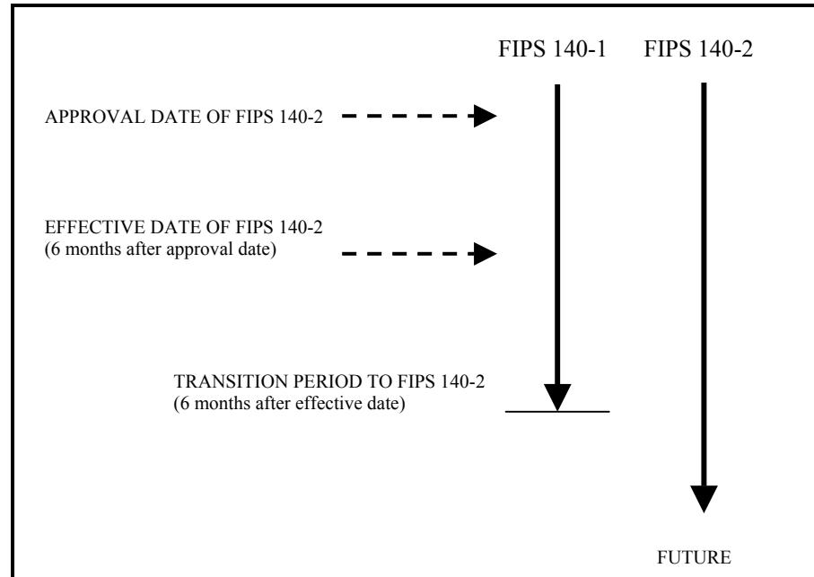

# **FIPS PUB 140-2**

**CHANGE NOTICES (12-03-2002)**

# **FEDERAL INFORMATION PROCESSING STANDARDS PUBLICATION (Supercedes FIPS PUB 140-1, 1994 January 11)**

# **SECURITY REQUIREMENTS FOR CRYPTOGRAPHIC MODULES**

# **CATEGORY: COMPUTER SECURITY SUBCATEGORY: CRYPTOGRAPHY**

Information Technology Laboratory National Institute of Standards and Technology Gaithersburg, MD 20899-8900

Issued May 25, 2001

**U.S. Department of Commerce** Donald L. Evans, Secretary

**Technology Administration** Phillip J. Bond, Under Secretary for Technology

**National Institute of Standards and Technology** Arden L. Bement, Jr., Director

#### **Foreword**

The Federal Information Processing Standards Publication Series of the National Institute of Standards and Technology (NIST) is the official series of publications relating to standards and guidelines adopted and promulgated under the provisions of Section 5131 of the Information Technology Management Reform Act of 1996 (Public Law 104-106) and the Computer Security Act of 1987 (Public Law 100-235). These mandates have given the Secretary of Commerce and NIST important responsibilities for improving the utilization and management of computer and related telecommunications systems in the Federal government. The NIST, through its Information Technology Laboratory, provides leadership, technical guidance, and coordination of government efforts in the development of standards and guidelines in these areas.

Comments concerning Federal Information Processing Standards Publications are welcomed and should be addressed to the Director, Information Technology Laboratory, National Institute of Standards and Technology, 100 Bureau Drive, Stop 8900, Gaithersburg, MD 20899-8900.

 William Mehuron, Director Information Technology Laboratory

#### **Abstract**

The selective application of technological and related procedural safeguards is an important responsibility of every Federal organization in providing adequate security in its computer and telecommunication systems. This publication provides a standard that will be used by Federal organizations when these organizations specify that cryptographic-based security systems are to be used to provide protection for sensitive or valuable data. Protection of a cryptographic module within a security system is necessary to maintain the confidentiality and integrity of the information protected by the module. This standard specifies the security requirements that will be satisfied by a cryptographic module. The standard provides four increasing, qualitative levels of security intended to cover a wide range of potential applications and environments. The security requirements cover areas related to the secure design and implementation of a cryptographic module. These areas include cryptographic module specification; cryptographic module ports and interfaces; roles, services, and authentication; finite state model; physical security; operational environment; cryptographic key management; electromagnetic interference/electromagnetic compatibility (EMI/EMC); self-tests; design assurance; and mitigation of other attacks.

Key words: computer security, telecommunication security, cryptography, cryptographic modules, Federal Information Processing Standard (FIPS).

FIPS PUB 140-2 Service 64 pages (May 25, 2001) U.S. Department of Commerce

National Institute of Standards U.S. Government Printing Office For Sale by the National and Technology Washington: 2001 Technical Information

# **Federal Information Processing Standards Publication 140-2**

# **May 25, 2001**

# **Announcing the Standard for**

# **SECURITY REQUIREMENTS FOR CRYPTOGRAPHIC MODULES**

Federal Information Processing Standards Publications (FIPS PUBS) are issued by the National Institute of Standards and Technology (NIST) after approval by the Secretary of Commerce pursuant to Section 5131 of the Information Technology Management Reform Act of 1996 (Public Law 104-106) and the Computer Security Act of 1987 (Public Law 100-235).

**1. Name of Standard.** Security Requirements for Cryptographic Modules (FIPS PUB 140-2).

#### **2. Category of Standard.** Computer Security Standard, Cryptography.

**3. Explanation.** This standard specifies the security requirements that will be satisfied by a cryptographic module utilized within a security system protecting sensitive but unclassified information (hereafter referred to as sensitive information). The standard provides four increasing, qualitative levels of security: Level 1, Level 2, Level 3, and Level 4. These levels are intended to cover the wide range of potential applications and environments in which cryptographic modules may be employed. The security requirements cover areas related to the secure design and implementation of a cryptographic module. These areas include cryptographic module specification, cryptographic module ports and interfaces; roles, services, and authentication; finite state model; physical security; operational environment; cryptographic key management; electromagnetic interference/electromagnetic compatibility (EMI/EMC); self-tests; design assurance; and mitigation of other attacks. This standard supersedes FIPS 140-1, *Security Requirements for Cryptographic Modules*, in its entirety.

The Cryptographic Module Validation Program (CMVP) validates cryptographic modules to Federal Information Processing Standard (FIPS) 140-2 and other cryptography based standards. The CMVP is a joint effort between NIST and the Communications Security Establishment (CSE) of the Government of Canada. Products validated as conforming to FIPS 140-2 are accepted by the Federal agencies of both countries for the protection of sensitive information (United States) or Designated Information (Canada). The goal of the CMVP is to promote the use of validated cryptographic modules and provide Federal agencies with a security metric to use in procuring equipment containing validated cryptographic modules.

In the CMVP, vendors of cryptographic modules use independent, accredited testing laboratories to have their modules tested. National Voluntary Laboratory Accreditation Program (NVLAP) accredited laboratories perform cryptographic module compliance/conformance testing.

- **4. Approving Authority.** Secretary of Commerce.
**5. Maintenance Agency.** Department of Commerce, National Institute of Standards and Technology, Information Technology Laboratory (ITL).

#### **6. Cross Index.**

- a. FIPS PUB 46-3, Data Encryption Standard.
- b. FIPS PUB 74, Guidelines for Implementing and Using the NBS Data Encryption Standard.
- c. FIPS PUB 81, DES Modes of Operation.
- d. FIPS PUB 113, Computer Data Authentication.
- e. FIPS PUB 171, Key Management Using ANSI X9.17.
- f. FIPS PUB 180-1, Secure Hash Standard.
- g. FIPS PUB 186-2, Digital Signature Standard.
- h. Special Publication 800-2, Public Key Cryptography.
- i. Special Publication 800-20, Modes of Operation Validation System for the Triple Data Encryption Algorithm (TMOVS): Requirements and Procedures

These documents may be found at the CMVP URL http://www.nist.gov/cmvp. Other NIST publications may be applicable to the implementation and use of this standard. A list (NIST Publications List 91) of currently available computer security publications, including ordering information, can be obtained from NIST.

**7. Applicability.** This standard is applicable to all Federal agencies that use cryptographic-based security systems to protect sensitive information in computer and telecommunication systems (including voice systems) as defined in Section 5131 of the Information Technology Management Reform Act of 1996, Public Law 104-106. This standard shall be used in designing and implementing cryptographic modules that Federal departments and agencies operate or are operated for them under contract. Cryptographic modules that have been approved for classified use may be used in lieu of modules that have been validated against this standard. The adoption and use of this standard is available to private and commercial organizations.

**8. Applications.** Cryptographic-based security systems may be utilized in various computer and telecommunication applications (e.g., data storage, access control and personal identification, network communications, radio, facsimile, and video) and in various environments (e.g., centralized computer facilities, office environments, and hostile environments). The cryptographic services (e.g., encryption, authentication, digital signature, and key management) provided by a cryptographic module are based on many factors that are specific to the application and environment. The security level to which a cryptographic module is validated must be chosen to provide a level of security appropriate for the security requirements of the application and environment in which the module will be utilized and the security services that the module will provide. The security requirements for a particular security level include both the security requirements specific to that level and the security requirements that apply to all modules regardless of the level.

**9. Specifications.** Federal Information Processing Standard (FIPS) 140-2, Security Requirements for Cryptographic Modules (affixed).

**10. Implementations.** This standard covers implementations of cryptographic modules including, but not limited to, hardware components or modules, software/firmware programs or modules or any combination thereof. Cryptographic modules that are validated under the CMVP will be considered as conforming to this standard. Information about the CMVP can be obtained from the

- a. National Institute of Standards and Technology, Information Technology Laboratory, 100 Bureau Drive, Stop 8900, Gaithersburg, MD 20899-8900.
- b. Communications Security Establishment, ITS Client Services, 1500 Bronson Ave., Ottawa, ON K1G 3Z4.
- c. CMVP URL http://www.nist.gov/cmvp.

**11. Approved Security Functions.** Cryptographic modules that conform to this standard shall employ Approved security functions such as cryptographic algorithms, cryptographic key management techniques, and authentication techniques that have been approved for protecting Federal government sensitive information. Approved security functions include those that are either:

- a. specified in a Federal Information Processing Standard (FIPS),
- b. adopted in a FIPS and specified either in an appendix to the FIPS or in a document referenced by the FIPS, or
- c. specified in the list of Approved security functions.

**12. Interpretation.** Questions concerning the content and specifications of this standard should be addressed to: Director, Information Technology Laboratory, ATTN: FIPS 140-2 Interpretation, National Institute of Standards and Technology, 100 Bureau Drive, Stop 8900, Gaithersburg, MD 20899-8900. Resolution of questions regarding this standard will be provided by the validation authorities at NIST and CSE.

**13. Export Control.** Certain cryptographic devices and technical data regarding them are subject to Federal export controls and exports of cryptographic modules implementing this standard and technical data regarding them must comply with these Federal regulations and be licensed by the Bureau of Export Administration of the U.S. Department of Commerce. Applicable Federal government export controls are specified in Title 15, Code of Federal Regulations (CFR) Part 740.17; Title 15, CFR Part 742; and Title 15, CFR Part 774, Category 5, Part 2.

**14. Implementation Schedule.** This standard becomes effective six months after approval by the Secretary of Commerce. A transition period from November 25, 2001 until six months after the effective date is provided to enable all agencies to develop plans for the acquisition of products that are compliant with FIPS 140-2. Agencies may retain and use FIPS 140-1 validated products that have been purchased before the end of the transition period. After the transition period, modules will no longer be tested against the FIPS 140-1 requirements. After the transition period, all previous validations against FIPS 140-1 will still be recognized. Figure 1 summarizes the FIPS 140-2 implementation schedule.

Figure 1. *FIPS 140-2 Implementation Schedule* 

**15. Qualifications.** The security requirements specified in this standard are based upon information provided by many sources within the Federal government and private industry. The requirements are designed to protect against adversaries mounting cost-effective attacks on sensitive government or commercial data (e.g., hackers, organized crime, and economic competitors). The primary goal in designing an effective security system is to make the cost of any attack greater than the possible payoff.

While the security requirements specified in this standard are intended to maintain the security provided by a cryptographic module, conformance to this standard is not sufficient to ensure that a particular module is secure. The operator of a cryptographic module is responsible for ensuring that the security provided by a module is sufficient and acceptable to the owner of the information that is being protected and that any residual risk is acknowledged and accepted.

Similarly, the use of a validated cryptographic module in a computer or telecommunications system does not guarantee the security of the overall system. The responsible authority in each agency shall ensure that the security of the system is sufficient and acceptable.

Since a standard of this nature must be flexible enough to adapt to advancements and innovations in science and technology, this standard will be reviewed every five years in order to consider new or revised requirements that may be needed to meet technological and economic changes.

**16. Waiver Procedure.** Under certain exceptional circumstances, the heads of Federal agencies, or their delegates, may approve waivers to Federal Information Processing Standards (FIPS), for their agency. The heads of such agencies may redelegate such authority only to a senior official designated pursuant to Section 3506(b) of Title 44, U.S. Code. Waivers shall be granted only when compliance with a standard would

- a. adversely affect the accomplishment of the mission of an operator of Federal computer system or
- b. cause a major adverse financial impact on the operator that is not offset by government-wide savings.

Agency heads may act upon a written waiver request containing the information detailed above. Agency heads may also act without a written waiver request when they determine which conditions for meeting the standard cannot be met. Agency heads may approve waivers only by a written decision that explains the basis on which the agency head made the required finding(s). A copy of each such decision, with procurement sensitive or classified portions clearly identified, shall be sent to: National Institute of Standards and Technology; ATTN: FIPS Waiver Decision, Information Technology Laboratory, 100 Bureau Drive, Stop 8900, Gaithersburg, MD 20899-8900.

In addition, notice of each waiver granted and each delegation of authority to approve waivers shall be sent promptly to the Committee on Government Operations of the House of Representatives and the Committee on Government Affairs of the Senate and shall be published promptly in the Federal Register.

When the determination on a waiver applies to the procurement of equipment and/or services, a notice of the waiver determination must be published in the Commerce Business Daily as a part of the notice of solicitation for offers of an acquisition or, if the waiver determination is made after that notice is published, by amendment to such notice.

A copy of the waiver, any supporting documents, the document approving the waiver and any supporting and accompanying documents, with such deletions as the agency is authorized and decides to make under Section 552(b) of Title 5, U.S. Code, shall be part of the procurement documentation and retained by the agency.

**17. Where to obtain copies.** Copies of this publication are available from the URL: http://csrc.nist.gov/publications. Copies are available for sale by the National Technical Information Service, U.S. Department of Commerce, Springfield, VA 22161. When ordering, refer to Federal Information Processing Standards Publication 140-2 (FIPSPUB1402) and identify the title. When microfiche is desired, this should be specified. Prices are published by NTIS in current catalogs and other issuances. Payment may be made by check, money order, deposit account, or charged to a credit card accepted by NTIS.

**18. CHANGE NOTICE.** See important change notice at the end of this document.

| 1. | OVERVIEW | 1 |
| --- | --- | --- |
| 1.1 | Security Level 1 | 1 |
| 1.2 | Security Level 2 | 2 |
| 1.3 | Security Level 3 | 2 |
| 1.4 | Security Level 4 | 3 |
| 2. | GLOSSARY OF TERMS AND ACRONYMS | 4 |
| 2.1 | Glossary of Terms | 4 |
| 2.2 | Acronyms | 8 |
| 3. | FUNCTIONAL SECURITY OBJECTIVES | 11 |
| 4. | SECURITY REQUIREMENTS 12 |  |
| 4.1 | Cryptographic Module Specification | 13 |
| 4.2 | Cryptographic Module Ports and Interfaces | 14 |
| 4.3 | Roles, Services, and Authentication 15 |  |
|  | 4.3.1 Roles | 16 |
|  | 4.3.2 Services | 16 |
|  | 4.3.3 Operator Authentication | 17 |
| 4.4 | Finite State Model | 19 |
| 4.5 | Physical Security | 20 |
|  | 4.5.1 General Physical Security Requirements | 21 |
|  | 4.5.2 Single-Chip Cryptographic Modules | 23 |
|  | 4.5.3 Multiple-Chip Embedded Cryptographic Modules | 24 |
|  | 4.5.4 Multiple-Chip Standalone Cryptographic Modules | 25 |
|  | 4.5.5 Environmental Failure Protection/Testing | 26 |
| 4.6 | Operational Environment | 27 |
|  | 4.6.1 Operating System Requirements | 28 |
| 4.7 | Cryptographic Key Management | 30 |
|  | 4.7.1 Random Number Generators (RNGs) | 30 |
|  | 4.7.2 Key Generation | 31 |
|  | 4.7.3 Key Establishment | 31 |
|  | 4.7.4 Key Entry and Output | 31 |
|  | 4.7.5 Key Storage | 33 |
|  | 4.7.6 Key Zeroization | 33 |
| 4.8 | Electromagnetic Interference/Electromagnetic Compatibility (EMI/EMC) | 33 |
| 4.9 | Self-Tests | 33 |
|  | 4.9.1 Power-Up Tests | 34 |
|  | 4.9.2 Conditional Tests | 35 |
| 4.10 | Design Assurance | 36 |
|  | 4.10.1 Configuration Management | 36 |
|  | 4.10.2 Delivery and Operation | 37 |
|  | 4.10.3 Development | 37 |
|  | 4.10.4 Guidance Documents | 38 |
|  | 4. 11 Mitigation of Other Attacks | 39 |
| APPENDIX A: | SUMMARY OF DOCUMENTATION REQUIREMENTS | 41 |
|  | APPENDIX B: RECOMMENDED SOFTWARE DEVELOPMENT PRACTICES | 45 |
|  | APPENDIX C: CRYPTOGRAPHIC MODULE SECURITY POLICY | 47 |
|  | APPENDIX D: SELECTED BIBLIOGRAPHY | 51 |

| APPENDIX E: APPLICABLE INTERNET UNIFORM RESOURCE LOCATORS (URL) | 53 |
| --- | --- |
| CHANGE NOTICE | 54 |
| Change Notice 1 (Superceded by Change Notice 2) | 54 |
| Change Notice 2 | 55 |
| Change Notice 3 | 60 |
| Change Notice 4 | 61 |

# **1. OVERVIEW**

This standard specifies the security requirements for a cryptographic module utilized within a security system protecting sensitive information in computer and telecommunication systems (including voice systems) as defined in Section 5131 of the Information Technology Management Reform Act of 1996, Public Law 104-106.

FIPS 140-1 was developed by a government and industry working group composed of both operators and vendors. The working group identified requirements for four security levels for cryptographic modules to provide for a wide spectrum of data sensitivity (e.g., low value administrative data, million dollar funds transfers, and life protecting data) and a diversity of application environments (e.g., a guarded facility, an office, and a completely unprotected location). Four security levels are specified for each of 11 requirement areas. Each security level offers an increase in security over the preceding level. These four increasing levels of security allow cost-effective solutions that are appropriate for different degrees of data sensitivity and different application environments. FIPS 140-2 incorporates changes in applicable standards and technology since the development of FIPS 140-1 as well as changes that are based on comments received from the vendor, laboratory, and user communities.

While the security requirements specified in this standard are intended to maintain the security provided by a cryptographic module, conformance to this standard is not sufficient to ensure that a particular module is secure. The operator of a cryptographic module is responsible for ensuring that the security provided by the module is sufficient and acceptable to the owner of the information that is being protected, and that any residual risk is acknowledged and accepted.

Similarly, the use of a validated cryptographic module in a computer or telecommunications system is not sufficient to ensure the security of the overall system. The overall security level of a cryptographic module must be chosen to provide a level of security appropriate for the security requirements of the application and environment in which the module is to be utilized and for the security services that the module is to provide. The responsible authority in each organization should ensure that their computer and telecommunication systems that utilize cryptographic modules provide an acceptable level of security for the given application and environment.

The importance of security awareness and of making information security a management priority should be communicated to all users. Since information security requirements vary for different applications, organizations should identify their information resources and determine the sensitivity to and the potential impact of losses. Controls should be based on the potential risks and should be selected from available controls, including administrative policies and procedures, physical and environmental controls, information and data controls, software development and acquisition controls, and backup and contingency planning.

The following sections provide an overview of the four security levels. Common examples, given to illustrate how the requirements might be met, are not intended to be restrictive or exhaustive.

The location of Annexes A, B, C, and D can be found in APPENDIX D: SELECTED BIBLIOGRAPHY.

# **1.1 Security Level 1**

Security Level 1 provides the lowest level of security. Basic security requirements are specified for a cryptographic module (e.g., at least one Approved algorithm or Approved security function shall be used). No specific physical security mechanisms are required in a Security Level 1 cryptographic module beyond the basic requirement for production-grade components. An example of a Security Level 1 cryptographic module is a personal computer (PC) encryption board.

Security Level 1 allows the software and firmware components of a cryptographic module to be executed on a general purpose computing system using an unevaluated operating system. Such implementations may be appropriate for some low-level security applications when other controls, such as physical security, network security, and administrative procedures are limited or nonexistent. The implementation of cryptographic software may be more cost-effective than corresponding hardware-based mechanisms, enabling organizations to select from alternative cryptographic solutions to meet lower-level security requirements.

# **1.2 Security Level 2**

Security Level 2 enhances the physical security mechanisms of a Security Level 1 cryptographic module by adding the requirement for tamper-evidence, which includes the use of tamper-evident coatings or seals or for pick-resistant locks on removable covers or doors of the module. Tamper-evident coatings or seals are placed on a cryptographic module so that the coating or seal must be broken to attain physical access to the plaintext cryptographic keys and critical security parameters (CSPs) within the module. Tamper-evident seals or pick-resistant locks are placed on covers or doors to protect against unauthorized physical access.

Security Level 2 requires, at a minimum, role-based authentication in which a cryptographic module authenticates the authorization of an operator to assume a specific role and perform a corresponding set of services.

Security Level 2 allows the software and firmware components of a cryptographic module to be executed on a general purpose computing system using an operating system that

- meets the functional requirements specified in the Common Criteria (CC) Protection Profiles (PPs) listed in Annex B and
- is evaluated at the CC evaluation assurance level EAL2 (or higher).

An equivalent evaluated trusted operating system may be used. A trusted operating system provides a level of trust so that cryptographic modules executing on general purpose computing platforms are comparable to cryptographic modules implemented using dedicated hardware systems.

# **1.3 Security Level 3**

In addition to the tamper-evident physical security mechanisms required at Security Level 2, Security Level 3 attempts to prevent the intruder from gaining access to CSPs held within the cryptographic module. Physical security mechanisms required at Security Level 3 are intended to have a high probability of detecting and responding to attempts at physical access, use or modification of the cryptographic module. The physical security mechanisms may include the use of strong enclosures and tamper detection/response circuitry that zeroizes all plaintext CSPs when the removable covers/doors of the cryptographic module are opened.

Security Level 3 requires identity-based authentication mechanisms, enhancing the security provided by the role-based authentication mechanisms specified for Security Level 2. A cryptographic module authenticates the identity of an operator and verifies that the identified operator is authorized to assume a specific role and perform a corresponding set of services.

Security Level 3 requires the entry or output of plaintext CSPs (including the entry or output of plaintext CSPs using split knowledge procedures) be performed using ports that are physically separated from other ports, or interfaces that are logically separated using a trusted path from other interfaces. Plaintext CSPs may be entered into or output from the cryptographic module in encrypted form (in which case they may travel through enclosing or intervening systems).

Security Level 3 allows the software and firmware components of a cryptographic module to be executed on a general purpose computing system using an operating system that

- meets the functional requirements specified in the PPs listed in Annex B with the additional functional requirement of a Trusted Path (FTP_TRP.1) and
- is evaluated at the CC evaluation assurance level EAL3 (or higher) with the additional assurance requirement of an Informal Target of Evaluation (TOE) Security Policy Model (ADV_SPM.1).

An equivalent evaluated trusted operating system may be used. The implementation of a trusted path protects plaintext CSPs and the software and firmware components of the cryptographic module from other untrusted software or firmware that may be executing on the system.

# **1.4 Security Level 4**

Security Level 4 provides the highest level of security defined in this standard. At this security level, the physical security mechanisms provide a complete envelope of protection around the cryptographic module with the intent of detecting and responding to all unauthorized attempts at physical access. Penetration of the cryptographic module enclosure from any direction has a very high probability of being detected, resulting in the immediate zeroization of all plaintext CSPs. Security Level 4 cryptographic modules are useful for operation in physically unprotected environments.

Security Level 4 also protects a cryptographic module against a security compromise due to environmental conditions or fluctuations outside of the module's normal operating ranges for voltage and temperature. Intentional excursions beyond the normal operating ranges may be used by an attacker to thwart a cryptographic module's defenses. A cryptographic module is required to either include special environmental protection features designed to detect fluctuations and zeroize CSPs, or to undergo rigorous environmental failure testing to provide a reasonable assurance that the module will not be affected by fluctuations outside of the normal operating range in a manner that can compromise the security of the module.

Security Level 4 allows the software and firmware components of a cryptographic module to be executed on a general purpose computing system using an operating system that

- meets the functional requirements specified for Security Level 3 and
- is evaluated at the CC evaluation assurance level EAL4 (or higher).

An equivalent evaluated trusted operating system may be used.

# **2. GLOSSARY OF TERMS AND ACRONYMS**

# **2.1 Glossary of Terms**

The following definitions are tailored for use in this standard:

*Approved*: FIPS-Approved and/or NIST-recommended.

*Approved mode of operation*: a mode of the cryptographic module that employs only Approved security functions (not to be confused with a specific mode of an Approved security function, e.g., DES CBC mode).

*Approved security function:* for this standard, a security function (e.g., cryptographic algorithm, cryptographic key management technique, or authentication technique) that is either

- a) specified in an Approved standard,
- b) adopted in an Approved standard and specified either in an appendix of the Approved standard or in a document referenced by the Approved standard, or
- c) specified in the list of Approved security functions.

*Authentication code*: a cryptographic checksum based on an Approved security function (also known as a Message Authentication Code).

*Automated key transport*: the transport of cryptographic keys, usually in encrypted form, using electronic means such as a computer network (e.g., key transport/agreement protocols).

*Compromise*: the unauthorized disclosure, modification, substitution, or use of sensitive data (including plaintext cryptographic keys and other CSPs).

*Confidentiality*: the property that sensitive information is not disclosed to unauthorized individuals, entities, or processes.

*Control information*: information that is entered into a cryptographic module for the purposes of directing the operation of the module.

*Critical security parameter (CSP)*: security-related information (e.g., secret and private cryptographic keys, and authentication data such as passwords and PINs) whose disclosure or modification can compromise the security of a cryptographic module.

*Cryptographic boundary*: an explicitly defined continuous perimeter that establishes the physical bounds of a cryptographic module and contains all the hardware, software, and/or firmware components of a cryptographic module.

*Cryptographic key (key*): a parameter used in conjunction with a cryptographic algorithm that determines

- the transformation of plaintext data into ciphertext data,
- the transformation of ciphertext data into plaintext data,
- a digital signature computed from data,
- the verification of a digital signature computed from data,
- an authentication code computed from data, or
- an exchange agreement of a shared secret.

*Cryptographic key component (key component)*: a parameter used in conjunction with other key components in an Approved security function to form a plaintext cryptographic key or perform a cryptographic function.

*Cryptographic module*: the set of hardware, software, and/or firmware that implements Approved security functions (including cryptographic algorithms and key generation) and is contained within the cryptographic boundary.

*Cryptographic module security policy*: a precise specification of the security rules under which a cryptographic module will operate, including the rules derived from the requirements of this standard and additional rules imposed by the vendor. (See Appendix C.)

*Crypto officer*: an operator or process (subject), acting on behalf of the operator, performing cryptographic initialization or management functions.

*Data path*: the physical or logical route over which data passes; a physical data path may be shared by multiple logical data paths.

*Differential power analysis (DPA)*: an analysis of the variations of the electrical power consumption of a cryptographic module, using advanced statistical methods and/or other techniques, for the purpose of extracting information correlated to cryptographic keys used in a cryptographic algorithm.

*Digital signature*: the result of a cryptographic transformation of data which, when properly implemented, provides the services of:

- 1. origin authentication
- 2. data integrity, and
- 3. signer non-repudiation.

*Electromagnetic compatibility (EMC)*: the ability of electronic devices to function satisfactorily in an electromagnetic environment without introducing intolerable electromagnetic disturbances to other devices in that environment.

*Electromagnetic interference (EMI)*: electromagnetic emissions from a device, equipment, or system that interfere with the normal operation of another device, equipment, or system.

*Electronic key entry*: the entry of cryptographic keys into a cryptographic module using electronic methods such as a smart card or a key-loading device. (The operator of the key may have no knowledge of the value of the key being entered.)

*Encrypted key*: a cryptographic key that has been encrypted using an Approved security function with a key encrypting key, a PIN, or a password in order to disguise the value of the underlying plaintext key.

*Environmental failure protection (EFP)*: the use of features to protect against a compromise of the security of a cryptographic module due to environmental conditions or fluctuations outside of the module's normal operating range.

*Environmental failure testing (EFT)*: the use of testing to provide a reasonable assurance that the security of a cryptographic module will not be compromised by environmental conditions or fluctuations outside of the module's normal operating range.

*Error detection code (EDC)*: a code computed from data and comprised of redundant bits of information designed to detect, but not correct, unintentional changes in the data.

*Finite state model*: a mathematical model of a sequential machine that is comprised of a finite set of input events, a finite set of output events, a finite set of states, a function that maps states and input to output, a function that maps states and inputs to states (a state transition function), and a specification that describes the initial state.

*Firmware*: the programs and data components of a cryptographic module that are stored in hardware (e.g., ROM, PROM, EPROM, EEPROM or FLASH) within the cryptographic boundary and cannot be dynamically written or modified during execution.

*Hardware*: the physical equipment within the cryptographic boundary used to process programs and data.

*Hash-based message authentication code (HMAC)*: a message authentication code that utilizes a keyed hash.

*Initialization vector (IV)*: a vector used in defining the starting point of an encryption process within a cryptographic algorithm.

*Input data*: information that is entered into a cryptographic module for the purposes of transformation or computation using an Approved security function.

*Integrity*: the property that sensitive data has not been modified or deleted in an unauthorized and undetected manner.

*Interface*: a logical entry or exit point of a cryptographic module that provides access to the module for logical information flows representing physical signals.

*Key encrypting key*: a cryptographic key that is used for the encryption or decryption of other keys.

*Key establishment*: the process by which cryptographic keys are securely distributed among cryptographic modules using manual transport methods (e.g., key loaders), automated methods (e.g., key transport and/or key agreement protocols), or a combination of automated and manual methods (consists of key transport plus key agreement).

*Key loader*: a self-contained unit that is capable of storing at least one plaintext or encrypted cryptographic key or key component that can be transferred, upon request, into a cryptographic module.

*Key management*: the activities involving the handling of cryptographic keys and other related security parameters (e.g., IVs and passwords) during the entire life cycle of the keys, including their generation, storage, establishment, entry and output, and zeroization.

*Key transport*: secure transport of cryptographic keys from one cryptographic module to another module.

*Manual key transport*: a non-electronic means of transporting cryptographic keys.

*Manual key entry*: the entry of cryptographic keys into a cryptographic module, using devices such as a keyboard.

*Microcode*: the elementary processor instructions that correspond to an executable program instruction.

*Operator*: an individual accessing a cryptographic module or a process (subject) operating on behalf of the individual, regardless of the assumed role.

*Output data*: information that is produced from a cryptographic module.

*Password*: a string of characters (letters, numbers, and other symbols) used to authenticate an identity or to verify access authorization.

*Personal identification number (PIN)*: an alphanumeric code or password used to authenticate an identity.

*Physical protection*: the safeguarding of a cryptographic module, cryptographic keys, or CSPs using physical means.

*Plaintext key*: an unencrypted cryptographic key.

*Port*: a physical entry or exit point of a cryptographic module that provides access to the module for physical signals, represented by logical information flows (physically separated ports do not share the same physical pin or wire).

*Private key*: a cryptographic key, used with a public key cryptographic algorithm, that is uniquely associated with an entity and is not made public.

*Protection Profile:* an implementation-independent set of security requirements for a category of Targets of Evaluation (TOEs) that meet specific consumer needs.

*Public key*: a cryptographic key used with a public key cryptographic algorithm that is uniquely associated with an entity and that may be made public. (Public keys are not considered CSPs.)

*Public key certificate*: a set of data that uniquely identifies an entity, contains the entity's public key, and is digitally signed by a trusted party, thereby binding the public key to the entity.

*Public key (asymmetric) cryptographic algorithm*: a cryptographic algorithm that uses two related keys, a public key and a private key. The two keys have the property that deriving the private key from the public key is computationally infeasible.

*Random Number Generator:* Random Number Generators (RNGs) used for cryptographic applications typically produce a sequence of zero and one bits that may be combined into sub-sequences or blocks of random numbers. There are two basic classes: deterministic and nondeterministic. A deterministic RNG consists of an algorithm that produces a sequence of bits from an initial value called a seed. A nondeterministic RNG produces output that is dependent on some unpredictable physical source that is outside human control.

*Removable cover:* a cover designed to permit physical access to the contents of a cryptographic module.

*Secret key*: a cryptographic key, used with a secret key cryptographic algorithm, that is uniquely associated with one or more entities and should not be made public.

*Secret key (symmetric) cryptographic algorithm*: a cryptographic algorithm that uses a single secret key for both encryption and decryption.

*Security policy*: see Cryptographic module security policy.

*Seed key*: a secret value used to initialize a cryptographic function or operation.

*Simple power analysis (SPA)*: a direct (primarily visual) analysis of patterns of instruction execution (or execution of individual instructions), obtained through monitoring the variations in electrical power consumption of a cryptographic module, for the purpose of revealing the features and implementations of cryptographic algorithms and subsequently the values of cryptographic keys.

*Software*: the programs and data components within the cryptographic boundary, usually stored on erasable media (e.g., disk), that can be dynamically written and modified during execution.

*Split knowledge*: a process by which a cryptographic key is split into multiple key components, individually sharing no knowledge of the original key, that can be subsequently input into, or output from, a cryptographic module by separate entities and combined to recreate the original cryptographic key.

*Status information*: information that is output from a cryptographic module for the purposes of indicating certain operational characteristics or states of the module.

*System software*: the special software within the cryptographic boundary (e.g., operating system, compilers or utility programs) designed for a specific computer system or family of computer systems to facilitate the operation and maintenance of the computer system, and associated programs, and data.

*Tamper detection*: the automatic determination by a cryptographic module that an attempt has been made to compromise the physical security of the module.

*Tamper evidence*: the external indication that an attempt has been made to compromise the physical security of a cryptographic module. (The evidence of the tamper attempt should be observable by an operator subsequent to the attempt.)

*Tamper response*: the automatic action taken by a cryptographic module when a tamper detection has occurred (the minimum response action is the zeroization of plaintext keys and CSPs).

*Target of Evaluation (TOE)*: an information technology product or system and associated administrator and user guidance documentation that is the subject of an evaluation.

*TEMPEST*: a name referring to the investigation, study, and control of unintentional compromising emanations from telecommunications and automated information systems equipment.

*TOE Security Functions (TSF)*: used in the Common Criteria, a set of the TOE consisting of all hardware, software, and firmware that must be relied upon for the correct enforcement of the TOE Security Policy.

*TOE Security Policy (TSP)*: used in the Common Criteria, a set of rules that regulate how assets are managed, protected, and distributed within a Target of Evaluation.

*Trusted path*: a means by which an operator and a TOE Security Function can communicate with the necessary confidence to support the TOE Security Policy.

*User*: an individual or a process (subject) acting on behalf of the individual that accesses a cryptographic module in order to obtain cryptographic services.

*Validation authorities*: NIST and CSE.

*Zeroization*: a method of erasing electronically stored data, cryptographic keys, and CSPs by altering or deleting the contents of the data storage to prevent recovery of the data.

# **2.2 Acronyms**

The following acronyms and abbreviations are used throughout this standard:

- ANSI American National Standards Institute
- API Application Program Interface

| CAPP | Controlled Access Protection Profile |
| --- | --- |
| CBC | Cipher Block Chaining |
| CC | Common Criteria |
| CMVP | Cryptographic Module Validation Program |
| CSE | Communications Security Establishment of the Government of Canada |
| CSP | Critical Security Parameter |
| DES | Data Encryption Standard |
| DOD | Department of Defense |
| DPA | Differential Power Analysis |
| DTR | Derived Test Requirements |
| EAL | Common Criteria Evaluation Assurance Level |
| EDC | Error Detection Code |
| EEPROM | Electronically-Erasable Programmable Read-Only Memory |
| EFP | Environmental Failure Protection |
| EFT | Environmental Failure Testing |
| EMC | Electromagnetic Compatibility |
| EMI | Electromagnetic Interference |
| EPROM | Erasable Programmable Read-Only Memory |
| FCC | Federal Communications Commission |
| FIPS | Federal Information Processing Standard |
| FIPS PUB | FIPS Publication |
| HDL | Hardware Description Language |
| HMAC | Hash-Based Message Authentication Code |
| IC | Integrated Circuit |
| IG | Implementation Guidance |
| ISO | International Organization for Standardization |
| ITSEC | Information Technology Security Evaluation Criteria |
| IV | Initialization Vector |

| NIST | National Institute of Standards and Technology |
| --- | --- |
| NTIS | National Technical Information Service |
| PIN | Personal Identification Number |
| PROM | Programmable Read-Only Memory |
| RAM | Random Access Memory |
| RNG | Random Number Generator |
| ROM | Read-Only Memory |
| SPA | Simple Power Analysis |
| TOE | Target of Evaluation |
| TSF | Target of Evaluation Security Functions |
| TSP | Target of Evaluation Security Policy |
| URL | Uniform Resource Locator |

# **3. FUNCTIONAL SECURITY OBJECTIVES**

The security requirements specified in this standard relate to the secure design and implementation of a cryptographic module. The requirements are derived from the following high-level functional security objectives for a cryptographic module:

- To employ and correctly implement the Approved security functions for the protection of sensitive information. •
- To protect a cryptographic module from unauthorized operation or use.
- To prevent the unauthorized disclosure of the contents of the cryptographic module, including plaintext cryptographic keys and CSPs.
- To prevent the unauthorized and undetected modification of the cryptographic module and cryptographic algorithms, including the unauthorized modification, substitution, insertion, and deletion of cryptographic keys and CSPs.
- To provide indications of the operational state of the cryptographic module.
- To ensure that the cryptographic module performs properly when operating in an Approved mode of operation.
- To detect errors in the operation of the cryptographic module and to prevent the compromise of sensitive data and CSPs resulting from these errors.

# **4. SECURITY REQUIREMENTS**

This section specifies the security requirements that shall be satisfied by cryptographic modules conforming to this standard. The security requirements cover areas related to the design and implementation of a cryptographic module. These areas include cryptographic module specification; module ports and interfaces; roles, services, and authentication; finite state model; physical security; operational environment; cryptographic key management; electromagnetic interference/electromagnetic compatibility (EMI/EMC); self-tests; and design assurance. An additional area concerned with the mitigation of other attacks is currently not tested but the vendor is required to document implemented controls (e.g., differential power analysis, and TEMPEST). Table 1 summarizes the security requirements in each of these areas.

|  | Security Level 1 | Security Level 2 | Security Level 3 Security Level 4 |  |
| --- | --- | --- | --- | --- |
| Cryptographic | Specification of cryptographic module, cryptographic boundary, Approved algorithms, and Approved modes of operation. Description of |  |  |  |
| Module | cryptographic module, including all hardware, software, and firmware components. Statement of module security policy. |  |  |  |
| Specification |  |  |  |  |
| Cryptographic | Required and optional interfaces. Specification of all interfaces |  | Data ports for unprotected critical security parameters logically or |  |
| Module Ports | and of all input and output data paths. physically separated from other data ports. |  |  |  |
| and Interfaces |  |  |  |  |
| Roles, Services, | Logical separation of required Identity-based operator authentication. | Role-based or identity-based |  |  |
| and | and optional roles and services. | operator authentication. |  |  |
| Authentication |  |  |  |  |
| Finite State | Specification of finite state model. Required states and optional states. State transition diagram and specification of state transitions. |  |  |  |
| Model |  |  |  |  |
| Physical | Production grade equipment. Tamper detection and response | Locks or tamper evidence. |  | Tamper detection and response |
| Security | for covers and doors. |  |  | envelope. EFP or EFT. |
| Operational | Single operator. Executable Referenced PPs plus trusted | Referenced PPs evaluated at |  | Referenced PPs plus trusted path |
| Environment | code. Approved integrity path evaluated at EAL3 plus | EAL2 with specified |  | evaluated at EAL4. |
|  | technique. security policy modeling. | discretionary access control |  |  |
|  |  | mechanisms and auditing. |  |  |
| Cryptographic | Key management mechanisms: random number and key generation, key establishment, key distribution, key entry/output, key storage, and |  |  |  |
| Key Management | key zeroization. |  |  |  |
|  | Secret and private keys established using manual methods may be |  | Secret and private keys established using manual methods shall be |  |
|  | entered or output in plaintext form. entered or output encrypted or with split knowledge procedures. |  |  |  |
| EMI/EMC | 47 CFR FCC Part 15. Subpart B, Class A (Business use). 47 CFR FCC Part 15. Subpart B, Class B (Home use). |  |  |  |
|  | Applicable FCC requirements (for radio). |  |  |  |
| Self-Tests | Power-up tests: cryptographic algorithm tests, software/firmware integrity tests, critical functions tests. Conditional tests. |  |  |  |
| Design | Configuration management High-level language Formal model. Detailed | CM system. Secure |  |  |
| Assurance | (CM). Secure installation and implementation. explanations (informal proofs). | distribution. Functional |  |  |
|  | generation. Design and policy Preconditions and postconditions. | specification. |  |  |
|  | correspondence. Guidance |  |  |  |
|  | documents. |  |  |  |
| Mitigation of | Specification of mitigation of attacks for which no testable requirements are currently available. |  |  |  |
| Other Attacks |  |  |  |  |

# Table 1: *Summary of security requirements*

A cryptographic module shall be tested against the requirements of each area addressed in this section. The cryptographic module shall be independently rated in each area. Several areas provide for increasing levels of security with cumulative security requirements for each security level. In these areas, the cryptographic module will receive a rating that reflects the maximum security level for which the module fulfills all of the requirements of that area. In areas that do not provide for different levels of security (i.e., standard set of requirements), the cryptographic module will receive a rating commensurate with the overall level of security.

In addition to receiving independent ratings for each of the security areas, a cryptographic module will also receive an overall rating. The overall rating will indicate the minimum of the independent ratings received in the areas.

Many of the security requirements of this standard include specific documentation requirements that are summarized in Appendices A and C. All documentation, including copies of the user and installation manuals, shall be provided to the testing laboratory by the vendor.

# **4.1 Cryptographic Module Specification**

A cryptographic module shall be a set of hardware, software, firmware, or some combination thereof that implements cryptographic functions or processes, including cryptographic algorithms and, optionally, key generation, and is contained within a defined cryptographic boundary. A cryptographic module shall implement at least one Approved security function used in an Approved mode of operation. Non-Approved security functions may also be included for use in non-Approved modes of operation. The operator shall be able to determine when an Approved mode of operation is selected. For Security Levels 1 and 2, the cryptographic module security policy may specify when a cryptographic module is performing in an Approved mode of operation. For Security Levels 3 and 4, a cryptographic module shall indicate when an Approved mode of operation is selected. (Approved security functions are listed in Annex A to this standard.)

A cryptographic boundary shall consist of an explicitly defined perimeter that establishes the physical bounds of a cryptographic module. If a cryptographic module consists of software or firmware components, the cryptographic boundary shall contain the processor(s) and other hardware components that store and protect the software and firmware components. Hardware, software, and firmware components of a cryptographic module can be excluded from the requirements of this standard if shown that these components do not affect the security of the module.

The following documentation requirements shall apply to all security-specific hardware, software, and firmware contained within a cryptographic module. These requirements do not apply to microcode or system software whose source code is not available to the vendor or to any hardware, software, or firmware components that can be shown not to affect the security of the cryptographic module.

- Documentation shall specify the hardware, software, and firmware components of a cryptographic module, specify the cryptographic boundary surrounding these components, and describe the physical configuration of the module (see Section 4.5).
- Documentation shall specify any hardware, software, or firmware components of a cryptographic module that are excluded from the security requirements of this standard and explain the rationale for the exclusion.
- Documentation shall specify the physical ports and logical interfaces and all defined input and output data paths of a cryptographic module.
- Documentation shall specify the manual or logical controls of a cryptographic module, physical or logical status indicators, and applicable physical, logical, and electrical characteristics.
- Documentation shall list all security functions, both Approved and non-Approved, that are employed by a cryptographic module and shall specify all modes of operation, both Approved and non-Approved.
- Documentation shall specify:
	- ! a block diagram depicting all of the major hardware components of a cryptographic module and component interconnections, including any microprocessors, input/output buffers, plaintext/ciphertext buffers, control buffers, key storage, working memory, and program memory, and
	- ! the design of the hardware, software, and firmware components of a cryptographic module. High-level specification languages for software/firmware or schematics for hardware shall be used to document the design.
- Documentation shall specify all security-related information, including secret and private cryptographic keys (both plaintext and encrypted), authentication data (e.g., passwords, PINs), CSPs, and other protected information (e.g., audited events, audit data) whose disclosure or modification can compromise the security of the cryptographic module. •
- Documentation shall specify a cryptographic module security policy. The security policy shall include the rules derived from the requirements of this standard and the rules derived from any additional requirements imposed by the vendor (see Appendix C).

# **4.2 Cryptographic Module Ports and Interfaces**

A cryptographic module shall restrict all information flow and physical access points to physical ports and logical interfaces that define all entry and exit points to and from the module. The cryptographic module interfaces shall be logically distinct from each other although they may share one physical port (e.g., input data may enter and output data may exit via the same port) or may be distributed over one or more physical ports (e.g., input data may enter via both a serial and a parallel port). An Application Program Interface (API) of a software component of a cryptographic module may be defined as one or more logical interfaces(s).

A cryptographic module shall have the following four logical interfaces ("input" and "output" are indicated from the perspective of the module):

*Data input interface*. All data (except control data entered via the control input interface) that is input to and processed by a cryptographic module (including plaintext data, ciphertext data, cryptographic keys and CSPs, authentication data, and status information from another module) shall enter via the "data input" interface.

*Data output interface*. All data (except status data output via the status output interface) that is output from a cryptographic module (including plaintext data, ciphertext data, cryptographic keys and CSPs, authentication data, and control information for another module) shall exit via the "data output" interface. All data output via the data output interface shall be inhibited when an error state exists and during self-tests (see Section 4.9).

*Control input interface.* All input commands, signals, and control data (including function calls and manual controls such as switches, buttons, and keyboards) used to control the operation of a cryptographic module shall enter via the "control input" interface.

*Status output interface*. All output signals, indicators, and status data (including return codes and physical indicators such as Light Emitting Diodes and displays) used to indicate the status of a cryptographic module shall exit via the "status output" interface.

All external electrical power that is input to a cryptographic module (including power from an external power source or batteries) shall enter via a power port. A power port is not required when all power is provided or maintained internally to the cryptographic boundary of the cryptographic module (e.g., an internal battery).

The cryptographic module shall distinguish between data and control for input and data and status for output. All input data entering the cryptographic module via the "data input" interface shall only pass through the input data path. All output data exiting the cryptographic module via the "data output" interface shall only pass through the output data path. The output data path shall be logically disconnected from the circuitry and processes while performing key generation, manual key entry, or key zeroization. To prevent the inadvertent output of sensitive information, two independent internal actions shall be required to output data via any output interface through which plaintext cryptographic keys or CSPs or sensitive data are output (e.g., two different software flags are set, one of which may be user initiated; or two hardware gates are set serially from two separate actions).

# SECURITY LEVELS 1 AND 2

For Security Levels 1 and 2, the physical port(s) and logical interface(s) used for the input and output of plaintext cryptographic keys, cryptographic key components, authentication data, and CSPs may be shared physically and logically with other ports and interfaces of the cryptographic module.

# SECURITY LEVELS 3 AND 4

For Security Levels 3 and 4,

- the physical port(s) used for the input and output of plaintext cryptographic key components, authentication data, and CSPs shall be physically separated from all other ports of the cryptographic module •
or

- the logical interfaces used for the input and output of plaintext cryptographic key components, authentication data, and CSPs shall be logically separated from all other interfaces using a trusted path,
and

- plaintext cryptographic key components, authentication data, and other CSPs shall be directly entered into the cryptographic module (e.g., via a trusted path or directly attached cable). (See Section 4.7.4.)
# **4.3 Roles, Services, and Authentication**

A cryptographic module shall support authorized roles for operators and corresponding services within each role. Multiple roles may be assumed by a single operator. If a cryptographic module supports concurrent operators, then the module shall internally maintain the separation of the roles assumed by each operator and the corresponding services. An operator is not required to assume an authorized role to perform services where cryptographic keys and CSPs are not modified, disclosed, or substituted (e.g., *show status, self-tests,* or other services that do not affect the security of the module).

Authentication mechanisms may be required within a cryptographic module to authenticate an operator accessing the module, and to verify that the operator is authorized to assume the requested role and perform the services within the role.

# **4.3.1 Roles**

A cryptographic module shall support the following authorized roles for operators:

*User Role.* The role assumed to perform general security services, including cryptographic operations and other Approved security functions.

*Crypto Officer Role*: The role assumed to perform cryptographic initialization or management functions (e.g., module initialization, input/output of cryptographic keys and CSPs, and audit functions).

If the cryptographic module allows operators to perform maintenance services, then the module shall support the following authorized role:

*Maintenance Role:* The role assumed to perform physical maintenance and/or logical maintenance services (e.g., hardware/software diagnostics). All plaintext secret and private keys and unprotected CSPs shall be zeroized when entering or exiting the maintenance role.

A cryptographic module may support other roles or sub-roles in addition to the roles specified above.

Documentation shall specify all authorized roles supported by the cryptographic module.

# **4.3.2 Services**

*Services* shall refer to all of the services, operations, or functions that can be performed by a cryptographic module. *Service inputs* shall consist of all data or control inputs to the cryptographic module that initiate or obtain specific services, operations, or functions. *Service outputs* shall consist of all data and status outputs that result from services, operations, or functions initiated or obtained by service inputs. Each service input shall result in a service output.

A cryptographic module shall provide the following services to operators:

 *Show Status*. Output the current status of the cryptographic module.

*Perform Self-Tests*. Initiate and run the self-tests as specified in Section 4.9.

*Perform Approved Security Function*. Perform at least one Approved security function used in an Approved mode of operation, as specified in Section 4.1.

A cryptographic module may provide other services, operations, or functions, both Approved and non-Approved, in addition to the services specified above. Specific services may be provided in more than one role (e.g., key entry services may be provided in the user role and the crypto officer role).

If a cryptographic module implements a *bypass* capability, where services are provided without cryptographic processing (e.g., transferring plaintext through the module without encryption), then

- two independent internal actions shall be required to activate the capability to prevent the inadvertent bypass of plaintext data due to a single error (e.g., two different software or hardware flags are set, one of which may be user-initiated), and
- the module shall show status to indicate whether
- 1) the bypass capability *is not* activated, and the module is exclusively providing services *with* cryptographic processing (e.g., plaintext data *is* encrypted),
- 2) the bypass capability *is* activated and the module is exclusively providing services *without* cryptographic processing (e.g., plaintext data *is not* encrypted), or
- 3) the bypass capability *is alternately* activated and deactivated and the module is providing some services *with* cryptographic processing and some services *without* cryptographic processing (e.g., for modules with multiple communication channels, plaintext data *is* or *is not* encrypted depending on each channel configuration).

Documentation shall specify:

- the services, operations, or functions provided by the cryptographic module, both Approved and non-Approved, •
- for each service provided by the module, the service inputs, corresponding service outputs, and the authorized role(s) in which the service can be performed, and
- any services provided by the cryptographic module for which the operator is not required to assume an authorized role, and how these services do not modify, disclose, or substitute cryptographic keys and CSPs, or otherwise affect the security of the module.

# **4.3.3 Operator Authentication**

Authentication mechanisms may be required within a cryptographic module to authenticate an operator accessing the module and to verify that the operator is authorized to assume the requested role and perform services within that role. Depending on the security level, a cryptographic module shall support at least one of the following mechanisms to control access to the module:

*Role-Based Authentication*: If role-based authentication mechanisms are supported by a cryptographic module, the module shall require that one or more roles either be implicitly or explicitly selected by the operator and shall authenticate the assumption of the selected role (or set of roles). The cryptographic module is not required to authenticate the individual identity of the operator. The selection of roles and the authentication of the assumption of selected roles may be combined. If a cryptographic module permits an operator to change roles, then the module shall authenticate the assumption of any role that was not previously authenticated.

*Identity-Based Authentication*: If identity-based authentication mechanisms are supported by a cryptographic module, the module shall require that the operator be individually identified, shall require that one or more roles either be implicitly or explicitly selected by the operator, and shall authenticate the identity of the operator and the authorization of the operator to assume the selected role (or set of roles). The authentication of the identity of the operator, selection of roles, and the authorization of the assumption of the selected roles may be combined. If a cryptographic module permits an operator to change roles, then the module shall verify the authorization of the identified operator to assume any role that was not previously authorized.

A cryptographic module may permit an authenticated operator to perform all of the services allowed within an authorized role, or may require separate authentication for each service or for different sets of services. When a cryptographic module is powered off and subsequently powered on, the results of previous authentications shall not be retained and the module shall require the operator to be re-authenticated.

Various types of authentication data may be required by a cryptographic module to implement the supported authentication mechanisms, including (but not limited to) the knowledge or possession of a password, PIN, cryptographic key, or equivalent; possession of a physical key, token, or equivalent; or verification of personal characteristics (e.g., biometrics). Authentication data within a cryptographic module shall be protected against unauthorized disclosure, modification, and substitution.

The initialization of authentication mechanisms may warrant special treatment. If a cryptographic module does not contain the authentication data required to authenticate the operator for the first time the module is accessed, then other authorized methods (e.g., procedural controls or use of factory-set or default authentication data) shall be used to control access to the module and initialize the authentication mechanisms.

The strength of the authentication mechanism shall conform to the following specifications:

- For each attempt to use the authentication mechanism, the probability shall be less than one in 1,000,000 that a random attempt will succeed or a false acceptance will occur (e.g., guessing a password or PIN, false acceptance error rate of a biometric device, or some combination of authentication methods).
- For multiple attempts to use the authentication mechanism during a one-minute period, the probability shall be less than one in 100,000 that a random attempt will succeed or a false acceptance will occur.
- Feedback of authentication data to an operator shall be obscured during authentication (e.g., no visible display of characters when entering a password).
- Feedback provided to an operator during an attempted authentication shall not weaken the strength of the authentication mechanism.

Documentation shall specify:

- the authentication mechanisms supported by a cryptographic module,
- the types of authentication data required by the module to implement the supported authentication mechanisms,
- the authorized methods used to control access to the module for the first time and initialize the authentication mechanisms, and
- the strength of the authentication mechanisms supported by the module.

#### SECURITY LEVEL 1

For Security Level 1, a cryptographic module is not required to employ authentication mechanisms to control access to the module. If authentication mechanisms are not supported by a cryptographic module, the module shall require that one or more roles either be implicitly or explicitly selected by the operator.

#### SECURITY LEVEL 2

For Security Level 2, a cryptographic module shall employ *role-based* authentication to control access to the module*.*

#### SECURITY LEVELS 3 AND 4

For Security Levels 3 and 4, a cryptographic module shall employ *identity-based* authentication mechanisms to control access to the module.

# **4.4 Finite State Model**

The operation of a cryptographic module shall be specified using a finite state model (or equivalent) represented by a state transition diagram and/or a state transition table.

 The state transition diagram and/or state transition table includes:

- all operational and error states of a cryptographic module,
- the corresponding transitions from one state to another,
- the input events that cause transitions from one state to another, and
- the output events resulting from transitions from one state to another.

A cryptographic module shall include the following operational and error states:

*Power on/off states*. States for primary, secondary, or backup power. These states may distinguish between power sources being applied to a cryptographic module.

*Crypto officer states*. States in which the crypto officer services are performed (e.g., cryptographic initialization and key management).

*Key/CSP entry states*. States for entering cryptographic keys and CSPs into the cryptographic module.

*User states*. States in which authorized users obtain security services, perform cryptographic operations, or perform other Approved or non-Approved functions.

*Self-test states*. States in which the cryptographic module is performing self-tests.

*Error states*. States when the cryptographic module has encountered an error (e.g., failed a self-test or attempted to encrypt when missing operational keys or CSPs). Error states may include "hard" errors that indicate an equipment malfunction and that may require maintenance, service or repair of the cryptographic module, or recoverable "soft" errors that may require initialization or resetting of the module. Recovery from error states shall be possible except for those caused by hard errors that require maintenance, service, or repair of the cryptographic module.

A cryptographic module may contain other states including, but not limited to, the following:

*Bypass states*. States in which a bypass capability is activated and services are provided without cryptographic processing (e.g., transferring plaintext through the cryptographic module).

*Maintenance states*. States for maintaining and servicing a cryptographic module, including physical and logical maintenance testing. If a cryptographic module contains a maintenance role, then a maintenance state shall be included.

Documentation shall include a representation of the finite state model (or equivalent) using a state transition diagram and/or state transition table that shall specify:

- all operational and error states of a cryptographic module,
- the corresponding transitions from one state to another,
- the input events, including data inputs and control inputs, that cause transitions from one state to another, and •
- the output events, including internal module conditions, data outputs, and status outputs resulting from transitions from one state to another.

# **4.5 Physical Security**

A cryptographic module shall employ physical security mechanisms in order to restrict unauthorized physical access to the contents of the module and to deter unauthorized use or modification of the module (including substitution of the entire module) when installed. All hardware, software, firmware, and data components within the cryptographic boundary shall be protected.

A cryptographic module that is implemented completely in software such that the physical security is provided solely by the host platform is not subject to the physical security requirements of this standard.

Physical security requirements are specified for three defined physical embodiments of a cryptographic module:

- *Single-chip cryptographic modules* are physical embodiments in which a single integrated circuit (IC) chip may be used as a standalone device or may be embedded within an enclosure or a product that may not be physically protected. Examples of single-chip cryptographic modules include single IC chips or smart cards with a single IC chip.
- *Multiple-chip embedded cryptographic modules* are physical embodiments in which two or more IC chips are interconnected and are embedded within an enclosure or a product that may not be physically protected. Examples of multiple-chip embedded cryptographic modules include adapters and expansion boards. •
- *Multiple-chip standalone cryptographic modules* are physical embodiments in which two or more IC chips are interconnected and the entire enclosure is physically protected. Examples of multiplechip, standalone cryptographic modules include encrypting routers or secure radios.

Depending on the physical security mechanisms of a cryptographic module, unauthorized attempts at physical access, use, or modification will have a high probability of being detected

- subsequent to an attempt by leaving visible signs (i.e., tamper evidence)
and/or

- during an attempt so that appropriate actions can be taken by the cryptographic module to protect plaintext secret and private keys and CSPs (i.e., tamper response).
Table 2 summarizes the physical security requirements, both general and embodiment-specific, for each of the four security levels. The general physical security requirements at each security level are all three distinct physical embodiments of a cryptographic module. The embodiment-specific physical security requirements at each security level enhance the general requirements at the same level, and the embodiment-specific requirements of the previous level.

|  | General Requirements | Single-Chip | Multiple-Chip Embedded | Multiple-Chip Standalone |
| --- | --- | --- | --- | --- |
|  | for all Embodiments | Cryptographic Modules | Cryptographic Modules | Cryptographic Modules |
| Security | Production-grade components | No additional requirements. | If applicable, production-grade | Production-grade enclosure. |
| Level 1 | (with standard passivation). |  | enclosure or removable cover. |  |
| Security | Evidence of tampering (e.g., | Opaque tamper-evident coating | Opaque tamper-evident | Opaque enclosure with tamper |
| Level 2 | cover, enclosure, or seal). | on chip or enclosure. | encapsulating material or | evident seals or pick-resistant |
|  |  |  | enclosure with tamper-evident | locks for doors or removable |
|  |  |  | seals or pick-resistant locks for | covers. |
|  |  |  | doors or removable covers. |  |
| Security | Automatic zeroization when | Hard opaque tamper-evident | Hard opaque potting material | Hard opaque potting material |
| Level 3 | accessing the maintenance | coating on chip or strong | encapsulation of multiple chip | encapsulation of multiple chip |
|  | access interface. Tamper | removal-resistant and | circuitry embodiment or | circuitry embodiment or strong |
|  | response and zeroization | penetration resistant enclosure. | applicable Multiple-Chip | enclosure with |
|  | circuitry. Protected vents. |  | Standalone Security Level 3 | removal/penetration attempts |
|  |  |  | requirements. | causing serious damage. |
| Security | EFP or EFT for temperature and | Hard opaque removal-resistant | Tamper detection envelope with | Tamper detection/ response |
| Level 4 | voltage. | coating on chip. | tamper response and zeroization | envelope with tamper response |
|  |  |  | circuitry. | and zeroization circuitry. |

Table 2: *Summary of physical security requirements*

In general, Security Level 1 requires minimal physical protection. Security Level 2 requires the addition of tamper-evident mechanisms. Security Level 3 adds requirements for the use of strong enclosures with tamper detection and response mechanisms for removable covers and doors. Security Level 4 adds requirements for the use of strong enclosures with tamper detection and response mechanisms for the entire enclosure. Environmental failure protection (EFP) or environmental failure testing (EFT) is required at Security Level 4. Tamper detection and tamper response are not substitutes for tamper evidence.

Security requirements are specified for a maintenance access interface when a cryptographic module is designed to permit physical access (e.g., by the module vendor or other authorized individuals).

# **4.5.1 General Physical Security Requirements**

The following requirements shall apply to all physical embodiments.

- Documentation shall specify the physical embodiment and the security level for which the physical security mechanisms of a cryptographic module are implemented.
- Documentation shall specify the physical security mechanisms of a cryptographic module.
- If a cryptographic module includes a maintenance role that requires physical access to the contents of the module or if the module is designed to permit physical access (e.g., by the module vendor or other authorized individual), then: •
	- ! a maintenance access interface shall be defined,
- ! the maintenance access interface shall include all physical access paths to the contents of the cryptographic module, including any removable covers or doors,
- ! any removable covers or doors included within the maintenance access interface shall be safeguarded using the appropriate physical security mechanisms,
- ! all plaintext secret and private keys and CSPs shall be zeroized when the maintenance access interface is accessed, and
- ! documentation shall specify the maintenance access interface and how plaintext secret and private keys and CSPs are zeroized when the maintenance access interface is accessed.

# SECURITY LEVEL 1

The following requirements shall apply to all cryptographic modules for Security Level 1.

- The cryptographic module shall consist of production-grade components that shall include standard passivation techniques (e.g., a conformal coating or a sealing coat applied over the module's circuitry to protect against environmental or other physical damage).
- When performing physical maintenance, all plaintext secret and private keys and other unprotected CSPs contained in the cryptographic module shall be zeroized. Zeroization shall either be performed procedurally by the operator or automatically by the cryptographic module.

#### SECURITY LEVEL 2

In addition to the general requirements for Security Level 1, the following requirement shall apply to all cryptographic modules for Security Level 2.

- The cryptographic module shall provide evidence of tampering (e.g., on the cover, enclosure, and seal) when physical access to the module is attempted.
# SECURITY LEVEL 3

In addition to the general requirements for Security Levels 1 and 2, the following requirements shall apply to all cryptographic modules for Security Level 3.

- If the cryptographic module contains any doors or removable covers or if a maintenance access interface is defined, then the module shall contain tamper response and zeroization circuitry. The tamper response and zeroization circuitry shall immediately zeroize all plaintext secret and private keys and CSPs when a door is opened, a cover is removed, or when the maintenance access interface is accessed. The tamper response and zeroization circuitry shall remain operational when plaintext secret and private cryptographic keys or CSPs are contained within the cryptographic module.
- If the cryptographic module contains ventilation holes or slits, then the holes or slits shall be constructed in a manner that prevents undetected physical probing inside the enclosure (e.g., require at least one 90 degree bend or obstruction with a substantial blocking material).

#### SECURITY LEVEL 4

In addition to the general requirements for Security Levels 1, 2, and 3, the following requirement shall apply to all cryptographic modules for Security Level 4.

- The cryptographic module shall either include environmental failure protection (EFP) features or undergo environmental failure testing (EFT) as specified in Section 4.5.5.
# **4.5.2 Single-Chip Cryptographic Modules**

In addition to the general security requirements specified in Section 4.5.1, the following requirements are specific to single-chip cryptographic modules.

# SECURITY LEVEL 1

There are no additional Security Level 1 requirements for single-chip cryptographic modules.

#### SECURITY LEVEL 2

In addition to the requirements for Security Level 1, the following requirements shall apply to single-chip cryptographic modules for Security Level 2.

- The cryptographic module shall be covered with a tamper-evident coating (e.g., a tamper-evident passivation material or a tamper-evident material covering the passivation) or contained in a tamper-evident enclosure to deter direct observation, probing, or manipulation of the module and to provide evidence of attempts to tamper with or remove the module.
- The tamper-evident coating or tamper-evident enclosure shall be opaque within the visible spectrum.

#### SECURITY LEVEL 3

In addition to the requirements for Security Levels 1 and 2, the following requirements shall apply to single-chip cryptographic modules for Security Level 3.

#### Either

- the cryptographic module shall be covered with a hard opaque tamper-evident coating (e.g., a hard opaque epoxy covering the passivation)
#### or

- the enclosure shall be implemented so that attempts at removal or penetration of the enclosure shall have a high probability of causing serious damage to the cryptographic module (i.e., the module will not function).
#### SECURITY LEVEL 4

In addition to the requirements for Security Levels 1, 2, and 3, the following requirements shall apply to single-chip cryptographic modules for Security Level 4.

- The cryptographic module shall be covered with a hard, opaque removal-resistant coating with hardness and adhesion characteristics such that attempting to peel or pry the coating from the module will have a high probability of resulting in serious damage to the module (i.e., the module will not function).
- The removal-resistant coating shall have solvency characteristics such that dissolving the coating will have a high probability of dissolving or seriously damaging the module (i.e., the module will not function).

# **4.5.3 Multiple-Chip Embedded Cryptographic Modules**

In addition to the general security requirements specified in Section 4.5.1, the following requirements are specific to multiple-chip embedded cryptographic modules.

#### SECURITY LEVEL 1

The following requirement shall apply to multiple-chip embedded cryptographic modules for Security Level 1.

- If the cryptographic module is contained within an enclosure or removable cover, a productiongrade enclosure or removable cover shall be used.
#### SECURITY LEVEL 2

In addition to the requirement for Security Level 1, the following requirements shall apply to multiple-chip embedded cryptographic modules for Security Level 2.

Either

- the cryptographic module components shall be covered with a tamper-evident coating or potting material (e.g., etch-resistant coating or bleeding paint) or contained in a tamper-evident enclosure to deter direct observation, probing, or manipulation of module components and to provide evidence of attempts to tamper with or remove module components, and
- the tamper-evident coating or tamper-evident enclosure shall be opaque within the visible spectrum,

or

- the cryptographic module shall be entirely contained within a metal or hard plastic production-grade enclosure that may include doors or removable covers,
- the enclosure shall be opaque within the visible spectrum, and
- if the enclosure includes any doors or removable covers, then the doors or covers shall be locked with pick-resistant mechanical locks employing physical or logical keys or shall be protected with tamper-evident seals (e.g., evidence tape or holographic seals).

#### SECURITY LEVEL 3

In addition to the requirements for Security Levels 1 and 2, the following requirements shall apply to multiple-chip embedded cryptographic modules for Security Level 3.

#### Either

- the multiple-chip embodiment of the circuitry within the cryptographic module shall be covered with a hard coating or potting material (e.g., a hard epoxy material) that is opaque within the visible spectrum
or

- the applicable Security Level 3 requirements for multiple-chip standalone cryptographic modules shall apply. (Section 4.5.4)
#### SECURITY LEVEL 4

In addition to the requirements for Security Levels 1, 2, and 3, the following requirements shall apply to multiple-chip embedded cryptographic modules for Security Level 4.

- The cryptographic module components shall be covered by potting material or contained within an enclosure encapsulated by a tamper detection envelope (e.g., a flexible mylar printed circuit with a serpentine geometric pattern of conductors or a wire-wound package or a non-flexible, brittle circuit or a strong enclosure) that shall detect tampering by means such as cutting, drilling, milling, grinding, or dissolving of the potting material or enclosure to an extent sufficient for accessing plaintext secret and private keys cryptographic keys or CSPs.
- The cryptographic module shall contain tamper response and zeroization circuitry that shall continuously monitor the tamper detection envelope and, upon the detection of tampering, shall immediately zeroize all plaintext secret and private cryptographic keys and CSPs. The tamper response and zeroization circuitry shall remain operational when plaintext secret and private cryptographic keys or CSPs are contained within the cryptographic module.

# **4.5.4 Multiple-Chip Standalone Cryptographic Modules**

In addition to the general security requirements specified in Section 4.5.1, the following requirements are specific to multiple-chip standalone cryptographic modules.

# SECURITY LEVEL 1

The following requirement shall apply to multiple-chip standalone cryptographic modules for Security Level 1.

- The cryptographic module shall be entirely contained within a metal or hard plastic productiongrade enclosure that may include doors or removable covers.
# SECURITY LEVEL 2

In addition to the requirements for Security Level 1, the following requirements shall apply to multiplechip standalone cryptographic modules for Security Level 2.

- The enclosure of the cryptographic module shall be opaque within the visible spectrum.
- If the enclosure of the cryptographic module includes any doors or removable covers, then the doors or covers shall be locked with pick-resistant mechanical locks employing physical or logical keys or shall be protected with tamper-evident seals (e.g., evidence tape or holographic seals).

#### SECURITY LEVEL 3

In addition to the requirements for Security Levels 1 and 2, the following requirements shall apply to multiple-chip standalone cryptographic modules for Security Level 3.

#### Either

- the multiple-chip embodiment of the circuitry within the cryptographic module shall be covered with a hard potting material (e.g., a hard epoxy material) that is opaque within the visible spectrum
or

- the cryptographic module shall be contained within a strong enclosure such that attempts at removal or penetration of the enclosure will have a high probability of causing serious damage to the module (i.e., the module will not function).
# SECURITY LEVEL 4

In addition to the requirements for Security Levels 1, 2, and 3, the following requirements shall apply to multiple-chip standalone cryptographic modules for Security Level 4.

- The potting material or enclosure of the cryptographic module shall be encapsulated by a tamper detection envelope, by the use of tamper detection mechanisms such as cover switches (e.g., microswitches, magnetic Hall effect switches, permanent magnetic actuators, etc.), motion detectors (e.g., ultrasonic, infrared, or microwave), or other tamper detection mechanisms as described above for multiple-chip embedded cryptographic modules. The tamper detection mechanisms shall detect tampering by means such as cutting, drilling, milling, grinding, or dissolving of the potting material or enclosure, to an extent sufficient for accessing plaintext secret and private cryptographic keys and CSPs.
- The cryptographic module shall contain tamper response and zeroization circuitry that shall continuously monitor the tamper detection envelope and, upon the detection of tampering, shall immediately zeroize all plaintext secret and private cryptographic keys and CSPs. The tamper response and zeroization circuitry shall remain operational when plaintext cryptographic keys and CSPs are contained within the cryptographic module.

# **4.5.5 Environmental Failure Protection/Testing**

The electronic devices and circuitry are designed to operate within a particular range of environmental conditions. Deliberate or accidental excursions outside the specified normal operating ranges of voltage and temperature can cause erratic operation or failure of the electronic devices or circuitry that can compromise the security of the cryptographic module. Reasonable assurance that the security of a cryptographic module cannot be compromised by extreme environmental conditions can be provided by having the module employ environmental failure protection (EFP) features or undergo environmental failure testing (EFT).

For Security Levels 1, 2, and 3, a cryptographic module is not required to employ environmental failure protection (EFP) features or undergo environmental failure testing (EFT). At Security Level 4, a cryptographic module shall either employ environmental failure protection (EFP) features or undergo environmental failure testing (EFT).

# **4.5.5.1 Environmental Failure Protection Features (Alternative 1)**

Environmental failure protection (EFP) features shall protect a cryptographic module against unusual environmental conditions or fluctuations (accidental or induced) outside of the module's normal operating range that can compromise the security of the module. In particular, the cryptographic module shall monitor and correctly respond to fluctuations in the operating *temperature* and *voltage* outside of the specified normal operating ranges.

The EFP features shall involve electronic circuitry or devices that continuously measure the operating temperature and voltage of a cryptographic module. If the temperature or voltage fall outside of the cryptographic module's normal operating range, the protection circuitry shall either (1) shutdown the module to prevent further operation or (2) immediately zeroize all plaintext secret and private cryptographic keys and CSPs.

Documentation shall specify the normal operating ranges of a cryptographic module and the environmental failure protection features employed by the module.

# **4.5.5.2 Environmental Failure Testing Procedures (Alternative 2)**

Environmental failure testing (EFT) shall involve a combination of analysis, simulation, and testing of a cryptographic module to provide reasonable assurance that environmental conditions or fluctuations (accidental or induced) outside the module's normal operating ranges for temperature and voltage will not compromise the security of the module.

EFT shall demonstrate that, if the operating temperature or voltage falls outside the normal operating range of the cryptographic module resulting in a failure of the electronic devices or circuitry within the module, at no time shall the security of the cryptographic module be compromised.

The temperature range to be tested shall be from -100° to +200° Celsius (-150° to +400° Fahrenheit). The voltage range to be tested shall be from the smallest negative voltage (with respect to ground) that causes the zeroization of the electronic devices or circuitry to the smallest positive voltage (with respect to ground) that causes the zeroization of the electronic devices or circuitry, including reversing the polarity of the voltages.

Documentation shall specify the normal operating ranges of the cryptographic module and the environmental failure tests performed.

# **4.6 Operational Environment**

The *operational environment* of a cryptographic module refers to the management of the software, firmware, and/or hardware components required for the module to operate. The operational environment can be non-modifiable (e.g., firmware contained in ROM, or software contained in a computer with I/O devices disabled), or modifiable (e.g., firmware contained in RAM or software executed by a general purpose computer). An operating system is an important component of the operating environment of a cryptographic module.

A *general purpose operational environment* refers to the use of a commercially-available general purpose operating system (i.e., resource manager) that manages the software and firmware components within the cryptographic boundary, and also manages system and operator(s) processes/thread(s), including generalpurpose application software such as word processors.

A *limited operational environment* refers to a static non-modifiable virtual operational environment (e.g., JAVA virtual machine on a non-programmable PC card) with no underlying general purpose operating system upon which the operational environment uniquely resides.

A *modifiable operational environment* refers to an operating environment that *may* be reconfigured to add/delete/modify functionality, and/or *may* include general purpose operating system capabilities (e.g., use of a computer O/S, configurable smart card O/S, or programmable firmware). Operating systems are considered to be modifiable operational environments if software/firmware components can be modified by the operator and/or the operator can load and execute software or firmware (e.g., a word processor) that was not included as part of the validation of the module.

If the operational environment is a modifiable operational environment, the operating system requirements in Section 4.6.1 shall apply. If the operational environment is a limited operational environment, the operating system requirements in Section 4.6.1 do not apply.

Documentation shall specify the operational environment for a cryptographic module, including, if applicable, the operating system employed by the module, and for Security Levels 2, 3, and 4, the Protection Profile and the CC assurance level.

# **4.6.1 Operating System Requirements**

# SECURITY LEVEL 1

The following requirements shall apply to operating systems for Security Level 1.

- For Security Level 1 only, the operating system shall be restricted to a single operator mode of operation (i.e., concurrent operators are explicitly excluded).
- For Security Level 1 only, the cryptographic module shall prevent access by other processes to plaintext private and secret keys, CSPs, and intermediate key generation values during the time the cryptographic module is executing/operational. Processes that are spawned by the cryptographic module are owned by the module and are not owned by external processes/operators. Noncryptographic processes shall not interrupt a cryptographic module during execution.
- All cryptographic software and firmware shall be installed in a form that protects the software and firmware source and executable code from unauthorized disclosure and modification.
- A cryptographic mechanism using an Approved integrity technique (e.g., an Approved message authentication code or digital signature algorithm) shall be applied to all cryptographic software and firmware components within the cryptographic module. This cryptographic mechanism requirement may be incorporated as part of the Software/Firmware Integrity Test (Section 4.9.1) if an Approved authentication technique is employed for that test.

# SECURITY LEVEL 2

In addition to the applicable requirements for Security Level 1, the following requirements shall also apply for Security Level 2.

- All cryptographic software and firmware, cryptographic keys and CSPs, and control and status information shall be under the control of
	- ! an operating system that meets the functional requirements specified in the Protection Profiles listed in Annex B and is evaluated at the CC evaluation assurance level EAL2, or
	- ! an equivalent evaluated trusted operating system.
- To protect plaintext data, cryptographic software and firmware, cryptographic keys and CSPs, and authentication data, the discretionary access control mechanisms of the operating system shall be configured to: •
	- ! Specify the set of roles that can *execute* stored cryptographic software and firmware.
	- ! Specify the set of roles that can *modify* (i.e., write, replace, and delete) the following cryptographic module software or firmware components stored within the cryptographic boundary: cryptographic programs, cryptographic data (e.g., cryptographic keys and audit data), CSPs, and plaintext data.
	- ! Specify the set of roles that can *read* the following cryptographic software components stored within the cryptographic boundary: cryptographic data (e.g., cryptographic keys and audit data), CSPs, and plaintext data.
	- ! Specify the set of roles that can *enter* cryptographic keys and CSPs.
- The operating system shall prevent all operators and executing processes from modifying executing cryptographic processes (i.e., loaded and executing cryptographic program images). In this case, executing processes refer to all non-operating system processes (i.e., operator-initiated), cryptographic or not.
- The operating system shall prevent operators and executing processes from reading cryptographic software stored within the cryptographic boundary.
- The operating system shall provide an audit mechanism to record modifications, accesses, deletions, and additions of cryptographic data and CSPs.
	- ! The following events shall be recorded by the audit mechanism:
		- − attempts to provide invalid input for crypto officer functions, and
		- − the addition or deletion of an operator to/from a crypto officer role.
	- ! The audit mechanism shall be capable of auditing the following events:
		- − operations to process audit data stored in the audit trail,
		- − requests to use authentication data management mechanisms,
		- − use of a security-relevant crypto officer function,
		- − requests to access user authentication data associated with the cryptographic module,
		- − use of an authentication mechanism (e.g., login) associated with the cryptographic module,
		- − explicit requests to assume a crypto officer role, and
		- − the allocation of a function to a crypto officer role.

#### SECURITY LEVEL 3

In addition to the applicable requirements for Security Levels 1 and 2, the following requirements shall apply for Security Level 3.

- All cryptographic software and firmware, cryptographic keys and CSPs, and control and status information shall be under the control of
	- ! an operating system that meets the functional requirements specified in the Protection Profiles listed in Annex B. The operating system shall be evaluated at the CC evaluation assurance level EAL3 and include the following additional requirements: Trusted Path (FTP_TRP.1) and Informal TOE Security Policy Model (ADV_SPM.1), or
	- ! an equivalent evaluated trusted operating system.
- All cryptographic keys and CSPs, authentication data, control inputs, and status outputs shall be communicated via a trusted mechanism (e.g., a dedicated I/O physical port or a trusted path). If a trusted path is used, the Target of Evaluation Security Functions (TSF) shall support the trusted path between the TSF and the operator when a positive TSF-to-operator connection is required. Communications via this trusted path shall be activated exclusively by an operator or the TSF and shall be logically isolated from other paths.
- In addition to the audit requirements of Security Level 2, the following events shall be recorded by the audit mechanism:
	- ! attempts to use the trusted path function, and
	- ! identification of the initiator and target of a trusted path.

#### SECURITY LEVEL 4

In addition to the applicable requirements for Security Levels 1, 2, and 3, the following requirements shall also apply to operating systems for Security Level 4.

- All cryptographic software, cryptographic keys and CSPs, and control and status information shall be under the control of •
	- ! an operating system that meets the functional requirements specified in the Protection Profiles listed in Annex B. The operating system shall be evaluated at the CC evaluation assurance level EAL4, or
	- ! an equivalent evaluated trusted operating system.

# **4.7 Cryptographic Key Management**

The security requirements for cryptographic key management encompass the entire lifecycle of cryptographic keys, cryptographic key components, and CSPs employed by the cryptographic module. Key management includes random number and key generation, key establishment, key distribution, key entry/output, key storage, and key zeroization. A cryptographic module may also employ the key management mechanisms of another cryptographic module. Encrypted cryptographic keys and CSPs refer to keys and CSPs that are encrypted using an Approved algorithm or Approved security function. Cryptographic keys and CSPs encrypted using a non-Approved algorithm or proprietary algorithm or method are considered in plaintext form, within the scope of this standard

Secret keys, private keys, and CSPs shall be protected within the cryptographic module from unauthorized disclosure, modification, and substitution. Public keys shall be protected within the cryptographic module against unauthorized modification and substitution.

Documentation shall specify all cryptographic keys, cryptographic key components, and CSPs employed by a cryptographic module.

# **4.7.1 Random Number Generators (RNGs)**

A cryptographic module may employ random number generators (RNGs). If a cryptographic module employs Approved or non-Approved RNGs in an Approved mode of operation, the data output from the RNG shall pass the continuous random number generator test as specified in Section 4.9.2. Approved RNGs shall be subject to the cryptographic algorithm test in Section 4.9.1. Approved RNGs are listed in Annex C to this standard.

Until such time as an Approved nondeterministic RNG standard exists, nondeterministic RNGs approved for use in classified applications may be used for key generation or to seed Approved deterministic RNGs used in key generation. Commercially available nondeterministic RNGs may be used for the purpose of generating seeds for Approved deterministic RNGs. Nondeterministic RNGs shall comply with all applicable RNG requirements of this standard.

An Approved RNG shall be used for the generation of cryptographic keys used by an Approved security function. The output from a non-Approved RNG may be used 1) as input (e.g., seed, and seed key) to an Approved deterministic RNG or 2) to generate initialization vectors (IVs) for Approved security function(s). The seed and seed key shall not have the same value.

Documentation shall specify each RNG (Approved and non-Approved) employed by a cryptographic module.

# **4.7.2 Key Generation**

A cryptographic module may generate cryptographic keys internally. Cryptographic keys generated by the cryptographic module for use by an Approved algorithm or security function shall be generated using an Approved key generation method. Approved key generation methods are listed in Annex C to this standard. If an Approved key generation method requires input from a RNG, then an Approved RNG that meets the requirements specified in Section 4.7.1 shall be used.

Compromising the security of the key generation method (e.g., guessing the seed value to initialize the deterministic RNG) shall require as least as many operations as determining the value of the generated key.

If a seed key is entered during the key generation process, entry of the key shall meet the key entry requirements specified in Section 4.7.4. If intermediate key generation values are output from the cryptographic module, the values shall be output either 1) in encrypted form or 2) under split knowledge procedures.

Documentation shall specify each of the key generation methods (Approved and non-Approved) employed by a cryptographic module.

# **4.7.3 Key Establishment**

Key establishment may be performed by automated methods (e.g., use of a public key algorithm), manual methods (use of a manually-transported key loading device), or a combination of automated and manual methods. If key establishment methods are employed by a cryptographic module, only Approved key establishment methods shall be used. Approved key establishment methods are listed in Annex D to this standard.

If, in lieu of an Approved key establishment method, a radio communications cryptographic module implements Over-The-Air-Rekeying (OTAR), it shall be implemented as specified in the TIA/EIA Telecommunications Systems Bulletin, APCO Project 25, *Over-The-Air-Rekeying (OTAR) Protocol*, New Technology Standards Project, Digital Radio Technical Standards, TSB102.AACA, January, 1996, Telecommunications Industry Association.

Compromising the security of the key establishment method (e.g., compromising the security of the algorithm used for key establishment) shall require at least as many operations as determining the value of the cryptographic key being transported or agreed upon.

If a *key transport* method is used, the cryptographic key being transported shall meet the key entry/output requirements of Section 4.7.4. If a *key agreement* method is used (e.g., a cryptographic key is derived from shared intermediate values), the shared values are not required to meet the key entry/output requirements of Section 4.7.4.

Documentation shall specify the key establishment methods employed by a cryptographic module.

# **4.7.4 Key Entry and Output**

Cryptographic keys may be entered into or output from a cryptographic module. If cryptographic keys are entered into or output from a cryptographic module, the entry or output of keys shall be performed using either manual (e.g., via a keyboard) or electronic methods (e.g., smart cards/tokens, PC cards, or other electronic key loading devices).

A seed key, if entered during key generation, shall be entered in the same manner as cryptographic keys.

All encrypted secret and private keys, entered into or output from a cryptographic module and used in an Approved mode of operation, shall be encrypted using an Approved algorithm. Public keys may be entered into or output from a cryptographic module in plaintext form. A cryptographic module shall associate a key (secret, private, or public) entered into or output from the module with the correct entity (i.e., person, group, or process) to which the key is assigned.

*Manually-entered* cryptographic keys (keys entered using manual methods) shall be verified during entry into a cryptographic module for accuracy using the manual key entry test specified in Section 4.9.2. During key entry, the manually entered values may be temporarily displayed to allow visual verification and to improve accuracy. If encrypted cryptographic keys or key components are manually entered into the cryptographic module, then the plaintext values of the cryptographic keys or key components shall not be displayed.

Documentation shall specify the key entry and output methods employed by a cryptographic module.

# SECURITY LEVELS 1 AND 2

For Security Levels 1 and 2, secret and private keys established using *automated methods* shall be entered into and output from a cryptographic module in encrypted form. Secret and private keys established using *manual methods* may be entered into or output from a cryptographic module in plaintext form.

# SECURITY LEVELS 3 AND 4

For Security Levels 3 and 4:

- Secret and private keys established using *automated methods* shall be entered into and output from a cryptographic module in encrypted form. •
- Secret and private keys established using *manual methods* shall be entered into or output from a cryptographic module either (1) in encrypted form or (2) using split knowledge procedures (i.e., as two or more plaintext cryptographic key components).

If split knowledge procedures are used:

- ! the cryptographic module shall separately authenticate the operator entering or outputting each key component,
- ! plaintext cryptographic key components shall be directly entered into or output from the cryptographic module (e.g., via a trusted path or directly attached cable) without traveling through any enclosing or intervening systems where the key components may inadvertently be stored, combined, or otherwise processed (see Section 4.2),
- ! at least two key components shall be required to reconstruct the original cryptographic key,
- ! documentation shall prove that if knowledge of *n* key components is required to reconstruct the original key, then knowledge of any *n*-1 key components provides no information about the original key other than the length, and
- ! documentation shall specify the procedures employed by a cryptographic module.

# **4.7.5 Key Storage**

Cryptographic keys stored within a cryptographic module shall be stored either in plaintext form or encrypted form. Plaintext secret and private keys shall not be accessible from outside the cryptographic module to unauthorized operators.

A cryptographic module shall associate a cryptographic key (secret, private, or public) stored within the module with the correct entity (e.g., person, group, or process) to which the key is assigned.

Documentation shall specify the key storage methods employed by a cryptographic module.

# **4.7.6 Key Zeroization**

A cryptographic module shall provide methods to zeroize all plaintext secret and private cryptographic keys and CSPs within the module. Zeroization of encrypted cryptographic keys and CSPs or keys otherwise physically or logically protected within an additional embedded validated module (meeting the requirements of this standard) is not required.

Documentation shall specify the key zeroization methods employed by a cryptographic module.

# **4.8 Electromagnetic Interference/Electromagnetic Compatibility (EMI/EMC)**

Cryptographic modules shall meet the following requirements for EMI/EMC. Radios are explicitly excluded from these requirements but shall meet all applicable FCC requirements.

Documentation shall include proof of conformance to EMI/EMC requirements.

# SECURITY LEVELS 1 AND 2

For Security Levels 1 and 2, a cryptographic module shall (at a minimum) conform to the EMI/EMC requirements specified by 47 Code of Federal Regulations, Part 15, Subpart B, Unintentional Radiators, Digital Devices, Class A (i.e., for business use).

# SECURITY LEVELS 3 AND 4

For Security Levels 3 and 4, a cryptographic module shall (at a minimum) conform to the EMI/EMC requirements specified by 47 Code of Federal Regulations, Part 15, Subpart B, Unintentional Radiators, Digital Devices, Class B (i.e., for home use).

# **4.9 Self-Tests**

A cryptographic module shall perform power-up self-tests and conditional self-tests to ensure that the module is functioning properly. *Power-up self-tests* shall be performed when the cryptographic module is powered up. *Conditional self-tests* shall be performed when an applicable security function or operation is invoked (i.e., security functions for which self-tests are required). A cryptographic module may perform other power-up or conditional self-tests in addition to the tests specified in this standard.

If a cryptographic module fails a self-test, the module shall enter an error state and output an error indicator via the status output interface. The cryptographic module shall not perform any cryptographic operations while in an error state. All data output via the data output interface shall be inhibited when an error state exists.

Documentation shall specify:

- the self-tests performed by a cryptographic module, including power-up and conditional tests,
- the error states that a cryptographic module can enter when a self-test fails, and
- the conditions and actions necessary to exit the error states and resume normal operation of a cryptographic module (i.e., this may include maintenance of the module, or returning the module to the vendor for servicing.)

# **4.9.1 Power-Up Tests**

*Power-up tests* shall be performed by a cryptographic module when the module is powered up (after being powered off, reset, rebooted, etc.). The power-up tests shall be initiated automatically and shall not require operator intervention. When the power-up tests are completed, the results (i.e., indications of success or failure) shall be output via the "status output" interface. All data output via the data output interface shall be inhibited when the power-up tests are performed.

In addition to performing the power-up tests when powered up, a cryptographic module shall permit operators to initiate the tests on demand for periodic testing of the module. Resetting, rebooting, and power cycling are acceptable means for the on-demand initiation of power-up tests.

A cryptographic module shall perform the following power-up tests: cryptographic algorithm test, software/firmware integrity test, and critical functions test.

*Cryptographic algorithm test*. A cryptographic algorithm test using a known answer shall be conducted for all cryptographic functions (e.g., encryption, decryption, authentication, and random number generation) of each Approved cryptographic algorithm implemented by a cryptographic module. A known-answer test involves operating the cryptographic algorithm on data for which the correct output is already known and comparing the calculated output with the previously generated output (the known answer). If the calculated output does not equal the known answer, the known-answer test shall fail.

Cryptographic algorithms whose outputs vary for a given set of inputs (e.g., the Digital Signature Algorithm) shall be tested using a known-answer test or shall be tested using a pair-wise consistency test (specified below). Message digest algorithms shall have an independent known-answer test or the knownanswer test shall be included with the associated cryptographic algorithm test (e.g., the Digital Signature Standard).

If a cryptographic module includes two independent implementations of the same cryptographic algorithm, then:

- the known-answer test may be omitted,
- the outputs of two implementations shall be continuously compared, and
- if the outputs of two implementations are not equal, the cryptographic algorithm test shall fail.

*Software/firmware integrity test*. A software/firmware integrity test using an error detection code (EDC) or Approved authentication technique (e.g., an Approved message authentication code or digital signature algorithm) shall be applied to all validated software and firmware components within a cryptographic module when the module is powered up. The software/firmware integrity test is not required for any software and firmware components excluded from the security requirements of this standard (refer to

Section 4.1). If the calculated result does not equal the previously generated result, the software/firmware test shall fail.

If an EDC is used, the EDC shall be at least 16 bits in length.

*Critical functions test*. Other security functions critical to the secure operation of a cryptographic module shall be tested when the module is powered up as part of the power-up tests. Other critical security functions performed under specific conditions shall be tested as conditional tests.

Documentation shall specify all security functions critical to the secure operation of a cryptographic module and shall identify the applicable power-up tests and conditional tests performed by the module.

# **4.9.2 Conditional Tests**

*Conditional tests* shall be performed by a cryptographic module when the conditions specified for the following tests occur: pair-wise consistency test, software/firmware load test, manual key entry test, continuous random number generator test, and bypass test.

*Pair-wise consistency test (for public and private keys)*. If a cryptographic module generates public or private keys, then the following pair-wise consistency tests for public and private keys shall be performed:

- 1. If the keys are used to perform an approved key transport method, then the public key shall encrypt a plaintext value. The resulting ciphertext value shall be compared to the original plaintext value. If the two values are equal, then the test shall fail. If the two values differ, then the private key shall be used to decrypt the ciphertext and the resulting value shall be compared to the original plaintext value. If the two values are not equal, the test shall fail.
- 2. If the keys are used to perform the calculation and verification of digital signatures, then the consistency of the keys shall be tested by the calculation and verification of a digital signature. If the digital signature cannot be verified, the test shall fail.

*Software/firmware load test*. If software or firmware components can be externally loaded into a cryptographic module, then the following software/firmware load tests shall be performed:

- 1. An Approved authentication technique (e.g., an Approved message authentication code, digital signature algorithm, or HMAC) shall be applied to all validated software and firmware components when the components are externally loaded into a cryptographic module. The software/firmware load test is not required for any software and firmware components excluded from the security requirements of this standard (refer to Section 4.1).
- 2. The calculated result shall be compared with a previously generated result. If the calculated result does not equal the previously generated result, the software/firmware load test shall fail.

*Manual key entry test*. If cryptographic keys or key components are manually entered into a cryptographic module, then the following manual key entry tests shall be performed:

- 1. The cryptographic key or key components shall have an EDC applied, or shall be entered using duplicate entries.
- 2. If an EDC is used, the EDC shall be at least 16 bits in length.
- 3. If the EDC cannot be verified, or the duplicate entries do not match, the test shall fail.

*Continuous random number generator test.* If a cryptographic module employs Approved or non-Approved RNGs in an Approved mode of operation, the module shall perform the following continuous random number generator test on each RNG that tests for failure to a constant value.

- 1. If each call to a RNG produces blocks of *n* bits (where *n* > 15), the first *n*-bit block generated after power-up, initialization, or reset shall not be used, but shall be saved for comparison with the next *n*-bit block to be generated. Each subsequent generation of an *n*-bit block shall be compared with the previously generated block. The test shall fail if any two compared *n*-bit blocks are equal.
- 2. If each call to a RNG produces fewer than 16 bits, the first *n* bits generated after power-up, initialization, or reset (for some *n* > 15) shall not be used, but shall be saved for comparison with the next *n* generated bits. Each subsequent generation of *n* bits shall be compared with the previously generated *n* bits. The test fails if any two compared *n*-bit sequences are equal.

*Bypass test*. If a cryptographic module implements a *bypass* capability where the services may be provided without cryptographic processing (e.g., transferring plaintext through the module), then the following bypass tests shall be performed to ensure that a single point of failure of module components will not result in the unintentional output of plaintext:

- 1. A cryptographic module shall test for the correct operation of the services providing cryptographic processing when a switch takes place between an exclusive bypass service and an exclusive cryptographic service.
- 2. If a cryptographic module can automatically alternate between a bypass service and a cryptographic service, providing some services *with* cryptographic processing and some services *without* cryptographic processing, then the module shall test for the correct operation of the services providing cryptographic processing when the mechanism governing the switching procedure is modified (e.g., an IP address source/destination table).

Documentation shall specify the mechanism or logic governing the switching procedure.

# **4.10 Design Assurance**

*Design assurance* refers to the use of best practices by the vendor of a cryptographic module during the design, deployment, and operation of a cryptographic module, providing assurance that the module is properly tested, configured, delivered, installed, and developed, and that the proper operator guidance documentation is provided. Security requirements are specified for configuration management, delivery and operation, development, and guidance documents.

# **4.10.1 Configuration Management**

*Configuration management* specifies the security requirements for a configuration management system implemented by a cryptographic module vendor, providing assurance that the functional requirements and specifications are realized in the implementation.

A configuration management system shall be implemented for a cryptographic module and module components within the cryptographic boundary, and for associated module documentation. Each version of each configuration item (e.g., cryptographic module, module components, user guidance, security policy, and operating system) that comprises the module and associated documentation shall be assigned and labeled with a unique identification number.

# **4.10.2 Delivery and Operation**

*Delivery and operation* specifies the security requirements for the secure delivery, installation, and startup of a cryptographic module, providing assurance that the module is securely delivered to authorized operators, and is installed and initialized in a correct and secure manner.

# SECURITY LEVEL 1

For Security Level 1, documentation shall specify the procedures for secure installation, initialization, and startup of a cryptographic module.

# SECURITY LEVELS 2, 3, AND 4

For Security Levels 2, 3, and 4, in addition to the requirements of Security Level 1, documentation shall specify the procedures required for maintaining security while distributing and delivering versions of a cryptographic module to authorized operators.

# **4.10.3 Development**

*Development* specifies the security requirements for the representation of a cryptographic module security functionality at various levels of abstraction from the functional interface to the implementation representation. Development provides assurance that the implementation of a cryptographic module corresponds to the module security policy and functional specification.

*Functional specification* refers to a high-level description of the ports and interfaces visible to the operator and a high-level description of the behavior of the cryptographic module.

#### SECURITY LEVEL 1

The following requirements shall apply to cryptographic modules for Security Level 1.

- Documentation shall specify the correspondence between the design of the hardware, software, and firmware components of a cryptographic module and the cryptographic module security policy (see Section 4.1). •
- If a cryptographic module contains software or firmware components, documentation shall specify the source code for the software and firmware components, annotated with comments that clearly depict the correspondence of the components to the design of the module.
- If a cryptographic module contains hardware components, documentation shall specify the schematics and/or Hardware Description Language (HDL) listings for the hardware components.

#### SECURITY LEVEL 2

In addition to the requirements for Security Level 1, the following requirement shall apply to cryptographic modules for Security Level 2.

- Documentation shall specify a functional specification that informally describes a cryptographic module, the external ports and interfaces of the module, and the purpose of the interfaces.
#### SECURITY LEVEL 3

In addition to the requirements for Security Levels 1 and 2, the following requirements shall apply to cryptographic modules for Security Level 3.

- All software and firmware components within a cryptographic module shall be implemented using a high-level language, except that the limited use of a low-level language (e.g., assembly language or microcode) is allowed if essential to the performance of the module or when a high-level language is not available. •
- If HDL is used, all hardware components within a cryptographic module shall be implemented using a high-level specification language.

#### SECURITY LEVEL 4

In addition to the requirements for Security Levels 1, 2, and 3, the following requirements shall apply to cryptographic modules for Security Level 4.

- Documentation shall specify a formal model that describes the rules and characteristics of the cryptographic module security policy. The formal model shall be specified using a formal specification language that is a rigorous notation based on established mathematics, such as first order logic or set theory.
- Documentation shall specify a rationale that demonstrates the consistency and completeness of the formal model with respect to the cryptographic module security policy.
- Documentation shall specify an informal proof of the correspondence between the formal model and the functional specification.
- For each cryptographic module hardware, software, and firmware component, the source code shall be annotated with comments that specify (1) the preconditions required upon entry into the module component, function, or procedure in order to execute correctly and (2) the postconditions expected to be true when execution of the module component, function, or procedure is complete. The preconditions and postconditions may be specified using any notation that is sufficiently detailed to completely and unambiguously explain the behavior of the cryptographic module component, function, or procedure.
- Documentation shall specify an informal proof of the correspondence between the design of the cryptographic module (as reflected by the precondition and postcondition annotations) and the functional specification.

#### RECOMMENDED SOFTWARE DEVELOPMENT PRACTICES FOR ALL LEVELS

Implementation of software and firmware components within a cryptographic module using recommended development practices listed in Appendix B will facilitate the analysis of the components for conformance to the requirements in this standard and will reduce the chance of design errors.

# **4.10.4 Guidance Documents**

*Crypto officer guidance* is concerned with the correct configuration, maintenance, and administration of the cryptographic module. *User guidance* describes the security functions of the cryptographic module along with instructions, guidelines, and warnings for the secure use of the module. If a cryptographic module supports a maintenance role, user/crypto officer guidance describes the physical and/or logical maintenance services for operators assuming the maintenance role.

Crypto officer guidance shall specify:

- the administrative functions, security events, security parameters (and parameter values, as appropriate), physical ports, and logical interfaces of the cryptographic module available to the crypto officer,
- procedures on how to administer the cryptographic module in a secure manner, and
- assumptions regarding user behavior that are relevant to the secure operation of the cryptographic module.

User guidance shall specify:

- the Approved security functions, physical ports, and logical interfaces available to the users of a cryptographic module, and •
- all user responsibilities necessary for the secure operation of a cryptographic module.

# **4. 11 Mitigation of Other Attacks**

Cryptographic modules may be susceptible to other attacks for which testable security requirements were not available at the time this version of the standard was issued (e.g., power analysis, timing analysis, and/or fault induction) or the attacks were outside of the scope of the standard (e.g., TEMPEST). Susceptibility of a cryptographic module to such attacks depends on module type, implementation, and implementation environment. Such attacks may be of particular concern for cryptographic modules implemented in hostile environments (e.g., where the attackers may be the authorized operators of the module). Such types of attacks generally rely on the analysis of information obtained from sources physically external to the module. In all cases, the attacks attempt to determine some knowledge about the cryptographic keys and CSPs within the cryptographic module. Brief summaries of currently known attacks are provided below.

*Power Analysis*: Attacks based on the analysis of power consumption can be divided into two general categories, Simple Power Analysis (SPA) and Differential Power Analysis (DPA). SPA involves a direct (primarily visual) analysis of electrical power consumption patterns and timings derived from the execution of individual instructions carried out by a cryptographic module during a cryptographic process. The patterns are obtained through monitoring the variations in electrical power consumption of a cryptographic module for the purpose of revealing the features and implementations of cryptographic algorithms and subsequently values of cryptographic keys. DPA has the same goals but utilizes advanced statistical methods and/or other techniques to analyze the variations of the electrical power consumption of a cryptographic module. Cryptographic modules that utilize external power (direct current) sources appear to be at greatest risk. Methods that may reduce the overall risk of Power Analysis attacks include the use of capacitors to level the power consumption, the use of internal power sources, and the manipulation of the individual operations of the algorithms or processes to level the rate of power consumption during cryptographic processing.

*Timing Analysis*: Timing Analysis attacks rely on precisely measuring the time required by a cryptographic module to perform specific mathematical operations associated with a cryptographic algorithm or process. The timing information collected is analyzed to determine the relationship between the inputs to the module and the cryptographic keys used by the underlying algorithms or processes. The analysis of the relationship may be used to exploit the timing measurements to reveal the cryptographic key or CSPs. Timing Analysis attacks assume that the attacker has knowledge of the design of the cryptographic module. Manipulation of the individual operations of the algorithms or processes to reduce timing fluctuations during processing is one method to reduce the risk of this attack.

*Fault Induction*: Fault Induction attacks utilize external forces such as microwaves, temperature extremes, and voltage manipulation to cause processing errors within the cryptographic module. An analysis of these errors and their patterns can be used in an attempt to reverse engineer the cryptographic module, revealing certain features and implementations of cryptographic algorithms and subsequently revealing the values of cryptographic keys. Cryptographic modules with limited physical security appear to be at greatest risk. Proper selection of physical security features may be used to reduce the risk of this attack.

*TEMPEST*: TEMPEST attacks involve the remote or external detection and collection of the electromagnetic signals emitted from a cryptographic module and associated equipment during processing. Such an attack can be used to obtain keystroke information, messages displayed on a video screen, and other forms of critical security information (e.g., cryptographic keys). Special shielding of all components, including network cabling, is the mechanism used to reduce the risk of such an attack. Shielding reduces and, in some cases, prevents the emission of electromagnetic signals.

If a cryptographic module is designed to mitigate one or more specific attacks, then the module's security policy shall specify the security mechanisms employed by the module to mitigate the attack(s). The existence and proper functioning of the security mechanisms will be validated when requirements and associated tests are developed.

# **APPENDIX A: SUMMARY OF DOCUMENTATION REQUIREMENTS**

The following check list summarizes the documentation requirements of this standard. All documentation shall be provided to the validation facility by the vendor of a cryptographic module.

#### **CRYPTOGRAPHIC MODULE SPECIFICATION**

- Specification of the hardware, software, and firmware components of a cryptographic module, specification of the cryptographic boundary surrounding these components, and description of the physical configuration of the module. *(Security Levels 1, 2, 3, and 4)*
- Specification of any hardware, software, or firmware components of a cryptographic module that are excluded from the security requirements of this standard and an explanation of the rationale for the exclusion. *(Security Levels 1, 2, 3, and 4)*
- Specification of the physical ports and logical interfaces of a cryptographic module. *(Security Levels 1, 2, 3, and 4)*
- Specification of the manual or logical controls of a cryptographic module, physical or logical status indicators, and applicable physical, logical, and electrical characteristics. *(Security Levels 1, 2, 3, and 4)*
- List of all security functions, both Approved and non-Approved, that are employed by a cryptographic module and specification of all modes of operation, both Approved and non-Approved. *(Security Levels 1, 2, 3, and 4)*
- Block diagram depicting all of the major hardware components of a cryptographic module and component interconnections, including any microprocessors, input/output buffers, plaintext/ciphertext buffers, control buffers, key storage, working memory, and program memory. *(Security Levels 1, 2, 3, and 4)*
- Specification of the design of the hardware, software, and firmware components of a cryptographic module. *(Security Levels 1, 2, 3, and 4)*
- Specification of all security-related information, including secret and private cryptographic keys (both plaintext and encrypted), authentication data (e.g., passwords, PINs), CSPs, and other protected information (e.g., audited events, audit data) whose disclosure or modification can compromise the security of the cryptographic module.
- Specification of a cryptographic module security policy including the rules derived from the requirements of this standard and the rules derived from any additional requirements imposed by the vendor). *(Security Levels 1, 2, 3, and 4)*

# **CRYPTOGRAPHIC MODULE PORTS AND INTERFACES**

- Specification of the physical ports and logical interfaces of a cryptographic module and all defined input and output data paths. *(Security Levels 1, 2, 3, and 4)*
# **ROLES, SERVICES, AND AUTHENTICATION**

- Specification of all authorized roles supported by a cryptographic module. *(Security Levels 1, 2, 3, and 4)*
- Specification of the services, operations, or functions provided by a cryptographic module, both Approved and non-Approved. For each service, specification of the service inputs, corresponding service outputs, and the authorized role(s) in which the service can be performed. *(Security Levels 1, 2, 3, and 4)*
- Specification of any services provided by a cryptographic module for which the operator is not required to assume an authorized role, and how these services do not modify, disclose, or substitute cryptographic keys and CSPs, or otherwise affect the security of the module.
- Specification of the authentication mechanisms supported by a cryptographic module, the types of authentication data required to implement supported authentication mechanisms, the authorized methods used to control access to the module for the first time and initialize the authentication mechanism, and the corresponding strength of the mechanisms supported by the module. *(Security Levels 2, 3, and 4)*

# **FINITE STATE MODEL**

- Representation of a finite state model (or equivalent) using the state transition diagram and/or state transition table that specifies all operational and error states, corresponding transitions from one state to another, input events (including data inputs and control outputs) that cause transitions from one state to another, and output events (including internal module conditions, data outputs, and status outputs) resulting from transitions from one state to another. *(Security Levels 1, 2, 3, and 4)*
# **PHYSICAL SECURITY**

- Specification of the physical embodiment and security level for which the physical security mechanisms of a cryptographic module are implemented. Specification of the physical security mechanisms that are employed by a module. *(Security Levels 1, 2, 3, and 4)*
- If a cryptographic module includes a maintenance role that requires physical access to the contents of the module or if the module is designed to permit physical access, specification of the maintenance access interface and how plaintext secret and private keys and CSPs are to be zeroized when the maintenance access interface is accessed. *(Security Levels 1, 2, 3, and 4)*
- Specification of the normal operating ranges of a cryptographic module. Specification of the environmental failure protection features employed by a cryptographic module or specification of the environmental failure tests performed. *(Security Level 4)*

# **OPERATIONAL ENVIRONMENT**

- Specification of the operational environment for the cryptographic module. *(Security Levels 1, 2, 3, and 4)*
- Identification of the operating system employed by a cryptographic module, the applicable Protection Profile, and the CC assurance level. *(Security Levels 2, 3, and 4)*

# **CRYPTOGRAPHIC KEY MANAGEMENT**

- Specification of all cryptographic keys, cryptographic key components, and CSPs employed by a cryptographic module.
- Specification of each RNG (Approved and non-Approved) employed by a cryptographic module. *(Security Levels 1, 2, 3, and 4)*
- Specification of each of the key generation methods (Approved and non-Approved) employed by a cryptographic module. *(Security Levels 1, 2, 3, and 4)*
- Specification of the key establishment methods employed by a cryptographic module. *(Security Levels 1, 2, 3, and 4)*
- Specification of the key entry and output methods employed by a cryptographic module. *(Security Levels 1, 2, 3, and 4)*
- If split knowledge procedures are used, proof that if knowledge of *n* key components is required to reconstruct the original key, then knowledge that any *n*-1 key components provides no information about the original key other than length, and specification of the split-knowledge procedures employed by a cryptographic module. *(Security Levels 3 and 4)*
- Specification of the key storage methods employed by a cryptographic module. *(Security Levels 1, 2, 3, and 4)*
- Specification of the key zeroization methods employed by a cryptographic module. *(Security Levels 1, 2, 3, and 4)*

# **ELECTROMAGNETIC INTERFERENCE/ELECTROMAGNETIC COMPATIBILITY**

- Proof of conformance to EMI/EMC requirements. *(Security Levels 1, 2, 3, and 4)*
# **SELF-TESTS**

- Specification of the self-tests performed by a cryptographic module including power-up and conditional tests. *(Security Levels 1, 2, 3, and 4)*
- Specification of the error states that a cryptographic module can enter when a self-test fails, and the conditions and actions necessary to exit the error states and resume normal operation of a module. *(Security Levels 1, 2, 3, and 4)*
- Specification of all security functions critical to the secure operation of a cryptographic module and identification of the applicable power-up tests and conditional tests performed by the module. *(Security Levels 1, 2, 3, and 4)*
- If a cryptographic module implements a bypass capability, specification of the mechanism or logic governing the switching procedure. *(Security Levels 1, 2, 3, and 4)*

# **DESIGN ASSURANCE**

- Specification of procedures for secure installation, generation, and start-up of a cryptographic module. *(Security Levels 1, 2, 3, and 4)*
- Specification of the procedures for maintaining security while distributing and delivering versions of a cryptographic module to authorized operators. *(Security Level 2, 3, and 4)*
- Specification of the correspondence between the design of the hardware, software, and firmware components of a cryptographic module and the cryptographic module security policy (i.e., the rules of operation). *(Security Levels 1, 2, 3, and 4)*
- If a cryptographic module contains software or firmware components, specification of the source code for the software and firmware components, annotated with comments that clearly depict the correspondence of the components to the design of the module. *(Security Levels 1, 2, 3, and 4)*
- If a cryptographic module contains hardware components, specification of the schematics and/or Hardware Description Language (HDL) listings for the hardware components. *(Security Levels 1, 2, 3, and 4)*
- Functional specification that informally describes a cryptographic module, the external ports and interfaces of the module, and the purpose of the interfaces. *(Security Levels 2, 3, and 4)*
- Specification of a formal model that describes the rules and characteristics of the cryptographic module security policy, using a formal specification language that is a rigorous notation based on established mathematics, such as first order logic or set theory. *(Security Level 4)*
- Specification of a rationale that demonstrates the consistency and completeness of the formal model with respect to the cryptographic module security policy. *(Security Level 4)*
- Specification of an informal proof of the correspondence between the formal model and the functional specification. *(Security Level 4)*
- For each hardware, software, and firmware component, source code annotation with comments that specify (1) the preconditions required upon entry into the module component, function or procedure in order to execute correctly and (2) the postconditions expected to be true when execution of the module component, function, or procedure is complete. *(Security Level 4)*
- Specification of an informal proof of the correspondence between the design of the cryptographic module (as reflected by the precondition and postcondition annotations) and the functional specification. *(Security Level 4)*
- For crypto officer guidance, specification of:
	- ! the administrative functions, security events, security parameters (and parameter values, as appropriate), physical ports, and logical interfaces of the cryptographic module available to the crypto officer *(Security Levels 1, 2, 3, and 4)*,
	- ! procedures on how to administer the cryptographic module in a secure manner *(Security Levels 1, 2, 3, and 4)*, and
	- ! assumptions regarding user behavior that is relevant to the secure operation of the cryptographic module. *(Security Levels 1, 2, 3, and 4)*
- For user guidance, specification of
	- ! the Approved security functions, physical ports, and logical interfaces available to the users of the cryptographic module *(Security Levels 1, 2, 3, and 4)*, and
	- ! all user responsibilities necessary for the secure operation of the module. *(Security Levels 1, 2, 3, and 4)*

# **MITIGATION OF OTHER ATTACKS**

- If a cryptographic module is designed to mitigate one or more specific attacks, specification in the module's security policy of the security mechanisms employed by the cryptographic module to mitigate the attack(s). *(Security Levels 1, 2, 3, and 4)*
# **SECURITY POLICY**

- See Appendix C. *(Security Levels 1, 2, 3, and 4)*
# **APPENDIX B: RECOMMENDED SOFTWARE DEVELOPMENT PRACTICES**

This Appendix is provided for informational purposes only and does not contain security requirements applicable to cryptographic modules within the scope of the standard.

Life-cycle software engineering recommendations (dealing with the specification, construction, verification, testing, maintenance, and documentation of software) should be followed. Software engineering practices may include documented unit testing, code reviews, explicit high-level and low-level design documents, explicit requirements and functional specifications, structure charts and data flow diagrams, function-point analysis, defect and resolution tracking, configuration management, and a documented software development process.

For all software development, both large and small, the following programming techniques are consistent with current practices and should be used to facilitate analysis of software components of a cryptographic module and to reduce chances of programming errors.

#### **MODULAR DESIGN**

- A modular design is recommended, especially for moderate to large-scale software development efforts. Each software module should have well-defined and readily understood logical interfaces.
- Software components should be constructed using the principles of data abstraction. If available, an object-oriented, high-level language that supports the construction of abstract data types should be used.
- The software should be hierarchically structured as a series of layers.

# **SOFTWARE MODULE/PROCEDURE INTERFACES**

- Entries to a software module or procedure should be through external calls on explicitly defined interfaces.
- Each procedure should have only one entry point and at most two exit points, one for normal exits and one for error exits.
- Data should be communicated between software modules and between procedures through the use of argument lists and/or explicit return values. Global variables should not be used among procedures except where necessary for the implementation of abstract data types. Input values should be checked for range errors using assertion statements (if provided by the programming language in use).

#### **INTERNAL CONSTRUCTION**

- Each procedure should perform only a single, well-defined function.
- Control flow within a single thread of execution should be defined using only sequencing, structured programming constructs for conditionals (e.g., if-then-else or case), and structured constructs for loops (e.g., while-do or repeat-until).
- If concurrent execution is employed (e.g., via multiple threads, tasks, or processes), the software components should enforce limits on the maximum allowable degree of concurrency and should use structured synchronization constructs to control access to shared data.
- Equivalence of variables should not be used to permit multiple memory usage for conflicting purposes.
- Robust command parsing and range checking mechanisms should be implemented to guard against malformed requests, out-of-range parameters, and I/O buffer overflows.

# **IN-LINE DOCUMENTATION**

- Each software module, procedure, and major programming construct should be documented specifying the functions performed along with a (formal or informal) specification of preconditions and postconditions.
- Each loop should be preceded by a convincing argument (as a comment) that termination is guaranteed.
- Variable names should be used in only one context within the same procedure.
- Each variable should have an associated comment identifying the purpose of the variable and noting the range of allowable values, including if the range is unrestricted.
- If concurrency is employed, the documentation should specify how limits are enforced on the maximum allowable degree of concurrency and how accesses to shared data are synchronized in order to avoid (possibly undetected) run-time errors.

# **ASSEMBLY LANGUAGE**

The following additional programming practices should be used when the implementation is in assembly language.

- All code should be position independent except where appropriate security concerns, efficiency, or hardware constraints require position dependency.
- All register references should use symbolic register names.
- Self-modifying code should not be used.
- All procedures should be responsible for saving and restoring the contents of any register that is used within the procedure.
- Control transfer instructions should not use numeric literals.
- Each unit should contain comments describing register use in the unit.

# **APPENDIX C: CRYPTOGRAPHIC MODULE SECURITY POLICY**

A cryptographic module security policy shall be included in the documentation provided by the vendor. The following paragraphs outline the required contents of the security policy.

# **C.1 Definition of Cryptographic Module Security Policy**

A cryptographic module security policy shall consist of:

- a specification of the security rules, under which a cryptographic module shall operate, including the security rules derived from the requirements of the standard and the additional security rules imposed by the vendor.
The specification shall be sufficiently detailed to answer the following questions:

- What access does operator *X*, performing service *Y* while in role *Z*, have to security-relevant data item *W* for every role, service, and security-relevant data item contained in the cryptographic module?
- What physical security mechanisms are implemented to protect a cryptographic module and what actions are required to ensure that the physical security of a module is maintained?
- What security mechanisms are implemented in a cryptographic module to mitigate against attacks for which testable requirements are not defined in the standard?

# **C.2 Purpose of Cryptographic Module Security Policy**

There are two major reasons for developing and following a precise cryptographic module security policy:

- To provide a specification of the cryptographic security that will allow individuals and organizations to determine whether a cryptographic module, as implemented, satisfies a stated security policy.
- To describe to individuals and organizations the capabilities, protection, and access rights provided by the cryptographic module, thereby allowing an assessment of whether the module will adequately serve the individual or organizational security requirements.

# **C.3 Specification of a Cryptographic Module Security Policy**

A cryptographic module security policy shall be expressed in terms of roles, services, and cryptographic keys and CSPs. At a minimum, the following shall be specified:

- an identification and authentication (I&A) policy,
- an access control policy,

- a physical security policy, and
- a security policy for mitigation of other attacks.

# **C.3.1 Identification and Authentication Policy**

The cryptographic module security policy shall specify an identification and authentication policy, including

- all roles (e.g., user, crypto officer, and maintenance) and associated type of authentication (e.g., identity-based, role-based, or none) and
- the authentication data required of each role or operator (e.g., password or biometric data) and the corresponding strength of the authentication mechanism.

# **C.3.2 Access Control Policy**

The cryptographic module security policy shall specify an access control policy. The specification shall be of sufficient detail to identify the cryptographic keys and CSPs that the operator has access to while performing a service, and the type(s) of access the operator has to the parameters.

The security policy shall specify:

- all roles supported by a cryptographic module,
- all services provided by a cryptographic module,
- all cryptographic keys and CSPs employed by the cryptographic module, including
	- ! secret, private, and public cryptographic keys (both plaintext and encrypted),
	- ! authentication data such as passwords or PINs, and
	- ! other security-relevant information (e.g., audited events and audit data),
- for each role, the services an operator is authorized to perform within that role, and
- for each service within each role, the type(s) of access to the cryptographic keys and CSPs.

# **C.3.3 Physical Security Policy**

The cryptographic module security policy shall specify a physical security policy, including:

- the physical security mechanisms that are implemented in a cryptographic module (e.g., tamperevident seals, locks, tamper response and zeroization switches, and alarms) and
- the actions required by the operator(s) to ensure that physical security is maintained (e.g., periodic inspection of tamper-evident seals or testing of tamper response and zeroization switches).

# **C.3.4 Mitigation of Other Attacks Policy**

The cryptographic module security policy shall specify a security policy for mitigation of other attacks, including the security mechanisms implemented to mitigate the attacks.

# **C.4 Security Policy Check List Tables**

The following check list tables may be used as guides to ensure the security policy is complete and contains the appropriate details:

|  | Type of | Authentication |
| --- | --- | --- |
| Role | Authentication | Data |
| … | … | … |
|  |  | … |
| … | … | … |
|  |  | … |

Table C1. *Roles and Required Identification and Authentication*

| Authentication Mechanism | Strength of Mechanism |
| --- | --- |
| … | … |
| … | … |

Table C2. *Strengths of Authentication Mechanisms*

|  | Authorized |
| --- | --- |
| Role | Services |
| … | … |
|  | … |
| … | … |
|  | … |

Table C3. *Services Authorized for Roles* 

|  | Cryptographic Keys | Type(s) of Access |
| --- | --- | --- |
| Service | and CSPs | (e.g., RWE) |
| … | … | … |
|  | … | … |
| … | … | … |
|  | … | … |

Table C4. *Access Rights within Services*

| Physical | Recommended |  |
| --- | --- | --- |
| Security | Frequency of | Inspection/Test |
| Mechanisms | Inspection/Test | Guidance Details |
| … | … | … |
|  | … | … |
| … | … | … |
|  | … | … |

Table C5. *Inspection/Testing of Physical Security Mechanisms*

| Other Attacks | Mitigation Mechanism | Specific Limitations |
| --- | --- | --- |
| … | … | … |
|  | … | … |
| … | … | … |
|  | … | … |

Table C6. *Mitigation of Other Attacks*

#### **APPENDIX D: SELECTED BIBLIOGRAPHY**

American Bankers Association, *Digital Signatures using Reversible Public Key Cryptography for the Financial Services Industry (rDSA),* ANSI X9.31-1998, Washington, D.C., 1998.

American Bankers Association, *Triple Data Encryption Algorithm Modes of Operation*, ANSI X9.52-1998, Washington, D.C., 1998.

American Bankers Association, *Public Key Cryptography for the Financial Services Industry: The Elliptic Curve Digital Signature Algorithm*, American National Standard X9.62-1998, Washington, D.C., 1998.

Common Criteria Implementation Board (CCIB), *International Standard (IS) 15408*, *Common Criteria for Information Technology Security Evaluation*, Version 2, May 1998, ISO/IEC JTC 1 and Common Criteria Implementation Board.

*Computer Security Act of 1987,* 40 U.S. Code 759, (Public Law 100-235), January 8, 1988.

Department of Defense, *Department of Defense Trusted Computer System Evaluation Criteria*, DOD 5200.28-STD, December 1985.

*Information Technology Management Reform Act of 1996,* U.S. Code, (Public Law 104-106), 10 February *1996.* 

*Information Technology Security Evaluation Criteria (ITSEC), Harmonized Criteria of France – Germany - the Netherlands - the United Kingdom*, Version 1.1, January 1991.

Keller, Sharon and Smid, Miles, *Modes of Operation Validation System (MOVS): Requirements and Procedures*, Special Publication 800-17, Gaithersburg, MD, National Institute of Standards and Technology, February 1998.

Keller, Sharon, *Modes of Operation Validation System for the Triple Data Encryption Algorithm (TMOVS): Requirements and Procedures,* Special Publication 800-20, Gaithersburg, MD, National Institute of Standards and Technology, October 1999.

Lee, Annabelle, *Guideline for Implementing Cryptography in the Federal Government*, Special Publication 800-21, Gaithersburg, MD, National Institute of Standards and Technology, November, 1999.

National Institute of Standards and Technology, *FIPS 140-2 Annex A: Approved Security Functions*, available at URL: http://www.nist.gov/cmvp.

National Institute of Standards and Technology, *FIPS 140-2 Annex B: Approved Protection Profiles*, available at URL: http://www.nist.gov/cmvp.

National Institute of Standards and Technology, *FIPS 140-2 Annex C: Approved Random Number Generators*, available at URL: http://www.nist.gov/cmvp.

National Institute of Standards and Technology, *FIPS 140-2 Annex D: Approved Key Establishment Techniques*, available at URL: http://www.nist.gov/cmvp.

National Institute of Standards and Technology, *Computer Data Authentication*, Federal Information Processing Standards Publication 113, 30 May 1985.

National Institute of Standards and Technology, *Data Encryption Standard*, Federal Information Processing Standards Publication 46-3, October 25, 1999.

National Institute of Standards and Technology and Communications Security Establishment, *Derived Test Requirements(DTR) for FIPS PUB 140-2, Security Requirements for Cryptographic Modules*, available at URL: http://www.nist.gov/cmvp.

National Institute of Standards and Technology, *DES Modes of Operation*, Federal Information Processing Standards Publication 81, December 2, 1980.

National Institute of Standards and Technology, *Digital Signature Standard (DSS)*, Federal Information Processing Standards Publication 186-2, January 27, 2000.

National Institute of Standards and Technology, *Digital Signature Standard Validation System (DSSVS) User's Guide*, June 20, 1997.

National Institute of Standards and Technology, *Entity Authentication Using Public Key Cryptography*, Federal Information Processing Standards Publication 196, February 18, 1997.

National Institute of Standards and Technology, *Guideline for the Use of Advanced Authentication Technology Alternatives*, Federal Information Processing Standards Publication 190, September 28, 1994.

National Institute of Standards and Technology and Communications Security Establishment, *Implementation Guidance (IG) for FIPS 140-2*, available at URL: http://www.nist.gov/cmvp.

National Institute of Standards and Technology, *Key Management using ANSI X9.17*, Federal Information Processing Standards Publication 171, April 27, 1992.

National Institute of Standards and Technology, *Secure Hash Standard*, Federal Information Processing Standards Publication 180-1, April 17, 1995.

National Institute of Standards and Technology, *Security Requirements for Cryptographic Modules*, Federal Information Processing Standards Publication 140-1, January 11, 1994.

Office of Management and Budget, *Security of Federal Automated Information Resources*, Appendix III to OMB Circular No. A-130, February 8, 1996.

Telecommunications Industry Association, *Over-The-Air-Rekeying (OTAR) Protocol*, New Technology Standards Project, Digital Radio Technical Standards, TIA/EIA Telecommunications Systems Bulletin, APCO Project 25, TSB102.AACA, January 1996.

# **APPENDIX E: APPLICABLE INTERNET UNIFORM RESOURCE LOCATORS (URL)**

Communications Security Establishment (CSE): http://www.cse-cst.gc.ca Cryptographic Module Validation Program (CMVP): http://www.nist.gov/cmvp NIST Information Technology Laboratory (NIST ITL): http://www.nist.gov/itl NIST Security Publications including FIPS and Special Publications: http://csrc.nist.gov/publications National Technical Information Service (NTIS): http://www.ntis.gov National Voluntary Laboratory Accreditation Program (NVLAP): http://ts.nist.gov/nvlap National Information Assurance Partnership® (NIAP): http://niap.nist.gov/ Validated Protection Profiles: http://niap.nist.gov/cc-scheme/PPRegistry.html

# **CHANGE NOTICES**

#### **Change Notice 1 (Superseded by Change Notice 2)**

#### **FIPS PUB 140-2, SECURITY REQUIREMENTS FOR CRYPTOGRAPHIC MODULES**

# **U.S. DEPARTMENT OF COMMERCE NATIONAL INSTITUTE OF STANDARDS AND TECHNOLOGY** Gaithersburg, MD 20899

#### **DATE OF CHANGE:** 2001 October 10

Federal Information Processing Standard (FIPS) 140-2, *Security Requirements for Cryptographic Modules*, specifies the security requirements that will be satisfied by a cryptographic module utilized within a security system protecting sensitive but unclassified information (hereafter referred to as sensitive information).

This change notice provides a correction to the required intervals for the length of runs test indicated in Table 3 in Section 4.9.1 Power-Up Tests.

Table 3 as originally published, incorrectly specified the required intervals. The correct intervals are indicated.

|  | Incorrect |
| --- | --- |
| Length of Run | Required Interval |
| 1 | 2,343 – 2,657 |
| 2 | 1,135 – 1,365 |
| 3 | 542 – 708 |
| 4 | 251 – 373 |
| 5 | 111 – 201 |
| 6+ | 111 - 201 |

| Correct |  |
| --- | --- |
| Length of | Required |
| Run | Interval |
| 1 | 2,315 – 2,685 |
| 2 | 1,114 – 1,386 |
| 3 | 527 - 723 |
| 4 | 240 - 384 |
| 5 | 103 - 209 |
| 6+ | 103 - 209 |

Questions regarding this change notice may be directed to Annabelle Lee (annabelle.lee@nist.gov, 301-975-2941).

# **Change Notice 2**

#### **FIPS PUB 140-2, SECURITY REQUIREMENTS FOR CRYPTOGRAPHIC MODULES**

**U.S. DEPARTMENT OF COMMERCE NATIONAL INSTITUTE OF STANDARDS AND TECHNOLOGY** Gaithersburg, MD 20899

# **DATE OF CHANGE:** 2002 December 03

**TITLE:** Random Number Generator Requirements

Federal Information Processing Standard (FIPS) 140-2, *Security Requirements for Cryptographic Modules*, specifies the security requirements that will be satisfied by a cryptographic module utilized within a security system protecting sensitive but unclassified information (hereafter referred to as sensitive information).

This change notice provides corrections to the requirements for random number generator used by cryptographic modules. These corrections involve paragraphs 4.7.1 and 4.9.1 of FIPS 140-2. Table 1 – *Summary of security requirements* has also been corrected and involves the random number generator requirements.

This change notice also provides a correction to the Table 1 – *Summary of security requirements*. The correction involves text found in the requirements of Physical Security at Security Level 4.

Finally, this change notice replaces the term "modes" used in paragraph 4.9.1 *Cryptographic algorithm test* with "cryptographic functions" which clarifies the standard.

In the corrected paragraphs and table below, the deleted text is struck out and the added text is underlined.

#### **Change Notice 2 supersedes Change Notice 1.**

The *Derived Test Requirements for FIPS 140-2* are also affected by these corrections.

Questions regarding this change notice may be directed to Annabelle Lee (annabelle.lee@nist.gov, 301-975-2941).

# **4.7.1 Random Number Generators (RNGs)**

A cryptographic module may employ random number generators (RNGs). If a cryptographic module employs Approved or non-Approved RNGs in an Approved mode of operation, the data output from the RNG shall pass the continuous random number generator test as specified in Section 4.9.2. Depending on the security level, the data output from an Approved RNG shall pass all statistical tests for randomness as specified in Section 4.9.1. Approved deterministic RNGs shall be subject to the cryptographic algorithm test in Section 4.9.1. Approved RNGs are listed in Annex C to this standard.

Until such time as an Approved nondeterministic RNG standard exists, nondeterministic RNGs approved for use in classified applications may be used for key generation or to seed Approved deterministic RNGs used in key generation. Commercially available nondeterministic RNGs may be used for the purpose of generating seeds for Approved deterministic RNGs. Nondeterministic RNGs shall comply with all applicable RNG requirements of this standard.

An Approved RNG shall be used for the generation of cryptographic keys used by an Approved security function. The output from a non-Approved RNG may be used 1) as input (e.g., seed, and seed key) to an Approved deterministic RNG or 2) to generate initialization vectors (IVs) for Approved security function(s). The seed and seed key shall not have the same value.

Documentation shall specify each RNG (Approved and non-Approved) employed by a cryptographic module.

# **4.9.1 Power-Up Tests**

*Power-up tests* shall be performed by a cryptographic module when the module is powered up (after being powered off, reset, rebooted, etc.). The power-up tests shall be initiated automatically and shall not require operator intervention. When the power-up tests are completed, the results (i.e., indications of success or failure) shall be output via the "status output" interface. All data output via the data output interface shall be inhibited when the power-up tests are performed.

In addition to performing the power-up tests when powered up, a cryptographic module shall permit operators to initiate the tests on demand for periodic testing of the module. Resetting, rebooting, and power cycling are acceptable means for the on-demand initiation of power-up tests.

A cryptographic module shall perform the following power-up tests: cryptographic algorithm test, software/firmware integrity test, and critical functions test.

#### SECURITY LEVELS 1 AND 2

For Security Levels 1 and 2, a cryptographic module shall perform the following power-up tests: cryptographic algorithm test, software/firmware integrity test, and critical functions test. Statistical random number generator tests may be performed by the cryptographic module but are not required at Security Levels 1 and 2.

#### SECURITY LEVEL 3

For Security Level 3, in addition to the tests specified for Security Levels 1 and 2, a cryptographic module shall perform all of the statistical random number tests on demand by the operator and *may* perform the tests when the module is powered up.

#### SECURITY LEVEL 4

For Security Level 4, in addition to the tests specified for Security Levels 1,2 and 3, a cryptographic module shall also perform all of the statistical random number generator tests when the module is powered up.

*Cryptographic algorithm test*. A cryptographic algorithm test using a known answer shall be conducted for all modes cryptographic functions (e.g., encryption, decryption, authentication, and deterministic random number generation) of each Approved cryptographic algorithm implemented by a cryptographic module. A known-answer test involves operating the cryptographic algorithm on data for which the correct output is already known and comparing the calculated output with the previously generated output (the known answer). If the calculated output does not equal the known answer, the known-answer test shall fail.

Cryptographic algorithms whose outputs vary for a given set of inputs (e.g., the Digital Signature Algorithm) shall be tested using a known-answer test or shall be tested using a pair-wise consistency test (specified below). Message digest algorithms shall have an independent known-answer test or the knownanswer test shall be included with the associated cryptographic algorithm test (e.g., the Digital Signature Standard).

If a cryptographic module includes two independent implementations of the same cryptographic algorithm, then:

- the known-answer test may be omitted,
- the outputs of two implementations shall be continuously compared, and
- if the outputs of two implementations are not equal, the cryptographic algorithm test shall fail.

*Software/firmware integrity test*. A software/firmware integrity test using an error detection code (EDC) or Approved authentication technique (e.g., an Approved message authentication code or digital signature algorithm) shall be applied to all validated software and firmware components within a cryptographic module when the module is powered up. The software/firmware integrity test is not required for any software and firmware components excluded from the security requirements of this standard (refer to Section 4.1). If the calculated result does not equal the previously generated result, the software/firmware test shall fail.

If an EDC is used, the EDC shall be at least 16 bits in length.

*Critical functions test*. Other security functions critical to the secure operation of a cryptographic module shall be tested when the module is powered up as part of the power-up tests. Other critical security functions performed under specific conditions shall be tested as conditional tests.

Documentation shall specify all security functions critical to the secure operation of a cryptographic module and shall identify the applicable power-up tests and conditional tests performed by the module.

*Statistical random number generator tests*. If statistical random number generator tests are required (i.e., depending on the security level), a cryptographic module employing RNGs shall perform the following statistical tests for randomness. A single bit stream of 20,000 consecutive bits of output from each RNG shall be subjected to the following four tests: monobit test, poker test, runs test, and long runs test.

#### *The monobit test*

Count the number of ones in the 20,000 bit stream. Denote this quantity by X.

The test is passed if 9,725 < X < 10,275.

# *The poker test*

Divide the 20,000 bit stream into 5,000 consecutive 4 bit segments. Count and store the number of occurrences of the 16 possible 4 bit values. Denote *f(i)* as the number of each 4 bit value *i*, where 0 ≤ *i* ≤ 15.

Evaluate the following:

$$\frac{Y}{A}=(16/5000)*\left(\sum_{i=0}^{15}L f(i)\frac{1}{f^{2}}\right)=50000$$

The test is passed if 2.16 < X < 46.17.

*The runs test*

A run is defined as a maximal sequence of consecutive bits of either all ones or all zeros that is part of the 20,000 bit sample stream. The incidences of runs (for both consecutive zeros and consecutive ones) of all lengths (≥ 1) in the sample stream should be counted and stored.

The test is passed if the runs that occur (of lengths 1 through 6) are each within the corresponding interval specified in the table below. This must hold for both the zeros and ones (i.e., all 12 counts must lie in the specified interval). For the purposes of this test, runs of greater than 6 are considered to be of length 6.

| Length of | Required |
| --- | --- |
| Run | Interval |
| 1 | 2,343 – 2,657 |
| 2 | 1,135 – 1,365 |
| 3 | 542 - 708 |
| 4 | 251 - 373 |
| 5 | 111 - 201 |
| 6+ | 111 - 201 |

#### Table 3. *Required intervals for length of runs test*

#### *The long runs test*

A long run is defined to be a run of length 26 or more (of either zeros or ones).

On the sample of 20,000 bits, the test is passed if there are no long runs.

|  | Security Level 1 | Security Level 2 | Security Level 3 | Security Level 4 |
| --- | --- | --- | --- | --- |
| Cryptographic | Specification of cryptographic module, cryptographic boundary, Approved algorithms, and Approved modes of operation. Description of |  |  |  |
| Module | cryptographic module, including all hardware, software, and firmware components. Statement of module security policy. |  |  |  |
| Specification |  |  |  |  |
| Cryptographic | Required and optional interfaces. Specification of all interfaces Data ports for unprotected critical security parameters logically or |  |  |  |
| Module Ports | and of all input and output data paths. physically separated from other data ports. |  |  |  |
| and Interfaces |  |  |  |  |
| Roles, Services, | Logical separation of required Identity-based operator authentication. | Role-based or identity-based |  |  |
| and | and optional roles and services. | operator authentication. |  |  |
| Authentication |  |  |  |  |
| Finite State | Specification of finite state model. Required states and optional states. State transition diagram and specification of state transitions. |  |  |  |
| Model |  |  |  |  |
| Physical | Production grade equipment. Tamper detection and response | Locks or tamper evidence. |  | Tamper detection and response |
| Security | for covers and doors. |  |  | envelope. EFP and or EFT. |
| Operational | Single operator. Executable Referenced PPs plus trusted | Referenced PPs evaluated at |  | Referenced PPs plus trusted path |
| Environment | code. Approved integrity path evaluated at EAL3 plus | EAL2 with specified |  | evaluated at EAL4. |
|  | technique. security policy modeling. | discretionary access control |  |  |
|  |  | mechanisms and auditing. |  |  |
| Cryptographic | Key management mechanisms: random number and key generation, key establishment, key distribution, key entry/output, key storage, and |  |  |  |
| Key Management | key zeroization. |  |  |  |
|  | Secret and private keys established using manual methods may be Secret and private keys established using manual methods shall be |  |  |  |
|  | entered or output in plaintext form. entered or output encrypted or with split knowledge procedures. |  |  |  |
| EMI/EMC | 47 CFR FCC Part 15. Subpart B, Class A (Business use). 47 CFR FCC Part 15. Subpart B, Class B (Home use). |  |  |  |
|  | Applicable FCC requirements (for radio). |  |  |  |
| Self-Test s | Power-up tests: cryptographic algorithm tests, software/firmware integrity tests, critical functions tests. Conditional tests. |  |  |  |
|  | Statistical RNG tests – callable |  |  | Statistical RNG tests – performed at |
|  | on demand. |  |  | power-up. |
| Design | Configuration management High-level language | CM system. Secure |  | Formal model. Detailed |
| Assurance | (CM). Secure installation and implementation. | distribution. Functional |  | explanations (informal proofs). |
|  | generation. Design and policy | specification. |  | Preconditions and postconditions. |
|  | correspondence. Guidance |  |  |  |
|  | documents. |  |  |  |
| Mitigation of | Specification of mitigation of attacks for which no testable requirements are currently available. |  |  |  |
| Other Attacks |  |  |  |  |

Table 1: *Summary of security requirements*

# **Change Notice 3**

#### **FIPS PUB 140-2, SECURITY REQUIREMENTS FOR CRYPTOGRAPHIC MODULES**

**U.S. DEPARTMENT OF COMMERCE NATIONAL INSTITUTE OF STANDARDS AND TECHNOLOGY** Gaithersburg, MD 20899

#### **DATE OF CHANGE:** 2002 December 03

**TITLE:** Pair-Wise Consistency Test

Federal Information Processing Standard (FIPS) 140-2, *Security Requirements for Cryptographic Modules*, specifies the security requirements that will be satisfied by a cryptographic module utilized within a security system protecting sensitive but unclassified information (hereafter referred to as sensitive information).

This change notice provides corrections to the requirements for pair-wise consistency test for public/ private keys used for key agreement. These corrections involve paragraphs 4.9.2 of FIPS 140-2.

In the corrected paragraphs below, the deleted text is struck out and the added text is underlined.

The *Derived Test Requirements for FIPS 140-2* is also affected by these corrections.

Questions regarding this change notice may be directed to Annabelle Lee (annabelle.lee@nist.gov, 301-975-2941).

# **4.9.2 Conditional Tests**

*Conditional tests* shall be performed by a cryptographic module when the conditions specified for the following tests occur: pair-wise consistency test, software/firmware load test, manual key entry test, continuous random number generator test, and bypass test.

*Pair-wise consistency test (for public and private keys)*. If a cryptographic module generates public or private keys, then the following pair-wise consistency tests for public and private keys shall be performed:

- 1. If the keys are used to perform an approved key transport method or encryption, then the public key shall encrypt a plaintext value. The resulting ciphertext value shall be compared to the original plaintext value. If the two values are equal, then the test shall fail. If the two values differ, then the private key shall be used to decrypt the ciphertext and the resulting value shall be compared to the original plaintext value. If the two values are not equal, the test shall fail.
- 2. If the keys are used to perform key agreement, then the cryptographic module shall create a second, compatible key pair. The cryptographic module shall perform both sides of the key agreement algorithm and shall compare the resulting shared values. If the shared values are not equal, the test shall fail.
- 2. If the keys are used to perform the calculation and verification of digital signatures, then the consistency of the keys shall be tested by the calculation and verification of a digital signature. If the digital signature cannot be verified, the test shall fail.

# **Change Notice 4**

# **FIPS PUB 140-2, SECURITY REQUIREMENTS FOR CRYPTOGRAPHIC MODULES**

**U.S. DEPARTMENT OF COMMERCE NATIONAL INSTITUTE OF STANDARDS AND TECHNOLOGY**  Gaithersburg, MD 20899

# **DATE OF CHANGE:** 2002 December 03

**TITLE:** Limited Operational Environment

Federal Information Processing Standard (FIPS) 140-2, *Security Requirements for Cryptographic Modules*, specifies the security requirements that will be satisfied by a cryptographic module utilized within a security system protecting sensitive but unclassified information (hereafter referred to as sensitive information).

This change notice provides a correction to the definition of a *Limited Operational Environment*. This correction involves paragraph 4.6 of FIPS 140-2.

In the corrected paragraph below, the deleted text is struck out and the added text is underlined.

Questions regarding this change notice may be directed to Annabelle Lee (annabelle.lee@nist.gov, 301-975-2941).

# **4.6 Operational Environment**

A *limited operational environment* refers to a static non-modifiable virtual operational environment (e.g., JAVA virtual machine or on a non-programmable PC card) with no underlying general purpose operating system upon which the operational environment uniquely resides.

