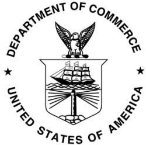
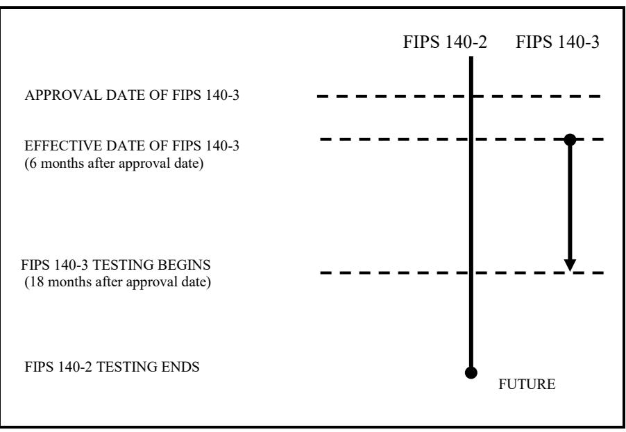

# **FIPS PUB 140-3**

# **FEDERAL INFORMATION PROCESSING STANDARDS PUBLICATION (Supersedes FIPS PUB 140-2)**

# **SECURITY REQUIREMENTS FOR CRYPTOGRAPHIC MODULES**

## **CATEGORY: INFORMATION SECURITY SUBCATEGORY: CRYPTOGRAPHY**

Information Technology Laboratory National Institute of Standards and Technology Gaithersburg, MD 20899-8900

This publication is available free of charge from: https://doi.org/10.6028/NIST.FIPS.140-3

March 22, 2019

**U.S. Department of Commerce** *Wilbur L. Ross, Jr., Secretary*

**National Institute of Standards and Technology** *Walter Copan, NIST Director and Under Secretary for Standards and Technology*

#### **FOREWORD**

The Federal Information Processing Standards Publication Series of the National Institute of Standards and Technology (NIST) is the official series of publications relating to Standards and Guidelines adopted and promulgated under the provisions of the Federal Information Security Management Act (FISMA) of 2002.

Comments concerning FIPS publications are welcomed and should be addressed to the Director, Information Technology Laboratory, National Institute of Standards and Technology, 100 Bureau Drive, Stop 8900, Gaithersburg, MD 20899-8900.

> Charles H. Romine, Director Information Technology Laboratory

#### **Abstract**

The selective application of technological and related procedural safeguards is an important responsibility of every federal organization in providing adequate security in its computer and telecommunication systems. This standard is applicable to all federal agencies that use cryptographic-based security systems to provide adequate information security for all agency operations and assets as defined in 15 U.S.C. § 278g-3.

This standard shall be used in designing and implementing cryptographic modules that federal departments and agencies operate or are operated for them under contract. The standard provides four increasing, qualitative levels of security intended to cover a wide range of potential applications and environments. The security requirements cover areas related to the secure design, implementation and operation of a cryptographic module. These areas include cryptographic module specification; cryptographic module interfaces; roles, services, and authentication; software/firmware security; operating environment; physical security; non-invasive security; sensitive security parameter management; self-tests; life-cycle assurance; and mitigation of other attacks.

*Key words*: computer security; telecommunication security; physical security; software security; cryptography; cryptographic modules; Federal Information Processing Standard (FIPS); ISO/IEC 19790; ISO/IEC 24759.

#### **Federal Information Processing Standards Publication 140-3**

March 22, 2019

### **Announcing the Standard for**

# **SECURITY REQUIREMENTS FOR CRYPTOGRAPHIC MODULES**

Federal Information Processing Standards Publications (FIPS PUBS) are issued by the National Institute of Standards and Technology (NIST) after approval by the Secretary of Commerce pursuant 15 USC 278g-3.

**1. Name of Standard.** Security Requirements for Cryptographic Modules (FIPS PUB 140-3).

**2. Category of Standard.** Computer Security Standard, Cryptography.

**3. Explanation.** This standard specifies the security requirements that will be satisfied by a cryptographic module utilized within a security system protecting sensitive but unclassified information (hereafter referred to as sensitive information). The standard provides four increasing, qualitative levels of security: Level 1, Level 2, Level 3, and Level 4. These levels are intended to cover the wide range of potential applications and environments in which cryptographic modules may be employed. The security requirements cover areas related to the secure design and implementation of a cryptographic module. These areas include cryptographic module specification; cryptographic module interfaces; roles, services, and authentication; software/firmware security; operating environment; physical security; non-invasive security; sensitive security parameter management; self-tests; life-cycle assurance; and mitigation of other attacks. This standard supersedes FIPS 140-2, *Security Requirements for Cryptographic Modules*, in its entirety.

The Cryptographic Module Validation Program (CMVP) validates cryptographic modules to Federal Information Processing Standard (FIPS) 140-3 and other cryptography-based standards. The CMVP is a joint effort between the National Institute of Standards and Technology and the Canadian Centre for Cyber Security. Modules validated as conforming to FIPS 140-3 are accepted by the Federal agencies of both countries for the protection of sensitive information (United States) or Designated Information (Canada). The goal of the CMVP is to promote the use of validated cryptographic modules and provide Federal agencies with a security metric to use in procuring equipment containing validated cryptographic modules.

In the CMVP, vendors of cryptographic modules use independent, accredited Cryptographic and Security Testing (CST) laboratories to have their modules tested. National Voluntary Laboratory Accreditation Program (NVLAP) accredited laboratories perform cryptographic module compliance/conformance testing.

- **4. Approving Authority.** Secretary of Commerce.
**5. Maintenance Agency.** Department of Commerce, National Institute of Standards and Technology, Information Technology Laboratory (ITL).

**6. Applicability.** This standard is applicable to all Federal agencies that use cryptography-based security systems to protect sensitive information in computer and telecommunication systems (including voice systems) as defined in Section 5131 of the Information Technology Management Reform Act of 1996, Public Law 104-106. This standard **shall** be used in designing and implementing cryptographic modules that Federal departments and agencies operate or are operated for them under contract. Cryptographic modules that have been approved for classified use may be used in lieu of modules that have been validated against this standard. The adoption and use of this standard is available to private and commercial organizations.

**7. Applications.** Cryptography-based security systems may be utilized in various computer and telecommunication applications (e.g., data storage, access control and personal identification, network communications, radio, facsimile, and video) and in various environments (e.g., centralized computer facilities, office environments, and hostile environments). The cryptographic services (e.g., encryption, authentication, digital signature, and key management) provided by a cryptographic module are based on many factors that are specific to the application and environment. The security level to which a cryptographic module is validated must be chosen to provide a level of security appropriate for the security requirements of the application and environment in which the module will be utilized and the security services that the module will provide. The security requirements for a particular security level include both the security requirements specific to that level and the security requirements that apply to all modules regardless of the level.

**8. Specifications.** Federal Information Processing Standard (FIPS) 140-3, Security Requirements for Cryptographic Modules (affixed).

**9. Implementations.** This standard covers implementations of cryptographic modules including, but not limited to, hardware components or modules, software/firmware programs or modules or any combination thereof. Cryptographic modules that are validated under the CMVP will be considered as conforming to this standard. Information about the CMVP can be obtained from the

- a. National Institute of Standards and Technology, Information Technology Laboratory, 100 Bureau Drive, Stop 8900, Gaithersburg, MD 20899-8900.
- b. Canadian Centre for Cyber Security, P.O. Box 9703, Terminal, Ottawa, Ontario K1G 3Z4
- c. CMVP URL https://www.nist.gov/cmvp.
- **10. Approved Security Functions.** Cryptographic modules that conform to this standard **shall** employ Approved security functions such as cryptographic algorithms, cryptographic key management techniques, and authentication techniques that have been approved for protecting Federal government sensitive information. Approved security functions include those that are either:
	- a. specified in a Federal Information Processing Standard (FIPS),
- b. adopted in a FIPS and specified either in an appendix to the FIPS or in a document referenced by the FIPS,
- c. specified in NIST SP 800-140C as an Approved security function, or
- d. specified in NIST SP 800-140D as an Approved sensitive security parameter establishment method.

**11. Interpretation.** Questions concerning the content and specifications of this standard should be addressed to: Director, Information Technology Laboratory, ATTN: FIPS 140-3 Interpretation, National Institute of Standards and Technology, 100 Bureau Drive, Stop 8900, Gaithersburg, MD 20899-8900. Resolution of questions regarding this standard will be provided by the validation authorities at the National Institute of Standards and Technology and the Canadian Centre for Cyber Security.

**12. Implementation Schedule.** This standard becomes effective six months after approval by the Secretary of Commerce. A minimum transition period of 6 months after approval is provided for testing labs to develop and implement FIPS 140-3 testing. A test report for modules demonstrating compliance will be submitted to the CMVP for review and validation. The review process schedule varies, as it is dependent on coordination between the vendor, testing lab, and CMVP. Agencies should develop plans for the acquisition of products that are compliant with FIPS 140-3; however, agencies may purchase any of the products on the CMVP validated modules list. (Note: the CMVP Historical list should not be used for procurement decisions. This list is provided for reference purposes only.) Figure 1 summarizes the CMVP implementation schedule when FIPS 140-3 testing may begin.

Figure 1. *FIPS 140-3 Implementation Schedule* 

**13. Qualifications.** The security requirements specified in this standard are based upon information provided by many sources within the Federal government and private industry. The requirements are designed to aid in protecting against adversaries mounting attacks on sensitive government or commercial data (e.g., hackers, political activists, and economic competitors). The primary goal in designing an effective security system is to make the cost of any attack greater than the possible payoff.

While the security requirements specified in this standard are intended to maintain the security provided by a cryptographic module, conformance to this standard is not sufficient to ensure that a particular module is secure. The operator of a cryptographic module is responsible for ensuring that the security provided by a module is sufficient and acceptable to the owner of the information that is being protected and that any residual risk is acknowledged and accepted. The responsible authority in each agency **shall** ensure that the security of the system is sufficient and acceptable.

A standard of this nature must be flexible enough to adapt to advancements and innovations in science and technology. New or revised requirements may be needed to meet technological and economic changes. This standard will be reviewed at least every five years in order to consider necessary updates or replacement.

**14. Where to obtain copies of this Standard.** This publication is available electronically at https://csrc.nist.gov/publications. Other computer security publications issued by NIST are available at the same web site.

# **Security Requirements for Cryptographic Modules**

## **Table of Contents**

| 1. |  | INTRODUCTION 1 |
| --- | --- | --- |
| 2. |  | DOCUMENT BASIS 1 |
| 3. |  | APPLICABLE STANDARDS 2 |
|  | 3.1 | Normative References 2 |
|  | 3.2 | International standards 2 |
|  | 3.3 | Documents Modifying ISO/IEC 19790:2012(E) 2 |
|  | 3.4 | Documents Modifying ISO/IEC 24759:2017(E) 3 |

## **1. INTRODUCTION**

This standard specifies the security requirements for a cryptographic module utilized within a security system protecting sensitive information in computer and telecommunication systems (including voice systems) as defined in Section 5131 of the Information Technology Management Reform Act of 1996, (Public Law 104-106) and the Federal Information Security Management Act of 2002 (Public Law 107-347).

FIPS 140-1, first published in 1994, was developed by a government and industry working group. The working group identified requirements for four security levels for cryptographic modules to provide for a wide spectrum of data sensitivity (e.g., low value administrative data, million dollar funds transfers, and life protecting data) and a diversity of application environments (e.g., a guarded facility, an office, and a completely unprotected location). Four security levels were specified for each of eleven requirement areas. Each security level offered an increase in security over the preceding level. These four increasing levels of security allowed cost-effective solutions that were appropriate for different degrees of data sensitivity and different application environments.

In 2001, FIPS 140-2 superseded FIPS 140-1. FIPS 140-2 incorporated changes in applicable standards and technology since the development of FIPS 140-1 as well as changes that were based on comments received from the vendor, laboratory, and user communities. Though the standard was reviewed after 5 years, consensus to move forward was not achieved until publication of the 2012 revision of International Organization for Standardization/International Electrotechnical Commission (ISO/IEC) 19790.

FIPS 140-3 supersedes FIPS140-2. FIPS 140-3 aligns with ISO/IEC 19790:2012(E) and includes modifications of the Annexes that are allowed to CMVP (as a validation authority). The testing for these requirements will be in accordance with ISO/IEC 24759:2017(E), with the modifications, additions or deletions of vendor evidence and testing allowed as a validation authority under paragraph 5.2. Major changes in FIPS 140-3 are limited to the introduction of non-invasive physical requirements.

### **2. DOCUMENT BASIS**

ISO/IEC 19790:2012(E), *Information technology — Security techniques — Security requirements for cryptographic modules*, is an international standard based on updates of the earlier versions of FIPS 140, *Security Requirements for Cryptographic Modules*. ISO/IEC 24759:2017(E), *Information technology — Security techniques — Test requirements for cryptographic modules* is an international standard based on the Derived Test Requirements for FIPS 140-2, *Security Requirements for Cryptographic Modules*. It is currently in the best interest to use these standards, superseding those sections where national standards are permitted. Therefore, FIPS 140-3 is based on ISO/IEC 19790:2012/Cor.1:2015(E) and ISO/IEC 24759:2017(E). The following documents identify those elements that are superseded or modified.

## **3. APPLICABLE STANDARDS**

### **3.1 Normative References**

When referring to ISO/IEC 19790:2012(E) and ISO/IEC 24759:2017(E), the latest edition of the referenced document (including any amendments) applies. "NIST SP" denotes a NIST Special Publication series document. For those NIST SP documents that are not referenced by a specific version or date, the latest edition of the referenced document (including any amendments) applies.

#### **3.2 International standards**

These documents form the technical requirements and the basis for the testing methods of this FIPS.

ISO/IEC 19790:2012(E), *Information technology — Security techniques — Security requirements for cryptographic modules*

ISO/IEC 24759:2017(E), *Information technology — Security techniques — Test requirements for cryptographic modules*

### **3.3 Documents Modifying ISO/IEC 19790:2012(E)**

These documents modify the annex requirements of the technical requirements document ISO/IEC 19790:2012(E) as specified by the CMVP validation authority. All of these NIST SPs will be available at https://csrc.nist.gov/publications/.

| NIST SP 800-140A | modifies: | ISO/IEC 19790:2012(E) |
| --- | --- | --- |
| CMVP Documentation Requirements |  | Annex A |
| NIST SP 800-140B | modifies: | ISO/IEC 19790:2012(E) |
| CMVP Security Policy Requirements |  | Annex B |
| NIST SP 800-140C | modifies: | ISO/IEC 19790:2012(E) |
| CMVP Approved Security Functions |  | Annex C |
| NIST SP 800-140D | modifies: | ISO/IEC 19790:2012(E) |
| CMVP Approved Sensitive Security |  | Annex D |
| Parameter Generation and Establishment |  |  |
| Methods |  |  |
| NIST SP 800-140E | modifies: | ISO/IEC 19790:2012(E) |
| CMVP Approved Authentication |  | Annex E |
| Mechanisms |  |  |
| NIST SP 800-140F | modifies: | ISO/IEC 19790:2012(E) |
| CMVP Approved Non-Invasive Attack |  | Annex F |
| Mitigation Test Metrics |  |  |

#### **3.4 Documents Modifying ISO/IEC 24759:2017(E)**

These documents modify the vendor documentation and testing requirements of ISO/IEC 24759:2017(E) as specified by the CMVP validation authority. All of these NIST SPs will be available at https://csrc.nist.gov/publications/.

| NIST SP 800-140 | modifies: | ISO/IEC 24759:2017(E) |
| --- | --- | --- |
| FIPS 140-3 Derived Test Requirements |  | (6.1 through 6.12) |
| (DTR) |  |  |
| NIST SP 800-140A | modifies: | ISO/IEC 24759:2017(E) |
| CMVP Documentation Requirements |  | (6.13) |
| NIST SP 800-140B | modifies: | ISO/IEC 24759:2017(E) |
| CMVP Security Policy Requirements |  | (6.14) |
| NIST SP 800-140C | modifies: | ISO/IEC 24759:2017(E) |
| CMVP Approved Security Functions |  | (6.15) |
| NIST SP 800-140D | modifies: | ISO/IEC 24759:2017(E) |
| CMVP Approved Sensitive Security |  | (6.16) |
| Parameter Generation and Establishment |  |  |
| Methods |  |  |
| NIST SP 800-140E | modifies: | ISO/IEC 24759:2017(E) |
| CMVP Approved Authentication Mechanisms |  | (6.17) |
| NIST SP 800-140F | modifies: | ISO/IEC 24759:2017(E) |
| CMVP Approved Non-Invasive Attack |  | (6.18) |
| Mitigation Test Metrics |  |  |

#### **Table 1: NIST SPs that Modify ISO/IEC Standards**

| NIST |  | ISO/IEC | ISO/IEC |
| --- | --- | --- | --- |
| Special Publication |  | 19790:2012(E) | 24759:2017(E) |
| SP 800-140 |  | -- | §6.1 through §6.12 |
| SP 800-140A |  | Annex A | §6.13 |
| SP 800-140B | es | Annex B | §6.14 |
| SP 800-140C | odifi | Annex C | §6.15 |
| SP 800-140D | m | Annex D | §6.16 |
| SP 800-140E |  | Annex E | §6.17 |
| SP 800-140F |  | Annex F | §6.18 |

This table is provided to simplify locating where the changes to the ISO/IEC document sections are addressed in the CMVP documentation.

