5 6 7
2

# 1 Nist Special **Publication**

 Nist Sp 800-226 Ipd

3 Guidelines for Evaluating **Differential**
Privacy **Guarantees**
4 Authors Joseph P. Near David Darais Editors Naomi Lefkovitz Gary Howarth This publication is available free of charge from:

https://doi.org/10.6028/NIST.SP.800-226.ipd 8 9 10 11 12 13 14 15 16 17 19 20 21 22 23 24 25 26 27 28 29 30 31 32 33 34 35 36 37 38 39 40 41 National Institute of Standards and Technology Laurie E. Locascio, NIST Director and Under Secretary of Commerce for Standards and Technology

# 18 Nist Special **Publication** Nist Sp 800-226 Ipd Guidelines For Evaluating **Differential** Privacy **Guarantees**

Authors Joseph P. Near University of *Vermont* David Darais Galois, *Inc.*
Editors Naomi Lefkovitz Gary Howarth Applied Cybersecurity Division, Information Technology Laboratory, *NIST*
This publication is available free of charge from:
https://doi.org/10.6028/NIST.SP.800-226.ipd December 2023

U.S. Department of Commerce Gina M. Raimondo, *Secretary* 42 43 Certain commercial equipment, instruments, or materials, commercial or non-commercial, are identified in this paper in order to specify the experimental procedure adequately. Such identification does not imply recommendation or endorsement of any product or service by NIST, nor does it imply that the materials or equipment identified are necessarily the best available for the purpose.

44 45 46 NIST Technical Series **Policies** Copyright, Use, and Licensing Statements NIST Technical Series Publication Identifier Syntax 47 48 49 Publication **History**
Approved by the NIST Editorial Review Board on YYYY-MM-DD
Supersedes NIST Series XXX (Month Year) DOI
50 51 52 How to cite this NIST Technical Series **Publication:** Near J, Darais D (2023) Guidelines for Evaluating Differential Privacy Guarantees. (National Institute of Standards and Technology, Gaithersburg, MD), NIST SP 800-226 ipd.

https://doi.org/10.6028/NIST.SP.800-226.ipd 53 54 55 56 NIST Author ORCID iDs Joseph P. Near: 0000-0003-2314-0287 David Darais: 0000-0002-3203-3742 57 58 59 Contact **Information**
Privacyeng@nist.gov 60 61 Public Comment **Period** Dec 11, 2023 - Jan 25, 2024 62 63 Submit **Comments** Privacyeng@nist.gov 64 65

## 66 **Abstract**

This publication describes differential *privacy* - a mathematical framework that quantifies privacy risk to individuals as a consequence of data collection and subsequent data release. It serves to fulfill one of the assignments to the National Institute of Standards and Technology
(NIST) by the Executive Order on Safe, Secure, and Trustworthy Artificial Intelligence issued on October 30, 2023. The primary goal of this publication is to help practitioners of all backgrounds better understand how to think about differentially private software solutions. Multiple factors for consideration are identified in a differential privacy pyramid along with several privacy hazards, which are common pitfalls that arise as the mathematical framework of differential privacy is realized in practice.

67 68 69 70 71 72 73 74 75 76

## Keywords

77 78 Anonymization; data analytics; data privacy; de-identification; differential privacy; privacy; privacy-enhancing technologies.

79

## Reports On Computer Systems **Technology**

80 81 82 83 84 85 86 87 88 89 90

## Supplemental **Content**

91 92 93 94 95 96 The Information Technology Laboratory (ITL) at the National Institute of Standards and Technology (NIST) promotes the U.S. economy and public welfare by providing technical leadership for the Nation's measurement and standards infrastructure. ITL develops tests, test methods, reference data, proof of concept implementations, and technical analyses to advance the development and productive use of information technology. ITL's responsibilities include the development of management, administrative, technical, and physical standards and guidelines for the cost-effective security and privacy of other than national securityrelated information in federal information systems. The Special Publication 800-series reports on ITL's research, guidelines, and outreach efforts in information system security, and its collaborative activities with industry, government, and academic organizations.

This publication comes with a companion package of Python Jupyter notebooks that illustrate some of the concepts described in the publication, including how to achieve differential privacy, situations where differential privacy could magnify bias, and utility analysis of differentially private algorithms. Supplemental content for this publication can be found at https://github.com/usnistgov/PrivacyEngCollabSpace/tree/master/tools/de-identification/
NIST-SP-800-226-SupplementalMaterial/.

## 97 Call For Patent **Claims**

This public review includes a call for information on essential patent claims (claims whose use would be required for compliance with the guidance or requirements in this Information Technology Laboratory (ITL) draft publication). Such guidance and/or requirements may be directly stated in this ITL Publication or by reference to another publication. This call also includes disclosure, where known, of the existence of pending U.S. or foreign patent applications relating to this ITL draft publication and of any relevant unexpired U.S. or foreign patents.

98 99 100 101 102 103 104 ITL may require from the patent holder, or a party authorized to make assurances on its behalf, in written or electronic form, either:
105 106 a) assurance in the form of a general disclaimer to the effect that such party does not hold and does not currently intend holding any essential patent claim(s); or 107 108 109 110 111 b) assurance that a license to such essential patent claim(s) will be made available to applicants desiring to utilize the license for the purpose of complying with the guidance or requirements in this ITL draft publication either:
112 113
(i) under reasonable terms and conditions that are demonstrably free of any unfair discrimination; or 114 115
(ii) without compensation and under reasonable terms and conditions that are demonstrably free of any unfair discrimination.

Such assurance shall indicate that the patent holder (or third party authorized to make assurances on its behalf) will include in any documents transferring ownership of patents subject to the assurance, provisions sufficient to ensure that the commitments in the assurance are binding on the transferee, and that the transferee will similarly include appropriate provisions in the event of future transfers with the goal of binding each successor-in-interest.

116 117 118 119 120 The assurance shall also indicate that it is intended to be binding on successors-in-interest regardless of whether such provisions are included in the relevant transfer documents.

121 122 Such statements should be addressed to: Privacyeng@nist.gov 123

| 126     | Table                            | of                                                   | Contents   |    |
|---------|----------------------------------|------------------------------------------------------|------------|----|
| 127     | Executive Summary                | 1                                                    |            |    |
| 128     | 1.                               | Introduction                                         |            | 3  |
| 129     | 1.1.                             | De-Identification and Re-Identification              |            | 4  |
| 130     | 1.2.                             | Unique Elements of Differential Privacy              | 5          |    |
| 131     | 2.                               | The Differential Privacy Guarantee                   | 6          |    |
| 132     | 2.1.                             | The Promise of Differential Privacy                  |            | 6  |
| 2.1.1.  | The Math of Differential Privacy |                                                      | 8          |    |
| 133     | 2.1.2.                           | Properties of Differential Privacy                   |            | 9  |
| 134 135 | 2.2.                             | The Privacy Parameter ε                              |            | 9  |
| 2.3.    | Variants of Differential Privacy | 10                                                   |            |    |
| 136 137 | 2.4.                             | The Unit of Privacy                                  |            | 13 |
| 138     | 2.5.                             | Comparing Differential Privacy Guarantees            | 16         |    |
| 139     | 2.6.                             | Mixing Differential Privacy With Other Data Releases |            | 18 |
| 140     | 3.                               | Differentially Private Algorithms                    |            | 19 |
| 141     | 3.1.                             | Basic Mechanisms and Common Elements                 | 19         |    |
| 142     | 3.2.                             | Utility and Accuracy                                 | 20         |    |
| 3.3.    | Bias                             | 23                                                   |            |    |
| 143     | 3.3.1.                           | Systemic Bias                                        |            | 24 |
| 144     | 3.3.2.                           | Human Bias                                           |            | 26 |
| 145     | 3.3.3.                           | Statistical Bias                                     | 26         |    |
| 146 147 | 3.4.                             | Analytics Queries                                    | 27         |    |
| 148     | 3.4.1.                           | Counting Queries                                     |            | 27 |
| 149     | 3.4.2.                           | Summation Queries                                    | 29         |    |
| 150     | 3.4.3.                           | Average Queries                                      | 30         |    |
| 151     | 3.4.4.                           | Min/Max Queries                                      |            | 31 |
| 152     | 3.5.                             | Machine Learning                                     | 31         |    |
| 153     | 3.6.                             | Synthetic Data                                       |            | 32 |
| 3.7.    | Unstructured Data                |                                                      | 35         |    |
| 154     | 4.                               | Deploying Differential Privacy                       | 36         |    |
| 155     | 4.1.                             | Query Models                                         | 36         |    |
| 156     |                                  |                                                      |            |    |

158 159 160

| B.5.   | Details: Average Queries   | 54   |
|--------|----------------------------|------|

161 162 163 164 165 166 167 168 169 170 171 B.4. Details: Summation Queries . . . . . . . . . . . . . . . . . . . . . . . . . . . 53 172 173 B.6. Details: Differentially Private Stochastic Gradient Descent . . . . . . . . . 54 174

## List Of **Tables**

Table 1. Variants of differential privacy . . . . . . . . . . . . . . . . . . . . . . . . . . 12 Table 2. Common units of privacy. . . . . . . . . . . . . . . . . . . . . . . . . . . . . . 14 Table 3. Common deployment models for differential privacy and their trust assumptions 39 175 176 177 178

## List Of **Figures**

179 180 181 182 183 184 185 186 187 188 Fig. 1. Components of a differential privacy guarantee . . . . . . . . . . . . . . . . 4 Fig. 2. Impact of the privacy parameter ε: the privacy-utility trade-off. . . . . . . 10 Fig. 3. All of the differential privacy variants shown in Table 1 can be converted to
(ε,δ)-differential privacy. . . . . . . . . . . . . . . . . . . . . . . . . . . . . . 12 Fig. 4. An example of two differential privacy guarantees that have the same ε value. The two guarantees are not directly comparable because they have different δ values. . . . . . . . . . . . . . . . . . . . . . . . . . . . . . . . . . 17 Fig. 5. An example of two differential privacy guarantees that have the same ε and δ values. The two guarantees are not directly comparable because they have different units of privacy. . . . . . . . . . . . . . . . . . . . . . . . . . . 17

| 157         | 4.2.                                            | Threat Models                                            |     | 37   |
|-------------|-------------------------------------------------|----------------------------------------------------------|-----|------|
|             | 4.2.1.                                          | Central Model                                            |     | 39   |
|             | 4.2.2.                                          | Local Model                                              |     | 40   |
|             | 4.2.3.                                          | Future Directions: Shuffle and Secure Computation Models |     | 41   |
| 4.3.        | Mechanism Implementation Challenges             |                                                          | 41  |      |
| 4.4.        | Data Security and Access Control                |                                                          | 43  |      |
| 4.5.        | Data Collection Exposure                        | 44                                                       |     |      |
| 4.6.        | Conclusion                                      | 44                                                       |     |      |
| References  |                                                 | 45                                                       |     |      |
| Appendix A. | Glossary                                        |                                                          | 49  |      |
| Appendix B. | Technical Details                               |                                                          | 51  |      |
| B.1.        | Definition of (ε,δ)-Differential Privacy        | 51                                                       |     |      |
| B.2.        | Definitions of Sensitivity and Basic Mechanisms | 51                                                       |     |      |
| B.3.        | Details: Counting Queries                       | 52                                                       |     |      |

189 Fig. 6. An example of two differential privacy guarantees that have different ε and δ values. The two guarantees are directly comparable because one is convertible to the other using a conversion formula. . . . . . . . . . . . . . 17 Fig. 7. The 95% confidence interval for the absolute error of the Laplace mechanism. 22 Fig. 8. A plot of subsample size vs the 95% confidence interval shown in Fig. 7. . 22 Fig. 9. A plot of subsample size vs epsilon values that give the same error confidence interval. . . . . . . . . . . . . . . . . . . . . . . . . . . . . . . . . . . . . . . . 23 Fig. 10. Two histograms of population count by race in a single U.S. Census district in Massachusetts computed with differential privacy for ε = 1 (left) and ε = 10 (right). Confidence intervals are displayed in red overlaying each bar. 25 Fig. 11. Classifier accuracy for a machine learning classifier trained on U.S. Census data with differential privacy for various values of ε. . . . . . . . . . . . . . 25 Fig. 12. A plot of average error due to statistical bias of changing negative counts to zero vs choice of ε. . . . . . . . . . . . . . . . . . . . . . . . . . . . . . . . 27 Fig. 13. Generating a differentially private synthetic data using a marginal distribution. (PSL = Pumpkin Spice Latte) . . . . . . . . . . . . . . . . . . . . . . . 33 Fig. 14. Central model of differential privacy . . . . . . . . . . . . . . . . . . . . . . . 39 Fig. 15. Local model of differential privacy . . . . . . . . . . . . . . . . . . . . . . . . 40 Fig. 16. Noisy gradient descent for differentially private machine learning . . . . . . 55 190 191 192 193 194 195 196 197 198 199 200 201 202 203 204 205 206 207 208

## List Of **Appendices**

209 210 Glossary . . . . . . . . . . . . . . . . . . . . . . . . . . . . . . . . . . . . . . . . . . . . . 49 Technical Details . . . . . . . . . . . . . . . . . . . . . . . . . . . . . . . . . . . . . . . . 51 v

## 211 **Acknowledgments**

The authors thank Christine Task and Damien Desfontaines for providing feedback on early drafts of this publication, as well as Ryan McKenna, Xi He, Dan Kifer, Chike Abuah, Lu´ıs Brandao, ˜
Claire McKay Bowen, Nicolas Papernot and Abhradeep Thakurta for authoring content on the NIST
Differential Privacy Blog Series,1 212 213 214 which informed this publication.

215

## Note To **Reviewers** 216

The authors welcome feedback on all aspects of this publication, particularly on the following questions:
217 218 219
- Does this publication have a clear and appropriate scope?

220
- Is this publication understandable for the intended audience?

221
- Does publication provide a conceptual framework for understanding the uses and pitfalls of differential privacy? Is there any guidance that is not well-founded?

222 223
- Is the differential privacy pyramid a helpful conceptual device?

224
- Are the privacy hazards described accurately? Should additional hazards be added?

225
- For topics where the research is inconclusive, were any key points missed from the literature?

1See https://www.nist.gov/itl/applied-cybersecurity/privacy-engineering/collaboration-space/focus-areas/de-id/dp-blog
.

## 226 Executive **Summary**

227 228 229 230 231 232 233 234 Data analytics is becoming an essential tool to help organizations make sense of the enormous volume of data being generated by information technologies. Many entities - whether in government, industry, academia, or civil society - use data analytics to improve research, develop more effective services, combat fraud, and inform decision-making to achieve mission or business objectives. However, when the data being analyzed relates to or affects individuals, privacy risks can arise. These privacy risks can limit or prevent entities from realizing the full potential of data. Privacy-enhancing technologies can help mitigate privacy risks while enabling more uses of data.

235 236 237 238 239 240 241 242 This publication describes differential *privacy* - a privacy-enhancing technology that quantifies privacy risk to individuals when their data appears in a dataset. Differential privacy was first defined in 2006 as a theoretical framework and is still in the process of transitioning from theory to practice. This publication is intended to help practitioners of all backgrounds - policymakers, business owners, product managers, IT technicians, software engineers, data scientists, researchers, and academics - understand, evaluate, and compare differential privacy guarantees. In particular, this publication highlights privacy hazards that practitioners should consider carefully.

243 244 245 246 247 248 249 This publication is organized into three parts. Part I defines differential privacy, Part II
describes techniques for achieving differential privacy and their properties, and Part III
covers important related concerns for deployments of differential privacy. A supplemental, interactive software archive is also included to supplement understanding of differential privacy and techniques for achieving it. It serves to fulfill one of the assignments to the National Institute of Standards and Technology (NIST) by the Executive Order on Safe, Secure, and Trustworthy Artificial Intelligence issued on October 30, 2023.

## 250 Part I: The Differential Privacy **Guarantee**

251 252 253 254 255 256 257 Differential privacy promises that the outcome of a data analysis or published dataset will be about the same whether or not you contribute your data. In other words, any privacy harms that result from a differentially private analysis could have happened even if you had not contributed your data. This section introduces differential privacy, describes its properties, explains how to reason about and compare differential privacy guarantees, describes how the differential privacy guarantee can impact real-world outcomes, and highlights potential hazards in defining and evaluating these guarantees.

## 258 Part Ii: Differentially Private **Algorithms**

259 260 261 In general, differential privacy is achieved by adding random noise to analysis results. More noise yields better privacy but also degrades the utility of the result. This dynamic is often called the privacy-utility trade-off, and it can be difficult to achieve high utility and strong 263 264 265 266 267 268 269 270 262 privacy protection in some cases. In addition, some differentially private techniques can create or magnify systemic, human, or statistical bias in results, so care must be taken to understand and mitigate these impacts.

This section describes algorithms for a wide range of data processing scenarios. Differentially private algorithms exist for analytics queries (e.g., counting, histograms, summation, and averages), regression tasks, machine learning tasks, synthetic data generation, and the analysis of unstructured data. Implementing differentially private algorithms requires significant expertise. It can be difficult to get right and easy to get wrong, like implementing cryptography, so it is best to use existing libraries when possible.

## 271 Part Iii: Deploying Differential **Privacy**

272 273 274 275 276 277 278 279 280 281 Differential privacy provides privacy protection for data subjects in the context of intentional, differentially private data releases. However, differential privacy alone does not protect data as it is collected, stored, and analyzed. Part III describes practical concerns about deploying differentially private analysis techniques, including the threat model, which describes who can be considered trustworthy and who should be considered malicious; several implementation challenges for differentially private mechanisms that can cause unexpected privacy failures; and additional security concerns and data collection exposure.

For example, sensitive data must be stored using best practices in secure data storage and access control policies or not stored at all. A data breach that leaks sensitive raw data will completely nullify any differential privacy guarantee established for that dataset.

## 282 Toward Standardization, Certification, And **Evaluation**

283 284 285 286 287 288 289 290 291 292 293 This publication is intended to be a first step toward building standards for differential privacy guarantees to ensure that deployments of differential privacy provide robust realworld privacy protections. In particular, a standard for differential privacy guarantees should prescribe parameter settings or solutions that address all of the privacy hazards described in this publication. Such a standard would allow for the construction of tools to evaluate differential privacy guarantees and the systems that provide them as well as the certification of systems that conform with the standard. The certification of differential privacy guarantees is particularly important given the challenge of communicating these guarantees to non-experts. A thorough certification process would provide non-experts with an important signal that a particular system will provide robust guarantees without requiring them to understand the details of those guarantees.

## 294 1. **Introduction**

295 296 297 298 299 300 301 302 303 304 305 306 307 308 309 310 311 312 313 314 New software tools for differential privacy have emerged to make deploying differentially private systems easier. However, to effectively use these tools, practitioners must understand the mapping between mathematical properties of differential privacy and the real world, which is inexact.

315 316 317 318 319 320 321 322 323 324 325 326 327 328 329 330 331 332 Data analytics is becoming an essential tool to help organizations make sense of the enormous volume of data being generated by information technologies. Many entities in government, industry, academia, or civil society use data analytics to improve research, develop more effective services, combat fraud, and inform decision-making to achieve mission or business objectives. However, when the data being analyzed relates to or affects individuals, privacy risks can arise. These privacy risks can limit or prevent entities from realizing the full potential of data. Privacy-enhancing technologies can help mitigate privacy risks while enabling more uses of data.

This publication discusses differential *privacy* - a privacy-enhancing technology that quantifies privacy risk to individuals when their data appears in a dataset. Differential privacy was first defined in 2006 as a theoretical framework. In recent years, it has been successfully deployed in production by large technology corporations and the U.S. Census Bureau. However, differential privacy is still in the process of transitioning from theory to practice. Although production systems exist that drive large-scale deployments, the software ecosystem for differential privacy is still in its infancy. This makes it challenging for practitioners who do not specialize in data privacy to easily deploy it.

The primary goal of this publication is to help practitioners of all backgrounds - including business owners, product managers, software engineers, data scientists, and academics —
better understand how to think about differentially private software solutions. It serves to fulfill one of the assignments to the National Institute of Standards and Technology (NIST)
by the Executive Order on Safe, Secure, and Trustworthy Artificial Intelligence issued on October 30, 2023.

This publication identifies several privacy hazards, which are common pitfalls that arise as the mathematical framework of differential privacy is realized in practice. While some technical details are discussed to give appropriate context for these hazards, dense mathematical formulas are isolated to figures. Additionally, an interactive software archive is included to supplement understanding on how differential privacy works, its guarantees, its quirks, and its trade-offs.

Differential privacy has a precise mathematical definition. However, in practice, a differential privacy guarantee relies on multiple other factors. These factors are identified in the differential privacy pyramid shown in Fig. 1. The ability for each component of the pyramid to protect privacy depends on the components below it, and each is vital to achieving a meaningful privacy guarantee for end users. Evaluating any claim to differential privacy protection requires examining every component of the pyramid.

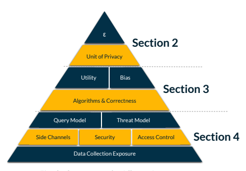

Fig. 1. Components of a differential privacy guarantee
333 This rest of this publication is organized into three sections:
334 335 336 337 338 339 340 341 342
- Section 2 discusses the top part of the pyramid - the privacy parameter ε (and other privacy parameters) and the unit of privacy, which together are the most direct measure of the strength of a differential privacy guarantee.

- Section 3 discusses the middle part of the pyramid - algorithms and correctness, side channels, and security, each of which can undermine a differential privacy guarantee if ignored.

- Section 4 discusses the bottom part of the pyramid - access control, threat and trust models, and data collection, each of which is important for contextualizing a differential privacy guarantee.

This publication will help readers understand, compare, and evaluate differential privacy guarantees; design differential privacy guarantees that translate into strong real-world privacy protections; and build systems that correctly ensure those guarantees.

343 344 345

## 1.1. De-Identification And **Re-Identification** 346

The most common approach to ensuring that an analysis is privacy-preserving is to perform it on de-identified data. In this publication, de-identified data refers to data from which identifying *information* has been removed. Identifying information is information that could be used to identify a specific individual, such as a name, address, phone number, or identification number. This approach is sometimes called anonymization but is distinct from the definition of anonymization used in the European Union's General Data Protection 347 348 349 350 351 352

## 353 Regulation (Gdpr) [1].

354 355 356 Unfortunately, de-identifying data is challenging in practice because it is difficult to distinguish identifying information from non-identifying information. As a result, de-identified data nearly always contains some identifying information. For decades, it was considered impossible to recover enough information from properly de-identified data to seriously harm an individual's privacy. However, the increasing availability of large amounts of data has led to the development of more powerful privacy attacks that disprove this assumption.

357 358 359 360 361 362 363 364 365 366 367 368 369 370 371 372

374 375 376 377 378 379 380 381 382 383 384 385 386 387 In 1997, Professor Latanya Sweeney used a combination of gender, zip code, and birth date from publicly available voter registration data to re-identify individuals in a de-identified database of medical records, including Massachusetts Governor William Weld [2]. While Massachusetts stopped releasing de-identified medical records after that, Professor Sweeney found that 87% of the United States population can be uniquely identified by the three elements mentioned above.2 Professor Sweeney's technique is an example of a linking *attack*: an approach for exposing information specific to individuals in a de-identified dataset by matching records with a second dataset (often called the auxiliary data). Since the feasibility of a linking attack relies on the availability of good auxiliary data, the historical lack of suitable data was one basis for the belief that de-identified datasets preserve privacy. Today, however, more data is available than ever before, and linking attacks have been used to re-identify individuals in many different settings.

## 1.2. Unique Elements Of Differential **Privacy**

Differential privacy is a mathematical definition of what privacy means - that is, it attempts to model privacy with math. There are many different techniques that can satisfy the definition, as will be discussed in future sections. Differential privacy's status as a definition
(rather than a process or technique) represents one major difference compared to techniques like de-identification.

Perhaps more importantly, differential privacy has important advantages over previous privacy techniques - including de-identification - that address many of the privacy challenges described earlier in this section. These advantages are the primary reasons why a practitioner might choose differential privacy over some other data privacy technique. Since differential privacy is rather new, robust tools, standards, and best-practices are not easily accessible outside of academic research communities.

The following sections will describe the differential privacy definition and its implications on privacy in the real world, give an overview of techniques for satisfying differential privacy, and discuss deployment challenges and approaches for addressing them.

## 388 2. The Differential Privacy **Guarantee**

This section introduces differential privacy, describes its properties, and explains how to reason about and compare differential privacy guarantees. It focuses on how the specifics of the differential privacy guarantee can impact real-world outcomes and highlights potential hazards in defining and evaluating these guarantees. Specifically:
389 390 391 392 393 394
- Section 2.1 defines differential privacy and describes how to interpret its formal definition in real-world terms.

395 396
- Section 2.2 introduces the privacy parameter ε, which is one key factor in controlling the strength of the privacy guarantee.

397 398
- Section 2.3 describes several commonly used variants of the differential privacy definition.

399
- Section 2.4 describes the unit of privacy, which is the other key factor in controlling the strength of the privacy guarantee.

400 401 402
- Section 2.5 describes how to compare different privacy guarantees to each other, including the hazards of these comparisons.

403 404
- Section 2.6 examines the impact of mixing differential privacy with other kinds of privacy protection.

## 2.1. The Promise Of Differential **Privacy** 405

Differential privacy is a mathematical definition of what it means to have privacy when an individual contributes data to a particular analysis process. Informally, the math of differential privacy encodes the notion that the chance of any outcome is about the same, whether or not the individual contributes their data. This includes every possible outcome, including thosethat might be considered privacy harms to an individual. Here, the word outcome denotes the result of the analysis itself. For example, if you bought a pumpkin spice latte last month from your favorite coffee stand, the outcome of analyzing that coffee stand's sales data might be learning that 873 pumpkin spice lattes were sold last month. Differential privacy says that this outcome should occur with the same probability with or without your data.

406 Data Collection Exposure Side Channels Security Access Control Query Model Threat Model Unit of Privacy ε Section 2 407 408 Utility Bias Section 3 409 Algorithms & Correctness 410 Section 4 411 412 413 414 415 416 Key **Takeaway** Differential privacy promises that the chance of an outcome is about the same whether or not you contribute your data.

One way to view the promise of differential privacy is in terms of potential privacy harms that could be prevented, like re-identification attacks. If a re-identification attack is an outcome, then differential privacy promises that a successful attack against individual X is equally likely whether or not X's data is present. Since a re-identification attack cannot be 417 418 419 420 422 421 successful if X's data is missing, differential privacy promises that it will not be successful even if X does contribute data.

423 Another useful way to consider the promise is to imagine two hypothetical worlds:
424 425 1. In the real world, X lives in a city, owns a smartphone, pays with a credit card, and uses social media.

426 2. In an off-grid world, X lives in an off-grid cabin and is self-sufficient. No other individual knows that X exists.

427 428 429 430 431 The off-grid world is designed to encode an informal notion of "perfect privacy." Differential privacy promises that the chance of an outcome will be about the same in both worlds, meaning that privacy harms that occur in the real world could just as easily have occurred in the off-grid world.

432 433 434 435 436 437 438 439 However, population-level information can sometimes allow one to infer information about individuals. Differential privacy thus does not protect against inferences made about an individual as long as those inferences can be made without that individual's data. For example, differentially private statistics might allow us to learn the following (made up)
fact: "most people named Joe enjoy pumpkin spice lattes." There may be many individuals in the world named Joe, and excluding a single such individual would not change this statement very much. Yet one could conclude that any individual X named Joe probably enjoys pumpkin spice lattes, even in the off-grid world.

Key **Takeaway** Differential privacy does not prevent somebody from making inferences about you.

440 441 442 443 444 445 446 447 448 449 450 451 452 453 Tore Dalenius described inferential disclosure as the possibility of learning a sensitive

3The NIST Privacy Risk Assessment Methodology (PRAM) [4] catalogs some examples of problematic data actions.
The NIST Privacy Framework [3] characterizes privacy as a state that safeguards important values, such as human autonomy and dignity. Privacy risks arise from problematic data actions, which are actions taken on data that could cause an adverse effect for individuals.3 Differential privacy provides a strong defense against many of these problematic data actions, including common concerns like re-identification. Methodologies like the Privacy Framework can help contextualize the protection provided by differential privacy and assess whether that protection matches real-world expectations.

Privacy can also be framed in terms of limiting different kinds of disclosures, which are often grouped into three categories: identity disclosure (i.e., re-identification), attribute disclosure (i.e., learning a specific attribute of an individual), and inferential disclosure [5].

According to the traditional definition, an inferential disclosure allows someone to make a more confident or accurate inference about an individual. The other two categories are high-confidence cases of inferential disclosure [6].

455 456 457 458 459 460 461 462 463 464

## 2.1.1. The Math Of Differential **Privacy**

465 The formal definition of differential privacy is adapted from [11]:
Definition (Differential **privacy.)** A randomized mechanism M satisfies ε-differential privacy if for all neighboring *datasets* D1 and D2 and all possible outcomes S:

$$\frac{P r[{\mathcal{M}}(D_{1})\in S]}{P r[{\mathcal{M}}(D_{2})\in S]}\leq e^{\varepsilon}$$

D1 and D2 are considered neighbors if they differ in the data of one individual.

The definition says that the ratio of two probabilities should be less than or equal to eε ,
where ε is a number called the privacy parameter, the privacy loss or the privacy *budget*.

One can think of the numerator as the chance that outcome S occurs in the real world (i.e.,
with X's data), while the denominator is the chance that the same outcome S occurs in an off-grid world (i.e., without X's data). The definition is symmetric, so the two cases can be reversed. The ratio between the two probabilities should be small (i.e., ≤ eε ) and encode the requirement that the chance of each outcome should be about the same in both cases.

466 467 468 469 470 471 472 For example, consider a scenario in which 632 pumpkin spice lattes were sold in October. In order for this to satisfy differential privacy according to Definition 1, the probability that an analysis on dataset D1 returns the number 632 should be about the same as the probability that an analysis on D2 returns the same answer. This should also be true of every possible answer one could observe (i.e., every output of the analysis M, not just 632).

473 474 475 476 477 Definition 1 says that D1 and D2 must be neighboring datasets, which differ in one individual's data. Thus, the difference between the real world and an off-grid world can be encapsulated in the availability or non-availability of one person's data. Neighboring datasets can be defined using the unit of *privacy* that has major impacts on the real-world implications of the differential privacy definition.The unit of privacy is discussed in Sec. 2.4.

478 479 480 481 482 Key **Takeaway** The differential privacy guarantee is defined by both the privacy parameters (e.g., ε) and the unit of privacy (i.e., the definition of neighboring datasets).

454 attribute with high but not total certainty [7]. This informal notion has been used in statistical disclosure limitation (SDL) literature for decades. However, under this definition, differential privacy does not protect against all inferential disclosures. More recent work has shown [8–10] that the traditional definition of inferential disclosure is generally impossible to achieve while using statistics to gain scientific knowledge. This line of work proposes a new definition for inferential disclosure: access to a statistical database should not enable one to learn anything about an individual that could not be learned without that individual's data. This new definition aligns with the promise that correctly deployed differential privacy can be expected to provide strong protection against inferential disclosures and, thus, against identity and attribute disclosures.

## 483 2.1.2. Properties Of Differential **Privacy**

The definition of differential privacy has intuitive appeal, but it also has some important properties that address many of the shortcomings of previous approaches to privacy.

484 485 486 487 488 1. Differential privacy assumes that all information is identifying information, eliminating the challenging and sometimes impossible task of accounting for all identifying elements of the data.

489 490 2. Differential privacy is resistant to privacy attacks based on auxiliary data, so it can effectively prevent the linking attacks that are possible on de-identified data.

491 492 493 3. Differential privacy is compositional, meaning that the "total privacy harm" of multiple data releases can be considered to ensure that it does not get too large over time.

These properties are direct mathematical implications of the definition itself - in other words, you can prove that they are true.

494 495

## 2.2. The Privacy **Parameter** Ε 496

At the top of the pyramid in Fig. 1, the privacy parameter ε controls how similar differential privacy's two hypothetical worlds need to be. If ε is very small, then the two worlds need to be nearly identical, implying a very strong privacy guarantee. When ε is large, the two worlds are allowed to be further apart, implying a weaker privacy guarantee.

497 498 499 500 501 502

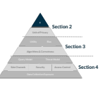

This dynamic is shown in Fig. 2. The most common way to achieve differential privacy is by adding random noise. Thus, as ε gets smaller, the results show stronger privacy but less accuracy. This trade-off is often called the privacy-utility *tradeoff* . Sec. 3.2 discusses utility and how to measure it.

503 504 505 506 Key **Takeaway** Smaller ε means stronger privacy but worse accuracy. Larger ε means weaker privacy but better accuracy. This dynamic is called the privacy-utility *tradeoff* .

Current consensus suggests that a conservative setting of ε ≤ 1 provides strong real-world privacy in most cases [12]. The situation is less clear for larger values of ε. However, many deployments of differential privacy have used larger values (i.e., 1 < ε ≤ 20) [13].

Experiments have shown that ε values on the larger end of this scale do not always provide meaningful real-world privacy [14], but the impact of ε in the real world seems to be highly dependent on the situation, and larger values of ε may still provide meaningful privacy in some cases.

507 Privacy **Hazard** Large values of ε may not provide meaningful privacy.

508 509 510 511 Open **Question** How to set ε is still an active area of research.

512 513 514 515

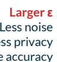

| Smaller ε     |               |          |
|---------------|---------------|----------|
| More noise    |               |          |
| More privacy  |               |          |
| Less accuracy |               | Larger ε |
|               | Less noise    |          |
|               | Less privacy  |          |
|               | More accuracy |          |

Fig. 2. Impact of the privacy parameter ε: the privacy-utility trade-off.

516 It is common for the same data to be analyzed many times. In this context, it is common to view the ε parameter as a privacy *budget* - an upper bound on the total allowable privacy loss for all analyses of the data. The composition property of differential privacy allows us to add up the individual ε parameters for many analyses of the same data to compute an upper bound on the cumulative privacy loss of these analyses. For example, an organization may perform 10 individual differentially private analyses on a dataset, each with a privacy parameter of εi = 0.1. In this case, the total privacy budget is ε = 10εi = 1.

517 518 519 520 521 522 Key **Takeaway** If one dataset is analyzed many times, the individual ε parameters can be added up for the analyses to compute an upper bound on the cumulative privacy loss of these analyses - a "total ε" often called the privacy *budget*.

## 2.3. Variants Of Differential **Privacy** 523

The original definition of differential privacy is also called ε-differential privacy or pure differential privacy. Since the original development of this definition, several variants have been designed that relax its requirements to achieve better utility.

524 525 526

## Benefits Of Privacy **Variants** 527

Table 1 summarizes the commonly used variants of differential privacy. The primary benefit of most variants is improved utility over pure ε-differential privacy. There are two main reasons for the improvement:
528 529 530 531 532 1. All four variants enable the use of Gaussian noise (described in Sec. 3.1), which can significantly improve utility in some cases.

533 534 2. All four variants enable tighter bounds on composition, resulting in lower privacy budgets for iterative algorithms.

To obtain these benefits, each of the variants weakens the privacy guarantee slightly compared to pure ε-differential privacy.

535 536

## 537 Selecting A **Variant.**

538 539 540 541 542 543

## 544 (Ε,Δ)-Differential Privacy And Catastrophic **Failure.**

545 546 547 548 549 550 551 552 553 554 555 556 557 558 559 560 561 562 563 564 565 566 567 568 569

## 570 Converting Guarantees For **Interpretability.**

571 572 Each of the variants in Table 1 has a different set of privacy parameters. Even when the parameters overlap, parameters with the same name can have different meanings. For When only a few statistics are being released, none of the variants offers a significant improvement over pure ε-differential privacy, and there is no need to use one of them. When many statistics are being released or an iterative algorithm is used, then using one of these variants can significantly improve accuracy. When selecting a variant, Renyi ´ differential privacy, zero-concentrated differential privacy, or Gaussian differential privacy are preferred because they offer the best utility and the smallest weakening of the guarantee.

The final variant - (ε,δ)-differential privacy (also called approximate differential privacy)
- includes a parameter δ (pronounced "delta") that allows mechanisms to provide no privacy guarantee at all for rare events (see Appendix Section B.1 for the formal definition). For example, a mechanism that picks one person from a dataset of n people and releases their data with no noise at all can still satisfy (ε,δ)-differential privacy as long as δ > 1n .

This guarantee can allow for a complete, catastrophic failure of privacy. To obtain meaningful real-world privacy protection with (ε,δ)-differential privacy, δ is typically set very small compared to n so that mechanisms like the example above are not possible. In other words, catastrophic failure is so unlikely that it is never expected to occur [15].

An even better approach is to avoid the use of (ε,δ)-
differential privacy to build mechanisms. The other variants in Table 1 provide the same (or better) benefits to utility without the possibility of catastrophic failure. However, (ε,δ)-differential privacy is often used as a common format to compare privacy guarantees.

Privacy **Hazard** Due to the

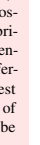

possibility of catastrophic failure, avoid the use of (ε,δ)-
differential privacy when possible. Renyi ´ differential privacy, zero-concentrated differential privacy, and Gaussian differential privacy provide the best utility and strongest guarantee of available variants and should be preferred.

The catastrophic failure possibility of (ε,δ)-differential privacy allows for some useful mechanisms that are not possible under other variants. These mechanisms do not usually offer better utility, but they can improve usability. One example is determining the set of histogram bins from the data (as in SQL's GROUP BY), which is possible under (ε,δ)-
differential privacy but not under the other variants. Depending on the context, the benefit to usability may sometimes outweigh the drawbacks of the weaker guarantee, but the trade-off should be considered carefully.

| Differential Privacy Variant   | Parameters   | Benefit over ε-DP                |
|--------------------------------|--------------|----------------------------------|
| ε-DP (Pure DP)                 | ε            | -                                |
| (ε,δ)-DP (Approximate DP)      | ε,δ          | Usability; interpretability      |
| Renyi ´ DP (RDP)               | α, ε         | Utility; no catastrophic failure |
| Zero-Concentrated DP (zCDP)    | ρ            | Utility; no catastrophic failure |
| Gaussian DP (GDP)              | µ            | Utility; no catastrophic failure |

Table 1. Variants of differential privacy

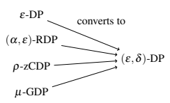

Fig. 3. All of the differential privacy variants shown in Table 1 can be converted to
(ε,δ)-differential privacy.
574 575 576 573 example, the ε in Renyi ´ differential privacy is only similar to the ε in pure ε-differential privacy when α is very large. Guarantees given in two different variants can be interpreted and compared by converting them to a common format. All of the variants in Table 1 can be converted to (ε,δ)-differential privacy for comparison, as shown in Fig. 3.

Key **Takeaway** Renyi ´ differential privacy, zero-concentrated differential privacy, and Gaussian differential privacy guarantees can be converted to (ε,δ)-differential privacy guarantees to enable interpretation and comparison between them.

577 578 579 580 581 582 583 584 585 586 The value δ = 10−5 is often chosen when converting to (ε,δ)-differential privacy because it represents a reasonable balance between ε and δ that makes it easier to interpret the value of ε after conversion. Using a common value for δ also makes it easier to compare guarantees.

When converting a guarantee from RDP, zCDP, or GDP to (ε,δ)-differential privacy, the setting of δ is less critical because these variants do not allow catastrophic failure. Instead, the conversion process introduces a trade-off between ε and δ. When performing the conversion, the analyst chooses a value for δ and calculates ε so that each guarantee in these variants corresponds to many possible (ε,δ) pairs. For example, a zero-concentrated differential privacy guarantee with ρ = 0.1 corresponds to infinitely many (ε,δ)-differential privacy guarantees, including both ε = 1.45,δ = 10−2 and ε = 4.39,δ = 10−20.

Key **Takeaway** When converting a guarantee to (ε,δ)-differential privacy, choose a small value for δ to obtain a meaningful value of ε. In most cases, δ = 10−5 is reasonable. When comparing converted guarantees, ensure that the δ values are equal.

When reporting guarantees, report all of the original privacy parameters to allow third parties to replicate the conversion with different values of δ.

## 587 2.4. The Unit Of **Privacy**

The second layer of the differential privacy pyramid (Fig. 1) is the unit of *privacy* for a differential privacy guarantee. Definition 1 defines differential privacy in terms of neighboring *datasets* and says that two datasets D1 and D2 are neighbors if they differ in one person's data. This is an informal description, and how it is formalized significantly impacts the actual meaning of a differential privacy guarantee. The formal definition of neighboring datasets in a differential privacy guarantee implies a real-world unit of privacy that specifies exactly what is protected by the guarantee. In many ways, it is more important to real-world privacy than the setting of the privacy parameter ε.

588 Data Collection Exposure Side Channels Security Access Control Query Model Threat Model Unit of Privacy ε Section 2 589 590 Utility Bias Section 3 Algorithms & Correctness 591 592 Section 4 593 594 595 596 597

## Unit Of Privacy: Event **Level** 598

To see why the unit of privacy is so important, consider how one would determine whether D1 and D2 are neighboring datasets in the earlier example scenario of the number of pumpkin spice lattes sold in October. One could say that D1 and D2 are neighbors if they differ in one event (e.g., a single transaction). This is an easily formalized definition and is sometimes called event-level *privacy*. It is also sometimes called row-level differential privacy because single events often translate directly to single rows in a database.

599 600 601 602 603 604 To think about how this unit of privacy impacts the real-world privacy of individuals, imagine a scenario in which a particularly thirsty customer (Customer X) buys 610 of the 632 pumpkin spice lattes sold in October. Imagine that an adversary knows the identities and purchase history of all of the pumpkin spice latte customers except for Customer X and wants to find out whether Customer X purchased a small number of pumpkin spice lattes (i.e., fewer than 30) or a large number (i.e., more than 200). The adversary might be able to figure out which of these two hypothetical situations is the real one, even if differential privacy is used because differential privacy makes guarantees only for neighboring datasets.

Under the event-level unit of privacy, the datasets associated with the adversary's hypotheses are not neighbors. The event-level unit of privacy says that neighboring datasets differ by one event (i.e., by a single pumpkin spice latte transaction), and the adversary's hypotheses differ by much more than this. The event-level unit of privacy does protect against an adversary who wants to know whether Customer X bought 632 or 633 pumpkin spice lattes because the associated datasets are neighbors under this unit of privacy. In some cases, this 605 606 607 608 609 610 611 612 613 614 615 616 617 618

| Unit of privacy   | Neighboring datasets differ in...   |
|-------------------|-------------------------------------|
| Event Level       | One event                           |
| User Level        | One individual's data               |

Table 2. Common units of privacy.
may be a sufficient real-world privacy guarantee; in other cases, it may not.

619

## Unit Of Privacy: User **Level** 620

For a stronger real-world guarantee, one can use a different unit of privacy: D1 and D2 are neighbors if they differ in one user's data. This definition of neighboring datasets is sometimes called user-level *privacy*. Under this unit of privacy, the adversary's hypotheses about Customer X are represented by neighboring datasets. In fact, any dataset where Customer X purchases n pumpkin spice lattes is a neighbor of a dataset where Customer X
purchases m lattes for any values of n and m. Thus, differential privacy does translate to a meaningful real-world privacy guarantee against the adversary discussed above if the unit of privacy is set correctly. Table 2 summarizes the most common units of privacy:
621 622 623 624 625 626 627 628

## Transforming The Unit Of Privacy: Bounding **Contributions** 629

A common way to achieve user-level privacy when each user submits multiple events is to enforce an upper bound on the number of events contributed by each user by transforming the data (e.g., keeping the first k events they submit and throwing away any further events or by keeping a random size-k subset of their events). Approaches like this are used to bound the contributions made by each user.

630 631 632 633 634 Bounding contributions transforms the unit of privacy from the event level to the user level, but it also scales up the sensitivity (described in Sec. 3.1) of operations on the data by the upper bound k. As a result, user-level guarantees achieved by bounding contributions require more noise for the same value of ε, and k should be set carefully to maximize accuracy.

635 636 637 638 Bounding contributions can also be used to achieve other kinds of privacy units. For example, it is possible to enforce an upper bound of k events per user per day (or other unit of time)
or per location (or other unit of geography). These guarantees tend to be stronger than event-level privacy but weaker than user-level privacy, and their strength can be difficult to interpret (see Sec. 2.5).

639 640 641 642 643

## Evaluating The Unit Of **Privacy** 644

To determine whether a unit of privacy is sufficient, start with the user-level unit of privacy.

Then consider possible real-world privacy harms, and evaluate whether or not the unit of privacy makes guarantees in the associated scenarios.

645 646 647 648 Privacy harms can be defined in terms of pairs of hypothetical situations that an adversary would like to distinguish (i.e., they would like to know which hypothesis is true). The example above described a potential privacy harm in terms of two hypotheses:
649 650 651 1. Customer X purchased fewer than 30 pumpkin spice lattes.

652 2. Customer X purchased more than 200 pumpkin spice lattes.

Now, consider the datasets D1 and D2 associated with the two hypothetical situations. D1 will contain fewer than 30 transactions from Customer X, while D2 will contain more than 200 transactions.

653 654 655 If these two datasets are neighbors based on the chosen unit of privacy, then the differential privacy guarantee applies to the underlying privacy harm. If they are not, then differential privacy makes no guarantee about the privacy harm. In the previous example, the event-level unit of privacy means that D1 and D2 are not neighbors, so differential privacy makes no guarantees about this situation. Under the user-level unit of privacy, the two are neighbors.

656 657 658 659 660 661 662 663 664 Privacy **Hazard** If the difference between two hypothetical situations is not captured by the unit of privacy, then differential privacy does not prevent an adversary from distinguishing the two situations.

## Choosing A Unit Of **Privacy** 665

The user-level unit of privacy is an excellent default and generally provides robust realworld privacy. Relaxing the unit of privacy can improve accuracy and reduce ε and δ simultaneously, but it can also lead to surprising real-world privacy failures. In particular, it may be possible to learn a significant amount about an individual's habits when event-level privacy is used.

666 667 668 669 670 Example scenarios that highlight the impact of eventlevel privacy include:
671 672 673 674 675 676 677 678 679 680 Bounds on user contributions can strengthen the privacy guarantee significantly, but the bounds must be selected carefully. A total contribution limit is strongest and equivalent to user-level privacy. Bounds that reset periodically can be much weaker.

681 682 683
- Event-level privacy for website logs protects a single visit to a URL but not repeat visits.

- Event-level privacy for taxi trip data protects a single trip but not an individual's common destinations (e.g., home or work).

| Privacy Hazard                                                                        | Event-level      |            |             |
|---------------------------------------------------------------------------------------|------------------|------------|-------------|
| privacy                                                                               | protects         | events     | (or         |
| dataset rows),                                                                        | not individuals. |            |             |
| If                                                                                    | an               | individual | contributes |
| multiple events, an attacker may still be able to infer properties of the individual. |                  |            |             |

- Event-level privacy for smart meters protects a single meter reading but not trends in electricity use (e.g.. the use of power-hungry Bitcoin mining equipment).

684 Example scenarios that highlight the impact of bounding contributions include:
685 686
- A total contribution limit is equivalent to user-level privacy and generally provides robust real-world privacy.

687 688
- A per-day contribution limit protects activities in a single day but not activities that repeat across multiple days.

689
- A per-month contribution limit protects activities in a single month but not activities that occur every month.

690 The safest default for any differential privacy guarantee is user-level privacy or a total contribution bound that transforms the guarantee into user-level privacy. Weaker units of privacy can improve accuracy or reduce ε, but they can also weaken the privacy guarantee significantly. When a weaker unit of privacy is used, it is important to assess whether the differential privacy guarantee still offers the desired protection against real-world privacy risks.

691 692 693 694 695 696

## 2.5. Comparing Differential Privacy **Guarantees** 697

This section demonstrates the implications of different kinds of differential privacy guarantees by comparing different guarantees to each other.

698 699

## Privacy **Parameter** Ε 700

The setting of the privacy parameter ε has the most visible impact on real-world privacy, and comparing ε values is the first step in comparing two guarantees. For example, a guarantee with ε = 0.1 is strictly stronger than a guarantee with ε = 10.

701 702 703

## Privacy **Parameter** Δ 704

As with ε, a smaller value for δ means stronger privacy. If two ε values are the same, the next step in comparing the guarantees is to compare their δ values. Unfortunately, differing δ values can make two guarantees difficult to compare. For example, consider the two guarantees in Fig. 4. Their ε values are the same, but their δ values are different. Guarantee
(a) is strictly stronger because its δ value is smaller. When two guarantees have different δ values, it is not possible to compare their εs.

705 706 707 708 709 710

## Unit Of **Privacy** 711

An improper setting for the unit of privacy can unintentionally reveal information about individuals. For example, consider the two guarantees in Fig. 5. Guarantee (a) is strictly stronger because its unit of privacy is strictly larger even though the other parameters are the same for both guarantees. Guarantee (b) may not provide meaningful privacy when one 712 713 714 715

Privacy **Hazard**

Guarantees with different values of δ are not

directly comparable.

(a) (b)

| ε            | 2.5          |            |     |
|--------------|--------------|------------|-----|
| δ            | 1 · 10−25    |            |     |
| Privacy unit | User level   | ε          | 2.5 |
|              | δ            | 1 · 10−5   |     |
|              | Privacy Unit | User Level |     |

Fig. 4. An example of two differential privacy guarantees that have the same ε value. The two guarantees are not directly comparable because they have different δ values.

| ε            | 2.5          |             |     |
|--------------|--------------|-------------|-----|
| δ            | 1 · 10−5     |             |     |
| Privacy Unit | User Level   | ε           | 2.5 |
|              | δ            | 1 · 10−5    |     |
|              | Privacy Unit | Event Level |     |

Privacy **Hazard**

Guarantees with different units of privacy are

not directly comparable.

(a) (b)

Fig. 5. An example of two differential privacy guarantees that have the same ε and δ values.

The two guarantees are not directly comparable because they have different units of privacy.

717 716 person takes many trips. Under guarantee (b), an attacker may be able to determine where a target individual lives, in spite of the differential privacy guarantee.

## 718 Conversion Between **Variants**

719 720 Converting to (ε,δ)-differential privacy from another variant of the differential privacy definition requires picking a value for δ. In this situation, the δ parameter is important for interpreting the resulting ε and comparing it with other guarantees. For example, consider the two guarantees in Fig. 6. Guarantees (a) and (b) are equivalent even though the reported ε values are very different. The difference comes from the trade-off between ε and δ in the 721 722

| ρ            | 0.1          |            |     |
|--------------|--------------|------------|-----|
| ε            | 1.45         |            |     |
| δ            | 1 · 10−2     |            |     |
| Privacy Unit | User Level   | ρ          | 0.1 |
|              | ε            | 4.39       |     |
|              | δ            | 1 · 10−20  |     |
|              | Privacy Unit | User Level |     |

723

Privacy **Hazard** When converting a guarantee to

(ε,δ)-differential privacy,

choosing a large value for

δ results in a misleading

value for ε.

(a) (b)

Fig. 6. An example of two differential privacy guarantees that have different ε and δ values.

The two guarantees are directly comparable because one is convertible to the other using a conversion formula.

725 724 conversion process from zero-concentrated differential privacy - a larger δ allows for a smaller ε, and a smaller δ requires a larger ε.

726 727 728 729 When a variant is converted to (ε,δ)-differential privacy, the original privacy parameters should also be given (e.g., for zero-concentrated differential privacy, the value of ρ). This information allows third parties to perform their own conversion with other values for δ, enabling direct comparison with other guarantees.

## 730 2.6. Mixing Differential Privacy With Other Data **Releases**

731 732 733 734 735 In some contexts, it may be necessary to release both differentially private statistics and non-differentially private statistics calculated from the same underlying data. For example, an organization may wish to make two releases based on the same underlying data:
Privacy **Hazard** The use of differential privacy does not mitigate privacy risks associated

with other (non-differentially private) releases based on the same underlying data.

736 737 1. Exact summary statistics without differential privacy (under the assumption that the associated privacy risk is low, even without differential privacy)
738 739 2. Detailed statistics with differential privacy 740 741 742 743 744 The existence of the first release does not weaken the privacy guarantee of the second release.

However, the use of differential privacy in the second release does not improve privacy for the first release. In situations like this, it is important to independently consider the privacy risks of non-differentially private releases (e.g., using the NIST Privacy Risk Assessment Methodology [4]).

745 746 747 748 749 750 In this setting, it is possible to ensure consistency between the two releases by postprocessing the differentially private release. This involves modifying the differentially private release to make it consistent with the non-differentially private release. Fortunately, the differential privacy guarantee is robust against post-processing, so ensuring consistency with another set of statistics does not weaken the guarantee. Post-processing for consistency, therefore, does not introduce any additional privacy risks beyond the ones described above.

## 751 3. Differentially Private **Algorithms**

This section describes specific algorithms for differentially private analysis. It focuses on high-level descriptions of established approaches with a particular emphasis on algorithms that are practical and easy to deploy. The first three sections describe important general considerations of differentially private algorithms, including utility and bias:
752 753 754 755 756 757

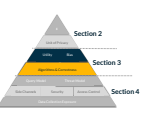 

758 759
- Section 3.1 gives an overview of several building blocks used in differentially private algorithms.

760
- Section 3.2 describes utility, and accuracy, and some methods for measuring them.

761
- Section 3.3 explores the impacts of differential privacy on different forms of bias in data releases.

762 763 Thereafter, the sections are organized by analysis type:
764 765
- Section 3.4 describes techniques for analytics queries on a single data table (e.g.,
counting, summation, and average queries).

766
- Section 3.5 describes techniques for machine learning, including deep learning.

767
- Section 3.6 describes techniques for generating differentially private synthetic data.

768
- Section 3.7 discusses unstructured data (e.g., text, photos, and video).

NIST strongly recommends that practitioners use well-tested implementations provided by libraries rather than implementing these mechanisms and algorithms themselves. As discussed in Section 4, implementing differentially private algorithms can be tricky, and custom implementations increase the risk of privacy vulnerabilities.

769 Privacy **Hazard** Avoid custom implementations of differentially private algorithms, and use welltested libraries instead.

770 771 772 773 774

## 3.1. Basic Mechanisms And Common **Elements** 775

Randomized functions (often called mechanisms) are used to achieve differential privacy. If Definition 1 is proven for a mechanism, it is called a differentially private mechanism.

776 777 This section describes two basic differentially private mechanisms that are often used to build larger mechanisms and systems: the Laplace mechanism and the Gaussian mechanism.

Both work by adding noise to the output of a query, and both mechanisms scale the noise according to the *sensitivity* of the underlying query. Sensitivity is defined to measure how much the output of a query could change when its input (i.e., the data being queried) changes.

Two commonly used sensitivity measures are L1 and L2. The L1 sensitivity is measured using L1 distance (i.e., Manhattan distance), while the L2 sensitivity is measured using L2 distance (i.e., Euclidean distance). See Appendix Section B.2 for the formal definitions.

778 779 780 781 782 783 784 785 Key **Takeaway** The sensitivity of a query is designed to measure how much one person's data could affect its output.

Mechanism The Laplace *mechanism* adds random noise drawn from the Laplace distribution to the output of a query. It uses L1 sensitivity and guarantees (ε,0)-differential privacy.

Mechanism The Gaussian *mechanism* adds random noise drawn from the Gaussian
(or normal) distribution to the output of a query. It uses L2 sensitivity and guarantees ε,δ-differential privacy.

## 786 Choosing A **Mechanism**

While both the Laplace and the Gaussian mechanisms add noise to a query's output to satisfy differential privacy, they differ in two major ways: the guarantee they provide and the measure of sensitivity they require.

787 788 789 The Laplace mechanism satisfies pure ε-differential privacy, while the Gaussian mechanism satisfies (ε,δ)-differential privacy. If the stronger pure ε-differential privacy guarantee is required, then the Gaussian mechanism is not an option, and the Laplace mechanism should be used.

790 791 792 793 If either guarantee is sufficient, then the choice can be made based on which mechanism provides better accuracy. For queries with *low-dimensional* outputs (i.e., for a query f : D → Rk for small k, including k = 1), the Laplace mechanism provides better accuracy due to the shape of the distribution. For queries with *high-dimensional* outputs (i.e., large k),
the Gaussian mechanism generally provides better accuracy because it allows the use of L2 sensitivity. For high-dimensional outputs, L2 sensitivity is typically much smaller than L1 sensitivity, which significantly improves accuracy.

794 795 796 797 798 799 800

## 3.2. Utility And **Accuracy** 801

Utility refers to how useful a dataset or statistic is for a specific purpose. *Accuracy* refers to the difference between a mechanism's output and the true value that it is attempting to estimate. The two are not synonymous, even though they are often used interchangeably. Utility depends on the way a statistic will be used, while accuracy is simply a measurement of the statistic's error. In particular, data can be:
802 803 804 805 806 807 808

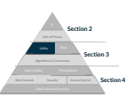

809 810
- Accurate but not **useful**. For example, if important parts of the data have been redacted, the data may not be capable of answering a particular question.

811 812
- Inaccurate but still **useful**. For example, an inaccurate statistic may be sufficient to demonstrate a difference between two populations if the difference is very large.

## 813 Metrics For Utility: No General **Solution**

814 815 816 A statistic or data release can be used to answer many different questions. If the questions are known in advance, it is sometimes possible to develop outcome-specific utility *metrics* that directly measure the utility of the data for answering the specific questions of interest.

817 818 819 820 821 822 823 824 825

## 826 Metrics For **Accuracy**

827 828 829 830 Because utility is difficult to measure directly, accuracy metrics are often used as a proxy for utility. Two common accuracy metrics are absolute error and relative error. Absolute *error* is simply the absolute difference between the true query result and the noisy one. *Relative* error is the absolute error divided by the true query result.

831 832 833 834 835 836 837 838 839 840 841 842 For example, the Laplace mechanism described earlier can be measured by bounding the absolute error of the mechanism due to the noise it adds. The absolute error for the Laplace mechanism is defined as | f(x)−(f(x)+Lap(∆1/ε))|. The noise depends on the privacy parameter ε. That is, the smaller the ε, the larger the error.

843 844 845 846 847 An example of a 95% confidence interval for the absolute error of the Laplace mechanism is shown in Fig. 7. In this example, the query f(x) is an average, and the true result is f(x) = 331. The confidence interval is graphed as an error bar extending above and below the average. As ε gets smaller, the error bar becomes larger, meaning that the Laplace mechanism is more likely to return results with a larger error when ε is small.

A number of different metrics have been developed that attempt to approximately measure utility for large classes of questions [16]. These metrics combine measures of accuracy with assessments of properties that are typically of interest to statisticians, like correlations between columns in the data. Such metrics are useful tools for evaluating the quality of differentially private statistics or data releases but do not necessarily ensure utility for all possible questions of interest.

This setting poses a challenge to measuring error: the mechanisms used for differential privacy add random noise to query results, and that noise is - in theory - unbounded (i.e., it has no maximum or minimum). For example, it is possible to draw a Laplace noise sample in the millions or billions, but it is extremely unlikely. To get an idea about how much error is likely to be seen when running the mechanism, one can use a confidence interval.

For example, a 95% confidence interval says that the absolute error of the mechanism will lie within the specified interval 95% of the time. If this interval is small, then one can be confident that the mechanism will give an accurate answer most of the time.

In most cases, the specific questions of interest are not known when the data or statistics are created, so designing outcome-specific metrics based on those questions is not possible.

Moreover, no single metric (or group of metrics) applies to all questions.

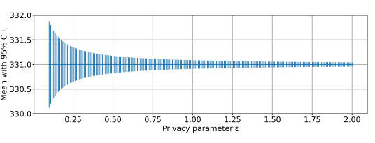

Fig. 7. The 95% confidence interval for the absolute error of the Laplace mechanism.

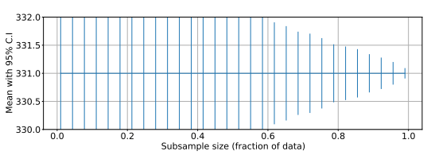

Fig. 8. A plot of subsample size vs the 95% confidence interval shown in Fig. 7.

## 848 Comparison With **Subsampling**

The error of the mechanism can be compared with some other approach that could be used to achieve privacy. One useful point of comparison is *subsampling* - computing the query's result using only a fraction of the original data selected at random and then measuring the error of that result against the true result. When only a small fraction of the original data is used, one can expect to obtain a less accurate result. The resulting "mechanism" does not satisfy differential privacy, but it probably does provide some privacy in many cases and is often used for this purpose.

849 850 851 852 853 854 855 Figure 8 plots a subsample size (measured as a fraction of the total dataset) against 95% confidence interval in the same way as Fig. 7. As the subsample size gets smaller, the confidence interval increases. This means that less accurate results can be expected with smaller subsamples. Note that the y-axis of this figure has the same scale as the earlier figure.

The larger confidence intervals in the second image suggest that the Laplace mechanism can give much more accurate answers than subsampling in most settings.

856 857 858 859 860 861

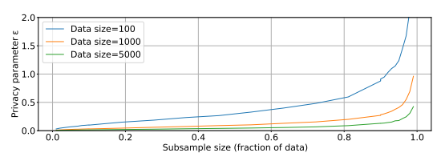

Fig. 9. A plot of subsample size vs epsilon values that give the same error confidence interval.
862 Subsampling can be directly compared with the Laplace mechanism by performing the following experiment: for a particular subsample size, consider the value of the privacy parameter ε that would have resulted in the same confidence interval as subsampling. The results are plotted in Fig. 9 with the subsample size on the x-axis and the value of ε required to achieve the equivalent confidence interval on the y-axis. These results show that even small values of ε suffice to match the accuracy of subsampling. Thus, in this case, the Laplace mechanism with commonly used privacy parameters around ε = 1 is likely to provide better accuracy than subsampling.

863 864 865 866 867 868 869

## 3.3. **Bias** 870

Systems that process data can introduce or magnify various kinds of bias that can negatively impact the validity of conclusions drawn from the results. NIST Special Publication (SP) 1270, Towards a Standard for Identifying and Managing Bias in Artificial *Intelligence* [17], defines three important categories of bias:
871 872 873 874 875

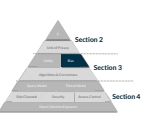 

876 877
- Systemic *bias* results from rules, processes, or norms that advantage certain social groups and disadvantages others.

878 879
- Human *bias* results from failures in the heuristics that humans use to make decisions.

880
- Statistical or computational *bias* occurs when a data release does not reflect the underlying population.

881 In some cases, differential privacy may magnify or create all three types of bias. This section describes how bias can result from the use of differential privacy and gives guidelines for understanding and mitigating that bias.

882 883 884

## 885 3.3.1. Systemic **Bias**

886 887 888 889 890 891 892 893 894 895 896 897 898 899 900 901 902 903 904 905 906 907 908 909 910 911 912 913 914 915 916 917 918 919 920 921 922 923 924 Systemic bias results from rules, processes, or norms that advantage certain social groups and disadvantage others. Institutional racism and sexism are two such examples that may occur without conscious effort by any individual simply as a result of following existing norms. The use of data can perpetuate and magnify systemic bias in many different contexts.

This effect is perhaps most clearly visible in machine learning and other forms of artificial intelligence (AI), where numerous results have demonstrated the tendency of AI systems to
"learn" and magnify systemic biases encoded in the data used to train them [17].

Recent work has also demonstrated that the use of differential privacy can make this problem worse. In a relative sense, the noise introduced by differentially private algorithms impacts smaller groups more than larger ones. Since marginalized social groups are often smaller than advantaged ones (and are sometimes underrepresented in the underlying data), the noise can magnify or even create biases in the differentially private results.

| Privacy Hazard                               | Differential   |
|----------------------------------------------|----------------|
| privacy can magnify or create systemic bias. |                |

Open **Question** Finding and mitigating systemic bias is an open

area of research. Users of this publication may find [17–21] helpful for understanding the considerations.

Differential privacy can magnify disparate impacts on small groups. Figure 10 shows two histograms that count population by race in a single U.S. Census district in Massachusetts [22]. Each figure includes error bars (in red) that demonstrate the 95% confidence interval for the error introduced by differential privacy noise on each histogram bin. The only difference between the two figures is the value of the privacy parameter ε. As expected, the lower value of ε produces more error, so the error bars are larger. The y-axis is plotted on a logarithmic scale to accommodate the variation in bin sizes. Note that for the lowest population race
(i.e., American Indian), the error bar is larger than the population when ε = 1. For the higher population races, the error bars are much smaller than the populations for both values of ε. All of the error bars in each figure have the same absolute size (they only have different visual sizes because of the logarithmic scale). However, the same absolute error may disproportionately impact small groups. In this example, when ε = 1, there is a chance that the noise required by differential privacy will reduce the American Indian population to zero. For larger populations, this kind of extreme impact is virtually impossible.

Differential privacy can also magnify disparate impacts in machine learning. Figure ?? shows the accuracy of a machine learning classifier trained on the same U.S. Census data as the previous example [22]. The classifier is trained to predict an individual's housing type (i.e., single family versus multi-family housing) from other attributes of that individual.

Many classifiers with different values of ε were trained, and the accuracy of the trained classifiers was separately plotted for (1) the majority race in the data and (2) all other races in the data combined. The results show that the classifiers are much more accurate for the majority race than they are for all other races combined at all values of ε. As in the previous

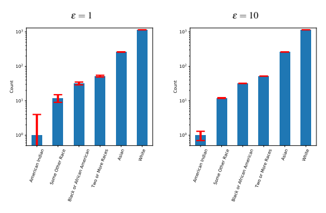

Fig. 10. Two histograms of population count by race in a single U.S. Census district in Massachusetts computed with differential privacy for ε = 1 (left) and ε = 10 (right). Confidence intervals are displayed in red overlaying each bar.

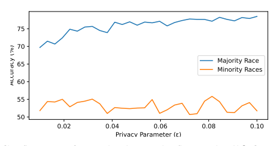

Fig. 11. Classifier accuracy for a machine learning classifier trained on U.S. Census data with differential privacy for various values of ε.
925 example, the noise required for differential privacy has a larger effect on smaller groups.

## 926 3.3.2. Human **Bias**

927 928 Human bias results from the heuristics that humans use to make decisions based on data.

Common examples include confirmation bias (i.e., believing data that supports one's beliefs)
and anchoring bias (i.e., believing the first piece of data received).

929 930 931 932 933 934 935 936 937 Human bias has the potential to negatively impact belief in the validity of differentially private results.

In particular, individuals may believe that differentially private results are invalid because they know that noise has been added to the results or the results do not conform to typical expectations of what "good data" looks like (e.g., differentially private histograms may contain fractional or negative counts).

Privacy **Hazard** Before deploying interventions to address sources of human bias, carefully consider the other impacts of those interventions.

938 939 940 941 942 943 Interventions that attempt to address potential human bias resulting from the use of differential privacy may actually introduce other kinds of bias. For example, differentially private counts are often rounded to the nearest integer and forced to be non-negative on the assumption that data recipients might be concerned by fractional or negative counts that do not "look like" non-differentially-private results. However, these changes can actually harm the results by introducing statistical bias.

## 944 3.3.3. Statistical **Bias**

945 946 947 948 949 950 951 952 953 954 955 956 957 958 959 960 961 The statistical bias of a mechanism refers to a difference between the true query result f(x)
and the expected value (i.e., the average over many samples) of the mechanism's output. For example, the statistical bias of the Laplace mechanism is E[ f(x)−Lap(∆1/ε)]− f(x). The equation can be rearranged to E[Lap(∆1/ε)], and the Laplace distribution centered at zero has an expected value of zero.

However, not all differential privacy mechanisms are unbiased. Some mechanisms can introduce statistical bias (an example appears in Section 3.4.2). In addition, post-processing approaches designed to improve data quality or reduce human bias can also result in statistical bias. Statistical bias must be considered as part of a utility analysis of a mechanism.

Privacy **Hazard** Differential privacy mechanisms can introduce statistical bias. It is important to understand, quantify, and evaluate the statistical bias present in any differentially private data release.

Differential privacy can result in statistical bias. Figure 12 shows the total absolute error due to statistical bias of changing negative counts to 0 in the histogram example from Sec. 3.3.1. The results show that this bias increases as the privacy parameter ε decreases. This type of post-processing does not impact privacy but does result in statistical bias and can therefore negatively impact utility.

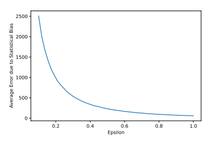

Fig. 12. A plot of average error due to statistical bias of changing negative counts to zero vs choice of ε.

## 962 3.4. Analytics **Queries**

963

## 3.4.1. Counting **Queries**

964 965 966 967 968 969 970 971 972 973 974 975 976

## 977 Defining Counting **Queries**

978 979 980 This section describes how to answer counting queries with differential privacy. A counting *query* counts the number of rows in a dataset with a particular property. While they seem simple or trivial, counting queries are used extremely often and can express many useful business metrics, such as the number of transactions that took place in a given week or which market has produced the most sales.

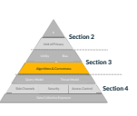 
Counting queries are often the basis for more complicated analyses as well. For example, the U.S. Census releases data that is essentially constructed by issuing many counting queries over sensitive raw data collected from residents. Each of these queries belongs in the class of counting queries discussed in the following sections and computes the number of people living in the U.S. with a particular set of properties (e.g., living in a certain geographic area, having a particular income, belonging to a particular demographic).

Consider two examples of counting queries. The result of the first is a single number, and the second is a specific form of counting query called a histogram that reports multiple counts derived from disjointed parts of the dataset. Both queries are described using SQL.

Example (Counting **Query)** How many pumpkin spice lattes were purchased in October?

SELECT COUNT(*)
FROM Lattes WHERE month = ''October''
Example **(Histogram)** For each month, how many pumpkin spice lattes were purchased in that month?

SELECT COUNT(*)
FROM PumpkinSpiceLatteSales GROUP BY Month

## 981 Achieving Differential **Privacy**

Counting queries are a good target for differential privacy because only a small amount of noise is required to satisfy the definition. In technical terms, counting queries tend to have low sensitivity so it is often possible to achieve high utility for counting queries over a single table. When bounding user contributions, more noise is required to compensate for the fact that each individual may contribute multiple records. Even in this case, it is often possible to achieve good utility for counting queries. See Appendix Section B.3 for technical details.

982 Privacy **Hazard** When bounding user contributions, additional noise must be added to ensure user-level privacy.

983 984 985 986 987 988 989 990

## Histograms 991

For a histogram, noise can be added to each "bin" of the result individually since each individual in the data will appear in exactly one "bin" of the result. However, there is a subtle but important difference:
the result of a histogram query reveals the identities of the bins in addition to the count for each one, and the presence or absence of a bin can reveal information about an individual. Database systems commonly infer the set of bins from the data. For example, if no pumpkin spice lattes were purchased in June, then the resulting histogram would not even contain a bin for June, thus implicitly revealing a "count" of zero pumpkin spice lattes with no noise at all.

992 Privacy **Hazard** In differentially private histograms, the analyst must specify the histogram bins. Otherwise, the presence or absence of a bin may leak information that violates differential privacy.

993 994 995 996 997 998 999 1000 1001 1002 To address this additional information leakage, the analyst must specify the set of bins in advance, and the histogram must report a count for every bin in the set, even if the count is zero. Then, noise can be added to each count (including the zeros) and correctly satisfy differential privacy.

1003 1004 1005 1006 1008 1009 1010 1011 1012

## 1013 Utility

1014 1015 1016 1017 1018 1019 1020 1021 1022 1023 1007 Specifying the histogram bins is an additional burden on the analyst that is not typical in traditional database query languages. Sometimes, specifying the bins is easy (e.g., if the bins are the months of the year). However, when the bins themselves are complex, the burden of specifying them manually can be significant. Techniques do exist for automatically determining the set of histogram bins from the data without violating differential privacy [23],
which can help to eliminate this additional burden.

For a single count, the Laplace mechanism yields better accuracy than the Gaussian mechanism for the same value of ε. The Gaussian mechanism works best when adding noise to many values at once (e.g., when answering a workload of hundreds or thousands of prespecified queries).

For differentially private counting queries, the noise is determined by the query's sensitivity, which is independent of the size of the group being counted. The same amount of noise is added whether the count is 20 or 20 million. This means that the absolute error one can expect is constant. However, the relative error is smallest when the size of the group being counted (i.e., the signal) is large. As group size gets smaller, the strength of the signal goes down while the noise remains the same, resulting in higher relative error.

1024 1025 1026 1027 In a histogram, the group size associated with each "bin" (i.e., the signal) tends to go down as the number of groups goes up. Thus, finer-grained differentially private histograms that break down results across more categories tend to result in higher relative error than coarser-grained histograms.

Key **Takeaway** To minimize relative error in differentially private statistical analyses, analyze large groups.

1028

## 3.4.2. Summation **Queries**

1029 1030 1031 A summation *query* calculates the sum of specific values. For example, a summation-query could return the sum of the transaction amounts for all pumpkin spice latte purchases in a year.

Example (Summation **query)** What is the total amount spent on pumpkin spice lattes since 2010? SELECT SUM(amount)
FROM PumpkinSpiceLatteSales WHERE year > 2010 1032 1033 1034 For a summation query, the amount of noise needed to achieve differential privacy depends on the maximum value of the things being summed up. As a result, the analyst is usually required to provide an upper bound (and, sometimes, a lower bound) on the values of data 1036 1037 1035 items, and this bound is enforced during analysis. For large datasets, it is often possible to achieve good utility with differentially private summation queries. See Appendix Section B.4 for technical details.

Key **Takeaway** Differentially private summation queries require upper and lower bounds on data elements, which must be given without looking at the data. The bounds should generally be as small as possible to reduce noise while ensuring that only extreme outliers fall outside of the bounds.

## 1038 Utility

1039 1040 1041 1042 Utility for summation queries is typically measured using the same metrics as counting queries. In addition, the clipping parameter C can introduce bias in the results by reducing large values while preserving small ones. Utility analysis of summation queries should measure and consider this bias.

1043 1044 1045 1046 The clipping parameters (i.e., the upper and lower limits) are extremely important for accuracy. If the upper limit is too high, it will add unnecessary noise. If it is too low, then information that was present in the data will be lost by modifying too many of the data points (i.e., introducing bias).

1047

## 3.4.3. Average **Queries**

1048 An average *query* determines the mean of a set of values.

Example What is the average amount spent on pumpkin spice lattes since 2010? SELECT AVG(amount)
FROM PumpkinSpiceLatteSales WHERE year > 2010 1049 1050 1051 1052

## 1053 Utility

1054 1055 1056 1057 An average query can be decomposed into a summation query and a counting query, and it can be answered with differential privacy via such a decomposition (see Appendix Section B.5 for technical details). Other approaches can sometimes improve utility. Differentially private averages can yield high utility for large datasets.

The same metrics are used to evaluate average queries as summation queries. Because this process incorporates a summation query, it has the potential to introduce bias into the results.

Like summation and counting queries, the best relative error will be achieved when group sizes are large and the clipping parameter C is set appropriately.

## 1058 3.4.4. Min/Max **Queries**

1059 1060 1061 1062 1063 1064 1065 1066 When an estimate of dataset scale (i.e., the size and shape of the data) is needed, differentially private quantile estimation is often used instead of the min and max functions.

## 1067 3.5. Machine **Learning**

1068 1069 1070 1071 1072 1073 1074 1075 1076 1077 1078 1079

1081 1082 1083 1084 1085 1086 1087 1088 1089 1090 1091 Machine learning techniques are often used to understand data, and deep learning techniques have become especially popular because of their capabilities in complex domains like vision and language.

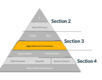 
Common machine learning techniques, including the neural networks used in deep learning, start with a model that has trainable parameters. The model can be used to perform a task (e.g., recognizing pictures of pumpkin spice lattes), and the parameters control how the model operates.

The training process is designed to set the model parameters so as to maximize the model's ability to perform its task on the training data. For example, a training dataset might contain some pictures of pumpkin spice lattes and some pictures of other objects. The goal in training would be to set the parameters so that the model correctly identifies all of the pictures of pumpkin spice lattes.

## Privacy Risks In Machine **Learning**

In the past few years, strong privacy attacks against trained models have sometimes allowed an attacker to learn information about the training data used to train the model. This can raise serious concerns for models trained on sensitive data (e.g., medical diagnosis models trained on x-ray data or language models trained on private emails).

Privacy **Hazard** Machine learning techniques do not automatically protect privacy. Neural networks are particularly susceptible to memorizing training data.

Deep neural networks are particularly susceptible to these kinds of attacks. Recent work has shown that deep neural networks often memorize their training data [24], and techniques like membership inference attacks [25] can leverage this kind of memorization to detect whether or not a particular data element was used to train the model.

Two other aggregation functions commonly available in database engines and used in statistical analysis are the minimum (min) and maximum (max). These are not commonly used in differentially private analyses because they have unbounded sensitivity. These aggregation functions do not really aggregate multiple values from the data. Rather, they return a single data element that represents the max or min, potentially destroying the privacy of the individual corresponding to that value.

## 1092 Achieving Differential **Privacy**

1093 1094 1095 1096

## 1097 Utility

1098 1099 1100 1101 1102 1103 1104 1105 1106 1107 1108 1109 To defend against privacy attacks in machine learning, a significant amount of research has explored how to train differentially private models [26–29]. The most commonly used technique is called differentially-private stochastic gradient descent (DP-SGD) [27] (see Appendix Section B.6 for technical details).

Adding differential privacy to the training process using current techniques typically lowers accuracy, sometimes significantly [30].

In general, two major factors influence the accuracy of differentially private machine learning. First, simple models are much easier to train with privacy than complex models.

Complex models, like deep neural networks, can have millions or billions of trainable parameters and are more likely to be affected by the noise added for differential privacy. Simpler models, like linear models, can be much easier to train with differential privacy.

Second, larger training datasets generally lead to more accurate models. As in the analytics queries discussed earlier, aggregating over larger groups generally leads to better accuracy, and aggregating over smaller groups implies worse accuracy. With enough training data, differentially private approaches to machine learning can approximately match the accuracy of non-private training [28], but a large amount of data is often required.

Key **Takeaway** Current techniques for differentially private machine learning work best for simple models and very large training datasets.

## 1110 3.6. Synthetic **Data**

1111 1112 1113 1114 1115 1116 1117 1118 1119 A differentially private synthetic *dataset* is a synthetic dataset built with differential privacy. A synthetic *dataset* looks like the original dataset in that it has the same schema and attempts to maintain the properties of the original dataset (e.g., correlations between attributes). However, it consists of completely invented data associated with "fake" individuals. Because it looks like the original data, synthetic data is particularly easy to use. It can be analyzed using existing tools and workflows without modification. This section summarizes privacy considerations for synthetic data, and describes some approaches for constructing it.

Data Collection Exposure Side Channels Security Access Control Query Model Threat Model Unit of Privacy ε Section 2 Utility Bias Algorithms & Correctness Section 3 Algorithms & Correctness Section 4

## 1120 Privacy Considerations Of Synthetic **Data**

1121 1122 Many techniques have been proposed for constructing synthetic data, some of which satisfy differential privacy. Nearly all of these techniques claim to provide some privacy benefits.

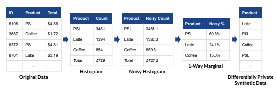

Fig. 13. Generating a differentially private synthetic data using a marginal distribution. (PSL =
Pumpkin Spice Latte)
1124 1125 1126 1127 1128 1123 Synthetic data techniques that do not satisfy differential privacy generally provide only informal privacy guarantees. They may appear to protect the privacy of individuals, but like the de-identification techniques discussed earlier, they do not provide robust protection against all privacy attacks. Recent research has shown that synthetic data generated without differential privacy is susceptible to privacy attacks that can reveal the properties of individuals in the training data [31].

1129 1130 1131 1132 1133 1134 Differentially private synthetic data can be used to prevent these attacks. This section summarizes some techniques for generating synthetic data while satisfying differential privacy. Techniques that do not specifically satisfy differential privacy may not necessarily provide robust privacy protection.

Privacy **Hazard** Synthetic data generated without differential privacy may be susceptible to privacy attacks.

Key **Takeaway** To provide robust privacy protection, including against rapid developments in privacy attacks, synthetic data should be generated using differentially private algorithms.

## 1135 Generating Synthetic **Data**

1136 1137 1138 1139 1140 1141 1142 1143 Conceptually, all techniques for generating synthetic data - privacy-preserving or not
- start by building a probabilistic model of the underlying population from which the original data was sampled. This model is then used to generate new data. If the model is an accurate representation of the population, then the newly generated data will retain all of the properties of that population, but each generated data point will represent a "fake" individual who does not actually exist. Building the model is the most challenging part of this process.

Many techniques have been developed for this purpose, from simple approaches based on counting to complex ones based on deep learning.

## 1144 Differentially Private Synthetic Data Via Private **Marginals**

1145 1146 1147 1148 1149 1150 1151 1152 1153 1154 1155 1156 1157 1158 1159 1160 1161 1162 1163 1164 1165 1166 1167 1168 1169 1170

1172 1173 1174 1175 1176 1177 1178 1179 1180 1181 Imagine that we would like to generate synthetic sales data for a pumpkin spice latte company. One way to accomplish this would be to use a differentially private marginal distribution, as in Fig. 13. A histogram could be constructed from the original tabular data by counting the number of each drink sold. Next, noise would be added to the histogram to satisfy differential privacy. Finally, each noisy count would be divided by the total to determine what percentage of all drinks were of a specific type. This final step would produce a one-way marginal distribution since it would consider only one attribute of the original data and ignore correlations between attributes. The one-way marginal distribution could then be used to generate a "fake purchase" using weighted randomness. A drink type would be randomly chosen with the randomness weighted according to the one-way marginal distribution that has been generated. In the example in Fig. 13, 60.8% of the generated purchases should be pumpkin spice lattes, 24.1% should be lattes, and 15.0%
should be regular coffees.

Marginal distributions form the basis for many differentially private synthetic data algorithms.

The major challenge of this approach is preserving correlations between data attributes. For example, sales data might include the customer's age in addition to their preferred drink type, and age might be highly correlated with drink type (e.g., younger customers may be more likely to purchase pumpkin spice lattes than other drink types). The process used above can be repeated on both data attributes separately, but that approach does not capture the correlation that was present between the two.

This correlation can be preserved by calculating a two-way marginal - a distribution over both data attributes simultaneously. However, this marginal has many more possible options
(all of the possible combinations of age and drink type), and it will result in a weaker
"signal" relative to the noise for each option. Preserving correlations like these requires a careful balance between the marginals being measured and the strength of the signal being preserved.

## Differentially Private Synthetic Data Via Deep **Learning**

Another way to build a model of the underlying population from the original data is with machine learning techniques. In the past several years, deep learning-based methods for generating synthetic data have become more capable in some domains [29]. Approaches like generative adversarial networks (GANs) - a particular type of neural network - are particularly good at generating convincing photos of imaginary people. The same approach can be used to generate synthetic data in other domains (e.g., latte sales data) by training the neural network on original data from the right domain.

Generative models have been used extensively to produce non-private synthetic data. As described earlier, these techniques do not necessarily provide robust privacy protection for individuals in the original dataset, and the resulting synthetic data may be susceptible 1183 1184 1185 1186 1187 1188 1189 1190 1191 1192 1193 1194 1195 1196

1198 1199 1200 1201 1202 1203 1204 1205 1206 1207 1208 1209 1210 1211 1212 1213 1214 1215 1216 1217 1218 1219

## 3.7. Unstructured **Data**

Unstructured *data* often refers to text, pictures, audio, and video
- formats that often lack structure that relates data to individuals.

This lack of structure sometimes makes it difficult to think about privacy. For example, if an email written by one person that describes something about another person is released to the public, it is unclear whose privacy has been violated.

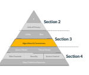 
In addition, this lack of structure makes it difficult to define a meaningful unit of privacy, such as one hour of video versus one minute of video. Both options may fail to protect privacy since an individual could appear in many minutes or many hours of video.

Due to these challenges, research in differential privacy has not focused on unstructured data. Existing techniques generally require specifying a unit of privacy that may represent a compromise in privacy
(e.g., one minute or one hour of video).

Privacy **Hazard** For unstructured data, defining the unit of privacy can be difficult or impossible because it is often unclear what data belongs to whom.

As a result, defining meaningful differential privacy guarantees for unstructured data is challenging.

If a suitable unit of privacy can be determined, then it is often possible to compute differentially private statistics and train machine learning models on unstructured data. In machine learning, there has been significant work on image recognition [27, 28, 32],
natural language processing [33, 34], and obfuscating the author of a text [35]. Differential privacy has also been applied to video [36] and to mask patterns of communication
(including metadata) in anonymous communication systems [37].

1182 to privacy attacks. If robust privacy protection is desired, a differentially private training algorithm like DP-SGD must be used to train the generative model.

To achieve differential privacy, the neural network can be trained using a differentially private algorithm, like the DP-SGD algorithm described earlier. If the neural network modeling the underlying population is trained with differential privacy, then by the postprocessing property, the synthetic data it generates also satisfies differential privacy.

Privacy **Hazard** Current deep learning-based approaches for differentially private synthetic data produce significantly lower quality data than approaches based on marginals.

Unfortunately, deep learning-based approaches for differentially private synthetic data are currently much less useful than the marginal-based approaches for low-dimensional tabular data (e.g., the data in the latte example). In fact, deep learning-based approaches often fail to preserve even basic statistical properties of the original data. This difference is likely due to the model complexity challenges described earlier since generative models tend to be especially complex.

## 1220 4. Deploying Differential **Privacy**

1221 1222 1223 1224 1225 1226 1227 1228

## 1229 4.1. Query **Models**

1230 1231 1232 1233 1234 1235 1236 1237 1238 1239 1240 1241 1242 1243 1244 1245 1246 1247 1248 1249 1250 1251 1252 1253 1254 1255 This section describes practical concerns in deploying differentially private analysis techniques. Chief among these is the threat model
(Sec. 4.2), which describes who can be considered trustworthy and who should be considered malicious. This section also discusses several implementation challenges for differentially private mechanisms that can cause unexpected privacy failures (Sec. 4.3).

The final subsections describe security concerns (Sec. 4.4) and data collection exposure
(Sec. 4.5).

Data Collection Exposure Side Channels Security Access Control Query Model Threat Model Unit of Privacy ε Section 2 Utility Bias Side Channels Security Access Control Section 3 Algorithms & Correctness Section 4 Data Collection Exposure Query Model Threat Model The deployment of differential privacy is separated into two common models: the data *release* model and the interactive query answering model.The data release model is simpler and more trustworthy but limited. The interactive query answering model is more flexible but more complex to deploy and, thus, more vulnerable to security bugs in its implementation.

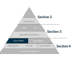

In the data *release* model, the queries are known in advance and are often specified by the same organization collecting the data. The organization can collect the data, use differentially private mechanisms to answer the queries, and release the results all in one step. In the data release model, the predetermined queries generally attempt to describe the population from which the data was collected. For example, they may generate histograms (§3.4) or synthetic data (§3.6). The U.S. Decennial Census is one example of the data release model:
the queries are prespecified by the U.S. Census Bureau and designed to describe the U.S.

population. The data release model is simpler than the alternatives, but it requires all queries to be specified in advance and does not allow new queries to be asked after the release.

In the interactive query *answering* model, the queries are not known in advance, and analysts interact with a system designed to answer queries on an ongoing basis. Queries may be specified in large batches
(i.e., a *workload*) or individually, and analysts may or may not be members of the same organization that collected the data. The query answering model empowers analysts to specify their own custom queries at any time, which is a significant advantage over the data release model for some applications. However, compared to the data release model, the query answering model raises significant additional challenges in the areas of privacy budgeting and security.

Privacy **Hazard** Compared to the data release model, the interactive query answering model raises significant additional challenges related to privacy budgeting and security.

## 1256 Privacy **Budgeting**

1257 1258 1259 1260 1261 1262 1263 1264 1265

1267 1268 1269 1270 1271 1272 1273 1274 1275 1276 1277 1278 1279 1280 1281 1282 1283

## 1284 4.2. Threat **Models**

1285 1286 1287 1288 1289 1290 1291 1292 In the data release model, the entire privacy budget can be allocated among the predetermined queries, and the result is intended to adequately describe the important properties of the original population. By the post-processing property of differential privacy, the results can be used by anyone as many times as desired without incurring additional privacy loss.

In the interactive query answering model, each query answered by the system incurs additional privacy loss and must count against the total privacy *budget*. In this context, budgeting requires forecasting how many queries the system will need to answer. If the budget runs out, then the system must refuse to answer new queries - an outcome that may be extremely problematic.

## System Security And Malicious **Analysts**

In the data release model, the original data can be discarded or archived in a high-security environment after the differentially private results are calculated and released. This approach provides strong protection against the accidental release of the original sensitive data (e.g., due to data breaches). The differentially private results can then be computed by a trusted party within the same organization that collects the data. In this context, it is reasonable to assume that the party computing the results will make an honest attempt to correctly implement differential privacy and will not intentionally issue queries that target individuals.

In the interactive query answering model, the original sensitive data must be kept available for querying on an ongoing basis. The system that accesses the data must therefore be highly secure in order to avoid data breaches that expose this data. Ensuring this kind of security adds significant complexity to a query answering deployment compared to a data release.

Analysts may not be trustworthy and may intentionally try to violate the privacy guarantee, especially if the query answering system is exposed to the public or to analysts outside of an organization. Query answering systems are complex, and implementing them correctly is challenging and costly. Even carefully designed systems are likely to have bugs that cause security vulnerabilities (see Sec. 4.3 for details). Malicious analysts may attempt to find and exploit these bugs to break the privacy guarantee and reveal the original sensitive data.

A threat *model* (or trust model) describes assumptions about how trustworthy the components of a system are expected to be. In the setting of differential privacy, there is typically an assumption that final results will be released to the public. Since some members of the public may not be trustworthy, such results should be protected with a guarantee like differential privacy. However, the final results might not be revealed to the public and instead revealed only to a smaller group of people.

This section describes several different threat models that are commonly used for deploy-
Data Collection Exposure Side Channels Security Access Control Query Model Threat Model Unit of Privacy ε Section 2 Utility Bias Section 3 Algorithms & Correctness Section 4 Threat Model 1 294 1293 ments of differential privacy in terms of which participants in the system are trusted and which are untrusted.

Definition A trust *assumption* about a party describes how that party is expected to behave when they are given access to sensitive data.

- A trusted *party* will keep sensitive data safe and will not reveal it to others. It is assumed that no privacy harms will result from sharing sensitive data with trusted parties.

- An untrusted *party* may not keep sensitive data safe and may reveal it to others.

Privacy harms may result from sharing sensitive data with untrusted parties.

Most threat models for differential privacy are described in terms of the trust assumptions made about the following three parties:
1 295 1 296 1 297 1. The data *subjects* - who the data is about 1 298 2. The data *curator* - who aggregates the data 3. The data *consumer(s)* - who receive differentially private results 1 299 1 300 1 301 1 302 1 303 1 304 1 305 1 306 1 307 1 308 1 309 1 310 1 311 1 312 1 313 1 314 1 315 1 316 1 317 1 318 1 319 1 320 1 321 In many cases, the set of data consumers is very large. For example, when differentially private results are released to the public, everyone is a member of the set of data consumers.

In other cases, differentially private results are only released to certain people.

Table 3 summarizes the trust assumptions made in some commonly used threat models for differential privacy. All of the models assume that the data subjects are trusted because differentially private systems are designed to protect the data subjects from the other parties, and there is no incentive for data subjects to cause privacy harms to themselves. The models differ in the trust assumptions for the other parties.

In general, threat models that require fewer trusted parties are stronger, but stronger threat models often trade other desirable features in exchange for lower trust requirements. The rest of this section describes these trade-offs in detail.

When evaluating a differential privacy guarantee, the most important consideration is whether the threat model's trust assumptions match reality. For example, in the central model of differential privacy (described in Sec. 4.2.1), the curator must be trusted. If the central model is used with an untrustworthy curator, then the differential privacy guarantee breaks down because the curator may simply release the sensitive data to the public. The choice of threat model is therefore directly constrained by realistic assumptions about the trustworthiness of the parties involved.

Privacy **Hazard** The trust assumptions made by a differential privacy guarantee's threat model must hold in the real world. A failure of any of the trust assumptions makes the corresponding differential privacy guarantee meaningless.

| Model              | Data Subjects   | Data Curator   | Data Consumer   | Details   |
|--------------------|-----------------|----------------|-----------------|-----------|
| Central Model      | Trusted         | Trusted        | Untrusted       | § 4.2.1   |
| Local Model        | Trusted         | Untrusted      | Untrusted       | § 4.2.2   |
| Shuffle Model      | Trusted         | Untrusted∗     | Untrusted       | § 4.2.3   |
| Secure Computation | Trusted         | Untrusted∗     | Untrusted       | § 4.2.3   |

Table 3. Common deployment models for differential privacy and their trust assumptions

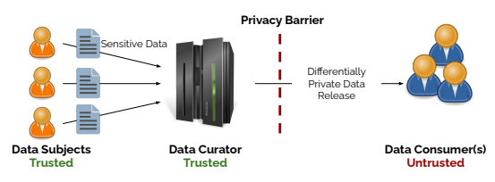

Fig. 14. Central model of differential privacy
1322 Trust in the real world is complicated, and it can be difficult or impossible to relate real-world ideas about the trustworthiness of a party to a precise trust assumption in a threat model. For example, a differential privacy guarantee that requires an assumption of trust in the curator
(e.g., central differential privacy) may be better than no guarantee at all, even when the data subject may not completely trust the curator in all respects.

1323 1324 1325 1326

## 4.2.1. Central **Model** 1327

The most commonly used threat model in differential privacy research is called the central model of differential privacy (or simply, "central differential privacy"). This threat model is summarized in Fig. 14.

1328 1329 1330 The key component of the central model is a trusted data curator. Each individual submits their sensitive data to the data curator, who stores all of the data in a central location (i.e., on a single server). The data curator is trusted in that users assume that they will not look at the sensitive data directly, will not share it with anyone, and cannot be compromised by any other adversary. In other words, with this model, there is an assumption that the server holding the sensitive data cannot be hacked.

1331 1332 1333 1334 1335 1336 In the central model, noise is typically added to results, as in the analyses described in Section 3. The advantage of this model is that it allows algorithms to add the smallest 1337 1338

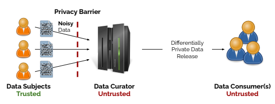

Fig. 15. Local model of differential privacy
1339 possible amount of noise and therefore produce results with the maximum accuracy allowed under differential privacy. The figure below demonstrates this process. The privacy barrier is placed between the trusted data curator and the data consumer. To the right of the privacy barrier, only differentially private results can be viewed, so the data consumer does not need to be trusted.

1340 1341 1342 1343 The disadvantage of the central model is that it requires a trusted data curator, and many data curators are not considered trustworthy. In fact, a lack of trust in the data collector is often a primary motivation for the use of differential privacy.

1344 1345 1346

## 4.2.2. Local **Model** 1347

The local model of differential privacy addresses the security issue in the central model by eliminating the trusted data curator. Each individual adds noise to their own data before sending it to the data curator. This means that the data curator never sees the sensitive data and does not need to be trusted. Fig. 15 demonstrates the local model, where the privacy barrier stands between the data subjects and the (untrusted) data curator. Even if the data curator's server is hacked, the hackers only see noisy data that already satisfies differential privacy. This is why the local model was adopted for Google's RAPPOR system [38] and Apple's data collection system.

1348 1349 1350 1351 1352 1353 1354 1355 However, the local model produces less accurate answers than the central model. In the local model, each individual adds enough noise to satisfy differential privacy. Thus, the total noise for all participants is much larger than the single noise sample used in the central model. As a result, the local model is only useful for queries with a very strong "signal."
Apple's system, for example, uses the local model to estimate the popularity of emojis, but the results are only useful for the most popular emojis (i.e., where the "signal" is strongest).

The local model is typically not used for more complex applications like machine learning.

1356 1357 1358 1359 1360 1361 1362

## 1363 4.2.3. Future Directions: Shuffle And Secure Computation **Models**

1364 1365 1366 1367 1368 The central and local models of differential privacy offer a stark trade-off between trust assumptions and accuracy. A significant amount of recent research has investigated new ways to achieve the higher accuracy of the central model under the stronger trust assumptions of the local model. This section summarizes two approaches that are still in the early stages of development and have not yet been used in large-scale deployments.

1369 1370 1371 1372 1373 1374 1375 1376 1377 1378 1379 One approach is the shuffling model, which was first implemented in a system called Prochlo [39]. The shuffling model includes an untrusted data curator, individual data contributors, and a set of partially trusted shufflers. In this model, each individual adds a small amount of noise to their own data and submits that data to the shuffler, which adds additional noise before forwarding batches of data to the data curator. The idea is that shufflers are unlikely to collude with the data curator or each other, so the small amount of noise added by individuals is sufficient to guarantee privacy. Each shuffler operates on a batch of inputs (in the same way as the central model), so a small amount of additional noise guarantees privacy for the whole batch. The shuffling model is a compromise between the local and central models in that it adds less noise than the local model but requires more noise than the central model.

1380 1381 1382 1383 1384 1385 1386 1387 1388 1389 1390 1391 Another approach is to combine differential privacy with techniques from cryptography, such as secure multi-party computation (MPC) or fully homomorphic encryption (FHE).

FHE allows for computing on encrypted data without decrypting it first, and MPC allows a group of parties to securely compute functions over distributed inputs without revealing the inputs. Computing a differentially private function using secure computation is a promising way to achieve the accuracy of the central model with the security benefits of the local model. In this approach, the use of secure computation eliminates the need for a trusted data curator. Recent work [40–42] demonstrates the promise of combining MPC and differential privacy to achieve most of the benefits of both the central and local models. In most cases, secure computation is several orders of magnitude slower than native execution, which is often impractical for large datasets or complex queries. However, secure computation is an active area of research, and its performance is improving quickly.

1392 1393 1394 1395 1396 1397 1398 Secure hardware enclaves (also known as trusted execution environments) are special security-enabled CPUs that can provide security for data during computation by decrypting data only within the CPU itself, such as Intel's Software Guard Extensions (SGX), AMD's Secure Encrypted Virtualization (SEV), and ARM's TrustZone. Such platforms promise similar capabilities to the cryptographic techniques described above but with significantly enhanced performance. However, these platforms are still under development, and several existing hardware enclaves have been vulnerable to attacks that can extract sensitive data.

1399

## 4.3. Mechanism Implementation **Challenges**

1401 1402 1403 1404 1405 1406 1407

## 1408 Floating-Point **Arithmetic**

1400 The approaches in the preceding sections were described using

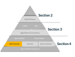

math, but in order to use them, they have to be implemented on computers. This section gives an overview of the subtle differences between the math and the implementation that can cause unexpected failures in privacy. Because of these challenges, it is best to use existing well-tested libraries whenever possible. The developers of these libraries have worked to understand all of the potential implementation-based sources of privacy failure and address them.

1409 1410 1411 1412 1413 1414 1415 1416 1417 1418 1419 1420 1421 1422 1423

## 1424 Timing **Channels**

1425 1426 1427 1428 1429 if Joe in Data:
return slowQuery()
else:
return fastQuery()
1430 In many settings, timing is not an issue because analysts are not allowed to design and Previous sections have described the Laplace and Gaussian mechanisms in terms of infinite-precision real numbers. On computers, floating-point numbers are typically used instead. Unfortunately, there are some real numbers that simply cannot be represented using floating-point numbers. For example, with very large numbers, there are large gaps between the numbers it is possible to represent. This difference can cause problems with noise sampling. When adding a very small amount of noise to a very large number, the noise may disappear completely because the gap between the noise-free large number and the next representable number is much larger than the value of the noise sample.

Privacy **Hazard** Implementing differential privacy mechanisms is tricky and requires considering side-channel vulnerabilities.

The impact of floating-point imprecision on differential privacy implementations has been known for more than a decade [43], and techniques for addressing the associated challenges have been developed and implemented in most libraries designed for practical use.

The basic mechanisms in these libraries will generally be safer to use than custom-built implementations that do not take floating-point imprecision into account.

In some cases, the time it takes to run a query may reveal something about the underlying data. This risk is especially pronounced if untrusted analysts are allowed to write their own queries and measure how long it takes to receive the answer. For example, it might be possible to write a program whose running time reveals whether or not Joe is a party of the data with 100% certainty:
Example (Timing Channel **Attack)**
1432 1433 1431 submit their own queries, or they are not able to observe how long those queries take to run.

If analysts can submit their own queries and measure running time, careful implementations must be used to hide the information revealed by the running time.

## 1434 Backend **Issues**

1435 1436 1437 1438 1439 1440 1441 1442 1443 1444 1445 1446 1447

1449 1450 1451 1452 1453 1454 1455 1456 1457 1458 1459 1460 1461 1462 1463 1464 1465 1466 In actual deployments where datasets may contain millions or billions of rows, it makes sense to reuse existing infrastructures to store and query data. Therefore, many systems for differentially private analysis leverage existing databases or distributed data processing solutions that were not originally designed for differentially private analysis.

This distinction can lead to the unexpected loss of privacy. For example, some database engines throw an error if a query attempts to divide by zero, so a malicious analyst might craft a query that divides by zero exactly when their target individual is part of the dataset. In this case, observing whether or not an error is thrown is a direct violation of privacy.

As in the case of timing channels, these concerns are less serious when analysts are not allowed to interact with the system directly. When analysts are allowed to craft their own queries and observe the results, it is important to ensure that the underlying systems that make up the differentially private query infrastructure do not contain additional channels that might leak private information, as in the example above.

## 4.4. Data Security And Access **Control**

The security of data plays an important role in the overall privacy guarantee, even though technologies for security are essentially orthogonal to the idea of differential privacy. Many of the techniques described earlier require direct access to the original noise-free data.

In the event of a data breach, the release of the original data makes the differential privacy guarantee meaningless. For this reason, data should be protected with strong security measures, both at rest (i.e., when it is being stored for later use) and during computation. Measures for protecting data at rest include encryption (combined with careful key management), access control, and strong system security.

Data Collection Exposure Side Channels Security Access Control Query Model Threat Model Unit of Privacy ε Section 2 Utility Bias Section 3 Algorithms & Correctness Access Control **Section 4**
Security Protecting data during computation is more challenging because computing on data typically requires decrypting it. This challenge has grown in recent years with the rise of cloud computing. As mentioned in Sec. 4.2, cryptographic techniques, hardware enclaves, and novel system architectures can help address this challenge, but all of these are active areas of research and have not been commonly deployed.

Privacy **Hazard** Failures in data security can result in data breaches that make differential privacy guarantees meaningless.

1468 1469 1470 1471 1472 1473

## 1474 4.5. Data Collection **Exposure**

1475 1476 1477 1478 1479 1480 1481 1482 1483 1484 1485 1486 1487 1488 1489 1490 1491

1493 1494 1495 1496 1497 1498 1499 1500 1501 1502 1503 The majority of this publication has explored the technical features of a differential privacy guarantee with the assumption that users will know ahead of time what they want to learn and what sensitive data is needed in order to learn it. This is a strong assumption that is often untrue in practice.

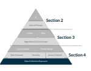

The strongest possible approach to privacy is to not collect the data to begin with. When evaluating a differential privacy guarantee, it is important to consider whether the data being analyzed needs to be collected at all. In some cases, it may be possible to collect less data and still achieve the desired final results.

By offering strong privacy protection for individuals, differential privacy might appear to eliminate the risks associated with collecting too much data. However, the use of differential privacy can reduce but not eliminate these risks, as demonstrated by the privacy hazards described throughout this document. Differential privacy should not be an excuse to collect more data than necessary.

Privacy **Hazard** Differential privacy does not eliminate the risks associated with collecting sensitive data. Organizations should minimize data collection, even when using differential privacy.

## 4.6. **Conclusion**

Differential privacy is currently the best known method for providing robust privacy protection against known and future attacks, even in the face of multiple data releases. This publication has summarized just a few of the many kinds of data analyses that can be accomplished with differential privacy, and current research is expanding these capabilities every year. In addition, an increasing number of open-source libraries and systems are starting to bring these techniques into practice.

This publication has described important considerations for implementing differential privacy and key hazards in evaluating differential privacy guarantees. The privacy parameter ε and the unit of privacy are particularly important since differential privacy provides very little protection when these parameters are not set appropriately. The whole system implementing a differential privacy guarantee should also be carefully considered, including security Privacy **Hazard** Failures in access control policy can result in data breaches that make differential privacy guarantees meaningless.

1467 Access control *policies* describe who is allowed to access the data. For example, if the data is encrypted, an access control policy might say who has the keys.

For many security mechanisms, including encryption, the data only remains secure if the individuals who have access to it are trustworthy. Some of the techniques discussed in Sec. 4.2 can help shift the trust requirements for a differentially private system.

1505 1506 1507 1508 1509 1510 1511 1512 1513 1514 1515 1516 1517 1518 1519 1520 1521 1522 1523 1524 1525 1526 1527 1528 1529 1530 1531 1532 1533 1534 1535

## 1536 References

1537 1538 1539 1540 1541 1504 measures used to protect sensitive data while it is being processed. Weak differential privacy guarantees risk becoming instances of privacy theater - measures that claim to protect privacy but actually fail to do so. This publication is intended to help practitioners tell the difference between stronger and weaker differential privacy guarantees and deploy differential privacy in ways that actually provide robust privacy protection.

This publication is also intended to be a first step toward building differential privacy guarantee standards that provide parameter settings and solutions for all of the privacy hazards described in this publication (e.g., the value of ε, the unit of privacy, etc.). For some hazards, a standard should describe specific measures that practitioners should take to ensure that their deployments are free of problems that would undermine the privacy guarantee or lead to other issues (e.g., mechanism implementations are bug-free, results do not magnify bias, data collection is minimized, and sensitive data is properly secured). Such a standard would allow for the construction of tools to evaluate differential privacy guarantees and the systems that provide them as well as certification that systems conform with the standard. The certification of differential privacy guarantees is particularly important given the challenge of communicating these guarantees to non-experts [44]. A thorough certification process would provide non-experts with an important signal that a particular system will provide robust guarantees without requiring them to understand the details of those guarantees.

The path to standardization in differential privacy is challenging. There are still parameters that are not yet fully understand (e.g., the impact of ε on real-world privacy), and ,differential privacy imposes an inherent trade-off between privacy and utility that can be hard to navigate.

Moreover, managing this trade-off requires considering the often conflicting interests of multiple stakeholders. For example, data analysts may prioritize utility, while data subjects may prioritize privacy. These challenges have resulted in a complicated policy-making process for existing deployments of differential privacy [45].

Standards for differential privacy will likely need to enumerate several levels of privacy protection with required parameter settings for each one. This process may parallel the three levels of Authenticator Assurance Levels defined for identity authentication in SP
800-63B [46]. The standard should also describe methods for evaluating systems, including auditing of the implementation itself and empirical methods for validating the level of privacy it provides.

[1] European Parliament, Council of the European Union Regulation (EU) 2016/679 of the European Parliament and of the Council. Available at https://data.europa.eu/eli/reg
/2016/679/oj.

[2] Sweeney L (1997) Weaving technology and policy together to maintain confidentiality.

The Journal of Law, Medicine & *Ethics* 25(2-3):98–110.

1543 1544 1545 1546 1547 1548 1549 1550 1551 1552 1553 1554 1555 1556 1557 1558 1559 1560 1561 1562 1563 1564 1565 1566 1567 1568 1569 1570 1571 1572 1573 1574 1575 1576 1577 1578 1579 1580 1581 1582 1583 1542 [3] (2020) Nist privacy framework, . https://doi.org/10.6028/NIST.CSWP.01162020.

Available at https://www.nist.gov/privacy-framework
[4] (2020) Nist privacy risk assessment methodology (pram), https://www.nist.gov/priva cy-framework/nist-pram.

[5] Duncan GT, Jabine TB, de Wolf VA (1993) Private lives and public policies: Confidentiality and accessibility of government *statistics* (National Academy Press).

[6] Kifer D, Abowd JM, Ashmead R, Cumings-Menon R, Leclerc P, Machanavajjhala A, Sexton W, Zhuravlev P (2022) Bayesian and frequentist semantics for common variations of differential privacy: Applications to the 2020 census. arXiv preprint arXiv:220903310 .

[7] Dalenius T (1977) Towards a methodology for statistical disclosure control. *Statistik* Tidskrift .

[8] Dwork C, Naor M (2010) On the difficulties of disclosure prevention in statistical databases or the case for differential privacy. Journal of Privacy and *Confidentiality* 2(1). https://doi.org/10.29012/jpc.v2i1.585. Available at https://journalprivacyconfiden tiality.org/index.php/jpc/article/view/585
[9] Abowd JM, Hawes MB (2022) Confidentiality protection in the 2020 us census of population and housing, . https://doi.org/10.48550/ARXIV.2209.03310. Available at https://doi.org/10.48550/arXiv.2206.03524
[10] Kifer D, Abowd JM, Ashmead R, Cumings-Menon R, Leclerc P, Machanavajjhala A, Sexton W, Zhuravlev P (2022) Bayesian and frequentist semantics for common variations of differential privacy: Applications to the 2020 census, . https://doi.org/
10.48550/ARXIV.2209.03310. Available at https://arxiv.org/abs/2209.03310
[11] Dwork C, McSherry F, Nissim K, Smith A (2006) Calibrating noise to sensitivity in private data analysis. Theory of Cryptography: Third Theory of Cryptography Conference, TCC 2006, New York, NY, USA, March 4-7, 2006. *Proceedings* 3 (Springer), pp 265–284.

[12] Wood A, Altman M, Bembenek A, Bun M, Gaboardi M, Honaker J, Nissim K, O'Brien DR, Steinke T, Vadhan S (2018) Differential privacy: A primer for a non-technical audience. Vanderbilt Journal of Entertainment & Technology Law 21(1):209.

[13] Desfontaines D (2021) A list of real-world uses of differential privacy, https://desfon tain.es/privacy/real-world-differential-privacy.html. Ted is writing things (personal blog).

[14] Gadotti A, Houssiau F, Annamalai MSMS, de Montjoye YA (2022) Pool inference attacks on local differential privacy: Quantifying the privacy guarantees of apple's count mean sketch in practice. 31st USENIX Security Symposium (USENIX *Security* 22), pp 501–518.

[15] Dwork C, Roth A, et al. (2014) The algorithmic foundations of differential privacy.

Foundations and Trends® in Theoretical Computer *Science* 9(3–4):211–407.

[16] Bowen CM, Snoke J (2021) Comparative study of differentially private synthetic data algorithms from the nist pscr differential privacy synthetic data challenge. *Journal* of Privacy and *Confidentiality* 11(1).

1585 1586 1587 1588 1589 1590 1591 1592 1593 1594 1595 1596 1597 1598 1599 1600 1601 1602 1603 1604 1605 1606 1607 1608 1609 1610 1611 1612 1613 1614 1615 1616 1617 1618 1619 1620 1621 1622 1623 1624 1625 1584 [17] Schwartz R, Vassilev A, Greene K, Perine L, Burt A, Hall P, et al. (2022) Towards a standard for identifying and managing bias in artificial intelligence. NIST *Special* Publication 1270:1–77.

[18] Mitchell M, Wu S, Zaldivar A, Barnes P, Vasserman L, Hutchinson B, Spitzer E, Raji ID, Gebru T (2019) Model cards for model reporting. Proceedings of the *conference* on fairness, accountability, and *transparency*, pp 220–229.

[19] Buolamwini J, Gebru T (2018) Gender shades: Intersectional accuracy disparities in commercial gender classification. Conference on fairness, accountability and *transparency* (PMLR), pp 77–91.

[20] Raji ID, Gebru T, Mitchell M, Buolamwini J, Lee J, Denton E (2020) Saving face:
Investigating the ethical concerns of facial recognition auditing. Proceedings of the AAAI/ACM Conference on AI, Ethics, and *Society*, pp 145–151.

[21] Benjamin R (2020) Race after technology: Abolitionist tools for the new jim code. [22] Task C, Bhagat K, Howarth G (2023) Sdnist v2: Deidentified data report tool. National Institute of Standards and *Technology* https://doi.org/10.18434/mds2-2943
[23] Delta Calculation for Thresholding, https://github.com/google/differential-privacy/blo b/main/common docs/Delta For Thresholding.pdf [accessed 11/8/2022].

[24] Carlini N, Liu C, Erlingsson U, ´ Kos J, Song D (2019) The secret sharer: Evaluating and testing unintended memorization in neural networks. 28th USENIX Security *Symposium*
(USENIX Security 19), pp 267–284.

[25] Shokri R, Stronati M, Song C, Shmatikov V (2017) Membership inference attacks against machine learning models. 2017 IEEE symposium on security and privacy *(SP)*
(IEEE), pp 3–18.

[26] Chaudhuri K, Monteleoni C, Sarwate AD (2011) Differentially private empirical risk minimization. Journal of Machine Learning *Research* 12(3).

[27] Abadi M, Chu A, Goodfellow I, McMahan HB, Mironov I, Talwar K, Zhang L (2016)
Deep learning with differential privacy. Proceedings of the 2016 ACM SIGSAC conference on computer and communications *security*, pp 308–318.

[28] De S, Berrada L, Hayes J, Smith SL, Balle B (2022) Unlocking high-accuracy differentially private image classification through scale. arXiv preprint *arXiv:220413650*
.

[29] Jordon J, Yoon J, Van Der Schaar M (2018) Pate-gan: Generating synthetic data with differential privacy guarantees. International conference on learning *representations*.

[30] Tramer` F, Boneh D (2021) Differentially private learning needs better features (or much more data). 9th International Conference on Learning Representations, ICLR
2021, Virtual Event, Austria, May 3-7, *2021* (OpenReview.net). Available at https:
//openreview.net/forum?id=YTWGvpFOQD-.

[31] Stadler T, Oprisanu B, Troncoso C (2022) Synthetic data–anonymisation groundhog day. 31st USENIX Security Symposium (USENIX Security 22), pp 1451–1468.

[32] Papernot N, Abadi M, Erlingsson U, ´ Goodfellow IJ, Talwar K (2017) Semi-supervised knowledge transfer for deep learning from private training data. 5th International Conference on Learning Representations, ICLR 2017, Toulon, France, April *24-26,*
1627 1628 1629 1630 1631 1632 1633 1634 1635 1636 1637 1638 1639 1640 1641 1642 1644 1645 1647 1648 1649 1650 1651 1652 1653 1654 1655 1656 1657 1658 1659 1660 1661 1662 1663 1664 1665 1666 1626 2017, Conference Track *Proceedings* (OpenReview.net). Available at https://openrevi ew.net/forum?id=HkwoSDPgg.

[33] Yu D, Naik S, Backurs A, Gopi S, Inan HA, Kamath G, Kulkarni J, Lee YT, Manoel A,
Wutschitz L, et al. (2021) Differentially private fine-tuning of language models. *arXiv* preprint *arXiv:211006500* .

[34] Anil R, Ghazi B, Gupta V, Kumar R, Manurangsi P (2021) Large-scale differentially private bert. arXiv preprint *arXiv:210801624* .

[35] Fernandes N, Dras M, McIver A (2019) Generalised differential privacy for text document processing. International Conference on Principles of Security and *Trust*
(Springer, Cham), pp 123–148.

[36] Wang H, Xie S, Hong Y (2020) Videodp: A flexible platform for video analytics with differential privacy. Proc Priv Enhancing *Technol* 2020(4):277–296.

[37] Van Den Hooff J, Lazar D, Zaharia M, Zeldovich N (2015) Vuvuzela: Scalable private messaging resistant to traffic analysis. Proceedings of the 25th *Symposium* on Operating Systems *Principles*, pp 137–152.

[38] Erlingsson U, ´ Pihur V, Korolova A (2014) Rappor: Randomized aggregatable privacypreserving ordinal response. Proceedings of the 2014 ACM SIGSAC conference on computer and communications *security*, pp 1054–1067.

[39] Bittau A, Erlingsson U, ´ Maniatis P, Mironov I, Raghunathan A, Lie D, Rudominer M,
Kode U, Tinnes J, Seefeld B (2017) Prochlo: Strong privacy for analytics in the crowd.

Proceedings of the 26th symposium on operating systems *principles*, pp 441–459.

[40] Mironov I, Pandey O, Reingold O, Vadhan S (2009) Computational differential privacy.

Annual International Cryptology *Conference* (Springer), pp 126–142.

[41] Roy Chowdhury A, Wang C, He X, Machanavajjhala A, Jha S (2020) Cryptε: Cryptoassisted differential privacy on untrusted servers. Proceedings of the 2020 ACM SIGMOD International Conference on Management of *Data*, pp 603–619.

[42] Roth E, Zhang H, Haeberlen A, Pierce BC (2020) Orchard: Differentially private analytics at scale. 14th USENIX Symposium on Operating Systems Design and Implementation (OSDI 20), pp 1065–1081.

[43] Mironov I (2012) On significance of the least significant bits for differential privacy.

Proceedings of the 2012 ACM conference on Computer and communications *security*,
pp 650–661.

[44] Cummings R, Kaptchuk G, Redmiles EM (2021) " i need a better description": An investigation into user expectations for differential privacy. Proceedings of the 2021 ACM SIGSAC Conference on Computer and Communications *Security*, pp 3037–3052.

[45] (2021) U.S. Census Bureau Press Release CB21-CN.42: Census Bureau sets key parameters to protect privacy in 2020 census results. Available at https://www.census .gov/newsroom/press-releases/2021/2020-census-key-parameters.html.

[46] Grassi PA, Fenton JL, Newton EM, Perlner R, Regenscheid A, Burr WE, Richer JP, Lefkovitz N, Danker JM, Choong YY, et al. (2020) Digital identity guidelines:
Authentication and lifecycle management.

1643 1646

## 1667 Appendix A. **Glossary**

1668 1669 1670 1671 absolute **error** The absolute difference between the noisy and unaltered versions of a query's output.

access control **policies** Policies that describes who is allowed to access the data and/or which parts of the data.

1672 accuracy The degree to which the noisy and unaltered versions of a query's output differ.

1673 average **query** A query that determines the mean of some set of values. Adapted from [15].

1674 1675 counting **query** A query that counts the number of rows in a dataset with a particular property. Adapted from [15].

1676 1677 data **consumer(s)** In a threat model for differential privacy, the data consumers are those who receive differentially private results.

1678 1679 data **curator** In a threat model for differential privacy, the data curator is where the data is aggregated.

1680 1681 data **subjects** In a threat model for differential privacy, the data subjects are those who the data is about.

1682 1683 differentially private synthetic **dataset** A synthetic dataset that satisfies differential privacy. Adapted from [15].

1684 1685 event-level **privacy** A unit of privacy that defines neighboring databases as those that differ in one event, for example, a single transaction, or a single row. Adapted from [15].

1686 1687 gaussian **mechanism** An algorithmic primitive for differential privacy that adds random noise drawn from the Gaussian distribution to the output of a query. Adapted from [15].

1688 1689 1690 high-dimensional A statistic composed of many numbers—e.g. a histogram with 50,000 bins, or a vector with 1 million elements.

1691 1692 human **bias** A form of bias that results from failures in the heuristics humans use to make decisions. Adapted from [17].

1693 1694 identifying **information** Information that could be used to identify a specific individual, such as name, address, phone number, or identification number.

1695 1696 differential **privacy** A mathematical framework that quantifies privacy risk to individuals as a consequence of data collection and subsequent data release. Adapted from [11].

1698 1697 laplace **mechanism** An algorithmic primitive for differential privacy that adds random noise drawn from the Laplace distribution to the output of a query. Adapted from [11].

1699 1700 linking **attack** An approach for exposing information specific to individuals in a deidentified dataset by matching up records with a second dataset.

1701 1702 low-dimensional A statistic composed of few numbers—e.g. a single count, or a histogram with 5 bins.

1703 1704 1705 1706 1707 neighboring **datasets** The definition of neighboring datasets is a parameter to the differential privacy framework. In many contexts, two databases are considered neighbors if they differ in the data of one individual. Adapted from [11].

outcome-specific utility **metrics** A way of measuring the utility of data for answering a specific question or class of questions.

1708 1709 privacy **budget** An upper bound on allowable cumulative privacy loss across all analyses that process a single dataset.

1710 1711 privacy-utility **tradeoff** The fundamental tension between privacy and accuracy. Adding more noise increases privacy but reduces accuracy, and vice-versa.

relative **error** The absolute error divided by the unaltered query output.

1712 sensitivity A quantity that measures how much the output of a query could change as a function of a change to the input. Adapted from [11].

1713 1714 1715 1716 statistical or computational **bias** A form of bias that occurs when a data release does not reflect the underlying population. Adapted from [17].

1717 1718 subsampling An algorithmic strategy where the query output is computed using only a fraction of the original data, selected at random. Adapted from [15].

1719 1720 summation **query** A query that sums a derived quantity from each row in a dataset with a particular property. Adapted from [15].

1721 1722 1723 synthetic **dataset** An alternative dataset that differs from the original, but also maintains specific properties inherent to the original, such as correlations between attributes.

Adapted from [15].

1724 1725 systemic **bias** A form of bias that results from rules, processes, or norms that advantage certain social groups and disadvantages others. Adapted from [17].

1726 1727 threat **model** A collection of assumptions that characterize the trustworthiness of each component in a system.

1729 1728 trust **assumption** An assumption that characterizes how we expect a specific party to behave when given access to sensitive data.

1730 1731 trusted **party** A party that can be expected to keep sensitive data safe and not disclose it to others.

1732 unit of **privacy** The choice of definition for neighboring datasets. Adapted from [15].

1733 1734 unstructured **data** Data formats that often lack explicit structure that relates data to individuals, such as text, pictures, audio, and video.

1735 1736 untrusted **party** A party that cannot be expected to keep sensitive data safe or refrain from disclosing it to others.

1737 1738 user-level **privacy** A unit of privacy that defines neighboring databases as those that differ in one user's data. Adapted from [15].

1739 utility The degree to which a dataset or statistic is useful for a specific purpose.

1740

## Appendix B. Technical **Details**

1741 Appendix B.1. Definition of (ε,δ)-Differential **Privacy**
1742 1743 1744 1745 Formally, (ε,δ)-differential privacy is a simple change to the original definition that adds an additive δ parameter to the original inequality. The formal definition appears in Definition 3.

Setting δ = 0 makes the (ε,δ) definition equivalent to the original pure ε definition (i.e.,
making catastrophic failure impossible).

Definition (Approximate differential **privacy)** A randomized mechanism M satisfies (ε,δ)-differential privacy if for all neighboring datasets D1 and D2 and all possible outcomes S:
Pr[M(D1) ∈ S] ≤ eεPr[M(D2) ∈ S]+δ D1 and D2 are considered *neighbors* if they differ in the data of one individual.

1746 1747 1748 1749 The other variants in Table 1 use slightly different ways of measuring the distance between the probability distributions M(D1) and M(D2). Renyi ´ differential privacy and zeroconcentrated differential privacy bound this distance using Renyi ´ *divergence*, while Gaussian differential privacy does so using *f-divergences*.

1750 Appendix B.2. Definitions of Sensitivity and Basic **Mechanisms**
1751 The formal definition of L1 sensitivity is:
Definition (L1 **Sensitivity)** For a function f : D → Rk, the L1 sensitivity ∆1 of f is:

$$=\operatorname*{max}_{\mathrm{\scriptsize{\begin{array}{l}{{\mathrm{neg}}\,D_{1},D_{2}}\end{array}}}}\|f(D_{1})-f(D_{2})\|_{1}$$

where D1 and D2 are neighboring datasets according to the unit of privacy.

1753 1754 1755 1756 1752 This definition works for any function (or query) that outputs a vector of real numbers
(including a single real number, like most aggregation functions). It defines sensitivity to be the maximum L1 distance between the function's outputs for two inputs that differ by one unit of privacy (discussed in Sec. 2.4). The corresponding definition for L2 distance is called L2 *sensitivity*:
Definition (L2 **Sensitivity)** For a function f : D → Rk, the L2 sensitivity ∆2 of f is:

$$=\operatorname*{max}_{\mathrm{\scriptsize{neighboring}}\,D_{1},D_{2}}\|f(D_{1})-f(D_{2})\|_{2}$$
$$\Delta_{2}=\mathbf{\Sigma}_{\mathbf{p}}$$

where D1 and D2 are neighboring datasets according to the unit of privacy.

1757 1758 1759 1760 Both definitions measure the impact of "one unit of privacy change" on the output of the function to determine how much noise needs to be added for privacy. For the user-level unit of privacy, sensitivity corresponds to the impact of one person's *data* on the function's output, which corresponds with the intuition for differential privacy given earlier.

Mechanism (Laplace **mechanism)** For a query with L1 sensitivity ∆1, the **Laplace**
mechanism adds noise sampled from the Laplace distribution with center 0 and scale
∆1 ε .

Guarantee: (ε,0)-differential privacy Mechanism (Gaussian **mechanism)** For a query with L2 sensitivity ∆2 and 0 < ε < 1, the Gaussian **mechanism** adds noise sampled from the Gaussian (Normal) distribution with center 0 and variance σ2 = 2∆22 log(1.25/δ)
ε2 .

Guarantee: (ε,δ)-differential privacy The difference between Laplace and Gaussian noise comes from the type of sensitivity used for each mechanism: L1 sensitivity ∆1 for Laplace and L2 sensitivity ∆2 for Gaussian. For large vectors of results, ∆2 ≪ ∆1. For a single count, ∆2 = ∆1 = 1. The Gaussian mechanism offers much better accuracy in the former setting, while the Laplace mechanism offers better accuracy in the latter. When many counts are requested at the same time, ∆2 ≪ ∆1, and the Gaussian mechanism should be used.

1761 1762 1763 1764 1765 1766 1767

## Appendix B.3. Details: Counting **Queries**

The Laplace mechanism can be used to ensure differential privacy for counting queries if the L1 sensitivity ∆1 of the query is determined. For counting queries, this value is always 1.

1768 1769 1770 The final count can only change by 1 when a single individual's data is added or removed.

This argument holds no matter what the property is or the columns being grouped. Note that the argument only applies when no transformation in the unity of privacy is desired. When a transformation in the unit of privacy is needed (e.g., bounding user contributions), then the sensitivity of counting queries goes up.

1771 1772 1773 1774 Key **Takeaway** Counting queries and histograms have a sensitivity of 1 when no transformation in the unit of privacy is desired.

The simple sensitivity analysis for counting queries makes them good targets for differential privacy. They are easy to implement and can often give highly accurate results because the sensitivity is low. To achieve differential privacy for counting queries, including the examples in this section, the Laplace mechanism with ∆1 = 1 and the desired setting for the privacy parameter ε are applied. For histograms, the Laplace mechanism with ∆1 = 1 and the same setting for ε can be applied when the bins are specified by the analyst. The noisy results satisfy (ε,0)-differential privacy.

1775 1776 1777 1778 1779 1780 1781

## Appendix B.4. Details: Summation **Queries** 1782

To achieve differential privacy for a summation query, the L1 sensitivity ∆1 of a summation query is needed. How much a summation query changes when a row is added to a database depends on the row. If someone spends $1 on a pumpkin spice latte, then the increase in the sum will be $1. If someone spends $10,000, the sum will increase much more.

1783 1784 1785 1786 Achieving differential privacy requires an upper limit on the largest possible *increase* there can be when a row is added. For the latte query, that means an upper limit on the price of a pumpkin spice latte. This is a big challenge because no matter what limit is set, there may hypothetically be a cafe somewhere that charges more than the limit.

1787 1788 1789 1790 The solution to this problem is called *clipping*. The idea is to *enforce* an upper limit rather than assuming one. Lattes that cost more than the limit are *clipped* so that their price is equal to the limit. After clipping, all values in the database are guaranteed to fall between the lower and upper limits that were set. The guaranteed lower and upper bounds on the data can be used to determine sensitivity. If the data is clipped so that lattes cost at most $10, then the largest increase in the output of the summation query will be $10 when a single latte sale is added to the database.

1791 1792 1793 1794 1795 1796 1797 The following process can be used to achieve differential privacy:
1798 1799 1. Clip each value v in the dataset so that 0 < v < C.

1800 2. Sum the clipped values.

1801 3. Apply the Laplace mechanism with ∆1 = C and the desired privacy parameter ε.

1803 1802 The first step in the process enforces bounded sensitivity, which informs how ∆1 is set in the third step. This approach satisfies ε-differential privacy.

## 1804 Appendix B.5. Details: Average **Queries**

1805 1806 1807 1808 1809 1810 1811 1812 1813 Unfortunately, bounding the sensitivity of average queries is even more difficult than it is for summation queries. In addition to the upper limit on the data values themselves, how much an average changes after a row is added depends on how many things are being *averaged*. If one is averaging five numbers, then adding one more number might change the average by quite a bit. If one is averaging 5 million numbers, then adding one more probably would not change the average very much. As a general rule, however, the sensitivity of a query should not depend on the data. Otherwise, the sensitivity might itself be sensitive, meaning that it might reveal something about the data. This adds another level of complexity to bounding the sensitivity of averages.

1814 1815 1816 A simple and effective solution for answering an average query using differential privacy is to split the query into two separate queries: a summation query and a counting query. To split the example query, the two following queries are computed instead:
1817 1. What has been the total amount spent on pumpkin spice lattes since 2010? 2. How many pumpkin spice lattes have been purchased since 2010?

1818 1819 1820 1821 1822 1823 1824 1825 1. Compute the differentially private sum s with privacy parameter ε1.

2. Compute the differentially private count c with privacy parameter ε2.

1826 1827 1828 1829 3. Return the average sc .

This process satisfies ε1 +ε2-differential privacy. For a desired privacy parameter ε, ε1 =
ε2 = 12 ε is typically set to equally "split" the privacy budget across the two constituent queries.

## 1830 Appendix B.6. Details: Differentially Private Stochastic Gradient **Descent**

1831 1832 1833 Figure 16 summarizes the difference between traditional non-private gradient descent and the noisy version that satisfies differential privacy. The non-private gradient descent algorithm performs many steps (or *iterations*) of the gradient update *rule*. This rule first computes the gradient of the *loss* for the current model. The *loss* quantifies how *badly* the model is performing on the training data, and the gradient's value directs how to change the model parameters to *increase* the loss. To *minimize* the loss in order to train a model that performs 1834 1835 1836 The first is a summation query, and the second is a counting query. The desired average can be obtained by dividing the first by the second. By the *composition* and *post-processing* properties of differential privacy, if differentially private answers to both queries are computed, their quotient also satisfies differential privacy. Therefore, the following process can be used to compute the average:

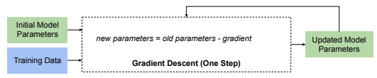

Without Differential Privacy
With Differential Privacy

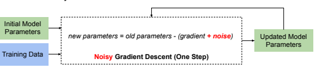

Fig. 16. Noisy gradient descent for differentially private machine learning
1837 well, the *opposite* change is made by subtracting the gradient from the current parameters.

This process is repeated many times until the model achieves the desired performance. To satisfy differential privacy, the noisy gradient descent algorithm adds noise to the *gradient* before updating the model parameters [27]. Since the training data is *only* used to calculate the gradient, adding noise to the gradient is sufficient to allow the whole algorithm to satisfy differential privacy.

1838 1839 1840 1841 1842 Noisy gradient descent adds noise to the gradient. To determine how much noise to add, the sensitivity of the gradient computation must be analyzed. In many settings, including deep neural networks, the gradient computation is complex and can have extremely high global sensitivity. For this reason, the differentially private SGD *(DP-SGD)* algorithm [27] *enforces* sensitivity rather than measures it. To enforce an upper bound on sensitivity, the algorithm clips the gradient associated with each training example, similar to the summation queries discussed earlier. Clipping the per-example gradients ensures bounded global sensitivity for the aggregated gradient used in the gradient update rule and informs how much noise is needed.

1843 1844 1845 1846 1847 1848 1849 1850 1851 The primary alternative to DP-SGD is a technique that trains many separate models on subsets of the training data and aggregates the models themselves with a differentially private aggregation function [32]. This approach can provide more accuracy than DP-SGD
for the same level of privacy, but it incurs significant computational cost because it requires training many models.

1852 1853 1854 1855 1856