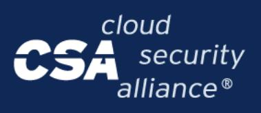
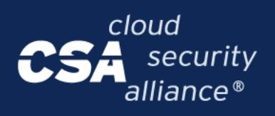

{0}------------------------------------------------

# **Filling in the AI**‑**CAIQ**

## Instructions and Recommendations

This guide helps respondents complete the AI‑CAIQ self‑[assessment](https://cloudsecurityalliance.org/artifacts/ai-consensus-assessments-initiative-questionnaire-ai-caiq-v1-1) v1.1 accurately and consistently across different AI service types. This version of the AI-CAIQ can be submitted to the STAR Registry to obtain STAR for AI Level 1. Learn more about submitting [here](https://cloudsecurityalliance.org/artifacts/star-for-ai-level-1-submission-guide).

## **Core Mechanics: Which Columns to Fill**

- **Column C (Service Provider AI-CAIQ Answer):** Choose exactly one of YES / NO / NA (Not Applicable). Always include a concise justification in Column E whenever NA is selected.
- **Column D (SSRM Control Ownership):** Name the actor(s) accountable for the control (see the ownership values listed below).
- **Column E (Service Provider Implementation Description):** Describe how the control is implemented for this service and cite concrete evidence.
- **Column F (Service Customer Responsibilities):** State what the customer must do to implement the control in alignment with the shared security responsibility model (policies, configurations, and processes).

**Have one reviewer sweep all of these columns for uniform style and choices before submission.**

#### **SSRM Control Ownership Values**

- Owned by the Cloud Service Provider = **CSP-Owned**
- Owned by the Model Provider = **MP-Owned**
- Owned by the Orchestrated Service Provider = **OSP-Owned**
- Owned by the Application Provider = **AP-Owned**
- Owned by the Customer = **AIC-Owned**
- Shared Cloud Service Provider–Model Provider = **Shared CSP**‑**MP**
- Shared Model Provider–Orchestrated Service Provider = **Shared MP**‑**OSP**
- Shared Orchestrated Service Provider–Application Provider = **Shared OSP**‑**AP**
- Shared Application Provider–AI Customer = **Shared AP**‑**AIC**
- **● Shared Across the Supply Chain** (this ownership value does not have an abbreviation)
- Not Determined = **ND** (only use this when ownership cannot be reasonably assigned)

{1}------------------------------------------------

## **Decision Rules for Columns C and D**

- If **C = YES**, then **D must name at least one owner** (ND is not appropriate).
- If **C = NO**, then **D should still name the most appropriate owner** for remediation. Use ND only if you genuinely lack enough context to choose an owner.
- If **C = NA**, then **D is usually ND**, unless an upstream or downstream actor is clearly responsible.

## **Detail Expectations for Columns E and F**

AI-CAIQ **Columns E and F are marked as Recommended/Optional**. This is where you should justify your answers to Columns C and D.

In Column E, provide as many details as possible about the control implementation. In Column F, provide as many details as possible to support your customers in the implementation of their part of the shared responsibilities. Use the [AICM](https://cloudsecurityalliance.org/artifacts/ai-controls-matrix-v1-1) to check the control type (AI‑specific, cloud‑specific, or cloud and AI). Controls that aren't "specific" to your component may still impose responsibilities that you should explain.

Wherever possible, include **evidence and specific identifiers** (names, links, versions, dates, etc.) so a customer or auditor can verify your claims. Links to external repositories are preferred. Redact sensitive content if necessary. **Your evidence could include:**

- Policies/standards
- Process docs and runbooks, risk assessments, DPIAs
- Model‑specific artifacts (model cards, eval reports, red‑team results)
- External attestations/certifications, with scope noted

**If you are submitting your AI-CAIQ to Valid-AI-ted, make sure to provide detailed answers in Columns E and F.** The Valid-AI-ted Auditbot rewards a high level of transparency and accuracy.

## **Handling Partial Implementations and Remediation**

If a control is **implemented but has minor gaps that do not significantly reduce effectiveness, answer YES** in Column C and disclose gaps in Column E with a remediation plan and target date.

If **effectiveness is significantly reduced, answer NO** in Column C and provide the corrective‑action plan in Column E, including the owner, milestones, and due date.

*If you have any questions about this process, please contact [support@cloudsecurityalliance.org.](mailto:support@cloudsecurityalliance.org)*