{0}------------------------------------------------

# **Introductory Guidance to AICM v1.1**

{1}------------------------------------------------

The permanent and official location for the CAR Working Group is <https://cloudsecurityalliance.org/research/working-groups/compliance-automation-revolution>

© 2026 Cloud Security Alliance – All Rights Reserved. You may download, store, display on your computer, view, print, and link to the Cloud Security Alliance at <https://cloudsecurityalliance.org> subject to the following: (a) the draft may be used solely for your personal, informational, noncommercial use; (b) the draft may not be modified or altered in any way; (c) the draft may not be redistributed; and (d) the trademark, copyright or other notices may not be removed. You may quote portions of the draft as permitted by the Fair Use provisions of the United States Copyright Act, provided that you attribute the portions to the Cloud Security Alliance.

{2}------------------------------------------------

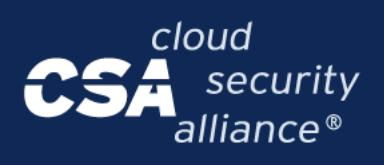

## Acknowledgements

### **Author**

Marina Bregkou

### **Contributors**

Daniele Catteddu Arpitha Kaushik Faisal Khan Michael Roza Betina Tagle Sam Washko

### **CSA Global Staff**

Marina Bregkou

#### **Graphic Design**

Stephen Lumpe Stephen Smith

{3}------------------------------------------------

| Acknowledgements 3                                                                  |  |
|-------------------------------------------------------------------------------------|--|
| Table of Contents4                                                                  |  |
| Executive Summary6                                                                  |  |
| How to use this workbook effectively6                                               |  |
| Quick Reference Summary (Cheat Sheet) 7                                             |  |
| The 18 Security Domains: 7                                                          |  |
| SSRM Actor Roles:8                                                                  |  |
| Key Resources:10                                                                    |  |
| Change Log Summary: Version 1.0 to 1.110                                            |  |
| What's New in AICM v1.1: 10                                                         |  |
| Key changes from v1.0 (July 2025):10                                                |  |
| 1. Introduction 11                                                                  |  |
| 1.1 What is the AI Controls Matrix 11                                               |  |
| 1.1.1 AICM Purpose and Scope12                                                      |  |
| 1.1.2 AICM Structure 12                                                             |  |
| 1.1.3 AICM Shared Security Responsibility Model (SSRM) Structure and Definitions 13 |  |
| 1.1.4 AICM Domains Description 15                                                   |  |
| 1.2 AICM Components29                                                               |  |
| 1.2.1 AICM Control Specifications and Applicability Matrix30                        |  |
| 1.2.2 AICM Scope Applicability/Mappings32                                           |  |
| 1.2.3 The AI Consensus Assessment Initiative Questionnaire (AI-CAIQ)34              |  |
| 1.2.4 Implementation Guidelines35                                                   |  |
| 1.2.5 Auditing Guidelines36                                                         |  |
| 1.2.6 AICM Document Tabs36                                                          |  |
| 1.3 Target Audience44                                                               |  |
| 1.3.1 AICM Compliance Documentation 46                                              |  |
| 1.4 AICM SSRM Implementation Guidelines 47                                          |  |
| 1.4.1 Purpose and Scope of the AICM Implementation Guidelines47                     |  |
| 1.4.2 Implementation Guidelines Target Audience49                                   |  |
| 1.4.3 Implementation Guidelines Structure49                                         |  |
| 1.5 AICM SSRM Auditing Guidelines 50                                                |  |
| 1.5.1 Purpose and Scope of the AICM Auditing Guidelines 51                          |  |
| 1.5.2 AICM Auditing Guidelines Target Audience 51                                   |  |
| 1.5.3 AICM Auditing Guidelines Structure 52                                         |  |
| 1.6 AI-CAIQ53                                                                       |  |
| 1.6.1 AI-CAIQ Structure 53                                                          |  |
| 1.7 AICM Introduction Guidance Versioning55                                         |  |

{4}------------------------------------------------

#### About the Continuous Automation Revolution Working Group and the AICM Development

AICM v1.1 is the evolution of AICM v1.0 which was published in July 2025 by the AI Controls Framework Working Group as CSA's first dedicated security control framework for AI systems. In Q4 2025, CSA consolidated the Cloud Controls Matrix (CCM) and AI Controls Framework working groups into the **Security Controls Catalog (SCC)**, a subgroup of the [Compliance](https://cloudsecurityalliance.org/research/working-groups/compliance-automation-revolution) Automation [Revolution](https://cloudsecurityalliance.org/research/working-groups/compliance-automation-revolution) (CAR) Working Group. This consolidation unified CSA's security control development under a single governance structure.

The Compliance Automation Revolution (CAR) Working Group focuses on advancing security and compliance automation, and continuous assurance through standardized, and machine-readable approaches to controls, assessments, and governance. CAR brings together industry stakeholders to develop strategies that reduce compliance burden while improving consistency, transparency, and scalability across cloud and emerging technologies.

As part of this effort, the **Security Controls Catalog** operates as a CAR subgroup responsible for maintaining a canonical set of technology-agnostic security controls and control metadata. The subgroup focuses on control harmonization, regulatory mappings, machine-readable control formats, and governance of control content to support automation and interoperability across CSA frameworks and external standards.

**AICM v1.1**, released in June 2026, is the first update developed under SCC governance. It synchronizes with CCM v4.1, introduces the new Model Development Security (MDS) domain, and updates framework mappings to reflect the published ISO 42001, EU AI Act and NIST AI RMF.

AICM v1.1 is intended to help organizations perform internal and external audits, strengthen control implementation, and demonstrate accountability across the AI lifecycle. The working group's activities are led by co-chairs representing key roles in the AI and cloud ecosystem, including model providers, service operators, consumers, and auditors.

{5}------------------------------------------------

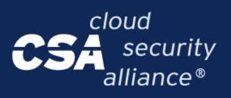

### Executive Summary

The Cloud Security Alliance (CSA) AI Controls Matrix (AICM) provides a foundational security and governance framework for AI service providers and customers to securely implement, assess, and manage AI systems across the AI supply chain.

The AICM v1.1 Bundle/package includes:

- AI Controls Matrix (247 controls across 18 domains)
- AI Consensus Assessment Initiative Questionnaire (AI-CAIQ)
- Implementation Guidelines (role-specific guidance)
- Auditing Guidelines (assessment procedures)
- Framework Mappings (ISO 42001, NIST AI RMF, EU AI Act, BSI AIC4, AIUC-1)

The framework addresses AI-specific threats (model poisoning, adversarial attacks, data leakage) while aligning with established industry standards. Controls are organized by a Shared Security Responsibility Model (SSRM) that delineates responsibilities across five actor roles: Model Providers (MPs), Orchestrated Service Providers (OSPs), Application Providers (APs), Cloud Service Providers (CSPs), and AI Customers (AICs).

AICM v1.1 provides security controls for **Generative AI systems**, particularly those built on LLMs and orchestration frameworks operating in the cloud. While adaptable to broader AI/ML systems, it currently emphasizes the **GenAI service stack**.

*For detailed implementation steps, see below: How to Use This Workbook.*

### **How to use this workbook effectively**

- **Define scope and understand the risk** using *Scope Applicability (Mappings)* to clarify which controls apply to your environment.
- **Select the applicable controls** in *AICM – Implementation Guidelines*: start with the shared guidelines, then action each **role**‑**specific** requirement (MP/OSP/AP/AIC/CSP) and assign control owners.
- **Define roles and responsibilities** to clarify which role assignments apply to your environment.
- **● Understand how the new controls fit into your existing program.**
- **Assess your posture** with the use of the AI-*CAIQ* . Build remediation plans based on identified gaps and risks.

{6}------------------------------------------------

- **Supply Chain and Vendor Integration:** Embed the AICM controls in procurement workflows and use it for continuous vendor monitoring.
- **Formalize the AI Security Governance Management System** by establishing an AI Governance Maturity Model.
- **Create Advanced Application and Strategic Use Cases** by regulatory compliance automation, AI security operations integration, and monitoring progress and execution.

The AICM primarily focuses on **Generative AI systems**, particularly those built on **LLMs and orchestration frameworks**, but its structure is adaptable to **broader AI/ML systems**. It currently emphasizes the **GenAI service stack.**

### **Quick Reference Summary (Cheat Sheet)**

AICM v1.1 Quick Reference: **Key Numbers**

| Metric             | Value                                                      |
|--------------------|------------------------------------------------------------|
| Total Controls     | 247                                                        |
| Security Domains   | 18                                                         |
| AI-CAIQ questions  | 320                                                        |
| Framework Mappings | 5 (ISO 42001, NIST AI RMF, EU AI Act, BSI AIC4, AIUC-1) |

*Table 1: AICM v1.1 Key Numbers*

### **The 18 Security Domains:**

| ID  | Domain                                          | Controls | Type       |
|-----|-------------------------------------------------|----------|------------|
| A&A | Audit & Assurance                               | 6        | Cloud & AI |
| AIS | Application & Interface Security                | 15       | Cloud & AI |
| BCR | Business Continuity & Operational Resilience | 11       | Cloud & AI |
| CCC | Change Control & Configuration Management    | 9        | Cloud & AI |
| CEK | Cryptography, Encryption & Key Management    | 21       | Cloud & AI |

{7}------------------------------------------------

| DCS | Datacenter Security                                       | 18 | Cloud-Specific, AI & Cloud related |
|-----|-----------------------------------------------------------|----|---------------------------------------|
| DSP | Data Security & Privacy Lifecycle Management           | 24 | Cloud & AI                            |
| GRC | Governance, Risk Management & Compliance               | 15 | Cloud & AI                            |
| HRS | Human Resources                                           | 15 | Cloud & AI                            |
| IAM | Identity & Access Management                              | 18 | Cloud & AI                            |
| IPY | Interoperability & Portability                            | 4  | Cloud & AI                            |
| I&S | Infrastructure Security                                   | 9  | Cloud & AI                            |
| LOG | Logging & Monitoring                                      | 16 | Cloud & AI                            |
| MDS | Model Development Security                                | 13 | AI-Specific, AI & Cloud related    |
| SEF | Security Incident Management, E-Discovery & Forensics  | 10 | Cloud & AI                            |
| STA | Supply Chain Management, Transparency & Accountability | 16 | Cloud & AI                            |
| TVM | Threat & Vulnerability Management                         | 13 | Cloud & AI                            |
| UEM | Universal Endpoint Management                             | 14 | Cloud & AI                            |

*Table 2: AICM v1.1 List of Security Domains and Security Controls*

### **SSRM Actor Roles:**

| Actor | Full Name            | Primary Responsibilities                                                                                                                                                                                                                                                                                                                                                                                                                                                                                                                                                                                                                                                  |
|-------|----------------------|---------------------------------------------------------------------------------------------------------------------------------------------------------------------------------------------------------------------------------------------------------------------------------------------------------------------------------------------------------------------------------------------------------------------------------------------------------------------------------------------------------------------------------------------------------------------------------------------------------------------------------------------------------------------------|
| AP    | Application Provider | Responsible and accountable for designing, developing, implementing, and enforcing controls within its own infrastructure and environment to mitigate security, privacy, or compliance risks associated with LLM/GenAI technologies, while enabling customers and upstream partners to implement these controls within their risk management approach and conducting due diligence on upstream providers (e.g., MPs, OSPs) to verify relevant control implementation, operating as entities that build end-user applications leveraging GenAI models for tasks such as content creation, chatbots, code generation, and enterprise automation, |

{8}------------------------------------------------

|     |                                  | typically delivered as SaaS solutions focused on user interfaces, application logic, and domain-specific functionality rather than underlying model development.                                                                                                                                                                                                                                                                                                                                                                                                                                                                                                                                  |
|-----|----------------------------------|---------------------------------------------------------------------------------------------------------------------------------------------------------------------------------------------------------------------------------------------------------------------------------------------------------------------------------------------------------------------------------------------------------------------------------------------------------------------------------------------------------------------------------------------------------------------------------------------------------------------------------------------------------------------------------------------------------|
| CSP | Cloud Service Provider        | Responsible and accountable for designing, developing, implementing, and enforcing controls within its own infrastructure and environment to mitigate security, privacy, or compliance risks associated with cloud computing technologies (processing, storage, networking), while enabling customers and upstream partners to implement and configure these controls within their own risk management approach, and ensuring that its upstream providers implement relevant controls for the services and products the CSP develops and offers.                                                                                                                                |
| MP  | Model Provider                   | Develops, trains, and distributes foundational and fine-tuned AI models, operating at the foundation layer of the AI stack, and is responsible for designing, developing, and implementing controls to mitigate security, privacy, or compliance risks associated with Large Language Models (LLMs), including model architecture, training methodologies, performance characteristics, and documentation of capabilities and limitations, while providing the underlying AI capabilities that other actors build upon and potentially offering direct API access to their models.                                                                                              |
| OSP | Orchestrated Service Provider | Responsible and accountable for designing, developing, implementing, and enforcing controls within its own infrastructure and environment to mitigate security, privacy, or compliance risks associated with LLM/GenAI technologies, while enabling customers and upstream partners to implement these controls within their risk management approach and ensuring that upstream providers (e.g., MPs) implement relevant controls, operating as entities that provide platforms, frameworks, and tools for model orchestration, API access, prompt management, workflow automation, monitoring, and governance rather than end-user functionality or raw infrastructure. |
| AIC | AI Customer                      | Responsible and accountable for the design, development, implementation, and enforcement of the control to mitigate security, privacy, or compliance risks associated with Large Language Model (LLM)/GenAI technologies in the context of services or products they consume.                                                                                                                                                                                                                                                                                                                                                                                                               |

*Table 3: AICM v1.1 System Actors and Roles.*

{9}------------------------------------------------

### **Key Resources:**

- CAR Working Group: <https://cloudsecurityalliance.org/research/working-groups/compliance-automation-revolution>
- STAR for AI: <https://cloudsecurityalliance.org/star/ai/>
- AICM v1.1 Download: <https://cloudsecurityalliance.org/artifacts/ai-controls-matrix-v1-1>

### **Change Log Summary: Version 1.0 to 1.1**

#### **What's New in AICM v1.1:**

AICM v1.1, released in July 2026, is the first update developed under Security Controls Catalog (SCC) governance.

#### **Key changes from v1.0 (July 2025):**

**Control Count:** Total controls increased from 243 (v1.0) to 247 (v1.1).

**Framework Synchronization:** Synchronized with CCM v4.1 (updated control specifications and metadata)

Updated Framework Mappings

- ISO/IEC 42001:2023 Updated to reflect updated control specifications
- EU AI Act Updated to reflect updated control specifications
- NIST AI RMF & AI 600-1 —Updated to reflect updated control specifications and mapped additionally NIST AI RMF.
- BSI AIC4 —Updated to reflect updated control specifications
- Added AIUC-1 mapping (AI agent security, safety, and reliability standard)

**Governance Change:** AICM development now governed by the Security Controls Catalog (SCC) subgroup under the Compliance Automation Revolution (CAR) Working Group, unifying CCM and AICM maintenance under a single governance structure.

{10}------------------------------------------------

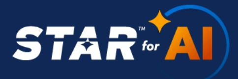

Enhanced Documentation

- Updated Implementation Guidelines per updated control specifications deriving from CCM v4.1
- Updated Auditing Guidelines per updated control specifications deriving from CCM v4.1
- AI-CAIQ v1.1 with updated questions aligned to v1.1 controls.

## 1. Introduction

### **1.1 What is the AI Controls Matrix**

The AICM is a comprehensive AI security control framework developed to provide a set of structured and standardized controls that address security, safety, and privacy concerns associated with artificial intelligence systems, helping organizations to assess and manage risks related to the development, deployment, orchestration, and consumption of AI services.

The AICM was created to facilitate risk management in an evolving AI landscape, where traditional security controls alone are insufficient to address unique AI-specific threats such as model poisoning, adversarial attacks, data leakage, and emergent behavior.

While high-level AI security principles provide strategic direction, the AICM translates those principles into specific, actionable controls tailored to the roles of Model Providers (MPs), Orchestrated Service Providers (OSPs), Application Providers (APs), Cloud Service Providers (CSPs), and AI Customers (AICs).

The framework is closely aligned with the CSA AI Security [Guidance](https://cloudsecurityalliance.org/press-releases/2025/01/29/csa-releases-comprehensive-guide-to-navigating-ai-governance-security-and-management) and builds upon the foundation established by the Cloud Controls Matrix (CCM).

The CSA encourages organizations to use the AICM as a companion to AI security best practices and existing frameworks to optimize the complementary values of multiple approaches.

The AICM is designed to evolve over time to accommodate rapid changes in AI technology and the security landscape, ensuring the framework remains relevant and effective in addressing the dynamic nature of AI security challenges.

AICM Version 1.1 is the foundational iteration of the framework, featuring control objectives across multiple domains covering all key aspects of AI technology, and is mapped to leading AI and industry standards, regulations, and frameworks including NIST AI RMF & AI 600-1, ISO/IEC 42001, BSI AIC4, the EU AI Act, and others.

{11}------------------------------------------------

#### **1.1.1 AICM Purpose and Scope**

The primary purpose of the AICM is to drive and facilitate effective and comprehensive security, safety, and privacy risk management in the AI ecosystem. Regardless of the type of organization (Model Provider, Orchestrated Service Provider, Application Provider, Cloud Service Provider, or AI Customer) and size of organization (i.e., large corporation vs. small company), or the nature of AI implementation (model development, model orchestration, application integration, or AI consumption), the AICM can be used to define, implement and enforce security requirements and measure their effectiveness. The AICM assists organizations in translating their internal organizational, operational, and legal stipulations into a standardized set of AI-relevant policies, procedures, and technical control objectives.

The AICM is also a tool for internal and external assessments or audits. It is designed to be used along with the AI-CAIQ, which provides a set of "yes" or "no" questions that can be answered to determine if the AICM controls are being met. Both the AICM control matrix and AI-CAIQ help auditors (internal or external) understand if an organization follows its internal AI governance policies and fulfills its legal and regulatory obligations related to AI systems.

The AI components have varying levels of sensitivity and criticality, as they are deployed across cloud infrastructure, orchestrated services, and end-user applications. The organization can use the AICM to identify specific policy, procedural, and technical requirements and define control objectives that will be included in the AI security program. It uses those control objectives to enforce mandates related to internal developers, third-party AI providers, and integration partners, and monitor adherence to both internal policies and external compliance requirements.

For example, based on an internal risk assessment, an organization might identify the need to protect against model inversion attacks, ensure output fairness, and maintain the integrity of training data for a customer-facing AI application.

Therefore, organizations should implement AICM controls to meet the needs and manage the risks inherent in their unique AI environment while leveraging the role-specific recommendations and guidelines in this framework.

#### **1.1.2 AICM Structure**

The AICM v1.1 is the evolution of the previously first published AICM v1.0 in July 2025. Like AICM v1.0 this next version 1.1 is structured into 18 security domains and has evolved into 247 controls from the 243 that version 1.0 contained. The original 17 domains were based on CSA's Cloud Controls Matrix (CCM) and a new domain on Model Security was added.

Each AICM domain defines what category a control falls under. The AICM was deliberately designed to align with both existing cybersecurity frameworks and emerging AI-specific standards to leverage organizational familiarity while addressing the unique challenges posed by AI technologies. This structure

{12}------------------------------------------------

enables seamless integration with established security programs while providing specialized guidance for AI-specific threats such as model manipulation, data poisoning, and supply chain attacks.

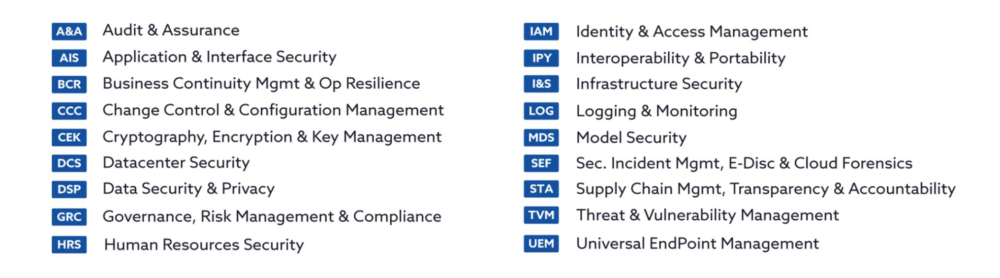

#### *Figure 1: the AICM security domains and their acronyms*

#### **1.1.3 AICM Shared Security Responsibility Model (SSRM) Structure and Definitions**

The Shared Security Responsibility Model (SSRM) expressions used within each AICM control specification (and its guidelines) help AI service providers and customers comprehend what is the "typical" control ownership and implementation responsibility across the AI supply chain. These expressions delineate responsibilities among Cloud Service Providers (CSPs), Model Providers (MPs), Orchestrated Services Providers (OSPs), Application Providers (APs), and AI Customers (AICs).

The meaning of these SSRM expressions is explained below:

| Control Ownership: CSP-Owned | Control ownership and implementation responsibility is owned by the Cloud Service Provider (CSP). The CSP is entirely responsible and accountable for the AICM control implementation at the GenAI OPS/Processing Infrastructure layer. Other parties in the AI supply chain have no responsibility for implementing this control. Examples: Physical datacenter security, infrastructure network security, hardware maintenance.                           |
|------------------------------|-------------------------------------------------------------------------------------------------------------------------------------------------------------------------------------------------------------------------------------------------------------------------------------------------------------------------------------------------------------------------------------------------------------------------------------------------------------------------------|
| Control Ownership: MP-Owned  | Control ownership and implementation responsibility is owned by the Model Provider (MP). The MP is entirely responsible and accountable for the AICM control implementation related to model development, training, and foundational model capabilities. Other parties in the AI supply chain have no responsibility for implementing this control. Examples: Base model training data curation, foundational model validation, model architecture security |

{13}------------------------------------------------

| Control Ownership: OSP-Owned                         | Control ownership and implementation responsibility is owned by the Orchestrated Services Provider (OSP). The OSP is entirely responsible and accountable for the AICM control implementation related to orchestration platforms, API management, and service integration. Other parties in the AI supply chain have no responsibility for implementing this control. Examples: API security controls, prompt management security, model |
|------------------------------------------------------|------------------------------------------------------------------------------------------------------------------------------------------------------------------------------------------------------------------------------------------------------------------------------------------------------------------------------------------------------------------------------------------------------------------------------------------------------------|
|                                                      | orchestration logging                                                                                                                                                                                                                                                                                                                                                                                                                                      |
| Control Ownership: AP-Owned                          | Control ownership and implementation responsibility is owned by the Application Provider (AP). The AP is entirely responsible and accountable for the AICM control implementation related to end-user applications and AI-integrated services. Other parties in the AI supply chain have no responsibility for implementing this control.                                                                                                      |
|                                                      | Examples: Application-level guardrails, user authentication, application-specific output validation                                                                                                                                                                                                                                                                                                                                                     |
| Control Ownership: AIC-Owned                         | Control ownership and implementation responsibility is owned by the AI Customer (AIC). The AIC is entirely responsible and accountable for the AICM control implementation within their usage and consumption of AI services. AI service providers have no responsibility for implementing this control.                                                                                                                                       |
|                                                      | Examples: Acceptable use policy enforcement, end-user training, prompt engineering governance.                                                                                                                                                                                                                                                                                                                                                          |
| Control Ownership: Shared Across the Supply Chain | Control ownership and implementation responsibility is shared among all parties in the AI supply chain (CSP, MP, OSP, AP, and AIC). Each party should implement the control at their respective layer, but implementation is typically independent, one party's implementation does not require coordination with others. Examples: Independent audit programs, security awareness training,                                                |
|                                                      | incident response capabilities                                                                                                                                                                                                                                                                                                                                                                                                                             |
| Control Ownership: Shared [Party1]-[Party2]       | Control ownership and implementation responsibility is shared between two specific parties in the AI supply chain. Both parties should implement the control at their respective layer. Examples:                                                                                                                                                                                                                                                 |
|                                                      | ● Shared CSP-MP: The CSP provides secure infrastructure and the MP configures model training security on that infrastructure ● Shared MP-OSP: The MP provides model security documentation and the OSP implements controls based on those specifications ● Shared OSP-AP: The OSP provides API security capabilities and the AP properly configures access controls                                                          |

{14}------------------------------------------------

● **Shared AP-AIC**: The AP provides content filtering tools and the AIC configures filtering policies, or both AP and AIC maintain independent incident response plans.

*Table 4: AICM v1.1 Control Implementation Ownership (Shared Security Responsibility Model Structure and Definitions)*

This SSRM structure enables clear delineation of security responsibilities in complex GenAI deployments where multiple organizations may provide different layers of the AI service stack.

The above SSRM expression types are aligned with the AI Consensus Assessment Initiative Questionnaire (AI-CAIQ) relevant column "SSRM Control Ownership".

#### **1.1.4 AICM Domains Description**

The *AICM v1.1* includes 18 cloud security domains. These domains are listed below, along with a description of each one's unique purpose and use.

#### **1. Audit and Assurance (A&A)**

The Audit and Assurance (A&A) domain consists of six (6) control specifications and enables Model Providers (MPs), Orchestrated Service Providers (OSPs), Application Providers (APs), Cloud Service Providers (CSPs), and AI Customers (AICs) to inform and establish necessary confidence for critical decision-making, communication, and reporting about key processes, including those control processes encompassed within the AICM, through assessment, verification, and validation activities.

This domain is designed to support all stakeholders in the AI ecosystem operating in the cloud, in defining and implementing their respective audit management processes to support audit planning, risk analysis, AI security control assessment, conclusion, remediation, and reporting, as well as their review of and reliance on attestations and supporting evidence related to AI systems across the supply chain.

The AI-specific shared responsibility model delineates the responsibilities of MPs, OSPs, APs, CSPs, and AICs in implementing A&A controls throughout the AI lifecycle.

Each stakeholder is independently responsible for establishing robust audit and assurance policies within their scope, whether for model development, orchestration services, application integration, infrastructure provision, or AI consumption, conducting regular AI security assessments, and complying with relevant standards and AI-specific regulatory requirements (such as EU AI Act, sector-specific AI regulations, and AI safety frameworks).

MPs, OSPs, APs, CSPs, and AICs each implement A&A controls aligned with their respective responsibilities in the AI supply chain to ensure that all parties independently meet their specific

{15}------------------------------------------------

assurance needs over the control processes covered by the AICM, fostering transparency and accountability across the entire AI ecosystem.

#### **2. Application and Interface Security (AIS)**

The Application and Interface Security (AIS) domain consists of fifteen (15) control specifications and focuses on securing the software, interfaces, and AI-specific components (such as models, APIs, and agents) used across the AI supply chain. It assists organizations in identifying and mitigating risks in the AI system's design, development, and operational phases. Implementing AI security controls in this domain is crucial for ensuring the integrity, confidentiality, and availability of AI-powered applications and their interactions.

Within the AICM's shared responsibility model, security duties are distributed according to each actor's role:

- **Model Providers (MPs)** are responsible for securing the model development lifecycle, including secure coding practices for training scripts, validating model inputs and outputs, and protecting model APIs and artifacts from tampering or theft.
- **Orchestrated Service Providers (OSPs)** are responsible for securing the deployment and runtime environment for AI services, including the hardening of inference APIs, managing service-to-service communication, and ensuring secure configuration of orchestration tools.
- **Application Providers (APs)** are responsible for securely integrating AI capabilities into end-user applications, implementing input validation and output encoding to prevent attacks like prompt injection, and safeguarding application-specific APIs.
- **Cloud Service Providers (CSPs)** are responsible for securing the underlying cloud infrastructure that supports AI workloads, offering secure application and API services, and providing hardened runtime environments.
- **AI Customers (AICs)** are responsible for evaluating the application and interface security posture of their AI providers, validating that security controls meet organizational requirements, and ensuring the secure consumption of AI-powered applications and APIs.

Collaboration and clear delineation of responsibilities fosters a proactive security posture, enabling faster threat identification and resolution across the interconnected AI supply chain.

#### **3. Business Continuity Management and Operational Resilience (BCR)**

The Business Continuity Management and Operational Resilience domain consists of eleven (11) control specifications focused on safeguarding critical AI services, model pipelines, and data flows. It aims to minimize the impact of disruptions and ensure the continuous availability and reliable performance of AI systems in the face of potentially disruptive events. Implementation of AI security controls in this domain is paramount for all actors in the supply chain to ensure uninterrupted AI service delivery and maintain

{16}------------------------------------------------

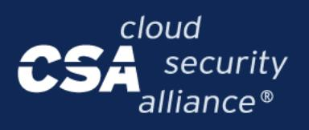

operational resilience, especially given the critical dependencies AI applications often have on model availability and data integrity.

Within the AICM's shared responsibility model, each actor plays a distinct but interconnected role in ensuring AI service resilience:

- **Cloud Service Providers (CSPs)** are responsible for the foundational resilience of the cloud infrastructure supporting AI workloads. This includes ensuring the high availability, redundancy, and recoverability of compute, storage, and networking services, and transparently communicating their service-level resilience capabilities to MPs, OSPs, and APs.
- **Model Providers (MPs)** are responsible for the continuity and resilience of their model development and training pipelines. This includes having strategies to recover critical training data, model artifacts, and version-controlled codebases to ensure models can be retrained or redeployed following a disruption.
- **Orchestrated Service Providers (OSPs)** are responsible for the operational resilience of deployed AI services. This involves designing for failover and scalability, ensuring inference APIs remain available, and managing the seamless recovery of AI service orchestration across different availability zones or regions.
- **Application Providers (APs)** are responsible for ensuring continuity of AI-powered applications and implementing failover mechanisms for AI service dependencies.
- **AI Customers (AICs)** are responsible for assessing and managing business disruption risks associated with their consumption of AI services. Based on their risk analysis, AICs should formulate robust business continuity strategies that account for potential AI service unavailability, performance degradation, or output quality issues, and develop contingency plans for critical AI-dependent operations.

Through fulfilling their respective responsibilities and collaboration, all parties in the AI ecosystem contribute to maintaining resilient and reliable AI operations, enabling organizations to continue business functions even when facing disruptions to the complex AI supply chain.

#### **4. Change Control and Configuration Management (CCC)**

The Change Control and Configuration Management domain incorporates nine (9) controls focused on managing and securing changes to the AI environment, ensuring that modifications to models, data, code, and infrastructure do not introduce vulnerabilities, compromise security, or lead to model drift or unintended behavior. Effectively managing changes is critically important to ensure the stability, reliability, and security of AI services across the entire supply chain.

Within the AICM's shared responsibility model, change management duties are distributed based on the component under control:

{17}------------------------------------------------

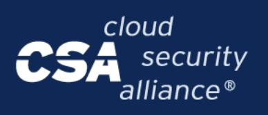

- **Model Providers (MPs)** are typically responsible for establishing and maintaining secure change management processes for model development environments, training pipelines, model architectures, hyperparameter configurations, and model weights. This includes ensuring configuration baselines are established for training infrastructure, conducting change risk assessments for model updates, and ensuring all changes to production models are subject to appropriate authorization and validation prior to deployment.
- **Orchestrated Service Providers (OSPs)** are usually responsible for managing changes to the deployment and orchestration environment. This includes version-controlled configuration for inference services, containers, and scaling policies, ensuring that updates to the serving infrastructure do not disrupt AI service availability or performance.
- **Application Providers (APs)** are responsible for change management of AI-powered applications, including changes to AI feature integrations, user interface configurations, prompt templates, and application-level AI controls.
- **Cloud Service Providers (CSPs)** provide underlying infrastructure change management for compute, storage, networking, and platform services supporting AI workloads, ensuring infrastructure changes do not disrupt AI operations.
- **AI Customers (AICs)** are responsible for managing changes to their consumption and integration of AI services, including configuration of security controls, access policies, and monitoring settings for AI service usage.

This domain ensures that all components, from infrastructure to model weights, are only modified to an approved baseline after the relevant change management authority within each organization has approved the change, thereby maintaining the integrity of the entire AI system.

#### **5. Cryptography, Encryption and Key Management (CEK)**

The Cryptography, Encryption, and Key Management (CEK) domain consists of twenty one (21) control specifications that aim to protect data throughout the AI lifecycle by employing robust cryptographic techniques, encryption, and key management practices. The CEK domain plays a crucial role in ensuring the confidentiality and integrity of sensitive information, including training data, model weights, and inference inputs/outputs, and is fundamental to complying with data protection regulations and privacy-preserving AI principles.

In the AICM's shared responsibility model, cryptographic duties are distributed across the AI supply chain based on data ownership and control:

● **Cloud Service Providers (CSPs)** are responsible for managing the underlying infrastructure and cryptographic services, providing secure key storage solutions, hardware security modules (e.g. HSMs), and encryption capabilities for compute, storage, and networking resources supporting AI workloads.

{18}------------------------------------------------

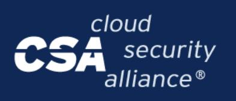

- **Model Providers (MPs)** are responsible for encrypting training data at rest and in transit, protecting model weights through encryption and digital signatures, implementing secure key management for model artifacts, and ensuring cryptographic protection of proprietary algorithms and intellectual property.
- **Orchestrated Service Providers (OSPs)** oversee the governance of cryptography for orchestration platforms, ensuring secure API communications, managing encryption keys for model serving infrastructure, and providing cryptographic services for multi-tenant AI deployments.
- **Application Providers (APs)** are accountable for encrypting user prompts and AI-generated outputs, implementing cryptographic controls for application-level AI features, and managing keys for AI service integrations.
- **AI Customers (AICs)** are accountable for defining and assigning cryptographic roles and responsibilities within their specific AI use cases, encrypting sensitive data prior to AI processing, managing their own encryption keys for AI-related data, implementing cryptographic risk management for AI deployments, and ensuring compliance with data protection requirements when using AI services.

Collaboration across all parties for the implementation of CEK controls provides mutual benefits. For providers, it ensures the confidentiality and integrity of the data and models under their stewardship, enhancing the overall security and trustworthiness of their AI services. For AI Customers, collaboration ensures that their specific cryptographic requirements for AI deployments are met, including protection of sensitive prompts, secure processing of confidential data through AI systems, and cryptographic verification of model authenticity and provenance.

#### **6. Datacenter Security (DCS)**

This domain consists of fifteen (15) control specifications that are essential for securing the physical infrastructure and environment that hosts AI systems, including model training facilities, inference infrastructure, orchestration platforms, and AI applications. This includes safeguarding physical assets such as high-performance computing clusters, GPU farms, specialized AI accelerator hardware, storage systems containing training data and model weights, and networking equipment against security threats such as unauthorized access, theft of model infrastructure, and environmental hazards.

In the AI-specific shared responsibility model, responsibilities for datacenter security depend on which party operates physical infrastructure.

- **Cloud Service Providers (CSPs**) are typically responsible for securing datacenter physical infrastructure, environmental controls, and overall facility security for cloud-hosted AI workloads.
- **Model Providers (MPs)** operating their own training facilities are responsible for securing physical datacenters housing model development infrastructure, including access controls for

{19}------------------------------------------------

training clusters, environmental monitoring of GPU farms, and physical protection of proprietary training hardware and data storage systems.

- **Orchestrated Service Providers (OSPs)** operating their own inference infrastructure are responsible for datacenter security for orchestration platforms and model serving facilities.
- **Application Providers (APs)** operating on-premises AI application infrastructure are responsible for securing their physical facilities.
- **AI Customers (AICs**) are generally not responsible for datacenter security when consuming cloud-based or third-party AI services; nevertheless, in the context of the Audit and Assurance domain, AICs should verify their providers' compliance with datacenter security controls through attestations, certifications, and audit reports.

Special considerations for AI datacenter security include physical protection of AI training infrastructure, environmental controls for power-intensive GPU clusters, secure disposal of storage media containing training data and model weights, and physical access controls for facilities housing proprietary AI systems to prevent model theft or unauthorized data extraction.

#### **7. Data Security and Privacy Lifecycle Management (DSP)**

The Data Security and Privacy Lifecycle Management (DSP) domain features twenty four (24) control specifications on privacy and data security across the AI ecosystem. These controls are not specific to any industry, country or regulation. However, these controls have been developed by considering the common elements and requirements of major privacy regulations (such as GDPR, CCPA) and AI-specific privacy frameworks (such as requirements in the EU AI Act). They are generally applicable to organizations worldwide developing, deploying, or consuming AI systems and are expected to serve as a valuable baseline, with the caveat that some organizations operating in some locations, sectors, or with high-risk AI systems may have to implement supplemental data protection controls.

DSP controls cover the complete data lifecycle for AI-related data, from creation to disposal, including training data collection, model training, fine-tuning, inference processing, output generation, and secure deletion. This encompasses data privacy, data classification, data inventory, data flow documentation, retention and disposal procedures for training datasets, model weights, prompts, inference inputs and outputs, and evaluation data according to all applicable laws and regulations, standards, and risk level. Controls in the DSP help all stakeholders in protecting relevant AI data and complying with data protection laws and regulations while addressing AI-specific privacy risks such as data poisoning, lack of data provenance and transparency, inadequate use of privacy-enhancing technologies (such as differential privacy, federated learning), training data extraction through model outputs, and ensuring training data differentiation and relevance for intended AI model use.

Under the AI-specific shared responsibility model,

{20}------------------------------------------------

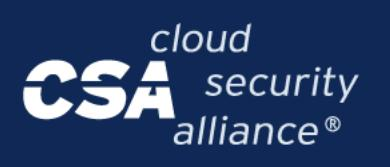

- **Model Providers (MPs)** are responsible for securing training data throughout the model development lifecycle, implementing data classification for training datasets, ensuring privacy-preserving techniques (such as differential privacy, federated learning), managing retention and secure disposal of training data and model checkpoints, and preventing training data leakage through model outputs.
- **Orchestrated Service Providers (OSPs)** are responsible for securing data in transit through orchestration platforms, protecting API request and response data, implementing data isolation in multi-tenant environments, and managing retention policies for orchestration logs and inference data.
- **Application Providers (APs)** are responsible for securing user prompts and AI-generated outputs, classifying application-level AI data, implementing prompt sanitization to prevent data leakage, and managing retention of conversation histories and user interaction data.
- **Cloud Service Providers (CSPs)** provide capabilities for secure data storage, processing, and disposal practices for AI workloads hosted on their infrastructure.
- **AI Customers (AICs)** are responsible for classifying their data before processing through AI systems, leveraging provider-supplied data protection capabilities such as encryption and access controls, specifying data residency and retention requirements, and ensuring compliance with data privacy regulations when using AI services.

DSP controls' implementation offers substantial benefits, as it enhances the overall security and privacy of data across the AI lifecycle while mitigating AI-specific risks such as model inversion attacks, membership inference, and unintended disclosure of sensitive information in AI outputs.

#### **8. Governance, Risk Management and Compliance (GRC)**

The Governance, Risk Management, and Compliance (GRC) domain comprises fifteen (15) control specifications that help Model Providers (MPs), Orchestrated Service Providers (OSPs), Application Providers (APs), Cloud Service Providers (CSPs), and AI Customers (AICs) ensure their AI governance and associated AI risk management (AIRM), AI information security management, and compliance management programs, adequately address AI systems, offerings, and concerns across the AI lifecycle.

Usually, MPs, OSPs, APs, CSPs, and AICs are independently responsible for implementing their respective governance, risk, and compliance controls to cover their AI-related management and operations, including those for their AI models, orchestration services, AI-powered applications, infrastructure, and AI service consumption. The establishment of a GRC program is fully internal and unique to each organization, with particular attention to AI-specific governance requirements such as AI impact assessments, bias and fairness assessments, explainability requirements, human supervision mechanisms, ethics committees, and acceptable use policies for AI services. Each stakeholder should tailor their GRC programs to address their specific role in the AI supply chain, whether developing models, orchestrating services, building applications, providing infrastructure, or consuming AI capabilities.

{21}------------------------------------------------

Implementing GRC security controls helps AI organizations effectively direct and control their AI resources and capabilities by providing a structured governance framework for managing AI-specific risks (such as model bias, lack of explainability, unsafe AI behaviors, and ethical concerns), ensuring compliance with AI-specific regulations (such as the EU AI Act, sector-specific AI requirements), and aligning AI security and safety practices with their business objectives, ethical principles, and regulatory obligations.

The AI-specific GRC controls support organizations in establishing accountability structures, conducting regular AI impact and fairness assessments, maintaining oversight through ethics committees and human supervision, and ensuring transparent and explainable AI systems that meet stakeholder expectations and regulatory requirements.

#### **9. Human Resources (HRS)**

The Human Resources (HRS) security domain utilizes fifteen (15) controls that aid AI organizations in managing the risk associated with insider threats and ensures that personnel handling sensitive AI systems, training data, model weights, and AI-powered applications are trustworthy, properly trained, and possess appropriate AI competencies. Effective HRS measures safeguard against unauthorized access, model theft, training data breaches, and security incidents caused by human factors, thus maintaining the overall security posture of AI systems across the ecosystem.

In the AI-specific shared responsibility model, Model Providers (MPs), Orchestrated Service Providers (OSPs), Application Providers (APs), Cloud Service Providers (CSPs), and AI Customers (AICs) have roles and responsibilities in independently implementing HRS security controls within their respective domains.

In the AICM's shared responsibility model, all actors are independently responsible for implementing HRS security controls relevant to their role. This includes, but is not limited to, conducting role-specific background checks, providing ongoing training on AI security risks (such as prompt injection, data poisoning, and model evasion), and ensuring staff are aware of ethical guidelines and compliance requirements for AI systems. Special attention should be given to roles with privileged access to training data, model weights, fine-tuning datasets, production inference systems, and orchestration platforms, as these positions pose heightened risks for model theft, data exfiltration, or malicious manipulation of AI systems.

#### **10. Identity and Access Management (IAM)**

The Identity and Access Management (IAM) domain comprises of nineteen (19) control specifications that help all actors in the AI supply chain, including Model Providers (MPs), Orchestrated Service Providers (OSPs), Application Providers (APs), AI Customers (AICs), and Cloud Service Providers (CSPs), adhere to security best practices for managing identities and controlling access to AI systems, models, data, and supporting infrastructure. Foundational principles such as the principle of least privilege, segregation of duties, multi-factor authentication, and role-based access control are central to

{22}------------------------------------------------

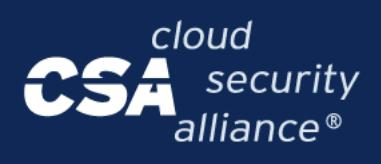

securing access across the complex AI lifecycle, from model training and deployment to application integration and end-use.

In the AICM's shared responsibility model, each actor is responsible for implementing IAM controls within their scope of the AI ecosystem.

- **CSPs** are usually responsible for providing robust IAM capabilities and a secure foundation for the underlying infrastructure.
- **MPs, OSPs, and AP**s are responsible for defining and enforcing strict access policies for their development environments, model repositories, inference APIs, and orchestration platforms.
- **AICs** are responsible for managing access to the AI-powered applications and services they consume, ensuring internal users have appropriate permissions.

Collaboration and clear delineation of IAM responsibilities across the AI supply chain are essential to protect sensitive training data, proprietary models, and inference workloads from unauthorized access, tampering, or exfiltration, thereby ensuring the integrity and security of AI services.

#### **11. Interoperability and Portability (IPY)**

The AICM's Interoperability and Portability (IPY) domain has four (4) control specifications to address interoperability and portability in the AI ecosystem. Implementing robust interoperability and portability controls facilitates the safe and secure exchange of training data, model weights, AI-generated outputs, and metadata across multiple platforms, Model Providers, Orchestrated Service Providers, and Application Providers, enabling AI Customers to avoid vendor lock-in and fostering an environment where interoperability and portability are not hindered by security concerns.

All stakeholders in the AI supply chain independently share responsibilities in ensuring interoperability and portability within the AI ecosystem.

- **Model Providers** are responsible for implementing standardized data formats for training and validation datasets (such as CSV, JSON Lines, etc.), promoting interoperable model serialization formats (such as ONNX, PMML), defining standards for model metadata, and utilizing AI-Ops tools, repositories, and registries to enforce standards for machine learning workflows.
- **Orchestrated Service Providers** are responsible for implementing standardized communication protocols for API integrations, ensuring secure communication channels for model serving and inference operations, maintaining cross-platform compatibility for orchestration services, and supporting common model deployment and exchange protocols.
- **Application Providers** are responsible for implementing standardized interfaces for AI feature integration, ensuring portability of AI-powered applications across different environments, and maintaining compatibility with various model providers and orchestration platforms.

{23}------------------------------------------------

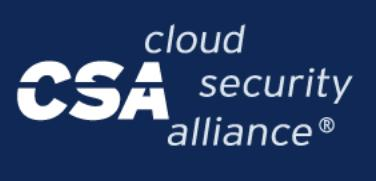

- **Cloud Service Providers** are responsible for providing standardized infrastructure APIs, ensuring secure data transfer mechanisms, and supporting interoperable storage and compute services for AI workloads.
- **AI Customers** are responsible for understanding and using tools provided by their AI service providers for secure data backup, transfer, and restore (including training data and model artifacts), implementing interoperable data encryption, understanding management, monitoring, and reporting interfaces provided by their providers, and ensuring integration of those interfaces among multiple AI environments.

All stakeholders are jointly responsible for documenting data and model portability contractual obligations, such as defining data ownership, model ownership, migration procedures, data formats, model export formats, retention periods, and deletion policies.

Shared commitment to interoperability and portability from all stakeholders in the AI supply chain is important for building a safe, secure, and flexible AI ecosystem that prevents vendor lock-in while maintaining security, enables seamless migration of models and data across platforms, and supports collaborative AI development and deployment practices.

#### **12. Infrastructure Security (I&S)**

The Infrastructure Security (I&S) domain comprises nine (9) control specifications that guide all actors in securing the foundational compute, storage, and networking resources that support AI systems. This encompasses all hardware (including GPUs, TPUs, and specialized AI accelerators), software, networks, and facilities, including the virtualization and containerization technologies that abstract this hardware to enable the scalable and isolated execution of AI workloads, such as model training and inference. In the AICM's shared responsibility model, security responsibilities for infrastructure are shared across all stakeholders.

- **Cloud Service Providers (CSPs)** are responsible for securing the underlying physical and virtualized infrastructure, including the hypervisor, host operating systems, and physical network. They provide the secure foundation upon which AI workloads run.
- **Model Providers (MPs), Orchestrated Service Providers (OSPs), and Application Providers (APs)** are responsible for securing their allocated resources within this environment. This includes securing AI training environments with proper isolation, hardening guest OSes in training clusters, securing container orchestration platforms (e.g., Kubernetes), applying security patches to AI runtime environments, implementing protections against model extraction or poisoning attacks through infrastructure vulnerabilities, and managing access to the control planes of their AI pipelines and services.
- **AI Customers (AICs)** are responsible for securing their allocated virtualized resources, including hardening operating systems, applying patches, and managing access controls for their AI deployments.

{24}------------------------------------------------

Given that infrastructure and virtualization are fundamental building blocks for computationally intensive AI systems, a clear delineation and collaborative implementation of I&S controls across all stakeholders in the AI supply chain is essential to ensure the confidentiality, integrity, and availability of AI models, training data, and the sensitive information they process, while protecting against infrastructure-level attacks and ensuring proper isolation in multi-tenant AI environments.

#### **13. Logging and Monitoring (LOG)**

The Logging and Monitoring domain comprises fifteen (15) control specifications that enable all actors in the AI supply chain to collect, store, analyze, and report on the activities and events across the AI lifecycle. This includes specialized monitoring for model behavior, data flows, and API interactions, which in turn helps to detect and respond to security incidents (such as adversarial attacks or data exfiltration), operational issues (like model drift or performance degradation), and system anomalies, and to comply with AI-specific regulatory requirements and ethical guidelines.

In the AICM's shared responsibility model, logging and monitoring responsibilities are shared.

- **Cloud Service Providers (CSPs)** are usually responsible for monitoring the underlying cloud infrastructure that supports AI workloads.
- **Model Providers (MPs)** are responsible for logging model training activities, data lineage, and access to model repositories.
- **Orchestrated Service Providers (OSPs)** should monitor the performance, scaling, and security of deployed model endpoints and APIs.
- **Application Providers (APs)** are responsible for monitoring how AI features are used within their applications, including user interactions and input/output patterns.
- **AI Customers (AICs)** are responsible for monitoring the business-level outputs and impacts of the AI services they consume.

Collaboration across the AI supply chain in implementing comprehensive logging and monitoring is crucial for achieving end-to-end visibility and accountability. This ensures the ability to trace decisions back to their source, validate model fairness and robustness, demonstrate compliance, and rapidly identify and mitigate risks unique to AI systems.

#### **14. Model Security (MDS)**

The Model Security (MDS) domain comprises thirteen (13) control specifications that are unique to AI systems and focus on securing the entire model development lifecycle, from training pipeline security to model artifact integrity, documentation, and adversarial robustness. These controls help Model Providers (MPs) and Application Providers (APs) who develop or fine-tune AI models to implement comprehensive security measures throughout the model development process, ensuring the confidentiality, integrity, and

{25}------------------------------------------------

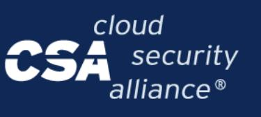

availability of training data, model weights, algorithms, and development infrastructure. The MDS domain addresses AI-specific risks such as training pipeline compromise, model poisoning, adversarial attacks, inadequate model documentation, model theft, and vulnerabilities in model artifacts.

In the AI-specific shared responsibility model, **Model Providers** bear primary responsibility for implementing MDS controls when developing foundation models, base models, or custom AI models. This includes securing training pipelines through code review and access controls, scanning model artifacts for vulnerabilities at each lifecycle stage and handover point, maintaining comprehensive model documentation (including model cards with performance characteristics, limitations, and intended use cases), validating model documentation accuracy, conducting adversarial attack analysis and implementing model hardening techniques, performing model integrity checks and cryptographic signing for ownership verification, continuously monitoring model performance and behavior, establishing failure handling procedures, conducting risk assessments for open-source models, and using secure model serialization formats.

- **Application Providers** may share responsibility for MDS controls when they fine-tune existing models, customize AI capabilities for specific use cases, or integrate models into applications, including documenting their modifications, validating model behavior post-customization, and ensuring the security of their model development processes.
- **Orchestrated Service Providers, Cloud Service Providers, and AI Customers** usually may not have direct MDS responsibilities, as they consume rather than develop models, though they benefit from strong MDS practices by their upstream providers, but they may share responsibility when they fine-tune or significantly customize models.

Implementation of MDS controls is critical for establishing trust in AI models and protecting against sophisticated AI-specific attacks throughout the development lifecycle. These controls enable model provenance tracking, ensure transparency through comprehensive documentation, protect against adversarial manipulation and model poisoning, verify model integrity through cryptographic signing, detect model drift and performance degradation through continuous monitoring, and support compliance with emerging AI regulations that mandate model documentation, testing, and validation.

#### **15. Security Incident Management, E-Discovery, and Cloud Forensics (SEF)**

The Security Incident Management, E-Discovery, and Cloud Forensics (SEF) domain comprises nine (9) control specifications essential for effectively managing and responding to security incidents specific to AI systems, conducting e-discovery, and performing forensic analysis in AI-enabled environments. These controls help all actors in the AI supply chain achieve timely detection, analysis, and response to AI security incidents, such as model poisoning, adversarial attacks, data leaks, or misuse, minimizing the impact on business operations and model integrity.

In the AICM's shared responsibility model, all actors are responsible for their respective roles in incident management. This includes developing AI-specific incident response plans, establishing clear roles for incidents like model compromise, implementing relevant metrics, and reporting incidents to stakeholders.

{26}------------------------------------------------

A critical aspect of collaboration is the triage of potential AI security incidents, which often could require a joint effort. For example, a Cloud Service Provider (CSP) can provide infrastructure-level logs, while a Model Provider (MP) should contribute insights into model behavior anomalies, and an Application Provider (AP) can provide user interaction data that may indicate an attack.

Collaboration between all actors in implementing SEF controls leads to a robust and effective AI incident management and forensics capability. This ensures a quicker recovery from AI-specific security events, helps preserve forensic evidence across the complex AI supply chain, and facilitates compliance with emerging legal and regulatory requirements for AI systems.

#### **16. Supply Chain Management Transparency and Accountability (STA)**

The Supply Chain Management, Transparency, and Accountability (STA) domain comprises sixteen (16) control specifications to aid all actors in the AI ecosystem in managing the complex and interconnected risks of the AI supply chain. These controls help delineate responsibilities in the shared security model and ensure that all providers, from model developers to infrastructure operators, employ appropriate security measures to protect the confidentiality, integrity, and availability of AI models, training data, and services across the entire technology stack. These controls are critical for managing security, compliance, and ethical standards across the multi-layered AI supply chain.

In the AICM's shared responsibility model, security responsibilities for the supply chain are distributed.

- **Cloud Service Providers (CSPs)** are responsible for securing their physical infrastructure and hardware supply chain.
- **Model Providers (MPs)** are accountable for the security and provenance of their training data, open-source libraries, and pre-trained models.
- **Orchestrated Service Providers (OSPs)** and **Application Providers (APs)** should vet and monitor the MPs and CSPs they rely upon.
- **AI Customers (AICs)** bear the responsibility for assessing and understanding the cumulative risks associated with their chosen providers and for ensuring that their organizational control objectives are met throughout the AI supply chain.

Collaboration and transparency among all actors in implementing STA controls are fundamental to building a trustworthy and resilient AI ecosystem. This collaboration fosters accountability between the parties, leading to a more robust and secure supply chain. For AICs, this ensures that their specific requirements and concerns regarding AI safety, security, and compliance are adequately addressed by their providers.

{27}------------------------------------------------

#### **17. Threat and Vulnerability Management (TVM)**

The Threat and Vulnerability Management (TVM) domain consists of thirteen (13) control specifications to help all actors in the AI ecosystem proactively identify and mitigate security threats and vulnerabilities in AI systems that may evolve and impact AI models, training data, inference endpoints, orchestration platforms, applications, and infrastructure components.

In the AI-specific shared responsibility model, all stakeholders are typically responsible for implementing TVM security controls within their respective domains.

- **Model Providers (MPs)** are responsible for identifying, assessing, reporting, and prioritizing remediation of vulnerabilities in AI models, training pipelines, model weights, AI frameworks and libraries, and implementing model-level guardrails (such as prompt filtering, output redaction, and adversarial-prompt detection) to protect against AI-specific threats like adversarial attacks, model poisoning, and training data extraction.
- **Orchestrated Service Providers (OSPs)** are responsible for vulnerability management of orchestration platforms, API gateways, model serving infrastructure, and implementing guardrails for deployed models.
- **Application Providers (APs)** are responsible for identifying and remediating vulnerabilities in AI-powered applications, including prompt injection vulnerabilities, unsafe AI feature configurations, and integration security weaknesses.
- **Cloud Service Providers (CSPs)** are responsible for vulnerability management of the underlying infrastructure, including host systems, network devices, virtualization technologies, operating systems, and platform applications.
- **AI Customers (AICs)** are responsible for identifying, assessing, and remediating vulnerabilities related to their AI service configurations, access controls, and integration misconfigurations.

Collaboration across all stakeholders in the AI supply chain in the implementation of TVM controls strengthens the overall AI security posture by addressing vulnerabilities and threats across the entire AI ecosystem: from AI-specific threats (adversarial attacks, prompt injection, model poisoning, data extraction) to infrastructure vulnerabilities, ensuring comprehensive protection from model development through deployment and consumption.

Special attention should be given to AI-specific vulnerability management, including monitoring for emerging AI attack techniques, assessing third-party AI library vulnerabilities, implementing and continuously evaluating guardrails against evolving threats, and conducting AI-specific penetration testing and threat modeling.

{28}------------------------------------------------

#### **18. Universal Endpoint Management (UEM)**

The Universal Endpoint Management (UEM) domain consists of fourteen (14) control specifications focused on mitigating the risks associated with the diverse range of endpoints that interact with AI systems. This includes not only traditional mobile and computing devices but also the specialized hardware and interfaces used for AI development, deployment, and consumption. The primary risks relate to securing access to sensitive AI assets (models, data, APIs) and ensuring the secure configuration of all devices through capabilities such as endpoint inventory management, approved application lists for AI development tools, storage encryption, anti-malware protection, and data loss prevention for model weights and training data, whether they are developer workstations, inference servers, or client applications.

In the AICM's shared responsibility model, UEM responsibilities are shared.

- **Cloud Service Providers (CSPs)** are responsible for securing the physical and virtual endpoints that constitute their AI infrastructure and platform services.
- **Model Providers (MPs), Orchestrated Service Providers (OSPs), and Application Providers (APs)** are responsible for managing the endpoints within their development, testing, and operational environments, including hardening developer workstations, managing approved AI development tool lists, and securing the virtual machines or containers used for model training and serving.
- **AI Customers (AICs)** are responsible for securely managing the devices used by their employees to access and utilize AI-powered applications, ensuring compliance with organizational security policies.

Collaboration across the AI supply chain in implementing UEM controls is critical for protecting the integrity of AI systems. This ensures that every point of access, from a data scientist's laptop to a public-facing inference endpoint, is secured, thereby preventing unauthorized access, data exfiltration of training data or model weights, or the introduction of vulnerabilities into the AI lifecycle.

### **1.2 AICM Components**

Along with the core 247 security and privacy controls, the AICM v1.1 includes additional components, such as:

- AICM Control Specifications and their Applicability Matrix
- Scope Applicability (Mappings)
- Consensus Assessment Initiative Questionnaire (AI-CAIQ)
- Implementation Guidelines
- Auditing Guidelines

{29}------------------------------------------------

#### **1.2.1 AICM Control Specifications and Applicability Matrix**

The AICM control specifications are mapped to the controls applicability matrix, which is comprised of four main groups:

- Typical Control Applicability and Ownership
- Architectural Relevance GenAI Stack Components
- Lifecycle Relevance
- Threat Category

#### **1. Typical Control Applicability and Ownership**

The typical control applicability and ownership matrix describes standard responsibility allocation and control ownership for all controls across the AI supply chain. This matrix defines the applicability of controls for four primary layers in the service delivery layers:

- **Gen AI OPS/Processing Infrastructure (PI)**: Cloud service providers and infrastructure operators supporting AI operations
- **The Model**: Organizations that develop, train, and maintain genAI/LLM models
- **Orchestrated Services:** Entities that aggregate and orchestrate multiple AI services, APIs, and model endpoints
- **Applications:** Organizations that integrate AI capabilities into end-user applications and services

Common responsibility designations allocate control implementation duties across these service delivery layers. Some controls are specific to individual layers, for example, training data security and model validation controls are implemented at the Model layer, while physical infrastructure controls are implemented at the GenAI OPS/Processing Infrastructure layer. Other controls are applicable across all layers (e.g., identity and access management, audit and assurance). Responsibility for implementing controls depends on the deployment configuration: organizations providing services at each layer are responsible for implementing relevant controls, with shared controls requiring coordination across layer boundaries.

Controls may be designated as:

- Owned by [Role]: Primary responsibility resides with that stakeholder
- Shared across the supply chain: Joint responsibility requiring coordination across multiple parties
- Shared [Role A]-[Role B]: Shared responsibility between specific stakeholder pairs

This AICM matrix describes the applicability of each control to the four GenAI supply chain layers, helping users understand what is relevant in specific deployment scenarios.

{30}------------------------------------------------

#### **2. Architectural Relevance - GenAI Stack Components**

The architectural relevance group indicates the architectural relevance of each AICM control per GenAI stack component from the perspective of AI system architecture. This section focuses on six core elements/components:

- **Physical (Phys)**: Physical infrastructure, data centers, and hardware security
- **Network**: Network connectivity, segmentation, and communication channels
- **Compute**: Processing resources, GPUs/TPUs, and computational infrastructure
- **Storage**: Data storage systems, model repositories, and artifact management
- **Application (App)**: Application layer, APIs, interfaces, and user-facing components
- **Data**: Training data, inference data, model outputs, and data pipelines

Because the AICM is mapped to existing security control specifications from various AI safety frameworks, standards, and regulatory requirements, and that same matrix is mapped to the security capabilities of the GenAI architecture, enterprises can easily assess which architectural capabilities comply with applicable AI regulations and best-practice frameworks.

#### **3. Lifecycle Relevance**

The lifecycle relevance group indicates the connection between each AICM control and the specific phases of the genAI/LLM model lifecycle where implementation is required. The lifecycle phases included are:

- **Preparation**: Data collection, curation, data storage, resource provisioning, team and expertise.
- **Development**: Model architecture design, training, guardrails, supply chain
- **Evaluation/Validation**: Evaluation, validation/red-teaming, re-evaluation
- **Deployment**: Model deployment to production environments: orchestration, AI services supply chain, AI applications
- **Delivery**: Ongoing service delivery and inference operations: operations, maintenance, continuous monitoring continuous improvement
- **Service Retirement**: Archival, data deletion, model disposal

This mapping enables organizations to understand when specific controls must be implemented throughout the AI system lifecycle, supporting continuous security and compliance from initial data preparation through model retirement/disposal.

{31}------------------------------------------------

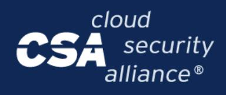

#### **4. Threat Category**

The threat category group maps each AICM control to specific genAI/LLM security threats and risks it is designed to mitigate.

This enables threat-based control selection and risk assessment. The threat categories included are:

- **Model manipulation**: Adversarial attacks, prompt injection, and model behavior exploitation
- **Data poisoning**: Contamination of training or fine-tuning datasets
- **Sensitive data disclosure**: Unauthorized extraction of training data, PII leakage, or confidential information exposure
- **Model theft**: Unauthorized model extraction, copying, or intellectual property theft
- **Model/Service Failure/Malfunctioning**: System failures, degraded performance, or unsafe outputs
- **Insecure supply chain**: Third-party model risks, dependency vulnerabilities, and supply chain attacks
- **Insecure apps/plugins**: Vulnerable integrations, unsafe extensions, and third-party component risks
- **Denial of Service (DoS)**: Resource exhaustion, availability attacks, and service disruption
- **Loss of governance/compliance**: Regulatory violations, policy breaches, and governance failures

This threat-based mapping allows organizations to conduct risk-based control selection, prioritizing controls that address their most critical AI security concerns and enabling alignment with threat modeling and risk assessment frameworks.

The threat categories used in AICM are derived from the CSA Large Language Model Threats [Taxonomy](https://cloudsecurityalliance.org/artifacts/csa-large-language-model-llm-threats-taxonomy).

#### **1.2.2 AICM Scope Applicability/Mappings**

An important AICM aspect is that it maps to other AI security standards, regulations, and frameworks. When the AICM was created, there were already several different AI governance standards, best practices, and regulations in existence. Many organizations already had their internal structures and frameworks set up and aligned with those standards, often building upon existing information security programs based on frameworks like ISO 27001, SOC 2, or the CCM itself.

The CSA wanted to provide AI sector-specific controls while ensuring that organizations had clear paths to connect their existing control frameworks and programs with the AI-relevant controls included in the AICM. Therefore, the CSA built all the controls created in the AICM as an extension of the CCM v4.0 framework. The CSA constructed mappings, or linkages, between the AICM and four key AI governance frameworks:

{32}------------------------------------------------

- **ISO/IEC 42001** International standard for AI management systems
- **NIST AI 600-1** NIST Artificial Intelligence Risk Management Framework
- **BSI AIC4 Catalog** German Federal Office for Information Security AI Cloud Service Compliance Criteria Catalogue
- **EU AI Act** European Union regulatory framework for artificial intelligence

The AICM builds on the CCM foundation to provide controls specific to the GenAI/LLM sector, and then takes it several steps further by:

- 1. **Architectural mapping**: Ensuring controls link to particular areas within a GenAI architecture (Physical, Network, Compute, Storage, Application, Data)
- 2. **Layer identification**: Helping identify if a specific control is relevant for the GenAI OPS/Processing Infrastructure layer, Model layer, Orchestrated Services layer, or Application layer
- 3. **Lifecycle alignment**: Connecting controls to specific genAI/LLM lifecycle phases (Preparation, Development, Evaluation/Validation, Deployment, Delivery, Service Retirement)
- 4. **Threat-based mapping**: Linking controls to AI-specific threat categories they mitigate (e.g., model manipulation, data poisoning, sensitive data disclosure, model theft)

Because the AICM makes links through comprehensive mapping to these four major AI frameworks, it provides an integrated controls framework that identifies which controls organizations should enact to secure their GenAI journey and implementation processes. Organizations can use these mappings to demonstrate compliance with ISO/IEC 42001, NIST AI 600-1, BSI AIC4, and the EU AI Act simultaneously, reduce audit burden, and efficiently extend their existing CCM-based security and compliance programs to cover AI-specific risks.

#### **Benefits of this mapping approach:**

- Organizations already implementing CCM can seamlessly extend to AICM
- Single control implementation can satisfy multiple AI regulatory requirements across ISO 42001, NIST AI 600-1, BSI AIC4, and EU AI Act
- Clear traceability from regulatory requirements to technical implementation
- Enables risk-based prioritization through threat category mappings
- Supports both traditional cloud security and AI-specific security concerns in an integrated manner
- Facilitates compliance for organizations operating across multiple jurisdictions (US, EU, Germany, international)

{33}------------------------------------------------

### **1.2.3 The AI Consensus Assessment Initiative Questionnaire (AI-CAIQ)**

The AI-CAIQ provides AI customers, auditors, and regulators with structured questions for AI service providers about their security posture, adherence to CSA AI best practices (AICM and related AI security guidance), and customer SSRM responsibilities within the AI supply chain. The AI-CAIQ is a companion document designed to support practical adoption of the AICM.

While the AICM defines the control specifications and implementation guidelines for AI systems, the AI-CAIQ defines the assessment questions to evaluate and verify implementation across the entire AI lifecycle.

In addition, the AI-CAIQ (and the CSA AI STAR Registry) should be used by AI service providers, including Model Providers, Orchestrated Services Providers, and Application Providers, to provide SSRM ownership and customer security responsibility guidance to current and prospective AI customers per AICM controls.

**Structure and Format**: The AI-CAIQ, similar to the AICM, comes in a structured spreadsheet format with alignment to the AICM control domains. The AI-CAIQ includes columns for AI service providers to:

- Respond to AI-CAIQ questions ("Yes," "No," "NA,")
- Specify SSRM ownership across the AI supply chain (MP, OSP, AP, AIC)
- Describe how they meet their portions of the AI controls
- Clarify customer security responsibilities for each question

AI service providers should delineate layer-specific ownership, explain how they meet control requirements at each layer they operate, clarify customer security responsibilities, and identify any coordination requirements with providers at adjacent layers. This is particularly important in GenAI deployments where multiple organizations may provide different layers of the service stack.

The AI-CAIQ and the CSA STAR for AI Registry provide a framework and forum for AI service providers to supply useful information that current and prospective customers can use to evaluate how AI-specific controls have been implemented. Furthermore, these tools enable providers to delineate their implementation of shared responsibilities across the GenAI service delivery model for customer benefit, supporting informed risk assessment and vendor selection decisions in complex, multi-layer AI service deployments.

Filling in the AI-CAIQ Instructions and Recommendations are included in the AICM bundle [document.](https://cloudsecurityalliance.org/artifacts/ai-controls-matrix)

{34}------------------------------------------------

#### **1.2.4 Implementation Guidelines**

The main goal of AICM Implementation Guidelines is to provide further guidance and recommendations on AICM controls' implementation.

The AICM Implementation Guidelines, support the practical application of AICM controls by providing detailed, role-specific guidance for MPs, OSPs, APs, CSPs, and AICs.

This is a collaborative product based on AI service provider and AI service customer experiences implementing and securing GenAI/LLM services while using AICM controls under the shared responsibility model across the GenAI service delivery layers.

Under the GenAI shared responsibility model, providers operating at different layers and their customers are tasked with specific shared security responsibilities with respect to "Who" is responsible for doing "What" across the GenAI service delivery stack.

However, the guidelines are not meant to be a "how-to" manual for AICM control implementation. Given the comprehensive nature of the AICM controls, their operationalization largely depends on the nature of the GenAI service and its architecture, the types of technology and models used (e.g., proprietary vs. open-source models, fine-tuned vs. foundation models, single-model vs. multi-model systems), applicable AI-specific risks and regulations (e.g., EU AI Act risk classifications, NIST AI RMF risk tiers), organizational policies, the AI threat environment, model capabilities and limitations, data sensitivity, deployment patterns (cloud-hosted, on-premises, edge, hybrid), and other significant factors.

Therefore, CSA cannot provide detailed, prescriptive guidance applicable to every organization and GenAI service controls' implementation.

The Implementation Guidelines recognize that:

- Control implementation varies significantly across different genAI/LLM lifecycle phases
- Security measures for foundation models differ from those for fine-tuned or specialized models
- Organizational structure may consolidate multiple layers under single ownership or distribute them across multiple providers
- Emerging AI threats and attack vectors require adaptive security approaches
- AI-specific considerations (such as model versioning, prompt engineering security, guardrail implementation, and adversarial robustness) require contextualized guidance

Organizations should use these guidelines as a starting point and adapt them to their specific GenAI deployment architecture, risk profile, regulatory requirements, and operational context.

{35}------------------------------------------------

#### **1.2.5 Auditing Guidelines**

The AICM v1.1 Auditing Guidelines (AG) are tailored to the control specifications of each of the AI security domains of the AI Controls Matrix version 1.1 (AICM v1.1). The guidelines represent a component of AICM v1.1 designed to support effective audit and assurance activities for GenAI/LLM systems and services.

The AGs aim to facilitate and guide an AICM audit. Auditors are provided with a set of assessment guidelines per AICM v1.1 control specifications. These guidelines seek to improve the controls' auditability and help organizations more efficiently achieve compliance with AI-specific regulations and standards (including ISO/IEC 42001, NIST AI RMF & AI 600-1, BSI AIC4, and EU AI Act requirements) through either internal or external third-party AI security audits.

The auditing guidelines are not exhaustive or prescriptive by nature. Rather, they represent a generic guide through recommendations for assessment. Auditors should customize the descriptions, procedures, risks, controls, and documentation. These elements should conform to organization-specific audit work programs and AI service(s) in the scope of the assessment to address the specific audit objectives.

Given the rapidly evolving nature of GenAI technology, emerging threat landscape, and developing regulatory requirements, auditors should exercise professional judgment in applying these guidelines and adapt assessment procedures to reflect current best practices, technological capabilities, and regulatory interpretations at the time of the audit.

#### **1.2.6 AICM Document Tabs**

The AICM v1.1 spreadsheet, as of the date of publication of this document, includes nine tabs:

- **Introduction:** An overview of the AICM content.
- **AICM - Version 1.1**: Contains the complete AI Controls Matrix with all control specifications organized by control domain. This tab includes control identification (ID, title, domain), control specifications, control type designation (Cloud & AI Related vs. AI-Specific), typical control applicability and ownership across the four GenAI service delivery layers, architectural relevance mapping to GenAI stack components (Physical, Network, Compute, Storage, Application, Data), lifecycle relevance mapping to genAI/LLM phases (Preparation, Development, Evaluation/Validation, Deployment, Delivery, Service Retirement), and threat category mappings to AI-specific security risks (model manipulation, data poisoning, sensitive data disclosure, model theft, model/service failure, insecure supply chain, insecure apps/plugins, denial of service, loss of governance/compliance).
- **Implementation Guidelines**: Provides guidance and recommendations on AICM controls' implementation across the GenAI service delivery layers. This tab offers layer-specific implementation considerations for GenAI OPS/Processing Infrastructure providers, Model providers, Orchestrated Services providers, Application providers, and AI service customers,

{36}------------------------------------------------

helping organizations understand shared responsibility allocations and contextualize control implementation based on their specific deployment architecture, genAI/LLM lifecycle phase, and operational context.

- **Auditing Guidelines**: Contains assessment guidelines tailored to AICM control specifications. This tab provides auditors with procedures and considerations for evaluating control implementation across GenAI service delivery layers, genAI/LLM lifecycle phases, and AI-specific threat mitigation measures.
- **Scope Applicability (Mappings)**: Provides comprehensive mappings between AICM controls and major AI governance frameworks and regulations, including ISO/IEC 42001, NIST AI 600-1, BSI AIC4 Catalog, and the EU AI Act. This tab enables organizations to understand how AICM control implementation supports compliance with multiple regulatory and standards requirements simultaneously, facilitating efficient multi-framework compliance and regulatory alignment.
- **AI-CAIQ**: Contains the AI Consensus Assessments Initiative Questionnaire (AI-CAIQ), which provides assessment questions aligned to AICM controls. This tab enables AI service providers to document their security posture, control implementation, layer-specific responsibilities, and shared responsibility delineation across GenAI service delivery layers for current and prospective customers and auditors. However, the editable AI-CAIQ is provided as a separate document which can be submitted for level 1 STAR self-attestation.
- **LLM TAXONOMY**: Provides additional taxonomic information and definitions relevant to Large Language Model (LLM) systems.
- **Acknowledgments**: Recognizes the contributions of CSA working group members, subject matter experts, AI security practitioners, and other volunteers that participated in the development, review, and validation of the AICM v1.1. This tab documents the collaborative effort across the AI security community to establish comprehensive AI-specific security controls and best practices.
- **Change Log**: Captures the changes made to the v1.1

#### **1.2.6.1 AICM Structure**

#### AICM Controls

This is the core of the AICM v1.1. It includes AI-specific and AI-adapted cloud controls structured across multiple security domains. Each control is described by:

- **Control Domain**: The name of the domain each control pertains to (e.g., Audit & Assurance, Application & Interface Security, Data Security & Privacy, etc.).
- **Control Title**: The control's title.
- **Control ID**: The control's identifier (e.g., A&A-01, AIS-01, DSP-01).

{37}------------------------------------------------

● **Control Specification**: The control's requirement(s) description, detailing the security measures and implementation expectations.

| AI CONTROLS MATRIX vI.I WE   |                                                     |                   |                                                                                                                                                                                                                                           |  |  |  |  |  |  |  |
|---------------------------------|-----------------------------------------------------|-------------------|-------------------------------------------------------------------------------------------------------------------------------------------------------------------------------------------------------------------------------------------|--|--|--|--|--|--|--|
|                                 |                                                     |                   |                                                                                                                                                                                                                                           |  |  |  |  |  |  |  |
| <b>Control</b> <b>Domain</b> | <b>Control Title</b>                                | <b>Control ID</b> | <b>Control Specification</b>                                                                                                                                                                                                              |  |  |  |  |  |  |  |
| Audit & Assurance               | <b>Audit and Assurance</b> Policy and Procedures | <b>A&amp;A-01</b> | Establish, document, approve, communicate, apply, evaluate and maintain audit and assurance policies and procedures and standards. Review and update the policies and procedures at least annually, or upon significant changes. |  |  |  |  |  |  |  |
| Audit & Assurance               | Independent Assessments                          | A&A-02            | Conduct independent audit and assurance assessments according to relevant standards at least annually.                                                                                                                                 |  |  |  |  |  |  |  |

*Figure 2: Snapshot of AICMv1.1 'Application & Interface' domain's control specification.*

In addition, this tab includes the following sections (groups of columns):

- **Control Type**: Each control is tagged as:
  - **Cloud & AI Related**: Controls applicable to both traditional cloud services and genAI/LLM systems
  - **AI-Specific**: Controls uniquely designed for GenAI/LLM systems and AI-specific security risks.
  - **Cloud-Specific**: Controls applicable to cloud only environments. Please see figure 3 below:

{38}------------------------------------------------

| AI CONTROLS MATRIX v1.1         |                                                     |                   |                                                                                                                                                                                                                                           |                       |  |  |  |  |  |  |  |
|---------------------------------|-----------------------------------------------------|-------------------|-------------------------------------------------------------------------------------------------------------------------------------------------------------------------------------------------------------------------------------------|-----------------------|--|--|--|--|--|--|--|
|                                 |                                                     |                   |                                                                                                                                                                                                                                           |                       |  |  |  |  |  |  |  |
| <b>Control</b> <b>Domain</b> | <b>Control Title</b>                                | <b>Control ID</b> | <b>Control Specification</b>                                                                                                                                                                                                              | <b>Control Type</b>   |  |  |  |  |  |  |  |
| Audit & Assurance               | <b>Audit and Assurance</b> Policy and Procedures | A&A-01            | Establish, document, approve, communicate, apply, evaluate and maintain audit and assurance policies and procedures and standards. Review and update the policies and procedures at least annually, or upon significant changes. | Cloud & Al Related |  |  |  |  |  |  |  |
| Audit & Assurance               | Independent Assessments                          | A&A-02            | Conduct independent audit and assurance assessments according to relevant standards at least annually.                                                                                                                                 | Cloud & Al Related |  |  |  |  |  |  |  |

*Figure 3: Snapshot of AICMv1.1 'Audit & Assurance' domain and control type column.*

Additionally, each control is described using four more structural components that define its metadata:

● **Typical Control Applicability and Ownership**: Indicates responsibility allocation across the four GenAI service delivery layers (GenAI OPS/Processing Infrastructure, Model, Orchestrated Services, Application). Please see Figure 4, below.

| AI CONTROLS MATRIX VI.I         |                                              |                   |                                                                                                                                                                                                                                           |                       |                                                   |                                     |                                                                                       |                                           |
|---------------------------------|----------------------------------------------|-------------------|-------------------------------------------------------------------------------------------------------------------------------------------------------------------------------------------------------------------------------------------|-----------------------|---------------------------------------------------|-------------------------------------|---------------------------------------------------------------------------------------|-------------------------------------------|
|                                 |                                              |                   |                                                                                                                                                                                                                                           |                       |                                                   |                                     | <b>Typical Control Applicability and Ownership</b> (GenAl Service Delivery Layers) |                                           |
| <b>Control</b> <b>Domain</b> | <b>Control Title</b>                         | <b>Control ID</b> | <b>Control Specification</b>                                                                                                                                                                                                              | <b>Control Type</b>   | <b>Cloud/Al Processing</b> Infrastructure (PI) | <b>Model</b>                        | <b>Orchestrated Services</b>                                                          | <b>Application</b>                        |
| Audit & Assurance               | Audit and Assurance Policy and Procedures | A&A-01            | Establish, document, approve, communicate, apply, evaluate and maintain audit and assurance policies and procedures and standards. Review and update the policies and procedures at least annually, or upon significant changes. | Cloud & Al Related | Shared across the supply chain                 | Owned by the Model Provider (MP) | Owned by the Orchestrated <b>Service Provider (OSP)</b>                            | Owned by the Application Provider (AP) |
| Audit & Assurance               | Independent Assessments                   | A&A-02            | Conduct independent audit and assurance assessments according to relevant standards at least annually.                                                                                                                                 | Cloud & Al Related | Shared across the supply chain                 | Owned by the Model Provider (MP) | Owned by the Orchestrated <b>Service Provider (OSP)</b>                            | Owned by the Application Provider (AP) |

*Figure 4: Snapshot of AICMv1.1 'Audit & Assurance' domain and its Applicability & Ownership.*

● **Architectural Relevance - GenAI Stack Components**: Maps controls to GenAI architecture components (Physical, Network, Compute, Storage, Application, Data). Please see Figure 5, below.

{39}------------------------------------------------

| AICM ALCONTROLS MATRIX VI.I     |                                              |                   |                                                                                                                                                                                                                                           |                       |             |                |                |                                                      |             |             |
|---------------------------------|----------------------------------------------|-------------------|-------------------------------------------------------------------------------------------------------------------------------------------------------------------------------------------------------------------------------------------|-----------------------|-------------|----------------|----------------|------------------------------------------------------|-------------|-------------|
|                                 |                                              |                   |                                                                                                                                                                                                                                           |                       |             |                |                | <b>Architectural Relevance - Al Stack Components</b> |             |             |
| <b>Control</b> <b>Domain</b> | <b>Control Title</b>                         | <b>Control ID</b> | <b>Control Specification</b>                                                                                                                                                                                                              | Control Type          | <b>Phys</b> | <b>Network</b> | <b>Compute</b> | <b>Storage</b>                                       | App         | <b>Data</b> |
| Audit & Assurance               | Audit and Assurance Policy and Procedures | A&A-01            | Establish, document, approve, communicate, apply, evaluate and maintain audit and assurance policies and procedures and standards. Review and update the policies and procedures at least annually, or upon significant changes. | Cloud & Al Related | <b>TRUE</b> | <b>TRUE</b>    | <b>TRUE</b>    | <b>TRUE</b>                                          | <b>TRUE</b> | <b>TRUE</b> |
| Audit & Assurance               | Independent Assessments                   | A&A-02            | Conduct independent audit and assurance assessments according to relevant standards at least annually.                                                                                                                                 | Cloud & Al Related | <b>TRUE</b> | <b>TRUE</b>    | <b>TRUE</b>    | <b>TRUE</b>                                          | <b>TRUE</b> | <b>TRUE</b> |

*Figure 5: Snapshot of AICMv1.1 'Audit & Assurance' domain and its Architectural Relevance.*

● **Lifecycle Relevance**: Connects controls to genAI/LLM lifecycle phases (Preparation, Development, Evaluation/Validation, Deployment, Delivery, Service Retirement). Please see Figure 6 below.

|                                 | AICM AI CONTROLS MATRIX VI.I                        |                   |                                                                                                                                                                                                                                           |                       |                                                 |                              |                                                                    |                                                             |                                                                                                   |                                                    |
|---------------------------------|-----------------------------------------------------|-------------------|-------------------------------------------------------------------------------------------------------------------------------------------------------------------------------------------------------------------------------------------|-----------------------|-------------------------------------------------|------------------------------|--------------------------------------------------------------------|-------------------------------------------------------------|---------------------------------------------------------------------------------------------------|----------------------------------------------------|
|                                 |                                                     |                   |                                                                                                                                                                                                                                           |                       | <b>Lifecycle Relevance</b>                      |                              |                                                                    |                                                             |                                                                                                   |                                                    |
| <b>Control</b> <b>Domain</b> | <b>Control Title</b>                                | <b>Control ID</b> | <b>Control Specification</b>                                                                                                                                                                                                              | <b>Control Type</b>   | <b>Preparation</b>                              | <b>Development</b>           | <b>Evaluation/Validation</b>                                       | <b>Deployment</b>                                           | <b>Delivery</b>                                                                                   | <b>Service Retirement</b>                          |
| Audit & Assurance               | Audit and Assurance <b>Policy and Procedures</b> | A&A-01            | Establish, document, approve, communicate, apply, evaluate and maintain audit and assurance policies and procedures and standards. Review and update the policies and procedures at least annually, or upon significant changes. | Cloud & Al Related | Data collection, Data curation, Data storage | Design, Guardrails, Training | <b>Evaluation, Validation/Red</b> <b>Teaming, Re-evaluation</b> | Al Services supply chain                                    | <b>Continuous improvement</b>                                                                     | Data deletion, Archiving, <b>Model disposal</b> |
| Audit & Assurance               | Independent <b>Assessments</b>                   | A&A-02            | Conduct independent audit and assurance assessments according to relevant standards at least annually.                                                                                                                                 | Cloud & Al Related | Data collection, Data curation, Data storage | Design, Training, Guardrails | <b>Evaluation, Validation/Red</b> <b>Teaming, Re-evaluation</b> | Al Services supply chain, Al applications, Orchestration | <b>Continuous monitoring,</b> <b>Continuous improvement,</b> <b>Operations, Maintenance</b> | Data deletion, Model disposal, <b>Archiving</b> |

*Figure 6: Snapshot of AICMv1.1 'Audit & Assurance' domain and its LLM Lifecycle Relevance.*

● **Threat Category**: Links controls to AI-specific threats they mitigate (model manipulation, data poisoning, sensitive data disclosure, model theft, model/service failure/malfunctioning, insecure supply chain, insecure apps/plugins, denial of service, loss of governance/compliance). Please see Figure 7 below.

|                                 | AICM ALCONTROLS MATRIX VI.I                         |                   |                                                                                                                                                                                                                                           |                       |                           |                       |                                  |                    |                                                       |                       |                              |                          |
|---------------------------------|-----------------------------------------------------|-------------------|-------------------------------------------------------------------------------------------------------------------------------------------------------------------------------------------------------------------------------------------|-----------------------|---------------------------|-----------------------|----------------------------------|--------------------|-------------------------------------------------------|-----------------------|------------------------------|--------------------------|
|                                 |                                                     |                   |                                                                                                                                                                                                                                           |                       |                           |                       |                                  |                    | <b>Threat Category</b>                                |                       |                              |                          |
| <b>Control</b> <b>Domain</b> | <b>Control Title</b>                                | <b>Control ID</b> | <b>Control Specification</b>                                                                                                                                                                                                              | Control Type          | <b>Model manipulation</b> | <b>Data poisoning</b> | <b>Sensitive data disclosure</b> | <b>Model theft</b> | <b>Model/Service</b> <b>Failure/Malfunctioning</b> | Insecure supply chain | <b>Insecure apps/plugins</b> | <b>Denial of Service</b> |
| Audit & Assurance               | Audit and Assurance <b>Policy and Procedures</b> | A&A-01            | Establish, document, approve, communicate, apply, evaluate and maintain audit and assurance policies and procedures and standards. Review and update the policies and procedures at least annually, or upon significant changes. | Cloud & Al Related | <b>TRUE</b>               | <b>TRUE</b>           | <b>TRUE</b>                      | <b>TRUE</b>        | <b>TRUE</b>                                           | <b>TRUE</b>           | <b>TRUE</b>                  | <b>TRUE</b>              |
| Audit & Assurance               | Independent Assessments                          | A&A-02            | Conduct independent audit and assurance assessments according to relevant standards at least annually.                                                                                                                                 | Cloud & Al Related | <b>TRUE</b>               | <b>TRUE</b>           | <b>TRUE</b>                      | <b>TRUE</b>        | <b>TRUE</b>                                           | <b>TRUE</b>           | <b>TRUE</b>                  | <b>TRUE</b>              |

*Figure 7: Snapshot of AICM v1.1 'Audit & Assurance' domain and its Threat Categories mitigations.*

This comprehensive mapping structure enables organizations to implement risk-based, context-aware security controls tailored to their specific GenAI deployment architecture, operational model, and threat landscape.

#### Implementation Guidelines

This tab includes the implementation guidelines which provide suggestions, recommendations, and examples of how to implement the AICM controls in alignment with the shared responsibility model across the GenAI service delivery layers.

{40}------------------------------------------------

| <b>AICM</b>              |                                                 | <b>AI CONTROLS MATRIX v1.1</b>       |                                                                                                                                                                                                                                                   |                                                                                                                                                                                                                                                                                                                                                                                                                                                                                                                                                                                                                  |                                                                                                                                                                                                                                                                                                                                                                                                                                                                                                                                                                                                                                                                                                             |                                                                                                                                                                                                                                                                                                                                                                                                                                                                                        |
|--------------------------|-------------------------------------------------|--------------------------------------|---------------------------------------------------------------------------------------------------------------------------------------------------------------------------------------------------------------------------------------------------|------------------------------------------------------------------------------------------------------------------------------------------------------------------------------------------------------------------------------------------------------------------------------------------------------------------------------------------------------------------------------------------------------------------------------------------------------------------------------------------------------------------------------------------------------------------------------------------------------------------|-------------------------------------------------------------------------------------------------------------------------------------------------------------------------------------------------------------------------------------------------------------------------------------------------------------------------------------------------------------------------------------------------------------------------------------------------------------------------------------------------------------------------------------------------------------------------------------------------------------------------------------------------------------------------------------------------------------|----------------------------------------------------------------------------------------------------------------------------------------------------------------------------------------------------------------------------------------------------------------------------------------------------------------------------------------------------------------------------------------------------------------------------------------------------------------------------------------|
|                          |                                                 |                                      |                                                                                                                                                                                                                                                   |                                                                                                                                                                                                                                                                                                                                                                                                                                                                                                                                                                                                                  |                                                                                                                                                                                                                                                                                                                                                                                                                                                                                                                                                                                                                                                                                                             |                                                                                                                                                                                                                                                                                                                                                                                                                                                                                        |
| Control <b>Domain</b> | Control Title Control ID                        |                                      | <b>Control Specification</b>                                                                                                                                                                                                                      | <b>Shared Implementation Guidelines</b>                                                                                                                                                                                                                                                                                                                                                                                                                                                                                                                                                                          | <b>Implementation Guidelines for Model Provider (MP)</b>                                                                                                                                                                                                                                                                                                                                                                                                                                                                                                                                                                                                                                                    | <b>Implementation Guidelines for Orchestrated Service P</b>                                                                                                                                                                                                                                                                                                                                                                                                                            |
|                          |                                                 | <b>Audit &amp; Assurance-A&amp;A</b> |                                                                                                                                                                                                                                                   |                                                                                                                                                                                                                                                                                                                                                                                                                                                                                                                                                                                                                  |                                                                                                                                                                                                                                                                                                                                                                                                                                                                                                                                                                                                                                                                                                             |                                                                                                                                                                                                                                                                                                                                                                                                                                                                                        |
| Assurance                | Audit and Assurance Policy and Procedures | A&A-01                               | Establish, document, approve, communicate, apply, evaluate and maintain audit and assurance policies and procedures and standards. Review and update the policies and procedures at least annually or upon significant changes. | :cific policy scopes as highlighted in the provider specific section of implementation guidelines. roles and responsibilities for policy maintenance, including cross-functional team involvement and involving senior management, legal teams, and compliance officers. a structured documentation for audit policies, including detailed procedures, standards, and the common control of the control of the common control of the common control of the common control of the common control of the common control of the common common common common common common common common common common c | <b>Policy Scope</b> I. Audit and assurance policies covering AI model development lifecycle, including training data selection, model architecture design, training processes, model validation, testing, and model governance activities. [Applicable to all providers] I. Define Policy Scope: Establish provider's specific policy scopes as highlighted in the provider specific section of implementation guidelines. .                                                                                                                                                                                                                                                                 | <b>Policy Scope</b> I. Audit and assurance policies covering AI model deployment infrastructure, scaling mechanisms, AP operational monitoring of AI services. [Applicable to all providers] I. Define Policy Scope: Establish provider's specific policy scopes as highlighted in the provider specif .                                                                                                                                                                |
| Assurance                |                                                 | A&A-02                               | Conduct independent audit and assurance assessments according to relevant standards at least annually.                                                                                                                                      | are AI systems are credible, reliable, and compliant. Annual assessments identify vulnerabilities and stinuous improvement. qualified independent assessors with AI expertise, establish clear assessment objectives and scope, <b>d</b> operations                                                                                                                                                                                                                                                                                                                                                     | Independent assessments are essential to ensure AI systems are credible, reliable, and compliant. Annual assessments identify vulnerabilities and risks, allowing for proactive mitigation and continuous improvement. [All Providers: MP. AP. OSP] I. Assessment Planning and Execution: Engage qualified independent assessors with AI expertise, establish clear assessment objectives and scope, bgies including adversarial testing where applicable. Ensure assessors maintain independence from the and develop comprehensive testing methodologies including adversarial testing where applicable. Ensure assessors maintai teams responsible for system development and operations. | Independent assessments are essential to ensure AI systems are credible, reliable, and compliant. Ann risks, allowing for proactive mitigation and continuous improvement. [All Providers: MP. AP. OSP] . Assessment Planning and Execution: Engage qualified independent assessors with AI expertise, esta and develop comprehensive testing methodologies including adversarial testing where applicable. Ens teams responsible for system development and operations |

*Figure 8: Snapshot of AICM v1.1 Implementation Guidelines*

#### Auditing Guidelines

This tab includes the auditing guidelines which provide verification procedures, evidence requirements, and assessment criteria for evaluating the implementation of AICM controls. For each control, the guidelines specify:

- What to examine (policies, configurations, artifacts, logs)
- What evidence to request (e.g., threat models, SBOMs, test reports, access control records)
- What questions to ask control owners
- How to validate that controls are operating as intended

The guidelines are organized by actor role: Application Provider (AP), Orchestrated Services Provider (OSP), Model Provider (MP), AI Customer (AIC), and Cloud Service Provider (CSP), enabling auditors to tailor assessments to the specific responsibilities of each party within the AI shared responsibility model. Where applicable, the guidelines incorporate and extend CCM v4.1 auditing procedures to address AI-specific risks.

|                      | <b>AICM</b>                 |                         | <b>AFCONTROLS MATRIX v1.1</b>                                                                                                                                                                                                                   |                                                                                                                                                                                                                                                                                                                                                                                                                                                                                                                                                                                                                                                                                                                                                |                                                                                                                                                                                                                                                                                                                                                                                                                                                                                        |                                                                                                                                                                                                                                                                                                                                                                                                                                                                                                                                                                                                                                                                                                                                                                                          |                                                                                                                                                                                                                        |
|----------------------|-----------------------------|-------------------------|-------------------------------------------------------------------------------------------------------------------------------------------------------------------------------------------------------------------------------------------------|------------------------------------------------------------------------------------------------------------------------------------------------------------------------------------------------------------------------------------------------------------------------------------------------------------------------------------------------------------------------------------------------------------------------------------------------------------------------------------------------------------------------------------------------------------------------------------------------------------------------------------------------------------------------------------------------------------------------------------------------|----------------------------------------------------------------------------------------------------------------------------------------------------------------------------------------------------------------------------------------------------------------------------------------------------------------------------------------------------------------------------------------------------------------------------------------------------------------------------------------|------------------------------------------------------------------------------------------------------------------------------------------------------------------------------------------------------------------------------------------------------------------------------------------------------------------------------------------------------------------------------------------------------------------------------------------------------------------------------------------------------------------------------------------------------------------------------------------------------------------------------------------------------------------------------------------------------------------------------------------------------------------------------------------|------------------------------------------------------------------------------------------------------------------------------------------------------------------------------------------------------------------------|
| Control              |                             | <b>Control</b>          | <b>Control Specification</b>                                                                                                                                                                                                                    | <b>Auditing Guidelines for Application Provider (AP)</b>                                                                                                                                                                                                                                                                                                                                                                                                                                                                                                                                                                                                                                                                                       | <b>Auditing Guidelines for Orchestrated Services Provider (OSP)</b>                                                                                                                                                                                                                                                                                                                                                                                                                    | <b>Auditing Guidelines for Model Provider (MP)</b>                                                                                                                                                                                                                                                                                                                                                                                                                                                                                                                                                                                                                                                                                                                                       |                                                                                                                                                                                                                        |
| Audit & Assurance | Audit and and Procedures | Assurance Policy A&A-01 | Establish, document, approve, communicate, apply, evaluate and maintain audit and assurance policies and procedures and standards. Review and update the policies and procedures at least annually, or upon significant changes. | I. Verify that policies are defined for each cloud environment in use (e.g., public cloud, private cloud, hybrid) and tailored to the deployed Al capabilities. 2. Confirm that audit procedures are embedded in DevOps or MLOps pipelines (e.g., pre-deployment security scans, model versioning logs). 3. Check if cloud-native logging provided by the cloud platform in use (e.g., AWS CloudTrail, Azure Monitor is formally documented and utilized in policy. 4. Validate that AI-enabled features and components are explicitly included in routine penetration testing and 4. Confirm that cloud audit logs, API gateway logs, and orchestration events are systematically collected and security control audits. | . Verify that orchestrated pipelines have standardized audit procedures that span across integrated components (e.g., model inference + API + logging layers). 2. Check for policies on isolating tenants in shared cloud environments and ensuring audit integrity for each client's pipeline. 3. Evaluate how policy updates reflect changes in orchestration logic or underlying services (e.g., addition of a new Al model from a vendor). referenced in policy. | I. Confirm policies exist specifically for model assurance and are version-controlled. 2. Check for cloud-specific policies (e.g., cloud-native security controls, audit logging in cloud ML pipelines). 3. Approval and Ownership: Identify formal sign-off from leadership (e.g., CTO, Chief Risk Officer), Validate assignment of responsibility for maintaining these policies. 4. Communication and Training: Verify whether relevant staff (e.g., ML engineers, data scientists) are trained on audit/assurance procedures. Check for training logs or awareness campaigns on cloud auditing tools (e.g., GCP's Cloud Audit Logs, AWS CloudTrail). F. Australian and Fascar Former adhibition comparative fundamental and del contatum protection constructed | I. Confirm that audit red 2. Validate if the assurant model). 3. Check if policies includ with jurisdictional laws. 4. Check Internal Usage cloud-hosted AI tools (e E. Martin and Assessed David |
| Audit & Assurance | Assessment:                 | A&A-02                  | Conduct independent audit and assurance assessments according to relevant standards at least annually.                                                                                                                                    | Objective: Ensure that the user-facing and back-end components of AI applications hosted on cloud platforms Objective: Verify that complex, composed AI systems, where the orchestrator manages the integration of are reviewed independently, including aspects like data processing, API integration, and front-end behavior, I. Obtain Assurance Reports (e.g., SOC 2, ISO 27001, CSA STAR): Check if Al-specific risks were part of the scope                                                                                                                                                                                                                                                                                     | models, applications, and possibly data brokers, are assessed independently for systemic and inherited risks. dependency risks, and SLAs.                                                                                                                                                                                                                                                                                                                                           | Objective: Verify that the provider subjects model lifecycle and infrastructure components to independent evaluations in accordance with standards. Assess End-to-End Coverage: Independent assessments must evaluate orchestrated workflows, data flows,   1. Review External Audit Records: Obtain attestation reports (e.g., SOC 2 Type II, ISO 27001, ISO 42001), if available                                                                                                                                                                                                                                                                                                                                                                                              | Objective: Ensure that cu systems, including how t I. Confirm that the orga assessments cover Al-sp model, and customer-sic                                                                                |

*Figure 9: Snapshot of AICM v1.1 Auditing Guidelines*

AICM Scope Applicability (Mappings)

This tab includes the mappings between AICM v1.1 and AI governance standards and regulatory frameworks relevant to GenAI/LLM systems. The AICM is mapped to the following frameworks:

- **ISO/IEC 42001** International standard for AI management systems
- **NIST AI RMF & AI 600-1** NIST Artificial Intelligence Risk Management Framework
- **BSI AIC4 Catalog** German Federal Office for Information Security AI Cloud Service Compliance Criteria Catalogue
- **EU AI Act** European Union regulatory framework for artificial intelligence
- **AIUC-1** The standard for AI agent security, safety and reliability

{41}------------------------------------------------

For each standard or regulation, AICM v1.1 is mapped to include the following three columns:

- **Control Mapping**: The indication of which control(s), requirement(s), or article(s) in the target standard or regulation (e.g., ISO/IEC 42001, EU AI Act Article X) corresponds to the AICM control.
- **Gap Level**: The gap level a control (or controls) in the target standard has when compared with the AICM control. The gap levels used are:
  - **No Gap**: In case of full correspondence between the target framework requirement and the AICM control.
  - **Partial Gap**: If the control(s) or requirement(s) in the target standard does not fully satisfy the corresponding AICM control's requirements, or if the AICM control provides more specific GenAI/LLM implementation guidance.
  - **Full Gap**: If there is no control or requirement in the target standard to fulfill the corresponding AICM control's requirements.
- **Addendum**: The suggested compensating control or additional implementation guidance organizations could adopt to cover the gap between the control in the target standard and the corresponding AICM control, ensuring comprehensive AI security coverage.

These mappings enable organizations to understand how their AICM implementation supports compliance with multiple AI regulations and standards simultaneously, identify areas requiring additional controls beyond baseline frameworks, and efficiently demonstrate regulatory compliance across jurisdictions.

| <b>AICM</b>                         | <b>AI CONTROLS MATRIX vI.I</b>      |                   |                                                                                                                                                                                                                                                                                               |                                                                                                              |                    |                                                                                                                                                                                                                                                     |  |
|-------------------------------------|-------------------------------------|-------------------|-----------------------------------------------------------------------------------------------------------------------------------------------------------------------------------------------------------------------------------------------------------------------------------------------|--------------------------------------------------------------------------------------------------------------|--------------------|-----------------------------------------------------------------------------------------------------------------------------------------------------------------------------------------------------------------------------------------------------|--|
|                                     |                                     |                   |                                                                                                                                                                                                                                                                                               | <b>ISO/IEC 42001:2023</b>                                                                                    |                    |                                                                                                                                                                                                                                                     |  |
| <b>Control Domain</b>               | <b>Control Title</b>                | <b>Control ID</b> | <b>Control Specification</b>                                                                                                                                                                                                                                                                  | <b>Control Mapping</b>                                                                                       | <b>Gap Level</b>   | <b>Addendum</b>                                                                                                                                                                                                                                     |  |
| Application & Interface Security | <b>Application Security Testing</b> | <b>AIS-05</b>     | Implement a testing strategy, including criteria for acceptance of new information systems, upgrades and new versions, which provides application security assurance and maintains compliance while meeting organizational delivery goals. Automate when applicable and possible. | 42001: B.6.2.4 27001: A.8.29 27001: A.8.26 27001: A.8.33 27001: A.5.10 27002: A.8.29 & A.8.33 | <b>Partial Gap</b> | Add dedicated control that mandates: Security-focused Al application testing, Use of automated tools, Definition of acceptance criteria, Specific coverage of Al/ML-specific risk vectors, Alignment with organizational deployment goals. |  |

*Figure 10: Snapshot of an AICMv1.1 control mapping to ISO standards illustrating the relevant columns.*

AI Consensus Assessments Initiative Questionnaire (AI-CAIQ)

This tab includes the questionnaire associated with AICM controls, commonly known as AI-CAIQ (AI Consensus Assessments Initiative Questionnaire). The AI-CAIQ consists of assessment questions structured across the security domains of the AICM. Each question is described in the following manner:

- **Question ID**: The question's identifier.
- **Question**: The description of the question, tailored to assess the security controls of the AICM

{42}------------------------------------------------

| <b>ICM</b>         | AI CONSENSUS ASSESSMENTS INITIATIVE QUESTIONNAIRE v1.0.1                                                                                               |                                               |                                         |                                                                                        |                                                                              |
|--------------------|--------------------------------------------------------------------------------------------------------------------------------------------------------|-----------------------------------------------|-----------------------------------------|----------------------------------------------------------------------------------------|------------------------------------------------------------------------------|
| <b>Question ID</b> | <b>Ouestion</b>                                                                                                                                        | <b>Service Provider</b> <b>CAIQ Answer</b> | <b>SSRM Control</b> <b>Ownership</b> | <b>Service Provider</b> <b>Implementation Description</b> (Optional/Recommended) | <b>Service Customer</b> <b>Responsibilities</b> (Optional/Recommended) |
| A&A-01.1           | Are audit and assurance policies, procedures, and standards established, documented, approved, communicated, applied, evaluated, and maintained? |                                               |                                         |                                                                                        |                                                                              |
| A&A-01.2           | Are audit and assurance policies, procedures, and standards reviewed and updated at least annually or upon significant changes?                     |                                               |                                         |                                                                                        |                                                                              |

*Figure 11*: *Snapshot of an AICMv1.1 control and corresponding AI-CAIQv1.1 assessment questions.*

Additionally, the AI-CAIQ includes the following columns for AI service providers to document their control implementation and shared responsibility model:

- **Service Provider CAIQ Answer**: The provider's response indicating whether the control is implemented (Yes/No/NA).
- **SSRM Control Ownership**: Designation of control ownership and responsibility across the GenAI service delivery layers. This indicates which layer(s) are responsible for implementing the control (e.g., "Owned by Model Provider," "Shared across the supply chain," "Shared Cloud Service Provider-Model Provider").
- **Service Provider Implementation Description (Optional/Recommended)**: Detailed explanation of how the provider implements the control at the layer(s) they operate. This field allows providers to describe their specific security measures, technologies, processes, and practices that fulfill the control requirements.
- **Service Customer Responsibilities (Optional/Recommended)**: Clear delineation of any security responsibilities that fall to the customer or require coordination with providers at adjacent layers in the GenAI service delivery model.

The AI-CAIQ enables AI service providers to transparently communicate their security posture to current and prospective customers, auditors, and regulators, while clarifying shared responsibility boundaries across the GenAI service delivery layers in accordance with AICM control specifications.

#### Acknowledgements

This tab acknowledges the experts who contributed to *AICM v1.1*'s development.

#### Change Log

This tab captures the changes made to AICM v1.1.

{43}------------------------------------------------

### **1.3 Target Audience**

The AICM was created to help AI service customers, AI service providers, auditors, and consultants.

**AI Service Customers**: The AICM allows AI service customers to build a detailed list of requirements and controls they want their AI service providers to implement as part of their overall third-party risk management and procurement program. It also helps normalize AI security expectations, provides a GenAI taxonomy, and improves understanding of the security measures implemented across the GenAI service delivery layers. Because the actors within a GenAI supply chain are independent organizations operating at different layers (GenAI OPS/Processing Infrastructure, Model, Orchestrated Services, Application), each has its own way of expressing and representing its AI security requirements. Each actor might use a different vocabulary or apply policies that differ from others. It is vital to define a taxonomy, or a set of agreed-upon terms, to standardize the various languages in such a context. That is why AICM plays a critical role and why more overarching frameworks are necessary to simplify interoperability across the GenAI ecosystem.

AI service customers can use the AICM controls to do the following:

- Map organizational, operational, legal, and AI-specific regulatory requirements (EU AI Act, NIST AI 600-1, ISO/IEC 42001, BSI AIC4) to control objectives.
- Build a third-party AI risk management program covering providers across multiple GenAI service delivery layers.
- Build an internal and external AI security audit plan.
- Assess AI systems across the complete LLM lifecycle (Preparation, Development, Evaluation/Validation, Deployment, Delivery, Service Retirement), etc.

When organizations build GenAI risk management programs, the AICM can help measure, assess, and monitor risks associated with AI service providers or particular GenAI services. The AICM allows customers to understand the gaps between their own AI security needs and provider security capabilities across different layers of the GenAI stack. Customers can then use the AICM to identify compensating controls to close gaps between organizational needs and provider offerings, ensuring comprehensive protection against AI-specific threats.

When building a third-party AI risk management program, the AICM allows customers to assess GenAI services during the overall service lifecycle. For example, it can be used to evaluate services before acquisition, compare offerings from different AI service providers operating at various layers, assess shared responsibility boundaries, verify compliance with AI regulations (EU AI Act risk classifications, NIST AI RMF profiles), and monitor alignment with internal AI governance policies during service execution.

**AI Service Providers**: The AICM serves multiple purposes for AI service providers operating at any layer of the GenAI service delivery model. First and foremost, it offers GenAI-specific, industry-validated best practices that providers can follow to guide internal AI security programs. In addition, it provides standardized language AI service providers can use to communicate with customers and business

{44}------------------------------------------------

partners about AI-specific security measures, shared responsibilities across layers, and threat mitigation strategies.

The AICM mapping feature allows AI service providers to demonstrate alignment with recognized international AI governance frameworks (ISO/IEC 42001, NIST AI 600-1, BSI AIC4) and compliance with AI regulations (EU AI Act) as well as participation in the CSA STAR for AI program, which relies on the AICM as one of its foundational frameworks. In addition, the CSA STAR for AI program enables organizational transparency and reduces the number of AI security questionnaires providers should complete for customers. These benefits can be realized when organizations complete the AICM extended question self-assessment (the AI-CAIQ) and submit it to the CSA STAR for AI Registry, a publicly accessible registry documenting AI service provider-implemented security controls across GenAI service delivery layers.

AI service providers can use AICM controls to:

- Build an internal AI security program based on mature and industry-recognized best practices specific to GenAI/LLM systems.
- Facilitate communication and interoperability with business partners, customers, and providers at adjacent GenAI service delivery layers.
- Demonstrate commitment to AI security and transparency about AI security postures and capabilities.
- Streamline compliance by leveraging mappings between AICM controls and controls in ISO/IEC 42001, NIST AI 600-1, BSI AIC4, and EU AI Act requirements.
- Reduce time and effort spent addressing customer AI security questionnaires.
- Clarify shared responsibility boundaries across GenAI service delivery layers.
- Demonstrate commitment to AI safety and security to regulators by adhering to the CSA STAR for AI program.
- Build GenAI internal and external audit plans addressing AI-specific risks across the genAI/LLM lifecycle.
- Address AI-specific threats such as adversarial attacks, prompt injection, model inversion, training data extraction, and other emerging GenAI vulnerabilities.

**Auditors and Consultants**: Auditors and consultants can use the AICM to guide clients in designing, planning, and executing activities dedicated to AI service customers and AI service providers across all GenAI service delivery layers.

Consultants and auditors can leverage CSA AICM resources to:

- Help organizations assess their GenAI security maturity and AI governance capabilities.
- Establish controls aligned with the AICM across genAI/LLM lifecycle phases.
- Compare organizations with market peers through AI security benchmarking.
- Evaluate shared responsibility implementation across GenAI service delivery layers.
- Assess compliance with AI-specific regulations (EU AI Act, ISO/IEC 42001, NIST AI RMF, BSI AIC4).

{45}------------------------------------------------

- Verify AI-specific threat mitigation measures (adversarial robustness, prompt security, data poisoning prevention).
- Conduct AI system audits addressing technical AI security controls (model validation, training data security, inference monitoring, guardrail effectiveness).
- Support AI incident response and forensic analysis for AI-specific security events.

#### **1.3.1 AICM Compliance Documentation**

To provide an organizational record and prepare for AI compliance audits, AICM users should focus on documenting compliance with the AICM v1.1 controls that they are responsible for in whole or in part under the Shared Security Responsibility Model (SSRM) that exists across the AI supply chain between Cloud Service Providers (CSPs), Model Providers (MPs), Orchestrated Services Providers (OSPs), Application Providers (APs), and AI Customers (AICs).

AICM users should start by developing or assembling high-level AICM compliance and SSRM control applicability and implementation summary documentation as appropriate for their role in the AI ecosystem.

**For AI Service Providers** (CSPs, MPs, OSPs, APs), a fully completed AI Consensus Assessment Initiative Questionnaire v1.1 (AI-CAIQ v1.1) will generally be a good starting point. Completed AI-CAIQ questionnaires can be published in the CSA's Security, Trust, Assurance, and Risk (STAR) for AI Registry and/or maintained internally using the Excel questionnaire template. Fully completed questionnaires should include the optional Service Provider Implementation Description and Service Customer Responsibilities columns.

AI service providers should:

- Designate control ownership using the SSRM Control Ownership column (e.g., "Owned by MP", "Shared CSP-MP", "Shared across the supply chain")
- Provide detailed implementation descriptions that may include layer-specific technical measures, genAI/LLM lifecycle phase considerations, and AI-specific security controls (adversarial testing, guardrails, model monitoring, prompt validation, etc.)
- Clearly delineate customer responsibilities and any coordination requirements with providers at adjacent layers in the supply chain

**For AI Customers (AICs)**, the CSA does not have a specific questionnaire or compliance documentation template. However, organizations should have (or develop) some form of AICM compliance documentation to incorporate SSRM customer security responsibilities as delineated by their AI service providers per AICM control requirements. For example, some AI customers will tailor a version of the AICM controls spreadsheet and/or a copy of their AI provider's AI-CAIQ questionnaire to incorporate customer security control response information. Alternatively, AI customers may utilize internal GRC applications to assemble similar details, particularly focusing on AI-specific risks such as model governance, data

{46}------------------------------------------------

provenance, and output validation. This compiled data can generate appropriate reports for AI compliance review and audit purposes.

In addition to high-level SSRM control implementation summary information, more detailed supporting documentation should be developed for specific AI control domains and individual controls. This includes:

- Technical designs for AI-specific security measures (model integrity checks, adversarial robustness implementations, guardrail architectures)
- Process and procedure documentation for AI lifecycle management (data curation, model training, validation protocols, deployment procedures, monitoring processes)
- Evidence of compliance with AI-specific regulations (EU AI Act, ISO/IEC 42001, NIST AI 600-1, BSI AIC4, sector-specific AI requirements)
- Model documentation and transparency artifacts (model cards, datasheets, system cards) as required by AICM controls
- Data governance records covering training data provenance, integrity validation, and lineage tracking
- AI-specific technical evidence (adversarial testing results, red-team reports, bias assessments, explainability documentation, prompt injection testing, model monitoring logs)

This documentation should be based on the detailed guidelines provided in the AICM Implementation Guidelines and should align with an organization's AI security auditor or assessor requirements, particularly focusing on emerging AI certification frameworks and regulatory compliance demands.

Given the evolving regulatory landscape for AI systems, organizations should maintain particularly thorough documentation for high-risk AI applications, including model behavior monitoring, bias testing results, human oversight procedures, and incident response plans specific to AI system failures or security breaches.

### **1.4 AICM SSRM Implementation Guidelines**

This section introduces the purpose and scope of the implementation guidelines.

#### **1.4.1 Purpose and Scope of the AICM Implementation Guidelines**

This document contains implementation guidelines tailored to the control specifications for each of AICM's 18 AI security domains. The implementation guidelines aim to support organizations across the AI supply chain and provide guidance for implementing every AICM security, privacy, and AI governance control specification.

{47}------------------------------------------------

The implementation guidelines provide clarity and transparency between Model Providers (MPs), Orchestrated Services Providers (OSPs), Application Providers (APs), Cloud Service Providers (CSPs) (GenAI OPS/Processing Infrastructure (PI)) and AI Customers (AICs) with respect to the responsibilities for implementing and managing security for their AI infrastructure, models, and services. This is critically important for establishing trust and accountability to meet contractual obligations in the complex AI supply chain. The SSRM Implementation Guidelines mitigate the risks associated with misunderstandings or incorrect assumptions about AI security responsibilities between the various stakeholders in the AI ecosystem.

The guidelines are technology and vendor agnostic, meaning they are not tailored to specific AI technologies, frameworks, or vendors but are defined at the same high level as each AICM control specification. However, they include recommendations regarding best practices for implementing such controls, as recommended by AI organizations and security practitioners with experience in AI system deployment.

The implementation guidelines are **not exhaustive nor prescriptive**. Instead, they represent a generic guide highlighting recommendations that should be adapted to specific AI use cases, risk profiles, and technical environments. Therefore, AI security practitioners should customize the descriptions, procedures, risks, controls, and documentation and tailor these to their AI risk management programs and AI services (within the scope of their AI risk assessment) to address specific security objectives and implementations.

#### **Scope includes:**

- Guidance applicable across the entire AI lifecycle from data collection through model retirement
- Recommendations for all AI service models (AI as a Service (AIaaS), custom models, fine-tuned models)
- Considerations for various AI system risk classifications (low-risk to high-risk AI applications)
- Adaptable frameworks that accommodate rapidly evolving AI technologies and threat landscapes.

#### **Scope excludes:**

- Prescriptive technical implementations for specific AI frameworks or hardware
- Product-specific configuration guidelines
- Legal interpretations of AI regulations (though regulatory considerations are addressed)
- Replacement for organization-specific risk assessments and security architecture decisions

These guidelines serve as a foundational reference for organizations implementing AICM controls while recognizing that effective AI security requires context-aware adaptation to specific organizational environments, risk tolerances, and AI system characteristics.

{48}------------------------------------------------

#### **1.4.2 Implementation Guidelines Target Audience**

The intended audiences of the Implementation Guidelines document include AI service customers, AI service providers (across all layers of the AI supply chain: Cloud Service Providers, Model Providers, Orchestrated Services Providers, and Application Providers), AI auditors, expert users willing to assist new AICM adopters, and practitioners willing to learn the best approaches to AICM control implementation.

The implementation guidelines document assumes that readers have familiarity and knowledge of AICM v1.1, AI-CAIQ, and foundational AI security concepts including the shared responsibility model across the AI supply chain, genAI/LLM lifecycle security, and AI-specific threats such as model manipulation, data poisoning, and prompt injection.

Audience members are encouraged to follow industry-standard practices, leverage emerging AI security frameworks (ISO/IEC 42001, NIST AI RMF & AI 600-1, BSI AIC4, EU AI Act, AIUC-1), and innovate on their implementation journeys using this guidance. Given the rapidly evolving nature of GenAI technologies and the AI threat landscape, implementers should remain vigilant for emerging best practices and adapt their approaches accordingly.

#### **1.4.3 Implementation Guidelines Structure**

The first table introduces each AICM control specification, with a reference to its title, ID, and specification text, and sets the scope of SSRM expression and implementation guidelines determination across the AI supply chain layers.

| Control                                      | Control | Control                                                                                                                                                                                                                                  |
|----------------------------------------------|---------|------------------------------------------------------------------------------------------------------------------------------------------------------------------------------------------------------------------------------------------|
| Title                                        | ID      | Specification                                                                                                                                                                                                                            |
| Audit and Assurance Policy and Procedures | A&A-01  | Establish, document, approve, communicate, apply, evaluate and maintain audit and assurance policies and procedures and standards. Review and update the policies and procedures at least annually or upon significant changes. |

*Table 5: AICM control Title, ID and Specification*

The second table introduces the shared implementation guidelines and its best practices for all or some (as specified) actors of the AI systems.

#### **Shared Implementation Guidelines**

**[Applicable to all providers] or [All Providers: MP, AP, OSP] or [All Providers, except OSP], etc.** (text appears here)

*Table 6: Shared Implementation Guidelines between the different AI system's Actors*

{49}------------------------------------------------

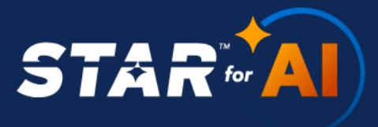

The third table, and in alignment to the SSRM, provides a justification rationale for the SSRM expression selection, or the corresponding implementation guidelines that apply for each of the five AI Actors (MP, AP, OSP, AIC, CSP).

| Implementation Guidelines A&A-01                                                                                                      |                                                                                                        |                                                                                               |  |  |  |
|---------------------------------------------------------------------------------------------------------------------------------------------|--------------------------------------------------------------------------------------------------------|-----------------------------------------------------------------------------------------------|--|--|--|
| MP                                                                                                                                          | OSP                                                                                                    | AP                                                                                            |  |  |  |
| Control Ownership Rationale. (text appears here) Implementation Guidelines Applicable to the Model Provider (text appears here) | Implementation Guidelines Applicable to the Orchestrated Service Provider (text appears here) | Implementation Guidelines Applicable to the Application Provider (text appears here) |  |  |  |

*Table 7: SSRM control ownership rationale and Implementation Guidelines for MP, OSP, AP actors*

|                                                                                   | A&A-01                                                                                        |
|-----------------------------------------------------------------------------------|-----------------------------------------------------------------------------------------------|
| AIC                                                                               | CSP                                                                                           |
| Implementation Guidelines Applicable to the AI Customer (text appears here) | Implementation Guidelines Applicable to the Cloud Service Provider: (text appears here) |

*Table 8: SSRM control ownership rationale and Implementation Guidelines for AIC and CSP actors*

### **1.5 AICM SSRM Auditing Guidelines**

This section introduces the purpose and scope of the AICM auditing guidelines and outlines their role in supporting role-based audit and assurance activities across the AI Shared Security Responsibility Model (SSRM).

The AICM auditing guidelines are designed to assist auditors, assessors, compliance professionals, and AI governance teams in evaluating the effectiveness of AICM control implementations across organizations involved in the development, operation, integration, and consumption of AI systems. The AICM recognizes five distinct AI System Actor roles: Model Provider (MP), Application Provider (AP), Orchestration Service Provider (OSP), Cloud Service Provider (CSP), and AI Customer (AIC), each with differing control responsibilities and assurance expectations.

{50}------------------------------------------------

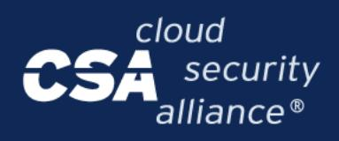

The auditing guidelines provide practical, non-prescriptive approaches to assess implementation evidence and determine whether role-specific AICM control requirements are being met. These guidelines are intended to support internal and external audits, vendor assessments, readiness evaluations, or regulatory preparedness across a wide range of AI deployments and maturity levels.

#### **1.5.1 Purpose and Scope of the AICM Auditing Guidelines**

The AICM Auditing Guidelines are intended to support internal and external audits, compliance assessments, and assurance activities by offering role-specific evaluation guidance for each AICM control. These guidelines aim to improve the auditability and practical implementation of the controls by providing adaptable assessment considerations tailored to the organizational role and AI system function in scope.

These auditing guidelines are **non-prescriptive and non-exhaustive** by design. Rather than serving as a rigid checklist, they offer recommended assessment criteria to help stakeholders evaluate the implementation of AI controls in diverse environments.

Auditors, assessors, and compliance professionals are encouraged to adapt the procedures, documentation requirements, and control interpretations based on the AI deployment context, risk profile, and organizational maturity.

Auditors should also consider the unique characteristics of AI systems, including:

- The multi-actor supply chain dependencies and evidence handover requirements
- AI-specific risks such as model drift, data poisoning, and adversarial attacks
- The dynamic nature of AI models and their continuous learning or updating processes
- Cross-jurisdictional AI regulations and ethical considerations

#### **1.5.2 AICM Auditing Guidelines Target Audience**

The AICM Auditing Guidelines are intended for auditors and assurance professionals conducting assessments against the AI Controls Matrix (AICM), as well as for organizations that develop, deploy, orchestrate, host, or consume AI systems. This includes:

- AI Application Providers (AP)
- Orchestrator Service Providers (OSP)
- Model Providers (MP)
- AI Customers (AIC) (using the AICM framework to evaluate and govern their portfolio of AI services and vendors.)
- Cloud Service Providers (CSP)
- Organizations of all types that intend to use the AICM framework to guide the design, development, and implementation of their AI security and governance controls

{51}------------------------------------------------

These guidelines are applicable whether the organization is being assessed as part of an internal audit, third-party assessment, compliance verification, or AI governance program.

The AICM auditing guidelines also support AI risk managers, information security professionals, and developers in understanding how to demonstrate control effectiveness, compliance, and transparency across the AI system lifecycle.

#### **1.5.3 AICM Auditing Guidelines Structure**

The first table introduces each AICM control specification, with a reference to its title, ID, and specification text, and sets the scope of SSRM expression and auditing guidelines determination across the AI supply chain layers.

| Control                                      | Control | Control                                                                                                                                                                                                                                  |
|----------------------------------------------|---------|------------------------------------------------------------------------------------------------------------------------------------------------------------------------------------------------------------------------------------------|
| Title                                        | ID      | Specification                                                                                                                                                                                                                            |
| Audit and Assurance Policy and Procedures | A&A-01  | Establish, document, approve, communicate, apply, evaluate and maintain audit and assurance policies and procedures and standards. Review and update the policies and procedures at least annually or upon significant changes. |

*Table 5: AICM control Title, ID and Specification*

The second table, and in alignment to the SSRM, provides a justification rationale for the SSRM expression selection, or the corresponding auditing guidelines that apply for each of the five AI Actors (MP, AP, OSP, AIC, CSP).

| Implementation Guidelines A&A-01                                                                                                |                                                                                                  |                                                                                         |  |  |  |
|---------------------------------------------------------------------------------------------------------------------------------------|--------------------------------------------------------------------------------------------------|-----------------------------------------------------------------------------------------|--|--|--|
| MP                                                                                                                                    | OSP                                                                                              | AP                                                                                      |  |  |  |
| Control Ownership Rationale. (text appears here) Auditing Guidelines Applicable to the Model Provider (text appears here) | Auditing Guidelines Applicable to the Orchestrated Service Provider (text appears here) | Auditing Guidelines Applicable to the Application Provider (text appears here) |  |  |  |

*Table 9: SSRM control ownership rationale and Auditing Guidelines for MP, OSP, AP actors*

{52}------------------------------------------------

| A&A-01                                                                      |                                                                                         |  |  |  |
|-----------------------------------------------------------------------------|-----------------------------------------------------------------------------------------|--|--|--|
| AIC                                                                         | CSP                                                                                     |  |  |  |
| Auditing Guidelines Applicable to the AI Customer (text appears here) | Auditing Guidelines Applicable to the Cloud Service Provider: (text appears here) |  |  |  |

*Table 10: SSRM control ownership rationale and Auditing Guidelines for AIC and CSP actors*

### **1.6 AI-CAIQ**

**Consensus Assessment Initiative Questionnaire for AI (AI-CAIQ)** is a set of questions that map to the AICM. These questions can guide organizations in performing a self-assessment or an evaluation of third-party vendors.

It can be used to submit a self-assessment to the STAR Registry.

#### **1.6.1 AI-CAIQ Structure**

**Structure and Format**: The AI-CAIQ, similar to the AICM, comes in a structured spreadsheet format with alignment to the AICM control domains.

The first columns (A and B) introduce the AICM control in a question format which the implementer can answer with 'Yes', 'No' or 'NA' (not applicable), for the actions described in the control's specification.

If the control specification can be divided into two questions, then a second question follows for the same control, as shown in the image below.

|                                        |                                   | <b>AI CONTROLS MATRIX v1.1</b> |                                                                                                                                                                                                                                          |                    |                                                                                                                                                        |  |  |  |  |
|----------------------------------------|-----------------------------------|--------------------------------|------------------------------------------------------------------------------------------------------------------------------------------------------------------------------------------------------------------------------------------|--------------------|--------------------------------------------------------------------------------------------------------------------------------------------------------|--|--|--|--|
| <b>Control Domain</b>                  | <b>Control Title</b>              | <b>Control ID</b>              | <b>Control Specification</b>                                                                                                                                                                                                             | <b>Question ID</b> | <b>Consensus Assessments Question</b>                                                                                                                  |  |  |  |  |
| <b>Audit &amp; Assurance - A&amp;A</b> |                                   |                                |                                                                                                                                                                                                                                          |                    |                                                                                                                                                        |  |  |  |  |
|                                        | <b>Audit and Assurance</b>        | A&A-01                         | Establish, document, approve, communicate, apply, evaluate and maintain audit and assurance policies and procedures and standards. Review and update the policies and procedures at least annually or upon significant changes. | A&A-01.1           | Are audit and assurance policies, procedures, and standards established, documented, approved, communicated, applied, evaluated, and maintained? |  |  |  |  |
|                                        | Policy and Procedures             |                                |                                                                                                                                                                                                                                          | A&A-01.2           | Are audit and assurance policies, procedures, and standards reviewed and updated at least annually or upon significant changes?                     |  |  |  |  |
|                                        | Independent <b>Assessments</b> | A&A-02                         | Conduct independent audit and assurance assessments according to relevant standards at least annually.                                                                                                                                | A&A-02.1           | Are independent audit and assurance assessments conducted according to relevant standards at least annually?                                        |  |  |  |  |

*Figure 11: AI-CAIQ Questions per AICM control example.*

{53}------------------------------------------------

Next columns (C to F), are for AI service providers to:

- Respond to AI-CAIQ questions ("Yes," "No," "NA,")
- Specify SSRM ownership across the AI supply chain (MP, OSP, AP, AIC)
- Describe how they meet their portions of the AI controls

Clarify customer security responsibilities for each question.

- Column C (Service Provider AI-CAIQ Answer): Choose exactly one of YES / NO / NA (Not Applicable). Always include a concise justification in Column E whenever NA is selected.
- Column D (SSRM Control Ownership): Name the actor(s) accountable for the control (see the ownership values listed below).
- Column E (Service Provider Implementation Description): Describe how the control is implemented for this service and cite concrete evidence.
- Column F (Service Customer Responsibilities): State what the customer should do to implement the control in alignment with the shared security responsibility model (policies, configurations, and processes).

| C                                                 | D                                | Ε                                                                                      | F                                                                            |
|---------------------------------------------------|----------------------------------|----------------------------------------------------------------------------------------|------------------------------------------------------------------------------|
|                                                   |                                  |                                                                                        |                                                                              |
| <b>Service Provider Al-</b> <b>CAIQ Answer</b> | <b>SSRM Control</b> Ownership | <b>Service Provider</b> <b>Implementation Description</b> (Optional/Recommended) | <b>Service Customer</b> <b>Responsibilities</b> (Optional/Recommended) |
|                                                   |                                  |                                                                                        |                                                                              |
|                                                   |                                  |                                                                                        |                                                                              |
|                                                   |                                  |                                                                                        |                                                                              |
|                                                   |                                  |                                                                                        |                                                                              |

*Figure 12: AI-CAIQ customer security responsibilities for each question*

The rest of the columns present once more the equivalent AICM control for convenience reasons.

{54}------------------------------------------------

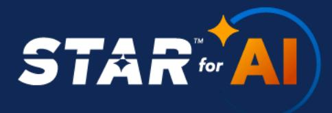

|                                  | J                                                                                                                                                                                                                                     | Κ                                                   |
|----------------------------------|---------------------------------------------------------------------------------------------------------------------------------------------------------------------------------------------------------------------------------------|-----------------------------------------------------|
|                                  |                                                                                                                                                                                                                                       |                                                     |
| <b>AICM</b> <b>Control ID</b> | <b>AICM Control Specification</b>                                                                                                                                                                                                     | <b>AICM Control Title</b>                           |
| A&A-01                           | Establish, document, approve, communicate, apply, evaluate and maintain audit and assurance policies and procedures and standards. Review and update the policies and procedures at least annually or upon significant changes. | <b>Audit and Assurance Policy</b> and Procedures |

*Figure 13: AI-CAIQ's rest of columns.*

Guidance on accurately completing the AI-CAIQ self-assessment, including ownership, evidence, and documentation rules, is provided in the AICM bundle [download](https://cloudsecurityalliance.org/artifacts/ai-controls-matrix).

There are also included step-by-step instructions for submitting an AI-CAIQ self-assessment to the [STAR](https://cloudsecurityalliance.org/star/ai/) [Registry](https://cloudsecurityalliance.org/star/ai/) (**STAR for AI Level 1 Submission Guide).**

For a comprehensive self-assessment suitable for submission to the CSA STAR registry, completing the 'Service Provider Implementation Description' and 'Service Customer Responsibilities' columns is **highly recommended** and **often necessary** to provide sufficient evidence and clarity.

### **1.7 AICM Introduction Guidance Versioning**

This document includes the first edition of the AICM introduction guidance and is marked as version 1.1.

This guidance is designed to evolve in tandem with the AICM control framework and the dynamic landscape of AI technology and regulation.

This foundational document incorporates the following key features:

● AI Controls Matrix (AICM) control specifications now feature an attached Shared Security Responsibility Model (SSRM) expression. These expressions ("CSP-owned," "MP-owned," "OSP-owned," "AP-owned," "AIC-owned," "Shared across the supply chain," or "Shared [Party1]-[Party2]") assist organizations in clearly delineating their security implementation responsibilities across the AI supply chain when deploying AICM controls.

{55}------------------------------------------------

● Aligned with the Shared Security Responsibility Model, AICM control specifications include extended, comprehensive, and dedicated implementation and auditing guidelines tailored for each party in the AI supply chain: Cloud Service Providers (CSPs) operating the GenAI OPS/Processing Infrastructure layer, Model Providers (MPs), Orchestrated Services Providers (OSPs), Application Providers (APs), and AI Customers (AICs).

Future versions of this document will incorporate feedback from the AI security community, address emerging AI threats and technologies, reflect evolving regulatory requirements, and refine implementation guidance based on real-world deployment experiences.