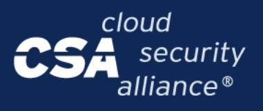
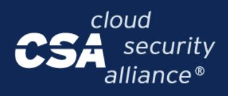

{0}------------------------------------------------




# **STAR for AI Level 1 Submission Guide**

```
Submit Self-Assessments to the STAR Registry
```

These are the detailed instructions on **how to submit your STAR for AI Level 1 [Self-Assessment](https://cloudsecurityalliance.org/artifacts/ai-controls-matrix-v1-1) to the STAR Registry**. Note that this process is the same as the one used for the traditional cloud version of STAR Level 1.

Note that advanced Level 1 processing can be attained through our [Valid-AI-ted](https://cloudsecurityalliance.org/artifacts/overview-of-csa-star-level-1-valid-ai-ted) service. Valid-AI-ted is available at no extra cost to CSA [Members.](https://cloudsecurityalliance.org/membership)

# **Step 1: Prepare Your Submission**

#### **Create an Account**

First, you will want to make sure that you have **created an account on the STAR [platform](https://star.watch/en/).**

If you create an account using the email and password option, be sure to use your work email that aligns with the organization's domain. If you signed up using an email and password, you will also need to **find the confirmation email from support@auth0.cloudsecurityalliance.org**. If your confirmation email doesn't arrive within 30 minutes, check your spam folder first, then reach out to [support@cloudsecurityalliance.org](mailto:support@cloudsecurityalliance.org).

#### **Gather Your Submission Information**

Next, **ensure that you have the correct information collected.** The following fields will be required:

- Backup PoC
- Backup PoC Email
- Region

{1}------------------------------------------------


- Organization Name, URL, and Description
- Service Name, URL, and Description ("Service" refers to the service provided to the end users)

### **Fill Out the AI-CAIQ**

It is required to **prepare the [self-assessment](https://cloudsecurityalliance.org/artifacts/filling-in-the-ai-caiq) information beforehand by completing the downloadable AI-CAIQ v1.0.2 or later**.

The AI-CAIQ **must be prepared and submitted in the original CSA format**. This means that:

- No columns, rows, or sheets should be added or removed.
- All fields in the **Service Provider AI-CAIQ Answer** and **SSRM Control Ownership** columns must be filled out. If a control is not marked as NA, the SSRM control ownership is usually ND (Not Determined).

## **Step 2: Fill Out the STAR Submission Form**

Submit your completed AI-CAIQ v1.0.2 using the STAR [Submission](https://star.watch/en/star_submissions/new) Form. Complete the form with your information:

- From the **Type of Registry Entry** dropdown, select **Self-assessment**.
- Under **Specification**, select **AI-CAIQ**.
- Attach your completed AI-CAIQ document (**.xlsx**) as the primary file for your submission.

# **Step 3: Confirm Your Submission**

After submitting the form, you'll receive a confirmation email from **noreply@info.cloudsecurityalliance.org**. Click the link in the message to confirm your submission.

If you don't receive it within 30 minutes, check your spam folder first. If it's still missing, contact [support@cloudsecurityalliance.org](mailto:support@cloudsecurityalliance.org) or use the Support button on the lower right of the page.

## **Step 4: Select Your Organization**

On the confirmation page, **choose your organization from the dropdown menu**. If this is your first submission and your organization doesn't appear, click **Create New Organization**.

**Pro Tip:** Check carefully before creating a new listing—duplicate organizations cause delays. Names appear exactly as submitted, so use consistent spelling and formatting. To update existing organization details, contact [support@cloudsecurityalliance.org](mailto:support@cloudsecurityalliance.org).

{2}------------------------------------------------




# **Step 5: Select Your Cloud Service**

Next, **select your Cloud Service from the dropdown list**. If it's not listed, click **Create New Cloud Service** and enter the information exactly as it appears to your customers.

**Pro Tip:** Check for your service carefully before creating a new entry to avoid duplicates. If you need to update your existing Cloud Service details, reach out to [support@cloudsecurityalliance.org](mailto:support@cloudsecurityalliance.org).

# **Step 6: Wait for Your STAR Registry Listing**

Once confirmed, your AI-CAIQ self-assessment is typically posted within one business day, though manual reviews can take **up to five business days**.

*If you have any questions about this process, please contact [support@cloudsecurityalliance.org.](mailto:support@cloudsecurityalliance.org)*