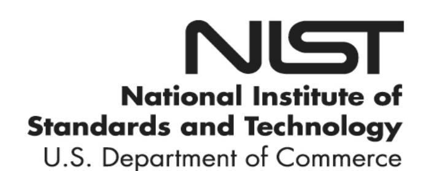
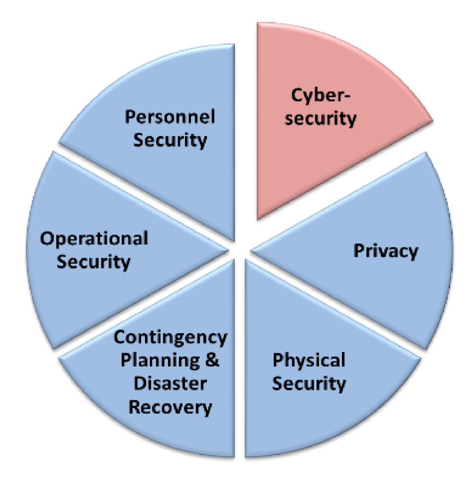
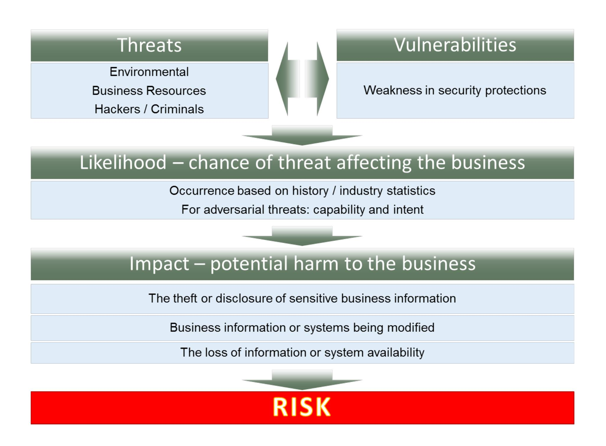
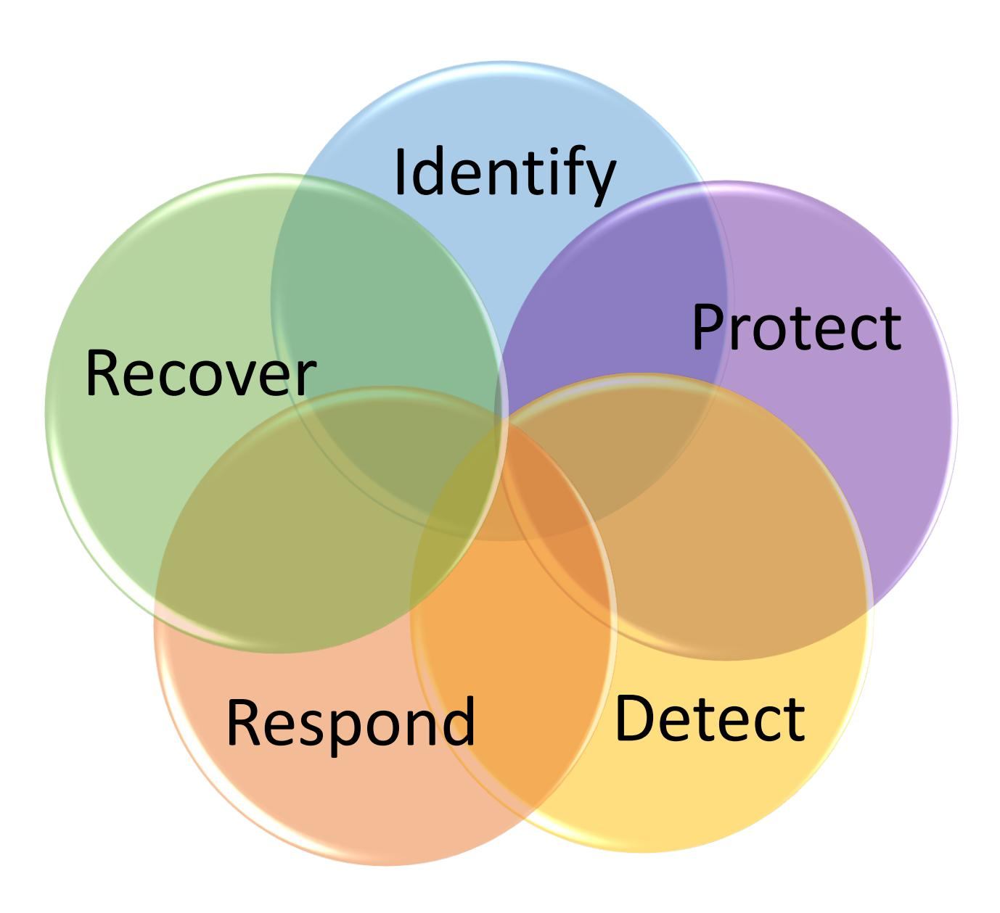

{0}------------------------------------------------

# **NISTIR 7621 Revision 1**

# **Small Business Information Security:** *The Fundamentals*

Celia Paulsen Patricia Toth

This publication is available free of charge from: https://doi.org/10.6028/NIST.IR.7621r1

{1}------------------------------------------------

# **NISTIR 7621 Revision 1**

# **Small Business Information Security:** *The Fundamentals*

Celia Paulsen Patricia Toth *Applied Cybersecurity Division Information Technology Laboratory*

This publication is available free of charge from: https://doi.org/10.6028/NIST.IR.7621r1

November 2016

U.S. Department of Commerce *Penny Pritzker, Secretary*

National Institute of Standards and Technology *Willie May, Under Secretary of Commerce for Standards and Technology and Director*

{2}------------------------------------------------

#### National Institute of Standards and Technology Interagency Report 7621 Revision 1 54 pages (November 2016)

This publication is available free of charge from: https://doi.org/10.6028/NIST.IR.7621r1

Certain commercial entities, equipment, or materials may be identified in this document in order to describe an experimental procedure or concept adequately. Such identification is not intended to imply recommendation or endorsement by NIST, nor is it intended to imply that the entities, materials, or equipment are necessarily the best available for the purpose.

There may be references in this publication to other publications currently under development by NIST in accordance with its assigned statutory responsibilities. The information in this publication, including concepts and methodologies, may be used by Federal agencies even before the completion of such companion publications. Thus, until each publication is completed, current requirements, guidelines, and procedures, where they exist, remain operative. For planning and transition purposes, Federal agencies may wish to closely follow the development of these new publications by NIST.

Organizations are encouraged to review all draft publications during public comment periods and provide feedback to NIST. Many NIST cybersecurity publications, other than the ones noted above, are available at [http://csrc.nist.gov/publications.](http://csrc.nist.gov/publications)

#### **Comments on this publication may be submitted to:**

National Institute of Standards and Technology Attn: Applied Cybersecurity Division, Information Technology Laboratory 100 Bureau Drive (Mail Stop 2000) Gaithersburg, MD 20899-2000 Email: smallbizsecurity@nist.gov

All comments are subject to release under the Freedom of Information Act (FOIA).

{3}------------------------------------------------

# **Reports on Computer Systems Technology**

The Information Technology Laboratory (ITL) at the National Institute of Standards and Technology (NIST) promotes the U.S. economy and public welfare by providing technical leadership for the Nation's measurement and standards infrastructure. ITL develops tests, test methods, reference data, proof of concept implementations, and technical analyses to advance the development and productive use of information technology. ITL's responsibilities include the development of management, administrative, technical, and physical standards and guidelines for the cost-effective security and privacy of other than national security-related information in Federal information systems.

# **Abstract**

NIST developed this interagency report as a reference guideline about cybersecurity for small businesses. This document is intended to present the fundamentals of a small business information security program in non-technical language.

# **Keywords**

small business; information security; cybersecurity; fundamentals

# **Acknowledgements**

The authors, Celia Paulsen and Patricia Toth wish to thank Richard Kissel and Dr. Hyunjeong Moon for their extensive contributions to this publication. Since 2002, NIST along with the Small Business Administration and the Federal Bureau of Investigation's InfraGard program, has conducted research and outreach to small businesses – much of this publication is thanks to their generous time and effort. The authors would like to thank their partners and the small businesses who contributed to this work. In addition, they would like to thank those colleagues and reviewers who contributed to the document's development.

{4}------------------------------------------------

# **Table of Contents**

|   |            | FOREWORD 1                                                                                |        |
|---|------------|-------------------------------------------------------------------------------------------|--------|
|   |            | PURPOSE 1                                                                                 |        |
| 1 |            | BACKGROUND: WHAT IS INFORMATION SECURITY AND CYBERSECURITY? 2                             |        |
|   | 1.1 1.2 | WHY SMALL BUSINESSES?  ORGANIZATION OF THIS PUBLICATION                             | 4 5 |
| 2 |            | UNDERSTANDING AND MANAGING YOUR RISKS 6                                                   |        |
|   | 2.1        | ELEMENTS OF RISK                                                                       | 6      |
|   | 2.2        | MANAGING YOUR RISKS                                                                       | 8      |
|   |            | Identify what information your business stores and uses  •                          | 8      |
|   |            | Determine the value of your information •                                              | 8      |
|   |            | Develop an inventory •                                                                 | 10     |
|   |            | Understand your threats and vulnerabilities •                                          | 11     |
|   | 2.3        | WHEN YOU NEED HELP                                                                     | 14     |
| 3 |            | SAFEGUARDING YOUR INFORMATION15                                                           |        |
|   | 3.1        | IDENTIFY                                                                               | 16     |
|   |            | Identify and control who has access to your business information16 •                   |        |
|   |            | Conduct Background Checks •                                                            | 16     |
|   |            | Require individual user accounts for each employee.  •                              | 17     |
|   |            | Create policies and procedures for information security17 •                            |        |
|   | 3.2        | PROTECT                                                                                   | 18     |
|   |            | Limit employee access to data and information •                                        | 18     |
|   |            | Install Surge Protectors and Uninterruptible Power Supplies (UPS)18 •                  |        |
|   |            | Patch your operating systems and applications •                                        | 19     |
|   |            | Install and activate software and hardware firewalls on all your business networks19 • |        |
|   |            | Secure your wireless access point and networks •                                       | 20     |
|   |            | Set up web and email filters  •                                                     | 20     |
|   |            | Use encryption for sensitive business information  •                                | 21     |
|   |            | Dispose of old computers and media safely  •                                        | 21     |
|   |            | Train your employees •                                                                 | 22     |
|   | 3.3        | DETECT                                                                                    | 23     |
|   |            | Install and update anti-virus, -spyware, and other –malware programs23 •            |        |
|   |            | Maintain and monitor logs •                                                            | 23     |
|   | 3.4        | RESPOND                                                                                | 24     |
|   | 3.5        | Develop a plan for disasters and information security incidents24 • RECOVER      | 25     |
|   |            | Make full backups of important business data/information25 •                           |        |
|   |            | Make incremental backups of important business data/information26 •                    |        |
|   |            | Consider cyber insurance •                                                             | 26     |
|   |            | Make improvements to processes / procedures / technologies27 •                         |        |
| 4 |            | WORKING SAFELY AND SECURELY28                                                             |        |
|   |            | Pay attention to the people you work with and around28 •                            |        |
|   |            | Be careful of email attachments and web links •                                        | 28     |
|   |            |                                                                                           |        |

{5}------------------------------------------------

| Use separate personal and business computers, mobile devices, and accounts29 •         |    |
|-------------------------------------------------------------------------------------------|----|
| Do not connect personal or untrusted storage devices or hardware into your computer, • |    |
| mobile device, or network.                                                             | 29 |
| Be careful downloading software •                                                      | 29 |
| Do not give out personal or business information •                                     | 30 |
| Watch for harmful pop-ups  •                                                        | 30 |
| Use strong passwords •                                                                 | 31 |
| Conduct online business more securely  •                                            | 32 |
| APPENDIX A— GLOSSARY AND LIST OF ACRONYMS 1                                               |    |
| APPENDIX B— REFERENCES 1                                                                  |    |
| APPENDIX C— ABOUT THE FRAMEWORK FOR IMPROVING CRITICAL INFRASTRUCTURE CYBERSECURITY 1     |    |
| APPENDIX D— WORKSHEETS 1                                                                  |    |
| Identify and prioritize your information types •                                       | 1  |
| Develop an Inventory •                                                                 | 2  |
| Identify Threats, Vulnerabilities, and the Likelihood of an Incident 3 •            |    |
| Prioritize your mitigation activities •                                                | 4  |
| APPENDIX E— SAMPLE POLICY & PROCEDURE STATEMENTS 1                                        |    |

{6}------------------------------------------------

# **Foreword**

Small businesses are an important part of our nation's economic and cyber infrastructure. According to the Small Business Administration, there are approximately 28.2 million small businesses in the United States. These businesses produce approximately 46 % of our nation's private-sector output and create 63 % of all new jobs in the country [\[SBA FAQ\].](#page-43-0) The Small Business Administration has the responsibility for defining small businesses; the definition varies for each industry sector [\[SBA SBSStds\].](#page-43-1) This publication uses the most recent Small Business Administration definitions. For this publication, the term "Small business" is synonymous with Small Enterprise or Small Organization and includes for-profit, non-profit[1](#page-6-2) , and similar organizations.

For some small businesses, the security of their information, systems, and networks might not be their highest priority. However, an information security or cybersecurity incident can be detrimental to their business, customers, employees, business partners, and potentially their community. It is vitally important that each small business understand and manage the risk to information, systems, and networks that support their business.

#### **Purpose**

This NIST Interagency Report (NISTIR) provides guidance on how small businesses can provide basic security for their information, systems, and networks.

This NISTIR uses the *Framework for Improving Critical Infrastructure Cybersecurity* [\[CSF14\]](#page-42-1) as a template for organizing cybersecurity risk management processes and procedures. Although the Cybersecurity Framework, created through collaboration between government and the private sector, was originally developed specifically for critical infrastructure organizations, it has proven useful to a variety of audiences and is used in this publication to organize information and cybersecurity best practices in an accepted and logical format. For more information about the Cybersecurity Framework, see [Appendix C.](#page-46-0)

Revision 1 of this publication reflects changes in technology and a reorganization of the information needed by small businesses to implement a program to help them understand and manage their information and cybersecurity risk.

 1 The U.S. Small Business Administration does not include non-profit in its definition for Small Businesses.

{7}------------------------------------------------

# **1 Background: What is Information Security and Cybersecurity?**

All businesses use information – for example, employee information, tax information, proprietary information, or customer information. Information is vital to the operation of a business. If that information is compromised in some way, the business may not be able to function. Protecting the information an organization creates, uses, or stores is called "Information Security."

**Information Security** is formally defined as "The protection of information and information systems from unauthorized access, use, disclosure, disruption, modification, or destruction in order to provide confidentiality, integrity, and availability" [\[44USC\].](#page-42-2)

Information security encompasses people, processes, and technologies. It concentrates on how to protect:

- **Confidentiality** protecting information from unauthorized access and disclosure. *For example, what would happen to your company if customer information such as usernames, passwords, or credit card information was stolen?*
- **Integrity** protecting information from unauthorized modification. *For example, what if your payroll information or a proposed product design was changed?*
- **Availability** preventing disruption in how you access information. *For example, what if you couldn't log in to your bank account or access your customer's information, or your customers couldn't access you?*

As more and more information becomes digitized - digitally stored, processed, and communicated - cybersecurity has become a key component of information security. Cybersecurity means protecting electronic devices and electronically stored information.

**Cybersecurity** is formally defined as "Prevention of damage to, protection of, and restoration of computers, electronic communications systems, electronic communications services, wire communication, and electronic communication, including information contained therein, to ensure its availability, integrity, authentication, confidentiality, and nonrepudiation" [\[CNSSI4009\]\[HSPD23\].](#page-42-3)

As part of information security, cybersecurity works in conjunction with a variety of other security measures, some of which are shown in [Figure 1.](#page-7-1) As a whole, these information security components provide defense against a wide range of potential threats to your business's information. Although much of this publication involves electronic devices and solutions, it is not limited to cybersecurity and typically refers to "information security" as a whole.

{8}------------------------------------------------

- **Physical Security** the protection of property, e.g. using fences and locks;
- **Personnel Security** e.g. using background checks;
- **Contingency Planning and Disaster Recovery** how to resume normal operations after an incident, also known as Business Continuity Planning;
- **Operational Security** protecting business plans and processes, and
- **Privacy** protecting personal information. [2](#page-8-0)

Lacking any one of these components diminishes the effectiveness of the others. For example, good physical security measures mean little if the personnel you hire intend to harm your business (poor personnel security). Or, strong privacy policies can depend on cybersecurity practices that protect customer information that is electronically stored.

 2 Personal information includes "information which can be used to distinguish or trace an individual's identity, such as their name, social security number, biometric records, etc. alone, or when combined with other personal or identifying information which is linked or linkable to a specific individual, such as date and place of birth, mother's maiden name, etc." [\[OMBM-07-16\].](#page-43-2)

{9}------------------------------------------------

#### **1.1 Why Small Businesses?**

Many businesses in the United States have been putting resources—including people, technology, and budgets—into protecting themselves from information security and cybersecurity threats. As a result, they have become a more difficult target for malicious attacks from hackers and cyber criminals. Consequently, hackers and cyber criminals are now successfully focusing more of their unwanted attention on less secure businesses.

Because small businesses typically don't have the resources to invest in information security the way larger businesses can, many cyber criminals view them as soft targets. Your small business may have money or information that can be valuable to a criminal; your computer may be compromised and used to launch an attack on somebody else (i.e., a botnet), or your business may provide access to more high-profile targets through your products, services, or role in a supply chain.

It is important to note that criminals aren't always after profit. Some may attack your business out of revenge (e.g. for firing them or somebody they know), or for the thrill of causing havoc. Similarly, not all events that affect the confidentiality, availability, or integrity of your information (called "information security events") are caused by criminals. Environmental events such as fires or floods, for example, can severely damage computer systems.

The overall impact of an incident could include:

- damage to information or information systems;
- regulatory fines and penalties / legal fees;
- decreased productivity;
- loss of information critical in running your business;
- an adverse reputation or loss of trust from customers;
- damage to your credit and inability to get loans from banks, or
- loss of business income.

Unfortunately, in one respect, small businesses often have more to lose than larger organizations simply because an event—whether a hacker, natural disaster, or business resource loss—can be extremely costly. Small businesses are often less prepared to handle these events than larger businesses, but with less complex operational needs, there are many steps a small business may be able to take more easily. Thus, it is vitally important that you consider how to protect your business.

Small businesses often see information security as too difficult or that it requires too many resources to do. It is true that there is no easy, one-time solution to information security – it takes time and careful consideration with all relevant stakeholders. However, when viewed as part of the business's strategy and regular processes, information security doesn't have to be intimidating.

A strong information security program can help your organization gain and retain customers, employees, and business partners. Customers have an expectation that their sensitive information will be protected from theft, disclosure, or misuse. Protecting your customers' information is an

{10}------------------------------------------------

example of good customer service and shows your customers that you value their business, potentially increasing your business opportunities.

Similarly, employees have an expectation that their sensitive personal information will be appropriately protected, and a comprehensive information security program can help employees feel valued and help improve their knowledge, skills, and abilities. Also, other business partners want assurance that *their* information, systems, and networks are not put at risk when they connect to and do business with your business; demonstrating to potential business partners that you have a method to protect their information can help strengthen and grow your business relationship. Developing or improving your information security program will also make it easier for your organization to innovate – taking advantage of new technologies that can lower costs while delivering better services to your customers [\[EY14\]\[Grady05\].](#page-42-4)

It is not possible for any business to be completely secure. Nevertheless, it is possible—and reasonable—to implement a program that balances security with the needs and capabilities of your business. This publication provides small businesses with basic practices and tools needed to develop an information security program to protect your business's information.

#### **1.2 Organization of this Publication**

The rest of this publication is organized as follows:

- [Section 2](#page-11-0) describes how an information security program can be implemented.
- [Section 3](#page-20-0) discusses those key actions small businesses can take to develop or improve their information security and cybersecurity.
- [Section 4](#page-33-0) identifies several key practices directed towards users which you can implement immediately and which will protect your system and information.
- [Appendix A](#page-38-0) provides a glossary of key terms and acronyms used in this publication.
- [Appendix B](#page-42-0) contains sources referenced throughout this publication.
- [Appendix C](#page-42-2) contains a description of the NIST *Framework for Improving Critical Infrastructure Cybersecurity* [\[CSF14\]](#page-42-1)*.*
- [Appendix D](#page-47-0) provides worksheets useful in conducting a risk analysis.
- [Appendix E](#page-52-0) contains example information security policy and procedure statements.

{11}------------------------------------------------

# **2 Understanding and Managing Your Risks**

Risk is a function of threats, vulnerabilities, the likelihood of an event, and the potential impact such an event would have to the business. Most of us make risk-based decisions every day. While driving to work, we assess threats and vulnerabilities such as weather and traffic conditions, the skill of other drivers on the road, and the safety features and reliability of the vehicle we drive.

By understanding your risks, you can know where to focus your efforts. While you can never completely eliminate your risks, the goal of your information security program should be to provide reasonable assurance that you have made informed decisions related to the security of your information.

It is impossible to completely understand all of your risks perfectly. There will be many times when you will have to make a reasonable effort when trying to understand threats, vulnerabilities, potential impact and likelihood. For this reason, it is important to utilize all resources available to you, including information sharing organizations (e.g., [\[US-CERT\],](#page-45-0) [\[ISACA\],](#page-43-3) etc.), relevant stakeholders, and knowledge experts.

#### **2.1 Elements of Risk**

In information security, a *threat* is anything that might adversely affect the information your business needs to run. These threats might come in the form of personnel or natural events; they can be accidents, or intentional. Some of the most common information security threats include:

- **Environmental** (e.g. fire, water, tornado, earthquake);
- **Business Resources** (e.g. equipment failure, supply chain disruption, employees), and
- **Hostile Actors** (e.g. hackers, hacktivists, criminals, nation-state actors).

When looking at these types of threats, many people do not understand how they relate to information security. It is helpful to consider what would happen in the event of, for example, a flood. Computers, servers, and paper documents can easily be destroyed by even a small amount of water. If it is a large flood, you may not be allowed in the area to protect or collect the information your business needs to run.

A *vulnerability* is a weakness that could be used to harm the business. Any time or situation where information is not being adequately protected represents a vulnerability. Most information security breaches can be traced back to only a few types of common vulnerabilities. Section 3 and Section 4 of this publication are geared towards minimizing your vulnerabilities and reducing the impact of a security incident should one happen.

Some threats affect businesses and industries differently. For example, an online retailer may be more concerned about website defacement than a business with little or no web presence. *Likelihood* is the chance that a threat will affect your business and helps determine what types of protections to put in place.

{12}------------------------------------------------

Similarly, most businesses have different types of information. If a marketing pamphlet is leaked online, it will probably not harm the business nearly as much as if, for example, sensitive customer information or proprietary business data was leaked. The *impact* an event could have depends on the information affected, the business, and the industry.

Figure 2 shows the relationship between *threats, vulnerabilities, impact,* and *likelihood*.

*Figure 2: How Risk is determined from Threats, Vulnerabilities, Likelihood, and Impact*

{13}------------------------------------------------

#### **2.2 Managing Your Risks**

The activity of identifying what information requires what level of protection, and then implementing and monitoring that protection, is called "risk management"[3](#page-13-3) . This section contains simple steps for creating a risk-based information security program to help you manage risk.

This process will likely require the input and collaboration of a broad array of personnel within the business to be successful. You should bring together those personnel in your business that can help make informed decisions, for example project managers, executives, legal, and IT personnel. In addition, you may want to consider including customers, particularly you do a significant amount of business with, and use them as an additional resource.

You should review and update your risk management plan at least annually and whenever you may be considering any changes to the business (e.g. beginning a new project, a change in procedure, or purchasing a new IT system). Also, if you hear that something happened to one of your business partners, suppliers (including makers of any computer equipment or software you may use), customers, or employees, use this exercise to make sure you are still adequately protected.

• *Identify what information your business stores and uses*

Because it is unreasonable to protect every piece of information your business uses against every possible threat, it is important to identify what information is most valuable to your business or to others. This first step is often the most challenging and most important part of risk management.

Start by listing all of the types of information your business stores or uses. Define "information type" in any useful way that makes sense to your business. You may want to have your employees make a list of all the information they use in their regular activities. List everything you can think of, but you do not need to be too specific. For example, you may keep customer names and email addresses, receipts for raw material, your banking information, or other proprietary information.

• *Determine the value of your information*

Go through each information type you identified and ask these key questions:

- What would happen to my business if this information was made public?
- What would happen to my business if this information was incorrect?

 3 NIST SP 800-30 Rev. 1, *Guide for Conducting Risk Assessments,* provides more detail on how to conduct a risk analysis [\[SP800-30\].](#page-44-0)

{14}------------------------------------------------

• What would happen to my business if I/my customers couldn't access this information?

These questions relate to *confidentiality*, *integrity*, and *availability*, as discussed in Section [1.1](#page-9-0) and help determine the potential *impact* of an event. *[Table 1](#page-15-1)* below shows a template worksheet or spreadsheet you can adapt and use to identify the value of your information. *Table 1* also includes some additional, helpful questions to consider what would happen to your business reputation, your productivity, and your legal liabilities.

You may not be able to assign a dollar value amount for many types of information, so instead, consider using use a scale of 0 to 3 or "none," "low," "moderate," and "high." Note that one person alone may not know how a piece of information is used throughout the business – a team effort will likely be required.

Using the answers to these questions, rank how critical each type of information is to the continued operations of your business. When calculating an overall ranking or risk score for an information type, either add the values to give a total value or use the highest value or score given. For example, if the information type has one "high" rating, the entire information type should be rated as "high". Information that has a higher score needs to be more protected than information with a low score. Higher-rated information types may warrant use of the techniques identified in Section [3](#page-20-0) of this publication, depending on the relevant threats and vulnerabilities.

*Table 1* on the next page is an example worksheet showing how this information can be gathered. The worksheet includes a worked example shown in italics. The worksheet is also available in [Appendix D.](#page-47-0)

{15}------------------------------------------------

|                                               | Example: Customer Contact Information | Info type 1 | Info type 2 | Info type 3 | … |
|-----------------------------------------------|---------------------------------------------|-------------|-------------|-------------|---|
| Cost of revelation (Confidentiality)       | Med                                         |             |             |             |   |
| Cost to verify information (Integrity)     | High                                        |             |             |             |   |
| Cost of lost access (Availability)         | High.                                       |             |             |             |   |
| Cost of lost work                             | High                                        |             |             |             |   |
| Fines, penalties, customer notification | Med                                         |             |             |             |   |
| Other legal costs                             | Low                                         |             |             |             |   |
| Reputation / public Relations costs        | High                                        |             |             |             |   |
| Cost to identify and repair problem     | High                                        |             |             |             |   |
| Overall Score:                                | High                                        |             |             |             |   |

*Table 1: Identify and Prioritize Information Types*

# • *Develop an inventory*

Identify what technology comes in contact with the information you listed in *Table 1*. Complete *Table 2* to include the technology you use to store, access, process, and transmit that information. This can include hardware (e.g. computers) and software applications (e.g. browser email). Make sure to include the make, model, serial numbers, and other identifying information; this information is necessary for identifying the product in case of maintenance, repair, or insurance purposes. Every information type should have at least one hardware / software technology listed. Where applicable, include technologies outside of your business (e.g., "the cloud") and any protection technologies you have in place such as firewalls.

You should also track where each product is located. For software, identify what machine(s) the software has been loaded on to. You may also want to include the owner of the technology, if applicable.

Evaluate the impact of the information, as decided in *Table 1—*this will help you determine the most appropriate security controls needed to protect the information. You may choose to add up impact scores for all types of information the product comes in

{16}------------------------------------------------

contact with, or only use the highest score. Update this list at least annually. This table is also included in [Appendix D.](#page-47-0)

*Table 2: Inventory*

|   | Description (e.g. nickname, make, model, serial number, service ID, other identifying information) | Location              | Type of information the product comes in contact with.                                                            | Overall Potential Impact |
|---|-------------------------------------------------------------------------------------------------------------|-----------------------|-------------------------------------------------------------------------------------------------------------------------|--------------------------------|
| 1 | Dr. J. Smith's cell phone; Type – Sonic; Version – 9.0 ID – "Police Box"                     | Mobile T&S Network | Email; Calendar; Customer Contact Information; Photos; Social Media; Locations; Medical Dictionary Application | High                           |
| 2 |                                                                                                             |                       |                                                                                                                         |                                |
| 3 |                                                                                                             |                       |                                                                                                                         |                                |
| 4 |                                                                                                             |                       |                                                                                                                         |                                |
| 5 |                                                                                                             |                       |                                                                                                                         |                                |

# • *Understand your threats and vulnerabilities*

All businesses face information security and cybersecurity threats and vulnerabilities. While certain categories of threats and vulnerabilities may be consistent across businesses, some may be specific to your industry, location, and business. You should regularly review what threats and vulnerabilities your business may face and estimate the likelihood that you will be affected by that threat or vulnerability. This can help you identify specific strategies to protect against that threat or vulnerability.

*Table 3* provides an example of how to determine the likelihood of an incident based on the information you collected in *Tables 1 and 2*. The left-hand column of the table lists some example threat events or scenarios—you should create a list that is specific to the threats and vulnerabilities your business faces. Evaluate the likelihood of the threat to your business in the bottom row. Use the highest value or score given. For example, if the information type has one "high" rating, the entire information type should be rated as "high". See [Appendix D](#page-47-0) for more information on this worksheet.

{17}------------------------------------------------

*Table 3: Identify Threats, Vulnerabilities, and the Likelihood of an Incident*

|                                                               | Example: Customer Contact Information on Dr. J. Smith's cell phone | Info type / Technology | Info type / Technology | Info type / Technology | … |
|---------------------------------------------------------------|-----------------------------------------------------------------------------|---------------------------|---------------------------|---------------------------|---|
| Confidentiality                                               |                                                                             |                           |                           |                           |   |
| Theft by criminal                                             | Med (encrypted; password protected)                                   |                           |                           |                           |   |
| Accidental disclosure                                         | Med (has previously lost phone twice)                                 |                           |                           |                           |   |
| Integrity                                                     |                                                                             |                           |                           |                           |   |
| Accidental alteration by user / employee                | Med                                                                         |                           |                           |                           |   |
| Intentional alteration by external criminal / hacker | Low                                                                         |                           |                           |                           |   |
| Availability                                                  |                                                                             |                           |                           |                           |   |
| Accidental Destruction (fire, water, user error)           | Med (Regular backups)                                                    |                           |                           |                           |   |
| Intentional Destruction                                       | Low                                                                         |                           |                           |                           |   |
| Overall Likelihood:                                           | Med                                                                         |                           |                           |                           |   |

Your business likely already has some processes and procedures in place which help to protect from these threats. It is useful to record these protections as you go through this exercise (e.g. the destruction of information may be mitigated or protected by regular backups). Information about threats and common vulnerabilities can be found through your local InfraGard chapter [\[InfraGard\],](#page-43-4) [\[US-CERT\],](#page-45-0) your local SCORE[4](#page-17-0) chapter, hardware or software vendor announcements, your local police department and many other places (e.g., the National Vulnerability Database [\[NVD\]\)](#page-43-5).

Vulnerabilities found in software applications are the most common avenue of attack for hackers. Because of the broad range of vulnerabilities possibly found within a network or

 4 Originally known as the Service Corps of Retired Executives, it is now simply referred to as SCOR[E \[SCORE\].](#page-43-6)

{18}------------------------------------------------

system, a vulnerability scan or analysis should be minimally conducted once a year by a professional and again whenever you make major changes to your computers or network. The prices for this service can vary widely—from free to thousands of dollars depending on the specific actions performed and the size or nature of the business being assessed.

You may want to consider conducting a penetration test against your business. This test simulates an attack in order to identify weaknesses. The test should include physical, social engineering, and cyber-based attacks. Other tests may also be useful—work with a cybersecurity professional to identify what is appropriate for your situation.

The information gathered in *Tables 1 - 3* provide the information necessary to identify the areas where you need to focus your information security efforts. *Table 4* below shows an example of how the value of your information types or "impact" (*Tables 1 and 2*) and the potential likelihood of an attack (*Table 3*) can be combined to help you prioritize your information security efforts.

**Impact** High **Priority 3** – Schedule a resolution. Focus on *Respond* and *Recover* solutions. **Priority 1** – Implement immediate resolution. Focus on *Detect* and *Protect* solutions. Low No action needed **Priority 2** – Schedule a resolution. Focus on *Detect* and *Protect* solutions. Low High **Likelihood**

*Table 4: Prioritize Resolution Action*

Using the previous example, Dr. J. Smith's Cell Phone, which contains customer contact information, may be a Priority 3 device due to the High impact and Low Likelihood.

As you review the practices in Section [3](#page-20-0) and [4](#page-33-0) of this document, look at what technologies and services you may need to purchase. When you develop a budget, apply the information from this exercise to help you select, obtain and implement systems and services that are commensurate with your risk.

{19}------------------------------------------------

# **2.3 When you need help**

No one is an expert in every business and technical area. You may choose to outsource some of your technology and information security needs to companies that provide these services. Here are a few tips which can help you find a provider that's right for your business:

- **Ask for recommendations**. You can ask your business partners, local Chamber of Commerce, Better Business Bureau, colleges or universities, or SCORE Office for referrals.
- **Request quotes**. Make sure to have a clear list of actions or outcomes that you want to achieve. This may be done with the potential provider, depending on whether or not you want their opinion of what actions or outcomes your business should have.
- **Check past performance**. Often providers will have reviews posted online. Check for complaints with the Better Business Bureau or Federal Trade Commission. If possible, request a list of past customers and contact each to see if the customer was satisfied with the company's performance and would hire them again for future work. Find out how long the company has been in business and whether or not there have been recent or several changes in management – this can be an indicator of future difficulties.
- **Find out who will be doing your work**. Ask for the professional qualifications of the personnel who will be handling the project – including those working directly with you or on your systems as well as any personnel that will be overseeing the project. Look for recognized professional certifications and relevant experience.

Recognize that anyone you hire to perform a service for you may not know your business or industry. Any large decisions – including any changes in processes or technologies used - should be made in collaboration with business executives, project leaders, and other relevant personnel.

In some cases, larger organizations will help their small business suppliers analyze their risks and develop an information security program. If you have a business partners or large customers that depend on your organization, consider asking for their input or participation in your risk management process.

{20}------------------------------------------------

# **3 Safeguarding Your Information**

This publication uses the *Framework for Improving Critical Infrastructure Cybersecurity* (the "Cybersecurity Framework") to organize the processes and tools that you should consider to protect your information [\[CSF14\].](#page-42-1) [Appendix C](#page-42-2) contains more information about the Cybersecurity Framework. This is not a one-time process, but a continual, on-going set of activities. Although the Cybersecurity Framework was originally developed specifically for critical infrastructure organizations, it has proven useful to a variety of audiences as it provides a simple, common language for helping organizations to identify, assess, and manage cybersecurity risks.

This section provides activities you can implement in your business. In addition, Section [4](#page-33-0) of this publication lists some common practices you and your employees can implement to help keep your business safe. The specific mitigation activities in this section are grouped into the five broad categories of the Cybersecurity Framework, as pictured in [Figure 3.](#page-20-1) Some of the activities in this publication are suggestions for consideration. This means that those activities are recommended when a higher level of assurance (confidentiality, integrity, or availability) is needed to protect the information and meet business needs than is provided by the more basic practices.

*Figure 3: The Cybersecurity Framework Categories*

{21}------------------------------------------------

#### **3.1 Identify**

As described in the Cybersecurity Framework, the activities in the Identify Function help increase an organization's understanding of their resources and risks.[5](#page-21-3)

# • *Identify and control who has access to your business information*

Determine who has or should have access to your business's information and technology. Include whether or not a key, administrative privilege, or password is required. To help collect this information, review your list of accounts and what privileges those accounts have.

Be aware of anyone who has access to your business. Do not allow unknown or unauthorized persons to have physical access to any of your business computers. This includes cleaning crews and maintenance personnel. Do not allow computer or network repair personnel to work on systems or devices unsupervised. No unrecognized person should be able to enter your office space without being questioned by an employee. If a criminal gains physical access to an unlocked machine, they can relatively easily steal any private or sensitive information on that machine.

Physically lock up your laptops and other mobile devices when they are not in use. You should also utilize the session lock feature included with many operating systems, which locks the screen if the computer is not used for a specified period of time (e.g. 2 minutes). Use a privacy screen or position each computer's display so that people walking by cannot see the information on the screen.

# • *Conduct Background Checks*

Do a full, nationwide, criminal background check, sexual offender check, and if possible a credit check on all prospective employees (especially if they will be handing your business funds). You can request one directly from the FBI or an FBI-approved Channeler [\[FBI\].](#page-42-5)

In addition, consider doing a background check on yourself. Many people become aware that they are victims of identity theft only after they do a background check on themselves and find reported arrest records and unusual previous addresses where they never lived. This can be an indication that your identity has been stolen.

If prospective employees are applying for a job with educational requirements, call the schools they attended and verify their actual degree(s), date(s) of graduation, and GPA(s). If they provided references, call those references to verify the dates they worked for a company and other specifics to ensure the employee is being honest.

 5 The Cybersecurity Framework includes those processes found in section 2 of this publication in the "Identify" function of the Framewor[k \[CSF14\].](#page-42-1)

{22}------------------------------------------------

• *Require individual user accounts for each employee.*

Set up a separate account for each user (including any contractors needing access) and require that strong, unique passwords be used for each account. Without individual accounts for each user, you may find it difficult to investigate data loss or unauthorized data manipulation. Ensure that all employees use computer accounts without administrative privileges to perform typical work functions. This will hinder any attempt—intentional or not—to install unauthorized software. Consider using a guest account with minimal privileges (e.g. internet access only) if needed for your business.

• *Create policies and procedures for information security*

Policies and procedures are used to identify acceptable practices and expectations for business operations, can be used to train new employees on your information security expectations, and can aid an investigation in case of an incident. These policies and procedures should be readily accessible to employees – such as in an employee handbook or manual.

The scope and breadth of policies is largely determined by the type of business and the degree of control and accountability desired by management. Have a legal professional familiar with cyber law review the policies to ensure they are compliant with local laws and regulations.

Policies and procedures for information security and cybersecurity should clearly describe your expectations for protecting your information and systems. These policies should identify the information and other resources that are important and should clearly describe how management expects those resources to be used and protected by all employees. See [Appendix E](#page-52-0) for sample policy and procedure statements. Other examples are readily available online or a legal, insurance, or cybersecurity professional may have example policies.

All employees should sign a statement agreeing that they have read the policies and relevant procedures, that they will follow the policies and procedures. If there are penalties associated with the policies and procedures, employees should be aware of them. The signed agreement should be kept in the employee's HR file.

Policies and procedures should be reviewed and updated at least annually and as there are changes in the organization or technology. Whenever the policies are changed, employees should be made aware of the changes and sign the new policy acknowledging their understanding. This can be done in conjunction with annual training activities [\(see](#page-27-0)  [Section 3.2\)](#page-27-0).

{23}------------------------------------------------

#### **3.2 Protect**

The Protect Function supports the ability to limit or contain the impact of a potential information or cybersecurity event.[6](#page-23-3)

• *Limit employee access to data and information*

Where possible, do not allow any employee to have access to all of the business's information or systems (financial, personnel, inventory, manufacturing, etc)[7](#page-23-4) . Allow employees to access only those systems and only the specific information that they need to do their jobs. Likewise, do not allow a single individual to both initiate and approve a transaction (financial or otherwise). This includes executives and senior managers.

Insiders – employees or others who work for a business – are a main source of security incidents. Because they are already known, trusted, and have been given access to important business information and systems, they can easily harm the business (deliberately or unintentionally). Unfortunately, these types of events can be difficult to detect, so protecting against them is very important.

When an employee leaves the business, ensure they no longer have access to the business's information or systems. This may involve collecting their business ID, deleting their username and account from all systems, changing any group passwords or combination locks they may have known, and collecting any keys they were given.

• *Install Surge Protectors and Uninterruptible Power Supplies (UPS)*

Surge protectors prevent spikes and dips in power from damaging your electronic systems. Uninterruptible Power Supplies (UPS) provide a limited amount of battery power to allow you to work through short power outages and provide enough time to save your data when the electricity goes off. UPS's often provide surge protection as well. The size and type of UPS should be sufficient to meet the needs of your particular business.

Ensure each of your computers and critical network devices are plugged into a UPS. Plug less sensitive electronics into surge protectors. Test and replace UPSs and surge protectors as recommended by the manufacturer.

 6 The Cybersecurity Framework specifies cybersecurity events only, but can be applied to information security events [\[CSF14\].](#page-42-1)

7 The "process of granting access to information system resources only to authorized users, programs, processes, or other systems" is called "access control[" \[SP800-32\].](#page-44-1)

{24}------------------------------------------------

# • *Patch your operating systems and applications*

Any software application including operating systems, firmware, or plugin installed on a system could provide the means for an attack. Only install those applications that you need to run your business and patch/update them regularly. Many software vendors provide patches and updates to their supported products in order to correct security concerns and to improve functionality. Ensure that you know how to update and patch all software on each device you own or use.

When you purchase new computers, check for updates immediately. Do the same when installing new software. You should only install a current and vendor-supported version of software you choose to use. Vendors are not required to provide security updates for unsupported products. For example, Microsoft ended support for Windows XP on April 8, 2014 and no new patches will be provided for that operating system, even though it has known vulnerabilities [\[Msoft WLFS\].](#page-43-7)

It may be useful to assign a day each month to check for patches. There are products which can scan your system and notify you when there is an update for an application you have installed. If you use one of these products, make sure it checks for updates for every application you use. You can check for updates directly with the original manufacturers of the applications you have installed.

# • *Install and activate software and hardware firewalls on all your business networks*

Firewalls can be used to block unwanted traffic such as known malicious communications or browsing to inappropriate websites, depending on the settings. Install and operate a hardware firewall between your internal network and the Internet. This may be a function of a wireless access point/router, or it may be a function of a router provided by the Internet Service Provider (ISP) of the small business. There are many hardware vendors that provide firewall wireless access points/routers, firewall routers, and separate firewall devices. Ensure there is antivirus software installed on the firewall.

For these devices, change the administrative password upon installation and regularly thereafter. Consider changing the administrator's log-in as well. The default values are typically known or easily guessed, and, if not changed, may allow hackers to control your device and thus, to monitor or record your communications and data via the Internet.

In addition, install, use, and regularly update a software firewall on each computer system used in your small business (including smart phones and other networked devices if possible). If given the option, ensure logging is enabled which will aid in the investigation of an event by providing evidence. Many operating systems include a firewall, but you should ensure that the firewall is operating and logging activity [8](#page-24-2) .

 8 See Microsoft's *Safety & Security Center* [\[Msoft SSC\]](#page-43-8) and Apple's OSX support pag[e \[Apple16\].](#page-42-6)

{25}------------------------------------------------

You should only use a current (updated), authentic, and vendor-supported version of the hardware and software firewall.

It is necessary to have firewalls on each of your computers and networks even if you use a cloud service provider or a virtual private network (VPN). If employees are allowed to do any kind of work at home, ensure that their home network and systems have hardware and software firewalls installed and operational, and that they are regularly updated.

In addition to a basic hardware firewall, you may want to consider installing an Intrusion Detection / Prevention System (IDPS). These devices analyze network traffic at a more detailed level and can provide a greater level of protection.

# • *Secure your wireless access point and networks*

If you use wireless networking, set up your router as follows (view the owner's manual for directions on how to make these changes):

- Change the administrative password that was on the device when you received it.
- Set the wireless access point so that it does not broadcast its Service Set Identifier (SSID).
- Set your router to use WiFi Protected Access 2 (WPA-2), with the Advanced Encryption Standard (AES) for encryption. **Do not use WEP (Wired-Equivalent Privacy)** as it is not considered secure.

If your business provides wireless internet access to customers, ensure that it is separated from your business network.

Avoid connecting to unknown or unsecured / guest wireless access points, even for performing non-business activities. Access only those wireless access points that you own or trust (i.e. are assured of their security).

If you or your employees must connect to unknown networks or conduct work from home, you may want to consider implementing an encrypted virtual private network (VPN) capability, which will allow for a more secure connection.

# • *Set up web and email filters*

Email filters can help remove emails known to have malware attached and prevent your inbox from being cluttered by unsolicited and undesired (i.e. "spam") email. Email providers may offer this capability. If your business hosts your own email servers, use filtering if possible.

Similarly, many web browsers allow web filtering – notifying the user if a website may contain malware and potentially preventing them from accessing that website. Enable this option if available.

{26}------------------------------------------------

You may want to consider blocking employees from going to websites that are frequently associated with cybersecurity threats. This may include sites with pornographic content or social media. This can help prevent employees from accidentally downloading malware, wasting business resources, and conducting illicit activity using business resources. Many firewalls and routers can be set up to block certain addresses (blacklist), or allow only certain addresses (whitelist). Blacklists can be downloaded online or obtained as part of a service.

# • *Use encryption for sensitive business information*

Encryption is a process of making your electronically stored information unreadable to anyone not having the correct password or key[9](#page-26-2) . Use full-disk encryption—which encrypts all information on the storage media – on all of your computers, tablets, and smart phones. Many systems come with full-disk encryption capabilities. Not all mobile devices provide this capability.

**Do not forget your encryption password or key**! If you lose or forget your key, you will lose your information. Save a copy of your encryption password or key in a secure location separate from where your backups are stored.

If, in your business, you send sensitive documents or emails, you may want to consider encrypting those documents and/or emails. Many document, and email applications provide for this capability. Typically, the receiver will need to have the same application to de-crypt the message or document as you used to encrypt it. If you need to send them a password or key, give it to them via phone or other method. Never send it in the same email as the encrypted document.

# • *Dispose of old computers and media safely*

Small businesses may sell, throw away, or donate old computers and media. When disposing of old business computers, first electronically wipe the hard drive(s). Many operating systems provide this capability and there are several downloadable applications that can also do this. If you can't wipe the hard drive for any reason, consider degaussing the hard drive.

After wiping the hard drive(s), remove them and have them physically destroyed. You can sell, donate, or recycle the machine after the hard drive has been removed. Many companies will crush or shred them for you. Consider choosing companies that will allow you to watch the process.

 9 NIST SP 800-101 Rev. 1, *Guidelines on Mobile Device Forensics*, defines encryption as "Any procedure used in cryptography to convert plain text into cipher text to prevent anyone but the intended recipient from reading that data" [\[SP800-101\].](#page-45-1)

{27}------------------------------------------------

Install a remote-wiping application on your computer, tablet, cell phone, and other mobile device. If the device is lost or stolen, you can use these applications wipe all information from the device.

When disposing of old media (CDs, floppy disks, USB drives, etc), first delete any sensitive business or personal data. Then destroy the media either by shredding it or taking it to a company that will shred it for you. When disposing of paper containing sensitive information, destroy it by using a crosscut shredder.

You may want to consider incinerating paper and other media that contains very sensitive information.

# • *Train your employees*

Train employees immediately when hired and at least annually thereafter about your information security policies and what they will be expected to do to protect your business's information and technology. Ensure they sign a paper stating that they will follow your policies, and that they understand the penalties for not following your policies.

Train employees on the following:

- What they are allowed to use business computers and mobile devices for, such as if they are allowed to use them to check their personal email.
- How they are expected to treat customer or business information, for example whether or not they can take that information home with them.
- What to do in case of an emergency or security incident (see Section [3.4\)](#page-29-0).
- Basic practices as contained in Section [4](#page-33-0) of this document.

You may be able to obtain training from various organizations, such as your local Small Business Development Center (SBDC), SCORE Chapter, community college, technical college, or commercial training vendors. In addition, the Small Business Administration (SBA) and Federal Trade Commission (FTC) produce videos and topic-specific tips and information which can be used for training [\[SBA LC\]](#page-43-9) [\[FTC\].](#page-42-7)

Continually reinforce the training in everyday conversations or meetings. Monthly or quarterly training, meetings, or newsletters on a specific subject can help reinforce the importance of security and develop a culture of security in your employees and in your business.

{28}------------------------------------------------

#### **3.3 Detect**

The activities under the Detect Function enable timely discovery of information security or cybersecurity events.

• *Install and update anti-virus, -spyware, and other –malware programs*

Malware (short for Malicious Software or Malicious Code) is computer code written to steal or harm[10](#page-28-3). It includes viruses, spyware, and ransomware. Sometimes malware only uses up computing resources (e.g. memory), but other times it can record your actions or send your personal and sensitive information to cyber criminals.

Install, use, and regularly update anti-virus and anti-spyware software on every device used in your business (including computers, smart phones, and tablets).

It may be useful to set the anti-virus and anti-spyware software to automatically check for updates at least daily (or in "real-time", if available), and then set it to run a complete scan soon afterwards. Many businesses run their anti-virus programs at some scheduled time each night (e.g. 12:00 midnight) and schedule a virus scan to run about half an hour later (e.g. 12:30 am); then they run their anti-spyware software (e.g. 2:30 am) and run a full system scan (e.g. 3:00 am). This assumes that you have an always-on, high-speed connection to the Internet. Regardless of the actual scheduled times for the above updates and scans, schedule them so that only one activity is taking place at any given time.

If your employees do any work from home computers or personal devices, obtain copies of your business anti-malware software for those systems or require your employees to use anti-virus and anti-spyware software.

You may want to consider using two different anti-virus solutions from different vendors. This can improve the chances a virus will be detected. Often routers, firewalls, and Intrusion Detection / Prevention Systems will have some anti-virus capabilities, but these should not be exclusively relied upon to protect the network.

# • *Maintain and monitor logs*

Protection / detection hardware or software (e.g. firewalls, anti-virus) often has the capability of keeping a log of activity. Ensure this functionality is enabled (check the operating manual for instructions on how to do this). Logs can be used to identify suspicious activity and may be valuable in case of an investigation. Logs should be

 10 CNSSI 4009-2015 and NIST SP 800-53 Rev. 4 define Malicious Code as: "Software or firmware intended to perform an unauthorized process that will have adverse impact on the confidentiality, integrity, or availability of an information system. A virus, worm, Trojan horse, or other code-based entity that infects a host. Spyware and some forms of adware are also examples of malicious code.[" \[CNSSI4009, p.79\]](#page-42-3) [\[SP800-53, p.B-13\]](#page-44-2)

{29}------------------------------------------------

backed up and saved for at least a year; some types of information may need to be stored for a minimum of six years[11.](#page-29-2)

You may want to consider having a cybersecurity professional review the logs for any unusual or unwanted trends, such as a large use of social media websites or an unusual number of viruses consistently found on a particular computer. These trends may indicate a more serious problem or signal the need for stronger protections in a particular area.

#### **3.4 Respond**

The Respond Function supports the ability to contain or reduce the impact of an event.

• *Develop a plan for disasters and information security incidents*

Develop a plan for what immediate actions you will take in case of a fire, medical emergency, burglary, or natural disaster.

The plan should include the following:

- **Roles and Responsibilities**. This includes who makes the decision to initiate recovery procedures and who will be the contact with appropriate law enforcement personnel.
- **What to do with your information and information systems in case of an incident.** This includes shutting down or locking computers, moving to a backup site, physically removing important documents, etc.
- **Who to call in case of an incident**. This should include how and when to contact senior executives, emergency personnel, cybersecurity professionals, legal professionals, service providers, or insurance providers. Be sure to include relevant contact information in the plan.

Many states have "notification laws," requiring you to notify customers if there is a possibility any of their information was stolen, disclosed, or otherwise lost. Make sure you know the laws for your area and include relevant information in your plans.

Include when to notify appropriate authorities. If there is a possibility that any personal information, intellectual property, or other sensitive information was stolen, you should contact your local police department to file a report. In addition, you may want to contact your local FBI office [\[DoJ15\].](#page-42-8)

 11 E.g., Patient health records have a retention requirement of "at least 6 years from date of last entry, and longer if required by State statute." 42 C.F.R. §491.10(c), *Patient health records.* Available at[: http://www.ecfr.gov/cgi-bin/text](http://www.ecfr.gov/cgi-bin/text-idx?SID=8575b14705ead743d3cbeb9b04fc6896&mc=true&node=se42.5.491_110&rgn=div8)[idx?SID=8575b14705ead743d3cbeb9b04fc6896&mc=true&node=se42.5.491\\_110&rgn=div8](http://www.ecfr.gov/cgi-bin/text-idx?SID=8575b14705ead743d3cbeb9b04fc6896&mc=true&node=se42.5.491_110&rgn=div8) (accessed 10/13/2016).

{30}------------------------------------------------

• **Types of activities that constitute an information security incident**. This should include activities such as your business website being down for more than a certain length of time or evidence of information being stolen.

You may want to consider developing procedures for each job role that describe exactly what the employee in that role will be expected to do if there is an incident or emergency. Appendix E discusses what a procedure document should contain.

#### **3.5 Recover**

The Recover Function helps an organization resume normal operations after an event.

• *Make full backups of important business data/information[12](#page-30-2)*

Conduct a full, encrypted backup of the data on each computer and mobile device used in your business at least once a month, shortly after a complete virus scan. Store these backups away from your office location in a protected place so that if something happens to your office (fire, flood, tornado, theft, etc), your data is safe. Save a copy of your encryption password or key in a secure location separate from where your backups are stored.

Backups will let you restore your data in case a computer breaks, an employee makes a mistake, or a malicious program infects your system. Without data backups, you may have to recreate your business information manually (e.g. from paper records). Data that you should backup includes (but is not limited to) word processing documents, electronic spreadsheets, databases, financial files, human resources files, accounts receivable/payable files, system logs, and other information used in or generated by your business. Back up only your data, not the software applications themselves.

You can easily store backups on removable media, such as an external USB hard drive, or online using a Cloud Service Provider. If you choose to store your data online, do your due diligence when selecting a Cloud Service Provider. It is recommended that you encrypt all data prior to storing it in the Cloud.[13](#page-30-3)

If you use a hard drive, ensure it is large enough to hold all of your monthly backups for a year. It is helpful to create a separate folder for each of your computers. When you connect the external disk to your computer to make your backups, copy your data into the appropriate designated folder.

 12 The Cybersecurity Framework defines making backups as a "Protect" activity, and restoring from a backup as a "Recover" activity. For this document, both making and restoring from the backups is listed under "Recover" for simplicity [\[CSF14\].](#page-42-1)

13 The Cloud Security Alliance (CSA) provides information and guidance for using the Cloud safely [\[CSA11\].](#page-42-9)

{31}------------------------------------------------

Test your backups immediately after generating them to ensure that the backup was successful and that you can restore the data if necessary.

• *Make incremental backups of important business data/information[14](#page-31-2)*

Conduct an automatic incremental or differential backup of each of your business computers and mobile devices at least once a week. This type of backup only records any changes made since the last backup. In some cases, it may be prudent to conduct backups every day or every hour depending on how much information is changed or generated in that time and the potential impact of losing that information. Many security software suites offer automated backup functions that will do this on a regular schedule for you.

These backups should be stored on:

- removable media (e.g. external hard drive);
- a separate server that is isolated from the network, or
- online storage (e.g. a cloud service provider).

In general, the storage device should have enough capacity to hold data for 52 weekly backups[15,](#page-31-3) so its size should be about 52 times the amount of data that you have. *Remember this should be done for each of your computers and mobile devices*. You may choose to store your backups in multiple locations (e.g. one in the office, one in a safety deposit box across town, and one in the cloud). This provides additional security in case one of the backups becomes destroyed.

Periodically test your backed up data to ensure that you can read it reliably. If you don't test your backups, you will have no grounds for confidence that you can use them in the event of a disaster or security incident.

You may want to consider encrypting your backups. Many software applications will allow you to encrypt your backups. This provides an added layer of security and is important if your backups contain any sensitive personal or business information. Make sure to keep a copy of your encryption password or key in a secure location separate from where you keep your backups.

# • *Consider cyber insurance*

Cyber insurance is similar to other types of insurance (e.g. flood, fire) that you may have for your business. Cyber insurance may help you respond to and recover from a security incident. In some cases, cyber insurance companies may also provide cybersecurity

 14 The Cybersecurity Framework defines making backups as a "Protect" activity, and restoring from a backup as a "Recover" activity. For this document, both making and restoring from the backups is listed under "Recover" for simplicity [\[CSF14\].](#page-42-1)

15 Various industries may have specific requirements for how long data backups should be kept, but for cybersecurity, 52 weekly backups provide ability to both recover from and track incidents that weren't noticed immediately.

{32}------------------------------------------------

expertise and help you identify where you are vulnerable, what kinds of actions you need to take to protect your systems, and help you investigate an incident and report it to appropriate authorities.

As you might with any type of insurance, perform due-diligence when considering cyber insurance. Determine your risks (see Section [2\)](#page-11-0) before purchasing a policy. Research the company offering protection, the services they provide, the type of events they cover, and ensure that they have a good reputation and will be able to meet their contractual agreement.

• *Make improvements to processes / procedures / technologies*

Regularly assess your processes, procedures, and technology solutions according to your risks (see Section [2\)](#page-11-0). Make corrections and improvements as necessary.

You may want to consider conducting training or table-top exercises which simulate or run-through a major event scenario in order to identify potential weaknesses in your processes, procedures, technology, or personnel readiness. Make corrections as needed.

{33}------------------------------------------------

# **4 Working Safely and Securely**

Many incidents can be prevented by practicing safe and secure business habits. Unlike the previous section, which looked at programmatic steps you can take within your business, this section focuses on every-day activities you and your employees can do to help keep your business safe and secure. While criminals are becoming more sophisticated, most criminals still use well-known and easily avoidable methods. This section provides a list of recommended practices to help protect your business. Each employee should be trained to follow these basic practices.

# • *Pay attention to the people you work with and around*

Get to know them and maintain contact with your employees, including any contractors your business or building may employ (e.g. for cleaning, security, or maintenance).[16](#page-33-3) Watch for unusual activity or warning signs such as the employee mentions financial problems, begins working strange hours, asks for a lot of overtime, or becomes unusually secretive. In most cases, this activity is benign, but occasionally it can be an indicator that the employee is or may begin stealing information or money from the business, or otherwise damaging the company.

Watch for unusual activity near your place of business or in your industry. Similarly, know if other businesses in your area perform any activities which may pose an environmental or safety risk. An event that affects your neighbors may affect your business as well, or indicate new risks in your area, so it is important to remain aware.

# • *Be careful of email attachments and web links*

One of the more common means of distributing malware is via email attachments or links embedded in email. Usually the malware is attached to emails that pretend to be legitimate or from someone you know ("phishing" or "spear phishing" attacks). Links and attachments can be disguised to appear legitimate but in reality download malware onto your computer.

**Do not click on a link or open an attachment that you were not expecting**. If it appears important, call the sender to verify they sent the email and ask them to describe what the attachment or link is.

Before you click a link (in an email or on social media, instant messages, other webpages, or other means), hover over that link to see the actual web address it will take you to (usually shown at the bottom of the browser window). If you do not recognize or trust the address, try searching for relevant key terms in a web browser. This way you can find the

 16 Current or former employees, contractors, or other business partners who have or had authorized access to an organization's network, system, or data and intentionally misused that access to negatively affect the confidentiality, integrity, or availability of the organization's information or information systems is called "insider threat" (Software Engineering Institute CERT[, https://www.cert.org/insider-threat/\)](https://www.cert.org/insider-threat/).

{34}------------------------------------------------

article, video, or webpage without directly clicking on the suspicious link. Train employees to recognize phishing attempts and who to notify when one occurs.

• *Use separate personal and business computers, mobile devices, and accounts*

As much as possible, have separate devices and email accounts for personal and business use. This is especially important if other people such as children use your personal devices. Do not conduct business or any sensitive activities (e.g. online business banking) on a personal computer or device and do not engage in activities such as web surfing, gaming, downloading videos, etc., on business computers or devices. Do not send sensitive business information to your personal email address.

Personal or home computers and electronics may be less secure than business systems. Personal devices may be used for web surfing to untrustworthy sites and have untrustworthy applications installed such as games which are not required for work and which add vulnerabilities that a hacker could exploit.

Some businesses may want to consider using a separate computer that is not connected to any network for certain business functions or for extremely sensitive information. Because most cyber attacks require network connectivity, disconnecting extremely sensitive information from the network prevents these kinds of attacks.

• *Do not connect personal or untrusted storage devices or hardware into your computer, mobile device, or network.*

Do not share USB drives or external hard drives between personal and business computers or devices. Do not connect any unknown / untrusted hardware into your system or network and do not insert any unknown CD, DVD, or USB drive. These devices may have malware on them. Criminals are known to place USB drives in public places where their target business's employees gather, knowing that curious individuals will pick them up and plug them in. What is on them is generally malware which will spy on or take control of the computer.

Disable the AutoRun feature for the USB ports and optical drives like CD and DVD drives on your business computers to help prevent such malicious programs from installing on your systems.

• *Be careful downloading software*

Do not download software from an unknown web page.

Only those web pages belonging to reputable businesses with which you have a business relationship should be considered reasonably safe for downloading software.

{35}------------------------------------------------

Be very careful if you decide to download and use freeware or shareware. Most of these do not come with technical support and some do not have the full functionality you might believe will be provided.

# • *Do not give out personal or business information*

Social engineering is an attempt to obtain physical or electronic access to your business information by manipulating people. A very common type of attack involves a person, website, or email that pretends to be something it's not. A social engineer will research your business to learn names, titles, responsibilities, and any personal information they can find. Afterwards, the social engineer usually calls or sends an email with a believable, but made-up, story designed to convince the person to give them certain information.

If you receive an unsolicited phone call asking for personal information from a company you recognize (such as from your bank or doctor's office), ask for identifying information that only a person associated with the organization would know. If this is not possible, ask the person for their name and office or division and tell them you will call them right back. Call the company using the information from their website or on your contract or bill – do not use any phone number provided by the person who called you. Then ask for the representative who called you.

Never respond to an unsolicited phone call from a company you do not recognize that asks for sensitive personal or business information. Employees should notify their management whenever there is an attempt or request for sensitive business information.

**Never give out your username or password**. No company should ask you for this information for any reason. Also beware of people asking what kind of operating system you use, what brand firewalls you have, what internet browser you use, or what applications you have installed. This is all information that can make it easier for a hacker to break in to your system.

# • *Watch for harmful pop-ups*

When connected to and using the Internet, do not respond to popup windows requesting that you click "OK" for anything. Use a popup blocker and only allow popups on websites you trust.

If a window pops up on your screen unexpectedly, *DO NOT* close the popup window, either by clicking "okay" or by selecting the X in the upper right corner of the popup window, especially if the pop up is informing you that your system has a virus and suggesting you download a program to fix it. Do not respond to popup windows informing you that you have to download a new codec, driver, or special program for the web page you are visiting. Some of these popup windows are actually trying to trick you into clicking on "OK" which will allow it to download and install spyware or other malware onto your computer. Be aware that some of these popup windows are

{36}------------------------------------------------

programmed to interpret any mouse click anywhere on the window as an "OK" and act accordingly.

If you encounter this kind of pop-up window, disconnect from the network and force the browser to close (in Windows, hit "ctrl + alt + del" and delete the browser from running tasks. In OSX, right-click the application in the bar and select "force close"). You should save any files you have open and reboot the computer, then run your anti-virus software.

# • *Use strong passwords*

Good passwords consist of a random sequence of letters (upper case and lower case), numbers, and special characters, and are at least 12 characters long[17.](#page-36-1) For systems or applications that have important information, use multiple forms of identification (called "multi-factor" or "dual factor" authentication). For example, when a user logs in with a password, they may be sent a text message with a code they have to enter as well. Biometrics (e.g. fingerprint scanners) and other devices may be used, but can be expensive and difficult to install or maintain.

Many devices come with default administration passwords – these should be changed immediately when installing and regularly thereafter. Default passwords are easily found or known by hackers and can be used to access the device. The manual or those who install the system should be able to show you how to change them.

Passwords that do not change for long periods of time allow hackers time to crack them and may be shared and become common knowledge to an individual user's coworkers. Therefore, passwords should be changed at least every 3 months[18.](#page-36-2) Consider configuring systems and devices to require users to change their passwords every 3 months if possible.

Passwords to devices and applications that deal with business information should not be re-used. If a hacker gains access to one account, they will have access to all others that share that password. It may be difficult to remember a number of different passwords so a password management system may be an option. However, these systems place all passwords into one place which may be lost or compromised. Carefully compare password management solutions before purchasing.

You may want to consider using a password management application to store your passwords for you. Ensure the application encrypts all passwords stored on it. Use a strong password on the application and change the password regularly.

 17 NIST SP 800-63-2, *Electronic Authentication Guideline* discusses password entrop[y \[SP800-63\].](#page-44-3)

18 Ibid.

{37}------------------------------------------------

# • *Conduct online business more securely*

Online business/commerce/banking should only be done using a secure browser connection. This will normally be indicated by a small lock visible in the lower right corner or upper left of your web browser window.

Erase your web browser cache, temporary internet files, cookies, and history regularly. Make sure to erase this data after using any public computer and after any online commerce or banking session. This prevents important information from being stolen if your system is compromised. This will also help your system run faster. Typically, this is done in the web browser's "privacy" or "security" menu. Review your web browser's help manual for guidance.

If you do online business banking, you may want to consider having a dedicated computer which is used ONLY for online banking. Do not use it for Internet searches, personal banking, or email. Use it only for online banking for the business and disconnect it when not in use.

{38}------------------------------------------------

#### **Appendix A—Glossary and List of Acronyms**

Application A software program hosted by an information system.

[\[CNSSI4009\]](#page-42-3)

Availability Ensuring timely and reliable access to and use of information.

[\[44USC\]](#page-42-2)

Backup A copy of files and programs made to facilitate recovery if

[\[SP800-34\]](#page-44-4) necessary.

Blacklist A list of discrete entities, such as hosts or applications that have

[\[CNSSI4009\]](#page-42-3) been previously determined to be associated with malicious

[\[SP800-94\]](#page-44-5) activity.

Compact Disc (CD)

[\[SP800-88\]](#page-44-6)

A class of media from which data are read by optical means.

Confidentiality Preserving authorized restrictions on information access and

[\[44USC\]](#page-42-2) disclosure, including means for protecting personal privacy and

proprietary information.

Cybersecurity Prevention of damage to, protection of, and restoration of

[\[CNSSI4009\]](#page-42-3) computers, electronic communications systems, electronic communications services, wire communication, and electronic

communication, including information contained therein, to ensure its availability, integrity, authentication, confidentiality,

and nonrepudiation.

A Digital Video Disc

(DVD)

[\[SP800-88\]](#page-44-6)

Has the same shape and size as a CD, but with a higher density

that gives the option for data to be double-sided and/or double-

layered.

Encryption The process of changing plaintext into ciphertext.

[\[CNSSI4009\]](#page-42-3) [\[ISO7498-2\]](#page-43-10)

[\[CNSSI4009\]](#page-42-3)

FTC Federal Trade Commission

Firewall A gateway that limits access between networks in accordance

with local security policy.

[\[SP800-32\]](#page-44-1)

{39}------------------------------------------------

Impact

[\[SP800-53\]](#page-44-2)

The effect on organizational operations, organizational assets, individuals, other organizations, or the Nation (including the national security interests of the United States) of a loss of confidentiality, integrity, or availability of information or an information system.

Information Security

[\[44USC\]](#page-42-2)

The protection of information and information systems from unauthorized access, use, disclosure, disruption, modification, or destruction in order to provide confidentiality, integrity, and availability.

Insider

[\[CNSSI4009, adapted\]](#page-42-3)

Any person with authorized access to business resources, including personnel, facilities, information, equipment, networks, or systems.

Integrity

[\[44USC\]](#page-42-2)

Guarding against improper information modification or destruction, and includes ensuring information non-repudiation and authenticity.

Intrusion Detection / Prevention System

(IDPS)

Software that automates the process of monitoring the events occurring in a computer system or network and analyzing them for signs of possible incidents and attempting to stop detected possible incidents.

[\[SP800-61\]](#page-44-7)

Inventory A listing of items including identification and location information.

Likelihood

[\[SP800-30\]](#page-44-0)

[\[CNSSI4009, "likelihood of](#page-42-3) 

[occurrence"\]](#page-42-3)

A weighted factor based on a subjective analysis of the probability that a given threat is capable of exploiting a given vulnerability or a set of vulnerabilities.

Malware

[\[SP800-53, "malicious](#page-44-2) 

[code"\]](#page-44-2)

Software or firmware intended to perform an unauthorized process that will have adverse impact on the confidentiality, integrity, or availability of an information system. A virus, worm, Trojan horse, or other code-based entity that infects a host. Spyware and some forms of adware are also examples of malicious code.

Operating System

[\[SP800-44\]](#page-44-8)

The software "master control application" that runs the computer. It is the first program loaded when the computer is turned on, and its main component, the kernel, resides in memory at all times. The operating system sets the standards for all application programs (such as the Web server) that run in the computer. The applications communicate with the operating system for most user interface and file management operations.

{40}------------------------------------------------

Password [\[SP800-57\]](#page-44-9) A string of characters (letters, numbers and other symbols) that are used to authenticate an identity, to verify access authorization or to derive cryptographic keys.

Policy [\[SP800-95\]](#page-45-2) Statements, rules or assertions that specify the correct or expected behavior of an entity. For example, an authorization policy might specify the correct access control rules for a software component.

Risk [\[SP800-53\]](#page-44-2) A measure of the extent to which an entity is threatened by a potential circumstance or event, and typically a function of: (i) the adverse impacts that would arise if the circumstance or event occurs; and (ii) the likelihood of occurrence.

Risk Management [\[SP800-53\]](#page-44-2)

The program and supporting processes to manage information security risk to organizational operations (including mission, functions, image, reputation), organizational assets, individuals, other organizations, and the Nation, and includes: (i) establishing the context for risk-related activities; (ii) assessing risk; (iii) responding to risk once determined; and (iv) monitoring risk over time.

Service Set Identifier (SSID)

A name assigned to a wireless access point that allows stations to distinguish one wireless access point from another.

[\[SP800-48, adapted\]](#page-44-10)

Small business Small businesses are defined differently depending on the industry sector. For this publication, the definition of a small business includes for-profit, non-profit, and similar organizations with up to 500 employees. Synonymous with "Small Enterprise or Small Organization". See the SBA website [www.sba.gov](http://www.sba.gov/) for more information.

SBA Small Business Administration

SBDC Small Business Development Center

Spam

Electronic junk mail or the abuse of electronic messaging systems

[\[CNSSI4009\]](#page-42-3)

to indiscriminately send unsolicited bulk messages.

Surge Protector A device designed to protect electrical devices from voltage

spikes or dips.

{41}------------------------------------------------

Threat [\[SP800-53\]](#page-44-2) Any circumstance or event with the potential to adversely impact organizational operations (including mission, functions, image, or reputation), organizational assets, individuals, other organizations, or the Nation through an information system via unauthorized access, destruction, disclosure, modification of information, and/or denial of service. Uninterruptible Power Supply (UPS) A device with an internal battery that allows connected devices to run for at least a short time when the primary power source is lost. Universal Serial Bus (USB) Type of standard cable, connector, and protocol for connecting computers, electronic devices, and power sources. Vulnerability [\[SP800-53\]](#page-44-2) Weakness in an information system, system security procedures, internal controls, or implementation that could be exploited or triggered by a threat source. Wired-Equivalent Privacy

(WEP)

Security protocol specified in the IEEE Wireless Fidelity (Wi-Fi) standard 802.11b.

Whitelist [\[CNSSI4009, "whitelisting"\]](#page-42-3) An approved list or register of entities that are provided a particular privilege, service, mobility, access or recognition.

WiFi Protected Access 2 (WPA-2)

Wireless Fidelity (Wi-Fi) security protocol and certification program developed by the Wi-Fi Alliance.

{42}------------------------------------------------

#### **Appendix B—References**

[44USC] 44 U.S.C. Sec 3552, *Public Printing and Documents / Coordination of* 

*Federal Information Policy / Information Security / Definitions*, U.S.

Government Printing Office, 2014,

[https://www.gpo.gov/fdsys/pkg/USCODE-2014-title44/pdf/USCODE-2014-](https://www.gpo.gov/fdsys/pkg/USCODE-2014-title44/pdf/USCODE-2014-title44-chap35-subchapII-sec3552.pdf)

[title44-chap35-subchapII-sec3552.pdf](https://www.gpo.gov/fdsys/pkg/USCODE-2014-title44/pdf/USCODE-2014-title44-chap35-subchapII-sec3552.pdf) (accessed October 7, 2016).

[Apple16] Apple Inc., *OSX: About the application firewall,* Last modified: March 22,

2016*,* <https://support.apple.com/en-us/HT201642> (accessed October 7,

2016).

[CNSSI4009] Committee on National Security Systems, *Committee on National Security* 

*Systems (CNSS) Glossary,* CNSS Instruction (CNSSI) 4009, April 6, 2015. <https://www.cnss.gov/CNSS/issuances/Instructions.cfm> (accessed October 7,

2016).

[CSA11] Cloud Security Alliance, *Security Guidance for Critical Areas of Focus in* 

*Cloud Computing v3.0*, 2011,

[https://cloudsecurityalliance.org/download/security-guidance-for-critical-](https://cloudsecurityalliance.org/download/security-guidance-for-critical-areas-of-focus-in-cloud-computing-v3/)

[areas-of-focus-in-cloud-computing-v3/](https://cloudsecurityalliance.org/download/security-guidance-for-critical-areas-of-focus-in-cloud-computing-v3/) (accessed October 7, 2016).

[CSF14] National Institute of Standards and Technology, *Framework for Improving* 

*Critical Infrastructure Cybersecurity* [Cybersecurity Framework], Version

1.0, February 12, 2014.

[https://www.nist.gov/sites/default/files/documents/cyberframework/cybersec](https://www.nist.gov/sites/default/files/documents/cyberframework/cybersecurity-framework-021214.pdf)

[urity-framework-021214.pdf](https://www.nist.gov/sites/default/files/documents/cyberframework/cybersecurity-framework-021214.pdf) (accessed October 7, 2016).

[DoJ15] Department of Justice, Cybersecurity Unit, *Best Practices for Victim* 

*Response and Reporting of Cyber Incidents*, version 1.0, April 2015,

[http://www.justice.gov/sites/default/files/criminal-](http://www.justice.gov/sites/default/files/criminal-ccips/legacy/2015/04/30/04272015reporting-cyber-incidents-final.pdf)

[ccips/legacy/2015/04/30/04272015reporting-cyber-incidents-final.pdf](http://www.justice.gov/sites/default/files/criminal-ccips/legacy/2015/04/30/04272015reporting-cyber-incidents-final.pdf)

(accessed October 7, 2016).

[EY14] Ernst & Young, *How to Use Cybersecurity to Generate Business Value*,

2014, [http://www.ey.com/Publication/vwLUAssets/EY\\_CIO\\_-](http://www.ey.com/Publication/vwLUAssets/EY_CIO_-_How_to_use_cybersecurity_to_generate_business_value/$FILE/EY-CIO-How-to-use-cybersecurity.pdf)

[\\_How\\_to\\_use\\_cybersecurity\\_to\\_generate\\_business\\_value/\\$FILE/EY-CIO-](http://www.ey.com/Publication/vwLUAssets/EY_CIO_-_How_to_use_cybersecurity_to_generate_business_value/$FILE/EY-CIO-How-to-use-cybersecurity.pdf)

[How-to-use-cybersecurity.pdf](http://www.ey.com/Publication/vwLUAssets/EY_CIO_-_How_to_use_cybersecurity_to_generate_business_value/$FILE/EY-CIO-How-to-use-cybersecurity.pdf) (accessed October 7, 2016).

[FBI] Federal Bureau of Investigation, *Identity History Summary Checks* [Web

page]*,* <https://www.fbi.gov/about-us/cjis/identity-history-summary-checks>

(accessed October 7, 2016).

[FTC] Federal Trade Commission, *Data Security* [Web page]*,*

[https://www.ftc.gov/tips-advice/business-center/privacy-and-security/data-](https://www.ftc.gov/tips-advice/business-center/privacy-and-security/data-security)

[security](https://www.ftc.gov/tips-advice/business-center/privacy-and-security/data-security) (accessed October 7, 2016).

{43}------------------------------------------------

[Grady05] Grady, Mark F. and Francesco Parisi (eds.), *The Law and Economics of Cybersecurity*, Cambridge University Press, November 28, 2005.

[HSPD23] The White House, *Cybersecurity Policy*, National Security Presidential

Directive (NSPD)-54/Homeland Security Presidential Directive (HSPD)-23,

January 2008.

[InfraGard] InfraGard [Web site],<https://www.infragard.org/> (accessed October 7, 2016).

[ISACA] ISACA [Web site],<https://isaca.org/> (accessed October 7, 2016).

[ISO7498-2] International Standardization Organization/International Electrotechnical

Commission (ISO/IEC), *Information processing systems—Open Systems Interconnection—Basic Reference Model—Part 2: Security Architecture*,

ISO/IEC 7498-2:1989, February 2, 1989.

[Msoft SSC] Microsoft Corporation, *Safety & Security Center* [Web page],

<https://www.microsoft.com/en-us/security/> (accessed October 7, 2016).

[Msoft WLFS] Microsoft Corporation, *Windows lifecycle fact sheet* [Web page], Last

updated January 2016, [https://support.microsoft.com/en-](https://support.microsoft.com/en-us/help/13853/windows-lifecycle-fact-sheet)

[us/help/13853/windows-lifecycle-fact-sheet](https://support.microsoft.com/en-us/help/13853/windows-lifecycle-fact-sheet) (accessed October 7, 2016).

[NVD] National Institute of Standards and Technology, *National Vulnerability* 

*Database* [Web site], [https://nvd.nist.gov](https://nvd.nist.gov/) (accessed October 7, 2016).

[OMBM-07-16] Office of Management and Budget, *Safeguarding Against and Responding to*

*the Breach of Personally Identifiable Information*, OMB Memorandum M-

07-16, May 22, 2007.

[https://www.whitehouse.gov/sites/default/files/omb/memoranda/fy2007/m07](https://www.whitehouse.gov/sites/default/files/omb/memoranda/fy2007/m07-16.pdf)

[-16.pdf](https://www.whitehouse.gov/sites/default/files/omb/memoranda/fy2007/m07-16.pdf) (accessed October 7, 2016).

[SBA FAQ] U.S. Small Business Administration, Office of Advocacy, *Frequently Asked* 

*Questions,* March 2014,

[https://www.sba.gov/sites/default/files/FAQ\\_March\\_2014\\_0.pdf](https://www.sba.gov/sites/default/files/FAQ_March_2014_0.pdf) (accessed

October 7, 2016).

[SBA LC] U.S. Small Business Administration, *SBA Learning Center* [Web page]*,* 

[https://www.sba.gov/tools/sba-learning-center/training/cybersecurity-small-](https://www.sba.gov/tools/sba-learning-center/training/cybersecurity-small-businesses)

[businesses](https://www.sba.gov/tools/sba-learning-center/training/cybersecurity-small-businesses) (accessed October 7, 2016)

[SBA SBSStds] U.S. Small Business Administration, *Table of Small Business Size Standards*

*Matched to North American Industry Classification System Codes*, July 14, 2014, [https://www.sba.gov/sites/default/files/Size\\_Standards\\_Table.pdf](https://www.sba.gov/sites/default/files/Size_Standards_Table.pdf)

(accessed October 7, 2016).

[SCORE] SCORE [Web site],<https://www.score.org/> (accessed October 7, 2016).

{44}------------------------------------------------

| [SP800-30] | National Institute of Standards and Technology, Guide for Conducting Risk Assessments, Special Publication (SP) 800-30 Revision 1, September 2012, https://doi.org/10.6028/NIST.SP.800-30r1.                                                                     |
|------------|------------------------------------------------------------------------------------------------------------------------------------------------------------------------------------------------------------------------------------------------------------------------|
| [SP800-32] | National Institute of Standards and Technology, Introduction to the Federal Key Technology and the Federal PKI Infrastructure, Special Publication (SP) 800-32, February 26, 2001, https://doi.org/10.6028/NIST.SP.800-32.                                       |
| [SP800-34] | National Institute of Standards and Technology, Contingency Planning Guide for Federal Information Systems, Special Publication (SP) 800-34 Revision 1, May 2010, https://doi.org/10.6028/NIST.SP.800-34r1.                                                      |
| [SP800-44] | National Institute of Standards and Technology, Guidelines on Securing Public Web Servers, Special Publication (SP) 800-44 Version 2, September 2007, https://doi.org/10.6028/NIST.SP.800-44ver2.                                                                |
| [SP800-48] | National Institute of Standards and Technology, Guide to Securing Legacy IEEE 802.11 Wireless Networks, Special Publication (SP) 800-48 Revision 1, July 2008, https://doi.org/10.6028/NIST.SP.800-48r1.                                                         |
| [SP800-53] | National Institute of Standards and Technology, Security and Privacy Controls for Federal Information Systems and Organizations, Special Publication (SP) 800-53 Revision 4, April 2013 (updated January 22, 2015), https://doi.org/10.6028/NIST.SP.800-53r4. |
| [SP800-57] | National Institute of Standards and Technology, Recommendation for Key Management—Part 1: General, Special Publication (SP) 800-57 Part 1 Revision 4, January 2016, https://doi.org/10.6028/NIST.SP.800-57pt1r4.                                                 |
| [SP800-61] | National Institute of Standards and Technology, Computer Security Incident Handling Guide, Special Publication (SP) 800-61 Revision 2, August 2012, https://doi.org/10.6028/NIST.SP.800-61r2.                                                                    |
| [SP800-63] | National Institute of Standards and Technology, Electronic Authentication Guideline, Special Publication (SP) 800-63-2, August 2013, https://doi.org/10.6028/NIST.SP.800-63-2.                                                                                   |
| [SP800-88] | National Institute of Standards and Technology, Guidelines for Media Sanitization, Special Publication (SP) 800-88 Revision 1, December 2014, https://doi.org/10.6028/NIST.SP.800-88r1.                                                                          |
| [SP800-94] | National Institute of Standards and Technology, Guide to Intrusion Detection and Prevention Systems (IDPS), Special Publication (SP) 800-94, February 2007, https://doi.org/10.6028/NIST.SP.800-94.                                                              |

{45}------------------------------------------------

| [SP800-95] | National Institute of Standards and Technology, Guide to Secure Web |
|------------|---------------------------------------------------------------------|
|            | Services, Special Publication (SP) 800-95, August 2007,             |
|            | https://doi.org/10.6028/NIST.SP.800-95.                             |

[SP800-101] National Institute of Standards and Technology, *Guidelines on Mobile Device Forensics*, Special Publication (SP) 800-101 Revision 1, May 2014, [https://doi.org/10.6028/NIST.SP.800-101r1.](https://doi.org/10.6028/NIST.SP.800-101r1)

[SP800-171] National Institute of Standards and Technology, *Protecting Controlled Unclassified Information in Nonfederal Information Systems and Organizations*, Special Publication (SP) 800-171, June 2015 (updated January 14, 2016), [https://doi.org/10.6028/NIST.SP.800-171.](https://doi.org/10.6028/NIST.SP.800-171)

[US-CERT] Department of Homeland Security, *United States Computer Emergency Readiness Team* [Web site],<https://www.us-cert.gov/> (accessed October 7, 2016).

{46}------------------------------------------------

#### **Appendix C—About the Framework for Improving Critical Infrastructure Cybersecurity**

The *Framework for Improving Critical Infrastructure Cybersecurity* [\[CSF14\]](#page-42-1) is voluntary guidance, based on existing standards, guidelines, and practices, for critical infrastructure organizations to better manage and reduce cybersecurity risk. [19](#page-46-1) It provides a common language to address cybersecurity risk management and is especially helpful in improving communications both within and outside of an organization. It includes the five Framework Core Functions defined below. These Functions are not intended to form a serial path, or lead to a static desired end state. Rather, the Functions can be performed concurrently and continuously to form an operational culture that addresses the dynamic cybersecurity risk.

• **Identify** – Develop the organizational understanding to manage cybersecurity risk to systems, assets, data, and capabilities.

Understanding the business context, the resources that support critical functions, and the related cybersecurity risks enables an organization to focus and prioritize its efforts, consistent with its risk management strategy and business needs. Examples of outcome Categories within this Function include: Asset Management; Business Environment; Governance; Risk Assessment; and Risk Management Strategy.

• **Protect** – Develop and implement the appropriate safeguards to ensure delivery of critical infrastructure services.

The Protect Function supports the ability to limit or contain the impact of a potential cybersecurity event. Examples of outcome Categories within this Function include: Access Control; Awareness and Training; Data Security; Information Protection Processes and Procedures; Maintenance; and Protective Technology.

• **Detect** – Develop and implement the appropriate activities to identify the occurrence of a cybersecurity event.

The Detect Function enables timely discovery of cybersecurity events. Examples of outcome Categories within this Function include: Anomalies and Events; Security Continuous Monitoring; and Detection Processes.

• **Respond** – Develop and implement the appropriate activities to take action regarding a detected cybersecurity event.

The Respond Function supports the ability to contain the impact of a potential cybersecurity event. Examples of outcome Categories within this Function include: Response Planning; Communications; Analysis; Mitigation; and Improvements.

• **Recover** – Develop and implement the appropriate activities to maintain plans for resilience and to restore any capabilities or services that were impaired due to a cybersecurity event.

The Recover Function supports timely recovery to normal operations to reduce the impact from a cybersecurity event. Examples of outcome Categories within this Function include: Recovery Planning; Improvements; and Communications.

 19 For additional information, see NIST's Cybersecurity Framework homepage: [http://www.nist.gov/cyberframework/.](http://www.nist.gov/cyberframework/)

{47}------------------------------------------------

#### **Appendix D—Worksheets**

The worksheets in this document are designed to be customizable to your business needs. It is suggested that you replicate, customize, and edit these worksheets in an electronic spreadsheet format so that it will be easily scalable and updateable for your business needs.

- • *Identify and prioritize your information types*
  - 1) List all of the information types used in your organization (define "information type" in any way that makes sense in your business). Think about all the information used by and in your business.
  - 2) Enter *estimated* costs for each of the categories on the left. If you are unable to assign a dollar amount, use a scale such as low-medium-high, or 1-10. Avoid using a range (e.g. \$2,500 to \$50,000) and simply enter a best-guess average.
  - 3) Based on the estimated costs, prioritize your information types in the bottom row. You may do this by calculating an overall ranking or risk score for each information type. Either add the values to give a total value or use the highest value or score given. For example, if the information type has one "high" rating, the entire information type should be rated as "high".

*Table 1: Identify and Prioritize Information Types*

|                                               | Info type 1 | Info type 2 | Info type 3 | … |
|-----------------------------------------------|-------------|-------------|-------------|---|
|                                               |             |             |             |   |
| Cost of revelation (Confidentiality)       |             |             |             |   |
| Cost to verify information (Integrity)     |             |             |             |   |
| Cost of lost access (Availability)         |             |             |             |   |
| Cost of lost work                             |             |             |             |   |
| Fines, penalties, customer notification |             |             |             |   |
| Other legal costs                             |             |             |             |   |
| Reputation / public Relations costs        |             |             |             |   |
| Cost to identify and repair problem     |             |             |             |   |
| PRIORITY:                                     |             |             |             |   |

{48}------------------------------------------------

# • *Develop an Inventory*

- 1) List what technology comes in contact with (accesses, processes, transmits or stores) your information. This can include hardware (e.g. computers) and software applications (e.g. browser email).
- 2) In the first column, include identifying information such as the make, model, nickname, title, version, owner, and serial number.
- 3) Identify where that product is located. For software, identify what machine(s) the software has been loaded on to.
- 4) List the information type(s) that the hardware / software technology comes in contact with.
- 5) Review the information types and identify the highest priority level of the information (from *Table 1*).

*Table 2: Inventory*

|   | Description (e.g. nickname, make, model, serial number, service ID, other identifying information) | Location | Type of information the product comes in contact with. | Overall Potential Impact |
|---|-------------------------------------------------------------------------------------------------------------|----------|--------------------------------------------------------------|--------------------------------|
| 1 |                                                                                                             |          |                                                              |                                |
| 2 |                                                                                                             |          |                                                              |                                |
| 3 |                                                                                                             |          |                                                              |                                |
| 4 |                                                                                                             |          |                                                              |                                |
| 5 |                                                                                                             |          |                                                              |                                |
| 6 |                                                                                                             |          |                                                              |                                |
| … |                                                                                                             |          |                                                              |                                |

{49}------------------------------------------------

- • *Identify Threats, Vulnerabilities, and the Likelihood of an Incident*
  - 1) Identify any threats or vulnerabilities your business may have. Information about threats and common vulnerabilities can be found through the media, industryspecific news, your local Infragard chapter, US-CERT[20,](#page-49-1) your local SCORE[21](#page-49-2) chapter, hardware or software vendor announcements, and your local police department.
  - 2) Develop a list of threat events or scenarios based on the threats and vulnerabilities you identified. This example organizes scenarios by "Confidentiality", "Integrity", and "Availability" in the left-hand column. It does not include all scenarios your business is likely to face.
  - 3) List your information types (from *Table 1*) and the technologies that come in contact with that information (from *Table 2*) in the column headers. You may wish to combine or group technologies or information types that are essentially similar (e.g. all mobile devices may be grouped together, or all information that has the same impact score).
  - 4) Identify the likelihood that the threat event will happen to each Information type / Technology. Consider any existing protections you may have (such as firewalls, backups, fire extinguishers, etc.) and also any special vulnerabilities (broken locks, past history of problems, unpatched software vulnerability, etc.) which may alter the likelihood score you assign.
  - 5) Calculate total likelihood scores in the bottom row. Either add the values to give a total value or use the highest value or score given. For example, if the information type has one "high" rating, the entire information type should be rated as "high".

 20 United States Computer Emergency Readiness Team, [https://www.us-cert.gov/.](https://www.us-cert.gov/) 

21 Originally known as the Service Corps of Retired Executives, it is now simply referred to as SCORE, [https://www.score.org/.](https://www.score.org/) 

{50}------------------------------------------------

*Table 3: Identify Threats, Vulnerabilities, and the Likelihood of an Incident*

|                                                            | Info type / Technology | Info type / Technology | Info type / Technology | … |
|------------------------------------------------------------|---------------------------|---------------------------|---------------------------|---|
| Confidentiality                                            |                           |                           |                           |   |
| Theft by criminal                                          |                           |                           |                           |   |
| Accidental disclosure                                      |                           |                           |                           |   |
| Integrity                                                  |                           |                           |                           |   |
| Accidental alteration by user / employee                |                           |                           |                           |   |
| Intentional alteration by external criminal / hacker |                           |                           |                           |   |
| Availability                                               |                           |                           |                           |   |
| Accidental Destruction (fire, water, user error)        |                           |                           |                           |   |
| Intentional Destruction                                    |                           |                           |                           |   |
| Overall Likelihood:                                        |                           |                           |                           |   |

# • *Prioritize your mitigation activities*

- 1) Compare the scores from *Tables 1 and 3* to the table below. Information Types from *Table 1* with a high impact score and a high likelihood score from *Table 3* (with any technology) should be assigned a "Priority 1", meaning you should immediately invest in processes or solutions to better secure this information.
- 2) List your priorities.
- 3) Identify potential solutions (see Section 3) according to those priorities.
- 4) Develop a resolution plan, including funding, to implement the solutions you identified.

{51}------------------------------------------------

*Table 4: Prioritize Resolution Action*

| Impact | High | Priority 3 – schedule a resolution. Focus on Respond and Recover solutions. | Priority 1 – Implement immediate resolution. Focus on Detect and Protect solutions. |  |  |
|--------|------|--------------------------------------------------------------------------------------------|-------------------------------------------------------------------------------------------------------|--|--|
|        | Low  | No action needed                                                                           | Priority 2 – schedule a resolution. Focus on Detect and Protect solutions.          |  |  |
|        |      | Low                                                                                        | High                                                                                                  |  |  |
|        |      | Likelihood                                                                                 |                                                                                                       |  |  |

{52}------------------------------------------------

#### **Appendix E—Sample Policy & Procedure Statements**

A security policy states, in writing, requirements for protecting your business information. A security policy specifies:

- 1) The information you care about (see *Table 1*)
- 2) Why the information needs to be protected (see *Table 3*)
- 3) Who is responsible for the implementation of the policy
- 4) To whom does the policy apply

#### Common policy topics include:

- Acceptable use (of information technology)
- Training and awareness
- Physical security
- Password
- Contingency planning

#### Example policy statements:

- *All employee personnel data will be protected from viewing or changing by unauthorized persons.*
- *All computer users will have their own account and password.*
- *Passwords are not to be shared with anyone!*
- *All computer users will read and sign an access and use agreement*
- *Information Types A, B, C, D, E, and F will be backed up regularly in accordance with their determined priority/criticality*

Employees should be required to read the business's policies and sign a statement stating that they understand and will comply. Employees should receive annual training on the policies.

Procedures support policies. They specify the details for implementing a policy, including answering questions such as who, what, when, where, and how, and how often. Procedures can be updated more frequently than policies as business processes and technologies change. They

{53}------------------------------------------------

can be useful for conducting employee training and supervisors should periodically check to ensure the procedures are being followed.

Example procedure supporting a policy:

Policy: *All computer users will have their own account and password.*

# Procedure:

- *1. Supervisor completes/signs account creation request form for new user and sends it to the system administrator [Note that the account request form would be part of the procedure];*
- *2. System administrator creates new account with unique identifier;*
- *3. System administrator assigns a temporary password to new account;*
- *4. System administrator notifies the new user of the unique account identifier and temporary password;*
- *5. New user logs into the new account and is prompted to immediately change the password;*
- *6. System administrator reviews user accounts monthly.*