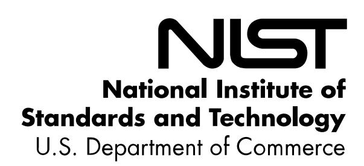
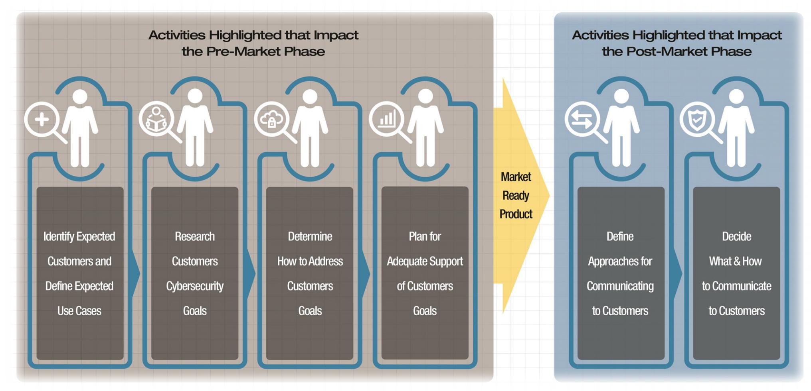
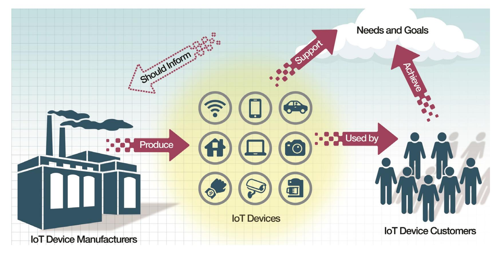
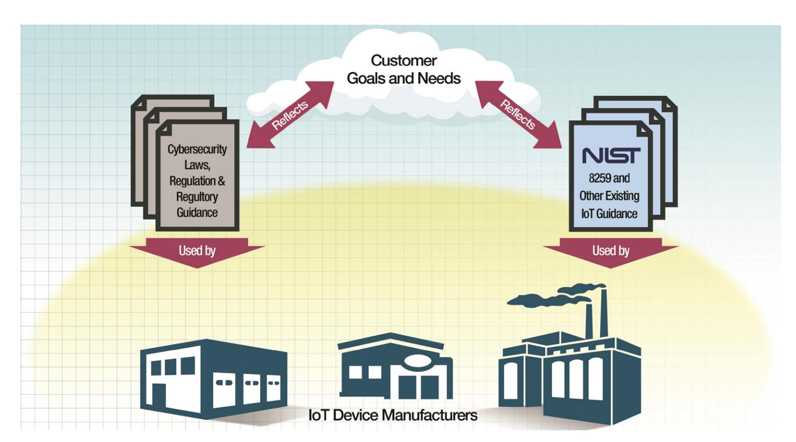

{0}------------------------------------------------

# **Withdrawn NIST Technical Series Publication**

### **Warning Notice**

The attached publication has been withdrawn (archived), and is provided solely for historical purposes. It may have been superseded by another publication (indicated below).

| Withdrawn Publication                                                            |                                                                                  |  |  |  |
|----------------------------------------------------------------------------------|----------------------------------------------------------------------------------|--|--|--|
| Series/Number                                                                    | NIST Internal Report 8259                                                        |  |  |  |
| Title                                                                            | Foundational Cybersecurity Activities for IoT Device Manufacturers               |  |  |  |
| Publication Date(s)                                                              | May 2020                                                                         |  |  |  |
| Withdrawal Date                                                                  | April 20, 2026                                                                   |  |  |  |
| Withdrawal Note                                                                  | NIST IR 8259 is superseded and replaced in its entirety by NIST IR 8259r1        |  |  |  |
| (if applicable) Superseding Publication(s)                                    |                                                                                  |  |  |  |
| The attached publication has been superseded by the following publication(s): |                                                                                  |  |  |  |
| Series/Number                                                                    | NIST IR 8259r1                                                                   |  |  |  |
| Title                                                                            | Foundational Cybersecurity Activities for IoT Product Manufacturers              |  |  |  |
| Author(s)                                                                        | Michael Fagan; Katerina N. Megas; Barbara Cuthill; Jeffrey Marron; Brad Hoehn |  |  |  |
| Publication Date(s)                                                              | April 20, 2026                                                                   |  |  |  |
| URL/DOI                                                                          | https://doi.org/10.6028/NIST.IR.8259r1                                           |  |  |  |
| Additional Information (if applicable)                                           |                                                                                  |  |  |  |
| Contact                                                                          | Computer Security Division (Information Technology Laboratory)                   |  |  |  |
| Latest revision of the                                                           |                                                                                  |  |  |  |
| attached publication                                                             |                                                                                  |  |  |  |
| Related Information                                                              | https://csrc.nist.gov/pubs/ir/8259/r1/final                                      |  |  |  |
| Withdrawal                                                                       |                                                                                  |  |  |  |
|                                                                                  |                                                                                  |  |  |  |

Date updated: April 20, 2026

**Announcement Link**

{1}------------------------------------------------

# **NISTIR 8259**

# **Foundational Cybersecurity Activities for IoT Device Manufacturers**

Michael Fagan Katerina N. Megas Karen Scarfone Matthew Smith

This publication is available free of charge from: https://doi.org/10.6028/NIST.IR.8259

{2}------------------------------------------------

# **NISTIR 8259**

# **Foundational Cybersecurity Activities for IoT Device Manufacturers**

Michael Fagan Katerina N. Megas *Applied Cybersecurity Division Information Technology Laboratory*

> Karen Scarfone *Scarfone Cybersecurity Clifton, VA*

Matthew Smith *Huntington Ingalls Industries Annapolis Junction, MD*

This publication is available free of charge from: https://doi.org/10.6028/NIST.IR.8259

May 2020

U.S. Department of Commerce *Wilbur L. Ross, Jr., Secretary*

National Institute of Standards and Technology *Walter Copan, NIST Director and Under Secretary of Commerce for Standards and Technology*

{3}------------------------------------------------

#### National Institute of Standards and Technology Interagency or Internal Report 8259 36 pages (May 2020)

This publication is available free of charge from: https://doi.org/10.6028/NIST.IR.8259

Certain commercial entities, equipment, or materials may be identified in this document in order to describe an experimental procedure or concept adequately. Such identification is not intended to imply recommendation or endorsement by NIST, nor is it intended to imply that the entities, materials, or equipment are necessarily the best available for the purpose.

There may be references in this publication to other publications currently under development by NIST in accordance with its assigned statutory responsibilities. The information in this publication, including concepts and methodologies, may be used by federal agencies even before the completion of such companion publications. Thus, until each publication is completed, current requirements, guidelines, and procedures, where they exist, remain operative. For planning and transition purposes, federal agencies may wish to closely follow the development of these new publications by NIST.

Organizations are encouraged to review all draft publications during public comment periods and provide feedback to NIST. Many NIST cybersecurity publications, other than the ones noted above, are available at [https://csrc.nist.gov/publications.](https://csrc.nist.gov/publications)

#### **Comments on this publication may be submitted to:**

National Institute of Standards and Technology Attn: Applied Cybersecurity Division, Information Technology Laboratory 100 Bureau Drive (Mail Stop 2000) Gaithersburg, MD 20899-2000 Email: [iotsecurity@nist.gov](mailto:iotsecurity@nist.gov)

All comments are subject to release under the Freedom of Information Act (FOIA).

{4}------------------------------------------------

# **Reports on Computer Systems Technology**

The Information Technology Laboratory (ITL) at the National Institute of Standards and Technology (NIST) promotes the U.S. economy and public welfare by providing technical leadership for the Nation's measurement and standards infrastructure. ITL develops tests, test methods, reference data, proof of concept implementations, and technical analyses to advance the development and productive use of information technology. ITL's responsibilities include the development of management, administrative, technical, and physical standards and guidelines for the cost-effective security and privacy of other than national security-related information in federal information systems.

## **Abstract**

Internet of Things (IoT) devices often lack device cybersecurity capabilities their customers organizations and individuals—can use to help mitigate their cybersecurity risks. Manufacturers can help their customers by improving how securable the IoT devices they make are by providing necessary cybersecurity functionality and by providing customers with the cybersecurity-related information they need. This publication describes recommended activities related to cybersecurity that manufacturers should consider performing before their IoT devices are sold to customers. These foundational cybersecurity activities can help manufacturers lessen the cybersecurity-related efforts needed by customers, which in turn can reduce the prevalence and severity of IoT device compromises and the attacks performed using compromised devices.

# **Keywords**

cybersecurity risk; Internet of Things (IoT); manufacturing; risk management; risk mitigation; securable computing devices; software development.

# **Acknowledgments**

The authors wish to thank all contributors to this publication, including the participants in workshops and other interactive sessions; the individuals and organizations from the public and private sectors, including manufacturers from various sectors as well as several manufacturer trade organizations, who provided feedback on the preliminary essay and the public comment drafts; and colleagues at NIST who offered invaluable inputs and feedback. Special thanks to Cybersecurity for IoT Program team members Barbara Cuthill and Jeff Marron and the NIST FISMA Implementation Project team for their extensive help in copy editing.

#### **Audience**

The main audience for this publication is IoT device manufacturers. This publication may also help IoT device customers that use IoT devices and want to better understand what device cybersecurity capabilities they may offer and what cybersecurity information their manufacturers may provide.

# **Trademark Information**

All registered trademarks and trademarks belong to their respective organizations.

{5}------------------------------------------------

# **Patent Disclosure Notice**

*NOTICE: ITL has requested that holders of patent claims whose use may be required for compliance with the guidance or requirements of this publication disclose such patent claims to ITL. However, holders of patents are not obligated to respond to ITL calls for patents and ITL has not undertaken a patent search in order to identify which, if any, patents may apply to this publication.*

*As of the date of publication and following call(s) for the identification of patent claims whose use may be required for compliance with the guidance or requirements of this publication, no such patent claims have been identified to ITL.* 

*No representation is made or implied by ITL that licenses are not required to avoid patent infringement in the use of this publication.*

{6}------------------------------------------------

# **Executive Summary**

Manufacturers are creating an incredible variety and volume of internet-ready devices broadly known as the Internet of Things (IoT). Many of these IoT devices do not fit the standard definitions of information technology (IT) devices that have been used as the basis for defining device cybersecurity capabilities (e.g., smartphones, servers, laptops). The IoT devices in scope for this publication have at least one transducer (sensor or actuator) for interacting directly with the physical world and at least one network interface (e.g., Ethernet, Wi-Fi, Bluetooth, Long-Term Evolution [LTE], Zigbee, Ultra-Wideband [UWB]) for interfacing with the digital world. The IoT devices in scope for this publication can function on their own, although they may be dependent on specific other devices (e.g., an IoT hub) or systems (e.g., a cloud) for some functionality.

Many IoT devices have computing functionality, data storage, and network connectivity along with functionality associated with equipment that previously lacked these computing functions (e.g., smart appliances). In turn, these functions enable new efficiencies and technological capabilities for the equipment, such as remote access for monitoring, configuration, and troubleshooting. IoT can also enable the collection and analysis of data about the physical world and use the results to better inform decision making, alter the physical environment, and anticipate future events [\[1\].](#page-34-0)

IoT devices are acquired and used by many customers: individuals, companies, government agencies, educational institutions, and other organizations. Unfortunately, IoT devices often lack device capabilities that customers can use to help mitigate their cybersecurity risks, such as the functionality customers routinely expect their desktop and laptop computers, smartphones, tablets, and other IT devices to have. Consequently, IoT device customers may have to select, implement, and manage additional or new cybersecurity controls or alter the controls they already have. Compounding this task, customers may not know they need to alter their existing processes to accommodate the unique characteristics of IoT. The result is many IoT devices are not secured in the face of evolving threats; therefore, attackers can more easily compromise IoT devices and use them to harm device customers and conduct additional nefarious acts (e.g., distributed denial of service [DDoS] attacks) against other organizations.[1](#page-6-0)

The purpose of this publication is to give manufacturers recommendations for improving how *securable* the IoT devices they make are. This means the IoT devices offer *device cybersecurity capabilities*—cybersecurity features or functions the devices provide through their own technical means (i.e., device hardware and software)—that customers, both organizations and individuals, need to secure the devices when used within their systems and environments. IoT device manufacturers will also often need to perform actions or provide services that their customers expect and/or need to plan for and maintain the cybersecurity of the device within their systems and environments. From this publication, IoT device manufacturers will learn how they can help

1 In 2017, Executive Order 13800, Strengthening the Cybersecurity of Federal Networks and Critical Infrastructure [\[2\],](#page-34-1) was issued to improve the Nation's cyber posture and capabilities in the face of intensifying threats. The Executive Order tasked the Department of Commerce and Department of Homeland Security with creating the Enhancing Resilience Against Botnets Repor[t \[3\]](#page-34-2) to determine how to stop attacker use of botnets to perform DDoS attacks. This report contained many action items, and this publication fulfills two of them: to create a baseline of cybersecurity capabilities for IoT devices, and to publish cybersecurity practices for IoT device manufacturers.

{7}------------------------------------------------

IoT device customers by carefully considering which device cybersecurity capabilities to design into their devices for customers to use in managing their cybersecurity risks.

This publication describes six recommended foundational cybersecurity activities that manufacturers should consider performing to improve the securability of the new IoT devices they make. Four of the six activities primarily impact decisions and actions performed by the manufacturer before a device is sent out for sale (pre-market), and the remaining two activities primarily impact decisions and actions performed by the manufacturer after device sale (postmarket). Performing all six activities can help manufacturers provide IoT devices that better support the cybersecurity-related efforts needed by IoT device customers, which in turn can reduce the prevalence and severity of IoT device compromises and the attacks performed using compromised IoT devices. These activities are intended to fit within a manufacturer's existing development process and may already be achieved in whole or part by that existing process.

Note that this publication is intended to inform the manufacturing of new devices and not devices that are already produced or in production, although some of the information in this publication might also be applicable to such devices.

### **Activities with Primarily Pre-Market Impact**

- **Activity 1: Identify expected customers and users, and define expected use cases.** Identifying the expected customers and users, as well as the end users' expected use cases for an IoT device early in its design is vital for determining which device cybersecurity capabilities the device should implement and how it should implement them.
- **Activity 2: Research customer cybersecurity needs and goals.** Customers' risks drive their cybersecurity needs and goals. Manufacturers cannot completely understand or anticipate all of their customers' risks. However, manufacturers can make their devices at least minimally securable by those they expect to be customers of their product and who use them consistent with the expected use cases.
- **Activity 3: Determine how to address customer needs and goals.** Manufacturers can determine how to address those needs and goals by having their IoT devices provide particular device cybersecurity capabilities in order to help customers mitigate their cybersecurity risks. To provide a starting point to use in identifying the necessary device cybersecurity capabilities, a companion publication is provided, NISTIR 8259A, *IoT Device Cybersecurity Capability Core Baseline* [\[4\],](#page-34-3) which is a set of device cybersecurity capabilities that customers are likely to need to achieve their goals and fulfill their needs.
- **Activity 4: Plan for adequate support of customer needs and goals.** Manufacturers can help make their IoT devices more securable by appropriately provisioning device hardware and software resources to support the desired device cybersecurity capabilities. They should also consider business resources necessary to support development and continued support of the IoT device in ways that support customer needs and goals (e.g., secure coding practices, vulnerability response and flaw remediation).

{8}------------------------------------------------

#### **Activities with Primarily Post-Market Impact**

- **Activity 5: Define approaches for communicating to customers.** Many customers will benefit from manufacturers communicating to them more clearly about cybersecurity risks involving the IoT devices the manufacturers are currently selling or have already sold. This communication could be targeted at the customer directly or others acting on the customers' behalf, such as an internet service provider or a managed security services provider, depending on context and roles.
- **Activity 6: Decide what to communicate to customers and how to communicate it.** There are many potential considerations for what information a manufacturer communicates to customers for a particular IoT product and how that information will be communicated. Examples of topics are:
  - o Cybersecurity risk-related assumptions that the manufacturer made when designing and developing the device
  - o Support and lifespan expectations, such as expected term of support, what process will guide end-of-life, will any functions of the device remain after its end-of-life, how customers can communicate with the manufacturer about suspected vulnerabilities during and even after the end of device support, and how customers may be able to maintain securability after support ends and at end-of-life
  - o Device composition and capabilities, such as information about the device's software, hardware, services, functions, and data types
  - o Software updates, such as if updates will be available, when, how and by whom they will be distributed, and how customers can verify source and content of a software update
  - o Device retirement options, such as if and how a customer can securely transfer ownership of the device, and whether the customer can render the device inoperable for disposal
  - o Device cybersecurity capabilities that the device provides, as well as cybersecurity functions that can be provided by a related device or a manufacturer service or system

{9}------------------------------------------------

# **Table of Contents**

|   |                                                                                         | Executive Summary   |                                                                           | iv |  |
|---|-----------------------------------------------------------------------------------------|---------------------|---------------------------------------------------------------------------|----|--|
| 1 |                                                                                         | Introduction     |                                                                           |    |  |
|   | 1.1                                                                                     |                     | Purpose and Scope                                                      | 1  |  |
|   | 1.2                                                                                     |                     | Publication Structure                                                     | 2  |  |
| 2 |                                                                                         | Background  3 |                                                                           |    |  |
| 3 | Manufacturer Activities Impacting the IoT Device Pre-Market Phase  6              |                     |                                                                           |    |  |
|   | 3.1                                                                                     |                     | Activity 1: Identify Expected Customers and Define Expected Use Cases  | 6  |  |
|   | 3.2                                                                                     |                     | Activity 2: Research Customer Cybersecurity Needs and Goals            | 7  |  |
|   | 3.3                                                                                     |                     | Activity 3: Determine How to Address Customer Needs and Goals             | 11 |  |
|   | 3.4                                                                                     |                     | Activity 4: Plan for Adequate Support of Customer Needs and Goals      | 14 |  |
| 4 |                                                                                         |                     | Manufacturer Activities Impacting the IoT Device Post-Market Phase     | 17 |  |
|   | 4.1                                                                                     |                     | Activity 5: Define Approaches for Communicating to Customers              | 17 |  |
|   | 4.2 Activity 6: Decide What to Communicate to Customers and How to Communicate It |                     |                                                                           | 18 |  |
|   |                                                                                         | 4.2.1               | Cybersecurity Risk-Related Assumptions                                    | 18 |  |
|   |                                                                                         | 4.2.2               | Support and Lifespan Expectations                                         | 19 |  |
|   |                                                                                         | 4.2.3               | Device Composition and Capabilities                                    | 20 |  |
|   |                                                                                         | 4.2.4               | Software Updates                                                          | 21 |  |
|   |                                                                                         | 4.2.5               | Device Retirement Options                                                 | 22 |  |
|   |                                                                                         | 4.2.6               | Technical and Non-Technical Means                                      | 22 |  |
| 5 |                                                                                         | Conclusion          |                                                                           | 24 |  |
|   |                                                                                         |                     | References                                                                | 25 |  |
|   |                                                                                         |                     | List of Appendices                                                        |    |  |
|   |                                                                                         |                     |                                                                           |    |  |
|   | Appendix A—                                                                             |                     | Acronyms and Abbreviations                                             | 26 |  |
|   | Appendix B—                                                                             |                     | Glossary                                                               | 27 |  |

{10}------------------------------------------------

## **1 Introduction**

#### **1.1 Purpose and Scope**

The purpose of this publication is to give manufacturers recommendations for improving how *securable* the Internet of Things (IoT) devices they make are. This means the IoT devices offer *device cybersecurity capabilities*—cybersecurity features or functions the devices provide through their own technical means (i.e., device hardware and software)—that device customers, including both organizations and individuals, need to secure them within their systems and environments. IoT device manufacturers will also often need to perform actions or provide services that their customers expect and/or need to plan for and maintain the cybersecurity of the device within their systems and environments. From this publication, IoT device manufacturers will learn how they can help IoT device customers with cybersecurity risk management by carefully considering which device cybersecurity capabilities to design into their devices for customers to use in managing their cybersecurity risks and which actions or services may also be needed to support the IoT device's securability and their customers' needs.

The publication is intended to address a wide range of IoT devices. The IoT devices in scope for this publication have at least one transducer (sensor or actuator) for interacting directly with the physical world and at least one network interface (e.g., Ethernet, Wi-Fi, Bluetooth, Long-Term Evolution [LTE], Zigbee, Ultra-Wideband [UWB]) for interfacing with the digital world. Components of a device, such as a processor or a sensor that transmits data to a purpose-built base station[2](#page-10-2) , that cannot function at all on their own are outside the scope of this publication.

Some IoT devices may be dependent on specific other devices (e.g., an IoT hub) or systems (e.g., a cloud) for some functionality. IoT devices will be used in systems and environments with many other devices and components, some of which may be IoT devices, while others may be conventional information technology (IT) equipment. All parts of and roles within the IoT ecosystem, other than the IoT devices themselves and the manufacturer's roles related to cybersecurity of those devices, are outside the scope of this publication.

This publication is intended to inform the manufacturing of new devices and not devices that are already in production, although some of the information in this publication might also be applicable to such devices.

Readers do not need a technical understanding of IoT device composition and capabilities, but a basic understanding of cybersecurity principles is assumed.

2 In both cases, these components are expected to be used along with other components to form an IoT device, but may play a role in the securability of an IoT device (see Section 3.4). Since the focus of this publication is securability of the IoT device for the purposes of the customer, some or all of the concepts discussed may not apply to components.

{11}------------------------------------------------

#### **1.2 Publication Structure**

The remainder of this publication is organized into the following sections and appendices:

- Section 2 provides background on how manufacturers play a key role in how securable their IoT devices are for their customers, such as which cybersecurity risk mitigation areas that customers commonly need to address and understanding how the device may provide support for those areas.
- Sections 3 and 4 describe activities that manufacturers should consider performing before their IoT devices are sold to customers in order to improve how securable the IoT devices are for the customers.
  - o Section 3 includes activities that primarily impact securability efforts by the manufacturer before device sale. The Section 3 activities are: identifying expected customers and defining expected use cases, researching customer cybersecurity needs and goals, determining how to address customer needs and goals, and planning for adequate support of customer needs and goals.
  - o Section 4 includes activities that primarily impact securability efforts by the manufacturer after device sale. The Section 4 activities are: defining approaches for communicating with customers regarding IoT device cybersecurity, and deciding what to communicate to customers and how to communicate it.
- Section 5 provides a conclusion for the publication.
- The References section lists the references for the publication.
- Appendix A provides an acronym and abbreviation list.
- Appendix B contains a glossary of selected terms used in the publication.

{12}------------------------------------------------

# **2 Background**

This section provides an overview of the background concepts needed to understand the rest of the publication.

From a manufacturer's perspective, the *pre-market* phase of an IoT device's life encompasses what the manufacturer does *before* the device is marketed and sold to customers. Any actions the manufacturer takes for an IoT device after it is sold, such as addressing vulnerabilities, delivering updated or new device capabilities, or providing cybersecurity information to customers, are considered part of the *post-market* phase. Manufacturers are generally best able to identify and incorporate plans for the device cybersecurity capabilities their devices will have early in the premarket phase. Later in the pre-market phase, making design or implementation changes is usually more complicated and costly, and might necessitate delaying the release of the device. Once a device is on the market, many cybersecurity changes may no longer be viable because of hardware constraints, and those that can still be accomplished may be much more costly and difficult than if they had been done pre-market.

Sections 3 and 4 of this publication describe cybersecurity activities and related planning that manufacturers should consider performing during the pre-market phase for an IoT device. Section 3 covers activities that primarily impact other pre-market activities, while Section 4 discusses activities that primarily impact post-market activities. The activities in Sections 3 and 4 focus on key cybersecurity activities and represent a subset of what manufacturers may need to do during their product development process and are not intended to be comprehensive. For example, manufacturers will also find it easier to design and produce securable IoT devices if they ensure their workforce has the necessary skills to perform the activities in Sections 3 and 4.

**Figure 1: Activities Discussed in this Publication Grouped by Phase Impacted**

{13}------------------------------------------------

[Figure 1](#page-12-1) shows the foundational cybersecurity activities covered in this publication, arranged by the phase in which the outcomes of the activities will be used to increase device securability. As indicated in the figure, activities highlighted for each phase build on each other within that phase such that each pre-market activity will build on the outcomes of prior activities. While highlighted activities impacting the post-market phase may use artifacts and outcomes from premarket activities, they may also draw on other sources of guidance and information. The moment at which a device is considered to have "gone to market" will vary by product, manufacturer, and circumstance, but is defined as when a manufactured device is no longer under the control of the manufacturer (i.e., when it has been released to an intermediary, such as a retailer, or to endcustomers). Activities primarily impacting the post-market phase, though intended to help the securability of IoT devices after or as they are sold (e.g., by helping inform customers how a device can help meet their cybersecurity needs and goals, which may or may not include risk mitigation goals), should be planned to start in the pre-market phase.

Improving the securability of an IoT device for customers means helping customers meet their risk mitigation goals, which involves identifying and addressing a set of risk mitigation areas. Even customers without formal risk mitigation goals, such as home consumers, often have informal and indirect cybersecurity goals, like having their IoT device provide the desired functionality as expected (e.g., automatically), that are dependent to some extent on addressing risk mitigation areas. Based on an analysis of existing NIST publications such as the SP 800-53 [\[5\]](#page-34-5) and the Cybersecurity Framework [\[6\]](#page-34-6) and the characteristics of IoT devices, NISTIR 8228 [\[7\]](#page-34-7) identified the common risk mitigation areas for IoT devices as:

- **Asset Management:** Maintain a current, accurate inventory of all IoT devices and their relevant characteristics throughout the devices' lifecycles in order to use that information for cybersecurity risk management purposes. Being able to distinguish each IoT device from all others is needed for the other common risk mitigation areas—vulnerability management, access management, data protection, and incident detection.
- **Vulnerability Management:** Identify and mitigate known vulnerabilities in IoT device software throughout the devices' lifecycles in order to reduce the likelihood and ease of exploitation and compromise. Vulnerabilities can be eliminated by installing updates (e.g., patches) and changing configuration settings. Updates can also correct IoT device operational problems, which can improve device availability, reliability, performance, and other aspects of device operation. Customers often want to alter a device's configuration settings for a variety of reasons, including cybersecurity, interoperability, privacy, and usability.
- **Access Management:** Prevent unauthorized and improper physical and logical access to, usage of, and administration of IoT devices throughout the devices' lifecycles by people, processes, and other computing devices. Limiting access to interfaces reduces the attack surface of the device, giving attackers fewer opportunities to compromise it.
- **Data Protection:** Prevent access to and tampering with data at rest or in transit that might expose sensitive information or allow manipulation or disruption of IoT device operations throughout the devices' lifecycles.
- **Incident Detection:** Monitor and analyze IoT device activity for signs of incidents involving device and data security throughout the devices' lifecycles. These signs can

{14}------------------------------------------------

also be useful in investigating compromises and troubleshooting certain operational problems.

Manufacturers of IoT devices can help address these areas by incorporating corresponding device cybersecurity capabilities into their IoT devices. In turn, customers should have fewer challenges in securing those devices since IoT device capabilities will better align with customer expectations. Many of these areas can only be addressed effectively, and most are addressed more efficiently, by device cybersecurity capabilities being built into devices instead of customers providing them through their environments.

Sections 3 and 4 of NISTIR 8228 [\[7\]](#page-34-7) discuss additional cybersecurity-related considerations that manufacturers should be mindful of when identifying the device cybersecurity capabilities IoT devices provide. Also, Tables 1 and 2 in Section 4 of NISTIR 8228 list common shortcomings in IoT device cybersecurity, explain how they can negatively impact customers, and provide the rationales for needing each capability and key element in the core baseline defined in the companion publication, NISTIR 8259A, *IoT Device Cybersecurity Core Baseline* [\[4\].](#page-34-3)

For many IoT devices, additional types of risks, such as privacy,[3](#page-14-0) safety, reliability, or resiliency, need to be managed simultaneously with cybersecurity risks because of the effects addressing one type of risk can have on others. A common example is ensuring that when a device fails, it does so in a safe manner. Only cybersecurity risks are discussed in this publication. Readers who are interested in better understanding other types of risks and their relationship to cybersecurity may benefit from reading NIST SP 800-82 Revision 2, *Guide to Industrial Control Systems (ICS) Security* [\[8\]](#page-34-8) and NIST SP 1500-201, *Framework for Cyber-Physical Systems: Volume 1, Overview, Version 1.0* from the Cyber-Physical Systems Public Working Group [\[9\].](#page-34-9)

3 A number of current and recent privacy efforts, including the NIST Privacy Framework v1.0 [\(https://www.nist.gov/privacy](https://www.nist.gov/privacy-framework)[framework\)](https://www.nist.gov/privacy-framework), are likely to inform needed IoT device capabilities to support privacy. While the core baseline includes device cybersecurity capabilities that also support privacy, such as protecting the confidentiality of data, it does not include noncybersecurity related device capabilities that support privacy.

{15}------------------------------------------------

# **3 Manufacturer Activities Impacting the IoT Device Pre-Market Phase**

Manufacturers should consider performing the foundational cybersecurity activities described in this section in order to improve how securable the IoT device is for customers (e.g., increase the number or efficacy of customer-expected device cybersecurity capabilities offered on IoT devices). The activities are meant to be conducted in parallel with or as extensions of a manufacturer's other pre-market activities, and they will primarily impact those other pre-market activities. Some of these activities can have broader purposes than cybersecurity (e.g., exploring expected customers and use cases); effort should not be duplicated, and artifacts from all premarket activities can inform cybersecurity-specific actions. The more integrated these suggested activities are with other pre-market activities, the better cybersecurity is likely to be planned for and implemented in IoT devices.

#### **3.1 Activity 1: Identify Expected Customers and Define Expected Use Cases**

Identifying the expected customers for an IoT device early in its design is vital for determining which device cybersecurity capabilities the device should implement and how it should implement them. For example, a large company might need a device to integrate with its log management servers, but a typical home customer would not. Manufacturers can answer questions like the following:

- 1. **Which types of people are expected customers for this device?** (e.g., musicians, small business owners, cyclists, police officers, chefs, home builders, preschoolers, electrical engineers)
- 2. **Which types of organizations are expected customers for this device?** (e.g., individual home users, small retail businesses, large hospitals, energy companies with solar farms, educational institutions with buses)

*Customers* are the individuals or organizations who purchase and deploy an IoT device and will commonly act as administrators of the device for cybersecurity purposes, making use of device cybersecurity capabilities to help achieve their needs and goals. In addition to customers, some IoT devices may have other *users* who did not purchase the equipment, but nonetheless interact with the device and may have cybersecurity needs and goals as well. Most customers act as a user of the IoT devices they purchase, but not all IoT devices have users in addition to the customer. The rest of this publication will refer to customers as every IoT device has a customer, but as discussed next, manufacturers should consider *how* a device may be used, including whether there may be users of the IoT device other than the customer.

Another early step in IoT device design is defining expected use cases for the device based on the expected customers. To help define a use case, manufacturers can answer the following questions, based on how they anticipate the device will be reasonably deployed and used:

- 1. **How will the device be used?** (e.g., for a single purpose or for multiple purposes; embedded within another device or not embedded, single user/customer or multiple users; private or commercial use)
- 2. **Where geographically will the device be used?** (e.g., countries, jurisdictions within countries)

{16}------------------------------------------------

- 3. **What physical environments will the device be used in?** (e.g., inside or outside; stationary or moving; public or private; movable or immovable; extreme or specific physical and weather conditions)
- 4. **How long is the device expected to be used for?** (e.g., a few hours; several years; two decades)
- 5. **What dependencies on other systems will the device likely have?** (e.g., requires use of a particular IoT hub; uses cloud-based third-party services for some functionality)
- 6. **How might attackers misuse and compromise the device?** (i.e., potential pairings of threats and vulnerabilities, such as in a threat model including consideration of network connections that may provide a path to the internet that can be used as a vector of attack against other networks or devices, such as a distributed denial of service attack)
- 7. **What other aspects of device use might be relevant to the device's cybersecurity risks?** (e.g., operational characteristics of the device that may have safety, privacy, or other implications for users)

# **3.2 Activity 2: Research Customer Cybersecurity Needs and Goals**

Cybersecurity needs and goals will be primarily, but not entirely, driven by the cybersecurity risks they face. Manufacturers cannot completely understand all of their customers' risks because every customer, system, and IoT device faces unique risks based on many factors. However, manufacturers can consider the expected use cases for their IoT devices, then make their devices at least minimally securable by customers who acquire and use them consistent with those use cases. *Minimally securable* means the devices have the device cybersecurity capabilities customers may need to mitigate some common cybersecurity risks, thus helping to at least partially achieve their goals and fulfill their needs. Customers also have a role in securing their IoT devices and the systems that incorporate those devices, including using additional technical, physical, and procedural means. The degree to which a customer may have a role will vary, but for most customers and use cases, device cybersecurity capabilities built into IoT devices generally make risk mitigation easier and more effective for customers.

Customers will use *means* to achieve their needs and goals. *Means* is defined as "an agent, tool, device, measure, plan, or policy for accomplishing or furthering a purpose [\[10\].](#page-34-10)" This publication refers to technical or non-technical means for cybersecurity purposes, whether performed by an IoT device itself or elsewhere. The term introduced in Section 1, *device cybersecurity capabilities*, refers to technical means being performed by an IoT device itself. In addition to these technical means, there may also be additional technical and non-technical means performed or services offered by the manufacturer that customers will rely on to plan for and maintain the cybersecurity of the device within their systems and environments.

As [Figure 2](#page-17-0) demonstrates, the connections between manufacturers and customers around cybersecurity are important to keep in mind. Customers who buy and use IoT devices are intending to connect those devices to systems and networks, including the internet. As customers adopt these devices, they will seek to secure them in order to meet their goals, or possibly expect securability in line with their needs, which may or may not be articulated by the customer directly. IoT devices that support the device cybersecurity capabilities customers need or expect

{17}------------------------------------------------

will be easier for customers to secure, particularly using mechanisms customers have already implemented. Manufacturers can anticipate many customer cybersecurity goals, especially those based on existing cybersecurity guidance and requirements—for example, customers in a particular sector may be required by regulations to change all default passwords.

**Figure 2: Connections Between IoT Device Manufacturers and Customers Around Cybersecurity**

Cybersecurity risks for IoT devices can be thought of in terms of two high-level risk mitigations. The first is safeguarding the cybersecurity of the device itself—to prevent the device from being misused to negatively impact the customer or to attack other organizations, or from not providing the expected functionality for the customer. The second is safeguarding the confidentiality, integrity, and/or availability of data (including personal information) collected by, stored on, processed by, or transmitted to or from the IoT device.

To gather information on customer needs and goals related to safeguarding the cybersecurity of the device and its data confidentiality, integrity, and availability, manufacturers can answer the following questions for each of the expected use cases:

- 1. **How will the IoT device interact with the physical world?** The potential impact of some IoT devices impacting the physical world, either directly through actuation or indirectly through measurement, could result in operational requirements for performance, reliability, availability, resilience, and safety being at odds with common cybersecurity practices for conventional IT devices. For example, many safety-critical devices must continue to provide some or all functionality in the event of a cybersecurity incident, network issue, or other adverse condition.
- 2. **How will the IoT device need to be accessed, managed, and monitored by authorized people, processes, and other devices?** Examples include the following:
  - The methods likely to be used by device customers to manage the device are important to consider. An IoT device could support integration with common enterprise systems (e.g., asset management, vulnerability management, log management) to give customers with these systems greater control over and visibility

{18}------------------------------------------------

into the device. For an IoT device expected to be used in home environments only, this capability would not be relevant; customers would expect a user-friendly way to manage their devices, or even want the manufacturer to perform all device management on their behalf (e.g., install patches automatically). An IoT device used by a small business might also be managed by a third party on behalf of the business.

- Making a device highly configurable is generally more desirable in organization environments and less so in home customer settings. A home customer is less likely to understand the significance of granular cybersecurity configuration settings and thus misconfigure a device, weakening its security and increasing the likelihood of a compromise. Some home customers are also unlikely to want to change configuration settings after initial device deployment. However, some configuration settings, such as enabling or disabling clock synchronization services for the device and choosing a time server to use for clock synchronization, may be desired by many customers, including industrial, enterprise, and home customers. Device configuration might be entirely omitted in cases where the device does not need to be provisioned or customized in any way during or after deployment (e.g., does not need to be joined to a wireless network, does not need to be associated with a particular user).
- Consider how accessible the device is, either logically or physically. Imagine an IoT food vending machine in a public place, which is internet connected so suppliers can track inventory and machine status. Vending machine users would not be required to authenticate themselves in order to insert money and purchase a snack. However, the vending machine would also be highly susceptible to physical attack.
- Consider whether the IoT device should or must have an open application programming interface (API) to support third-party integration, support, or development. Access to an API should be carefully considered and managed as a logical interface, since it can offer significant access and functionality to authorized entities.
- Consider allowing customers to disable device cybersecurity capabilities that may negatively impact operations. An example is a capability intended to deter brute force attacks against passwords, such as locking out an account after too many failed authentication attempts. Such a capability can inadvertently cause a denial of service for the person or device attempting to authenticate. In safety-critical environments, such disruptions to access may not be acceptable because of the danger they would cause. Customers often need flexibility in configuring such features or disabling them altogether.
- Consider expectations about device lifespan and how that may impact which device cybersecurity capabilities are feasible over the expected lifespan. Some device cybersecurity features, such as software updates, will require ongoing development and effort to provide the intended cybersecurity benefits. Additionally, some IoT devices may have non-IT based features that can and may be expected to outlive the anticipated cybersecurity or functionality lifespan for IT components of the device.
- 3. **What are the known cybersecurity requirements for the IoT device?** Manufacturers can identify known requirements in their use cases, such as sector-specific cybersecurity regulations, country-specific laws, contractual obligations, or customer expectations and

{19}------------------------------------------------

conventions so they can be mindful of those requirements during device capability identification.

4. **How might the IoT device's use of device cybersecurity capabilities be interfered with by the device's operational or environmental characteristics?** For example, devices expected to be used on low bandwidth or unreliable networks might not be able to use certain device capabilities, such as a secure update mechanism. Depending on such a network for downloading large updates might saturate the network connection, disrupting other usage, and take too long to get updates to the device. Manufacturers could consider alternative update strategies, such as changing their processes to reduce update sizes, or distributing updates to administrators on high-speed network connections and having the administrators manually transfer the updates to the IoT device (which introduces additional cybersecurity risks from malware being transmitted by removable media that may need to be mitigated).

As another example, some IoT devices, such as connected medical equipment, may provide critical non-IT-based functionality to customers, so customers may need these device functions to continue operating even during a degraded cybersecurity state or when IT-related functionality (e.g., an internet connection) is unavailable. Careful consideration of device behavior in the face of degraded cybersecurity or reduced network or data access is important for manufacturers so they can best determine how a device should handle adverse conditions.

- 5. **What will the nature of the IoT device's data be?** There is a great deal of variability in data stored by IoT devices; some devices do not store any data, while others store data that could cause significant harm if accessed or modified by unauthorized entities. Understanding the nature of expected data on a device in the context of the customers and use cases can help manufacturers identify which device cybersecurity capabilities may be needed for protecting device data, such as data encryption, device and user authentication, data validation, access control, and backup/restore.
- 6. **What is the degree of trust in the IoT device that customers may need?** Customers may expect certain device cybersecurity capabilities and implementations that allow for specific assurances about the cybersecurity of the device and/or data. For example, in some contexts, additional trust that data is protected could be achieved by adding protection of data in use within the device. This would go beyond the usual goals of data protection (e.g., protecting data at rest and in transit).
- 7. **What complexities will be introduced by the IoT device interacting with other devices, systems, and environments?** For example, complexity can be driven by new uses of IoT and IoT devices, new combinations of those devices with each other and conventional IT devices, and increasing interconnections among devices and systems. These complexities could mean new functionality, which may have human-safety or privacy implications, that will be connected via networking technologies to systems that do not appropriately mitigate these risks. An IoT device that can stream images from inside the home, such as a smart baby monitor, or that can alter the environment to the point of danger, such as a smart oven, might require safeguards not usually considered for conventional IT devices. IoT can also introduce complexities related to scale, which could make ongoing management and support of devices difficult.

{20}------------------------------------------------

As [Figure 3](#page-20-1) conceptually depicts, IoT device manufacturers can use a variety of sources to gather the information they need to answer these questions and others. In some instances, expected customers and use cases will point to existing laws, regulations, or voluntary guidance for cybersecurity and other aspects of device operation. For example, IoT devices intended to be used by the federal government would be secured using controls derived from system cybersecurity guidance for federal agencies (e.g., NIST SP 800-53 [\[6\],](#page-34-5) Cybersecurity Framework [\[7\]\)](#page-34-6), which in some cases identifies or implies specific device cybersecurity capabilities that an agency would need to support controls on their system. For some use cases, guidance may go beyond cybersecurity risks but will still have direct or indirect implications for cybersecurity, such as devices in the medical sector needing to comply with Food and Drug Administration (FDA) regulations and the Health Insurance Portability and Accountability Act (HIPAA). It is possible that in order to meet FDA recommendations and HIPAA requirements, an IoT device may need strict data confidentiality, integrity, and/or availability protections well beyond what is included in an average IoT device. By understanding these regulations in the context of their device and its expected use case, manufacturers can determine if and how to best support their customers' needs and goals in the medical sector. Many industrial sectors will also have consensus and/or voluntary guidance that is expected to be followed by their stakeholders in various forms such as frameworks, baselines, and best practices, just to name a few.

**Figure 3: Customer Cybersecurity Needs and Goals Reflected in and Informed by Many Applicable Regulations and Guidance Documents**

For some customers or sectors, such explicit written guidance may not be readily available or usable (e.g., due to high variability in needs and goals for customers within a sector). For devices intended to be used by these customers, ascertaining their needs and goals may require use of other forms of information, such as gathering information directly from customers or conducting secondary research to gain a better understanding of their needs and goals.

#### **3.3 Activity 3: Determine How to Address Customer Needs and Goals**

After researching the cybersecurity needs and goals for the IoT device's expected customers and use cases, manufacturers can determine how to address those needs and goals in order to help

{21}------------------------------------------------

customers mitigate cybersecurity risks. For each cybersecurity need or goal, the manufacturer can answer this question: **which one or more of the following is a suitable means (or combination of means) to achieve the need or goal?**

- The IoT device can provide the technical means through its device cybersecurity capabilities (for example, by using device cybersecurity capabilities built into the device's operating system, or by having the device's application software provide device cybersecurity capabilities).
- Another device related to the IoT device (e.g., an IoT gateway or hub also from the manufacturer, a third-party IoT gateway or hub) can provide the technical means on behalf of the IoT device (e.g., acting as an intermediary between the IoT device and other networks while providing command and control functionality for the IoT device).
- Other systems and services that may or may not be acting on behalf of the manufacturer can provide the technical means (e.g., a cloud-based service that securely stores data for each IoT device, internet service providers and other infrastructure providers).
- In addition to and support of technical means, non-technical means can also be provided by manufacturers or other organizations and services acting on behalf of the manufacturer (e.g., communication of lifespan and support expectations, disclosure of flaw remediation plans).
- The customer can select and implement other technical and non-technical means for mitigating cybersecurity risks. (The customer can also choose to respond to cybersecurity risks in other ways, including accepting or transferring it.) For example, an IoT device may be intended for use in a customer facility with stringent physical security controls in place.

Note that there is not necessarily a one-to-one correspondence between needs or goals and means; for example, it may take multiple technical means to achieve a goal, and a single technical means may help address multiple goals. Additionally, not all needs and goals can or need to be addressed using only technical means, and some technical means themselves may require additional non-technical means for initial and on-going securability (e.g., knowledge of which device cybersecurity capabilities are available on an IoT device, ability to gather and apply software updates).

In addition to identifying suitable means for addressing each cybersecurity need and goal, manufacturers can also answer this question related to the technical means provided through their IoT device: **how robustly must each technical means be implemented in order to achieve the cybersecurity need or goal?** Robustness of technical means refers to the overall strength of the means' implementations and is related to the trust a customer may expect to have in their IoT device. If a device is expected to be more trusted by customers, particularly to remain in a secure state and stay outside the control or access of unauthorized entities, then it is likely that technical means implemented on or with that device will have to be more robust. Here are some examples of potential robustness considerations:

• Whether it needs to be implemented in hardware and/or software (e.g., a cryptographic hardware component paired with software to use the hardware's functionality)

{22}------------------------------------------------

- Which data needs to be protected, what types of protection each instance of data needs (i.e., confidentiality, integrity, availability), and how strong that protection needs to be
- How strongly an entity's identity needs to be authenticated before granting access if the entity is a human (e.g., PIN, password, passphrase, two-factor authentication) or system/device (e.g., API keys, certificates)
- Whether data received by or inputted into the device needs to be validated (e.g., to confirm the legitimacy of an update, to restrict the ability of malformed data to bypass access controls)
- How readily software updates can be reverted if a problem occurs (e.g., a rollback capability, an anti-rollback capability)

Ultimately, manufacturers can aggregate the technical means identified for all the needs and goals to answer the following question: **which technical means will be provided by the IoT device itself, other devices related to the IoT device, other systems and services acting on behalf of the manufacturer, and the customer, and how robust should each of those means be?** The rest of this section focuses on the first part of the question: which technical means will be provided by the IoT device itself—in other words, device cybersecurity capabilities?

Identifying the device cybersecurity capabilities that the device itself needs to provide should happen as early as feasible in device design processes so the capabilities can be taken into account when selecting or designing IoT device hardware and software. To provide manufacturers a starting point to use in identifying the necessary device cybersecurity capabilities for their IoT devices, a companion publication, NISTIR 8259A, *IoT Device Cybersecurity Capability Core Baseline* defines a device cybersecurity capability core baseline (*core baseline*),[4](#page-22-0) which is a set of device capabilities generally needed to support common cybersecurity controls that protect the customer's devices and device data, systems, and ecosystems. The core baseline has been derived from common cybersecurity risk management approaches, listed in NISTIR 8259A.

The core baseline is just one set of device cybersecurity capabilities that may be needed in an IoT device, and manufacturers should consult other sources to derive or identify appropriate device cybersecurity capabilities and implementations for expected customers and use cases, as discussed in Section [3.2.](#page-16-0) Manufacturers can follow a process of linking cybersecurity mitigation, needs, and goals with specific device cybersecurity capabilities. This process was used to make the core baseline defined in NISTIR 8259A, where high-level cybersecurity mitigations, needs, and goals common across many customers were used to determine the common device cybersecurity capabilities needed by many of these customers. Manufacturers can then implement these capabilities within their IoT devices to help as many customers achieve as many of their goals as is feasible. Likewise, additional baselines of IoT device cybersecurity

4 The usage of the term "baseline" in this publication should not be confused with the low-, moderate-, and high-impact system control baselines set forth in NIST Special Publication (SP) 800-53, Security and Privacy Controls for Federal Information Systems and Organization[s \[6\]](#page-34-5) to help federal agencies meet their obligations under the Federal Information Security Modernization Act (FISMA) and other federal policies. In that context, the low-, moderate-, and high-impact control baselines apply to an information system, which may include multiple components, including devices. In this publication, "baseline" is used in the generic sense to refer to a set of foundational requirements or recommendations that would apply to individual IoT devices intended to be used as components within systems.

{23}------------------------------------------------

capabilities may exist from NIST or others, some of which may be designed to address the needs of particular customer groups, industrial sectors, use cases, etc. These resources, like the core baseline, can help manufacturers more quickly identify necessary device cybersecurity capabilities for the context their IoT device will be used. NIST might also release additional publications in the NISTIR 8259 series that define more capability baselines.

Since device cybersecurity capabilities will be decided and shaped by customer and use case context, different IoT devices will need different sets of device cybersecurity capabilities. The broad and high level of the core baseline means that it will need to be profiled for specific IoT devices based on the specific needs and goals related to the devices in the contexts within which they are expected to be used. Needs and goals can be guided by IoT device sector (e.g., medical, home, critical infrastructure), use case (e.g., life-critical actuator, safety-critical sensor), or other contextual factors (e.g., specific customer needs). Device cybersecurity capabilities from the core baseline can be profiled and built upon in a variety of ways. New or more complex capabilities that were not identified in the core baseline may be included in a device. The core baseline's device cybersecurity capabilities can also be expanded and adapted with new or more specific elements for the capabilities that better align with what specific customers need or prefer.

## **3.4 Activity 4: Plan for Adequate Support of Customer Needs and Goals**

It is important for manufacturers to consider how to support their identified customers' needs and goals beyond the selection of specific device cybersecurity capabilities and their high-level implementations. This includes considering how to provision computing resources to support device cybersecurity capabilities and actions external to the device that may be required to continue to support cybersecurity needs and goals.

Manufacturers can help make their IoT devices more securable by appropriately provisioning device hardware resources (e.g., processing, memory, storage, network technology, power), as well as software resources, to support the desired device cybersecurity capabilities. For example, software-based encryption is processing-intensive, and a device with limited processing and no hardware-based encryption might not be able to provide what customers need. Another example is that some devices cannot support the use of an operating system or Internet Protocol (IP) networks, and one or both of those might be needed to support multiple device cybersecurity capabilities.

When designing or selecting device hardware and software resources, manufacturers can answer the following questions for the expected customers and use cases to help identify provisioning needs and potential issues:

1. **Considering expected terms of support and lifespan, what potential future use needs to be taken into account?** For example, if a device has a 10-year lifespan, it may be necessary to update the encryption algorithm or key length the device uses during that time, and the new algorithm or key length may require more processing resources than the current algorithm or key length. Consider how the device can support cybersecurity needs and goals for the device's lifespan, including "future proofing" of the device cybersecurity capabilities and their implementations.

{24}------------------------------------------------

- 2. **Should an established IoT platform be used instead of acquiring and integrating individual hardware and software components?** An *IoT platform* is a piece of IoT device hardware and/or supporting software already installed and configured for a manufacturer's use as the basis of a new IoT device. An IoT platform might also offer third-party services or applications, or a software development kit (SDK) to help expedite IoT application development. Manufacturers can choose a sufficiently resourced and adequately secure IoT platform instead of designing hardware, installing and configuring an operating system, creating new cloud-based services, writing IoT device applications and mobile apps from scratch, and performing other tasks that are error-prone and generally more likely to introduce new vulnerabilities into the IoT device compared to adopting an established platform.
- 3. **Should any of the device cybersecurity capabilities be hardware-based?** An example is having a hardware root of trust that provides trusted storage for cryptographic keys and enables performing a secure boot and confirming device authenticity. Further, manufacturers should consider whether those hardware-based capabilities will be updatable. For example, in some cases, customers will need an immutable hardware root of trust and never want updates or changes to that functionality, but such limitations could be detrimental to ongoing securability for other customers.
- 4. **Does the hardware or software (including the operating system) include unneeded device capabilities with cybersecurity implications? If so, can they be disabled to prevent misuse and exploitation?** For example, a device may have local interfaces on its external housing that are useful or essential for some or future expected use cases, but the device may be deployed in public areas by some expected customers, where those interfaces would be exposed to possible attack. Possible approaches to this issue include offering a tamper-resistant enclosure to prevent physical access to the interfaces, and offering a configuration option that logically disables the interfaces.

Manufacturers should consider which secure development practices[5](#page-24-0) are most appropriate for them and their customers as they further plan how to adequately support customer needs and goals. Manufacturers can answer questions like the following based on expected customers and use cases to help identify additional secure development practices to adopt in order to improve IoT device cybersecurity:

- 1. **How is IoT device code protected from unauthorized access and tampering?** (e.g., well-secured code repository, version control features, code signing)
- 2. **How can customers verify hardware or software integrity for the IoT device?** (e.g., hardware root of trust, code signature validation, cryptographic hash comparison)
- 3. **What verification is done to confirm that the security of third-party software used within the IoT device meets the customers' needs?** (e.g., check for known

5 IoT device manufacturers interested in more information on secure software development practices can consult the NIST white paper Mitigating the Risk of Software Vulnerabilities by Adopting a Secure Software Development Framework (SSDF) [11], which highlights selected practices for secure software development. Each of these practices is widely recommended by existing secure software development publications, and the white paper provides references from nearly 20 of these publications.

{25}------------------------------------------------

vulnerabilities that are not yet fixed, review or analyze human-readable code, test executable code)

- 4. **What measures are taken to minimize the vulnerabilities in released IoT device software?** (e.g., follow secure coding practices, perform robust input validation, review and analyze human-readable code, test executable code, configure software to have secure settings by default, check code against known vulnerability databases)
- 5. **What measures are taken to accept reports of possible IoT device software vulnerabilities and respond to them?** (e.g., vulnerability response program, vulnerability database monitoring, threat intelligence service use, development and distribution of software updates)
- 6. **What processes are in place to assess and prioritize the remediation of all vulnerabilities in IoT device software?** (e.g., estimate remediation effort, estimate potential impact of exploitation, estimate attacker resources needed to weaponize the vulnerability)

{26}------------------------------------------------

# **4 Manufacturer Activities Impacting the IoT Device Post-Market Phase**

Manufacturers of IoT devices will at some point market and sell their product, which will put it in the hands of customers and initiate the manufacturing post-market phase. Even in this phase, while customers are evaluating potential product acquisitions, and after IoT devices are sold to customers, manufacturers continue to have a role in supporting the customers' cybersecurity needs and goals and the IoT devices. For example, manufacturers may have to respond to vulnerability reports and produce critical updates. These foundational cybersecurity activities may benefit customers and their ability to secure devices throughout their life, particularly as they assess and acquire IoT devices available on the market. An often overlooked aspect of both marketing and the post-market phase is communication related to cybersecurity. Many customers will benefit from manufacturers communicating to them—or others acting on the customers' behalf—more clearly about cybersecurity risks and support for the customers' needs and goals related to IoT devices the manufacturers make. This section discusses actions performed by the manufacturer that aim to help securability by making it easier for customers to understand and identify how IoT devices are built to meet their cybersecurity needs and goals by manufacturers implementing the two broad activities discussed in this section.

The previous sections discussed how manufacturers can identify technical or non-technical means customers and users of their IoT devices may need for cybersecurity, including *device cybersecurity capabilities.* This section is intended to help manufacturers identify how and what to communicate with customers and users about cybersecurity risks and support for the customers' needs and goals related to their IoT devices. Some considerations may discuss additional device cybersecurity capabilities and/or other actions or services the manufacturer can implement that may be appropriate for some customers and should be communicated to them.

Planning for these activities (e.g., answering the presented questions for each activity), though likely not fully completed until an IoT device is in the post-market phase, is best performed when information needed becomes available through various pre-market activities, such as those discussed in Section [3.](#page-15-0) Though Activities 1 through 4 may help inform planning and execution of the activities presented in this section, they are not considered a prerequisite. This allows some or all aspects of the planning for Activities 5 and 6 to happen in parallel with other premarket activities. The considerations mentioned within these activities may not apply to all customers or manufacturers, but others may find the same considerations to be vital.

#### **4.1 Activity 5: Define Approaches for Communicating to Customers**

Clearly communicating cybersecurity information may necessitate different communication approaches for different kinds of customers based on their expectations and resources. Manufacturers can answer questions like the following to help define communication approaches:

1. **What terminology will the customer understand?** For example, a home user will likely have less technical knowledge than points of contact at a large business (e.g., system administrators). Also, IT and cybersecurity professionals may already be familiar with conventions like referring to a vulnerability by its Common Vulnerabilities and Exposures (CVE) number.

{27}------------------------------------------------

- 2. **How much information will the customer need?** Giving some customers too much information may overwhelm them and make it harder for them to find the information they need. Not providing enough information is generally undesirable, except for cases where revealing the information might have broader negative implications—for example, publishing technical details of a newly discovered vulnerability before an update is available to correct the vulnerability.
- 3. **How/where will the information be provided?** Information can be provided in one or more logical and/or physical locations. Examples include user manuals, terms of service and other product documentation, websites, emails, and the IoT device itself and its associated applications (e.g., mobile apps). Customers will benefit more when they can readily locate information whenever needed.
- 4. **How can the integrity of the information be verified?** For some methods of providing information, such as emails, customers may want a way to determine if the information is legitimate (e.g., not a social engineering attempt).
- 5. **Will customers have to communicate with you as the manufacturer?** For example, customers may seek out updates or other data needed for servicing their devices. They may also discover vulnerabilities or other issues that they may want to report. The functionality, usability, and efficacy of the communication channels from customer to manufacturer should be tested by the manufacturer to ensure customers and others (e.g., security researchers) can make use of the channels.

#### **4.2 Activity 6: Decide What to Communicate to Customers and How to Communicate It**

There are many potential considerations for what information a manufacturer communicates to customers for a particular IoT product and how that information will be communicated. The rest of this section contains examples of topics that manufacturers might want to include in their communications and, for some examples, thoughts on how that information might be communicated.

#### **4.2.1 Cybersecurity Risk-Related Assumptions**

To understand how their risks might differ from the manufacturer's expectations, some customers may benefit by knowing the cybersecurity-related assumptions the manufacturer made when designing and developing the device, such as the following:

- 1. **Who were the expected customers?** For example, some IoT devices are created with a specific sector or customer type in mind, which could impact not only which device cybersecurity capabilities are implemented, but also how those capabilities function.
- 2. **How was the device intended to be used?** For example, some IoT devices have specific intended purposes in systems, which may drive cybersecurity considerations for customers. Additionally, some IoT devices are assumed and expected to be used in particular systems, possibly creating dependencies for cybersecurity that customers need to know about (e.g., a device requires a monitoring system to be able to connect to it for cybersecurity purposes).

{28}------------------------------------------------

- 3. **What types of environment would the device be used in?** Customers may need to know, for example, if an IoT device may not be securable if in a public location or without the use of another device that provides some or all device cybersecurity capabilities on behalf of the IoT device. Network bandwidth and latency, as well as other environmental factors, may also impact assumptions made about which capabilities to incorporate and how to implement them.
- 4. **How would responsibilities be shared among the manufacturer, the customer, and others?** For example, some customers may benefit from knowing if full use and implementation of device cybersecurity capabilities and related tasks such as software updates, device configuration, data protection and destruction, and device management are the responsibility of one party or multiple parties.

#### **4.2.2 Support and Lifespan Expectations**

Communicating device support and lifespan expectations helps customers plan their cybersecurity risk mitigations throughout the device's support lifecycle, which may be shorter than how long the customer wants to use the device. To determine what information to communicate to customers, manufacturers can answer questions like the following:

- 1. **How long do you intend to support the device?** Telling customers how long updates and technical support will be available may help them plan to securely use and maintain devices for an appropriate amount of time.
- 2. **When do you intend for device end-of-life to occur? What will be the process for end-of-life?** Customers may want to plan to retire a device when the manufacturer considers the device at end-of-life. These customers may benefit from notice at some amount of time (e.g., six months) leading up to that end-of-life so that they can plan for the event.
- 3. **What functionality, if any, will the device have after support ends and at end-of-life?** Customers may want to know if they will be able to continue use of a device at its end-oflife, even if cloud-based services or other functions are no longer available.
- 4. **How can customers report suspected problems with cybersecurity implications, such as software vulnerabilities, to the manufacturer? Will reports be accepted after support ends? Will reports be accepted after end-of-life?** Examples of reporting methods include phone numbers, email addresses, and web forms.
- 5. **How can customers maintain securability even after official support for the device has ended (e.g., when a manufacturer or third-party organization with a role in cybersecurity shuts down entirely or ends support of the device)? Will essential files or data be made available in a public forum to allow others, even the customers themselves, to continue to support the IoT device?** For example, a manufacturer going out of business may make the code base of their product available in an open-source forum to allow continued development and support from the community.

{29}------------------------------------------------

## **4.2.3 Device Composition and Capabilities**

Communicating information about the device's software, hardware, services, functions, and data types helps customers better understand and manage cybersecurity for their devices, particularly if the customer is expected to play a substantial role in managing device cybersecurity. To determine what information is important to communicate to customers, manufacturers can answer questions like the following:

- 1. **What information do customers need on general cybersecurity-related aspects of the device, including device installation, configuration (including hardening), usage, management, maintenance, and disposal?** Examples include how the device can securely join a system or network, which configuration options may impact cybersecurity and how they may impact it, and what ways of using the device are known to be insecure.
- 2. **What is the potential effect on the device if the cybersecurity configuration is made more restrictive than the default?** For example, some devices may lose some functionality as their cybersecurity configurations are made more stringent.
- 3. **What inventory-related information do customers need related to the device's internal software, such as versions, patch status, and known vulnerabilities? Do customers need to be able to access the current inventory on demand?** For example, some customers may want to be aware of known vulnerabilities so they can address them via other means, while other customers may want to know current software patch status.
- 4. **What information do customers need about the sources of the device's software, hardware, and services?** Examples of sources include the developer of the device's IoT software, the manufacturer of the device's processor, and the provider of a cloud-based service used by the device. [6](#page-29-1)
- 5. **What information do customers need on the device's operational characteristics so they can adequately secure the device? How should this information be made available?** For example, some customers may be best served by placing the information on a website, while others may make best use of the information through a standardized machine-to-machine protocol. In some cases, such as for device intent signaling, this information might be best provided through the device itself.
- 6. **What functions can the device perform?** This includes not only device cybersecurity capabilities, but also any other functions that may have cybersecurity implications—for example, transmitting data to a remote system, or using a microphone and camera to capture audio and video.
- 7. **What data types can the device collect? What are the identities of all parties (including the manufacturer) that can access that data?** For example, some customers may need to know if location information or voice commands collected by the device may be stored in a cloud and accessed for other purposes, possibly by other parties (e.g., for aggregation or analytics).

6 Techniques such as a software bill of materials (SBOM) can be considered as a way to communicate this and similar information to customers consistently and effectively. More information about SBOM is available from the National Telecommunications and Information Administration [\(https://www.ntia.gov/SBOM\)](https://www.ntia.gov/SBOM).

{30}------------------------------------------------

8. **What are the identities of all parties (including the manufacturer) who have access to or any degree of control over the device?** For example, a third party providing technical support on behalf of the manufacturer might be able to remotely update the device's software and configuration.

#### **4.2.4 Software Updates**

Manufacturers communicating information about software updates helps customers plan their cybersecurity risk mitigations and maintain the cybersecurity of their devices, particularly in response to emerging threats. To determine what update information is important to communicate to customers, manufacturers can answer questions like the following:

- 1. **Will updates be made available? If so, when will they be released?** For example, knowing if updates will be provided on a set schedule or sporadically will help customers plan for applying them.
- 2. **Under what circumstances will updates be issued?** Examples include controlling the execution of faulty software and correcting a previously unknown vulnerability in a standard protocol.
- 3. **How will updates be made available or delivered? Will there be notifications when updates are available or applied?** For example, customers can better plan for applying updates if they know they must be downloaded through a specific portal and applied to the device. Customers may also benefit from being notified that an update has to be or has been applied, even in cases where the delivery and application of the software update is automatic and requires no action from the customer or users.
- 4. **Which entity (e.g., customer, manufacturer, third party) is responsible for performing updates? Or can the customer designate which entity will be responsible (e.g., automatically applied by the manufacturer)?** For example, some customers may benefit from knowing that certain updates will be available from a third party and the other updates will be provided by the manufacturer. Some customers may likewise benefit from being made aware of their roles, responsibilities, and options around updates.
- 5. **How can customers verify and authenticate updates?** Examples are cryptographic hash comparison, code signature validation, and reliance on manufacturer-provided software that automatically performs update verification and authentication.
- 6. **What information should be communicated with each individual update?** Examples are the nature of the update (e.g., corrections to errors, altered or new capabilities) and any effect installing the update could have on a customer's existing configuration settings.

{31}------------------------------------------------

#### **4.2.5 Device Retirement Options**

Manufacturers communicating information about device retirement options (e.g., the ability to "decommission" the device, possibly through a data reset or by rendering the device inoperable) helps customers plan for doing so securely. To determine what update information is important to communicate to customers, manufacturers can answer questions like the following:

- 1. **Will customers want to transfer ownership of their devices to another party? If so, what do customers need to do so their user and configuration data on the device and associated systems (e.g., cloud-based services used by the device) are not accessible by the party who assumes ownership?** For example, a customer may want to sell a building that contains smart building automation devices, but would want a way to ensure all data has been removed from the devices before the building buyer gains access to them.
- 2. **Will customers want to render their devices inoperable? If so, how can customers do that?** For example, some IoT devices can be rendered inoperable through logical means (e.g., as executed through a mobile app), while others use physical means (e.g., a button on the device).

### **4.2.6 Technical and Non-Technical Means**

Communicating information about the device's cybersecurity capabilities (technical means within the device), the technical means that can be provided by a related device or a manufacturer service or system, the non-technical means provided by the manufacturer and/or third parties, and the non-technical means customers may have to perform themselves, helps customers better understand how to manage risk for the device. To determine what information about device cybersecurity capabilities is important to communicate to customers, manufacturers can answer questions like the following:

#### 1. **Which technical means can be provided**

- a. **by the device itself (device cybersecurity capabilities)?** Examples include encryption used by the device for data protection, the presence of a physical identifier on the device, and authentication and authorization mechanisms the device uses to limit access to its network interfaces.
- b. **by a related device?** For example, some technical means may be delivered or supported by an IoT hub or mobile device the IoT device is associated with.
- c. **by a manufacturer service or system?** An example would be technical means provided by an internet server or cloud-hosted service.
- 2. **Which non-technical means can be provided by the manufacturer or other organizations and services acting on behalf of the manufacturer?** Examples include many of the concepts discussed throughout this section, such as lifespan expectation, software update plans, and retirement options. In addition to those discussed in this section, there may also be other non-technical means (e.g., how a flaw or vulnerability may be reported) customers would benefit from knowing about and understanding.

{32}------------------------------------------------

- 3. **Which technical or non-technical means should the customer provide themselves or consider providing themselves?** Examples would be using network-based security controls (e.g., a firewall) to prevent direct access to the device from the internet and performing audits of the implementation and devices settings to ensure compliance requirements are met.
- 4. **How is each of the technical and non-technical means expected to affect cybersecurity risks?** For example, proper implementation of data protection may help mitigate confidentiality risks, but may also reduce availability (e.g., if data cannot be decrypted or is decrypted slowly), which could increase availability risks.

{33}------------------------------------------------

# **5 Conclusion**

This publication discusses six cybersecurity-related activities for IoT device manufacturers and gives examples of questions manufacturers can answer for each activity. Manufacturers who choose to perform one or more of these foundational cybersecurity activities should determine the applicability of the example questions and identify any other questions that may help to understand customers' cybersecurity needs and goals, including the device cybersecurity capabilities the customers expect. The questions highlighted for each activity are meant as a starting point and do not entirely define each activity. Also, the process described in this publication is not meant to imply that the role of manufacturers is limited to providing capabilities that require action by customers, but rather should drive manufacturers to better understand their customers' needs and goals in the context of the IoT device, which may require automated capabilities, and/or additional supporting non-technical actions. For some customers and use cases, where it is possible and appropriate, limited customer responsibility for cybersecurity may lead to better cybersecurity outcomes for the ecosystems than if the burden was left fully on customers.

{34}------------------------------------------------

# **References**

- [1] Simmon E (forthcoming) A Model for the Internet of Things (IoT). (National Institute of Standards and Technology, Gaithersburg, MD).
- [2] Executive Order no. 13800, *Strengthening the Cybersecurity of Federal Networks and Critical Infrastructure*, DCPD-201700327, May 11, 2017. <https://www.govinfo.gov/app/details/DCPD-201700327>
- [3] Department of Commerce (2018) A Road Map Toward Resilience Against Botnets. (Department of Commerce, Washington, DC). [https://www.commerce.gov/sites/default/files/2018-](https://www.commerce.gov/sites/default/files/2018-11/Botnet%20Road%20Map%20112918%20for%20posting_0.pdf) [11/Botnet%20Road%20Map%20112918%20for%20posting\\_0.pdf](https://www.commerce.gov/sites/default/files/2018-11/Botnet%20Road%20Map%20112918%20for%20posting_0.pdf)
- [4] Fagan M, Megas KN, Scarfone K, Smith M (2020) IoT Device Cybersecurity Capability Core Baseline. (National Institute of Standards and Technology, Gaithersburg, MD), NIST Interagency or Internal Report (IR) 8259A. <https://doi.org/10.6028/NIST.IR.8259A>
- [5] Joint Task Force Transformation Initiative (2013) Security and Privacy Controls for Federal Information Systems and Organizations. (National Institute of Standards and Technology, Gaithersburg, MD), NIST Special Publication (SP) 800-53, Rev. 4, Includes updates as of January 22, 2015.<https://doi.org/10.6028/NIST.SP.800-53r4>
- [6] National Institute of Standards and Technology (2018) Framework for Improving Critical Infrastructure Cybersecurity, Version 1.1. (National Institute of Standards and Technology, Gaithersburg, MD).<https://doi.org/10.6028/NIST.CSWP.04162018>
- [7] Boeckl K, Fagan M, Fisher W, Lefkovitz N, Megas K, Nadeau E, Piccarreta B, Gabel O'Rourke D, Scarfone K (2019) Considerations for Managing Internet of Things (IoT) Cybersecurity and Privacy Risks. (National Institute of Standards and Technology, Gaithersburg, MD), NIST Interagency or Internal Report (IR) 8228. <https://doi.org/10.6028/NIST.IR.8228>
- [8] Stouffer K, Pillitteri V, Lightman S, Abrams M, Hahn A (2015) Guide to Industrial Control Systems (ICS) Security. (National Institute of Standards and Technology, Gaithersburg, MD), NIST Special Publication (SP) 800-82, Rev 2. <https://doi.org/10.6028/NIST.SP.800-82r2>
- [9] Cyber-Physical Systems Public Working Group (2017) Framework for Cyber-Physical Systems: Volume 1, Overview, Version 1.0. (National Institute of Standards and Technology, Gaithersburg, MD), NIST Special Publication (SP) 1500-201. <https://doi.org/10.6028/NIST.SP.1500-201>
- [10] Merriam-Webster (2017) Webster's Third New International Dictionary Unabridged. (Merriam-Webster, Springfield, MA).
- [11] Dodson D, Souppaya M, Scarfone K (2019) Mitigating the Risk of Software Vulnerabilities by Adopting a Secure Software Development Framework (SSDF). (National Institute of Standards and Technology, Gaithersburg, MD), NIST Cybersecurity White Paper. [https://csrc.nist.gov/publications/detail/white](https://csrc.nist.gov/publications/detail/white-paper/2020/04/23/mitigating-risk-of-software-vulnerabilities-with-ssdf/final)[paper/2020/04/23/mitigating-risk-of-software-vulnerabilities-with-ssdf/final](https://csrc.nist.gov/publications/detail/white-paper/2020/04/23/mitigating-risk-of-software-vulnerabilities-with-ssdf/final)

{35}------------------------------------------------

# **Appendix A—Acronyms and Abbreviations**

Selected acronyms and abbreviations used in this document are defined below.

API Application Programming Interface CVE Common Vulnerabilities and Exposures

DDoS Distributed Denial of Service

FISMA Federal Information Security Modernization Act

FOIA Freedom of Information Act ICS Industrial Control System

IoT Internet of Things IP Internet Protocol IR Internal Report

IT Information Technology

ITL Information Technology Laboratory

LTE Long-Term Evolution MAC Media Access Control

NIST National Institute of Standards and Technology

PII Personally Identifiable Information

ROM Read-Only Memory

SBOM Software Bill of Materials SDK Software Development Kit

SP Special Publication

SSDF Secure Software Development Framework

USB Universal Serial Bus UWB Ultra-Wideband Wi-Fi Wireless Fidelity

{36}------------------------------------------------

### **Appendix B—Glossary**

Selected terms used in this document are defined below.

Actuator A portion of an IoT device capable of changing something in the

physical world [\[7\].](#page-34-7)

Core Baseline A set of technical device capabilities needed to support common

cybersecurity controls that protect the customer's devices and device

data, systems, and ecosystems.

Device Cybersecurity

Capability Core

Baseline

See *core baseline*.

Device Cybersecurity

Capability

A cybersecurity feature or function provided by an IoT device through

its own technical means (i.e., device hardware and software).

IoT Platform A piece of IoT device hardware with supporting software already

installed and configured for a manufacturer's use as the basis of a new IoT device. An IoT platform might also offer third-party services or applications, or a software development kit to help expedite IoT

application development.

Means "An agent, tool, device, measure, plan, or policy for accomplishing or

furthering a purpose [\[10\].](#page-34-10)"

Minimally Securable

IoT Device

An IoT device that has the device cybersecurity capabilities (i.e.,

hardware and software) customers may need to implement

cybersecurity controls used to mitigate some common cybersecurity

risks.

Network Interface An interface that connects an IoT device to a network (e.g., Ethernet,

Wi-Fi, Bluetooth, Long-Term Evolution [LTE], Zigbee, Ultra-

Wideband [UWB]).

Sensor A portion of an IoT device capable of providing an observation of an

aspect of the physical world in the form of measurement data [\[7\].](#page-34-7)

Transducer A portion of an IoT device capable of interacting directly with a

physical entity of interest. The two types of transducers are sensors and

actuators [\[7\].](#page-34-7)