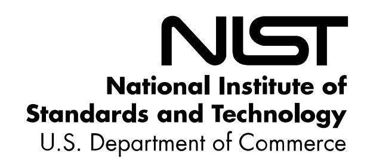
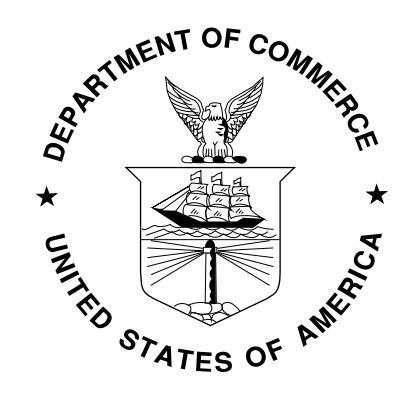

{0}------------------------------------------------

# **NISTIR 8276**

# **Key Practices in Cyber Supply Chain Risk Management:**

*Observations from Industry*

Jon Boyens Celia Paulsen Nadya Bartol Kris Winkler James Gimbi

This publication is available free of charge from: https://doi.org/10.6028/NIST.IR.8276

{1}------------------------------------------------

# **NISTIR 8276**

# **Key Practices in Cyber Supply Chain Risk Management:**

*Observations from Industry*

Jon Boyens Celia Paulsen *Computer Security Division Information Technology Laboratory*

> Nadya Bartol Kris Winkler James Gimbi *Boston Consulting Group New York, NY*

This publication is available free of charge from: https://doi.org/10.6028/NIST.IR.8276

February 2021

U.S. Department of Commerce *Wynn Coggins, Acting Secretary*

National Institute of Standards and Technology *James K. Olthoff, Performing the Non-Exclusive Functions and Duties of the Under Secretary of Commerce for Standards and Technology & Director, National Institute of Standards and Technology*

{2}------------------------------------------------

#### National Institute of Standards and Technology Interagency or Internal Report 8276 31 pages (February 2021)

This publication is available free of charge from: https://doi.org/10.6028/NIST.IR.8276

Certain commercial entities, equipment, or materials may be identified in this document in order to describe an experimental procedure or concept adequately. Such identification is not intended to imply recommendation or endorsement by NIST, nor is it intended to imply that the entities, materials, or equipment are necessarily the best available for the purpose.

There may be references in this publication to other publications currently under development by NIST in accordance with its assigned statutory responsibilities. The information in this publication, including concepts and methodologies, may be used by federal agencies even before the completion of such companion publications. Thus, until each publication is completed, current requirements, guidelines, and procedures, where they exist, remain operative. For planning and transition purposes, federal agencies may wish to closely follow the development of these new publications by NIST.

Organizations are encouraged to review all draft publications during public comment periods and provide feedback to NIST. Many NIST cybersecurity publications, other than the ones noted above, are available at [https://csrc.nist.gov/publications.](https://csrc.nist.gov/publications)

#### **Comments on this publication may be submitted to:**

National Institute of Standards and Technology Attn: Computer Security Division, Information Technology Laboratory 100 Bureau Drive (Mail Stop 8930) Gaithersburg, MD 20899-8930 Email: [scrm-nist@nist.gov](mailto:scrm-nist@nist.gov)

All comments are subject to release under the Freedom of Information Act (FOIA).

{3}------------------------------------------------

## **Reports on Computer Systems Technology**

The Information Technology Laboratory (ITL) at the National Institute of Standards and Technology (NIST) promotes the U.S. economy and public welfare by providing technical leadership for the Nation's measurement and standards infrastructure. ITL develops tests, test methods, reference data, proof of concept implementations, and technical analyses to advance the development and productive use of information technology. ITL's responsibilities include the development of management, administrative, technical, and physical standards and guidelines for the cost-effective security and privacy of other than national security-related information in federal information systems.

#### **Abstract**

In today's highly connected, interdependent world, all organizations rely on others for critical products and services. However, the reality of globalization, while providing many benefits, has resulted in a world where organizations no longer fully control—and often do not have full visibility into—the supply ecosystems of the products that they make or the services that they deliver. With more and more businesses becoming digital, producing digital products and services, and moving their workloads to the cloud, the impact of a cybersecurity event today is greater than ever before and could include personal data loss, significant financial losses, compromise of product integrity or safety, and even loss of life. Organizations can no longer protect themselves by simply securing their own infrastructures since their electronic perimeter is no longer meaningful; threat actors intentionally target the suppliers of more cyber-mature organizations to take advantage of the weakest link.

That is why identifying, assessing, and mitigating cyber supply chain risks is a critical capability to ensure business resilience. The multidisciplinary approach to managing these types of risks is called Cyber Supply Chain Risk Management (C-SCRM). This document provides the everincreasing community of digital businesses a set of Key Practices that any organization can use to manage cybersecurity risks associated with their supply chains. The Key Practices presented in this document can be used to implement a robust C-SCRM function at an organization of any size, scope, and complexity. These practices combine the information contained in existing C-SCRM government and industry resources with the information gathered during the 2015 and 2019 NIST research initiatives.

### **Keywords**

best practices; cyber supply chain risk management; C-SCRM; external dependency management; information and communication technology supply chain risk management; ICT SCRM; key practices; risk management; supplier; supply chain; supply chain assurance; supply chain risk; supply chain risk assessment; supply chain risk management; supply chain security; third-party risk management.

{4}------------------------------------------------

#### **Supplemental Content**

For information about NIST's Cyber Supply Chain Risk Management Program, visit [https://csrc.nist.gov/projects/cyber-supply-chain-risk-management/.](https://csrc.nist.gov/projects/cyber-supply-chain-risk-management/)

# **Acknowledgments**

The authors—Jon Boyens of the National Institute of Standards and Technology (NIST), Celia Paulsen (NIST), Nadya Bartol of the Boston Consulting Group (BCG), Kris Winkler (BCG), and James Gimbi (BCG)—would like to acknowledge and thank a number of organizations who provided valuable input into this publication: Mayo Clinic; Palo Alto Networks, Inc.; Seagate Technology PLC; Boeing; Exostar; Cisco Systems; Deere & Company; DuPont de Nemours Inc.; Exelon Corporation; FireEye; Fujitsu Ltd.; Great River Energy; Intel Corporation; Juniper Networks, Inc.; NetApp, Inc.; Northrop Grumman Corporation; Resilinc Corporation; Schweitzer Engineering Laboratories, Inc.; Smart Manufacturing Leadership Coalition; and The Procter & Gamble Company.

#### **Audience**

All organizations rely on acquiring products and services, and most organizations also supply products and services to other organizations. Cyber Supply Chain Risk Management is an organization-wide function that encompasses multiple activities throughout the system development life cycle. The audience for this publication is any organization—regardless of its size, scope, or complexity—that wants to manage the cybersecurity risks stemming from extended supply chains and supply ecosystems.

## **Patent Disclosure Notice**

*NOTICE: ITL has requested that holders of patent claims whose use may be required for compliance with the guidance or requirements of this publication disclose such patent claims to ITL. However, holders of patents are not obligated to respond to ITL calls for patents and ITL has not undertaken a patent search in order to identify which, if any, patents may apply to this publication.*

*As of the date of publication and following call(s) for the identification of patent claims whose use may be required for compliance with the guidance or requirements of this publication, no such patent claims have been identified to ITL.* 

*No representation is made or implied by ITL that licenses are not required to avoid patent infringement in the use of this publication.*

{5}------------------------------------------------

# **Executive Summary**

The National Institute of Standards and Technology (NIST) cyber supply chain risk management (C-SCRM) program was initiated in 2008 to develop C-SCRM practices for non-national security systems in response to Comprehensive National Cybersecurity Initiative (CNCI) #11: Develop a multi-pronged approach for global supply chain risk management. Over the last decade, NIST has continued to develop publications and conduct further research on industry best practices for C-SCRM. This document presents Key Practices and recommendations that were developed as a result of the research conducted in 2015 and 2019, including expert interviews, development of case studies, and analysis of existing government and industry resources.

The Key Practices presented in this document can be used to implement a robust C-SCRM program or function at an organization of any size, scope, or complexity. These practices combine the information contained in existing C-SCRM government and industry resources with the information gathered during the 2015 and 2019 NIST research initiatives. The Key Practices are:

- 1. Integrate C-SCRM Across the Organization
- 2. Establish a Formal C-SCRM Program
- 3. Know and Manage Critical Suppliers
- 4. Understand the Organization's Supply Chain
- 5. Closely Collaborate with Key Suppliers
- 6. Include Key Suppliers in Resilience and Improvement Activities
- 7. Assess and Monitor Throughout the Supplier Relationship
- 8. Plan for the Full Life Cycle

Each Key Practice includes a number of recommendations that synthesize how these practices can be implemented from a people, process, and technology perspective. Selected key recommendations include:

- Create explicit collaborative roles, structures, and processes for supply chain, cybersecurity, product security, physical security, and other relevant functions.
- Integrate cybersecurity considerations into the system and product life cycle.
- Determine supplier criticality by using industry standards and best practices.
- Mentor and coach suppliers to improve their cybersecurity practices.
- Include key suppliers in contingency planning (CP), incident response (IR), and disaster recovery (DR) planning and testing.
- Use third-party assessments, site visits, and formal certification to assess critical suppliers.

These and several other recommendations are mapped to each of the Key Practices to assist in and support the implementation of effective C-SCRM practices within an organization. Additional C-SCRM resources, including industry-specific best practices, can be found in Appendix B, Government and Industry Resources.

{6}------------------------------------------------

#### **Table of Contents**

|   |     | Executive Summary                                               | iv     |
|---|-----|--------------------------------------------------------------------|--------|
| 1 |     | Introduction                                                    | 1      |
|   | 1.1 | Purpose and Scope                                               | 3      |
|   | 1.2 | Background                                                         | 3      |
| 2 |     | Problem Definition                                              | 5      |
| 3 |     | Key Practices for C-SCRM                                        | 6      |
|   | 3.1 | Integrate C-SCRM Across the Organization                        | 6      |
|   | 3.2 | Establish a Formal C-SCRM Program                               | 7      |
|   | 3.3 | Know and Manage Critical Components and Suppliers                  | 8      |
|   | 3.4 | Understand the Organization's Supply Chain                      | 9      |
|   | 3.5 | Closely Collaborate with Key Suppliers                          | 9      |
|   | 3.6 | Include Key Suppliers in Resilience and Improvement Activities  | 10     |
|   | 3.7 | Assess and Monitor Throughout the Supplier Relationship         | 11     |
|   | 3.8 | Plan for the Full Life Cycle                                    | 12     |
| 4 |     | Recommendations                                                    | 13     |
|   |     | References                                                         | 15     |
|   |     |                                                                    |        |
|   |     | List of Appendices                                                 |        |
|   |     | Recommendations Mapped to Key Practices                         | 17     |
|   |     | Government and Industry Resources                                  | 19     |
|   |     | Recommendations to Key Government and Industry Resources           |  23 |

{7}------------------------------------------------

# **1 Introduction**

Today, organizations increasingly rely on an array of suppliers to support the organization's critical functions. This trend has accelerated over the last decade and is expected to continue accelerating. Globalization, outsourcing, and digitization contribute to this trend. Suppliers have their own suppliers who, in turn, have their own suppliers, creating extended supply chains and entire supply ecosystems. All organizations rely on acquiring products and services, and most organizations also supply products and services to other organizations. Besides increasingly complex supply chains and cyber threat actors targeting supplier and acquirer networks, other external events such as severe weather and geopolitical unrest continue to threaten supply chains. Together, these threats increase the importance of supply chain resilience, business continuity, and disaster recovery planning.

Many recent data breaches have been linked to supply chain risks. For example, a recent highprofile attack that took place in the second half of 2018, Operation ShadowHammer, compromised an update utility used by a global computer manufacturer. [1](#page-7-1) The compromised software was served to users through the manufacturer's official website and is estimated to have impacted up to a million users before it was discovered. This is reminiscent of the attack by the Dragonfly group, which started in 2013 and targeted industrial control systems. [2](#page-7-2) This group successfully inserted malware into software that was available for download through the manufacturers' websites, which resulted in companies in critical industries such as energy being impacted by this malware.

These incidents are not isolated events. Many recent reports suggest these attacks are increasing in frequency. An Incident Response Threat Report published in April 2019 by Carbon Black highlighted the use of "island hopping" by 50 % of attacks. [3](#page-7-3) Island hopping is an attack that focuses on impacting not only the victim but its customers and partners, especially if these partners have network interconnections. Symantec's 2019 Security Threat Report found supply chain attacks increased by 78 % in 2018. [4](#page-7-4) Perhaps more worrying is that a large number of these attacks appear to be successful and cause significant damage. A November 2018 study, Data Risk in the Third-Party Ecosystem, conducted by the Ponemon Institute found that 59 % of companies surveyed experienced a data breach caused by one of their third parties. [5](#page-7-5) A July 2018 survey conducted by Crowdstrike found software supply chains even more vulnerable with 66 % of respondents reporting a software supply chain attack, 90 % of whom faced financial impacts as a result of the attack.[6](#page-7-6)

1 <https://securelist.com/operation-shadowhammer-a-high-profile-supply-chain-attack/90380/>

[2https://www.symantec.com/content/en/us/enterprise/media/security\\_response/whitepapers/Dragonfly\\_Threat\\_Against\\_Western\\_](https://www.symantec.com/content/en/us/enterprise/media/security_response/whitepapers/Dragonfly_Threat_Against_Western_Energy_Suppliers.pdf) [Energy\\_Suppliers.pdf](https://www.symantec.com/content/en/us/enterprise/media/security_response/whitepapers/Dragonfly_Threat_Against_Western_Energy_Suppliers.pdf)

3 [https://www.carbonblack.com/wp-content/uploads/2019/04/carbon-black-quarterly-incident-response-threat-report-april-](https://www.carbonblack.com/wp-content/uploads/2019/04/carbon-black-quarterly-incident-response-threat-report-april-2019.pdf)[2019.pdf](https://www.carbonblack.com/wp-content/uploads/2019/04/carbon-black-quarterly-incident-response-threat-report-april-2019.pdf)

4 <https://www.symantec.com/security-center/threat-report>

5 <https://www.businesswire.com/news/home/20181115005665/en/Opus-Ponemon-Institute-Announce-Results-2018-Third-Party>

6 <https://www.crowdstrike.com/blog/global-survey-reveals-supply-chain-as-a-rising-and-critical-new-threat-vector/>

{8}------------------------------------------------

This combination of digitization and reliance on suppliers to support critical functions creates numerous cybersecurity risks that organizations are learning to manage. Organizations have been working to address this challenge for some time, but many still struggle with recognizing the challenge, deciding how to deal with it, and getting started. For example, 90 % of respondents in the Crowdstrike survey reported that they believe they are at risk of a supply chain attack and think vetting software suppliers is a critical activity, but only 33 % actually do. Moreover, 76 % of the respondents in the Ponemon Institute study acknowledged that cybersecurity incidents involving vendors are increasing, but only 46 % say managing these risks is a priority, and only 35 % rate their third-party risk management program as highly effective.

The National Institute of Standards and Technology (NIST) has been researching these types of cybersecurity incidents and issuing guidance, research findings, and tools on this topic for over 10 years. NIST publications on this topic include:

- NISTIR 7622, *Notional Supply Chain Risk Management Practices for Federal Information Systems*, 2012 [\[NISTIR 7622\]](#page-21-1)
- NIST Special Publication (SP) 800-161, *Supply Chain Risk Management Practices for Federal Information Systems and Organizations*, 2015 [\[SP 800-161\]](#page-22-0)
- NIST SP 800-37 Revision 2, *Risk Management Framework for Information Systems and Organizations,* 2018 [\[SP800-37\]](#page-21-2)
- NIST SP 800-53, Revision 5, *Security and Privacy Controls for Information Systems and Organizations*, 2020 [\[SP 800-53\]](#page-22-1)
  - Relevant controls and control enhancements include:
    - Supply Chain Risk Management Control Family (SR)
    - Supply Chain Risk Management Strategy (PM-30)
    - Suppliers of Critical or Mission Essential Items (PM-30(1))
    - Integrated Situational Awareness (SI-4(17))
    - External System Services (SA-9)
    - Acquisition Process (SA-4)
    - Supply Chain Risk Assessment (RA-3(1))
    - Criticality Analysis (RA-9)
    - Incident Handling Supply Chain Coordination (IR-4(10))
    - Incident Reporting Supply Chain Coordination (IR-6(3))
    - Controlled Maintenance (MA-2)
    - Tamper Protection (PE-3(5))
- Case studies, briefing papers, and other resources on the NIST Cyber Supply Chain Risk Management site [\[NIST C-SCRM\]](#page-21-3): [7](#page-8-0)
  - Case Studies: Best Practices in Cyber Supply Chain Risk Management, 2015
  - Best Practices in Vendor Selection and Management

7 The case studies and briefing papers are can be found at [https://csrc.nist.gov/projects/cyber-supply-chain-risk-management/key](https://csrc.nist.gov/projects/cyber-supply-chain-risk-management/key-practices)[practices.](https://csrc.nist.gov/projects/cyber-supply-chain-risk-management/key-practices)

{9}------------------------------------------------

- Business Case for Cyber Supply Chain Risk Management
- Organizational Strategies for Cyber Supply Chain Risk Management
- Cyber Supply Chain Standards Mapping and Roadmap
- Cyber Supply Chain Best Practices
- National Institute of Standards and Technology (2018) Framework for Improving Critical Infrastructure Cybersecurity, Version 1.1. [\[NIST CSF\]](#page-21-4)

Today, the discipline of addressing cybersecurity risks stemming from extended supply chains and supply ecosystems is known as Cyber Supply Chain Risk Management (C-SCRM). C-SCRM is an overarching function that includes concepts such as third-party risk management and external dependency management.

This document provides a starting point for those organizations that need to begin addressing the challenge of C-SCRM. It provides a basic set of C-SCRM Key Practices that capture processes, activities, and tools adopted by industry. These Key Practices are based on a set of industry case studies conducted in 2015 and 2019, prior NIST initiatives, and a number of standards and industry best practice documents. Once an organization has implemented the basic Key Practices contained in this document, additional, more extensive standards, guidelines, and best practices can be applied.

#### **1.1 Purpose and Scope**

This document provides a set of C-SCRM Key Practices that can be used by any organization. It defines and describes high-level concepts, why they are important, and some characteristics and examples of corresponding Key Practices. It also provides recommendations for how organizations can put the Key Practices into use. This document concludes with a list of references that organizations can use to obtain more guidance on C-SCRM.[8](#page-9-2)

#### **1.2 Background**

In 2014-2015, NIST conducted a series of interviews on the topic of current C-SCRM practices. The industries surveyed ranged from telecommunications to utilities, industrial manufacturing, healthcare, and information technology. The results of these interviews were published in 2015 in a series of case studies which identified a number of useful cyber supply chain risk management practices deployed by the surveyed organizations: supply chain risk councils to bring together key players; vendor risk assessment tools; supply chain resiliency tools, such as databases of suppliers; track-and-trace tools; and a master security requirements specification.[9](#page-9-3)

Since these case studies were published, the C-SCRM problem set and the discipline itself evolved, warranting a new look at emergent practices. Ever more companies produce smart electronics, offer their products and services online, and integrate smart electronics into their products and infrastructures. The Internet of Things (IoT) and Industrial Internet of Things (IIoT)

8 This document does not provide a complete set of practices that would apply to every circumstance.

9 Best Practices in Cyber Supply Chain Risk Management [\(https://csrc.nist.gov/projects/cyber-supply-chain-risk](https://csrc.nist.gov/projects/cyber-supply-chain-risk-management/key-practices)[management/key-practices\)](https://csrc.nist.gov/projects/cyber-supply-chain-risk-management/key-practices)

{10}------------------------------------------------

exponentially increase the need to manage cybersecurity risks associated with extended supply ecosystems. The increased use of these and other connected devices broadens the attack surface, with maliciously configured devices attacking both the companies that make these devices, and the devices, systems, and networks to which the malicious devices are connected.

In 2018, NIST initiated a set of new, second-generation case studies with the purpose of surveying how the C-SCRM practices evolved and whether new practices emerged. These second-generation case studies were analyzed with the first set of case studies, NIST C-SCRM publications, and numerous industry C-SCRM standards and best practice documents. The results of this analysis revealed that many of the established practices are still relevant, and none of these practices identified in earlier efforts have been retired or deemed obsolete. This document summarizes the results of this analysis into a set of C-SCRM Key Practices and provides specific recommendations for how to implement them.

{11}------------------------------------------------

## **2 Problem Definition**

Supply chain management is an established discipline that has become one of the key capabilities for enabling globalization and increasing economic growth in many parts of the world. With globalization, the rate at which critical services and functions are outsourced has increased to take advantage of business efficiencies. *These trends have resulted in a world where organizations no longer fully control—and often do not have full visibility into—the supply ecosystems of the products that they produce or the services that they deliver. And without sufficient control, organizations struggle to manage risks stemming from their supply chains and the products and services traversing them.*

Cybersecurity risks associated with this loss of control (and visibility) can be significant. They range from unknown provenance of hardware or software that supports an organization's digital functions to subcontractors and consultants having access to its critical data. This phenomenon is referred to as cybersecurity aspects of C-SCRM. Over the last decade, C-SCRM has evolved from a narrow focus on information and communication technology (ICT) supply chains to covering any cybersecurity-related supply chain risk. Today, it encompasses an increasing array of digital products and services that continues to grow with the expanding role of cyber space in the daily lives of individuals and in how business is conducted. With more and more businesses becoming digital, producing digital products and services, and moving their workloads to the cloud, the impact of a cybersecurity event today is greater than ever before, and could include personal data loss, significant financial losses, compromise of product integrity or safety, and even loss of life. Threat actors intentionally target third parties of more cyber-mature organizations to take advantage of the weakest link. Organizations can no longer protect themselves by simply securing their own infrastructures since their electronic perimeter is no longer representative of their entire vulnerability surface.

While cybersecurity risks associated with extended supply chains and supply ecosystems are significant, those risks are not well understood by many organizations that are expanding their use of digital technologies to support critical functions or creating digital products for their customers. In today's digital economy, identifying, assessing, and mitigating cyber supply chain risks is a critical capability to ensure business resiliency. A number of standards, guidance, and best practice documents have been written on the topic of C-SCRM. This document targets the ever-increasing community of digital businesses to provide a set of Key Practices that any organization can use to manage cybersecurity risks associated with their supply chains.

In today's highly connected world, all organizations rely on other organizations for critical products and services. Many organizations also supply products and services to other organizations. This document will use the terms "acquirers" and "suppliers" to make a distinction between these two roles.

{12}------------------------------------------------

# **3 Key Practices for C-SCRM**

The C-SCRM Key Practices in this section blend the information contained in existing C-SCRM government and industry resources with the information gathered during the 2019 NIST case studies initiative. Collectively, the Key Practices identify established and emerging practices that have anecdotally proven to be effective, explain why they have been effective, and list tools that are most useful for identifying, defining, and communicating cyber supply chain risks. These Key Practices are:

- 1. Integrate C-SCRM Across the Organization
- 2. Establish a Formal C-SCRM Program
- 3. Know and Manage Critical Components and Suppliers
- 4. Understand the Organization's Supply Chain
- 5. Closely Collaborate with Key Suppliers
- 6. Include Key Suppliers in Resilience and Improvement Activities
- 7. Assess and Monitor Throughout the Supplier Relationship
- 8. Plan for the Full Life Cycle

#### **3.1 Integrate C-SCRM Across the Organization**

A number of organizations have established Supply Chain Risk Councils (or Supply Chain Leadership Risk Councils) that include executives from supply chain/procurement, information technology, cybersecurity, operations, legal, enterprise risk management (ERM), and other functional and leadership areas of the organization, depending on the organization's business and structure. These Councils proactively review relevant risks and risk mitigation plans, set priorities, direct sharing of best practices throughout the enterprise, and pilot initiatives. They also result in informal networks of leaders that facilitate trust and accountability in complex business environments. The benefit of Councils is the shared risk decision-making that ensures all perspectives are addressed.

Collaborative C-SCRM is not limited to the executive suite. Mature C-SCRM programs facilitate closer collaboration between cybersecurity, product security, physical security, enterprise risk management, and, of course, supply chain/procurement. Specifically, the level of integration of supply chain, cybersecurity, product security, and physical security increases with C-SCRM practice maturity. More mature companies have explicit roles that bridge these functions and also integrate them with enterprise risk management. Such internal alignment facilitates the efficiency and effectiveness of delivering products and services while appropriately managing C-SCRM risks. For example, these integrated functions share information, metrics, and program objectives to reduce C-SCRM risks. This often results in a more nuanced and comprehensive understanding of cybersecurity risks by business executives, as well as better strategic decisions that take C-SCRM into consideration.

{13}------------------------------------------------

#### **3.2 Establish a Formal C-SCRM Program**

A formal C-SCRM program ensures organizational accountability for managing cyber supply chain risks. Mature organizations have formal programs with established governance, policies and procedures, processes, and tools.

It should be noted that smaller organizations may not need the structure required by larger organizations. For example, a small manufacturing organization may not need as many formal processes as a large technology company. The following is a list of high-level characteristics of a formal C-SCRM program that organizations can consider implementing when establishing a formal C-SCRM program:

- Increased Executive Board or Executive Level involvement for establishing C-SCRM as a top business priority and to ensure proper oversight
- Clear governance of C-SCRM activities that includes cross-organizational roles and responsibilities with clear definitions and designation/distribution of these roles among enterprise risk management, supply chain, cybersecurity, product management and product security (if applicable), and other relevant functions appropriate for the organization's business
- Standards-based policies and procedures that provide guidance to different business units detailing their C-SCRM activities
- Same policies used internally and with suppliers
- Integration of cybersecurity considerations into the system and product development life cycle
- Use of cross-functional teams to address specific enterprise-wide risks
- Clear definition of roles of individuals responsible for cybersecurity aspects of supplier relationships (which may be different than those responsible for procurement activities with specific suppliers)
- Establishment of centers of excellence to identify and manage best practices
- A set of measures of success used to facilitate decision-making, accountability, and improvement
- Approved and banned supplier lists
- Use of software and hardware component inventory (e.g., bill of materials) for third-party components
- Prioritization of suppliers based on their criticality
- Establishment of testing procedures for the most critical components
- Establishment of a known set of security requirements or controls for all suppliers, especially robust security requirements for critical suppliers to be used in procurement (sometimes known as master specifications)
- Service-level agreements (SLA) with suppliers that state the requirements for adhering to the organization's cybersecurity policy and any controls required of the supplier
- Establishment of intellectual property rights agreements
- Shared supplier questionnaires across like organizations, such as within the same critical infrastructure sector
- Upstream propagation of acquirer's security requirements within the supply chain to subtier suppliers

{14}------------------------------------------------

- Assurance that suppliers have only the access they need in terms of data, capability, functionality, and infrastructure; bounding this access by specific time frames during which suppliers need it
- Use of escrow services for suppliers with a questionable or risky track record
- Provision of organization-wide training for all relevant stakeholders within the organization, such as supply chain, legal, product development, and procurement; this training may also be extended to key suppliers
- Identification of alternative sources of critical components to ensure uninterrupted production and delivery of products
- Secure requirements guiding disposal of hardware that contains regulated data (e.g., personally identifiable information [PII] or protected health information [PHI]) or otherwise sensitive information (e.g., intellectual property)
- Protocols for securely terminating supplier relationships to ensure that all hardware containing acquirer's data has been properly disposed of and that the risks of data leakage have been minimized

### **3.3 Know and Manage Critical Components and Suppliers**

Critical suppliers are those suppliers which, if disrupted, would create a negative business impact on the organization. Critical suppliers are also those suppliers that provide critical components (products or services) that support the critical business missions of the organization. Identifying such suppliers requires organizations to first identify and prioritize critical missions, assets, systems, processes, and data and then identify suppliers that either have access to or provide infrastructure for critical assets, systems, processes, and data.

Several criteria can be used to determine component and supplier criticality:

- Revenue contribution of suppliers
- Whether a supplier processes critical data belonging to the acquirer, such as regulated data (e.g., PII, PHI) or intellectual property
- Volume of data a supplier has access to or hosts
- Whether a supplier has access to the acquirer's system and network infrastructure
- Whether a supplier can become an attack vector by being compromised and allowing threat actors access to the acquirer
- For technology companies, whether a supplier can become an attack vector for the technology company's products or services delivered to customers

There is a number of NIST and industry resources that can be used to identify critical suppliers:

- NIST has made available a free tool that helps identify the impact of suppliers to the organization; The tool is described in NISTIR 8272, *Impact Analysis Tool for Interdependent Cyber Supply Chain Risks*, along with instructions on how to use it [\[NISTIR 8272\]](#page-21-5).
- NISTIR 8179, *Criticality Analysis Process Model*, provides a comprehensive methodology for determining project and product criticality that can be used as an input in determining system, component, and supplier criticality [\[NISTIR 8179\]](#page-21-6).

{15}------------------------------------------------

- The Business Impact Analysis (BIA) described in NIST SP 800-34, Rev. 1, *Contingency Planning Guide for Federal Information Systems*, can also be used to determine supplier criticality [\[SP 800-34\]](#page-21-3).
- The Business Continuity Planning booklet published by the FFIEC (Federal Financial Institutions Examination Council) provides a process and list of considerations that can be adapted to determine supplier criticality [\[FFIEC BCP\]](#page-21-1).

Once suppliers are identified, risks can be assessed, and suppliers can be prioritized by their criticality. Best practice organizations have established supplier requirements by criticality and include the use of master specifications for security requirements. These requirements are used in supplier contracts (e.g., Terms and Conditions), and adherence to these requirements is monitored during the supplier relationship life cycle.

#### **3.4 Understand the Organization's Supply Chain**

To manage cybersecurity risks that originate from supply chains, organizations need to understand their supply chains, including multiple layers of sub-suppliers. Today's supply chains are extended, extensive, and include multiple organizations across the globe. In this environment, the risks may stem from suppliers' connectivity to their suppliers, component sourcing for hardware and software suppliers, technologies shared upstream and downstream within supply chains, and processes and people within those supply chains.

Best practice organizations establish real-time visibility into the production processes of their outsourced manufacturers with the capacity to capture not only defect rates but causes of failure and, therefore, prevent a supplier's ability to shortcut testing requirements before shipment. This includes the use of software and hardware component inventory as well as tools and methods to audit provenance claims at any point in the supply chain. Such visibility and transparency reduce the risk of tampering and counterfeiting and improve the security, and ultimately the quality, of the resulting products. Additionally, best practice organizations have insight into how their suppliers vet their personnel, who they are outsourcing to and who has access to the acquirer's data.

#### **3.5 Closely Collaborate with Key Suppliers**

Best practice organizations establish close relationships with their suppliers up to and including creating shared ecosystems between acquirers and suppliers to increase coordination and simplify the management of complex shared supply chains. Increasingly, organizations are treating their suppliers as members of their ecosystem and closely collaborating in a variety of ways:

- Acquirers maintain close working relationships through frequent visits and communications.
- Acquirers mentor and coach suppliers on C-SCRM and actively help suppliers improve their cybersecurity and supply chain practices.
- Acquirers and suppliers invest in common solutions.

{16}------------------------------------------------

- Acquirers require the use of the same standards within the acquirer organizations and by suppliers, thereby simplifying communications about cybersecurity risk and mitigations and helping to achieve a uniform level of quality throughout the ecosystem.

The sophistication and level of formality of acquirer-supplier relationships increase with the maturity of the C-SCRM practices. For example, smaller businesses establish and maintain close relationships with their key suppliers by conducting frequent visits, phone calls, and other forms of informal communication. Larger and more mature organizations use more documented processes and procedures and hold multiple formal meetings with their suppliers. Acquirers and suppliers within the ecosystem coach each other upstream and downstream. Because most organizations find themselves in the roles of acquirers and suppliers, the presence of more mature acquirers in the overall ecosystem generally increases the maturity of the entire ecosystem. An example of this effect is when executives join Executive Boards of more mature organizations and become exposed to the practices deployed there, as well as the questions and topics discussed at Executive Board meetings. Executives then bring those practices and topics to their own organizations and advocate for adoption. A similar effect is achieved when organizations belong to industry groups, information-sharing organizations, and roundtables where individuals and organizations can learn from each other. Another method for acquirers and suppliers to coach each other is through the use of supplier questionnaires, which are used to identify opportunities for additional supplier mentoring and training. Some suppliers also use acquirer questionnaires to shape security requirements that suppliers apply to their products and services.

# **3.6 Include Key Suppliers in Resilience and Improvement Activities**

Threat actors actively target acquirers through suppliers. In addition to cybersecurity risks, there are environmental risks, such as severe weather, and risks associated with geopolitical unrest, that continually threaten to disrupt the supply chain. Incidents will happen to even the most mature organizations, which makes resiliency planning essential. Mature organizations include their critical suppliers, products, and assets in their contingency planning, incident response, and disaster recovery. These organizations test such plans with key stakeholders, including suppliers, to guarantee the readiness of all involved parties and the effectiveness of the plans. This ensures that critical procedures and protocols are established and well-understood ahead of any significant event. Resilience and improvement activities include:

- Rules and protocols for information sharing between acquirers and suppliers, sometimes within larger critical infrastructure sector ecosystems
- Joint development, review, and revision of incident response, business continuity, and disaster recovery plans
- Protocols for communicating vulnerabilities and incidents
- Responsibilities for responding to cybersecurity incidents
- Coordinated communication methods and protocols
- Coordinated restoration and recovery procedures
- Collaborative processes to review lessons learned
- Updates of coordinated response and recovery plans based on lessons learned

{17}------------------------------------------------

More mature acquirers have formal continuous improvement processes that include collecting lessons learned from supply chain incidents; sharing potential improvements throughout the ecosystem; incorporating results into planning, response, and recovery processes; and sharing them with appropriate organizations throughout the enterprise. This process includes stakeholders from the organization and suppliers to ensure that identified risks are remediated.

#### **3.7 Assess and Monitor Throughout the Supplier Relationship**

Organizations and their environments are continuously evolving. A supplier assessment conducted prior to bringing a supplier on board is a snapshot in time that becomes obsolete before it is completed. Mature acquirers establish supplier-monitoring programs that cover the entire supplier relationship life cycle and monitor a variety of risks, including security, privacy, quality, financial, and geopolitical risks, to name a few. This practice of monitoring and review includes validating that suppliers are meeting cybersecurity and other key SLA requirements, identifying any changes in supplier status (e.g., financial, legal, ownership), and mitigating the identified risks per mutually agreed upon remediation timelines.

Assessing supplier controls on a regular basis helps manage cyber supply chain risks by determining whether agreed-upon requirements and controls are being met, identifying improvements that may be required, and monitoring the completion of those improvement actions.

Acquirers deploy a variety of supplier assessment and monitoring mechanisms, such as selfassessment, supplier attestation, third-party assessments, formal certifications, and site visits. For most critical suppliers, acquirers use a combination of formal certifications, third-party assessments, and site visits. Assessments allow organizations to understand the changes in a supplier's status and discover changes in risks. The frequency and robustness of the assessments should be established based on supplier criticality. Critical suppliers should be assessed more frequently, and more extensive assessment methods should be used to determine if there are any changes in risk.

Large organizations may rely on hundreds of supplier assessments every year, causing some suppliers to answer a burdensome number of questionnaires in turn. Shared assessments involve using a single supplier assessment to satisfy multiple acquirers and are an emerging practice within some critical infrastructure organizations. In a shared assessment, a number of acquirers create a single assessment methodology and questionnaire which may then be applied to thousands of suppliers that support a particular need. Suppliers can then reuse their answers to such questionnaires by providing them to multiple acquirers. Some critical infrastructure sectors have established entities to run third-party risk processes for industry segments, with C-SCRM being included in these processes. While this approach may save acquirers and suppliers significant time and resources, organizations should carefully consider whether shared assessments fit their own particular needs, including risk tolerance, operating environment, and regulatory obligations.

In addition to supplier assessments, organizations can deploy technical processes and technologies to monitor any changes in a supplier's risk status. If suppliers have dedicated 

{18}------------------------------------------------

connections to the acquirer's infrastructure, the acquirer's security operations center can monitor any changes to the supplier's connection to the acquirer's network and systems. Acquirers can also use a variety of cybersecurity risk-rating solutions to provide insights into cybersecurity risks posed by suppliers.

#### **3.8 Plan for the Full Life Cycle**

When organizations put technical solutions into their infrastructures, they expect those solutions to continue working for as long as they are needed by the organization. However, organizations should plan for unexpected interruptions to the supply chain to ensure business continuity. Examples of such interruptions include suppliers stopping support of obsolete hardware and software, discontinuing production of hardware components, or adopting a significant change of business direction caused by acquisition or changes in supplier ownership or management.

Organizations should deploy a variety of practices to manage this particular risk, including purchasing reserve quantities of critical components and establishing relationships with approved resellers that are likely to stay in business. An innovative method deployed by digital companies is to bring ailing component manufacturers in-house to ensure an uninterrupted supply of critical components.

{19}------------------------------------------------

# **4 Recommendations**

The following are 24 key recommendations based on the first and second-generation case studies, reviewed standards, and best practice documents. These recommendations are organized according to the Key Practices. [Appendix A](#page-23-0) provides a mapping of the recommendations to the Key Practices above, and [Appendix C](#page-29-0) provides a mapping of the recommendations to various supply chain security resources.

- Establish supply chain risk councils that include executives from across the organization (e.g., cyber, product security, procurement, legal, privacy, enterprise risk management, business units, etc.).
- Create explicit collaborative roles, structures, and processes for supply chain, cybersecurity, product security, and physical security functions.
- Increase Executive Board involvement in C-SCRM through regular risk discussions and sharing of measures of performance.
- Integrate cybersecurity considerations into the system and product life cycle.
- Clearly define roles and responsibilities for the security aspects of specific supplier relationships.
- Use master requirements lists and SLAs to establish requirements with suppliers.
- Propagate security requirements to suppliers' sub-suppliers.
- Train key stakeholders in the organization and within the supplier's organization.
- Terminate supplier relationships with security in mind.
- Use the Criticality Analysis Process Model or BIA to determine supplier criticality.
- Establish visibility into the suppliers' production processes (e.g., capture defect rates, causes of failure, and testing).
- Know if the data and infrastructure are accessible to suppliers' sub-suppliers.
- Mentor and coach suppliers to improve their cybersecurity practices.
- Require the use of the same standards within both acquirer and supplier organizations.
- Use acquirer assessment questionnaires to influence acquirer's cybersecurity requirements.
- Include key suppliers in incident response, business continuity, and disaster recovery plans and tests.
- Maintain a watchlist of suppliers who have had issues in the past and about which the acquirer should be cautious for future use (e.g., "Issue Suppliers"). Such suppliers should only be used after approval from the supply chain risk council.
- Establish remediation acceptance criteria for the identified risks.
- Establish cybersecurity requirements through a Security Exhibit, Security Schedule, or Security Addendum document. This document should be finalized in partnership with the risk council members and included in all master services agreements (MSAs) of all suppliers based on the risk associated with the supplier engagement.
- Establish protocols for vulnerability disclosure and incident notification.
- Establish protocols for communications with external stakeholders during incidents.
- Collaborate on lessons learned, and update joint plans based on lessons learned.
- Use third-party assessments, site visits, and formal certification to assess critical suppliers.

{20}------------------------------------------------

- Have plans in place for supplied product obsolescence.

{21}------------------------------------------------

| References    |                                                                                                                                                                                                                                                                                                                                         |
|---------------|-----------------------------------------------------------------------------------------------------------------------------------------------------------------------------------------------------------------------------------------------------------------------------------------------------------------------------------------|
| [FFIEC BCP]   | Federal Financial Institutions Examination Council (2015) Business Impact Analysis. Business Continuity Planning (FFIEC, Arlington, VA), FFIEC Information Technology Examination Handbook, pp 5-8. Available at https://ithandbook.ffiec.gov/                                                                           |
| [NISTIR 7622] | Boyens JM, Paulsen C, Bartol N, Shankles S, Moorthy R (2012) Notional Supply Chain Risk Management Practices for Federal Information Systems. (National Institute of Standards and Technology, Gaithersburg, MD), NIST Interagency or Internal Report (IR) 7622. https://doi.org/10.6028/NIST.IR.7622                       |
| [NISTIR 8179] | Paulsen C, Boyens JM, Bartol N, Winkler K (2018) Criticality Analysis Process Model: Prioritizing Systems and Components. (National Institute of Standards and Technology, Gaithersburg, MD), NIST Interagency or Internal Report (IR) 8179. https://doi.org/10.6028/NIST.IR.8179                                              |
| [NISTIR 8272] | Paulsen C, Boyens JM, Winkler K, Ng J, Gimbi J (2020) Impact Analysis Tool for Interdependent Cyber Supply Chain Risks. (National Institute of Standards and Technology, Gaithersburg, MD), Draft NIST Interagency or Internal Report (IR) 8272. https://doi.org/10.6028/NIST.IR.8272                                    |
| [NIST C-SCRM] | National Institute of Standards and Technology (2019) Cyber Supply Chain Risk Management. Available at https://csrc.nist.gov/projects/cyber supply-chain-risk-management/                                                                                                                                                         |
| [NIST CSF]    | National Institute of Standards and Technology (2018) Framework for Improving Critical Infrastructure Cybersecurity, Version 1.1. (National Institute of Standards and Technology, Gaithersburg, MD). https://doi.org/10.6028/NIST.CSWP.04162018                                                                               |
| [SP 800-34]   | Swanson MA, Bowen P, Phillips AW, Gallup D, Lynes D (2010) Contingency Planning Guide for Federal Information Systems. (National Institute of Standards and Technology, Gaithersburg, MD), NIST Special Publication (SP) 800-34, Rev. 1, Includes updates as of November 11, 2010. https://doi.org/10.6028/NIST.SP.800-34r1 |
| [SP 800-37]   | Joint Task Force (2018) Risk Management Framework for Information Systems and Organizations: A System Life Cycle Approach for Security and Privacy. (National Institute of Standards and Technology, Gaithersburg, MD), NIST Special Publication (SP) 800-37, Rev. 2. https://doi.org/10.6028/NIST.SP.800-37r2              |

{22}------------------------------------------------

[SP 800-53] Joint Task Force (2020) *Security and Privacy Controls for Information* 

*Systems and Organizations*. (National Institute of Standards and

Technology, Gaithersburg, MD), NIST Special Publication 800-53, Rev.

5, Includes updates as of December 10, 2020. Available at

<https://doi.org/10.6028/NIST.SP.800-53r5>

[SP 800-161] Boyens JM, Paulsen C, Moorthy R, Bartol N (2015) *Supply Chain Risk* 

*Management Practices for Federal Information Systems and Organizations*. (National Institute of Standards and Technology, Gaithersburg, MD), NIST Special Publication (SP) 800-161.

<https://doi.org/10.6028/NIST.SP.800-161>

{23}------------------------------------------------

#### **Recommendations Mapped to Key Practices**

|                                                                                                                                                                                  | Integrate C SCRM Across the Organization | Establish a Formal C SCRM Program | Know and Manage Critical Suppliers | Understand Org. Supply Chain | Closely Collaborate with Key Suppliers | Include Key Suppliers in Resilience and Improvement Activities | Assess and Monitor Throughout Supplier Relationship | Plan for the Full Life Cycle |
|----------------------------------------------------------------------------------------------------------------------------------------------------------------------------------|---------------------------------------------------|--------------------------------------------|---------------------------------------------|------------------------------------|----------------------------------------------------|-------------------------------------------------------------------------------|-----------------------------------------------------------------|------------------------------------|
| Establish supply chain risk councils that include executives from across the organization (e.g., cyber, product security, procurement, ERM, business units, etc.) | ✓                                                 | ✓                                          |                                             |                                    |                                                    |                                                                               |                                                                 |                                    |
| Create explicit collaborative roles, structures, and processes for supply chain, cybersecurity, product security, and physical security functions                    | ✓                                                 | ✓                                          |                                             |                                    |                                                    |                                                                               |                                                                 |                                    |
| Increase Executive Board involvement in C-SCRM through regular risk discussions and sharing of measures of performance                                               | ✓                                                 | ✓                                          |                                             |                                    |                                                    |                                                                               |                                                                 |                                    |
| Integrate cybersecurity considerations into system and product life cycles                                                                                                 | ✓                                                 | ✓                                          |                                             |                                    |                                                    |                                                                               |                                                                 |                                    |
| Clearly define roles and responsibilities for security aspects of specific supplier relationships                                                                          |                                                   | ✓                                          |                                             |                                    | ✓                                                  |                                                                               |                                                                 |                                    |
| Use master requirements lists and SLAs to establish requirements with suppliers                                                                                            |                                                   | ✓                                          | ✓                                           |                                    |                                                    |                                                                               |                                                                 |                                    |
| Propagate security requirements to suppliers' sub-suppliers                                                                                                                   |                                                   | ✓                                          | ✓                                           |                                    | ✓                                                  |                                                                               |                                                                 |                                    |
| Train key stakeholders in the organization and within the supplier's organization                                                                                          |                                                   | ✓                                          | ✓                                           |                                    | ✓                                                  | ✓                                                                             |                                                                 |                                    |
| Terminate supplier relationships with security in mind                                                                                                                        | ✓                                                 | ✓                                          | ✓                                           | ✓                                  |                                                    |                                                                               |                                                                 |                                    |
| Use Criticality Analysis Process Model or BIA to determine supplier criticality                                                                                            |                                                   |                                            | ✓                                           |                                    |                                                    |                                                                               |                                                                 |                                    |
| Establish visibility into the suppliers' production processes (e.g., capture defect rates, causes of failure, and testing)                                              |                                                   |                                            | ✓                                           | ✓                                  | ✓                                                  |                                                                               |                                                                 |                                    |
| Know if the data and infrastructure are accessible to suppliers' sub suppliers                                                                                             |                                                   |                                            | ✓                                           | ✓                                  | ✓                                                  |                                                                               |                                                                 |                                    |
| Mentor and coach suppliers to improve their cybersecurity practices                                                                                                        |                                                   |                                            |                                             |                                    | ✓                                                  | ✓                                                                             |                                                                 |                                    |

{24}------------------------------------------------

|                                                                                                                                                                                                                                                                                                                                                                  | Integrate C SCRM Across the Organization | Establish a Formal C SCRM Program | Know and Manage Critical Suppliers | Understand Org. Supply Chain | Closely Collaborate with Key Suppliers | Include Key Suppliers in Resilience and Improvement Activities | Assess and Monitor Throughout Supplier Relationship | Plan for the Full Life Cycle |
|------------------------------------------------------------------------------------------------------------------------------------------------------------------------------------------------------------------------------------------------------------------------------------------------------------------------------------------------------------------|---------------------------------------------------|--------------------------------------------|---------------------------------------------|------------------------------------|----------------------------------------------------|-------------------------------------------------------------------------------|-----------------------------------------------------------------|------------------------------------|
| Require use of the same standards within both acquirer and supplier organizations                                                                                                                                                                                                                                                                          | ✓                                                 | ✓                                          |                                             |                                    | ✓                                                  |                                                                               |                                                                 |                                    |
| Use acquirer assessment questionnaires to influence acquirer's cybersecurity requirements                                                                                                                                                                                                                                                               |                                                   | ✓                                          | ✓                                           |                                    | ✓                                                  | ✓                                                                             |                                                                 |                                    |
| Include key suppliers in IR, DR, and CP plans and tests                                                                                                                                                                                                                                                                                                       | ✓                                                 | ✓                                          | ✓                                           | ✓                                  | ✓                                                  | ✓                                                                             |                                                                 |                                    |
| Maintain a watchlist of suppliers who had issues in the past and about which the acquirer should be cautious for future use (e.g., "Issue Suppliers"); such suppliers should only be used after approval from supply chain risk council                                                                                                        | ✓                                                 | ✓                                          | ✓                                           | ✓                                  |                                                    |                                                                               | ✓                                                               | ✓                                  |
| Establish remediation acceptance criteria for the identified risks                                                                                                                                                                                                                                                                                            | ✓                                                 | ✓                                          | ✓                                           | ✓                                  | ✓                                                  | ✓                                                                             | ✓                                                               | ✓                                  |
| Establish cybersecurity requirements through Security Exhibit, Security Schedule, or Security Addendum document; this document should be finalized in partnership with the risk council members and included in all master services agreements (MSAs) with all suppliers based on the risk associated with the supplier engagement | ✓                                                 | ✓                                          | ✓                                           | ✓                                  | ✓                                                  |                                                                               | ✓                                                               | ✓                                  |
| Establish protocols for vulnerability disclosure and incident notification                                                                                                                                                                                                                                                                                 | ✓                                                 | ✓                                          | ✓                                           | ✓                                  | ✓                                                  | ✓                                                                             |                                                                 |                                    |
| Establish protocols for communications with external stakeholders during incidents                                                                                                                                                                                                                                                                         | ✓                                                 | ✓                                          | ✓                                           | ✓                                  | ✓                                                  | ✓                                                                             |                                                                 |                                    |
| Collaborate on lessons learned, and update joint plans based on lessons learned                                                                                                                                                                                                                                                                            | ✓                                                 | ✓                                          | ✓                                           | ✓                                  | ✓                                                  | ✓                                                                             |                                                                 |                                    |
| Use third-party assessments, site visits, and formal certification to assess critical suppliers                                                                                                                                                                                                                                                            |                                                   | ✓                                          | ✓                                           | ✓                                  | ✓                                                  |                                                                               | ✓                                                               |                                    |
| Have plans in place for supplied product obsolescence                                                                                                                                                                                                                                                                                                         |                                                   | ✓                                          |                                             | ✓                                  |                                                    |                                                                               |                                                                 | ✓                                  |

{25}------------------------------------------------

#### **Government and Industry Resources**

This section includes available government and industry resources that organizations can use to learn more about C-SCRM. These resources are presented with additional information that the readers of this document may find useful when deciding which resources are relevant for their particular needs. The following information is provided for each resource:

- Scope specific sector of the acquirer or a type of supplier that is being sought
- Audience whether the resource speaks to both acquirers and suppliers
- Context of use high-level summary of what the resource provides

| Document                                                                                                                                                                                        | Scope                          | Audience                   | Context of Use                                                                                                                |
|-------------------------------------------------------------------------------------------------------------------------------------------------------------------------------------------------|--------------------------------|----------------------------|-------------------------------------------------------------------------------------------------------------------------------|
| NIST SP 800-161, Supply Chain Risk Management Practices for Federal Information Systems and Organizations                                                                              | Federal information systems | Acquirers                  | Identifying, assessing, and mitigating ICT supply chain risks                                                           |
| NIST Cybersecurity Framework                                                                                                                                                                    | Any                            | Acquirers and Suppliers | General information on the Key Practices of supply chain in the context of cybersecurity                             |
| NISTIR 7622, Notional Supply Chain Risk Management Practices for Federal Information Systems                                                                                           | Federal information systems | Acquirers and Suppliers | Security in supplier relationships for federal information systems                                                      |
| Financial Services Sector Cybersecurity Framework Profile                                                                                                                                 | Financial services             | Acquirers and Suppliers | Security in financial services, including internal and external dependencies                                            |
| International Organization for Standardization (ISO)/International Electrotechnical Commission (IEC) ISO/IEC 27001: Information Security Management Systems – Requirements | Any                            | Acquirers and Suppliers | Establishing an information security management system within an organization                                        |
| ISO/IEC 27002: Code of practice for information security controls                                                                                                                         | Any                            | Acquirers and Suppliers | Guidance for implementing security controls in support of information security management system in ISO/IEC 27001 |

{26}------------------------------------------------

| Document                                                                                                                                                                                  | Scope                                                                         | Audience                   | Context of Use                                                                                             |
|-------------------------------------------------------------------------------------------------------------------------------------------------------------------------------------------|-------------------------------------------------------------------------------|----------------------------|------------------------------------------------------------------------------------------------------------|
| ISO/IEC 27036-1, Information Security for Supplier Relationships – Part 1: Overview and concepts                                                                                 | Any                                                                           | Acquirers and Suppliers    | Overview of ISO/IEC 27036 series standard                                                                  |
| ISO/IEC 27036-2, Information Security for Supplier Relationships – Part 2: Requirements                                                                                          | Any                                                                           | Acquirers and Suppliers | Security in supplier relationships for any products and services                                           |
| ISO/IEC 27036-3, Information Security for Supplier Relationships – Part 3: Guidelines for ICT Supply Chain Security                                                           | Information and Communication Technology (ICT) products and services | Acquirers and Suppliers    | Security in supplier relationships for ICT products and services                                           |
| ISO/IEC 27036-4, Information Security for Supplier Relationships – Part 4: Guidelines for Security of Cloud Services                                                          | Cloud services                                                                | Acquirers and Suppliers    | Security aspects of cloud services acquisition                                                             |
| ISO/IEC 20243 / O-TTPS, Open Trusted Technology Provider Standard                                                                                                                   | Commercial off-the- shelf products                                         | ICT Providers              | Cyber supply chain risk management of commercial off-the-shelf (COTS) products engineering and acquisition |
| ISO/IEC 15408, Common Criteria                                                                                                                                                         | Any                                                                           | Acquirers and Suppliers    | Evaluation criteria for ICT products                                                                       |
| IEC 62443-2-4, Security for industrial automation and control systems — Part 2-4                                                                                                          | Industrial Control Systems suppliers                                       | Suppliers                  | Security capabilities of Industrial Control Systems Suppliers                                        |
| 2015 Case Studies – NIST Best Practices in Cyber Supply Chain Risk Management:                                                                                                      |                                                                               |                            |                                                                                                            |
| <ul> <li>Cisco</li> <li>Boeing and Exostar</li> <li>Anonymous     Communications     Company</li> <li>Deere</li> <li>Dupont</li> <li>Exelon</li> <li>Fire Eye</li> <li>Fujitsu</li> </ul> | Any                                                                           | Acquirers                  | Industry best practices                                                                                    |

{27}------------------------------------------------

| Document                                                                                                                                                                                                                                                                                                         | Scope                        | Audience                              | Context of Use                                                             |  |  |  |
|------------------------------------------------------------------------------------------------------------------------------------------------------------------------------------------------------------------------------------------------------------------------------------------------------------------|------------------------------|---------------------------------------|----------------------------------------------------------------------------|--|--|--|
| <ul> <li>Great River Energy (GRE)</li> <li>Intel</li> <li>Juniper</li> <li>NetApp</li> <li>Northrop Grumman</li> <li>P&amp;G</li> <li>Resilinc</li> <li>Schweitzer         <ul> <li>Engineering</li> <li>Laboratories, Inc. (SEL)</li> </ul> </li> <li>Smart Manufacturing</li> <li>Anonymous Utility</li> </ul> |                              |                                       |                                                                            |  |  |  |
| 2019 Case Studies – NIST Key Practices in Cyber Supply Chain Risk Management                                                                                                                                                                                                                               |                              |                                       |                                                                            |  |  |  |
| <ul> <li>Anonymous Consumer Electronics Company</li> <li>Anonymous Consumer Goods Company</li> <li>Anonymous Renewable Energy Company</li> <li>Mayo Clinic</li> <li>Palo Alto Networks, Inc.</li> <li>Seagate Technology</li> </ul>                                                                              |                              |                                       |                                                                            |  |  |  |
| Software Assurance Forum for Excellence in Code (SAFECode), Framework for Supply Chain Integrity                                                                                                                                                                                                                 | Software                     | Software developers                   | Guidance on software integrity practices                                   |  |  |  |
| SAFECode Overview of Software Integrity Controls                                                                                                                                                                                                                                                                 | Software                     | Software developers                   | Guidance on software integrity practices                                   |  |  |  |
| UTC: Cyber Supply Chain Risk Management for Utilities – Roadmap for Implementation                                                                                                                                                                                                                         | Utilities                    | Acquirer                              | Basic C-SCRM practices for acquirers                                       |  |  |  |
| NERC CIP-013 Implementation Guidelines                                                                                                                                                                                                                                                                        | Electric energy utilities | Industrial Control System Acquirer | Implementation guidance for C-SCRM requirements for energy utilities |  |  |  |

{28}------------------------------------------------

| Document                                                             | Scope                        | Audience               | Context of Use                                                                   |  |  |
|----------------------------------------------------------------------|------------------------------|------------------------|----------------------------------------------------------------------------------|--|--|
| Cybersecurity Procurement Language for Energy Delivery Systems | Electric energy utilities | Acquirer and Suppliers | Requirements language to include in procurement of energy delivery systems |  |  |

{29}------------------------------------------------

# Appendix C—Recommendations Mapped to Key Government and Industry Resources

|                                                                                                                                                                   | ı                  | <u> </u>       | <u> </u>          | <u> </u>          |             |             |          | Ι .              | <u> </u>         |                  |
|-------------------------------------------------------------------------------------------------------------------------------------------------------------------|--------------------|----------------|-------------------|-------------------|-------------|-------------|----------|------------------|------------------|------------------|
|                                                                                                                                                                   | NIST SP 800-161 | NISTIR 7622 | 2015 Case studies | 2019 Case studies | CSF         | FSP         | UTC      | ISO/IEC 27002 | ISO/IEC 27036 | ISO/IEC 20243 |
| Establish supply chain risk councils that include executives from across the organization (e.g., cyber, product security, procurement, ERM, business units, etc.) | <b>√</b>           |                | <b>✓</b>          | <b>✓</b>          | <b>&gt;</b> | <b>&gt;</b> |          |                  |                  |                  |
| Create explicit collaborative roles, structures, and processes for supply chain, cybersecurity, product security, and physical security functions                 |                    |                | <b>✓</b>          | <b>✓</b>          |             | <b>✓</b>    |          |                  |                  | <b>✓</b>         |
| Increase board involvement in C- SCRM through regular risk discussions and sharing of measures of performance                                            |                    |                | <b>✓</b>          | <b>✓</b>          |             | V           |          |                  |                  |                  |
| Integrate cybersecurity considerations into system and product life cycles                                                                                        | <b>✓</b>           | <b>✓</b>       | <b>✓</b>          | <b>✓</b>          | <b>✓</b>    | <b>✓</b>    |          | V                | <b>✓</b>         | <b>✓</b>         |
| Clearly define roles and responsibilities for security aspects of specific supplier relationships                                                                 | V                  |                | <b>✓</b>          | <b>✓</b>          |             | <b>&gt;</b> | <b>✓</b> | <b>✓</b>         | <b>✓</b>         | <b>✓</b>         |
| Use master requirements lists and SLAs to establish requirements with suppliers                                                                                   | V                  |                | <b>✓</b>          | <b>✓</b>          |             |             | <b>✓</b> | V                | V                | <b>✓</b>         |
| Propagate security requirements to suppliers' sub-suppliers                                                                                                       | <b>✓</b>           | <b>✓</b>       | <b>✓</b>          | <b>✓</b>          | <b>✓</b>    | >           | <b>✓</b> | <b>✓</b>         | <b>✓</b>         | <b>✓</b>         |
| Train key stakeholders in the organization and within the supplier's organization                                                                                 | <b>✓</b>           | <b>✓</b>       | <b>✓</b>          | <b>✓</b>          | <b>✓</b>    | <b>✓</b>    | <b>✓</b> | V                | V                | <b>✓</b>         |
| Terminate supplier relationships with security in mind                                                                                                            | <b>✓</b>           | <b>✓</b>       |                   |                   |             | <b>&gt;</b> | <b>✓</b> | <b>✓</b>         | <b>✓</b>         | <b>✓</b>         |
| Use Criticality Analysis Process Model or BIA to determine supplier criticality                                                                             | <b>✓</b>           |                |                   | <b>✓</b>          | <b>✓</b>    | <b>&gt;</b> |          |                  | <b>✓</b>         |                  |
| Establish visibility into suppliers' production processes to identify defect rates, causes of failure, and testing                                                |                    | <b>✓</b>       | <b>✓</b>          | <b>✓</b>          |             |             |          |                  | <b>✓</b>         | <b>✓</b>         |
| Know if the organization's data and infrastructure are accessible to suppliers' sub-suppliers                                                                     | V                  |                |                   | <b>✓</b>          |             |             |          | V                | <b>✓</b>         | <b>✓</b>         |
| Mentor and coach suppliers to improve their cybersecurity practices                                                                                               | <b>✓</b>           |                | <b>✓</b>          | <b>✓</b>          | <b>✓</b>    | <b>✓</b>    | <b>✓</b> |                  |                  | <b>✓</b>         |
| Require use of the same standards within acquirer and supplier organizations                                                                                      |                    |                |                   | <b>√</b>          |             |             |          |                  |                  |                  |

{30}------------------------------------------------

|                                                                                                                                                                                                                                                                                                                                                                | NIST SP 800-161 | NISTIR 7622 | 2015 Case studies | 2019 Case studies | CSF | FSP | UTC | ISO/IEC 27002 | ISO/IEC 27036 | ISO/IEC 20243 |
|----------------------------------------------------------------------------------------------------------------------------------------------------------------------------------------------------------------------------------------------------------------------------------------------------------------------------------------------------------------|--------------------|----------------|-------------------------|----------------------|-----|-----|-----|------------------|------------------|------------------|
| Use acquirer assessment questionnaires to influence acquirer cybersecurity requirements                                                                                                                                                                                                                                                                  |                    |                |                         | ✓                    |     |     |     |                  |                  |                  |
| Include key suppliers in IR, DR, and CP plans and tests                                                                                                                                                                                                                                                                                                     | ✓                  |                | ✓                       | ✓                    | ✓   | ✓   | ✓   | ✓                | ✓                |                  |
| Maintain a watchlist of suppliers who had issues in the past and about which the acquirer should be cautious for future use (e.g., "Issue Suppliers"); such suppliers should only be used after approval from supply chain risk council                                                                                                      |                    |                |                         | ✓                    |     |     |     |                  |                  |                  |
| Establish remediation acceptance criteria for the identified risks                                                                                                                                                                                                                                                                                          | ✓                  |                |                         | ✓                    |     | ✓   |     | ✓                | ✓                |                  |
| Establish cybersecurity requirements through Security Exhibit, Security Schedule, or Security Addendum document. This document should be finalized in partnership with the risk council members and included in all master services agreements (MSAs) of all suppliers based on the risk associated with the supplier engagement |                    |                |                         | ✓                    |     |     |     |                  |                  |                  |
| Establish protocols for vulnerability disclosure and incident notification                                                                                                                                                                                                                                                                                  | ✓                  |                | ✓                       | ✓                    | ✓   | ✓   | ✓   | ✓                | ✓                | ✓                |
| Establish protocols for communications with external stakeholders during incidents                                                                                                                                                                                                                                                                       | ✓                  |                | ✓                       | ✓                    | ✓   | ✓   | ✓   | ✓                | ✓                |                  |
| Collaborate on lessons learned, and update joint plans based on lessons learned                                                                                                                                                                                                                                                                          | ✓                  |                | ✓                       | ✓                    | ✓   | ✓   | ✓   | ✓                | ✓                | ✓                |
| Use third-party assessments, site visits, and formal certification to assess critical suppliers                                                                                                                                                                                                                                                          | ✓                  |                | ✓                       | ✓                    | ✓   | ✓   | ✓   | ✓                | ✓                | ✓                |
| Have plans in place for supplied product obsolescence                                                                                                                                                                                                                                                                                                       | ✓                  | ✓              |                         |                      |     | ✓   | ✓   | ✓                | ✓                | ✓                |