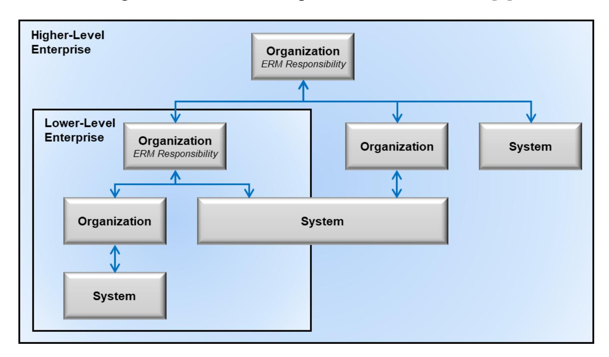
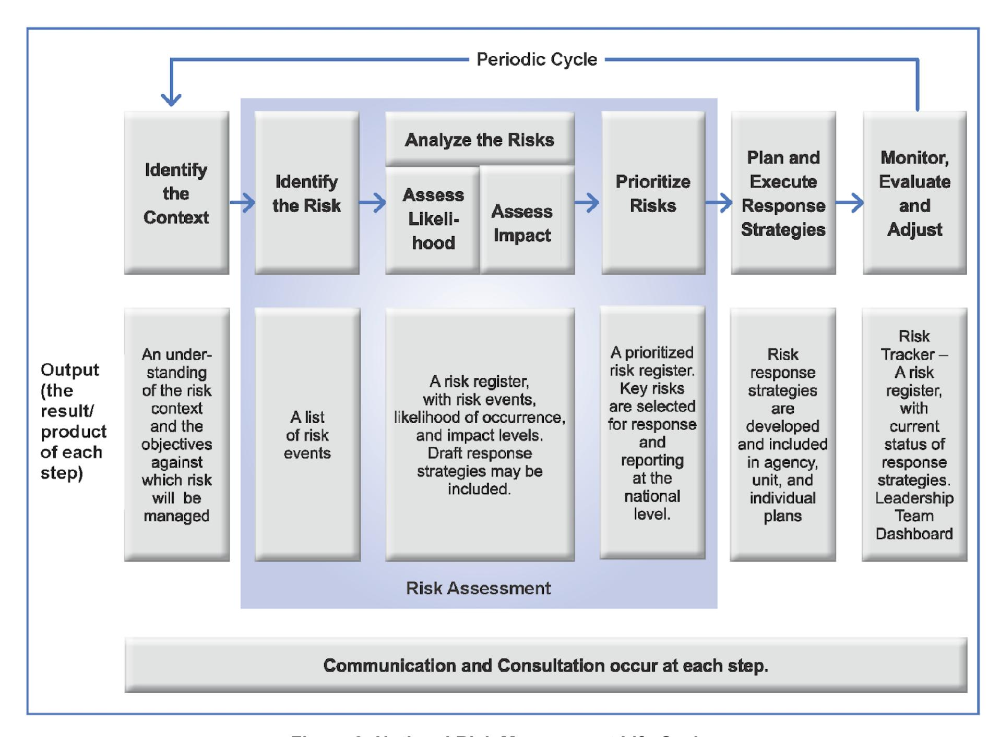
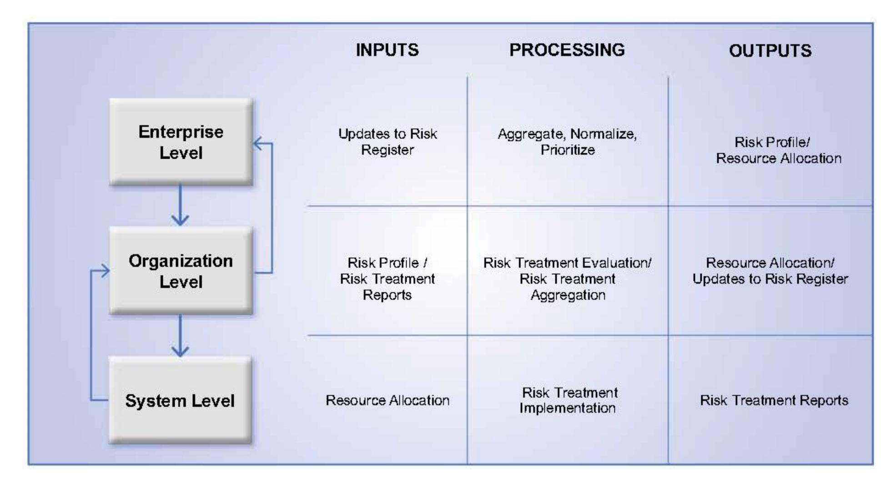
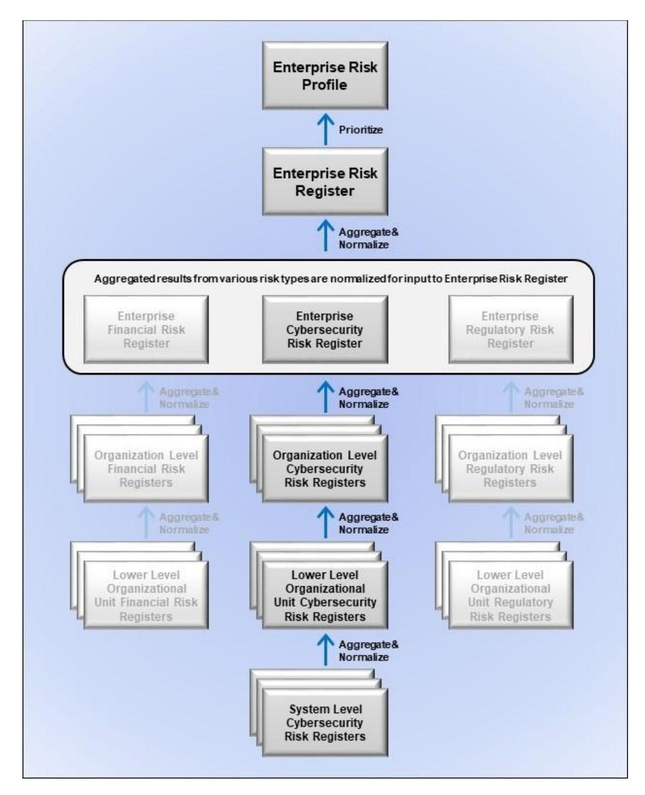
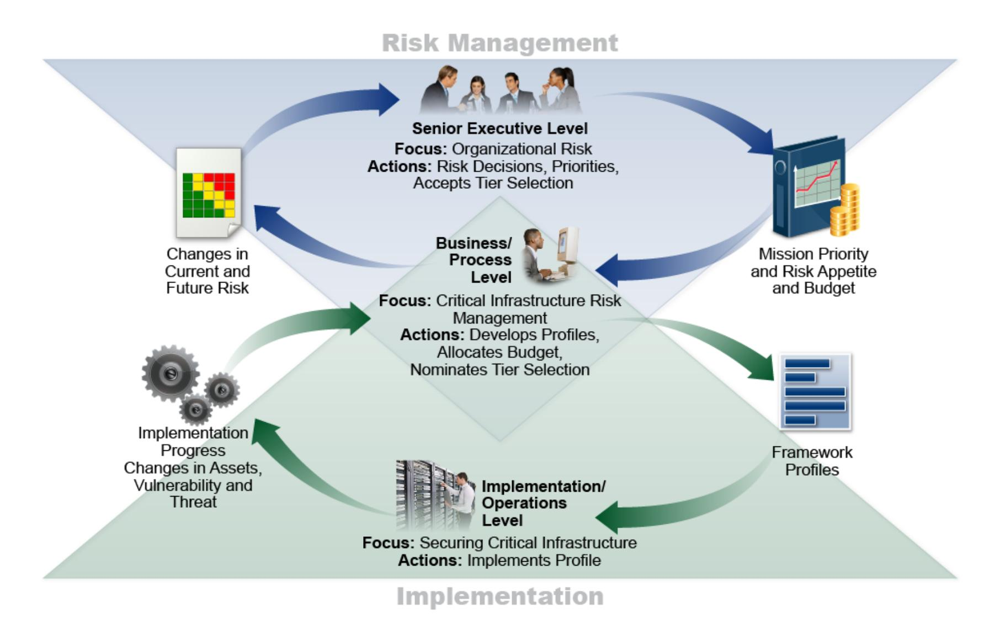
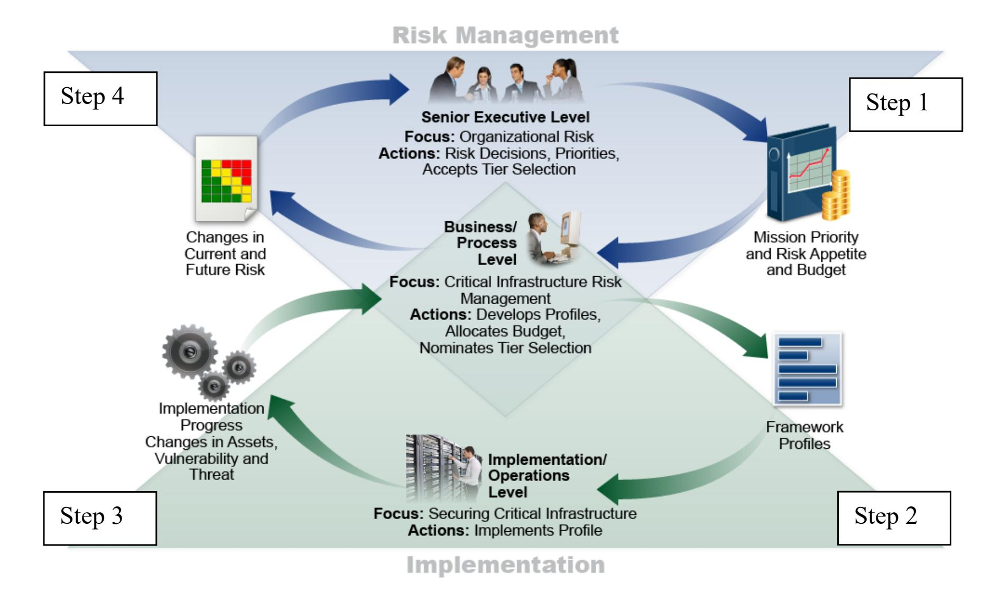

{0}------------------------------------------------

## **Withdrawn NIST Technical Series Publication**

#### **Warning Notice**

The attached publication has been withdrawn (archived), and is provided solely for historical purposes. It may have been superseded by another publication (indicated below).

| Withdrawn Publication                                                                                              |  |  |  |  |  |  |  |  |  |
|--------------------------------------------------------------------------------------------------------------------|--|--|--|--|--|--|--|--|--|
| NIST IR 8286                                                                                                       |  |  |  |  |  |  |  |  |  |
| Integrating Cybersecurity and Enterprise Risk Management (ERM)                                                     |  |  |  |  |  |  |  |  |  |
| October 2020                                                                                                       |  |  |  |  |  |  |  |  |  |
| December 18, 2025                                                                                                  |  |  |  |  |  |  |  |  |  |
| NIST IR 8286 is withdrawn and superseded in its entirety by NIST IR 8286r1                                      |  |  |  |  |  |  |  |  |  |
| (if applicable) Superseding Publication(s)                                                                      |  |  |  |  |  |  |  |  |  |
| The attached publication has been superseded by the following publication(s):                                   |  |  |  |  |  |  |  |  |  |
| NIST IR 8286r1                                                                                                     |  |  |  |  |  |  |  |  |  |
| Integrating Cybersecurity and Enterprise Risk Management (ERM)                                                     |  |  |  |  |  |  |  |  |  |
| Stephen Quinn; Julie Chua; Nahla Ivy; R. K. Gardner; Karen Kent; Matthew C. Smith; Greg Witte |  |  |  |  |  |  |  |  |  |
| December 18, 2025                                                                                                  |  |  |  |  |  |  |  |  |  |
| https://doi.org/10.6028/NIST.IR.8286r1                                                                             |  |  |  |  |  |  |  |  |  |
| Additional Information (if applicable)                                                                             |  |  |  |  |  |  |  |  |  |
| Computer Security Division (Information Technology Laboratory)                                                     |  |  |  |  |  |  |  |  |  |
|                                                                                                                    |  |  |  |  |  |  |  |  |  |
|                                                                                                                    |  |  |  |  |  |  |  |  |  |
|                                                                                                                    |  |  |  |  |  |  |  |  |  |
|                                                                                                                    |  |  |  |  |  |  |  |  |  |
|                                                                                                                    |  |  |  |  |  |  |  |  |  |

Date updated: December 18, 2025

**Announcement Link**

{1}------------------------------------------------

## **NISTIR 8286**

# **Integrating Cybersecurity and Enterprise Risk Management (ERM)**

Kevin Stine Stephen Quinn Greg Witte R. K. Gardner

This publication is available free of charge from: https://doi.org/10.6028/NIST.IR.8286

{2}------------------------------------------------

## **NISTIR 8286**

# **Integrating Cybersecurity and Enterprise Risk Management (ERM)**

*Applied Cybersecurity Division Huntington Ingalls Industries Information Technology Laboratory Annapolis Junction, MD*

### Stephen Quinn R. K. Gardner

Kevin Stine Greg Witte

*Computer Security Division New World Technology Partners Information Technology Laboratory Annapolis, MD*

> This publication is available free of charge from: https://doi.org/10.6028/NIST.IR.8286

> > October 2020

U.S. Department of Commerce *Wilbur L. Ross, Jr., Secretary*

{3}------------------------------------------------

#### National Institute of Standards and Technology Interagency or Internal Report 8286 74 pages (October 2020)

This publication is available free of charge from: https://doi.org/10.6028/NIST.IR.8286

Certain commercial entities, equipment, or materials may be identified in this document in order to describe an experimental procedure or concept adequately. Such identification is not intended to imply recommendation or endorsement by NIST, nor is it intended to imply that the entities, materials, or equipment are necessarily the best available for the purpose.

There may be references in this publication to other publications currently under development by NIST in accordance with its assigned statutory responsibilities. The information in this publication, including concepts and methodologies, may be used by federal agencies even before the completion of such companion publications. Thus, until each publication is completed, current requirements, guidelines, and procedures, where they exist, remain operative. For planning and transition purposes, federal agencies may wish to closely follow the development of these new publications by NIST.

Organizations are encouraged to review all draft publications during public comment periods and provide feedback to NIST. Many NIST cybersecurity publications, other than the ones noted above, are available at [https://csrc.nist.gov/publications.](https://csrc.nist.gov/publications)

#### **Comments on this publication may be submitted to:**

National Institute of Standards and Technology Attn: Applied Cybersecurity Division, Information Technology Laboratory 100 Bureau Drive (Mail Stop 2000) Gaithersburg, MD 20899-8930 Email: [nistir8286@nist.gov](mailto:nistir8286@nist.gov)

All comments are subject to release under the Freedom of Information Act (FOIA).

{4}------------------------------------------------

#### **Reports on Computer Systems Technology**

The Information Technology Laboratory (ITL) at the National Institute of Standards and Technology (NIST) promotes the U.S. economy and public welfare by providing technical leadership for the Nation's measurement and standards infrastructure. ITL develops tests, test methods, reference data, proof of concept implementations, and technical analyses to advance the development and productive use of information technology. ITL's responsibilities include the development of management, administrative, technical, and physical standards and guidelines for the cost-effective security and privacy of other than national security-related information in federal information systems.

#### **Abstract**

The increasing frequency, creativity, and severity of cybersecurity attacks means that all enterprises should ensure that cybersecurity risk is receiving appropriate attention within their enterprise risk management (ERM) programs. This document is intended to help individual organizations within an enterprise improve their cybersecurity risk information, which they provide as inputs to their enterprise's ERM processes through communications and risk information sharing. By doing so, enterprises and their component organizations can better identify, assess, and manage their cybersecurity risks in the context of their broader mission and business objectives. Focusing on the use of risk registers to set out cybersecurity risk, this document explains the value of rolling up measures of risk usually addressed at lower system and organization levels to the broader enterprise level.

#### **Keywords**

cybersecurity risk management (CSRM); cybersecurity risk measurement; cybersecurity risk profile; cybersecurity risk register (CSRR); enterprise risk management (ERM); enterprise risk register (ERR); enterprise risk profile; risk appetite; risk tolerance.

#### **Acknowledgments**

The authors wish to thank all individuals, organizations, and enterprises that contributed to the creation of this document. This includes Donna Dodson, Nahla Ivy, Naomi Lefkovitz, Amy Mahn, Rodney Petersen, Victoria Yan Pillitteri, Ron Ross, and Adam Sedgewick of NIST; Larry Feldman, Heather Mills, Matthew Smith, and Daniel Topper of Huntington Ingalls Industries; Mat Heyman of Impresa Management Solutions; and Karen Scarfone of Scarfone Cybersecurity. Organizations and individuals who provided feedback on the public comment drafts include: Aon; the Association of Local Government Auditors; Paul Barham, Pat Nolan, Michael Vallone, and Christopher White of Booz Allen Hamilton; Consortium for Information and Software Quality; P. Bevill, G. Celestin, J. Chua, M. Creary, E. Flaim, K. Francis, C. Gordon, K. Isaac, C. Livingston, M. Merritt, M. Nighswander, K. Pannah, J. Prutow, and N. Rohloff of the Cyber-ERM Community of Interest; FAIR Institute; Forescout Technologies; Adam Bobrow of Foresight Resilience Strategies; the IT Risk Management Team of the Internal Revenue Service, Larry Clinton of the Internet Security Alliance; Gerald Beuchelt and Christine Wachter of LogMeIn; Mosaic 451; Alex Krutov of Navigation Advisors; Ismael Garcia of the Nuclear Regulatory Commission; Kelly Hood and Tom Conkle of Optic Cyber Solutions; John Kimmins of Palindrome; Profitabil-IT; Dick Brooks of Reliable Energy Analytics; Jack Freund of RiskLens; Marshall Toburen of RSA Security; Paul Rohmeyer of Stevens Institute of Technology; The Open Group; Rob Arnold of Threat Sketch; Ashley P. Moore, and Nnake Nweke of the U.S. Agency for Global Media; U.S. Air Force; U.S. Department of Defense; U.S.

{5}------------------------------------------------

Department of Education; U.S. Department of Energy; U.S. Department of Health and Human Services; U.S. Department of Homeland Security - Cybersecurity and Infrastructure Security Agency; U.S. Navy; other individuals include Simon Burson; Norman Marks; Ellen Swanson; and, Douglas Webster.

#### **Audience**

The primary audience for this publication includes both federal government and non-federal government cybersecurity professionals at all levels who understand cybersecurity but may be unfamiliar with the details of enterprise risk management (ERM).

The secondary audience includes both federal and non-federal government corporate officers, high-level executives, ERM officers and staff members, and others who understand ERM but may be unfamiliar with the details of cybersecurity.

All readers are expected to gain an improved understanding of how cybersecurity risk management (CSRM) and ERM complement and relate to each other as well as the benefits of integrating their use.

#### **Trademark Information**

All registered trademarks and trademarks belong to their respective organizations.

#### **Document Conventions**

The term 'step' or 'steps' is used in multiple frameworks and documents. If the term 'step' is referring to anything other than the meaning from the ERM Playbook from Figure 2, it will be preceded by a document or framework to differentiate its context (e.g., 'NIST Cybersecurity Framework Step 1: *Prioritize and Scope*'.)

For the purposes of this document, the terms "cybersecurity" and "information security" are used interchangeably. While technically different in that information security generally is generally considered to be all encompassing—including the cybersecurity domain—the term cybersecurity has expanded in conventional usage to be equivalent to information security. Likewise, the terms Cybersecurity Risk Management (CSRM) and Information Security Risk Management (ISRM) are similarly used interchangeably based on the same reasoning.

#### **Patent Disclosure Notice**

*NOTICE: The Information Technology Laboratory (ITL) has requested that holders of patent claims whose use may be required for compliance with the guidance or requirements of this publication disclose such patent claims to ITL. However, holders of patents are not obligated to respond to ITL calls for patents and ITL has not undertaken a patent search in order to identify which, if any, patents may apply to this publication.* 

*As of the date of publication and following call(s) for the identification of patent claims whose use may be required for compliance with the guidance or requirements of this publication, no such patent claims have been identified to ITL.* 

*No representation is made or implied by ITL that licenses are not required to avoid patent infringement in the use of this publication.*

{6}------------------------------------------------

#### **Executive Summary**

All types of organizations, from corporations to federal agencies, face a broad array of risks. For federal agencies, the Office of Management and Budget (OMB) Circular A-11 defines risk as "the effect of uncertainty on objectives" [\[1\].](#page-66-0) The effect of uncertainty on *enterprise* mission and business objectives may then be considered an "enterprise risk" that must be similarly managed. An *enterprise* is an organization that exists at the top level of a hierarchy with unique risk management responsibilities. Managing risks at that level is known as enterprise risk management (ERM) and calls for understanding the core risks that an enterprise faces, determining how best to address those risks, and ensuring that the necessary actions are taken. In the Federal Government, ERM is considered "an effective agency-wide approach to addressing the full spectrum of the organization's significant risks by understanding the combined impact of risks as an interrelated portfolio rather than addressing risks only within silos" [\[1\].](#page-66-0)

Cybersecurity risk is an important type of risk for any enterprise. Other risks include but are not limited to financial, legal, legislative, operational, privacy, reputational, safety, strategic, and supply chain risks [\[2\].](#page-66-1) As part of an ERM program, senior leaders (e.g., corporate officers, government senior executive staff) often have fiduciary and reporting responsibilities that other organizational stakeholders do not, so they have a unique responsibility to holistically manage the combined set of risks, including cybersecurity risk.

The individual organizations that comprise every enterprise are experiencing an increase in the frequency, creativity, and severity of cybersecurity attacks. All organizations and enterprises, regardless of size or type, should ensure that cybersecurity risks receive appropriate attention as they carry out their ERM functions.

Since enterprises are at various degrees of maturity regarding the implementation of risk management, this document offers NIST's cybersecurity risk management (CSRM) expertise to help organizations improve the cybersecurity risk information they provide as inputs to their enterprise's ERM programs.

Many resources—such as well-known frameworks from the Committee of Sponsoring Organizations (COSO), Office of Management and Budget (OMB) circulars, and the International Organization for Standardization (ISO)—document ERM frameworks and processes. They generally include similar approaches: identify context, identify risks, analyze risk, estimate risk importance, determine and execute the risk response, and identify and respond to changes over time. A critical risk document used to track and communicate risk information for all of these steps throughout the enterprise is called a *risk register* [\[1\].](#page-66-0) [1](#page-6-0) The risk register provides a formal communication vehicle for sharing and coordinating cybersecurity risk activities as an input to ERM decision makers. For example, *cybersecurity risk registers* are key aspects of managing and communicating about those particular risks.[2](#page-6-1)

1 OMB Circular A-11 defines a risk register as "a repository of risk information including the data understood about risks over time" [1].

2 Organizations creating a risk management program for the first time should not wait until the risk register is completed before addressing obvious issues; however, over time, it should become the ordinary means of communicating risk information.

{7}------------------------------------------------

At higher levels in the enterprise structure, those cybersecurity and other risk registers are aggregated, normalized, and prioritized into *risk profiles*. A risk profile is defined by OMB Circular A-123 as "a prioritized inventory of the most significant risks identified and assessed through the risk assessment process versus a complete inventory of risks" [\[3\].](#page-66-2) While it is critical that enterprises address potential negative impacts on mission and business objectives, it is equally critical (and required for federal agencies) that enterprises plan for success. OMB states in Circular A-123 that "the [Enterprise Risk] profile must identify sources of uncertainty, both positive (opportunities) and negative (threats)." Enterprise-level decision makers use the risk profile to choose which enterprise risks to address, allocate resources, and delegate responsibilities to appropriate risk owners. ERM programs should define terminology, formats, criteria, and other guidance for risk inputs from lower levels of the enterprise.

Cybersecurity risk inputs to ERM programs should be documented and tracked in written cybersecurity risk registers[3](#page-7-0) that comply with the ERM program guidance. However, most enterprises do not communicate their cybersecurity risk guidance or risk responses in consistent, repeatable ways. Methods such as quantifying cybersecurity risk in dollars and aggregating cybersecurity risks are largely ad hoc and are sometimes not performed with the same rigor as methods for quantifying other types of risk within the enterprise.

In addition to widely using cybersecurity risk registers, improving the risk measurement and analysis methods used in CSRM would boost the quality of the risk information provided to ERM. In turn, this practice would promote better management of cybersecurity at the enterprise level and support the enterprise's objectives.

There are proven methods available for performing CSRM and integrating the results. Improving the measurement and communications methods used in CSRM, such as through the use of cybersecurity risk registers, can improve the quality of the risk information provided to ERM. This result promotes enterprise-wide CSRM and supports enterprise-level decision making. Improved communications will also help executives and corporate officers understand the challenges that cybersecurity professionals face when providing those professionals with the information they are accustomed to receiving for other types of risk.

3 Formats include risk register data displayed in dashboards, GRC tools, file formats for communicating risk register data such as the spreadsheet[s \(CSV\) and JSON formats](https://csrc.nist.gov/publications/detail/nistir/8286/draft) located at [https://csrc.nist.gov/publications/detail/nistir/8286/final.](https://csrc.nist.gov/publications/detail/nistir/8286/final)

{8}------------------------------------------------

#### **Table of Contents**

|   |     | Executive Summary |                                                                     | iv |
|---|-----|-------------------|---------------------------------------------------------------------|----|
| 1 |     | Introduction      |                                                                     | 1  |
|   | 1.1 |                   | Purpose and Scope                                                | 2  |
|   | 1.2 |                   | Document Structure                                                  | 3  |
| 2 |     |                   | Gaps in Managing Cybersecurity Risk as an ERM Input                 | 4  |
|   | 2.1 |                   | Overview of ERM                                                     | 4  |
|   |     | 2.1.1             | Common Use of ERM                                                   | 6  |
|   |     | 2.1.2             | ERM Framework Steps                                              | 6  |
|   | 2.2 |                   | Shortcomings of Typical Approaches to Cybersecurity Risk Management | 10 |
|   |     | 2.2.1             | Lack of Standardized Measures                                    | 10 |
|   |     | 2.2.2             | Informal Analysis Methods                                        | 10 |
|   |     | 2.2.3             | Focus on the System Level                                        | 11 |
|   |     | 2.2.4             | Increasing System and Ecosystem Complexity                          | 11 |
|   | 2.3 |                   | The Gap Between CSRM Output and ERM Input                           | 12 |
|   |     | 2.3.1             | Insufficient Asset Information                                   | 14 |
| 3 |     |                   | Cybersecurity Risk Considerations Throughout the ERM Process     | 14 |
|   | 3.1 |                   | Identify the Context                                                | 17 |
|   |     | 3.1.1             | Notional Risk Management Roles                                   | 18 |
|   |     | 3.1.2             | Risk Management Strategy                                         | 20 |
|   | 3.2 |                   | Identify the Risks                                                  | 21 |
|   |     | 3.2.1             | Inventory and Valuation of Assets                                | 22 |
|   |     | 3.2.2             | Determination of Potential Threats                               | 23 |
|   |     | 3.2.3             | Determination of Exploitable and Susceptible Conditions          | 25 |
|   |     | 3.2.4             | Evaluation of Potential Consequences                                | 25 |
|   | 3.3 |                   | Analyze the Risks                                                | 26 |
|   |     | 3.3.1             | Risk Analysis Types                                              | 26 |
|   |     | 3.3.2             | Techniques for Estimating Likelihood and Impact of Consequences     | 27 |
|   | 3.4 |                   | Prioritize Risks                                                 | 29 |
|   | 3.5 |                   | Plan and Execute Risk Response Strategies                           | 30 |
|   |     | 3.5.1             | Applying Security Controls to Reduce Risk Exposure               | 31 |
|   |     | 3.5.2             | Responding to Residual Risk                                      | 32 |
|   |     | 3.5.3             | When a Risk Event Passes Without Triggering the Event               | 34 |

{9}------------------------------------------------

| 3.6 Monitor, Evaluate, and Adjust  35 3.6.1 Continuous Risk Monitoring 35 3.6.2 Key Risk Indicators 37 3.6.3 Continuous Improvement  38 3.7 Considerations of Positive Risks as an Input to ERM  39 3.8 Creating and Maintaining an Enterprise-Level Cybersecurity Risk Register. 40 3.9 Cybersecurity Risk Data Conditioned for Enterprise Risk Rollup 42 Cybersecurity Risk Management as Part of a Portfolio View 48 4.1 Applying the Enterprise Risk Register and Developing the Enterprise Risk Profile 49 4.2 Translating the Risk Profile to Inform Leadership Decisions 51 4.3 Information and Decision Flows in Support of ERM 52 4.4 Conclusion  55 References 56 List of Appendices Appendix A— Acronyms and Abbreviations 59 Appendix B— Glossary  61 Appendix C— Federal Government Sources for Identifying Risks  64 List of Figures Figure 1: Enterprise Hierarchy for Cybersecurity Risk Management 1 Figure 2: Notional Risk Management Life Cycle  9 Figure 3: Risk Register Information Flow Among System, Organization, and Enterprise Levels 13 Figure 4: Notional Cybersecurity Risk Register Template 15 Figure 5: Likelihood and Impact Matrix Derived from NIST SP 800-30 Rev. 1 29 Figure 6: Example of a Quantitative Risk Matrix  30 Figure 7: Excerpt from a Notional Cybersecurity Risk Register 33 Figure 8: Integration of CSRRs into Enterprise Risk Profile  41 Figure 9: Notional Information and Decision Flows Diagram from NIST Cybersecurity Framework  49 |
|---------------------------------------------------------------------------------------------------------------------------------------------------------------------------------------------------------------------------------------------------------------------------------------------------------------------------------------------------------------------------------------------------------------------------------------------------------------------------------------------------------------------------------------------------------------------------------------------------------------------------------------------------------------------------------------------------------------------------------------------------------------------------------------------------------------------------------------------------------------------------------------------------------------------------------------------------------------------------------------------------------------------------------------------------------------------------------------------------------------------------------------------------------------------------------------------------------------------------------------------------------------------------------------------------------------------------------------------------------------------------------------------------------------------------------------------------------------------------------------------------------------------------------------------------------------------------------------------------------------------------------------------------------------------------------------------------------------------------------------------|
|                                                                                                                                                                                                                                                                                                                                                                                                                                                                                                                                                                                                                                                                                                                                                                                                                                                                                                                                                                                                                                                                                                                                                                                                                                                                                                                                                                                                                                                                                                                                                                                                                                                                                                                                             |
|                                                                                                                                                                                                                                                                                                                                                                                                                                                                                                                                                                                                                                                                                                                                                                                                                                                                                                                                                                                                                                                                                                                                                                                                                                                                                                                                                                                                                                                                                                                                                                                                                                                                                                                                             |
|                                                                                                                                                                                                                                                                                                                                                                                                                                                                                                                                                                                                                                                                                                                                                                                                                                                                                                                                                                                                                                                                                                                                                                                                                                                                                                                                                                                                                                                                                                                                                                                                                                                                                                                                             |
|                                                                                                                                                                                                                                                                                                                                                                                                                                                                                                                                                                                                                                                                                                                                                                                                                                                                                                                                                                                                                                                                                                                                                                                                                                                                                                                                                                                                                                                                                                                                                                                                                                                                                                                                             |
|                                                                                                                                                                                                                                                                                                                                                                                                                                                                                                                                                                                                                                                                                                                                                                                                                                                                                                                                                                                                                                                                                                                                                                                                                                                                                                                                                                                                                                                                                                                                                                                                                                                                                                                                             |
|                                                                                                                                                                                                                                                                                                                                                                                                                                                                                                                                                                                                                                                                                                                                                                                                                                                                                                                                                                                                                                                                                                                                                                                                                                                                                                                                                                                                                                                                                                                                                                                                                                                                                                                                             |
|                                                                                                                                                                                                                                                                                                                                                                                                                                                                                                                                                                                                                                                                                                                                                                                                                                                                                                                                                                                                                                                                                                                                                                                                                                                                                                                                                                                                                                                                                                                                                                                                                                                                                                                                             |
|                                                                                                                                                                                                                                                                                                                                                                                                                                                                                                                                                                                                                                                                                                                                                                                                                                                                                                                                                                                                                                                                                                                                                                                                                                                                                                                                                                                                                                                                                                                                                                                                                                                                                                                                             |
|                                                                                                                                                                                                                                                                                                                                                                                                                                                                                                                                                                                                                                                                                                                                                                                                                                                                                                                                                                                                                                                                                                                                                                                                                                                                                                                                                                                                                                                                                                                                                                                                                                                                                                                                             |
|                                                                                                                                                                                                                                                                                                                                                                                                                                                                                                                                                                                                                                                                                                                                                                                                                                                                                                                                                                                                                                                                                                                                                                                                                                                                                                                                                                                                                                                                                                                                                                                                                                                                                                                                             |
|                                                                                                                                                                                                                                                                                                                                                                                                                                                                                                                                                                                                                                                                                                                                                                                                                                                                                                                                                                                                                                                                                                                                                                                                                                                                                                                                                                                                                                                                                                                                                                                                                                                                                                                                             |
|                                                                                                                                                                                                                                                                                                                                                                                                                                                                                                                                                                                                                                                                                                                                                                                                                                                                                                                                                                                                                                                                                                                                                                                                                                                                                                                                                                                                                                                                                                                                                                                                                                                                                                                                             |
|                                                                                                                                                                                                                                                                                                                                                                                                                                                                                                                                                                                                                                                                                                                                                                                                                                                                                                                                                                                                                                                                                                                                                                                                                                                                                                                                                                                                                                                                                                                                                                                                                                                                                                                                             |
|                                                                                                                                                                                                                                                                                                                                                                                                                                                                                                                                                                                                                                                                                                                                                                                                                                                                                                                                                                                                                                                                                                                                                                                                                                                                                                                                                                                                                                                                                                                                                                                                                                                                                                                                             |
|                                                                                                                                                                                                                                                                                                                                                                                                                                                                                                                                                                                                                                                                                                                                                                                                                                                                                                                                                                                                                                                                                                                                                                                                                                                                                                                                                                                                                                                                                                                                                                                                                                                                                                                                             |
|                                                                                                                                                                                                                                                                                                                                                                                                                                                                                                                                                                                                                                                                                                                                                                                                                                                                                                                                                                                                                                                                                                                                                                                                                                                                                                                                                                                                                                                                                                                                                                                                                                                                                                                                             |

{10}------------------------------------------------

Figure 11: Notional Information and Decision Flows Diagram with Numbered Steps ... 53

#### **List of Tables**

| Table 1: Similarities Among Selected ERM and Risk Management Documents       | 7  |
|---------------------------------------------------------------------------------|----|
| Table 2: Descriptions of Notional Cybersecurity Risk Register Template Elements | 15 |
| Table 3: Response Types for Negative Cybersecurity Risks                        | 31 |
| Table 4: Examples of Proactive Risk Management Activities                       | 36 |
| Table 5: Response Types for Positive Cybersecurity Risks                     | 40 |
| Table 6: Notional Enterprise Risk Register                                      | 44 |
| Table 7: Descriptions of the Notional Enterprise Risk Register Elements      | 46 |
| Table 8: Notional Enterprise Risk Portfolio View for a Private Corporation   | 52 |

{11}------------------------------------------------

#### **1 Introduction**

The terms *organization* and *enterprise* are often used interchangeably.[4](#page-11-2) However, for the purposes of this document, an *organization* is defined as an entity of any size, complexity, or positioning within a larger organizational structure (e.g., a federal agency or company) [\[5\].](#page-66-4) An *enterprise* is an organization by this definition, but it exists at the top level of the hierarchy where individual senior leaders have unique risk management responsibilities. In terms of cybersecurity risk management (CSRM), most responsibilities tend to be carried out by individual organizations within an enterprise. In contrast, the responsibility for tracking key *enterprise* risks and their impacts on objectives is held by top-level corporate officers and board members who have fiduciary and reporting duties not performed anywhere else in the enterprise.

Figure 1 depicts a notional enterprise with subordinate organizations, illustrating that one of those subordinate organizations is itself an enterprise. Both government and industry are represented in this depiction. Consider the example of the Department of Commerce as a higherlevel enterprise with bureaus (e.g., Census Bureau, National Oceanic and Atmospheric Administration [NOAA], NIST) as lower-level enterprises and subordinates (e.g., NOAA's National Weather Service, NIST laboratories) representing organizations. In industry, consider mergers and acquisitions where an enterprise acquires another company, which itself was an enterprise, and then subordinates it within the higher-level enterprise's conglomeration of organizations and systems.[5](#page-11-3) Each enterprise is supported by various *systems*, defined as "a discrete set of information resources organized expressly for the collection, processing, maintenance, use, sharing, dissemination, or disposition of information" [\[5\].](#page-66-4)

**Figure 1: Enterprise Hierarchy for Cybersecurity Risk Management**

4 For example, NISTIR 8170 [4] uses *enterprise risk management* and *organization-wide risk management* interchangeably. The scope of IR 8170 includes smaller enterprises than this publication does, so an *enterprise* as defined in IR 8170 may be comprised of a single organization. The enterprises discussed in this publication have more complex compositions.

5 An enterprise can be thought of structurally as a portfolio (or set of portfolios). Just as a portfolio can be a combination of programs, projects, and lower-level portfolios, so too can an enterprise be comprised of one or more systems, organizations, and subordinate enterprises.

{12}------------------------------------------------

#### **1.1 Purpose and Scope**

This document is intended to help improve communications (including risk information sharing) between and among cybersecurity professionals, high-level executives, and corporate officers at multiple levels. The goal is to assist personnel in these enterprises and their subordinate organizations as well as systems owners to better identify, assess, and manage cybersecurity risks in the context of their broader mission and business objectives.[6](#page-12-1) This document will help cybersecurity professionals understand what executives and corporate officers need to carry out enterprise risk management (ERM). This includes, but is not limited to, what data to collect, what analyses to perform, and how to consolidate and condition this discipline-specific risk information so that it provides useful inputs for ERM programs. This document will also help high-level executives and corporate officers understand the challenges that cybersecurity professionals face in providing them with relevant information. Because enterprise stakeholders are accustomed to receiving reports regarding many types of risk, guidance on cybersecurity that is consistent with these other risk categories will support well-crafted and actionable risk appetite and risk tolerance decisions and statements.

Government and private industry cybersecurity risk management (CSRM) and ERM programs are similar but often involve different oversight and reporting requirements, such as Congressional testimony versus a regulatory filing. For this reason, the Committee of Sponsoring Organizations (COSO) is often cited due to its dual role in providing guidance to both public and private organizations regarding ERM and the fact that OMB adopted much of its language when developing Circular A-123.

This document opens the discussion to bridge existing private industry risk management processes with government-mandated federal agency cybersecurity risk requirements derived from OMB Circular A-130. It also introduces concepts which will be further developed in subsequent documents in this (NISTIR 8286) series. Those include concepts that often involve non-standard approaches, such as communicating risk, consistently identifying threats and risks, estimating likelihood and impact, calculating risk exposure, establishing and using risk reserves, monitoring risk, reporting risk, and integrating with ERM programs.

An informative reference that links the contents of this document with the NIST Cybersecurity Framework will be posted as part of the National Online Informative References (OLIR) Program.[7](#page-12-2)

This document references some materials that are specifically intended for use by federal agencies and will be highlighted as such, but the concepts and approaches are intended to be useful for all enterprises.

6 Figure 1 depicts the correlation of cybersecurity professional (system), high-level executives without fiduciary reporting requirements (organization), and corporate officers with fiduciary reporting requirements (enterprise), respectively.

7 Se[e https://www.nist.gov/cyberframework/informative-references](https://www.nist.gov/cyberframework/informative-references) for an overview of OLIR.

{13}------------------------------------------------

#### **1.2 Document Structure**

The remainder of this document is organized into the following major sections:

- Section 2 explains the basics of ERM and CSRM and highlights high-level gaps between current practices for ERM and cybersecurity risk management.
- Section 3 discusses cybersecurity risk considerations throughout the ERM process in detail, highlighting the use of the risk register to document cybersecurity risk as ERM input.
- Section 4 examines adopting a portfolio view of risk at the enterprise level based on normalizing and aggregating risk registers into an Enterprise Risk Register and then applying prioritization to it to generate an Enterprise Risk Profile in support of senior executive decision-making during boardroom deliberations.
- References section.
- Appendix A contains acronyms used in the document.
- Appendix B provides a glossary of terminology used in the document.
- Appendix C lists Federal Government sources for identifying risks as defined in *Playbook: Enterprise Risk Management for the U.S. Federal Government* [\[2\].](#page-66-1)

{14}------------------------------------------------

#### **2 Gaps in Managing Cybersecurity Risk as an ERM Input**

Office of Management and Budget (OMB) Circular A-11 defines risk as "the effect of uncertainty on objectives" [\[1\].](#page-66-0) The effect of uncertainty on *enterprise* mission and business objectives may then be considered an "enterprise risk" that must be similarly managed. The process of managing risks at the enterprise level is known as enterprise risk management (ERM) and calls for:

- Identifying and understanding the core risks facing an enterprise,
- determining how best to address those risks, and
- ensuring that the necessary actions are taken.

Today's information and technologies impact every aspect of enterprises. This publication focuses on recognizing and incorporating *cybersecurity risk*[8](#page-14-2) within the overall sphere of enterprise risk.

This approach complements other NIST documents by informing and extending existing guidance to respond to risks to an enterprise's data, information, and technology assets. Integration draws upon cybersecurity risk management (CSRM) and the basics of ERM, which informs and is informed by various risks at subordinate levels. Comparing the results of CSRM activities with those required for effective input to ERM enables enterprise stakeholders to identify opportunities to close gaps.

#### **2.1 Overview of ERM**

ERM requires identifying and understanding the various types of risk that an enterprise faces, determining the probability that these risks will occur, and estimating their potential impact. OMB considers ERM to be "an effective agency-wide approach to addressing the full spectrum of the organization's significant risks by understanding the combined impact of risks as an interrelated portfolio, rather than addressing risks only within silos" [1].

Cybersecurity risk is one portion of the spectrum of an enterprise's core risks. Appendix A of *Playbook: Enterprise Risk Management for the U.S. Federal Government* [\[2\]](#page-66-1) defines numerous risk types, including compliance, cybersecurity ("cyber information security"), financial, legal, legislative, operational, reputational, and strategic. This list can easily be expanded to other risk disciplines, such as safety, privacy, and supply chains that ultimately anchor in ERM. In ERM, enterprises holistically manage the combined set of enterprise risks.[9](#page-14-3)

The COSO publication, *Enterprise Risk Management - Integrating with Strategy and Performance,* defines ERM as the "culture, capabilities, and practices that organizations integrate

8 *Cybersecurity risk* is an effect of uncertainty on information and technology. Cybersecurity risks relate to the loss of confidentiality, integrity, or availability of information, data, or information (or control) systems and reflect the potential adverse impacts to organizational operations (i.e., mission, functions, image, or reputation) and assets, individuals, other organizations, and the Nation. (Definition based on International Organization for Standardization [ISO] Guide 73 [6]

9 "OMB Circular A-123 establishes an expectation for federal agencies to proactively consider and address risks through an integrated, organization-level view of events, conditions, or scenarios that impact mission achievement." [4]

{15}------------------------------------------------

with strategy-setting and apply when they carry out that strategy, with a purpose of managing risk in creating, preserving, and realizing value" [\[8\].](#page-66-5) Public and private enterprises have a common primary purpose for ERM: to safeguard the enterprise's mission, finances (e.g., net revenue, capital, and free cash flow), and reputation (e.g., stakeholder trust) in the face of natural, accidental, and adversarial threats.

This is accomplished by considering enterprise risks in relation to achieving strategic and operational objectives as typically outlined in an organizational strategic plan. OMB Circular A-123 requires ERM risk profiles to include four kinds of objectives: strategic, operations (operational effectiveness and efficiency), reporting (reporting reliability), and compliance (compliance with applicable laws and regulations). While there may be some overlap of risk among the categories of objectives, understanding uncertainty as it affects these objectives will help inform effective and timely decision-making. In turn, context and categorization processes support risk guidance back to subordinate levels. Effective ERM balances achieving security objectives with optimizing limited resources. Effective *management* balances achieving enterprise mission and objectives with optimizing resources (which are often limited) and risk.

This document draws on ERM principles regarding integration with culture, strategy, and performance. One such principle is that an "organization must manage risk to strategy and business objectives in relation to its *risk appetite*—that is, the types and amount of risk, on a broad level, it is willing to accept in its pursuit of value" [\[8\].](#page-66-5) OMB adapted this language for government use in Circular A-123 by similarly stating risk appetite "is the broad-based amount of risk an organization is willing to accept in pursuit of its mission/vision." Risk appetite is established by the organization's most senior-level leadership (enterprise) and serves as the guidepost for decisions such as setting strategy and selecting objectives.

Another important ERM concept is *risk tolerance*—the organization or stakeholders' readiness to bear the remaining risk *after responding to or considering the risk* in order to achieve its objectives (while recognizing that such tolerance can be influenced by legal or regulatory requirements) [\[6\].](#page-66-6) [10](#page-15-0) OMB again adapted the COSO language by stating that risk tolerance "is the acceptable level of variance in performance relative to the achievement of objectives."

Risk tolerance can be defined at the enterprise level, but OMB offers a bit of discretion to an organization, stating that risk tolerance is "generally established at the program, objective, or component level" which can include the organization levels depicted in Figure 1. Risk tolerance is always interpreted and applied by the receiving custodians of the risk management discipline (e.g., cybersecurity, legal, privacy) and usually interpreted at the organizational or system level [\[4\].](#page-66-7) [11](#page-15-1) For example, a statement of risk appetite might be: "Email service shall be available during the large majority of a 24 hour period." An associated risk tolerance statement for this defined

10 Similar guidance comes from OMB Circular A-123: "Risk must be analyzed in relation to achievement of the strategic objectives established in the Agency strategic plan (See OMB Circular No. A-11, Section 230), as well as risk in relation to appropriate operational objectives. Specific objectives must be identified and documented to facilitate identification of risks to strategic, operations, reporting, and compliance." [3]

11 NIST SP 800-39, *Managing Information Security Risk: Organization, Mission, and Information System View* [9] uses the term "risk tolerance" to collectively refer to what Circular A-123 and this publication differentiates into two terms: "risk tolerance" and "risk appetite.".

{16}------------------------------------------------

appetite is narrower, stating: "Email services shall not be interrupted more than five minutes during core hours."

Senior enterprise executives provide risk guidance (including advice regarding mission priority, risk appetite and tolerance guidance, and capital and operating budgets to manage known risks) to the organizations within their purview. Risk appetite and risk tolerance statements are the usual means for communicating this guidance. Organizations then manage and monitor processes that properly balance the risks and resource allocation with the value created by information and technology. Measurements (e.g., from key risk indicators, or KRIs) demonstrate where risk tolerances have been exceeded or validate that the enterprise is operating within the defined appetite. A subsequent report in this series (NISTIR 8286A) will provide detailed examples of risk appetite and risk tolerance statements and how they are interrupted and applied with the associated risk defined, managed, and communicated back to executive management via the risk register.

ERM processes should aid the senior enterprise executives by providing them with a portfolio view of key risks across the enterprise (discussed in Section 4).[12](#page-16-2)

#### **2.1.1 Common Use of ERM**

Public officials or corporate boards typically measure and weigh the impact and likelihood of each type of significant risk (e.g., market, operational, labor, geopolitical, cyber) to determine their individual and total impacts on the enterprise's mission, finances, and reputation. The public officials or board members then determine their risk appetite and resource allocations for each type of risk commensurate with likelihood and impact and balanced among all calculated enterprise risk exposures (the product of likelihood and impact). Public officials and board members also provide guidance to their corporate officers at the enterprise level and to high-level executives at the organizational level (see Figure 1). This includes guidance on ceilings for capital expenditures (CapEx) and operating expenses (OpEx) and objectives for free cash flow. They then issue guidance to continue, accelerate, reduce, delay, or cancel significant enterprise initiatives. They do this while making decisions about what constitutes prudent risk disclosures, balancing competing objectives of a) properly informing stakeholders and overseers (including regulators) through required filings and statements at hearings versus b) protecting sensitive information from competitors and adversaries.

#### **2.1.2 ERM Framework Steps**

There are many models that describe ERM processes. Historically, some organizations have treated CSRM input to ERM separately from other ERM inputs. However, Table 1 illustrates similarities among common risk management resources and processes including establish context, identify risks, analyze risks, estimate risk importance, determine and execute risk response, and monitor and respond to changes over time. The entries in Table 1 indicate (in parentheses) their identifier or section number from the source material whenever available. Table 1 provides a high-level comparison and is not intended as a crosswalk for mapping

12 Defined by OMB as "insight into all areas of organizational exposure to risk […] thus increasing an Agency's chances of experiencing fewer unanticipated outcomes and executing a better assessment of risk associated with changes in the environment." [3]

{17}------------------------------------------------

relationships among the models but to show risk management disciplines (such as cybersecurity risk management) that aggregate into the ERM process follow similar steps to manage risk.

**Table 1: Similarities Among Selected ERM and Risk Management Documents** 

| EDM                                 |                                                                                                                                                        |                                                                         | OMD                         | CAO C                                                                          | NIST Risk Mana                                                                                                                                                                                          | agement Documer                                                                                                                                        | nts                                      |                          |
|-------------------------------------|--------------------------------------------------------------------------------------------------------------------------------------------------------|-------------------------------------------------------------------------|-----------------------------|--------------------------------------------------------------------------------|---------------------------------------------------------------------------------------------------------------------------------------------------------------------------------------------------------|--------------------------------------------------------------------------------------------------------------------------------------------------------|------------------------------------------|--------------------------|
| ERM Playbook                     | ISC                                                                                                                                                    | 31000:2018                                                              | OMB A-123                | GAO Green Book                                                              | SP 800-30 Rev. 1                                                                                                                                                                                        | SP 800-37 Rev. 2                                                                                                                                    | SP 800-39                                |                          |
| Identify the Context          | Co Esta                                                                                                                                             | ablish External Intext (5.3.2), ablish Internal Intext (5.3.3) | Establish Context        | Define objectives and risk tolerances (6.01)                          | Preparing for the Risk Assessment (3.1)                                                                                                                                                              | Prepare (3.1) (P-2: Risk Management Strategy)                                                                                                 | Framing Risk (3.1)                    |                          |
| Identify the Risks               | R i s k A s s e                                                                                                                                        | i Identification Risks s (5.4.2) k A s                                  |                             | Identification of Risks (7.02)                                              | Task 2-1: Identify and characterize threat sources of concern (3.2), Task 2-2: Identify potential threat events, threat sources (3.2), Task 2-3: Identify vulnerabilities/predisposing conditions (3.2) | Prepare (3.1), Task P-3, Task P-14 Output: Risk Assessment Report                                                                       |                                          |                          |
| Analyze the Risks                | Risk Analysis (5.4.3)  Calculate Level of Risk  t  Risk Analysis and Evaluate  Manage\nestimate significar a risk a consider magnitu\nimpace likelihoo |                                                                         | Analysis of Risks (7.05) | Task 2-5: Determine the adverse impacts from                                   |                                                                                                                                                                                                         | Assessing Risk (3.2)                                                                                                                                |                                          |                          |
| Assess Likelihood                |                                                                                                                                                        |                                                                         | Management estimates the    | threat events (3.2), Task 2-4: Determine the likelihood (3.2), Task 2-6: |                                                                                                                                                                                                         | SP800-30                                                                                                                                               |                                          |                          |
| Assess Impact                    |                                                                                                                                                        |                                                                         |                             | a risk and considers the                                                       | Determine the risk to the organization (3.2) Risk Assessment Report                                                                                                                                     |                                                                                                                                                        |                                          |                          |
| Prioritize Risks                 |                                                                                                                                                        |                                                                         |                             | magnitude of impact, likelihood of occurrence,                                 | (Appendix K)                                                                                                                                                                                            |                                                                                                                                                        |                                          |                          |
| Calculate Exposure               |                                                                                                                                                        |                                                                         |                             | and nature of the risk                                                      |                                                                                                                                                                                                         |                                                                                                                                                        |                                          |                          |
| Plan and Execute Response     |                                                                                                                                                        | Risk Evaluation (5.4.4)                                           | Develop Alternativ es | Response to Risks (7.08)                                                    | Task 3-1: Communicate Risk Assessment Results Task 3-2: Share Risk-                                                                                                                               | R-3: Risk Response                                                                                                                                  | Responding to Risk (3.3)           |                          |
| Strategies                          | gies Risk Treatment Respon                                                                                                                             |                                                                         | Respond to Risks         |                                                                                | Related Information (3.3) Also See 800-37 Rev. 2 See 800-39                                                                                                                                       | Categorize (3.2) (C-2, C-3), Select (3.3) (S-1, S-2, S-3), and Implement (3.4) (I1, I2), Authorize (3.6) (R-4), Task A-6 Plan of Action and Milestones |                                          |                          |
| Monitor, Evaluate, and Adjust | review (5.6)                                                                                                                                           |                                                                         | review (5.6) and of Change  |                                                                                | Identification of Change (9.02)                                                                                                                                                                   | Task 4-1: Conduct ongoing monitoring of the risk factors (3.4)                                                                                         | Monitor (3.7) (M-1, M-2, M-3, M-6) | Monitoring Risk (3.4) |
|                                     |                                                                                                                                                        |                                                                         |                             | Analysis of and Response to Change (9.04)                             | Task 4-2: Update Risk Assessment                                                                                                                                                                     |                                                                                                                                                        |                                          |                          |

The resources in Table 1 are the *ERM Playbook* [2], International Organization for Standardization (ISO) 31000 [10], OMB Circular A-123 [3], and U.S. Government Accountability Office (GAO) *Standards for Internal Control in the Federal Government* [11]. The table includes three of the core NIST Risk Management Framework publications: *Guide for* 

{18}------------------------------------------------

*Conducting Risk Assessments* (NIST Special Publication (SP) 800-30, Revision 1) [\[12\];](#page-67-1) *Risk Management Framework for Information Systems and Organizations: A System Life Cycle Approach for Security and Privacy* (SP 800-37, Revision 2) [\[13\];](#page-67-2) and *Managing Information Security Risk: Organization, Mission, and Information System View* (SP 800-39) [\[9\].](#page-66-8)

This document uses the processes of the ERM Playbook [\[2\]](#page-66-1) (column 1 in Table 1) to address cybersecurity risks. Figure 2 from the ERM Playbook depicts an example of an ERM framework. The steps in Figure 2 are used as the basis for structuring the rest of this document, but this is not meant to imply that all enterprises should use these particular steps. Enterprises should use whatever ERM approach they favor with the assumption that it will contain the content of these steps in some way.

The top row in Figure 2 depicts six steps with arrows indicating sequence. The lower row of boxes explains the output of each step. The element at the bottom of the figure indicates that communication and consultation occur throughout all steps. Section 3 discusses each of these steps in detail:

- 1. **Identify the context.** Context is the environment in which the enterprise operates and is influenced by the risks involved.
- 2. **Identify the risks.** This means identifying the comprehensive set of positive and negative risks—determining which events could enhance or impede objectives, including the risks of failing to pursue an opportunity.
- 3. **Analyze the risks.** This involves estimating the likelihood that each identified risk event will occur, and the potential impact of the consequences described.
- 4. **Prioritize the risks.** The exposure is calculated for each risk, based on likelihood and potential impact, and the risks are then prioritized based on their exposure.
- 5. **Plan and execute risk response strategies.** The appropriate response is determined for each risk, with the decisions informed by risk guidance from leadership.
- 6. **Monitor, evaluate, and adjust.** Continual monitoring ensures that enterprise risk conditions remain within the defined risk appetite levels as cybersecurity risks change.

{19}------------------------------------------------

**Figure 2: Notional Risk Management Life Cycle**

OMB Circular A-123 [\[3\]](#page-66-2) recommends (and requires for federal users) that enterprise risks be recorded in a risk register of appropriate content and format. The enterprise risk register is comprised of discipline-specific risks (e.g., cybersecurity, legal, financial), so cybersecurity risks need to be documented and tracked in cybersecurity risk registers in order to support better management of cybersecurity risks at the enterprise level.

OMB Circular A-11 describes a *risk register* as "a repository of risk information including the data understood about risks over time." It also states, "Typically, a risk register contains a description of the risk, the impact if the risk should occur, the probability of its occurrence, mitigation strategies, risk owners, and a ranking to identify higher priority risks" [\[1\].](#page-66-0) Cybersecurity risk registers are a key aspect of managing cybersecurity risks within an enterprise. Each register evolves and matures as other risk activities take place.

Not all risk management methodologies generate an artifact called a risk register or risk log. However, the output of each methodology contains the underpinnings of (or can serve as an input to) a risk register. Because they can be useful information-gathering constructs, organizations not yet familiar with or using risk registers are strongly urged to adopt and integrate them into whatever risk management methodology they are currently using. Risk registers represent an organizing principle for communicating cybersecurity risks to the OMB Circular A-123 ERM process for organizations already familiar with this management construct. Their use as a shared organizing method for cybersecurity risk ensures seamless communication and use of

{20}------------------------------------------------

terminology from the cybersecurity risk discipline to senior decision makers. Section 3 of this document contains more information on cybersecurity risk registers.

There are many publications with more information on ERM fundamentals, including:

- OMB Circular A-123, *Management's Responsibility for Enterprise Risk Management and Internal Control[13](#page-20-3)* [\[3\]](#page-66-2)
- *Enterprise Risk Management Integrating with Strategy and Performance* [\[8\]](#page-66-5)
- *Playbook: Enterprise Risk Management for the U.S. Federal Government* [\[2\]](#page-66-1)

#### **2.2 Shortcomings of Typical Approaches to Cybersecurity Risk Management**

CSRM follows many of the same high-level principles as the ERM framework. However, CSRM is typically executed quite differently, and its outputs are often not properly conditioned as direct ERM inputs. Some common contributors to those shortcomings are described below. The enterprise-based CSRM process described in this report, and in subsequent documents in this series, will help improve organizational risk communication, management, and integration.

#### **2.2.1 Lack of Standardized Measures**

Cybersecurity risk measurement has been extensively researched for decades. As measurement techniques have evolved, the complexity of digital assets has also greatly increased, making the measurement problem more difficult to solve. Some low-level measures[14](#page-20-4) have been standardized, like the estimated likelihood and impact of a particular vulnerability being exploited [\[14\].](#page-67-3) However, for other aspects of cybersecurity risk, there are no standard measures. Without consistent measures, there is little basis for analyzing risk or expressing risk in comparable ways across digital assets and the systems composed of those assets.

#### **2.2.2 Informal Analysis Methods**

Risk analysis tends to be inconsistent for CSRM compared to many other forms of risk. Where guidance is provided, such as in NIST SP 800-30, the resulting Risk Assessment Reports (RARs)[15](#page-20-5) from agencies differ significantly. Moreover, foundational inputs for likelihood and impact calculations generally lack a standardized methodology or are left to the discretion of vendors who provide a scoring system. Decisions are often made based on an individual's instinct and knowledge of conventional wisdom and typical practices. For example, many security controls are automatically applied to protect a new device without first quantifying how

13 "This Circular defines management's responsibilities for enterprise risk management (ERM) and internal control. The Circular provides updated implementation guidance to federal managers to improve accountability and effectiveness of federal programs as well as mission-support operations through implementation of ERM practices and by establishing, maintaining, and assessing internal control effectiveness. The Circular emphasizes the need to integrate and coordinate risk management and strong and effective internal control into existing business activities and as an integral part of managing an agency" [4].

14 NIST typically uses the term "measures" instead of "metrics." For more information on the distinction, see [https://samate.nist.gov/index.php/Metrics\\_and\\_Measures.html.](https://samate.nist.gov/index.php/Metrics_and_Measures.html)

15 The RAR acronym is commonly used by cybersecurity risk practitioners as a Risk Assessment Report; however, the NIST SP800-30 does not define it as an acronym.

{21}------------------------------------------------

those controls would affect risk. In addition, there is usually little analysis performed after controls are deployed to determine if risks have been reduced to a level deemed acceptable (i.e., within the established risk tolerance parameters).

#### **2.2.3 Focus on the System Level**

Management of cybersecurity risk is conducted in different ways at various levels, including at the system, organization, and enterprise levels, as depicted in Figure 1. A common practice is for individual system-level teams to be responsible for tracking relevant risks. While system *reporting* to the organizational level may occur, typically, there is no mechanism in place to *consolidate* the cybersecurity risk data for systems to the organization level, much less to the enterprise level. When organization or enterprise receive system cybersecurity risk data, it is often a perpetually red heatmap or at such a volume as to be impractical. Therefore, it is not surprising that higher levels of an organization or enterprise tend to struggle with understanding cybersecurity risk. This may be less pronounced in organizations with an enterprise architecture that maps systems onto the business processes they support.

While this document focuses on cybersecurity risks as they contribute to ERM, many enterprise risks are interdependent. A common industry example is that while cybersecurity risk and credit risk are different elements of the ERM portfolio, it is quite possible that a cybersecurity breach could result in a credit downgrade or a loss of public confidence. These interdependencies make it important that enterprise managers collaborate, communicate, and recognize that information, technology, and business risks are not isolated issues.

#### **2.2.4 Increasing System and Ecosystem Complexity**

Many systems upon which agencies and other institutions rely are complex, adaptive "systemsof-systems" composed of thousands of interdependent components and myriad channels. The systems operate in a rapidly changing socio-political-technological environment that presents threats from individuals and groups with shifting alliances, attitudes, and agendas.

The constant introduction of new technologies has changed and complicated cyberspace. Wireless connections, big data, cloud computing, and IoT present new complexities and concomitant vulnerabilities. Information and technology no longer represent the simple, automated filing system. Rather, they are like the central nervous system—a delicately balanced and intricate part of any organization or enterprise that coordinates and controls the most fundamental assets of most organizations. This ecosystem's increasing complexity gives rise to systemic risks and exploitable vulnerabilities that, once triggered, can have a runaway effect with multiple, severe consequences for enterprises and the Nation. Managing cybersecurity risk for these ecosystems is incredibly challenging because of their dynamic complexity.

This complexity increases risk to specific systems and that risk can cascade to create additional risk at the system, organization, and enterprise levels. Moreover, emerging risk conditions created by the interdependence of systems and counterparty risk must also be identified, tracked, and managed.

{22}------------------------------------------------

More information on CSRM is available from numerous NIST documents, including SP 800-37, Revision 2 [\[13\]](#page-67-2) and the *Framework for Improving Critical Infrastructure Cybersecurity, Version 1.1* [\[15\].](#page-67-4) The documents reference a "risk-based approach," which enables an organization to determine the risks that are relevant to its mission throughout the system life cycle and to apply appropriate resources to reduce risks to an acceptable level. Implementation of such an approach will vary depending upon the relevant stakeholders' risk appetite, risk tolerance, and available resources.

#### **2.3 The Gap Between CSRM Output and ERM Input**

An enterprise that seeks to avoid all cybersecurity risk might stifle innovation or efficiencies to the point where little value would be produced. At the other end of the spectrum, an enterprise that applies technology – or purposely or unknowingly does not apply technology—without regard to actual cybersecurity risk increases the chances that it might fall victim to undesirable consequences. Effectively balancing the benefits of technology with the potential risks and consequences of a threat event is more likely to result in effective CSRM that supports a comprehensive ERM approach. Enterprises, organizations, and practitioners should consider the influence of cybersecurity risks on achieving enterprise strategic, operations, reporting, and compliance objectives. Enterprise Risk Officers should clearly communicate these enterprise objectives so that cybersecurity practitioners can take actions and provide relevant risk inputs to ERM programs. They also need to consider relevant policy decisions and regulatory impacts.

For ERM purposes, each system[16](#page-22-1) and organization should have a cybersecurity risk register that explicitly records and communicates risk decisions considering the enterprise risk strategy. At higher levels of the enterprise, the contents of those registers should be aggregated, normalized, and prioritized. This allows for the easy transfer of cybersecurity risk knowledge from CSRM to ERM. Figure 3 highlights the flow of information. To condition cybersecurity risk data to better align with enterprise risk, organizations should utilize a cybersecurity risk register for the following risk management activities:

- 1. Aggregate risks from adversary threats and system failures that result in adverse impacts.
- 2. Normalize information across organizational units to provide senior leaders with the information needed to measure cybersecurity risks that would affect enterprise objectives.
- 3. Prioritize operational risk response activities by combining risk information with enterprise mission and budgetary guidance to implement appropriate responses.

Currently, many organizations do not conduct these activities in consistent, repeatable ways. Quantifying cybersecurity risk in dollars and aggregating cybersecurity risks are mostly done in an ad hoc fashion and are not performed with the rigor used for other types of risk.[17](#page-22-2) Improving the risk measurement and analysis methods used in CSRM, along with widely using cybersecurity risk registers, would enhance the quality of the risk information provided to ERM.

16 OMB Circular A-130 defines an *information system* as "a discrete set of information resources organized for the collection, processing, maintenance, use, sharing, dissemination, or disposition of information."

17 The NIST Cybersecurity Framework [16] describes this CSRM disparity as a progression through the four Tiers—Partial, Risk Informed, Repeatable, and Adaptive—where risk management processes mature from ad hoc to formalized and agile.

{23}------------------------------------------------

This would promote better management of cybersecurity risk at the enterprise level and improve enterprise-level decision making.

**Figure 3: Risk Register Information Flow Among System, Organization, and Enterprise Levels**

According to NISTIR 8170, *Approaches for Federal Agencies to Use the Cybersecurity Framework*, enterprises "develop policies to identify, assess, and mitigate adverse effects with cybersecurity dependencies across various types of enterprise risks. […] Many of these other types of risk may also have cybersecurity risk implications or be impacted by cybersecurity. Some employ different terminologies and risk management approaches to make decisions. […] Organizations may have established a unique lexicon for ERM that should be considered when communicating risks. […] This necessitates coordination with existing ERM functions on how to best incorporate and communicate cybersecurity risks at the organization and system levels" [\[4\].](#page-66-7)

{24}------------------------------------------------

#### **2.3.1 Insufficient Asset Information**

Keeping track of an organization's computing assets, especially end-user devices and data, has always been a challenge. Asset tracking problems have been exacerbated by the proliferation of mobile devices (e.g., smartphones, tablets), the Internet of Things (IoT), cloud computing, and bring-your-own-device (BYOD), as well as the convergence of IT and operational technology (OT) systems. It is increasingly difficult to know which computing devices the organization uses, where the organization's data is stored, and how and when it is transmitted—especially when devices and data are constantly changing. Incomplete or inaccurate information on technology assets means it is not possible to fully quantify those assets or the impact of cybersecurity risks.

#### **3 Cybersecurity Risk Considerations Throughout the ERM Process**

The use of cybersecurity risk registers provides consistency in capturing and communicating risk-related information (including risk response) throughout the ERM process. It then provides a framework for organizing and communicating risk information from the individual system level up through the organizational level and finally to the highest enterprise level. The risk registers used at each level convey information about risk assessments, evaluation decisions, responses, and monitoring activities.

It is often helpful to consider risks as *risk scenarios* since these provide a means to present detailed risk information in context. A complete risk scenario describes the source of uncertainty, predisposing conditions, resources affected, and anticipated result. For cybersecurity risks, a scenario might include: a threat source, threat event, vulnerability that threat source might exploit, enterprise asset(s) impacted by the threat, and the resulting harmful impact. For example, "Construction activity severs a critical fiber optic cable that was not protected in conduit, interrupting communications to the data center and resulting in loss of availability of enterprise financial systems." Detailed information about the use of scenarios for risk identification and analysis will be described in a future NIST publication.

As introduced in previous sections, a key goal of CSRM is to help enterprise stakeholders optimize risk and resources to support enterprise business objectives. The information and technology being secured provide value to the enterprise by supporting one or more business needs. The CSRM process is intended to help ensure that the enterprise can realize that value while achieving stakeholders' expectations regarding the protection of confidentiality, integrity, and availability. Each of the following stages of CSRM as an ERM input should be based on the potential impact of a given risk scenario on the enterprise and mission and business objectives.

This section references two types of controls in support of ERM, each of which is essential and should not be confused:

● **Internal Controls** are the overarching mechanisms used to achieve and monitor enterprise objectives. The COSO Internal Control – Integrated Framework defines internal control as "a process effected by an entity's board of directors, management and other personnel designed to provide reasonable assurance of the achievement of objectives" [\[17\].](#page-67-5) These internal controls are an important factor at the enterprise level. In 

{25}------------------------------------------------

fact, the title of OMB Circular A-123 is "Management's Responsibility for Enterprise Risk Management and Internal Control."

● **Security Controls** represent the "safeguards or countermeasures prescribed for an information system or an organization to protect the confidentiality, integrity, and availability of the system and its information." Security controls provide the management, administrative, and technical methods for responding to cybersecurity risks by deterring, detecting, preventing, or correcting threats and vulnerabilities.

Figure 4 shows a notional cybersecurity risk register template. The remainder of Section 3 provides guidance and useful information for completing and using cybersecurity risk registers and integrating them with ERM. The notional template includes many of the elements suggested by OMB Circular A-11, which states that "typically, a risk register contains a description of the risk, the impact if the risk should occur, the probability of its occurrence, mitigation strategies, risk owners, and a ranking to identify higher priority risks" [\[1\].](#page-66-0)

The OMB examples from A-123 reference *inherent risk* that describes "conditions in the absence of risk management actions." There are often likely to be at least *some* elements that help mitigate risks, so this publication typically refers to *current risk* (rather than inherent risk) that represents a baseline risk posture.

|    | Notional Cybersecurity Risk Register |                  |          |            |             |                    |                          |                  |                         |            |        |  |  |  |
|----|--------------------------------------|------------------|----------|------------|-------------|--------------------|--------------------------|------------------|-------------------------|------------|--------|--|--|--|
|    | Priority                             |                  | Risk     | Curre      | ent Assessi |                    | Risk Response Type | Risk             | Risk                    |            |        |  |  |  |
| ID |                                      | Risk Description | Category | Likelihood | Impact      | Exposure Rating |                          | Response Cost | Response Description | Risk Owner | Status |  |  |  |
| 1  |                                      |                  |          |            |             |                    |                          |                  |                         |            |        |  |  |  |
| 2  |                                      |                  |          |            |             |                    |                          |                  |                         |            |        |  |  |  |
| 3  |                                      |                  |          |            |             |                    |                          |                  |                         |            |        |  |  |  |
| 4  |                                      |                  |          |            |             |                    |                          |                  |                         |            |        |  |  |  |
| 5  |                                      |                  |          |            |             |                    |                          |                  |                         |            |        |  |  |  |
|    |                                      |                  | C        | ontinually | Commu       | nicate, Le         | earn and U               | Jpdate           |                         |            |        |  |  |  |

**Figure 4: Notional Cybersecurity Risk Register Template**

Table 2 describes each of the elements in the notional cybersecurity risk register template.

**Table 2: Descriptions of Notional Cybersecurity Risk Register Template Elements**

| Register Element     | Description                                                                                                                                                                                                                                                                                                                             |  |  |  |  |  |  |
|----------------------|-----------------------------------------------------------------------------------------------------------------------------------------------------------------------------------------------------------------------------------------------------------------------------------------------------------------------------------------|--|--|--|--|--|--|
| ID (Risk Identifier) | A sequential numeric identifier for referring to a risk in the risk register                                                                                                                                                                                                                                                            |  |  |  |  |  |  |
| Priority             | A relative indicator of the criticality of this entry in the risk register, either expressed in ordinal value (e.g., 1, 2, 3) or in reference to a given scale (e.g., high, moderate, low)                                                                                                                                           |  |  |  |  |  |  |
| Risk Description     | A brief explanation of the cybersecurity risk scenario (potentially) impacting the organization and enterprise. Risk descriptions are often written in a cause and effect format, such as "if X occurs, then Y happens"                                                                                                           |  |  |  |  |  |  |
| Risk Category        | An organizing construct that enables multiple risk register entries to be consolidated (e.g., using SP 800-53 Control Families: Access Control (AC), Audit and Accountability [AU] as illustrated in Figure 7). Consistent risk categorization is helpful for comparing risk registers during the risk aggregation step of ERM |  |  |  |  |  |  |

{26}------------------------------------------------

| Current Assessment— Likelihood      | An estimation of the probability, before any risk response, that this scenario will occur. On the first iteration of the risk cycle, this may also be considered the initial assessment                                                                                                                                                                                                                                                                                          |
|----------------------------------------|----------------------------------------------------------------------------------------------------------------------------------------------------------------------------------------------------------------------------------------------------------------------------------------------------------------------------------------------------------------------------------------------------------------------------------------------------------------------------------------|
| Current Assessment— Impact          | Analysis of the potential benefits or consequences that might result from this scenario if no additional response is provided. On the first iteration of the risk cycle, this may also be considered the initial assessment                                                                                                                                                                                                                                                      |
| Current Assessment— Exposure Rating | A calculation of the probability of risk exposure based on the likelihood estimate and the determined benefits or consequences of the risk. Throughout this report, the combination of impact and likelihood is referred to as exposure. Other common frameworks use different terms for this combination, such as level of risk (e.g., ISO 31000, NIST SP 800-30 Rev. 1). On the first iteration of the risk cycle, this may also be considered the initial assessment |
| Risk Response Type                     | The risk response (sometimes referred to as the risk treatment) for handling the identified risk. Values for risk response types are listed in Table 3 and Table 5 of this document                                                                                                                                                                                                                                                                                              |
| Risk Response Cost                     | The estimated cost of applying the risk response                                                                                                                                                                                                                                                                                                                                                                                                                                       |
| Risk Response Description           | A brief description of the risk response. For example, "Implement software management application XYZ to ensure that software platforms and applications are inventoried," or "Develop and implement a process to ensure the timely receipt of threat intelligence from [name of specific information sharing forums and sources]                                                                                                                                             |
| Risk Owner                             | The designated party responsible and accountable for ensuring that the risk is maintained in accordance with enterprise requirements. The Risk Owner may work with a designated Risk Manager who is responsible for managing and monitoring the selected risk response                                                                                                                                                                                                        |
| Status                                 | A field for tracking the current condition of the risk and any next activities                                                                                                                                                                                                                                                                                                                                                                                                         |

This section discusses how risk registers are used within organizations as a method for communicating and tracking cybersecurity risks over time. Section 3.8 provides a notional example of activities at the enterprise level by which the prioritized organizational cybersecurity risk registers are correlated, aggregated, and normalized, with the key risks compiled into the Enterprise Risk Profile (such as the Agency Risk Profile described in OMB Circular A-123 Section B1) [\[3\].](#page-66-2)

The risk register model shown here illustrates a single point in time. The actual composition of the register will vary among enterprises and may contain more or fewer data points than those described in Table 2. For example, some organizations may wish to include both the current risk assessment (before risk response is applied) and the anticipated changes to risk that are expected to result based on the risk response.

Regardless of which model is selected for use as a risk register, it is important for the enterprise to ensure that the model is used in a consistent and iterative way. As the risk professional progresses through the steps in Section 3, the risk register will be populated with relevant information. Once decisions have been made as part of a subsequent review of the risks, the agreed-upon risk response becomes the current state after mitigations are put in place, and the cycle begins anew.

While the risk register itself can be used to document and communicate information about current risks and responses, it may be necessary to supplement the register with a *risk detail record*. This detailed risk record may be stored and maintained in a written record, as part of an organizational knowledge management system, or as a database entry in risk-specific software such as a Governance/Risk/Compliance (GRC) application. The use of risk detail records enables 

{27}------------------------------------------------

the documentation of details regarding the considerations, assumptions, and results of risk management activity. It also enables the enterprise to record personnel involved in those considerations, any actions to be taken, and schedules. Contents of a risk detail record may include:

- Information regarding the risk itself, such as a detailed risk scenario description and underlying threats, vulnerabilities, assets threatened, risk category, and risk assessment results
- Roles involved in risk decisions and management (e.g., risk owner, risk manager, action owner for specific activities, stakeholders involved in risk response decisions, contractual agreements for supply chain/external partners)
- Schedule considerations, such as the date the risk was first documented, the date of the last risk assessment, completion dates for mitigations, and the date of the next expected assessment
- Risk response decisions and follow-up, including detailed plans, status, and risk indicators

The examples above only illustrate the current risk assessment (i.e., likelihood, impact, and resulting exposure value). Organizations will need to determine which assessments should be reflected in the risk register. This report describes the risk register as an input into the risk management decision process, so only the current risk assessment results are depicted. If the register is to be updated after the risk response, the results of a post-response assessment could be reflected in the register as the *Residual Risk*. Organizations might even document a desired risk state based on risk appetite/tolerance, the *Target Residual Risk,* described further in Section 3.2. Because the risk management process is cyclical, assessment results may be different in future iterations.

NIST SP 800-30, Revision 1, Appendix K [\[12\]](#page-67-1) describes essential cybersecurity risk elements that might be recorded in a *cybersecurity risk assessment report (RAR).* An RAR and a cybersecurity risk register are complementary. The RAR, which provides a detailed record of the planning, execution, and evaluation of identified risks, can also be used to inform the risk register. The RAR could also be used as the *risk detail record* (described above) to document additional information such as risk assumptions, constraints, and rationale.

#### **3.1 Identify the Context**

In the risk management life cycle shown in Figure 2, the first step in managing cybersecurity risks is understanding *context*—the environment in which the organization operates and is influenced by the risks involved. As shown in Figure 4, the context is not directly recorded in the cybersecurity risk register, but it provides important input into that register by documenting the expectations and drivers to be considered in the register's development and maintenance. The risk context includes two factors:

● **External context** involves the expectations of outside stakeholders that affect and are affected by the organization, such as customers, regulators, legislators, and business

{28}------------------------------------------------

partners. These stakeholders have objectives, perceptions, and expectations about how risk will be communicated, managed, and monitored.

● **Internal context** relates to many of the factors within the organization and relevant cybersecurity considerations across the enterprise. This includes any internal factors that influence CSRM, such as the organization and enterprise's objectives, governance, culture, risk appetite, risk tolerances, policies, and practices.

Several NIST frameworks begin with determining these context factors. For example, the Risk Management Framework [\[13\]](#page-67-2) includes a *Prepare* step to identify organization strategy, management methods, and roles. Similarly, NIST Cybersecurity Framework Step 1: *Prioritize and Scope* states, "organizations make strategic decisions regarding cybersecurity implementations and determine the scope of the systems and assets that support the selected business line or process." These context exercises identify organization mission drivers and priorities used for subsequent assessment and planning.

#### **3.1.1 Notional Risk Management Roles**

An important element of the internal and external context is identifying the relevant work roles for each stage. Defining the types of stakeholders and recording the names of personnel in those roles involved at each stage will support risk communication and timely decision-making. (This activity supports an important outcome from the Cybersecurity Framework [\[15\]](#page-67-4) subcategory ID.GV-2: "Cybersecurity roles and responsibilities are coordinated and aligned with internal roles and external partners.") It may be helpful to document responsibilities in the form of a RACI Chart[18](#page-28-1) that designates which roles are responsible, accountable, consulted, or informed about various activities.

Roles described in Sections 3 and 4 of this publication include internal and external individuals and groups related to the Risk Executive Function[19,](#page-28-2) such as:

- Cybersecurity Risk Officer Manages the risk management process for a given information system (or set of systems). This individual may act as the risk owner for any particular risk in the register or as the risk manager designated by the risk owner who remains accountable for management and communication about the risk.
- Enterprise Risk Officer A senior-level official accountable for managing and communicating risk across the enterprise. In some organizations, this may be the Chief Risk Officer (CRO) or another senior designee.

18 A RACI chart provides a visual representation, by role, regarding those who are responsible (R), accountable (A), consulted (C), and informed (I).

19 According to the ERM Playbook, the Senior Accountable Official for Risk Management (SAORM) is the head of the agency and is responsible for oversight of both information security and privacy risk management processes as well as broader enterprise risk management processes. The Risk Executive function for each risk discipline oversees the management of risks within each discipline. The Risk Executive function for cybersecurity would be the Cybersecurity Risk Officer defined in this list. For enterprise-level ERM, it would be the Enterprise Risk Officer defined in this list, in tandem with the ERM Council/Steering Committee or other governing body. A similar committee-style governance function also exists in the cybersecurity space in the form of the CIO and CISO councils.

{29}------------------------------------------------

- Other C-Suite Member Chief Information Officer (CIO), Chief Information Security Officer (CISO), Chief Privacy Officer (CPO), Chief Financial Officer (CFO), etc.
- Senior Enterprise Leaders Agency or corporate officials, such as those who represent various elements of the organization and assist with managing and communicating risk throughout the enterprise.
- Enterprise Risk Steering Committee (ERSC) A group responsible for receiving risk management information from throughout the enterprise and considering the overarching impact.
- Auditor Provides independent and formal verification regarding the achievement of enterprise objectives and the application of ERM processes.
- Other Internal Partners Includes other enterprise stakeholders (e.g., legal affairs, human resources, business managers) with an interest in the risk management and risk decisions performed.
- External Stakeholders Includes external parties with an interest in the management of the enterprise's risk to an acceptable level.
- External Partners Personnel or organizations (e.g., service providers, vendors, organizations that collaborate under a formal agreement) external to the enterprise that participate in the management and communication of cybersecurity risk.

Throughout the risk management steps in Figure 2, the use of cybersecurity risk registers helps record the progress of management processes. Risk registers also support multi-level stakeholder communications that are critical for enabling Cybersecurity Risk Officers[20](#page-29-0) and other practitioners to identify and propose ways to manage relevant cybersecurity risks.

External stakeholders and partners have key roles in identifying, managing, communicating, and monitoring cybersecurity risks. Enterprises increasingly function interdependently with external partners, such as material suppliers, communications and technology providers, cloud service providers, and managed service providers. NIST recommends the use of cyber supply chain risk management (C-SCRM) plans and activities to ensure that external partners are wellintegrated.[21](#page-29-1)

Determining and publishing accountable risk management roles throughout the enterprise, including those in organizations is another element of risk monitoring. The relationships among these entities should be communicated clearly, such as how a formal enterprise risk committee may be informed by subordinate risk councils or working groups. This can help ensure crosscommunication among other groups that support risk management, such as human resources, legal, auditing, and compliance management. As a primary compliance indicator, OMB Circular A-123 requires federal agencies to consider their management responsibilities for "the establishment of a government structure to effectively implement, direct and oversee implementation of the Circular and all the provisions of a robust process of risk management and

20 The cybersecurity risk officer has the expertise to identify relevant cybersecurity risks as opposed to an enterprise risk officer who would receive reports on such risks. The cybersecurity risk officer role is increasingly being recognized.

21 For more information on C-SCRM, se[e https://csrc.nist.gov/Projects/cyber-supply-chain-risk-management.](https://csrc.nist.gov/Projects/cyber-supply-chain-risk-management)

{30}------------------------------------------------

internal control." These governance structures formalize the relationships across all levels and operating units within the federal agency.

A significant risk to the effectiveness of cybersecurity controls and mitigation actions is the knowledge, training, and experience of the officer(s) in charge of a risk or set of risks. Staff capability should be assessed since it is a major contributor to upstream ERM risk management effectiveness.

#### **3.1.2 Risk Management Strategy**

As part of their governance responsibilities, executive leaders should establish clear and actionable risk management guidance based on enterprise mission and business objectives. Leaders at each organizational level should clearly express expectations regarding risk appetite and risk tolerance.[22](#page-30-1) These values represent an enterprise strategy to ensure that various risks are managed to an acceptable level. As the risk landscape evolves, such as due to technological and environmental changes, enterprise leaders should continually review and adjust the risk strategy. For example, an enterprise subject to outside regulation is likely to receive specific guidance regarding updated federal statutes and directives that must be considered in evaluating acceptable risk.

Several NIST publications provide guidance regarding risk management strategy content and development. For example, *Managing Information Security Risk: Organization, Mission, and Information System View* (SP 800-39), includes extensive information about setting and implementing strategy. [\[9\]](#page-66-8) It states that risk management "is carried out as a holistic, organization-wide activity that addresses risk from the strategic level to the tactical level, ensuring that risk-based decision making is integrated into every aspect of the organization." SP 800-39 further points out:

"The first component of risk management addresses how organizations *frame* risk or establish a risk context—that is, describing the environment in which risk-based decisions are made. The purpose of the risk framing component is to produce a risk management strategy that addresses how organizations intend to assess risk, respond to risk, and monitor risk—making explicit and transparent the risk perceptions that organizations routinely use in making both investment and operational decisions."

This guidance is applied in SP 800-37 Revision 2, through several tasks within the **Prepare** step including Task P-2, Risk Management Strategy. [\[13\]](#page-67-2) Additionally, several categories in the Cybersecurity Framework describe outcomes related to CSRM strategy and may be helpful in establishing and maintaining processes for enterprise risk context. [\[15\]](#page-67-4)

A critical element of the enterprise risk strategy includes consideration of supply chain risks, such as those described in the Cybersecurity Framework's Supply Chain Risk Management (ID.SC) category:

"The organization's priorities, constraints, risk tolerances, and assumptions are established and used to support risk decisions associated with managing supply chain

22 NISTIR 8286A discusses risk appetite and risk tolerance in greater detail according to calculations and metrics.

{31}------------------------------------------------

risk. The organization has established and implemented the processes to identify, assess, and manage supply chain risks."

Assumptions may occur at all levels of the organization, so it is important to determine internal and external stakeholders' expectations regarding risk communications—and to use readily understandable and agreed upon terms and categories such as strategic objectives, organizational priorities, decision-making processes, and risk reporting or tracking methodologies (e.g., regular risk management committee discussions and meetings).

An effective ERM program defines and communicates enterprise risk appetite so that meaningful risk tolerance statements can be created, used and monitored. Risk appetite also serves as a guidepost and reflects strategic risk direction from leadership. As adopted from COSO, OMB Circular A-123 defines risk appetite as "the broad-based amount of risk an enterprise is willing to accept in pursuit of its mission/vision." With strategic risk direction communicated to the organizational and system levels of the enterprise, cybersecurity officers can apply the guideline when establishing risk expectations at organization and system levels. Risk management strategy should also include direction regarding the risk register, such as how entries should be categorized. The use of common risk categories supports the aggregation of various types of risk across the enterprise.

In providing risk strategy direction, it is critical that enterprise leaders also provide guidance regarding risk calculations. Establishing a common scale for assessing levels of risk will support consistent risk estimation, measurement, and reporting. The strategy may also include guidance regarding the mechanisms and frequency of risk reporting.

As cybersecurity risks are recorded, tracked, and reassessed throughout the cycle (as depicted in Figure 2) this foundation ensures that all agree about how various types of risk will be communicated and managed to ensure adherence to risk guidance and expectations.

#### **3.2 Identify the Risks**

The second step in the risk management life cycle involves identifying a comprehensive set of risks and recording them in the risk register.[23](#page-31-1) This involves identifying those events that could enhance or impede objectives, including the risks involved in failing to pursue opportunities. For federal agencies, Circular A-123 [\[3\]](#page-66-2) requires that the enterprise risk register consider both inherent and residual risk.[24](#page-31-2) The COSO ERM Framework further describes these terms and differentiates between actual residual risk and target (desired) risk [\[8\]:](#page-66-5)

● "Inherent risk is the risk to an entity in the absence of any direct or focused actions by management to alter its severity."

23 Risk identification activities are described in NIST SP 800-30 Revision 1, Step 2, Tasks 2-1 through 2-3 [12] and will also be detailed in NISTIR 8286A.

24 While both Circular A-123 and some COSO documents reference inherent risk, this publication focuses on current risk.

{32}------------------------------------------------

- "Target residual risk is the amount of risk that an entity prefers to assume in the pursuit of its strategy and business objectives, knowing that management will implement, or has implemented, direct or focused actions to alter the severity of the risk."
- "Actual residual risk is the risk remaining after management has taken action to alter its severity. Actual residual risk should be equal to or less than the target residual risk."

Cybersecurity risk identification is comprised of four inputs:

- 1. Identification of the organization's mission-supporting assets and their valuation
- 2. Determination of potential threats that might jeopardize the confidentiality, integrity, and availability of those assets and potential information and technology opportunities that might benefit the organization
- 3. Consideration of the vulnerabilities of those assets
- 4. Evaluation of the potential consequences of risk scenarios

Risk practitioners often perform risk identification as both a top-down and bottom-up exercise. For example, after the organization has considered critical or mission-essential functions, it may consider various types of issues that could jeopardize those functions as an input to risk scenario development. Subsequently, as a detailed threat and vulnerability assessment occurs, assessors consider how those threats might affect various assets, conducting a bottom-up assessment. This bi-directional approach helps support holistic and comprehensive risk identification. Risk identification and analysis will be discussed in greater detail in a subsequent NIST publication.

#### **3.2.1 Inventory and Valuation of Assets**

Since cybersecurity risk reflects, in part, the effect of uncertainty on digital components that support enterprise objectives, practitioners identify the assets that are necessary to achieve those objectives. SP 800-37 Revision 2 points out that risk could impact "organizational operations (including mission, functions, image, or reputation), organizational assets, or individuals." Similarly, the Cybersecurity Framework describes *assets* as "the data, personnel, devices, systems, and facilities that enable the organization to achieve business purposes" [\[15\].](#page-67-4)

The value of an asset extends beyond its replacement cost. For example, an organization could calculate the direct cost of research and development of a new product offering, but the longterm losses of the theft of that intellectual property could impact future revenue, share prices, enterprise reputation, and competitive advantage. Because of this potential impact, it is critical to gain senior stakeholders' guidance regarding the determination of which assets are critical or sensitive (or, in federal agencies, defined as "High Value Assets" (HVAs)). The relative importance of each enterprise asset will be a necessary input for considering the impact portion of the risk analysis (described in a later section).

Risk managers may also leverage a Business Impact Analysis (BIA) template that can be used to consistently evaluate, record, and monitor the criticality and sensitivity of enterprise assets.

Increasingly, many of the assets on which an organization depends are not within its direct control. External technical assets may include cloud-based software or platform services,

{33}------------------------------------------------

telecommunications circuits, and video monitoring. Personnel may include the internal workforce, external service providers, and third-party partners, as described in Section 3.1.

A core concept in ERM is prioritizing attention and resources on those assets that have the greatest impact on an enterprise's ability to achieve its mission (and, in the case of federal agencies, impact that affects the public.) Accordingly, federal agencies are required to identify and prioritize HVAs or "critical assets." In this way, cybersecurity risk is optimized; those risks that affect the most valuable resources are assigned the largest risk exposure value.

#### **3.2.2 Determination of Potential Threats**

Cybersecurity risk is not inherently good or bad. Rather, it represents the effects of uncertain circumstances, so risk managers should consider a broad array of potential positive and negative risks. The following sections primarily deal with negative risks. Additional information about balancing them with positive risks and opportunities is provided in Section 3.7.

A *threat* represents any circumstance or event with the potential to adversely impact organizational operations (a *negative risk*). The threat could arise from a malicious person with harmful intent or from an unintended or unavoidable situation (e.g., a natural disaster, technical failure, or human errors) that may trigger a vulnerability.[25](#page-33-1) Numerous threat modeling techniques are available for analyzing cybersecurity-specific threats.[26](#page-33-2) It may be helpful to consider both a top-down approach (i.e., reviewing critical or sensitive assets for what could potentially go wrong, regardless of threat source) and a bottom-up approach (i.e., considering the potential impact of a given set of threat or vulnerability scenarios). For example, the Software Engineering Institute's (SEI) OCTAVE® uses the top-down approach to help produce a catalog of potentially harmful outcomes based on the effects of various threat sources and their motives [\[18\].](#page-67-6) Other threat modeling techniques, such as MITRE's ATT&CK™ [\[19\],](#page-67-7) provide a knowledge base of adversary tactics and techniques based on real-world observations. There are numerous industry sources of cybersecurity-specific threat information, including commercial and non-profit organizations and public-sector sources like the United States Computer Emergency Readiness Team (US-CERT).

Another source of threat information is a high-level risk assessment from application of the NIST Cybersecurity Framework [\[15\].](#page-67-4) Step 4 of that framework describes the consideration of organizational practices and conditions (i.e., a current-state profile) and subsequent review of risk implications of that current state to determine potential risk scenarios.

When building a register of potential cybersecurity risks, the organization should consider risk events that have already occurred in similar organizations. For example, the U.S. Securities and Exchange Commission (SEC) has stated: "Given the frequency, magnitude and cost of cybersecurity incidents, the Commission believes that it is critical that public companies take all required actions to inform investors about material cybersecurity risks and incidents in a timely

25 NIST SP 800-30 Revision 1 provides information about how to "Identify Threat Sources" and "Identify Threat Events" [12]

26 This section is intended to introduce the topic of cybersecurity threats in the context of the enterprise. A future publication (NISTIR 8286A) will decompose cybersecurity threats and threat modeling with practical and actionable guidance as related to populating the cybersecurity risk register.

{34}------------------------------------------------

fashion, **including those companies that are subject to material cybersecurity risks but may not yet have been the target of a cyber-attack** [emphasis added]" [\[20\].](#page-67-8)

#### *SWOT Analysis*

One commonly used method that may help organizations identify potential cybersecurity risk outcomes is a SWOT (strengths, weaknesses, opportunities, threats) analysis. Applying SWOT analysis helps users identify opportunities that arise from organizational strengths (e.g., a wellrespected software development team) and threats (e.g., supply chain issues) that reflect an organizational weakness. The use of SWOT analysis helps describe and consider the context described in Section 3.1, including internal factors (strengths and weaknesses internal to the organization), external factors (the opportunities and threats presented by the external environment), and ways in which these factors relate to each other.

While it is critical that enterprises address potential negative impacts on mission and business objectives, it is equally critical (and required for federal agencies) that enterprises plan for success. OMB states in Circular A-123 that "the profile must identify sources of uncertainty, both positive (opportunities) and negative (threats)." However, the notion of "planning for success" by identifying and realizing positive risks (opportunities) is a relatively new concept in CSRM that is influencing other risk management disciplines. For the moment, it should be noted that both positive and negative risks follow the same processes from identification to analysis to inclusion on the Enterprise Risk Profile.

Whatever means are used to determine potential threats, it is important to consider them in terms of both the *threat actors* (the instigators of risks with the capability to do harm) acting on the threat sources and the *threat events* caused by their actions.

Combinations of multiple risks should also be considered. For example, if one risk in the register refers to a website outage and another risk refers to an outage of the customer help desk, there may need to be a third risk in the register that considers the likelihood and impact of an outage affecting **both** services at once. It is also important to identify cascading risks where one primary risk event may trigger a secondary and even a tertiary event. Analysis of the likelihood and impact of these first-, second-, and third-order risks is described in Section 3.3.

During the threat modeling process, it is important for the practitioner to look out for and mitigate instances of cognitive bias. Some common issues of bias include:

- **Overconfidence** The tendency for stakeholders to be overly optimistic about risk scenarios (e.g., unreasonably low likelihood of a threat event, overstated benefits of an opportunity, exaggerated estimation of the ability to handle a threat)
- **Group Think** Rendering decisions as a group about potential threat sources and threat events in a way that discourages creativity or individual responsibility
- **Following Trends**  Blindly following the latest hype or craze without a detailed analysis of the specific threats facing the organization
- **Availability Bias**  The tendency to focus on issues (such as threats) that come readily to mind because one has heard about or read about them, perhaps in ways not representative of the actual likelihood of a threat event occurring and resulting in adverse impact

{35}------------------------------------------------

#### **3.2.3 Determination of Exploitable and Susceptible Conditions**

The next key input to risk identification is understanding the potential conditions that enable a threat event to occur.[27](#page-35-2) It is important to consider all types of vulnerabilities in all assets, including people, facilities, and information. For the purposes of this document, *vulnerability* is simply a condition that enables a threat event to occur. It could be an unpatched software flaw, a system configuration error, a person who is susceptible to malicious persuasion, or a physical condition (like a wooden structure being flammable). The presence of a vulnerability does not cause harm in and of itself, as there needs to be a threat present to exploit it. Moreover, a threat that does not have a corresponding vulnerability may not result in a negative risk. Identifying negative risks includes understanding the potential threats and vulnerabilities to organizational assets, which can then be used to develop scenarios that describe potential risks.

Certain weaknesses—such as software flaws, missing patches, misconfigurations, and the presence of malware—can be identified using automated scanners. While these automated techniques may be insufficient to fully address targeted attacks, they represent a way to quickly identify some common vulnerabilities. However, cybersecurity weaknesses are not limited to the hardware and software of an enterprise. Reviewing the NIST SP 800-53 controls immediately highlights the breadth of potential threats germane to cybersecurity, such as those that result from a lack of risk planning associated with Continuity of Operations (COOP), training, monitoring physical access, power considerations, and supply chain considerations.

#### **3.2.4 Evaluation of Potential Consequences**

The final component of risk identification is documenting the potential consequences of each risk listed in the register. Many organizations incorrectly express risks outside of their context. For example, a stakeholder might say, "I'm worried about floods," or "I'm concerned about a denial-of-service attack." These examples cannot be analyzed or considered without knowing the full picture. Considering the above factors, an effective example of an identified risk might be (as expressed in cause and effect terminology), "If a hurricane causes a storm surge, it could flood the data center and damage multiple critical file servers."

Notably, cybersecurity risks that cause unexpected or unreliable behavior in a system do not always result in complete failure of an information system to fulfill its duty in support of business objectives. Many elements of a security plan are implemented to support redundancy and resilience so that a highly likely threat event might result in manageable consequences. Resilient enterprise systems may be able to continue operating in the face of adverse circumstances.

By combining the results of Sections 3.2.1 through 3.2.4, the practitioner can create a set of risk scenarios (described at the beginning of Section 3) in the risk description column of the Cybersecurity Risk Register (CSRR), including the source of uncertainty, predisposing conditions, resources affected, and anticipated result. With this information recorded, risk analysis can proceed as described in the next step.

27 NIST SP 800-30 Revision 1 provides information about how to "Identify Vulnerabilities and Predisposing Conditions" [12]

{36}------------------------------------------------

#### **3.3 Analyze the Risks**

In Step 3 of the risk management life cycle, each risk in the cybersecurity risk register is analyzed to estimate the likelihood that the risk event will occur and the potential impact of the consequences described.

#### **3.3.1 Risk Analysis Types**

As described in Section 2.2.2, relying solely on an informal risk analysis may impair effective CSRM decision support. To aid in more accurate estimation, a broad array of risk analysis methodologies are available, including NIST SP 800-30 [\[12\],](#page-67-1) International Electrotechnical Commission (IEC) 31010:2019 [\[21\],](#page-67-9) and The Open Group's Open FAIR standards [\[23\].](#page-68-0)

The following are methods for risk analysis:

- *Qualitative analysis* is based on the assignment of a descriptor, such as low, medium, or high. The scale can be formed or adjusted to suit the circumstances, and different descriptions may be used for different risks. Qualitative analysis is helpful as an initial assessment or when intangible aspects of risk are to be considered.
  - To improve the quality of qualitative analysis, values and data can be leveraged from external sources, such as industry benchmarks or standards, metrics from similar previous risk scenarios, or findings from inspections and assessments.
- *Quantitative analysis* involves numerical values, which are assigned to both impact and likelihood. These values are based on statistical probabilities and a monetized valuation of loss or gain. The quality of the analysis depends on the accuracy of the assigned values and the validity of the statistical models used. Consequences may be expressed in terms of financial, technical, or human impacts.

NIST SP 800-30, Revision 1, describes a semi-quantitative assessment that employs "a set of methods, principles, or rules for assessing risk that uses bins, scales, or representative numbers whose values and meanings are not maintained in other contexts." [\[12\]](#page-67-1) Application of this model helps translate risk analysis into qualitative terms that support risk communications for decision makers while also supporting relative comparisons (such as within a particular scale or bin).

Each of these analysis types has advantages and disadvantages, so the type performed should be consistent with the context associated with the risk. The methods to be selected and under what circumstances depend on many organizational factors and might be included in the risk management discussions described in Section 3.1. While qualitative methods are commonplace, the practitioner may benefit from considering a quantitative methodology with a more scientific approach to estimating likelihood and the impact of consequences where the data is available for this type of analysis. This may help to better prioritize risks or prepare more accurate risk exposure forecasts. The benefits of such an approach may be offset by the fact that changing the risk assessment methodology may require time and resources for development and training.

Common ERM practices include both qualitative and quantitative types of risk analysis. When selecting the most appropriate type of risk analysis at the system or organization level,

{37}------------------------------------------------

practitioners should consider both consistency with ERM at the enterprise level and the accuracy of measuring cybersecurity risks.

A detailed consideration of risk analysis techniques, including worked examples, will be provided in a subsequent NIST publication.

#### **3.3.2 Techniques for Estimating Likelihood and Impact of Consequences**

Since one of the primary goals of CSRM is to identify potential risks that are most likely to have a significant impact, accurate reflection of risk details is critical. Fortunately, risk management has been practiced for many years, and there are many effective techniques for analyzing risk in comparison with enterprise risk appetite and system or organizational risk tolerance. IEC 31010 is an international standard that describes and provides guidance on 17 different risk assessment techniques that can be used for analyzing controls, dependencies, and interactions; understanding consequence and likelihood; and measuring overall risk [\[21\].](#page-67-9) In addition to analysis techniques like those described below, understanding likelihood of threat events and their potential impacts will also draw upon experimentation, investigation into previous risk events, and research into risk experiences of similar organizations.

The likelihood and impact elements of a risk can be broken into subfactors.[28](#page-37-1) For example, consider a risk scenario in which a critical business server becomes unavailable to an organization's financial department. The age of the server, the network on which it resides, and the reliability of its software all influence the likelihood of a failure. The impact of this scenario can also be considered through various factors. If another server is highly available through a fault-tolerant connection, the loss of the initial server may have little consequence. Other factors also impact risk analysis, such as timing. If the financial server supports an important payroll function, the impact of a loss occurring shortly before payday may be significantly higher than if it were to occur after paychecks are distributed. Impact may vary greatly depending on whether the server is used for archiving legacy records or for performing urgent stock trades. There are many considerations that go into estimating exposure and the events that can trigger them. Whichever subfactors an organization chooses to consider, they should be clearly delineated and defined to ensure consistency in their use for likelihood and frequency estimation as well as overall risk register assessment and aggregation.

Calculation of multiple or cascading impacts is an important consideration, and each permutation should be individually included in the cybersecurity risk register. Secondary loss events should be captured with primary loss events to represent the total impact and cost of a risk scenario. The omission of secondary losses in the assessment of a risk scenario would underestimate the total impact, thereby misinforming risk response selection and prioritization. For example, while the organization might consider a risk that a telecommunications outage would result in the loss of availability of a critical web server, there may also be secondary loss events, including loss of customers from frustration with unavailable services or penalties resulting from the failure to meet contractual service levels. An analysis of cascading risks should include the consideration of factors that would lead to a secondary risk, such as the outage described above.

28 Determination of the likelihood and potential adverse impacts from threat events of concern are described in Step 2, Tasks 2-4 and 2-5 of NIST SP 800-30 Revision 1. [12]

{38}------------------------------------------------

Examples of techniques for estimating the probability that a risk event will occur include:

- **Bayesian Analysis** A model that helps inform a statistical understanding of probability as more evidence or information becomes available
- **Monte-Carlo** A simulation model that draws upon random sample values from a given set of inputs, performs calculations to determine results, and iteratively repeats the process to build up a distribution of the results
- **Event Tree Analysis**  A modeling technique that represents a set of potential events that could arise following an initiating event from which quantifiable probabilities could be considered graphically

Both tangible (e.g., direct financial losses) and less tangible impacts (e.g., reputational damage and impairment of mission) should be considered when evaluating the potential consequences of risk events. These are connected since direct losses will affect reputation, and reputational risk events will nearly always result in risk response expenses. OMB Circular A-123 states that "reputational risk damages the reputation of an Agency or component of an Agency to the point of having a detrimental effect capable of affecting the Agency's ability to carry out mission objectives" [\[3\].](#page-66-2) There is a broad range of stakeholders to be considered when estimating reputational risk, including workforce, partners, suppliers, regulators, legislators, public constituents, and clients/customers.

Practitioners document and track the potential consequences of each cybersecurity risk that would significantly impact enterprise objectives, such as causing material reputation damage or significant financial losses to the enterprise. Documenting and tracking these consequences at the organization or system level streamlines the step of providing cybersecurity risk inputs to the ERM program discussed in Section 3.8.

The estimation of the likelihood and impact of a risk event should account for existing and planned controls. The ERM Playbook [\[2\]](#page-66-1) provides the following guidance:

"Identifying existing controls is an important step in the risk analysis process. Internal controls (such as separation of duties or conducting robust testing before introducing new software) can reduce the likelihood of a risk materializing and the impact. […] One way to estimate the effect of a control is to consider how it reduces the threat likelihood and how effective it is against exploiting vulnerabilities and the impact of threats. Execution is key—the presence of internal controls does not mean they are necessarily effective."

The estimated likelihood and impact of each risk are recorded in the appropriate columns within the cybersecurity risk register. After risk responses are determined, the analysis should be revised to reflect the mitigation (of likelihood and impact) from each risk response. The residual risk (i.e., the remaining risk after applying risk responses) should then be recorded in the risk register's Residual Risk column. To simplify the process of normalizing cybersecurity risk registers when developing an Enterprise Risk Register (see Section 3.8), a consistent time frame should be used for estimating the likelihood of each risk. Likewise, the level of impact helps to normalize the risk during the aggregation and prioritization process.

{39}------------------------------------------------

#### **3.4 Prioritize Risks**

After identifying and analyzing applicable risks and recording them in the cybersecurity risk register, the priorities of those risks should be determined and indicated. This is accomplished by determining the exposure presented by each risk (i.e., based on the likelihood that a threat event will occur and result in an adverse impact).[29](#page-39-2)

A cybersecurity risk can have adverse effects on achieving organizational objectives. Based on the analysis conducted using the processes described in Section 3.3, such effects could range from negligible to severe, so exposure determination is important. Additionally, since organizations have limited resources, it is helpful to sort the risks within the register in order of importance to prioritize risk response. In the cybersecurity risk register (CSRR) template in Figure 4, this result helps complete the priority column.[30](#page-39-3)

When completing the Priority column of the CSRR, consider the following:

- How to combine the calculations of likelihood and impact to determine exposure[31](#page-39-4)
- How to determine and measure the potential benefits from pursuing a particular risk response
- When to seek additional guidance on how to evaluate risk exposure levels, such as while evaluating exposures germane to risk tolerance statements

Practitioners use both qualitative and quantitative models for calculating and communicating about exposure. Figure 5 (derived from Table I-2 of NIST SP 800-30) demonstrates the use of qualitative descriptors for likelihood and impact as well as how these might be used to determine an overall exposure value. Each risk is evaluated in light of the risk's likelihood and impact and determined during risk analysis. The thresholds for ranges of exposure can be established and published as part of the enterprise governance model and used by stakeholders to prioritize each risk in the register.

| mpact)                                | Very High        | Very Low | Low      | Moderate | High     | Very High |  |  |  |  |  |  |
|---------------------------------------|------------------|----------|----------|----------|----------|-----------|--|--|--|--|--|--|
| od adverse impact)                 | High             | Very Low | Low      | Moderate | High     | Very High |  |  |  |  |  |  |
| ii Ö                                  | <b>Mode rate</b> | Very Low | Low      | Moderate | Moderate | High      |  |  |  |  |  |  |
| Likel ıd resul                     | Low              | Very Low | Low      | Low      | Low      | Moderate  |  |  |  |  |  |  |
| curs ar                               | Very Low         | Very Low | Very Low | Very Low | Low      | Low       |  |  |  |  |  |  |
| Likelih (threat occurs and results |                  | Very Low | Low      | Moderate | High     | Very High |  |  |  |  |  |  |
| (th                                   | Level of Impact  |          |          |          |          |           |  |  |  |  |  |  |

**Figure 5: Likelihood and Impact Matrix Derived from NIST SP 800-30 Rev. 1**

29 Risk identification activities are described in NIST SP 800-30 Revision 1, Task 2-6 "Determine Risk" [12]

30 While risks in the CSRR are assigned a priority to help rank their relative importance, this prioritization is distinct from (but may help inform) the enterprise-level prioritization performed by senior leaders to create the Enterprise Risk Profile.

31 The formula for calculating risk exposure is the total loss if the risk occurs multiplied by the probability that the risk will happen. Loss is calculated through a traditional Business Impact Analysis (BIA) used in conjunction with the risk register model to inform the senior level decision-making process. See NIST SP 800-34 for additional information.

{40}------------------------------------------------

Figure 6 depicts a quantitative example. In this illustration, the enterprise has provided guidance that any risk above 0.20 (based on probability x impact) represents a high risk and risks rated between 0.08 and 0.2 are designated as moderate.

| þ          | 0.90 | 0.05 | 0.09     | 0.18   | 0.36 | 0.72 | ı  |
|------------|------|------|----------|--------|------|------|----|
| Likelihood | 0.70 | 0.04 | 0.07     | 0.14   | 0.28 | 0.56 | ļ. |
| elih       | 0.50 | 0.03 | 0.05     | 0.10   | 0.20 | 0.40 | ı  |
| jik        | 0.30 | 0.02 | 0.03     | 0.06   | 0.12 | 0.24 | Į. |
|            | 0.10 | 0.01 | 0.01     | 0.02   | 0.04 | 0.08 | Į. |
|            |      | 0.05 | 0.10     | 0.20   | 0.40 | 0.80 |    |
| ,          |      |      | Level of | Impact |      |      |    |

**Figure 6: Example of a Quantitative Risk Matrix**

While prioritization will be strongly influenced by the risk exposure determination, other factors such as enterprise context or stakeholder priorities may also influence those decisions. Stakeholders might also define, through the risk management strategy or other directives, a minimum level of exposure to include on the risk register. While cybersecurity risks should not arbitrarily be omitted from the register, there are likely to be many that represent such a low exposure that they need not be included. Guidance for this threshold should be applied consistently throughout the enterprise.

For those cybersecurity risks that *are* included and prioritized in the CSRR, an evaluation should be performed to identify appropriate risk response, as described in the next topic.

#### **3.5 Plan and Execute Risk Response Strategies**

The fifth step of the risk management life cycle is to determine the appropriate response to each risk. The goal of effective risk management, including cybersecurity risks, is to identify ways to keep risk aligned with the risk appetite or tolerance in as cost-effective a way as possible. In this stage, the practitioner will determine whether the exposure associated with each risk in the register is within acceptable levels, based on the potential consequences. If not, that practitioner can identify and select cost-effective risk response options to achieve cybersecurity objectives.

Planning and executing risk responses is an iterative activity and should be based on the risk strategy guidance described in Section 3.1.2. As the risk oversight authorities monitor the success of those responses, they will provide financial and mission guidance back to operational leaders to inform future risk management activities. In some cases, risk evaluation may lead to a decision to undertake further analysis to confirm estimates or more closely monitor results (as described in Section 3.6). Note that risk responses themselves may introduce new risks. For example, adding multi-factor authentication to a business system to reduce an access control risk may introduce a new risk of decreased productivity when users have difficulty using the new technology.

While there is some variance among the terms used by risk management frameworks, there are four types of actions available (illustrated in Table 3) for responding to negative cybersecurity risks: *accept, transfer, mitigate,* and *avoid*.

{41}------------------------------------------------

**Type Description** Accept Accept cybersecurity risk within risk tolerance levels. No additional risk response action is needed except for monitoring. Transfer For cybersecurity risks that fall outside of tolerance levels, reduce them to an acceptable level by sharing a portion of the consequences with another party (e.g., cybersecurity insurance). While some of the financial consequences may be transferrable, there are often consequences that cannot be transferred, like loss of customer trust. Mitigate Apply actions (e.g., security controls discussed in Section 3.5.1) that reduce the threats, vulnerabilities, and impacts of a given risk to an acceptable level. Responses could include those that help prevent a loss (i.e., reducing the probability of occurrence or the likelihood that a threat event materializes or succeeds) or that help limit such a loss by decreasing the amount of damage and liability. Avoid Apply responses to ensure that the risk does not occur. Avoiding a risk may be the best option if there is not a cost-effective method for reducing the cybersecurity risk to an acceptable level. The cost of the

**Table 3: Response Types for Negative Cybersecurity Risks**

Risk response will often involve creating a *risk reserve* to avoid or mitigate an identified negative risk or to realize or enhance an identified positive risk. A risk reserve is similar to other types of management reserves in that funding or labor hours are set aside and employed if a risk is triggered to ensure that the opportunity is realized or that the threat is avoided. For example, the technical skill of subject matter experts to recover after a cybersecurity attack may not be available with current staffing resources. A risk reserve can also be used with the *accept* response type to address this (e.g., by setting aside funds during project planning to employ a qualified third party to augment the internal incident response and recovery effort.)

lost opportunity associated with such a decision should be considered as well.

#### **3.5.1 Applying Security Controls to Reduce Risk Exposure**

In general, people, processes, and technology combine to provide risk management controls that can be applied to achieve an acceptable level of risk. Examples of controls include:

- **Preventative**: Reduce or eliminate specific instances of a vulnerability
- **Deterrent**: Reduce the likelihood of a threat event by dissuading a threat actor
- **Detective**: Provide warning of a successful or attempted threat event
- **Corrective**: Reduce exposure by offsetting the impact of consequences after a risk event
- **Compensating**: Apply one or more controls to adjust for a weakness in another control

Consider an organization that identifies several high-exposure negative cybersecurity risks, including that poor authentication practices (e.g., weak or reused passwords) could enable the disclosure of sensitive customer financial information and that employees of the software provider might gain unauthorized access and tamper with the financial data. The organization can apply several deterrent controls (documenting the applied control identifiers and any applicable notes in the Risk Register Comments column), including warning banners and the threat of prosecution for any threat actors that intentionally attempt to gain unauthorized access. Preventative controls include applying strong identity management policies and using multifactor authentication tokens that help reduce authentication vulnerabilities. The software provider has installed detective controls that monitor access logs and alert the organization's security operations center if internal staff connect to the customer database without a need for

{42}------------------------------------------------

access. Furthermore, the financial database is encrypted so that it protects its data if the file system is exfiltrated.

In many cases, mitigation to bring exposure to negative cybersecurity risks within risk tolerance levels is accomplished using security controls. For example, if the Risk Executive Function declares that the organization must avoid risks with likelihood and impact values of High/High for all costs over \$500,000, the Risk Response Type column of the risk register (see Figure 4) can be updated with a response type from Table 3. The Risk Response Description column can be populated with the NIST Cybersecurity Framework Subcategory outcomes and NIST SP 800- 53 control descriptions that address negative risks, as illustrated in Figure 7. While including a particular informative reference (e.g., security controls or Cybersecurity Framework categories and subcategories) may be helpful in guiding and describing risk response, additional information is likely to be required for describing risk response.

NIST SP 800-53 provides a comprehensive catalog of technical and non-technical (i.e., administrative) controls that act as "safeguards or countermeasures prescribed for an information system or an organization to protect the confidentiality, integrity, and availability of the system and its information." It also describes privacy controls that "are the administrative, technical, and physical safeguards employed within an agency to ensure compliance with applicable privacy requirements and to manage privacy risks" [\[5\].](#page-66-4)

To confirm that the intended mitigation techniques are effective (and cost-effective), the application of the controls should be evaluated by a competent assessor. Because this example includes several third-party supply chain partners, that assessment will likely include multiple parties. The *Guide for Assessing the Security Controls in Federal Information Systems and Organizations* (NIST SP 800-53A), provides detailed criteria for examining the application of controls and processes, testing control effectiveness, and conducting interviews to confirm that the mitigation techniques are likely to achieve their intended result [\[22\].](#page-67-10)

#### **3.5.2 Responding to Residual Risk**

Section 3.2 briefly introduced the concept of residual risk. *Residual risk* is risk that remains after risk response (e.g., those listed in Table 3) has been applied. The residual risk can be calculated using the same methods for calculating current risk, as discussed in Section 3.3. If the residual risk is beyond the acceptable level of risk, then the risk owner should evaluate whether the risk can be brought to an acceptable level (for example, by applying additional security controls). If risk response exceeds the benefit of the activity at risk, the risk owner may wish to explore ways to avoid the risk altogether.

The risk register provides an important mechanism for recording and communicating risk decisions. Figure 7 provides a completed notional cybersecurity risk register.

{43}------------------------------------------------

|    |          |                                                                                                                                    |                                                  | Notion     | al Cybers   | ecurity Ris        | k Registe        | r                |                                                                                                                                                                                         |                                                  |         |
|----|----------|------------------------------------------------------------------------------------------------------------------------------------|--------------------------------------------------|------------|-------------|--------------------|------------------|------------------|-----------------------------------------------------------------------------------------------------------------------------------------------------------------------------------------|--------------------------------------------------|---------|
|    |          |                                                                                                                                    | Risk                                             | Cur        | rent Assess | ment               | Risk             | Risk             | Risk                                                                                                                                                                                    |                                                  |         |
| ID | Priority | Risk Description                                                                                                                   | Category                                         | Likelihood | Impact      | Exposure Rating | Response Type | Response Cost | Response Description                                                                                                                                                                 | Risk Owner                                       | Status  |
| 1  | 5        | External thief steals a PC to wer from the reception area.                                                                   | Physical and Environmental Protection (PE) | .75        | .1          | 7.5% (Low)      | Accept           | \$0              | • None required                                                                                                                                                                         | Kira Caldwell                                    | Open    |
| 2  | 1        | External malicious actor deploys a ransom ware attack causing unavailability of financial systems                   | System and Information Integrity (IS)      | .9         | .9          | 80% (High)      | Mitigate         | \$3.7 M          | • Segment internal networks (AC-4, NIST CSF PR.AC-5) • Improve backup plans (CP-9, NIST CSF PR.IP-4)                                                                                    | Jemima Daugherty Carly Hickman (backup) | Open    |
| 3  | 4        | A natural disaster disrupts communications circuits impeding customer access                                           | Contingency Planning(CP)                      | .4         | .3          | 12% (Low)       | Transfer         | \$125,000        | Purchase     cybersecurity     insurance to     reimburse     downtime                                                                                                                  | Mark Winters                                     | Closed  |
| 4  | 3        | Human Resource Management Systems move to a cloud solution provides in-house IT\ninfrastructure savings and\nimproves availability | System and Services Acquistion (SA)        | .5         | .5          | 25% (Moderate)  | Exploit          | \$2 M            | <ul> <li>Conduct         mitigation to         SaaS provider         <ul> <li>Confirm system</li> <li>reliability</li> <li>Decommission</li> <li>HR Minicomputer</li> </ul> </li> </ul> | Amir Marsh                                       | Open    |
| 5  | 2        | Portable workstation containing digital designs is lost (e.g., left on an airplane)                                       | System and Comm. Protection (SC)           | .8         | .7          | 56% (Moderate)  | Mitigate         | \$275,000        | • Implement full-disk encryption of sensitive devices (SC-28, NIST CSF PR.DS-1) • Implement remote tracking and ensure solution (MP-6, NIST CSF PR.DS-1)                                | Jeffrey Contreras                             | Updated |

**Figure 7: Excerpt from a Notional Cybersecurity Risk Register**

A key factor in achieving effectiveness is using a cost/benefit analysis (CBA). IEC 31010 states that a "cost/benefit analysis weighs the total expected costs of options in monetary terms against their total expected benefits in order to choose the most effective or the most profitable option" [\[21\].](#page-67-9) Through this analysis, the practitioner can consider the exposure factor cost (i.e., the likely cost of exposure based on the likelihood and impact of a residual risk, as recorded in the risk register) compared to the potential cost of the risk response for that residual risk. For example, consider Risk #5 from Figure 7. The risk owner might determine that a potential breach resulting from a misplaced or stolen laptop with sensitive design plans could cost \$750,000 in disclosed research and missed opportunities. The labor and software to apply full disk encryption and remote tracking on laptops containing sensitive data would cost \$275,000, so the benefit is worth the cost of the countermeasures.

Upon approval of the risk response for each risk description and the determination of one or more accountable risk owners, the risk register is updated to reflect that information. OMB Circular A-123 states, "Residual risk is the exposure remaining from an inherent risk after action has been taken to manage it, using the same assessment standards as the inherent assessment."

{44}------------------------------------------------

Enterprise Risk Officers document residual risks on the enterprise risk profile and analyze these risks against applicable enterprise risk appetite and tolerance levels set by senior leadership. They then determine if any additional risk response plans or actions are needed. Enterprise Risk Officers must communicate these proposed plans and actions to the enterprise's senior management to make the final decisions and then communicate these decisions appropriately and in a timely way to risk owners at lower levels, such as organization or system levels.

Federal agencies are required to develop *a plan of action and milestones* (POA&M) for each system. The document is an output of the *Assess* step described in SP 800-37 Revision 2 and documents planned risk mitigation actions, including those that cannot be immediately implemented (e.g., due to operational requirements or resource unavailability). A POA&M "identifies tasks needing to be accomplished. It details resources required to accomplish the elements of the plan, any milestones in meeting the tasks, and scheduled completion dates for the milestones." It also "describes the measures planned to correct deficiencies identified in the controls […] and to address known vulnerabilities or security and privacy risks. The content and structure of plans of action and milestones are informed by the risk management strategy developed as part of the risk executive (function)…" [32](#page-44-1) A future NIST publication will detail the interrelation of the POA&M and CSRR.

#### **3.5.3 When a Risk Event Passes Without Triggering the Event**

Risk responses will often be adjusted as opportunities and threats evolve. The concept is similar to the topic sometimes called the "Cone of Uncertainty" within project management practices; over time, additional understanding about an identified risk will come to light. For changes in identified risk, one mitigation technique is the use of risk reserves, as introduced in Section 3.5. For this risk response, it is important that the risk owners collaborate with the acquisition or procurement teams and budget owners. With appropriate budget planning, risk reserves can be released for other predetermined funding requirements after the risk has been reduced to an acceptable level or the time has passed for the risk to occur.

While many industry-based enterprises can return the unused funds to shareholders or pay down corporate debt, unused reserves are more difficult for government agencies to use without preplanning. Most government procurement cycles are rigidly based on the government fiscal year. Identified opportunities can be "planned for" in government procurement cycles as "optional" tasking or purchases. For example, unused funds could be used to accelerate the IT refresh cycle to address cybersecurity risks (e.g., CPU vulnerabilities that resulted in performance losses when patched). If the current fiscal year only allows for the purchase of half of the required materials, an option can be included at the time of the base contract award for the other half of the materials (but not funded at the time of the based contract award). When the practitioner liberates the risk reserve after the chance of the negative risk occurring has passed, the funding can be used to exercise the already awarded option that lacked the initial funding when the base contract was awarded. Exercising an option in government contracting is trivial (often 30 days or less) when compared to the long lead time for initial contract procurements.

32 For more information, see NIST SP 800-37, Revision 2 [13].

{45}------------------------------------------------

See the "Integrate and Align Cybersecurity and Acquisition Processes" section of NISTIR 8170 [\[4\]](#page-66-7) for more information on preplanning for government agencies.

As described in the NIST Cybersecurity Framework, "since a Framework Target Profile is a prioritized list of organizational cybersecurity requirements, Target Profiles can be used to inform decisions about buying products and services" [\[16\].](#page-67-11) If an organization used the Cybersecurity Framework to create a list of products or services for addressing identified risks, the risk reserve can be used to acquire these predetermined risk mitigation solutions. Once a product or service is purchased, the Target Profile can also be used to track and address residual cybersecurity risk using the risk register.

#### **3.6 Monitor, Evaluate, and Adjust**

Step 6 in Figure 2 (Monitor, Evaluate, and Adjust) focuses on managing cybersecurity risk to support mission and business objectives. By protecting the value provided by enterprise information and technology; it requires the continual balancing of benefits, resources, and risk considerations. As an input to ERM, CSRM requires a dynamic and collaborative process to maintain that balance by continually monitoring risk parameters, evaluating their relevance to organizational objectives, and responding accordingly when necessary (e.g., by adjusting controls). The risk register provides a formal communication vehicle for sharing and collaborating on cybersecurity risk activities as an input to ERM decision makers.

Beginning with the initial agreement and understanding of internal/external context and continuing to discussion and determination and implementation of risk response, ongoing dialogue is needed among all relevant stakeholders. While such discussions often occur within a given business unit or subordinate organization, the enterprise will benefit from broader, frequent, and transparent communication regarding risk options, decisions, changes, and adjustments because it will improve the quality of information used in making enterprise-level decisions. The evolving cybersecurity risk registers and profiles provide a formal method for communicating institutional knowledge and decisions regarding cybersecurity risks and their contributions to ERM.

#### **3.6.1 Continuous Risk Monitoring**

Because cybersecurity risks and their impacts on other risks frequently change, enterprise risk conditions should be continually monitored to ensure that they remain within acceptable levels.[33](#page-45-2) For example, such monitoring could determine when negative cybersecurity risks for a system are approaching the risk tolerance level, triggering a review of the risk that could result in a higher priority for the risk and the implementation of additional risk responses. Risk monitoring benefits from a positive risk-aware culture within the enterprise. Such a culture leads to a cohesive, team-based approach to monitoring and managing risks. Proactive activities, including the examples listed in Table 4, support that kind of culture.

33 Continuous monitoring is described in detail in several NIST publications including SP 800-30, SP 800-37, SP 800-39, SP 800-137, and the NISTIR 8011 Series. These and other publications are available fro[m https://csrc.nist.gov.](https://csrc.nist.gov/)

{46}------------------------------------------------

**Activity Example Description** Cultural Risk Awareness Encourage employees to look for cybersecurity risk issues before they become significant. Risk Response Training Train employees and partners on enterprise strategy, risk appetite, and selected risk responses. Risk Management Performance Discuss the impact of cybersecurity risk on every employee and partner and why the effective management of risks is an important part of everyone's job. Risk Response Preparedness Conduct exercises to provide practical and meaningful experience in recognizing, reporting, and responding to cybersecurity risk scenarios. Risk Management Governance Remind staff of organizational policies and procedures that are established to help improve risk awareness and response. Risk Transparency Enable an environment where employees and partners may openly and proactively report potential risk situations without fear of reprisal.

**Table 4: Examples of Proactive Risk Management Activities**

Each risk in the register is assigned a risk owner, as described in Table 2. The risk owner is accountable for applying the priority (described in Section 3.4) to select and assign appropriate risk responses while considering business objectives and performance targets. ERM leadership (e.g., the Risk Executive Function described in SP 800-39) should ensure that accountability. There may be a distinction between responsibility and accountability for risk ownership. For example, in a federal agency, responsibility for information system risks might be assigned to the System Owner but accountability might be assigned to an Authorizing Official. It is not the intent of this report to prescribe an approach, but to remind the reader that enterprise risk strategy should clearly describe the role(s) that will be responsible and accountable for risk decisions at each organizational level.

ERM programs, policies, and processes should specify the frequency and methods for monitoring, evaluating the effectiveness of, and adjusting risk responses. They should also define the approved governance bodies to discuss, approve, and communicate the most significant risks and their plans.

If the risk response for a given risk (or set of risks) requires a funding or schedule consideration, specific monitoring and measurement milestones can be included in the associated risk response plan. The risk owner can then identify performance measures or trends (e.g., deliverable artifacts or software development achievements) that represent milestones in addressing the risk. Having achieved those milestones may trigger the release or repurposing of the associated management reserve resources. This process can be especially helpful in enterprises that manage funding by periodic increments, such as fiscal years. In such an enterprise, it can be beneficial for the monitoring process to identify that a given risk is unlikely to occur, allowing the risk owner sufficient time to reallocate those reserves before other funding deadlines.

Based on an ongoing review of cost/benefit analysis, the enterprise should continually monitor the risk register, including those risks that were accepted as residual risk. By continually refreshing the risk register and risk profile artifacts described in this report, this monitoring and adjustment will be straightforward. It is important to communicate and benefit from the lessons learned from previous practice and actual risk events. By examining adverse events and losses from the past and reviewing missed opportunities (including those missed due to a risk-averse mindset), the enterprise can improve the risk management model and organizational outcomes.

{47}------------------------------------------------

Many organizations employ automated processes and software to support continuous risk monitoring. NIST and its National Cybersecurity Center of Excellence (NCCoE) have developed extensive guidance regarding the technical mechanisms available to perform and assess Information Security Continuous Monitoring (ISCM). [34](#page-47-1) For ISCM to provide meaningful input into ERM processes, the ISCM must be designed and operated in light of the ERM strategy described above. In this way, the risk dashboard and associated reports provide a visual representation of the information in the risk register. Examples of systems that use such a dashboard include the Department of Homeland Security (DHS) Continuous Diagnostics and Mitigation (CDM) system and the Department of Defense (DoD) Enterprise Mission Assurance Support Service (eMASS).

#### **3.6.2 Key Risk Indicators**

One method for improving monitoring is the use of risk indicators. These indicators provide measures that can help gauge the probability that a given risk will occur, the impact of an occurrence, or the extent to which a risk is likely to exceed risk tolerance. Senior leaders in the enterprise determine appropriate risk indicators based on the internal and external context described above.

Executives may designate a subset of risk indicators that are especially suitable for predicting or indicating important risk to be key risk indicators (KRIs). These KRIs should be defined in reference to the given risk exposures that have been identified above. Executives should ensure that risk appetite statements focus on ensuring the success of mission and business objectives. For example, if a federal agency has a strategic objective to ensure the protection of user data, the agency's risk appetite statement specifies a low tolerance for data breach or disclosure. The agency can deploy an audit control to determine if a breach occurred. However, that audit control looks backward and does not support a plan to thwart the attack. The agency could employ KRIs that provide a leading metric (e.g., detection of increasing external reconnaissance scanning activity) that might indicate an impending attack.[35](#page-47-2) Other indicators might be to data-mine captured network data for information that might indicate that an adversary is preparing to move its payload into the enterprise to exfiltrate data. Similarly, an organization might assess download times, network traffic surges, account auditing, or statistical deviations from normal user behavior, etc. This second set of indicators is actionable because they provide leading metrics to proactively address risks in contrast to audit-based findings.

Cybersecurity KRIs can be *positive*, such as the number of critical business systems that include strong authentication protections. They also can be *negative*, such as the number of severe customer disruptions in the last 90 days. Additional measures may include compliance measures, performance targets for positive risk, and objectives for balancing risk and reward. KRIs can also be supplemented by Key Performance Indicators (KPIs) which measure how well a particular process is enabling the achievement of a goal, such as a risk response procedure.

34 ISCM is described in SP 800-137, *Information Security Continuous Monitoring (ISCM) for Federal Information Systems and Organizations*. [24]

35 See NIST SP 800-61 Revision 2, *Computer Security Incident Handling Guide* for more information. <https://doi.org/10.6028/NIST.SP.800-61r2>

{48}------------------------------------------------

Based on the monitoring and reporting of KRIs and KPIs, the enterprise and subordinate levels need to identify and provide processes for reassessing risk. Changes in the risk landscape, including those from modifications in industry regulation, may require a periodic review of risk appetite, tolerance, and capacity.

Some of the same types of quantitative and qualitative methods described above may be helpful when conducting such analyses. For example, quantitative KRIs might track customer downtime and could support a root-cause analysis of trends to avoid fines from a missed customer servicelevel agreement. Similarly, monitoring the successful implementation of a data loss prevention tool could quantify sensitive messages that had been quarantined with successful mitigation of financial and reputational losses. These observations help identify where processes could have been improved or errors might have been avoided, supporting opportunities for training and updating procedures.

#### **3.6.3 Continuous Improvement**

A risk-aware culture should be looking for opportunities for improvement—reinforcing effective practices and adjusting to correct deficiencies. While all should be responsible and held accountable for any negligent activity, there is value in fostering a community that pursues opportunities within risk appetite levels while also being prepared for and continually thwarting threat actors that would exploit vulnerabilities.

The Plan-Do-Check-Act (i.e., The Deming Cycle) is a well-known model for achieving the ongoing effectiveness of any process, and it applies well to CSRM. Earlier in Section 3, this report described methods for the Plan and Do elements—essentially, planning based on enterprise direction and carrying out activities to achieve an acceptable level of cybersecurity risk. Section 3.6.1 describes the Check element, where the practitioner determines whether the intended activities accomplished objectives and to what extent. The remaining element, Act, helps determine what should be done next to adjust and improve.

An element of adjustment relates to learning from open and transparent feedback throughout ERM communications processes. Figure 2 points out that communication takes place throughout the risk management life cycle—including risk direction, identification of threats and opportunities, analysis of resulting exposure, and implementation of responses—and that the risk register is the vehicle for all of those communications. Each of these activities provides a chance for feedback and documenting lessons learned to drive subsequent improvement. By staying aware of changes to the risk landscape—such as through subscriptions to community alerts (e.g., InfraGard, US-CERT, commercial threat feeds), industry and public-sector workshops, and publications (e.g., NIST publications and postings)—practitioners can adjust risk management processes for emerging and evolving threats and opportunities.

As risk register and profile information is collected and aggregated (described in detail in Section 4), leaders can provide feedback to improve processes and adjust risk criteria. Perhaps a new online service provides an opportunity to innovate, so leadership has directed the organization to take a little more risk and potentially improve revenues. Alternatively, perhaps other business units have suffered some cybersecurity attacks, and stakeholders have reevaluated the likelihood and impact criteria. In either case, the ability to adjust the effective management of cybersecurity risk supports broad enterprise objectives as part of ERM.

{49}------------------------------------------------

#### **3.7 Considerations of Positive Risks as an Input to ERM**

Planning for success is equally as important as avoiding disasters. As mentioned in Section 3.2.2, OMB states in Circular A-123 that regarding the inclusion of opportunities (positive risks) as a function of the ERM profile, "the profile must identify sources of uncertainty, both positive (opportunities) and negative (threats)."

In the CSRM discipline, a significant portion of risk information is collected and reported with regard to weaknesses and threats that could result in negative consequences. However, positive risks (opportunities) also inform decisions by senior leaders for setting the risk appetite and tolerance of the enterprise. For example, conducting a SWOT analysis that considers strengths *and* weaknesses as well as threats *and* opportunities may be a useful exercise.

Consider, for example, an organization that is evaluating moving a major financial system from an in-house data center to a commercial hosting provider. If the organization maintains vast amounts of land and warehouses, the move could be considered a strength of the organization, and they might increase revenue by offering space to a commercial vendor to host both their own and other organizations' data centers. The Federal Government has realized many opportunities of this nature, including consolidating payroll functions under the National Finance Center (NFC) and consolidating reporting requirements in the Department of Justice Cyber Security Assessment and Management (CSAM) application.

Section 3.2.2 describes the need to treat threat actors and threat sources as inputs into an estimation of risk. If the enterprise chooses to include positive risk scenarios in the register, then the process should similarly consider *sources of opportunity* that might provide benefits. A consideration of both threats and opportunities may enable discussions regarding the benefits and risks of a particular endeavor. Alternatively, the organization could manage an *opportunity risk register* separately from the traditional threat-based risk register since positive risks (i.e., opportunities) often have to be assessed on a slightly different scale.

In addition to the threat modeling examples above, methods for identifying cybersecurityspecific opportunities are also available and could be as simple as an employee suggestion box. Industry publications, such as those from commercial industry associations and agencies like NIST, regularly provide information and ideas regarding potential innovations or advances that may represent cybersecurity opportunities.

Numerous formal methods are available for identifying opportunities, including:

- **Brainstorming** A group innovation technique, often led by a facilitator, that elicits views from participants to identify and describe opportunities
- **Delphi** A procedure to gain consensus from a group of subject matter experts using one or more individual questionnaires that are then collected and collated to identify opportunities to be pursued
- **Ideation**  A consistent process of observing an environment, discerning opportunities for improvement, experimenting with possible resolutions, and developing innovative solutions

The same formal methods can be used for determining other inputs, such as those described in Section 3.2.3 and Section 3.2.4.

{50}------------------------------------------------

With regard to positive risk response, consider the previous example of an organization that has identified the positive risk of increasing revenue by providing physical space for a commercial vendor to offer an outsourcing service. Analysis of the risk has determined that the opportunity would be highly beneficial to the enterprise. The solution also provides a moderate opportunity to improve availability because of the colocation. The Risk Response Type column of the risk register should also be updated using a response type from Table 5, the comment field updated to contain information pertinent to the opportunity, and the residual risk uncertainty of not realizing the opportunity calculated as discussed in Section 3.5.2.

With these controls and methods in place and assessed as effective, the remaining risks can be analyzed to determine the residual impact, likelihood, and exposure, as described in Section 3.3. If the residual exposure falls within risk tolerance levels, then stakeholders can proceed in gaining the benefits of the opportunity. Each of these values is added to the risk register for enterprise reporting and monitoring.

Where positive risks are to be considered and included in risk registers, there are four generally used response types, as explained in Table 5.

| Type    | Description                                                                                                                                   |
|---------|-----------------------------------------------------------------------------------------------------------------------------------------------|
| Realize | Eliminate uncertainty to make sure the opportunity is actualized (sometimes referenced as Exploit).                                           |
| Share   | Allocate ownership to another party that is better able to capture the opportunity.                                                           |
| Enhance | Increase the probability and positive impact of an opportunity (e.g., invest in or participate with a promising cybersecurity technology). |
| Accept  | Take advantage of an opportunity if it happens to present itself (e.g., hire key staff, embrace new cybersecurity technology).             |

**Table 5: Response Types for Positive Cybersecurity Risks**

As with negative risks, positive entries in the cybersecurity risk registers may be normalized and aggregated into the enterprise-level risk register.

#### **3.8 Creating and Maintaining an Enterprise-Level Cybersecurity Risk Register**

A key outcome of the risk identification and communications elements is the ability to create a Cybersecurity Enterprise Risk Register as input to the broader Enterprise Risk Register (section 3.9). As described throughout Section 3, the application of a consistent risk register with agreedupon criteria and categories enables various data points to be normalized, aggregated, and sorted into an enterprise view. This document presents the CSRR as a table and in automated formats such as [JavaScript Object Notation \(i.e., JSON formats\)](https://csrc.nist.gov/publications/detail/nistir/8286/final) since many organizations maintain formal and automated applications that provide detailed tracking and reporting (e.g., a GRC product.)

Risk registers are composed and maintained at all levels as depicted shown in Figure 1 at the beginning of this publication: Enterprise (including higher-level and lower-level enterprises), 

{51}------------------------------------------------

Organization (including suborganizations and business units), and System.[36](#page-51-1)

Each level of the enterprise has a unique set of cybersecurity risks that must be included when considering enterprise risk. Integrating the contents of lower level CSRRs into higher level registers allows for effective transfer of risk information from CSRM to ERM in formats and terms familiar to senior leaders. Figure 8 illustrates this flow of information.

**Figure 8: Integration of CSRRs into Enterprise Risk Profile**

As the risk registers from each system and organization are completed, they are provided to the designated risk officers at the relevant level (i.e., system or organization) and shared with senior management to conduct the following actions: a.) *Normalize* (e.g., ensure definitions and values as recorded by various enterprise entities are consistent and remove duplicate risk reporting such as when a system serves multiple organizations as depicted in Figure 1) and b.) Aggregate risks in similar categories into a concise view.

Enterprise Risk Officers collect all risk inputs, including the CSRRs, and analyze potential risk events, consequences, and impacts at the enterprise level to create the Enterprise Risk Register (ERR). The aggregated and prioritized ERR is the Enterprise Risk Profile that enables key

36 OMB Circular A-130 defines an *information system* as "a discrete set of information resources organized for the collection, processing, maintenance, use, sharing, dissemination, or disposition of information."

{52}------------------------------------------------

executive stakeholders to stay aware of critical risks, including those that are cybersecurity related. For some organizations, this information will need to be provided to senior managers that have a fiduciary duty to remain aware of and help manage risks (discussed in Section 4). In this way, enterprise leaders will have the necessary information and opportunity to consider cybersecurity exposure as factors for budgets or corporate balance sheet reporting.

Private-sector and public-sector enterprises will benefit from the use of this risk register integration process, and this creation of an enterprise risk profile is mandated by OMB A-123 for federal agencies.[37](#page-52-1) The "primary purpose of a risk profile is to provide analysis of the risks an [enterprise] faces toward achieving its strategic objectives arising from its activities and operations, and to identify appropriate options for addressing significant risks. The risk profile assists in facilitating a determination around the aggregate level and types of risk that the agency and its management are willing to assume to achieve its strategic objectives" [\[3\].](#page-66-2) This prioritization is supported by one of COSO's key principles: "The organization prioritizes risks as a basis for selecting responses to risks" [\[8\].](#page-66-5) Prioritization helps managers to evaluate the costs and benefits of allocating resources to mitigate one risk compared to another.

As part of the risk guidance, enterprise leaders will designate ERM process participants and the responsibilities of each role. That guidance should declare the role responsible for creating and maintaining the Enterprise Risk Register, the frequency with which the register will be updated, and how the risks within the register will be communicated to various stakeholders. This report will consider that role to be assigned to the Enterprise Risk Officer, although the responsibility could fall upon any designated party, including other roles as described in Section 3.1.1.

The creation and maintenance of the Enterprise Risk Register also supports a periodic review of the enterprise risk guidance, including risk definitions, context, and risk appetite criteria. It provides an opportunity to review and validate enterprise definitions for risks, risk categories, and risk assessment scales. If any changes or updates to the risk context or guidance need to occur, the enterprise Risk Officer (or equivalent) is likely to have sufficient seniority to ensure appropriate updates to those enterprise processes. The Cybersecurity Executives should consider any positive cybersecurity risks present in the rolled-up report and add other opportunities as input the Enterprise Risk Register.

#### **3.9 Cybersecurity Risk Data Conditioned for Enterprise Risk Rollup**

To support the subsequent aggregation of various risk registers, enterprise risk guidance should identify the enterprise objectives to which various types of cybersecurity risk should be aligned. Section 4 of this report describes an Enterprise Risk Profile that reflects risks that may impact the enterprise in each of four discrete enterprise objectives: strategic, operations, reporting, and compliance. These same four objectives were key factors in the original COSO ERM framework and are often used as guideposts for enterprise risk reporting. Clear direction from senior leaders about how to align various types of cybersecurity risk with enterprise objectives will help enable subsequent aggregation, normalization, and prioritization.

37 Special treatment and communication flow germane to enterprise-level treatment of risk prioritization is discussed in Section 4 of this document.

{53}------------------------------------------------

#### Objective alignments include:

- **Strategic**: risks related to the implementation of a new service offering; cybersecurity issues that might impact an upcoming federal agency merger or private sector acquisition
- **Operations**: cybersecurity issues regarding existing operational systems, such as a ransomware attack that disables a manufacturing line; business continuity/disaster recovery issues
- **Reporting**: cybersecurity risks regarding the availability, integrity, and confidentiality of accounting or other financial management systems
- **Compliance**: cybersecurity risks where a negative event might result in a failure to meet a contractual service agreement or in a regulatory penalty or fine

If the cybersecurity risk register employed NIST SP 800-53 families as its organizing principle for categories, a predetermined mapping between the family and one of the four Enterprise objectives could streamline the cybersecurity risk to enterprise risk rollup process. Direction may be needed regarding how to account for those risks that cross multiple boundaries and how each organizational level should perform an aggregation of subordinate risk registers.

Table 6 provides a notional Enterprise Risk Register that combines both federal agency and critical infrastructure risks, illustrating the integration of various cybersecurity risks alongside other key enterprise risks.

{54}------------------------------------------------

**Table 6: Notional Enterprise Risk Register**

|        |                                      |                                                                                                                                                             |                     | Current Assessment          |                                                                              |                                                               |                                                |                                                                    |                                                                                                                                                                                                                                                                                                                                                                                                                                                 |                                                     |            |
|--------|--------------------------------------|-------------------------------------------------------------------------------------------------------------------------------------------------------------|---------------------|-----------------------------|------------------------------------------------------------------------------|---------------------------------------------------------------|------------------------------------------------|--------------------------------------------------------------------|-------------------------------------------------------------------------------------------------------------------------------------------------------------------------------------------------------------------------------------------------------------------------------------------------------------------------------------------------------------------------------------------------------------------------------------------------|-----------------------------------------------------|------------|
| I D | P r i o r i t y | Risk Description                                                                                                                                            | Risk Category    | Finan cial Impa ct | R e p u t a t i o n I m p a c t | M i s s i o n I m p a c t | L i k e l i h o o d | E x p o s u r e R a t i n g | Risk Response Type                                                                                                                                                                                                                                                                                                                                                                                                                              | Risk Owner                                          | Stat us |
| 1      |                                      | 5 Retiring staff lead to personnel shortages                                                                                                             | Operational Risk | OpEx M CapEx L           | L                                                                            | M                                                             | M                                              | M                                                                  | ● Improve hiring diversity ● Improve employee benefits packages per recent survey and discussions                                                                                                                                                                                                                                                                                                                                      | Dwayne Rhodes (Human Resources Department) | Open       |
| 2      |                                      | 6 A strategic opportunity to hire a globally recognized technologist leads to establishing a new satellite communications initiative38 | Operational Risk | OpEx M CapEx L           | H                                                                            | M                                                             | M                                              | M                                                                  | ● Allocate funds for compensation package ● Initiate strategic recruiting plan                                                                                                                                                                                                                                                                                                                                                            | Dwayne Rhodes (Human Resources Department) | Open       |
| 3      |                                      | 1 A social engineering attack on enterprise workforce leads to a breach or loss                                                                    | Operational Risk | OpEx M CapEx L           | H                                                                            | M                                                             | H                                              | H                                                                  | ● Update corporate IT security training ● Implement phishing training service ● Update email security products per recommendations from IT Risk Council                                                                                                                                                                                                                                                                       | Carly Franklin (CISO)                            | Open       |
| 4      |                                      | 3 A security event at a third-party partner results in data loss or system outage                                                                  | Operational Risk | OpEx L CapEx L           | H                                                                            | H                                                             | M                                              | M                                                                  | ● Chief Financial Officer and Chief Executive Officer to agree on plans for likely secondary financial impact from the high-rated reputational risk impact ● Update procurement contract requirements to include protection, detection, and notification clauses per 11/3/2019 report from Legal Dept ● Implement 3rd Party Partner Assessment for Tier 1 providers per CIO & CISO recommendations | Ernest Woods (Procurement)                       | Open       |
| 5      |                                      | 7 Sales reduction due to tariffs leads to reduced revenues                                                                                            | Financial Risk   | OpEx M CapEx L           | L                                                                            | L                                                             | L                                              | L                                                                  | ● Increase marketing in target areas ● Ensure competitive pricing in target markets                                                                                                                                                                                                                                                                                                                                                    | Elaine Kim (VP Sales)                            | Open       |
| 6      |                                      | 8 Customer budget tightening results in reduced revenue and profits                                                                                | Financial Risk   | OpEx M CapEx L           | L                                                                            | L                                                             | M                                              | M                                                                  | ● Implement customer surveys to better forecast potential changes in purchasing patterns ● Improve cost-cutting measures to offset reductions and maintain profitability                                                                                                                                                                                                                                                         | Elaine Kim (VP Sales)                            | Open       |

38 Example response to of an opportunity (positive risk).

{55}------------------------------------------------

| 7 | 9 Failure to innovate results in market share erosion                                              | Strategic Risk   | OpEx M CapEx M | M | L | M | L | ● Approve CIO proposal to increase Internal Research & Development (IRAD) funding by 10% to spur and expand internal innovation ● Update technical training to include design thinking methodologies ● Implement customer surveys in target areas to ensure adequate product coverage                                                | Sharika Grigsby (VP, Product Development) | Open   |
|---|----------------------------------------------------------------------------------------------------------|---------------------|----------------------|---|---|---|---|--------------------------------------------------------------------------------------------------------------------------------------------------------------------------------------------------------------------------------------------------------------------------------------------------------------------------------------------------------------------|-------------------------------------------------|--------|
| 8 | 2 Company intellectual property data is disclosed through employee error or malicious act    | Operational Risk | OpEx M CapEx M | H | H | M | M | ● Review employee background screening controls and improve, if necessary ● Update corporate security training to reinforce the need for diligence ● Implement data loss prevention tools per CISO recommendation                                                                                                                          | Carly Franklin (CISO)                        | Closed |
|   | 9 10 A flaw in product quality leads to reputational damage, reducing sales                     | Strategic Risk   | OpEx M CapEx M | H | H | L | L | ● Update continuous improvement process ● Implement the Baldrige Excellence Framework ● Update external provider quality standards                                                                                                                                                                                                                  | Sharika Grigsby (VP, Product Development) | Open   |
|   | 10 4 A regulatory compliance failure exposes the company to fines, penalties, and legal fees | Compliance Risk  | OpEx M CapEx L    | H | L | M | M | ● Create & maintain a centralized register of compliance requirements ● Update employee training based on an updated understanding of corporate requirements ● Review business impact assessment (BIA) templates to ensure that information and technology requirements include regulatory and contractual obligation criteria | Mark Braxton (Legal Dept.)                   | Open   |

{56}------------------------------------------------

Table 7 describes each of the elements in the example Enterprise Risk Register.

**Table 7: Descriptions of the Notional Enterprise Risk Register Elements**

| Register Element                            | Description                                                                                                                                                                                                                                                                                                                                                                                                                                                                                                                    |
|---------------------------------------------|--------------------------------------------------------------------------------------------------------------------------------------------------------------------------------------------------------------------------------------------------------------------------------------------------------------------------------------------------------------------------------------------------------------------------------------------------------------------------------------------------------------------------------|
| ID (Risk Identifier)                        | A sequential numeric identifier for referring to a risk in the risk register (e.g., 1, 2, 3)                                                                                                                                                                                                                                                                                                                                                                                                                                   |
| Priority                                    | A relative indicator of the criticality of this entry in the risk register, either expressed in ordinal value (e.g., 1, 2, 3) or in reference to a given scale (e.g., high, moderate, low). Note that this prioritization may differ from similar risks in individual risk profiles from subordinate organizations                                                                                                                                                                                                    |
| Risk Description                            | A brief explanation of the cybersecurity risk scenario impacting the enterprise                                                                                                                                                                                                                                                                                                                                                                                                                                                |
| Risk Category                               | An organizing construct that helps to evaluate similar types of risk at the enterprise level. Categories also help with the consolidation and normalization of information from subordinate risk registers. Organizations draw from many available taxonomies of risk categories; these examples use the taxonomy described in the U.S. Government Federal ERM Playbook [2].                                                                                                                                          |
| Current Assessment— Financial Impact  | Analysis of the financial potential benefits or consequences resulting from this scenario, including cost considerations from the CSRR(s). While this element could be quantitative, it is often qualitative (e.g., high, moderate, low) at the enterprise level. Financial considerations may be expressed as (1) capital expenditures (CapEx) that represent a longer-term business expense, such as property, facilities, or equipment, and (2) operating expenses (OpEx) that support day-to-day operations |
| Current Assessment— Reputation Impact | Analysis of the potential benefits or consequences that the scenario might have on the stature, credibility, or effectiveness of the enterprise. Some enterprises perform a formal sentiment analysis using commercial services or other technical tools to support assessment                                                                                                                                                                                                                                           |
| Current Assessment— Mission Impact    | Analysis of the potential benefits or consequences that the scenario might have on the ability of the enterprise to successfully achieve mission objectives                                                                                                                                                                                                                                                                                                                                                                 |
| Current Assessment— Likelihood        | An estimation of the probability, before any risk response, that this scenario will occur. This considers the effectiveness of current key controls                                                                                                                                                                                                                                                                                                                                                                         |
| Current Assessment— Exposure Rating   | A calculation of the likely risk exposure based on the inherent likelihood estimate of probability and the determined mission, financial, and reputational benefits or consequences of the risk                                                                                                                                                                                                                                                                                                                          |
| Risk Response                               | A brief prose description of the selected risk response strategy                                                                                                                                                                                                                                                                                                                                                                                                                                                               |
| Risk Owner                                  | The designated party responsible and accountable for ensuring that the risk is maintained in accordance with enterprise requirements. The risk owner may work with a designated Risk Manager who is responsible for managing and monitoring the selected risk response                                                                                                                                                                                                                                                   |
| Status                                      | A field for tracking the current condition of this risk and any next steps                                                                                                                                                                                                                                                                                                                                                                                                                                                     |

As was described for cybersecurity risk registers, there is value in both a single point of reference (the register) and detailed risk information (the risk detail report). The risk register provides an easily consumed summary for understanding the risk landscape, while the detailed version provides additional information. The risk detail report also enables additional information, such as historical information, detailed risk analysis data, and information about individual and organizational accountability.

Additional information for inclusion in an Enterprise Risk Detail Report might include:

- Detailed risk information (e.g., full risk statement, detailed scenario description, key risk indicators, enterprise status for this particular risk)
- Information regarding various risk roles (e.g., Risk Owner, Risk Manager, Risk Approver, if applicable) and affected stakeholders

{57}------------------------------------------------

- Historical timeline information (e.g., last update date, next expected review)
- Risk analysis information, including the aggregate understanding of threats, vulnerabilities, resources affected, and impact
- Detailed risk response information (e.g., responses implemented, status and results of previous responses, additional responses planned)

The Enterprise Risk Register provides input for those performing enterprise risk oversight, such as an executive risk committee. The register acts as an informative gauge that can be used to stay aware of various risks, including those related to cybersecurity. By tracking the status of each risk, including the exposure value of each, enterprise stakeholders can identify the most relevant risks (e.g., a top ten list that may be used to further inform enterprise risk decisions). Summary reports about the highest priority risks may be used to inform stakeholders (e.g., for federal departments and agencies, those in an oversight role such as Congress, OMB, or GAO) about existing risks, risk responses, and planned activities.

Since it is difficult to compare dissimilar risk exposures, such as employee retention and disaster recovery, risks are often translated into financial impact and may be further broken down into the direct cost (i.e., the impact of a given risk on the capital budget and operating expenses), the financial cost of reputational damage, and direct financial implications of impact on the enterprise mission. The relative financial impact of each type of risk can provide further input into risk management prioritization and monitoring decisions for enterprise risk managers. Reputation exposure can be similarly determined in the Enterprise Risk Register (e.g., by the CRO) by combining high-impact attacks, enterprise sector, and consequences with a histograms (trend) analysis of stakeholder sentiment (for each stakeholder type). This last action of prioritization creates the Enterprise Risk Profile, as discussed in Section 4.

{58}------------------------------------------------

#### **4 Cybersecurity Risk Management as Part of a Portfolio View**

The objective of ERM deliberations and related decisions is to provide timely resource allocation and mission guidance to enterprises and to prepare prudent risk position disclosures to appropriate stakeholders. OMB Circular A-123 recommends a portfolio view of risk that "provides insight into all areas of organizational exposure to risk […] thus increasing an Agency's chances of experiencing fewer unanticipated outcomes and executing a better assessment of risk associated with changes in the environment" [\[3\].](#page-66-2) This portfolio view is valuable to all enterprises, public and private. While many ERM processes are written from a commercial perspective, agency "enterprises" operate differently but experience similar financial and reputation risk impacts. In fact, the federal budget presents the same income, capital, and cash flow statements as public companies. Likewise, federal ERM best practices and guidelines are like those of commercial practices.

Federal agencies regularly report the risk status and progress of agency information security programs, such as through management reports to DHS, OMB, and Congress. Similarly, U.S. publicly traded companies typically disclose Information Security in Section 1.A. Risk Factors of Form 10-Q/K filings with the SEC. At this level of reporting, Information Security would be considered an Enterprise Risk Statement. Information Security can be dissected into intermediate risk statements, such as Electronic Information Security and Physical Information Security. Each of these intermediate risk statements can be further broken down into individual risk register statements as detail is required.

To make resource and guidance decisions commensurate with enterprise risk, ERM officials require subordinate organizations' risk registers and profiles to be normalized and aggregated into an Enterprise Risk Register. ERM officials then prioritize the risks on the Enterprise Risk Register in the context of achieving the enterprise objectives—strategic, operations, reporting, and compliance—to develop an Enterprise Risk Profile (described in Section 4.1). NIST often references a strategic view at the enterprise level, supported by business units that implement that strategy and are in turn supported by information and systems that enable tactical implementation of the enterprise objectives. That view is illustrated by the Information and Decision Flows diagram from the NIST Cybersecurity Framework [\[15\]](#page-67-4) shown in Figure 9.[39](#page-58-1)

39 Adopting and using cybersecurity risk registers is the quickest way for an enterprise to progress from Cybersecurity Framework Tier 1: Partial to Tier 4: Adaptive.

{59}------------------------------------------------

**Figure 9: Notional Information and Decision Flows Diagram from NIST Cybersecurity Framework**

It is important to remember that cybersecurity risk inputs are not intended to address all risks that may affect the enterprise objectives. However, considering cybersecurity risks in light of the enterprise objectives enables a proactive and mission-oriented view and supports decisions by enterprise leadership. The intent of normalizing and aggregating the risk register is not to simply create a list of risks in a vacuum. Instead, the Enterprise Risk Register view provides a way to inform enterprise risk managers about the portfolio view of various risks throughout the enterprise, and it supports a holistic understanding of risk response.

#### **4.1 Applying the Enterprise Risk Register and Developing the Enterprise Risk Profile**

As risk information is transmitted up from lower levels of the organization, each level's risk register contains the pertinent information to create a prioritized risk profile for the level immediately above it. Subordinate organizations' impacts may be different, similar, conflicting, overlapping, or unavailable and must be properly combined by financial and mission analysis at the level immediately above the reporting organization. While the impacts of cybersecurity risk on various assets may be determined at lower levels, the overall cash flow and capital implications of all of the risks can only be normalized and aggregated (and recorded in the Enterprise Risk Register) by enterprise fiduciaries (e.g., CFOs). Similarly, enterprise mission impacts must be aggregated and expressed by those senior executives most directly accountable to stakeholders.

The Enterprise Risk Register informs the Enterprise Risk Profile once the risks are prioritized at the highest level of the Risk Management Function in the enterprise, as depicted in Figure 10. The Enterprise Risk Profile is a subset of carefully selected risks from the larger Enterprise Risk Register.

{60}------------------------------------------------

|                                                                                                                     |                       | STRATEGIC OBJECTIVE – Improve Program Outcomes |                                                                                                                                                                          |                        |                        |                                                                                                                           |                                                      |                                                                        |  |
|---------------------------------------------------------------------------------------------------------------------|-----------------------|------------------------------------------------|--------------------------------------------------------------------------------------------------------------------------------------------------------------------------|------------------------|------------------------|---------------------------------------------------------------------------------------------------------------------------|------------------------------------------------------|------------------------------------------------------------------------|--|
|                                                                                                                     | Current Assessment |                                                | Current Risk Response                                                                                                                                                 |                        | Residual Assessment | Proposed Risk                                                                                                          | Owner                                                | Proposed Risk Response                                              |  |
| Risk                                                                                                                |                       | Impact Likelihood                              |                                                                                                                                                                          | Impact                 | Likelihood             | Response                                                                                                                  |                                                      | Category                                                               |  |
| Agency X may fail to achieve program targets due to a lack of capacity at program partners. | High                  | High                                           | REDUCTION: Agency X has developed a program to provide program partners with technical assistance.                                                  | High                   | Medium                 | Agency X will monitor the capacity of program partners through quarterly reporting from partners. | Primary – Program Office                       | Primary – Strategic Review                                       |  |
|                                                                                                                     |                       |                                                | OPERATIONS OBJECTIVE – Manage The Risk of Fraud in Federal Operations                                                                                                    |                        |                        |                                                                                                                           |                                                      |                                                                        |  |
| Contract and Grant fraud.                                                                                        | High                  | Medium                                         | REDUCTION: Agency X has developed procedures to ensure that contract performance is monitored and proper checks and balances are in place. | High                   | Medium                 | Agency X will provide training on fraud awareness, identification, prevention, and reporting.        | Primary – Contractin g or Grants Officer | Primary – Internal Control Assessment                            |  |
| REPORTING OBJECTIVE – Provide Reliable External Financial Reporting                                                 |                       |                                                |                                                                                                                                                                          |                        |                        |                                                                                                                           |                                                      |                                                                        |  |
|                                                                                                                     | Current Assessment |                                                | Risk Response                                                                                                                                                            | Residual Assessment |                        | Proposed Action                                                                                                        | Owner                                                | Proposed Action                                                     |  |
| RISK                                                                                                                |                       | Impact Likelihood                              |                                                                                                                                                                          | Impact                 | Likelihood             |                                                                                                                           |                                                      | Category                                                               |  |
| Agency X identified material weaknesses in internal control.                                         | High                  | High                                           | REDUCTION: Agency X has developed corrective actions to provide program partners with technical assistance.                                      | High                   | Medium                 | Agency X will monitor corrective actions in consultation with OMB to maintain audit opinion.         | Primary – Chief Financial Officer           | Primary – Internal Control Assessment                            |  |
| COMPLIANCE OBJECTIVE – Comply with the Improper Payments Legislation                                                |                       |                                                |                                                                                                                                                                          |                        |                        |                                                                                                                           |                                                      |                                                                        |  |
| Program X is highly susceptible to significant improper payments.                                    | High                  | High                                           | REDUCTION: Agency X has developed corrective actions to that ensure improper payment rates are monitored and reduced.                            | High                   | Medium                 | Agency X will develop budget proposals to strengthen program integrity.                                 | Primary – Program Office                       | Primary – Internal Control Assessment and Strategic Review |  |

**Figure 10: Illustrative Example of a Risk Profile (from OMB A-123)**

The Enterprise Risk Profile reflects assessments of mission, financial, and reputation exposures organized according to the four enterprise objectives. They may be full-value exposures or modified (and so noted) by the likelihood assessments of enterprise leaders. At the top enterprise level, ERM officials have the prerogative to add their own judgment of likelihood and impact as part of the normalization process, along with other members of the Enterprise Risk Executive

{61}------------------------------------------------

Function. While the ERM process helps drive the discussion and calculation of likely risk scenarios, recent natural disasters have demonstrated that actual consequences can far exceed initial loss expectations. Enterprise executives should continually observe industry trends and actual occurrences to readjust likelihood and impact estimations and reserves based on a changing risk landscape. Enterprise Risk Profiles should also reflect comparable occurrence incidents and trends for the subject enterprise and peer organizations.

The Enterprise Risk Profile supports the governance and management of risk in several ways:

- **Financial Impact**  Various risk scenarios are converted into actual capital and operational expenses, enabling executive leaders to conduct a fiscally responsible cost/benefit analysis that considers the recommended strategies for risk response. (These presentations are equivalent to the financial disclosures in Form 10-Q and Form 10-K filings to the U.S. Securities and Exchange Commission [SEC] by commercial public companies each quarter and for Form 8-K filings as risk incidents occur.)
- **Reputation Impact**  While subordinate risk registers describe risk scenarios, including those that may impact reputation, executive leaders record the evaluation of consequences on the *enterprise's* reputation. This also supports consideration of other downstream impacts, such as financial losses or credit risk, that are likely to result from damage to reputation.
- **Mission Impact**  Executive leaders record the evaluation of consequences on the overall ability for the enterprise to conduct its mission and achieve strategic objectives. (Mission impact in commercial public enterprises is often expressed in Share Value/Market Cap and Share Volatility tables, also disclosed in SEC filings and shareholder communications.)

These three high-level impact considerations are then used in conjunction with other enterprise risk responses to determine tolerances, allocations, and disclosures commensurate with risk exposure.

#### **4.2 Translating the Risk Profile to Inform Leadership Decisions**

The qualitative data presented in Figure 8 must be distilled into actionable information for senior leadership decision-making (e.g., during industry boardroom deliberations and its federal analog). Table 8 provides a notional Enterprise Risk Profile Supplement that reflects a portfolio evaluation of various organizational risk profiles. This information, having been populated and prioritized, directly informs decision-making by senior leaders.

{62}------------------------------------------------

**Financial Risk Profile Current Period Previous Period** Net Revenue Capital Free Cash Flow Net Revenue Capital Free Cash Flow Enterprise Dept A Dept B … Dept N **Reputation Risk Profile Current Period Previous Period** Public Regulators Partners Public Regulators Partners Enterprise Dept A Dept B … Dept N **Mission Risk Profile Previous Period** Enterprise Dept A Dept B … Dept N

**Table 8: Notional Enterprise Risk Portfolio View for a Private Corporation**

#### **4.3 Information and Decision Flows in Support of ERM**

As stated in Section 2.1, enterprise senior leaders provide risk guidance—including advice regarding mission priority, risk appetite and tolerance guidance, and capital and operating expenses to manage known risks—to the organizations within their purview. Based on those governance structures, organization managers achieve their business objectives by managing and monitoring processes that properly balance the risks and resource utilization with the value created by information and technology. The left side of Figure 11 represents important information flow in support of ERM. Prioritized risk profile information is developed at each level and also normalized and summarized for enterprise consideration. Through reports of successes, challenges, opportunities, and increased risk, as reflected in risk registers, enterpriselevel managers can manage, monitor, and report potential implications to (and from) the risk profile with a portfolio perspective.

Enterprise-focused activities do not relieve risk owners of their responsibilities within their own organizations. While the phrase "think globally, act locally" was not coined to support cybersecurity risk, the notion applies. Individual cybersecurity risks are managed and tracked within each organization and will likely be handled differently in each. Each organization's risk officer develops its assessment of risks (through the risk profile) relative to its business

{63}------------------------------------------------

objectives and risk tolerance. Enterprise risk officers then consider the overall set of risks to determine how the composite set compares to the overall risk appetite. Those enterprise risk officers might then help those at lower levels of the enterprise to maintain the current course of action or they may suggest different or additional steps to reduce risk. In some cases, enterprise leaders might determine that the overall risk is significantly less than the enterprise risk appetite and decide to motivate organizational risk officers to accept greater risk in targeted areas in order to enhance that organization's value.

 **Figure 11: Notional Information and Decision Flows Diagram with Numbered Steps**

The following process considers the information and decision flows depicted in Figure 11.

● **Step 1, ERM Result** involves risk direction. Senior executive leaders (e.g., public officials, such as department secretaries or agency directors, and immediate subordinate executives, corporate boards, and their executive fiduciaries) consider the relative importance of various environmental factors. External factors may include political, economic, social, technological, legal, and environmental considerations; internal factors may include the enterprise's capital assets, people, processes, and technology. These leaders may determine how those factors contribute to potential exposure, such as achieving its mission, improving operations, enhancing reporting reliability, and compliance postures. With the factors in mind, senior executive leaders determine risk acceptance levels and resource allocations for all risk types commensurate with impact and likelihood and balanced among and between all enterprise risk exposures.

The result is mission and financial guidance for operational leaders at the business/process level, including direction regarding available budget ceilings for cybersecurity CapEx and OpEx and objectives for free cash flow. Direction regarding risk appetite will vary by enterprise. As with risk analysis, risk appetite may be communicated using qualitative, quantitative, and semi-qualitative methods. It could be 

{64}------------------------------------------------

expressed as "low appetite" or "high appetite" for various risk categories or expressed numerically, such as through a target percentage, a range of permissible downtime or financial losses, or a ceiling (e.g., up to \$1,000,000 in expenses).

- In **step 2, Cybersecurity Activity 1**, organizational managers receive this guidance and perform a similar analysis for any subordinate organizations. They then conduct CSRM activities as described in Section 2.3.1. One process that these managers may apply is the NIST Cybersecurity Framework [15]. Based on five functions—Identify, Protect, Detect, Respond, and Recover—that organize basic cybersecurity activities, that model can assist managers with framing, assessing, managing, responding to, and reporting risks within the business unit and in support of enterprise objectives. The organization can use one or more Target State Profiles (the organizing principles for control selection) that express desired CSRM outcomes. Implementation and operation staff then apply those principles to their systems through the RMF or other mechanisms [\[13\].](#page-67-2)
- In **step 3, Cybersecurity Activity 2**, as risk is managed at the system level in accordance with organizational direction, risk acceptance, and monitoring – results are provided to the organization stakeholders. The risk determinations, decisions, and status are reported through the organizational risk register and adjusted as necessary (see Section 3.6).
- In **step 4, Translating Cybersecurity to ERM**, high-level executives without fiduciary reporting requirements (organization) and corporate officers with fiduciary reporting requirements (enterprise) respectively: act upon risk registers, aggregate the information, normalize results, and inform decisions. The risk categories facilitate normalization and reporting. Through this process of collating, aggregating, and normalizing risk register information, the Enterprise Risk Officers and risk committees can:
  - o Report understanding of actual and potential risks from threats and system failures to enterprise information and technology.
  - o Normalize risk management across the enterprise. For example, if different exposure scales were used in two business units, a "high risk exposure" in one may represent a "moderate risk exposure" under the same conditions in another.
  - o Provide enterprise executives with information to measure and understand potential exposure on achieving four enterprise objectives: strategic, operations, reporting, and compliance.
  - o Inform operational risk mitigation activities and relate these to enterprise mission and budgetary guidance to prioritize and implement appropriate responses.
  - o Produce enterprise-level risk disclosures for required filings and hearings or for formal reports as required (e.g., after a significant incident).
  - o Maintain a risk profile for use in disclosures, including the exposure determination process and result, recent trends of enterprise improvement, peer trends, and contingency strategies to inform periodic and incident-driven disclosures.

The information gained and adjustments to priority, risk appetite, and budget are then provided through the next iteration of Step 1.

{65}------------------------------------------------

While the steps above describe the aggregation of risk registers and risk profiles at the enterprise level, similar activities occur throughout the organization. System risk registers may be prioritized into system risk profiles, which may then be aggregated into risk registers at the next level, such as department or organization. As these are prioritized, they become organizational risk profiles that support an aggregated portfolio risk register. OMB Circular A-123 requires that "agencies must complete their initial risk profiles in coordination with the agency Strategic Reviews," and "no less than annually, all agencies must prepare a complete risk profile and include required risk components and elements required by this guidance."

The cycle described above enables discussion about cybersecurity risks in relevant terms for each target audience. Detailed operational discussions may occur in Steps 2 and 3, while more abstracted information may be used for executives and the Board in Steps 1 and 4.

The steps discussed above generate risk reports. From NISTIR 8170 [\[4\],](#page-66-7) regarding federal agencies:

"Reports often need to be distributed to a variety of audiences, including business process personnel who manage risk as part of their daily responsibilities; senior executives who approve and are responsible for agency operations and investment strategies based on risk, other internal units; and external organizations. This means that reports need to be clear, understandable, and vary significantly in both transparency and detail, depending on the recipient and report requirement. Furthermore, reporting timelines need to match the expectations of the receiving parties in order to minimize the time between the measurement of risk and delivery of the report. A standardized reporting format can assist agencies in meeting multiple cybersecurity reporting needs."

#### **4.4 Conclusion**

Cybersecurity events can have consequences that compromise the integrity of financial statements (e.g., income statement, balance sheet, cash flow), assurance statements,[40](#page-65-1) and risk narratives in quarterly reports. They certainly impact enterprise objectives established or influenced by different stakeholders (e.g., Congress, regulators, taxpayers, shareholders, clients, public, partners). Board and enterprise risk officers' recognition and attention to these and other enterprise vulnerabilities may become a demonstration of "duty of care" as the last line of protection for legal and regulatory risk.

Through the mission-based portfolio approach outlined in this section, senior executives can ensure that individual cybersecurity risks at the system level may be collected and analyzed for their alignment with and impact on enterprise strategic objectives. This collective understanding helps enterprise leaders stay aware of and assess substantial cybersecurity risk changes, review risk and performance results, and continually pursue improvement within the broader ERM to help the organization achieve its stated mission.

40 Risk assessments directly inform annual assurance statements regarding the effectiveness of management controls (including system controls), both in public and private sector. This is because they apply the same best practices and standards for risk management and internal controls. Per OMB Circular A-123 for government, assurance statements are directly informed by risk analysis in a broad array of areas, including financial and non-financial.

{66}------------------------------------------------

#### **References**

- [1] Office of Management and Budget (2019) Preparation, Submission, and Execution of the Budget. (The White House, Washington, DC), OMB Circular No. A-11, December 18, 2019. Available at [https://www.whitehouse.gov/wp](https://www.whitehouse.gov/wp-content/uploads/2018/06/a11.pdf)[content/uploads/2018/06/a11.pdf](https://www.whitehouse.gov/wp-content/uploads/2018/06/a11.pdf)
- [2] Chief Financial Officers Council (CFOC) and Performance Improvement Council (PIC) (2016) Playbook: Enterprise Risk Management for the U.S. Federal Government. Available at<https://cfo.gov/wp-content/uploads/2016/07/FINAL-ERM-Playbook.pdf>
- [3] Office of Management and Budget (2016) OMB Circular No. A-123, Management's Responsibility for Enterprise Risk Management and Internal Control. (The White House, Washington, DC), OMB Memorandum M-16-17, July 15, 2016. Available at [https://www.whitehouse.gov/sites/whitehouse.gov/files/omb/memoranda/2016/m-16-](https://www.whitehouse.gov/sites/whitehouse.gov/files/omb/memoranda/2016/m-16-17.pdf) [17.pdf](https://www.whitehouse.gov/sites/whitehouse.gov/files/omb/memoranda/2016/m-16-17.pdf)
- [4] Marron J, Pillitteri V, Boyens J, Quinn S, Witte G, Feldman L (2020) Approaches for Federal Agencies to Use the Cybersecurity Framework. (National Institute of Standards and Technology, Gaithersburg, MD), NIST Interagency or Internal Report (IR) 8170.<https://doi.org/10.6028/NIST.IR.8170>
- [5] Joint Task Force Transformation Initiative (2013) Security and Privacy Controls for Federal Information Systems and Organizations. (National Institute of Standards and Technology, Gaithersburg, MD), NIST Special Publication (SP) 800-53, Rev. 4, Includes updates as of January 22, 2015.<https://doi.org/10.6028/NIST.SP.800-53r4>
- [6] International Organization for Standardization (ISO) (2009) Risk management – Vocabulary. ISO Guide 73:2009. <https://www.iso.org/standard/44651.html>
- [7] Stine KM, Kissel RL, Barker WC, Fahlsing J, Gulick J (2008) Guide for Mapping Types of Information and Information Systems to Security Categories. (National Institute of Standards and Technology, Gaithersburg, MD), NIST Special Publication (SP) 800-60, Vol. 1, Rev. 1.<https://doi.org/10.6028/NIST.SP.800-60v1r1>
- [8] Committee of Sponsoring Organizations (COSO) of the Treadway Commission (2017) Enterprise Risk Management—Integrating with Strategy and Performance, Executive Summary. Available at [https://www.coso.org/Documents/2017-COSO-ERM-](https://www.coso.org/Documents/2017-COSO-ERM-Integrating-with-Strategy-and-Performance-Executive-Summary.pdf)[Integrating-with-Strategy-and-Performance-Executive-Summary.pdf](https://www.coso.org/Documents/2017-COSO-ERM-Integrating-with-Strategy-and-Performance-Executive-Summary.pdf)
- [9] Joint Task Force Transformation Initiative (2011) Managing Information Security Risk: Organization, Mission, and Information System View. (National Institute of Standards and Technology, Gaithersburg, MD), NIST Special Publication (SP) 800-39. <https://doi.org/10.6028/NIST.SP.800-39>
- [10] International Organization for Standardization (ISO) (2018) Risk management— Guidelines. ISO 31000:2018.<https://www.iso.org/standard/65694.html>

{67}------------------------------------------------

- [11] U.S. Government Accountability Office (GAO) (2014) Standards for Internal Control in the Federal Government.<https://www.gao.gov/assets/670/665712.pdf>
- [12] Joint Task Force Transformation Initiative (2012) Guide for Conducting Risk Assessments. (National Institute of Standards and Technology, Gaithersburg, MD), NIST Special Publication (SP) 800-30, Rev. 1. [https://doi.org/10.6028/NIST.SP.800-](https://doi.org/10.6028/NIST.SP.800-30r1) [30r1](https://doi.org/10.6028/NIST.SP.800-30r1)
- [13] Joint Task Force (2018) Risk Management Framework for Information Systems and Organizations: A System Life Cycle Approach for Security and Privacy. (National Institute of Standards and Technology, Gaithersburg, MD), NIST Special Publication (SP) 800-37, Rev. 2.<https://doi.org/10.6028/NIST.SP.800-37r2>
- [14] Forum of Incident Response and Security Teams (FIRST) (2019) Common Vulnerability Scoring System version 3.1 Specification Document, Revision 1. [https://www.first.org/cvss/v3-1/cvss-v31-specification\\_r1.pdf](https://www.first.org/cvss/v3-1/cvss-v31-specification_r1.pdf)
- [15] National Institute of Standards and Technology (2018) Framework for Improving Critical Infrastructure Cybersecurity, Version 1.1. (National Institute of Standards and Technology, Gaithersburg, MD).<https://doi.org/10.6028/NIST.CSWP.04162018>
- [16] National Institute of Standards and Technology (2020) NIST Privacy Framework: A Tool for Improving Privacy through Enterprise Risk Management, Version 1.0. (National Institute of Standards and Technology, Gaithersburg, MD). <https://www.nist.gov/privacy-framework/privacy-framework>
- [17] Committee of Sponsoring Organizations (COSO) of the Treadway Commission (2017) Internal Control—Integrated Framework, Executive Summary. Available at <https://www.coso.org/Documents/990025P-Executive-Summary-final-may20.pdf>
- [18] Software Engineering Institute (2007) Introducing OCTAVE Allegro: Improving the Information Security Risk Assessment Process. (Software Engineering Institute, Pittsburgh, PA), Technical Report CMU/SEI-2007-TR-012. [https://resources.sei.cmu.edu/asset\\_files/TechnicalReport/2007\\_005\\_001\\_14885.pdf](https://resources.sei.cmu.edu/asset_files/TechnicalReport/2007_005_001_14885.pdf)
- [19] The MITRE Corporation (2019) ATT&CK. Available at [https://attack.mitre.org](https://attack.mitre.org/)
- [20] U.S. Securities and Exchange Commission (SEC) (2018) Commission Statement and Guidance on Public Company Cybersecurity Disclosures. <https://www.sec.gov/rules/interp/2018/33-10459.pdf>
- [21] International Electrotechnical Commission (IEC) (2019) Risk management – Risk assessment techniques. IEC 31010:2019.<https://www.iso.org/standard/72140.html>
- [22] Joint Task Force Transformation Initiative (2014) Assessing Security and Privacy Controls in Federal Information Systems and Organizations: Building Effective Assessment Plans. (National Institute of Standards and Technology, Gaithersburg, MD), NIST Special Publication (SP) 800-53A, Rev. 4, Includes updates as of

{68}------------------------------------------------

- December 18, 2014.<https://doi.org/10.6028/NIST.SP.800-53Ar4>
- [23] The Open Factor Analysis of Information Risk (FAIR) Body of Knowledge is comprised of the Open Group Risk Analysis standard [\(https://www2.opengroup.org/ogsys/catalog/C13G\)](https://www2.opengroup.org/ogsys/catalog/C13G) and the Open Group Risk Taxonomy [\(https://www2.opengroup.org/ogsys/catalog/C13K\)](https://www2.opengroup.org/ogsys/catalog/C13K).
- [24] Dempsey KL, Chawla NS, Johnson LA, Johnston R, Jones AC, Orebaugh AD, Scholl MA, Stine KM (2011) Information Security Continuous Monitoring (ISCM) for Federal Information Systems and Organizations. (National Institute of Standards and Technology, Gaithersburg, MD), NIST Special Publication (SP) 800-137. <https://doi.org/10.6028/NIST.SP.800-137>

{69}------------------------------------------------

#### **Appendix A— Acronyms and Abbreviations**

Selected acronyms and abbreviations used in this paper are defined below.

AFR Agency Financial Report BIA Business Impact Analysis

BYOD Bring-Your-Own-Device

CapEx Capital Expenditures

CBA Cost/Benefit Analysis

CDM Continuous Diagnostics and Mitigation

CFO Chief Financial Officer

CFOC Chief Financial Officers Council

CIO Chief Information Officer

CISO Chief Information Security Officer

COOP Continuity of Operations

COSO Committee of Sponsoring Organizations

CPO Chief Privacy Officer

CRO Chief Risk Officer

CSAM Cyber Security Assessment and Management

CSRM Cybersecurity Risk Management

CSRR Cybersecurity Risk Register

C-SCRM Cyber Supply Chain Risk Management

DHS Department of Homeland Security

DoD Department of Defense

eMASS Enterprise Mission Assurance Support Service

ERM Enterprise Risk Management

ERP Enterprise Risk Profile ERR Enterprise Risk Register

ERSC Enterprise Risk Steering Committee

FIRST Forum of Incident Response and Security Teams

FOIA Freedom of Information Act

GAO U.S. Government Accountability Office

GRC Governance/Risk/Compliance

HVA High-Value Asset

{70}------------------------------------------------

IEC International Electrotechnical Commission

IoT Internet of Things

ISCM Information Security Continuous Monitoring ISO International Organization for Standardization

IT Information Technology

ITL Information Technology Laboratory

KPI Key Performance Indicator

KRI Key Risk Indicator

NCCoE National Cybersecurity Center of Excellence

NFC National Finance Center

NIST National Institute of Standards and Technology

NISTIR National Institute of Standards and Technology Interagency or Internal

Report

NOAA National Oceanic and Atmospheric Administration

OCTAVE Operationally Critical Threat, Asset, and Vulnerability Evaluation

OLIR National Online Informative References Program

OMB Office of Management and Budget

OpEx Operating Expenses

OT Operational Technology

PIC Performance Improvement Council

POA&M Plan of Action and Milestones

RAR Risk Assessment Report

RMC Risk Management Council or Committee

RMF Risk Management Framework

SAORM Senior Accountable Official for Risk Management

SEC U.S. Securities and Exchange Commission

SEI Software Engineering Institute

SP Special Publication

SWOT Strengths, Weaknesses, Opportunities, Threats

US-CERT United States Computer Emergency Readiness Team

{71}------------------------------------------------

| Appendix B—                   | Glossary                                                                                                                                                                                                                                                                                                                                                                                                                                                                                                          |  |  |  |  |
|-------------------------------|-------------------------------------------------------------------------------------------------------------------------------------------------------------------------------------------------------------------------------------------------------------------------------------------------------------------------------------------------------------------------------------------------------------------------------------------------------------------------------------------------------------------|--|--|--|--|
| Actual Residual Risk       | "The risk remaining after management has taken action to alter its severity." [8]                                                                                                                                                                                                                                                                                                                                                                                                                              |  |  |  |  |
| Aggregation                   | The consolidation of similar or related information.                                                                                                                                                                                                                                                                                                                                                                                                                                                              |  |  |  |  |
| Assets                        | "The data, personnel, devices, systems, and facilities that enable the organization to achieve business purposes." [15]                                                                                                                                                                                                                                                                                                                                                                                        |  |  |  |  |
| Context                       | The environment in which the enterprise operates and is influenced by the risks involved.                                                                                                                                                                                                                                                                                                                                                                                                                      |  |  |  |  |
| Cybersecurity Risk         | An effect of uncertainty on or within information and technology. Cybersecurity risks relate to the loss of confidentiality, integrity, or availability of information, data, or information (or control) systems and reflect the potential adverse impacts to organizational operations (i.e., mission, functions, image, or reputation) and assets, individuals, other organizations, and the Nation. (Definition based on ISO Guide 73 [6] and NIST SP 800-60 Vol. 1 Rev. 1 [7]) |  |  |  |  |
| Enterprise                    | A top-level organization with unique risk management responsibilities based on its position in the hierarchy and the roles and responsibilities of its officers.                                                                                                                                                                                                                                                                                                                                            |  |  |  |  |
| Enterprise Risk               | The effect of uncertainty on enterprise mission and objectives.                                                                                                                                                                                                                                                                                                                                                                                                                                                   |  |  |  |  |
| Enterprise Risk Management | "An effective agency-wide approach to addressing the full spectrum of the organization's significant risks by understanding the combined impact of risks as an interrelated portfolio, rather than addressing risks only within silos." [1]                                                                                                                                                                                                                                                              |  |  |  |  |
|                               | The "culture, capabilities, and practices that organizations integrate with strategy-setting and apply when they carry out that strategy, with a purpose of managing risk in creating, preserving, and realizing value." [8]                                                                                                                                                                                                                                                                                |  |  |  |  |
| Enterprise Risk Register   | A risk register at the enterprise level that contains normalized and aggregated inputs from subordinate organizations' risk registers and profiles.                                                                                                                                                                                                                                                                                                                                                         |  |  |  |  |
| Exposure                      | The combination of likelihood and impact levels for a risk.                                                                                                                                                                                                                                                                                                                                                                                                                                                       |  |  |  |  |
| Information System         | "A discrete set of information resources organized for the collection, processing, maintenance, use, sharing, dissemination, or disposition of information." [from OMB A-130]                                                                                                                                                                                                                                                                                                                               |  |  |  |  |
| Inherent Risk                 | "The risk to an entity in the absence of any direct or focused actions by                                                                                                                                                                                                                                                                                                                                                                                                                                         |  |  |  |  |

{72}------------------------------------------------

management to alter its severity." [8]

Internal Control An overarching mechanism that an enterprise uses to achieve and monitor

enterprise objectives.

Normalization The conversion of information into consistent representations and

categorizations.

Opportunity A condition that may result in a beneficial outcome.

Organization An entity of any size, complexity, or positioning within a larger

organizational structure (e.g., a federal agency or a company). [5]

Plan of Action A document for a system that "identifies tasks needing to be accomplished.

> It details resources required to accomplish the elements of the plan, any milestones in meeting the tasks, and scheduled completion dates for the

milestones." [13]

Qualitative Risk

and Milestones

Analysis

A method for risk analysis that is based on the assignment of a descriptor

such as low, medium, or high.

Quantitative Risk

Analysis

A method for risk analysis where numerical values are assigned to both impact and likelihood based on statistical probabilities and monetarized

valuation of loss or gain.

Residual Risk Risk that remains after risk responses have been documented and

performed.

Risk "The effect of uncertainty on objectives." [1]

Risk Appetite "The types and amount of risk, on a broad level, [an organization] is

willing to accept in its pursuit of value." [8]

"The broad-based amount an enterprise is willing to accept in pursuit of its

mission/vision." [3]

Risk Detail

Report

A report listing detailed risk scenario information supporting the contents

of a risk register entry including, but not limited to, risk history

information, risk analysis data, and information about individual and

organizational accountability.

Risk Profile "A prioritized inventory of the most significant risks identified and

assessed through the risk assessment process versus a complete inventory

of risks." [3]

Risk Register "A repository of risk information including the data understood about risks

over time." [1]

{73}------------------------------------------------

Risk Reserve A types of management reserve where funding or labor hours are set aside

and employed if a risk is triggered to ensure the opportunity is realized or

threat is avoided.

Risk Response A way to keep risk within tolerable levels. Negative risks can be accepted,

transferred, mitigated, or avoided. Positive risks can be realized, shared,

enhanced, or accepted.

Risk Tolerance The organization's or stakeholder's readiness to bear the remaining risk

after risk response in order to achieve its objectives, with the consideration that such tolerance can be influenced by legal or regulatory requirements.

[6]

Security Control "Safeguards or countermeasures prescribed for an information system or

an organization to protect the confidentiality, integrity, and availability of

the system and its information."

Semi-Qualitative

Risk Analysis

A method for risk analysis with qualitative categories assigned numeric

values to allow for the calculation of numeric results.

System "A discrete set of information resources organized expressly for the

collection, processing, maintenance, use, sharing, dissemination, or

disposition of information." [5]

Target Residual

Risk

"The amount of risk that an entity prefers to assume in the pursuit of its

strategy and business objectives, knowing that management will

implement, or has implemented, direct or focused actions to alter the

severity of the risk." [8]

Threat Any circumstance or event with the potential to adversely impact

organizational operations (a negative risk).

Threat Actor The instigators of risks with the capability to do harm.

Threat Source A malicious person with harmful intent or an unintended or unavoidable

situation (such as a natural disaster, technical failure, or human error) that

may trigger a vulnerability.

Vulnerability A condition that enables a threat event to occur.

{74}------------------------------------------------

#### **Appendix C— Federal Government Sources for Identifying Risks**

This appendix lists Federal Government sources for identifying risks, as defined on page 28 of *Playbook: Enterprise Risk Management for the U.S. Federal Government* [2]. Note that these are intended to supplement risk management programs and do not by themselves constitute the foundation of a risk management program.

- Agency Reports and Self-Assessments
  - o Previous year Federal Managers and Financial Integrity Act reports and A-123, Appendix A self-assessments and related assurance statements. Specifically, this may include:
    - Entity-level control interviews and evidence documentation
    - Assessment of agency processes and thousands of documented controls
    - Documentation of control deficiencies, including the level of significance of those deficiencies (i.e., simple, significant, or material weakness)
    - Corrective actions associated with the deficiencies and tracked to either remediation or risk acceptance
  - o Financial Management Risks documented in the agency's Annual Report
  - o Project management risks documented in the agency's investment and project management processes
  - o Anything raised during Strategic Objectives Annual Review, quarterly performance reviews, Risk Management Council (RMC), etc.
- Inspector General (IG) and Government Accountability Office (GAO)
  - o IG Management Challenges documented annually in the agency's Annual Financial Report (AFR)
  - o IG audits and the outstanding corrective actions associated with those audits
  - o GAO audits and the outstanding corrective actions associated with those audits
- Congress
  - o Issues and risks identified during Congressional Hearings and Questions for the Record
- Media
  - o Issues and risks identified in the news media