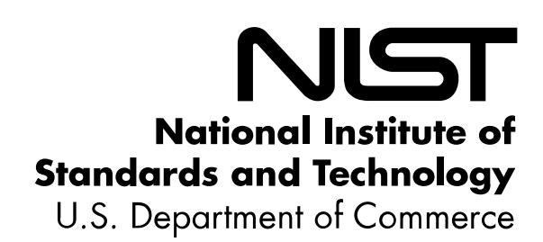

{0}------------------------------------------------

# **NISTIR 8374**

# **Ransomware Risk Management:**

*A Cybersecurity Framework Profile*

William C. Barker William Fisher Karen Scarfone Murugiah Souppaya

This publication is available free of charge from: https://doi.org/10.6028/NIST.IR.8374

{1}------------------------------------------------

# **NISTIR 8374**

# **Ransomware Risk Management:**

*A Cybersecurity Framework Profile* 

William C. Barker Karen Scarfone *Dakota Consulting Scarfone Cybersecurity Silver Spring, MD Clifton, VA*

William Fisher Murugiah Souppaya *Applied Cybersecurity Division Computer Security Division Information Technology Laboratory Information Technology Laboratory* 

> This publication is available free of charge from: https://doi.org/10.6028/NIST.IR.8374

> > February 2022

U.S. Department of Commerce *Gina M. Raimondo, Secretary*

National Institute of Standards and Technology *James K. Olthoff, Performing the Non-Exclusive Functions and Duties of the Under Secretary of Commerce for Standards and Technology & Director, National Institute of Standards and Technology*

{2}------------------------------------------------

#### National Institute of Standards and Technology Interagency or Internal Report 8374 28 pages (February 2022)

This publication is available free of charge from: https://doi.org/10.6028/NIST.IR.8374

Certain commercial entities, equipment, or materials may be identified in this document in order to describe an experimental procedure or concept adequately. Such identification is not intended to imply recommendation or endorsement by NIST, nor is it intended to imply that the entities, materials, or equipment are necessarily the best available for the purpose.

There may be references in this publication to other publications currently under development by NIST in accordance with its assigned statutory responsibilities. The information in this publication, including concepts and methodologies, may be used by federal agencies even before the completion of such companion publications. Thus, until each publication is completed, current requirements, guidelines, and procedures, where they exist, remain operative. For planning and transition purposes, federal agencies may wish to closely follow the development of these new publications by NIST.

Organizations are encouraged to review all draft publications during public comment periods and provide feedback to NIST. Many NIST cybersecurity publications, other than the ones noted above, are available at [https://csrc.nist.gov/publications.](https://csrc.nist.gov/publications)

**Submit comments on this publication to:** [ransomware@nist.gov](mailto:ransomware@nist.gov)

National Institute of Standards and Technology Attn: Applied Cybersecurity Division, Information Technology Laboratory 100 Bureau Drive (Mail Stop 2000) Gaithersburg, MD 20899-2000

All comments are subject to release under the Freedom of Information Act (FOIA).

{3}------------------------------------------------

# **Reports on Computer Systems Technology**

The Information Technology Laboratory (ITL) at the National Institute of Standards and Technology (NIST) promotes the U.S. economy and public welfare by providing technical leadership for the Nation's measurement and standards infrastructure. ITL develops tests, test methods, reference data, proof of concept implementations, and technical analyses to advance the development and productive use of information technology. ITL's responsibilities include the development of management, administrative, technical, and physical standards and guidelines for the cost-effective security and privacy of other than national security-related information in federal information systems.

#### **Abstract**

Ransomware is a type of malicious attack where attackers encrypt an organization's data and demand payment to restore access. Attackers may also steal an organization's information and demand an additional payment in return for not disclosing the information to authorities, competitors, or the public. This Ransomware Profile identifies the Cybersecurity Framework Version 1.1 security objectives that support identifying, protecting against, detecting, responding to, and recovering from ransomware events. The profile can be used as a guide to managing the risk of ransomware events. That includes helping to gauge an organization's level of readiness to counter ransomware threats and to deal with the potential consequences of events.

# **Keywords**

Cybersecurity Framework; detect; identify; protect; ransomware; recover; respond; risk; security.

#### **Acknowledgments**

The authors wish to thank all individuals and organizations that contributed to the creation of this document.

#### **Patent Disclosure Notice**

*NOTICE: ITL has requested that holders of patent claims whose use may be required for compliance with the guidance or requirements of this publication disclose such patent claims to ITL. However, holders of patents are not obligated to respond to ITL calls for patents, and ITL has not undertaken a patent search in order to identify which, if any, patents may apply to this publication.*

*As of the date of publication and following call(s) for the identification of patent claims whose use may be required for compliance with the guidance or requirements of this publication, no such patent claims have been identified to ITL.* 

*No representation is made or implied by ITL that licenses are not required to avoid patent infringement in the use of this publication.*

{4}------------------------------------------------

# **Table of Contents**

| 1 | Introduction           |                               | 1  |
|---|---------------------------|-------------------------------|----|
|   | 1.1                       | The Ransomware Challenge   | 1  |
|   | 1.2                       | Audience                      | 3  |
|   | 1.3                       | Additional Guidance Resources | 4  |
| 2 | The Ransomware Profile    |                               | 5  |
|   |                           | References                    | 21 |
|   | Appendix A— Additional | NIST Ransomware Resources     | 22 |

{5}------------------------------------------------

# **1 Introduction**

This Ransomware Profile can help organizations and individuals to manage the risk of ransomware events. That includes helping to gauge an organization's level of readiness to counter ransomware threats and to deal with the potential consequences of events. The profile can also be used to identify opportunities for improving cybersecurity to help thwart ransomware. It maps security objectives from the [Framework for Improving Critical](https://www.nist.gov/cyberframework)  [Infrastructure Cybersecurity, Version 1.1 \[1\]](https://www.nist.gov/cyberframework) (also known as the NIST Cybersecurity Framework) to security capabilities and measures that help to identify, protect against, detect, respond to, and recover from ransomware events.

#### **1.1 The Ransomware Challenge**

Ransomware is a type of malware that encrypts an organization's data and demands payment as a condition of restoring access to that data. Ransomware can also be used to steal an organization's information and demand additional payment in return for not disclosing the information to authorities, competitors, or the public. Ransomware attacks target the organization's data or critical infrastructure, disrupting or halting operations and posing a dilemma for management: pay the ransom and hope that the attackers keep their word about restoring access and not disclosing data, or do not pay the ransom and attempt to restore operations themselves. The methods ransomware uses to gain access to an organization's information and systems are common to cyberattacks more broadly, but they are aimed at forcing a ransom to be paid. Techniques used to promulgate ransomware will continue to change as attackers constantly look for new ways to pressure their victims.

Ransomware attacks differ from other cybersecurity events where access may be surreptitiously gained to information such as intellectual property, credit card data, or personally identifiable information and later exfiltrated for monetization. Instead, ransomware threatens an immediate impact on business operations. During a ransomware event, organizations may be afforded little time to mitigate or remediate impact, restore systems, or communicate via necessary business, partner, and public relations channels. For this reason, it is especially critical that organizations be prepared. That includes educating users of cyber systems, response teams, and business decision makers about the importance of – and processes and procedures for – preventing and handling potential compromises before they occur.

Fortunately, organizations can follow recommended steps to prepare for and reduce the potential for successful ransomware attacks. This includes the following: *identify* and *protect* critical data, systems, and devices; *detect* ransomware events as early as possible (preferably before the ransomware is deployed); and prepare to *respond* to and *recover* from any ransomware events that do occur. There are many resources available to assist organizations in these efforts. They include information from the [National Institute of Standards and Technology \(NIST\),](https://csrc.nist.gov/projects/ransomware-protection-and-response) the [Federal](https://www.fbi.gov/scams-and-safety/common-scams-and-crimes/ransomware)  [Bureau of Investigation \(FBI\),](https://www.fbi.gov/scams-and-safety/common-scams-and-crimes/ransomware) and the [Department of Homeland Security \(DHS\).](https://www.cisa.gov/ransomware) Additional NIST resources are listed in Appendix A of this document.

The security capabilities and measures in [Table 1](#page-10-0) of this profile support a detailed approach to preventing and mitigating ransomware events. Realizing that undertaking all of these measures 

{6}------------------------------------------------

may be beyond the reach of some, the text box below includes basic preventative steps that an organization can take now to protect against the ransomware threat. Not all of these measures will apply to the situations of all organizations. The guidance in this report addresses best practices rather than a set of legal or regulatory requirements.

#### **BASIC RANSOMWARE TIPS**

*Even without undertaking all of the measures described in this Ransomware Profile, there are some basic preventative steps that an organization can take now to protect against and recover from the ransomware threat. These include:*

#### **1. Educate employees on avoiding ransomware infections.**

- o **Don't open files or click on links from unknown sources** unless you first run an antivirus scan or look at links carefully.
- o **Avoid using personal websites and personal apps** like email, chat, and social media – from work computers.
- o **Don't connect personally owned devices to work networks without prior authorization**.

#### **2. Avoid having vulnerabilities in systems that ransomware could exploit.**

- o **Keep relevant systems fully patched.** Run scheduled checks to identify available patches and install these as soon as feasible.
- o **Employ zero trust principles in all networked systems.** Manage access to all network functions and segment internal networks where practical to prevent malware from proliferating among potential target systems.
- o **Allow installation and execution of authorized apps only.** Configure operating systems and/or third-party software to run only authorized applications. This can also be supported by adopting a policy for reviewing, then adding or removing authorized applications on an allow list.
- o **Inform your technology vendors of your expectations** (e.g., in contract language) that they will apply measures that discourage ransomware attacks.

#### **3. Quickly detect and stop ransomware attacks and infections.**

- o **Use malware detection software such as antivirus software at all times.** Set it to automatically scan emails and flash drives.
- o **Continuously monitor** directory services (and other primary user stores) for indicators of compromise or active attack.
- o **Block access to untrusted web resources.** Use products or services that block access to server names, IP addresses, or ports and protocols that are known to be malicious or suspected to be indicators of malicious system activity. This includes using products and services that provide integrity protection for the domain component of addresses (e.g., hacker@poser.com).

{7}------------------------------------------------

#### **4. Make it harder for ransomware to spread.**

- o **Use standard user accounts** with multi-factor authentication versus accounts with administrative privileges whenever possible.
- o **Introduce authentication delays or configure automatic account lockout** as a defense against automated attempts to guess passwords.
- o **Assign and manage credential authorization** for all enterprise assets and software, and periodically verify that each account has only the necessary access following the principle of least privilege.
- o **Store data in an immutable format** (so that the database does not automatically overwrite older data when new data is made available).
- o **Allow external access to internal network resources via secure virtual private network (VPN) connections only.**

#### **5. Make it easier to recover stored information from a future ransomware event.**

- o **Make an incident recovery plan.** Develop, implement, and regularly exercise an incident recovery plan with defined roles and strategies for decision making. This can be part of a continuity of operations plan. The plan should identify mission-critical and other business-essential services to enable recovery prioritization, and business continuity plans for those critical services.
- o **Back up data, secure backups, and test restoration.** Carefully plan, implement, and test a data backup and restoration strategy—and secure and isolate backups of important data.
- o **Keep your contacts.** Maintain an up-to-date list of internal and external contacts for ransomware attacks, including law enforcement, legal counsel, and incident response resources.

### **1.2 Audience**

The Ransomware Profile is intended for any organization with cyber resources that could be subject to ransomware attacks, regardless of sector or size. Any organization – including small to medium-sized businesses (SMBs), small federal agencies and other small organizations, and operators of industrial control systems (ICS) or operational technologies (OT) – can leverage this guidance and is encouraged to also consider reviewing the Cybersecurity Framework.

Many of these actions can be taken without expending considerable resources. Special value may be gained by organizations that:

- are familiar with and may have already adopted the NIST Cybersecurity Framework to help identify, assess, and manage cybersecurity risks and want to improve their risk postures by addressing ransomware concerns, or
- are not familiar with the Cybersecurity Framework but want to implement risk management frameworks to meet ransomware threats.

{8}------------------------------------------------

### **1.3 Additional Guidance Resources**

In addition to the resources cited earlier in this section, NIST's National Cybersecurity Center of Excellence (NCCoE) has produced guidance to support ransomware threat mitigation. NIST has many other resources that, while not ransomware-specific, contain valuable information about identifying, protecting against, detecting, responding to, and recovering from ransomware events. See the References section for a list of references and Appendix A of this profile for a more extensive list of NIST resources.

{9}------------------------------------------------

# **2 The Ransomware Profile**

The Ransomware Profile aligns organizations' ransomware prevention and mitigation requirements, objectives, risk appetite, and resources with the elements of the NIST Cybersecurity Framework. It should help organizations to identify and prioritize opportunities for improving their security and resilience against ransomware attacks. Organizations can use this document as a guide for profiling the state of their own readiness. Doing so will assist them to determine their current "profile" or state and set a "target profile" to identify gaps.

[Table 1](#page-10-0) defines the Ransomware Profile. The first two columns list relevant Categories and Subcategories from the Cybersecurity Framework that organizations may use as target outcomes for their ransomware risk management programs. The third column briefly explains how each Subcategory helps to identify, protect against, detect, respond to, and recover from ransomware events.

This profile also cites "Informative References." These are specific sections of standards, guidelines, and practices common among critical infrastructure sectors that illustrate a method to achieve the outcomes associated with each subcategory. The Informative References in the Cybersecurity Framework are illustrative and not exhaustive. They are based upon cross-sector guidance most frequently referenced during the Framework development process.

For example, the second column of [Table 1](#page-10-0) cites relevant requirements from two of the informative references included in the Cybersecurity Framework: International Organization for Standardization/International Electrotechnical Commission (ISO/IEC) 27001:2013, *Information technology—Security techniques—Information security management systems—Requirements* [\[2\]](#page-25-2) and NIST SP 800-53 Revision 5, *Security and Privacy Controls for Information Systems and Organizations* [\[3\].](#page-25-3)

The Cybersecurity Framework lists additional Informative References for each Subcategory. These references will be updated from time to time in online versions of this guidance document.

The five Cybersecurity Framework Functions used to organize the Categories are:

- **Identify**  Develop an organizational understanding to manage cybersecurity risk to systems, people, assets, data, and capabilities. The activities in the Identify Function are foundational for effective use of the Framework. Understanding the business context, the resources that support critical functions, and the related cybersecurity risks enables an organization to focus and prioritize its efforts, consistent with its risk management strategy and business needs.
- **Protect**  Develop and implement appropriate safeguards to ensure delivery of critical services. The Protect Function supports the ability to limit or contain the impact of a potential cybersecurity event.
- **Detect**  Develop and implement appropriate activities to identify the occurrence of a cybersecurity event. The Detect Function enables timely discovery of cybersecurity events.

{10}------------------------------------------------

- **Respond**  Develop and implement appropriate activities action regarding a detected cybersecurity incident. The Respond Function supports the ability to contain the impact of a potential cybersecurity incident.
- **Recover**  Develop and implement appropriate activities to maintain plans for resilience and to restore any capabilities or services that were impaired due to a cybersecurity incident. The Recover Function supports timely recovery to normal operations to reduce the impact from a cybersecurity incident.

**Table 1: Ransomware Risk Management Profile**

| Category                                                                                                                                                                                                                                                                                                  | Subcategory and Selected Informative References                                                                                                                          | Ransomware Application                                                                                                                                                                                                                                                                                                                                          |
|-----------------------------------------------------------------------------------------------------------------------------------------------------------------------------------------------------------------------------------------------------------------------------------------------------------|-----------------------------------------------------------------------------------------------------------------------------------------------------------------------------|-----------------------------------------------------------------------------------------------------------------------------------------------------------------------------------------------------------------------------------------------------------------------------------------------------------------------------------------------------------------|
| Identify                                                                                                                                                                                                                                                                                                  |                                                                                                                                                                             |                                                                                                                                                                                                                                                                                                                                                                 |
| Asset Management (ID.AM): The data, personnel, devices, systems, and facilities that enable the organization to achieve business purposes are identified and managed consistent with their relative importance to organizational objectives and the organization's risk strategy. | ID.AM-1: Physical devices and systems within the organization are inventoried ISO/IEC 27001:2013 A.8.1.1, A.8.1.2 NIST SP 800-53 Rev. 5 CM-8, PM 5        | An inventory of physical devices should be undertaken, reviewed, and maintained to ensure these devices are not vulnerable to ransomware. It is also beneficial to have a hardware inventory during the recovery phases after a ransomware attack, should a re installation of applications be necessary.                               |
|                                                                                                                                                                                                                                                                                                           | ID.AM-2: Software platforms and applications within the organization are inventoried ISO/IEC 27001:2013 A.8.1.1, A.8.1.2 NIST SP 800-53 Rev. 5 CM-8, PM 5 | Software inventories may track information such as software name and version, devices where it is currently installed, last patch date, and current known vulnerabilities. This information supports the remediation of vulnerabilities that could be exploited in ransomware attacks.                                                     |
|                                                                                                                                                                                                                                                                                                           | ID.AM-3: Organizational communication and data flows are mapped ISO/IEC 27001:2013 A.13.2.1, A.13.2.2 NIST SP 800-53 Rev. 5 AC-4, CA 3, CA-9, PL-8        | This helps to enumerate what information or processes are at risk, should the attackers move laterally within an environment.                                                                                                                                                                                                                          |
|                                                                                                                                                                                                                                                                                                           | ID.AM-4: External information systems are catalogued ISO/IEC 27001:2013 A.11.2.6 NIST SP 800-53 Rev. 5 AC-20, SA-9                                              | This is important for planning communications to partners and possible actions to temporarily disconnect from external systems in response to ransomware events. Identifying these connections will also help organizations plan security control implementation and identify areas where controls may be shared with third parties. |

{11}------------------------------------------------

| Category                                                                                                                                                                                                                                                         | Subcategory and Selected Informative References                                                                                                                                                                                                               | Ransomware Application                                                                                                                                                                                                                                                                                                                                                                                                                                                                                                                                                           |
|------------------------------------------------------------------------------------------------------------------------------------------------------------------------------------------------------------------------------------------------------------------|------------------------------------------------------------------------------------------------------------------------------------------------------------------------------------------------------------------------------------------------------------------|----------------------------------------------------------------------------------------------------------------------------------------------------------------------------------------------------------------------------------------------------------------------------------------------------------------------------------------------------------------------------------------------------------------------------------------------------------------------------------------------------------------------------------------------------------------------------------|
|                                                                                                                                                                                                                                                                  | ID.AM-5: Resources (e.g., hardware, devices, data, time, personnel, and software) are prioritized based on their classification, criticality, and business value ISO/IEC 27001:2013 A.8.2.1 NIST SP 800-53 Rev. 5 CP-2, RA 2, RA-9, SC-6 | This is essential to understanding the true scope and impact of ransomware events – and is important in contingency planning for future ransomware events, emergency response, and recovery actions. It helps operations and incident responders to prioritize resources and supports contingency planning for future ransomware events, emergency response, and recovery actions. If there is an associated industrial control system (ICS), its critical functions should be included in emergency response and recovery actions. |
|                                                                                                                                                                                                                                                                  | ID.AM-6: Cybersecurity roles and responsibilities for the entire workforce and third-party stakeholders (e.g., suppliers, customers, partners) are established ISO/IEC 27001:2013 A.6.1.1 NIST SP 800-53 Rev. 5 CP-2, PM 11, PS-7           | It is important that everyone in the organization understand their roles and responsibilities for preventing ransomware events and, if applicable, for responding to and recovering from ransomware events. These roles and responsibilities should be formally documented in an incident response plan. The incident response plan should specify regularly exercising the plan (e.g., running incident response tabletop simulations at least annually).                                                                                      |
| Business Environment (ID.BE): The organization's mission, objectives, stakeholders, and activities are understood and prioritized; this information is used to inform cybersecurity roles, responsibilities, and risk management decisions. | ID.BE-2: The organization's place in critical infrastructure and its industry sector is identified and communicated ISO/IEC 27001:2013 Clause 4.1 NIST SP 800-53 Rev. 5 PM-8                                                                      | This allows national computer security incident response teams to better understand the targeted organization's place in the critical infrastructure environment and permits them to react in a timely manner in case of cross sector impacts. This also encourages the organization and its external stakeholders to consider downstream effects from the ransomware attack.                                                                                                                                                                         |
|                                                                                                                                                                                                                                                                  | ID.BE-3: Priorities for organizational mission, objectives, and activities are established and communicated NIST SP 800-53 Rev. 5 PM-11, SA-14                                                                                                    | This helps operations and incident responders to prioritize resources. It supports contingency planning for future ransomware events, emergency response, and recovery actions.                                                                                                                                                                                                                                                                                                                                                                                      |

{12}------------------------------------------------

| Category                                                                                                                                                                                                                                                          | Subcategory and Selected Informative References                                                                                                                                                                                                  | Ransomware Application                                                                                                                                                                                                                                                                                                                                                                          |
|-------------------------------------------------------------------------------------------------------------------------------------------------------------------------------------------------------------------------------------------------------------------|-----------------------------------------------------------------------------------------------------------------------------------------------------------------------------------------------------------------------------------------------------|-------------------------------------------------------------------------------------------------------------------------------------------------------------------------------------------------------------------------------------------------------------------------------------------------------------------------------------------------------------------------------------------------|
|                                                                                                                                                                                                                                                                   | ID.BE-4: Dependencies and critical functions for delivery of critical services are established ISO/IEC 27001:2013 A.11.2.2, A.11.2.3, A.12.1.3 NIST SP 800-53 Rev. 5 CP-8, PE 9, PE-11, PM-8, SA-20                               | This helps with identifying secondary and tertiary components critical in supporting the organization's core business functions. This is needed to prioritize contingency plans for future events and emergency responses to ransomware events. If there is an associated ICS, its critical functions should be included in emergency response and recovery actions. |
| Governance (ID.GV): The policies, procedures, and processes to manage and monitor the organization's regulatory, legal, risk, environmental, and operational requirements are understood and inform the management of cybersecurity risk. | ID.GV-1: Organizational cybersecurity policy is established and communicated ISO/IEC 27001:2013 A.5.1.1 NIST SP 800-53 Rev. 5 AC-01, AU-01, CA-01, CM-01, CP-01, IA 01, IR-01, PE-01, PL-01, PM-01, RA-01, SA-01, SC-01, SI-01 | Establishing and communicating policies needed to prevent or mitigate ransomware events is essential and fundamental to all other prevention and mitigation activities. Where practical, these policies should be reviewed periodically to reflect the dynamic nature of risk and the reality of needed ongoing adjustments.                                            |
|                                                                                                                                                                                                                                                                   | ID.GV-3: Legal and regulatory requirements regarding cybersecurity, including privacy and civil liberties obligations, are understood and managed ISO/IEC 27001:2013 A.18.1.1, A.18.1.2, A.18.1.3, A.18.1.4, A.18.1.5          | This is necessary for developing cybersecurity policies and establishing priorities in contingency planning for response to future ransomware events.                                                                                                                                                                                                                                  |
|                                                                                                                                                                                                                                                                   | NIST SP 800-53 Rev. 5 CA-07, RA-02 ID.GV-4: Governance and risk management processes address cybersecurity risks ISO/IEC 27001:2013 Clause 6 NIST SP 800-53 Rev. 5 PM-3, PM 7, PM-9, PM-10, PM-11, SA-2                        | Ransomware risks must be factored into organizational risk management governance in order to establish adequate cybersecurity policies.                                                                                                                                                                                                                                                |
| Risk Assessment (ID.RA): The organization understands the cybersecurity risk to organizational operations (including mission, functions, image, or reputation), organizational assets, and individuals.                                      | ID.RA-1: Asset vulnerabilities are identified and documented ISO/IEC 27001:2013 A.12.6.1, A.18.2.3 NIST SP 800-53 Rev. 5 CA-2, CA 7, CA-8, RA-3, RA-5, SA-5, SA-11, SI-2, SI-4, SI-5                                              | Identifying and documenting the vulnerabilities of the organization's assets is crucial in developing plans for and prioritizing mitigation or elimination of those vulnerabilities. These actions also are key to contingency planning for evaluating and responding to future ransomware events and will reduce the likelihood of a successful ransomware attack.  |

{13}------------------------------------------------

| Category                                                                                                                                                                                                                                                                                                                                                          | Subcategory and Selected Informative References                                                                                                                                                                      | Ransomware Application                                                                                                                                                                                                                                                                                                                                                                                                        |
|-------------------------------------------------------------------------------------------------------------------------------------------------------------------------------------------------------------------------------------------------------------------------------------------------------------------------------------------------------------------|-------------------------------------------------------------------------------------------------------------------------------------------------------------------------------------------------------------------------|-------------------------------------------------------------------------------------------------------------------------------------------------------------------------------------------------------------------------------------------------------------------------------------------------------------------------------------------------------------------------------------------------------------------------------|
|                                                                                                                                                                                                                                                                                                                                                                   | ID.RA-2: Cyber threat intelligence is received from information sharing forums and sources ISO/IEC 27001:2013 A.6.1.4 NIST SP 800-53 Rev. 5 PM-15, PM-16, SI-5                                           | Receiving and using cyber threat intelligence from information sharing sources can reduce the exposure to ransomware attacks and facilitate early detection of new threats.                                                                                                                                                                                                                                       |
|                                                                                                                                                                                                                                                                                                                                                                   | ID.RA-4: Potential business impacts and likelihoods are identified ISO/IEC 27001:2013 A.16.1.6, Clause 6.1.2 NIST SP 800-53 Rev. 5 PM-9, PM 11, RA-2, RA-3, SA-20                                     | Understanding the business impacts of potential ransomware events is needed to support cybersecurity cost-benefit analyses as well to establish priorities for activities in ransomware response and recovery plans. Understanding potential business impacts also supports emergency response decisions in the event of a ransomware attack.                                                      |
|                                                                                                                                                                                                                                                                                                                                                                   | ID.RA-6: Risk responses are identified and prioritized ISO/IEC 27001:2013 Clause 6.1.3 NIST SP 800-53 Rev. 5 PM-4, PM 9                                                                                     | The expense associated with responding to and recovering from ransomware events is directly affected by the effectiveness of contingency planning for responses to projected risks.                                                                                                                                                                                                                            |
| Risk Management Strategy (ID.RM): The organization's priorities, constraints, risk tolerances, and assumptions are established and used to support operational risk decisions.                                                                                                                                                                     | ID.RM-1: Risk management processes are established, managed, and agreed to by organizational stakeholders ISO/IEC 27001:2013 Clause 6.1.3, Clause 8.3, Clause 9.3 NIST SP 800-53 Rev. 5 PM-4, PM 9 | Establishing and enforcing organizational policies, roles, and responsibilities depends on stakeholders agreeing to and implementing effective risk management processes. The processes should take into consideration the risk of a ransomware event. These policies should be reviewed periodically to reflect the dynamic nature of risk and the reality of needed adjustments over time. |
| Supply Chain Risk Management (ID.SC): The organization's priorities, constraints, risk tolerances, and assumptions are established and used to support risk decisions associated with managing supply chain risk. The organization has established and implemented the processes to identify, assess and manage supply chain risks. | ID.SC-5: Response and recovery planning and testing are conducted with suppliers and third-party providers ISO/IEC 27001:2013 A.17.1.3 NIST SP 800-53 Rev. 5 CP-2, CP 4, IR-3, IR-4, IR-6, IR-8, IR-9 | Ransomware contingency planning should be coordinated with suppliers and third-party providers and should include testing planned activities. The plan should include a scenario where the organization, its suppliers, and third-party providers are all impacted by ransomware.                                                                                                                        |

{14}------------------------------------------------

| Category                                                                                                                                                                                                                                                                                                                                 | Subcategory and Selected Informative References                                                                                                                                                                                                                                                                                                            | Ransomware Application                                                                                                                                                                                                                                                                                                                                                              |
|------------------------------------------------------------------------------------------------------------------------------------------------------------------------------------------------------------------------------------------------------------------------------------------------------------------------------------------|---------------------------------------------------------------------------------------------------------------------------------------------------------------------------------------------------------------------------------------------------------------------------------------------------------------------------------------------------------------|-------------------------------------------------------------------------------------------------------------------------------------------------------------------------------------------------------------------------------------------------------------------------------------------------------------------------------------------------------------------------------------|
| Protect                                                                                                                                                                                                                                                                                                                                  |                                                                                                                                                                                                                                                                                                                                                               |                                                                                                                                                                                                                                                                                                                                                                                     |
| Identity Management, Authentication and Access Control (PR.AC): Access to physical and logical assets and associated facilities is limited to authorized users, processes, and devices, and is managed consistent with the assessed risk of unauthorized access to authorized activities and transactions. | PR.AC-1: Identities and credentials are issued, managed, verified, revoked, and audited for authorized devices, users and processes ISO/IEC 27001:2013 A.9.2.1, A.9.2.2, A.9.2.3, A.9.2.4, A.9.2.6, A.9.3.1, A.9.4.2, A.9.4.3 NIST SP 800-53 Rev. 5 AC-1, AC 2, IA-1, IA-2, IA-3, IA-4, IA-5, IA 6, IA-7, IA-8, IA-9, IA-10, IA-11 | Most ransomware attacks are conducted through network connections, and ransomware attacks often start with credential compromise (e.g., unauthorized sharing or capture of login identity and password). Proper credential management is essential, although not the only mitigation needed.                                                                |
|                                                                                                                                                                                                                                                                                                                                          | PR.AC-3: Remote access is managed ISO/IEC 27001:2013 A.6.2.1, A.6.2.2, A.11.2.6, A.13.1.1, A.13.2.1 NIST SP 800-53 Rev. 5 AC-1, AC 17, AC-19, AC-20, SC-15                                                                                                                                                                                  | Most ransomware attacks are conducted remotely. Managing privileges associated with remote access can help maintain the integrity of systems and data files to protect against malicious code insertion and data exfiltration. Using multi-factor authentication is a key – and easily implemented – way to reduce the likelihood of account compromise. |
|                                                                                                                                                                                                                                                                                                                                          | PR.AC-4: Access permissions and authorizations are managed, incorporating the principles of least privilege and separation of duties ISO/IEC 27001:2013 A.6.1.2, A.9.1.2, A.9.2.3, A.9.4.1, A.9.4.4, A.9.4.5 NIST SP 800-53 Rev. 5 AC-1, AC 2, AC-3, AC-5, AC-6, AC-14, AC 16, AC-24                                               | Many ransomware events occur by compromising user credentials or invoking processes that have unnecessary privileged access to systems. This is a very important management step for preventing such events.                                                                                                                                                      |

{15}------------------------------------------------

| Category                                                                                                                                                                                                                                                                                          | Subcategory and Selected Informative References                                                                                                                                                                                                      | Ransomware Application                                                                                                                                                                                                                                                                                                                                                                                                                                                                                                                                                                                                                                                                              |
|---------------------------------------------------------------------------------------------------------------------------------------------------------------------------------------------------------------------------------------------------------------------------------------------------|---------------------------------------------------------------------------------------------------------------------------------------------------------------------------------------------------------------------------------------------------------|-----------------------------------------------------------------------------------------------------------------------------------------------------------------------------------------------------------------------------------------------------------------------------------------------------------------------------------------------------------------------------------------------------------------------------------------------------------------------------------------------------------------------------------------------------------------------------------------------------------------------------------------------------------------------------------------------------|
|                                                                                                                                                                                                                                                                                                   | PR.AC-5: Network integrity is protected (e.g., network segregation, network segmentation) ISO/IEC 27001:2013 A.13.1.1, A.13.1.3, A.13.2.1, A.14.1.2, A.14.1.3 NIST SP 800-53 Rev. 5 AC-4, AC 10, SC-7                              | Network segmentation or segregation can limit the scope of ransomware events by preventing malware from proliferating among potential target systems (e.g., moving into an operational technology or control system from a business information technology network). It is critical to separate IT and OT networks and regularly validate their independence. This not only reduces the risk of OT systems being compromised, but also allows low-level critical operations to continue while business IT systems recover from ransomware. This is particularly important for critical ICS functions, including Safety Instrument Systems (SIS). |
|                                                                                                                                                                                                                                                                                                   | PR.AC-6: Identities are proofed and bound to credentials and asserted in interactions ISO/IEC 27001:2013 A.7.1.1, A.9.2.1 NIST SP 800-53 Rev. 5 AC-1, AC 2, AC-3, AC-16, AC-19, AC-24, IA-1, IA-2, IA-4, IA-5, IA-8, PE-2, PS-3 | Compromised credentials are a common attack vector in ransomware events. Identities should be proofed and then bound to a credential (e.g., two-factor authentication of formally authorized individuals) to limit the likelihood that credentials are compromised or issued to an unauthorized individual.                                                                                                                                                                                                                                                                                                                                                                 |
| Awareness and Training (PR.AT): The organization's personnel and partners are provided cybersecurity awareness education and are trained to perform their cybersecurity related duties and responsibilities consistent with related policies, procedures, and agreements. | PR.AT-1: All users are informed and trained ISO/IEC 27001:2013 A.7.2.2, A.12.2.1 NIST SP 800-53 Rev. 5 AT-2, PM 13                                                                                                                       | Most ransomware attacks are made possible by users who engage in unsafe practices, administrators who implement insecure configurations, or developers who have insufficient security training.                                                                                                                                                                                                                                                                                                                                                                                                                                                                                      |
| Data Security (PR.DS): Information and records (data) are managed consistent with the organization's risk strategy to protect the confidentiality, integrity, and availability of information.                                                                                  | PR.DS-4: Adequate capacity to ensure availability is maintained ISO/IEC 27001:2013 A.12.1.3, A.17.2.1 NIST SP 800-53 Rev. 5 AU-4, CP 2, SC-5                                                                                             | Ensuring adequate availability of data can reduce ransomware impacts. This includes the ability to maintain offsite and offline data backups, testing mean time to recovery and system redundancy where necessary.                                                                                                                                                                                                                                                                                                                                                                                                                                                                   |

{16}------------------------------------------------

| Category                                                                                                                                                                                 | Subcategory and Selected Informative References                                                                                                                                                       | Ransomware Application                                                                                                                                                                                                                         |
|------------------------------------------------------------------------------------------------------------------------------------------------------------------------------------------|----------------------------------------------------------------------------------------------------------------------------------------------------------------------------------------------------------|------------------------------------------------------------------------------------------------------------------------------------------------------------------------------------------------------------------------------------------------|
|                                                                                                                                                                                          | PR.DS-5: Protections against data leaks are implemented ISO/IEC 27001:2013 A.12.1.3, A.17.2.1 NIST SP 800-53 Rev. 5 AU-4, CP                                                                 | Double extortion – demanding payment both to restore data access and to not sell or publish the data elsewhere – is common, so data leak prevention solutions are important.                                                       |
|                                                                                                                                                                                          | 2, SC-5 PR.DS-6: Integrity checking                                                                                                                                                                   | Integrity checking mechanisms can                                                                                                                                                                                                              |
|                                                                                                                                                                                          | mechanisms are used to verify software, firmware, and information integrity                                                                                                                        | detect tampered software updates that can be used to insert malware that enables ransomware events.                                                                                                                                      |
|                                                                                                                                                                                          | ISO/IEC 27001:2013 A.12.2.1, A.12.5.1, A.14.1.2, A.14.1.3, A.14.2.4                                                                                                                                |                                                                                                                                                                                                                                                |
|                                                                                                                                                                                          | NIST SP 800-53 Rev. 5 SC-16, SI 7                                                                                                                                                                     |                                                                                                                                                                                                                                                |
|                                                                                                                                                                                          | PR.DS-7: The development and testing environment(s) are separate from the production environment                                                                                                   | Keeping development and testing environments separate from production environments can prevent                                                                                                                                           |
|                                                                                                                                                                                          | ISO/IEC 27001:2013 A.12.1.4 NIST SP 800-53 Rev. 5 CM-2                                                                                                                                                | ransomware from promulgating from development and testing systems into production systems.                                                                                                                                               |
| Information Protection Processes and Procedures (PR.IP): Security policies (that address purpose, scope, roles, responsibilities, management commitment, and coordination | PR.IP-1: A baseline configuration of information technology/industrial control systems is created and maintained incorporating security principles (e.g., concept of least functionality) | Baselines are useful for establishing the set of functions a system needs to perform so that any deviation from that baseline could be evaluated for its cyber risk potential. Unauthorized changes to the configuration can be |
| among organizational entities), processes, and procedures are maintained and used to manage protection of information systems                                                   | ISO/IEC 27001:2013 A.12.1.2, A.12.5.1, A.12.6.2, A.14.2.2, A.14.2.3, A.14.2.4                                                                                                                      | used as an indicator of a malicious attack, which may lead to the introduction of ransomware.                                                                                                                                            |
| and assets.                                                                                                                                                                              | NIST SP 800-53 Rev. 5 CM-2, CM-3, CM-4, CM-5, CM-6, CM-7, CM-9, SA-10                                                                                                                              |                                                                                                                                                                                                                                                |
|                                                                                                                                                                                          | PR.IP-3: Configuration change control processes are in place                                                                                                                                          | Proper configuration change processes can help to enforce timely security                                                                                                                                                                   |
|                                                                                                                                                                                          | ISO/IEC 27001:2013 A.12.1.2, A.12.5.1, A.12.6.2, A.14.2.2, A.14.2.3, A.14.2.4                                                                                                                      | updates to software, maintain necessary security configuration settings, and discourage replacement of code with products that contain                                                                                                |
|                                                                                                                                                                                          | NIST SP 800-53 Rev. 5 CM-3, CM-4, SA-10                                                                                                                                                               | malware or do not satisfy access management policies.                                                                                                                                                                                       |

{17}------------------------------------------------

| Category                                                                                                                                                                   | Subcategory and Selected Informative References                                                                                                                                                                                                                                                                     | Ransomware Application                                                                                                                                                                                                                                                                                                                                                                                                                                                                                                |
|----------------------------------------------------------------------------------------------------------------------------------------------------------------------------|------------------------------------------------------------------------------------------------------------------------------------------------------------------------------------------------------------------------------------------------------------------------------------------------------------------------|-----------------------------------------------------------------------------------------------------------------------------------------------------------------------------------------------------------------------------------------------------------------------------------------------------------------------------------------------------------------------------------------------------------------------------------------------------------------------------------------------------------------------|
|                                                                                                                                                                            | PR.IP-4: Backups of information are conducted, maintained, and tested ISO/IEC 27001:2013 A.12.3.1, A.17.1.2, A.17.1.3, A.18.1.3 NIST SP 800-53 Rev. 5 CP-4, CP 6, CP-9                                                                                                                               | Regular backups that are maintained and tested are essential to timely and relatively painless recovery from ransomware events. Backups should be secured to ensure they cannot become corrupted by the ransomware or deleted by the attacker. The backups should be stored offline.                                                                                                                                                                                                             |
|                                                                                                                                                                            | PR.IP-9: Response plans (Incident Response and Business Continuity) and recovery plans (Incident Recovery and Disaster Recovery) are in place and managed ISO/IEC 27001:2013 A.16.1.1, A.17.1.1, A.17.1.2, A.17.1.3 NIST SP 800-53 Rev. 5 CP-2, CP 7, CP-12, CP-13, IR-7, IR-8, IR-9, PE-17 | Response and recovery plans should include ransomware events. A copy of the response plan should be kept offline in case the incident eliminates access to soft copies held within the targeted network. Ransomware events should be prioritized appropriately during incident triage with the goal of immediate containment to prevent the ransomware's spread.                                                                                                                           |
|                                                                                                                                                                            | PR.IP-10: Response and recovery plans are tested ISO/IEC 27001:2013 A.17.1.3 NIST SP 800-53 Rev. 5 CP-4, IR-3, PM-14                                                                                                                                                                                       | Ransomware response and recovery plans should be tested periodically to ensure that risk and response assumptions and processes are current with respect to evolving ransomware threats. Testing of response and recovery plans should include any associated ICS. Processes need to be updated and maintained to match changing organizational needs and structures as well as new ransomware types and tactics. Testing trains the people who will need to execute the plan. |
| Maintenance (PR.MA): Maintenance and repairs of industrial control and information system components are performed consistent with policies and procedures. | PR.MA-2: Remote maintenance of organizational assets is approved, logged, and performed in a manner that prevents unauthorized access ISO/IEC 27001:2013 A.11.2.4, A.15.1.1, A.15.2.1 NIST SP 800-53 Rev. 5 MA-4                                                                                     | Remote maintenance provides an access channel into networks and technology. If not managed properly, criminals may use this access to alter configurations to permit introduction of malware. Remote maintenance of all system components by the organization or its providers must be validated to ensure that this process does not provide backdoor access to OT or IT networks.                                                                                                     |

{18}------------------------------------------------

| Category                                                                                                                              | Subcategory and Selected Informative References                                                                                                                 | Ransomware Application                                                                                                                                                                           |
|---------------------------------------------------------------------------------------------------------------------------------------|--------------------------------------------------------------------------------------------------------------------------------------------------------------------|--------------------------------------------------------------------------------------------------------------------------------------------------------------------------------------------------|
| Protective Technology (PR.PT): Technical security solutions are managed to ensure the security and resilience of systems and | PR.PT-1: Audit/log records are determined, documented, implemented, and reviewed in accordance with policy                                                | Availability of audit/log records can assist in detecting unexpected behaviors and support forensics response and recovery processes.                                                   |
| assets, consistent with related policies, procedures, and agreements.                                                           | ISO/IEC 27001:2013 A.12.4.1, A.12.4.2, A.12.4.3, A.12.4.4, A.12.7.1                                                                                          |                                                                                                                                                                                                  |
|                                                                                                                                       | NIST SP 800-53 Rev. 5 AU-1, AU 2, AU-3, AU-4, AU-5, AU-6, AU-7, AU-8, AU-9, AU-10, AU-12, AU 13, AU-14, AU-16                                             |                                                                                                                                                                                                  |
|                                                                                                                                       | PR.PT-3: The principle of least functionality is incorporated by configuring systems to provide only essential capabilities ISO/IEC 27001:2013 A.9.1.2 | Maintaining the principle of least functionality may prevent movement among potential target systems (e.g., moving into an operational process control system from an administrative |
|                                                                                                                                       | NIST SP 800-53 Rev. 5 AC-3, CM 7                                                                                                                                | network).                                                                                                                                                                                        |
| Detect                                                                                                                                |                                                                                                                                                                    |                                                                                                                                                                                                  |
| Anomalies and Events (DE.AE): Anomalous activity is detected, and the potential impact                                          | DE.AE-3: Event data are collected and correlated from multiple sources and sensors                                                                           | Multiple sources and sensors along with a Security Information and Event Management (SIEM) solution                                                                                        |
| of events is understood.                                                                                                              | ISO/IEC 27001:2013 A.12.4.1, A.16.1.7                                                                                                                           | improves network visibility, assists in the early detection of ransomware, and aids in understanding how                                                                                   |
|                                                                                                                                       | NIST SP 800-53 Rev. 5 AU-6, CA 7, IR-4, IR-5, IR-8, SI-4                                                                                                        | ransomware may propagate through a network.                                                                                                                                                   |
|                                                                                                                                       | DE.AE-4: Impact of events is determined                                                                                                                         | Determining the impact of events can inform response and recovery                                                                                                                             |
|                                                                                                                                       | ISO/IEC 27001:2013 A.16.1.4                                                                                                                                        | priorities for a ransomware attack.                                                                                                                                                              |
|                                                                                                                                       | NIST SP 800-53 Rev. 5 CP-2, IR-4, RA-3, SI-4                                                                                                                    |                                                                                                                                                                                                  |

{19}------------------------------------------------

| Category                                                                                                                                                                           | Subcategory and Selected Informative References                                                                                                                                                                              | Ransomware Application                                                                                                                                                                                                                                                                          |
|------------------------------------------------------------------------------------------------------------------------------------------------------------------------------------|---------------------------------------------------------------------------------------------------------------------------------------------------------------------------------------------------------------------------------|-------------------------------------------------------------------------------------------------------------------------------------------------------------------------------------------------------------------------------------------------------------------------------------------------|
| Security Continuous Monitoring (DE.CM): The information system and assets are monitored to identify cybersecurity events and verify the effectiveness of protective | DE.CM-1: The network is monitored to detect potential cybersecurity events NIST SP 800-53 Rev. 5 AC-2, AU 12, CA-7, CM-3, SC-5, SC-7, SI-4                                                                          | Network monitoring might detect intrusions and initiate protective actions before malicious code can be inserted or large volumes of information are encrypted and exfiltrated.                                                                                                  |
| measures.                                                                                                                                                                          | DE.CM-3: Personnel activity is monitored to detect potential cybersecurity events ISO/IEC 27001:2013 A.12.4.1, A.12.4.3                                                                                             | Monitoring personnel activity might detect insider threats or insecure staff practices or compromised credentials and thwart potential ransomware events.                                                                                                                           |
|                                                                                                                                                                                    | NIST SP 800-53 Rev. 5 AC-2, AU 12, AU-13, CA-7, CM-10, CM-11                                                                                                                                                                 |                                                                                                                                                                                                                                                                                                 |
|                                                                                                                                                                                    | DE.CM-4: Malicious code is detected ISO/IEC 27001:2013 A.12.2.1 NIST SP 800-53 Rev. 5 SI-3, SI-8                                                                                                                       | Detection may indicate that a ransomware event is occurring or may be about to occur. Malicious code is often not immediately executed, so there may be time between insertion of malicious code and its activation to detect it before the ransomware attack is executed. |
|                                                                                                                                                                                    | DE.CM-7: Monitoring for unauthorized personnel, connections, devices, and software is performed ISO/IEC 27001:2013 A.12.4.1, A.14.2.7, A.15.2.1 NIST SP 800-53 Rev. 5 AU-12, CA-7, CM-3, CM-8, PE-3, PE-6, | Unauthorized people, connections, devices, and software are potential resources from which to launch a ransomware attack. Monitoring can detect many ransomware attacks before they are executed.                                                                                |
|                                                                                                                                                                                    | PE-20, SI-4 DE.CM-8: Vulnerability scans are performed ISO/IEC 27001:2013 A.12.6.1 NIST SP 800-53 Rev. 5 RA-5                                                                                                       | Vulnerabilities can be exploited during a ransomware attack. Regular scans can allow an organization to detect and mitigate most vulnerabilities before they are used to execute ransomware.                                                                                     |
| Detection Processes (DE.DP): Detection processes and procedures are maintained and tested to ensure awareness of anomalous events.                                     | DE.DP-1: Roles and responsibilities for detection are well defined to ensure accountability ISO/IEC 27001:2013 A.6.1.1, A.7.2.2 NIST SP 800-53 Rev. 5 CA-2, CA 7, PM-14                                       | Clear understanding of roles and responsibilities is key to accountability and encourages adherence to organizational policies and procedures to help detect ransomware attacks.                                                                                                 |

{20}------------------------------------------------

| Category                                                        | Subcategory and Selected Informative References                          | Ransomware Application                                                                                                                                                                                             |
|-----------------------------------------------------------------|-----------------------------------------------------------------------------|--------------------------------------------------------------------------------------------------------------------------------------------------------------------------------------------------------------------|
|                                                                 | DE.DP-2: Detection activities comply with all applicable requirements | Detection activities should be conducted in adherence to organization policy and procedures.                                                                                                                 |
|                                                                 | ISO/IEC 27001:2013 A.18.1.4, A.18.2.2, A.18.2.3                          |                                                                                                                                                                                                                    |
|                                                                 | NIST SP 800-53 Rev. 5 AC-25, CA-2, CA-7, PM-14, SI-4, SR-9               |                                                                                                                                                                                                                    |
|                                                                 | DE.DP-3: Detection processes are tested                                  | Testing provides assurance of correct detection processes for ransomware                                                                                                                                        |
|                                                                 | ISO/IEC 27001:2013 A.14.2.8                                                 | based attacks, recognizing not that all intrusion attempts will be detected.                                                                                                                                    |
|                                                                 | NIST SP 800-53 Rev. 5 CA-2, CA 7, PE-3, PM-14, SI-3, SI-4                | Testing trains the people who will need to execute the plan.                                                                                                                                                    |
|                                                                 | DE.DP-4: Event detection information is communicated                     | Timely communication of anomalous events is necessary for being able to                                                                                                                                         |
|                                                                 | ISO/IEC 27001:2013 A.16.1.2, A.16.1.3                                    | take remedial actions before a ransomware attack can be fully realized.                                                                                                                                      |
|                                                                 | NIST SP 800-53 Rev. 5 AU-6, CA 2, CA-7, RA-5, SI-4                       |                                                                                                                                                                                                                    |
|                                                                 | DE.DP-5: Detection processes are continuously improved                   | The tactics used in ransomware attacks are continuously being refined,                                                                                                                                          |
|                                                                 | ISO/IEC 27001:2013 A.16.1.6                                                 | so detection processes must continuously evolve to keep up with                                                                                                                                                 |
|                                                                 | NIST SP 800-53 Rev. 5 CA-2, CA 7, PL-2, PM-14, RA-5, SI-4                | new threats.                                                                                                                                                                                                       |
| Respond                                                         |                                                                             |                                                                                                                                                                                                                    |
| Response Planning (RS.RP): Response processes and            | RS.RP-1: Response plan is executed during or after an incident           | Immediate execution of the response plan's public relations and                                                                                                                                                 |
| procedures are executed and maintained to ensure response to | ISO/IEC 27001:2013 A.16.1.5                                                 | communications response components is necessary to stop any corruption or                                                                                                                                       |
| detected cybersecurity incidents.                               | NIST SP 800-53 Rev. 5 CP-2, CP 10, IR-4, IR-8                            | continuing exfiltration of data, stem the spread of an infection to other systems and networks, and initiate preemptive messaging to minimize further damage, including reputational or legal harm. |

{21}------------------------------------------------

| Category                                                                                                                                                          | Subcategory and Selected Informative References                                                                                                                                                             | Ransomware Application                                                                                                                                                                                                                                                                                                                                                  |
|-------------------------------------------------------------------------------------------------------------------------------------------------------------------|----------------------------------------------------------------------------------------------------------------------------------------------------------------------------------------------------------------|-------------------------------------------------------------------------------------------------------------------------------------------------------------------------------------------------------------------------------------------------------------------------------------------------------------------------------------------------------------------------|
| Communications (RS.CO): Response activities are coordinated with internal and external stakeholders (e.g., support from law enforcement agencies). | RS.CO-1: Personnel know their roles and order of operations when a response is needed ISO/IEC 27001:2013 A.6.1.1, A.7.2.2, A.16.1.1 NIST SP 800-53 Rev. 5 CP-2, CP 3, IR-3, IR-8             | Response to ransomware events includes both technical and business responses. An effective and efficient response requires all parties to understand their roles and responsibilities. Communications response roles should be formally documented in incident response and recovery plans and should be reinforced by exercising the plans. |
|                                                                                                                                                                   | RS.CO-2: Incidents are reported consistent with established criteria ISO/IEC 27001:2013 A.6.1.3, A.16.1.2 NIST SP 800-53 Rev. 5 AU-6, IR 6, IR-8                                                | Response to ransomware events includes both technical and business responses. An effective and efficient response requires pre-established criteria for reporting and adherence to those criteria during an event.                                                                                                                                       |
|                                                                                                                                                                   | RS.CO-3: Information is shared consistent with response plans ISO/IEC 27001:2013 A.16.1.2, Clause 7.4, Clause 16.1.2 NIST SP 800-53 Rev. 5 CA-2, CA 7, CP-2, IR-4, IR-8, PE-6, RA-5, SI 4    | Information sharing priorities include stemming the spread of an infection to other systems and networks as well as preemptive messaging.                                                                                                                                                                                                                      |
|                                                                                                                                                                   | RS.CO-4: Coordination with stakeholders occurs consistent with response plans ISO/IEC 27001:2013 Clause 7.4 NIST SP 800-53 Rev. 5 CP-2, IR-4, IR-8                                              | Coordination with key internal and external stakeholders is important for priorities such as stemming the spread of misinformation and establishing preemptive messaging.                                                                                                                                                                                   |
|                                                                                                                                                                   | RS.CO-5: Voluntary information sharing occurs with external stakeholders to achieve broader cybersecurity situational awareness ISO/IEC 27001:2013 A.6.1.4 NIST SP 800-53 Rev. 5 PM-15, SI 5 | Information sharing may yield forensic benefits and reduce the impact and profitability of ransomware attacks. Voluntary sharing should complement any regulatory or other compliance requirements for reporting and sharing.                                                                                                                      |
| Analysis (RS.AN): Analysis is conducted to ensure effective response and support recovery activities.                                                    | RS.AN-1: Notifications from detection systems are investigated ISO/IEC 27001:2013 A.12.4.1, A.12.4.3, A.16.1.5 NIST SP 800-53 Rev. 5 AU-6, CA 7, IR-4, IR-5, PE-6, SI-4                         | Notifications from detection systems should be promptly and fully investigated, as these may often indicate a ransomware attack in its early stages so that it can be preempted or so impacts can be mitigated.                                                                                                                                       |

{22}------------------------------------------------

| Category                                                                                                                                | Subcategory and Selected Informative References                                                                                                                                                                                                                                     | Ransomware Application                                                                                                                                                                                                                                                                                                                                                                                                                                                                                                      |
|-----------------------------------------------------------------------------------------------------------------------------------------|----------------------------------------------------------------------------------------------------------------------------------------------------------------------------------------------------------------------------------------------------------------------------------------|-----------------------------------------------------------------------------------------------------------------------------------------------------------------------------------------------------------------------------------------------------------------------------------------------------------------------------------------------------------------------------------------------------------------------------------------------------------------------------------------------------------------------------|
|                                                                                                                                         | RS.AN-2: The impact of the incident is understood ISO/IEC 27001:2013 A.16.1.4, A.16.1.6 NIST SP 800-53 Rev. 5 CP-2, IR-4                                                                                                                                                   | Understanding impact will shape the implementation of the recovery plan. Organizations should seek to understand the technical impact of a ransomware attack (e.g., what systems are unavailable) and then understand the resulting impact on the business (e.g., which business processes can't be delivered). This will help to ensure that the response and recovery effort is properly prioritized and resourced, and business continuity plans can be implemented in the meantime. |
|                                                                                                                                         | RS.AN-3: Forensics are performed ISO/IEC 27001:2013 A.16.1.7 NIST SP 800-53 Rev. 5 AU-7, IR-4                                                                                                                                                                                    | Forensics help identify the root cause to contain and eradicate the attack, including things like resetting passwords of credentials stolen by the attacker, deleting malware used by the attacker, and removing persistence mechanisms used by the attacker. Forensics can also inform the recovery process and assist with reporting and sharing actions.                                                                                                                                      |
|                                                                                                                                         | RS.AN-5: Processes are established to receive, analyze and respond to vulnerabilities disclosed to the organization from internal and external sources (e.g., internal testing, security bulletins, or security researchers) NIST SP 800-53 Rev. 5 PM-15, SI 5 | Analysis processes can prevent future successful attacks and the spread of the ransomware to other systems and networks. It can also help restore confidence among stakeholders.                                                                                                                                                                                                                                                                                                                                |
| Mitigation (RS.MI): Activities are performed to prevent expansion of an event, mitigate its effects, and resolve the incident. | RS.MI-1: Incidents are contained ISO/IEC 27001:2013 A.12.2.1, A.16.1.5 NIST SP 800-53 Rev. 5 IR-4                                                                                                                                                                             | Immediate action must be taken to prevent the spread of the ransomware to other systems and networks, mitigate its effects, and resolve the incident. Containment of ransomware includes any associated ICS.                                                                                                                                                                                                                                                                                                 |
|                                                                                                                                         | RS.MI-2: Incidents are mitigated ISO/IEC 27001:2013 A.12.2.1, A.16.1.5 NIST SP 800-53 Rev. 5 IR-4                                                                                                                                                                             | Immediate action must be taken to isolate the ransomware in order to minimize damage to data, prevent the infection from spreading within the network and to other systems and networks, and minimize the impact on the mission or business.                                                                                                                                                                                                                                                              |

{23}------------------------------------------------

| Category                                                                                                                                                                                | Subcategory and Selected Informative References                                            | Ransomware Application                                                                                                                                                                                                   |
|-----------------------------------------------------------------------------------------------------------------------------------------------------------------------------------------|-----------------------------------------------------------------------------------------------|--------------------------------------------------------------------------------------------------------------------------------------------------------------------------------------------------------------------------|
|                                                                                                                                                                                         | RS.MI-3: Newly identified vulnerabilities are mitigated or documented as accepted risks | Vulnerability management minimizes the probability of successful ransomware attacks. If vulnerabilities                                                                                                            |
|                                                                                                                                                                                         | ISO/IEC 27001:2013 A.12.6.1                                                                   | cannot be patched or mitigated, documenting this risk at least allows for its inclusion in future decision making and provides transparency for stakeholders that might be impacted by ransomware events. |
|                                                                                                                                                                                         | NIST SP 800-53 Rev. 5 IR-4                                                                    |                                                                                                                                                                                                                          |
| Improvements (RS.IM): Organizational response activities are improved by incorporating lessons learned from current and previous detection/response activities.          | RS.IM-1: Response plans incorporate lessons learned                                        | This minimizes the probability of future successful ransomware attacks and can help to restore confidence among stakeholders.                                                                                   |
|                                                                                                                                                                                         | ISO/IEC 27001:2013 A.16.1.6, Clause 10                                                     |                                                                                                                                                                                                                          |
|                                                                                                                                                                                         | NIST SP 800-53 Rev. 5 CP-2, IR-4, IR-8                                                     |                                                                                                                                                                                                                          |
|                                                                                                                                                                                         | RS.IM-2: Response strategies are updated                                                   | This minimizes the probability of future successful ransomware attacks                                                                                                                                                |
|                                                                                                                                                                                         | ISO/IEC 27001:2013 A.16.1.6, Clause 10                                                     | and can help to restore confidence among stakeholders.                                                                                                                                                                |
|                                                                                                                                                                                         | NIST SP 800-53 Rev 5 CP-2, IR-4, IR-8                                                      |                                                                                                                                                                                                                          |
| Recover                                                                                                                                                                                 |                                                                                               |                                                                                                                                                                                                                          |
| Recovery Planning (RC.RP): Recovery processes and procedures are executed and maintained to ensure restoration of systems or assets affected by cybersecurity incidents. | RC.RP-1: Recovery plan is executed during or after a cybersecurity incident             | Immediately initiating the recovery plan after the root cause has been identified can cut losses.                                                                                                                  |
|                                                                                                                                                                                         | ISO/IEC 27001:2013 A.16.1.5                                                                   |                                                                                                                                                                                                                          |
|                                                                                                                                                                                         | NIST SP 800-53 Rev. 5 CP-10, IR 4, IR-8                                                    |                                                                                                                                                                                                                          |
| Improvements (RC.IM): Recovery planning and processes are improved by incorporating lessons learned into future activities.                                                 | RC.IM-1: Recovery plans incorporate lessons learned                                        | This minimizes the probability of future successful ransomware attacks                                                                                                                                                |
|                                                                                                                                                                                         | ISO/IEC 27001:2013 A.16.1.6, Clause 10                                                     | and can help to restore confidence among stakeholders.                                                                                                                                                                |
|                                                                                                                                                                                         | NIST SP 800-53 Rev 5 CP-2, IR-4, IR-8                                                      |                                                                                                                                                                                                                          |
|                                                                                                                                                                                         | RC.IM-2: Recovery strategies are updated                                                   | This is needed to maintain the effectiveness of contingency planning for future ransomware attacks.                                                                                                                |
|                                                                                                                                                                                         | ISO/IEC 27001:2013 A.16.1.6, Clause 10                                                     |                                                                                                                                                                                                                          |
|                                                                                                                                                                                         | NIST SP 800-53 Rev. 5 CP-2, IR-4, IR-8                                                     |                                                                                                                                                                                                                          |

{24}------------------------------------------------

| Category                                                                                                                                                                                                                                         | Subcategory and Selected Informative References                                                                                                                                                          | Ransomware Application                                                                                                            |
|--------------------------------------------------------------------------------------------------------------------------------------------------------------------------------------------------------------------------------------------------|-------------------------------------------------------------------------------------------------------------------------------------------------------------------------------------------------------------|-----------------------------------------------------------------------------------------------------------------------------------|
| Communications (RC.CO): Restoration activities are coordinated with internal and external parties (e.g. coordinating centers, Internet Service Providers, owners of attacking systems, victims, other CSIRTs, and vendors). | RC.CO-1: Public relations are managed ISO/IEC 27001:2013 A.6.1.4, Clause 7.4                                                                                                                       | This minimizes the business impact by being open and transparent and restores confidence among stakeholders.             |
|                                                                                                                                                                                                                                                  | RC.CO-2: Reputation is repaired after an incident ISO/IEC 27001:2013 Clause 7.4                                                                                                                       | Reputational repair minimizes the business impact and restores confidence among stakeholders.                               |
|                                                                                                                                                                                                                                                  | RC.CO-3: Recovery activities are communicated to internal and external stakeholders as well as executive and management teams ISO/IEC 27001:2013 Clause 7.4 NIST SP 800-53 Rev. 5 CP-2, IR-4 | Communication about recovery activities helps to minimize the business impact and restore confidence among stakeholders. |

{25}------------------------------------------------

# **References**

- [1] National Institute of Standards and Technology (2018) Framework for Improving Critical Infrastructure Cybersecurity, Version 1.1. (National Institute of Standards and Technology, Gaithersburg, MD).<https://doi.org/10.6028/NIST.CSWP.04162018>
- [2] International Organization for Standardization/International Electrotechnical Commission (ISO/IEC) (2013) *ISO/IEC 27001:2013 – Information technology – Security techniques – Information security management systems – Requirements* (ISO, Geneva, Switzerland). Available at <https://www.iso.org/isoiec-27001-information-security.html>
- [3] Joint Task Force (2020) Security and Privacy Controls for Information Systems and Organizations. (National Institute of Standards and Technology, Gaithersburg, MD), NIST Special Publication (SP) 800-53, Rev. 5. Includes updates as of December 10, 2020.<https://doi.org/10.6028/NIST.SP.800-53r5>

{26}------------------------------------------------

#### **Appendix A—Additional NIST Ransomware Resources**

In addition to other resources cited in this document, NIST's National Cybersecurity Center of Excellence (NCCoE) has produced additional guidance to support ransomware threat mitigation. These include:

- NIST Special Publication (SP) 1800-26, *[Data Integrity: Detecting and Responding to](https://doi.org/10.6028/NIST.SP.1800-26)  [Ransomware and Other Destructive](https://doi.org/10.6028/NIST.SP.1800-26) Events* addresses how an organization can handle an attack when it occurs and what capabilities it needs to have in place to detect and respond to destructive events.
- NIST SP 1800-25, *[Data Integrity: Identifying and Protecting Assets Against](https://doi.org/10.6028/NIST.SP.1800-25)  [Ransomware and Other Destructive Events](https://doi.org/10.6028/NIST.SP.1800-25)* addresses how an organization can work before an attack to identify its assets and potential vulnerabilities and remedy the discovered vulnerabilities to protect these assets.
- NIST SP 1800-11, *[Data Integrity: Recovering from Ransomware and Other Destructive](https://doi.org/10.6028/NIST.SP.1800-11)  [Events](https://doi.org/10.6028/NIST.SP.1800-11)* addresses approaches for recovery should a data integrity attack be successful.
- *[Protecting Data from Ransomware and Other Data Loss Events](https://www.nccoe.nist.gov/sites/default/files/library/supplemental-files/msp-protecting-data-extended.pdf)* is a guide for managed service providers to conduct, maintain, and test backup files that are critical to recovering from ransomware attacks.

NIST has many other resources that, while not ransomware-specific, contain valuable information about identifying, protecting against, detecting, responding to, and recovering from ransomware events. Several are highlighted below. For a more complete list of resources, visit NIST's Ransomware Protection and Response site at [https://csrc.nist.gov/ransomware.](https://csrc.nist.gov/ransomware)

- Improving the security of **telework**, **remote access**, and **bring-your-own-device (BYOD)** technologies:
  - o [Telework: Working Anytime, Anywhere project](https://csrc.nist.gov/projects/telework-working-anytime-anywhere)
  - o NIST SP 800-46 Revision 2, *[Guide to Enterprise Telework, Remote Access, and](https://csrc.nist.gov/publications/detail/sp/800-46/rev-2/final)  [Bring Your Own Device \(BYOD\) Security](https://csrc.nist.gov/publications/detail/sp/800-46/rev-2/final)*
- **Patching software** to eliminate vulnerabilities:
  - o NIST SP 800-40 Revision 3, *[Guide to Enterprise Patch Management](https://csrc.nist.gov/publications/detail/sp/800-40/rev-3/final)  [Technologies](https://csrc.nist.gov/publications/detail/sp/800-40/rev-3/final)*
  - o [Critical Cybersecurity Hygiene: Patching the Enterprise project](https://www.nccoe.nist.gov/projects/critical-cybersecurity-hygiene-patching-enterprise)
- **Using application control technology** to prevent ransomware execution:
  - o NIST SP 800-167, *[Guide to Application Whitelisting](https://csrc.nist.gov/publications/detail/sp/800-167/final)*
- Finding low-level guidance on **securely configuring software** to eliminate vulnerabilities:
  - o [National Checklist Program](https://csrc.nist.gov/projects/national-checklist-program)

{27}------------------------------------------------

- Getting the latest **information on known vulnerabilities**:
  - o [National Vulnerability Database](https://nvd.nist.gov/)
- **Planning for** cybersecurity event **recovery**:
  - o NIST SP 800-184, *[Guide for Cybersecurity Event Recovery](https://csrc.nist.gov/publications/detail/sp/800-184/final)*
- **Contingency planning for restoring operations** after a disruption caused by ransomware:
  - o NIST SP 800-34 Revision 1, *[Contingency Planning Guide for Federal](https://csrc.nist.gov/publications/detail/sp/800-34/rev-1/final)  [Information Systems](https://csrc.nist.gov/publications/detail/sp/800-34/rev-1/final)*
- **Handling ransomware** and other malware **incidents**:
  - o NIST SP 800-83 Revision 1, *[Guide to Malware Incident Prevention and Handling](https://csrc.nist.gov/publications/detail/sp/800-83/rev-1/final)  [for Desktops and Laptops](https://csrc.nist.gov/publications/detail/sp/800-83/rev-1/final)*
- **Handling** cybersecurity **incidents** in general:
  - o NIST SP 800-61 Revision 2, *[Computer Security Incident Handling Guide](https://csrc.nist.gov/publications/detail/sp/800-61/rev-2/final)*
- Getting started with **cybersecurity risk management:**
  - o [Getting Started with the NIST Cybersecurity Framework: A Quick Start Guide](https://csrc.nist.gov/Projects/cybersecurity-framework/nist-cybersecurity-framework-a-quick-start-guide)