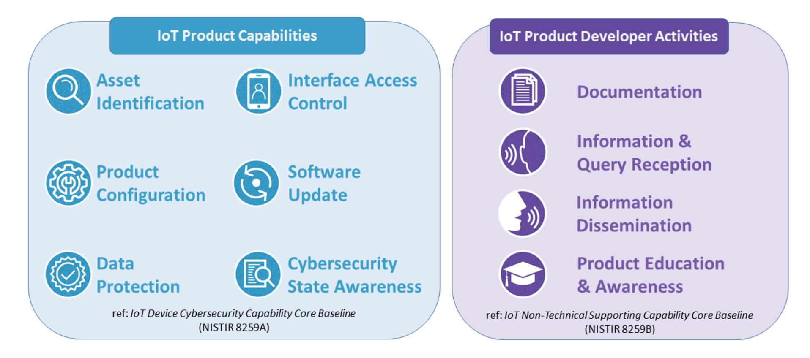

{0}------------------------------------------------

## **NIST Internal Report NIST IR 8425**

# **Profile of the IoT Core Baseline for Consumer IoT Products**

Michael Fagan Katerina Megas Paul Watrobski Jeffery Marron Barbara Cuthill

This publication is available free of charge from: https://doi.org/10.6028/NIST.IR.8425

{1}------------------------------------------------

## **NIST Internal Report NIST IR 8425**

# **Profile of the IoT Core Baseline for Consumer IoT Products**

Michael Fagan Katerina N. Megas Paul Watrobski Jeffrey Marron Barbara B. Cuthill *Applied Cybersecurity Division Information Technology Laboratory*

This publication is available free of charge from: https://doi.org/10.6028/NIST.IR.8425

September 2022

U.S. Department of Commerce *Gina M. Raimondo, Secretary*

National Institute of Standards and Technology *Laurie E. Locascio, NIST Director and Under Secretary of Commerce for Standards and Technology*

{2}------------------------------------------------

Certain commercial entities, equipment, or materials may be identified in this document in order to describe an experimental procedure or concept adequately. Such identification is not intended to imply recommendation or endorsement by the National Institute of Standards and Technology (NIST), nor is it intended to imply that the entities, materials, or equipment are necessarily the best available for the purpose.

There may be references in this publication to other publications currently under development by NIST in accordance with its assigned statutory responsibilities. The information in this publication, including concepts and methodologies, may be used by federal agencies even before the completion of such companion publications. Thus, until each publication is completed, current requirements, guidelines, and procedures, where they exist, remain operative. For planning and transition purposes, federal agencies may wish to closely follow the development of these new publications by NIST.

Organizations are encouraged to review all draft publications during public comment periods and provide feedback to NIST. Many NIST cybersecurity publications, other than the ones noted above, are available at [https://csrc.nist.gov/publications.](https://csrc.nist.gov/publications)

#### **NIST Technical Series Policies**

[Copyright, Fair Use, and Licensing Statements](https://doi.org/10.6028/NIST-TECHPUBS.CROSSMARK-POLICY) [NIST Technical Series Publication Identifier Syntax](https://www.nist.gov/document/publication-identifier-syntax-nist-technical-series-publications)

#### **Publication History**

Approved by the NIST Editorial Review Board on 2022-09-08

#### **How to Cite this NIST Technical Series Publication:**

Fagan M, Megas KN, Watrobski P, Marron J, Cuthill B (2022) Profile of the IoT Core Baseline for Consumer IoT Products. (National Institute of Standards and Technology, Gaithersburg, MD), NIST Interagency or Internal Report (IR) NIST IR 8425. https://doi.org/10.6028/NIST.IR.8425

#### **Author ORCID iDs**

Michael Fagan: 0000-0002-1861-2609 Katerina N. Megas: 0000-0002-2815-5448 Paul Watrobski: 0000-0002-6449-3030 Jeffrey Marron: 0000-0002-7871-683X Barbara B. Cuthill: 0000-0002-2588-6165

#### **Contact Information**

iotsecuirty@nist.gov

National Institute of Standards and Technology Attn: Applied Cybersecurity Division, Information Technology Laboratory 100 Bureau Drive (Mail Stop 2000) Gaithersburg, MD 20899-2000

**All comments are subject to release under the Freedom of Information Act (FOIA).**

{3}------------------------------------------------

#### **Reports on Computer Systems Technology**

The Information Technology Laboratory (ITL) at the National Institute of Standards and Technology (NIST) promotes the U.S. economy and public welfare by providing technical leadership for the Nation's measurement and standards infrastructure. ITL develops tests, test methods, reference data, proof of concept implementations, and technical analyses to advance the development and productive use of information technology. ITL's responsibilities include the development of management, administrative, technical, and physical standards and guidelines for the cost-effective security and privacy of other than national security-related information in federal information systems.

#### **Abstract**

This publication documents the consumer profile of NIST's Internet of Things (IoT) core baseline and identifies cybersecurity capabilities commonly needed for the consumer IoT sector (i.e., IoT products for home or personal use). It can also be a starting point for businesses to consider in the purchase of IoT products. The consumer profile was developed as part of NIST's response to Executive Order 14028 and was initially published in *Recommended Criteria for Cybersecurity Labeling for Consumer Internet of Things (IoT) Products*. The consumer profile capabilities are phrased as cybersecurity outcomes that are intended to apply to the entire IoT product. This document also discusses the foundations for developing the recommended consumer profile and related considerations. NIST reviewed a landscape of relevant source documents to inform the consumer profile and engaged with stakeholders across a year-long effort to develop the recommendations.

### **Keywords**

Internet of Things (IoT); consumer IoT; cybersecurity; IoT products; privacy; safety; securable products.

#### **Audience**

The intended audience for this report consists of manufacturers of consumer products, especially product security officers, retailers and related integrators and technical support firms serving the consumer and business sectors, and testing and certification bodies interested in establishing baselines of IoT cybersecurity capabilities.

{4}------------------------------------------------

### **Patent Disclosure Notice**

NOTICE: ITL has requested that holders of patent claims whose use may be required for compliance with the guidance or requirements of this publication disclose such patent claims to ITL. However, holders of patents are not obligated to respond to ITL calls for patents and ITL has not undertaken a patent search in order to identify which, if any, patents may apply to this publication.

As of the date of publication and following call(s) for the identification of patent claims whose use may be required for compliance with the guidance or requirements of this publication, no such patent claims have been identified to ITL.

No representation is made or implied by ITL that licenses are not required to avoid patent infringement in the use of this publication.

{5}------------------------------------------------

### **Table of Contents**

| Introduction 1                                                                                                                                                                                                          |    |
|----------------------------------------------------------------------------------------------------------------------------------------------------------------------------------------------------------------------------|----|
| Consumer Profile of the IoT Core Baseline 2                                                                                                                                                                             |    |
|                                                                                                                                                                                                                            |    |
|                                                                                                                                                                                                                            |    |
| 2.2.1. IoT Product Capabilities5                                                                                                                                                                                        |    |
| 2.2.2. IoT Product Non-Technical Supporting Capabilities 11                                                                                                                                                          |    |
| Consumer Sector Considerations Used to Create the Profile 17                                                                                                                                                            |    |
|                                                                                                                                                                                                                            |    |
|                                                                                                                                                                                                                            |    |
| References22                                                                                                                                                                                                               |    |
| Appendix A. Glossary 23                                                                                                                                                                                              |    |
| List of Tables Example Consumer IoT Vulnerabilities and the Relevant Capabilities from the Table 1. Consumer Profile17 Highlighted Insights and Key Takeaways from the Consumer Profiling Process. Table 2. | 20 |
| List of Figures                                                                                                                                                                                                            |    |
| Capabilities Identified for the Consumer Profile. 4 Fig. 1.                                                                                                                                                       |    |

{6}------------------------------------------------

#### **Acknowledgments**

The authors wish to thank all contributors to this publication, including the participants in workshops and other interactive sessions; the individuals and organizations from the private and public sectors, including manufacturers from various sectors as well as several manufacturer trade organizations, who provided feedback during NIST's Executive Order 14028 response period. Special thanks to Cybersecurity for IoT team members Rebecca Herold, Brad Hoehn, and David Lemire.

{7}------------------------------------------------

### **Introduction**

On May 12, 2021, the President issued Executive Order (EO) 14028, which, among other directives, called for NIST to recommend requirements for a consumer IoT product cybersecurity labeling program. As part of NIST's response to this directive[1](#page-7-1) , a profile of the IoT core baseline[2](#page-7-2) for consumer IoT products was created. This profile served as part of the recommendations that NIST published in response to the EO in February 2022 titled *Recommended Criteria for Cybersecurity Labeling for Consumer Internet of Things (IoT) Products* [\[EO\\_Criteria\]](#page-28-1).

The profile builds on the NISTIR 8259 series by extending the IoT core baseline for consumer IoT products. NISTIR 8259, *Foundational Cybersecurity Activities for IoT Device Manufacturers* [\[IR8259\]](#page-28-2), provides foundational guidance for IoT device manufacturers pertaining to developing IoT devices that can be used securely by customers. NISTIR 8259 does not target any specific IoT sector but discusses how manufacturers can approach cybersecurity for IoT devices in general. NISTIR 8259A, *IoT Device Cybersecurity Capability Core Baseline* [\[IR8259A\]](#page-28-3) and NISTIR 8295B, *IoT Non-Technical Supporting Capability Core Baseline*  [\[IR259B\]](#page-28-4) define the IoT device cybersecurity capability core baseline (also referred to as the core baseline). The core baseline is a starting point for manufacturers to use in identifying the cybersecurity capabilities their customers may expect from the IoT devices they create. NISTIR 8259A discusses device cybersecurity capabilities, which are functions or features implemented by the device through its own hardware and software. For example, NISTIR 8259A discusses concepts such as data protection, access control, and software update, among others. NISTIR 8259B discusses non-technical supporting capabilities, which are actions taken by organizations to support the cybersecurity of the device. For example, NISTIR 8259B discusses concepts such as education and awareness, and information and query reception (e.g., by manufacturers/developers).

Like NISTIR 8259, these baseline documents are not sector or use case specific, and instead present a starting point for *any* IoT device. Tailoring the baseline capabilities for a specific sector and/or use case requires a form of profiling. The profiling process using the NISTIR 8259 series directs a profiler to gather sector/use case-specific information and interpret the relevant impacts to select the baseline capabilities most applicable to the needs and goal of customers in the sector/use case.

The rest of this document describes the results of this profiling process for the consumer sector and is organized as follows:

- Section 2 explains the intended applicability of the consumer profile to consumer IoT products and defines the consumer profile.
- Section 3 describes the process used to develop the consumer profile in more depth.

1 For more information about NIST's response to EO 14028's call for recommendations for a consumer IoT product cybersecurity label, visit

<https://www.nist.gov/itl/executive-order-14028-improving-nations-cybersecurity/cybersecurity-labeling-consumers-0>2 The terms *core baseline, IoT core baseline, and IoT device core capability baseline* all refer to the set of capabilities presented in NISTIRs 8259A and 8259B.

{8}------------------------------------------------

• Section 4 explores additional considerations readers should consider when using the consumer profile.

### **Consumer Profile of the IoT Core Baseline**

This section builds on the whitepaper, *Recommended Criteria for Cybersecurity Labeling for Consumer Internet of Things (IoT) Products* [\[EO\\_Criteria\]](#page-28-1). First, the scope of an "IoT product" is defined, then the consumer IoT product profile of the IoT core baseline is presented.

### **IoT Product Scope Statement**

Consumer IoT products often constitute a set of system components that work together to deliver functionality realized at the end point or 'device' component of the product. NIST describes an IoT device as computing equipment with at least one transducer (i.e., sensor or actuator) and at least one network interface [\[IR8259\]](#page-28-2). All IoT products contain at least one IoT device and may contain only this product component. In many cases, the IoT product may be purchased as one piece of equipment (i.e., the IoT device) but still requires other components to operate, such as a backend (e.g., cloud server) or companion user application on a personal computer or smartphone.

Complex IoT products may contain multiple physical IoT devices, contain other kinds of equipment, or connect to multiple backends or companion applications as components. Though there are possibly a large number of component combinations that may create an IoT product, it is helpful to think of three specific kinds of IoT product components (other than the IoT device itself, which is always present in an IoT product):

- Specialty networking/gateway hardware (e.g., a hub within the system where the IoT device is used).
- Companion application software (e.g., a mobile app for communicating with the IoT device).
- Backends (e.g., a cloud service, or multiple services, that may store and/or process data from the IoT device).

Some IoT product components, such as the IoT device(s) (and perhaps a specialty networking/gateway hardware[3](#page-8-1) ) will be "in the box" that the customer purchases.[4](#page-8-2) Other components, such as companion application software or backends, will exist "outside the box[5](#page-8-3) ," but nonetheless are part of the IoT product through the support they provide for the operation of the IoT product. Regardless of these relationships, these additional

3 Some specialty networking/gateway hardware may be purchased by the customer separately, but are, nonetheless needed for the IoT product to work beyond basic features. In most cases where an IoT product requires separately purchased specialty networking/gateway hardware, that hardware will perform specific, consistent tasks in the implementation of an IoT product (e.g., protocol translation). For example, some IoT products require network connections other than conventional Wi-Fi/ethernet, such as Bluetooth, Zigbee, or Z-Wave, which would need a *hub* or *gateway* to allow for broader connectivity (i.e., over Wi-Fi and/or ethernet). This *hub* or *gateway* may not always be included as part of an IoT product, but, instead, be assumed to be part of the customer's network infrastructure, much like a Wi-Fi- router might be assumed for IoT

products that use Wi-Fi. 4 "In the box" components, particularly the IoT device(s) that serves as the product end point can be considered the *face* of the IoT product since these are what a customer will physically handle, manage, and use. Though other components may be vital to operation of the IoT product (including cybersecurity), the IoT device(s) plays a central role to the IoT product and, in general, is the focus of the operation of the IoT product. 5 Some "outside the box" components may be entirely remote relative to the customer, while others may be physically present in the customer's environment (e.g., inside their home), but, nonetheless, come separate from the IoT device(s).

{9}------------------------------------------------

product components have access to the IoT device and the data it creates and uses – making them potential attack vectors that could impact the IoT device, customer, and others (e.g., via attacks on systems, local networks, or the Internet at large). Since these additional components can introduce new or unique risks to the IoT product, the entire IoT product, including auxiliary components, must be securable.

#### Note on Conformity Assessment Considerations of IoT Components

This document discusses capabilities at the IoT product level, but IoT products are defined as a set of IoT product components. When considering the process of conformity assessment in this context, it is important to note the complexities of assessing the wide variety of IoT component combinations that could create a product. Further, some of these IoT product components may be fully or partially *modularized*, wherein customers may have choice of component and/or component platform. For example, some companion application software will run on mobile operating systems or through a web browser, for which cybersecurity goes well beyond the role the component may play in the IoT product. In these cases, assessing these IoT product components for conformity to the cybersecurity capabilities in the consumer profile should consider this fact and utilize existing standards and/or conformity mechanisms as part of the IoT product conformity mechanism as much as possible. For example, operating system or cloud cybersecurity certification programs may exist that can demonstrate partial support for the cybersecurity capabilities identified in the consumer profile, but in many cases the support the IoT component provides for the product will be achieved using additional application software and/or hardware that may not be considered or assessed by existing programs. The assessment of cybersecurity for the IoT product can, therefore, accept the existing certification and assess the cybersecurity of the additional application software/hardware.

In this context, an IoT product is defined as an IoT device or IoT devices and any additional product components that are necessary to use the IoT device beyond basic operational features. For example, an unconnected smart lightbulb may still illuminate in one color, but its smart features, such as color changes, cannot be used without other product components.

#### **Consumer Profile**

This section defines the cybersecurity capabilities[6](#page-9-0) expected of IoT products and IoT product developers as a part of a consumer profile.

Product criteria are recommended to apply to the IoT product overall, as well as to each individual IoT product component, as appropriate. Most criteria concern the IoT

6 The term capability is generally used in this document to follow from NISTIR 8259 series, but these same capabilities were presented as "outcomes" in Section 2.2 of *Recommended Criteria for Cybersecurity Labeling for Consumer Internet of Things (IoT) Products*. These terms are synonymous and could be used interchangeably in the context of this document and the whitepaper.

{10}------------------------------------------------

product directly and are expected to be satisfied by software and/or hardware means implemented in the IoT product. Some criteria apply to the IoT product developer rather than to the IoT product directly. These criteria are expected to be satisfied through actions and supported by assertions and evidence from the developer rather than from the IoT product itself.

The following figure lays out the high-level IoT product capabilities and IoT product developer[7](#page-10-1) activities developed based on NISTIRs 8259A and 8259B, respectively, that are discussed in the sections below.

**Fig. 1.** Capabilities Identified for the Consumer Profile.

Each capability's name and high-level definition of the capability are presented, followed by an alpha-numerical list of sub-criteria for each capability. For some subcriteria,[8](#page-10-2) additional detail to the outcome (i.e., normative text) is listed following **bolded**  text, while additional explanation and examples (i.e., informative text) are listed following *italicized* text. Finally, each capability is accompanied by a short description of the intended cybersecurity utility of the capability.

7 In the NISTIR 8259 series, IoT device manufacturers are referred to and may be the same entity as an IoT product developer discussed here. The multi-component nature of IoT products, though, increases the chance that the entity that brings an IoT product to market did not manufacture the physical IoT device(s), but rather used devices manufactured by another entity to create an IoT product. Therefore, the term IoT product developer is used in this document.

8 Sub-criteria are intended to give additional detail of how the outcome described in the high-level capability definition may be achieved by an IoT product. Sub-criteria may not be comprehensive of all possible support needed for an outcome in all use cases, and sub-criteria may also not apply to all use cases.

{11}------------------------------------------------

### **2.2.1. IoT Product Capabilities**

### **Asset Identification**

The IoT product is uniquely identifiable and inventories all of the [IoT](about:blank) [product's](about:blank)  [components.](about:blank)

- 1. The IoT product can be uniquely identified by the customer and other authorized entities (e.g., the IoT product developer).[9](#page-11-1)
- 2. The IoT product uniquely identifies each IoT product component and maintains an up-to- date inventory[10](#page-11-2) of connected product components.

*Cybersecurity utility:* The ability to identify IoT products and their components is necessary to support such activities as asset management for updates, data protection, and digital forensics capabilities for incident response.

9 In some cases, a unique identifier may exist for the IoT product itself (independent of even the IoT device identifier), but in many instances, identification of the IoT product can generally be interpreted as identification of one of the IoT components. To ensure uniqueness of the product identifier across product instances, this would usually be the IoT device or some other "in box" component rather than a component shared by

many instances such as the backend. 10 Inventories may reside on one component (e.g., IoT device, backend application) or may reside on multiple components (e.g., some components are inventoried on specialty networking/gateway hardware) depending on the IoT product architecture.

{12}------------------------------------------------

### **Product Configuration**

The configuration of the IoT product is changeable, there is the ability to restore a secure default setting, and any and all changes can only be performed by authorized individuals, services, and other IoT product components.

- 1. Authorized individuals (i.e., customer), services, and other IoT product components can change the configuration settings of the IoT product via one or more IoT product components.[11](#page-12-0)
- 2. Authorized individuals (i.e., customer), services, and other IoT product components have the ability to restore the IoT product to a secure default (i.e., uninitialized) configuration.
- 3. The IoT product applies configuration settings to applicable IoT components.

*Cybersecurity utility:* The ability to change aspects of how the IoT product functions can help customers tailor the IoT product's functionality to their needs and goals. Customers can configure their IoT products to avoid specific threats and risk they know about based on their risk appetite.

11 For some components, there may be cybersecurity relevant configuration of aspects of the component (e.g., platform or infrastructure of backends) that are not appropriately in scope for management by the IoT product and/or customer. For example, in most instances the IoT product companion application software should not manage the cybersecurity of the operating system the software runs on.

{13}------------------------------------------------

### **Data Protection**

The IoT product protects data stored across all IoT product components and transmitted both between IoT product components and outside the IoT product from unauthorized access, disclosure, and modification.

- 1. Each IoT product component protects data it stores via secure means.
- 2. The IoT product has the ability to delete or render inaccessible stored data that are either collected from or about the customer, home, family, etc.
- 3. When data are sent between IoT product components or outside the product, protections are used for the data transmission.[12](#page-13-0)

*Cybersecurity utility:* Maintaining confidentiality, integrity, and availability of data is foundational to cybersecurity for IoT products. Customers will expect that data are protected and that protection of data helps to ensure safe and intended functionality of the IoT product.

12 This may include the ability to communicate with product components that cannot implement the Data Protection capability the same way as other components (e.g., cannot support adequate cryptography). Any such communications (e.g., data transmitted with sub-par or limited protection)should still be performed in a way that reduces the subsequent risk, such as short-range and/or local network transmission protocol (e.g., Zigbee, Bluetooth) to communicate with some product components in limited, but necessary, circumstances.

{14}------------------------------------------------

### **Interface Access Control**

The IoT product restricts logical access to local and network interfaces – and to protocols and services used by those interfaces – to only authorized individuals, services, and IoT product components.

- 1. Each IoT product component controls access to and from all interfaces (e.g., local interfaces, whether externally accessible or not, network interfaces, protocols, and services) in order to limit access to only authorized entities. **At a minimum, the IoT product component shall:**
  - a. Use and have access only to interfaces necessary for the IoT product's operation. All other channels and access to channels are removed or secured.
  - b. For all interfaces necessary for the IoT product's use, access control measures are in place (e.g., unique password-based multifactor authentication, physical interface ports inaccessible from the outside of a component).
  - c. For all interfaces, access and modification privileges are limited.
- 2. Some, but not necessarily all, IoT product components have the means to protect and maintain interface access control. **At a minimum, the IoT product shall:**
  - a. Validate that data shared among IoT product components match specified definitions of format and content.
  - b. Prevent unauthorized transmissions or access to other product components.
  - c. Maintain appropriate access control during initial connection (i.e., onboarding) and when reestablishing connectivity after disconnection or outage.

*Cybersecurity utility:* Enumerating and controlling access to all internal and external interfaces to the IoT product will help preserve the confidentiality, integrity, and availability of the IoT product, its components, and data by helping prevent unauthorized access and modification.

{15}------------------------------------------------

### **Software Update**

The software[13](#page-15-0) of all IoT product components can be updated by authorized individuals, services, and other IoT product components only by using a secure and configurable mechanism, as appropriate for each IoT product component.

- 1. Each IoT product component can receive, verify, and apply verified software updates.
- 2. The IoT product implements measures to keep software on IoT product components up to date (i.e., automatic application of updates or consistent customer notification of available updates via the IoT product).

*Cybersecurity utility:* Software may have vulnerabilities discovered after the IoT product has been deployed; software update capabilities can help ensure secure delivery of security patches.

13 This includes executable code, as well as software libraries, support packs, and other non-executable software data.

{16}------------------------------------------------

### **Cybersecurity State Awareness**

The IoT product supports detection of cybersecurity incidents affecting or affected by IoT product components and the data they store and transmit.

1. The IoT product securely captures and records information about the state of IoT components[14](#page-16-0) that can be used to detect cybersecurity incidents affecting or affected by IoT product components and the data they store and transmit.

*Cybersecurity utility:* Protection of data and ensuring proper functionality can be supported by the ability to alert the customer when the device starts operating in unexpected ways, which could mean that unauthorized access is being attempted, malware has been loaded, botnets have been created, device software errors have happened, or other types of actions have occurred that was not initiated by the IoT product user or intended by the developer.

14 Information about the state of IoT components that would be useful to detecting cybersecurity incidents is highly contextual to the IoT product, its components, and its operation. In most cases, temporal information such as time-stamp or location data (digital or physical) should be captured. Software and hardware version and operational state (e.g., known fault or exception thrown) may help detect cybersecurity vulnerabilities (e.g., specific software or hardware may have known vulnerabilities). Cybersecurity state information may also contain records of commands and actions received by and executed by the IoT product or other data that is meaningful to the IoT product and how it works, and, are therefore useful to detecting incidents.

{17}------------------------------------------------

### **2.2.2. IoT Product Non-Technical Supporting Capabilities**

### **Documentation**

The IoT product developer creates, gathers, and stores[15](#page-17-1) information relevant to cybersecurity of the IoT product and its product components prior to customer purchase, and throughout the development of a product and its subsequent lifecycle.

- 1. Throughout the development lifecycle, the IoT product developer creates or gathers and stores information relevant to the cybersecurity of the IoT product and its product components, **including**:
  - a. Assumptions made during the development process and other expectations related to the IoT product, **including**:
    - i. Expected customers and use cases.
    - ii. Physical use and characteristics, including security of the location of the IoT product and its product components (e.g., a camera for use inside the home that has an off switch on the device vs. a security camera for use outside the home that does not have an off switch on the device).
    - iii. Network access and requirements (e.g., bandwidth requirements).
    - iv. Data created and handled by the IoT product.
    - v. Any expected data inputs and outputs (including error codes, frequency, type/form, range of acceptable values, etc.).
    - vi. The IoT product developer's assumed cybersecurity requirements for the IoT product.
    - vii. Any laws and regulations with which the IoT product and related support activities comply.
    - viii. Expected lifespan and anticipated cybersecurity costs related to the IoT product (e.g., price of maintenance) and length and terms of support.
  - b. All IoT components, including but not limited to the IoT device, that are part of the IoT product.
  - c. How the baseline product criteria are met by the IoT product across its product components, including which baseline product criteria are not met by IoT product components and why (e.g., the capability is not needed based on risk assessment).
  - d. Product design and support considerations related to the IoT product, *for example*:
    - i. All hardware and software components, from all sources (e.g., open source, propriety third-party, internally developed) used to

15 The documentation discussed in this criterion is maintained and controlled by the IoT product developer. Sharing of this information may be appropriate and can be limited to authorized technicians and cybersecurity experts seeking more information about the IoT product (e.g., in assessing the IoT product for labeling, investigating a breach), but the documented information is not intended, in all cases, to be shared directly with consumers.

{18}------------------------------------------------

- create the IoT product (i.e., used to create each product component).
- ii. IoT platform used in the development and operation of the IoT product, its product components, including related documentation.
- iii. Trustworthiness and protection of software and hardware elements implemented to create the IoT product and its product components (e.g., secure boot, hardware root of trust, and secure enclave).
- iv. Consideration for the known risks related to the IoT product and known potential misuses.
- v. Secure software development and supply chain practices used.
- vi. Accreditation, certification, and/or evaluation results for cybersecurity-related practices.
- vii. The ease of installation and maintenance of the IoT product by a customer (i.e., the usability of the product [\[ISO9241\]](#page-28-5)).
- e. Maintenance requirements for the IoT product, *for example*:
  - i. Cybersecurity maintenance expectations and associated instructions or procedures (e.g., vulnerability/patch management plan).
  - ii. How the IoT product developer identifies authorized supporting parties who can perform maintenance activities (e.g., authorized repair centers).
  - iii. Cybersecurity considerations of the maintenance process (e.g., how customer data unrelated to the maintenance process remain confidential even from maintainers).
  - f. The secure system lifecycle policies and processes associated with the IoT product, **including:**
    - i. Steps taken during development to ensure the IoT product and its product components are free of any known, exploitable vulnerabilities.
    - ii. The process of working with component suppliers and third-party vendors to ensure the security of the IoT product and its product components is maintained for the duration of its supported lifecycle.
    - iii. Any post end-of-support considerations, such as the discovery of a vulnerability that would significantly impact the security, privacy, or safety of customers who continue to use the IoT product and its product components.
  - g. The vulnerability management policies and processes associated with the IoT product, **including**:
    - i. Methods of receiving reports of vulnerabilities (see Information and Query Reception below).
    - ii. Processes for recording reported vulnerabilities.
    - iii. Policy for responding to reported vulnerabilities, including the

{19}------------------------------------------------

- process of coordinating vulnerability response activities among component suppliers and third-party vendors.
- iv. Policy for disclosing reported vulnerabilities.
- v. Processes for receiving notification from component suppliers and third-party vendors about any change in the status of their supplied components, such as end of production, end of support, deprecated status (e.g., the product is no longer recommended for use), or known insecurities.

*Cybersecurity utility:* Generating, capturing, and storing important information about the IoT product and its development (e.g., assessment of the IoT product and development practices used to create and maintain it) can help inform the IoT product developer about the product's actual cybersecurity posture.

{20}------------------------------------------------

### **Information and Query Reception**

The IoT product developer has the ability to receive information relevant to cybersecurity and respond to queries from the customer and others about information relevant to cybersecurity.

- 1. The IoT product developer can receive information related to the cybersecurity of the IoT product and its product components and can respond to queries related to cybersecurity of the IoT product and its product components from customers and others, **including**:
  - a. The ability of the IoT product developer to identify a point of contact to receive maintenance and vulnerability information (e.g., bug reporting capabilities and bug bounty programs) from customers and others in the IoT product ecosystem (e.g., repair technician acting on behalf of the customer).
  - b. The ability of the IoT product developer to receive queries from and respond to customers and others in the IoT product ecosystem about the cybersecurity of the IoT product and/or its components.

*Cybersecurity utility:* As IoT products are used by customers, those customers may have questions or reports of issues that can help improve the cybersecurity of the IoT product over time.

{21}------------------------------------------------

### **Information Dissemination**

The IoT product developer broadcasts (e.g., to the public) and distributes (e.g., to the customer or others in the IoT product ecosystem) information relevant to cybersecurity.

1. The IoT product developer can broadcast to many/all entities via a channel (e.g., a post on a public channel, emails sent to all impacted customers' registered addresses) to alert the public and customers of the IoT product about cybersecurity relevant information and events throughout the support lifecycle.

#### **At a minimum, this information shall include**:

- a. Updated terms of support (e.g., frequency of updates and mechanism(s) of application) and notice of availability and/or application of software updates.
- b. End of term of support or functionality for the IoT product.
- c. Needed maintenance operations.
- d. New IoT device vulnerabilities, associated details, and mitigation actions needed from the customer.
- e. Breach discovery related to an IoT product and its product components used by the customers, associated details, and mitigation actions needed from the customer (if any).
- 2. The IoT product developer can distribute information relevant to cybersecurity of the IoT product and its product components to alert appropriate ecosystem entities (e.g., IoT product component manufactures and/or supporting entities, common vulnerability tracking authorities, accreditors and certifiers, third-party support and maintenance organizations) about cybersecurity relevant information, *for example*:
  - a. Applicable documentation captured during the design and development of the IoT product and its product components.[16](#page-21-0)
  - b. Cybersecurity and vulnerability alerts and information about resolution of any vulnerability.
  - c. An overview of the information security practices and safeguards used by the IoT product developer.
  - d. Accreditation, certification, and/or evaluation results for the IoT product developer's cybersecurity-related practices.
  - e. A risk assessment report or summary for the IoT product developer's business environment risk posture.

*Cybersecurity utility:* As the IoT product, its components, threats, and mitigations change, customers will need to be informed about how to securely use the IoT product.

16 This sub-criteria is intended to indicate that information captured as part of the Documentation capability may need to be communicated to specific entities (e.g., IoT product component manufactures and/or supporting entities, common vulnerability tracking authorities, accreditors and certifiers, third-party support and maintenance organizations). In most cases, this kind of documentation would only be shared with interested parties that have a specific purpose for the information (e.g., conformity assessment) and would not generally be shared publicly or even with customers in the consumer sector.

{22}------------------------------------------------

### **Product Education and Awareness**

The IoT product developer creates awareness of and educates customers and others in the IoT product ecosystem about cybersecurity-related information (e.g., considerations, features) related to the IoT product and its product components.[17](#page-22-0)

- 1. The IoT product developer creates awareness and provides education targeted at customers about information relevant to cybersecurity of the IoT product and its product components, **including**:
  - a. The presence and use of IoT product cybersecurity capabilities, **including at a minimum**:
    - i. How to change configuration settings and the cybersecurity implications of changing settings, if any.
    - ii. How to configure and use access control functionality (e.g., set and change passwords).
    - iii. How software updates are applied and any instructions necessary for the customer on how to use software update functionality.
    - iv. How to manage device data including creation, update, and deletion of data on the IoT product.
  - b. How to maintain the IoT product and its product components during its lifetime, including after the period of security support (e.g., delivery of software updates and patches) from the IoT product developer.
  - c. How an IoT product and its product components can be securely reprovisioned or disposed of.
  - d. Vulnerability management options (e.g., configuration and patch management and anti-malware) available for the IoT product or its product components that could be used by customers.
  - e. Additional information customers can use to make informed purchasing decisions about the security of the IoT product (e.g., the duration and scope of product support via software upgrades and patches).

*Cybersecurity utility:* Customers will need to be informed about how to securely use the device to lead to the best cybersecurity outcomes for the customers and the consumer IoT product marketplace.

17 The information and expertise to develop effective education and awareness related to an IoT product may reside in the IoT product component developer or manufacturer. An ecosystem of education and awareness that shares information about IoT cybersecurity, even prior to the deployment of an IoT product is recommended as it will help in the implementation of this and other cybersecurity capabilities.

{23}------------------------------------------------

### **Consumer Sector Considerations Used to Create the Profile**

NIST used the concepts of profiling the IoT device cybersecurity capability core baseline to develop the consumer profile. The first step was to gather sources and other information about consumer IoT product cybersecurity. Next, NIST used this information to create the consumer profile using the sources, information, and resulting takeaways and insights.

### **Gathering Source Information about Consumer IoT Product Cybersecurity**

The consumer profile stemmed from NIST's response to EO 14028, which directed NIST to develop recommendations for a consumer IoT product cybersecurity label program. The recommendations were broader than the development of a consumer profile of the IoT core baseline, but the profile was a key element of this task. Therefore, NIST was able to gather sources and engage in discussions with external stakeholders about the needs and goals of consumer IoT product customers. Across a year of events, meetings, and other engagements, hundreds of comments were gathered related to cybersecurity labeling for consumer IoT products, many of which informed the profiling of the core baseline for this sector.

NIST also looked across the public domain to identify applicable vulnerabilities for the consumer IoT product sector. This information is important to determine a cross-sectional view of vulnerabilities for consumer IoT products that can serve as the basis for determining threats and vulnerabilities. These threats and vulnerabilities inform the profiling process, particularly aspects of minimal securability. Table 1, reproduced from the *Consumer Cybersecurity Labeling for IoT Products: Discussion Draft on the Path Forward* Whitepaper [\[Path\\_Forward\]](#page-28-6) lists a number of applicable, well-documented vulnerabilities, their associated MITRE ATT&CK Framework [\[ATT\\_CK\]](#page-28-7) attack categories, and the profiled capabilities that can help address the vulnerability.[18](#page-23-2)

**Table 1.** Example Consumer IoT Vulnerabilities and the Relevant Capabilities from the Consumer Profile.

| Vulnerability                                                                                                                                                        | Relevant Consumer Profile Capabilities                                                                   |  |
|----------------------------------------------------------------------------------------------------------------------------------------------------------------------|----------------------------------------------------------------------------------------------------------|--|
| Use of weak authentication to enable the loading of Mirai Malware Variants Attacks – malware onto the device and use that device in DDOS and other attacks. |                                                                                                          |  |
| Unauthorized access to the IoT device                                                                                                                                | Asset Identification Interface Access Control Information Dissemination Education and Awareness |  |
| Malicious code can be loaded on the IoT device                                                                                                                       | Software Update Cybersecurity State Awareness Education and Awareness                              |  |

18 The identified capabilities are not exhaustive but are included to demonstrate the support cybersecurity capabilities like those detailed in the consumer profile can help mitigate or prevent the identified vulnerabilities. For example, an interface access control capability could have prevented unauthorized access to an IoT device.

17

{24}------------------------------------------------

| Vulnerability                                                                                                                                                                               | Relevant Consumer Profile Capabilities                                                               |  |
|---------------------------------------------------------------------------------------------------------------------------------------------------------------------------------------------|------------------------------------------------------------------------------------------------------|--|
| Commands can be launched using the device                                                                                                                                                   | Interface Access Control Documentation                                                            |  |
| Fitness tracker location data for Unauthorized Publication of Fitness Tracker Data – military personnel were publicly posted even when product was configured for privacy.         |                                                                                                      |  |
| Web application vulnerabilities                                                                                                                                                             | Product configuration Cybersecurity State Awareness Documentation Information Dissemination |  |
| Mobile application vulnerabilities                                                                                                                                                          | Product Configuration Cybersecurity State Awareness Documentation Information Dissemination |  |
| Ability for de-identified data to be re-identified                                                                                                                                          | Product Configuration Data Protection Documentation                                            |  |
| Unauthorized access to home security camera data – Unauthorized access to data and views of the inside and outside of buildings occurred with multiple brands of security cameras. |                                                                                                      |  |
| Weak authentication                                                                                                                                                                         | Interface Access Control                                                                             |  |
| Unauthorized data sharing                                                                                                                                                                   | Data Protection Documentation Information Dissemination                                        |  |
| Non-responsive to questions and complaints to the developers                                                                                                                             | Information and Query Reception                                                                      |  |
| Lack of monitoring capabilities and procedures                                                                                                                                              | Asset Identification Product Configuration Documentation                                       |  |

{25}------------------------------------------------

| Vulnerability                              | Relevant Consumer Profile Capabilities                                                                                 |
|--------------------------------------------|------------------------------------------------------------------------------------------------------------------------|
| Lack of data recording/collection controls | Asset Identification Product Configuration Documentation Information Dissemination Education and Awareness |

NIST also looked at the existing standards, conformity, and labeling ecosystem for IoT devices and products to understand where others had accounted for consumer IoT product considerations. Approximately 30 source documents were reviewed, including IoT cybersecurity laws, catalogs of cybersecurity capabilities, sets of baseline capabilities, and tiering schemes.[19](#page-25-0) All specifically addressed the IoT device itself, but several included the cloud, mobile app, hub, or other external components in their considerations as part of an IoT product. Throughout the public comment periods and discussions with stakeholders, the broader view (i.e., of IoT product vs. IoT device) was supported, as NIST observed much consensus in the need to include all components of an IoT product in the scope for an established set of cybersecurity capabilities.

#### **Assessing Consumer IoT Product Cybersecurity Sources**

Source documents can be most directly compared to the technical and non-technical supporting capabilities established in NISTIRs 8259A and 8259B. Of the 30 source documents collected, a sub-sample of 8 were most directly related to consumer IoT products. This sub-sample was compared to the capabilities described in NISTIR 8259A/B, which showed there was broad alignment with the technical capabilities, though some common technical capabilities not found in NISTIR 8259A were used to adapt the core baseline for the consumer profile. However, few source documents addressed the non-technical capabilities developed based on NISTIR 8259B. As the intended users of consumer IoT devices are usually not experts in cybersecurity, these non-technical supporting capabilities are essential to ensure secure operation.

This was confirmed through public comments and verbal feedback throughout the work on the EO response, which served as another source for information NIST drew from to inform the consumer profile. Through these sources, NIST also heard a number of other ways the consumer sector may be different than the general case or other sectors. For example, the cybersecurity risk management of enterprise customers is generally more structured and formalized compared to the cybersecurity risk management approach used by customers in the consumer sector. Enterprises also, typically, have greater access to cybersecurity expertise than typical consumers. These differences and other insights have implications for how cybersecurity capabilities must be approached and delivered. Table 2 highlights key insights used in the development of the consumer IoT profile.

19 EO 14028 directed NIST to consider tiers for the consumer IoT labeling recommendations, but NIST research and subsequent feedback did not yield a clear and effective set of or framework for developing tiers. Existing sources that address tiers did not do so with a consensus view. Furthermore, NIST heard feedback that tiers should reflect increasing levels of risk related to consumer IoT products, but the variety of consumer IoT use cases makes clustering those use cases based on risk, a prerequisite to tiering them, a task that could not be completed within the one-year timeframe for response to EO 14028.

{26}------------------------------------------------

**Table 2.** Highlighted Insights and Key Takeaways from the Consumer IoT Profiling Process.

| Highlighted Insight                                                                                                                                                                                                                                                 | Key Takeaway                                                                                                                                                      |
|---------------------------------------------------------------------------------------------------------------------------------------------------------------------------------------------------------------------------------------------------------------------|-------------------------------------------------------------------------------------------------------------------------------------------------------------------|
| Cybersecurity insights for the consumer sector based on risks and vulnerabilities are similar to those for the general core baseline case. (e.g., those listed in Table 1)                                                                                 | Most capabilities have similar cybersecurity concepts as the core baseline                                                                                  |
| Device-level cybersecurity guidelines would be insufficient based on customers' needs and goals for this sector, including but not limited to their lack of distinction between the IoT device and supporting components.                            | Product is the preferred level for consumer IoT cybersecurity guidelines.                                                                                   |
| Privacy and safety are prominent concerns for consumer IoT products along with cybersecurity.                                                                                                                                                                 | Cybersecurity capabilities must be designed to not create risks in these areas, and to support general approaches to privacy and safety risk mitigation. |
| There is no clear, universal set of consumer needs and goals for cybersecurity in the consumer sector, and NIST identified several approaches to addressing customer needs and goals among the source documents included in the landscape review. | Capabilities should be based on universally accepted and generally applicable cybersecurity functions.                                                      |
| Needs and goals for customers in this sector will vary. Customers may have limited knowledge and abilities with IoT/IT technologies and cybersecurity functions.                                                                               | Human-factors related to cybersecurity capabilities are paramount to mitigating cybersecurity risks.                                                        |

These insights and resulting takeaways lead NIST to the following considerations regarding a consumer IoT profile:

- 1. It became clear that many consumer IoT devices are supported by additional components, such as a back-end and/or mobile app, that are critical to using the IoT device to the point that the device cannot be meaningfully used without these components.
- 2. Additionally, home consumers often have little control over these additional components. Therefore, when considering how device-centricity will apply to the consumer sector, the concept should expand beyond the device to include the full product. This scope may include additional components as part of an IoT product, including those that the consumer interacts with only indirectly (e.g., backend).

20

{27}------------------------------------------------

- 3. The consumer profile must be implemented in the context of key privacy and safety perceptions and considerations for the sector. Safety and privacy considerations are dynamic for consumer IoT products, though, owing to the fact that even in this specific sector, use cases for IoT products may vary significantly. There may be clear safety implications to a product and its operation, but this is not always the case. The same goes for privacy. This is exacerbated by the fact that different use cases may share broad safety and/or privacy considerations, but the specifics on their impacts and/or mitigations can be very different. This all means that the consumer profile's cybersecurity capabilities must broadly support a variety of use cases while taking care to not hinder these areas.
- 4. Cybersecurity practices of the customers (i.e., home consumers) that would be managing consumer IoT products will vary in definition and maturity. The unpredictable and ad hoc nature of customer risk mitigation for consumer IoT products highlight the need for broadly useful and generally recommended cybersecurity practices be reflected in the profile.
- 5. Additionally, an important cybersecurity need for this sector is usable cybersecurity capabilities that are implemented to require minimal/efficient customer set-up and interaction for use, since these customers will not have deep knowledge or resources to leverage if capabilities are not usable to them.
- 6. Finally, specific standards, solutions, implementations, or mitigations should be used as appropriate for an IoT product's functionality and use case. This means no single set of specific requirements can be applicable to all consumer IoT products. Therefore, the consumer profile describes IoT product-level cybersecurity guidelines in terms of outcomes to be achieved and supported by the product as a whole but may not apply to all IoT product components the same way. Some components may not be able, or need, to support all criteria. [20](#page-27-0) These outcomes provide guidance for a variety of technologies and use cases but allow flexibility in the application of the consumer profile to specific IoT products.[21](#page-27-1)

NIST applied these considerations to the NISTIRs 8259A/B core baseline capabilities to adapt the general IoT approach for the consumer sector. The resulting consumer profile, though more directly tailored for the sector, is still meant to speak to a broad range of IoT technologies, use cases, and risk mitigation considerations. Therefore, application of the consumer profile to a specific product, product type, or IoT product component may require additional, but similar, tailoring through gathering and consideration of information as described in this Section.

20 As discussed in *Recommended Criteria for Cybersecurity Labeling for Consumer Internet of Things (IoT) Products*, not all capabilities or subcriteria may apply to or be supported in the same way by all IoT product components. This could be due to product risk considerations, product development (e.g., cybersecurity tasks delegated via contracts and supply chain), nature of the components to form the product (e.g., backends may be highly distributed), or limitations of IoT components (e.g., devices may be constrained, companion software apps may have limited access and functionality). Considering this when applying the capabilities and sub-criteria to real-world products (e.g., via a conformity assessment mechanism) is critical a robust cybersecurity marketplace and ecosystem that can meet disparate needs and contexts.

21 NIST directs those with guidance, standards, or programs that they feel support or otherwise relate to some or all of the outcomes reflected in this profile should look to the NIST Online Informative Reference (OLIR) Catalog for more information on how to submit public mappings between your work and the consumer profile.

{28}------------------------------------------------

### **References**

Common Knowledge. (The MITRE Corporation, Bedford, MA). <https://attack.mitre.org/> [EO\_Criteria] National Institute of Standards and Technology (2022) Recommended Criteria for Cybersecurity Labeling for Consumer Internet of Things (IoT) Products. (National Institute of Standards and Technology, Gaithersburg, MD), NIST Cybersecurity White Paper.<https://doi.org/10.6028/NIST.CSWP.24> [IR8259] Fagan M, Megas KN, Scarfone K, Smith M (2020) Foundational Cybersecurity Activities for IoT Device Manufacturers. (National Institute of Standards and Technology, Gaithersburg, MD), NIST Interagency or Internal Report (IR) 8259.<https://doi.org/10.6028/NIST.IR.8259> [IR8259A] Fagan M, Megas KN, Scarfone K, Smith M (2020) IoT Device Cybersecurity Capability Core Baseline. (National Institute of Standards and Technology, Gaithersburg, MD), NIST Interagency or Internal Report (IR) 8259A. <https://doi.org/10.6028/NIST.IR.8259A>

[ATT\_CK] The MITRE Corporation (2013) Adversarial Tactics, Techniques, and

[IR8259B] Fagan M, Marron J, Brady KG, Jr, Cuthill BB, Megas KN, Herold R (2020) IoT Non-Technical Supporting Capability Core Baseline. (National Institute of Standards and Technology, Gaithersburg, MD), NIST Interagency or Internal Report (IR) 8259B.<https://doi.org/10.6028/NIST.IR.8259B>

[ISO9241] International Organization for Standardization/International Electrotechnical Commission (2018) ISO 9241-11:2018 Ergonomics of human-system interaction – Part 11: Usability: Definitions and concepts (ISO Geneva, Switzerland). Available at<https://www.iso.org/standard/63500.html>

[Path\_Forward] National Institute of Standards and Technology (2021) Consumer Cybersecurity Labeling for IoT Products: Discussion Draft on the Path Forward. (National Institute of Standards and Technology, Gaithersburg, MD). Available at: [https://www.nist.gov/document/draft-paper-consumer](https://www.nist.gov/document/draft-paper-consumer-cybersecurity-labeling-iot-products-discussion-draft-path-forward)[cybersecurity-labeling-iot-products-discussion-draft-path-forward](https://www.nist.gov/document/draft-paper-consumer-cybersecurity-labeling-iot-products-discussion-draft-path-forward)

{29}------------------------------------------------

### **Appendix A. Glossary**

#### **consumer IoT product**

IoT products that are intended for personal, family, or household use.

#### **core baseline**

A set of device cybersecurity capabilities and non-technical supporting capabilities needed to support common cybersecurity controls that protect the customer's devices and device data, systems, and ecosystems.

#### **product cybersecurity capability**

Cybersecurity features or functions that computing devices provide through their own technical means (i.e., device hardware and software). [\[IR8259\]](#page-28-2)

*Note:* This term is synonymous with *device* cybersecurity capabilities, as defined in NISTIR 8259, but is scoped to an IoT product as defined in this document as opposed to only the IoT device.

#### **IoT device**

Devices that have at least one transducer (sensor or actuator) for interacting directly with the physical world and at least one network interface (e.g., Ethernet, Wi-Fi, Bluetooth) for interfacing with the digital world.

#### **IoT product**

An IoT device or IoT devices and any additional product components (e.g., backend, mobile app) that are necessary to use the IoT device beyond basic operational features.

#### **IoT product component**

An IoT device or other digital equipment or service (e.g., backend, mobile app) used to create IoT products.

#### **non-technical supporting capability**

Non-technical supporting capabilities are actions an organization performs in support of the cybersecurity of an IoT device.