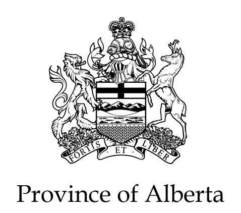
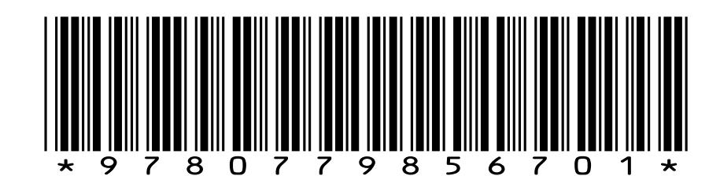
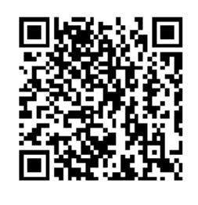

{0}------------------------------------------------

# **PERSONAL INFORMATION PROTECTION ACT**

Statutes of Alberta, 2003 Chapter P-6.5

Current as of September 1, 2025

# Office Consolidation

© Published by Alberta King's Printer

Alberta King's Printer Suite 700, Park Plaza 10611 - 98 Avenue Edmonton, AB T5K 2P7 Phone: 780-427-4952

E-mail: kings-printer@gov.ab.ca Shop on-line at kings-printer.alberta.ca

{1}------------------------------------------------

# **Copyright and Permission Statement**

The Government of Alberta, through the Alberta King's Printer, holds copyright for all Alberta legislation. Alberta King's Printer permits any person to reproduce Alberta's statutes and regulations without seeking permission and without charge, provided due diligence is exercised to ensure the accuracy of the materials produced, and copyright is acknowledged in the following format:

© Alberta King's Printer, 20\_\_.\*

\*The year of first publication of the legal materials is to be completed.

# **Note**

All persons making use of this consolidation are reminded that it has no legislative sanction, that amendments have been embodied for convenience of reference only. The official Statutes and Regulations should be consulted for all purposes of interpreting and applying the law.

## **Regulations**

The following is a list of the regulations made under the *Personal Information Protection Act* that are filed as Alberta Regulations under the Regulations Act

|                                                                                                        | Alta. Reg. | Amendments                      |
|--------------------------------------------------------------------------------------------------------|------------|---------------------------------|
| Personal Information Protection Act Personal Information Protection Act 366/2003 108/2004, 51/2010, |            | 240/2018, 120/2024, 142/2025 |

{2}------------------------------------------------

# **PERSONAL INFORMATION PROTECTION ACT**

Chapter P-6.5

# *Table of Contents*

- **1** Definitions
- **2** Standard as to what is reasonable

# **Part 1 Purpose and Application**

- **3** Purpose
- **4** Application

# **Part 2**

# **Protection of Personal Information**

# **Division 1**

### **Compliance and Policies**

- **5** Compliance with Act
- **6** Policies and practices

## **Division 2 Consent**

- **7** Consent required
- **8** Form of consent
- **9** Withdrawal or variation of consent
- **10** Consent obtained by deception, etc.

### **Division 3**

### **Collection of Personal Information**

- **11** Limitations on collection
- **12** Limitation on sources for collection
- **13** Notification required for collection
- **13.1** Notification respecting service provider outside Canada
  - **14** Collection without consent

{3}------------------------------------------------

- **14.1** Collection by a trade union relating to a labour dispute
  - **15** Collection of personal employee information

# **Division 4**

#### **Use of Personal Information**

- **16** Limitations on use
- **17** Use without consent
- **17.1** Use by a trade union relating to a labour dispute
  - **18** Use of personal employee information

### **Division 5**

#### **Disclosure of Personal Information**

- **19** Limitations on disclosure
- **20** Disclosure without consent
- **20.1** Disclosure by a trade union relating to a labour dispute
  - **21** Disclosure of personal employee information

# **Division 6**

### **Business Transactions**

**22** Disclosure respecting acquisition of a business, etc.

# **Part 3**

# **Access to and Correction and Care of Personal Information**

### **Division 1**

#### **Access and Correction**

- **23** Definitions
- **24** Access to records and provision of information
- **25** Right to request correction
- **26** How to make a request
- **27** Duty to assist
- **28** Time limit for responding
- **29** Contents of response
- **30** How access will be given
- **31** Extending the time limit for responding
- **32** Fees

### **Division 2**

# **Care of Personal Information**

- **33** Accuracy of information
- **34** Protection of information
- **34.1** Notification of loss or unauthorized access or disclosure
  - **35** Retention and destruction of information

{4}------------------------------------------------

# **Part 4 Role of Commissioner**

| 36 | General powers of Commissioner                           |
|----|----------------------------------------------------------|
| 37 | Power to authorize an organization to disregard requests |

- **37.1** Power to require notification
- **38** Powers of Commissioner re investigations or inquiries
- **38.1** Legal privilege not affected
- **39** Statements not admissible in evidence
- **40** Privileged information
- **41** Restrictions on disclosure of information
- **42** Protection of Commissioner and staff
- **43** Delegation by the Commissioner
- **43.1** Extra-provincial commissioner
- **44** Annual report of Commissioner

# **Part 5 Reviews and Orders**

- **45** Definition
- **46** Right to ask for a review or initiate a complaint
- **47** How to ask for a review or initiate a complaint
- **48** Notifying others of review or complaint
- **49** Mediation
- **49.1** Refusal to conduct or continue investigation or review
- **49.2** Records relating to an investigation
  - **50** Inquiry by Commissioner
  - **51** Burden of proof
  - **52** Commissioner's orders
  - **53** No appeal
  - **54** Duty to comply with orders
  - **54.1** Judicial review

# **Part 6**

# **Professional Regulatory and Non-profit Organizations**

- **55** Professional regulatory organizations
- **56** Non-profit organizations

# **Part 7 General Provisions**

- **57** Protection of organization from legal actions
- **58** Protection of employee
- **59** Offences and penalties

{5}------------------------------------------------

- **60** Damages for breach of this Act
- **61** Exercise of rights by other persons
- **62** General regulations
- **63** Review of Act
- **64-74** Consequential amendments
  - **75** Coming into force

HER MAJESTY, by and with the advice and consent of the Legislative Assembly of Alberta, enacts as follows:

#### **Definitions**

- **1(1)** In this Act,
- (a) "business contact information" means an individual's name, position name or title, business telephone number, business address, business e-mail address, business fax number and other similar business information;
- (b) "Commissioner" means the Information and Privacy Commissioner appointed under the *Access to Information Act*;
- (c) "credit reporting organization" means a reporting agency as defined in Part 5 of the *Consumer Protection Act*;
- (d) "domestic" means related to home or family;
- (e) "employee" means an individual employed by an organization and includes an individual who performs a service for or in relation to or in connection with an organization
- (i) as a partner or a director, officer or other office-holder of the organization,
- (i.1) as an apprentice, volunteer, participant or student, or
- (ii) under a contract or an agency relationship with the organization;
- (f) "investigation" means an investigation related to
- (i) a breach of agreement,
- (ii) a contravention of an enactment of Alberta or Canada or of another province of Canada, or

{6}------------------------------------------------

 (iii) circumstances or conduct that may result in a remedy or relief being available at law,

 if the breach, contravention, circumstances or conduct in question has or may have occurred or is likely to occur and it is reasonable to conduct an investigation;

- (g) "legal proceeding" means a civil, criminal or administrative proceeding that is related to
- (i) a breach of an agreement,
- (ii) a contravention of an enactment of Alberta or Canada or of another province of Canada, or
- (iii) a remedy available at law;
- (g.1) "legislative instrument of a professional regulatory organization" means a bylaw, resolution or rule that is
- (i) enacted or otherwise established by a professional regulatory organization under an Act or a regulation of Alberta, and
- (ii) of a legislative nature;
- (g.2) "local government body" means a local government body as defined in the *Access to Information Act*;
- (h) "Minister" means the Minister determined under section 16 of the *Government Organization Act* as the Minister responsible for this Act;
- (i) "organization" includes
- (i) a corporation,
- (ii) an unincorporated association,
- (iii) a trade union as defined in the *Labour Relations Code*,
- (iv) a partnership as defined in the *Partnership Act*, and
- (v) an individual acting in a commercial capacity,

 but does not include an individual acting in a personal or domestic capacity;

 (j) "personal employee information" means, in respect of an individual who is a potential, current or former employee of 

{7}------------------------------------------------

an organization, personal information reasonably required by the organization for the purposes of

- (i) establishing, managing or terminating an employment or volunteer-work relationship, or
- (ii) managing a post-employment or post-volunteer-work relationship

 between the organization and the individual, but does not include personal information about the individual that is unrelated to that relationship;

- (k) "personal information" means information about an identifiable individual;
- (k.1) "professional Act" means an enactment under which a professional or occupational group or discipline is organized, and that provides for
- (i) membership in the professional or occupational group or discipline, and
- (ii) the regulation of the members of the professional or occupational group or discipline with respect to more than one of the following:
- (A) registration;
- (B) competence;
- (C) conduct;
- (D) practice;
- (E) disciplinary matters;
- (k.2) "professional regulatory organization" means an organization incorporated under a professional Act;
- (l) "public body" means a public body as defined in the *Access to Information Act*;
- (m) "record" means a record of information in any form or in any medium, whether in written, printed, photographic or electronic form or any other form, but does not include a computer program or other mechanism that can produce a record;

{8}------------------------------------------------

- (m.1) "regulation of Alberta" means a regulation as defined in the *Regulations Act* that is filed under that Act;
- (m.2) "regulation of Canada" means a regulation as defined in the *Statutory Instruments Act* (Canada) that is registered under that Act;
- (m.3) "service provider" means any organization, including, without limitation, a parent corporation, subsidiary, affiliate, contractor or subcontractor, that, directly or indirectly, provides a service for or on behalf of another organization;
- (n) "volunteer work relationship" means a relationship between an organization and an individual under which a service is provided for or in relation to or is undertaken in connection with the organization by an individual who is acting as a volunteer or is otherwise unpaid with respect to that service and includes any similar relationship involving an organization and an individual where, in respect of that relationship, the individual is a participant or a student.
  - **(2)** For the purposes of section 14(c.3), 17(c.3) and 20(c.3), "audit" means a financial or other formal or systematic examination or review conducted in accordance with recognized standards for an accepted business purpose, but does not include an examination or review conducted with respect to a business transaction referred to in section 22.

2003 cP-6.5 s1;2009 c50 s2;2017 c18 s1(24);AR 141/2025

# **Standard as to what is reasonable**

- **2** Where in this Act anything or any matter
- (a) is described, characterized or referred to as reasonable or unreasonable, or
- (b) is required or directed to be carried out or otherwise dealt with reasonably or in a reasonable manner,

the standard to be applied under this Act in determining whether the thing or matter is reasonable or unreasonable, or has been carried out or otherwise dealt with reasonably or in a reasonable manner, is what a reasonable person would consider appropriate in the circumstances.

{9}------------------------------------------------

# **Part 1 Purpose and Application**

### **Purpose**

**3** The purpose of this Act is to govern the collection, use and disclosure of personal information by organizations in a manner that recognizes both the right of an individual to have his or her personal information protected and the need of organizations to collect, use or disclose personal information for purposes that are reasonable.

# **Application**

- **4(1)** Except as provided in this Act and subject to the regulations, this Act applies to every organization and in respect of all personal information.
- **(2)** Subject to the regulations, this Act does not apply to a public body or any personal information that is in the custody of or under the control of a public body.
- **(3)** This Act does not apply to the following:
- (a) the collection, use or disclosure of personal information if the collection, use or disclosure, as the case may be, is for personal or domestic purposes of the individual and for no other purpose;
- (b) the collection, use or disclosure of personal information if the collection, use or disclosure, as the case may be, is for artistic or literary purposes and for no other purpose;
- (c) the collection, use or disclosure of personal information, other than personal employee information that is collected, used or disclosed pursuant to section 15, 18 or 21, if the collection, use or disclosure, as the case may be, is for journalistic purposes and for no other purpose;
- (d) the collection, use or disclosure of an individual's business contact information if the collection, use or disclosure, as the case may be, is for the purposes of enabling the individual to be contacted in relation to the individual's business responsibilities and for no other purpose;
- (e) personal information that is in the custody of an organization if the *Protection of Privacy Act* applies to that information;
- (f) health information as defined in the *Health Information Act* to which that Act applies;

{10}------------------------------------------------

- (g) the collection, use or disclosure of personal information by the following officers of the Legislature if the collection, use or disclosure, as the case may be, relates to the exercise of that officer's functions under an enactment:
- (i) the Auditor General;
- (ii) the Ombudsman;
- (iii) the Chief Electoral Officer;
- (iii.1) repealed 2019 c15 s30;
- (iv) the Ethics Commissioner;
- (v) the Information and Privacy Commissioner;
- (vi) the Child and Youth Advocate;
- (vii) the Public Interest Commissioner;
- (h) personal information about an individual if the individual has been dead for at least 20 years;
- (i) personal information about an individual that is contained in a record that has been in existence for at least 100 years;
- (j) personal information contained in any record that
- (i) was transferred to an archival institution before the coming into force of this Act where access to the record
- (A) was unrestricted before the coming into force of this Act, or
- (B) is governed by an agreement entered into by the archival institution and the donor of the record before the coming into force of this Act,

or

- (ii) is transferred to an archival institution after the coming into force of this Act where access to the record is governed by an agreement entered into by the archival institution and the donor of the record before the coming into force of this Act;
- (k) personal information contained in a court file, a record of a judge of the Court of Appeal of Alberta, the Court of King's Bench of Alberta or the Alberta Court of Justice, a record of

{11}------------------------------------------------

an applications judge of the Court of King's Bench of Alberta, a record of a justice of the peace other than a non-presiding justice of the peace under the *Justice of the Peace Act*, a judicial administration record or a record relating to support services provided to the judges of any of the courts referred to in this clause;

- (l) personal information contained in a record of any type that has been created by or for
- (i) a Member of the Legislative Assembly, or
- (ii) an elected or appointed member of a public body;
- (m) the collection, use or disclosure of personal information by, or for, a registered constituency association or a registered party as defined in the *Election Finances and Contributions Disclosure Act* or in respect of an office or a position in a registered constituency association or a registered party;
- (n) the collection, use or disclosure of personal information by, or for, an individual who is a bona fide candidate for public office or for an office or a position in a registered constituency association or a registered party as defined in the *Election Finances and Contributions Disclosure Act*  where the information is being collected, used or disclosed, as the case may be, for the purposes of campaigning for that office or position and for no other purpose;
- (o) personal information contained in a personal note, communication or draft decision created by or for a person who is acting in a judicial, quasi-judicial or adjudicative capacity.
  - **(4)** If an organization has under its control personal information about an individual that was acquired prior to January 1, 2004, that information, for the purposes of this Act,
- (a) is deemed to have been collected pursuant to consent given by that individual,
- (b) may be used and disclosed by the organization for the purposes for which the information was collected, and
- (c) after the coming into force of this Act, is to be treated in the same manner as information collected under this Act.
  - **(5)** This Act is not to be applied so as to
- (a) affect any legal privilege,

{12}------------------------------------------------

- (b) limit the information available by law to a party to a legal proceeding, or
- (c) limit or affect the collection, use or disclosure of information that is the subject of trust conditions or undertakings to which a lawyer is subject.
  - **(6)** If a provision of this Act is inconsistent or in conflict with a provision of another enactment, the provision of this Act prevails unless
- (a) the other enactment is the *Access to Information Act* or the *Protection of Privacy Act*, or
- (b) another Act or a regulation under this Act expressly provides that the other Act or a regulation, or a provision of it, prevails notwithstanding this Act.
  - **(7)** This Act applies notwithstanding any agreement to the contrary, and any waiver or release given of the rights, benefits or protections provided under this Act is against public policy and void.

2003 cP-6.5 s4;2005 c29 s2;2009 c50 s3;2011 cC-11.5 s31;2011 c20 s8; 2012 cP-39.5 s59;2017 c29 s113;2019 c15 s30;AR 137/2022; AR 217/2022;AR 75/2023;AR 141/2025

# **Part 2 Protection of Personal Information**

# **Division 1 Compliance and Policies**

### **Compliance with Act**

- **5(1)** An organization is responsible for personal information that is in its custody or under its control.
- **(2)** For the purposes of this Act, where an organization engages the services of a person, whether as an agent, by contract or otherwise, the organization is, with respect to those services, responsible for that person's compliance with this Act.
- **(3)** An organization must designate one or more individuals to be responsible for ensuring that the organization complies with this Act.
- **(4)** An individual designated under subsection (3) may delegate to one or more individuals the duties conferred by that designation.
- **(5)** In meeting its responsibilities under this Act, an organization must act in a reasonable manner.

{13}------------------------------------------------

**(6)** Nothing in subsection (2) is to be construed so as to relieve any person from that person's responsibilities or obligations under this Act.

### **Policies and practices**

- **6(1)** An organization must develop and follow policies and practices that are reasonable for the organization to meet its obligations under this Act.
- **(2)** If an organization uses a service provider outside Canada to collect, use, disclose or store personal information for or on behalf of the organization, the policies and practices referred to in subsection (1) must include information regarding
- (a) the countries outside Canada in which the collection, use, disclosure or storage is occurring or may occur, and
- (b) the purposes for which the service provider outside Canada has been authorized to collect, use or disclose personal information for or on behalf of the organization.
  - **(3)** An organization must make written information about the policies and practices referred to in subsections (1) and (2) available on request.

2003 cP-6.5 s6;2009 c50 s4

# **Division 2 Consent**

# **Consent required**

- **7(1)** Except where this Act provides otherwise, an organization shall not, with respect to personal information about an individual,
- (a) collect that information unless the individual consents to the collection of that information,
- (b) collect that information from a source other than the individual unless the individual consents to the collection of that information from the other source,
- (c) use that information unless the individual consents to the use of that information, or
- (d) disclose that information unless the individual consents to the disclosure of that information.
  - **(2)** An organization shall not, as a condition of supplying a product or service, require an individual to consent to the collection, use or disclosure of personal information about an individual beyond what is necessary to provide the product or service.

{14}------------------------------------------------

**(3)** An individual may give a consent subject to any reasonable terms, conditions or qualifications established, set, approved by or otherwise acceptable to the individual.

# **Form of consent**

- **8(1)** An individual may give his or her consent in writing or orally to the collection, use or disclosure of personal information about the individual.
- **(2)** An individual is deemed to consent to the collection, use or disclosure of personal information about the individual by an organization for a particular purpose if
- (a) the individual, without actually giving a consent referred to in subsection (1), voluntarily provides the information to the organization for that purpose, and
- (b) it is reasonable that a person would voluntarily provide that information.
  - **(2.1)** If an individual consents to the disclosure of personal information about the individual by one organization to another organization for a particular purpose, the individual is deemed to consent to the collection, use or disclosure of the personal information for the particular purpose by that other organization.
  - **(2.2)** An individual is deemed to consent to the collection, use or disclosure of personal information about the individual by an organization for the purpose of the individual's enrolment in or coverage under an insurance policy, pension plan or benefit plan or a policy, plan or contract that provides for a similar type of coverage or benefit if the individual
- (a) has an interest in or derives a benefit from that policy, plan or contract, and
- (b) is not the applicant for the policy, plan or contract.
  - **(3)** Notwithstanding section 7(1), an organization may collect, use or disclose personal information about an individual for particular purposes if
- (a) the organization
- (i) provides the individual with a notice, in a form that the individual can reasonably be expected to understand, that the organization intends to collect, use or disclose personal information about the individual for those purposes, and

{15}------------------------------------------------

- (ii) with respect to that notice, gives the individual a reasonable opportunity to decline or object to having his or her personal information collected, used or disclosed for those purposes,
- (b) the individual does not, within a reasonable time, give to the organization a response to that notice declining or objecting to the proposed collection, use or disclosure, and
- (c) having regard to the level of the sensitivity, if any, of the information in the circumstances, it is reasonable to collect, use or disclose the information as permitted under clauses (a) and (b).
  - **(4)** Subsections (2), (2.1), (2.2) and (3) are not to be construed so as to authorize an organization to collect, use or disclose personal information for any purpose other than the particular purposes for which the information was collected.
  - **(5)** Consent in writing may be given or otherwise transmitted by electronic means to an organization if the organization receiving that transmittal produces or is able at any time to produce a printed copy or image or a reproduction of the consent in paper form. 2003 cP-6.5 s8;2009 c50 s5

### **Withdrawal or variation of consent**

- **9(1)** Subject to subsection (5), on giving reasonable notice to an organization, an individual may at any time withdraw or vary consent to the collection, use or disclosure by the organization of personal information about the individual.
- **(2)** On receipt of notice referred to in subsection (1), an organization must, subject to subsection (3), inform the individual of the likely consequences to the individual of withdrawing or varying the consent.
- **(3)** An organization is not required to inform an individual under subsection (2) if the likely consequences of withdrawing or varying the consent would be reasonably obvious to the individual.
- **(4)** Except where the collection, use or disclosure of personal information without consent of the individual is permitted under this Act, if an individual withdraws or varies a consent to the collection, use or disclosure of personal information about the individual by an organization, the organization must,
- (a) in the case of the withdrawal of a consent, stop collecting, using or disclosing the information, and

{16}------------------------------------------------

- (b) in the case of a variation of a consent, abide by the consent as varied.
  - **(5)** If withdrawing or varying a consent would frustrate the performance of a legal obligation, any withdrawal or variation of the consent does not, unless otherwise agreed to by the parties who are subject to the legal obligation, operate to the extent that the withdrawal or variation would frustrate the performance of the legal obligation owed between those parties.
  - **(6)** A withdrawal or variation of a consent by an individual may be given to an organization in the same manner as a consent may be given.
  - **(7)** An individual may, subject to this section, withdraw or vary a consent subject to any reasonable terms, conditions or qualifications established, set, approved by or otherwise acceptable to the individual.
  - **(8)** Nothing in this section is to be construed so as to empower
- (a) an individual, as part of the withdrawal or variation of a consent, to impose an obligation or a liability on an organization unless the organization agrees otherwise, or
- (b) an organization, as part of the withdrawal or variation of a consent, to impose an obligation or liability on an individual unless the individual agrees otherwise.

### **Consent obtained by deception, etc.**

- **10** If an organization obtains or attempts to obtain consent to the collection, use or disclosure of personal information by
- (a) providing false or misleading information respecting the collection, use or disclosure of the information, or
- (b) using deceptive or misleading practices,

any consent provided or obtained under those circumstances is negated.

# **Division 3 Collection of Personal Information**

# **Limitations on collection**

**11(1)** An organization may collect personal information only for purposes that are reasonable.

{17}------------------------------------------------

**(2)** Where an organization collects personal information, it may do so only to the extent that is reasonable for meeting the purposes for which the information is collected.

# **Limitation on sources for collection**

**12** An organization may without the consent of the individual collect personal information about an individual from a source other than that individual if the information that is to be collected is information that may be collected without the consent of the individual under section 14, 14.1, 15 or 22.

2003 cP-6.5 s12;2014 c14 s2

#### **Notification required for collection**

- **13(1)** Before or at the time of collecting personal information about an individual from the individual, an organization must notify that individual in writing or orally
- (a) as to the purposes for which the information is collected, and
- (b) of the name or position name or title of a person who is able to answer on behalf of the organization the individual's questions about the collection.
  - **(2)** Repealed 2009 c50 s6.
  - **(3)** Before or at the time personal information about an individual is collected from another organization without the consent of the individual, the organization collecting the personal information must provide the organization that is disclosing the personal information with sufficient information regarding the purpose for which the personal information is being collected in order to allow the organization that is disclosing the personal information to make a determination as to whether that disclosure of the personal information would be in accordance with this Act.
  - **(4)** Subsection (1) does not apply to the collection of personal information that is carried out pursuant to section 8(2). 2003 cP-6.5 s13;2009 c50 s6

#### **Notification respecting service provider outside Canada**

**13.1(1)** Subject to the regulations, an organization that uses a service provider outside Canada to collect personal information about an individual for or on behalf of the organization with the consent of the individual must notify the individual in accordance with subsection (3).

{18}------------------------------------------------

- **(2)** Subject to the regulations, an organization that, directly or indirectly, transfers to a service provider outside Canada personal information about an individual that was collected with the individual's consent must notify the individual in accordance with subsection (3).
- **(3)** An organization referred to in subsection (1) or (2) must, before or at the time of collecting or transferring the information, notify the individual in writing or orally of
- (a) the way in which the individual may obtain access to written information about the organization's policies and practices with respect to service providers outside Canada, and
- (b) the name or position name or title of a person who is able to answer on behalf of the organization the individual's questions about the collection, use, disclosure or storage of personal information by service providers outside Canada for or on behalf of the organization.
  - **(4)** The notice required under this section is in addition to any notice required under section 13.

2009 c50 s7

# **Collection without consent**

- **14** An organization may collect personal information about an individual without the consent of that individual but only if one or more of the following are applicable:
- (a) a reasonable person would consider that the collection of the information is clearly in the interests of the individual and consent of the individual cannot be obtained in a timely way or the individual would not reasonably be expected to withhold consent;
- (b) the collection of the information is authorized or required by
- (i) a statute of Alberta or of Canada,
- (ii) a regulation of Alberta or a regulation of Canada,
- (iii) a bylaw of a local government body, or
- (iv) a legislative instrument of a professional regulatory organization;
- (b.1) the collection of the information is pursuant to a form that is approved or otherwise provided for under a statute of Alberta or a regulation of Alberta;

{19}------------------------------------------------

- (c) the collection of the information is from a public body and that public body is authorized or required by an enactment of Alberta or Canada to disclose the information to the organization;
- (c.1) the collection of the information is necessary to comply with a collective agreement that is binding on the organization under section 128 of the *Labour Relations Code*;
- (c.2) the collection of the information is necessary to comply with an audit or inspection of or by the organization where the audit or inspection is authorized or required by
- (i) a statute of Alberta or of Canada, or
- (ii) a regulation of Alberta or a regulation of Canada;
- (c.3) the collection of the information is by an organization for the purposes of conducting an audit of another organization, other than an audit referred to in clause (c.2), and it is not practicable to collect non-identifying information for the purposes of the audit;
- (d) the collection of the information is reasonable for the purposes of an investigation or a legal proceeding;
- (e) the information is publicly available as prescribed or otherwise determined by the regulations;
- (f) the collection of the information is necessary to determine the individual's suitability to receive an honour, award or similar benefit, including an honorary degree, scholarship or bursary;
- (g) the information is collected by a credit reporting organization to create a credit report where the individual consented to the disclosure to the credit reporting organization by the organization that originally collected the information;
- (h) the information may be disclosed to the organization without the consent of the individual under section 20;
- (i) the collection of the information is necessary in order to collect a debt owed to the organization or for the organization to repay to the individual money owed by the organization;

{20}------------------------------------------------

- (j) the organization collecting the information is an archival institution and the collection of the information is reasonable for archival purposes or research;
- (k) the collection of the information meets the requirements respecting archival purposes or research set out in the regulations and it is not reasonable to obtain the consent of the individual whom the information is about;
- (l) the collection of the information is in accordance with section 14.1, 15 or 22.

2003 cP-6.5 s14;2009 c50 s8;2014 c14 s3

# **Collection by a trade union relating to a labour dispute**

- **14.1(1)** Subject to the regulations, a trade union may collect personal information about an individual without the consent of the individual for the purpose of informing or persuading the public about a matter of significant public interest or importance relating to a labour relations dispute involving the trade union if
- (a) the collection of the personal information is reasonably necessary for that purpose, and
- (b) it is reasonable to collect the personal information without consent for that purpose, taking into consideration all relevant circumstances, including the nature and sensitivity of the information.
  - **(2)** Nothing in this section is to be construed so as to restrict or otherwise affect a trade union's ability to collect personal information under section 14.

2014 c14 s4

### **Collection of personal employee information**

- **15(1)** An organization may collect personal employee information about an individual without the consent of the individual if
- (a) the information is collected solely for the purposes of
- (i) establishing, managing or terminating an employment or volunteer-work relationship, or
- (ii) managing a post-employment or post-volunteer-work relationship,

between the organization and the individual,

 (b) it is reasonable to collect the information for the particular purpose for which it is being collected, and

{21}------------------------------------------------

- (c) in the case of an individual who is a current employee of the organization, the organization has, before collecting the information, provided the individual with reasonable notification that personal employee information about the individual is going to be collected and of the purposes for which the information is going to be collected.
  - **(2)** Nothing in this section is to be construed so as to restrict or otherwise affect an organization's ability to collect personal information under section 14.

2003 cP-6.5 s15;2009 c50 s9

# **Division 4 Use of Personal Information**

#### **Limitations on use**

- **16(1)** An organization may use personal information only for purposes that are reasonable.
- **(2)** Where an organization uses personal information, it may do so only to the extent that is reasonable for meeting the purposes for which the information is used.

# **Use without consent**

- **17** An organization may use personal information about an individual without the consent of the individual but only if one or more of the following are applicable:
- (a) a reasonable person would consider that the use of the information is clearly in the interests of the individual and consent of the individual cannot be obtained in a timely way or the individual would not reasonably be expected to withhold consent;
- (b) the use of the information is authorized or required by
- (i) a statute of Alberta or of Canada,
- (ii) a regulation of Alberta or a regulation of Canada,
- (iii) a bylaw of a local government body, or
- (iv) a legislative instrument of a professional regulatory organization;
- (b.1) the use of the information is for the purpose for which the information was collected pursuant to a form that is approved or otherwise provided for under a statute of Alberta or a regulation of Alberta;

{22}------------------------------------------------

- (c) the information was collected by the organization from a public body and that public body is authorized or required by an enactment of Alberta or Canada to disclose the information to the organization;
- (c.1) the use of the information is necessary to comply with a collective agreement that is binding on the organization under section 128 of the *Labour Relations Code*;
- (c.2) the use of the information is necessary to comply with an audit or inspection of or by the organization where the audit or inspection is authorized or required by
- (i) a statute of Alberta or of Canada, or
- (ii) a regulation of Alberta or a regulation of Canada;
- (c.3) the use of the information is for the purposes of an audit of or by the organization, other than an audit referred to in clause (c.2), and it is not practicable to use non-identifying information for the purposes of the audit;
- (d) the use of the information is reasonable for the purposes of an investigation or a legal proceeding;
- (e) the information is publicly available as prescribed or otherwise determined by the regulations;
- (f) the use of the information is necessary to determine the individual's suitability to receive an honour, award or similar benefit, including an honorary degree, scholarship or bursary;
- (g) a credit reporting organization was permitted to collect the information under section 14(g) and the information is not used by the credit reporting organization for any purpose other than to create a credit report;
- (h) the information may be disclosed by an organization without the consent of the individual under section 20;
- (i) the use of the information is necessary to respond to an emergency that threatens the life, health or security of an individual or the public;
- (j) the use of the information is necessary in order to collect a debt owed to the organization or for the organization to repay to the individual money owed by the organization;

{23}------------------------------------------------

- (k) the organization using the information is an archival institution and the use of the information is reasonable for archival purposes or research;
- (l) the use of the information meets the requirements respecting archival purposes or research set out in the regulations and it is not reasonable to obtain the consent of the individual whom the information is about;
- (m) the use of the information is in accordance with section 17.1, 18 or 22.

2003 cP-6.5 s17;2009 c50 s10;2014 c14 s5

### **Use by a trade union relating to a labour dispute**

- **17.1(1)** Subject to the regulations, a trade union may use personal information about an individual without the consent of the individual for the purpose of informing or persuading the public about a matter of significant public interest or importance relating to a labour relations dispute involving the trade union if
- (a) the use of the personal information is reasonably necessary for that purpose, and
- (b) it is reasonable to use the personal information without consent for that purpose, taking into consideration all relevant circumstances, including the nature and sensitivity of the information.
  - **(2)** Nothing in this section is to be construed so as to restrict or otherwise affect a trade union's ability to use personal information under section 17.

2014 c14 s6

### **Use of personal employee information**

- **18(1)** An organization may use personal employee information about an individual without the consent of the individual if
- (a) the information is used solely for the purposes of
- (i) establishing, managing or terminating an employment or volunteer-work relationship, or
- (ii) managing a post-employment or post-volunteer-work relationship,

between the organization and the individual,

 (b) it is reasonable to use the information for the particular purpose for which it is being used, and

{24}------------------------------------------------

- (c) in the case of an individual who is a current employee of the organization, the organization has, before using the information, provided the individual with reasonable notification that personal employee information about the individual is going to be used and of the purposes for which the information is going to be used.
  - **(2)** Nothing in this section is to be construed so as to restrict or otherwise affect an organization's ability to use personal information under section 17.

2003 cP-6.5 s18;2009 c50 s11

# **Division 5 Disclosure of Personal Information**

### **Limitations on disclosure**

- **19(1)** An organization may disclose personal information only for purposes that are reasonable.
- **(2)** Where an organization discloses personal information, it may do so only to the extent that is reasonable for meeting the purposes for which the information is disclosed.

# **Disclosure without consent**

- **20** An organization may disclose personal information about an individual without the consent of the individual but only if one or more of the following are applicable:
- (a) a reasonable person would consider that the disclosure of the information is clearly in the interests of the individual and consent of the individual cannot be obtained in a timely way or the individual would not reasonably be expected to withhold consent;
- (b) the disclosure of the information is authorized or required by
- (i) a statute of Alberta or of Canada,
- (ii) a regulation of Alberta or a regulation of Canada,
- (iii) a bylaw of a local government body, or
- (iv) a legislative instrument of a professional regulatory organization;
- (b.1) the disclosure of the information is for a purpose for which the information was collected pursuant to a form that is

{25}------------------------------------------------

- approved or otherwise provided for under a statute of Alberta or a regulation of Alberta;
- (c) the disclosure of the information is to a public body and that public body is authorized or required by an enactment of Alberta or Canada to collect the information from the organization;
- (c.1) the disclosure of the information is necessary to comply with a collective agreement that is binding on the organization under section 128 of the *Labour Relations Code*;
- (c.2) the disclosure of the information is necessary to comply with an audit or inspection of or by the organization where the audit or inspection is authorized or required by
- (i) a statute of Alberta or of Canada, or
- (ii) a regulation of Alberta or a regulation of Canada;
- (c.3) the disclosure of the information is
- (i) to an organization conducting an audit, other than an audit referred to in clause (c.2), by the organization being audited, or
- (ii) by an organization conducting an audit, other than an audit referred to in clause (c.2), to the organization being audited

 for a purpose relating to the audit and it is not practicable to disclose non-identifying information for the purposes of the audit;

- (d) the disclosure of the information is in accordance with a provision of a treaty that
- (i) authorizes or requires its disclosure, and
- (ii) is made under an enactment of Alberta or Canada;
- (e) the disclosure of the information is for the purpose of complying with a subpoena, warrant or order issued or made by a court, person or body having jurisdiction to compel the production of information or with a rule of court that relates to the production of information;
- (f) the disclosure of the information is to a public body or a law enforcement agency in Canada to assist in an investigation

{26}------------------------------------------------

- (i) undertaken with a view to a law enforcement proceeding, or
- (ii) from which a law enforcement proceeding is likely to result;
- (g) the disclosure of the information is necessary to respond to an emergency that threatens the life, health or security of an individual or the public;
- (h) the disclosure of the information is for the purposes of contacting the next of kin or a friend of an injured, ill or deceased individual;
- (i) the disclosure of the information is necessary in order to collect a debt owed to the organization or for the organization to repay to the individual money owed by the organization;
- (j) the information is publicly available as prescribed or otherwise determined by the regulations;
- (k) the disclosure of the information is to the surviving spouse or adult interdependent partner or to a relative of a deceased individual if, in the opinion of the organization, the disclosure is reasonable;
- (l) the disclosure of the information is necessary to determine the individual's suitability to receive an honour, award or similar benefit, including an honorary degree, scholarship or bursary;
- (m) the disclosure of the information is reasonable for the purposes of an investigation or a legal proceeding;
- (n) the disclosure of the information is for the purposes of protecting against, or for the prevention, detection or suppression of, fraud, and the information is disclosed to or by
- (i) an organization that is permitted or otherwise empowered or recognized to carry out any of those purposes under
- (A) a statute of Alberta or of Canada or of another province of Canada,
- (B) a regulation of Alberta, a regulation of Canada or similar subordinate legislation of another province of

{27}------------------------------------------------

- Canada that, if enacted in Alberta, would constitute a regulation of Alberta, or
- (C) an order made by a Minister under a statute or regulation referred to in paragraph (A) or (B),
- (ii) Équité Association, or
- (iii) the Canadian Bankers Association, Bank Crime Prevention and Investigation Office;
- (o) the organization is a credit reporting organization and is permitted to disclose the information under Part 5 of the *Consumer Protection Act*;
- (p) the organization disclosing the information is an archival institution and the disclosure of the information is reasonable for archival purposes or research;
- (q) the disclosure of the information meets the requirements respecting archival purposes or research set out in the regulations and it is not reasonable to obtain the consent of the individual whom the information is about;
- (r) the disclosure is in accordance with section 20.1, 21 or 22. 2003 cP-6.5 s20;2009 c50 s12;2014 c14 s7;2017 c18 s1(24); 2022 c14 s11

### **Disclosure by a trade union relating to a labour dispute**

- **20.1(1)** Subject to the regulations, a trade union may disclose personal information about an individual without the consent of the individual for the purpose of informing or persuading the public about a matter of significant public interest or importance relating to a labour relations dispute involving the trade union if
- (a) the disclosure of the personal information is reasonably necessary for that purpose, and
- (b) it is reasonable to disclose the personal information without consent for that purpose, taking into consideration all relevant circumstances, including the nature and sensitivity of the information.
  - **(2)** Nothing in this section is to be construed so as to restrict or otherwise affect a trade union's ability to disclose personal information under section 20.

2014 c14 s8

{28}------------------------------------------------

# **Disclosure of personal employee information**

- **21(1)** An organization may disclose personal employee information about an individual without the consent of the individual if
- (a) the information is disclosed solely for the purposes of
- (i) establishing, managing or terminating an employment or volunteer-work relationship, or
- (ii) managing a post-employment or post-volunteer-work relationship,

between the organization and the individual,

- (b) it is reasonable to disclose the information for the particular purpose for which it is being disclosed, and
- (c) in the case of an individual who is a current employee of the organization, the organization has, before disclosing the information, provided the individual with reasonable notification that personal employee information about the individual is going to be disclosed and of the purposes for which the information is going to be disclosed.
  - **(2)** An organization may disclose personal information about an individual who is a current or former employee of the organization to a potential or current employer of the individual without the consent of the individual if
- (a) the personal information that is being disclosed was collected by the organization as personal employee information, and
- (b) the disclosure is reasonable for the purpose of assisting that employer to determine the individual's eligibility or suitability for a position with that employer.
  - **(3)** Nothing in this section is to be construed so as to restrict or otherwise affect an organization's ability to disclose personal information under section 20.

2003 cP-6.5 s21;2009 c50 s13

# **Division 6 Business Transactions**

**Disclosure respecting acquisition of a business, etc.** 

**22(1)** In this section,

{29}------------------------------------------------

- (a) "business transaction" means a transaction consisting of the purchase, sale, lease, merger or amalgamation or any other type of acquisition or disposal of, or the taking of a security interest in respect of, an organization or a portion of an organization or any business or activity or business asset of an organization and includes a prospective transaction of such a nature;
- (b) "party" includes a prospective party.
  - **(2)** An organization may, for the purposes of a business transaction between itself and one or more other organizations, collect, use and disclose personal information in accordance with this section.
  - **(3)** Organizations that are parties to a business transaction may,
- (a) during the period leading up to and including the completion, if any, of the business transaction, collect, use and disclose personal information about individuals without the consent of the individuals if
- (i) the parties have entered into an agreement under which the collection, use and disclosure of the information is restricted to those purposes that relate to the business transaction, and
- (ii) the information is necessary
- (A) for the parties to determine whether to proceed with the business transaction, and
- (B) if the determination is to proceed with the business transaction, for the parties to carry out and complete the business transaction,

and

- (b) where the business transaction is completed, collect, use and disclose personal information about individuals without the consent of the individuals if
- (i) the parties have entered into an agreement under which the parties undertake to use and disclose the information only for those purposes for which the information was initially collected from or in respect of the individuals, and
- (ii) the information relates solely to the carrying on of the business or activity or the carrying out of the objects for which the business transaction took place.

{30}------------------------------------------------

- **(4)** If a business transaction does not proceed or is not completed, the party to whom the personal information was disclosed must, if the information is still in the custody of or under the control of that party, either destroy the information or turn it over to the party that disclosed the information.
- **(5)** Nothing in this section is to be construed so as to restrict a party to a business transaction from obtaining consent of an individual to the collection, use or disclosure of personal information about the individual for purposes that are beyond the purposes for which the party obtained the information under this section.
- **(6)** This section does not apply to a business transaction where the primary purpose, objective or result of the transaction is the purchase, sale, lease, transfer, disposal or disclosure of personal information.

2003 cP-6.5 s22;2009 c50 s14

# **Part 3 Access to and Correction and Care of Personal Information**

# **Division 1 Access and Correction**

### **Definitions**

- **23** In this Division,
- (a) "applicant" means an individual who makes a written request in accordance with section 26;
- (b) "organization" does not include any person acting on behalf of an organization.

### **Access to records and provision of information**

- **24(1)** An individual may, in accordance with section 26, request an organization
- (a) to provide the individual with access to personal information about the individual, or
- (b) to provide the individual with information about the use or disclosure of personal information about the individual.
  - **(1.1)** Subject to subsections (2) to (4), on the request of an applicant made under subsection (1)(a) and taking into consideration what is reasonable, an organization must provide the applicant with access to the applicant's personal information where

{31}------------------------------------------------

that information is contained in a record that is in the custody or under the control of the organization.

- **(1.2)** On the request of an applicant made under subsection (1)(b), and taking into consideration what is reasonable, an organization must, if the organization has in its custody or under its control a record containing personal information about the applicant described in the request, provide the applicant with
- (a) information about the purposes for which the personal information has been and is being used by the organization, and
- (b) the names of the persons to whom and circumstances in which the personal information has been and is being disclosed.
  - **(2)** An organization may refuse to provide access to personal information under subsection (1) if
- (a) the information is protected by any legal privilege;
- (b) the disclosure of the information would reveal confidential information that is of a commercial nature and it is not unreasonable to withhold that information;
- (c) the information was collected for an investigation or legal proceeding;
- (d) the disclosure of the information might result in that type of information no longer being provided to the organization when it is reasonable that that type of information would be provided;
- (e) the information was collected by a mediator or arbitrator or was created in the conduct of a mediation or arbitration for which the mediator or arbitrator was appointed to act
- (i) under an agreement,
- (ii) under a statute of Alberta or of Canada or of another province of Canada,
- (iii) under a regulation of Alberta, a regulation of Canada or similar subordinate legislation of another province of Canada that, if enacted in Alberta, would constitute a regulation of Alberta,
- (iv) under a legislative instrument of a professional regulatory organization, or

{32}------------------------------------------------

- (v) by a court;
- (f) the information relates to or may be used in the exercise of prosecutorial discretion.
  - **(3)** An organization shall not provide access to personal information under subsection (1) if
- (a) the disclosure of the information could reasonably be expected to threaten the life or security of another individual;
- (b) the information would reveal personal information about another individual;
- (c) the information would reveal the identity of an individual who has in confidence provided an opinion about another individual and the individual providing the opinion does not consent to disclosure of his or her identity.
  - **(4)** If an organization is reasonably able to sever the information referred to in subsection (2)(b) or (3)(a), (b) or (c) from a copy of the record that contains personal information about the applicant, the organization must provide the applicant with access to the part of the record containing the personal information after the information referred to in subsection (2)(b) or (3)(a), (b) or (c) has been severed.

2003 cP-6.5 s24;2009 c50 s15

#### **Right to request correction**

- **25(1)** An individual may, in accordance with section 26, request an organization to correct an error or omission in the personal information about the individual that is under the control of the organization.
- **(2)** If there is an error or omission in personal information in respect of which a request for a correction is received by an organization under subsection (1), the organization must, subject to subsection (3),
- (a) correct the information as soon as reasonably possible, and
- (b) where the organization has disclosed the incorrect information to other organizations, send a notification containing the corrected information to each organization to which the incorrect information has been disclosed, if it is reasonable to do so.
  - **(3)** If an organization makes a determination not to make the correction under subsection (2)(a), the organization must annotate

{33}------------------------------------------------

the personal information under its control with the correction that was requested but not made.

- **(4)** On receiving a notification under subsection (2)(b) containing corrected personal information, an organization must correct the personal information in its custody or under its control.
- **(5)** Notwithstanding anything in this section, an organization shall not correct or otherwise alter an opinion, including a professional or expert opinion.

2003 cP-6.5 s25;2009 c50 s16

### **How to make a request**

- **26(1)** A request under section 24(1) or 25(1) must
- (a) be in writing, and
- (b) include sufficient detail to enable the organization, with a reasonable effort, to identify any record in the custody or under the control of the organization containing the personal information in respect of which the request is made.
  - **(2)** An applicant who is requesting access to personal information under section 24(1)(a) may ask for a copy of the record containing the personal information or to examine the record.

2003 cP-6.5 s26;2009 c50 s17

# **Duty to assist**

- **27(1)** An organization must
- (a) make every reasonable effort
- (i) to assist applicants, and
- (ii) to respond to each applicant as accurately and completely as reasonably possible,

and

- (b) at the request of an applicant making a request under section 24(1)(a) provide, if it is reasonable to do so, an explanation of any term, code or abbreviation used in any record provided to the applicant or that is referred to.
  - **(2)** An organization must, with respect to an applicant making a request under section 24(1)(a), create a record for the applicant if
- (a) the record can be created from a record that is in electronic form and that is under the control of the organization, using

{34}------------------------------------------------

- its normal computer hardware and software and technical expertise, and
- (b) creating the record would not unreasonably interfere with the operations of the organization.

2003 cP-6.5 s27;2009 c50 s18

### **Time limit for responding**

- **28(1)** Subject to this section, an organization must respond to an applicant not later than
- (a) 45 days from the day that the organization receives the applicant's written request referred to in section 26, or
- (b) the end of an extended time period if the time period is extended under section 31.
  - **(2)** An organization is not required to comply with subsection (1)(a) if the time period is extended under section 31.
  - **(2.1)** The failure of an organization to respond to a request in accordance with subsection (1) is to be treated as a decision to refuse the request.
  - **(3)** If an organization asks the Commissioner under section 37 for authorization to disregard a request, the 45-day period referred to in subsection (1) does not include the period from the start of the day in which the request is made under section 37 to the end of the day in which a decision is made by the Commissioner with respect to giving the authorization.
  - **(4)** If an applicant asks the Commissioner under section 46 to review a fee estimate, the 45-day period referred to in subsection (1) does not include the period from the start of the day in which the applicant asks for the review to the end of the day in which the decision is made by the Commissioner with respect to the review. 2003 cP-6.5 s28;2009 c50 s19

### **Contents of response**

- **29(1)** In a response to a request made under section 24(1)(a), the organization must inform the applicant
- (a) as to whether or not the applicant is entitled to or will be given access to all or part of his or her personal information,
- (b) if the applicant is entitled to or will be given access, when access will be given, and
- (c) if access to all or part of the applicant's personal information is refused,

{35}------------------------------------------------

- (i) of the reasons for the refusal and the provision of this Act on which the refusal is based,
- (ii) of the name of the person who can answer on behalf of the organization the applicant's questions about the refusal, and
- (iii) that the applicant may ask for a review under section 46.
  - **(2)** In response to a request made under section 24(1)(b), the organization must
- (a) provide the applicant with
- (i) information about the purposes for which the personal information has been and is being used by the organization, and
- (ii) the names of the persons to whom and circumstances in which the personal information has been and is being disclosed,

or

- (b) if the organization refuses to provide the information referred to in clause (a), inform the applicant
- (i) of the name of the person who can answer on behalf of the organization the applicant's questions about the refusal, and
- (ii) that the applicant may ask for a review under section 46.
  - **(3)** In response to a request made under section 25(1), the organization must inform the applicant
- (a) of the action taken under section 25,
- (b) of the name of the person who can answer on behalf of the organization the applicant's questions about the request for correction, and
- (c) that the applicant may ask for a review under section 46. 2003 cP-6.5 s29;2009 c50 s20

### **How access will be given**

**30** Where an applicant is informed under section 29(1) that access to the applicant's personal information will be given, the organization must,

{36}------------------------------------------------

- (a) if the applicant has asked for a copy of the applicant's personal information and the information can reasonably be reproduced,
- (i) provide with the response a copy of the record or the part of the record containing the information, or
- (ii) give the applicant reasons for the delay in providing the information or record,

or

- (b) if the applicant has asked to examine the record containing the applicant's personal information or if the record cannot reasonably be reproduced,
- (i) permit the applicant to examine the record or part of the record, or
- (ii) give the applicant access in accordance with the regulations.

2003 cP-6.5 s30;2009 c50 s21

### **Extending the time limit for responding**

- **31(1)** An organization may, with respect to a request made under section 24(1)(a) or (b), extend the time period for responding to the request by up to an additional 30 days or, with the Commissioner's permission, to a longer period, if
- (a) the applicant does not give sufficient detail to enable the organization to identify the record containing the personal information,
- (b) a large amount of personal information is requested or must be searched,
- (c) meeting the time limit would unreasonably interfere with the operations of the organization, or
- (d) more time is needed to consult with another organization, a public body or a government or an agency of a government of a jurisdiction in Canada before the organization is able to determine whether or not to give the applicant access to the requested personal information or to provide information about the use or disclosure of the personal information.
  - **(2)** If the time period is extended under subsection (1), the organization must inform the applicant of the following:
- (a) the reason for the extension;

{37}------------------------------------------------

- (b) the time when a response from the organization can be expected;
- (c) that the applicant may ask for a review under section 46. 2003 cP-6.5 s31;2009 c50 s22

#### **Fees**

- **32(1)** Subject to subsection (1.1), an organization may charge an applicant who makes a request under section 24(1)(a) or (b) a reasonable fee for access to the applicant's personal information or for information about the use or disclosure of the applicant's personal information.
- **(1.1)** An organization may not charge a fee in respect of a request for personal employee information.
- **(2)** An organization may not charge a fee in respect of a request made under section 25(1).
- **(3)** If an organization is intending to charge an applicant a fee for a service, the organization
- (a) must give the applicant a written estimate of the total fee before providing the service, and
- (b) may require the applicant to pay a deposit in the amount determined by the organization.

2003 cP-6.5 s32;2009 c50 s23

# **Division 2 Care of Personal Information**

#### **Accuracy of information**

**33** An organization must make a reasonable effort to ensure that any personal information collected, used or disclosed by or on behalf of an organization is accurate and complete to the extent that is reasonable for the organization's purposes in collecting, using or disclosing the information.

2003 cP-6.5 s33;2009 c50 s24

# **Protection of information**

**34** An organization must protect personal information that is in its custody or under its control by making reasonable security arrangements against such risks as unauthorized access, collection, use, disclosure, copying, modification, disposal or destruction.

#### **Notification of loss or unauthorized access or disclosure**

**34.1(1)** An organization having personal information under its control must, without unreasonable delay, provide notice to the

{38}------------------------------------------------

Commissioner of any incident involving the loss of or unauthorized access to or disclosure of the personal information where a reasonable person would consider that there exists a real risk of significant harm to an individual as a result of the loss or unauthorized access or disclosure.

**(2)** A notice to the Commissioner under subsection (1) must include the information prescribed by the regulations.

2009 c50 s25

#### **Retention and destruction of information**

- **35(1)** An organization may retain personal information only for as long as the organization reasonably requires the personal information for legal or business purposes.
- **(2)** Within a reasonable period of time after an organization no longer reasonably requires personal information for legal or business purposes, the organization must
- (a) destroy the records containing the personal information, or
- (b) render the personal information non-identifying so that it can no longer be used to identify an individual.
  - **(3)** Subsection (1) applies notwithstanding any withdrawal or variation of the consent of the individual that the personal information is about under section 9.

2003 cP-6.5 s35;2009 c50 s26

# **Part 4 Role of Commissioner**

#### **General powers of Commissioner**

- **36(1)** In addition to the Commissioner's powers and duties under Part 5 with respect to reviews, the Commissioner is generally responsible for monitoring how this Act is administered to ensure that its purposes are achieved, and may
- (a) conduct investigations to ensure compliance with any provision of this Act;
- (b) make an order described in section 52 whether or not a review is requested;
- (c) inform the public about this Act;
- (d) receive comments from the public concerning the administration of this Act;

{39}------------------------------------------------

- (e) engage in or commission research into anything affecting the achievement of the purposes of this Act;
- (f) comment on the implications for protection of personal information in relation to existing or proposed programs of organizations;
- (g) bring to the attention of an organization any failure by the organization to assist applicants as required under section 27;
- (h) give advice and recommendations of general application to an organization on matters respecting the rights or obligations of an organization under this Act.
  - **(2)** Without limiting subsection (1), the Commissioner may investigate and attempt to resolve complaints that
- (a) a duty imposed by section 27 has not been performed;
- (b) an extension of a time period under section 31 for responding to a request is not justified;
- (c) a fee estimated or required by an organization under this Act is inappropriate;
- (d) a correction of personal information requested under section 25 has been refused without justification;
- (e) personal information has been collected, used or disclosed by an organization in contravention of this Act or in circumstances that are not in compliance with this Act;
- (e.1) notification of an incident described in section 34.1 has not been provided in accordance with this Act;
- (f) an organization is not in compliance with this Act.
  - **(3)** The Commissioner may, on request, give advance rulings in respect of any matters that are or could potentially be the subject of an investigation by the Commissioner under this Act.

2003 cP-6.5 s36;2009 c50 s27

### **Power to authorize an organization to disregard requests**

- **37** If an organization asks, the Commissioner may authorize the organization to disregard one or more requests made under section 24 or 25 if
- (a) because of their repetitious or systematic nature, the requests would unreasonably interfere with the operations of

{40}------------------------------------------------

- the organization or amount to an abuse of the right to make those requests, or
- (b) one or more of the requests are frivolous or vexatious.

### **Power to require notification**

- **37.1(1)** Where an organization suffers a loss of or unauthorized access to or disclosure of personal information that the organization is required to provide notice of under section 34.1, the Commissioner may require the organization to notify individuals to whom there is a real risk of significant harm as a result of the loss or unauthorized access or disclosure
- (a) in a form and manner prescribed by the regulations, and
- (b) within a time period determined by the Commissioner.
  - **(2)** If the Commissioner requires an organization to notify individuals under subsection (1), the Commissioner may require the organization to satisfy any terms or conditions that the Commissioner considers appropriate in addition to the requirements under subsection (1).
  - **(3)** The Commissioner must establish an expedited process for determining whether to require an organization to notify individuals under subsection (1) in circumstances where the real risk of significant harm to an individual as a result of the loss or unauthorized access or disclosure is obvious and immediate.
  - **(4)** The Commissioner may require an organization to provide any additional information that the Commissioner considers necessary to determine whether to require the organization
- (a) to notify individuals under subsection (1), or
- (b) to satisfy terms and conditions under subsection (2).
  - **(5)** An organization must comply with a requirement
- (a) to provide additional information under subsection (4),
- (b) to notify individuals under subsection (1), or
- (c) to satisfy terms and conditions under subsection (2).
  - **(6)** The Commissioner has exclusive jurisdiction to require an organization
- (a) to provide additional information under subsection (4),

{41}------------------------------------------------

- (b) to notify individuals under subsection (1), or
- (c) to satisfy terms or conditions under subsection (2).
  - **(7)** Nothing in this section is to be construed so as to restrict an organization's ability to notify individuals on its own initiative of the loss of or unauthorized access to or disclosure of personal information.

2009 c50 s28

#### **Powers of Commissioner re investigations or inquiries**

- **38(1)** In conducting an investigation under section 36 or an inquiry under section 50, the Commissioner has all the powers, privileges and immunities of a commissioner under the *Public Inquiries Act* and the powers given by subsection (2) of this section.
- **(2)** The Commissioner may require any record to be produced to the Commissioner and may examine any information in a record, including personal information, whether or not the record is subject to this Act.
- **(3)** Notwithstanding any other enactment or any privilege of the law of evidence, an organization must produce to the Commissioner within 10 days any record or a copy of any record required under subsection (1) or (2).
- **(4)** If an organization is required to produce a record under subsection (1) or (2) and it is not reasonable to make a copy of the record, the organization may require the Commissioner to examine the original record at its site.
- **(5)** After completing a review or investigating a complaint, the Commissioner must return any record or any copy of any record produced.
- **(6)** The Commissioner may publish any finding or decision in a complete or an abridged form.

### **Legal privilege not affected**

**38.1** If a legal privilege, including solicitor-client privilege, applies to information disclosed to the Commissioner on the Commissioner's request under section 37.1 or section 38, the legal privilege is not affected by the disclosure.

2009 c50 s29

{42}------------------------------------------------

# **Statements not admissible in evidence**

- **39(1)** A statement made or an answer given by a person during an investigation or inquiry by the Commissioner is inadmissible in evidence in court or in any other proceeding, except
- (a) in a prosecution for perjury in respect of sworn testimony,
- (b) in a prosecution for an offence under this Act, or
- (c) in an application for judicial review or an appeal from a decision with respect to an application for judicial review.
  - **(1.1)** The Commissioner and anyone acting for or under the direction of the Commissioner shall not give or be compelled to give evidence in a court or in any other proceeding in respect of any information obtained in performing their duties, powers and functions under this Act, except in the circumstances set out in subsection (1)(a) to (c).
  - **(2)** Subsections (1) and (1.1) apply also in respect of evidence of the existence of proceedings conducted before the Commissioner.
  - **(3)** Subsection (2) is not to be construed so as to restrict an individual's ability to commence an action under section 60. 2003 cP-6.5 s39;2009 c50 s30

### **Privileged information**

**40** Anything said, any information supplied or any record produced by a person during an investigation or inquiry by the Commissioner is privileged in the same manner as if the investigation or inquiry were a proceeding in a court.

### **Restrictions on disclosure of information**

- **41(1)** The Commissioner and anyone acting for or under the direction of the Commissioner shall not disclose any information obtained in performing their duties, powers and functions under this Act, except as provided in subsections (2) to (4).
- **(2)** The Commissioner may disclose, or may authorize anyone acting for or under the direction of the Commissioner to disclose, information that is necessary for the purposes of
- (a) conducting an investigation or inquiry under this Act, or
- (b) establishing the grounds for findings and recommendations contained in a report under this Act.
  - **(3)** In conducting an investigation or inquiry under this Act and in a report under this Act, the Commissioner and anyone acting for or

{43}------------------------------------------------

under the direction of the Commissioner must take every reasonable precaution to avoid disclosing, and shall not disclose, any information that an organization would be required or permitted to refuse access to if access to personal information were requested under section 24(1)(a).

- **(3.1)** Subject to subsection (3.2), the Commissioner may disclose to the Minister of Justice information relating to the commission of an offence under an enactment of Alberta or Canada if the Commissioner considers there is evidence of an offence.
- **(3.2)** The Commissioner shall not disclose information under subsection (3.1) if the information is subject to solicitor-client privilege.
- **(4)** The Commissioner may disclose, or may authorize anyone acting for or under the direction of the Commissioner to disclose, information in the course of a prosecution, application or appeal referred to in section 39.

2003 cP-6.5 s41;2009 c50 s31;2013 c10 s34;2022 c21 s63

#### **Protection of Commissioner and staff**

**42** No proceedings lie against the Commissioner, or against anyone acting for or under the direction of the Commissioner, for anything done, reported or said in good faith in the exercise or performance or the intended exercise or performance of a duty, power or function under this Part or Part 5.

#### **Delegation by the Commissioner**

- **43(1)** The Commissioner may delegate to any person any duty, power or function of the Commissioner under this Act except the power to delegate.
- **(2)** A delegation under subsection (1) must be in writing and may contain any conditions or restrictions the Commissioner considers appropriate.

#### **Extra-provincial commissioner**

- **43.1(1)** In this section,
- (a) "extra-provincial commissioner" means a person who, in respect of Canada or in respect of another province of Canada, has duties, powers and functions similar to those of the Commissioner;

{44}------------------------------------------------

- (b) "information protection statute" means a statute of Canada or of another province of Canada the purpose of which is similar to the purpose of this Act as set out in section 3.
  - **(2)** The Commissioner may, where the Commissioner considers it appropriate to do so, do one or more of the following:
- (a) consult with or enter into agreements with extra-provincial commissioners with respect to matters that come under this Act or other information protection statutes;
- (b) subject to clause (d), make a delegation under section 43 to an extra-provincial commissioner;
- (c) accept a delegation from an extra-provincial commissioner of any power, duty or function of the extra-provincial commissioner that is provided for under an information protection statute;
- (d) in the case of a matter that is the subject of an investigation or a review referred to in section 36 or 46 or an inquiry referred to in section 50 and that also comes within the jurisdiction of an extra-provincial commissioner, delegate the matter to that extra-provincial commissioner for the purposes of conducting an investigation, a review or an inquiry;
- (e) in the case of a matter that comes within the jurisdiction of an extra-provincial commissioner, refer the matter to that extra-provincial commissioner for the purposes of having the matter dealt with;
- (f) in the case of a matter that comes within the jurisdiction of the Commissioner, accept a referral of the matter from an extra-provincial commissioner for the purposes of dealing with the matter;
- (g) notwithstanding anything in section 41, disclose information for the purposes of exercising or performing any power, duty or function pursuant to clauses (a) to (f);
- (h) notwithstanding anything in section 41, collect, use and disclose personal information about an individual without the consent of the individual for the purposes of exercising or performing any power, duty or function referred to in this section.
  - **(3)** Notwithstanding section 36, 46 or 50, where, under subsection (2)(d), the Commissioner delegates a matter to an extra-provincial

{45}------------------------------------------------

commissioner, the matter is not to be further dealt with under section 36, 46 or 50, as the case may be, at any time during which the delegation remains in effect.

2005 c29 s3

#### **Annual report of Commissioner**

- **44(1)** The Commissioner must report annually to the Speaker of the Legislative Assembly on
- (a) the work of the Commissioner's office under this Act, and
- (b) any other matters relating to protection of personal information that the Commissioner considers appropriate.
  - **(2)** The Speaker must lay each annual report before the Legislative Assembly as soon as possible.

# **Part 5 Reviews and Orders**

# **Definition**

**45** In this Part, "review" means a review asked for under section 46.

# **Right to ask for a review or initiate a complaint**

- **46(1)** An individual who makes a request to an organization respecting personal information about that individual may ask the Commissioner to review any decision, act or failure to act of the organization.
- **(2)** An individual may initiate a complaint with respect to the issues referred to in section 36(2).
- **(3)** If the Commissioner is satisfied that there are other grievance, complaint or review procedures available for the purposes of resolving issues for which a review may be requested or a complaint may be initiated under this Part, the Commissioner may require that an individual asking for a review or initiating a complaint under this Part must first exhaust those other procedures with a view to resolving the matter before the Commissioner proceeds to hear or otherwise deal with the review or complaint.

# **How to ask for a review or initiate a complaint**

**47(1)** To ask for a review or initiate a complaint under this Part, an individual must,

{46}------------------------------------------------

- (a) in the case of a request for a review, deliver a written request for review to the Commissioner, or
- (b) in the case of a complaint, deliver a written complaint to the Commissioner.
  - **(2)** A written request for review to the Commissioner for a review of a decision of an organization must be delivered within
- (a) 30 days from the day that the individual asking for the review is notified of the decision, or
- (b) a longer period allowed by the Commissioner.
  - **(3)** A written complaint to the Commissioner about an organization must be delivered within a reasonable time.
  - **(4)** The time limit in subsection (2)(a) does not apply to delivering a written request for a review concerning an organization's failure to respond to a request for access to personal information within a required time period.

2003 cP-6.5 s47;2009 c50 s32

### **Notifying others of review or complaint**

- **48(1)** On receiving a written request for a review, the Commissioner must give a copy of the written request to
- (a) the organization concerned, and
- (b) any other person that the Commissioner considers appropriate.
  - **(2)** On receiving a written complaint, the Commissioner may give a copy of the written complaint to
- (a) the organization concerned, and
- (b) any other person that the Commissioner considers appropriate.
  - **(3)** The Commissioner may sever any information contained in a written request for review or written complaint that the Commissioner considers appropriate before giving a copy of the written request for review or written complaint to an organization or other person under subsection (1) or (2).

2003 cP-6.5 s48;2009 c50 s33

{47}------------------------------------------------

### **Mediation**

**49** The Commissioner may authorize a person to investigate and attempt to mediate and, where possible, to mediate a settlement of any matter under review or relating to a complaint.

### **Refusal to conduct or continue investigation or review**

- **49.1(1)** Without limiting section 36(2), the Commissioner may refuse to conduct an investigation or review or may discontinue an investigation or review if the Commissioner is of the opinion that
- (a) the written request for review or the written complaint is frivolous or vexatious or is not made in good faith, or
- (b) the circumstances warrant refusing to conduct or to continue an investigation or review.
  - **(2)** The Commissioner must give written notice of a decision under subsection (1) to
- (a) the individual who requested the review or initiated the complaint,
- (b) the organization concerned, if the organization was given a copy of the written request for review or written complaint by the Commissioner under section 48, and
- (c) any other person to whom the Commissioner gave a copy of the written request for review or written complaint under section 48.

2009 c50 s34

#### **Records relating to an investigation**

**49.2** An organization must retain records relating to an investigation under section 36 for one year after the conclusion of the investigation or any longer period specified by the Commissioner.

2009 c50 s34

# **Inquiry by Commissioner**

- **50(1)** If a matter under review or relating to a complaint
- (a) is not referred to mediation,
- (b) is not settled pursuant to mediation under section 49,
- (c) is not resolved, or
- (d) is not the subject of a notice under section 49.1(2),

{48}------------------------------------------------

the Commissioner may conduct an inquiry and decide all questions of fact and law arising in the course of the inquiry.

- **(2)** An inquiry under subsection (1) may be conducted in private.
- **(3)** An individual who asks for a review or initiates a complaint, the organization concerned and any person given a copy of the written request for review or written complaint
- (a) must be given an opportunity to make representations to the Commissioner during the inquiry, and
- (b) may be represented at the inquiry by a lawyer or an agent.
  - **(4)** The Commissioner may decide
- (a) whether representations are to be made orally or in writing, and
- (b) whether a person is entitled to be present during or to have access to or to comment on representations made to the Commissioner by another person.
  - **(5)** An inquiry into a matter that is the subject of a written request for review or written complaint referred to in section 47 must be completed within one year from the day that the written request for review or written complaint was received by the Commissioner unless the Commissioner
- (a) notifies the individual who made the written request for review or written complaint, the organization concerned and any other person given a copy of the written request for review or written complaint that the Commissioner is extending that period, and
- (b) provides an anticipated date for the completion of the inquiry.

2003 cP-6.5 s50;2009 c50 s35

### **Burden of proof**

- **51** At an inquiry into a decision under which an individual was refused
- (a) access to all or part of a record containing personal information about the individual, or
- (b) information respecting the use or disclosure of personal information about the individual,

{49}------------------------------------------------

it is up to the organization to establish to the satisfaction of the Commissioner that the individual has no right of access to the personal information about the individual or no right to the information requested respecting the use or disclosure of the personal information about the individual.

2003 cP-6.5 s51;2009 c50 s36

#### **Commissioner's orders**

- **52(1)** On completing an inquiry under section 50, the Commissioner must dispose of the issues by making an order under this section.
- **(2)** If the inquiry relates to a decision of an organization under section 24 to give or to refuse to give an individual access to all or part of a record containing personal information about the individual that is in the custody or under the control of the organization or to provide or to refuse to provide information about the use or disclosure of personal information about the individual, the Commissioner may
- (a) by order do one of the following:
- (i) direct the organization to give the individual access to all or part of the record containing personal information about the individual or to provide the individual with information about the organization's use or disclosure of personal information about the individual if the Commissioner determines that the organization is not permitted under this Act to refuse access or to refuse to provide the information, as the case may be;
- (ii) either confirm the decision of the organization or require the organization to reconsider its decision as to whether to give access to all or part of the record containing personal information or to provide information about the use or disclosure of personal information if the Commissioner determines that the organization may under this Act refuse access or refuse to provide information, as the case may be;
- (iii) direct the organization to refuse to give the individual access to all or part of the record containing personal information about the individual if the Commissioner determines that the organization is required under this Act to refuse access,

{50}------------------------------------------------

- (b) make an order that the Commissioner considers appropriate if, in the circumstances, an order under clause (a) would not be applicable.
  - **(3)** If the inquiry relates to any matter other than a matter referred to in subsection (2), the Commissioner may by order do one or more of the following:
- (a) confirm that a duty imposed by this Act or the regulations has been performed or require that a duty imposed by this Act or the regulations be performed;
- (b) confirm or reduce a time period that was extended under section 31;
- (c) confirm, excuse or reduce a fee, or order a refund of a fee, in the appropriate circumstances;
- (d) confirm a decision not to correct personal information or specify how personal information is to be corrected;
- (e) require an organization to stop collecting, using or disclosing personal information in contravention of this Act or in circumstances that are not in compliance with this Act;
- (f) confirm a decision of an organization to collect, use or disclose personal information;
- (g) require an organization to destroy personal information collected in contravention of this Act or in circumstances that are not in compliance with this Act;
- (h) with respect to a personal information code established under Part 6 by a professional regulatory organization, require the professional regulatory organization to amend or otherwise change the personal information code so that it is consistent with the purposes and intent of sections 1 to 35.
  - **(4)** The Commissioner may specify any terms or conditions in an order made under this section.
  - **(5)** The Commissioner must give a copy of an order made under this section to all of the following:
- (a) the individual who asked for the review or initiated the complaint;
- (b) the organization concerned;

{51}------------------------------------------------

- (c) any person given a copy of the written request under section 48;
- (d) the Minister.
  - **(6)** A copy of an order made by the Commissioner under this section may be filed with a clerk of the Court of King's Bench and, after filing, the order is enforceable as a judgment or order of that Court.

2003 cP-6.5 s52;2009 c50 s37;AR 217/2022

### **No appeal**

**53** An order made by the Commissioner under this Act is final.

# **Duty to comply with orders**

- **54(1)** Subject to subsection (2), not later than 50 days from the day that an organization is given a copy of an order of the Commissioner, the organization concerned must comply with the order.
- **(2)** An organization must not take any steps to comply with a Commissioner's order until the period for bringing an application for judicial review under section 54.1 ends.
- **(3)** to **(5)** Repealed 2009 c50 s38.

2003 cP-6.5 s54;2009 c50 s38

#### **Judicial review**

- **54.1(1)** An application to the Court of King's Bench for judicial review of a Commissioner's order must be made not later than 45 days from the day that the person making the application is given a copy of the order.
- **(2)** If an application for judicial review is made pursuant to subsection (1), the Commissioner's order is stayed until the application is dealt with by the court.

2009 c50 s39; AR 217/2022

# **Part 6 Professional Regulatory and Non-profit Organizations**

### **Professional regulatory organizations**

**55(1)** In this section,

 (a) "member" means a member of a professional regulatory organization;

{52}------------------------------------------------

- (b) "personal information code" means a code governing the collection, use and disclosure of personal information in a manner that is consistent with the purposes and intent of sections 1 to 35 of this Act;
- (c), (d) repealed 2009 c50 s40.
  - **(2)** Parts 4 and 5 of this Act apply, with all necessary modifications, to matters dealt with under a personal information code in the same manner as those Parts apply to sections 1 to 35 of this Act.
  - **(3)** If, in the course of an investigation or a review under Part 4 or 5, the Commissioner determines that a personal information code is silent on a matter or that the code or any provision of it is inconsistent or is deficient with respect to matters dealt with in sections 1 to 35 of this Act, the Commissioner may apply any provision of this Act in respect of those matters in the same manner as if the provision had been included in that code.
  - **(4)** With respect to matters under this Act as they relate to a professional regulatory organization, the Ombudsman may not, unless the Commissioner agrees otherwise, investigate any matter that the Commissioner has the power to investigate, review or hold an inquiry into under this Act.
  - **(5)** The Lieutenant Governor in Council may make regulations
- (a) authorizing a professional regulatory organization to establish a personal information code;
- (b) governing personal information codes established under this Part and the requirements to be met by those codes;
- (c) establishing and governing or otherwise providing for an arrangement, plan or other type of program under which the Minister may, subject to any terms or conditions imposed by the Minister,
- (i) grant an authorization to a professional regulatory organization authorizing the professional regulatory organization to collect, use and disclose personal information pursuant to a personal information code, and
- (ii) direct that, during the period that the code is in effect,
- (A) the code, with respect to matters provided for under the code, is to operate in the place of sections 1 to 35, or any one or more of those provisions, of this Act insofar as the code provides for those matters, and

{53}------------------------------------------------

- (B) compliance by the professional regulatory organization with the code, the terms or conditions, if any, imposed by the Minister and the directions, if any, of the Commissioner given under subsection (3) is deemed to be compliance with sections 1 to 35, or any one or more of those provisions, of this Act insofar as the code operates in the place of those provisions;
- (d) governing the granting of, the revoking of and the varying of any authorization or direction and of any terms or conditions provided for in clause (c);
- (e) governing the coming into force of this Act or any provision of this Act with respect to a professional regulatory organization;
- (f) providing that this Act or any provision of this Act commences to apply to a professional regulatory organization at a date that is later than January 1, 2004;
- (g) providing for and governing any transitional matter relating to the application of this Act to a professional regulatory organization.
  - **(6)** Any regulation made under this section may be general or specific in its application.

2003 cP-6.5 s55;2009 c50 s40

# **Non-profit organizations**

**56(1)** In this section,

- (a) "commercial activity" means
- (i) any transaction, act or conduct, or
- (ii) any regular course of conduct,

 that is of a commercial character and, without restricting the generality of the foregoing, includes the following:

- (iii) the selling, bartering or leasing of membership lists or of donor or other fund-raising lists;
- (iv) the operation of an independent school or an early childhood services program as defined in the *Education Act*;
- (v) the operation of a private post-secondary institution as defined in the *Post-secondary Learning Act*;

{54}------------------------------------------------

- (b) "non-profit organization" means an organization
- (i) that is incorporated under the *Societies Act* or the *Agricultural Societies Act* or that is registered under Part 9 of the *Companies Act*, or
- (ii) that meets the criteria established under the regulations to qualify as a non-profit organization.
  - **(2)** Subject to subsection (3), this Act does not apply to a non-profit organization or any personal information that is in the custody of or under the control of a non-profit organization.
  - **(3)** This Act applies to a non-profit organization in the case of personal information that is collected, used or disclosed by the non-profit organization in connection with any commercial activity carried out by the non-profit organization.
  - **(4)** The Lieutenant Governor in Council may make regulations
- (a) establishing, for the purposes of subsection (1)(b)(ii), the criteria to be met by an organization to qualify as a non-profit organization;
- (b) establishing the criteria to be met by non-profit organizations to qualify as non-profit organizations that are restricted or otherwise limited in the scope of their operations and exempting those non-profit organizations from the operation of subsection (3);
- (c) governing the coming into force of this Act or any provision of this Act with respect to a non-profit organization;
- (d) providing that this Act or any provision of this Act commences to apply to a non-profit organization at a date that is later than January 1, 2004;
- (e) providing for and governing any transitional matter relating to the application of this Act to a non-profit organization.
  - **(5)** Any regulation made under this section may be general or specific in its application.

2003 cP-6.5 s56;2005 c29 s4;2012 cE-0.3 s288;2018 c19 s73; 2025 c6 s39

{55}------------------------------------------------

# **Part 7 General Provisions**

### **Protection of organization from legal actions**

- **57** No action lies and no proceeding may be brought against an organization, or any person acting on behalf of or under the direction of an organization, for damages resulting from
- (a) the disclosure of or failure to disclose, in good faith, all or part of a record or personal information under this Act, or any consequences of that disclosure or failure to disclose, or
- (b) the failure to give a notice required under this Act if reasonable care was taken to give the required notice.

### **Protection of employee**

- **58** An organization shall not take any adverse employment action against an employee of the organization, or deny an employee a benefit, on account of or for any reason arising out of the situation where
- (a) the employee, acting in good faith and on the basis of reasonable belief, has disclosed to the Commissioner that the organization or any other person has contravened or is about to contravene this Act,
- (b) the employee, acting in good faith and on the basis of reasonable belief, has done or stated an intention of doing anything that is required to be done in order to avoid having any person contravene this Act,
- (c) the employee, acting in good faith and on the basis of reasonable belief, has refused to do or stated an intention of refusing to do anything that is in contravention of this Act, or
- (d) the organization believes that the employee will do anything described in clause (a), (b) or (c).

#### **Offences and penalties**

- **59(1)** Subject to subsections (3) and (4), a person commits an offence if the person
- (a) collects, uses or discloses personal information in contravention of Part 2;
- (b) attempts to gain or gains access to personal information in contravention of this Act;

{56}------------------------------------------------

- (c) disposes of or alters, falsifies, conceals or destroys, or directs another person to dispose of, alter, falsify, conceal or destroy, a record containing personal information or a record containing information about the use or disclosure of personal information
- (i) after receiving a request under section 24(1)(a) or (b), or
- (ii) in circumstances in which a reasonable person would consider that it was likely that a request under section 24(1)(a) or (b) would be made;
- (d) obstructs the Commissioner or an authorized delegate of the Commissioner in the performance of the Commissioner's duties, powers or functions under this Act, including but not limited to obstructing the Commissioner or authorized delegate by disposing of, altering, falsifying, concealing or destroying evidence relevant to an investigation or inquiry by the Commissioner;
- (e) makes a false statement to the Commissioner or an authorized delegate of the Commissioner, or misleads or attempts to mislead the Commissioner or authorized delegate, in the course of the performance of the Commissioner's duties, powers or functions under this Act;
- (e.1) fails to provide notice to the Commissioner under section 34.1;
- (e.2) contravenes section 58;
- (f) fails to comply with an order made by the Commissioner under this Act.
  - **(2)** A person who commits an offence under subsection (1) is liable,
- (a) in the case of an individual, to a fine of not more than \$10 000, and
- (b) in the case of a person other than an individual, to a fine of not more than \$100 000.
  - **(3)** No person is liable to prosecution for an offence against this or any other Act by reason only of complying with a requirement of the Commissioner under this Act.
  - **(4)** Neither an organization nor an individual is guilty of an offence under this Act if it is established to the satisfaction of the

{57}------------------------------------------------

court that the organization or individual, as the case may be, acted reasonably in the circumstances that gave rise to the offence.

**(5)** A prosecution under this Act may be commenced within 2 years after the commission of the alleged offence, but not afterwards.

2003 cP-6.5 s59;2009 c50 s41

### **Damages for breach of this Act**

- **60(1)** If the Commissioner has made an order under section 52 against an organization and the order has become final as a result of there being no further right of appeal, an individual affected by the order has a cause of action against the organization for damages for loss or injury that the individual has suffered as a result of the breach by the organization of obligations under this Act or the regulations.
- **(2)** If a person has been convicted of an offence under this Act and the conviction has become final as a result of there being no further right of appeal, an individual affected by the conduct that gave rise to the offence has a cause of action against the person convicted of the offence for damages for loss or injury that the individual has suffered as a result of the conduct.

2003 cP-6.5 s60;2009 c50 s42

# **Exercise of rights by other persons**

- **61(1)** Any right or power conferred on an individual by this Act may be exercised
- (a) if the individual is 18 years of age or older, by the individual;
- (b) if the individual is under 18 years of age and understands the nature of the right or power and the consequences of exercising the right or power, by the individual;
- (c) if the individual is under 18 years of age but does not meet the criterion in clause (b), by the guardian of the individual;
- (d) if the individual is deceased,
- (i) by the individual's personal representative if the exercise of the right or power relates to the administration of the individual's estate;
- (ii) by the person who is authorized by law to deal with the disposition of the deceased's remains if the exercise of the right or power relates to the disposition of the deceased's remains;

{58}------------------------------------------------

- (iii) by the person who has arranged for, or is arranging for, the deceased's funeral if the exercise of that right or power reasonably relates to the funeral or to the notification, recognition or acknowledgment of the death of the deceased;
- (e) if a guardian or trustee has been appointed for the individual under the *Adult Guardianship and Trusteeship Act*, by the guardian or trustee if the exercise of the right or power relates to the powers and duties of the guardian or trustee;
- (f) if an agent has been designated under a personal directive under the *Personal Directives Act*, by the agent if the directive so authorizes;
- (g) if a power of attorney has been granted by the individual, by the attorney if the exercise of the right or power relates to the powers and duties conferred by the power of attorney;
- (h) by any person with written authorization from the individual to act on the individual's behalf.
  - **(2)** Any notice or communication to be given to an individual under this Act may be given to the person entitled to exercise the individual's rights or powers referred to in subsection (1).

2003 cP-6.5 s61;2005 c29 s5;2008 cA-4.2 s147

#### **General regulations**

- **62(1)** The Lieutenant Governor in Council may make regulations
- (a) defining for the purposes of this Act any term that is used in this Act but is not defined in this Act;
- (b) governing procedures to be followed in making and responding to requests under this Act and for gaining and giving access to personal information or records;
- (c) governing the giving of consent and any other direction under this Act;
- (d) governing the application of this Act to persons who collect, use or disclose personal information in the course of carrying out investigations or similar inquiries as part of their functions or duties pursuant to an authority given to those persons under an enactment or in the course of acting as peace officers;
- (e) governing the collection, use and disclosure of personal information for archival purposes or research and respecting requirements concerning archival purposes or research;

{59}------------------------------------------------

- (e.1) respecting the collection, use and disclosure of personal information by trade unions under sections 14.1, 17.1 and 20.1;
- (f) expressly providing that another enactment or a provision of it prevails notwithstanding this Act;
- (g) governing forms or notices to be used under this Act;
- (h) governing fees, including circumstances in which fees
- (i) are or are not payable, or
- (ii) must not be above a prescribed amount or percentage;
- (i) respecting the application of this Act to a public body;
- (i.1) exempting organizations from the application of all or part of section 13.1;
- (j) prescribing additional subject-matter in respect to which or circumstances under which personal information or a specific type of personal information may be collected, used or disclosed without the consent of the individual that are in addition to the subject-matter in respect of which or circumstances under which personal information may be collected, used or disclosed without the consent of the individual under section 14, 17 or 20;
- (k) prescribing or otherwise determining whether or not personal information or a specific type of personal information does or does not come within the meaning of a provision of section 14, 14.1, 15, 17, 17.1, 18, 20, 20.1, 21 or 22 under which personal information may be collected, used or disclosed without the consent of the individual;
- (l) prescribing or otherwise determining whether or not personal information or a specific type of personal information does or does not come within the meaning of a provision of section 4(3);
- (m) prescribing the information that must be included with a notice under section 34.1;
- (n) prescribing the form and manner of notification of individuals under section 37.1.
  - **(2)** Where a regulation made

{60}------------------------------------------------

- (a) under subsection (1)(j) prescribes additional subject-matter with respect to which or circumstances under which personal information may be collected, used or disclosed without the consent of the individual, that information is to be treated in the same manner as if it had been collected, used or disclosed under section 14, 17 or 20, as the case may be;
- (b) under subsection (1)(k) prescribes or otherwise determines that personal information
- (i) comes within the meaning of a provision of section 14, 14.1, 15, 17, 17.1, 18, 20, 20.1, 21 or 22, as the case may be, that information is to be treated in the same manner as any other personal information that is dealt with under that provision, or
- (ii) does not come within the meaning of a provision of section 14, 14.1, 15, 17, 17.1, 18, 20, 20.1, 21 or 22, as the case may be, that information is to be treated in the same manner as any other personal information that does not come within the meaning of that provision;
- (c) under subsection (1)(l) prescribes or otherwise determines that personal information
- (i) comes within the meaning of a provision of section 4(3), that information is to be treated in the same manner as any other personal information that comes within the meaning of that provision, or
- (ii) does not come within the meaning of a provision of section 4(3), that information is to be treated in the same manner as any other personal information that does not come within the meaning of that provision.
  - **(3)** A regulation made under subsection (1) may be general or specific in its application.

2003 cP-6.5 s62;2009 c50 s43;2014 c14c s9

# **Review of Act**

- **63(1)** A special committee of the Legislative Assembly must begin a comprehensive review of this Act and the regulations made under it
- (a) by July 1, 2015, and

{61}------------------------------------------------

- (b) thereafter, every 6 years after the date on which the previous special committee submits its final report under subsection (2).
  - **(2)** A special committee must submit a final report to the Legislative Assembly within 18 months after beginning a review under subsection (1).
  - **(3)** The report of a special committee may include the special committee's recommendations for amendments to this Act, the regulations made under this Act or any other enactment. 2003 cP-6.5 s63;2005 c29 s6;2009 c50 s44

**64** to **74** *(These sections amend other Acts; the amendments have been incorporated into those Acts.)*

# **Coming into force**

**75** This Act comes into force on January 1, 2004.

{62}------------------------------------------------

{63}------------------------------------------------

Printed on Recycled Paper

