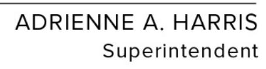

{0}------------------------------------------------

## **NEW YORK STATE DEPARTMENT OF FINANCIAL SERVICES SECOND AMENDMENT TO 23 NYCRR 500**

### **CYBERSECURITY REQUIREMENTS FOR FINANCIAL SERVICES COMPANIES**

I, Adrienne A. Harris, Superintendent of Financial Services, pursuant to the authority granted by Sections 102, 201, 202, 301, 302, and 408 of the Financial Services Law, Sections 10, 14, 37(3), 37(4), and 44 of the Banking Law, and Sections 109, 301, 308, 309, 316, 1109, 1119, 1503(b), 1717(b), 2110, and 2127 and Articles 21, 47, and 79 of the Insurance Law, do hereby promulgate the Second Amendment to Part 500 of Title 23 of the Official Compilation of Codes, Rules and Regulations of the State of New York, to take effect upon publication of the Notice of Adoption in the State Register, to read as follows:

### **(NEW MATTER UNDERSCORED, DELETED MATTER IN BRACKETS)**

### **Section 500.1 is amended to read as follows:**

For purposes of this Part only, the following definitions shall apply:

- (a) *Affiliate* means any person that controls, is controlled by or is under common control with another person. For purposes of this subdivision, *control* means the possession, direct or indirect, of the power to direct or cause the direction of the management and policies of a person, whether through the ownership of stock of such person or otherwise.
- (b) *Authorized user* means any employee, contractor, agent or other person that participates in the business operations of a covered entity and is authorized to access and use any information systems and data of the covered entity.
- (c) *Chief Information Security Officer* or *CISO* means a qualified individual responsible for overseeing and implementing a covered entity's cybersecurity program and enforcing its cybersecurity policy.
- (d) *Class A company* means a covered entity with at least \$20,000,000 in gross annual revenue in each of the last two fiscal years from all business operations of the covered entity and the business operations in this State of the covered entity's affiliates and:
  - (1) over 2,000 employees averaged over the last two fiscal years, including employees of both the covered entity and all of its affiliates no matter where located; or
  - (2) over \$1,000,000,000 in gross annual revenue in each of the last two fiscal years from all business operations of the covered entity and all of its affiliates no matter where located.

For purposes of this subdivision, when calculating the number of employees and gross annual revenue, affiliates shall include only those that share information systems, cybersecurity resources or all or any part of a cybersecurity program with the covered entity.

{1}------------------------------------------------

- [(c)] (e) *Covered entity* means any person operating under or required to operate under a license, registration, charter, certificate, permit, accreditation or similar authorization under the Banking Law, the Insurance Law or the Financial Services Law, regardless of whether the covered entity is also regulated by other government agencies.
- [(d)] (f) *Cybersecurity event* means any act or attempt, successful or unsuccessful, to gain unauthorized access to, disrupt or misuse an information system or information stored on such information system.
- (g) *Cybersecurity incident* means a cybersecurity event that has occurred at the covered entity, its affiliates, or a third-party service provider that:
  - (1) impacts the covered entity and requires the covered entity to notify any government body, self-regulatory agency or any other supervisory body;
  - (2) has a reasonable likelihood of materially harming any material part of the normal operation(s) of the covered entity; or
  - (3) results in the deployment of ransomware within a material part of the covered entity's information systems.
- (h) *Independent audit* means an audit conducted by internal or external auditors free to make decisions not influenced by the covered entity being audited or by its owners, managers or employees.
- [(e)] (i) *Information system* means a discrete set of electronic information resources organized for the collection, processing, maintenance, use, sharing, dissemination or disposition of electronic information, as well as any specialized system such as industrial/process controls systems, telephone switching and private branch exchange systems, and environmental control systems.
- [(f)] (j) *Multi-factor authentication* means authentication through verification of at least two of the following types of authentication factors:
  - (1) knowledge factors, such as a password;
  - (2) possession factors, such as a token [or text message on a mobile phone]; or
  - (3) inherence factors, such as a biometric characteristic.
- [(g)] (k) *Nonpublic information* [shall mean] means all electronic information that is not publicly available information and is:
  - (1) business related information of a covered entity the tampering with which, or unauthorized disclosure, access or use of which, would cause a material adverse impact to the business, operations or security of the covered entity;

{2}------------------------------------------------

- (2) any information concerning an individual which because of name, number, personal mark, or other identifier can be used to identify such individual, in combination with any one or more of the following data elements:
  - (i) social security number;
  - (ii) drivers' license number or non-driver identification card number;
  - (iii) account number, credit or debit card number;
  - (iv) any security code, access code or password that would permit access to an individual's financial account; or
  - (v) biometric records;
- (3) any information or data, except age or gender, in any form or medium created by or derived from a health care provider or an individual and that relates to:
  - (i) the past, present or future physical, mental or behavioral health or condition of any individual or a member of the individual's family;
  - (ii) the provision of health care to any individual; or
  - (iii) payment for the provision of health care to any individual.
- [(h)] (l) *Penetration testing* means [a test methodology in which assessors attempt] testing the security of information systems by attempting to circumvent or defeat the security features of an information system by [attempting] authorizing attempted penetration of databases or controls from outside or inside the covered entity's information systems.
- [(i)] (m) *Person* means any individual or [any non-governmental] entity, including but not limited to any [non-governmental] partnership, corporation, branch, agency or association.
- (n) *Privileged account* means any authorized user account or service account that can be used to perform security-relevant functions that ordinary users are not authorized to perform, including but not limited to the ability to add, change or remove other accounts, or make configuration changes to information systems.
- [(j)] (o) *Publicly available information* means any information that a covered entity has a reasonable basis to believe is lawfully made available to the general public from: Federal, State or local government records; widely distributed media; or disclosures to the general public that are required to be made by Federal, State or local law. [(1) For the purposes of this subdivision, a] A covered entity has a reasonable basis to believe that information is lawfully made available to the general public if the covered entity has taken steps to determine:
  - [(i)](1) that the information is of the type that is available to the general public; and

{3}------------------------------------------------

- [(ii)](2) whether an individual can direct that the information not be made available to the general public and, if so, that such individual has not done so.
- [(k)] (p) *Risk assessment* means the [risk assessment that each covered entity is required to conduct under section 500.9 of this Part] process of identifying, estimating and prioritizing cybersecurity risks to organizational operations (including mission, functions, image and reputation), organizational assets, individuals, customers, consumers, other organizations and critical infrastructure resulting from the operation of an information system. Risk assessments incorporate threat and vulnerability analyses and consider mitigations provided by security controls planned or in place.
- [(l) *Risk-based authentication* means any risk-based system of authentication that detects anomalies or changes in the normal use patterns of a person and requires additional verification of the person's identity when such deviations or changes are detected, such as through the use of challenge questions.]
- (q) *Senior governing body* means the board of directors (or an appropriate committee thereof) or equivalent governing body or, if neither of those exist, the senior officer or officers of a covered entity responsible for the covered entity's cybersecurity program. For any cybersecurity program or part of a cybersecurity program adopted from an affiliate under section 500.2(d) of this Part, the senior governing body may be that of the affiliate.
- [(m)] (r) *Senior officer(s)* means the senior individual or individuals (acting collectively or as a committee) responsible for the management, operations, security, information systems, compliance and/or risk of a covered entity, including a branch or agency of a foreign banking organization subject to this Part.
- [(n)] (s) [*Third party*] *Third-party service provider(s)* means a person that:
  - (1) is not an affiliate of the covered entity;
  - (2) is not a governmental entity;
  - (3) provides services to the covered entity; and
  - [(3)] (4) maintains, processes or otherwise is permitted access to nonpublic information through its provision of services to the covered entity.

## **Section 500.2 is amended to read as follows:**

(a) [Cybersecurity program.] Each covered entity shall maintain a cybersecurity program designed to protect the confidentiality, integrity and availability of the covered entity's information systems and nonpublic information stored on those information systems.

{4}------------------------------------------------

- (b) The cybersecurity program shall be based on the covered entity's risk assessment and designed to perform the following core cybersecurity functions:
  - (1) identify and assess internal and external cybersecurity risks that may threaten the security or integrity of nonpublic information stored on the covered entity's information systems;
  - (2) use defensive infrastructure and the implementation of policies and procedures to protect the covered entity's information systems, and the nonpublic information stored on those information systems, from unauthorized access, use or other malicious acts;
  - (3) detect cybersecurity events;
  - (4) respond to identified or detected cybersecurity events to mitigate any negative effects;
  - (5) recover from cybersecurity events and restore normal operations and services; and
  - (6) fulfill applicable regulatory reporting obligations.
- (c) Each class A company shall design and conduct independent audits of its cybersecurity program based on its risk assessment.
- [(c)] (d) A covered entity may meet the requirement(s) of this Part by adopting the relevant and applicable provisions of a cybersecurity program maintained by an affiliate, provided that such provisions satisfy the requirements of this Part, as applicable to the covered entity.
- [(d)] (e) All documentation and information relevant to the covered entity's cybersecurity program, including the relevant and applicable provisions of a cybersecurity program maintained by an affiliate and adopted by the covered entity, shall be made available to the superintendent upon request.

### **Section 500.3 is amended to read as follows:**

[Cybersecurity policy.] Each covered entity shall implement and maintain a written policy or policies, approved at least annually by a senior officer or the covered entity's [board of directors (or an appropriate committee thereof) or equivalent governing body, setting forth the covered entity's policies and procedures] senior governing body for the protection of its information systems and nonpublic information stored on those information systems. Procedures shall be developed, documented and implemented in accordance with the written policy or policies. The cybersecurity policy or policies and procedures shall be based on the covered entity's risk assessment and address, at a minimum, the following areas to the extent applicable to the covered entity's operations:

- (a) information security;
- (b) data governance, [and] classification and retention;

{5}------------------------------------------------

- (c) asset inventory*,* [and] device management and end of life management;
- (d) access controls, including remote access and identity management;
- (e) business continuity and disaster recovery planning and resources;
- (f) systems operations and availability concerns;
- (g) systems and network security and monitoring;
- (h) [systems and network monitoring] security awareness and training;
- (i) systems and application security and development and quality assurance;
- (j) physical security and environmental controls;
- (k) customer data privacy;
- (l) vendor and [third party] third-party service provider management;
- (m) risk assessment; [and]
- (n) incident response[.] and notification; and
- (o) vulnerability management.

### **The title of Section 500.4 is amended to read as follows:**

[Chief information security officer] Cybersecurity governance.

### **Section 500.4 is amended to read as follows:**

- (a) Chief information security officer. Each covered entity shall designate a [qualified individual responsible for overseeing and implementing the covered entity's cybersecurity program and enforcing its cybersecurity policy (for purposes of this Part, chief information security officer or CISO)] CISO. The CISO may be employed by the covered entity, one of its affiliates or a [third party] third-party service provider. [To] If the [extent this requirement] CISO is [met using] employed by a [third party] third-party service provider or an affiliate, the covered entity shall:
  - (1) retain responsibility for compliance with this Part;
  - (2) designate a senior member of the covered entity's personnel responsible for direction and oversight of the [third party] third-party service provider; and

{6}------------------------------------------------

- (3) require the [third party] third-party service provider or affiliate to maintain a cybersecurity program that protects the covered entity in accordance with the requirements of this Part.
- (b) Report. The CISO of each covered entity shall report in writing at least annually to the [covered entity's board of directors or equivalent] senior governing body[. If no such board of directors or equivalent governing body exists, such report shall be timely presented to a senior officer of the covered entity responsible for the covered entity's cybersecurity program. The CISO shall report] on the covered entity's cybersecurity program [and material cybersecurity risks. The CISO shall consider], including to the extent applicable:
  - (1) the confidentiality of nonpublic information and the integrity and security of the covered entity's information systems;
  - (2) the covered entity's cybersecurity policies and procedures;
  - (3) material cybersecurity risks to the covered entity;
  - (4) overall effectiveness of the covered entity's cybersecurity program; [and]
  - (5) material cybersecurity events involving the covered entity during the time period addressed by the report[.]; and
  - (6) plans for remediating material inadequacies.
- (c) The CISO shall timely report to the senior governing body or senior officer(s) on material cybersecurity issues, such as significant cybersecurity events and significant changes to the covered entity's cybersecurity program.
- (d) The senior governing body of the covered entity shall exercise oversight of the covered entity's cybersecurity risk management, including by:
  - (1) having sufficient understanding of cybersecurity-related matters to exercise such oversight, which may include the use of advisors;
  - (2) requiring the covered entity's executive management or its designees to develop, implement and maintain the covered entity's cybersecurity program;
  - (3) regularly receiving and reviewing management reports about cybersecurity matters; and
  - (4) confirming that the covered entity's management has allocated sufficient resources to implement and maintain an effective cybersecurity program.

{7}------------------------------------------------

### **The title of Section 500.5 is amended to read as follows:**

[Penetration testing and vulnerability assessments] Vulnerability management.

### **Section 500.5 is amended to read as follows:**

[The cybersecurity program for each] Each covered entity shall, [include monitoring and testing, developed] in accordance with [the covered entity's] its risk assessment, develop and implement written policies and procedures for vulnerability management that are designed to assess and maintain the effectiveness of [the covered entity's] its cybersecurity program. [The monitoring and testing shall include continuous monitoring or periodic penetration testing and vulnerability assessments. Absent effective continuous monitoring, or other systems to detect, on an ongoing basis, changes in information systems that may create or indicate vulnerabilities, covered entities shall conduct:] These policies and procedures shall be designed to ensure that covered entities:

### (a) [annual] conduct, at a minimum:

- (1) penetration testing of [the covered entity's] their information systems [determined each given year based on relevant identified risks in accordance with the risk assessment;] from both inside and outside the information systems' boundaries by a qualified internal or external party at least annually; and
- (2) automated scans of information systems, and a manual review of systems not covered by such scans, for the purpose of discovering, analyzing and reporting vulnerabilities at a frequency determined by the risk assessment, and promptly after any material system changes;
- (b) [bi-annual vulnerability assessments, including any systematic scans or reviews of information systems reasonably designed to identify publicly known cybersecurity vulnerabilities in the covered entity's information systems based on the risk assessment.] are promptly informed of new security vulnerabilities by having a monitoring process in place; and
- (c) timely remediate vulnerabilities, giving priority to vulnerabilities based on the risk they pose to the covered entity.

### **The title of Section 500.7 is amended to read as follows:**

Access privileges and management.

## **Section 500.7 is amended to read as follows:**

(a) As part of its cybersecurity program, based on the covered entity's risk assessment each covered entity shall:

{8}------------------------------------------------

- (1) limit user access privileges to information systems that provide access to nonpublic information [and shall periodically review such access privileges] to only those necessary to perform the user's job;
- (2) limit the number of privileged accounts and limit the access functions of privileged accounts to only those necessary to perform the user's job;
- (3) limit the use of privileged accounts to only when performing functions requiring the use of such access;
- (4) periodically, but at a minimum annually, review all user access privileges and remove or disable accounts and access that are no longer necessary;
- (5) disable or securely configure all protocols that permit remote control of devices; and
- (6) promptly terminate access following departures.
- (b) To the extent passwords are employed as a method of authentication, the covered entity shall implement a written password policy that meets industry standards.
- (c) Each class A company shall monitor privileged access activity and shall implement:
  - (1) a privileged access management solution; and
  - (2) an automated method of blocking commonly used passwords for all accounts on information systems owned or controlled by the class A company and wherever feasible for all other accounts. To the extent the class A company determines that blocking commonly used passwords is infeasible, the covered entity's CISO may instead approve in writing at least annually the infeasibility and the use of reasonably equivalent or more secure compensating controls.

### **Subdivision (b) of section 500.8 is amended to read as follows:**

(b) All such procedures, guidelines and standards shall be [periodically] reviewed, assessed and updated as necessary by the CISO (or a qualified designee) of the covered entity at least annually.

### **Subdivision (a) of section 500.9 is amended to read as follows:**

(a) Each covered entity shall conduct a periodic risk assessment of the covered entity's information systems sufficient to inform the design of the cybersecurity program as required by this Part. Such risk assessment shall be reviewed and updated as reasonably necessary, [to address changes to the covered entity's information systems, nonpublic information or business operations] but at a minimum annually, and whenever a change in the business or technology causes a material change to the covered entity's cyber risk. The covered entity's risk assessment shall allow for revision of controls to respond to technological developments and evolving threats and shall consider the particular risks of the covered entity's business operations related to cybersecurity, nonpublic 

{9}------------------------------------------------

information collected or stored, information systems utilized and the availability and effectiveness of controls to protect nonpublic information and information systems.

### **Section 500.10 is amended to read as follows:**

- (a) [Cybersecurity personnel and intelligence.] In addition to the requirements set forth in section 500.4(a) of this Part, each covered entity shall:
  - (1) utilize qualified cybersecurity personnel of the covered entity, an affiliate or a [third party] third-party service provider sufficient to manage the covered entity's cybersecurity risks and to perform or oversee the performance of the core cybersecurity functions specified in section 500.2(b)(1)-(6) of this Part;
  - (2) provide cybersecurity personnel with cybersecurity updates and training sufficient to address relevant cybersecurity risks; and
  - (3) verify that key cybersecurity personnel take steps to maintain current knowledge of changing cybersecurity threats and countermeasures.
- (b) A covered entity may choose to utilize an affiliate or qualified [third party] third-party service provider to assist in complying with the requirements set forth in this Part, subject to the requirements set forth in [section] sections 500.4 and 500.11 of this Part.

### **The title of Section 500.11 is amended to read as follows:**

[Third party] Third-party service provider security policy.

## **Section 500.11 is amended to read as follows:**

- (a) [Third party service provider policy.] Each covered entity shall implement written policies and procedures designed to ensure the security of information systems and nonpublic information that are accessible to, or held by, [third party] third-party service providers. Such policies and procedures shall be based on the risk assessment of the covered entity and shall address to the extent applicable:
  - (1) the identification and risk assessment of [third party] third-party service providers;
  - (2) minimum cybersecurity practices required to be met by such [third party] third-party service providers in order for them to do business with the covered entity;
  - (3) due diligence processes used to evaluate the adequacy of cybersecurity practices of such [third party] third-party service providers; and
  - (4) periodic assessment of such [third party] third-party service providers based on the risk they present and the continued adequacy of their cybersecurity practices.

{10}------------------------------------------------

- (b) Such policies and procedures shall include relevant guidelines for due diligence and/or contractual protections relating to [third party] third-party service providers including to the extent applicable guidelines addressing:
  - (1) the [third party] third-party service provider's policies and procedures for access controls, including its use of multi-factor authentication as required by section 500.12 of this Part, to limit access to relevant information systems and nonpublic information;
  - (2) the [third party] third-party service provider's policies and procedures for use of encryption as required by section 500.15 of this Part to protect nonpublic information in transit and at rest;
  - (3) notice to be provided to the covered entity in the event of a cybersecurity event directly impacting the covered entity's information systems or the covered entity's nonpublic information being held by the [third party] third-party service provider; and
  - (4) representations and warranties addressing the [third party] third-party service provider's cybersecurity policies and procedures that relate to the security of the covered entity's information systems or nonpublic information.
- [(c) Limited exception. An agent, employee, representative or designee of a covered entity who is itself a covered entity need not develop its own third party information security policy pursuant to this section if the agent, employee, representative or designee follows the policy of the covered entity that is required to comply with this Part.]

### **Section 500.12 is amended to read as follows:**

- (a) [Multi-factor authentication. Based on its risk assessment, each covered entity shall use effective controls, which may include multi-factor authentication or risk-based authentication, to protect against unauthorized access to nonpublic information or information systems.] Multi-factor authentication shall be utilized for any individual accessing any information systems of a covered entity, unless the covered entity qualifies for a limited exemption pursuant to section 500.19(a) of this Part in which case multi-factor authentication shall be utilized for:
  - (1) remote access to the covered entity's information systems;
  - (2) remote access to third-party applications, including but not limited to those that are cloud based, from which nonpublic information is accessible; and
  - (3) all privileged accounts other than service accounts that prohibit interactive login.
- (b) [Multi-factor authentication shall be utilized for any individual accessing the covered entity's internal networks from an external network, unless the covered entity's CISO has approved in writing the use of reasonably equivalent or more secure access controls.] If the covered entity has a CISO, the CISO may approve in writing the use of reasonably equivalent or more secure compensating controls. Such controls shall be reviewed periodically, but at a minimum annually.

{11}------------------------------------------------

## **The title of Section 500.13 is amended to read as follows:**

[Limitations on] Asset management and data retention requirements.

## **Section 500.13 is amended to read as follows:**

(a) As part of its cybersecurity program, each covered entity shall implement written policies and procedures designed to produce and maintain a complete, accurate and documented asset inventory of the covered entity's information systems. The asset inventory shall be maintained in accordance with written policies and procedures. At a minimum, such policies and procedures shall include:

(1) a method to track key information for each asset, including, as applicable, the following:

- (i) owner;
- (ii) location;
  - (iii) classification or sensitivity;
  - (iv) support expiration date; and
  - (v) recovery time objectives; and
- (2) the frequency required to update and validate the covered entity's asset inventory.

(b) As part of its cybersecurity program, each covered entity shall include policies and procedures for the secure disposal on a periodic basis of any nonpublic information identified in section 500.1[(g)](k)(2)–(3) of this Part that is no longer necessary for business operations or for other legitimate business purposes of the covered entity, except where such information is otherwise required to be retained by law or regulation, or where targeted disposal is not reasonably feasible due to the manner in which the information is maintained.

### **The title of Section 500.14 is amended to read as follows:**

[Training and monitoring] Monitoring and training.

### **Section 500.14 is amended to read as follows:**

- (a) As part of its cybersecurity program, each covered entity shall:
  - [(a)](1) implement risk-based policies, procedures and controls designed to monitor the activity of authorized users and detect unauthorized access or use of, or tampering with, nonpublic information by such authorized users; [and]

{12}------------------------------------------------

- (2) implement risk-based controls designed to protect against malicious code, including those that monitor and filter web traffic and electronic mail to block malicious content; and
- [(b)](3) provide [regular] periodic, but at a minimum annual, cybersecurity awareness training that includes social engineering for all personnel that is updated to reflect risks identified by the covered entity in its risk assessment.
- (b) Each class A company shall implement, unless the CISO has approved in writing the use of reasonably equivalent or more secure compensating controls:
  - (1) an endpoint detection and response solution to monitor anomalous activity, including but not limited to lateral movement; and
  - (2) a solution that centralizes logging and security event alerting.

### **Section 500.15 is amended to read as follows:**

- (a) As part of its cybersecurity program, [based on its risk assessment,] each covered entity shall implement [controls, including] a written policy requiring encryption that meets industry standards, to protect nonpublic information held or transmitted by the covered entity both in transit over external networks and at rest.
  - [(1) To the extent a covered entity determines that encryption of nonpublic information in transit over external networks is infeasible, the covered entity may instead secure such nonpublic information using effective alternative compensating controls reviewed and approved by the covered entity's CISO.]
- [(2)](b) To the extent a covered entity determines that encryption of nonpublic information at rest is infeasible, the covered entity may instead secure such nonpublic information using effective alternative compensating controls that have been reviewed and approved by the covered entity's CISO in writing. The feasibility of encryption and effectiveness of the compensating controls shall be reviewed by the CISO at least annually.
- [(b) To the extent that a covered entity is utilizing compensating controls under subdivision (a) of this section, the feasibility of encryption and effectiveness of the compensating controls shall be reviewed by the CISO at least annually.]

### **The title of Section 500.16 is amended to read as follows:**

Incident response [plan] and business continuity management.

### **Section 500.16 is amended to read as follows:**

(a) As part of its cybersecurity program, each covered entity shall establish [a] written [incident] plans that contain proactive measures to investigate and mitigate cybersecurity events and to

{13}------------------------------------------------

ensure operational resilience, including but not limited to incident response, business continuity and disaster recovery plans.

- (1) Incident response plan. Incident response [plan] plans shall be reasonably designed to enable prompt [promptly respond] response to, and [recover] recovery from, any cybersecurity event materially affecting the confidentiality, integrity or availability of the covered entity's information systems or the continuing functionality of any aspect of the covered entity's business or operations. Such plans shall address the following areas with respect to different types of cybersecurity events, including disruptive events such as ransomware incidents:
- [(b) Such incident response plan shall address the following areas:
  - (1) the internal processes for responding to a cybersecurity event] (i) the goals of the incident response plan;
  - [(2) the goals of the incident response plan] (ii) the internal processes for responding to a cybersecurity event;
  - [(3)] (iii) the definition of clear roles, responsibilities and levels of decision-making authority;
  - [(4)] (iv) external and internal communications and information sharing;
  - [(5)] (v) identification of requirements for the remediation of any identified weaknesses in information systems and associated controls;
  - [(6)] (vi) documentation and reporting regarding cybersecurity events and related incident response activities; [and]
  - [(7) the evaluation and revision as necessary of the incident response plan following a cybersecurity event.] (vii) recovery from backups;
  - (viii) preparation of root cause analysis that describes how and why the event occurred, what business impact it had, and what will be done to prevent reoccurrence; and
  - (ix) updating of incident response plans as necessary.
  - (2) Business continuity and disaster recovery (BCDR) plan. BCDR plans shall be reasonably designed to ensure the availability and functionality of the covered entity's information systems and material services and protect the covered entity's personnel, assets and nonpublic information in the event of a cybersecurity-related disruption to its normal business activities. Such plans shall, at minimum:
    - (i) identify documents, data, facilities, infrastructure, services, personnel and

{14}------------------------------------------------

competencies essential to the continued operations of the covered entity's business;

- (ii) identify the supervisory personnel responsible for implementing each aspect of the BCDR plan;
- (iii) include a plan to communicate with essential persons in the event of a cybersecurity-related disruption to the operations of the covered entity, including employees, counterparties, regulatory authorities, third-party service providers, disaster recovery specialists, the senior governing body and any other persons essential to the recovery of documentation and data and the resumption of operations;
- (iv) include procedures for the timely recovery of critical data and information systems and to resume operations as soon as reasonably possible following a cybersecurity-related disruption to normal business activities;
- (v) include procedures for backing up or copying, with sufficient frequency, information essential to the operations of the covered entity and storing such information offsite; and
- (vi) identify third parties that are necessary to the continued operations of the covered entity's information systems.
- (b) Each covered entity shall ensure that current copies of the plans or relevant portions therein are distributed or are otherwise accessible, including during a cybersecurity event, to all employees necessary to implement such plans.
- (c) Each covered entity shall provide relevant training to all employees responsible for implementing the plans regarding their roles and responsibilities.
- (d) Each covered entity shall periodically, but at a minimum annually, test its:
  - (1) incident response and BCDR plans with all staff and management critical to the response, and shall revise the plan as necessary; and
  - (2) ability to restore its critical data and information systems from backups.
- (e) Each covered entity shall maintain backups necessary to restore material operations. The backups shall be adequately protected from unauthorized alterations or destruction.

### **Section 500.17 is amended to read as follows:**

- (a) Notice of cybersecurity [event] incident.
  - (1) Each covered entity shall notify the superintendent electronically in the form set forth on the department's website as promptly as possible but in no event later than 72 hours

{15}------------------------------------------------

[from a determination] after determining that a cybersecurity [event] incident has occurred [that is either of the following:] at the covered entity, its affiliates, or a thirdparty service provider.

- [(1) cybersecurity events impacting the covered entity of which notice is required to be provided to any government body, self-regulatory agency or any other supervisory body; or]
- (2) [cybersecurity events that have a reasonable likelihood of materially harming any material part of the normal operation(s) of the covered entity.] Each covered entity shall promptly provide to the superintendent any information requested regarding such incident. Covered entities shall have a continuing obligation to update the superintendent with material changes or new information previously unavailable.

### (b) Notice of compliance.

- (1) Annually each covered entity shall submit to the superintendent electronically by April 15 either:
  - (i) a written [statement covering the prior calendar year. This statement shall be submitted by April 15th in such form set forth as Appendix A of this Title, certifying that] certification that:
    - (a) certifies that the covered entity [is in compliance] materially complied with the requirements set forth in this Part during the prior calendar year; and
    - (b) shall be based upon data and documentation sufficient to accurately determine and demonstrate such material compliance, including, to the extent necessary, documentation of officers, employees, representatives, outside vendors and other individuals or entities, as well as other documentation, whether in the form of reports, certifications, schedules or otherwise; or

### (ii) a written acknowledgment that:

- (a) acknowledges that, for the prior calendar year, the covered entity did not materially comply with all the requirements of this Part;
- (b) identifies all sections of this Part that the entity has not materially complied with and describes the nature and extent of such noncompliance; and
- (c) provides a remediation timeline or confirmation that remediation has been completed.

{16}------------------------------------------------

- (2) Such certification or acknowledgment shall be submitted electronically in the form set forth on the department's website and shall be signed by the covered entity's highestranking executive and its CISO. If the covered entity does not have a CISO, the certification or acknowledgment shall be signed by the highest-ranking executive and by the senior officer responsible for the cybersecurity program of the covered entity.
- (3) Each covered entity shall maintain for examination and inspection by the department upon request all records, schedules and other documentation and data supporting [this certificate] the certification or acknowledgment for a period of five years, including[. To the extent a covered entity has identified] the identification of all areas, systems and processes that require or required material improvement, updating or redesign, all remedial efforts undertaken to address such areas, systems and [or] processes, [that require material improvement, updating or redesign, the covered entity shall document the identification and the remedial efforts planned and underway to address such areas, systems or processes. Such documentation must be available for inspection by the superintendent] and remediation plans and timelines for their implementation.
- (c) Notice and explanation of extortion payment. Each covered entity, in the event of an extortion payment made in connection with a cybersecurity event involving the covered entity, shall provide the superintendent electronically, in the form set forth on the department's website, with the following:
  - (1) within 24 hours of the extortion payment, notice of the payment; and
  - (2) within 30 days of the extortion payment, a written description of the reasons payment was necessary, a description of alternatives to payment considered, all diligence performed to find alternatives to payment and all diligence performed to ensure compliance with applicable rules and regulations including those of the Office of Foreign Assets Control.

# **Section 500.19 is amended to read as follows:**

- (a) Limited exemption. Each covered entity with:
  - (1) fewer than [10] 20 employees[, including any] and independent contractors[,] of the covered entity [or] and its affiliates [located in New York or responsible for business of the covered entity];
  - (2) less than \$[5,000,000]7,500,000 in gross annual revenue in each of the last [3] three fiscal years from [New York] all business operations of the covered entity and the business operations in this State of the covered entity's [its] affiliates; or
  - (3) less than \$[10,000,000]15,000,000 in year-end total assets, calculated in accordance with generally accepted accounting principles, including assets of all affiliates,

shall be exempt from the requirements of sections 500.4, 500.5, 500.6, 500.8, 500.10, [500.12,] 500.14(a)(1), (a)(2), and (b), 500.15 and 500.16 of this Part.

{17}------------------------------------------------

- (b) An employee, agent, wholly owned subsidiary, representative or designee of a covered entity, who is itself a covered entity, is exempt from this Part and need not develop its own cybersecurity program to the extent that the employee, agent, wholly owned subsidiary, representative or designee is covered by the cybersecurity program of the covered entity.
- (c) A covered entity that does not directly or indirectly operate, maintain, utilize or control any information systems, and that does not, and is not required to, directly or indirectly control, own, access, generate, receive or possess nonpublic information shall be exempt from the requirements of sections 500.2, 500.3, 500.4, 500.5, 500.6, 500.7, 500.8, 500.10, 500.12, 500.14, 500.15 and 500.16 of this Part.
- (d) A covered entity under article 70 of the Insurance Law that does not and is not required to directly or indirectly control, own, access, generate, receive or possess nonpublic information other than information relating to its corporate parent company (or affiliates) shall be exempt from the requirements of sections 500.2, 500.3, 500.4, 500.5, 500.6, 500.7, 500.8, 500.10, 500.12, 500.14, 500.15 and 500.16 of this Part.
- (e) An individual insurance broker subject to Insurance Law section 2104 who qualifies for the exemption pursuant to section 500.19(c) of this Part and has not, for any compensation, commission or other thing of value, acted or aided in any manner in soliciting, negotiating or selling any policy or contract or in placing risks or taking out insurance on behalf of another person for at least one year shall be exempt from the requirements of this Part, provided such individuals do not otherwise qualify as a covered entity for purposes of this Part.
- [(e)] (f) A covered entity that qualifies for any of the above exemptions pursuant to this section shall file electronically a Notice of Exemption in the form set forth [as Appendix B of this Title] on the department's website within 30 days of the determination that the covered entity is exempt.
- [(f)] (g) The following persons are exempt from the requirements of this Part, provided such persons do not otherwise qualify as a covered entity for purposes of this Part: persons subject to Insurance Law section 1110; persons subject to Insurance Law section 5904; [and] any accredited reinsurer [or], certified reinsurer or reciprocal jurisdiction reinsurer that has been [accredited or certified] so recognized pursuant to 11 NYCRR Part 125; individual insurance agents who are placed in inactive status under Insurance Law section 2103; and individual licensees placed in inactive status under Banking Law section 599-i.
- [(g)] (h) In the event that a covered entity[, as of its most recent fiscal year end,] ceases to qualify for an exemption, such covered entity shall have 180 days from [such fiscal year end] the date that it ceases to so qualify to comply with all applicable requirements of this Part.

### **Section 500.20 is amended to read as follows:**

(a) This regulation will be enforced by the superintendent pursuant to, and is not intended to limit, the superintendent's authority under any applicable laws.

{18}------------------------------------------------

- (b) The commission of a single act prohibited by this Part or the failure to act to satisfy an obligation required by this Part shall constitute a violation hereof. Such acts or failures include, without limitation:
  - (1) the failure to secure or prevent unauthorized access to an individual's or an entity's nonpublic information due to noncompliance with any section of this Part; or
  - (2) the material failure to comply for any 24-hour period with any section of this Part.
- (c) In assessing any penalty for a violation of this Part pursuant to the Banking Law, Insurance Law or Financial Services Law, the superintendent shall take into account, without limitation, factors including:
  - (1) the extent to which the covered entity has cooperated with the superintendent in the investigation of such acts;
  - (2) the good faith of the entity;
  - (3) whether the violations resulted from conduct that was unintentional or inadvertent, reckless or intentional and deliberate;
  - (4) whether the violation was a result of failure to remedy previous examination matters requiring attention, or failing to adhere to any disciplinary letter, letter of instructions or similar;
  - (5) any history of prior violations;
  - (6) whether the violation involved an isolated incident, repeat violations, systemic violations or a pattern of violations;
  - (7) whether the covered entity provided false or misleading information;
  - (8) the extent of harm to consumers;
  - (9) whether required, accurate and timely disclosures were made to affected consumers;
  - (10) the gravity of the violations;
  - (11) the number of violations and the length of time over which they occurred;
  - (12) the extent, if any, to which the senior governing body participated therein;
  - (13) any penalty or sanction imposed by any other regulatory agency;
  - (14) the financial resources, net worth and annual business volume of the covered entity and its affiliates;

{19}------------------------------------------------

- (15) the extent to which the relevant policies and procedures of the company are consistent with nationally recognized cybersecurity frameworks, such as NIST; and
- (16) such other matters as justice and the public interest require.

### **Section 500.21 is amended to read as follows:**

- (a) This Part will be effective March 1, 2017. Covered entities will be required to annually prepare and submit to the superintendent a certification of compliance with New York State Department of Financial Services Cybersecurity Regulations under section 500.17(b) of this Part commencing February 15, 2018.
- (b) The second amendment to this Part shall become effective November 1, 2023.

### **New subdivisions (c), (d) and (e) are added to Section 500.22 to read as follows:**

- (c) Covered entities shall have 180 days from the effective date of the second amendment to this Part to comply with the new requirements set forth in the second amendment to this Part, except as otherwise specified in subdivisions (d) and (e) below.
- (d) The following provisions shall include different transitional periods. Covered entities shall have:
  - (1) 30 days from the effective date of the second amendment to this Part to comply with the new requirements specified in section 500.17 of this Part;
  - (2) one year from the effective date of the second amendment to this Part to comply with the new requirements specified in sections 500.4, 500.15, 500.16 and 500.19(a) of this Part;
  - (3) 18 months from the effective date of the second amendment to this Part to comply with the new requirements specified in sections 500.5(a)(2), 500.7, 500.14(a)(2) and 500.14(b) of this Part; and
  - (4) two years from the effective date of the second amendment to this Part to comply with the new requirements specified in sections 500.12 and 500.13(a) of this Part.
- (e) The new requirements specified in sections 500.19(e)-(h), 500.20, 500.21, 500.22 and 500.24 of this Part shall become effective November 1, 2023.

### **A new Section 500.24 is added to read as follows:**

- 500.24 Exemptions from electronic filing and submission requirements.
- (a) A filer required to make an electronic filing or a submission pursuant to this Part may apply to the superintendent for an exemption from the requirement that the filing or submission be electronic by submitting a written request to the superintendent for approval at least 30 days before

{20}------------------------------------------------

the filer shall submit to the superintendent the particular filing or submission that is the subject of the request.

### (b) The request for an exemption shall:

- (1) set forth the filer's DFS license number, NAIC number, Nationwide Multistate Licensing System number or institution number;
- (2) identify the specific filing or submission for which the filer is applying for the exemption;
- (3) specify whether the filer is making the request for an exemption based upon undue hardship, impracticability or good cause, and set forth a detailed explanation as to the reason that the superintendent should approve the request; and
- (4) specify whether the request for an exemption extends to future filings or submissions, in addition to the specific filing or submission identified in paragraph (2) of this subdivision.
- (c) The filer requesting an exemption shall submit, upon the superintendent's request, any additional information necessary for the superintendent to evaluate the filer's request for an exemption.
- (d) The filer shall be exempt from the electronic filing or submission requirement upon the superintendent's written determination so exempting the filer, where the determination specifies the basis upon which the superintendent is granting the request and to which filings or submissions the exemption applies.
- (e) If the superintendent approves a filer's request for an exemption from the electronic filing or submission requirement, then the filer shall make a filing or submission in a form and manner acceptable to the superintendent.

**Appendices A and B to 23 NYCRR 500 are hereby repealed.**

{21}------------------------------------------------

## **CERTIFICATION**

I, Adrienne A. Harris, Superintendent of Financial Services, do hereby certify that the Second Amendment to Title 23 of the Official Compilation of Codes, Rules and Regulations of the State of New York was duly authorized by me on October 16, 2023, pursuant to the authority granted by Financial Services Law Sections 102, 201, 202, 301, 302, and 408, Banking Law Sections 10, 14, 37(3), 37(4), and 44, and Insurance Law Sections 109, 301, 308, 309, 316, 1109, 1119, 1503(b), 1717(b), 2110, and 2127 and Articles 21, 47, and 79, to take effect upon publication of the Notice of Adoption in the New York State Register.

Pursuant to the provisions of the State Administrative Procedure Act, prior notice of the proposed rule was first published in the New York State Register on November 9, 2022 and a revised proposed rule was published in the State Register on June 28, 2023.

> Signed copy filed with Department of State Adrienne A. Harris Superintendent of Financial Services

Dated: October 16, 2023