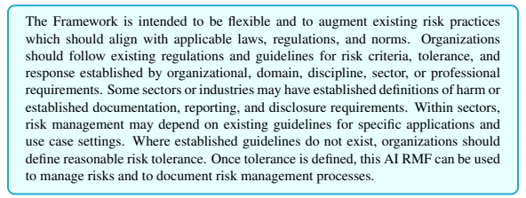
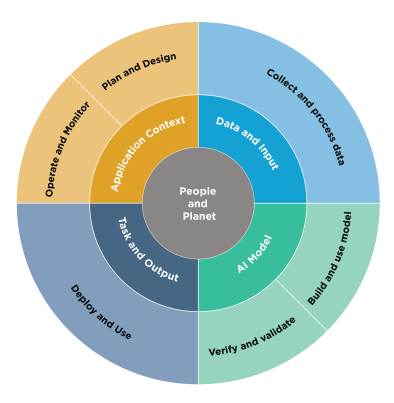
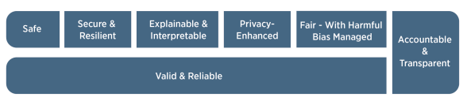
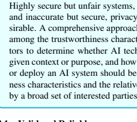
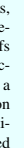

Artificial Intelligence Risk Management Framework (AI RMF 1.0)
N
NATIONAL INSTITUTE OF
STANDARDS AND TECHNOLOGY
U.S. DEPARTMENT OF COMMERCE

# Artificial Intelligence Risk Management Framework (Ai Rmf 1.0)

This publication is available free of charge from:
https://doi.org/10.6028/NIST.AI.100-1 January 2023

U.S. Department of Commerce Gina M. Raimondo, Secretary National Institute of Standards and Technology Laurie E. Locascio, NIST Director and Under Secretary of Commerce for Standards and Technology Certain commercial entities, equipment, or materials may be identified in this document in order to describe an experimental procedure or concept adequately. Such identification is not intended to imply recommendation or endorsement by the National Institute of Standards and Technology, nor is it intended to imply that the entities, materials, or equipment are necessarily the best available for the purpose.

This publication is available free of charge from: https://doi.org/10.6028/NIST.AI.100-1

## Update Schedule And Versions

The Artificial Intelligence Risk Management Framework (AI RMF) is intended to be a living document.

NIST will review the content and usefulness of the Framework regularly to determine if an update is appropriate; a review with formal input from the AI community is expected to take place no later than 2028. The Framework will employ a two-number versioning system to track and identify major and minor changes. The first number will represent the generation of the AI RMF and its companion documents (e.g., 1.0) and will change only with major revisions. Minor revisions will be tracked using ".n" after the generation number (e.g., 1.1). All changes will be tracked using a Version Control Table which identifies the history, including version number, date of change, and description of change. NIST plans to update the AI RMF Playbook frequently. Comments on the AI RMF Playbook may be sent via email to AIframework@nist.gov at any time and will be reviewed and integrated on a semi-annual basis.

| Executive Summary                                               | 1                                                      |                                                   |    |
|-----------------------------------------------------------------|--------------------------------------------------------|---------------------------------------------------|----|
| Part 1: Foundational Information                                | 4                                                      |                                                   |    |
| 1                                                               | Framing Risk                                           | 4                                                 |    |
| 1.1                                                             | Understanding and Addressing Risks, Impacts, and Harms | 4                                                 |    |
| 1.2                                                             | Challenges for AI Risk Management                      | 5                                                 |    |
|                                                                 | 1.2.1                                                  | Risk Measurement                                  | 5  |
|                                                                 | 1.2.2                                                  | Risk Tolerance                                    | 7  |
|                                                                 | 1.2.3                                                  | Risk Prioritization                               | 7  |
|                                                                 | 1.2.4                                                  | Organizational Integration and Management of Risk | 8  |
| 2                                                               | Audience                                               | 9                                                 |    |
| 3                                                               | AI Risks and Trustworthiness                           | 12                                                |    |
| 3.1                                                             | Valid and Reliable                                     | 13                                                |    |
| 3.2                                                             | Safe                                                   | 14                                                |    |
| 3.3                                                             | Secure and Resilient                                   | 15                                                |    |
| 3.4                                                             | Accountable and Transparent                            | 15                                                |    |
| 3.5                                                             | Explainable and Interpretable                          | 16                                                |    |
| 3.6                                                             | Privacy-Enhanced                                       | 17                                                |    |
| 3.7                                                             | Fair - with Harmful Bias Managed                       | 17                                                |    |
| 4                                                               | Effectiveness of the AI RMF                            | 19                                                |    |
| Part 2: Core and Profiles                                       | 20                                                     |                                                   |    |
| 5                                                               | AI RMF Core                                            | 20                                                |    |
| 5.1                                                             | Govern                                                 | 21                                                |    |
| 5.2                                                             | Map                                                    | 24                                                |    |
| 5.3                                                             | Measure                                                | 28                                                |    |
| 5.4                                                             | Manage                                                 | 31                                                |    |
| 6                                                               | AI RMF Profiles                                        | 33                                                |    |
| Appendix A: Descriptions of AI Actor Tasks from Figures 2 and 3 | 35                                                     |                                                   |    |
| Appendix B: How AI Risks Differ from Traditional Software Risks | 38                                                     |                                                   |    |
| Appendix C: AI Risk Management and Human-AI Interaction         | 40                                                     |                                                   |    |
| Appendix D: Attributes of the AI RMF                            | 42                                                     |                                                   |    |
|                                                                 | List of Tables                                         |                                                   |    |
| Table 1 Categories and subcategories for the GOVERN function.   | 22                                                     |                                                   |    |
| Table 2 Categories and subcategories for the MAP function.      | 26                                                     |                                                   |    |
| Table 3 Categories and subcategories for the MEASURE function.  | 29                                                     |                                                   |    |
| Table 4 Categories and subcategories for the MANAGE function.   | 32                                                     |                                                   |    |

# Table Of Contents

i

## List Of Figures

Fig. 1 Examples of potential harms related to AI systems. Trustworthy AI systems and their responsible use can mitigate negative risks and contribute to benefits for people, organizations, and ecosystems. 5 Fig. 2 Lifecycle and Key Dimensions of an AI System. Modified from OECD
(2022) OECD Framework for the Classification of AI systems - OECD
Digital Economy Papers. The two inner circles show AI systems' key dimensions and the outer circle shows AI lifecycle stages. Ideally, risk management efforts start with the Plan and Design function in the application context and are performed throughout the AI system lifecycle. See Figure 3 for representative AI actors. 10 Fig. 3 AI actors across AI lifecycle stages. See Appendix A for detailed descriptions of AI actor tasks, including details about testing, evaluation, verification, and validation tasks. Note that AI actors in the AI Model dimension
(Figure 2) are separated as a best practice, with those building and using the models separated from those verifying and validating the models. 11 Fig. 4 Characteristics of trustworthy AI systems. Valid & Reliable is a necessary condition of trustworthiness and is shown as the base for other trustworthiness characteristics. Accountable & Transparent is shown as a vertical box because it relates to all other characteristics. 12 Fig. 5 Functions organize AI risk management activities at their highest level to govern, map, measure, and manage AI risks. Governance is designed to be a cross-cutting function to inform and be infused throughout the other three functions. 20

## Executive Summary

Artificial intelligence (AI) technologies have significant potential to transform society and people's lives - from commerce and health to transportation and cybersecurity to the environment and our planet. AI technologies can drive inclusive economic growth and support scientific advancements that improve the conditions of our world. AI technologies, however, also pose risks that can negatively impact individuals, groups, organizations, communities, society, the environment, and the planet. Like risks for other types of technology, AI
risks can emerge in a variety of ways and can be characterized as long- or short-term, highor low-probability, systemic or localized, and high- or low-impact.

The AI RMF refers to an *AI system* as an engineered or machine-based system that can, for a given set of objectives, generate outputs such as predictions, recommendations, or decisions influencing real or virtual environments. AI systems are designed to operate with varying levels of autonomy (Adapted from: OECD Recommendation on AI:2019; ISO/IEC 22989:2022).

While there are myriad standards and best practices to help organizations mitigate the risks of traditional software or information-based systems, the risks posed by AI systems are in many ways unique (See Appendix B). AI systems, for example, may be trained on data that can change over time, sometimes significantly and unexpectedly, affecting system functionality and trustworthiness in ways that are hard to understand. AI systems and the contexts in which they are deployed are frequently complex, making it difficult to detect and respond to failures when they occur. AI systems are inherently socio-technical in nature, meaning they are influenced by societal dynamics and human behavior. AI risks - and benefits –
can emerge from the interplay of technical aspects combined with societal factors related to how a system is used, its interactions with other AI systems, who operates it, and the social context in which it is deployed.

These risks make AI a uniquely challenging technology to deploy and utilize both for organizations and within society. Without proper controls, AI systems can amplify, perpetuate, or exacerbate inequitable or undesirable outcomes for individuals and communities. With proper controls, AI systems can mitigate and manage inequitable outcomes.

AI risk management is a key component of responsible development and use of AI systems. Responsible AI practices can help align the decisions about AI system design, development, and uses with intended aim and values. Core concepts in responsible AI emphasize human centricity, social responsibility, and sustainability. AI risk management can drive responsible uses and practices by prompting organizations and their internal teams who design, develop, and deploy AI to think more critically about context and potential or unexpected negative and positive impacts. Understanding and managing the risks of AI
systems will help to enhance trustworthiness, and in turn, cultivate public trust.

Social responsibility can refer to the organization's responsibility "for the impacts of its decisions and activities on society and the environment through transparent and ethical behavior" (ISO 26000:2010). *Sustainability* refers to the "state of the global system, including environmental, social, and economic aspects, in which the needs of the present are met without compromising the ability of future generations to meet their own needs" (ISO/IEC TR 24368:2022). Responsible AI is meant to result in technology that is also equitable and accountable. The expectation is that organizational practices are carried out in accord with "*professional responsibility*,"
defined by ISO as an approach that "aims to ensure that professionals who design, develop, or deploy AI systems and applications or AI-based products or systems, recognize their unique position to exert influence on people, society, and the future of AI" (ISO/IEC TR 24368:2022).

As directed by the National Artificial Intelligence Initiative Act of 2020 (P.L. 116-283),
the goal of the AI RMF is to offer a resource to the organizations designing, developing, deploying, or using AI systems to help manage the many risks of AI and promote trustworthy and responsible development and use of AI systems. The Framework is intended to be voluntary, rights-preserving, non-sector-specific, and use-case agnostic, providing flexibility to organizations of all sizes and in all sectors and throughout society to implement the approaches in the Framework.

The Framework is designed to equip organizations and individuals - referred to here as AI actors - with approaches that increase the trustworthiness of AI systems, and to help foster the responsible design, development, deployment, and use of AI systems over time.

AI actors are defined by the Organisation for Economic Co-operation and Development
(OECD) as "those who play an active role in the AI system lifecycle, including organizations and individuals that deploy or operate AI" [OECD (2019) Artificial Intelligence in Society—OECD iLibrary] (See Appendix A).

The AI RMF is intended to be practical, to adapt to the AI landscape as AI technologies continue to develop, and to be operationalized by organizations in varying degrees and capacities so society can benefit from AI while also being protected from its potential harms.

The Framework and supporting resources will be updated, expanded, and improved based on evolving technology, the standards landscape around the world, and AI community experience and feedback. NIST will continue to align the AI RMF and related guidance with applicable international standards, guidelines, and practices. As the AI RMF is put into use, additional lessons will be learned to inform future updates and additional resources.

The Framework is divided into two parts. Part 1 discusses how organizations can frame the risks related to AI and describes the intended audience. Next, AI risks and trustworthiness are analyzed, outlining the characteristics of trustworthy AI systems, which include valid and reliable, safe, secure and resilient, accountable and transparent, explainable and interpretable, privacy enhanced, and fair with their harmful biases managed. Part 2 comprises the "Core" of the Framework. It describes four specific functions to help organizations address the risks of AI systems in practice. These functions - **GOVERN**,
MAP, **MEASURE**, and **MANAGE** - are broken down further into categories and subcategories. While **GOVERN** applies to all stages of organizations' AI risk management processes and procedures, the MAP, **MEASURE**, and **MANAGE** functions can be applied in AI
system-specific contexts and at specific stages of the AI lifecycle.

Additional resources related to the Framework are included in the AI RMF Playbook, which is available via the NIST AI RMF website:
https://www.nist.gov/itl/ai-risk-management-framework.

Development of the AI RMF by NIST in collaboration with the private and public sectors is directed and consistent with its broader AI efforts called for by the National AI
Initiative Act of 2020, the National Security Commission on Artificial Intelligence recommendations, and the Plan for Federal Engagement in Developing Technical Standards and Related Tools. Engagement with the AI community during this Framework's development
- via responses to a formal Request for Information, three widely attended workshops, public comments on a concept paper and two drafts of the Framework, discussions at multiple public forums, and many small group meetings - has informed development of the AI
RMF 1.0 as well as AI research and development and evaluation conducted by NIST and others. Priority research and additional guidance that will enhance this Framework will be captured in an associated AI Risk Management Framework Roadmap to which NIST and the broader community can contribute.

# Part 1: Foundational Information

## 1. **Framing Risk**

AI risk management offers a path to minimize potential negative impacts of AI systems, such as threats to civil liberties and rights, while also providing opportunities to maximize positive impacts. Addressing, documenting, and managing AI risks and potential negative impacts effectively can lead to more trustworthy AI systems.

## 1.1 **Understanding And Addressing Risks, Impacts, And Harms**

In the context of the AI RMF, *risk* refers to the composite measure of an event's probability of occurring and the magnitude or degree of the consequences of the corresponding event.

The impacts, or consequences, of AI systems can be positive, negative, or both and can result in opportunities or threats (Adapted from: ISO 31000:2018). When considering the negative impact of a potential event, risk is a function of 1) the negative impact, or magnitude of harm, that would arise if the circumstance or event occurs and 2) the likelihood of occurrence (Adapted from: OMB Circular A-130:2016). Negative impact or harm can be experienced by individuals, groups, communities, organizations, society, the environment, and the planet.

"Risk management refers to coordinated activities to direct and control an organization with regard to risk" (Source: ISO 31000:2018).

While risk management processes generally address negative impacts, this Framework offers approaches to minimize anticipated negative impacts of AI systems and identify opportunities to maximize positive impacts. Effectively managing the risk of potential harms could lead to more trustworthy AI systems and unleash potential benefits to people (individuals, communities, and society), organizations, and systems/ecosystems. Risk management can enable AI developers and users to understand impacts and account for the inherent limitations and uncertainties in their models and systems, which in turn can improve overall system performance and trustworthiness and the likelihood that AI technologies will be used in ways that are beneficial.

The AI RMF is designed to address new risks as they emerge. This flexibility is particularly important where impacts are not easily foreseeable and applications are evolving. While some AI risks and benefits are well-known, it can be challenging to assess negative impacts and the degree of harms. Figure 1 provides examples of potential harms that can be related to AI systems.

AI risk management efforts should consider that humans may assume that AI systems work
- and work well - in all settings. For example, whether correct or not, AI systems are often perceived as being more objective than humans or as offering greater capabilities than general software.

Page 4

Fig. 1. Examples of potential harms related to AI systems. Trustworthy AI systems and their responsible use can mitigate negative risks and contribute to benefits for people, organizations, and ecosystems.

## 1.2 **Challenges For Ai Risk Management**

Several challenges are described below. They should be taken into account when managing risks in pursuit of AI trustworthiness.

## 1.2.1 **Risk Measurement**

AI risks or failures that are not well-defined or adequately understood are difficult to measure quantitatively or qualitatively. The inability to appropriately measure AI risks does not imply that an AI system necessarily poses either a high or low risk. Some risk measurement challenges include: Risks related to third-party software, hardware, and data: Third-party data or systems can accelerate research and development and facilitate technology transition. They also may complicate risk measurement. Risk can emerge both from third-party data, software or hardware itself and how it is used. Risk metrics or methodologies used by the organization developing the AI system may not align with the risk metrics or methodologies uses by the organization *deploying or operating* the system. Also, the organization developing the AI system may not be transparent about the risk metrics or methodologies it used. Risk measurement and management can be complicated by how customers use or integrate thirdparty data or systems into AI products or services, particularly without sufficient internal governance structures and technical safeguards. Regardless, all parties and AI actors should manage risk in the AI systems they develop, deploy, or use as standalone or integrated components.

Tracking emergent risks: Organizations' risk management efforts will be enhanced by identifying and tracking emergent risks and considering techniques for measuring them.

AI system impact assessment approaches can help AI actors understand potential impacts or harms within specific contexts.

Availability of reliable metrics: The current lack of consensus on robust and verifiable measurement methods for risk and trustworthiness, and applicability to different AI use cases, is an AI risk measurement challenge. Potential pitfalls when seeking to measure negative risk or harms include the reality that development of metrics is often an institutional endeavor and may inadvertently reflect factors unrelated to the underlying impact. In addition, measurement approaches can be oversimplified, gamed, lack critical nuance, become relied upon in unexpected ways, or fail to account for differences in affected groups and contexts.

Approaches for measuring impacts on a population work best if they recognize that contexts matter, that harms may affect varied groups or sub-groups differently, and that communities or other sub-groups who may be harmed are not always direct users of a system.

Risk at different stages of the AI lifecycle: Measuring risk at an earlier stage in the AI
lifecycle may yield different results than measuring risk at a later stage; some risks may be latent at a given point in time and may increase as AI systems adapt and evolve. Furthermore, different AI actors across the AI lifecycle can have different risk perspectives.

For example, an AI developer who makes AI software available, such as pre-trained models, can have a different risk perspective than an AI actor who is responsible for deploying that pre-trained model in a specific use case. Such deployers may not recognize that their particular uses could entail risks which differ from those perceived by the initial developer.

All involved AI actors share responsibilities for designing, developing, and deploying a trustworthy AI system that is fit for purpose.

Risk in real-world settings: While measuring AI risks in a laboratory or a controlled environment may yield important insights pre-deployment, these measurements may differ from risks that emerge in operational, real-world settings.

Inscrutability: Inscrutable AI systems can complicate risk measurement. Inscrutability can be a result of the opaque nature of AI systems (limited explainability or interpretability), lack of transparency or documentation in AI system development or deployment, or inherent uncertainties in AI systems.

Human baseline: Risk management of AI systems that are intended to augment or replace human activity, for example decision making, requires some form of baseline metrics for comparison. This is difficult to systematize since AI systems carry out different tasks - and perform tasks differently - than humans.

## 1.2.2 **Risk Tolerance**

While the AI RMF can be used to prioritize risk, it does not prescribe risk tolerance. *Risk* tolerance refers to the organization's or AI actor's (see Appendix A) readiness to bear the risk in order to achieve its objectives. Risk tolerance can be influenced by legal or regulatory requirements (Adapted from: ISO GUIDE 73). Risk tolerance and the level of risk that is acceptable to organizations or society are highly contextual and application and use-case specific. Risk tolerances can be influenced by policies and norms established by AI system owners, organizations, industries, communities, or policy makers. Risk tolerances are likely to change over time as AI systems, policies, and norms evolve. Different organizations may have varied risk tolerances due to their particular organizational priorities and resource considerations.

Emerging knowledge and methods to better inform harm/cost-benefit tradeoffs will continue to be developed and debated by businesses, governments, academia, and civil society.

To the extent that challenges for specifying AI risk tolerances remain unresolved, there may be contexts where a risk management framework is not yet readily applicable for mitigating negative AI risks.

## 1.2.3 **Risk Prioritization**

Attempting to eliminate negative risk entirely can be counterproductive in practice because not all incidents and failures can be eliminated. Unrealistic expectations about risk may lead organizations to allocate resources in a manner that makes risk triage inefficient or impractical or wastes scarce resources. A risk management culture can help organizations recognize that not all AI risks are the same, and resources can be allocated purposefully.

Actionable risk management efforts lay out clear guidelines for assessing trustworthiness of each AI system an organization develops or deploys. Policies and resources should be prioritized based on the assessed risk level and potential impact of an AI system. The extent to which an AI system may be customized or tailored to the specific context of use by the AI deployer can be a contributing factor.

When applying the AI RMF, risks which the organization determines to be highest for the AI systems within a given context of use call for the most urgent prioritization and most thorough risk management process. In cases where an AI system presents unacceptable negative risk levels - such as where significant negative impacts are imminent, severe harms are actually occurring, or catastrophic risks are present - development and deployment should cease in a safe manner until risks can be sufficiently managed. If an AI system's development, deployment, and use cases are found to be low-risk in a specific context, that may suggest potentially lower prioritization.

Risk prioritization may differ between AI systems that are designed or deployed to directly interact with humans as compared to AI systems that are not. Higher initial prioritization may be called for in settings where the AI system is trained on large datasets comprised of sensitive or protected data such as personally identifiable information, or where the outputs of the AI systems have direct or indirect impact on humans. AI systems designed to interact only with computational systems and trained on non-sensitive datasets (for example, data collected from the physical environment) may call for lower initial prioritization. Nonetheless, regularly assessing and prioritizing risk based on context remains important because non-human-facing AI systems can have downstream safety or social implications.

Residual risk - defined as risk remaining after risk treatment (Source: ISO GUIDE 73) –
directly impacts end users or affected individuals and communities. Documenting residual risks will call for the system provider to fully consider the risks of deploying the AI product and will inform end users about potential negative impacts of interacting with the system.

## 1.2.4 **Organizational Integration And Management Of Risk**

AI risks should not be considered in isolation. Different AI actors have different responsibilities and awareness depending on their roles in the lifecycle. For example, organizations developing an AI system often will not have information about how the system may be used. AI risk management should be integrated and incorporated into broader enterprise risk management strategies and processes. Treating AI risks along with other critical risks, such as cybersecurity and privacy, will yield a more integrated outcome and organizational efficiencies.

The AI RMF may be utilized along with related guidance and frameworks for managing AI system risks or broader enterprise risks. Some risks related to AI systems are common across other types of software development and deployment. Examples of overlapping risks include: privacy concerns related to the use of underlying data to train AI systems; the energy and environmental implications associated with resource-heavy computing demands; security concerns related to the confidentiality, integrity, and availability of the system and its training and output data; and general security of the underlying software and hardware for AI systems.

Organizations need to establish and maintain the appropriate accountability mechanisms, roles and responsibilities, culture, and incentive structures for risk management to be effective. Use of the AI RMF alone will not lead to these changes or provide the appropriate incentives. Effective risk management is realized through organizational commitment at senior levels and may require cultural change within an organization or industry. In addition, small to medium-sized organizations managing AI risks or implementing the AI RMF
may face different challenges than large organizations, depending on their capabilities and resources.

## 2. **Audience**

Identifying and managing AI risks and potential impacts - both positive and negative - requires a broad set of perspectives and actors across the AI lifecycle. Ideally, AI actors will represent a diversity of experience, expertise, and backgrounds and comprise demographically and disciplinarily diverse teams. The AI RMF is intended to be used by AI actors across the AI lifecycle and dimensions.

The OECD has developed a framework for classifying AI lifecycle activities according to five key socio-technical dimensions, each with properties relevant for AI policy and governance, including risk management [OECD (2022) OECD Framework for the Classification of AI systems - OECD Digital Economy Papers]. Figure 2 shows these dimensions, slightly modified by NIST for purposes of this framework. The NIST modification highlights the importance of test, evaluation, verification, and validation (TEVV) processes throughout an AI lifecycle and generalizes the operational context of an AI system. AI dimensions displayed in Figure 2 are the Application Context, Data and Input, AI
Model, and Task and Output. AI actors involved in these dimensions who perform or manage the design, development, deployment, evaluation, and use of AI systems and drive AI risk management efforts are the *primary* AI RMF audience.

Representative AI actors across the lifecycle dimensions are listed in Figure 3 and described in detail in Appendix A. Within the AI RMF, all AI actors work together to manage risks and achieve the goals of trustworthy and responsible AI. AI actors with TEVV-specific expertise are integrated throughout the AI lifecycle and are especially likely to benefit from the Framework. Performed regularly, TEVV tasks can provide insights relative to technical, societal, legal, and ethical standards or norms, and can assist with anticipating impacts and assessing and tracking emergent risks. As a regular process within an AI lifecycle, TEVV
allows for both mid-course remediation and post-hoc risk management.

The People & Planet dimension at the center of Figure 2 represents human rights and the broader well-being of society and the planet. The AI actors in this dimension comprise a separate AI RMF audience who *informs* the primary audience. These AI actors may include trade associations, standards developing organizations, researchers, advocacy groups,

Fig. 2. Lifecycle and Key Dimensions of an AI System. Modified from OECD (2022) OECD
Framework for the Classification of AI systems - OECD Digital Economy Papers. The two inner circles show AI systems' key dimensions and the outer circle shows AI lifecycle stages. Ideally, risk management efforts start with the Plan and Design function in the application context and are performed throughout the AI system lifecycle. See Figure 3 for representative AI actors.
environmental groups, civil society organizations, end users, and potentially impacted individuals and communities. These actors can:
- assist in providing context and understanding potential and actual impacts;
- be a source of formal or quasi-formal norms and guidance for AI risk management;
- designate boundaries for AI operation (technical, societal, legal, and ethical); and
- promote discussion of the tradeoffs needed to balance societal values and priorities related to civil liberties and rights, equity, the environment and the planet, and the economy.

Successful risk management depends upon a sense of collective responsibility among AI
actors shown in Figure 3. The AI RMF functions, described in Section 5, require diverse perspectives, disciplines, professions, and experiences. Diverse teams contribute to more open sharing of ideas and assumptions about the purposes and functions of technology –
making these implicit aspects more explicit. This broader collective perspective creates opportunities for surfacing problems and identifying existing and emergent risks.

| People
 Planet            |               | EVV includes audi   | npact assessme                                |    |
|------------|---------------|---------------------|-----------------------------------------------|----|
|            |               | Use system/
technology; monito
assess limpacts; secondo
mitigation of limbag
advocate for rights                     |                                               |    |
| pplicatior
 Context            | Operate and
    Monitor               | EVV includes audi   |                                               |    |
|            | pact assessme | les; evaluato       |                                               |    |
| Task &
Output            | Deploy
and Use               | TEVV includes
  integration, 
mpliance testi
  & validation                     |                                               |    |
| Al Mode    | /erify and
 Validate               | TEVV include
model testing                     | Verify & validate
 calibrate, and
 interpret model
 output                                               | elers; model engineers; data scie
elopers; domain experts; with exper
>-cultural analysts familiar wh th
ication context and TEVV exper    |
| Al Mode    | Build and
Use Model               | TEVV include
model testing                     | Create or select
algorithms; trail
models.                                               |    |
| Collect and
Process Data            | TEVV includes
ternal & external
     validation               |                     |                                               |    |
| Data & 
  Input            |               |                     | والعماركات العامل المتعدد المعادل المستوى الم |    |
| pplication
Context            | TEVV includes
audit & impac
  assessment               |                     |                                               |    |
| Plan and
  Design            |               |                     |                                               |    |
| Dimensions | TEVV          | Activities          | Representative Actors                         |    |
| ​​​           |               |                     |                                               |    |
| Key        |               |                     |                                               |    |

. A I actors across AI lifecycle stages. See Appendix A for detailed descriptions of A Iaclor tasks, including details about testi
tion, verification, and validation tasks. N

## 3. **Ai Risks And Trustworthiness**

For AI systems to be trustworthy, they often need to be responsive to a multiplicity of criteria that are of value to interested parties. Approaches which enhance AI trustworthiness can reduce negative AI risks. This Framework articulates the following **characteristics** of trustworthy AI and offers guidance for addressing them. Characteristics of trustworthy AI
systems include: **valid and reliable, safe, secure and resilient, accountable and transparent, explainable and interpretable, privacy-enhanced, and fair with harmful bias**
managed. Creating trustworthy AI requires balancing each of these characteristics based on the AI system's context of use. While all characteristics are socio-technical system attributes, accountability and transparency also relate to the processes and activities internal to an AI system and its external setting. Neglecting these characteristics can increase the probability and magnitude of negative consequences.

Fig. 4. Characteristics of trustworthy AI systems. Valid & Reliable is a necessary condition of

trustworthiness and is shown as the base for other trustworthiness characteristics. Accountable &
Transparent is shown as a vertical box because it relates to all other characteristics.
Trustworthiness characteristics (shown in Figure 4) are inextricably tied to social and organizational behavior, the datasets used by AI systems, selection of AI models and algorithms and the decisions made by those who build them, and the interactions with the humans who provide insight from and oversight of such systems. Human judgment should be employed when deciding on the specific metrics related to AI trustworthiness characteristics and the precise threshold values for those metrics.

Addressing AI trustworthiness characteristics individually will not ensure AI system trustworthiness; tradeoffs are usually involved, rarely do all characteristics apply in every setting, and some will be more or less important in any given situation. Ultimately, trustworthiness is a social concept that ranges across a spectrum and is only as strong as its weakest characteristics.

When managing AI risks, organizations can face difficult decisions in balancing these characteristics. For example, in certain scenarios tradeoffs may emerge between optimizing for interpretability and achieving privacy. In other cases, organizations might face a tradeoff between predictive accuracy and interpretability. Or, under certain conditions such as data sparsity, privacy-enhancing techniques can result in a loss in accuracy, affecting decisions about fairness and other values in certain domains. Dealing with tradeoffs requires taking into account the decision-making context. These analyses can highlight the existence and extent of tradeoffs between different measures, but they do not answer questions about how to navigate the tradeoff. Those depend on the values at play in the relevant *context* and should be resolved in a manner that is both transparent and appropriately justifiable.

There are multiple approaches for enhancing contextual awareness in the AI lifecycle. For example, subject matter experts can assist in the evaluation of TEVV findings and work with product and deployment teams to align TEVV parameters to requirements and deployment conditions. When properly resourced, increasing the breadth and diversity of input from interested parties and relevant AI actors throughout the AI lifecycle can enhance opportunities for informing contextually sensitive evaluations, and for identifying AI system benefits and positive impacts. These practices can increase the likelihood that risks arising in social contexts are managed appropriately. Understanding and treatment of trustworthiness characteristics depends on an AI actor's particular role within the AI lifecycle. For any given AI system, an AI designer or developer may have a different perception of the characteristics than the deployer.

## 3.1 **Valid And Reliable**

Validation is the "confirmation, through the provision of objective evidence, that the requirements for a specific intended use or application have been fulfilled" (Source: ISO
9000:2015). Deployment of AI systems which are inaccurate, unreliable, or poorly generalized to data and settings beyond their training creates and increases negative AI risks and reduces trustworthiness.

Reliability is defined in the same standard as the "ability of an item to perform as required, without failure, for a given time interval, under given conditions" (Source: ISO/IEC TS
5723:2022). Reliability is a goal for overall correctness of AI system operation under the conditions of expected use and over a given period of time, including the entire lifetime of the system.

Trustworthiness characteristics explained in this document influence each other.

Highly secure but unfair systems, accurate but opaque and uninterpretable systems, and inaccurate but secure, privacy-enhanced, and transparent systems are all undesirable. A comprehensive approach to risk management calls for balancing tradeoffs among the trustworthiness characteristics. It is the joint responsibility of all AI actors to determine whether AI technology is an appropriate or necessary tool for a given context or purpose, and how to use it responsibly. The decision to commission or deploy an AI system should be based on a contextual assessment of trustworthiness characteristics and the relative risks, impacts, costs, and benefits, and informed

Accuracy and robustness contribute to the validity and trustworthiness of AI systems, and can be in tension with one another in AI systems.

Accuracy is defined by ISO/IEC TS 5723:2022 as "closeness of results of observations, computations, or estimates to the true values or the values accepted as being true." Measures of accuracy should consider computational-centric measures (e.g., false positive and false negative rates), human-AI teaming, and demonstrate external validity (generalizable beyond the training conditions). Accuracy measurements should always be paired with clearly defined and realistic test sets - that are representative of conditions of expected use
- and details about test methodology; these should be included in associated documentation. Accuracy measurements may include disaggregation of results for different data segments.

Robustness or *generalizability* is defined as the "ability of a system to maintain its level of performance under a variety of circumstances" (Source: ISO/IEC TS 5723:2022). Robustness is a goal for appropriate system functionality in a broad set of conditions and circumstances, including uses of AI systems not initially anticipated. Robustness requires not only that the system perform exactly as it does under expected uses, but also that it should perform in ways that minimize potential harms to people if it is operating in an unexpected setting.

Validity and reliability for deployed AI systems are often assessed by ongoing testing or monitoring that confirms a system is performing as intended. Measurement of validity, accuracy, robustness, and reliability contribute to trustworthiness and should take into consideration that certain types of failures can cause greater harm. AI risk management efforts should prioritize the minimization of potential negative impacts, and may need to include human intervention in cases where the AI system cannot detect or correct errors.

## 3.2 **Safe**

AI systems should "not under defined conditions, lead to a state in which human life, health, property, or the environment is endangered" (Source: ISO/IEC TS 5723:2022). Safe operation of AI systems is improved through:
- responsible design, development, and deployment practices;
- clear information to deployers on responsible use of the system;
- responsible decision-making by deployers and end users; and
- explanations and documentation of risks based on empirical evidence of incidents.

Different types of safety risks may require tailored AI risk management approaches based on context and the severity of potential risks presented. Safety risks that pose a potential risk of serious injury or death call for the most urgent prioritization and most thorough risk management process.

Employing safety considerations during the lifecycle and starting as early as possible with planning and design can prevent failures or conditions that can render a system dangerous. Other practical approaches for AI safety often relate to rigorous simulation and in-domain testing, real-time monitoring, and the ability to shut down, modify, or have human intervention into systems that deviate from intended or expected functionality.

AI safety risk management approaches should take cues from efforts and guidelines for safety in fields such as transportation and healthcare, and align with existing sector- or application-specific guidelines or standards.

## 3.3 **Secure And Resilient**

AI systems, as well as the ecosystems in which they are deployed, may be said to be *resilient* if they can withstand unexpected adverse events or unexpected changes in their environment or use - or if they can maintain their functions and structure in the face of internal and external change and degrade safely and gracefully when this is necessary (Adapted from: ISO/IEC TS 5723:2022). Common security concerns relate to adversarial examples, data poisoning, and the exfiltration of models, training data, or other intellectual property through AI system endpoints. AI systems that can maintain confidentiality, integrity, and availability through protection mechanisms that prevent unauthorized access and use may be said to be *secure*. Guidelines in the NIST Cybersecurity Framework and Risk Management Framework are among those which are applicable here.

Security and resilience are related but distinct characteristics. While resilience is the ability to return to normal function after an unexpected adverse event, security includes resilience but also encompasses protocols to avoid, protect against, respond to, or recover from attacks. Resilience relates to robustness and goes beyond the provenance of the data to encompass unexpected or adversarial use (or abuse or misuse) of the model or data.

## 3.4 **Accountable And Transparent**

Trustworthy AI depends upon accountability. Accountability presupposes transparency.

Transparency reflects the extent to which information about an AI system and its outputs is available to individuals interacting with such a system - regardless of whether they are even aware that they are doing so. Meaningful transparency provides access to appropriate levels of information based on the stage of the AI lifecycle and tailored to the role or knowledge of AI actors or individuals interacting with or using the AI system. By promoting higher levels of understanding, transparency increases confidence in the AI system.

This characteristic's scope spans from design decisions and training data to model training, the structure of the model, its intended use cases, and how and when deployment, post-deployment, or end user decisions were made and by whom. Transparency is often necessary for actionable redress related to AI system outputs that are incorrect or otherwise lead to negative impacts. Transparency should consider human-AI interaction: for example, how a human operator or user is notified when a potential or actual adverse outcome caused by an AI system is detected. A transparent system is not necessarily an accurate, privacy-enhanced, secure, or fair system. However, it is difficult to determine whether an opaque system possesses such characteristics, and to do so over time as complex systems evolve.

The role of AI actors should be considered when seeking accountability for the outcomes of AI systems. The relationship between risk and accountability associated with AI and technological systems more broadly differs across cultural, legal, sectoral, and societal contexts.

When consequences are severe, such as when life and liberty are at stake, AI developers and deployers should consider proportionally and proactively adjusting their transparency and accountability practices. Maintaining organizational practices and governing structures for harm reduction, like risk management, can help lead to more accountable systems.

Measures to enhance transparency and accountability should also consider the impact of these efforts on the implementing entity, including the level of necessary resources and the need to safeguard proprietary information.

Maintaining the provenance of training data and supporting attribution of the AI system's decisions to subsets of training data can assist with both transparency and accountability.

Training data may also be subject to copyright and should follow applicable intellectual property rights laws.

As transparency tools for AI systems and related documentation continue to evolve, developers of AI systems are encouraged to test different types of transparency tools in cooperation with AI deployers to ensure that AI systems are used as intended.

## 3.5 **Explainable And Interpretable**

Explainability refers to a representation of the mechanisms underlying AI systems' operation, whereas *interpretability* refers to the meaning of AI systems' output in the context of their designed functional purposes. Together, explainability and interpretability assist those operating or overseeing an AI system, as well as users of an AI system, to gain deeper insights into the functionality and trustworthiness of the system, including its outputs. The underlying assumption is that perceptions of negative risk stem from a lack of ability to make sense of, or contextualize, system output appropriately. Explainable and interpretable AI systems offer information that will help end users understand the purposes and potential impact of an AI system.

Risk from lack of explainability may be managed by describing how AI systems function, with descriptions tailored to individual differences such as the user's role, knowledge, and skill level. Explainable systems can be debugged and monitored more easily, and they lend themselves to more thorough documentation, audit, and governance.

Risks to interpretability often can be addressed by communicating a description of why an AI system made a particular prediction or recommendation. (See "Four Principles of Explainable Artificial Intelligence" and "Psychological Foundations of Explainability and Interpretability in Artificial Intelligence" found here.) Transparency, explainability, and interpretability are distinct characteristics that support each other. Transparency can answer the question of "what happened" in the system. Explainability can answer the question of "how" a decision was made in the system. Interpretability can answer the question of "why" a decision was made by the system and its meaning or context to the user.

## 3.6 **Privacy-Enhanced**

Privacy refers generally to the norms and practices that help to safeguard human autonomy, identity, and dignity. These norms and practices typically address freedom from intrusion, limiting observation, or individuals' agency to consent to disclosure or control of facets of their identities (e.g., body, data, reputation). (See The NIST Privacy Framework: A Tool for Improving Privacy through Enterprise Risk Management.)
Privacy values such as anonymity, confidentiality, and control generally should guide choices for AI system design, development, and deployment. Privacy-related risks may influence security, bias, and transparency and come with tradeoffs with these other characteristics.

Like safety and security, specific technical features of an AI system may promote or reduce privacy. AI systems can also present new risks to privacy by allowing inference to identify individuals or previously private information about individuals.

Privacy-enhancing technologies ("PETs") for AI, as well as data minimizing methods such as de-identification and aggregation for certain model outputs, can support design for privacy-enhanced AI systems. Under certain conditions such as data sparsity, privacyenhancing techniques can result in a loss in accuracy, affecting decisions about fairness and other values in certain domains.

## 3.7 **Fair - With Harmful Bias Managed**

Fairness in AI includes concerns for equality and equity by addressing issues such as harmful bias and discrimination. Standards of fairness can be complex and difficult to define because perceptions of fairness differ among cultures and may shift depending on application.

Organizations' risk management efforts will be enhanced by recognizing and considering these differences. Systems in which harmful biases are mitigated are not necessarily fair.

For example, systems in which predictions are somewhat balanced across demographic groups may still be inaccessible to individuals with disabilities or affected by the digital divide or may exacerbate existing disparities or systemic biases.

Bias is broader than demographic balance and data representativeness. NIST has identified three major categories of AI bias to be considered and managed: systemic, computational and statistical, and human-cognitive. Each of these can occur in the absence of prejudice, partiality, or discriminatory intent. Systemic bias can be present in AI datasets, the organizational norms, practices, and processes across the AI lifecycle, and the broader society that uses AI systems. Computational and statistical biases can be present in AI datasets and algorithmic processes, and often stem from systematic errors due to non-representative samples. Human-cognitive biases relate to how an individual or group perceives AI system information to make a decision or fill in missing information, or how humans think about purposes and functions of an AI system. Human-cognitive biases are omnipresent in decision-making processes across the AI lifecycle and system use, including the design, implementation, operation, and maintenance of AI.

Bias exists in many forms and can become ingrained in the automated systems that help make decisions about our lives. While bias is not always a negative phenomenon, AI systems can potentially increase the speed and scale of biases and perpetuate and amplify harms to individuals, groups, communities, organizations, and society. Bias is tightly associated with the concepts of transparency as well as fairness in society. (For more information about bias, including the three categories, see NIST Special Publication 1270, Towards a Standard for Identifying and Managing Bias in Artificial Intelligence.)

## 4. **Effectiveness Of The Ai Rmf**

Evaluations of AI RMF effectiveness - including ways to measure bottom-line improvements in the trustworthiness of AI systems - will be part of future NIST activities, in conjunction with the AI community.

Organizations and other users of the Framework are encouraged to periodically evaluate whether the AI RMF has improved their ability to manage AI risks, including but not limited to their policies, processes, practices, implementation plans, indicators, measurements, and expected outcomes. NIST intends to work collaboratively with others to develop metrics, methodologies, and goals for evaluating the AI RMF's effectiveness, and to broadly share results and supporting information. Framework users are expected to benefit from:
- enhanced processes for governing, mapping, measuring, and managing AI risk, and clearly documenting outcomes;
- improved awareness of the relationships and tradeoffs among trustworthiness characteristics, socio-technical approaches, and AI risks; - explicit processes for making go/no-go system commissioning and deployment decisions;
- established policies, processes, practices, and procedures for improving organizational accountability efforts related to AI system risks;
- enhanced organizational culture which prioritizes the identification and management of AI system risks and potential impacts to individuals, communities, organizations, and society;
- better information sharing within and across organizations about risks, decisionmaking processes, responsibilities, common pitfalls, TEVV practices, and approaches for continuous improvement;
- greater contextual knowledge for increased awareness of downstream risks;
- strengthened engagement with interested parties and relevant AI actors; and
- augmented capacity for TEVV of AI systems and associated risks.

# Part 2: Core And Profiles

## 5. **Ai Rmf Core**

The AI RMF Core provides outcomes and actions that enable dialogue, understanding, and

activities to manage AI risks and responsibly develop trustworthy AI systems. As illustrated in Figure 5, the Core is composed of four functions: GOVERN, MAP, **MEASURE**,
and **MANAGE**. Each of these high-level functions is broken down into categories and subcategories. Categories and subcategories are subdivided into specific actions and outcomes.

Actions do not constitute a checklist, nor are they necessarily an ordered set of steps.

Fig. 5. Functions organize AI risk management activities at their highest level to govern, map, measure, and manage AI risks. Governance is designed to be a cross-cutting function to inform and be infused throughout the other three functions.
Risk management should be continuous, timely, and performed throughout the AI system lifecycle dimensions. AI RMF Core functions should be carried out in a way that reflects diverse and multidisciplinary perspectives, potentially including the views of AI actors outside the organization. Having a diverse team contributes to more open sharing of ideas and assumptions about purposes and functions of the technology being designed, developed, deployed, or evaluated - which can create opportunities to surface problems and identify existing and emergent risks. An online companion resource to the AI RMF, the NIST AI RMF Playbook, is available to help organizations navigate the AI RMF and achieve its outcomes through suggested tactical actions they can apply within their own contexts. Like the AI RMF, the Playbook is voluntary and organizations can utilize the suggestions according to their needs and interests. Playbook users can create tailored guidance selected from suggested material for their own use and contribute their suggestions for sharing with the broader community.

Along with the AI RMF, the Playbook is part of the NIST Trustworthy and Responsible AI
Resource Center.

Framework users may apply these functions as best suits their needs for managing

AI risks based on their resources and capabilities. Some organizations may choose to select from among the categories and subcategories; others may choose and have the capacity to apply all categories and subcategories. Assuming a governance structure is in place, functions may be performed in any order across the AI lifecycle as deemed to add value by a user of the framework. After instituting the outcomes in GOVERN, most users of the AI RMF would start with the MAP function and continue to MEASURE or **MANAGE**. However users integrate the functions, the process should be iterative, with cross-referencing between functions as necessary. Similarly, there are categories and subcategories with elements that apply to multiple functions, or that logically should take place before certain subcategory decisions.

## 5.1 **Govern**

The **GOVERN** function:
- cultivates and implements a culture of risk management within organizations designing, developing, deploying, evaluating, or acquiring AI systems;
- outlines processes, documents, and organizational schemes that anticipate, identify, and manage the risks a system can pose, including to users and others across society
- and procedures to achieve those outcomes;
- incorporates processes to assess potential impacts;
- provides a structure by which AI risk management functions can align with organizational principles, policies, and strategic priorities;
- connects technical aspects of AI system design and development to organizational values and principles, and enables organizational practices and competencies for the individuals involved in acquiring, training, deploying, and monitoring such systems; and
- addresses full product lifecycle and associated processes, including legal and other issues concerning use of third-party software or hardware systems and data.

GOVERN is a cross-cutting function that is infused throughout AI risk management and enables the other functions of the process. Aspects of **GOVERN**, especially those related to compliance or evaluation, should be integrated into each of the other functions. Attention to governance is a continual and intrinsic requirement for effective AI risk management over an AI system's lifespan and the organization's hierarchy.

Strong governance can drive and enhance internal practices and norms to facilitate organizational risk culture. Governing authorities can determine the overarching policies that direct an organization's mission, goals, values, culture, and risk tolerance. Senior leadership sets the tone for risk management within an organization, and with it, organizational culture. Management aligns the technical aspects of AI risk management to policies and operations. Documentation can enhance transparency, improve human review processes, and bolster accountability in AI system teams.

After putting in place the structures, systems, processes, and teams described in the GOV-ERN function, organizations should benefit from a purpose-driven culture focused on risk understanding and management. It is incumbent on Framework users to continue to execute the **GOVERN** function as knowledge, cultures, and needs or expectations from AI
actors evolve over time.

Practices related to governing AI risks are described in the NIST AI RMF Playbook. Table 1 lists the **GOVERN** function's categories and subcategories.

|                                                                                                                                                                                                      | Table 1: Categories and subcategories for the GOVERN function.                                                                                                                                                                                                                                                                                                              |
|------------------------------------------------------------------------------------------------------------------------------------------------------------------------------------------------------|-----------------------------------------------------------------------------------------------------------------------------------------------------------------------------------------------------------------------------------------------------------------------------------------------------------------------------------------------------------------------------|
| Categories                                                                                                                                                                                           | Subcategories GOVERN 1.1: Legal and regulatory requirements involving AI are understood, managed, and documented. GOVERN 1.2: The characteristics of trustworthy AI are integrated into organizational policies, processes, procedures, and practices.                                                                                                                                                                                                                                                                                                                                                                             |
| GOVERN 1: Policies, processes, procedures, and practices across the organization related to the mapping, measuring, and managing of AI risks are in place, transparent, and implemented effectively. | GOVERN 1.3: Processes, procedures, and practices are in place to determine the needed level of risk management activities based on the organization's risk tolerance. GOVERN 1.4: The risk management process and its outcomes are established through transparent policies, procedures, and other controls based on organizational risk priorities. Continued on next page |

Table 1: Categories and subcategories for the **GOVERN** function.

| Table 1: Categories and subcategories for the GOVERN function. (Continued) Categories Subcategories GOVERN 1.5: Ongoing monitoring and periodic review of the risk management process and its outcomes are planned and organizational roles and responsibilities clearly defined, including determining the frequency of periodic review. GOVERN 1.6: Mechanisms are in place to inventory AI systems and are resourced according to organizational risk priorities. GOVERN 1.7: Processes and procedures are in place for decommissioning and phasing out AI systems safely and in a manner that does not increase risks or decrease the organization's trustworthiness. GOVERN 2.1: Roles and responsibilities and lines of communication related to mapping, measuring, and managing AI risks are documented and are clear to individuals and teams throughout the organization.                                                                                                                                                                                       |                                                                                                                                                                                                                                                     |
|---------------------------------------------------------------------------------------------------------------------------------------------------------------------------------------|-----------------------------------------------------------------------------------------------------------------------------------------------------------------------------------------------------------------------------------------------------|
| GOVERN 2: Accountability structures are in place so that the appropriate teams and individuals are empowered, responsible, and trained for mapping, measuring, and managing AI risks. | GOVERN 2.2: The organization's personnel and partners receive AI risk management training to enable them to perform their duties and responsibilities consistent with related policies, procedures, and agreements. GOVERN 2.3: Executive leadership of the organization takes responsibility for decisions about risks associated with AI system development and deployment. GOVERN 3.1: Decision-making related to mapping, measuring, and managing AI risks throughout the lifecycle is informed by a diverse team (e.g., diversity of demographics, disciplines, experience, expertise, and backgrounds).                                                                                                                                                                                                                                                     |
| GOVERN 3: Workforce diversity, equity, inclusion, and accessibility processes are prioritized in the mapping, measuring, and managing of AI risks throughout the lifecycle.           | GOVERN 3.2: Policies and procedures are in place to define and differentiate roles and responsibilities for human-AI configurations and oversight of AI systems.                                                                                                                                                                                                                                                     |
| GOVERN 4: Organizational teams are committed to a culture                                                                                                                             | GOVERN 4.1: Organizational policies and practices are in place to foster a critical thinking and safety-first mindset in the design, development, deployment, and uses of AI systems to minimize potential negative impacts. Continued on next page |

| Table 1: Categories and subcategories for the GOVERN function. (Continued) Categories Subcategories                                                       |                                                                                 |                                              |
|-----------------------------------------------------------------------------------------------------------------------------------------------------------|---------------------------------------------------------------------------------|----------------------------------------------|
| that considers and communicates AI risk.                                                                                                                  | GOVERN 4.2: Organizational teams document the risks and potential impacts of the AI technology they design, develop, deploy, evaluate, and use, and they communicate about the impacts more broadly. GOVERN 4.3: Organizational practices are in place to enable AI testing, identification of incidents, and information sharing.                                                                                 |                                              |
| GOVERN 5: Processes are in place for robust engagement with relevant AI actors.                                                                           | GOVERN 5.1: Organizational policies and practices are in place to collect, consider, prioritize, and integrate feedback from those external to the team that developed or deployed the AI system regarding the potential individual and societal impacts related to AI risks. GOVERN 5.2: Mechanisms are established to enable the team that developed or deployed AI systems to regularly incorporate adjudicated feedback from relevant AI actors into system design and implementation. GOVERN 6.1: Policies and procedures are in place that address AI risks associated with third-party entities, including risks of infringement of a third-party's intellectual property or other rights.                                                                                 |                                              |
| GOVERN 6: Policies and procedures are in place to address AI risks and benefits arising from third-party software and data and other supply chain issues. | GOVERN 6.2:                                                                     | Contingency processes are in place to handle |
|                                                                                                                                                           | failures or incidents in third-party data or AI systems deemed to be high-risk. |                                              |

## 5.2 Map

The MAP function establishes the context to frame risks related to an AI system. The AI
lifecycle consists of many interdependent activities involving a diverse set of actors (See Figure 3). In practice, AI actors in charge of one part of the process often do not have full visibility or control over other parts and their associated contexts. The interdependencies between these activities, and among the relevant AI actors, can make it difficult to reliably anticipate impacts of AI systems. For example, early decisions in identifying purposes and objectives of an AI system can alter its behavior and capabilities, and the dynamics of deployment setting (such as end users or impacted individuals) can shape the impacts of AI
system decisions. As a result, the best intentions within one dimension of the AI lifecycle can be undermined via interactions with decisions and conditions in other, later activities.

This complexity and varying levels of visibility can introduce uncertainty into risk management practices. Anticipating, assessing, and otherwise addressing potential sources of negative risk can mitigate this uncertainty and enhance the integrity of the decision process.

The information gathered while carrying out the MAP function enables negative risk prevention and informs decisions for processes such as model management, as well as an initial decision about appropriateness or the need for an AI solution. Outcomes in the MAP function are the basis for the **MEASURE** and **MANAGE** functions. Without contextual knowledge, and awareness of risks within the identified contexts, risk management is difficult to perform. The MAP function is intended to enhance an organization's ability to identify risks and broader contributing factors.

Implementation of this function is enhanced by incorporating perspectives from a diverse internal team and engagement with those external to the team that developed or deployed the AI system. Engagement with external collaborators, end users, potentially impacted communities, and others may vary based on the risk level of a particular AI system, the makeup of the internal team, and organizational policies. Gathering such broad perspectives can help organizations proactively prevent negative risks and develop more trustworthy AI systems by:
- improving their capacity for understanding contexts;
- checking their assumptions about context of use;
- enabling recognition of when systems are not functional within or out of their intended context;
- identifying positive and beneficial uses of their existing AI systems;
- improving understanding of limitations in AI and ML processes;
- identifying constraints in real-world applications that may lead to negative impacts;
- identifying known and foreseeable negative impacts related to intended use of AI
systems; and
- anticipating risks of the use of AI systems beyond intended use.

After completing the MAP function, Framework users should have sufficient contextual knowledge about AI system impacts to inform an initial go/no-go decision about whether to design, develop, or deploy an AI system. If a decision is made to proceed, organizations should utilize the **MEASURE** and **MANAGE** functions along with policies and procedures put into place in the **GOVERN** function to assist in AI risk management efforts. It is incumbent on Framework users to continue applying the MAP function to AI systems as context, capabilities, risks, benefits, and potential impacts evolve over time.

Practices related to mapping AI risks are described in the NIST AI RMF Playbook. Table 2 lists the MAP function's categories and subcategories.

|                                                      | Table 2: Categories and subcategories for the MAP function.                                                                                                                                                                                                                                    |               |
|------------------------------------------------------|------------------------------------------------------------------------------------------------------------------------------------------------------------------------------------------------------------------------------------------------------------------------------------------------|---------------|
|                                                      | Categories                                                                                                                                                                                                                                                                                     | Subcategories |
| MAP 1: Context is established and understood.        | MAP 1.1: Intended purposes, potentially beneficial uses, contextspecific laws, norms and expectations, and prospective settings in which the AI system will be deployed are understood and documented. Considerations include: the specific set or types of users along with their expectations; potential positive and negative impacts of system uses to individuals, communities, organizations, society, and the planet; assumptions and related limitations about AI system purposes, uses, and risks across the development or product AI lifecycle; and related TEVV and system metrics. MAP 1.2: Interdisciplinary AI actors, competencies, skills, and capacities for establishing context reflect demographic diversity and broad domain and user experience expertise, and their participation is documented. Opportunities for interdisciplinary collaboration are prioritized. MAP 1.3: The organization's mission and relevant goals for AI technology are understood and documented. MAP 1.4: The business value or context of business use has been clearly defined or - in the case of assessing existing AI systems - re-evaluated. MAP 1.5: Organizational risk tolerances are determined and documented. MAP 1.6: System requirements (e.g., "the system shall respect the privacy of its users") are elicited from and understood by relevant AI actors. Design decisions take socio-technical implications into account to address AI risks. MAP 2.1: The specific tasks and methods used to implement the tasks that the AI system will support are defined (e.g., classifiers, generative models, recommenders).                                                                                                                                                                                                                                                                                                |               |
| MAP 2: Categorization of the AI system is performed. | MAP 2.2: Information about the AI system's knowledge limits and how system output may be utilized and overseen by humans is documented. Documentation provides sufficient information to assist relevant AI actors when making decisions and taking subsequent actions. Continued on next page |               |

| Table 2: Categories and subcategories for the MAP function. (Continued)                                                             |                                                                            |                                                    |
|-------------------------------------------------------------------------------------------------------------------------------------|----------------------------------------------------------------------------|----------------------------------------------------|
| Categories                                                                                                                          | Subcategories MAP 2.3: Scientific integrity and TEVV considerations are identified and documented, including those related to experimental design, data collection and selection (e.g., availability, representativeness, suitability), system trustworthiness, and construct validation. MAP 3.1: Potential benefits of intended AI system functionality and performance are examined and documented.                                                                            |                                                    |
| MAP 3: AI capabilities, targeted usage, goals, and expected benefits and costs compared with appropriate benchmarks are understood. | MAP 3.2: Potential costs, including non-monetary costs, which result from expected or realized AI errors or system functionality and trustworthiness - as connected to organizational risk tolerance - are examined and documented. MAP 3.3: Targeted application scope is specified and documented based on the system's capability, established context, and AI system categorization. MAP 3.4: Processes for operator and practitioner proficiency with AI system performance and trustworthiness - and relevant technical standards and certifications - are defined, assessed, and documented. MAP 3.5: Processes for human oversight are defined, assessed, and documented in accordance with organizational policies from the GOVERN function. MAP 4.1: Approaches for mapping AI technology and legal risks of its components - including the use of third-party data or software - are in place, followed, and documented, as are risks of infringement of a third party's intellectual property or other rights.                                                                            |                                                    |
| MAP 4: Risks and benefits are mapped for all components of the AI system including third-party software and data.                   | MAP 4.2:                                                                   | Internal risk controls for components of the AI sys                                                    |
|                                                                                                                                     | tem, including third-party AI technologies, are identified and documented. |                                                    |
| MAP 5: Impacts to individuals, groups, communities, organizations, and society are characterized.                                   | MAP 5.1:                                                                   | Likelihood and magnitude of each identified impact |
|                                                                                                                                     | (both potentially beneficial and harmful) based on expected use, past uses of AI systems in similar contexts, public incident reports, feedback from those external to the team that developed or deployed the AI system, or other data are identified and documented. Continued on next page                                                                            |                                                    |

| Categories   | Subcategories MAP 5.2: Practices and personnel for supporting regular engagement with relevant AI actors and integrating feedback about positive, negative, and unanticipated impacts are in place and documented.   |
|--------------|---|

Table 2: Categories and subcategories for the MAP function. (Continued)

## 5.3 **Measure**

The **MEASURE** function employs quantitative, qualitative, or mixed-method tools, techniques, and methodologies to analyze, assess, benchmark, and monitor AI risk and related impacts. It uses knowledge relevant to AI risks identified in the MAP function and informs the **MANAGE** function. AI systems should be tested before their deployment and regularly while in operation. AI risk measurements include documenting aspects of systems' functionality and trustworthiness.

Measuring AI risks includes tracking metrics for trustworthy characteristics, social impact, and human-AI configurations. Processes developed or adopted in the **MEASURE** function should include rigorous software testing and performance assessment methodologies with associated measures of uncertainty, comparisons to performance benchmarks, and formalized reporting and documentation of results. Processes for independent review can improve the effectiveness of testing and can mitigate internal biases and potential conflicts of interest. Where tradeoffs among the trustworthy characteristics arise, measurement provides a traceable basis to inform management decisions. Options may include recalibration, impact mitigation, or removal of the system from design, development, production, or use, as well as a range of compensating, detective, deterrent, directive, and recovery controls.

After completing the **MEASURE** function, objective, repeatable, or scalable test, evaluation, verification, and validation (TEVV) processes including metrics, methods, and methodologies are in place, followed, and documented. Metrics and measurement methodologies should adhere to scientific, legal, and ethical norms and be carried out in an open and transparent process. New types of measurement, qualitative and quantitative, may need to be developed. The degree to which each measurement type provides unique and meaningful information to the assessment of AI risks should be considered. Framework users will enhance their capacity to comprehensively evaluate system trustworthiness, identify and track existing and emergent risks, and verify efficacy of the metrics. Measurement outcomes will be utilized in the **MANAGE** function to assist risk monitoring and response efforts. It is incumbent on Framework users to continue applying the **MEASURE** function to AI systems as knowledge, methodologies, risks, and impacts evolve over time.

|                                                                        | Table 3: Categories and subcategories for the MEASURE function.   |               |
|------------------------------------------------------------------------|-------------------------------------------------------------------|---------------|
|                                                                        | Categories                                                        | Subcategories |
| MEASURE 1: Appropriate methods and metrics are identified and applied. | MEASURE 1.1: Approaches and metrics for measurement of AI risks enumerated during the MAP function are selected for implementation starting with the most significant AI risks. The risks or trustworthiness characteristics that will not - or cannot - be measured are properly documented. MEASURE 1.2: Appropriateness of AI metrics and effectiveness of existing controls are regularly assessed and updated, including reports of errors and potential impacts on affected communities. MEASURE 1.3: Internal experts who did not serve as front-line developers for the system and/or independent assessors are involved in regular assessments and updates. Domain experts, users, AI actors external to the team that developed or deployed the AI system, and affected communities are consulted in support of assessments as necessary per organizational risk tolerance. MEASURE 2.1: Test sets, metrics, and details about the tools used during TEVV are documented.                                                                   |               |
| MEASURE 2: AI systems are evaluated for trustworthy characteristics.   | MEASURE 2.2: Evaluations involving human subjects meet applicable requirements (including human subject protection) and are representative of the relevant population. MEASURE 2.3: AI system performance or assurance criteria are measured qualitatively or quantitatively and demonstrated for conditions similar to deployment setting(s). Measures are documented. MEASURE 2.4: The functionality and behavior of the AI system and its components - as identified in the MAP function - are monitored when in production. MEASURE 2.5: The AI system to be deployed is demonstrated to be valid and reliable. Limitations of the generalizability beyond the conditions under which the technology was developed are documented. Continued on next page                                                                   |               |

Practices related to measuring AI risks are described in the NIST AI RMF Playbook. Table 3 lists the **MEASURE** function's categories and subcategories.

|                                                                                | Table 3: Categories and subcategories for the MEASURE function. (Continued) Categories Subcategories MEASURE 2.6: The AI system is evaluated regularly for safety risks - as identified in the MAP function. The AI system to be deployed is demonstrated to be safe, its residual negative risk does not exceed the risk tolerance, and it can fail safely, particularly if made to operate beyond its knowledge limits. Safety metrics reflect system reliability and robustness, real-time monitoring, and response times for AI system failures. MEASURE 2.7: AI system security and resilience - as identified in the MAP function - are evaluated and documented. MEASURE 2.8: Risks associated with transparency and accountability - as identified in the MAP function - are examined and documented. MEASURE 2.9: The AI model is explained, validated, and documented, and AI system output is interpreted within its context - as identified in the MAP function - to inform responsible use and governance. MEASURE 2.10: Privacy risk of the AI system - as identified in the MAP function - is examined and documented. MEASURE 2.11: Fairness and bias - as identified in the MAP function - are evaluated and results are documented. MEASURE 2.12: Environmental impact and sustainability of AI model training and management activities - as identified in the MAP function - are assessed and documented. MEASURE 2.13: Effectiveness of the employed TEVV metrics and processes in the MEASURE function are evaluated and documented. MEASURE 3.1: Approaches, personnel, and documentation are in place to regularly identify and track existing, unanticipated, and emergent AI risks based on factors such as intended and actual performance in deployed contexts.                                                                                                                                                                 |                                             |
|--------------------------------------------------------------------------------|-----------------------------------------------------------------------------------------------------------------------------------------------------------------|---------------------------------------------|
| MEASURE 3: Mechanisms for tracking identified AI risks over time are in place. | MEASURE 3.2:                                                                                                                                                    | Risk tracking approaches are considered for |
|                                                                                | settings where AI risks are difficult to assess using currently available measurement techniques or where metrics are not yet available. Continued on next page |                                             |

|                                                                             | Table 3: Categories and subcategories for the MEASURE function. (Continued) Categories Subcategories MEASURE 3.3: Feedback processes for end users and impacted communities to report problems and appeal system outcomes are established and integrated into AI system evaluation metrics. MEASURE 4.1: Measurement approaches for identifying AI risks are connected to deployment context(s) and informed through consultation with domain experts and other end users. Approaches are documented.   |
|-----------------------------------------------------------------------------|---|
| MEASURE 4: Feedback about efficacy of measurement is gathered and assessed. | MEASURE 4.2: Measurement results regarding AI system trustworthiness in deployment context(s) and across the AI lifecycle are informed by input from domain experts and relevant AI actors to validate whether the system is performing consistently as intended. Results are documented. MEASURE 4.3: Measurable performance improvements or declines based on consultations with relevant AI actors, including affected communities, and field data about contextrelevant risks and trustworthiness characteristics are identified and documented.   |

## 5.4 **Manage**

The **MANAGE** function entails allocating risk resources to mapped and measured risks on a regular basis and as defined by the **GOVERN** function. Risk treatment comprises plans to respond to, recover from, and communicate about incidents or events.

Contextual information gleaned from expert consultation and input from relevant AI actors
- established in **GOVERN** and carried out in MAP - is utilized in this function to decrease the likelihood of system failures and negative impacts. Systematic documentation practices established in **GOVERN** and utilized in MAP and **MEASURE** bolster AI risk management efforts and increase transparency and accountability. Processes for assessing emergent risks are in place, along with mechanisms for continual improvement.

After completing the **MANAGE** function, plans for prioritizing risk and regular monitoring and improvement will be in place. Framework users will have enhanced capacity to manage the risks of deployed AI systems and to allocate risk management resources based on assessed and prioritized risks. It is incumbent on Framework users to continue to apply the **MANAGE** function to deployed AI systems as methods, contexts, risks, and needs or expectations from relevant AI actors evolve over time.

Practices related to managing AI risks are described in the NIST AI RMF Playbook. Table 4 lists the **MANAGE** function's categories and subcategories.

| Table 4: Categories and subcategories for the MANAGE function.                                                                                                            |                                                                                                                                                                                                                                                    |                                              |
|---------------------------------------------------------------------------------------------------------------------------------------------------------------------------|----------------------------------------------------------------------------------------------------------------------------------------------------------------------------------------------------------------------------------------------------|----------------------------------------------|
| Categories                                                                                                                                                                | Subcategories MANAGE 1.1:                                                                                                                                                                                                                          | A determination is made as to whether the AI |
|                                                                                                                                                                           | system achieves its intended purposes and stated objectives and whether its development or deployment should proceed. MANAGE 1.2: Treatment of documented AI risks is prioritized based on impact, likelihood, and available resources or methods. |                                              |
| MANAGE 1: AI risks based on assessments and other analytical output from the MAP and MEASURE functions are prioritized, responded to, and managed.                        | MANAGE 1.3: Responses to the AI risks deemed high priority, as identified by the MAP function, are developed, planned, and documented. Risk response options can include mitigating, transferring, avoiding, or accepting. MANAGE 1.4: Negative residual risks (defined as the sum of all unmitigated risks) to both downstream acquirers of AI systems and end users are documented. MANAGE 2.1: Resources required to manage AI risks are taken into account - along with viable non-AI alternative systems, approaches, or methods - to reduce the magnitude or likelihood of potential impacts. MANAGE 2.2: Mechanisms are in place and applied to sustain the value of deployed AI systems.                                                                                                                                                                                                                                                    |                                              |
| MANAGE 2: Strategies to maximize AI benefits and minimize negative impacts are planned, prepared, implemented, documented, and informed by input from relevant AI actors. | MANAGE 2.3: Procedures are followed to respond to and recover from a previously unknown risk when it is identified. MANAGE 2.4: Mechanisms are in place and applied, and responsibilities are assigned and understood, to supersede, disengage, or deactivate AI systems that demonstrate performance or outcomes inconsistent with intended use. MANAGE 3.1: AI risks and benefits from third-party resources are regularly monitored, and risk controls are applied and documented.                                                                                                                                                                                                                                                    |                                              |
| MANAGE 3: AI risks and benefits from third-party entities are managed.                                                                                                    | MANAGE 3.2: Pre-trained models which are used for development are monitored as part of AI system regular monitoring and maintenance. Continued on next page                                                                                                                                                                                                                                                    |                                              |

|                                                                                                                                                                      | Table 4: Categories and subcategories for the MANAGE function. (Continued) Categories Subcategories MANAGE 4.1: Post-deployment AI system monitoring plans are implemented, including mechanisms for capturing and evaluating input from users and other relevant AI actors, appeal and override, decommissioning, incident response, recovery, and change management.   |
|----------------------------------------------------------------------------------------------------------------------------------------------------------------------|---|
| MANAGE 4: Risk treatments, including response and recovery, and communication plans for the identified and measured AI risks are documented and monitored regularly. | MANAGE 4.2: Measurable activities for continual improvements are integrated into AI system updates and include regular engagement with interested parties, including relevant AI actors. MANAGE 4.3: Incidents and errors are communicated to relevant AI actors, including affected communities. Processes for tracking, responding to, and recovering from incidents and errors are followed and documented.   |

Table 4: Categories and subcategories for the **MANAGE** function. (Continued)

## 6. **Ai Rmf Profiles**

AI RMF *use-case profiles* are implementations of the AI RMF functions, categories, and subcategories for a specific setting or application based on the requirements, risk tolerance, and resources of the Framework user: for example, an AI RMF *hiring profile* or an AI
RMF *fair housing profile*. Profiles may illustrate and offer insights into how risk can be managed at various stages of the AI lifecycle or in specific sector, technology, or end-use applications. AI RMF profiles assist organizations in deciding how they might best manage AI risk that is well-aligned with their goals, considers legal/regulatory requirements and best practices, and reflects risk management priorities.

AI RMF *temporal profiles* are descriptions of either the current state or the desired, target state of specific AI risk management activities within a given sector, industry, organization, or application context. An AI RMF Current Profile indicates how AI is currently being managed and the related risks in terms of current outcomes. A Target Profile indicates the outcomes needed to achieve the desired or target AI risk management goals.

Comparing Current and Target Profiles likely reveals gaps to be addressed to meet AI risk management objectives. Action plans can be developed to address these gaps to fulfill outcomes in a given category or subcategory. Prioritization of gap mitigation is driven by the user's needs and risk management processes. This risk-based approach also enables Framework users to compare their approaches with other approaches and to gauge the resources needed (e.g., staffing, funding) to achieve AI risk management goals in a costeffective, prioritized manner.

AI RMF *cross-sectoral profiles* cover risks of models or applications that can be used across use cases or sectors. Cross-sectoral profiles can also cover how to govern, map, measure, and manage risks for activities or business processes common across sectors such as the use of large language models, cloud-based services or acquisition.

This Framework does not prescribe profile templates, allowing for flexibility in implementation.

# Appendix A: Descriptions Of Ai Actor Tasks From Figures 2 And 3

AI Design tasks are performed during the Application Context and Data and Input phases of the AI lifecycle in Figure 2. AI Design actors create the concept and objectives of AI
systems and are responsible for the planning, design, and data collection and processing tasks of the AI system so that the AI system is lawful and fit-for-purpose. Tasks include articulating and documenting the system's concept and objectives, underlying assumptions, context, and requirements; gathering and cleaning data; and documenting the metadata and characteristics of the dataset. AI actors in this category include data scientists, domain experts, socio-cultural analysts, experts in the field of diversity, equity, inclusion, and accessibility, members of impacted communities, human factors experts (e.g., UX/UI
design), governance experts, data engineers, data providers, system funders, product managers, third-party entities, evaluators, and legal and privacy governance.

AI Development tasks are performed during the AI Model phase of the lifecycle in Figure 2. AI Development actors provide the initial infrastructure of AI systems and are responsible for model building and interpretation tasks, which involve the creation, selection, calibration, training, and/or testing of models or algorithms. AI actors in this category include machine learning experts, data scientists, developers, third-party entities, legal and privacy governance experts, and experts in the socio-cultural and contextual factors associated with the deployment setting.

AI Deployment tasks are performed during the Task and Output phase of the lifecycle in Figure 2. AI Deployment actors are responsible for contextual decisions relating to how the AI system is used to assure deployment of the system into production. Related tasks include piloting the system, checking compatibility with legacy systems, ensuring regulatory compliance, managing organizational change, and evaluating user experience. AI
actors in this category include system integrators, software developers, end users, operators and practitioners, evaluators, and domain experts with expertise in human factors, socio-cultural analysis, and governance.

Operation and Monitoring tasks are performed in the Application Context/Operate and Monitor phase of the lifecycle in Figure 2. These tasks are carried out by AI actors who are responsible for operating the AI system and working with others to regularly assess system output and impacts. AI actors in this category include system operators, domain experts, AI
designers, users who interpret or incorporate the output of AI systems, product developers, evaluators and auditors, compliance experts, organizational management, and members of the research community.

Test, Evaluation, Verification, and Validation (TEVV) tasks are performed throughout the AI lifecycle. They are carried out by AI actors who examine the AI system or its components, or detect and remediate problems. Ideally, AI actors carrying out verification and validation tasks are distinct from those who perform test and evaluation actions. Tasks can be incorporated into a phase as early as design, where tests are planned in accordance with the design requirement.

- TEVV tasks for design, planning, and data may center on internal and external validation of assumptions for system design, data collection, and measurements relative to the intended context of deployment or application.

- TEVV tasks for development (i.e., model building) include model validation and assessment.

- TEVV tasks for deployment include system validation and integration in production, with testing, and recalibration for systems and process integration, user experience, and compliance with existing legal, regulatory, and ethical specifications.

- TEVV tasks for operations involve ongoing monitoring for periodic updates, testing, and subject matter expert (SME) recalibration of models, the tracking of incidents or errors reported and their management, the detection of emergent properties and related impacts, and processes for redress and response.

Human Factors tasks and activities are found throughout the dimensions of the AI lifecycle. They include human-centered design practices and methodologies, promoting the active involvement of end users and other interested parties and relevant AI actors, incorporating context-specific norms and values in system design, evaluating and adapting end user experiences, and broad integration of humans and human dynamics in all phases of the AI lifecycle. Human factors professionals provide multidisciplinary skills and perspectives to understand context of use, inform interdisciplinary and demographic diversity, engage in consultative processes, design and evaluate user experience, perform human-centered evaluation and testing, and inform impact assessments.

Domain Expert tasks involve input from multidisciplinary practitioners or scholars who provide knowledge or expertise in - and about - an industry sector, economic sector, context, or application area where an AI system is being used. AI actors who are domain experts can provide essential guidance for AI system design and development, and interpret outputs in support of work performed by TEVV and AI impact assessment teams.

AI Impact Assessment tasks include assessing and evaluating requirements for AI system accountability, combating harmful bias, examining impacts of AI systems, product safety, liability, and security, among others. AI actors such as impact assessors and evaluators provide technical, human factor, socio-cultural, and legal expertise.

Procurement tasks are conducted by AI actors with financial, legal, or policy management authority for acquisition of AI models, products, or services from a third-party developer, vendor, or contractor.

Governance and Oversight tasks are assumed by AI actors with management, fiduciary, and legal authority and responsibility for the organization in which an AI system is designed, developed, and/or deployed. Key AI actors responsible for AI governance include organizational management, senior leadership, and the Board of Directors. These actors are parties that are concerned with the impact and sustainability of the organization as a whole.

## Additional Ai Actors

Third-party entities include providers, developers, vendors, and evaluators of data, algorithms, models, and/or systems and related services for another organization or the organization's customers or clients. Third-party entities are responsible for AI design and development tasks, in whole or in part. By definition, they are external to the design, development, or deployment team of the organization that acquires its technologies or services.

The technologies acquired from third-party entities may be complex or opaque, and risk tolerances may not align with the deploying or operating organization.

End users of an AI system are the individuals or groups that use the system for specific purposes. These individuals or groups interact with an AI system in a specific context. End users can range in competency from AI experts to first-time technology end users. Affected individuals/communities encompass all individuals, groups, communities, or organizations directly or indirectly affected by AI systems or decisions based on the output of AI systems. These individuals do not necessarily interact with the deployed system or application.

Other AI actors may provide formal or quasi-formal norms or guidance for specifying and managing AI risks. They can include **trade associations, standards developing organizations, advocacy groups, researchers, environmental groups, and civil society**
organizations.

The general public is most likely to directly experience positive and negative impacts of AI technologies. They may provide the motivation for actions taken by the AI actors. This group can include individuals, communities, and consumers associated with the context in which an AI system is developed or deployed.

# Appendix B: How Ai Risks Differ From Traditional Software Risks

As with traditional software, risks from AI-based technology can be bigger than an enterprise, span organizations, and lead to societal impacts. AI systems also bring a set of risks that are not comprehensively addressed by current risk frameworks and approaches. Some AI system features that present risks also can be beneficial. For example, pre-trained models and transfer learning can advance research and increase accuracy and resilience when compared to other models and approaches. Identifying contextual factors in the MAP
function will assist AI actors in determining the level of risk and potential management efforts.

Compared to traditional software, AI-specific risks that are new or increased include the following:
- The data used for building an AI system may not be a true or appropriate representation of the context or intended use of the AI system, and the ground truth may either not exist or not be available. Additionally, harmful bias and other data quality issues can affect AI system trustworthiness, which could lead to negative impacts.

- AI system dependency and reliance on data for training tasks, combined with increased volume and complexity typically associated with such data.

- Intentional or unintentional changes during training may fundamentally alter AI system performance.

- Datasets used to train AI systems may become detached from their original and intended context or may become stale or outdated relative to deployment context.

- AI system scale and complexity (many systems contain billions or even trillions of decision points) housed within more traditional software applications.

- Use of pre-trained models that can advance research and improve performance can also increase levels of statistical uncertainty and cause issues with bias management, scientific validity, and reproducibility.

- Higher degree of difficulty in predicting failure modes for emergent properties of large-scale pre-trained models.

- Privacy risk due to enhanced data aggregation capability for AI systems.

- AI systems may require more frequent maintenance and triggers for conducting corrective maintenance due to data, model, or concept drift.

- Increased opacity and concerns about reproducibility.

- Underdeveloped software testing standards and inability to document AI-based practices to the standard expected of traditionally engineered software for all but the simplest of cases.

- Difficulty in performing regular AI-based software testing, or determining what to test, since AI systems are not subject to the same controls as traditional code development.

- Computational costs for developing AI systems and their impact on the environment and planet.

- Inability to predict or detect the side effects of AI-based systems beyond statistical measures.

Privacy and cybersecurity risk management considerations and approaches are applicable in the design, development, deployment, evaluation, and use of AI systems. Privacy and cybersecurity risks are also considered as part of broader enterprise risk management considerations, which may incorporate AI risks. As part of the effort to address AI trustworthiness characteristics such as "Secure and Resilient" and "Privacy-Enhanced," organizations may consider leveraging available standards and guidance that provide broad guidance to organizations to reduce security and privacy risks, such as, but not limited to, the NIST Cybersecurity Framework, the NIST Privacy Framework, the NIST Risk Management Framework, and the Secure Software Development Framework. These frameworks have some features in common with the AI RMF. Like most risk management approaches, they are outcome-based rather than prescriptive and are often structured around a Core set of functions, categories, and subcategories. While there are significant differences between these frameworks based on the domain addressed - and because AI risk management calls for addressing many other types of risks - frameworks like those mentioned above may inform security and privacy considerations in the MAP, **MEASURE**, and **MANAGE** functions of the AI RMF.

At the same time, guidance available before publication of this AI RMF does not comprehensively address many AI system risks. For example, existing frameworks and guidance are unable to:
- adequately manage the problem of harmful bias in AI systems;
- confront the challenging risks related to generative AI;
- comprehensively address security concerns related to evasion, model extraction, membership inference, availability, or other machine learning attacks;
- account for the complex attack surface of AI systems or other security abuses enabled by AI systems; and
- consider risks associated with third-party AI technologies, transfer learning, and offlabel use where AI systems may be trained for decision-making outside an organization's security controls or trained in one domain and then "fine-tuned" for another.

Both AI and traditional software technologies and systems are subject to rapid innovation.

Technology advances should be monitored and deployed to take advantage of those developments and work towards a future of AI that is both trustworthy and responsible.

# Appendix C: Ai Risk Management And Human-Ai Interaction

Organizations that design, develop, or deploy AI systems for use in operational settings may enhance their AI risk management by understanding current limitations of humanAI interaction. The AI RMF provides opportunities to clearly define and differentiate the various human roles and responsibilities when using, interacting with, or managing AI
systems.

Many of the data-driven approaches that AI systems rely on attempt to convert or represent individual and social observational and decision-making practices into measurable quantities. Representing complex human phenomena with mathematical models can come at the cost of removing necessary context. This loss of context may in turn make it difficult to understand individual and societal impacts that are key to AI risk management efforts.

Issues that merit further consideration and research include:
1. **Human roles and responsibilities in decision making and overseeing AI systems**
need to be clearly defined and differentiated. Human-AI configurations can span from fully autonomous to fully manual. AI systems can autonomously make decisions, defer decision making to a human expert, or be used by a human decision maker as an additional opinion. Some AI systems may not require human oversight, such as models used to improve video compression. Other systems may specifically require human oversight.

2. **Decisions that go into the design, development, deployment, evaluation, and use**
of AI systems reflect systemic and human cognitive biases. AI actors bring their cognitive biases, both individual and group, into the process. Biases can stem from end-user decision-making tasks and be introduced across the AI lifecycle via human assumptions, expectations, and decisions during design and modeling tasks. These biases, which are not necessarily always harmful, may be exacerbated by AI system opacity and the resulting lack of transparency. Systemic biases at the organizational level can influence how teams are structured and who controls the decision-making processes throughout the AI lifecycle. These biases can also influence downstream decisions by end users, decision makers, and policy makers and may lead to negative impacts.

3. **Human-AI interaction results vary.** Under certain conditions - for example, in perceptual-based judgment tasks - the AI part of the human-AI interaction can amplify human biases, leading to more biased decisions than the AI or human alone.

When these variations are judiciously taken into account in organizing human-AI
teams, however, they can result in complementarity and improved overall performance.

4. **Presenting AI system information to humans is complex.** Humans perceive and derive meaning from AI system output and explanations in different ways, reflecting different individual preferences, traits, and skills.

The **GOVERN** function provides organizations with the opportunity to clarify and define the roles and responsibilities for the humans in the Human-AI team configurations and those who are overseeing the AI system performance. The **GOVERN** function also creates mechanisms for organizations to make their decision-making processes more explicit, to help counter systemic biases.

The MAP function suggests opportunities to define and document processes for operator and practitioner proficiency with AI system performance and trustworthiness concepts, and to define relevant technical standards and certifications. Implementing MAP function categories and subcategories may help organizations improve their internal competency for analyzing context, identifying procedural and system limitations, exploring and examining impacts of AI-based systems in the real world, and evaluating decision-making processes throughout the AI lifecycle.

The **GOVERN** and MAP functions describe the importance of interdisciplinarity and demographically diverse teams and utilizing feedback from potentially impacted individuals and communities. AI actors called out in the AI RMF who perform human factors tasks and activities can assist technical teams by anchoring in design and development practices to user intentions and representatives of the broader AI community, and societal values. These actors further help to incorporate context-specific norms and values in system design and evaluate end user experiences - in conjunction with AI systems.

AI risk management approaches for human-AI configurations will be augmented by ongoing research and evaluation. For example, the degree to which humans are empowered and incentivized to challenge AI system output requires further studies. Data about the frequency and rationale with which humans overrule AI system output in deployed systems may be useful to collect and analyze.

# Appendix D: Attributes Of The Ai Rmf

NIST described several key attributes of the AI RMF when work on the Framework first began. These attributes have remained intact and were used to guide the AI RMF's development. They are provided here as a reference.

The AI RMF strives to:
1. Be risk-based, resource-efficient, pro-innovation, and voluntary.

2. Be consensus-driven and developed and regularly updated through an open, transparent process. All stakeholders should have the opportunity to contribute to the AI
RMF's development.

3. Use clear and plain language that is understandable by a broad audience, including senior executives, government officials, non-governmental organization leadership, and those who are not AI professionals - while still of sufficient technical depth to be useful to practitioners. The AI RMF should allow for communication of AI risks across an organization, between organizations, with customers, and to the public at large.

4. Provide common language and understanding to manage AI risks. The AI RMF
should offer taxonomy, terminology, definitions, metrics, and characterizations for AI risk.

5. Be easily usable and fit well with other aspects of risk management. Use of the Framework should be intuitive and readily adaptable as part of an organization's broader risk management strategy and processes. It should be consistent or aligned with other approaches to managing AI risks.

6. Be useful to a wide range of perspectives, sectors, and technology domains. The AI
RMF should be universally applicable to any AI technology and to context-specific use cases.

7. Be outcome-focused and non-prescriptive. The Framework should provide a catalog of outcomes and approaches rather than prescribe one-size-fits-all requirements.

8. Take advantage of and foster greater awareness of existing standards, guidelines, best practices, methodologies, and tools for managing AI risks - as well as illustrate the need for additional, improved resources.

9. Be law- and regulation-agnostic. The Framework should support organizations' abilities to operate under applicable domestic and international legal or regulatory regimes.

10. Be a living document. The AI RMF should be readily updated as technology, understanding, and approaches to AI trustworthiness and uses of AI change and as stakeholders learn from implementing AI risk management generally and this framework in particular.

This publication is available free of charge from:
https://doi.org/10.6028/NIST.AI.100-1

ONAL INSTITUTE OF

STANDARDS AND TECHNOLOGY
U.S. DEPARTMENT OF COMMERCE