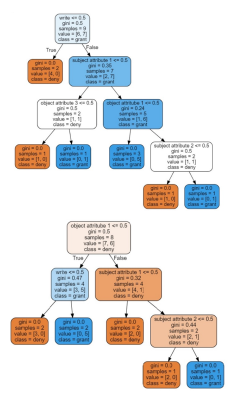
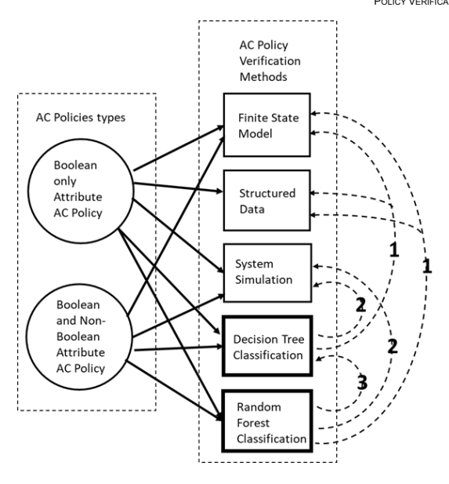
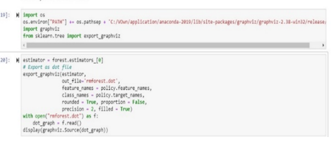
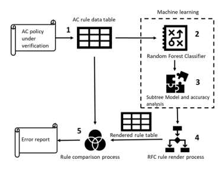
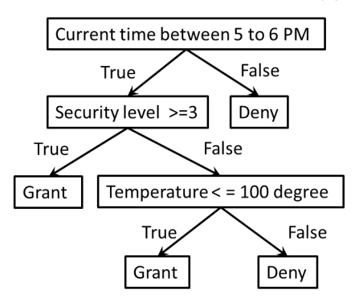

 **8360**

# Machine Learning For Access Control Policy Verification

Vincent C. Hu This publication is available free of charge from:

https://doi.org/10.6028/NIST.IR.8360 NISTIR 8360

# Machine Learning For Access Control Policy Verification

Vincent C. Hu Computer Security Division Information Technology Laboratory This publication is available free of charge from:
https://doi.org/10.6028/NIST.IR.8360 September 2021

U.S. Department of Commerce Gina M. Raimondo, Secretary National Institute of Standards and Technology James K. Olthoff, Performing the Non-Exclusive Functions and Duties of the Under Secretary of Commerce for Standards and Technology & Director, National Institute of Standards and Technology National Institute of Standards and Technology Interagency or Internal Report 8360 25 pages (September 2021)
This publication is available free of charge from:
https://doi.org/10.6028/NIST.IR.8360 Certain commercial entities, equipment, or materials may be identified in this document in order to describe an experimental procedure or concept adequately. Such identification is not intended to imply recommendation or endorsement by NIST, nor is it intended to imply that the entities, materials, or equipment are necessarily the best available for the purpose. There may be references in this publication to other publications currently under development by NIST in accordance with its assigned statutory responsibilities. The information in this publication, including concepts and methodologies, may be used by federal agencies even before the completion of such companion publications. Thus, until each publication is completed, current requirements, guidelines, and procedures, where they exist, remain operative. For planning and transition purposes, federal agencies may wish to closely follow the development of these new publications by NIST. Organizations are encouraged to review all draft publications during public comment periods and provide feedback to NIST. Many NIST cybersecurity publications, other than the ones noted above, are available at https://csrc.nist.gov/publications.

Comments on this publication may be submitted to:
National Institute of Standards and Technology Attn: Computer Security Division, Information Technology Laboratory 100 Bureau Drive (Mail Stop 8930) Gaithersburg, MD 20899-8930 Email: ir8360-comments@nist.gov All comments are subject to release under the Freedom of Information Act (FOIA).

## Reports On Computer Systems Technology

The Information Technology Laboratory (ITL) at the National Institute of Standards and Technology (NIST) promotes the U.S. economy and public welfare by providing technical leadership for the Nation's measurement and standards infrastructure. ITL develops tests, test methods, reference data, proof of concept implementations, and technical analyses to advance the development and productive use of information technology. ITL's responsibilities include the development of management, administrative, technical, and physical standards and guidelines for the cost-effective security and privacy of other than national security-related information in federal information systems.

## Abstract

Access control policy verification ensures that there are no faults within the policy that leak or block access privileges. As a software test, access control policy verification relies on methods such as model proof, data structure, system simulation, and test oracle to verify that the policy logic functions as expected. However, these methods have capability and performance issues related to inaccuracy and complexity limited by applied technologies. For instance, model proof, test oracle, and data structure methods initially assume that the policy under verification is faultless unless the policy model cannot hold for test cases. Thus, the challenge of the method is to compose test cases that can comprehensively discover all faults. Alternatively, a system simulation method requires translating the policy to a simulated system. The translation between systems may be difficult or impractical to implement if the policy logic is complicated or the number of policy rules is large. To answer these challenges, this internal report (IR) proposes an efficient and straightforward method for access control policy verification by applying a classification algorithm of machine learning, which does not require comprehensive test cases, oracle, or system translation but rather checks the logic of policy rules directly, making it more efficient and feasible compared to traditional methods.

## Keywords

attribute based access control; access control; access control test; access control verification; AI; authorization; machine learning; policy.

## Acknowledgments

The author, Vincent C. Hu of the National Institute of Standards and Technology (NIST), wishes to thank Isabel Van Wyk and Jim Foti (NIST) who reviewed drafts of this document. The author also gratefully acknowledges and appreciates the comments and contributions made by government agencies, private organizations, and individuals in providing direction and assistance in the development of this document.

## Patent Disclosure Notice

NOTICE: ITL has requested that holders of patent claims whose use may be required for compliance with the guidance or requirements of this publication disclose such patent claims to ITL. However, holders of patents are not obligated to respond to ITL calls for patents, *and ITL* has not undertaken a patent search in order to identify which, if any, patents may apply to this publication. As of the date of publication and following call(s) for the identification of patent claims whose use may be required for compliance with the guidance or requirements of this publication, no such patent claims have been identified to ITL. No representation is made or implied by ITL that licenses are not required to avoid patent infringement in the use of this publication.

## Executive Summary

Access control policy verification ensures that there are no faults within the policy that leak or block access privileges. As a software test, access control policy verification relies on methods such as model proof, data structure, system simulation, and test oracle to verify that the policy logic functions as expected. However, these methods have capability and performance issues related to inaccuracy and complexity limited by applied technologies. For instance, model proof, test oracle, and data structure methods initially assume that the policy under verification is faultless unless the policy model cannot hold for test cases. Thus, the challenge of the method is to compose test cases that can comprehensively discover all faults. Alternatively, a system simulation method requires translating the policy to a simulated system. The translation between systems may be difficult or impractical to implement if the policy logic is complicated or the number of policy rules is large. To answer these challenges, this report proposes an efficient and straightforward method for access control policy verification by applying a classification algorithm of machine learning, which does not require comprehensive test cases, oracle, or system translation but rather checks the logic of policy rules directly, making it more efficient and feasible compared to traditional methods. This report demonstrates an experiment for the proposed method with an example that uses current available machine learning tools to facilitate the random forest classification algorithm. The result illustrates its capabilities as well as parameter settings for performing the verification steps. Ultimately, three general applications are provided: enhancement of existing verification methods, verification of access control policies with numerical attributes, and policy enforcement that can be supported by the proposed machine learning policy verification method.

This publication is available free of charge from: https://doi.org/10.6028/NIST.IR.8360

## Table Of Contents

| References    | ..17   |
|---------------|--------|

| 2   | Machine Learning for Access Control Verification    | ...3   |
|-----|-----------------------------------------------------|--------|
| 3   | RFC Verification Approach                           | ...7   |
| 4   | Applications                                        | .14    |
| 5   | Conclusion                                          | .16    |

| Figure 2: Mapping of access control policy types and verification methods    |  6   |
|------------------------------------------------------------------------------|------|
| Figure 3: Access control policy rules specified in a data table              | 7    |
| Figure 4: RFC program in Python code                                         | ..10 |

| Figure 6: Machine Learning RFC method for access control policy verification    | ..12   |
|---------------------------------------------------------------------------------|--------|
| Figure 7: Numerical attribute values in a subtree model                         | ..15   |

| Executive Summary    |  v             |
|----------------------|----------------|
| 1                    | Introduction 1 |

## List Of Figures

Figure 1: 1a (above), 1b (below) - Subtrees model generated by RFC classifier........................................4 Figure 5: First 28 rendered model rules from RFC subtrees ......................................................................11

## List Of **Tables**

Table 1: Statistic from comparison of rendered model rules in Figure 5 with policy rules in Figure 3........11 This publication is available free of charge from: https://doi.org/10.6028/NIST.IR.8360

## 1 **Introduction**

As a software test, access control policy verification relies on methods such as model proof [Hwang et al. 10, ACPT], data structure [MARG], system simulation [VK13, ACRLCS], and test oracle [ACTS] to verify the expected functional logic implied in policy rules [AS15]. The model proof method converts policy to a finite state machine (FSM) and verifies test access cases against it to detect policy faults, such as rule conflict, access blocking, or privilege leakage [SP192]. For instance, [ACPT] applies the symbolic model verification [NuSMV] tool to build an FSM model in terms of policy rule attributes. Thus, a test case is represented by a deterministic finite state transducer that corresponds to the FSM, which should satisfy the two requirements below after it takes actions in compliance with the test case:
1) Safety - There is no violation of the FSM model to the test case, and it is assured that the FSM will eventually be in a desired state.

2) Liveness - Where the FSM will have neither a **deadlock** in which the system waits forever for system events nor a **livelock** in which the model repeatedly executes the same operations forever [NuSMV].

An access control policy verification method uses structured data that represents underlying policy rule logics. The data structure, such as a binary decision diagram [CFMY93], is given assignments of binary values to the policy attributes that traverse from the root to a terminal of the rule's permission [Fisler et al. 05]. This method is used by software tool suite Margrave [MARG] for verifying safety requirements (test cases) against policies written in eXtensible Access Control Markup Language (XACML) [XACML]. Margrave's API verifies safety requirements in the form of queries, which should hold by the binary tree. Otherwise, counterexamples are produced indicating violations of the tree structure [SND13]. Model proof and data structure methods initially accept the policy under verification as faultless until tested against specified cases or requirements. Faults are then claimed if the policy model or data structure cannot hold. Therefore, in order to detect all possible faults embedded in a policy, the challenge is to compose test cases or requirements that can discover them. Other similar methods, however, may rely on a test oracle that contains all possible access control requests and access permissions as input to verify if requests' permissions conflict with expected permissions assigned to rules. Thus, excessive computing time or resources are required for large numbers of policy attributes. For example, given n, 2n+1 access requests (1 for permission states) are required for the test oracle. Most of today's access control policies can easily have hundreds of attributes. Hence, test oracles will be too large to be practically performed. In addition to model proof and structured data, a simulated system is built to simulate the access control policy rules for verification. In such systems, each policy rule is represented by simulated system components such that faults can be detected by triggering the system functions that cause errors. For example, the access control Rule Logic Circuit Simulation (ACRLCS) system [ACRLCS] detects faults when rule circuits are added that conflict with existing logic circuits. ACRLCS allows error detecting and fixing to be performed in real time before adding rule circuits that further complicate the detecting effort. In other words, instead of checking by retracing the interrelations between rules after the policy is completed, it only checks the new added rule against previous "correct" ones. Even though this method does not require comprehensive large numbers This publication is available free of charge from: https://doi.org/10.6028/NIST.IR.8360 of test cases, requirements, or an oracle, the translation or mapping process for implementing the simulated system is a challenge [VK13]. This report proposes an innovative technique that applies a classification algorithm of machine learning [ML] to answer challenges of capability due to the coverage of test cases or oracle and the difficulty of system translation from traditional access control policy verification methods. In this report, the Introduction describes the challenges of traditional policy verification methods. Section 2 explains how an ML Classification method can be applied to policy verification. Section 3 demonstrates a policy verification approach for an ML random forest classification (RFC) algorithm. Section 4 describes general access control applications that can benefit from the proposed method. The last section is the Conclusion.

This publication is available free of charge from: https://doi.org/10.6028/NIST.IR.8360

## 2 **Machine Learning For Access Control Verification**

Machine learning has been used for device control, system analysis, and business forecasting. However, the use of ML for software testing is in the early stages [AWCS, CAT5]. In particular, ML applications for model proof are still elusive and have yet to be explored. ML classification allows for the generation or prediction of **target** classes for new input data using some sample training data produced by running the system instead of comprehensive input data. For access control policy verification, the training data is assigned attributes' values of policy rules, and the target for classification is access permissions (e.g., grant and deny) assigned to rules. The data is consumed by an ML classification algorithm to generate a **classification model**. Querying the accuracy of **training data** against the model allows for the detection of inconsistencies, indicating faults found among policy rules. In addition, to verify new or updated policy rules, they need to be contained in **test data** for additional accuracy analysis on test data.

Decision tree (DT) and random forest classification (RFC) are two of the main ML classification algorithms capable of access control policy verification. Among other ML classification algorithms, which are better suited to regression analysis for numerical data [MG17], DT and RFC algorithms apply binary tree algorithms that support the processing of non-regression analysis of binary data. Figure 1 shows an example binary tree model generated by the RFC classification algorithm. 

This publication is available free of charge from: https://doi.org/10.6028/NIST.IR.8360

Figure 1: 1a (above), 1b (below) - Subtrees model generated by RFC classifier
. H.T2IM18206.01\g10.iob\\:sqthd :mot1 ອຽງBric to eeti əldəlirva si noifsoilduq Compared to DT, an RFC algorithm is more suitable for access control policy verification because from the perspective of a rendered model, an RFC algorithm generates ensembles of decision subtrees that represent multiple model policy rules. In contrast, a DT algorithm generates a single decision tree model that represents a single rule underlying combined rule logics. The rule is hard to abstract into separate expressive rules unless the DT tree is pruned or limited to split, but that might cause incompleteness of the model. In addition, policy attribute values may be binary or non-binary (e.g., rank and age) types that are applicable to different traditional verification methods. For both algorithms, verifications of policies have only a binary attribute value. The overfitting of models will not cause inaccuracy. However, for non-binary values with numeric number policies, such as a situation-aware policy, the classification is based on the regression analysis, and the overfitting may cause inaccurate analysis. In this regard, RFC is able to reduce overfitting while retaining accuracy, which DT does not support. In summary, the advantages of the RFC algorithm over the DT algorithm and traditional verification methods for access control policy verification are illustrated in Figure 2. The numbers attached to the dotted lines categorize the challenges listed below, which are answered by the connecting ML classification methods in squares.

1. Requires test case/requirements or oracle to discover all possible policy faults 2. Difficult to implement and update to the simulated system 3. Cannot render separated policy rules from model and may overfit for policy with nonbinary attributes values The solid lines point to the applicable traditional verification methods or ML classification algorithms for the connected access control policies in the circle with the types of attributes specified.

This publication is available free of charge from: https://doi.org/10.6028/NIST.IR.8360

As shown in Figure 2, RFC is the only method that can answer all three challenges, which other methods can only partially address.

## 3 Rfc Verification Approach

Applying the RFC algorithm to policy verification requires the preparation of a data table that contains classification-required training and test data transferred from specific access control policy rules. In the table, each column contains an attribute, action, or permission value. Each row represents a policy rule, and the access permission is based on the attribute and action values in the row.

In Figure 3, an access control policy is specified in a table: columns A and B contain subject attributes, columns C and D contain available actions, columns E to G contain object attributes, and column H contains the grant (1) or deny (0) access permission for rules from rows 2 to 20. For example, columns A and B are subject attributes "Project-A member" and "Project-B member",
and columns C and D are available access actions of read and write. Columns E to G are "document-X", "document-Y", and "document-Z". Column H is a permission state 1 or 0, meaning "grant" or "deny." For instance, the rule of row 2 states that a user is a member of Project-A and Project-B and can read the document-X.

| A   | B   | C      | D     | E   | F   | G   | H   |    |
|-----|-----|--------|-------|-----|-----|-----|-----|----|
| A   |     |        |       |     |     |     |     |    |
| 1   | та  | 7 deny | grant |     |     |     |     |    |
| 2   | 1   | 1      | 1     | 0   | 1   | 0   | 0   | 1  |
| 3   | 1   | 1      | 1     | 0   | 0   | 1   | 0   | 1  |
| 4   | 1   | 1      | 1     | 0   | 0   | 0   | 1   | 0  |
| 5   | 1   | ﻨﺴﺎ    | 0     | 1   | 1   | 0   | 0   | 1  |
| б   | 1   | 1      | 0     | 1   | 0   | 1   | 0   | 1  |
| 7   | 1   | 1      | 0     | 1   | 0   | 0   | 1   | 1  |
| 8   | 1   | 0      | 1     | 0   | 1   | 0   | 0   | 1  |
| 9   | 1   | 0      | 1     | 0   | 0   | 1   | 0   | 0  |
| 10  | 1   | 0      | 1     | 0   | 0   | 0   | 1   | 0  |
| 11  | 1   | 0      | 0     | 1   | 1   | 0   | 0   | 0  |
| 0   |     |        |       |     |     |     |     |    |
| 12  | 1   | 0      | 1     | 0   | 1   | 0   | 0   |    |
| 13  | 1   | 0      | 0     | 1   | 0   | 0   | 1   | 1  |
| 14  | 0   | 1      | 1     | 0   | 1   | 0   | 0   | 0  |
| 15  | 0   | 1      | 1     | 0   | 0   | 1   | 0   | 1  |
| 16  | 0   | 1      | 1     | 0   | 0   | 0   | 1   | 0  |
| 17  | 0   | 1      | 0     | 1   | 1   | 0   | 0   | 0  |
| 18  | 0   | 1      | 0     | 1   | 0   | 1   | 0   | 0  |
| 19  | 0   | 1      | 0     | 1   | 0   | 0   | 1   | 1  |
| 20  | 1   | 1      | 0     | 1   | 0   | 1   | 0   | 1  |

Figure 3: Access control policy rules specified in a data table The size of a data table, therefore, is the number of subject and object attributes plus the number of available actions plus one permission state total times the number of access control rules. As II.T2IV\8S00.0 Ng10.iob\\:sqtIrl :mo11 อยาธที่ eldslievs гі поitsoilduq with some access control systems, policy rules are automatically generated from previous access logs or by an intelligent mechanism. To make sure that the policy rules are reasonable (i.e., syntactically correct), the table needs to be cleaned so that it contains only enforceable rules. The cleaning is done by removing rules that contain no assigned subject attribute, action, or object attribute values. Additionally, any rule that contains more than one action or more than one object attribute value needs to be broken into separate sub-rules that each contain only one action and one object attribute value. The reason for this is that the RFC subtree model can only branch by evaluating Boolean EITHER OR of a tree node representing an attribute or action. Note that the combinations of sub-rules with only one action and only one object attribute value for each are semantically the same as the original single rule they derived from. As a result, the cleaned data table contains policy rules that have one or more subject attributes values, only one action, and only one object attribute value. In other words, the original policy's AND Boolean relations for subject attribute values can be listed in the same row, but OR relations for actions or object attribute values need to be dispersed to different rows. The rationale for doing so is that to render a model rule from RFC model subtrees, subject attribute nodes' AND relations need to be in the same *true* paths of a tree branch, but a subject/object attribute or action node's OR relation has to be in *true* paths from different subtree branches. Syntactically reasonable policy rules may have semantic errors (i.e., contain conflicts between rules), such as the following three set rules:
1. Either one is correct but not both: 
user has subject attribute A read object with object attribute X is *granted*; user has subject attribute A read object with object attribute X is *denied* 2. The latter two rules conflict with the first one:
user has subject attribute A or B read object with object attribute X is granted; user has subject attribute A *read* object with object attribute X is *denied*; user has subject attribute B *read* object with object attribute X is *denied* 3. Either one is correct but not both:
user has subject attribute A or B *read* object with object attribute X is *granted*; user has subject attribute A and B *read* object with object attribute X is *denied* For verification of a policy that only has binary attribute values, there is no need for **test data**
because instead of a general purpose of prediction from a classification algorithm, the goal is to analyze the accuracy (i.e., correctness) of rules specified in **training data**. Hence, in order to include all policy rules in training data, the ratio of test set data to training data must be kept to a minimum. However, the algorithm may require no empty test data. In such cases, if the algorithm allowed, some training data can be duplicated to test data. The data table can then be processed by the RFC algorithm to render an RFC subtrees model (Figure 1), whose subtree branches may be rendered to zero or more model policy rules from paths linked by the tree nodes of attributes, actions, and tree leaves of permissions. After the generation of an RFC subtree model, the *analysis of accuracy* function is executed to verify the model against the training data to ensure that it is 100 % accurate and to verify the This publication is available free of charge from: https://doi.org/10.6028/NIST.IR.8360 semantic correctness of the policy rules. In addition to detect permission conflict rules, the RFC model is able to recognize (i.e., find no conflict with) the following policy rule semantics: 
- **Condition property:** For example, the rules "*user has subject attributes A read object with* attribute X is granted" and "user has subject attributes A and B read object with attribute X is granted" are not in conflict with the rule "*user has subject attributes B read object* with attribute X is denied."
- **SOD (separation of duty) property:** For example, the rule "user has subject attributes A 
read object with attribute X is granted" is not in conflict with the rule "*user has subject* attributes A and B read object with attribute X is be denied."
- **Exclusion property:** For example, the rule "user has subject attributes A or B read object with attribute X is granted" is not in conflict with the rule "user has *subject attributes A* and B read object with attribute X is denied."
For this experiment, the *RandomForestClassifier* algorithm was applied from Sklearn [SKLEARN], as shown in Figure 4, for Figure 3 sample policy verification. Since the parameter settings of the algorithm affect the number and shape of subtrees, the following parameters need to be set in order to render as many model rules from subtrees as possible to cover verification against original policy rules. 

- Use *max feature* to allow the algorithm to select all subject/object attributes and actions for subtree nodes.

- The *min_samples_split* number should be equal to the *minimum number of data point* samples to allow the subtree branches to split the minimum number of nodes allowed, which affects the level of a tree and, therefore, the number of model rules rendered. All relations between attributes and actions should be included.

- If the RFC algorithm required at least one test data, then set sample *number* instead of floating number in *train_test_split* class to be exactly the number of the policy rules plus an additional one for test data, because according to the *floating number* there might be more than one rule to be split to test data. 

- Set *n_estimator*, the number of subtrees, to at least 2(|S|+|A|+|O|+|P|) in order to include all possible relations between attributes and actions. Where |S| is the number of subject attributes, |A| is the number of actions, |O| is the number object attributes, and |P| is the number of permissions.

- Set >= 0.5 for 1 (Boolean 'true') and <=0.5 for 0 (Boolean 'false') on evaluating the values of attributes, actions, and permissions for branch factor to next subtree generation.

This publication is available free of charge from: https://doi.org/10.6028/NIST.IR.8360Figure 4: **RFC program in Python code**

Each RFC model subtree branch that starts from any node to a leaf has one or more of the 54 branch types composed by containing attribute and action nodes in *true* paths. A branch type is one of the combinations consisting of three options of multiple, single, or no subject attributes times three options of multiple, single, or no actions times three options of multiple, single, or no object attributes times two options of permissions. As described earlier, among those types, only four can be accepted as syntactically correct (i.e., enforceable) model rules as listed below, where sa is a subject attribute, a is an action, and oa is an object attribute.
Branch type 1: contains one sa, one a, and one oa with grant Branch type 2: contains multiple sas, one a, and one oa with grant Branch type 3: contains one sa, one a, and one oa with deny Branch type 4: contains multiple sas, one a, and one oa with deny For example, the subtree in Figure 1a can be rendered to one rule: user has *subject attribute 1*, and subject attribute 2 can write object with *object attribute* 1. Alternatively, no rule can be rendered from the Figure 1b subtree. (Note that, in this experiment, the *false* path is followed because the algorithm treats a value greater than 0.5 to be the Boolean *false*, which is an AND relation for rules.) Formally, a subtree branch contains at least one subject attribute, only one action, and only one object attribute linked by *true* paths that can be rendered to be a model policy rule. Figure 5

| Rules ID   | 2   |
|------------|-----|
| Sub # *    | 2   |
| Con # **   | 0   |

|  B   | C            | D   | E   | F   | G   | H     | -   |     |    |
|------|--------------|-----|-----|-----|-----|-------|-----|-----|----|
| A    |              |     |     |     |     |       |     |     |    |
| 1    | sub tree |s1 | s2  | r   | 01  | o2  | grant | -   |     |    |
|      | W            | 03  |     |     |     |       |     |     |    |
| 2    | 0 n/a        | n/a | n/a | n/a | n/a | n/a   | n/a | n/a |    |
| 3    | 1            | 1   | 0   | 0   | 1   | 0     | 0   | 1   | 1  |
| 4    | 2            | 1   | 0   | 0   | 1   | 0     | 1   | 0   | 0  |
| 5    | 3            | 1   | 1   | 0   | 1   | 0     | 1   | 0   | 1  |
| ნ    | 4            | 1   | 1   | 0   | 1   | 1     | 0   | 0   | 1  |
| 7    | 5            | 0   | 1   | 0   | 1   | 0     | 0   | 1   | 1  |
| 8    | б            | 1   | 1   | 0   | 1   | 0     | 1   | 0   | 1  |
| 9    | 7            | 1   | 0   | 1   | 0   | 0     | 1   | 0   | 0  |
| 10   | 8            | 1   | 0   | 1   | 0   | 1     | 0   | 0   | 1  |
| 11   | 9            | 1   | 1   | 0   | 1   | 0     | 0   | 1   | 1  |
| 12   | 10 n/a       | n/a | n/a | n/a | n/a | n/a   | n/a | n/a |    |
| 13   | 11 n/a       | n/a | n/a | n/a | n/a | n/a   | n/a | n/a |    |
| 14   | 12 n/a       | n/a | n/a | n/a | n/a | n/a   | n/a | n/a |    |
| 15   | 1            | 0   | 0   | 0   | 0   | 1     |     |     |    |
| 13   | 1            | 1   |     |     |     |       |     |     |    |
| 16   | 14           | 1   | 0   | 1   | 0   | 0     | 0   | 1   | 0  |
| 17   | 15 n/a       | n/a | n/a | n/a | n/a | n/a   | n/a | n/a |    |
| 18   | 16           | 0   | 1   | 0   | 1   | 1     | 0   | 0   | 1  |
| 19   | 1            | 1   | 1   | 0   | 1   | 0     | 0   |     |    |
| 17   | 1            |     |     |     |     |       |     |     |    |
| 20   | 18           | 1   | 0   | 1   | 0   | 0     | 0   | 1   | 0  |
| 21   | 18.2         | 1   | 0   | 1   | 0   | 1     | 0   | 0   | 1  |
| 22   | 18.3         | 1   | 0   | 1   | 0   | 0     | 1   | 0   | 0  |
| 23   | 19           | 1   | 0   | 0   | 1   | 1     | 0   | 0   | 0  |
| 24   | 20           | 1   | 0   | 0   | 1   | 0     | 0   | 1   | 1  |
| 25   | 20.1         | 1   | 1   | 0   | 1   | 0     | 1   | 0   | 1  |
| 0    | 0            | 0   | 0   |     |     |       |     |     |    |
| 26   | 21           | 1   | 1   | 1   | 1   |       |     |     |    |
| 27   | 22           | 0   | 0   | 0   | 0   | 0     | 0   | 0   |    |
|      | 0            |     |     |     |     |       |     |     |    |
| 28   | 23           | 1   | 1   | 0   | 1   | 0     | 1   | 0   | 1  |
| 29   | 24 n/a       | n/a | n/a | n/a | n/a | n/a   | n/a | n/a |    |
| 30   | 25 n/a       | n/a | n/a | n/a | n/a | n/a   | n/a | n/a |    |

lists rendered rules from RFC model subtrees in table format. For example, entry 6 (rule number 4) is from the Figure 1a subtree. Note that there are 147 rules rendered for this sample; due to the page limit, only the first 28 are listed.

Figure 5: First 28 rendered model rules from RFC subtrees Table 1 shows the statistic results that match original policy rules from Figure 3 with rendered rules from the RFC subtree model in Figure 5.

Table 1: Statistic from comparison of rendered model rules in Figure 5 with policy rules in Figure 3

| 3   | 7   | 8   | ம   | 11   | 12   | 13   | 14   | 15   | 16   | 17   | 18   | 19   | 20   |    |    |    |    |
|-----|-----|-----|-----|------|------|------|------|------|------|------|------|------|------|----|----|----|----|
| ব   | 5   | 6   | 10  |      |      |      |      |      |      |      |      |      |      |    |    |    |    |
| 3   | 0   | 6   | 4   | ნ    | 7    | 7    | 4    | 3    | 0    | 4    |      |      |      |    |    |    |    |
| 10  | 1   | 11  | 5   | 3    | 1    | 1    |      |      |      |      |      |      |      |    |    |    |    |
| 0   | 0   | 0   | 0   | 0    | 0    | 0    | 0    | 1    | 4    | 0    | 1    | 0    | 0    | 3  | 0  | 1  | 0  |

* *Number of times the rule is rendered from RFC model subtree* ** *Number of rendered rules that conflict with the original policy rule* The first row is the rules identifier (ID) of the original policy under verification. The second row is the number of rendered rules from RFC model subtrees that match the original policy rule. The third row lists the number of conflicts of rendered rules against the original policy rule in terms of permissions (grant/deny) to the target class. The statistic shows that, except for rules number 4 and 18 of the policy, rules found matches by at least one of the subtree branches rendered from a total of 128 model subtrees. Note that the two non-matches because the number of subtrees is not enough to generate rules to cover them. This can be adjusted by increasing the parameter n_estimators in Figure 4, where 128 is increased to 256:
forest= RandomForestClassifier(n_estimators=256, random_state=0, min_samples_split=2)
The *analysis of accuracy* function provides the percentage of semantic correctness of the original policy versus the RFC model. A correctness of less than 100 % indicates that conflict (error) rules may exist in the policy, as shown in Table 1, where five rules numbered 11, 12, 14, 17, and 19 conflict with others. Even with the conflicts, 100 % accuracy was reported on training data in Figure 4 (i.e., no faults in the policy), because the RFC algorithm uses a majority votes mechanism to resolve the conflicts. However, if the accuracy is not 100 %, the conflicts are most likely what cause faults in policy, especially the ones with a higher rate of matched versus conflicts (e.g., rule number 17 in Table 1 has the highest of 3/3). Figure 6 shows steps for the RFC policy verification process as described above.

Figure 6: Machine Learning RFC method for access control policy verification
In Step 1, the policy under verification is transferred, cleaned into a data table (e.g., Figure 3), and entered to the RFC (e.g., Figure 4) process in Step 2. This generates a subtree model (e.g., Figure 1) that will be analyzed for the accuracy (i.e., the correctness) of the original policy in Step 3. If the accuracy analysis result is not 100 %, the subtree model needs to be further processed to render model rules (e.g., Figure 5) in Step 4. Finally, in Step 5, the original policy can be matched to This publication is available free of charge from: https://doi.org/10.6028/NIST.IR.8360 produce an error report (e.g., Table 1) for policy rules that are not recognized or that conflict with rendered model rules. A *scikit-learn* package from *scikit-learn.org* [SKLEARN] was used for the RFC classification algorithm, and *Jupyter Notebook* [JUPY] for *Python* [PYTH] was used for the program interface. The result shows that faults in an access control policy can be detected when the accuracy analysis result is not 100 %. In a few cases, the number of subtrees generated by the RFC model were not enough to cover all policy rules (such as two unrecognized rules in Table 1), which can be adjusted by increasing the number of subtrees generated by setting the *n_estimator* parameter and repeating the analysis process.

This publication is available free of charge from: https://doi.org/10.6028/NIST.IR.8360

## 4 **Applications**

In addition to access control policy rule verification, there are three major types of applications that the RFC method can support, as described below.

1. **Enhancement of existing verification method** - In addition to replacing traditional access control policy verification methods, the RFC verification method can be used to enhance traditional methods by checking the correctness of the policy model itself before applying it to test new or updated cases. Most traditional model verification methods assume that the access control policy has no faults until new or updated rules are tested against. For example, Access Control Policy Tool (ACPT) [Hwang et al. 10, ACPT] uses security requirements as test cases for counterexample generation of found faults. It would be more efficient if the policy model error can be verified without composing security requirements to discover faults that already exist in the model. 

2. **Verification for policy with numerical attributes** - Some context-aware access control policies, such as Policy Based Access Control (PBAC) [PBAC] or situation-awarded access control systems, have attributes as numerical variables. These non-binary attributes measure values such as numbers, volumes, and other measurable counts to make access decisions for policy rules, such as "if the current security level is greater than 3, then the user has subject attribute X and is allowed to access resource with object attribute Y," or "if the total amount of spending is higher than $50, then the discount is accessible to customers but not accessible to employees." These policies cannot be verified by traditional verification methods, including an infinite number of attribute values in test cases/oracle. The RFC verification method for these policies is especially useful because an RFC algorithm is fundamentally equipped for the evaluation of regression values. Its branch factors for subtree nodes test the limitations of attribute values, as shown in Figure 7, where the *time* and the *temperature* attribute values can vary to an unlimited real number depending on the resolutions of the variables.

This publication is available free of charge from: https://doi.org/10.6028/NIST.IR.8360

Figure 7: Numerical attribute values in a subtree model
3. **Policy enforcement** - In addition to the verification for policy with numerical attributes as described above, the RFC method can be used for policy enforcing mechanisms [LDW20] to automatically decide the permissions of an access request that was not delineated in any policy rule, especially for policies with a wide range of attribute values, because it is impractical to list all possible rules to accommodate all possible attribute values in the policy. For such applications, the RFC method should take an access request as additional test data to perform accuracy analysis. Without 100 %, the access request should be denied.

This publication is available free of charge from: https://doi.org/10.6028/NIST.IR.8360

## 5 **Conclusion**

A machine learning classification algorithm is particularly efficient for system model verification because it does not require comprehensive or complex test cases or oracle, which are needed for traditional model verification methods. This report proposes an innovative technique that applies the machine learning random forest classification algorithm to answer challenges for traditional access control policy verification methods due to the capability of test cases and oracle for discovering faults. The algorithm uses access control policy rules as samples (training data) and the permission assigned to the rules as a classification target. The algorithm generates a classification subtree model of the policy, analyzes the accuracy in percentage against the model, and detects inconsistencies (i.e., faults) in the policy rules. Unlike traditional system simulation methods that require complex system translation, the random forest classification algorithm allows for directly entering new and updated rules for verification in the form of data instead of system components, thereby improving performance efficiency. This report demonstrates an experiment for the proposed method with an example that uses current available machine learning tools to facilitate the random forest classification algorithm. The result illustrates its capabilities as well as parameter settings for performing the verification steps. Ultimately, three general applications are provided: enhancement of existing verification methods, verification of access control policies with numerical attributes, and policy enforcement that can be supported by the proposed machine learning policy verification method.

This publication is available free of charge from: https://doi.org/10.6028/NIST.IR.8360

 8360 

|                    | POLICY VERIFICATION                                                                                                                                                                                                                                                                      |
|--------------------|------------------------------------------------------------------------------------------------------------------------------------------------------------------------------------------------------------------------------------------------------------------------------------------|
| References [ACPT]  | National Institute of Standards and Technology (2021) Access Control Policy Tool (ACPT). Available at https://www.nist.gov/programs-projects/accesscontrol-policy-tool-acpt                                                                                                                                                                                                                                                                                          |
| [ACRLCS]           | National Institute of Standards and Technology (2021) Access Control Rule  Logic Circuit Simulation (ACRLCS). Available at  https://csrc.nist.gov/Projects/Access-Control-Policy-Tool/access-control-rulelogic-circuit-simulation                                                                                                                                                                                                                                                                                          |
| [ACTS]             | National Institute of Standards and Technology (2021) Automated  Combinatorial Testing for Software (ACTS). Available at https://www.nist.gov/programs-projects/automated-combinatorial-testingsoftware-acts                                                                                                                                                                                                                                                                                          |
| [AS15]             | Aqib M, Ahmed S R (2014) Analysis and Comparison of Access Control  Policies Validation Mechanisms. International Journal of Computer Network  and Information Security 7(1):54-69. https://doi.org/10.5815/ijcnis.2015.01.08                                                            |
| [AWCS]             | Merrill P (2017) Top trends: 5 ways AI will change software testing.  Available at https://techbeacon.com/app-dev-testing/5-ways-ai-will-changesoftware-testing                                                                                                                                                                                                                                                                                          |
| [CAT5]             | Colantonio J (2018) 5 great ways to use AI in your test automation. Available  at https://techbeacon.com/app-dev-testing/how-ai-changing-test-automation-5- examples                                                                                                                     |
| [CFMYZ93]          | Clarke E, Fujita M, McGeer P, Yang J, Zhao X (1993) Multi-terminal binary  decision diagrams: An efficient data structure for matrix representation. International Workshop on Logic Synthesis. Available at  http://repository.cmu.edu/cgi/viewcontent.cgi?article=1456&context=compsci |
| [Fisler et al. 05] | Fisler K, Krishnamurthi S, Meyerovich L A, Tschantz M C (2005)  Verification and Change Impact Analysis of Access Control Policies. Proceeding, 27th International Conference on Software Engineering (New  York, USA), pp 196-205. https://doi.org/10.1145/1062455.1062502              |
| [Hele17]           | Helemski G (2017) Policy Based Access Control: 5 Key Features. Available  at https://blog.plainid.com/5-key-features-of-policy-based-access-control                                                                                                                                      |
| [Hwang et al.]     | Hwang J, Xie, Hu V, Altunay M (2010) ACPT: A Tool for Modeling and  Verifying Access Control Policies. IEEE International Symposium on Policies  for Distributed Systems and Networks (P0LICY 2010) (IEEE, Fairfax, USA).  https://doi.org/10.1109/POLICY.2010.22                        |
| [JUPY]             | Project Jupyter (2021) Jupyter Notebook. Available at https://jupyter.org/                                                                                                                                                                                                               |

This publication is available free of charge from: https://doi.org/10.6028/NIST.IR.8360

 8360 

|                 | POLICY VERIFICATION                                                                                                                                                                                                                                                                      |
|-----------------|------------------------------------------------------------------------------------------------------------------------------------------------------------------------------------------------------------------------------------------------------------------------------------------|
| [Kayesa et al.] | Kayes ASM, Rahayu W, Dillon T, Chang E, Han J (2019) Context-aware  access control with imprecise context characterization for cloud-based data  resources. Future Generation Computer Systems 93(April 2019):237-255.  https://doi.org/10.1016/j.future.2018.10.036                     |
| [LDW20]         | Liu A, Du X, Wang N, (2021) Efficient Access Control Permission Decision  Engine Based on Machine Learning. Security and Communication Networks 2021, Article ID 3970485. https://doi.org/10.1155/2021/3970485                                                                           |
| [MARG]          | Margrave (2021) The Margrave Policy Analyzer. Available at http://www.margrave-tool.org/                                                                                                                                                                                                 |
| [MG17]          | Müller AC, Guido S (2016) Introduction to Machine Learning with Python (O'Reilly Media, Sebastopol, CA).                                                                                                                                                                                 |
| [NuSMV]         | NuSMV (2021) NuSMV: A new symbolic model checker. Available at http://nusmv.fbk.eu/                                                                                                                                                                                                      |
| [PBAC]          | Axiomatics (2021) What is Policy Based Access Control (PBAC)? Available  at https://www.axiomatics.com/policy-based-access-control/                                                                                                                                                      |
| [PYTH]          | Python Software Foundation (2021) Python. Available at https://www.python.org/                                                                                                                                                                                                           |
| [SKLEARN]       | scikit-learn (2020) sklearn.ensemble.RandomForestClassifier, scikit-learn  0.24.1. Available at https://scikitlearn.org/stable/modules/generated/sklearn.ensemble.RandomForestClassifier. html                                                                                                                                                                                                                                                                                          |
| [SND13]         | Saghafi S, Nelson T, Dougherty DJ (2013) Geometric Logic for Policy  Analysis. International Workshop on Automated Reasoning in Security and  Software Verification (Nancy, France), pp 1-9. Available at  http://web.cs.wpi.edu/~tn/publications/snd-arsec13-geometric.pdf              |
| [SP192]         | Hu VC, Kuhn DR, Yaga DJ (2017) Verification and Test Methods for Access  Control Policies/Models. (National Institute of Standards and Technology,  Gaithersburg, MD), NIST Special Publication (SP) 800-192. https://doi.org/10.6028/NIST.SP.800-192                                    |
| [VK13]          | Hu VC, Scarfone KA (2013) Real-Time Access Control Rule Fault Detection  Using a Simulated Logic Circuit. Proceeding, 2013 ASE/IEEE International  Conference on Privacy, Security, Risk and Trust, (IEEE, Alexandria,  Virginia), pp 494-501. https://doi.org/10.1109/SocialCom.2013.76 |
| [XACML]         | OASIS (2021) OASIS eXtensible Access Control Markup Language (XACML)  TC. Available at https://www.oasisopen.org/committees/tc_home.php?wg_abbrev=xacml                                                                                                                                                                                                                                                                                          |

This publication is available free of charge from: https://doi.org/10.6028/NIST.IR.8360