# Nist Special Publication 1800-26

Data Integrity: 
Detecting and Responding to Ransomware and Other Destructive Events Includes Executive Summary (A); Approach, Architecture, and Security Characteristics **(B);** and How-To Guides (C)
Jennifer **Cawthra** Michael Ekstrom Lauren Lusty Julian Sexton John Sweetnam FINAL 
This publications is available free of charge from https://doi.org/10.6028/NIST.SP.1800-26. This publication is available free of charge from

https://www.nccoe.nist.gov/projects/building-blocks/data-integrity/detect-respond. 

# Nist Special Publication 1800-26 Data Integrity: Detecting And Responding To Ransomware And Other Destructive Events

Includes Executive Summary (A); Approach, Architecture, and Security Characteristics (B); 
and How-To Guides (C)
Jennifer Cawthra National Cybersecurity Center of Excellence NIST
Michael Ekstrom Lauren Lusty Julian Sexton John Sweetnam The MITRE Corporation McLean, Virginia FINAL
DECEMBER 2020

U.S. Department of Commerce Wilbur Ross, Secretary National Institute of Standards and Technology Walter Copan, NIST Director and Undersecretary of Commerce for Standards and Technology NIST SPECIAL PUBLICATION 1800-26A 
Data Integrity: 
Detecting and Responding to Ransomware and Other Destructive Events Volume A: 
Executive Summary Jennifer **Cawthra**
National Cybersecurity Center of Excellence NIST
Michael Ekstrom Lauren Lusty Julian Sexton John Sweetnam Anne **Townsend**
The MITRE Corporation McLean, Virginia December 2020 FINAL This publications is available free of charge from https://doi.org/10.6028/NIST.SP.1800-26.

This publication is available free of charge from

 https://www.nccoe.nist.gov/projects/building-blocks/data-integrity/detect-respond. 

# Executive Summary

The CIA triad represents the three pillars of information security: confidentiality, integrity, and availability, as follows. 

 Confidentiality - preserving authorized restrictions on

information access and disclosure, including means for protecting personal privacy and proprietary information Integrity - guarding against improper information modification or destruction and ensuring information non-repudiation and authenticity Availability - ensuring timely and reliable access to and use of information This series of practice guides focuses on data integrity: the property that data has not been altered in an unauthorized manner. Data integrity covers data in storage, during processing, and while in transit. (Note: These definitions are from National Institute of Standards and Technology (NIST) Special Publication (SP) 800-12 Rev 1, *An Introduction to Information Security*.)
 Destructive malware, ransomware, malicious insider activity, and even honest mistakes all set the stage for why organizations need to detect and respond to an event that impacts data integrity. Businesses must be confident that these events are detected in a timely fashion and responded to appropriately.

 Attacks against an organization's data can compromise

emails, employee records, financial records, and customer information—impacting business operations, revenue, and reputation.

 Examples of data integrity attacks include unauthorized insertion, deletion, or modification of data to corporate information such as emails, employee records, financial records, and customer data.

 The National Cybersecurity Center of Excellence (NCCoE)
at NIST built a laboratory environment to explore methods to effectively detect and respond to a data integrity event in various information technology (IT) enterprise environments, to immediately react to the event in an effort to prevent a complete compromise.

 This NIST Cybersecurity Practice Guide demonstrates how organizations can develop and implement appropriate actions during a detected data integrity cybersecurity event.

## Challenge

Some organizations have experienced systemic attacks that force operations to cease. One variant of a data integrity attack–ransomware–encrypts data, leaving it modified in an unusable state. Other data integrity attacks may be more dynamic, targeting machines, spreading laterally across networks, and continuing to cause damage throughout an organization. In either case, behaviors are exhibited—such as files inexplicably becoming encrypted or network activity—that provide an ability to immediately detect the occurrence and respond in a timely fashion to curtail the ramifications.

## Solution

NIST published version 1.1 of the Cybersecurity Framework in April 2018 to help organizations better manage and reduce cybersecurity risk to critical infrastructure and other sectors. The framework core contains five functions, listed below. 

 **Identify** - develop an organizational understanding

to manage cybersecurity risk to systems, people, assets, data, and capabilities
 **Protect** - develop and implement appropriate safeguards to ensure delivery of critical services
 **Detect** - develop and implement appropriate activities to identify the occurrence of a cybersecurity event
 **Respond** - develop and implement appropriate activities to take action regarding a detected cybersecurity incident
 **Recover** - develop and implement appropriate activities to maintain plans for resilience and to restore any capabilities or services that were impaired due to a cybersecurity incident For more information, see the Framework for Improving Critical Infrastructure Cybersecurity v1.1.

Applying the Cybersecurity Framework to data integrity, this practice guide informs organizations of how to quickly **detect** and **respond** to data integrity attacks by implementing appropriate activities that immediately inform about the data integrity events. 

The NCCoE developed and implemented a solution that incorporates multiple systems working in concert to **detect** an ongoing data integrity cybersecurity event. Additionally, the solution provides guidance on how to **respond** to the detected event. Addressing these functions together enables organizations to have the necessary tools to act during a data integrity attack. The NCCoE sought existing technologies that provided the following capabilities:
- **event detection**
- **integrity monitoring**
- **logging**
- **reporting** - **mitigation and containment**
- forensics/analytics While the NCCoE used a suite of commercial products to address this challenge, this guide does not endorse these particular products, nor does it guarantee compliance with any regulatory initiatives. Your organization's information security experts should identify the products that will best integrate with your existing tools and IT system infrastructure. Your organization can adopt this solution or one that adheres to these guidelines in whole, or you can use this guide as a starting point for tailoring and implementing parts of a solution.

## Benefits

The NCCoE's practice guide to Data Integrity: Detecting and Responding to Ransomware and Other Destructive Events can help your organization: 
 develop a strategy for detecting and responding to a data integrity cybersecurity event facilitate effective detection and response to adverse events, maintain operations, and ensure the integrity and availability of data critical to supporting business operations and revenuegenerating activities manage enterprise risk (consistent with foundations of the NIST Framework for Improving Critical Infrastructure Cybersecurity)

## Share Your Feedback

You can view or download the guide at https://www.nccoe.nist.gov/projects/building-blocks/dataintegrity/detect-respond. If you adopt this solution for your own organization, please share your experience and advice with us. We recognize that technical solutions alone will not fully enable the benefits of our solution, so we encourage organizations to share lessons learned and best practices for transforming the processes associated with implementing this guide. 

To provide comments or to learn more by arranging a demonstration of this example implementation, contact the NCCoE at ds-nccoe@nist.gov. 

## Technology Partners/Collaborators

Organizations participating in this project submitted their capabilities in response to an open call in the Federal Register for all sources of relevant security capabilities from academia and industry (vendors and integrators). The following respondents with relevant capabilities or product components (identified as "Technology Partners/Collaborators" herein) signed a Cooperative Research and Development Agreement (CRADA) to collaborate with NIST in a consortium to build this example solution. 

Certain commercial entities, equipment, products, or materials may be identified by name or company logo or other insignia in order to acknowledge their participation in this collaboration or to describe an experimental procedure or concept adequately. Such identification is not intended to imply special status or relationship with NIST or recommendation or endorsement by NIST or NCCoE; neither is it intended to imply that the entities, equipment, products, or materials are necessarily the best available for the purpose.

The National Cybersecurity Center of Excellence (NCCoE), a part of the National Institute of Standards and Technology (NIST), is a collaborative hub where industry organizations, government agencies, and academic institutions work together to address businesses' most pressing cybersecurity challenges. Through this collaboration, the NCCoE develops modular, adaptable example cybersecurity solutions demonstrating how to apply standards and best practices using commercially available technology.

LEARN MORE
Visit https://www.nccoe.nist.gov nccoe@nist.gov 301-975-0200

# Nist Special Publication 1800-26B

Data Integrity: 
Detecting and Responding to Ransomware and Other Destructive Events Volume B:
Approach, **Architecture, and Security Characteristics**
Jennifer Cawthra National Cybersecurity Center of Excellence NIST
Michael Ekstrom Lauren Lusty Julian Sexton John Sweetnam The MITRE Corporation McLean, Virginia December 2020 FINAL This publications is available free of charge from https://doi.org/10.6028/NIST.SP.1800-26.

This publication is available free of charge from

 https://www.nccoe.nist.gov/projects/building-blocks/data-integrity/detect-respond. 

## Disclaimer

Certain commercial entities, equipment, products, or materials may be identified by name or company logo or other insignia in order to acknowledge their participation in this collaboration or to describe an experimental procedure or concept adequately. Such identification is not intended to imply special status or relationship with NIST or recommendation or endorsement by NIST or NCCoE; neither is it intended to imply that the entities, equipment, products, or materials are necessarily the best available for the purpose. National Institute of Standards and Technology Special Publication 1800-26B, Natl. Inst. Stand. Technol. 

Spec. Publ. 1800-26B, 54 pages, (December 2020), CODEN: NSPUE2

## Feedback

As a private-public partnership, we are always seeking feedback on our practice guides. We are particularly interested in seeing how businesses apply NCCoE reference designs in the real world. If you have implemented the reference design, or have questions about applying it in your environment, please email us ds-nccoe@nist.gov. 

All comments are subject to release under the Freedom of Information Act.

National Cybersecurity Center of Excellence National Institute of Standards and Technology 100 Bureau Drive Mailstop 2002 Gaithersburg, MD 20899 Email: nccoe@nist.gov This publication is available free of charge from: https://doi.org/10.6028/NIST.SP.1800-26.

# National Cybersecurity Center Of Excellence

The National Cybersecurity Center of Excellence (NCCoE), a part of the National Institute of Standards and Technology (NIST), is a collaborative hub where industry organizations, government agencies, and academic institutions work together to address businesses' most pressing cybersecurity issues. This public-private partnership enables the creation of practical cybersecurity solutions for specific industries, as well as for broad, cross-sector technology challenges. Through consortia under Cooperative Research and Development Agreements (CRADAs), including technology partners—from Fortune 50 market leaders to smaller companies specializing in information technology security—the NCCoE applies standards and best practices to develop modular, adaptable example cybersecurity solutions using commercially available technology. The NCCoE documents these example solutions in the NIST Special Publication 1800 series, which maps capabilities to the NIST Cybersecurity Framework and details the steps needed for another entity to re-create the example solution. The NCCoE was established in 2012 by NIST in partnership with the State of Maryland and Montgomery County, Maryland. To learn more about the NCCoE, visit https://www.nccoe.nist.gov/. To learn more about NIST, visit https://www.nist.gov.

## Nist Cybersecurity Practice Guides

NIST Cybersecurity Practice Guides (Special Publication 1800 series) target specific cybersecurity challenges in the public and private sectors. They are practical, user-friendly guides that facilitate the adoption of standards-based approaches to cybersecurity. They show members of the information security community how to implement example solutions that help them align with relevant standards and best practices, and provide users with the materials lists, configuration files, and other information they need to implement a similar approach.

The documents in this series describe example implementations of cybersecurity practices that businesses and other organizations may voluntarily adopt. These documents do not describe regulations or mandatory practices, nor do they carry statutory authority. 

## Abstract

Ransomware, destructive malware, insider threats, and even honest mistakes present an ongoing threat to organizations that manage data in various forms. Database records and structure, system files, configurations, user files, application code, and customer data are all potential targets of data corruption and destruction.

A timely, accurate, and thorough detection and response to a loss of data integrity can save an organization time, money, and headaches. While human knowledge and expertise is an essential component of these tasks, the right tools and preparation are essential to minimizing downtime and This publication is available free of charge from: https://doi.org/10.6028/NIST.SP.1800-26.

losses due to data integrity events. The NCCoE, in collaboration with members of the business community and vendors of cybersecurity solutions, has built an example solution to address these data integrity challenges. This project details methods and potential tool sets that can detect, mitigate, and contain data integrity events in the components of an enterprise network. It also identifies tools and strategies to aid in a security team's response to such an event.

## Keywords

attack vector; data integrity; malicious actor; malware; malware detection; malware response; ransomware.

## Acknowledgments

| We are grateful to the following individuals for their generous contributions of expertise and time. Name Organization Kyle Black Bay Dynamics Sunjeet Randhawa Broadcom Inc. Peter Romness Cisco Systems Matthew Hyatt Cisco Systems Matthew Shabat Glasswall Government Solutions Justin Rowland Glasswall Government Solutions Greg Rhein Glasswall Government Solutions Steve Roberts Micro Focus Timothy McBride NIST Christopher Lowde Semperis   |
|---------------------------------------------------------------------------------------------------------------------------------------------------------------------------------------------------------------------------------------------------------------------------------------------------------------------------------------------------------------------------------------------------------------------------------------------------------|

This publication is available free of charge from: https://doi.org/10.6028/NIST.SP.1800-26.

| Name               | Organization          |
|--------------------|-----------------------|
| Thomas Leduc       | Semperis              |
| Darren Mar-Elia    | Semperis              |
| Kirk Lashbrook     | Semperis              |
| Mickey Bresman     | Semperis              |
| Humphrey Christian | Symantec Corporation  |
| Jon Christmas      | Symantec Corporation  |
| Kenneth Durbin     | Symantec Corporation  |
| Matthew Giblin     | Symantec Corporation  |
| Jim Wachhaus       | Tripwire              |
| Nancy Correll      | The MITRE Corporation |
| Chelsea Deane      | The MITRE Corporation |
| Sallie Edwards     | The MITRE Corporation |
| Milissa McGinnis   | The MITRE Corporation |
| Karri Meldorf      | The MITRE Corporation |
| Denise Schiavone   | The MITRE Corporation |
| Anne Townsend      | The MITRE Corporation |

This publication is available free of charge from: https://doi.org/10.6028/NIST.SP.1800-26.

The Technology Partners/Collaborators who participated in this build submitted their capabilities in response to a notice in the Federal Register. Respondents with relevant capabilities or product components were invited to sign a Cooperative Research and Development Agreement (CRADA) with NIST, allowing them to participate in a consortium to build this example solution. We worked with: 

| Technology Partner/Collaborator   | Build Involvement                                                                                      |
|-----------------------------------|--------------------------------------------------------------------------------------------------------|
| Symantec Corporation              | Symantec Information Centric Analytics v6.5.2 Symantec Security Analytics v8.0.1                       |
| Cisco Systems                     | Cisco Identity Services Engine v2.4, Cisco Advanced Malware Protection v5.4, Cisco Stealthwatch v7.0.0 |
| Glasswall Government Solutions    | Glasswall FileTrust Advanced Threat Protection (ATP) for  Email v6.90.2.5                              |
| Tripwire                          | Tripwire Log Center v7.3.1,  Tripwire Enterprise v8.7                                                  |
| Micro Focus                       | Micro Focus ArcSight Enterprise Security Manager v7.0  Patch 2                                         |
| Semperis                          | Semperis Directory Services Protector v2.7                                                             |

This publication is available free of charge from: https://doi.org/10.6028/NIST.SP.1800-26.

| Contents                        |                                    |                                                |
|---------------------------------|------------------------------------|------------------------------------------------|
| ਹ                               | Summary                            |                                                |
| 1.1                             | Challenge                          |                                                |
| 1.2                             | Solution                           |                                                |
| 1.3                             | Benefits .                         |                                                |
| 2                               | How to Use This Guide              |                                                |
| 2.1     Typographic Conventions |                                    |                                                |
| 3                               | Approach .                         |                                                |
| 3.1                             | Audience                           |                                                |
| 3.2                             | Scope                              |                                                |
| 3.3                             | Assumptions                        |                                                |
| 3.4                             | Risk Assessment                    |                                                |
|                                 | 3.4.1                              | Risk                                           |
|                                 | 3.4.2                              | Security Control Map .                         |
| 3.5                             | Technologies .                     |                                                |
| ব                               | Architecture .                     |                                                |
| 4.1 Architecture Description .  |                                    |                                                |
|                                 | 4.1.1                              | High-Level Architecture                        |
|                                 | 4.1.2 Architecture Components.     |                                                |
| 5                               | Security Characteristic Analysis . |                                                |
| 5.1                             | Assumptions and Limitations        |                                                |
| 5.2                             | Build Testing                      |                                                |
| 5.3                             | Scenarios and Findings .           |                                                |
|                                 | 5.3.1                              | Ransomware via Web Vector and Self-Propagation |
|                                 | 5.3.2                              | Destructive Malware via USB Vector .           |
|                                 | 5.3.3                              | Accidental VM Deletion via Maintenance Script  |
|                                 | 5.3.4                              | Backdoor Creation via Email Vector .           |
|                                 | 5.3.5                              | Database Modification via Malicious Insider    |

ر وال الاستقل المستقل المستقل المستقل المستقل المستقل المستقل المنتج ال

|                                     | 5.3.6                                   | File Modification via Malicious Insider 26         |
|-------------------------------------|-----------------------------------------|----------------------------------------------------|
|                                     | 5.3.7                                   | Backdoor Creation via Compromised Update Server 27 |
| 6                                   | Future Build Considerations 27          |                                                    |
| Appendix A                          | List of Acronyms 29 Glossary 30         |                                                    |
| Appendix C                          | References 34                           |                                                    |
| Appendix D Functional Evaluation 36 |                                         |                                                    |
|                                     |                                         |                                                    |
| D.1                                 | Data Integrity Functional Test Plan 36  |                                                    |
| D.2                                 | Data Integrity Use Case Requirements 37 |                                                    |
| D.3                                 | Test Case: Data Integrity DR-1 44       |                                                    |
| D.4                                 | Test Case: Data Integrity DR-2 46       |                                                    |
| D.5                                 | Test Case: Data Integrity DR-3 47       |                                                    |
| D.6                                 | Test Case: Data Integrity DR-4 48       |                                                    |
| D.7                                 | Test Case: Data Integrity DR-5 50       |                                                    |
| D.8                                 | Test Case: Data Integrity DR-6 51       |                                                    |
| D.9                                 | Test Case: Data Integrity DR-7 52       |                                                    |

This publication is available free of charge from: https://doi.org/10.6028/NIST.SP.1800-26.

# List Of Figures

Figure 4-1 DI Detect & Respond High-Level Architecture ...................................................................16

## List Of Tables

| Table 3-1 DI Reference Design Cybersecurity Framework Core Components Map 10   |
|--------------------------------------------------------------------------------|
| Table 3-2 Products and Technologies 13                                         |
| Table 6-1 Test Case Fields 36                                                  |
| Table 6-2 Capability Requirements 37                                           |
| Table 6-3 Test Case ID: Data Integrity DR-1 44                                 |
| Table 6-4 Test Case ID: Data Integrity DR-2 46                                 |
| Table 6-5 Test Case ID: Data Integrity DR-3 47                                 |
| Table 6-6 Test Case ID: Data Integrity DR-4 48                                 |
| Table 6-7 Test Case ID: Data Integrity DR-5 50                                 |
| Table 6-8 Test Case ID: Data Integrity DR-6 51                                 |
| Table 6-9 Test Case ID: Data Integrity DR-7 52                                 |

This publication is available free of charge from: https://doi.org/10.6028/NIST.SP.1800-26. This publication is available free of charge from: https://doi.org/10.6028/NIST.SP.1800-26.

## 1 **Summary**

Businesses face a near-constant threat of destructive malware, ransomware, malicious insider activities, and even honest mistakes that can alter or destroy critical data. These types of adverse events ultimately impact data integrity (DI). It is imperative for organizations to be able to detect and respond to DI attacks. 

The National Cybersecurity Center of Excellence (NCCoE) at the National Institute of Standards and Technology (NIST) built a laboratory environment to explore methods to detect and respond to a data corruption event in various information technology (IT) enterprise environments. The example solution outlined in this guide describes the solution built in the NCCoE lab. It encourages detection and mitigation of DI events while facilitating analysis of these events. 

The goals of this NIST Cybersecurity Practice Guide are to help organizations confidently:
 detect malicious and suspicious activity generated on the network, by users, or from applications that could indicate a DI event mitigate and contain the effects of events that can cause a loss of DI
 monitor the integrity of the enterprise for detection of events and after-the-fact analysis utilize logging and reporting features to speed response time to DI events analyze DI events for the scope of their impact on the network, enterprise devices, and enterprise data analyze DI events to inform and improve the enterprise's defenses against future attacks For ease of use, here is a short description of the different sections of this volume.

 Section 1: Summary presents the challenge addressed by the NCCoE project with an in-depth look at our approach, the architecture, and the security characteristics we used; the solution demonstrated to address the challenge; the benefits of the solution; and the technology partners that participated in building, demonstrating, and documenting the solution. Summary also explains how to provide feedback on this guide.

 Section 2: How to Use This Guide explains how readers—business decision-makers, program managers, and IT professionals (e.g., systems administrators)—might use each volume of the guide.

 Section 3: Approach offers a detailed treatment of the scope of the project and describes the assumptions on which the security platform development was based, the risk assessment that informed platform development, and the technologies and components that industry collaborators gave us to enable platform development.

 Section 4: Architecture describes the usage scenarios supported by project security platforms, including Cybersecurity Framework [1] functions supported by each component contributed by our collaborators.

 Section 5: Security Characteristic Analysis provides details about the tools and techniques we used to perform risk assessments.

 Section 6: Future Build Considerations is a brief treatment of other data security implementations that NIST is considering consistent with Cybersecurity Framework Core Functions: Identify, Protect, Detect, Respond, and Recover.

## 1.1 **Challenge**

Thorough collection of quantitative and qualitative data is important to organizations of all types and sizes. It can impact all aspects of a business, including decision making, transactions, research, performance, and profitability. When these data collections sustain a DI attack caused by unauthorized insertion, deletion, or modification of information, such an attack can impact emails, employee records, financial records, and customer data, rendering them unusable or unreliable. Some organizations have experienced systemic attacks that caused a temporary cessation of operations. One variant of a DI attack—ransomware—encrypts data and holds it hostage while the attacker demands payment for the decryption keys.

When DI events occur, organizations should have the capabilities to detect and respond in real time. Early detection and mitigation can reduce the potential impact of events, including damage to enterprise files, infection of systems, and account compromise. Furthermore, organizations should be able to learn from DI events to improve their defenses. Analysis of malicious behavior at the network level, user level, and file level can reveal flaws in the security of the enterprise. Resolution of these flaws, though out of scope of this guide, is often only possible once they have been exploited and with the right solution in place.

## 1.2 **Solution**

The NCCoE implemented a solution that incorporates appropriate actions during and directly after a DI 
event. The solution is composed of multiple systems working together to detect and respond to data corruption events in standard enterprise components. These components include mail servers, databases, end-user machines, virtual infrastructure, and file share servers. Furthermore, an important function of the Respond Category of the Cybersecurity Framework is improvement of defenses—this guide includes components that aid in analysis of DI events and for improving defenses against them. The NCCoE sought existing technologies that provided the following capabilities:
- **event detection**
- **integrity monitoring**
This publication is available free of charge from: https://doi.org/10.6028/NIST.SP.1800-26.

- **logging**
- **reporting** - mitigation **and containment**
- **forensics/analytics**
In developing our solution, we used standards and guidance from the following, which can also provide your organization with relevant standards and best practices:

## 1.3 **Benefits**

The NCCoE's practice guide can help your organization: 
- develop an implementation plan for detecting and responding to cybersecurity events 
- facilitate detection, response, and analysis of DI events to improve defenses and mitigate impact 
- NIST Framework for Improving Critical Infrastructure Cybersecurity (commonly known as the NIST Cybersecurity Framework [1]
- NIST Interagency or Internal Report (NISTIR) 8050: Executive Technical Workshop on Improving Cybersecurity and Consumer Privacy [2]
- NIST Special Publication (SP) 800-30 Rev. 1: *Guide for Conducting Risk Assessments* [3] - NIST SP 800-37 Rev. 1: Guide for Applying the Risk Management Framework to Federal Information Systems: A Security Life Cycle Approach [4]
- NIST SP 800-39: *Managing Information Security Risk* [5] - NIST SP 800-40 Rev. 3: *Guide to Enterprise Patch Management Technologies* [6] - NIST SP 800-53 Rev. 4: Security and Privacy Controls for Federal Information Systems and Organizations [7]
- Federal Information Processing Standard 140-2: Security Requirements for Cryptographic Modules [8]
- NIST SP 800-86: *Guide to Integrating Forensic Techniques into Incident Response* [9]
- NIST SP 800-92: *Guide to Computer Security Log Management* [10]
- NIST SP 800-100: *Information Security Handbook: A Guide for Managers* [11] - NIST SP 800-34 Rev. 1: *Contingency Planning Guide for Federal Information Systems* [12]
- Office of Management and Budget, Circular Number A-130: Managing Information as a Strategic Resource [13]
- NIST SP 800-61 Rev. 2: *Computer Security Incident Handling Guide* [14] - NIST SP 800-83 Rev. 1: *Guide to Malware Incident Prevention and Handling for Desktops and* Laptops [15]
- NIST SP 800-150: *Guide to Cyber Threat Information Sharing* [16] - NIST SP 800-184: *Guide for Cybersecurity Event Recovery* [17]
This publication is available free of charge from: https://doi.org/10.6028/NIST.SP.1800-26.

- maintain integrity and availability of data that is critical to supporting business operations and revenue-generating activities 
- manage enterprise risk (consistent with the foundations of the NIST Cybersecurity Framework) 

## 2 **How To Use This Guide**

This NIST Cybersecurity Practice Guide demonstrates a standards-based reference design and provides users with the information they need to replicate the DI detection and response solution. This reference design is modular and can be deployed in whole or in part.

This guide contains three volumes:
 NIST SP 1800-26A: *Executive Summary* NIST SP 1800-26B: *Approach, Architecture, and Security Characteristics* - what we built and why 
(you are here)
 NIST SP 1800-26C: *How-To Guides* - instructions for building the example solution Depending on your role in your organization, you might use this guide in different ways:
Business decision-makers, including chief security and technology officers, will be interested in the Executive Summary, NIST SP 1800-26A, which describes the following topics: 
 challenges that enterprises face in detecting and responding to data integrity events example solution built at the NCCoE
 benefits of adopting the example solution Technology or security program managers who are concerned with how to identify, understand, assess, and mitigate risk will be interested in this part of the guide, NIST SP 1800-26B, which describes what we did and why. The following sections will be of particular interest:
 Section 3.4.1, Risk, provides a description of the risk analysis we performed. 

 Section 3.4.2, Security Control Map, maps the security characteristics of this example solution to cybersecurity standards and best practices. 

You might share the *Executive Summary,* NIST SP 1800-26A, with your leadership team members to help them understand the importance of adopting a standards-based solution to detect and respond to data integrity events.

IT professionals who want to implement an approach like this will find the whole practice guide useful. 

You can use the how-to portion of the guide, NIST SP 1800-26C, to replicate all or parts of the build created in our lab. The how-to portion of the guide provides specific product installation, configuration, and integration instructions for implementing the example solution. We do not re-create the product This publication is available free of charge from: https://doi.org/10.6028/NIST.SP.1800-26.

manufacturers' documentation, which is generally widely available. Rather, we show how we incorporated the products together in our environment to create an example solution.

This guide assumes that IT professionals have experience implementing security products within the enterprise. While we have used a suite of commercial products to address this challenge, this guide does not endorse these particular products. Your organization can adopt this solution or one that adheres to these guidelines in whole, or you can use this guide as a starting point for tailoring and implementing parts of a DI detection and response solution. Your organization's security experts should identify the products that will best integrate with your existing tools and IT system infrastructure. We hope that you will seek products that are congruent with applicable standards and best practices. Section 3.5, Technologies, lists the products we used and maps them to the cybersecurity controls provided by this reference solution.

A NIST Cybersecurity Practice Guide does not describe "the" solution, but a possible solution. This is a draft guide. We seek feedback on its contents and welcome your input. Comments, suggestions, and success stories will improve subsequent versions of this guide. Please contribute your thoughts to dsnccoe@nist.gov. 

## 2.1 Typographic **Conventions**

The following table presents typographic conventions used in this volume. 

| Typeface/Symbol   | Meaning                                                                                                    | Example For language use and style guidance,  see the NCCoE Style Guide.        |
|-------------------|------------------------------------------------------------------------------------------------------------|---------------------------------------------------------------------------------|
| Italics           | file names and path names;  references to documents that  are not hyperlinks; new  terms; and placeholders |                                                                                 |
| Bold              | names of menus, options,                                                                                   | Choose File > Edit.                                                             |
|                   | command buttons, and fields                                                                                | mkdir                                                                           |
| Monospace         | command-line input,  onscreen computer output,  sample code examples, and  status codes                    | service sshd start                                                              |
| Monospace Bold    | command-line user input  contrasted with computer  output                                                  |                                                                                 |
| blue text         | link to other parts of the  document, a web URL, or an  email address                                      | All publications from NIST's NCCoE are available at https://www.nccoe.nist.gov. |

This publication is available free of charge from: https://doi.org/10.6028/NIST.SP.1800-26.

## 3 **Approach**

Based on key points expressed in NISTIR 8050: *Executive Technical Workshop on Improving Cybersecurity* and Consumer Privacy (2015), the NCCoE is pursuing a series of DI projects to map the Core Functions of the NIST Cybersecurity Framework. This project is centered on the Core Functions of Detect and Respond, which consist of detecting and responding to DI attacks. Compromise can come from malicious websites, targeted emails, insider threats, and honest mistakes. Monitoring solutions should be in place to detect these events. Once detected, swift response to a threat is critical to mitigate the need for recovery action after an event occurs. NCCoE engineers working with a Community of Interest (COI) defined the requirements for this DI project. 

Members of the COI, which include participating vendors referenced in this document, contributed to development of the architecture and reference design, providing technologies that meet the project requirements and assisting in installation and configuration of those technologies. The practice guide highlights the approach used to develop the NCCoE reference solution. Elements include risk assessment and analysis, logical design, build development, test and evaluation, and security control mapping. This guide is intended to provide practical guidance to any organization interested in implementing a solution for detecting and responding to a cybersecurity event. 

## 3.1 **Audience**

This guide is intended for individuals responsible for implementing security solutions in organizations' IT support activities. Current IT systems, particularly in the private sector, often lack the capability to comprehensively detect, mitigate, and learn from cybersecurity events. The platforms demonstrated by this project and the implementation information provided in this practice guide permit integration of products to implement a data integrity detection and response system. The technical components will appeal to system administrators, IT managers, IT security managers, and others directly involved in the secure and safe operation of business IT networks. 

## 3.2 Scope

The guide provides practical, real-world guidance on developing and implementing a DI solution consistent with the principles in the NIST Framework for Improving Critical Infrastructure Cybersecurity Volume 1, specifically the Core Functions of Detect and Respond. Detecting emphasizes developing and implementing the appropriate activities to detect events in real time, compare the current system state to a norm, and produce audit logs for use during and after the event. Responding emphasizes real-time mitigation of events, forensic analysis during and after the event, and reporting. Examples of outcomes within these functions are integrity monitoring, event detection, logging, reporting, forensics, and mitigation. 

This publication is available free of charge from: https://doi.org/10.6028/NIST.SP.1800-26.

## 3.3 **Assumptions**

This project is guided by the following assumptions:
 The solution was developed in a lab environment. The environment is based on a basic organization's IT enterprise. It does not reflect the complexity of a production environment: for example, building across numerous physical locations, accommodating extreme working conditions, or configuring systems to meet specific network/user needs. These demands can all increase the level of complexity needed to implement a DI solution.

 An organization has access to the skill sets and resources required to implement an event detection and response system.

 A DI event is taking place, and the organization is seeking to detect and mitigate the damage that an event is causing. 

## 3.4 **Risk Assessment**

NIST SP 800-30 Revision 1, *Guide for Conducting Risk Assessments,* states that risk is "a measure of the extent to which an entity is threatened by a potential circumstance or event, and typically a function of: (i) the adverse impacts that would arise if the circumstance or event occurs; and (ii) the likelihood of occurrence." The guide further defines risk assessment as "the process of identifying, estimating, and prioritizing risks to organizational operations (including mission, functions, image, reputation), 
organizational assets, individuals, other organizations, and the Nation, resulting from the operation of an information system. Part of risk management incorporates threat and vulnerability analyses, and considers mitigations provided by security controls planned or in place."
The NCCoE recommends that any discussion of risk management, particularly at the enterprise level, begins with a comprehensive review of NIST SP 800-37 Revision 2, Risk Management Framework for Information Systems and Organizations—publicly available material. The Risk Management Framework 
(RMF) guidance, as a whole, proved invaluable in giving us a baseline to assess risks, from which we developed the project, the security characteristics of the build, and this guide.

We performed two types of risk assessment:
 Initial analysis of the risk factors discussed with financial, retail, and hospitality institutions. This analysis led to creation of the DI project and the desired security posture. See NISTIR 8050, Executive Technical Workshop, for additional participant information.

 Analysis of how to secure the components within the solution and minimize any vulnerabilities they might introduce. See Section 5, Security Characteristic Analysis.

This publication is available free of charge from: https://doi.org/10.6028/NIST.SP.1800-26.

## 3.4.1 Risk

Using the guidance in NIST's series of publications concerning risk, we worked with financial institutions and the Financial Sector Information Sharing and Analysis Center to identify the most compelling risk factors encountered by this business group. We participated in conferences and met with members of the financial sector to define the main security risks to business operations. From these discussions came identification of an area of concern—DI. Having produced *Data Integrity: Recovering from* Ransomware and Other Destructive Events, which primarily focused on the recovery aspect of DI, we identified a need for guidance in the areas of detecting and responding to cybersecurity events in real time.

When considering risk from the perspective of detecting and responding to cybersecurity events during their execution, we must consider not only the impact of an event on an organization's assets but also the threats to those assets and the potential vulnerabilities these threats could exploit. 

When discussing threats to an organization's assets from the perspective of DI, we consider these:
- malware - insider threats
- accidents caused by human error - compromise of trusted systems The types of vulnerabilities we consider in relation to these threats include: 
- zero-day vulnerabilities
- vulnerabilities due to outdated or unpatched systems
- custom software vulnerabilities/errors - social engineering and user-driven events
- poor access control Finally, the potential impact on an organization from a DI event:
- systems incapacitated
- modification/deletion of the organization's assets
- negative impact on the organization's reputation Analysis of the threats, vulnerabilities, and potential impact to an organization has given us an understanding of the risk for organizations with respect to DI. NIST SP 800-39*, Managing Information* Security Risk, focuses on the business aspect of risk, namely at the enterprise level. This understanding is essential for any further risk analysis, risk response/mitigation, and risk monitoring activities. The following is a summary of the strategic risk areas we identified and their mitigations:
This publication is available free of charge from: https://doi.org/10.6028/NIST.SP.1800-26.

- Impact on system function–ensuring the availability of accurate data or sustaining an acceptable level of DI reduces the risk of systems' availability being compromised. 

- Cost of implementation–implementing event detection and response from DI events once and using it across all systems may reduce system continuity costs. 

- Compliance with existing industry standards–contributes to the industry requirement to maintain a continuity of operations plan. 

- Maintenance of reputation and public image–helps reduce the damage caused by active events and facilitates the information needed to learn from the events. 

- Increased focus on DI–includes not just loss of confidentiality but also harm from unauthorized alteration of data (per NISTIR 8050). 

We subsequently translated the risk factors identified to security Functions and Subcategories within the NIST Cybersecurity Framework. In Table 3-1 we mapped the Categories to NIST SP 800-53 Rev. 4 controls.

## 3.4.2 Security Control Map

As explained in Section 3.4.1, we identified the Cybersecurity Framework security Functions and Subcategories that we wanted the reference design to support through a risk analysis process. This was a critical first step in drafting the reference design and example implementation to mitigate the risk factors. Table 3-1 lists the addressed Cybersecurity Framework Functions and Subcategories and maps them to relevant NIST standards, industry standards, and controls and best practices. The references provide solution validation points in that they list specific security capabilities that a solution addressing the Cybersecurity Framework Subcategories would be expected to exhibit. Organizations can use Table 3-1 to identify the Cybersecurity Framework Subcategories and NIST SP 800-53 Rev. 4 controls that they are interested in addressing.

When cross-referencing Functions of the Cybersecurity Framework with product capabilities used in this practice guide, it is important to consider: 
 This practice guide, though primarily focused on Detect/Respond capabilities, also uses PR.DS-6, a Protect Subcategory. This is primarily because creation of integrity baselines is used for comparison when detecting attacks but is created prior to the start of an attack.

 Not all the Cybersecurity Framework Subcategories guidance can be implemented using technology. Any organization executing a DI solution would need to adopt processes and organizational policies that support the reference design. For example, some of the Subcategories within the Cybersecurity Framework Function called Respond are processes and policies that should be developed prior to implementing recommendations.

This publication is available free of charge from: https://doi.org/10.6028/NIST.SP.1800-26.

| Table 3-1 DI Reference Design Cybersecurity Framework Core Components Map Cybersecurity Framework v1.1 Standards & Best Practices  NIST SP 800- Function Category Subcategory NIST SP 800- ISO/IEC  181  53 R4  27001:2013  PROTECT  Data Security  (PR)  (PR.DS) PR.DS-6: Integrity checking mechanisms are  used to verify software,  firmware, and information integrity.  SC-16, SI-7  A.12.2.1,  A.12.5.1,  A.14.1.2,  A.14.1.3,  A.14.2.4 OM-DTA-001 DE.AE-1: A baseline of  network operations and  expected data flows for  users and systems is established and managed.  AC-4, CA-3,  CM-2, SI-4  A.12.1.1,  A.12.1.2,  A.13.1.1,  A.13.1.2 SP-ARC-001 DE.AE-2: Detected  events are analyzed to  understand attack targets and methods.  AU-6, CA-7,  IR-4, SI-4  A.12.4.1,  A.16.1.1,  PR-CDA-001 A.16.1.4 Anomalies and  DETECT  (DE)  Events (DE.AE) DE.AE-3: Event data are  collected and correlated  from multiple sources  and sensors.  AU-6, CA-7,  IR-4, IR-5,  IR-8, SI-4  A.12.4.1,  CO-OPS-001,  A.16.1.7 PR-CIR-001 DE.AE-4: Impact of  CP-2, IR-4,  RA-3, SI-4 A.16.1.4 PR-INF-001 events is determined.   |
|---|

This publication is available free of charge from: https://doi.org/10.6028/NIST.SP.1800-26.

| Cybersecurity Framework v1.1          |                             |                                         | Standards & Best Practices  NIST SP 800- ISO/IEC   |            |     |
|---------------------------------------|-----------------------------|-----------------------------------------|----------------------------------------------------|------------|-----|
| Function                              | Category                    | Subcategory                             | NIST SP 800- 53 R4                                 | 27001:2013 | 181 |
| DE.AE-5: Incident alert               |                             | IR-4, IR-5,                             |                                                    |            |     |
| thresholds are established.                                       |                             | IR-8                                    | A.16.1.4                                           | PR-CIR-001 |     |
| DE.CM-1: The network is  monitored to detect potential cybersecurity  events.                                       |                             | AC-2, AU12, CA-7,  CM-3, SC-5,  SC-7, SI-4                                         |                                                    | OM-NET-001 |     |
| DE.CM-3: Personnel activity is monitored to detect potential cybersecurity events.                                       |                             | AC-2, AU12, AU-13,  CA-7, CM10, CM-11                                         | A.12.4.1,  A.12.4.3                                | AN-TWA-001 |     |
| DE.CM-4: Malicious code  is detected. |                             | SI-3, SI-8                              | A.12.2.1                                           | SP-DEV-001 |     |
| Security Continuous Monitoring (DE.CM)                                       | DE.CM-5: Unauthorized       | SC-18, SI-4,                            | A.12.5.1,  A.12.6.2                                | SP-DEV-001 |     |
| mobile code is detected.              |                             | SC-44                                   |                                                    |            |     |
| DE.CM-7: Monitoring for  unauthorized personnel,  connections, devices,  and software is performed.                                       |                             | AU-12, CA7, CM-3,  CM-8, PE-3,  PE-6, PE-20,  SI-4                                         | A.12.4.1,  A.14.2.7,                               | AN-TWA-001 |     |
|                                       |                             |                                         | A.15.2.1                                           |            |     |
| DE.DP-2: Detection activities comply with all                                       |                             |                                         |                                                    |            |     |
| Detection Processes (DE.DP)                                       | applicable requirements.    | AC-25, CA-2,  CA-7, SA-18,  SI-4, PM-14 | A.18.1.4,  A.18.2.2,                               | PR-CDA-001 |     |
|                                       |                             |                                         | A.18.2.3                                           |            |     |
| RESPOND  (RS)                         | Response  Planning  (RS.RP) | RS.RP-1: Response plan                  | CP-2, CP-10,                                       |            |     |
| is executed during or after an incident.                                       |                             | IR-4, IR-8                              | A.16.1.5                                           | PR-CIR-001 |     |

This publication is available free of charge from: https://doi.org/10.6028/NIST.SP.1800-26. This publication is available free of charge from: https://doi.org/10.6028/NIST.SP.1800-26.

| Cybersecurity Framework v1.1                                         |                                                 | Standards & Best Practices  NIST SP 800- ISO/IEC   |                     |            |     |
|----------------------------------------------------------------------|-------------------------------------------------|----------------------------------------------------|---------------------|------------|-----|
| Function                                                             | Category                                        | Subcategory                                        | NIST SP 800- 53 R4  | 27001:2013 | 181 |
| RS.CO-2: Incidents are                                               |                                                 |                                                    |                     |            |     |
| Communications (RS.CO)                                                                      | reported consistent with  established criteria. | AU-6, IR-6,                                        | A.6.1.3,  A.16.1.2  | IN-FOR-002 |     |
|                                                                      | IR-8                                            |                                                    |                     |            |     |
| RS.AN-1: Notifications  from detection systems  are investigated.    | AU-6, CA-7,  IR-4, IR-5,  PE-6, SI-4            | A.12.4.1,  A.12.4.3,                               | PR-CDA-001          |            |     |
|                                                                      | A.16.1.5                                        |                                                    |                     |            |     |
| RS.AN-2: The impact of  the incident is understood.                                                                      | CP-2, IR-4                                      | A.16.1.4,  A.16.1.6                                | PR-CIR-001          |            |     |
| Analysis  (RS.AN)                                                    | RS.AN-3: Forensics are  performed.              | AU-7, IR-4                                         | A.16.1.7            | IN-FOR-002 |     |
| RS.AN-4: Incidents are  categorized consistent  with response plans. | CP-2, IR-4,  IR-5, IR-8                         | A.16.1.4                                           | PR-CIR-001          |            |     |
| RS.MI-1: Incidents are  contained.                                   | IR-4                                            | A.12.2.1,  A.16.1.5                                | PR-CIR-001          |            |     |
| Mitigation  (RS.MI)                                                  | RS.MI-2: Incidents are  mitigated.              | IR-4                                               | A.12.2.1,  A.16.1.5 | PR-CIR-001 |     |

This publication is available free of charge from: https://doi.org/10.6028/NIST.SP.1800-26.

## 3.5 **Technologies**

Table 3-2 lists all of the technologies used in this project and provides a mapping among the generic application term, the specific product used, and the security control(s) the product provides. Refer to Table 3-1 for an explanation of the NIST Cybersecurity Framework Subcategory codes.

Table 3-2 Products and Technologies

| Component                                    | Product                                       | Function                                                        | Cybersecurity Framework Subcategories PR.DS-6, DE.AE-1,  DE.CM-3, DE.CM-7                                               |
|----------------------------------------------|-----------------------------------------------|-----------------------------------------------------------------|-----------------------------------------------|
| Semperis Directory Services Protector (DSP) v2.7 Tripwire Enterprise v8.7                                              | -                                             | Provides file hashes and integrity checks for files and         |                                               |
| Integrity Monitoring                                              |                                               | software, regardless of file type.                              |                                               |
|                                              | -                                             | Provides integrity monitoring for data.                         |                                               |
|                                              | -                                             | Provides integrity monitoring for Active Directory.             |                                               |
| Event Detection                              | Cisco Advanced Malware  Protection (AMP) v5.4 |                                                                 | DE.AE-3, DE.CM-1,  DE.CM-4, DE.CM-5,  DE.CM-7 |
| Glasswall FileTrust ATP  for Email v6.90.2.5 | -                                             | Provides the ability to receive information about new  threats. |                                               |
|                                              | -                                             | Provides the ability to statically detect malicious software.                                                                 |                                               |
| Cisco Stealthwatch v7.0.0                    |                                               |                                                                 |                                               |

| Component                                                                                                   | Product                                                                                                            | Function                                                                           | Cybersecurity Framework Subcategories   |
|-------------------------------------------------------------------------------------------------------------|--------------------------------------------------------------------------------------------------------------------|------------------------------------------------------------------------------------|---|
| Semperis DSP v2.7                                                                                           | -                                                                                                                  | Provides ability to dynamically detect malicious software.                                                                                    |   |
| -                                                                                                           | Provides ability to detect malicious email attachments.                                                            |                                                                                    |   |
| -                                                                                                           | Provides ability to scan the network for anomalies.                                                                |                                                                                    |   |
| -                                                                                                           | Provides the ability to monitor user behavior for anomalies.                                                                                                                    |                                                                                    |   |
| -                                                                                                           | Provides ability to scan email attachments for deviations  from file type specifications or organizational policy. |                                                                                    |   |
| Logging                                                                                                     | Micro Focus ArcSight Enterprise Security Manager (ESM) v7.0 Patch 2                                                                                                                    | DE.AE-1, DE.AE-3,  DE.AE-4, DE.CM-1,  DE.CM-3, DE.CM-7,  RS.AN-2                   |   |
| Tripwire Log Center  v7.3.1                                                                                 | -                                                                                                                  | Provides auditing and logging capabilities configurable to  organizational policy. |   |
| -                                                                                                           | Correlates logs of cybersecurity events with user information.                                                                                                                    |                                                                                    |   |
| -                                                                                                           | Provides automation for logging.                                                                                   |                                                                                    |   |
| Symantec Security Analytics v8.0.1                                                                                                             |                                                                                                                    | DE.AE-2, DE.AE-4,  DE.CM-1, RS.RP-1,  RS.AN-1, RS.AN-2,  RS.AN-3                   |   |
| Forensics/Analytics                                                                                         | Cisco AMP v5.4                                                                                                     | -                                                                                  | Provides forensics to track effects of malware retrospectively.   |
| -                                                                                                           | Provides network traffic analysis.                                                                                 |                                                                                    |   |
| -                                                                                                           | Provides ability to analyze files sent over the network.                                                           |                                                                                    |   |
| -                                                                                                           | Provides analysis capabilities for finding anomalies in enterprise activity.                                                                                                                    |                                                                                    |   |
| Micro Focus ArcSight  ESM v7.0 Patch 2 Symantec Information  Centric Analytics (ICA)  v6.5.2 Cisco AMP v5.4 |                                                                                                                    |                                                                                    |   |

This publication is available free of charge from: https://doi.org/10.6028/NIST.SP.1800-26.

| Component                                    | Product                                    | Function                                                                         | Cybersecurity Framework Subcategories   |
|----------------------------------------------|--------------------------------------------|----------------------------------------------------------------------------------|---|
| Mitigation and  Containment                  | Cisco Identity Services  Engine (ISE) v2.4 | DE.CM-5, RS.RP-1,  RS.MI-1, RS.MI-2                                              |   |
| Glasswall FileTrust ATP  for Email v6.90.2.5 | -                                          | Provides ability to sandbox files locally.                                       |   |
|                                              | -                                          | Provides ability to enforce policy across the enterprise.                        |   |
|                                              | -                                          | Provides ability to quarantine devices across the enterprise.                                                                                  |   |
|                                              | -                                          | Provides ability to sanitize files through file reconstruction.                                                                                  |   |
|                                              | -                                          | Provides ability to revert changes to domain services.                           |   |
| Semperis DSP v2.7                            |                                            |                                                                                  |   |
| Reporting                                    | Micro Focus ArcSight  ESM v7.0 Patch 2     | DE.AE-5, RS.RP-1,  RS.CO-2                                                       |   |
|                                              | -                                          | Provides ability to send security alerts based on organizational policy.                                                                                  |   |
|                                              | -                                          | Provides ability to provide reports of enterprise health.                        |   |
|                                              | -                                          | Provides ability to provide reports of malware detection  across the enterprise. |   |

This publication is available free of charge from: https://doi.org/10.6028/NIST.SP.1800-26.

## 4 Architecture

This section presents the high-level architecture used for implementation of a DI solution that detects and responds to ransomware and other destructive events.

## 4.1   Architecture Description 4.1.1  High-Level Architecture

The DI solution is designed to address the security Functions and Subcategories described in Table 3-1 and is composed of the capabilities illustrated in Figure 4-1.

Figure 4-1 DI Detect & Respond High-Level Architecture

 Legend Detected Events
→  Integrity Information Mitigation Actions Log/Audit Information
 →  Anomaly Detection 
- · ► Forensic Information 4 ..................... > User Interaction
●
Integrity monitoring provides capabilities for comparing current system states against established baselines.

.92.TZIV/8209.01\g10.iob\\\:2qttrl :mo11 ອການປະກວດນາງງາມ ອອກາ ອldsliev6 2i noits3ild
- **Event detection** provides capabilities for detecting ongoing events and can be composed of intrusion detection, malware detection, user anomaly detection, and others, depending on the established threat model of the organization.

- L**ogging** records and stores all the log files produced by components within the enterprise. - **Forensics/analytics** provides the capability to probe/analyze logs and machines within the enterprise to learn from DI events.

- **Mitigation and containment** allows responding to DI events by containing and limiting the threat's ability to affect the system.

- **Reporting** provides the capability to report on all activities within the enterprise and within the reference architecture for analysis by a security team. 

These capabilities work together to provide the Detect and Respond Functions for DI. The integrity monitoring capability collects integrity information prior to attacks so that when an attack happens, records of all file/system changes are preserved. In combination with event detection, these records not only function as a tool to inform recovery but also as early indicators of compromise. Event detection uses these records and its own mechanisms to actively detect events as they happen and to take appropriate action through other components of the reference architecture. Logging collects information from event detection and integrity monitoring for use in response functions. Mitigation and containment provides capabilities to stop ongoing attacks and limit their effect on the system. Forensics/analytics allow analysis of logs and threat behavior to aid the organization in learning from the attack. Reporting provides capabilities for reporting information from analysis and logging to the appropriate parties both during and after an attack. The information gained from these attacks can be used to inform products that fall in the Identify Function of the Cybersecurity Framework to indicate vulnerabilities in the enterprise that need to be remediated.

## 4.1.2 Architecture Components 4.1.2.1 Integrity Monitoring

The integrity monitoring component provides the ability to test, understand, and measure attacks that occur on files and components within the enterprise. When considering DI from the perspective of detecting and responding to an active attack, being able to track changes to files is critical. Asset integrity changes can provide an early detection mechanism by tracking changes made at abnormal times or by tracking users who typically do not make such changes. Furthermore, the changes tracked during a DI event can be used to inform the recovery process; they provide information about what changes happened, when changes began to take place, as well as what programs were involved in the changes. 

Integrity monitoring typically requires an operation baseline to be taken prior to the start of a DI
event—this baseline is used for comparison against the system's state during an attack. 

This publication is available free of charge from: https://doi.org/10.6028/NIST.SP.1800-26.

For the integrity monitoring capability, we use a combination of two tools: Tripwire Enterprise and Semperis DSP. Once a baseline is taken prior to an attack, Tripwire Enterprise stores integrity information for selected data across all systems. When a "check" is run, Tripwire collects all the changes that occurred to monitored files on those systems. These changes are forwarded to the logging component, which can then report and alert on them, becoming an indicator of a DI event. Furthermore, these collected changes can be used to help remediate the effects of malware on a system. Semperis DSP provides a similar function but with a focus on Active Directory. Changes to Active Directory users, groups, and other services are collected and can be used to notify administrators of potentially malicious activity. Given the sensitive nature of Active Directory, Semperis DSP does not rely on a single source of information but instead monitors multiple aspects of Active Directory. This helps ensure that any change to permissions or privileged credentials is captured, including changes that attackers attempt to hide (for example, by circumventing security auditing).

## 4.1.2.2 Event Detection

The event detection component provides the ability to detect events as they happen. This can be achieved through a combination of mechanisms, depending on the needs of the organization. Analysis of integrity monitoring logs can indicate malicious activity. Malware detection, behavior-based anomaly detection, and intrusion detection are all potential examples of event detection. The goal of this component is to detect events as they happen, to trigger the appropriate responses, and to provide information about the attack to the security team.

For the event detection capability, we use a combination of tools. Cisco AMP is used to detect malicious files. Glasswall FileTrust ATP for Email is used to identify malicious email attachments that do not conform to file standards and organizational policies. Cisco Stealthwatch is used to detect malicious network activity. Finally, Semperis DSP is used to detect changes in Active Directory. Information from these four can be correlated to identify malicious patterns of behavior from users. 

## 4.1.2.3 Logging

Logging from each component serves several functions in an architecture that aims to detect and respond to active DI events. Logs are produced through integrity monitoring and event detection, which aid other components in responding to active events. Both mitigation and containment and forensics/analytics use logs to inform their actions—logs tell them what systems are being affected and what programs are causing the event. Further, these logs help decide what steps should be taken to remediate the attack and protect against it going forward.

For the logging capability, we use a combination of two tools: Micro Focus ArcSight and Tripwire Log Center. While Tripwire Log Center's purpose in this build is primarily to collect, transform, and forward logs from Tripwire Enterprise to ArcSight, ArcSight performs a wider function. ArcSight collects logs from This publication is available free of charge from: https://doi.org/10.6028/NIST.SP.1800-26.

various sources in the enterprise, such as event detection and integrity monitoring, as well as Windows event logs and Ubuntu syslogs. The goal of this widespread collection is to provide a base for the forensics/analytics component. 

## 4.1.2.4 Mitigation And Containment

The mitigation and containment component provides the ability to limit a destructive event's effect on the enterprise. This component may be able to interact with a security team for greater effectiveness and may have the option to provide automated response to certain DI events. This response can involve stopping execution of associated programs, disabling user accounts, disconnecting a system from the network, and more, depending on the threat. Other actions may involve removing software from a system, restarting services, or copying the threat to a safe environment for analysis.

For the mitigation and containment capability, we use a combination of tools. Cisco AMP provides the ability to remove malicious files on sight—combined with its event detection capability, this can be leveraged to immediately respond to malware on user systems. Cisco ISE provides quarantine functions that can be used to respond to detected malware and poor machine posture as well as to network events in Stealthwatch. Semperis DSP provides the ability to immediately and automatically revert detected changes in Active Directory, mitigating the use of backdoors and other malicious domain changes. Semperis DSP can also disable user accounts to prevent further changes from compromised or maliciously created accounts. Glasswall provides the ability to sanitize malicious or noncompliant email attachments before they ever reach the user's inbox, thereby eliminating malicious content in email attachments. 

## 4.1.2.5 Forensics/Analytics

The forensics/analytics component uses the logs generated by event detection and the enterprise to discover the source and effects of the DI event and learn about how to prevent similar events in the future, if possible. This component will typically allow an organization to analyze malware or logs related to the malware's execution and produce information such as: the servers that the malware communicates with, or the executable's signature, to improve detection of the malware in the future. Furthermore, the ability to examine machines affected by malware for lasting effects may be desirable. The information gained from forensic analysis can also be used to enhance the organization's protections against malware and potentially reform policy in the organization.

For the forensics/analytics capability, we use a combination of tools. Cisco AMP provides the ability to review the history of malicious files to determine the source and movement across the enterprise. Symantec Security Analytics provides the ability to analyze network traffic in a similar manner. ArcSight ESM provides event correlation capabilities for logs collected from almost all the other capabilities, allowing processing of events before they are reported to the security team. Symantec ICA provides additional analysis capabilities for logs as well as aggregation and visualization of certain potentially This publication is available free of charge from: https://doi.org/10.6028/NIST.SP.1800-26.

malicious movements within the enterprise. These products aid in the future prevention of such attacks as well as determine the scope of the event's effect on the system.

## 4.1.2.6 Reporting

The reporting component is primarily an interface between various components of the architecture and the security team. It allows alerting based on events through email and dashboards, depending on the organization's need. The reporting capabilities are best used throughout the entirety of an event—they can be used to alert the security team when an event starts as well as to provide regular status updates when events are not happening or have just finished.

For the reporting capability, we use Micro Focus ArcSight. ArcSight can send email alerts and generate reports based on the log correlation and analysis that it performs. By ensuring integration of as many relevant logs as possible with ArcSight's logging capabilities, we can use various indicators to trigger alerts when certain logs or sets of logs are received by ArcSight.

## 5 Security Characteristic **Analysis**

The purpose of the security characteristic analysis is to understand the extent to which the project meets its objective of demonstrating a DI detect-and-respond solution. In addition, it seeks to understand the security benefits and drawbacks of the example solution. 

## 5.1 **Assumptions And Limitations**

The security characteristic analysis has the following limitations:
 It is neither a comprehensive test of all security components nor a red-team exercise. It cannot identify all weaknesses. It does not include the lab infrastructure. It is assumed that devices are hardened. Testing these devices would reveal only weaknesses in implementation that would not be relevant to those adopting this reference architecture.

## 5.2 **Build Testing**

The purpose of the security characteristic analysis is to understand the extent to which the building block meets its objective of detecting and responding to DI events. Furthermore, the project aims to facilitate analysis of these events during and after an attack. In addition, it seeks to understand the security benefits and drawbacks of the reference design.

This publication is available free of charge from: https://doi.org/10.6028/NIST.SP.1800-26.

## 5.3 **Scenarios And Findings**

One aspect of our security evaluation involved assessing how well the reference design addresses the security characteristics that it was intended to support. The Cybersecurity Framework Subcategories were used to provide structure to the security assessment by consulting the specific sections of each standard that are cited in reference to a Subcategory. The cited sections provide validation points that the example solution would be expected to exhibit. Using the Cybersecurity Framework Subcategories as a basis for organizing our analysis allowed us to systematically consider how well the reference design supports the intended security characteristics. Below are the scenarios created to test various aspects of this architecture. More detailed resolutions and mappings of these scenarios' requirements to the Cybersecurity Framework can be found in Appendix D. 

## 5.3.1 Ransomware Via Web Vector And Self-Propagation 5.3.1.1 Scenario

The following scenario was simulated to test the architecture's defense against ransomware.

A user mistakenly downloads ransomware from an external web server. When the user executes this malicious software, it generates a cryptographic key, which is sent back to the external web server. The malware then utilizes a privilege escalation exploit to propagate across the network. The malicious software encrypts files on the machines to which it propagated and demands payment in exchange for decryption of these files.

## 5.3.1.2 Resolution

The build provides a significant defense in depth against this use case. 

The **event detection** capability provides the ability to detect malicious software on the system and generate logs and alerts based on this activity. It also allows for the detection of suspicious network behavior, such as propagation.

The mitigation **and containment** capability provides the ability to halt execution of the ransomware and remove it from the system. Furthermore, it allows quarantine of the affected machine(s) from the network after detection of malicious activity.

The **integrity monitoring** capability provides the ability to collect changes to files, including changes made by the ransomware as well as the ransomware's first creation or download onto the system. 

When forwarded to the **logging** capability, these logs in combination with others can be used to identify the scope of the attack.

This publication is available free of charge from: https://doi.org/10.6028/NIST.SP.1800-26.

The **reporting** capability uses logs from the above capabilities to report on malicious activity and to increase response time.

The **forensics/analytics** capability analyzes logs related to the event to provide information that can be used to strengthen defenses against the attack in the future. This includes the websites it communicated with or was downloaded from, the signature of the executable, and the scope of the attack.

## 5.3.1.3 Other Considerations

Because malware comes in many forms, it is imperative to have multiple layers of defense against it while also working to actively improve these defenses. An early defense against malware means denylisting known malicious sites. However, because this must be done entirely before the attack takes place, it is out of scope of this build. 

This build suggests a forensics/analytics capability specifically for informing and strengthening the enterprise's defenses against future attacks. This is a function of the Respond Category—learning from attacks can inform defense of such attacks in the future, both in the Protect and Detect phases of the attack. Denylisting is one such defense that can be informed by the Respond Category, and event detection is another. 

## 5.3.2 Destructive Malware Via Usb Vector 5.3.2.1 Scenario

The following scenario was simulated to test the architecture's defense against destructive malware.

A user finds an unmarked Universal Serial Bus (USB) device and inserts it into his or her system. The USB device contains malicious software that may run automatically or with user interaction. The malicious software modifies and deletes the user's files, removing text from text files and entirely deleting any media files it finds. The software does not offer a recovery mechanism as ransomware might, aiming only to corrupt files.

## 5.3.2.2 Resolution

The build provides several mechanisms to detect and mitigate this use case.

The **integrity monitoring** capability provides the ability to detect changes to the file system, allowing the changes and deletions to be detected and logged. Furthermore, information about what program (and by extension, where the program was located—that is, on a USB drive) is included in the logs.

The **logging** capability is used to collect logs from the integrity monitoring capability for posterity, as well as from Windows event logs to monitor usage of external drives in comparison to normal usage.

This publication is available free of charge from: https://doi.org/10.6028/NIST.SP.1800-26.

The **event detection** capability provides the ability to detect malicious files on the USB inserted into the system. It also can detect execution of these files.

The mitigation **and containment** capability provides the ability to stop malicious files from executing as well as delete the files on the USB drive.

## 5.3.2.3 Other Considerations

USB attacks do not always come in the form of disguised file-based malware. As USB attacks allow direct interfacing with the hardware of the system, they can aim to destroy the system via electrical attacks or involve impersonation of a keyboard or other devices to avoid detection and gain privileges. These attacks may be better mitigated through a thorough physical security policy and restrictions on the types of allowed connected devices. Advanced attacks that involve manipulation of hardware can become increasingly difficult to detect once plugged into the system. A prevention solution involving backups, physical security, and employee education is often more effective.

## 5.3.3 Accidental Vm Deletion Via Maintenance Script 5.3.3.1 Scenario

The following scenario was simulated to test the architecture's defense against data integrity events that occur on virtual machines.

A routine maintenance script on the system causes an error. During a move operation in the Hyper-V system, the script deletes an important virtual machine (VM). A maintenance script with an error of this type could be a side effect of a normal system function or an error made by a member of the organization. It is expected that the build will mitigate the damage caused to virtual machines in such an incident. 

## 5.3.3.2 Resolution

The build provides several methods for detecting and analyzing this use case. Errors in custom code are often difficult to detect at run time and because they are usually run by privileged programs. Classifying them as malware or even as "unintended" changes is often undesirable. 

The **integrity monitoring** capability provides the ability to detect changes to VM configurations, allowing the VM deletion to be detected and logged. Furthermore, information about what program (i.e., the routine maintenance script) is included in the logs.

The **logging** capability provides the ability to collect these events for posterity. The **forensics/analytics** capability provides the ability to analyze the events after the fact to enable the security team to understand the impact, resolve the error in the script, and inform the restoration process. 

This publication is available free of charge from: https://doi.org/10.6028/NIST.SP.1800-26. This publication is available free of charge from: https://doi.org/10.6028/NIST.SP.1800-26.

## 5.3.3.3 Other Considerations

This solution will aid in identifying the script that causes a configuration change or deletion, but ultimately some things cannot be automated by the solution. Understanding the impact of the event requires a security team, and this build aims to provide the tools for a security team to do so.

Resolving an error in a maintenance script will also typically require effort on the part of the system administrators. Judgment on whether a script should be deleted, disabled, or left running during the remediation process is necessary and can depend on the size of the script, the affected assets, and the availability of resources to put toward resolving the error. Because of these considerations, the organization is left to decide whether a malfunctioning script should be treated like malware (see other scenarios that deal with malware) or as a part of the enterprise as it is possible that the remediation process is lengthy and exceeds the scope of the Detect/Respond Categories of the NIST Cybersecurity Framework. 

## 5.3.4 Backdoor Creation Via Email Vector 5.3.4.1 Scenario

The following scenario was simulated to test the architecture's defense against malicious email attachments.

A user unknowingly opens a malicious attachment that was received in an email. When opened, the attachment quietly fetches files from an external web server. It then creates several unapproved backdoor accounts on the authentication server. It is expected that the build will mitigate the impacts of such an incident.

## 5.3.4.2 Resolution

The build provides several layers of defense against this use case. The **integrity monitoring** capability forwards logs of file changes and Active Directory changes to the logging capability, allowing recording and detection of both the malicious attachment's download and the changes it makes to the system account structure.

The **logging** and **reporting** capabilities provide the ability to generate alerts based on events for the security team to quickly take action to resolve them. 

The **event detection** capability provides detection at two points in time—both before the attachment reaches the user's inbox and, should this fail, after the attachment downloads to the system.

The mitigation and **containment** capability provides mitigation before the attachment reaches the user's inbox, as well as when it is on the user's system.

The **forensics/analytics** capability provides the ability to view the network traffic generated by the attachment when fetching its malicious files from the web server. This can inform defense of the enterprise in the Protect Category of the Cybersecurity Framework before any similar events happen in the future.

## 5.3.4.3 Other Considerations

Another defense that can partially prevent this use case is detection of the email as spam. However, as this is often a function of the email provider and not a separate security solution, it is out of scope for this build.

This build suggests a forensics/analytics capability specifically for informing and strengthening the defenses of the enterprise against future attacks. This is a function of the Respond Category—learning from attacks can inform the defense of such attacks in the future, both in the Protect and Detect phases of the attack.

## 5.3.5 Database Modification Via Malicious Insider 5.3.5.1 Scenario

The following scenario was simulated to test the architecture's defense against unwanted database modification. A malicious insider has access to an enterprise database through a web page. The insider leverages a vulnerability in the web page to delete a large portion of the database. Though this scenario deals with a web vulnerability, other vulnerabilities could be used to modify the database undesirably. It is expected that the build will mitigate the impact that a user can have on the database. 

## 5.3.5.2 Resolution

The build provides several layers of defense against this use case. The **integrity monitoring** capability is used to detect changes to the database. 

These changes are forwarded to the **logging** capability, which also collects information about web requests.

The **reporting** capability provides the ability to generate alerts and quickly inform the security team of an anomaly, based on the logs. 

The **forensics/analytics** capability is used to investigate the malicious access as well as identify the page with the vulnerability. Because this vulnerability is a vulnerability in custom code, it is important for information-gathering mechanisms to be in place to provide ample information for the resolution of this vulnerability.

This publication is available free of charge from: https://doi.org/10.6028/NIST.SP.1800-26. This publication is available free of charge from: https://doi.org/10.6028/NIST.SP.1800-26.

## 5.3.5.3 Other Considerations

This use case highlights the need for a response-oriented build to collaborate with an identify-oriented build. Identification and resolution of vulnerabilities in custom code are sometimes feasible only through gathering information after the vulnerability has been exploited. This build provides the mechanisms to gather such information, but it is ultimately up to the security team to resolve the vulnerability and learn from the attack.

## 5.3.6 File Modification Via Malicious Insider 5.3.6.1 Scenario

The following scenario was simulated to test the architecture's defense against malicious file and backup modification.

A malicious insider is assumed to have stolen administrator-level credentials through non-technical means. The insider, using these credentials, uses remote Windows PowerShell sessions to uniformly modify employee stock information to their benefit across several machines. This attack will also target the enterprise's backup system to modify all records of the previous stock information. It is expected that the aspects of the build described above will mitigate the ability of the user to target and modify enterprise data and backups. The method of securing administrator credentials will be considered out of scope for this solution. 

## 5.3.6.2 Resolution

The build has several layers of defense against this use case. The **integrity monitoring** capability detects changes to files and backups caused by a malicious insider. 

When forwarded to the **logging** and **reporting** capabilities, the build can report on these changes. 

Irregularities or differences from the normal backup schedule are important indicators of a compromise.

When the security team is alerted to a malicious insider, they can use the mitigation **and containment**
capability to disable the insider's access. 

## 5.3.6.3 Other Considerations

Malicious insiders are powerful adversaries, because they already have some level of access to the system. The existence of malicious insiders widens the threat surface of an enterprise to needing defense against internal machines as well as external machines. For this reason, this build includes mitigations against threats already present inside the enterprise and not just threats that originate externally. This includes the ability to disable user accounts, quarantine machines, and monitor network traffic originating from within the enterprise. 

This publication is available free of charge from: https://doi.org/10.6028/NIST.SP.1800-26.

## 5.3.7 Backdoor Creation Via Compromised Update Server 5.3.7.1 Scenario

The following scenario was simulated to test the architecture's defense against compromised update servers. An update server that services an enterprise machine is compromised and provides an update to the enterprise machine that contains a backdoor. The update contains a vulnerable version of vsftpd, allowing an attacker root access into the machine updated by the compromised server. It is expected that the build will mitigate the impact of a compromised update server. 

## 5.3.7.2 Resolution

The build has several layers of defense against this use case. **Integrity monitoring** detects changes to programs, providing information about how and when the program was changed. It also detects changes to any files made by an intruder.

The **event detection** capability is used to detect the malicious update through signature detection.

Furthermore, it detects the connection to the open port by an attacker.

The mitigation **and containment** capability is used to delete/quarantine the malicious update, stopping the port from being accessible. It can also be used to quarantine the machine from the network, to prevent the spread of the intrusion and remove the attacker's access. 

## 5.3.7.3 Other Considerations

The use of the event detection capability to detect largely assumes that the update has been reported as vulnerable, either through a well-known history of being vulnerable or through intelligence-sharing channels. As such, an event detection capability would, in some cases of new custom attacks, be unable to detect this at first sight. However, the build provides other tools, such as monitoring network activity, that can alert security staff to such attacks.

Using a data integrity identify-and-protect build to incorporate denylisting and network protection as part of the defense is beneficial, as a use case that involves connecting to an unused port would be entirely defeated by a network protection allowlist of approved ports.

## 6 **Future Build Considerations**

The NCCoE is creating an overarching guide to combining the architectures of the various DI projects: Identify and Protect, Detect and Respond, and Recover. These architectures share some commonalities, such as integrity monitoring, as well as some potential integrations and cycles that could not be expressed in just one of the practice guides. The different Functions of the Cybersecurity Framework are intended to prepare and inform one another, and the overarching guide addresses those issues.

The NCCoE is also considering additional data security projects that map to the Cybersecurity Framework Core Functions of Identify, Protect, Detect, Respond, and Recover. These projects will focus on data confidentiality—the defense of enterprise systems from attacks that would compromise the secrecy of data.

This publication is available free of charge from: https://doi.org/10.6028/NIST.SP.1800-26.

# Appendix A **List Of Acronyms**

| AMP     | Advanced Malware Protection                                                               |
|---------|-------------------------------------------------------------------------------------------|
| ATP     | Advanced Threat Protection                                                                |
| COI     | Community of Interest                                                                     |
| DE      | Detect                                                                                    |
| DI      | Data Integrity                                                                            |
| DSP     | Directory Services Protector                                                              |
| ESM     | Enterprise Security Manager                                                               |
| ICA     | Information Centric Analytics                                                             |
| ISE     | Identity Services Engine                                                                  |
| IT      | Information Technology                                                                    |
| ISO/IEC | International Organization for Standardization/International  Electrotechnical Commission |
| NCCoE   | National Cybersecurity Center of Excellence                                               |
| NIST    | National Institute of Standards and Technology                                            |
| NISTIR  | NIST Interagency or Internal Report                                                       |
| PR      | Protect                                                                                   |
| RMF     | Risk Management Framework                                                                 |
| RS      | Respond                                                                                   |
| SP      | Special Publication                                                                       |
| USB     | Universal Serial Bus                                                                      |
| VM      | Virtual Machine                                                                           |
| vsftpd  | Very Secure File Transfer Protocol Daemon                                                 |

This publication is available free of charge from: https://doi.org/10.6028/NIST.SP.1800-26.

# Glossary

| Access Control   | The process of granting or denying specific requests to: 1) obtain and use  information and related information processing services; and 2) enter specific  physical facilities (e.g., federal buildings, military establishments, border crossing  entrances)  SOURCE: Federal Information Processing Standard (FIPS) 201; CNSSI-4009                                                          |
|------------------|-------------------------------------------------------------------------------------------------------------------------------------------------------------------------------------------------------------------------------------------------------------------------------------------------------------------------------------------------------------------------------------------------|
| Architecture     | A highly structured specification of an acceptable approach within a framework  for solving a specific problem. An architecture contains descriptions of all the  components of a selected, acceptable solution, while allowing certain details of  specific components to be variable to satisfy related constraints (e.g., costs, local  environment, user acceptability). SOURCE: FIPS 201-2 |
| Audit            | Independent review and examination of records and activities to assess the  adequacy of system controls and ensure compliance with established policies and  operational procedures. SOURCE: CNSSI 4009-2015                                                                                                                                                                                    |
| Backdoor         | An undocumented way of gaining access to a computer system. A backdoor is a  potential security risk. SOURCE: National Institute of Standards and Technology (NIST) Special Publication  (SP) 800-82 Rev. 2                                                                                                                                                                                     |
| Backup           | A copy of files and programs made to facilitate recovery if necessary. SOURCE: NIST SP 800-34 Rev. 1                                                                                                                                                                                                                                                                                            |
| Compromise       | Disclosure of information to unauthorized persons, or a violation of the security  policy of a system in which unauthorized intentional or unintentional disclosure,  modification, destruction, or loss of an object may have occurred. SOURCE: NIST SP 800-32                                                                                                                                 |

This publication is available free of charge from: https://doi.org/10.6028/NIST.SP.1800-26.

| Continuous     | Maintaining ongoing awareness to support organizational risk decisions.                                                                                                                                                                                                                                                                                                           |
|----------------|-----------------------------------------------------------------------------------------------------------------------------------------------------------------------------------------------------------------------------------------------------------------------------------------------------------------------------------------------------------------------------------|
| Monitoring     | SOURCE: NIST SP 800-137                                                                                                                                                                                                                                                                                                                                                           |
| Cybersecurity  | Prevention of damage to, protection of, and restoration of computers, electronic  communications systems, electronic communications services, wire  communication, and electronic communication, including information contained  therein, to ensure its availability, integrity, authentication, confidentiality, and  nonrepudiation. SOURCE: CNSSI 4009-2015 (NSPD-54/HSPD-23) |
| Data           | A subset of information in an electronic format that allows it to be retrieved or  transmitted. SOURCE: CNSSI-4009                                                                                                                                                                                                                                                                |
| Data Integrity | The property that data has not been changed, destroyed, or lost in an  unauthorized or accidental manner.  SOURCE: CNSSI-4009                                                                                                                                                                                                                                                     |
| Information    | The protection of information and information systems from unauthorized access,                                                                                                                                                                                                                                                                                                   |
| Security       | use, disclosure, disruption, modification, or destruction in order to provide  confidentiality, integrity, and availability. SOURCE: FIPS 199 (44 U.S.C., Sec. 3542)                                                                                                                                                                                                              |
| Information    | The risk to organizational operations (including mission, functions, image,                                                                                                                                                                                                                                                                                                       |
| Security Risk  | reputation), organizational assets, individuals, other organizations, and the Nation  due to the potential for unauthorized access, use, disclosure, disruption,  modification, or destruction of information and/or information systems. SOURCE: CNSSI 4009-2015 (NIST SP 800-30 Rev. 1)                                                                                         |
| Information    | A discrete set of information resources organized for the collection, processing,                                                                                                                                                                                                                                                                                                 |
| System         | maintenance, use, sharing, dissemination, or disposition of information. SOURCE: FIPS 200 (44 U.S.C., Sec. 3502)                                                                                                                                                                                                                                                                  |
| Insider        | An entity inside the security perimeter that is authorized to access system  resources but uses them in a way not approved by those who granted the  authorization.                                                                                                                                                                                                               |

This publication is available free of charge from: https://doi.org/10.6028/NIST.SP.1800-26.

|                             | SOURCE: NIST SP 800-82 Rev. 2 (RFC 4949)                                                                                                                                                                                                                                                                    |
|-----------------------------|-------------------------------------------------------------------------------------------------------------------------------------------------------------------------------------------------------------------------------------------------------------------------------------------------------------|
| Kerberos                    | An authentication system developed at the Massachusetts Institute of Technology  (MIT). Kerberos is designed to enable two parties to exchange private information  across a public network. SOURCE: NIST SP 800-47                                                                                         |
| Log                         | A record of the events occurring within an organization's systems and networks. SOURCE: NIST SP 800-92                                                                                                                                                                                                      |
| Malware                     | A program that is inserted into a system, usually covertly, with the intent of  compromising the confidentiality, integrity, or availability of the victim's data,  applications, or operating system. SOURCE: NIST SP 800-111                                                                              |
| Privacy                     | Assurance that the confidentiality of, and access to, certain information about an  entity is protected. SOURCE: NIST SP 800-130                                                                                                                                                                            |
| Risk                        | The level of impact on organizational operations (including mission, functions,  image, or reputation), organizational assets, or individuals, resulting from the  operation of an information system given the potential impact of a threat and the  likelihood of that threat occurring. SOURCE: FIPS 200 |
| Risk                        | The process of identifying the risks to system security and determining the                                                                                                                                                                                                                                 |
| Assessment                  | probability of occurrence, the resulting impact, and additional safeguards that  would mitigate this impact. Part of Risk Management and synonymous with Risk  Analysis. SOURCE: NIST SP 800-63-2                                                                                                           |
| Risk  Management  Framework | The Risk Management Framework (RMF), presented in NIST SP 800-37, provides a  disciplined and structured process that integrates information security and risk  management activities into the system development life cycle. SOURCE: NIST SP 800-82 Rev. 2 (NIST SP 800-37)                                |

This publication is available free of charge from: https://doi.org/10.6028/NIST.SP.1800-26.

| Security      | A protection measure for a system.                                                                                                                                                                       |
|---------------|----------------------------------------------------------------------------------------------------------------------------------------------------------------------------------------------------------|
| Control       | SOURCE: NIST SP 800-123                                                                                                                                                                                  |
| Virtual       | Software that allows a single host to run one or more guest operating systems.                                                                                                                           |
| Machine       | SOURCE: NIST SP 800-115                                                                                                                                                                                  |
| Vulnerability | Weakness in an information system, system security procedures, internal controls,  or implementation that could be exploited or triggered by a threat source. SOURCE: FIPS 200 (adapted from CNSSI 4009) |

This publication is available free of charge from: https://doi.org/10.6028/NIST.SP.1800-26.

## Appendix C References

[1] A. Sedgewick, *Framework for Improving Critical Infrastructure Cybersecurity,* Version 1.1, National Institute of Standards and Technology, Gaithersburg, Maryland, Apr. 2018, 55 pp. Available: https://www.nist.gov/cyberframework/framework. 

[2] L. Kauffman, N. Lesser and B. Abe, *Executive Technical Workshop on Improving Cybersecurity* and Consumer Privacy, NISTIR 8050, National Institute of Standards and Technology, Gaithersburg, Maryland, April 2015, 155pp. Availabe: https://nccoe.nist.gov/sites/default/files/library/nistir-8050-draft.pdf
[3] G. Stoneburner, et al., *Guide for Conducting Risk Assessments*, NIST Special Publication (SP), 80030 Revision 1, National Institute of Standards and Technology, Gaithersburg, Maryland, September 2012, 95 pp. Available: http://dx.doi.org/10.6028/NIST.SP.800-30r1. 

[4] R. Ross, et al., Guide for Applying the Risk Management Framework to Federal Information Systems, NIST Special Publication (SP) 800-37, National Institute of Standards and Technology, Gaithersburg, Maryland, February 2010, 101pp. Available: 
http://dx.doi.org/10.6028/NIST.SP.800-37r1. 

[5] R. Ross et al., *Managing Information Security Risk*, NIST Special Publication (SP) 800-39, National Institute of Standards and Technology, Gaithersburg, Maryland, March 2011, 87pp. Available: 
http://dx.doi.org/10.6028/NIST.SP.800-39. 

[6] M. Souppaya *et al., Guide to Enterprise Patch Management Technologies*, NIST Special Publication (SP) 800-40 Revision 3, National Institute of Standards and Technology, Gaithersburg, Maryland, July 2013, 25pp. Available: http://dx.doi.org/10.6028/NIST.SP.80040r3. 

[7] R. Ross *et al., Security and Privacy Controls for Federal Information Systems and Organizations*, 
NIST Special Publication (SP) 800-53 Revision 4, National Institute of Standards and Technology, Gaithersburg, Maryland, April 2013, 461pp. Available: https://doi.org/10.6028/NIST.SP.80053r4. 

[8] U.S. Department of Commerce. *Security Requirements for Cryptographic Modules*, Federal Information Processing Standards (FIPS) Publication 140-3, Mar. 2019, 65pp. Available: https://csrc.nist.gov/publications/detail/fips/140/3/final. 

[9] K. Kent et al., *Guide to Integrating Forensic Techniques into Incident Response*, NIST Special Publication (SP) 800-86, National Institute of Standards and Technology, Gaithersburg, Maryland, August 2006, 121pp. Available: http://dx.doi.org/10.6028/NIST.SP.800-86. 

This publication is available free of charge from: https://doi.org/10.6028/NIST.SP.1800-26.

[10] K. Kent and M. Souppaya, *Guide to Computer Security Log Management*, NIST Special Publication (SP) 800-92, National Institute of Standards and Technology, Gaithersburg, Maryland, September 2006, 72pp. Available: http://dx.doi.org/10.6028/NIST.SP.800-92.

[11] P. Bowen et al., *Information Security Handbook: A Guide for Managers*, NIST Special Publication
(SP) 800-100, National Institute of Standards and Technology, Gaithersburg, Maryland, October 2006, 178pp. Available: http://dx.doi.org/10.6028/NIST.SP.800-100.

[12] M. Swanson et al., *Contingency Planning Guide for Federal Information Systems*, NIST Special Publication (SP) 800-34 Revision 1, National Institute of Standards and Technology, Gaithersburg, Maryland, May 2010, 148pp. Available: http://dx.doi.org/10.6028/NIST.SP.80034r1.

[13] Office of Management and Budget (OMB), *Management of Federal Information Resources*, OMB
Circular No. A-130, November 2000. Available:
https://obamawhitehouse.archives.gov/sites/default/files/omb/assets/OMB/circulars/a130/a13 0revised.pdf.

[14] P. Cichonski *et al., Computer Security Incident Handling Guide*, NIST Special Publication (SP) 80061 Revision 2, National Institute of Standards and Technology, Gaithersburg, Maryland, August 2012, 79pp. Available: http://dx.doi.org/10.6028/NIST.SP.800-61r2.

[15] M. Souppaya and K. Scarfone, Guide to Malware Incident Prevention and Handling for Desktops and Laptops, NIST Special Publication (SP) 800-83 Revision 1, National Institute of Standards and Technology, Gaithersburg, Maryland, July 2013, 46pp. Available:
http://dx.doi.org/10.6028/NIST.SP.800-83r1.

[16] C. Johnson *et al., Guide to Cyber Threat Information Sharing*, NIST Special Publication (SP) 800150, National Institute of Standards and Technology, Gaithersburg, Maryland, October 2016, 42pp. Available: http://dx.doi.org/10.6028/NIST.SP.800-150.

[17] M. Bartock *et al., Guide for Cybersecurity Event Recovery*, NIST Special Publication (SP) 800-184, National Institute of Standards and Technology, Gaithersburg, Maryland, December 2016, 52pp. http://dx.doi.org/10.6028/NIST.SP.800-184.

This publication is available free of charge from: https://doi.org/10.6028/NIST.SP.1800-26.

# Appendix D Functional Evaluation

A functional evaluation of the data integrity (DI) example implementation, as constructed in our laboratory, was conducted to verify that it meets its objective of detecting and responding to DI events. Furthermore, this project aims to analyze the events to aid recovery and protection of the enterprise against future attacks. The evaluation verified that the example implementation could perform the following functions: 
- Detect malicious network activity, malicious mobile code, malicious code execution, and unauthorized user behavior.

- Contain and analyze these types of incidents.

- Mitigate the impact of these incidents as they occur. - Report relevant details for use in mitigation and protection against future events.

Section D.1 describes the format and components of the functional test cases. Each functional test case is designed to assess the capability of the example implementation to perform the functions listed above and detailed in Section D.1. 

## D.1 Data Integrity Functional **Test Plan**

One aspect of our security evaluation involved assessing how well the reference design addresses the security characteristics that it was intended to support. The Cybersecurity Framework Subcategories were used to provide structure to the security assessment by consulting the specific sections of each standard that are cited in reference to that Subcategory. The cited sections provide validation points that the example solution is expected to exhibit. Using the Cybersecurity Framework Subcategories as a basis for organizing our analysis allowed us to systematically consider how well the reference design supports the intended security characteristics.

This plan includes the test cases necessary to conduct the functional evaluation of the DI example implementation, which is currently deployed in a lab at the National Cybersecurity Center of Excellence. 

The implementation tested is described in Section 4. 

Each test case consists of multiple fields that collectively identify the goal of the test, the specifics required to implement the test, and how to assess the results of the test. Table 6-1 describes each field in the test case.

| Test Case Field    | Description   |
|--------------------|---------------|
| Parent requirement | Identifies the top-level requirement or the series of top-level requirements leading to the testable requirement.               |

Table 6-1 Test Case Fields This publication is available free of charge from: https://doi.org/10.6028/NIST.SP.1800-26.

|                      | Test Case Field                                                                                                                                                                                                       | Description   |
|----------------------|-----------------------------------------------------------------------------------------------------------------------------------------------------------------------------------------------------------------------|---------------|
| Testable requirement | Drives the definition of the remainder of the test case fields. Specifies the  capability to be evaluated.                                                                                                            |               |
| Description          | Describes the objective of the test case. Lists the National Institute of Standards and Technology Special Publication 800-53 rev 4 controls addressed by the test case.                                                                                                                                                                                                                       |               |
| Associated Cybersecurity Framework Subcategories Preconditions                      | The starting state of the test case. Preconditions indicate various starting  state items, such as a specific capability configuration required or specific  protocol and content.                                    |               |
| Procedure            | The step-by-step actions required to implement the test case. A procedure  may consist of a single sequence of steps or multiple sequences of steps  (with delineation) to indicate variations in the test procedure. |               |
| Expected results     | The expected results for each variation in the test procedure.                                                                                                                                                        |               |
| Actual results       | The observed results.                                                                                                                                                                                                 |               |
| Overall result       | The overall result of the test as pass/fail. In some test-case instances, the  determination of the overall result may be more involved, such as determining pass/fail based on a percentage of errors identified.                                                                                                                                                                                                                       |               |

## D.2 **Data Integrity Use Case Requirements**

Table 6-2 identifies the DI functional requirements addressed in the test plan and associated test cases. 

| Parent Requirement   |    | Sub Requirement 1   | Test Case           |
|----------------------|----|---------------------|---------------------|
| Capability Requirement (CR)  ID                      |    | Data Integrity DR-1 |                     |
| CR 1                 | The DI example implementation shall detect  and respond to malware  that encrypts files and  displays notice demanding payment.    | Data Integrity DR-1 |                     |
| CR 1.a               |    | File integrity  changes are collected and logged.                     |                     |
| CR 1.b               |    | Access is halted.   | Data Integrity DR-1 |

Table 6-2 Capability Requirements This publication is available free of charge from: https://doi.org/10.6028/NIST.SP.1800-26. This publication is available free of charge from: https://doi.org/10.6028/NIST.SP.1800-26.

|        | Parent Requirement   | Sub Requirement 1   | Test Case                                |
|--------|----------------------|---------------------|------------------------------------------|
| Capability Requirement (CR)  ID        |                      |                     | Data Integrity DR-1                      |
| CR 1.c | Executable is identified as malicious,  using a denylist.                      |                     | Data Integrity DR-1                      |
| CR 1.d | Executable is identified as malicious  through analysis,  and denylist is updated.                      |                     |                                          |
| CR 1.e | Execution is halted. |                     | Data Integrity DR-1  Data Integrity DR-1 |
| CR 1.f | Downloads are  identified as malicious, using a denylist.                      |                     | Data Integrity DR-1                      |
| CR 1.g | Downloads are  identified as malicious through analysis, and denylist is  updated.                      |                     |                                          |
| CR 1.h | Downloads are prevented.                      |                     | Data Integrity DR-1                      |
| CR 1.i | Attempts to propagate are detected.                      |                     | Data Integrity DR-1  Data Integrity DR-1 |
| CR 1.j | Machines attempting to propagate are  prevented from  propagating.                      |                     | Data Integrity DR-1                      |
| CR 1.k | Suspicious network  traffic is detected,  and denylist is updated.                      |                     |                                          |

|        | Parent Requirement   | Sub Requirement 1   | Test Case           |
|--------|----------------------|---------------------|---------------------|
| Capability Requirement (CR)  ID        |                      |                     | Data Integrity DR-2 |
| CR 2   | The DI example implementation shall detect  and respond to malware  inserted via Universal  Serial Bus (USB) that  modifies and deletes  user data.                      |                     | Data Integrity DR-2 |
| CR 2.a |                      | File integrity  changes are collected and logged.                     | Data Integrity DR-2 |
| CR 2.b |                      | The insertion of a  USB device is detected and logged.                     | Data Integrity DR-2 |
| CR 2.c |                      | The executable is  identified as malicious, using a denylist.                     | Data Integrity DR-2 |
| CR 2.d |                      | The executable is  identified as malicious through analysis, and the denylist  is updated.                     | Data Integrity DR-2 |
| CR 2.e |                      | Malicious executable is halted or deleted.                     | Data Integrity DR-3 |
| CR 3   | The DI example implementation shall detect  and respond to virtual  machine deletion.                      |                     | Data Integrity DR-3 |
| CR 3.a |                      | Virtual machine integrity changes are  collected and  logged.                     |                     |

This publication is available free of charge from: https://doi.org/10.6028/NIST.SP.1800-26.

| Parent Requirement   | Sub Requirement 1                                                                      | Test Case           |
|----------------------|----------------------------------------------------------------------------------------|---------------------|
| Capability Requirement (CR)  ID                      |                                                                                        | Data Integrity DR-3 |
| CR 3.b               | The event causing  deletion of the virtual machine is analyzed.                                                                                        | Data Integrity DR-4 |
| CR 4                 | The DI example implementation shall detect  and respond to malware  received via phishing  email.                                                                                        | Data Integrity DR-4 |
| CR 4.a               | Configuration integrity changes are collected and logged.                                                                                        | Data Integrity DR-4 |
| CR 4.b               | Email is identified as  malicious, using a  denylist.                                  | Data Integrity DR-4 |
| CR 4.c               | Email is identified as  malicious through  analysis, and the  denylist is updated.     |                     |
| CR 4.d               | Email is deleted or                                                                    | Data Integrity DR-4 |
|                      | sorted into spam.                                                                      | Data Integrity DR-4 |
| CR 4.e               | The attachment is  identified as malicious, using a denylist.                                                                                        | Data Integrity DR-4 |
| CR 4.f               | The attachment is  identified as malicious through analysis, and the denylist  is updated.                                                                                        | Data Integrity DR-4 |
| CR 4.g               | Execution of the  spreadsheet is  stopped, and the  denylist is updated  if necessary. |                     |

This publication is available free of charge from: https://doi.org/10.6028/NIST.SP.1800-26.

|        | Parent Requirement   | Sub Requirement 1   | Test Case           |
|--------|----------------------|---------------------|---------------------|
| Capability Requirement (CR)  ID        |                      |                     | Data Integrity DR-4 |
| CR 4.h |                      | The downloads are  identified as malicious, using a denylist.                     | Data Integrity DR-4 |
| CR 4.i |                      | The downloads are  identified as malicious through analysis, and the denylist  is updated.                     | Data Integrity DR-4 |
| CR 4.j |                      | The malicious executable is halted or  deleted.                     | Data Integrity DR-4 |
| CR 4.k |                      | Suspicious network  traffic is detected,  and denylist is updated.                     | Data Integrity DR-5 |
| CR 5   | The DI example implementation shall detect  and respond to changes  to the database made  through a web server  vulnerability in custom  code.                      |                     | Data Integrity DR-5 |
| CR 5.a |                      | Database integrity  changes are collected and logged.                     | Data Integrity DR-5 |
| CR 5.b |                      | Information about  the client interacting with the web  service is collected  and logged.                     | Data Integrity DR-5 |
| CR 5.c |                      | Information from  the attack is reported for use in  protection against  future events.                     |                     |

This publication is available free of charge from: https://doi.org/10.6028/NIST.SP.1800-26.

| Parent Requirement   | Sub Requirement 1                                                                                     | Test Case           |
|----------------------|-------------------------------------------------------------------------------------------------------|---------------------|
| Capability Requirement (CR)  ID                      |                                                                                                       | Data Integrity DR-6 |
| CR 6                 | The DI example implementation shall detect  and respond to targeted  modification by malicious insiders with elevated privileges.                                                                                                       | Data Integrity DR-6 |
| CR 6.a               | File integrity  changes are collected and logged.                                                                                                       | Data Integrity DR-6 |
| CR 6.b               | Backup integrity  changes are collected and logged.                                                                                                       |                     |
| CR 6.c               | Detected changes                                                                                      | Data Integrity DR-6 |
| are reported.        |                                                                                                       | Data Integrity DR-6 |
| CR 6.d               | Associated user accounts are contained.                                                                                                       | Data Integrity DR-7 |
| CR 7                 | The DI example implementation shall detect  and respond to an intrusion via compromised  update server.                                                                                                       | Data Integrity DR-7 |
| CR 7.a               | Program integrity  changes are collected and logged.                                                                                                       | Data Integrity DR-7 |
| CR 7.b               | The downloaded  service is identified  as malicious, using a  denylist.                               | Data Integrity DR-7 |
| CR 7.c               | The downloaded  service is identified  as malicious  through analysis,  and the denylist is  updated. |                     |

This publication is available free of charge from: https://doi.org/10.6028/NIST.SP.1800-26. This publication is available free of charge from: https://doi.org/10.6028/NIST.SP.1800-26.

|        | Parent Requirement                                        | Sub Requirement 1   | Test Case   |
|--------|-----------------------------------------------------------|---------------------|-------------|
| Capability Requirement (CR)  ID        |                                                           | Data Integrity DR-7 |             |
| CR 7.d | The service is halted  and reverted or deleted.                                                           | Data Integrity DR-7 |             |
| CR 7.e | The download site is  temporarily added  to the denylist. | Data Integrity DR-7 |             |
| CR 7.f | The port opened by  the service is detected.                                                           |                     |             |
| CR 7.g | The opened port is                                        | Data Integrity DR-7 |             |
|        | closed.                                                   | Data Integrity DR-7 |             |
| CR 7.h | The intrusion into  the infected machine is detected.                                                           | Data Integrity DR-7 |             |
| CR 7.i | The intrusion into  the infected machine is contained.                                                           |                     |             |
|        |                                                           |                     |             |

| Table 6-3 Test Case ID: Data Integrity DR-1  Parent requirement (CR 1) The DI example implementation shall detect and respond to  malware that encrypts files and displays notice demanding  payment. Testable requirement (CR 1.a) Integrity Monitoring, Logging, Reporting, (CR 1.c, CR 1.d, CR  1.f, CR 1.g, CR 1.i) Event Detection, (CR 1.b, CR 1.e, CR 1.j) Mitigation  and Containment, (CR 1.h, CR 1.k) Forensics and Analytics Description Show that the DI solution has capabilities to detect behaviors typical  of ransomware, and mitigate these behaviors appropriately. Associated Cybersecurity  PR.DS-6, DE.AE-5, DE.CM-5, DE.DP-2, RS.CO-2, DE.AE-2, DE.AE-3,  Framework Subcategories DE.AE-4, RS.AN-1, RS.AN-2, RS.AN-3, RS.AN-4, RS.RP-1, RS.MI-1,  RS.MI-2,DE.CM-4, DE.CM-7, DE.DP-2, DE.AE-1, DE.CM-1 Preconditions User navigates to a malicious website and clicks on an ad for a virus  cleaner. The virus cleaner is ransomware, which propagates across  the domain and encrypts user files. Procedure The integrity monitoring capability is used to monitor and log  changes to the integrity of files.  The logging capability and the reporting capability are used to notify  the security team of changes to the integrity of files and of  potentially malicious events.  The event detection capability is used to detect the ransomware in  real time before or during its execution. It is also used to detect  propagation of the ransomware. The mitigation and containment capability is used to halt the  ransomware's execution and delete it from the system. It is also  used to quarantine affected machines once a breach is discovered.  The forensics/analytics capability is used to discover malicious hosts  and websites accessed by the ransomware. Expected Results (pass) The build can monitor and report changes to the integrity of files  (CR 1.a). The machine is quarantined when malware is detected (CR 1.b).   |
|---------------------------------------------------------------------------------------------------------------------------------------------------------------------------------------------------------------------------------------------------------------------------------------------------------------------------------------------------------------------------------------------------------------------------------------------------------------------------------------------------------------------------------------------------------------------------------------------------------------------------------------------------------------------------------------------------------------------------------------------------------------------------------------------------------------------------------------------------------------------------------------------------------------------------------------------------------------------------------------------------------------------------------------------------------------------------------------------------------------------------------------------------------------------------------------------------------------------------------------------------------------------------------------------------------------------------------------------------------------------------------------------------------------------------------------------------------------------------------------------------------------------------------------------------------------------------------------------------------------------------------------------------------------------------------------------------------------------------------------------------------------------------------------------------------------------------------------------------------------------------------------------------------------------------------------------------------------------------------|

## D.3 **Test Case: Data Integrity Dr-1**

This publication is available free of charge from: https://doi.org/10.6028/NIST.SP.1800-26.

| Malicious executables are identified through signature detection or  analysis (CR 1.c, CR 1.d).  Malicious executables are prevented from executing (CR 1.e). Malicious downloads are identified through signature detection or  analysis (CR 1.f, CR 1.g). Malicious downloads are prevented (CR 1.h). Propagation of malicious executables is detected (CR 1.i). Propagation of malicious executables is prevented (CR 1.j). Network traffic is captured and analyzed for suspicious activity (CR  1.k).   |                                                                                                                                                                                                                                                                                                                                                                                                                                                                                                                                                                                                                                                                                                                                                                                                                                                                                                                                                                                                               |
|--------------------------------------------------------------------------------------------------------------------------------------------------------------------------------------------------------------------------------------------------------------------------------------------------------------------------------------------------------------------------------------------------------------------------------------------------------------------------------------------------------------|---------------------------------------------------------------------------------------------------------------------------------------------------------------------------------------------------------------------------------------------------------------------------------------------------------------------------------------------------------------------------------------------------------------------------------------------------------------------------------------------------------------------------------------------------------------------------------------------------------------------------------------------------------------------------------------------------------------------------------------------------------------------------------------------------------------------------------------------------------------------------------------------------------------------------------------------------------------------------------------------------------------|
| Actual Results                                                                                                                                                                                                                                                                                                                                                                                                                                                                                               | Tripwire Enterprise (integrity monitoring) is used to successfully  detect changes to files on the affected systems. ArcSight ESM (logging) is used to successfully log events from event  detection and integrity monitoring for use in reporting and  forensics/analytics.  ArcSight ESM (reporting) is used to successfully report on malicious  activity detected in logs.  Cisco AMP (event detection) is used to successfully detect the  malicious executable.  Cisco AMP (mitigation and containment) is used to successfully  remove malicious executables from the affected systems.  Cisco Stealthwatch (event detection) is used to successfully capture  malicious or suspicious network traffic from the executable. Cisco ISE (mitigation and containment) is used to successfully  quarantine affected machines. Symantec Security Analytics (forensics/analytics) is used to  successfully review network traffic generated by the ransomware  for potentially malicious hosts and websites. |

This publication is available free of charge from: https://doi.org/10.6028/NIST.SP.1800-26.

| Symantec ICA (forensics/analytics) successfully displays relevant  events from ArcSight for analysis to aid in identifying the malicious  files for use in future event detection as well as for removal by the  security team.   |                                                   |
|-----------------------------------------------------------------------------------------------------------------------------------------------------------------------------------------------------------------------------------|---------------------------------------------------|
| Overall Result                                                                                                                                                                                                                    | Pass. All requirements for this use case are met. |

| Table 6-4 Test Case ID: Data Integrity DR-2  Parent requirement (CR 2) The DI example implementation shall detect and respond to  malware inserted via USB that modifies and deletes user data.  Testable requirement (CR 2.a) Integrity Monitoring, (CR 2.b, CR 2.c) Event Detection, (CR  2.d) Forensics and Analytics, (CR 2.e) Mitigation and Containment Description Show that the DI solution can detect behaviors of destructive  malware and can mitigate these behaviors appropriately. Associated Cybersecurity  DE.AE-5, DE.CM-4, DE.CM-7, DE.DP-2, RS.CO-2, DE.AE-2, DE.AE-3,  Framework Subcategories DE.AE-4, RS.AN-1, RS.AN-2, RS.AN-3, RS.AN-4, RS.RP-1, RS.MI-1,  RS.MI-2 Preconditions A user inserts an unidentified USB drive into their computer. They  click on a file on the drive, which immediately destroys any files on  their machine. Procedure The integrity monitoring capability is used to monitor integrity  changes to the system.  The logging capability is used to collect logs from the integrity  monitoring capability.  The event detection capability is used to detect malicious files on  the USB inserted into the system. The mitigation and containment capability is used to prevent  malicious files from executing. Expected Results (pass) The build can monitor and report changes to the integrity of files  (CR 2.a). The build can detect insertion of a USB (CR 2.b). Malicious executables are identified through signature detection or  analysis (CR 2.c, CR 2.d).   |
|----------------------------------------------------------------------------------------------------------------------------------------------------------------------------------------------------------------------------------------------------------------------------------------------------------------------------------------------------------------------------------------------------------------------------------------------------------------------------------------------------------------------------------------------------------------------------------------------------------------------------------------------------------------------------------------------------------------------------------------------------------------------------------------------------------------------------------------------------------------------------------------------------------------------------------------------------------------------------------------------------------------------------------------------------------------------------------------------------------------------------------------------------------------------------------------------------------------------------------------------------------------------------------------------------------------------------------------------------------------------------------------------------------------------------------------------------------------------------------------------------------------------------------|

## D.4 **Test Case: Data Integrity Dr-2**

This publication is available free of charge from: https://doi.org/10.6028/NIST.SP.1800-26.

| Malicious executables are prevented from executing (CR 2.e).   |                                                                                                                                                                                                                                                                                                                                                                                                                                                                                                                                                                           |
|----------------------------------------------------------------|---------------------------------------------------------------------------------------------------------------------------------------------------------------------------------------------------------------------------------------------------------------------------------------------------------------------------------------------------------------------------------------------------------------------------------------------------------------------------------------------------------------------------------------------------------------------------|
| Actual Results                                                 | Tripwire Enterprise (integrity monitoring) successfully detects  changes made by an executable running from a USB.  ArcSight ESM (logging) successfully collects logs from the integrity  monitoring capability. Furthermore, USB insertions can be collected  by using Windows group policy. Cisco AMP (event detection) successfully detects malicious files on  the USB drive.  Cisco AMP (mitigation and containment) immediately deletes these  malicious files on the system if they are copied. It also prevents  execution if the file is run from the USB drive. |
| Overall Result                                                 | Pass (partial). Cisco AMP does not immediately delete the file from  the USB drive when it is plugged in if the user does not make any  action (copy or execution). However, because both these actions  trigger deletion, this is not a significant shortcoming as the file is  otherwise harmless.                                                                                                                                                                                                                                                                      |

## D.5 Test Case: Data Integrity Dr-3

| Table 6-5 Test Case ID: Data Integrity DR-3  Parent requirement (CR 3) The DI example implementation shall detect and respond to  virtual machine deletion. Testable requirement (CR 3.a) Integrity Monitoring, (CR 3.b) Forensics and Analytics Description Show that the DI solution can detect and analyze DI events that involve virtual machines.  Associated Cybersecurity  DE.AE-5, DE.CM-3, DE.CM-7, DE.DP-2, RS.CO-2, DE.AE-2, DE.AE-3,  Framework Subcategories DE.AE-4, RS.AN-1, RS.AN-2, RS.AN-3, RS.AN-4, RS.RP-1, RS.MI-1,  RS.MI-2 Preconditions A routine maintenance script contains an error that accidentally  deletes a virtual machine. Procedure The integrity monitoring capability is used to monitor integrity  changes to the system.  The logging capability is used to collect logs from the integrity  monitoring capability.   |
|--------------------------------------------------------------------------------------------------------------------------------------------------------------------------------------------------------------------------------------------------------------------------------------------------------------------------------------------------------------------------------------------------------------------------------------------------------------------------------------------------------------------------------------------------------------------------------------------------------------------------------------------------------------------------------------------------------------------------------------------------------------------------------------------------------------------------------------------------------------|

Table 6-5 Test Case ID: Data Integrity DR-3 This publication is available free of charge from: https://doi.org/10.6028/NIST.SP.1800-26.

|                         | The forensics/analytics capability is used to analyze logs and  determine the cause of integrity events.                                                                                                                                                                                                                                                                                                                                                |
|-------------------------|---------------------------------------------------------------------------------------------------------------------------------------------------------------------------------------------------------------------------------------------------------------------------------------------------------------------------------------------------------------------------------------------------------------------------------------------------------|
| Expected Results (pass) | The build can monitor and report changes to the integrity of virtual  machines (CR 3.a). The build can analyze the impact of DI events (CR 3.b).                                                                                                                                                                                                                                                                                                        |
| Actual Results          | Tripwire Enterprise (integrity monitoring) successfully monitors and  logs changes to configurations of virtual machines.  ArcSight ESM (logging) successfully collects logs and reports on the  events generated by the integrity monitoring capability, enabling  faster response time. Symantec ICA (forensics/analytics) successfully displays relevant  events from ArcSight for analysis to aid in identifying the file that causes the deletion. |
| Overall Result          | Pass. All requirements for this use case are met.                                                                                                                                                                                                                                                                                                                                                                                                       |

## D.6 Test Case: Data Integrity Dr-4

| Parent requirement       | (CR 4) The DI example implementation shall detect and respond to  malware received via phishing email.                                                                                              |
|--------------------------|-----------------------------------------------------------------------------------------------------------------------------------------------------------------------------------------------------|
| Testable requirement     | (CR 4.a) Integrity Monitoring and Logging, (CR 4.b, CR4.e, CR 4.h, CR  4.k) Event Detection, (CR 4.c, CR 4.f, CR 4.i) Forensics and Analytics,  (CR 4.d, CR 4.g, CR 4.j) Mitigation and Containment |
| Description              | Show that the DI solution can detect malicious attachments and  respond to malicious configuration changes.                                                                                         |
| Associated Cybersecurity | PR.DS-6, DE.AE-5, DE.CM-5, DE.DP-2, RS.CO-2, DE.AE-2, DE.AE-3,                                                                                                                                      |
| Framework Subcategories  | DE.AE-4, RS.AN-1, RS.AN-2, RS.AN-3, RS.AN-4, RS.RP-1, RS.MI-1,  RS.MI-2                                                                                                                             |
| Preconditions            | The user receives a phishing email with a malicious spreadsheet attached. The spreadsheet is downloaded and opened, causing  account changes in Active Directory.                                   |
| Procedure                | The integrity monitoring capability is used to detect and log the  account creation.                                                                                                                |

Table 6-6 Test Case ID: Data Integrity DR-4 This publication is available free of charge from: https://doi.org/10.6028/NIST.SP.1800-26.

| This information is forwarded to the logging capability, along with  other available Active Directory information.  The email attachment is detected as malicious by the event  detection capability and mitigated by the mitigation and containment capability, both when the file is in the inbox and when  it is on the user's system. The solution can review the network traffic generated by the file  when it calls out to the malicious web server to download files  through forensics/analytics.   |                                                                                                                                                                                                                                                                                                                                                                                                                                                                                                                                                                                                                                                                   |
|--------------------------------------------------------------------------------------------------------------------------------------------------------------------------------------------------------------------------------------------------------------------------------------------------------------------------------------------------------------------------------------------------------------------------------------------------------------------------------------------------------------|-------------------------------------------------------------------------------------------------------------------------------------------------------------------------------------------------------------------------------------------------------------------------------------------------------------------------------------------------------------------------------------------------------------------------------------------------------------------------------------------------------------------------------------------------------------------------------------------------------------------------------------------------------------------|
| Expected Results (pass)                                                                                                                                                                                                                                                                                                                                                                                                                                                                                      | The build can monitor and report changes to the integrity of  configurations (CR 4.a). Malicious emails are identified through signature detection or  analysis (CR 4.b, CR 4.c). Emails identified as malicious are sorted into spam or deleted (CR  4.d). Malicious attachments are identified through signature detection or  analysis (CR 4.e, CR 4.f).  Malicious attachments are prevented from executing (CR 4.g). Malicious downloads are identified through signature detection or  analysis (CR 4.h, CR 4.i). Malicious executables are prevented from executing (CR 4.j).  Network traffic is captured and analyzed for suspicious activity (CR  4.k). |
| Actual Results                                                                                                                                                                                                                                                                                                                                                                                                                                                                                               | Semperis DSP (integrity monitoring) successfully monitors and logs  changes to Active Directory. ArcSight ESM (logging) successfully collects logs and reports on the  events generated by the integrity monitoring capability, enabling  faster response time. Glasswall FileTrust (event detection) successfully identifies the  malicious attachment before it reaches the user's inbox.                                                                                                                                                                                                                                                                       |

This publication is available free of charge from: https://doi.org/10.6028/NIST.SP.1800-26.

| Glasswall FileTrust (mitigation and containment) successfully  mitigates the malicious attachment before it reaches the user's  inbox. The malicious file is successfully uploaded to Cisco AMP (event  detection) for signature detection. Cisco AMP (event detection) successfully mitigates the file when  found on user workstations.  Symantec Security Analytics (forensics/analytics) is used to  successfully detect network traffic involving download of files from  the malicious server.   |                                                                                                                                                                                                               |
|--------------------------------------------------------------------------------------------------------------------------------------------------------------------------------------------------------------------------------------------------------------------------------------------------------------------------------------------------------------------------------------------------------------------------------------------------------------------------------------------------------|---------------------------------------------------------------------------------------------------------------------------------------------------------------------------------------------------------------|
| Overall Result                                                                                                                                                                                                                                                                                                                                                                                                                                                                                         | Pass (partial). Emails are not sorted into spam (CR 4.b–d); rather, the attachment is mitigated before reaching the user's inbox.  Sorting emails into spam is often a function of the email  infrastructure. |

## D.7 Test Case: Data Integrity Dr-5

| Parent requirement       | (CR 5) The DI example implementation shall detect and respond to  changes to the database made through a web server vulnerability in  custom code.                                         |
|--------------------------|--------------------------------------------------------------------------------------------------------------------------------------------------------------------------------------------|
| Testable requirement     | (CR 5.a) Integrity Monitoring, (CR 5.b) Logging, (CR 5.c) Reporting                                                                                                                        |
| Description              | Show that the DI solution can detect and respond to an exploitation  a vulnerability in custom code that leads to an attack on the  database.                                              |
| Associated Cybersecurity | DE.AE-5, DE.CM-3, DE.CM-7, DE.DP-2, RS.CO-2, DE.AE-2, DE.AE-3,                                                                                                                             |
| Framework Subcategories  | DE.AE-4, RS.AN-1, RS.AN-2, RS.AN-3, RS.AN-4, RS.RP-1, RS.MI-1,  RS.MI-2                                                                                                                    |
| Preconditions            | A vulnerability in the source code of an intranet web page is  discovered by a malicious insider. The insider exploits this  vulnerability to delete significant portions of the database. |
| Procedure                | The integrity monitoring capability is used to detect changes to the  database.  The logging capability is used to monitor changes to the database and to log web requests.                |

Table 6-7 Test Case ID: Data Integrity DR-5 This publication is available free of charge from: https://doi.org/10.6028/NIST.SP.1800-26.

|                         | The reporting capability is used to alert the security team of  significant changes to the database. The forensics/analytics capability is used to investigate the  malicious access as well as identify the page with the vulnerability.                                                                                                                                                                                                                                                |
|-------------------------|------------------------------------------------------------------------------------------------------------------------------------------------------------------------------------------------------------------------------------------------------------------------------------------------------------------------------------------------------------------------------------------------------------------------------------------------------------------------------------------|
| Expected Results (pass) | The build can monitor and report changes to the integrity of the  database (CR 5.a). Malicious interaction with the web server is detected (CR 5.b). Information about the attack is reported for use in maintaining the  enterprise systems (CR 5.c).                                                                                                                                                                                                                                   |
| Actual Results          | Tripwire Enterprise (integrity monitoring) successfully monitors  changes to the database configuration. ArcSight ESM (logging) successfully logs changes to the database  and web requests.  ArcSight ESM (reporting) successfully alerts the security team of  changes to the database. Symantec Security Analytics (forensics/analytics) allows  identification of web requests that could have caused the deletion,  helping identify the web server's vulnerability in custom code. |
| Overall Result          | Pass. All requirements for this use case are met.                                                                                                                                                                                                                                                                                                                                                                                                                                        |

## D.8 Test Case: Data Integrity Dr-6

| Parent requirement       | (CR 6) The DI example implementation shall detect and respond to  targeted modification by malicious insiders with elevated privileges.   |
|--------------------------|-------------------------------------------------------------------------------------------------------------------------------------------|
| Testable requirement     | (CR 6.a, 6.b) Integrity monitoring, (CR 6.c) Reporting, (CR 6.d)  Mitigation and Containment                                              |
| Description              | Show that the DI solution can detect and respond to targeted  modification of assets and backups by malicious insiders.                   |
| Associated Cybersecurity | DE.AE-5, DE.CM-3, DE.CM-7, DE.DP-2, RS.CO-2, DE.AE-2, DE.AE-3,                                                                            |
| Framework Subcategories  | DE.AE-4, RS.AN-1, RS.AN-2, RS.AN-3, RS.AN-4, RS.RP-1, RS.MI-1,  RS.MI-2                                                                   |

Table 6-8 Test Case ID: Data Integrity DR-6 This publication is available free of charge from: https://doi.org/10.6028/NIST.SP.1800-26. This publication is available free of charge from: https://doi.org/10.6028/NIST.SP.1800-26.

| Preconditions           | A malicious insider attempts to modify targeted information in both  the enterprise systems and the backup systems by using elevated  credentials obtained extraneously.                                                                                                                                                                                                                         |
|-------------------------|--------------------------------------------------------------------------------------------------------------------------------------------------------------------------------------------------------------------------------------------------------------------------------------------------------------------------------------------------------------------------------------------------|
| Procedure               | The integrity monitoring capability is used to detect changes to the  file system. The reporting capability is used to notify the security team of  changes to critical data assets. The mitigation and containment capability is used to prevent the  malicious user from making further modifications.                                                                                         |
| Expected Results (pass) | The build can monitor and report changes to the integrity of files  and backups (CR 6.a, CR 6.b). Information about the attack is reported for use in responding to  the threat (CR 6.c). User accounts associated with the attack are contained (CR 6.d).                                                                                                                                       |
| Actual Results          | Tripwire Enterprise (integrity monitoring) successfully detects  changes to files and backups caused by a malicious insider. ArcSight ESM (reporting) successfully reports and alerts  administrators via email on changes made to files by a malicious  insider. Semperis DSP (mitigation and containment) successfully disables  the user accounts associated with malicious insider activity. |
| Overall Result          | Pass. All requirements for this use case are met.                                                                                                                                                                                                                                                                                                                                                |

## D.9 Test Case: Data Integrity Dr-7

| Parent requirement   | (CR 7) The DI example implementation shall detect and respond to  an intrusion via compromised update server.                                      |
|----------------------|----------------------------------------------------------------------------------------------------------------------------------------------------|
| Testable requirement | (CR 7.a) Integrity Monitoring, (CR 7.b) Event Detection, (CR 7.c)  Forensics and Analytics, (CR 7.d, CR 7.e) Mitigation and Containment            |
| Description          | Show that the DI solution can detect a malicious update from a  compromised update server as well as detect and respond to a  resulting intrusion. |

Table 6-9 Test Case ID: Data Integrity DR-7 

| Associated Cybersecurity   | PR.DS-6, DE.AE-5, DE.CM-5, DE.DP-2, RS.CO-2, DE.AE-2, DE.AE-3,                                                                                                                                                                                                                                                                                                                                                                                                                                                       |
|----------------------------|----------------------------------------------------------------------------------------------------------------------------------------------------------------------------------------------------------------------------------------------------------------------------------------------------------------------------------------------------------------------------------------------------------------------------------------------------------------------------------------------------------------------|
| Framework Subcategories    | DE.AE-4, RS.AN-1, RS.AN-2, RS.AN-3, RS.AN-4, RS.RP-1, RS.MI-1,  RS.MI-2, DE.CM-4, DE.CM-7, DE.AE-1, DE.CM-1,                                                                                                                                                                                                                                                                                                                                                                                                         |
| Preconditions              | An external update server has been compromised, and a user  workstation attempts to update from this server.                                                                                                                                                                                                                                                                                                                                                                                                         |
| Procedure                  | The integrity monitoring capability is used to detect changes to the  integrity of programs and files.  The event detection capability is used to detect the malicious  update. It is also used to detect the connection to the machine. The mitigation and containment capability is used to halt execution  of the update and delete it. It is also used to contain the intrusion.                                                                                                                                 |
| Expected Results (pass)    | The build can monitor and report changes to the integrity of  programs (CR 7.a). The malicious update is identified through signature detection or  analysis (CR 7.b, CR 7.c). The malicious service is halted and reverted or deleted (CR 7.d). Other users are temporarily prevented from accessing this update  server (CR 7.e). The port opened by the service is detected (CR 7.f). The port opened by the service is closed (CR 7.g). The intrusion is detected (CR 7.h). The intrusion is contained (CR 7.i). |
| Actual Results             | Tripwire Enterprise (integrity monitoring) is used to identify  changes in programs on the system as well as any changes made by  the attacker. Cisco AMP (event detection) is used to detect the malicious update.  Cisco Stealthwatch (event detection) is used to detect a connection  to the machine via an unusual port.                                                                                                                                                                                        |

This publication is available free of charge from: https://doi.org/10.6028/NIST.SP.1800-26.

| Cisco AMP (mitigation and containment) is used to halt the  execution of the file and delete it, thereby closing the vulnerable  port.  Cisco ISE (mitigation and containment) is used to disconnect the  affected machines from the network to prevent the spread of the  intrusion.   |                                                                                                                                                                                                                                                                                                                                                                                                                                                                                                                                     |
|-----------------------------------------------------------------------------------------------------------------------------------------------------------------------------------------------------------------------------------------------------------------------------------------|-------------------------------------------------------------------------------------------------------------------------------------------------------------------------------------------------------------------------------------------------------------------------------------------------------------------------------------------------------------------------------------------------------------------------------------------------------------------------------------------------------------------------------------|
| Overall Result                                                                                                                                                                                                                                                                          | Pass (partial). Cisco AMP does not seem to support network  blocking for Unix machines at the time this practice guide was  written—it supports only detection (it does support network  blocking for Windows use cases, though, so a similar use case on  Windows machines would potentially work). Instead, we rely on network protection, a DI Protect capability, to prevent further  access to the update server; and on Cisco AMP's mitigation  capabilities to remedy any known malicious files downloaded from  the server. |

This publication is available free of charge from: https://doi.org/10.6028/NIST.SP.1800-26.

# Nist Special Publication 1800-26C

Data Integrity: 
Detecting and Responding to Ransomware and Other Destructive Events Volume C: 
How-To Guides Jennifer Cawthra National Cybersecurity Center of Excellence NIST
Michael Ekstrom Lauren Lusty Julian Sexton John Sweetnam The MITRE Corporation McLean, Virginia December 2020 FINAL This publications is available free of charge from https://doi.org/10.6028/NIST.SP.1800-26.

This publication is available free of charge from

 https://www.nccoe.nist.gov/projects/building-blocks/data-integrity/detect-respond. 

This publication is available free of charge from: https://doi.org/10.6028/NIST.SP.1800-26.

## Disclaimer

Certain commercial entities, equipment, products, or materials may be identified by name or company logo or other insignia in order to acknowledge their participation in this collaboration or to describe an experimental procedure or concept adequately. Such identification is not intended to imply special status or relationship with NIST or recommendation or endorsement by NIST or NCCoE; neither is it intended to imply that the entities, equipment, products, or materials are necessarily the best available for the purpose.

National Institute of Standards and Technology Special Publication 1800-26C, Natl. Inst. Stand. Technol. Spec. Publ. 1800-26C, 442 pages, (December 2020), CODEN: NSPUE2

## Feedback

As a private-public partnership, we are always seeking feedback on our practice guides. We are particularly interested in seeing how businesses apply NCCoE reference designs in the real world. If you have implemented the reference design, or have questions about applying it in your environment, please email us at ds-nccoe@nist.gov. All comments are subject to release under the Freedom of Information Act.

National Cybersecurity Center of Excellence National Institute of Standards and Technology 100 Bureau Drive Mailstop 2002 Gaithersburg, MD 20899 Email: nccoe@nist.gov This publication is available free of charge from: https://doi.org/10.6028/NIST.SP.1800-26.

# National Cybersecurity Center Of Excellence

The National Cybersecurity Center of Excellence (NCCoE), a part of the National Institute of Standards and Technology (NIST), is a collaborative hub where industry organizations, government agencies, and academic institutions work together to address businesses' most pressing cybersecurity issues. This public-private partnership enables the creation of practical cybersecurity solutions for specific industries, as well as for broad, cross-sector technology challenges. Through consortia under Cooperative Research and Development Agreements (CRADAs), including technology partners—from Fortune 50 market leaders to smaller companies specializing in information technology security—the NCCoE applies standards and best practices to develop modular, adaptable example cybersecurity solutions using commercially available technology. The NCCoE documents these example solutions in the NIST Special Publication 1800 series, which maps capabilities to the NIST Cybersecurity Framework and details the steps needed for another entity to re-create the example solution. The NCCoE was established in 2012 by NIST in partnership with the State of Maryland and Montgomery County, Maryland. 

To learn more about the NCCoE, visit https://www.nccoe.nist.gov/. To learn more about NIST, visit https://www.nist.gov.

## Nist Cybersecurity Practice Guides

NIST Cybersecurity Practice Guides (Special Publication 1800 series) target specific cybersecurity challenges in the public and private sectors. They are practical, user-friendly guides that facilitate the adoption of standards-based approaches to cybersecurity. They show members of the information security community how to implement example solutions that help them align with relevant standards and best practices, and provide users with the materials lists, configuration files, and other information they need to implement a similar approach.

The documents in this series describe example implementations of cybersecurity practices that businesses and other organizations may voluntarily adopt. These documents do not describe regulations or mandatory practices, nor do they carry statutory authority. 

## Abstract

Ransomware, destructive malware, insider threats, and even honest mistakes present an ongoing threat to organizations that manage data in various forms. Database records and structure, system files, configurations, user files, application code, and customer data are all potential targets of data corruption and destruction.

A quick, accurate, and thorough detection and response to a loss of data integrity can save an organization time, money, and headaches. While human knowledge and expertise is an essential component of these tasks, the right tools and preparation are essential to minimizing downtime and This publication is available free of charge from: https://doi.org/10.6028/NIST.SP.1800-26.

losses due to data integrity events. The NCCoE, in collaboration with members of the business community and vendors of cybersecurity solutions, has built an example solution to address these data integrity challenges. This project details methods and potential tool sets that can detect, mitigate, and contain data integrity events in the components of an enterprise network. It also identifies tools and strategies to aid in a security team's response to such an event.

## Keywords

attack vector; data integrity; malicious actor; malware; malware detection; malware response; ransomware.

## Acknowledgments

| We are grateful to the following individuals for their generous contributions of expertise and time. Name Organization Kyle Black Bay Dynamics Sunjeet Randhawa Broadcom Inc. Peter Romness Cisco Systems Matthew Hyatt Cisco Systems Matthew Shabat Glasswall Government Solutions Justin Rowland Glasswall Government Solutions Greg Rhein Glasswall Government Solutions Steve Roberts Micro Focus Timothy McBride NIST Christopher Lowde Semperis Thomas Leduc Semperis Darren Mar-Elia Semperis   |
|--------------------------------------------------------------------------------------------------------------------------------------------------------------------------------------------------------------------------------------------------------------------------------------------------------------------------------------------------------------------------------------------------------------------------------------------------------------------------------------------------------|

This publication is available free of charge from: https://doi.org/10.6028/NIST.SP.1800-26.

| Name               | Organization          |
|--------------------|-----------------------|
| Kirk Lashbrook     | Semperis              |
| Mickey Bresman     | Semperis              |
| Humphrey Christian | Symantec Corporation  |
| Jon Christmas      | Symantec Corporation  |
| Kenneth Durbin     | Symantec Corporation  |
| Matthew Giblin     | Symantec Corporation  |
| Jim Wachhaus       | Tripwire              |
| Nancy Correll      | The MITRE Corporation |
| Chelsea Deane      | The MITRE Corporation |
| Sallie Edwards     | The MITRE Corporation |
| Milissa McGinnis   | The MITRE Corporation |
| Karri Meldorf      | The MITRE Corporation |
| Denise Schiavone   | The MITRE Corporation |
| Anne Townsend      | The MITRE Corporation |

This publication is available free of charge from: https://doi.org/10.6028/NIST.SP.1800-26.

The Technology Partners/Collaborators who participated in this build submitted their capabilities in response to a notice in the Federal Register. Respondents with relevant capabilities or product components were invited to sign a Cooperative Research and Development Agreement (CRADA) with NIST, allowing them to participate in a consortium to build this example solution. We worked with: 

| Technology Partner/Collaborator   | Build Involvement                                                                                      |
|-----------------------------------|--------------------------------------------------------------------------------------------------------|
| Symantec Corporation              | Symantec Information Centric Analytics v6.5.2 Symantec Security Analytics v8.0.1                       |
| Cisco Systems                     | Cisco Identity Services Engine v2.4, Cisco Advanced Malware Protection v5.4, Cisco Stealthwatch v7.0.0 |
| Glasswall Government Solutions    | Glasswall FileTrust ATP for Email v6.90.2.5                                                            |
| Tripwire                          | Tripwire Log Center v7.3.1,  Tripwire Enterprise v8.7                                                  |
| Micro Focus                       | Micro Focus ArcSight Enterprise Security Manager v7.0  Patch 2                                         |
| Semperis                          | Semperis Directory Services Protector v2.7                                                             |

This publication is available free of charge from: https://doi.org/10.6028/NIST.SP.1800-26.

## Contents

| 2.1.1   | Install Features 3                                      |
|---------|---------------------------------------------------------|
| 2.1.2   | Create a Certificate Authority 17                       |
| 2.1.3   | Configure Account to Add Computers to Domain 30         |
| 2.1.4   | Add Machines to the Domain 36                           |
| 2.1.5   | Configure Active Directory to Audit Account Activity 41 |
| 2.1.6   | Configure Reverse Lookup Zones 43                       |
| 2.2.1   | Install Microsoft Exchange 49                           |
| 2.3.1   | Production Installation 59                              |
| 2.4.1   | Install and Configure MS SQL 65                         |
| 2.4.2   | Open Port on Firewall 73                                |
| 2.4.3   | Add a New Login to the Database 78                      |
| 2.5.1   | Install IIS 80                                          |
| 2.5.2   | IIS Configuration 87                                    |
| 2.6.1   | Configure Active Directory for Semperis DSP 91          |
| 2.6.2   | Install Semperis DSP 103                                |
| 2.6.3   | Roll Back Changes with Semperis DSP 116                 |
| 2.6.4   | Configure Reporting with Semperis DSP 117               |

This publication is available free of charge from: https://doi.org/10.6028/NIST.SP.1800-26.

| 2.6.5   | Configure Email Alerts with Semperis DSP 118                                                                                                                                                                                                                                        |
|---------|-------------------------------------------------------------------------------------------------------------------------------------------------------------------------------------------------------------------------------------------------------------------------------------|
| 2.7.1   | Install Prerequisites 120 2.7.1.1 Install the IIS web server 120 2.7.1.2 Install Microsoft SQL 2014 Enterprise 122 2.7.1.3 Install Microsoft Visual C++ 2015 122                                                                                                                    |
| 2.7.2   | Install the Glasswall FileTrust Server Component 124 Install Glasswall Hub 124 Install Glasswall Integration Service 128 Install Glasswall Administrator Console 131 Add the Server's Certificate 133 Install the Smtp Analysis Agent 147 Distribute the Glasswall License File 149 |
| 2.7.3   | Configure Glasswall FileTrust 151 Create a New Administrator Account 152 Configure Notifications and Policies 157 Configure Inbound SMTP Policy 158 Create a Receiver Group 159 Create a ThreatCensor Policy Set 161 Create a Processing Rule 162                                   |
| 2.7.4   | Configure Intelligence Sharing 163                                                                                                                                                                                                                                                  |
| 2.8.1   | Install the ArcSight Console 165                                                                                                                                                                                                                                                    |
| 2.8.2   | Install Individual ArcSight Windows Connectors 179                                                                                                                                                                                                                                  |
| 2.8.3   | Install Individual ArcSight Ubuntu Connectors 197                                                                                                                                                                                                                                   |
| 2.8.4   | Install a Connector Server for ESM on Windows 2012 R2 210                                                                                                                                                                                                                           |
| 2.8.5   | Install Pre-Configured Filters for ArcSight 221 Install Activate Base 221 Install Packages 223                                                                                                                                                                                      |
| 2.8.6   | Apply Filters to a Channel 224                                                                                                                                                                                                                                                      |

| 2.8.7                                                                                                                                                    | Configure Email Alerts in ArcSight 225 Configure a New Destination 225 Configure a New Rule 226   |
|----------------------------------------------------------------------------------------------------------------------------------------------------------|---------------------------------------------------------------------------------------------------|
| 2.9.1                                                                                                                                                    | Install Tripwire Enterprise 230                                                                   |
| 2.9.2                                                                                                                                                    | Install the Axon Bridge 242                                                                       |
| 2.9.3                                                                                                                                                    | Install the Axon Agent (Windows) 242                                                              |
| 2.9.4                                                                                                                                                    | Install the Axon Agent (Linux) 243                                                                |
| 2.9.5                                                                                                                                                    | Configure Tripwire Enterprise 244 Terminology 244 Tags 245 Rules 247 Tasks 251                    |
| 2.10.1                                                                                                                                                   | Install Tripwire Log Center Manager 254                                                           |
| 2.10.2                                                                                                                                                   | Configure Tripwire Log Center Manager 255                                                         |
| 2.10.3                                                                                                                                                   | Install Tripwire Log Center Console 260                                                           |
| 2.11.1                                                                                                                                                   | Initial Setup 261                                                                                 |
| 2.11.2                                                                                                                                                   | Inventory: Configure SNMP on Routers/Network Devices 261                                          |
| 2.11.3                                                                                                                                                   | Inventory: Configure Device Detection 261                                                         |
| 2.11.4                                                                                                                                                   | Policy Enforcement: Configure Active Directory Integration 265                                    |
| 2.11.5                                                                                                                                                   | Policy Enforcement: Enable Passive Identity with AD 268                                           |
| 2.11.6                                                                                                                                                   | Policy Enforcement: Developing Policy Conditions 273                                              |
| 2.11.7                                                                                                                                                   | Policy Enforcement: Developing Policy Results 274                                                 |
| 2.11.8                                                                                                                                                   | Policy Enforcement: Enforcing a Requirement in Policy 275                                         |
| 2.11.9                                                                                                                                                   | Policy Enforcement: Configuring a Web Portal 276                                                  |
| 2.11.10 Configuring RADIUS with your Network Device 277 2.11.11 Configuring an Authentication Policy 278 2.11.12 Configuring an Authorization Policy 280 |                                                                                                   |

This publication is available free of charge from: https://doi.org/10.6028/NIST.SP.1800-26.

| 2.12.1   | Dashboard Configuration 281                                                                                                                               |
|----------|-----------------------------------------------------------------------------------------------------------------------------------------------------------|
| 2.12.2   | Installing the Connector on a Windows Server 281                                                                                                          |
| 2.12.3   | Installing the Connector on a Windows 10 Machine 283                                                                                                      |
| 2.12.4   | Scanning using AMP 284                                                                                                                                    |
| 2.12.5   | Configure AMP Policy 285                                                                                                                                  |
| 2.13.1   | Configure Stealthwatch Flow Collector, Stealthwatch Management Console,  Stealthwatch UDP Director and Stealthwatch Flow Sensor 287                       |
| 2.13.2   | Change Default Stealthwatch Console Passwords 292                                                                                                         |
| 2.13.3   | Configure the Stealthwatch Management Console Web Interface 296                                                                                           |
| 2.13.4   | Configure the Stealthwatch UDP Director, Stealthwatch Flow Collector and  Stealthwatch Flow Sensor Web Interfaces 299                                     |
| 2.14.1   | Initial Setup 302                                                                                                                                         |
| 2.14.2   | Capturing Data 308                                                                                                                                        |
| 2.15.1   | Installing MS SQL 2017 309                                                                                                                                |
| 2.15.2   | Install Windows Services 317                                                                                                                              |
| 2.15.3   | Installing Symantec ICA 325                                                                                                                               |
| 2.15.4   | Configuring Symantec ICA for Analysis 332 Installing Integration Packs 332 Create a View 333 Open an Existing View 334 Viewing Detailed Analyzer Data 336 |
| 2.16.1   | Configuring Certificates for pxGrid 336                                                                                                                   |
| 2.16.2   | Configuring Stealthwatch to Quarantine through ISE 348                                                                                                    |
| 2.18.1   | Export the CSV File from ArcSight Console 360                                                                                                             |
| 2.18.2   | Import the CSV File to Symantec ICA 362                                                                                                                   |

This publication is available free of charge from: https://doi.org/10.6028/NIST.SP.1800-26. This publication is available free of charge from: https://doi.org/10.6028/NIST.SP.1800-26.

|            | 2.18.3               | Create a Mapping between ArcSight events and Symantec ICA 366   |
|------------|----------------------|-----------------------------------------------------------------|
|            | 2.18.4               | View ArcSight Events in the Analyzer 371                        |
|            | 2.19.1               | Install Micro Focus ArcSight 372                                |
|            | 2.20.1               | Create API Credentials for ArcSight to access AMP 384           |
|            | 2.20.2               | Install Micro Focus ArcSight 385                                |
|            | 2.20.3               | Create a Parser for Cisco AMP REST events 393                   |
|            | 2.21.1               | Configure Cisco ISE to Forward Logs 395                         |
|            | 2.21.2               | Select Logs for Forwarding 396                                  |
|            | 2.22.1               | Configure Semperis DSP to Forward Logs 398                      |
|            | 2.23.1               | Configure Symantec Analytics to Forward Logs 399                |
|            | 2.23.2               | Install Symantec Analytics Package for ArcSight 401             |
|            | 2.24.1               | Install Micro Focus ArcSight 409                                |
|            | 2.25.1               | Install Micro Focus ArcSight 424                                |
|            | 2.25.2               | Configure Cisco Stealthwatch 433                                |
| Appendix A | List of Acronyms 441 |                                                                 |

This publication is available free of charge from: https://doi.org/10.6028/NIST.SP.1800-26.

## 1 **Introduction**

The following guides show IT professionals and security engineers how we implemented this example solution. We cover all of the products employed in this reference design. We do not recreate the product manufacturers' documentation, which is presumed to be widely available. Rather, these guides show how we incorporated the products together in our environment. Note: These are not comprehensive tutorials. There are many possible service and security configurations for these products that are out of scope for this reference design.

## 1.1 **Practice Guide Structure**

This NIST Cybersecurity Practice Guide demonstrates a standards-based reference design and provides users with the information they need to replicate the data integrity detection and response solution. This reference design is modular and can be deployed in whole or in parts.

This guide contains three volumes:
 NIST SP 1800-26A: *Executive Summary* NIST SP 1800-26B: *Approach, Architecture, and Security Characteristics* - what we built and why NIST SP 1800-26C: *How-To Guides* - instructions for building the example solution (you are here)
Depending on your role in your organization, you might use this guide in different ways:
Business decision makers, including chief security and technology officers will be interested in the Executive Summary (NIST SP 1800-26A), which describes the:
 challenges enterprises face in detecting and responding to data integrity events example solution built at the NCCoE benefits of adopting the example solution Technology or security program managers who are concerned with how to identify, understand, assess, and mitigate risk will be interested in *NIST SP 1800-26B,* which describes what we did and why. 

The following sections will be of particular interest:
 Section 3.4.1, Risk, provides a description of the risk analysis we performed. 

 Section 3.4.2, Security Control Map, maps the security characteristics of this example solution to cybersecurity standards and best practices. 

You might share the *Executive Summary, NIST SP 1800-26A,* with your leadership team members to help them understand the importance of adopting standards-based data integrity solutions. 

IT professionals who want to implement an approach like this will find the whole practice guide useful. 

You can use the How-To portion of the guide, *NIST SP 1800-26C*, to replicate all or parts of the build created in our lab. The How-To guide provides specific product installation, configuration, and integration instructions for implementing the example solution. We do not recreate the product manufacturers' documentation, which is generally widely available. Rather, we show how we incorporated the products together in our environment to create an example solution. This guide assumes that IT professionals have experience implementing security products within the enterprise. While we have used a suite of commercial products to address this challenge, this guide does not endorse these particular products. Your organization can adopt this solution or one that adheres to these guidelines in whole, or you can use this guide as a starting point for tailoring and implementing parts of a data integrity detection and response solution. Your organization's security experts should identify the products that will best integrate with your existing tools and IT system infrastructure. We hope you will seek products that are congruent with applicable standards and best practices. Volume B, Section 3.5, Technologies, lists the products we used and maps them to the cybersecurity controls provided by this reference solution. A NIST Cybersecurity Practice Guide does not describe "the" solution, but a possible solution. This is a draft guide. We seek feedback on its contents and welcome your input. Comments, suggestions, and success stories will improve subsequent versions of this guide. Please contribute your thoughts to dsnccoe@nist.gov. 

## 1.2 **Build Overview**

The NCCoE built a hybrid virtual-physical laboratory environment to explore methods to effectively detect and respond to a data corruption event in various Information Technology (IT) enterprise environments. NCCoE also explored the issues of analysis and reporting to support incident response. 

The servers in the virtual environment were built to the hardware specifications of their specific software components.

The NCCoE worked with members of the Data Integrity Community of Interest to develop a diverse (but non-comprehensive) set of use case scenarios against which to test the reference implementation. 

These are detailed in Volume B, Section 5.2. For a detailed description of our architecture, see Volume B, Section 4. 

This publication is available free of charge from: https://doi.org/10.6028/NIST.SP.1800-26.

## 1.3 **Typographical Conventions**

The following table presents typographic conventions used in this volume.

| Typeface/ Symbol           | Meaning                                                                                                | Example For detailed definitions of terms, see  the NCCoE Glossary.                                               |
|----------------------------|--------------------------------------------------------------------------------------------------------|-------------------------------------------------------------------------------------------------------------------|
| Italics                    | filenames and pathnames references to documents  that are not hyperlinks, new  terms, and placeholders |                                                                                                                   |
| Bold                       | names of menus, options,                                                                               | Choose File > Edit.                                                                                               |
| command buttons and fields | mkdir                                                                                                  |                                                                                                                   |
| Monospace                  | command-line input, onscreen computer output,  sample code examples, status codes                                                                                                        | service sshd start                                                                                                |
| Monospace Bold             | command-line user input  contrasted with computer  output                                              |                                                                                                                   |
| blue text                  | link to other parts of the  document, a web URL, or an  email address                                  | All publications from NIST's National  Cybersecurity Center of Excellence  are available at http://nccoe.nist.gov |

## 2 **Product Installation Guides**

This section of the practice guide contains detailed instructions for installing and configuring all of the products used to build an instance of the example solution.

## 2.1 **Active Directory And Domain Name System Server**

As part of our enterprise emulation, we included an Active Directory server that doubles as a Domain Name System (DNS) server. This section covers the installation and configuration process used to set up Active Directory and DNS on a Windows Server 2012 R2 machine.

## 2.1.1 Install Features

1. Open **Server Manager.** 
This publication is available free of charge from: https://doi.org/10.6028/NIST.SP.1800-26.

3.

 Select Role-based or feature-based installation.

4.

31.92.TSIM\8209.01.\g10.iob\\\:2qttr\:mo17 9816db to 991f 9ldblisv6 2i noits3ilduq

5.   Click Next.
Select Select a server from the server pool.

6.

7.    Select the intended active directory server.

รี 12. TSIV/8209. 01\g10.iob\\\:2qttr\:mo11 อยากที่ว 10 คราว 10 คราว 10 ประวัติ 10 ม

8. 

9. 

 Check the box next to Active Directory Domain Services.
รา .42.7210\8209.01\g10.iob\/\:2qt1d :mo11 อยาก13 ใน 10.15.2ld ม.

31.92.T2IV\8209.01\g10.iob\\;zqttrl :mo11 อรูาคที่ว 10 คราว 10 คราม 2017

รี . 42. T210\8200. 01\g10.iob\\\:2qttr\:1001 อยาก 9\dblibV6 2i noi16:31\dud 1.92.T2IM\8209.01\g10.iob\\\:2qttrl :mo11 פּפּרופולפוסטער : 10 פּפּול פולענג

รี 12. T210\8209. 01\g10.iob\\;2qttrl :mo11 อัฐาคที่ว 10 คราว 10 ปี 50 ปี 2017

15.  Wait for the installation to complete.

17. Click **Promote this server to a domain controller.** 18. Select **Add a new forest.**
19. Enter a **Root domain name.** 
This publication is available free of charge from: https://doi.org/10.6028/NIST.SP.1800-26.

11.92.T2IV\8200.01\g10.iob\\\:2qttrl :mo11 ອງກາd3 fo ອອກ 9ldblisv6 2i noits3ildu

20.  Click Next.
21. Select Windows Server 2012 R2 for Forest functional level and Domain functional level.

22. Check the box next to Domain Name System (DNS) server. 23. Enter a password.

รี . 42. T210\8200. 01\g10.iob\\\:2qttr\:1001 อยาก 9\dblibV6 2i noi16:31\dud รา ความประเทศ

 

41.42.T2IV\8209.01.\g10.iob\\;zqttrl :mo17 ອອກໄຟວ to 991 ອldblisve 2i noitsoilduq

30. Click **Install.**
31. Wait for the installation to complete.

32. The server automatically reboots.

## 2.1.2 Create A Certificate Authority

This publication is available free of charge from: https://doi.org/10.6028/NIST.SP.1800-26.

รี 1.42.1210\8200.01\g10.iob\\\:2qttr\:10017 อยาก 9ldblibv6 2i ทอมารถ

## 3. 4.

5. 

## 6.    Select Select A Server From The Server Pool.

7.

41.42.T2IV\8209.01.\g10.iob\\\:2qttr\:mo17 ອງາຣd3 to 9911 ອldblibv6 21 noi160ildud 31.92.TSIM\8209.01.\g10.iob\\\:2qttr\:mo17 9816db to 991f 9ldblisv6 2i noits3ilduq

 

14. Check the box next to **Certification Authority.**
This publication is available free of charge from: https://doi.org/10.6028/NIST.SP.1800-26.

17.  Wait for the installation to complete.

31.92.TCIV\8209.01\g10.iob\\\:2qttr\:1001 อยาการ 10 คราว 10 คราว 10 กรุงเท่า 1 เมื่

This publication is available free of charge from: https://doi.org/10.6028/NIST.SP.1800-26.

20.  Click Next.

น้ำ 92.T2IM\8200.01.\g10.iob\\:2qttr\:mo11 อยู่าคม 10 คราว 10 กรุงเทพที่

31.92.TSIM\8209.01.\g10.iob\\\:2qttr\:mo17 9816db to 991f 9ldblisv6 2i noits3ilduq

26. Click **Next.**

28. Click **Next.** 29. Select **RSA\#Microsoft Software Key Storage Provider.**
30. Set the Key length to **2048.**
31. Select **SHA512** from the list.

This publication is available free of charge from: https://doi.org/10.6028/NIST.SP.1800-26.

รี . 42. T210\8200. 01\g10.iob\\\:2qttr\:1001 อยาก 9\dblibV6 2i noi16:31\dud

รี 12. T210\8209. 01\g10.iob\\;2qttrl :mo11 อัฐาคที่ว 10 คราว 10 ปี 50 ปี 2017

 

31.92.TCIV\8209.01\g10.iob\\\:2qttr\:1001 อยาการ 10 คราว 10 คราว 10 กรุงเท่า 1 เมื่

 

38. Click **Close.**
2.1.3 Configure Account to Add Computers to Domain 

1. Open the **Start** menu. 

This publication is available free of charge from: https://doi.org/10.6028/NIST.SP.1800-26.

192.TCIV1\8200.01\g10.iob\\\:2qttrl :mo11 פתחומת 10 פפול פולפורס 2017.

Click Next.
5.

## 6. 7.

 Click OK.
8.

1.92.T2IV/8209.01\g10.iob\\;zqttrl :mo11 ອງການປ່ວ 10 ອອກີ ອາໄປສໄທຣັກໄປເພຣ

 11.  Click Next.
12. Choose Only the following objects in the folder.

1.92.T2IM\8209.01\g10.iob\\:2qttr\:mo17 ອງກຸລາວ 10 ອອກີ ອldblibv6 21 ກຸດປີ152ildud 13. Check the box next to **Computer objects.**
14. Check the box next to **Create selected objects in this folder.**

17. Check the boxes next to Reset password, Read and write account restrictions, **Validated write** 
to DNS host name, and **Validated write to service principal name.**
This publication is available free of charge from: https://doi.org/10.6028/NIST.SP.1800-26.

1.92.T2IM\8209.01\g10.iob\\;zqttr\:mo17 ອງກຸດຕ່ວ 10 ອອກີ ອາdຣໄທຣັກສະໄໝ

19.  Click Finish.
This publication is available free of charge from: https://doi.org/10.6028/NIST.SP.1800-26.

## 2.1.4 Add Machines To The Domain

1. Right-click the network icon in the task bar, on a computer that you wish to add to the domain.

3. Click the name of the internet adapter.
This publication is available free of charge from: https://doi.org/10.6028/NIST.SP.1800-26.

6. Select **Use the following DNS server addresses.** 7. Enter the **IP address** of the DNS server.

This publication is available free of charge from: https://doi.org/10.6028/NIST.SP.1800-26.

8. Click OK. 

10. Click **Close.** 11. Navigate to **This PC.**

81.92.T2IV\8209.01\g10.iob\\\:2qttr\:mo11 ອງກຸຝາງ 10 ອອກີ ອldblisv6 2i noits3ilduq

14. Click **Change.**
15. Select **Domain.**

18. Enter the name and password of an account with privileges to add computers to the domain.

This publication is available free of charge from: https://doi.org/10.6028/NIST.SP.1800-26.

19.  Click OK.

## 2.1.5

Configure Active Directory to Audit Account Activity 1.    Open the Start Menu.

1.92.T2IM\8209.01\g10.iob\\\:2qttr\:mo17 ອງງາໄປວ 10 ອອກີ ອາໄດ້ຝຣາເຣ 21 noitsoildu

3. Navigate to **Local Policies > Audit Policy.** 

5. Click **Properties.**
This publication is available free of charge from: https://doi.org/10.6028/NIST.SP.1800-26.

## 2.1.6 Configure Reverse Lookup Zones

1. Open **DNS Manager** by right-clicking the DNS server in **Server Manager.** 

3. Click Action > New **Zone.**
This publication is available free of charge from: https://doi.org/10.6028/NIST.SP.1800-26.

81.92.T2IN\8209.01.\g10.iob\\;2qttr\:mo17 ອອກໄຊ່ວ 10 ອອກີ ອາdຣlieve 21 ແດ

This publication is available free of charge from: https://doi.org/10.6028/NIST.SP.1800-26.

8. Enter the first three parts of the IP address of the AD/DNS server (for example, 192.168.1).

10.  Click Next.
31.42.TSIM\8209. 01.\gro.iob\\/:2qttr\:mor} ອອກສຸລາ 9ldblieve 2i noite3ilduq 11. Click **Finish.**

12. Click on the newly created reverse lookup zone.

13. Right-click in the window and select **New Pointer (PTR)….** 14. Enter the **IP address** of the AD/DNS server. 15. Enter the **hostname** of the AD/DNS server.

This publication is available free of charge from: https://doi.org/10.6028/NIST.SP.1800-26.

## 2.2 **Microsoft Exchange Server**

As part of our enterprise emulation, we include a Microsoft Exchange server. This section covers the installation and configuration process used to set up Microsoft Exchange on a Windows Server 2012 R2 machine.

This publication is available free of charge from: https://doi.org/10.6028/NIST.SP.1800-26.

## 2.2.1 Install Microsoft Exchange

1. Run **Exchange2016-x64.exe.**

2. Choose the directory for the extracted files.

5. Select **Connect to the Internet and check for updates.**
This publication is available free of charge from: https://doi.org/10.6028/NIST.SP.1800-26.

7.    Wait for the check to finish.

?

×
11.92.T2IV\8209.01\g10.iob\\\:2qttrl :mo11 ອງການປ່ວ 10 ອອກີ ອາໄປຣັເປັນ

## 8. Click **Next.**

9. Wait for the copying to finish.

This publication is available free of charge from: https://doi.org/10.6028/NIST.SP.1800-26.

 Exchange Server is designed to help you increase user productivity, keep your data safe, and provide you with the control you need.

You can tailor your solution to your unique needs with flexible deployment options, including hybrid deployments that enable you to
take advantage of both on-premises and online solutions. You can use compliance management features to protect against the loss of sensitive information and help with internal and regulatory compliance efforts. And, of course, your users will be able to access their email, calendar, and voice mail on virtually any device and from any location. This wizard will guide you through the installation of Exchange Server 2016.

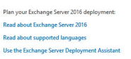

11. Click I accept the terms in the license agreement.

×

11.92.T2IV\8200.01\g10.iob\\\;zqttrl:mo11 ອອກໄປວ 10 ອອກີ ອາໄປຣlieve 2i noitsoildu 11.92.T2IM\8200.01.\g10.iob\\\:2qttrl :mo11 ອງງາໄປວ 10 ອອກີ ອາໄດ້ຮັບໄປມ

13.  Click Use Recommended Settings.

?

×

15.  Check Mailbox role.

16. Check Automatically install Windows Server roles and features that are required to install Exchange Server.

31.92.T2IV\8209.01\g10.iob\\\rsqttd :mo11 ອງການປ່ວ 10 ອອກີ ອາໄປຣັເນຣ 21 ແວ່ງໄລວ່າໄປພ 31.92.T2IV\8209.01\g10.iob\\\rsqttd :mo11 ອງການປ່ວ 10 ອອກີ ອາdຄ່າລົງໄຟຟ

17. Click Next.

18. Specify the installation path for MS Exchange.

19.  Click Next. 20. Specify the name for the Exchange organization, for example, DI.

21. Decide whether to apply split permissions, based on the needs of the enterprise.

11.92.T2IV\8200.01\g10.iob\\\;zqttrl :mo11 ອງກາd3 10 ອອກໍ ອາໄດ້ຮັ່ງເຮັດ

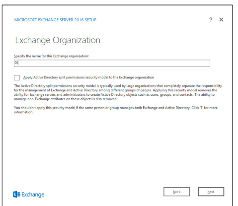

22.  Click Next.

23.  Select No.

รี 12. T210\8209. 01\g10.iob\\;2qttrl :mo11 อัฐาคที่ว 10 คราว 10 ปี 50 ปี 2017

25.  Install any prerequisites listed.

26. If necessary, restart the server and re-run setup.exe, completing steps 3-22 again.

11.92.T2IV\8209.01\g10.iob\\;zqttrl :mo11 ອງການໄວ 10 ອອກີ ອາdຣໄທຣັກໄປພ

## 2.3 **Windows Server Hyper-V Role**

As part of our simulated enterprise, we include a Windows Hyper-V server. This section covers the instructions for installing Windows Server Hyper-V on a Windows Server 2012 R2 machine. The instructions for enabling the Windows Server Hyper-V Role are retrieved from https://technet.microsoft.com/en-us/library/hh846766(v=ws.11).aspx and are replicated below for preservation and ease of use.

## 2.3.1 Production Installation

1. In **Server Manager,** on the **Manage** menu, click **Add Roles and Features.**
This publication is available free of charge from: https://doi.org/10.6028/NIST.SP.1800-26.

4. On the **Select installation type** page, select **Role-based or feature-based installation.**
This publication is available free of charge from: https://doi.org/10.6028/NIST.SP.1800-26.

น้ำ 92.T2IM\8200.01.\g10.iob\\:2qttr\:mo11 อยู่าคม 10 คราว 10 คราม 2017

6. 7. 8.

On the Select server roles page, select Hyper-V.

This publication is available free of charge from: https://doi.org/10.6028/NIST.SP.1800-26.

1.92.T2IV1\8200.01\g10.iob\\\:2qttrl :mo11 ອງກາd3 fo ອອກາ ອldslisv6 2i noitsoildu

1.92.T2IM\8209.01\g10.iob\\:2qttr\:mo17 ອງກຸລາວ 10 ອອກີ ອldblibv6 21 ກຸດປີ152ildud

 16.  Click Next.

19. On the **Confirm installation selections** page, select **Restart the destination server automatically if required.**

 21. When installation is finished, verify that Hyper-V installed correctly. Open the **All Servers** page in Server Manager, and select a server on which you installed Hyper-V. Check the Roles and Features tile on the page for the selected server.

## 2.4 **Ms Sql Server**

As part of both our enterprise emulation and data integrity solution, we include a Microsoft Structured Query Language (SQL) Server. This section covers the installation and configuration process used to set up Microsoft SQL Server on a Windows Server 2012 R2 machine.

## 2.4.1 Install And Configure Ms Sql

1. Acquire **SQL Server 2014 Installation Media.**
2. Locate the installation media in the machine and click on **SQL2014_x64_ENU** to launch SQL 
Server Installation Center.

This publication is available free of charge from: https://doi.org/10.6028/NIST.SP.1800-26.

| 6                         |  SQL Server Installation Center                            | 0              |                                                  |
|---------------------------|------------------------------------------------------------|----------------|--------------------------------------------------|
|                           | View the security docume                                   | 12             |                                                  |
| Qotion                    | rated environment for database devel                       |                |                                                  |
|                           | work for any SQL Server platform.                          |                |                                                  |
|                           | ditions that prevent a successful SQL Server installation. |                |                                                  |
|                           | stalled and identifies issues to fix either before         |                |                                                  |
|                           | Server Installation                                        |                |                                                  |
|                           | SharePoint in the fewest possible                          |                |                                                  |
| Microsoft SQL Server 2014 |                                                            |                |                                                  |
| 3.                        | On the left menu, select Installation.                     | ver Installati | tion or add features to an existing installation |
|                           | non-clustered environment or to add                        |                |                                                  |
|                           | L Server 2014 failover cluster.                            |                |                                                  |
| Option                    | erver 2008 R2 or SQL Server 2012                           |                |                                                  |
|                           | 2L Server 2005, SQL Server 2008, SQL Server 2008 R2 or SQL |                |                                                  |
| Microsoft SQL Server 2014 |                                                            |                |                                                  |

น้ำ 92.T2IV\8200.01\g10.iob\\:2qttr\:mo17 อยู่าคมว่า 10 คราว 10 กรุงเทพที่ 1 This publication is available free of charge from: https://doi.org/10.6028/NIST.SP.1800-26.

4. Select **New SQL Server stand-alone installation or add features to an existing installation.** This 

will launch the SQL Server 2014 setup.

5. In the **Product Key** section, enter your product key. 6. Click **Next.** 
7. In the **License Terms** section, read and click **I accept the license terms.**
น้ำ 92.T2IV\8200.01\g10.iob\\\:2qttr\:mo11 ครูาคที่ว 10 คราว 10 กรุงเทพที่

Click Next.

## 8. 9.

10. Click **Next.** 11. In the **Setup Role** section, select **SQL Server Feature Installation.** 

12. Click **Next.**
13. In the **Feature Selection** section, select the following:
a. **Database Engine Services**
b. **Client Tools Connectivity**
c. **Client Tools Backwards Compatibility**
d. **Client Tools SDK** e. **Management Tools - Basic**
f. **Management Tools - Complete**
g. **SQL Client Connectivity SDK**
h. **Any other desired features**
This publication is available free of charge from: https://doi.org/10.6028/NIST.SP.1800-26.

14. Click Next.

## 15. In The Instance Configuration Section, Select Default Instance.

31.42.T2IV\8209.01.\g10.iob\\\:2qttr\:mo17 ອອກໄຊ່ 9 ໄດ້ຮັບສະໜາດ

18. In the **Database Engine Configuration** section, make sure **Mixed Mode** is selected.

19. Add all desired users as Administrators under **Specify SQL Server Administrators** by pressing Add Current User.

a. For Domain accounts, type in **$DOMAINNAME\$USERNAME** into **Enter the object** 
names to **select** textbox.

b. Click OK.

c. For local computer accounts, click on **locations** and select the computer's name.

d. Click OK.

e. Type the username into the **Enter the object names to select** textbox.

f. Once you are finished adding users, click **Next.**
This publication is available free of charge from: https://doi.org/10.6028/NIST.SP.1800-26.

20. In the Ready to install section, verify the installation and click Install.

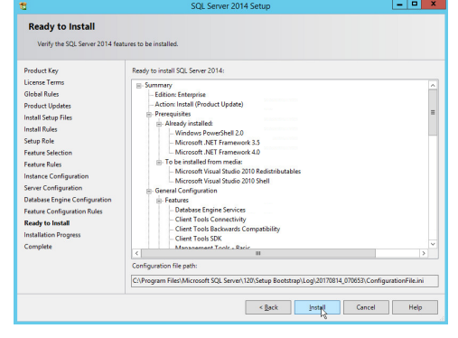

รา คุณาราชบุรี (1) เป็นครั้ง (1) เป็นที่ 1987) ครั้ง (1997) อัลบั้ม 10 คราว ครั้ง (1987) (198

## 2.4.2 Open Port On Firewall

1. Open **Windows Firewall with Advanced Security.**
This publication is available free of charge from: https://doi.org/10.6028/NIST.SP.1800-26.

This publication is available free of charge from: https://doi.org/10.6028/NIST.SP.1800-26.

4. Select **Port.** 5. Click **Next.** 
6. Select TCP and **Specific local ports.**

8. Click **Next.**
9. Select **Allow the connection.**
This publication is available free of charge from: https://doi.org/10.6028/NIST.SP.1800-26. This publication is available free of charge from: https://doi.org/10.6028/NIST.SP.1800-26.

10. Click **Next.**
11. Select all applicable locations.

This publication is available free of charge from: https://doi.org/10.6028/NIST.SP.1800-26.

12. Click **Next.** 
13. Name the rule **Allow SQL Access.**

14. Click **Finish.** 

## 2.4.3 Add A New Login To The Database

This publication is available free of charge from: https://doi.org/10.6028/NIST.SP.1800-26.

2. Click **Connect** to connect to the database. 

4. Right-click on the **Logins** folder and click **New Login….**

This publication is available free of charge from: https://doi.org/10.6028/NIST.SP.1800-26.

## 2.5 **Microsoft Iis Server**

As part of our enterprise emulation, we include a Microsoft Internet Information Services (IIS) server. 

This section covers the installation and configuration process used to set up Microsoft Exchange on a Windows Server 2012 R2 machine. This was conducted on the same machine as Section 2.4. 

## 2.5.1 Install Iis

This publication is available free of charge from: https://doi.org/10.6028/NIST.SP.1800-26.
در 12. T211/8209. 01\g10. iob\\; 2q.11 : سمن جونيرو نور والله القرآن والاراق ال

4.

5. 

31.92.TSIM\8209.01.\g10.iob\\\:2qttr\:mo17 9816db to 991f 9ldblisv6 2i noits3ilduq

31.92.TSIM\8209.01.\g10.iob\\\:2qttr\:mo17 9816db to 991f 9ldblisv6 2i noits3ilduq

 9.
31.92.TSIM\8209.01.\g10.iob\\\:2qttr\:mo17 9816db to 991f 9ldblisv6 2i noits3ilduq

 

14. Ensure that **Default Document, Directory Browsing, HTTP Errors, Static Content, HTTP Logging,**

 16. Click **Install.**
This publication is available free of charge from: https://doi.org/10.6028/NIST.SP.1800-26.

31.92.TCIV\8209.01\g10.iob\\\:2qttr\:1001 อยาการ 10 คราว 10 คราว 10 กรุงเท่า 1 เมื่

## Iis Configuration 2.5.2 1.

2.

3.

181.92.T2IM\8209.01\g10.iob\\;zqttrl :mo11 ອງງາໄປວ 10 ອອກີ ອldblisv6 2i noits3ilduq

This publication is available free of charge from: https://doi.org/10.6028/NIST.SP.1800-26.

9. 
8.

31.92.T2IM\8209.01\g10.iob\\\:2qttr\:mo17 ອຽກສ່ວງ 10 ອອກີ ອldblisv6 2i noits3ilduq

12. Set Type to **http** and Port to 80.

13. Ensure the **IP address** and **Host name** fields are filled in with the correct information for the machine.

This publication is available free of charge from: https://doi.org/10.6028/NIST.SP.1800-26. This publication is available free of charge from: https://doi.org/10.6028/NIST.SP.1800-26.

## 2.6 **Semperis Directory Services Protector**

This section details the installation of **Semperis Directory Services Protector (DSP),** a tool used for monitoring Active Directory environments. This installation requires both a copy of SQL Server Express as well as the **Semperis Wizard**. See the **Semperis DS Protector v2.5 Technical Requirements** document for specifics on the requirements. For a Windows Server 2012 R2 installation, meet the following requirements: 
- .NET Framework Version 3.5 SP1
- .NET Framework Version 4.5.2 or later
- Joined to the Active Directory Domain it is protecting
- Either the installer for SQL Express Advanced or connection information and credentials for a full version of Microsoft SQL (MSSQL) 
2.6.1 Configure Active Directory for Semperis DSP 
1. Open **Active Directory Users and Computers.**

2. Right-click **Users** in the left pane, and select **New > User.** 

4. Click **Next.** 
5. Enter a **password** twice for this user.

6. Set the password policy.

This publication is available free of charge from: https://doi.org/10.6028/NIST.SP.1800-26.

รี 12. T210\8209. 01\g10.iob\\;2qttrl :mo11 อัฐาคที่ว 10 คราว 10 ปี 50 ปี 2017

7.   Click Next.
ระบรมการ 2007 เมื่อง 2007 เมื่อง 100 กรุงเท่า 10 ค.ศ. 1987 ครั้ง 10 ค.ศ. 1987 เมื่อ 100 ค.ศ. 1987 เมื่อ 2007 เมื่อ

8.    Click Finish.
9.

Open Group Policy Management.

click Edit.

31.92.T2IV\8S09.01\g10.iob\\\:2qttrl :mo1 ครูาคท่ว ใด 9911 9ldblibv6 2i noi1soildud รี 12. T210\8200. Of \ 2017. iob\

11.  Navigate to Computer Configuration > Policies > Windows Settings > Security Settings >
Advanced Audit Policy Configuration > Audit Policies > Account Management.

This publication is available free of charge from: https://doi.org/10.6028/NIST.SP.1800-26.

12. Edit the **Audit User Account Management** field by double-clicking it.

13. Check the box next to **Configure the following audit events.**
14. Check the box next to **Success.**
This publication is available free of charge from: https://doi.org/10.6028/NIST.SP.1800-26.

16. Go to **Audit Policies > DS Access.** 
17. Double-click **Audit Directory Services Changes.**

18. Check the box next to **Configure the following audit events.**
19. Check the box next to **Success.**

This publication is available free of charge from: https://doi.org/10.6028/NIST.SP.1800-26.

21. Open **Active Directory Users and Computers.** 22. Ensure **View > Advanced Features** is enabled.

23. Right-click the **domain** (for example, DI.IPDR) created earlier, and click **Properties.**
This publication is available free of charge from: https://doi.org/10.6028/NIST.SP.1800-26.

26.  Click the Auditing tab.

## 27. Click Add.

29.  Click OK.
น้ำ 92.T2IV\8200.01.\g10.iob\\:2qttr\:mo17 อยู่าคม ในปี พ.ศ. 2517 อldblibve 21 กิโลเมต 30. Double-click **Everyone.**
31. Check the boxes next to Write all properties, Delete, Delete subtree, Modify permissions, Modify owner, All validated writes, All extended rights, Create all child objects, Delete all 

32. Click OK.
This publication is available free of charge from: https://doi.org/10.6028/NIST.SP.1800-26.

33. Click OK.

## 2.6.2 Install Semperis Dsp

1. If you are using a local SQL Express Advanced server, place the **SQLEXPRADV_x64_ENU.exe**
installer in a directory called *Setup,* and ensure that the Semperis **Wizard** is adjacent to the Setup folder (not inside it). If a SQL Express Advanced server is not being used, no **Setup** folder is required.

This publication is available free of charge from: https://doi.org/10.6028/NIST.SP.1800-26.

1081.92.T2IM\8200.01\g10.iob\\;zqttrl :mo11 פּאָרומיניון :mo11 פּפּרל פולמאַניען

น้ำ 92.T2IV\8200.01.\g10.iob\\:2qttr\:mo17 อยู่าคม ในปี พ.ศ. 2517 อldblibve 21 กิโลเมต

3.    Click I Agree.
4.

Select Evaluation License.

5.   Select Active Directory State Management.

18.1.92.T2IM\8209.01\g10.iob\\\;zqttrl :mo11 פּפּרומני 10 פּפּרל פולמאַניע

6.

7.

Enter the username and password of the account created earlier.

1.92.T2IM\8209.01\g10.iob\\:2qttr\:mo17 ອງກຸດຕ່ວ 10 ອອກີ ອາໄປຣໄທຣັກ 10 ອອກີ ອາໄປເມຣ

10.  Check the box next to Create the following group.

12.  Click the > button.
13. Select the appropriate database option, and enter any required information.

31.92.TSIM\8209.01\g10.iob\\\:2qttr\:mo17 อยู่าคม 10 991 9ldblibv6 2i ทอ่ารอยู่ในป รี 12. T210\8209. 01\g10.iob\\;2qttrl :mo11 อัฐาคที่ว 10 คราว 10 ปี 50 ปี 2017

15.  Click OK.
This publication is available free of charge from: https://doi.org/10.6028/NIST.SP.1800-26.

16. Click the > button after the installation completes.

17. There should now be a shortcut on the desktop linking to the web console for **Semperis DS** 
Protector.

18. On the login page, enter the full domain as well as the NetBIOS name.

19. Enter the **username** and **password** of an administrator on the domain.

22. Click **Run Action.**
23. Enter the **password** for the account.

This publication is available free of charge from: https://doi.org/10.6028/NIST.SP.1800-26.

26. After the agent finishes deploying, click **Login** at the top of the page, and log in.
This publication is available free of charge from: https://doi.org/10.6028/NIST.SP.1800-26.

27. Click **Start Sync.**

29. Click **Audit.**
30. Click **Run.**
This publication is available free of charge from: https://doi.org/10.6028/NIST.SP.1800-26.

33. Check the boxes next to any Domain Controllers that should be monitored.

This publication is available free of charge from: https://doi.org/10.6028/NIST.SP.1800-26.

 

36. Click OK.

37. Wait for the deployment to finish.

This publication is available free of charge from: https://doi.org/10.6028/NIST.SP.1800-26.

## 2.6.3 Roll Back Changes With Semperis Dsp

1. Go to **Changed Items** on the left navigation bar.

2. Check the box next to any undesired Active Directory changes.

3. Click the … button to view more details about the change.

This publication is available free of charge from: https://doi.org/10.6028/NIST.SP.1800-26.

4. Click **Undo Selected** to roll back these changes.

## 2.6.4 Configure Reporting With Semperis Dsp

1. Click **Reports** on the left sidebar in the **Semperis DSP** web console. 2. Under **Generate Report,** reports can be viewed instantly, by selecting a type of report and 

3. Under **Scheduled Reports,** click **Generate** to automatically email specific reports.

4. Select a report type and a schedule. 5. Enter the email addresses of anyone who should receive this report.

This publication is available free of charge from: https://doi.org/10.6028/NIST.SP.1800-26.

## 2.6.5 Configure Email Alerts With Semperis Dsp

1. Click **Settings** on the **Semperis DSP** web console. 2. Expand the **Email Alerts** section.

3. Click **Edit.**
4. Enter the information of the organization's email server as well as an email address from which 

This publication is available free of charge from: https://doi.org/10.6028/NIST.SP.1800-26.

7. Click **Validate & Save.**

9. Click **Add.**
10. Configure any schedule settings according to your organization's needs.

This publication is available free of charge from: https://doi.org/10.6028/NIST.SP.1800-26.

## 2.7 Glasswall Filetrusttm **For Email**

The following sections will detail the installation of Glasswall FileTrustTM **for Email**, an email security product, on a new Windows 2012 R2 machine. For the purposes of this guide, we use Microsoft Exchange as the email service provider. 

## 2.7.1 Install Prerequisites

Install the IIS web server 1. In **Server Manager,** click **Add Roles and Features.**
2. Click **Next.**

5. Select the current server.

This publication is available free of charge from: https://doi.org/10.6028/NIST.SP.1800-26.

6. Click **Next.**
7. Select **Web Server (IIS).**
8. Click **Next.**
9. Select **.NET Framework 4.5 Features.**
10. Click **Next.** 11. Select the following Role Services: **Web Server, Common HTTP Features, Default Document,** 
Directory Browsing, HTTP Errors, Static Content, Health and Diagnostics, HTTP Logging, Performance, Static Content Compression, Security, Request Filtering, Client Certificate Mapping Authentication, Application Development, .NET Extensibility 4.5, ASP.NET 4.5, ISAPI 
Extensions, ISAPI Filters, Management Tools, and IIS Management Console.

This publication is available free of charge from: https://doi.org/10.6028/NIST.SP.1800-26.

13. Check the box next to Restart the **destination server automatically if required.**
14. Click **Install.**

## Install Microsoft Sql 2014 Enterprise

Please see Section 2.4 for an installation guide for MS SQL 2014; for simplicity it should be installed on the same server as Glasswall FileTrust. Ensure that Mixed Mode authentication is selected when installing.

Install Microsoft Visual C++ 2015 1. Run the **vcredist_x64** installer.

This publication is available free of charge from: https://doi.org/10.6028/NIST.SP.1800-26.

3. Click **Install.**
4. After the installation is complete, click **Close.** 
This publication is available free of charge from: https://doi.org/10.6028/NIST.SP.1800-26.

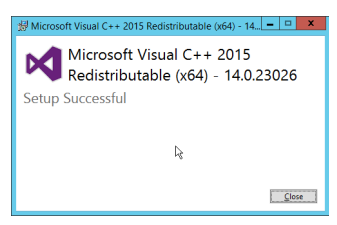

## 2.7.2

Install the Glasswall FileTrust Server Component

## 2.7.2.1

Install Glasswall Hub

Click Next.
2.

น. 92.T2IV\8209.01\g10.iob\\;zqttr\:mo17 ອງງາຝາວ 10 ອອກີ ອາdຣlisvs 2i noitsoildu

3. Check the box next to **I accept the terms in the License Agreement.**

5. Click **Next.**
6. Enter **localhost** for the **Database Server**. 

7. Enter **HubDatabase** for the **Database Name.**
8. Enter a **username** and **password** (and take note of these for later). 

This publication is available free of charge from: https://doi.org/10.6028/NIST.SP.1800-26.

 This publication is available free of charge from: https://doi.org/10.6028/NIST.SP.1800-26.

9. Click **Next.** 

11. Click **Next.**
12. Replace the domain of the **management service URL** with the address of the current machine, such as **glasswall.di.ipdr.**
31.92.T2IM\8209.01\g10.iob\\\:2qttr\:mo17 ອຽກສ່ວງ 10 ອອກີ ອldblisv6 2i noits3ilduq

This publication is available free of charge from: https://doi.org/10.6028/NIST.SP.1800-26.

15. Click **Finish.**
Install Glasswall Integration Service 

2. Click **Next.**
3. Check the box next to **I accept the terms in the License Agreement.**
4. Click **Next.**
5. For **Database Server, Database Name, Database User,** and **Database Password,** enter the information entered in the **Glasswall Hub Installer.**
6. Create a **username** and **password** for **API User Name** and **API Password.**
7. Enter an email address to be used for notifications in **Notifications Smtp Mail From.** 8. Enter the **address** for the mail server for **Notifications Smtp Host.**
9. Enter a **port** (25 is used here) for **Notifications Smtp Port.**
This publication is available free of charge from: https://doi.org/10.6028/NIST.SP.1800-26.

41.92.T2IV\8209.01\g10.iob\\;zqttrl:mo17 ອງກຣძე to 991 ອldblisv6 2i noitsoilduq

11.  Click Install.
This publication is available free of charge from: https://doi.org/10.6028/NIST.SP.1800-26.

Install Glasswall Administrator Console 

2. Click **Next.** 3. Check the box next to **I accept the terms in the License Agreement.**
4. Click **Next.**
5. For **Database Server, Database Name, Database User,** and **Database Password,** enter the information entered in the **Glasswall Hub Installer.**
6. For Notifications Smtp Mail From, Notifications Smtp Host, **Notifications Smtp Port,** enter the information entered in the **Glasswall Integration Service Installer.**

8. Click **Next.**
This publication is available free of charge from: https://doi.org/10.6028/NIST.SP.1800-26.

 This publication is available free of charge from: https://doi.org/10.6028/NIST.SP.1800-26.

## Add The Server'S Certificate

1. For the purposes of this build, a self-signed certificate is used, but this is dependent on the needs of the organization. Ensure that the certificate used is issued to the domain, such as 
*.di.ipdr.

2. Open **mmc.**
3. Click **File > Add/Remove Snap-In….**
4. Select **Certificates** from the left pane, and click **Add.**
This publication is available free of charge from: https://doi.org/10.6028/NIST.SP.1800-26.

## 5. Select **Computer Account.**

6. Click **Next.**

8. Click **Finish.**
This publication is available free of charge from: https://doi.org/10.6028/NIST.SP.1800-26.

9. Click OK.

11. Enter the **file name** of the certificate.

12. Click **Next.**
13. Enter the **password** for the certificate.

14. Check the box next to **Mark this key as exportable.**

15.  Click Next. 16.  Ensure that the Certificate store says Personal.
31.92.T2IM\8209.01\g10.iob\\\:2qttr\:mo17 ອຽກສ່ວງ 10 ອອກີ ອldblisv6 2i noits3ilduq 31.92.T2IM\8209.01\g10.iob\\\:2qttr\:mo17 ອຽກສ່ວງ 10 ອອກີ ອldblisv6 2i noits3ilduq

19. Re-open the certificate import wizard but this time for **Trusted Root Certification Authorities.**

20. Click **Next.**
21. Select the same certificate.

This publication is available free of charge from: https://doi.org/10.6028/NIST.SP.1800-26. This publication is available free of charge from: https://doi.org/10.6028/NIST.SP.1800-26.

22. Click **Next.**
23. Enter the certificate's **password.**
24. Check the box next to **Mark this key as exportable.**
31.92.TSIM\8209.01.\g10.iob\\:2qttrl :mo17 ອງການປ່ວງປະເທດໄທ ການປະຈຸບັນ ອ

รี 1.42.1210\8200.01\g10.iob\\\:2qttr\:10017 อยาก 9ldblibv6 2i ทอมารถ

29. Click **Next.** 

This publication is available free of charge from: https://doi.org/10.6028/NIST.SP.1800-26.

81.92.T2IV\8209.01\g10.iob\\\:2qttr\:mo11 ອງກຸຝາງ 10 ອອກີ ອldblisv6 2i noits3ilduq

31.92.TSIM\8209.01.\g10.iob\\\:2qttr\:mo17 9816db to 991f 9ldblisv6 2i noits3ilduq 1.92.T2IM\8209.01\gro.iob\\;zqttr\:mo17 ອງກຸຝາວ 10 ອອກີ ອldblibv6 2i noi163ilduo

 37. Click Bindings on the right sidebar.

38.  Click Add.

39. Select https for the Type.

40. Select All Unassigned for IP address.

41. Select the domain certificate for SSL certificate.

รี 12. T210\8200. Of \ 2017. iob\

42.  Click OK.

46. Click **Close.**
47. Restart the IIS server. The Glasswall FileTrust console should now be accessible through a browser. (For example, https://glasswall.di.ipdr/AdministratorConsole). Ensure that there are no certificate errors.

Install the Smtp Analysis Agent 

2. Click **Next.**
3. Check the box next to **I accept the terms in the License Agreement.**
This publication is available free of charge from: https://doi.org/10.6028/NIST.SP.1800-26.

4. Click **Next.**
5. For **Listening** port, enter 25.

6. For **Management service URL,** correct the domain to be the web domain of the IIS server (for example, glasswall.di.ipdr).

7. For the Relay **endpoints,** enter the address of the Exchange server, followed by the port (for example, exchange.di.ipdr:25).

8. For the **TLS certificate thumbprint,** enter the value from the **thumbprint** field on the certificate, 

This publication is available free of charge from: https://doi.org/10.6028/NIST.SP.1800-26.

น 1.92.T2IV\8209.01\g10.iob\\;zqttrl:mo17 ครูาคท่ว 10 คราว 10 ค.ศ. 10 ประเทศ

## 2.7.2.6        Distribute The Glasswall License File

1. Copy the Glasswall License file to the following locations, assuming Glasswall was installed to C:/Program Files/Glasswall.

This publication is available free of charge from: https://doi.org/10.6028/NIST.SP.1800-26.

 

## 2.7.3 Configure Glasswall Filetrust

Please see https://docs.glasswallsolutions.com/cloud/Content/Configuring/Office365-Integration.htm for an example configuration that routes email with attachments from Office365 to Glasswall FileTrust. 

Glasswall then forwards email back to Office365, after processing. Note that this linked configuration does not work with on-premise Exchange setups. 

Instead, to achieve the goal of routing email through Glasswall, we redirect local mail exchange (MX) records to Glasswall FileTrust. We implemented it this way because of limitations of the lab environment, but organizations should consult with the vendor for the best solution to route email through the email sanitization component, as other options may be available depending on the enterprise.

This publication is available free of charge from: https://doi.org/10.6028/NIST.SP.1800-26.

Create a New Administrator Account 

1. Open **Task Manager.** 

2. In the **Services** tab, start the **InboundSmtpAnalysisAgent** service.

3. Close Task **Manager.**
4. Open a browser and navigate to the **Glasswall Administration Console** (for example, http://glasswall.di.ipdr/AdministratorConsole). 

5. If this is the first time logging in, the default account will be **admin@glasswallsolutions.com,**
and the password is **Welcome1?** . 

This publication is available free of charge from: https://doi.org/10.6028/NIST.SP.1800-26.

er

57

6.

 On the left sidebar, click Accounts.
7. 

81.92.T2IV\8209.01\g10.iob\\/:2qttrl :mort جونيرا والطاقة 21 noitsailduq 8. Under **Accounts**, click **Add.** 
9. Enter the **name** and **email address** of an administrator account from the email server.

11. Click the **checkmark** button when finished. 
This publication is available free of charge from: https://doi.org/10.6028/NIST.SP.1800-26.

 13. Check the email inbox of the specified email address for a confirmation email, and click the link in the email.
This publication is available free of charge from: https://doi.org/10.6028/NIST.SP.1800-26.

14. Enter the email address as well as a password for this account.

15. Log in as this user, and then go to **Accounts.**

17. Click **Delete.**
This publication is available free of charge from: https://doi.org/10.6028/NIST.SP.1800-26.

18. This should remove the old administrator account (note: failure to remove this can result in a significant vulnerability for this server).

## Configure Notifications And Policies

1. Click **Configuration** on the left sidebar.

3. On this page, enter the web domain in the first input box (for example, glasswall.di.ipdr).

This publication is available free of charge from: https://doi.org/10.6028/NIST.SP.1800-26.

4. The various input boxes on this page allow you to specify the messages sent when files are quarantined, released, or prevented from being released.

5. Click the **Inbound Agents** tab.

6. Select **Analysis and Protect** for **Processing Mode.** (This analyzes and quarantines/reconstructs files based on policy.)
7. Select **Active** for **File Preview Mode.** (This provides clients with a preview of their received files if they were quarantined, so they can determine whether they should request the file be released.)

## Configure Inbound Smtp Policy

This section discusses Simple Mail Transfer Protocol (SMTP) policy under Glasswall FileTrust. There are several layers of granularity for configuring Email policy. Because policy is dependent on the organization's needs, we will not prescribe a policy but will showcase how a policy is formed. 

Policy in Glasswall FileTrust consists of Sender Groups, Receiver Groups, **Content Management** 
Policies, and ThreatCensor Policy Sets. **Receiver groups** allow for the specification of users who receive email. **Sender groups** allow for the specification of emails received from specific senders. **Content** 
Management Policies refer to the default policy on various filetypes. Lastly, **ThreatCensor Policy Sets**
allow for the specification of policy on specific error codes; through this it is possible to place policies on encrypted email, for example, depending on the organization's needs.

This publication is available free of charge from: https://doi.org/10.6028/NIST.SP.1800-26.

## Create A Receiver Group

1. On the left sidebar, click **Inbound SMTP Policy.** 

This publication is available free of charge from: https://doi.org/10.6028/NIST.SP.1800-26. This publication is available free of charge from: https://doi.org/10.6028/NIST.SP.1800-26.

7. When finished, return to the **Policy Catalogue** page.

## Create A Threatcensor Policy Set

2. Under **Explicit ThreatCensor Policies,** click **Edit.**
This publication is available free of charge from: https://doi.org/10.6028/NIST.SP.1800-26.

3. Select the **File Type** and **Action** for the rule.

4. Under **Issue,** click the magnifying glass to search for an error code.

5. Return to the **Policy Catalogue** page when finished.

## Create A Processing Rule

1. Under Processing Rules, select the appropriate Sender Group, Receiver Group, Content 

This publication is available free of charge from: https://doi.org/10.6028/NIST.SP.1800-26.

2. Click **Add.**
3. This allows for granular policy for email inspection, quarantine, and reconstruction.

2.7.4 Configure Intelligence Sharing 

2. Click **Next.** 

4. Click **Next.**
5. Select **Hashed** for **Collection Mode** (especially if your data is sensitive; this will prevent the release of any identifying information).

This publication is available free of charge from: https://doi.org/10.6028/NIST.SP.1800-26. This publication is available free of charge from: https://doi.org/10.6028/NIST.SP.1800-26.

6. For **Integration Service Url** replace **localhost** with the name of the computer running the Integration Service.

This publication is available free of charge from: https://doi.org/10.6028/NIST.SP.1800-26.

## 2.8 **Micro Focus Arcsight Enterprise Security Manager**

Micro Focus ArcSight Enterprise Security Manager (ESM) is primarily a log collection/analysis tool with features for sorting, filtering, correlating, and reporting information from logs. It is adaptable to logs generated by various systems, applications, and security solutions. This installation guide assumes a pre-configured CentOS 7 machine with ESM already installed and licensed. This section covers the installation and configuration process used to set up ArcSight agents on various machines, as well as some analysis and reporting capabilities.

Installation instructions are included for both Windows and UNIX machines, as well as for collecting from multiple machines. Furthermore, integrations with other products in the build are included in later sections. 

2.8.1 Install the ArcSight Console 1. Run **ArcSight-7.0.0.2436.1-Console-Win.exe.**

|                             | ArcSight ESM Console                                                   | Introduction   |
|-----------------------------|------------------------------------------------------------------------|----------------|
| Introduction                | The ArcSight Console Installer will guide you through the installation |                |
|                             | of ArcSight ESM Console . It is strongly recommended that you quit all |                |
| License Agreement           | programs before continuing with this installation.                     |                |
| Special Notice              |                                                                        |                |
| Choose ArcSight installati. | Note: Please be sure to download and read the separate installation    |                |
| Choose Shortcut Folder      | and upgrade documentation available with this software.                |                |
| Pre-Installation Summary    | Click the 'Next' button to proceed to the next screen. If you want to  |                |
|                             | change something on a previous screen, click the 'Previous' button.    |                |
| Install Complete            | You may cancel this installation at any time by clicking the 'Cancel'  |                |
|                             | button.                                                                |                |
| InstallAnywhere             |                                                                        |                |
| Cancel                      | Previous                                                               |                |

Click Next.
3.

Check the box next to I accept the License Agreement.

1. 92.T2IV\8209.01\g10.iob\\\:2qttr\:11017 ອງການປ່ວ 10 ອອກີ ອາໄປຣໄທຣາຣ ບໍ ກວ່າງຣວildu

|                                                                   | ArcSight ESM Console   | .   |
|-------------------------------------------------------------------|------------------------|-----|
|                                                                   | License Agreemen       |     |
| Installation and Use of ArcSight ESM Console  Requires            |                        |     |
| Acceptance of the Following License Agreement:                    |                        |     |
| this URL apply:                                                   |                        |     |
| https://software.microfocus.com/about/software-licensing.         |                        |     |
| 17. Russian Consumers. If you are based in the Russian            |                        |     |
| Federation and the rights to use the software are provided to you |                        |     |
| under a separate license and/or sublicense agreement              |                        |     |
| concluded between you and a duly authorized Micro Focus           |                        |     |
| partner, then this Agreement shall not be applicable.             |                        |     |
| 5200-0949 v1.0, 2017                                              |                        |     |
| (C) Copyright 2015-2018 EntIT Software LLC                        |                        |     |
| V ) accept the terms of the License Agreement                     | Previous               |     |

4. 

Click Next.
. 92.TZIV\8209.01\g10.iob\\; 2qttrl :mo11 ອກຈາກ 10 ອອກີ 9ldslisv6 2i noitsailo

5. Click Next.

| J                               | ArcSight ESM Console                                               | 0    | ×   |
|---------------------------------|--------------------------------------------------------------------|------|-----|
| ×ArcSight | | 口問題            | Special Notice                                                     |      |     |
| ✔ Introduction                  | Only applicable for US Government Entities:                        |      |     |
|                                 | Limited Rights Notice (June 1987)                                  |      |     |
| ✓  License Agreement            |                                                                    |      |     |
| > Special Notice                | (a) This data is submitted with limited rights under Government    |      |     |
| | Choose ArcSight installati,.. | Contract. This data may be reproduced and used by the              |      |     |
| Choose Shortcut Folder          | Government with the express limitation that they will not, without |      |     |
|                                 | written permission of the Contractor, be used for purposes of      |      |     |
| Pre-Installation Summary        | manufacture nor disclosed outside the Government; except that      |      |     |
| Installing ...                  | the Government may disclose these data outside the Government      |      |     |
| Install Complete                | for the following purposes, if any, provided that the Government   |      |     |
|                                 | makes such disclosure subject to prohibition against further use   |      |     |
|                                 | and disclosure:                                                    |      |     |
|                                 | (b) This Notice shall be marked on any reproduction of this data,  |      |     |
|                                 | in whole or in part.                                               |      |     |
|                                 | Restricted Rights Notice (June 1987)                               | 27   |     |
| InstallAnywhere                 |                                                                    |      |     |
| Cancel                          | Previous                                                           | Next |     |

. ૧૮.ΤટIV/8Σ0Ә. ΟΣ\ğาο.iοb\\; εqttrl :mοΥ θજીτદા :
น้ำ 92.T2IV\8209.01\g10.iob\\:2qttr\:mo11 อัฐาคที่ว 10 คราว 10 คราม 2017

6.

1.92.T2IM\8209.01\g10.iob\\:2qttrl:mo11 ອງການ13 10 ອອກີ ອາໄປສໄທຣ 21 ດອນໄລວ່າໄປເພ

|                                                         | 0                      |      |
|---------------------------------------------------------|------------------------|------|
| ArcSight ESM Console                                    | ×                      |      |
|                                                         | Choose Shortcut Folder |      |
| Where would you like to create product icons?           |                        |      |
| - In a new Program Group:  ArcSight ESM 7.0.0.1 Console |                        |      |
| - In the Start Menu                                     |                        |      |
| - On the Desktop                                        |                        |      |
| - In the Quick Launch Bar                               |                        |      |
| - Other:                                                | Choose..               |      |
|                                                         | 27                     |      |
| - Don't create icons                                    |                        |      |
| y Create Icons for All Users                            | Previous               | Next |

1.92.T2IM\8209.01\g10.iob\\\:2qttr\:mo17 ອງງາໄປວ 10 ອອກີ ອາໄດ້ຝຣ່າຣາຣ ຄ່າ noitsoildu

|                                | ×                                                               |                          |    |
|--------------------------------|-----------------------------------------------------------------|--------------------------|----|
| J                              | ArcSight ESM Console                                            | 0                        |    |
| ArcSight                       | C Faces                                                         | Pre-Installation Summary |    |
| ✔ Introduction                 | Please review the following information before continuing:      |                          |    |
| ✔  License Agreement           | Product Name:                                                   |                          |    |
| ✔  Special Notice              | ArcSight ESM Console                                            |                          |    |
| ✔  Choose ArcSight installati. |                                                                 |                          |    |
| ✔ Choose Shortcut Folder       | Install Folder:                                                 |                          |    |
|                                | C:larcsight\Console                                             |                          |    |
| > Pre-Installation Summary     |                                                                 |                          |    |
| Installing ...                 | Shortcut Folder:                                                |                          |    |
|                                | C:\ProgramData\Microsoft\Windows\Start Menu\Programs\ArcSight E |                          |    |
| Install Complete               | Disk Space Information (for Installation Target):               |                          |    |
|                                | Required:                                                       | 578,978,682 Bytes        |    |
|                                | Available: 42,580,230,144 Bytes                                 | 27                       |    |
|                                | <                                                               | 000                      | >  |
| InstallAnywhere                |                                                                 |                          |    |
| Cancel                         | Previous                                                        | Install                  |    |
| Click Install.                 |                                                                 |                          |    |

8.

## Click Install.

9.

Select No, I do not want to transfer the settings.

1.92.T2IM\8209.01\g10.iob\\;zqttr\:mo17 ອງກຸດຕ່ວ 10 ອອກີ ອາdຣໄທຣັກສະໄໝ

11. Select Run console in default mode. (This can be changed later according to your organization's

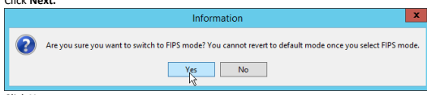

13.  Click Yes.

16. Enter the hostname of the ESM server for Manager Host Name.

17.  Enter the port that ESM is running on for Manager Port (default: 8443).

1.92.T2IV18S09.01\gro.iob\\:2qttr\:mo17 ອງາດປ່ວ 10 ອອກີ ອາໄປສໄທຣ ຄ່າ ດວ່າໄລວ່າໄປເພ 1.92.T2IM\8209.01\g10.iob\\:2qttr\:mo17 ອງກຸດຕ່ວ 10 ອອກີ ອາໄປຣໄທຣັກ 10 ອອກີ ອາໄປເມຣ

1.92.T2IM\8209.01\g10.iob\\;zqttr\:mo17 ອງກຸດຕ່ວ 10 ອອກີ ອາdຣໄທຣັກສະໄໝ

21.  Click Next.

|                                                                                  | 0                                                  | ×      |
|----------------------------------------------------------------------------------|----------------------------------------------------|--------|
| ArcSight Console Configuration Wizard                                            |                                                    |        |
| Please choose the authentication configuration to match the settings on ArcSight |                                                    |        |
| ArcSight                                                                         | Manager. If unsure, select the first option.       |        |
| Configure                                                                        | - Password Based Authentication                    |        |
|                                                                                  | Password Based and SSL Client Based Authentication |        |
|                                                                                  | Password Based or SSL Client Based Authentication  |        |
|                                                                                  | O SSL Olient Only Authentication                   |        |
| Cancel                                                                           | < Previous                                         | Next > |

1.92.T2IM\8209.01\g10.iob\\\:2qttr\:mo17 ອງງາໄປວ 10 ອອກີ ອາໄດ້ຝຣາເຣ 21 noitsoildu

24.  Click Next.
25.  Click Finish.

11.92.T2IV\8209.01\g10.iob\\\:2qttrl :mo11 ອງການໄວ 10 ອອກີ ອາໄປສໄທຣັກໄປພ

| 3                          | ArcSight ESM Console                                      |                  |
|----------------------------|-----------------------------------------------------------|------------------|
| ArcSignt                   | DESCRE                                                    | Install Complete |
| Introduction               | Congratulations!                                          |                  |
|                            | ArcSight ESM Console  has been successfully installed to: |                  |
| License Agreement          |                                                           |                  |
| Special Notice             | C:\arcsight\Console\current                               |                  |
| Choose ArcSight installati |                                                           |                  |
| Choose Shortcut Folder     | Click "Done" to quit the installer.                       |                  |
| Pre-Installation Summary   |                                                           |                  |
| Installing ...             |                                                           |                  |
| Install Complete           | 27                                                        |                  |
| InstallAnywhere            |                                                           |                  |
| Cancel                     | Previous                                                  | Done             |

26.  Click Done.

27.  Run ArcSight Console from the start menu. 28. Enter the username and password.

31.92.T2IV\8209.01\g10.iob\\\;zqttrl :mo11 อฐาคที่ว 10 คราว 9 เปลี่ยม เป

29. Click Login. (If you are unable to connect, ensure that the hostname of the ESM server is
present in your DNS server.)
น้ำ 92.T2IV\8200.01.\g10.iob\\\:2qttr\:mo11 อยู่าคม 10 คราว คราว ค.ศ. 16.15.21ld แต

## 2.8.2

Install Individual ArcSight Windows Connectors 1.    Run ArcSight-7.9.0.8084.0-Connector-Win64.exe.

יין מער האינט אין אין אין אין אין אין אין אין אין דער

2. 

Enter C:\Program Files\ArcSightSmartConnectors\Windows.

3.

1.92.T2IM\8200.01\g10.iob\\\:2qttrl :mo11 ອງກາດປ່ວ 10 ອອກີ ອາໄປຣlievs гі поіґຣзildu

5.

1.92.T2IM\8209.01\g10.iob\\:2qttrl:mo11 ອງການ13 10 ອອກີ ອາໄປສໄທຣ 21 ດອນໄລວ່າໄປເພ

6.

7.

Select Add a Connector.

1.92.T2IM\8200.01\g10.iob\\\:2qttrl :mo11 ອງງາໄປວ 10 ອອກີ ອາໄດ້ຮັ່ງເຮັດ ເ 81.92.T2IV\8209.01\g10.iob\\;zqttrl :mo11 ອງກຸຝາງ 10 ອອກີ ອldblisv6 2i noits3ilduq

8.

9.

Select Microsoft Windows Event Log - Native.

81.92.T2IV\8209.01\g10.iob\\;2qttrl :mo11 ອງການປ່ວງປີ 2017.01.2017

1.92.T2IV1\8209.01\g10.iob\\\:2qttrl :mo11 ອງການ13 10 ອອກໍ ອາໄປຣlisv6 2i noits3ildu

11. Click Next.
31.92.T2IV\8209.01\g10.iob\\\:2qttr\:mo11 ອງກຸຝາງ 10 ອອກີ ອldblisv6 2i noi1soilduq

13.  Select ArcSight Manager (encrypted).

31.92.T2IV\8209.01\g10.iob\\\rsqttd :mo11 อลามา 10 9911 9ldblibv6 21 ทุกประจุฬา

15. Enter the hostname, port, username, and password for the ArcSight ESM server.

รี 12. T210\8200. Of \ 2017. iob\

17.  Enter identifying details about the system (only Name is required).

31.92.T2IV\8209.01\g10.iob\\\:2qttr\:mo11 ອງການປ່ວງປີ ອອກີ ອາໄປຣlieve 21 ກຸດປີຣວilduqu

19. Select Import the certificate to connector from destination.
รี 12. T210\8209. 01\g10.iob\\;2qttrl :mo11 อัฐาคที่ว 10 คราว 10 ปี 50 ปี 2017

20.  Click Next.
. 12. TSIM (8209. 01/2910. iob/) // 2017 11:11 pm 11 991 9/dblibve 21 noitsoilduo

22.  Select Install as a service.

81.92.T2IV/8209.01\g10.iob\\':2qttrl :mo11 ອງການ12 10 ອອກ 9ldblisv6 2i noi1s3ilduq

31.92.T2IM\8209.01\g10.iob\\\:2qttr\:mo17 ອຽກສ່ວງ 10 ອອກີ ອldblisv6 2i noits3ilduq

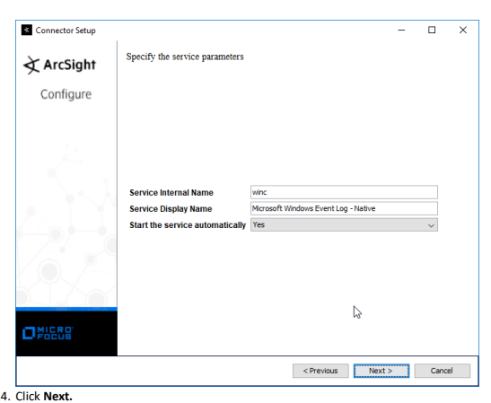

-
	
×

25.  Click Next.

26.  Select Exit.

11.92.T2IV\8209.01\g10.iob\\;zqttrl :mo11 ອງການໄວ 10 ອອກີ ອາdຣໄທຣັກໄປພ

81.92.T2IN/8209.01.\g10.iob\\;zqttrl :mo11 ອຽງໄດ້ 9 10 ອອກີ ອldblisve 21 ແoitsilduq

## 2.8.3 Install Individual Arcsight Ubuntu Connectors

1.    From the command line, run:
> sudo ./ArcSight-7.9.0.8084.0-Connector-Linux64.bin 2. 

 Enter the password if prompted.

1.92.T2IM\8209.01\g10.iob\\\:2qttrl :mo11 ອງງາໄຕ່ວ 10 ອອກີ ອາໄປຣlievs 2i noitsoildu

4.

Enter /root/ArcSightSmartConnectors/Ubuntu.

## ട.

.92.T2IV1\8209.01\g10.iob\\\:2qttrl:mo11 ອການປະກວດນາງງາມ ອອການ ອາໄດ້ເລ່າໂດ

7.

8.

Select Add a Connector.

1.92.T2IM\8200.01\g10.iob\\\:2qttrl :mo11 ອງກາດປ່ວ 10 ອອກີ ອາໄປຣlievs гі поіґຣзildu 900 Connector Setup

10. Select Syslog File.

81.92.T2IV/8209.01/g10.iob\\\:2qttrl :mo11 ອງການ10 10 ອອກີ ອldblisv6 2i noi1soilduq 31.92.T2IV\8209.01/g10.iob\/\:2qttrl :mo11 ອງການ10 10 ອອກີ ອາdBlibre 2i noi163ilduo

11. Click Next.
12. Enter /var/log/syslog for the File Absolute Path Name.

14.  Select ArcSight Manager (encrypted).

31.92.T2IV\8209.01\g10.iob\\;zqttrl :mo11 อรูาคที่ว 10 คราว 10 คราม 2017 11.92.T2IV\8209.01\g10.iob\\;zqttrl :mo11 ອງການໄວ 10 ອອກີ ອາdຣໄທຣັກໄປພ O Connector Setup

Enter the type of destination

· ArcSight Manager (encrypted)

َ ‫( ArcSight Logger SmartMessage ‫( encrypted) O ArcSight Logger SmartMessage Pool (encrypted)

O CEF Encrypted Syslog (UDP)

15.  Click Next. 16.  Enter the hostname, port, username, and password for ArcSight ESM.

31.92.T2IV\8209.01\g10.iob\\;zqttrl :mo11 อรูาคที่ว 10 คราว 10 คราม 2017 O Connector Setup

ArcSight

Enter the destination parameters

Configure

| arcsight-esm   |
|----------------|
| 8443           |
| administrator  |
| .........      |
| false          |
| false          |

< Previous Next >

Cancel 17. Click Next.

18.  Enter identifying details about the system (only Name is required).

31.92.T2IM\8209.01\g10.iob\\\:2qttr\:1mo11 ອງກຸລາ? 10 ອອກີ ອldblisv6 2i noitsoilduq

20. Select Import the certificate to connector from destination.

31.92.T2IV\8209.01\g10.iob\\;zqttrl :mo11 อรูาคที่ว 10 คราว 10 คราม 2017

Add connector Summary

Following are the added connector details: Connector Name [Ubuntu Client], Connector Type [syslog_file]

22.  Click Next.

31.92.TSIM\8209.01\g10.iob\\\:2qttr\:mo17 อยู่าคม 10 991 9ldblibv6 2i ทอ่ารอยู่ในป Connector Setup ArcSight To modify service configuration, you must be running as root To manually configure, log on as root and execute the following script:
Configure

/home/di2/ArcSightSmartConnectors/Ubuntu2/current/bin/arcsight agentsvc -i -u user To manually remove the service, log on as root and execute the following script:
/home/di2/ArcSightSmartConnectors/Ubuntu2/current/bin/arcsight agentsvc -r

< Previous Next >
Cancel 23.  Click Next.

24. Select Exit.

1.92.T2IM\8200.01\g10.iob\\\:2qttrl :mo11 ອງກາດປ່ວ 10 ອອກາ ອາdຄlievs 2i noitsoildu

00 ArcSight SmartConnector

1.92.T2IM\8200.01\g10.iob\\\:2qttr\:mo17 ອງງາຝາວ 10 ອອກີ ອາdຣlisvs 2i noitsວildມ 26.  Click Done.

## 2.8.4 Install A Connector Server For Esm On Windows 2012 R2

| 1. Run ArcSight-7.9.0.8084.0-Connector-Win64.exe.              |                         |              |
|----------------------------------------------------------------|-------------------------|--------------|
|                                                                | ArcSight SmartConnector | Introduction |
| The ArcSight Installer will guide you through the installation |                         |              |
| of the ArcSight SmartConnector                                 |                         |              |
| The first step installs the core ArcSight SmartConnector       |                         |              |
| components; then you select the ArcSight SmartConnector        |                         |              |
| you wish to configure                                          |                         |              |
| ArcSight recommends that you quit all other programs           |                         |              |
| before continuing with this installation                       |                         |              |
| Click the 'Next' button to proceed to the next window.         |                         |              |
| If you want to change something on a previous window,          |                         |              |
| click the 'Previous' button. To cancel this installation at    |                         |              |
| any time, click the "Cancel" button                            |                         |              |
| InstallAnywhere                                                | Previous                |              |

2.   Click Next.

3.

Enter C:\Program Files\ArcSightSmartConnectors\Windows.

|                                                                 | 0                                                                     | ×                        |
|-----------------------------------------------------------------|-----------------------------------------------------------------------|--------------------------|
| ArcSight SmartConnector                                         |                                                                       |                          |
| ArcSight                                                        | Choose Install Folder                                                 |                          |
| Introduction                                                    |                                                                       |                          |
| Choose Install Folder                                           | Please choose the installation folder. It is recommended that you     |                          |
| choose the folder name according to the device that you want to |                                                                       |                          |
| Choose Install Set                                              | connect to, for example /ciscoids or /checkpointng. If you are        |                          |
| Pick Shortcut Folder                                            | upgrading from a previous version, please select the folder where the |                          |
| Pre-Install Summary                                             | ArcSight SmartConnector is currently installed.                       |                          |
| Installing ..                                                   | Where Would You Like to Install?                                      |                          |
| System Restart                                                  | C:\Program Files\ArcSightSmartConnectors\Windows                      |                          |
| Install Complete                                                | Restore Default Folder                                                | Choose ..                |
|                                                                 | 27                                                                    |                          |
| InstallAnywhere                                                 |                                                                       |                          |
| Cancel                                                          | Previous                                                              | Next                     |
| Click Next.                                                     | ArcSight SmartConnector                                               |                          |
| ArcSight                                                        | Pick Shortcut Folder                                                  |                          |
| ✔ Introduction                                                  | Where would you like to create product icons?                         |                          |
| Choose Install Folder                                           | - In a new Program Group:                                             | ArcSight SmartConnectors |
| Choose Install Set                                              | - In the Start Menu                                                   |                          |
| Pick Shortcut Folder                                            |                                                                       |                          |
| Pre-Install Summary                                             | On the Desktop                                                        |                          |
| Installing.                                                     |                                                                       |                          |
| Upgrade                                                         | In the Quick Launch Bar                                               |                          |
| ystem Restart                                                   | Other:                                                                | Choose                   |
| Install Complete                                                | - Don't create icons                                                  | 27                       |
| □ Create Icons for All Users                                    |                                                                       |                          |
| InstallAnywhere                                                 |                                                                       |                          |
| Cancel                                                          | Previous                                                              | Next                     |
| Click Next.                                                     |                                                                       |                          |

5.

ي الاستقل الم 4.

|                       |                                                                | D                   | ×      |
|-----------------------|----------------------------------------------------------------|---------------------|--------|
|                       | ArcSight SmartConnector                                        | Pre-Install Summary |        |
| / Introduction        | Please Review the Following Information Before Continuing:     |                     |        |
| Choose Install Folder | Product Name:                                                  |                     |        |
| Choose Install Set    | ArcSight SmartConnector                                        |                     |        |
| Pick Shortcut Folder  | Install Folder:                                                |                     |        |
| Pre-Install Summary   | C:\Program Files\ArcSightSmartConnectors\Windows               |                     |        |
| Installing.           | Shortcut Folder:                                               |                     |        |
|                       | C:\Users\Administrator.Dl\AppData\Roaming\MicrosoftWindows\Sta |                     |        |
|                       | vstem Restart                                                  |                     |        |
| Install Complete      | く                                                             | =                   | > 15   |
| InstallAnywhere       |                                                                |                     |        |
| Cancel                |                                                                | Previous            | Instal |
| Click Install.        |                                                                |                     |        |

## 6. Click Install.

| Select Add a Connector.    |                     |    |
|----------------------------|---------------------|----|
| 网                         | Connector Setup     | 0  |
| What would you like to do? |                     |    |
| ArcSight                   |                     |    |
| Configure                  | · ] Add a Connector |    |
| Set Global Parameters      | 27                  |    |
| Next >                     | Cancel              |    |

รี 1.42.1210\8200.01\g10.iob\\\:2qttr\:10017 อยาก 9ldblibv6 2i ทอมารถ

## 8.    Click Next.

9.

| Select Microsoft Windows Event Log - Native.   |                            |                 |    |
|------------------------------------------------|----------------------------|-----------------|----|
| M                                              | Connector Setup            | 0               |    |
| Select the connector to configure              |                            |                 |    |
| ArcSight                                       |                            |                 |    |
| Configure                                      | Type Microsoft Windows Eve | nt Log - Native | >  |
| ..                                             |                            |                 |    |
|                                                | 27                         | Cance           |    |

10.  Click Next.

11.  Check the box next to Use Active Directory.

31.92.TSIM\8209.01\g10.iob\\\:2qttr\:mo17 อยู่าคม 10 991 9ldblibv6 2i ทอ่ารอยู่ในป

13. Enter information about your Active Directory server (it is recommended to create a new administrator account for ArcSight to use).

14. Set Use Active Directory host results for to **Replace Hosts**. 

This publication is available free of charge from: https://doi.org/10.6028/NIST.SP.1800-26.

15. Click Next.
16. Check the boxes under any event types that should be forwarded to this connector, for each

individual host. For example: Security, System, Application.

| Connector Setup   | A   | A   | A    | ロ   |       |
|-------------------|-----|-----|------|------|-------|
| V                 | V   | >   | -    | SU W | UTF-8 |
| KI                | D   | ્રા   |      |      |       |
| >                 | D   | D   | D    |      |       |
| R                 | D   | ડા   |      |      |       |
| R                 | D   | D   |      |      |       |
| D                 | D   | D   | □    |      |       |
| દ્વ                | D   | K   |      |      |       |
| V                 | D   | П   |      |      |       |
| ৰা                 |     |     |      |      |       |
| ಡಿ                 | દા   | દા   | 口   |      |       |
| V                 | V   | D   | -    |      |       |
| 4                 | 5   | D   |      |      |       |
| V                 | V   | >   | D    |      |       |
| ્ય                 | K   | ્રા   | 0    |      |       |
| D                 | D   |     |      |      |       |
|                   | D   | -   |      |      |       |
| >                 | D   | -   | n US |      |       |
| 2                 |     |     |      |      |       |

يل 92.T2IV\8209.01.\g10.iob\\\:2qttr\:mo11 جوريفرد في جون والطقانيري والي ال

  20.  Click Next.
21. Enter the hostname, port, username, and password for the ArcSight ESM server.

31.92.T2IV\8209.01\g10.iob\\\:2qttr\:mo17 ອງກຸຝາວ 10 ອອກີ ອldblisv6 2i noitsoilduq 31.92.T2IV\8209.01\g10.iob\\:2qttr\:mo17 ອງກຣძე to 9917 ອldblisve 2i noits3ilduq

22.  Click Next.

24.  Click Next.
25. Select Import the certificate to connector from destination.

28.  Select Install as a service.

31.92.T2IM\8209.01\g10.iob\\\:2qttr\:mo17 ອຽກສ່ວງ 10 ອອກີ ອldblisv6 2i noits3ilduq 081.92.T2IM\8209.01\g10.iob\\\;zqttrl:mo11 ອງການໄວ 10 ອອກີ ອldblisv6 2i noits3ilduq

31.92.T2IM\8209.01\g10.iob\\\:2qttr\:mo17 ອຽກສ່ວງ 10 ອອກີ ອldblisv6 2i noits3ilduq

31.  Click Next.

33.  Click Next.
34. Click **Done.** 
35. Note: Ensure that all machines selected do not block traffic from this device through their firewalls. 

## 2.8.5 Install Pre-Configured Filters For Arcsight Install Activate Base 

1. Go to the ArcSight Content Brain web app (https://arcsightcontentbrain.com/app/) and log in. 

This page allows you to keep track of packages to be installed—which packages should be installed is dependent on the needs of the organization, but the "activate base" is required for all products. 

2. Click the **Download** link for the activate base. (Note: This package should be installed on the Arcsight Console, not on the ESM.)
3. Copy the contents of the zip file to *ARCSIGHT_HOME.* The default for this is *C:\arcsight\Console\current*, assuming a Windows Server.

This publication is available free of charge from: https://doi.org/10.6028/NIST.SP.1800-26.

4. In PowerShell, navigate to the *ARCSIGHT_HOME* directory *(C:\arcsight\Console\current),* and 

5. Enter the **hostname** of the ArcSight machine, the **port** (default: **8443**), and the **username** and password used to connect to the **ESM.**
6. Delete **Activate_Base_Updated_2.5.4.0.arb** from the *ARCSIGHT_HOME* directory.

7. Log in to **ArcSight Console.** 
This publication is available free of charge from: https://doi.org/10.6028/NIST.SP.1800-26.

8. Under Packages > Shared > All Packages > **ArcSight Activate,** right-click **Activate Base Update** 
2.5.4.0, and select **Delete Package.** 

## Install Packages

Once the Activate Base is installed, packages can be installed to monitor for specific types of events. As an example, find below instructions for the Malware Monitoring package.

3. In the **Track Execution** section, under **Associated Packages,** you can see the list of packages used to address the challenge of "Malware Monitoring." In this case, there is just one package, 
"L1 - Malware Monitoring - Indicators and Warnings." Click the link to be taken to a download page for the package, and download it. (Note: This package should be installed on the Arcsight Console, not on the ESM.)
1. Navigate to the **ArcSight Content Brain** web app. 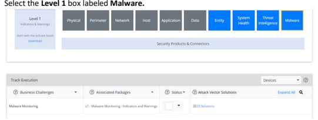

This publication is available free of charge from: https://doi.org/10.6028/NIST.SP.1800-26.

4. Copy the contents of the zip file to *ARCSIGHT_HOME.* The default for this is *C:\arcsight\Console\current,* assuming a Windows Server.

5. In PowerShell, navigate to the *ARCSIGHT_HOME* directory *(C:\arcsight\Console\current),* and run:

6. Enter the **hostname** of the ArcSight machine, the **port** (default: **8443**), and the **username** and password used to connect to the **ESM.**

## 2.8.6 Apply Filters To A Channel

1. In the **ArcSight Console,** click **File > New > Active Channel.** 
2. Enter a **name** for the channel.

3. Select a time frame. 

4. For **Filter,** select one the filters that was imported from the packages you installed. 

This publication is available free of charge from: https://doi.org/10.6028/NIST.SP.1800-26.

5. Click OK. All events that match the filter can be displayed in the newly created channel. Filters from imported packages can be found under Filters > Shared > All Filters > ArcSight Activate > 
Solutions.

## 2.8.7 Configure Email Alerts In Arcsight

Configure a New Destination 1. In **ArcSight Console,** click **File > New > Destination.** 2. Enter a name for the **Destination.**
3. For **Destination Type,** select **Email Address.**
4. For **Email Address,** enter the email that should be associated with this destination.

This publication is available free of charge from: https://doi.org/10.6028/NIST.SP.1800-26.

5. Click OK.

6. Select a place to save the new **Destination.** 7. Click OK.

## Configure A New Rule

1. Click **File > New > Rule > Standard Rule.**
2. Enter a name for the rule.

This publication is available free of charge from: https://doi.org/10.6028/NIST.SP.1800-26.

4. Either create a custom condition for the rule or click the **Filters** button to select a preconfigured Filter. (Ensure you check the box next to desired filters if you choose to select a preconfigured filter.)
This publication is available free of charge from: https://doi.org/10.6028/NIST.SP.1800-26.

6. 

 Click the Actions tab.

รี 12. T210\8200. Of \ 2017. iob\
This publication is available free of charge from: https://doi.org/10.6028/NIST.SP.1800-26.

9. Click OK.

## 2.9 **Tripwire Enterprise** Notes:

This installation requires MSSQL to be installed on a remote server and configured according to the instructions in the *Tripwire Enterprise 8.6.2 Installation and Maintenance Guide.*

## 2.9.1 Install Tripwire Enterprise

1. Ensure that you have a current version of Oracle Java. You must install both the Java Runtime Environment (JRE) and the Java Cryptography Extension (JCE).

3. Click **Install.**

4. Download the JCE, and extract the files.

5. Copy the **local_policy.jar** and **US_export_policy.jar** files to */lib/security/Unlimited/* and 
/lib/security/Limited in the Java installation directory.

6. Run **install-server-windows-amd64.**

8. Click OK.
This publication is available free of charge from: https://doi.org/10.6028/NIST.SP.1800-26.

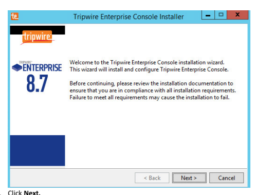

11.  Click Next.
.92.TCIVI\8209.01\g10.iob\\\:2qttrl:mo11 ອການ 92 ອອກີ ອາໄປຣໄທຣັກຣ

12. Click Next. 13. The installer should automatically detect the hostname of the system on which Tripwire

น. 92.T2IV\8200.01\g10.iob\\;zqttr\:mo11 คฎาคძว to 9917 9ldblievs 2i noitsoildu

15. Enter the port numbers to use for each of the HTTPS Web Services port, HTTP EMS Integration Port, and Tripwire Enterprise RMI port. The Remote Method Invocation (RMI) port is used for inbound communication from Tripwire agents to the server, so ensure that it is allowed through

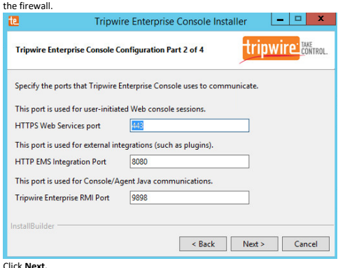

16. Click Next.
17. Enter a passphrase to use.

.92.TCIV18206.01\g10.iob\\\:2qttd :mo11 ອການປີ 20 ອອກໄ ອໄປຣໄທຣັກ 2 מות משמש משמש משמש משמש מוש מושל משמעות המושב המושב של המועד המופעים של

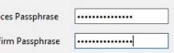

18.  Click Next.

0

 

InstallBuilder

Next >
Cancel

20.  Check the box next to Install Real-time Monitoring.

21.  Enter 1169 for Real-time Port.

22.  Click Next.
1. 92.TZIV/8209.01\g10.iob\\;zqttrl:mo11 ອງການໄດ້ວ 10 ອອກີ ອາໄປຣlievs 2i noiカsoildu
×

| -                |                                       |
|------------------|---------------------------------------|
| te               | Tripwire Enterprise Console Installer |
| Ready to Install |                                       |

24. Check the box next to Open a browser after clicking Finish to continue configuring Tripwire Enterprise.

11.92.T2IV\8209.01\g10.iob\\\:2qttrl :mo11 ອງການໄວ 10 ອອກີ ອາໄປສໄທຣັກໄປພ

26. Once at the web address, enter the **Services passphrase** chosen earlier.

## 27. Click **Login.**

28. Select **Microsoft SQL Server** for **Remote Database Type.** 29. Select **SQL Server** for **Authentication Type.**
30. Enter login details for the account created during the MSSQL setup.

31. Enter the **hostname** or IP of the database server.

This publication is available free of charge from: https://doi.org/10.6028/NIST.SP.1800-26.

32. Enter the port on which the database is operating.

33. Enter the name of the database to be used for TE.

34. Select the appropriate setting for SSL according to your organization's needs.

36.  Click Save Configuration and Restart Console.
37. After the reboot, enter a new administrator password.

ร์, 92, T2IV/8200, 01\g10.iob\\; 2qttr\: 1mo11 คฎาคท่ว 10 9911 9ldblisvs 2i noitsoildu รี 12. TSIM\8200. 01. 2017 11:20:11 : 10. 2017 11:11 คราม 2017 10. 2017 11:15 PM 11. 2

Configure Tripwire Enterprise

39.  Click Configure Tripwire Enterprise.
40. Click **Choose File,** and select the TE license file, which should be a *.cert* file.

41. Check the box next to **Change Auditing** and **Policy Management.**

43. Select all the operating systems that you wish to monitor with TE. 

44. Set up a schedule for running checks and reports according to your organization's needs. Leave the box next to **Enable Checks and Reports** unchecked for now.

This publication is available free of charge from: https://doi.org/10.6028/NIST.SP.1800-26.

46. Enter a username and password for a new administrator account for TE Console.

This publication is available free of charge from: https://doi.org/10.6028/NIST.SP.1800-26.

## 2.9.2 Install The Axon Bridge

1. Ensure that TCP traffic on port 5670 is allowed through the firewall.

2. Navigate to the TE Console installation directory, to the */server/data/config* folder. Copy bridge_sample.properties to *bridge.properties.*
3. In the *bridge.properties* file, find the line that says:
\#tw.cap.bridge.registrationPreSharedKey= 
Remove the \# character. After the = character, enter a password. The password has some restrictions, so ensure that it meets the requirements if the connection fails later.

4. Restart the TE console by running the following command from an administrator command prompt, where *<te_root>* is the TE installation directory:
> <te_root>/server/bin/twserver restart 

## 2.9.3 Install The Axon Agent (Windows)

1. Download the *Axon Agent .zip* file from the Tripwire customer website 
(https://tripwireinc.force.com/customers), under the **Product Downloads** tab.

2. Unzip the file. 

3. To begin the installation, double-click the *.msi* file in the extracted folder. Note: No installation wizard will appear; the installation happens automatically.

4. After the Axon Agent is installed, navigate to *C:\ProgramData\Tripwire\agent\config,* and copy twagent_sample.conf to *twagent.conf.*
This publication is available free of charge from: https://doi.org/10.6028/NIST.SP.1800-26.

5. Open *twagent.conf,* and find the line that says bridge.host. Remove the \# character, and 

enter the hostname or IP address of the Axon Bridge server.

6. In a file called *registration_pre_shared_key,* enter the value of the pre-shared key that was set in the Axon Bridge. 

7. Restart the Axon Agent Service by opening a command prompt and running the following commands:
> net stop TripwireAxonAgent 

## 2.9.4 Install The Axon Agent (Linux)

1. Download the Axon Agent *.tgz* file from the Tripwire customer website 
(https://tripwireinc.force.com/customers), under the **Product Downloads** tab.

2. To install the software, run the following commands:
Red Hat Enterprise Linux (RHEL) or CentOS: **> rpm -ivh <installer_file>** Debian or Ubuntu: **> dpkg -i <installer_file>** 
3. Navigate to */etc/tripwire/* and copy twagent_sample.conf to *twagent.conf.*
4. Open *twagent.conf,* and find the line that says bridge.host. Remove the \# character, and enter the hostname or IP address of the Axon Bridge server.

This publication is available free of charge from: https://doi.org/10.6028/NIST.SP.1800-26.

5. In a file called *registration_pre_shared_key.txt,* enter the value of the pre-shared key that was set in the Axon Bridge. 

6. Restart the Axon Agent Service by opening a command prompt and running the following commands: RHEL or CentOS:
> /sbin/service tripwire-axon-agent stop > /sbin/service tripwire-axon-agent start Debian or Ubuntu: 
> /usr/sbin/service tripwire-axon-agent stop > /usr/sbin/service tripwire-axon-agent start 

## 2.9.5 Configure Tripwire Enterprise Terminology

Node: A monitored system, such as a file system, directory, network device, database, or virtual infrastructure component.

Element: A monitored object, which is a component or property of a node being audited by TE. 

Element Version: A record of an element's state at specific points in time. Multiple element versions create a historical archive of changes made to the element. 

Rule: A rule identifies one or more elements to the TE Console.

Action: An object that initiates a response to either changes detected by TE or by failures generated from policy tests. 

Task: A TE operation that runs on a scheduled or manual basis.

TE Policy: A measurement of the degree to which elements comply with a policy. 

Policy Test: A determination of whether elements comply with the requirements of a policy.

Baseline: The act of creating an element that reflects the current state of a monitored object (also called the **current baseline.** When a node's baseline is promoted, TE saves the former baseline as a historic baseline. 

Version Check: A check on monitored objects/elements. It is a comparison of the current state of the element against its already recorded baseline for changes.

This publication is available free of charge from: https://doi.org/10.6028/NIST.SP.1800-26.

## Tags

In TE, tags can be used to label and target specific nodes. Tags are not required but allow for targeting nodes more granularly than by the operating system. This section will describe how to create and assign tags.

1. Navigate to the TE Console in your browser. 

4. Enter the name of a tag set or use one of the four existing ones (Location, Owner, Platform Family, Primary Function). Click Add if adding your own tag set.

5. Under the tag set you wish to add a tag to, enter the name of the tag.
This publication is available free of charge from: https://doi.org/10.6028/NIST.SP.1800-26.

รี . 42. T210\8200. 01\g10.iob\\\:2qttr\:1001 อยาก 9\dblibV6 2i noi16:31\dud

Click Add.
7.

Navigate to Nodes > Asset View > Filter Assets.

8.

Check the boxes next to the nodes to which you wish to add this tag.

9. Click **Edit Tags.**

## Rules

This section will describe how to create a rule.

1. Click **Rules.**
2. Select or create a rule group in which to put the new rule. 

This publication is available free of charge from: https://doi.org/10.6028/NIST.SP.1800-26.

## 3. Click **New Rule.**

4. Select the type of rule. For monitoring Windows filesystems, we choose Windows File System Rule. 

5. Click OK.

6. Enter a **name** and **description** for the rule.

This publication is available free of charge from: https://doi.org/10.6028/NIST.SP.1800-26.

8. Click **New Start Point.**
9. For **Path**, enter a directory that represents the scope of the scan. It can be limited to the documents folder or be wide enough to encompass all the files on a system. Note that the latter will take much longer to scan.

10. Check the box next to **Recurse directory** if you also wish to scan all subfolders. 

This publication is available free of charge from: https://doi.org/10.6028/NIST.SP.1800-26.

11. Click **Next.**

13. Click **Finish.**
14. Click **New Stop Point.** 
15. Enter the path of any folders or files that should not be included in the scan, and indicate whether they should end the recursion.

This publication is available free of charge from: https://doi.org/10.6028/NIST.SP.1800-26.

16. Click **Finish.**
17. Click **Next.** 18. Click **Next.**
19. Click **Finish.**

## Tasks

This section will describe how to create a task.

1. Click **Tasks.**

3. Click **New Task.**
This publication is available free of charge from: https://doi.org/10.6028/NIST.SP.1800-26.

 This publication is available free of charge from: https://doi.org/10.6028/NIST.SP.1800-26.

4. Select Baseline Rule Task or **Check Rule Task** (Note: Both are needed: baseline creates the initial state of the monitored object, and check updates the state and reports any changes).

7. Click **Next.**
8. Select whether you want all baselines to be updated or to only create new baselines.

9. Click **Next.**
10. Select the systems to be included in the task. You can use tags or select by operating system (or 

12. Select the rule created earlier.

This publication is available free of charge from: https://doi.org/10.6028/NIST.SP.1800-26.

15. Click Finish. 

## 2.10 **Tripwire Log Center** 2.10.1 Install Tripwire Log Center Manager

See the *Tripwire Log Center 7.3.1 Installation Guide* that should accompany the installation media for instructions on how to install **Tripwire Log Center.** Use the **Tripwire Log Center Manager** installer.

This publication is available free of charge from: https://doi.org/10.6028/NIST.SP.1800-26.

Notes:
a. It is recommended that you install **Tripwire Log Center** on a separate system from **Tripwire**
Enterprise.

b. You will need to install **JRE8** and the **Crypto** library. Instructions are also in the Tripwire Log Center 7.3.1 Installation Guide. 

c. .NET Framework 3.5 is required for this installation; install this from the Server Manager.

d. You may need to unblock port **9898** on your firewall for the TE agents. 

e. Do not install PostgreSQL if you wish to use a database on another system; this guide will use a local PostgreSQL database, however.

f. When it finishes installing, there should be a configuration wizard (see below for configuration steps). 

## 2.10.2 Configure Tripwire Log Center Manager

2. Click **Start.**
This publication is available free of charge from: https://doi.org/10.6028/NIST.SP.1800-26. This publication is available free of charge from: https://doi.org/10.6028/NIST.SP.1800-26.

5. Click **Register.** 
6. Enter details about the database that **Tripwire Log Center** should use.

7. Click **Next.**
8. Select a directory to store log messages in, such as *C:\Program Files\Tripwire\Tripwire Log* 

9. Click **Next.**
10. Enter a **password** and an **email**. 

11. Change the IP to a hostname, if preferred.

This publication is available free of charge from: https://doi.org/10.6028/NIST.SP.1800-26.

13. Click **Next.**
14. Select any log sources that you expect to collect with **Tripwire Log Center.** Examples: Tripwire Enterprise, Microsoft Windows 10, Tripwire IP360 VnE, Linux Debian, Ubuntu Linux, Microsoft Exchange, Microsoft SQL Server.

This publication is available free of charge from: https://doi.org/10.6028/NIST.SP.1800-26.

 This publication is available free of charge from: https://doi.org/10.6028/NIST.SP.1800-26.

16. Click **Start.**

18. Click **Finish.**

## 2.10.3 Install Tripwire Log Center Console

Chapter 4 of the *Tripwire Log Center 7.3.1 Installation Guide* details the installation of the Tripwire Log Center **Console.** Use the **Tripwire Log Center Console** installer.

You can install this on the same machine as the **Tripwire Log Center Manager,** if desired.

This publication is available free of charge from: https://doi.org/10.6028/NIST.SP.1800-26.

## 2.11 **Cisco Identity Services Engine**

This section will detail the installation and some configurations for the Cisco Identity Services Engine
(ISE). It assumes the use of the ISE virtual machine.

## 2.11.1 Initial Setup

1. When prompted to log in for the first time, enter **setup**. (You can use the command resetconfig to change these values later.)
2. Enter the desired **hostname** for the machine.

3. Enter the desired **IP address** for the machine. (Ensure that the specified hostname is associated with this IP address in your DNS.)
4. Enter the **netmask** for the machine. 

5. Enter the **default gateway.** 6. Enter the **default DNS domain** (the name of your domain).

7. Enter the **primary nameserver** (the IP address of your DNS).

8. Enter a second nameserver if desired. 

9. Enter an **NTP time server.**
10. Enter the **timezone.** 11. Enter Y for **SSH service.** 12. Enter an administrator **username** for the machine.

13. Enter a **password** twice.

## 2.11.2 Inventory: Configure Snmp On Routers/Network Devices

See the corresponding vendor documentation for the correct way to enable SNMP on your network device. Ensure that the community string you choose is considered sensitive, like a password.

## 2.11.3 Inventory: Configure Device Detection

1. Log in to the web client by visiting https://hostname/admin, but replace **hostname** with the hostname of the ISE machine. 

This publication is available free of charge from: https://doi.org/10.6028/NIST.SP.1800-26. This publication is available free of charge from: https://doi.org/10.6028/NIST.SP.1800-26.

2. On the top right, use the small play button to select **Visibility Setup.**
3. Click **Next.** 

4. Enter the range of IP addresses to add to ISE's inventory. 

5. Ensure that **Active Scanning** is checked.

6. Click **Next.** 
7. Click the **Add Device Manually** link. 8. Enter a **name.**
9. Enter the **IP address** of the network device you configured for SNMP.

10. Select 1 for **SNMP version.**

This publication is available free of charge from: https://doi.org/10.6028/NIST.SP.1800-26.

13. Click **Next.**

 14. Enter a **display name.** 15. Enter the **domain name.**
16. Enter the hostname of **Cisco ISE.**
17. Enter a **username** and **password.**
18. Click **Test Connection** to ensure that this works.

19. Click **Next.** 
20. Enter a **username** and **password.** 21. Check the box next to **Enable Endpoint Logging.**
22. Check the box next to **Include Range.**
This publication is available free of charge from: https://doi.org/10.6028/NIST.SP.1800-26.

24. Verify the settings, and click **Done.** (This should begin importing endpoints connected to the network device, and they will be visible on the ISE dashboard.)
2.11.4 Policy Enforcement: Configure Active Directory Integration 1. Navigate to Administration > Identity Management > External Identity Sources *> Active* Directory.

This publication is available free of charge from: https://doi.org/10.6028/NIST.SP.1800-26.

## 2. Click **Add.**

3. Enter a **name.** 
4. Enter the **domain.**
5. Click **Submit.**
This publication is available free of charge from: https://doi.org/10.6028/NIST.SP.1800-26.

 This publication is available free of charge from: https://doi.org/10.6028/NIST.SP.1800-26.

6. Click **Yes.** 

8. Click OK.

9. Click **Close** when the join is finished.

## 2.11.5 Policy Enforcement: Enable Passive Identity With Ad

This configuration allows users to use Active Directory usernames/passwords as authentication for the portal. The web portal will allow clients to download profiling software to ensure that clients have up to date software and can be trusted on the network.

3. Click **Edit.**
4. Check the box next to **Enable Passive Identity Service.**
1. Navigate to **Administration > System > Deployment.**

This publication is available free of charge from: https://doi.org/10.6028/NIST.SP.1800-26.

5. Click **Save.**

6. Navigate to Administration > Identity Management > External Identity Sources > Active Directory.

7. Click the name of the Active Directory machine. 8. Check the box next to the join point you just created. 

## 9. Click **Edit.**

10. Click the **PassiveID** tab.

11. Click **Add DCs** if there are no domain controllers listed.

This publication is available free of charge from: https://doi.org/10.6028/NIST.SP.1800-26.

12. Select the Active Directory domain controller.

13. Click OK.

14. Check the box next to the selected domain controller.

15. Click **Edit.**

17. Click **Save.**
18. Click **Config WMI.**
19. Click OK.

This publication is available free of charge from: https://doi.org/10.6028/NIST.SP.1800-26.

20. Click OK when this configuration finishes.

21. Navigate to *Administration > System > Settings > Client Provisioning.* 22. Set Enable Automatic Download to **Enable.**
23. Click **Save.**
24. Navigate to *Administration > Identity Management > External Identity Sources > Active* Directory.

25. Click the **Groups** tab.

26. Click **Add > Select Groups from Directory.**
27. Click **Retrieve Groups.** (This should populate the window with the groups from Active Directory.)
28. Select them all.

This publication is available free of charge from: https://doi.org/10.6028/NIST.SP.1800-26.

29. Click OK. (If you add more groups to Active Directory, they can be imported in the same way in the future.)
30. Click the **Attributes** tab. 

31. Click Add **> Select Attributes from Directory.**
32. Enter a **username.** 33. Click **Retrieve Attributes.** (This will populate the window with Active Directory's available attributes, so they can be used for policy in Cisco ISE.)
34. Click OK.

This publication is available free of charge from: https://doi.org/10.6028/NIST.SP.1800-26.

 This publication is available free of charge from: https://doi.org/10.6028/NIST.SP.1800-26.

## 37. Click **Save.** 2.11.6 Policy Enforcement: Developing Policy Conditions

1. Navigate to **Policy > Policy Elements > Conditions > Posture.**
2. Expand the **Posture** section. This will reveal a list of categories for conditions. (Note: these conditions allow you to select or define requirements that endpoints should meet. In typical enterprises these conditions can be used as requirements to gain network access; however, this strongly depends on the capabilities of your network device. Furthermore, the network device 3. As an example, we will require that Cisco AMP be installed on all Windows devices. If you are 

5. Enter a **name.**
6. Enter a **description** if desired.

7. Select Windows All for **Operating System.**
8. Select **Cisco Systems, Inc.** for **Vendor.** 9. Under **Products for Selected Vendor,** check the box next to Cisco Advanced Malware Protection, with the version number you have installed.

## 2.11.7 Policy Enforcement: Developing Policy Results

1. Navigate to **Policy > Policy Elements > Results > Posture > Requirements.** 
2. Click one of the black arrows next to the **Edit** link, and select **Insert New Requirement.** 3. Enter a **name.** 
4. Select **Windows All** for **Operating Systems.** 5. Select **4.x or later** for **Compliance Module.** 6. Select **Temporal Agent** for **Posture.**
7. Select User Defined Conditions > Anti-Malware Condition > Cisco AMP (substitute "Cisco AMP" 
with the name of the condition you just created). 

8. Select **Message Text Only** for the Remediation **Action.** (Other remediation actions can be defined by going to **Policy > Policy Elements > Results > Posture > Remediation Actions,** but there is no option for Cisco AMP to be installed, so we leave the default for now.)
9. Enter a **Message** to show to the user to inform them that they must install Cisco AMP. 

This publication is available free of charge from: https://doi.org/10.6028/NIST.SP.1800-26.

## 2.11.8 Policy Enforcement: Enforcing A Requirement In Policy

1. Navigate to **Policy > Posture.**
2. Click one of the black arrows next to the **Edit** link and select **Insert New Policy.** 3. Enter a **name.** 
4. Select **Windows All** for **Operating Systems.** 5. Select **4.x or later** for **Compliance Module.** 6. Select **Temporal Agent** for Posture **Type.**
7. Select **Cisco AMP** (substitute "Cisco AMP" with the name of the requirement you just created). 

This publication is available free of charge from: https://doi.org/10.6028/NIST.SP.1800-26.

8. Click **Done.**
9. Ensure that the green checkboxes next to the rules you wish to apply are the only checkboxes enabled, as anything enabled will be enforced. 

## 2.11.9 Policy Enforcement: Configuring A Web Portal

1. Navigate to **Administration > Device Portal Management > Client Provisioning.** 

 2. Select the **Client Provisioning Portal (default).**
3. Click **Edit.**
This publication is available free of charge from: https://doi.org/10.6028/NIST.SP.1800-26.

4. Under **Portal Settings**, go to **Configure authorized groups,** and select the groups that should require a Cisco ISE client. 

6. Click **Save.**

## 2.11.10 Configuring Radius With Your Network Device

Cisco ISE requires a Remote Authentication Dial-In User Service (RADIUS) session for posture to function. Posture refers to ISE's ability to check that a machine complies with a specified policy, which may be based on the OS and may contain requirements such as the installation of certain security applications or the presence of configuration files. Machines that are not in compliance can be kept separated from the network. The process for setting this up varies widely between machines, but the overall requirements have commonalities between systems. 

1. The **Network Device** (i.e. the router or switch) must support RADIUS functions, specifically Authentication, Authorization, and **Accounting.** Furthermore, it must also support **CoA,** which is **Change of Authorization.** 
a. To configure this, you must configure your network device to use Cisco ISE as a Radius Server. What this means is that your network device will forward authentication requests to Cisco ISE, and Cisco ISE will respond with an "accept" or "reject." 
2. The **Network Device** must support some form of **802.1x.** Note that this is not supported on certain routers, even if RADIUS is supported. **802.1x** is a mechanism for authenticating the end workstation to the network device, potentially over wireless or through ethernet. 

a. This can take various forms, such as a captive web portal, Media Access Control (MAC) 
address authentication, or user authentication. A captive web portal, if the device supports it, may be ideal for configuration without the correct hardware. 

This publication is available free of charge from: https://doi.org/10.6028/NIST.SP.1800-26.

b. There are also many switches that provide direct 802.1x username/password authentication. Note that if you choose to use this mechanism, a client is still required, and it will not be in the web browser. Windows has a built-in **802.1x** client that can be configured on Network adapters under the **Authentication** tab. To enable it, you must first start the service **Wired AutoConfig,** and then the **Authentication** tab will become available for configuration.

c. Whichever form of **802.1x** is chosen, the request for authentication must be forwarded to Cisco ISE. Cisco ISE will process the request for authentication. 

3. The two steps above detail the **authentication** phase. Once authenticated, the network device must redirect the user to the client provisioning portal (or to a guest portal), depending on the setup. The URL for this can be acquired from the active **Authorization Profile** in ISE. 

4. The user will then authenticate to the Guest Portal or **Client Provisioning Portal** (depending on your setup). The portal will prompt the user to download an executable, which will run posture.

5. The executable will *first* check for the existence of a RADIUS session in Cisco ISE for the user who downloaded the executable. It will primarily check the MAC address that visited the ISE 
web portal against the MAC addresses of existing sessions. *If and only if a session exists*, it will run posture based on the policy you set up. You can verify that a session exists by navigating to Operations > RADIUS > Live Sessions. 

## 2.11.11 Configuring An Authentication Policy

1. Navigate to **Policy > Policy Elements > Results > Authentication > Allowed Protocols.**
2. Select the **Default Network Access** protocol, or create your own. 

3. Ensure any protocols that need to be supported for your network setup are allowed. In particular, if using **802.1x,** you should likely check the box next to **Allow MS-CHAPv2.**
This publication is available free of charge from: https://doi.org/10.6028/NIST.SP.1800-26.

5. Navigate to **Policy > Policy Sets.**
6. Select the default policy.

7. Ensure that the **Allowed Protocol** selection matches the allowed protocol you just created/edited.

8. Expand the **Authentication Policy** section, and select the ID stores from which to authenticate users. For example, if you set up an Active Directory integration, it may be desirable to authenticate users from there.

## 2.11.12 Configuring An Authorization Policy

1. The Authorization Profile is likely dependent on your network device, but it is possible that the Cisco_Temporal_Onboard profile will work even for non-Cisco devices. You can edit the authorization policy by navigating to **Policy > Policy Elements > Results > Authorization >** 
Authorization Profiles. 

2. The temporal onboard profile will attempt to redirect the user to a client provisioning portal–
this redirection will most likely only happen automatically on compatible Cisco network devices. 

If another device is used, the device may need to manually redirect the user to the client provisioning portal after authentication. (We accomplished this in PFSense for our build using a "Post-authentication redirection" feature in the Captive Portal.)
3. Once you are finished configuring the **Authorization Profile,** navigate to **Policy > Policy Sets.**
4. Select the default policy.

5. Expand the **Authorization Policy** section.

6. Note that you can configure this for as many groups and conditions as desired, potentially specifying different authorization profiles for various user groups or levels of authentication, including unauthenticated access. Under **Results > Profiles,** you can select the authorization profiles you configured.

This publication is available free of charge from: https://doi.org/10.6028/NIST.SP.1800-26.

## 2.12 **Cisco Advanced Malware Protection**

This section assumes the use of the Cisco Advanced Malware Protection (AMP) Console, a cloud-based server that connects to clients on individual machines. There is some configuration to be done on this cloud-based server, which may impact the installation. Cisco provides best practices guides online for AMP configuration. Here is a link to one such guide: 
https://www.cisco.com/c/en/us/support/docs/security/amp-endpoints/213681-best-practices-foramp-for-endpoint-excl.html. 

## 2.12.1 Dashboard Configuration

1. From the Cisco AMP dashboard, located at https://console.amp.cisco.com/dashboard, click Set Up Windows Connector.

2. The configuration of this will be different for each enterprise, so consult your Cisco representative for the proper way to set this up. For the purposes of this build, we accepted the default values.

## 2.12.2 Installing The Connector On A Windows Server

1. On the Cisco AMP dashboard, navigate to Management **> Download Connector.**
2. Select the AMP group in which to put the machine. For example, when installing on an Active Directory machine, we chose Domain **Controller.** 
This publication is available free of charge from: https://doi.org/10.6028/NIST.SP.1800-26. This publication is available free of charge from: https://doi.org/10.6028/NIST.SP.1800-26.

3. Find the correct OS version of the installer, and click **Download.**

 4. Run the downloaded executable (for example, **Domain_Controller_FireAMPSetup.exe).**

7. Click **Close.**

## 2.12.3 Installing The Connector On A Windows 10 Machine

1. On the Cisco AMP dashboard, navigate to Management **> Download Connector.** 2. Select the AMP group in which to put the machine. For this installation we chose **Protect.**
3. Find the correct OS version of the installer, and click **Download.**

This publication is available free of charge from: https://doi.org/10.6028/NIST.SP.1800-26.

1.92.T2IM\8209.01\g10.iob\\:2qttrl:mo11 ອງການ13 10 ອອກີ ອາໄປສໄທຣ 21 ດອນໄລວ່າໄປເພ

## 2.12.4 Scanning Using Amp

1.   If the AMP software does not run automatically, open it from the start menu.

1.92.T2IM\8209.01\g10.iob\\:2qttrl :mo11 ອງງາໄປວ 10 ອອກໍ ອາໄດ້ຮັ່ງເຮັດ ເ

3.    Click Full Scan.
4.    A scan should begin.

## 2.12.5 Configure Amp Policy

1.    On the web console, navigate to Management > Policies.

2. Select a policy to edit; for this example, we choose **Domain Controllers.** (To edit which policies 

map to which groups, select Management > **Groups,** and click **Edit** on the group for which you wish to select a policy. You can select a policy for each Operating System (OS) in that group.)
3. Click **Edit.**
4. In the Modes and **Engines** tab, "Conviction Modes" refers to the *response* taken to various detected suspicious activity or files. 

- **Audit** is a detection/logging approach that does not take any action other than logging the activity.

- **Quarantine** involves the move of the offending file to its own folder, where it is monitored and deleted after a certain amount of time. Quarantining can also be applied to processes, in which the process is monitored and prevented from affecting system operations.

- **Block** involves the deletion of the file or the stopping of the process or network traffic.

5. "Detection Engines" refer to the actual detection of the suspicious activity. 

- **TETRA** is intended to be an anti-malware engine and recommends that it not be used when other antimalware software is in use. 

- Exploit **Prevention** refers to an engine that defends endpoints against memory injection attacks.

This publication is available free of charge from: https://doi.org/10.6028/NIST.SP.1800-26.

6.    Click Save.

## 2.13   Cisco Stealthwatch

This section will describe the setup and configuration of Cisco Stealthwatch, a network monitoring solution. This guide assumes the use of the Stealthwatch virtual machines.

2.13.1 Configure Stealthwatch Flow Collector, Stealthwatch Management Console, Stealthwatch UDP Director and Stealthwatch Flow Sensor 1.    Log in to the console of Stealthwatch Flow UDP Director. 2.   Navigate the menu to highlight Management and Select.

ו משפחת המועד המוזיק המוזיק המוזיק המועד המוזיק המו 3. Press **Enter.**
4. Enter an **IP Address** for this machine.

6. Press **Enter.**
7. Enter a **network mask** for the IP Address. 8. Highlight OK.

This publication is available free of charge from: https://doi.org/10.6028/NIST.SP.1800-26.

 This publication is available free of charge from: https://doi.org/10.6028/NIST.SP.1800-26.

 10. Enter the network **gateway.** 

## 12. Press **Enter.**

13. Enter the network **broadcast address.** 

15. Press **Enter.** 16. Highlight **Yes.**
This publication is available free of charge from: https://doi.org/10.6028/NIST.SP.1800-26.

19.  Press Enter.
081.92.T2IM\8209.01\g10.iob\\\;zqttrl :mo11 ອງງາໄປວ 10 ອອກີ ອldblisv6 2i noits3ilduq 20. Repeat steps 1-19 for each of the **Stealthwatch Management Console, Stealthwatch UDP** 
Director, Stealthwatch Flow Sensor, and **Stealthwatch Flow Collector.**
2.13.2 Change Default Stealthwatch Console Passwords 

3. Enter the original password.

This publication is available free of charge from: https://doi.org/10.6028/NIST.SP.1800-26.

5.    Enter the new password, and confirm it.

81.92.T2IV\8209.01.\g10.iob\\;2qttr\:mo17 ອງ16d3 to 991 9ldblisv6 2i noits3ilduq

7. In the **System Configuration** menu, highlight **Advanced** and **Select.**
8. Press **Enter.**

10. Press **Enter.**
11. Log in using the original root shell password.

This publication is available free of charge from: https://doi.org/10.6028/NIST.SP.1800-26.

## 13.  Type The New Password, And Confirm It.

81.92.T2IV\8209.01.\g10.iob\\;2qttr\:mo17 ອງ16d3 to 991 9ldblisv6 2i noits3ilduq 14. Press **Enter.**
15. Repeat steps 1-14 for each console. 

2.13.3 Configure the Stealthwatch Management Console Web Interface 

1. Change the default password by filling in the fields for Current Password, **New Password,** and 

2. Click **Next.** 3. Fill in the fields for IP Address, Subnet Mask, Default **Gateway** and Broadcast **Address**
according to your network topology.

This publication is available free of charge from: https://doi.org/10.6028/NIST.SP.1800-26.

 5. Enter a **host name.**
6. Enter the network domain that Stealthwatch is in for **Network Domain.** 

This publication is available free of charge from: https://doi.org/10.6028/NIST.SP.1800-26.

8. Click **Next.**

10. Click **Next.**

13. Select **Restart.**
This publication is available free of charge from: https://doi.org/10.6028/NIST.SP.1800-26.

2.13.4 Configure the Stealthwatch UDP Director, Stealthwatch Flow Collector and Stealthwatch Flow Sensor Web Interfaces 1. Repeat steps 1-12 from *Configure the Stealthwatch Management Console Web Interface.*
This publication is available free of charge from: https://doi.org/10.6028/NIST.SP.1800-26.

2. When prompted to manage this device from an SMC, click **Yes.** 

5. Verify the certificate.

This publication is available free of charge from: https://doi.org/10.6028/NIST.SP.1800-26.

6. Click **Yes.**

7. Enter the **User ID** and **Password** for the **Stealthwatch Management Console.**
8. Click **Next.**
9. Repeat steps 1-8 for the Flow Collector *first* and *then* for the Flow Sensor. The Flow Sensor cannot be added to the Management Console until after the Flow Collector is successfully added.

This publication is available free of charge from: https://doi.org/10.6028/NIST.SP.1800-26.

## 2.14 **Symantec Analytics**

This section details the installation and configuration of Symantec Analytics, a network analysis tool.

This guide assumes that Symantec Analytics is connected via serial to a terminal.

## 2.14.1 Initial Setup

1. Log in to the Symantec Analytics command line. 2. Enter the following command to configure the IP for the interface:
sudo cfg_bond_interface.py -i eth0 -n 192.168.1.42/255.255.255.0 -g 192.168.1.1 

3. Navigate to the IP you assigned in a browser.

This publication is available free of charge from: https://doi.org/10.6028/NIST.SP.1800-26.

5. Check the box next to I have read and agreed to the terms of the End User License Agreement 

This publication is available free of charge from: https://doi.org/10.6028/NIST.SP.1800-26.

6. Click **Next.**
7. Enter the license key. 

8. If you do not have internet connectivity, follow the instructions under **Upload License File.**

9. Click **Update.** The device will reboot.

10. Log in to the web page again.

This publication is available free of charge from: https://doi.org/10.6028/NIST.SP.1800-26.

return to the main web console. 
This publication is available free of charge from: https://doi.org/10.6028/NIST.SP.1800-26.

15. In the top left corner of the web console, click the menu button. (It shows as three horizontal 

This publication is available free of charge from: https://doi.org/10.6028/NIST.SP.1800-26.

17. Click the red upside-down power symbols next to **Symantec Web Reputation Service** and 

18. Select **Full Data Enrichment (with Anomaly Protection)** for the profile under Data Enrichment Profiles.
This publication is available free of charge from: https://doi.org/10.6028/NIST.SP.1800-26.

## 2.14.2 Capturing Data

This publication is available free of charge from: https://doi.org/10.6028/NIST.SP.1800-26.

## 2.15 **Symantec Information Centric Analytics**

This section describes the installation and configuration of Symantec Information Centric Analytics (ICA). 

2.15.1 Installing MS SQL 2017 1. Launch the SQL Setup Wizard.

This publication is available free of charge from: https://doi.org/10.6028/NIST.SP.1800-26. This publication is available free of charge from: https://doi.org/10.6028/NIST.SP.1800-26.

| 2.   | Click Installation.                                                    |                      |
|------|------------------------------------------------------------------------|----------------------|
| 3.   | Click New SQL Server stand-alone installation or add features to an ex | isting installation. |

3. Click **New SQL Server stand-alone installation or add features to an existing installation.**
4. Enter a **product key.**
This publication is available free of charge from: https://doi.org/10.6028/NIST.SP.1800-26.

5. Click **Next.**

7. Click **Next.**
This publication is available free of charge from: https://doi.org/10.6028/NIST.SP.1800-26.

9. Click **Next.** 10. Ensure that box next to R and the box next to **Analysis Services** is checked.

## 11. Click **Next.** 12. Select **Named Instance.** 

14. Click **Next.**
This publication is available free of charge from: https://doi.org/10.6028/NIST.SP.1800-26.

15. Click **Next.**
16. Select **Mixed Mode (SQL Server authentication and Windows authentication).** 17. Enter a **password.**

19. Click **Next.**
20. Select **Multidimensional and Data Mining Mode.**
21. Add any users who should be administrators of the Analysis Services.

This publication is available free of charge from: https://doi.org/10.6028/NIST.SP.1800-26.

23. Click **Accept.**
This publication is available free of charge from: https://doi.org/10.6028/NIST.SP.1800-26.

25. Click **Install.**
This publication is available free of charge from: https://doi.org/10.6028/NIST.SP.1800-26.

## 2.15.2 Install Windows Services

2. Click **Add Roles and Features.**
This publication is available free of charge from: https://doi.org/10.6028/NIST.SP.1800-26.

3.
081.92.T2IM\8209.01.Job\\\;zqttrl :mo11 ອງງາໄປວ 10 ອອກີ ອldblisv6 ຂ່າ ແວ່ງຂວາໄປເມ

5.

081.92.T2IM\8209.01\g10.iob\\\;zqttrl:mo11 ອງກາd3 to 9911 9ldbliev6 2i noi1s3lduq a

9. Select all services under **.NET Framework 3.5 Features.**
10. Select all services under **.NET Framework 4.5 Features.**
This publication is available free of charge from: https://doi.org/10.6028/NIST.SP.1800-26.

13. Ensure that the following **Role Services** are selected:
a. **Common HTTP Features**
i. **Default Document**
ii. **Directory Browsing**
iii. **HTTP Redirection**
b. **Health and Diagnostics**
i. **HTTP Logging**
c. **Performance**
This publication is available free of charge from: https://doi.org/10.6028/NIST.SP.1800-26.

i. **Static Content Compression**
d. **Security**
i. **Windows Authentication**
e. **Application Development**
i. **.NET Extensibility 4.5**
ii. **ASP.NET 4.5**
iii. **ISAPI Extensions** 

14. Click **Next.**
15. If necessary, specify a path to **/Sources/SxS,** which is found in the Windows Installation Media.

16. Check the box next to **Restart the destination server automatically if required.**
This publication is available free of charge from: https://doi.org/10.6028/NIST.SP.1800-26. This publication is available free of charge from: https://doi.org/10.6028/NIST.SP.1800-26.

19. Open **Internet Information Services Manager.**
20. Navigate to SERVER-NAME > **Sites.**
21. Right-click the **Default Web Site,** and select **Bindings.**

23. Click **Close.**
This publication is available free of charge from: https://doi.org/10.6028/NIST.SP.1800-26.

24. Click **Restart** under **Manage Website.**

## 2.15.3 Installing Symantec Ica

1. In Task Manager, verify that the **SQL Server Agent** service is running.

2. Copy the installation media **SymantecICASoftware_65.zip** onto the server.

4. Run **SymantecICAInstaller.exe.**
This publication is available free of charge from: https://doi.org/10.6028/NIST.SP.1800-26.

1.92.T2IM\8200.01\g10.iob\\\:2qttr\:mo11 ອງງາໄກ່ວ 10 ອອກີ ອາdຣlisv6 21 noi163ildu

## 5. 6.

Scroll down and check the box next to I have read, understood, and agree with the terms of

7.   Click Next.

## 8. Click Next. 9.

10.  Click Next.
11. Configure any alert settings desired; these can be changed later.

يل 92.T2IV\8209.01.\g10.iob\\\:2qttr\:mo11 جونير1 والطعانيري 2 سماركونالطبيع 12. Click **Next.**
13. Enter the name of the SQL Server you created in the format **<SERVER-DOMAIN-NAME>\<SQLSERVER-NAME>.** 
14. Click **Connect,** and verify that there are no connection issues.

15. Enter the name of the SQL Analysis Services server you created in the format **<SERVERDOMAIN-NAME>\<SQL-SERVER-NAME>.** (It may be the same as the SQL Server).

16. Click **Connect,** and verify that there are no connection issues.

This publication is available free of charge from: https://doi.org/10.6028/NIST.SP.1800-26.

31.92.T2IV\8209.01\g10.iob\\\:2qttr\:mo17 ອງກຸຝາວ 10 ອອກີ ອldblisv6 2i noitsoilduq

Risk Fabric Installation Wizard

18.  Click Next.

19.  Click Next.

## 20.  Check The Box Next To Activate Offline.

ສາ. 92. TSIM (8209. ປີ ງ້າງ 10.00/ ) : 2017 ອົງສາ ອົງສາ ອ່າງສາ ອົງສາ ອາໄປຣໄທຣັກ ແລ

## 22.  Click Install.

23.  Click Close.
รี 1.42.1210\8200.01\g10.iob\\\:2qttr\:10017 อยาก 9ldblibv6 2i ทอมารถ

## 2.15.4 Configuring Symantec Ica For Analysis

This section will contain instructions for navigating some aspects of the ICA admin console and dashboards, though this largely depends on the specific data your organization has identified and is trying to analyze.

## Installing Integration Packs

1. Download the relevant integration packs to someone on the local system. These are typically provided by Symantec, in a zip file. The zip file should be titled in the format of BayDynamics.RiskFabric.IntegrationPack.<productName>.

2. Log in to the Risk Fabric web interface.

4. Click **Import.**
5. Find the zip file for the integration pack that you downloaded earlier.

This publication is available free of charge from: https://doi.org/10.6028/NIST.SP.1800-26. This publication is available free of charge from: https://doi.org/10.6028/NIST.SP.1800-26.

## Create A View

1. Navigate to **Analyzer > New View.**
2. In the field list on the right, manually select or search for the data fields desired. 3. The fields can be added either by dragging the field onto the screen or by right-clicking on the field and selecting where it should be added. Ultimately, which views to select depends on the needs and preferences of your organization.

4. When finished, click **Save.**
5. Enter a name for the **View Name.** 6. Select the type of View for **Type.** 7. Check the box next to **This view is accessible by all Users (Public)** only if you wish for this view 

8. Click **Save.**
Open an Existing View 1. Navigate to **Analyzer > Open View.**
This publication is available free of charge from: https://doi.org/10.6028/NIST.SP.1800-26.

2. Begin to search for the view you want by typing a search term into **Search Cube Views.** (Note: if you created a view, it will also be present in this list).

3. Click the **Search** icon.

This publication is available free of charge from: https://doi.org/10.6028/NIST.SP.1800-26.

## Viewing Detailed Analyzer Data

1. The desired field data can be exported to either a .csv or *Microsoft Excel* format, by clicking on the **Export**

2. Charts can be added or removed using the **Charts** dropdown menu near the top of the analyzer.

3. Any data in the **Field List** on the right side can be added to or removed from the view and will be automatically incorporated into its relevant rows or columns.

4. The entire view format can be exported as a *.json* file from the **Open View** option.

## 2.16 Integration: Cisco Identity Services Engine **And Cisco Stealthwatch**

This section will detail an integration between Cisco Identity Services Engine (ISE) and Cisco Stealthwatch, allowing Stealthwatch to apply certain policies to hosts in ISE. Stealthwatch acts as a network monitoring solution and can be integrated with ISE to enable mitigation capabilities in response to events. Please see *Deploying Cisco Stealthwatch 7.0 with Cisco ISE 2.4 using pxGrid* for details and other potential uses of the integration.

## 2.16.1 Configuring Certificates For Pxgrid

1. Log in to the Cisco ISE web console in a browser.

2. Navigate to **Administration > System > Deployment.**
This publication is available free of charge from: https://doi.org/10.6028/NIST.SP.1800-26. This publication is available free of charge from: https://doi.org/10.6028/NIST.SP.1800-26.

5. Click **Save.**
6. Navigate to **Administration > pxGrid Services.**
7. Click **Certificates.**
8. Select **Download Root Certificate Chain** for **I want to.**
9. Select the hostname of the Cisco ISE server for **Host Names.** 10. Select Certificate in **Privacy Enhanced Electronic Mail (PEM) format, key in PLCS8 PEM format** 

11. Click **Create.** This will download a zip file containing the certificate.

12. Extract the zip file—it may contain several files—the one we are interested in is the Root CA. 

13. Log in to the **Stealthwatch Management Console** through the browser.

This publication is available free of charge from: https://doi.org/10.6028/NIST.SP.1800-26.

14.  In the top right corner of the console, hover over the gear icon and select Central Management

15.  In the table, find the row with the Stealthwatch Management Console (likely labeled as SMC).
Click the ellipses button in the Actions column.

16. This will open a submenu. Select **Edit Appliance Configurations.** 17. Click the **General** tab. 

19. Click **Add New.**
20. Enter a **name.**
21. Click **Choose File.**
22. Select the Cisco ISE Root certificate from the files downloaded earlier.

This publication is available free of charge from: https://doi.org/10.6028/NIST.SP.1800-26.

81.92.T2IV\8209.01\g10.iob\\/:2qttrl :mort جونيرا والطلقات 2 المقالم 2

25. Click **Apply Changes** if prompted to confirm the changes.

26. When that finishes, navigate back to the **Appliance Configurations** section.

27. In the table, find the row with the Stealthwatch Management Console (likely labeled as SMC). 

Click the ellipses **button** in the **Actions** column. 

29. Click **Add New** under **Additional SSL/TLS Client Identities.**
30. Select **2048** for **RSA Key Length.** 
31. Enter your organization's information.

This publication is available free of charge from: https://doi.org/10.6028/NIST.SP.1800-26.

 This publication is available free of charge from: https://doi.org/10.6028/NIST.SP.1800-26.

34. Open the Certificate Signing Request (CSR) in a text file, and copy all the contents.

35. On the ISE web console, navigate to Administration > pxGrid Services > Certificates > Generate pxGrid Certificates.

36. Select **Generate a single certificate (with certificate signing request)** for **I want to.**
37. Paste the copied text into the **Certificate Signing Request Details.** 38. Enter a description such as SMC for the **Description.**
39. Select **IP Address** for **Subject Alternative Name (SAN).**
40. Enter the **IP Address** of the Stealthwatch Management Console.

41. Select **PKCS12 format (including certificate chain; one file for both the certificate chain and** 
key) for **Certificate Download Format.**

44. This will download a zip file. Unzip the file.

45. On the Stealthwatch Management Console (SMC) web console, under **Additional SSL/TLS Client** 
Identities (where you downloaded the CSR), click **Choose File.**
46. Upload the certificate file from the zip file that has the hostname of the SMC in it; the file extension should be *.p12.*
47. Enter a name for **Friendly Name.**
48. Enter the password used in ISE when generating the certificate.

This publication is available free of charge from: https://doi.org/10.6028/NIST.SP.1800-26.

51. Navigate back to the SMC web console home screen.

This publication is available free of charge from: https://doi.org/10.6028/NIST.SP.1800-26.

54. Enter a Cisco ISE cluster name.

55. Select the certificate you just uploaded for **Certificate.**
56. Enter the **IP Address** of Cisco ISE for **Primary pxGrid Node.**
This publication is available free of charge from: https://doi.org/10.6028/NIST.SP.1800-26.

60. If the SMC client you just created says **Pending,** check the box next to it and click **Approve.**
This publication is available free of charge from: https://doi.org/10.6028/NIST.SP.1800-26.

61. The SMC Cisco ISE Configuration page will have a green status icon if it can successfully authenticate to ISE. 

2.16.2 Configuring Stealthwatch to Quarantine through ISE 

2. Click **Add.**
3. Enter a name for a quarantine action.

This publication is available free of charge from: https://doi.org/10.6028/NIST.SP.1800-26.

6. Navigate to Policy > Policy **Sets.**
This publication is available free of charge from: https://doi.org/10.6028/NIST.SP.1800-26.

7. Click the > arrow next to the default policy set.

8. Expand the Authorization Policy **- Global Exceptions** section.

9. Click the + plus sign to add a new policy.

10. Click the + plus sign under **Conditions.** 11. Select the field **Session - ANCPolicy.**

13. Click **Use.**
14. Select the **Deny Access** profile; the profile selected here will be applied to the machine when the machine is added to the quarantine group.

15. Select **Quarantined_Systems** for **Security Groups.**
This publication is available free of charge from: https://doi.org/10.6028/NIST.SP.1800-26.

18. Select a user to quarantine.
081.92.T2IM\8209.01\g10.iob\\;zqttrl :mo11 ອງການ10 10 ອອກີ ອldblibv6 2i noi1s3ilduq

20. Click **Edit** next to **ISE ANC Policy.** 
21. From the drop down, select the quarantine action you created earlier.

This publication is available free of charge from: https://doi.org/10.6028/NIST.SP.1800-26.

22. Click **Save.**
23. This will apply the quarantine action to the machine.

## 2.17 **Integration: Tripwire Log Center And Tripwire Enterprise**

This publication is available free of charge from: https://doi.org/10.6028/NIST.SP.1800-26.

4. Click the Add button.

6. Click **Add.**
7. Double-click the user account.

This publication is available free of charge from: https://doi.org/10.6028/NIST.SP.1800-26.

31.92.T2IV\8209.01\g10.iob\\:2qttr\:mo17 ອງກຣძე to 9917 ອldblisve 2i noits3ilduq

8.
9. 10. Select Databases.
This publication is available free of charge from: https://doi.org/10.6028/NIST.SP.1800-26.

11. Check the box next to **View System Database.**

13. Check the box next to **Allow REST API Logon.**
14. Click OK.

## 15. Click Ok.

16. Log in to the **Tripwire Enterprise** web console.

This publication is available free of charge from: https://doi.org/10.6028/NIST.SP.1800-26.

19. Check the box next to **Forward TE log messages to syslog.** 20. Enter the **hostname** and **port** of the **Tripwire Log Center** server. The default port is **1468.**
21. Check the box next to **Allow TE to use information from Tripwire Log Center.**
22. Enter the **service address** like this: https://arcsight-cons.di.ipdr:8091/tlc, replacing the hostname with the hostname of your **Tripwire Log Center** server.

23. Enter the account information of the account just created for **Tripwire Log Center.**

 25. Click **Apply** when finished.

26. Go back to the **Tripwire Log Center Console.**
This publication is available free of charge from: https://doi.org/10.6028/NIST.SP.1800-26. This publication is available free of charge from: https://doi.org/10.6028/NIST.SP.1800-26.

27. Click **Configuration Manager.**

30. Enter a **name** for the server.

31. Enter the URL of the TE server.

32. Enter the **name** of a user account on the TE server. The account must have the following 

## 2.18 **Integration: Symantec Ica And Arcsight Esm**

This section describes the integration of Symantec ICA and ArcSight ESM, to import data from ArcSight into ICA for analysis. For the purposes of this build, we did not use ArcSight Logger, a tool which provides a web Application Programming Interface (API) for other applications. Because of this, the standard integration between ICA and ESM was unavailable. However, it is still possible to import Comma-Separated Values (CSV) files exported from ArcSight into ICA, and we will detail the process below. There are a few things to note when doing this import:
- On the version of Symantec ICA we are using, it is required to replace empty fields in the CSV 
with NULL. This may be unnecessary in future updates.

- The CSV file should be in a location accessible to the ICA server. You can replace this file with a new CSV file on a daily basis, and Symantec ICA has the capability to import the new data. 

- The following integration details how to do it for a subset of fields on Active Directory logging events, but the process can be expanded for your organization's needs.

## 2.18.1 Export The Csv File From Arcsight Console

1. In ArcSight Console, find a connector which you wish to import events from. Right-click it, and select Create **Channel with Filter.** 
2. In the channel, apply any filters desired.

This publication is available free of charge from: https://doi.org/10.6028/NIST.SP.1800-26.

3. When finished, right-click any of the events in the channel, and select Export > Events in Channel….

4. Enter a name for the CSV file for **File name:.**
5. Select **All in Channel** for **Rows:.**
6. For **Columns:** either select a custom field-set to determine the output columns or leave the 

7. Click OK.
This publication is available free of charge from: https://doi.org/10.6028/NIST.SP.1800-26.

8. Move the file to the desired location for ICA to collect. (Ensure that if required for your version of Symantec ICA, all empty fields are replaced with "NULL") For the purposes of this demonstration, we moved it to *C:\Temp\unprocessed* on the Symantec ICA server.

## 2.18.2 Import The Csv File To Symantec Ica

1. On the Symantec ICA web console, navigate to **Gear Icon > Integration.**

4. Click **Create Data Source.** 5. Select **File System IW** for the **Data Source Type.**
6. Enter a name for the data source for **Data Source Label.**
7. Enter the hostname of the Symantec ICA server for **Server Name.** 
8. Select **Windows/Active Directory** for the **Authentication Mode.**
9. Enter the location for the downloaded CSV file for **Download Directory** (relative to the Symantec ICA server).

10. Enter the location for the CSV file to be downloaded from for **Source Folder** (relative to the Symantec ICA server).

This publication is available free of charge from: https://doi.org/10.6028/NIST.SP.1800-26.

13.  Enter a Query Name and Query Description.

31.92.T2IM\8209.01\g10.iob\\\:2qttr\:1mo11 ອງກຸລາ? 10 ອອກີ ອldblisv6 2i noitsoilduq 31.92.TSIM\8209.01\g10.iob\\\:2qttr\:mo17 อยู่าคม 10 991 9ldblibv6 2i ทอ่ารอยู่ในป

14.  If you specified the Source Folder correctly, you will see the CSV file listed.

081.92.T2IM\8209.01\g10.iob\\;zqttrl :mo11 อยาก

17. Click OK.

2.18.3 Create a Mapping between ArcSight events and Symantec ICA 
1. Navigate to the **Data Integrations** tab.

This publication is available free of charge from: https://doi.org/10.6028/NIST.SP.1800-26.

81.92.T2IV/8209.01\g10.iob\\\:2qttrl :mo11 ອງການ10 10 ອອກີ ອldblisv6 2i noits3ilduq

2.

3.

4.

This publication is available free of charge from: https://doi.org/10.6028/NIST.SP.1800-26.

5. Right-click the newly created Integration Pack, and select **Create Import Rule.**

8. Right-click the newly created **Import Rule** and select **Create Import Rule Mapping.**
9. Enter a **Name** for the mapping.

10. Enter a **Description.** 11. Select the **Data Source** created earlier.

12. Select the **Query** created earlier.

13. Select **EP Events** for the **Entity Type** (or explore other Entity Types that may better match the 

14. Below, the **Entity Column** refers to the target field in ICA to which a field is being mapped. Map event fields from the CSV to fields in the Entity Column.

15. For example, **EventDate** in ICA corresponds directly to the **End Time** in ArcSight, so we select that value directly as a **Source Column** for the mapping.

This publication is available free of charge from: https://doi.org/10.6028/NIST.SP.1800-26. This publication is available free of charge from: https://doi.org/10.6028/NIST.SP.1800-26.

16. **Formulas** can be used to transform columns in the CSV to something more specific in ICA. 

Because we did not export an event ID to our CSV file, we use a formula to create a hash of the End Time and use that as the ID.

17. All **Required Fields** must be mapped, and you will likely also want to map some optional fields 

This publication is available free of charge from: https://doi.org/10.6028/NIST.SP.1800-26.

18. Click **Save** when finished. 

20. Select all the jobs and click **Start.** This is to force a refresh of the ICA processing, allowing the data from the CSV to be imported immediately.

## 2.18.4 View Arcsight Events In The Analyzer

1. Once the processing jobs are finished, navigate to the **Analyzer.**

2. Drag mapped columns (from the import rule mapping you created) from the list on the right to view them in the analyzer.

## 2.19 **Integration: Micro Focus Arcsight And Tripwire**

This section will detail the forwarding of logs from Tripwire Log Center to **Micro Focus ArcSight.** This will forward **Tripwire IP360** and **Tripwire Enterprise** logs to **ArcSight,** assuming those logs are being collected by **Tripwire Log Center.** 

## 2.19.1 Install Micro Focus Arcsight

1. Run **ArcSight-7.9.0.8084.0-Connector-Win64.exe** on any server except the one running Tripwire Log Center.

This publication is available free of charge from: https://doi.org/10.6028/NIST.SP.1800-26.

2.

3.
1.92.T2IV\8200.01\g10.iob\\;zqttrl:mo11 פּאָרפּונים זיך אַנגערונג פּאַר פּו น้ำ 92.T2IM\8200.01.\g10.iob\\:2qttr\:mo11 อยู่าคม 10 คราว 10 กรุงเทพที่
4.

|                       | 0                                                              | ×                    |    |
|-----------------------|----------------------------------------------------------------|----------------------|----|
|                       | ArcSight SmartConnector                                        | Pick Shortcut Folder |    |
| Introduction          | Where would you like to create product icons?                  |                      |    |
| Choose Install Folder | - In a new Program Group:  ArcSight SmartConnectors            |                      |    |
| Choose Install Se     | O In the Start Menu                                            |                      |    |
| Pick Shortcut Folder  |                                                                |                      |    |
| Pre-Install Summan    | O On the Desktop                                               |                      |    |
| Installing            | In the Quick Launch Bar                                        |                      |    |
|                       | O Other.                                                       | Choose.              |    |
|                       | - Don't create icons                                           |                      |    |
|                       | □ Create Icons for All Users                                   |                      |    |
| InstallAnywhere       | Previous                                                       |                      |    |
| Click Next.           | 0                                                              |                      |    |
|                       | ArcSight SmartConnector                                        | Pre-Install Summary  |    |
| ArcSight              |                                                                |                      |    |
| Introduction          | Please Review the Following Information Before Continuing:     |                      |    |
| Choose Install Folder | Product Name:                                                  |                      |    |
| Choose Install Se     | ArcSight SmartConnector                                        |                      |    |
| Pick Shortcut Folder  |                                                                |                      |    |
| Pre-Install Summary   | Install Folder:                                                |                      |    |
|                       | C:\Program Files\ArcSightSmartConnectors\Tripwire              |                      |    |
|                       | Shortcut Folder:                                               |                      |    |
|                       | C:\Users\Administrator.Dl\AppData\Roaming\MicrosoMiWindows\Sta |                      |    |
|                       | <                                                              | 111                  | 4  |
| InstallAnwhere        | Previous                                                       | Install              |    |
| Click Install.        |                                                                |                      |    |

## 5. Click Install.

Select Add a Connector.

6.

81.92.T2IV\8209.01\g10.iob\\\:2qttr\:mo17 ອອກໄຟວ 10 ອອກີ ອາdຣlisvs 21 noits3ilduq

Click Next.

## 7. 8.

9.   Click Next.
31.92.T2IV\8209.01\g10.iob\\\:2qttr\:mo17 ອງກຸຝາວ 10 ອອກີ ອldblisv6 2i noitsoilduq

12.  Click Next.
13. Select ArcSight Manager (encrypted).

## 10. Enter A Port For The Daemon To Run On.

31.42.T2IV\8209.01.\gro.iob\\\:2qttr\:mort 9816db to 9917 9ldblieve 2i noitsailduq

14. Click Next.

18.  Click Next.
19. Select Import the certificate to connector from destination.

31.92.T2IV\8209.01\g10.iob\\:2qttr\:mo17 ອງກຣძე to 9917 ອldblisve 2i noits3ilduq 31.92.T2IV\8209.01\g10.iob\\\:2qttr\:mo17 ອງກຸຝາວ 10 ອອກີ ອldblisv6 2i noitsoilduq

22. Select Install as a service.

81.92.T2IV\8209.01\g10.iob\\\:2qttr\:mo17 ອງາຣd3 to 9917 9ldblisv6 2i noits3ilduq

31.92.T2IV\8209.01\g10.iob\\:2qttr\:mo17 ອງກຣძე to 9917 ອldblisve 2i noits3ilduq

25.  Click Next.

27. Click Next.
28. Click **Done.**
29. Open the **Tripwire Log Center Console.** 

31. Select Resources > **Managers.**
32. Double-click the **Primary Manager.**
This publication is available free of charge from: https://doi.org/10.6028/NIST.SP.1800-26.

35. In the **Advanced Option** box select **Log Message Forwarding - Destinations.**
36. In the **Value** box next to it, type *<ip_address>:<port>:tcp* with the **IP address** and **port** of the 

37. Click OK. 

This publication is available free of charge from: https://doi.org/10.6028/NIST.SP.1800-26.

39. Restart the **Tripwire Log Center Manager.** 

## 2.20 **Integration: Micro Focus Arcsight And Cisco Amp**

This section will detail the collection of logs from **Cisco AMP's** REST APIs using **Micro Focus ArcSight.** 
2.20.1 Create API Credentials for ArcSight to access AMP 
1. On the Cisco AMP web console, log in and navigate to **Accounts > API Credentials.**

2. Click **New API Credential.** 
3. Enter a name for the credential.

4. Select **Read-only.**
This publication is available free of charge from: https://doi.org/10.6028/NIST.SP.1800-26.

5. Click **Create.**

 6. This will direct you to a page with an ID and **API Key.** Keep track of these, as you will need them in the setup for the ArcSight Connector, and Cisco AMP may not let you view them again. 

## 2.20.2 Install Micro Focus Arcsight

2. Click **Next.**
3. Enter *C:\Program Files\ArcSightSmartConnectors\CiscoAMP.*
This publication is available free of charge from: https://doi.org/10.6028/NIST.SP.1800-26.

41.92.T2IV\8209.01\g10.iob\\;zqttrl:mo17 ອງກຣძე to 991 ອldblisv6 2i noitsoilduq 4.

|                                                                   | 0                                                    |                      |
|-------------------------------------------------------------------|------------------------------------------------------|----------------------|
| ArcSight SmartConnector                                           | Choose Install Folder                                |                      |
| Please choose the installation folder. It is recommended that you |                                                      |                      |
| choose the folder name according to the device that you want to   |                                                      |                      |
| connect to, for example /ciscoids or /check                       | are upgradina                                        |                      |
| from a previous version, please select the fold-                  |                                                      |                      |
| SmartConnector is currently installe                              |                                                      |                      |
|                                                                   | Would You Li                                         |                      |
| C:\Program Files\Arc SightSn                                      | Choose                                               |                      |
|                                                                   | Previous                                             | Next                 |
| Click Next.                                                       | ArcSight SmartConnector                              | Pick Shortcut Folder |
| Introduction                                                      | Where would you like to create product icons?        |                      |
| Choose Install Folder                                             | ِ َ In a new Program Group:   ArcSight SmartConnectors |                      |
|                                                                   | In the Start Menu                                    |                      |
|                                                                   | On the Desktor                                       | Choose               |
|                                                                   | Don't create icons                                   |                      |
| □ Create Icons for All Users                                      |                                                      |                      |
| InstallAnywhere                                                   |                                                      |                      |
| Cance                                                             | Previous                                             |                      |

5.

Click Next.
31.92.T2IV\8209.01\g10.iob\\:2qttr\:mo17 ອງກຣძე to 9917 ອldblisve 2i noits3ilduq

## 6. 7.

8.

9.

 Select ArcSight FlexConnector REST.

10. Click **Next.**
11. Enter *Cisco_AMP* for the **Configuration File.**
12. Enter https://api.amp.cisco.com/v1/events?start_date=$START_AT_TIME for the **Events URL.**
(Note: You can see the Cisco AMP REST API documentation for more information on how to formulate this URL for things other than events.)
13. Enter the username and password from the credential generated on Cisco AMP in Section 2.20.1. 

This publication is available free of charge from: https://doi.org/10.6028/NIST.SP.1800-26.

14.  Click Next. 

16.  Click Next.
17. Enter the hostname, port, username, and password for the ArcSight ESM server.

31.92.TSIM\8209.01\g10.iob\\\:2qttr\:mo17 อยู่าคม 10 991 9ldblibv6 2i ทอ่ารอยู่ในป 31.92.T2IV\8209.01\g10.iob\\\:2qttr\:mo17 ອງກຸຝາວ 10 ອອກີ ອldblisv6 2i noitsoilduq

18.  Click Next.

 20.  Click Next.
21. Select Import the certificate to connector from destination.

31.92.T2IV\8209.01\g10.iob\\\:2qttr\:mo17 ອງກຸຝາວ 10 ອອກີ ອldblisv6 2i noitsoilduq

22.  Click Next.

25.  Click Next.
41.92.T2IV\8209.01\g10.iob\\;zqttrl:mo17 ອງກຣძე to 991 ອldblisv6 2i noitsoilduq

  28.  Click Next.
29. Select Exit.

รี 12. T210\8209. 01\g10.iob\\;2qttrl :mo11 อัฐาคที่ว 10 คราว 10 ปี 50 ปี 2017

## 2.20.3

Create a Parser for Cisco AMP REST events 1.    Ensure that the ArcSight connector service is not running.

2. Create a text file located at 
<ARCSIGHT_HOME>/current/user/agent/flexagent/Cisco_AMP.jsonparser.properties. (Note: Replace *Cisco_AMP* with the name used for "Configuration File" during setup.)
3. Use the following text to parse some basic information such as the IP, the type of event, and links to Cisco AMP's more detailed descriptions of the event.

trigger.node.location=/data token.count=6 token[0].name=id token[0].type=String token[0].location=id token[1].name=timestamp token[1].type=String token[1].location=date token[2].name=event_type token[2].type=String token[2].location=event_type token[3].name=hostname token[3].type=String token[3].location=computer/hostname token[4].name=external_ip token[4].type=IPAddress token[4].location=computer/external_ip token[5].name=links token[5].type=String token[5].location=links event.deviceReceiptTime=__createOptionalTimeStampFromString(timestamp,"y yyy-MM-dd'T'HH:mm:ssX") event.destinationAddress=external_ip event.destinationHostName=hostname event.name=event_type event.message=links event.deviceCustomString1=id event.deviceCustomString1Label=__stringConstant("AMP Event ID") 
4. This parser will allow for details of Cisco AMP events to be shown in ArcSight. Custom parsers are a functionality of ArcSight. For more information on the creation of custom parsers, please see the *ArcSight FlexConnector Developer's Guide* as well as the *FlexConnector REST Developer's* Guide. You can start the service for these changes to take effect.

## 2.21 **Integration: Micro Focus Arcsight And Cisco Ise**

This integration will briefly detail how to send logs to an ArcSight syslog collector from Cisco ISE. Please see Section 2.18 (under integrating Tripwire & ArcSight) for instructions for setting up an ArcSight syslog This publication is available free of charge from: https://doi.org/10.6028/NIST.SP.1800-26.

collector. If a server is already configured, you do not need to install a new one—use the address of that server to which to forward logs.

## 2.21.1 Configure Cisco Ise To Forward Logs

1. In the Cisco ISE web client, navigate to **Administration > System > Logging > Remote Logging** 

3. Enter a name for **Name.** 4. Enter the **hostname** of the ArcSight syslog collector server for **Host/IP Address.** 5. Select TCP **SysLog** for Target Type. (Ensure that your syslog collector server is configured to use TCP).

6. Enter 514 or the port used on the syslog server.

7. Enter **8192** or a custom message size limit for **Maximum Length.**
8. Ensure that **Status** is set to **Enabled.**
This publication is available free of charge from: https://doi.org/10.6028/NIST.SP.1800-26.

## 2.21.2 Select Logs For Forwarding

1. Navigate to **System > Logging > Logging Categories.**
This publication is available free of charge from: https://doi.org/10.6028/NIST.SP.1800-26.

4. Move the ArcSight logging target you just created to the **Selected** box.
This publication is available free of charge from: https://doi.org/10.6028/NIST.SP.1800-26.

6. Repeat steps 1-5 for any log files you wish to forward to ArcSight.

## 2.22 **Integration: Micro Focus Arcsight And Semperis Dsp**

This integration will briefly detail how to send logs to an ArcSight syslog collector from Semperis DSP. 

Please see Section 2.18 (under integrating Tripwire & ArcSight) for instructions for setting up an ArcSight syslog collector. If a server is already configured, you do not need to install a new one—use the address of that server to which to forward logs.

Note: This integration requires Semperis DSP version 2.6. 

## 2.22.1 Configure Semperis Dsp To Forward Logs

1. In Semperis DSP, navigate to Settings > **SIEM Integration.**
2. Check the box next to **Enable SysLog.** 3. Under **Syslog Server,** enter the **hostname** for the ArcSight syslog collector, as well as the **port.**
4. Select **TCP.**
5. Enter a value for **Change Event Polling Frequency** based on the needs of your organization; this is how often it will poll for new logs to forward. 

6. Under **Change Event Filtering,** select **AD Changed Items,** and **Send Operation Log to SysLog.**
Ensure that All is selected for **Partitions.**
7. You can also select any specific **operations, classes,** and **attributes** to be forwarded or leave it as **All.**
This publication is available free of charge from: https://doi.org/10.6028/NIST.SP.1800-26.

9. Click **Close.** 

## 2.23 **Integration: Micro Focus Arcsight And Symantec Analytics**

This section will first detail the forwarding of logs from Symantec Analytics to **Micro Focus ArcSight**. 

Please see Section 2.18 (under integrating Tripwire & ArcSight) for instructions for setting up an ArcSight syslog collector. If a server is already configured, you do not need to install a new one; use the address of that server to which to forward logs.

The second part of this section will detail a further integration for ArcSight that allows ArcSight to better analyze network packets received from Symantec Analytics.

2.23.1 Configure Symantec Analytics to Forward Logs 1. Log in to the Symantec Analytics web console. 

This publication is available free of charge from: https://doi.org/10.6028/NIST.SP.1800-26.

2. Click the **menu** icon in the top left.

3. Navigate to Settings > **Communication.**
4. Scroll down to the **Syslog Settings** section. 5. Select **SysLog** for **Syslog Facility.** 6. Enter the hostname or IP of the ArcSight syslog collector server under **Server.**
7. Enter 514 for the port. 8. Select **TCP** for the protocol.

## 9. Click **Save.**

10. Click the **Advanced** tab. 11. Select the box under **Remote Syslog** column for any events that you wish to forward to ArcSight, for example, System Events, Unclassified Events, Alert Events, Rule Events, **Anomaly** 
Events.

This publication is available free of charge from: https://doi.org/10.6028/NIST.SP.1800-26.

12. Click **Save.**

## 2.23.2 Install Symantec Analytics Package For Arcsight

1. Navigate to the ArcSight marketplace. Look for the "Blue Coat Security Analytics" package for

ArcSight. It may be available here: https://marketplace.microfocus.com/arcsight/content/bluecoat-security-analytics-platform but not please contact your ArcSight representative to get the package. The package should be called **Blue_Coat_SA_HP_ArcSight-3.0.arb.**
2. Place this package on a system with **ArcSight ESM Console** installed. 

3. Log in to the **ArcSight ESM Console** with a user that has the privileges to install packages.

This publication is available free of charge from: https://doi.org/10.6028/NIST.SP.1800-26.

6. In the window that it opens, find and select the package you downloaded.

This publication is available free of charge from: https://doi.org/10.6028/NIST.SP.1800-26.

81.92.T2IN/8209.01.\g10.iob\\;zqttr|:mort جونيرا والطقانيني 2 سمنتداليل 2

This publication is available free of charge from: https://doi.org/10.6028/NIST.SP.1800-26.

9. Under the **Packages** tab in the **Navigator** pane, navigate to **Packages > Shared > All Packages >** 
Blue Coat Systems > Blue Coat Security Analytics.

This publication is available free of charge from: https://doi.org/10.6028/NIST.SP.1800-26.

13. When this completes, you can verify that the installation was successful by the existence of a Blue Coat Systems folder when you navigate to Resources > Integration Commands > 
Commands > Shared **> All Integration Commands.**
14. In the **Resources** tab of the **Navigation** pane, under **Integration Commands,** select the **Targets**
tab.

15. Navigate to Integration Targets > Shared > All Integration Targets > Blue Coat Systems **> Blue** 
Coat Security Analytic > Blue Coat Security Analytics.

This publication is available free of charge from: https://doi.org/10.6028/NIST.SP.1800-26.

18. Replace the **SAHost** value with the IP address of Symantec Analytics.

This publication is available free of charge from: https://doi.org/10.6028/NIST.SP.1800-26.

20. To verify the functionality, right-click an event in any channel, and select **Integration** 

This publication is available free of charge from: https://doi.org/10.6028/NIST.SP.1800-26. This publication is available free of charge from: https://doi.org/10.6028/NIST.SP.1800-26.

22. Click OK. This will open Security Analytics in the browser and perform a packet search based on the event parameters. 
2.24 **Integration: Micro Focus ArcSight and Glasswall FileTrust**
Glasswall FileTrust for Email stores its logs in *C:\Logging*, on the server running the **Glasswall** services. 

2.24.1 Install Micro Focus ArcSight 1. Run **ArcSight-7.9.0.8084.0-Connector-Win64.exe** on the same server as **Glasswall FileTrust.**
.92.TCIVI\8200.0L\g10.iob\\;2qttrl:mo11 ອການປະກວດນາງງາມ ອອກີ ອາໄປຣໄທຣັກໄປ

## 2. 3.

4.

น้ำ 92.T2IV\8209.01\g10.iob\\:2qttr\:mo11 อัฐาคที่ว 10 คราว 10 คราม 2017

|                          | 0                                                   | ×                    |
|--------------------------|-----------------------------------------------------|----------------------|
| 女                       | ArcSight SmartConnector                             |                      |
| ArcSight                 | CI MOSE                                             | Pick Shortcut Folder |
| ✔ Introduction           | Where would you like to create product icons?       |                      |
| ✔  Choose Install Folder | - In a new Program Group:  ArcSight SmartConnectors |                      |
| Choose Install Set       | - In the Start Menu                                 |                      |
| > Pick Shortcut Folder   |                                                     |                      |
| Pre-Install Summary      | - On the Desktop                                    |                      |
| Installing ..            | - In the Quick Launch Bar                           |                      |
| Upgrade                  |                                                     |                      |
| System Restart           | - Other:                                            | Choose.              |
| Install Complete         | - Don't create icons                                |                      |
|                          | □ Create Icons for All Users                        |                      |
| InstallAnywhere          |                                                     |                      |
| Cancel                   | Previous                                            | Next                 |

5.

Click Next.

6.

 Click Install.

7.

Select Add a Connector.

81.92.T2IV/8209.01\g10.iob\\':2qttrl :mo11 ອງການ12 10 ອອກ 9ldblisv6 2i noi1s3ilduq

9.

Select Syslog File.

31.92.TSIM\8209.01\g10.iob\\\:2qttr\:mo17 อยู่าคม 10 991 9ldblibv6 2i ทอ่ารอยู่ในป

10.  Click Next.
11. Enter C:\Logging\gw-inbound-smtp-analysis-agent.current.log for File Absolute Path Name.

31.92.T2IV\8209.01\g10.iob\\\:2qttr\:mo17 ອງກຸຝາວ 10 ອອກີ ອldblisv6 2i noitsoilduq

12.  Click Next.
13.  Select ArcSight Manager (encrypted).

This publication is available free of charge from: https://doi.org/10.6028/NIST.SP.1800-26.

 15. Enter the **hostname, port, username,** and **password** for the ArcSight ESM server. 

16.  Click Next.
17.  Enter identifying details about the system (only Name is required).

31.92.T2IV\8209.01\g10.iob\\\:2qttr\:mo17 ອງກຸຝາວ 10 ອອກີ ອldblisv6 2i noitsoilduq 81.92.T2IV\8209.01\g10.iob\\\:2qttr\:mo11 ອງກຸຝາງ 10 ອອກີ ອldblisv6 2i noits3ilduq

18.  Click Next.
19. Select Import the certificate to connector from destination.

31.92.T2IM\8209.01\g10.iob\\\:2qttr\:1mo11 ອງກຸລາ? 10 ອອກີ ອldblisv6 2i noitsoilduq

20.  Click Next.
. 12. TSIM (8209. 01/2910. iob/) // 2017 11:11 pm 11 991 9/dblibve 21 noitsoilduo

21.  Click Next.
22.  Select Install as a service.

This publication is available free of charge from: https://doi.org/10.6028/NIST.SP.1800-26.

23. Click **Next.** 
24. Change the service parameters to more appropriate names, because multiple connectors need to be installed on this server.

25.  Click Next.
81.92.T2IV\8209.01\g10.iob\\\:2qttr\:mo11 ອງກຸຝາງ 10 ອອກີ ອldblisv6 2i noits3ilduq 家 0

26.  Click Next.

27. Select Exit.

31.92.T2IV\8209.01\g10.iob\\;zqttrl :mo11 ครูาคที่ว 10 คราว 10 คราม 2017 รี 12. T210\8209. 01\g10.iob\\;2qttrl :mo11 อัฐาคที่ว 10 คราว 10 ปี 50 ปี 2017

30. Repeat steps 1 to 29 for the other three "current" log files in *C:\Logging,* with the following caveats:
a. Replace *C:\Program Files\ArcSightSmartConnectors\Windows* with a different folder name for each connector. 

b. Replace *C:\Logging\gw-inbound-smtp-analysis-agent.current.log* with the appropriate log file.

i. *C:\Logging\gw-management-service.current.log* ii. *C:\Logging\gw-file-analysis-process-InboundSMTPAgent-0.current.log* iii. *C:\Logging\gw-administration-console.current.log* c. Replace the **Name** of the connector in its identifying details.

d. Replace the **service parameters** with different names so that the services do not conflict. 

2.25 **Integration: Micro Focus ArcSight and Cisco Stealthwatch**
This section will detail the forwarding of logs from Cisco Stealthwatch to **Micro Focus ArcSight.** 

## 2.25.1 Install Micro Focus Arcsight

1. Run **ArcSight-7.9.0.8084.0-Connector-Win64.exe** on any server except the one running Cisco 

Stealthwatch.

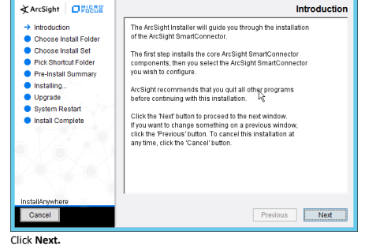

3. Enter C*:\Program Files\ArcSightSmartConnectors\WindowsUDP.*
This publication is available free of charge from: https://doi.org/10.6028/NIST.SP.1800-26.

น้ำ 92.T2IV\8200.01\g10.iob\\:2qttr\:mo17 อยู่าคมว่า 10 คราว 10 กรุงเทพที่ 1

0

 Next
4.

|  ArcSight SmartConnector                             | Pick Shortcut Folder   |         |
|------------------------------------------------------|------------------------|---------|
| Where would you like to create product icons?        |                        |         |
| - In a new Program Group: | ArcSight SmartConnectors |                        |         |
|                                                      | In the Star            | Choose. |
| □ Create Icons for All Users                         | Previous               |         |

ട.

Click Next.
31.92.T2IV\8209.01\g10.iob\\\:2qttr\:mo17 ອງກຸຝາວ 10 ອອກີ ອldblisv6 2i noitsoilduq

## 6. 7. Select Add A Connector.

| Select Add a Connector.    | 0               |
|----------------------------|-----------------|
| 女                         | Connector Setup |
| What would you like to do? |                 |
| ArcSight                   |                 |
| Configure                  |                 |
| Click Next.                |                 |

8.

9.

Select Syslog Daemon.

10.  Click Next.
11. Enter an unused port for the daemon to run on. (Ensure that this port is allowed through the firewall.)

31.92.T2IV\8209.01\g10.iob\\\:2qttr\:mo17 ອງກຸຝາວ 10 ອອກີ ອldblisv6 2i noitsoilduq 31.92.T2IV\8209.01\g10.iob\\\:2qttr\:mo17 ອງກຸຝາວ 10 ອອກີ ອldblisv6 2i noitsoilduq

 15.  Click Next.

17. Click Next.

19. Click Next.

41.92.T2IM\8209.01\g10.iob\\;zqttrl :mo11 ອງງາໄກ່ວ 10 ອອກີ ອldblisv6 2i noi163ilduc 31.92.T2IV\8209.01\g10.iob\\\:2qttr\:mo17 ອງກຸຝາວ 10 ອອກີ ອldblisv6 2i noitsoilduq

22.  Click Next.

 24.  Click Next.
25. Enter a service name and display name.

31.92.T2IV\8209.01\g10.iob\\\:2qttr\:mo17 ອງກຸຝາວ 10 ອອກີ ອldblisv6 2i noitsoilduq

27. Click Next.
28. Select Exit.

31.92.T2IV\8209.01\g10.iob\\\:2qttr\:mo17 ອງກຸຝາວ 10 ອອກີ ອldblisv6 2i noitsoilduq

30.  Click Done.

## 2.25.2 Configure Cisco Stealthwatch

1. Log in to the **Cisco Stealthwatch Management Console** desktop interface. (This can be downloaded from the web interface and run using **javaws.exe.** You may need to add the site to your Java exceptions in **Control Panel > Java.**) 

3. Click **Actions.**
This publication is available free of charge from: https://doi.org/10.6028/NIST.SP.1800-26.

4. Click **Add.** 

6. Click OK.

7. Enter a **name** for the **Action.** 8. Enter a **description.**
9. Enter the **IP address** of the server with the User Datagram Protocol (UDP) ArcSight Connector that you just created.

10. Enter the **port** used in the UDP ArcSight Connector that you just created.

11. (Optional) Click **Test** to send a test message to ArcSight, and verify that ArcSight receives the message.

This publication is available free of charge from: https://doi.org/10.6028/NIST.SP.1800-26.

12. Click OK.

14.  Click Rules.
31.92.T2IV\8209.01\g10.iob\\\:2qttr\:mo17 ອງກຸຝາວ 10 ອອກີ ອldblisv6 2i noitsoilduq

15. Click **Add.**

17. Click OK.

18. Enter a **name.**
19. Enter a **description.**
This publication is available free of charge from: https://doi.org/10.6028/NIST.SP.1800-26.

 This publication is available free of charge from: https://doi.org/10.6028/NIST.SP.1800-26.

21. Click the Add button for the top section; this adds an action when the alarm becomes active.

22. Select the ArcSight CEF rule you just created.

41.92.T2IV\8209.01\g10.iob\\;zqttrl:mo17 ອງກຣძე to 991 ອldblisv6 2i noitsoilduq

24. Click the Add button for the bottom section; this adds an action when the alarm becomes inactive.

31.92.T2IV\8209.01\g10.iob\\:2qttr\:mo17 ອງກຣძე to 9917 ອldblisve 2i noits3ilduq

 

28.  Click Close.
181.92.T2IM\8209.01\g10.iob\\\:2qttrl :mo11 ອຖານ 9 ການ 981.91 ອອກາ ອldblievs 21 ກວ່າສວ່າໄປມຸດ 2

# Appendix A **List Of Acronyms**

AD Active Directory AMP Advanced Malware Protection API Application Programming Interface CEF Common Event Format CSR Certificate Signing Request CSV Comma-Separated Values

| DSP   | Directory Services Protector   |
|-------|--------------------------------|

| DNS   | Domain Name System   |
|-------|----------------------|

ESM Enterprise Security Manager ICA Information Centric Analytics IIS Internet Information Services ISAPI Internet Server Application Programming Interface ISE Identity Services Engine IT Information Technology JCE Java Cryptography Extension JRE Java Runtime Environment MAC Media Access Control MMC Microsoft Management Console MSSQL Microsoft Structured Query Language MX Mail Exchange This publication is available free of charge from: https://doi.org/10.6028/NIST.SP.1800-26.

NCCoE National Cybersecurity Center of Excellence NIST National Institute of Standards and Technology NTP Network Time Protocol OS Operating System PEM Privacy Enhanced Mail RADIUS Remote Authentication Dial-In User Service RHEL Red Hat Enterprise Linux RMI Remote Method Invocation SAN Subject Alternative Name SDK Software Development Kit SMC Stealthwatch Management Console SMTP Simple Mail Transfer Protocol SQL Structured Query Language SSH Secure Shell TE Tripwire Enterprise UDP User Datagram Protocol This publication is available free of charge from: https://doi.org/10.6028/NIST.SP.1800-26.