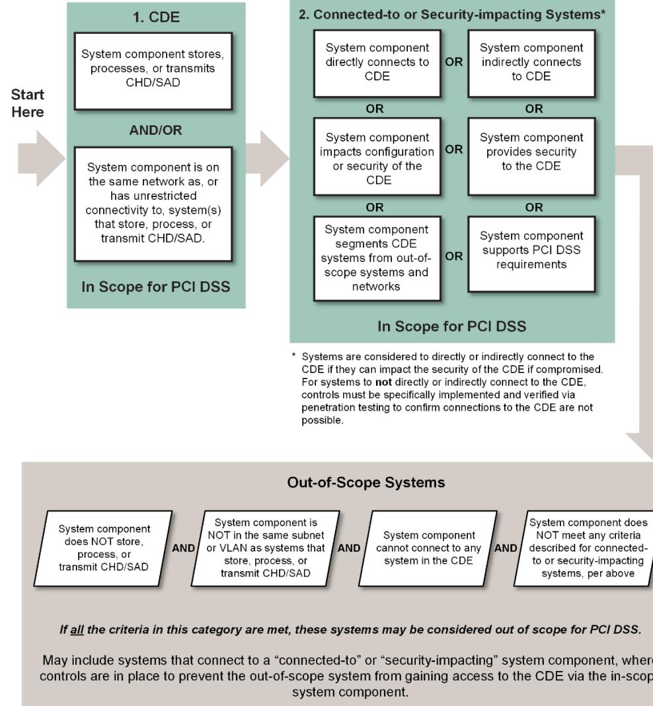
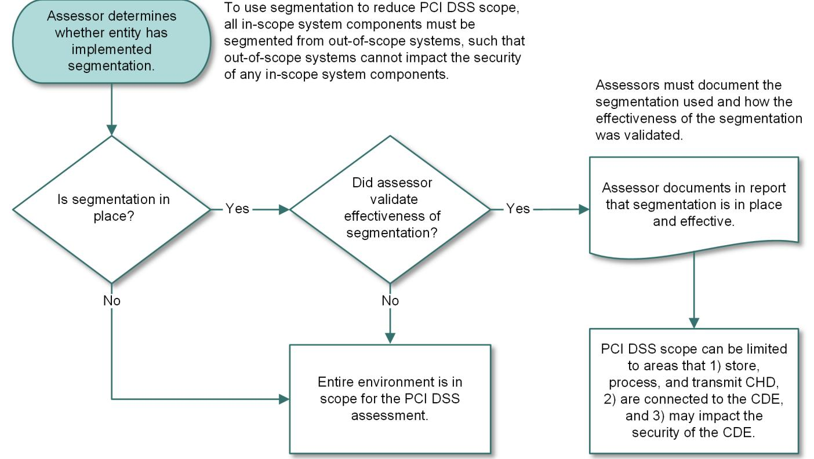
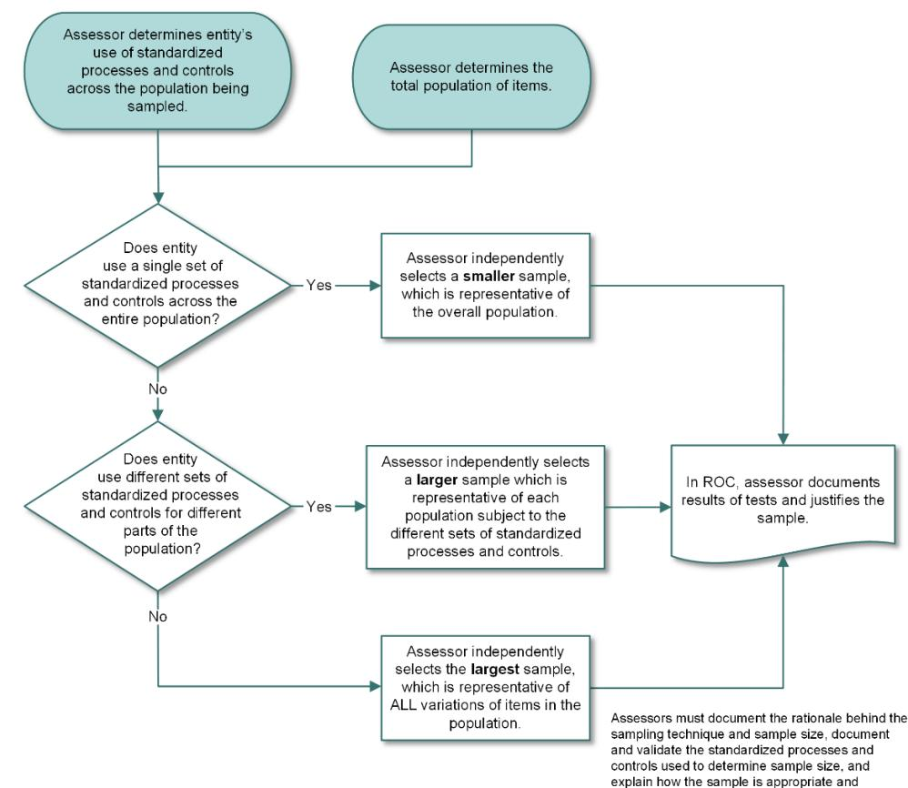
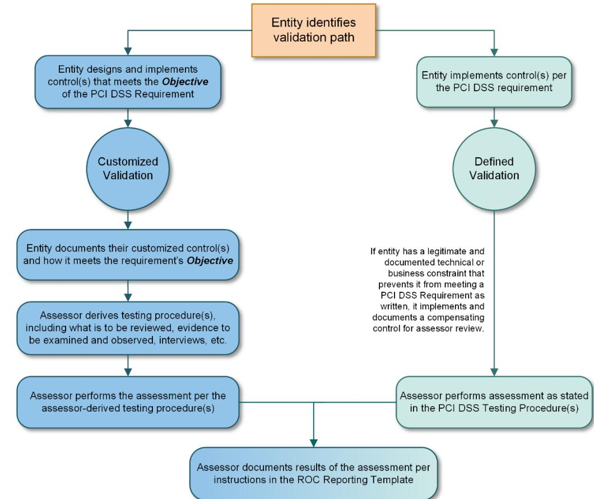
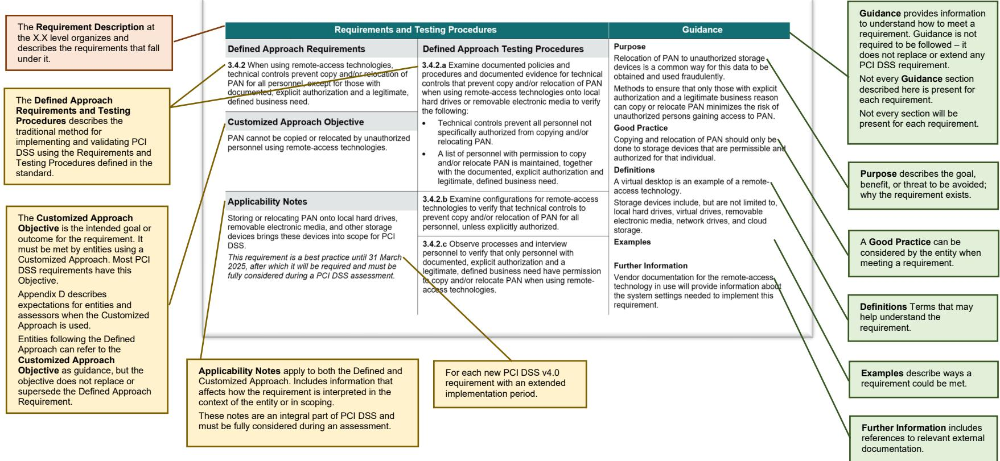
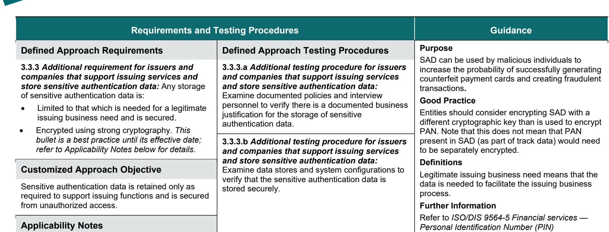
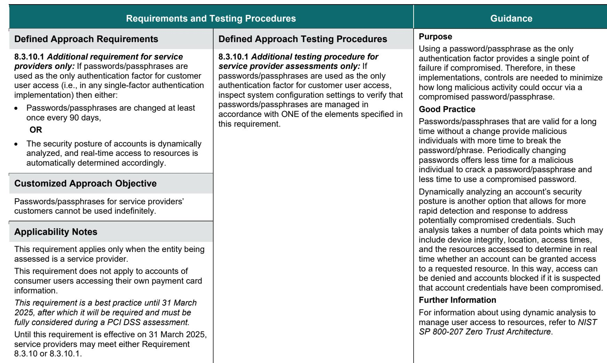
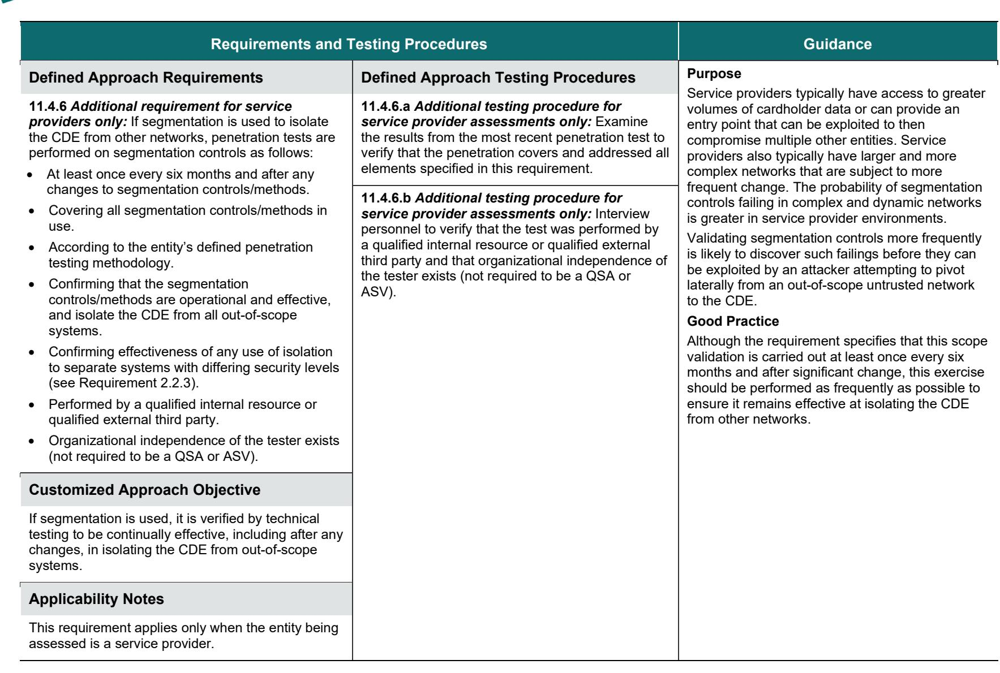

**Payment Card Industry Data Security Standard**

# **Requirements and Testing Procedures**

**Version 4.0**

March 2022

# **Document Changes**

| Date | Version | Description |
| --- | --- | --- |
| October 2008 | 1.2 | To introduce PCI DSS v1.2 as "PCI DSS Requirements and Security Assessment Procedures," eliminating |
|  |  | redundancy between documents, and making both general and specific changes from PCI DSS Security Audit Procedures v1.1. For complete information, see PCI Data Security Standard Summary of Changes from PCI DSS |
|  |  | Version 1.1 to 1.2. |
| July 2009 | 1.2.1 | Add sentence that was incorrectly deleted between PCI DSS v1.1 and v1.2. |
|  |  | Correct "then" to "than" in testing procedures 6.3.7.a and 6.3.7.b. |
|  |  | Remove grayed-out marking for "in place" and "not in place" columns in testing procedure 6.5.b. |
|  |  | For Compensating Controls Worksheet – Completed Example, correct wording at top of page to say, "Use this |
|  |  | worksheet to define compensating controls for any requirement noted as "in place" via compensating controls." |
| October 2010 | 2.0 | Update and implemented changes from v1.2.1. See PCI DSS – Summary of Changes from PCI DSS Version 1.2.1 to |
|  |  | 2.0. |
| November 2013 | 3.0 | Update from v2.0. See PCI DSS – Summary of Changes from PCI DSS Version 2.0 to 3.0. |
| April 2015 | 3.1 | Update from PCI DSS v3.0. See PCI DSS – Summary of Changes from PCI DSS Version 3.0 to 3.1 for details of |
|  |  | changes. |
| April 2016 | 3.2 | Update from PCI DSS v3.1. See PCI DSS – Summary of Changes from PCI DSS Version 3.1 to 3.2 for details of |
|  |  | changes. |
| May 2018 | 3.2.1 | Update from PCI DSS v3.2. See PCI DSS – Summary of Changes from PCI DSS Version 3.2 to 3.2.1 for details of |
|  |  | changes. |
| March 2022 | 4.0 | Rename document title to "Payment Card Industry Data Security Standard: Requirements and Testing Procedures." |
|  |  | Update from PCI DSS v3.2.1. See PCI DSS – Summary of Changes from PCI DSS Version 3.2.1 to 4.0 for details of |
|  |  | changes. |

| 1 | Introduction and PCI Data Security Standard Overview | 1 |
| --- | --- | --- |
| 2 | PCI DSS Applicability Information | 4 |
| 3 | Relationship between PCI DSS and PCI SSC Software Standards | 7 |
| 4 | Scope of PCI DSS Requirements | 9 |
| 5 | Best Practices for Implementing PCI DSS into Business-as-Usual Processes | 19 |
| 6 | For Assessors: Sampling for PCI DSS Assessments | 22 |
| 7 | Description of Timeframes Used in PCI DSS Requirements | 25 |
| 8 | Approaches for Implementing and Validating PCI DSS | 28 |
| 9 | Protecting Information About an Entity's Security Posture | 31 |
| 10 | Testing Methods for PCI DSS Requirements | 32 |
| 11 | Instructions and Content for Report on Compliance | 33 |
| 12 | PCI DSS Assessment Process | 34 |
| 13 | Additional References | 35 |
| 14 | PCI DSS Versions | 36 |
| 15 | Detailed PCI DSS Requirements and Testing Procedures | 37 |
|  | Build and Maintain a Secure Network and Systems | 39 |
|  | Protect Account Data | 73 |
|  | Maintain a Vulnerability Management Program | 111 |
|  | Implement Strong Access Control Measures | 149 |

| Regularly Monitor and Test Networks |  | 212 |
| --- | --- | --- |
| Maintain an Information Security Policy |  | 259 |
| Appendix A Additional PCI DSS Requirements |  | 298 |
| Appendix A1: Additional PCI DSS Requirements for Multi-Tenant Service Providers |  | 298 |
| Appendix A2: Additional PCI DSS Requirements for Entities Using SSL/Early TLS for Card-Present POS POI Terminal Connections |  | 304 |
| Appendix A3: Designated Entities Supplemental Validation (DESV) |  | 308 |
| Appendix B | Compensating Controls | 330 |
| Appendix C Compensating Controls Worksheet |  | 332 |
| Appendix D Customized Approach |  | 333 |
| Appendix E Sample Templates to Support Customized Approach |  | 335 |
| Appendix F Leveraging the PCI Software Security Framework to Support Requirement 6 |  | 341 |
| Appendix G PCI DSS Glossary of Terms, Abbreviations, and Acronyms |  | 344 |

# **1 Introduction and PCI Data Security Standard Overview**

The Payment Card Industry Data Security Standard (PCI DSS) was developed to encourage and enhance payment card account data security and facilitate the broad adoption of consistent data security measures globally. PCI DSS provides a baseline of technical and operational requirements designed to protect account data. While specifically designed to focus on environments with payment card account data, PCI DSS can also be used to protect against threats and secure other elements in the payment ecosystem.

Table 1 shows the 12 principal PCI DSS requirements.

### **Table 1. Principal PCI DSS Requirements**

| PCI Data Security Standard – | High Level Overview |  |
| --- | --- | --- |
| Build and Maintain a Secure Network and Systems | 1. | Install and Maintain Network Security Controls. |
|  | 2. | Apply Secure Configurations to All System Components. |
| Protect Account Data | 3. | Protect Stored Account Data. |
|  | 4. | Protect Cardholder Data with Strong Cryptography During |
|  |  | Transmission Over Open, Public Networks. |
| Maintain a Vulnerability Management Program | 5. | Protect All Systems and Networks from Malicious Software. |
|  | 6. | Develop and Maintain Secure Systems and Software. |
| Implement Strong Access Control Measures | 7. | Restrict Access to System Components and Cardholder Data by |
|  |  | Business Need to Know. |
|  | 8. | Identify Users and Authenticate Access to System Components. |
|  | 9. | Restrict Physical Access to Cardholder Data. |
| Regularly Monitor and Test Networks | 10. | Log and Monitor All Access to System Components and Cardholder |
|  |  | Data. |
|  | 11. | Test Security of Systems and Networks Regularly. |
| Maintain an Information Security Policy | 12. | Support Information Security with Organizational Policies and |
|  | Programs. |  |

This document, the Payment Card Industry Data Security Standard Requirements and Testing Procedures, consists of the 12 PCI DSS principal requirements, detailed security requirements, corresponding testing procedures, and other information pertinent to each requirement. The following sections provide detailed guidelines and best practices to assist entities to prepare for, conduct, and report the results of a PCI DSS assessment. The PCI DSS requirements and testing procedures begin on page 43.

PCI DSS comprises a minimum set of requirements for protecting account data and may be enhanced by additional controls and practices to further mitigate risks, and to incorporate local, regional, and sector laws and regulations. Additionally, legislation or regulatory requirements may require specific protection of personal information or other data elements (for example, cardholder name).

## *Limitations*

If any of the requirements contained in this standard conflict with country, state, or local laws, the country, state, or local law will apply.

# **PCI DSS Resources**

The PCI Security Standards Council (PCI SSC) website (www.pcisecuritystandards.org) provides the following additional resources to assist organizations with their PCI DSS assessments and validations:

- Document Library, including:
	- PCI DSS Summary of Changes
	- PCI DSS Quick Reference Guide
	- Information Supplements and Guidelines
	- Prioritized Approach for PCI DSS
	- Report on Compliance (ROC) Reporting Template and Reporting Instructions
	- Self-Assessment Questionnaires (SAQs) and SAQ Instructions and Guidelines
	- Attestations of Compliance *(*AOCs*)*
- Frequently Asked Questions (FAQs)
- PCI for Small Merchants website
- PCI training courses and informational webinars
- List of Qualified Security Assessors (QSAs) and Approved Scanning Vendors (ASVs)
- Lists of PCI approved devices, applications, and solutions

There are over 60 guidance documents and information supplements available on the PCI SSC website that provide specific guidance and considerations for PCI DSS. Examples include:

- Guidance for PCI DSS Scoping and Network Segmentation
- PCI SSC Cloud Computing Guidelines
- Multi-Factor Authentication Guidance
- Third-Party Security Assurance
- Effective Daily Log Monitoring
- Penetration Testing Guidance
- Best Practices for Implementing a Security Awareness Program
- Best Practices for Maintaining PCI DSS Compliance
- PCI DSS for Large Organizations
- Use of SSL/Early TLS and Impact on ASV Scans
- Use of SSL/Early TLS for POS POI Terminal Connections
- Tokenization Product Security Guidelines
- Protecting Telephone-Based Payment Card Data

Refer to the Document Library at www.pcisecuritystandards.org for information about these and other resources.

In addition, refer to *Appendix G* for definitions of PCI DSS terms.

*Note: Information Supplements complement PCI DSS and identify additional considerations and recommendations for meeting PCI DSS requirements. Information Supplements do not supersede, replace, or extend PCI DSS or any of its requirements.*

# **2 PCI DSS Applicability Information**

PCI DSS is intended for all entities that store, process, or transmit cardholder data (CHD) and/or sensitive authentication data (SAD) or could impact the security of the cardholder data environment (CDE). This includes all entities involved in payment card account processing including merchants, processors, acquirers, issuers, and other service providers.

Whether any entity is required to comply with or validate their compliance to PCI DSS is at the discretion of those organizations that manage compliance programs (such as payment brands and acquirers). Contact the organizations of interest for any additional criteria.

# **Defining Account Data, Cardholder Data, and Sensitive Authentication Data**

Cardholder data and sensitive authentication data are considered account data and are defined as follows:

|  |  | Account Data |
| --- | --- | --- |
|  | Cardholder Data includes: | Sensitive Authentication Data includes: |
| • | Primary Account Number (PAN) • | Full track data (magnetic-stripe data or equivalent on a chip) |
| • | Cardholder Name • | Card verification code |
| • | Expiration Date • | PINs/PIN blocks |
| • | Service Code |  |

## **Table 2. Account Data**

PCI DSS requirements apply to entities with environments where account data (cardholder data and/or sensitive authentication data) is stored, processed, or transmitted, and entities with environments that can impact the security of the CDE. Some PCI DSS requirements may also apply to entities with environments that do not store, process, or transmit account data – for example, entities that outsource payment operations or management of their CDE 1. Entities that outsource their payment environments or payment operations to third parties remain responsible for ensuring that the account data is protected by the third party per applicable PCI DSS requirements.

The primary account number (PAN) is the defining factor for cardholder data. The term account data therefore covers the following: the full PAN, any other elements of cardholder data that are present with the PAN, and any elements of sensitive authentication data.

1 In accordance with those organizations that manage compliance programs (such as payment brands and acquirers); entities should contact the organizations of interest for more details.

If cardholder name, service code, and/or expiration date are stored, processed, or transmitted with the PAN, or are otherwise present in the CDE, they must be protected in accordance with the PCI DSS requirements applicable to cardholder data.

If an entity stores, processes, or transmits PAN, then a CDE exists to which PCI DSS requirements will apply. Some requirements may not be applicable, for example if the entity does not store PAN, then the requirements relating to the protection of stored PAN in Requirement 3 will not be applicable to the entity.

Even if an entity does not store, process, or transmit PAN, some PCI DSS requirements may still apply. Consider the following:

- If the entity stores SAD, requirements specifically related to SAD storage in Requirement 3 will be applicable.
- If the entity engages third-party service providers to store, process or transmit PAN on its behalf, requirements related to the management of service providers in Requirement 12 will be applicable.
- If the entity can impact the security of a CDE because the security of an entity's infrastructure can affect how cardholder data is processed (for example, via a web server that controls the generation of a payment form or page) some requirements will be applicable.
- If cardholder data is only present on physical media (for example paper), requirements relating to the security and disposal of physical media in Requirement 9 will be applicable.
- Requirements related to an incident response plan are applicable to all entities, to ensure that there are procedures to follow in the event of a suspected or actual breach of the confidentiality of cardholder data*.*

## *Use of Account Data, Sensitive Authentication Data, Cardholder Data, and Primary Account Number in PCI DSS*

PCI DSS includes requirements that specifically refer to account data, cardholder data, and sensitive authentication data. It is important to note that each of these types of data are different and the terms are not interchangeable. Specific references within requirements to account data, cardholder data, or sensitive authentication data are purposeful, and the requirements apply specifically to the type of data that is referenced.

## *Elements of Account Data and Storage Requirements*

Table 3 identifies the elements of cardholder and sensitive authentication data, whether storage of each data element is permitted or prohibited, and whether each data element must be rendered unreadable—for example, with strong cryptography—when stored. This table is not exhaustive and is presented to illustrate only how the stated requirements apply to the different data elements.

|  |  | Data Elements | Storage Restrictions | Required to Render Stored Data |
| --- | --- | --- | --- | --- |
|  |  |  |  | Unreadable |
|  | Cardholder | Primary Account Number (PAN) | Storage is kept to a minimum as defined in Requirement 3.2 | Yes, as defined in Requirement 3.5 |
|  | Data | Cardholder Name |  |  |
| Data |  | Service Code | Storage is kept to a minimum as defined in | No |
|  |  |  | 2 Requirement 3.2 |  |
| nt |  | Expiration Date |  |  |
| Accou |  |  |  |  |
|  | Sensitive | Full Track Data |  | Yes, data stored until authorization is |
|  | Authentication |  | Cannot be stored after authorization as | complete must be protected with strong |
|  | Data | Card verification code | 3 defined in Requirement 3.3.1 | cryptography as defined in Requirement |
|  |  |  |  | 3.3.2 |
|  |  | PIN/PIN Block |  |  |

### **Table 3. Account Data Element Storage Requirements**

If PAN is stored with other elements of cardholder data, only the PAN must be rendered unreadable according to PCI DSS Requirement 3.5.1. Sensitive authentication data must not be stored after authorization, even if encrypted. This applies even for environments where there is no PAN present.

2 Where data exists in the same environment as PAN.

3 Except as permitted for issuers and companies that support issuing services. Requirements for issuers and issuing services are separately defined in Requirement 3.3.3.

# **3 Relationship between PCI DSS and PCI SSC Software Standards**

PCI SSC supports the use of secure payment software within cardholder data environments (CDE) via the Payment Application Data Security Standard (PA-DSS) and the Software Security Framework (SSF), which consists of the Secure Software Standard and the Secure Software Lifecycle (Secure SLC) Standard. Software that is PCI SSC validated and listed provides assurance that the software has been developed using secure practices and has met a defined set of software security requirements.

The PCI SSC secure software programs include listings of payment software and software vendors that have been validated as meeting the applicable PCI SSC Software Standards.

- **Validated Software**: Payment software listed on the PCI SSC website as a Validated Payment Application (PA-DSS) or Validated Payment Software (the Secure Software Standard) has been evaluated by a qualified assessor to confirm the software meets the security requirements within that standard. The security requirements in these standards are focused on protecting the integrity and confidentiality of payment transactions and account data.
- **Validated Software Vendors**: The Secure SLC Standard defines security requirements for software vendors to integrate secure software development practices throughout the entire software lifecycle. Software vendors that have been validated as meeting the Secure SLC Standard are listed on the PCI SSC website as a Secure SLC Qualified Vendor.

*Note: PA-DSS and the related program will be retired in October 2022. Refer to the PCI SSC List of Validated Payment Applications for expiry dates for PA-DSS validated applications. After the expiry date, applications are listed as "Acceptable only for Pre-Existing Deployments." Whether an entity can continue to use a PA-DSS application with an expired listing is at the discretion of organizations that manage compliance programs (such as payment brands and acquirers); entities should contact the organizations of interest for more details.*

For more information about the SSF or PA-DSS, refer to the respective Program Guides at www.pcisecuritystandards.org.

All software that stores, processes, or transmits account data, or that could impact the security of account data or a CDE, is in scope for an entity's PCI DSS assessment. While the use of validated payment software supports the security of an entity's CDE, the use of such software does not by itself make an entity PCI DSS compliant. The entity's PCI DSS assessment should include verification that the software is properly configured and securely implemented to support applicable PCI DSS requirements. Additionally, if PCI-listed payment software has been customized, a more in-depth review will be required during the PCI DSS assessment because the software may no longer be representative of the version that was originally validated.

Because security threats are constantly evolving, software that is no longer supported by the vendor (for example, identified by the vendor as "end of life") may not offer the same level of security as supported versions. Entities are strongly encouraged to keep their software current and updated to the latest software versions available.

Entities that develop their own software are encouraged to refer to PCI SSC's software security standards and consider the requirements therein as best practices to use in their development environments. Secure payment software implemented in a PCI DSS compliant environment will help minimize the potential for security breaches leading to compromises of account data and fraud. See *Bespoke and Custom Software*.

# **Applicability of PCI DSS to Payment Software Vendors**

PCI DSS may apply to a payment software vendor if the vendor is also a service provider that stores, processes, or transmits account data, or has access to their customers' account data—for example, in the role of a payment service provider or via remote access to a customer environment. Software vendors to which PCI DSS may be applicable include those offering payment services, as well as cloud service providers offering payment terminals in the cloud, software as a service (SaaS), e-commerce in the cloud, and other cloud payment services.

# **Bespoke and Custom Software**

All bespoke and custom software that stores, processes, or transmits account data, or that could impact the security of account data or a CDE, is in scope for an entity's PCI DSS assessment.

Bespoke and custom software that has been developed and maintained in accordance with one of PCI SSC's Software Security Framework standards (the Secure Software Standard or the Secure SLC standard) will support an entity in meeting PCI DSS Requirement 6.

See *Appendix F* for more details.

*Note: PCI DSS Requirement 6 fully applies to bespoke and custom software that has not been developed and maintained in accordance with one of PCI SSC's Software Security Framework standards. Entities that use software vendors to develop bespoke or custom software that could impact the security of account data or their CDE are responsible for ensuring those software vendors develop the software according to PCI DSS Requirement 6.*

# **4 Scope of PCI DSS Requirements**

PCI DSS requirements apply to:

- The cardholder data environment (CDE), which is comprised of:
	- System components, people, and processes that store, process, and transmit cardholder data and/or sensitive authentication data, and,
	- System components that may not store, process, or transmit CHD/SAD but have unrestricted connectivity to system components that store, process, or transmit CHD/SAD.

AND

- System components, people, and processes that could impact the security of the CDE. 4
"System components" include network devices, servers, computing devices, virtual components, cloud components, and software. Examples of system components include but are not limited to:

- Systems that store, process, or transmit account data (for example, payment terminals, authorization systems, clearing systems, payment middleware systems, payment back-office systems, shopping cart and store front systems, payment gateway/switch systems, fraud monitoring systems).
- Systems that provide security services (for example, authentication servers, access control servers, security information and event management (SIEM) systems, physical security systems (for example, badge access or CCTV), multi-factor authentication systems, anti-malware systems).
- Systems that facilitate segmentation (for example, internal network security controls).
- Systems that could impact the security of account data or the CDE (for example, name resolution, or e-commerce (web) redirection servers).
- Virtualization components such as virtual machines, virtual switches/routers, virtual appliances, virtual applications/desktops, and hypervisors.
- Cloud infrastructure and components, both external and on premises, and including instantiations of containers or images, virtual private clouds, cloud-based identity and access management, CDEs residing on premises or in the cloud, service meshes with containerized applications, and container orchestration tools.

4 For additional guidance, refer to *Information Supplement: Guidance for PCI DSS Scoping and Network Segmentation* on the PCI SSC website.

- Network components, including but not limited to network security controls, switches, routers, VoIP network devices, wireless access points, network appliances, and other security appliances.
- Server types, including but not limited to web, application, database, authentication, mail, proxy, Network Time Protocol (NTP), and Domain Name System (DNS).
- End-user devices, such as computers, laptops, workstations, administrative workstations, tablets, and mobile devices.
- Printers, and multi-function devices that scan, print, and fax.
- Storage of account data in any format (for example, paper, data files, audio files, images, and video recordings).
- Applications, software, and software components, serverless applications, including all purchased, subscribed (for example, Softwareas-a-Service), bespoke and custom software, including internal and external (for example, Internet) applications.
- Tools, code repositories, and systems that implement software configuration management or for deployment of objects to the CDE or to systems that can impact the CDE.

Figure 1 shows considerations for scoping system components for PCI DSS.

## **Figure 1. Understanding PCI DSS Scoping**

# **Annual PCI DSS Scope Confirmation**

The first step in preparing for a PCI DSS assessment is for the entity to accurately determine the scope of the review. The assessed entity must confirm the accuracy of their PCI DSS scope according to PCI DSS Requirement 12.5.2 by identifying all locations and flows of account data, and identifying all systems that are connected to or, if compromised, could impact the CDE (for example, authentication servers, remote access servers, logging servers) to ensure they are included in the PCI DSS scope. All types of systems and locations should be considered during the scoping process, including backup/recovery sites and fail-over systems.

The minimum steps for an entity to confirm the accuracy of their PCI DSS scope are specified in PCI DSS Requirement 12.5.2. The entity is expected to retain documentation to show how PCI DSS scope was determined. The documentation is retained for assessor review and for reference during the entity's next PCI DSS scope confirmation activity. For each PCI DSS assessment, the assessor validates that the entity accurately defined and documented the scope of the assessment.

*Note: This annual confirmation of PCI DSS scope is defined at PCI DSS Requirement at 12.5.2 and is an activity expected to be performed by the entity. This activity is not the same, nor is it intended to be replaced by, the scoping confirmation performed by the entity's assessor during the assessment.*

# **Segmentation**

Segmentation (or isolation) of the CDE from the remainder of an entity's network is not a PCI DSS requirement. However, it is strongly recommended as a method that may reduce the:

- Scope of the PCI DSS assessment
- Cost of the PCI DSS assessment
- Cost and difficulty of implementing and maintaining PCI DSS controls
- Risk to an organization relative to payment card account data (reduced by consolidating that data into fewer, more controlled locations)

Without adequate segmentation (sometimes called a "flat network"), the entire network is in scope for the PCI DSS assessment. Segmentation can be achieved using a number of physical or logical methods, such as properly configured internal network security controls, routers with strong access control lists, or other technologies that restrict access to a particular segment of a network. To be considered out of scope for PCI DSS, a system component must be properly segmented (isolated) from the CDE, such that the out-of-scope system component could not impact the security of the CDE, even if that component was compromised.

An important prerequisite to reduce the scope of the CDE is a clear understanding of business needs and processes related to the storage, processing, and transmission of account data. Restricting account data to as few locations as possible by eliminating unnecessary data and consolidating necessary data may require reengineering of long-standing business practices.

Documenting account data flows via a data-flow diagram helps an entity fully understand how account data comes into an organization, where it resides within the organization, and how it traverses through various systems within the organization. Data-flow diagrams also illustrate all locations where account data is stored, processed, and transmitted. This information supports an entity implementing segmentation and can also support confirming that segmentation is being used to isolate the CDE from out-of-scope networks.

If segmentation is used to reduce the scope of the PCI DSS assessment, the assessor must verify that the segmentation is adequate to reduce the scope of the assessment, as illustrated in Figure 2. At a high level, adequate segmentation isolates systems that store, process, or transmit account data from those that do not. However, the adequacy of a specific segmentation implementation is highly variable and depends on several factors such as a given network's configuration, the technologies deployed, and other controls that may be implemented.

# **Figure 2. Segmentation and Impact to PCI DSS Scope**

# **Wireless**

If wireless technology is used to store, process, or transmit account data (for example, wireless point-of-sale devices), or if a wireless local area network (WLAN) is part of or connected to the CDE, the PCI DSS requirements and testing procedures for securing wireless environments apply and must be performed.

Rogue wireless detection must be performed per PCI DSS Requirement 11.2.1 even when wireless is not used within the CDE and the entity has a policy that prohibits the use of wireless technology within its environment. This is because of the ease with which a wireless access point can be attached to a network, the difficulty in detecting its presence, and the increased risk presented by unauthorized wireless devices.

Before wireless technology is implemented, an entity should carefully evaluate the need for the technology against the risk. Consider deploying wireless technology only for non-sensitive data transmission.

# **Encrypted Cardholder Data and Impact on PCI DSS Scope**

Encryption of cardholder data with strong cryptography is an acceptable method of rendering the data unreadable according to PCI DSS Requirement 3.5. However, encryption alone is generally insufficient to render the cardholder data out of scope for PCI DSS and does not remove the need for PCI DSS in that environment. The entity's environment is still in scope for PCI DSS due to the presence of cardholder data. For example, for a merchant card-present environment, there is physical access to the payment cards to complete a transaction and there may also be paper reports or receipts with cardholder data. Similarly, in merchant card-not-present environments, such as mailorder/telephone-order and e-commerce, payment card details are provided via channels that need to be evaluated and protected according to PCI DSS.

The following are each in scope for PCI DSS:

- Systems performing encryption and/or decryption of cardholder data, and systems performing key management functions,
- Encrypted cardholder data that is not isolated from the encryption and decryption and key management processes,
- Encrypted cardholder data that is present on a system or media that also contains the decryption key,
- Encrypted cardholder data that is present in the same environment as the decryption key,
- Encrypted cardholder data that is accessible to an entity that also has access to the decryption key.

*Note: A PCI-listed P2PE solution can significantly reduce the number of PCI DSS requirements applicable to a merchant's cardholder data environment. However, it does not completely remove the applicability of PCI DSS in the merchant environment.*

# **Encrypted Cardholder Data and Impact to PCI DSS Scope for Third-Party Service Providers**

Where a third-party service provider (TPSP) receives and/or stores only data encrypted by another entity, and where they do not have the ability to decrypt the data, the TPSP may be able to consider the encrypted data out of scope if certain conditions are met. This is because responsibility for the data generally remains with the entity, or entities, with the ability to decrypt the data or impact the security of the encrypted data. Determining which party is responsible for specific PCI DSS controls will depend on several factors, including who has access to the decryption keys, the role performed by each party, and the agreement between parties. Responsibilities should be clearly defined and documented to ensure both the TPSP and the entity providing the encrypted data understand which entity is responsible for which security controls.

As an example, a TPSP providing storage services receives and stores encrypted cardholder data provided by customers for back-up purposes. This TPSP does not have access to the encryption or decryption keys, nor does it perform any key management for its customers. The TPSP can exclude any such encrypted data when determining its PCI DSS scope. However, the TPSP does maintain responsibility for controlling access to the encrypted data storage as part of its service agreements with its customers.

Responsibility for ensuring that the encrypted data and the cryptographic keys are protected according to applicable PCI DSS requirements is often shared between entities. In the above example, the customer determines which of their personnel are authorized to access the storage media, and the storage facility is responsible for managing the physical and/or logical access controls to ensure that only persons authorized by the customer are granted access to the storage media. The specific PCI DSS requirements applicable to a TPSP will depend on the services provided and the agreement between the two parties. In the example of a TPSP providing storage services, the physical and logical access controls provided by the TPSP will need to be reviewed at least annually. This review could be performed as part of the merchant's PCI DSS assessment or, alternatively, the review could be performed, and controls validated, by the TPSP with appropriate evidence provided to the merchant. For information about "appropriate evidence," see *Options for TPSPs to Validate PCI DSS Compliance for TPSP Services that Meet Customers' PCI DSS Requirements.* 

As another example, a TPSP that receives only encrypted cardholder data for the purposes of routing to other entities, and that does not have access to the data or cryptographic keys, may not have any PCI DSS responsibility for that encrypted data. In this scenario, where the TPSP is not providing any security services or access controls, they may be considered the same as a public or untrusted network, and it would be the responsibility of the entity(s) sending/receiving account data through the TPSP's network to ensure PCI DSS controls are applied to protect the data being transmitted.

# **Use of Third-Party Service Providers**

An entity (referred to as the "customer" in this section) might choose to use a third-party service provider (TPSP) to store, process, or transmit account data or to manage in-scope system components on the customer's behalf. Use of a TPSP may have an impact on the security of a customer's CDE.

*Note: Use of a PCI DSS compliant TPSP does not make a customer PCI DSS compliant, nor does it remove the customer's responsibility for its own PCI DSS compliance. Even if a customer uses a TPSP to meet all account data functions, that customer remains responsible for confirming its own compliance as requested by organizations that manage compliance programs (for example, payment brands and acquirers). Customers should contact the organizations of interest for any requirements.*

## *Using TPSPs and the Impact on Customers Meeting PCI DSS Requirement 12.8*

There are many different scenarios where a customer might use one or more TPSPs for functions within or related to the customer's CDE. In all scenarios where a TPSP is used, the customer must manage and oversee the PCI DSS compliance status of all their TPSPs in accordance with Requirement 12.8, including TPSPs that:

- Have access to the customer's CDE,
- Manage in-scope system components on the customer's behalf, and/or
- Can impact the security of the customer's CDE.

Managing TPSPs in accordance with Requirement 12.8 includes performing due diligence, having appropriate agreements in place, identifying which requirements apply to the customer and which apply to the TPSP, and monitoring the compliance status of TPSPs at least annually.

Requirement 12.8 does not specify that the customer's TPSPs must be PCI DSS compliant, only that the customer monitor their compliance status as specified in the requirement. Therefore, a TPSP does not need to be PCI DSS compliant for its customer to meet Requirement 12.8.

## *Impact of Using TPSPs for Services that Meet Customers' PCI DSS Requirements*

When the TPSP provides a service that meets a PCI DSS requirement(s) on the customer's behalf or where that service may impact the security of the customer's CDE, then those requirements are in scope for the customer's assessment and the compliance of that service will impact the customer's PCI DSS compliance. The TPSP must demonstrate it meets applicable PCI DSS requirements for those requirements to be in place for its customers. For example, if an entity engages a TPSP to manage its network security controls, and the TPSP does not provide evidence that it meets the applicable requirements in PCI DSS Requirement 1, then those requirements are not in place for the customer's assessment. As another example, TPSPs that store backups of cardholder data on behalf of customers

would need to meet the applicable requirements related to access controls, physical security, etc., for their customers to consider those requirements in place for their assessments.

## *Importance of Understanding Responsibilities Between TPSP Customers and TPSPs*

Customers and TPSPs should clearly identify and understand the following:

- The services and system components included in the scope of the TPSP's PCI DSS assessment,
- The specific PCI DSS requirements and sub-requirements covered by the TPSP's PCI DSS assessment,
- Any requirements that are the responsibility of the TPSP's customers to include in their own PCI DSS assessments, and
- Any PCI DSS requirements for which the responsibility is shared between the TPSP and its customers.

For example, a cloud provider should clearly define which of its IP addresses are scanned as part of its quarterly vulnerability scan process and which IP addresses are their customers' responsibility to scan.

Per Requirement 12.9.2, TPSPs are required to support their customers' requests for information about the TPSP's PCI DSS compliance status related to the services provided to customers, and about which PCI DSS requirements are the responsibility of the TPSP, which are the responsibility of the customer, and any responsibilities between the customer and the TPSP. Refer to *Tips and Tools for Understanding PCI DSS v4.0* for a responsibility matrix template that may be used for documenting and clarifying how responsibilities are shared between TPSPs and customers.

# *Options for TPSPs to Validate PCI DSS Compliance for TPSP Services that Meet Customers' PCI DSS Requirements*

TPSPs are responsible for demonstrating their PCI DSS compliance as requested by organizations that manage compliance programs (for example, payment brands and acquirers). TPSPs should contact the organizations of interest for any requirements.

When a TPSP provides services that are intended to meet or facilitate meeting a customer's PCI DSS requirements or that may impact the security of a customer's CDE, these requirements are in scope for the customer's PCI DSS assessments. There are two options for TPSPs to validate compliance in this scenario:

- **Annual assessment**: TPSP undergoes an annual PCI DSS assessment(s) and provides evidence to its customers to show the TPSP meets the applicable PCI DSS requirements; or
- **Multiple, on-demand assessments**: If a TPSP does not undergo an annual PCI DSS assessment, it must undergo assessments upon request of their customers and/or participate in each of its customers' PCI DSS assessments, with the results of each review provided to the respective customer(s).

If the TPSP undergoes its own PCI DSS assessment, it is expected to provide sufficient evidence to its customers to verify that the scope of the TPSP's PCI DSS assessment covered the services applicable to the customer, and that the relevant PCI DSS requirements were examined and determined to be in place. If the provider has an PCI DSS Attestation of Compliance (AOC), it is expected that the TPSP provides the AOC to customers upon request. The customer may also request relevant sections of the TPSP's PCI DSS Report on Compliance (ROC). The ROC may be redacted to protect any confidential information.

If the TPSP does not undergo its own PCI DSS assessment and therefore does not have an AOC, the TPSP is expected to provide specific evidence related to the applicable PCI DSS requirements, so that the customer (or its assessor) is able to confirm the TPSP is meeting those PCI DSS requirements.

## *TPSPs Presence on a Payment Brand List(s) of PCI DSS Compliant Service Providers*

For a customer that is monitoring a TPSP's compliance status in accordance with Requirement 12.8, the TPSP's presence on a payment brand's list of PCI DSS compliant service providers *may be sufficient evidence* of the TPSP's compliance status if it is clear from the list that the services applicable to the customer were covered by the TPSP's PCI DSS assessment. If it is not clear from the list, the customer should obtain other written confirmation that addresses the TPSP's PCI DSS compliance status.

For a customer that is looking for evidence of PCI DSS compliance for requirements that a TPSP meets on a customer's behalf or where the service provided can impact the security of the customer's CDE, the TPSP's presence on a payment brand's list of PCI DSS compliant service providers *is not sufficient evidence* that the applicable PCI DSS requirements for that TPSP were included in the assessment. If the TPSP has an PCI DSS AOC, it is expected to provide it to customers upon request.

# **5 Best Practices for Implementing PCI DSS into Business-as-Usual Processes**

An entity that implements business-as-usual processes, otherwise known as BAU, as part of their overall security strategy is taking measures to ensure that security controls that have been implemented to secure data and an environment continue to be implemented correctly and functioning properly as normal course of business.

Some PCI DSS requirements are intended to act as BAU processes by monitoring security controls to ensure their effectiveness on an ongoing basis. This oversight by the entity assists with providing reasonable assurance that the compliance of its environment is preserved between PCI DSS assessments. While there are currently some BAU requirements defined within the standard, an entity should adopt additional BAU processes specific to their organization and environment when possible. BAU processes are a way to verify that automated and manual controls are performing as expected. Regardless of whether a PCI DSS requirement is automated or manual, it is important for BAU processes to detect anomalies, and alert and report so that responsible individuals address the situation in a timely manner.

Examples of how PCI DSS should be incorporated into BAU activities include but are not limited to:

- Assigning overall responsibility and accountability for PCI DSS compliance to an individual or team. This can include a charter defined by executive management for a specific PCI DSS compliance program and communication to executive management.
- Developing performance metrics to measure the effectiveness of security initiatives and continuous monitoring of security controls, including those that are heavily relied upon, such as network security controls, intrusion-detection systems/intrusion-prevention systems (IDS/IPS), change-detection mechanisms, anti-malware solutions, and access controls, to ensure they are operating effectively and as intended.
- Reviewing logged data more frequently to gain insights to trends or behaviors that may not be obvious with only monitoring.
- Ensuring that all failures in security controls are detected and responded to promptly. Processes to respond to security control failures should include:
	- Restoring the security control.
	- Identifying the cause of failure.
	- Identifying and addressing any security issues that arose during the failure of the security control.
	- Implementing mitigation, such as process or technical controls, to prevent the cause of the failure from recurring.
	- Resuming monitoring of the security control, perhaps with enhanced monitoring for a period of time, to verify the control is operating effectively.
- Reviewing changes that could introduce security risks to the environment (for example, addition of new systems, changes in system or network configurations) prior to completing the change, and including the following:

- Perform a risk assessment to determine the potential impact to PCI DSS scope (for example, a new network security control rule that permits connectivity between a system in the CDE and another system could bring additional systems or networks into scope for PCI DSS).
- Identify PCI DSS requirements applicable to systems and networks affected by the changes (for example, if a new system is in scope for PCI DSS, it would need to be configured per system configuration standards, including change-detection mechanisms, anti-malware software, patches, and audit logging. These new systems and networks would need to be added to the inventory of inscope system components and to the quarterly vulnerability scan schedule).
- Update PCI DSS scope and implement security controls as appropriate.
- Update documentation to reflect implemented changes.
- Reviewing the impact to PCI DSS scope and requirements upon changes to organizational structure (for example, a company merger or acquisition).
- Reviewing external connections and third-party access periodically.
- For entities that use third parties for software development, periodically confirming that those software development activities continue to comply with software development requirements in Requirement 6.
- Performing periodic reviews to confirm that PCI DSS requirements continue to be in place and personnel follow established processes. Periodic reviews should cover all facilities and locations, including retail outlets and data centers, whether self-managed or if a TPSP is used. For example, periodic reviews can be used to confirm that configuration standards have been applied to applicable systems, default vendor accounts and passwords are removed or disabled, patches and anti-malware solutions are up to date, audit logs are being reviewed, and so on. The frequency of periodic reviews should be determined by the entity as appropriate for the size and complexity of their environment, if not otherwise stated in PCI DSS.

These reviews can also be used to verify that required evidence for a PCI DSS assessment is being maintained. For example, evidence of audit logs, vulnerability scan reports, and reviews of network security control rulesets are necessary to assist the entity in preparing for its next PCI DSS assessment.

- Establishing communication with all impacted parties, both external and internal, about newly identified threats and changes to the organization structure. Communication materials should help recipients understand the impact of threats, mitigating steps, and contact points for further information or escalation.
- Reviewing hardware and software technologies at least once every 12 months to confirm that they continue to be supported by the vendor and can meet the entity's security requirements, including PCI DSS. If technologies are no longer supported by the vendor or cannot meet the entity's security needs, the entity should prepare a remediation plan, including replacement of the technology, as necessary.

*Note: Some best practices in this section are also included as PCI DSS requirements for certain entities. For example, those undergoing a full PCI DSS assessment, service providers validating to the additional "service provider only" requirements, and designated entities that are required to validate according to Appendix A3: Designated Entities Supplemental Validation.* 

*Each entity should consider implementing these best practices into their environment, even if the entity is not required to validate to them (for example, merchants undergoing self-assessment).*

Refer to *Best Practices for Maintaining PCI DSS Compliance* in the Document Library on the PCI SSC website for additional guidance.

# **6 For Assessors: Sampling for PCI DSS Assessments**

Sampling is an option for assessors conducting PCI DSS assessments to facilitate the assessment process when there are large numbers of items in a population being tested.

While it is acceptable for an assessor to sample from similar items in a population being tested as part of its review of an entity's PCI DSS compliance, it is not acceptable for an entity to apply PCI DSS requirements to only a sample of its environment (for example, requirements for quarterly vulnerability scans apply to all system components). Similarly, it is not acceptable for an assessor to review only a sample of PCI DSS requirements for compliance.

While sampling allows assessors to test less than 100% of a given sampling population, assessors should always strive for the most complete review possible. Assessors are encouraged to use automated processes or other mechanisms if the complete population, regardless of size, can be tested quickly and efficiently with minimal impact on the resources of the entity being assessed. Where automated processes are not available to test 100% of a population, sampling is an equally acceptable approach.

After considering the overall scope, complexity, and consistency of the environment being assessed, and the nature (automated or manual) of the processes used by an entity to meet a requirement, the assessor may independently select representative samples from the populations being reviewed in order to assess the entity's compliance with PCI DSS requirements. Samples must be a representative selection of all variants of the population and must be sufficiently large to provide the assessor with assurance that controls are implemented as expected across the entire population. Where testing the periodic performance of a requirement (for example, weekly or quarterly, or periodically), the assessor should attempt to select a sample that represents the entire period covered by the assessment so that the assessor may make a reasonable judgment that the requirement was met throughout the assessment period. Testing the same sample of items year after year could allow unknown variations in the non-sampled items to remain undetected. Assessors must revalidate the sampling rationale for each assessment and consider previous sample sets. Different samples must be selected for each assessment.

Appropriate selection of the sample depends on what is being considered in examining the sample members. For example, determining the presence of anti-malware on servers known to be affected by malicious software may lead to determining the population to be all servers in the environment, or all servers in the environment that are running a particular operating system, or all servers that are not mainframes, etc. Selection of an appropriate sample would then include representatives of ALL members of the identified population, including all servers running the identified operating system including all versions, as well as servers within the population that are used for different functions (web server, application servers, database servers, etc.).

In the case that a specific configuration item is being considered, the population might be appropriately divided, and separate sample groups identified. For example, a sample of all servers may not be appropriate when reviewing an operating system configuration setting, where different operating systems are present within the environment. In this case, samples from each operating system type would be appropriate in identifying that the configuration has been appropriately set for each operating system. Each sample set should include servers that are representative of each operating system type, including version, as well as representative functions.

Other examples of sampling include selections of personnel with similar or varied roles, based on the requirement being assessed, for example, a sample of administrators vs. a sample of all employees.

The assessor is required to use professional judgment in the planning, performance, and evaluation of the sample to support their conclusion about whether and how the entity has met a requirement. The assessor's goal in sampling is to obtain enough evidence to have a reasonable basis for their opinion. When independently selecting samples, assessors should consider the following:

- The assessor must select the sample from the complete population without influence from the assessed entity.
- If the entity has standardized processes and controls in place that ensure consistency and which is applied to each item in the population, the sample can be smaller than if the entity has no standardized processes/controls in place. The sample must be large enough to provide the assessor with reasonable assurance that items in the population adhere to the standardized processes that are applied to each item in the population. The assessor must verify that the standardized controls are implemented and working effectively.
- If the entity has more than one type of standardized process in place (for example, for different types of business facilities/system components), the sample must include items subject to each type of process. For example, populations could be divided into subpopulations based on characteristics that may impact the consistency of the assessed requirements, such as the use of different processes or tools. Samples would then be selected from each sub-population.
- If the entity has no standardized PCI DSS processes/controls in place and each item in the population is managed through nonstandardized processes, the sample must be larger for the assessor to be assured that the PCI DSS requirements are appropriately applied to each item in the population.
- Samples of system components must include every type and combination being used. When an entity has more than one CDE, samples must include populations across all in-scope system components. For example, where applications are sampled, the sample must include all versions and platforms for each type of application.
- Sample sizes must always be greater than one unless there is only one item in the given population, or an automated control is used where the assessor has confirmed the control is functioning as programmed for each assessed sample population.
- If the assessor relies on standardized processes and controls being in place as a basis for selecting a sample, but then finds out during testing that standardized processes and controls are not in place or not operating effectively, the assessor should then increase the sample size to attempt to gain assurance that PCI DSS requirements are being met.

For each instance where sampling is used, the assessor must:

- Document the rationale behind the sampling technique and sample size.
- Validate and document the standardized processes and controls used to determine sample size.
- Explain how the sample is appropriate and representative of the overall population.

Figure 3 shows considerations for determining sample size.

## **Figure 3. PCI DSS Sampling Considerations**

*Note: In PCI DSS v4.0, specific references to sampling have been removed from all testing procedures. These references were removed because calling out sampling only in some testing procedures may have implied that sampling was mandatory for those testing procedures (which it was not) or that sampling was only allowable where it was specifically mentioned. Assessors should select samples when it is appropriate to the population being tested, and, per above, render those decisions after considering the overall scope and complexity of an environment.*

# **7 Description of Timeframes Used in PCI DSS Requirements**

Certain PCI DSS requirements have been established with specific timeframes for activities that need to be performed consistently via a regularly scheduled and repeatable process. The intent is that the activity is performed at an interval as close to that timeframe as possible without exceeding it. The entity has the discretion to perform an activity more often than specified (for example, performing an activity monthly where the PCI DSS requirement specifies it be performed every three months).

Table 4 outlines the frequency for the different time periods used in PCI DSS Requirements.

| Timeframes in PCI DSS Requirements | Descriptions and Examples |
| --- | --- |
| Daily | Every day of the year (not only on business days). |
| Weekly | At least once every seven days. |
| Monthly | At least once every 30 to 31 days, or on the nth day of the month. |
| Every three months | At least once every 90 to 92 days, or on the nth day of each third month. |
| ("quarterly") |  |
| Every six months | At least once every 180 to 184 days, or on the nth day of each sixth month. |
| Every 12 months | At least once every 365 (or 366 for leap years) days or on the same date every year. |
| ("annually") |  |
| Periodically | Frequency of occurrence is at the entity's discretion and is documented and supported by the entity's risk analysis. The entity |
|  | must demonstrate that the frequency is appropriate for the activity to be effective and to meet the intent of the requirement. |
| Immediately | Without delay. In real time or near real time. |
| Promptly | As soon as reasonably possible. |

## **Table 4. PCI DSS Requirement Timeframes**

| Timeframes in PCI DSS Requirements | Descriptions and Examples |
| --- | --- |
| Significant change | There are certain requirements for which performance is specified upon a significant change in an entity's environment. While what constitutes a significant change is highly dependent on the configuration of a given environment, each of the following activities, at a minimum, has potential impacts on the security of the CDE and must be considered as a significant change in the |
|  | context of related PCI DSS requirements: |
|  | • New hardware, software, or networking equipment added to the CDE. |
|  | • Any replacement or major upgrades of hardware and software in the CDE. |
|  | • Any changes in the flow or storage of account data. |
|  | • Any changes to the boundary of the CDE and/or to the scope of the PCI DSS assessment. |
|  | • Any changes to the underlying supporting infrastructure of the CDE (including, but not limited to, changes to directory |
|  | services, time servers, logging, and monitoring). |
|  | • Any changes to third party vendors/service providers (or services provided) that support the CDE or meet PCI DSS |
|  | requirements on behalf of the entity. |

For other PCI DSS requirements, where the standard does not define a minimum frequency for recurring activities but instead allows for the requirement to be met "periodically," the entity is expected to define the frequency as appropriate for its business. The frequency defined by the entity must be supported by the entity's security policy and the risk analysis conducted according to PCI DSS Requirement 12.3.1. The entity must also be able to demonstrate that the frequency it has defined is appropriate for the activity to be effective and to meet the intent of the requirement.

In both cases, where PCI DSS specifies a required frequency and where PCI DSS allows for "periodic" performance, the entity is expected to have documented and implemented processes to ensure that activities are performed within a reasonable timeframe, including at least the following:

- The entity is promptly notified any time an activity is not performed per its defined schedule,
- The entity determines the events that led to missing a scheduled activity,
- The entity performs the activity as soon as possible after it is missed and either gets back on schedule or establishes a new schedule,
- The entity produces documentation that shows the above elements occurred.

When an entity has the above processes in place to detect and address when a scheduled activity is missed, a reasonable approach is allowable, meaning that if an activity is required to be performed at least once every three months, the entity is not automatically noncompliant if the activity is performed late where the entity's documented and implemented process (per above) was followed. However, where no such process is in place and/or the activity was not performed according to schedule due to oversight, mismanagement, or lack of monitoring, the entity has not met the requirement. In such cases, the requirement will only be in place when the entity 1) documents (or

reconfirms) the process per above to ensure the scheduled activity occurs on time, 2) re-establishes the schedule, and 3) provides evidence that the entity has performed the scheduled activity at least once per their schedule.

*Note: For an initial PCI DSS assessment (meaning an entity has never undergone a prior assessment), where a requirement has a defined timeframe within which an activity is to occur, it is not required that the activity has been performed for every such timeframe during the previous year, if the assessor verifies:*

- *The activity was performed in accordance with the applicable requirement within the most recent timeframe (for example, the most recent three-month or six-month period), and*
- *The entity has documented policies and procedures for continuing to perform the activity within the defined timeframe.*

*For subsequent years after the initial assessment, the activity must have been performed at least once within each required timeframe. For example, an activity required every three months must have been performed at least four times during the previous year at an interval that does not exceed 90-92 days.*

# **8 Approaches for Implementing and Validating PCI DSS**

To support flexibility in how security objectives are met, there are two approaches for implementing and validating to PCI DSS. Entities should identify the approach best suited to their security implementation and use that approach to validate the controls.

**Defined Approach** Follows the traditional method for implementing and validating PCI DSS and uses the Requirements and Testing Procedures defined within the standard. In the defined approach, the entity implements security controls to meet the stated requirements, and the assessor follows the defined testing procedures to verify that requirements have been met.

> The defined approach supports entities with controls in place that meet PCI DSS requirements as stated. This approach may also suit entities that want more direction about how to meet security objectives, as well as entities new to information security or PCI DSS.

#### **Compensating Controls**

As part of the defined approach, entities that cannot meet a PCI DSS requirement explicitly as stated due to a legitimate and documented technical or business constraint may implement other, or *compensating, controls*, that sufficiently mitigate the risk associated with the requirement. On an annual basis, any compensating controls must be documented by the entity and reviewed and validated by the assessor and included with the Report on

Compliance submission. **Customized Approach** Focuses on the Objective of each PCI DSS requirement (if applicable), allowing entities to implement controls to meet the requirement's stated Customized Approach Objective in a way that does not strictly follow the defined requirement. Because each customized implementation will be different, there are no defined testing procedures; the assessor is required to derive testing procedures that are appropriate to the specific implementation to validate that the implemented controls meet the stated Objective.

*Note: For more details, see Appendix B: Compensating Controls and Appendix C: Compensating Controls Worksheet.*

*Note: For more details, see Appendix D: Customized Approach and Appendix E: Sample Templates to Support Customized Approach.*

The customized approach supports innovation in security practices, allowing entities greater flexibility to show how their current security controls meet PCI DSS objectives. This approach is intended for risk-mature entities that demonstrate a robust risk-management approach to security, including, but not limited to, a dedicated riskmanagement department or an organization-wide risk management approach.

The controls implemented and validated using the customized approach are expected to meet or exceed the security provided by the requirement in the defined approach. The level of documentation and effort required to validate customized implementations will also be greater than for the defined approach

Most PCI DSS requirements can be met using either the defined or customized approach. However, several requirements do not have a stated Customized Approach Objective; the customized approach is not an option for these requirements.

Entities can use both the defined and customized approaches within their environment. This means an entity could use the defined approach to meet some requirements and use the customized approach to meet other requirements. This also means that an entity could use the defined approach to meet a given PCI DSS requirement for one system component or within one environment and use the customized approach to meet that same PCI DSS requirement for a different system component or within a different environment. In this way, a PCI DSS assessment could include both defined and customized testing procedures.

Figure 4 shows the two validation options for PCI DSS v4.0.

## **Figure 4. PCI DSS Validation Approaches**

# **9 Protecting Information About an Entity's Security Posture**

The processes related to becoming and maintaining a PCI DSS compliant environment results in many artifacts that an entity may consider sensitive and may want to protect as such, including such items as the following:

- The Report on Compliance or Self-Assessment Questionnaire (the associated Attestation of Compliance is not considered sensitive and third-party service providers (TPSPs) are expected to share their AOC with customers).
- Network diagrams and account data-flow diagrams, and security configurations and rules.
- System configuration standards.
- Cryptography and key management methods and protocols.

Entities should review all the artifacts related to PCI DSS controls or the assessment and protect them in accordance with the entity's security policies for this type of information.

TPSPs are required (PCI DSS Requirement 12.9) to support their customers with the following:

- Information needed for customers to monitor the TPSPs' PCI DSS compliance status (to enable the customer to comply with Requirement 12.8), and
- Evidence that the TPSP is meeting applicable PCI DSS requirements where the TPSP's services are intended to meet or facilitate meeting a customer's PCI DSS requirements, or where those services may impact the security of a customer's CDE.

This section does not impact or negate a TPSP's obligation to support and provide information to their customers per Requirement 12.9.

For more details about expectations for TPSPs and relationships between TPSPs and customers, see *Use of Third-Party Service Providers*.

## *Protection of Confidential and Sensitive Information by Qualified Security Assessor Companies*

Each Qualified Security Assessor (QSA) Company signs an agreement with PCI SSC that they will adhere to the Qualification Requirements for QSAs. The *Protection of Confidential and Sensitive Information* section of that document includes the following:

"The QSA company must have and adhere to a documented process for protection of confidential and sensitive information. This must include adequate physical, electronic, and procedural safeguards consistent with industry-accepted practices to protect confidential and sensitive information against any threats or unauthorized access during storage, processing, and/or communicating of this information.

The QSA Company must maintain the privacy and confidentiality of information obtained in the course of performing its duties and obligations as a QSA Company, unless (and to the extent) disclosure is required by legal authority."

# **10 Testing Methods for PCI DSS Requirements**

The testing methods identified in the Testing Procedures for each requirement describe the expected activities to be performed by the assessor to determine whether the entity has met the requirement. The intent behind each testing method is described as follows:

- Examine: The assessor critically evaluates data evidence. Common examples include documents (electronic or physical), screenshots, configuration files, audit logs, and data files.
- Observe: The assessor watches an action or views something in the environment. Examples of observation subjects include personnel performing a task or process, system components performing a function or responding to input, environmental conditions, and physical controls.
- Interview: The assessor converses with individual personnel. Interview objectives may include confirmation of whether an activity is performed, descriptions of how an activity is performed, and whether personnel have particular knowledge or understanding.

The testing methods are intended to allow the assessed entity to demonstrate how they have met a requirement. They also provide the assessed entity and the assessor with a common understanding of the assessment activities to be performed. The specific items to be examined or observed and personnel to be interviewed should be appropriate for both the requirement being assessed and each entity's particular implementation. When documenting the assessment results, the assessor identifies the testing activities performed and the result of each activity.

# **11 Instructions and Content for Report on Compliance**

Instructions and content for the Report on Compliance (ROC) are provided in the *PCI DSS Report on Compliance (ROC) Template*.

The PCI DSS Report on Compliance (ROC) Template must be used as the template for creating a PCI DSS Report on Compliance.

Whether any entity is required to comply with or validate their compliance to PCI DSS is at the discretion of those organizations that manage compliance programs (such as payment brands and acquirers). Entities should contact the organizations of interest to determine any reporting requirements and instructions.

# **12 PCI DSS Assessment Process**

The PCI DSS assessment process includes the following high-level steps: 5

- 1. Confirm the scope of the PCI DSS assessment.
- 2. Perform the PCI DSS assessment of the environment.
- 3. Complete the applicable report for the assessment according to PCI DSS guidance and instructions.
- 4. Complete the Attestation of Compliance for Service Providers or Merchants, as applicable, in its entirety. Official Attestations of Compliance are only available on the PCI SSC website.
- 5. Submit the applicable PCI SSC documentation and the Attestation of Compliance, along with any other requested documentation—such as ASV scan reports—to the requesting organization (those that manage compliance programs such as payment brands and acquirers (for merchants), or other requesters (for service providers)).
- 6. If required, perform remediation to address requirements that are not in place and provide an updated report.

*Note: PCI DSS requirements are not considered to be in place if controls are not yet implemented or are scheduled to be completed at a future date. After any open or not-in-place items are addressed by the entity, the assessor will reassess to validate that the remediation is completed and that all requirements are satisfied. Refer to the following resources (available on the PCI SSC website) to document the PCI DSS assessment:*

- *For instructions about completing reports on compliance (ROC), refer to the PCI DSS Report on Compliance (ROC) Template.*
- *For instructions about completing self-assessment questionnaires (SAQ), refer to the PCI DSS SAQ Instructions and Guidelines.*
- *For instructions about submitting PCI DSS compliance validation reports, refer to the PCI DSS Attestation of Compliance.*

5 The PCI DSS assessment process, and the roles and responsibilities for completion of each step, vary depending on the type of assessment and on compliance programs, which are managed by payment brands and acquirers.

# **13 Additional References**

Table 5 lists external organizations referenced within PCI DSS requirements or related guidance. These external organizations and their references are provided as information only and do not replace or extend any PCI DSS requirement.

| Reference | Full Name | Source |
| --- | --- | --- |
| ANSI | American National Standards Institute | www.ansi.org |
| CIS | Center for Internet Security | www.cisecurity.org |
| CSA | Cloud Security Alliance | www.csa.org |
| ENISA | European Union Agency for Cybersecurity | www.enisa.europa.eu |
|  | (formerly European Network and Information Security Agency) |  |
| FIDO Alliance | The FIDO Alliance | www.fidoalliance.org |
| ISO | International Organization for Standardization | www.iso.org |
| NCSC | The UK National Cyber Security Centre | www.ncsc.gov.uk |
| NIST | National Institute of Standards and Technology | www.nist.gov |
| OWASP | Open Web Application Security Project | www.owasp.org |
| SAFEcode | Software Assurance Forum for Excellence in Code | www.safecode.org |

## **Table 5. External Organizations Referenced in PCI DSS Requirements**

# **14 PCI DSS Versions**

As of the published date of this document, PCI DSS v3.2.1 is valid through 31 March 2024, after which it is retired. All PCI DSS validations after this date must be to PCI DSS 4.0 or later.

Either PCI DSS version 3.2.1 or 4.0 can be used for assessments between March 2022 and 31 March 2024.

Table 6 summarizes PCI DSS versions and their relevant dates. 6

## **Table 6. PCI DSS Versions**

| Version |  |  | Published | Retired |
| --- | --- | --- | --- | --- |
| PCI DSS v4.0 | (this document) | March 2022 |  | To be determined |
| PCI DSS v3.2.1 |  | May 2018 |  | 31 March 2024 |

6 Subject to change upon release of a new version of PCI DSS.

# **15 Detailed PCI DSS Requirements and Testing Procedures**

Figure 5 describes the column headings and content for the PCI DSS requirements.

## **Figure 5. Understanding the Parts of the Requirements**

## *Additional Requirements for Service Providers Only*

Some requirements apply only when the entity being assessed is a service provider. These are identified within the requirement as "*Additional requirement for service providers only"* and apply in addition to all other applicable requirements. Where the entity being assessed is both a merchant and a service provider, requirements noted as "*Additional requirement for service providers only"* apply to the service provider portion of the entity's business. Requirements identified with "*Additional requirement for service providers only"* are also recommended as best practices for consideration by all entities.

## *Appendices with Additional PCI DSS Requirements for Different Types of Entities*

In addition to the 12 principal requirements, PCI DSS Appendix A contains additional PCI DSS requirements for different types of entities. The sections within Appendix A include:

- Appendix A1: Additional PCI DSS Requirements for Multi-Tenant Service Providers.
- Appendix A2: Additional PCI DSS Requirements for Entities using SSL/Early TLS for Card-Present POS POI Terminal Connections.
- Appendix A3: Designated Entities Supplemental Validation (DESV).

# **Build and Maintain a Secure Network and Systems**

*Requirement 1: Install and Maintain Network Security Controls*

### **Sections**

- **1.1** Processes and mechanisms for installing and maintaining network security controls are defined and understood.
- **1.2** Network security controls (NSCs) are configured and maintained.
- **1.3** Network access to and from the cardholder data environment is restricted.
- **1.4** Network connections between trusted and untrusted networks are controlled.
- **1.5** Risks to the CDE from computing devices that are able to connect to both untrusted networks and the CDE are mitigated.

### **Overview**

Network security controls (NSCs), such as firewalls and other network security technologies, are network policy enforcement points that typically control network traffic between two or more logical or physical network segments (or subnets) based on pre-defined *policies* or *rules*.

NSCs examine all network traffic entering (ingress) and leaving (egress) a segment and decide, based on the policies defined, whether the network traffic is allowed to pass or whether it should be rejected. Typically, NSCs are placed between environments with different security needs or levels of trust, however in some environments NSCs control the traffic to individual devices irrespective of trust boundaries. Policy enforcement generally occurs at layer 3 of the OSI model, but data present in higher layers is also frequently used to determine policy decisions.

Traditionally this function has been provided by physical firewalls; however, now this functionality may be provided by virtual devices, cloud access controls, virtualization/container systems, and other software-defined networking technology.

NSCs are used to control traffic within an entity's own networks—for example, between highly sensitive and less sensitive areas—and also to protect the entity's resources from exposure to untrusted networks. The cardholder data environment (CDE) is an example of a more sensitive area within an entity's network. Often, seemingly insignificant paths to and from untrusted networks can provide unprotected pathways into sensitive systems. NSCs provide a key protection mechanism for any computer network.

Common examples of untrusted networks include the Internet, dedicated connections such as business-to-business communication channels, wireless networks, carrier networks (such as cellular), third-party networks, and other sources outside the entity's ability to control. Furthermore, untrusted networks also include corporate networks that are considered out-of-scope for PCI DSS, because they are not assessed, and therefore must be treated as untrusted because the existence of security controls has not been verified. While an entity may consider an internal network to be trusted from an infrastructure perspective, if a network is out of scope for PCI DSS, that network must be considered untrusted for PCI DSS.

Refer to *Appendix G* for definitions of PCI DSS terms.

|
|  |

**1.1** Processes and mechanisms for installing and maintaining network security controls are defined and understood.

| Defined Approach | Requirements | Defined Approach Testing Procedures | Purpose |
| --- | --- | --- | --- |
|  |  |  | Requirement 1.1.1 is about effectively managing |
| All security policies and operational | 1.1.1 | Examine documentation and interview 1.1.1 | and maintaining the various policies and |
| procedures that are identified in Requirement 1 are: |  | personnel to verify that security policies and | procedures specified throughout Requirement 1. |
| • | Documented. | operational procedures identified in Requirement 1 | While it is important to define the specific policies |
|  |  | are managed in accordance with all elements | or procedures called out in Requirement 1, it is |
| • | Kept up to date. | specified in this requirement. | equally important to ensure they are properly |
| • | In use. |  | documented, maintained, and disseminated. |
| • | Known to all affected parties. |  | Good Practice |
|  |  |  | It is important to update policies and procedures |
| Customized Approach Objective |  |  | as needed to address changes in processes, |
|  |  |  | technologies, and business objectives. For these |
| Expectations, controls, and oversight for meeting |  |  | reasons, consider updating these documents as |
| activities within Requirement 1 are defined, |  |  |  |
| understood, and adhered to by affected personnel. |  |  | soon as possible after a change occurs and not |
| All supporting activities are repeatable, consistently |  |  | only on a periodic cycle. |
| applied, and conform to management's intent. |  |  | Definitions |
|  |  |  | Security policies define the entity's security |
|  |  |  | objectives and principles. Operational procedures |
|  |  |  | describe how to perform activities, and define the |
|  |  |  | controls, methods, and processes that are |
|  |  |  | followed to achieve the desired result in a |
|  |  |  | consistent manner and in accordance with policy |
|  |  |  | objectives. |

| Requirements and Testing Procedures |  | Guidance |
| --- | --- | --- |
| Defined Approach Requirements | Defined Approach Testing Procedures | Purpose |
| 1.1.2 Roles and responsibilities for performing | 1.1.2.a Examine documentation to verify that | If roles and responsibilities are not formally assigned, personnel may not be aware of their |
| activities in Requirement 1 are documented, | descriptions of roles and responsibilities for | day-to-day responsibilities and critical activities |
| assigned, and understood. | performing activities in Requirement 1 are | may not occur. |
| documented and assigned. |  | Good Practice |
| 1.1.2.b | Interview personnel responsible for | Roles and responsibilities may be documented within policies and procedures or maintained |
| performing activities in Requirement 1 to verify that |  | within separate documents. |
| roles and responsibilities are assigned as |  |  |
| documented and are understood. |  | As part of communicating roles and |
|  |  | responsibilities, entities can consider having |
|  |  | personnel acknowledge their acceptance and |
|  |  | understanding of their assigned roles and |
| Customized Approach Objective |  | responsibilities. |
|  |  | Examples |
| Day-to-day responsibilities for performing all the activities in Requirement 1 are allocated. Personnel |  | A method to document roles and responsibilities |
|  |  | is a responsibility assignment matrix that includes |
| are accountable for successful, continuous |  | who is responsible, accountable, consulted, and |
| operation of these requirements. |  | informed (also called a RACI matrix). |

| Requirements and Testing Procedures |  | Guidance |
| --- | --- | --- |
| 1.2 Network security controls (NSCs) are configured and maintained. |  |  |
| Defined Approach Requirements | Defined Approach Testing Procedures | Purpose |
|  |  | The implementation of these configuration |
| 1.2.1 Configuration standards for NSC rulesets are: 1.2.1.a | Examine the configuration standards for | standards results in the NSC being configured |
| NSC • Defined. | rulesets to verify the standards are in | and managed to properly perform their security |
|  | accordance with all elements specified in this | function (often referred to as the ruleset). |
| • Implemented. requirement. |  | Good Practice |
| • Maintained. 1.2.1.b | Examine configuration settings for NSC | These standards often define the requirements for |
|  | rulesets to verify that rulesets are implemented | acceptable protocols, ports that are permitted to |
|  | according to the configuration standards. | be used, and specific configuration requirements |
| Customized Approach Objective |  | that are acceptable. Configuration standards may |
|  |  | also outline what the entity considers not |
| The way that NSCs are configured and operate are |  |  |
| defined and consistently applied. |  | acceptable or not permitted within its network. |
|  |  | Definitions |
|  |  | NSCs are key components of a network |
|  |  | architecture. Most commonly, NSCs are used at |
|  |  | the boundaries of the CDE to control network |
|  |  | traffic flowing inbound and outbound from the |
|  |  | CDE. |
|  |  | Configuration standards outline an entity's |
|  |  | minimum requirements for the configuration of its |
|  |  | NSCs |
|  |  | Examples |
|  |  | Examples of NSCs covered by these |
|  |  | configuration standards include, but are not |
|  |  | limited to, firewalls, routers configured with |
|  |  | access control lists, and cloud virtual networks. |

| Requirements and Testing Procedures |  | Guidance |
| --- | --- | --- |
| Defined Approach Requirements | Defined Approach Testing Procedures | Good Practice |
|  |  | Changes should be approved by individuals with |
| 1.2.2 All changes to network connections and to | Examine documented procedures to verify 1.2.2.a | the appropriate authority and knowledge to |
| configurations of NSCs are approved and managed | that changes to network connections and | understand the impact of the change. Verification |
| in accordance with the change control process |  |  |
| defined at Requirement 6.5.1. | configurations of NSCs are included in the formal | should provide reasonable assurance that the |
| change control process in accordance with |  | change did not adversely impact the security of |
| Requirement 6.5.1. |  | the network and that the change performs as |
|  |  | expected. |
| 1.2.2.b | Examine network configuration settings to | To avoid having to address security issues |
| identify changes made to network connections. |  | introduced by a change, all changes should be |
| Interview responsible personnel and examine |  | approved prior to being implemented and verified |
|  |  | after the change is implemented. Once approved |
| change control records to verify that identified |  | and verified, network documentation should be |
| changes to network connections | were approved | updated to include the changes to prevent |
| and managed in accordance with Requirement |  | inconsistencies between network documentation |
| 6.5.1. |  | and the actual configuration. |
| 1.2.2.c | Examine network configuration settings to |  |
| identify changes made to configurations of NSCs. |  |  |
| Customized Approach Objective | Interview responsible personnel and examine |  |
| change control records to verify that identified |  |  |
| Changes to network connections and NSCs cannot | changes to configurations of NSCs were approved |  |
| result in misconfiguration, implementation of | and managed in accordance with Requirement |  |
| insecure services, or unauthorized network | 6.5.1. |  |
| connections. |  |  |
| Applicability Notes |  |  |
| Changes to network connections include the |  |  |
| addition, removal, or modification of a connection. |  |  |
| Changes to NSC configurations include those |  |  |
| related to the component itself as well as those |  |  |
| affecting how it performs its security function. |  |  |

| Requirements and Testing Procedures |  | Guidance |
| --- | --- | --- |
| Defined Approach Requirements | Defined Approach Testing Procedures | Purpose |
|  |  | Maintaining an accurate and up-to-date network |
| 1.2.3 An accurate network diagram(s) is maintained | 1.2.3.a Examine diagram(s) and network | diagram(s) prevents network connections and |
| that shows all connections between the CDE and | configurations to verify that an accurate network | devices from being overlooked and unknowingly |
| other networks, including any wireless networks. | diagram(s) exists in accordance with all elements | left unsecured and vulnerable to compromise. |
| specified in this requirement. |  | A properly maintained network diagram(s) helps |
|  |  | an organization verify its PCI DSS scope by |
| Examine documentation and interview | 1.2.3.b | identifying systems connecting to and from the |
| responsible personnel to verify that the network |  | CDE. |
| Customized Approach Objective | diagram(s) is accurate and updated when there are |  |
| changes to the environment. |  | Good Practice |
| A representation of the boundaries between the |  | All connections to and from the CDE should be |
| CDE, all trusted networks, and all untrusted |  | identified, including systems providing security, |
| networks, is maintained and available. |  | management, or maintenance services to CDE |
|  |  | system components. Entities should consider |
|  |  | including the following in their network diagrams: |
| Applicability Notes |  |  |
|  |  | • All locations, including retail locations, data |
| A current network diagram(s) or other technical or |  | centers, corporate locations, cloud providers, |
| topological solution that identifies network |  | etc. |
| connections and devices can be used to meet this |  | • Clear labeling of all network segments. |
| requirement. |  | • All security controls providing segmentation, |
|  |  | including unique identifiers for each control |
|  |  | (for example, name of control, make, model, |
|  |  | and version). |
|  |  | • All in-scope system components, including |
|  |  | NSCs, web app firewalls, anti-malware |
|  |  | solutions, change management solutions, |
|  |  | IDS/IPS, log aggregation systems, payment |
|  |  | terminals, payment applications, HSMs, etc. |
|  |  | • Clear labeling of any out-of-scope areas on |
|  |  | the diagram via a shaded box or other |
|  |  | mechanism. |
|  |  | • Date of last update, and names of people that |
|  |  | made and approved the updates. |
|  |  | • A legend or key to explain the diagram. |
|  |  | Diagrams should be updated by authorized |
|  |  | personnel to ensure diagrams continue to provide |
|  |  | an accurate description of the network. |

| Requirements and Testing Procedures |  |  | Guidance |
| --- | --- | --- | --- |
| Defined Approach Requirements |  | Defined Approach Testing Procedures | Purpose |
| 1.2.4 An accurate data-flow diagram(s) is |  | 1.2.4.a Examine data-flow diagram(s) and | An up-to-date, readily available data-flow diagram |
|  |  |  | helps an organization understand and keep track |
| maintained that meets the following: |  | interview personnel to verify the diagram(s) show | of the scope of its environment by showing how |
| Shows all account data flows across systems | • | all account data flows in accordance with all | account data flows across networks and between |
| and networks. |  | elements specified in this requirement. | individual systems and devices. |
|  |  |  | Maintaining an up-to-date data-flow diagram(s) |
| Updated as needed upon changes to the | • | 1.2.4.b Examine documentation and interview | prevents account data from being overlooked and |
| environment. |  | responsible personnel to verify that the data-flow |  |
| diagram(s) is accurate and updated when there are |  |  | unknowingly left unsecured. |
| Customized Approach Objective |  | changes to the environment. | Good Practice |
|  |  |  | The data-flow diagram should include all |
| A representation of all transmissions of account |  |  | connection points where account data is received |
| data between system components and across |  |  | into and sent out of the network, including |
| network segments is maintained and available. |  |  | connections to open, public networks, application |
|  |  |  | processing flows, storage, transmissions between |
| Applicability Notes |  |  | systems and networks, and file backups. |
| A data-flow diagram(s) or other technical or |  |  | The data-flow diagram is meant to be in addition |
| topological solution that identifies flows of account |  |  | to the network diagram and should reconcile with |
| data across systems and networks can be used to |  |  | and augment the network diagram. As a best |
|  |  |  | practice, entities can consider including the |
| meet this requirement. |  |  | following in their data-flow diagrams: |
|  |  |  | • All processing flows of account data, including |
|  |  |  | authorization, capture, settlement, |
|  |  |  | chargeback, and refunds. |
|  |  |  | • All distinct acceptance channels, including |
|  |  |  | card-present, card-not-present, and e |
|  |  |  | commerce. |
|  |  |  | • All types of data receipt or transmission, |
|  |  |  | including any involving hard copy/paper |
|  |  |  | media. |
|  |  |  | • The flow of account data from the point where |
|  |  |  | it enters the environment, to its final |
|  |  |  | disposition. |
|  |  |  | • Where account data is transmitted and |
|  |  |  | processed, where it is stored, and whether |
|  |  |  | storage is short term or long term. |
|  |  |  | (continued on next page) |

| Requirements and Testing Procedures |  | Guidance |
| --- | --- | --- |
|  |  | • The source of all account data received (for |
|  |  | example, customers, third party, etc.), and any |
|  |  | entities with which account data is shared. |
|  |  | • Date of last update, and names of people that |
|  |  | made and approved the updates. |
| Defined Approach Requirements | Defined Approach Testing Procedures | Purpose |
|  |  | Compromises often happen due to unused or |
| 1.2.5 All services, protocols, and ports allowed are | 1.2.5.a Examine documentation to verify that a list | insecure services (for example, telnet and FTP), |
| identified, approved, and have a defined business | exists of all allowed services, protocols, and ports, | protocols, and ports, since these can lead to |
| need. | including business justification and approval for | unnecessary points of access being opened into |
| each. |  | the CDE. Additionally, services, protocols, and |
|  |  | ports that are enabled but not in use are often |
| Examine configuration settings for NSCs to | 1.2.5.b | overlooked and left unsecured and unpatched. By |
| verify that only approved services, protocols, and |  | identifying the services, protocols, and ports |
| Customized Approach Objective | ports are in use. | necessary for business, entities can ensure that |
|  |  | all other services, protocols, and ports are |
| Unauthorized network traffic (services, protocols, or |  | disabled or removed. |
| packets destined for specific ports) cannot enter or |  |  |
| leave the network. |  | Good Practice |
|  |  | The security risk associated with each service, |
|  |  | protocol, and port allowed should be understood. |
|  |  | Approvals should be granted by personnel |
|  |  | independent of those managing the configuration. |
|  |  | Approving personnel should possess knowledge |
|  |  | and accountability appropriate for making |
|  |  | approval decisions. |

| Requirements and Testing Procedures |  | Guidance |
| --- | --- | --- |
| Defined Approach Requirements | Defined Approach Testing Procedures | Purpose |
|  |  | Compromises take advantage of insecure network configurations. |
| 1.2.6 Security features are defined and | 1.2.6.a Examine documentation that identifies all |  |
| implemented for all services, protocols, and ports | insecure services, protocols, and ports in use to | Good Practice |
| that are in use and considered to be insecure, such | verify that for each, security features are defined to |  |
| that the risk is mitigated. | mitigate the risk. | If insecure services, protocols, or ports are |
|  |  | necessary for business, the risk posed by these |
| 1.2.6.b | Examine configuration settings for NSCs to | services, protocols, and ports should be clearly |
| verify that the defined security features are |  | understood and accepted by the organization, the |
| implemented for each identified insecure service, |  | use of the service, protocol, or port should be |
| protocol, and port. |  | justified, and the security features that mitigate |
|  |  | the risk of using these services, protocols, and |
|  |  | ports should be defined and implemented by the |
|  |  | entity. |
| Customized Approach Objective |  | Further Information |
| The specific risks associated with the use of insecure services, protocols, and ports are |  | For guidance on services, protocols, or ports |
|  |  | considered to be insecure, refer to industry |
| understood, assessed, and appropriately mitigated. |  | standards and guidance (for example, from NIST, |
|  |  | ENISA, OWASP). |

| Requirements and Testing Procedures |  | Guidance |
| --- | --- | --- |
| Defined Approach Requirements | Defined Approach Testing Procedures | Purpose |
|  |  | Such a review gives the organization an |
| 1.2.7 Configurations of NSCs are reviewed at least | 1.2.7.a Examine documentation to verify | opportunity to clean up any unneeded, outdated, |
| once every six months to confirm they are relevant | procedures are defined for reviewing | or incorrect rules and configurations which could |
| and effective. | configurations of NSCs at least once every six | be utilized by an unauthorized person. |
| months. |  | Furthermore, it ensures that all rules and |
|  |  | configurations allow only authorized services, |
| Examine documentation of | 1.2.7.b reviews of | protocols, and ports that match the documented |
| configurations for NSCs and interview responsible |  | business justifications. |
| personnel to verify that reviews occur at least once |  | Good Practice |
| every six months. |  |  |
|  |  | This review, which can be implemented using |
| Examine configurations for NSCs to verify | 1.2.7.c | manual, automated, or system-based methods, is |
| that configurations identified as no longer being |  | intended to confirm that the settings that manage |
| Customized Approach Objective | supported by a business justification are removed | traffic rules, what is allowed in and out of the |
| or updated. |  | network, match the approved configurations. |
| NSC configurations that allow or restrict access to |  | The review should provide confirmation that all |
| trusted networks are verified periodically to ensure |  |  |
|  |  | permitted access has a justified business reason. |
| that only authorized connections with a current |  | Any discrepancies or uncertainties about a rule or |
| business justification are permitted. |  | configuration should be escalated for resolution. |
|  |  | While this requirement specifies that this review |
|  |  | occur at least once every six months, |
|  |  | organizations with a high volume of changes to |
|  |  | their network configurations may wish to consider |
|  |  | performing reviews more frequently to ensure that |
|  |  | the configurations continue to meet the needs of |
|  |  | the business. |

| Requirements and Testing Procedures |  | Guidance |
| --- | --- | --- |
| Defined Approach Requirements | Defined Approach Testing Procedures | Purpose |
|  |  | To prevent unauthorized configurations from |
| 1.2.8 Configuration files for NSCs are: 1.2.8 | Examine configuration files for NSCs to verify | being applied to the network, stored files with |
| • Secured from unauthorized access. | they are in accordance with all elements specified | configurations for network controls need to be |
| in this requirement. |  | kept up to date and secured against unauthorized |
| • Kept consistent with active network configurations. |  | changes. |
|  |  | Keeping configuration information current and |
| Customized Approach Objective |  | secure ensures that the correct settings for NSCs |
|  |  | are applied whenever the configuration is run. |
| NSCs cannot be defined or modified using untrusted |  | Examples |
| configuration objects (including files). |  | If the secure configuration for a router is stored in |
|  |  | non-volatile memory, when that router is restarted |
| Applicability Notes |  | or rebooted, these controls should ensure that its |
|  |  | secure configuration is reinstated. |
| Any file or setting used to configure or synchronize |  |  |
| NSCs is considered to be a "configuration file." This |  |  |
| includes files, automated and system-based |  |  |
| controls, scripts, settings, infrastructure as code, or |  |  |
| other parameters that are backed up, archived, or |  |  |
| stored remotely. |  |  |

| Requirements and Testing Procedures |  |  | Guidance |
| --- | --- | --- | --- |
| Network access to and from the cardholder data environment is restricted. | 1.3 |  |  |
| Defined Approach Requirements |  | Defined Approach Testing Procedures | Purpose |
| Inbound traffic to the CDE is restricted as |  | Examine configuration standards for NSCs | This requirement aims to prevent malicious |
| 1.3.1.a | 1.3.1 |  | individuals from accessing the entity's network via |
| follows: |  | to verify that they define restricting inbound traffic | unauthorized IP addresses or from using |
| To only traffic that is necessary. | • | to the CDE is in accordance with all elements | services, protocols, or ports in an unauthorized |
| All other traffic is specifically denied. | • | specified in this requirement. | manner. |
|  |  |  | Good Practice |
| Examine configurations of NSCs to verify |  | 1.3.1.b | All traffic inbound to the CDE, regardless of where |
| that inbound traffic to the CDE is restricted in |  |  | it originates, should be evaluated to ensure it |
| Customized Approach Objective |  | accordance with all elements specified in this | follows established, authorized rules. Connections |
| requirement. |  |  | should be inspected to ensure traffic is restricted |
| Unauthorized traffic cannot enter the CDE. |  |  | to only authorized communications—for example, |
|  |  |  | by restricting source/destination addresses and |
|  |  |  | ports, and blocking of content. |
|  |  |  | Examples |
|  |  |  | Implementing a rule that denies all inbound and |
|  |  |  | outbound traffic that is not specifically needed— |
|  |  |  | for example, by using an explicit "deny all" or |
|  |  |  | implicit deny after allow statement—helps to |
|  |  |  | prevent inadvertent holes that would allow |
|  |  |  | unintended and potentially harmful traffic. |

| Requirements and Testing Procedures |  |  | Guidance |
| --- | --- | --- | --- |
| Defined Approach | Requirements | Defined Approach Testing Procedures | Purpose |
| Outbound traffic from the CDE is restricted as | 1.3.2 | 1.3.2.a Examine configuration standards for NSCs | This requirement aims to prevent malicious |
| follows: |  | to verify that they define restricting outbound traffic | individuals and compromised system components |
| from the CDE in accordance with all |  | elements | within the entity's network from communicating with an untrusted external host. |
| To only traffic that | • is necessary. | specified in this requirement. |  |
| All other traffic is specifically denied. | • |  | Good Practice |
| 1.3.2.b Examine configurations of NSCs |  | to verify | All traffic outbound from the CDE, regardless of |
| that outbound traffic from the CDE is restricted |  | in | the destination, should be evaluated to ensure it |
| accordance with all elements specified in this | Customized Approach Objective |  | follows established, authorized rules. Connections |
| requirement. |  |  | should be inspected to restrict traffic to only |
| Unauthorized traffic cannot leave the CDE. |  |  | authorized communications—for example, by |
|  |  |  | restricting source/destination addresses and |
|  |  |  | ports, and blocking of content. |
|  |  |  | Examples |
|  |  |  | Implementing a rule that denies all inbound and |
|  |  |  | outbound traffic that is not specifically needed— |
|  |  |  | for example, by using an explicit "deny all" or |
|  |  |  | implicit deny after allow statement—helps to |
|  |  |  | prevent inadvertent holes that would allow |
|  |  |  | unintended and potentially harmful traffic. |
| Defined Approach | Requirements | Defined Approach Testing Procedures | Purpose |
|  |  |  | The known (or unknown) implementation and |
| NSCs are installed between all wireless | 1.3.3 | 1.3.3 Examine configuration settings and network | exploitation of wireless technology within a |
| networks and the CDE, regardless of whether the |  | diagrams to verify that NSCs are implemented | network is a common path for malicious |
| wireless network is a CDE, such that: |  | between all wireless networks and the CDE, in | individuals to gain access to the network and |
| accordance with all elements specified in this | • All wireless traffic from wireless networks into the |  | account data. If a wireless device or network is |
| requirement. | CDE is denied by default. |  | installed without the entity's knowledge, a |
| Only wireless traffic with an authorized business | • |  | malicious individual could easily and "invisibly" |
|  |  |  | enter the network. If NSCs do not restrict access |
| purpose is allowed into the CDE. |  |  | from wireless networks into the CDE, malicious |
|  |  |  | individuals that gain unauthorized access to the |
| Customized Approach Objective |  |  | wireless network can easily connect to the CDE |
| Unauthorized traffic cannot traverse network |  |  | and compromise account information. |
| boundaries between any wireless networks and |  |  |  |
| wired environments in the CDE. |  |  |  |

| Requirements and Testing Procedures |  | Guidance |
| --- | --- | --- |
| 1.4 Network connections between trusted and untrusted networks are controlled. |  |  |
| Defined Approach Requirements | Defined Approach Testing Procedures | Purpose |
| 1.4.1 NSCs are implemented between trusted and | 1.4.1.a Examine configuration standards and | Implementing NSCs at every connection coming into and out of trusted networks allows the entity |
| untrusted networks. | network diagrams to verify that NSCs are defined | to monitor and control access and minimizes the |
| between trusted and untrusted networks. |  | chances of a malicious individual obtaining |
|  |  | access to the internal network via an unprotected |
| Examine network configurations to verify | 1.4.1.b | connection. |
| that NSCs are in place between trusted and |  | Examples |
| Customized Approach Objective | untrusted networks, in accordance with the | An entity could implement a DMZ, which is a part |
| documented configuration standards and network |  | of the network that manages connections |
| Unauthorized traffic cannot traverse network | diagrams. | between an untrusted network (for examples of |
| boundaries between trusted and untrusted |  | untrusted networks refer to the Requirement 1 |
| networks. |  | Overview) and services that an organization |
|  |  | needs to have available to the public, such as a |
|  |  | web server. Please note that if an entity's DMZ |
|  |  | processes or transmits account data (for example, |
|  |  | e-commerce website), it is also considered a |
|  |  | CDE. |

| Requirements and Testing Procedures |  | Guidance |
| --- | --- | --- |
| Defined Approach Requirements Defined Approach Testing Procedures |  | Purpose |
|  |  | Ensuring that public access to a system |
| 1.4.2 Inbound traffic from untrusted networks to | 1.4.2 Examine vendor documentation and | component is specifically authorized reduces the |
| trusted networks is restricted to: | configurations of NSCs to verify that inbound traffic | risk of system components being unnecessarily |
| • Communications with system components that | from untrusted networks to trusted networks is | exposed to untrusted networks. |
| restricted in accordance with all elements specified |  |  |
| are authorized to provide publicly accessible | in this requirement. | Good Practice |
| services, protocols, and ports. |  | System components that provide publicly |
| • Stateful responses to communications initiated |  | accessible services, such as email, web, and |
| by system components in a trusted network. |  | DNS servers, are the most vulnerable to threats |
| • All other traffic is denied. |  | originating from untrusted networks. |
|  |  | Ideally, such systems are placed within a |
| Customized Approach Objective |  | dedicated trusted network that is public facing (for |
|  |  | example, a DMZ) but that is separated via NSCs |
| Only traffic that is authorized or that is a response to |  | from more sensitive internal systems, which helps |
| a system component in the trusted network can |  | protect the rest of the network in the event these |
| enter a trusted network from an untrusted network. |  | externally accessible systems are compromised. |
|  |  | This functionality is intended to prevent malicious |
| Applicability Notes |  | actors from accessing the organization's internal |
|  |  | network from the Internet, or from using services, |
| The intent of this requirement is to address |  | protocols, or ports in an unauthorized manner. |
| communication sessions between trusted and |  | Where this functionality is provided as a built-in |
| untrusted networks, rather than the specifics of |  | feature of an NSC, the entity should ensure that |
| protocols. |  | its configurations do not result in the functionality |
| This requirement does not limit the use of UDP or |  |  |
|  |  | being disabled or bypassed. |
| other connectionless network protocols if state is |  | Definitions |
| maintained by the NSC. |  | Maintaining the "state" (or status) for each |
|  |  | connection into a network means the NSC |
|  |  | "knows" whether an apparent response to a |
|  |  | previous connection is a valid, authorized |
|  |  | response (since the NSC retains each |
|  |  | connection's status) or whether it is malicious |
|  |  | traffic trying to fool the NSC into allowing the |
|  |  | connection. |

| Requirements and Testing Procedures |  | Guidance |
| --- | --- | --- |
| Defined Approach Requirements | Defined Approach Testing Procedures | Purpose |
|  |  | Filtering packets coming into the trusted network |
| 1.4.3 Anti-spoofing measures are implemented to | 1.4.3 Examine vendor documentation and | helps to, among other things, ensure packets are |
| detect and block forged source IP addresses from | configurations for NSCs to verify that anti-spoofing | not "spoofed" to appear as if they are coming from |
| entering the trusted network. | measures are implemented to detect and block | an organization's own internal network. For |
| forged source IP addresses from entering the |  | example, anti-spoofing measures prevent internal |
| Customized Approach Objective | trusted network. | addresses originating from the Internet from |
|  |  | passing into the DMZ. |
| Packets with forged IP source addresses cannot |  | Good Practice |
| enter a trusted network. |  |  |
|  |  | Products usually come with anti-spoofing set as a |
|  |  | default and may not be configurable. Entities |
|  |  | should consult the vendor's documentation for |
|  |  | more information. |
|  |  | Examples |
|  |  | Normally, a packet contains the IP address of the |
|  |  | computer that originally sent it so other computers |
|  |  | in the network know where the packet originated. |
|  |  | Malicious individuals will often try to spoof (or |
|  |  | imitate) the sending IP address to fool the target |
|  |  | system into believing the packet is from a trusted |
|  |  | source. |

| Requirements and Testing Procedures |  | Guidance |
| --- | --- | --- |
| Defined Approach Requirements | Defined Approach Testing Procedures | Purpose |
|  |  | Cardholder data that is directly accessible from an |
| 1.4.4 System components that store cardholder | 1.4.4.a Examine the data-flow diagram and | untrusted network, for example, because it is |
| data are not directly accessible from untrusted | network diagram to verify that it is documented that | stored on a system within the DMZ or in a cloud |
| networks. | system components storing cardholder data are | database service, is easier for an external |
| not directly accessible from the untrusted |  | attacker to access because there are fewer |
| networks. |  | defensive layers to penetrate. Using NSCs to |
|  |  | ensure that system components that store |
| 1.4.4.b | Examine configurations of NSCs to verify | cardholder data (such as a database or a file) can |
| that controls are implemented such that system |  | only be directly accessed from trusted networks |
| Customized Approach Objective | components storing cardholder data are not | can prevent unauthorized network traffic from |
| directly accessible from untrusted networks. |  | reaching the system component. |
| Stored cardholder data cannot be accessed from |  |  |
| untrusted networks. |  |  |
| Applicability Notes |  |  |
| This requirement is not intended to apply to storage |  |  |
| of account data in volatile memory but does apply |  |  |
| where memory is being treated as persistent |  |  |
| storage (for example, RAM disk). Account data can |  |  |
| only be stored in volatile memory during the time |  |  |
| necessary to support the associated business |  |  |
| process (for example, until completion of the related |  |  |
| payment card transaction). |  |  |

| Requirements and Testing Procedures |  | Guidance |
| --- | --- | --- |
| Defined Approach Requirements | Defined Approach Testing Procedures | Purpose |
|  |  | Restricting the disclosure of internal, private, and |
| The disclosure of internal IP addresses and 1.4.5 | Examine configurations of NSCs to verify 1.4.5.a | local IP addresses is useful to prevent a hacker |
| routing information is limited to only authorized | that the disclosure of internal IP addresses and | from obtaining knowledge of these IP addresses |
| parties. | routing information is limited to only authorized | and using that information to access the network. |
| parties. |  | Good Practice |
| 1.4.5.b | Interview personnel and examine | Methods used to meet the intent of this |
| documentation to verify that controls are |  | requirement may vary, depending on the specific |
| Customized Approach Objective | implemented such that any disclosure of internal IP | networking technology being used. For example, |
| addresses and routing information is limited to only |  | the controls used to meet this requirement may |
| Internal network information is protected from | authorized parties. | be different for IPv4 networks than for IPv6 |
| unauthorized disclosure. |  | networks. |
|  |  | Examples |
|  |  | Methods to obscure IP addressing may include, |
|  |  | but are not limited to: |
|  |  | • IPv4 Network Address Translation (NAT). |
|  |  | • Placing system components behind proxy |
|  |  | servers/NSCs. |
|  |  | • Removal or filtering of route advertisements |
|  |  | for internal networks that use registered |
|  |  | addressing. |
|  |  | • Internal use of RFC 1918 (IPv4) or use IPv6 |
|  |  | privacy extension (RFC 4941) when initiating |
|  |  | outgoing sessions to the internet. |

| Requirements and Testing Procedures |  | Guidance |
| --- | --- | --- |
| 1.5 | Risks to the CDE from computing devices that are able to connect to both untrusted networks and the CDE are mitigated. |  |
| Defined Approach Requirements | Defined Approach Testing Procedures | Purpose |
|  |  | Computing devices that are allowed to connect to |
| 1.5.1 Security controls are implemented on any | 1.5.1.a Examine policies and configuration | the Internet from outside the corporate |
| computing devices, including company- and | standards and interview personnel to verify | environment—for example, desktops, laptops, |
| employee-owned devices, that connect to both | security controls for computing devices that | tablets, smartphones, and other mobile computing |
| untrusted networks (including the Internet) and the | connect to both untrusted networks, and the CDE, | devices used by employees—are more vulnerable |
| CDE as follows: | are implemented in accordance with all elements | to Internet-based threats. |
| • Specific configuration settings are defined to | specified in this requirement. | Use of security controls such as host-based |
| prevent threats being introduced into the |  |  |
|  | Examine configuration settings on 1.5.1.b | controls (for example, personal firewall software |
| entity's network. | computing devices that connect to both untrusted | or end-point protection solutions), network-based |
| • Security controls are actively running. |  | security controls (for example, firewalls, network |
|  | networks and the CDE to verify settings are | based heuristics inspection, and malware |
| • Security controls are not alterable by users of | implemented in accordance with all elements |  |
| the computing devices unless specifically | specified in this requirement. | simulation), or hardware, helps to protect devices |
|  |  | from Internet-based attacks, which could use the |
| documented and authorized by management on |  | device to gain access to the organization's |
| a case-by-case basis for a limited period. |  | systems and data when the device reconnects to |
|  |  | the network. |
| Customized Approach Objective |  |  |
| Devices that connect to untrusted environments and |  |  |
| also connect to the CDE cannot introduce threats to |  | (continued on next page) |
| the entity's CDE. |  |  |

| Requirements and Testing Procedures | Guidance |
| --- | --- |
| Applicability Notes | Good Practice |
|  | The specific configuration settings are determined |
| These security controls may be temporarily disabled | by the entity and should be consistent with its |
| only if there is legitimate technical need, as | network security policies and procedures. |
| authorized by management on a case-by-case | Where there is a legitimate need to temporarily |
| basis. If these security controls need to be disabled |  |
| for a specific purpose, it must be formally | disable security controls on a company-owned or |
|  | employee-owned device that connects to both an |
| authorized. Additional security measures may also | untrusted network and the CDE—for example, to |
| need to be implemented for the period during which |  |
| these security controls are not active. | support a specific maintenance activity or |
|  | investigation of a technical problem—the reason |
| This requirement applies to employee-owned and | for taking such action is understood and approved |
| company-owned computing devices. Systems that | by an appropriate management representative. |
| cannot be managed by corporate policy introduce | Any disabling or altering of these security |
| weaknesses and provide opportunities that | controls, including on administrators' own |
| malicious individuals may exploit. | devices, is performed by authorized personnel. |
|  | It is recognized that administrators have privileges |
|  | that may allow them to disable security controls |
|  | on their own computers, but there should be |
|  | alerting mechanisms in place when such controls |
|  | are disabled and follow up that occurs to ensure |
|  | processes were followed. |
|  | Examples |
|  | Practices include forbidding split-tunneling of |
|  | VPNs for employee-owned or corporate-owned |
|  | mobile devices and requiring that such devices |
|  | boot up into a VPN. |

## *Requirement 2: Apply Secure Configurations to All System Components*

#### **Sections**

- **2.1** Processes and mechanisms for applying secure configurations to all system components are defined and understood.
- **2.2** System components are configured and managed securely.
- **2.3** Wireless environments are configured and managed securely.

#### **Overview**

Malicious individuals, both external and internal to an entity, often use default passwords and other vendor default settings to compromise systems. These passwords and settings are well known and are easily determined via public information.

Applying secure configurations to system components reduces the means available to an attacker to compromise the system. Changing default passwords, removing unnecessary software, functions, and accounts, and disabling or removing unnecessary services all help to reduce the potential attack surface.

Refer to *Appendix G* for definitions of PCI DSS terms.

| Requirements and Testing Procedures |  |  | Guidance |
| --- | --- | --- | --- |
| 2.1 |  | Processes and mechanisms for applying secure configurations to all system components are defined and understood. |  |
| Requirements | Defined Approach | Defined Approach Testing Procedures | Purpose |
|  |  |  | Requirement 2.1.1 is about effectively managing |
| 2.1.1 | All security policies and operational | Examine documentation and interview 2.1.1 | and maintaining the various policies and |
| procedures that are identified in Requirement 2 are: |  | personnel to verify that security policies and | procedures specified throughout Requirement 2. |
| • | Documented. | operational procedures identified in Requirement 2 | While it is important to define the specific policies |
|  |  | are managed in accordance with all elements | or procedures called out in Requirement 2, it is |
| • | Kept up to date. | specified in this requirement. | equally important to ensure they are properly |
| • In use. |  |  | documented, maintained, and disseminated. |
| • | Known to all affected parties. |  | Good Practice |
|  |  |  | It is important to update policies and procedures |
| Customized Approach Objective |  |  | as needed to address changes in processes, |
|  |  |  | technologies, and business objectives. For this |
| Expectations, controls, and oversight for meeting |  |  | reason, consider updating these documents as |
| activities within Requirement 2 are defined and |  |  | soon as possible after a change occurs and not |
| adhered to by affected personnel. All supporting |  |  | only on a periodic cycle |
| activities are repeatable, consistently applied, and |  |  | Definitions |
| conform to management's intent. |  |  | Security policies define the entity's security |
|  |  |  | objectives and principles. |
|  |  |  | Operational procedures describe how to perform |
|  |  |  | activities, and define the controls, methods, and |
|  |  |  | processes that are followed to achieve the |
|  |  |  | desired result in a consistent manner and in |
|  |  |  | accordance with policy objectives. |

| Requirements and Testing Procedures |  | Guidance |
| --- | --- | --- |
| Defined Approach Requirements | Defined Approach Testing Procedures | Purpose |
| 2.1.2 Roles and responsibilities for performing | 2.1.2.a Examine documentation to verify that | If roles and responsibilities are not formally |
|  |  | assigned, personnel may not be aware of their |
| activities in Requirement 2 are documented, | descriptions of roles and responsibilities for | day-to-day responsibilities and critical activities |
| assigned, and understood. | performing activities in Requirement 2 are | may not occur. |
| documented and assigned. |  | Good Practice |
| 2.1.2.b | Interview personnel with responsibility for | Roles and responsibilities may be documented |
| performing activities in Requirement 2 to verify that |  | within policies and procedures or maintained |
| Customized Approach Objective | roles and responsibilities are assigned as | within separate documents. |
| documented and are understood. |  | As part of communicating roles and |
| Day-to-day responsibilities for performing all the |  | responsibilities, entities can consider having |
| activities in Requirement 2 are allocated. Personnel |  | personnel acknowledge their acceptance and |
| are accountable for successful, continuous |  | understanding of their assigned roles and |
| operation of these requirements. |  | responsibilities. |
|  |  | Examples |
|  |  | A method to document roles and responsibilities |
|  |  | is a responsibility assignment matrix that includes |
|  |  | who is responsible, accountable, consulted, and |
|  |  | informed (also called a RACI matrix). |

|
|  |

**2.2** System components are configured and managed securely.

| Defined Approach | Requirements | Defined Approach Testing Procedures | Purpose |
| --- | --- | --- | --- |
|  |  |  | There are known weaknesses with many |
| 2.2.1 | Configuration standards are developed, | 2.2.1.a Examine system configuration standards | operating systems, databases, network devices, |
| implemented, and maintained to: |  | to verify they define processes that include all | software, applications, container images, and |
| • | Cover all system components. | elements specified in this requirement. | other devices used by an entity or within an |
|  |  |  | entity's environment. There are also known ways |
| • | Address all known security vulnerabilities. | 2.2.1.b Examine policies and procedures and | to configure these system components to fix |
| • | Be consistent with industry-accepted system | interview personnel to verify that system | security vulnerabilities. Fixing security |
| hardening standards or vendor hardening |  | configuration standards are updated as new | vulnerabilities reduces the opportunities available |
| recommendations. |  | vulnerability issues are identified, as defined in | to an attacker. |
| • | Be updated as new vulnerability issues are | Requirement 6.3.1. | By developing standards, entities ensure their |
| identified, as defined in Requirement 6.3.1. |  |  | system components will be configured |
| • | Be applied when new systems are configured | 2.2.1.c Examine configuration settings and | consistently and securely, and address the |
| and verified as in place before or immediately |  |  | protection of devices for which full hardening may |
| after a system component is connected to a |  | interview personnel to verify that system | be more difficult. |
|  |  | configuration standards are applied when new |  |
| production environment. |  | systems are configured and verified as being in | Good Practice |
|  |  | place before or immediately after a system | Keeping up to date with current industry guidance |
|  |  | component is connected to a production |  |
|  |  | environment. | will help the entity maintain secure configurations. |
| Customized Approach Objective |  |  | The specific controls to be applied to a system will |
|  |  |  | vary and should be appropriate for the type and |
| All system components are configured securely and |  |  | function of the system. |
| consistently and in accordance with industry |  |  | Numerous security organizations have |
| accepted hardening standards or vendor |  |  | established system-hardening guidelines and |
| recommendations. |  |  | recommendations, which advise how to correct |
|  |  |  | common, known weaknesses. |
|  |  |  | Further Information |
|  |  |  | Sources for guidance on configuration standards |
|  |  |  | include but are not limited to: Center for Internet |
|  |  |  | Security (CIS), International Organization for |
|  |  |  | Standardization (ISO), National Institute of |
|  |  |  | Standards and Technology (NIST), Cloud |
|  |  |  | Security Alliance, and product vendors. |

| Requirements and Testing Procedures |  | Guidance |
| --- | --- | --- |
| Defined Approach Requirements | Defined Approach Testing Procedures | Purpose |
| Vendor default accounts are managed as | Examine system configuration standards to | Malicious individuals often use vendor default |
| 2.2.2 | 2.2.2.a | account names and passwords to compromise |
| follows: | verify they include managing vendor default | operating systems, applications, and the systems |
| • If the vendor default account(s) will be used, the | accounts in accordance with all elements specified | on which they are installed. Because these |
| default password is changed per Requirement | in this requirement. | default settings are often published and are well |
| 8.3.6. |  | known, changing these settings will make |
| 2.2.2.b | Examine vendor documentation and | systems less vulnerable to attack. |
| • If the vendor default account(s) will not be used, | observe a system administrator logging on using |  |
| the account is removed or disabled. | vendor default accounts to verify accounts are | Good Practice |
| implemented in accordance with all elements |  | All vendor default accounts should be identified, |
| specified in this requirement. |  | and their purpose and use understood. It is |
|  |  | important to establish controls for application and |
| 2.2.2.c | Examine configuration files and interview | system accounts, including those used to deploy |
| personnel to verify that all vendor default accounts |  | and maintain cloud services so that they do not |
| that will not be used are removed or disabled. |  | use default passwords and are not usable by |
| Customized Approach Objective |  | unauthorized individuals. |
| System components cannot be accessed using |  | Where a default account is not intended to be |
| default passwords. |  | used, changing the default password to a unique |
|  |  | password that meets PCI DSS Requirement |
| Applicability Notes |  | 8.3.6, removing any access to the default |
|  |  | account, and then disabling the account, will |
| This applies to ALL vendor default accounts and |  | prevent a malicious individual from re-enabling |
| passwords, including, but not limited to, those used |  | the account and gaining access with the default |
| by operating systems, software that provides |  | password. |
| security services, application and system accounts, |  | Using an isolated staging network to install and |
| point-of-sale (POS) terminals, payment applications, |  | configure new systems is recommended and can |
| and Simple Network Management Protocol (SNMP) |  | also be used to confirm that default credentials |
| defaults. |  | have not been introduced into production |
| This requirement also applies where a system |  | environments. |
| component is not installed within an entity's |  | Examples |
| environment, for example, software and applications |  |  |
| that are part of the CDE and are accessed via a |  | Defaults to be considered include user IDs, |
| cloud subscription service. |  | passwords, and other authentication credentials |
|  |  | commonly used by vendors in their products. |

| Requirements and Testing Procedures |  |  | Guidance |
| --- | --- | --- | --- |
| Defined Approach Requirements |  | Defined Approach Testing Procedures | Purpose |
| 2.2.3 Primary functions requiring different security |  | 2.2.3.a Examine system configuration standards to | Systems containing a combination of services, protocols, and daemons for their primary function |
| levels are managed as follows: |  | verify they include managing primary functions | will have a security profile appropriate to allow |
|  |  | requiring different security levels as specified in | that function to operate effectively. For example, |
| Only one primary function exists on a system | • | this requirement. | systems that need to be directly connected to the |
| component, |  |  | Internet would have a particular profile, like a |
| OR |  |  | DNS server, web server, or an e-commerce |
| 2.2.3.b | • | Examine system configurations to verify | server. Conversely, other system components |
| Primary functions with differing security levels |  | that primary functions requiring different security | may operate a primary function comprising a |
| that exist on the same system component are |  |  |  |
| isolated from each other, |  | levels are managed per one of the ways specified | different set of services, protocols, and daemons |
| in this requirement. |  |  | that performs functions that an entity does not |
| OR |  |  | want exposed to the Internet. This requirement |
| Primary functions with differing security levels on | • | 2.2.3.c Where virtualization technologies are used, | aims to ensure that different functions do not |
| the same system component are all secured to |  | examine the system configurations to verify that | impact the security profiles of other services in a |
| the level required by the function with the highest |  | system functions requiring different security levels | way which may cause them to operate at a higher |
| security need. |  | are managed in one of the following ways: | or lower security level. |
| • |  | Functions with differing security needs do not | Good Practice |
| Customized Approach Objective |  | co-exist on the same system component. | Ideally, each function should be placed on |
| • |  | Functions with differing security needs that exist | different system components. This can be |
| Primary functions with lower security needs cannot |  | on the same system component are isolated | achieved by implementing only one primary |
| affect the security of primary functions with higher |  | from each other. | function on each system component. Another |
| security needs on the same system component. |  | • Functions with differing security needs on the | option is to isolate primary functions on the same |
|  |  | same system component are all secured to the | system component that have different security |
|  |  |  | levels, for example, isolating web servers (which |
|  |  | level required by the function with the highest |  |
| security |  | need. | need to be directly connected to the Internet) from |
|  |  |  | application and database servers. |
|  |  |  | (continued on next page) |

| Requirements and Testing Procedures | Guidance |  |
| --- | --- | --- |
| If a system component contains primary functions | that need different security levels, a third option is |  |
| to implement additional controls to ensure that the | resultant security level of the primary function(s) |  |
| with higher security needs is not reduced by the | presence of the lower security primary functions. |  |
| Additionally, the functions with a lower security | level should be isolated and/or secured to ensure |  |
| they cannot access or affect the resources of | another system function, and do not introduce |  |
| security weaknesses to other functions on the | same server. |  |
| Functions of differing security levels may be | isolated by either physical or logical controls. For |  |
| example, a database system should not also be | hosting web services unless using controls like |  |
| virtualization technologies to isolate and contain | the functions into separate sub-systems. Another |  |
| example is using virtual instances or providing | dedicated memory access by system function. |  |
| Where virtualization technologies are used, the | security levels should be identified and managed |  |
| for each virtual component. Examples of | considerations for virtualized environments |  |
| include: | • | The function of each application, container, or |
| virtual server instance. | • | How virtual machines (VMs) or containers are |
| stored and secured. |  |  |

| Requirements and Testing Procedures |  | Guidance |
| --- | --- | --- |
| Defined Approach Requirements | Defined Approach Testing Procedures | Purpose |
|  |  | Unnecessary services and functions can provide |
| 2.2.4 Only necessary services, protocols, daemons, | 2.2.4.a Examine system configuration standards to | additional opportunities for malicious individuals |
| and functions are enabled, and all unnecessary | verify necessary system services, protocols, and | to gain access to a system. By removing or |
| functionality is removed or disabled. | daemons are identified and documented. | disabling all unnecessary services, protocols, |
|  |  | daemons, and functions, organizations can focus |
| 2.2.4.b | Examine system configurations to verify the | on securing the functions that are required and |
| following: |  | reduce the risk that unknown or unnecessary |
| Customized Approach Objective • | All unnecessary functionality is removed or | functions will be exploited. |
| disabled. |  | Good Practice |
| System components cannot be compromised by • |  | There are many protocols that could be enabled |
| exploiting unnecessary functionality present in the | Only required functionality, as documented in |  |
| system component. | the configuration standards, is enabled. | by default that are commonly used by malicious |
|  |  | individuals to compromise a network. Disabling or |
|  |  | removing all services, functions, and protocols |
|  |  | that are not used minimizes the potential attack |
|  |  | surface—for example, by removing or disabling |
|  |  | an unused FTP or web server. |
|  |  | Examples |
|  |  | Unnecessary functionality may include, but is not |
|  |  | limited to scripts, drivers, features, subsystems, |
|  |  | file systems, interfaces (USB and Bluetooth), and |
|  |  | unnecessary web servers. |

| Requirements and Testing Procedures |  |  | Guidance |
| --- | --- | --- | --- |
| Defined Approach | Requirements | Defined Approach Testing Procedures | Purpose |
|  |  |  | Ensuring that all insecure services, protocols, and |
| 2.2.5 | If any insecure services, protocols, or | 2.2.5.a If any insecure services, protocols, or | daemons are adequately secured with |
| daemons are present: |  | daemons are present, examine system | appropriate security features makes it more |
| • | Business justification is documented. | configuration standards and interview personnel to | difficult for malicious individuals to exploit |
| verify they are managed and implemented in |  |  | common points of compromise within a network. |
| • | Additional security features are documented and | accordance with all elements specified in this |  |
| implemented | that reduce the risk of using | requirement. | Good Practice |
| insecure services, protocols, or daemons. |  |  | Enabling security features before new system |
| If any insecure services, protocols, or |  | 2.2.5.b | components are deployed will prevent insecure |
| daemons, are present, examine configuration |  |  | configurations from being introduced into the |
| Customized Approach Objective |  | settings to verify that additional security features | environment. Some vendor solutions may provide |
| are implemented to reduce the risk of using |  |  | additional security functions to assist with |
| System components cannot be compromised by |  | insecure services, daemons, and protocols. | securing an insecure process. |
| exploiting insecure services, protocols, or daemons. |  |  | Further Information |
|  |  |  | For guidance on services, protocols, or daemons |
|  |  |  | considered to be insecure, refer to industry |
|  |  |  | standards and guidance (for example, as |
|  |  |  | published by NIST, ENISA, and OWASP). |

| Requirements and Testing Procedures |  | Guidance |
| --- | --- | --- |
| Defined Approach Requirements | Defined Approach Testing Procedures | Purpose |
|  |  | Correctly configuring security parameters |
| 2.2.6 System security parameters are configured to | 2.2.6.a Examine system configuration standards to | provided in system components takes advantage |
| prevent misuse. | verify they include configuring system security | of the capabilities of the system component to |
| parameters to prevent misuse. |  | defeat malicious attacks. |
|  |  | Good Practice |
| 2.2.6.b | Interview system administrators and/or | System configuration standards and related |
| security managers to verify they have knowledge |  | processes should specifically address security |
| of common security parameter settings for system |  | settings and parameters that have known security |
| components. |  | implications for each type of system in use. |
|  |  | For systems to be configured securely, personnel |
|  |  | responsible for configuration and/or administering |
| Examine system configurations to verify | 2.2.6.c | systems should be knowledgeable in the specific |
| that common security parameters are set |  | security parameters and settings that apply to the |
| Customized Approach Objective | appropriately and in accordance with the system | system. Considerations should also include |
| configuration standards. |  | secure settings for parameters used to access |
| System components cannot be compromised |  | cloud portals. |
| because of incorrect security parameter configuration. |  | Further Information |
|  |  | Refer to vendor documentation and industry |
|  |  | references noted in Requirement 2.2.1 for |
|  |  | information about applicable security parameters |
|  |  | for each type of system. |

| Requirements and Testing Procedures |  | Guidance |
| --- | --- | --- |
| Defined Approach Requirements | Defined Approach Testing Procedures | Purpose |
|  |  | If non-console (including remote) administration |
| 2.2.7 All non-console administrative access is | 2.2.7.a Examine system configuration standards to | does not use encrypted communications, |
| encrypted using strong cryptography. | verify they include encrypting all non-console | administrative authorization factors (such as IDs |
| administrative access using strong cryptography. |  | and passwords) can be revealed to an |
|  |  | eavesdropper. A malicious individual could use |
|  |  | this information to access the network, become |
| 2.2.7.b | Observe an administrator log on to system | administrator, and steal data. |
| components and examine system configurations to | verify that non-console administrative access is | Good Practice |
| managed in accordance with this requirement. |  | Whichever security protocol is used, it should be |
|  |  | configured to use only secure versions and |
|  |  | configurations to prevent use of an insecure |
|  |  | connection—for example, by using only trusted |
| Examine settings for system components | 2.2.7.c | certificates, supporting only strong encryption, |
| and authentication services to verify that insecure |  | and not supporting fallback to weaker, insecure |
| remote login services are not available for non |  | protocols or methods. |
| console administrative access. |  | Examples |
|  |  | Cleartext protocols (such as HTTP, telnet, etc.) do |
| Examine vendor documentation and | 2.2.7.d | not encrypt traffic or logon details, making it easy |
| interview personnel to verify that strong |  | for an eavesdropper to intercept this information. |
| Customized Approach Objective | cryptography for the technology in use is | Non-console access may be facilitated by |
| implemented according to industry best practices |  | technologies that provide alternative access to |
| Cleartext administrative authorization factors cannot | and/or vendor recommendations. | systems, including but not limited to, out-of-band |
| be read or intercepted from any network |  | (OOB), lights-out management (LOM), Intelligent |
| transmissions. |  | Platform Management Interface (IPMI), and |
|  |  | keyboard, video, mouse (KVM) switches with |
| Applicability Notes |  | remote capabilities. These and other non-console |
|  |  | access technologies and methods must be |
| This includes administrative access via browser |  | secured with strong cryptography. |
| based interfaces and application programming interfaces (APIs). |  | Further Information |
|  |  | Refer to industry standards and best practices |
|  |  | such as NIST SP 800-52 and SP 800-57. |

| Requirements and Testing Procedures |  | Guidance |
| --- | --- | --- |
| 2.3 Wireless environments are configured and managed securely. |  |  |
| Defined Approach Requirements | Defined Approach Testing Procedures | Purpose |
|  |  | If wireless networks are not implemented with |
| 2.3.1 For wireless environments connected to the 2.3.1.a | Examine policies and procedures and | sufficient security configurations (including |
| CDE or transmitting account data, all wireless | interview responsible personnel to verify that | changing default settings), wireless sniffers can |
| vendor defaults are changed at installation or are | processes are defined for wireless vendor defaults | eavesdrop on the traffic, easily capture data and |
| confirmed to be secure, including but not limited to: | to either change them upon installation or to | passwords, and easily enter and attack the |
| • Default wireless encryption keys. | confirm them to be secure in accordance with all | network. |
| elements of this requirement. • Passwords on wireless access points. |  | Good Practice |
| • |  | Wireless passwords should be constructed so |
| SNMP defaults. 2.3.1.b | Examine vendor documentation and | that they are resistant to offline brute force |
| • Any other security-related wireless vendor | observe a system administrator logging into | attacks. |
| defaults. wireless devices to verify: |  |  |
| • SNMP defaults are not used. |  |  |
| • | Default passwords/passphrases on wireless |  |
| access points are not used. |  |  |
| 2.3.1.c | Examine vendor documentation and |  |
| wireless configuration settings to verify other |  |  |
| Customized Approach Objective | security-related wireless vendor defaults were |  |
| changed, if applicable. Wireless networks cannot be accessed using |  |  |
| vendor default passwords or default configurations. |  |  |
| Applicability Notes |  |  |
| This includes, but is not limited to, default wireless |  |  |
| encryption keys, passwords on wireless access |  |  |
| points, SNMP defaults, and any other security |  |  |
| related wireless vendor defaults. |  |  |

| Requirements and Testing Procedures |  |  | Guidance |
| --- | --- | --- | --- |
| Defined Approach Requirements |  | Defined Approach Testing Procedures | Purpose |
|  |  |  | Changing wireless encryption keys whenever |
| 2.3.2 For wireless environments connected to the |  | 2.3.2 Interview responsible personnel and examine | someone with knowledge of the key leaves the |
| CDE or transmitting account data, wireless |  | key-management documentation to verify that | organization or moves to a role that no longer |
| encryption keys are changed as follows: |  | wireless encryption keys are changed in | requires knowledge of the key, helps keep |
| • | Whenever personnel with knowledge of the key | accordance with all elements specified in this | knowledge of keys limited to only those with a |
| leave the company or the role for which the |  | requirement. | business need to know. |
| knowledge was necessary. |  |  | Also, changing wireless encryption keys |
| Whenever a key is suspected of or known to be | • |  | whenever a key is suspected or known to be |
| compromised. |  |  | comprised makes a wireless network more |
|  |  |  | resistant to compromise. |
| Customized Approach Objective |  |  | Good Practice |
| Knowledge of wireless encryption keys cannot allow |  |  | This goal can be accomplished in multiple ways, |
|  |  |  | including periodic changes of keys, changing keys |
| unauthorized access to wireless networks. |  |  | via a defined "joiners-movers-leavers" (JML) |
|  |  |  | process, implementing additional technical |
|  |  |  | controls, and not using fixed pre-shared keys. |
|  |  |  | In addition, any keys that are known to be, or |
|  |  |  | suspected of being, compromised should be |
|  |  |  | managed in accordance with the entity's incident |
|  |  |  | response plan at Requirement 12.10.1. |

# **Protect Account Data**

## *Requirement 3: Protect Stored Account Data*

### **Sections**

- **3.1** Processes and mechanisms for protecting stored account data are defined and understood.
- **3.2** Storage of account data is kept to a minimum.
- **3.3** Sensitive authentication data (SAD) is not stored after authorization.
- **3.4** Access to displays of full PAN and ability to copy cardholder data are restricted.
- **3.5** Primary account number (PAN) is secured wherever it is stored.
- **3.6** Cryptographic keys used to protect stored account data are secured.
- **3.7** Where cryptography is used to protect stored account data, key management processes and procedures covering all aspects of the key lifecycle are defined and implemented.

### **Overview**

Protection methods such as encryption, truncation, masking, and hashing are critical components of account data protection. If an intruder circumvents other security controls and gains access to encrypted account data, the data is unreadable without the proper cryptographic keys and is unusable to that intruder. Other effective methods of protecting stored data should also be considered as potential risk-mitigation opportunities. For example, methods for minimizing risk include not storing account data unless necessary, truncating cardholder data if full PAN is not needed, and not sending unprotected PANs using end-user messaging technologies such as e-mail and instant messaging.

If account data is present in non-persistent memory (for example, RAM, volatile memory), encryption of account data is not required. However, proper controls must be in place to ensure that memory maintains a non-persistent state. Data should be removed from volatile memory once the business purpose (for example, the associated transaction) is complete. In the case that data storage becomes persistent, all applicable PCI DSS Requirements will apply including encryption of stored data.

Requirement 3 applies to protection of stored account data unless specifically called out in an individual requirement.

Refer to *Appendix G* for definitions of "strong cryptography" and other PCI DSS terms.

| Requirements and Testing Procedures |  |  | Guidance |
| --- | --- | --- | --- |
| Processes and mechanisms for protecting stored account data | 3.1 | are defined and understood. |  |
| Requirements | Defined Approach | Defined Approach Testing Procedures | Purpose |
|  |  |  | Requirement 3.1.1 is about effectively managing |
| 3.1.1 | All security policies and operational | 3.1.1 Examine documentation and interview | and maintaining the various policies and |
| procedures that are identified in Requirement 3 are: |  | personnel to verify that security policies and | procedures specified throughout Requirement 3. |
| Documented. | • | operational procedures identified in Requirement 3 | While it is important to define the specific policies |
|  | • | are managed in accordance with all elements | or procedures called out in Requirement 3, it is |
| Kept up to date. |  | specified in this requirement. | equally important to ensure they are properly |
| In use. | • |  | documented, maintained, and disseminated. |
| Known to all affected parties. | • |  | Good Practice |
|  |  |  | It is important to update policies and procedures |
| Customized Approach Objective |  |  | as needed to address changes in processes, |
|  |  |  | technologies, and business objectives. For this |
| Expectations, controls, and oversight for meeting |  |  | reason, consider updating these documents as |
| activities within Requirement 3 are defined and |  |  | soon as possible after a change occurs and not |
| adhered to by affected personnel. All supporting activities are repeatable, consistently applied, and |  |  | only on a periodic cycle. |
| conform to management's intent. |  |  | Definitions |
|  |  |  | Security policies define the entity's security |
|  |  |  | objectives and principles. Operational procedures |
|  |  |  | describe how to perform activities, and define the |
|  |  |  | controls, methods, and processes that are |
|  |  |  | followed to achieve the desired result in a |
|  |  |  | consistent manner and in accordance with policy |
|  |  |  | objectives. |

| Requirements and Testing Procedures |  | Guidance |
| --- | --- | --- |
| Defined Approach Requirements | Defined Approach Testing Procedures | Purpose |
|  |  | If roles and responsibilities are not formally |
| 3.1.2 Roles and responsibilities for performing | 3.1.2.a Examine documentation to verify that | assigned, personnel may not be aware of their |
| activities in Requirement 3 are documented, | descriptions of roles and responsibilities | day-to-day responsibilities, and critical activities |
| assigned, and understood. | performing activities in Requirement 3 are | may not occur. |
| documented and assigned. |  | Good Practice |
|  |  | Roles and responsibilities may be documented |
| Interview personnel with responsibility for | 3.1.2.b | within policies and procedures or maintained |
| performing activities in Requirement 3 to verify that |  | within separate documents. |
| Customized Approach Objective | roles and responsibilities are assigned as | As part of communicating roles and |
| documented and are understood. |  | responsibilities, entities can consider having |
| Day-to-day responsibilities for performing all the |  | personnel acknowledge their acceptance and |
| activities in Requirement 3 are allocated. Personnel |  | understanding of their assigned roles and |
| are accountable for successful, continuous |  | responsibilities. |
| operation of these requirements. |  | Examples |
|  |  | A method to document roles and responsibilities |
|  |  | is a responsibility assignment matrix that includes |
|  |  | who is responsible, accountable, consulted, and |
|  |  | informed (also called a RACI matrix). |

|
|  |

**3.2** Storage of account data is kept to a minimum.

| Defined Approach Requirements | Defined Approach Testing Procedures | Purpose |
| --- | --- | --- |
| 3.2.1 Account data storage is kept to a minimum | 3.2.1.a Examine the data retention and disposal | A formal data retention policy identifies what data |
|  |  | needs to be retained, for how long, and where |
| through implementation of data retention and | policies, procedures, and processes and interview | that data resides so it can be securely destroyed |
| disposal policies, procedures, and processes that | personnel to verify processes are defined to | or deleted as soon as it is no longer needed. The |
| include at least the following: | include all elements specified in this requirement. | only account data that may be stored after |
| • Coverage for all locations of stored account |  | authorization is the primary account number or |
| data. |  | PAN (rendered unreadable), expiration date, |
|  | Examine files and system records on 3.2.1.b | cardholder name, and service code. |
| • Coverage for any sensitive authentication data | system components where account data is stored | The storage of SAD data prior to the completion |
| (SAD) stored prior to completion of authorization. | to verify that the data storage amount and retention |  |
| This bullet is a best practice until its effective | time does not exceed the requirements defined in | of the authorization process is also included in the |
| date; refer to Applicability Notes below for |  | data retention and disposal policy so that storage |
| details. | the data retention policy. | of this sensitive data is kept to minimum, and only |
|  |  | retained for the defined amount of time. |
| • Limiting data storage amount and retention time | 3.2.1.c Observe the mechanisms used to render |  |
| to that which is required for legal or regulatory, | account data unrecoverable to verify data cannot | Good Practice |
| and/or business requirements. | be recovered. | When identifying locations of stored account data, |
| • Specific retention requirements for stored |  | consider all processes and personnel with access |
| account data that defines length of retention |  | to the data, as data could have been moved and |
|  |  | stored in different locations than originally |
| period and includes a documented business |  | defined. Storage locations that are often |
| justification. |  |  |
| • |  | overlooked include backup and archive systems, |
| Processes for secure deletion or rendering |  | removable data storage devices, paper-based |
| account data unrecoverable when no longer |  | media, and audio recordings. |
| needed per the retention policy. |  | To define appropriate retention requirements, an |
| • |  |  |
| A process for verifying, at least once every three |  | entity first needs to understand its own business |
| months, that stored account data exceeding the |  | needs as well as any legal or regulatory |
| defined retention period has been securely |  | obligations that apply to its industry or to the type |
| deleted or rendered unrecoverable. |  | of data being retained. Implementing an |
|  |  | automated process to ensure data is |
| Customized Approach Objective |  | automatically and securely deleted upon its |
|  |  | defined retention limit can help ensure that |
| Account data is retained only where necessary and |  | account data is not retained beyond what is |
| for the least amount of time needed and is securely |  | necessary for business, legal, or regulatory |
| deleted or rendered unrecoverable when no longer |  | purposes. |
| needed. |  | (continued on next page) |

| Requirements and Testing Procedures | Guidance |
| --- | --- |
| Applicability Notes | Methods of eliminating data when it exceeds the |
|  | retention period include secure deletion to |
| Where account data is stored by a TPSP (for | complete removal of the data or rendering it |
| example, in a cloud environment), entities are | unrecoverable and unable to be reconstructed. |
| responsible for working with their service providers | Identifying and securely eliminating stored data |
| to understand how the TPSP meets this | that has exceeded its specified retention period |
| requirement for the entity. Considerations include | prevents unnecessary retention of data that is no |
| ensuring that all geographic instances of a data | longer needed. This process may be automated, |
| element are securely deleted. | manual, or a combination of both. |
| The bullet above (for coverage of SAD stored prior | The deletion function in most operating systems is |
| to completion of authorization) is a best practice | not "secure deletion" as it allows deleted data to |
| until 31 March 2025, after which it will be required | be recovered, so instead, a dedicated secure |
| as part of Requirement 3.2.1 and must be fully | deletion function or application must be used to |
| considered during a PCI DSS assessment. | make data unrecoverable. |
|  | Remember, if you don't need it, don't store it! |
|  | Examples |
|  | An automated, programmatic procedure could be |
|  | run to locate and remove data, or a manual |
|  | review of data storage areas could be performed. |
|  | Whichever method is used, it is a good idea to |
|  | monitor the process to ensure it is completed |
|  | successfully, and that the results are recorded |
|  | and validated as being complete. Implementing |
|  | secure deletion methods ensures that the data |
|  | cannot be retrieved when it is no longer needed. |
|  | Further Information |
|  | See NIST SP 800-88 Rev. 1, Guidelines for |
|  | Media Sanitization. |

| Requirements and Testing Procedures |  | Guidance |
| --- | --- | --- |
| 3.3 Sensitive authentication data (SAD) is not stored after authorization. |  |  |
| Defined Approach Requirements | Defined Approach Testing Procedures | Purpose |
|  |  | SAD is very valuable to malicious individuals as it |
| 3.3.1 SAD is not retained after authorization, even if | 3.3.1.a If SAD is received, examine documented | allows them to generate counterfeit payment |
| encrypted. All sensitive authentication data received | policies, procedures, and system configurations to | cards and create fraudulent transactions. |
| is rendered unrecoverable upon completion of the | verify the data is not retained after authorization. | Therefore, the storage of SAD upon completion of |
| authorization process. |  | the authorization process is prohibited. |
|  |  | Definitions |
| If SAD | 3.3.1.b is received, examine the | The authorization process completes when a |
| documented procedures and observe the secure | data deletion processes to verify the data is | merchant receives a transaction response (for |
| Customized Approach Objective | rendered unrecoverable upon completion of the | example, an approval or decline). |
| This requirement is not eligible for the customized | authorization process. |  |
| approach. |  |  |
| Applicability Notes |  |  |
| This requirement does not apply to issuers and |  |  |
| companies that support issuing services (where |  |  |
| SAD is needed for a legitimate issuing business |  |  |
| need) and have a business justification to store the |  |  |
| sensitive authentication data. |  |  |
| Refer to Requirement 3.3.3 for additional |  |  |
| requirements specifically for issuers. |  |  |
| Sensitive authentication data includes the data cited |  |  |
| in Requirements 3.3.1.1 through 3.3.1.3. |  |  |

| Requirements and Testing Procedures |  | Guidance |
| --- | --- | --- |
| Defined Approach Requirements Defined Approach Testing Procedures |  | Purpose |
|  |  | If full contents of any track (from the magnetic |
| 3.3.1.1 The full contents of any track are not 3.3.1.1 | Examine data sources to verify that the full | stripe on the back of a card if present, equivalent |
| retained upon completion of the authorization contents of any track are not stored upon |  | data contained on a chip, or elsewhere) is stored, |
| process. | completion of the authorization process. | malicious individuals who obtain that data can use |
|  |  | it to reproduce payment cards and complete |
| Customized Approach Objective |  | fraudulent transactions. |
| This requirement is not eligible for the customized |  | Definitions |
| approach. |  | Full track data is alternatively called full track, |
|  |  | track, track 1, track 2, and magnetic-stripe data. |
| Applicability Notes |  | Each track contains a number of data elements, |
|  |  | and this requirement specifies only those that |
| In the normal course of business, the following data |  | may be retained post-authorization. |
| elements from the track may need to be retained: |  | Examples |
| • Cardholder name. |  | Data sources to review to ensure that the full |
| • Primary account number (PAN). |  | contents of any track are not retained upon |
|  |  | completion of the authorization process include, |
| • Expiration date. |  |  |
|  |  | but are not limited to: |
| • Service code. |  | • Incoming transaction data. |
| To minimize risk, store securely only these data |  | • All logs (for example, transaction, history, |
| elements as needed for business. |  | debugging, error). |
|  |  | • History files. |
|  |  | • Trace files. |
|  |  | • Database schemas. |
|  |  | • Contents of databases, and on-premise and |
|  |  | cloud data stores. |
|  |  | • Any existing memory/crash dump files. |

| Requirements and Testing Procedures |  | Guidance |
| --- | --- | --- |
| Defined Approach Requirements | Defined Approach Testing Procedures | Purpose |
|  |  | If card verification code data is stolen, malicious |
| 3.3.1.2 The card verification code is not retained | 3.3.1.2 Examine data sources, to verify that the | individuals can execute fraudulent Internet and |
| upon completion of the authorization process. | card verification code is not stored upon | mail-order/telephone-order (MO/TO) transactions. |
| completion of the authorization process. |  | Not storing this data reduces the probability of it |
|  |  | being compromised. |
| Customized Approach Objective |  | Examples |
| This requirement is not eligible for the customized |  | If card verification codes are stored on paper |
| approach. |  | media prior to completion of authorization, a |
|  |  | method of erasing or covering the codes should |
|  |  | prevent them from being read after authorization |
| Applicability Notes |  | is complete. Example methods of rendering the |
|  |  | codes unreadable include removing the code with |
| The card verification code is the three- or four-digit |  | scissors and applying a suitably opaque and un |
| number printed on the front or back of a payment |  | removable marker over the code. |
| card used to verify card-not-present transactions. |  | Data sources to review to ensure that the card |
|  |  | verification code is not retained upon completion |
|  |  | of the authorization process include, but are not |
|  |  | limited to: |
|  |  | • Incoming transaction data. |
|  |  | • All logs (for example, transaction, history, |
|  |  | debugging, error). |
|  |  | • History files. |
|  |  | • Trace files. |
|  |  | • Database schemas. |
|  |  | • Contents of databases, and on-premise and |
|  |  | cloud data stores. |
|  |  | • Any existing memory/crash dump files. |

| Requirements and Testing Procedures |  | Guidance |
| --- | --- | --- |
| Defined Approach Requirements | Defined Approach Testing Procedures | Purpose |
|  |  | PIN and PIN blocks should be known only to the |
| 3.3.1.3 The personal identification number (PIN) | 3.3.1.3 Examine data sources, to verify that PINs | card owner or entity that issued the card. If this |
| and the PIN block are not retained upon completion | and PIN blocks are not stored upon completion of | data is stolen, malicious individuals can execute |
| of the authorization process. | the authorization process. | fraudulent PIN-based transactions (for example, |
|  |  | in-store purchases and ATM withdrawals). Not |
| Customized Approach Objective |  | storing this data reduces the probability of it being |
|  |  | compromised. |
| This requirement is not eligible for the customized approach. |  | Examples |
|  |  | Data sources to review to ensure that PIN and |
|  |  | PIN blocks are not retained upon completion of |
| Applicability Notes |  | the authorization process include, but are not |
| PIN blocks are encrypted during the natural course |  | limited to: |
| of transaction processes, but even if an entity |  | • Incoming transaction data. |
| encrypts the PIN block again, it is still not allowed to |  |  |
| be stored after the completion of the authorization |  | • All logs (for example, transaction, history, |
| process. |  | debugging, error). |
|  |  | • History files. |
|  |  | • Trace files. |
|  |  | • Database schemas. |
|  |  | • Contents of databases, and on-premise and |
|  |  | cloud data stores. |
|  |  | • Any existing memory/crash dump files. |

| Requirements and Testing Procedures |  | Guidance |
| --- | --- | --- |
| Defined Approach Requirements | Defined Approach Testing Procedures | Purpose |
|  |  | SAD can be used by malicious individuals to |
| 3.3.2 SAD that is stored electronically prior to | 3.3.2 Examine data stores, system configurations, | increase the probability of successfully generating |
| completion of authorization is encrypted using | and/or vendor documentation to verify that all SAD | counterfeit payment cards and creating fraudulent |
| strong cryptography. | that is stored electronically prior to completion of | transactions. |
| authorization is encrypted using strong |  |  |
| cryptography. Customized Approach Objective |  | Good Practice |
|  |  | Entities should consider encrypting SAD with a |
| This requirement is not eligible for the customized |  | different cryptographic key than is used to encrypt |
| approach. |  | PAN. Note that this does not mean that PAN |
|  |  | present in SAD (as part of track data) would need |
| Applicability Notes |  | to be separately encrypted. |
|  |  | Definitions |
| Whether SAD is permitted to be stored prior to |  | The authorization process is completed as soon |
| authorization is determined by the organizations that |  | as the response to an authorization request |
| manage compliance programs (for example, |  | response—that is, an approval or decline—is |
| payment brands and acquirers). Contact the |  | received. |
| organizations of interest for any additional criteria. |  |  |
| This requirement applies to all storage of SAD, even |  |  |
| if no PAN is present in the environment. |  |  |
| Refer to Requirement 3.2.1 for an additional |  |  |
| requirement that applies if SAD is stored prior to |  |  |
| completion of authorization. |  |  |
| This requirement does not apply to issuers and |  |  |
| companies that support issuing services where |  |  |
| there is a legitimate issuing business justification to |  |  |
| store SAD). |  |  |
| Refer to Requirement 3.3.3 for requirements |  |  |
| specifically for issuers. |  |  |
| This requirement does not replace how PIN blocks |  |  |
| are required to be managed, nor does it mean that a |  |  |
| properly encrypted PIN block needs to be encrypted |  |  |
| again. |  |  |
| This requirement is a best practice until 31 March |  |  |
| 2025, after which it will be required and must be |  |  |
| fully considered during a PCI DSS assessment. |  |  |

| Requirements and Testing Procedures | Guidance |
| --- | --- |
| This requirement applies only to issuers and | management and security — Part 5: Methods for |
| companies that support issuing services and store | the generation, change, and verification of PINs |
| sensitive authentication data. | and card security data using the advanced |
|  | encryption standard. |
| Entities that issue payment cards or that perform or |  |
| support issuing services will often create and control |  |
| sensitive authentication data as part of the issuing |  |
| function. It is allowable for companies that perform, |  |
| facilitate, or support issuing services to store |  |
| sensitive authentication data ONLY IF they have a |  |
| legitimate business need to store such data. |  |
| PCI DSS requirements are intended for all entities |  |
| that store, process, or transmit account data, |  |
| including issuers. The only exception for issuers and |  |
| issuer processors is that sensitive authentication |  |
| data may be retained if there is a legitimate reason |  |
| to do so. Any such data must be stored securely |  |
| and in accordance with all PCI DSS and specific |  |
| payment brand requirements. |  |
| The bullet above (for encrypting stored SAD with |  |
| strong cryptography) is a best practice until 31 |  |
| March 2025, after which it will be required as part of |  |
| Requirement 3.3.3 and must be fully considered |  |
| during a PCI DSS assessment. |  |

| Requirements and Testing Procedures |  | Guidance |
| --- | --- | --- |
| 3.4 Access to displays of full PAN and ability to copy PAN is restricted. |  |  |
| Defined Approach Requirements | Defined Approach Testing Procedures | Purpose |
|  |  | The display of full PAN on computer screens, |
| PAN is masked when displayed (the BIN and 3.4.1 | Examine documented policies and 3.4.1.a | payment card receipts, paper reports, etc. can |
| last four digits are the maximum number of digits | procedures for masking the display of PANs to | result in this data being obtained by unauthorized |
| to be displayed), such that only personnel with a | verify: | individuals and used fraudulently. Ensuring that |
| legitimate business need can see more than the • | A list of roles that need access to more than | the full PAN is displayed only for those with a |
| BIN and last four digits of the PAN. | the BIN and last four digits of the PAN | legitimate business need minimizes the risk of |
| (includes full PAN) is documented, together |  | unauthorized persons gaining access to PAN |
| Customized Approach Objective | with a legitimate business need for each role | data. |
| to have such access. |  | Good Practice |
| PAN displays are restricted to the minimum number • | PAN is masked when displayed such that only | Applying access controls according to defined |
| of digits necessary to meet a defined business | personnel with a legitimate business need can | roles is one way to limit access to viewing full |
| need. | see more than the BIN and last four digits of | PAN to only those individuals with a defined |
| the PAN. |  | business need. |
| • | All roles not specifically authorized to see the | The masking approach should always display |
| full PAN must only see masked PANs. |  | only the number of digits needed to perform a |
|  |  | specific business function. For example, if only |
| Applicability Notes | Examine system configurations to verify 3.4.1.b | the last four digits are needed to perform a |
| that full PAN is only displayed for roles with a |  | business function, PAN should be masked to only |
| This requirement does not supersede stricter | documented business need, and that PAN is | show the last four digits. As another example, if a |
| requirements in place for displays of cardholder | masked for all other requests. |  |
|  |  | function needs to view to the bank identification |
| data—for example, legal or payment brand |  | number (BIN) for routing purposes, unmask only |
| requirements for point-of-sale (POS) receipts. | Examine displays of PAN (for example, on 3.4.1.c | the BIN digits for that function. |
| This requirement relates to protection of PAN where | screen, on paper receipts) to verify that PANs are | Definitions |
| it is displayed on screens, paper receipts, printouts, | masked when displayed, and that only those with a |  |
| etc., and is not to be confused with Requirement | legitimate business need are able to see more than | Masking is not synonymous with truncation and |
| 3.5.1 for protection of PAN when stored, processed, | the BIN and/or last four digits of the PAN. | these terms cannot be used interchangeably. |
|  |  | Masking refers to the concealment of certain |
| or transmitted. |  | digits during display or printing, even when the |
|  |  | entire PAN is stored on a system. This is different |
|  |  | from truncation, in which the truncated digits are |
|  |  | removed and cannot be retrieved within the |
|  |  | system. Masked PAN could be "unmasked", but |
|  |  | there is no "un-truncation" without recreating the |
|  |  | PAN from another source. |
|  |  | Further Information |
|  |  | For more information about masking and |
|  |  | truncation, see PCI SSC's FAQs on these topics. |

| Requirements and Testing Procedures |  | Guidance |
| --- | --- | --- |
| Defined Approach Requirements | Defined Approach Testing Procedures | Purpose |
|  |  | Relocation of PAN to unauthorized storage |
| 3.4.2 When using remote-access technologies, | 3.4.2.a Examine documented policies and | devices is a common way for this data to be |
| technical controls prevent copy and/or relocation of | procedures and documented evidence for technical | obtained and used fraudulently. |
| PAN for all personnel, except for those with | controls that prevent copy and/or relocation of PAN |  |
|  |  | Methods to ensure that only those with explicit |
| documented, explicit authorization and a legitimate, | when using remote-access technologies onto local | authorization and a legitimate business reason |
| defined business need. | hard drives or removable electronic media to verify | can copy or relocate PAN minimizes the risk of |
| the following: |  | unauthorized persons gaining access to PAN. |
| Customized Approach Objective | • Technical controls prevent all personnel not | Good Practice |
| specifically authorized from copying and/or |  |  |
| PAN cannot be copied or relocated by unauthorized | relocating PAN. | Copying and relocation of PAN should only be |
| personnel using remote-access technologies. |  | done to storage devices that are permissible and |
| • | A list of personnel with permission to copy | authorized for that individual. |
| and/or relocate PAN is maintained, together |  | Definitions |
| with the documented, explicit authorization and | legitimate, defined business need. | A virtual desktop is an example of a remote |
|  |  | access technology. |
| Applicability Notes | 3.4.2.b Examine configurations for remote-access | Storage devices include, but are not limited to, |
| technologies to verify that technical controls to |  | local hard drives, virtual drives, removable |
| Storing or relocating PAN onto local hard drives, | prevent copy and/or relocation of PAN for all | electronic media, network drives, and cloud |
| removable electronic media, and other storage | personnel, unless explicitly authorized. | storage. |
| devices brings these devices into scope for PCI |  |  |
| DSS. | 3.4.2.c Observe processes and interview | Further Information |
| personnel to verify that only personnel with |  | Vendor documentation for the remote-access |
| This requirement is a best practice until 31 March |  |  |
| 2025, after which it will be required and must be | documented, explicit authorization and a | technology in use will provide information about |
| legitimate, defined business need have permission |  | the system settings needed to implement this |
| fully considered during a PCI DSS assessment. | to copy and/or relocate PAN when using remote | requirement. |
| access technologies. |  |  |

#### **Requirements and Testing Procedures Guidance**

**3.5** Primary account number (PAN) is secured wherever it is stored.

#### **Defined Approach Requirements Defined Approach Testing Procedures Purpose** The removal of cleartext stored PAN is a defense in depth control designed to protect the data if an unauthorized individual gains access to stored data by taking advantage of a vulnerability or misconfiguration of an entity's primary access control. Secondary independent control systems (for example governing access to, and use of, cryptography and decryption keys) prevent the failure of a primary access control system leading to a breach of confidentiality of stored PAN. If hashing is used to remove stored cleartext PAN, by correlating hashed and truncated versions of a given PAN, a malicious individual can easily derive the original PAN value. Controls that prevent the correlation of this data will help ensure that the original PAN remains unreadable. **Further Information** For information about truncation formats and truncation in general, see PCI SSC's FAQs on the topic. Sources for information about index tokens include: • PCI SSC's Tokenization Product Security Guidelines (*https://www.pcisecuritystandards.org/docume nts/Tokenization_Product_Security_Guidelines .pdf*) • *ANSI X9.119-2-2017: Retail Financial Services - Requirements For Protection Of Sensitive Payment Card Data - Part 2: Implementing Post-Authorization Tokenization Systems* **3.5.1** PAN is rendered unreadable anywhere it is stored by using any of the following approaches: • One-way hashes based on strong cryptography of the entire PAN. • Truncation (hashing cannot be used to replace the truncated segment of PAN). – If hashed and truncated versions of the same PAN, or different truncation formats of the same PAN, are present in an environment, additional controls are in place such that the different versions cannot be correlated to reconstruct the original PAN. • Index tokens. • Strong cryptography with associated keymanagement processes and procedures. **3.5.1.a** Examine documentation about the system used to render PAN unreadable, including the vendor, type of system/process, and the encryption algorithms (if applicable) to verify that the PAN is rendered unreadable using any of the methods specified in this requirement. **3.5.1.b** Examine data repositories and audit logs, including payment application logs, to verify the PAN is rendered unreadable using any of the methods specified in this requirement. **3.5.1.c** If hashed and truncated versions of the same PAN are present in the environment, examine implemented controls to verify that the hashed and truncated versions cannot be correlated to reconstruct the original PAN. **Customized Approach Objective** Cleartext PAN cannot be read from storage media. **Applicability Notes** It is a relatively trivial effort for a malicious individual to reconstruct original PAN data if they have access to both the truncated and hashed version of a PAN. This requirement applies to PANs stored in primary storage (databases, or flat files such as text files spreadsheets) as well as non-primary storage (backup, audit logs, exception, or troubleshooting logs) must all be protected. This requirement does not preclude the use of

temporary files containing cleartext PAN while

encrypting and decrypting PAN.

| Requirements and Testing Procedures |  | Guidance |
| --- | --- | --- |
| Defined Approach Requirements | Defined Approach Testing Procedures | Purpose |
|  |  | The removal of cleartext stored PAN is a defense |
| 3.5.1.1 Hashes used to render PAN unreadable (per | 3.5.1.1.a Examine documentation about the | in depth control designed to protect the data if an |
| the first bullet of Requirement 3.5.1) are keyed | hashing method used to render PAN unreadable, | unauthorized individual gains access to stored |
| cryptographic hashes of the entire PAN, with | including the vendor, type of system/process, and | data by taking advantage of a vulnerability or |
| associated key-management processes and | the encryption algorithms (as applicable) to verify | misconfiguration of an entity's primary access |
| procedures in accordance with Requirements 3.6 | that the hashing method results in keyed | control. |
| and 3.7. | cryptographic hashes of the entire PAN, with | Secondary independent control systems (for |
| associated | key management processes and procedures. | example governing access to, and use of, |
|  |  | cryptography and decryption keys) prevent the |
| Applicability Notes | 3.5.1.1.b Examine documentation about the key | failure of a primary access control system leading |
| management procedures and processes |  | to a breach of confidentiality of stored PAN. |
| This requirement applies to PANs stored in primary | associated with the keyed cryptographic hashes to | Good Practice |
| storage (databases, or flat files such as text files | verify keys are managed in accordance with | A hashing function that incorporates a randomly |
| spreadsheets) as well as non-primary storage | Requirements 3.6 and 3.7. | generated secret key provides brute force attack |
| (backup, audit logs, exception, or troubleshooting |  | resistance and secret authentication integrity. |
| logs) must all be protected. | 3.5.1.1.c Examine data repositories to verify the |  |
| PAN is rendered unreadable. |  | Further Information |
| This requirement does not preclude the use of |  | Appropriate keyed cryptographic hashing |
| temporary files containing cleartext PAN while | 3.5.1.1.d Examine audit logs, including payment | algorithms include but are not limited to: HMAC, |
| encrypting and decrypting PAN. | application logs, to verify the PAN is rendered | CMAC, and GMAC, with an effective |
| This requirement is considered a best practice until | unreadable. | cryptographic strength of at least 128-bits (NIST |
| 31 March 2025, after which it will be required and |  | SP 800-131Ar2). |
| must be fully considered during a PCI DSS |  |  |
| assessment. |  | Refer to the following for more information about |
|  |  | HMAC, CMAC, and GMAC, respectively: NIST |
|  |  | SP 800-107r1, NIST SP 800-38B, and NIST SP |
|  |  | 800-38D). |
|  |  | See NIST SP 800-107 (Revision 1): |
|  |  | Recommendation for Applications Using |
|  |  | Approved Hash Algorithms §5.3. |

| Requirements and Testing Procedures |  | Guidance |
| --- | --- | --- |
| Defined Approach Requirements | Defined Approach Testing Procedures | Purpose |
|  |  | Disk-level and partition-level encryption typically |
| 3.5.1.2 If disk-level or partition-level encryption | 3.5.1.2.a Examine encryption processes to verify | encrypts the entire disk or partition using the |
| (rather than file-, column-, or field-level database | that, if disk-level or partition-level encryption is | same key, with all data automatically decrypted |
| encryption) is used to render PAN unreadable, it is | used to render PAN unreadable, it is implemented | when the system runs or when an authorized user |
| implemented only as follows: | only as follows: | requests it. For this reason, disk-level encryption |
| • On removable electronic media | • On removable electronic media, | is not appropriate to protect stored PAN on |
|  |  | computers, laptops, servers, storage arrays, or |
| OR | OR | any other system that provides transparent |
| • If used for non-removable electronic media, PAN | • If used for non-removable electronic media, | decryption upon user authentication. |
| is also rendered unreadable via another | examine encryption processes used to verify |  |
| mechanism that meets Requirement 3.5.1. | that PAN is also rendered unreadable via | Further Information |
| another method that meets Requirement 3.5.1. |  | Where available, following vendors' hardening |
|  |  | and industry best practice guidelines can assist in |
| 3.5.1.2.b | Examine configurations and/or vendor | securing PAN on these devices. |
| documentation and observe encryption processes |  |  |
| Customized Approach Objective | to verify the system is configured according to |  |
| vendor documentation the result is that the disk or |  |  |
| This requirement is not eligible for the customized | the partition is rendered unreadable. |  |
| approach. |  |  |
| (continued on next page) |  |  |

| Requirements and Testing Procedures | Guidance |
| --- | --- |
| Applicability Notes |  |
| While disk encryption may still be present on these |  |
| types of devices, it cannot be the only mechanism |  |
| used to protect PAN stored on those systems. Any |  |
| stored PAN must also be rendered unreadable per |  |
| Requirement 3.5.1—for example, through truncation |  |
| or a data-level encryption mechanism. Full disk |  |
| encryption helps to protect data in the event of |  |
| physical loss of a disk and therefore its use is |  |
| appropriate only for removable electronic media |  |
| storage devices. |  |
| Media that is part of a data center architecture (for |  |
| example, hot-swappable drives, bulk tape-backups) |  |
| is considered non-removable electronic media to |  |
| which Requirement 3.5.1 applies. |  |
| Disk or partition encryption implementations must |  |
| also meet all other PCI DSS encryption and key |  |
| management requirements. |  |
| This requirement is a best practice until 31 March |  |
| 2025, after which it will be required and must be |  |
| fully considered during a PCI DSS assessment. |  |

| Requirements and Testing Procedures |  | Guidance |
| --- | --- | --- |
| Defined Approach Requirements | Defined Approach Testing Procedures | Purpose |
| If disk-level or partition-level encryption is | If disk-level or partition-level encryption is | Disk-level encryption typically encrypts the entire |
| 3.5.1.3 | 3.5.1.3.a | disk or partition using the same key, with all data |
| used (rather than file-, column-, or field--level | used to render PAN unreadable, examine the | automatically decrypted when the system runs or |
| database encryption) to render PAN unreadable, it | system configuration and observe the | when an authorized user requests it. Many disk |
| is managed as follows: | authentication process to verify that logical access | encryption solutions intercept operating system |
| • Logical access is managed separately and | is implemented in accordance with all elements | read/write operations and perform the appropriate |
| independently of native operating system | specified in this requirement. | cryptographic transformations without any special |
| authentication and access control |  | action by the user other than supplying a |
| mechanisms. | 3.5.1.3.b Examine files containing authentication | password or passphrase at system start-up or at |
|  | factors (passwords, passphrases, or cryptographic | the beginning of a session. This provides no |
| • Decryption keys are not associated with user | keys) and interview personnel to verify that |  |
| accounts. | authentication factors that allow access to | protection from a malicious individual that has already managed to gain access to a valid user |
| • Authentication factors (passwords, | unencrypted data are stored securely and are |  |
| passphrases, or cryptographic keys) that allow | independent from the native operating system's | account. |
| access to unencrypted data are stored | authentication and access control methods. | Good Practice |
| securely. |  | Full disk encryption helps to protect data in the |
|  |  | event of physical loss of a disk and therefore its |
| Customized Approach Objective |  | use is best limited only to removable electronic |
|  |  | media storage devices. |
| Disk encryption implementations are configured to |  |  |
| require independent authentication and logical |  |  |
| access controls for decryption. |  |  |
| Applicability Notes |  |  |
| Disk or partition encryption implementations must |  |  |
| also meet all other PCI DSS encryption and key |  |  |
| management requirements. |  |  |

|
|  |

**3.6** Cryptographic keys used to protect stored account data are secured.

| Defined Approach Requirements | Defined Approach Testing Procedures | Purpose |
| --- | --- | --- |
| Procedures are defined and implemented to 3.6.1 | Examine documented key-management 3.6.1 | Cryptographic keys must be strongly protected because those who obtain access will be able to |
| protect cryptographic keys used to protect stored | policies and procedures to verify that processes to |  |
|  |  | decrypt data. |
| account data against disclosure and misuse that | protect cryptographic keys used to protect stored | Good Practice |
| include: | account data against disclosure and misuse are |  |
| • Access to keys is restricted to the fewest number | defined to include all elements specified in this | Having a centralized key management system |
| of custodians necessary. | requirement. | based on industry standards is recommended for |
|  |  | managing cryptographic keys. |
| • Key-encrypting keys are at least as strong as the |  | Further Information |
| data-encrypting keys they protect. |  |  |
|  |  | The entity's key management procedures will |
| • Key-encrypting keys are stored separately from |  | benefit through alignment with industry |
| data-encrypting keys. |  | requirements, Sources for information on |
| • Keys are stored securely in the fewest possible |  | cryptographic key management life cycles |
| locations and forms. |  | include: |
|  |  | • ISO 11568-1 Banking — Key management |
| Customized Approach Objective |  | (retail) — Part 1: Principles (specifically |
| Processes that protect cryptographic keys used to |  | Chapter 10 and the referenced Parts 2 & 4) |
| protect stored account data against disclosure and |  | • NIST SP 800-57 Part 1 Revision 5— |
| misuse are defined and implemented. |  | Recommendation for Key Management, Part |
|  |  | 1: General. |
| Applicability Notes |  |  |
| This requirement applies to keys used to encrypt |  |  |
| stored account data and to key-encrypting keys |  |  |
| used to protect data-encrypting keys. |  |  |
| The requirement to protect keys used to protect |  |  |
| stored account data from disclosure and misuse |  |  |
| applies to both data-encrypting keys and key |  |  |
| encrypting keys. Because one key-encrypting key |  |  |
| may grant access to many data-encrypting keys, the |  |  |
| key-encrypting keys require strong protection |  |  |
| measures. |  |  |

| Requirements and Testing Procedures |  |  | Guidance |
| --- | --- | --- | --- |
| Defined Approach Requirements |  | Defined Approach Testing Procedures | Purpose |
|  |  |  | Maintaining current documentation of the |
| 3.6.1.1 Additional requirement for service 3.6.1.1 |  | Additional testing procedure for service | cryptographic architecture enables an entity to |
| providers only: A documented description of the provider assessments only: |  | Interview | understand the algorithms, protocols, and |
| cryptographic architecture is maintained that |  | responsible personnel and examine documentation | cryptographic keys used to protect stored account |
| includes: |  | to verify that a document exists to describe the | data, as well as the devices that generate, use, |
| Details of all algorithms, protocols, and keys | • | cryptographic architecture that includes all | and protect the keys. This allows an entity to keep |
| elements specified in this requirement. |  |  | pace with evolving threats to its architecture and |
| used for the protection of stored account data, |  |  | plan for updates as the assurance level provided |
| including key strength and expiry date. |  |  | by different algorithms and key strengths |
| Preventing the use of the same cryptographic | • |  | changes. Maintaining such documentation also |
| keys in production and test environments. This |  |  | allows an entity to detect lost or missing keys or |
| bullet is a best practice until its effective date; |  |  |  |
| refer to Applicability Notes below for details. |  |  | key-management devices and identify |
|  |  |  | unauthorized additions to its cryptographic |
| Description of the key usage for each key. | • |  | architecture. |
| Inventory of any hardware security modules | • |  | The use of the same cryptographic keys in both |
| (HSMs), key management systems (KMS), and |  |  | production and test environments introduces a |
| other secure cryptographic devices (SCDs) used |  |  | risk of exposing the key if the test environment is |
| for key management, including type and location |  |  | not at the same security level as the production |
| of devices, as outlined in Requirement 12.3.4. |  |  | environment. |
|  |  |  | Good Practice |
| Customized Approach Objective |  |  | Having an automated reporting mechanism can |
| Accurate details of the cryptographic architecture |  |  | assist with maintenance of the cryptographic |
| are maintained and available. |  |  | attributes. |
| Applicability Notes |  |  |  |
| This requirement applies only when the entity being |  |  |  |
| assessed is a service provider. |  |  |  |
| In cloud HSM implementations, responsibility for the |  |  |  |
| cryptographic architecture according to this |  |  |  |
| Requirement will be shared between the cloud |  |  |  |
| provider and the cloud customer. |  |  |  |
| The bullet above (for including, in the cryptographic |  |  |  |
| architecture, that the use of the same cryptographic |  |  |  |
| keys in production and test is prevented) is a best |  |  |  |
| practice until 31 March 2025, after which it will be |  |  |  |
| required as part of Requirement 3.6.1.1 and must |  |  |  |
| be fully considered during a PCI DSS assessment. |  |  |  |

|
|  |

| Requirements and Testing Procedures |  |  | Guidance |
| --- | --- | --- | --- |
| Defined Approach Requirements |  | Defined Approach Testing Procedures | Purpose |
| 3.6.1.2 Secret and private keys used to |  | 3.6.1.2.a Examine documented procedures to | Storing cryptographic keys securely prevents unauthorized or unnecessary access that could |
| encrypt/decrypt stored account data are stored in |  | verify it is defined that cryptographic keys used to | result in the exposure of stored account data. |
| one (or more) of the following forms at all times: |  | encrypt/decrypt stored account data must exist | Storing keys separately means they are stored |
| Encrypted with a key-encrypting key that is at | • | only in one (or more) of the forms specified in this | such that if the location of one key is |
| least as strong as the data-encrypting key, and |  | requirement. | compromised, the second key is not also |
| that is stored separately from the data |  |  | compromised. |
| encrypting key. |  | 3.6.1.2.b Examine system configurations and key storage locations to verify that cryptographic keys | Good Practice |
| Within a secure cryptographic device (SCD), | • | used to encrypt/decrypt stored account data exist | Where data-encrypting keys are stored in an |
| such as a hardware security module (HSM) or |  | in one (or more) of the forms specified in this | HSM, the HSM interaction channel should be |
| PTS-approved point-of-interaction device. |  | requirement. | protected to prevent interception of encryption or |
| As at least two full-length key components or key | • |  | decryption operations. |
| shares, in accordance with an industry-accepted |  | 3.6.1.2.c Wherever key-encrypting keys are used, |  |
| method. |  | examine system configurations and key storage |  |
| locations to verify: |  |  |  |
| Customized Approach Objective |  | • Key-encrypting keys are at least as strong as |  |
| the data-encrypting keys they protect. |  |  |  |
| Secret and private keys are stored in a secure form |  | • Key-encrypting keys are stored separately from |  |
| that prevents unauthorized retrieval or access. |  | data-encrypting keys. |  |
| Applicability Notes |  |  |  |
| It is not required that public keys be stored in one of |  |  |  |
| these forms. |  |  |  |
| Cryptographic keys stored as part of a key |  |  |  |
| management system (KMS) that employs SCDs are |  |  |  |
| acceptable. |  |  |  |
| A cryptographic key that is split into two parts does |  |  |  |
| not meet this requirement. Secret or private keys |  |  |  |
| stored as key components or key shares must be |  |  |  |
| generated via one of the following: |  |  |  |
| Using an approved random number generator | • |  |  |
| and within an SCD, |  |  |  |
| OR |  |  |  |
| According to ISO 19592 or equivalent industry | • |  |  |
| standard for generation of secret key shares. |  |  |  |

| Requirements and Testing Procedures |  | Guidance |
| --- | --- | --- |
| Defined Approach Requirements | Defined Approach Testing Procedures | Purpose |
|  |  | Restricting the number of people who have |
| 3.6.1.3 Access to cleartext cryptographic key | 3.6.1.3 Examine user access lists to verify that | access to cleartext cryptographic key components |
| components is restricted to the fewest number of | access to cleartext cryptographic key components | reduces the risk of stored account data being |
| custodians necessary. | is restricted to the fewest number of custodians | retrieved or rendered visible by unauthorized |
| necessary. |  | parties. |
| Customized Approach Objective |  | Good Practice |
| Access to cleartext cryptographic key components |  | Only personnel with defined key custodian |
| is restricted to necessary personnel. |  | responsibilities (creating, altering, rotating, |
|  |  | distributing, or otherwise maintaining encryption |
|  |  | keys) should be granted access to key |
|  |  | components. |
|  |  | Ideally this will be a very small number of people. |
| Defined Approach Requirements | Defined Approach Testing Procedures | Purpose |
|  |  | Storing any cryptographic keys in the fewest |
| 3.6.1.4 Cryptographic keys are stored in the fewest | 3.6.1.4 Examine key storage locations and observe | locations helps an organization track and monitor |
| possible locations. | processes to verify that keys are stored in the | all key locations and minimizes the potential for |
| fewest possible locations. |  | keys to be exposed to unauthorized parties. |
| Customized Approach Objective |  |  |
| Cryptographic keys are retained only where |  |  |
| necessary. |  |  |

|
|  |

**3.7** Where cryptography is used to protect stored account data, key management processes and procedures covering all aspects of the key lifecycle are defined and implemented.

| Defined Approach Requirements | Defined Approach Testing Procedures | Purpose |
| --- | --- | --- |
| 3.7.1 Key-management policies and procedures are | 3.7.1.a Examine the documented key-management | Use of strong cryptographic keys significantly increases the level of security of encrypted |
| implemented to include generation of strong | policies and procedures for keys used for | account data. |
| cryptographic keys used to protect stored account | protection of stored account data to verify that they |  |
| data. | define generation of strong cryptographic keys. | Further Information |
|  |  | See the sources referenced at "Cryptographic |
|  | 3.7.1.b Observe the method for generating keys to | Key Generation in Appendix G. |
|  | verify that strong keys are generated. |  |
| Customized Approach Objective |  |  |
| Strong cryptographic keys are generated. |  |  |
| Defined Approach Requirements | Defined Approach Testing Procedures | Purpose |
|  |  | Secure distribution or conveyance of secret or |
| 3.7.2 Key-management policies and procedures are | 3.7.2.a Examine the documented key-management | private cryptographic keys means that keys are |
| implemented to include secure distribution of | policies and procedures for keys used for | distributed only to authorized custodians, as |
| cryptographic keys used to protect stored account | protection of stored account data to verify that they | identified in Requirement 3.6.1.2, and are never |
| data. | define secure distribution of cryptographic keys. | distributed insecurely. |
|  | 3.7.2.b Observe the method for distributing keys to |  |
|  | verify that keys are distributed securely. |  |
| Customized Approach Objective |  |  |
| Cryptographic keys are secured during distribution. |  |  |

| Requirements and Testing Procedures |  |  | Guidance |
| --- | --- | --- | --- |
| Defined Approach Requirements |  | Defined Approach Testing Procedures | Purpose |
|  |  |  | Storing keys without proper protection could |
| 3.7.3 | Key-management policies and procedures are | 3.7.3.a Examine the documented key-management | provide access to attackers, resulting in the |
| implemented to include secure storage of |  | policies and procedures for keys used for | decryption and exposure of account data. |
| cryptographic keys used to protect stored account |  | protection of stored account data to verify that they | Good Practice |
| data. |  | define secure storage of cryptographic keys. |  |
|  |  |  | Data encryption keys can be protected by |
| Observe the method for storing keys to |  | 3.7.3.b | encrypting them with a key-encrypting key. |
| verify that keys are stored securely. |  |  | Keys can be stored in a Hardware Security |
| Customized Approach Objective |  |  | Module (HSM). |
|  |  |  | Secret or private keys that can decrypt data |
| Cryptographic keys are secured when stored. |  |  | should never be present in source code. |
| Defined Approach | Requirements | Defined Approach Testing Procedures | Purpose |
|  |  |  | Changing encryption keys when they reach the |
| 3.7.4 | Key management policies and procedures are | 3.7.4.a Examine the documented key-management | end of their cryptoperiod is imperative to minimize |
| implemented for cryptographic key changes for keys |  | policies and procedures for keys used for | the risk of someone obtaining the encryption keys |
| that have reached the end of their cryptoperiod, as |  | protection of stored account data to verify that they | and using them to decrypt data. |
| defined by the associated application vendor or key |  | define changes to cryptographic keys that have |  |
|  |  |  | Definitions |
| owner, and based on industry best practices and |  | reached the end of their cryptoperiod and include | A cryptoperiod is the time span during which a |
| guidelines, including the following: |  | all elements specified in this requirement. |  |
| A defined | • cryptoperiod for each key type in use. |  | cryptographic key can be used for its defined |
| Interview personnel, examine |  | 3.7.4.b | purpose. Cryptoperiods are often defined in terms |
| A process for key changes at the end of the | • | documentation, and observe key storage locations | of the period for which the key is active and/or the |
| defined cryptoperiod. |  | to verify that keys are changed at the end of the | amount of cipher-text that has been produced by |
| defined cryptoperiod(s). |  |  | the key. Considerations for defining the |
| Customized Approach Objective |  |  | cryptoperiod include, but are not limited to, the |
|  |  |  | strength of the underlying algorithm, size or length |
| Cryptographic keys are not used beyond their |  |  | of the key, risk of key compromise, and the |
| defined cryptoperiod. |  |  | sensitivity of the data being encrypted. |
|  |  |  | Further Information |
|  |  |  | NIST SP 800-57 Part 1, Revision 5, Section 5.3 |
|  |  |  | Cryptoperiods - provides guidance for |
|  |  |  | establishing the time span during which a specific |
|  |  |  | key is authorized for use by legitimate entities, or |
|  |  |  | the keys for a given system will remain in effect. |
|  |  |  | See Table 1 of SP 800-57 Part 1 for suggested |
|  |  |  | cryptoperiods for different key types. |

| Requirements and Testing Procedures |  |  | Guidance |
| --- | --- | --- | --- |
| Defined Approach Requirements |  | Defined Approach Testing Procedures | Purpose |
| Key management policies procedures are | 3.7.5 | 3.7.5.a Examine the documented key-management | Keys that are no longer required, keys with |
|  |  |  | weakened integrity, and keys that are known or |
| implemented to include the retirement, replacement, |  | policies and procedures for keys used for | suspected to be compromised, should be |
| or destruction of keys used to protect stored |  | protection of stored account data and verify that | archived, revoked, and/or destroyed to ensure |
| account data, as deemed necessary when: |  | they define retirement, replacement, or destruction | that the keys can no longer be used. |
| The key has reached the end of its defined | • | of keys in accordance with all elements specified in |  |
| this requirement. |  |  | If such keys need to be kept (for example, to |
| cryptoperiod. |  |  | support archived encrypted data), they should be |
| The integrity of the key has been weakened, | • | 3.7.5.b Interview personnel to verify that processes | strongly protected. |
| including when personnel with knowledge of a |  | are implemented in accordance with all elements | Good Practice |
| cleartext key component leaves the company, or |  | specified in this requirement. | Archived cryptographic keys should be used only |
| the role for which the key component was |  |  | for decryption/verification purposes. |
|  | known. |  |  |
|  | • |  | The encryption solution should provide for and |
| key is suspected of or known to be | The |  | facilitate a process to replace keys that are due |
| compromised. |  |  | for replacement or that are known to be, or |
| Retired or replaced keys are not used for encryption |  |  | suspected of being, compromised. In addition, |
|  | operations. |  | any keys that are known to be, or suspected of |
|  |  |  | being, compromised should be managed in |
| Customized Approach Objective |  |  | accordance with the entity's incident response |
|  |  |  | plan per Requirement 12.10.1. |
| Keys are removed from active use when it is |  |  | Further Information |
| suspected or known that the integrity of the key is | weakened. |  | Industry best practices for archiving retired keys |
|  |  |  | are outlined in NIST SP 800-57 Part 1, Revision |
|  |  |  | 5, Section 8.3.1, and includes maintaining the |
| Applicability Notes |  |  | archive with a trusted third party and storing |
| If retired or replaced cryptographic keys need to be |  |  | archived key information separately from |
| retained, these keys must be securely archived (for |  |  | operational data. |
| example, by using a key-encryption key). |  |  |  |

| Requirements and Testing Procedures |  | Guidance |
| --- | --- | --- |
| Defined Approach Requirements | Defined Approach Testing Procedures | Purpose |
|  |  | Split knowledge and dual control of keys are used |
| 3.7.6 Where manual cleartext cryptographic key | 3.7.6.a Examine the documented key-management | to eliminate the possibility of a single person |
| management operations are performed by | policies and procedures for keys used for | having access to the whole key and therefore |
| personnel, key-management policies and | protection of stored account data and verify that | being able to gain unauthorized access to the |
| procedures are implemented include managing | they define using split knowledge and dual control. | data. |
| these operations using split knowledge and dual |  |  |
| control. | 3.7.6.b Interview personnel and/or observe | Definitions |
| processes to verify that manual cleartext keys are |  | Split knowledge is a method in which two or more |
| managed with | split knowledge and dual control. | people separately have key components, where |
| Customized Approach Objective |  | each person knows only their own key |
| Cleartext secret or private keys cannot be known by |  | component, and the individual key components |
| anyone. Operations involving cleartext keys cannot |  | convey no knowledge of other components or of |
| be carried out by a single person. |  | the original cryptographic key. |
|  |  | Dual control requires two or more people to |
| Applicability Notes |  | authenticate the use of a cryptographic key or |
|  |  | perform a key-management function. No single |
| This control is applicable for manual key |  | person can access or use the authentication |
| management operations or where key management |  | factor (for example, the password, PIN, or key) of |
| is not controlled by the encryption product. |  | another. |
| A cryptographic key that is simply split into two parts |  | Good Practice |
| does not meet this requirement. Secret or private |  | Where key components or key shares are used, |
| keys stored as key components or key shares must |  | procedures should ensure that no single |
| be generated via one of the following: |  | custodian ever has access to sufficient key |
| • Using an approved random number generator |  | components or shares to reconstruct the |
| and within a secure cryptographic device (SCD), |  | cryptographic key. For example, in an m-of-n |
| such as a hardware security module (HSM) or |  | scheme (for example, Shamir), where only two of |
| PTS-approved point-of-interaction device, |  | any three components are required to reconstruct |
|  |  | the cryptographic key, a custodian must not have |
| OR |  | current or prior knowledge of more than one |
| • According to ISO 19592 or equivalent industry |  | component. If a custodian was previously |
| standard for generation of secret key shares. |  | assigned component A, which was then |
|  |  | reassigned, the custodian should not then be |
|  |  | assigned component B or C, as this would give |
|  |  | the custodian knowledge of two components and |
|  |  | the ability to recreate the key. |
|  |  | (continued on next page) |

| Requirements and Testing Procedures |  | Guidance |
| --- | --- | --- |
|  |  | Examples |
|  |  | Key-management operations that might be |
|  |  | performed manually include, but are not limited to, |
|  |  | key generation, transmission, loading, storage, |
|  |  | and destruction. |
|  |  | Further Information |
|  |  | Industry standards for managing key components |
|  |  | include: |
|  |  | • NIST SP 800-57 Part 2, Revision 1 -- |
|  |  | Recommendation for Key Management: Part 2 |
|  |  | – Best Practices for Key Management |
|  |  | Organizations [4.6 Keying Material |
|  |  | Distribution] |
|  |  | • ISO 11568-2 Banking — Key management |
|  |  | (retail) — Part 2: Symmetric ciphers, their key |
|  |  | management and life cycle [4.7.2.3 Key |
|  |  | components and 4.9.3 Key components] |
|  |  | • European Payments Council EPC342-08 |
|  |  | Guidelines on Cryptographic Algorithms |
|  |  | Usage and Key Management [especially 4.1.4 |
|  |  | Key installation]. |
| Defined Approach Requirements | Defined Approach Testing Procedures | Purpose |
|  |  | If an attacker is able to substitute an entity's key |
| Key management policies and procedures are 3.7.7 | 3.7.7.a Examine the documented key-management | with a key the attacker knows, the attacker will be |
| implemented to include the prevention of | policies and procedures for keys used for | able to decrypt all data encrypted with that key. |
| unauthorized substitution of cryptographic keys. | protection of stored account data and verify that |  |
| they define prevention of unauthorized substitution |  | Good Practice |
| of cryptographic keys. |  | The encryption solution should not allow for or |
| Customized Approach Objective |  | accept substitution of keys from unauthorized |
| Interview personnel and/or observe | 3.7.7.b | sources or unexpected processes. |
| Cryptographic keys cannot be substituted by | processes to verify that unauthorized substitution |  |
| unauthorized personnel. | of keys is prevented. | Controls should include ensuring that individuals |
|  |  | with access to key components or shares do not |
|  |  | have access to other components or shares that |
|  |  | form the necessary threshold to derive the key. |

| Requirements and Testing Procedures |  | Guidance |
| --- | --- | --- |
| Defined Approach Requirements | Defined Approach Testing Procedures | Purpose |
|  |  | This process will help ensure individuals that act |
| 3.7.8 Key management policies and procedures are | 3.7.8.a Examine the documented key-management | as key custodians commit to the key-custodian |
| implemented to include that cryptographic key | policies and procedures for keys used for | role and understand and accept the |
| custodians formally acknowledge (in writing or | protection of stored account data and verify that | responsibilities. An annual reaffirmation can help |
| electronically) that they understand and accept their | they define acknowledgments for key custodians in | remind key custodians of their responsibilities. |
| key-custodian responsibilities. | accordance with all elements specified in this | Further Information |
| requirement. |  | Industry guidance for key custodians and their |
| 3.7.8.b | Examine documentation or other evidence | roles and responsibilities includes: |
| showing that key custodians have provided |  |  |
|  |  | • NIST SP 800-130 A Framework for Designing |
| Customized Approach Objective | acknowledgments in accordance with all elements | Cryptographic Key Management Systems [5. |
| specified in this requirement. |  | Roles and Responsibilities (especially) for Key |
| Key custodians are knowledgeable about their |  | Custodians] |
| responsibilities in relation to cryptographic |  | • ISO 11568-1 Banking -- Key management |
| operations and can access assistance and guidance |  | (retail) -- Part 1: Principles [5 Principles of key |
| when required. |  | management (especially b)] |
| Defined Approach Requirements | Defined Approach Testing Procedures | Purpose |
|  |  | Providing guidance to customers on how to |
| 3.7.9 |  |  |
| Additional requirement for service | 3.7.9 Additional testing procedure for service | securely transmit, store, and update cryptographic |
| providers only: Where a service provider shares | provider assessments only: If the service | keys can help prevent keys from being |
| cryptographic keys with its customers for | provider shares cryptographic keys with its | mismanaged or disclosed to unauthorized |
| transmission or storage of account data, guidance | customers for transmission or storage of account | entities. |
| on secure transmission, storage and updating of | data, examine the documentation that the service | Further Information |
| such keys is documented and distributed to the | provider provides to its customers to verify it |  |
| service provider's customers. | includes guidance on how to securely transmit, | Numerous industry standards for key |
| store, and update customers' keys in accordance |  | management are cited above in the Guidance for |
| Customized Approach Objective | with all elements specified in Requirements 3.7.1 through 3.7.8 above. | Requirements 3.7.1-3.7.8. |
| Customers are provided with appropriate key |  |  |
| management guidance whenever they receive |  |  |
| shared cryptographic keys. |  |  |
| Applicability Notes |  |  |
| This requirement applies only when the entity being |  |  |
| assessed is a service provider. |  |  |

## *Requirement 4: Protect Cardholder Data with Strong Cryptography During Transmission Over Open, Public Networks*

### **Sections**

- **4.1** Processes and mechanisms for protecting cardholder data with strong cryptography during transmission over open, public networks are defined and documented.
- **4.2** PAN is protected with strong cryptography during transmission

#### **Overview**

The use of strong cryptography provides greater assurance in preserving data confidentiality, integrity, and non-repudiation.

To protect against compromise, PAN must be encrypted during transmission over networks that are easily accessed by malicious individuals, including untrusted and public networks. Misconfigured wireless networks and vulnerabilities in legacy encryption and authentication protocols continue to be targeted by malicious individuals aiming to exploit these vulnerabilities to gain privileged access to cardholder data environments (CDE). Any transmissions of cardholder data over an entity's internal network(s) will naturally bring that network into scope for PCI DSS since that network stores, processes, or transmits cardholder data. Any such networks must be evaluated and assessed against applicable PCI DSS requirements.

Requirement 4 applies to transmissions of PAN unless specifically called out in an individual requirement.

PAN transmissions can be protected by encrypting the data before it is transmitted, or by encrypting the session over which the data is transmitted, or both. While it is not required that strong cryptography be applied at both the data level and the session level, it is recommended.

Refer to *Appendix G* for definitions of "strong cryptography" and other PCI DSS terms.

#### **Requirements and Testing Procedures Guidance**

**4.1** Processes and mechanisms for protecting cardholder data with strong cryptography during transmission over open, public networks are defined and documented.

| Defined Approach | Requirements | Defined Approach Testing Procedures | Purpose |
| --- | --- | --- | --- |
|  |  |  | Requirement 4.1.1 is about effectively managing |
| 4.1.1 | All security policies and operational | 4.1.1 Examine documentation and interview | and maintaining the various policies and |
| procedures that are identified in Requirement 4 are: |  | personnel to verify that security policies and | procedures specified throughout Requirement 4. |
| • | Documented. | operational procedures identified in Requirement 4 | While it is important to define the specific policies |
|  |  | are managed in accordance with all elements | or procedures called out in Requirement 4, it is |
| • | Kept up to date. | specified in this requirement. | equally important to ensure they are properly |
| • | In use. |  | documented, maintained, and disseminated. |
| • | Known to all affected parties. |  | Good Practice |
|  |  |  | It is important to update policies and procedures |
| Customized Approach Objective |  |  | as needed to address changes in processes, |
|  |  |  | technologies, and business objectives. For this |
| Expectations, controls, and oversight for meeting |  |  | reason, consider updating these documents as |
| activities within Requirement 4 are defined and |  |  | soon as possible after a change occurs and not |
| adhered to by affected personnel. All supporting |  |  | only on a periodic cycle. |
| activities are repeatable, consistently applied, and |  |  |  |
| conform to management's intent. |  |  | Definitions |
|  |  |  | Security policies define the entity's security |
|  |  |  | objectives and principles. Operational procedures |
|  |  |  | describe how to perform activities, and define the |
|  |  |  | controls, methods, and processes that are |
|  |  |  | followed to achieve the desired result in a |
|  |  |  | consistent manner and in accordance with policy |
|  |  |  | objectives. Policies and procedures, including |
|  |  |  | updates, are actively communicated to all affected |
|  |  |  | personnel, and are supported by operating |
|  |  |  | procedures describing how to perform activities. |

| Requirements and Testing Procedures |  | Guidance |
| --- | --- | --- |
| Defined Approach Requirements | Defined Approach Testing Procedures | Purpose |
|  |  | If roles and responsibilities are not formally |
| 4.1.2 Roles and responsibilities for performing | 4.1.2.a Examine documentation to verify that | assigned, personnel may not be aware of their |
| activities in Requirement 4 are documented, | descriptions of roles and responsibilities for | day-to-day responsibilities and critical activities |
| assigned, and understood. | performing activities in Requirement 4 are | may not occur. |
| documented and assigned. |  | Good Practice |
| Interview personnel with responsibility for | 4.1.2.b | Roles and responsibilities may be documented |
| performing activities in Requirement 4 to verify that |  | within policies and procedures or maintained |
| roles and responsibilities are assigned as |  | within separate documents. |
| documented and are understood. |  | As part of communicating roles and |
|  |  | responsibilities, entities can consider having |
|  |  | personnel acknowledge their acceptance and |
|  |  | understanding of their assigned roles and |
|  |  | responsibilities. |
| Customized Approach Objective |  |  |
|  |  | Examples |
| Day-to-day responsibilities for performing all the |  | A method to document roles and responsibilities |
| activities in Requirement 4 are allocated. Personnel |  | is a responsibility assignment matrix that includes |
| are accountable for successful, continuous |  | who is responsible, accountable, consulted, and |
| operation of these requirements. |  | informed (also called a RACI matrix). |

#### **Requirements and Testing Procedures Guidance**

**4.2** PAN is protected with strong cryptography during transmission.

| Defined Approach | Requirements | Defined Approach Testing Procedures | Purpose |
| --- | --- | --- | --- |
|  |  |  | Sensitive information must be encrypted during |
| 4.2.1 | Strong cryptography and security protocols | 4.2.1.a Examine documented policies and | transmission over public networks because it is |
| are implemented as follows to safeguard PAN |  | procedures and interview personnel to verify | easy and common for a malicious individual to |
| during transmission over open, public networks: |  | processes are defined to include all elements | intercept and/or divert data while in transit. |
|  |  | specified in this requirement. |  |
| • | Only trusted keys and certificates are accepted. |  | Good Practice |
| • | Certificates used to safeguard PAN during | 4.2.1.b Examine system configurations to verify | The network and data-flow diagrams defined in |
| transmission over open, public networks are |  | that strong cryptography and security protocols are | Requirement 1 are useful resources for identifying |
| confirmed as valid and are not expired or |  | implemented in accordance with all elements | all connection points where account data is |
| revoked. | This bullet is a best practice until its | specified in this requirement. | transmitted or received over open, public |
| effective date; refer to applicability notes | below |  | networks. |
| for details. |  | 4.2.1.c Examine cardholder data transmissions to | While not required, it is considered a good |
| • | The protocol in use supports only secure | verify that all PAN is encrypted with strong | practice for entities to also encrypt PAN over their |
| versions or configurations and does not support |  | cryptography when it is transmitted over open, | internal networks, and for entities to establish any |
| fallback to, or use of insecure versions, |  | public networks. | new network implementations with encrypted |
| algorithms, key sizes, or implementations. |  |  | communications. |
|  |  | 4.2.1.d Examine system configurations to verify |  |
| • | The encryption strength is appropriate for the | that keys and/or certificates that cannot be verified | PAN transmissions can be protected by |
| encryption | methodology in use. | as trusted are rejected. | encrypting the data before it is transmitted, or by |
|  |  |  | encrypting the session over which the data is |
| Customized Approach Objective |  |  | transmitted, or both. While it is not required that |
|  |  |  | strong cryptography be applied at both the data |
| Cleartext PAN cannot be read or intercepted from |  |  | level and the session level, it is strongly |
| any transmissions over open, public networks. |  |  | recommended. If encrypted at the data level, the |
|  |  |  | cryptographic keys used for protecting the data |
|  |  |  | can be managed in accordance with |
|  |  |  | Requirements 3.6 and 3.7. If the data is encrypted |
|  |  |  | at the session level, designated key custodians |
|  |  |  | should be assigned responsibility for managing |
|  |  |  | transmission keys and certificates. |
|  |  |  | (continued on next page) |

#### **Requirements and Testing Procedures Guidance**

There could be occurrences where an entity receives cardholder data unsolicited via an insecure communication channel that was not intended for the purpose of receiving sensitive data. In this situation, the entity can choose to either include the channel in the scope of their CDE and secure it according to PCI DSS or implement measures to prevent the channel from being used for cardholder data.

A self-signed certificate may also be acceptable if the certificate is issued by an internal CA within the organization, the certificate's author is confirmed, and the certificate is verified—for example, via hash or signature—and has not expired. Note that selfsigned certificates where the Distinguished Name (DN) field in the "issued by" and "issued to" field is the same are not acceptable.

*The bullet above (for confirming that certificates used to safeguard PAN during transmission over open, public networks are valid and are not expired or revoked) is a best practice until 31 March 2025, after which it will be required as part of Requirement 4.2.1 and must be fully considered during a PCI DSS assessment.*

**Applicability Notes** Some protocol implementations (such as SSL, SSH v1.0, and early TLS) have known vulnerabilities that an attacker can use to gain access to the cleartext data. It is critical that entities maintain awareness of industry-defined deprecation dates for the cipher suites they are using and are prepared to migrate to newer versions or protocols when older ones are no longer deemed secure.

> Verifying that certificates are trusted helps ensure the integrity of the secure connection. To be considered trusted, a certificate should be issued from a trusted source, such as a trusted certificate authority (CA), and not be expired. Up-to-date Certificate Revocation Lists (CRLs) or Online Certificate Status Protocol (OCSP) can be used to validate certificates.

> Techniques to validate certificates may include certificate and public key pinning, where the trusted certificate or a public key is pinned either during development or upon its first use. Entities can also confirm with developers or review source code to ensure that clients and servers reject connections if the certificate is bad.

For browser-based TLS certificates, certificate trust can often be verified by clicking on the lock icon that appears next to the address bar. *(continued on next page)*

| Requirements and Testing Procedures | Guidance |
| --- | --- |
|  | Examples |
|  | Open, public networks include, but are not limited |
|  | to: |
|  | • The Internet and |
|  | • Wireless technologies, including Wi-Fi, |
|  | Bluetooth, cellular technologies, and satellite |
|  | communications. |
|  | Further Information |
|  | Vendor recommendations and industry best |
|  | practices can be consulted for information about |
|  | the proper encryption strength specific to the |
|  | encryption methodology in use. |
|  | For more information about strong cryptography |
|  | and secure protocols, see industry standards and |
|  | best practices such as NIST SP 800-52 and SP |
|  | 800-57. |
|  | For more information about trusted keys and |
|  | certificates, see NIST Cybersecurity Practice |
|  | Guide Special Publication 1800-16, Securing Web |
|  | Transactions: Transport Layer Security (TLS) |
|  | Server Certificate Management. |

| Requirements and Testing Procedures |  | Guidance |
| --- | --- | --- |
| Defined Approach Requirements | Defined Approach Testing Procedures | Purpose |
|  |  | The inventory of trusted keys helps the entity |
| 4.2.1.1 An inventory of the entity's trusted keys and | 4.2.1.1.a Examine documented policies and | keep track of the algorithms, protocols, key |
| certificates used to protect PAN during transmission | procedures to verify processes are defined for the | strength, key custodians, and key expiry dates. |
| is maintained. | entity to maintain an inventory of its trusted keys | This enables the entity to respond quickly to |
| and certificates. |  | vulnerabilities discovered in encryption software, |
| 4.2.1.1.b | Examine the inventory of trusted keys | certificates, and cryptographic algorithms. |
| and certificates to verify it is kept up to date. |  | Good Practice |
| Customized Approach Objective |  | For certificates, the inventory should include the issuing CA and certification expiration date. |
| All keys and certificates used to protect PAN during |  |  |
| transmission are identified and confirmed as trusted. |  |  |
| Applicability Notes |  |  |
| This requirement is a best practice until 31 March |  |  |
| 2025, after which it will be required and must be |  |  |
| fully considered during a PCI DSS assessment. |  |  |

| Requirements and Testing Procedures |  | Guidance |
| --- | --- | --- |
| Defined Approach Requirements | Defined Approach Testing Procedures | Purpose |
|  |  | Since wireless networks do not require physical |
| 4.2.1.2 Wireless networks transmitting PAN or | 4.2.1.2 Examine system configurations to verify | media to connect, it is important to establish |
| connected to the CDE use industry best practices to | that wireless networks transmitting PAN or | controls limiting who can connect and what |
| implement strong cryptography for authentication | connected to the CDE use industry best practices | transmission protocols will be used. Malicious |
| and transmission. | to implement strong cryptography for | users use free and widely available tools to |
| authentication and transmission. |  | eavesdrop on wireless communications. Use of |
| Customized Approach Objective |  | strong cryptography can help limit disclosure of |
|  |  | sensitive information across wireless networks. |
| Cleartext PAN cannot be read or intercepted from |  | Wireless networks present unique risks to an |
| wireless network transmissions. |  | organization; therefore, they must be identified |
|  |  | and protected according to industry requirements. |
|  |  | Strong cryptography for authentication and |
|  |  | transmission of PAN is required to prevent |
|  |  | malicious users from gaining access to the |
|  |  | wireless network or utilizing wireless networks to |
|  |  | access other internal networks or data. |
|  |  | Good Practice |
|  |  | Wireless networks should not permit fallback or |
|  |  | downgrade to an insecure protocol or lower |
|  |  | encryption strength that does not meet the intent |
|  |  | of strong cryptography. |
|  |  | Further Information |
|  |  | Review the vendor's specific documentation for |
|  |  | more details on the choice of protocols, |
|  |  | configurations, and settings related to |
|  |  | cryptography. |

| Requirements and Testing Procedures |  | Guidance |
| --- | --- | --- |
| Defined Approach Requirements | Defined Approach Testing Procedures | Purpose |
|  |  | End-user messaging technologies typically can be |
| 4.2.2 PAN is secured with strong cryptography | 4.2.2.a Examine documented policies and | easily intercepted by packet-sniffing during |
| whenever it is sent via end-user messaging | procedures to verify that processes are defined to | delivery across internal and public networks. |
| technologies. | secure PAN with strong cryptography whenever | Good Practice |
| sent over end-user messaging technologies. |  |  |
|  |  | The use of end-user messaging technology to |
| Examine system configurations and vendor | 4.2.2.b | send PAN should only be considered where there |
| documentation to verify that PAN is secured with |  | is a defined business need. |
| Customized Approach Objective | strong cryptography whenever it is sent via end | Examples |
| user messaging technologies. |  | E-mail, instant messaging, SMS, and chat are |
| Cleartext PAN cannot be read or intercepted from |  |  |
| transmissions using end-user messaging |  | examples of the type of end-user messaging |
|  |  | technology that this requirement refers to. |
| technologies. |  |  |
| Applicability Notes |  |  |
| This requirement also applies if a customer, or other |  |  |
| third-party, requests that PAN is sent to them via |  |  |
| end-user messaging technologies. |  |  |
| There could be occurrences where an entity |  |  |
| receives unsolicited cardholder data via an insecure |  |  |
| communication channel that was not intended for |  |  |
| transmissions of sensitive data. In this situation, the |  |  |
| entity can choose to either include the channel in |  |  |
| the scope of their CDE and secure it according to |  |  |
| PCI DSS or delete the cardholder data and |  |  |
| implement measures to prevent the channel from |  |  |
| being used for cardholder data. |  |  |

# **Maintain a Vulnerability Management Program**

## *Requirement 5: Protect All Systems and Networks from Malicious Software*

### **Sections**

- **5.1** Processes and mechanisms for protecting all systems and networks from malicious software are defined and understood.
- **5.2** Malicious software (malware) is prevented, or detected and addressed.
- **5.3** Anti-malware mechanisms and processes are active, maintained, and monitored.
- **5.4** Anti-phishing mechanisms protect users against phishing attacks.

#### **Overview**

Malicious software (malware) is software or firmware designed to infiltrate or damage a computer system without the owner's knowledge or consent, with the intent of compromising the confidentiality, integrity, or availability of the owner's data, applications, or operating system.

Examples include viruses, worms, Trojans, spyware, ransomware, keyloggers, and rootkits, malicious code, scripts, and links.

Malware can enter the network during many business-approved activities, including employee e-mail (for example, via phishing) and use of the Internet, mobile computers, and storage devices, resulting in the exploitation of system vulnerabilities.

Using anti-malware solutions that address all types of malware helps to protect systems from current and evolving malware threats.

Refer to *Appendix G* for definitions of PCI DSS terms.

| Requirements and Testing Procedures |  |  | Guidance |
| --- | --- | --- | --- |
| 5.1 |  | Processes and mechanisms for protecting all systems and networks from malicious software are defined and understood. |  |
| Defined Approach | Requirements | Defined Approach Testing Procedures | Purpose |
|  |  |  | Requirement 5.1.1 is about effectively managing |
| 5.1.1 | All security policies and operational | Examine documentation and interview 5.1.1 | and maintaining the various policies and |
| procedures that are identified in Requirement 5 are: |  | personnel to verify that security policies and | procedures specified throughout Requirement 5. |
| • | Documented. | operational procedures identified in Requirement 5 | While it is important to define the specific policies |
|  |  | are managed in accordance with all elements | or procedures called out in Requirement 5, it is |
| • | Kept up to date. | specified in this requirement. | equally important to ensure they are properly |
| • | In use. |  | documented, maintained, and disseminated. |
| • | Known to all affected parties. |  | Good Practice |
|  |  |  | It is important to update policies and procedures |
| Customized Approach Objective |  |  | as needed to address changes in processes, |
|  |  |  | technologies, and business objectives. For this |
| Expectations, controls, and oversight for meeting |  |  | reason, consider updating these documents as |
| activities within Requirement 5 are defined and |  |  | soon as possible after a change occurs and not |
| adhered to by affected personnel. All supporting |  |  | only on a periodic cycle. |
| activities are repeatable, consistently applied, and |  |  |  |
| conform to management's intent. |  |  | Definitions |
|  |  |  | Security policies define the entity's security |
|  |  |  | objectives and principles. Operational procedures |
|  |  |  | describe how to perform activities, and define the |
|  |  |  | controls, methods, and processes that are |
|  |  |  | followed to achieve the desired result in a |
|  |  |  | consistent manner and in accordance with policy |
|  |  |  | objectives. |

| Requirements and Testing Procedures |  | Guidance |
| --- | --- | --- |
| Defined Approach Requirements | Defined Approach Testing Procedures | Purpose |
| 5.1.2 Roles and responsibilities for performing | 5.1.2.a Examine documentation to verify that | If roles and responsibilities are not formally assigned, networks and systems may not be |
| activities in Requirement 5 are documented, | descriptions of roles and responsibilities for |  |
|  |  | properly protected from malware. |
| assigned, and understood. | performing activities in Requirement 5 are documented and assigned. | Good Practice |
|  |  | Roles and responsibilities may be documented |
| 5.1.2.b | Interview personnel with responsibility for | within policies and procedures or maintained |
| performing activities in Requirement 5 to verify that |  | within separate documents. |
| roles and responsibilities are assigned as |  | As part of communicating roles and |
| Customized Approach Objective | documented and are understood. | responsibilities, entities can consider having |
|  |  | personnel acknowledge their acceptance and |
| Day-to-day responsibilities for performing all the |  | understanding of their assigned roles and |
| activities in Requirement 5 are allocated. Personnel |  | responsibilities. |
| are accountable for successful, continuous |  | Examples |
| operation of these requirements. |  | A method to document roles and responsibilities |
|  |  | is a responsibility assignment matrix that includes |
|  |  | who is responsible, accountable, consulted, and |
|  |  | informed (also called a RACI matrix). |

**5.2** Malicious software (malware) is prevented, or detected and addressed.

| Defined Approach Requirements | Defined Approach Testing Procedures | Purpose |
| --- | --- | --- |
|  |  | There is a constant stream of attacks targeting |
| 5.2.1 An anti-malware solution(s) is deployed on all | 5.2.1.a Examine system components to verify that | newly discovered vulnerabilities in systems |
| system components, except for those system | an anti-malware solution(s) is deployed on all | previously regarded as secure. Without an anti |
| components identified in periodic evaluations per | system components, except for those determined | malware solution that is updated regularly, new |
| Requirement 5.2.3 that concludes the system | to not be at risk from malware based on periodic | forms of malware can be used to attack systems, |
| components are not at risk from malware. | evaluations per Requirement 5.2.3. | disable a network, or compromise data. |
|  | 5.2.1.b For any system components without an | Good Practice |
|  | anti-malware solution, examine the periodic | It is beneficial for entities to be aware of "zero |
| Customized Approach Objective | evaluations to verify the component was evaluated | day" attacks (those that exploit a previously |
|  | and the evaluation concludes that the component | unknown vulnerability) and consider solutions that |
| Automated mechanisms are implemented to prevent | is not at risk from malware. | focus on behavioral characteristics and will alert |
| systems from becoming an attack vector for |  | and react to unexpected behavior. |
| malware. |  | Definitions |
|  |  | System components known to be affected by |
|  |  | malware have active malware exploits available in |
|  |  | the real world (not only theoretical exploits). |

| Requirements and Testing Procedures |  |  | Guidance |
| --- | --- | --- | --- |
| Defined Approach | Requirements | Defined Approach Testing Procedures | Purpose |
|  |  |  | It is important to protect against all types and |
| 5.2.2 | The deployed anti-malware solution(s): | Examine vendor documentation and 5.2.2 | forms of malware to prevent unauthorized access. |
| • |  | configurations of the anti-malware solution(s) to |  |
| Detects all known types of malware. |  | verify that the solution: | Good Practice |
| • | Removes, blocks, or contains all known types of |  | Anti-malware solutions may include a combination |
| malware. |  | • Detects all known types of malware. | of network-based controls, host-based controls, |
|  |  | • Removes, blocks, or contains all known types | and endpoint security solutions. In addition to |
|  |  | of malware. | signature-based tools, capabilities used by |
|  |  |  | modern anti-malware solutions include |
|  |  |  | sandboxing, privilege escalation controls, and |
| Customized Approach Objective |  |  | machine learning. |
| Malware cannot execute or infect other system |  |  | Solution techniques include preventing malware |
| components. |  |  | from getting into the network and removing or |
|  |  |  | containing malware that does get into the |
|  |  |  | network. |
|  |  |  | Examples |
|  |  |  | Types of malware include, but are not limited to, |
|  |  |  | viruses, Trojans, worms, spyware, ransomware, |
|  |  |  | keyloggers, rootkits, malicious code, scripts, and |
|  |  |  | links. |

| Requirements and Testing Procedures |  |  | Guidance |
| --- | --- | --- | --- |
| Defined Approach | Requirements | Defined Approach Testing Procedures | Purpose |
|  |  |  | Certain systems, at a given point in time, may not |
| 5.2.3 | Any system components that are not at risk for | 5.2.3.a Examine documented policies and | currently be commonly targeted or affected by |
| malware are evaluated periodically to include the |  | procedures to verify that a process is defined for | malware. However, industry trends for malware |
| following: |  | periodic evaluations of any system components | can change quickly, so it is important for |
| • | A documented list of all system components not | that are not at risk for malware that includes all | organizations to be aware of new malware that |
| at risk for malware. |  | elements specified in this requirement. | might affect their systems—for example, by |
|  |  |  | monitoring vendor security notices and anti |
| • | Identification and evaluation of evolving | 5.2.3.b Interview personnel to verify that the | malware forums to determine whether its systems |
| malware threats for those system components. |  | evaluations include all elements specified in this | might be coming under threat from new and |
| requirement. | • Confirmation whether such system components |  | evolving malware. |
| continue to not require anti-malware | protection. | 5.2.3.c Examine the list of system components | Good Practice |
|  |  | identified as not at risk of malware and compare to | If an entity determines that a particular system is |
|  |  | the system components without an anti-malware | not susceptible to any malware, the determination |
|  |  | solution deployed per Requirement 5.2.1 to verify | should be supported by industry evidence, vendor |
|  |  | that the system components match for both | resources, and best practices. |
| Customized Approach Objective |  | requirements. |  |
|  |  |  | The following steps can help entities during their |
| The entity maintains awareness of evolving malware |  |  | periodic evaluations: |
| threats to ensure that any systems not protected |  |  | • Identification of all system types previously |
| from malware are not at risk of infection. |  |  | determined to not require malware protection. |
|  |  |  | • Review of industry vulnerability alerts and |
| Applicability Notes |  |  | notices to determine if new threats exist for |
| System components covered by this requirement |  |  | any identified system. |
| are those for which there is no anti-malware solution |  |  | • A documented conclusion about whether the |
| deployed per Requirement 5.2.1. |  |  | system types remain not susceptible to |
|  |  |  | malware. |
|  |  |  | • A strategy to add malware protection for any |
|  |  |  | system types for which malware protection has |
|  |  |  | become necessary. |
|  |  |  | Trends in malware should be included in the |
|  |  |  | identification of new security vulnerabilities at |
|  |  |  | Requirement 6.3.1, and methods to address new |
|  |  |  | trends should be incorporated into the entity's |
|  |  |  | configuration standards and protection |
|  |  |  | mechanisms as needed. |

| Requirements and Testing Procedures |  | Guidance |
| --- | --- | --- |
| Defined Approach Requirements | Defined Approach Testing Procedures | Purpose |
|  |  | Entities determine the optimum period to |
| 5.2.3.1 The frequency of periodic evaluations of | 5.2.3.1.a Examine the entity's targeted risk | undertake the evaluation based on criteria such |
| system components identified as not at risk for | analysis for the frequency of periodic evaluations | as the complexity of each entity's environment |
| malware is defined in the entity's targeted risk | of system components identified as not at risk for | and the number of types of systems that are |
| analysis, which is performed according to all | malware to verify the risk analysis was performed | required to be evaluated. |
| elements specified in Requirement 12.3.1. | in accordance with all elements specified in |  |
| Requirement 12.3.1. |  |  |
| 5.2.3.1.b | Examine documented results of periodic |  |
| evaluations of system components identified as not |  |  |
| Customized Approach Objective | at risk for malware and interview personnel to |  |
| verify that evaluations are performed at the |  |  |
| Systems not known to be at risk from malware are | frequency defined in the entity's targeted risk |  |
| re-evaluated at a frequency that addresses the | analysis performed for this requirement. |  |
| entity's risk. |  |  |
| Applicability Notes |  |  |
| This requirement is a best practice until 31 March |  |  |
| 2025, after which it will be required and must be |  |  |
| fully considered during a PCI DSS assessment. |  |  |

| Requirements and Testing Procedures |  | Guidance |
| --- | --- | --- |
| 5.3 Anti-malware mechanisms and processes are active, maintained, and monitored. |  |  |
| Defined Approach Requirements | Defined Approach Testing Procedures | Purpose |
|  |  | For an anti-malware solution to remain effective, it |
| 5.3.1 The anti-malware solution(s) is kept current | 5.3.1.a Examine anti-malware solution(s) | needs to have the latest security updates, |
| via automatic updates. | configurations, including any master installation of | signatures, threat analysis engines, and any other |
| the software, to verify the solution is configured to |  | malware protections on which the solution relies. |
| perform automatic updates. |  | Having an automated update process avoids |
| Examine system components and logs, to |  | burdening end users with responsibility for |
| 5.3.1.b |  | manually installing updates and provides greater |
| verify that the anti-malware solution(s) and |  | assurance that anti-malware protection |
| definitions are current and have been promptly |  |  |
| Customized Approach Objective | deployed | mechanisms are updated as quickly as possible |
|  |  | after an update is released. |
| Anti-malware mechanisms can detect and address |  |  |
| the latest malware threats. |  | Good Practice |
|  |  | Anti-malware mechanisms should be updated via |
|  |  | a trusted source as soon as possible after an |
|  |  | update is available. Using a trusted common |
|  |  | source to distribute updates to end-user systems |
|  |  | helps ensure the integrity and consistency of the |
|  |  | solution architecture. |
|  |  | Updates may be automatically downloaded to a |
|  |  | central location—for example, to allow for |
|  |  | testing—prior to being deployed to individual |
|  |  | system components. |

|  | Requirements and Testing Procedures |  | Guidance |
| --- | --- | --- | --- |
| Defined Approach | Requirements | Defined Approach Testing Procedures | Purpose |
|  |  |  | Periodic scans can identify malware that is |
| 5.3.2 | The anti-malware solution(s): 5.3.2.a | Examine anti-malware solution(s) | present, but currently inactive, within the |
| • | Performs periodic scans and active or real-time | configurations, including any master installation of | environment. Some malware, such as zero-day |
| scans. |  | the software, to verify the solution(s) is configured | malware, can enter an environment before the |
|  |  | to perform at least one of the elements specified in | scan solution is capable of detecting it. |
| OR |  | this requirement. | Performing regular periodic scans or continuous |
| • | Performs continuous behavioral analysis of |  | behavioral analysis of systems or processes |
|  | 5.3.2.b systems or processes. | Examine system components, including all | helps ensure that previously undetectable |
|  |  | operating system types identified as at risk for | malware can be identified, removed, and |
|  |  | malware, to verify the solution(s) is enabled in | investigated to determine how it gained access to |
|  |  | accordance with at least one of the elements | the environment. |
|  |  | specified in this requirement. | Good Practice |
|  |  | 5.3.2.c Examine logs and scan results to verify that | Using a combination of periodic scans (scheduled |
|  |  | the solution(s) is enabled in accordance with at | and on-demand) and active, real-time (on-access) |
| Customized Approach Objective |  | least one of the elements specified in this | scanning helps ensure that malware residing in |
|  |  | requirement. | both static and dynamic elements of the CDE is |
| Malware cannot complete execution. |  |  | addressed. Users should also be able to run on |
|  |  |  | demand scans on their systems if suspicious |
|  |  |  | activity is detected – this can be useful in the |
|  |  |  | early detection of malware. |
|  |  |  | Scans should include the entire file system, |
|  |  |  | including all disks, memory, and start-up files and |
|  |  |  | boot records (at system restart) to detect all |
|  |  |  | malware upon file execution, including any |
|  |  |  | software that may be resident on a system but not |
|  |  |  | currently active. Scan scope should include all |
|  |  |  | systems and software in the CDE, including those |
|  |  |  | that are often overlooked such as email servers, |
|  |  |  | web browsers, and instant messaging software. |
|  |  |  | Definitions |
|  |  |  | Active, or real-time, scanning checks files for |
|  |  |  | malware upon any attempt to open, close, |
|  |  |  | rename, or otherwise interact with a file, |
|  |  |  | preventing the malware from being activated. |

| Requirements and Testing Procedures |  | Guidance |
| --- | --- | --- |
| Defined Approach Requirements | Defined Approach Testing Procedures | Purpose Entities can determine the optimum period to |
| 5.3.2.1 If periodic malware scans are performed to | 5.3.2.1.a Examine the entity's targeted risk | undertake periodic scans based on their own |
| meet Requirement 5.3.2, the frequency of scans is | analysis for the frequency of periodic malware | assessment of the risks posed to their |
| defined in the entity's targeted risk analysis, which | scans to verify the risk analysis was performed in | environments. |
| is performed according to all elements specified in | accordance with all elements specified in |  |
| Requirement 12.3.1. | Requirement 12.3.1. |  |
| 5.3.2.1.b | Examine documented results of periodic |  |
| malware scans and interview personnel to verify |  |  |
| scans are performed at the frequency defined in |  |  |
| the entity's targeted risk analysis | performed for this |  |
| requirement. |  |  |
| Customized Approach Objective |  |  |
| Scans by the malware solution are performed at a |  |  |
| frequency that addresses the entity's risk. |  |  |
| Applicability Notes |  |  |
| This requirement applies to entities conducting |  |  |
| periodic malware scans to meet Requirement 5.3.2. |  |  |
| This requirement is a best practice until 31 March |  |  |
| 2025, after which it will be required and must be |  |  |
| fully considered during a PCI DSS assessment. |  |  |

| Requirements and Testing Procedures |  | Guidance |
| --- | --- | --- |
| Defined Approach Requirements | Defined Approach Testing Procedures | Purpose |
|  |  | Portable media devices are often overlooked as |
| 5.3.3 For removable electronic media, the anti | 5.3.3.a Examine anti-malware solution(s) | an entry method for malware. Attackers will often |
| malware solution(s): | configurations to verify that, for removable | pre-load malware onto portable devices such as |
| • Performs automatic scans of when the media is | electronic media, the solution is configured to | USB and flash drives; connecting an infected |
| inserted, connected, or logically mounted, | perform at least one of the elements specified in | device to a computer then triggers the malware, |
| this requirement. |  | introducing new threats within the environment. |
| OR |  |  |
| • Performs continuous behavioral analysis of | Examine system components with 5.3.3.b |  |
| systems or processes when the media is | removable electronic media connected to verify |  |
| inserted, connected, or logically mounted. | that the solution(s) is enabled in accordance with |  |
| at least one of the elements as specified in this |  |  |
| requirement. |  |  |
| Examine logs and scan results to verify that | 5.3.3.c |  |
| the solution(s) | is enabled in accordance with at |  |
| Customized Approach Objective | least one of the elements specified in this |  |
| requirement. |  |  |
| Malware cannot be introduced to system |  |  |
| components via external removable media. |  |  |
| Applicability Notes |  |  |
| This requirement is a best practice until 31 March |  |  |
| 2025, after which it will be required and must be |  |  |
| fully considered during a PCI DSS assessment. |  |  |
| Defined Approach Requirements | Defined Approach Testing Procedures | Purpose |
|  |  | It is important to track the effectiveness of the |
| 5.3.4 Audit logs for the anti-malware solution(s) are | 5.3.4 Examine anti-malware solution(s) | anti-malware mechanisms—for example, by |
| enabled and retained in accordance with | configurations to verify logs are enabled and | confirming that updates and scans are being |
| Requirement 10.5.1. | retained in accordance with Requirement 10.5.1. | performed as expected, and that malware is |
|  |  | identified and addressed. Audit logs also allow an |
|  |  | entity to determine how malware entered the |
| Customized Approach Objective |  | environment and track its activity when inside the |
|  |  | entity's network. |
| Historical records of anti-malware actions are |  |  |
| immediately available and retained for at least 12 |  |  |
| months. |  |  |

| Requirements and Testing Procedures |  | Guidance |
| --- | --- | --- |
| Defined Approach Requirements | Defined Approach Testing Procedures | Purpose |
| 5.3.5 Anti-malware mechanisms cannot be disabled | 5.3.5.a Examine anti-malware configurations, to | It is important that defensive mechanisms are always running so that malware is detected in real |
| or altered by users, unless specifically documented, | verify that the anti-malware mechanisms cannot be | time. Ad-hoc starting and stopping of anti |
| and authorized by management on a case-by-case | disabled or altered by users. | malware solutions could allow malware to |
| basis for a limited time period. |  | propagate unchecked and undetected. |
| 5.3.5.b | Interview responsible personnel and | Good Practice |
| Customized Approach Objective | observe processes to verify that any requests to | Where there is a legitimate need to temporarily |
| Anti-malware mechanisms cannot be modified by | disable or alter anti-malware mechanisms are | disable a system's anti-malware protection—for |
| unauthorized personnel. | specifically documented and authorized by | example, to support a specific maintenance |
| management on a case-by-case basis for a limited |  | activity or investigation of a technical problem— |
| time period. Applicability Notes |  | the reason for taking such action should be |
|  |  | understood and approved by an appropriate |
| Anti-malware solutions may be temporarily disabled |  | management representative. Any disabling or |
| only if there is a legitimate technical need, as |  | altering of anti-malware mechanisms, including on |
| authorized by management on a case-by-case |  | administrators' own devices, should be performed |
| basis. If anti-malware protection needs to be |  | by authorized personnel. It is recognized that |
| disabled for a specific purpose, it must be formally |  | administrators have privileges that may allow |
| authorized. Additional security measures may also |  | them to disable anti-malware on their own |
| need to be implemented for the period during which |  | computers, but there should be alerting |
| anti-malware protection is not active. |  | mechanisms in place when such software is |
|  |  | disabled and then follow up that occurs to ensure |
|  |  | correct processes were followed. |
|  |  | Examples |
|  |  | Additional security measures that may need to be |
|  |  | implemented for the period during which anti |
|  |  | malware protection is not active include |
|  |  | disconnecting the unprotected system from the |
|  |  | Internet while the anti-malware protection is |
|  |  | disabled and running a full scan once it is re |
|  |  | enabled. |

| Requirements and Testing Procedures |  | Guidance |
| --- | --- | --- |
| 5.4 Anti-phishing mechanisms protect users against phishing attacks. |  |  |
| Defined Approach Requirements | Defined Approach Testing Procedures | Purpose |
|  |  | Technical controls can limit the number of |
| 5.4.1 Processes and automated mechanisms are in | 5.4.1 Observe implemented processes and | occasions personnel have to evaluate the veracity |
| place to detect and protect personnel against | examine mechanisms to verify controls are in place | of a communication and can also limit the effects |
| phishing attacks. | to detect and protect personnel against phishing | of individual responses to phishing. |
| attacks. |  | Good Practice |
| Customized Approach Objective |  | When developing anti-phishing controls, entities |
|  |  | are encouraged to consider a combination of |
| Mechanisms are in place to protect against and |  | approaches. For example, using anti-spoofing |
| mitigate risk posed by phishing attacks. |  | controls such as Domain-based Message |
|  |  | Authentication, Reporting & Conformance |
| Applicability Notes |  | (DMARC), Sender Policy Framework (SPF), and |
|  |  | Domain Keys Identified Mail (DKIM) will help stop |
| This requirement applies to the automated |  | phishers from spoofing the entity's domain and |
| mechanism. It is not intended that the systems and |  | impersonating personnel. |
| services providing such automated mechanisms |  |  |
| (such as email servers) are brought into scope for |  | The deployment of technologies for blocking |
| PCI DSS. |  | phishing emails and malware before they reach |
|  |  | personnel, such as link scrubbers and server-side |
| The focus of this requirement is on protecting |  | anti-malware, can reduce incidents and decrease |
| personnel with access to system components in |  | the time required by personnel to check and |
| scope for PCI DSS. |  | report phishing attacks. Additionally, training |
| Meeting this requirement for technical and |  | personnel to recognize and report phishing emails |
| automated controls to detect and protect personnel |  | can allow similar emails to be identified and |
| against phishing is not the same as Requirement |  | permit them to be removed before being opened. |
| 12.6.3.1 for security awareness training. Meeting |  |  |
| this requirement does not also meet the requirement |  | It is recommended (but not required) that anti |
|  |  | phishing controls are applied across an entity's |
| for providing personnel with security awareness |  | entire organization. |
| training, and vice versa. |  | (continued on next page) |
| This requirement is a best practice until 31 March |  |  |
| 2025, after which it will be required and must be |  |  |
| fully considered during a PCI DSS assessment. |  |  |

| Requirements and Testing Procedures | Guidance |
| --- | --- |
|  | Definitions |
|  | Phishing is a form of social engineering and |
|  | describes the different methods used by attackers |
|  | to trick personnel into disclosing sensitive |
|  | information, such as user account names and |
|  | passwords, and account data. Attackers will |
|  | typically disguise themselves and attempt to |
|  | appear as a genuine or trusted source, directing |
|  | personnel to send an email response, click on a |
|  | web link, or enter data into a compromised |
|  | website. Mechanisms that can detect and prevent |
|  | phishing attempts are often included in anti |
|  | malware solutions. |
|  | Further Information |
|  | See the following for more information about |
|  | phishing: |
|  | National Cyber Security Centre - Phishing |
|  | Attacks: Defending your Organization. |
|  | US Cybersecurity & Infrastructure Security |
|  | Agency - Report Phishing Sites. |

## *Requirement 6: Develop and Maintain Secure Systems and Software*

#### **Sections**

- **6.1** Processes and mechanisms for developing and maintaining secure systems and software are defined and understood.
- **6.2** Bespoke and custom software are developed securely.
- **6.3** Security vulnerabilities are identified and addressed.
- **6.4** Public-facing web applications are protected against attacks.
- **6.5** Changes to all system components are managed securely.

### **Overview**

Actors with bad intentions can use security vulnerabilities to gain privileged access to systems. Many of these vulnerabilities are fixed by vendor provided security patches, which must be installed by the entities that manage the systems. All system components must have all appropriate software patches to protect against the exploitation and compromise of account data by malicious individuals and malicious software.

Appropriate software patches are those patches that have been evaluated and tested sufficiently to determine that the patches do not conflict with existing security configurations. For bespoke and custom software, numerous vulnerabilities can be avoided by applying software lifecycle (SLC) processes and secure coding techniques.

Code repositories that store application code, system configurations, or other configuration data that can impact the security of account data or the CDE are in scope for PCI DSS assessments.

See *Relationship between PCI DSS and PCI SSC Software Standards* on page 7 for information about the use of PCI SSC-validated software and software vendors, and how use of PCI SSC's software standards may help with meeting controls in Requirement 6.

Refer to *Appendix G* for definitions of PCI DSS terms.

*Note: Requirement 6 applies to all system components, except for section 6.2 for developing software securely, which applies only to bespoke and custom software used on any system component included in or connected to the CDE.*

|
|  |

**6.1** Processes and mechanisms for developing and maintaining secure systems and software are defined and understood.

| Defined Approach | Requirements | Defined Approach Testing Procedures | Purpose |
| --- | --- | --- | --- |
|  |  |  | Requirement 6.1.1 is about effectively managing |
| 6.1.1 | All security policies and operational | 6.1.1 Examine documentation and interview | and maintaining the various policies and |
| procedures that are identified in Requirement 6 are: |  | personnel to verify that security policies and | procedures specified throughout Requirement 6. |
| • | Documented. | operational procedures identified in Requirement 6 | While it is important to define the specific policies |
|  |  | are managed in accordance with all elements | or procedures called out in Requirement 6, it is |
| • | Kept up to date. | specified in this requirement. | equally important to ensure they are properly |
| • | In use. |  | documented, maintained, and disseminated. |
| • | Known to all affected parties. |  | Good Practice |
|  |  |  | It is important to update policies and procedures |
|  |  |  | as needed to address changes in processes, |
|  |  |  | technologies, and business objectives. For this |
| Customized Approach Objective |  |  | reason, consider updating these documents as |
|  |  |  | soon as possible after a change occurs and not |
| Expectations, controls, and oversight for meeting |  |  | only on a periodic cycle. |
| activities within Requirement 6 are defined and |  |  | Definitions |
| adhered to by affected personnel. All supporting |  |  | Security policies define the entity's security |
| activities are repeatable, consistently applied, and |  |  |  |
|  |  |  | objectives and principles. Operational procedures |
| conform to management's intent. |  |  | describe how to perform activities, and define the |
|  |  |  | controls, methods, and processes that are |
|  |  |  | followed to achieve the desired result in a |
|  |  |  | consistent manner and in accordance with policy |
|  |  |  | objectives. |

| Requirements and Testing Procedures |  | Guidance |
| --- | --- | --- |
| Defined Approach Requirements | Defined Approach Testing Procedures | Purpose |
|  |  | If roles and responsibilities are not formally |
| 6.1.2 Roles and responsibilities for performing | 6.1.2.a Examine documentation to verify that | assigned, systems will not be securely |
| activities in Requirement 6 are documented, | descriptions of roles and responsibilities for | maintained, and their security level will be |
| assigned, and understood. | performing activities in Requirement 6 are | reduced. |
| documented and assigned. |  | Good Practice |
| 6.1.2.b | Interview personnel responsible for | Roles and responsibilities may be documented |
| performing activities in Requirement 6 to verify that |  | within policies and procedures or maintained |
| Customized Approach Objective | roles and responsibilities are assigned as | within separate documents. |
| documented and are understood. |  | As part of communicating roles and |
| Day-to-day responsibilities for performing all the |  | responsibilities, entities can consider having |
| activities in Requirement 6 are allocated. Personnel |  | personnel acknowledge their acceptance and |
| are accountable for successful, continuous |  | understanding of their assigned roles and |
| operation of these requirements. |  | responsibilities. |
|  |  | Examples |
|  |  | A method to document roles and responsibilities |
|  |  | is a responsibility assignment matrix that includes |
|  |  | who is responsible, accountable, consulted, and |
|  |  | informed (also called a RACI matrix). |

| Requirements and Testing Procedures |  |  | Guidance |
| --- | --- | --- | --- |
| 6.2 | Bespoke and custom software are developed securely. |  |  |
| Defined Approach | Requirements | Defined Approach Testing Procedures | Purpose |
| Bespoke and custom software are developed | 6.2.1 | 6.2.1 Examine documented software development | Without the inclusion of security during the requirements definition, design, analysis, and |
| securely, as follows: |  | procedures to verify that processes are defined |  |
|  |  |  | testing phases of software development, security |
| • | Based on industry standards and/or best | that include all elements specified in this | vulnerabilities can be inadvertently or maliciously |
| requirement. | practices for secure development. |  | introduced into the production environment. |
| • | In accordance with PCI DSS (for example, |  | Good Practice |
| secure authentication | and logging). |  | Understanding how sensitive data is handled by |
| • Incorporating consideration of information |  |  | the application—including when stored, |
| security issues during each stage of the software |  |  | transmitted, and in memory—can help identify |
| development lifecycle. |  |  | where data needs to be protected. |
|  |  |  | PCI DSS requirements must be considered when |
| Customized Approach Objective |  |  | developing software to meet those requirements |
|  |  |  | by design, rather than trying to retrofit the |
| Bespoke and custom software is developed in |  |  | software later. |
| accordance with PCI DSS and secure development |  |  | Examples |
| processes throughout the software lifecycle. |  |  | Secure software lifecycle management |
|  |  |  | methodologies and frameworks include PCI |
| Applicability Notes |  |  | Software Security Framework, BSIMM, |
|  |  |  | OPENSAMM, and works from NIST, ISO, and |
| This applies to all software developed for or by the |  |  | SAFECode. |
| entity for the entity's own use. This includes both |  |  |  |
| bespoke and custom software. This does not apply |  |  |  |
| to third-party software. |  |  |  |

| Requirements and Testing Procedures |  | Guidance |
| --- | --- | --- |
| Defined Approach Requirements | Defined Approach Testing Procedures | Purpose |
|  |  | Having staff knowledgeable in secure coding |
| 6.2.2 Software development personnel working on | 6.2.2.a Examine software development procedures | methods, including techniques defined in |
| bespoke and custom software are trained at least | to verify that processes are defined for training of | Requirement 6.2.4, will help minimize the number |
| once every 12 months as follows: | software development personnel developing | of security vulnerabilities introduced through poor |
| • On software security relevant to their job function | bespoke and custom software that includes all | coding practices. |
| and development languages. | elements specified in this requirement. | Good Practice |
| • Including secure software design and secure | 6.2.2.b Examine training records and interview | Training for developers may be provided in-house |
| coding techniques. | personnel to verify that software development | or by third parties. |
| • Including, if security testing tools are used, how | personnel working on bespoke and custom | Training should include, but is not limited to, |
| to use the tools for detecting vulnerabilities in | software received software security training that is | development languages in use, secure software |
| software. | relevant to their job function and development | design, secure coding techniques, use of |
| languages in accordance with all elements |  | techniques/methods for finding vulnerabilities in |
| Customized Approach Objective | specified in this requirement. | code, processes to prevent reintroducing |
|  |  | previously resolved vulnerabilities, and how to |
| Software development personnel remain |  | use any automated security testing tools for |
| knowledgeable about secure development |  | detecting vulnerabilities in software. |
| practices; software security; and attacks against the |  | As industry-accepted secure coding practices |
| languages, frameworks, or applications they |  | change, organizational coding practices and |
| develop. Personnel are able to access assistance |  | developer training may need to be updated to |
| and guidance when required. |  | address new threats. |

| Requirements and Testing Procedures |  |  | Guidance |
| --- | --- | --- | --- |
| Defined Approach Requirements | Defined Approach Testing Procedures | Purpose |  |
|  |  | Security vulnerabilities in bespoke and custom |  |
| 6.2.3 Bespoke and custom software is reviewed | 6.2.3.a Examine documented software | software are commonly exploited by malicious |  |
| prior to being released into production or to | development procedures and interview responsible | individuals to gain access to a network and |  |
| customers, to identify and correct potential coding | personnel to verify that processes are defined that | compromise account data. |  |
| vulnerabilities, as follows: | require all bespoke and custom software to be reviewed in accordance with all elements specified | Vulnerable code is far more difficult and |  |
| • Code reviews ensure code is developed in this requirement. |  | expensive to address after it has been deployed |  |
| according to secure coding guidelines. |  | or released into production environments. |  |
| • Code reviews look for both existing and 6.2.3.b | Examine evidence of changes to bespoke | Requiring a formal review and signoff by |  |
| emerging software vulnerabilities. | and custom software to verify that the code | management prior to release helps to ensure that |  |
| • Appropriate corrections are implemented prior to | changes were reviewed in accordance with all | code is approved and has been developed in |  |
| release. | elements specified in this requirement. | accordance with policies and procedures. |  |
|  |  | Good Practice |  |
| Customized Approach Objective |  | The following items should be considered for |  |
|  |  | inclusion in code reviews: |  |
| Bespoke and custom software cannot be exploited |  | • Searching for undocumented features (implant |  |
| via coding vulnerabilities. |  | tools, backdoors). |  |
|  |  | • Confirming that software securely uses |  |
| Applicability Notes |  | external components' functions (libraries, |  |
|  |  | frameworks, APIs, etc.). For example, if a |  |
| This requirement for code reviews applies to all |  | third-party library providing cryptographic |  |
| bespoke and custom software (both internal and |  | functions is used, verify that it was integrated |  |
| public-facing), as part of the system development |  | securely. |  |
| lifecycle. |  | • Checking for correct use of logging to prevent |  |
| Public-facing web applications are also subject to |  | sensitive data from getting into logs. |  |
| additional controls, to address ongoing threats and |  |  |  |
| vulnerabilities after implementation, as defined at |  | • Analysis of insecure code structures that may |  |
| PCI DSS Requirement 6.4. |  | contain potential vulnerabilities related to |  |
|  |  | common software attacks identified in |  |
| Code reviews may be performed using either |  | Requirements 6.2.5. |  |
| manual or automated processes, or a combination |  |  |  |
| of both. |  | • | Checking the application's behavior to detect |
|  |  |  | logical vulnerabilities. |

| Requirements and Testing Procedures |  | Guidance |
| --- | --- | --- |
| Defined Approach Requirements | Defined Approach Testing Procedures | Purpose |
|  |  | Having code reviewed by someone other than the |
| 6.2.3.1 If manual code reviews are performed for | 6.2.3.1.a If manual code reviews are performed for | original author, who is both experienced in code |
| bespoke and custom software prior to release to | bespoke and custom software prior to release to | reviews and knowledgeable about secure coding |
| production, code changes are: | production, examine documented software | practices, minimizes the possibility that code |
| • Reviewed by individuals other than the | development procedures and interview responsible | containing security or logic errors that could affect |
| personnel to verify that processes are defined for |  | the security of cardholder data is released into a |
| originating code author, and who are |  |  |
| knowledgeable about code-review techniques | manual code reviews to be conducted in | production environment. Requiring management |
| and secure coding practices. | accordance with all elements specified in this | approval that the code was reviewed limits the |
| requirement. |  | ability for the process to be bypassed. |
| • Reviewed and approved by management prior to |  |  |
| release. | 6.2.3.1.b Examine evidence of changes to | Good Practice |
| bespoke and custom software and interview |  | Having a formal review methodology and review |
| personnel to verify that manual code reviews were |  | checklists has been found to improve the quality |
| Customized Approach Objective |  |  |
| conducted in accordance with all elements |  | of the code review process. |
| The manual code review process cannot be | specified in this requirement. | Code review is a tiring process, and for this |
| bypassed and is effective at discovering security |  | reason, it is most effective when reviewers only |
| vulnerabilities. |  | review small amounts of code at a time. |
|  |  | To maintain the effectiveness of code reviews, it |
| Applicability Notes |  | is beneficial to monitor the general workload of |
|  |  | reviewers and to have them review applications |
| Manual code reviews can be conducted by |  | they are familiar with. |
| knowledgeable internal personnel or knowledgeable |  | Code reviews may be performed using either |
| third-party personnel. |  | manual or automated processes, or a |
| An individual that has been formally granted |  | combination of both. |
| accountability for release control and who is neither |  |  |
|  |  | Entitles that rely solely on manual code review |
| the original code author nor the code reviewer fulfills |  | should ensure that reviewers maintain their skills |
| the criteria of being management. |  | through regular training as new vulnerabilities are |
|  |  | found, and new secure coding methods are |
|  |  | recommended. |
|  |  | Further Information |
|  |  | See the OWASP Code Review Guide. |

|  | Requirements and Testing Procedures |  | Guidance |
| --- | --- | --- | --- |
|  | Defined Approach Requirements | Defined Approach Testing Procedures | Purpose |
|  |  |  | Detecting or preventing common errors that result |
|  | 6.2.4 Software engineering techniques or other 6.2.4 | Examine documented procedures and | in vulnerable code as early as possible in the |
|  | methods are defined and in use by software | interview responsible software development | software development process lowers the |
|  | development personnel to prevent or mitigate | personnel to verify that software engineering | probability that such errors make it through to |
|  | common software attacks and related vulnerabilities | techniques or other methods are defined and in | production and lead to a compromise. Having |
| in | bespoke and custom software, including but not | use by developers of bespoke and custom | formal engineering techniques and tools |
|  | limited to the following: | software to prevent or mitigate all common | embedded in the development process will catch |
| • | Injection attacks, including SQL, LDAP, XPath, | software attacks as specified in this requirement. | these errors early. This philosophy is sometimes |
|  | or other command, parameter, object, fault, or |  | called "shifting security left." |
|  | injection-type flaws. |  | Good Practice |
| • | Attacks on data and data structures, including |  | For both bespoke and custom software, the entity |
|  | attempts to manipulate buffers, pointers, input |  | must ensure that code is developed focusing on |
|  | data, or shared data. |  | the prevention or mitigation of common software |
| • | Attacks on cryptography usage, including |  | attacks, including: |
|  | attempts to exploit weak, insecure, or |  | • Attempts to exploit common coding |
|  | inappropriate cryptographic implementations, |  | vulnerabilities (bugs). |
|  | algorithms, cipher suites, or modes of operation. |  | • Attempts to exploit software design flaws. |
| • | Attacks on business logic, including attempts to |  | • Attempts to exploit |
|  | abuse or bypass application features and |  |  |
|  | functionalities through the manipulation of APIs, |  | implementation/configuration flaws. |
|  | communication protocols and channels, client |  | • Enumeration attacks – automated attacks that |
|  | side functionality, or other system/application |  | are actively exploited in payments and abuse |
|  | functions and resources. This includes cross-site |  | identification, authentication, or authorization |
|  | scripting (XSS) and cross-site request forgery |  | mechanisms. See the PCI Perspectives blog |
|  | (CSRF). |  | article "Beware of Account Testing Attacks." |
| • | Attacks on access control mechanisms, including |  | Researching and documenting software |
|  | attempts to bypass or abuse identification, |  | engineering techniques or other methods helps to |
|  | authentication, or authorization mechanisms, or |  | define how software developers prevent or |
|  | attempts to exploit weaknesses in the |  | mitigate various software attacks by features or |
|  | implementation of such mechanisms. |  | countermeasures they build into software. This |
|  |  |  | might include identification/authentication |
| • | Attacks via any "high-risk" vulnerabilities |  | mechanisms, access control, input validation |
|  | identified in the vulnerability identification |  | routines, etc. Developers should be familiar with |
|  | process, as defined in Requirement 6.3.1. |  | different types of vulnerabilities and potential |
|  |  |  | attacks and use measures to avoid potential |
|  |  |  | attack vectors when developing code. |
|  |  |  | (continued on next page) |

| Requirements and Testing Procedures | Guidance |
| --- | --- |
| Customized Approach Objective | Examples |
|  | Techniques include automated processes and |
| Bespoke and custom software cannot be exploited | practices that scan code early in the development |
| via common attacks and related vulnerabilities. | cycle when code is checked in to confirm the |
|  | vulnerabilities are not present. |
| Applicability Notes |  |
| This applies to all software developed for or by the |  |
| entity for the entity's own use. This includes both |  |
| bespoke and custom software. This does not apply |  |
| to third-party software. |  |

#### **Requirements and Testing Procedures Guidance**

**6.3** Security vulnerabilities are identified and addressed.

**6.3.1** Security vulnerabilities are identified and managed as follows:

- New security vulnerabilities are identified using industry-recognized sources for security vulnerability information, including alerts from international and national computer emergency response teams (CERTs).
- Vulnerabilities are assigned a risk ranking based on industry best practices and consideration of potential impact.
- Risk rankings identify, at a minimum, all vulnerabilities considered to be a high-risk or critical to the environment.
- Vulnerabilities for bespoke and custom, and third-party software (for example operating systems and databases) are covered.

### **Customized Approach Objective**

New system and software vulnerabilities that may impact the security of account data or the CDE are monitored, cataloged, and risk assessed.

### **Applicability Notes**

This requirement is not achieved by, nor is it the same as, vulnerability scans performed for Requirements 11.3.1 and 11.3.2. This requirement is for a process to actively monitor industry sources for vulnerability information and for the entity to determine the risk ranking to be associated with each vulnerability.

|
|  |

**6.3.1.a** Examine policies and procedures for identifying and managing security vulnerabilities to verify that processes are defined in accordance with all elements specified in this requirement.

**6.3.1.b** Interview responsible personnel, examine documentation, and observe processes to verify that security vulnerabilities are identified and managed in accordance with all elements specified in this requirement.

Classifying the risks (for example, as critical, high, medium, or low) allows organizations to identify, prioritize, and address the highest risk items more quickly and reduce the likelihood that vulnerabilities posing the greatest risk will be exploited.

#### **Good Practice**

Methods for evaluating vulnerabilities and assigning risk ratings will vary based on an organization's environment and risk-assessment strategy.

When an entity is assigning its risk rankings, it should consider using a formal, objective, justifiable methodology that accurately portrays the risks of the vulnerabilities pertinent to the organization and translates to an appropriate entity-assigned priority for resolution.

An organization's processes for managing vulnerabilities should be integrated with other management processes—for example, risk management, change management, patch management, incident response, application security, as well as proper monitoring and logging of these processes. This will help to ensure all vulnerabilities are properly identified and addressed. Processes should support ongoing evaluation of vulnerabilities. For example, a vulnerability initially identified as low risk could become a higher risk later. Additionally, vulnerabilities, individually considered to be low or medium risk, could collectively pose a high or critical risk if present on the same system, or if exploited on a low-risk system that could result in access to the CDE.

*(continued on next page)*

| Requirements and Testing Procedures | Guidance |
| --- | --- |
|  | Examples |
|  | Some organizations that issue alerts to advise |
|  | entities about urgent vulnerabilities requiring |
|  | immediate patches/updates are national |
|  | Computer Emergency Readiness/Response |
|  | Teams (CERTs) and vendors. |
|  | Criteria for ranking vulnerabilities may include |
|  | criticality of a vulnerability identified in an alert |
|  | from Forum of Incident Response and Security |
|  | Teams (FIRST) or a CERT, consideration of the |
|  | CVSS score, the classification by the vendor, |
|  | and/or type of systems affected. |
|  | Further Information |
|  | Trustworthy sources for vulnerability information |
|  | include vendor websites, industry newsgroups, |
|  | mailing lists, etc. If software is developed in |
|  | house, the internal development team should also |
|  | consider sources of information about new |
|  | vulnerabilities that may affect internally developed |
|  | applications. Other methods to ensure new |
|  | vulnerabilities are identified include solutions that |
|  | automatically recognize and alert upon detection |
|  | of unusual behavior. Processes should account |
|  | for widely published exploits as well as "zero-day" |
|  | attacks, which target previously unknown |
|  | vulnerabilities. |
|  | For bespoke and custom software, the |
|  | organization may obtain information about |
|  | libraries, frameworks, compilers, programming |
|  | languages, etc. from public trusted sources (for |
|  | example, special resources and resources from |
|  | component developers). The organization may |
|  | also independently analyze third-party |
|  | components and identify vulnerabilities. |
|  | (continued on next page) |

| Requirements and Testing Procedures | Guidance |
| --- | --- |
|  | For control over in-house developed software, the |
|  | organization may receive such information from |
|  | external sources. The organization can consider |
|  | using a "bug bounty" program where it posts |
|  | information (for example, on its website) so third |
|  | parties can contact the organization with |
|  | vulnerability information. External sources may |
|  | include independent investigators or companies |
|  | that report to the organization about identified |
|  | vulnerabilities and may include sources such as |
|  | the Common Vulnerability Scoring System |
|  | (CVSS) or the OWASP Risk Rating Methodology. |

| Requirements and Testing Procedures |  | Guidance |
| --- | --- | --- |
| Defined Approach Requirements | Defined Approach Testing Procedures | Purpose |
|  |  | Identifying and listing all the entity's bespoke and |
| 6.3.2 An inventory of bespoke and custom software, | 6.3.2.a Examine documentation and interview | custom software, and any third-party software that |
| and third-party software components incorporated | personnel to verify that an inventory of bespoke | is incorporated into the entity's bespoke and |
| into bespoke and custom software is maintained to | and custom software and third-party software | custom software enables the entity to manage |
| facilitate vulnerability and patch management. | components incorporated into bespoke and custom | vulnerabilities and patches. |
| software is maintained, and that the inventory is |  | Vulnerabilities in third-party components |
| used to identify and address vulnerabilities. |  | (including libraries, APIs, etc.) embedded in an |
| 6.3.2.b | Examine software documentation, including | entity's software also renders those applications |
| for bespoke and custom software that integrates |  | vulnerable to attacks. Knowing which third-party |
| third-party software components, and compare it to |  | components are used in the entity's software and |
| Customized Approach Objective |  | monitoring the availability of security patches to |
| the inventory to verify that the inventory includes |  | address known vulnerabilities is critical to |
| Known vulnerabilities in third-party software | the bespoke and custom software and third-party | ensuring the security of the software. |
| components cannot be exploited in bespoke and | software components. |  |
| custom software. |  | Good Practice |
|  |  | An entity's inventory should cover all payment |
| Applicability Notes |  | software components and dependencies, |
|  |  | including supported execution platforms or |
| This requirement is a best practice until 31 March |  | environments, third-party libraries, services, and |
| 2025, after which it will be required and must be |  | other required functionalities. |
| fully considered during a PCI DSS assessment. |  | There are many different types of solutions that |
|  |  | can help with managing software inventories, |
|  |  | such as software composition analysis tools, |
|  |  | application discovery tools, and mobile device |
|  |  | management. |

| Requirements and Testing Procedures |  |  | Guidance |
| --- | --- | --- | --- |
| Defined Approach | Requirements | Defined Approach Testing Procedures | Purpose |
|  |  |  | New exploits are constantly being discovered, |
| 6.3.3 | All system components are protected from | 6.3.3.a Examine policies and procedures to verify | and these can permit attacks against systems that |
| known vulnerabilities by installing applicable |  | processes are defined for addressing | have previously been considered secure. If the |
| security patches/updates | as follows: | vulnerabilities by installing applicable security | most recent security patches/updates are not |
| Critical or high-security patches/updates | • | patches/updates in accordance with all elements | implemented on critical systems as soon as |
| specified in this requirement. |  |  | possible, a malicious actor can use these exploits |
| (identified according to the risk ranking process |  |  |  |
| at Requirement 6.3.1) are installed within one |  |  | to attack or disable a system or gain access to |
| month of release. |  | 6.3.3.b Examine system components and related | sensitive data. |
| software and compare the list of installed security |  |  |  |
| All other applicable security patches/updates are | • | patches/updates to the most recent security | Good Practice |
| installed within an appropriate time frame as |  | patch/update information to verify vulnerabilities | Prioritizing security patches/updates for critical |
| determined by the entity (for example, within |  | are addressed in accordance with all elements | infrastructure ensures that high-priority systems |
| three months of release). |  | specified in this requirement. | and devices are protected from vulnerabilities as |
|  |  |  | soon as possible after a patch is released. |
| Customized Approach Objective |  |  | An entity's patching cadence should factor in any |
|  |  |  | re-evaluation of vulnerabilities and subsequent |
| System components cannot be compromised via |  |  | changes in the criticality of a vulnerability per |
| the exploitation of a known vulnerability. |  |  | Requirement 6.3.1. For example, a vulnerability |
|  |  |  | initially identified as low risk could become a |
|  |  |  | higher risk later. Additionally, vulnerabilities |
|  |  |  | individually considered to be low or medium risk |
|  |  |  | could collectively pose a high or critical risk if |
|  |  |  | present on the same system, or if exploited on a |
|  |  |  | low-risk system that could result in access to the |
|  |  |  | CDE. |

#### **Requirements and Testing Procedures Guidance**

**6.4** Public-facing web applications are protected against attacks.

**6.4.1** For public-facing web applications, new threats and vulnerabilities are addressed on an ongoing basis and these applications are protected against known attacks as follows:

- Reviewing public-facing web applications via manual or automated application vulnerability security assessment tools or methods as follows:
	- At least once every 12 months and after significant changes.
	- By an entity that specializes in application security.
	- Including, at a minimum, all common software attacks in Requirement 6.2.4.
	- All vulnerabilities are ranked in accordance with requirement 6.3.1.
	- All vulnerabilities are corrected.
	- The application is re-evaluated after the corrections

**OR**

- Installing an automated technical solution(s) that continually detects and prevents web-based attacks as follows:
	- Installed in front of public-facing web applications to detect and prevent webbased attacks.
	- Actively running and up to date as applicable.
	- Generating audit logs.
	- Configured to either block web-based attacks or generate an alert that is immediately investigated.

### **Defined Approach Requirements Defined Approach Testing Procedures Purpose**

**6.4.1** For public-facing web applications, ensure that either one of the required methods is in place as follows:

- If manual or automated vulnerability security assessment tools or methods are in use, examine documented processes, interview personnel, and examine records of application security assessments to verify that public-facing web applications are reviewed in accordance with all elements of this requirement specific to the tool/method.
#### **OR**

- If an automated technical solution(s) is installed that continually detects and prevents webbased attacks, examine the system configuration settings and audit logs, and interview responsible personnel to verify that the automated technical solution(s) is installed in accordance with all elements of this requirement specific to the solution(s).
Public-facing web applications are those that are available to the public (not only for internal use). These applications are primary targets for attackers, and poorly coded web applications provide an easy path for attackers to gain access to sensitive data and systems.

#### **Good Practice**

Manual or automated vulnerability security assessment tools or methods review and/or test the application for vulnerabilities.

Common assessment tools include specialized web scanners that perform automatic analysis of web application protection.

When using automated technical solutions, it is important to include processes that facilitate timely responses to alerts generated by the solutions so that any detected attacks can be mitigated.

#### **Examples**

A web application firewall (WAF) installed in front of public-facing web applications to check all traffic is an example of an automated technical solution that detects and prevents web-based attacks (for example, the attacks included in Requirement 6.2.4). WAFs filter and block nonessential traffic at the application layer. A properly configured WAF helps to prevent application-layer attacks on applications that are improperly coded or configured.

*(continued on next page)*

| Requirements and Testing Procedures | Guidance |
| --- | --- |
| Customized Approach Objective | Another example of an automated technical |
|  | solution is Runtime Application Self-Protection |
| Public-facing web applications are protected against | (RASP) technologies. When implemented |
| malicious attacks. | correctly, RASP solutions can detect and block |
|  | anomalous behavior by the software during |
| Applicability Notes | execution. While WAFs typically monitor the |
|  | application perimeter, RASP solutions monitor |
| This assessment is not the same as the vulnerability | and block behavior within the application. |
| scans performed for Requirement 11.3.1 and |  |
| 11.3.2. |  |
| This requirement will be superseded by |  |
| Requirement 6.4.2 after 31 March 2025 when |  |
| Requirement 6.4.2 becomes effective. |  |

| Requirements and Testing Procedures |  | Guidance |  |
| --- | --- | --- | --- |
| Requirements | Defined Approach Testing Procedures | Purpose | Defined Approach |
| For public-facing web applications, an 6.4.2 | For public-facing web applications, examine | Public-facing web applications are primary targets | 6.4.2 |
|  |  | for attackers, and poorly coded web applications |  |
| automated technical solution is deployed that the system configuration settings | and audit logs, | provide an easy path for attackers to gain access |  |
| continually detects and prevents web-based attacks, | and interview responsible personnel to verify that | to sensitive data and systems. |  |
| with at least the following: | an automated technical solution that detects and | Good Practice |  |
| Is installed in front of public-facing web | prevents web-based attacks is in place in |  | • |
|  |  | When using automated technical solutions, it is |  |
| applications and is configured to detect and | accordance with all elements specified in this | important to include processes that facilitate |  |
| requirement. |  |  |  |
| prevent web-based attacks. |  | timely responses to alerts generated by the |  |
| Actively running and up to date as applicable. |  | solutions so that any detected attacks can be | • |
| Generating audit logs. |  | mitigated. Such solutions may also be used to | • |
|  |  | automate mitigation, for example rate-limiting |  |
| Configured to either block web-based attacks or |  | controls, which can be implemented to mitigate | • |
| generate an alert that is immediately |  | against brute-force attacks and enumeration |  |
| investigated. |  | attacks. |  |
| Customized Approach Objective |  | Examples |  |
|  |  | A web application firewall (WAF), which can be |  |
| Public-facing web applications are protected in real |  | either on-premise or cloud-based, installed in |  |
| time against malicious attacks. |  | front of public-facing web applications to check all |  |
|  |  | traffic, is an example of an automated technical |  |
| Applicability Notes |  | solution that detects and prevents web-based |  |
|  |  | attacks (for example, the attacks included in |  |
| This new requirement will replace Requirement |  | Requirement 6.2.4). WAFs filter and block non |  |
| 6.4.1 once its effective date is reached. |  | essential traffic at the application layer. A properly |  |
| This requirement is a best practice until 31 March |  | configured WAF helps to prevent application-layer |  |
| 2025, after which it will be required and must be |  | attacks on applications that are improperly coded |  |
|  |  | or configured. |  |
| fully considered during a PCI DSS assessment. |  |  |  |

| Requirements and Testing Procedures |  |  | Guidance |
| --- | --- | --- | --- |
| Defined Approach | Requirements | Defined Approach Testing Procedures | Purpose |
|  |  |  | Scripts loaded and executed in the payment page |
| All payment page scripts that are loaded and | 6.4.3 | 6.4.3.a Examine policies and procedures to verify | can have their functionality altered without the |
| executed in the consumer's browser are managed |  | that processes are defined for managing all | entity's knowledge and can also have the |
| payment page scripts that are loaded and | as follows: |  | functionality to load additional external scripts (for |
| executed in | • A method is implemented to confirm that each | the consumer's browser, in | example, advertising and tracking, tag |
| accordance with all elements specified in this |  |  | management systems). |
| script is authorized. |  | requirement. |  |
| A method is implemented to assure the integrity | • |  | Such seemingly harmless scripts can be used by |
| of each script. |  | 6.4.3.b Interview responsible personnel and | potential attackers to upload malicious scripts that |
| examine inventory records and system |  |  | can read and exfiltrate cardholder data from the |
| written justification as to why each is necessary. | • An inventory of all scripts is maintained with | configurations to verify that all payment page | consumer browser. |
| scripts that are loaded and executed in the |  |  | Ensuring that the functionality of all such scripts is |
| consumer's browser are managed in accordance |  |  | understood to be necessary for the operation of |
| with all elements specified in this requirement. |  |  | the payment page minimizes the number of |
|  |  |  | scripts that could be tampered with. |
| Customized Approach Objective |  |  |  |
|  |  |  | Ensuring that scripts have been explicitly |
|  |  |  | authorized reduces the probability of unnecessary |
| Unauthorized code cannot be present in the |  |  | scripts being added to the payment page without |
| payment page as it is rendered in the consumer's |  |  |  |
|  | browser. |  | appropriate management approval. |
|  |  |  | Using techniques to prevent tampering with the |
| Applicability Notes |  |  | script will minimize the probability of the script |
|  |  |  | being modified to carry out unauthorized |
| This requirement applies to all scripts loaded from |  |  | behavior, such as skimming the cardholder data |
| the entity's environment and scripts loaded from |  |  | from the payment page. |
| third and fourth parties. |  |  | Good Practice |
| This requirement is a best practice until 31 March |  |  | Scripts may be authorized by manual or |
| 2025, after which it will be required and must be |  |  | automated (e.g., workflow) processes. |
| fully considered during a PCI DSS assessment. |  |  | Where the payment page will be loaded into an |
|  |  |  | inline frame (IFRAME), restricting the location that |
|  |  |  | the payment page can be loaded from, using the |
|  |  |  | parent page's Content Security Policy (CSP) can |
|  |  |  | help prevent unauthorized content being |
|  |  |  | substituted for the payment page. |
|  |  |  | (continued on next page) |

| Requirements and Testing Procedures | Guidance |
| --- | --- |
|  | Definitions |
|  | "Necessary" for this requirement means that the |
|  | entity's review of each script justifies and confirms |
|  | why it is needed for the functionality of the |
|  | payment page to accept a payment transaction. |
|  | Examples |
|  | The integrity of scripts can be enforced by several |
|  | different mechanisms including, but not limited to: |
|  | • Sub-resource integrity (SRI), which allows the |
|  | consumer browser to validate that a script has |
|  | not been tampered with. |
|  | • A CSP, which limits the locations the |
|  | consumer browser can load a script from and |
|  | transmit account data to. |
|  | • Proprietary script or tag-management |
|  | systems, which can prevent malicious script |
|  | execution. |

### **Requirements and Testing Procedures Guidance**

**6.5** Changes to all system components are managed securely.

**6.5.1** Changes to all system components in the production environment are made according to established procedures that include:

- Reason for, and description of, the change.
- Documentation of security impact.
- Documented change approval by authorized parties.
- Testing to verify that the change does not adversely impact system security.
- For bespoke and custom software changes, all updates are tested for compliance with Requirement 6.2.4 before being deployed into production.
- Procedures to address failures and return to a secure state.

#### **Customized Approach Objective**

All changes are tracked, authorized, and evaluated for impact and security, and changes are managed to avoid unintended effects to the security of system components.

### **Defined Approach Requirements Defined Approach Testing Procedures Purpose**

**6.5.1.a** Examine documented change control procedures to verify procedures are defined for changes to all system components in the production environment to include all elements specified in this requirement.

**6.5.1.b** Examine recent changes to system components and trace those changes back to related change control documentation. For each change examined, verify the change is implemented in accordance with all elements specified in this requirement.

Change management procedures must be applied to all changes—including the addition, removal, or modification of any system component—in the production environment. It is important to document the reason for a change and the change description so that relevant parties understand and agree the change is needed. Likewise, documenting the impacts of the change allows all affected parties to plan appropriately for any processing changes.

#### **Good Practice**

Approval by authorized parties confirms that the change is legitimate and that the change is sanctioned by the organization. Changes should be approved by individuals with the appropriate authority and knowledge to understand the impact of the change.

Thorough testing by the entity confirms that the security of the environment is not reduced by implementing a change and that all existing security controls either remain in place or are replaced with equal or stronger security controls after the change. The specific testing to be performed will vary according to the type of change and system component(s) affected.

For each change, it is important to have documented procedures that address any failures and provide instructions on how to return to a secure state in case the change fails or adversely affects the security of an application or system. These procedures will allow the application or system to be restored to its previous secure state.

| Requirements and Testing Procedures |  | Guidance |
| --- | --- | --- |
| Defined Approach Requirements | Defined Approach Testing Procedures | Purpose |
|  |  | Having processes to analyze significant changes |
| 6.5.2 Upon completion of a significant change, all | 6.5.2 Examine documentation for significant | helps ensure that all appropriate PCI DSS |
| applicable PCI DSS requirements are confirmed to | changes, interview personnel, and observe the | controls are applied to any systems or networks |
| be in place on all new or changed systems and | affected systems/networks to verify that the entity | added or changed within the in-scope |
| networks, and documentation is updated as | confirmed applicable PCI DSS requirements were | environment, and that PCI DSS requirements |
| applicable. | in place on all new or changed systems and | continue to be met to secure the environment. |
| networks and that documentation was updated as |  | Good Practice |
| applicable. |  |  |
| Customized Approach Objective |  | Building this validation into change management |
|  |  | processes helps ensure that device inventories |
| All system components are verified after a |  | and configuration standards are kept up to date |
| significant change to be compliant with the |  | and security controls are applied where needed. |
| applicable PCI DSS requirements. |  | Examples |
|  |  | Applicable PCI DSS requirements that could be |
|  |  | impacted include, but are not limited to: |
| Applicability Notes |  |  |
|  |  | • Network and data-flow diagrams are updated |
| These significant changes should also be captured |  | to reflect changes. |
| and reflected in the entity's annual PCI DSS scope |  | • Systems are configured per configuration |
| confirmation activity per Requirement 12.5.2. |  | standards, with all default passwords changed |
|  |  | and unnecessary services disabled. |
|  |  | • Systems are protected with required |
|  |  | controls—for example, file integrity monitoring |
|  |  | (FIM), anti-malware, patches, and audit |
|  |  | logging. |
|  |  | • Sensitive authentication data is not stored, and |
|  |  | all account data storage is documented and |
|  |  | incorporated into data retention policy and |
|  |  | procedures. |
|  |  | • New systems are included in the quarterly |
|  |  | vulnerability scanning process. |
|  |  | • Systems are scanned for internal and external |
|  |  | vulnerabilities after significant changes per |
|  |  | Requirements 11.3.1.3 and 11.3.2.1. |

| Requirements and Testing Procedures |  | Guidance |
| --- | --- | --- |
| Defined Approach Requirements | Defined Approach Testing Procedures | Purpose |
|  |  | Due to the constantly changing state of pre |
| 6.5.3 Pre-production environments are separated | 6.5.3.a Examine policies and procedures to verify | production environments, they are often less |
| from production environments and the separation is | that processes are defined for separating the pre | secure than the production environment. |
| enforced with access controls. | production environment from the production environment via access controls that enforce the | Good Practice |
| separation. |  | Organizations must clearly understand which |
|  |  | environments are test environments or |
| Examine network documentation and | 6.5.3.b | development environments and how these |
| configurations of network security controls to verify |  | environments interact on the level of networks |
| that the pre-production environment is separate |  | and applications. |
| from the production environment(s). |  | Definitions |
| Examine access control settings to verify | 6.5.3.c | Pre-production environments include |
|  |  | development, testing, user acceptance testing |
| that access controls are in place to enforce |  | (UAT), etc. Even where production infrastructure |
| Customized Approach Objective | separation between the pre-production and |  |
| production environment(s). |  | is used to facilitate testing or development, |
| Pre-production environments cannot introduce risks |  | production environments still need to be |
| and vulnerabilities into production environments. |  | separated (logically or physically) from pre |
|  |  | production functionality such that vulnerabilities |
|  |  | introduced as a result of pre-production activities |
|  |  | do not adversely affect production systems. |

| Requirements and Testing Procedures |  | Guidance |
| --- | --- | --- |
| Defined Approach Requirements | Defined Approach Testing Procedures | Purpose |
|  |  | The goal of separating roles and functions |
| 6.5.4 Roles and functions are separated between | 6.5.4.a Examine policies and procedures to verify | between production and pre-production |
| production and pre-production environments to | that processes are defined for separating roles and | environments is to reduce the number of |
| provide accountability such that only reviewed and | functions to provide accountability such that only | personnel with access to the production |
| approved changes are deployed. | reviewed and approved changes are deployed. | environment and account data and thereby |
|  |  | minimize risk of unauthorized, unintentional, or |
| Observe processes and interview | 6.5.4.b | inappropriate access to data and system |
| personnel to verify implemented controls separate |  | components and help ensure that access is |
| Customized Approach Objective | roles and functions and provide accountability such | limited to those individuals with a business need |
| that only reviewed and approved changes are |  | for such access. |
| Job roles and accountability that differentiate | deployed. |  |
| between pre-production and production activities |  | The intent of this control is to separate critical |
| are defined and managed to minimize the risk of |  | activities to provide oversight and review to catch |
|  |  | errors and minimize the chances of fraud or theft |
| unauthorized, unintentional, or inappropriate |  | (since two people would need to collude in order |
| actions. |  | to hide an activity). |
| Applicability Notes |  | Separating roles and functions, also referred to as |
|  |  | separation or segregation of duties, is a key |
| In environments with limited personnel where |  | internal control concept to protect an entity's |
| individuals perform multiple roles or functions, this |  | assets. |
| same goal can be achieved with additional |  |  |
| procedural controls that provide accountability. For |  |  |
| example, a developer may also be an administrator |  |  |
| that uses an administrator-level account with |  |  |
| elevated privileges in the development environment |  |  |
| and, for their developer role, they use a separate |  |  |
| account with user-level access to the production |  |  |
| environment. |  |  |

| Requirements and Testing Procedures |  | Guidance |
| --- | --- | --- |
| Defined Approach Requirements | Defined Approach Testing Procedures | Purpose |
|  |  | Use of live PANs outside of protected CDEs |
| 6.5.5 Live PANs are not used in pre-production | 6.5.5.a Examine policies and procedures to verify | provides malicious individuals with the opportunity |
| environments, except where those environments | that processes are defined for not using live PANs | to gain unauthorized access to cardholder data. |
| are included in the CDE and protected in | in pre-production environments, except where | Good Practice |
| accordance with all applicable PCI DSS | those environments are in a CDE and protected in |  |
| requirements. | accordance with all applicable PCI DSS | Entities can minimize their storage of live PANs |
| requirements. |  | by only storing them in pre-production when |
|  |  | strictly necessary for a specific and defined |
| Observe testing processes and interview | 6.5.5.b | testing purpose and securely deleting that data |
| personnel to verify procedures are in place to |  | after use. |
| ensure live PANs are not used in pre-production |  | If an entity requires PANs specifically designed |
| environments, except where those environments |  | for test purposes, these can be obtained from |
| are in a CDE and protected in accordance with all |  | acquirers. |
| applicable PCI DSS requirements. |  | Definitions |
| Examine pre-production test data to verify | 6.5.5.c | Live PANs refer to valid PANs (not test PANs) |
| live PANs are not used in pre-production |  | that have the potential to be used to conduct |
| Customized Approach Objective | environments, except where those environments | payment transactions. Additionally, when |
| are in a CDE and protected in accordance with all |  | payment cards expire, the same PAN is often |
| Live PANs cannot be present in pre-production | applicable PCI DSS requirements. | reused with a different expiry date. All PANs must |
| environments outside the CDE. |  | be verified as being unable to conduct payment |
|  |  | transactions before they are excluded from PCI |
|  |  | DSS scope. It is the responsibility of the entity to |
|  |  | confirm that PANs are not live. |

| Requirements and Testing Procedures |  | Guidance |
| --- | --- | --- |
| Defined Approach Requirements | Defined Approach Testing Procedures | Purpose |
|  |  | This data may give away information about the |
| 6.5.6 Test data and test accounts are removed from | 6.5.6.a Examine policies and procedures to verify | functioning of an application or system and is an |
| system components before the system goes into | that processes are defined for removal of test data | easy target for unauthorized individuals to exploit |
| production. | and test accounts from system components before | to gain access to systems. Possession of such |
| the system goes into production. |  | information could facilitate compromise of the |
|  |  | system and related account data. |
| Observe testing processes for both off-the | 6.5.6.b |  |
| shelf software and in-house applications, and |  |  |
| interview personnel to verify test data and test |  |  |
| accounts are removed before a system goes into |  |  |
| production. |  |  |
| Examine data and accounts for recently | 6.5.6.c |  |
| installed or updated off-the-shelf software and in |  |  |
| Customized Approach Objective | house applications to verify there is no test data or |  |
| test accounts on systems in production. |  |  |
| Test data and test accounts cannot exist in |  |  |
| production environments. |  |  |

# **Implement Strong Access Control Measures**

## *Requirement 7: Restrict Access to System Components and Cardholder Data by Business Need to Know*

#### **Sections**

- **7.1** Processes and mechanisms for restricting access to system components and cardholder data by business need to know are defined and understood.
- **7.2** Access to system components and data is appropriately defined and assigned.
- **7.3** Access to system components and data is managed via an access control system(s).

#### **Overview**

Unauthorized individuals may gain access to critical data or systems due to ineffective access control rules and definitions. To ensure critical data can only be accessed by authorized personnel, systems and processes must be in place to limit access based on need to know and according to job responsibilities.

"Access" or "access rights" are created by rules that provide users access to systems, applications, and data, while "privileges" allow a user to perform a specific action or function in relation to that system, application, or data. For example, a user may have access rights to specific data, but whether they can only read that data, or can also change or delete the data is determined by the user's assigned privileges.

"Need to know" refers to providing access to only the least amount of data needed to perform a job.

"Least privileges" refers to providing only the minimum level of privileges needed to perform a job.

These requirements apply to user accounts and access for employees, contractors, consultants, and internal and external vendors and other third parties (for example, for providing support or maintenance services). Certain requirements also apply to application and system accounts used by the entity (also called "service accounts").

#### **These requirements do not apply to consumers (cardholders)**.

Refer to *Appendix G* for definitions of PCI DSS terms.

|
|  |

**7.1** Processes and mechanisms for restricting access to system components and cardholder data by business need to know are defined and understood.

| Defined Approach | Requirements | Defined Approach Testing Procedures | Purpose |
| --- | --- | --- | --- |
|  |  |  | Requirement 7.1.1 is about effectively managing |
| 7.1.1 | All security policies and operational | 7.1.1 Examine documentation and interview | and maintaining the various policies and |
| procedures that are identified in Requirement 7 are: |  | personnel to verify that security policies and | procedures specified throughout Requirement 7. |
| • | Documented. | operational procedures identified in Requirement 7 | While it is important to define the specific policies |
|  |  | are managed in accordance with all elements | or procedures called out in Requirement 7, it is |
| • | Kept up to date. | specified in this requirement. | equally important to ensure they are properly |
| • | In use. |  | documented, maintained, and disseminated. |
| • | Known to all affected parties. |  | Good Practice |
|  |  |  | It is important to update policies and procedures |
| Customized Approach Objective |  |  | as needed to address changes in processes, |
|  |  |  | technologies, and business objectives. For this |
| Expectations, controls, and oversight for meeting |  |  | reason, consider updating these documents as |
| activities within Requirement 7 are defined and |  |  | soon as possible after a change occurs and not |
| adhered to by affected personnel. All supporting activities are repeatable, consistently applied, and |  |  | only on a periodic cycle. |
| conform to management's intent. |  |  | Definitions |
|  |  |  | Security policies define the entity's security |
|  |  |  | objectives and principles. Operational procedures |
|  |  |  | describe how to perform activities, and define the |
|  |  |  | controls, methods, and processes that are |
|  |  |  | followed to achieve the desired result in a |
|  |  |  | consistent manner and in accordance with policy |
|  |  |  | objectives. |

| Requirements and Testing Procedures |  | Guidance |
| --- | --- | --- |
| Defined Approach Requirements | Defined Approach Testing Procedures | Purpose |
|  |  | If roles and responsibilities are not formally |
| 7.1.2 Roles and responsibilities for performing | 7.1.2.a Examine documentation to verify that | assigned, personnel may not be aware of their |
| activities in Requirement 7 are documented, | descriptions of roles and responsibilities for | day-to-day responsibilities, and critical activities |
| assigned, and understood. | performing activities in Requirement 7 are | may not occur. |
| documented and assigned. |  | Good Practice |
| 7.1.2.b | Interview personnel with responsibility for | Roles and responsibilities may be documented |
| performing activities in Requirement 7 to verify that |  | within policies and procedures or maintained |
| roles and responsibilities are assigned as and are |  | within separate documents. |
| Customized Approach Objective | understood. | As part of communicating roles and |
|  |  | responsibilities, entities can consider having |
| Day-to-day responsibilities for performing all the |  | personnel acknowledge their acceptance and |
| activities in Requirement 7 are allocated. Personnel |  | understanding of their assigned roles and |
| are accountable for successful, continuous |  | responsibilities. |
| operation of these requirements. |  | Examples |
|  |  | A method to document roles and responsibilities |
|  |  | is a responsibility assignment matrix that includes |
|  |  | who is responsible, accountable, consulted, and |
|  |  | informed (also called a RACI matrix). |

### **Requirements and Testing Procedures Guidance**

**7.2** Access to system components and data is appropriately defined and assigned.

| Defined Approach | Requirements | Defined Approach Testing Procedures | Purpose |
| --- | --- | --- | --- |
|  |  |  | Defining an access control model that is |
| 7.2.1 | An access control model is defined and | 7.2.1.a Examine documented policies and | appropriate for the entity's technology and access |
| includes granting access as follows: |  | procedures and interview personnel to verify the | control philosophy supports a consistent and |
| • | Appropriate access depending on the entity's | access control model is defined in accordance with | uniform way of allocating access and reduces the |
| business and access needs. |  | all elements specified in this requirement. | possibility of errors such as the granting of |
|  |  |  | excessive rights. |
| • | Access to system components and data | 7.2.1.b Examine access control model settings and |  |
| resources that is | based on users' job | verify that access needs are appropriately defined | Good Practice |
| classification and functions. |  | in accordance with all elements specified in this | A factor to consider when defining access needs |
| • The least privileges required (for example, user, |  | requirement. | is the separation of duties principle. This principle |
| administrator) to perform a job function. |  |  | is intended to prevent fraud and misuse or theft of |
|  |  |  | resources. For example, 1) dividing mission |
|  |  |  | critical functions and information system support |
| Customized Approach Objective |  |  | functions among different individuals and/or |
|  |  |  | functions, 2) establishing roles such that |
| Access requirements are established according to |  |  | information system support activities are |
| job functions following least-privilege and need-to |  |  | performed by different functions/individuals (for |
| know principles. |  |  | example, system management, programming, |
|  |  |  | configuration management, quality assurance and |
|  |  |  | testing, and network security), and 3) ensuring |
|  |  |  | security personnel administering access control |
|  |  |  | functions do not also administer audit functions. |
|  |  |  | In environments where one individual performs |
|  |  |  | multiple functions, such as administration and |
|  |  |  | security operations, duties may be assigned so |
|  |  |  | that no single individual has end-to-end control of |
|  |  |  | a process without an independent checkpoint. For |
|  |  |  | example, responsibility for configuration and |
|  |  |  | responsibility for approving changes could be |
|  |  |  | assigned to separate individuals. |
|  |  |  | (continued on next page) |

| Requirements and Testing Procedures | Guidance |
| --- | --- |
|  | Definitions |
|  | Key elements of an access control model include: |
|  | • Resources to be protected (the |
|  | systems/devices/data to which access is |
|  | needed), |
|  | • Job functions that need access to the resource |
|  | (for example, system administrator, call-center |
|  | personnel, store clerk), and |
|  | • Which activities each job function needs to |
|  | perform (for example, read/write or query). |
|  | Once job functions, resources, and activities per |
|  | job functions are defined, individuals can be |
|  | granted access accordingly. |
|  | Examples |
|  | Access control models that entities can consider |
|  | include role-based access control (RBAC) and |
|  | attribute-based access control (ABAC). The |
|  | access control model used by a given entity |
|  | depends on their business and access needs. |

| Requirements and Testing Procedures |  |  | Guidance |
| --- | --- | --- | --- |
| Defined Approach | Requirements | Defined Approach Testing Procedures | Purpose |
|  |  |  | Assigning least privileges helps prevent users |
| Access is assigned to users, including | 7.2.2 | 7.2.2.a Examine policies and procedures to verify | without sufficient knowledge about the application |
| privileged users, based on: |  | they cover assigning access to users in | from incorrectly or accidentally changing |
| accordance with all elements specified in this | • Job classification and function. |  | application configuration or altering its security |
| requirement. |  |  | settings. Enforcing least privilege also helps to |
| Least privileges necessary to perform job | • |  | minimize the scope of damage if an unauthorized |
| responsibilities. |  | 7.2.2.b Examine user access settings, including for | person gains access to a user ID. |
| privileged users, and interview responsible |  |  | Good Practice |
| management personnel to verify that privileges |  |  |  |
| assigned are in accordance with all elements |  |  | Access rights are granted to a user by assignment to one or several functions. Assess is |
| specified in this requirement. |  |  | assigned depending on the specific user functions |
| Interview personnel responsible for |  | 7.2.2.c | and with the minimum scope required for the job. |
| assigning access to verify that privileged user |  |  | When assigning privileged access, it is important |
| Customized Approach Objective |  | access is assigned in accordance with all elements | to assign individuals only the privileges they need |
| specified in this requirement. |  |  | to perform their job (the "least privileges"). For |
| Access to systems and data is limited to only the |  |  | example, the database administrator or backup |
| access needed to perform job functions, as defined |  |  | administrator should not be assigned the same |
| in the related access roles. |  |  | privileges as the overall systems administrator. |
|  |  |  | Once needs are defined for user functions (per |
|  |  |  | PCI DSS requirement 7.2.1), it is easy to grant |
|  |  |  | individuals access according to their job |
|  |  |  | classification and function by using the already |
|  |  |  | created roles. |
|  |  |  | Entities may wish to consider use of Privileged |
|  |  |  | Access Management (PAM), which is a method to |
|  |  |  | grant access to privileged accounts only when |
|  |  |  | those privileges are required, immediately |
|  |  |  | revoking that access once they are no longer |
|  |  |  | needed. |

| Requirements and Testing Procedures |  | Guidance |
| --- | --- | --- |
| Defined Approach Requirements | Defined Approach Testing Procedures | Purpose |
| 7.2.3 Required privileges are approved by 7.2.3.a | Examine policies and procedures to verify | Documented approval (for example, in writing or electronically) assures that those with access and |
| authorized personnel. | they define processes for approval of all privileges | privileges are known and authorized by |
| by authorized personnel. |  | management, and that their access is necessary |
|  |  | for their job function. |
| 7.2.3.b | Examine user IDs and assigned privileges, |  |
| and compare with documented approvals to verify |  |  |
| that: Customized Approach Objective |  |  |
| • | Documented approval exists for the assigned |  |
| Access privileges cannot be granted to users privileges. |  |  |
| without appropriate, documented authorization. • | The approval was by authorized personnel. |  |
| • | Specified privileges match the roles assigned to |  |
| the individual. |  |  |

| Requirements and Testing Procedures |  |  | Guidance |
| --- | --- | --- | --- |
| Defined Approach Requirements |  | Defined Approach Testing Procedures | Purpose |
|  |  |  | Regular review of access rights helps to detect |
| All user accounts and related access | 7.2.4 | 7.2.4.a Examine policies and procedures to verify | excessive access rights remaining after user job |
| privileges, including third-party/vendor accounts, are |  | they define processes to review all user accounts | responsibilities change, system functions change, |
| reviewed as follows: |  | and related access privileges, including third | or other modifications. If excessive user rights are |
| At least once every six months. | • | party/vendor accounts, in accordance with all | not revoked in due time, they may be used by |
| elements specified in this requirement. |  |  | malicious users for unauthorized access. |
| To ensure user accounts and access remain | • |  |  |
| appropriate based on job function. |  | 7.2.4.b Interview responsible personnel and | This review provides another opportunity to |
| examine documented results of periodic reviews of |  |  | ensure that accounts for all terminated users have |
| Any inappropriate access is addressed. | • | user accounts to verify that all the results are in | been removed (if any were missed at the time of |
| Management acknowledges that access remains | • |  | termination), as well as to ensure that any third |
| requirement. | appropriate. | accordance with all elements specified in this | parties that no longer need access have had their |
|  |  |  | access terminated. |
|  |  |  | Good Practice |
| Customized Approach Objective |  |  | When a user transfers into a new role or a new |
| Account privilege assignments are verified |  |  | department, typically the privileges and access |
| periodically by management as correct, and |  |  | associated with their former role are no longer |
| nonconformities are remediated. |  |  | required. Continued access to privileges or |
|  |  |  | functions that are no longer required may |
|  |  |  | introduce the risk of misuse or errors. Therefore, |
| Applicability Notes |  |  | when responsibilities change, processes that |
| This requirement applies to all user accounts and |  |  | revalidate access help to ensure user access is |
| related access privileges, including those used by |  |  | appropriate for the user's new responsibilities. |
| personnel and third parties/vendors, and accounts |  |  | Entities can consider implementing a regular, |
| used to access third-party cloud services. |  |  | repeatable process for conducting reviews of |
| See Requirements 7.2.5 and 7.2.5.1 and 8.6.1 |  |  | access rights, and assigning "data owners" that |
| through 8.6.3 for controls for application and system |  |  | are responsible for managing and monitoring |
|  | accounts. |  | access to data related to their job function and |
|  |  |  | that also ensure user access remains current and |
| This requirement is a best practice until 31 March |  |  | appropriate. As an example, a direct manager |
| 2025, after which it will be required and must be |  |  | could review team access monthly, while the |
| fully considered during a PCI DSS assessment. |  |  | senior manager reviews their groups' access |
|  |  |  | quarterly, both making updates to access as |
|  |  |  | needed. The intent of these best practices is to |
|  |  |  | support and facilitate conducting the reviews at |
|  |  |  | least once every 6 months. |

| Requirements and Testing Procedures |  | Guidance |
| --- | --- | --- |
| Defined Approach Requirements | Defined Approach Testing Procedures | Purpose |
|  |  | It is important to establish the appropriate access |
| 7.2.5 All application and system accounts and | 7.2.5.a Examine policies and procedures to verify | level for application or system accounts. If such |
| related access privileges are assigned and | they define processes to manage and assign | accounts are compromised, malicious users will |
| managed as follows: | application and system accounts and related | receive the same access level as that granted to |
| • Based on the least privileges necessary for the | access privileges in accordance with all elements | the application or system. Therefore, it is |
| operability of the system or application. | specified in this requirement. | important to ensure limited access is granted to |
|  |  | system and application accounts on the same |
| • Access is limited to the systems, applications, or | 7.2.5.b Examine privileges associated with system | basis as to user accounts. |
| processes that specifically require their use. | and application accounts and interview responsible |  |
| personnel to verify that application and system |  | Good Practice |
| accounts and related access privileges are |  | Entities may want to consider establishing a |
| Customized Approach Objective | assigned and managed in accordance with all | baseline when setting up these application and |
| elements specified in this requirement. |  | system accounts including the following as |
| Access rights granted to application and system accounts are limited to only the access needed for |  | applicable to the organization: |
| the operability of that application or system. |  | • Making sure that the account is not a member |
|  |  | of a privileged group such as domain |
|  |  | administrators, local administrators, or root. |
| Applicability Notes |  | • Restricting which computers the account can |
|  |  | be used on. |
| This requirement is a best practice until 31 March |  | • Restricting hours of use. |
| 2025, after which it will be required and must be |  | • Removing any additional settings like VPN |
| fully considered during a PCI DSS assessment. |  | access and remote access. |

| Requirements and Testing Procedures |  |  | Guidance |
| --- | --- | --- | --- |
| Defined Approach Requirements |  | Defined Approach Testing Procedures | Purpose |
|  |  |  | Regular review of access rights helps to detect |
| 7.2.5.1 All access by application and system |  | 7.2.5.1.a Examine policies and procedures to verify | excessive access rights remaining after system |
| accounts and related access privileges are reviewed |  | they define processes to review all application and | functions change, or other application or system |
| as follows: |  | system accounts and related access privileges in | modifications occur. If excessive rights are not |
| Periodically (at the frequency defined in the | • | accordance with all elements specified in this | removed when no longer needed, they may be |
| requirement. |  |  | used by malicious users for unauthorized access. |
| entity's targeted risk analysis, which is performed |  |  |  |
| according to all elements specified in |  | 7.2.5.1.b Examine the entity's targeted risk |  |
| Requirement 12.3.1). |  | analysis for the frequency of periodic reviews of |  |
| The application/system access remains | • | application and system accounts and related |  |
| appropriate for the function being performed. |  | access privileges to verify the risk analysis was |  |
| Any inappropriate access is addressed. | • | performed in accordance with all elements |  |
| specified in Requirement 12.3.1. | • |  |  |
| Management acknowledges that access remains |  |  |  |
| appropriate. |  | 7.2.5.1.c Interview responsible personnel and |  |
| examine documented results of periodic reviews of |  |  |  |
| Customized Approach Objective |  | system and application accounts and related |  |
| privileges to verify that the reviews occur in |  |  |  |
| Application and system account privilege |  | accordance with all elements specified in this |  |
| assignments are verified periodically by |  | requirement. |  |
| management as correct, and nonconformities are |  |  |  |
| remediated. |  |  |  |
| Applicability Notes |  |  |  |
| This requirement is a best practice until 31 March |  |  |  |
| 2025, after which it will be required and must be |  |  |  |
| fully considered during a PCI DSS assessment. |  |  |  |

| Requirements and Testing Procedures |  |  | Guidance |
| --- | --- | --- | --- |
| Defined Approach Requirements |  | Defined Approach Testing Procedures | Purpose |
| All user access to query repositories of stored | 7.2.6 | 7.2.6.a Examine policies and procedures and | The misuse of query access to repositories of |
|  |  |  | cardholder data has been a regular cause of data |
| cardholder data is restricted as follows: |  | interview personnel to verify processes are defined | breaches. Limiting such access to administrators |
| Via applications | • or other programmatic methods, | for granting user access to query repositories of | reduces the risk of such access being abused by |
| with access and allowed actions based on user |  | stored cardholder data, in accordance with all | unauthorized users. |
| roles and least privileges. |  | elements specified in this requirement. | Definitions |
| Only the responsible administrator(s) can directly | • | 7.2.6.b Examine configuration settings for querying | "Programmatic methods" means granting access |
| access or query repositories of stored CHD. |  | repositories of stored cardholder data to verify they | through means such as database stored |
| are in accordance with all elements specified in |  |  | procedures that allow users to perform controlled |
| this requirement. |  |  | actions to data in a table, rather than via direct, |
| Customized Approach Objective |  |  | unfiltered access to the data repository by end |
|  |  |  | users (except for the responsible administrator(s), |
| Direct unfiltered (ad hoc) query access to |  |  | who need direct access to the database for their |
| cardholder data repositories is prohibited, unless |  |  | administrative duties). |
| performed by an authorized administrator. |  |  | Good Practice |
|  |  |  | Typical user actions include moving, copying, and |
| Applicability Notes |  |  | deleting data. Also consider the scope of privilege |
|  |  |  | needed when granting access. For example, |
| This requirement applies to controls for user access |  |  | access can be granted to specific objects such as |
| to query repositories of stored cardholder data. |  |  | data elements, files, tables, indexes, views, and |
|  |  |  | stored routines. Granting access to repositories of |
| See Requirements 7.2.5 and 7.2.5.1 and 8.6.1 |  |  | cardholder data should follow the same process |
| through 8.6.3 for controls for application and system |  |  | as all other granted access, meaning that it is |
| accounts. |  |  | based on roles, with only the privileges assigned |
|  |  |  | to each user that are needed to perform their job |
|  |  |  | functions. |

| Requirements and Testing Procedures |  | Guidance |
| --- | --- | --- |
| 7.3 Access to system components and data is managed via an access control system(s). |  |  |
| Defined Approach Requirements | Defined Approach Testing Procedures | Purpose |
|  |  | Without a mechanism to restrict access based on |
| 7.3.1 An access control system(s) is in place that | 7.3.1 Examine vendor documentation and system | user's need to know, a user may unknowingly be |
| restricts access based on a user's need to know | settings to verify that access is managed for each | granted access to cardholder data. Access control |
| and covers all system components. | system component via an access control system(s) | systems automate the process of restricting |
| that restricts access based on a user's need to |  | access and assigning privileges. |
| know and covers all system components. |  |  |
| Customized Approach Objective |  |  |
| Access rights and privileges are managed via |  |  |
| mechanisms intended for that purpose. |  |  |
| Defined Approach Requirements | Defined Approach Testing Procedures | Purpose |
|  |  | Restricting privileged access with an access |
| 7.3.2 The access control system(s) is configured to | 7.3.2 Examine vendor documentation and system | control system reduces the opportunity for errors |
| enforce permissions assigned to individuals, | settings to verify that the access control system(s) | in the assignment of permissions to individuals, |
| applications, and systems based on job | is configured to enforce permissions assigned to | applications, and systems. |
| classification and function. | individuals, applications, and systems based on job |  |
| classification and function. |  |  |
| Customized Approach Objective |  |  |
| Individual account access rights and privileges to |  |  |
| systems, applications, and data are only inherited |  |  |
| from group membership. |  |  |
|  |  | Purpose |
| Defined Approach Requirements | Defined Approach Testing Procedures |  |
| 7.3.3 The access control system(s) is set to "deny | 7.3.3 Examine vendor documentation and system | A default setting of "deny all" ensures no one is |
| all" by default. | settings to verify that the access control system(s) | granted access unless a rule is established specifically granting such access. |
| is set to "deny all" by default. |  | Good Practice |
|  |  | It is important to check the default configuration of |
| Customized Approach Objective |  | access control systems because some are set by |
|  |  | default to "allow all," thereby permitting access |
| Access rights and privileges are prohibited unless |  | unless/until a rule is written to specifically deny it. |
| expressly permitted. |  |  |

## *Requirement 8: Identify Users and Authenticate Access to System Components*

#### **Sections**

- **8.1** Processes and mechanisms for identifying users and authenticating access to system components are defined and understood.
- **8.2** User identification and related accounts for users and administrators are strictly managed throughout an account's lifecycle.
- **8.3** Strong authentication for users and administrators is established and managed.
- **8.4** Multi-factor authentication (MFA) is implemented to secure access into the CDE
- **8.5** Multi-factor authentication (MFA) systems are configured to prevent misuse.
- **8.6** Use of application and system accounts and associated authentication factors is strictly managed.

## **Overview**

Two fundamental principles of identifying and authenticating users are to 1) establish the identity of an individual or process on a computer system, and 2) prove or verify the user associated with the identity is who the user claims to be.

Identification of an individual or process on a computer system is conducted by associating an identity with a person or process through an identifier, such as a user, system, or application ID. These IDs (also referred to as "accounts") fundamentally establish the identity of an individual or process by assigning unique identification to each person or process to distinguish one user or process from another. When each user or process can be uniquely identified, it ensures there is accountability for actions performed by that identity. When such accountability is in place, actions taken can be traced to known and authorized users and processes.

The element used to prove or verify the identity is known as the authentication factor. Authentication factors are 1) something you know, such as a password or passphrase, 2) something you have, such as a token device or smart card, or 3) something you are, such as a biometric element.

The ID and the authentication factor together are considered authentication credentials and are used to gain access to the rights and privileges associated with a user, application, system, or service accounts.

*(continued on next page)*

These requirements for identity and authentication are based on industry-accepted security principles and best practices to support the payment ecosystem. *NIST Special Publication 800-63, Digital Identity Guidelines* provides additional information on acceptable frameworks for digital identity and authentication factors. It is important to note that the *NIST Digital Identity Guidelines* is intended for US Federal Agencies and should be viewed in its entirety. Many of the concepts and approaches defined in these guidelines are expected to work with each other and not as standalone parameters.

*Note: Unless otherwise stated in the requirement, these requirements apply to all accounts on all system components, unless specifically called out in an individual requirement, including but not limited to:* 

- *Point-of-sale accounts*
- *Accounts with administrative capabilities*
- *System and application accounts*
- *All accounts used to view or access cardholder data or to access systems with cardholder data.*

*This includes accounts used by employees, contractors, consultants, internal and external vendors, and other third parties (for example, for providing support or maintenance services).* 

*Certain requirements are not intended to apply to user accounts that have access to only one card number at a time to facilitate a single transaction (such as IDs used by cashiers on point-of-sale terminals). When items do not apply, they are noted directly within the specific requirement.*

**These requirements do not apply to accounts used by consumers (cardholders).**

Refer to *Appendix G* for definitions of PCI DSS terms.

|
|  |

**8.1** Processes and mechanisms for identifying users and authenticating access to system components are defined and understood.

| Defined Approach | Requirements | Defined Approach Testing Procedures | Purpose |
| --- | --- | --- | --- |
|  |  |  | Requirement 8.1.1 is about effectively managing |
| All security policies and operational | 8.1.1 | Examine documentation and interview 8.1.1 | and maintaining the various policies and |
| procedures that are identified in Requirement 8 are: |  | personnel to verify that security policies and | procedures specified throughout Requirement 8. |
| • | Documented. | operational procedures that are identified in | While it is important to define the specific policies |
|  |  | Requirement 8 are managed in accordance with all | or procedures called out in Requirement 8, it is |
| • | Kept up to date. | elements specified in this requirement. | equally important to ensure they are properly |
| • | In use. |  | documented, maintained, and disseminated. |
| • | Known to all affected parties. |  | Good Practice |
|  |  |  | It is important to update policies and procedures |
| Customized Approach Objective |  |  | as needed to address changes in processes, |
|  |  |  | technologies, and business objectives. For this |
| Expectations, controls, and oversight for meeting |  |  | reason, consider updating these documents as |
| activities within Requirement 8 are defined and |  |  | soon as possible after a change occurs and not |
| adhered to by affected personnel. All supporting |  |  | only on a periodic cycle. |
| activities are repeatable, consistently applied, and conform to management's intent. |  |  | Definitions |
|  |  |  | Security policies define the entity's security |
|  |  |  | objectives and principles. Operational procedures |
|  |  |  | describe how to perform activities, and define the |
|  |  |  | controls, methods, and processes that are |
|  |  |  | followed to achieve the desired result in a |
|  |  |  | consistent manner and in accordance with policy |
|  |  |  | objectives. |

| Requirements and Testing Procedures |  | Guidance |
| --- | --- | --- |
| Defined Approach Requirements | Defined Approach Testing Procedures | Purpose |
|  |  | If roles and responsibilities are not formally |
| 8.1.2 Roles and responsibilities for performing | 8.1.2.a Examine documentation to verify that | assigned, personnel may not be aware of their |
| activities in Requirement 8 are documented, | descriptions of roles and responsibilities for | day-to-day responsibilities and critical activities |
| assigned, and understood. | performing activities in Requirement 8 are | may not occur. |
| documented and assigned. |  | Good Practice |
| 8.1.2.b | Interview personnel with responsibility for | Roles and responsibilities may be documented |
| performing activities in Requirement 8 to verify that |  | within policies and procedures or maintained |
| roles and responsibilities are assigned as |  | within separate documents. |
| Customized Approach Objective | documented and are understood. | As part of communicating roles and |
|  |  | responsibilities, entities can consider having |
| Day-to-day responsibilities for performing all the |  | personnel acknowledge their acceptance and |
| activities in Requirement 8 are allocated. Personnel |  | understanding of their assigned roles and |
| are accountable for successful, continuous |  | responsibilities. |
| operation of these requirements. |  | Examples |
|  |  | A method to document roles and responsibilities |
|  |  | is a responsibility assignment matrix that includes |
|  |  | who is responsible, accountable, consulted, and |
|  |  | informed (also called a RACI matrix). |

| Requirements and Testing Procedures |  | Guidance |
| --- | --- | --- |
| 8.2 User identification and related accounts | for users and administrators are strictly managed throughout an account's lifecycle. |  |
| Defined Approach Requirements | Defined Approach Testing Procedures | Purpose |
|  |  | The ability to trace actions performed on a |
| 8.2.1 All users are assigned a unique ID before | 8.2.1.a Interview responsible personnel to verify | computer system to an individual establishes |
| access to system components or cardholder data is | that all users are assigned a unique ID for access | accountability and traceability and is fundamental |
| allowed. | to system components and cardholder data. | to establishing effective access controls. |
| Examine | 8.2.1.b audit logs and other evidence to | By ensuring each user is uniquely identified, |
| verify that access to system components and |  | instead of using one ID for several employees, an |
|  |  | organization can maintain individual responsibility |
| Customized Approach Objective | cardholder data can be uniquely identified and | for actions and an effective record in the audit log |
| associated with individuals. |  | per employee. In addition, this will assist with |
| All actions by all users are attributable to an |  |  |
| individual. |  | issue resolution and containment when misuse or |
|  |  | malicious intent occurs. |
| Applicability Notes |  |  |
| This requirement is not intended to apply to user |  |  |
| accounts within point-of-sale terminals that have |  |  |
| access to only one card number at a time to |  |  |
| facilitate a single transaction (such as IDs used by |  |  |
| cashiers on point-of-sale terminals). |  |  |

| Requirements and Testing Procedures |  |  | Guidance |
| --- | --- | --- | --- |
| Defined Approach | Requirements | Defined Approach Testing Procedures | Purpose |
|  |  |  | Group, shared, or generic (or default) accounts |
| Group, shared, or generic accounts, or other | 8.2.2 | 8.2.2.a Examine user account lists on system | are typically delivered with software or operating |
| shared authentication credentials are only used |  | components and applicable documentation to | systems—for example, root or with privileges |
| when necessary on an exception basis, and are |  | verify that shared authentication credentials are | associated with a specific function, such as an |
| managed as follows: |  | only used when necessary, on an exception basis, | administrator. |
| Account use is prevented unless needed for an | • | and are managed in accordance with all elements |  |
|  |  |  | If multiple users share the same authentication |
| exceptional circumstance. |  | specified in this requirement. | credentials (for example, user account and |
| Use is limited to the time needed for the | • | 8.2.2.b Examine authentication policies and | password), it becomes impossible to trace system |
| exceptional circumstance. |  | procedures to verify processes are defined for | access and activities to an individual. In turn, this |
| Business justification for use is documented. | • | shared authentication credentials such that they | prevents an entity from assigning accountability |
| are only used when necessary, on an exception | • |  | for, or having effective logging of, an individual's |
| Use is explicitly approved by management. |  | basis, and are managed in accordance with all | actions since a given action could have been |
| Individual user identity is confirmed before | • | elements specified in this requirement. | performed by anyone in the group with knowledge |
| access to an account is granted. |  |  | of the user ID and associated authentication |
| Every action taken is attributable to an individual | • | 8.2.2.c Interview system administrators to verify | factors. |
| that shared authentication credentials are only | user. |  | The ability to associate individuals to the actions |
| used when necessary, on an exception basis, and |  |  | performed with an account is essential to provide |
| are managed in accordance with all elements |  |  | individual accountability and traceability regarding |
| specified in this requirement. |  |  | who performed an action, what action was |
| Customized Approach Objective |  |  | performed, and when that action occurred. |
| All actions performed by users with generic, system, |  |  | Good Practice |
| or shared IDs are attributable to an individual |  |  | If shared accounts are used for any reason, |
|  | person. |  | strong management controls need to be |
|  |  |  | established to maintain individual accountability |
| Applicability Notes |  |  | and traceability. |
|  |  |  | (continued on next page) |
| This requirement is not intended to apply to user |  |  |  |
| accounts within point-of-sale terminals that have |  |  |  |
| access to only one card number at a time to |  |  |  |
| facilitate a single transaction (such as IDs used by |  |  |  |
| cashiers on point-of-sale terminals). |  |  |  |

| Requirements and Testing Procedures |  | Guidance |
| --- | --- | --- |
|  |  | Examples |
|  |  | Tools and techniques can facilitate both |
|  |  | management and security of these types of |
|  |  | accounts and confirm individual user identity |
|  |  | before access to an account is granted. Entities |
|  |  | can consider password vaults or other system |
|  |  | managed controls such as the sudo command. |
|  |  | An example of an exceptional circumstance is |
|  |  | where all other authentication methods have |
|  |  | failed, and a shared account is needed for |
|  |  | emergency use or "break the glass" administrator |
|  |  | access. |
| Defined Approach Requirements | Defined Approach Testing Procedures | Purpose |
|  |  | Service providers with remote access to customer |
| 8.2.3 Additional requirement for service | 8.2.3 Additional testing procedure for service | premises typically use this access to support POS |
| providers only: Service providers with remote | provider assessments only: Examine | POI systems or provide other remote services. |
| access to customer premises use unique | authentication policies and procedures and | If a service provider uses the same authentication |
| authentication factors for each customer premises. | interview personnel to verify that service providers |  |
| with remote access to customer premises use |  | factors to access multiple customers, all the |
|  |  | service provider's customers can easily be |
| Customized Approach Objective | unique authentication factors for remote access to | compromised if an attacker compromises that one |
| each customer premises. |  | factor. |
| A service provider's credential used for one |  | Criminals know this and deliberately target |
| customer cannot be used for any other customer. |  | service providers looking for a shared |
|  |  | authentication factor that gives them remote |
| Applicability Notes |  | access to many merchants via that single factor. |
| This requirement applies only when the entity being |  | Examples |
| assessed is a service provider. |  | Technologies such as multi-factor mechanisms |
| This requirement is not intended to apply to service |  | that provide a unique credential for each |
|  |  | connection (such as a single-use password) could |
| providers accessing their own shared services |  |  |
| environments, where multiple customer |  | also meet the intent of this requirement. |
| environments are hosted. |  |  |
| If service provider employees use shared |  |  |
| authentication factors to remotely access customer |  |  |
| premises, these factors must be unique per |  |  |
| customer and managed in accordance with |  |  |
| Requirement 8.2.2. |  |  |

| Requirements and Testing Procedures |  | Guidance |
| --- | --- | --- |
| Defined Approach Requirements | Defined Approach Testing Procedures | Purpose |
|  |  | It is imperative that the lifecycle of a user ID |
| 8.2.4 Addition, deletion, and modification of user | 8.2.4 Examine documented authorizations across | (additions, deletions, and modifications) is |
| IDs, authentication factors, and other identifier | various phases of the account lifecycle (additions, | controlled so that only authorized accounts can |
| objects are managed as follows: | modifications, and deletions) and examine system | perform functions, actions are auditable, and |
| • Authorized with the appropriate approval. | settings to verify the activity has been managed in | privileges are limited to only what is required. |
| • | accordance with all elements specified in this | Attackers often compromise an existing account |
| Implemented with only the privileges specified on the documented approval. | requirement. | and then escalate the privileges of that account to |
|  |  | perform unauthorized acts, or they may create |
| Customized Approach Objective |  | new IDs to continue their activity in the |
|  |  | background. It is essential to detect and respond |
| Lifecycle events for user IDs and authentication |  | when user accounts are created or changed |
| factors cannot occur without appropriate |  | outside the normal change process or without |
| authorization. |  | corresponding authorization. |
| Applicability Notes |  |  |
| This requirement applies to all user accounts, |  |  |
| including employees, contractors, consultants, |  |  |
| temporary workers, and third-party vendors. |  |  |
| Defined Approach Requirements | Defined Approach Testing Procedures | Purpose |
|  |  | If an employee or third party/vendor has left the |
| 8.2.5 Access for terminated users is immediately | 8.2.5.a Examine information sources for terminated | company and still has access to the network via |
| revoked. | users and review current user access lists—for | their user account, unnecessary or malicious |
| both local and remote access—to verify that |  | access to cardholder data could occur—either by |
| terminated user IDs have been deactivated or |  | the former employee or by a malicious user who |
| removed from the access lists. |  | exploits the old and/or unused account. |
| Interview responsible personnel to verify | 8.2.5.b |  |
| that all physical authentication factors—such as, |  |  |
| Customized Approach Objective | smart cards, tokens, etc.—have been returned or |  |
| deactivated | for terminated users. |  |
| The accounts of terminated users cannot be used. |  |  |

| Requirements and Testing Procedures |  |  | Guidance |
| --- | --- | --- | --- |
| Defined Approach Requirements |  | Defined Approach Testing Procedures | Purpose |
| 8.2.6 Inactive user accounts are removed or |  | 8.2.6 Examine user accounts and last logon | Accounts that are not used regularly are often targets of attack since it is less likely that any |
| disabled within 90 days of inactivity. |  | information, and interview personnel to verify that | changes, such as a changed password, will be |
| any inactive user accounts are removed or |  |  | noticed. As such, these accounts may be more |
| disabled within 90 days of inactivity. |  |  | easily exploited and used to access cardholder |
| Customized Approach Objective |  |  | data. |
| Inactive user accounts cannot be used. |  |  | Good Practice |
|  |  |  | Where it may be reasonably anticipated that an |
|  |  |  | account will not be used for an extended period of |
|  |  |  | time, such as an extended leave of absence, the account should be disabled as soon as the leave |
|  |  |  | begins, rather than waiting 90 days. |
| Defined Approach Requirements |  | Defined Approach Testing Procedures | Purpose |
|  |  |  | Allowing third parties to have 24/7 access into an |
| 8.2.7 Accounts used by third parties to access, |  | 8.2.7 Interview personnel, examine documentation | entity's systems and networks in case they need |
| support, or maintain system components via remote |  | for managing accounts, and examine evidence to | to provide support increases the chances of |
| access are managed as follows: |  | verify that accounts used by third parties for | unauthorized access. This access could result in |
| Enabled only during the time period needed and | • | remote access are managed according to all | an unauthorized user in the third party's |
| disabled when not in use. |  | elements specified in this requirement. | environment or a malicious individual using the |
|  |  |  | always-available external entry point into an |
| Use is monitored for unexpected activity. | • |  |  |
|  |  |  | entity's network. Where third parties do need |
|  |  |  | access 24/7, it should be documented, justified, |
|  |  |  | monitored, and tied to specific service reasons. |
|  |  |  | Good Practice |
|  |  |  | Enabling access only for the time periods needed |
|  |  |  | and disabling it as soon as it is no longer required |
|  |  |  | helps prevent misuse of these connections. |
|  |  |  | Additionally, consider assigning third parties a |
| Customized Approach Objective |  |  | start and stop date for their access in accordance |
| Third party remote access cannot be used except |  |  | with their service contract. |
| where specifically authorized and use is overseen |  |  | Monitoring third-party access helps ensure that |
| by management. |  |  | third parties are accessing only the systems |
|  |  |  | necessary and only during approved time frames. |
|  |  |  | Any unusual activity using third-party accounts |
|  |  |  | should be followed up and resolved. |

| Requirements and Testing Procedures |  | Guidance |
| --- | --- | --- |
| Defined Approach Requirements | Defined Approach Testing Procedures | Purpose |
|  |  | When users walk away from an open machine |
| 8.2.8 If a user session has been idle for more than | 8.2.8 Examine system configuration settings to | with access to system components or cardholder |
| 15 minutes, the user is required to re-authenticate to | verify that system/session idle timeout features for | data, there is a risk that the machine may be used |
| re-activate the terminal or session. | user sessions have been set to 15 minutes or less. | by others in the user's absence, resulting in |
|  |  | unauthorized account access and/or misuse. |
| Customized Approach Objective |  | Good Practice |
|  |  | The re-authentication can be applied either at the |
| A user session cannot be used except by the |  | system level to protect all sessions running on |
| authorized user. |  | that machine or at the application level. |
|  |  | Entities may also want to consider staging |
| Applicability Notes |  | controls in succession to further restrict the |
|  |  | access of an unattended session as time passes. |
| This requirement is not intended to apply to user |  | For example, the screensaver may activate after |
| accounts on point-of-sale terminals that have |  | 15 minutes and log off the user after an hour. |
| access to only one card number at a time to |  | However, timeout controls must balance the risk |
| facilitate a single transaction (such as IDs used by |  | of access and exposure with the impact to the |
| cashiers on point-of-sale terminals). |  | user and purpose of the access. |
| This requirement is not meant to prevent legitimate |  | If a user needs to run a program from an |
| activities from being performed while the |  | unattended computer, the user can log in to the |
| console/PC is unattended. |  | computer to initiate the program, and then "lock" |
|  |  | the computer so that no one else can use the |
|  |  | user's login while the computer is unattended. |
|  |  | Examples |
|  |  | One way to meet this requirement is to configure |
|  |  | an automated screensaver to launch whenever |
|  |  | the console is idle for 15 minutes and requiring |
|  |  | the logged-in user to enter their password to |
|  |  | unlock the screen. |

|
|  |

**8.3** Strong authentication for users and administrators is established and managed.

| Defined Approach Requirements | Defined Approach Testing Procedures | Purpose |
| --- | --- | --- |
|  |  | When used in addition to unique IDs, an |
| 8.3.1 All user access to system components for | 8.3.1.a Examine documentation describing the | authentication factor helps protect user IDs from |
| users and administrators is authenticated via at | authentication factor(s) used to verify that user | being compromised, since the attacker needs to |
| least one of the following authentication factors: | access to system components is authenticated via | have the unique ID and compromise the |
| • | at least one authentication factor specified in this | associated authentication factor(s). |
| Something you know, such as a password or | requirement. |  |
| passphrase. |  | Good Practice |
| • Something you have, such as a token device or | 8.3.1.b For each type of authentication factor used | A common approach for a malicious individual to |
| smart card. | with each type of system component, observe an | compromise a system is to exploit weak or |
| • Something you are, such as a biometric element. | authentication to verify that authentication is | nonexistent authentication factors (for example, |
|  | functioning consistently with documented | passwords/passphrases). Requiring strong |
|  | authentication factor(s). | authentication factors helps protect against this |
| Customized Approach Objective |  | attack. |
|  |  | Further Information |
| An account cannot be accessed except with a |  |  |
|  |  | See fidoalliance.org for more information about |
| combination of user identity and an authentication |  | using tokens, smart cards, or biometrics as |
| factor. |  | authentication factors. |
| Applicability Notes |  |  |
| This requirement is not intended to apply to user |  |  |
| accounts on point-of-sale terminals that have |  |  |
| access to only one card number at a time to |  |  |
| facilitate a single transaction (such as IDs used by |  |  |
| cashiers on point-of-sale terminals). |  |  |
| This requirement does not supersede multi-factor |  |  |
| authentication (MFA) requirements but applies to |  |  |
| those in-scope systems not otherwise subject to |  |  |
| MFA requirements. |  |  |
| A digital certificate is a valid option for "something |  |  |
| you have" if it is unique for a particular user. |  |  |

| Requirements and Testing Procedures |  | Guidance |
| --- | --- | --- |
| Defined Approach Requirements | Defined Approach Testing Procedures | Purpose |
|  |  | Network devices and applications have been |
| 8.3.2 Strong cryptography is used to render all | 8.3.2.a Examine vendor documentation and | known to transmit unencrypted, readable |
| authentication factors unreadable during | system configuration settings to verify that | authentication factors (such as passwords and |
| transmission and storage on all system | authentication factors are rendered unreadable | passphrases) across the network and/or store |
| components. | with strong cryptography during transmission and | these values without encryption. As a result, a |
| storage. |  | malicious individual can easily intercept this |
|  |  | information during transmission using a "sniffer," |
| Examine repositories of authentication | 8.3.2.b | or directly access unencrypted authentication |
| factors to verify that they are unreadable during |  | factors in files where they are stored, and then |
| storage. |  | use this data to gain unauthorized access. |
| 8.3.2.c | Examine data transmissions to verify that |  |
| authentication factors are unreadable during |  |  |
| Customized Approach Objective | transmission. |  |
| Cleartext authentication factors cannot be obtained, |  |  |
| derived, or reused from the interception of |  |  |
| communications or from stored data. |  |  |
| Defined Approach Requirements | Defined Approach Testing Procedures | Purpose |
|  |  | Malicious individuals use "social engineering" |
| 8.3.3 User identity is verified before modifying any | 8.3.3 Examine procedures for modifying | techniques to impersonate a user of a system — |
| authentication factor. | authentication factors and observe security | for example, calling a help desk and acting as a |
| personnel to verify that when a user requests a |  | legitimate user—to have an authentication factor |
| modification of an authentication factor, the user's |  | changed so they can use a valid user ID. |
| Customized Approach Objective | identity is verified before the authentication factor | Requiring positive identification of a user reduces |
| is modified. |  | the probability of this type of attack succeeding. |
| Unauthorized individuals cannot gain system access |  | Good Practice |
| by impersonating the identity of an authorized user. |  | Modifications to authentication factors for which |
|  |  | user identity should be verified include but are not |
|  |  | limited to performing password resets, |
|  |  | provisioning new hardware or software tokens, |
|  |  | and generating new keys. |
|  |  | Examples |
|  |  | Methods to verify a user's identity include a secret |
|  |  | question/answer, knowledge-based information, |
|  |  | and calling the user back at a known and |
|  |  | previously established phone number. |

| Requirements and Testing Procedures |  |  | Guidance |
| --- | --- | --- | --- |
| Defined Approach | Requirements | Defined Approach Testing Procedures | Purpose |
| Invalid authentication | attempts are limited by: | Examine system configuration settings to | Without account-lockout mechanisms in place, an |
| 8.3.4 |  | 8.3.4.a | attacker can continually try to guess a password |
| • | Locking out the user ID after not more than 10 | verify that authentication parameters are set to | through manual or automated tools (for example, |
| require that user accounts | attempts. | be locked out after not | password cracking) until the attacker succeeds |
| • | Setting the lockout duration to a minimum of 30 | more than 10 invalid logon attempts. | and gains access to a user's account. |
| minutes | or until the user's identity is confirmed. | 8.3.4.b Examine system configuration settings to | If an account is locked out due to someone |
| verify that password parameters are set to require |  |  | continually trying to guess a password, controls to |
| that once a user account is locked out, it remains |  |  | delay reactivation of the locked account stop the |
| Customized Approach Objective |  | locked for a minimum of 30 minutes or until the | malicious individual from guessing the password, |
| user's identity is confirmed. |  |  | as they will have to stop for a minimum of 30 |
| An authentication factor | cannot be guessed in a |  | minutes until the account is reactivated. |
| brute force, online attack. |  |  | Good Practice |
| Applicability Notes |  |  | Before reactivating a locked account, the user's |
|  |  |  | identity should be confirmed. For example, the |
| This requirement is not intended to apply to user |  |  | administrator or help desk personnel can validate |
| accounts on point-of-sale terminals that have |  |  | that the actual account owner is requesting |
|  |  |  | reactivation, or there may be password reset self |
| access to only one card number at a | time to |  |  |
| facilitate a single transaction (such as IDs used by |  |  | service mechanisms that the account owner uses |
| cashiers on point-of-sale terminals). |  |  | to verify their identity. |
| Defined Approach | Requirements | Defined Approach Testing Procedures | Purpose |
|  |  |  | If the same password/passphrase is used for |
| 8.3.5 | If passwords/passphrases are used as | 8.3.5 Examine procedures for setting and resetting | every new user, an internal user, former |
| authentication factors | to meet Requirement 8.3.1, | passwords/passphrases (if used as authentication | employee, or malicious individual may know or |
| they are set and reset for each user as follows: |  | factors to meet Requirement 8.3.1) and observe | easily discover the value and use it to gain access |
| • | Set to a unique value for first-time use and upon | security personnel to verify that | to accounts before the authorized user attempts |
| reset. |  | passwords/passphrases are set and reset in | to use the password. |
| accordance with all elements specified in this |  |  |  |
| • | Forced to be changed immediately after the first | requirement. |  |
| use. |  |  |  |
| Customized Approach Objective |  |  |  |
| An initial or reset password/passphrase assigned to |  |  |  |
| a user cannot be used by an unauthorized user. |  |  |  |

| Requirements and Testing Procedures |  |  | Guidance |
| --- | --- | --- | --- |
| Defined Approach Requirements |  | Defined Approach Testing Procedures | Purpose |
|  |  |  | Strong passwords/passphrases may be the first |
| 8.3.6 8.3.6 | If passwords/passphrases are used as | Examine system configuration settings to | line of defense into a network since a malicious |
| authentication factors to meet Requirement 8.3.1, |  | verify that user password/passphrase complexity | individual will often first try to find accounts with |
| they meet the following minimum level of |  | parameters are set in accordance with all elements | weak, static, or non-existent passwords. If |
| complexity: specified in this requirement. |  |  | passwords are short or easily guessable, it is |
| • A minimum length of 12 characters (or IF the |  |  | relatively easy for a malicious individual to find |
| system does not support 12 characters, a |  |  | these weak accounts and compromise a network |
| minimum length of eight characters). |  |  | under the guise of a valid user ID. |
| • Contain both numeric and alphabetic characters. |  |  | Good Practice |
|  |  |  | Password/passphrase strength is dependent on |
|  |  |  | password/passphrase complexity, length, and |
| Customized Approach Objective |  |  | randomness. Passwords/passphrases should be |
|  |  |  | sufficiently complex, so they are impractical for an |
| A guessed password/passphrase cannot be verified |  |  | attacker to guess or otherwise discover its value. |
| by either an online or offline brute force attack. |  |  | Entities can consider adding increased complexity |
|  |  |  | by requiring the use of special characters and |
| Applicability Notes |  |  | upper- and lower-case characters, in addition to |
|  |  |  | the minimum standards outlined by this |
| This requirement is not intended to apply to: |  |  | requirement. Additional complexity increases the |
| • User accounts on point-of-sale terminals that |  |  | time required for offline brute force attacks of |
|  |  |  | hashed passwords/passphrases. |
| have access to only one card number at a time |  |  |  |
| to facilitate a single transaction (such as IDs |  |  | Another option for increasing the resistance of |
| used by cashiers on point-of-sale terminals). |  |  | passwords to guessing attacks is by comparing |
| • Application or system accounts, which are |  |  | proposed password/passphrases to a bad |
|  |  |  | password list and having users provide new |
| governed by requirements in section 8.6. |  |  | passwords for any passwords found on the list. |
| This requirement is a best practice until 31 March |  |  |  |
| 2025, after which it will be required and must be |  |  |  |
| fully considered during a PCI DSS assessment. |  |  |  |
| Until 31 March 2025, passwords must be a |  |  |  |
| minimum length of seven characters in accordance |  |  |  |
| with PCI DSS v3.2.1 Requirement 8.2.3. |  |  |  |

| Requirements and Testing Procedures |  | Guidance |
| --- | --- | --- |
| Defined Approach Requirements | Defined Approach Testing Procedures | Purpose |
|  |  | If password history is not maintained, the |
| Individuals are not allowed to submit a new 8.3.7 | Examine system configuration settings to 8.3.7 | effectiveness of changing passwords is reduced, |
| password/passphrase that is the same as any of the | verify that password parameters are set to require | as previous passwords can be reused over and |
| last four passwords/passphrases used. | that new passwords/passphrases cannot be the | over. Requiring that passwords cannot be reused |
| same as the four previously used |  | for a period reduces the likelihood that passwords |
| Customized Approach Objective | passwords/passphrases. | that have been guessed or brute-forced will be re |
|  |  | used in the future. |
| A previously used password cannot be used to gain |  | Passwords or passphrases may have previously |
| access to an account for at least 12 months. |  | been changed due to suspicion of compromise or |
|  |  | because the password or passphrase exceeded |
| Applicability Notes |  | its effective use period, both of which are reasons |
|  |  | why previously used passwords should not be |
| This requirement is not intended to apply to user |  | reused. |
| accounts on point-of-sale terminals that have |  |  |
| access to only one card number at a time to |  |  |
| facilitate a single transaction (such as IDs used by |  |  |
| cashiers on point-of-sale terminals). |  |  |

| Requirements and Testing Procedures |  |  | Guidance |
| --- | --- | --- | --- |
| Defined Approach | Requirements | Defined Approach Testing Procedures | Purpose |
|  |  |  | Communicating authentication policies and |
| 8.3.8 | Authentication policies and procedures are | 8.3.8.a Examine procedures and interview | procedures to all users helps them to understand |
| documented and communicated to all users |  | personnel to verify that authentication policies and | and abide by the policies. |
| including: |  | procedures are distributed to all users. | Good Practice |
| • | Guidance on selecting strong authentication |  |  |
|  |  | 8.3.8.b Review authentication policies and | Guidance on selecting strong passwords may |
| factors. |  | procedures that are distributed to users and verify | include suggestions to help personnel select |
| • | Guidance for how users should protect their | they include the elements specified in this | hard-to-guess passwords that do not contain |
| authentication factors. |  | requirement. | dictionary words or information about the user, |
| • | Instructions not to reuse previously used |  | such as the user ID, names of family members, |
| passwords/passphrases. |  | 8.3.8.c Interview users to verify that they are | date of birth, etc. |
|  |  | familiar with authentication policies and |  |
| • | Instructions to change passwords/passphrases if | procedures. | Guidance for protecting authentication factors |
| there is any suspicion or knowledge that the |  |  | may include not writing down passwords or not |
| password/passphrases have | been compromised |  | saving them in insecure files, and being alert to |
| and how to report the incident. |  |  | malicious individuals who may try to exploit their |
|  |  |  | passwords (for example, by calling an employee |
|  |  |  | and asking for their password so the caller can |
| Customized Approach Objective |  |  | "troubleshoot a problem"). |
|  |  |  | Alternatively, entities can implement processes to |
| Users are knowledgeable about the correct use of |  |  | confirm passwords meet password policy, for |
| authentication factors and can access assistance |  |  | example, by comparing password choices to a list |
| and guidance when required. |  |  | of unacceptable passwords and having users |
|  |  |  | choose a new password for any that match with |
|  |  |  | one on the list. Instructing users to change |
|  |  |  | passwords if there is a chance the password is no |
|  |  |  | longer secure can prevent malicious users from |
|  |  |  | using a legitimate password to gain unauthorized |
|  |  |  | access. |

| Requirements and Testing Procedures |  | Guidance |
| --- | --- | --- |
| Defined Approach Requirements | Defined Approach Testing Procedures | Purpose |
|  |  | Access to in-scope system components that are |
| 8.3.9 If passwords/passphrases are used as the 8.3.9 | If passwords/passphrases are used as the | not in the CDE may be provided using a single |
| only authentication factor for user access (i.e., in | only authentication factor for user access, inspect | authentication factor, such as a |
| any single-factor authentication implementation) system configuration settings to verify that |  | password/passphrase, token device or smart |
| then either: passwords/passphrases are managed in |  | card, or biometric attribute. Where |
| • Passwords/passphrases are changed at least | accordance with ONE of the elements specified in | passwords/passphrases are employed as the only |
| this requirement. once every 90 days, |  | authentication factor for such access, additional |
|  |  | controls are required to protect the integrity of the |
| OR |  | password/passphrase. |
| • The security posture of accounts is dynamically |  | Good Practice |
| analyzed, and real-time access to resources is |  |  |
| automatically determined accordingly. |  | Passwords/passphrases that are valid for a long |
|  |  | time without a change provide malicious |
| Customized Approach Objective |  | individuals with more time to break the |
|  |  | password/phrase. Periodically changing |
| An undetected compromised password/passphrase |  | passwords offers less time for a malicious |
| cannot be used indefinitely. |  | individual to crack a password/passphrase and |
|  |  | less time to use a compromised password. |
| Applicability Notes |  | Using a password/passphrase as the only |
|  |  | authentication factor provides a single point of |
| This requirement applies to in-scope system |  | failure if compromised. Therefore, in these |
| components that are not in the CDE because these |  | implementations, controls are needed to minimize |
| components are not subject to MFA requirements. |  | how long malicious activity could occur via a |
| This requirement is not intended to apply to user |  | compromised password/passphrase. |
| accounts on point-of-sale terminals that have |  | Dynamically analyzing an account's security |
| access to only one card number at a time to |  | posture is another option that allows for more |
| facilitate a single transaction (such as IDs used by |  | rapid detection and response to address |
| cashiers on point-of-sale terminals). |  | potentially compromised credentials. Such |
| This requirement does not apply to service |  | analysis takes a number of data points, which |
| providers' customer accounts but does apply to |  | may include device integrity, location, access |
| accounts for service provider personnel. |  | times, and the resources accessed to determine |
|  |  | in real time whether an account can be granted |
|  |  | access to a requested resource. In this way, |
|  |  | access can be denied and accounts blocked if it is |
|  |  | suspected that authentication credentials have |
|  |  | been compromised. |
|  |  | (continued on next page) |

| Requirements and Testing Procedures |  | Guidance |
| --- | --- | --- |
|  |  | Further Information |
|  |  | For information about using dynamic analysis to |
|  |  | manage user access to resources, see NIST SP |
|  |  | 800-207 Zero Trust Architecture. |
| Defined Approach Requirements | Defined Approach Testing Procedures | Purpose |
|  |  | Using a password/passphrase as the only |
| 8.3.10 Additional requirement for service | 8.3.10 Additional testing procedure for service | authentication factor provides a single point of |
| If passwords/passphrases are providers only: | If provider assessments only: | failure if compromised. Therefore, in these |
| used as the only authentication factor for customer | passwords/passphrases are used as the only | implementations, controls are needed to minimize |
| user access to cardholder data (i.e., in any single | authentication factor for customer user access to | how long malicious activity could occur via a |
| factor authentication implementation), then | cardholder data, examine guidance provided to | compromised password/passphrase. |
| guidance is provided to customer users including: | customer users to verify that the guidance includes | Good Practice |
| • Guidance for customers to change their user | all elements specified in this requirement. |  |
| passwords/passphrases periodically. |  | Passwords/passphrases that are valid for a long |
|  |  | time without a change provide malicious |
| • Guidance as to when, and under what |  | individuals with more time to break the |
| circumstances, passwords/passphrases are to |  | password/phrase. Periodically changing |
| be changed. |  | passwords offers less time for a malicious |
|  |  | individual to crack a password/passphrase and |
| Customized Approach Objective |  | less time to use a compromised password. |
| Passwords/passphrases for service providers' |  |  |
| customers cannot be used indefinitely. |  |  |
| Applicability Notes |  |  |
| This requirement applies only when the entity being |  |  |
| assessed is a service provider. |  |  |
| This requirement does not apply to accounts of |  |  |
| consumer users accessing their own payment card |  |  |
| information. |  |  |
| This requirement for service providers will be |  |  |
| superseded by Requirement 8.3.10.1 once 8.3.10.1 |  |  |
| becomes effective. |  |  |

| Requirements and Testing Procedures |  | Guidance |
| --- | --- | --- |
| Defined Approach Requirements | Defined Approach Testing Procedures | Purpose |
|  |  | If multiple users can use authentication factors |
| 8.3.11 Where authentication factors such as | 8.3.11.a Examine authentication policies and | such as tokens, smart cards, and certificates, it |
| physical or logical security tokens, smart cards, or | procedures to verify that procedures for using | may be impossible to identify the individual using |
| certificates are used: | authentication factors such as physical security | the authentication mechanism. |
| • Factors are assigned to an individual user and | tokens, smart cards, and certificates are defined |  |
|  | and include all elements specified in this | Good Practice |
| not shared among multiple users. | requirement. | Having physical and/or logical controls (for |
| • Physical and/or logical controls ensure only the |  | example, a PIN, biometric data, or a password) to |
| intended user can use that factor to gain access. | 8.3.11.b Interview security personnel to verify | uniquely authenticate the user of the account will |
|  | authentication factors are assigned to an individual | prevent unauthorized users from gaining access |
|  | user and not shared among multiple users. | to the user account through use of a shared |
|  |  | authentication factor. |
|  | 8.3.11.c Examine system configuration settings |  |
|  | and/or observe physical controls, as applicable, to |  |
| Customized Approach Objective | verify that controls are implemented to ensure only |  |
|  | the intended user can use that factor to gain |  |
| An authentication factor cannot be used by anyone | access. |  |
| other than the user to which it is assigned. |  |  |

| Requirements and Testing Procedures |  | Guidance |
| --- | --- | --- |
| 8.4 Multi-factor authentication (MFA) is implemented to secure access into the CDE. |  |  |
| Defined Approach Requirements | Defined Approach Testing Procedures | Purpose |
| 8.4.1 MFA is implemented for all non-console | 8.4.1.a Examine network and/or system | Requiring more than one type of authentication factor reduces the probability that an attacker can |
| access into the CDE for personnel with | configurations to verify MFA is required for all non | gain access to a system by masquerading as a |
| administrative access. | console into the CDE for personnel with | legitimate user, because the attacker would need |
| administrative access. |  | to compromise multiple authentication factors. |
|  |  | This is especially true in environments where |
| 8.4.1.b | Observe administrator personnel logging | traditionally the single authentication factor |
| into the CDE and verify that MFA is required. |  | employed was something a user knows such as a |
| Customized Approach Objective |  | password or passphrase. |
| Administrative access to the CDE cannot be |  | Definitions |
| obtained by the use of a single authentication factor. |  | Using one factor twice (for example, using two |
|  |  | separate passwords) is not considered multi |
| Applicability Notes |  | factor authentication. |
| The requirement for MFA for non-console |  |  |
| administrative access applies to all personnel with |  |  |
| elevated or increased privileges accessing the CDE |  |  |
| via a non-console connection—that is, via logical |  |  |
| access occurring over a network interface rather |  |  |
| than via a direct, physical connection. |  |  |
| MFA is considered a best practice for non-console |  |  |
| administrative access to in-scope system |  |  |
| components that are not part of the CDE. |  |  |

| Requirements and Testing Procedures |  | Guidance |
| --- | --- | --- |
| Defined Approach Requirements | Defined Approach Testing Procedures | Purpose |
|  |  | Requiring more than one type of authentication |
| 8.4.2 MFA is implemented for all access into the | 8.4.2.a Examine network and/or system | factor reduces the probability that an attacker can |
| CDE. | configurations to verify MFA is implemented for all | gain access to a system by masquerading as a |
| access into the CDE. |  | legitimate user, because the attacker would need |
|  |  | to compromise multiple authentication factors. |
| Observe personnel logging in to the CDE | 8.4.2.b | This is especially true in environments where |
| and examine evidence to verify that MFA is |  | traditionally the single authentication factor |
| Customized Approach Objective | required. | employed was something a user knows such as a |
|  |  | password or passphrase. |
| Access into the CDE cannot be obtained by the use of a single authentication factor. |  | Definitions |
|  |  | Using one factor twice (for example, using two |
|  |  | separate passwords) is not considered multi |
| Applicability Notes |  | factor authentication. |
| This requirement does not apply to: |  |  |
| • Application or system accounts performing |  |  |
| automated functions. |  |  |
| • User accounts on point-of-sale terminals that |  |  |
| have access to only one card number at a time |  |  |
| to facilitate a single transaction (such as IDs |  |  |
| used by cashiers on point-of-sale terminals). |  |  |
| MFA is required for both types of access specified in |  |  |
| Requirements 8.4.2 and 8.4.3. Therefore, applying |  |  |
| MFA to one type of access does not replace the |  |  |
| need to apply another instance of MFA to the other |  |  |
| type of access. If an individual first connects to the |  |  |
| entity's network via remote access, and then later |  |  |
| initiates a connection into the CDE from within the |  |  |
| network, per this requirement the individual would |  |  |
| authenticate using MFA twice, once when |  |  |
| connecting via remote access to the entity's network |  |  |
| and once when connecting via non-console |  |  |
| administrative access from the entity's network into |  |  |
| the CDE. |  |  |
| (continued on next page) |  |  |

| Requirements and Testing Procedures | Guidance |
| --- | --- |
| The MFA requirements apply for all types of system |  |
| components, including cloud, hosted systems, and |  |
| on-premises applications, network security devices, |  |
| workstations, servers, and endpoints, and includes |  |
| access directly to an entity's networks or systems as |  |
| well as web-based access to an application or |  |
| function. |  |
| MFA for remote access into the CDE can be |  |
| implemented at the network or system/application |  |
| level; it does not have to be applied at both levels. |  |
| For example, if MFA is used when a user connects |  |
| to the CDE network, it does not have to be used |  |
| when the user logs into each system or application |  |
| within the CDE. |  |
| This requirement is a best practice until 31 March |  |
| 2025, after which it will be required and must be |  |
| fully considered during a PCI DSS assessment. |  |

| Requirements and Testing Procedures |  | Guidance |
| --- | --- | --- |
| Defined Approach Requirements | Defined Approach Testing Procedures | Purpose |
|  |  | Requiring more than one type of authentication |
| 8.4.3 MFA is implemented for all remote network | 8.4.3.a Examine network and/or system | factor reduces the probability that an attacker can |
| access originating from outside the entity's network | configurations for remote access servers and | gain access to a system by masquerading as a |
| that could access or impact the CDE as follows: | systems to verify MFA is required in accordance | legitimate user, because the attacker would need |
| • All remote access by all personnel, both users | with all elements specified in this requirement. | to compromise multiple authentication factors. |
| and administrators, originating from outside the |  | This is especially true in environments where |
| entity's network. | 8.4.3.b Observe personnel (for example, users and | traditionally the single authentication factor |
| administrators) connecting remotely to the network |  | employed was something a user knows, such as |
| • All remote access by third parties and vendors. | and verify that multi-factor authentication is | a password or passphrase. |
| required. |  | Definitions |
| Customized Approach Objective |  | Multi-factor authentication (MFA) requires an |
|  |  | individual to present a minimum of two of the |
| Remote access to the entity's network cannot be |  | three authentication factors specified in |
| obtained by using a single authentication factor. |  | Requirement 8.3.1 before access is granted. |
|  |  | Using one factor twice (for example, using two |
|  |  | separate passwords) is not considered multi |
| Applicability Notes |  | factor authentication. |
| The requirement for MFA for remote access |  |  |
| originating from outside the entity's network applies |  |  |
| to all user accounts that can access the network |  |  |
| remotely, where that remote access leads to or |  |  |
| could lead to access into the CDE. |  |  |
| If remote access is to a part of the entity's network |  |  |
| that is properly segmented from the CDE, such that |  |  |
| remote users cannot access or impact the CDE, |  |  |
| MFA for remote access to that part of the network is |  |  |
| not required. However, MFA is required for any |  |  |
| remote access to networks with access to the CDE |  |  |
| and is recommended for all remote access to the |  |  |
| entity's networks. |  |  |
| The MFA requirements apply for all types of system |  |  |
| components, including cloud, hosted systems, and |  |  |
| on-premises applications, network security devices, |  |  |
| workstations, servers, and endpoints, and includes |  |  |
| access directly to an entity's networks or systems as |  |  |
| well as web-based access to an application or |  |  |
| function. |  |  |

| Requirements and Testing Procedures |  | Guidance |
| --- | --- | --- |
| 8.5 Multi-factor authentication (MFA) systems are configured to prevent misuse. |  |  |
| Defined Approach Requirements | Defined Approach Testing Procedures | Purpose |
| 8.5.1 MFA systems are implemented as follows: | 8.5.1.a Examine vendor system documentation to | Poorly configured MFA systems can be bypassed by attackers. This requirement therefore |
| • The MFA system is not susceptible to replay | verify that the MFA system is not susceptible to | addresses configuration of MFA system(s) that |
| attacks. | replay attacks. | provide MFA for users accessing system |
| • MFA systems cannot be bypassed by any users, including administrative users unless specifically | 8.5.1.b Examine system configurations for the | components in the CDE. Definitions |
| documented, and authorized by management on | MFA implementation to verify it is configured in accordance with all elements specified in this | Using one type of factor twice (for example, using |
| an exception basis, for a limited time period. | requirement. | two separate passwords) is not considered multi |
| • At least two different types of authentication |  | factor authentication. |
| factors are used. | 8.5.1.c Interview responsible personnel and | Further Information |
| • Success of all authentication factors is required | observe processes to verify that any requests to | For more information about MFA systems and |
| before access is granted. | bypass MFA are specifically documented and authorized by management on an exception basis, | features, refer to the following: |
| for a limited time period. |  | PCI SSC's Information Supplement: Multi-Factor |
| Observe personnel logging into system | 8.5.1.d | Authentication |
| components in the CDE to verify that | access is | PCI SSC's Frequently Asked Questions (FAQs) on this topic. |
| granted only after all authentication factors are |  |  |
| successful. |  |  |
| Observe personnel connecting remotely | 8.5.1.e |  |
| from outside the entity's network to verify that |  |  |
| Customized Approach Objective | access is granted only after all authentication |  |
| MFA systems are resistant to attack and strictly | factors are successful. |  |
| control any administrative overrides. |  |  |
| Applicability Notes |  |  |
| This requirement is a best practice until 31 March |  |  |
| 2025, after which it will be required and must be |  |  |
| fully considered during a PCI DSS assessment. |  |  |

| Requirements and Testing Procedures |  | Guidance |
| --- | --- | --- |
| 8.6 Use of application and system accounts and associated authentication factors | is strictly managed. |  |
| Defined Approach Requirements | Defined Approach Testing Procedures | Purpose |
|  |  | Like individual user accounts, system and |
| 8.6.1 If accounts used by systems or applications 8.6.1 | Examine application and system accounts | application accounts require accountability and |
| can be used for interactive login, they are managed | that can be used interactively and interview | strict management to ensure they are used only |
| as follows: | administrative personnel to verify that application | for the intended purpose and are not misused. |
| • Interactive use is prevented unless needed for | and system accounts are managed in accordance | Attackers often compromise system or application |
| an exceptional circumstance. | with all elements specified in this requirement. | accounts to gain access to cardholder data. |
| • Interactive use is limited to the time needed for |  | Good Practice |
| the exceptional circumstance. |  | Where possible, configure system and application |
| • Business justification for interactive use is |  | accounts to disallow interactive login to prevent |
| documented. |  | unauthorized individuals from logging in and using |
| • Interactive use is explicitly approved by |  | the account with its associated system privileges, |
| management. |  | and to limit the machines and devices on which |
|  |  | the account can be used. |
| • Individual user identity is confirmed before |  |  |
| access to account is granted. |  | Definitions |
| • Every action taken is attributable to an individual |  | System or application accounts are those |
| user. |  | accounts that execute processes or perform tasks |
|  |  | on a computer system or application and are not |
|  |  | typically accounts that an individual logs into. |
| Customized Approach Objective |  | These accounts usually have elevated privileges |
| When used interactively, all actions with accounts |  | that are required to perform specialized tasks or |
| designated as system or application accounts are |  | functions. |
| authorized and attributable to an individual person. |  | Interactive login is the ability for a person to log |
|  |  | into a system or application account in the same |
| Applicability Notes |  | manner as a normal user account. Using system |
|  |  | and application accounts this way means there is |
| This requirement is a best practice until 31 March |  | no accountability and traceability of actions taken |
| 2025, after which it will be required and must be |  | by the user. |
| fully considered during a PCI DSS assessment. |  |  |

| Requirements and Testing Procedures |  | Guidance |
| --- | --- | --- |
| Defined Approach Requirements | Defined Approach Testing Procedures | Purpose |
|  |  | Not properly protecting passwords/passphrases |
| 8.6.2 Passwords/passphrases for any application | 8.6.2.a Interview personnel and examine system | used by application and system accounts, |
| and system accounts that can be used for | development procedures to verify that processes | especially if those accounts can be used for |
| interactive login are not hard coded in scripts, | are defined for application and system accounts | interactive login, increases the risk and success |
| configuration/property files, or bespoke and custom | that can be used for interactive login, specifying | of unauthorized use of those privileged accounts. |
| source code. | that passwords/passphrases are not hard coded in | Good Practice |
| scripts, configuration/property files, or bespoke and | custom source code. | Changing these values due to suspected or |
|  |  | confirmed disclosure can be particularly difficult to |
| Examine scripts, configuration/property | 8.6.2.b | implement. |
| files, and bespoke and custom source code for |  | Tools can facilitate both management and |
| Customized Approach Objective | application and system accounts that can be used | security of authentication factors for application |
| for interactive login, to verify |  | and system accounts. For example, consider |
| Passwords/passphrases used by application and | passwords/passphrases for those accounts are not | password vaults or other system-managed |
| system accounts cannot be used by unauthorized | present. | controls. |
| personnel. |  |  |
| Applicability Notes |  |  |
| Stored passwords/passphrases are required to be |  |  |
| encrypted in accordance with PCI DSS |  |  |
| Requirement 8.3.2. |  |  |
| This requirement is a best practice until 31 March |  |  |
| 2025, after which it will be required and must be |  |  |
| fully considered during a PCI DSS assessment. |  |  |

| Requirements and Testing Procedures |  |  | Guidance |
| --- | --- | --- | --- |
| Defined Approach Requirements |  | Defined Approach Testing Procedures | Purpose |
| 8.6.3 Passwords/passphrases for any application |  | 8.6.3.a Examine policies and procedures to verify | Systems and application accounts pose more inherent security risk than user accounts because |
| and system accounts are protected against misuse |  | that procedures are defined to protect | they often run in an elevated security context, with |
| as follows: |  | passwords/passphrases for application or system | access to systems that may not be typically |
| Passwords/passphrases are changed | • | accounts against misuse in accordance with all | granted to user accounts, such as programmatic |
| periodically (at the frequency defined in the |  | elements specified in this requirement. | access to databases, etc. As a result, special |
| entity's targeted risk analysis, which is performed |  |  | consideration must be made to protect |
| according to all elements specified in |  | 8.6.3.b Examine the entity's targeted risk analysis | passwords/passphrases used for application and |
| for the change frequency and complexity for |  |  | system accounts. |
| Requirement 12.3.1) and upon suspicion or |  | passwords/passphrases used for interactive login |  |
| confirmation of compromise. |  | to application and system accounts to verify the | Good Practice |
| Passwords/passphrases are constructed with | • | risk analysis was performed in accordance with all | Entities should consider the following risk factors |
| sufficient complexity appropriate for how |  | elements specified in Requirement 12.3.1 and | when determining how to protect application and |
| frequently the entity changes the |  | addresses: | system passwords/passphrases against misuse: |
| passwords/passphrases. |  | • The frequency defined for periodic changes to | • How securely the passwords/passphrases |
| application and system |  |  | are stored (for example, whether they are |
| passwords/passphrases. |  |  | stored in a password vault). |
|  |  |  | • Staff turnover. |
| • |  | The complexity defined for |  |
| passwords/passphrases and appropriateness of |  |  | • The number of people with access to the |
| the complexity relative to the frequency of |  |  | authentication factor. |
| changes. |  |  | • Whether the account can be used for |
|  |  |  | interactive login. |
| Customized Approach Objective |  | 8.6.3.c Interview responsible personnel and | • Whether the security posture of accounts is |
| examine system configuration settings to verify that |  |  | dynamically analyzed, and real-time access |
| Passwords/passphrases used by application and |  | passwords/passphrases for any application and | to resources is automatically determined |
| system accounts cannot be used indefinitely and |  | system accounts that can be used for interactive | accordingly (see Requirement 8.3.9). |
| are structured to resist brute-force and guessing |  | login are protected against misuse in accordance | All these elements affect the level of risk for |
| attacks. |  | with all elements specified in this requirement. | application and system accounts and might |
|  |  |  | impact the security of systems accessed by the |
| Applicability Notes |  |  | system and application accounts. |
|  |  |  | (continued on next page) |
| This requirement is a best practice until 31 March |  |  |  |
| 2025, after which it will be required and must be |  |  |  |
| fully considered during a PCI DSS assessment. |  |  |  |

| Requirements and Testing Procedures |  | Guidance |
| --- | --- | --- |
|  |  | Entities should correlate their selected change |
|  |  | frequency for application and system |
|  |  | passwords/passwords with their selected |
|  |  | complexity for those passwords/passphrases – |
|  |  | i.e., the complexity should be more rigorous when |
|  |  | passwords/passphrases are changed infrequently |
|  |  | and can be less rigorous when changed more |
|  |  | frequently. For example, a longer change |
|  |  | frequency is more justifiable when |
|  |  | passwords/passphrases complexity is set to 36 |
|  |  | alphanumeric characters with upper- and lower |
|  | case letters, numbers, and special characters. |  |
|  |  | Best practices are to consider password changes |
|  |  | at least once a year, a password/passphrase |
|  |  | length of at least 15 characters, and complexity |
|  |  | for the passwords/passphrase of alphanumeric |
|  |  | characters, with upper- and lower-case letters, |
|  |  | and special characters. |
|  |  | Further Information |
|  |  | For information about variability and equivalency |
|  |  | of password strength for passwords/passphrases |
|  |  | of different formats, see the industry standards |
|  |  | 63 Digital Identity Guidelines). |
|  |  | (for example, the current version of NIST SP 800- |

## *Requirement 9: Restrict Physical Access to Cardholder Data*

### **Sections**

- **9.1** Processes and mechanisms for restricting physical access to cardholder data are defined and understood.
- **9.2** Physical access controls manage entry into facilities and systems containing cardholder data.
- **9.3** Physical access for personnel and visitors is authorized and managed.
- **9.4** Media with cardholder data is securely stored, accessed, distributed, and destroyed.
- **9.5** Point of interaction (POI) devices are protected from tampering and unauthorized substitution.

### **Overview**

Any physical access to cardholder data or systems that store, process, or transmit cardholder data provides the opportunity for individuals to access and/or remove systems or hardcopies containing cardholder data; therefore, physical access should be appropriately restricted.

There are three different areas mentioned in Requirement 9:

- 1. Requirements that specifically refer to sensitive areas are intended to apply to those areas only.
- 2. Requirements that specifically refer to the cardholder data environment (CDE) are intended to apply to the entire CDE, including any sensitive areas residing within the CDE.
- 3. Requirements that specifically refer to the facility are referencing the types of controls that may be managed more broadly at the physical boundary of a business premise (such as a building) within which CDEs and sensitive areas reside. These controls often exist outside a CDE or sensitive area, for example a guard desk that identifies, badges, and logs visitors. The term "facility" is used to recognize that these controls may exist at different places within a facility, for instance, at building entry or at an internal entrance to a data center or office space.

Refer to *Appendix G* for definitions of "media," "personnel," "sensitive areas" and other PCI DSS terms.

#### **Requirements and Testing Procedures Guidance**

**9.1** Processes and mechanisms for restricting physical access to cardholder data are defined and understood.

| Defined Approach | Requirements | Defined Approach Testing Procedures | Purpose |
| --- | --- | --- | --- |
|  |  |  | Requirement 9.1.1 is about effectively managing |
| 9.1.1 | All security policies and operational | 9.1.1 Examine documentation and interview | and maintaining the various policies and |
| procedures that are identified in Requirement 9 are: |  | personnel to verify that security policies and | procedures specified throughout Requirement 9. |
| • | Documented. | operational procedures identified in Requirement 9 | While it is important to define the specific policies |
|  |  | are managed in accordance with all elements | or procedures called out in Requirement 9, it is |
| • | Kept up to date. | specified in this requirement. | equally important to ensure they are properly |
| • | In use. |  | documented, maintained, and disseminated. |
| • | Known to all affected parties. |  | Good Practice |
|  |  |  | It is important to update policies and procedures |
|  |  |  | as needed to address changes in processes, |
| Customized Approach Objective |  |  | technologies, and business objectives. For this |
|  |  |  | reason, consider updating these documents as |
| Expectations, controls, and oversight for meeting |  |  | soon as possible after a change occurs and not |
| activities within Requirement 9 are defined and |  |  | only on a periodic cycle. |
| adhered to by affected personnel. All supporting |  |  | Definitions |
| activities are repeatable, consistently applied, and conform to management's intent. |  |  | Security policies define the entity's security |
|  |  |  | objectives and principles. Operational procedures |
|  |  |  | describe how to perform activities, and define the |
|  |  |  | controls, methods, and processes that are |
|  |  |  | followed to achieve the desired result in a |
|  |  |  | consistent manner and in accordance with policy |
|  |  |  | objectives. |
|  |  |  | Policies and procedures, including updates, are |
|  |  |  | actively communicated to all affected personnel, |
|  |  |  | and are supported by operating procedures |
|  |  |  | describing how to perform activities. |

| Requirements and Testing Procedures |  | Guidance |
| --- | --- | --- |
| Defined Approach Requirements | Defined Approach Testing Procedures | Purpose |
| 9.1.2 Roles and responsibilities for performing | 9.1.2.a Examine documentation to verify that | If roles and responsibilities are not formally assigned, personnel may not be aware of their |
| activities in Requirement 9 are documented, | descriptions of roles and responsibilities for | day-to-day responsibilities, and critical activities |
| assigned, and understood. | performing activities in Requirement 9 are | may not occur. |
| documented and assigned. |  | Good Practice |
| 9.1.2.b | Interview personnel with responsibility for | Roles and responsibilities may be documented |
| performing activities in Requirement 9 to verify that |  | within policies and procedures or maintained |
| Customized Approach Objective | roles and responsibilities are assigned as | within separate documents. |
| Day-to-day responsibilities for performing all the | documented and are understood. | As part of communicating roles and responsibilities, entities can consider having |
| activities in Requirement 9 are allocated. Personnel |  | personnel acknowledge their acceptance and |
| are accountable for successful, continuous |  | understanding of their assigned roles and |
| operation of these requirements. |  | responsibilities. |
|  |  | A method to document roles and responsibilities |
|  |  | is a responsibility assignment matrix that includes |
|  |  | who is responsible, accountable, consulted, and |
|  |  | informed (also called a RACI matrix). |

| Requirements and Testing Procedures |  | Guidance |
| --- | --- | --- |
| 9.2 Physical access controls manage entry into facilities and systems containing cardholder data. |  |  |
| Defined Approach Requirements Defined Approach Testing Procedures |  | Purpose |
| 9.2.1 Appropriate facility entry controls are in place | 9.2.1 Observe entry controls and interview | Without physical access controls, unauthorized persons could potentially gain access to the CDE |
| to restrict physical access to systems in the CDE. | responsible personnel to verify that physical | and sensitive information, or could alter system |
| security controls are in place to restrict access to |  | configurations, introduce vulnerabilities into the |
| systems in the CDE. |  | network, or destroy or steal equipment. Therefore, |
|  |  | the purpose of this requirement is that physical |
| Customized Approach Objective |  | access to the CDE is controlled via physical |
|  |  | security controls such as badge readers or other |
| System components in the CDE cannot be |  | mechanisms such as lock and key. |
| physically accessed by unauthorized personnel. |  | Good Practice |
|  |  | Whichever mechanism meets this requirement, it |
|  |  | must be sufficient for the organization to verify |
|  |  | that only authorized personnel are granted |
|  |  | access. |
|  |  | Examples |
|  |  | Facility entry controls include physical security |
|  |  | controls at each computer room, data center, and |
|  |  | other physical areas with systems in the CDE. It |
|  |  | can also include badge readers or other devices |
|  |  | that manage physical access controls, such as |
|  |  | lock and key with a current list of all individuals |
|  |  | holding the keys. |

| Requirements and Testing Procedures |  |  | Guidance |
| --- | --- | --- | --- |
| Defined Approach | Requirements | Defined Approach Testing Procedures | Purpose |
|  |  |  | Maintaining details of individuals entering and |
| Individual physical access to sensitive areas | 9.2.1.1 | 9.2.1.1.a Observe locations where individual | exiting the sensitive areas can help with |
| within the CDE is monitored with either video |  | physical access to sensitive areas within the CDE | investigations of physical breaches by identifying |
| cameras or physical access control mechanisms (or |  | occurs to verify that either video cameras or | individuals that physically accessed the sensitive |
| both) as follows: |  | physical access control mechanisms (or both) are | areas, as well as when they entered and exited. |
| in place to monitor the entry and exit points. | • Entry and exit points to/from sensitive areas |  | Good Practice |
| within the CDE are monitored. |  | 9.2.1.1.b Observe locations where individual | Whichever mechanism meets this requirement, it |
| Monitoring devices | • or mechanisms are protected | physical access to sensitive areas within the CDE | should effectively monitor all entry and exit points |
| from tampering or disabling. |  | occurs to verify that either video cameras or | to sensitive areas. |
| physical access control mechanisms (or both) are | • Collected data is reviewed and correlated with |  | Criminals attempting to gain physical access to |
| protected from tampering or disabling. | other entries. |  | sensitive areas will often try to disable or bypass |
| Collected data is stored for at least three | • |  | the monitoring controls. To protect these controls |
| months, unless otherwise restricted by law. |  | 9.2.1.1.c Observe the physical access control | from tampering, video cameras could be |
| mechanisms and/or examine video cameras and |  |  | positioned so they are out of reach and/or be |
| interview responsible personnel to verify that: |  |  | monitored to detect tampering. Similarly, physical |
| Customized Approach Objective |  | • Collected data from video cameras and/or | access control mechanisms could be monitored |
| physical access control mechanisms is |  |  | or have physical protections installed to prevent |
| Trusted, verifiable records are maintained of |  | reviewed and correlated with other entries. | them from being damaged or disabled by |
| individual physical entry to, and exit from, sensitive |  | • Collected data is stored for at least three | malicious individuals. |
| months. | areas. |  |  |

| Requirements and Testing Procedures |  | Guidance |
| --- | --- | --- |
| Defined Approach Requirements | Defined Approach Testing Procedures | Purpose |
|  |  | Restricting access to network jacks (or network |
| Physical and/or logical controls are 9.2.2 | Interview responsible personnel and observe 9.2.2 | ports) will prevent malicious individuals from |
| implemented to restrict use of publicly accessible | locations of publicly accessible network jacks to | plugging into readily available network jacks and |
| network jacks within the facility. | verify that physical and/or logical controls are in | gaining access to the CDE or systems connected |
| place to restrict access to publicly accessible |  | to the CDE. |
| network jacks within the facility. |  |  |
| Customized Approach Objective |  | Good Practice |
| Unauthorized devices cannot connect to the entity's |  | Whether logical or physical controls, or a |
| network from public areas within the facility. |  | combination of both, are used, they should |
|  |  | prevent an individual or device that is not explicitly |
|  |  | authorized from being able to connect to the |
|  |  | network. |
|  |  | Examples |
|  |  | Methods to meet this requirement include network |
|  |  | jacks located in public areas and areas accessible |
|  |  | to visitors could be disabled and only enabled |
|  |  | when network access is explicitly authorized. |
|  |  | Alternatively, processes could be implemented to |
|  |  | ensure that visitors are escorted at all times in |
|  |  | areas with active network jacks. |
| Defined Approach Requirements | Defined Approach Testing Procedures | Purpose |
|  |  | Without appropriate physical security over access |
| 9.2.3 Physical access to wireless access points, | 9.2.3 Interview responsible personnel and observe | to wireless components and devices, and |
| gateways, networking/communications hardware, | locations of hardware and lines to verify that | computer networking and telecommunications |
| and telecommunication lines within the facility is | physical access to wireless access points, | equipment and lines, malicious users could gain |
| restricted. | gateways, networking/communications hardware, | access to the entity's network resources. |
| and telecommunication lines within the facility is |  | Additionally, they could connect their own devices |
| Customized Approach Objective | restricted. | to the network to gain unauthorized access to the |
|  |  | CDE or systems connected to the CDE. |
| Physical networking equipment cannot be accessed |  |  |
| by unauthorized personnel. |  | Additionally, securing networking and |
|  |  | communications hardware prevents malicious |
|  |  | users from intercepting network traffic or |
|  |  | physically connecting their own devices to wired |
|  |  | network resources. |

| Requirements and Testing Procedures |  |  | Guidance |
| --- | --- | --- | --- |
| Defined Approach | Requirements | Defined Approach Testing Procedures | Purpose Locking console login screens prevents |
| 9.2.4 | Access to consoles in sensitive areas is | 9.2.4 Observe a system administrator's attempt to | unauthorized persons from gaining access to |
| restricted via locking when not in use. |  | log into consoles in sensitive areas and verify that | sensitive information, altering system |
| they are "locked" to prevent unauthorized use. |  |  | configurations, introducing vulnerabilities into the |
| Customized Approach Objective |  |  | network, or destroying records. |
| Physical consoles within sensitive areas cannot be |  |  |  |
| used by unauthorized personnel. |  |  |  |
| 9.3 | Physical access for personnel and visitors is authorized and managed. |  |  |
| Defined Approach | Requirements | Defined Approach Testing Procedures | Purpose |
|  |  |  | Establishing procedures for granting, managing, |
| 9.3.1 | Procedures are implemented for authorizing | 9.3.1.a Examine documented procedures to verify | and removing access when it is no longer needed |
| and managing physical access of personnel to the |  | that procedures to authorize and manage physical | ensures non-authorized individuals are prevented |
| CDE, including: |  | access of personnel to the CDE are defined in | from gaining access to areas containing |
| accordance with all elements specified in this | • Identifying personnel. |  | cardholder data. In addition, it is important to limit |
| requirement. |  |  | access to the actual badging system and badging |
| Managing changes to an individual's physical | • |  | materials to prevent unauthorized personnel from |
| access requirements. |  | 9.3.1.b Observe identification methods, such as ID | making their own badges and/or setting up their |
| badges, and processes to verify that | • Revoking or terminating personnel identification. | personnel in | own access rules. |
| the CDE are clearly identified. |  |  |  |
| Limiting access to the identification process or | • |  | Good Practice |
| system to authorized | personnel. | Observe processes to verify that access to 9.3.1.c | It is important to visually identify the personnel |
| the identification process, such as a badge system, |  |  | that are physically present, and whether the |
| is limited to authorized |  | personnel. | individual is a visitor or an employee. |
| Customized Approach Objective |  |  | Examples |
| Requirements for access to the physical CDE are |  |  | One way to identify personnel is to assign them |
| defined and enforced to identify and authorize |  |  | badges. |
| personnel. |  |  |  |

| Requirements and Testing Procedures |  |  | Guidance |
| --- | --- | --- | --- |
| Defined Approach Requirements |  | Defined Approach Testing Procedures | Purpose |
|  |  |  | Controlling physical access to sensitive areas |
| 9.3.1.1 Physical access to sensitive areas within the |  | 9.3.1.1.a Observe personnel in sensitive areas | helps ensure that only authorized personnel with |
| CDE for personnel is controlled as follows: |  | within the CDE, interview responsible personnel, | a legitimate business need are granted access. |
| and examine physical access control lists to verify | • Access is authorized and based on individual job |  | Good Practice |
| that: |  |  |  |
| function. |  |  | Where possible, organizations should have |
| Access is revoked immediately upon termination. | • | • Access to the sensitive area is authorized. | policies and procedures to ensure that before |
| All physical access mechanisms, such as keys, | • | • Access is required for the individual's job | personnel leaving the organization, all physical |
| function. |  |  | access mechanisms are returned, or disabled as |
| access cards, etc., are returned or disabled upon termination. |  |  | soon as possible upon their departure. This will |
| 9.3.1.1.b |  | Observe processes and interview | ensure personnel cannot gain physical access to |
| personnel to verify that access of all personnel is |  |  | sensitive areas once their employment has |
| revoked immediately upon termination. |  |  | ended. |
| 9.3.1.1.c |  | For terminated personnel, examine |  |
| physical access controls lists and interview |  |  |  |
| Customized Approach Objective |  | responsible personnel to verify that all physical |  |
| access mechanisms (such as keys, access cards, |  |  |  |
| Sensitive areas cannot be accessed by |  | etc.) were returned or disabled. |  |
| unauthorized personnel. |  |  |  |

| Requirements and Testing Procedures |  | Guidance |
| --- | --- | --- |
| Defined Approach Requirements | Defined Approach Testing Procedures | Purpose |
| 9.3.2 Procedures are implemented for authorizing | 9.3.2.a Examine documented procedures and | Visitor controls are important to reduce the ability of unauthorized and malicious persons to gain |
| and managing visitor access to the CDE, including: | interview personnel to verify procedures are | access to facilities and potentially to cardholder |
| • Visitors are authorized before entering. | defined for authorizing and managing visitor | data. |
| • Visitors are escorted at all times. | access to the CDE in accordance with all elements | Visitor controls ensure visitors are identifiable as |
| specified in this requirement. |  | visitors so personnel can monitor their activities, |
| • Visitors are clearly identified and given a badge | 9.3.2.b Observe processes when visitors are | and that their access is restricted to just the |
| or other identification that expires. |  | duration of their legitimate visit. |
| • Visitor badges or other identification visibly | present in the CDE and interview personnel to |  |
| distinguishes visitors from personnel. | verify that visitors are: |  |
| • | Authorized before entering the CDE. |  |
| • | Escorted at all times within the CDE. |  |
| 9.3.2.c | Observe the use of visitor badges or other |  |
| identification to verify that the badge or other |  |  |
| identification does not permit unescorted access to |  |  |
| the CDE. |  |  |
| 9.3.2.d | Observe visitors in the CDE to verify that: |  |
| • | Visitor badges or other identification are being |  |
| used for all visitors. |  |  |
| • | Visitor badges or identification easily distinguish |  |
| visitors from | personnel. |  |
| 9.3.2.e | Examine visitor badges or other |  |
| identification and observe evidence in the badging |  |  |
| Customized Approach Objective | system to verify visitor badges or other |  |
| identification expires. |  |  |
| Requirements for visitor access to the CDE are |  |  |
| defined and enforced. Visitors cannot exceed any |  |  |
| authorized physical access allowed while in the |  |  |
| CDE. |  |  |

| Requirements and Testing Procedures |  |  | Guidance |
| --- | --- | --- | --- |
| Defined Approach | Requirements | Defined Approach Testing Procedures | Purpose |
| Visitor badges or identification are | 9.3.3 | 9.3.3 Observe visitors leaving the facility and | Ensuring that visitor badges are returned or |
|  |  |  | deactivated upon expiry or completion of the visit |
| surrendered or deactivated before visitors leave the |  | interview personnel to verify visitor badges or other | prevents malicious persons from using a |
| facility or at the date of expiration. |  | identification are surrendered or deactivated before | previously authorized pass to gain physical |
| visitors leave the facility or at the date of expiration. |  |  | access into the building after the visit has ended. |
| upon departure or expiration. | Customized Approach Objective |  |  |
| Visitor identification or badges cannot be reused |  |  |  |
| after expiration. |  |  |  |
| Defined Approach | Requirements | Defined Approach Testing Procedures | Purpose |
|  |  |  | A visitor log documenting minimum information |
| A visitor log is used to maintain a physical | 9.3.4 | 9.3.4.a Examine the visitor log and interview | about the visitor is easy and inexpensive to |
| record of visitor activity within the facility and within |  | responsible personnel to verify that a visitor log is | maintain. It will assist in identifying historical |
| sensitive areas, including: |  | used to record physical access to the facility and | physical access to a building or room and |
| sensitive areas. | • The visitor's name and the organization |  | potential access to cardholder data. |
| represented. |  | 9.3.4.b Examine the visitor log and verify that the | Good Practice |
| The date and time of the visit. | • | log contains: | When logging the date and time of visit, including |
| The name of the personnel authorizing physical | • | • The visitor's name and the organization | both in and out times is considered a best |
| access. |  | represented. | practice, since it provides helpful tracking |
|  |  |  | information and provides assurance that a visitor |
| Retaining the log for at least three months, | • | • The personnel authorizing physical access. | has left at the end of the day. It is also good to |
| unless otherwise restricted by law. |  | • Date and time of visit. | verify that a visitor's ID (driver's license, etc.) |
|  |  |  | matches the name they put on the visitor log. |
| Examine visitor log storage locations and |  | 9.3.4.c |  |
| interview responsible personnel to verify that the |  |  |  |
| Customized Approach Objective |  | log is retained for at least three months, unless otherwise restricted by law. |  |
| Records of visitor access that enable the |  |  |  |
| identification of individuals are maintained. |  |  |  |

| Requirements and Testing Procedures |  | Guidance |
| --- | --- | --- |
| 9.4 Media with cardholder data is securely stored, accessed, distributed, and destroyed. |  |  |
| Defined Approach Requirements | Defined Approach Testing Procedures | Purpose |
|  |  | Controls for physically securing media are |
| 9.4.1 All media with cardholder data is physically | 9.4.1. Examine documentation to verify that the | intended to prevent unauthorized persons from |
| secured. | procedures defined for protecting cardholder data | gaining access to cardholder data on any media. |
| include controls for physically securing all media. |  | Cardholder data is susceptible to unauthorized |
|  |  | viewing, copying, or scanning if it is unprotected |
| Customized Approach Objective |  | while it is on removable or portable media, printed out, or left on someone's desk. |
| Media with cardholder data cannot be accessed by |  |  |
| unauthorized personnel. |  |  |
| 9.4.1.1 Offline media backups with cardholder data | 9.4.1.1.a Examine documentation to verify that | Purpose |
| are stored in a secure location. | procedures are defined for physically securing | If stored in a non-secured facility, backups |
| offline media backups with cardholder data in a |  | containing cardholder data may easily be lost, |
| secure location. |  | stolen, or copied for malicious intent. |
| 9.4.1.1.b | Examine logs or other documentation | Good Practice |
| and interview responsible personnel at the storage |  | For secure storage of backup media, a good |
| location to verify that offline media backups are |  | practice is to store media in an off-site facility, |
| stored in a secure location. |  | such as an alternate or backup site or commercial |
|  |  | storage facility. |
| Customized Approach Objective |  |  |
| Offline backups cannot be accessed by |  |  |
| unauthorized personnel. |  |  |
| Defined Approach Requirements | Defined Approach Testing Procedures | Purpose |
|  |  | Conducting regular reviews of the storage facility |
| 9.4.1.2 The security of the offline media backup | 9.4.1.2.a Examine documentation to verify that | enables the organization to address identified |
| location(s) with cardholder data is reviewed at least | procedures are defined for reviewing the security | security issues promptly, minimizing the potential |
| once every 12 months. | of the offline media backup location(s) with | risk. It is important for the entity to be aware of the |
| cardholder data at least once every 12 months. |  | security of the area where media is being stored. |
| Examine documented procedures, logs, | 9.4.1.2.b |  |
| or other documentation, and interview responsible |  |  |
| Customized Approach Objective | personnel at the storage location(s) to verify that |  |
| the storage location's security is reviewed at least |  |  |
| The security controls protecting offline backups are | once every 12 months. |  |
| verified periodically by inspection. |  |  |

| Requirements and Testing Procedures |  | Guidance |
| --- | --- | --- |
| Defined Approach Requirements | Defined Approach Testing Procedures | Purpose |
| 9.4.2 All media with cardholder data is classified in | 9.4.2.a Examine documentation to verify that | Media not identified as confidential may not be |
|  |  | adequately protected or may be lost or stolen. |
| accordance with the sensitivity of the data. | procedures are defined for classifying media with | Good Practice |
| cardholder data in accordance with the sensitivity |  |  |
| of the data. |  | It is important that media be identified such that |
|  |  | its classification status is apparent. This does not |
| 9.4.2.b | Examine media logs or other | mean however that the media needs to have a "confidential" label. |
| documentation to verify that all media is classified | in accordance with the sensitivity of the data. |  |
| Customized Approach Objective |  |  |
| Media are classified and protected appropriately. |  |  |
| Defined Approach Requirements | Defined Approach Testing Procedures | Purpose |
|  |  | Media may be lost or stolen if sent via a non |
| Media with cardholder data sent outside the 9.4.3 | Examine documentation to verify that 9.4.3.a | trackable method such as regular postal mail. The |
| facility is secured as follows: | procedures are defined for securing media sent | use of secure couriers to deliver any media that |
| • Media sent outside the facility is logged. | outside the facility in accordance with all elements | contains cardholder data allows organizations to |
| specified in | this requirement. | use their tracking systems to maintain inventory |
| • Media is sent by secured courier or other |  | and location of shipments. |
| delivery method that can be accurately tracked. | Interview personnel and examine records 9.4.3.b |  |
| • Offsite tracking logs include details about media | to verify that all media sent outside the facility is |  |
| location. | logged and sent via secured courier or other |  |
| delivery method that can be tracked. |  |  |
| Examine offsite tracking logs for all media | 9.4.3.c |  |
| to verify tracking details are documented. |  |  |
| Customized Approach Objective |  |  |
| Media is secured and tracked when transported |  |  |
| outside the facility. |  |  |

| Requirements and Testing Procedures |  | Guidance |
| --- | --- | --- |
| Defined Approach Requirements | Defined Approach Testing Procedures | Purpose Without a firm process for ensuring that all media |
| 9.4.4 Management approves all media with | 9.4.4.a Examine documentation to verify that | movements are approved before the media is |
| cardholder data that is moved outside the facility | procedures are defined to ensure that media | removed from secure areas, the media would not |
| (including when media is distributed to individuals). | moved outside the facility is approved by | be tracked or appropriately protected, and its |
| management. |  | location would be unknown, leading to lost or |
|  |  | stolen media. |
| Examine offsite media tracking logs and | 9.4.4.b |  |
| interview responsible personnel to verify that |  |  |
| Customized Approach Objective | proper management authorization is obtained for all media moved outside the facility (including |  |
| Media cannot leave a facility without the approval of | media distributed to individuals). |  |
| accountable personnel. |  |  |
| Applicability Notes |  |  |
| Individuals approving media movements should |  |  |
| have the appropriate level of management authority |  |  |
| to grant this approval. However, it is not specifically |  |  |
| required that such individuals have "manager" as |  |  |
| part of their title. |  |  |
| Defined Approach Requirements | Defined Approach Testing Procedures | Purpose |
|  |  | Without careful inventory methods and storage |
| 9.4.5 Inventory logs of all electronic media with | 9.4.5.a Examine documentation to verify that | controls, stolen or missing electronic media could |
| cardholder data are maintained. | procedures are defined to maintain electronic | go unnoticed for an indefinite amount of time. |
| media inventory logs. |  |  |
| Examine electronic media inventory logs | 9.4.5.b |  |
| and interview responsible personnel to verify that |  |  |
| Customized Approach Objective | logs are maintained. |  |
| Accurate inventories of stored electronic media are |  |  |
| maintained. |  |  |

| Requirements and Testing Procedures |  | Guidance |
| --- | --- | --- |
| Defined Approach Requirements | Defined Approach Testing Procedures | Purpose Without careful inventory methods and storage |
| 9.4.5.1 Inventories of electronic media with | 9.4.5.1.a Examine documentation to verify that | controls, stolen or missing electronic media could |
| cardholder data are conducted at least once every | procedures are defined to conduct inventories of | go unnoticed for an indefinite amount of time. |
| 12 months. | electronic media with cardholder data at least once |  |
| every 12 months. |  |  |
| Examine electronic media inventory logs | 9.4.5.1.b |  |
| and interview personnel to verify that electronic |  |  |
| Customized Approach Objective | media inventories are performed at least once |  |
| every 12 months. |  |  |
| Media inventories are verified periodically. |  |  |

| Requirements and Testing Procedures |  | Guidance |
| --- | --- | --- |
| Defined Approach Requirements | Defined Approach Testing Procedures | Purpose |
|  |  | If steps are not taken to destroy information |
| 9.4.6 Hard-copy materials with cardholder data are 9.4.6.a | Examine the periodic media destruction | contained on hard-copy media before disposal, |
| destroyed when no longer needed for business or | policy to verify that procedures are defined to | malicious individuals may retrieve information |
| legal reasons, as follows: | destroy hard-copy media with cardholder data | from the disposed media, leading to a data |
| • Materials are cross-cut shredded, incinerated, or | when no longer needed for business or legal | compromise. For example, malicious individuals |
| pulped so that cardholder data cannot be | reasons in accordance with all elements specified | may use a technique known as "dumpster diving," |
| in this requirement. reconstructed. |  | where they search through trashcans and recycle |
|  |  | bins looking for hard-copy materials with |
| • Materials are stored in secure storage containers 9.4.6.b | Observe processes and interview | information they can use to launch an attack. |
| prior to destruction. | personnel to verify that hard-copy materials are |  |
| cross-cut shredded, incinerated, or pulped such |  | Securing storage containers used for materials |
| that cardholder data cannot be reconstructed. |  | that are going to be destroyed prevents sensitive |
|  |  | information from being captured while the |
| 9.4.6.c | Observe storage containers used for | materials are being collected. |
| materials that contain information to be destroyed |  | Good Practice |
| to verify that the containers are secure. |  | Consider "to-be-shredded" containers with a lock |
| Customized Approach Objective |  | that prevents access to its contents or that |
|  |  | physically prevent access to the inside of the |
| Cardholder data cannot be recovered from media |  | container. |
| that has been destroyed or which is pending |  | Further Information |
| destruction. |  | See NIST Special Publication 800-88, Revision 1: |
| Applicability Notes |  | Guidelines for Media Sanitization. |
| These requirements for media destruction when that |  |  |
| media is no longer needed for business or legal |  |  |
| reasons are separate and distinct from PCI DSS |  |  |
| Requirement 3.2.1, which is for securely deleting |  |  |
| cardholder data when no longer needed per the |  |  |
| entity's cardholder data retention policies. |  |  |

| Requirements and Testing Procedures |  | Guidance |
| --- | --- | --- |
| Defined Approach Requirements | Defined Approach Testing Procedures | Purpose |
|  |  | If steps are not taken to destroy information |
| 9.4.7 Electronic media with cardholder data is | 9.4.7.a Examine the periodic media destruction | contained on electronic media when no longer |
| destroyed when no longer needed for business or | policy to verify that procedures are defined to | needed, malicious individuals may retrieve |
| legal reasons via one of the following: | destroy electronic media when no longer needed | information from the disposed media, leading to a |
| • The electronic media is destroyed. | for business or legal reasons in accordance with all | data compromise. For example, malicious |
| elements specified in this requirement. |  | individuals may use a technique known as |
| • The cardholder data is rendered unrecoverable |  | "dumpster diving," where they search through |
| so that it cannot be reconstructed. | 9.4.7.b Observe the media destruction process | trashcans and recycle bins looking for information |
| and interview responsible personnel to verify that |  | they can use to launch an attack. |
| electronic media with cardholder data is destroyed |  |  |
| Customized Approach Objective | via one of the methods specified in this | Good Practice |
| Cardholder data cannot be recovered from media | requirement. | The deletion function in most operating systems |
|  |  | allows deleted data to be recovered, so instead, a |
| that has been erased or destroyed. |  | dedicated secure deletion function or application |
|  |  | should be used to make data unrecoverable. |
| Applicability Notes |  |  |
|  |  | Examples |
| These requirements for media destruction when that |  | Methods for securely destroying electronic media |
| media is no longer needed for business or legal |  | include secure wiping in accordance with |
| reasons are separate and distinct from PCI DSS |  | industry-accepted standards for secure deletion, |
| Requirement 3.2.1, which is for securely deleting |  | degaussing, or physical destruction (such as |
| cardholder data when no longer needed per the |  | grinding or shredding hard disks). |
| entity's cardholder data retention policies. |  |  |
|  |  | Further Information |
|  |  | See NIST Special Publication 800-88, Revision 1: |
|  |  | Guidelines for Media Sanitization |

| Requirements and Testing Procedures |  | Guidance |
| --- | --- | --- |
| 9.5 Point-of-interaction (POI) devices are protected from tampering and unauthorized substitution. |  |  |
| Defined Approach Requirements | Defined Approach Testing Procedures | Purpose |
|  |  | Criminals attempt to steal payment card data by |
| POI devices that capture payment card data 9.5.1 9.5.1 | Examine documented policies and | stealing and/or manipulating card-reading devices |
| via direct physical interaction with the payment card procedures | to verify that processes are defined | and terminals. Criminals will try to steal devices |
| form factor are protected from tampering and | that include all elements specified in this | so they can learn how to break into them, and |
| unauthorized substitution, including the following: requirement. |  | they often try to replace legitimate devices with |
| • Maintaining a list of POI devices. |  | fraudulent devices that send them payment card |
|  |  | data every time a card is entered. |
| • Periodically inspecting POI devices to look for |  | They will also try to add "skimming" components |
| tampering or unauthorized substitution. |  |  |
|  |  | to the outside of devices, which are designed to |
| • Training personnel to be aware of suspicious |  | capture payment card data before it enters the |
| behavior and to report tampering or |  | device—for example, by attaching an additional |
| unauthorized substitution of devices. |  | card reader on top of the legitimate card reader |
|  |  | so that the payment card data is captured twice: |
| Customized Approach Objective |  | once by the criminal's component and then by the |
|  |  | device's legitimate component. In this way, |
| The entity has defined procedures to protect and |  | transactions may still be completed without |
| manage point of interaction devices. Expectations, |  | interruption while the criminal is "skimming" the |
| controls, and oversight for the management and |  | payment card data during the process. |
| protection of POI devices are defined and adhered |  | Further Information |
| to by affected personnel. |  | Additional best practices on skimming prevention |
|  |  | are available on the PCI SSC website. |
| Applicability Notes |  |  |
| These requirements apply to deployed POI devices |  |  |
| used in card-present transactions (that is, a |  |  |
| payment card form factor such as a card that is |  |  |
| swiped, tapped, or dipped). This requirement is not |  |  |
| intended to apply to manual PAN key-entry |  |  |
| components such as computer keyboards. |  |  |
| This requirement is recommended, but not required, |  |  |
| for manual PAN key-entry components such as |  |  |
| computer keyboards. |  |  |
| This requirement does not apply to commercial off |  |  |
| the-shelf (COTS) devices (for example, |  |  |
| smartphones or tablets), which are mobile |  |  |
| merchant-owned devices designed for mass-market |  |  |
| distribution. |  |  |

| Requirements and Testing Procedures |  |  | Guidance |
| --- | --- | --- | --- |
| Defined Approach Requirements |  | Defined Approach Testing Procedures | Purpose |
|  |  |  | Keeping an up-to-date list of POI devices helps |
| 9.5.1.1 | An up-to-date list of POI devices is | 9.5.1.1.a Examine the list of POI devices to verify it | an organization track where devices are |
| maintained, including: |  | includes all elements specified in this requirement. | supposed to be and quickly identify if a device is |
| • | Make and model of the device. |  | missing or lost. |
| 9.5.1.1.b |  | Observe POI devices and device |  |
| • | Location of device. | locations and compare to devices in the list to | Good Practice |
| • Device serial number or other methods of unique |  | verify that the list is accurate and up to date. | The method for maintaining a list of devices may |
| identification. |  |  | be automated (for example, a device |
| 9.5.1.1.c |  | Interview personnel to verify the list of | management system) or manual (for example, |
|  |  | POI devices is updated when devices are added, | documented in electronic or paper records). For |
| Customized Approach Objective |  | relocated, decommissioned, etc. | on-the-road devices, the location may include the |
|  |  |  | name of the personnel to whom the device is |
| The identity and location of POI devices is recorded |  |  | assigned. |
| and known at all times. |  |  | Examples |
|  |  |  | Methods to maintain device locations include |
|  |  |  | identifying the address of the site or facility where |
|  |  |  | the device is located. |

| Requirements and Testing Procedures |  | Guidance |
| --- | --- | --- |
| Defined Approach Requirements | Defined Approach Testing Procedures | Purpose |
|  |  | Regular inspections of devices will help |
| POI device surfaces are periodically 9.5.1.2 | Examine documented procedures to 9.5.1.2.a | organizations detect tampering more quickly via |
| inspected to detect tampering and unauthorized | verify processes are defined for periodic | external evidence—for example, the addition of a |
| substitution. | inspections of POI device surfaces to detect | card skimmer—or replacement of a device, |
| tampering and unauthorized substitution. |  | thereby minimizing the potential impact of using |
|  |  | fraudulent devices. |
| 9.5.1.2.b | Interview responsible personnel and | Good Practice |
| observe inspection processes to verify: |  |  |
| Customized Approach Objective | • Personnel are aware of procedures for | Methods for periodic inspection include checking |
|  |  | the serial number or other device characteristics |
| Point of Interaction Devices cannot be tampered | inspecting devices. | and comparing the information to the list of POI |
| with, substituted without authorization, or have | • All devices are periodically inspected for | devices to verify the device has not been |
| skimming attachments installed without timely | evidence of tampering and unauthorized | swapped with a fraudulent device. |
| substitution. detection. |  | Examples |
|  |  | The type of inspection will depend on the device. |
|  |  | For instance, photographs of devices known to be |
|  |  | secure can be used to compare a device's current |
|  |  | appearance with its original appearance to see |
|  |  | whether it has changed. Another option may be to |
|  |  | use a secure marker pen, such as a UV light |
|  |  | marker, to mark device surfaces and device |
|  |  | openings so any tampering or replacement will be |
|  |  | apparent. Criminals will often replace the outer |
|  |  | casing of a device to hide their tampering, and |
|  |  | these methods may help to detect such activities. |
|  |  | Device vendors may also provide security |
|  |  | guidance and "how to" guides to help determine |
|  |  | whether the device has been subject to |
|  |  | tampering. |
|  |  | Signs that a device might have been tampered |
|  |  | with or substituted include: |
|  |  | • Unexpected attachments or cables plugged |
|  |  | into the device. |
|  |  | • Missing or changed security labels. |
|  |  | • Broken or differently colored casing. |
|  |  | • Changes to the serial number or other |
|  |  | external markings. |

| Requirements and Testing Procedures |  | Guidance |
| --- | --- | --- |
| Defined Approach Requirements | Defined Approach Testing Procedures | Purpose |
| 9.5.1.2.1 The frequency of periodic POI device | 9.5.1.2.1.a Examine the entity's targeted risk | Entities are best placed to determine the |
|  |  | frequency of POI device inspections based on the |
| inspections and the type of inspections performed is | analysis for the frequency of periodic POI device | environment in which the device operates. |
| defined in the entity's targeted risk analysis, which is | inspections and type of inspections performed to | Good Practice |
| performed according to all elements specified in | verify the risk analysis was performed in |  |
| Requirement 12.3.1. | accordance with all elements specified in | The frequency of inspections will depend on |
| Requirement 12.3.1. |  | factors such as the location of a device and |
|  |  | whether the device is attended or unattended. For |
| 9.5.1.2.1.b | Examine documented results of | example, devices left in public areas without |
| periodic device inspections and interview |  | supervision by the organization's personnel might |
| Customized Approach Objective | personnel to verify that the frequency and type of | have more frequent inspections than devices kept |
| POI device inspections performed match what is |  | in secure areas or supervised when accessible to |
| POI devices are inspected at a frequency that | defined in the entity's targeted risk analysis | the public. In addition, many POI vendors include |
| addresses the entity's risk. | conducted for this requirement. | guidance in their user documentation about how |
|  |  | often POI devices should be checked, and for |
| Applicability Notes |  | what – entities should consult their vendors' |
|  |  | documentation and incorporate those |
| This requirement is a best practice until 31 March |  | recommendations into their periodic inspections. |
| 2025, after which it will be required and must be |  |  |
| fully considered during a PCI DSS assessment. |  |  |

| Requirements and Testing Procedures |  |  | Guidance |
| --- | --- | --- | --- |
| Defined Approach | Requirements | Defined Approach Testing Procedures | Purpose |
|  |  |  | Criminals will often pose as authorized |
| Training is provided for personnel in POI | 9.5.1.3 | 9.5.1.3.a Review training materials for personnel in | maintenance personnel to gain access to POI |
| environments to be aware of attempted tampering |  | POI environments to verify they include all | devices. |
| or replacement of POI devices, and includes: |  | elements specified in this requirement. | Good Practice |
| Verifying the identity of any third-party persons | • |  |  |
| 9.5.1.3.b |  | Interview personnel in POI environments | Personnel training should include being alert to |
| claiming to be repair or maintenance personnel, |  | to verify they have received training and know the | and questioning anyone who shows up to do POI |
| granting them access to modify or | before | procedures for all elements specified in this | maintenance to ensure they are authorized and |
| troubleshoot devices. |  | requirement. | have a valid work order, including any agents, |
| Procedures to ensure devices are not installed, | • |  | maintenance or repair personnel, technicians, |
| replaced, or returned without verification. |  |  | service providers, or other third parties. All third |
| Being aware of suspicious behavior around | • |  | parties requesting access to devices should |
|  | devices. |  | always be verified before being provided |
| Reporting suspicious behavior and indications of | • |  | access—for example, by checking with |
|  |  |  | management or phoning the POI maintenance |
| device tampering or substitution to appropriate |  |  | company, such as the vendor or acquirer, for |
| personnel. |  |  | verification. Many criminals will try to fool |
|  |  |  | personnel by dressing for the part (for example, |
| Customized Approach Objective |  |  | carrying toolboxes and dressed in work apparel), |
|  |  |  | and could also be knowledgeable about locations |
| Personnel are knowledgeable about the types of |  |  | of devices, so personnel should be trained to |
| attacks against POI devices, the entity's technical |  |  | always follow procedures. |
| and procedural countermeasures, and can | access |  |  |
| assistance and guidance when required. |  |  | Another trick that criminals use is to send a "new" |
|  |  |  | POI device with instructions for swapping it with a |
|  |  |  | legitimate device and "returning" the legitimate |
|  |  |  | device. The criminals may even provide return |
|  |  |  | postage to their specified address. Therefore, |
|  |  |  | personnel should always verify with their manager |
|  |  |  | or supplier that the device is legitimate and came |
|  |  |  | from a trusted source before installing it or using it |
|  |  |  | for business. |
|  |  |  | (continued on next page) |

| Requirements and Testing Procedures | Guidance |
| --- | --- |
|  | Examples |
|  | Suspicious behavior that personnel should be |
|  | aware of includes attempts by unknown persons |
|  | to unplug or open devices. |
|  | Ensuring personnel are aware of mechanisms for |
|  | reporting suspicious behavior and who to report |
|  | such behavior to—for example, a manager or |
|  | security officer—will help reduce the likelihood |
|  | and potential impact of a device being tampered |
|  | with or substituted. |

# **Regularly Monitor and Test Networks**

## *Requirement 10: Log and Monitor All Access to System Components and Cardholder Data*

### **Sections**

- **10.1** Processes and mechanisms for logging and monitoring all access to system components and cardholder data are defined and documented.
- **10.2** Audit logs are implemented to support the detection of anomalies and suspicious activity, and the forensic analysis of events.
- **10.3** Audit logs are protected from destruction and unauthorized modifications.
- **10.4** Audit logs are reviewed to identify anomalies or suspicious activity.
- **10.5** Audit log history is retained and available for analysis.
- **10.6** Time-synchronization mechanisms support consistent time settings across all systems.
- **10.7** Failures of critical security control systems are detected, reported, and responded to promptly.

### **Overview**

Logging mechanisms and the ability to track user activities are critical in preventing, detecting, or minimizing the impact of a data compromise. The presence of logs on all system components and in the cardholder data environment (CDE) allows thorough tracking, alerting, and analysis when something does go wrong. Determining the cause of a compromise is difficult, if not impossible, without system activity logs.

This requirement applies to user activities, including those by employees, contractors, consultants, and internal and external vendors, and other third parties (for example, those providing support or maintenance services).

These requirements do not apply to user activity of consumers (cardholders).

Refer to *Appendix G* for definitions of PCI DSS terms.

#### **Requirements and Testing Procedures Guidance**

**10.1** Processes and mechanisms for logging and monitoring all access to system components and cardholder data are defined and documented.

| Defined Approach | Requirements | Defined Approach Testing Procedures | Purpose |
| --- | --- | --- | --- |
|  |  |  | Requirement 10.1.1 is about effectively managing |
| 10.1.1 | All security policies and operational | Examine documentation and interview 10.1.1 | and maintaining the various policies and |
| procedures that are identified in Requirement 10 |  | personnel to verify that security policies and | procedures specified throughout Requirement 10. |
| are: |  | operational procedures identified in Requirement | While it is important to define the specific policies |
| • | Documented. | 10 are managed in accordance with all elements | or procedures called out in Requirement 10, it is |
|  |  | specified in this requirement. | equally important to ensure they are properly |
| • | Kept up to date. |  | documented, maintained, and disseminated. |
| • | In use. |  | Good Practice |
| • | Known to all affected parties. |  | It is important to update policies and procedures |
|  |  |  | as needed to address changes in processes, |
|  |  |  | technologies, and business objectives. For this |
|  |  |  | reason, consider updating these documents as |
|  |  |  | soon as possible after a change occurs and not |
| Customized Approach Objective |  |  | only on a periodic cycle. |
| Expectations, controls, and oversight for meeting |  |  | Definitions |
| activities within Requirement 10 are defined and |  |  | Security policies define the entity's security |
| adhered to by affected personnel. All supporting |  |  | objectives and principles. Operational procedures |
| activities are repeatable, consistently applied, and |  |  | describe how to perform activities, and define the |
| conform to management's intent. |  |  | controls, methods, and processes that are |
|  |  |  | followed to achieve the desired result in a |
|  |  |  | consistent manner and in accordance with policy |
|  |  |  | objectives. |

| Requirements and Testing Procedures |  | Guidance |
| --- | --- | --- |
| Defined Approach Requirements | Defined Approach Testing Procedures | Purpose |
|  |  | If roles and responsibilities are not formally |
| 10.1.2 Roles and responsibilities for performing | 10.1.2.a Examine documentation to verify that | assigned, personnel may not be aware of their |
| activities in Requirement 10 are documented, | descriptions of roles and responsibilities for | day-to-day responsibilities and critical activities |
| assigned, and understood. | performing activities in Requirement 10 are | may not occur. |
| documented and assigned. |  | Good Practice |
| Interview personnel with responsibility for | 10.1.2.b | Roles and responsibilities may be documented |
| performing activities in Requirement 10 to verify |  | within policies and procedures or maintained |
| Customized Approach Objective | that roles and responsibilities are assigned as | within separate documents. |
| defined and are understood. |  | As part of communicating roles and |
| Day-to-day responsibilities for performing all the |  | responsibilities, entities can consider having |
| activities in Requirement 10 are allocated. |  | personnel acknowledge their acceptance and |
| Personnel are accountable for successful, |  | understanding of their assigned roles and |
| continuous operation of these requirements. |  | responsibilities. |
|  |  | Examples |
|  |  | A method to document roles and responsibilities |
|  |  | is a responsibility assignment matrix that includes |
|  |  | who is responsible, accountable, consulted, and |
|  |  | informed (also called a RACI matrix). |

| Requirements and Testing Procedures |  | Guidance |
| --- | --- | --- |
| 10.2 Audit logs are implemented to support the detection of anomalies and suspicious activity, and the forensic analysis of events. |  |  |
| Defined Approach Requirements | Defined Approach Testing Procedures | Purpose |
|  |  | Audit logs must exist for all system components. |
| 10.2.1 Audit logs are enabled and active for all | 10.2.1 Interview the system administrator and | Audit logs send alerts the system administrator, |
| system components and cardholder data. | examine system configurations to verify that audit | provides data to other monitoring mechanisms, |
| logs are enabled and active for all system |  | such as intrusion-detection systems (IDS) and |
| components. |  | security information and event monitoring |
|  |  | systems (SIEM) tools, and provide a history trail |
|  |  | for post-incident investigation. |
| Customized Approach Objective |  | Logging and analyzing security-relevant events |
| Records of all activities affecting system |  | enable an organization to identify and trace |
| components and cardholder data are captured. |  | potentially malicious activities. |
|  |  | Good Practice |
|  |  | When an entity considers which information to |
|  |  | record in their logs, it is important to remember |
|  |  | that information stored in audit logs is sensitive |
|  |  | and should be protected per requirements in this |
|  |  | standard. Care should be taken to only store |
|  |  | essential information in the audit logs to minimize |
|  |  | risk. |
| Defined Approach Requirements | Defined Approach Testing Procedures | Purpose |
|  |  | It is critical to have a process or system that links |
| 10.2.1.1 Audit logs capture all individual user | 10.2.1.1 Examine audit log configurations and log | user access to system components accessed. |
| access to cardholder data. | data to verify that all individual user access to | Malicious individuals could obtain knowledge of a |
| cardholder data is logged. |  | user account with access to systems in the CDE, |
| Customized Approach Objective |  | or they could create a new, unauthorized account |
|  |  | to access cardholder data. |
| Records of all individual user access to cardholder |  | Good Practice |
| data are captured. |  | A record of all individual access to cardholder |
|  |  | data can identify which accounts may have been |
|  |  | compromised or misused. |

| Requirements and Testing Procedures |  |  | Guidance |
| --- | --- | --- | --- |
| Defined Approach | Requirements | Defined Approach Testing Procedures | Purpose |
|  |  |  | Accounts with increased access privileges, such |
| 10.2.1.2 Audit logs | capture all actions taken by any | 10.2.1.2 Examine audit log configurations and log | as the "administrator" or "root" account, have the |
| individual with administrative access, including any |  | data to verify that all actions taken by any | potential to significantly impact the security or |
| interactive use of application or system accounts. |  | individual with administrative access, including any | operational functionality of a system. Without a |
| interactive use of application or system accounts, |  |  | log of the activities performed, an organization is |
| are logged. |  |  | cannot trace any issues resulting from an |
| Customized Approach Objective |  |  | administrative mistake or misuse of privilege back |
| Records of all actions performed by individuals with |  |  | to the specific action and account. |
|  |  |  | Definitions |
| elevated privileges are captured. |  |  |  |
|  |  |  | Accounts with administrative access are those assigned with specific privileges or abilities for |
|  |  |  | that account to manage systems, networks, |
|  |  |  | and/or applications. The functions or activities |
|  |  |  | considered to be administrative are beyond those |
|  |  |  | performed by regular users as part of routine |
|  |  |  | business functions. |
| Defined Approach | Requirements | Defined Approach Testing Procedures | Purpose |
|  |  |  | Malicious users often attempt to alter audit logs to |
| 10.2.1.3 Audit logs | capture all access to audit logs. | 10.2.1.3 Examine audit log configurations and log | hide their actions. A record of access allows an |
| data to verify that access to all audit logs is |  |  | organization to trace any inconsistencies or |
| captured. |  |  | potential tampering of the logs to an individual |
|  |  |  | account. Having logs identify changes, additions, |
| Customized Approach Objective |  |  | and deletions to the audit logs can help retrace |
|  |  |  | steps made by unauthorized personnel. |
| Records of all access to audit logs are captured. |  |  |  |
| Defined Approach | Requirements | Defined Approach Testing Procedures | Purpose |
|  |  |  | Malicious individuals will often perform multiple |
| 10.2.1.4 Audit logs | capture all invalid logical access | 10.2.1.4 Examine audit log configurations and log | access attempts on targeted systems. Multiple |
| attempts. |  | data to verify that invalid logical access attempts | invalid login attempts may be an indication of an |
| are captured. |  |  | unauthorized user's attempts to "brute force" or |
| Customized Approach Objective |  |  | guess a password. |
| Records of all invalid access attempts are captured. |  |  |  |

| Requirements and Testing Procedures |  |  | Guidance |
| --- | --- | --- | --- |
| Defined Approach | Requirements | Defined Approach Testing Procedures | Purpose |
|  |  |  | Logging changes to authentication credentials |
| Audit logs | 10.2.1.5 capture all changes to | 10.2.1.5 Examine audit log configurations and log | (including elevation of privileges, additions, and |
| identification and authentication credentials |  | data to verify that changes to identification and | deletions of accounts with administrative access) |
| including, but not limited to: |  | authentication credentials are captured in | provides residual evidence of activities. |
| • | Creation of new accounts. | accordance with all elements specified in this |  |
| requirement. |  |  | Malicious users may attempt to manipulate |
| • | Elevation of privileges. |  | authentication credentials to bypass them or |
| • | All changes, additions, or deletions to accounts |  | impersonate a valid account. |
| with administrative access. |  |  |  |
| Customized Approach Objective |  |  |  |
| Records of all changes to identification and |  |  |  |
| authentication credentials | are captured. |  |  |
| Defined Approach | Requirements | Defined Approach Testing Procedures | Purpose |
|  |  |  | Turning off or pausing audit logs before |
| 10.2.1.6 | Audit logs capture the following: | 10.2.1.6 Examine audit log configurations and log | performing illicit activities is common practice for |
| • | All initialization of new audit logs, and | data to verify that all elements specified in this | malicious users who want to avoid detection. |
| requirement are captured. |  |  | Initialization of audit logs could indicate that that a |
| • | All starting, stopping, or pausing of the existing |  | user disabled the log function to hide their |
| audit logs. |  |  | actions. |
| Customized Approach Objective |  |  |  |
| Records of all changes to audit log activity status |  |  |  |
| are captured. |  |  |  |
|  |  |  | Purpose |
| Defined Approach | Requirements | Defined Approach Testing Procedures |  |
| 10.2.1.7 | Audit logs capture all creation and deletion | 10.2.1.7 Examine audit log configurations and log | Malicious software, such as malware, often |
| of system-level objects. |  | data to verify that creation and deletion of system | creates or replaces system-level objects on the |
| level objects is captured. |  |  | target system to control a particular function or operation on that system. By logging when |
|  |  |  | system-level objects are created or deleted, it will |
| Customized Approach Objective |  |  | be easier to determine whether such |
|  |  |  | modifications were authorized. |
| Records of alterations that indicate a system has |  |  |  |
| been modified from its intended functionality are |  |  |  |
| captured. |  |  |  |

| Requirements and Testing Procedures |  |  | Guidance |
| --- | --- | --- | --- |
| Defined Approach Requirements |  | Defined Approach Testing Procedures | Purpose By recording these details for the auditable events |
| 10.2.2 Audit logs record the following details for |  | 10.2.2 Interview personnel and examine audit log | at 10.2.1.1 through 10.2.1.7, a potential |
| each auditable event: |  | configurations and log data to verify that all | compromise can be quickly identified, with |
| • | User identification. | elements specified in this requirement are included | sufficient detail to facilitate following up on |
|  |  | in log entries for each auditable event (from | suspicious activities. |
| • Type of event. |  | 10.2.1.1 through 10.2.1.7). |  |
| • Date and time. |  |  |  |
| • Success and failure indication. |  |  |  |
| • Origination of event. |  |  |  |
| • Identity or name of affected data, system |  |  |  |
| component, resource, or service (for example, |  |  |  |
| name and protocol). |  |  |  |
| Customized Approach Objective |  |  |  |
| Sufficient data to be able to identify successful and |  |  |  |
| failed attempts and who, what, when, where, and |  |  |  |
| how for each event listed in requirement 10.2.1 are |  |  |  |
| captured. |  |  |  |

**10.3** Audit logs are protected from destruction and unauthorized modifications.

| Defined Approach Requirements | Defined Approach Testing Procedures | Purpose |
| --- | --- | --- |
|  |  | Audit log files contain sensitive information, and |
| 10.3.1 Read access to audit logs files is limited to | 10.3.1 Interview system administrators and | read access to the log files must be limited only to |
| those with a job-related need. | examine system configurations and privileges to | those with a valid business need. This access |
|  | verify that only individuals with a job-related need | includes audit log files on the originating systems |
|  | have read access to audit log files. | as well as anywhere else they are stored. |
| Customized Approach Objective |  | Good Practice |
|  |  | Adequate protection of the audit logs includes |
| Stored activity records cannot be accessed by |  | strong access control that limits access to logs |
| unauthorized personnel. |  | based on "need to know" only and the use of |
|  |  | physical or network segregation to make the logs |
|  |  | harder to find and modify. |

| Requirements and Testing Procedures |  | Guidance |
| --- | --- | --- |
| Defined Approach Requirements | Defined Approach Testing Procedures | Purpose |
|  |  | Often a malicious individual who has entered the |
| 10.3.2 Audit log files are protected to prevent | 10.3.2 Examine system configurations and | network will try to edit the audit logs to hide their |
| modifications by individuals. | privileges and interview system administrators to | activity. Without adequate protection of audit logs, |
| verify that current audit log files are protected from |  | their completeness, accuracy, and integrity |
| modifications by individuals via access control |  | cannot be guaranteed, and the audit logs can be |
| mechanisms, physical segregation, and/or network |  | rendered useless as an investigation tool after a |
| Customized Approach Objective | segregation. | compromise. Therefore, audit logs should be |
|  |  | protected on the originating systems as well as |
| Stored activity records cannot be modified by |  | anywhere else they are stored. |
| personnel. |  | Good Practice |
|  |  | Entities should attempt to prevent logs from being |
|  |  | exposed in public-accessible locations. |
| Defined Approach Requirements | Defined Approach Testing Procedures | Purpose |
|  |  | Promptly backing up the logs to a centralized log |
| 10.3.3 Audit log files, including those for external | 10.3.3 Examine backup configurations or log files | server or media that is difficult to alter keeps the |
| facing technologies, are promptly backed up to a | to verify that current audit log files, including those | logs protected, even if the system generating the |
| secure, central, internal log server(s) or other media | for external-facing technologies, are promptly | logs becomes compromised. |
| that is difficult to modify. | backed up to a secure, central, internal log |  |
| server(s) or other media that is difficult to modify. |  | Writing logs from external-facing technologies |
|  |  | such as wireless, network security controls, DNS, |
|  |  | and mail servers, reduces the risk of those logs |
| Customized Approach Objective |  | being lost or altered. |
| Stored activity records are secured and preserved in |  | Good Practice |
| a central location to prevent unauthorized |  | Each entity determines the best way to back up |
| modification. |  | log files, whether via one or more centralized log |
|  |  | servers or other secure media. Logs may be |
|  |  | written directly, offloaded, or copied from external |
|  |  | systems to the secure internal system or media. |

| Requirements and Testing Procedures |  | Guidance |
| --- | --- | --- |
| Defined Approach Requirements | Defined Approach Testing Procedures | Purpose |
|  |  | File integrity monitoring or change-detection |
| 10.3.4 File integrity monitoring or change-detection | 10.3.4 Examine system settings, monitored files, | systems check for changes to critical files and |
| mechanisms is used on audit logs to ensure that | and results from monitoring activities to verify the | notify when such changes are identified. For file |
| existing log data cannot be changed without | use of file integrity monitoring or change-detection | integrity monitoring purposes, an entity usually |
| generating alerts. | software on audit logs. | monitors files that do not regularly change, but |
|  |  | when changed, indicate a possible compromise. |
| Customized Approach Objective |  | Good Practice |
| Stored activity records cannot be modified without |  | Software used to monitor changes to audit logs |
| an alert being generated. |  | should be configured to provide alerts when |
|  |  | existing log data or files are changed or deleted. |
|  |  | However, new log data being added to an audit |
|  |  | log should not generate an alert. |

| Requirements and Testing Procedures |  |  | Guidance |
| --- | --- | --- | --- |
| are reviewed to identify anomalies or suspicious activity. | 10.4 Audit logs |  |  |
|  | Defined Approach Requirements | Defined Approach Testing Procedures | Purpose |
|  | The following audit logs are reviewed at least | 10.4.1.a Examine security policies and procedures | Many breaches occur months before being |
|  | 10.4.1 |  | detected. Regular log reviews mean incidents can |
|  | once daily: | to verify that processes are defined for reviewing | be quickly identified and proactively addressed. |
|  | • All security events. | all elements specified in this requirement at least | Good Practice |
|  |  | once daily. |  |
|  | • Logs of all system components that store, |  | Checking logs daily (7 days a week, 365 days a |
|  | process, or transmit CHD and/or SAD. | 10.4.1.b Observe processes and interview | year, including holidays) minimizes the amount of |
|  | • Logs of all critical system components. | personnel to verify that all elements specified in | time and exposure of a potential breach. Log |
|  |  | this requirement are reviewed at least once daily | harvesting, parsing, and alerting tools, centralized |
|  | • Logs of all servers and system components that |  | log management systems, event log analyzers, |
|  | perform security functions (for example, network |  | and security information and event management |
|  | security controls, intrusion-detection |  | (SIEM) solutions are examples of automated tools |
|  | systems/intrusion-prevention systems (IDS/IPS), authentication servers). |  | that can be used to meet this requirement. |
|  |  |  | Daily review of security events—for example, |
|  |  |  | notifications or alerts that identify suspicious or |
|  | Customized Approach Objective |  | anomalous activities—as well as logs from critical |
|  |  |  | system components, and logs from systems that |
|  | Potentially suspicious or anomalous activities are |  | perform security functions, such as firewalls, |
|  | quickly identified to minimize impact. |  | IDS/IPS, file integrity monitoring (FIM) systems, |
|  |  |  | etc., is necessary to identify potential issues. |
|  |  |  | The determination of "security event" will vary for |
|  |  |  | each organization and may include consideration |
|  |  |  | for the type of technology, location, and function |
|  |  |  | of the device. Organizations may also wish to |
|  |  |  | maintain a baseline of "normal" traffic to help |
|  |  |  | identify anomalous behavior. |
|  |  |  | An entity that uses third-party service providers to |
|  |  |  | perform log review services is responsible to |
|  |  |  | provide context about the entity's environment to |
|  |  |  | the service providers, so it understands the |
|  |  |  | entity's environment, has a baseline of "normal" |
|  |  |  | traffic for the entity, and can detect potential |
|  |  |  | security issues and provide accurate exceptions |
|  |  |  | and anomaly notifications. |

| Requirements and Testing Procedures |  | Guidance |
| --- | --- | --- |
| Defined Approach Requirements | Defined Approach Testing Procedures | Purpose |
|  |  | Manual log reviews are difficult to perform, even |
| 10.4.1.1 Automated mechanisms are used to | 10.4.1.1 Examine log review mechanisms and | for one or two systems, due to the amount of log |
| perform audit log reviews. | interview personnel to verify that automated | data that is generated. However, using log |
| mechanisms are used to perform log reviews. |  | harvesting, parsing, and alerting tools, centralized |
| Customized Approach Objective |  | log management systems, event log analyzers, |
|  |  | and security information and event management |
| Potentially suspicious or anomalous activities are |  | (SIEM) solutions can help facilitate the process by |
| identified via a repeatable and consistent |  | identifying log events that need to be reviewed. |
| mechanism. |  | Good Practice |
| Applicability Notes |  | The entity should keep logging tools aligned with |
|  |  | any changes in their environment by periodically |
| This requirement is a best practice until 31 March |  | reviewing tool settings and updating settings to |
| 2025, after which it will be required and must be |  | reflect any changes. |
| fully considered during a PCI DSS assessment. |  |  |
| Defined Approach Requirements | Defined Approach Testing Procedures | Purpose |
|  |  | Periodic review of logs for all other system |
| Logs of all other system components (those 10.4.2 | Examine security policies and procedures 10.4.2.a | components (not specified in Requirement 10.4.1) |
| not specified in Requirement 10.4.1) are reviewed | to verify that processes are defined for reviewing | helps to identify indications of potential issues or |
| periodically. | logs of all other system components periodically. | attempts to access critical systems via less-critical |
|  |  | systems. |
| 10.4.2.b | Examine documented results of log |  |
| reviews and interview personnel to verify that log |  |  |
| Customized Approach Objective | reviews are performed periodically. |  |
| Potentially suspicious or anomalous activities for |  |  |
| other system components (not included in 10.4.1) |  |  |
| are reviewed in accordance with the entity's |  |  |
| identified risk. |  |  |
| Applicability Notes |  |  |
| This requirement is applicable to all other in-scope |  |  |
| system components not included in Requirement |  |  |
| 10.4.1. |  |  |

| Requirements and Testing Procedures |  | Guidance |
| --- | --- | --- |
| Defined Approach Requirements | Defined Approach Testing Procedures | Purpose |
|  |  | Entities can determine the optimum period to |
| 10.4.2.1 The frequency of periodic log reviews for | 10.4.2.1.a Examine the entity's targeted risk | review these logs based on criteria such as the |
| all other system components (not defined in | analysis for the frequency of periodic log reviews | complexity of each entity's environment, the |
| Requirement 10.4.1) is defined in the entity's | for all other system components (not defined in | number of types of systems that are required to |
| targeted risk analysis, which is performed | Requirement 10.4.1) to verify the risk analysis was | be evaluated, and the functions of such systems. |
| according to all elements specified in Requirement | performed in accordance with all elements |  |
| 12.3.1 | specified at Requirement 12.3.1. |  |
| 10.4.2.1.b | Examine documented results of periodic |  |
| log reviews of all other system components (not |  |  |
| Customized Approach Objective | defined in Requirement 10.4.1) and interview |  |
| personnel to verify log reviews are performed at |  |  |
| Log reviews for lower-risk system components are | the frequency specified in the entity's targeted risk |  |
| performed at a frequency that addresses the entity's | analysis performed for this requirement. |  |
| risk. |  |  |
| Applicability Notes |  |  |
| This requirement is a best practice until 31 March |  |  |
| 2025, after which it will be required and must be |  |  |
| fully considered during a PCI DSS assessment. |  |  |

| Requirements and Testing Procedures |  | Guidance |
| --- | --- | --- |
| Defined Approach Requirements | Defined Approach Testing Procedures | Purpose |
|  |  | If exceptions and anomalies identified during the |
| 10.4.3 Exceptions and anomalies identified during | 10.4.3.a Examine security policies and procedures | log-review process are not investigated, the entity |
| the review process are addressed. | to verify that processes are defined for addressing | may be unaware of unauthorized and potentially |
| exceptions and anomalies identified during the |  | malicious activities occurring within their network. |
| review process. |  | Good Practice |
| Observe processes and interview | 10.4.3.b | Entities should consider how to address the |
| personnel to verify that, when exceptions and |  | following when developing their processes for |
| Customized Approach Objective | anomalies are identified, they are addressed. | defining and managing exceptions and |
|  |  | anomalies: |
| Suspicious or anomalous activities are addressed. |  | • How log review activities are recorded, |
|  |  | • How to rank and prioritize exceptions and |
|  |  | anomalies, |
|  |  | • What procedures should be in place to report |
|  |  | and escalate exceptions and anomalies, and |
|  |  | • Who is responsible for investigating and for |
|  |  | any remediation tasks. |

|
|  |

**10.5** Audit log history is retained and available for analysis.

| Defined Approach Requirements | Defined Approach Testing Procedures | Good Practice |
| --- | --- | --- |
| 10.5.1 Retain audit log history for at least 12 |  | Retaining historical audit logs for at least 12 |
|  | 10.5.1.a Examine documentation to verify that the | months is necessary because compromises often |
| months, with at least the most recent three months | following is defined: | go unnoticed for significant lengths of time. |
| immediately available for analysis. | • Audit log retention policies. | Having centrally stored log history allows |
|  |  | investigators to better determine the length of |
|  | • Procedures for retaining audit log history for at | time a potential breach was occurring, and the |
|  | least 12 months, with at least the most recent | possible system(s) impacted. By having three |
|  | three months immediately available online. | months of logs immediately available, an entity |
|  | 10.5.1.b Examine configurations of audit log | can quickly identify and minimize impact of a data |
|  | history, interview personnel and examine audit logs | breach. |
|  | to verify that audit logs history is retained for at | Examples |
|  | least 12 months. | Methods that allow logs to be immediately |
|  |  | available include storing logs online, archiving |
|  | 10.5.1.c Interview personnel and observe | logs, or restoring logs quickly from backups. |
|  | processes to verify that at least the most recent |  |
| Customized Approach Objective | three months' audit log history is immediately available for analysis. |  |
| Historical records of activity are available |  |  |
| immediately to support incident response and are |  |  |
| retained for at least 12 months. |  |  |

| Requirements and Testing Procedures |  | Guidance |
| --- | --- | --- |
| 10.6 Time-synchronization mechanisms support consistent time settings across all systems. |  |  |
| Defined Approach Requirements | Defined Approach Testing Procedures | Purpose |
| System clocks and time are synchronized 10.6.1 | Examine system configuration settings to 10.6.1 | Time synchronization technology is used to |
| using time-synchronization technology. | verify that time-synchronization technology is | synchronize clocks on multiple systems. When clocks are not properly synchronized, it can be |
| implemented and kept current. |  | difficult, if not impossible, to compare log files |
| Customized Approach Objective |  | from different systems and establish an exact |
|  |  | sequence of events, which is crucial for forensic |
| Common time is established across all systems. |  | analysis following a breach. |
|  |  | For post-incident forensics teams, the accuracy |
| Applicability Notes |  | and consistency of time across all systems and |
|  |  | the time of each activity are critical in determining |
| Keeping time-synchronization technology current |  | how the systems were compromised. |
| includes managing vulnerabilities and patching the |  | Examples |
| technology according to PCI DSS Requirements |  | Network Time Protocol (NTP) is one example of |
| 6.3.1 and 6.3.3. |  | time-synchronization technology. |

| Requirements and Testing Procedures |  |  | Guidance |
| --- | --- | --- | --- |
| Defined Approach | Requirements | Defined Approach Testing Procedures | Purpose |
|  |  |  | Using reputable time servers is a critical |
| Systems are configured to the correct and | 10.6.2 | Examine system configuration settings for 10.6.2 | component of the time synchronization process. |
| consistent time as follows: |  | acquiring, distributing, and storing the correct time | Accepting time updates from specific, industry |
| • | One or more designated time servers are in use. | to verify the settings are configured in accordance | accepted external sources helps prevent a |
| • | Only the designated central time server(s) | with all elements specified in this requirement. | malicious individual from changing time settings |
| receives time from external sources. |  |  | on systems. |
| • | Time received from external sources is based on |  | Good Practice |
| International Atomic Time or Coordinated |  |  | Another option to prevent unauthorized use of |
| Universal Time (UTC). |  |  | internal time servers is to encrypt updates with a |
| • | The designated time server(s) accept time |  | symmetric key and create access control lists that |
| updates only from specific industry-accepted |  |  | specify the IP addresses of client machines that |
| external sources. |  |  | will be provided with the time updates. |
| • | Where there is more than one designated time |  |  |
| server, the time servers peer with one another to |  |  |  |
| keep accurate time. |  |  |  |
| • | Internal systems receive time information only |  |  |
| from designated central time server(s). |  |  |  |
| Customized Approach Objective |  |  |  |
| The time on all systems is accurate and consistent. |  |  |  |
| Defined Approach | Requirements | Defined Approach Testing Procedures | Purpose |
|  |  |  | Attackers will try to change time configurations to |
| 10.6.3 | Time synchronization settings and data are | 10.6.3.a Examine system configurations and time | hide their activity. Therefore, restricting the ability |
| protected as follows: |  | synchronization settings to verify that access to | to change or modify time synchronization |
| • | Access to time data is restricted to only | time data is restricted to only personnel with a | configurations or the system time to |
| business need. | personnel with a business need. |  | administrators will lessen the probability of an |
| • | Any changes to time settings on critical systems |  | attacker successfully changing time |
| 10.6.3.b |  | Examine system configurations and time | configurations. |
| are logged, monitored, and reviewed. |  | synchronization settings and logs and observe |  |
| processes to verify that any changes to time |  |  |  |
| settings on critical systems are logged, monitored, |  |  |  |
| Customized Approach Objective |  | and reviewed. |  |
| System time settings cannot be modified by |  |  |  |
| unauthorized personnel. |  |  |  |

| Requirements and Testing Procedures |  |  | Guidance |
| --- | --- | --- | --- |
| 10.7 Failures of critical security control systems are detected, reported, and responded to promptly. |  |  |  |
| Defined Approach | Requirements | Defined Approach Testing Procedures | Purpose |
|  |  |  | Without formal processes to detect and alert |
| 10.7.1.a | 10.7.1 Additional requirement for service | Additional testing procedure for | when critical security controls fail, failures may go |
| Failures of critical security control | providers only: | Examine service provider assessments only: | undetected for extended periods and provide |
| systems are detected, alerted, and addressed |  | documentation to verify that processes are defined | attackers ample time to compromise system |
| promptly, including but not limited to failure of the |  | for the prompt detection and addressing of failures | components and steal account data from the |
| following critical security control systems: |  | of critical security control systems, including but | CDE. |
| not limited to failure of all elements specified in this | • Network security controls. |  |  |
| requirement. |  |  | Good Practice |
| IDS/IPS. | • |  | The specific types of failures may vary, depending |
| 10.7.1.b | • FIM. | Additional testing procedure for | on the function of the device system component |
| service provider assessments only: |  | Observe | and technology in use. Typical failures include a |
| Anti-malware | • solutions. | detection and alerting processes and interview | system ceasing to perform its security function or |
| Physical access controls. | • | personnel to verify that failures of critical security | not functioning in its intended manner, such as a |
| control systems are detected and reported, and | • Logical access controls. |  | firewall erasing all its rules or going offline. |
| that failure of |  | a critical security control results in the |  |
| generation of an alert. | • Audit logging mechanisms. |  |  |
| Segmentation controls | • (if used). |  |  |
| Customized Approach Objective |  |  |  |
| Failures in critical security control systems are |  |  |  |
| promptly identified and addressed. |  |  |  |
| Applicability Notes |  |  |  |
| This requirement applies only when the entity being |  |  |  |
| assessed is a service provider. |  |  |  |
| This requirement will be superseded by |  |  |  |
| Requirement 10.7.2 as of 31 March 2025. |  |  |  |

| Requirements and Testing Procedures |  |  | Guidance |
| --- | --- | --- | --- |
| Defined Approach | Requirements | Defined Approach Testing Procedures | Purpose |
|  |  |  | Without formal processes to detect and alert |
| 10.7.2 | Failures of critical security control systems | 10.7.2.a Examine documentation to verify that | when critical security controls fail, failures may go |
| are detected, alerted, and addressed promptly, |  | processes are defined for the prompt detection and | undetected for extended periods and provide |
| including but not limited to failure of the following |  | addressing of failures of critical security control | attackers ample time to compromise system |
| critical security control systems: |  | systems, including but not limited to failure of all | components and steal account data from the |
| • | Network security controls. | elements specified in this requirement. | CDE. |
| • | IDS/IPS. | 10.7.2.b Observe detection and alerting processes | Good Practice |
| • | Change-detection mechanisms. | and interview personnel to verify that failures of | The specific types of failures may vary, depending |
|  |  | critical security control systems are detected and | on the function of the device system component |
| • | Anti-malware solutions. | reported, and that failure of a critical security | and technology in use. However, typical failures |
| • | Physical access controls. | control results in the generation of an alert. | include a system no longer performing its security |
| • | Logical access controls. |  | function or not functioning in its intended |
|  |  |  | manner—for example, a firewall erasing its rules |
| • | Audit logging mechanisms. |  | or going offline. |
| • | Segmentation controls (if used). |  |  |
| • | Audit log review mechanisms. |  |  |
| • tools (if used). | Automated security testing |  |  |
| Customized Approach Objective |  |  |  |
| Failures in critical security control systems are |  |  |  |
| promptly identified and addressed. |  |  |  |
| Applicability Notes |  |  |  |
| This requirement applies to all entities, including |  |  |  |
| service providers, and will supersede Requirement |  |  |  |
| 10.7.1 as of 31 March 2025. It includes two |  |  |  |
| additional critical security control systems not in |  |  |  |
| Requirement 10.7.1. |  |  |  |
| This requirement is a best practice until 31 March |  |  |  |
| 2025, after which it will be required and must be |  |  |  |
| fully considered during a PCI DSS assessment. |  |  |  |

| Requirements and Testing Procedures |  |  | Guidance |
| --- | --- | --- | --- |
| Defined Approach Requirements |  | Defined Approach Testing Procedures | Purpose |
|  |  |  | If alerts from failures of critical security control |
| 10.7.3 Failures of any critical security controls |  | 10.7.3.a Examine documentation and interview | systems are not responded to quickly and |
| systems are responded to promptly, including but |  | personnel to verify that processes are defined and | effectively, attackers may use this time to insert |
| not limited to: |  | implemented to respond to a failure of any critical | malicious software, gain control of a system, or |
| • Restoring security functions. |  | security control system and include at least all | steal data from the entity's environment. |
| • |  | elements specified in this requirement. | Good Practice |
| Identifying and documenting the duration (date |  |  |  |
| and time from start to end) of the security failure. |  | Examine records to verify that failures of 10.7.3.b | Documented evidence (for example, records |
| • | Identifying and documenting the cause(s) of | critical security control systems are documented to | within a problem management system) should |
| failure and documenting required remediation. |  | include: | provide support that processes and procedures |
| • |  |  | are in place to respond to security failures. In |
| • Identifying and addressing any security issues |  | Identification of cause(s) of the failure. | addition, personnel should be aware of their |
| that arose during the failure. |  | • Duration (date and time start and end) of the | responsibilities in the event of a failure. Actions |
| • Determining whether further actions are required |  | security failure. | and responses to the failure should be captured in |
| as a result of the security failure. |  | • Details of the remediation required to address | the documented evidence. |
| • Implementing controls to prevent the cause of |  | the root cause. |  |
| failure from reoccurring. |  |  |  |
| • Resuming monitoring of security controls. |  |  |  |
| Customized Approach Objective |  |  |  |
| Failures of critical security control systems are |  |  |  |
| analyzed, contained, and resolved, and security |  |  |  |
| controls restored to minimize impact. Resulting |  |  |  |
| security issues are addressed, and measures taken |  |  |  |
| to prevent reoccurrence. |  |  |  |
| Applicability Notes |  |  |  |
| This requirement applies only when the entity being |  |  |  |
| assessed is a service provider until 31 March 2025, |  |  |  |
| after which this requirement will apply to all entities. |  |  |  |
| This is a current v3.2.1 requirement that applies to |  |  |  |
| service providers only. However, this requirement is |  |  |  |
| a best practice for all other entities until 31 March |  |  |  |
| 2025, after which it will be required and must be |  |  |  |
| fully considered during a PCI DSS assessment. |  |  |  |

## *Requirement 11: Test Security of Systems and Networks Regularly*

#### **Sections**

- **11.1** Processes and mechanisms for regularly testing security of systems and networks are defined and understood.
- **11.2** Wireless access points are identified and monitored, and unauthorized wireless access points are addressed.
- **11.3** External and internal vulnerabilities are regularly identified, prioritized, and addressed.
- **11.4** External and internal penetration testing is regularly performed, and exploitable vulnerabilities and security weaknesses are corrected.
- **11.5** Network intrusions and unexpected file changes are detected and responded to.
- **11.6** Unauthorized changes on payment pages are detected and responded to.

### **Overview**

Vulnerabilities are being discovered continually by malicious individuals and researchers, and being introduced by new software. System components, processes, and bespoke and custom software should be tested frequently to ensure security controls continue to reflect a changing environment.

Refer to *Appendix G* for definitions of PCI DSS terms.

| Requirements and Testing Procedures |  | Guidance |
| --- | --- | --- |
| 11.1 Processes and mechanisms for regularly testing security of systems and networks are defined and understood. |  |  |
| Defined Approach Requirements | Defined Approach Testing Procedures | Purpose |
|  |  | Requirement 11.1.1 is about effectively managing |
| 11.1.1 All security policies and operational | 11.1.1 Examine documentation and interview | and maintaining the various policies and |
| procedures that are identified in Requirement 11 | personnel to verify that security policies and | procedures specified throughout Requirement 11. |
| are: | operational procedures are managed in | While it is important to define the specific policies |
| • Documented. | accordance with all elements specified in this | or procedures called out in Requirement 11, it is |
| requirement. |  | equally important to ensure they are properly |
| • Kept up to date. |  |  |
|  |  | documented, maintained, and disseminated. |
| • In use. |  | Good Practice |
| • Known to all affected parties. |  | It is important to update policies and procedures |
|  |  | as needed to address changes in processes, |
|  |  | technologies, and business objectives. For this |
| Customized Approach Objective |  | reason, consider updating these documents as |
| Expectations, controls, and oversight for meeting |  | soon as possible after a change occurs and not |
|  |  | only on a periodic cycle. |
| activities within Requirement 11 are defined and |  |  |
| adhered to by affected personnel. All supporting |  | Definitions |
| activities are repeatable, consistently applied, and |  | Security policies define the entity's security |
| conform to management's intent. |  | objectives and principles. Operational procedures |
|  |  | describe how to perform activities, and define the |
|  |  | controls, methods, and processes that are |
|  |  | followed to achieve the desired result in a |
|  |  | consistent manner and in accordance with policy |
|  |  | objectives. |

| Requirements and Testing Procedures |  | Guidance |
| --- | --- | --- |
| Defined Approach Requirements | Defined Approach Testing Procedures | Purpose |
|  |  | If roles and responsibilities are not formally |
| 11.1.2 Roles and responsibilities for performing | 11.1.2.a Examine documentation to verify that | assigned, personnel may not be aware of their |
| activities in Requirement 11 are documented, | descriptions of roles and responsibilities for | day-to-day responsibilities and critical activities |
| assigned, and understood. | performing activities in Requirement 11 are | may not occur. |
| documented and assigned. |  | Good Practice |
| 11.1.2.b | Interview personnel with responsibility for | Roles and responsibilities may be documented |
| performing activities in Requirement 11 to verify |  | within policies and procedures or maintained |
| Customized Approach Objective | that roles and responsibilities are assigned as | within separate documents. |
| documented and are understood. |  | As part of communicating roles and |
| Day-to-day responsibilities for performing all the |  | responsibilities, entities can consider having |
| activities in Requirement 11 are allocated. |  | personnel acknowledge their acceptance and |
| Personnel are accountable for successful, |  | understanding of their assigned roles and |
| continuous operation of these requirements. |  | responsibilities. |
|  |  | Examples |
|  |  | A method to document roles and responsibilities |
|  |  | is a responsibility assignment matrix that includes |
|  |  | who is responsible, accountable, consulted, and |
|  |  | informed (also called a RACI matrix). |

| Requirements and Testing Procedures |  |  | Guidance |
| --- | --- | --- | --- |
| 11.2 Wireless access points are identified and monitored, and unauthorized wireless access points are addressed. |  |  |  |
| Defined Approach Requirements |  | Defined Approach Testing Procedures | Purpose |
|  |  |  | Implementation and/or exploitation of wireless |
| 11.2.1 Authorized and unauthorized wireless access |  | 11.2.1.a Examine policies and procedures to verify | technology within a network are common paths |
| points are managed as follows: |  | processes are defined for managing both | for malicious users to gain unauthorized access to |
| • | The presence of wireless (Wi-Fi) access points is | authorized and unauthorized wireless access | the network and cardholder data. Unauthorized |
| tested for, |  | points with all elements specified in this | wireless devices could be hidden within or |
| requirement. |  |  | attached to a computer or other system |
| • All authorized and unauthorized wireless access |  |  | component. These devices could also be |
| points are detected and identified, |  | 11.2.1.b Examine the methodology(ies) in use and | attached directly to a network port, to a network |
| • Testing, detection, and identification occurs at |  | the resulting documentation, and interview | device such as a switch or router, or inserted as a |
| least once every three months. |  | personnel to verify processes are defined to detect | wireless interface card inside a system |
| • If automated monitoring is used, personnel are |  | and identify both authorized and unauthorized | component. |
| notified via generated alerts. |  | wireless access points in accordance with all | If a wireless device or network is installed without |
| elements specified in this requirement. |  |  | a company's knowledge, it can allow an attacker |
| Examine wireless assessment results and |  | 11.2.1.c | to enter the network easily and "invisibly." |
| interview personnel to verify that wireless |  |  | Detecting and removing such unauthorized |
|  |  |  | access points reduces the duration and likelihood |
| assessments were conducted in accordance with |  | all elements specified in this requirement. | of such devices being leveraged for an attack. |
|  |  |  | Good Practice |
| If automated monitoring is used, examine |  | 11.2.1.d |  |
| configuration settings to verify the configuration will |  |  | The size and complexity of an environment will |
|  |  |  | dictate the appropriate tools and processes to be |
| Customized Approach Objective |  | generate alerts to notify personnel. | used to provide sufficient assurance that a rogue |
|  |  |  | wireless access point has not been installed in the |
| Unauthorized wireless access points are identified |  |  | environment. |
| and addressed periodically. |  |  | (continued on next page) |
| Applicability Notes |  |  |  |
| The requirement applies even when a policy exists |  |  |  |
| that prohibits the use of wireless technology since |  |  |  |
| attackers do not read and follow company policy. |  |  |  |
| Methods used to meet this requirement must be |  |  |  |
| sufficient to detect and identify both authorized and |  |  |  |
| unauthorized devices, including unauthorized |  |  |  |

devices attached to devices that themselves are

authorized.

| Requirements and Testing Procedures | Guidance |
| --- | --- |
|  | For example, performing a detailed physical |
|  | inspection of a single stand-alone retail kiosk in a |
|  | shopping mall, where all communication |
|  | components are contained within tamper-resistant |
|  | and tamper-evident casings, may be sufficient to |
|  | provide assurance that a rogue wireless access |
|  | point has not been attached or installed. |
|  | However, in an environment with multiple nodes |
|  | (such as in a large retail store, call center, server |
|  | room or data center), detailed physical inspection |
|  | can be difficult. In this case, multiple methods |
|  | may be combined, such as performing physical |
|  | system inspections in conjunction with the results |
|  | of a wireless analyzer. |
|  | Definitions |
|  | This is also referred to as rogue access point |
|  | detection. |
|  | Examples |
|  | Methods that may be used include but are not |
|  | limited to wireless network scans, physical/logical |
|  | inspections of system components and |
|  | infrastructure, network access control (NAC), or |
|  | wireless IDS/IPS. NAC and wireless IDS/IPS are |
|  | examples of automated monitoring tools. |

| Requirements and Testing Procedures |  | Guidance |
| --- | --- | --- |
| Defined Approach Requirements | Defined Approach Testing Procedures | Purpose |
|  |  | An inventory of authorized wireless access points |
| An inventory of authorized wireless access 11.2.2 | Examine documentation to verify that an 11.2.2 | can help administrators quickly respond when |
| points is maintained, including a documented | inventory of authorized wireless access points is | unauthorized wireless access points are detected. |
| business justification. | maintained, and a business justification is | This helps to proactively minimize the exposure of |
| documented for all authorized wireless access |  | CDE to malicious individuals. |
| points. |  | Good Practice |
| Customized Approach Objective |  | If using a wireless scanner, it is equally important |
|  |  | to have a defined list of known access points |
| Unauthorized wireless access points are not |  | which, while not attached to the company's |
| mistaken for authorized wireless access points. |  | network, will usually be detected during a scan. |
|  |  | These non-company devices are often found in |
|  |  | multi-tenant buildings or businesses located near |
|  |  | one another. However, it is important to verify that |
|  |  | these devices are not connected to the entity's |
|  |  | network port or through another network |
|  |  | connected device and given an SSID resembling |
|  |  | a nearby business. Scan results should note such |
|  |  | devices and how it was determined that these |
|  |  | devices could be "ignored." In addition, detection |
|  |  | of any unauthorized wireless access points that |
|  |  | are determined to be a threat to the CDE should |
|  |  | be managed following the entity's incident |
|  |  | response plan per Requirement 12.10.1. |

| Requirements and Testing Procedures |  |  | Guidance |
| --- | --- | --- | --- |
| 11.3 External and internal vulnerabilities are regularly identified, prioritized, and addressed. |  |  |  |
| Defined Approach | Requirements | Defined Approach Testing Procedures | Purpose |
|  |  |  | Identifying and addressing vulnerabilities promptly |
| 11.3.1 | Internal vulnerability scans are performed as | 11.3.1.a Examine internal scan report results from | reduces the likelihood of a vulnerability being |
| follows: |  | the last 12 months to verify that internal scans | exploited and the potential compromise of a |
| occurred at least once every three months in the | • At least once every three months. |  | system component or cardholder data. |
| most recent 12-month period. |  |  | Vulnerability scans conducted at least every three |
| • | High-risk and critical vulnerabilities (per the |  | months provide this detection and identification. |
| entity's vulnerability risk rankings defined at | Requirement 6.3.1) are resolved. | 11.3.1.b Examine internal scan report results from | Good Practice |
| each scan and rescan run in the last 12 months to |  |  |  |
| verify that all high-risk and critical vulnerabilities | • Rescans are performed that confirm all high |  | Vulnerabilities posing the greatest risk to the environment (for example, ranked high or critical |
| risk and critical vulnerabilities (as noted above) |  | (identified in PCI DSS Requirement 6.3.1) are |  |
| have been resolved. |  | resolved. | per Requirement 6.3.1) should be resolved with |
| Scan tool is kept up to date with latest | • |  | the highest priority. |
| vulnerability information. |  | 11.3.1.c Examine scan tool configurations and | Multiple scan reports can be combined for the |
| interview personnel to verify that the scan tool is |  |  | quarterly scan process to show that all systems |
| Scans are performed by qualified personnel and | • | kept up to date with the latest vulnerability | were scanned and all applicable vulnerabilities |
| organizational independence of the tester exists. |  | information. | were resolved as part of the three-month |
|  |  |  | vulnerability scan cycle. However, additional, |
| 11.3.1.d |  | Interview responsible personnel to verify | documentation may be required to verify non |
| that the scan was performed by a qualified internal |  |  | remediated vulnerabilities are in the process of |
| Customized Approach Objective |  | resource(s) or qualified external third party and that | being resolved. |
| organizational independence of the tester exists. |  |  |  |
| The security posture of all system components is |  |  | While scans are required at least once every |
| verified periodically using automated tools designed |  |  | three months, more frequent scans are |
| to detect vulnerabilities operating inside the |  |  | recommended depending on the network |
| network. Detected vulnerabilities are assessed and |  |  | complexity, frequency of change, and types of |
| rectified based on a formal risk assessment |  |  | devices, software, and operating systems used. |
| framework.(continued on next page) |  |  | Definitions |
|  |  |  | A vulnerability scan is a combination of |
|  |  |  | automated tools, techniques, and/or methods run |
|  |  |  | against external and internal devices and servers, |
|  |  |  | designed to expose potential vulnerabilities in |
|  |  |  | applications, operating systems, and network |
|  |  |  | devices that could be found and exploited by |
|  |  |  | malicious individuals. |

| Requirements and Testing Procedures | Guidance |
| --- | --- |
| Applicability Notes |  |
| It is not required to use a QSA or ASV to conduct |  |
| internal vulnerability scans. |  |
| Internal vulnerability scans can be performed by |  |
| qualified, internal staff that are reasonably |  |
| independent of the system component(s) being |  |
| scanned (for example, a network administrator |  |
| should not be responsible for scanning the network), |  |
| or an entity may choose to have internal |  |
| vulnerability scans performed by a firm specializing |  |
| in vulnerability scanning. |  |

| Requirements and Testing Procedures |  | Guidance |
| --- | --- | --- |
| Defined Approach Requirements | Defined Approach Testing Procedures | Purpose |
| All other applicable vulnerabilities (those 11.3.1.1 11.3.1.1.a | Examine the entity's targeted risk | All vulnerabilities, regardless of criticality, provide a potential avenue of attack and must therefore |
| not ranked as high-risk or critical per the entity's | analysis that defines the risk for addressing all | be addressed periodically, with the vulnerabilities |
| vulnerability risk rankings defined at Requirement | other applicable vulnerabilities (those not ranked | that expose the most risk addressed more quickly |
| 6.3.1) are managed as follows: | as high-risk or critical per the entity's vulnerability | to limit the potential window of attack. |
| • | risk rankings at Requirement 6.3.1) to verify the |  |
| Addressed based on the risk defined in the | risk analysis was performed in accordance with all |  |
| entity's targeted risk analysis, which is |  |  |
| performed according to all elements specified | elements specified at Requirement 12.3.1. |  |
| in Requirement 12.3.1. 11.3.1.1.b | Interview responsible personnel and |  |
| • Rescans are conducted as needed. | examine internal scan report results or other |  |
| documentation to verify that all other applicable |  |  |
| vulnerabilities (those not ranked as high-risk or |  |  |
| critical per the entity's vulnerability risk rankings at |  |  |
| Requirement 6.3.1) are addressed based on the |  |  |
| risk defined in the entity's targeted risk analysis, |  |  |
| Customized Approach Objective | and that the scan process includes rescans as |  |
| needed to confirm the vulnerabilities have been |  |  |
| Lower ranked vulnerabilities (lower than high or addressed. |  |  |
| critical) are addressed at a frequency in accordance |  |  |
| with the entity's risk. |  |  |
| Applicability Notes |  |  |
| The timeframe for addressing lower-risk |  |  |
| vulnerabilities is subject to the results of a risk |  |  |
| analysis per Requirement 12.3.1 that includes |  |  |
| (minimally) identification of assets being protected, |  |  |
| threats, and likelihood and/or impact of a threat |  |  |
| being realized. |  |  |
| This requirement is a best practice until 31 March |  |  |
| 2025, after which it will be required and must be |  |  |
| fully considered during a PCI DSS assessment. |  |  |

| Requirements and Testing Procedures |  |  | Guidance |
| --- | --- | --- | --- |
| Defined Approach | Requirements | Defined Approach Testing Procedures | Purpose |
|  |  |  | Authenticated scanning provides greater insight |
| 11.3.1.2 | Internal vulnerability scans are performed | 11.3.1.2.a Examine scan tool configurations to | into an entity's vulnerability landscape since it can |
| via authenticated scanning as follows: |  | verify that authenticated scanning is used for | detect vulnerabilities that unauthenticated scans |
| internal scans, with sufficient privileges, for those | • Systems that are unable to accept credentials for |  | cannot detect. Attackers may leverage |
| systems that accept credentials for scanning. | authenticated scanning are documented. |  | vulnerabilities that an entity is unaware of |
|  |  |  | because certain vulnerabilities will only be |
| Sufficient privileges | • are used for those systems | 11.3.1.2.b Examine scan report results and | detected with authenticated scanning. |
| that accept credentials for scanning. |  | interview personnel to verify that authenticated |  |
| If accounts used for authenticated scanning can | • | scans are performed. | Authenticated scanning can yield significant |
| be used for interactive login, they are managed |  |  | additional information about an organization's |
| in accordance with Requirement 8.2.2. |  | 11.3.1.2.c If accounts used for authenticated | vulnerabilities. |
| scanning can be used for interactive login, |  |  | Good Practice |
| examine the accounts and interview personnel to |  |  | The credentials used for these scans should be |
| Customized Approach Objective |  | verify the accounts are managed following all | considered highly privileged. They should be |
| elements specified in |  | Requirement 8.2.2. | protected and controlled as such, following PCI |
| Automated tools used to detect vulnerabilities can |  | 11.3.1.2.d Examine documentation to verify that | DSS Requirements 7 and 8 (except for those |
|  |  |  | requirements for multi-factor authentication and |
| detect vulnerabilities local to each system, which |  | systems that are unable to accept credentials for | application and system accounts). |
| are not visible remotely. |  | authenticated scanning are defined. |  |
| Applicability Notes |  |  |  |
| The authenticated scanning tools can be either |  |  |  |
| host-based or network-based. |  |  |  |
| "Sufficient" privileges are those needed to access |  |  |  |
| system resources such that a thorough scan can be |  |  |  |
| conducted that detects known vulnerabilities. |  |  |  |
| This requirement does not apply to system |  |  |  |
| components that cannot accept credentials for |  |  |  |
| scanning. Examples of systems that may not accept |  |  |  |
| credentials for scanning include some network and |  |  |  |
| security appliances, mainframes, and containers. |  |  |  |
| This requirement is a best practice until 31 March |  |  |  |
| 2025, after which it will be required and must be |  |  |  |
| fully considered during a PCI DSS assessment. |  |  |  |

| Requirements and Testing Procedures |  | Guidance |
| --- | --- | --- |
| Defined Approach Requirements | Defined Approach Testing Procedures | Purpose |
|  |  | Scanning an environment after any significant |
| 11.3.1.3 Internal vulnerability scans are performed | 11.3.1.3.a Examine change control documentation | changes ensures that changes were completed |
| after any significant change as follows: | and internal scan reports to verify that system | appropriately such that the security of the |
| • High-risk and critical vulnerabilities (per the | components were scanned after any significant | environment was not compromised because of |
| entity's vulnerability risk rankings defined at | changes. | the change. |
| Requirement 6.3.1) are resolved. |  | Good Practice |
| Interview personnel and examine | 11.3.1.3.b |  |
| • Rescans are conducted as needed. | internal scan and rescan reports to verify that | Entities should perform scans after significant |
| • Scans are performed by qualified personnel and | internal scans were performed after significant | changes as part of the change process per |
| changes and that high-risk and critical |  | Requirement 6.5.2 and before considering the |
| organizational independence of the tester exists | vulnerabilities as defined in Requirement 6.3.1 | change complete. All system components |
| (not required to be a QSA or ASV). | were resolved. | affected by the change will need to be scanned. |
| 11.3.1.3.c | Interview personnel to verify that internal |  |
| scans are performed by a qualified internal |  |  |
| Customized Approach Objective | resource(s) or qualified external third party and that |  |
| organizational independence of the tester exists. |  |  |
| The security posture of all system components is |  |  |
| verified following significant changes to the network |  |  |
| or systems, by using automated tools designed to |  |  |
| detect vulnerabilities operating inside the network. |  |  |
| Detected vulnerabilities are assessed and rectified |  |  |
| based on a formal risk assessment framework. |  |  |
| Applicability Notes |  |  |
| Authenticated internal vulnerability scanning per |  |  |
| Requirement 11.3.1.2 is not required for scans |  |  |
| performed after significant changes. |  |  |

| Requirements and Testing Procedures |  |  | Guidance |
| --- | --- | --- | --- |
| Defined Approach Requirements | Defined Approach Testing Procedures |  | Purpose |
| 11.3.2 External vulnerability scans are performed as | 11.3.2.a | Examine ASV scan reports from the last | Attackers routinely look for unpatched or vulnerable externally facing servers, which can be |
| follows: | 12 months | to verify that external vulnerability scans | leveraged to launch a directed attack. |
| • At least once every three months. | occurred at least once every three months in the most recent 12-month period. |  | Organizations must ensure these externally facing |
| • By a PCI SSC Approved Scanning Vendor |  |  | devices are regularly scanned for weaknesses and that vulnerabilities are patched or remediated |
| (ASV). | 11.3.2.b | Examine the ASV scan report from each | to protect the entity. |
| • Vulnerabilities are resolved and ASV Program |  | scan and rescan run in the last 12 months to verify |  |
| Guide requirements for a passing scan are met. | that vulnerabilities are resolved and the ASV |  | Because external networks are at greater risk of |
|  | Program Guide requirements for a passing scan |  | compromise, external vulnerability scanning must |
| • Rescans are performed as needed to confirm | are met. |  | be performed at least once every three months by |
| that vulnerabilities are resolved per the ASV |  |  | a PCI SSC Approved Scanning Vendor (ASV). |
| Program Guide requirements for a passing | 11.3.2.c | Examine the ASV scan reports to verify | Good Practice |
| scan. | that the scans were completed by a PCI SSC |  | While scans are required at least once every |
|  | Approved Scanning Vendor (ASV). |  | three months, more frequent scans are |
| Customized Approach Objective |  |  | recommended depending on the network |
| This requirement is not eligible for the customized |  |  | complexity, frequency of change, and types of |
| approach. |  |  | devices, software, and operating systems used. |
|  |  |  | Multiple scan reports can be combined to show |
| Applicability Notes |  |  | that all systems were scanned and that all applicable vulnerabilities were resolved as part of |
| For initial PCI DSS compliance, it is not required that |  |  | the three-month vulnerability scan cycle. |
| four passing scans be completed within 12 months if |  |  | However, additional documentation may be |
| the assessor verifies: 1) the most recent scan result |  |  | required to verify non-remediated vulnerabilities |
| was a passing scan, 2) the entity has documented |  |  | are in the process of being resolved. |
| policies and procedures requiring scanning at least |  |  |  |
| once every three months, and 3) vulnerabilities |  |  |  |
| noted in the scan results have been corrected as |  |  |  |
| shown in a re-scan(s). |  |  |  |
| (continued on next page) |  |  |  |

| Requirements and Testing Procedures | Guidance |
| --- | --- |
| However, for subsequent years after the initial PCI |  |
| DSS assessment, passing scans at least every three |  |
| months must have occurred. |  |
| ASV scanning tools can scan a vast array of |  |
| network types and topologies. Any specifics about |  |
| the target environment (for example, load balancers, |  |
| third-party providers, ISPs, specific configurations, |  |
| protocols in use, scan interference) should be |  |
| worked out between the ASV and scan customer. |  |
| Refer to the ASV Program Guide published on the |  |
| PCI SSC website for scan customer responsibilities, |  |
| scan preparation, etc. |  |

| Requirements and Testing Procedures |  |  | Guidance |
| --- | --- | --- | --- |
| Defined Approach Requirements |  | Defined Approach Testing Procedures | Purpose |
| scans are performed | 11.3.2.1 External vulnerability | 11.3.2.1.a Examine change control documentation | Scanning an environment after any significant changes ensures that changes were completed |
| after any significant change as follows: |  | and external scan reports to verify that system | appropriately such that the security of the |
| components were scanned after any significant |  |  | environment was not compromised because of |
| Vulnerabilities that are scored 4.0 or higher by | • | changes. |  |
| the CVSS are resolved. |  |  | the change. |
| Rescans are conducted as needed. | • | 11.3.2.1.b Interview personnel and examine | Good Practice |
| Scans are performed by qualified personnel and | • | external scan and rescan reports to verify that | Entities should include the need to perform scans |
| organizational independence of the tester exists |  | external scans were performed after significant | after significant changes as part of the change |
| (not required to be a QSA or ASV). |  | changes and that vulnerabilities scored 4.0 or | process and before the change is considered |
| higher by the CVSS were resolved. |  |  | complete. All system components affected by the |
|  |  |  | change will need to be scanned. |
| 11.3.2.1.c |  | Interview personnel to verify that |  |
| external scans are performed by a qualified |  |  |  |
| Customized Approach Objective |  | internal resource(s) or qualified external third party |  |
| and that organizational independence of the tester |  |  |  |
| The security posture of all system components is |  | exists. |  |
| verified following significant changes to the network |  |  |  |
| or systems, by using tools designed to detect |  |  |  |
| vulnerabilities operating from outside the network. |  |  |  |
| Detected vulnerabilities are assessed and rectified |  |  |  |
| based on a formal risk assessment framework. |  |  |  |

| Requirements and Testing Procedures |  |  | Guidance |
| --- | --- | --- | --- |
| 11.4 External and internal penetration testing is regularly performed, and exploitable vulnerabilities and security weaknesses are |  |  | corrected. |
| Defined Approach Requirements |  | Defined Approach Testing Procedures | Purpose |
|  |  |  | Attackers spend a lot of time finding external and |
| 11.4.1 A penetration testing methodology is defined, |  | 11.4.1 Examine documentation and interview | internal vulnerabilities to leverage to obtain |
| documented, and implemented by the entity, and |  | personnel to verify that the penetration-testing | access to cardholder data and then to exfiltrate |
| includes: |  | methodology defined, documented, and | that data. As such, entities need to test their |
| implemented by the entity includes all elements • Industry-accepted penetration testing |  |  | networks thoroughly, just as an attacker would do. |
| specified in this requirement. approaches. |  |  | This testing allows the entity to identify and |
| • Coverage for the entire CDE perimeter and |  |  | remediate weakness that might be leveraged to |
|  |  |  | compromise the entity's network and data, and |
| critical systems. |  |  | then to take appropriate actions to protect the |
| • | Testing from both inside and outside the |  | network and system components from such |
| network. |  |  | attacks. |
| • | Testing to validate any segmentation and scope |  | Good Practice |
| reduction controls. |  |  | Penetration testing techniques will differ based on |
| • | Application-layer penetration testing to identify, |  | an organization's needs and structure and should |
| at a minimum, the vulnerabilities listed in |  |  | be suitable for the tested environment—for |
| Requirement 6.2.4. |  |  | example, fuzzing, injection, and forgery tests |
| • | Network-layer penetration tests that encompass |  | might be appropriate. The type, depth, and |
| all components that support network functions as |  |  | complexity of the testing will depend on the |
| well as operating systems. |  |  | specific environment and the needs of the |
|  |  |  | organization. |
| • | Review and consideration of threats and |  | Definitions |
| vulnerabilities experienced in the last 12 months. |  |  |  |
| • Documented approach to assessing and |  |  | Penetration tests simulate a real-world attack |
| addressing the risk posed by exploitable |  |  | situation intending to identify how far an attacker |
| vulnerabilities and security weaknesses found |  |  | could penetrate an environment, given differing |
| during penetration testing. |  |  | amounts of information provided to the tester. |
|  |  |  | This allows an entity to better understand its |
| • Retention of penetration testing results and |  |  | potential exposure and develop a strategy to |
| remediation activities results for at least 12 |  |  | defend against attacks. A penetration test differs |
| months. |  |  | from a vulnerability scan, as a penetration test is |
|  |  |  | an active process that usually includes exploiting |
| Customized Approach Objective |  |  | identified vulnerabilities. |
| A formal methodology is defined for thorough |  |  |  |
| technical testing that attempts to exploit |  |  |  |
| vulnerabilities and security weaknesses via |  |  |  |
| simulated attack methods by a competent manual |  |  | (continued on next page) |
| attacker. |  |  |  |

| Requirements and Testing Procedures | Guidance |
| --- | --- |
| Applicability Notes | Scanning for vulnerabilities alone is not a |
|  | penetration test, nor is a penetration test |
| Testing from inside the network (or "internal | adequate if the focus is solely on trying to exploit |
| penetration testing") means testing from both inside | vulnerabilities found in a vulnerability scan. |
| the CDE and into the CDE from trusted and | Conducting a vulnerability scan may be one of the |
| untrusted internal networks. | first steps, but it is not the only step a penetration |
| Testing from outside the network (or "external | tester will perform to plan the testing strategy. |
|  | Even if a vulnerability scan does not detect known |
| penetration testing") means testing the exposed | vulnerabilities, the penetration tester will often |
| external perimeter of trusted networks, and critical | gain enough knowledge about the system to |
| systems connected to or accessible to public |  |
| network infrastructures. | identify possible security gaps. |
|  | Penetration testing is a highly manual process. |
|  | While some automated tools may be used, the |
|  | tester uses their knowledge of systems to gain |
|  | access into an environment. Often the tester will |
|  | chain several types of exploits together with the |
|  | goal of breaking through layers of defenses. For |
|  | example, if the tester finds a way to gain access |
|  | to an application server, the tester will then use |
|  | the compromised server as a point to stage a new |
|  | attack based on the resources to which the server |
|  | has access. In this way, a tester can simulate the |
|  | techniques used by an attacker to identify areas |
|  | of potential weakness in the environment. The |
|  | testing of security monitoring and detection |
|  | methods—for example, to confirm the |
|  | effectiveness of logging and file integrity |
|  | monitoring mechanisms, should also be |
|  | considered. |
|  | Further Information |
|  | Refer to the Information Supplement: Penetration |
|  | Testing Guidance for additional guidance. |
|  | Industry-accepted penetration testing approaches |
|  | include: |
|  | The Open Source Security Testing Methodology |
|  | and Manual (OSSTMM) |
|  | Open Web Application Security Project (OWASP) |
|  | penetration testing programs. |

| Requirements and Testing Procedures |  |  | Guidance |
| --- | --- | --- | --- |
| Defined Approach Requirements |  | Defined Approach Testing Procedures | Purpose |
| 11.4.2 Internal penetration testing is performed: |  | 11.4.2.a Examine the scope of work and results | Internal penetration testing serves two purposes. |
|  |  |  | Firstly, just like an external penetration test, it |
| Per the entity's defined methodology, | • | from the most recent internal penetration test to |  |
| verify that penetration testing is performed in |  |  | discovers vulnerabilities and misconfigurations |
| At least once every 12 months | • | accordance with all elements specified in this | that could be used by an attacker that had |
|  |  |  | managed to get some degree of access to the |
| After any significant infrastructure or application | • | requirement. | internal network, whether that is because the |
| upgrade or change |  |  | attacker is an authorized user conducting |
| By a qualified internal resource or qualified | • | 11.4.2.b Interview personnel to verify that the | unauthorized activities, or an external attacker |
| internal penetration test was performed by a |  |  |  |
| external third-party |  | qualified internal resource or qualified external | that had managed to penetrate the entity's |
| Organizational independence of the tester exists | • | third-party and that organizational independence of | perimeter. |
| (not required to be a QSA or ASV). |  | the tester exists (not required to be a QSA or | Secondly, internal penetration testing also helps |
| ASV). |  |  | entities to discover where their change control |
|  |  |  | process failed by detecting previously unknown |
| Customized Approach Objective |  |  | systems. Additionally, it verifies the status of |
| Internal system defenses are verified by technical |  |  | many of the controls operating within the CDE. |
| testing according to the entity's defined |  |  | A penetration test is not truly a "test" because the |
| methodology as frequently as needed to address |  |  | outcome of a penetration test is not something |
| evolving and new attacks and threats and ensure |  |  | that can be classified as a "pass" or a "fail." The |
| that significant changes do not introduce unknown |  |  | best outcome of a test is a catalog of |
| vulnerabilities. |  |  | vulnerabilities and misconfigurations that an entity |
|  |  |  | did not know about and the penetration tester |
| Defined Approach Requirements |  | Defined Approach Testing Procedures | found them before an attacker could. A |
|  |  |  | penetration test that found nothing is typically |
| External penetration testing is performed: 11.4.3 |  | Examine the scope of work and results 11.4.3.a | indicative of shortcomings of the penetration |
|  |  |  | tester, rather than being a positive reflection of |
| Per the entity's defined methodology | • | from the most recent external penetration test to | the security posture of the entity. |
| verify that penetration testing is performed |  |  |  |
| At least once every 12 months | • | according to all elements specified in this | Good Practice |
| After any significant infrastructure or application | • | requirement. | Some considerations when choosing a qualified |
| upgrade or change |  |  | resource to perform penetration testing include: |
| By a qualified internal resource or qualified | • | 11.4.3.b Interview personnel to verify that the |  |
|  |  |  | • Specific penetration testing certifications, |
| external third party |  | external penetration test was performed by a | which may be an indication of the tester's skill |
| qualified internal resource or qualified external |  |  | level and competence. |
| Organizational independence of the tester exists | • | third-party and that organizational independence of |  |
| (not required to be a QSA or ASV). |  | the tester exists (not required to be a QSA or |  |
| (continued on next page) |  | ASV). | (continued on next page) |

| Requirements and Testing Procedures | Guidance |
| --- | --- |
| Customized Approach Objective | • Prior experience conducting penetration |
|  | testing—for example, the number of years of |
| External system defenses are verified by technical | experience, and the type and scope of prior |
| testing according to the entity's defined | engagements can help confirm whether the |
| methodology as frequently as needed to address | tester's experience is appropriate for the |
| evolving and new attacks and threats, and to ensure | needs of the engagement. |
| that significant changes do not introduce unknown | Further Information |
| vulnerabilities. |  |
|  | Refer to the Information Supplement: Penetration |
|  | Testing Guidance on the PCI SSC website for |
|  | additional guidance. |

| Requirements and Testing Procedures |  |  | Guidance |
| --- | --- | --- | --- |
| Defined Approach Requirements | Defined Approach Testing Procedures |  | Purpose |
|  |  |  | The results of a penetration test are usually a |
| 11.4.4 Exploitable vulnerabilities and security 11.4.4 |  | Examine penetration testing results to verify | prioritized list of vulnerabilities discovered by the |
| weaknesses found during penetration testing are | that noted exploitable vulnerabilities and security |  | exercise. Often a tester will have chained a |
| corrected as follows: | weaknesses were corrected in accordance with all |  | number of vulnerabilities together to compromise |
| elements specified in this requirement. • In accordance with the entity's assessment of |  |  | a system component. Remediating the |
| the risk posed by the security issue as defined in |  |  | vulnerabilities found by a penetration test |
| Requirement 6.3.1. |  |  | significantly reduces the probability that the same |
| • |  |  | vulnerabilities will be exploited by a malicious |
| Penetration testing is repeated to verify the |  |  | attacker. |
| corrections. |  |  |  |
|  |  |  | Using the entity's own vulnerability risk |
| Customized Approach Objective |  |  | assessment process (see requirement 6.3.1) |
|  |  |  | ensures that the vulnerabilities that pose the |
| Vulnerabilities and security weaknesses found while |  |  | highest risk to the entity will be remediated more |
| verifying system defenses are mitigated. |  |  | quickly. |
|  |  |  | Good Practice |
|  |  |  | As part of the entity's assessment of risk, entities |
|  |  |  | should consider how likely the vulnerability is to |
|  |  |  | be exploited and whether there are other controls |
|  |  |  | present in the environment to reduce the risk. |
|  |  |  | Any weaknesses that point to PCI DSS |
|  |  |  | requirements not being met should be addressed. |

| Requirements and Testing Procedures |  | Guidance |
| --- | --- | --- |
| Defined Approach Requirements | Defined Approach Testing Procedures | Purpose |
|  |  | When an entity uses segmentation controls to |
| 11.4.5 If segmentation is used to isolate the CDE | 11.4.5.a Examine segmentation controls and | isolate the CDE from internal untrusted networks, |
| from other networks, penetration tests are | review penetration-testing methodology to verify | the security of the CDE is dependent on that |
| performed on segmentation controls as follows: | that penetration-testing procedures are defined to | segmentation functioning. Many attacks have |
| • At least once every 12 months and after any | test all segmentation methods in accordance with | involved the attacker moving laterally from what |
| changes to segmentation controls/methods | all elements specified in this requirement. | an entity deemed an isolated network into the |
|  |  | CDE. Using penetration testing tools and |
| • Covering all segmentation controls/methods in | 11.4.5.b Examine the results from the most recent | techniques to validate that an untrusted network |
| use. | penetration test to verify the penetration test | is indeed isolated from the CDE can alert the |
| • According to the entity's defined penetration | covers and addresses all elements specified in this | entity to a failure or misconfiguration of the |
| testing methodology. | requirement. | segmentation controls, which can then be |
|  |  | rectified. |
| • Confirming that the segmentation | 11.4.5.c Interview personnel to verify that the test |  |
| controls/methods are operational and effective, | was performed by a qualified internal resource or | Good Practice |
| and isolate the CDE from all out-of-scope | qualified external third party and that organizational | Techniques such as host discovery and port |
| systems. | independence of the tester exists (not required to | scanning can be used to verify out-of-scope |
| • Confirming effectiveness of any use of isolation | be a QSA or ASV). | segments have no access to the CDE. |
| to separate systems with differing security levels |  |  |
| (see Requirement 2.2.3). |  |  |
| • Performed by a qualified internal resource or |  |  |
| qualified external third party. |  |  |
| • Organizational independence of the tester exists |  |  |
| (not required to be a QSA or ASV). |  |  |
| Customized Approach Objective |  |  |
| If segmentation is used, it is verified periodically by |  |  |
| technical testing to be continually effective, including |  |  |
| after any changes, in isolating the CDE from all out |  |  |
| of-scope systems. |  |  |

| Requirements and Testing Procedures |  | Guidance |
| --- | --- | --- |
| Defined Approach Requirements | Defined Approach Testing Procedures | Purpose |
|  |  | Entities need to conduct penetration tests in |
| 11.4.7 Additional requirement for multi-tenant | 11.4.7 Additional testing procedure for multi | accordance with PCI DSS to simulate attacker |
| service providers only: Multi-tenant service | tenant service providers only: Examine evidence | behavior and discover vulnerabilities in their |
| providers support their customers for external | to verify that multi-tenant service providers support | environment. In shared and cloud environments, |
| penetration testing per Requirement 11.4.3 and | their customers for external penetration testing per | the multi-tenant service provider may be |
| 11.4.4. | Requirement 11.4.3 and 11.4.4. | concerned about the activities of a penetration |
|  |  | tester affecting other customers' systems. |
|  |  | Multi-tenant service providers cannot forbid |
| Customized Approach Objective |  | penetration testing because this would leave their |
| Multi-tenant service providers support their |  | customers' systems open to exploitation. |
|  |  | Therefore, multi-tenant service providers must |
| customers' need for technical testing either by |  | support customer requests to conduct penetration |
| providing access or evidence that comparable |  | testing or for penetration testing results. |
| technical testing has been undertaken. |  |  |
| Applicability Notes |  |  |

| Requirements and Testing Procedures | Guidance |
| --- | --- |
| This requirement applies only when the entity being |  |
| assessed is a multi-tenant service provider. |  |
| To meet this requirement, a multi-tenant service |  |
| provider may either: |  |
| • Provide evidence to its customers to show that |  |
| penetration testing has been performed |  |
| according to Requirements 11.4.3 and 11.4.4 on |  |
| the customers' subscribed infrastructure, or |  |
| • Provide prompt access to each of its customers, |  |
| so customers can perform their own penetration |  |
| testing. |  |
| Evidence provided to customers can include |  |
| redacted penetration testing results but needs to |  |
| include sufficient information to prove that all |  |
| elements of Requirements 11.4.3 and 11.4.4 have |  |
| been met on the customer's behalf. |  |
| Refer also to Appendix A1: Additional PCI DSS |  |
| Requirements for Multi-Tenant Service Providers. |  |
| This requirement is a best practice until 31 March |  |
| 2025, after which it will be required and must be |  |
| fully considered during a PCI DSS assessment. |  |

**11.5** Network intrusions and unexpected file changes are detected and responded to.

| Defined Approach Requirements | Defined Approach Testing Procedures | Purpose |
| --- | --- | --- |
|  |  | Intrusion-detection and/or intrusion-prevention |
| Intrusion-detection and/or intrusion 11.5.1 | Examine system configurations and 11.5.1.a | techniques (such as IDS/IPS) compare the traffic |
| prevention techniques are used to detect and/or | network diagrams to verify that intrusion-detection | coming into the network with known "signatures" |
| prevent intrusions into the network as follows: | and/or intrusion-prevention techniques are in place | and/or behaviors of thousands of compromise |
| • All traffic is monitored at the perimeter of the | to monitor all traffic: | types (hacker tools, Trojans, and other malware), |
| CDE. | • At the perimeter of the CDE. | and then send alerts and/or stop the attempt as it |
|  |  | happens. Without a proactive approach to detect |
| • All traffic is monitored at critical points in the | • At critical points in the CDE. | unauthorized activity, attacks on (or misuse of) |
| CDE. |  | computer resources could go unnoticed for long |
| • Personnel are alerted to suspected | Examine system configurations and 11.5.1.b |  |
|  |  | periods of time. The impact of an intrusion into the |
| compromises. | interview responsible personnel to verify intrusion | CDE is, in many ways, a factor of the time that an |
|  | detection and/or intrusion-prevention techniques |  |
| • All intrusion-detection and prevention engines, | alert personnel of suspected compromises. | attacker has in the environment before being |
| baselines, and signatures are kept up to date. |  | detected. |
|  |  | (continued on next page) |

| Requirements and Testing Procedures |  | Guidance |
| --- | --- | --- |
| Customized Approach Objective | 11.5.1.c Examine system configurations and | Good Practice |
| vendor documentation to verify intrusion-detection |  | Security alerts generated by these techniques |
| Mechanisms to detect real-time suspicious or | and/or intrusion-prevention techniques are | should be continually monitored, so that the |
| anomalous network traffic that may be indicative of | configured to keep all engines, baselines, and | attempted or actual intrusions can be stopped, |
| threat actor activity are implemented. Alerts | signatures up to date. | and potential damage limited. |
| generated by these mechanisms are responded to |  | Definitions |
| by personnel, or by automated means that ensure |  |  |
| that system components cannot be compromised as |  | Critical locations could include, but are not limited |
| a result of the detected activity. |  | to, network security controls between network |
|  |  | segments (for example, between a DMZ and an |
|  |  | internal network or between an in-scope and out |
|  |  | of-scope network) and points protecting |
|  |  | connections between a less trusted and a more |
|  |  | trusted system component. |

| Requirements and Testing Procedures |  | Guidance |
| --- | --- | --- |
| Defined Approach Requirements | Defined Approach Testing Procedures | Purpose |
|  |  | Detecting covert malware communication |
| 11.5.1.1 Additional requirement for service | 11.5.1.1.a Additional testing procedure for | attempts (for example, DNS tunneling) can help |
| providers only: Intrusion-detection and/or | service provider assessments only: Examine | block the spread of malware laterally inside a |
| intrusion-prevention techniques detect, alert | documentation and configuration settings to verify | network and the exfiltration of data. When |
| on/prevent, and address covert malware | that methods to detect and alert on/prevent covert | deciding where to place this control, entities |
| communication channels. | malware communication channels are in place and |  |
|  |  | should consider critical locations in the network, |
| operating. |  | and likely routes for covert channels. |
| 11.5.1.1.b | Additional testing procedure for | When malware establishes a foothold in an |
| service provider assessments only: | Examine | infected environment, it often tries to establish a |
| the entity's incident-response plan (Requirement |  | communication channel to a command-and |
| 12.10.1) to verify it requires and defines a |  | control (C&C) server. Through the C&C server, |
|  |  | the attacker communicates with and controls |
| response in the event that covert malware |  | malware on compromised systems to deliver |
| communication channels are detected. |  | malicious payloads or instructions, or to initiate |
| 11.5.1.1.c | Additional testing procedure for | data exfiltration. In many cases, the malware will |
| service provider assessments only: | Interview | communicate with the C&C server indirectly via |
| responsible personnel and observe processes to |  | botnets, bypassing monitoring, blocking controls, |
|  |  | and rendering these methods ineffective to detect |
| verify that personnel maintain knowledge of covert |  |  |
| Customized Approach Objective |  | the covert channels. |
| malware communication and control techniques |  |  |
| Mechanisms are in place to detect and alert/prevent | and are knowledgeable about how to respond | Good Practice |
| covert communications with command-and-control | when malware is suspected. | Methods that can help detect and address |
| systems. Alerts generated by these mechanisms |  | malware communications channels include real |
| are responded to by personnel, or by automated |  | time endpoint scanning, egress traffic filtering, an |
| means that ensure that such communications are |  | "allow" listing, data loss prevention tools, and |
| blocked. |  | network security monitoring tools such as |
|  |  | IDS/IPS. Additionally, DNS queries and |
| Applicability Notes |  | responses are a key data source used by network |
|  |  | defenders in support of incident response as well |
| This requirement applies only when the entity being |  | as intrusion discovery. When these transactions |
| assessed is a service provider. |  | are collected for processing and analytics, they |
| This requirement is a best practice until 31 March |  | can enable a number of valuable security analytic |
| 2025, after which it will be required and must be |  | scenarios. |
| fully considered during a PCI DSS assessment. |  | It is important that organizations maintain up-to |
|  |  | date knowledge of malware modes of operation, |
|  |  | as mitigating these can help detect and limit the |
|  |  | impact of malware in the environment. |

| Requirements and Testing Procedures |  | Guidance |
| --- | --- | --- |
| Defined Approach Requirements | Defined Approach Testing Procedures | Purpose |
|  |  | Changes to critical system, configuration, or |
| 11.5.2 A change-detection mechanism (for example, | 11.5.2.a Examine system settings, monitored files, | content files can be an indicator an attacker has |
| file integrity monitoring tools) is deployed as follows: | and results from monitoring activities to verify the | accessed an organization's system. Such |
| • To alert personnel to unauthorized modification | use of a change-detection mechanism. | changes can allow an attacker to take additional |
| (including changes, additions, and deletions) of |  | malicious actions, access cardholder data, and/or |
| 11.5.2.b | Examine settings for the change-detection | conduct activities without detection or record. |
| critical files. | mechanism to verify it is configured in accordance |  |
| • To perform critical file comparisons at least |  | A change detection mechanism will detect and |
| once weekly. | with all elements specified in this requirement. | evaluate such changes to critical files and |
|  |  | generate alerts that can be responded to following |
|  |  | defined processes so that personnel can take |
| Customized Approach Objective |  | appropriate actions. |
| Critical files cannot be modified by unauthorized |  | If not implemented properly and the output of the |
| personnel without an alert being generated. |  | change-detection solution monitored, a malicious |
|  |  | individual could add, remove, or alter |
| Applicability Notes |  | configuration file contents, operating system |
|  |  | programs, or application executables. |
| For change-detection purposes, critical files are |  | Unauthorized changes, if undetected, could |
|  |  | render existing security controls ineffective and/or |
| usually those that do not regularly change, but the |  | result in cardholder data being stolen with no |
| modification of which could indicate a system |  |  |
| compromise or risk of compromise. Change |  | perceptible impact to normal processing. |
| detection mechanisms such as file integrity |  | Good Practice |
| monitoring products usually come pre-configured |  | Examples of the types of files that should be |
| with critical files for the related operating system. |  | monitored include, but are not limited to: |
| Other critical files, such as those for custom |  |  |
| applications, must be evaluated and defined by the |  | • System executables. |
| entity (that is, the merchant or service provider). |  | • Application executables. |
|  |  | • Configuration and parameter files. |
|  |  | • Centrally stored, historical, or archived audit |
|  |  | logs. |
|  |  | • Additional critical files determined by entity (for |
|  |  | example, through risk assessment or other |
|  |  | means). |
|  |  | Examples |
|  |  | Change-detection solutions such as file integrity |
|  |  | monitoring (FIM) tools check for changes, |
|  |  | additions, and deletions to critical files, and notify |
|  |  | when such changes are detected. |

|
|  |

**11.6** Unauthorized changes on payment pages are detected and responded to.

| Defined Approach | Requirements | Defined Approach Testing Procedures | Purpose |
| --- | --- | --- | --- |
|  |  |  | Many web pages now rely on assembling objects, |
| 11.6.1 | A change- and tamper-detection mechanism | 11.6.1.a Examine system settings, monitored | including active content (primarily JavaScript), |
| is deployed as follows: |  | payment pages, and results from monitoring | from multiple internet locations. Additionally, the |
| • | To alert personnel to unauthorized modification | activities to verify the use of a change- and tamper | content of many web pages is defined using |
| (including indicators of compromise, changes, |  | detection mechanism. | content management and tag management |
| additions, and deletions) to the HTTP headers |  |  | systems that may not be possible to monitor using |
| and the contents of payment pages as received |  | 11.6.1.b Examine configuration settings to verify | traditional change detection mechanisms. |
|  |  | the mechanism is configured in accordance with all |  |
| by the consumer browser. |  | elements specified in this requirement. | Therefore, the only place to detect changes or |
| • | The mechanism is configured to evaluate the |  | indicators of malicious activity is in the consumer |
| received HTTP header and payment page. |  | 11.6.1.c If the mechanism functions are performed | browser as the page is constructed and all |
| • | The mechanism functions are performed as | at an entity-defined frequency, examine the entity's | JavaScript interpreted. |
| follows: |  | targeted risk analysis for determining the frequency | By comparing the current version of the HTTP |
|  |  | to verify the risk analysis was performed in | header and the active content of payment pages |
| – | At least once every seven days | accordance with all elements specified at | as received by the consumer browser with prior or |
| OR |  | Requirement 12.3.1. | known versions, it is possible to detect |
| – | Periodically (at the frequency defined in the |  | unauthorized changes that may indicate a |
| entity's targeted risk analysis, which is |  | Examine configuration settings and 11.6.1.d | skimming attack. |
| performed according to all elements |  | interview personnel to verify the mechanism | Additionally, by looking for known indicators of |
| specified in Requirement 12.3.1). |  | functions are performed either: | compromise and script elements or behavior |
|  |  | • At least once every seven days | typical of skimmers, suspicious alerts can be |
| Customized Approach Objective |  | OR | raised. |
|  |  | • At the frequency defined in the entity's targeted | (continued on next page) |
| E-commerce skimming code or techniques cannot |  | risk analysis performed for this requirement. |  |
| be added to payment pages as received by the |  |  |  |
| consumer browser without a timely alert being |  |  |  |
| generated. Anti-skimming measures cannot be |  |  |  |
| removed from payment pages without a prompt alert |  |  |  |
| being generated. |  |  |  |

| Requirements and Testing Procedures | Guidance |
| --- | --- |
| Applicability Notes | Examples |
|  | Mechanisms that detect and report on changes to |
| The intention of this requirement is not that an entity | the headers and content of the payment page |
| installs software in the systems or browsers of its | include but are not limited to: |
| consumers, but rather that the entity uses | • Violations of the Content Security Policy (CSP) |
| techniques such as those described under |  |
| Examples in the Guidance column to prevent and | can be reported to the entity using the report |
| detect unexpected script activities. | to or report-uri CSP directives. |
| This requirement is a best practice until 31 March | • Changes to the CSP itself can indicate |
|  | tampering. |
| 2025, after which it will be required and must be |  |
| fully considered during a PCI DSS assessment. | • External monitoring by systems that request |
|  | and analyze the received web pages (also |
|  | known as synthetic user monitoring) can |
|  | detect changes to JavaScript in payment |
|  | pages and alert personnel. |
|  | • Embedding tamper-resistant, tamper-detection |
|  | script in the payment page can alert and block |
|  | when malicious script behavior is detected. |
|  | • Reverse proxies and Content Delivery |
|  | Networks can detect changes in scripts and |
|  | alert personnel. |
|  | Often, these mechanisms are subscription or |
|  | cloud-based, but can also be based on custom |
|  | and bespoke solutions. |

# **Maintain an Information Security Policy**

## *Requirement 12: Support Information Security with Organizational Policies and Programs*

### **Sections**

- **12.1** A comprehensive information security policy that governs and provides direction for protection of the entity's information assets is known and current.
- **12.2** Acceptable use policies for end-user technologies are defined and implemented.
- **12.3** Risks to the cardholder data environment are formally identified, evaluated, and managed.
- **12.4** PCI DSS compliance is managed.
- **12.5** PCI DSS scope is documented and validated.
- **12.6** Security awareness education is an ongoing activity.
- **12.7** Personnel are screened to reduce risks from insider threats.
- **12.8** Risk to information assets associated with third-party service provider (TPSP) relationships is managed.
- **12.9** Third-party service providers (TPSPs) support their customers' PCI DSS compliance.
- **12.10** Suspected and confirmed security incidents that could impact the CDE are responded to immediately.

#### **Overview**

The organization's overall information security policy sets the tone for the whole entity and informs personnel what is expected of them. All personnel should be aware of the sensitivity of cardholder data and their responsibilities for protecting it.

For the purposes of Requirement 12, "personnel" refers to full-time and part-time employees, temporary employees, contractors, and consultants with security responsibilities for protecting account data or that can impact the security of account data.

Refer to *Appendix G* for definitions of PCI DSS terms.

|  | Requirements and Testing Procedures |  | Guidance |
| --- | --- | --- | --- |
|  |  | 12.1 A comprehensive information security policy that governs and provides direction for protection of the entity's information assets is known and current. |  |
|  | Defined Approach Requirements | Defined Approach Testing Procedures | Purpose |
|  |  |  | An organization's overall information security |
|  | 12.1.1 An overall information security policy is: 12.1.1 | Examine the information security policy and | policy ties to and governs all other policies and |
| • | Established. | interview personnel to verify that the overall | procedures that define protection of cardholder |
|  |  | information security policy is managed in | data. |
| • | Published. | accordance with all elements specified in this |  |
|  |  |  | The information security policy communicates |
| • | requirement. Maintained. |  | management's intent and objectives regarding the |
| • | Disseminated to all relevant personnel, as well |  | protection of its most valuable assets, including |
|  | as to relevant vendors and business partners. |  | cardholder data. |
|  |  |  | Without an information security policy, individuals |
|  | Customized Approach Objective |  | will make their own value decisions on the |
|  |  |  | controls that are required within the organization |
|  | The strategic objectives and principles of |  | which may result in the organization neither |
|  | information security are defined, adopted, and |  | meeting its legal, regulatory, and contractual |
| known to all personnel. |  |  | obligations, nor being able to adequately protect |
|  |  |  | its assets in a consistent manner. |
|  |  |  | To ensure the policy is implemented, it is |
|  |  |  | important that all relevant personnel within the |
|  |  |  | organization, as well as relevant third parties, |
|  |  |  | vendors, and business partners are aware of the |
|  |  |  | organization's information security policy and their |
|  |  |  | responsibilities for protecting information assets. |
|  |  |  | (continued on next page) |

| Requirements and Testing Procedures |  | Guidance |
| --- | --- | --- |
|  |  | Good Practice |
|  |  | The security policy for the organization identifies |
|  |  | the purpose, scope, accountability, and |
|  |  | information that clearly defines the organization's |
|  |  | position regarding information security. |
|  |  | The overall information security policy differs from |
|  |  | individual security policies that address specific |
|  |  | technology or security disciplines. This policy sets |
|  |  | forth the directives for the entire organization |
|  |  | whereas individual security policies align and support the overall security policy and |
|  |  | communicate specific objectives for technology or |
|  |  | security disciplines. |
|  |  | It is important that all relevant personnel within |
|  |  | the organization, as well as relevant third parties, |
|  |  | vendors, and business partners are aware of the |
|  |  | organization's information security policy and their |
|  |  | responsibilities for protecting information assets. |
|  |  | Definitions |
|  |  | "Relevant" for this requirement means that the |
|  |  | information security policy is disseminated to |
|  |  | those with roles applicable to some or all the |
|  |  | topics in the policy, either within the company or |
|  |  | because of services/functions performed by a |
|  |  | vendor or third party. |
| Defined Approach Requirements | Defined Approach Testing Procedures | Purpose |
|  |  | Security threats and associated protection |
| 12.1.2 The information security policy is: | 12.1.2 Examine the information security policy and | methods evolve rapidly. Without updating the |
| • Reviewed at least once every 12 months. | interview responsible personnel to verify the policy | information security policy to reflect relevant |
| is managed in accordance with all elements |  | changes, new measures to defend against these |
| • Updated as needed to reflect changes to | specified in this requirement. | threats may not be addressed. |
| business objectives or risks to the environment. |  |  |
| Customized Approach Objective |  |  |
| The information security policy continues to reflect |  |  |
| the organization's strategic objectives and |  |  |
| principles. |  |  |

| Requirements and Testing Procedures |  | Guidance |
| --- | --- | --- |
| Defined Approach Requirements | Defined Approach Testing Procedures | Purpose |
|  |  | Without clearly defined security roles and |
| 12.1.3 The security policy clearly defines | 12.1.3.a Examine the information security policy to | responsibilities assigned, there could be misuse |
| information security roles and responsibilities for all | verify that they clearly define information security | of the organization's information assets or |
| personnel, and all personnel are aware of and | roles and responsibilities for all personnel. | inconsistent interaction with information security |
| acknowledge their information security |  | personnel, leading to insecure implementation of |
| responsibilities. | 12.1.3.b Interview personnel in various roles to | technologies or use of outdated or insecure |
| verify they understand their information security |  | technologies. |
| responsibilities. |  |  |
| Examine documented evidence to verify | 12.1.3.c |  |
| personnel acknowledge their information security |  |  |
| Customized Approach Objective | responsibilities. |  |
| Personnel understand their role in protecting the |  |  |
| entity's cardholder data. |  |  |
| Defined Approach Requirements | Defined Approach Testing Procedures | Purpose |
|  |  | To ensure someone with sufficient authority and |
| 12.1.4 Responsibility for information security is | 12.1.4 Examine the information security policy to |  |
| formally assigned to a Chief Information Security | verify that information security is formally assigned | responsibility is actively managing and |
|  |  | championing the organization's information |
| Officer or other information security knowledgeable | to a Chief Information Security Officer or other | security program, accountability and responsibility |
| member of executive management. | information security-knowledgeable member of | for information security needs to be assigned at |
| executive management. |  | the executive level within an organization. |
| Customized Approach Objective |  | Common executive management titles for this |
|  |  | role include Chief Information Security Officer |
| A designated member of executive management is |  | (CISO) and Chief Security Officer (CSO – to meet |
| responsible for information security. |  | this requirement, the CSO role must be |
|  |  | responsible for information security). These |
|  |  | positions are often at the most senior level of |
|  |  | management and are part of the chief executive |
|  |  | level or C-level, typically reporting to the Chief |
|  |  | Executive Officer or the Board of Directors. |
|  |  | Good Practice |
|  |  | Entities should also consider transition and/or |
|  |  | succession plans for these key personnel to avoid |
|  |  | potential gaps in critical security activities. |

|
|  |

**12.2** Acceptable use policies for end-user technologies are defined and implemented.

| Defined Approach Requirements | Defined Approach Testing Procedures | Purpose |
| --- | --- | --- |
|  |  | End-user technologies are a significant |
| 12.2.1 Acceptable use policies for end-user | 12.2.1 Examine the acceptable use policies for | investment and may pose significant risk to an |
| technologies are documented and implemented, | end-user technologies and interview responsible | organization if not managed properly. Acceptable |
| including: | personnel to verify processes are documented and | use policies outline the expected behavior from |
| • Explicit approval by authorized parties. | implemented in accordance with all elements | personnel when using the organization's |
|  | specified in this requirement. | information technology and reflect the |
| • Acceptable uses of the technology. |  | organization's risk tolerance |
| • List of products approved by the company for |  | These policies instruct personnel on what they |
| employee use, including hardware and software. |  | can and cannot do with company equipment and |
|  |  | instruct personnel on correct and incorrect uses of |
| Customized Approach Objective |  | company Internet and email resources. Such |
|  |  | policies can legally protect an organization and |
| The use of end-user technologies is defined and |  | allow it to act when the policies are violated. |
| managed to ensure authorized usage. |  |  |
|  |  | Good Practice |
| Applicability Notes |  | It is important that usage policies are supported |
|  |  | by technical controls to manage the enforcement |
| Examples of end-user technologies for which |  | of the policies. |
| acceptable use policies are expected include, but |  | Structuring polices as simple "do" and "do not" |
| are not limited to, remote access and wireless |  | requirements that are linked to a purpose can |
| technologies, laptops, tablets, mobile phones, and |  | help remove ambiguity and provide personnel |
| removable electronic media, email usage, and |  | with the context for the requirement. |
| Internet usage. |  |  |

| Requirements and Testing Procedures |  |  | Guidance |
| --- | --- | --- | --- |
| 12.3 Risks to the cardholder data environment are formally identified, evaluated, and managed. |  |  |  |
| Defined Approach Requirements |  | Defined Approach Testing Procedures | Purpose |
|  |  |  | Some PCI DSS requirements allow an entity to |
| Each PCI DSS requirement that provides | 12.3.1 | 12.3.1 Examine documented policies and | define how frequently an activity is performed |
| flexibility for how frequently it is performed (for |  | procedures to verify a process is defined for | based on the risk to environment. Performing this |
| example, requirements to be performed periodically) |  | performing targeted risk analyses for each PCI | risk analysis according to a methodology ensures |
| is supported by a targeted risk analysis that is |  | DSS requirement that provides flexibility for how | validity and consistency with policies and |
| documented and includes: |  | frequently the requirement is performed, and that | procedures. |
| Identification of the assets being protected. | • | the process includes all elements specified in this | This targeted risk analysis (as opposed to a |
| requirement. |  |  | traditional enterprise-wide risk assessment) |
| Identification of the threat(s) that the requirement | • |  |  |
| is protecting against. |  |  | focuses on those PCI DSS requirements that |
| Identification of factors that contribute to the | • |  | allow an entity flexibility about how frequently an |
|  |  |  | entity performs a given control. For this risk |
| likelihood and/or impact of a threat being |  |  | analysis, the entity carefully evaluates each PCI |
| realized. |  |  | DSS requirement that provides this flexibility and |
| Resulting analysis that determines, and includes | • |  | determines the frequency that supports adequate |
| justification for, how frequently the requirement |  |  | security for the entity, and the level of risk the |
| must be performed to minimize the likelihood of |  |  | entity is willing to accept. |
| the threat being realized. |  |  | The risk analysis identifies the specific assets, |
| Review of each targeted risk analysis at least | • |  | such as the system components and data—for |
| once every 12 months to determine whether the |  |  | example, log files, or credentials—that the |
| results are still valid or if an updated risk analysis |  |  | requirement is intended to protect, as well as the |
| is needed. |  |  | threat(s) or outcomes that the requirement is |
| Performance of updated risk analyses when | • |  | protecting the assets from—for example, |
| needed, as determined by the annual review. |  |  | malware, an undetected intruder, or misuse of |
|  |  |  | credentials. Examples of factors that could |
|  |  |  | contribute to likelihood or impact include any that |
| Customized Approach Objective |  |  | could increase the vulnerability of an asset to a |
| date knowledge and assessment of risks to | Up to |  | threat—for example, exposure to untrusted |
|  |  |  | networks, complexity of environment, or high staff |
| the CDE are maintained. |  |  | turnover—as well as the criticality of the system |
|  |  |  | components, or volume and sensitivity of the |
| Applicability Notes |  |  | data, being protected. |
| This requirement is a best practice until 31 March |  |  | (continued on next page) |
| 2025, after which it will be required and must be |  |  |  |
| fully considered during a PCI DSS assessment. |  |  |  |

| Requirements and Testing Procedures | Guidance |
| --- | --- |
|  | Reviewing the results of these targeted risk |
|  | analyses at least once every 12 months and upon |
|  | changes that could impact the risk to the |
|  | environment allows the organization to ensure the |
|  | risk analysis results remain current with |
|  | organizational changes and evolving threats, |
|  | trends, and technologies, and that the selected |
|  | frequencies still adequately address the entity's |
|  | risk. |
|  | Good Practice |
|  | An enterprise-wide risk assessment, which is a |
|  | point-in-time activity that enables entities to |
|  | identify threats and associated vulnerabilities, is |
|  | recommended, but is not required, for entities to |
|  | determine and understand broader and emerging |
|  | threats with the potential to negatively impact its |
|  | business. This enterprise-wide risk assessment |
|  | could be established as part of an overarching |
|  | risk management program that is used as an |
|  | input to the annual review of an organization's |
|  | overall information security policy (see |
|  | Requirement 12.1.1). |
|  | Examples of risk-assessment methodologies for |
|  | enterprise-wide risk assessments include, but are |
|  | not limited to, ISO 27005 and NIST SP 800-30. |

| Requirements and Testing Procedures |  |  | Guidance |
| --- | --- | --- | --- |
| Defined Approach Requirements |  | Defined Approach Testing Procedures | Purpose |
|  |  |  | A risk analysis following a repeatable and robust |
| 12.3.2 A targeted risk analysis is performed for each |  | 12.3.2 Examine the documented targeted risk | methodology enables an entity to meet the |
| PCI DSS requirement that the entity meets with the |  | analysis for each PCI DSS requirement that the | customized approach objective. |
| customized approach, to include: |  | entity meets with the customized approach to verify |  |
| that documentation for each requirement exists |  |  | Definitions |
| Documented evidence detailing each element | • | and is in accordance with all elements specified in | The customized approach to meeting a PCI DSS |
| specified in Appendix D: Customized Approach |  | this requirement. | requirement allows entities to define the controls |
| (including, at a minimum, a controls matrix and |  |  | used to meet a given requirement's stated |
| risk analysis). |  |  | Customized Approach Objective in a way that |
| Approval of documented evidence by senior | • |  | does not strictly follow the defined requirement. |
| management. |  |  | These controls are expected to at least meet or |
| Performance of the targeted analysis of risk at | • |  | exceed the security provided by the defined |
| least once every 12 months. |  |  | requirement and require extensive documentation |
|  |  |  | by the entity using the customized approach. |
| Customized Approach Objective |  |  | Further Information |
|  |  |  | See Appendix D: Customized Approach for |
| This requirement is part of the customized approach |  |  | instructions on how to document the required |
| and must be met for those using the customized |  |  | evidence for the customized approach. |
| approach. |  |  |  |
|  |  |  | See Appendix E Sample Templates to Support |
|  |  |  | Customized Approach for templates that entities |
| Applicability Notes |  |  | may use to document their customized controls. |
| This requirement only applies to entities using a |  |  | Note that while use of the templates is optional, |
| Customized Approach. |  |  | the information specified within each template |
|  |  |  | must be documented and provided to each |
|  |  |  | entity's assessor. |

| Requirements and Testing Procedures |  | Guidance |  |
| --- | --- | --- | --- |
| Defined Approach Requirements | Defined Approach Testing Procedures | Purpose |  |
|  |  | Protocols and encryption strengths may quickly |  |
| 12.3.3 Cryptographic cipher suites and protocols in | Examine documentation for cryptographic | change or be deprecated due to identification of | 12.3.3 |
| use are documented and reviewed at least once | suites and protocols in use and interview personnel | vulnerabilities or design flaws. In order to support |  |
| to verify the documentation and review is in |  | current and future data security needs, entities |  |
| every 12 months, including at least the following: | accordance with all elements specified in this | need to know where cryptography is used and |  |
| An up-to-date inventory of all cryptographic requirement. |  | understand how they would be able to respond | • |
| cipher suites and protocols in use, including |  | rapidly to changes impacting the strength of their |  |
| purpose and where used. |  | cryptographic implementations. |  |
| Active monitoring of industry trends regarding |  | Good Practice | • |
| continued viability of all cryptographic cipher |  |  |  |
| suites and protocols in use. |  | Cryptographic agility is important to ensure an |  |
|  |  | alternative to the original encryption method or |  |
| A documented strategy to respond to anticipated |  | cryptographic primitive is available, with plans to | • |
| changes in cryptographic vulnerabilities. |  | upgrade to the alternative without significant |  |
|  |  | change to system infrastructure. For example, if |  |
| Customized Approach Objective |  | the entity is aware of when protocols or |  |
|  |  | algorithms will be deprecated by standards |  |
| The entity is able to respond quickly to any |  | bodies, it can make proactive plans to upgrade |  |
| vulnerabilities in cryptographic protocols or |  | before the deprecation is impactful to operations. |  |
| algorithms, where those vulnerabilities affect |  | Definitions |  |
| protection of cardholder data. |  |  |  |
|  |  | "Cryptographic agility" refers to the ability to |  |
| Applicability Notes |  | monitor and manage the encryption and related |  |
|  |  | verification technologies deployed across an |  |
| The requirement applies to all cryptographic suites |  | organization. |  |
| and protocols used to meet PCI DSS requirements. |  | Further Information |  |
| This requirement is a best practice until 31 March |  | Refer to NIST SP 800-131a, Transitioning the |  |
| 2025, after which it will be required and must be |  | Use of Cryptographic Algorithms and Key |  |
| fully considered during a PCI DSS assessment. |  | Lengths. |  |

| Requirements and Testing Procedures |  |  | Guidance |
| --- | --- | --- | --- |
| Defined Approach | Requirements | Defined Approach Testing Procedures | Purpose |
|  |  |  | Hardware and software technologies are |
| 12.3.4 Hardware and software technologies in use |  | 12.3.4 Examine documentation for the review of | constantly evolving, and organizations need to be |
| are reviewed at least once every 12 months, |  | hardware and software technologies in use and | aware of changes to the technologies they use, |
| including at least the following: |  | interview personnel to verify that the review is in | as well as the evolving threats to those |
| • Analysis that the technologies continue to |  | accordance with all elements specified in this | technologies to ensure that they can prepare for, |
| receive security fixes from vendors promptly. |  | requirement. | and manage, vulnerabilities in hardware and |
| • |  |  | software that will not be remediated by the vendor |
| Analysis that the technologies continue to |  |  | or developer. |
| support (and do not preclude) the entity's PCI |  |  |  |
| DSS compliance. |  |  | Good Practice |
| • Documentation of any industry announcements |  |  | Organizations should review firmware versions to |
| or trends related to a technology, such as when |  |  | ensure they remain current and supported by the |
| a vendor has announced "end of life" plans for a |  |  | vendors. Organizations also need to be aware of |
| technology. |  |  | changes made by technology vendors to their |
|  |  |  | products or processes to understand how such |
| • Documentation of a plan, approved by senior |  |  | changes may impact the organization's use of the |
| management, to remediate outdated |  |  |  |
| technologies, including those for which vendors |  |  | technology. |
| have announced "end of life" plans. |  |  | Regular reviews of technologies that impact or |
|  |  |  | influence PCI DSS controls can assist with |
| Customized Approach Objective |  |  | purchasing, usage, and deployment strategies, |
|  |  |  | and ensure controls that rely on those |
| The entity's hardware and software technologies are |  |  | technologies remain effective. These reviews |
| up to date and supported by the vendor. Plans to |  |  | include, but are not limited to, reviewing |
| remove or replace all unsupported system |  |  | technologies that are no longer supported by the |
| components are reviewed periodically. |  |  | vendor and/or no longer meet the security needs |
|  |  |  | of the organization. |
| Applicability Notes |  |  |  |
| This requirement is a best practice until 31 March |  |  |  |
| 2025, after which it will be required and must be |  |  |  |
| fully considered during a PCI DSS assessment. |  |  |  |

| Requirements and Testing Procedures |  | Guidance |
| --- | --- | --- |
| 12.4 PCI DSS compliance is managed. |  |  |
| Defined Approach Requirements | Defined Approach Testing Procedures | Purpose |
|  |  | Executive management assignment of PCI DSS |
| 12.4.1 Additional requirement for service | 12.4.1 Additional testing procedure for service | compliance responsibilities ensures executive |
| providers only: Responsibility is established by | provider assessments only: Examine | level visibility into the PCI DSS compliance |
| executive management for the protection of | documentation to verify that executive | program and allows for the opportunity to ask |
| cardholder data and a PCI DSS compliance | management has established responsibility for the | appropriate questions to determine the |
| program to include: | protection of cardholder data and a PCI DSS | effectiveness of the program and influence |
| • Overall accountability for maintaining PCI DSS | compliance program in accordance with all | strategic priorities. |
| compliance. | elements specified in this requirement. |  |
| • Defining a charter for a PCI DSS compliance |  |  |
| program and communication to executive |  |  |
| management. |  |  |
| Customized Approach Objective |  |  |
| Executives are responsible and accountable for |  |  |
| security of cardholder data. |  |  |
| Applicability Notes |  |  |
| This requirement applies only when the entity being |  |  |
| assessed is a service provider. |  |  |
| Executive management may include C-level |  |  |
| positions, board of directors, or equivalent. The |  |  |
| specific titles will depend on the particular |  |  |
| organizational structure. |  |  |
| Responsibility for the PCI DSS compliance program |  |  |
| may be assigned to individual roles and/or to |  |  |
| business units within the organization. |  |  |

| Requirements and Testing Procedures |  |  | Guidance |
| --- | --- | --- | --- |
| Defined Approach | Requirements | Defined Approach Testing Procedures | Purpose |
|  |  |  | Regularly confirming that security policies and |
| Additional requirement for service | 12.4.2 | 12.4.2.a Additional testing procedure for | procedures are being followed provides |
| Reviews are performed at least | providers only: | service provider assessments only: Examine | assurance that the expected controls are active |
| once every three months | to confirm that personnel | policies and procedures to verify that processes | and working as intended. This requirement is |
| are performing their tasks in accordance with all |  | are defined for conducting reviews to confirm that | distinct from other requirements that specify a |
| security policies and operational procedures. |  | personnel are performing their tasks in accordance | task to be performed. The objective of these |
| Reviews are performed by personnel other than |  | with all security policies and all operational | reviews is not to reperform other PCI DSS |
| those responsible for performing the given task and |  | procedures, including but not limited to the tasks | requirements, but to confirm that security |
| but are not limited to, | include, the following tasks: | specified in this requirement. | activities are being performed on an ongoing |
| Daily log reviews. | • |  | basis. |
| 12.4.2.b | • Configuration reviews for network security | Additional testing procedure for |  |
| service provider assessments only: |  | Interview | Good Practice |
| controls. |  | responsible personnel and examine records of | These reviews can also be used to verify that |
| reviews to verify that reviews are performed: | • Applying configuration standards to new |  | appropriate evidence is being maintained—for |
| systems. |  |  | example, audit logs, vulnerability scan reports, |
| • |  | At least once every three months. |  |
| Responding to security alerts. | • | • | reviews of network security control rulesets—to |
| By personnel other than those responsible for |  |  | assist in the entity's preparation for its next PCI |
| performing the given task. | • Change-management processes. |  | DSS assessment. |
|  |  |  | Examples |
| Customized Approach Objective |  |  | Looking at Requirement 1.2.7 as one example, |
| The operational effectiveness of critical PCI DSS |  |  | Requirement 12.4.2 is met by confirming, at least |
| controls is verified periodically by manual inspection |  |  | once every three months, that reviews of |
|  | of records. |  | configurations of network security controls have |
|  |  |  | occurred at the required frequency. On the other |
|  |  |  | hand, Requirement 1.2.7 is met by reviewing |
| Applicability Notes |  |  | those configurations as specified in the |
| This requirement applies only when the entity being |  |  | requirement. |
| assessed is a service provider. |  |  |  |

| Requirements and Testing Procedures |  |  | Guidance |
| --- | --- | --- | --- |
| Defined Approach | Requirements | Defined Approach Testing Procedures | Purpose |
|  |  |  | The intent of these independent checks is to |
| 12.4.2.1 | Additional requirement for service | 12.4.2.1 Additional testing procedure for | confirm whether security activities are being |
| Reviews conducted in accordance | providers only: | service provider assessments only: Examine | performed on an ongoing basis. These reviews |
| with Requirement 12.4.2 are documented to include: |  | documentation from the reviews conducted in | can also be used to verify that appropriate |
| Results of the reviews. | • | accordance with PCI DSS Requirement 12.4.2 to | evidence is being maintained—for example, audit |
| verify the documentation includes all elements |  |  | logs, vulnerability scan reports, reviews of |
| Documented remediation actions taken for any | • | specified in this requirement. | network security control rulesets—to assist in the |
| tasks that were found to not be performed at |  |  | entity's preparation for its next PCI DSS |
| Requirement 12.4.2. |  |  | assessment. |
| Review and sign-off of results by personnel | • |  |  |
| assigned responsibility for the PCI DSS |  |  |  |
| compliance program. |  |  |  |
| Customized Approach Objective |  |  |  |
| Findings from operational effectiveness reviews are |  |  |  |
| evaluated by management; appropriate remediation |  |  |  |
| activities are implemented. |  |  |  |
| Applicability Notes |  |  |  |
| This requirement applies only when the entity being |  |  |  |
| assessed is a service provider. |  |  |  |

| Requirements and Testing Procedures |  | Guidance |
| --- | --- | --- |
| 12.5 PCI DSS scope is documented and validated. |  |  |
| Defined Approach Requirements | Defined Approach Testing Procedures | Purpose |
|  |  | Maintaining a current list of all system |
| 12.5.1 An inventory of system components that are | 12.5.1.a Examine the inventory to verify it includes | components will enable an organization to define |
| in scope for PCI DSS, including a description of | all in-scope system components and a description | the scope of its environment and implement PCI |
| function/use, is maintained and kept current. | of function/use for each. | DSS requirements accurately and efficiently. |
|  |  | Without an inventory, some system components |
| Interview personnel to verify the inventory | 12.5.1.b | could be overlooked and be inadvertently |
| is kept current. |  | excluded from the organization's configuration |
| Customized Approach Objective |  | standards. |
|  |  | Good Practice |
| All system components in scope for PCI DSS are |  | If an entity keeps an inventory of all assets, those |
| identified and known. |  |  |
|  |  | system components in scope for PCI DSS should |
|  |  | be clearly identifiable among the other assets. |
|  |  | Inventories should include containers or images |
|  |  | that may be instantiated. |
|  |  | Assigning an owner to the inventory helps to |
|  |  | ensure the inventory stays current. |
|  |  | Examples |
|  |  | Methods to maintain an inventory include as a |
|  |  | database, as a series of files, or in an inventory |
|  |  | management tool. |

| Requirements and Testing Procedures | Guidance |  |  |  |  |  |  |
| --- | --- | --- | --- | --- | --- | --- | --- |
| Purpose | Defined Approach | Requirements | Defined Approach Testing Procedures | Frequent validation of PCI DSS scope helps to |  |  |  |
| PCI DSS scope is documented and | Examine documented results of scope | 12.5.2 | 12.5.2.a | ensure PCI DSS scope remains up to date and | confirmed by the entity at least once every 12 | reviews and interview personnel to verify that the | aligned with changing business objectives, and |
| months and upon significant change to the in-scope | reviews are performed: | therefore that security controls are protecting all | environment. At a minimum, the scoping validation | appropriate system components. | • | At least once every 12 months. |  |
| includes: | Good Practice | • | After significant changes to the in-scope | • | Identifying all data flows for the various payment |  |  |
| environment. | Accurate scoping involves critically evaluating the | stages (for example, authorization, capture | CDE and all connected system components to |  |  |  |  |
| settlement, chargebacks, and refunds) and | 12.5.2.b | Examine documented results of scope | determine the necessary coverage for PCI DSS | acceptance channels (for example, card-present, | reviews performed by the entity to verify that PCI | requirements. Scoping activities, including careful |  |
| card-not-present, and e-commerce). | DSS scoping confirmation activity includes all | analysis and ongoing monitoring, help to ensure | elements specified in this requirement. | • | Updating all data-flow | diagrams per | that in-scope systems are appropriately secured. |
| Requirement 1.2.4. | When documenting account data locations, the | entity can consider creating a table or | • | Identifying all | locations where account data | is |  |
| spreadsheet that includes the following | stored, processed, and transmitted, including but | information: | not limited to: 1) any locations outside of the |  |  |  |  |
| currently defined CDE, 2) applications | that | • | Data stores (databases, files, cloud, etc.), | process | CHD, 3) | transmissions between | including the purpose of data storage and the |
| systems and networks, and 4) file backups. | retention period, | • | Identifying all system components in the CDE, | • | Which CHD elements are stored (PAN, expiry |  |  |
| connected to the CDE, or that | could impact | date, cardholder name, and/or any elements | security of the CDE. | of SAD prior to completion of authorization), |  |  |  |
| • | Identifying all segmentation controls in use and | • | How data is secured (type of encryption and | the environment(s) from which the CDE is | strength, hashing algorithm and strength, |  |  |
| segmented, including justification for | truncation, tokenization), | environments being out of scope. | • | How access to data stores is logged, |  |  |  |
| • | Identifying all connections from third-party | including a | description of logging | entities with access to the CDE. | mechanism(s) in use (enterprise solution, |  |  |
| application level, operating system level, | • | Confirming that all identified data flows, account | etc.). | data, system components, segmentation |  |  |  |
| controls, and connections from third parties with | (continued on next page) | access to the | CDE are included in scope. |  |  |  |  |

| Requirements and Testing Procedures | Guidance |
| --- | --- |
| Customized Approach Objective | In addition to internal systems and networks, all |
|  | connections from third-party entities—for |
| PCI DSS scope is verified periodically, and after | example, business partners, entities providing |
| significant changes, by comprehensive analysis and | remote support services, and other service |
| appropriate technical measures. | providers—need to be identified to determine |
|  | inclusion for PCI DSS scope. Once the in-scope |
| Applicability Notes | connections have been identified, the applicable |
|  | PCI DSS controls can be implemented to reduce |
| This annual confirmation of PCI DSS scope is an | the risk of a third-party connection being used to |
| activity expected to be performed by the entity | compromise an entity's CDE. |
| under assessment, and is not the same, nor is it | A data discovery tool or methodology can be used |
| intended to be replaced by, the scoping confirmation | to facilitate identifying all sources and locations of |
| performed by the entity's assessor during the | PAN, and to look for PAN that resides on systems |
| annual assessment. | and networks outside the currently defined CDE |
|  | or in unexpected places within the defined CDE— |
|  | for example, in an error log or memory dump file. |
|  | This approach can help ensure that previously |
|  | unknown locations of PAN are detected and that |
|  | the PAN is either eliminated or properly secured. |
|  | Further Information |
|  | For additional guidance, refer to Information |
|  | Supplement: Guidance for PCI DSS Scoping and |
|  | Network Segmentation. |

| Requirements and Testing Procedures |  | Guidance |
| --- | --- | --- |
| Defined Approach Requirements | Defined Approach Testing Procedures | Purpose |
|  |  | Service providers typically have access to greater |
| 12.5.2.1 Additional requirement for service | 12.5.2.1.a Additional testing procedure for | volumes of cardholder data than do merchants, or |
| providers only: PCI DSS scope is documented and | service provider assessments only: Examine | can provide an entry point that can be exploited to |
| confirmed by the entity at least once every six | documented results of scope reviews and interview | then compromise multiple other entities. Service |
| months and upon significant change to the in-scope | personnel to verify that reviews per Requirement | providers also typically have larger and more |
| environment. At a minimum, the scoping validation | 12.5.2 are performed: | complex networks that are subject to more |
| includes all the elements specified in Requirement | • At least once every six months, and | frequent change. The probability of overlooked |
| 12.5.2. |  | changes to scope in complex and dynamic |
| • | After significant changes | networks is greater in service providers' |
| 12.5.2.1.b | Additional testing procedure for | environments. |
| service provider assessments only: | Examine | Validating PCI DSS scope more frequently is |
| documented results of scope reviews to verify that |  | likely to discover such overlooked changes before |
| Customized Approach Objective | scoping validation includes all elements specified | they can be exploited by an attacker. |
| The accuracy of PCI DSS scope is verified to be | in Requirement 12.5.2. |  |
| continuously accurate by comprehensive analysis |  |  |
| and appropriate technical measures. |  |  |
| Applicability Notes |  |  |
| This requirement applies only when the entity being |  |  |
| assessed is a service provider. |  |  |
| This requirement is a best practice until 31 March |  |  |
| 2025, after which it will be required and must be |  |  |
| fully considered during a PCI DSS assessment. |  |  |

| Requirements and Testing Procedures |  | Guidance |
| --- | --- | --- |
| Defined Approach Requirements | Defined Approach Testing Procedures | Purpose |
|  |  | An organization's structure and management |
| 12.5.3 Additional requirement for service | 12.5.3.a Additional testing procedure for | define the requirements and protocol for effective |
| providers only: Significant changes to | service provider assessments only: Examine | and secure operations. Changes to this structure |
| organizational structure result in a documented | policies and procedures to verify that processes | could have negative effects to existing controls |
| (internal) review of the impact to PCI DSS scope | are defined such that a significant change to | and frameworks by reallocating or removing |
| and applicability of controls, with results | organizational structure results in documented | resources that once supported PCI DSS controls |
| communicated to executive management. | review of the impact to PCI DSS scope and | or inheriting new responsibilities that may not |
| applicability of controls. |  | have established controls in place. Therefore, it is |
|  |  | important to revisit PCI DSS scope and controls |
| 12.5.3.b | Additional testing procedure for | when there are changes to an organization's |
| service provider assessments only: | Examine | structure and management to ensure controls are |
| Customized Approach Objective | documentation (for example, meeting minutes) and | in place and active. |
| interview responsible personnel to verify that |  |  |
| PCI DSS scope is confirmed after significant | significant changes to organizational structure | Examples |
| organizational change. |  | Changes to organizational structure include, but |
| resulted in documented reviews that included all |  |  |
| elements specified in this requirement, | with results | are not limited to, company mergers or |
| Applicability Notes | communicated to executive management. | acquisitions, and significant changes or |
|  |  | reassignments of personnel with responsibility for |
| This requirement applies only when the entity being |  | security controls. |
| assessed is a service provider. |  |  |
| This requirement is a best practice until 31 March |  |  |
| 2025, after which it will be required and must be |  |  |
| fully considered during a PCI DSS assessment. |  |  |

| Requirements and Testing Procedures |  | Guidance |
| --- | --- | --- |
| 12.6 Security awareness education is an ongoing activity. |  |  |
| Defined Approach Requirements | Defined Approach Testing Procedures | Purpose |
|  |  | If personnel are not educated about their |
| 12.6.1 A formal security awareness program is | 12.6.1 Examine the security awareness program to | company's information security policies and |
| implemented to make all personnel aware of the | verify it provides awareness to all personnel about | procedures and their own security responsibilities, |
| entity's information security policy and procedures, | the entity's information security policy and | security safeguards and processes that have |
| and their role in protecting the cardholder data. | procedures, and personnel's role in protecting the | been implemented may become ineffective |
| cardholder data. |  | through unintentional errors or intentional actions. |
| Customized Approach Objective |  |  |
| Personnel are knowledgeable about the threat |  |  |
| landscape, their responsibility for the operation of |  |  |
| relevant security controls, and are able to access |  |  |
| assistance and guidance when required. |  |  |
| Defined Approach Requirements | Defined Approach Testing Procedures | Purpose |
|  |  | The threat environment and an entity's defenses |
| 12.6.2 The security awareness program is: | 12.6.2 Examine security awareness program | are not static. As such, the security awareness |
| • Reviewed at least once every 12 months, and | content, evidence of reviews, and interview | program materials must be updated as frequently |
| personnel to verify that the security awareness |  | as needed to ensure that the education received |
| • Updated as needed to address any new threats | program is in accordance with all elements | by personnel is up to date and represents the |
| and vulnerabilities that may impact the security | specified in this requirement. | current threat environment. |
| of the entity's CDE, or the information provided |  |  |
| to personnel about their role in protecting |  |  |
| cardholder data. |  |  |
| Customized Approach Objective |  |  |
| The content of security awareness material is |  |  |
| reviewed and updated periodically. |  |  |
| Applicability Notes |  |  |
| This requirement is a best practice until 31 March |  |  |
| 2025, after which it will be required and must be |  |  |
| fully considered during a PCI DSS assessment. |  |  |

| Requirements and Testing Procedures |  |  | Guidance |
| --- | --- | --- | --- |
| Defined Approach | Requirements | Defined Approach Testing Procedures | Purpose |
|  |  |  | Training of personnel ensures they receive the |
| Personnel receive security awareness | 12.6.3 | 12.6.3.a Examine security awareness program | information about the importance of information |
| training as follows: |  | records to verify that personnel attend security | security and that they understand their role in |
| awareness training upon hire and at least once | • Upon hire and at least once every 12 months. |  | protecting the organization. |
| every 12 months. | • Multiple methods of communication are used. |  | Requiring an acknowledgment by personnel helps |
| 12.6.3.b | • Personnel acknowledge at least once every 12 | Examine security awareness program | ensure that they have read and understood the |
| materials to verify the program includes multiple |  |  | security policies and procedures, and that they |
| they have read and understood the | months that | methods of communicating awareness and | have made and will continue to make a |
| information security policy and procedures. |  | educating personnel. | commitment to comply with these policies. |
|  |  |  | Good Practice |
| 12.6.3.c |  | Interview personnel to verify they have | Entities may incorporate new-hire training as part |
| completed awareness training and are aware of |  |  | of the Human Resources onboarding process. |
| their role in protecting cardholder data. |  |  | Training should outline the security-related "dos" |
|  |  |  | and "don'ts." Periodic refresher training reinforces |
| 12.6.3.d Examine security awareness program |  |  | key security processes and procedures that may |
| materials and personnel acknowledgments to |  |  | be forgotten or bypassed. |
| verify that personnel acknowledge at least once |  |  |  |
| Customized Approach Objective |  | every 12 months that they have read and | Entities should consider requiring security |
| understand the information security policy and |  |  | awareness training anytime personnel transfer |
| Personnel remain knowledgeable about the threat |  |  | into roles where they can impact the security of |
| procedures. landscape, their responsibility for the operation of |  |  | account data from roles where they did not have |
| relevant security controls, and are able to access |  |  | this impact. |
| assistance and guidance when required. |  |  | Methods and training content can vary, depending |
|  |  |  | on personnel roles. |
|  |  |  | Examples |
|  |  |  | Different methods that can be used to provide |
|  |  |  | security awareness and education include |
|  |  |  | posters, letters, web-based training, in-person |
|  |  |  | training, team meetings, and incentives. |
|  |  |  | Personnel acknowledgments may be recorded in |
|  |  |  | writing or electronically. |

| Requirements and Testing Procedures |  | Guidance |
| --- | --- | --- |
| Defined Approach Requirements | Defined Approach Testing Procedures | Purpose |
|  |  | Educating personnel on how to detect, react to, |
| 12.6.3.1 Security awareness training includes | 12.6.3.1 Examine security awareness training | and report potential phishing and related attacks |
| awareness of threats and vulnerabilities that could | content to verify it includes all elements specified in | and social engineering attempts is essential to |
| impact the security of the CDE, including but not | this requirement. | minimizing the probability of successful attacks. |
| limited to: |  | Good Practice |
| • Phishing and related attacks. |  | An effective security awareness program should |
| • Social engineering. |  | include examples of phishing emails and periodic |
|  |  | testing to determine the prevalence of personnel |
|  |  | reporting such attacks. Training material an entity |
| Customized Approach Objective |  | can consider for this topic include: |
| Personnel are knowledgeable about their own |  | • How to identify phishing and other social |
| human vulnerabilities and how threat actors will |  | engineering attacks. |
| attempt to exploit such vulnerabilities. Personnel are |  | • How to react to suspected phishing and social |
| able to access assistance and guidance when |  | engineering. |
| required. |  | • Where and how to report suspected phishing |
|  |  | and social engineering activity. |
| Applicability Notes |  |  |
|  |  | An emphasis on reporting allows the organization |
| See Requirement 5.4.1 for guidance on the |  | to reward positive behavior, to optimize technical |
| difference between technical and automated |  | defenses (see Requirement 5.4.1), and to take |
| controls to detect and protect users from phishing |  | immediate action to remove similar phishing |
| attacks, and this requirement for providing users |  | emails that evaded technical defenses from |
| security awareness training about phishing and |  | recipient inboxes. |
| social engineering. These are two separate and |  |  |
| distinct requirements, and one is not met by |  |  |
| implementing controls required by the other one. |  |  |
| This requirement is a best practice until 31 March |  |  |
| 2025, after which it will be required and must be |  |  |
| fully considered during a PCI DSS assessment. |  |  |

| Requirements and Testing Procedures |  | Guidance |
| --- | --- | --- |
| Defined Approach Requirements | Defined Approach Testing Procedures | Purpose |
| 12.6.3.2 Security awareness training includes | 12.6.3.2 Examine security awareness training | By including the key points of the acceptable use policy in regular training and the related context, |
| awareness about the acceptable use of end-user | content to verify it includes awareness about | personnel will understand their responsibilities |
| technologies in accordance with Requirement | acceptable use of end-user technologies in | and how these impact the security of an |
| 12.2.1. | accordance with Requirement 12.2.1. | organization's systems. |
| Customized Approach Objective |  |  |
| Personnel are knowledgeable about their |  |  |
| responsibility for the security and operation of end |  |  |
| user technologies and are able to access assistance |  |  |
| and guidance when required. |  |  |
| Applicability Notes |  |  |
| This requirement is a best practice until 31 March |  |  |
| 2025, after which it will be required and must be |  |  |
| fully considered during a PCI DSS assessment. |  |  |

| Requirements and Testing Procedures |  | Guidance |
| --- | --- | --- |
| 12.7 Personnel are screened to reduce risks from insider threats. |  |  |
| Defined Approach Requirements | Defined Approach Testing Procedures | Purpose |
|  |  | Performing thorough screening prior to hiring |
| 12.7.1 Potential personnel who will have access to | 12.7.1 Interview responsible Human Resource | potential personnel who are expected to be given |
| the CDE are screened, within the constraints of | department management to verify that screening is | access to the CDE provides entities with the |
| local laws, prior to hire to minimize the risk of | conducted, within the constraints of local laws, | information necessary to make informed risk |
| attacks from internal sources. | prior to hiring potential personnel who will have | decisions regarding personnel they hire that will |
| access to the CDE. |  | have access to the CDE. |
| Customized Approach Objective |  | Other benefits of screening potential personnel |
|  |  | include helping to ensure workplace safety and |
| The risk related to allowing new members of staff |  | confirming information provided by prospective |
| access to the CDE is understood and managed. |  | employees on their resumes. |
|  |  | Good Practice |
| Applicability Notes |  | Entities should consider screening for existing |
|  |  | personnel anytime they transfer into roles where |
| For those potential personnel to be hired for |  | they have access to the CDE from roles where |
| positions such as store cashiers, who only have |  | they did not have this access. |
| access to one card number at a time when |  | To be effective, the level of screening should be |
| facilitating a transaction, this requirement is a |  | appropriate for the position. For example, |
| recommendation only. |  | positions requiring greater responsibility or that |
|  |  | have administrative access to critical data or |
|  |  | systems may warrant more detailed or more |
|  |  | frequent screening than positions with less |
|  |  | responsibility and access. |
|  |  | Examples |
|  |  | Screening options can include, as appropriate for |
|  |  | the entity's region, previous employment history, |
|  |  | review of public information/social media |
|  |  | resources, criminal record, credit history, and |
|  |  | reference checks. |

| Requirements and Testing Procedures |  | Guidance |
| --- | --- | --- |
| 12.8 Risk to information assets associated with third-party service provider (TPSP) relationships is managed. |  |  |
| Defined Approach Requirements | Defined Approach Testing Procedures | Purpose |
|  |  | Maintaining a list of all TPSPs identifies where |
| 12.8.1 A list of all third-party service providers | 12.8.1.a Examine policies and procedures to verify | potential risk extends outside the organization |
| (TPSPs) with which account data is shared or that | that processes are defined to maintain a list of | and defines the organization's extended attack |
| could affect the security of account data is | TPSPs, including a description for each of the | surface. |
| maintained, including a description for each of the | services provided, for all TPSPs with whom | Examples |
| services provided. | account data is shared or that could affect the security of account data. | Different types of TPSPs include those that: |
|  |  | • Store, process, or transmit account data on |
| 12.8.1.b | Examine documentation to verify that a | the entity's behalf (such as payment |
| list of all TPSPs is maintained that includes a |  | gateways, payment processors, payment |
| description of the services provided. Customized Approach Objective |  | service providers (PSPs), and off-site |
|  |  | storage providers). |
| Records are maintained of TPSPs and the services |  | included in the |
|  |  | • Manage system components |
| provided. |  | entity's PCI DSS assessment (such as |
|  |  | providers of network security control |
| Applicability Notes |  | services, anti-malware services, and security |
|  |  | incident and event management (SIEM); |
| The use of a PCI DSS compliant TPSP does not |  | contact and call centers; web-hosting |
| make an entity PCI DSS compliant, nor does it |  | companies; and IaaS, PaaS, SaaS, and |
| remove the entity's responsibility for its own PCI |  | FaaS cloud providers). |
| DSS compliance. |  | • Could impact the security of the entity's CDE |
|  |  | (such as vendors providing support via |
|  |  | remote access, and bespoke software |
|  |  | developers). |

| Requirements and Testing Procedures |  | Guidance |
| --- | --- | --- |
| Defined Approach Requirements | Defined Approach Testing Procedures | Purpose |
|  |  | The written acknowledgment from a TPSP |
| 12.8.2 Written agreements with TPSPs are 12.8.2.a | Examine policies and procedures to verify | demonstrates its commitment to maintaining |
| maintained as follows: | that processes are defined to maintain written | proper security of account data that it obtains |
| • Written agreements are maintained with all | agreements with all TPSPs in accordance with all | from its customers and that the TPSP is fully |
| elements specified in this requirement. TPSPs with which account data is shared or that |  | aware of the assets that could be affected during |
|  |  | the provisioning of the TPSP's service. The extent |
| could affect the security of the CDE. 12.8.2.b | Examine written agreements with TPSPs | to which a specific TPSP is responsible for the |
| • Written agreements include acknowledgments | to verify they are maintained in accordance with all | security of account data will depend on the |
| from TPSPs that they are responsible for the | elements as specified in this requirement. | service provided and the agreement between the |
| security of account data the TPSPs possess or |  |  |
| otherwise store, process, or transmit on behalf of |  | provider and assessed entity (the customer). |
| the entity, or to the extent that they could impact |  | In conjunction with Requirement 12.9.1, this |
| the security of the entity's CDE. |  | requirement is intended to promote a consistent |
|  |  | level of understanding between parties about their |
| Customized Approach Objective |  | applicable PCI DSS responsibilities. For example, |
|  |  | the agreement may include the applicable PCI |
| Records are maintained of each TPSP's |  | DSS requirements to be maintained as part of the |
| acknowledgment of its responsibility to protect |  | provided service. |
| account data. |  | Good Practice |
|  |  | The entity may also want to consider including in |
| Applicability Notes |  | their written agreement with a TPSP that the |
|  |  | TPSP will support the entity's request for |
| The exact wording of an acknowledgment will |  | information per Requirement 12.9.2. Entities will |
| depend on the agreement between the two parties, |  | also want to understand whether any TPSPs have |
| the details of the service being provided, and the |  | "nested" relationships with other TPSPs, meaning |
| responsibilities assigned to each party. The |  | the primary TPSP contracts with another TPSP(s) |
| acknowledgment does not have to include the exact |  | for the purposes of providing a service. |
| wording provided in this requirement. |  |  |
|  |  | It is important to understand whether the primary |
| Evidence that a TPSP is meeting PCI DSS |  | TPSP is relying on the secondary TPSP(s) to |
| requirements (for example, a PCI DSS Attestation of |  | achieve overall compliance of a service, and what |
| Compliance (AOC) or a declaration on a company's |  | types of written agreements the primary TPSP |
| website) is not the same as a written agreement |  | has in place with the secondary TPSPs. Entities |
| specified in this requirement. |  |  |
|  |  | can consider including coverage in their written |
|  |  | agreement for any "nested" TPSPs a primary |
|  |  | TPSP may use. |
|  |  | Further Information |
|  |  | Refer to the "Information Supplement: Third-Party |
|  |  | Security Assurance for further guidance. |

| Requirements and Testing Procedures |  | Guidance |
| --- | --- | --- |
| Defined Approach Requirements | Defined Approach Testing Procedures | Purpose |
|  |  | A thorough process for engaging TPSPs, |
| 12.8.3 An established process is implemented for | 12.8.3.a Examine policies and procedures to verify | including details for selection and vetting prior to |
| engaging TPSPs, including proper due diligence | that processes are defined for engaging TPSPs, | engagement, helps ensure that a TPSP is |
| prior to engagement. | including proper due diligence prior to | thoroughly vetted internally by an entity prior to |
| engagement. |  | establishing a formal relationship and that the risk |
|  |  | to cardholder data associated with the |
| Examine evidence and interview | 12.8.3.b | engagement of the TPSP is understood. |
| responsible personnel to verify the process for |  |  |
| engaging TPSPs includes proper due diligence |  | Good Practice |
| Customized Approach Objective | prior to engagement. | Specific due-diligence processes and goals will |
|  |  | vary for each organization. Elements that should |
| The capability, intent, and resources of a |  | be considered include the provider's reporting |
| prospective TPSP to adequately protect account |  |  |
|  |  | practices, breach-notification and incident |
| data are assessed before the TPSP is engaged. |  | response procedures, details of how PCI DSS |
|  |  | responsibilities are assigned between each party, |
|  |  | how the TPSP validates their PCI DSS |
|  |  | compliance and what evidence they provide. |

| Requirements and Testing Procedures |  | Guidance |
| --- | --- | --- |
| Defined Approach Requirements | Defined Approach Testing Procedures | Purpose |
|  |  | Knowing the PCI DSS compliance status of all |
| 12.8.4 A program is implemented to monitor TPSPs' | 12.8.4.a Examine policies and procedures to verify | engaged TPSPs provides assurance and |
| PCI DSS compliance status at least once every 12 | that processes are defined to monitor TPSPs' PCI | awareness about whether they comply with the |
| months. | DSS compliance status at least once every 12 | requirements applicable to the services they offer |
| months. |  | to the organization. |
| 12.8.4.b | Examine documentation and interview | Good Practice |
| responsible personnel to verify that the PCI DSS |  | If the TPSP offers a variety of services, the |
| compliance status of each TPSP is monitored at |  | compliance status the entity monitors should be |
| Customized Approach Objective least once every 12 months. |  | specific to those services delivered to the entity |
|  |  | and those services in scope for the entity's PCI |
| The PCI DSS compliance status of TPSPs is |  | DSS assessment. |
| verified periodically. |  | If a TPSP has a PCI DSS Attestation of |
|  |  | Compliance (AOC), the expectation is that the |
|  |  | TPSP should provide that to customers upon |
| Applicability Notes |  | request to demonstrate their PCI DSS compliance |
|  |  | status. |
| Where an entity has an agreement with a TPSP for |  |  |
| meeting PCI DSS requirements on behalf of the |  | If the TPSP did not undergo a PCI DSS |
|  |  | assessment, it may be able to provide other |
| entity (for example, via a firewall service), the entity |  | sufficient evidence to demonstrate that it has met |
| must work with the TPSP to make sure the |  | the applicable requirements without undergoing a |
| applicable PCI DSS requirements are met. If the |  | formal compliance validation. For example, the |
| TPSP does not meet those applicable PCI DSS |  |  |
| requirements, then those requirements are also "not |  | TPSP can provide specific evidence to the entity's |
|  |  | assessor so the assessor can confirm applicable |
| in place" for the entity. |  | requirements are met. Alternatively, the TPSP |
|  |  | can elect to undergo multiple on-demand |
|  |  | assessments by each of its customers' assessors, |
|  |  | with each assessment targeted to confirm that |
|  |  | applicable requirements are met. |
|  |  | Further Information |
|  |  | For more information about third-party service |
|  |  | providers, refer to: |
|  |  | • PCI DSS section: Use of Third-Party Service |
|  |  | Providers. |
|  |  | • Information Supplement: Third-Party Security |
|  |  | Assurance. |

| Requirements and Testing Procedures |  | Guidance |
| --- | --- | --- |
| Defined Approach Requirements | Defined Approach Testing Procedures | Purpose |
|  |  | It is important that the entity understands which |
| 12.8.5 Information is maintained about which PCI | 12.8.5.a Examine policies and procedures to verify | PCI DSS requirements and sub-requirements its |
| DSS requirements are managed by each TPSP, | that processes are defined to maintain information | TPSPs have agreed to meet, which requirements |
| which are managed by the entity, and any that are | about which PCI DSS requirements are managed | are shared between the TPSP and the entity, and |
| shared between the TPSP and the entity. | by each TPSP, which are managed by the entity, | for those that are shared, specifics about how the |
| and any that are shared between both the TPSP |  | requirements are shared and which entity is |
| and the entity. |  | responsible for meeting each sub-requirement. |
| 12.8.5.b | Examine documentation and interview | Without this shared understanding, it is inevitable |
|  |  | that the entity and the TPSP will assume a given |
| personnel to verify the entity maintains information |  | PCI DSS sub-requirement is the responsibility of |
| Customized Approach Objective | about which PCI DSS requirements are managed | the other party, and therefore that sub |
| by each TPSP, which are managed by the entity, |  | requirement may not be addressed at all. |
| Records detailing the PCI DSS requirements and | and any that are shared between both entities. |  |
| related system components for which each TPSP is |  | The specific information an entity maintains will |
| solely or jointly responsible, are maintained and |  | depend on the particular agreement with their |
| reviewed periodically. |  | providers, the type of service, etc. TPSPs may |
|  |  | define their PCI DSS responsibilities to be the |
|  |  | same for all their customers; otherwise, this |
|  |  | responsibility should be agreed upon by both the |
|  |  | entity and TPSP. |
|  |  | Good Practice |
|  |  | Entities can document these responsibilities via a |
|  |  | matrix that identifies all applicable PCI DSS |
|  |  | requirements and indicates for each requirement |
|  |  | whether the entity or TPSP is responsible for |
|  |  | meeting that requirement or whether it is a shared |
|  |  | responsibility. This type of document is often |
|  |  | referred to as a responsibility matrix. |
|  |  | (continued on next page) |

| Requirements and Testing Procedures | Guidance |
| --- | --- |
|  | It is also important for entities to understand |
|  | whether any TPSPs have "nested" relationships |
|  | with other TPSPs, meaning the primary TPSP |
|  | contracts with another TPSP(s) for the purposes |
|  | of providing a service. It is important to |
|  | understand whether the primary TPSP is relying |
|  | on the secondary TPSP(s) to achieve overall |
|  | compliance of a service, and how the primary |
|  | TPSP is monitoring performance of the service |
|  | and the PCI DSS compliance status of the |
|  | secondary TPSP(s). Note that it is the |
|  | responsibility of the primary TPSP to manage and |
|  | monitor any secondary TPSPs. |
|  | Further Information |
|  | Refer to Information Supplement: Third-Party |
|  | Security Assurance for a sample responsibility |
|  | matrix template. |

| Requirements and Testing Procedures |  | Guidance |
| --- | --- | --- |
| 12.9 Third-party service providers (TPSPs) support their customers' PCI DSS compliance. |  |  |
| Defined Approach Requirements | Defined Approach Testing Procedures | Purpose |
|  |  | In conjunction with Requirement 12.8.2, this |
| 12.9.1 Additional requirement for service | 12.9.1 Additional testing procedure for service | requirement is intended to promote a consistent |
| providers only: TPSPs acknowledge in writing to | provider assessments only: Examine TPSP | level of understanding between TPSPs and their |
| customers that they are responsible for the security | policies, procedures, and templates used for | customers about their applicable PCI DSS |
| of account data the TPSP possesses or otherwise | written agreements to verify processes are defined | responsibilities. The acknowledgment of the |
| stores, processes, or transmits on behalf of the | for the TPSP to provide written acknowledgments | TPSPs evidences their commitment to |
| customer, or to the extent that they could impact the | to customers in accordance with all elements | maintaining proper security of account data that it |
| security of the customer's CDE. | specified in this requirement. | obtains from its clients. |
|  |  | The method by which the TPSP provides written |
| Customized Approach Objective |  | acknowledgment should be agreed between the |
|  |  | provider and its customers. |
| TPSPs formally acknowledge their security |  |  |
| responsibilities to their customers. |  |  |
| Applicability Notes |  |  |
| This requirement applies only when the entity being |  |  |
| assessed is a service provider. |  |  |
| The exact wording of an acknowledgment will |  |  |
| depend on the agreement between the two parties, |  |  |
| the details of the service being provided, and the |  |  |
| responsibilities assigned to each party. The |  |  |
| acknowledgment does not have to include the exact |  |  |
| wording provided in this requirement. |  |  |

| Requirements and Testing Procedures |  |  | Guidance |
| --- | --- | --- | --- |
| Defined Approach | Requirements | Defined Approach Testing Procedures | Purpose |
|  |  |  | If a TPSP does not provide the necessary |
| 12.9.2 | Additional requirement for service | 12.9.2 Additional testing procedure for service | information to enable its customers to meet their |
| TPSPs support their customers' | providers only: | provider assessments only: Examine policies | security and compliance requirements, the |
| requests for information to meet Requirements |  | and procedures to verify processes are defined for | customers will not be able to protect cardholder |
| 12.8.4 and 12.8.5 by providing the following upon |  | the TPSPs to support customers' request for | data nor meet their own contractual obligations. |
| customer request: |  | information to meet Requirements 12.8.4 and | Good Practice |
| 12.8.5 in accordance with all elements specified in | • PCI DSS compliance status information for any |  |  |
| this requirement. |  |  | If a TPSP has a PCI DSS Attestation of |
| service the TPSP performs on behalf of |  |  | Compliance (AOC), the expectation is that the |
| customers (Requirement 12.8.4). |  |  | TPSP should provide that to customers upon |
| Information about which PCI DSS requirements | • |  | request to demonstrate their PCI DSS compliance |
| are the responsibility of the TPSP and which are |  |  | status. |
| the responsibility | of the customer, including any |  | If the TPSP did not undergo a PCI DSS |
| shared responsibilities | (Requirement 12.8.5). |  | assessment, they may be able to provide other |
|  |  |  | sufficient evidence to demonstrate that it has met |
| Customized Approach Objective |  |  | the applicable requirements without undergoing a |
|  |  |  | formal compliance validation. For example, the |
| TPSPs provide information as needed to support |  |  | TPSP can provide specific evidence to the entity's |
| their customers' PCI DSS compliance efforts. |  |  | assessor so the assessor can confirm applicable |
|  |  |  | requirements are met. Alternatively, the TPSP |
| Applicability Notes |  |  | can elect to undergo multiple on-demand |
|  |  |  | assessments by each of its customers' assessors, |
| This requirement applies only when the entity being |  |  | with each assessment targeted to confirm that |
| assessed is a service provider. |  |  | applicable requirements are met. |
|  |  |  | TPSPs should provide sufficient evidence to their |
|  |  |  | customers to verify that the scope of the TPSP's |
|  |  |  | PCI DSS assessment covered the services |
|  |  |  | applicable to the customer and that the relevant |
|  |  |  | PCI DSS requirements were examined and |
|  |  |  | determined to be in place. |
|  |  |  | (continued on next page) |

| Requirements and Testing Procedures |  | Guidance |
| --- | --- | --- |
|  |  | TPSPs may define their PCI DSS responsibilities |
|  |  | to be the same for all their customers; otherwise, |
|  |  | this responsibility should be agreed upon by both |
|  |  | the customer and TPSP. It is important that the |
|  |  | customer understands which PCI DSS |
|  |  | requirements and sub-requirements its TPSPs |
|  |  | have agreed to meet, which requirements are |
|  |  | shared between the TPSP and the customer, and |
|  |  | for those that are shared, specifics about how the |
|  |  | requirements are shared and which entity is |
|  |  | responsible for meeting each sub-requirement. An |
|  |  | example of a way to document these |
|  |  | responsibilities is via a matrix that identifies all |
|  |  | applicable PCI DSS requirements and indicates |
|  |  | whether the customer or TPSP is responsible for |
|  |  | meeting that requirement or whether it is a shared |
|  |  | responsibility. |
|  |  | Further Information |
|  |  | For further guidance, refer to: |
|  | • | PCI DSS section: Use of Third-Party Service |
|  |  | Providers. |
|  | • | Information Supplement: Third-Party Security |
|  |  | Assurance (includes a sample responsibility |
|  | matrix template). |  |

|
|  |

**12.10** Suspected and confirmed security incidents that could impact the CDE are responded to immediately.

| Defined Approach Requirements | Defined Approach Testing Procedures | Purpose |
| --- | --- | --- |
|  |  | Without a comprehensive incident response plan |
| 12.10.1 An incident response plan exists and is | 12.10.1.a Examine the incident response plan to | that is properly disseminated, read, and |
| ready to be activated in the event of a suspected or | verify that the plan exists and includes at least the | understood by the parties responsible, confusion |
| confirmed security incident. The plan includes, but is | elements specified in this requirement. | and lack of a unified response could create further |
| not limited to: |  | downtime for the business, unnecessary public |
| • | 12.10.1.b Interview personnel and examine | media exposure, as well as risk of financial and/or |
| Roles, responsibilities, and communication and | documentation from previously reported incidents |  |
| contact strategies in the event of a suspected or | or alerts to verify that the documented incident | reputational loss and legal liabilities. |
| confirmed security incident, including notification | response plan and procedures were followed. | Good Practice |
| of payment brands and acquirers, at a minimum. |  | The incident response plan should be thorough |
| • Incident response procedures with specific |  | and contain all the key elements for stakeholders |
| containment and mitigation activities for different |  | (for example, legal, communications) to allow the |
| types of incidents. |  | entity to respond effectively in the event of a |
| • Business recovery and continuity procedures. |  | breach that could impact account data. It is |
|  |  | important to keep the plan up to date with current |
| • Data backup processes. |  | contact information of all individuals designated |
| • Analysis of legal requirements for reporting |  | as having a role in incident response. Other |
| compromises. |  | relevant parties for notifications may include |
| • Coverage and responses of all critical system |  | customers, financial institutions (acquirers and |
| components. |  | issuers), and business partners. |
| • Reference or inclusion of incident response |  | Entities should consider how to address all |
| procedures from the payment brands. |  | compromises of data within the CDE in their |
|  |  | incident response plans, including to account |
|  |  | data, wireless encryption keys, encryption keys |
| Customized Approach Objective |  | used for transmission and storage or account |
| A comprehensive incident response plan that meets |  | data or cardholder data, etc. |
| card brand expectations is maintained. |  | Examples |
|  |  | Legal requirements for reporting compromises |
|  |  | include those in most US states, the EU General |
|  |  | Data Protection Regulation (GDPR), and the |
|  |  | Personal Data Protection Act (Singapore). |
|  |  | Further Information |
|  |  | For more information, refer to the NIST SP 800- |
|  |  | 61 Rev. 2, Computer Security Incident Handling |
|  |  | Guide. |

| Requirements and Testing Procedures |  |  | Guidance |
| --- | --- | --- | --- |
| Defined Approach | Requirements | Defined Approach Testing Procedures | Purpose |
|  |  |  | Proper testing of the security incident response |
| 12.10.2 | At least once every 12 months, the security | 12.10.2 Interview personnel and review | plan can identify broken business processes and |
| incident response plan is: |  | documentation to verify that, at least once every 12 | ensure key steps are not missed, which could |
| months, the security incident response plan is: | • Reviewed and the content is updated as needed. |  | result in increased exposure during an incident. |
| • |  | Reviewed and updated as needed. | Periodic testing of the plan ensures that the |
| Tested, including all elements listed in | • |  | processes remain viable, as well as ensuring that |
| Requirement 12.10.1. |  | • Tested, including all elements listed in |  |
| Requirement 12.10.1. |  |  | all relevant personnel in the organization are |
|  |  |  | familiar with the plan. |
| Customized Approach Objective |  |  | Good Practice |
| The incident response plan is kept current and |  |  | The test of the incident response plan can include |
| tested periodically. |  |  | simulated incidents and the corresponding |
|  |  |  | responses in the form of a "table-top exercise", |
|  |  |  | that include participation by relevant personnel. A |
|  |  |  | review of the incident and the quality of the |
|  |  |  | response can provide entities with the assurance |
|  |  |  | that all required elements are included in the plan. |

| Requirements and Testing Procedures |  | Guidance |
| --- | --- | --- |
| Defined Approach Requirements | Defined Approach Testing Procedures | Purpose |
|  |  | An incident could occur at any time, therefore if a |
| 12.10.3 Specific personnel are designated to be | 12.10.3 Examine documentation and interview | person who is trained in incident response and |
| available on a 24/7 basis to respond to suspected or | responsible personnel occupying designated roles | familiar with the entity's plan is available when an |
| confirmed security incidents. | to verify that specific personnel are designated to | incident is detected, the entity's ability to correctly |
| be available on a 24/7 basis to respond to security |  | respond to the incident is increased. |
| incidents. |  | Good Practice |
| Customized Approach Objective |  |  |
|  |  | Often, specific personnel are designated to be |
| Incidents are responded to immediately where |  | part of a security incident response team, with the |
| appropriate. |  | team having overall responsibility for responding |
|  |  | to incidents (perhaps on a rotating schedule |
|  |  | basis) and managing those incidents in |
|  |  | accordance with the plan. The incident response |
|  |  | team can consist of core members who are |
|  |  | permanently assigned or "on-demand" personnel |
|  |  | who may be called up as necessary, depending |
|  |  | on their expertise and the specifics of the incident. |
|  |  | Having available resources to respond quickly to |
|  |  | incidents minimizes disruption to the organization. |
|  |  | Examples of types of activity the team or |
|  |  | individuals should respond to include any |
|  |  | evidence of unauthorized activity, detection of |
|  |  | unauthorized wireless access points, critical IDS |
|  |  | alerts, and reports of unauthorized critical system |
|  |  | or content file changes. |

| Requirements and Testing Procedures |  | Guidance |
| --- | --- | --- |
| Defined Approach Requirements | Defined Approach Testing Procedures | Purpose |
|  |  | Without a trained and readily available incident |
| 12.10.4 Personnel responsible for responding to | 12.10.4 Examine training documentation and | response team, extended damage to the network |
| suspected and confirmed security incidents are | interview incident response personnel to verify that | could occur, and critical data and systems may |
| appropriately and periodically trained on their | personnel are appropriately and periodically | become "polluted" by inappropriate handling of |
| incident response responsibilities. | trained on their incident response responsibilities. | the targeted systems. This can hinder the |
|  |  | success of a post-incident investigation. |
| Customized Approach Objective |  | Good Practice |
|  |  | It is important that all personnel involved in |
| Personnel are knowledgeable about their role and |  | incident response are trained and knowledgeable |
| responsibilities in incident response and are able to |  | about managing evidence for forensics and |
| access assistance and guidance when required. |  | investigations. |
| Defined Approach Requirements | Defined Approach Testing Procedures | Purpose |
|  |  | Each entity's environment and incident response |
| 12.10.4.1 The frequency of periodic training for | 12.10.4.1.a Examine the entity's targeted risk | plan are different and the approach will depend |
| incident response personnel is defined in the | analysis for the frequency of training for incident | on a number of factors, including the size and |
| entity's targeted risk analysis, which is performed | response personnel to verify the risk analysis was | complexity of the entity, the degree of change in |
| according to all elements specified in Requirement | performed in accordance with all elements | the environment, the size of the incident response |
| 12.3.1. | specified in Requirement 12.3.1. | team, and the turnover in personnel. |
| 12.10.4.1.b | Examine documented results of | Performing a risk analysis will allow the entity to |
| periodic training of incident response personnel |  | determine the optimum frequency for training |
|  |  | personnel with incident response responsibilities. |
| Customized Approach Objective | and interview personnel to verify training is |  |
| Incident response personnel are trained at a | performed at the frequency defined in the entity's targeted risk analysis performed for this |  |
| frequency that addresses the entity's risk. | requirement. |  |
| Applicability Notes |  |  |
| This requirement is a best practice until 31 March |  |  |
| 2025, after which it will be required and must be |  |  |
| fully considered during a PCI DSS assessment. |  |  |

| Requirements and Testing Procedures |  |  | Guidance |
| --- | --- | --- | --- |
| Defined Approach Requirements |  | Defined Approach Testing Procedures | Purpose |
|  |  |  | Responding to alerts generated by security |
| 12.10.5 The security incident response plan |  | 12.10.5 Examine documentation and observe | monitoring systems that are explicitly designed to |
| includes monitoring and responding to alerts from |  | incident response processes to verify that | focus on potential risk to data is critical to prevent |
| security monitoring systems, including but not |  | monitoring and responding to alerts from security | a breach and therefore, this must be included in |
| limited to: |  | monitoring systems are covered in the security | the incident-response processes. |
| incident response plan, including but not limited to | • Intrusion-detection and intrusion-prevention |  |  |
| systems. |  | the systems specified in this requirement. |  |
| Network security controls. | • |  |  |
| Change-detection mechanisms for critical files. | • |  |  |
| The change-and tamper-detection mechanism | • |  |  |
| for payment pages. This bullet is a best practice |  |  |  |
| until its effective date; refer to Applicability Notes |  |  |  |
| below for details. |  |  |  |
| Detection of unauthorized wireless access | • |  |  |
| points. |  |  |  |
| Customized Approach Objective |  |  |  |
| Alerts generated by monitoring and detection |  |  |  |
| technologies are responded to in a structured, |  |  |  |
| repeatable manner. |  |  |  |
| Applicability Notes |  |  |  |
| The bullet above (for monitoring and responding to |  |  |  |
| alerts from a change- and tamper-detection |  |  |  |
| mechanism for payment pages) is a best practice |  |  |  |
| until 31 March 2025, after which it will be required |  |  |  |
| as part of Requirement 12.10.5 and must be fully |  |  |  |
| considered during a PCI DSS assessment. |  |  |  |

| Requirements and Testing Procedures |  | Guidance |
| --- | --- | --- |
| Defined Approach Requirements | Defined Approach Testing Procedures | Purpose |
|  |  | Incorporating lessons learned into the incident |
| 12.10.6 The security incident response plan is | 12.10.6.a Examine policies and procedures to | response plan after an incident occurs and in-step |
| modified and evolved according to lessons learned | verify that processes are defined to modify and | with industry developments, helps keep the plan |
| and to incorporate industry developments. | evolve the security incident response plan | current and able to react to emerging threats and |
| according to lessons learned and to incorporate |  | security trends. |
| industry developments. |  | Good Practice |
| Examine the security incident response | 12.10.6.b | The lessons-learned exercise should include all |
| plan and interview responsible personnel to verify |  | levels of personnel. Although it is often included |
| Customized Approach Objective | that the incident response plan is modified and | as part of the review of the entire incident, it |
| evolved according to lessons learned and to |  | should focus on how the entity's response to the |
| The effectiveness and accuracy of the incident | incorporate industry developments. | incident could be improved. |
| response plan is reviewed and updated after each |  | It is important to not just consider elements of the |
| invocation. |  | response that did not have the planned outcomes |
|  |  | but also to understand what worked well and |
|  |  | whether lessons from those elements that worked |
|  |  | well can be applied areas of the plan that didn't. |
|  |  | Another way to optimize an entity's incident |
|  |  | response plan is to understand the attacks made |
|  |  | against other organizations and use that |
|  |  | information to fine-tune the entity's detection, |
|  |  | containment, mitigation, or recovery procedures. |

| Requirements and Testing Procedures |  |  | Guidance |
| --- | --- | --- | --- |
| Defined Approach Requirements |  | Defined Approach Testing Procedures | Purpose |
|  |  |  | Having documented incident response |
| 12.10.7 Incident response procedures are in place, 12.10.7.a |  | Examine documented incident response | procedures that are followed in the event that |
| to be initiated upon the detection of stored PAN |  | procedures to verify that procedures for responding | stored PAN is found anywhere it is not expected |
| anywhere it is not expected, and include: |  | to the detection of stored PAN anywhere it is not | to be, helps to identify the necessary remediation |
| expected to Determining what to do if PAN is discovered | • | exist, ready to be initiated, and include | actions and prevent future leaks. |
| all elements specified in this requirement. |  |  |  |
| outside the CDE, including its retrieval, secure |  |  | Good Practice |
| deletion, and/or migration into the currently |  |  | If PAN was found outside the CDE, analysis |
| 12.10.7.b defined CDE, as applicable. |  | Interview personnel and examine | should be performed to 1) determine whether it |
| records of response actions to verify that incident |  |  |  |
| Identifying whether sensitive authentication data | • | response procedures are performed upon | was saved independently of other data or with |
| is stored with PAN. |  | detection of stored PAN anywhere it is not | sensitive authentication data, 2) identify the |
| expected. Determining where the account data came from | • |  | source of the data, and 3) identify the control |
| and how it ended up where it was not expected. |  |  | gaps that resulted in the data being outside the |
|  |  |  | CDE. |
| Remediating data leaks or process gaps that | • |  |  |
| resulted in the account data being where it was |  |  | Entities should consider whether there are |
| not expected. |  |  | contributory factors, such as business processes, |
|  |  |  | user behavior, improper system configurations, |
| Customized Approach Objective |  |  | etc. that caused the PAN to be stored in an |
|  |  |  | unexpected location. If such contributory factors |
| Processes are in place to quickly respond, analyze, |  |  | are present, they should be addressed per this |
|  |  |  | Requirement to prevent recurrence. |
| and address situations in the event that cleartext |  |  |  |
| PAN is detected where it is not expected. |  |  |  |
| Applicability Notes |  |  |  |
| This requirement is a best practice until 31 March |  |  |  |
| 2025, after which it will be required and must be |  |  |  |
| fully considered during a PCI DSS assessment. |  |  |  |

# **Appendix A Additional PCI DSS Requirements**

This appendix contains additional PCI DSS requirements for different types of entities. The sections within this Appendix include:

- Appendix A1: Additional PCI DSS Requirements for Multi-Tenant Service Providers
- Appendix A2: Additional PCI DSS Requirements for Entities Using SSL/early TLS for Card-Present POS POI Terminal Connections
- Appendix A3: Designated Entities Supplemental Validation (DESV)

Guidance and applicability information is provided in each section.

# **Appendix A1: Additional PCI DSS Requirements for Multi-Tenant Service Providers**

### **Sections**

**A1.1** Multi-tenant service providers protect and separate all customer environments and data.

- **A1.2** Multi-tenant service providers facilitate logging and incident response for all customers.
### **Overview**

All service providers are responsible for meeting PCI DSS requirements for their own environments as applicable to the services offered to their customers. In addition, multi-tenant service providers must meet the requirements in this Appendix.

Multi-tenant service providers are a type of third-party service provider that offers various shared services to merchants and other service providers, where customers share system resources (such as physical or virtual servers), infrastructure, applications (including Software as a Service (SaaS)), and/or databases. Services may include, but are not limited to, hosting multiple entities on a single shared server, providing e-commerce and/or "shopping cart" services, webbased hosting services, payment applications, various cloud applications and services, and connections to payment gateways and processors.

Service providers that provide only shared data center services (often called co-location or "co-lo" providers), where equipment, space, and bandwidth are available on a rental basis, are not considered multi-tenant service providers for purposes of this Appendix.

**Note**: Even though a multi-tenant service provider may meet these requirements, each customer is still responsible to comply with the PCI DSS requirements that are applicable to its environment and validate compliance as applicable. Often, there are PCI DSS requirements for which responsibility is shared between the provider and the customer (for perhaps different aspects of the environment). Requirements 12.8 and 12.9 delineate requirements specific to the relationships between all third-party service providers (TPSPs) and their customers, and the responsibilities of both. This includes defining the specific services the customer is receiving, along with which PCI DSS requirements are the responsibility of the customer to meet, which are the responsibility of the TPSP, and which requirements are shared between both customer and the TPSP.

| Requirements and Testing Procedures |  | Guidance |
| --- | --- | --- |
| A1.1 Multi-tenant service providers protect and separate | all customer environments and data. |  |
| Defined Approach Requirements | Defined Approach Testing Procedures | Purpose |
| A1.1.1 Logical separation is implemented as | A1.1.1 Examine documentation and system and | Without controls between the provider's environment and the customer's environment, a malicious actor |
| follows: | network configurations and interview personnel to | within the provider's environment could compromise |
| • The provider cannot access its customers' | verify that logical separation is implemented in | the customer's environment, and similarly, a |
| environments without authorization. | accordance with all elements specified in this | malicious actor in a customer environment could |
| • Customers cannot access the provider's | requirement. | compromise the provider and potentially other of the |
| environment without authorization. |  | provider's customers. |
|  |  | Multi-tenant environments should be isolated from |
|  |  | each other and from the provider's infrastructure |
|  |  | such that they can be separately managed entities |
| Customized Approach Objective |  | with no connectivity between them. |
| Customers cannot access the provider's |  | Good Practice |
| environment. The provider cannot access its |  | Providers should ensure strong separation between |
| customers' environments without authorization. |  | the environments that are designed for customer |
|  |  | access, for example, configuration and billing portals, |
|  |  | and the provider's private environment that should |
|  |  | only be accessed by authorized provider personnel. |
| Applicability Notes |  | Service provider access to customer environments is |
|  |  | performed in accordance with requirement 8.2.3. |
| This requirement is a best practice until 31 |  | Further Information |
| March 2025, after which it will be required and |  | Refer to the Information Supplement: PCI SSC Cloud |
| must be fully considered during a PCI DSS assessment. |  | Computing Guidelines for further guidance on cloud |
|  |  | environments. |

| Requirements and Testing Procedures |  | Guidance |
| --- | --- | --- |
| Defined Approach Requirements | Defined Approach Testing Procedures | Purpose |
|  |  | It is important that a multi-tenant service provider |
| A1.1.2 Controls are implemented such that each | A1.1.2.a Examine documentation to verify controls | define controls so that each customer can only |
| customer only has permission to access its own | are defined such that each customer only has | access their own environment and CDE to prevent |
| cardholder data and CDE. | permission to access its own cardholder data and | unauthorized access from one customer's |
| CDE. |  | environment to another. |
| Examine system configurations to verify | A1.1.2.b | Examples |
| that customers have privileges established to only |  | In a cloud-based infrastructure, such as an |
| Customized Approach Objective | access their own account data and CDE. | infrastructure as a service (IaaS) offering, the |
|  |  | customers' CDE may include virtual network devices |
| Customers cannot access other customers' |  | and virtual servers that are configured and managed |
| environments. |  | by the customers, including operating systems, files, |
|  |  | memory, etc. |
| Defined Approach Requirements | Defined Approach Testing Procedures | Purpose |
|  |  | To prevent any inadvertent or intentional impact to |
| Controls are implemented such that each A1.1.3 | Examine customer privileges to verify each A1.1.3 | other customers' environments or account data, it is |
| customer can only access resources allocated to | customer can only access resources allocated to | important that each customer can access only |
| them. | them. | resources allocated to that customer. |
| Customized Approach Objective |  |  |
| Customers cannot impact resources allocated to |  |  |
| other customers. |  |  |

| Requirements and Testing Procedures |  | Guidance |
| --- | --- | --- |
| Defined Approach Requirements | Defined Approach Testing Procedures | Purpose |
|  |  | Multi-tenant services providers are responsible for |
| A1.1.4 The effectiveness of logical separation | A1.1.4 Examine the results from the most recent | managing the segmentation between their |
| controls used to separate customer | penetration test to verify that testing confirmed the | customers. |
| environments is confirmed at least once every | effectiveness of logical separation controls used to | Without technical assurance that segmentation |
| six months via penetration testing. | separate customer environments. | controls are effective, it is possible that changes to |
|  |  | the service provider's technology would inadvertently |
| Customized Approach Objective |  | create a vulnerability that could be exploited across |
| Segmentation of customer environments from |  | all the service provider's customers. |
| other environments is periodically validated to be |  | Good Practice |
| effective. |  | Effectiveness of separation techniques can be |
|  |  | confirmed by using service-provider-created |
| Applicability Notes |  | temporary (mock-up) environments that represent |
|  |  | customer environments and attempting to 1) access |
| The testing of adequate separation between |  | one temporary environment from another |
| customers in a multi-tenant service provider |  | environment, and 2) access a temporary environment |
| environment is in addition to the penetration |  | from the Internet. |
| tests specified in Requirement 11.4.6. |  |  |
| This requirement is a best practice until 31 |  |  |
| March 2025, after which it will be required and |  |  |
| must be fully considered during a PCI DSS |  |  |
| assessment. |  |  |

| Requirements and Testing Procedures |  | Guidance |
| --- | --- | --- |
| A1.2 Multi-tenant service providers facilitate logging and incident response for all customers. |  |  |
| Defined Approach Requirements | Defined Approach Testing Procedures | Purpose |
|  |  | Log information is useful for detecting and |
| A1.2.1 Audit log capability is enabled for each A1.2.1 | Examine documentation and system | troubleshooting security incidents and is invaluable |
| customer's environment that is consistent with | configuration settings to verify the provider has | for forensic investigations. Customers therefore need |
| PCI DSS Requirement 10, including: | enabled audit log capability for each customer | to have access to these logs. |
| environment in accordance with all elements • Logs are enabled for common third-party |  | However, log information can also be used by an |
| specified in this requirement. applications. |  | attacker for reconnaissance, and so a customer's log |
| • Logs are active by default. |  | information must only be accessible by the customer |
|  |  | that the log relates to. |
| • Logs are available for review only by the |  |  |
| owning customer. |  |  |
| • Log locations are clearly communicated to |  |  |
| the owning customer. |  |  |
| • Log data and availability is consistent with |  |  |
| PCI DSS Requirement 10. |  |  |
| Customized Approach Objective |  |  |
| Log capability is available to all customers |  |  |
| without affecting the confidentiality of other |  |  |
| customers. |  |  |
| Defined Approach Requirements | Defined Approach Testing Procedures | Purpose |
|  |  | In the event of a suspected or confirmed breach of |
| A1.2.2 Processes or mechanisms are A1.2.2 | Examine documented procedures to verify | confidentiality of cardholder data, a customer's |
| implemented to support and/or facilitate prompt that the provider has processes | or mechanisms to | forensic investigator aims to find the cause of the |
| forensic investigations in the event of a support and/or facilitate a prompt forensic |  | breach, exclude the attacker from the environment, |
| suspected or confirmed security incident for any | investigation of related servers in the event of a | and ensure all unauthorized access is removed. |
| customer. | suspected or confirmed security incident for any |  |
| customer. |  | Prompt and efficient responses to forensic |
|  |  | investigators' requests can significantly reduce the |
| Customized Approach Objective |  | time taken for the investigator to secure the |
| Forensic investigation is readily available to all |  | customer's environment. |
| customers in the event of a suspected or |  |  |
| confirmed security incident. |  |  |

| Requirements and Testing Procedures |  | Guidance |
| --- | --- | --- |
| Defined Approach Requirements | Defined Approach Testing Procedures | Purpose |
|  |  | Security vulnerabilities in the provided services can |
| A1.2.3 Processes or mechanisms are | A1.2.3 Examine documented procedures and | impact the security of all the service provider's |
| implemented for reporting and addressing | interview personnel to verify that the provider has a | customers and therefore must be managed in |
| suspected or confirmed security incidents and | mechanism for reporting and addressing | accordance with the service provider's established |
| vulnerabilities, including: | suspected or confirmed security incidents and | processes, with priority given to resolving |
| • Customers can securely report security | vulnerabilities, in accordance with all elements | vulnerabilities that have the highest probability of |
| incidents and vulnerabilities to the provider. | specified in this requirement. | compromise. |
| • The provider addresses and remediates |  | Customers are likely to notice vulnerabilities and |
| suspected or confirmed security incidents |  | security misconfigurations while using the service. |
| and vulnerabilities according to Requirement |  | Implementing secure methods for customers to |
| 6.3.1. |  | report security incidents and vulnerabilities |
|  |  | encourages customers to report potential issues and |
| Customized Approach Objective |  | enable the provider to quickly learn about and |
|  |  | address potential issues within their environment. |
| Suspected or confirmed security incidents or |  |  |
| vulnerabilities are discovered and addressed. |  |  |
| Customers are informed where appropriate. |  |  |
| Applicability Notes |  |  |
| This requirement is a best practice until 31 |  |  |
| March 2025, after which it will be required and |  |  |
| must be fully considered during a PCI DSS |  |  |
| assessment. |  |  |

# **Appendix A2: Additional PCI DSS Requirements for Entities Using SSL/Early TLS for Card-Present POS POI Terminal Connections**

#### **Sections**

**A2.1** POI terminals using SSL and/or early TLS are confirmed as not susceptible to known SSL/TLS exploits.

#### **Overview**

This Appendix applies only to entities using SSL/early TLS as a security control to protect POS POI terminals, including service providers that provide connections into POS POI terminals.

Entities using SSL and early TLS for POS POI terminal connections must work toward upgrading to a strong cryptographic protocol as soon as possible. Additionally, SSL and/or early TLS must not be introduced into environments where those protocols don't already exist. At the time of publication, the known vulnerabilities are difficult to exploit in POS POI payment terminals. However, new vulnerabilities could emerge at any time, and it is up to the organization to remain up to date with vulnerability trends and determine whether it is susceptible to any known exploits.

The PCI DSS requirements directly affected are:

- **Requirement 2.2.5**: Where any insecure services, protocols, or daemons are present; business justification is documented, and additional security features are documented and implemented that reduce the risk of using insecure services, protocols, or daemons.
- **Requirement 2.2.7**: All non-console administrative access is encrypted using strong cryptography.
- **Requirement 4.2.1**: Strong cryptography and security protocols are implemented to safeguard PAN during transmission over open, public networks.

SSL and early TLS must not be used as a security control to meet these requirements, except in the case of POS POI terminal connections, as detailed in this appendix. To support entities working to migrate from SSL/early TLS on POS POI terminals, the following provisions are included:

- New POS POI terminal implementations must not use SSL or early TLS as a security control.
- All POS POI terminal service providers must provide a secure service offering.
- Service providers supporting existing POS POI terminal implementations that use SSL and/or early TLS must have a formal Risk Mitigation and Migration Plan in place.
- POS POI terminals in card-present environments that can be verified as not being susceptible to any known exploits for SSL and early TLS, **and the SSL/TLS termination points to which they connect**, may continue using SSL/early TLS as a security control.

Requirements in this Appendix are not eligible for the Customized Approach.

| Requirements and Testing Procedures |  | Guidance |
| --- | --- | --- |
| A2.1 POI terminals using SSL and/or early TLS are confirmed as not susceptible to known SSL/TLS exploits. |  |  |
| Defined Approach Requirements | Defined Approach Testing Procedures | Purpose |
|  |  | POS POI terminals used in card-present |
| A2.1.1 Where POS POI terminals at the merchant | A2.1.1 For POS POI terminals using SSL and/or | environments can continue using SSL/early TLS |
| or payment acceptance location use SSL and/or | early TLS, confirm the entity has documentation (for | when it can be shown that the POS POI terminal |
| early TLS, the entity confirms the devices are not | example, vendor documentation, system/network | is not susceptible to the currently known exploits. |
| susceptible to any known exploits for those | configuration details) that verifies the devices are not |  |
| protocols. | susceptible to any known exploits for SSL/early TLS. | Good Practice |
|  |  | However, SSL is outdated technology and could |
| Customized Approach Objective |  | be susceptible to additional security vulnerabilities |
|  |  | in the future; it is therefore strongly recommended |
| This requirement is not eligible for the customized |  | that POS POI terminals be upgraded to a secure |
| approach. |  | protocol as soon as possible. If SSL/early TLS is |
|  |  | not needed in the environment, use of, and |
|  |  | fallback to these versions should be disabled. |
| Applicability Notes |  |  |
|  |  | Further Information |
| This requirement is intended to apply to the entity |  | Refer to the current PCI SSC Information |
| with the POS POI terminal, such as a merchant. |  | Supplements on SSL/Early TLS for further |
| This requirement is not intended for service |  |  |
|  |  | guidance. |
| providers who serve as the termination or |  |  |
| connection point to those POS POI terminals. |  |  |
| Requirements A2.1.2 and A2.1.3 apply to POS |  |  |
| POI service providers. |  |  |
| The allowance for POS POI terminals that are not |  |  |
| currently susceptible to exploits is based on |  |  |
| currently known risks. If new exploits are |  |  |
| introduced to which POS POI terminals are |  |  |
| susceptible, the POS POI terminals will need to be |  |  |
| updated immediately. |  |  |

| Requirements and Testing Procedures |  |  | Guidance |
| --- | --- | --- | --- |
| Defined Approach Requirements |  | Defined Approach Testing Procedures | Purpose |
|  |  |  | POS POI termination points, including but not |
| A2.1.2 Additional requirement for service |  | A2.1.2 Additional testing procedure for service | limited to service providers such as acquirers or |
| providers only: | All service providers with existing | provider assessments only: Review the | acquirer processors, can continue using SSL/early |
| connection points to POS POI terminals that use |  | documented Risk Mitigation and Migration Plan to | TLS when it can be shown that the service |
| SSL and/or early TLS as defined in A2.1 have a |  | verify it includes all elements specified in this | provider has controls in place that mitigate the risk |
| formal Risk Mitigation and Migration Plan in place |  | requirement. | of supporting those connections for the service |
| that includes: |  |  | provider environment. |
| • Description of usage, including what data is |  |  | Good Practice |
| being transmitted, types and number of |  |  | Service providers should communicate to all |
| systems that use and/or support SSL/early |  |  | customers using SSL/early TLS about the risks |
| TLS, and type of environment. |  |  | associated with its use and the need to migrate to |
| • Risk-assessment results and risk-reduction |  |  | a secure protocol. |
| controls in place. |  |  | Definitions |
| • Description of processes to monitor for new |  |  | The Risk Mitigation and Migration Plan is a |
| vulnerabilities associated with SSL/early TLS. |  |  | document prepared by the entity that details its |
| • Description of change control processes that |  |  | plans for migrating to a secure protocol and |
| are implemented to ensure SSL/early TLS is |  |  | describes controls the entity has in place to |
| not implemented into new environments. |  |  | reduce the risk associated with SSL/early TLS |
| • Overview of migration project plan to replace |  |  | until the migration is complete. |
| SSL/early TLS at a future date. |  |  | Further Information |
|  |  |  | Refer to the current PCI SSC Information |
| Customized Approach Objective |  |  | Supplements on SSL/early TLS for further |
|  |  |  | guidance on Risk Mitigation and Migration Plans. |
| This requirement is not eligible for the customized |  |  |  |
| approach. |  |  |  |
| Applicability Notes |  |  |  |
| This requirement applies only when the entity |  |  |  |
| being assessed is a service provider. |  |  |  |

| Requirements and Testing Procedures |  | Guidance |
| --- | --- | --- |
| Defined Approach Requirements | Defined Approach Testing Procedures | Purpose |
|  |  | Customers must be able to choose to upgrade |
| A2.1.3 Additional requirement for service | A2.1.3 Additional testing procedure for service | their POIs to eliminate the vulnerability in using |
| providers only: All service providers provide a | provider assessments only: Examine system | SSL and early TLS. In many cases, customers will |
| secure service offering. | configurations and supporting documentation to | need to take a phased or gradual approach to |
| verify the service provider offers a secure protocol |  | migrate their POS POI estate from the insecure |
| Customized Approach Objective | option for its service. | protocol to a secure protocol and so will require |
|  |  | the service provider to support a secure offering. |
| This requirement is not eligible for the customized |  |  |
| approach. |  | Further Information |
|  |  | Refer to the current PCI SSC Information |
|  |  | Supplements on SSL/Early TLS for further |
| Applicability Notes |  | guidance. |
| This requirement applies only when the entity |  |  |
| being assessed is a service provider. |  |  |

# **Appendix A3: Designated Entities Supplemental Validation (DESV)**

|  | Sections |
| --- | --- |
| A3.1 | A PCI DSS compliance program is implemented. |
| A3.2 | PCI DSS scope is documented and validated. |
| A3.3 | PCI DSS is incorporated into business-as-usual (BAU) activities. |
| A3.4 | Logical access to the cardholder data environment is controlled and managed. |
| A3.5 | Suspicious events are identified and responded to. |

### **Overview**

This Appendix applies only to entities designated by a payment brand(s) or acquirer as requiring additional validation of existing PCI DSS requirements. An entity is required to undergo an assessment according to this Appendix ONLY if instructed to do so by an acquirer or a payment brand. Examples of entities that this Appendix could apply to include:

- Those storing, processing, and/or transmitting large volumes of account data,
- Those providing aggregation points for account data, or
- Those that have suffered significant or repeated breaches of account data.

Additionally, other PCI standards may reference completion of this Appendix.

These supplemental validation steps are intended to provide greater assurance that PCI DSS controls are maintained effectively and on a continuous basis through validation of business-as-usual (BAU) processes and increased validation and scoping consideration.

*Note: Some requirements have defined timeframes (for example, at least once every three months or at least once every six months) within which certain activities are to be performed. For initial assessment to this document, it is not required that an activity has been performed for every such timeframe during the previous year, if the assessor verifies:*

- *The activity was performed in accordance with the applicable requirement within the most recent timeframe (for example, the most recent three-month or six-month period), and*
- *The entity has documented policies and procedures for continuing to perform the activity within the defined timeframe.*

*For subsequent years after the initial assessment, an activity must have been performed within each required timeframe (for example, an activity required every three months must have been performed at least four times during the previous year at an interval that does not exceed 90 days).*

Not all requirements in PCI DSS apply to all entities that may undergo a PCI DSS assessment. It is for this reason that some PCI DSS Requirements are duplicated in this appendix. Any questions about this appendix should be addressed to acquirers or payment brands.

| Requirements and Testing Procedures |  |  | Guidance |
| --- | --- | --- | --- |
| A3.1 A PCI DSS compliance program is implemented. |  |  |  |
| Defined Approach Requirements |  | Defined Approach Testing Procedures | Purpose |
| Responsibility is established by executive | A3.1.1 | A3.1.1.a Examine documentation to verify | Executive management assignment of PCI DSS compliance responsibilities ensures executive |
| management for the protection of account data and |  | executive management has assigned overall | level visibility into the PCI DSS compliance |
| a PCI DSS compliance program that includes: |  | accountability for maintaining the entity's PCI DSS | program and allows for the opportunity to ask |
| Overall accountability for maintaining PCI DSS | • | compliance. | appropriate questions to determine the |
| compliance. |  |  | effectiveness of the program and influence |
| A3.1.1.b |  | Examine the company's PCI DSS charter | strategic priorities. |
| Defining a charter for a PCI DSS compliance | • | to verify it outlines the conditions under which the |  |
| program. |  | PCI DSS compliance program is organized. | Good Practice |
| Providing updates to executive management and | • |  | Executive management may include C-level |
| board of directors on PCI DSS compliance |  | Examine executive management and A3.1.1.c | positions, board of directors, or equivalent. The |
| initiatives and issues, including remediation |  | board of directors meeting minutes and/or | specific titles will depend on the particular |
| activities, at least once every 12 months. |  | presentations to ensure PCI DSS compliance | organizational structure. |
| initiatives and remediation activities are |  |  | Responsibility for the PCI DSS compliance |
| PCI DSS Reference: Requirement 12 |  | communicated at least once every 12 months. | program may be assigned to individual roles |
|  |  |  | and/or to business units within the organization. |
| Customized Approach Objective |  |  |  |
| This requirement is not eligible for the customized |  |  |  |
|  | approach. |  |  |

|  | Requirements and Testing Procedures |  | Guidance |
| --- | --- | --- | --- |
|  | Defined Approach Requirements | Defined Approach Testing Procedures | Purpose |
|  |  |  | A formal compliance program allows an |
| A3.1.2 | A formal PCI DSS compliance program is in | A3.1.2.a Examine information security policies and | organization to monitor the health of its security |
|  | place that includes: | procedures to verify that processes are defined for | controls, be proactive if a control fails, and |
| • | Definition of activities for maintaining and | a formal PCI DSS compliance program that | effectively communicate activities and compliance |
|  | monitoring overall PCI DSS compliance, | includes all elements specified in this requirement. | status throughout the organization. |
|  | including business-as-usual activities. | A3.1.2.b Interview personnel and observe | Good Practice |
| • | Annual PCI DSS assessment processes. | compliance activities to verify that a formal PCI | The PCI DSS compliance program can be a |
| • | Processes for the continuous validation of PCI | DSS compliance program is implemented in | dedicated program or part of overarching |
|  | DSS requirements (for example, daily, weekly, | accordance with all elements specified in this | compliance and/or governance program, and |
|  | every three months, as applicable per the | requirement. | should include a well-defined methodology that |
|  | requirement). |  | demonstrates consistent and effective evaluation. |
| • | A process for performing business-impact |  | Strategic business decisions that should be |
|  | analysis to determine potential PCI DSS impacts |  | analyzed for potential PCI DSS impacts may |
|  | for strategic business decisions. |  | include mergers and acquisitions, new technology |
|  |  |  | purchases, or new payment-acceptance |
|  | PCI DSS Reference: Requirements 1-12 |  | channels. |
|  | Customized Approach Objective |  | Definitions |
|  |  |  | Maintaining and monitoring an organization's |
|  | This requirement is not eligible for the customized |  | overall PCI DSS compliance includes identifying |
| approach. |  |  | activities to be performed daily, weekly, monthly, |
|  |  |  | every three months, or annually, and ensuring |
|  |  |  | these activities are being performed accordingly |
|  |  |  | (for example, using a security self-assessment or |
|  |  |  | PDCA methodology). |
|  |  |  | Examples |
|  |  |  | Methodologies that support the management of |
|  |  |  | compliance programs include Plan-Do-Check-Act |
|  |  |  | (PDCA), ISO 27001, COBIT, DMAIC, and Six |
|  |  |  | Sigma. |

|  | Requirements and Testing Procedures |  | Guidance |
| --- | --- | --- | --- |
|  | Defined Approach Requirements | Defined Approach Testing Procedures | Purpose |
|  |  |  | The formal definition of specific PCI DSS |
|  | A3.1.3 PCI DSS compliance roles and | A3.1.3.a Examine information security policies and | compliance roles and responsibilities helps to |
|  | responsibilities are specifically defined and formally | procedures and interview personnel to verify that | ensure accountability and monitoring of ongoing |
|  | assigned to one or more personnel, including: | PCI DSS compliance roles and responsibilities are | PCI DSS compliance efforts. |
| • | Managing PCI DSS business-as-usual activities. | specifically defined and formally assigned to one or | Good Practice |
|  |  | more personnel in accordance with all elements of |  |
| • | Managing annual PCI DSS assessments. | this requirement. | Ownership should be assigned to individuals with |
| • | Managing continuous validation of PCI DSS |  | the authority to make risk-based decisions, and |
|  |  |  | upon whom accountability rests for the specific |
|  | requirements (for example, daily, weekly, every | A3.1.3.b Interview responsible personnel and | function. Duties should be formally defined, and |
|  | three months, as applicable per the | verify they are familiar with and performing their |  |
|  | requirement). | designated PCI DSS compliance responsibilities. | owners should be able to demonstrate an |
| • | Managing business-impact analysis to determine |  | understanding of their responsibilities and accountability. |
|  | potential PCI DSS impacts for strategic business |  |  |
| decisions. |  |  | Compliance roles may be assigned to a single |
|  |  |  | owner or multiple owners for different requirement |
| PCI DSS Reference: Requirement 12 |  |  | elements. |
| Customized Approach Objective |  |  |  |
| This requirement is not eligible for the customized |  |  |  |
| approach. |  |  |  |

| Requirements and Testing Procedures |  | Guidance |
| --- | --- | --- |
| Defined Approach Requirements | Defined Approach Testing Procedures | Purpose |
|  |  | Personnel responsible for PCI DSS compliance |
| A3.1.4 Up-to-date PCI DSS and/or information | A3.1.4.a Examine information security policies and | have specific training needs exceeding that which |
| security training is provided at least once every 12 | procedures to verify that PCI DSS and/or | is typically provided by general security |
| months to personnel with PCI DSS compliance | information security training is required at least | awareness training to enable them to perform |
| responsibilities (as identified in A3.1.3). | once every 12 months for each role with PCI DSS | their role. |
| PCI DSS Reference: Requirement 12 | compliance responsibilities. |  |
|  |  | Good Practice |
| A3.1.4.b | Interview personnel and examine | Individuals with PCI DSS compliance |
| certificates of attendance or other records to verify |  | responsibilities should receive specialized training |
| that personnel with PCI DSS compliance |  | that, in addition to a general awareness of |
| Customized Approach Objective | responsibility receive up-to-date PCI DSS and/or | information security, focuses on specific security |
| similar information security training at least once |  | topics, skills, processes, or methodologies that |
| This requirement is not eligible for the customized |  |  |
| approach. | every 12 months. | must be followed for those individuals to perform |
|  |  | their compliance responsibilities effectively. |
|  |  | Training may be offered by third parties such as |
|  |  | the PCI SSC (for example, PCI Awareness, PCIP, |
|  |  | and ISA), payment brands, and acquirers, or |
|  |  | training may be internal. Training content should |
|  |  | be applicable for the individual's job function, be |
|  |  | current, and include the latest security threats |
|  |  | and/or version of PCI DSS. |
|  |  | Further Information |
|  |  | For additional guidance, refer to Information |
|  |  | Supplement: Best Practices for Implementing a |
|  |  | Security Awareness Program. |

|  | Requirements and Testing Procedures |  | Guidance |
| --- | --- | --- | --- |
|  | A3.2 PCI DSS scope is documented and validated. |  |  |
|  | Defined Approach Requirements | Defined Approach Testing Procedures | Purpose |
|  |  |  | Frequent validation of PCI DSS scope helps to |
| A3.2.1 | PCI DSS scope is documented and | A3.2.1.a Examine documented results of scope | ensure PCI DSS scope remains up to date and |
|  | confirmed for accuracy at least once every three | reviews and interview personnel to verify that the | aligned with changing business objectives, and |
|  | months and upon significant changes to the in | reviews are performed: | therefore that security controls are protecting all |
|  | scope environment. At a minimum, the scoping • | At least once every three months. | appropriate system components. |
|  | validation includes: • | After significant changes to the in-scope | Good Practice |
| • | Identifying all data flows for the various payment | environment. | Accurate scoping involves critically evaluating the |
|  | stages (for example, authorization, capture, |  | CDE and all connected system components to |
|  | settlement, chargebacks, and refunds) and | A3.2.1.b Examine documented results of scope | determine the necessary coverage for PCI DSS |
|  | acceptance channels (for example, card-present, | reviews occurring at least once every three months | requirements. Scoping activities, including careful |
|  | card-not-present, and e-commerce). | to verify that scoping validation includes all | analysis and ongoing monitoring, help to ensure |
| • | Updating all data-flow diagrams per | elements specified in this requirement. | that in-scope systems are appropriately secured. |
|  | Requirement 1.2.4. |  | When documenting account data locations, the |
| • | Identifying all locations where account data is |  | entity can consider creating a table or |
|  | stored, processed, and transmitted, including but |  | spreadsheet that includes the following |
|  | not limited to 1) any locations outside of the |  | information: |
|  | currently defined CDE, 2) applications that |  | • Data stores (databases, files, cloud, etc.), |
|  | process CHD, 3) transmissions between |  | including purpose of data storage and the |
|  | systems and networks, and 4) file backups. |  | retention period, |
| • | For any account data found outside of the |  | • Which CHD elements are stored (PAN, expiry |
|  | currently defined CDE, either 1) securely delete |  | date, cardholder name, and/or any elements of |
|  | it, 2) migrate it into the currently defined CDE, or |  | SAD prior to completion of authorization), |
|  | 3) expand the currently defined CDE to include |  | • How data is secured (type of encryption and |
| it. |  |  | strength, hashing algorithm and strength, |
| • | Identifying all system components in the CDE, |  | truncation, tokenization), |
|  | connected to the CDE, or that could impact |  | • How access to data stores is logged, including |
|  | security of the CDE. |  | a description of logging mechanism(s) in use |
| • | Identifying all segmentation controls in use and |  | (enterprise solution, application level, |
|  | the environment(s) from which the CDE is |  | operating system level, etc.). |
|  | segmented, including justification for |  | (continued on next page) |
|  | environments being out of scope. |  |  |
| • | Identifying all connections to third-party entities |  |  |
|  | with access to the CDE. |  |  |
| (continued on next page) |  |  |  |

| Requirements and Testing Procedures | Guidance |
| --- | --- |
| • Confirming that all identified data flows, account | In addition to internal systems and networks, all |
| data, system components, segmentation | connections from third-party entities—for |
| controls, and connections from third parties with | example, business partners, entities providing |
| access to the CDE are included in scope. | remote support services, and other service |
|  | providers—need to be identified to determine |
| PCI DSS Reference: Scope of PCI DSS | inclusion for PCI DSS scope. Once the in-scope |
| Requirements, Requirement 12. |  |
|  | connections have been identified, the applicable |
| Customized Approach Objective | PCI DSS controls can be implemented to reduce |
|  | the risk of a third-party connection being used to |
| This requirement is not eligible for the customized | compromise an entity's CDE. |
| approach. | A data discovery tool or methodology can be used |
|  | to facilitate identifying all sources and locations of |
|  | PAN, and to look for PAN that resides on systems |
|  | and networks outside the currently defined CDE |
|  | or in unexpected places within the defined CDE— |
|  | for example, in an error log or memory dump file. |
|  | This approach can help ensure that previously |
|  | unknown locations of PAN are detected and that |
|  | the PAN is either eliminated or properly secured. |
|  | Further Information |
|  | Refer to Information Supplement: Guidance for |
|  | PCI DSS Scoping and Network Segmentation for |
|  | additional guidance. |

| Requirements and Testing Procedures |  |  | Guidance |
| --- | --- | --- | --- |
| Defined Approach Requirements |  | Defined Approach Testing Procedures | Purpose |
|  |  |  | Changes to systems or networks can have a |
| A3.2.2 PCI DSS scope impact for all changes to |  | A3.2.2 Examine change documentation and | significant impact on PCI DSS scope. For |
| systems or networks is determined, including |  | interview personnel to verify that for each change | example, changes to network security control |
| additions of new systems and new network |  | to systems or networks the PCI DSS scope impact | rulesets can bring whole network segments into |
| connections. Processes include: |  | is determined, and includes all elements specified | scope, or new systems may be added to the CDE |
| • | Performing a formal PCI DSS impact | in this requirement. | that have to be appropriately protected. |
| assessment. |  |  | A formal impact assessment performed in |
| • Identifying applicable PCI DSS requirements to |  |  | advance of a change gives the entity assurance |
| the system or network. |  |  | that the change will not adversely affect the |
|  |  |  | security of the CDE. |
| • Updating PCI DSS scope as appropriate. |  |  |  |
|  |  |  | Good Practice |
| • Documented sign-off of the results of the impact |  |  |  |
| assessment by responsible personnel (as |  |  | Processes to determine the potential impact that |
| defined in A3.1.3). |  |  | changes to systems and networks may have on |
|  |  |  | an entity's PCI DSS scope may be performed as |
| PCI DSS Reference: Scope of PCI DSS |  |  | part of a dedicated PCI DSS compliance program |
| Requirements; Requirements 1-12 |  |  | or may fall under an entity's overarching |
|  |  |  | compliance and/or governance program. |
| Customized Approach Objective |  |  |  |
| This requirement is not eligible for the customized |  |  |  |
| approach. |  |  |  |

| Requirements and Testing Procedures |  | Guidance |
| --- | --- | --- |
| Defined Approach Requirements | Defined Approach Testing Procedures | Purpose |
|  |  | It is important to have processes to analyze all |
| A3.2.2.1 Upon completion of a change, all relevant | A3.2.2.1 Examine change records and the affected | changes made to systems or networks, to ensure |
| PCI DSS requirements are confirmed to be | systems/networks, and interview personnel to | that all appropriate PCI DSS controls are applied |
| implemented on all new or changed systems and | verify that all relevant PCI DSS requirements were | to any systems or networks added to the in-scope |
| networks, and documentation is updated as | confirmed to be implemented and documentation | environment due to a change. |
| applicable. | updated as part of the change. | Building this validation into change management |
| PCI DSS Reference: Scope of PCI DSS |  | processes helps ensure that device inventories |
| Requirements; Requirement 1-12 |  | and configuration standards are kept up to date, |
|  |  | and security controls are applied where needed. |
| Customized Approach Objective |  | Good Practice |
| This requirement is not eligible for the customized |  | A change management process should include |
| approach. |  | supporting evidence that PCI DSS requirements |
|  |  | are implemented or preserved through an iterative |
|  |  | process. |
|  |  | Examples |
|  |  | PCI DSS requirements that should be verified |
|  |  | include, but are not limited to: |
|  |  | • Network diagrams are updated to reflect |
|  |  | changes. |
|  |  | • Systems are configured per configuration |
|  |  | standards, with all default passwords changed |
|  |  | and unnecessary services disabled. |
|  |  | • Systems are protected with required controls— |
|  |  | for example, file integrity monitoring, |
|  |  | anti-malware, patches, and audit logging. |
|  |  | • Sensitive authentication data is not stored, and |
|  |  | that all account data storage is documented |
|  |  | and incorporated into data-retention policy and |
|  |  | procedures. |
|  |  | • New systems are included in the quarterly |
|  |  | vulnerability scanning process. |

| Requirements and Testing Procedures |  | Guidance |
| --- | --- | --- |
| Defined Approach Requirements | Defined Approach Testing Procedures | Purpose |
|  |  | An organization's structure and management |
| A3.2.3 Changes to organizational structure result in | A3.2.3 Examine policies and procedures to verify | define the requirements and protocol for effective |
| a formal (internal) review of the impact to PCI DSS | that a change to organizational structure results in | and secure operations. Changes to this structure |
| scope and applicability of controls. | formal a review of the impact on PCI DSS scope | could have negative effects to existing controls |
| PCI DSS Reference: Requirement 12 | and applicability of controls. | and frameworks by reallocating or removing |
|  |  | resources that once supported PCI DSS controls |
| Customized Approach Objective |  | or inheriting new responsibilities that may not |
|  |  | have established controls in place. Therefore, it is |
| This requirement is not eligible for the customized |  | important to revisit PCI DSS scope and controls |
| approach. |  | when there are changes to an organization's |
|  |  | structure and management to ensure controls are |
|  |  | in place and active. |
|  |  | Examples |
|  |  | Changes to organizational structure include, but |
|  |  | are not limited to, company mergers or |
|  |  | acquisitions, and significant changes or |
|  |  | reassignments of personnel with responsibility for |
|  |  | security control. |

| Requirements and Testing Procedures |  | Guidance |
| --- | --- | --- |
| Defined Approach Requirements | Defined Approach Testing Procedures | Purpose |
|  |  | PCI DSS normally requires segmentation controls |
| A3.2.4 If segmentation is used, PCI DSS scope is | A3.2.4 Examine the results from the most recent | to be verified by penetration testing every twelve |
| confirmed as follows: | penetration test to verify that the test was | months. |
| • Per the entity's methodology defined at | conducted in accordance with all elements | Validating segmentation controls more frequently |
| Requirement 11.4.1. | specified in this requirement. | is likely to discover failings in segmentation before |
| • |  | they can be exploited by an attacker attempting to |
| Penetration testing is performed on segmentation controls at least once every six |  | pivot laterally from an out-of-scope untrusted |
| months and after any changes to segmentation |  | network to the CDE. |
| controls/methods. |  | Good Practice |
| • The penetration testing covers all segmentation |  | Although the requirement specifies that this scope |
| controls/methods in use. |  | validation is carried out at least once every six |
| • The penetration testing verifies that |  | months and after a significant change, this |
| segmentation controls/methods are operational |  | exercise should be performed as frequently as |
| and effective, and isolate the CDE from all out |  | possible to ensure it remains effective at isolating |
| of-scope systems. |  | the CDE from other networks. |
| PCI DSS Reference: Requirement 11 |  | Further Information |
|  |  | Refer to Information Supplement: Penetration |
| Customized Approach Objective |  | Testing Guidance for additional guidance. |
| This requirement is not eligible for the customized |  |  |
| approach. |  |  |

| Requirements and Testing Procedures |  |  | Guidance |
| --- | --- | --- | --- |
| Defined Approach Requirements |  | Defined Approach Testing Procedures | Purpose |
|  |  |  | PCI DSS requires that, as part of the scoping |
| A3.2.5 | A data-discovery methodology is | A3.2.5.a Examine the documented data-discovery | exercise, assessed entities must identify and |
| implemented that: |  | methodology to verify it includes all elements | document the existence of all cleartext PAN in |
| • | Confirms PCI DSS scope. | specified in this requirement. | their environments. Implementing a data |
|  |  |  | discovery methodology that identifies all sources |
| • | Locates all sources and locations of cleartext | A3.2.5.b Examine results from recent data | and locations of cleartext PAN and looks for |
| PAN at least once every three months and |  | discovery efforts, and interview responsible | cleartext PAN on systems and networks outside |
| upon significant changes to the CDE or |  | personnel to verify that data discovery is performed | the currently defined CDE or in unexpected |
| processes. |  | at least once every three months and upon | places within the defined CDE—for example, in |
| • | Addresses the potential for cleartext PAN to | significant changes to the CDE or processes. | an error log or memory dump file— helps to |
| reside on systems and networks outside the |  |  | ensure that previously unknown locations of |
| currently defined CDE. |  |  | cleartext PAN are detected and properly secured. |
| PCI DSS Reference: Scope of PCI DSS |  |  | Examples |
| Requirements |  |  | A data-discovery process can be performed via a |
|  |  |  | variety of methods, including, but not limited to 1) |
| Customized Approach Objective |  |  | commercially available data-discovery software, |
|  |  |  | 2) an in-house developed data-discovery |
| This requirement is not eligible for the customized |  |  | program, or 3) a manual search. A combination of |
| approach |  |  | methodologies may also be used as needed. |
|  |  |  | Regardless of the method used, the goal of the |
|  |  |  | effort is to find all sources and locations of |
|  |  |  | cleartext PAN (not just in the defined CDE). |

| Requirements and Testing Procedures |  | Guidance |
| --- | --- | --- |
| Defined Approach Requirements | Defined Approach Testing Procedures | Purpose |
|  |  | A process to test the effectiveness of the methods |
| A3.2.5.1 Data discovery methods are confirmed as | A3.2.5.1.a Interview personnel and review | used for data discovery ensures the |
| follows: | documentation to verify: | completeness and accuracy of account data |
| • Effectiveness of methods is tested. | • The entity has a process in place to test the | detection. |
| • Methods are able to discover cleartext PAN on | effectiveness of methods used for data | Good Practice |
| all types of system components and file formats | discovery. | For completeness, system components in the in |
| in use. | • The process includes verifying the methods are | scope networks, and systems in out-of-scope |
| • | able to discover cleartext PAN on all types of | networks, should be included in the data |
| The effectiveness of data-discovery methods is confirmed at least once every 12 months. | system components and file formats in use. | discovery process. |
| PCI DSS Reference: Scope of PCI DSS | A3.2.5.1.b Examine the results of effectiveness | The data-discovery process should be effective |
| Requirements |  | on all operating systems and platforms in use. |
|  | tests to verify that the effectiveness of data | Accuracy can be tested by placing test PANs on |
|  | discovery methods is confirmed at least once every | system components and file formats in use and |
| Customized Approach Objective | 12 months. | confirming that the data-discovery method |
| This requirement is not eligible for the customized |  | detected the test PANs. |
| approach. |  |  |

|  | Requirements and Testing Procedures |  | Guidance |
| --- | --- | --- | --- |
|  | Defined Approach Requirements | Defined Approach Testing Procedures | Purpose |
|  |  |  | Having documented response procedures that are |
|  | A3.2.5.2 Response procedures are implemented to | A3.2.5.2.a Examine documented response | followed in the event cleartext PAN is found |
|  | be initiated upon the detection of cleartext PAN | procedures to verify that procedures for responding | outside the CDE helps to identify the necessary |
|  | outside the CDE to include: | to the detection of cleartext PAN outside the CDE | remediation actions and prevent future leaks. |
|  |  | are defined and include all elements specified in |  |
| • | Determining what to do if cleartext PAN is | this requirement. | Good Practice |
|  | discovered outside the CDE, including its |  | If PAN was found outside the CDE, an analysis |
|  | retrieval, secure deletion, and/or migration into | A3.2.5.2.b Interview personnel and examine | should be performed to 1) determine whether it |
|  | the currently defined CDE, as applicable. |  | was saved independently of other data or with |
|  |  | records of response actions to verify that |  |
| • | Determining how the data ended up outside the | remediation activities are performed when cleartext | sensitive authentication data, 2) to identify the |
|  | CDE. | PAN is detected outside the CDE. | source of the data, and 3) identify the control gaps |
| • | Remediating data leaks or process gaps that |  | that resulted in the data being outside the CDE. |
|  | resulted in the data being outside the CDE. |  | Entities should consider whether contributory |
| • | Identifying the source of the data. |  | factors, such as business processes, user |
|  |  |  | behavior, improper system configurations, etc., |
| • | Identifying whether any track data is stored with |  | caused the PAN to be stored in an unexpected |
|  | the PANs. |  | location. If such contributory factors are present, |
|  |  |  | they should be addressed per this Requirement to |
|  | Customized Approach Objective |  | prevent a recurrence. |
|  | This requirement is not eligible for the customized |  |  |
|  | approach. |  |  |

| Requirements and Testing Procedures |  |  | Guidance |
| --- | --- | --- | --- |
| Defined Approach Requirements |  | Defined Approach Testing Procedures | Purpose |
| Mechanisms are implemented for detecting | A3.2.6 | A3.2.6.a Examine documentation and observe | The use of mechanisms to detect and prevent unauthorized PAN from leaving the CDE allows |
| and preventing cleartext PAN from leaving the CDE |  | implemented mechanisms to verify that the | an organization to detect and prevent situations |
| via an unauthorized channel, method, or process, |  | mechanisms are in accordance with all elements | that may lead to data loss. |
| including mechanisms that are: |  | specified in this requirement. | Good Practice |
| • | Actively running. | A3.2.6.b Examine audit logs and alerts, and | Coverage of the mechanisms should include, but |
| • |  |  | not be limited to, e-mails, downloads to removable |
| Configured to detect and prevent cleartext PAN |  | interview responsible personnel to verify that alerts |  |
| leaving the CDE via | an unauthorized channel, | are investigated. | media, and output to printers. |
| method, or process. |  |  | Examples |
| • | Generating audit logs and alerts upon detection |  | Mechanisms to detect and prevent unauthorized |
| of cleartext PAN leaving the CDE via an |  |  | loss of cleartext PAN may include the use of |
| unauthorized channel, method, or process. |  |  | appropriate tools such as data loss prevention |
| PCI DSS Reference: Scope of PCI DSS |  |  | (DLP) solutions as well as manual processes and |
| Requirements, Requirement 12 |  |  | procedures. |
| Customized Approach Objective |  |  |  |
| This requirement is not eligible for the customized |  |  |  |
| approach. |  |  |  |

| Requirements and Testing Procedures |  |  | Guidance |
| --- | --- | --- | --- |
| Defined Approach Requirements | Defined Approach Testing Procedures |  | Purpose |
|  |  |  | Attempts to remove cleartext PAN via an |
| Response procedures are implemented to A3.2.6.1 A3.2.6.1.a |  | Examine documented response | unauthorized channel, method, or process may |
| be initiated upon the detection of attempts to |  | procedures to verify that procedures for responding | indicate malicious intent to steal data, or may be |
| remove cleartext PAN from the CDE via an to the attempted |  | removal of cleartext PAN from the | the actions of an authorized employee who is |
| unauthorized channel, method, or process. | CDE via an unauthorized channel, method, or |  | unaware of or simply not following the proper |
| Response procedures include: | process include all elements specified in this |  | methods. Prompt investigation of these |
| requirement: • Procedures for the prompt investigation of alerts |  |  | occurrences can identify where remediation |
| • by responsible personnel. | Procedures for the prompt investigation of |  | needs to be applied and provides valuable |
| alerts by responsible personnel. |  |  | information to help understand from where the |
| • Procedures for remediating data leaks or |  |  | threats are coming. |
| process gaps, as necessary, to prevent any data • | Procedures for remediating data leaks or |  |  |
| loss. |  | process gaps, as necessary, to prevent any |  |
| data loss. PCI DSS Reference: Requirement 12 |  |  |  |
| A3.2.6.1.b |  | Interview personnel and examine |  |
| records of actions taken when cleartext PAN is |  |  |  |
| Customized Approach Objective | detected leaving the CDE via an unauthorized |  |  |
| channel, method, or process and verify that |  |  |  |
| This requirement is not eligible for the customized remediation activities were performed. |  |  |  |
| approach. |  |  |  |

### **Requirements and Testing Procedures Guidance**

**A3.3** PCI DSS is incorporated into business-as-usual (BAU) activities.

**A3.3.1** Failures of critical security control systems are detected, alerted, and addressed promptly, including but not limited to failure of:

- Network security controls
- IDS/IPS
- FIM
- Anti-malware solutions
- Physical access controls
- Logical access controls
- Audit logging mechanisms
- Segmentation controls (if used)
- Automated audit log review mechanisms. *This bullet is a best practice until its effective date; refer to Applicability Notes below for details.*
- Automated code review tools (if used). *This bullet is a best practice until its effective date; refer to Applicability Notes below for details.*

**PCI DSS Reference**: *Requirements 1-12*

#### **Customized Approach Objective**

This requirement is not eligible for the customized approach.

#### **Applicability Notes**

*The bullets above (for automated log review mechanisms and automated code review tools (if used)) are best practices until 31 March 2025, after which they will be required as part of Requirement A3.3.1 and must be fully considered during a PCI DSS assessment.*

| Purpose |
| --- |
| Defined Approach Requirements Defined Approach Testing Procedures |

**A3.3.1.a** Examine documented policies and procedures to verify that processes are defined to promptly detect, alert, and address critical security control failures in accordance with all elements specified in this requirement.

**A3.3.1.b** Examine detection and alerting processes, and interview personnel to verify that processes are implemented for all critical security controls specified in this requirement and that each failure of a critical security control results in the generation of an alert.

Without formal processes for the prompt (as soon as possible) detection, alerting, and addressing of critical security control failures, failures may go undetected or remain unresolved for extended periods. In addition, without formalized timebound processes, attackers will have ample time to compromise systems and steal account data from the CDE.

#### **Good Practice**

The specific types of failures may vary, depending on the function of the device system component and technology in use. Typical failures include a system ceasing to perform its security function or not functioning in its intended manner, such as a firewall erasing all its rules or going offline.

| Requirements and Testing Procedures |  |  | Guidance |
| --- | --- | --- | --- |
| Defined Approach Requirements |  | Defined Approach Testing Procedures | Purpose |
| A3.3.1.2 Failures of any critical security control |  | A3.3.1.2.a Examine documented policies and | If alerts from failures of critical security control systems are not responded to quickly and |
| systems are responded to promptly. Processes for |  | procedures and interview personnel to verify | effectively, attackers may use this time to insert |
| responding to failures in security control systems |  | processes are defined and implemented to | malicious software, gain control of a system, or |
| include: |  | respond promptly to a security control failure in | steal data from the entity's environment. |
| • Restoring security functions. |  | accordance with all elements specified in this requirement. | Good Practice |
| • Identifying and documenting the duration (date |  |  | Documented evidence (for example, records |
| and time from start to end) | of the security failure. | Examine records to verify that security A3.3.1.2.b | within a problem management system) should |
| • | Identifying and documenting the cause(s) of | control failures are documented to include: | support processes and procedures in place that |
| failure, including root cause, and documenting |  |  | respond to security failures. In addition, personnel |
|  | • | Identification of cause(s) of the failure, including | should be aware of their responsibilities in the |
| remediation required to address the root cause. |  | root cause. | event of a failure. Actions and responses to the |
| • | Identifying and addressing any security issues • | Duration (date and time start and end) of the | failure should be captured in the documented |
| that arose during the failure. |  | security failure. | evidence. |
| • | Determining whether further actions are required | • Details of the remediation required to address |  |
| as a result of the security failure. |  | the root cause. |  |
| • Implementing controls to prevent the cause of |  |  |  |
| failure from reoccurring. |  |  |  |
| • Resuming monitoring of security controls. |  |  |  |
| PCI DSS Reference: Requirements 1-12 |  |  |  |
| Customized Approach Objective |  |  |  |
| This requirement is not eligible for the customized |  |  |  |
| approach. |  |  |  |

| Requirements and Testing Procedures |  | Guidance |
| --- | --- | --- |
| Defined Approach Requirements | Defined Approach Testing Procedures | Purpose |
| A3.3.2 Hardware and software technologies are | A3.3.2.a Examine documented policies and | Hardware and software technologies are |
| reviewed at least once every 12 months to confirm | procedures and interview personnel to verify | constantly evolving, and organizations need to be aware of changes to the technologies they use, as |
| whether they continue to meet the organization's | processes are defined and implemented to review | well as the evolving threats to those technologies. |
| PCI DSS requirements. | hardware and software technologies to confirm |  |
| whether they continue to meet the organization's |  | Conducting appropriate reviews of these |
| PCI DSS Reference: Requirements 2, 6, 12. | PCI DSS requirements. | technologies ensures that they can prepare for, and manage, vulnerabilities in hardware and |
|  |  | software that will not be remediated by the vendor |
| A3.3.2.b | Review the results of the recent reviews |  |
| of hardware and software technologies | to verify | or developer. |
| reviews are performed at least once every 12 |  | Good Practice |
| months. |  | Organizations should also consider reviewing |
|  |  | firmware versions to ensure they remain current |
| A3.3.2.c | Review documentation to verify that, for | and supported by the vendors. |
| any technologies that have been determined to no |  | Organizations also need to be aware of changes |
| Customized Approach Objective | longer meet the organization's PCI DSS |  |
| requirements, a plan is in place to remediate the |  | made by technology vendors to their products or |
|  |  | processes to understand how such changes may |
| This requirement is not eligible for the customized | technology. | impact the organization's use of the technology. |
| approach. |  | Regular reviews of technologies that impact or |
|  |  | influence PCI DSS controls can assist with |
|  |  | purchasing, usage, and deployment strategies |
| Applicability Notes |  | and ensure controls that rely on those |
| The process includes a plan for remediating |  | technologies remain effective. These reviews |
|  |  | include, but are not limited to, reviewing |
| technologies that no longer meet the organization's |  | technologies that are no longer supported by the |
| PCI DSS requirements, up to and including |  | vendor and/or no longer meet the security needs |
| replacement of the technology, as appropriate. |  | of the organization. |

|  | Requirements and Testing Procedures |  | Guidance |
| --- | --- | --- | --- |
| Defined Approach Requirements |  | Defined Approach Testing Procedures | Purpose |
|  |  |  | Regularly confirming that security policies and |
| A3.3.3 | Reviews are performed at least once every | A3.3.3.a Examine policies and procedures to verify | procedures are being followed provides |
| three months to verify BAU | activities are being | that processes are defined for reviewing and | assurance that the expected controls are active |
| followed. Reviews are performed by personnel |  | verifying BAU activities in accordance with all | and working as intended. The objective of these |
| assigned to the PCI DSS compliance program (as |  | elements specified in this requirement. | reviews is not to reperform other PCI DSS |
| identified in A3.1.3), and include: |  |  | requirements, but to confirm that security activities |
| • | Confirmation that all BAU activities, including | A3.3.3.b Interview responsible personnel and | are being performed on an ongoing basis. |
| A3.2.2, A3.2.6, and A3.3.1, are being performed. |  | examine records of reviews to verify that: | Good Practice |
| • | Confirmation that personnel are following | • Reviews are performed by personnel assigned | These reviews can also be used to verify that |
| security policies and operational procedures (for |  | to the PCI DSS compliance program. | appropriate evidence is being maintained—for |
| example, daily log reviews, ruleset reviews for |  | • Reviews are performed at least once every | example, audit logs, vulnerability scan reports, |
| network security controls, configuration |  | three months. | reviews of network security control rulesets—to |
| standards for new systems). |  |  | assist in the entity's preparation for its next PCI |
| • | Documenting how the reviews were completed, |  | DSS assessment. |
| including how all BAU activities were verified as |  |  | Examples |
| being in place. |  |  | Looking at Requirement 1.2.7 as one example, |
| • | Collection of documented evidence as required |  | Requirement A3.3.3 is met by confirming, at least |
| for the annual PCI DSS assessment. |  |  | once every three months, that reviews of |
| • | Review and sign-off of results by personnel |  | configurations of network security controls have |
|  |  |  | occurred at the required frequency. On the other |
| assigned responsibility for the PCI DSS |  |  | hand, Requirement 1.2.7 is met by reviewing |
| compliance program, as identified in A3.1.3. |  |  | those configurations as specified in the |
| • Retention of records and documentation for at |  |  | requirement. |
| least 12 months, | covering all BAU activities. |  |  |
| PCI DSS Reference: Requirements 1-12 |  |  |  |
| Customized Approach Objective |  |  |  |
| This requirement is not eligible for the customized |  |  |  |
| approach. |  |  |  |

| Requirements and Testing Procedures |  | Guidance |
| --- | --- | --- |
| A3.4 Logical access to the cardholder data environment is controlled and managed. |  |  |
| Defined Approach Requirements | Defined Approach Testing Procedures | Purpose |
|  |  | Regular review of access rights helps to detect |
| A3.4.1 User accounts and access privileges to in | A3.4.1 Interview responsible personnel and | excessive access rights remaining after user job |
| scope system components are reviewed at least | examine supporting documentation to verify that: | responsibilities change, system functions change, |
| once every six months to ensure user accounts and | • User accounts and access privileges are | or other modifications. If excessive user rights are |
| access privileges remain appropriate based on job | reviewed at least every six months. | not revoked in due time, they may be used by |
| function, and that all access is authorized. | • | malicious users for unauthorized access. |
| Reviews confirm that access is appropriate |  |  |
| PCI DSS Reference: Requirement 7 | based on job function and that all access is | This review provides another opportunity to |
| authorized. |  | ensure that accounts for all terminated users have |
| Customized Approach Objective |  | been removed (if any were missed at the time of |
|  |  | termination), as well as to ensure that any third |
| This requirement is not eligible for the customized |  | parties that no longer need access have had their |
| approach. |  | access terminated. |

| Requirements and Testing Procedures |  | Guidance |
| --- | --- | --- |
| A3.5 Suspicious events are identified and responded to. |  |  |
| Defined Approach Requirements | Defined Approach Testing Procedures | Purpose |
|  |  | The ability to identify attack patterns and |
| A3.5.1 A methodology is implemented for the | A3.5.1.a Examine documentation and interview | undesirable behavior across systems—for |
| prompt identification of attack patterns and | personnel to verify a methodology is defined and | example, using centrally managed or automated |
| undesirable behavior across systems that includes: | implemented to identify attack patterns and | log-correlation tools— is critical in preventing, |
| • Identification of anomalies or suspicious activity | undesirable behavior across systems in a prompt | detecting, or minimizing the impact of a data |
| as it occurs. | manner, and includes all elements specified in this | compromise. The presence of logs in all |
| requirement. |  | environments allows thorough tracking, alerting, |
| • Issuance of prompt alerts upon detection of |  |  |
|  |  | and analysis when something goes wrong. |
| suspicious activity or anomaly to responsible | A3.5.1.b Examine incident response procedures | Determining the cause of a compromise is very |
| personnel. |  |  |
|  | and interview responsible personnel to verify that: | difficult, if not impossible, without a process to |
| • Response to alerts in accordance with | • On-call personnel receive prompt alerts. | corroborate information from critical system |
| documented response procedures. | • Alerts are responded to per documented | components and systems that perform security |
| PCI DSS Reference: Requirements 10, 12 | response procedures. | functions, such as network security controls, |
|  |  | IDS/IPS, and file integrity monitoring (FIM) |
| Customized Approach Objective |  | systems. Thus, logs for all critical system |
|  |  | components and systems that perform security |
| This requirement is not eligible for the customized |  | functions need to be collected, correlated, and |
| approach. |  | maintained. This could include using software |
|  |  | products and service methodologies to provide |
|  |  | real-time analysis, alerting, and reporting, such as |
|  |  | security information and event management |
|  |  | (SIEM), FIM, or change detection. |

# **Appendix B Compensating Controls**

Compensating controls may be considered when an entity cannot meet a PCI DSS requirement explicitly as stated, due to legitimate and documented technical or business constraints but has sufficiently mitigated the risk associated with the requirement through implementation of other, or compensating, controls.

Compensating controls must satisfy the following criteria:

- 1. Meet the intent and rigor of the original PCI DSS requirement.
- 2. Provide a similar level of defense as the original PCI DSS requirement, such that the compensating control sufficiently offsets the risk that the original PCI DSS requirement was designed to defend against. To understand the intent of a requirement, see *the Customized Approach Objective* for most PCI DSS requirements. If a requirement is not eligible for the Customized Approach and therefore does not have a Customized Approach Objective, refer to the **Purpose** in the Guidance column for that requirement.
- 3. Be "above and beyond" other PCI DSS requirements. (Simply being in compliance with other PCI DSS requirements is not a compensating control.)
- 4. When evaluating "above and beyond" for compensating controls, consider the following:

*Note: All compensating controls must be reviewed and validated for sufficiency by the assessor who conducts the PCI DSS assessment. The effectiveness of a compensating control is dependent on the specifics of the environment in which the control is implemented, the surrounding security controls, and the configuration of the control. Entities should be aware that a given compensating control will not be effective in all environments.* 

- a. Existing PCI DSS requirements CANNOT be considered as compensating controls if they are already required for the item under review. For example, passwords for non-console administrative access must be sent encrypted to mitigate the risk of intercepting cleartext administrative passwords. An entity cannot use other PCI DSS password requirements (intruder lockout, complex passwords, etc.) to compensate for lack of encrypted passwords, since those other password requirements do not mitigate the risk of interception of cleartext passwords. Also, the other password controls are already PCI DSS requirements for the item under review (passwords).
- b. Existing PCI DSS requirements MAY be considered as compensating controls if they are required for another area but are not required for the item under review.

- c. Existing PCI DSS requirements may be combined with new controls to become a compensating control. For example, if a company is unable to address a vulnerability that is exploitable through a network interface because a security update is not yet available from a vendor, a compensating control could consist of controls that include all of the following: 1) internal network segmentation, 2) limiting network access to the vulnerable interface to only required devices (IP address or MAC address filtering), and 3) IDS/IPS monitoring of all traffic destined to the vulnerable interface.
- 5. Address the additional risk imposed by not adhering to the PCI DSS requirement.
- 6. Address the requirement currently and in the future. A compensating control cannot address a requirement that was missed in the past (for example, where performance of a task was required two quarters ago, but that task was not performed).

The assessor is required to thoroughly evaluate compensating controls during each annual PCI DSS assessment to confirm that each compensating control adequately addresses the risk that the original PCI DSS requirement was designed to address, per items 1-6 above.

To maintain compliance, processes and controls must be in place to ensure compensating controls remain effective after the assessment is complete. Additionally, compensating control results must be documented in the applicable report for the assessment (for example, a Report on Compliance or a Self-Assessment Questionnaire) in the corresponding PCI DSS requirement section, and included when the applicable report is submitted to the requesting organization.

# **Appendix C Compensating Controls Worksheet**

The entity must use this worksheet to define compensating controls for any requirement where compensating controls are used to meet a PCI DSS requirement. Note that compensating controls should also be documented in accordance with instructions in the Report on Compliance in the corresponding PCI DSS requirement section.

*Note: Only entities that have legitimate and documented technological or business constraints can consider the use of compensating controls to achieve compliance.*

#### **Requirement Number and Definition:**

|  |  | Information Required | Explanation |
| --- | --- | --- | --- |
| 1. | Constraints | Document the legitimate technical or business |  |
|  |  | constraints precluding compliance with the |  |
|  |  | original requirement. |  |
| 2. | Definition of Compensating Controls | Define the compensating controls: explain how |  |
|  |  | they address the objectives of the original |  |
|  |  | control and the increased risk, if any. |  |
| 3. | Objective | Define the objective of the original control (for |  |
|  |  | example, the Customized Approach Objective). |  |
|  |  | Identify the objective met by the compensating |  |
|  |  | control (note: this can be, but is not required to |  |
|  |  | be, the stated Customized Approach Objective |  |
|  |  | for the PCI DSS requirement). |  |
| 4. | Identified Risk | Identify any additional risk posed by the lack of |  |
|  |  | the original control. |  |
| 5. | Validation of Compensating Controls | Define how the compensating controls were |  |
|  |  | validated and tested. |  |
| 6. | Maintenance | Define process(es) and controls in place to |  |
|  |  | maintain compensating controls. |  |

# **Appendix D Customized Approach**

This approach is intended for entities that decide to meet a PCI DSS requirement's stated Customized Approach Objective in a way that does not strictly follow the defined requirement. The customized approach allows an entity to take a strategic approach to meeting a requirement's Customized Approach Objective, so it can determine and design the security controls needed to meet the objective in a manner unique for that organization.

**The entity** implementing a customized approach must satisfy the following criteria:

- Document and maintain evidence about each customized control, including all information specified in the Controls Matrix Template in Appendix E1.
- Perform and document a targeted risk analysis (PCI DSS Requirement 12.3.2) for each customized control, including all information specified in the Targeted Risk Analysis Template in Appendix E2.
- Perform testing of each customized control to prove effectiveness, and document testing performed, methods used, what was tested, when testing was performed, and results of testing in the controls matrix.
- Monitor and maintain evidence about the effectiveness of each customized control.
- Provide completed controls matrix(es), targeted risk analysis, testing evidence, and evidence of customized control effectiveness to its assessor.

**The assessor** performing an assessment of customized controls must satisfy the following criteria:

- Review the entity's controls matrix(es), targeted risk analysis, and evidence of control effectiveness to fully understand the customized control(s) and to verify the entity meets all Customized Approach documentation and evidence requirements.
- Derive and document the appropriate testing procedures needed to conduct thorough testing of each customized control.
- Test each customized control to determine whether the entity's implementation 1) meets the requirement's Customized Approach Objective and 2) results in an "in place" finding for the requirement.
- At all times, QSAs maintain independence requirements defined in the QSA Qualification Requirements. This means if a QSA is involved in designing or implementing a customized control, that QSA does not also derive testing procedures for, assess, or assist with the assessment of that customized control.

The entity and its assessor are expected to work together to ensure 1) they agree that the customized control(s) fully meets the customized approach objective, 2) the assessor fully understands the customized control, and 3) the entity understands the derived testing the assessor will perform.

Use of the customized approach must be completed by a QSA or ISA and documented in accordance with instructions in the Report on Compliance (ROC) Template and following the instructions in the *FAQs for use with PCI DSS v4.0 ROC Template* available on the PCI SSC website.

Entities that complete a Self-Assessment Questionnaire are not eligible to use a customized approach; however, these entities may elect to have a QSA or ISA perform their assessment and document it in a ROC Template.

The use of the customized approach may be regulated by organizations that manage compliance programs (for example, payment brands and acquirers). Therefore, questions about use of a customized approach must be referred to those organizations, including, for example, whether an entity is required to use a QSA, or may use an ISA to complete an assessment using the customized approach.

*Note: Compensating controls are not an option with the customized approach. Because the customized approach allows an entity to determine and design the controls needed to meet a requirement's Customized Approach Objective, the entity is expected to effectively implement the controls it designed for that requirement without needing to also implement alternate, compensating controls.*

# **Appendix E Sample Templates to Support Customized Approach**

This appendix contains example templates for the controls matrix and a targeted risk analysis, to be documented by the entity as part of the customized approach. These templates are examples of formats that could be used. *While it is not required that entities follow the specific formats provided in this appendix, the entity's control matrix and targeted risk analysis must include all the information as defined in these templates.*

# **E1 Sample Controls Matrix Template**

The following is a sample controls matrix template that an entity may use to document their customized implementation.

As described in *Appendix D: Customized Approach*, entities using the customized approach must complete a controls matrix to provide details for each implemented control that explain what is implemented, how the entity has determined that the controls meet the stated objective of a PCI DSS requirement, how the control provides at least the equivalent level of protection as would be achieved by meeting the defined requirement, and how the entity has assurance about the effectiveness of the control on an ongoing basis.

The assessor uses the information within each controls matrix to plan and prepare for the assessment.

This sample controls matrix template includes the minimum information to be documented by the entity and provided to the assessor for a customized validation. While it is not required that this specific template be used, it is required that the entity's customized approach documentation includes all information defined in this template, and that the entity provides this exact information to its assessor.

**The controls matrix does not replace the need for the assessor to independently develop appropriate testing procedures for validating the implemented controls.** The assessor must still perform the necessary testing to verify the controls meet the objective of the requirement, are effective, and are properly maintained. The controls matrix also does not replace the reporting requirements for customized validations as specified in the ROC Template.

The controls matrix must include at least the information in the following table.

| Sample Controls Matrix Template for PCI DSS Requirements met via the Customized Approach |  |  |
| --- | --- | --- |
| To be completed by the entity being assessed |  |  |
| Customized control name/identifier <Entity defines how they want to refer to this control> |  |  |
| PCI DSS Requirement(s) number and objective(s) that is met with this Requirement #: |  | Objective: |
| control(s) | Requirement #: | Objective: |

| Sample Controls Matrix Template for PCI DSS Requirements met via the Customized Approach |  |
| --- | --- |
| To be completed by the entity being assessed |  |
| Details of control(s) |  |
| What is the implemented control(s)? | <Entity describes what the control is and what it does> |
| Where is the control(s) implemented? | <Entity identifies locations of facilities and system components where control is |
| implemented and managed> |  |
| When is the control(s) performed? | <Entity details how frequently the control is performed – for example, runs |
| continuously in real | time or is scheduled to run at NN times and at XX intervals> |
| has overall responsibility and accountability for the control(s)? Who | <Entity includes details of individual personnel/roles with responsibility and |
| accountability for this control> |  |
| Who is involved in managing, maintaining, and monitoring the | <Entity includes details of individual personnel/roles and/or teams, as applicable, |
| control(s)? | that manage, maintain, and monitor the control> |
| For each PCI DSS requirement the control(s) is used for, the entity provides details of the following: |  |
| Entity describes how the implemented control(s) meets the stated | <Entity describes how the control meets the stated customized approach |
| Customized Approach Objective of the PCI DSS requirement. | objective of the PCI DSS requirement, and summarizes related results> |
| Entity describes testing it performed and the results of that testing | <Entity describes the testing it performed to prove the control meets the stated |
| that demonstrates the control(s) meets the objective of the applicable | objective of the PCI DSS requirement, and summarizes related results> |
| requirement. |  |
| Entity briefly describes the results of the separate targeted risk | <Entity briefly describes the results of its risk analysis for this control, which is |
| analysis it performed that explains the control(s) implemented and | detailed separately in the Targeted Risk Analysis> |
| describes how the results verify the control(s) provides at least an |  |
| equivalent level of protection as the defined approach for the |  |
| applicable PCI DSS requirement. See the separate Targeted Risk |  |
| Analysis Template for details on how to document this risk analysis. |  |

| Sample Controls Matrix Template for PCI DSS Requirements met via the Customized Approach |
| --- |
| To be completed by the entity being assessed |
| to ensure the <Entity describes how it ensures the control is maintained and how the control's Entity describes the measures it has implemented |
| control(s) is maintained and its effectiveness is assured on an ongoing effectiveness is assured.> |
| basis. For example, how the entity monitors for control effectiveness, |
| how control failures are detected and responded to, and the actions |
| taken. |

# **E2 Sample Targeted Risk Analysis Template**

The following is a sample targeted risk analysis template an entity may use for their customized implementation. *While it is not required that an entity follow this specific format, its customized approach documentation must include all the information defined in this template.*

As described in *Appendix D: Customized Approach* and in accordance with PCI DSS Requirement 12.3.2, an entity using the customized approach must provide a detailed targeted risk analysis for each requirement the entity is meeting with the customized approach. The risk analysis defines the risk, evaluates the effect on security if the defined requirement is not met, and describes how the entity has determined that the controls provide at least an equivalent level of protection as provided by the defined PCI DSS requirement.

The assessor uses the information in the targeted risk analysis to plan and prepare for the assessment.

In completing a targeted risk analysis for a customized approach, it is important to remember that:

- The asset being protected is the cardholder data that is stored, processed, or transmitted by the entity.
- The threat actor is highly motivated and capable. The motivation and capability of threat actors tends to increase in relation to the volume of cardholder data that a successful attack will realize.
- The likelihood that an entity will be targeted by threat actors increases as the entity stores, processes, or transmits greater volumes of cardholder data.

*Note: The term "mischief" as used in this targeted risk analysis (for example, in 1.3 in the table below) refers to an occurrence or event that negatively affects the security posture of the entity. Examples of this are the absence of a policy, the failure to conduct a vulnerability scan, or that malware executes in the entity's environment.*

- The mischief is directly related to the objective. For example, if the objective is "malicious software cannot execute", the mischief is that malicious software executes; if the objective is "day-to-day responsibilities for performing all the activities are allocated", the mischief is that the responsibilities are not allocated.
This sample targeted risk analysis template includes the minimum information to be documented by the entity and provided to the assessor for a customized validation. While it is not required that this specific template be used, it is required that the entity's customized approach documentation include all information defined in this template, and that the entity provides this exact information to its assessor.

The targeted risk analysis must include at least the information in the following table.

| Sample Targeted Risk Analysis for PCI DSS Requirements met via the Customized Approach |  |
| --- | --- |
| To be completed by the entity being assessed |  |
| Item | Details |
| 1. Identify the requirement |  |
| 1.1 Identify the PCI DSS requirement as written. | <Entity identifies the requirement> |
| 1.2 Identify the objective of the PCI DSS requirement as | <Entity identifies the objective of the requirement> |
| written. |  |
| 1.3 Describe the mischief that the requirement was | <Entity describes the mischief> |
| designed to prevent |  |
| <Entity describes the effect on its security if the objective is not | successfully met by the entity.> |
| <Entity describes which security fundamentals would not be in place, or what a threat actor may |  |
| be able to do | if the objective is not successfully met by the entity.> |
| 2. Describe the proposed solution |  |
| 2.1 Customized control name/identifier | <Entity identifies the customized control as documented in the Controls Matrix.> |
| What parts of the requirement as written will change 2.2 | <Entity identifies what elements of the requirement will not be met by the defined approach and so |
| in the proposed solution? | will be covered by customized approach. This could be as small as changing the periodicity of a requirement, or the implementation of a completely different set of controls to meet the objective.> |
| How will the proposed solution prevent the mischief? 2.3 | <Entity describes how the controls detailed in the Controls Matrix will prevent the mischief |
| identified in 1.3.> |  |

| Sample Targeted Risk Analysis for PCI DSS Requirements met via the Customized Approach |  |  |  |  |
| --- | --- | --- | --- | --- |
| To be completed by the entity being assessed |  |  |  |  |
| Details |  |  |  | Item |
| 3. Analyze any changes to the LIKELIHOOD of the mischief occurring, leading to a breach in confidentiality of cardholder data |  |  |  |  |
| Entity describes: |  |  |  | 3.1 Describe the factors detailed in the Control Matrix |
| How successful the controls will be at preventing the mischief | • |  |  | that affect the likelihood of the mischief occurring. |
| How the controls detailed in the Control Matrix reduce the | • |  | likelihood of the mischief occurring |  |
| Entity describes: |  |  |  | 3.2 Describe the reasons the mischief may still occur |
| The typical reasons for the control to fail, the likelihood of this, | • |  | and how could it be prevented | after the application of the customized control. |
| • How resilient the entity's processes and systems are for detecting that the control(s) are not |  |  |  |  |
| operating normally? |  |  |  |  |
| • How a threat actor could bypass this control – |  |  | what steps would they need to take, how hard |  |
| is it, would the threat actor be detected before the control failed? How has this been |  |  |  |  |
| determined? |  |  |  |  |
|  Mischief less | Mischief more | No change  |  | 3.3 To what extent do the controls detailed in the |
| likely to occur | likely to occur |  |  | customized approach represent a change in the |
|  |  |  |  | likelihood of the mischief occurring when compared with |
|  |  |  |  | the defined approach requirement? |
| Entity provides: |  |  |  | 3.4 Provide the reasoning for your assessment of the |
| • justification for the assessment documented at 3.3. | The |  |  | change in likelihood that the mischief occurs once the |
| • criteria and values used for the assessment documented at 3.3. | The |  |  | customized controls are in place. |

| Sample Targeted Risk Analysis for PCI DSS Requirements met via the Customized Approach |  |  |
| --- | --- | --- |
| To be completed by the entity being assessed |  |  |
| Item |  | Details |
| 4. Analyze any changes to the IMPACT of unauthorized access to account data |  |  |
| 4.1 For the scope of system components that this 4.1.1 Number of Maximum at 4.1.2 | Number of PANs processed or | Total |
| solution covers what volume of account data would be at stored PANs any one time | transmitted over a 12-month period |  |
| risk of unauthorized access if the solution failed? |  |  |
| 4.2 Description of how the customized controls will | Impact to the payment ecosystem is directly related to the number of accounts compromised and |  |
| directly: | how quickly any compromised PANs can be blocked by the card issuer. |  |
| • Reduce the number of individual PANs compromised | Entity describes how the customized controls achieve the following if any of the customized |  |
| controls: if a threat actor is successful, and/or |  |  |
| • Allow quicker notification of the PANs compromised • | Reduce the volume of cardholder data that is stored, processed, or transmitted and therefore |  |
| to the card brands. |  | reduce what is available to a successful threat actor, and/or |
| • | Decrease the time to detection, notification of compromised accounts, | and containment of the |
| threat actor. |  |  |
| 5. Risk approval and review |  |  |
| 5.1 I have reviewed the above risk analysis and I agree | A member of executive management must review and agree to the proposed customized |  |
| that the use of the proposed customized approach as approach. |  |  |
| detailed provides at least an equivalent level of protection | <Member of entity's executive management signs that it reviewed and agreed to the customized |  |
| as the defined approach for the applicable PCI DSS approach documented herein.> |  |  |
| requirement. |  |  |
| 5.2 This risk analysis must be reviewed and updated no | The risk analysis should be reviewed at least every twelve months and more frequently if the |  |
| later than: | customized approach itself is time limited (for example, because there is a planned change in |  |
| technology) or if other factors dictate | a needed change. In the event of an unscheduled risk |  |
| review, detail the reason the review occurred. |  |  |
| <Entity indicates date the targeted risk analysis was reviewed and updated.> |  |  |

# **Appendix F Leveraging the PCI Software Security Framework to Support Requirement 6**

PCI DSS Requirement 6 defines requirements for the development and maintenance of secure systems and software. Because the PCI SSC Secure Software Standard and the Secure SLC Standard (collectively, the Software Security Framework) include rigorous software security requirements, the use of bespoke and custom software that is developed and maintained in accordance with either standard can help the entity to meet several requirements in PCI DSS Requirement 6 without having to perform additional detailed testing, and may also support use of the Customized Approach for other requirements. For details, see Table 7.

*Note: This support for meeting Requirement 6 applies only to software that is specifically developed and maintained in accordance with the Secure Software Standard or the Secure SLC Standard; it does not extend to other software or system components in scope for Requirement 6.*

| PCI DSS Requirements | How PCI DSS Requirements Apply to | How PCI DSS Requirements Apply to |
| --- | --- | --- |
|  | Software Developed and Maintained in | Software Developed and Maintained in |
|  | Accordance with the Secure Software | Accordance with the Secure SLC Standard |
|  | Standard |  |
| 6.1 Processes and mechanisms for |  | PCI DSS requirements/objectives apply as usual. |
| performing activities in Requirement 6 are |  |  |
| defined and understood. |  |  |
| Bespoke and custom software is 6.2 | PCI DSS Requirement 6.2.4 can be considered in | PCI DSS Requirement 6.2 can be considered in place |
| developed securely. | place for software that is developed and | for software that is developed and maintained in |
|  | maintained in accordance with the Secure | accordance with the Secure SLC Standard. |
|  | Software Standard. |  |
| Security vulnerabilities are identified 6.3 |  | PCI DSS requirements/objectives apply as usual. |
| and promptly addressed. | Software developed and maintained in accordance with the Secure SLC Standard may support | the |
|  |  | customized approach for Requirement 6.3 objectives. |
|  | While use of software developed and maintained in accordance with | the Secure SLC Standard provides |
|  | assurance that the vendor makes security patches and software updates available in a timely manner, the |  |
|  | entity retains responsibility for ensuring that patches and updates are installed in accordance with PCI |  |
|  | DSS requirements. |  |

## **Table 7. Leveraging the PCI Software Security Framework to Support Requirement 6**

| PCI DSS Requirements | How PCI DSS Requirements Apply to How PCI DSS Requirements Apply to |
| --- | --- |
|  | Software Developed and Maintained in Software Developed and Maintained in |
|  | Accordance with the Secure Software Accordance with the Secure SLC Standard |
|  | Standard |
| 6.4 Public-facing web applications are | PCI DSS requirements/objectives apply as usual. |
| protected against attacks. |  |
| 6.5 Changes to all system components are | PCI DSS requirements/objectives apply as usual. |
| managed securely. | Software developed and maintained in accordance with the Secure SLC Standard may support the |
|  | customized approach for Requirement 6.5 objectives. |
|  | While use of software developed and maintained in accordance with the Secure SLC Standard provides |
|  | assurance that the vendor follows change management procedures during development of software and |
|  | related updates, the entity retains responsibility for ensuring that software and other changes to system |
|  | components are implemented into its production environment in accordance with PCI DSS requirements. |

## *Use of Bespoke and Custom Software Developed and Maintained by a Secure SLC Qualified Vendor*

When validating the use of software developed and maintained by a Secure SLC Qualified Vendor to meet PCI DSS Requirement 6.2 and support the Customized Approach for Requirements 6.3 and 6.5, the assessor must confirm that the following is met:

- The software vendor has a current listing on the PCI SSC List of Secure SLC Qualified Vendors—that is, the validation has not expired.
- The software was developed and is being maintained using software lifecycle management practices that were assessed as part of the software vendor's validation.
- The entity is following the implementation guidance provided by the Secure SLC Qualified Vendor.

## *Use of Bespoke and Custom Software Developed in Accordance with the Secure SLC Standard*

Entities that internally develop software solely for their use or that develop software for use by a single entity may choose to engage a Secure SLC Assessor to assess their software lifecycle management practices against the Secure SLC Standard. The Secure SLC Assessor will document the results of the assessment in a Secure SLC Report on Compliance (ROC) and a Secure SLC Attestation of Compliance (AOC).

Software that is developed and maintained following software lifecycle management practices provides the same support for PCI DSS Requirement 6 as software developed and maintained by a Secure SLC Qualified Vendor, if those practices were assessed by a Secure SLC Assessor and confirmed to meet the Secure SLC Standard requirements, with the results documented in a Secure SLC ROC and AOC.

## *Validating the Use of the Secure SLC Standard*

When validating the use of software developed and maintained in accordance with the Secure SLC Standard to meet PCI DSS Requirement 6.2 and support customized approach for Requirements 6.3 and 6.5, the assessor must confirm that the following are met:

- The software lifecycle management practices were assessed by a Secure SLC Assessor and confirmed to meet all Secure SLC Standard requirements with the results documented in a Secure SLC Report on Compliance (ROC) and Secure SLC Attestation of Compliance (AOC).
- The software was developed and maintained using the software lifecycle management practices covered by the Secure SLC assessment.
- A full Secure SLC assessment of the software lifecycle management practices was completed within the previous 36 months. Additionally, if the most recent full Secure SLC assessment occurred more than 12 months ago, an Annual Attestation was provided by the developer/vendor within the previous 12 months that confirms continued adherence to Secure SLC Standard for the software lifecycle management practices in use.

# *Validating the Use of the Secure Software Standard*

When validating the use of software developed and maintained in accordance with the Secure Software Standard to meet PCI DSS Requirement 6.2.4 and support customized approach for Requirements 6.3 and 6.5, the assessor must confirm that the following are met:

- The secure software assessment was conducted by a Secure Software Assessor and confirmed to meet all requirements in the Secure Software Standard with the results documented in a Secure Software Report on Validation (ROV) and Secure Software Attestation of Validation (AOV).
- The software was developed and is being maintained using the software lifecycle management practices that were covered by the Secure Software assessment.
- A full Secure Software assessment was completed within the previous 36 months. Additionally, if the most recent full Secure Software assessment occurred more than 12 months ago, an Annual Attestation was provided by the developer/vendor within the previous 12 months that confirms continued adherence to Secure Software Standard.

# **Appendix G PCI DSS Glossary of Terms, Abbreviations, and Acronyms**

| Term | Definition |
| --- | --- |
| Account | Also referred to as "user ID," "account ID," or "application ID." Used to identify an individual or process on a computer system. See |
|  | Authentication Credentials and Authentication Factor. |
| Account Data | Account data consists of cardholder data and/or sensitive authentication data. See Cardholder Data and Sensitive Authentication |
|  | Data. |
| Acquirer | Also referred to as "merchant bank," "acquiring bank," or "acquiring financial institution." Entity, typically a financial institution, that |
|  | processes payment card transactions for merchants and is defined by a payment brand as an acquirer. Acquirers are subject to |
|  | payment brand rules and procedures regarding merchant compliance. See Payment Processor. |
| Administrative | Elevated or increased privileges granted to an account for that account to manage systems, networks, and/or applications. |
| Access | Administrative access can be assigned to an individual's account or a built-in system account. Accounts with administrative access |
|  | are often referred to as "superuser," "root," "administrator," "admin," "sysadmin," or "supervisor-state," depending on the particular |
|  | operating system and organizational structure. |
| AES | Acronym for "Advanced Encryption Standard." See Strong Cryptography. |
| ANSI | Acronym for "American National Standards Institute." |
| Anti-Malware | Software that is designed to detect, and remove, block, or contain various forms of malicious software. |
| AOC | Acronym for "Attestation of Compliance." The AOC is the official PCI SSC form for merchants and service providers to attest to the |
|  | results of a PCI DSS assessment, as documented in a Self-Assessment Questionnaire (SAQ) or Report on Compliance (ROC). |
| Application | Includes all purchased, custom, and bespoke software programs or groups of programs, including both internal and external (for |
|  | example, web) applications. |
| Application and | Also referred to as "service accounts." Accounts that execute processes or perform tasks on a computer system or in an application. |
| System Accounts | These accounts usually have elevated privileges that are required to perform specialized tasks or functions and are not typically |
|  | accounts used by an individual. |
| ASV | Acronym for "Approved Scanning Vendor." Company approved by the PCI SSC to conduct external vulnerability scanning services. |
| Audit Log | Also referred to as "audit trail." Chronological record of system activities. Provides an independently verifiable trail sufficient to permit |
|  | reconstruction, review, and examination of sequence of environments and activities surrounding or leading to operation, procedure, or |
|  | event in a transaction from inception to final results. |

| Term | Definition |
| --- | --- |
| Authentication | Process of verifying identity of an individual, device, or process. Authentication typically occurs with one or more authentication |
|  | factors. See Account, Authentication Credential, and Authentication Factor. |
| Authentication | Combination of the user ID or account ID plus the authentication factor(s) used to authenticate an individual, device, or process. See |
| Credential | Account and Authentication Factor. |
| Authentication Factor | The element used to prove or verify the identity of an individual or process on a computer system. Authentication typically occurs with |
|  | one or more of the following authentication factors: |
|  | • Something you know, such as a password or passphrase |
|  | • Something you have, such as a token device or smart card |
|  | • Something you are, such as a biometric element. |
|  | The ID (or account) and authentication factor together are considered authentication credentials." See Account and Authentication |
|  | Credential. |
| Authorization | In the context of access control, authorization is the granting of access or other rights to a user, program, or process. Authorization |
|  | defines what an individual or program can do after successful authentication. |
|  | In the context of a payment card transaction, authorization refers to the authorization process, which completes when a merchant |
|  | receives a transaction response (for example, an approval or decline). |
| BAU | Acronym for "Business as Usual." |
| Bespoke and Custom | Bespoke software is developed for the entity by a third party on the entity's behalf and per the entity's specifications. |
| Software | Custom software is developed by the entity for its own use. |
| Card Skimmer | A physical device, often attached to a legitimate card-reading device, designed to illegitimately capture and/or store the information |
|  | from a payment card. |
| Card Verification | Also referred to as Card Validation Code or Value, or Card Security Code. For PCI DSS purposes, it is the three- or four-digit value |
| Code | printed on the front or back of a payment card. May be referred to as CAV2, CVC2, CVN2, CVV2, or CID according to the individual |
|  | Participating Payment Brands. For more information, contact the Participating Payment Brands. |
| Cardholder | Customer to which a payment card is issued to or any individual authorized to use the payment card. |
| Cardholder Data | At a minimum, cardholder data consists of the full PAN. Cardholder data may also appear in the form of the full PAN plus any of the |
| (CHD) | following: cardholder name, expiration date and/or service code. |
|  | See Sensitive Authentication Data for additional data elements that might be transmitted or processed (but not stored) as part of a |
|  | payment transaction. |

| Term | Definition |
| --- | --- |
| CDE | Acronym for "Cardholder Data Environment." The CDE is comprised of: |
| • | The system components, people, and processes that store, process, or transmit cardholder data or sensitive authentication data |
|  | and/or |
| • | System components that may not store, process, or transmit CHD/SAD but have unrestricted connectivity to system components |
|  | that store, process, or transmit CHD/SAD. |
| CERT | Acronym for "Computer Emergency Response Team." |
| Change Control | Processes and procedures to review, test, and approve changes to systems and software for impact before implementation. |
| CIS | Acronym for "Center for Internet Security." |
| Cleartext Data | Unencrypted data. |
| Column-Level | Technique or technology (either software or hardware) for encrypting contents of a specific column in a database versus the full |
| Database Encryption | contents of the entire database. Alternatively, see Disk Encryption and File-Level Encryption. |
| Commercial Off-the | Description of products that are stock items not specifically customized or designed for a specific customer or user and are readily |
| Shelf (COTS) | available for use. |
| Compensating | See PCI DSS Appendices B and C. |
| Controls |  |
| Compromise | Also referred to as "data compromise" or "data breach." Intrusion into a computer system where unauthorized disclosure/theft, |
|  | modification, or destruction of cardholder data is suspected. |
| Console | Directly connected screen and/or keyboard which permits access and control of a server, mainframe computer, or other system type. |
|  | See Non-Console Access. |
| Consumer | Individual cardholder purchasing goods, services, or both. |
| Critical systems | A system or technology that is deemed by the entity to be of particular importance. For example, a critical system may be essential for |
|  | the performance of a business operation or for a security function to be maintained. Examples of critical systems often include |
|  | security systems, public-facing devices and systems, databases, and systems that store, process, or transmit cardholder data. |
| Cryptographic | Also referred to as "encryption algorithm." A clearly specified reversible mathematical process used for transforming cleartext data to |
| Algorithm | encrypted data, and vice versa. See Strong Cryptography. |

| Term | Definition |
| --- | --- |
| Cryptographic Key | A parameter used in conjunction with a cryptographic algorithm that is used for operations such as: |
| • | Transforming cleartext data into ciphertext data, |
| • | Transforming ciphertext data into cleartext data, |
| • | A digital signature computed from data, |
| • | Verifying a digital signature computed from data, |
| • | An authentication code computed from data, or |
| • | An exchange agreement of a shared secret. |
|  | See Strong Cryptography. |
| Cryptographic Key | Key generation is one of the functions within key management. The following documents provide recognized guidance on proper key |
| Generation | generation: |
| • | NIST Special Publication 800-133: Recommendation for Cryptographic Key Generation |
| • | ISO 11568-2 Financial services — Key management (retail) — Part 2: Symmetric ciphers, their key management and life cycle |
|  | – 4.3 Key generation |
| • | ISO 11568-4 Financial services — Key management (retail) — Part 4: Asymmetric cryptosystems — Key management and life |
|  | cycle |
|  | – 6.2 Key life cycle stages — Generation |
| • | European Payments Council EPC 342-08 Guidelines on Algorithms Usage and Key Management |
|  | – 4.1.1 Key generation [for symmetric algorithms] |
|  | – 4.2.1 Key generation [for asymmetric algorithms]. |
| Cryptographic Key | The set of processes and mechanisms which support cryptographic key establishment and maintenance, including replacing older |
| Management | keys with new keys as necessary. |
| Cryptoperiod | The time span during which a cryptographic key can be used for its defined purpose. Often defined in terms of the period for which |
|  | the key is active and/or the amount of ciphertext that has been produced by the key, and according to industry best practices and |
|  | guidelines (for example, NIST Special Publication 800-57). |
| Customized Approach | See PCI DSS section: 8 Approaches for Implementing and Validating PCI DSS. |
| CVSS | Acronym for "Common Vulnerability Scoring System." Refer to ASV Program Guide for more information. |
| Data-Flow Diagram | A diagram showing how data flows through an application, system, or network. |
| Default Account | Login account predefined in a system, application, or device to permit initial access when system is first put into service. Additional |
|  | default accounts may also be generated by the system as part of the installation process. |

| Term | Definition |
| --- | --- |
| Default Password | Password on system administration, user, or service accounts predefined in a system, application, or device; usually associated with |
|  | default account. Default accounts and passwords are published and well known, and therefore easily guessed. |
| Defined Approach | See PCI DSS section: 8 Approaches for Implementing and Validating PCI DSS. |
| Disk Encryption | Technique or technology (either software or hardware) for encrypting all stored data on a device (for example, a hard disk or flash |
|  | drive). Alternatively, File-Level Encryption or Column-Level Database Encryption is used to encrypt contents of specific files or |
|  | columns. |
| DMZ | Abbreviation for "demilitarized zone." Physical or logical sub-network that provides an additional layer of security to an organization's |
|  | internal private network. |
| DNS | Acronym for "Domain Name System." |
| Dual Control | Process of using two or more separate entities (usually persons) operating in concert to protect sensitive functions or information. |
|  | Both entities are equally responsible for the physical protection of materials involved in vulnerable transactions. No single person is permitted to access or use the materials (for example, the cryptographic key). For manual key generation, conveyance, loading, |
|  | storage, and retrieval, dual control requires dividing knowledge of the key among the entities. See Split Knowledge. |
| ECC | Acronym for "Elliptic Curve Cryptography." See Strong Cryptography. |
| E-commerce (web) | A server that redirects a customer browser from a merchant's website to a different location for payment processing during an |
| Redirection Server | ecommerce transaction. |
| Encryption | The (reversible) transformation of data by a cryptographic algorithm to produce cipher text, i.e., to hide the information content of the |
|  | data. See Strong Cryptography. |
| Encryption Algorithm | See Cryptographic Algorithm. |
| Entity | Term used to represent the corporation, organization, or business which is undergoing a PCI DSS assessment. |
| File Integrity | A change-detection solution that checks for changes, additions, and deletions to critical files, and notifies when such changes are |
| Monitoring (FIM) | detected. |
| File-Level Encryption | Technique or technology (either software or hardware) for encrypting the full contents of specific files. Alternatively, see Disk |
|  | Encryption and Column-Level Database Encryption. |
| Firewall | Hardware and/or software technology that protects network resources from unauthorized access. A firewall permits or denies |
|  | computer traffic between networks with different security levels based upon a set of rules and other criteria. |

| Term | Definition |
| --- | --- |
| Forensics | Also referred to as "computer forensics." As it relates to information security, the application of investigative tools and analysis |
|  | techniques to gather evidence from computer resources to determine the cause of data compromises. |
|  | Investigations into compromises of payment data are typically conducted by a PCI Forensic Investigator (PFI). |
| FTP | Acronym for "File Transfer Protocol." Network protocol used to transfer data from one computer to another through a public network |
|  | such as the Internet. FTP is widely viewed as an insecure protocol because passwords and file contents are sent unprotected and in |
|  | clear text. FTP can be implemented securely via SSH or other technology. |
| Hashing | A method to protect data that converts data into a fixed-length message digest. Hashing is a one-way (mathematical) function in |
|  | which a non-secret algorithm takes any arbitrary length message as input and produces a fixed length output (usually called a "hash |
|  | code" or "message digest"). Hash functions are required to have the following properties: |
| • | It is computationally infeasible to determine the original input given only the hash code, |
| • | It is computationally infeasible to find two inputs that give the same hash code. |
| HSM | Acronym for "hardware security module" or "host security module." A physically and logically protected hardware device that provides |
|  | a secure set of cryptographic services, used for cryptographic key-management functions and/or the decryption of account data. |
| IDS | Acronym for "intrusion-detection system." |
| Index Token | A random value from a table of random values that corresponds to a given PAN. |
| Interactive Login | The process of an individual providing authentication credentials to directly log into an application or system account. |
| IPS | Acronym for "intrusion prevention system." |
| ISO | Acronym for "International Organization for Standardization." |
| Issuer | Also referred to as "issuing bank" or "issuing financial institution." Entity that issues payment cards or performs, facilitates, or supports |
|  | issuing services, including but not limited to issuing banks and issuing processors. |
| Issuing services | Examples of issuing services include but are not limited to authorization and card personalization. |
| Keyed Cryptographic | A hashing function that incorporates a randomly generated secret key to provide brute force attack resistance and secret |
| Hash | authentication integrity. |
|  | Appropriate keyed cryptographic hashing algorithms include but are not limited to: HMAC, CMAC, and GMAC, with an effective |
|  | cryptographic strength of at least 128-bits (NIST SP 800-131Ar2). |
|  | Refer to the following for more information about HMAC, CMAC, and GMAC, respectively: NIST SP 800-107r1, NIST SP 800-38B, |
|  | and NIST SP 800-38D). |
|  | See NIST SP 800-107 (Revision 1): Recommendation for Applications Using Approved Hash Algorithms §5.3. |

| Term | Definition |
| --- | --- |
| Key Custodian | A role where a person(s) is entrusted with, and responsible for, performing key management duties involving secret and/or private |
|  | keys, key shares, or key components on behalf of an entity. |
| Key Management | A combination of hardware and software that provides an integrated approach for generating, distributing, and/or managing |
| System | cryptographic keys for devices and applications. |
| LAN | Acronym for "local area network." |
| LDAP | Acronym for "Lightweight Directory Access Protocol." |
| Least Privileges | The minimum level of privileges necessary to perform the roles and responsibilities of the job function. |
| Log | See Audit Log. |
| Logical Access | Mechanisms that limit the availability of information or information-processing resources only to authorized persons or applications. |
| Control | See Physical Access Control. |
| MAC | In cryptography, an acronym for "message authentication code." See Strong Cryptography. |
| Magnetic-Stripe Data | See Track Data. |
| Masking | Method of concealing a segment of PAN when displayed or printed. Masking is used when there is no business need to view the |
|  | entire PAN. Masking relates to protection of PAN when displayed on screens, paper receipts, printouts, etc. |
|  | See Truncation for protection of PAN when electronically stored, processed, or transmitted. |
| Media | Physical material, including but not limited to, electronic storage devices, removable electronic media, and paper reports. |
| Merchant | For the purposes of the PCI DSS, a merchant is defined as any entity that accepts payment cards bearing the logos of any PCI SSC |
|  | Participating Payment Brand as payment for goods and/or services. |
|  | A merchant that accepts payment cards as payment for goods and/or services can also be a service provider, if the services sold result in storing, processing, or transmitting cardholder data on behalf of other merchants or service providers. For example, an ISP is |
|  | a merchant that accepts payment cards for monthly billing, but also is a service provider if it hosts merchants as customers. |
| MO/TO | Acronym for "Mail-Order/Telephone-Order." |
| Multi-Factor | Method of authenticating a user whereby at least two factors are verified. These factors include something the user has (such as a |
| Authentication | smart card or dongle), something the user knows (such as a password, passphrase, or PIN), or something the user is or does (such |
|  | as fingerprints and other biometric elements). |

| Term | Definition |
| --- | --- |
| Multi-Tenant Service | A type of Third-Party Service Provider that offers various shared services to merchants and other service providers, where customers |
| Provider | share system resources (such as physical or virtual servers), infrastructure, applications (including Software as a Service (SaaS)), |
|  | and/or databases. Services may include, but are not limited to, hosting multiple entities on a single shared server, providing e |
|  | commerce and/or "shopping cart" services, web-based hosting services, payment applications, various cloud applications and |
|  | services, and connections to payment gateways and processors. See Service Provider and Third-Party Service Provider. |
| NAC | Acronym for "Network Access Control." |
| NAT | Acronym for "Network Address Translation." |
| Network Connection | A logical, physical, or virtual communication path between devices that allows the transmission and reception of network layer |
|  | packets. |
| Network Diagram | A diagram showing system components and connections within a networked environment. |
| Network Security | Firewalls and other network security technologies that act as network policy enforcement points. NSCs typically control network traffic |
| Controls (NSC) | between two or more logical or physical network segments (or subnets) based on pre-defined policies or rules. |
| NIST | Acronym for "National Institute of Standards and Technology." Non-regulatory federal agency within U.S. Commerce Department's |
|  | Technology Administration. |
| Non-Console Access | Logical access to a system component that occurs over a network interface rather than via a direct, physical connection to the system |
|  | component. Non-console access includes access from within local/internal networks as well as access from external or remote |
|  | networks. |
| NTP | Acronym for "Network Time Protocol." |
| Organizational | An organizational structure that ensures there is no conflict of interest between the person or department performing the activity and |
| Independence | the person or department assessing the activity. For example, individuals performing assessments are organizationally separate from |
|  | the management of the environment being assessed. |
| OWASP | Acronym for "Open Web Application Security Project." |
| PAN | Acronym for "primary account number." Unique payment card number (credit, debit, or prepaid cards, etc.) that identifies the issuer |
|  | and the cardholder account. |
| Password / | A string of characters that serve as an authentication factor for a user or account. |
| Passphrase |  |
| Patch | Update to existing software to add function or to correct a defect. |

| Term | Definition |
| --- | --- |
| Participating Payment | Also referred to as "payment brand." A payment card brand that, as of the time in question, is then formally admitted as (or an affiliate |
| Brand | of) a member of PCI SSC pursuant to its governing documents. At the time of writing, Participating Payment Brands include PCI SSC |
|  | Founding Members and Strategic Members. |
|  | An organization with branded payment cards or other payment card form factors. Payment brands regulate where and how the |
| Payment Brand | payment cards or other form factors carrying its brand or logo are used. A payment brand may be a PCI SSC Participating Payment |
|  | Brand or other global or regional payment brand, scheme, or network. |
| Payment Card Form | Includes physical payment cards as well as devices with functionality that emulates a payment card to initiate a payment transaction. |
| Factor | Examples of such devices include, but are not limited to, smartphones, smartwatches, fitness bands, key tags, and wearables such as |
|  | jewelry. |
| Payment Cards | For purposes of PCI DSS, any payment card form factor that bears the logo of any PCI SSC Participating Payment Brand. |
| Payment Channel | Methods used by merchants to accept payments from customers. Common payment channels include card present (in person) and |
|  | card not present (e-commerce and MO/TO). |
| Payment Page | A web-based user interface containing one or more form elements intended to capture account data from a consumer or submit |
|  | captured account data. The payment page can be rendered as any one of: |
|  | • A single document or instance, |
|  | • A document or component displayed in an inline frame within a non-payment page, |
|  | • Multiple documents or components each containing one or more form elements contained in multiple inline frames within a non |
|  | payment page. |
| Payment Page Scripts | Any programming language commands or instructions on a payment page that are processed and/or interpreted by a consumer's |
|  | browser, including commands or instructions that interact with a page's document object model. Examples of programming languages |
|  | are JavaScript and VB script; neither markup-languages (for example, HTML) or style-rules (for example, CSS) are programming |
|  | languages. |
| Payment Processor | Sometimes referred to as "payment gateway" or "payment service provider (PSP)." Entity engaged by a merchant or other entity to |
|  | handle payment card transactions on their behalf. See Acquirers. |
| PCI DSS | Acronym for "Payment Card Industry Data Security Standard." |
| Personnel | Full-time and part-time employees, temporary employees, contractors, and consultants with security responsibilities for protecting |
|  | account data or that can impact the security of account data. |
| Physical Access | Mechanisms that limit the access to a physical space or environment to only authorized persons. See Logical Access Control. |
| Control |  |
| PIN | Acronym for "personal identification number." |

| Term | Definition |
| --- | --- |
| PIN Block | A block of data used to encapsulate a PIN during processing. The PIN block format defines the content of the PIN block and how it is |
|  | processed to retrieve the PIN. The PIN block is composed of the PIN, the PIN length, and may contain the PAN (or a truncation |
|  | thereof) depending on the approved ISO PIN Block Format used. |
| POI | Acronym for "Point of Interaction," the initial point where data is read from a card. |
| Point of Sale System | Hardware and software used by merchants to accept payments from customers. May include POI devices, PIN pads, electronic cash |
| (POS) | registers, etc. |
| Privileged User | Any user account with greater than basic access privileges. Typically, these accounts have elevated or increased privileges with more |
|  | rights than a standard user account. However, the extent of privileges across different privileged accounts can vary greatly depending |
|  | on the organization, job function or role, and the technology in use. |
| QIR | Acronym for "Qualified Integrator or Reseller." Refer to the QIR Program Guide on the PCI SSC website for more information. |
| QSA | Acronym for "Qualified Security Assessor." QSAs are qualified by PCI SSC to perform PCI DSS on-site assessments. Refer to the |
|  | QSA Qualification Requirements for details about requirements for QSA Companies and Employees. |
| Remote Access | Access to an entity's network from a location outside of that network. An example of technology for remote access is a VPN. |
| Removable Electronic | Media that stores digitized data that can be easily removed and/or transported from one computer system to another. Examples of |
| Media | removable electronic media include CD-ROM, DVD-ROM, USB flash drives, and external/portable hard drives. In this context, |
|  | removable electronic media does not include hot-swappable drives, tape drives used for bulk back-ups, or other media not typically |
|  | used to transport data from one location for use in another. |
| Risk Assessment | Enterprise-wide process that identifies valuable system resources and threats; quantifies loss exposures (that is, loss potential) based |
|  | on estimated frequencies and costs of occurrence; and (optionally) recommends how to allocate resources to countermeasures to |
|  | minimize total exposure. See Targeted Risk Analysis. |
| Risk Ranking | Process of classifying risks to identify, prioritize, and address items in the order of importance. |
| ROC | Acronym for "Report on Compliance." Reporting tool used to document detailed results from an entity's PCI DSS assessment. |
| RSA | Algorithm for public-key encryption. See Strong Cryptography. |
|  | Acronym for "Self-Assessment Questionnaire." Reporting tool used to document self-assessment results from an entity's PCI DSS |
| SAQ | assessment. |
| Scoping | Process of identifying all system components, people, and processes to be included in a PCI DSS assessment. See PCI DSS section: |
|  | 4 Scope of PCI DSS Requirements. |
| Secure Coding | The process of creating and implementing applications that are resistant to tampering and/or compromise. |

| Term | Definition |
| --- | --- |
| Security Event | An occurrence considered by an organization to have potential security implications to a system or its environment. In the context of |
|  | PCI DSS, security events identify suspicious or anomalous activity. |
| Security Officer | Primary person responsible for an entity's security. |
| Segmentation | Also referred to as "network segmentation" or "isolation." Segmentation isolates system components that store, process, or transmit |
|  | cardholder data from systems that do not. See "Segmentation" in PCI DSS section: 4 Scope of PCI DSS Requirements. |
| Sensitive Area | A sensitive area is typically a subset of the CDE and is any area that houses systems considered critical to the CDE. This includes |
|  | data centers, server rooms, back-office rooms at retail locations, and any area that concentrates or aggregates cardholder data |
|  | storage, processing, or transmission. Sensitive areas also include areas housing systems that manage or maintain the security of the |
|  | CDE (for example, those providing network security controls or that manage physical or logical security). |
|  | This excludes the areas where only point-of-sale terminals are present, such as the cashier areas in a retail store or call centers |
|  | where agents are taking payments. |
| Sensitive | Security-related information used to authenticate cardholders and/or authorize payment card transactions. This information includes, |
| Authentication Data | but is not limited to, card validation verification codes/values, full track data (from magnetic stripe or equivalent on a chip), PINs, and |
| (SAD) | PIN blocks. |
| Separation of Duties | Practice of dividing steps in a function among multiple individuals, to prevent a single individual from subverting the process. |
| Service Code | Three-digit or four-digit value in the magnetic-stripe that follows the expiration date of the payment card on the track data. It is used |
|  | for various things, such as defining service attributes, differentiating between international and national interchange, or identifying |
|  | usage restrictions. |
| Service Provider | Business entity that is not a payment brand, directly involved in the processing, storage, or transmission of cardholder data on behalf |
|  | of another entity. This includes payment gateways, payment service providers (PSPs), and independent sales organizations (ISOs). |
|  | This also includes companies that provide services that control or could impact the security of cardholder data. Examples include |
|  | managed service providers that provide managed firewalls, IDS, and other services as well as hosting providers and other entities. |
|  | If an entity provides a service that involves only the provision of public network access—such as a telecommunications company |
|  | providing just the communication link—the entity would not be considered a service provider for that service (although they may be |
|  | considered a service provider for other services). See Multi-Tenant Service Provider and Third-Party Service Provider. |
| SNMP | Acronym for "Simple Network Management Protocol.". |
| Split Knowledge | A method by which two or more entities separately have key components or key shares that individually convey no knowledge of the |
|  | resultant cryptographic key. |
| SQL | Acronym for "Structured Query Language." |
| SSH | Abbreviation for "Secure Shell." |

| Term | Definition |
| --- | --- |
| SSL | Acronym for "Secure Sockets Layer." |
| Strong Cryptography | Cryptography is a method to protect data through a reversible encryption process, and is a foundational primitive used in many |
|  | security protocols and services. Strong cryptography is based on industry-tested and accepted algorithms along with key lengths that |
|  | provide a minimum of 112-bits of effective key strength and proper key-management practices. |
|  | Effective key strength can be shorter than the actual 'bit' length of the key, which can lead to algorithms with larger keys providing |
|  | lesser protection than algorithms with smaller actual, but larger effective, key sizes. It is recommended that all new implementations |
|  | use a minimum of 128-bits of effective key strength. |
|  | Examples of industry references on cryptographic algorithms and key lengths include: |
| • | NIST Special Publication 800-57 Part 1, |
| • | BSI TR-02102-1, |
| • | ECRYPT-CSA D5.4 Algorithms, Key Size and Protocols Report (2018), and |
| • | ISO/IEC 18033 Encryption algorithms, and |
| • | ISO/IEC 14888-3:2-81 IT Security techniques – Digital signatures with appendix – Part 3: Discrete logarithm based mechanisms. |
| System Components | Any network devices, servers, computing devices, virtual components, or software included in or connected to the CDE, or that could |
|  | impact the security of the CDE. |
| System-level object | Anything on a system component that is required for its operation, including but not limited to application executables and |
|  | configuration files, system configuration files, static and shared libraries and DLLs, system executables, device drivers and device |
|  | configuration files, and third-party components. |
| Targeted Risk | For PCI DSS purposes, a risk analysis that focuses on a specific PCI DSS requirement(s) of interest, either because the requirement |
| Analysis | allows flexibility (for example, as to frequency) or, for the Customized Approach, to explain how the entity assessed the risk and |
|  | determined the customized control meets the objective of a PCI DSS requirement. |
| TDES | Acronym for "Triple Data Encryption Standard." Also referred to as "3DES" or "Triple DES." |
| Telnet | Abbreviation for "telephone network protocol." |
| Third-Party Service | Any third party acting as a service provider on behalf of an entity. See Multi-Tenant Service Provider and Service Provider. |
| Provider (TPSP) |  |
| Third-Party Software | Software that is acquired by, but not developed expressly for, an entity. It may be open source, freeware, shareware, or purchased. |
| TLS | Acronym for "Transport Layer Security." |
| Token | In the context of authentication and access control, a token is a value provided by hardware or software that works with an |
|  | authentication server or VPN to perform dynamic or multi-factor authentication. |

| Term | Definition |
| --- | --- |
| Track Data | Also referred to as "full track data" or "magnetic-stripe data." Data encoded in the magnetic stripe or chip used for authentication |
|  | and/or authorization during payment transactions. Can be the magnetic-stripe image on a chip or the track data on the magnetic |
|  | stripe. |
| Truncation | Method of rendering a full PAN unreadable by removing a segment of PAN data. Truncation relates to protection of PAN when |
|  | electronically stored, processed, or transmitted. |
|  | See Masking for protection of PAN when displayed on screens, paper receipts, etc. |
| Trusted Network | Network of an entity that is within the entity's ability to control or manage and that meets applicable PCI DSS requirements. |
| Untrusted Network | Any network that does not meet the definition of a "trusted network." |
| Virtual Payment | In the context of Self-Assessment Questionnaire (SAQ) C-VT, a virtual payment terminal is web-browser-based access to an acquirer, |
| Terminal | processor, or third-party service provider website to authorize payment card transactions, where the merchant manually enters payment card data through a web browser. Unlike physical terminals, virtual payment terminals do not read data directly from a |
|  | payment card. Because payment card transactions are entered manually, virtual payment terminals are typically used instead of |
|  | physical terminals in merchant environments with low transaction volumes. |
| Virtualization | The logical abstraction of computing resources from physical and/or logical constraints. One common abstraction is referred to as |
|  | virtual machines or VMs, which takes the content of a physical machine and allows it to operate on different physical hardware and/or |
|  | along with other virtual machines on the same physical hardware. Other common abstractions include, but are not limited to, |
|  | containers, serverless computing, or microservices. |
| VPN | Acronym for "virtual private network." |
| Vulnerability | Flaw or weakness which, if exploited, may result in an intentional or unintentional compromise of a system. |
| Web Application | An application that is generally accessed through a web browser or through web services. Web applications may be available through |
|  | the Internet or a private, internal network. |

