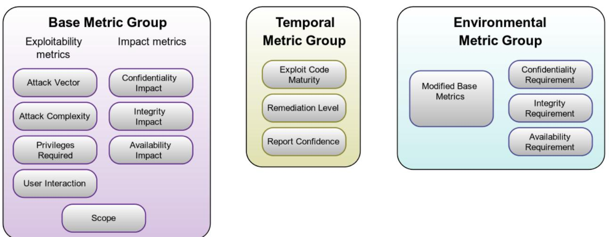
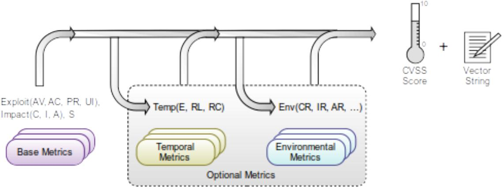

### LP:WHITE


# Common Vulnerability Scoring System version 3.1

# Specification Document

# Revision 1

The Common Vulnerability Scoring System (CVSS) is an open framework for communicating the characteristics and severity of software vulnerabilities. CVSS consists of three metric groups: Base. Temporal, and Environmental. The Base group represents the intrinsic qualities of a vulnerability that are constant over time and across user environments, the Temporal group reflects the characteristics of a vulnerability that change over time, and the Environmental group represents the characteristics of a vulnerability that are unique to a user's environment. The Base metrics produce a score ranging from 0 to 10, which can then be modified by scoring the Temporal and Environmental metrics. A CVSS score is also represented as a vector string, a compressed textual representation of the values used to derive the score. This document provides the official specification for CVSS version 3.1.

The most current CVSS resources can be found at https://www.first.org/cvss/

CVSS is owned and managed by FIRST.Org, Inc. (FIRST), a US-based non-profit organization, whose mission is to help computer security incident response teams across the right to update CVSS and this document periodically at its sole discretion. While FIRST owns all right and interest in CVSS, it licenses it to the public freely for use, subject to the conditions below. Membership in FIRST is not required to use or implement CVSS. FIRST does, however, require that any individual or entity using CVSS give proper attribution, where applicable, that CVSS is owned by FIRST and used by permission. Further, FIRST requires as a condition of use that any individual or entity which publishes scores conforms to the guidelines described in this document and provides both the scoring vector so others can understand how the score was derived.

# Contents

| 1. Introduction |  |
|-----------------|--|
|                 |  |


### TLP:WHITE


| 1.1. Metrics                                   |  |
|------------------------------------------------|--|
| 1.2. Scoring                                   |  |
| 2. Base Metrics                                |  |
| 2.1. Exploitability Metrics                    |  |
| 2.1.1. Attack Vector (AV)                      |  |
| 2.1.2. Attack Complexity (AC)                  |  |
| 2.1.3. Privileges Required (PR)                |  |
| 2.1.4. User Interaction (UI)                   |  |
| 2.2. Scope (S)                                 |  |
| 2.3. Impact Metrics                            |  |
| 2.3.1. Confidentiality (C)                     |  |
| 2.3.2. Integrity (1)                           |  |
| 2.3.3. Availability (A)                        |  |
| 3. Temporal Metrics                            |  |
| 3.1. Exploit Code Maturity (E)                 |  |
| 3.2. Remediation Level (RL)                    |  |
| 3.3. Report Confidence (RC)                    |  |
| 4. Environmental Metrics                       |  |
| 4.1. Security Requirements (CR, IR, AR)        |  |
| 4.2. Modified Base Metrics                     |  |
| 5. Qualitative Severity Rating Scale           |  |
| 6. Vector String                               |  |
| 7. CVSS v3.1 Equations                         |  |
| 7.1. Base Metrics Equations                    |  |
| 7.2. Temporal Metrics Equations                |  |
| 7.3. Environmental Metrics Equations           |  |
| 7.4. Metric Values                             |  |
| 7.5. A Word on CVSS v3.1 Equations and Scoring |  |
| Appendix A - Floating Point Rounding           |  |
| Appendix B - Acknowledgments                   |  |
| Appendix C - On-Line Resources                 |  |

# 1. Introduction

The Common Vulnerability Scoring System (CVSS) captures the principal technical characteristics of software, hardware and firmware vulnerabilities. Its outputs include numerical scores indicating the severity of a vulnerability relative to other vulnerabilities.

CVSS is composed of three metric groups: Base, Temporal, and Environmental. The Base Score reflects the severity of a vulnerability according to its intrinsic characteristics which are constant over time and assumes the reasonable worst case impact across different deployed environments.


The Temporal Metrics adjust the Base severity of a vulnerability based on factors that change over time, such as the availability of exploit code. The Environmental Metrics adjust the Base and Temporal severities to a specific computing environment. They consider factors such as the presence of mitigations in that environment.

Base Scores are usually produced by the organization maintaining the vulnerable product, or a third party scoring on their behalf. It is typical for only the Base Metrics to be published as these do not change over time and are common to all environments. Consumers of CVSS should supplement the Base Score with Temporal and Environmental Scores specific to their use of the vulnerable product to produce a severity more accurate for their organizational environment. Consumers may use CVSS information as input to an organizational vulnerability management process that also considers factors that are not part of CVSS in order to rank the threats to their technology infrastructure and make informed remediation decisions. Such factors mav include: number of customers on a product line, monetary losses due to a breach, life or property threatened, or public sentiment on highly publicized vulnerabilities. These are outside the scope of CVSS.

The benefits of CVSS include the provision of a standardized vendor and platform agnostic vulnerability scoring methodology. It is an open framework, providing transparency to the individual characteristics and methodology used to derive a score.

### 1.1. Metrics



CVSS is composed of three metric groups: Base, Temporal, and Environmental, each consisting of a set of metrics, as shown in Figure 1.

### Figure 1: CVSS Metric Groups

The Base metric group represents the intrinsic characteristics of a vulnerability that are constant over time and across user environments. It is composed of two sets of metrics: the Exploitability metrics and the Impact metrics.


The Exploitability metrics reflect the ease and technical means by which the vulnerability can be exploited. That is, they represent characteristics of the thing that is vulnerable, which we refer to formally as the vulnerable component. The Impact metrics reflect the direct consequence of a successful exploit, and represent the consequence to the thing that suffers the impact, which we refer to formally as the impacted component.

While the vulnerable component is typically a software application, module, driver, etc. (or possibly a hardware device), the impacted component could be a software application, a hardware device or a network resource. This potential for measuring the impact of a vulnerability other than the vulnerable component, was a key feature introduced with CVSS v3.0. This property is captured by the Scope metric, discussed later.

The Temporal metric group reflects the characteristics of a vulnerability that may change over time but not across user environments. For example, the presence of a simple-to-use exploit kit would increase the CVSS score, while the creation of an official patch would decrease it.

The Environmental metric group represents the characteristics of a vulnerability that are relevant and unique to a particular user's environment. Considerations include the presence of security controls which may mitigate some or all consequences of a successful attack, and the relative importance of a vulnerable system within a technology infrastructure.

Each of these metrics are discussed in further detail below. The User Guide contains scoring rubrics for the Base Metrics that may be useful when scoring.

### 1.2. Scoring

When the Base metrics are assigned values by an analyst, the Base equation computes a score



ranging from 0.0 to 10.0 as illustrated in Figure 2.

### Figure 2: CVSS Metrics and Equations

Specifically, the Base equation is derived from two sub equations: the Exploitability sub-score equation, and the Impact sub-score equation. The Exploitability sub-score equation is derived from the Base Exploitability metrics, while the Impact sub-score equation is derived from the Base Impact metrics.

The Base Score can then be refined by scoring the Temporal and Environmental metrics in order to more accurately reflect the relative severity posed by a vulnerability to a user's environment at a


specific point in time. Scoring the Temporal and Environmental metrics is not required. but is recommended for more precise scores.

Generally, the Base and Temporal metrics are specified by vulnerability bulletin analysts, security product vendors, or application vendors because they typically possess the most accurate information about the characteristics of a vulnerability. The Environmental metrics are specified by end-user organizations because they are best able to assess the potential impact of a vulnerability within their own computing environment.

Scoring CVSS metrics also produces a vector string, a textual representation of the metric values used to score the vulnerability. This vector string is a specifically formatted text string that contains each value assigned to each metric, and should always be displayed with the vulnerability score.

The scoring equations and vector string are explained further below.

Note that all metrics should be scored under the assumption that the attacker has already located and identified the vulnerability. That is, the analyst need not consider the means by which the vulnerability was identified. In addition, it is likely that many different types of individuals will be scoring vulnerabilities (e.g., software vendors, vulnerability bulletin analysts, security product vendors), however, note that vulnerability scoring is intended to be aqnostic to the individual and their organization.

# 2. Base Metrics

### 2.1. Exploitability Metrics

As previously mentioned, the Exploitability metrics reflect the characteristics of the thing that is vulnerable, which we refer to formally as the vulnerable component. Therefore, each of the Exploitability metrics listed below should be scored relative to the vulnerable component, and reflect the properties of the vulnerability that lead to a successful attack.

When scoring Base metrics, it should be assumed that the attacker has advanced knowledge of the weaknesses of the target system, including general configuration and default defense mechanisms (e.g., built-in firewalls, rate limits, traffic policing). For example, exploiting a vulnerability that results in repeatable, deterministic success should still be considered a Low value for Attack Complexity, independent of the attacker's knowledge or capabilities. Furthermore, target-specific attack mitigation (e.g., custom firewall filters, access lists) should instead be reflected in the Environmental metric scoring group.

Specific configurations should not impact any attributing to the CVSS Base Score, i.e., if a specific configuration is required for an attack to succeed, the vulnerable component should be scored assuming it is in that configuration.

### 2.1.1. Attack Vector (AV)

This metric reflects the context by which vulnerability exploitation is possible. This metric value (and consequently the Base Score) will be larger the more remote (logically) an attacker can be in order to exploit the vulnerable component. The assumption is that the number of potential attackers for a vulnerability that could be exploited from across a network is larger than the number of potential attackers that could exploit a vulnerability requiring physical access to a device, and therefore warrants a greater Base Score. The list of possible values is presented in Table 1.

5 of 24


### Table 1: Attack Vector

| Metric Value | Description                                                                                                                                                                                                                                                                                                                                                                                                                                                                                                                                                                                                                  |
|--------------|------------------------------------------------------------------------------------------------------------------------------------------------------------------------------------------------------------------------------------------------------------------------------------------------------------------------------------------------------------------------------------------------------------------------------------------------------------------------------------------------------------------------------------------------------------------------------------------------------------------------------|
| Network (N)  | The vulnerable component is bound to the network stack and the set of possible<br>attackers extends beyond the other options listed below, up to and including the<br>entire Internet. Such a vulnerability is often termed "remotely exploitable" and<br>can be thought of as an attack being exploitable at the protocol level one or<br>more network hops away (e.g., across one or more routers). An example of a<br>network attack is an attacker causing a denial of service (DoS) by sending a<br>specially crafted TCP packet across a wide area network (e.q., CVE-2004-0230).                                      |
| Adjacent (A) | The vulnerable component is bound to the network stack, but the attack is<br>limited at the protocol level to a logically adjacent topology. This can mean an<br>attack must be launched from the same shared physical (e.g., Bluetooth or IEEE<br>802.11) or logical (e.g., local IP subnet) network, or from within a secure or<br>otherwise limited administrative domain (e.g., MPLS, secure VPN to an<br>administrative network zone). One example of an Adjacent attack would be an<br>ARP (IPv4) or neighbor discovery (IPv6) flood leading to a denial of service on<br>the local LAN segment (e.g., CVE-2013-6014). |
| Local (L)    | The vulnerable component is not bound to the network stack and the attacker's<br>path is via read/write/execute capabilities. Either:<br>• the attacker exploits the vulnerability by accessing the target system<br>locally (e.g., keyboard, console), or remotely (e.g., SSH); or<br>• the attacker relies on User Interaction by another person to perform<br>actions required to exploit the vulnerability (e.g., using social engineering<br>techniques to trick a legitimate user into opening a malicious document).                                                                                                  |
| Physical (P) | The attack requires the attacker to physically touch or manipulate the vulnerable<br>component. Physical interaction may be brief (e.g., evil maid attack') or<br>persistent. An example of such an attack is a cold boot attack in which an<br>attacker gains access to disk encryption keys after physically accessing the<br>target system. Other examples include peripheral attacks via FireWire/USB<br>Direct Memory Access (DMA).                                                                                                                                                                                     |

Scoring Guidance: When deciding between Network and Adjacent, if an attack can be launched over a wide area network or from outside the logically adjacent administrative network domain, use Network. Network should be used even if the attacker is required to be on the same intranet to exploit the vulnerable system (e.g., the attacker can only exploit the vulnerability from inside a corporate network).

### 2.1.2. Attack Complexity (AC)

This metric describes the conditions beyond the attacker's control that must exist in order to exploit the vulnerability. As described below, such conditions may require the collection of more information about the target, or computational exceptions. Importantly, the assessment of this metric excludes any requirements for user interaction in order to exploit the vulnerability (such


<sup>1</sup> See https://www.schneier.com/blog/archives/2009/10/evil_maid_attac.html for a description of the evil maid attack.


conditions are captured in the User Interaction metric). If a specific configuration is required for an attack to succeed, the Base metrics should be scored assuming the vulnerable component is in that configuration. The Base Score is greatest for the least complex attacks. The list of possible values is presented in Table 2.

| Metric Value | Description                                                                                                                                                                                                                                                                                                                                                                                                                                   |
|--------------|-----------------------------------------------------------------------------------------------------------------------------------------------------------------------------------------------------------------------------------------------------------------------------------------------------------------------------------------------------------------------------------------------------------------------------------------------|
| Low (L)      | Specialized access conditions or extenuating circumstances do not exist. An<br>attacker can expect repeatable success when attacking the vulnerable<br>component.                                                                                                                                                                                                                                                                             |
| High (H)     | A successful attack depends on conditions beyond the attacker's control. That<br>is, a successful attack cannot be accomplished at will, but requires the attacker<br>to invest in some measurable amount of effort in preparation or execution<br>against the vulnerable component before a successful attack can be<br>expected.2 For example, a successful attack may depend on an attacker<br>overcoming any of the following conditions: |
|              | • The attacker must gather knowledge about the environment in which the<br>vulnerable target/component exists. For example, a requirement to collect<br>details on target configuration settings, sequence numbers, or shared<br>secrets.                                                                                                                                                                                                     |
|              | · The attacker must prepare the target environment to improve exploit<br>reliability. For example, repeated exploitation to win a race condition, or<br>overcoming advanced exploit mitigation techniques.                                                                                                                                                                                                                                    |
|              | · The attacker must inject themselves into the logical network path<br>between the target and the resource requested by the victim in order to<br>read and/or modify network communications (e.g., a man in the middle<br>attack).                                                                                                                                                                                                            |

### Table 2: Attack Complexity

As described in Section 2.1, detailed knowledge of the vulnerable component is outside the scope of Attack Complexity. Refer to that section for additional guidance when scoring Attack Complexity when target-specific attack mitigation is present.

### 2.1.3. Privileges Required (PR)

This metric describes the level of privileges an attacker must possess before successfully exploiting the vulnerability. The Base Score is greatest if no privileges are required. The list of possible values is presented in Table 3.


<sup>2</sup> Note that no comment is made regarding the amount of effort required, only that some amount of additional effort must be exerted in order to exploit the vulnerability.


### Table 3: Privileges Required

| Metric Value | Description                                                                                                                                                                                                                                               |
|--------------|-----------------------------------------------------------------------------------------------------------------------------------------------------------------------------------------------------------------------------------------------------------|
| None (N)     | The attacker is unauthorized prior to attack, and therefore does not require<br>any access to settings or files of the the vulnerable system to carry out an<br>attack.                                                                                   |
| Low (L)      | The attacker requires privileges that provide basic user capabilities that<br>could normally affect only settings and files owned by a user. Alternatively,<br>an attacker with Low privileges has the ability to access only non-sensitive<br>resources. |
| High (H)     | The attacker requires privileges that provide significant (e.g., administrative)<br>control over the vulnerable component allowing access to component-wide<br>settings and files.                                                                        |

Scoring Guidance: Privileges Required is usually None for hard-coded credential vulnerabilities or vulnerabilities requiring social engineering (e.g., reflected cross-site scripting, cross-site request forgery, or file parsing vulnerability in a PDF reader).

### 2.1.4. User Interaction (UI)

This metric captures the requirement for a human user, other than the attacker, to participate in the successful compromise of the vulnerable component. This metric determines whether the vulnerability can be exploited solely at the will of the attacker, or whether a separate user (or userinitiated process) must participate in some manner. The Base Score is greatest when no user interaction is required. The list of possible values is presented in Table 4.

### Table 4: User Interaction

| Metric Value | Description                                                                                                                                                                                                                                                       |
|--------------|-------------------------------------------------------------------------------------------------------------------------------------------------------------------------------------------------------------------------------------------------------------------|
| None (N)     | The vulnerable system can be exploited without interaction from any user.                                                                                                                                                                                         |
| Required (R) | Successful exploitation of this vulnerability requires a user to take some<br>action before the vulnerability can be exploited. For example, a successful<br>exploit may only be possible during the installation of an application by a<br>system administrator. |

### 2.2. Scope (S)

The Scope metric captures whether a vylnerability in one vulnerable component impacts resources in components beyond its security scope.

Formally, a security authority is a mechanism (e.g., an application, an operating system, firmware, a sandbox environment) that defines and enforces access control in terms of how certain subjects/actors (e.g., human users, processes) can access certain restricted objects/resources (e.g., files, CPU, memory) in a controlled manner. All the subjects under the jurisdiction of a single security authority are considered to be under one security scope. If a vulnerability in a vulnerable component can affect a component which is in a different security scope than the


vulnerable component, a Scope change occurs. Intuitively, whenever the impact of a vulnerability breaches a security/trust boundary and impacts components outside the security scope in which vulnerable component resides, a Scope change occurs.

The security scope of a component encompasses other components that provide functionality solely to that component, even if these other components have their own security authority. For example, a database used solely by one application is considered part of that application's security scope even if the database has its own security authority, e.g., a mechanism controlling access to database records based on database users and associated database privileges.

The Base Score is greatest when a scope change occurs. The list of possible values is presented in Table 5.

| Metric Value  | Description                                                                                                                                                                                                                                                                      |
|---------------|----------------------------------------------------------------------------------------------------------------------------------------------------------------------------------------------------------------------------------------------------------------------------------|
| Unchanged (U) | An exploited vulnerability can only affect resources managed by the same<br>security authority. In this case, the vulnerable component and the impacted<br>component are either the same, or both are managed by the same security<br>authority.                                 |
| Changed (C)   | An exploited vulnerability can affect resources beyond the security scope<br>managed by the security authority of the vulnerable component. In this case,<br>the vulnerable component and the impacted component are different and<br>managed by different security authorities. |

#### Table 5: Scope

### 2.3. Impact Metrics

The Impact metrics capture the effects of a successfully exploited vulnerability on the component that suffers the worst outcome that is most directly and predictably associated with the attack. Analysts should constrain impacts to a reasonable, final outcome which they are confident an attacker is able to achieve.

Only the increase in access, privileges gained, or other negative outcome as a result of successful exploitation should be considered when scoring the Impact metrics of a vulnerability. For example, consider a vulnerability that requires read-only permissions prior to being able to exploit the vulnerability. After successful exploitation, the attacker maintains the same level of read access, and gains write access. In this case, only the Integrity impact metric should be scored, and the Confidentiality and Availability Impact metrics should be set as None.

Note that when scoring a delta change in impact should be used. For example, if an attacker starts with partial access to restricted information (Confidentiality Low) and successful exploitation of the vulnerability results in confidentiality (Confidentiality High), then the resultant CVSS Base Score should reference the "end game" Impact metric value (Confidentiality High).

If a scope change has not occurred, the Impact metrics should reflect the Confidentiality, Integrity, and Availability impacts to the vulnerable component. However, if a scope change has occurred, then the Impact metrics should reflect the Confidentiality, Integrity, and Availability impacts to either the vulnerable component, or the impacted component, whichever suffers the most severe outcome.


TLP:WHITE


### 2.3.1. Confidentiality (C)

This metric measures the impact to the confidentiality of the information resources managed by a software component due to a successfully exploited vulnerability. Confidentiality refers to limiting information access and disclosure to only authorized users, as well as preventing access by, or disclosure to, unauthorized ones. The Base Score is greatest when the impacted component is highest. The list of possible values is presented in Table 6.

### Table 6: Confidentiality

| Metric Value | Description                                                                                                                                                                                                                                                                                                                                                                                      |
|--------------|--------------------------------------------------------------------------------------------------------------------------------------------------------------------------------------------------------------------------------------------------------------------------------------------------------------------------------------------------------------------------------------------------|
| High (H)     | There is a total loss of confidentiality, resulting in all resources within the<br>impacted component being divulged to the attacker. Alternatively, access to<br>only some restricted information is obtained, but the disclosed information<br>presents a direct, serious impact. For example, an attacker steals the<br>administrator's password, or private encryption keys of a web server. |
| Low (L)      | There is some loss of confidentiality. Access to some restricted information<br>is obtained, but the attacker does not have control over what information is<br>obtained, or the amount or kind of loss is limited. The information disclosure<br>does not cause a direct, serious loss to the impacted component.                                                                               |
| None (N)     | There is no loss of confidentiality within the impacted component.                                                                                                                                                                                                                                                                                                                               |

#### 2.3.2. Integrity (I)

This metric measures the impact to integrity of a successfully exploited vulnerability. Integrity refers to the trustworthiness and veracity of information. The Base Score is greatest when the consequence to the impacted component is highest. The list of possible values is presented in Table 7.

#### Table 7: Integrity

| Metric Value | Description                                                                                                                                                                                                                                                                                                                        |
|--------------|------------------------------------------------------------------------------------------------------------------------------------------------------------------------------------------------------------------------------------------------------------------------------------------------------------------------------------|
| High (H)     | There is a total loss of integrity, or a complete loss of protection. For<br>example, the attacker is able to modify any/all files protected by the<br>impacted component. Alternatively, only some files can be modified, but<br>malicious modification would present a direct, serious consequence to the<br>impacted component. |
| Low (L)      | Modification of data is possible, but the attacker does not have control over<br>the consequence of a modification, or the amount of modification is limited.<br>The data modification does not have a direct, serious impact on the<br>impacted component.                                                                        |
| None (N)     | There is no loss of integrity within the impacted component.                                                                                                                                                                                                                                                                       |

### 2.3.3. Availability (A)

This metric measures the impact to the availability of the impacted component resulting from a successfully exploited vulnerability. While the Confidentiality and Integrity impact metrics apply to


the loss of confidentiality or integrity of data (e.g., information, files) used by the impacted component, this metric refers to the loss of availability of the impacted component itself, such as a networked service (e.g., web, database, email). Since availability refers to the accessibility of information resources, attacks that consume network bandwidth, processor cycles, or disk space all impact the availability of an impacted component. The Base Score is greatest when the consequence to the impacted component is highest. The list of possible values is presented in Table 8.

### Table 8: Availability

| Metric Value | Description                                                                                                                                                                                                                                                                                                                                                                                                                                                                                                                                                                                                                                                                                                                                                                                                                      |
|--------------|----------------------------------------------------------------------------------------------------------------------------------------------------------------------------------------------------------------------------------------------------------------------------------------------------------------------------------------------------------------------------------------------------------------------------------------------------------------------------------------------------------------------------------------------------------------------------------------------------------------------------------------------------------------------------------------------------------------------------------------------------------------------------------------------------------------------------------|
| High (H)     | There is a total loss of availability, resulting in the attacker being able to fully<br>deny access to resources in the impacted component; this loss is either<br>sustained (while the attacker continues to deliver the attack) or persistent (the<br>condition persists even after the attack has completed). Alternatively, the<br>attacker has the ability to deny some availability, but the loss of availability<br>presents a direct, serious consequence to the impacted component (e.g., the<br>attacker cannot disrupt existing connections, but can prevent new<br>connections; the attacker can repeatedly exploit a vulnerability that, in each<br>instance of a successful attack, leaks a only small amount of memory, but<br>after repeated exploitation causes a service to become completely<br>unavailable). |
| Low (L)      | Performance is reduced or there are interruptions in resource availability.<br>Even if repeated exploitation of the vulnerability is possible, the attacker does<br>not have the ability to completely deny service to legitimate users. The<br>resources in the impacted component are either partially available all of the<br>time, or fully available only some of the time, but overall there is no direct,<br>serious consequence to the impacted component.                                                                                                                                                                                                                                                                                                                                                               |
| None (N)     | There is no impact to availability within the impacted component.                                                                                                                                                                                                                                                                                                                                                                                                                                                                                                                                                                                                                                                                                                                                                                |

# 3. Temporal Metrics

The Temporal metrics measure the current state of exploit techniques or code availability, the existence of any patches or workarounds, or the confidence in the description of a vulnerability.

### 3.1. Exploit Code Maturity (E)

This metric measures the likelihood of the vulnerability being attacked, and is typically based on the current state of exploit techniques, exploit code availability, or active, "in-the-wild" exploitation. Public availability of easy-to-use exploit code increases the number of potential attackers by including those who are unskilled, thereby increasing the severity of the vulnerability. Initially, realworld exploitation may only be theoretical. Publication of proof-of-concept code, functional exploit code, or sufficient technical details necessary to exploit the vulnerability may follow. Furthermore, the exploit code available may progress from a proof-of-concept demonstration to exploit code that is successful in exploiting the vulnerability consistently. In severe cases, it may be delivered as the payload of a network-based worm or virus or other automated attack tools.


The list of possible values is presented in Table 9. The more easily a vulnerability can be exploited, the higher the vulnerability score.

| Metric Value         | Description                                                                                                                                                                                                                                                                                                                                                                                                                                           |  |
|----------------------|-------------------------------------------------------------------------------------------------------------------------------------------------------------------------------------------------------------------------------------------------------------------------------------------------------------------------------------------------------------------------------------------------------------------------------------------------------|--|
| Not Defined (X)      | Assigning this value indicates there is insufficient information to<br>choose one of the other values, and has no impact on the overall<br>Temporal Score, i.e., it has the same effect on scoring as assigning<br>High.                                                                                                                                                                                                                              |  |
| High (H)             | Functional autonomous code exists, or no exploit is required (manual<br>trigger) and details are widely available. Exploit code works in every<br>situation, or is actively being delivered via an autonomous agent (such<br>as a worm or virus). Network-connected systems are likely to<br>encounter scanning or exploitation attempts. Exploit development has<br>reached the level of reliable, widely available, easy-to-use automated<br>tools. |  |
| Functional (F)       | Functional exploit code is available. The code works in most situations<br>where the vulnerability exists.                                                                                                                                                                                                                                                                                                                                            |  |
| Proof-of-Concept (P) | Proof-of-concept exploit code is available, or an attack demonstration<br>is not practical for most systems. The code or technique is not<br>functional in all situations and may require substantial modification by<br>a skilled attacker.                                                                                                                                                                                                          |  |
| Unproven (U)         | No exploit code is available, or an exploit is theoretical.                                                                                                                                                                                                                                                                                                                                                                                           |  |

### Table 9 : Exploit Code Maturity

### 3.2. Remediation Level (RL)

The Remediation Level of a vulnerability is an important factor for prioritization. The typical vulnerability is unpatched when initially published. Workarounds or hotfixes may offer interim remediation until an official patch or upgrade is issued. Each of these respective stages adjusts the Temporal Score downwards, reflecting the decreasing urgency as remediation becomes final. The list of possible values is presented in Table 10. The less official and permanent a fix, the higher the vulnerability score.

### Table 10: Remediation Level

| Metric Value    | Description                                                                                                                                                                                                                     |
|-----------------|---------------------------------------------------------------------------------------------------------------------------------------------------------------------------------------------------------------------------------|
| Not Defined (X) | Assigning this value indicates there is insufficient information to<br>choose one of the other values, and has no impact on the overall<br>Temporal Score, i.e., it has the same effect on scoring as assigning<br>Unavailable. |
| Unavailable (U) | There is either no solution available or it is impossible to apply.                                                                                                                                                             |
| Workaround (W)  | There is an unofficial, non-vendor solution available. In some cases,<br>users of the affected technology will create a patch of their own or<br>provide steps to work around or otherwise mitigate the vulnerability.          |


|  | Temporary Fix (T) | There is an official but temporary fix available. This includes instances<br>where the vendor issues a temporary hotfix, tool, or workaround. |  |
|--|-------------------|-----------------------------------------------------------------------------------------------------------------------------------------------|--|
|  | Official Fix (O)  | A complete vendor solution is available. Either the vendor has issued<br>an official patch, or an upgrade is available.                       |  |

### 3.3. Report Confidence (RC)

This metric measures the degree of confidence in the existence of the vulnerability and the credibility of the known technical details. Sometimes only the existence of vulnerabilities is publicized, but without specific details. For example, an impact may be recognized as undesirable, but the root cause may not be known. The vulnerability may later be corroborated by research which suggests where the vulnerability may lie, though the research may not be certain. Finally, a vulnerability may be confirmed through acknowledgment by the author or vendor of the affected technology. The urgency of a vulnerability is higher when a vulnerability is known to exist with certainty. This metric also suggests the level of technical knowledge available to would-be attackers. The list of possible values is presented in Table 11. The more a vulnerability is validated by the vendor or other reputable sources, the higher the score.

| Metric Value    | Description                                                                                                                                                                                                                                                                                                                                                                                                                                                                                                                                                                                                                                                              |
|-----------------|--------------------------------------------------------------------------------------------------------------------------------------------------------------------------------------------------------------------------------------------------------------------------------------------------------------------------------------------------------------------------------------------------------------------------------------------------------------------------------------------------------------------------------------------------------------------------------------------------------------------------------------------------------------------------|
| Not Defined (X) | Assigning this value indicates there is insufficient information to choose one<br>of the other values, and has no impact on the overall Temporal Score, i.e.,<br>it has the same effect on scoring as assigning Confirmed.                                                                                                                                                                                                                                                                                                                                                                                                                                               |
| Confirmed (C)   | Detailed reports exist, or functional reproduction is possible (functional<br>exploits may provide this). Source code is available to independently verify<br>the assertions of the research, or the author or vendor of the affected code<br>has confirmed the presence of the vulnerability.                                                                                                                                                                                                                                                                                                                                                                           |
| Reasonable (R)  | Significant details are published, but researchers either do not have full<br>confidence in the root cause, or do not have access to source code to fully<br>confirm all of the interactions that may lead to the result. Reasonable<br>confidence exists, however, that the bug is reproducible and at least one<br>impact is able to be verified (proof-of-concept exploits may provide this). An<br>example is a detailed write-up of research into a vulnerability with an<br>explanation (possibly obfuscated or "left as an exercise to the reader") that<br>gives assurances on how to reproduce the results.                                                     |
| Unknown (U)     | There are reports of impacts that indicate a vulnerability is present. The<br>reports indicate that the cause of the vulnerability is unknown, or reports<br>may differ on the cause or impacts of the vulnerability. Reporters are<br>uncertain of the true nature of the vulnerability, and there is little confidence<br>in the validity of the reports or whether a static Base Score can be applied<br>given the differences described. An example is a bug report which notes<br>that an intermittent but non-reproducible crash occurs, with evidence of<br>memory corruption suggesting that denial of service, or possible more<br>serious impacts, may result. |

### Table 11: Report Confidence


# 4. Environmental Metrics

These metrics enable the analyst to customize the CVSS score depending on the importance of the affected IT asset to a user's organization, measured in terms of complementary/alternative security controls in place, Confidentiality, Integrity, and Availability. The metrics are the modified equivalent of Base metrics and are assigned values based on the component placement within organizational infrastructure.

### 4.1. Security Requirements (CR, IR, AR)

These metrics enable the analyst to customize the CVSS score depending on the importance of the affected IT asset to a user's organization, measured in terms of Confidentiality. Integrity, and Availability. That is, if an IT asset supports a business function for which Availability is most important, the analyst can assign a greater value to Availability relative to Confidentiality and Integrity. Each Security Requirement has three possible values: Low, Medium, or High.

The full effect on the environmental score is determined by the corresponding Modified Base Impact metrics. That is, these metrics modify the environmental score by reweighting the Modified Confidentiality, Integrity, and Availability impact metrics. For example, the Modified Confidentiality impact (MC) metric has increased weight if the Confidentiality Requirement (CR) is High. Likewise, the Modified Confidentiality impact metric has decreased weight if the Confidentiality Requirement is Low. The Modified Confidentiality impact metric weighting is neutral if the Confidentiality Requirement is Medium. This same process is applied to the Integrity and Availability requirements.

Note that the Confidentiality Requirement will not affect the Environmental score if the (Modified Base) confidentiality impact is set to None. Also, increasing the Confidentiality Requirement from Medium to High will not change the Environmental score when the (Modified Base) impact metrics are set to High. This is because the Modified Impact Sub-Score (part of the Modified Base Score that calculates impact) is already at a maximum value of 10.

The list of possible values is presented in Table 12. For brevity, the same table is used for all three metrics. The greater the Security Requirement, the higher the score (recall that Medium is considered the default).

| Metric Value    | Description                                                                                                                                                                                                                  |
|-----------------|------------------------------------------------------------------------------------------------------------------------------------------------------------------------------------------------------------------------------|
| Not Defined (X) | Assigning this value indicates there is insufficient information to choose<br>one of the other values, and has no impact on the overall Environmental<br>Score, i.e., it has the same effect on scoring as assigning Medium. |
| High (H)        | Loss of [Confidentiality   Integrity   Availability] is likely to have a<br>catastrophic adverse effect on the organization or individuals associated<br>with the organization (e.g., employees, customers).                 |
| Medium (M)      | Loss of [Confidentiality   Integrity   Availability] is likely to have a serious<br>adverse effect on the organization or individuals associated with the<br>organization (e.g., employees, customers).                      |
| Low (L)         | Loss of [Confidentiality   Integrity   Availability] is likely to have only a<br>limited adverse effect on the organization or individuals associated with the<br>organization (e.g., employees, customers).                 |

### Table 12: Security Requirements


### 4.2. Modified Base Metrics

These metrics enable the analyst to override individual Base metrics based on specific characteristics of a user's environment. Characteristics that affect Exploitability, Scope, or Impact can be reflected via an appropriately modified Environmental Score.

The full effect on the Environmental score is determined by the corresponding Base metrics. That is, these metrics modify the Environmental Score by overriding Base metric values, prior to applying the Environmental Security Requirements. For example, the default configuration for a vulnerable component may be to run a listening service with administrator privileges, for which a compromise might grant an attacker Confidentiality, Integrity, and Availability impacts that are all High. Yet, in the analyst's environment, that same Internet service might be running with reduced privileges; in that case, the Modified Confidentiality, Modified Integrity, and Modified Availability might each be set to Low.

For brevity, only the names of the Modified Base metrics are mentioned. Each Modified Environmental metric has the same values as its corresponding Base metric, plus a value of Not Defined. Not Defined is the default and uses the metric value of the associated Base metric.

The intent of this metric is to define the mitigations in place for a given environment. It is acceptable to use the modified metrics to represent situations that increase the Base Score. For example, the default configuration of a component may require high privileges to access a particular function, but in the analyst's environment there may be no privileges required. The analyst can set Privileges Required to High and Modified Privileges Required to None to reflect this more serious condition in their particular environment.

The list of possible values is presented in Table 13.

## Modified Base Metric Corresponding Values Modified Attack Vector (MAV) Modified Attack Complexity (MAC) Modified Privileges Required (MPR) The same values as the corresponding Base Metric Modified User Interaction (MUI) (see Base Metrics above), as well as Not Defined Modified Scope (MS) (the default). Modified Confidentiality (MC) Modified Integrity (MI) Modified Availability (MA)

### Table 13: Modified Base Metrics


# 5. Qualitative Severity Rating Scale

For some purposes it is useful to have a textual representation of the numeric Base, Temporal and Environmental scores. All scores can be mapped to the qualitative ratings defined in Table 14. 3

| Rating   | CVSS Score |  |
|----------|------------|--|
| None     | 0.0        |  |
| Low      | 0.1 - 3.9  |  |
| Medium   | 4.0 - 6.9  |  |
| High     | 7.0 - 8.9  |  |
| Critical | 9.0 - 10.0 |  |

### Table 14: Qualitative severity rating scale

As an example, a CVSS Base Score of 4.0 has an associated severity rating of Medium. The use of these qualitative severity ratings is optional, and there is no requirement to include them when publishing CVSS scores. They are intended to help orqanizations properly assess and prioritize their vulnerability management processes.

# 6. Vector String

The CVSS v3.1 vector string is a text representation of a set of CVSS metrics. It is commonly used to record or transfer CVSS metric information in a concise form.

The CVSS v3.1 vector string begins with the label "CVSS:" and a numeric representation of the current version, "3.1". Metric information follows in the form of a set of metrics, each preceded by a forward slash, "/", acting as a delimiter. Each metric name in abbreviated form, a colon, ":", and its associated metric value in abbreviated forms are defined earlier in this specification (in parentheses after each metric name and metric value), and are summarized in the table below.

A vector string should contain metrics in the order shown in Table 15, though other orderings are valid. All Base metrics must be included in a vector string. Temporal and Environmental metrics are optional, and omitted metrics are considered to have the value of Not Defined (X). Metrics with a value of Not Defined can be explicitly included in a vector string if desired. Programs reading CVSS v3.1 vector strings must accept metrics in any order and treat unspecified Temporal and Environmental as Not Defined. A vector string must not include the same metric more than once.


<sup>3</sup> Note that this mapping between quantitative and qualitative scores applies whether just the Base, or all of Base, Temporal, and Environmental metric groups, are scored.


| Metric Group  | Metric Name (and<br>Abbreviated Form) | Possible<br>Values | Mandatory? |
|---------------|---------------------------------------|--------------------|------------|
| Base          | Attack Vector (AV)                    | [N,A,L,P]          | Yes        |
|               | Attack Complexity (AC)                | [L,H]              | Yes        |
|               | Privileges Required (PR)              | [N,L,H]            | Yes        |
|               | User Interaction (UI)                 | [N,R]              | Yes        |
|               | Scope (S)                             | [U,C]              | Yes        |
|               | Confidentiality (C)                   | [H,L,N]            | Yes        |
|               | Integrity (I)                         | [H,L,N]            | Yes        |
|               | Availability (A)                      | [H,L,N]            | Yes        |
| Temporal      | Exploit Code Maturity (E)             | [X,H,F,P,U]        | No         |
|               | Remediation Level (RL)                | [X,U,W,T,O]        | No         |
|               | Report Confidence (RC)                | [X,C,R,U]          | No         |
| Environmental | Confidentiality Requirement (CR)      | [X,H,M,L]          | No         |
|               | Integrity Requirement (IR)            | [X,H,M,L]          | No         |
|               | Availability Requirement (AR)         | [X,H,M,L]          | No         |
|               | Modified Attack Vector (MAV)          | [X,N,A,L,P]        | No         |
|               | Modified Attack Complexity (MAC)      | [X,L,H]            | No         |
|               | Modified Privileges Required (MPR)    | [X,N,L,H]          | No         |
|               | Modified User Interaction (MUI)       | [X,N,R]            | No         |
|               | Modified Scope (MS)                   | [X,U,C]            | No         |
|               | Modified Confidentiality (MC)         | [X,N,L,H]          | No         |
|               | Modified Integrity (MI)               | [X,N,L,H]          | No         |
|               | Modified Availability (MA)            | [X,N,L,H]          | No         |

| Table 15: Base, Temporal and Environmental Vectors |
|----------------------------------------------------|
|----------------------------------------------------|

For example, a vulnerability with Base metric values of "Attack Vector: Network, Attack Complexity: Low, Privileges Required: High, User Interaction: None, Scope: Unchanged, Confidentiality: Low, Integrity: Low, Availability: None" and no specified Temporal or Environmental metrics would produce the following vector:

### CVSS:3.1/AV:N/AC:L/PR:H/UI:N/S:U/C:L/I:L/A:N

The same example with the addition of "Exploitability: Functional, Remediation Level: Not Defined" and with the metrics in a non-preferred ordering would produce the following vector:


# 7. CVSS v3.1 Equations

The CVSS v3.1 equations are defined in the sub-sections below. They rely on helper functions defined as follows:

- Minimum returns the smaller of its two arguments.
• Roundup returns the smallest number, specified to 1 decimal place, that is equal to or higher than its input. For example, Roundup (4.02) returns 4.1; and Roundup (4.00) returns 4.0. To ensure consistent results across programming languages and hardware, see Appendix A for advice to Implementers on avoiding small inaccuracies introduced in some floating point implementations.

Substitute Individual metrics used in equations with the associated constant listed in Section 7.4.

### 7.1. Base Metrics Equations

The Base Score formula depends on sub-formulas for Impact Sub-Score (ISS), Impact, and Exploitability, all of which are defined below:

 1 - [ ( 1 - Confidentiality) × ( 1 - Integrity) × ( 1 - Availability) | ISS =

Impact =

| If Scope is Unchanged | 6.42 × ISS                                               |
|-----------------------|----------------------------------------------------------|
| If Scope is Changed   | 7.52 × (ISS - 0.029) - 3.25 × (ISS - 0.02)15             |
| Exploitability =      | 8.22 × AttackVector × AttackComplexity ×                 |
| BaseScore =           | PrivilegesRequired × UserInteraction                     |
| If Impact <= 0        | 0, else                                                  |
| If Scope is Unchanged | Roundup (Minimum [(Impact + Exploitability), 10])        |
| If Scope is Changed   | Roundup (Minimum [1.08 × (Impact + Exploitability), 10]) |
|                       |                                                          |

### 7.2. Temporal Metrics Equations

```
TemporalScore =
                     Roundup (BaseScore × ExploitCodeMaturity ×
                     RemediationLevel × ReportConfidence)
```
### 7.3. Environmental Metrics Equations

The Environmental Score formula depends on sub-formulas for Modified Impact Sub-Score (MISS), ModifiedImpact, and ModifiedExploitability, all of which are defined below:


### WHITE

| MISS =                                                          | Minimum (                     |                                                          |  |  |
|-----------------------------------------------------------------|-------------------------------|----------------------------------------------------------|--|--|
|                                                                 | 1 -                           |                                                          |  |  |
| [ ( 1 - ConfidentialityRequirement × ModifiedConfidentiality) × |                               |                                                          |  |  |
| (1 - IntegrityRequirement × ModifiedIntegrity) ×                |                               |                                                          |  |  |
| (1 - AvailabilityRequirement × ModifiedAvailability) ], 0.915)  |                               |                                                          |  |  |
| ModifiedImpact =                                                |                               |                                                          |  |  |
|                                                                 | If ModifiedScope is Unchanged | 6.42 × MISS                                              |  |  |
| If ModifiedScope is Changed                                     |                               | 7.52 × (MISS - 0.029) - 3.25 ×                           |  |  |
|                                                                 |                               | (MISS × 0.9731 - 0.02)13                                 |  |  |
| ModifiedExploitability =                                        |                               | 8.22 × ModifiedAttackVector × ModifiedAttackComplexity × |  |  |
|                                                                 |                               | ModifiedPrivilegesRequired × ModifiedUserInteraction     |  |  |

Note that the exponent at the end of the ModifiedImpact sub-formula is 13, which differs from CVSS v3.0. See the User Guide for more details of this change.

EnvironmentalScore =

| If ModifiedImpact <= 0           | 0, else                                                                                                                              |  |
|----------------------------------|--------------------------------------------------------------------------------------------------------------------------------------|--|
| If ModifiedScope is<br>Unchanged | Roundup (<br>Roundup [Minimum<br>([ModifiedImpact + ModifiedExploitability], 10)<br>×<br>ExploitCodeMaturity ×<br>RemediationLevel × |  |
| If ModifiedScope is<br>Changed   | ReportConfidence)<br>Roundup (<br>Roundup [Minimum<br>(1.08 ×<br>[ModifiedImpact + ModifiedExploitability], 10)                      |  |
|                                  | 1<br>×<br>ExploitCodeMaturity ×<br>RemediationLevel ×<br>ReportConfidence)                                                           |  |

### 7.4. Metric Values

Each metric value has an associated constant which is used in the formulas, as defined in Table 16.

| Metric                 | Metric Value | Numerical Value |
|------------------------|--------------|-----------------|
| Attack Vector /        | Network      | 0.85            |
| Modified Attack Vector | Adjacent     | 0.62            |

### Table 16: Metric values


### TLP:WHITE


|                                                                       | Local            | 0.55                                                   |
|-----------------------------------------------------------------------|------------------|--------------------------------------------------------|
|                                                                       | Physical         | 0.2                                                    |
| Attack Complexity /<br>Modified Attack Complexity                     | Low              | 0.77                                                   |
|                                                                       | High             | 0.44                                                   |
| Privileges Required /                                                 | None             | 0.85                                                   |
| Modified Privileges Required                                          | Low              | 0.62 (or 0.68 if Scope / Modified Scope<br>is Changed) |
|                                                                       | High             | 0.27 (or 0.5 if Scope / Modified Scope is<br>Changed)  |
| User Interaction /                                                    | None             | 0.85                                                   |
| Modified User Interaction                                             | Required         | 0.62                                                   |
| Confidentiality / Integrity /                                         | High             | 0.56                                                   |
| Availability / Modified<br>Confidentiality / Modified Integrity       | Low              | 0.22                                                   |
| / Modified Availability                                               | None             | 0                                                      |
| Exploit Code Maturity                                                 | Not Defined      | 1                                                      |
|                                                                       | High             | 1                                                      |
|                                                                       | Functional       | 0.97                                                   |
|                                                                       | Proof of Concept | 0.94                                                   |
|                                                                       | Unproven         | 0.91                                                   |
| Remediation Level                                                     | Not Defined      | 1                                                      |
|                                                                       | Unavailable      | 1                                                      |
|                                                                       | Workaround       | 0.97                                                   |
|                                                                       | Temporary Fix    | 0.96                                                   |
|                                                                       | Official Fix     | 0.95                                                   |
| Report Confidence                                                     | Not Defined      | 1                                                      |
|                                                                       | Confirmed        | 1                                                      |
|                                                                       | Reasonable       | 0.96                                                   |
|                                                                       | Unknown          | 0.92                                                   |
| Confidentiality Requirement /<br>Integrity Requirement / Availability | Not Defined      | 1                                                      |
| Requirement                                                           | High             | 1.5                                                    |


| - 100 -<br>Improving Security Together |        |     | TLP:WHITE |
|----------------------------------------|--------|-----|-----------|
|                                        | Medium |     |           |
|                                        | Low    | 0.5 |           |

### 7.5. A Word on CVSS v3.1 Equations and Scoring

The CVSS v3.1 formula provides a mathematical approximation of all possible metric combinations ranked in order of severity (a vulnerability lookup table). To produce the CVSS v3.1 formula, the CVSS Special Interest Group (SIG) framed the lookup table by assigning metric values to real vulnerabilities, and a severity group (low, medium, high, critical). Having defined the acceptable numeric ranges for each severity level, the SIG then collaborated with Deloitte & Touche LLP to adjust formula parameters in order to align the metric combinations to the SIG's proposed severity ratings.

Given that there are a limited number of numeric outcomes (101 outcomes, ranging from 0.0 to 10.0), multiple scoring combinations may produce the same numeric score. In addition, some numeric scores may be omitted because the weights and calculations are derived from the severity ranking of metric combinations. Further, in some cases, metric combinations may deviate from the desired severity threshold. This is unavoidable and a simple correction is not readily available because adjustments made to one metric value or equation parameter in order to fix a deviation, cause other, potentially more severe deviations.

By consensus, and as was done with CVSS v2.0, the acceptable deviation was a value of 0.5. That is, all the metric value combinations used to derive the weights and calculation will produce a numeric score within its assigned severity level, or within 0.5 of that assigned level. For example, a combination expected to be rated as a "high" may have a numeric score between 6.6 and 9.3. Finally, CVSS v3.1 retains the range from 0.0 to 10.0 for backward compatibility.


### P:WHITE

# Appendix A - Floating Point Rounding

Simple implementations of the Roundup function defined in Section 7 are likely to lead to different results across programming languages and hardware platforms. This is due to small inaccuracies that occur when using floating point arithmetic. For example, although the intuitive result of 0.1 + 0.2 is 0.3, JavaScript implementations on many systems return 0.30000000000004. A simple implementation of Roundup would round this up to to 0.4, which is counter-intuitive.

Implementers of CVSS formulas must take steps to avoid these types of problems. Different techniques may be required for different languages and platforms, and some may offer standard functionality that minimizes or fully avoids such problems.

A suggested approach is for the Roundup function to first multiply its input by 100,000 and convert it to the nearest integer. The rounding up should then be performed using only integer arithmetic, which is not subject to floating point inaccuracies. An example of pseudocode for such an implementation is:

1 function Roundup (input):

- int_input = round_to_nearest_integer (input * 100000) 2
- 3 if (int_input % 10000) == 0:
- 4 return int_input / 100000.0
- 5 else:
- return (floor(int input / 10000) + 1) / 10.0 6

The floor function on line 6 represents integer division, i.e., the largest integer value less than or equal to its input. Many programming languages include a floor function as standard.

Line 3 checks if the least significant four digits of the integer are all zeroes, e.g., an input of 1.200003 would be converted by line 2 into 120,003, making the result of the modulo operation 0 and therefore the if statement condition is true. If true, no additional rounding is required. If false, the integer is incremented by 0.1 before being returned, though line 6 performs this on numbers ten times bigger than the result will be in order to use integer arithmetic.


22 of 24


P:WHITE


# Appendix B - Acknowledgments

FIRST sincerely recognizes the contributions of the following CVSS Special Interest Group (SIG) members, listed in alphabetical order: Adam Maris (Red Hat) Arkadeep Kundu (Dell) Arnold Yoon (Dell) Art Manion (CERT/CC) Bruce Lowenthal (Oracle) Bruce Monroe (Intel) Charles Wergin (NIST) Christopher Turner (NIST) Cosby Clark (IBM) Dale Rich (Depository Trust & Clearing Corporation) Damir 'Gaus' Rajnovic (Panasonic) Daniel Sommerfeld (Microsoft) Darius Wiles (Oracle) Dave Dugal (Juniper) Deana Shick (CERT/CC) Fabio Olive Leite (Red Hat) James Kohli (GE Healthcare) Jeffrey Heller (Sandia National Laboratories) John Stuppi (Cisco) Jorge Orchilles (Citi) Karen Scarfone (Scarfone Cybersecurity) Luca Allodi (Eindhoven University of Technology) Masato Terada (Information-Technology Promotion Agency, Japan) Max Heitman (Citi) Melinda Rosario (SecureWorks) Nazira Carlage (Dell) Rani Kehat (Radiflow) Renchie Abraham (SAP) Sasha Romanosky (Carneqie Mellon University) Scott Moore (IBM) Troy Fridley (Cisco) Vijayamurugan Pushpanathan (Schneider Electric) Wagner Santos (UFCG)

FIRST would also like to thank Abigail Palacios and Vivian Smith from Conrad Inc. for their tireless work facilitating the CVSS SIG meetings.


# Appendix C - On-Line Resources

### CVSS main page - https://www.first.org/cvss/

The main web page for all CVSS resources, including the most recent version of the CVSS standard.

### Specification Document - https://www.first.org/cvss/specification-document

The latest revision of this document, defining the metrics, formulas, qualitative rating scale and vector string.

User Guide - https://www.first.org/cvss/user-guide

A companion to the Specification, the User Guide includes further discussion of the CVSS standard including particular use cases, guidelines on scoring, scoring rubrics, and a glossary of the terms used in the Specification and User Guide documents.

### Examples Document - https://www.first.org/cvss/examples

Includes scores of public vulnerabilities and explanations of why particular metric values were chosen.

#### Calculator - https://www.first.org/cvss/calculator/3.1

A reference implementation of the CVSS standard that can be used for generating scores. The underlying code is documented and can be used as part of other implementations.

#### JSON and XML Schemas - https://www.first.org/cvss/data-representations

Data representations for CVSS metrics, scores and vector strings in JSON Schema and XML Schema Definition (XSD) representations. These can be used to store and transfer CVSS information in defined JSON and XML formats.


LP:WHITE