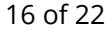
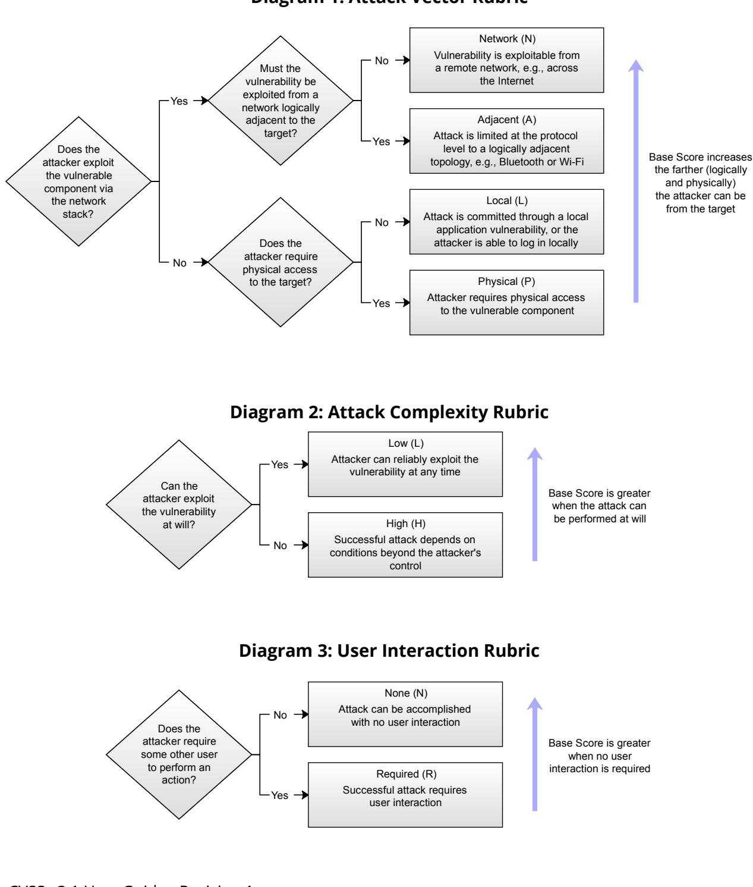
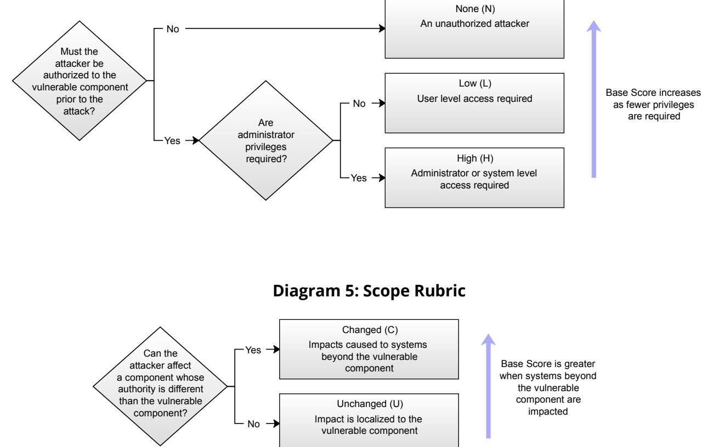
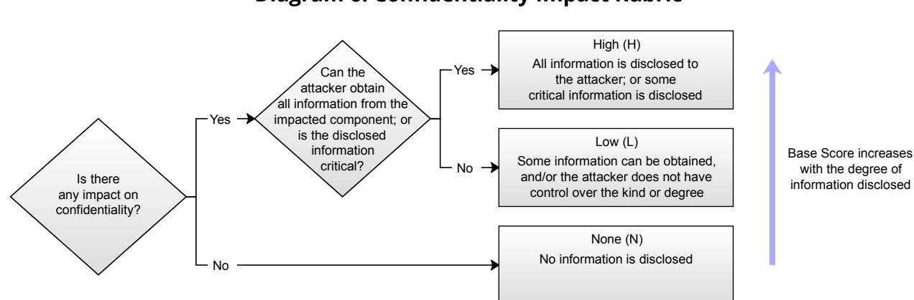
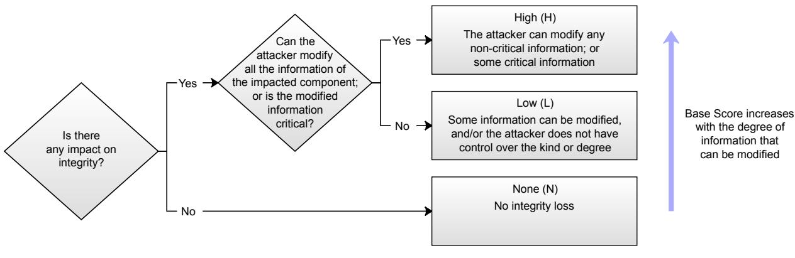
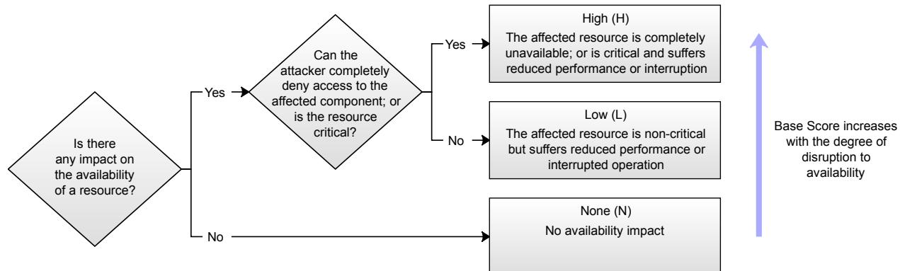

# Common Vulnerability Scoring System version 3.1 User Guide Revision 1

The Common Vulnerability Scoring System (CVSS) is an open framework for communicating the characteristics and severity of software vulnerabilities. CVSS consists of three metric groups: Base, Temporal, and Environmental. The Base group represents the intrinsic qualities of a vulnerability that are constant over time and across user environments, the Temporal group reflects the characteristics of a vulnerability that change over time, and the Environmental group represents the characteristics of a vulnerability that are unique to a user's environment. The Base metrics produce a score ranging from 0 to 10, which can then be modified by scoring the Temporal and Environmental metrics. A CVSS score is also represented as a vector string, a compressed textual representation of the values used to derive the score. This document provides the official specification for CVSS version 3.1.

The most current CVSS resources can be found at https://www.first.org/cvss/

CVSS is owned and managed by FIRST.Org, Inc. (FIRST), a US-based non-profit organization, whose mission is to help computer security incident response teams across the right to update CVSS and this document periodically at its sole discretion. While FIRST owns all right and interest in the public freely for use, subject to the conditions below. Membership in FIRST is not required to use or implement CVSS. FIRST does, however, require that any individual or entity using CVSS give proper attribution, where applicable, that CVSS is owned by FIRST and used by permission. Further, FIRST requires as a condition of use that any individual or entity which publishes scores conforms to the guidelines described in this document and provides both the score and the scoring vector so others can understand how the score was derived.

# TLP:WHITE

# Contents

|                  | 1. Introduction                                                           |  |
|------------------|---------------------------------------------------------------------------|--|
|                  | 2. Changes in CVSS Version 3.1                                            |  |
|                  | 2.1. CVSS Measures Severity, not Risk                                     |  |
|                  | 2.2. Changes to Attack Vector and Modified Attack Vector                  |  |
|                  | 2.3. Changes to Scoring Guidance                                          |  |
|                  | 2.3.1. Scoring Should Assume Detailed Knowledge                           |  |
|                  | 2.3.2. Score Based on Privileges Gained, not Attained                     |  |
|                  | 2.3.3. Assume Vulnerable Configurations                                   |  |
|                  | 2.3.4. Scope Explanation Reworded                                         |  |
|                  | 2.3.5. Scoring Vulnerabilities in Software Libraries (and Similar)        |  |
|                  | 2.3.6. Multiple CVSS Base Scores                                          |  |
|                  | 2.3.7. Guidance for Using Environmental Security Requirements Metrics     |  |
|                  | 2.3.8. Guidance for Scoring Attack Vector                                 |  |
|                  | 2.4. The CVSS Extensions Framework                                        |  |
|                  | 2.5. Formula Changes                                                      |  |
|                  | 2.5.1. General Formula Restructuring                                      |  |
|                  | 2.5.2. Roundup Function Redefinition                                      |  |
|                  | 2.5.3. Change to ModifiedImpact Sub-formula in Environmental Metric Group |  |
|                  | 2.6. Update to the Version Identifier in the Vector String                |  |
| 3. Scoring Guide |                                                                           |  |
|                  | 3.1. CVSS Scoring in the Exploit Life Cycle                               |  |
|                  | 3.2. Confidentiality and Integrity, Versus Availability Impacts           |  |
|                  | 3.3. Local Vulnerabilities Exploited by Remote Attackers                  |  |
|                  | 3.4. Vulnerability Chaining                                               |  |
|                  | 3.5. Scope, Vulnerable Component, and Impacted Component                  |  |
|                  | 3.6. Vulnerable Components Protected by a Firewall                        |  |
|                  | 3.7. Scoring Vulnerabilities in Software Libraries (and Similar)          |  |
|                  | 3.8. Multiple CVSS Base Scores                                            |  |
|                  | 3.9. CVSS Extensions Framework                                            |  |
|                  | 3.9.1. Guidelines                                                         |  |
|                  | 3.9.2. Suggested Vector String Format                                     |  |
|                  | 3.10. Attack Vector Considerations                                        |  |

# TLP:WHITE

| 3.11. Security Requirements              |  |
|------------------------------------------|--|
| 3.11.1. Confidentiality Requirement (CR) |  |
| 3.11.2. Integrity Requirement (IR)       |  |
| 3.11.3. Availability Requirement (AR)    |  |
| 4. Glossary of Terms 18               |  |
| 5. Scoring Rubrics                    |  |

#### Introduction 1.

This guide supplements the Common Vulnerability Scoring System (CVSS) version 3.1 Specification Document with additional information including significant changes from CVSS version 3.0, additional scoring guidance, and scoring rubrics.

Since its initial release in 2004, CVSS has enjoyed widespread adoption. In September 2007, CVSS v2.0 was adopted as part of the Payment Card Industry Data Security Standard (PCI DSS). In order to comply with PCI DSS, merchants processing credit cards must demonstrate that none of their computing systems has a vulnerability with a CVSS score greater than or equal to 4.0. In 2007, the National Institute of Standards and Technology (NIST) included CVSS v2.0 as part of its Security Content Automation Protocol (SCAP).1 In March 2016, CVSS v3.0 was formally adopted as an international standard for scoring vulnerabilities (ITU-T X.1521).2

#### Changes in CVSS Version 3.1 2.

Changes between CVSS versions 3.0 and 3.1 focus on clarifying and improving the existing standard without introducing new metrics or metric values, and without making major changes to existing formulas. The significant changes are explained below.

#### CVSS Measures Severity, not Risk 2.1.

The CVSS Specification Document has been updated to emphasize and clarify the fact that CVSS is designed to measure the severity of a vulnerability and should not be used alone to assess risk.

Concerns have been raised that the CVSS Base Score is being used in situations where a comprehensive assessment of risk is more appropriate. The CVSS v3.1 Specification Document now clearly states that the CVSS Base Score represents only the intrinsic characteristics of a vulnerability which are constant over time and across user environments. The CVSS Base Score should be supplemented with a contextual analysis of the environment, and with attributes that may change over time by leveraging CVSS Temporal and Environmental Metrics. More appropriately, a comprehensive risk assessment system should be employed that considers more factors than simply the CVSS Base Score. Such systems typically also consider factors outside the scope of CVSS such as exposure and threat.

1 See https://scap.nist.gov/.

2 See https://www.itu.int/rec/T-REC-X.1521-201603-l/en.

# 2.2. Changes to Attack Vector and Modified Attack Vector

CVSS v3.0 described the metric values for Attack Vector (AV) using references to the Open Systems Interconnection (OSI) model. While technically accurate, this wording may be unfamiliar to the general CVSS provider and consumer population, so has been reworded.

The Attack Vector (AV) metric value Adjacent (A) has a limited usage, as defined in CVSS v3.0. Ambiguity over the attack vector for logically adjacent or trusted networks (MPLS, VPNs, etc.) is addressed by expanding the definition of Adjacent to include these limited access networks.

Section 3.6 contains new guidance on using the Modified Attack Vector Environmental Metric when resources are exclusively behind a firewall.

# 2.3. Changes to Scoring Guidance

The CVSS Specification Document and User Guide have been updated with additional guidance to help CVSS analysts produce scores that are consistent and defensible across various situations that were previously considered ambiguous. A sampling of the new scoring guidance is listed below.

### 2.3.1. Scoring Should Assume Detailed Knowledge

The CVSS Specification Document has been updated to clarify that, when scoring Base Metrics, it should be assumed that the attacker has advanced knowledge of the weaknesses of the target system, including general configuration and default defense mechanisms (e.g., built-in firewalls, rate limits, or traffic policing).

Refer to Section 2.1 of the CVSS v3.1 Specification Document for more information.

### 2.3.2. Score Based on Privileges Gained, not Attained

Additional text has been added to Section 2.3 of the Specification Document to clarify that only the increase in access, privileges gained, or other negative outcome as a result of successful exploitation should be considered when scoring the impact metrics of a vulnerability.

When scoring impact, CVSS analysts should consider the privileges the attacker has prior to exploiting a vulnerability and compare those to the privileges they have after exploitation. The change in privileges is then captured in the Impact Metrics, i.e., Confidentiality, Integrity and Availability.

Finally, when scoring a delta change in Impact Metric, the final impact should be used.

#### 2.3.3. Assume Vulnerable Configurations

The explanation of Attack Complexity in CVSS v3.0 considers "the presence of certain system configuration settings". This text has been removed from CVSS v3.1. If a specific configuration

is required for an attack to succeed, the vulnerable component should be scored assuming it is in that configuration, providing it is a reasonable configuration. Unreasonable configurations are those that deliberately place the target in a vulnerable state, e.g., by disabling security features, or that conflict with documented configuration guidance, e.g., by using a non-default configuration that a product vendor explicitly states should never be used.

#### 2.3.4. Scope Explanation Reworded

The explanation of Scope in the Specification Document has been rewritten to be clearer, along with the concepts of Vulnerable Component and Impacted Component. Section 3.5 of the User Guide contains additional information and several examples.

### 2.3.5. Scoring Vulnerabilities in Software Libraries (and Similar)

New guidance explains how to score the impact of a vulnerability in a library. Refer to Section 3.7 for more information.

### 2.3.6. Multiple CVSS Base Scores

New guidance explicitly allows multiple CVSS Base Scores to be generated for a vulnerability that affects multiple product versions, platforms, and/or operating systems. Refer to Section 3.8 for more information.

### 2.3.7. Guidance for Using Environmental Security Requirements Metrics

The Environmental Metric Group includes three Security Requirement metrics: Confidentiality Requirement (CR), Integrity Requirement (IR), and Availability Requirement (AR). Section 3.11 contains new guidance and examples explaining how these metrics can be used.

# 2.4. Guidance for Scoring Attack Vector

New guidance on scoring Attack Vector is provided in Section 3.10.

# 2.5. The CVSS Extensions Framework

Section 3.9 defines a standard method of extending CVSS to include additional metrics and metric groups while retaining the official Base, Temporal, and Environmental Metrics. The additional metrics allow industry sectors such as privacy, safety, automotive, healthcare, etc., to score factors that are outside the core CVSS standard.

# 2.6. Formula Changes

The formulas used to calculate Base, Temporal and Environmental scores have altered in the following ways.

LP:WHITE

### 2.6.1. General Formula Restructuring

The formulas have been restructured to make them clearer and remove ambiguity caused by defining Impact sub-score for different purposes. These are purely clarifications and do not alter the scoring.

#### 2.6.2. Roundup Function Redefinition

The "Round up" function in CVSS v3.0 has been renamed Roundup and is now defined more precisely to minimize the possibility of implementations generating different scores due to small floating-point inaccuracies. This can happen due to differences in floating point arithmetic between different languages and hardware platforms. Appendix A in the Specification Document describes the problem in detail and suggests solutions.

As an example of the scoring differences this redefinition may cause, the CVSS v3.1 version of the reference JavaScript CVSS calculator on FIRST's website scores the following vulnerabilities differently compared to v3.0:

- The Temporal Score for all vulnerabilities which have a Base Score of 2.5, 5.0 or 10.0, . Exploit Code Maturity (E) of High (H), Remediation Level (RL) of Unavailable (U) and Report Confidence (RC) of Unknown (U) is 0.1 lower in CVSS v3.1 than for 3.0. For example, the following metric combination has a Temporal Score of 4.7 in CVSS v3.0, but 4.6 in v3.1:
CVSS:3.1/AV:P/AC:H/PR:L/UI:R/S:U/C:L/I:L/A:H/E:H/RL:U/RC:U

- . Some combinations of metrics have Environmental Scores that differ when scored with CVSS v3.1 rather than v3.0. This is due to a combination of the redefinition of Roundup and the change to the ModifiedImpact sub-formula explained in the next section. Less than 7% of metric combinations are 0.1 higher in CVSS v3.1 than v3.0, and less than 1% are 0.1 lower. No Environmental Scores differ by more than 0.1.
- Other implementations of the CVSS formulas may see different scoring changes . between CVSS v3.0 and v3.1 if they previously generated different CVSS v3.0 scores due to the problems that the CVSS v3.1 formula changes are intended to fix.

#### 2.6.3. Change to ModifiedImpact Sub-formula in Environmental Metric Group

In CVSS v3.0, certain sets of Environmental metrics have the counter-intuitive property that changing the value of a Security Requirement or Modified Impact metric to a value that should produce a higher Environmental Score results in a lower score. The problem occurs only if Modified Scope is Changed and at least one of the Security Requirement metrics is High. As an example, the following vulnerability has an Environmental Score of 5.6:

CVSS:3.0/AV:N/AC:L/PR:N/UI:N/S:C/C:H/I:H/A:H/E:U/RL:T/RC:U/CR:L/IR:L/ AR:H/MAV:P/MAC:H/MPR:H/MUI:R/MS:C/MC:L/MI:H/MA:H

Raising Modified Confidentiality (MC) from Low to High should result in an equal or higher score, but results in a decreased Environmental Score of 5.5:

CVSS:3.0/AV:N/AC:L/PR:N/UI:N/S:C/C:H/I:H/A:H/E:U/RL:T/RC:U/CR:L/IR:L/ AR:H/MAV:P/MAC:H/MPR:H/MUI:R/MS:C/MC:H/MI:H/MA:H

The root cause is the part of the ModifiedImpact formula that is used when Modified Scope is Changed, and specifically the term 3.25 × (MISS - 0.02)15. MISS is the Modified Impact Sub-Score. This lowers the highest Environmental Scores while making no appreciable difference to low Environmental Scores. However, as the highest possible values of MISS are reached, this term increases more quickly than the first term of the sub-formula, resulting in the value of the sub-formula decreasing as MISS increases.

Various potential fixes were examined, with the goal of minimizing the number of sets of metrics that would result in different Environmental Scores between CVSS v3.0 and v3.1. It was found that reducing the effect of MISS by multiplying it with a constant worked, but altered more scores than a similar approach that also reduced the outer exponent from 15 to 13. The value of the MISS constant that is new in CVSS v3.1 is the largest value that fixes all instances of the problem, and being the largest value means it results in the fewest changes to unaffected scores.

# 2.7. Update to the Version Identifier in the Vector String

The Vector String has been updated so that it begins with CVSS:3.1 rather than CVSS:3.0. Although no other changes have been made to the Vector String, CVSS v3.1 contains changes to the definition of some of the metric values and to the formulas, so it is important to correctly indicate the version of CVSS.

LP:WHITE

#### Scoring Guide 3.

Below are a number of recommendations for analysts when scoring vulnerabilities with CVSS v3.1.

#### CVSS Scoring in the Exploit Life Cycle 3.1.

When understanding when to score the impact of vulnerabilities, analysts should constrain impacts to a reasonable final impact which they are confident an attacker is able to achieve. Ability to cause this impact should be supported by the Exploitability sub-score as a minimum, but may also include details from the vulnerability's description. For example, consider the following two vulnerabilities.

ln vulnerability 1, a remote, unauthenticated attacker can send a trivial, crafted request to a web server which causes the web server to disclose the plaintext password of the root (administrator) account. The analyst only knows from the Exploitability sub-score metrics and the vulnerability description that the attacker has access to send a crafted request to the web server in order to exploit the vulnerability. Impact should stop there; while an attacker may be able to use these credentials to later execute code as the administrator, it is not known that the attacker has access to a login prompt or method to execute commands with those credentials. Gaining access to this password represents a direct, serious loss of Confidentiality only:

Base Score: 7.5 CVSS:3.1/AV:N/AC:L/PR:N/UI:N/S:U/C:H/I:N/A:N

In vulnerability 2, a local, low-privileged user can send a trivial, crafted request to the operating system which causes it to disclose the plaintext password of the root (administrator) account. The analyst knows from the Exploitability sub-score metrics and the vulnerability description that the attacker has access to the operating system, and can log in as a local, low privileged attacker. Gaining access to this password represents a direct, serious loss of Confidentiality, Integrity, and Availability because the analyst can reasonably issue commands as the root / administrator account (assume that the attacker could log out from their own account and log back in as root):

Base Score: 7.8 CVSS:3.0/AV:L/AC:L/PR:L/UI:N/S:U/C:H/I:H/A:H

# 3.2. Confidentiality and Integrity, Versus Availability Impacts

The Confidentiality and Integrity metrics refer to impacts that affect the data used by the service. For example, web content that has been maliciously altered, or system files that have been stolen. The Availability impact metric refers to the service. That is, the Availability metric speaks to the performance and operation of the service itself – not the availability of the data. Consider a vulnerability in an Internet service such as web, email, or DNS that allows an attacker to modify or delete all web files in a directory. The only impact is

to Integrity, not Availability, as the web service is still functioning – it just happens to be serving back altered content.

# 3.3. Local Vulnerabilities Exploited by Remote Attackers

Guidance concerning Local attacks was improved in CVSS v3.0 by clarifying the definitions of the Network and Adjacent values of the Attack Vector metric. Specifically, analysts should only score for Network or Adjacent when a vulnerability is bound to the network stack. Vulnerabilities which require user interaction to download or receive malicious content (which could also be delivered locally, e.g., via USB drives) should be scored as Local.

For example, a document parsing vulnerability, which does not rely on the network in order to be exploited, should typically be scored with the Local value, regardless of the method used to distribute such a malicious document (e.g., it could be a link to a web site, or via a USB flash drive).

# 3.4. Vulnerability Chaining

CVSS is designed to classify and rate individual vulnerabilities. However, it is important to support the needs of the vulnerability analysis community by accommodating situations where multiple vulnerabilities are exploited in the course of a single attack to compromise a host or application. The scoring of multiple vulnerabilities in this manner is termed Vulnerability Chaining. Note that this is not a formal metric, but is included as guidance for analysts when scoring these kinds of attacks.

When scoring a chain of vulnerabilities, it is the responsibility of the analyst to identify which vulnerabilities are combined to form the chained score. The analyst should list the distinct vulnerabilities and their scores, along with the chained score. For example, this may be communicated within a vulnerability disclosure notice posted on a web page.

In addition, the analyst may include other types of related vulnerabilities that could be chained with the vulnerabilities being scored. Specifically, the analyst may list generic types (or classes) of related vulnerabilities that are often chained together, or provide further descriptions of required preconditions that must exist. For example, one might describe how certain kinds of SQL Injection vulnerabilities are precursors to a cross-site scripting (XSS) attack, or how a particular kind of buffer overflow would grant local privileges. Listing the generic types or classes of vulnerabilities provides the minimum information necessary to warn other users, without potentially informing attackers about new exploit opportunities.

Alternatively, the analyst may identify (in the form of a machine readable and parsable list of vulnerabilities as CVE IDs or CWEs), a complete list of specific related vulnerabilities that are known to be (or are very likely to be) chained to one or more of the chained vulnerabilities being scored in order to exploit an IT system. In the event that a vulnerability can be exploited only after other preconditions are met (such as first exploiting another vulnerability), it is acceptable to combine two or more CVSS scores to describe the chain of vulnerabilities by

scoring for the least-restrictive Exploitability sub-score metrics and scoring for the mostimpactful Impact sub-score metrics. The following example uses the Exploitability, Scope, and Impact sub-scores to describe the chain.

Vulnerability A is CVSS : 3 . 1/AV : L/PR : L/UI : N/S : U/ C : H/ A : H. It requires a local, low-privileged user in order to exploit.

Vulnerability B is CVSS : 3 . 1/AV : N/AC : L/PR : N/UI : L/ I : L/ A : L. It provides an unprivileged, remote attacker the ability to execute code on a system with Low impacts if a local user interacts to complete the attack.

Given A and B, chain C could be described as the chain of B -> A,

CVSS:3.1/AV:N/AC:L/PR:N/UI:R/S:U/C:H/A:H which combines the Exploitability of B, the scope is unchanged in both cases, and the Impact of A, because if one can exploit B and gain the code execution as a local user from it, then one has satisfied the prerequisite to subsequently launch A causing an impact from vulnerability A.

# 3.5. Scope, Vulnerable Component, and Impacted Component

When a vulnerability in a component governed by one security authority is able to affect resources governed by another security authority, a Scope change has occurred. This typically happens either when the vulnerable component and impacted component are part of different systems (physical or logical) governed by different security authorities; or when an artificial boundary has been made to logically separate vulnerable and impacted components for security reasons (e.g., when executing a process in sandbox). When a security boundary mechanism separating components is circumvented due to a vulnerability and this causes a security impact outside of the security scope of the vulnerable component, a Scope change has occurred. In this case, the vulnerability usually resides in the component that implements or controls the security boundary since the vulnerability restricted to the component alone would not cause an impact outside of its scope, assuming the security boundary works as expected.

The following example vulnerabilities look at different aspects of scoring Scope:

- 1. A vulnerability in a virtual machine that enables an attacker to read and/or delete files on the host operating system (perhaps even its own virtual machine) is considered a Scope change. In this example, there are two separate security authorities: one that defines and enforces access control for the virtual machine and its users, and another that defines and enforces access control for the host system within which the virtual machine runs.
- 2. A violation of a security boundary between microprocessor privilege levels should be considered when scoring vulnerabilities using CVSS. User space programs' capabilities running in lower privilege levels are typically limited in what instructions they can run and what registers they can write to even when running under operating system administrator privileges. A vulnerability that allows a program running in a lower

privilege level to break out and run arbitrary code in a higher privilege level should be considered a Scope change.

- 3. The security boundary between secure enclaves integrated in microprocessors and the rest of operating system processes, including the operating system kernel itself, should be considered when scoring vulnerabilities using CVSS. A vulnerability that allows other processes to impact the confidentiality, integrity or availability of data or code in a secure enclave should be considered a Scope change.
- 4. A Scope change occurs when a vulnerability in a web application impacts user clients, e.g., web browsers. Common vulnerabilities of this type include cross-site scripting and URL redirection. The vulnerability is in the web application, but there is an impact to the data/behavior of the victim users' web browsers, which are within a different security scope.
- 5. In a distributed environment, a vulnerability in a component providing connectivity, protection, or authentication services to components in a different security authority should be scored as a Scope change if a successful attack impacts these other components. For example, a vulnerability in a component such as a router, firewall, or authentication manager that affects the primary availability of one or more downstream components should be scored as a Scope change. However, if a successful attack either does not affect at all, or causes only negligible impact to components in a different security authority, the vulnerability should be scored as Scope unchanged. For example, a vulnerability in a component designed to be deployed as part of a larger fault-tolerant topology should not be scored with a changed Scope if the fault-tolerance means a successful attack does not affect components in different security authorities. Any effect on additional services provided by the vulnerable component is considered a secondary impact and not a scope change.
- 6. A vulnerability in a simple Portable Document Format (PDF) reader that allows an attacker to compromise other files on the same operating system when a victim opens a malicious PDF document is scored as Scope unchanged. This assumes the PDF reader does not have any authorization functionality that would be considered a separate security authority from the underlying operating system.
- 7. A SQL injection vulnerability in a web application is not usually considered a Scope change assuming the credentials are shared between web application and impacted SQL database, and therefore they are part of the same security scope.
- 8. A vulnerability that crashes a web server or SSH server is not considered a Scope change since the impact is limited only to the service provided by the affected server. The impact on users is secondary and is not considered a Scope change as users are not considered components.
- 9. A vulnerability that permits an attacker to exhaust a shared system resource, such as filling up a file system, should not be considered a Scope change as the attacker is still

acting under the usual capabilities of the application and not breaching any security boundary.

- 10. By exploiting a vulnerability in an application that allows users restricted access to resources shared with other components across multiple security scopes (e.g., operating system resources such as system files), an attacker can access resources that they should not be able to access. Since there is already a valid path across the trust boundary, there is no Scope change.
- 11. A vulnerability in an application that implements its own security authority which allows attackers to affect resources outside its security scope is scored as a Scope change. This assumes the application provides no features for users to access resources governed by a higher-level security authority shared with other components across multiple security scopes (e.g., the resources of the underlying operating system). One example would be a web application that allows users to read and modify web pages and files only under the web application's installation paths, and provides no feature for users to interact beyond these paths. A vulnerability in this application allowing a malicious user to access operating system files unrelated to this application is considered a Scope change.

# 3.6. Vulnerable Components Protected by a Firewall

lf a vulnerability is scored with an Attack Vector (AV) of Network (N) and the analyst has high confidence that the vulnerable component is deployed on a secure network unavailable from the Internet, Modified Attack Vector (MAV) may be scored as Adjacent, reducing the overall CVSS v3.1 score.

Example: MySQL Stored SQL Injection (CVE-2013-0375)

Base Score: 6.4 CVSS:3.1/AV:N/AC:L/PR:L/UI:N/S:C/C:L/I:L/A:N

Environmental Score: 5.4 CVSS:3.1/AV:N/AC:L/PR:L/UI:N/S:C/C:L/I:L/A:N/MAV:A

# 3.7. Scoring Vulnerabilities in Software Libraries (and Similar)

When scoring the impact of a vulnerability in a library, independent of any adopting program or implementation, the analyst will often be unable to take into account the ways in which the library might be used. While specific products using the library should generate CVSS scores specific to how they use the library, scoring the library itself requires assumptions to be made. The analyst should score for the reasonable worst-case implementation scenario. When possible, the CVSS information should detail these assumptions.

For example, a library that performs image conversion would reasonably be used by programs that accept images from untrusted sources over a network. In the reasonable worstcase, it would pass them to the library without checking the validity of the images. As such, an

13 of 22

analyst scoring a vulnerability in the library that relates to the incoming data should assume an Attack Vector (AV) of Network (N), but explain this assumption in the summary of the vulnerability. If the library might run with normal privileges, having lower impact on the embedding implementation, or with high privileges, increasing the impacts, the analyst should assume high privileges while scoring the vulnerability in the library.

When scoring a vulnerability in a given implementation using the impacted library, the score must be re-calculated for that specific implementation. For example, if an implementation embeds the vulnerable library mentioned in the previous example, but only operates on local files, the Attack Vector (AV) would be Local (L). If the implementation that embeds this library does not invoke any of the faulty functions or does not support the mode that triggers that vulnerability, it would have no interface or attack vector to exploit the vulnerability. Thus, that vulnerability in the embedded library would have no impact on that implementation, resulting in a score for the given implementation of 0.

# 3.8. Multiple CVSS Base Scores

It is common for a vulnerability to be present on multiple product versions, platforms, and/or operating systems. In some circumstances, the Base metrics may different product versions, platforms, and/or operating systems. For example, a hypothetical vulnerability is applicable to multiple operating systems produced by the same vendor. The Attack Complexity (AC) of this vulnerability on a legacy operating system is Low (L). However, a newer operating system has new inherent protection capabilities that change the Attack Complexity to High (H). This variance ultimately leads to different Base Scores for the same vulnerability on the two operating systems.

lt is acceptable to score and publish multiple Base Scores for a single vulnerability provided each has additional language outlining the specific product versions, platforms, and/or operating systems that are relevant to the score. Values for all Base Score attributes (not only a pre-calculated Base Score) must be supplied for each affected product version, platform, and/or operating system using a standard format. In situations where multiple Base Scores are applicable but only a single score is provided, the highest Base Score must be utilized.

# 3.9. CVSS Extensions Framework

Opportunities exist to leverage the core foundation of CVSS for additional scoring efforts. For example, a proposal was presented to the CVSS Special Interest Group (SIG) to incorporate privacy into CVSS by overlaying combinations of CVSS Base and Environmental metrics to derive a Privacy Impact.

The following guidelines define a standard method of extending CVSS to include additional metrics and metric groups while retaining the official Base, Temporal, and Environmental Metrics. The additional metrics allow industry sectors such as privacy, safety, automotive, healthcare, etc., to score factors that are outside the core CVSS standard.

# P:WHITE

### 3.9.1. Guidelines

- Formulas, constants or definitions of existing CVSS Base, Temporal, or Environmental . Metrics must not be modified. If a change to an existing item is desired, create a new metric group with a new name and work on it as desired.
- New metrics must not be added to existing metric groups, but must be added to new • metric groups. New metric groups can be based on existing metric groups.
- . New metrics can be based on sub-formulas in the standard, such as the Exploitability sub-score, but these could change, be removed or be replaced in future revisions of the standard, and so absolute values should not be relied upon.
- New metric groups can optionally have a score. If they do, the score must be between 0.0 and 10.0, with 10.0 being the most severe. The score must be based on adjusting the Base Score and/or Environmental and Temporal scores, similar to how Environmental/Temporal scores adjust the Base Score to produce the final score.
- . The CVSS SIG does not officially approve extensions, but rather acts as a consulting body, similar to IETF³. The CVSS SIG welcomes and encourages innovation, but has an interest in maintaining consistency across all proposed extensions.
- The list of validated extensions will be listed on the first.org web site, similar to IANA . .
	- Mandatory Fields: Name, Description, External Authoritative Web Page o
	- o Optional Fields: JSON Schema, XML Schema, JavaScript Calculator

### 3.9.2. Suggested Vector String Format

CVSS Extension vector strings must be listed separately, utilizing the following format:

CVSS:3.1/AV:x/AC:x/PR:x/UI:x/S:x/C:x/I:x/A:x EXT:1.0/NEW1:VAL1/NEW2:VAL2

where:

EXT:n.n is a unique extension identifier and major.minor version number

NEWn is a unique attribute of the extension for each new metric

VALn is a unique value for the attribute for each new metric value

# 3.10. Attack Vector Considerations

When scoring Attack Vector, use Adjacent or Network (as appropriate), when a network connection is required for an attack to succeed, even if the attack is not launched over a network. For example, a local attacker may be able to trick a vulnerable, privileged, local

3 The Internet Engineering Task Force (https://www.ietf.org/)

4 Internet Assigned Numbers Authority (https://www.iana.org/)

program into sending sensitive data to a server of the attacker's choosing over a network. As a network connection is required to gather the sensitive data this is scored with an Attack Vector of Network.

Vulnerabilities where malicious data is received over a network by one component, then passed to a separate component with a vulnerability should be scored with an Attack Vector of Local. An example is a web browser that downloads a malicious office document, saves it to disk, and then starts a vulnerable office application which reads the saved file.

In cases where the vulnerable functionality is part of the component that receives the malicious data, Attack Vector should be scored as Network. An example is a web browser with a vulnerability in the browser itself, or a browser plugin or extension, that triggers when the malicious data is received.

# 3.11. Security Requirements

The Security Requirement metrics are part of the Environmental Metric Group and modify the weighting that the modified impact metrics have on the overall Environmental Score. This section provides guidance on selecting appropriate metric values for these based on the characteristics of a specific environment. The examples are simplified to illustrate the concepts.

### 3.11.1. Confidentiality Requirement (CR)

The Confidentiality Requirement of a system should be based on the classification level of the data that is stored or used by the user and/or applications running on the target system. Encryption of the data at rest on this device should also be taken into consideration when establishing the Confidentiality Requirement. Data that passes through a device without being consumed or processed (e.g., a switch or firewall) should not be taken into consideration when assessing this attribute. See below for examples.

Note: The volume of data may influence the value of the attribute, but should not have as much impact as the classification (i.e., type) of data that is being stored or used.

- 1. A device that stores data classified at the highest level should have this attribute rated as High. However, if the sensitive data is encrypted at rest, this attribute may be rated Medium.
- 2. A device that stores data classified as non-public but not as high as the highest level should have this attribute rated as Medium. However, if the sensitive data is encrypted at rest, this attribute can be rated Low.
- 3. A device that stores data that can be openly shared publicly should have this attribute rated as Low.
- 4. Network equipment such as a router, switch, or firewall will generally be rated as Medium due strictly to the sensitivity of information such as routing tables, etc.

- 5. Any system that stores login credentials without encryption should have this attribute rated as High. This includes service accounts and credentials embedded into scripts or source code.
### 3.11.2. Integrity Requirement (IR)

The Integrity Requirements of a system focus on the importance of the accuracy of the data it stores or uses. Data that passes through a device without being consumed or processed (e.g., a switch or firewall) should not be taken into consideration when assessing this attribute. The use of encryption on the data at rest should not be taken into consideration for this attribute. See below for examples:

- 1. Devices that contain monetary transactional data and/or personally identifiable information (PII) should be rated High.
- 2. Devices that contain data directly used to make business or risk management decisions should be rated at a minimum of Medium. As the severity of the decisions increase, so should the Integrity Requirement rating.
- 3. Devices that contain data directly used to make health decisions should be rated High.
- 4. Network equipment such as a router or switch will generally be rated at least Medium due strictly to the sensitivity of information such as forwarding tables, etc.
- 5. Firewalls should be rated as High due to the sensitivity of the rule set.

#### 3.11.3. Availability Requirement (AR)

The Availability Requirement of a system should be based on the uptime requirements and redundancy of the device or the applications hosted by the device. Devices that are part of redundant clusters will have lower Availability Requirements. See below for examples:

- 1. Devices without full capacity redundancy that are rated with recovery requirements less than 24 hours should be rated High.
- 2. Devices without full capacity redundancy that are rated with recovery requirements between 1-5 days should be rated Medium.
- 3. Devices with recovery requirements of more than 5 days should be rated Low.
- 4. Clustered devices and/or those with full capacity redundancy should be rated as Low.
- 5. Devices that are required to have rapid response times for transactional purposes based on regulatory requirements, should be rated High.

#### Glossary of Terms 4.

Affected: An impacted component is affected by a vulnerability if a vulnerability in a vulnerable component is exploitable in a way that causes a negative impact to the Confidentiality, Integrity, and/or Availability of the impacted component.

Authority: A computing container that grants and manages privileges to resources. Examples of authorities include a database application, an operating system, and a sandbox environment.

Chained Score: The Base Score produced by scoring two or more chained vulnerabilities.

Chained Vulnerabilities: See Vulnerability Chaining.

Component: Refers to either a hardware or software component.

Hardware Component: A physical computing device.

Software Component: A software program or module that contains computer instructions to be executed, e.g., an operating system, Internet application, or device driver.

Exploitable: A weakness or flaw in a component is exploitable if it enables the component to be manipulated in an unintended or unexpected way by an attacker to negatively impact Confidentiality, Integrity, and/or Availability.

Impacted Component: The component that suffers the consequence of the exploited vulnerability. It can either be the same component as the vulnerable component, or, if a scope changed has occurred, a different one.

Privileges: A collection of rights (typically read, write and execute) granted to a user or user process which defines access to computing resources.

Reasonable: An action, expectation, or outcome that most informed and aware people would consider just, rational, appropriate, ordinary or usual in the circumstances.

Resources: A software or network object that is accessed, modified, or consumed by a computing device, e.g., computer files, memory, CPU cycles, or network bandwidth.

Scope: The collection of privileges defined and managed by an authorization authority when granting access to computing resources.

Successful Attack: A successful attack (or successful exploit of a vulnerability) is a situation where an attacker causes any negative impact to Confidentiality, Integrity, and/or Availability by leveraging a weakness in the vulnerable component.

Vulnerability: A weakness or flaw in the functional behavior of a vulnerable computational component (software or hardware) that can be exploited, resulting in a negative impact to the Confidentiality, Integrity, and/or Availability of an impacted component.

Vulnerability Chaining: The sequential exploit of multiple vulnerabilities in order to attack an IT system, where one or more exploits at the end of the chain require the successful completion of prior exploits in order to be exploited. See also the definition available at https://cwe.mitre.org/documents/glossary/#Chain.

Vulnerable: A component is vulnerable if it contains a weakness or flaw that can be exploited, given the necessary conditions and/or exposure.

Vulnerable Component: The software (or hardware) component that bears the vulnerability, and that would be patched.

Weakness: An error in software or hardware implementation, code, design, or architecture that, depending on exposure, could be exploited by an attacker.

#### Scoring Rubrics 5.

The scoring rubrics are an aid to scoring vulnerabilities by supplementing the metric definitions in the Specification Document.

Diagram 1: Attack Vector Rubric

# LP:WHITE

### Diagram 4: Privileges Required Rubric

Note, if a Scope change has not occurred, Confidentiality, Integrity and Availability impacts reflect consequence to the vulnerable component, otherwise they reflect consequence to the component that suffers the greater impact.

#### Diagram 6: Confidentiality Impact Rubric

# TLP:WHITE

### Diagram 7: Integrity Impact Rubric

### Diagram 8: Availability Impact Rubric

