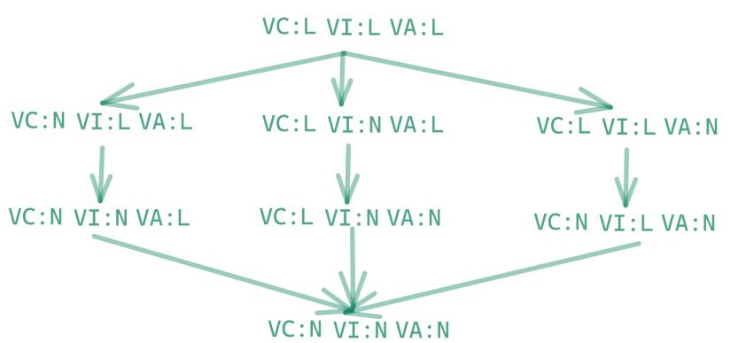

# Common Vulnerability Scoring System version 4.0 Specification Document

Document Version: 1.2

The Common Vulnerability Scoring System (CVSS) is an open framework for communicating the characteristics and severity of software vulnerabilities. CVSS consists of four metric groups: Base, Threat, Environmental, and Supplemental. The Base group represents the intrinsic qualities of a vulnerability that are constant over time and across user environments, the Threat group reflects the characteristics of a vulnerability that change over time, and the Environmental group represents the characteristics of a vulnerability that are unique to a user's environment. Base metric values are combined with default values that assume the highest severity for Threat and Environmental metrics to produce a score ranging from 0 to 10. To further refine a resulting severity score, Threat and Environmental metrics can then be amended based on applicable threat intelligence and environmental considerations. Supplemental metrics do not modify the final score, and are used as additional insight into the characteristics of a vulnerability. A CVSS vector string consists of a compressed textual representation of the values used to derive the score. This document provides the official specification for CVSS version 4.0.

The most current CVSS resources can be found at https://www.first.org/cvss/

CVSS is owned and managed by FIRST.Org, Inc. (FIRST), a US-based non-profit organization, whose mission is to help computer security incident response teams across the right to update CVSS and this document periodically at its sole discretion. While FIRST owns all rights and interest in CVSS, it licenses it to the public freely for use, subject to the conditions below. Membership in FIRST is not required to use or implement CVSS. FIRST does, however, require that any individual or entity using CVSS give proper attribution, where applicable, that CVSS is owned by FIRST and used by permission. Further, FIRST requires as a condition of use that any individual or entity which publishes CVSS data conforms to the guidelines described in this document and provides both the score and the vector string so others can understand how the score was derived.

# Contents

| 1. Introduction                                                             | 3  |
|-----------------------------------------------------------------------------|----|
| 1.1. Metrics                                                                | এ  |
| 1.2. Assessment                                                             |    |
| 1.3. Nomenclature                                                           | 6  |
| 2. Base Metrics                                                             | 7  |
| 2.1. Exploitability Metrics                                                 | 7  |
| 2.1.1. Attack Vector (AV)                                                   | 7  |
| 2.1.2. Attack Complexity (AC)                                               | 8  |
| 2.1.3. Attack Requirements (AT)                                             | 9  |
| 2.1.4. Privileges Required (PR)                                             | 11 |
| 2.1.5. User Interaction (UI)                                                | 11 |
| 2.2. Impact Metrics                                                         | 13 |
| 2.2.1. Confidentiality (VC/SC)                                              | 14 |
| Table 6: Confidentiality Impact to the Vulnerable System (VC)               | 14 |
| Table 7: Confidentiality Impact to the Subsequent System (SC)               | 14 |
| 2.2.2. Integrity (VI/SI)                                                    | 15 |
| Table 8: Integrity Impact to the Vulnerable System (VI)                     | 16 |
| Table 9: Integrity Impact to the Subsequent System (SI)                     | 16 |
| 2.2.3. Availability (VA/SA)                                                 | 16 |
| Table 10: Availability Impact to the Vulnerable System (VA)                 | 17 |
| Table 11: Availability Impact to the Subsequent System (SA)                 | 17 |
| 3. Threat Metrics                                                           | 18 |
| 3.1. Exploit Maturity (E)                                                   | 18 |
| 4. Environmental Metrics                                                    | 20 |
| 4.1. Confidentiality, Integrity, and Availability Requirements (CR, IR, AR) | 20 |
| 4.2. Modified Base Metrics                                                  | 21 |
| 5. Supplemental Metrics                                                     | 23 |
| 5.1. Safety (S)                                                             | 23 |
| 5.2. Automatable (AU)                                                       | 24 |
| 5.3. Provider Urgency (U)                                                   | 25 |
| 5.4. Recovery (R)                                                           | 25 |
| 5.5. Value Density (V)                                                      | 26 |
| 5.6. Vulnerability Response Effort (RE)                                     | 28 |
| 6. Qualitative Severity Rating Scale                                        | 29 |
| 7. Vector String                                                            | 30 |
|                                                                             |    |

| 8. CVSS v4.0 Equations                                      | 33 |
|-------------------------------------------------------------|----|
| 8.1. New Scoring System Development                         | 33 |
| 8.2. CVSS v4.0 Scoring using MacroVectors and Interpolation | 33 |
| 8.3. Scores of all MacroVectors                             | 38 |
| Appendix B - On-Line Resources                              | 41 |

#### Introduction 1.

The Common Vulnerability Scoring System (CVSS) captures the principal technical characteristics of software, hardware and firmware vulnerabilities. Its outputs include numerical scores indicating the severity of a vulnerability relative to other vulnerabilities.

CVSS is composed of four metric groups: Base, Threat, Environmental, and Supplemental. The Base Score reflects the severity of a vulnerability according to its intrinsic characteristics which are constant over time and assumes the reasonable worst-case impact across different deployed environments. The Threat Metrics adjust the severity of a vulnerability based on factors, such as the availability of proof-of-concept code or active exploitation. The Environmental Metrics further refine the resulting severity score to a specific computing environment. They consider factors such as the presence of mitigations in that environment and the criticality attributes of the vulnerable system. Finally, the Supplemental Metrics describe and measure additional extrinsic attributes of a vulnerability, intended to add context.

Base Metrics, and optionally Supplemental Metrics, are provided by the organization maintaining the vulnerable system, or a third party assessment on their behalf. Threat and Environmental information is available to only the end consumers of CVSS should enrich the Base metrics with Threat and Environmental metric values specific to their use of the vulnerable system to produce a score that provides a more comprehensive input to risk assessment specific to their organization. Consumers may use CVSS information as input to an organizational vulnerability management process that also considers factors that are not part of CVSS in order to rank the threats to their technology infrastructure and make informed remediation decisions. Such factors may include, but are not limited to: regulatory requirements, number of customers impacted, monetary losses due to a breach, life or property threatened, or reputational impacts of a potential exploited vulnerability. These factors are outside the scope of CVSS.

The benefits of CVSS include the provisioning of a standardized vendor and platform agnostic vulnerability scoring methodology. It is an open framework, providing transparency to the individual characteristics and methodology used to derive a score.

#### 1.1. Metrics

CVSS is composed of four metric groups: Base, Threat, Environmental, and Supplemental, each consisting of a set of metrics, as shown in Figure 1.

Figure 1: CVSS Metric Groups

The Base metric group represents the intrinsic characteristics of a vulnerability that are constant over time and across user environments. It is composed of two sets of metrics: the Exploitability metrics and the Impact metrics.

The Exploitability metrics reflect the ease and technical means by which the vulnerability can be exploited. That is, they represent characteristics of the "thing that is vulnerable", which we refer to formally as the "vulnerable system". The Impact metrics reflect the direct consequence of a successful exploit, and represent the consequence to the "things that suffer the impact", which may include impact on the vulnerable system and/or the downstream impact on what is formally called the "subsequent system(s)".

While the vulnerable system is typically a software application, operating system, module, driver, etc. (or possibly a hardware device), the subsequent system could be any of those examples but also includes human safety. This potential for measuring the impact of a vulnerability other than the vulnerable system, was a key feature introduced with CVSS v3.0. This property (formerly known as "Scope"), is captured by the separation of impacts to the vulnerable system and to subsequent systems, discussed later.

The Threat metric group reflects the characteristics of a vulnerability related to threat that may change over time but not necessarily across user environments. For example, confirmation that the vulnerability has neither been exploited nor has any proof-of-concept exploit code or instructions publicly available will lower the resulting CVSS score. The values found in this metric group may change over time.

The Environmental metric group represents the characteristics of a vulnerability that are relevant and unique to a particular consumers' environment. Considerations include the presence of security controls which may mitigate some or all consequences of a successful attack, and the relative importance of a vulnerable system within a technology infrastructure.

The Supplemental metric group includes metrics that provide context as well as describe and measure additional extrinsic attributes of a vulnerability. The response to each metric within

the Supplemental metric group is to be determined by the CVSS consumer, allowing the usage of an end-user risk analysis system to apply locally significant severity to the metrics and values. No metric will, within its specification, have any impact on the final CVSS score (e.g. CVSS-BTE). Consumer organizations may then assign importance and/or effective impact of each metric, or set/combination of metrics, giving them more, less, or absolutely no effect on the categorization, prioritization, and assessment of the vulnerability. Metrics and values will simply convey additional extrinsic characteristics of the vulnerability itself.

Each of these metrics are discussed in further detail below. The User Guide contains scoring rubrics for the Base Metrics that may be useful when scoring.

#### 1.2. Assessment

When the Base metrics are assigned values by an analyst, the Base metrics assessment results in a score ranging from 0.0 to 10.0.

The Base metrics assessment can then be further refined by assessing the Threat and Environmental metrics in order to more accurately reflect the relative severity posed by a vulnerability to a user's environment at a specific point in time. Assessment of the Threat and Environmental metrics is not required, but is highly recommended for more meaningful results.

Generally, the Base metrics are specified by vulnerability bulletin analysts, product vendors, or application vendors because they typically possess the most accurate information about the characteristics of a vulnerability. The Threat and Environmental metrics are specified by consumer organizations because they are best able to assess the potential impact of a vulnerability within their own computing environment, at a given point in time.

Assessing CVSS metrics also produces a vector string, a textual representation of the metric values used to derive a guantitative score and qualitative rating for the vulnerability. This vector string is a specifically formatted text string that contains each value assigned to each metric, and should be displayed with the vulnerability score.

The scoring assessment and vector string are explained further below.

Note that all metrics should be assessed under the assumption that the attacker has perfect knowledge of the vulnerability. That is, the analyst need not consider the means by which the vulnerability was identified. In addition, it is likely that many different types of individuals will be assessing vulnerabilities (e.g., software vendors, vulnerability bulletin analysts, security product vendors), however, note that CVSS assessment is intended to be agnostic to the individual and their organization.

#### Nomenclature 1.3.

Numerical CVSS Scores have very different meanings based on the metrics used to calculate them. Regarding prioritization, the usefulness of a numerical CVSS score is directly proportional to the CVSS metrics leveraged to generate that score. Therefore, numerical CVSS scores should be labeled using nomenclature that communicates the metrics used in its generation.

| CVSS Nomenclature | CVSS Metrics Used                   |
|----------------------|-------------------------------------|
| CVSS-B               | Base metrics                        |
| CVSS-BE              | Base and Environmental metrics      |
| CVSS-BT              | Base and Threat metrics             |
| CVSS-BTE             | Base, Threat, Environmental metrics |

Additional Notes:

- This nomenclature should be used wherever a numerical CVSS value is displayed or ● communicated.
- . The application of Environmental and Threat metrics is the responsibility of the CVSS consumer. Assessment providers such as product maintainers and other public/private entities such as the National Vulnerability Database (NVD) typically provide only the Base Scores enumerated as CVSS-B.
- The inclusion of the "E" in the nomenclature is appropriate if any Environmental metrics . are used to generate the resulting score.
- The inclusion of the "T" in the nomenclature is appropriate if any Threat metrics are ● used to generate the resulting score.
- In CVSS v4.0, Base, Threat, and Environmental metric values are always considered in ● the calculation of the final score. The absence of explicit Threat and/or Environmental metric selections will still result in a complete score using default ("Not Defined") values. This nomenclature makes it explicit and clear about which metric groups were considered in the numerical CVSS score provided.

#### Base Metrics 2.

#### Exploitability Metrics 2.1.

As previously mentioned, the Exploitability metrics reflect the characteristics of the "thing that is vulnerable", which we refer to formally as the vulnerable system. Therefore, each of the Exploitability metrics listed below should be assessed relative to the vulnerable system, and reflect the properties of the vulnerability that lead to a successful attack.

When assessing Base metrics, it should be assumed that the attacker has advanced knowledge of the target system, including general configuration and default defense mechanisms (e.g., built-in firewalls, rate limits, traffic policing). For example, exploiting a vulnerability that results in repeatable, deterministic success should still be considered a Low value for Attack Complexity, independent of the attacker's knowledge or capabilities. Furthermore, target-specific attack mitigation (e.g., custom firewall filters, access lists) should instead be reflected in the Environmental metric scoring group.

Specific configurations should not impact any attribute contributing to the CVSS Base metric assessment , i.e., if a specific configuration is required for an attack to succeed, the vulnerable system should be assessed assuming it is in that configuration.

#### 2.1.1. Attack Vector (AV)

This metric reflects the context by which vulnerability exploitation is possible. This metric value (and consequently the resulting severity) will be larger the more remote (logically, and physically) an attacker can be in order to exploit the vulnerable system. The assumption is that the number of potential attackers for a vulnerability that could be exploited from across a network is larger than the number of potential attackers that could exploit a vulnerability requiring physical access to a device, and therefore warrants a greater severity. The list of possible values is presented in Table 1.

| Metric Value ' | Description                                                                                                                                                                                                                                                                                                                                                                                                                                                                                                                                                                                |
|----------------|--------------------------------------------------------------------------------------------------------------------------------------------------------------------------------------------------------------------------------------------------------------------------------------------------------------------------------------------------------------------------------------------------------------------------------------------------------------------------------------------------------------------------------------------------------------------------------------------|
| Network (N)    | The vulnerable system is bound to the network stack and the set of possible attackers extends beyond the other options listed below, up to and including    the entire Internet. Such a vulnerability is often termed "remotely exploitable" and can be thought of as an attack being exploitable at the protocol level one or more network hops away (e.g., across one or more routers). An example of a network attack is an attacker causing a denial of service (DoS) by sending a specially crafted TCP packet across a wide area network (e.g., CVE-2004-0230). |

# Table 1: Attack Vector

| Adjacent (A) | The vulnerable system is bound to a protocol stack, but the attack is limited at the protocol level to a logically adjacent topology. This can mean an attack must be launched from the same shared proximity (e.g., Bluetooth, NFC, or IEEE 802.11) or logical network (e.g., local IP subnet), or from within a secure or otherwise limited administrative domain (e.g., MPLS, secure VPN within an administrative network zone). One example of an Adjacent attack would be an ARP (IPv4) or neighbor discovery (IPv6) flood leading to a denial of service on the local LAN segment (e.g., CVE-2013-6014). |
|--------------|-------------------------------------------------------------------------------------------------------------------------------------------------------------------------------------------------------------------------------------------------------------------------------------------------------------------------------------------------------------------------------------------------------------------------------------------------------------------------------------------------------------------------------------------------------------------------------------------------------------------------------------|
| Local (L)    | The vulnerable system is not bound to the network stack and the attacker's path is via read/write/execute capabilities. Either: the attacker exploits the vulnerability by accessing the target system locally (e.g., keyboard, console), or through terminal emulation (e.g., SSH); or the attacker relies on User Interaction by another person to perform ● actions required to exploit the vulnerability (e.g., using social engineering techniques to trick a legitimate user into opening a malicious document).                                                                                   |
| Physical (P) | The attack requires the attacker to physically touch or manipulate the vulnerable system. Physical interaction may be brief (e.g., evil maid attack') or persistent. An example of such an attack is a cold boot attack in which an attacker gains access to disk encryption keys after physically accessing the target system. Other examples include peripheral attacks via FireWire/USB Direct Memory Access (DMA).                                                                                                                                                                                               |

Assessment Guidance: When deciding between Network and Adjacent, if an attack can be launched over a wide area network or from outside the logically adjacent administrative network domain, use Network.

#### Attack Complexity (AC) 2.1.2.

This metric captures measurable actions that must be taken by the attacker to actively evade or circumvent existing built-in security-enhancing conditions in order to obtain a working exploit. These are conditions whose primary purpose is to increase security and/or increase exploit engineering complexity. A vulnerability exploitable without a target-specific variable has a lower complexity than a vulnerability that would require non-trivial customization. This metric is meant to capture security mechanisms utilized by the vulnerable system, and does not relate to the amount of time or attempts it would take for an attacker to succeed, e.g. a

1 See https://www.schneier.com/blog/archives/2009/10/evil maid_attac.html for a description of the evil maid attack.

race condition. If the attacker does not take action to overcome these conditions, the attack will always fail.

The evasion or satisfaction of authentication mechanisms or requisites is included in the Privileges Required assessment and is not considered here as a factor of relevance for Attack Complexity.

| Metric Value | Description                                                                                                                                                                                                                                                                                                                                                                                                                                                                                                                                                                                                                                                                                                                                                                                                                                                                                                                                                                                |
|--------------|--------------------------------------------------------------------------------------------------------------------------------------------------------------------------------------------------------------------------------------------------------------------------------------------------------------------------------------------------------------------------------------------------------------------------------------------------------------------------------------------------------------------------------------------------------------------------------------------------------------------------------------------------------------------------------------------------------------------------------------------------------------------------------------------------------------------------------------------------------------------------------------------------------------------------------------------------------------------------------------------|
| Low (L)      | The attacker must take no measurable action to exploit the vulnerability. The attack requires no target-specific circumvention to exploit the vulnerability. An attacker can expect repeatable success against the vulnerable system.                                                                                                                                                                                                                                                                                                                                                                                                                                                                                                                                                                                                                                                                                                                                             |
| High (H)     | The successful attack depends on the evasion or circumvention of security-enhancing techniques in place that would otherwise hinder the attack. These include: Evasion of exploit mitigation techniques. The attacker must have ● additional methods available to bypass security measures in place. For example, circumvention of address space randomization (ASLR) or data execution prevention (DEP) must be performed for the attack to be successful. Obtaining target-specific secrets. The attacker must gather some ● target-specific secret before the attack can be successful. A secret is any piece of information that cannot be obtained through any amount of reconnaissance. To obtain the secret the attacker must perform additional attacks or break otherwise secure measures (e.g. knowledge of a secret key may be needed to break a crypto channel). This operation must be performed for each attacked target. |

# Table 2: Attack Complexity

As described in Section 2.1, detailed knowledge of the vulnerable system is outside the scope of Attack Complexity. Refer to that section for additional guidance when scoring Attack Complexity when target-specific attack mitigation is present.

# 2.1.3. Attack Requirements (AT)

This metric captures the prerequisite deployment and execution conditions or variables of the vulnerable system that enable the attack. These differ from security-enhancing techniques/technologies (ref Attack Complexity) as the primary purpose of these conditions is not to explicitly mitigate attacks, but rather, emerge naturally as a consequence of the deployment and execution of the vulnerable system. If the attacker does not take action to overcome these conditions, the attack may succeed only occasionally or not succeed at all.

| Metric Value | Description                                                                                                                                                                                                                                                                                                                                                                                                                                                                                                                                                                                                                                                                                                         |
|--------------|---------------------------------------------------------------------------------------------------------------------------------------------------------------------------------------------------------------------------------------------------------------------------------------------------------------------------------------------------------------------------------------------------------------------------------------------------------------------------------------------------------------------------------------------------------------------------------------------------------------------------------------------------------------------------------------------------------------------|
| None (N)     | The successful attack does not depend on the deployment and execution conditions of the vulnerable system. The attacker can expect to be able to reach the vulnerability and execute the exploit under all or most instances of the vulnerability.                                                                                                                                                                                                                                                                                                                                                                                                                                                         |
| Present (P)  | The successful attack depends on the presence of specific deployment and execution conditions of the vulnerable system that enable the attack. These include: •    A race condition must be won to successfully exploit the vulnerability. The successfulness of the attack is conditioned on execution conditions that are not under full control of the attacker. The attack may need to be launched multiple times against a single target before being successful. Network injection. The attacker must inject themselves into the ● logical network path between the target and the resource requested by the victim (e.g. vulnerabilities requiring an on-path attacker). |

# Table 3: Attack Requirements

#### Privileges Required (PR) 2.1.4.

This metric describes the level of privileges an attacker must possess prior to successfully exploiting the vulnerability. The method by which the attacker obtains privileged credentials prior to the attack (e.g., free trial accounts), is outside the scope of this metric. Generally, self-service provisioned accounts do not constitute a privilege requirement if the attacker can grant themselves privileges as part of the attack.

The resulting score is greatest if no privileges are required. The list of possible values is presented in Table 4.

| Metric Value | Description                                                                                                                                                                                                                                                                  |
|--------------|------------------------------------------------------------------------------------------------------------------------------------------------------------------------------------------------------------------------------------------------------------------------------|
| None (N)     | The attacker is unauthenticated prior to attack, and therefore does not require any access to settings or files of the vulnerable system to carry out an attack.                                                                                                       |
| Low (L)      | The attacker requires privileges that provide basic capabilities that are typically limited to settings and resources owned by a single low-privileged user. Alternatively, an attacker with Low privileges has the ability to access only non-sensitive resources. |

Table 4: Privileges Required

|  | High (H) | The attacker requires privileges that provide significant (e.g.,           |
|--|----------|----------------------------------------------------------------------------|
|  |          | administrative) control over the vulnerable system allowing full access to |
|  |          | the vulnerable system's settings and files.                                |

Assessment Guidance: Privileges Required is usually None for hard-coded credential vulnerabilities or vulnerabilities requiring social engineering (e.g., reflected cross-site scripting, cross-site request forgery, or file parsing vulnerability in a PDF reader). Default credentials that have not been changed or are not unique across each environment should be treated similarly to hard-coded credentials.

#### 2.1.5. User Interaction (UI)

This metric captures the requirement for a human user, other than the attacker, to participate in the successful compromise of the vulnerable system. This metric determines whether the vulnerability can be exploited solely at the will of the attacker, or whether a separate user (or user-initiated process) must participate in some manner. The resulting score is greatest when no user interaction is required. The list of possible values is presented in Table 5.

| Table 5: User Interaction |                                                                                                                                                                                                                                                                                                                                                                                                                                                                                                                                                                                                                                                                                                                                        |  |
|---------------------------|----------------------------------------------------------------------------------------------------------------------------------------------------------------------------------------------------------------------------------------------------------------------------------------------------------------------------------------------------------------------------------------------------------------------------------------------------------------------------------------------------------------------------------------------------------------------------------------------------------------------------------------------------------------------------------------------------------------------------------------|--|
| Metric Value              | Description                                                                                                                                                                                                                                                                                                                                                                                                                                                                                                                                                                                                                                                                                                                            |  |
| None (N)                  | The vulnerable system can be exploited without interaction from any human user, other than the attacker. Examples include: a remote attacker is able to send packets to a target system ● a locally authenticated attacker executes code to elevate privileges ●                                                                                                                                                                                                                                                                                                                                                                                                                                                        |  |
| Passive (P)               | Successful exploitation of this vulnerability requires limited interaction by the targeted user with the vulnerable system and the attacker's payload. These interactions would be considered involuntary and do not require that the user actively subvert protections built into the vulnerable system. Examples include: utilizing a website that has been modified to display malicious ● content when the page is rendered (most stored XSS or CSRF) ● running an application that calls a malicious binary that has been planted on the system using an application which generates traffic over an untrusted or ● compromised network (vulnerabilities requiring an on-path attacker) |  |
| Active (A)                | Successful exploitation of this vulnerability requires a targeted user to perform specific, conscious interactions with the vulnerable system and the attacker's payload, or the user's interactions would actively subvert protection mechanisms which would lead to exploitation of the vulnerability. Examples include: importing a file into a vulnerable system in a specific manner                                                                                                                                                                                                                                                                                                                               |  |

|  | • placing files into a specific directory prior to executing code • submitting a specific string into a web application (e.g. reflected or self XSS) |
|--|------------------------------------------------------------------------------------------------------------------------------------------------------------|
|  | • dismiss or accept prompts or security warnings prior to taking an action (e.g. opening/editing a file, connecting a device).                          |

#### 2.2. Impact Metrics

The Impact metrics capture the effects of a successfully exploited vulnerability. Analysts should constrain impacts to a reasonable, final outcome which they are confident an attacker is able to achieve.

Only an increase in access, privileges gained, or other negative outcome as a result of successful exploitation should be considered when assessing the Impact metrics of a vulnerability. For example, consider a vulnerability that requires read-only permissions prior to being able to exploit the vulnerability. After successful exploitation, the attacker maintains the same level of read access, and gains write access. In this case, only the Integrity impact metric should be scored, and the Confidentiality and Availability Impact metrics should be set as None.

Note that when scoring a delta change in impact, the final impact should be used. For example, if an attacker starts with partial access to restricted information (Confidentiality Low) and successful exploitation of the vulnerability results in complete loss in confidentiality (Confidentiality High), then the resultant CVSS Base metric value should reference the "end game" Impact metric value (Confidentiality High).

When identifying values for the impact metrics, assessment providers need to account for impacts both to the Vulnerable System and impacts outside of the Vulnerable System. These impacts are established by two sets of impact metrics: "Vulnerable System impact" and "Subsequent System impact". When establishing the boundaries for the Vulnerable System metric values, assessment providers should use the conceptual model of a system of interest.

Formally, a system of interest for scoring a vulnerability is defined as the set of computing logic that executes in an environment with a coherent function and set of security policies. The vulnerability exists in one or more components of such a system. A technology product or a solution that serves a purpose or function from a consumer's perspective is considered a system (e.g., a server, workstation, containerized service, etc.).

When a system provides its functionality solely to another system, or it is designed to be exclusively used by another system, then together they are considered as the system of interest for scoring. For example, a database used solely by a smart speaker is considered a part of that smart speaker system. Both the database and the smart speaker it serves would be considered the vulnerable system if a vulnerability in that database leads to the malfunction of the smart speaker. When a vulnerability does not have impact outside of the

vulnerable system assessment providers should leave the subsequent system impact metrics as NONE (N).

All impacts, if any, that occur outside of the vulnerable system should be reflected in the subsequent system impact set. When assessed in the environmental metric group only, the subsequent system impact may, in addition to the logical systems defined for System of Interest, also include impacts to humans. This human impact option in the environmental metric group is explained further in Safety (S), below.

#### Confidentiality (VC/SC) 2.2.1.

This metric measures the impact to the confidentiality of the information managed by the system due to a successfully exploited vulnerability. Confidentiality refers to limiting information access and disclosure to only authorized users, as well as preventing access by, or disclosure to, unauthorized ones. The resulting score is greatest when the loss to the system is highest. The list of possible values is presented in Table 6 (for the Vulnerable System) and Table 7 (when there is a Subsequent System impacted).

| Metric Value | Description                                                                                                                                                                                                                                                                                                                                                                                           |
|--------------|-------------------------------------------------------------------------------------------------------------------------------------------------------------------------------------------------------------------------------------------------------------------------------------------------------------------------------------------------------------------------------------------------------|
| High (H)     | There is a total loss of confidentiality, resulting in all information within lthe Vulnerable System being divulged to the attacker. Alternatively, access to only some restricted information is obtained, but the disclosed information presents a direct, serious impact. For example, an attacker steals the administrator's password, or private encryption keys of a web server. |
| Low (L)      | There is some loss of confidentiality. Access to some restricted linformation is obtained, but the attacker does not have control over what linformation is obtained, or the amount or kind of loss is limited. The linformation disclosure does not cause a direct, serious loss to the Vulnerable System.                                                                               |
| None (N)     | There is no loss of confidentiality within the Vulnerable System.                                                                                                                                                                                                                                                                                                                                     |

# Table 6: Confidentiality Impact to the Vulnerable System (VC)

# Table 7: Confidentiality Impact to the Subsequent System (SC)

| Metric Value | Description                                                                                                                                                                                                                                                                                                                                                                                            |
|--------------|--------------------------------------------------------------------------------------------------------------------------------------------------------------------------------------------------------------------------------------------------------------------------------------------------------------------------------------------------------------------------------------------------------|
| High (H)     | There is a total loss of confidentiality, resulting in all resources within the  Subsequent System being divulged to the attacker. Alternatively, access lto only some restricted information is obtained, but the disclosed linformation presents a direct, serious impact. For example, an attacker  steals the administrator's password, or private encryption keys of a web server. |

| Low (L)  | There is some loss of confidentiality. Access to some restricted linformation is obtained, but the attacker does not have control over what linformation is obtained, or the amount or kind of loss is limited. The linformation disclosure does not cause a direct, serious loss to the Subsequent System. |
|----------|-------------------------------------------------------------------------------------------------------------------------------------------------------------------------------------------------------------------------------------------------------------------------------------------------------------------------|
| None (N) | There is no loss of confidentiality within the Subsequent System or all confidentiality impact is constrained to the Vulnerable System.                                                                                                                                                                              |

#### Integrity (VI/SI) 2.2.2.

This metric measures the impact to integrity of a successfully exploited vulnerability. Integrity refers to the trustworthiness and veracity of information. Integrity of a system is impacted when an attacker causes unauthorized modification of system data. Integrity is also impacted when a system user can repudiate critical actions taken in the context of the system (e.g. due to insufficient logging).

The resulting score is greatest when the consequence to the system is highest. The list of possible values is presented in Table 8 (for the Vulnerable System) and Table 9 (when there is a Subsequent System impacted).

| Metric Value | Description                                                                                                                                                                                                                                                                                                                      |
|--------------|----------------------------------------------------------------------------------------------------------------------------------------------------------------------------------------------------------------------------------------------------------------------------------------------------------------------------------|
| High (H)     | There is a total loss of integrity, or a complete loss of protection. For example, the attacker is able to modify any/all files protected by the Vulnerable System. Alternatively, only some files can be modified, but malicious modification would present a direct, serious consequence to the Vulnerable System. |
| Low (L)      | Modification of data is possible, but the attacker does not have control over the consequence of a modification, or the amount of modification is limited. The data modification does not have a direct, serious impact to the Vulnerable System.                                                                       |
| None (N)     | There is no loss of integrity within the Vulnerable System.                                                                                                                                                                                                                                                                      |

# Table 8: Integrity Impact to the Vulnerable System (VI)

### Table 9: Integrity Impact to the Subsequent System (SI)

| Metric Value | Description                                                                                                                                                                                                                                                                                                                       |
|--------------|-----------------------------------------------------------------------------------------------------------------------------------------------------------------------------------------------------------------------------------------------------------------------------------------------------------------------------------|
| High (H)     | There is a total loss of integrity, or a complete loss of protection. For example, the attacker is able to modify any/all files protected by the  Subsequent System. Alternatively, only some files can be modified, but malicious modification would present a direct, serious consequence to the Subsequent System. |

| Low (L)  | Modification of data is possible, but the attacker does not have control lover the consequence of a modification, or the amount of modification is  limited. The data modification does not have a direct, serious impact to lthe Subsequent System. |
|----------|---------------------------------------------------------------------------------------------------------------------------------------------------------------------------------------------------------------------------------------------------------------|
| None (N) | There is no loss of integrity within the Subsequent System or all integrity limpact is constrained to the Vulnerable System.                                                                                                                               |

#### Availabilitv (VA/SA) 2.2.3.

This metric measures the impact to the availability of the impacted system resulting from a successfully exploited vulnerability. While the Confidentiality and Integrity impact metrics apply to the loss of confidentiality or integrity of data (e.g., information, files) used by the system, this metric refers to the loss of availability of the impacted system itself, such as a networked service (e.g., web, database, email). Since availability refers to the accessibility of information resources, attacks that consume network bandwidth, processor cycles, or disk space all impact the availability of a system. The resulting score is greatest when the consequence to the system is highest. The list of possible values is presented in Table 10 (for the Vulnerable System) and Table 11 (when there is a Subsequent System impacted).

| Metric Value | Description                                                                                                                                                                                                                                                                                                                                                                                                                                                                                                                                                                                                                                                                                                                                                                                                                    |
|--------------|--------------------------------------------------------------------------------------------------------------------------------------------------------------------------------------------------------------------------------------------------------------------------------------------------------------------------------------------------------------------------------------------------------------------------------------------------------------------------------------------------------------------------------------------------------------------------------------------------------------------------------------------------------------------------------------------------------------------------------------------------------------------------------------------------------------------------------|
| High (H)     | There is a total loss of availability, resulting in the attacker being able to fully deny access to resources in the Vulnerable System; this loss is either sustained (while the attacker continues to deliver the attack) or persistent (the condition persists even after the attack has completed). Alternatively, the attacker has the ability to deny some availability, but the loss of availability presents a direct, serious consequence to the Vulnerable System (e.g., the attacker cannot disrupt existing connections, but can prevent new connections; the attacker can repeatedly exploit a vulnerability that, in each instance of a successful attack, leaks a only small amount of memory, but after repeated exploitation causes a service to become completely unavailable). |
| Low (L)      | Performance is reduced or there are interruptions in resource availability. Even if repeated exploitation of the vulnerability is possible, the attacker does not have the ability to completely deny service to legitimate users. The resources in the Vulnerable System are either partially available all of the time, or fully available only some of the time, but overall there is no direct, serious consequence to the Vulnerable System.                                                                                                                                                                                                                                                                                                                                                            |
| None (N)     | There is no impact to availability within the Vulnerable System.                                                                                                                                                                                                                                                                                                                                                                                                                                                                                                                                                                                                                                                                                                                                                               |

# Table 10: Availability Impact to the Vulnerable System (VA)

| Metric Value | Description                                                                                                                                                                                                                                                                                                                                                                                                                                                                                                                                                                                                                                                                                                                                                                                                                    |
|--------------|--------------------------------------------------------------------------------------------------------------------------------------------------------------------------------------------------------------------------------------------------------------------------------------------------------------------------------------------------------------------------------------------------------------------------------------------------------------------------------------------------------------------------------------------------------------------------------------------------------------------------------------------------------------------------------------------------------------------------------------------------------------------------------------------------------------------------------|
| High (H)     | There is a total loss of availability, resulting in the attacker being able to fully deny access to resources in the Subsequent System; this loss is either sustained (while the attacker continues to deliver the attack) or persistent (the condition persists even after the attack has completed). Alternatively, the attacker has the ability to deny some availability, but the loss of availability presents a direct, serious consequence to the Subsequent System (e.g., the attacker cannot disrupt existing connections, but can prevent new connections; the attacker can repeatedly exploit a vulnerability that, in each instance of a successful attack, leaks a only small amount of memory, but after repeated exploitation causes a service to become completely unavailable). |
| Low (L)      | Performance is reduced or there are interruptions in resource availability. Even if repeated exploitation of the vulnerability is possible, the attacker does not have the ability to completely deny service to legitimate users. The resources in the Subsequent System are either partially available all of the time, or fully available only some of the time, but overall there is no direct, serious consequence to the Subsequent System.                                                                                                                                                                                                                                                                                                                                                            |
| None (N)     | There is no impact to availability within the Subsequent System or all availability impact is constrained to the Vulnerable System.                                                                                                                                                                                                                                                                                                                                                                                                                                                                                                                                                                                                                                                                                         |

# Table 11: Availability Impact to the Subsequent System (SA)

#### Threat Metrics 3.

The Threat metrics measure the current state of exploit techniques or code availability for a vulnerability.

#### Exploit Maturity (E) 3.1.

This metric measures the likelihood of the vulnerability being attacked, and is based on the current state of exploit techniques, exploit code availability, or active, "in-the-wild" exploitation. Public availability of easy-to-use exploit code or exploitation instructions increases the number of potential attackers by including those who are unskilled. Initially, real-world exploitation may only be theoretical. Publication of proof-of-concept exploit code, functional exploit code, or sufficient technical details necessary to exploit the vulnerability may follow. Furthermore, the available exploit code or instructions may progress from a proof-of-concept demonstration to exploit code that is successful in exploiting the

vulnerability consistently. In severe cases, it may be delivered as the payload of a network-based worm or virus or other automated attack tools.

It is the responsibility of the CVSS consumer to populate the values of Exploit Maturity (E) based on information regarding the availability of exploitation code/processes and the state of exploitation techniques. This information will be referred to as "threat intelligence" throughout this document.

Operational Recommendation: Threat intelligence sources that provide Exploit Maturity information for all vulnerabilities should be preferred over those with only partial coverage. Also, it is recommended to use multiple sources of threat intelligence as many are not comprehensive. This information should be updated as frequently as possible and its application to CVSS assessment should be automated.

 The list of possible values is presented in Table 12. The more easily a vulnerability can be exploited, the higher the vulnerability score.

| Metric Value         | Description                                                                                                                                                                                                                                                                                                                                                                 |
|----------------------|-----------------------------------------------------------------------------------------------------------------------------------------------------------------------------------------------------------------------------------------------------------------------------------------------------------------------------------------------------------------------------|
| Not Defined (X)      | Reliable threat intelligence is not available to determine Exploit Maturity characteristics. This is the default value and is equivalent to Attacked (A) for the purposes of the calculation of the score by assuming the worst case.                                                                                                                              |
| Attacked (A)         | Based on available threat intelligence either of the following must apply: Attacks targeting this vulnerability (attempted or successful) have been reported Solutions to simplify attempts to exploit the vulnerability are ● publicly or privately available (such as exploit toolkits)                                                                 |
| Proof-of-Concept (P) | Based on available threat intelligence each of the following must apply: Proof-of-concept exploit code is publicly available ● No knowledge of reported attempts to exploit this ● vulnerability No knowledge of publicly available solutions used to simplify attempts to exploit the vulnerability (i.e., the "Attacked" value does not apply) |

# Table 12: Exploit Maturity

|  | Unreported (U) | Based on available threat intelligence each of the following must apply: • No knowledge of publicly available proof-of-concept exploit code No knowledge of reported attempts to exploit this vulnerability No knowledge of publicly available solutions used to simplify |
|--|----------------|---------------------------------------------------------------------------------------------------------------------------------------------------------------------------------------------------------------------------------------------------------------------------------------------|
|  |                | attempts to exploit the vulnerability (i.e., neither the "POC" nor "Attacked" values apply)                                                                                                                                                                                              |

#### Environmental Metrics 4.

These metrics enable the consumer analyst to customize the resulting score depending on the importance of the affected IT asset to a user's organization, measured in terms of complementary/alternative security controls in place, Confidentiality, Integrity, and Availability. The metrics are the modified equivalent of Base metrics and are assigned values based on the system placement within organizational infrastructure.

#### Confidentiality, Integrity, and Availability Requirements (CR, IR, AR) 4.1.

These metrics enable the consumer to customize the assessment depending on the importance of the affected IT asset to the analyst's organization, measured in terms of Confidentiality, Integrity, and Availability. That is, if an IT asset supports a business function for which Availability is most important, the analyst can assign a greater value to Availability metrics relative to Confidentiality and Integrity. Each Security Requirement has three possible values: Low, Medium, or High, or the default value of Not Defined (X).

The full effect on the environmental score is determined by the corresponding Modified Base Impact metrics. Following the concept of assuming "reasonable worst case", in absence of explicit values, these metrics are set to the default value of Not Defined (X), which is equivalent to the metric value of High (H).

The list of possible values is presented in Table 13. For brevity, the same table is used for all three metrics. The lower the Security Requirement, the score (recall that High is considered the default).

| Metric Value    | Description                                                                                                                                      |
|-----------------|--------------------------------------------------------------------------------------------------------------------------------------------------|
| Not Defined (X) | l This is the default value. Assigning this value indicates there is insufficient information to choose one of the other values. This has the |
|                 | lsame effect as assigning High as the worst case.                                                                                                |

# Table 13: Security Requirements

| High (H)   | Loss of [Confidentiality   Integrity   Availability] is likely to have a catastrophic adverse effect on the organization or individuals associated with the organization (e.g., employees, customers). |
|------------|--------------------------------------------------------------------------------------------------------------------------------------------------------------------------------------------------------------|
| Medium (M) | Loss of [Confidentiality   Integrity   Availability] is likely to have a serious adverse effect on the organization or individuals associated with the organization (e.g., employees, customers).      |
| Low (L)    | Loss of [Confidentiality   Integrity   Availability] is likely to have only a limited adverse effect on the organization or individuals associated with the organization (e.g., employees, customers). |

#### Modified Base Metrics 4.2.

These metrics enable the consumer analyst to override individual Base metric values based on specific characteristics of a user's environment. Characteristics that affect Exploitability or lmpact can be reflected via an appropriately modified Environmental metric value.

The full effect on the resulting score is determined by the corresponding Base metrics as follows

- · if the Modified Base Metric is Not Defined (X), the calculation of the score will use the value of the original Base Metrics
- If the Modified Base Metric value is defined, then for the purpose of the calculation of . the metric, the Base Metric value will be replaced by the Modified Base Metric value.

Example: If a provider sets the Base Metric Privileges Required to Low (PR:L) and an analyst overrides Modified Privileges Required to High (MPR:H), then the resulting score will be calculated as if the Base Metric Privileges Requires was set to High. Similarly, if a provider sets the Base Metric Attack Vector to Network (AV:N) and an analyst sets Modified Attack Vector to Physical (MAV:P), then the resulting score will be calculated as if the Base Attack Vector was set to Physical.

A special case to this rule applies to the Modified Subsequent System Integrity (MSI) and the Modified Subsequent System Availability (MSA) which can be set to an additional special value of Safety (S) which is not included in the Base Subsequent System impact metrics. In this particular case, the special value will be directly used for the calculation of the score as explained in the section 4.2.1 below.

The intent of these metrics are to define the mitigations and compensating controls that are in place for a given environment. It is acceptable to use the modified metrics to represent situations that increase the resulting score. Here are some examples:

Example 1: The default configuration of a component may require high privileges to access a particular function. However, in the consumer analyst's environment, administrative privileges might be granted by default without authenticating the user. The analyst can set Privileges

Required to High and Modified Privileges Required to None to reflect this more serious condition in their particular environment.

Example 2: The default configuration for a vulnerable system may be to run a listening service with administrator privileges, for which a compromise might grant an attacker Confidentiality, Integrity, and Availability impacts that are all High. Yet, in the consumer analyst's environment, that same Internet service might be running with reduced privileges; in that case, the Modified Confidentiality, Modified Integrity, and Modified Availability might each be set to Low.

Example 3: Systems and appliances located in an isolated network with no access to or from the Internet are not able to be attacked through the Wide Area Network (WAN). All vulnerabilities found on those systems may have the Attack Vector (AV) values of "Network" reduced to "Adjacent".

For brevity, only the names of the Modified Base metrics are mentioned. Each Modified Environmental metric has the same values as its corresponding Base metric, plus values of Not Defined and Safety. Not Defined is the default and uses the metric value of the associated Base metric.

# 4.2.1 Modified Base Metrics and Safety

When a system may have safety implications as a matter of how or where it is deployed, it is possible that exploiting a vulnerability within that system may have safety impact(s) which can be represented in the Environmental Metrics group.

If the exploitation of a technical vulnerability (with impact to either the availability or integrity of the vulnerable system) has the potential to impact human safety, the modified subsequent system impact of Safety (s) should be used (i.e., MSI:S/MSA/S).

The Safety metric value measures the impact regarding the Safety of a human actor or participant that can be predictably injured as a result of the vulnerability being exploited. Unlike other impact metric values, Safety can only be associated with the Subsequent System impact set and should be considered in addition to the N/L/H impact values for Availability and Integrity metrics.

Note: If Safety is applicable, it should be explicitly assigned even if, and in addition to, impact values of H are already supplied for Availability and Integrity metrics.

Safety impact is applicable when it is predictable that an exploited vulnerability may result in injuries categorized as Marginal or worse using the IEC 61508 definitions outlined in the chart below.

| Category     | Definition            |
|--------------|-----------------------|
| Catastrophic | Multiple loss of life |

# Table 14: IEC 61508 Definitions

| Critical   | Loss of a single life                    |
|------------|------------------------------------------|
| Marginal   | Major injuries to one or more persons |
| Negligible | Minor injuries at worst                  |

Note: Safety metric values are leveraged in both the Supplemental Metric Group (provided by the assessment providers) and the Environmental Metric Group (provided by the consumer analyst). The list of possible values is presented below.

| Modified Base Metric                             | Corresponding Values                                                                                                                                                                                                      |
|--------------------------------------------------|---------------------------------------------------------------------------------------------------------------------------------------------------------------------------------------------------------------------------|
| Modified Attack Vector (MAV)                     | The same values as the corresponding Base Metric (see Base Metrics, above) as well as Not Defined (the default). Note: For MSC, MSI, and MSA, the lowest metric value is "Negligible" (N), not "None" (N). |
| Modified Attack Complexity (MAC)                 |                                                                                                                                                                                                                           |
| Modified Attack Requirements (MAT)               |                                                                                                                                                                                                                           |
| Modified Privileges Required (MPR)               |                                                                                                                                                                                                                           |
| Modified User Interaction (MUI)                  |                                                                                                                                                                                                                           |
| Modified Vulnerable System Confidentiality (MVC) |                                                                                                                                                                                                                           |
| Modified Vulnerable System Integrity (MVI)       |                                                                                                                                                                                                                           |
| Modified Vulnerable System Availability (MVA)    |                                                                                                                                                                                                                           |
| Modified Subsequent System Confidentiality (MSC) |                                                                                                                                                                                                                           |
| Modified Subsequent System Integrity (MSI)       | There is also a highest severity level, Safety (S), in addition to the same values as the corresponding Base Metric (High, Medium, Low). The value Not Defined (X) is the default value.                      |
| Modified Subsequent System Availability (MSA)    |                                                                                                                                                                                                                           |

# Table 15: Modified Base Metrics

#### Supplemental Metrics 5.

A new, optional metric group called the Supplemental metric group provides new metrics that describe and measure additional extrinsic attributes of a vulnerability. While the assessment of Supplemental metrics is provisioned by the provider, the usage and response plan of each metric within the Supplemental metric group is determined by the consumer. This contextual information may be employed differently in each consumer's environment. No metric will

have any impact on the final calculated CVSS score (e.g. CVSS-BTE). Organizations may then assign importance and/or effective impact of each metric, or set/combination of metrics, giving them more, less, or absolutely no effect on the final risk analysis. Metrics and values will simply convey additional extrinsic characteristics of the vulnerability itself.

#### Safety (S) 5.1.

Like all Supplemental Metrics, providing a value for Safety is completely optional. Suppliers and vendors (AKA: scoring providers) may or may not provide Safety as a Supplemental Metric as they see fit.

When a system does have an intended use or fitness of purpose aligned to safety, it is possible that exploiting a vulnerability within that system may have Safety impact which can be represented in the Supplemental Metrics group. Lack of a Safety metric value being supplied does NOT mean that there may not be any Safety-related impacts. The possible values for the Safety Supplemental Metric are as follows:

| Metric Value    | Description                                                                                                                            |  |
|-----------------|----------------------------------------------------------------------------------------------------------------------------------------|--|
| Not Defined (X) | The metric has not been evaluated.                                                                                                     |  |
| Present (P)     | Consequences of the vulnerability meet definition of IEC 61508 consequence categories of "marginal," "critical," or "catastrophic." |  |
| (Negligible (N) | Consequences of the vulnerability meet definition of IEC 61508 consequence category "negligible."                                   |  |

Table 16: Safetv

The Safety supplemental metric value indicates the degree of impact to the Safety of a human actor or participant that can be predictably injured as a result of the vulnerability being exploited.

Note that Safety metrics are defined in both Environmental and Supplemental contexts, although the vector string values differ. As a Supplemental metric, and consistent with the above table, Safety can be described with metric values of S:X, S:P, or S:N.

The IEC 61508 consequence categories are defined in Table 14 above (as of this writing).

#### Automatable (AU) 5.2.

The "Automatable" metric captures the answer to the question "Can an attacker automate exploitation events for this vulnerability across multiple targets?" based on steps 1-4 of the kill

chain² [Hutchins et al., 2011]. These steps are reconnaissance, weaponization, delivery, and exploitation. If evaluated, the metric can take the values no or yes:

| Metric Value    | Description                                                                                                                                                                               |
|-----------------|-------------------------------------------------------------------------------------------------------------------------------------------------------------------------------------------|
| Not Defined (X) | The metric has not been evaluated.                                                                                                                                                        |
| No (N)          | Attackers cannot reliably automate all 4 steps of the kill chain for this vulnerability for some reason. These steps are reconnaissance, weaponization, delivery, and exploitation. |
| Yes (Y)         | Attackers can reliably automate all 4 steps of the kill chain. These steps are reconnaissance, weaponization, delivery, and exploitation (e.g., the vulnerability is "wormable").   |

#### Provider Urgency (U) 5.3.

Many vendors currently provide supplemental severity ratings to consumers via product security advisories. Other vendors publish Qualitative Severity Ratings from the CVSS Specification Document in their advisories.

To facilitate a standardized method to incorporate additional provider-supplied assessment, an optional "pass-through" Supplemental Metric called Provider Urgency is available.

Note: While any assessment provider along the product supply chain may provide a Provider Urgency rating:

Library Maintainer → OS/Distro Maintainer → Provider 1 … Provider n (PPP) → Consumer

The Penultimate Product Provider (PPP) is best positioned to provide a direct assessment of Provider Urgency.

| Metric Value    | Description                                                                               |
|-----------------|-------------------------------------------------------------------------------------------|
| Not Defined (X) | lThe metric has not been evaluated.                                                       |
| Red             | Provider has assessed the impact of this vulnerability as having the  highest urgency. |
| Amber           | Provider has assessed the impact of this vulnerability as having a moderate urgency.   |

Table 18: Provider Urgency

2 Eric M Hutchins, Michael J Cloppert, and Rohan M Amin. Intelligence-driven computer network defense informed by analysis of adversary campaigns and intrusion kill chains. Leading Issues in Information Warfare & Security Research, 1:80, 2011.

https://www.lockheedmartin.com/content/dam/lockheed-martin/rms/documents/cyber/LM-White-Pape r-Intel-Driven-Defense.pdf

| Green | Provider has assessed the impact of this vulnerability as having a lreduced urgency.          |
|-------|--------------------------------------------------------------------------------------------------|
| Clear | Provider has assessed the impact of this vulnerability as having no  urgency (Informational). |

#### Recovery (R) 5.4.

Recovery describes the resilience of a system to recover services, in terms of performance and availability, after an attack has been performed.

| Metric Value      | Description                                                                                                     |
|-------------------|-----------------------------------------------------------------------------------------------------------------|
| Not Defined (X)   | The metric has not been evaluated.                                                                              |
| Automatic (A)     | The system recovers services automatically after an attack has been performed.                               |
| User (U)          | The system requires manual intervention by the user to recover services, after an attack has been performed. |
| Irrecoverable (I) | The system services are irrecoverable by the user, after an attack has been performed.                       |

### Table 19: Recovery

#### Value Density (V) 5.5.

Value Density describes the resources that the attacker will gain control over with a single exploitation event. It has two possible values, diffuse and concentrated:

| Metric Value    | Description                                                                                                                                                                                                                                                                                     |  |
|-----------------|-------------------------------------------------------------------------------------------------------------------------------------------------------------------------------------------------------------------------------------------------------------------------------------------------|--|
| Not Defined (X) | The metric has not been evaluated.                                                                                                                                                                                                                                                              |  |
| Diffuse (D)     | The vulnerable system has limited resources. That is, the resources that the attacker will gain control over with a single exploitation event are relatively small. An example of Diffuse (think: limited) Value Density would be an attack on a single email client vulnerability. |  |

### Table 20: Value Densitv

| systems are often the direct responsibility of "system operators" An example of Concentrated (think: broad) Value Density would |
|------------------------------------------------------------------------------------------------------------------------------------|
|                                                                                                                                    |
|                                                                                                                                    |

#### 5.6. Vulnerability Response Effort (RE)

The intention of the Vulnerability Response Effort metric is to provide supplemental information on how difficult it is for consumers to provide an initial response to the impact of vulnerabilities for deployed products and services in their infrastructure. The consumer can then take this additional information on effort required into consideration when applying mitigations and/or scheduling remediation.

When calculating Vulnerability Response Effort, the effort required to deploy the quickest available response should be considered.

| Metric Value    | Description                                                                                                                                                                                                                                                                                                                         |
|-----------------|-------------------------------------------------------------------------------------------------------------------------------------------------------------------------------------------------------------------------------------------------------------------------------------------------------------------------------------|
| Not Defined (X) | The metric has not been evaluated.                                                                                                                                                                                                                                                                                                  |
| Low (L)         | The effort required to respond to a vulnerability is low/trivial. Examples include: communication on better documentation, configuration workarounds, or guidance from the vendor that does not require an immediate update, upgrade, or replacement by the consuming entity, such as firewall filter configuration. |
| Moderate (M)    | The actions required to respond to a vulnerability require some effort on behalf of the consumer and could cause minimal service impact to implement. Examples include: simple remote update, disabling of a subsystem, or a low-touch software upgrade such as a driver update.                                     |

Table 21: Vulnerability Response Effort

| High (H) | The actions required to respond to a vulnerability are significant and/or difficult, and may possibly lead to an extended, scheduled service impact.  This would need to be considered for scheduling purposes including honoring any embargo on deployment of the selected response. Alternatively, response to the vulnerability in the field is not possible remotely. The only resolution to the vulnerability involves physical replacement (e.g. units deployed would have to be recalled for a depot level repair or replacement). Examples include: a highly privileged driver update, microcode or UEFI BIOS updates, or software upgrades requiring careful analysis and understanding of any potential infrastructure impact before implementation. A UEFI BIOS update that impacts Trusted Platform Module (TPM) attestation without impacting disk encryption software such as Bit locker is a good recent example. Irreparable failures such as non-bootable flash subsystems, failed disks or solid-state drives (SSD), bad memory modules, network devices, or other non-recoverable under |
|----------|---------------------------------------------------------------------------------------------------------------------------------------------------------------------------------------------------------------------------------------------------------------------------------------------------------------------------------------------------------------------------------------------------------------------------------------------------------------------------------------------------------------------------------------------------------------------------------------------------------------------------------------------------------------------------------------------------------------------------------------------------------------------------------------------------------------------------------------------------------------------------------------------------------------------------------------------------------------------------------------------------------------------------------------------------------------------------------------------------------------------------------------------------------------|
|          | warranty hardware, should also be scored as having a High effort.                                                                                                                                                                                                                                                                                                                                                                                                                                                                                                                                                                                                                                                                                                                                                                                                                                                                                                                                                                                                                                                                                          |

#### Qualitative Severity Rating Scale 6.

For some purposes it is useful to have a textual representation of the resulting numeric Base, Threat and Environmental scores. All CVSS scores regardless of nomenclature can be mapped to the qualitative ratings defined in Table 22.3

| Rating   | CVSS Score |
|----------|------------|
| None     | 0.0        |
| Low      | 0.1 - 3.9  |
| Medium   | 4.0 - 6.9  |
| High     | 7.0 - 8.9  |
| Critical | 9.0 - 10.0 |

# Table 22: Qualitative severity rating scale

3 Note that this mapping between quantitative and qualitative scores applies whether just the Base, or all of Base, Threat, and Environmental metric groups, are assessed.

As an example, a CVSS Base Score of 5.0 has an associated severity rating of Medium. The use of these qualitative severity ratings is optional, and there is no requirement to include them when publishing CVSS scores. They are intended to help organizations properly assess and prioritize their vulnerability management processes.

#### Vector String 7.

The CVSS v4.0 vector string is a text representation of a set of CVSS metrics. It is commonly used to record or transfer CVSS metric information in a concise and machine-readable form.

The CVSS v4.0 vector string begins with the label "CVSS:" and a numeric representation of the current version, "4.0". Metric information follows in the form of a set of metrics, each preceded by a forward slash, "/", acting as a delimiter. Each metric name in abbreviated form, a colon (":"), and its associated metric value in abbreviated form. The abbreviated forms are defined earlier in this specification (in parentheses after each metric name and metric value, case sensitive), and are summarized in the table below.

A vector string must contain metrics in the order shown in Table 23, every other ordering is invalid. All Base metrics must be included in a vector string. Threat, Environmental, and Supplemental metrics are optional, and omitted metrics are considered to have the value of Not Defined (X). Metrics with a value of Not Defined can be explicitly included in a vector string if desired. Systems that produce or consume CVSS v4.0 vector strings must do so in the following order and treat unspecified Threat, Environmental and Supplemental as Not Defined. A vector string must not include the same metric more than once.

| Metric Group | Metric Name (and Abbreviated Form)            | Possible Values | Mandatory? |
|--------------|--------------------------------------------------|--------------------|------------|
| Base         | Attack Vector (AV)                               | [N,A,L,P]          | Yes        |
|              | Attack Complexity (AC)                           | [L,H]              | Yes        |
|              | Attack Requirements (AT)                         | [N,P]              | Yes        |
|              | Privileges Required (PR)                         | [N,L,H]            | Yes        |
|              | User Interaction (UI)                            | [N,P,A]            | Yes        |
|              | Vulnerable System Confidentiality lmpact (VC) | [H,L,N]            | Yes        |
|              | Vulnerable System Integrity Impact (VI)       | [H,L,N]            | Yes        |
|              | Vulnerable System Availability lmpact (VA)    | [H,L,N]            | Yes        |
|              | Subsequent System Confidentiality                | [H,L,N]            | Yes        |

# Table 23: Base. Threat and Environmental Vectors

|               | lmpact (SC)                                         |                               |     |
|---------------|-----------------------------------------------------|-------------------------------|-----|
|               | Subsequent System Integrity Impact (ટા)          | [H,L,N]                       | Yes |
|               | Subsequent System Availability lmpact (SA)       | [H,L,N]                       | Yes |
| Threat        | Exploit Maturity (E)                                | [X,A,P,U]                     | No  |
| Environmental | Confidentiality Requirement (CR)                    | [X,H,M,L]                     | No  |
| -             | Integrity Requirement (IR)                          | [X,H,M,L]                     | No  |
| -             | Availability Requirement (AR)                       | [X,H,M,L]                     | No  |
| -             | Modified Attack Vector (MAV)                        | [X,N,A,L,P]                   | No  |
| -             | Modified Attack Complexity (MAC)                    | [X,L,H]                       | No  |
| -             | Modified Attack Requirements (MAT)                  | [X,N,P]                       | No  |
| -             | Modified Privileges Required (MPR)                  | [X,N,L,H]                     | No  |
| -             | Modified User Interaction (MUI)                     | [X,N,P,A]                     | No  |
| -             | Modified Vulnerable System Confidentiality (MVC) | [X,N,L,H]                     | No  |
|               | Modified Vulnerable System Integrity (MVI)       | [X,N,L,H]                     | No  |
| l             | Modified Vulnerable System Availability (MVA)    | [X,N,L,H]                     | No  |
|               | Modified Subsequent System Confidentiality (MSC) | [X,N,L,H]                     | No  |
|               | Modified Subsequent System Integrity (MSI)       | [X,N,L,H,S]                   | No  |
|               | Modified Subsequent System Availability (MSA)    | [X,N,L,H,S]                   | No  |
| Supplemental  | Safety (S)                                          | [X,N,P]                       | No  |
|               | Automatable (AU)                                    | [X,N,Y]                       | No  |
|               | Recovery (R)                                        | [X,A,U,I]                     | No  |
| -             | Value Density (V)                                   | [X,D,C]                       | No  |
|               | Vulnerability Response Effort (RE)                  | [X,L,M,H]                     | No  |
|               | Provider Urgency (U)                                | [X,Clear,Green ,Amber,Red] | No  |

For example, a vulnerability with Base metric values of:

- Attack Vector: Network .
- Attack Complexity: Low ●
- Attack Requirements: None ●
- Privileges Required: High ●
- User Interaction: None ●
- Vulnerable System Confidentiality: Low .
- Vulnerable System Integrity: Low
- Vulnerable System Availability: None ●
- no Subsequent System impact (C/I/A), ●
- and no specified Threat or Environmental metrics would produce the following vector: ●
	- o
- The same example with the addition of Exploit Maturity: Attacked would produce the ● following vector:
	- CVSS:4.0/AV:N/AC:L/AT:N/PR:H/UI:N/VC:L/VI:L/VA:N/SC:N/SI:N/SA:N/E:A o

The following examples are valid CVSS v4.0 vectors, provided along a short description:

- . CVSS-BT sample vector string
	- o CVSS:4.0/AV:A/AC:H/AT:P/PR:L/UI:P/VC:H/VI:H/VA:H/SC:L/SI:L/SA:L/E:P
- CVSS-BE sample vector string .
	- CVSS:4.0/AV:L/AC:H/AT:N/PR:N/UI:A/VC:N/VI:N/VA:L/SC:H/S1:H/SA:H/CR:H/IR:H/AR:M/ o MAV:N/MAC:L/MAT:P/MPR:L/MUI:A/MVC:N/MVI:H/MVA:L/MSC:L/MSI:S/MSA:H
- CVSS-B with Supplemental sample vector string ●
	- CVSS:4.0/AV:P/AC:H/AT:P/PR:L/UI:P/VC:H/V1:H/VA:H/SC:L/SI:L/SA:L/E:A/S:P/AU:Y/R:A/ o V:D/RE:L/U:Red
- · CVSS-BTE with Supplemental sample vector string
	- :L/MAV:A/MAC:H/MAT:N/MPR:N/MUI:P/MVC:X/MV:N/MVA:H/MSC:N/MSI:L/MSA:S/S: N/AU:N/R:I/V:C/RE:H/U:Green

The following vectors are invalid and are provided along a short explanation:

- "F" is not a valid value for "AV" ●
	- CVSS:4.0/AV:F/AC:L/AT:N/PR:N/UI:N/VC:N/VI:L/VA:N/SC:N/SI:N/SA:N o
- "E" metric is defined more than once ●
	- CVSS:4.0/AV:N/AC:L/AT:N/PR:N/UI:N/VC:N/V:N/VA:N/SC:N/SI:N/SA:N/E:A/E:X o
- "ui" is not a valid metric abbreviation ● CVSS:4.0/AV:N/AC:L/AT:N/PR:N/ui:N/VC:N/VI:L/VA:N/SC:N/SI:N/SA:N o
- CVSS v4.0 prefix is missing .

- AV:N/AC:L/AT:N/PR:N/Ul:N/VC:N/VI:L/VA:N/SC:N/SI:N/SA:N o
- Mandatory metric "VA" is missing ●
	- CVSS:4.0/AV:N/AC:L/AT:N/PR:N/UI:N/VC:N/VI:L/SC:N/SI:N/SA:N O
- Fixed ordering is not respected (CVSS-BTE with Supplemental) ●
	- CVSS:4.0/AC:L/AV:N/PR:H/UI:N/VC:L/V1:L/VA:N/SC:N/SI:N/SA:N/CR:L/IR:X/AR:L/RE:H/M o AV:A/MAC:H/MAT:N/MUl:P/AT:N/MVC:X/MV:N/MVA:H/MSC:N/MSI:L/MSA:S/E: U/S:N/AU:N/R:I/V:C/U:Green

#### CVSS v4.0 Scoring 8.

The CVSS v4.0 scoring methodologies are described in the sub-sections below.

#### New Scoring System Development 8.1.

The scoring system development for CVSS v4.0 consisted of the following broad steps:

- 1. Use metric groups to gather the 15 million CVSS-BTE vectors into 270 disjoint equivalence sets under a relation of comparable qualitative severity
- 2. Solicit experts to compare vectors representing each equivalence set
- 3. Use the expert comparison data to calculate an order of vectors from least severe to most severe
- 4. Solicit expert opinion to decide which equivalence set of vectors p in the ordering of vectors represents the boundary between qualitative severity scores to be backwards compatible with qualitative severity score boundaries from CVSS v3.x
- 5. Compress the equivalence set of vectors in each qualitative severity bin into the number of available scores in that bin (for example, 9.0 to 10.0 for critical, 7.0 to 8.9 for high, etc.)
- 6. Create a small score modification factor that adjusts the scores of vectors within a qualitatively equivalent set of vectors so that a change of any metric value results in a resulting score change, where possible. The intent is that the score change is not larger than the uncertainty in the ranking of the vector groups as collected from the expert comparison data in step 2. This is further discussed in section 8.2 below.

Additional information about the new approach to scoring calculation developed in CVSS v4.0 can be found in Section 2.5 of the CVSS v4.0 User Guide.

#### CVSS v4.0 Scoring using MacroVectors and Interpolation 8.2.

The CVSS v4.0 formula provides a mathematical approximation of all possible metric combinations ranked in order of severity where vectors are clustered in sets called MacroVectors. A MacroVector is one of the sets of CVSS vectors that the expert evaluation process described in section 8.1 (steps 1-3) determined to be of comparable qualitative

severity. Each MacroVector constitutes an equivalence class from such a qualitative perspective.

The score of a MacroVector is defined by a lookup table as defined by the subject matter expert process mentioned above and is specified in Section 8.3. The score of a vector within each MacroVector is defined by interpolation.

To determine a preliminary set of relevant MacroVectors, The SIG determined the following preliminary metrics subgroups. Additional EQs or levels can be determined for a finer resolution.

- EQ1 → AV/PR/Ul with 3 levels specified in Table 24
- EQ2 → AC/AT with 2 levels specified in Table 25 ●
- EQ3 → VC/VI/VA with 3 levels specified in Table 26 ●
- EQ4 → SC/SI/SA with 3 levels specified in Table 27 ●
- EQ5 → E with 3 levels specified in Table 28 ●
- EQ6 -> VC/VI/VA+CR/CI/CA with 2 levels specified in Table 29 ●

Intuitively, each level of a metric subgroup corresponds to a different severity level with zero being the most severe and one or two being the least severe.

Since EQ3 and EQ6 are not independent they must be considered together

- EQ3+EQ6 → determines 5 levels specified in Table 30
A highest severity vector of a MacroVector is a vector that

- Satisfies the boolean conditions for membership into a MacroVector .
- No other vector in the MacroVector has a higher severity in at least a metric .

The lowest severity vector of a MacroVector is determined in a similar way.

One MacroVector might have more than one highest severity vector and more than one lowest severity vector. For example the MacroVectors which satisfy EQ1 at level 1 shown in Table 24 have as highest severity vectors all vectors with

- AV:A/PR:N/Ul:N or AV:N/PR:L/Ul:N or AV:N/PR:N:/UI:P .
as they all satisfy the constraints specified in Table 24.

- (AV:N or PR:N or Ul:N) and
	- as we have AV:A/PR:M/Ul:NJ, AV:₪/PR:L/Ul:MJ, AV:N/PR:N:/UI:P o
- not (AV:N and PR:N and UI:N) and .
	- as we have AV:A/PR:N/Ul:N, AV:N/PR:L/Ul:N, AV:N/PR:N:/UI:P o
- not AV:P
	- as we have AV:A/PR:N/Ul:N, AV:N/PR:L/UI:N, AV:N/PR:N:/UI:P o

4 https://en.wikipedia.org/wiki/Equivalence_class

| Levels | Constraints                                                             | Highest Severity Vector(s)                                 |
|--------|-------------------------------------------------------------------------|------------------------------------------------------------|
| O      | AV:N and PR:N and UI:N                                                  | AV:N/PR:N/UI:N                                             |
|        | (AV:N or PR:N or UI:N) and not (AV:N and PR:N and UI:N) and not AV:P | AV:A/PR:N/Ul:N or AV:N/PR:L/Ul:N or AV:N/PR:N://UI:P |
| 2      | AV:P or not(AV:N or PR:N or UI:N)                                       | AV:P/PR:N/Ul:N or AV:A/PR:L/UI:P                        |

# Table 24: EQ1 - MacroVectors

# Table 25: EQ2 - MacroVectors

| Levels | Constraints         | Highest Severity Vector(s) |
|--------|---------------------|----------------------------|
| o      | AC:L and AT:N       | AC:L/AT:N                  |
|        | not (AC:L and AT:N) | AC:L/AT:P or AC:H/AT:N  |

### Table 26: EQ3 - MacroVectors

| Levels | Constraints                                       | Highest Severity Vector(s)          |
|--------|---------------------------------------------------|-------------------------------------|
| O      | VC:H and VI:H                                     | VC:H/VI:H/VA:H                      |
|        | not (VC:H and VI:H) and (VC:H or VI:H or VA:H) | VC:L/VI:H/VA:H or VC:H/VI:L/VA:H |
| 7      | not (VC:H or VI:H or VA:H)                        | VC:L/VI:L/VA:L                      |

### Table 27: EQ4 - MacroVectors

| Levels | Constraints                                            | Highest Severity Vector(s) |
|--------|--------------------------------------------------------|----------------------------|
| O      | MSI:S or MSA:S                                         | SC:H/SI:S/SA:S             |
|        | not (MSI:S or MSA:S) and (SC:H or SI:H or SA:H)     | SC:H/SI:H/SA:H             |
| 2      | not (MSI:S or MSA:S) and not (SC:H or SI:H or SA:H) | SC:L/SI:L/SA:L             |

If MSI=X or MSA=X they will default to the corresponding value of SI and SA according to the rules of Modified Base Metrics in section 4.2 (See Table 15). So if there are no modified base metrics, the highest value that EQ4 can reach is 1.

| Levels | Constraints | Highest Severity Vector(s) |
|--------|-------------|----------------------------|
| o      | E:A         | E:A                        |
|        | E:P         | E:P                        |
| 2      | E:U         | E:U                        |

# Table 28: EQ5 - MacroVectors

If E=X it will default to the worst case (i.e., E=A).

| Levels | Constraints                                                               | Highest Severity Vector(s)                                                                                                                                                                                                                                                                |
|--------|---------------------------------------------------------------------------|-------------------------------------------------------------------------------------------------------------------------------------------------------------------------------------------------------------------------------------------------------------------------------------------|
| 0      | (CR:H and VC:H) or (IR:H and VI:H) or (AR:H and VA:H)               | VC:H/VI:H/VA:H/CR:H/IR:H/AR:H                                                                                                                                                                                                                                                             |
|        | not (CR:H and VC:H) and not (IR:H and VI:H) and not (AR:H and VA:H) | VC:H/VI:H/VA:H/CR:M/IR:M/AR:M or VC:H/VI:H/VA:L/CR:M/IR:M/AR:H or VC:H/VI:L/VA:H/CR:M/IR:H/AR:M or VC:H/VI:L/VA:L/CR:M/IR:H/AR:H or VC:L/VI:H/VA:H/CR:H/IR:M/AR:M or VC:L/VI:H/VA:L/CR:H/IR:M/AR:H or VC:L/VI:L/VA:H/CR:H/IR:H/AR:M or VC:L/VI:L/VA:L/CR:H/IR:H/AR:H |

If CR=X, IR=X or AR=X they will default to the worst case (i.e., CR=H, IR=H and AR=H).

# Table 30: loint EO3+EQ6 - MacroVectors

| Levels | Constraints                                                                                        | Highest Severity Vector(s)                                        |
|--------|----------------------------------------------------------------------------------------------------|-------------------------------------------------------------------|
| 00     | VC:H and VI:H and [CR:H or IR:H or (AR:H and VA:H)]                                          | VC:H/VI:H/VA:H/CR:H/IR:H/AR:H                                     |
| 01     | VC:H and VI:H and not (CR:H or IR:H) and not (AR:H and VA:H)                                 | VC:H/VI:H/VA:H/CR:M/IR:M/AR:M or VC:H/VI:H/VA:L/CR:M/IR:M/AR:H |
| 10     | not (VC:H and VI:H) and (VC:H or VI:H or VA:H) and [(CR:H and VC:H) or (IR:H and VI:H) or | VC:L/VI:H/VA:H/CR:H/IR:H/AR:H or VC:H/VI:L/VA:H/CR:H/IR:H/AR:H |

|    | (AR:H and VA:H)]                                                                                                                     |                                                                                                                                                                               |
|----|--------------------------------------------------------------------------------------------------------------------------------------|-------------------------------------------------------------------------------------------------------------------------------------------------------------------------------|
| 11 | not (VC:H and VI:H) and (VC:H or VI:H or VA:H) and [not (CR:H and VC:H) and not (IR:H and VI:H) and not (AR:H and VA:H)] | VČ:H/VI:L/VA:H/CR:M/IR:H/AR:M or VC:H/VI:L/VA:L/CR:M/IR:H/AR:H or VC:L/VI:H/VA:H/CR:H/IR:M/AR:M or VC:L/VI:H/VA:L/CR:H/IR:M/AR:H or VC:L/VI:L/VA:H/CR:H/IR:H/AR:M |
| 20 | not (VC:H or VI:H or VA:H) and [(CR:H and VC:H) or (IR:H and VI:H) or (AR:H and VA:H)]                                      | Cannot exist                                                                                                                                                                  |
| 21 | not (VC:H or VI:H or VA:H) and not (CR:H and VC:H) and not (IR:H and VI:H) and not (AR:H and VA:H)                          | VC:L/VI:L/VA:L/CR:H/IR:H/AR:H                                                                                                                                                 |

Given two vectors the severity distance between them is the number of consecutive stepwise changes in individual metrics given Section 2 ordering needed to transform one vector into the other.

For example a Vector with VC:H/VI:H/VA:H has a severity distance of 3 from a vector that contains VC:H/VI:L/VA:N and is otherwise identical

- VC:H/Vl:H/VA:H → VC:H/Vl:L/VA:H_→ VC:H/Vl:L/VA:L_ → VC:H/Vl:L/VA:N
The depth of a MacroVector is the maximum severity distance between the highest severity vector(s) and the lowest severity vector(s) of the MacroVector.

The notion of depth can be better understood by a graphical visualization. For example consider EQ3=2 which is defined in Table 26 as all metrics values such that not (VC=H or VI=H or VA=H). Figure 2 shows all metric values of VC, VI, and VA in that MacroVector starting from the highest severity vector (VC:L/Vl:L/VA:L) to the lowest severity vector (VC:N/VI:N/VA:N).

# Figure 2: Vectors included MacroVector with EQ3=2 and everything else fixed.

The highest severity vector of a MacroVector is always assigned the score of the MacroVector from the cvss_lookup.js file within the CVSS v4.0 calculator reference implementation available on GitHub (see Section 8.3).

A vector within a MacroVector is assigned the score of the highest severity vector in the MacroVector minus the mean proportional distance from the MacroVectors below it.

This is obtained by the following algorithm.

- 1. For each of the EQs
	- a. The maximal scoring difference is determined as the difference between the current MacroVector and the lower MacroVector
		- i. if there is no lower MacroVector the available distance is set to NaN and then ignored in the further calculations
	- b. The severity distance of the to-be scored vector from a highest severity vector in the same MacroVector is determined
	- c. The proportion of the distance is determined by dividing the severity distance of the to-be-scored vector by the depth of the MacroVector
	- d. The maximal scoring difference is multiplied by the proportion of distance
- 2. The mean of the above computed proportional distances is computed
- 3. The score of the vector is the score of the MacroVector (i.e. the score of the highest severity vector) minus the mean distance so computed. This score is rounded to one decimal place.

#### Scores of all MacroVectors 8.3.

A complete list of all MacroVectors and associated scores can be found in the cvss lookup.js file within the CVSS v4.0 calculator reference implementation available on GitHub:

https://github.com/FIRSTdotorg/cvss-v4-calculator/blob/main/cvss_lookup.js

# Appendix A - Acknowledgments

FIRST sincerely recognizes the contributions of the following CVSS Special Interest Group (SIG) members, listed in alphabetical order by last name:

- ★ Abdulhamid Adebayo, IBM
- ★ Srividya Ananth, National Institute of Standards and Technology (NIST)
- ★ Chandan BN, Palo Alto Networks
- * Feng Cao, Oracle
- ★ Francesco Casotto, Cisco
- ★ Matthew Coles, Dell Technologies
- ★ Khushali Dalal, Juniper Networks
- ★ Giorgio Di Tizio, University of Trento
- ★ Dave Dugal, Juniper Networks
- ★ Karan Dwivedi, Google
- ★ Ben Edwards, Cyentia
- ★ Troy Fridley, Acuity Brands
- ★ |eff Heller, Sandia National Laboratories
- ★ Adrian Henrick
- ★ Allen Householder, CERT/CC
- ★ Miguel Hummel, Citi
- ★ Fabrice Kah, Schneider Electric
- ★ Stav Kaufman, Skybox Security
- ★ Austin Kimbrell, Red Hat
- ★ Toby Kohlenberg, Intel
- ★ Jim Kohli, GE Healthcare
- ★ Stanislav Kontar, Red Hat
- ★ Milind Kulkarni, Ericsson
- ★ Arkadeep Kundu, Cisco
- ★ Nick Leali, Cisco
- ★ Fábio Olivé Leite, Red Hat
- ★ Angela Lindberg, SAP
- ★ Kumar Mangipudi
- ★ Art Manion, ANALYGENCE Labs
- ★ Fabio Massacci, University of Trento and Vrije Universiteit Amsterdam
- ★ Peter Mell, National Institute of Standards and Technology (NIST)
- ★ Bruce Monroe, Intel
- ★ Vivek Nair, Microsoft
- ★ Phillip Nordwall, Dell Technologies
- ★ Margaux Pagano, Citi
- ★ Wilfried Pascault, CERT Orange Cyberdefense
- ★ Francisco Luis de Andres Perez, IriusRisk
- ★ Diana Prusova, Accenture Security

- ★ Marián Rehák, Red Hat
- ★ Dale Rich, Black & Veatch
- ★ Melinda Rosario
- ★ Zach Shue, Kiewit
- ★ Daniel Sommerfeld, Microsoft
- ★ Jonathan Spring, Cybersecurity and Infrastructure Security Agency (CISA)
- ★ Janane Suresh, Oracle
- ★ Masato Tereada
- ★ Matt Tesauro
- ★ Lucas Tesson
- ★ Christopher Turner, National Institute of Standards and Technology (NIST)
- ★ Laurie Tyzenhaus, CERT/CC
- ★ Akshat Vaid, Juniper Networks
- ★ Richard Wilkins, Phoenix Technologies, Inc.

FIRST would also like to thank Grace Staley from CAPS, LLC. for her tireless work facilitating the CVSS SIG meetings.

# Appendix B - On-Line Resources

# CVSS v4.0 main page - https://www.first.org/cvss/v4-0

The main web page for all CVSS resources, including the most recent version of the CVSS standard.

# CVSS v4.0 Specification Document - https://www.first.org/cvss/v4-0/specification-document

The latest revision of this document, defining the metrics, formulas, qualitative rating scale and vector string.

# CVSS v4.0 User Guide - https://www.first.org/cvss/v4-0/user-guide

A companion to the Specification, the User Guide includes further discussion of the CVSS standard including particular use cases, guidelines on scoring rubrics, and a glossary of the terms used in the Specification and User Guide documents.

# CVSS v4.0 Examples Document - https://www.first.org/cvss/v4-0/examples

Includes scores of public vulnerabilities and explanations of why particular metric values were chosen.

# CVSS v4.0 Calculator - https://www.first.org/cvss/calculator/v4-0

A reference implementation of the CVSS standard that can be used for generating scores. The underlying code is documented and can be used as part of other implementations.

### JSON and XML Schemas - https://www.first.org/cvss/data-representations

Data representations for CVSS metrics, scores and vector strings in JSON Schema and XML Schema Definition (XSD) representations. These can be used to store and transfer CVSS information in defined |SON and XML formats.

# Version History

| Date       | Ver  | Description                                                                         |
|------------|------|-------------------------------------------------------------------------------------|
| 2023-11-01 | v1.0 | Initial Publication                                                                 |
| 2023-11-09 | v1.1 | Correct impact metric order Corrected reference to Section 2.5 of the User Guide |
| 2024-06-18 | v1.2 | Corrected None metric in Section 2.2.3 Table 7                                      |