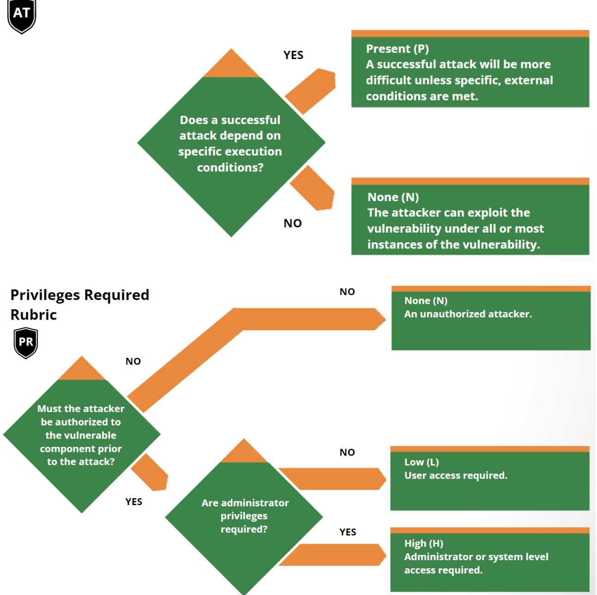

# Common Vulnerability Scoring System version 4.0 User Guide

## Document Version: 1.0

The Common Vulnerability Scoring System (CVSS) is an open framework for communicating the characteristics and severity of software vulnerabilities. CVSS consists of four metric groups: Base, Threat, Environmental, and Supplemental. The Base group represents the intrinsic qualities of a vulnerability that are constant over time and across user environments, the Threat group reflects the characteristics of a vulnerability that change over time, and the Environmental group represents the characteristics of a vulnerability that are unique to a user's environment. Base metric values are combined with default values that assume the highest severity for Threat and Environmental metrics to produce a score ranging from 0 to 10. To further refine a resulting severity score, Threat and Environmental metrics can then be amended based on applicable threat intelligence and environmental considerations. Supplemental metrics do not modify the final score, and are used as additional insight into the characteristics of a vulnerability. A CVSS vector string consists of a compressed textual representation of the values used to derive the score. This document provides the official specification for CVSS version 4.0.

The most current CVSS resources can be found at https://www.first.org/cvss/

CVSS is owned and managed by FIRST.Org, Inc. (FIRST), a US-based non-profit organization, whose mission is to help computer security incident response teams across the right to update CVSS and this document periodically at its sole discretion. While FIRST owns all rights and interest in CVSS, it licenses it to the public freely for use, subject to the conditions below. Membership in FIRST is not required to use or implement CVSS. FIRST does, however, require that any individual or entity using CVSS give proper attribution, where applicable, that CVSS is owned by FIRST and used by permission. Further, FIRST requires as a condition of use that any individual or entity which publishes CVSS data conforms to the guidelines described in this document and provides both the score and the scoring vector so others can understand how the score was derived.


# Contents

| 1. Introduction                                                       | ব  |
|-----------------------------------------------------------------------|----|
| 2. Changes in CVSS Version 4.0                                        | ব  |
| 2.1. CVSS Nomenclature                                                | ব  |
| 2.2. CVSS Base Score (CVSS-B) Measures Severity, not Risk             | 5  |
| 2.3. Changes to Scoring Guidance                                      | 5  |
| 2.3.1. Scope Removed                                                  | 5  |
| 2.3.2. Scoring Vulnerabilities in Software Libraries (and Similar)    | 5  |
| 2.3.3. Multiple CVSS Base Scores                                      | б  |
| 2.3.4. Guidance for Using Environmental Security Requirements Metrics | б  |
| 2.4. Guidance for Scoring Attack Vector                               | б  |
| 2.5. The CVSS Extensions Framework                                    | б  |
| 2.6. New Scoring System Development                                   | б  |
| 2.7. Update to the Version Identifier in the Vector String            | 9  |
| 3. Scoring Guide                                                      | 10 |
| 3.1. Integrate Vulnerability Scan results with Asset Management       | 10 |
| 3.2. Integrate Vulnerability Scan results with Threat Intelligence    | 10 |
| 3.3. CVSS Scoring in the Exploit Life Cycle                           | 10 |
| 3.4. Confidentiality and Integrity, Versus Availability Impacts       | 11 |
| 3.5. Local Vulnerabilities Exploited by Remote Attackers              | 11 |
| 3.6. Vulnerability Chaining                                           | 11 |
| 3.7. Vulnerable System and Subsequent System                          | 13 |
| 3.8. Vulnerable Systems Protected by a Firewall                       | 14 |
| 3.9. Scoring Vulnerabilities in Software Libraries (and Similar)      | 15 |
| 3.10. Multiple CVSS Base Scores                                       | 15 |
| 3.11. CVSS Extensions Framework                                       | 16 |
| 3.11.1. Guidelines                                                    | 16 |
| 3.11.2. Suggested Vector String Format                                | 17 |
| 3.12. Attack Vector Considerations                                    | 17 |
| 3.13. Non-Repudiation is a Part of Integrity                          | 18 |
| 3.14. Security Requirements                                           | 18 |
| 3.14.1. Confidentiality Requirement (CR)                              | 18 |
| 3.14.2. Integrity Requirement (IR)                                    | 19 |
| 3.14.3. Availability Requirement (AR)                                 | 19 |
| 4. Supplemental Metrics                                               | 21 |
| 4.1. Safety                                                           | 21 |
|                                                                       |    |


| 4.2. Automatable                   | 21 |
|------------------------------------|----|
| 4.3. Provider Urgency              | 22 |
| 4.4. Recovery                      | 22 |
| 4.5. Value Density                 | 22 |
| 4.6. Vulnerability Response Effort | 23 |
| 5. Glossary of Terms               | 24 |
| 6. Scoring Rubrics                 | 27 |


#### Introduction 1.

This guide supplements the Common Vulnerability Scoring System (CVSS) version 4.0 Specification Document with additional information including significant changes from CVSS version 3.1, additional scoring guidance, and scoring rubrics.

#### Changes in CVSS Version 4.0 2.

Changes between CVSS versions 3.x and 4.0 focus on clarifying and improving the existing standard.

#### 2.1. CVSS Nomenclature

Numerical CVSS Scores have very different meanings based on the metrics used to calculate them. Regarding prioritization, the usefulness of a numerical CVSS score is directly proportional to the CVSS metrics leveraged to generate that score. Therefore, numerical CVSS scores should be enumerated using nomenclature that communicates the metrics used in its generation.

| CVSS<br>Nomenclature | CVSS Metrics Used                   |
|----------------------|-------------------------------------|
| CASS-B               | Base metrics                        |
| CASS-BE              | Base and Environmental metrics      |
| CVSS-BL              | Base and Threat metrics             |
| CVSS-BTE             | Base, Threat, Environmental metrics |

Additional Notes:

- This nomenclature should be used wherever a numerical CVSS value is displayed or communicated.
- The application of Environmental and Threat metrics is the responsibility of the CVSS . consumer. Assessment providers such as product maintainers and other public/private entities such as the National Vulnerability Database (NVD) typically provide only the Base Scores enumerated as CVSS-B.


- The inclusion of the "E" in the nomenclature is appropriate if any Environmental metrics . are used to generate the resulting score.
- The inclusion of the "T" in the nomenclature is appropriate if any Threat metrics are . used to generate the resulting score.
- In CVSS v4.0, Base, Threat, and Environmental metric values are always considered in . the calculation of the final score. The absence of explicit Threat and/or Environmental metric selections will still result in a complete score using default ("Not Defined") values. This nomenclature makes it explicit and clear about which metric groups were considered in the numerical CVSS score provided.

#### CVSS Base Score (CVSS-B) Measures Severity, not Risk 2.2.

The CVSS Specification Document has been updated to emphasize and clarify the fact that CVSS Base (CVSS-B) scores are designed to measure the severity of a vulnerability and should not be used alone to assess risk.

The CVSS v4.0 Specification Document clearly states that the CVSS Base Score represents only the intrinsic characteristics of a vulnerability and is independent of any factor associated with threat or the computing environment where the vulnerable system resides.

The CVSS Base Score should be supplemented with an analysis of the environment (Environmental Metrics), and with attributes that may change over time (Threat Metrics).

For an organization that employs automated methods to comprehensively utilize the Environmental and Threat metric groups, the resulting CVSS-BTE score can be considered much closer to "Risk".

#### 2.3. Changes to Assessment Guidance

The CVSS Specification Document and User Guide have been updated with additional guidance to help CVSS analysts produce resulting severity scores that are consistent and defensible across various situations that were previously considered ambiguous. A sampling of the new assessment guidance is listed below.

### 2.3.1. Scope Removed

The concept of Scope has been replaced with the concepts of a vulnerable system (VC, VI, VA) and a subsequent system (SC, SI, SA), capturing impacts from both, where relevant. Refer to Section 3.7 for more information.

### 2.3.2. Assessing Vulnerabilities in Software Libraries (and Similar)

New guidance explains how to assess the impact of a vulnerability in a library. Refer to Section 3.9 for more information.


### 2.3.3. Multiple CVSS Base (CVSS-B) Scores

Guidance explicitly allows multiple CVSS Base Scores to be generated for a vulnerability that affects multiple product versions, platforms, and/or operating systems. Refer to Section 3.10 for more information.

### 2.3.4. Guidance for Using Environmental Security Requirements Metrics

The Environmental Metric Group includes three Security Requirement metrics: Confidentiality Requirement of the vulnerable system (CR), Integrity Requirement of the vulnerable system (IR), and Availability Requirement of the vulnerable system (AR). Section 3.14 contains new guidance and examples explaining how these metrics can be used.

### 2.3.5. Guidance for Using Supplemental Metrics

Guidance on assessing each of the new Supplemental Metrics is provided in Section 4.0.

### 2.3.6. New Base Metric: Attack Requirements

In CVSS v3.1, the "low" and "high" Attack Complexity (AC) values do not reflect the significant differences between conditions currently compressed in the definition of "high" complexity. For example, the evasion of security mitigation techniques such as ASLR or crypto objectively require significantly higher exploit complexity than iterating an attack to win a race condition; yet both conditions currently result in the same "penalty" to the final severity score.

CVSS v4.0 aims at addressing this by splitting the current AC definition in two metrics, called "Attack Complexity" (AC) and "Attack Requirements" (AT) that respectively convey the following:

- Attack Complexity Reflect the exploit engineering complexity required to evade or ● circumvent defensive or security-enhancing technologies. (defensive measures)
- Attack Requirements Reflect the prerequisite conditions of the vulnerable component . that make the attack possible.

#### 2.3.7. Updated Base Metric: User Interaction

The User Interaction Base Metric has been updated to allow for additional granularity when considering the interaction of a user with a vulnerable component, and details are as follows:

- None (N): The vulnerable system can be exploited without interaction from any human ● user, other than the attacker.
- Passive (P): Successful exploitation of this vulnerability requires limited interaction by . the targeted user with the vulnerable component and the attacker's payload. These


interactions would be considered involuntary and do not require that the user actively subvert protections built into the vulnerable component.

- Active (A): Successful exploitation of this vulnerability requires a targeted user to . perform specific, conscious interactions with the vulnerable component and the attacker's payload, or the user's interactions would actively subvert protection mechanisms which would lead to exploitation of the vulnerability.
### 2.3.8. Temporal renamed to the Threat Metric Group

Several changes were made to the Temporal Metric Group:

- Temporal Metric Group renamed to Threat Metric Group
- Remediation Level (usually O) and Report Confidence (usually C) retired ●
- Exploit Code Maturity renamed Exploit Maturity ●
- Enhanced impact for Threat Metric values ●

The Threat Metric Group adjusts the "reasonable worst case" Base score by using threat intelligence to reduce the CVSS-BTE score, addressing concerns that many CVSS (Base) scores are too high.

#### The CVSS Extensions Framework 2.4.

Section 3.11 defines a standard method of extending CVSS to include additional metrics and metric groups while retaining the official Base, Threat, and Environmental Metrics. The additional metrics allow industry sectors such as privacy, automotive, etc., to assess factors that are outside the core CVSS standard.

#### New Scoring System Development 2.5.

The scoring system development for CVSS v4.0 consisted of the following broad steps. Each step will be described in more detail in the following.

- 1. Use metric groups to gather the 15 million CVSS-BTE vectors into 270 equivalence sets
- 2. Solicit experts to compare vectors representing each equivalence set
- 3. Use the expert comparison data to calculate an order of vectors from least severe to most severe
- 4. Solicit expert opinion to decide what vector group in the ordering of vectors represents the boundary between qualitative severity scores to be backwards compatible with qualitative severity score boundaries from CVSS v3.x.


- 5. Compress the vector groups in each qualitative severity bin into the number of available scores in that bin (for example, 9.0 to 10.0 for critical, 7.0 to 8.9 for high, etc.)
- 6. Create a small score modification factor that adjusts the scores of vectors within a vector group so that a change of any metric value results in a score change. The intent is that the score change is not larger than the uncertainty in the ranking of the vector groups as collected from the expert comparison data in step 2.

More details for each of these six steps are as follows:

#### Use metric groups to gather the 15 million CVSS-BTE vectors into 270 equivalence sets 2.5.1.

This step helps satisfy a couple of design requirements. One is that there are 101 CVSS scores (0.0 to 10.0 by 0.1). The second is that we create the scoring system using no more time from experts than we have available on a volunteer basis to the SIG. How this helps meet the first requirement is straightforward – there has to be some grouping of all the possible vectors because many of them will have to share a score if there are 15 million options and 101 possible scores. How this step reduces expert effort into the system is less obvious, and will be more clear in step 2. The basic idea is that 15 million vectors are too many for experts to individually rank all of them in any plausibly-achievable amount of time. This is especially true because any sorting algorithm takes a number of comparisons proportional to the number of elements to be sorted. Usually, the work grows in an order faster than the list size (in computational terms, order nlog(n), see Sorting algorithm - Wikipedia). The impact on scoring system design is that if we want to get smart input about the whole CVSS vector space we have to assert some rules about it that help us make structured use of the data we collect from the expert analysts.

### 2.5.2. Solicit experts to compare vectors representing each equivalence set

With the total number of items to compare reduced from 15 million to 270, it was feasible to ask experts to compare each element to each other element and totally order the severity of the metric-group-based qualitative sets of vectors. This is an attractive idea because the SIG could define a score for every possible BTE vector based on input from every interested SIG member in a repeatable and private way without sampling from the CVSS vector space. That is, we could generate a score for each possible vector based on their membership in the metric-group-based qualitative sets and the relative severity of those sets.

### 2.5.3. Use the expert comparison data to calculate an order of vectors from least severe to most severe

The expert comparisons are used as if the metric-group-based vector sets are competing in a match, and we want to rank the vector sets from "best" to "worst". The algorithm used to turn these expert comparisons into a ranking is the same as the algorithm used to take outcomes of chess matches (comparisons) to rank chess players from best to worst. The name of this


algorithm is Elo (Elo rating system - Wikipedia). The output of the algorithm is a set of "raw" scores called "points". The interpretation of the point scores for each vector set is that if a vector-set has a score 100 points higher than another vector-set, then that score difference predicts that an expert would rate the higher-scored vector set as "more severe" a certain percentage of the time. In the chess metaphor, would win the match a certain percentage of the time. The bigger the point-score difference, the larger the higher-scored vector would be rated as more severe. There are details of how exactly to configure and run the Elo scoring algorithm that matter; however, through a SIG-led feedback process, we found the configuration details tend to converge on a similar set of values. Therefore, we believe the Elo algorithm output is stable and represents a reliable transformation from the diverse expert opinion inputs to a single severity ordering of the metric-group-based vector sets.

### 2.5.4. Solicit expert opinion to decide what vector group in the ordering of vectors represents the boundary between qualitative severity scores to be backwards compatible with qualitative severity score boundaries from CVSS v3.x.

Before mapping the 270 metric-group-based vector sets to scores between 0.0 and 10.0, the SIG wanted to improve backwards compatibility with CVSS v3 scores. To do this, the SIG wanted to decide which metric-group-based vector sets define the qualitative severity set boundaries. The output of step 3 was a total ordering of the vector sets. In deciding the qualitative severity boundaries, the SIG did not change the ordering output by step 3. Rather, the SIG wanted to decide what CVSS v4 B vector set represented the boundary between critical and high, high and medium, and medium and low. This was determined by soliciting input from the 30+ member CVSS SIG. Five (5) members contributed input in the form of marking the three boundaries in the ordering of vector sets. The SIG's then defined the boundaries as the average of the 5 SIG members' selections.

### 2.5.5. Compress the vector groups in each qualitative severity bin into the number of available scores in that bin (for example, 9.0 to 10.0 for critical, 7.0 to 8.9 for high, etc.)

The second part of maintaining backwards compatibility with CVSS v3 was keeping the score ranges for each qualitative severity value the same. The result of the total ordering (step 3) and qualitative severity boundaries (step 4) resulted in the following number of metric-group-based vector sets in each qualitative severity value. Note that each vector set has a different number of CVSS v4.0 BTE vectors. However, the SIG does not believe that counting total number of possible CVSS v4.0 BTE vectors is a relevant way to assess lumpiness of CVSS v4 BTE scores. For example, as of April 2023, there are less than 200,000 total CVE IDs to date since the inception of the program. Even if 15 million CVSS v4 BTE scores are possible, many will never be assigned to a CVE ID since there are so many fewer CVE IDs than vectors. A better assessment of the distribution of CVSS v4 BTE scores will have to be an empirical assessment of how many times a vector string actually recurs in actual CVE ID assessments.

Salient to the creation of the scoring system, CVSS v4.0 scoring system was created as 4 (four) scoring systems created for each qualitative severity score (critical, high, medium, low), as well as None as a special case for 0.0. Each qualitative severity score contains a different number


of metric-group-based vector sets and a different number of available scores. The same algorithm is used for creating a scoring system meeting the requirements for each of critical, high, medium, and low. That algorithm is agglomerative hierarchical clustering (Hierarchical clustering - Wikipedia), which makes sure that vector sets that share the same CVSS v4 BTE score also have the smallest difference between their Elo-point scores.

### 2.5.6. Create a small score modification factor that adjusts the scores of vectors within a vector group so that a change of any metric value results in a score change. The intent is that the score change is not larger than the uncertainty in the ranking of the vector groups as collected from the expert comparison data in step 2.

The result of step 5 is an option for a CVSS v4.0 scoring system. In order to meet a requirement that any change in a metric value result in at least a 0.1 change in the CVSS v4 BTE score, the SIG added an additional step to create a small change in the score based on metric value changes within metric-group-based vector sets. The vector sets are totally ordered, but of course especially small differences in vector set Elo-point-scores represent situations where there were a number of experts who disagreed with the resultant ordering. Providing a small change based on metric values within vector sets allows the slightly-more-severe metric strings within a vector set to overlap the slightly-less-severe metric strings from a nearby but slightly-more-severe metric-group-based vector set. These small shifts account for the fact that every vector within an equivalence set is not identical even if they are importantly and saliently equivalent enough to enable expert opinion ranking to be possible.

The basic intuition behind these small adjustments is that the CVSS metric values are ordered within each metric. For example, AV:N is more severe than AV:A, which is more severe than AV:L, which is more severe than AV:P. There is a similar ordering for all other metrics. Therefore, it is plausible to algorithmically define a change in CVSS v4 BTE score based on this ordering. That is, the expert opinion was used to sort the big-picture ordering of qualitatively important differences. The small changes in metric value that are not salient to a metric-group-based equivalence set change can still be used to represent a small change in the score that is consistent with the Elo-point difference interpretation of how likely an expert is to rate one vector set as more severe than another.

#### Update to the Version Identifier in the Vector String 2.6.

The Vector String has been updated so that it begins with CVSS:4.0 rather than CVSS:3.1. Although no other changes have been made to the Vector String, CVSS v4.0 contains changes to the definition of some of the metric values and to the formulas, so it is important to correctly indicate the version of CVSS.


#### Assessment Guide 3.

Below are a number of recommendations for consumers when assessing vulnerabilities with CVSS v4.0.

#### Integrate Vulnerability Scan results with Asset Management 3.1.

It is highly recommended to enrich the results from vulnerability scanning solutions with asset data. Often, asset management data is kept in a database that can easily be integrated with vulnerability scan data. Not only will this step enable a Vulnerability Management team to utilize the Environmental Metric Group to improve the quality of the resulting CVSS scores, the engineers responsible for remediating identified vulnerabilities will have more information at their disposal.

For example, vulnerability scans are conducted against 100 servers. Among other details, scan results provide the hostname, vulnerability, and the CVSS Base (CVSS-B) score. The Asset Management database contains records for all servers where each one contains values for Asset Class, Confidentiality Requirements, Integrity Requirements, Availability Requirements, and Exposure (Internet or Internally facing). Once this information is integrated using automation, the result is a CVSS-BE score that takes those environmental factors into consideration. Additionally, the Asset Class and similar information can be used to get the vulnerability to the right engineers for remediation.

#### Integrate Vulnerability Scan results with Threat Intelligence 3.2.

Perhaps one of the most important facets of improving the result of a CVSS assessment is the application of Threat Data and the use of the Exploit Maturity (E) metric. Knowing which vulnerabilities have been exploited in the past should have a significant impact on the resulting score.

There are many sources that can provide threat intelligence regarding the Exploit Maturity of vulnerabilities. Many of these sources are publicly available for free and others are offered by commercial organizations for a subscription cost.

It is important to understand that none of these sources are perfect and it is highly recommended to gather multiple sources of threat intelligence to improve the comprehensiveness and fidelity of the information being used to enrich your vulnerability data.

The application of the threat intelligence should be matched against vulnerability scan data using automation. The result will be a much more accurate measurement of the priority that should be applied to those vulnerabilities being assessed.


#### CVSS Scoring in the Exploit Life Cycle 3.3.

When understanding when to assess the impact of vulnerabilities, analysts should constrain impacts to a reasonable, final outcome which they are confident an attacker is able to achieveFor example, consider the following two vulnerabilities.

ln vulnerability 1, a remote, unauthenticated attacker can send a trivial, crafted request to a web server which causes the web server to disclose the plaintext password of the root (administrator) account. The analyst only knows from the vulnerability description that the attacker has access to send a crafted request to the web server in order to exploit the vulnerability. Impact should stop there; while an attacker may be able to use these credentials to later execute code as the administrator, it is not known that the attacker has access to a login prompt or method to execute commands with those credentials. Gaining access to this password represents a direct, serious loss of Confidentiality only:

CVSS-B Score: 8.8 (CVSS:4.0/AV:N/AC:L/AT:N/PR:N/UI:N/VC:N/VI:N/VA:H/SC:N/SI:N/SA:N)

In vulnerability 2, a local, low-privileged user can send a trivial, crafted request to the operating system which causes it to disclose the plaintext password of the root (administrator) account. The analyst knows from the vulnerability description that the attacker has access to the operating system, and can log in as a local, low privileged attacker. Gaining access to this password represents a direct, serious loss of Confidentiality, Integrity, and Availability because the analyst can reasonably issue commands as the root / administrator account (assume that the attacker could log out from their own account and log back in as root):

CVSS-B Score: 8.5 (CVSS:4.0/AV:L/AC:L/AT:N/PR:L/UI:N/VC:H/VI:H/VA:H/SC:N/SI:N/SA:N)

#### Confidentiality and Integrity, Versus Availability Impacts 3.4.

The Confidentiality and Integrity metrics refer to impacts that affect the data used by the service. For example, web content that has been maliciously altered, or system files that have been stolen. The Availability impact metric refers to the operation of the service. That is, the Availability metric speaks to the performance and operation of the service itself – not the availability of the data. Consider a vulnerability in an Internet service such as web, email, or DNS that allows an attacker to modify or delete all web files in a directory. The only impact is to Integrity, not Availability, as the web service is still functioning – it just happens to be serving back altered content.

#### Local Vulnerabilities Exploited by Remote Attackers 3.5.

Guidance concerning Local attacks was improved by clarifying the definitions of the Network and Adjacent values of the Attack Vector metric. Specifically, analysts should only assess Network or Adjacent when a vulnerability is bound to the network stack. Vulnerabilities which


require user interaction to download or receive malicious content (which could also be delivered locally should be assessed as Local.

For example, a document parsing vulnerability, which does not rely on the network in order to be exploited, should typically be assessed as Local, regardless of the method used to distribute such a malicious document (e.g., it could be a link to a website).

#### Vulnerability Chaining 3.6.

CVSS is designed to classify and rate individual vulnerabilities. However, it is important to support the needs of the vulnerability analysis community by accommodating situations where multiple vulnerabilities are exploited in the course of a single attack to compromise a host or application. The assessment of multiple vulnerabilities in this manner is termed "vulnerability chaining." Note that this is not a formal metric, but is included as guidance for analysts when assessing these kinds of attacks.

When assessing a chain of vulnerabilities, it is the responsibility of the analyst to identify which vulnerabilities are combined to form the chained resulting score. The analyst should list the distinct vulnerabilities and their resulting score along with the chained resulting score. For example, this may be communicated within a vulnerability disclosure notice posted on a web page.

In addition, the analyst may include other types of related vulnerabilities that could be chained with the vulnerabilities being assessed. Specifically, the analyst may list generic types (or classes) of related vulnerabilities that are often chained together, or provide further descriptions of required preconditions that must exist. For example, one might describe how certain kinds of SQL Injection vulnerabilities are precursors to a cross-site scripting (XSS) attack, or how a particular kind of buffer overflow would grant local privileges. Listing the generic types or classes of vulnerabilities provides the minimum information necessary to warn other users, without potentially informing attackers about new exploit opportunities.

Alternatively, the analyst may identify (in the form of a machine readable and parsable list of vulnerabilities as CVE IDs or CWEs), a complete list of specific related vulnerabilities that are known to be (or are very likely to be) chained to one or more of the chained vulnerabilities being assessed in order to exploit an IT system. In the event that a vulnerability can be exploited only after other preconditions are met (such as first exploiting another vulnerability), it is acceptable to combine two or more CVSS scores to describe the chain of vulnerabilities by assessing the least-restrictive Exploitability metrics and assessing the most-impactful Impact metrics. The following example uses the Exploitability and Impact assessment to describe the chain.

Vulnerability A is CVSS:4.0/AV:L/AC:L/AT:N/PR:L/UI:N/VC:H/VI:H/VA:H/SC:N/SI:N/SA:N It requires a local, low-privileged user in order to exploit.


Vulnerability B is

CVSS:4.0/AV:N/AC:L/AT:N/PR:N/UI:P/VC:L/VI:L/VA:L/SC:N/SI:N/SA:N

lt provides an unprivileged, remote attacker the ability to execute code on a system with Low impacts if a local user interacts to complete the attack.

Given A and B, Chain C could be described as the chain of B → A,

CVSS:4.0/AV:N/AC:L/AT:N/PR:N/UI:P/VC:H/VA:H/SC:N/SI:N/SA:N/Which combines the Exploitability of B, and the Impact of A, because if one can exploit B and gain the code execution as a local user from it, then one has satisfied the prerequisite to subsequently launch A causing an impact from vulnerability A.

#### Vulnerable System and Subsequent System 3.7.

The CVSS 4.0 Specification introduces Vulnerable System and Subsequent System concepts. Let's look at a few examples to understand how to differentiate between Vulnerable System impact and Subsequent System impact using examples borrowed from CVSS 3.1:

- 1. A vulnerability in a virtual machine that enables an attacker to read and/or delete files on the host operating system (perhaps even its own virtual machine) demonstrates impact to a Subsequent System (the host operating system) as well as to the Vulnerable System (the virtual machine).
- 2. A violation of a security boundary between microprocessor privilege levels should be considered when assessing vulnerabilities using CVSS. User space programs' capabilities running in lower privilege levels are typically limited in what instructions they can run and what registers they can write to even when running under operating system administrator privileges. A vulnerability that allows a program running in a lower privilege level to break out and run arbitrary code in a higher privilege level should be considered an impact to the Vulnerable System (the microprocessor).
- 3. The security boundary between secure enclaves integrated in microprocessors and the rest of operating system processes, including the operating system kernel itself, should be considered when assessing vulnerabilities using CVSS. A vulnerability that allows other processes to impact the confidentiality, integrity or availability of data or code in a secure enclave has impact to the Vulnerable System (the secure enclave where the exploit occurs) as well as a Subsequent System (a secure enclave impacted by the exploit outside the security boundary of the Vulnerable System) .
- 4. When a vulnerability in a web application impacts user clients, e.g., web browsers, the user clients are Subsequent Systems. Common vulnerabilities of this type include cross-site scripting and URL redirection. The vulnerability is in the web application, but there is an impact to the data/behavior of the victim users' web browsers.
- 5. In a distributed environment, a vulnerability in a component providing connectivity, protection, or authentication services to components in a different security domain should include assessment for the Subsequent System(s) if a successful attack impacts these other components. For example, a vulnerability in a component such as a router, firewall, or authentication manager that affects the primary availability of one or more


downstream components can impact a Subsequent System. However, if a successful attack either does not affect at all, or causes only negligible impact to other components, the vulnerability should be assessed as having no impact to a Subsequent System. Additionally, a vulnerability in a component designed to be deployed as part of a larger fault-tolerant topology should not be assessed with a Subsequent System impact if the fault-tolerance means a successful attack does not affect other components . Any effect on additional services provided by the Vulnerable System is considered a secondary impact and not a Subsequent System impact.

- 6. A vulnerability in a simple Portable Document Format (PDF) reader that allows an attacker to compromise other files on the same operating system when a victim opens a malicious PDF document is assessed as having no impact to a Subsequent System. This assumes the PDF reader does not have any authorization functionality that would be considered a separate security domain from the underlying operating system.
- 7. A SQL injection vulnerability in a web application is not usually considered as causing impact to a Subsequent System assuming that the credentials are shared between web application and impacted SQL database, and therefore they are part of the same security scope.
- 8. A vulnerability that crashes a web server or SSH server is not considered impact to a Subsequent System since the impact is limited only to the service provided by the affected server. The impact on users is secondary and is not considered as impact to a Subsequent System as users are not considered constituent elements of the Subsequent System.
- 9. A vulnerability that permits an attacker to exhaust a shared system resource, such as filling up a file system, should not be considered as causing impact to a Subsequent System. The attacker is still acting under the usual capabilities of the application and not breaching any security boundary.
- 10. By exploiting a vulnerability in an application that allows users restricted access to resources shared with other components across multiple security scopes (e.g., operating system resources such as system files), an attacker can access resources that they should not be able to access. Since there is already a valid path across the trust boundary, there is no Subsequent System impact.
- 11. A vulnerability in an application that implements its own security domain which allows attackers to affect resources outside its security scope should be assessed as having Subsequent System impact. This assumes the application provides no features for users to access resources governed by a higher-level security domain shared with other components across multiple security scopes (e.g., the resources of the underlying operating system). One example would be a web application that allows users to read and modify web pages and files only under the web application's installation paths, and provides no feature for users to interact beyond these paths. A vulnerability in this application allowing a malicious user to access operating system files unrelated to this application is considered impact to a Subsequent System.


#### 3.8. Vulnerable Systems Protected by a Firewall

If a vulnerability is assessed with an Attack Vector (AV) of Network (N) and the analyst has high confidence that the vulnerable system is deployed on a secure network unavailable from the Internet, Modified Attack Vector (MAV) may be assessed as Adjacent, reducing the resulting severity score.

Example: MySQL Stored SQL Injection (CVE-2013-0375)

```
CVSS-B Score: 5.1
(CVSS:4.0/AV:N/AC:L/AT:N/PR:L/UI:N/VC:N/VI:N/VA:N/SC:L/SI:L/SA:N)
CVSS-BE Score: 4.9
(CVSS:4.0/AV:N/AC:L/AT:N/PR:L/UI:N/VC:N/VI:N/VC:L/SI:L/SA:N/MAV:
A)
```
#### Assessing Vulnerabilities in Software Libraries (and Similar) 3.9.

When assessing the impact of a vulnerability in a library, independent of any adopting program or implementation, the analyst will often be unable to take into account the ways in which the library might be used. While specific products using the library should generate CVSS scores specific to how they use the library, assessing the library itself requires assumptions to be made. The analyst should account for the reasonable worst-case scenario. When possible, the CVSS information should detail these assumptions.

For example, a library that performs image conversion would reasonably be used by programs that accept images from untrusted sources over a network. In the reasonable worst-case, it would pass them to the library without checking the validity of the images. As such, an analyst assessing a vulnerability in the library that relates to the incoming data should assume an Attack Vector (AV) of Network (N), but explain this assumption in the summary of the vulnerability. If the library might run with normal privileges, having lower impact on the embedding implementation, or with high privileges, increasing the impacts, the analyst should assume high privileges while assessing the vulnerability in the library.

When assessing a vulnerability in a given implementation using the impacted library, the metric values must be re-assessed for that specific implementation. For example, if an implementation embeds the vulnerable system (in this case, the library mentioned in the previous example), but only operates on local files, the Attack Vector (AV) would be Local (L). If the implementation that embeds this library does not invoke any of the faulty functions or does not support the mode that triggers that vulnerability, it would have no interface or attack vector to exploit the vulnerability. Thus, that vulnerability in the embedded library would have no impact on that implementation, resulting in a severity score for the given implementation of 0.


### 3.10. Multiple CVSS Base (CVSS-B) Scores

It is common for a vulnerability to be present on multiple product versions, platforms, and/or operating systems. In some circumstances, the Base metrics may different product versions, platforms, and/or operating systems. For example, a hypothetical vulnerability is applicable to multiple operating systems produced by the same vendor. The Attack Complexity (AC) of this vulnerability on a legacy operating system is Low (L). However, a newer operating system has new inherent protection capabilities that change the Attack Complexity to High (H). This variance ultimately leads to different CVSS-B scores for the same vulnerability on the two operating systems.

It is acceptable to assess and publish multiple CVSS-B scores for a single vulnerability provided each has additional language outlining the specific product versions, platforms, and/or operating systems that are relevant to each CVSS-B score. Values for all CVSS-B metrics (not only a numeric CVSS-B score) must be supplied for each affected product version, platform, and/or operating system using a standard format. In situations where multiple CVSS-B scores are applicable but only one is provided, the highest CVSS-B score must be utilized.

### 3.11. CVSS Extensions Framework

Opportunities exist to leverage the core foundation of CVSS for additional scoring efforts. For example, a proposal was presented to the CVSS Special Interest Group (SIG) to incorporate privacy into CVSS by overlaying combinations of CVSS Base and Environmental metrics to derive a Privacy Impact.

The following guidelines define a standard method of extending CVSS to include additional metrics and metric groups while retaining the official Base, Threat, and Environmental Metrics. The additional metrics allow industry sectors such as privacy, safety, automotive, healthcare, etc., to score factors that are outside the core CVSS standard.

### 3.11.1. Guidelines

Formulas, constants or definitions of existing CVSS Base, Threat, or Environmental Metrics must not be modified. If a change to an existing item is desired, create a new metric group with a new name and work on it as desired.

New metrics must not be added to existing metric groups, but must be added to new metric groups. New metric groups can be based on existing metric groups.

New metric groups can optionally have an impact on the resulting score. If they do, the resulting score must be between 0.0 and 10.0, with 10.0 being the most severe. The resulting score must be based on adjusting the CVSS-B, CVSS-BT, CVSS-BE, CVSS-BTE scores as appropriate.


The CVSS SIG does not officially approve extensions, but rather acts as a consulting body, similar to IETF¹. The CVSS SIG welcomes and encourages innovation, but has an interest in maintaining consistency across all proposed extensions.

The list of validated extensions will be listed on the first.org website, similar to IANA'.

- Mandatory Fields: Name, Description, External Authoritative Web Page o
- Optional Fields: JSON Schema, XML Schema, JavaScript Calculator o

### 3.11.2. Suggested Vector String Format

CVSS Extension vector strings must be listed separately, utilizing the following format:

CVSS:4.0/AV:x/AC:x/AT:x/PR:x/UI:x/VC:x/VI:x/VA:x/SC:x/SI:x/SA:x EXT:1.0/NEW1:VAL1/NEW2:VAL2

where:

EXT:n.n is a unique extension identifier and major.minor version number NEWn is a unique attribute of the extension for each new metric VALn is a unique value for the attribute for each new metric value

### 3.12. Attack Vector Considerations

When scoring Attack Vector, use Adjacent or Network (as appropriate), when a network connection is required for an attack to succeed, even if the attack is not launched over a network. For example, a local attacker may be able to trick a vulnerable, privileged, local program into sending sensitive data to a server of the attacker's choosing over a network. As a network connection is required to gather the sensitive data this is scored with an Attack Vector of Network.

Vulnerabilities where malicious data is received over a network by one system, then passed to a separate system with a vulnerability should be scored with an Attack Vector of Local. An example is a web browser that downloads a malicious office document, saves it to disk, and then starts a vulnerable system (in this case, a document processing application) which reads the saved file.

In cases where the vulnerable system contains the functionality that receives the malicious data, Attack Vector should be scored as Network. An example is a web browser with a vulnerability in the browser itself, or a browser plugin or extension, that triggers when the malicious data is received.

<sup>1</sup> The Internet Engineering Task Force (https://www.ietf.org/)

<sup>2</sup> Internet Assigned Numbers Authority (https://www.iana.org/)


### 3.13. Non-Repudiation is a Part of Integrity

As per NIST³ non-repudiation is "Protection against an individual falsely denying having performed a particular action". There could be scenarios where a system user could perform system critical actions, within the user's own privilege, and then completely deny performing the action; that would cause a Repudiation Impact.

Say a system has multiple user admins. One admin gives backdoor access to a malicious attacker to the system. When the incident is identified, there is no way to identify the defaulter as there was no logging in place. The malicious admin didn't do anything beyond own privileges. But in this case, CWE-778: Insufficient Logging was the weakness which caused a Repudiation impact, and hence an Integrity impact. (Example: CVE-2019-8124)

Similarly, in case of horizontal privilege escalation vulnerabilities the malicious user is usually unable to do something beyond his/her own capabilities. The delta impact on C, I, and A are None. But the attacker can still take malicious actions in the system by impersonating another user of the same privileges leading to a Repudiation impact, and hence an Integrity impact. (Example: CVE-2017-6785)

Whenever a vulnerability causes a potential repudiation, it immediately impacts the Integrity of the system, along with other subsequent impacts.

### 3.14. Security Requirements

This section provides guidance on selecting appropriate metric values for these based on the characteristics of a specific environment. The examples are simplified to illustrate the concepts.

### 3.14.1. Confidentiality Requirement (CR)

The Confidentiality Requirement of a system should be based on the classification level of the data that is stored or used by the user and/or applications running on the target system. Encryption of the data at rest on this device should also be taken into consideration when establishing the Confidentiality Requirement. Data that passes through a device without being consumed or processed (e.g., a switch or firewall) should not be taken into consideration when assessing this attribute. See below for examples.

Note: The volume of data may influence the value of the attribute, but should not have as much impact as the classification (i.e., type) of data that is being stored or used.

- 1. A device that stores data classified at the highest level should have this attribute rated as High. However, if the sensitive data is encrypted at rest, this attribute may be rated Medium.
<sup>4</sup>https://nvlpubs.nist.gov/nistpubs/SpecialPublications/NIST.SP.800-53r5.pdf, page 436


- 2. A device that stores data classified as non-public but not as high as the highest level should have this attribute rated as Medium. However, if the sensitive data is encrypted at rest, this attribute can be rated Low.
- 3. A device that stores data that can be openly shared publicly should have this attribute rated as Low.
- 4. Network equipment such as a router, switch, or firewall will generally be rated as Medium due strictly to the sensitivity of information such as routing tables, etc.
- 5. Any system that stores login credentials without encryption should have this attribute rated as High. This includes service accounts and credentials embedded into scripts or source code.

### 3.14.2. Integrity Requirement (IR)

The Integrity Requirements of a system focus on the importance of the accuracy of the data it stores or uses. Data that passes through a device without being consumed or processed (e.g., a switch or firewall) should not be taken into consideration when assessing this attribute. The use of encryption on the data at rest should not be taken into consideration for this attribute. See below for examples:

- 1. Devices that contain monetary transactional data and/or personally identifiable information (PII) should be rated High.
- 2. Devices that contain data directly used to make business or risk management decisions should be rated at a minimum of Medium. As the severity of the decisions increase, so should the Integrity Requirement rating.
- 3. Devices that contain data directly used to make health decisions should be rated High.
- 4. Network equipment such as a router or switch will generally be rated at least Medium due strictly to the sensitivity of information such as forwarding tables, etc.
- 5. Firewalls should be rated as High due to the sensitivity of the rule set.

### 3.14.3. Availability Requirement (AR)

The Availability Requirement of a system should be based on the uptime requirements and redundancy of the device or the applications hosted by the device. Devices that are part of redundant clusters will have lower Availability Requirements. See below for examples:

- 1. Devices without full capacity redundancy that are rated with recovery requirements less than 24 hours should be rated High.
- 2. Devices without full capacity redundancy that are rated with recovery requirements between 1-5 days should be rated Medium.


- 3. Devices with recovery requirements of more than 5 days should be rated Low.
- 4. Clustered devices and/or those with full capacity redundancy should be rated as Low.
- 5. Devices that are required to have rapid response times for transactional purposes based on regulatory requirements, should be rated High.


#### Supplemental Metrics 4.

A new, optional metric group called the Supplemental metric group provides new metrics that describe and measure additional extrinsic attributes of a vulnerability. The usage of each metric within the Supplemental metric group is determined by the scoring consumer. This contextual information may be used differently in each consumer's environment.

No metric will, within its specification, have any impact on the final calculated CVSS score (e.g. CVSS-BTE). Organizations may then assign importance and/or effective impact of each metric, or set/combination of metrics, giving them more, less, or absolutely no effect on the final risk analysis. Metrics and values will simply convey additional extrinsic characteristics of the vulnerability itself.

#### Safety 4.1.

When a system has an intended use or fitness of purpose aligned to safety, it is possible that exploiting a vulnerability within that system may have Safety impact which can be represented in the Supplemental Metrics group.

Note that all Supplemental Metrics, including Safety, are completely optional. Suppliers and vendors may pick and choose whichever Supplemental Metrics thev wish to populate on a case by case basis as they see fit. Lack of a Safety metric value being supplied does NOT mean that there may not be any Safety-related impacts.

#### 4.2. Automatable

Some example reasons for why a step in the kill chain may not be reliably automatable include:

1. the vulnerable system is not searchable or enumerable on the network,

2. weaponization requires human direction for each target,

3. delivery uses channels that widely deployed network security configurations block, and

4. exploitation is not reliable, due to exploit-prevention techniques enabled by default; ASLR is an example of an exploit-prevention tool. These are example reasons, provided for illustration, and are not an exhaustive list of reasons why a kill chain step may not be automatable.

As one heuristic for yes, if the vulnerability allows unauthenticated remote code execution or command injection, the expected response is yes. Analysts should provide an argument or demonstration that all four steps are able to be automated rather than solely relying on heuristics.


The definition of automatable is intended to stay materially the same as the definition of the decision point by the same name in the stakeholder specific vulnerability categorization (version 2).

#### Provider Urgency 4.3.

Many vendors currently provide supplemental severity ratings to consumers via product security advisories. Other vendors publish Qualitative Severity Ratings from the CVSS v3.x Specification Document in their advisories.

To facilitate a standardized method to incorporate additional provider-supplied assessment, it is proposed to adopt an optional "pass-through" Supplemental Metric called Provider Urgency.

#### 4.4. Recovery

Recovery describes the resilience of a Component/System to recover services, in terms of performance and availability, after an attack has been performed. Values for Recovery include:

- Automatic (A): The Component/System recovers services automatically after an attack ● has been performed.
- User (U): The Component/System requires manual intervention by the user to recover . services, after an attack has been performed
- Irrecoverable (I): The Component/System services are irrecoverable by the user, after . an attack has been performed.

#### Value Density 4.5.

The following are suggestive examples of when to select the Diffuse or Concentrated metric values for this metric.

Diffuse: Examples of systems with diffuse value are email accounts, most consumer online banking accounts, common cell phones, and most personal computing resources owned and maintained by users. (A "user" is anyone whose professional task is something other than the maintenance of the system or component. A "system operator" is anyone who is professionally responsible for the proper operation or maintenance of a system.)

Concentrated: Heuristically, such systems are often the direct responsibility of "system operators" rather than users. (A "user" is anyone whose professional task is something other than the maintenance of the system or component. A "system operator" is anyone who is professionally responsible for the proper operation or maintenance of a system.) Examples of concentrated value are database systems, Kerberos servers hosting login pages, and cloud service providers. However, usefulness and uniqueness of the resources on the vulnerable system also inform value density. For example, encrypted mobile messaging


platforms may have concentrated value, not because each phone's messaging history has a particularly large amount of data, but because it is uniquely valuable to law enforcement.

The definition of value density is intended to stay materially the same as the definition of the decision point by the same name in the stakeholder specific vulnerability categorization (version 2).

#### Vulnerability Response Effort 4.6.

The intention of the Vulnerability Response Effort metric is to provide supplemental information on how difficult it is for consumers to provide an initial response to the impact of vulnerabilities for deployed products and services in their infrastructure. The consumer can then take this additional information on effort required into consideration when applying mitigations and/or scheduling remediation.

When calculating Vulnerability Response Effort, the effort required to deploy the quickest available response should be considered.


#### Glossary of Terms 5.

As much as possible, we will use standard definitions for terms and prefer global, consensus, freely available definitions.4

Affected: A system is affected by a vulnerability if a user or operator of the system must take action to remediate, mitigate, or otherwise address the vulnerability. If a system is affected by a vulnerability, the CVSS v4.0 Base score must not be 0.0.

Attacker: A human person that "…attempts to evade security services and violate the security policy of a system. That is, an actual assault on system security....", often but not always attempted by exploiting a vulnerability in the system. (Consistent with NIST CSRC definitions, an attacker is a person.)

Chained score: The Base Score produced by scoring two or more chained vulnerabilities.

Chained vulnerabilities: See Vulnerability Chaining.

Default credential: Data such as a user name and password that is initially configured and allows authentication unless it has been changed. A default credential may be shared by many systems or unique to individual systems. A system may force a default credential to be changed.

Hard-coded credential: Data such as a user name and password that is always configured, always allows authentication, and cannot be changed or disabled.

Proof-of-Concept exploit code: Software or sufficient technical details that can be used to demonstrate the existence of a vulnerability.

Privilege: A collection of rights (typically read, write, and execute) granted to a user or user process which defines access to computing resources. The terms "privilege," "permission," and "authorization" are used interchangeably."

Reasonable worst-case: An instance of a plausible path to the exploitation of a vulnerability, the worst-case after any unreasonable high-impact low-likelihood paths have been discountedIt is not a prediction of what will happen, rather an illustration of what could

<sup>4</sup> This sourcing criteria is adapted from Spring JM, Illari P. Review of human decision-making during computer security incident analysis. Digital Threats: Research and Practice. 2021 Apr 20;2(2):1-47.

<sup>5</sup> Aligns with "affected" status in Minimum Requirements for Vulnerability eXchange (VEX). "Affected" is not defined in either the NIST CSRC glossary or RFC 4949.

<sup>6</sup> RFC 4949 \$ attack

<sup>7</sup> From RFC 4949 \$ authorization: Specific terms are preferred in certain contexts:

<sup>- /</sup>PK// "Authorization" SHOULD be used, to align with "certification authority" in the standard [X509].

<sup>- /</sup>role-based access control/ "Permission" SHOULD be used, to align with the standard [ANS]].

<sup>- /</sup>computer operating systems/ "Privilege" SHOULD be used, to align with the literature. (See: privileged process, privileged user.)


reasonably be foreseen by an experienced analyst and that would require response action by a security professional or team. 8

Resource: Asset used or consumed during the execution of a process. 9 Examples of resources include (but are not limited to) file contents, file identifiers, memory pointers, memory contents, CPU cycles, and network bandwidth.

Security domain: Set of assets and resources subject to a common security policy.10

Security policy: A set of policy rules (or principles) that direct how a system (or an organization) provides security services to protect sensitive and critical system resources.11

System, information system: An organized assembly of computing and communication resources and procedures — i.e., equipment and services, together with their supporting infrastructure, facilities, and personnel — that create, collect, record, process, store, transport, retrieve, display, disseminate, control, or dispose of information to accomplish a specified set of functions.12 Uses of "system" means "Information system" unless otherwise specified. Information systems include, for example, IT systems, OT systems, OT systems, computing hardware, and so on.

Subsequent System: A system whose security policy is violated as a result of the exploited vulnerability but that is not the Vulnerable System.

Successful attack: A successful attack (or successful exploit of a vulnerability) is a situation where an attacker violates the security policy of an information system.

User: An authorized human person. For CVSS, usually said of a person authorized to access a vulnerable system affected by the vulnerability being scored.

Vulnerability: A weakness or flaw in the functional behavior of an information system (software or hardware) that can be exploited, resulting in a negative impact to the Confidentiality, Integrity, and/or Availability of the vulnerable system or a subsequent system (that is, the violation of a security policy of an information system).13

Vulnerability chaining: The sequential exploitation of multiple vulnerabilities in order to attack an information system, where one or more exploits at the end of the chain requires the successful completion of prior exploits in order to be exploited.14

<sup>8</sup> See the US legal term "foreseeability."

<sup>9</sup> NIST SP 800-160v1r1 from ISO/IEC/IEEE 15288:2015

<sup>10</sup> NIST SP 800-160v1r1 from ISO/IEC 19989-3:2020

<sup>11</sup> From the RFC 4949 sense 2(a). NIST has several different definitions for security policy, this is consistent with at least some of them.

<sup>12</sup> Adapted from RFC 4949 "information system."

<sup>13</sup> See also definitions of "vulnerability" from The CERT Guide to Coordinated Vulnerability Disclosure 1.2. CVD Context and Terminology Notes.

<sup>14</sup> See the CWE Glossary.


Vulnerable System: A system whose security policy is violated as the result of an exploited vulnerability and which contains the vulnerability.


#### Scoring Rubrics 6.

The scoring rubrics are an aid to scoring vulnerabilities by supplementing the metric definitions in the Specification Document.


Attack Requirements Rubric




# Version History

| 2023-.<br>111 01 | 1 v1 0 | ·············································································································································································· |
|------------------|--------|--------------------------------------------------------------------------------------------------------------------------------------------------------------------------------|
|------------------|--------|--------------------------------------------------------------------------------------------------------------------------------------------------------------------------------|